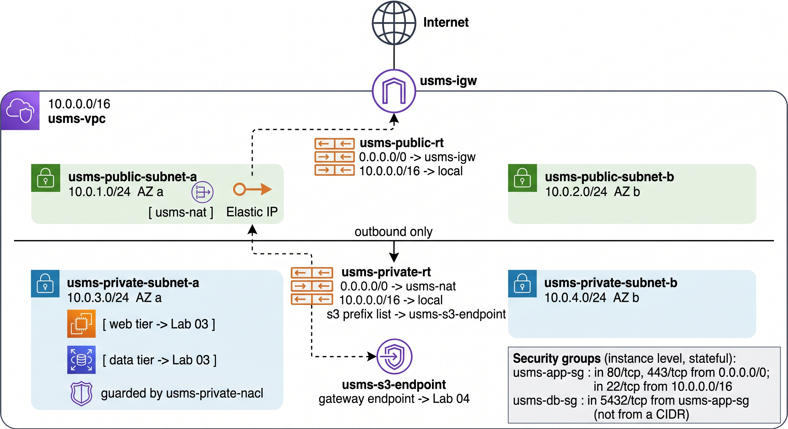

# Lab 02 Virtual Private Cloud and Networking

## 1. Learning Objectives

After completing this laboratory you will be able to:

1. Explain what a VPC is, what problem it solves, and why AWS forces every EC2 instance to live in
   one.
2. Read and write CIDR notation, and size an address range for a system that has to grow.
3. Create a VPC, subnets, an internet gateway and route tables with the AWS CLI, capturing every
   identifier into a shell variable rather than copying it by hand.
4. Explain precisely what makes a subnet public, and demonstrate the difference by reading back the
   effective route table of two subnets in the same VPC.
5. Distinguish a security group from a network ACL stateful versus stateless, allow-only versus
   allow-and-deny, instance-level versus subnet-level and choose the right one for a requirement.
6. Reference one security group as the source of another security group's rule, and explain why that
   is better than hard-coding an address.
7. Use `--filters` to ask the EC2 API to do the filtering, and `--query` to shape what comes back,
   and explain which of the two runs where.
8. Create a gateway VPC endpoint and explain what it changes about the path traffic takes.
9. Prove that the network you built survives a restart of the emulator, rather than assuming it.
10. Record every identifier your network produced into `configs/lab-02.env` so that Lab 3 can consume
    it without you having to remember anything.

---

## 2. Prerequisites

- **Lab 1 complete.** All of it, including the persistence proof in Lab 1 Step 14. If
  `./scripts/utilities/verify-lab-01.sh` does not report `FAIL=0`, stop and fix that first. Every
  step below assumes the IAM foundation exists.
- **Floci running under Docker Compose** with `FLOCI_STORAGE_MODE` set to `hybrid`.
- **AWS CLI v2** on your `PATH`, with the `floci` profile configured.
- A terminal in which `configs/course.env` is sourced. Lab 1 added this to your `~/.bashrc`; if you
  use `zsh`, confirm it is in `~/.zshrc` instead.
- Roughly 45 minutes of uninterrupted time for Steps 1 through 13. The routing steps only make sense
  as a run.

Check all of that in one go:

```bash
cd ~/aws-floci-course
echo "COURSE_ROOT = $COURSE_ROOT"
echo "PROFILE     = $AWS_PROFILE"
aws --version
docker compose version
```

> Example output your versions will differ.

```text
COURSE_ROOT = /home/student/aws-floci-course
PROFILE     = floci
aws-cli/2.17.42 Python/3.11.9 Linux/6.5.0 exe/x86_64.ubuntu.22
Docker Compose version v2.29.1
```

If `COURSE_ROOT` prints as an empty line, `configs/course.env` is not being sourced. Open a fresh
terminal before continuing do not work around it by exporting the variable by hand, because every
later terminal will have the same problem.

---

## 3. Connection to Previous Labs

### 3.1 Current Environment

```text
Created in previous labs:
- Lab 01: Floci running under Docker Compose, FLOCI_STORAGE_MODE=hybrid, persistence proven
- Lab 01: groups   usms-admins, usms-developers, usms-auditors
- Lab 01: users    usms-admin-01, usms-dev-01, usms-audit-01   (tagged Project=USMS)
- Lab 01: roles    usms-ec2-app-role, usms-lambda-exec-role, usms-developer-role
- Lab 01: policies USMSDeveloperBase (v2 default), USMSStudentDataReadWrite,
                   USMSAssumeAppRoles, USMSLambdaBasic, USMSSelfManageCredentials (inline)
- Lab 01: instance profile usms-ec2-app-profile
- Lab 01: access key for usms-dev-01 in outputs/, git-ignored, chmod 600
- Lab 01: configs/course.env, configs/lab-01.env
- Lab 01: scripts/setup/, scripts/utilities/, scripts/cleanup/

Created in this lab:
- usms-vpc                    10.0.0.0/16, DNS support and DNS hostnames enabled
- usms-igw                    internet gateway, attached to usms-vpc
- usms-public-subnet-a        10.0.1.0/24, us-east-1a, auto-assign public IPv4 on
- usms-public-subnet-b        10.0.2.0/24, us-east-1b   (your turn)
- usms-private-subnet-a       10.0.3.0/24, us-east-1a
- usms-private-subnet-b       10.0.4.0/24, us-east-1b   (Exercise 5)
- usms-public-rt              route table with 0.0.0.0/0 -> usms-igw
- usms-private-rt             route table with 0.0.0.0/0 -> usms-nat
- usms-nat                    NAT gateway in the public subnet, with an Elastic IP
- usms-app-sg                 security group for application servers
- usms-db-sg                  security group for the database tier, sourced from usms-app-sg
- usms-private-nacl           network ACL applied to the private subnet
- usms-s3-endpoint            gateway VPC endpoint for Amazon S3
- configs/lab-02.env
- scripts/utilities/verify-lab-02.sh
- scripts/cleanup/lab-02-cleanup.sh

Required for future labs:
- usms-public-subnet-a   -> Lab 03 launches the USMS web server here
- usms-private-subnet-a  -> Lab 03 launches the database-tier instance here
- usms-app-sg            -> Lab 03 attaches this to the web server
- usms-db-sg             -> Lab 03 attaches this to the database-tier instance
- usms-vpc               -> Lab 06 puts an RDS subnet group across its private subnets
- usms-s3-endpoint       -> Lab 04 explains why the bucket is reachable without an internet path
```

### 3.2 What this lab reuses

Not "mentions" uses.

| From Lab 1 | Used here how |
| --- | --- |
| `usms-developer-role` | Step 3 assumes it and creates the VPC as that role, then restores your normal identity |
| `USMSDeveloperBase` policy | Step 3 reads the policy document and checks that the EC2 actions this lab needs are actually in it |
| `USMSAssumeAppRoles` policy | The caller's half of the handshake in Step 3 |
| `Project=USMS` tagging convention | Every resource created here carries it, and Step 22 audits that claim with `--filters` |
| `configs/course.env` variable names | `$COURSE_ROOT`, `$AWS_REGION_COURSE`, `$PROJECT` are used, never re-declared |
| `configs/lab-01.env` | Sourced in Step 2; `USMS_ROLE_DEVELOPER` and `USMS_DEV_USER` come from it |

### 3.3 One thing Lab 1 left hanging that this lab settles

Lab 1 built `USMSDeveloperBase` with a specific, deliberately short list of EC2 actions and a
condition locking them to `us-east-1`. At the time that was an abstract exercise in least privilege
there was no VPC for those actions to apply to. Step 3 opens that policy document and checks it
against the work this lab is about to do. That is the first time in this course a policy stops being
hypothetical.

---

## 4. What We Are Building

USMS is a university student management system. It has, at minimum:

- a **web tier** that students and staff reach from the public internet,
- a **data tier** holding transcripts and enrolment records, which must never be reachable from the
  internet at all,
- and a requirement that the data tier can still fetch operating-system updates outbound.

Those three sentences are the entire justification for everything in this lab. A public subnet
exists because of the first. A private subnet exists because of the second. A NAT gateway exists
because of the third. If you can restate those three requirements at the end of the lab, you have
understood the design; the commands are just how you express it.

We build across two Availability Zones because a single AZ is a single failure domain. Nothing in
Lab 3 strictly needs the second AZ, but Lab 6's RDS subnet group will refuse to be created without
subnets in at least two so we build it now rather than retrofitting.

### 4.1 The address plan

| Range | Purpose | Addresses |
| --- | --- | --- |
| `10.0.0.0/16` | The whole VPC | 65,536 |
| `10.0.1.0/24` | `usms-public-subnet-a` web tier, AZ a | 256 (251 usable) |
| `10.0.2.0/24` | `usms-public-subnet-b` web tier, AZ b | 256 (251 usable) |
| `10.0.3.0/24` | `usms-private-subnet-a` data tier, AZ a | 256 (251 usable) |
| `10.0.4.0/24` | `usms-private-subnet-b` data tier, AZ b | 256 (251 usable) |
| `10.0.5.0/24` – `10.0.255.0/24` | Unallocated deliberately left for later labs | |

Odd-numbered third octet for AZ a, even for AZ b, low numbers public and higher numbers private, is
one of many workable conventions. What matters is that you have **a** convention, written down,
before you allocate the first subnet because renumbering a VPC after things are running in it is
close to impossible.


## 5. Architecture
<figure markdown="span">
    {width="80%"}
    <figcaption>Architecture of the lab work</figcaption>
</figure>

Read the diagram once now and again at the end of the lab. The second reading is the one that tells
you whether you learned anything.

---

## 6. Directory Structure

This lab adds the following. It changes nothing that already exists.

```text
aws-floci-course/
├── labs/
│   └── lab-02-vpc/
│       ├── README.md                       
│       └── exercises.md                    
├── configs/
│   └── lab-02.env                          
├── scripts/
│   ├── utilities/
│   │   └── verify-lab-02.sh                
│   └── cleanup/
│       └── lab-02-cleanup.sh               
├── templates/
│   └── lab-02-subnet-skeleton.json         
└── outputs/
    └── lab-02-*.json                        
```

No new top-level folder is needed. Everything this lab produces fits the structure Lab 1
established.

Create the lab folder now:

```bash
cd ~/aws-floci-course
mkdir -p labs/lab-02-vpc
ls -d labs/*
```

> Example output you will see Lab 1's folder alongside the new one.

```text
labs/lab-01-iam  labs/lab-02-vpc
```

## 7. Step-by-Step Implementation

!!! info "Where to run every command in this lab"
    Unless a step says otherwise, run everything from the repository root:

    ```text
    aws-floci-course/
    ```

    Every path in this lab (`configs/...`, `scripts/...`, `policies/...`) is written relative to
    that directory. If a command reports `No such file or directory`, the first thing to check is
    `pwd`.

### Step 1 Resume the environment

**Purpose**

Bring Floci up if it is stopped, and confirm it came up under Compose with the storage settings the
course depends on. Everything in this lab is worthless if the state does not survive to Part B.

**Run from**

```text
aws-floci-course/
```

**Command**

```bash
cd ~/aws-floci-course
./scripts/setup/floci-up.sh
./scripts/utilities/floci-storage-check.sh
```

**What the command does**

`floci-up.sh` is idempotent: if the container is already running it says so and exits 0; if it is
stopped it starts it; if it finds a container named `floci` that was **not** created by Compose it
refuses to adopt it and tells you why. `floci-storage-check.sh` runs six read-only checks and names
the cause of any persistence failure rather than just reporting a failure.

**Expected result**

```text
[floci-up] container 'floci' already running (compose project: floci-course)
[floci-up] bind mount /home/student/floci-data -> /app/data  OK

== Floci storage check ==
  ✔ container running
  ✔ FLOCI_STORAGE_MODE=hybrid  (not memory)
  ✔ FLOCI_STORAGE_PERSISTENT_PATH=/app/data matches the mount target
  ✔ mount type is 'bind', not 'volume'
  ✔ host directory exists and is writable
  ✔ FLOCI_STORAGE_HOST_PERSISTENT_PATH is absolute
PASS=6  FAIL=0
```

> Example output your host path will differ.

**Verify**

Anything other than `FAIL=0` here stops the lab. In particular, if the second check reports
`FLOCI_STORAGE_MODE=memory`, your container was started by something other than Compose almost
always a stray `floci start`. Fix it before continuing:

```bash
docker rm -f floci
./scripts/setup/floci-up.sh
```

!!! danger "Read before running any delete command"
    **What will be deleted:** the running `floci` container not its data.

    **What depends on it:** nothing on disk. `~/floci-data` is a bind mount on your host and is not
    touched by `docker rm`.

    **Reversible?** Yes. `floci-up.sh` recreates the container from `docker-compose.yml`.

    **Effect on later labs:** none, *provided* the container being removed was the memory-mode one.
    If it was the Compose container and it held state, that state was already at risk.

---

### Step 2 Load the previous lab's environment and confirm your identity

**Purpose**

This lab needs three things Lab 1 produced: the developer role's name, the developer user's name, and
your account ID. They live in `configs/lab-01.env`. Sourcing that file is how every lab from here on
starts.

**Run from**

```text
aws-floci-course/
```

**Command**

```bash
source configs/course.env
source configs/lab-01.env

./scripts/utilities/whoami.sh

echo "developer role : $USMS_ROLE_DEVELOPER"
echo "developer user : $USMS_DEV_USER"
echo "account        : $USMS_ACCOUNT_ID"
```

**What the command does**

`source` runs the file in your *current* shell, so the `export`ed variables persist for the rest of
this terminal session. Running it as `./configs/lab-01.env` instead would run it in a child shell and
the variables would vanish the moment it exited a mistake that produces confusing "unbound
variable" errors twenty minutes later.

`whoami.sh` prints the caller identity and the endpoint, and exits 1 if the account is not
`000000000000`. That guard exists so that nobody ever runs a course command against a real AWS
account by accident.

**Expected result**

```text
Identity : arn:aws:iam::000000000000:root
Account  : 000000000000
Endpoint : http://localhost:4566
Profile  : floci

developer role : usms-developer-role
developer user : usms-dev-01
account        : 000000000000
```

> Example output yours should match this one exactly, because these values are fixed by the course.

**Verify**

If any of the three `echo` lines prints an empty value, `configs/lab-01.env` is incomplete. Go back
to Lab 1's final step and regenerate it. Do not hand-edit the file to fill in the gap: an empty value
there means the resource itself may be missing, and Step 3 will fail anyway.

**Checkpoint 1**

```text
Environment ready
 ├── Floci running under Compose, storage mode hybrid
 ├── course.env + lab-01.env sourced
 └── identity confirmed as account 000000000000
```

---

### Interlude CIDR notation, in one page

Before Step 3 creates anything, you need to be able to read `10.0.0.0/16`.

An IPv4 address is 32 bits, written as four 8-bit numbers. `10.0.0.0` is
`00001010.00000000.00000000.00000000`.

The `/16` is a **prefix length**: it says the first 16 bits are the network part and are fixed, and
the remaining 16 bits are free to vary. So `10.0.0.0/16` covers every address from `10.0.0.0` to
`10.0.255.255` that is 2 to the power of 16, or 65,536 addresses.

The arithmetic you actually need:

| Prefix | Free bits | Addresses | Usable in AWS |
| --- | --- | --- | --- |
| `/16` | 16 | 65,536 | 65,531 |
| `/20` | 12 | 4,096 | 4,091 |
| `/24` | 8 | 256 | 251 |
| `/28` | 4 | 16 | 11 |

**Smaller prefix number means bigger network.** This trips up almost everyone once.

AWS reserves five addresses in every subnet, which is why the usable column is short by five:

| Address in a `10.0.1.0/24` subnet | Reserved for |
| --- | --- |
| `10.0.1.0` | Network address |
| `10.0.1.1` | The VPC router |
| `10.0.1.2` | The Amazon-provided DNS resolver |
| `10.0.1.3` | Reserved for future use |
| `10.0.1.255` | Network broadcast address (AWS does not support broadcast, but reserves it anyway) |

AWS accepts VPC CIDR blocks between `/16` and `/28`. We choose `/16` because it is the largest
allowed and costs nothing, and because we are using RFC 1918 private space that nobody else can see.

One constraint that matters later: **a subnet's CIDR must be a subset of the VPC's, must not overlap
any other subnet in that VPC, and can never be changed after creation.** You can add more CIDR blocks
to a VPC later; you cannot resize the ones you have.

---

### Step 3 Assume the developer role and create the VPC

**Purpose**

Lab 1 created `usms-developer-role` and gave it `USMSDeveloperBase`. This is the first moment that
role has anything to do. We assume it, read back who we have become, create the VPC as that role, and
then hand the credentials back. Doing the very first build action as the least-privileged identity is
the habit this course wants you to leave with.

**Run from**

```text
aws-floci-course/
```

**Command part 1, read the policy before you rely on it**

```bash
POLICY_ARN="arn:aws:iam::${USMS_ACCOUNT_ID}:policy/USMSDeveloperBase"

DEFAULT_VERSION=$(aws iam get-policy \
  --policy-arn "$POLICY_ARN" \
  --query 'Policy.DefaultVersionId' \
  --output text)

echo "default version: $DEFAULT_VERSION"

aws iam get-policy-version \
  --policy-arn "$POLICY_ARN" \
  --version-id "$DEFAULT_VERSION" \
  --query 'PolicyVersion.Document' \
  --output json | tee outputs/lab-02-developer-base.json
```

**What the command does**

An IAM managed policy is versioned, and only one version is the *default* the one actually in
force. Asking for the document without asking which version is default is a classic way to read a
policy that is not the one being enforced. Lab 1 deliberately left `USMSDeveloperBase` at v2, so this
matters here.

`tee` writes the output to a file **and** to your screen. `outputs/` is git-ignored, so this is a
safe place for it.

**Expected result**

```text
default version: v2
```

followed by the policy JSON. Look through it for these three things:

- an `Allow` statement listing `ec2:CreateVpc`, `ec2:CreateSubnet`, `ec2:CreateRouteTable` and
  friends,
- a `Condition` restricting the region to `us-east-1`,
- an explicit `Deny` on IAM actions that would let the role grant itself more.

**Command part 2, assume the role**

```bash
ROLE_ARN="arn:aws:iam::${USMS_ACCOUNT_ID}:role/${USMS_ROLE_DEVELOPER}"

aws sts assume-role \
  --role-arn "$ROLE_ARN" \
  --role-session-name "lab02-vpc-build" \
  --profile usms-dev \
  > outputs/lab-02-assumed-role.json

chmod 600 outputs/lab-02-assumed-role.json

export AWS_ACCESS_KEY_ID=$(jq -r '.Credentials.AccessKeyId'     outputs/lab-02-assumed-role.json)
export AWS_SECRET_ACCESS_KEY=$(jq -r '.Credentials.SecretAccessKey' outputs/lab-02-assumed-role.json)
export AWS_SESSION_TOKEN=$(jq -r '.Credentials.SessionToken'    outputs/lab-02-assumed-role.json)

aws sts get-caller-identity --no-cli-pager
```

**What the command does**

`--profile usms-dev` matters. The assume-role call must be made *as* `usms-dev-01`, because that is
the principal the role's trust policy names. Making the call as root would work in Floci (which does
not enforce trust policies) and fail on real AWS so we do it correctly.

The credentials are written straight to `outputs/` rather than printed, then read out of the file
with `jq`. This is the single deliberate exception to the course's "no credentials in environment
variables" rule, stated in §5.3 of the course contract: temporary credentials from `assume-role`
arrive as environment variables by their nature. Note that we `chmod 600` the file immediately, and
that Step 4 removes the variables again.

!!! warning "These three variables now outrank your profile"
    Environment credentials sit **above** named profiles in the AWS CLI's resolution order. Until you
    unset them in Step 4, every `aws` command in this terminal runs as the assumed role, whatever
    `--profile` you pass. That is exactly why we restore them one step later rather than at the end of
    the lab.

**Expected result**

```text
{
    "UserId": "AROAEXAMPLEID:lab02-vpc-build",
    "Account": "000000000000",
    "Arn": "arn:aws:sts::000000000000:assumed-role/usms-developer-role/lab02-vpc-build"
}
```

> Example output your `UserId` will differ.

The `Arn` is the point. It says `assumed-role`, not `user` and not `root`. The session name you chose
is on the end of it, which is what makes assumed-role activity attributable to a person in CloudTrail
on real AWS.

**Command part 3, create the VPC**

```bash
VPC_ID=$(aws ec2 create-vpc \
  --cidr-block 10.0.0.0/16 \
  --tag-specifications 'ResourceType=vpc,Tags=[{Key=Name,Value=usms-vpc},{Key=Project,Value=USMS},{Key=Tier,Value=network},{Key=ManagedBy,Value=aws-cli}]' \
  --query 'Vpc.VpcId' \
  --output text)

echo "VPC_ID = $VPC_ID"
```

**What the command does**

```text
aws
 └── ec2                      the SERVICE Amazon Elastic Compute Cloud, which owns
      │                       the networking APIs as well as the instance APIs
      └── create-vpc          the OPERATION
           ├── --cidr-block          the address range, fixed for the life of the VPC
           ├── --tag-specifications  tags applied atomically, at creation
           ├── --query               a JMESPath expression evaluated by the CLI, locally,
           │                         on the JSON that came back
           └── --output text         print the bare value with no quotes or braces
```

`--tag-specifications` is worth dwelling on. The alternative is `create-vpc` followed by
`create-tags`, which is two API calls with a window in between where the resource exists and is
untagged. On real AWS that window breaks tag-based access control and tag-based billing. Tag at
creation whenever the API allows it.

The syntax is fiddly: `ResourceType=<type>,Tags=[{Key=K,Value=V},...]`, all inside single quotes so
the shell leaves the braces and brackets alone.

**Expected result**

```text
VPC_ID = vpc-0a1b2c3d4e5f67890
```

> Example output your VPC ID will differ. If it prints as empty or `None`, the command failed;
> re-run it without `--query` to see the error.

---

### Step 4 Restore your normal identity

**Purpose**

`usms-developer-role` was created with a one-hour maximum session duration. If you keep these
credentials for the whole lab, they will expire somewhere around Step 15 and you will get
`ExpiredToken` errors that look nothing like their cause. Hand them back now.

**Run from**

```text
aws-floci-course/
```

**Command**

```bash
unset AWS_ACCESS_KEY_ID AWS_SECRET_ACCESS_KEY AWS_SESSION_TOKEN

./scripts/utilities/whoami.sh

aws ec2 describe-vpcs \
  --vpc-ids "$VPC_ID" \
  --query 'Vpcs[0].{Id:VpcId,CIDR:CidrBlock,State:State,Default:IsDefault,Tenancy:InstanceTenancy}' \
  --output table
```

**What the command does**

`unset` removes the three variables, so credential resolution falls back to the `floci` profile named
by `AWS_PROFILE`. `whoami.sh` proves it did. Then we read the VPC back as a different identity from
the one that created it, which is a small but real test that the resource exists in the account and
not merely in that session.

Note the JMESPath in `--query`: `Vpcs[0]` takes the first element of the list, and
`{Id:VpcId,CIDR:CidrBlock,...}` builds a new object with the keys you name. Lab 1 introduced this
form; from here on it is used without comment.

**Expected result**

```text
Identity : arn:aws:iam::000000000000:root
Account  : 000000000000

-------------------------------------------------------------------
|                          DescribeVpcs                           |
+-------------+-----------+---------+-----------+-----------------+
|    CIDR     |  Default  |   Id    |   State   |     Tenancy     |
+-------------+-----------+---------+-----------+-----------------+
| 10.0.0.0/16 |  False    | vpc-0a1b2c3d4e5f67890 | available | default |
+-------------+-----------+---------+-----------+-----------------+
```

> Example output the table's column widths and your VPC ID will differ.

**What to look for:** `State` must be `available`. `Default` must be `False` if it says `True` you
have described the account's default VPC instead of yours, which means `VPC_ID` is empty and the
`--vpc-ids` filter was ignored.

**Checkpoint 2**

```text
usms-vpc  (vpc-0a1b...)
 └── 10.0.0.0/16   state: available   tenancy: default
     created by:  arn:aws:sts::000000000000:assumed-role/usms-developer-role/lab02-vpc-build
     tags:        Name=usms-vpc  Project=USMS  Tier=network  ManagedBy=aws-cli
```

---

### Step 5 Enable DNS support and DNS hostnames

**Purpose**

A VPC created from the CLI has DNS resolution on but DNS **hostnames** off. Without hostnames, an
instance with a public IP gets no public DNS name, and more importantly for Lab 4 and Lab 6 —
service endpoints inside the VPC do not resolve to their private addresses. Turning this on now saves
a confusing debugging session later.

**Run from**

```text
aws-floci-course/
```

**Command**

```bash
aws ec2 modify-vpc-attribute --vpc-id "$VPC_ID" --enable-dns-support   '{"Value":true}'
aws ec2 modify-vpc-attribute --vpc-id "$VPC_ID" --enable-dns-hostnames '{"Value":true}'
```

**What the command does**

`modify-vpc-attribute` changes exactly one attribute per call that is why there are two commands.
The value is a JSON object with a single `Value` key, which is an unusual shape for the CLI and easy
to get wrong. Note the single quotes: they stop the shell from touching the braces and the colon.

**Expected result**

No output. Both commands print nothing and exit 0. Silence from `modify-*` calls is normal; that is
why the verify step below is not optional.

**Verify**

```bash
for attr in enableDnsSupport enableDnsHostnames; do
  printf "%-20s " "$attr"
  aws ec2 describe-vpc-attribute \
    --vpc-id "$VPC_ID" \
    --attribute "$attr" \
    --query "${attr^}.Value" \
    --output text
done
```

Careful with that `--query`: the attribute name in the *response* is capitalised
(`EnableDnsSupport`), while the name you pass to `--attribute` is not (`enableDnsSupport`). The
`${attr^}` expansion capitalises the first letter. That is a Bash 4 feature if you are on macOS
with the system Bash 3.2, write the two queries out longhand instead:

```bash
aws ec2 describe-vpc-attribute --vpc-id "$VPC_ID" \
  --attribute enableDnsSupport   --query 'EnableDnsSupport.Value'   --output text
aws ec2 describe-vpc-attribute --vpc-id "$VPC_ID" \
  --attribute enableDnsHostnames --query 'EnableDnsHostnames.Value' --output text
```

**What to look for:** both must print `True`. Anything else, including an empty line, means the
modify call did not take.

---

### Step 6 Create and attach the internet gateway

**Purpose**

An internet gateway is the VPC's door to the public internet. It does two jobs: it forwards traffic
between the VPC and the internet, and it performs one-to-one NAT between an instance's private
address and its public address. Nothing in the VPC can reach the internet until one exists, is
attached, and is named in a route table.

Note the shape of this: creating it does nothing, and attaching it does nothing either. Only Step 10's
route makes it matter. Three separate actions, and a mistake in any one of them looks identical from
inside an instance.

**Run from**

```text
aws-floci-course/
```

**Command**

```bash
IGW_ID=$(aws ec2 create-internet-gateway \
  --tag-specifications 'ResourceType=internet-gateway,Tags=[{Key=Name,Value=usms-igw},{Key=Project,Value=USMS}]' \
  --query 'InternetGateway.InternetGatewayId' \
  --output text)

echo "IGW_ID = $IGW_ID"

aws ec2 attach-internet-gateway \
  --internet-gateway-id "$IGW_ID" \
  --vpc-id "$VPC_ID"
```

**What the command does**

An internet gateway is created unattached and is a VPC-level object in its own right. It can be
attached to exactly one VPC at a time, and a VPC can have exactly one attached. `attach-internet-gateway`
prints nothing on success.

**Expected result**

```text
IGW_ID = igw-0f1e2d3c4b5a69870
```

> Example output your ID will differ.

**Verify**

```bash
aws ec2 describe-internet-gateways \
  --internet-gateway-ids "$IGW_ID" \
  --query 'InternetGateways[0].{Id:InternetGatewayId,Attachments:Attachments}' \
  --output json
```

**What to look for:** the `Attachments` array must contain exactly one entry, its `VpcId` must equal
your `VPC_ID`, and its `State` must be `available` (real AWS also uses `attached` here either is
correct; an empty array is not).

```json
{
    "Id": "igw-0f1e2d3c4b5a69870",
    "Attachments": [
        {
            "State": "available",
            "VpcId": "vpc-0a1b2c3d4e5f67890"
        }
    ]
}
```

> Example output your IDs will differ.

**Checkpoint 3**

```text
usms-vpc  10.0.0.0/16
 ├── DNS support   : enabled
 ├── DNS hostnames : enabled
 └── usms-igw      : attached
```

---

### Step 7 Create the public subnet in us-east-1a

**Purpose**

This is the subnet Lab 3 launches the USMS web server into. It is "public" only in the sense that we
intend to give it a route to the internet gateway in Step 10 right now it is indistinguishable from
a private subnet, and Step 13 will make you prove that to yourself.

**Run from**

```text
aws-floci-course/
```

**Command**

```bash
PUBLIC_SUBNET_A_ID=$(aws ec2 create-subnet \
  --vpc-id "$VPC_ID" \
  --cidr-block 10.0.1.0/24 \
  --availability-zone "${AWS_REGION_COURSE}a" \
  --tag-specifications 'ResourceType=subnet,Tags=[{Key=Name,Value=usms-public-subnet-a},{Key=Project,Value=USMS},{Key=Tier,Value=public},{Key=AZ,Value=a}]' \
  --query 'Subnet.SubnetId' \
  --output text)

echo "PUBLIC_SUBNET_A_ID = $PUBLIC_SUBNET_A_ID"
```

**What the command does**

`--availability-zone "${AWS_REGION_COURSE}a"` builds `us-east-1a` from the region variable in
`configs/course.env` rather than hard-coding it. That is not decoration: `USMSDeveloperBase` has a
condition locking actions to `us-east-1`, and building the AZ name from the same variable the policy
is written around keeps the two from drifting apart.

The `Tier=public` tag is how Step 22 and the verification script find this subnet without knowing its
ID.

**Expected result**

```text
PUBLIC_SUBNET_A_ID = subnet-01234abcd5678ef90
```

> Example output your subnet ID will differ.

**Verify**

```bash
aws ec2 describe-subnets \
  --subnet-ids "$PUBLIC_SUBNET_A_ID" \
  --query 'Subnets[0].{Id:SubnetId,CIDR:CidrBlock,AZ:AvailabilityZone,Free:AvailableIpAddressCount,PublicIP:MapPublicIpOnLaunch,State:State}' \
  --output table
```

**What to look for:**

- `State` is `available`.
- `Free` is `251`, not `256` that is the five reserved addresses from the interlude, visible in a
  real API response.
- `PublicIP` is `False`. We fix that in Step 8. Seeing it `False` first is the point.

---

### Step 8 Turn on auto-assign public IPv4 for the public subnet

**Purpose**

By default, an instance launched into any subnet gets a private address and nothing else. Setting
`MapPublicIpOnLaunch` on the subnet means every instance launched here also gets a public IPv4
address automatically. Lab 3 relies on this.

**Run from**

```text
aws-floci-course/
```

**Command**

```bash
aws ec2 modify-subnet-attribute \
  --subnet-id "$PUBLIC_SUBNET_A_ID" \
  --map-public-ip-on-launch

aws ec2 describe-subnets \
  --subnet-ids "$PUBLIC_SUBNET_A_ID" \
  --query 'Subnets[0].MapPublicIpOnLaunch' \
  --output text
```

**What the command does**

`--map-public-ip-on-launch` is a boolean flag here, not a JSON object a different convention from
`modify-vpc-attribute` in Step 5, for no better reason than API history. The negative form is
`--no-map-public-ip-on-launch`. Being able to spot which convention an API uses from
`aws ec2 modify-subnet-attribute help` is a more durable skill than remembering either one.

**Expected result**

```text
True
```

**What to look for:** exactly `True`. An auto-assigned public IP is not the same thing as an Elastic
IP: it is released when the instance stops, and a different one is assigned when it starts again.
Lab 3 Step 18 makes you observe that difference.

---

### Step 9 Create the private subnet in us-east-1a

**Purpose**

This is where the USMS data tier lives. Nothing in here will ever have a route to the internet
gateway, which is the whole point the transcripts database must not be reachable from the internet
even if someone misconfigures its security group.

**Run from**

```text
aws-floci-course/
```

**Command**

```bash
PRIVATE_SUBNET_A_ID=$(aws ec2 create-subnet \
  --vpc-id "$VPC_ID" \
  --cidr-block 10.0.3.0/24 \
  --availability-zone "${AWS_REGION_COURSE}a" \
  --tag-specifications 'ResourceType=subnet,Tags=[{Key=Name,Value=usms-private-subnet-a},{Key=Project,Value=USMS},{Key=Tier,Value=private},{Key=AZ,Value=a}]' \
  --query 'Subnet.SubnetId' \
  --output text)

echo "PRIVATE_SUBNET_A_ID = $PRIVATE_SUBNET_A_ID"
```

**What the command does**

Identical in every respect to Step 7 except the CIDR block and the tags. That is the honest truth
about public and private subnets: **the API call is the same.** The difference is made entirely by
what you associate with them afterwards.

We deliberately do **not** set `MapPublicIpOnLaunch` here. An instance in this subnet with a public
IP would still be unreachable there is no route but it would be a confusing lie in the console,
and on real AWS you would be paying for a public IPv4 address that does nothing.

**Expected result**

```text
PRIVATE_SUBNET_A_ID = subnet-09876fedcba543210
```

> Example output your subnet ID will differ.

**Verify**

```bash
aws ec2 describe-subnets \
  --filters "Name=vpc-id,Values=$VPC_ID" \
  --query 'sort_by(Subnets, &CidrBlock)[].{Name:Tags[?Key==`Name`]|[0].Value,CIDR:CidrBlock,AZ:AvailabilityZone,Public:MapPublicIpOnLaunch}' \
  --output table
```

Three new things in that query, all worth knowing:

- `--filters` asks the **EC2 service** to return only subnets in this VPC. It runs on the server.
- `--query` runs in the **CLI, on your machine**, on whatever the server sent back. Filter first with
  `--filters`, then shape with `--query`; doing it the other way round means downloading every subnet
  in the account and throwing most of them away.
- `sort_by(Subnets, &CidrBlock)` sorts the list. The `&` makes `CidrBlock` an expression reference
  rather than a value JMESPath's way of passing "the thing to sort on" as an argument.
- `Tags[?Key==` … `]|[0].Value` filters the tag list down to the `Name` tag and takes its value.
  Tags come back as an unordered array of key/value pairs, so this pattern appears in nearly every
  EC2 query you will ever write.

**Expected result**

```text
--------------------------------------------------------------------------
|                             DescribeSubnets                            |
+------------+-------------+-------------------------+------------------+
|     AZ     |    CIDR     |          Name           |      Public      |
+------------+-------------+-------------------------+------------------+
| us-east-1a |  10.0.1.0/24|  usms-public-subnet-a   |  True            |
| us-east-1a |  10.0.3.0/24|  usms-private-subnet-a  |  False           |
+------------+-------------+-------------------------+------------------+
```

> Example output column widths will differ.

**Checkpoint 4**

```text
usms-vpc  10.0.0.0/16
 ├── usms-igw (attached)
 ├── usms-public-subnet-a   10.0.1.0/24  us-east-1a  auto-public-IP: yes
 └── usms-private-subnet-a  10.0.3.0/24  us-east-1a  auto-public-IP: no
```

---

### Step 10 Create the public route table and the default route

**Purpose**

Here is where a public subnet becomes public. A route table is an ordered set of rules of the form
"traffic for *this* destination goes to *that* target". Every VPC has a main route table containing
one entry `10.0.0.0/16` to `local` which is why instances in different subnets of the same VPC can
already talk to each other. We add a second table with an extra rule sending everything else to the
internet gateway.

**Run from**

```text
aws-floci-course/
```

**Command**

```bash
PUBLIC_RT_ID=$(aws ec2 create-route-table \
  --vpc-id "$VPC_ID" \
  --tag-specifications 'ResourceType=route-table,Tags=[{Key=Name,Value=usms-public-rt},{Key=Project,Value=USMS},{Key=Tier,Value=public}]' \
  --query 'RouteTable.RouteTableId' \
  --output text)

echo "PUBLIC_RT_ID = $PUBLIC_RT_ID"

aws ec2 create-route \
  --route-table-id "$PUBLIC_RT_ID" \
  --destination-cidr-block 0.0.0.0/0 \
  --gateway-id "$IGW_ID"
```

**What the command does**

`0.0.0.0/0` is a prefix length of zero: zero bits fixed, all 32 bits free, therefore every possible
IPv4 address. It is the default route the "if nothing else matched, send it here" rule.

AWS route tables use **longest-prefix match**. When an instance sends a packet to `10.0.3.7`, both
`10.0.0.0/16 -> local` and `0.0.0.0/0 -> igw` match, but `/16` is longer than `/0`, so `local` wins.
That is why adding a default route does not break intra-VPC traffic, and it is why you can never
delete or override the `local` route AWS forbids it precisely so this guarantee holds.

**Expected result**

```text
PUBLIC_RT_ID = rtb-0aa11bb22cc33dd44
```

followed by:

```json
{
    "Return": true
}
```

> Example output your route table ID will differ. `Return: true` is `create-route`'s way of saying
> it worked.

**Verify**

```bash
aws ec2 describe-route-tables \
  --route-table-ids "$PUBLIC_RT_ID" \
  --query 'RouteTables[0].Routes[].{Destination:DestinationCidrBlock,Target:GatewayId,State:State}' \
  --output table
```

**What to look for:** two routes. `10.0.0.0/16` to `local`, and `0.0.0.0/0` to your `igw-...` ID.
Both with `State` of `active`. A route whose state is `blackhole` means its target no longer exists —
if you ever detach the internet gateway, this is what you will see.

---

### Step 11 Associate the public subnet with the public route table

**Purpose**

A route table with no associations affects nothing. This is the step that actually connects the two.

**Run from**

```text
aws-floci-course/
```

**Command**

```bash
PUBLIC_ASSOC_A_ID=$(aws ec2 associate-route-table \
  --route-table-id "$PUBLIC_RT_ID" \
  --subnet-id "$PUBLIC_SUBNET_A_ID" \
  --query 'AssociationId' \
  --output text)

echo "PUBLIC_ASSOC_A_ID = $PUBLIC_ASSOC_A_ID"
```

**What the command does**

Returns an association ID a handle for the *relationship*, not for either object. You need it if
you ever want to move the subnet to a different route table with `replace-route-table-association`,
which is the only safe way to do it (there is a moment with no association at all if you disassociate
first).

A subnet has exactly one route table. If you do not associate one explicitly, it silently uses the
VPC's main route table. "Silently uses the main route table" is the correct diagnosis for a surprising
number of "my instance has no internet" tickets.

**Expected result**

```text
PUBLIC_ASSOC_A_ID = rtbassoc-0123456789abcdef0
```

> Example output your association ID will differ.

 **Your turn**

USMS has to survive the loss of one Availability Zone, so the web tier needs a second public subnet.
Create `usms-public-subnet-b` with CIDR `10.0.2.0/24` in `us-east-1b`, turn on auto-assign public
IPv4 for it, associate it with `usms-public-rt`, and capture its ID into `PUBLIC_SUBNET_B_ID`. Tag it
consistently with the others.

```text
Expected result:
A subnet ID in PUBLIC_SUBNET_B_ID, and a describe-route-tables call on usms-public-rt
showing TWO associations. describe-subnets for the VPC now shows three subnets
across two Availability Zones.
```

Hint: everything you need is in Steps 7, 8 and 11. The only values that change are the CIDR block,
the AZ letter, and the tags.

---

### Step 12 Create the private route table and associate the private subnet

**Purpose**

The private subnet must **not** inherit the main route table, because on a VPC you did not create the
main route table might already have a default route in it. Being explicit about which table a subnet
uses is the only way to be sure.

**Run from**

```text
aws-floci-course/
```

**Command**

```bash
PRIVATE_RT_ID=$(aws ec2 create-route-table \
  --vpc-id "$VPC_ID" \
  --tag-specifications 'ResourceType=route-table,Tags=[{Key=Name,Value=usms-private-rt},{Key=Project,Value=USMS},{Key=Tier,Value=private}]' \
  --query 'RouteTable.RouteTableId' \
  --output text)

echo "PRIVATE_RT_ID = $PRIVATE_RT_ID"

PRIVATE_ASSOC_A_ID=$(aws ec2 associate-route-table \
  --route-table-id "$PRIVATE_RT_ID" \
  --subnet-id "$PRIVATE_SUBNET_A_ID" \
  --query 'AssociationId' \
  --output text)

echo "PRIVATE_ASSOC_A_ID = $PRIVATE_ASSOC_A_ID"
```

**What the command does**

Nothing new the same two calls as Steps 10 and 11, minus the `create-route`. The absence of that
one command is the entire difference between a private subnet and a public one at this point in the
lab.

**Expected result**

```text
PRIVATE_RT_ID = rtb-0ee55ff66aa77bb88
PRIVATE_ASSOC_A_ID = rtbassoc-0fedcba9876543210
```

> Example output your IDs will differ.

---

### Step 13 Prove the two subnets are actually different

**Purpose**

Every command so far reported success. That is not evidence that the public subnet is public and the
private one is private. This step reads the *effective* route table of each subnet back from the API
and compares them the only proof available to us, since Floci does not run real network traffic.

This is the same shape as Lab 1 Step 14: do not observe a proxy for the property, read the property
back.

**Run from**

```text
aws-floci-course/
```

**Command**

```bash
for s in "$PUBLIC_SUBNET_A_ID" "$PRIVATE_SUBNET_A_ID"; do
  name=$(aws ec2 describe-subnets --subnet-ids "$s" \
          --query 'Subnets[0].Tags[?Key==`Name`]|[0].Value' --output text)

  rt=$(aws ec2 describe-route-tables \
        --filters "Name=association.subnet-id,Values=$s" \
        --query 'RouteTables[0].RouteTableId' --output text)

  igw=$(aws ec2 describe-route-tables --route-table-ids "$rt" \
        --query 'RouteTables[0].Routes[?DestinationCidrBlock==`0.0.0.0/0`].GatewayId | [0]' \
        --output text)

  printf '%-24s subnet=%-26s rt=%-24s default-route-target=%s\n' \
         "$name" "$s" "$rt" "$igw"
done
```

**What the command does**

For each subnet it asks three questions: what is your name, which route table is associated with you,
and what is the target of your `0.0.0.0/0` route.

`--filters "Name=association.subnet-id,Values=$s"` is the important line. It asks EC2 "which route
table is associated with this subnet?" the reverse of the association we created. Filter names with
dots in them address nested fields in the API's data model; `aws ec2 describe-route-tables help` lists
all of them under `--filters`.

**Expected result**

```text
usms-public-subnet-a     subnet=subnet-01234abcd5678ef90 rt=rtb-0aa11bb22cc33dd44 default-route-target=igw-0f1e2d3c4b5a69870
usms-private-subnet-a    subnet=subnet-09876fedcba543210 rt=rtb-0ee55ff66aa77bb88 default-route-target=None
```

> Example output your IDs will differ.

**What to look for:** the last column. The public subnet's default route points at an internet
gateway. The private subnet's says `None`, because it has no `0.0.0.0/0` route at all and `| [0]` on
an empty list yields null, which `--output text` prints as `None`.

That one difference is the whole of "public subnet" as a concept. There is no attribute on the subnet
called `Public`. There never was.

**Checkpoint 5**

```text
usms-vpc  10.0.0.0/16
 ├── usms-igw (attached)
 ├── usms-public-rt      0.0.0.0/0 -> usms-igw ; 10.0.0.0/16 -> local
 │    ├── usms-public-subnet-a   10.0.1.0/24  us-east-1a
 │    └── usms-public-subnet-b   10.0.2.0/24  us-east-1b   (your turn)
 └── usms-private-rt     10.0.0.0/16 -> local
      └── usms-private-subnet-a  10.0.3.0/24  us-east-1a
```

---
### Interlude two firewalls, and which one to reach for

AWS gives you two packet filters in a VPC, and students conflate them constantly. They sit at
different places and behave differently.

| | Security group | Network ACL |
| --- | --- | --- |
| Attached to | An elastic network interface effectively, an instance | A subnet |
| Rules | Allow only | Allow **and** deny |
| Evaluation | All rules evaluated; if any allows, traffic passes | Rules evaluated in number order; first match wins |
| State | **Stateful** return traffic is automatically permitted | **Stateless** you must write the return rule yourself |
| Sources | CIDR blocks, prefix lists, **or another security group** | CIDR blocks only |
| Applies to | Only the instances it is attached to | Every instance in the subnet, no exceptions |
| Default | Deny all inbound, allow all outbound | The default NACL allows everything both ways |

The consequence of "stateless" is the one to internalise. If a NACL allows inbound TCP 80 but has no
outbound rule, the request arrives and the reply is dropped. The reply does not go out on port 80 —
it goes out from port 80 to the client's **ephemeral** port, somewhere in 1024–65535. Every custom
NACL therefore needs an ephemeral-port rule, and forgetting it produces the most baffling symptom in
AWS networking: connections that establish and then hang.

Practical guidance: **do your access control in security groups.** Use NACLs as a coarse subnet-wide
backstop blocking a range of addresses outright, or guaranteeing that a subnet can never talk to the
internet regardless of what someone does to a security group later. That is exactly how we use one in
Step 17.

---

### Step 14 Create the application security group

**Purpose**

`usms-app-sg` is the firewall Lab 3 attaches to the USMS web server. It has to admit HTTP and HTTPS
from anywhere, and SSH from inside the VPC only.

**Run from**

```text
aws-floci-course/
```

**Command**

```bash
APP_SG_ID=$(aws ec2 create-security-group \
  --group-name usms-app-sg \
  --description "USMS application tier: HTTP/HTTPS from the internet, SSH from inside the VPC" \
  --vpc-id "$VPC_ID" \
  --tag-specifications 'ResourceType=security-group,Tags=[{Key=Name,Value=usms-app-sg},{Key=Project,Value=USMS},{Key=Tier,Value=app}]' \
  --query 'GroupId' \
  --output text)

echo "APP_SG_ID = $APP_SG_ID"

aws ec2 authorize-security-group-ingress \
  --group-id "$APP_SG_ID" \
  --protocol tcp --port 80 --cidr 0.0.0.0/0 \
  --query 'SecurityGroupRules[0].SecurityGroupRuleId' --output text

aws ec2 authorize-security-group-ingress \
  --group-id "$APP_SG_ID" \
  --protocol tcp --port 22 --cidr 10.0.0.0/16 \
  --query 'SecurityGroupRules[0].SecurityGroupRuleId' --output text
```

**What the command does**

`--description` is mandatory for a security group, and cannot be changed afterwards. Write something
a colleague can act on; "test sg" costs somebody an hour eighteen months from now.

The `--protocol tcp --port 80 --cidr 0.0.0.0/0` short form is a convenience the CLI expands into the
full `IpPermissions` structure. It is fine for a single rule with a single source. Step 15 needs the
long form.

SSH is scoped to `10.0.0.0/16` the VPC itself rather than `0.0.0.0/0`. Nothing outside the VPC can
reach port 22 on the web server. On real AWS, `0.0.0.0/0` on port 22 is found by automated scanners in
minutes.

Every security group is created with one rule you did not ask for: **allow all outbound**. It is not
shown by `authorize-security-group-ingress` and it is easy to forget it exists.

**Expected result**

```text
APP_SG_ID = sg-0123456789abcdef0
sgr-0aaa111bbb222ccc3
sgr-0ddd444eee555fff6
```

> Example output your IDs will differ. Each `sgr-` value is a rule ID, which is what you would pass
> to `revoke-security-group-ingress` to remove exactly that rule.

 **Your turn**

The USMS web tier will serve HTTPS as well as HTTP. Add an inbound rule to `usms-app-sg` allowing TCP
443 from `0.0.0.0/0`, and give the rule a description so that a future reader knows why it is there.

```text
Expected result:
A third sgr- rule ID, and describe-security-group-rules showing three inbound rules
on usms-app-sg: 80, 443 and 22.
```

Hint: the short form used above has no way to attach a description to a rule. Look at
`aws ec2 authorize-security-group-ingress help` and find `--ip-permissions`, or add the description
afterwards with `modify-security-group-rules`.

---

### Step 15 Create the database security group, sourced from the application group

**Purpose**

The data tier must accept PostgreSQL connections from the application tier and from nothing else. The
naive way to express that is a CIDR block covering the public subnet. The correct way is to name the
application's **security group** as the source, so the rule keeps meaning the right thing when the
web tier is re-addressed, scaled, or moved to another subnet.

**Run from**

```text
aws-floci-course/
```

**Command part 1, create the group**

```bash
DB_SG_ID=$(aws ec2 create-security-group \
  --group-name usms-db-sg \
  --description "USMS data tier: PostgreSQL from the application tier only" \
  --vpc-id "$VPC_ID" \
  --tag-specifications 'ResourceType=security-group,Tags=[{Key=Name,Value=usms-db-sg},{Key=Project,Value=USMS},{Key=Tier,Value=data}]' \
  --query 'GroupId' \
  --output text)

echo "DB_SG_ID = $DB_SG_ID"
```

**Command part 2, write the rule as a JSON document**

```bash
mkdir -p policies

cat > policies/usms-db-sg-ingress.json << EOF
[
  {
    "IpProtocol": "tcp",
    "FromPort": 5432,
    "ToPort": 5432,
    "UserIdGroupPairs": [
      {
        "GroupId": "$APP_SG_ID",
        "Description": "PostgreSQL from the USMS application tier"
      }
    ]
  }
]
EOF

cat policies/usms-db-sg-ingress.json
```

!!! warning "Heredoc quoting the rule that catches everyone"
    This heredoc is written `<< EOF`, **unquoted**, because we want `$APP_SG_ID` to be expanded at
    the moment the file is written.

    A policy document, by contrast, is written `<< 'EOF'` **quoted** because it contains things
    like `${aws:username}` and `$${}` sequences that the shell must leave completely alone.

    Getting this backwards fails silently: with `<< 'EOF'` here you would write the literal text
    `$APP_SG_ID` into the file, and the API would reject it with a message about an invalid group ID
    that does not mention quoting at all.

**Command part 3, apply it**

```bash
aws ec2 authorize-security-group-ingress \
  --group-id "$DB_SG_ID" \
  --ip-permissions file://policies/usms-db-sg-ingress.json \
  --query 'SecurityGroupRules[].SecurityGroupRuleId' \
  --output text
```

**What the command does**

`--ip-permissions` takes the full rule structure. `UserIdGroupPairs` instead of `IpRanges` is what
makes this a group-to-group rule. `file://` reads the document from disk the same mechanism Lab 1
used for trust policies.

**Expected result**

```text
DB_SG_ID = sg-0fedcba9876543210
sgr-0999888777666555a
```

> Example output your IDs will differ.

**Verify**

```bash
aws ec2 describe-security-groups \
  --group-ids "$DB_SG_ID" \
  --query 'SecurityGroups[0].IpPermissions[].{Proto:IpProtocol,From:FromPort,To:ToPort,SourceSG:UserIdGroupPairs[0].GroupId,SourceCIDR:IpRanges[0].CidrIp}' \
  --output table
```

**What to look for:** `SourceSG` holds your `APP_SG_ID`, and `SourceCIDR` is `None`. If `SourceCIDR`
has a value and `SourceSG` does not, you created an address-based rule and the lesson of this step
was missed.

---

### Step 16 Read the groups back, and understand what stateful means

**Purpose**

Look at the complete rule set for both groups in one place, including the outbound rule nobody asked
for, and reason about a request that has to traverse both.

**Run from**

```text
aws-floci-course/
```

**Command**

```bash
aws ec2 describe-security-groups \
  --filters "Name=vpc-id,Values=$VPC_ID" \
  --query 'SecurityGroups[].{Name:GroupName,Id:GroupId,Inbound:length(IpPermissions),Outbound:length(IpPermissionsEgress)}' \
  --output table
```

**Expected result**

```text
-----------------------------------------------------------------
|                    DescribeSecurityGroups                     |
+-------------+------------------------+----------+-------------+
|     Id      |         Name           | Inbound  |  Outbound   |
+-------------+------------------------+----------+-------------+
| sg-01234... |  usms-app-sg           |  3       |  1          |
| sg-0fedc... |  usms-db-sg            |  1       |  1          |
| sg-0aaaa... |  default               |  1       |  1          |
+-------------+------------------------+----------+-------------+
```

> Example output your IDs and the app group's inbound count (3 if you did the "Your turn" task,
> otherwise 2) will differ.

**What to look for:** three groups, not two. Every VPC gets a `default` security group automatically,
whose single inbound rule allows traffic from itself. We never use it, but it is worth knowing it is
there, because an instance launched without `--security-group-ids` gets it.

`length(...)` is a JMESPath built-in function. Others you will use in this course: `keys()`,
`values()`, `contains()`, `starts_with()`, `sort_by()`, `max_by()`.

**Now reason it through.** A student's browser sends a request to the USMS web server on port 80:

1. It arrives at the instance's network interface. `usms-app-sg` has an inbound rule for TCP 80 from
   `0.0.0.0/0`. Allowed.
2. The web server replies. The reply is outbound traffic on an established connection. Because
   security groups are **stateful**, no outbound rule is consulted the group remembers the inbound
   connection and permits its return automatically.
3. The web server now needs data, so it opens a connection to the database on TCP 5432. That is
   outbound from `usms-app-sg`, whose default allow-all-outbound rule permits it.
4. It arrives at the database instance. `usms-db-sg` has an inbound rule for TCP 5432 whose source is
   `usms-app-sg`, and the connection genuinely came from an instance in that group. Allowed.
5. The database replies. Stateful again permitted automatically.

Four security-group evaluations, and you wrote two rules. Now imagine writing that with NACLs, where
each of those five arrows needs its own rule and three of them need a matching ephemeral-port rule.
That is the argument for doing access control in security groups.

**Checkpoint 6**

```text
usms-vpc  10.0.0.0/16
 ├── usms-app-sg   in: 80, 443, 22(10.0.0.0/16)      out: all
 └── usms-db-sg    in: 5432 from usms-app-sg          out: all
```

---

### Step 17 Explore the default network ACL, then create a private one

**Purpose**

The private subnet holds student transcripts. A security group misconfiguration on a single instance
should not be able to expose it. A NACL on the subnet is a second, independent control that no
instance-level change can override.

First look at what is already there.

**Run from**

```text
aws-floci-course/
```

**Command part 1, read the default NACL**

```bash
aws ec2 describe-network-acls \
  --filters "Name=vpc-id,Values=$VPC_ID" "Name=default,Values=true" \
  --query 'NetworkAcls[0].Entries[].{Rule:RuleNumber,Egress:Egress,Proto:Protocol,Action:RuleAction,CIDR:CidrBlock}' \
  --output table
```

**Expected result**

```text
---------------------------------------------------------------
|                     DescribeNetworkAcls                     |
+-----------+-----------+---------+-----------+---------------+
|  Action   |   CIDR    | Egress  |   Proto   |     Rule      |
+-----------+-----------+---------+-----------+---------------+
|  allow    | 0.0.0.0/0 |  False  |    -1     |  100          |
|  deny     | 0.0.0.0/0 |  False  |    -1     |  32767        |
|  allow    | 0.0.0.0/0 |  True   |    -1     |  100          |
|  deny     | 0.0.0.0/0 |  True   |    -1     |  32767        |
+-----------+-----------+---------+-----------+---------------+
```

> Example output the values should match this closely, since the default NACL is fixed.

Read that carefully. Protocol `-1` means "all protocols". Rule 100 allows everything, inbound and
outbound. Rule 32767 denies everything and can never be deleted, which is why every NACL is
ultimately a deny-by-default device even though the default one lets everything through.

Rules are evaluated in ascending number order and **the first match wins**. Because rule 100 matches
everything, rule 32767 is never reached on the default NACL. Insert a `deny` at rule 90 and it takes
precedence over the `allow` at 100 lower number, evaluated first.

**Command part 2, create the private NACL**

```bash
PRIVATE_NACL_ID=$(aws ec2 create-network-acl \
  --vpc-id "$VPC_ID" \
  --tag-specifications 'ResourceType=network-acl,Tags=[{Key=Name,Value=usms-private-nacl},{Key=Project,Value=USMS},{Key=Tier,Value=private}]' \
  --query 'NetworkAcl.NetworkAclId' \
  --output text)

echo "PRIVATE_NACL_ID = $PRIVATE_NACL_ID"
```

**Command part 3, write the rules**

```bash
# Inbound 100: PostgreSQL from anywhere inside the VPC.
aws ec2 create-network-acl-entry \
  --network-acl-id "$PRIVATE_NACL_ID" \
  --rule-number 100 --protocol tcp --rule-action allow \
  --ingress --cidr-block 10.0.0.0/16 \
  --port-range From=5432,To=5432

# Inbound 110: return traffic for connections this subnet opened outbound.
aws ec2 create-network-acl-entry \
  --network-acl-id "$PRIVATE_NACL_ID" \
  --rule-number 110 --protocol tcp --rule-action allow \
  --ingress --cidr-block 0.0.0.0/0 \
  --port-range From=1024,To=65535

# Outbound 100: replies to the application tier.
aws ec2 create-network-acl-entry \
  --network-acl-id "$PRIVATE_NACL_ID" \
  --rule-number 100 --protocol tcp --rule-action allow \
  --egress --cidr-block 10.0.0.0/16 \
  --port-range From=1024,To=65535

# Outbound 110: HTTPS out, so the data tier can fetch OS updates through the NAT gateway.
aws ec2 create-network-acl-entry \
  --network-acl-id "$PRIVATE_NACL_ID" \
  --rule-number 110 --protocol tcp --rule-action allow \
  --egress --cidr-block 0.0.0.0/0 \
  --port-range From=443,To=443
```

**What the command does**

Rule 110 inbound is the ephemeral-port rule the interlude warned about. Without it, the data tier can
send an HTTPS request out (rule 110 outbound) and the response is dropped on the way back in, because
it arrives on a high-numbered port that nothing allows. The symptom is a `dnf update` that hangs
forever rather than failing.

`--ingress` and `--egress` are mutually exclusive flags; exactly one is required. `--protocol tcp` can
also be written as the protocol number `6`; `-1` means all protocols and is the only value for which
`--port-range` must be omitted.

Note there is no explicit deny rule. There does not need to be: the invisible rule 32767 denies
everything that reaches it, so anything not matched above is dropped. Inbound TCP 22, for example, is
now impossible for this subnet regardless of any security group.

**Expected result**

No output from any of the four commands. That is normal; verify below.

**Verify**

```bash
aws ec2 describe-network-acls \
  --network-acl-ids "$PRIVATE_NACL_ID" \
  --query 'NetworkAcls[0].Entries[].{Rule:RuleNumber,Egress:Egress,Action:RuleAction,CIDR:CidrBlock,Ports:PortRange}' \
  --output json
```

**What to look for:** six entries your four, plus the two invisible 32767 deny rules that every
NACL has, one for each direction.

---

### Step 18 Associate the private NACL with the private subnet

**Purpose**

Like a route table, a NACL does nothing until a subnet points at it. Unlike a route table, you cannot
simply associate one: every subnet already has a NACL, so you have to **replace** the existing
association.

**Run from**

```text
aws-floci-course/
```

**Command**

```bash
NACL_ASSOC_ID=$(aws ec2 describe-network-acls \
  --filters "Name=association.subnet-id,Values=$PRIVATE_SUBNET_A_ID" \
  --query 'NetworkAcls[0].Associations[?SubnetId==`'"$PRIVATE_SUBNET_A_ID"'`].NetworkAclAssociationId | [0]' \
  --output text)

echo "current association: $NACL_ASSOC_ID"

aws ec2 replace-network-acl-association \
  --association-id "$NACL_ASSOC_ID" \
  --network-acl-id "$PRIVATE_NACL_ID" \
  --query 'NewAssociationId' \
  --output text
```

**What the command does**

The first call finds the association between the private subnet and whichever NACL it currently uses
the default one. The quoting in that `--query` is genuinely awkward: JMESPath needs the subnet ID
as a backtick-quoted literal, and the shell needs to expand the variable, so the expression is broken
into single-quoted and double-quoted segments. If it fights you, take the simpler route:

```bash
NACL_ASSOC_ID=$(aws ec2 describe-network-acls \
  --filters "Name=association.subnet-id,Values=$PRIVATE_SUBNET_A_ID" \
  --query 'NetworkAcls[0].Associations[0].NetworkAclAssociationId' \
  --output text)
```

That is correct here because the subnet appears in exactly one NACL's association list.

`replace-network-acl-association` swaps the NACL atomically and returns a **new** association ID. There
is never a moment when the subnet has no NACL.

**Expected result**

```text
current association: aclassoc-01111222233334444
aclassoc-05555666677778888
```

> Example output your IDs will differ. The two values must be different; if they are the same, the
> replace did not happen.

**Verify**

```bash
aws ec2 describe-network-acls \
  --filters "Name=association.subnet-id,Values=$PRIVATE_SUBNET_A_ID" \
  --query 'NetworkAcls[0].{Id:NetworkAclId,Default:IsDefault,Name:Tags[?Key==`Name`]|[0].Value}' \
  --output table
```

**What to look for:** `Id` equals your `PRIVATE_NACL_ID`, `Default` is `False`, and `Name` is
`usms-private-nacl`. If `Default` still reads `True`, the association was not replaced.

**Checkpoint 7**

```text
usms-private-subnet-a  10.0.3.0/24
 ├── route table : usms-private-rt   (no default route yet)
 └── network ACL : usms-private-nacl
      in  100  allow tcp 5432        from 10.0.0.0/16
      in  110  allow tcp 1024-65535  from 0.0.0.0/0
      out 100  allow tcp 1024-65535  to   10.0.0.0/16
      out 110  allow tcp 443         to   0.0.0.0/0
      (implicit 32767 deny, both directions)
```

---

### Step 19 Give the private subnet outbound internet access with a NAT gateway

**Purpose**

The data tier needs to fetch operating-system updates. It must be able to start connections outward
while remaining unreachable from outside. That asymmetry is exactly what a NAT gateway provides: it
lives in a **public** subnet, holds a public address, and translates outbound traffic from private
instances. Nothing on the internet can initiate a connection through it.

**Run from**

```text
aws-floci-course/
```

**Command part 1, allocate an Elastic IP**

```bash
NAT_EIP_ALLOC_ID=$(aws ec2 allocate-address \
  --domain vpc \
  --tag-specifications 'ResourceType=elastic-ip,Tags=[{Key=Name,Value=usms-nat-eip},{Key=Project,Value=USMS}]' \
  --query 'AllocationId' \
  --output text)

echo "NAT_EIP_ALLOC_ID = $NAT_EIP_ALLOC_ID"

aws ec2 describe-addresses \
  --allocation-ids "$NAT_EIP_ALLOC_ID" \
  --query 'Addresses[0].{Alloc:AllocationId,IP:PublicIp,Domain:Domain}' \
  --output table
```

**Command part 2, create the NAT gateway in the public subnet**

```bash
NAT_GW_ID=$(aws ec2 create-nat-gateway \
  --subnet-id "$PUBLIC_SUBNET_A_ID" \
  --allocation-id "$NAT_EIP_ALLOC_ID" \
  --tag-specifications 'ResourceType=natgateway,Tags=[{Key=Name,Value=usms-nat},{Key=Project,Value=USMS}]' \
  --query 'NatGateway.NatGatewayId' \
  --output text)

echo "NAT_GW_ID = $NAT_GW_ID"
```

**What the command does**

`--subnet-id "$PUBLIC_SUBNET_A_ID"` is the line students most often get wrong. The NAT gateway goes in
the **public** subnet the one with the route to the internet gateway. Put it in the private subnet
and it has no path out, so nothing works and the error message is silence.

A NAT gateway is zonal. `usms-nat` lives in AZ a, so if AZ a fails, the private subnet in AZ b loses
outbound access even though its own instances are fine. Production designs put one NAT gateway per
AZ. We build one, and Exercise 4 asks you to reason about the trade-off.

**Command part 3, wait for it**

```bash
aws ec2 wait nat-gateway-available --nat-gateway-ids "$NAT_GW_ID" && echo "NAT gateway available"
```

If that command hangs for more than a minute, interrupt it with ++ctrl+c++ and poll manually instead:

```bash
for i in $(seq 1 12); do
  state=$(aws ec2 describe-nat-gateways --nat-gateway-ids "$NAT_GW_ID" \
            --query 'NatGateways[0].State' --output text)
  echo "attempt $i: $state"
  [ "$state" = "available" ] && break
  sleep 5
done
```

**Expected result**

```text
NAT_EIP_ALLOC_ID = eipalloc-0123456789abcdef0
NAT_GW_ID = nat-0abcdef1234567890
NAT gateway available
```

> Example output your IDs will differ.

!!! note "Floci Limitation the NAT gateway is an object, not a translator"
    Floci creates the NAT gateway resource, assigns it the Elastic IP, moves it to `available`, and
    returns it correctly from `describe-nat-gateways`. Everything you can inspect through the API
    behaves as documented.

    Real AWS additionally runs a managed, horizontally scaled translation service behind that object.
    It rewrites source addresses on outbound packets, tracks connection state, supports up to 55,000
    simultaneous connections per destination, and bills per hour plus per gigabyte processed —
    typically the largest single line item on a small VPC's bill.

    Take away the architecture, not the packet path: the NAT gateway sits in a public subnet, the
    private route table points at it, and the asymmetry it creates outbound yes, inbound no is a
    property of routing and translation, not of a firewall rule.

---

### Step 20 Point the private route table at the NAT gateway

**Purpose**

Same shape as Step 10, different target. This is the step that makes Step 19 mean anything.

**Run from**

```text
aws-floci-course/
```

**Command**

```bash
aws ec2 create-route \
  --route-table-id "$PRIVATE_RT_ID" \
  --destination-cidr-block 0.0.0.0/0 \
  --nat-gateway-id "$NAT_GW_ID"

aws ec2 describe-route-tables \
  --route-table-ids "$PRIVATE_RT_ID" \
  --query 'RouteTables[0].Routes[].{Destination:DestinationCidrBlock,Gateway:GatewayId,NAT:NatGatewayId,State:State}' \
  --output table
```

**What the command does**

`--nat-gateway-id` rather than `--gateway-id`. They are different parameters targeting different kinds
of object, and passing a `nat-` ID to `--gateway-id` produces an error that does not obviously say so.

**Expected result**

```text
--------------------------------------------------------------------------
|                          DescribeRouteTables                           |
+---------------+-----------+--------------------------+----------------+
|  Destination  |  Gateway  |           NAT            |     State      |
+---------------+-----------+--------------------------+----------------+
|  10.0.0.0/16  |  local    |  None                    |  active        |
|  0.0.0.0/0    |  None     |  nat-0abcdef1234567890   |  active        |
+---------------+-----------+--------------------------+----------------+
```

> Example output your IDs will differ.

**What to look for:** the default route's target is the NAT gateway and **not** the internet gateway.
If `Gateway` shows an `igw-` value on the private route table, you have just made the private subnet
public. Delete that route immediately:

!!! danger "Read before running any delete command"
    **What will be deleted:** one route in `usms-private-rt` the `0.0.0.0/0` entry.

    **What depends on it:** the data tier's outbound access. Nothing else.

    **Reversible?** Yes, entirely. Re-run the `create-route` above with the correct target.

    **Effect on later labs:** none, provided you recreate it. Lab 3's private instance expects an
    outbound path to exist.

    ```bash
    aws ec2 delete-route --route-table-id "$PRIVATE_RT_ID" --destination-cidr-block 0.0.0.0/0
    ```

---

### Step 21 Create the S3 gateway endpoint

**Purpose**

Lab 4 creates `usms-student-data`, the bucket that `USMSStudentDataReadWrite` has been describing
since Lab 1. Lab 5's Lambda function reads from it. If instances in the private subnet have to reach
S3 by going out through the NAT gateway and back in over the public internet, the university is paying
NAT charges to move transcripts between two AWS services in the same region and the traffic leaves
the AWS network to do it.

A **gateway endpoint** fixes that with a route, not a tunnel. You add an entry to a route table whose
destination is S3's prefix list and whose target is the endpoint. Traffic for S3 then never touches
the internet gateway or the NAT gateway at all.

**Run from**

```text
aws-floci-course/
```

**Command**

```bash
S3_ENDPOINT_ID=$(aws ec2 create-vpc-endpoint \
  --vpc-id "$VPC_ID" \
  --service-name "com.amazonaws.${AWS_REGION_COURSE}.s3" \
  --vpc-endpoint-type Gateway \
  --route-table-ids "$PRIVATE_RT_ID" \
  --tag-specifications 'ResourceType=vpc-endpoint,Tags=[{Key=Name,Value=usms-s3-endpoint},{Key=Project,Value=USMS}]' \
  --query 'VpcEndpoint.VpcEndpointId' \
  --output text)

echo "S3_ENDPOINT_ID = $S3_ENDPOINT_ID"
```

**What the command does**

The service name is a fixed string of the form `com.amazonaws.<region>.<service>`. You can list what
this build offers with:

```bash
aws ec2 describe-vpc-endpoint-services \
  --query 'ServiceNames[?contains(@, `s3`)]' \
  --output text
```

`@` in JMESPath means "the current element". `contains(@, \`s3\`)` therefore keeps the strings that
have `s3` in them.

`--route-table-ids` is what makes a **gateway** endpoint work. AWS adds a managed route to each table
you name, with a prefix-list destination covering S3's public address ranges in this region. There are
only two gateway endpoint services S3 and DynamoDB. Everything else uses an **interface** endpoint,
which is a completely different mechanism: an elastic network interface with a private IP in your
subnet, reached by DNS rather than by routing, and billed hourly.

**Expected result**

```text
S3_ENDPOINT_ID = vpce-0123456789abcdef0
```

> Example output your ID will differ.

**Verify**

```bash
aws ec2 describe-vpc-endpoints \
  --vpc-endpoint-ids "$S3_ENDPOINT_ID" \
  --query 'VpcEndpoints[0].{Id:VpcEndpointId,Service:ServiceName,Type:VpcEndpointType,State:State,RouteTables:RouteTableIds}' \
  --output json

aws ec2 describe-route-tables \
  --route-table-ids "$PRIVATE_RT_ID" \
  --query 'RouteTables[0].Routes[].{Destination:DestinationCidrBlock,PrefixList:DestinationPrefixListId,Target:GatewayId,NAT:NatGatewayId}' \
  --output table
```

**What to look for:** the endpoint's `State` is `available` and `RouteTables` contains
`PRIVATE_RT_ID`. In the route table, a third route should now be present whose `Destination` is
`None` and whose `PrefixList` holds a `pl-` value that is the managed S3 route.

!!! note "Floci Limitation the endpoint route may not appear"
    Some Floci builds create the endpoint object and report it `available` but do not inject the
    prefix-list route into the route table, so the second command above shows only two routes.

    Real AWS always adds the route, and removing the endpoint removes it again.

    If your route table shows only two routes, the endpoint still exists and Lab 4 will still work —
    Floci routes S3 calls to its own endpoint regardless. Record the endpoint ID and move on; note
    the discrepancy in your lab report, because noticing it is worth more marks than not noticing it.

**Checkpoint 8**

```text
usms-vpc  10.0.0.0/16
 ├── usms-igw                          attached
 ├── usms-nat  (in public subnet a)     eip: eipalloc-...
 ├── usms-s3-endpoint                   gateway -> usms-private-rt
 ├── usms-public-rt      0.0.0.0/0 -> usms-igw
 │    ├── usms-public-subnet-a
 │    └── usms-public-subnet-b
 └── usms-private-rt     0.0.0.0/0 -> usms-nat ; pl-... -> usms-s3-endpoint
      └── usms-private-subnet-a  (usms-private-nacl)
```

---

### Step 22 Audit your tags

**Purpose**

Section 11 of the course contract says every resource carries `Project=USMS`. Saying it is not the
same as it being true. This step makes the claim checkable, and demonstrates why the prefix and the
tag both exist.

**Run from**

```text
aws-floci-course/
```

**Command**

```bash
echo "== Resources tagged Project=USMS in this VPC =="
aws ec2 describe-tags \
  --filters "Name=tag:Project,Values=USMS" \
  --query 'sort_by(Tags[?Key==`Name`], &Value)[].{Type:ResourceType,Name:Value,Id:ResourceId}' \
  --output table
```

**What the command does**

`describe-tags` searches across every taggable EC2 resource type at once, which is far more efficient
than calling `describe-vpcs`, `describe-subnets`, `describe-route-tables` and so on separately and
merging the results. `Name=tag:Project,Values=USMS` is the filter syntax for a tag: the literal prefix
`tag:` followed by the key.

**Expected result**

```text
------------------------------------------------------------------------------
|                                DescribeTags                                |
+--------------+---------------------------+---------------------------------+
|      Id      |           Name            |              Type               |
+--------------+---------------------------+---------------------------------+
| igw-0f1e...  |  usms-igw                 |  internet-gateway               |
| eipalloc-... |  usms-nat-eip             |  elastic-ip                     |
| nat-0abc...  |  usms-nat                 |  natgateway                     |
| sg-0123...   |  usms-app-sg              |  security-group                 |
| sg-0fed...   |  usms-db-sg               |  security-group                 |
| acl-0999...  |  usms-private-nacl        |  network-acl                    |
| rtb-0ee5...  |  usms-private-rt          |  route-table                    |
| subnet-0987..|  usms-private-subnet-a    |  subnet                         |
| rtb-0aa1...  |  usms-public-rt           |  route-table                    |
| subnet-0123..|  usms-public-subnet-a     |  subnet                         |
| subnet-0456..|  usms-public-subnet-b     |  subnet                         |
| vpce-0123... |  usms-s3-endpoint         |  vpc-endpoint                   |
| vpc-0a1b...  |  usms-vpc                 |  vpc                            |
+--------------+---------------------------+---------------------------------+
```

> Example output your IDs will differ, and `usms-public-subnet-b` appears only if you did the
> "Your turn" task in Step 11.

**What to look for:** every resource this lab created, and nothing else. A missing row means you
forgot `--tag-specifications` on that call. Fix it now with `create-tags` rather than at the end of
the course when nobody remembers what the resource was for:

```bash
aws ec2 create-tags --resources <id> --tags Key=Project,Value=USMS Key=Name,Value=<name>
```

 **Your turn**

Produce a table of every subnet in `usms-vpc` showing its name, CIDR, Availability Zone and tier, with
the private subnets listed first, using `--filters` to restrict the query to this VPC and `--query` to
shape and sort the result. Save the output to `outputs/lab-02-subnet-inventory.txt`.

```text
Expected result:
A table with one row per subnet you have created, ordered so that Tier=private
rows appear before Tier=public rows, and a file in outputs/ containing it.
```

Hint: `sort_by()` takes an expression reference. You already extract a tag value by name in Step 9's
verify command the same pattern works for `Tier`.

---

### Step 23 Prove the network survives a restart

**Purpose**

Every command in this lab reported success. None of that is evidence the network still exists after
Floci stops. Lab 1 Step 14 established the pattern create, perturb, read back and this is where
it applies to Lab 2's work. Part B depends entirely on this being true.

**Run from**

```text
aws-floci-course/
```

**Command part 1, record the truth before the restart**

```bash
aws ec2 describe-vpcs --vpc-ids "$VPC_ID" \
  --query 'Vpcs[0].VpcId' --output text > outputs/lab-02-pre-restart.txt

aws ec2 describe-subnets --filters "Name=vpc-id,Values=$VPC_ID" \
  --query 'length(Subnets)' --output text >> outputs/lab-02-pre-restart.txt

aws ec2 describe-security-groups --filters "Name=vpc-id,Values=$VPC_ID" \
  --query 'length(SecurityGroups)' --output text >> outputs/lab-02-pre-restart.txt

cat outputs/lab-02-pre-restart.txt
```

**Command part 2, perturb**

```bash
./scripts/setup/floci-down.sh
sleep 3
./scripts/setup/floci-up.sh
sleep 5
```

**Command part 3, read it back**

```bash
source configs/course.env

VPC_ID=$(aws ec2 describe-vpcs \
  --filters "Name=tag:Name,Values=usms-vpc" \
  --query 'Vpcs[0].VpcId' --output text)

{
  echo "$VPC_ID"
  aws ec2 describe-subnets --filters "Name=vpc-id,Values=$VPC_ID" \
    --query 'length(Subnets)' --output text
  aws ec2 describe-security-groups --filters "Name=vpc-id,Values=$VPC_ID" \
    --query 'length(SecurityGroups)' --output text
} > outputs/lab-02-post-restart.txt

diff outputs/lab-02-pre-restart.txt outputs/lab-02-post-restart.txt \
  && echo "PERSISTENCE PROVEN: VPC id, subnet count and security group count all unchanged" \
  || echo "PERSISTENCE FAILED: run ./scripts/utilities/floci-storage-check.sh"
```

**What the command does**

Note part 3's first line. Your shell variables did not survive `floci-down.sh` they survived
perfectly well, because stopping a container does not touch your shell. But `VPC_ID` is
**re-derived from a tag** rather than reused, because that is the operation that actually proves
something: it goes to the API, searches by tag, and finds the resource. Reusing the variable would
have proved only that Bash remembers strings.

`diff` returning nothing is the pass condition. The counts are checked as well as the ID, because a
VPC that survives with no subnets in it is a failure that an ID-only check would miss.

**Expected result**

```text
PERSISTENCE PROVEN: VPC id, subnet count and security group count all unchanged
```

**What to look for:** exactly that line. If you see `PERSISTENCE FAILED`, do not continue run
`./scripts/utilities/floci-storage-check.sh` and fix the storage mode before doing any more work,
because everything after this point would be lost too.

**Checkpoint 9**

```text
Persistence proven for Lab 02
 ├── usms-vpc found by tag after a stop/start cycle
 ├── subnet count unchanged
 └── security group count unchanged
```

---

### Step 24 Write `configs/lab-02.env`

**Purpose**

Every shell variable you have created dies when you close this terminal. Lab 3 needs eleven of them.
This step is what turns four hours of work into something the next lab can consume without you
remembering anything.

**Run from**

```text
aws-floci-course/
```

**Command**

```bash
cat > configs/lab-02.env << EOF
# Lab 02 VPC and networking outputs
# Generated on $(date -u +%Y-%m-%dT%H:%M:%SZ)
# Contains IDs only. NO SECRETS. Safe to commit.

export USMS_VPC_ID=$(aws ec2 describe-vpcs \
  --filters "Name=tag:Name,Values=usms-vpc" \
  --query 'Vpcs[0].VpcId' --output text)
export USMS_VPC_CIDR=10.0.0.0/16

export USMS_IGW_ID=$(aws ec2 describe-internet-gateways \
  --filters "Name=tag:Name,Values=usms-igw" \
  --query 'InternetGateways[0].InternetGatewayId' --output text)

export USMS_PUBLIC_SUBNET_A=$(aws ec2 describe-subnets \
  --filters "Name=tag:Name,Values=usms-public-subnet-a" \
  --query 'Subnets[0].SubnetId' --output text)
export USMS_PUBLIC_SUBNET_B=$(aws ec2 describe-subnets \
  --filters "Name=tag:Name,Values=usms-public-subnet-b" \
  --query 'Subnets[0].SubnetId' --output text)
export USMS_PRIVATE_SUBNET_A=$(aws ec2 describe-subnets \
  --filters "Name=tag:Name,Values=usms-private-subnet-a" \
  --query 'Subnets[0].SubnetId' --output text)
export USMS_PRIVATE_SUBNET_B=$(aws ec2 describe-subnets \
  --filters "Name=tag:Name,Values=usms-private-subnet-b" \
  --query 'Subnets[0].SubnetId' --output text)

export USMS_PUBLIC_RT=$(aws ec2 describe-route-tables \
  --filters "Name=tag:Name,Values=usms-public-rt" \
  --query 'RouteTables[0].RouteTableId' --output text)
export USMS_PRIVATE_RT=$(aws ec2 describe-route-tables \
  --filters "Name=tag:Name,Values=usms-private-rt" \
  --query 'RouteTables[0].RouteTableId' --output text)

export USMS_APP_SG=$(aws ec2 describe-security-groups \
  --filters "Name=tag:Name,Values=usms-app-sg" \
  --query 'SecurityGroups[0].GroupId' --output text)
export USMS_DB_SG=$(aws ec2 describe-security-groups \
  --filters "Name=tag:Name,Values=usms-db-sg" \
  --query 'SecurityGroups[0].GroupId' --output text)

export USMS_PRIVATE_NACL=$(aws ec2 describe-network-acls \
  --filters "Name=tag:Name,Values=usms-private-nacl" \
  --query 'NetworkAcls[0].NetworkAclId' --output text)

export USMS_NAT_GW=$(aws ec2 describe-nat-gateways \
  --filter "Name=tag:Name,Values=usms-nat" \
  --query 'NatGateways[0].NatGatewayId' --output text)
export USMS_NAT_EIP_ALLOC=$(aws ec2 describe-addresses \
  --filters "Name=tag:Name,Values=usms-nat-eip" \
  --query 'Addresses[0].AllocationId' --output text)

export USMS_S3_ENDPOINT=$(aws ec2 describe-vpc-endpoints \
  --filters "Name=tag:Name,Values=usms-s3-endpoint" \
  --query 'VpcEndpoints[0].VpcEndpointId' --output text)

export USMS_AZ_A=${AWS_REGION_COURSE}a
export USMS_AZ_B=${AWS_REGION_COURSE}b
EOF
```

**What the command does**

Two things are deliberate here, and both are teaching points.

**The heredoc is unquoted** `<< EOF`, not `<< 'EOF'`. Every `$(...)` inside it runs *now*, at the
moment the file is written, and what lands on disk is the resulting value. Had we written
`<< 'EOF'`, the file would contain the literal text of the commands, and `source configs/lab-02.env`
would re-run eleven API calls every time. Compare that with `policies/usms-db-sg-ingress.json` in Step
15, where the same choice was made for the same reason, and with a policy document, where the
opposite choice is required.

**Every value is looked up by tag, not taken from a shell variable.** If a resource was never created,
the lookup yields `None` and the check below catches it. Writing `export USMS_VPC_ID=$VPC_ID` would
happily record a value for a resource that no longer exists.

**Verify**

```bash
grep -n 'export .*=$\|None' configs/lab-02.env || echo "all values populated"
```

**What to look for:** the words `all values populated`. If any line is printed instead, that resource
does not exist. Two are expected to be missing unless you have done the optional work:

- `USMS_PUBLIC_SUBNET_B` created in the Step 11 "Your turn" task.
- `USMS_PRIVATE_SUBNET_B` created in Exercise 5.

Anything else showing `None` is a genuine gap. Find it now. A missing subnet ID here becomes an
`InvalidSubnetID.NotFound` in Part B, twenty steps into a different lab.

Finally, confirm the file loads cleanly:

```bash
source configs/lab-02.env
echo "vpc=$USMS_VPC_ID  public-a=$USMS_PUBLIC_SUBNET_A  app-sg=$USMS_APP_SG"
```

---

### Step 25 Commit your work

**Purpose**

Lab 1 established that `.gitignore` was the repository's first commit, before any secret existed. This
step preserves that property and checks it rather than trusting it.

**Run from**

```text
aws-floci-course/
```

**Command part 1, look before you add**

```bash
git status --short
```

**What to look for, before typing anything else:**

- No path under `outputs/` appears.
- No `.env` at the repository root appears (that is the Compose file's generated environment, and it
  is not committed).
- `configs/lab-02.env` **does** appear. That one is meant to be committed: it holds IDs, not secrets.

If anything under `outputs/` is listed, stop. Something has gone wrong with `.gitignore`. Diagnose it
before committing:

```bash
git check-ignore -v outputs/lab-02-assumed-role.json
```

**Expected result**

```text
.gitignore:7:outputs/*	outputs/lab-02-assumed-role.json
```

> Example output the line number will differ.

That output names the file, the line number, and the rule that matched. If it prints nothing, the
file is **not** ignored, and the rule in `.gitignore` is probably `outputs/` rather than `outputs/*`
the failure described in §15 of the course contract, where Git cannot re-include `.gitkeep` under
an excluded directory.

**Command part 2, commit**

```bash
git add labs/lab-02-vpc/ configs/lab-02.env policies/usms-db-sg-ingress.json \
        scripts/utilities/verify-lab-02.sh scripts/cleanup/lab-02-cleanup.sh

git status --short

git commit -m "Lab 02: USMS VPC, subnets, routing, security groups, NACL, NAT and S3 endpoint"

git log --oneline -3
```

The `git add` above names paths explicitly rather than using `git add -A`. That is not fussiness:
`git add -A` stages whatever happens to be in the working tree, which is how an un-ignored secret gets
committed. Naming paths means you always know what you are committing.

The two script paths only exist after you have completed Section 9. If you are committing before
that, drop them from the `git add` line.

**Expected result**

```text
[main 4f2a1c9] Lab 02: USMS VPC, subnets, routing, security groups, NACL, NAT and S3 endpoint
 5 files changed, 412 insertions(+)
```

> Example output your hash and counts will differ.

---
## 9. Verification

### 9.1 Why the script checks more than resources

A verification script that only asks "does the VPC exist?" passes right up until the restart that
deletes it. So this one checks three things in order:

1. **The environment** is Floci running, is the storage mode something other than `memory`, does
   the CLI actually reach it. Failures here are the real problem.
2. **This lab's resources** and, where it matters, their *configuration*, not merely their
   existence. An internet gateway that exists but is unattached is worse than one that is missing,
   because it looks right.
3. **Files and Git hygiene** the env file is populated, and no secret is tracked.

If the Environment block fails, ignore everything below it. Resource failures under a broken
environment are consequences, not causes.

### 9.2 Build `scripts/utilities/verify-lab-02.sh`

**Run from**

```text
aws-floci-course/
```

```bash
cat > scripts/utilities/verify-lab-02.sh << 'EOF'
#!/usr/bin/env bash
# Verify every Lab 02 artefact exists and is configured correctly.
# Exit 1 if anything is missing. Safe to run at any time; read-only.
set -uo pipefail

REPO_ROOT="$(cd "$(dirname "${BASH_SOURCE[0]}")/../.." && pwd)"
cd "$REPO_ROOT"
source "$REPO_ROOT/configs/course.env"
source "$REPO_ROOT/configs/lab-01.env" 2>/dev/null || true
source "$REPO_ROOT/configs/lab-02.env" 2>/dev/null || true

: "${USMS_VPC_ID:=none}"
: "${USMS_IGW_ID:=none}"
: "${USMS_PUBLIC_SUBNET_A:=none}"
: "${USMS_PRIVATE_SUBNET_A:=none}"
: "${USMS_PUBLIC_RT:=none}"
: "${USMS_PRIVATE_RT:=none}"
: "${USMS_APP_SG:=none}"
: "${USMS_DB_SG:=none}"
: "${USMS_PRIVATE_NACL:=none}"
: "${USMS_S3_ENDPOINT:=none}"

PASS=0; FAIL=0
check() {
  if eval "$2" >/dev/null 2>&1; then printf "  ok   %s\n" "$1"; PASS=$((PASS+1))
  else printf "  FAIL %s\n" "$1"; FAIL=$((FAIL+1)); fi
}

echo "== Environment =="
check "Floci container running" \
  "test \"\$(docker container inspect $FLOCI_CONTAINER_NAME --format '{{.State.Running}}')\" = true"
check "Storage mode is NOT memory" \
  "docker container inspect $FLOCI_CONTAINER_NAME --format '{{range .Config.Env}}{{println .}}{{end}}' | grep -qE '^FLOCI_STORAGE_MODE=(hybrid|persistent|wal)$'"
check "AWS CLI reaches Floci" "aws sts get-caller-identity"
check "Account is 000000000000" \
  "test \"\$(aws sts get-caller-identity --query Account --output text)\" = 000000000000"

echo "== Lab 01 dependencies still present =="
check "role usms-developer-role"      "aws iam get-role --role-name usms-developer-role"
check "instance profile usms-ec2-app-profile" \
  "aws iam get-instance-profile --instance-profile-name usms-ec2-app-profile"

echo "== Lab 02 resources =="
check "usms-vpc exists"               "aws ec2 describe-vpcs --vpc-ids $USMS_VPC_ID"
check "vpc CIDR is 10.0.0.0/16" \
  "test \"\$(aws ec2 describe-vpcs --vpc-ids $USMS_VPC_ID --query 'Vpcs[0].CidrBlock' --output text)\" = 10.0.0.0/16"
check "vpc DNS hostnames enabled" \
  "test \"\$(aws ec2 describe-vpc-attribute --vpc-id $USMS_VPC_ID --attribute enableDnsHostnames --query 'EnableDnsHostnames.Value' --output text)\" = True"

check "usms-igw exists"               "aws ec2 describe-internet-gateways --internet-gateway-ids $USMS_IGW_ID"
check "usms-igw ATTACHED to usms-vpc" \
  "test \"\$(aws ec2 describe-internet-gateways --internet-gateway-ids $USMS_IGW_ID --query 'InternetGateways[0].Attachments[0].VpcId' --output text)\" = $USMS_VPC_ID"

check "public subnet a exists"        "aws ec2 describe-subnets --subnet-ids $USMS_PUBLIC_SUBNET_A"
check "public subnet a auto-assigns public IP" \
  "test \"\$(aws ec2 describe-subnets --subnet-ids $USMS_PUBLIC_SUBNET_A --query 'Subnets[0].MapPublicIpOnLaunch' --output text)\" = True"
check "private subnet a exists"       "aws ec2 describe-subnets --subnet-ids $USMS_PRIVATE_SUBNET_A"
check "private subnet a does NOT auto-assign public IP" \
  "test \"\$(aws ec2 describe-subnets --subnet-ids $USMS_PRIVATE_SUBNET_A --query 'Subnets[0].MapPublicIpOnLaunch' --output text)\" = False"

check "public rt has a default route to an igw" \
  "aws ec2 describe-route-tables --route-table-ids $USMS_PUBLIC_RT --query 'RouteTables[0].Routes[].GatewayId' --output text | grep -q '^igw-\|	igw-'"
check "public subnet a is associated with usms-public-rt" \
  "test \"\$(aws ec2 describe-route-tables --filters Name=association.subnet-id,Values=$USMS_PUBLIC_SUBNET_A --query 'RouteTables[0].RouteTableId' --output text)\" = $USMS_PUBLIC_RT"
check "private subnet a is associated with usms-private-rt" \
  "test \"\$(aws ec2 describe-route-tables --filters Name=association.subnet-id,Values=$USMS_PRIVATE_SUBNET_A --query 'RouteTables[0].RouteTableId' --output text)\" = $USMS_PRIVATE_RT"
check "private rt has NO route to an internet gateway" \
  "! aws ec2 describe-route-tables --route-table-ids $USMS_PRIVATE_RT --query 'RouteTables[0].Routes[].GatewayId' --output text | grep -q 'igw-'"

check "usms-app-sg exists"            "aws ec2 describe-security-groups --group-ids $USMS_APP_SG"
check "usms-app-sg allows tcp 80"     \
  "aws ec2 describe-security-groups --group-ids $USMS_APP_SG --query 'SecurityGroups[0].IpPermissions[].FromPort' --output text | grep -qw 80"
check "usms-db-sg exists"             "aws ec2 describe-security-groups --group-ids $USMS_DB_SG"
check "usms-db-sg is sourced from usms-app-sg (not a CIDR)" \
  "test \"\$(aws ec2 describe-security-groups --group-ids $USMS_DB_SG --query 'SecurityGroups[0].IpPermissions[0].UserIdGroupPairs[0].GroupId' --output text)\" = $USMS_APP_SG"

check "usms-private-nacl exists"      "aws ec2 describe-network-acls --network-acl-ids $USMS_PRIVATE_NACL"
check "usms-private-nacl is attached to the private subnet" \
  "test \"\$(aws ec2 describe-network-acls --filters Name=association.subnet-id,Values=$USMS_PRIVATE_SUBNET_A --query 'NetworkAcls[0].NetworkAclId' --output text)\" = $USMS_PRIVATE_NACL"
check "usms-private-nacl is not the default ACL" \
  "test \"\$(aws ec2 describe-network-acls --network-acl-ids $USMS_PRIVATE_NACL --query 'NetworkAcls[0].IsDefault' --output text)\" = False"

check "usms-s3-endpoint exists"       "aws ec2 describe-vpc-endpoints --vpc-endpoint-ids $USMS_S3_ENDPOINT"

echo "== Tagging =="
check "every Lab 02 resource carries Project=USMS" \
  "test \"\$(aws ec2 describe-tags --filters Name=tag:Project,Values=USMS Name=key,Values=Name --query 'length(Tags)' --output text)\" -ge 10"

echo "== Files and Git hygiene =="
check "configs/lab-02.env exists"     "test -f configs/lab-02.env"
check "configs/lab-02.env has no empty values" \
  "! grep -qE 'export [A-Z_]+=$|=None$' configs/lab-02.env"
check "policies/usms-db-sg-ingress.json is valid JSON" \
  "python3 -m json.tool policies/usms-db-sg-ingress.json"
check "no secret is tracked by git" "! git ls-files | grep -q '^outputs/'"
check ".gitignore uses outputs/* not outputs/" "grep -q '^outputs/\*' .gitignore"

echo; echo "PASS=$PASS  FAIL=$FAIL"
[ "$FAIL" -eq 0 ]
EOF

chmod +x scripts/utilities/verify-lab-02.sh
./scripts/utilities/verify-lab-02.sh
```

**Expected result**

```text
== Environment ==
  ok   Floci container running
  ok   Storage mode is NOT memory
  ok   AWS CLI reaches Floci
  ok   Account is 000000000000
== Lab 01 dependencies still present ==
  ok   role usms-developer-role
  ok   instance profile usms-ec2-app-profile
== Lab 02 resources ==
  ok   usms-vpc exists
  ...
== Files and Git hygiene ==
  ok   configs/lab-02.env exists
  ok   configs/lab-02.env has no empty values
  ok   policies/usms-db-sg-ingress.json is valid JSON
  ok   no secret is tracked by git
  ok   .gitignore uses outputs/* not outputs/

PASS=33  FAIL=0
```

> Example output the `ok` lines are abbreviated here; you will see all 33.

**The expected count is `PASS=33  FAIL=0`.**

If `configs/lab-02.env has no empty values` fails and you have not yet done the Step 11 "Your turn"
task or Exercise 5, that is expected `USMS_PUBLIC_SUBNET_B` and `USMS_PRIVATE_SUBNET_B` will be
`None`. Do the tasks, regenerate the file with Step 24, and re-run.

Three checks in that script deserve a second look, because they are the ones that catch real
mistakes rather than typos:

- **`usms-igw ATTACHED to usms-vpc`** an unattached gateway passes an existence check and fails
  every packet.
- **`private rt has NO route to an internet gateway`** a *negative* assertion. The private subnet
  being private is a property nothing else in the script would notice the loss of.
- **`usms-db-sg is sourced from usms-app-sg (not a CIDR)`** checks the design decision from Step 15,
  not merely that a rule exists.

### 9.3 Build the end-of-course cleanup script

!!! danger "DO NOT RUN THIS SCRIPT NOW"
    **What will be deleted:** the entire USMS network NAT gateway, Elastic IP, VPC endpoint, route
    tables, network ACL, security groups, subnets, internet gateway and the VPC itself.

    **What depends on it:** Labs 3, 4, 5 and 6. All of them.

    **Reversible?** No. You would repeat this laboratory from Step 3.

    **Effect on later labs:** total. This script exists so that you have a correct teardown at the end
    of the course; running it today ends Practical 1 before Part B begins.

    It requires you to type `DELETE USMS NETWORK` in full before it does anything.

**Run from**

```text
aws-floci-course/
```

````bash
cat > scripts/cleanup/lab-02-cleanup.sh << 'EOF'
#!/usr/bin/env bash
# END OF COURSE ONLY. Deletes the entire Lab 02 network, dependencies first.
set -Eeuo pipefail

REPO_ROOT="$(cd "$(dirname "${BASH_SOURCE[0]}")/../.." && pwd)"
cd "$REPO_ROOT"
source "$REPO_ROOT/configs/course.env"
source "$REPO_ROOT/configs/lab-02.env"

cat <<'WARN'
============================================================
  This deletes the ENTIRE USMS VPC and everything in it.
  Labs 03, 04, 05 and 06 all depend on it.
  Terminate all EC2 instances (Lab 03) BEFORE running this.
============================================================
WARN

read -r -p 'Type exactly: DELETE USMS NETWORK  > ' answer
[ "$answer" = "DELETE USMS NETWORK" ] || { echo "aborted"; exit 1; }

say() { printf '\n-- %s\n' "$1"; }

say "NAT gateway"
if [ "${USMS_NAT_GW:-None}" != "None" ]; then
  aws ec2 delete-nat-gateway --nat-gateway-id "$USMS_NAT_GW" || true
  aws ec2 wait nat-gateway-deleted --nat-gateway-ids "$USMS_NAT_GW" || sleep 20
fi

say "Elastic IP"
[ "${USMS_NAT_EIP_ALLOC:-None}" != "None" ] && \
  aws ec2 release-address --allocation-id "$USMS_NAT_EIP_ALLOC" || true

say "VPC endpoint"
[ "${USMS_S3_ENDPOINT:-None}" != "None" ] && \
  aws ec2 delete-vpc-endpoints --vpc-endpoint-ids "$USMS_S3_ENDPOINT" || true

say "route table associations"
for rt in "$USMS_PUBLIC_RT" "$USMS_PRIVATE_RT"; do
  [ "$rt" = "None" ] && continue
  for assoc in $(aws ec2 describe-route-tables --route-table-ids "$rt" \
                   --query 'RouteTables[0].Associations[?!Main].RouteTableAssociationId' \
                   --output text); do
    aws ec2 disassociate-route-table --association-id "$assoc" || true
  done
  aws ec2 delete-route-table --route-table-id "$rt" || true
done

say "network ACL"
[ "${USMS_PRIVATE_NACL:-None}" != "None" ] && \
  aws ec2 delete-network-acl --network-acl-id "$USMS_PRIVATE_NACL" || true

say "security groups (db first: app is referenced by it)"
[ "${USMS_DB_SG:-None}"  != "None" ] && aws ec2 delete-security-group --group-id "$USMS_DB_SG"  || true
[ "${USMS_APP_SG:-None}" != "None" ] && aws ec2 delete-security-group --group-id "$USMS_APP_SG" || true

say "subnets"
for s in "$USMS_PUBLIC_SUBNET_A" "$USMS_PUBLIC_SUBNET_B" \
         "$USMS_PRIVATE_SUBNET_A" "$USMS_PRIVATE_SUBNET_B"; do
  [ "$s" = "None" ] && continue
  aws ec2 delete-subnet --subnet-id "$s" || true
done

say "internet gateway"
if [ "${USMS_IGW_ID:-None}" != "None" ]; then
  aws ec2 detach-internet-gateway --internet-gateway-id "$USMS_IGW_ID" --vpc-id "$USMS_VPC_ID" || true
  aws ec2 delete-internet-gateway --internet-gateway-id "$USMS_IGW_ID" || true
fi

say "VPC"
aws ec2 delete-vpc --vpc-id "$USMS_VPC_ID" || true

echo; echo "Lab 02 teardown complete."
EOF

chmod +x scripts/cleanup/lab-02-cleanup.sh
bash -n scripts/cleanup/lab-02-cleanup.sh && echo "syntax OK do NOT run it"
````

**What to look for:** the words `syntax OK do NOT run it`. `bash -n` parses the script without
executing a single command, which is the right way to check a destructive script.

The deletion order is the lesson. AWS refuses to delete anything that has dependents, and the error
message rarely names the dependent. Work inside out: NAT gateway before its Elastic IP, associations
before route tables, `usms-db-sg` before `usms-app-sg` (because the db group's rule *references* the
app group), subnets before the VPC, and the internet gateway detached before it can be deleted.

---

## 10. Checkpoints

| # | After step | What must be true |
| --- | --- | --- |
| 1 | Step 2 | Floci running under Compose, storage mode hybrid, `course.env` and `lab-01.env` sourced, account is `000000000000` |
| 2 | Step 4 | `usms-vpc` exists with CIDR `10.0.0.0/16`, state `available`, created while holding `usms-developer-role` credentials, and your normal identity restored |
| 3 | Step 6 | DNS support and DNS hostnames both `True`; `usms-igw` created and attached to `usms-vpc` |
| 4 | Step 9 | Two subnets: `usms-public-subnet-a` `10.0.1.0/24` with auto-assign public IP on, `usms-private-subnet-a` `10.0.3.0/24` with it off. `AvailableIpAddressCount` reads 251, not 256 |
| 5 | Step 13 | Public subnet's effective route table has `0.0.0.0/0` to `igw-...`; private subnet's has no default route at all |
| 6 | Step 16 | `usms-app-sg` with 80, 443 and 22; `usms-db-sg` with 5432 sourced from `usms-app-sg`; three groups total in the VPC including `default` |
| 7 | Step 18 | `usms-private-nacl` has four explicit entries plus two implicit denies, and is the ACL associated with the private subnet |
| 8 | Step 21 | `usms-nat` available in the public subnet with an Elastic IP; private route table's default route points at it; `usms-s3-endpoint` exists |
| 9 | Step 23 | `usms-vpc` still findable by tag after a stop/start cycle, with subnet and security group counts unchanged |

---

## 11. Troubleshooting

??? danger "`InvalidParameterValue: The CIDR '10.0.1.0/24' is invalid`"
    Almost always a subnet CIDR that is not inside the VPC's range, or one that overlaps a subnet
    that already exists. Check what is already allocated:

    ```bash
    aws ec2 describe-subnets --filters "Name=vpc-id,Values=$VPC_ID" \
      --query 'Subnets[].CidrBlock' --output text
    ```

    Remember that a subnet CIDR can never be changed. If you allocated the wrong range, delete the
    subnet and create it again which is only easy right now, before anything is in it.

??? danger "`VpcLimitExceeded` or `The maximum number of VPCs has been reached`"
    You have created several VPCs by re-running Step 3. Find the strays and remove them:

    ```bash
    aws ec2 describe-vpcs \
      --query 'Vpcs[?IsDefault==`false`].{Id:VpcId,CIDR:CidrBlock,Name:Tags[?Key==`Name`]|[0].Value}' \
      --output table
    ```

    Delete the ones that are not `usms-vpc`, oldest first, after checking nothing is in them.

??? danger "`InvalidGroup.NotFound` when creating the db security group rule"
    `$APP_SG_ID` was empty when `policies/usms-db-sg-ingress.json` was written. Look at the file:

    ```bash
    cat policies/usms-db-sg-ingress.json
    ```

    If it contains the literal text `$APP_SG_ID`, you used a quoted heredoc (`<< 'EOF'`) where Step 15
    calls for an unquoted one. Re-export the variable and rewrite the file.

??? danger "`DependencyViolation` when deleting anything"
    AWS is refusing because something still points at the resource. The order that works is: NAT
    gateway, then Elastic IP, then endpoints, then route table associations, then route tables, then
    security groups (referencing group first), then subnets, then detach and delete the internet
    gateway, then the VPC. That is precisely the order in `scripts/cleanup/lab-02-cleanup.sh`.

??? danger "`ExpiredToken` or `The security token included in the request is expired`"
    Your assumed-role credentials from Step 3 outlived their one-hour session. Step 4 was meant to
    remove them:

    ```bash
    unset AWS_ACCESS_KEY_ID AWS_SECRET_ACCESS_KEY AWS_SESSION_TOKEN
    ./scripts/utilities/whoami.sh
    ```

??? danger "A command works in one terminal and fails with `unbound variable` in another"
    Shell variables die with the terminal. Every new terminal needs:

    ```bash
    cd ~/aws-floci-course
    source configs/course.env
    source configs/lab-01.env
    source configs/lab-02.env
    ```

    This is exactly why Step 24 exists. If `configs/lab-02.env` does not exist yet, you cannot recover
    the IDs from the old terminal but you can re-derive every one of them from tags, which is what
    Step 24's lookups do.

??? danger "`describe-route-tables` returns nothing for a subnet you know you associated"
    Check the filter name. It is `association.subnet-id`, with a dot, not `subnet-id`. The latter is
    not a valid filter for this call and is silently ignored on some API versions, which returns every
    route table in the account instead of none.

??? danger "`Could not connect to the endpoint URL` / exit code 255"
    Floci is not running, or not listening on 4566.

    ```bash
    docker compose ps
    ./scripts/setup/floci-up.sh
    curl -s http://localhost:4566/_localstack/health | head -c 200
    ```

??? danger "The VPC is gone after a restart"
    Storage mode. Run `./scripts/utilities/floci-storage-check.sh`. If it reports
    `FLOCI_STORAGE_MODE=memory`, a stray `floci start` replaced the Compose container. Remove it and
    bring the environment back up with `./scripts/setup/floci-up.sh`. The work is not recoverable —
    repeat from Step 3, and this time confirm the storage check before building.

??? danger "`aws ec2 wait nat-gateway-available` never returns"
    Floci may not implement this waiter's state transitions. Interrupt with ++ctrl+c++ and use the
    manual polling loop given in Step 19. If the state never leaves `pending`, record that as a Floci
    limitation in your report and continue the NAT gateway object is created either way, and Lab 3
    does not send real traffic through it.

??? danger "`describe-tags` shows a resource with no `Name` tag"
    You created it without `--tag-specifications`. Fix it in place:

    ```bash
    aws ec2 create-tags --resources <resource-id> \
      --tags Key=Name,Value=<name> Key=Project,Value=USMS
    ```

    Then re-run Step 24 so `configs/lab-02.env` can find it by tag.

---

## 12. Floci vs Real AWS

| Feature | Real AWS | Floci | Status |
| --- | --- | --- | --- |
| `create-vpc`, `describe-vpcs` | Full | Full, IDs and state modelled correctly | Implemented in Floci |
| Subnets, CIDR validation, 5 reserved addresses | Full | Modelled, `AvailableIpAddressCount` correct | Implemented in Floci |
| Internet gateway create / attach / describe | Full | Full | Implemented in Floci |
| Route tables, routes, associations | Full | Full at the API level | Implemented in Floci |
| Longest-prefix-match packet forwarding | Real forwarding plane | No packets are forwarded; route tables are data | Floci Limitation |
| Security groups, group-to-group rules | Enforced on every packet | Objects and rules stored and returned correctly; **not enforced** | Floci Limitation |
| Network ACLs, rule ordering | Enforced, stateless | Objects stored; ordering not evaluated against traffic | Floci Limitation |
| NAT gateway | Managed translation service, billed | Object created and reaches `available`; no translation | Floci Limitation |
| Elastic IP allocation | Real public address from AWS pool | Allocation ID and a plausible address, not routable | Floci Limitation |
| Gateway VPC endpoint | Prefix-list route injected into route tables | Endpoint created; route injection varies by build | Floci Limitation |
| DNS resolution inside the VPC (`10.0.0.2`) | Amazon-provided resolver | Not provided | Floci Limitation |
| VPC flow logs | Delivered to CloudWatch Logs or S3 | Not available | Conceptual / Real AWS |
| VPC peering, Transit Gateway, Direct Connect | Full | Not available | Conceptual / Real AWS |
| Availability Zone physical isolation | Separate facilities, independent power | AZ is a string label | Conceptual / Real AWS |
| Cost NAT gateway hourly plus per-GB | Real, often the biggest line item | Free | Conceptual / Real AWS |
| Service quotas (5 VPCs per region, 200 route tables) | Enforced | Not enforced | Conceptual / Real AWS |
| IAM authorization of `ec2:*` actions | Enforced against your policies | **Not enforced** any credentials are accepted | Floci Limitation |

### 12.1 What you actually observed in this lab

```text
OBSERVABLE you saw this happen
  the API objects and every attribute on them
  AvailableIpAddressCount = 251, proving the 5 reserved addresses
  the difference between the two subnets' effective route tables (Step 13)
  the implicit 32767 deny rules on a NACL you never wrote
  the default security group that every VPC gets
  the allow-all-outbound rule you never wrote
  persistence across a container restart (Step 23)

CONCEPTUAL you reasoned about it, you did not see it
  packets being forwarded, or dropped, by anything
  a security group actually blocking a connection
  a NACL's ephemeral-port rule mattering
  NAT translation
  DNS resolution at 10.0.0.2
  the cost of any of it
```

!!! note "Floci Limitation your security groups are not enforced"
    Floci accepts any non-empty credentials and does not evaluate security groups, NACLs or IAM
    policies against traffic. A security group allowing everything from `0.0.0.0/0` behaves
    identically to the carefully scoped one you wrote in Step 15.

    Real AWS enforces all three on every packet and every API call.

    Take this away: **judge your rules by reading them, not by whether the command succeeded.** Do not
    build an exercise, or a habit, that depends on seeing a connection get refused. Step 13's
    read-back is the model assert on configuration, because configuration is what you can actually
    observe here.

### 12.2 Where Floci is nicer than reality, which makes it a trap

- **Instant consistency.** A route table association is visible to the next command immediately. Real
  AWS route propagation and DNS changes take seconds to minutes, and code that assumes otherwise
  works in test and fails in production.
- **No cost.** A NAT gateway costs roughly USD 32 per month before a single byte crosses it. Leaving
  one running in a real account is the classic first cloud bill surprise.
- **No quotas.** Real accounts get 5 VPCs per region by default. You will hit that.
- **NAT gateways appear instantly.** Real ones take one to two minutes, which is why the waiter in
  Step 19 exists.

---

## 13. Independent Lab Exercises

Do these in order. Write your commands and output into `labs/lab-02-vpc/exercises.md`, and take
screenshots into `screenshots/` where the exercise asks for evidence.

### Exercise 1 Basic: a third public subnet

**Requirements**

Create `usms-public-subnet-c` in `us-east-1c` with CIDR `10.0.5.0/24`, tagged consistently with the
existing subnets, auto-assigning public IPv4 addresses, and associated with `usms-public-rt`.

**Constraints**

- Use `--tag-specifications`, not a separate `create-tags` call.
- Capture the subnet ID with `$(...)` and `--query`. Do not copy it by hand.
- Do not add it to `configs/lab-02.env` this one is practice and Exercise 4 asks you to remove it.

**Expected outcome**

`describe-subnets` filtered to the VPC shows the subnet in `us-east-1c`, and
`describe-route-tables` on `usms-public-rt` shows one more association than before.

**Hints**

Step 7 and Step 11 between them contain every command you need. The only interesting question is what
you must change and what you must not.

---

### Exercise 2 Intermediate: a bastion security group

**Requirements**

Create `usms-bastion-sg` in `usms-vpc` for a future jump host. It must allow inbound SSH from a single
address of your choosing use your own machine's public address, or `203.0.113.10/32` if you do not
want to look it up. Then modify `usms-app-sg` so that its SSH rule accepts traffic from
`usms-bastion-sg` instead of from the whole `10.0.0.0/16` range.

**Constraints**

- The new rule on `usms-app-sg` must be group-referenced, not CIDR-based.
- Remove the old `10.0.0.0/16` SSH rule once the new one is in place, and show that you did.
- Every rule you add must carry a description explaining why it exists.

**Expected outcome**

`describe-security-groups` on `usms-app-sg` shows exactly one SSH rule, whose source is the bastion
group's ID. `usms-bastion-sg` shows one inbound rule from a `/32`.

**Hints**

`revoke-security-group-ingress` takes the same shapes as `authorize-security-group-ingress`, including
`--security-group-rule-ids`, which is the precise way to remove one specific rule. Step 15 shows the
`UserIdGroupPairs` structure.

---

### Exercise 3 Problem solving: prove a claim about the network

**Requirements**

Write a single Bash script, `scripts/utilities/lab-02-network-report.sh`, that prints one line per
subnet in `usms-vpc` in this format:

```text
usms-public-subnet-a   10.0.1.0/24  us-east-1a  PUBLIC   via igw-0f1e2d3c4b5a69870
usms-private-subnet-a  10.0.3.0/24  us-east-1a  PRIVATE  via nat-0abcdef1234567890
usms-private-subnet-b  10.0.4.0/24  us-east-1b  ISOLATED no default route
```

The words `PUBLIC`, `PRIVATE` and `ISOLATED` must be **derived from the route table**, never from the
subnet's name or tags.

**Constraints**

- The script must run correctly from any directory.
- It must not hard-code a single resource ID.
- It must not fail if a subnet has no default route.
- Use `set -uo pipefail`. Consider carefully whether `-e` helps or hurts here.

**Expected outcome**

Running the script from `~` and from `~/aws-floci-course/labs/lab-02-vpc/` produces identical output.

**Hints**

Step 13 already does this for two subnets. Turning it into a general script means finding the subnets
with `describe-subnets --filters`, and resolving `${BASH_SOURCE[0]}` to locate `configs/` the
pattern is in Section 9's script header.

---

### Exercise 4 Challenge: design and defend

**Requirements**

The USMS project lead sends you this note:

> We are adding an exam-results service. It must be reachable by staff on campus only our campus
> uses `10.10.0.0/16` and reaches AWS over a VPN, so traffic arrives with campus source addresses. It
> reads the transcripts database. It must never be reachable from the public internet, but it does
> need to download security patches. Design the network changes. Tell me what you would build, what
> you would reuse, and roughly what it costs us per month.

Produce a written design in `labs/lab-02-vpc/exercises.md` covering:

- which subnet the service goes in, and why,
- which security groups you create or modify, with the exact rules,
- whether a NACL change is warranted, and your reasoning either way,
- whether you would add a second NAT gateway in AZ b, with the availability-versus-cost trade-off
  quantified,
- what you would *delete* including `usms-public-subnet-c` from Exercise 1, with the correct
  deletion order and a danger note in the four-line format used in this lab.

Then implement only the security group parts, since the rest is a paper design.

**Constraints**

- No new VPC. Reuse `usms-vpc`.
- Justify every rule in one sentence. A rule you cannot justify is a rule you should not write.
- Give real numbers for the NAT gateway cost. You will have to look them up; cite where from.

**Expected outcome**

A design a colleague could implement without asking you a question, plus `usms-exam-sg` actually
created with the rules your design specifies.

**Hints**

The interesting part is the NAT gateway question. One gateway is cheaper and is a single point of
failure for the whole private tier. Two are highly available and double a cost that is already the
largest item on this VPC's bill. There is no correct answer there is only an answer with the
trade-off stated.

---

### Exercise 5 Integration: complete the second Availability Zone

**Requirements**

Lab 6 will create an RDS subnet group, and RDS refuses to create one that does not span at least two
Availability Zones. The private tier currently exists in one. Finish it.

While holding credentials for `usms-developer-role` not your normal identity create
`usms-private-subnet-b` with CIDR `10.0.4.0/24` in `us-east-1b`, tagged consistently, associated with
`usms-private-rt`, and with `usms-private-nacl` applied to it. Then restore your normal identity,
regenerate `configs/lab-02.env`, and confirm that `USMS_PRIVATE_SUBNET_B` is populated.

**Constraints**

- The subnet must be created by the assumed role. Show `get-caller-identity` proving it, before and
  after.
- Restore your identity immediately afterwards, as Step 4 does, and say in one sentence why the lab
  insists on that.
- `configs/lab-02.env` must afterwards pass the empty-value check with no `None` remaining except
  `USMS_PUBLIC_SUBNET_B` if you skipped the Step 11 "Your turn" task.
- Re-run `./scripts/utilities/verify-lab-02.sh` and include the `PASS=/FAIL=` line as evidence.

**Expected outcome**

Four subnets across two AZs, two of them private and both using `usms-private-rt` and
`usms-private-nacl`. `configs/lab-02.env` fully populated, committed, and consumed unchanged by Part B.

**This is what Part B will use.** Lab 3 launches the USMS database-tier instance into
`usms-private-subnet-a`, and Exercise 5 of Lab 3 launches a second one into
`usms-private-subnet-b` which will not exist unless you do this now.

**Hints**

Step 3 has the assume-role sequence and Step 18 has the NACL association pattern. The one thing that
is not in an earlier step: a NACL can be associated with more than one subnet, so you replace the
*new* subnet's default association exactly as you did for subnet a.

---

## 14. Lab Assessment Checklist

Tick these off before you submit. Each one is checkable from your own repository.

**Environment**

- [ ] Floci runs under Docker Compose, and `floci-storage-check.sh` reports `FAIL=0`
- [ ] `./scripts/utilities/whoami.sh` reports account `000000000000`
- [ ] No `floci start` appears anywhere in your shell history for this lab

**Resources**

- [ ] `usms-vpc` exists with CIDR `10.0.0.0/16`, DNS support and DNS hostnames both enabled
- [ ] `usms-igw` exists **and is attached**
- [ ] At least three subnets exist, across at least two Availability Zones
- [ ] `usms-public-subnet-a` auto-assigns public IPv4; `usms-private-subnet-a` does not
- [ ] `usms-public-rt` has a `0.0.0.0/0` route to the internet gateway
- [ ] `usms-private-rt` has **no** route to any internet gateway
- [ ] `usms-app-sg` allows 80, 443, and SSH from a restricted source
- [ ] `usms-db-sg` allows 5432 sourced from `usms-app-sg` by group reference
- [ ] `usms-private-nacl` is associated with the private subnet and is not the default ACL
- [ ] `usms-nat` and `usms-s3-endpoint` exist
- [ ] Every resource carries `Project=USMS` and a `Name` tag

**Evidence and hygiene**

- [ ] `configs/lab-02.env` exists, is committed, and contains no empty values or `None`
- [ ] `scripts/utilities/verify-lab-02.sh` exists and reports `FAIL=0`
- [ ] `scripts/cleanup/lab-02-cleanup.sh` exists, passes `bash -n`, and has not been run
- [ ] `git status --short` shows nothing under `outputs/`
- [ ] `git check-ignore -v outputs/lab-02-assumed-role.json` names the rule and line
- [ ] `notes/lab-02-notes.md` answers all seven review questions in prose
- [ ] `labs/lab-02-vpc/exercises.md` contains all five exercises with commands and output
- [ ] Screenshots in `screenshots/` for Checkpoints 5, 8 and 9

**Understanding answer these out loud before you submit**

- [ ] I can say what makes a subnet public without using the word "public"
- [ ] I can explain why `usms-db-sg` names a group instead of an address range
- [ ] I can explain what breaks if a custom NACL has no ephemeral-port rule

---

## 15. Review Questions

Answer in prose, in your own words, in `notes/lab-02-notes.md`. No command output these are asking
whether you understood, not whether you typed.

1. A colleague creates a subnet, names it `public-subnet`, tags it `Tier=public`, and turns on
   auto-assign public IPv4. Instances launched into it cannot reach the internet. Explain exactly what
   is missing, and explain why the name, the tag and the public IP address all failed to make it
   public.

2. Security groups are stateful and network ACLs are stateless. Describe a specific USMS request path
   name the ports and the direction of each leg where that difference changes how many rules you
   must write. Then say which of the two you would reach for first when a new requirement arrives, and
   why.

3. `usms-db-sg` allows PostgreSQL from `usms-app-sg` rather than from `10.0.1.0/24`. Give two concrete
   changes to the USMS architecture that would silently break the CIDR-based version while leaving the
   group-referenced version correct.

4. The NAT gateway sits in `usms-public-subnet-a` but exists to serve `usms-private-subnet-a`. Explain
   why it must be in the public subnet. Then explain what would happen to the private subnet in AZ b
   if AZ a became unavailable, and what that implies about where the availability boundary really sits.

5. This lab created a gateway endpoint for S3. Describe the path a request from a private instance to
   `usms-student-data` takes with the endpoint, and the path it would take without one. Identify which
   path leaves the AWS network and what that costs in money and in exposure.

6. Step 23 restarted Floci and looked the VPC up **by tag** rather than reusing the `VPC_ID` shell
   variable. Explain what specifically would not have been proven had the variable been reused. Relate
   your answer to the failure described in Lab 1 Step 14.

7. Floci does not enforce security groups. Given that, explain how you can still be confident that the
   rules you wrote in Steps 14 and 15 are correct and describe one specific mistake that this lab's
   verification would catch and one that it would not.

---

## 16. What We Built

### 16.1 Reflection

At the start of this lab, `USMSDeveloperBase` listed EC2 actions that applied to nothing. There was
no network. Now there is one, and the policy governs it.

The lab's central claim is worth restating because it is the thing most often misremembered: **a
subnet is public because its route table has a `0.0.0.0/0` route to an internet gateway, and for no
other reason.** Not the name. Not the tag. Not `MapPublicIpOnLaunch`. Step 13 exists so that you have
read that back from the API with your own eyes rather than taking it on trust.

The second claim is about firewalls. You have two, at different levels, with different semantics, and
the practical advice is unglamorous: do your real access control in security groups, which are
stateful and can reference each other, and use NACLs as a subnet-wide backstop that no instance-level
mistake can undo.

The third is about proof. Everything in this lab reported success. Only Step 23 established that any
of it will still be there when Part B begins.

### 16.2 KEEP vs CLEAN UP

```text
╔════════════════════ KEEP ═════════════════════╗    ╔═══════════ CLEAN UP ════════════╗
║ usms-vpc               10.0.0.0/16            ║    ║ outputs/lab-02-assumed-role.json ║
║ usms-igw               attached               ║    ║   expired after 1 hour;        ║
║ usms-public-subnet-a   Lab 03 web tier        ║    ║   delete it, it is dead weight   ║
║ usms-public-subnet-b   Lab 03 exercise 1      ║    ║                                  ║
║ usms-private-subnet-a  Lab 03 data tier       ║    ║ usms-public-subnet-c             ║
║ usms-private-subnet-b  Lab 06 RDS subnet grp  ║    ║   Exercise 1 practice subnet;  ║
║ usms-public-rt         + its associations     ║    ║   remove it in Exercise 4        ║
║ usms-private-rt        + its associations     ║    ║                                  ║
║ usms-app-sg            Lab 03 attaches this   ║    ║ outputs/lab-02-pre-restart.txt   ║
║ usms-db-sg             Lab 03 attaches this   ║    ║ outputs/lab-02-post-restart.txt  ║
║ usms-private-nacl                             ║    ║   evidence for the report;     ║
║ usms-nat + its Elastic IP                     ║    ║   keep until submitted, then go  ║
║ usms-s3-endpoint       Lab 04 explains it     ║    ║                                  ║
║ configs/lab-02.env     Lab 03 sources it      ║    ║ AWS_ACCESS_KEY_ID and friends    ║
║ scripts/utilities/verify-lab-02.sh            ║    ║   unset them; Step 4 did       ║
╚═══════════════════════════════════════════════╝    ╚══════════════════════════════════╝
```

Clean up the right-hand column now:

```bash
rm -f outputs/lab-02-assumed-role.json
unset AWS_ACCESS_KEY_ID AWS_SECRET_ACCESS_KEY AWS_SESSION_TOKEN
./scripts/utilities/whoami.sh
```

Do **not** run `scripts/cleanup/lab-02-cleanup.sh`. It is for the end of the course.

### 16.3 The architecture you now have

```text
Lab 01  IAM
  usms-admins / usms-developers / usms-auditors
  usms-admin-01 / usms-dev-01 / usms-audit-01
  usms-ec2-app-role  +  usms-ec2-app-profile   ....... waiting for Lab 03
  usms-lambda-exec-role .............................. waiting for Lab 05
  usms-developer-role ................................ USED IN THIS LAB
  USMSStudentDataReadWrite ........................... waiting for Lab 04's bucket

Lab 02  NETWORK                                        <-- you are here
  usms-vpc 10.0.0.0/16
    public  : usms-public-subnet-a / -b   -> usms-public-rt  -> usms-igw
    private : usms-private-subnet-a / -b  -> usms-private-rt -> usms-nat
                                                             -> usms-s3-endpoint
    firewalls: usms-app-sg, usms-db-sg, usms-private-nacl

Lab 03  COMPUTE (Part B, next session)
    usms-web-01  -> usms-public-subnet-a  + usms-app-sg + usms-ec2-app-profile
    usms-db-01   -> usms-private-subnet-a + usms-db-sg
```

---

## 17. Preparation for the Next Lab

Part B Lab 3, EC2 begins in the next session and will consume the following **without
re-creating any of it**:

| From `configs/lab-02.env` | Lab 3 uses it for |
| --- | --- |
| `USMS_PUBLIC_SUBNET_A` | `run-instances --subnet-id` for the USMS web server |
| `USMS_PRIVATE_SUBNET_A` | `run-instances --subnet-id` for the database-tier instance |
| `USMS_PRIVATE_SUBNET_B` | Lab 3 Exercise 5, and Lab 6's RDS subnet group |
| `USMS_APP_SG` | `run-instances --security-group-ids` for the web server |
| `USMS_DB_SG` | `run-instances --security-group-ids` for the database-tier instance |
| `USMS_VPC_ID` | Filtering every `describe-*` call to this VPC |
| `USMS_AZ_A`, `USMS_AZ_B` | Placement, and the EBS volume in Lab 3 Step 15 a volume can only attach to an instance in the same AZ |

And from Lab 1, unchanged since it was created:

| From `configs/lab-01.env` | Lab 3 uses it for |
| --- | --- |
| `USMS_INSTANCE_PROFILE` | `run-instances --iam-instance-profile Name=usms-ec2-app-profile` |

**Before the next session, confirm all three of these:**

```bash
cd ~/aws-floci-course
./scripts/utilities/verify-lab-02.sh
grep -c '^export' configs/lab-02.env
aws iam get-instance-profile --instance-profile-name usms-ec2-app-profile \
  --query 'InstanceProfile.Roles[0].RoleName' --output text
```

You want `FAIL=0`, a count of 17 exported variables, and `usms-ec2-app-role`. If the last one is
empty, Lab 1's instance profile has no role in it and Lab 3 Step 11 will fail fix it now, not in
the next session.

**Read ahead, five minutes:** find out what an AMI is, and what "user data" means for an EC2
instance. Part B assumes neither, but it moves faster if the words are not new.

Finally, take a snapshot so that a mistake in Part B is recoverable:

```bash
floci snapshot save lab-02-complete
```

If `floci snapshot` is not available on your build, use the filesystem fallback. Stop Floci first —
archiving a live data directory can capture a half-written file:

```bash
./scripts/setup/floci-down.sh
tar -czf ~/floci-data-lab-02.tar.gz -C ~ floci-data
./scripts/setup/floci-up.sh
ls -lh ~/floci-data-lab-02.tar.gz
```

The archive lives in your home directory, outside the repository, so it is never a commit candidate.

---

## Appendix A Command Reference

Every command this lab used, in the order it appeared.

| Command | What it does |
| --- | --- |
| `aws iam get-policy` | Read a managed policy's metadata, including which version is default |
| `aws iam get-policy-version` | Read the actual policy document for a given version |
| `aws sts assume-role` | Exchange your identity for temporary credentials for a role |
| `aws sts get-caller-identity` | Report who the current credentials say you are |
| `aws ec2 create-vpc` | Create a VPC with a fixed CIDR block |
| `aws ec2 describe-vpcs` | Read VPCs back; supports `--vpc-ids` and `--filters` |
| `aws ec2 modify-vpc-attribute` | Change one VPC attribute per call; value is a JSON object |
| `aws ec2 describe-vpc-attribute` | Read one attribute back; response key is capitalised |
| `aws ec2 create-internet-gateway` | Create an unattached internet gateway |
| `aws ec2 attach-internet-gateway` | Attach it to a VPC; silent on success |
| `aws ec2 describe-internet-gateways` | Read it back, including its attachments |
| `aws ec2 create-subnet` | Create a subnet in a VPC and an AZ |
| `aws ec2 describe-subnets` | Read subnets back; `AvailableIpAddressCount` shows the reserved five |
| `aws ec2 modify-subnet-attribute` | Toggle `--map-public-ip-on-launch` and friends |
| `aws ec2 create-route-table` | Create an empty route table in a VPC |
| `aws ec2 create-route` | Add one route; returns `Return: true` |
| `aws ec2 delete-route` | Remove one route by destination CIDR |
| `aws ec2 associate-route-table` | Bind a subnet to a route table; returns an association ID |
| `aws ec2 disassociate-route-table` | Undo that binding |
| `aws ec2 describe-route-tables` | Read route tables; filter by `association.subnet-id` |
| `aws ec2 create-security-group` | Create a group; `--description` is mandatory and permanent |
| `aws ec2 authorize-security-group-ingress` | Add inbound rules, short form or `--ip-permissions` |
| `aws ec2 revoke-security-group-ingress` | Remove rules, including by `--security-group-rule-ids` |
| `aws ec2 describe-security-groups` | Read groups and their rules |
| `aws ec2 describe-security-group-rules` | Read individual rules with their IDs and descriptions |
| `aws ec2 create-network-acl` | Create a NACL in a VPC |
| `aws ec2 create-network-acl-entry` | Add one numbered rule; `--ingress` or `--egress` |
| `aws ec2 describe-network-acls` | Read NACLs, their entries and their associations |
| `aws ec2 replace-network-acl-association` | Atomically move a subnet to a different NACL |
| `aws ec2 allocate-address` | Allocate an Elastic IP; `--domain vpc` |
| `aws ec2 release-address` | Give it back |
| `aws ec2 describe-addresses` | Read Elastic IPs |
| `aws ec2 create-nat-gateway` | Create a NAT gateway in a public subnet |
| `aws ec2 wait nat-gateway-available` | Block until it is ready |
| `aws ec2 describe-nat-gateways` | Read NAT gateways; note the flag is `--filter`, singular |
| `aws ec2 create-vpc-endpoint` | Create a gateway or interface endpoint |
| `aws ec2 describe-vpc-endpoint-services` | List available endpoint service names |
| `aws ec2 describe-vpc-endpoints` | Read endpoints back |
| `aws ec2 create-tags` | Add tags to an existing resource |
| `aws ec2 describe-tags` | Search tags across every EC2 resource type at once |

One inconsistency worth memorising because it will bite you: `describe-nat-gateways` takes
`--filter`, singular. Every other `describe-*` call in this lab takes `--filters`, plural.

---

## Appendix B New JMESPath and CLI patterns introduced

Lab 1 taught `Key[*].Field`, `[A,B]`, `{X:A}`, `[?filter]` and `| [0]`. This lab adds:

| Pattern | Meaning | Where it appeared |
| --- | --- | --- |
| `--filters "Name=x,Values=y"` | Server-side filtering, done by EC2 before the response is sent | Step 9 |
| `--filters "Name=tag:Project,Values=USMS"` | Filter on a tag; the literal prefix `tag:` plus the key | Step 22 |
| `--filters "Name=association.subnet-id,Values=..."` | Filter on a nested field, addressed with a dot | Step 13 |
| `sort_by(List, &Field)` | Sort; `&` makes `Field` an expression reference, not a value | Step 9 |
| `length(List)` | Count elements cheaper and clearer than piping to `wc -l` | Step 16 |
| `contains(@, ` … `)` | Substring test; `@` is the current element | Step 21 |
| `Tags[?Key==` … `]\|[0].Value` | Pull one tag's value out of an unordered tag array | Step 9 |
| `[?DestinationCidrBlock==` … `].GatewayId \| [0]` | Filter a list then take the first result, yielding `None` if empty | Step 13 |
| `--ip-permissions file://...` | The long form of a security group rule, from a JSON document | Step 15 |
| `aws ec2 wait <condition>` | Block until a resource reaches a state | Step 19 |
| `--tag-specifications 'ResourceType=x,Tags=[{Key=K,Value=V}]'` | Tag atomically at creation | Step 3 onward |

### The distinction to keep straight

`--filters` runs **on the server**, before anything is sent to you. `--query` runs **in the CLI, on
your machine**, on whatever arrived. On a real account with thousands of resources, filtering
server-side is the difference between a fast command and a slow, expensive one. Filter first, then
shape.

---

## Sources

- [What is Amazon VPC?](https://docs.aws.amazon.com/vpc/latest/userguide/what-is-amazon-vpc.html)
- [VPC CIDR blocks and sizing](https://docs.aws.amazon.com/vpc/latest/userguide/vpc-cidr-blocks.html)
- [Subnets for your VPC, including the five reserved addresses](https://docs.aws.amazon.com/vpc/latest/userguide/configure-subnets.html)
- [Route tables and longest-prefix match](https://docs.aws.amazon.com/vpc/latest/userguide/VpcSubnetRouting.html)
- [Internet gateways](https://docs.aws.amazon.com/vpc/latest/userguide/VPC_Internet_Gateway.html)
- [NAT gateways](https://docs.aws.amazon.com/vpc/latest/userguide/vpc-nat-gateway.html)
- [Security groups](https://docs.aws.amazon.com/vpc/latest/userguide/vpc-security-groups.html)
- [Network ACLs, including recommended ephemeral port ranges](https://docs.aws.amazon.com/vpc/latest/userguide/vpc-network-acls.html)
- [Gateway VPC endpoints for Amazon S3](https://docs.aws.amazon.com/vpc/latest/privatelink/vpc-endpoints-s3.html)
- [AWS CLI `ec2` command reference](https://docs.aws.amazon.com/cli/latest/reference/ec2/)
- [JMESPath specification](https://jmespath.org/specification.html)
- [Controlling command output with `--query` and `--filters`](https://docs.aws.amazon.com/cli/latest/userguide/cli-usage-filter.html)

---
