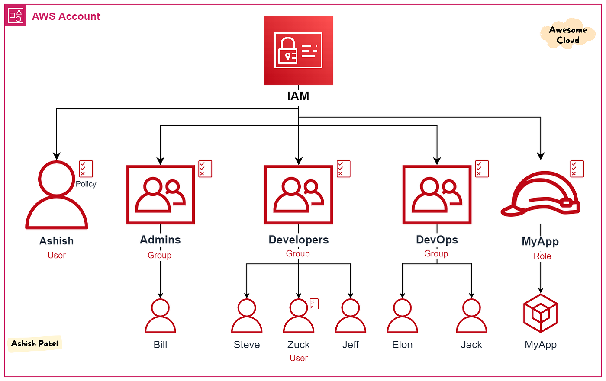
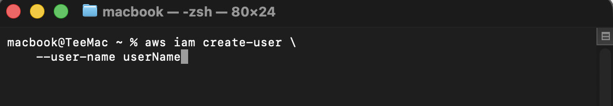
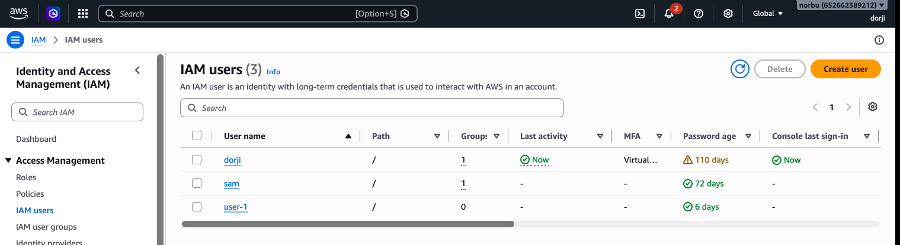

# Practical Work & Report: (20%)

??? Note "Practicals Instruction"
    
    Students are required to attend **2 hours of allocated weekly practical classes**. Students shall submit a report for the particular practical class and practical work to an online version control system allocated by the HoD, SWE.

    The evaluation of practical components will be divided as follows:

    - 25% for practical reports
    - 75% for practical work

    The two sub-components shall be assessed out of **5 marks and 15 marks** each respectively as follows:

    Practical Report: (5%)

    Students have to write a report in the format prescribed by the module tutor and submit the report before the commencement of the next practical class. Each report will be evaluated using the following criteria:

    - 2	Documentation of AWS services used 
    - 2	Reflection
    - 1	Clarity & Coherence

    Practical Work: (15%)
    Each student’s work will be assessed by the end of the practical classes to keep track of 
    students’ learning and performance. The criteria for assessment are as follows:

    - 3	 AWS Service Configuration & Setup
    - 2  AWS CLI and SDK Usage
    - 10 Functional Requirements Implementation using AWS services

??? info "Format of report"

    ### 1. Aim / Objective

    State the objective(s) of this practical exercise.

    > *Example:*  
    > To create and manage IAM users, groups, and policies using the AWS CLI and verify access permissions.

    ### 2. Introduction

    Provide a brief overview of the AWS service explored during this practical (1 paragraph).

    Include:

    - Purpose of the service
    - Key features
    - Importance in cloud computing
    - Typical applications

    ### 3. Use Case

    Describe where this AWS service is commonly used.

    > **Example**
    >
    > - Managing employee identities and permissions using AWS IAM.
    > - Hosting scalable web applications using Amazon EC2.
    > - Storing application assets using Amazon S3.

    ---

    ### 4. System Architecture / Design *(If Applicable)*

    Insert a system architecture or workflow diagram illustrating how the AWS services interact.

    The diagram should clearly indicate:

    - AWS services used
    - User interactions
    - Resource relationships
    - Data flow

    > **Insert architecture diagram here**

    ### 5. Implementation Procedure

    Breifly Document each step performed during the practical.

    ### 6. Results and Evidence

    #### 6.1 CLI / SDK Output

    Include screenshots showing:

    - Commands executed
    - Successful outputs
    - SDK program execution (if applicable)

    > **Insert screenshot(s) here**

    #### 6.2 AWS Management Console Verification

    Provide screenshots from the AWS Console confirming successful resource creation or configuration and give one line explanation of the action performed.

    Examples include:

    - IAM Users
    - EC2 Instances
    - S3 Buckets
    - Lambda Functions
    - VPC Resources
    - CloudWatch Dashboards

    > **Insert screenshot(s) here**

    ### 7. Analysis and Discussion

    Discuss the outcomes of the practical.

    Include:

    - What was achieved?
    - Did the results match the expected outcome?
    - Were any errors encountered?
    - How were the issues resolved?
    - What observations were made during implementation?

    ### 8. Reflection

    Reflect on your learning experience by answering the following questions:

    1. What did you learn about this AWS service?
    2. What challenges did you encounter?
    3. How would you apply this service in a real-world cloud environment?
    4. What additional concepts or features would you like to explore?

    ### 9. Conclusion

    Summarise the practical in one or two paragraphs.

    Include:

    - Whether the objectives were achieved
    - Key concepts learned
    - Skills developed
    - Importance of the AWS service

    ### 10. Appendix *(Optional)*

    Include links to any supplementary materials, such as:

    - Complete source code
    - JSON policy files
    - CloudFormation templates
    - Terraform configurations
    - Additional screenshots
    - Error logs
    - Configuration files

    ---

    ### Submission Checklist

    Before submitting your report, ensure that you have included:

    - [ ] Aim/Objectives clearly stated
    - [ ] Introduction provided
    - [ ] Real-world use case described
    - [ ] System architecture included (if applicable)
    - [ ] All implementation steps documented
    - [ ] CLI/SDK screenshots included
    - [ ] AWS Console verification screenshots included
    - [ ] Analysis and discussion completed
    - [ ] Reflection completed
    - [ ] Conclusion written
    - [ ] Appendix attached (if applicable)

??? info "Sample report"
    
    ## AWS Practical Laboratory Report SAMPLE

    ### 1. Aim / Objective

    The objective of this practical is to learn how AWS Identity and Access Management (IAM) is used to securely manage users, groups, roles, and permissions within an AWS account. Students will perform common IAM administrative tasks using the AWS CLI.

    ### 2. Introduction

    AWS Identity and Access Management (IAM) is a global AWS service that enables administrators to securely manage authentication and authorization for AWS resources. IAM allows organizations to create users, organize them into groups, assign permissions through policies, and grant temporary access using roles.

    Unlike many AWS services, IAM does not incur additional charges and is considered one of the foundational services in AWS security.

    ### Key Features

    - User Management
    - User Groups
    - IAM Roles
    - IAM Policies
    - Multi-Factor Authentication (MFA)
    - Fine-grained Access Control
    - Temporary Security Credentials
    - Identity Federation

    ### 3. Use Case

    A software company employs developers, testers, DevOps engineers, and system administrators.

    Instead of giving every employee full AWS administrator access, the cloud administrator creates IAM groups:

    | Group | Permission |
    |---------|------------|
    | Developers | EC2 and Lambda access |
    | QA Engineers | Read-only access |
    | DevOps Team | EC2, ECS, CloudFormation |
    | Finance Team | Billing Dashboard only |

    Each employee is assigned to the appropriate IAM group, ensuring the Principle of Least Privilege is enforced.

    ### 4. System Architecture / Design

    <figure markdown="span">
        {width="80%"}
        <figcaption>IAM Architecture</figcaption>
        
<i>Image Source: N/A</i>

    </figure>

    ### 5. Implementation Procedure

    The practical began by configuring the AWS CLI (or Floci CLI) with the appropriate credentials and verifying connectivity to the AWS environment. An IAM user was created to represent a new cloud user, followed by the creation of an IAM group to organize users with similar access requirements. The newly created user was added to the group, and an AWS managed policy was attached to the group to grant the necessary permissions. The configuration was then verified by listing the IAM users, groups, and attached policies using the CLI. Finally, the resources were inspected through the AWS Management Console to confirm that the user, group, and permissions had been successfully configured. Throughout the practical, the outputs of the CLI commands and console verification were documented as evidence of successful implementation.

    ### 6. Results and Evidence

    #### 6.1 CLI Output
    s
    **Screenshot 1**

    Create IAM User
    <figure markdown="span">
        {width="80%"}
        <figcaption>Screen Shot of user creation</figcaption>
        
<i>Image Source: N/A</i>

    </figure>

    ---

    **Screenshot 2**

    Create IAM Group

    > *(Insert screenshot here)*

    ---

    **Screenshot 3**

    Attach IAM Policy

    > *(Insert screenshot here)*

    ---

    #### 6.2 AWS Console Verification

    Include screenshots showing:

    - IAM Dashboard
    - Users
    - Groups
    - Attached Policies
    - User Details

    <figure markdown="span">
        {width="80%"}
        <figcaption>AWS console</figcaption>
        
<i>Image Source: N/A</i>

    </figure>

    ---

    ### 7. Analysis and Discussion

    The practical demonstrated how IAM controls authentication and authorization in AWS. Users can be created individually while permissions are assigned through groups and policies. This approach simplifies administration and follows AWS security best practices.

    During the implementation, all CLI commands executed successfully, and the resources were verified using the AWS Management Console. The experiment also highlighted the importance of using managed policies instead of assigning permissions directly to users.

    No significant errors were encountered. Minor syntax errors during CLI command entry were resolved by consulting the AWS CLI documentation.

    ---

    ### 8. Reflection

    This practical provided hands-on experience with one of the most important AWS services. I learned how IAM users, groups, and policies work together to implement secure access control.

    One key observation was that permissions should be assigned to groups rather than individual users whenever possible, making administration more scalable and maintainable.

    In real-world cloud environments, IAM would be used to securely manage employee access, enforce least-privilege principles, and protect sensitive AWS resources.

    In future practical sessions, I would like to learn about:

    - IAM Roles
    - Cross-account access
    - Multi-Factor Authentication (MFA)
    - IAM Identity Center (AWS SSO)
    - Identity Federation
    - Permission Boundaries
    - Attribute-Based Access Control (ABAC)

    ---

    ### 9. Conclusion

    The objectives of this practical were successfully achieved. I gained practical experience in creating IAM users, groups, and policies using the AWS CLI and verified the configuration through the AWS Management Console.

    This laboratory reinforced the importance of secure identity management in cloud computing and demonstrated how IAM serves as the foundation of AWS security.

    ### 10. Appendix

    ## Additional Files

    - `developers-policy.json`
    - `create-user.sh`
    - `iam-lab-notes.md`

    ---

    ### Submission Checklist

    - [x] Student information completed
    - [x] Objectives stated
    - [x] Introduction provided
    - [x] Real-world use case described
    - [x] Tools listed
    - [x] System design included
    - [x] Implementation documented
    - [x] CLI outputs included
    - [x] Console screenshots attached
    - [x] Analysis completed
    - [x] Reflection completed
    - [x] Conclusion written
    ---

!!! danger "Note"

    **The course scenario**

    Every laboratory in this course belongs to **one single continuous project**.

    > **Your role**
    >
    > You have just been hired as a **junior cloud engineer** at the College of Science and Technology.
    > Your team is building the **University Student Management System (USMS)** a web application that
    > stores student records, uploads transcripts, sends enrolment notifications and produces reports.
    >
    > Over the next laboratories you will build the entire cloud infrastructure for USMS, one AWS service
    > at a time, **entirely on your own laptop**, using the AWS CLI.