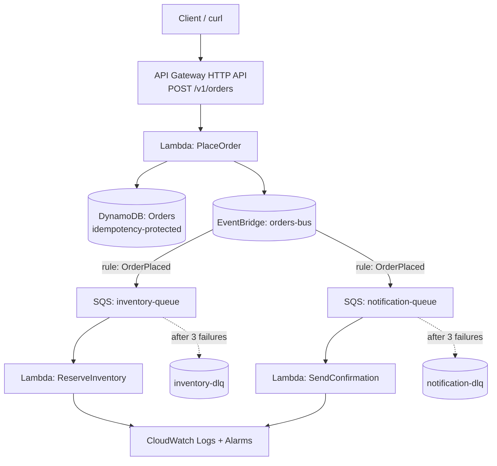

---

## Hands-on Lab

### Objective

Build a production-shaped, event-driven serverless order system that demonstrates all four patterns: an API-first contract at the edge, a serverless synchronous write path, event-driven asynchronous fan-out, and independently deployable consumers.

### Architecture

### AWS services used

API Gateway (HTTP API), Lambda, DynamoDB, EventBridge, SQS (with DLQs), IAM, CloudWatch, and AWS SAM or Terraform for Infrastructure as Code.

### Implementation steps

1. **Author the contract first.** Write an OpenAPI 3.0 document for `POST /v1/orders` defining the request schema (`customerId`, `items[]`, `idempotencyKey`) and the `201` response (`orderId`, `status`). Review it before writing code.
2. **Provision infrastructure as code.** Define the DynamoDB table (partition key `orderId`, plus an attribute for the idempotency key), the custom EventBridge bus, two SQS queues each with a redrive policy to a DLQ (`maxReceiveCount: 3`), and the three Lambda functions.
3. **Implement `PlaceOrder`.** Validate input, write to DynamoDB with a conditional expression on the idempotency key so a replayed request returns the original order rather than creating a duplicate, then `PutEvents` an `OrderPlaced` event to the bus. Return `201` immediately.
4. **Create EventBridge rules.** One rule matching `detail-type: OrderPlaced` with two targets: the inventory queue and the notification queue. Attach a DLQ to each target.
5. **Implement the consumers.** `ReserveInventory` and `SendConfirmation` each poll their queue via an event source mapping, log with a correlation ID, and are idempotent.
6. **Introduce a controlled failure.** Make `ReserveInventory` throw an exception for any order containing the SKU `FAIL-TEST`. Observe three delivery attempts and then the message landing in the DLQ.
7. **Add observability.** Enable X-Ray active tracing on all functions and the API. Create CloudWatch alarms on DLQ depth greater than zero and on `ApproximateAgeOfOldestMessage` exceeding 300 seconds.
8. **Test resilience.** Disable the notification consumer, submit 50 orders, confirm all return `201` and that messages accumulate safely in the queue; re-enable the consumer and watch the backlog drain.
9. **Test idempotency.** Submit the same `idempotencyKey` five times and confirm exactly one order exists.
10. **Load test.** Use a simple load generator to submit 500 concurrent orders; observe Lambda concurrency, throttles, and end-to-end trace timings.

### Expected output

- `POST /v1/orders` returns `201` in well under 200 ms warm, independent of downstream consumer health.
- One DynamoDB item per unique idempotency key, regardless of retry count.
- Both consumers process each order exactly once in the happy path.
- `FAIL-TEST` orders appear in the inventory DLQ after three attempts, with the notification consumer entirely unaffected — demonstrating bulkhead isolation.
- X-Ray service map showing the synchronous path and the asynchronous branches.
- A CloudWatch alarm transitioning to `ALARM` when the DLQ receives its first message.

!!! tip "What this lab teaches architecturally"
The user-facing latency is decoupled from downstream reliability. A failing inventory service does not fail an order, does not delay the response, and does not affect notifications. That property — not the specific services — is the lesson.

---