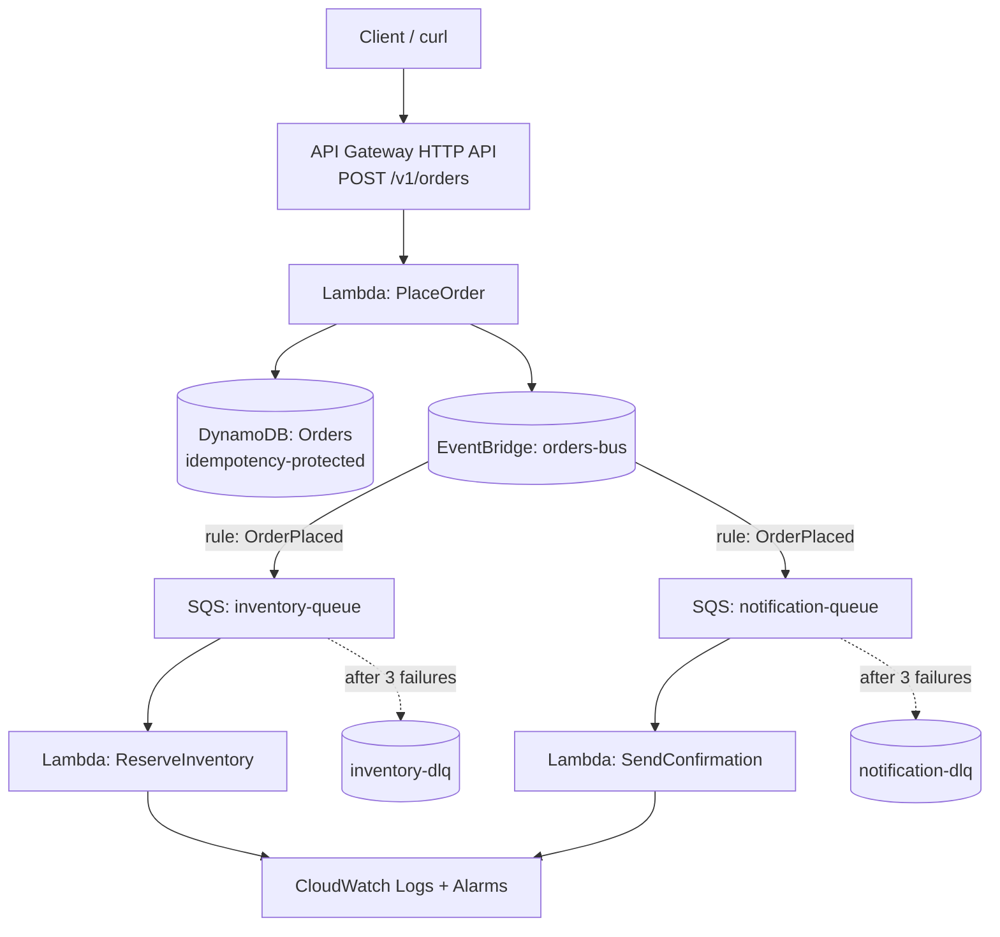
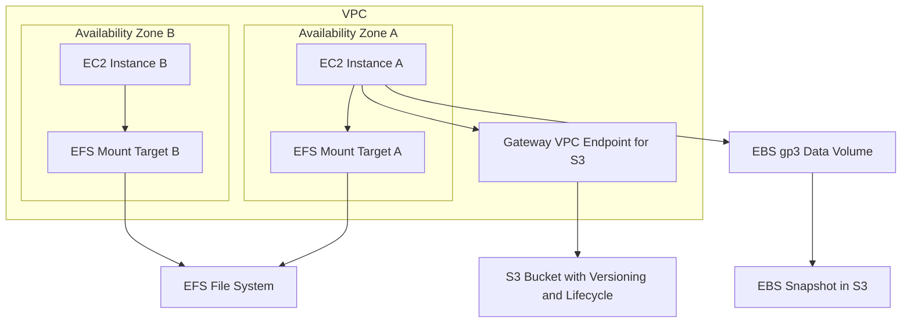
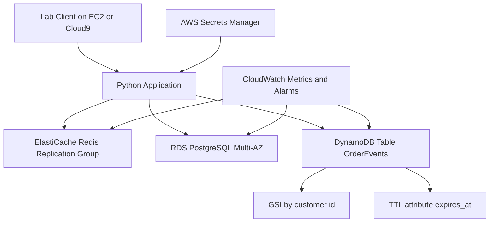
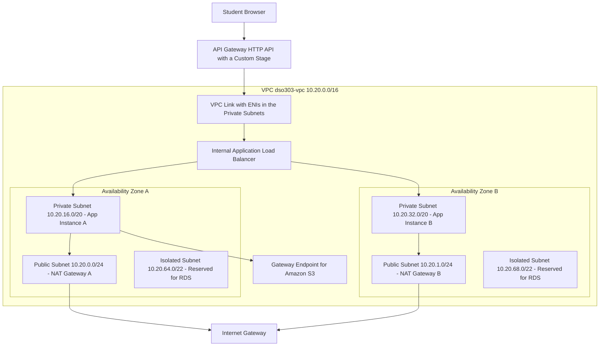

# 1.1


## Hands-on Lab

**Objective.** Deploy a globally accelerated static website with a private origin, and empirically observe edge caching.

**Architecture.** Private S3 bucket (origin) → CloudFront distribution with OAC → default cache behaviour, HTTPS redirect → tested from your location; latency compared against direct Regional access.

**AWS services.** S3, CloudFront, (optionally Route 53 + ACM if you own a domain), CloudWatch.

**Implementation steps.**

1. Create a bucket in a Region _far_ from you (e.g., `us-west-2` if you are in Africa/Europe) with **Block Public Access ON**. Upload `index.html` and a ~1 MB image.
2. Create a CloudFront distribution: origin = the bucket, **Origin access = OAC (create new)**, viewer protocol = Redirect HTTP to HTTPS, default root object `index.html`.
3. Apply the bucket policy CloudFront offers (allows `cloudfront.amazonaws.com` with the distribution ARN condition). Confirm the direct S3 URL now returns **403** — the origin is private.
4. Wait for deployment; fetch the distribution URL twice and inspect headers:

```bash
curl -s -D - -o /dev/null https://dxxxxxxxx.cloudfront.net/image.jpg | grep -iE "x-cache|age"
# 1st: X-Cache: Miss from cloudfront
# 2nd: X-Cache: Hit from cloudfront   Age: <seconds>
```

5. Time cached vs origin-Region latency (`curl -w "%{time_total}\n"` against CloudFront vs a same-Region EC2/S3 endpoint if available) and record the difference.
6. Create an invalidation for `/index.html`, observe the next request become a Miss, and note the eventual-consistency delay.
7. In CloudWatch (us-east-1), open the distribution's `Requests` and `CacheHitRate` metrics and correlate with your tests.

**Expected output.** A working HTTPS site whose bucket is unreachable directly; measured multi-hundred-millisecond improvement on cache hits from a distant Region; first-hand evidence of the Miss→Hit lifecycle and of invalidation behaviour.

---

## Code Examples

**AWS CLI — explore the infrastructure programmatically**

```bash
# List all Regions your account can see
aws ec2 describe-regions --query "Regions[].RegionName" --output table

# List AZs in a Region, including the account-independent AZ IDs
aws ec2 describe-availability-zones --region eu-west-1 \
  --query "AvailabilityZones[].{Name:ZoneName,ID:ZoneId,Type:ZoneType,State:State}" \
  --output table
```

**Python (boto3) — verify multi-AZ spread of running instances**

```python
import boto3
from collections import Counter

ec2 = boto3.client("ec2", region_name="eu-west-1")
reservations = ec2.describe_instances(
    Filters=[{"Name": "instance-state-name", "Values": ["running"]}]
)["Reservations"]

azs = Counter(
    inst["Placement"]["AvailabilityZone"]
    for r in reservations for inst in r["Instances"]
)
print("Instances per AZ:", dict(azs))
if len(azs) < 2:
    print("WARNING: single-AZ deployment — no zonal fault tolerance.")
```

**CloudFormation — private S3 origin + CloudFront with OAC (core of the lab)**

```yaml
AWSTemplateFormatVersion: "2010-09-09"
Description: Static site - private S3 origin behind CloudFront (OAC)

Resources:
  SiteBucket:
    Type: AWS::S3::Bucket
    Properties:
      PublicAccessBlockConfiguration:
        BlockPublicAcls: true
        BlockPublicPolicy: true
        IgnorePublicAcls: true
        RestrictPublicBuckets: true

  OAC:
    Type: AWS::CloudFront::OriginAccessControl
    Properties:
      OriginAccessControlConfig:
        Name: site-oac
        OriginAccessControlOriginType: s3
        SigningBehavior: always
        SigningProtocol: sigv4

  Distribution:
    Type: AWS::CloudFront::Distribution
    Properties:
      DistributionConfig:
        Enabled: true
        DefaultRootObject: index.html
        HttpVersion: http2and3
        Origins:
          - Id: s3-origin
            DomainName: !GetAtt SiteBucket.RegionalDomainName
            OriginAccessControlId: !Ref OAC
            S3OriginConfig: { OriginAccessIdentity: "" }
        DefaultCacheBehavior:
          TargetOriginId: s3-origin
          ViewerProtocolPolicy: redirect-to-https
          # AWS managed "CachingOptimized" policy
          CachePolicyId: 658327ea-f89d-4fab-a63d-7e88639e58f6

  BucketPolicy:
    Type: AWS::S3::BucketPolicy
    Properties:
      Bucket: !Ref SiteBucket
      PolicyDocument:
        Statement:
          - Effect: Allow
            Principal: { Service: cloudfront.amazonaws.com }
            Action: s3:GetObject
            Resource: !Sub "${SiteBucket.Arn}/*"
            Condition:
              StringEquals:
                AWS:SourceArn: !Sub "arn:aws:cloudfront::${AWS::AccountId}:distribution/${Distribution}"

Outputs:
  URL:
    Value: !Sub "https://${Distribution.DomainName}"
```

**Terraform — multi-AZ subnet layout as code (Region as a variable)**

```hcl
variable "region" { default = "eu-west-1" }

provider "aws" { region = var.region }

data "aws_availability_zones" "available" { state = "available" }

resource "aws_vpc" "main" {
  cidr_block = "10.0.0.0/16"
}

# One private subnet per AZ - the multi-AZ pattern expressed as code
resource "aws_subnet" "private" {
  count             = 3
  vpc_id            = aws_vpc.main.id
  cidr_block        = cidrsubnet(aws_vpc.main.cidr_block, 4, count.index)
  availability_zone = data.aws_availability_zones.available.names[count.index]
  tags = { Name = "private-${count.index}" }
}
```

**Kubernetes YAML — spreading pods across AZs on EKS (DSO303 link-forward)**

```yaml
apiVersion: apps/v1
kind: Deployment
metadata:
  name: web
spec:
  replicas: 6
  selector: { matchLabels: { app: web } }
  template:
    metadata: { labels: { app: web } }
    spec:
      topologySpreadConstraints:
        - maxSkew: 1
          topologyKey: topology.kubernetes.io/zone # the AZ label
          whenUnsatisfiable: DoNotSchedule
          labelSelector: { matchLabels: { app: web } }
      containers:
        - name: web
          image: public.ecr.aws/nginx/nginx:latest
```

!!! note "The same idea at every layer"
Notice that the CloudFormation subnets, the Terraform `count = 3`, and the Kubernetes `topologySpreadConstraints` all encode the _same architectural decision_ — spread across AZ fault domains — at different layers of the stack. Infrastructure as Code makes the decision explicit, reviewable, and repeatable.

---

## Hands-on Lab

### Objective

Build a production-shaped, event-driven serverless order system that demonstrates all four patterns: an API-first contract at the edge, a serverless synchronous write path, event-driven asynchronous fan-out, and independently deployable consumers.

### Architecture



### AWS services used

API Gateway (HTTP API), Lambda, DynamoDB, EventBridge, SQS (with DLQs), IAM, CloudWatch, and AWS SAM or Terraform for Infrastructure as Code.

### Implementation steps

1. **Author the contract first.** Write an OpenAPI 3.0 document for `POST /v1/orders` defining the request schema (`customerId`, `items[]`, `idempotencyKey`) and the `201` response (`orderId`, `status`). Review it before writing code.
2. **Provision infrastructure as code.** Define the DynamoDB table (partition key `orderId`, plus an attribute for the idempotency key), the custom EventBridge bus, two SQS queues each with a redrive policy to a DLQ (`maxReceiveCount: 3`), and the three Lambda functions.
3. **Implement `PlaceOrder`.** Validate input, write to DynamoDB with a conditional expression on the idempotency key so a replayed request returns the original order rather than creating a duplicate, then `PutEvents` an `OrderPlaced` event to the bus. Return `201` immediately.
4. **Create EventBridge rules.** One rule matching `detail-type: OrderPlaced` with two targets: the inventory queue and the notification queue. Attach a DLQ to each target.
5. **Implement the consumers.** `ReserveInventory` and `SendConfirmation` each poll their queue via an event source mapping, log with a correlation ID, and are idempotent.
6. **Introduce a controlled failure.** Make `ReserveInventory` throw an exception for any order containing the SKU `FAIL-TEST`. Observe three delivery attempts and then the message landing in the DLQ.
7. **Add observability.** Enable X-Ray active tracing on all functions and the API. Create CloudWatch alarms on DLQ depth greater than zero and on `ApproximateAgeOfOldestMessage` exceeding 300 seconds.
8. **Test resilience.** Disable the notification consumer, submit 50 orders, confirm all return `201` and that messages accumulate safely in the queue; re-enable the consumer and watch the backlog drain.
9. **Test idempotency.** Submit the same `idempotencyKey` five times and confirm exactly one order exists.
10. **Load test.** Use a simple load generator to submit 500 concurrent orders; observe Lambda concurrency, throttles, and end-to-end trace timings.

### Expected output

- `POST /v1/orders` returns `201` in well under 200 ms warm, independent of downstream consumer health.
- One DynamoDB item per unique idempotency key, regardless of retry count.
- Both consumers process each order exactly once in the happy path.
- `FAIL-TEST` orders appear in the inventory DLQ after three attempts, with the notification consumer entirely unaffected — demonstrating bulkhead isolation.
- X-Ray service map showing the synchronous path and the asynchronous branches.
- A CloudWatch alarm transitioning to `ALARM` when the DLQ receives its first message.

!!! tip "What this lab teaches architecturally"
The user-facing latency is decoupled from downstream reliability. A failing inventory service does not fail an order, does not delay the response, and does not affect notifications. That property — not the specific services — is the lesson.

---


# 1.4

---

## Hands-on Lab

### Objective

Build a small but complete storage architecture that exercises all three services. You will create a secure, versioned, encrypted S3 bucket with a lifecycle policy; upload an object using a presigned URL; attach, format, and mount an EBS volume and take a snapshot; create an EFS file system and mount it from two instances in different Availability Zones to prove shared access; and confirm that the S3 traffic uses a Gateway VPC endpoint.

The lab is designed to complete within an AWS Academy Learner Lab session using the `LabRole` and default VPC, and to remain within sandbox service restrictions.

### Architecture



### AWS services used

Amazon S3, Amazon EBS, Amazon EFS, Amazon EC2, Amazon VPC with a Gateway endpoint, AWS IAM, AWS KMS through default encryption, and Amazon CloudWatch for verification.

### Implementation steps

**Part one — the S3 bucket**

1. Choose a globally unique bucket name, for example `dso303-lab-<your-student-id>`, and create the bucket in your lab Region.
2. Enable versioning on the bucket.
3. Confirm that Block Public Access is fully enabled and that default encryption is active.
4. Apply a bucket policy that denies any request not using TLS.
5. Apply a lifecycle configuration that transitions objects under the `archive/` prefix to Standard-IA after thirty days, expires noncurrent versions after thirty days, and aborts incomplete multipart uploads after seven days.
6. Upload a small file and then upload a modified version of the same key. List object versions and observe that both versions exist.
7. Delete the object and observe that a delete marker was created rather than the data being destroyed. Restore the object by deleting the delete marker.

**Part two — presigned URL**

8. Generate a presigned `PUT` URL valid for five minutes using the CLI or the boto3 example in the next section.
9. Upload a file using `curl` with that URL and no AWS credentials, proving that the delegation works.
10. Wait for expiry, retry, and observe the `AccessDenied` response, proving that the delegation is time-bounded.

**Part three — EBS**

11. Launch a `t3.micro` Amazon Linux instance in Availability Zone A with an IAM instance profile granting S3 read access to your bucket.
12. Create a 10 GiB encrypted gp3 volume in the same Availability Zone and attach it to the instance as `/dev/sdf`.
13. On the instance, identify the device with `lsblk`, create an XFS file system, create a mount point, mount it, and add a UUID-based entry to `/etc/fstab`.
14. Write a test file to the volume.
15. Create a snapshot of the volume and observe that the API returns immediately while the snapshot state transitions from `pending` to `completed`.
16. Attempt to attach the volume to an instance in Availability Zone B and observe the error. This is the single most important observation in the lab.

**Part four — EFS**

17. Create an EFS file system with Elastic throughput, General Purpose performance mode, and encryption at rest enabled.
18. Create a security group `efs-sg` allowing inbound TCP 2049 from the instance security group, and create mount targets in the subnets of both Availability Zone A and Availability Zone B using that security group.
19. Launch a second instance in Availability Zone B.
20. On both instances, install `amazon-efs-utils` and mount the file system with TLS enabled.
21. Write a file from instance A and read it immediately from instance B, demonstrating cross-Availability-Zone shared access — the property EBS cannot provide.
22. Enable a lifecycle policy transitioning files to Infrequent Access after thirty days.

**Part five — network path and observability**

23. Create a Gateway VPC endpoint for S3 and associate it with the route table used by your subnets.
24. From the instance, run an S3 copy and confirm connectivity.
25. In CloudWatch, inspect the EBS `VolumeWriteOps` metric and the EFS `StorageBytes` metric for your resources.
26. Clean up: terminate instances, delete the EFS file system and mount targets, delete the volume and snapshot, empty and delete the bucket including all versions.

### Expected output

- A versioned bucket containing at least two versions of one key and a delete marker you subsequently removed.
- A successful anonymous upload through a presigned URL, followed by an `AccessDenied` after expiry.
- `df -h` on instance A showing both the mounted EBS volume and the mounted EFS file system.
- An explicit error when attempting to attach the EBS volume across Availability Zones, with the message indicating the volume and instance are not in the same Availability Zone.
- A file written on instance A visible from instance B within seconds.
- A completed EBS snapshot listed in the console.
- CloudWatch metrics showing non-zero write operations on the volume and non-zero stored bytes on the file system.

!!! tip "The conceptual takeaway from the lab"
    Steps 16 and 21 together are the entire lesson. EBS is Availability-Zone-bound and single-attach; EFS is Regional and multi-attach. Everything else in this chapter about high availability follows from that single contrast.

---

## Code Examples

### AWS CLI — creating and securing an S3 bucket

Creates a bucket, enables versioning, enforces default encryption, and blocks all public access. This is the minimum secure baseline for any production bucket.

```bash
REGION="ap-south-1"
BUCKET="dso303-lab-example-bucket"

aws s3api create-bucket \
  --bucket "$BUCKET" \
  --region "$REGION" \
  --create-bucket-configuration LocationConstraint="$REGION"

aws s3api put-bucket-versioning \
  --bucket "$BUCKET" \
  --versioning-configuration Status=Enabled

aws s3api put-bucket-encryption \
  --bucket "$BUCKET" \
  --server-side-encryption-configuration '{
    "Rules": [{
      "ApplyServerSideEncryptionByDefault": {"SSEAlgorithm": "AES256"},
      "BucketKeyEnabled": true
    }]
  }'

aws s3api put-public-access-block \
  --bucket "$BUCKET" \
  --public-access-block-configuration \
    BlockPublicAcls=true,IgnorePublicAcls=true,BlockPublicPolicy=true,RestrictPublicBuckets=true
```

### AWS CLI — high-throughput transfer configuration

Tunes the CLI's concurrency and multipart thresholds before a large sync. Default settings are conservative; raising concurrency is the single most effective way to increase aggregate throughput.

```bash
aws configure set default.s3.max_concurrent_requests 40
aws configure set default.s3.multipart_threshold 64MB
aws configure set default.s3.multipart_chunksize 32MB

aws s3 sync ./local-dataset "s3://$BUCKET/dataset/" \
  --storage-class STANDARD_IA \
  --exclude "*.tmp"
```

### S3 bucket policy — denying non-TLS access and enforcing encryption

Two explicit `Deny` statements. The first rejects any request not made over HTTPS; the second rejects uploads that do not request KMS encryption. Explicit denies cannot be overridden by any identity policy, which makes this pattern a reliable guardrail.

```json
{
  "Version": "2012-10-17",
  "Statement": [
    {
      "Sid": "DenyInsecureTransport",
      "Effect": "Deny",
      "Principal": "*",
      "Action": "s3:*",
      "Resource": [
        "arn:aws:s3:::dso303-lab-example-bucket",
        "arn:aws:s3:::dso303-lab-example-bucket/*"
      ],
      "Condition": {
        "Bool": {"aws:SecureTransport": "false"}
      }
    },
    {
      "Sid": "DenyUnencryptedObjectUploads",
      "Effect": "Deny",
      "Principal": "*",
      "Action": "s3:PutObject",
      "Resource": "arn:aws:s3:::dso303-lab-example-bucket/*",
      "Condition": {
        "StringNotEquals": {"s3:x-amz-server-side-encryption": "aws:kms"}
      }
    }
  ]
}
```

### S3 lifecycle configuration

Transitions objects through progressively cheaper classes, expires noncurrent versions to bound the cost of versioning, and aborts abandoned multipart uploads. The last rule in particular should be present in every bucket.

```json
{
  "Rules": [
    {
      "ID": "TierApplicationLogs",
      "Filter": {"Prefix": "logs/"},
      "Status": "Enabled",
      "Transitions": [
        {"Days": 30, "StorageClass": "STANDARD_IA"},
        {"Days": 90, "StorageClass": "GLACIER_IR"},
        {"Days": 365, "StorageClass": "DEEP_ARCHIVE"}
      ],
      "Expiration": {"Days": 2555}
    },
    {
      "ID": "ExpireNoncurrentVersions",
      "Filter": {},
      "Status": "Enabled",
      "NoncurrentVersionExpiration": {
        "NoncurrentDays": 30,
        "NewerNoncurrentVersions": 3
      }
    },
    {
      "ID": "AbortIncompleteMultipartUploads",
      "Filter": {},
      "Status": "Enabled",
      "AbortIncompleteMultipartUpload": {"DaysAfterInitiation": 7}
    }
  ]
}
```

### Python boto3 — presigned URLs

Generates a time-limited URL that lets an anonymous client upload or download one specific object. This keeps large payloads off the application tier entirely.

```python
import boto3
from botocore.config import Config

s3 = boto3.client("s3", config=Config(signature_version="s3v4"))

def presigned_upload_url(bucket: str, key: str, expires: int = 300) -> str:
    """Return a URL allowing a single PUT of one object for a bounded time."""
    return s3.generate_presigned_url(
        ClientMethod="put_object",
        Params={
            "Bucket": bucket,
            "Key": key,
            "ContentType": "application/octet-stream",
            "ServerSideEncryption": "AES256",
        },
        ExpiresIn=expires,
    )

def presigned_download_url(bucket: str, key: str, expires: int = 300) -> str:
    """Return a URL allowing a single GET of one object for a bounded time."""
    return s3.generate_presigned_url(
        ClientMethod="get_object",
        Params={"Bucket": bucket, "Key": key},
        ExpiresIn=expires,
    )

if __name__ == "__main__":
    print(presigned_upload_url("dso303-lab-example-bucket", "uploads/report.pdf"))
```

The generated URL is used with no credentials at all.

```bash
curl -X PUT \
  -H "Content-Type: application/octet-stream" \
  -H "x-amz-server-side-encryption: AES256" \
  --upload-file ./report.pdf \
  "<the-presigned-url>"
```

### Python boto3 — managed multipart upload with progress

`upload_file` transparently performs a multipart upload above the configured threshold, uploading parts concurrently and retrying individual parts. Writing multipart logic by hand is almost never necessary.

```python
import os
import threading
import boto3
from boto3.s3.transfer import TransferConfig

s3 = boto3.client("s3")

transfer_config = TransferConfig(
    multipart_threshold=64 * 1024 * 1024,   # start multipart above 64 MiB
    multipart_chunksize=32 * 1024 * 1024,   # 32 MiB parts
    max_concurrency=16,                     # parallel part uploads
    use_threads=True,
)

class ProgressReporter:
    def __init__(self, filename: str):
        self._filename = filename
        self._size = float(os.path.getsize(filename))
        self._seen = 0
        self._lock = threading.Lock()

    def __call__(self, bytes_amount: int) -> None:
        with self._lock:
            self._seen += bytes_amount
            pct = (self._seen / self._size) * 100
            print(f"{self._filename}: {self._seen} of {int(self._size)} bytes, {pct:.1f} percent")

s3.upload_file(
    Filename="large-dataset.tar.gz",
    Bucket="dso303-lab-example-bucket",
    Key="datasets/large-dataset.tar.gz",
    ExtraArgs={"StorageClass": "INTELLIGENT_TIERING", "ServerSideEncryption": "AES256"},
    Config=transfer_config,
    Callback=ProgressReporter("large-dataset.tar.gz"),
)
```

### Python boto3 — low-level multipart upload

Shown to make the underlying protocol explicit: initiate, upload parts collecting each `ETag`, then complete with the ordered part list. Note the `abort` on failure, without which the parts remain billed.

```python
import boto3

s3 = boto3.client("s3")
BUCKET, KEY, PART_SIZE = "dso303-lab-example-bucket", "big/archive.bin", 16 * 1024 * 1024

response = s3.create_multipart_upload(Bucket=BUCKET, Key=KEY)
upload_id = response["UploadId"]
parts = []

try:
    with open("archive.bin", "rb") as handle:
        part_number = 1
        while True:
            chunk = handle.read(PART_SIZE)
            if not chunk:
                break
            result = s3.upload_part(
                Bucket=BUCKET, Key=KEY, PartNumber=part_number,
                UploadId=upload_id, Body=chunk,
            )
            parts.append({"ETag": result["ETag"], "PartNumber": part_number})
            part_number += 1

    s3.complete_multipart_upload(
        Bucket=BUCKET, Key=KEY, UploadId=upload_id,
        MultipartUpload={"Parts": parts},
    )
except Exception:
    # Without this abort the uploaded parts remain in storage and are billed.
    s3.abort_multipart_upload(Bucket=BUCKET, Key=KEY, UploadId=upload_id)
    raise
```

### Python boto3 — paginated listing and EBS snapshot automation

Paginators handle the thousand-key page limit correctly; naive `list_objects_v2` calls silently truncate. The second function demonstrates a tag-driven snapshot routine.

```python
import boto3

s3 = boto3.client("s3")
ec2 = boto3.client("ec2")

def total_bytes_under_prefix(bucket: str, prefix: str) -> int:
    """Sum object sizes under a prefix, handling pagination correctly."""
    paginator = s3.get_paginator("list_objects_v2")
    total = 0
    for page in paginator.paginate(Bucket=bucket, Prefix=prefix):
        for obj in page.get("Contents", []):
            total += obj["Size"]
    return total

def snapshot_tagged_volumes(tag_key: str = "Backup", tag_value: str = "daily") -> list:
    """Create snapshots of all volumes carrying a given tag."""
    volumes = ec2.describe_volumes(
        Filters=[{"Name": f"tag:{tag_key}", "Values": [tag_value]}]
    )["Volumes"]

    created = []
    for volume in volumes:
        snapshot = ec2.create_snapshot(
            VolumeId=volume["VolumeId"],
            Description=f"Automated snapshot of {volume['VolumeId']}",
            TagSpecifications=[{
                "ResourceType": "snapshot",
                "Tags": [
                    {"Key": "Name", "Value": f"auto-{volume['VolumeId']}"},
                    {"Key": "CreatedBy", "Value": "dso303-automation"},
                ],
            }],
        )
        created.append(snapshot["SnapshotId"])
    return created
```

### Shell — partitioning, formatting, and mounting an EBS volume

The critical detail is using the file system UUID in `/etc/fstab` rather than the device name, because NVMe device naming is not guaranteed stable across reboots. The `nofail` option prevents an unbootable instance if the volume is absent.

```bash
# Identify the attached device; on Nitro instances it appears as an NVMe device.
lsblk
sudo nvme list

DEVICE="/dev/nvme1n1"
MOUNT_POINT="/data"

# Verify the device is empty. If this prints "data" the device has no file system.
sudo file -s "$DEVICE"

# Create an XFS file system. This DESTROYS existing data - never run on a volume with data.
sudo mkfs -t xfs "$DEVICE"

sudo mkdir -p "$MOUNT_POINT"
sudo mount "$DEVICE" "$MOUNT_POINT"

# Persist the mount using the UUID so device renaming cannot break boot.
UUID=$(sudo blkid -s UUID -o value "$DEVICE")
echo "UUID=$UUID  $MOUNT_POINT  xfs  defaults,noatime,nofail  0  2" | sudo tee -a /etc/fstab

sudo mount -a
df -hT "$MOUNT_POINT"
```

### Shell — growing an EBS volume online

After `ModifyVolume` increases the volume size, the partition table and the file system must be grown separately. Forgetting this is why a resized volume often shows no additional space.

```bash
aws ec2 modify-volume --volume-id vol-0123456789abcdef0 --size 200 --volume-type gp3 --iops 6000

# On the instance, after the modification reaches the optimizing state:
sudo growpart /dev/nvme1n1 1     # only if the volume is partitioned
sudo xfs_growfs /data            # XFS
# sudo resize2fs /dev/nvme1n1    # ext4 equivalent
df -hT /data
```

### Shell — mounting Amazon EFS with TLS

The `efs-utils` helper resolves the zone-local mount target, establishes a TLS tunnel, and can sign requests with the instance's IAM role. A plain `mount -t nfs4` works but transmits data unencrypted.

```bash
sudo yum install -y amazon-efs-utils      # or: sudo apt-get install -y amazon-efs-utils

FS_ID="fs-0123456789abcdef0"
sudo mkdir -p /mnt/shared

# Mount with encryption in transit and IAM authorization.
sudo mount -t efs -o tls,iam "$FS_ID":/ /mnt/shared

# Persist across reboots. The _netdev option delays the mount until networking is up.
echo "$FS_ID:/ /mnt/shared efs _netdev,tls,iam 0 0" | sudo tee -a /etc/fstab

# Mount through an access point, which enforces a root directory and POSIX identity.
sudo mount -t efs -o tls,iam,accesspoint=fsap-0123456789abcdef0 "$FS_ID":/ /mnt/app-data

df -hT /mnt/shared
```

### CloudFormation — a secure bucket, an EBS volume, and an EFS file system

Declarative definition means the environment is reproducible, reviewable in a pull request, and destroyable in one operation. Note the deletion policy on the bucket, which prevents an accidental stack deletion from destroying data.

```yaml
AWSTemplateFormatVersion: "2010-09-09"
Description: DSO303 storage baseline - S3, EBS and EFS

Parameters:
  VpcId:
    Type: AWS::EC2::VPC::Id
  SubnetAId:
    Type: AWS::EC2::Subnet::Id
  SubnetBId:
    Type: AWS::EC2::Subnet::Id
  AvailabilityZoneA:
    Type: AWS::EC2::AvailabilityZone::Name

Resources:
  DataBucket:
    Type: AWS::S3::Bucket
    DeletionPolicy: Retain
    UpdateReplacePolicy: Retain
    Properties:
      VersioningConfiguration:
        Status: Enabled
      BucketEncryption:
        ServerSideEncryptionConfiguration:
          - BucketKeyEnabled: true
            ServerSideEncryptionByDefault:
              SSEAlgorithm: AES256
      PublicAccessBlockConfiguration:
        BlockPublicAcls: true
        BlockPublicPolicy: true
        IgnorePublicAcls: true
        RestrictPublicBuckets: true
      OwnershipControls:
        Rules:
          - ObjectOwnership: BucketOwnerEnforced
      LifecycleConfiguration:
        Rules:
          - Id: TierAndExpire
            Status: Enabled
            Transitions:
              - StorageClass: STANDARD_IA
                TransitionInDays: 30
              - StorageClass: GLACIER_IR
                TransitionInDays: 120
            NoncurrentVersionExpirationInDays: 30
            AbortIncompleteMultipartUpload:
              DaysAfterInitiation: 7

  BucketTlsPolicy:
    Type: AWS::S3::BucketPolicy
    Properties:
      Bucket: !Ref DataBucket
      PolicyDocument:
        Version: "2012-10-17"
        Statement:
          - Sid: DenyInsecureTransport
            Effect: Deny
            Principal: "*"
            Action: "s3:*"
            Resource:
              - !GetAtt DataBucket.Arn
              - !Sub "${DataBucket.Arn}/*"
            Condition:
              Bool:
                "aws:SecureTransport": "false"

  ApplicationDataVolume:
    Type: AWS::EC2::Volume
    DeletionPolicy: Snapshot
    Properties:
      AvailabilityZone: !Ref AvailabilityZoneA
      Size: 100
      VolumeType: gp3
      Iops: 6000
      Throughput: 250
      Encrypted: true
      Tags:
        - Key: Backup
          Value: daily

  EfsSecurityGroup:
    Type: AWS::EC2::SecurityGroup
    Properties:
      GroupDescription: Allow NFS from application instances
      VpcId: !Ref VpcId

  SharedFileSystem:
    Type: AWS::EFS::FileSystem
    Properties:
      Encrypted: true
      PerformanceMode: generalPurpose
      ThroughputMode: elastic
      BackupPolicy:
        Status: ENABLED
      LifecyclePolicies:
        - TransitionToIA: AFTER_30_DAYS
        - TransitionToPrimaryStorageClass: AFTER_1_ACCESS

  MountTargetA:
    Type: AWS::EFS::MountTarget
    Properties:
      FileSystemId: !Ref SharedFileSystem
      SubnetId: !Ref SubnetAId
      SecurityGroups:
        - !Ref EfsSecurityGroup

  MountTargetB:
    Type: AWS::EFS::MountTarget
    Properties:
      FileSystemId: !Ref SharedFileSystem
      SubnetId: !Ref SubnetBId
      SecurityGroups:
        - !Ref EfsSecurityGroup

Outputs:
  BucketName:
    Value: !Ref DataBucket
  FileSystemId:
    Value: !Ref SharedFileSystem
  VolumeId:
    Value: !Ref ApplicationDataVolume
```

### Terraform — equivalent storage baseline

The same intent expressed in HCL, including the Gateway VPC endpoint for S3 that removes NAT charges from the S3 path.

```hcl
terraform {
  required_providers {
    aws = {
      source  = "hashicorp/aws"
      version = "~> 5.0"
    }
  }
}

variable "vpc_id" { type = string }
variable "subnet_ids" { type = list(string) }
variable "route_table_ids" { type = list(string) }
variable "availability_zone" { type = string }

resource "aws_s3_bucket" "data" {
  bucket = "dso303-data-${data.aws_caller_identity.current.account_id}"
}

data "aws_caller_identity" "current" {}

resource "aws_s3_bucket_versioning" "data" {
  bucket = aws_s3_bucket.data.id
  versioning_configuration {
    status = "Enabled"
  }
}

resource "aws_s3_bucket_server_side_encryption_configuration" "data" {
  bucket = aws_s3_bucket.data.id
  rule {
    apply_server_side_encryption_by_default {
      sse_algorithm = "AES256"
    }
    bucket_key_enabled = true
  }
}

resource "aws_s3_bucket_public_access_block" "data" {
  bucket                  = aws_s3_bucket.data.id
  block_public_acls       = true
  block_public_policy     = true
  ignore_public_acls      = true
  restrict_public_buckets = true
}

resource "aws_s3_bucket_lifecycle_configuration" "data" {
  bucket = aws_s3_bucket.data.id

  rule {
    id     = "tier-and-expire"
    status = "Enabled"
    filter {}

    transition {
      days          = 30
      storage_class = "STANDARD_IA"
    }
    transition {
      days          = 120
      storage_class = "GLACIER_IR"
    }
    noncurrent_version_expiration {
      noncurrent_days = 30
    }
    abort_incomplete_multipart_upload {
      days_after_initiation = 7
    }
  }
}

resource "aws_vpc_endpoint" "s3" {
  vpc_id            = var.vpc_id
  service_name      = "com.amazonaws.${data.aws_region.current.name}.s3"
  vpc_endpoint_type = "Gateway"
  route_table_ids   = var.route_table_ids
}

data "aws_region" "current" {}

resource "aws_ebs_volume" "app_data" {
  availability_zone = var.availability_zone
  size              = 100
  type              = "gp3"
  iops              = 6000
  throughput        = 250
  encrypted         = true

  tags = {
    Name   = "dso303-app-data"
    Backup = "daily"
  }
}

resource "aws_efs_file_system" "shared" {
  encrypted        = true
  performance_mode = "generalPurpose"
  throughput_mode  = "elastic"

  lifecycle_policy {
    transition_to_ia = "AFTER_30_DAYS"
  }

  tags = {
    Name = "dso303-shared"
  }
}

resource "aws_security_group" "efs" {
  name        = "dso303-efs-sg"
  description = "Allow NFS from application tier"
  vpc_id      = var.vpc_id
}

resource "aws_efs_mount_target" "shared" {
  count           = length(var.subnet_ids)
  file_system_id  = aws_efs_file_system.shared.id
  subnet_id       = var.subnet_ids[count.index]
  security_groups = [aws_security_group.efs.id]
}

resource "aws_efs_access_point" "app" {
  file_system_id = aws_efs_file_system.shared.id

  posix_user {
    uid = 1000
    gid = 1000
  }

  root_directory {
    path = "/app"
    creation_info {
      owner_uid   = 1000
      owner_gid   = 1000
      permissions = "0750"
    }
  }
}
```

### Kubernetes YAML — EFS shared volume and EBS per-pod volume

Demonstrates the two access modes side by side. `ReadWriteMany` on EFS lets every replica share one directory; `ReadWriteOnce` on EBS gives each StatefulSet pod its own volume, bound in the zone where the pod is scheduled.

```yaml
---
apiVersion: storage.k8s.io/v1
kind: StorageClass
metadata:
  name: efs-shared
provisioner: efs.csi.aws.com
parameters:
  provisioningMode: efs-ap
  fileSystemId: fs-0123456789abcdef0
  directoryPerms: "750"
---
apiVersion: v1
kind: PersistentVolumeClaim
metadata:
  name: shared-content
spec:
  accessModes:
    - ReadWriteMany
  storageClassName: efs-shared
  resources:
    requests:
      storage: 20Gi
---
apiVersion: storage.k8s.io/v1
kind: StorageClass
metadata:
  name: ebs-gp3
provisioner: ebs.csi.aws.com
volumeBindingMode: WaitForFirstConsumer
parameters:
  type: gp3
  iops: "3000"
  throughput: "125"
  encrypted: "true"
---
apiVersion: apps/v1
kind: StatefulSet
metadata:
  name: metrics-store
spec:
  serviceName: metrics-store
  replicas: 2
  selector:
    matchLabels:
      app: metrics-store
  template:
    metadata:
      labels:
        app: metrics-store
    spec:
      containers:
        - name: server
          image: public.ecr.aws/docker/library/alpine:3.20
          command: ["sleep", "infinity"]
          volumeMounts:
            - name: local-state
              mountPath: /var/lib/state
            - name: shared-content
              mountPath: /mnt/shared
      volumes:
        - name: shared-content
          persistentVolumeClaim:
            claimName: shared-content
  volumeClaimTemplates:
    - metadata:
        name: local-state
      spec:
        accessModes: ["ReadWriteOnce"]
        storageClassName: ebs-gp3
        resources:
          requests:
            storage: 50Gi
```

### Docker and ECS — mounting EFS into a Fargate task

The ECS task definition mounts EFS through an access point with TLS and IAM authorisation, giving containers durable shared state without any node-level configuration.

```json
{
  "family": "dso303-web",
  "networkMode": "awsvpc",
  "requiresCompatibilities": ["FARGATE"],
  "cpu": "512",
  "memory": "1024",
  "executionRoleArn": "arn:aws:iam::123456789012:role/ecsTaskExecutionRole",
  "taskRoleArn": "arn:aws:iam::123456789012:role/dso303TaskRole",
  "volumes": [
    {
      "name": "shared-content",
      "efsVolumeConfiguration": {
        "fileSystemId": "fs-0123456789abcdef0",
        "transitEncryption": "ENABLED",
        "authorizationConfig": {
          "accessPointId": "fsap-0123456789abcdef0",
          "iam": "ENABLED"
        }
      }
    }
  ],
  "containerDefinitions": [
    {
      "name": "web",
      "image": "123456789012.dkr.ecr.ap-south-1.amazonaws.com/dso303-web:1.0.0",
      "essential": true,
      "portMappings": [{"containerPort": 8080, "protocol": "tcp"}],
      "mountPoints": [
        {"sourceVolume": "shared-content", "containerPath": "/srv/content", "readOnly": false}
      ],
      "logConfiguration": {
        "logDriver": "awslogs",
        "options": {
          "awslogs-group": "/ecs/dso303-web",
          "awslogs-region": "ap-south-1",
          "awslogs-stream-prefix": "web"
        }
      }
    }
  ]
}
```

### Shell — useful diagnostic and cost-hygiene commands

Everyday operational commands that surface the two most common sources of hidden storage cost.

```bash
# List EBS volumes that are not attached to anything and are therefore pure waste.
aws ec2 describe-volumes \
  --filters Name=status,Values=available \
  --query 'Volumes[].{ID:VolumeId,Size:Size,Type:VolumeType,AZ:AvailabilityZone}' \
  --output table

# List incomplete multipart uploads, which are billed but hidden from normal listings.
aws s3api list-multipart-uploads --bucket "$BUCKET" \
  --query 'Uploads[].{Key:Key,Initiated:Initiated,UploadId:UploadId}' --output table

# Convert every gp2 volume in the Region to gp3.
for VOL in $(aws ec2 describe-volumes --filters Name=volume-type,Values=gp2 \
             --query 'Volumes[].VolumeId' --output text); do
  aws ec2 modify-volume --volume-id "$VOL" --volume-type gp3
done

# Show total size of all object versions, including noncurrent ones.
aws s3api list-object-versions --bucket "$BUCKET" \
  --query 'sum(Versions[].Size)' --output text
``` 
# 1.5


## Hands-on Lab

### Objective

Build the data layer of a small order-management service that demonstrates polyglot persistence: an Amazon RDS for PostgreSQL Multi-AZ instance holding transactional order data, an Amazon DynamoDB table holding a high-volume event log with a global secondary index and TTL, and an Amazon ElastiCache for Redis replication group serving as a cache-aside layer. Measure the latency difference between a cache hit, a cache miss, and a DynamoDB `Query`, and demonstrate throttling by deliberately creating a hot partition.

!!! info "Environment"
    Designed for the AWS Academy Learner Lab. The Learner Lab restricts IAM role creation, so reuse `LabRole` where a role is required, and place all resources in the default VPC's private subnets where possible. Delete every resource at the end; an idle RDS Multi-AZ instance and an ElastiCache node will consume the lab budget quickly.

### Architecture



### AWS Services Used

| Service | Role in the lab |
|---|---|
| Amazon VPC | Private subnets, DB subnet group, cache subnet group, security groups |
| Amazon RDS for PostgreSQL | Transactional store with Multi-AZ and automated backups |
| Amazon DynamoDB | Event log with a GSI, TTL, and Streams |
| Amazon ElastiCache for Redis | Cache-aside layer with Multi-AZ |
| AWS Secrets Manager | Database credential storage |
| Amazon CloudWatch | Metrics, Contributor Insights, alarms |

### Implementation Steps

**Step 1 — Create the network prerequisites.**

```bash
aws rds create-db-subnet-group \
  --db-subnet-group-name dso303-db-subnets \
  --db-subnet-group-description "DSO303 private subnets" \
  --subnet-ids "$PRIV_A" "$PRIV_B"

aws elasticache create-cache-subnet-group \
  --cache-subnet-group-name dso303-cache-subnets \
  --cache-subnet-group-description "DSO303 private subnets" \
  --subnet-ids "$PRIV_A" "$PRIV_B"
```

Create two security groups: `dso303-app-sg` for the client, and `dso303-data-sg` permitting inbound TCP 5432 and 6379 **only** from `dso303-app-sg`.

**Step 2 — Store the database credential in Secrets Manager.**

```bash
aws secretsmanager create-secret \
  --name dso303/postgres \
  --secret-string '{"username":"appuser","password":"REPLACE_WITH_STRONG_VALUE"}'
```

**Step 3 — Create the RDS instance with Multi-AZ, encryption, and backups.**

```bash
aws rds create-db-instance \
  --db-instance-identifier dso303-pg \
  --db-instance-class db.t3.micro \
  --engine postgres \
  --allocated-storage 20 --max-allocated-storage 100 \
  --storage-type gp3 --storage-encrypted \
  --master-username appuser \
  --manage-master-user-password \
  --db-subnet-group-name dso303-db-subnets \
  --vpc-security-group-ids "$DATA_SG" \
  --multi-az \
  --backup-retention-period 7 \
  --enable-performance-insights \
  --no-publicly-accessible \
  --deletion-protection
```

**Step 4 — Create the DynamoDB table with a GSI and TTL.**

```bash
aws dynamodb create-table \
  --table-name OrderEvents \
  --attribute-definitions \
      AttributeName=pk,AttributeType=S \
      AttributeName=sk,AttributeType=S \
      AttributeName=customer_id,AttributeType=S \
  --key-schema AttributeName=pk,KeyType=HASH AttributeName=sk,KeyType=RANGE \
  --billing-mode PAY_PER_REQUEST \
  --global-secondary-indexes '[{
      "IndexName": "gsi-customer",
      "KeySchema": [{"AttributeName":"customer_id","KeyType":"HASH"},
                    {"AttributeName":"sk","KeyType":"RANGE"}],
      "Projection": {"ProjectionType":"INCLUDE","NonKeyAttributes":["status","amount"]}
  }]' \
  --stream-specification StreamEnabled=true,StreamViewType=NEW_AND_OLD_IMAGES

aws dynamodb update-time-to-live \
  --table-name OrderEvents \
  --time-to-live-specification "Enabled=true,AttributeName=expires_at"
```

**Step 5 — Create the ElastiCache replication group.**

```bash
aws elasticache create-replication-group \
  --replication-group-id dso303-cache \
  --replication-group-description "DSO303 cache-aside layer" \
  --engine redis \
  --cache-node-type cache.t3.micro \
  --num-cache-clusters 2 \
  --automatic-failover-enabled \
  --multi-az-enabled \
  --cache-subnet-group-name dso303-cache-subnets \
  --security-group-ids "$DATA_SG" \
  --at-rest-encryption-enabled \
  --transit-encryption-enabled
```

**Step 6 — Create the relational schema and seed data.** Connect from the client instance and run the SQL in the Code Examples section, then insert approximately 50,000 order rows so that index behaviour is observable.

**Step 7 — Run the measurement script.** Execute the Python program in the Code Examples section, which measures cache-miss latency, cache-hit latency, and DynamoDB `Query` latency over many iterations and prints the p50 and p99 for each.

**Step 8 — Demonstrate a hot partition.** Write 5,000 items using a single constant partition key value, then repeat with a high-cardinality key. Enable Contributor Insights on the table and compare the key-distribution graphs and the `ThrottledRequests` metric.

```bash
aws dynamodb update-contributor-insights \
  --table-name OrderEvents --contributor-insights-action ENABLE
```

**Step 9 — Force an RDS failover and observe application behaviour.**

```bash
aws rds reboot-db-instance --db-instance-identifier dso303-pg --force-failover
```

Observe that existing connections break, that the endpoint DNS resolves to the promoted standby, and that an application with bounded retry and reconnection logic recovers automatically while one without it does not.

**Step 10 — Clean up.** Disable deletion protection, delete the RDS instance skipping the final snapshot, delete the DynamoDB table, delete the replication group, and delete the secret with a short recovery window.

### Expected Output

| Measurement | Expected result |
|---|---|
| Cache hit latency (p50) | Well under one millisecond at the client, dominated by network round trip |
| Cache miss latency including database read and cache population | Typically one to two orders of magnitude higher than a hit |
| DynamoDB `Query` latency (p50) | Single-digit milliseconds, stable as the item count grows |
| Hot-partition write test | `ThrottledRequests` rises and Contributor Insights shows one dominant key |
| High-cardinality write test | No throttling; Contributor Insights shows an even key distribution |
| RDS forced failover | Connection error followed by successful reconnection within one to two minutes; the endpoint resolves to a new address |
| CloudWatch after the lab | `CacheHitRate` above 90 percent under the read loop; `Evictions` at zero while the working set fits |

!!! tip "The lesson to take from the measurements"
    The numbers make the abstraction concrete. Students who have personally measured a 100-fold latency difference between a memory hit and a disk read, and who have personally throttled a table by choosing a bad partition key, retain the design principle in a way that reading about it does not achieve.

## Code Examples

### SQL — schema design with deliberate indexing

```sql
-- Orders are the system of record and require referential integrity.
CREATE TABLE customers (
    id           BIGSERIAL PRIMARY KEY,
    email        TEXT NOT NULL UNIQUE,
    created_at   TIMESTAMPTZ NOT NULL DEFAULT now()
);

CREATE TABLE orders (
    id           BIGSERIAL PRIMARY KEY,
    customer_id  BIGINT NOT NULL REFERENCES customers(id),
    status       TEXT NOT NULL CHECK (status IN ('PENDING','PAID','SHIPPED','CANCELLED')),
    total_cents  BIGINT NOT NULL CHECK (total_cents >= 0),
    created_at   TIMESTAMPTZ NOT NULL DEFAULT now()
);

-- Composite index supporting the dominant query: a customer's recent orders.
-- Column order matters: equality column first, range column second.
CREATE INDEX idx_orders_customer_created
    ON orders (customer_id, created_at DESC);

-- Partial index: most queries only care about live orders, so exclude the rest
-- and keep the index small.
CREATE INDEX idx_orders_active
    ON orders (created_at DESC)
    WHERE status IN ('PENDING','PAID');

-- Atomic inventory decrement. The condition in the WHERE clause is what makes
-- this safe under concurrency; a read-then-write in application code is a race.
UPDATE inventory
   SET quantity = quantity - 1
 WHERE sku = 'SKU-123'
   AND quantity > 0
RETURNING quantity;
```

### AWS CLI — DynamoDB operations that illustrate the key concepts

```bash
# Query is selective: it reads only items under one partition key.
aws dynamodb query \
  --table-name OrderEvents \
  --key-condition-expression "pk = :pk AND begins_with(sk, :prefix)" \
  --expression-attribute-values '{":pk":{"S":"ORDER#1001"},":prefix":{"S":"EVENT#2026"}}' \
  --no-scan-index-forward --limit 25

# Conditional write: create only if absent. This is optimistic concurrency
# control and costs the same as an ordinary write.
aws dynamodb put-item \
  --table-name OrderEvents \
  --item '{"pk":{"S":"ORDER#1001"},"sk":{"S":"EVENT#001"},"status":{"S":"PENDING"}}' \
  --condition-expression "attribute_not_exists(pk) AND attribute_not_exists(sk)"

# Query the GSI for an alternative access pattern.
aws dynamodb query \
  --table-name OrderEvents --index-name gsi-customer \
  --key-condition-expression "customer_id = :c" \
  --expression-attribute-values '{":c":{"S":"CUST#42"}}'
```

### Python (boto3) — DynamoDB single-table access with pagination and retries

```python
import boto3, time, os
from boto3.dynamodb.conditions import Key, Attr
from botocore.config import Config

# Adaptive retry mode applies exponential backoff with jitter and respects
# throttling responses. Never write a bare retry loop against a throttled API.
cfg = Config(retries={"max_attempts": 10, "mode": "adaptive"})
ddb = boto3.resource("dynamodb", config=cfg)
table = ddb.Table(os.environ["TABLE_NAME"])


def put_event(order_id: str, seq: int, payload: dict, ttl_days: int = 30) -> None:
    """Append an event, failing if this sequence number already exists.

    The conditional expression provides optimistic concurrency: two writers
    racing on the same sequence number cannot both succeed.
    """
    table.put_item(
        Item={
            "pk": f"ORDER#{order_id}",
            "sk": f"EVENT#{seq:09d}",
            "customer_id": payload["customer_id"],
            "status": payload["status"],
            "amount": payload["amount"],
            "expires_at": int(time.time()) + ttl_days * 86400,
        },
        ConditionExpression=Attr("pk").not_exists() & Attr("sk").not_exists(),
    )


def all_events(order_id: str):
    """Query every event for an order, paginating correctly.

    Query returns at most 1 MB per call. Ignoring LastEvaluatedKey is a defect
    that passes small-data tests and silently truncates in production.
    """
    kwargs = {"KeyConditionExpression": Key("pk").eq(f"ORDER#{order_id}")}
    while True:
        resp = table.query(**kwargs)
        yield from resp["Items"]
        if "LastEvaluatedKey" not in resp:
            return
        kwargs["ExclusiveStartKey"] = resp["LastEvaluatedKey"]


def atomic_decrement(sku: str) -> bool:
    """Decrement stock only when it is positive, atomically, in one round trip."""
    try:
        table.update_item(
            Key={"pk": f"SKU#{sku}", "sk": "STOCK"},
            UpdateExpression="ADD quantity :neg",
            ConditionExpression=Attr("quantity").gt(0),
            ExpressionAttributeValues={":neg": -1},
        )
        return True
    except ddb.meta.client.exceptions.ConditionalCheckFailedException:
        return False   # Out of stock; not an error, an expected outcome.
```

### Python — cache-aside with TTL jitter and a stampede guard

```python
import json, random, time
import redis

r = redis.Redis(host=CACHE_ENDPOINT, port=6379, ssl=True, decode_responses=True)

TTL_BASE = 300          # five minutes of tolerable staleness
TTL_JITTER = 60         # spread expiries so keys do not expire in lockstep
LOCK_TTL = 5


def get_customer(conn, customer_id: str) -> dict:
    key = f"v1:customer:{customer_id}"          # version prefix invalidates on deploy
    cached = r.get(key)
    if cached is not None:
        return json.loads(cached)

    # Stampede guard: only the lock holder recomputes; others wait briefly and
    # re-read rather than all hammering the database simultaneously.
    lock_key = f"{key}:lock"
    if r.set(lock_key, "1", nx=True, ex=LOCK_TTL):
        try:
            with conn.cursor() as cur:
                cur.execute("SELECT id, email, created_at FROM customers WHERE id = %s",
                            (customer_id,))
                row = cur.fetchone()
            value = {"id": row[0], "email": row[1], "created_at": str(row[2])}
            r.setex(key, TTL_BASE + random.randint(0, TTL_JITTER), json.dumps(value))
            return value
        finally:
            r.delete(lock_key)

    time.sleep(0.05)
    cached = r.get(key)
    if cached is not None:
        return json.loads(cached)
    # Fall through to the database rather than failing the request.
    with conn.cursor() as cur:
        cur.execute("SELECT id, email, created_at FROM customers WHERE id = %s",
                    (customer_id,))
        row = cur.fetchone()
    return {"id": row[0], "email": row[1], "created_at": str(row[2])}
```

### Python — retrieving credentials from Secrets Manager rather than embedding them

```python
import json, boto3, psycopg

def connect():
    """Fetch the rotating credential at connection time.

    Caching the secret for the lifetime of the execution environment is
    acceptable; embedding it in an environment variable is not, because
    rotation would then require a redeploy.
    """
    sm = boto3.client("secretsmanager")
    secret = json.loads(sm.get_secret_value(SecretId="dso303/postgres")["SecretString"])
    return psycopg.connect(
        host=secret["host"], port=secret.get("port", 5432),
        dbname=secret.get("dbname", "postgres"),
        user=secret["username"], password=secret["password"],
        sslmode="require",              # enforce TLS to the database
        connect_timeout=5,
    )
```

### CloudFormation — RDS, DynamoDB and ElastiCache (abridged)

```yaml
AWSTemplateFormatVersion: '2010-09-09'
Description: DSO303 polyglot data layer

Parameters:
  PrivateSubnets: {Type: List<AWS::EC2::Subnet::Id>}
  DataSecurityGroup: {Type: AWS::EC2::SecurityGroup::Id}

Resources:
  DBSubnetGroup:
    Type: AWS::RDS::DBSubnetGroup
    Properties:
      DBSubnetGroupDescription: DSO303 private subnets
      SubnetIds: !Ref PrivateSubnets

  Postgres:
    Type: AWS::RDS::DBInstance
    DeletionPolicy: Snapshot
    Properties:
      DBInstanceIdentifier: dso303-pg
      Engine: postgres
      DBInstanceClass: db.t3.micro
      AllocatedStorage: '20'
      MaxAllocatedStorage: 100         # storage auto scaling prevents a full disk outage
      StorageType: gp3
      StorageEncrypted: true
      MultiAZ: true
      BackupRetentionPeriod: 7
      DeletionProtection: true
      PubliclyAccessible: false
      EnablePerformanceInsights: true
      ManageMasterUserPassword: true   # credential created and rotated in Secrets Manager
      DBSubnetGroupName: !Ref DBSubnetGroup
      VPCSecurityGroups: [!Ref DataSecurityGroup]

  OrderEvents:
    Type: AWS::DynamoDB::Table
    Properties:
      TableName: OrderEvents
      BillingMode: PAY_PER_REQUEST
      AttributeDefinitions:
        - {AttributeName: pk, AttributeType: S}
        - {AttributeName: sk, AttributeType: S}
        - {AttributeName: customer_id, AttributeType: S}
      KeySchema:
        - {AttributeName: pk, KeyType: HASH}
        - {AttributeName: sk, KeyType: RANGE}
      GlobalSecondaryIndexes:
        - IndexName: gsi-customer
          KeySchema:
            - {AttributeName: customer_id, KeyType: HASH}
            - {AttributeName: sk, KeyType: RANGE}
          Projection:
            ProjectionType: INCLUDE
            NonKeyAttributes: [status, amount]
      TimeToLiveSpecification: {AttributeName: expires_at, Enabled: true}
      PointInTimeRecoverySpecification: {PointInTimeRecoveryEnabled: true}
      StreamSpecification: {StreamViewType: NEW_AND_OLD_IMAGES}
      SSESpecification: {SSEEnabled: true}

  CacheSubnetGroup:
    Type: AWS::ElastiCache::SubnetGroup
    Properties:
      Description: DSO303 private subnets
      SubnetIds: !Ref PrivateSubnets

  Cache:
    Type: AWS::ElastiCache::ReplicationGroup
    Properties:
      ReplicationGroupId: dso303-cache
      ReplicationGroupDescription: DSO303 cache-aside layer
      Engine: redis
      CacheNodeType: cache.t3.micro
      NumCacheClusters: 2
      AutomaticFailoverEnabled: true
      MultiAZEnabled: true
      AtRestEncryptionEnabled: true
      TransitEncryptionEnabled: true
      CacheSubnetGroupName: !Ref CacheSubnetGroup
      SecurityGroupIds: [!Ref DataSecurityGroup]

Outputs:
  PostgresEndpoint: {Value: !GetAtt Postgres.Endpoint.Address}
  CachePrimaryEndpoint: {Value: !GetAtt Cache.PrimaryEndPoint.Address}
  StreamArn: {Value: !GetAtt OrderEvents.StreamArn}
```

### Terraform — DynamoDB with auto scaling on provisioned capacity

```hcl
resource "aws_dynamodb_table" "orders" {
  name         = "Orders"
  billing_mode = "PROVISIONED"
  read_capacity  = 25
  write_capacity = 25
  hash_key     = "pk"
  range_key    = "sk"

  attribute { name = "pk" type = "S" }
  attribute { name = "sk" type = "S" }

  ttl {
    attribute_name = "expires_at"
    enabled        = true
  }

  point_in_time_recovery { enabled = true }
  server_side_encryption { enabled = true }

  lifecycle {
    # Auto scaling changes capacity out of band; ignore it so Terraform does
    # not fight the scaling policy on every plan.
    ignore_changes = [read_capacity, write_capacity]
  }
}

resource "aws_appautoscaling_target" "read" {
  service_namespace  = "dynamodb"
  resource_id        = "table/${aws_dynamodb_table.orders.name}"
  scalable_dimension = "dynamodb:table:ReadCapacityUnits"
  min_capacity       = 25
  max_capacity       = 500
}

resource "aws_appautoscaling_policy" "read" {
  name               = "orders-read-target-70"
  policy_type        = "TargetTrackingScaling"
  service_namespace  = aws_appautoscaling_target.read.service_namespace
  resource_id        = aws_appautoscaling_target.read.resource_id
  scalable_dimension = aws_appautoscaling_target.read.scalable_dimension

  target_tracking_scaling_policy_configuration {
    target_value = 70.0
    predefined_metric_specification {
      predefined_metric_type = "DynamoDBReadCapacityUtilization"
    }
  }
}
```

### Lambda — consuming DynamoDB Streams to maintain a search projection

```python
import json, os, boto3
from opensearchpy import OpenSearch, RequestsHttpConnection

# CQRS in practice: DynamoDB is the write model, OpenSearch the read model
# for search. The stream is the change-data-capture mechanism between them.
def handler(event, context):
    actions = []
    for record in event["Records"]:
        keys = record["dynamodb"]["Keys"]
        doc_id = f'{keys["pk"]["S"]}#{keys["sk"]["S"]}'

        if record["eventName"] in ("INSERT", "MODIFY"):
            new_image = record["dynamodb"]["NewImage"]
            actions.append(("index", doc_id, _flatten(new_image)))
        elif record["eventName"] == "REMOVE":
            actions.append(("delete", doc_id, None))

    _apply(actions)
    # Returning normally acknowledges the batch. Raising causes the whole batch
    # to be retried, so handlers must be idempotent.
    return {"processed": len(actions)}
```


# 1.6 Netowrk

## Hands-on Lab

### Objective

Build a production-shaped, multi-Availability-Zone VPC containing public, private, and isolated subnets; provide outbound internet access for private workloads through per-zone NAT Gateways; deploy a small application on private EC2 instances behind an internal Application Load Balancer; and expose it publicly through an API Gateway HTTP API using a VPC Link. Confirm that the application has **no public IP address** and that the database subnets have **no internet route**, then verify the security posture using Reachability Analyzer and VPC Flow Logs.

This lab is designed to complete within an AWS Academy Learner Lab session. Where the Learner Lab restricts an action, an alternative is noted.

### Architecture


Generate a professional with proper symbol in whie background image 


### AWS Services Used

Amazon VPC (subnets, route tables, Internet Gateway, NAT Gateway, security groups, Gateway endpoint, Flow Logs), Amazon EC2, Elastic Load Balancing (internal ALB), Amazon API Gateway (HTTP API with VPC Link), AWS Systems Manager Session Manager, Amazon CloudWatch Logs, and VPC Reachability Analyzer.

### Implementation Steps

**Part 1 — Network foundation**

1. Create a VPC named `dso303-vpc` with CIDR `10.20.0.0/16`. Enable DNS resolution and DNS hostnames.
2. Create six subnets across two Availability Zones:
   - `public-a` `10.20.0.0/24`, `public-b` `10.20.1.0/24`
   - `private-a` `10.20.16.0/20`, `private-b` `10.20.32.0/20`
   - `isolated-a` `10.20.64.0/22`, `isolated-b` `10.20.68.0/22`
3. Create and attach an Internet Gateway named `dso303-igw`.
4. Create a route table `rt-public`, add `0.0.0.0/0` to the Internet Gateway, and associate both public subnets.
5. Allocate two Elastic IPs and create one NAT Gateway in each public subnet.
6. Create `rt-private-a` with `0.0.0.0/0` to NAT Gateway A, associated with `private-a`. Create `rt-private-b` similarly for zone B. **Do this per zone deliberately, and record why in your lab notes.**
7. Create `rt-isolated` with **no** default route, and associate both isolated subnets.
8. Create a Gateway endpoint for Amazon S3, associating it with `rt-private-a`, `rt-private-b`, and `rt-isolated`.

**Part 2 — Security groups**

9. `sg-alb-internal` — inbound TCP 80 from `10.20.0.0/16`; outbound all.
10. `sg-app` — inbound TCP 80 **from `sg-alb-internal`** (reference the group, do not use a CIDR); outbound all.
11. `sg-db` — inbound TCP 5432 **from `sg-app`**; no outbound rules beyond the default. Do not attach it to anything yet; it documents the intended data tier.

**Part 3 — Application instances**

12. Launch two `t3.micro` Amazon Linux 2023 instances, one in `private-a` and one in `private-b`, with **auto-assign public IP disabled**, security group `sg-app`, and an instance profile granting `AmazonSSMManagedInstanceCore` (in the Learner Lab, use the provided `LabInstanceProfile` or `LabRole`).
13. Supply this user data so each instance serves a page identifying itself:

```bash
#!/bin/bash
dnf install -y nginx
TOKEN=$(curl -sX PUT "http://169.254.169.254/latest/api/token" \
  -H "X-aws-ec2-metadata-token-ttl-seconds: 300")
AZ=$(curl -s -H "X-aws-ec2-metadata-token: $TOKEN" \
  http://169.254.169.254/latest/meta-data/placement/availability-zone)
IID=$(curl -s -H "X-aws-ec2-metadata-token: $TOKEN" \
  http://169.254.169.254/latest/meta-data/instance-id)
echo "{\"service\":\"dso303\",\"az\":\"$AZ\",\"instance\":\"$IID\"}" > /usr/share/nginx/html/index.html
echo "ok" > /usr/share/nginx/html/health
systemctl enable --now nginx
```

14. Connect to an instance using **Session Manager**, not SSH. Observe that no inbound port is open and no key pair is required. Run `curl -s http://checkip.amazonaws.com` and confirm it returns the NAT Gateway's Elastic IP, proving outbound-only internet access.

**Part 4 — Internal load balancer**

15. Create an **internal** Application Load Balancer `dso303-alb` in `private-a` and `private-b` with security group `sg-alb-internal`.
16. Create a target group `tg-app` of type *instance*, protocol HTTP port 80, health check path `/health`, healthy threshold 2, interval 10 seconds. Register both instances.
17. Create an HTTP:80 listener forwarding to `tg-app`. Wait for both targets to become `healthy`. If they do not, verify step 10 — the target security group must allow the health-check port from the ALB security group.

**Part 5 — Public exposure through API Gateway**

18. Create a **VPC Link for HTTP APIs**, placed in `private-a` and `private-b`, with a security group allowing outbound to `sg-alb-internal`.
19. Create an **HTTP API** named `dso303-api`. Add a route `GET /app` with a **private integration** targeting the ALB listener through the VPC Link.
20. Enable **access logging** on the stage to a CloudWatch Logs group, using a JSON format that includes `requestId`, `ip`, `routeKey`, `status`, `integrationLatency`, and `responseLatency`.
21. Set a **route-level throttle** of 10 requests per second with a burst of 20.
22. Invoke the API's invoke URL from your browser. You should receive JSON identifying the instance and its Availability Zone. Refresh repeatedly and observe alternation between zones.

**Part 6 — Verification and observability**

23. Enable **VPC Flow Logs** on the VPC, delivering to a CloudWatch Logs group with the default format.
24. Attempt to reach an instance's private IP directly from your laptop. It will time out — this is the expected result and is the point of the exercise.
25. Use **Reachability Analyzer** to test a path from the Internet Gateway to an application instance on TCP 80. The result should be **not reachable**, and the tool will name the blocking component.
26. Run Reachability Analyzer from the VPC Link ENI (or the ALB) to an instance on TCP 80. The result should be **reachable**.
27. In the Flow Logs group, search for `REJECT` entries and identify what was rejected and why.
28. Exceed the throttle by sending more than 20 requests in a second (for example with `for i in $(seq 1 40); do curl -s -o /dev/null -w "%{http_code}\n" "$URL"; done`) and observe HTTP 429 responses.

**Part 7 — Cleanup (important in a Learner Lab)**

29. Delete in this order: API and VPC Link, load balancer and target group, EC2 instances, NAT Gateways, release Elastic IPs, endpoints, subnets and route tables, Internet Gateway, VPC. NAT Gateways and Elastic IPs are the components that continue to accrue charges if left behind.

### Expected Output

- A public HTTPS invoke URL returning JSON from an instance that has no public IP address.
- Responses alternating between two Availability Zones, demonstrating multi-AZ distribution.
- `checkip.amazonaws.com` from inside an instance returning a NAT Gateway Elastic IP.
- Direct access from the internet to an instance timing out.
- Reachability Analyzer reporting *not reachable* from the internet and *reachable* from the VPC Link.
- HTTP 429 responses once the route throttle is exceeded.
- Flow Log entries showing accepted flows from the ALB to the instances and rejected flows from any external probing.

!!! tip "What to Write in Your Lab Report"
    Explain **why** each control exists, not what you clicked. Why one NAT Gateway per Availability Zone? Why does `sg-app` reference `sg-alb-internal` rather than a CIDR? Why is the ALB internal rather than internet-facing? Why is the S3 Gateway endpoint associated with the isolated route table when nothing is deployed there yet? These questions are the assessment.

## Code Examples

### AWS CLI — Building the Core Network

Creates a VPC, a public subnet with an internet path, and a private subnet whose outbound traffic uses a NAT Gateway. Each command emits an identifier used by the next; in practice you would capture these with `--query` and shell variables.

```bash
#!/usr/bin/env bash
set -euo pipefail
REGION="us-east-1"

VPC_ID=$(aws ec2 create-vpc \
  --cidr-block 10.20.0.0/16 \
  --tag-specifications 'ResourceType=vpc,Tags=[{Key=Name,Value=dso303-vpc}]' \
  --query 'Vpc.VpcId' --output text --region "$REGION")

aws ec2 modify-vpc-attribute --vpc-id "$VPC_ID" --enable-dns-support '{"Value":true}'
aws ec2 modify-vpc-attribute --vpc-id "$VPC_ID" --enable-dns-hostnames '{"Value":true}'

PUB_SUBNET=$(aws ec2 create-subnet --vpc-id "$VPC_ID" \
  --cidr-block 10.20.0.0/24 --availability-zone "${REGION}a" \
  --query 'Subnet.SubnetId' --output text)

PRIV_SUBNET=$(aws ec2 create-subnet --vpc-id "$VPC_ID" \
  --cidr-block 10.20.16.0/20 --availability-zone "${REGION}a" \
  --query 'Subnet.SubnetId' --output text)

IGW_ID=$(aws ec2 create-internet-gateway \
  --query 'InternetGateway.InternetGatewayId' --output text)
aws ec2 attach-internet-gateway --vpc-id "$VPC_ID" --internet-gateway-id "$IGW_ID"

RT_PUB=$(aws ec2 create-route-table --vpc-id "$VPC_ID" \
  --query 'RouteTable.RouteTableId' --output text)
aws ec2 create-route --route-table-id "$RT_PUB" \
  --destination-cidr-block 0.0.0.0/0 --gateway-id "$IGW_ID"
aws ec2 associate-route-table --route-table-id "$RT_PUB" --subnet-id "$PUB_SUBNET"

EIP_ALLOC=$(aws ec2 allocate-address --domain vpc --query 'AllocationId' --output text)
NAT_ID=$(aws ec2 create-nat-gateway --subnet-id "$PUB_SUBNET" \
  --allocation-id "$EIP_ALLOC" --query 'NatGateway.NatGatewayId' --output text)
aws ec2 wait nat-gateway-available --nat-gateway-ids "$NAT_ID"

RT_PRIV=$(aws ec2 create-route-table --vpc-id "$VPC_ID" \
  --query 'RouteTable.RouteTableId' --output text)
aws ec2 create-route --route-table-id "$RT_PRIV" \
  --destination-cidr-block 0.0.0.0/0 --nat-gateway-id "$NAT_ID"
aws ec2 associate-route-table --route-table-id "$RT_PRIV" --subnet-id "$PRIV_SUBNET"

# A Gateway endpoint for S3 costs nothing and removes S3 traffic from the NAT path.
aws ec2 create-vpc-endpoint --vpc-id "$VPC_ID" \
  --service-name "com.amazonaws.${REGION}.s3" \
  --route-table-ids "$RT_PRIV"

echo "VPC=$VPC_ID PUBLIC=$PUB_SUBNET PRIVATE=$PRIV_SUBNET NAT=$NAT_ID"
```

### AWS CLI — Security Group Rules That Reference Other Groups

The cloud-native idiom: the rule survives auto scaling because it names an identity, not an address.

```bash
ALB_SG=$(aws ec2 create-security-group --group-name sg-alb \
  --description "Internet facing ALB" --vpc-id "$VPC_ID" --query 'GroupId' --output text)
APP_SG=$(aws ec2 create-security-group --group-name sg-app \
  --description "Application tier" --vpc-id "$VPC_ID" --query 'GroupId' --output text)
DB_SG=$(aws ec2 create-security-group --group-name sg-db \
  --description "Database tier" --vpc-id "$VPC_ID" --query 'GroupId' --output text)

aws ec2 authorize-security-group-ingress --group-id "$ALB_SG" \
  --ip-permissions 'IpProtocol=tcp,FromPort=443,ToPort=443,IpRanges=[{CidrIp=0.0.0.0/0,Description="Public HTTPS"}]'

aws ec2 authorize-security-group-ingress --group-id "$APP_SG" \
  --ip-permissions "IpProtocol=tcp,FromPort=8080,ToPort=8080,UserIdGroupPairs=[{GroupId=$ALB_SG,Description=\"From ALB only\"}]"

aws ec2 authorize-security-group-ingress --group-id "$DB_SG" \
  --ip-permissions "IpProtocol=tcp,FromPort=5432,ToPort=5432,UserIdGroupPairs=[{GroupId=$APP_SG,Description=\"From app tier only\"}]"
```

### Network ACL Rules — Stateless, Ordered, With the Ephemeral Return Path

Demonstrates the rule that catches most people: the outbound rule must permit ephemeral destination ports so that responses can leave.

```bash
NACL_ID=$(aws ec2 create-network-acl --vpc-id "$VPC_ID" \
  --query 'NetworkAcl.NetworkAclId' --output text)

# Deny a known-bad network first; lower rule numbers are evaluated first.
aws ec2 create-network-acl-entry --network-acl-id "$NACL_ID" --rule-number 90 \
  --protocol tcp --port-range From=0,To=65535 \
  --cidr-block 198.51.100.0/24 --rule-action deny --ingress

# Allow inbound HTTPS from anywhere.
aws ec2 create-network-acl-entry --network-acl-id "$NACL_ID" --rule-number 100 \
  --protocol tcp --port-range From=443,To=443 \
  --cidr-block 0.0.0.0/0 --rule-action allow --ingress

# Allow inbound ephemeral ports so that responses to our own outbound calls return.
aws ec2 create-network-acl-entry --network-acl-id "$NACL_ID" --rule-number 110 \
  --protocol tcp --port-range From=1024,To=65535 \
  --cidr-block 0.0.0.0/0 --rule-action allow --ingress

# Allow outbound HTTPS for calls we initiate.
aws ec2 create-network-acl-entry --network-acl-id "$NACL_ID" --rule-number 100 \
  --protocol tcp --port-range From=443,To=443 \
  --cidr-block 0.0.0.0/0 --rule-action allow --egress

# THE CRITICAL RULE: responses to inbound requests leave from port 443 toward
# the client's ephemeral port. Without this, every connection appears to hang.
aws ec2 create-network-acl-entry --network-acl-id "$NACL_ID" --rule-number 110 \
  --protocol tcp --port-range From=1024,To=65535 \
  --cidr-block 0.0.0.0/0 --rule-action allow --egress
```

### Python (boto3) — Audit Security Groups for Dangerous Exposure

A control that belongs in a CI pipeline or a scheduled Lambda function: it fails the build when a group exposes an administrative port to the world.

```python
"""Detect security group rules exposing sensitive ports to the internet."""
import boto3

SENSITIVE_PORTS = {22, 23, 3389, 3306, 5432, 6379, 27017, 9200, 1433}
OPEN_CIDRS = {"0.0.0.0/0", "::/0"}

ec2 = boto3.client("ec2")


def rule_is_open(perm: dict) -> bool:
    v4 = any(r.get("CidrIp") in OPEN_CIDRS for r in perm.get("IpRanges", []))
    v6 = any(r.get("CidrIpv6") in OPEN_CIDRS for r in perm.get("Ipv6Ranges", []))
    return v4 or v6


def covered_ports(perm: dict) -> set:
    if perm.get("IpProtocol") == "-1":
        return SENSITIVE_PORTS
    lo, hi = perm.get("FromPort"), perm.get("ToPort")
    if lo is None or hi is None:
        return set()
    return {p for p in SENSITIVE_PORTS if lo <= p <= hi}


def audit() -> list:
    findings = []
    paginator = ec2.get_paginator("describe_security_groups")
    for page in paginator.paginate():
        for sg in page["SecurityGroups"]:
            for perm in sg.get("IpPermissions", []):
                if not rule_is_open(perm):
                    continue
                exposed = covered_ports(perm)
                if exposed:
                    findings.append({
                        "GroupId": sg["GroupId"],
                        "GroupName": sg["GroupName"],
                        "VpcId": sg.get("VpcId"),
                        "Protocol": perm.get("IpProtocol"),
                        "ExposedPorts": sorted(exposed),
                    })
    return findings


if __name__ == "__main__":
    results = audit()
    for f in results:
        print(f"FAIL {f['GroupId']} ({f['GroupName']}) exposes {f['ExposedPorts']} to the internet")
    raise SystemExit(1 if results else 0)
```

### Python (boto3) — Analyse What Is Traversing the NAT Gateway

Reads NAT Gateway metrics to quantify the cost driver before optimising it.

```python
"""Report bytes processed by every NAT Gateway over the last seven days."""
import datetime as dt
import boto3

ec2 = boto3.client("ec2")
cw = boto3.client("cloudwatch")

end = dt.datetime.utcnow()
start = end - dt.timedelta(days=7)

for nat in ec2.describe_nat_gateways()["NatGateways"]:
    nat_id = nat["NatGatewayId"]
    totals = {}
    for metric in ("BytesOutToDestination", "BytesInFromDestination", "ErrorPortAllocation"):
        resp = cw.get_metric_statistics(
            Namespace="AWS/NATGateway",
            MetricName=metric,
            Dimensions=[{"Name": "NatGatewayId", "Value": nat_id}],
            StartTime=start,
            EndTime=end,
            Period=86400,
            Statistics=["Sum"],
        )
        totals[metric] = sum(p["Sum"] for p in resp["Datapoints"])
    gb = totals["BytesOutToDestination"] / (1024 ** 3)
    print(f"{nat_id}: {gb:,.1f} GiB out, port allocation errors {totals['ErrorPortAllocation']:.0f}")
    if totals["ErrorPortAllocation"] > 0:
        print("  ACTION: port exhaustion detected. Reuse connections or add NAT capacity.")
```

### CloudFormation — A Complete Multi-AZ VPC

A reusable network stack. Note the per-Availability-Zone NAT Gateways and route tables, the free S3 Gateway endpoint, and the exported outputs that application stacks consume without ever being able to modify the network.

```yaml
AWSTemplateFormatVersion: "2010-09-09"
Description: DSO303 multi-AZ VPC with public, private, and isolated tiers.

Parameters:
  EnvironmentName:
    Type: String
    Default: dso303
  VpcCidr:
    Type: String
    Default: 10.20.0.0/16

Mappings:
  SubnetConfig:
    PublicA:   { CIDR: 10.20.0.0/24 }
    PublicB:   { CIDR: 10.20.1.0/24 }
    PrivateA:  { CIDR: 10.20.16.0/20 }
    PrivateB:  { CIDR: 10.20.32.0/20 }
    IsolatedA: { CIDR: 10.20.64.0/22 }
    IsolatedB: { CIDR: 10.20.68.0/22 }

Resources:
  Vpc:
    Type: AWS::EC2::VPC
    Properties:
      CidrBlock: !Ref VpcCidr
      EnableDnsSupport: true
      EnableDnsHostnames: true
      Tags: [{ Key: Name, Value: !Sub "${EnvironmentName}-vpc" }]

  InternetGateway:
    Type: AWS::EC2::InternetGateway
  IgwAttachment:
    Type: AWS::EC2::VPCGatewayAttachment
    Properties:
      VpcId: !Ref Vpc
      InternetGatewayId: !Ref InternetGateway

  PublicSubnetA:
    Type: AWS::EC2::Subnet
    Properties:
      VpcId: !Ref Vpc
      CidrBlock: !FindInMap [SubnetConfig, PublicA, CIDR]
      AvailabilityZone: !Select [0, !GetAZs ""]
      MapPublicIpOnLaunch: true
      Tags: [{ Key: Name, Value: !Sub "${EnvironmentName}-public-a" }]
  PublicSubnetB:
    Type: AWS::EC2::Subnet
    Properties:
      VpcId: !Ref Vpc
      CidrBlock: !FindInMap [SubnetConfig, PublicB, CIDR]
      AvailabilityZone: !Select [1, !GetAZs ""]
      MapPublicIpOnLaunch: true
      Tags: [{ Key: Name, Value: !Sub "${EnvironmentName}-public-b" }]

  PrivateSubnetA:
    Type: AWS::EC2::Subnet
    Properties:
      VpcId: !Ref Vpc
      CidrBlock: !FindInMap [SubnetConfig, PrivateA, CIDR]
      AvailabilityZone: !Select [0, !GetAZs ""]
      MapPublicIpOnLaunch: false
      Tags: [{ Key: Name, Value: !Sub "${EnvironmentName}-private-a" }]
  PrivateSubnetB:
    Type: AWS::EC2::Subnet
    Properties:
      VpcId: !Ref Vpc
      CidrBlock: !FindInMap [SubnetConfig, PrivateB, CIDR]
      AvailabilityZone: !Select [1, !GetAZs ""]
      MapPublicIpOnLaunch: false
      Tags: [{ Key: Name, Value: !Sub "${EnvironmentName}-private-b" }]

  IsolatedSubnetA:
    Type: AWS::EC2::Subnet
    Properties:
      VpcId: !Ref Vpc
      CidrBlock: !FindInMap [SubnetConfig, IsolatedA, CIDR]
      AvailabilityZone: !Select [0, !GetAZs ""]
      Tags: [{ Key: Name, Value: !Sub "${EnvironmentName}-isolated-a" }]
  IsolatedSubnetB:
    Type: AWS::EC2::Subnet
    Properties:
      VpcId: !Ref Vpc
      CidrBlock: !FindInMap [SubnetConfig, IsolatedB, CIDR]
      AvailabilityZone: !Select [1, !GetAZs ""]
      Tags: [{ Key: Name, Value: !Sub "${EnvironmentName}-isolated-b" }]

  PublicRouteTable:
    Type: AWS::EC2::RouteTable
    Properties:
      VpcId: !Ref Vpc
      Tags: [{ Key: Name, Value: !Sub "${EnvironmentName}-rt-public" }]
  PublicDefaultRoute:
    Type: AWS::EC2::Route
    DependsOn: IgwAttachment
    Properties:
      RouteTableId: !Ref PublicRouteTable
      DestinationCidrBlock: 0.0.0.0/0
      GatewayId: !Ref InternetGateway
  PublicAssocA:
    Type: AWS::EC2::SubnetRouteTableAssociation
    Properties: { RouteTableId: !Ref PublicRouteTable, SubnetId: !Ref PublicSubnetA }
  PublicAssocB:
    Type: AWS::EC2::SubnetRouteTableAssociation
    Properties: { RouteTableId: !Ref PublicRouteTable, SubnetId: !Ref PublicSubnetB }

  NatEipA:
    Type: AWS::EC2::EIP
    Properties: { Domain: vpc }
  NatEipB:
    Type: AWS::EC2::EIP
    Properties: { Domain: vpc }

  # One NAT Gateway per Availability Zone. A single shared NAT Gateway would make a
  # zonal failure VPC-wide and would add cross-AZ data transfer charges.
  NatGatewayA:
    Type: AWS::EC2::NatGateway
    Properties:
      AllocationId: !GetAtt NatEipA.AllocationId
      SubnetId: !Ref PublicSubnetA
  NatGatewayB:
    Type: AWS::EC2::NatGateway
    Properties:
      AllocationId: !GetAtt NatEipB.AllocationId
      SubnetId: !Ref PublicSubnetB

  PrivateRouteTableA:
    Type: AWS::EC2::RouteTable
    Properties:
      VpcId: !Ref Vpc
      Tags: [{ Key: Name, Value: !Sub "${EnvironmentName}-rt-private-a" }]
  PrivateDefaultRouteA:
    Type: AWS::EC2::Route
    Properties:
      RouteTableId: !Ref PrivateRouteTableA
      DestinationCidrBlock: 0.0.0.0/0
      NatGatewayId: !Ref NatGatewayA
  PrivateAssocA:
    Type: AWS::EC2::SubnetRouteTableAssociation
    Properties: { RouteTableId: !Ref PrivateRouteTableA, SubnetId: !Ref PrivateSubnetA }

  PrivateRouteTableB:
    Type: AWS::EC2::RouteTable
    Properties:
      VpcId: !Ref Vpc
      Tags: [{ Key: Name, Value: !Sub "${EnvironmentName}-rt-private-b" }]
  PrivateDefaultRouteB:
    Type: AWS::EC2::Route
    Properties:
      RouteTableId: !Ref PrivateRouteTableB
      DestinationCidrBlock: 0.0.0.0/0
      NatGatewayId: !Ref NatGatewayB
  PrivateAssocB:
    Type: AWS::EC2::SubnetRouteTableAssociation
    Properties: { RouteTableId: !Ref PrivateRouteTableB, SubnetId: !Ref PrivateSubnetB }

  # Isolated tier: no default route at all. This is the auditable proof of isolation.
  IsolatedRouteTable:
    Type: AWS::EC2::RouteTable
    Properties:
      VpcId: !Ref Vpc
      Tags: [{ Key: Name, Value: !Sub "${EnvironmentName}-rt-isolated" }]
  IsolatedAssocA:
    Type: AWS::EC2::SubnetRouteTableAssociation
    Properties: { RouteTableId: !Ref IsolatedRouteTable, SubnetId: !Ref IsolatedSubnetA }
  IsolatedAssocB:
    Type: AWS::EC2::SubnetRouteTableAssociation
    Properties: { RouteTableId: !Ref IsolatedRouteTable, SubnetId: !Ref IsolatedSubnetB }

  S3GatewayEndpoint:
    Type: AWS::EC2::VPCEndpoint
    Properties:
      VpcId: !Ref Vpc
      ServiceName: !Sub "com.amazonaws.${AWS::Region}.s3"
      VpcEndpointType: Gateway
      RouteTableIds:
        - !Ref PrivateRouteTableA
        - !Ref PrivateRouteTableB
        - !Ref IsolatedRouteTable

  FlowLogRole:
    Type: AWS::IAM::Role
    Properties:
      AssumeRolePolicyDocument:
        Version: "2012-10-17"
        Statement:
          - Effect: Allow
            Principal: { Service: vpc-flow-logs.amazonaws.com }
            Action: sts:AssumeRole
      Policies:
        - PolicyName: FlowLogsWrite
          PolicyDocument:
            Version: "2012-10-17"
            Statement:
              - Effect: Allow
                Action:
                  - logs:CreateLogStream
                  - logs:PutLogEvents
                  - logs:DescribeLogGroups
                  - logs:DescribeLogStreams
                Resource: "*"

  FlowLogGroup:
    Type: AWS::Logs::LogGroup
    Properties:
      LogGroupName: !Sub "/aws/vpc/${EnvironmentName}/flowlogs"
      RetentionInDays: 30

  VpcFlowLog:
    Type: AWS::EC2::FlowLog
    Properties:
      ResourceId: !Ref Vpc
      ResourceType: VPC
      TrafficType: ALL
      LogDestinationType: cloud-watch-logs
      LogGroupName: !Ref FlowLogGroup
      DeliverLogsPermissionArn: !GetAtt FlowLogRole.Arn

Outputs:
  VpcId:
    Value: !Ref Vpc
    Export: { Name: !Sub "${EnvironmentName}-VpcId" }
  PrivateSubnets:
    Value: !Join [",", [!Ref PrivateSubnetA, !Ref PrivateSubnetB]]
    Export: { Name: !Sub "${EnvironmentName}-PrivateSubnets" }
  PublicSubnets:
    Value: !Join [",", [!Ref PublicSubnetA, !Ref PublicSubnetB]]
    Export: { Name: !Sub "${EnvironmentName}-PublicSubnets" }
  IsolatedSubnets:
    Value: !Join [",", [!Ref IsolatedSubnetA, !Ref IsolatedSubnetB]]
    Export: { Name: !Sub "${EnvironmentName}-IsolatedSubnets" }
```

### Terraform — The Same Network, With Interface Endpoints

Terraform's `for_each` makes the per-Availability-Zone pattern explicit, which is exactly the property you want visible in code.

```hcl
terraform {
  required_providers {
    aws = { source = "hashicorp/aws", version = "~> 5.0" }
  }
}

variable "name"     { default = "dso303" }
variable "vpc_cidr" { default = "10.20.0.0/16" }

data "aws_availability_zones" "available" {
  state = "available"
}

locals {
  azs = slice(data.aws_availability_zones.available.names, 0, 2)
  public_subnets   = { for i, az in local.azs : az => cidrsubnet(var.vpc_cidr, 8, i) }
  private_subnets  = { for i, az in local.azs : az => cidrsubnet(var.vpc_cidr, 4, i + 1) }
}

resource "aws_vpc" "this" {
  cidr_block           = var.vpc_cidr
  enable_dns_support   = true
  enable_dns_hostnames = true
  tags                 = { Name = "${var.name}-vpc" }
}

resource "aws_internet_gateway" "this" {
  vpc_id = aws_vpc.this.id
}

resource "aws_subnet" "public" {
  for_each                = local.public_subnets
  vpc_id                  = aws_vpc.this.id
  cidr_block              = each.value
  availability_zone       = each.key
  map_public_ip_on_launch = true
  tags = { Name = "${var.name}-public-${each.key}", Tier = "public" }
}

resource "aws_subnet" "private" {
  for_each          = local.private_subnets
  vpc_id            = aws_vpc.this.id
  cidr_block        = each.value
  availability_zone = each.key
  tags = { Name = "${var.name}-private-${each.key}", Tier = "private" }
}

resource "aws_eip" "nat" {
  for_each = local.public_subnets
  domain   = "vpc"
}

# One NAT Gateway per AZ: availability and cross-AZ cost avoidance in three lines.
resource "aws_nat_gateway" "this" {
  for_each      = aws_subnet.public
  allocation_id = aws_eip.nat[each.key].id
  subnet_id     = each.value.id
  depends_on    = [aws_internet_gateway.this]
}

resource "aws_route_table" "public" {
  vpc_id = aws_vpc.this.id
  route {
    cidr_block = "0.0.0.0/0"
    gateway_id = aws_internet_gateway.this.id
  }
}

resource "aws_route_table_association" "public" {
  for_each       = aws_subnet.public
  subnet_id      = each.value.id
  route_table_id = aws_route_table.public.id
}

resource "aws_route_table" "private" {
  for_each = aws_subnet.private
  vpc_id   = aws_vpc.this.id
  route {
    cidr_block     = "0.0.0.0/0"
    nat_gateway_id = aws_nat_gateway.this[each.key].id
  }
  tags = { Name = "${var.name}-rt-private-${each.key}" }
}

resource "aws_route_table_association" "private" {
  for_each       = aws_subnet.private
  subnet_id      = each.value.id
  route_table_id = aws_route_table.private[each.key].id
}

resource "aws_vpc_endpoint" "s3" {
  vpc_id            = aws_vpc.this.id
  service_name      = "com.amazonaws.${data.aws_region.current.name}.s3"
  vpc_endpoint_type = "Gateway"
  route_table_ids   = [for rt in aws_route_table.private : rt.id]
}

data "aws_region" "current" {}

resource "aws_security_group" "endpoints" {
  name        = "${var.name}-endpoints"
  description = "Allow HTTPS from the VPC to interface endpoints"
  vpc_id      = aws_vpc.this.id
  ingress {
    from_port   = 443
    to_port     = 443
    protocol    = "tcp"
    cidr_blocks = [var.vpc_cidr]
  }
}

# Interface endpoints keep AWS API traffic off the NAT Gateway. Each is charged per
# AZ per hour, so create only the services actually used at volume.
resource "aws_vpc_endpoint" "interface" {
  for_each            = toset(["ecr.api", "ecr.dkr", "logs", "sts", "secretsmanager", "ssm", "ssmmessages", "ec2messages"])
  vpc_id              = aws_vpc.this.id
  service_name        = "com.amazonaws.${data.aws_region.current.name}.${each.value}"
  vpc_endpoint_type   = "Interface"
  subnet_ids          = [for s in aws_subnet.private : s.id]
  security_group_ids  = [aws_security_group.endpoints.id]
  private_dns_enabled = true
}
```

### OpenAPI 3.0 — An API Gateway HTTP API With a JWT Authorizer

Defining the API as OpenAPI makes it reviewable and importable in a pipeline. The `x-amazon-apigateway-*` extensions carry the AWS-specific integration and authorizer configuration.

```yaml
openapi: "3.0.1"
info:
  title: dso303-orders-api
  version: "1.0.0"

components:
  securitySchemes:
    CognitoJwt:
      type: oauth2
      flows: {}
      x-amazon-apigateway-authorizer:
        type: jwt
        jwtConfiguration:
          issuer: https://cognito-idp.us-east-1.amazonaws.com/us-east-1_EXAMPLE
          audience:
            - 4example5client6id
        identitySource: "$request.header.Authorization"

security:
  - CognitoJwt: []

paths:
  /orders:
    get:
      summary: List orders for the authenticated user
      x-amazon-apigateway-integration:
        type: aws_proxy
        httpMethod: POST
        payloadFormatVersion: "2.0"
        uri: arn:aws:apigateway:us-east-1:lambda:path/2015-03-31/functions/arn:aws:lambda:us-east-1:111122223333:function:ListOrders/invocations
      responses:
        "200": { description: A list of orders }
    post:
      summary: Submit an order for asynchronous processing
      # Direct AWS service integration: the request is placed on an SQS queue with
      # no Lambda in the path, so a traffic burst never reaches the backend.
      x-amazon-apigateway-integration:
        type: aws_proxy
        subtype: SQS-SendMessage
        credentials: arn:aws:iam::111122223333:role/ApiGatewaySqsRole
        payloadFormatVersion: "1.0"
        requestParameters:
          QueueUrl: https://sqs.us-east-1.amazonaws.com/111122223333/orders
          MessageBody: "$request.body"
      responses:
        "202": { description: Accepted for processing }

  /internal/inventory/{proxy+}:
    get:
      summary: Proxy to a private service behind an internal ALB
      x-amazon-apigateway-integration:
        type: http_proxy
        httpMethod: GET
        connectionType: VPC_LINK
        connectionId: abcd12
        uri: arn:aws:elasticloadbalancing:us-east-1:111122223333:listener/app/internal-alb/50dc6c495c0c9188/0467ef3c8400ae65
        payloadFormatVersion: "1.0"
      responses:
        "200": { description: Inventory data }
```

### Lambda Proxy Integration Handler (Python)

Shows the payload format version 2.0 event shape, clients created outside the handler for connection reuse, and correct response construction.

```python
"""Lambda proxy integration for an API Gateway HTTP API (payload format 2.0)."""
import json
import os
import boto3

# Created once per execution environment, not once per invocation. This removes a
# TLS handshake and credential fetch from every request and is the single highest
# value latency optimisation for Lambda.
dynamodb = boto3.resource("dynamodb")
TABLE = dynamodb.Table(os.environ["ORDERS_TABLE"])


def _response(status: int, body: dict) -> dict:
    return {
        "statusCode": status,
        "headers": {
            "content-type": "application/json",
            "cache-control": "no-store",
        },
        "body": json.dumps(body),
    }


def handler(event, context):
    # HTTP API payload 2.0 places the route in requestContext.
    route = event["requestContext"]["http"]["path"]
    method = event["requestContext"]["http"]["method"]

    # The JWT authorizer has already validated the token; claims arrive here.
    claims = (
        event.get("requestContext", {})
        .get("authorizer", {})
        .get("jwt", {})
        .get("claims", {})
    )
    user_id = claims.get("sub")
    if not user_id:
        return _response(401, {"message": "Unauthenticated"})

    if method == "GET" and route == "/orders":
        result = TABLE.query(
            KeyConditionExpression=boto3.dynamodb.conditions.Key("userId").eq(user_id),
            Limit=25,
        )
        return _response(200, {"orders": result.get("Items", []),
                               "requestId": context.aws_request_id})

    return _response(404, {"message": "Not found"})
```

### Route 53 — Failover Records via change-resource-record-sets

An active-passive pair. The primary is returned while its health check passes; otherwise the secondary is returned. TTL 60 bounds how quickly resolvers observe the change.

```json
{
  "Comment": "Active-passive failover for api.example.com",
  "Changes": [
    {
      "Action": "UPSERT",
      "ResourceRecordSet": {
        "Name": "api.example.com.",
        "Type": "A",
        "SetIdentifier": "primary-us-east-1",
        "Failover": "PRIMARY",
        "HealthCheckId": "abcdef12-3456-7890-abcd-ef1234567890",
        "AliasTarget": {
          "HostedZoneId": "Z35SXDOTRQ7X7K",
          "DNSName": "dualstack.prod-alb-1234567890.us-east-1.elb.amazonaws.com.",
          "EvaluateTargetHealth": true
        }
      }
    },
    {
      "Action": "UPSERT",
      "ResourceRecordSet": {
        "Name": "api.example.com.",
        "Type": "A",
        "SetIdentifier": "secondary-eu-west-1",
        "Failover": "SECONDARY",
        "AliasTarget": {
          "HostedZoneId": "Z32O12XQLNTSW2",
          "DNSName": "dualstack.dr-alb-0987654321.eu-west-1.elb.amazonaws.com.",
          "EvaluateTargetHealth": true
        }
      }
    },
    {
      "Action": "UPSERT",
      "ResourceRecordSet": {
        "Name": "canary.example.com.",
        "Type": "A",
        "SetIdentifier": "v2-canary-5-percent",
        "Weight": 5,
        "TTL": 60,
        "ResourceRecords": [{ "Value": "198.51.100.25" }]
      }
    },
    {
      "Action": "UPSERT",
      "ResourceRecordSet": {
        "Name": "canary.example.com.",
        "Type": "A",
        "SetIdentifier": "v1-stable-95-percent",
        "Weight": 95,
        "TTL": 60,
        "ResourceRecords": [{ "Value": "198.51.100.24" }]
      }
    }
  ]
}
```

Apply and verify:

```bash
aws route53 change-resource-record-sets \
  --hosted-zone-id Z1234567890ABC \
  --change-batch file://failover.json

# Verify what Route 53 itself would answer, bypassing resolver caches.
dig +short @ns-123.awsdns-45.com api.example.com A
```

### Kubernetes — EKS Ingress Producing an ALB

The AWS Load Balancer Controller translates this manifest into an internet-facing ALB with IP targets, so the load balancer forwards directly to pod IP addresses in the VPC.

```yaml
apiVersion: networking.k8s.io/v1
kind: Ingress
metadata:
  name: orders-ingress
  annotations:
    alb.ingress.kubernetes.io/scheme: internet-facing
    alb.ingress.kubernetes.io/target-type: ip
    alb.ingress.kubernetes.io/listen-ports: '[{"HTTPS":443}]'
    alb.ingress.kubernetes.io/certificate-arn: arn:aws:acm:us-east-1:111122223333:certificate/EXAMPLE
    alb.ingress.kubernetes.io/healthcheck-path: /health
    alb.ingress.kubernetes.io/subnets: subnet-public-a,subnet-public-b
    alb.ingress.kubernetes.io/wafv2-acl-arn: arn:aws:wafv2:us-east-1:111122223333:regional/webacl/prod/EXAMPLE
spec:
  ingressClassName: alb
  rules:
    - host: orders.example.com
      http:
        paths:
          - path: /
            pathType: Prefix
            backend:
              service:
                name: orders
                port:
                  number: 8080
```

### Athena — Find the Top NAT Gateway Destinations From Flow Logs

The query that turns a cost surprise into a specific remediation.

```sql
SELECT
  dstaddr,
  dstport,
  SUM(bytes) / 1024.0 / 1024.0 / 1024.0 AS gib,
  COUNT(*) AS flows
FROM vpc_flow_logs
WHERE date_partition BETWEEN '2026/07/01' AND '2026/07/31'
  AND action = 'ACCEPT'
  AND srcaddr LIKE '10.20.%'
  AND NOT regexp_like(dstaddr, '^10\.20\.')
GROUP BY dstaddr, dstport
ORDER BY gib DESC
LIMIT 25;
```

---

!!! question "Extension Exercise for the Ambitious"
    Take the CloudFormation template from the Code Examples section and extend it to three Availability Zones, add Interface endpoints for `ssm`, `ssmmessages`, and `ec2messages`, remove all NAT Gateways, and demonstrate that you can still administer an instance and pull an image from Amazon ECR. Measure the cost difference. Then explain the circumstances under which removing NAT entirely is and is not viable.

# 1.7 colud native


## Code Examples

### AWS SAM template (serverless, event-driven, API-first)

```yaml
AWSTemplateFormatVersion: "2010-09-09"
Transform: AWS::Serverless-2016-10-31
Description: Cloud-native order system demonstrating serverless, event-driven and API-first patterns

Globals:
  Function:
    Runtime: python3.12
    Architectures: [arm64]
    Timeout: 15
    MemorySize: 512
    Tracing: Active
    Environment:
      Variables:
        POWERTOOLS_SERVICE_NAME: orders

Resources:
  OrdersTable:
    Type: AWS::DynamoDB::Table
    Properties:
      BillingMode: PAY_PER_REQUEST
      AttributeDefinitions:
        - AttributeName: orderId
          AttributeType: S
      KeySchema:
        - AttributeName: orderId
          KeyType: HASH
      SSESpecification:
        SSEEnabled: true
      PointInTimeRecoverySpecification:
        PointInTimeRecoveryEnabled: true

  OrdersBus:
    Type: AWS::Events::EventBus
    Properties:
      Name: orders-bus

  InventoryDLQ:
    Type: AWS::SQS::Queue
    Properties:
      MessageRetentionPeriod: 1209600 # 14 days

  InventoryQueue:
    Type: AWS::SQS::Queue
    Properties:
      VisibilityTimeout: 90 # >= 6x function timeout
      ReceiveMessageWaitTimeSeconds: 20 # long polling
      RedrivePolicy:
        deadLetterTargetArn: !GetAtt InventoryDLQ.Arn
        maxReceiveCount: 3

  PlaceOrderFunction:
    Type: AWS::Serverless::Function
    Properties:
      Handler: place_order.handler
      CodeUri: src/
      Environment:
        Variables:
          TABLE_NAME: !Ref OrdersTable
          BUS_NAME: !Ref OrdersBus
      Policies:
        - DynamoDBCrudPolicy:
            TableName: !Ref OrdersTable
        - EventBridgePutEventsPolicy:
            EventBusName: !Ref OrdersBus
      Events:
        CreateOrder:
          Type: HttpApi
          Properties:
            Path: /v1/orders
            Method: POST

  ReserveInventoryFunction:
    Type: AWS::Serverless::Function
    Properties:
      Handler: reserve_inventory.handler
      CodeUri: src/
      ReservedConcurrentExecutions: 20 # bulkhead: protect downstream
      Events:
        FromQueue:
          Type: SQS
          Properties:
            Queue: !GetAtt InventoryQueue.Arn
            BatchSize: 10
            FunctionResponseTypes: [ReportBatchItemFailures]

  OrderPlacedRule:
    Type: AWS::Events::Rule
    Properties:
      EventBusName: !Ref OrdersBus
      EventPattern:
        source: ["orders.service"]
        detail-type: ["OrderPlaced"]
      Targets:
        - Id: InventoryTarget
          Arn: !GetAtt InventoryQueue.Arn

Outputs:
  ApiEndpoint:
    Value: !Sub "https://${ServerlessHttpApi}.execute-api.${AWS::Region}.amazonaws.com"
```

### Lambda producer with idempotency (Python, boto3)

```python
import json
import os
import uuid
from datetime import datetime, timezone

import boto3
from botocore.exceptions import ClientError

# Initialised OUTSIDE the handler: reused across warm invocations
dynamodb = boto3.resource("dynamodb")
events = boto3.client("events")
table = dynamodb.Table(os.environ["TABLE_NAME"])
BUS_NAME = os.environ["BUS_NAME"]


def handler(event, context):
    body = json.loads(event["body"])
    idempotency_key = body["idempotencyKey"]
    order_id = str(uuid.uuid5(uuid.NAMESPACE_OID, idempotency_key))

    item = {
        "orderId": order_id,
        "customerId": body["customerId"],
        "items": body["items"],
        "status": "PLACED",
        "createdAt": datetime.now(timezone.utc).isoformat(),
    }

    try:
        # Conditional write: the idempotency guarantee
        table.put_item(
            Item=item,
            ConditionExpression="attribute_not_exists(orderId)",
        )
        created = True
    except ClientError as exc:
        if exc.response["Error"]["Code"] != "ConditionalCheckFailedException":
            raise
        created = False  # Duplicate request; do not re-emit the event

    if created:
        events.put_events(
            Entries=[{
                "EventBusName": BUS_NAME,
                "Source": "orders.service",
                "DetailType": "OrderPlaced",
                "Detail": json.dumps({
                    "orderId": order_id,
                    "customerId": item["customerId"],
                    "items": item["items"],
                    "correlationId": context.aws_request_id,
                }),
            }]
        )

    return {
        "statusCode": 201,
        "headers": {"Content-Type": "application/json"},
        "body": json.dumps({"orderId": order_id, "status": "PLACED"}),
    }
```

### Lambda consumer with partial batch failure reporting

```python
import json


def handler(event, context):
    failures = []

    for record in event["Records"]:
        try:
            envelope = json.loads(record["body"])       # EventBridge envelope
            detail = envelope["detail"]                  # business payload
            reserve_stock(detail["orderId"], detail["items"])
        except Exception:
            # Only this message is retried; the rest of the batch is deleted
            failures.append({"itemIdentifier": record["messageId"]})

    return {"batchItemFailures": failures}


def reserve_stock(order_id, items):
    for item in items:
        if item["sku"] == "FAIL-TEST":
            raise RuntimeError(f"Simulated failure for order {order_id}")
    # Real implementation: conditional DynamoDB updates decrementing stock
```

### AWS CLI verification commands

```bash
# Publish a test event directly to the bus
aws events put-events --entries '[{
  "EventBusName": "orders-bus",
  "Source": "orders.service",
  "DetailType": "OrderPlaced",
  "Detail": "{\"orderId\":\"test-1\",\"items\":[{\"sku\":\"ABC\",\"qty\":1}]}"
}]'

# Inspect queue backlog and in-flight messages
aws sqs get-queue-attributes \
  --queue-url "$QUEUE_URL" \
  --attribute-names ApproximateNumberOfMessages \
                    ApproximateNumberOfMessagesNotVisible \
                    ApproximateAgeOfOldestMessage

# Check for poison messages in the DLQ
aws sqs receive-message --queue-url "$DLQ_URL" --max-number-of-messages 10

# Observe function concurrency and throttling
aws cloudwatch get-metric-statistics \
  --namespace AWS/Lambda --metric-name Throttles \
  --dimensions Name=FunctionName,Value=ReserveInventoryFunction \
  --start-time "$(date -u -d '1 hour ago' +%Y-%m-%dT%H:%M:%SZ)" \
  --end-time "$(date -u +%Y-%m-%dT%H:%M:%SZ)" \
  --period 300 --statistics Sum

# Replay archived events after fixing a consumer bug
aws events start-replay \
  --replay-name recover-orders \
  --event-source-arn "$ARCHIVE_ARN" \
  --event-start-time 2026-07-01T00:00:00Z \
  --event-end-time 2026-07-01T06:00:00Z \
  --destination '{"Arn":"'"$BUS_ARN"'"}'
```

### Terraform: queue, DLQ, and EventBridge rule

```hcl
resource "aws_sqs_queue" "inventory_dlq" {
  name                      = "inventory-dlq"
  message_retention_seconds = 1209600
}

resource "aws_sqs_queue" "inventory" {
  name                       = "inventory-queue"
  visibility_timeout_seconds = 90
  receive_wait_time_seconds  = 20
  sqs_managed_sse_enabled    = true

  redrive_policy = jsonencode({
    deadLetterTargetArn = aws_sqs_queue.inventory_dlq.arn
    maxReceiveCount     = 3
  })
}

resource "aws_cloudwatch_event_rule" "order_placed" {
  name           = "order-placed"
  event_bus_name = aws_cloudwatch_event_bus.orders.name

  event_pattern = jsonencode({
    source        = ["orders.service"]
    "detail-type" = ["OrderPlaced"]
  })
}

resource "aws_cloudwatch_event_target" "to_inventory" {
  rule           = aws_cloudwatch_event_rule.order_placed.name
  event_bus_name = aws_cloudwatch_event_bus.orders.name
  arn            = aws_sqs_queue.inventory.arn

  dead_letter_config {
    arn = aws_sqs_queue.inventory_dlq.arn
  }

  retry_policy {
    maximum_retry_attempts       = 3
    maximum_event_age_in_seconds = 3600
  }
}

resource "aws_cloudwatch_metric_alarm" "dlq_not_empty" {
  alarm_name          = "inventory-dlq-has-messages"
  namespace           = "AWS/SQS"
  metric_name         = "ApproximateNumberOfMessagesVisible"
  dimensions          = { QueueName = aws_sqs_queue.inventory_dlq.name }
  statistic           = "Maximum"
  period              = 60
  evaluation_periods  = 1
  threshold           = 0
  comparison_operator = "GreaterThanThreshold"
}
```

### OpenAPI contract fragment (API-first)

```yaml
openapi: 3.0.3
info:
  title: Orders API
  version: 1.0.0
paths:
  /v1/orders:
    post:
      operationId: placeOrder
      security:
        - CognitoAuth: []
      requestBody:
        required: true
        content:
          application/json:
            schema:
              $ref: "#/components/schemas/PlaceOrderRequest"
      responses:
        "201":
          description: Order accepted
          content:
            application/json:
              schema:
                $ref: "#/components/schemas/OrderCreated"
        "400": { description: Validation failed }
        "429": { description: Rate limit exceeded }
components:
  schemas:
    PlaceOrderRequest:
      type: object
      required: [customerId, items, idempotencyKey]
      properties:
        customerId: { type: string, format: uuid }
        idempotencyKey: { type: string, minLength: 8, maxLength: 128 }
        items:
          type: array
          minItems: 1
          items:
            type: object
            required: [sku, qty]
            properties:
              sku: { type: string }
              qty: { type: integer, minimum: 1 }
    OrderCreated:
      type: object
      properties:
        orderId: { type: string }
        status: { type: string, enum: [PLACED] }
```

### Kubernetes deployment for a microservice on EKS

```yaml
apiVersion: apps/v1
kind: Deployment
metadata:
  name: orders-service
  labels: { app: orders-service }
spec:
  replicas: 3
  selector:
    matchLabels: { app: orders-service }
  template:
    metadata:
      labels: { app: orders-service }
    spec:
      serviceAccountName: orders-sa # IRSA: pod-level IAM role
      containers:
        - name: orders
          image: 123456789012.dkr.ecr.eu-west-1.amazonaws.com/orders:1.4.2
          ports: [{ containerPort: 8080 }]
          resources:
            requests: { cpu: "250m", memory: "512Mi" }
            limits: { cpu: "1000m", memory: "1Gi" }
          readinessProbe:
            httpGet: { path: /health/ready, port: 8080 }
            initialDelaySeconds: 5
          livenessProbe:
            httpGet: { path: /health/live, port: 8080 }
            initialDelaySeconds: 15
      topologySpreadConstraints: # spread across AZs
        - maxSkew: 1
          topologyKey: topology.kubernetes.io/zone
          whenUnsatisfiable: ScheduleAnyway
          labelSelector:
            matchLabels: { app: orders-service }
---
apiVersion: autoscaling/v2
kind: HorizontalPodAutoscaler
metadata:
  name: orders-hpa
spec:
  scaleTargetRef:
    apiVersion: apps/v1
    kind: Deployment
    name: orders-service
  minReplicas: 3
  maxReplicas: 30
  metrics:
    - type: Resource
      resource:
        name: cpu
        target: { type: Utilization, averageUtilization: 65 }
```

### Step Functions state machine (orchestrated saga)

```json
{
  "Comment": "Order saga with compensation",
  "StartAt": "ReserveInventory",
  "States": {
    "ReserveInventory": {
      "Type": "Task",
      "Resource": "arn:aws:states:::lambda:invoke",
      "Parameters": { "FunctionName": "ReserveInventory", "Payload.$": "$" },
      "Retry": [
        {
          "ErrorEquals": ["States.TaskFailed"],
          "IntervalSeconds": 2,
          "MaxAttempts": 3,
          "BackoffRate": 2.0
        }
      ],
      "Catch": [{ "ErrorEquals": ["States.ALL"], "Next": "RejectOrder" }],
      "Next": "ChargePayment"
    },
    "ChargePayment": {
      "Type": "Task",
      "Resource": "arn:aws:states:::lambda:invoke",
      "Parameters": { "FunctionName": "ChargePayment", "Payload.$": "$" },
      "Catch": [{ "ErrorEquals": ["States.ALL"], "Next": "ReleaseInventory" }],
      "Next": "OrderConfirmed"
    },
    "ReleaseInventory": {
      "Type": "Task",
      "Resource": "arn:aws:states:::lambda:invoke",
      "Parameters": { "FunctionName": "ReleaseInventory", "Payload.$": "$" },
      "Next": "RejectOrder"
    },
    "RejectOrder": { "Type": "Fail", "Error": "OrderFailed" },
    "OrderConfirmed": { "Type": "Succeed" }
  }
}
```
