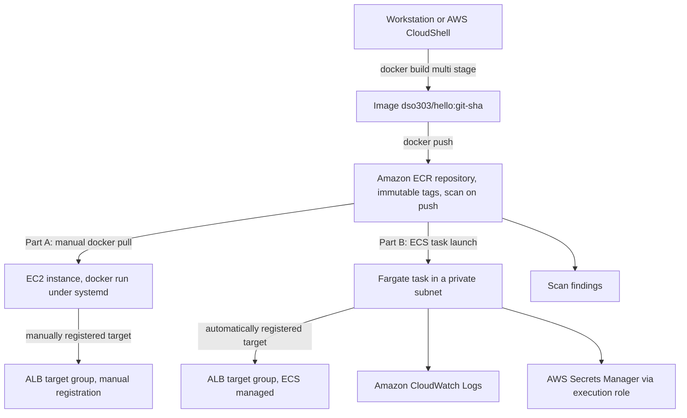
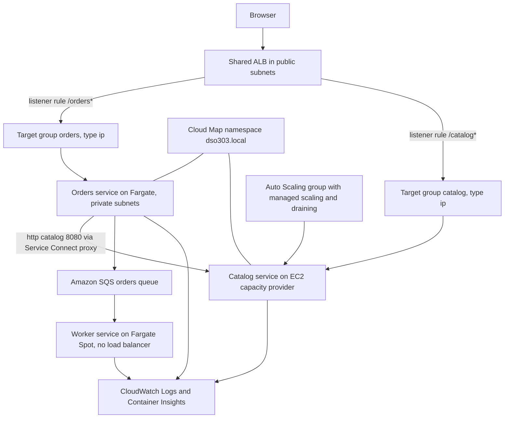
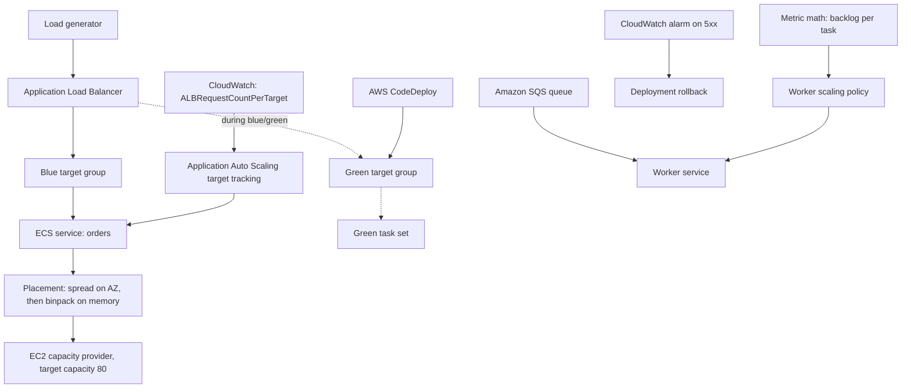

## 2.1 
## Hands-on Lab

### Objective

Build a small HTTP service into a container image using a multi-stage Dockerfile, push it to Amazon ECR with immutable tags and scanning enabled, run it **manually** on an Amazon EC2 instance under `systemd`, and then deploy the **identical image** as an Amazon ECS Fargate service behind an Application Load Balancer. The comparison between the manual and declarative deployments is the point of the exercise; the ECS deployment is deliberately minimal here because 2.2 and 2.3 develop it.

!!! info "Environment"

    This lab targets the **AWS Academy Learner Lab**, which provides a pre-existing IAM role named `LabRole` and restricts the creation of new IAM roles. `LabRole` is therefore reused wherever an execution role or task role is required. In a production account you would create three separate least-privilege roles as described in the security sections above, and reusing one role for both purposes would be a defect. The Region is `us-east-1` and the placeholder account ID is `111122223333`. Substitute your own VPC, subnet, and security group identifiers throughout.

### Architecture



### AWS Services Used

| Service | Role in the lab |
|---|---|
| **Amazon ECR** | Private repository with tag immutability and scan-on-push |
| **Amazon EC2** | The manual container host in Part A |
| **AWS Systems Manager Session Manager** | Shell access to the instance without SSH or an open port 22 |
| **Amazon ECS** | Cluster, task definition, and service in Part B |
| **AWS Fargate** | Serverless capacity for the ECS service |
| **Application Load Balancer** | Entry point; target registration is manual in Part A and automatic in Part B |
| **AWS Secrets Manager** | Supplies a value through the task definition's `secrets` block |
| **Amazon CloudWatch Logs** | Destination for container output |
| **AWS IAM** | `LabRole` reused as execution role, task role, and instance profile |
| **VPC endpoints** | `ecr.api`, `ecr.dkr`, `logs`, `secretsmanager` interface endpoints and the S3 gateway endpoint |

### Implementation Steps

**Step 1 — Set variables and create the repository.**

```bash
export AWS_REGION=us-east-1
export ACCOUNT_ID=111122223333
export REPO=dso303/hello
export REGISTRY="${ACCOUNT_ID}.dkr.ecr.${AWS_REGION}.amazonaws.com"
export TAG=$(git rev-parse --short HEAD 2>/dev/null || echo "v1")

aws ecr create-repository \
  --repository-name "$REPO" \
  --image-tag-mutability IMMUTABLE \
  --image-scanning-configuration scanOnPush=true \
  --encryption-configuration encryptionType=AES256 \
  --region "$AWS_REGION"
```

Tag immutability is set at creation because it cannot be applied retroactively to tags that already exist.

**Step 2 — Apply a lifecycle policy immediately.**

```bash
cat > lifecycle.json <<'JSON'
{
  "rules": [
    {
      "rulePriority": 1,
      "description": "Expire untagged images after 7 days",
      "selection": {
        "tagStatus": "untagged",
        "countType": "sinceImagePushed",
        "countUnit": "days",
        "countNumber": 7
      },
      "action": { "type": "expire" }
    },
    {
      "rulePriority": 2,
      "description": "Keep only the 30 most recent tagged images",
      "selection": {
        "tagStatus": "any",
        "countType": "imageCountMoreThan",
        "countNumber": 30
      },
      "action": { "type": "expire" }
    }
  ]
}
JSON

aws ecr put-lifecycle-policy --repository-name "$REPO" \
  --lifecycle-policy-text file://lifecycle.json --region "$AWS_REGION"
```

Doing this at creation rather than "later" is the difference between a controlled repository and an unbounded storage bill.

**Step 3 — Write the application and a multi-stage Dockerfile.**

```go
// main.go — a minimal service with a health endpoint and SIGTERM handling.
package main

import (
	"context"
	"encoding/json"
	"log"
	"net/http"
	"os"
	"os/signal"
	"syscall"
	"time"
)

func main() {
	port := os.Getenv("PORT")
	if port == "" {
		port = "8080"
	}
	mux := http.NewServeMux()
	mux.HandleFunc("/health", func(w http.ResponseWriter, r *http.Request) {
		w.WriteHeader(http.StatusOK)
		w.Write([]byte("ok"))
	})
	mux.HandleFunc("/", func(w http.ResponseWriter, r *http.Request) {
		host, _ := os.Hostname()
		json.NewEncoder(w).Encode(map[string]string{
			"message":  "hello from DSO303",
			"hostname": host,
			"version":  os.Getenv("APP_VERSION"),
		})
	})

	srv := &http.Server{Addr: ":" + port, Handler: mux}
	go func() {
		if err := srv.ListenAndServe(); err != nil && err != http.ErrServerClosed {
			log.Fatalf("listen: %v", err)
		}
	}()
	log.Printf("listening on :%s", port)

	// Graceful shutdown: stop accepting, drain in flight, then exit.
	stop := make(chan os.Signal, 1)
	signal.Notify(stop, syscall.SIGTERM, syscall.SIGINT)
	<-stop
	log.Println("SIGTERM received, draining")
	ctx, cancel := context.WithTimeout(context.Background(), 25*time.Second)
	defer cancel()
	_ = srv.Shutdown(ctx)
	log.Println("drained, exiting")
}
```

```dockerfile
# syntax=docker/dockerfile:1
# Build stage: full toolchain, discarded from the final image.
FROM public.ecr.aws/docker/library/golang:1.23-alpine AS build
WORKDIR /src
# Dependency manifests first so a source edit does not re-resolve dependencies.
COPY go.mod go.sum ./
RUN --mount=type=cache,target=/go/pkg/mod go mod download
COPY . .
RUN CGO_ENABLED=0 GOOS=linux go build -ldflags="-s -w" -o /out/hello .

# Runtime stage: minimal base, non root, no build tooling present.
FROM public.ecr.aws/docker/library/alpine:3.20 AS runtime
RUN adduser -D -u 1000 app
COPY --from=build /out/hello /usr/local/bin/hello
USER 1000:1000
EXPOSE 8080
# Exec form: the binary is PID 1 and receives SIGTERM directly.
ENTRYPOINT ["/usr/local/bin/hello"]
```

```
# .dockerignore
.git
.gitignore
*.md
Dockerfile
```

**Step 4 — Build, inspect the size, and push.**

```bash
aws ecr get-login-password --region "$AWS_REGION" \
  | docker login --username AWS --password-stdin "$REGISTRY"

# Build explicitly for the target architecture, not the build host's.
docker buildx build --platform linux/amd64 \
  -t "${REGISTRY}/${REPO}:${TAG}" --load .

docker images "${REGISTRY}/${REPO}"     # expect roughly 15-20 MB
docker push "${REGISTRY}/${REPO}:${TAG}"

# Capture the digest; this, not the tag, is what the task definition will use.
export DIGEST=$(aws ecr describe-images --repository-name "$REPO" \
  --image-ids imageTag="$TAG" --region "$AWS_REGION" \
  --query 'imageDetails[0].imageDigest' --output text)
echo "$DIGEST"

# Prove immutability: this second push must be rejected.
docker push "${REGISTRY}/${REPO}:${TAG}" || echo "rejected as expected"

# Read the scan result.
aws ecr describe-image-scan-findings --repository-name "$REPO" \
  --image-id imageDigest="$DIGEST" --region "$AWS_REGION" \
  --query 'imageScanFindings.findingSeverityCounts'
```

**Step 5 — Part A: run the container manually on EC2.**

Launch an Amazon Linux 2023 instance in a public subnet with `LabInstanceProfile` attached, then connect with Session Manager and run:

```bash
sudo dnf install -y docker
sudo systemctl enable --now docker

REGION=us-east-1; ACCOUNT_ID=111122223333; REPO=dso303/hello; TAG=<your-tag>
aws ecr get-login-password --region $REGION \
  | sudo docker login --username AWS --password-stdin ${ACCOUNT_ID}.dkr.ecr.${REGION}.amazonaws.com
sudo docker pull ${ACCOUNT_ID}.dkr.ecr.${REGION}.amazonaws.com/${REPO}:${TAG}

# Explicit limits, because nothing else will impose them.
sudo docker run -d --name hello \
  -p 8080:8080 \
  --memory 256m --cpus 0.5 \
  --read-only \
  --env APP_VERSION=${TAG} \
  --restart unless-stopped \
  ${ACCOUNT_ID}.dkr.ecr.${REGION}.amazonaws.com/${REPO}:${TAG}

curl -s localhost:8080/ ; echo
curl -s localhost:8080/health ; echo
```

Now supervise it properly, and then break it deliberately:

```bash
sudo tee /etc/systemd/system/hello.service >/dev/null <<'UNIT'
[Unit]
Description=DSO303 hello container
After=docker.service
Requires=docker.service

[Service]
Restart=always
RestartSec=5
ExecStartPre=-/usr/bin/docker rm -f hello
ExecStart=/usr/bin/docker run --rm --name hello -p 8080:8080 \
  --memory 256m --cpus 0.5 --read-only \
  111122223333.dkr.ecr.us-east-1.amazonaws.com/dso303/hello:TAGHERE
ExecStop=/usr/bin/docker stop -t 30 hello

[Install]
WantedBy=multi-user.target
UNIT

sudo systemctl daemon-reload && sudo systemctl enable --now hello
sudo systemctl status hello --no-pager

# Experiment 1: kill the container. systemd restarts it. This much works.
sudo docker kill hello; sleep 8; curl -s localhost:8080/health; echo

# Experiment 2: stop the instance. Nothing restarts the container anywhere else.
# Experiment 3: try to run a second copy on the same port.
sudo docker run -d --name hello2 -p 8080:8080 \
  111122223333.dkr.ecr.us-east-1.amazonaws.com/dso303/hello:TAGHERE
# Fails: port 8080 is already bound. Record what you would have to do to fix this by hand.
```

!!! tip "Record your answers to these three questions before continuing"

    Before moving to Part B, write down: (1) what would have to happen for this container to survive the instance failing; (2) how a load balancer would learn this container's address, and what changes if you run three containers on dynamic ports; (3) what steps a zero-downtime deployment of a new image would take, in order. Your three answers are, respectively, the service scheduler, automatic target registration, and the deployment configuration — the content of 2.2 and 2.3. Deriving them yourself is the point of Part A.

**Step 6 — Part B: create the ECS cluster and log group.**

```bash
export CLUSTER=dso303-lab
aws ecs create-cluster --cluster-name "$CLUSTER" \
  --settings name=containerInsights,value=enhanced --region "$AWS_REGION"

aws logs create-log-group --log-group-name /ecs/dso303/hello --region "$AWS_REGION"
aws logs put-retention-policy --log-group-name /ecs/dso303/hello \
  --retention-in-days 7 --region "$AWS_REGION"
```

**Step 7 — Create a secret to demonstrate the `secrets` block.**

```bash
aws secretsmanager create-secret --name dso303/hello/greeting \
  --secret-string "hello-from-secrets-manager" --region "$AWS_REGION"
```

**Step 8 — Register the task definition, pinned by digest.**

```bash
cat > taskdef.json <<JSON
{
  "family": "dso303-hello",
  "networkMode": "awsvpc",
  "requiresCompatibilities": ["FARGATE"],
  "cpu": "256",
  "memory": "512",
  "runtimePlatform": { "operatingSystemFamily": "LINUX", "cpuArchitecture": "X86_64" },
  "executionRoleArn": "arn:aws:iam::${ACCOUNT_ID}:role/LabRole",
  "taskRoleArn": "arn:aws:iam::${ACCOUNT_ID}:role/LabRole",
  "containerDefinitions": [
    {
      "name": "hello",
      "image": "${REGISTRY}/${REPO}@${DIGEST}",
      "essential": true,
      "portMappings": [
        { "name": "hello-8080-tcp", "containerPort": 8080, "protocol": "tcp", "appProtocol": "http" }
      ],
      "environment": [
        { "name": "PORT", "value": "8080" },
        { "name": "APP_VERSION", "value": "${TAG}" }
      ],
      "secrets": [
        { "name": "GREETING",
          "valueFrom": "arn:aws:secretsmanager:${AWS_REGION}:${ACCOUNT_ID}:secret:dso303/hello/greeting" }
      ],
      "readonlyRootFilesystem": true,
      "user": "1000:1000",
      "stopTimeout": 30,
      "linuxParameters": { "capabilities": { "drop": ["ALL"] } },
      "healthCheck": {
        "command": ["CMD-SHELL", "wget -q -O- http://localhost:8080/health || exit 1"],
        "interval": 15, "timeout": 5, "retries": 3, "startPeriod": 20
      },
      "logConfiguration": {
        "logDriver": "awslogs",
        "options": {
          "awslogs-group": "/ecs/dso303/hello",
          "awslogs-region": "${AWS_REGION}",
          "awslogs-stream-prefix": "app"
        }
      }
    }
  ]
}
JSON

aws ecs register-task-definition --cli-input-json file://taskdef.json --region "$AWS_REGION"
```

Note that the `image` field carries `@sha256:...` rather than a tag. This task-definition revision now names exact bytes, permanently.

**Step 9 — Create the ALB, target group, and ECS service.**

```bash
ALB_ARN=$(aws elbv2 create-load-balancer --name dso303-lab-alb \
  --subnets "$SUBNET_PUBLIC_A" "$SUBNET_PUBLIC_B" --security-groups sg-0alb1111 \
  --scheme internet-facing --type application \
  --query 'LoadBalancers[0].LoadBalancerArn' --output text --region "$AWS_REGION")

TG_ARN=$(aws elbv2 create-target-group --name dso303-hello-tg \
  --protocol HTTP --port 8080 --vpc-id "$VPC_ID" --target-type ip \
  --health-check-path /health --health-check-interval-seconds 15 \
  --healthy-threshold-count 2 --unhealthy-threshold-count 3 \
  --query 'TargetGroups[0].TargetGroupArn' --output text --region "$AWS_REGION")

aws elbv2 modify-target-group-attributes --target-group-arn "$TG_ARN" \
  --attributes Key=deregistration_delay.timeout_seconds,Value=30 --region "$AWS_REGION"

aws elbv2 create-listener --load-balancer-arn "$ALB_ARN" --protocol HTTP --port 80 \
  --default-actions Type=forward,TargetGroupArn="$TG_ARN" --region "$AWS_REGION"

aws ecs create-service --cluster "$CLUSTER" --service-name hello \
  --task-definition dso303-hello --desired-count 2 --launch-type FARGATE \
  --network-configuration "awsvpcConfiguration={subnets=[${SUBNET_PRIVATE_A},${SUBNET_PRIVATE_B}],securityGroups=[sg-0app2222],assignPublicIp=DISABLED}" \
  --load-balancers targetGroupArn="$TG_ARN",containerName=hello,containerPort=8080 \
  --health-check-grace-period-seconds 60 \
  --deployment-configuration '{"deploymentCircuitBreaker":{"enable":true,"rollback":true},"minimumHealthyPercent":100,"maximumPercent":200}' \
  --enable-execute-command --region "$AWS_REGION"
```

**Step 10 — Observe what ECS did that you had to do by hand.**

```bash
DNS=$(aws elbv2 describe-load-balancers --load-balancer-arns "$ALB_ARN" \
  --query 'LoadBalancers[0].DNSName' --output text --region "$AWS_REGION")
curl -s "http://${DNS}/" ; echo

# Targets registered automatically, with no manual step.
aws elbv2 describe-target-health --target-group-arn "$TG_ARN" --region "$AWS_REGION" \
  --query 'TargetHealthDescriptions[].[Target.Id,TargetHealth.State]' --output table

# Image pull duration: the honest measure of whether image size is a problem.
TASK=$(aws ecs list-tasks --cluster "$CLUSTER" --service-name hello \
  --query 'taskArns[0]' --output text --region "$AWS_REGION")
aws ecs describe-tasks --cluster "$CLUSTER" --tasks "$TASK" --region "$AWS_REGION" \
  --query 'tasks[0].{pullStart:pullStartedAt,pullStop:pullStoppedAt,status:lastStatus}'

# Self healing: stop a task and watch the scheduler replace it.
aws ecs stop-task --cluster "$CLUSTER" --task "$TASK" \
  --reason "lab: demonstrating reconciliation" --region "$AWS_REGION"
sleep 45
aws ecs describe-services --cluster "$CLUSTER" --services hello --region "$AWS_REGION" \
  --query 'services[0].{desired:desiredCount,running:runningCount,events:events[0:3].message}'
```

**Step 11 — Deliberately break things and read the diagnostics.**

```bash
# Failure 1: a nonexistent image. Expect CannotPullContainerError.
sed 's|@sha256:[a-f0-9]*|:does-not-exist|' taskdef.json > bad-image.json
aws ecs register-task-definition --cli-input-json file://bad-image.json --region "$AWS_REGION"
# Update the service to that revision, then read the stopped task:
aws ecs describe-tasks --cluster "$CLUSTER" \
  --tasks "$(aws ecs list-tasks --cluster "$CLUSTER" --service-name hello \
    --desired-status STOPPED --query 'taskArns[0]' --output text --region "$AWS_REGION")" \
  --region "$AWS_REGION" --query 'tasks[0].stoppedReason'

# Failure 2: memory far too low. Expect OutOfMemoryError and exit code 137.
# Failure 3: health check path changed to /nope. Expect the circuit breaker to roll back.
# In each case, read stoppedReason and the service events BEFORE forming a hypothesis.
```

**Step 12 — Inspect a running container with ECS Exec.**

```bash
TASK=$(aws ecs list-tasks --cluster "$CLUSTER" --service-name hello \
  --query 'taskArns[0]' --output text --region "$AWS_REGION")
aws ecs execute-command --cluster "$CLUSTER" --task "$TASK" \
  --container hello --interactive --command "/bin/sh" --region "$AWS_REGION"
# Inside the container, confirm the security posture and the injected secret:
#   id                                  -> uid=1000, not root
#   touch /test                         -> fails, read-only root filesystem
#   echo "$GREETING"                    -> the Secrets Manager value
#   env | grep ECS_CONTAINER_METADATA   -> the task metadata endpoint URI
#   wget -qO- "$ECS_CONTAINER_METADATA_URI_V4/task"
```

**Step 13 — Clean up.**

```bash
aws ecs update-service --cluster "$CLUSTER" --service hello --desired-count 0 --region "$AWS_REGION"
aws ecs delete-service --cluster "$CLUSTER" --service hello --force --region "$AWS_REGION"
aws elbv2 delete-load-balancer --load-balancer-arn "$ALB_ARN" --region "$AWS_REGION"
sleep 30
aws elbv2 delete-target-group --target-group-arn "$TG_ARN" --region "$AWS_REGION"
aws ecs delete-cluster --cluster "$CLUSTER" --region "$AWS_REGION"
aws ecr delete-repository --repository-name "$REPO" --force --region "$AWS_REGION"
aws logs delete-log-group --log-group-name /ecs/dso303/hello --region "$AWS_REGION"
aws secretsmanager delete-secret --secret-id dso303/hello/greeting \
  --force-delete-without-recovery --region "$AWS_REGION"
# Terminate the EC2 instance from Part A.
```

### Expected Output

| Observation | Expected result |
|---|---|
| `docker images` after the multi-stage build | Roughly 15 to 20 MB, versus several hundred MB for a single-stage build |
| Second `docker push` of the same tag | Rejected, because tag immutability is enabled |
| `describe-image-scan-findings` | A severity count map; typically zero or a small number for a current Alpine base |
| `curl localhost:8080/` on the EC2 instance | JSON containing the container's hostname |
| `docker kill hello` under `systemd` | Container restarts within seconds |
| Second `docker run` on port 8080 | Fails with a port-binding error |
| EC2 instance stopped | Service is gone; nothing anywhere restarts it |
| ECS service after creation | Two tasks `RUNNING`, both registered as healthy targets with no manual step |
| `pullStartedAt` to `pullStoppedAt` | A few seconds for a 20 MB image; compare this with a deliberately bloated build |
| `stop-task` on one task | A replacement reaches `RUNNING` within roughly a minute; service events record it |
| Task definition with a nonexistent image | `stoppedReason` contains `CannotPullContainerError` |
| Task with memory set far too low | `stoppedReason` contains `OutOfMemoryError`; container `exitCode` 137 |
| Broken health-check path | Deployment circuit breaker halts and rolls back to the previous revision |
| `touch /test` inside the container | Fails: read-only root filesystem |
| `id` inside the container | uid 1000, not root |

!!! tip "What the lab is really teaching"

    Three things, none of which is "how to type Docker commands". First, that **the artefact is the deliverable**: a digest-pinned, immutable, scanned, small image is what makes every later decision — rollback, scaling, audit — tractable, and every property that makes it good is set at build time, not at deploy time. Second, that **the manual EC2 deployment is not wrong so much as incomplete**: everything you did by hand in Part A is something ECS does continuously in Part B, and the list of things you could not do by hand at all — cross-host placement, automatic replacement after instance failure, zero-downtime rolling deployment — is the reason orchestrators exist. Third, that **the platform tells you what went wrong if you read it**: `stoppedReason`, `exitCode`, and the service event log name the cause in almost every failure in Step 11, and the habit of reading them before hypothesising is worth more than any amount of memorised troubleshooting.

---

## Code Examples

### Dockerfile: Python service with BuildKit cache and secret mounts

```dockerfile
# syntax=docker/dockerfile:1
FROM public.ecr.aws/docker/library/python:3.12-slim AS build
WORKDIR /app
# Dependency manifest first: a source edit must not re-resolve dependencies.
COPY requirements.txt .
# Cache mount persists the pip cache across builds without entering a layer.
RUN --mount=type=cache,target=/root/.cache/pip \
    pip install --prefix=/install -r requirements.txt

# A private index credential, available to this RUN only, never committed to a layer.
RUN --mount=type=secret,id=pipconf,target=/root/.config/pip/pip.conf \
    --mount=type=cache,target=/root/.cache/pip \
    pip install --prefix=/install -r requirements-private.txt || true

FROM public.ecr.aws/docker/library/python:3.12-slim AS runtime
RUN useradd --uid 1000 --create-home app
COPY --from=build /install /usr/local
COPY --chown=1000:1000 ./src /app
WORKDIR /app
USER 1000:1000
ENV PYTHONDONTWRITEBYTECODE=1 PYTHONUNBUFFERED=1
EXPOSE 8080
ENTRYPOINT ["python", "-m", "uvicorn", "main:app", "--host", "0.0.0.0", "--port", "8080"]
```

Build it with `DOCKER_BUILDKIT=1 docker build --secret id=pipconf,src=$HOME/.config/pip/pip.conf .`. The secret is present for one instruction and appears in no layer and no image history.

!!! danger "Why `ARG` is not a secret mechanism"

    `ARG TOKEN=...` places the value in the image's build history, retrievable with `docker history` by anyone who can pull the image. The same is true of any file `COPY`ed in and deleted later. BuildKit secret mounts exist specifically because neither of those is safe, and using them costs one extra flag.

### CloudFormation: ECR repository with immutability, scanning, and lifecycle

```yaml
AWSTemplateFormatVersion: '2010-09-09'
Description: A production-shaped ECR repository

Parameters:
  RepositoryName: { Type: String }
  WorkloadAccountId: { Type: String, Description: "Account allowed to pull" }

Resources:
  Repository:
    Type: AWS::ECR::Repository
    Properties:
      RepositoryName: !Ref RepositoryName
      # Cannot be applied retroactively, so it must be set here.
      ImageTagMutability: IMMUTABLE
      ImageScanningConfiguration:
        ScanOnPush: true
      EncryptionConfiguration:
        EncryptionType: KMS
        KmsKey: !Ref EcrKey
      LifecyclePolicy:
        LifecyclePolicyText: |
          {
            "rules": [
              { "rulePriority": 1,
                "description": "Expire untagged after 7 days",
                "selection": { "tagStatus": "untagged", "countType": "sinceImagePushed",
                               "countUnit": "days", "countNumber": 7 },
                "action": { "type": "expire" } },
              { "rulePriority": 2,
                "description": "Keep 50 release images",
                "selection": { "tagStatus": "tagged", "tagPrefixList": ["rel-"],
                               "countType": "imageCountMoreThan", "countNumber": 50 },
                "action": { "type": "expire" } },
              { "rulePriority": 3,
                "description": "Keep 20 CI images",
                "selection": { "tagStatus": "any",
                               "countType": "imageCountMoreThan", "countNumber": 20 },
                "action": { "type": "expire" } }
            ]
          }
      # Pull only for the workload account. Push stays with the CI role in this account.
      RepositoryPolicyText:
        Version: '2012-10-17'
        Statement:
          - Sid: CrossAccountPullOnly
            Effect: Allow
            Principal:
              AWS: !Sub 'arn:aws:iam::${WorkloadAccountId}:root'
            Action:
              - ecr:BatchGetImage
              - ecr:GetDownloadUrlForLayer
              - ecr:BatchCheckLayerAvailability

  EcrKey:
    Type: AWS::KMS::Key
    Properties:
      Description: !Sub 'CMK for ECR repository ${RepositoryName}'
      EnableKeyRotation: true
      KeyPolicy:
        Version: '2012-10-17'
        Statement:
          - Effect: Allow
            Principal: { AWS: !Sub 'arn:aws:iam::${AWS::AccountId}:root' }
            Action: 'kms:*'
            Resource: '*'
```

!!! warning "A customer-managed key adds a permission requirement"

    If the repository is encrypted with a CMK, every principal that pulls — including each task **execution role** — needs `kms:Decrypt` on that key. Omitting it produces a pull failure that reads like an ECR permissions problem and is not, which is why the key policy and the execution role policy must be designed together.

### Terraform: repository, pull-through cache, and enhanced scanning

```hcl
resource "aws_ecr_repository" "service" {
  name                 = "dso303/${var.service_name}"
  image_tag_mutability = "IMMUTABLE"

  image_scanning_configuration {
    scan_on_push = true
  }

  encryption_configuration {
    encryption_type = "KMS"
    kms_key         = aws_kms_key.ecr.arn
  }
}

resource "aws_ecr_lifecycle_policy" "service" {
  repository = aws_ecr_repository.service.name
  policy = jsonencode({
    rules = [
      {
        rulePriority = 1
        description  = "Expire untagged after 7 days"
        selection    = { tagStatus = "untagged", countType = "sinceImagePushed",
                         countUnit = "days", countNumber = 7 }
        action       = { type = "expire" }
      },
      {
        rulePriority = 2
        description  = "Keep 30 tagged images"
        selection    = { tagStatus = "any", countType = "imageCountMoreThan", countNumber = 30 }
        action       = { type = "expire" }
      }
    ]
  })
}

# Enhanced, continuous scanning for the whole registry.
resource "aws_ecr_registry_scanning_configuration" "this" {
  scan_type = "ENHANCED"
  rule {
    scan_frequency = "CONTINUOUS_SCAN"
    repository_filter {
      filter      = "*"
      filter_type = "WILDCARD"
    }
  }
}

# Remove the public registry from the deployment path.
resource "aws_ecr_pull_through_cache_rule" "public_ecr" {
  ecr_repository_prefix = "upstream"
  upstream_registry_url = "public.ecr.aws"
}

# Put images in every Region that launches tasks from them.
resource "aws_ecr_replication_configuration" "this" {
  replication_configuration {
    rule {
      destination {
        region      = "ap-southeast-1"
        registry_id = data.aws_caller_identity.current.account_id
      }
    }
  }
}
```

### AWS CLI: promoting one digest through environments

```bash
#!/usr/bin/env bash
set -euo pipefail
# Promote the artefact, never rebuild it. The digest is the contract.

REGION=us-east-1
ACCOUNT=111122223333
REPO=dso303/orders
FAMILY=dso303-orders
CLUSTER_STAGING=dso303-staging
CLUSTER_PROD=dso303-prod
DIGEST="$1"   # sha256:... validated in staging

# 1. Refuse to promote an image with unresolved critical findings.
CRITICAL=$(aws ecr describe-image-scan-findings --repository-name "$REPO" \
  --image-id imageDigest="$DIGEST" --region "$REGION" \
  --query 'imageScanFindings.findingSeverityCounts.CRITICAL' --output text 2>/dev/null || echo "0")
if [[ "$CRITICAL" != "None" && "$CRITICAL" != "0" ]]; then
  echo "Refusing to promote: ${CRITICAL} critical findings"; exit 1
fi

# 2. Take the staging task definition and change only the cluster it is deployed to.
#    The image reference is identical, so the bytes are identical.
TD_JSON=$(aws ecs describe-task-definition --task-definition "$FAMILY" --region "$REGION" \
  --query 'taskDefinition' --output json)

echo "$TD_JSON" | jq --arg img "${ACCOUNT}.dkr.ecr.${REGION}.amazonaws.com/${REPO}@${DIGEST}" '
  .containerDefinitions[0].image = $img
  | del(.taskDefinitionArn, .revision, .status, .requiresAttributes,
        .compatibilities, .registeredAt, .registeredBy)' > prod-taskdef.json

NEW_TD=$(aws ecs register-task-definition --cli-input-json file://prod-taskdef.json \
  --region "$REGION" --query 'taskDefinition.taskDefinitionArn' --output text)

aws ecs update-service --cluster "$CLUSTER_PROD" --service orders \
  --task-definition "$NEW_TD" --region "$REGION"

# 3. Wait for the deployment to stabilise; the circuit breaker rolls back on failure.
aws ecs wait services-stable --cluster "$CLUSTER_PROD" --services orders --region "$REGION"
echo "Promoted ${DIGEST} to production"
```

### Python (boto3): auditing a registry for supply-chain hygiene

```python
"""Report repositories that violate the organisation's image policy."""
import boto3

REGION = "us-east-1"
ecr = boto3.client("ecr", region_name=REGION)


def audit() -> None:
    paginator = ecr.get_paginator("describe_repositories")
    for page in paginator.paginate():
        for repo in page["repositories"]:
            name = repo["repositoryName"]
            problems = []

            if repo.get("imageTagMutability") != "IMMUTABLE":
                problems.append("tags are mutable")

            if not repo.get("imageScanningConfiguration", {}).get("scanOnPush"):
                problems.append("scan-on-push disabled")

            try:
                ecr.get_lifecycle_policy(repositoryName=name)
            except ecr.exceptions.LifecyclePolicyNotFoundException:
                problems.append("no lifecycle policy")

            # Count untagged images: the usual source of unexplained storage cost.
            untagged = 0
            for imgs in ecr.get_paginator("describe_images").paginate(
                repositoryName=name, filter={"tagStatus": "UNTAGGED"}
            ):
                untagged += len(imgs["imageDetails"])
            if untagged > 50:
                problems.append(f"{untagged} untagged images")

            if problems:
                print(f"{name}: " + "; ".join(problems))


if __name__ == "__main__":
    audit()
```

### Shell: diagnosing a task that will not start

```bash
CLUSTER=dso303-lab; SERVICE=hello; REGION=us-east-1

# 1. Service events name the cause outright in most cases. Read these first.
aws ecs describe-services --cluster "$CLUSTER" --services "$SERVICE" --region "$REGION" \
  --query 'services[0].events[0:10].[createdAt,message]' --output table

# 2. Desired versus running distinguishes placement failure from crash looping.
aws ecs describe-services --cluster "$CLUSTER" --services "$SERVICE" --region "$REGION" \
  --query 'services[0].{desired:desiredCount,running:runningCount,pending:pendingCount}'

# 3. The most recent stopped task: stoppedReason and exitCode name the failure class.
TASK=$(aws ecs list-tasks --cluster "$CLUSTER" --service-name "$SERVICE" \
  --desired-status STOPPED --query 'taskArns[0]' --output text --region "$REGION")
aws ecs describe-tasks --cluster "$CLUSTER" --tasks "$TASK" --region "$REGION" \
  --query 'tasks[0].{reason:stoppedReason,
                     containers:containers[].[name,exitCode,reason],
                     pullStart:pullStartedAt,pullStop:pullStoppedAt}'

# 4. Free IP addresses in the task subnets: exhaustion presents as PROVISIONING forever.
for s in "$SUBNET_PRIVATE_A" "$SUBNET_PRIVATE_B"; do
  aws ec2 describe-subnets --subnet-ids "$s" --region "$REGION" \
    --query 'Subnets[0].[SubnetId,AvailableIpAddressCount]' --output text
done

# 5. Does the referenced image actually exist in this Region's registry?
aws ecr describe-images --repository-name dso303/hello --region "$REGION" \
  --query 'imageDetails[0:5].[imageTags[0],imageDigest,imagePushedAt]' --output table

# 6. Application-level failures: the logs are the only remaining source.
aws logs tail /ecs/dso303/hello --since 15m --region "$REGION"
```

### JSON: an execution-role policy scoped to one repository

```json
{
  "Version": "2012-10-17",
  "Statement": [
    {
      "Sid": "AuthTokenIsRegistryWide",
      "Effect": "Allow",
      "Action": "ecr:GetAuthorizationToken",
      "Resource": "*"
    },
    {
      "Sid": "PullThisServiceImageOnly",
      "Effect": "Allow",
      "Action": [
        "ecr:BatchCheckLayerAvailability",
        "ecr:GetDownloadUrlForLayer",
        "ecr:BatchGetImage"
      ],
      "Resource": "arn:aws:ecr:us-east-1:111122223333:repository/dso303/orders"
    },
    {
      "Sid": "DecryptRepositoryCmk",
      "Effect": "Allow",
      "Action": "kms:Decrypt",
      "Resource": "arn:aws:kms:us-east-1:111122223333:key/abcd-1234",
      "Condition": {
        "StringEquals": { "kms:ViaService": "ecr.us-east-1.amazonaws.com" }
      }
    },
    {
      "Sid": "WriteThisServiceLogsOnly",
      "Effect": "Allow",
      "Action": ["logs:CreateLogStream", "logs:PutLogEvents"],
      "Resource": "arn:aws:logs:us-east-1:111122223333:log-group:/ecs/dso303/orders:*"
    },
    {
      "Sid": "ReadThisServiceSecretsOnly",
      "Effect": "Allow",
      "Action": "secretsmanager:GetSecretValue",
      "Resource": "arn:aws:secretsmanager:us-east-1:111122223333:secret:dso303/orders/*"
    }
  ]
}
```

!!! note "Why `GetAuthorizationToken` has no resource"

    The authorisation token is issued at registry scope rather than repository scope, so the action cannot be constrained by resource ARN. The meaningful restriction is on the pull actions immediately below it, which is where repository-level scoping actually takes effect. This is a good illustration of a general point about least privilege: the granularity available differs per action, and a policy is only as tight as the action that grants the most.

---

## 2.2
## Hands-on Lab

### Objective

Build one ECS cluster that demonstrates every major decision in this chapter: a **Fargate service** behind a **shared Application Load Balancer** with path-based routing; an **EC2 capacity provider** with managed scaling running a second service so the two capacity models can be compared directly; **ECS Service Connect** for east-west traffic with no internal load balancer; a **worker service on Fargate Spot** with no load balancer at all; and a deliberate set of failures whose diagnostics you read rather than guess at.

!!! info "Environment"

    This lab targets the **AWS Academy Learner Lab**, which provides a pre-existing IAM role named `LabRole` and an instance profile named `LabInstanceProfile`, and restricts creation of new IAM roles. `LabRole` is therefore reused as both execution role and task role. In a production account you would create three separate least-privilege roles as described in the security sections, and reusing one would be a defect. The Region is `us-east-1` and the placeholder account ID is `111122223333`. Substitute your own VPC, subnet, and security group identifiers. The images are the ones built in the 2.1 lab.

### Architecture



### AWS Services Used

| Service | Role in the lab |
|---|---|
| **Amazon ECS** | One cluster with three services and two capacity providers |
| **AWS Fargate** | Capacity for the orders and worker services, including Fargate Spot |
| **Amazon EC2 and Auto Scaling** | Capacity for the catalog service via an ASG capacity provider |
| **Application Load Balancer** | One shared load balancer with two listener rules |
| **AWS Cloud Map** | The namespace backing Service Connect |
| **Amazon SQS** | Work queue for the worker service |
| **Amazon CloudWatch** | Container Insights, log groups, and Service Connect metrics |
| **AWS IAM** | `LabRole` and `LabInstanceProfile` |
| **Amazon ECR** | Source of the images built in 2.1 |

### Implementation Steps

**Step 1 — Variables and cluster.**

```bash
export AWS_REGION=us-east-1
export ACCOUNT_ID=111122223333
export CLUSTER=dso303-ch22
export REGISTRY="${ACCOUNT_ID}.dkr.ecr.${AWS_REGION}.amazonaws.com"
export VPC_ID=vpc-0abc1234def567890
export SUBNET_PRIVATE_A=subnet-0aaa1111bbbb2222a
export SUBNET_PRIVATE_B=subnet-0aaa1111bbbb2222b
export SUBNET_PUBLIC_A=subnet-0ccc3333dddd4444a
export SUBNET_PUBLIC_B=subnet-0ccc3333dddd4444b

aws ecs create-cluster --cluster-name "$CLUSTER" \
  --settings name=containerInsights,value=enhanced \
  --service-connect-defaults namespace=dso303.local \
  --region "$AWS_REGION"
```

Setting a cluster-level Service Connect default namespace means each service need not repeat it; ECS creates the backing Cloud Map namespace automatically.

**Step 2 — Create log groups with retention.**

```bash
for svc in orders catalog worker; do
  aws logs create-log-group --log-group-name /ecs/dso303/${svc} --region "$AWS_REGION"
  aws logs put-retention-policy --log-group-name /ecs/dso303/${svc} \
    --retention-in-days 7 --region "$AWS_REGION"
done
```

**Step 3 — Create the shared ALB with an explicit 404 default.**

```bash
ALB_ARN=$(aws elbv2 create-load-balancer --name dso303-ch22-alb \
  --subnets "$SUBNET_PUBLIC_A" "$SUBNET_PUBLIC_B" --security-groups sg-0alb1111 \
  --scheme internet-facing --type application \
  --query 'LoadBalancers[0].LoadBalancerArn' --output text --region "$AWS_REGION")

for svc in orders catalog; do
  aws elbv2 create-target-group --name dso303-${svc}-tg \
    --protocol HTTP --port 8080 --vpc-id "$VPC_ID" --target-type ip \
    --health-check-path /health --health-check-interval-seconds 15 \
    --healthy-threshold-count 2 --unhealthy-threshold-count 3 \
    --region "$AWS_REGION"
  TG=$(aws elbv2 describe-target-groups --names dso303-${svc}-tg \
    --query 'TargetGroups[0].TargetGroupArn' --output text --region "$AWS_REGION")
  aws elbv2 modify-target-group-attributes --target-group-arn "$TG" \
    --attributes Key=deregistration_delay.timeout_seconds,Value=30 \
                 Key=load_balancing.algorithm.type,Value=least_outstanding_requests \
    --region "$AWS_REGION"
done

TG_ORDERS=$(aws elbv2 describe-target-groups --names dso303-orders-tg \
  --query 'TargetGroups[0].TargetGroupArn' --output text --region "$AWS_REGION")
TG_CATALOG=$(aws elbv2 describe-target-groups --names dso303-catalog-tg \
  --query 'TargetGroups[0].TargetGroupArn' --output text --region "$AWS_REGION")

LISTENER=$(aws elbv2 create-listener --load-balancer-arn "$ALB_ARN" \
  --protocol HTTP --port 80 \
  --default-actions Type=fixed-response,FixedResponseConfig="{StatusCode=404,ContentType=text/plain,MessageBody=no route}" \
  --query 'Listeners[0].ListenerArn' --output text --region "$AWS_REGION")

aws elbv2 create-rule --listener-arn "$LISTENER" --priority 10 \
  --conditions Field=path-pattern,Values='/orders*' \
  --actions Type=forward,TargetGroupArn="$TG_ORDERS" --region "$AWS_REGION"
aws elbv2 create-rule --listener-arn "$LISTENER" --priority 20 \
  --conditions Field=path-pattern,Values='/catalog*' \
  --actions Type=forward,TargetGroupArn="$TG_CATALOG" --region "$AWS_REGION"
```

The default action is an explicit 404 rather than a forward, so an unmatched path fails clearly instead of arriving at whichever service happens to be the default target group.

**Step 4 — Create an EC2 capacity provider with managed scaling.**

Create an Auto Scaling group of two `t3.medium` instances from the ECS-optimised AMI in the two private subnets, with `LabInstanceProfile` attached, and user data that registers them with the cluster:

```bash
cat > userdata.sh <<'UD'
#!/bin/bash
echo "ECS_CLUSTER=dso303-ch22" >> /etc/ecs/ecs.config
echo "ECS_ENABLE_CONTAINER_METADATA=true" >> /etc/ecs/ecs.config
UD

# After creating the ASG named dso303-ch22-asg, wrap it in a capacity provider:
aws ecs create-capacity-provider --name dso303-ec2-cp \
  --auto-scaling-group-provider "autoScalingGroupArn=<ASG_ARN>,\
managedScaling={status=ENABLED,targetCapacity=80,minimumScalingStepSize=1,maximumScalingStepSize=4},\
managedTerminationProtection=ENABLED,managedDraining=ENABLED" \
  --region "$AWS_REGION"

aws ecs put-cluster-capacity-providers --cluster "$CLUSTER" \
  --capacity-providers dso303-ec2-cp FARGATE FARGATE_SPOT \
  --default-capacity-provider-strategy capacityProvider=FARGATE,weight=1 \
  --region "$AWS_REGION"
```

Target capacity of 80 per cent is the deliberate choice: it keeps roughly a fifth of the cluster free so a task can place immediately while an instance launch happens behind it. Managed termination protection and managed draining are both enabled, without which scale-in and instance refresh kill running tasks.

**Step 5 — Register task definitions.**

Register `dso303-catalog` for EC2 capacity and `dso303-orders` and `dso303-worker` for Fargate, all with `awsvpc` mode. The two settings that matter for this chapter:

```json
"portMappings": [
  { "name": "catalog-8080-tcp", "containerPort": 8080, "protocol": "tcp", "appProtocol": "http" }
]
```

The port mapping **must** have a `name`, because Service Connect advertises named mappings. And in the orders task definition:

```json
{ "name": "CATALOG_URL", "value": "http://catalog:8080" }
```

That hostname is resolved by the Service Connect proxy inside the task, not by public DNS, and there is no load balancer between the two services.

**Step 6 — Create the catalog service on EC2 capacity with Service Connect server mode.**

```bash
NETCFG="awsvpcConfiguration={subnets=[${SUBNET_PRIVATE_A},${SUBNET_PRIVATE_B}],securityGroups=[sg-0app2222],assignPublicIp=DISABLED}"

aws ecs create-service --cluster "$CLUSTER" --service-name catalog \
  --task-definition dso303-catalog --desired-count 2 \
  --capacity-provider-strategy capacityProvider=dso303-ec2-cp,weight=1 \
  --network-configuration "$NETCFG" \
  --load-balancers targetGroupArn="$TG_CATALOG",containerName=catalog,containerPort=8080 \
  --health-check-grace-period-seconds 60 \
  --deployment-configuration '{"deploymentCircuitBreaker":{"enable":true,"rollback":true},"minimumHealthyPercent":100,"maximumPercent":200}' \
  --service-connect-configuration '{
      "enabled": true,
      "namespace": "dso303.local",
      "services": [{
        "portName": "catalog-8080-tcp",
        "discoveryName": "catalog",
        "clientAliases": [{ "port": 8080, "dnsName": "catalog" }]
      }]
    }' \
  --enable-execute-command --region "$AWS_REGION"
```

**Step 7 — Create the orders service on Fargate as a Service Connect client.**

```bash
aws ecs create-service --cluster "$CLUSTER" --service-name orders \
  --task-definition dso303-orders --desired-count 2 \
  --capacity-provider-strategy capacityProvider=FARGATE,base=2,weight=1 \
                               capacityProvider=FARGATE_SPOT,weight=4 \
  --network-configuration "$NETCFG" \
  --load-balancers targetGroupArn="$TG_ORDERS",containerName=orders,containerPort=8080 \
  --health-check-grace-period-seconds 60 \
  --deployment-configuration '{"deploymentCircuitBreaker":{"enable":true,"rollback":true},"minimumHealthyPercent":100,"maximumPercent":200}' \
  --service-connect-configuration '{ "enabled": true, "namespace": "dso303.local" }' \
  --enable-execute-command --region "$AWS_REGION"
```

Note the strategy: a guaranteed base of two On-Demand tasks, with everything above that split one-to-four in favour of Spot.

**Step 8 — Create the worker service with no load balancer at all.**

```bash
aws sqs create-queue --queue-name dso303-orders-queue --region "$AWS_REGION"

aws ecs create-service --cluster "$CLUSTER" --service-name worker \
  --task-definition dso303-worker --desired-count 2 \
  --capacity-provider-strategy capacityProvider=FARGATE_SPOT,weight=1 \
  --network-configuration "$NETCFG" \
  --enable-execute-command --region "$AWS_REGION"
```

There is no `--load-balancers` argument and no health-check grace period, because there is nothing to register and nothing checking it over the network. Students frequently attach an ALB to a worker out of habit; this step exists to show that it is neither needed nor free.

**Step 9 — Verify the north-south and east-west paths.**

```bash
DNS=$(aws elbv2 describe-load-balancers --load-balancer-arns "$ALB_ARN" \
  --query 'LoadBalancers[0].DNSName' --output text --region "$AWS_REGION")

curl -s "http://${DNS}/catalog/products/123"; echo     # 200 from catalog on EC2
curl -s "http://${DNS}/orders" -X POST -H 'Content-Type: application/json' \
  -d '{"productId":"123","quantity":2}'; echo          # orders calls catalog internally
curl -s -o /dev/null -w '%{http_code}\n' "http://${DNS}/nope"   # 404 from the default action

# Both services registered as healthy targets, with no manual registration step.
for tg in "$TG_ORDERS" "$TG_CATALOG"; do
  aws elbv2 describe-target-health --target-group-arn "$tg" --region "$AWS_REGION" \
    --query 'TargetHealthDescriptions[].[Target.Id,TargetHealth.State]' --output table
done

# Service Connect metrics, broken down by client and server, with no instrumentation.
aws cloudwatch list-metrics --namespace ECS/ServiceConnect --region "$AWS_REGION" \
  --query 'Metrics[0:10].[MetricName,Dimensions[?Name==`DiscoveryName`].Value|[0]]' --output table
```

**Step 10 — Prove Service Connect resolution from inside a task.**

```bash
TASK=$(aws ecs list-tasks --cluster "$CLUSTER" --service-name orders \
  --query 'taskArns[0]' --output text --region "$AWS_REGION")
aws ecs execute-command --cluster "$CLUSTER" --task "$TASK" \
  --container orders --interactive --command "/bin/sh" --region "$AWS_REGION"
# Inside the container:
#   getent hosts catalog          -> a local proxy address, not a task IP and not public DNS
#   wget -qO- http://catalog:8080/products/123
#   env | grep ECS_CONTAINER_METADATA_URI_V4
```

**Step 11 — Compare the two capacity models directly.**

```bash
# Fargate: no instances exist at all.
aws ecs list-container-instances --cluster "$CLUSTER" --region "$AWS_REGION"

# EC2: instances, their registered and remaining resources, and their attributes.
CI=$(aws ecs list-container-instances --cluster "$CLUSTER" \
  --query 'containerInstanceArns[0]' --output text --region "$AWS_REGION")
aws ecs describe-container-instances --cluster "$CLUSTER" --container-instances "$CI" \
  --region "$AWS_REGION" \
  --query 'containerInstances[0].{status:status,agent:agentConnected,
            registered:registeredResources[?name==`CPU`||name==`MEMORY`].[name,integerValue],
            remaining:remainingResources[?name==`CPU`||name==`MEMORY`].[name,integerValue]}'

# Task start latency: compare a Fargate task with an EC2 task on a warm instance.
for svc in orders catalog; do
  T=$(aws ecs list-tasks --cluster "$CLUSTER" --service-name $svc \
    --query 'taskArns[0]' --output text --region "$AWS_REGION")
  aws ecs describe-tasks --cluster "$CLUSTER" --tasks "$T" --region "$AWS_REGION" \
    --query "tasks[0].{svc:'$svc',created:createdAt,pullStart:pullStartedAt,
              pullStop:pullStoppedAt,started:startedAt}"
done
```

The pull timestamps are the point: the EC2 task on a warm instance should show a much shorter pull window than the Fargate task, because the layers were already present locally.

**Step 12 — Break things deliberately and read the diagnostics.**

```bash
# Failure 1: exhaust capacity on EC2. Scale catalog far beyond what two instances hold.
aws ecs update-service --cluster "$CLUSTER" --service catalog --desired-count 30 \
  --region "$AWS_REGION"
sleep 60
aws ecs describe-services --cluster "$CLUSTER" --services catalog --region "$AWS_REGION" \
  --query 'services[0].{desired:desiredCount,running:runningCount,pending:pendingCount,
            events:events[0:5].message}'
# Watch the capacity provider add instances. Then disable managed scaling and repeat
# to observe the classic stuck-PROVISIONING failure.

# Failure 2: break the health-check path so targets never become healthy.
# Register a revision with healthCheck path /nope, update the service, and observe
# UnHealthyHostCount rise and the deployment circuit breaker roll back.

# Failure 3: remove the ALB security group rule and watch targets go unhealthy
# with TargetHealth.Reason = Target.Timeout rather than ResponseCodeMismatch.
aws elbv2 describe-target-health --target-group-arn "$TG_ORDERS" --region "$AWS_REGION" \
  --query 'TargetHealthDescriptions[].[Target.Id,TargetHealth.State,TargetHealth.Reason,
            TargetHealth.Description]' --output table
```

**Step 13 — Clean up.**

```bash
for svc in orders catalog worker; do
  aws ecs update-service --cluster "$CLUSTER" --service "$svc" --desired-count 0 --region "$AWS_REGION"
  aws ecs delete-service --cluster "$CLUSTER" --service "$svc" --force --region "$AWS_REGION"
done
aws elbv2 delete-load-balancer --load-balancer-arn "$ALB_ARN" --region "$AWS_REGION"
sleep 30
aws elbv2 delete-target-group --target-group-arn "$TG_ORDERS" --region "$AWS_REGION"
aws elbv2 delete-target-group --target-group-arn "$TG_CATALOG" --region "$AWS_REGION"
aws ecs put-cluster-capacity-providers --cluster "$CLUSTER" --capacity-providers \
  --default-capacity-provider-strategy --region "$AWS_REGION"
aws ecs delete-capacity-provider --capacity-provider dso303-ec2-cp --region "$AWS_REGION"
# Delete the Auto Scaling group, then:
aws ecs delete-cluster --cluster "$CLUSTER" --region "$AWS_REGION"
aws sqs delete-queue --queue-url "$(aws sqs get-queue-url --queue-name dso303-orders-queue \
  --query QueueUrl --output text --region "$AWS_REGION")" --region "$AWS_REGION"
for svc in orders catalog worker; do
  aws logs delete-log-group --log-group-name /ecs/dso303/${svc} --region "$AWS_REGION"
done
```

### Expected Output

| Observation | Expected result |
|---|---|
| `GET /catalog/products/123` | 200 from the catalog service running on EC2 capacity |
| `POST /orders` | 201 containing product fields fetched from catalog through Service Connect |
| `GET /nope` | 404 from the listener's fixed-response default action |
| `describe-target-health` for both target groups | Targets registered automatically and healthy, with no manual registration |
| `getent hosts catalog` inside an orders task | Resolves to a local Service Connect proxy address |
| `ECS/ServiceConnect` metrics | Request count and error rate dimensioned by client and server |
| `list-container-instances` | Instances exist for the EC2 capacity provider; Fargate contributes none |
| Pull timestamps, EC2 warm instance versus Fargate | The EC2 pull window is substantially shorter, because layers are cached locally |
| Scaling catalog to 30 with managed scaling enabled | ASG grows; tasks place as instances register; events narrate it |
| Same scale-up with managed scaling disabled | Tasks stick in `PROVISIONING`; service events state insufficient resources |
| Broken health-check path | `UnHealthyHostCount` rises; the circuit breaker rolls back the deployment |
| ALB security group rule removed | `TargetHealth.Reason` is `Target.Timeout`, distinguishing a network fault from an application one |
| Worker service | Runs on Fargate Spot with no load balancer, no target group, and no health-check grace period |

!!! tip "What the lab is really teaching"

    Four things. First, that **one load balancer serves many services** through listener rules, so decomposition does not multiply the edge bill — the single highest-value cost decision in a small ECS estate. Second, that **service-to-service traffic should not traverse a load balancer**: Service Connect gives discovery, client-side load balancing, and per-caller telemetry inside the task, with no hop, no hourly charge, and no control-plane call on the request path. Third, that **the two capacity models differ in ways you can measure rather than assert**: the pull timestamps and the presence or absence of container instances make the trade concrete, and disabling managed scaling reproduces the single most common EC2-capacity production failure in about a minute. Fourth, that **the platform names its own failures**: in every failure in Step 12, the service events or `TargetHealth.Reason` state the cause, and the habit of reading them before hypothesising is the most transferable thing in the chapter.

---

## Code Examples

### CloudFormation: cluster, capacity providers, and a Fargate service

```yaml
AWSTemplateFormatVersion: '2010-09-09'
Description: ECS cluster with a mixed capacity strategy and one service behind a shared ALB

Parameters:
  VpcId:            { Type: AWS::EC2::VPC::Id }
  PrivateSubnets:   { Type: List<AWS::EC2::Subnet::Id> }
  ListenerArn:      { Type: String, Description: "Existing shared ALB listener" }
  TaskDefinitionArn:{ Type: String }

Resources:
  Cluster:
    Type: AWS::ECS::Cluster
    Properties:
      ClusterName: dso303-prod
      ClusterSettings:
        - Name: containerInsights
          Value: enhanced
      ServiceConnectDefaults:
        Namespace: dso303-prod.local
      Configuration:
        ExecuteCommandConfiguration:
          Logging: OVERRIDE
          LogConfiguration:
            CloudWatchLogGroupName: !Ref ExecLogGroup
            CloudWatchEncryptionEnabled: true

  ExecLogGroup:
    Type: AWS::Logs::LogGroup
    Properties:
      LogGroupName: /ecs/dso303/exec-sessions
      RetentionInDays: 365

  # An On-Demand floor with the remainder on Spot.
  CapacityProviders:
    Type: AWS::ECS::ClusterCapacityProviderAssociations
    Properties:
      Cluster: !Ref Cluster
      CapacityProviders: [ FARGATE, FARGATE_SPOT ]
      DefaultCapacityProviderStrategy:
        - CapacityProvider: FARGATE
          Base: 2
          Weight: 1
        - CapacityProvider: FARGATE_SPOT
          Weight: 4

  ServiceSecurityGroup:
    Type: AWS::EC2::SecurityGroup
    Properties:
      GroupDescription: Orders service tasks
      VpcId: !Ref VpcId

  # Identity-based rule: the ALB's group, not a CIDR.
  AllowFromLoadBalancer:
    Type: AWS::EC2::SecurityGroupIngress
    Properties:
      GroupId: !Ref ServiceSecurityGroup
      IpProtocol: tcp
      FromPort: 8080
      ToPort: 8080
      SourceSecurityGroupId: !ImportValue SharedAlbSecurityGroupId

  TargetGroup:
    Type: AWS::ElasticLoadBalancingV2::TargetGroup
    Properties:
      VpcId: !Ref VpcId
      Port: 8080
      Protocol: HTTP
      TargetType: ip
      HealthCheckPath: /health
      HealthCheckIntervalSeconds: 15
      HealthyThresholdCount: 2
      UnhealthyThresholdCount: 3
      TargetGroupAttributes:
        - Key: deregistration_delay.timeout_seconds
          Value: '30'
        - Key: load_balancing.algorithm.type
          Value: least_outstanding_requests

  ListenerRule:
    Type: AWS::ElasticLoadBalancingV2::ListenerRule
    Properties:
      ListenerArn: !Ref ListenerArn
      Priority: 10
      Conditions:
        - Field: path-pattern
          Values: [ '/orders*' ]
      Actions:
        - Type: forward
          TargetGroupArn: !Ref TargetGroup

  Service:
    Type: AWS::ECS::Service
    DependsOn: ListenerRule
    Properties:
      Cluster: !Ref Cluster
      ServiceName: orders
      TaskDefinition: !Ref TaskDefinitionArn
      DesiredCount: 3
      EnableExecuteCommand: true
      PropagateTags: SERVICE
      HealthCheckGracePeriodSeconds: 90
      DeploymentConfiguration:
        MinimumHealthyPercent: 100
        MaximumPercent: 200
        DeploymentCircuitBreaker:
          Enable: true
          Rollback: true
      NetworkConfiguration:
        AwsvpcConfiguration:
          Subnets: !Ref PrivateSubnets
          SecurityGroups: [ !Ref ServiceSecurityGroup ]
          AssignPublicIp: DISABLED
      LoadBalancers:
        - TargetGroupArn: !Ref TargetGroup
          ContainerName: orders
          ContainerPort: 8080
      ServiceConnectConfiguration:
        Enabled: true
        Namespace: dso303-prod.local
```

!!! note "Why `DependsOn: ListenerRule` matters"

    An ECS service that registers with a target group will fail to create if the target group is not yet attached to a listener. This ordering dependency is not inferred from the template's references, so it must be stated. It is a small thing that costs an afternoon the first time it is encountered.

### Terraform: EC2 capacity provider with managed scaling and draining

```hcl
resource "aws_autoscaling_group" "ecs" {
  name                = "dso303-ecs-asg"
  vpc_zone_identifier = var.private_subnet_ids
  min_size            = 2
  max_size            = 20
  desired_capacity    = 2

  # Required for managed termination protection to function.
  protect_from_scale_in = true

  launch_template {
    id      = aws_launch_template.ecs.id
    version = "$Latest"
  }

  tag {
    key                 = "AmazonECSManaged"
    value               = "true"
    propagate_at_launch = true
  }
}

resource "aws_launch_template" "ecs" {
  name_prefix   = "dso303-ecs-"
  image_id      = data.aws_ssm_parameter.ecs_ami.value
  instance_type = "t3.medium"

  iam_instance_profile { arn = aws_iam_instance_profile.ecs_instance.arn }

  # Containers must not be able to reach the instance profile.
  metadata_options {
    http_endpoint               = "enabled"
    http_tokens                 = "required"   # IMDSv2 only
    http_put_response_hop_limit = 1            # blocks container access
  }

  user_data = base64encode(<<-EOT
    #!/bin/bash
    echo "ECS_CLUSTER=${aws_ecs_cluster.main.name}" >> /etc/ecs/ecs.config
    echo "ECS_ENABLE_SPOT_INSTANCE_DRAINING=true"   >> /etc/ecs/ecs.config
  EOT
  )
}

resource "aws_ecs_capacity_provider" "ec2" {
  name = "dso303-ec2-cp"

  auto_scaling_group_provider {
    auto_scaling_group_arn = aws_autoscaling_group.ecs.arn

    # Do not terminate an instance that is still running tasks.
    managed_termination_protection = "ENABLED"
    # Relocate tasks before an instance goes away.
    managed_draining               = "ENABLED"

    managed_scaling {
      status = "ENABLED"
      # 80 per cent leaves headroom so tasks place immediately rather than
      # waiting one to three minutes for an instance launch.
      target_capacity           = 80
      minimum_scaling_step_size = 1
      maximum_scaling_step_size = 4
    }
  }
}

resource "aws_ecs_cluster_capacity_providers" "main" {
  cluster_name       = aws_ecs_cluster.main.name
  capacity_providers = [aws_ecs_capacity_provider.ec2.name, "FARGATE", "FARGATE_SPOT"]

  default_capacity_provider_strategy {
    capacity_provider = "FARGATE"
    base              = 2
    weight            = 1
  }
  default_capacity_provider_strategy {
    capacity_provider = "FARGATE_SPOT"
    weight            = 4
  }
}
```

!!! warning "`protect_from_scale_in` must be true on the ASG"

    Managed termination protection only works if the Auto Scaling group itself has scale-in protection enabled; otherwise ECS's protection is overridden and the ASG will terminate instances that are still running tasks. This is a two-sided setting that is easy to configure on one side only.

### AWS CLI: Service Connect configuration for both sides

```bash
# Server side: advertise a named port mapping under a discovery name.
aws ecs update-service --cluster dso303-prod --service catalog \
  --service-connect-configuration '{
    "enabled": true,
    "namespace": "dso303-prod.local",
    "services": [{
      "portName": "catalog-8080-tcp",
      "discoveryName": "catalog",
      "clientAliases": [{ "port": 8080, "dnsName": "catalog" }],
      "ingressPortOverride": 8080
    }],
    "logConfiguration": {
      "logDriver": "awslogs",
      "options": {
        "awslogs-group": "/ecs/dso303/catalog",
        "awslogs-region": "us-east-1",
        "awslogs-stream-prefix": "sc-proxy"
      }
    }
  }' --region us-east-1

# Client side: no services block, because this service advertises nothing.
aws ecs update-service --cluster dso303-prod --service orders \
  --service-connect-configuration '{
    "enabled": true,
    "namespace": "dso303-prod.local"
  }' --region us-east-1

# The proxy is injected at task start, so both changes require a new deployment.
aws ecs wait services-stable --cluster dso303-prod --services catalog orders --region us-east-1
```

### Python (boto3): auditing a cluster against this chapter's guidance

```python
"""Report ECS services that violate the chapter's operational guidance."""
import boto3

REGION = "us-east-1"
ecs = boto3.client("ecs", region_name=REGION)
elbv2 = boto3.client("elbv2", region_name=REGION)


def audit_cluster(cluster: str) -> None:
    arns = []
    for page in ecs.get_paginator("list_services").paginate(cluster=cluster):
        arns.extend(page["serviceArns"])

    for i in range(0, len(arns), 10):                     # DescribeServices caps at 10
        for svc in ecs.describe_services(cluster=cluster, services=arns[i:i + 10])["services"]:
            problems = []
            name = svc["serviceName"]

            dc = svc.get("deploymentConfiguration", {})
            if not dc.get("deploymentCircuitBreaker", {}).get("rollback"):
                problems.append("circuit breaker rollback disabled")
            if dc.get("minimumHealthyPercent", 100) < 100:
                problems.append("deployment reduces capacity below 100%")

            net = svc.get("networkConfiguration", {}).get("awsvpcConfiguration", {})
            if net.get("assignPublicIp") == "ENABLED":
                problems.append("tasks assigned public IPs")
            if len(net.get("subnets", [])) < 2:
                problems.append("fewer than two subnets: single-AZ exposure")

            if svc.get("loadBalancers") and svc.get("healthCheckGracePeriodSeconds", 0) == 0:
                problems.append("load-balanced with a zero health-check grace period")

            if not svc.get("enableExecuteCommand"):
                problems.append("ECS Exec disabled: investigation requires a change")

            # Deregistration delay lives on the target group, not the service.
            for lb in svc.get("loadBalancers", []):
                attrs = elbv2.describe_target_group_attributes(
                    TargetGroupArn=lb["targetGroupArn"])["Attributes"]
                delay = next((a["Value"] for a in attrs
                              if a["Key"] == "deregistration_delay.timeout_seconds"), None)
                if delay is not None and int(delay) < 10:
                    problems.append(f"deregistration delay {delay}s risks 502s on deploy")

            if problems:
                print(f"{cluster}/{name}: " + "; ".join(problems))


if __name__ == "__main__":
    for page in ecs.get_paginator("list_clusters").paginate():
        for c in page["clusterArns"]:
            audit_cluster(c.split("/")[-1])
```

### Shell: the diagnostic order that works

```bash
CLUSTER=dso303-prod; SERVICE=orders; REGION=us-east-1

# 1. Service events. These name placement failures outright. Always first.
aws ecs describe-services --cluster "$CLUSTER" --services "$SERVICE" --region "$REGION" \
  --query 'services[0].events[0:10].[createdAt,message]' --output table

# 2. Desired versus running distinguishes placement failure from crash looping.
aws ecs describe-services --cluster "$CLUSTER" --services "$SERVICE" --region "$REGION" \
  --query 'services[0].{desired:desiredCount,running:runningCount,pending:pendingCount,
            deployments:deployments[].[status,rolloutState,runningCount,desiredCount]}'

# 3. The most recent stopped task names the failure class.
TASK=$(aws ecs list-tasks --cluster "$CLUSTER" --service-name "$SERVICE" \
  --desired-status STOPPED --query 'taskArns[0]' --output text --region "$REGION")
aws ecs describe-tasks --cluster "$CLUSTER" --tasks "$TASK" --region "$REGION" \
  --query 'tasks[0].{reason:stoppedReason,lastStatus:lastStatus,
            containers:containers[].[name,exitCode,reason]}'

# 4. Target health, with the reason string that discriminates network from application faults.
aws elbv2 describe-target-health --target-group-arn "$TG_ARN" --region "$REGION" \
  --query 'TargetHealthDescriptions[].[Target.Id,TargetHealth.State,TargetHealth.Reason]' \
  --output table

# 5. Free IP addresses: exhaustion presents as PROVISIONING forever.
for s in "$SUBNET_PRIVATE_A" "$SUBNET_PRIVATE_B"; do
  aws ec2 describe-subnets --subnet-ids "$s" --region "$REGION" \
    --query 'Subnets[0].[SubnetId,AvailableIpAddressCount]' --output text
done

# 6. On EC2 capacity: does any instance actually have room?
aws ecs list-container-instances --cluster "$CLUSTER" --region "$REGION" --output text \
  | awk '{print $2}' | while read -r ci; do
  aws ecs describe-container-instances --cluster "$CLUSTER" --container-instances "$ci" \
    --region "$REGION" \
    --query 'containerInstances[0].{id:ec2InstanceId,agent:agentConnected,
      cpu:remainingResources[?name==`CPU`].integerValue|[0],
      mem:remainingResources[?name==`MEMORY`].integerValue|[0]}'
done

# 7. Only now, application logs.
aws logs tail /ecs/dso303/${SERVICE} --since 15m --region "$REGION"
```

### JSON: an IAM policy scoping deployment to one cluster

```json
{
  "Version": "2012-10-17",
  "Statement": [
    {
      "Sid": "DeployOnlyToStagingCluster",
      "Effect": "Allow",
      "Action": ["ecs:UpdateService", "ecs:DescribeServices"],
      "Resource": "arn:aws:ecs:us-east-1:111122223333:service/dso303-staging/*",
      "Condition": {
        "ArnEquals": {
          "ecs:cluster": "arn:aws:ecs:us-east-1:111122223333:cluster/dso303-staging"
        }
      }
    },
    {
      "Sid": "RegisterTaskDefinitionsForThisFamilyOnly",
      "Effect": "Allow",
      "Action": "ecs:RegisterTaskDefinition",
      "Resource": "*"
    },
    {
      "Sid": "PassOnlyTheseRolesToTasks",
      "Effect": "Allow",
      "Action": "iam:PassRole",
      "Resource": [
        "arn:aws:iam::111122223333:role/dso303-orders-execution",
        "arn:aws:iam::111122223333:role/dso303-orders-task"
      ],
      "Condition": {
        "StringEquals": { "iam:PassedToService": "ecs-tasks.amazonaws.com" }
      }
    },
    {
      "Sid": "ExecOnlyIntoNonProductionTaggedServices",
      "Effect": "Allow",
      "Action": "ecs:ExecuteCommand",
      "Resource": "arn:aws:ecs:us-east-1:111122223333:task/dso303-staging/*",
      "Condition": {
        "StringEquals": { "aws:ResourceTag/Environment": "staging" }
      }
    }
  ]
}
```

!!! danger "`iam:PassRole` is the permission that actually matters"

    A principal that can register a task definition and update a service can run arbitrary code — but only with the roles it is allowed to pass. Without a `PassRole` restriction, a deployment principal can attach *any* role in the account to a task and thereby assume it, which is a straightforward privilege-escalation path. Constrain `iam:PassRole` to the specific execution and task roles the service legitimately uses, with the `iam:PassedToService` condition. This is the single most commonly omitted control in ECS deployment pipelines.

---

## 2.3 

## Hands-on Lab

### Objective

Take a working ECS service and configure all three orchestration loops deliberately, observing each one's behaviour and each one's failure mode. You will configure **placement** with spread and binpack and prove the distribution; configure **auto scaling** with a correct signal and then with a deliberately wrong one to observe oscillation; and perform **rolling and blue/green deployments**, including a deliberately broken release that the circuit breaker rolls back and a subtly bad release that only an alarm catches.

!!! info "Environment"

    This lab targets the **AWS Academy Learner Lab**, using `LabRole` as execution and task role, as in 2.1 and 2.2. Region `us-east-1`, placeholder account `111122223333`. It builds on the cluster, ALB, and services from the 2.2 lab; recreate those first if they were cleaned up. Substitute your own identifiers throughout.

### Architecture



### AWS Services Used

| Service | Role in the lab |
|---|---|
| **Amazon ECS** | Services whose placement, scaling, and deployment you configure |
| **Application Auto Scaling** | Target tracking, step, and scheduled policies |
| **Amazon CloudWatch** | Scaling metrics, metric math, alarms, and dashboards |
| **Application Load Balancer** | Source of `ALBRequestCountPerTarget`; blue and green target groups |
| **Amazon SQS** | Backlog source for the worker scaling exercise |
| **AWS CodeDeploy** | Blue/green deployment with traffic shifting |
| **AWS Lambda** | A lifecycle hook that validates the green task set |
| **Amazon EC2 and Auto Scaling** | Capacity underneath the placement exercise |

### Implementation Steps

**Step 1 — Variables.**

```bash
export AWS_REGION=us-east-1
export ACCOUNT_ID=111122223333
export CLUSTER=dso303-ch23
export SERVICE=orders
export TG_ORDERS=<blue target group arn>
export ALB_ARN=<alb arn>
export QUEUE_URL=<sqs queue url>
```

**Step 2 — Configure placement and prove it works.**

```bash
# Spread across AZs first, then pack within them. Order matters.
aws ecs update-service --cluster "$CLUSTER" --service "$SERVICE" \
  --placement-strategy \
    type=spread,field=attribute:ecs.availability-zone \
    type=binpack,field=memory \
  --region "$AWS_REGION"

aws ecs update-service --cluster "$CLUSTER" --service "$SERVICE" \
  --desired-count 6 --region "$AWS_REGION"
aws ecs wait services-stable --cluster "$CLUSTER" --services "$SERVICE" --region "$AWS_REGION"

# Verify actual distribution rather than assuming it.
for t in $(aws ecs list-tasks --cluster "$CLUSTER" --service-name "$SERVICE" \
            --query 'taskArns[]' --output text --region "$AWS_REGION"); do
  aws ecs describe-tasks --cluster "$CLUSTER" --tasks "$t" --region "$AWS_REGION" \
    --query 'tasks[0].availabilityZone' --output text
done | sort | uniq -c
# Expect roughly 2 tasks per AZ across three zones.

# Now reverse the order and observe the difference.
aws ecs update-service --cluster "$CLUSTER" --service "$SERVICE" \
  --placement-strategy type=binpack,field=memory \
                       type=spread,field=attribute:ecs.availability-zone \
  --force-new-deployment --region "$AWS_REGION"
# Repeat the distribution count. Record what changed and why.
```

**Step 3 — Demonstrate a constraint that blocks placement.**

```bash
# A memberOf expression that no instance satisfies.
aws ecs update-service --cluster "$CLUSTER" --service "$SERVICE" \
  --placement-constraints "type=memberOf,expression=attribute:ecs.instance-type == p4d.24xlarge" \
  --desired-count 8 --region "$AWS_REGION"
sleep 45
aws ecs describe-services --cluster "$CLUSTER" --services "$SERVICE" --region "$AWS_REGION" \
  --query 'services[0].{desired:desiredCount,running:runningCount,events:events[0:3].message}'
# The event names the cause. Note that the cluster has abundant free capacity.
aws ecs update-service --cluster "$CLUSTER" --service "$SERVICE" \
  --placement-constraints --region "$AWS_REGION"   # remove it
```

**Step 4 — Register the scalable target and a correct scaling policy.**

```bash
aws application-autoscaling register-scalable-target \
  --service-namespace ecs --scalable-dimension ecs:service:DesiredCount \
  --resource-id service/${CLUSTER}/${SERVICE} --min-capacity 3 --max-capacity 20 \
  --region "$AWS_REGION"

ALB_SUFFIX=$(echo "$ALB_ARN" | cut -d: -f6 | sed 's|loadbalancer/||')
TG_SUFFIX=$(echo "$TG_ORDERS" | cut -d: -f6)

aws application-autoscaling put-scaling-policy \
  --service-namespace ecs --scalable-dimension ecs:service:DesiredCount \
  --resource-id service/${CLUSTER}/${SERVICE} \
  --policy-name orders-rps --policy-type TargetTrackingScaling \
  --target-tracking-scaling-policy-configuration "{
    \"TargetValue\": 100.0,
    \"PredefinedMetricSpecification\": {
      \"PredefinedMetricType\": \"ALBRequestCountPerTarget\",
      \"ResourceLabel\": \"${ALB_SUFFIX}/${TG_SUFFIX}\"
    },
    \"ScaleOutCooldown\": 60,
    \"ScaleInCooldown\": 300
  }" --region "$AWS_REGION"

# Inspect the alarms target tracking created on your behalf.
aws cloudwatch describe-alarms --alarm-name-prefix TargetTracking \
  --region "$AWS_REGION" --query 'MetricAlarms[].[AlarmName,Threshold,ComparisonOperator]' \
  --output table
```

**Step 5 — Generate load and watch the loop close.**

```bash
DNS=$(aws elbv2 describe-load-balancers --load-balancer-arns "$ALB_ARN" \
  --query 'LoadBalancers[0].DNSName' --output text --region "$AWS_REGION")

# Sustained load for about ten minutes.
end=$((SECONDS+600))
while [ $SECONDS -lt $end ]; do
  for i in $(seq 1 40); do curl -s -o /dev/null "http://${DNS}/orders/health" & done
  wait
done

# The authoritative record of every scaling decision and its reason.
aws application-autoscaling describe-scaling-activities \
  --service-namespace ecs --resource-id service/${CLUSTER}/${SERVICE} \
  --region "$AWS_REGION" \
  --query 'ScalingActivities[0:10].[StartTime,StatusCode,Description,Cause]' --output table
```

**Step 6 — Configure worker scaling on backlog per task, and then break it deliberately.**

```bash
QUEUE_NAME=dso303-orders-queue

# Correct: backlog per task, expressed with metric math.
cat > backlog-policy.json <<JSON
{
  "TargetValue": 300.0,
  "ScaleOutCooldown": 60,
  "ScaleInCooldown": 300,
  "CustomizedMetricSpecification": {
    "Metrics": [
      { "Id": "visible", "MetricStat": {
          "Metric": { "Namespace": "AWS/SQS", "MetricName": "ApproximateNumberOfMessagesVisible",
                      "Dimensions": [{ "Name": "QueueName", "Value": "${QUEUE_NAME}" }] },
          "Stat": "Average" }, "ReturnData": false },
      { "Id": "tasks", "MetricStat": {
          "Metric": { "Namespace": "ECS/ContainerInsights", "MetricName": "RunningTaskCount",
                      "Dimensions": [{ "Name": "ClusterName", "Value": "${CLUSTER}" },
                                     { "Name": "ServiceName", "Value": "worker" }] },
          "Stat": "Average" }, "ReturnData": false },
      { "Id": "backlogPerTask", "Expression": "visible / MAX([tasks, 1])",
        "Label": "BacklogPerTask", "ReturnData": true }
    ]
  }
}
JSON

aws application-autoscaling register-scalable-target \
  --service-namespace ecs --scalable-dimension ecs:service:DesiredCount \
  --resource-id service/${CLUSTER}/worker --min-capacity 1 --max-capacity 20 \
  --region "$AWS_REGION"

aws application-autoscaling put-scaling-policy \
  --service-namespace ecs --scalable-dimension ecs:service:DesiredCount \
  --resource-id service/${CLUSTER}/worker \
  --policy-name worker-backlog --policy-type TargetTrackingScaling \
  --target-tracking-scaling-policy-configuration file://backlog-policy.json \
  --region "$AWS_REGION"

# Enqueue a burst and observe a stable convergence.
for i in $(seq 1 200); do
  aws sqs send-message-batch --queue-url "$QUEUE_URL" --region "$AWS_REGION" \
    --entries "$(python3 -c 'import json;print(json.dumps([{"Id":str(i),"MessageBody":"work"} for i in range(10)]))')" \
    >/dev/null
done
```

Now replace the policy with one that tracks `ApproximateNumberOfMessagesVisible` directly at a target of 300, enqueue the same burst, and record the desired-count graph over twenty minutes. The oscillation between minimum and maximum is the lesson, and it is worth seeing rather than being told about.

**Step 7 — Add scheduled scaling for a known peak.**

```bash
aws application-autoscaling put-scheduled-action \
  --service-namespace ecs --scalable-dimension ecs:service:DesiredCount \
  --resource-id service/${CLUSTER}/${SERVICE} \
  --scheduled-action-name morning-peak-floor \
  --schedule "cron(45 8 * * ? *)" \
  --scalable-target-action MinCapacity=10,MaxCapacity=20 \
  --region "$AWS_REGION"

aws application-autoscaling put-scheduled-action \
  --service-namespace ecs --scalable-dimension ecs:service:DesiredCount \
  --resource-id service/${CLUSTER}/${SERVICE} \
  --scheduled-action-name evening-floor \
  --schedule "cron(0 19 * * ? *)" \
  --scalable-target-action MinCapacity=3,MaxCapacity=20 \
  --region "$AWS_REGION"
```

Note that the scheduled action changes the **minimum**, not a fixed count, so target tracking still handles variance above the floor.

**Step 8 — A rolling deployment with the circuit breaker.**

```bash
aws ecs update-service --cluster "$CLUSTER" --service "$SERVICE" \
  --deployment-configuration '{
    "deploymentCircuitBreaker": { "enable": true, "rollback": true },
    "minimumHealthyPercent": 100,
    "maximumPercent": 200
  }' --region "$AWS_REGION"

# Deploy a healthy new revision and watch rolloutState progress.
aws ecs update-service --cluster "$CLUSTER" --service "$SERVICE" \
  --task-definition dso303-orders:NEW --region "$AWS_REGION"
watch -n 5 "aws ecs describe-services --cluster $CLUSTER --services $SERVICE \
  --region $AWS_REGION --query \
  'services[0].deployments[].[status,rolloutState,runningCount,desiredCount,taskDefinition]' \
  --output table"
```

**Step 9 — Deploy something broken and let the circuit breaker act.**

```bash
# Register a revision whose health-check command always fails.
# Then update the service to it and watch:
aws ecs describe-services --cluster "$CLUSTER" --services "$SERVICE" --region "$AWS_REGION" \
  --query 'services[0].deployments[].[status,rolloutState,rolloutStateReason,failedTasks]' \
  --output table
# Expect rolloutState FAILED and an automatic redeployment of the previous revision.
# Confirm that traffic was never interrupted: the old tasks kept serving throughout.
```

**Step 10 — Add alarm-based rollback and prove the circuit breaker's blind spot.**

```bash
aws cloudwatch put-metric-alarm --alarm-name orders-5xx-high \
  --metric-name HTTPCode_Target_5XX_Count --namespace AWS/ApplicationELB \
  --statistic Sum --period 60 --evaluation-periods 2 --threshold 10 \
  --comparison-operator GreaterThanThreshold \
  --dimensions Name=TargetGroup,Value="$TG_SUFFIX" Name=LoadBalancer,Value="$ALB_SUFFIX" \
  --region "$AWS_REGION"

aws ecs update-service --cluster "$CLUSTER" --service "$SERVICE" \
  --deployment-configuration '{
    "deploymentCircuitBreaker": { "enable": true, "rollback": true },
    "minimumHealthyPercent": 100,
    "maximumPercent": 200,
    "alarms": { "alarmNames": ["orders-5xx-high"], "enable": true, "rollback": true }
  }' --region "$AWS_REGION"

# Now deploy a revision that is HEALTHY but returns 500 for one endpoint.
# The circuit breaker will not fire, because every task is healthy.
# The alarm will. Record which mechanism caught it and how long it took.
```

**Step 11 — Blue/green with a validation hook.**

Create a second target group, switch the service's deployment controller to `CODE_DEPLOY`, and create a CodeDeploy application and deployment group with a canary configuration.

!!! warning "Switching to `CODE_DEPLOY` invalidates the scaling policy from Step 4"

    The predefined `ALBRequestCountPerTarget` metric type is not supported for services using the blue/green deployment controller. Before this step, replace the Step 4 policy with a customised metric specification, or the scaling policy will stop functioning and the lab will appear to have broken the scaling loop. Noticing this yourself, from the scaling activity history, is a worthwhile part of the exercise.


```bash
aws elbv2 create-target-group --name dso303-orders-green-tg \
  --protocol HTTP --port 8080 --vpc-id "$VPC_ID" --target-type ip \
  --health-check-path /health --region "$AWS_REGION"

aws deploy create-deployment-group \
  --application-name dso303-orders-app \
  --deployment-group-name dso303-orders-dg \
  --service-role-arn arn:aws:iam::${ACCOUNT_ID}:role/LabRole \
  --deployment-style deploymentType=BLUE_GREEN,deploymentOption=WITH_TRAFFIC_CONTROL \
  --deployment-config-name CodeDeployDefault.ECSCanary10Percent5Minutes \
  --blue-green-deployment-configuration '{
    "terminateBlueInstancesOnDeploymentSuccess": {
      "action": "TERMINATE", "terminationWaitTimeInMinutes": 5 },
    "deploymentReadyOption": { "actionOnTimeout": "CONTINUE_DEPLOYMENT" }
  }' \
  --auto-rollback-configuration enabled=true,events=DEPLOYMENT_FAILURE,DEPLOYMENT_STOP_ON_ALARM \
  --region "$AWS_REGION"
```

The AppSpec references the hook Lambda:

```yaml
version: 0.0
Resources:
  - TargetService:
      Type: AWS::ECS::Service
      Properties:
        TaskDefinition: "arn:aws:ecs:us-east-1:111122223333:task-definition/dso303-orders:14"
        LoadBalancerInfo:
          ContainerName: orders
          ContainerPort: 8080
Hooks:
  - AfterAllowTestTraffic: "arn:aws:lambda:us-east-1:111122223333:function:dso303-smoke-test"
  - AfterAllowTraffic: "arn:aws:lambda:us-east-1:111122223333:function:dso303-business-assert"
```

Run one deployment where the smoke test passes and one where it deliberately fails, and observe that the failing one never receives production traffic.

**Step 12 — Clean up.**

```bash
aws application-autoscaling delete-scaling-policy --service-namespace ecs \
  --scalable-dimension ecs:service:DesiredCount \
  --resource-id service/${CLUSTER}/${SERVICE} --policy-name orders-rps --region "$AWS_REGION"
aws application-autoscaling deregister-scalable-target --service-namespace ecs \
  --scalable-dimension ecs:service:DesiredCount \
  --resource-id service/${CLUSTER}/${SERVICE} --region "$AWS_REGION"
aws cloudwatch delete-alarms --alarm-names orders-5xx-high --region "$AWS_REGION"
aws deploy delete-deployment-group --application-name dso303-orders-app \
  --deployment-group-name dso303-orders-dg --region "$AWS_REGION"
# Then clean up the 2.2 lab resources as documented there.
```

### Expected Output

| Observation | Expected result |
|---|---|
| Task distribution with spread then binpack | Roughly two tasks per AZ across three zones |
| Task distribution with binpack then spread | Concentration on the fullest instances, uneven across zones |
| `memberOf` constraint no instance satisfies | Tasks stay in `PROVISIONING`; the service event names the constraint despite free capacity |
| Target-tracking alarms | Two alarms created automatically, one high and one low |
| Sustained load with the request-count policy | Desired count rises in steps; `describe-scaling-activities` narrates each with its cause |
| Load stopping | Scale-in begins only after the 300-second cooldown, and gradually |
| Worker with backlog-per-task policy | Desired count converges and holds |
| Worker with raw queue-depth policy | Desired count oscillates between minimum and maximum indefinitely |
| Scheduled action | Minimum capacity rises at the scheduled time; target tracking still scales above it |
| Healthy rolling deployment | `rolloutState` moves `IN_PROGRESS` to `COMPLETED`; running count never drops below desired |
| Deployment with a failing health check | `rolloutState` `FAILED`, automatic rollback, and no traffic interruption at any point |
| Deployment that is healthy but returns 500s | The circuit breaker does **not** fire; the CloudWatch alarm does |
| Blue/green with a passing smoke test | Traffic shifts 10 per cent, bakes, then completes |
| Blue/green with a failing smoke test | Deployment stops before any production traffic reaches green |

!!! tip "What the lab is really teaching"

    Four things. First, that **placement is an availability decision you must state and then verify** — reversing two lines of configuration measurably changes where your replicas live, and the only way to know which outcome you have is to count. Second, that **the scaling signal matters more than the scaling mechanism**: the same target-tracking policy converges beautifully on backlog per task and oscillates forever on raw queue depth, and no amount of cooldown tuning fixes the second. Third, that **the circuit breaker and the alarm catch different failures**, which Step 10 demonstrates directly by deploying something that is healthy and wrong — a distinction that is easy to nod along to and hard to internalise without seeing it. Fourth, that **the platform records its own reasoning**: `describe-scaling-activities`, `rolloutStateReason`, and the service events explain every decision in this lab, and reading them is faster than reasoning about what the system might have done.

---

## Code Examples

### CloudFormation: placement, scaling, and deployment configuration together

```yaml
AWSTemplateFormatVersion: '2010-09-09'
Description: A production-shaped ECS service with all three control loops configured

Parameters:
  ClusterName:      { Type: String }
  TaskDefinitionArn:{ Type: String }
  TargetGroupArn:   { Type: String }
  AlbFullName:      { Type: String, Description: "app/name/id" }
  TgFullName:       { Type: String, Description: "targetgroup/name/id" }

Resources:
  Service:
    Type: AWS::ECS::Service
    Properties:
      Cluster: !Ref ClusterName
      ServiceName: orders
      TaskDefinition: !Ref TaskDefinitionArn
      DesiredCount: 6
      HealthCheckGracePeriodSeconds: 90
      # Availability across the correlated failure domain, density within it.
      PlacementStrategies:
        - Type: spread
          Field: attribute:ecs.availability-zone
        - Type: binpack
          Field: memory
      DeploymentConfiguration:
        MinimumHealthyPercent: 100      # capacity never dips
        MaximumPercent: 200             # room to start before stopping
        DeploymentCircuitBreaker:       # catches tasks that will not run
          Enable: true
          Rollback: true
        Alarms:                         # catches releases that run but are wrong
          Enable: true
          Rollback: true
          AlarmNames:
            - !Ref High5xxAlarm
            - !Ref HighLatencyAlarm
      LoadBalancers:
        - TargetGroupArn: !Ref TargetGroupArn
          ContainerName: orders
          ContainerPort: 8080

  High5xxAlarm:
    Type: AWS::CloudWatch::Alarm
    Properties:
      AlarmName: orders-5xx-high
      Namespace: AWS/ApplicationELB
      MetricName: HTTPCode_Target_5XX_Count
      Dimensions:
        - { Name: LoadBalancer, Value: !Ref AlbFullName }
        - { Name: TargetGroup,  Value: !Ref TgFullName }
      Statistic: Sum
      Period: 60
      EvaluationPeriods: 2
      Threshold: 10
      ComparisonOperator: GreaterThanThreshold
      TreatMissingData: notBreaching

  HighLatencyAlarm:
    Type: AWS::CloudWatch::Alarm
    Properties:
      AlarmName: orders-p99-high
      Namespace: AWS/ApplicationELB
      MetricName: TargetResponseTime
      Dimensions:
        - { Name: LoadBalancer, Value: !Ref AlbFullName }
        - { Name: TargetGroup,  Value: !Ref TgFullName }
      ExtendedStatistic: p99
      Period: 60
      EvaluationPeriods: 3
      Threshold: 1.5
      ComparisonOperator: GreaterThanThreshold
      TreatMissingData: notBreaching

  ScalableTarget:
    Type: AWS::ApplicationAutoScaling::ScalableTarget
    Properties:
      ServiceNamespace: ecs
      ScalableDimension: ecs:service:DesiredCount
      ResourceId: !Sub 'service/${ClusterName}/orders'
      MinCapacity: 3                    # at least one per AZ
      MaxCapacity: 30                   # bounded: a bug must not become a bill
      RoleARN: !Sub 'arn:aws:iam::${AWS::AccountId}:role/aws-service-role/ecs.application-autoscaling.amazonaws.com/AWSServiceRoleForApplicationAutoScaling_ECSService'

  RequestScalingPolicy:
    Type: AWS::ApplicationAutoScaling::ScalingPolicy
    Properties:
      PolicyName: orders-requests-per-target
      PolicyType: TargetTrackingScaling
      ScalingTargetId: !Ref ScalableTarget
      TargetTrackingScalingPolicyConfiguration:
        # Derived from a load test, not chosen as a round number.
        TargetValue: 100
        PredefinedMetricSpecification:
          PredefinedMetricType: ALBRequestCountPerTarget
          ResourceLabel: !Sub '${AlbFullName}/${TgFullName}'
        ScaleOutCooldown: 60            # short: under-capacity harms users now
        ScaleInCooldown: 300            # long: flapping costs more than a few tasks

  # A floor before the known daily peak; target tracking handles variance above it.
  MorningFloor:
    Type: AWS::ApplicationAutoScaling::ScheduledAction
    Properties:
      ScheduledActionName: morning-peak-floor
      ScalingTargetId: !Ref ScalableTarget
      Schedule: 'cron(45 8 * * ? *)'
      ScalableTargetAction:
        MinCapacity: 10
        MaxCapacity: 30
```

### Terraform: backlog-per-task scaling for a queue consumer

```hcl
resource "aws_appautoscaling_target" "worker" {
  service_namespace  = "ecs"
  scalable_dimension = "ecs:service:DesiredCount"
  resource_id        = "service/${aws_ecs_cluster.main.name}/worker"
  min_capacity       = 1
  max_capacity       = 40
}

resource "aws_appautoscaling_policy" "worker_backlog" {
  name               = "worker-backlog-per-task"
  policy_type        = "TargetTrackingScaling"
  service_namespace  = aws_appautoscaling_target.worker.service_namespace
  scalable_dimension = aws_appautoscaling_target.worker.scalable_dimension
  resource_id        = aws_appautoscaling_target.worker.resource_id

  target_tracking_scaling_policy_configuration {
    # 60 second latency promise / 0.2 s per message = 300 messages per task.
    target_value       = 300
    scale_out_cooldown = 60
    scale_in_cooldown  = 300

    customized_metric_specification {
      metrics {
        id    = "visible"
        label = "Messages visible"
        metric_stat {
          metric {
            namespace   = "AWS/SQS"
            metric_name = "ApproximateNumberOfMessagesVisible"
            dimensions {
              name  = "QueueName"
              value = aws_sqs_queue.work.name
            }
          }
          stat = "Average"
        }
        return_data = false
      }

      metrics {
        id    = "tasks"
        label = "Running tasks"
        metric_stat {
          metric {
            namespace   = "ECS/ContainerInsights"
            metric_name = "RunningTaskCount"
            dimensions {
              name  = "ClusterName"
              value = aws_ecs_cluster.main.name
            }
            dimensions {
              name  = "ServiceName"
              value = "worker"
            }
          }
          stat = "Average"
        }
        return_data = false
      }

      # The denominator is what makes the controller converge.
      # MAX([tasks, 1]) guards against division by zero at scale-to-zero.
      metrics {
        id          = "backlog_per_task"
        label       = "Backlog per task"
        expression  = "visible / MAX([tasks, 1])"
        return_data = true
      }
    }
  }
}

# Whether the promise is being kept is a different question from how we scale.
resource "aws_cloudwatch_metric_alarm" "oldest_message" {
  alarm_name          = "worker-oldest-message-age"
  namespace           = "AWS/SQS"
  metric_name         = "ApproximateAgeOfOldestMessage"
  dimensions          = { QueueName = aws_sqs_queue.work.name }
  statistic           = "Maximum"
  period              = 60
  evaluation_periods  = 3
  threshold           = 120
  comparison_operator = "GreaterThanThreshold"
  alarm_actions       = [aws_sns_topic.oncall.arn]
}
```

!!! warning "Guard the denominator"

    `visible / tasks` divides by zero the moment a service scales to zero or the metric is briefly missing, which produces a metric value the policy cannot interpret and a scaling loop that stops working. `MAX([tasks, 1])` costs nothing and removes the failure. This is the sort of detail that separates a scaling policy that works in a lab from one that works at three in the morning.

### AWS CLI: a Lambda lifecycle hook for CodeDeploy

```python
"""CodeDeploy AfterAllowTestTraffic hook: validate green before users reach it."""
import os
import boto3
import urllib.request
import json

codedeploy = boto3.client("codedeploy")
TEST_ENDPOINT = os.environ["TEST_ENDPOINT"]   # the test listener, green task set


def check(path: str, expect_status: int = 200) -> tuple[bool, str]:
    try:
        with urllib.request.urlopen(f"{TEST_ENDPOINT}{path}", timeout=5) as r:
            body = r.read().decode()
            if r.status != expect_status:
                return False, f"{path}: status {r.status}"
            return True, body
    except Exception as exc:                   # noqa: BLE001 - hook must never raise
        return False, f"{path}: {exc}"


def handler(event, context):
    deployment_id = event["DeploymentId"]
    lifecycle_id = event["LifecycleEventHookExecutionId"]

    failures = []

    ok, _ = check("/health")
    if not ok:
        failures.append("health endpoint failed")

    # Business assertions, not just liveness. This is why blue/green earns its cost.
    ok, body = check("/catalog/products/known-fixture")
    if ok:
        product = json.loads(body)
        if product.get("price") is None or product["price"] <= 0:
            failures.append("known fixture returned an invalid price")
    else:
        failures.append("catalog fixture request failed")

    ok, _ = check("/orders/nonexistent", expect_status=404)
    if not ok:
        failures.append("missing order did not return 404")

    status = "Failed" if failures else "Succeeded"
    if failures:
        print(f"Blocking deployment {deployment_id}: {'; '.join(failures)}")

    codedeploy.put_lifecycle_event_hook_execution_status(
        deploymentId=deployment_id,
        lifecycleEventHookExecutionId=lifecycle_id,
        status=status,
    )
    return {"status": status, "failures": failures}
```

!!! danger "A hook that cannot report failure is worse than no hook"

    If this function raises an uncaught exception or times out, CodeDeploy never receives a status and the deployment stalls or, depending on configuration, proceeds. Catch every exception, report `Failed` explicitly on any doubt, and set the Lambda timeout comfortably below the hook's own timeout. A validation gate that fails open provides false confidence, which is worse than the honest absence of a gate.

### Python (boto3): auditing orchestration configuration across an estate

```python
"""Report ECS services whose orchestration configuration is unsafe."""
import boto3

REGION = "us-east-1"
ecs = boto3.client("ecs", region_name=REGION)
aas = boto3.client("application-autoscaling", region_name=REGION)


def audit(cluster: str) -> None:
    arns = []
    for page in ecs.get_paginator("list_services").paginate(cluster=cluster):
        arns.extend(page["serviceArns"])

    scalable = {
        t["ResourceId"]
        for t in aas.describe_scalable_targets(
            ServiceNamespace="ecs", ScalableDimension="ecs:service:DesiredCount"
        )["ScalableTargets"]
    }

    for i in range(0, len(arns), 10):
        for svc in ecs.describe_services(cluster=cluster, services=arns[i:i + 10])["services"]:
            name = svc["serviceName"]
            problems = []

            # Placement: is availability actually expressed?
            strategies = svc.get("placementStrategy", [])
            if svc.get("launchType") != "FARGATE" and not any(
                s["type"] == "spread" and "availability-zone" in s.get("field", "")
                for s in strategies
            ):
                problems.append("no AZ spread strategy")
            if strategies and strategies[0]["type"] == "binpack":
                problems.append("binpack before spread: density prioritised over availability")

            # Deployment: are both abort mechanisms present?
            dc = svc.get("deploymentConfiguration", {})
            if not dc.get("deploymentCircuitBreaker", {}).get("rollback"):
                problems.append("circuit breaker rollback disabled")
            if not dc.get("alarms", {}).get("rollback"):
                problems.append("no alarm-based rollback: regressions will deploy successfully")
            if dc.get("minimumHealthyPercent", 100) < 100 and svc["desiredCount"] > 1:
                problems.append(
                    f"minimumHealthyPercent {dc.get('minimumHealthyPercent')}: "
                    "capacity dips on every deploy"
                )

            # Scaling: does it exist, and is the floor safe?
            rid = f"service/{cluster}/{name}"
            if rid not in scalable:
                problems.append("no scalable target: capacity is static")
            if svc["desiredCount"] < 2:
                problems.append("desired count below 2: single point of failure")

            if problems:
                print(f"{cluster}/{name}:\n  - " + "\n  - ".join(problems))


if __name__ == "__main__":
    for page in ecs.get_paginator("list_clusters").paginate():
        for c in page["clusterArns"]:
            audit(c.split("/")[-1])
```

### Shell: diagnosing scaling and deployment problems

```bash
CLUSTER=dso303-prod; SERVICE=orders; REGION=us-east-1
RID="service/${CLUSTER}/${SERVICE}"

# 1. Every scaling decision, with its cause and outcome. Read this first.
aws application-autoscaling describe-scaling-activities \
  --service-namespace ecs --resource-id "$RID" --region "$REGION" \
  --query 'ScalingActivities[0:15].[StartTime,StatusCode,Description,Cause]' --output table

# 2. Is the policy being clamped by the scalable target's limits?
aws application-autoscaling describe-scalable-targets \
  --service-namespace ecs --resource-ids "$RID" --region "$REGION" \
  --query 'ScalableTargets[0].{min:MinCapacity,max:MaxCapacity}'

# 3. Is the cap actually in placement rather than in scaling?
#    desired > running means placement; desired stuck means scaling.
aws ecs describe-services --cluster "$CLUSTER" --services "$SERVICE" --region "$REGION" \
  --query 'services[0].{desired:desiredCount,running:runningCount,pending:pendingCount,
            constraints:placementConstraints,strategy:placementStrategy}'

# 4. Deployment progress and the reason it is not converging.
aws ecs describe-services --cluster "$CLUSTER" --services "$SERVICE" --region "$REGION" \
  --query 'services[0].deployments[].[status,rolloutState,rolloutStateReason,
            runningCount,desiredCount,failedTasks,taskDefinition]' --output table

# 5. Actual task distribution by AZ. Never assume the strategy worked.
for t in $(aws ecs list-tasks --cluster "$CLUSTER" --service-name "$SERVICE" \
            --query 'taskArns[]' --output text --region "$REGION"); do
  aws ecs describe-tasks --cluster "$CLUSTER" --tasks "$t" --region "$REGION" \
    --query 'tasks[0].availabilityZone' --output text
done | sort | uniq -c

# 6. Did an alarm fire during the deployment window?
aws cloudwatch describe-alarm-history --alarm-name orders-5xx-high \
  --history-item-type StateUpdate --max-records 10 --region "$REGION" \
  --query 'AlarmHistoryItems[].[Timestamp,HistorySummary]' --output table
```

### JSON: a step-scaling policy for an asymmetric response

```json
{
  "PolicyName": "orders-aggressive-out-gentle-in",
  "PolicyType": "StepScaling",
  "StepScalingPolicyConfiguration": {
    "AdjustmentType": "PercentChangeInCapacity",
    "MetricAggregationType": "Average",
    "MinAdjustmentMagnitude": 1,
    "Cooldown": 60,
    "StepAdjustments": [
      {
        "MetricIntervalLowerBound": 0,
        "MetricIntervalUpperBound": 20,
        "ScalingAdjustment": 20
      },
      {
        "MetricIntervalLowerBound": 20,
        "MetricIntervalUpperBound": 50,
        "ScalingAdjustment": 50
      },
      {
        "MetricIntervalLowerBound": 50,
        "ScalingAdjustment": 100
      }
    ]
  }
}
```

!!! note "When step scaling is worth its extra complexity"

    Target tracking cannot express "respond gently to a small breach and double capacity for a large one". Step scaling can, and that is essentially its only advantage. Use it when the load pattern has occasional very large steps that a proportional controller would chase too slowly, and accept that you now author and maintain the alarms yourself. For the large majority of services, target tracking is both simpler and better.
