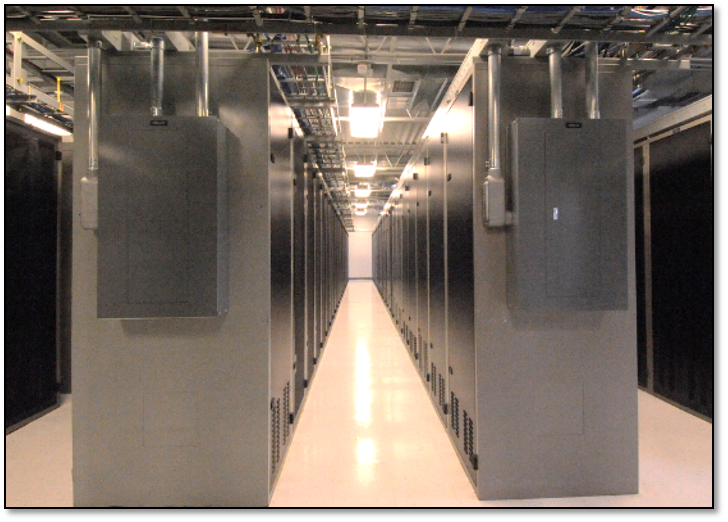
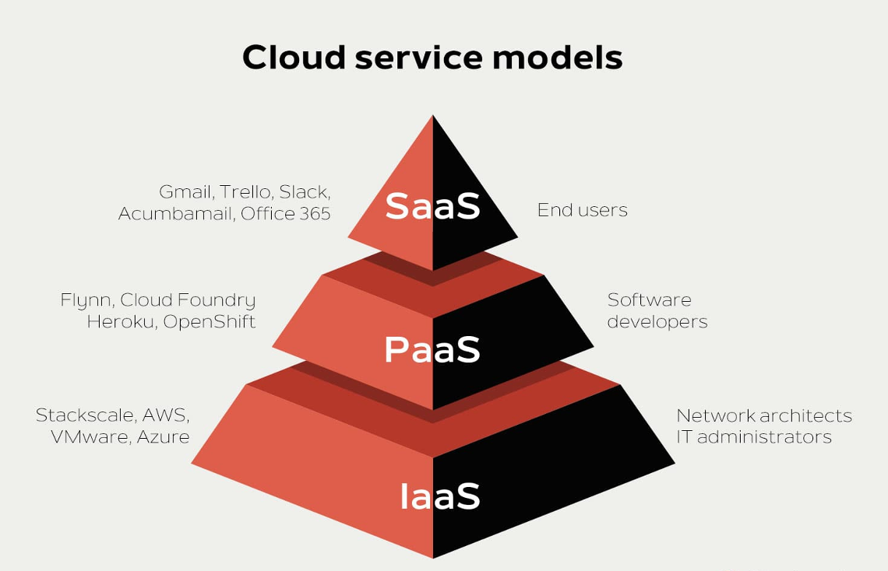
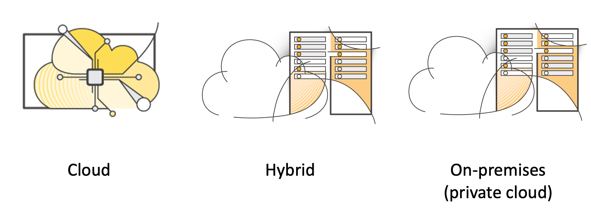
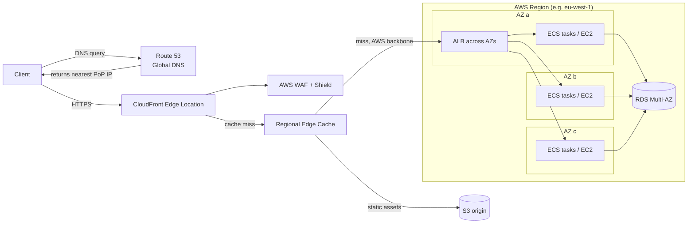
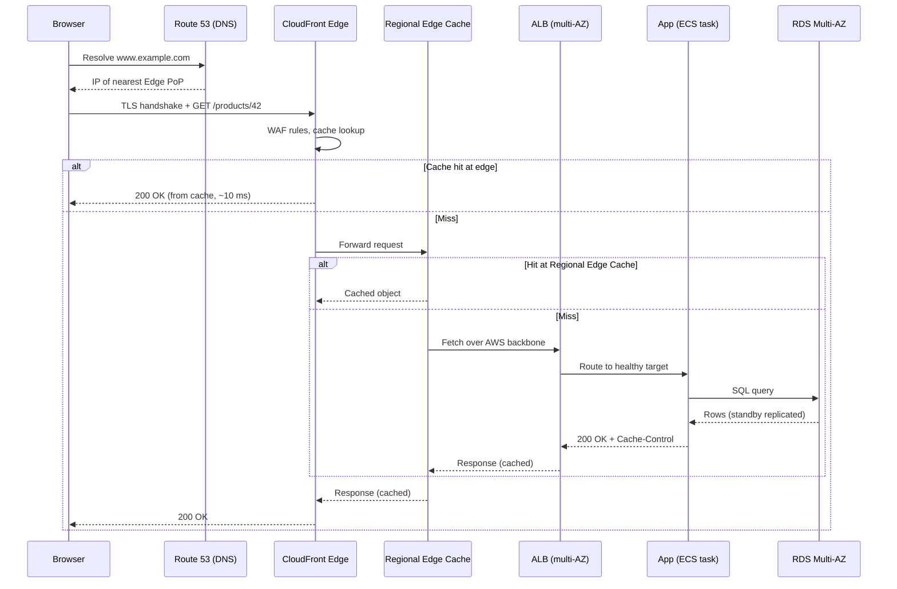
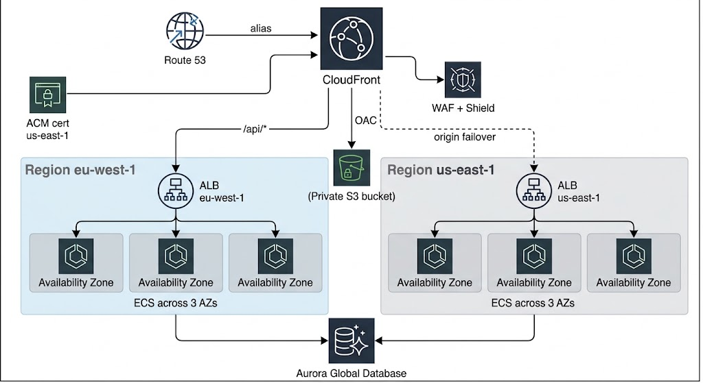
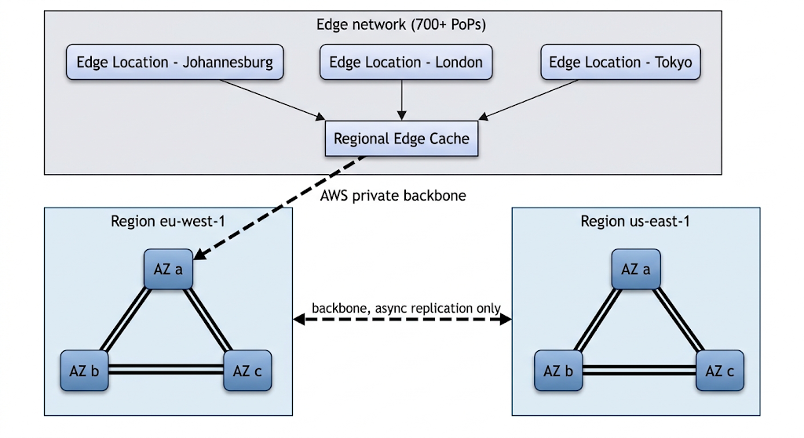
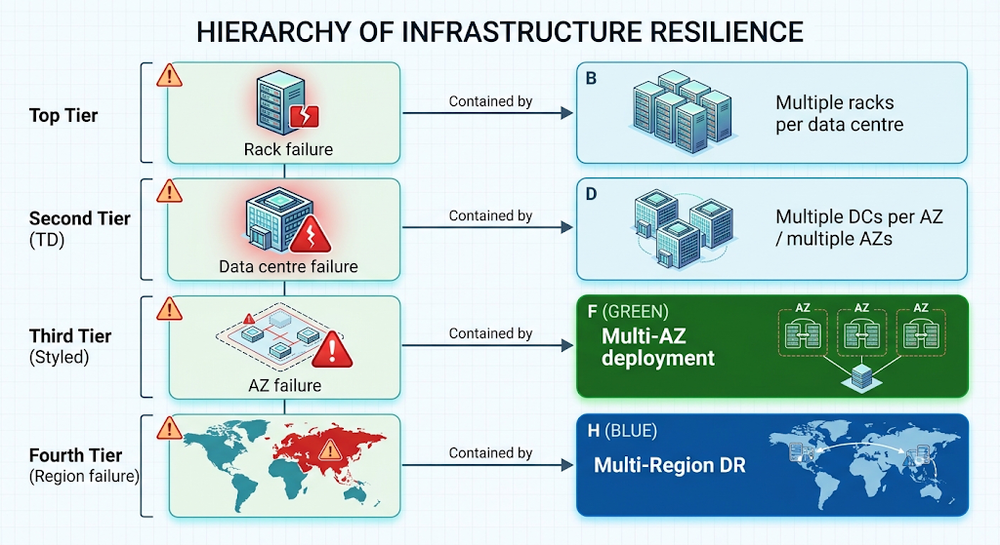
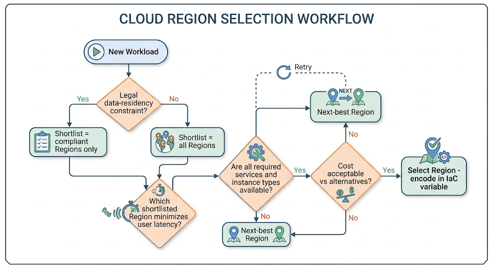
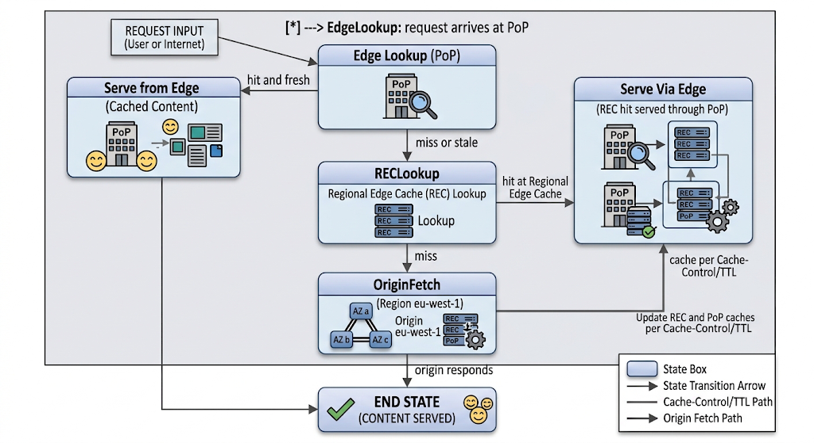

# AWS Cloud overview: Global Infrastructure, Regions and Availability Zones, Edge Locations and CloudFront

## Definition

**Cloud computing** is the on-demand delivery of IT resources (compute, storage, networking, databases, analytics, and higher-level services) over the Internet with pay-as-you-go pricing. Instead of purchasing, installing, and operating physical servers, an organization provisions resources programmatically from a provider that operates the physical infrastructure at massive scale.

Cloud computing enables you to stop thinking of your infrastructure as hardware and instead think of (and use) it as software. 

<figure markdown="span">
    {width="80%"}
    <figcaption>Physical Server Example</figcaption>
    <!-- <p align='right' style="font-size:0.8em"><i>NA</i></p> -->
</figure>

## Why This Service or Concept Exists

### The problem: physical infrastructure is hard, slow, and fragile

Before cloud computing, running a production application required:

1. **Capital expenditure (CapEx):** buying servers, storage arrays, switches, routers, racks, generators, and cooling — often 6 to 12 months before serving the first user.
2. **Capacity guessing:** you had to forecast peak demand years ahead. Over-provisioning wasted money; under-provisioning caused outages during success (the "Slashdot effect").
3. **Single points of failure:** most companies operated one data centre. A fire, flood, power failure, or fibre cut took the entire business offline.
4. **Undifferentiated heavy lifting:** engineers spent their time racking servers, patching hypervisors, and replacing failed disks rather than building product features.
5. **Global reach was unaffordable:** serving users in Asia, Europe, and the Americas with low latency required building or leasing data centres on every continent — feasible only for the largest corporations.


### The AWS approach

AWS inverts each of these problems:

| Traditional approach                               | AWS approach                                   | Benefit                                  |
| -------------------------------------------------- | ---------------------------------------------- | ---------------------------------------- |
| Buy hardware up front (CapEx)                      | Rent capacity per second/hour (OpEx)           | No upfront investment; costs track usage |
| Forecast capacity years ahead                      | Elastic scaling on demand                      | Capacity matches actual load             |
| One data centre, one fault domain                  | Multiple AZs per Region, multiple Regions      | Engineered fault isolation               |
| Build your own global footprint                    | 30+ Regions, 100+ AZs, 700+ PoPs already built | Global deployment in minutes             |
| Operate power, cooling, physical security yourself | AWS operates the facility layer                | Teams focus on applications              |


## Cloud Service Model
<figure markdown="span">
    {width="80%"}
    <figcaption>Cloud Service Model</figcaption>
    <!-- <p align='right' style="font-size:0.8em"><i>NA</i></p> -->
</figure>

There are three main cloud service models. Each model represents a different part of the cloud computing stack and gives you a different level of control over your IT resources:

1. **Infrastructure as a service (IaaS)**: Services in this category are the basic building blocks for cloud IT and typically provide you with access to networking features, computers (virtual or on dedicated hardware), and data storage space. IaaS provides you with the highest level of flexibility and management control over your IT resources. It is the most similar to existing IT resources that many IT departments and developers are familiar with today.

2. **Platform as a service (PaaS)**: Services in this category reduce the need for you to manage the underlying infrastructure (usually hardware and operating systems) and enable you to focus on the deployment and management of your applications. 

3. **Software as a service (SaaS)**: Services in this category provide you with a completed product that the service provider runs and manages. In most cases, software as a service refers to end-user applications. With a SaaS offering, you do not have to think about how the service is maintained or how the underlying infrastructure is managed. You need to think only about how you plan to use that particular piece of software. A common example of a SaaS application is web-based email, where you can send and receive email without managing feature additions to the email product or maintaining the servers and operating systems that the email program runs on.

## Cloud Deployment Model

There are three main cloud computing deployment models, which represent the cloud environments that your applications can be deployed in:

<figure markdown="span">
    {width="80%"}
    <figcaption>Cloud Deployment Model</figcaption>
    <!-- <p align='right' style="font-size:0.8em"><i>NA</i></p> -->
</figure>

1. Cloud: A cloud-based application is fully deployed in the cloud, and all parts of the application run in the cloud. Applications in the cloud have either been created in the cloud or have been migrated from an existing infrastructure to take advantage of the benefits of cloud computing ([Read More](see https://aws.amazon.com/what-is-cloud-computing/)). Cloud-based applications can be built on low-level infrastructure pieces or they can use higher-level services that provide abstraction from the management, architecting, and scaling requirements of core infrastructure.

2. Hybrid: A hybrid deployment is a way to connect infrastructure and applications between cloud-based resources and existing resources that are not located in the cloud. The most common method of hybrid deployment is between the cloud and existing on-premises infrastructure. This model enables an organization to extend and grow their infrastructure into the cloud while connecting cloud resources to internal systems. 

3. On-premises: Deploying resources on-premises, using virtualization and resource management tools, is sometimes called private cloud. While on-premises deployment does not provide many of the benefits of cloud computing, it is sometimes sought for its ability to provide dedicated resources. In most cases, this deployment model is the same as legacy IT infrastructure, but it might also use application management and virtualization technologies to increase resource utilization.

## What is AWS?

Amazon Web Services (AWS) is a secure cloud platform that offers a broad set of global cloud-based products. Because these products are delivered over the internet, you have on-demand access to the compute, storage, network, database, and other IT resources that you might need for your projects—and the tools to manage them. You can immediately provision and launch AWS resources. The resources are ready for you to use in minutes.

AWS offers flexibility. Your AWS environment can be reconfigured and updated on demand, scaled up or down automatically to meet usage patterns and optimize spending, or shut down temporarily or permanently. The billing for AWS services becomes an operational expense instead of a capital expense.

AWS services are designed to work together to support virtually any type of application or workload. Think of these services like building blocks, which you can assemble quickly to build sophisticated, scalable solutions, and then adjust them as your needs change.

!!! info "AWS Stats"

    - $128.7 Billion in anual revenue as of 2025
    - 31% of the global cloud Market is dominated by AWS making it #1
    - 15 years of consecutive market leader
    - 1 Million plus active users in the world

## AWS Global Infrastructure 

The **AWS Global Infrastructure** ([Explore AWS Infrstructure](https://aws.amazon.com/about-aws/global-infrastructure/))is the physical and logical foundation on which every AWS service runs. It consists of three principal layers:

| Layer                                       | What it is                                                                                         | Primary purpose                                                      |
| ------------------------------------------- | -------------------------------------------------------------------------------------------------- | -------------------------------------------------------------------- |
| **Region**                                  | A geographic area containing multiple isolated data-centre clusters                                | Data residency, service hosting, fault isolation at geographic scale |
| **Availability Zone (AZ)**                  | One or more discrete data centres within a Region, with independent power, cooling, and networking | Fault isolation within a Region; building block of high availability |
| **Edge Location / Point of Presence (PoP)** | A small facility close to end users, part of the CloudFront and Route 53 network                   | Low-latency content delivery, DNS resolution, DDoS absorption        |

**Amazon CloudFront** is AWS's Content Delivery Network (CDN): a globally distributed network of Edge Locations that caches and accelerates the delivery of static and dynamic content, terminating client connections close to the user and transporting traffic to origins over the AWS private backbone.

Where these fit in AWS architecture: every resource you create (an EC2 instance, an RDS database, a Lambda function) lives _somewhere_ physically. The global infrastructure is the answer to "where," and choosing the _right_ where is one of the first architectural decisions in any cloud design. The edge network sits _in front of_ Regions, between your users and your application.

!!! info "Architecture-first framing"

    Regions, AZs, and Edge Locations are not merely trivia to memorize. They are **fault domains** and **latency domains**. Every availability, disaster-recovery, latency, and compliance decision you will ever make on AWS is ultimately a decision about how to place workloads across these three layers.


### Why the specific Region/AZ/Edge structure?

AWS could have exposed a single flat pool of "servers somewhere." It deliberately did not, because:

- **Physics:** the speed of light imposes roughly 5 microseconds of latency per kilometre of fibre. A user in Sydney talking to a server in Virginia experiences approximately 200 ms round-trip time regardless of how fast the server is. Latency can only be solved by _proximity_, hence Regions on every continent and Edge Locations in hundreds of cities.
- **Failure correlation:** two servers in the same building share power, cooling, and network failure modes. Two buildings in the same city share flood plains and grid failures. AWS structures AZs so that correlated failures are contained, and structures Regions so that even large-scale disasters (earthquakes, regional grid collapse) affect only one Region.
- **Law:** data-protection regulations (GDPR in the EU, data-sovereignty laws in many countries) require data to remain within specific jurisdictions. Regions give customers an explicit, auditable data boundary — AWS does not replicate customer data out of a Region unless the customer configures it.

!!! note "Why CloudFront exists"

    Even with Regions on every continent, most applications deploy to one or a few Regions. CloudFront exists to close the remaining gap: it moves _content_ (and TLS termination, and increasingly compute via edge functions) to within a few tens of kilometres of users, without the application team operating any additional infrastructure.

---

## Real-World Motivation

**Netflix** runs almost entirely on AWS across multiple Regions. During the 2012 Christmas Eve ELB failure in us-east-1, Netflix's regional isolation and subsequent investment in active-active multi-Region architecture (with Route 53 traffic steering) became a canonical industry case study. Netflix also demonstrates the edge principle at extreme scale: its Open Connect appliances (a private CDN, conceptually identical to CloudFront) place video bytes inside ISP networks, because streaming video from a Region to millions of viewers would be both slow and ruinously expensive.

**Amazon.com** itself requires that a single data-centre failure never take the storefront offline; the retail platform is deployed across multiple AZs and Regions, and product images, CSS, and JavaScript are delivered from the edge.

**Airbnb** serves a global two-sided marketplace from AWS. Listing photos — the heart of the product — are stored in S3 and delivered through a CDN so that a user in Tokyo browsing a Paris apartment sees images loaded from a nearby edge, not from the storage Region.

**Uber-style mobility platforms** need very low latency for dispatch and pricing in each metro. This motivates Regional deployment close to markets, and in extreme cases AWS Local Zones or Wavelength Zones (5G edge) for single-digit-millisecond requirements.

**Financial systems** face strict regulatory requirements: many jurisdictions require customer financial data to remain in-country. Region choice is a compliance decision first and a technical decision second. Multi-AZ synchronous replication (for example, RDS Multi-AZ) gives banks zero-data-loss failover within the jurisdiction.

**Government systems** use dedicated Regions (AWS GovCloud in the US, and sovereign initiatives such as the AWS European Sovereign Cloud) where physical and logical access is restricted to vetted personnel, illustrating that Regions are also _administrative and legal_ boundaries, not just technical ones.

**Healthcare** workloads under HIPAA or national health-data laws use Region selection for data residency, Multi-AZ for availability of patient-facing systems, and CloudFront (with signed URLs) to deliver medical imaging to clinicians quickly and securely.

**IoT** deployments with millions of devices worldwide use the edge network for device connectivity termination and Regions for aggregation and analytics.

**E-commerce** flash sales (Black Friday, Singles' Day) are the classic elasticity story: CloudFront absorbs the majority of read traffic (product pages, images) at the edge, so the Regional fleet only scales for the dynamic minority (cart, checkout).

---

## Core Concepts

### Region

A **Region** is a physical, geographic location in the world where AWS clusters data centres. Examples: `us-east-1` (N. Virginia), `eu-west-1` (Ireland), `ap-southeast-1` (Singapore), `af-south-1` (Cape Town).

Key properties:

- Each Region consists of **multiple (minimum three for modern Regions) Availability Zones**.
- Regions are **isolated from each other**: a failure in one Region is designed not to affect any other. Most AWS services are _Regional_ — an EC2 instance, an SQS queue, or a VPC exists in exactly one Region.
- **Data does not leave a Region** unless the customer explicitly moves it (cross-Region replication, cross-Region reads, etc.). This is the foundation of data-residency compliance.
- Each Region has its own independent instance of most service **control planes**, so an API outage in one Region does not prevent management operations in another.

### Availability Zone (AZ)

An **Availability Zone** is one or more discrete data centres with redundant power, networking, and connectivity, housed in separate facilities within a Region.

Key properties:

- AZs within a Region are **physically separated** — typically kilometres to roughly 100 km apart — far enough to avoid sharing most disaster scenarios (fire, flood, tornado, localized grid failure), yet close enough for **synchronous replication** (round-trip latency generally under 1–2 ms).
- Each AZ has **independent power, cooling, and physical security**, and is connected to the other AZs in the Region via redundant, high-bandwidth, low-latency **private fibre**.
- AZs are identified by letters appended to the Region code: `us-east-1a`, `us-east-1b`, etc.

!!! warning "AZ names are randomized per account"

    The mapping between an AZ _name_ (`us-east-1a`) and the underlying physical zone is **shuffled independently for each AWS account**. Your `us-east-1a` is probably not another account's `us-east-1a`. AWS does this to spread load evenly across zones. When AZ identity must be coordinated across accounts (for example, to avoid cross-AZ data-transfer charges between accounts), use the **AZ ID** (such as `use1-az4`), which is consistent for everyone.

### Fault domain and blast radius

A **fault domain** is a set of resources that share a failure mode. A rack is a fault domain (shared top-of-rack switch); a data centre is a fault domain (shared power feed); an AZ is a fault domain; a Region is a fault domain. **Blast radius** is the scope of impact when a component fails. The entire discipline of AWS architecture can be summarized as: _deliberately place redundant resources in different fault domains so that any single failure has a bounded blast radius._

### High Availability (HA) vs Fault Tolerance vs Disaster Recovery (DR)

| Concept               | Definition                                                                                | Typical AWS mechanism                                                                           |
| --------------------- | ----------------------------------------------------------------------------------------- | ----------------------------------------------------------------------------------------------- |
| **High Availability** | The system remains operational despite component failure, possibly with brief degradation | Multi-AZ deployment behind a load balancer; RDS Multi-AZ failover                               |
| **Fault Tolerance**   | The system continues operating with _no_ user-visible interruption despite failure        | Active-active redundancy across AZs; services like S3 that replicate every object across ≥3 AZs |
| **Disaster Recovery** | The ability to recover service in a _different location_ after a large-scale event        | Multi-Region: backup and restore, pilot light, warm standby, active-active                      |

Two metrics govern DR design: **RTO** (Recovery Time Objective — how long recovery may take) and **RPO** (Recovery Point Objective — how much data loss is tolerable).

### Edge Location / Point of Presence (PoP)

An **Edge Location** is a small AWS facility, usually in a major city and often colocated inside Internet exchange points, that hosts edge services: CloudFront caches, Route 53 DNS servers, AWS Shield DDoS scrubbing, and AWS Global Accelerator entry points. There are hundreds of Edge Locations — far more than Regions — because their job is proximity.

Edge Locations differ fundamentally from Regions:

| Property                      | Region / AZ                     | Edge Location                                                                             |
| ----------------------------- | ------------------------------- | ----------------------------------------------------------------------------------------- |
| Can you launch EC2/RDS there? | Yes                             | No                                                                                        |
| Purpose                       | Run applications and store data | Cache content, terminate connections, resolve DNS                                         |
| Count (order of magnitude)    | ~36 Regions / 110+ AZs          | 700+ PoPs in 100+ cities                                                                  |
| Services                      | Nearly all                      | CloudFront, Route 53, Shield, WAF, Global Accelerator, Lambda@Edge / CloudFront Functions |

### Regional Edge Cache (REC)

A **Regional Edge Cache** is a mid-tier cache layer that sits between Edge Locations and your origin. RECs are larger than edge caches and retain objects longer. When an Edge Location misses, it checks the nearest REC before going all the way to the origin, which raises the overall cache hit ratio and reduces origin load.

### CDN (Content Delivery Network)

A **CDN** caches copies of content at many locations near users. The two performance wins are (1) _proximity_ — a cache hit is served from tens of kilometres away rather than thousands, and (2) _offload_ — the origin serves each object once per TTL per cache rather than once per user.

### Extensions of the Region model

- **Local Zones:** single-AZ extensions of a Region placed in additional metros (for example, Los Angeles as an extension of `us-west-2`) for single-digit-millisecond latency to users in that metro. They run a subset of services (EC2, EBS, some others) and remain logically part of the parent Region's VPC.
- **Wavelength Zones:** AWS infrastructure embedded inside 5G telecom networks, minimizing mobile latency.
- **AWS Outposts:** AWS-managed racks installed in _your_ data centre, extending a Region on-premises for workloads that must stay on-site.
- **AWS GovCloud / sovereign Regions:** Regions with additional legal and personnel restrictions.

### Global, Regional, and Zonal services

| Scope        | Examples                                           | Implication                                                            |
| ------------ | -------------------------------------------------- | ---------------------------------------------------------------------- |
| **Global**   | IAM, Route 53, CloudFront, WAF (for CloudFront)    | One logical instance for your whole account; no Region selection       |
| **Regional** | S3 buckets, DynamoDB tables, SQS, Lambda, VPC, ALB | You choose the Region; the service internally spans multiple AZs       |
| **Zonal**    | EC2 instances, EBS volumes, subnets                | Bound to exactly one AZ; _you_ are responsible for multi-AZ redundancy |

!!! tip "Architect's rule of thumb"

    Regional managed services (S3, DynamoDB, SQS, Lambda) give you multi-AZ resilience _for free_ — AWS handles it. Zonal primitives (EC2, EBS) make multi-AZ _your_ job. This is one of the strongest arguments for cloud-native, managed-service architectures over lift-and-shift EC2 fleets, and it is a recurring theme throughout DSO303.

---

## Internal Working

### How a Region is built

A modern AWS Region is constructed as at least three Availability Zones. Each AZ comprises one or more data centres (large AZs contain several buildings). Each data centre has:

- **Redundant power:** dual utility feeds where possible, uninterruptible power supplies (UPS), and diesel generators with on-site fuel.
- **Redundant cooling** and fire suppression.
- **Redundant networking:** multiple fibre paths to the other AZs and to AWS's global backbone, entering the building at physically separate points.

AZs are connected by AWS-owned dark fibre forming a redundant metro mesh. Inter-AZ latency within a Region is engineered to be low enough (sub-2 ms round trip) that **synchronous replication** is practical — this is precisely why RDS Multi-AZ, EFS, and S3 can synchronously commit writes across zones without unacceptable write latency.

Regions connect to each other and to Edge Locations over the **AWS global backbone** — a private, redundant, trans-continental and trans-oceanic fibre network. Traffic between Regions, and traffic from CloudFront edges to Regional origins, travels on this backbone rather than the public Internet, giving more predictable latency and loss characteristics.

### Control plane vs data plane

Every AWS service is internally split into:

- **Control plane:** the APIs that create, modify, and delete resources (`RunInstances`, `CreateBucket`, `ModifyDBInstance`). Control planes are optimized for consistency and are typically Regional.
- **Data plane:** the machinery that does the actual work of existing resources (the running instance, the reads and writes to the bucket, DNS answers). Data planes are optimized for extreme availability and are distributed across AZs (or edges).

AWS deliberately engineers data planes to keep working even when the control plane is impaired — an architectural principle called **static stability**. A statically stable multi-AZ design pre-provisions capacity in each AZ so that surviving an AZ failure requires _no_ control-plane action (no new instance launches) at the exact moment when the control plane may itself be under stress.

!!! tip "Static stability in your own designs"
    
    If your recovery plan for an AZ failure is "the Auto Scaling group will launch replacement instances," you depend on the EC2 control plane during a Regional bad day. A stricter design runs N+1 capacity spread across three AZs so that losing one AZ leaves enough already-running capacity. Route 53's data plane (answering queries) is similarly designed to survive control-plane failure — health-check-driven failover works even if the Route 53 API is down.

### How CloudFront works internally

CloudFront is a two-tier (optionally three-tier, with Origin Shield) distributed cache in front of your origin:

1. **DNS-based routing:** your distribution gets a domain (`d1234.cloudfront.net`, usually aliased by your own domain via Route 53). When a client resolves that name, Route 53/CloudFront's DNS returns IP addresses of the Edge Location estimated to give that client the best performance, based on the resolver's location, real-time PoP health, and load.
2. **TLS termination at the edge:** the TCP and TLS handshakes complete at the nearby edge. Because handshakes require multiple round trips, doing them over a 10 ms path instead of a 200 ms path dramatically reduces connection setup time even for uncacheable content.
3. **Cache lookup:** the edge computes a **cache key** (by default: distribution + URL path; optionally selected headers, query strings, cookies) and looks it up in the local cache.
4. **Hierarchy on miss:** on a miss, the edge forwards the request to its **Regional Edge Cache**; if that also misses (and Origin Shield, if enabled, also misses), the request proceeds to the **origin** (S3, ALB, EC2, API Gateway, or any HTTP server) over the AWS backbone.
5. **Response path:** the origin's response streams back through the layers; each caching layer stores it (subject to `Cache-Control`/TTL policy) and serves the client. Subsequent requests for the same cache key from any user near that edge are served in milliseconds without touching the origin.
6. **Request collapsing:** if many clients request the same missing object simultaneously, CloudFront forwards _one_ request to the origin and fans the response out — protecting origins from thundering herds during cache-miss storms.

---

## Architecture Components

The reference architecture for this topic is the standard entry path of a production web application:

| Component                           | Layer                           | Responsibility                                                                                                                             |
| ----------------------------------- | ------------------------------- | ------------------------------------------------------------------------------------------------------------------------------------------ |
| **Client (browser / mobile app)**   | User                            | Issues HTTPS requests; caches locally per response headers                                                                                 |
| **Route 53**                        | Global (edge)                   | Authoritative DNS; resolves your domain to CloudFront; health checks and routing policies (latency-based, failover, weighted, geolocation) |
| **CloudFront**                      | Global (edge)                   | TLS termination, caching, compression, HTTP/2/3, request routing to origins, edge compute (CloudFront Functions, Lambda@Edge)              |
| **AWS WAF**                         | Edge                            | Web application firewall attached to CloudFront/ALB; filters SQL injection, XSS, bots, rate abuse before traffic reaches your Region       |
| **AWS Shield**                      | Edge                            | DDoS protection; Standard is automatic on CloudFront/Route 53                                                                              |
| **VPC**                             | Regional                        | Your private network in a Region, spanning the AZs you choose                                                                              |
| **Subnets**                         | Zonal                           | AZ-scoped IP ranges within the VPC; public subnets route to an Internet Gateway, private subnets do not                                    |
| **Security Groups**                 | Regional (attached per ENI)     | Stateful virtual firewalls on instances/load balancers/tasks                                                                               |
| **ALB (Application Load Balancer)** | Regional, multi-AZ              | Layer-7 load balancing across targets in multiple AZs; health checks; path/host routing                                                    |
| **NLB (Network Load Balancer)**     | Regional, multi-AZ              | Layer-4, ultra-low-latency, static IPs                                                                                                     |
| **EC2 / ECS / EKS / Lambda**        | Zonal (EC2) / Regional (Lambda) | Application compute; containers (ECS/EKS) and functions (Lambda) are the cloud-native compute models emphasized in DSO303                  |
| **S3**                              | Regional (multi-AZ internally)  | Object storage; the most common CloudFront origin for static assets                                                                        |
| **RDS / DynamoDB**                  | Regional                        | Relational (Multi-AZ option) and serverless NoSQL (multi-AZ by design) data stores                                                         |
| **CloudWatch**                      | Regional                        | Metrics, logs, alarms, dashboards for every component above                                                                                |
| **CloudTrail**                      | Regional/global                 | Audit log of every API call                                                                                                                |
| **CloudFormation / Terraform**      | Control plane                   | Infrastructure as Code — the professional way to create all of the above reproducibly across Regions                                       |



---

## Request Lifecycle

Consider `https://www.example.com/products/42` served by the architecture above.

1. **DNS resolution (synchronous, milliseconds).** The browser asks its recursive resolver for `www.example.com`. Route 53's globally anycast name servers answer with an alias to the CloudFront distribution, and CloudFront's DNS layer returns the IP addresses of the best Edge Location for that resolver.
2. **Connection establishment at the edge.** The browser performs the TCP and TLS handshakes with the nearby PoP (perhaps 5–20 ms away). CloudFront presents the certificate provisioned via AWS Certificate Manager.
3. **Edge processing.** WAF rules evaluate the request. If a CloudFront Function or Lambda@Edge is configured (for example, to normalize headers, redirect, or authenticate), it executes here.
4. **Cache key computation and lookup.** For `/products/42`, suppose the cache behaviour forwards no cookies and caches by path. On a **hit**, the edge returns the object immediately — the request never enters your Region. On a **miss**, proceed.
5. **Regional Edge Cache check.** The edge asks its REC. A hit here still avoids the origin.
6. **Origin fetch over the AWS backbone.** On a full miss, CloudFront opens (or reuses — it maintains persistent connection pools) a connection to the origin: the ALB for dynamic paths, or S3 for `/static/*` paths, according to the distribution's **cache behaviours** (path-pattern routing).
7. **Inside the Region.** The ALB (whose nodes exist in each configured AZ) terminates the connection, evaluates listener rules, and forwards to a healthy target — an ECS task in AZ-a, say. The task queries RDS. RDS Multi-AZ synchronously replicates the write (if any) to its standby in another AZ before acknowledging.
8. **Response and cache population.** The response flows back: task → ALB → backbone → REC (cached) → edge (cached) → client. `Cache-Control` headers set by the application govern how long each layer may reuse it.
9. **Asynchronous side effects.** Cloud-native designs push non-critical work off the synchronous path: the task publishes an "ProductViewed" event to SNS/EventBridge, consumed later by analytics via SQS — the user does not wait for this.



!!! note "Synchronous vs asynchronous"

    Everything on the numbered path above is **synchronous** — the user is waiting. The architectural goal is to make the synchronous path as short as possible (ideally: edge cache hit) and move everything else to **asynchronous** patterns (queues, events), which you will study with SQS, SNS, and EventBridge later in this module.

---

## AWS Service Deep Dive

### AWS Global Infrastructure (as a "service")

- **Purpose:** provide isolated, geographically distributed fault and latency domains on which all AWS services run.
- **Architecture:** 30+ Regions → each with ≥3 AZs (modern Regions) → each AZ one or more data centres; all interconnected by a private global backbone; fronted by 700+ edge PoPs and 13 Regional Edge Caches. Exact counts grow continually — always verify current numbers on the AWS Global Infrastructure page rather than memorizing them.
- **Availability design targets:** most Regional services publish SLAs of 99.9%–99.99%; multi-AZ architectures commonly target 99.99%; S3 is designed for 99.999999999% (11 nines) _durability_ by replicating objects across ≥3 AZs.
- **Limits:** not every service exists in every Region; new services typically launch in large Regions (us-east-1, us-west-2, eu-west-1) first. Newer/smaller Regions may have fewer instance types and higher prices. Some Regions (China, GovCloud) require separate accounts.
- **Pricing:** infrastructure itself is not billed, but _placement_ drives cost: prices differ by Region (us-east-1 is generally cheapest); **data transfer IN is free; data transfer OUT to the Internet is billed; cross-AZ traffic is billed (~$0.01/GB each direction); cross-Region traffic is billed at higher rates.**

### Amazon CloudFront

- **Purpose:** low-latency, high-throughput delivery of static and dynamic content; origin offload; TLS termination; DDoS absorption; edge compute.
- **Architecture:** distribution (the logical configuration) → origins (S3, ALB, EC2, API Gateway, MediaPackage, or any HTTP endpoint) → cache behaviours (path-pattern → policy mappings) → edge PoPs + Regional Edge Caches (+ optional Origin Shield as a final centralized cache layer).
- **Important features:**
  - **Cache policies** (what forms the cache key; TTL bounds) and **origin request policies** (what is forwarded to the origin but excluded from the key).
  - **Origin Access Control (OAC):** lets an S3 bucket remain fully private while CloudFront signs its origin requests with SigV4 — the modern replacement for Origin Access Identity (OAI).
  - **Signed URLs / signed cookies** for private content (paid video, downloads).
  - **Field-level encryption**, HTTPS enforcement, TLS policy selection, ACM integration for free public certificates.
  - **CloudFront Functions** (lightweight JavaScript, sub-millisecond, viewer request/response only) vs **Lambda@Edge** (full Node.js/Python, can run on origin request/response, up to seconds) for edge logic.
  - **Origin failover** (origin groups): automatic retry against a secondary origin on 5xx/timeouts.
  - **HTTP/2 and HTTP/3 (QUIC)**, Brotli/gzip compression, range requests, WebSocket support.
- **Limitations:** cache invalidation is eventually consistent and costs money beyond 1,000 free paths/month (versioned file names are the better pattern); dynamic, personalized responses gain less from caching (though they still gain from TLS-at-edge and backbone transport); default quotas (e.g., ~25 cache behaviours per distribution, response size limits) apply; WebSocket/long-poll workloads see less benefit.
- **Pricing model:** pay for (1) data transfer out from edge to Internet (rates vary by geographic **price class**), (2) per-request fees, (3) invalidation paths beyond the free tier, (4) edge function invocations. Traffic from origin to CloudFront (origin fetches) is free from AWS origins such as S3 and ALB, which means a high cache hit ratio can make CloudFront _cheaper_ than serving directly from the Region — a frequently missed point.
- **Performance characteristics:** cache hits typically serve in ~10–50 ms globally; misses add backbone transit to the origin; connection reuse and request collapsing protect origins.
- **Scaling behaviour:** fully managed and automatic; CloudFront absorbs traffic spikes (including volumetric DDoS, with Shield Standard) with no capacity planning by the customer.
- **Security:** integrates WAF, Shield, ACM, OAC, signed URLs, geo-restriction (allow/deny by country).
- **Common configurations:** S3 + OAC for static sites/SPAs; ALB origin for dynamic APIs with `/static/*` behaviour pointed at S3; `Cache-Control: no-store` behaviours for personalized paths; Origin Shield enabled for origins sensitive to load.

### Route 53 (in the context of this topic)

- **Purpose:** globally distributed, 100%-SLA authoritative DNS; the entry point that binds your domain to CloudFront and enables Regional failover.
- **Routing policies:** simple, weighted (canary/blue-green), latency-based (multi-Region performance), failover (DR), geolocation (compliance/content rules), geoproximity, multi-value.
- **Health checks** drive failover at the DNS layer and are evaluated by a fleet of global checkers — part of the data plane, designed to work even during control-plane impairment.

---

## Important AWS Terminology

| Term                         | Meaning                                                                                                       |
| ---------------------------- | ------------------------------------------------------------------------------------------------------------- |
| Region                       | Geographic cluster of isolated AZs; primary unit of data residency and service deployment                     |
| Availability Zone (AZ)       | One or more data centres with independent power/cooling/network within a Region; primary fault-isolation unit |
| AZ ID                        | Account-independent physical identifier of a zone (e.g., `use1-az4`), unlike the per-account-shuffled AZ name |
| Data centre                  | A physical building; an AZ may contain several                                                                |
| Edge Location / PoP          | Small facility near users hosting CloudFront, Route 53, Shield, Global Accelerator                            |
| Regional Edge Cache          | Mid-tier CloudFront cache between edges and origins                                                           |
| Origin                       | The authoritative source CloudFront fetches from (S3, ALB, any HTTP server)                                   |
| Distribution                 | A CloudFront configuration unit (origins + behaviours + settings)                                             |
| Cache behaviour              | Path-pattern rule mapping requests to an origin and cache policy                                              |
| Cache key                    | The tuple (path + selected headers/query strings/cookies) identifying a cached object                         |
| TTL                          | Time an object may be served from cache before revalidation                                                   |
| Cache hit ratio              | Fraction of requests served from cache; the key CloudFront efficiency metric                                  |
| Invalidation                 | Explicit removal of objects from CloudFront caches before TTL expiry                                          |
| OAC (Origin Access Control)  | Mechanism keeping S3 private while allowing CloudFront signed access                                          |
| Origin Shield                | Optional extra caching layer centralizing origin fetches                                                      |
| Control plane                | APIs that create/modify/delete resources                                                                      |
| Data plane                   | The machinery serving actual traffic for existing resources                                                   |
| Static stability             | Designing so failure recovery needs no control-plane action                                                   |
| Fault domain                 | A set of resources sharing a failure mode                                                                     |
| Blast radius                 | Scope of impact of a given failure                                                                            |
| High availability            | Continued operation despite component failure                                                                 |
| Fault tolerance              | Continued operation with zero user-visible interruption                                                       |
| RTO / RPO                    | Max acceptable recovery time / data loss in disaster recovery                                                 |
| Local Zone                   | Single-zone metro extension of a Region for ultra-low latency                                                 |
| Wavelength Zone              | AWS compute embedded in 5G carrier networks                                                                   |
| Outposts                     | AWS-managed racks in customer premises, extending a Region                                                    |
| AWS backbone                 | AWS's private global fibre network between Regions and edges                                                  |
| Anycast                      | Routing technique advertising one IP from many locations; used by Route 53 and Global Accelerator             |
| Data residency / sovereignty | Legal requirement that data remain in a jurisdiction; satisfied by Region choice                              |

---

## Configuration Options

Although the global infrastructure itself is not "configured," architects make explicit placement and CloudFront configuration choices:

**Region selection criteria (in priority order for most enterprises):**

1. **Compliance / data residency** — a legal constraint dominates all others.
2. **Latency to users** — choose the Region(s) closest to your user base; validate with real measurements, not geography alone.
3. **Service availability** — confirm every required service and instance type exists in the candidate Region.
4. **Cost** — identical resources can differ 10–50% between Regions.
5. **Sustainability / carbon profile** and proximity to partners/on-premises sites.

**AZ usage configuration:**

- VPC **subnets** are created per AZ; you decide how many AZs your workload spans (two minimum for HA; three preferred so that losing one AZ leaves majority quorum for clustered systems and only ~33% capacity loss).
- Auto Scaling groups, ALB/NLB, ECS services, and EKS node groups take **lists of subnets** — this list _is_ your AZ spread.
- RDS: **Multi-AZ** (synchronous standby, HA) vs **read replicas** (asynchronous, scaling/DR) vs **Multi-AZ DB cluster** (two readable standbys).
- EC2 **placement groups**: cluster (same-rack, low latency, _higher_ correlated-failure risk), spread (distinct racks), partition (group-level isolation).

**CloudFront configuration highlights:**

| Setting          | Options                                           | Architectural meaning                             |
| ---------------- | ------------------------------------------------- | ------------------------------------------------- |
| Origin type      | S3 (with OAC), ALB, EC2, API Gateway, custom HTTP | Where truth lives                                 |
| Cache behaviours | Path patterns → policies                          | Route `/static/*` to S3, `/api/*` uncached to ALB |
| Cache policy     | TTLs; headers/cookies/query strings in key        | Hit ratio vs correctness trade-off                |
| Price class      | All PoPs / exclude expensive geographies          | Cost vs global latency                            |
| Viewer protocol  | Redirect HTTP→HTTPS / HTTPS only                  | Security posture                                  |
| Edge compute     | CloudFront Functions vs Lambda@Edge               | Latency/complexity trade-off                      |
| Geo-restriction  | Allow/deny country lists                          | Licensing and compliance                          |
| Origin failover  | Origin groups                                     | Availability of origin tier                       |

---

## Design Considerations

- **Scalability.** Regions provide effectively unbounded capacity, but _per-account, per-Region_ quotas exist (vCPU limits, EIP counts). Horizontal scaling across AZs is the default cloud pattern; CloudFront removes read traffic from the scaling equation entirely.
- **Availability.** Availability is multiplicative: two independent AZs each 99.9% available yield a theoretical 99.9999% for "at least one alive." The practical ceiling is your _dependencies_ — a multi-AZ app tied to a single-AZ database inherits the database's availability. Always identify the weakest fault domain in the chain.
- **Reliability.** Prefer static stability (pre-provisioned N+1 across ≥3 AZs). Beware _cross-AZ coupling_: if every request fans out to all AZs, one bad AZ degrades everything; AZ-independent ("zonal") request handling contains failures.
- **Durability.** Durability (data not lost) is distinct from availability (data reachable). S3's 11-nines durability comes from multi-AZ replication; a single EBS volume lives in one AZ and requires snapshots (which are stored in S3) for durability beyond it.
- **Latency.** Order-of-magnitude anchors: intra-AZ <1 ms; inter-AZ ~1–2 ms; inter-Region tens to hundreds of ms; user→edge typically 5–30 ms; user→remote Region 100–300 ms. These numbers explain _why_ synchronous replication stops at the Region boundary and _why_ CloudFront exists.
- **Cost.** The three silent cost drivers of placement: cross-AZ data transfer (chatty microservices pay it constantly), Internet egress (mitigated by CloudFront hit ratio), and cross-Region replication. Multi-Region active-active can double infrastructure cost — justify it with a real RTO/RPO requirement, not fashion.
- **Performance.** Keep chatty components in one AZ (or accept the millisecond tax for resilience); cache aggressively at every layer (browser, CloudFront, application, database).
- **Maintainability & operational complexity.** Each added Region multiplies deployment pipelines, monitoring, data-consistency questions, and failure modes. The honest progression is: single-AZ (dev only) → multi-AZ (production default) → multi-Region (only when RTO/RPO or global latency demands it).

!!! danger "The single-AZ production system"

    Deploying production workloads in one AZ to avoid ~$0.02/GB cross-AZ transfer is a classic false economy. AZ-level events happen every year somewhere. Multi-AZ is the non-negotiable production baseline in this module.

---

## AWS Best Practices

Mapped to the **AWS Well-Architected Framework**:

- **Operational Excellence.** Define infrastructure as code (CloudFormation/Terraform/CDK) so the same architecture deploys identically to any Region; make Region an input variable, never a hard-coded string. Game-day test AZ failure (Netflix's Chaos Monkey philosophy; AWS Fault Injection Service).
- **Security.** Treat Regions as compliance boundaries: use SCPs (Service Control Policies) to _deny_ resource creation outside approved Regions. Keep origins private (OAC for S3; security groups on ALB restricted to CloudFront via the managed prefix list). Enable CloudTrail in all Regions to detect rogue-Region activity.
- **Reliability.** Deploy across ≥2 (preferably 3) AZs; prefer Regional managed services that internalize multi-AZ; design for static stability; use Route 53 health-checked failover for Region-level DR; know your RTO/RPO and pick the matching DR pattern (backup-restore → pilot light → warm standby → active-active).
- **Performance Efficiency.** Serve users from the edge (CloudFront, Global Accelerator); choose Regions by measured latency; experiment cheaply — the cloud lets you test a Region and leave.
- **Cost Optimization.** Compare Regional price sheets before committing; maximize CloudFront hit ratio (often _reduces_ total egress cost); watch cross-AZ transfer in microservice meshes; use Cost Explorer's data-transfer breakdown.
- **Sustainability.** AWS publishes Region-level carbon data; Regions powered largely by renewables (e.g., several EU and Canadian Regions) can be preferred when other criteria tie.

---

## Security Considerations

- **IAM and least privilege.** IAM is _global_, but policies can restrict by Region using the `aws:RequestedRegion` condition key. Organizations commonly enforce an approved-Region allowlist via SCP:

```json
{
  "Version": "2012-10-17",
  "Statement": [
    {
      "Sid": "DenyOutsideApprovedRegions",
      "Effect": "Deny",
      "NotAction": ["iam:*", "route53:*", "cloudfront:*", "support:*"],
      "Resource": "*",
      "Condition": {
        "StringNotEquals": {
          "aws:RequestedRegion": ["eu-west-1", "eu-central-1"]
        }
      }
    }
  ]
}
```

- **Encryption and KMS.** KMS keys are **Regional** — an important design fact: data encrypted in one Region needs key strategy (multi-Region keys or re-encryption) to be readable in another. Encrypt in transit end-to-end: viewer→CloudFront (ACM certificate in **us-east-1** — a famous exam fact) and CloudFront→origin (HTTPS-only origin protocol policy).
- **Secrets Manager** is Regional with cross-Region replication support — plan for it in DR designs.
- **Network security.** Security groups (stateful, instance-level) and network ACLs (stateless, subnet-level) operate inside the VPC. Keep application tiers in **private subnets**; only load balancers (or nothing, if fully behind CloudFront) sit in public subnets. Lock the ALB down so _only CloudFront_ can reach it (managed prefix list `com.amazonaws.global.cloudfront.origin-facing` plus a secret custom header verified by WAF/ALB for defence in depth).
- **Private vs public resources.** With OAC, S3 buckets serving a global website remain completely private — a major security improvement over "public bucket" websites.
- **Edge security.** Shield Standard (automatic, free) absorbs common volumetric DDoS at the edge; WAF at CloudFront filters application-layer attacks before they consume Regional capacity; geo-restriction enforces territorial rules.
- **Logging and compliance.** Enable CloudFront standard/real-time logs (to S3/Kinesis), ALB access logs, VPC Flow Logs, and multi-Region CloudTrail. Data residency: verify that logs, backups, and replicas also stay in-jurisdiction — a common compliance oversight.

---

## Performance Optimization

- **Caching hierarchy.** Browser cache → CloudFront edge → Regional Edge Cache → (Origin Shield) → application cache (ElastiCache) → database. Set `Cache-Control` deliberately; use **versioned asset names** (`app.3f9a1c.js`, immutable, 1-year TTL) instead of invalidations.
- **Maximize cache hit ratio.** Include in the cache key _only_ what changes the response. Forwarding all cookies or all query strings fragments the cache into near-useless per-user entries — the most common CloudFront performance mistake.
- **Auto Scaling across AZs.** ASGs/ECS services balance capacity across AZs automatically; combine with ALB health checks so failed capacity is replaced and traffic shifts within seconds.
- **Load balancing.** Enable ALB cross-zone load balancing (default on) for even distribution; understand that NLB cross-zone is off by default (and inter-AZ charges applied historically) — a nuance interviewers enjoy.
- **Connection reuse.** CloudFront keeps warm, pooled connections to origins over the backbone; within the Region, use HTTP keep-alive and database connection pooling (RDS Proxy) — connection setup, not bandwidth, dominates short-request latency.
- **Parallelism.** HTTP/2 multiplexing (CloudFront to viewers) removes head-of-line request blocking; HTTP/3/QUIC improves lossy mobile networks.
- **Storage optimization.** Serve static content from S3 through CloudFront, never from EC2 disks; S3 Transfer Acceleration uses the same edge network for fast global _uploads_.
- **Monitoring the right metric.** CloudFront `CacheHitRate`, origin latency, and 4xx/5xx rates; ALB `TargetResponseTime`; per-AZ metrics to spot a single degraded zone (a key operational skill: compare AZs against each other).

---

## Cost Optimization

- **Pricing model recap.** Compute/storage priced per Region; data transfer in free; egress to Internet billed per GB (decreasing tiers); cross-AZ ~$0.01/GB each way; cross-Region varies by pair; CloudFront billed on edge egress + requests, with origin-fetch from AWS origins free.
- **Pay-as-you-go vs commitments.** On-demand for spiky/unknown; **Savings Plans / Reserved Instances** (Region-scoped or zonal) for steady baselines — note that a _zonal_ Reserved Instance also functions as a **capacity reservation** in that AZ; **Spot** for interruptible batch across AZs (diversify AZs/instance types to reduce interruption).
- **CloudFront as a cost tool.** Because origin fetches from S3/ALB are free and CloudFront egress rates are competitive, a high hit ratio can cut total egress spend while improving latency — evaluate it even for "cost" reasons alone. Use **price classes** to exclude expensive edge geographies if your users are regional.
- **Storage classes and lifecycle** (preview of the S3 topic): keep hot content in S3 Standard behind CloudFront; lifecycle older assets to Infrequent Access/Glacier — the CDN keeps them fast anyway while they are cached.
- **Rightsizing and visibility.** Cost Explorer (group by Region and by usage type to expose transfer costs), AWS Budgets alarms, Trusted Advisor checks for idle load balancers and low-utilization instances, Compute Optimizer for instance sizing.
- **Architecture-level savings.** Reduce chatty cross-AZ microservice calls (topology-aware routing in EKS; AZ-affinity where safe); compress at the edge (Brotli); cache API GETs where semantics allow.

!!! tip "Exam and interview favourite"
"How do you reduce data-transfer costs for a global static website on S3?" Answer: put CloudFront in front — edge caching reduces repeated S3 egress, CloudFront egress pricing is favourable, and performance improves simultaneously.

---

## Monitoring and Observability

- **CloudWatch.** Regional metric store: CloudFront publishes distribution metrics (requests, `CacheHitRate`, error rates, origin latency) to **us-east-1** (global services report there — another exam nugget). Build per-AZ dashboards; alarm on error-rate _divergence between AZs_, the classic early signal of a zonal event.
- **CloudTrail.** Records every control-plane call with its Region; enable an organization trail covering all Regions to catch misconfiguration or attack in unused Regions.
- **X-Ray / ADOT (OpenTelemetry).** Distributed tracing across ALB → ECS/Lambda → databases reveals _where_ latency lives — indispensable once microservices span AZs.
- **Logs.** CloudFront standard logs (S3, batched) vs real-time logs (Kinesis, seconds); ALB access logs; VPC Flow Logs for network forensics; centralize with CloudWatch Logs or a lake in S3 + Athena.
- **Health awareness.** AWS Health Dashboard (account-specific) and the public Service Health Dashboard tell you when the _platform_ — a Region, an AZ, an edge service — is impaired; integrate Health events with EventBridge to trigger automated failover runbooks.
- **Synthetic monitoring.** CloudWatch Synthetics canaries run from multiple Regions, measuring what _users_ experience through the full edge→Region path, catching DNS/CDN issues your in-Region metrics cannot see.

---

## Integration with Other AWS Services

The global infrastructure is the substrate for everything; the most instructive integrations at this stage:

- **Route 53 + CloudFront:** alias records map your apex domain to the distribution; DNS is how users find the edge.
- **CloudFront + S3 (with OAC):** the canonical static-website/SPA pattern; private bucket, global delivery.
- **CloudFront + ALB/API Gateway:** dynamic content acceleration — even with TTL 0, users gain TLS-at-edge and backbone transport.
- **CloudFront + WAF + Shield:** the standard security perimeter at the edge.
- **CloudFront + ACM:** free public TLS certificates; the CloudFront certificate must live in us-east-1.
- **CloudFront + Lambda@Edge / CloudFront Functions:** authentication, A/B routing, header manipulation without Regional round trips.
- **Route 53 + multi-Region ALBs:** latency-based or failover routing across Regions — the DR backbone.
- **S3 Cross-Region Replication, DynamoDB Global Tables, Aurora Global Database:** the data layer of multi-Region designs; each embodies a different consistency/RPO trade-off.
- **Global Accelerator:** anycast static IPs on the same edge network, for TCP/UDP and non-cacheable workloads — the frequently confused sibling of CloudFront (Accelerator = routing/no cache; CloudFront = HTTP cache).

<figure markdown="span">
    {width="80%"}
    <figcaption>Example: Integrating Different Services</figcaption>
</figure>

## Common Architecture Patterns

- **Multi-AZ active-active (the production default).** Stateless compute in ≥2–3 AZs behind an ALB; state in Regional managed services. Every later DSO303 topic assumes this shape.
- **Static website / SPA pattern.** S3 (private, OAC) + CloudFront + Route 53 + ACM; API served separately via `/api/*` behaviour → API Gateway/ALB. Serverless, globally fast, near-zero operations.
- **Cache-aside at the edge.** CloudFront as a shared, geographically distributed cache-aside layer; correctness governed by `Cache-Control` and cache-key design.
- **Multi-Region DR ladder.** Backup & restore (hours RTO) → pilot light (data replicated, minimal compute) → warm standby (scaled-down full stack) → active-active (Route 53 latency routing + global data layer). Choose by RTO/RPO, pay accordingly.
- **Cell-based architecture / AZ independence.** Partition the system into cells that each live inside one AZ, route customers to cells, and never let a request cross AZs; converts zonal failure into partial, bounded impact. This is how AWS builds AWS.
- **Fan-out at the edge.** CloudFront request collapsing plus Origin Shield implements fan-in of concurrent misses — an infrastructural cousin of the application-level fan-out/fan-in you will meet with SNS/SQS.
- **Edge-compute pattern.** Authentication token verification, redirects, bot fingerprinting in CloudFront Functions — shifting work left of the Region entirely.
- **Circuit breaker / retry (infrastructure edition).** Origin groups (failover on 5xx) are a managed circuit-breaker at the CDN tier; Route 53 health checks are the same idea at DNS tier. Application-level equivalents (retries with backoff and jitter) come later in the module.

---

## Industry Use Cases

| Sector            | Usage of Regions/AZs/Edge                                                                                                                                      |
| ----------------- | -------------------------------------------------------------------------------------------------------------------------------------------------------------- |
| Media & streaming | Multi-Region encoding pipelines; virtually all bytes delivered from edge caches (CloudFront/MediaPackage); live-event spikes absorbed at the edge              |
| E-commerce        | Multi-AZ storefronts; CloudFront for catalogue/media; Route 53 failover; regional Regions for tax/data rules                                                   |
| Banking & fintech | In-country Region for residency; RDS/Aurora Multi-AZ for zero-RPO in-Region; warm-standby second Region for regulator-mandated DR                              |
| Gaming            | Regions per continent for game servers (latency); Global Accelerator for UDP traffic; CloudFront for patch/asset distribution (multi-GB downloads to millions) |
| Software delivery | OS/package vendors distribute updates via CloudFront (this is how much of the world's software ships)                                                          |
| Government        | GovCloud/sovereign Regions; strict Region allowlists via SCP                                                                                                   |
| Healthcare        | Residency-driven Region choice; CloudFront signed URLs for imaging; Multi-AZ EHR systems                                                                       |
| IoT & automotive  | Edge termination for device fleets; Regional analytics; Wavelength for vehicle-to-cloud latency                                                                |

---

## Advantages

- **Engineered fault isolation.** AZs give architects ready-made, physically validated fault domains with synchronous-replication-grade latency between them — something almost no enterprise could build alone. High availability becomes a _configuration choice_ (a list of subnets) rather than a construction project.
- **Global reach in minutes.** A three-person startup can deploy to Tokyo, Frankfurt, and São Paulo in an afternoon using the same IaC template — capability that previously required years and hundreds of millions of dollars.
- **Elasticity with no capacity gamble.** Placement across effectively unlimited Regional capacity converts capacity planning from a bet into a policy.
- **Compliance as configuration.** Data residency is satisfied by Region selection plus SCP enforcement, with auditable API evidence (CloudTrail) — far stronger than paper assurances.
- **Latency solved at two scales.** Regions solve continental latency; the edge network solves last-hundred-kilometres latency; the private backbone removes public-Internet unpredictability in between.
- **Security absorbed at the perimeter.** DDoS and web attacks are engaged at 700+ PoPs with AWS-scale capacity before touching your (paid, finite) Regional resources.
- **Cost transparency and choice.** Per-Region pricing, granular transfer billing, and CloudFront economics let architects _engineer_ cost, not merely observe it.

---

## Limitations

- **The speed of light is not negotiable.** Multi-Region _synchronous_ consistency is physically impossible at acceptable latency; every multi-Region data design accepts either asynchronous replication (RPO > 0) or high write latency. Regions/AZs structure the trade-off; they do not remove it.
- **Not all Regions are equal.** New services, instance families, and capacity arrive unevenly; smaller Regions cost more and offer less. Region choice made on day one is expensive to reverse (data gravity).
- **Cross-boundary costs are real.** Cross-AZ transfer penalizes chatty microservices; Internet egress and cross-Region replication dominate some bills. Resilience literally has a per-gigabyte price.
- **Quotas are Regional.** Default vCPU and service quotas can throttle bursts and DR failovers — a warm-standby Region whose quotas were never raised will fail exactly when needed.
- **CloudFront caveats.** Caching adds a consistency problem (stale content, invalidation cost/latency); personalized content caches poorly; edge functions have tight limits (CloudFront Functions: no network calls, sub-ms budget); debugging a globally distributed cache is harder than debugging one server.
- **Shared-fate anomalies exist.** us-east-1 hosts several global control planes (IAM, CloudFront configuration, ACM-for-CloudFront); historical incidents there have had wider ripple effects. Mature designs avoid _control-plane dependencies_ during failover (static stability).
- **Operational multiplication.** Every additional Region multiplies pipelines, dashboards, on-call surface, and data-consistency questions. Multi-Region is a capability to be _justified_, not a default.

---

## Common Mistakes

**Beginner mistakes**

- Treating an AZ as "just another data centre name" and deploying everything into one AZ/subnet.
- Assuming `us-east-1a` is the same physical zone in every account (it is not — use AZ IDs).
- Creating a VPC with a single public subnet and placing databases in it.
- Hard-coding a Region in code/templates, breaking multi-Region deployment later.
- Making an S3 bucket public to "make CloudFront work" instead of using OAC.
- Requesting the ACM certificate for CloudFront in the wrong Region (it must be us-east-1).

**Production mistakes**

- Multi-AZ compute with a single-AZ database or a single NAT gateway — the hidden zonal single point of failure.
- Forwarding all cookies/headers/query strings to the origin, destroying the cache hit ratio, then concluding "CloudFront doesn't help."
- Using invalidations as the routine deployment mechanism instead of versioned asset names.
- Relying on control-plane actions (new instance launches, DNS API changes) as the _only_ recovery path — no static stability.
- Never testing AZ failure or Region failover; DR that exists only in a diagram.
- Ignoring per-AZ metrics, so a single degraded AZ hides inside averaged dashboards.
- Leaving default quotas in the DR Region.

**Certification traps**

- Confusing **Edge Locations** with **Availability Zones** ("CloudFront caches content in AZs" — false).
- Confusing **CloudFront** (HTTP caching CDN) with **Global Accelerator** (anycast TCP/UDP routing, no caching, static IPs).
- Believing data automatically replicates between Regions (it never does without explicit configuration).
- "Multi-AZ improves read performance" — RDS Multi-AZ standby serves **no reads** (read replicas do; the newer Multi-AZ DB _cluster_ is the exception).
- Forgetting that S3 bucket _names_ are global but buckets _live_ in one Region.
- Mixing up durability (11 nines, data loss) with availability (99.9x%, reachability).

<!-- ---

## Interview Questions

**Conceptual**

1. Explain the difference between a Region, an Availability Zone, and an Edge Location, and give one architectural decision driven by each.
2. Why does synchronous replication generally stop at the Region boundary? What physical constant is responsible?
3. What is static stability, and why does it matter during an AZ event?

**Scenario**

4. A South African fintech must keep customer data in-country, survive a data-centre fire with zero data loss, and serve a marketing site quickly worldwide. Design the placement. _(Expected: af-south-1, Multi-AZ synchronous DB, private S3 + CloudFront for the site.)_
5. Your CloudFront hit ratio is 12%. What are the three most likely configuration causes and their fixes?

**Architecture**

6. Design a two-Region architecture with RTO 15 minutes and RPO 1 minute for a REST API + relational data. Justify warm standby vs active-active, the replication technology, and the failover trigger.
7. How would you guarantee that _only_ CloudFront can reach your ALB origin?

**Troubleshooting**

8. Users in one city report errors; your Regional dashboards look healthy. Walk through your diagnosis. _(Edge PoP issue → CloudFront metrics in us-east-1, synthetics from multiple geographies, AWS Health.)_
9. After deploying new JavaScript, some users worldwide still receive the old file for hours. Why, and what are the short-term and long-term fixes?

**Certification-style**

10. A company needs static IP addresses for a global TCP (non-HTTP) application with fast regional failover. CloudFront or Global Accelerator? Why?

--- -->
<!-- 
## Hands-on Lab

**Objective.** Deploy a globally accelerated static website with a private origin, and empirically observe edge caching.

**Architecture.** Private S3 bucket (origin) → CloudFront distribution with OAC → default cache behaviour, HTTPS redirect → tested from your location; latency compared against direct Regional access.

**AWS services.** S3, CloudFront, (optionally Route 53 + ACM if you own a domain), CloudWatch.

**Implementation steps.**

1. Create a bucket in a Region _far_ from you (e.g., `us-west-2` if you are in Africa/Europe) with **Block Public Access ON**. Upload `index.html` and a ~1 MB image.
2. Create a CloudFront distribution: origin = the bucket, **Origin access = OAC (create new)**, viewer protocol = Redirect HTTP to HTTPS, default root object `index.html`.
3. Apply the bucket policy CloudFront offers (allows `cloudfront.amazonaws.com` with the distribution ARN condition). Confirm the direct S3 URL now returns **403** — the origin is private.
4. Wait for deployment; fetch the distribution URL twice and inspect headers:

```bash
curl -s -D - -o /dev/null https://dxxxxxxxx.cloudfront.net/image.jpg | grep -iE "x-cache|age"
# 1st: X-Cache: Miss from cloudfront
# 2nd: X-Cache: Hit from cloudfront   Age: <seconds>
```

5. Time cached vs origin-Region latency (`curl -w "%{time_total}\n"` against CloudFront vs a same-Region EC2/S3 endpoint if available) and record the difference.
6. Create an invalidation for `/index.html`, observe the next request become a Miss, and note the eventual-consistency delay.
7. In CloudWatch (us-east-1), open the distribution's `Requests` and `CacheHitRate` metrics and correlate with your tests.

**Expected output.** A working HTTPS site whose bucket is unreachable directly; measured multi-hundred-millisecond improvement on cache hits from a distant Region; first-hand evidence of the Miss→Hit lifecycle and of invalidation behaviour.

---

## Code Examples

**AWS CLI — explore the infrastructure programmatically**

```bash
# List all Regions your account can see
aws ec2 describe-regions --query "Regions[].RegionName" --output table

# List AZs in a Region, including the account-independent AZ IDs
aws ec2 describe-availability-zones --region eu-west-1 \
  --query "AvailabilityZones[].{Name:ZoneName,ID:ZoneId,Type:ZoneType,State:State}" \
  --output table
```

**Python (boto3) — verify multi-AZ spread of running instances**

```python
import boto3
from collections import Counter

ec2 = boto3.client("ec2", region_name="eu-west-1")
reservations = ec2.describe_instances(
    Filters=[{"Name": "instance-state-name", "Values": ["running"]}]
)["Reservations"]

azs = Counter(
    inst["Placement"]["AvailabilityZone"]
    for r in reservations for inst in r["Instances"]
)
print("Instances per AZ:", dict(azs))
if len(azs) < 2:
    print("WARNING: single-AZ deployment — no zonal fault tolerance.")
```

**CloudFormation — private S3 origin + CloudFront with OAC (core of the lab)**

```yaml
AWSTemplateFormatVersion: "2010-09-09"
Description: Static site - private S3 origin behind CloudFront (OAC)

Resources:
  SiteBucket:
    Type: AWS::S3::Bucket
    Properties:
      PublicAccessBlockConfiguration:
        BlockPublicAcls: true
        BlockPublicPolicy: true
        IgnorePublicAcls: true
        RestrictPublicBuckets: true

  OAC:
    Type: AWS::CloudFront::OriginAccessControl
    Properties:
      OriginAccessControlConfig:
        Name: site-oac
        OriginAccessControlOriginType: s3
        SigningBehavior: always
        SigningProtocol: sigv4

  Distribution:
    Type: AWS::CloudFront::Distribution
    Properties:
      DistributionConfig:
        Enabled: true
        DefaultRootObject: index.html
        HttpVersion: http2and3
        Origins:
          - Id: s3-origin
            DomainName: !GetAtt SiteBucket.RegionalDomainName
            OriginAccessControlId: !Ref OAC
            S3OriginConfig: { OriginAccessIdentity: "" }
        DefaultCacheBehavior:
          TargetOriginId: s3-origin
          ViewerProtocolPolicy: redirect-to-https
          # AWS managed "CachingOptimized" policy
          CachePolicyId: 658327ea-f89d-4fab-a63d-7e88639e58f6

  BucketPolicy:
    Type: AWS::S3::BucketPolicy
    Properties:
      Bucket: !Ref SiteBucket
      PolicyDocument:
        Statement:
          - Effect: Allow
            Principal: { Service: cloudfront.amazonaws.com }
            Action: s3:GetObject
            Resource: !Sub "${SiteBucket.Arn}/*"
            Condition:
              StringEquals:
                AWS:SourceArn: !Sub "arn:aws:cloudfront::${AWS::AccountId}:distribution/${Distribution}"

Outputs:
  URL:
    Value: !Sub "https://${Distribution.DomainName}"
```

**Terraform — multi-AZ subnet layout as code (Region as a variable)**

```hcl
variable "region" { default = "eu-west-1" }

provider "aws" { region = var.region }

data "aws_availability_zones" "available" { state = "available" }

resource "aws_vpc" "main" {
  cidr_block = "10.0.0.0/16"
}

# One private subnet per AZ - the multi-AZ pattern expressed as code
resource "aws_subnet" "private" {
  count             = 3
  vpc_id            = aws_vpc.main.id
  cidr_block        = cidrsubnet(aws_vpc.main.cidr_block, 4, count.index)
  availability_zone = data.aws_availability_zones.available.names[count.index]
  tags = { Name = "private-${count.index}" }
}
```

**Kubernetes YAML — spreading pods across AZs on EKS (DSO303 link-forward)**

```yaml
apiVersion: apps/v1
kind: Deployment
metadata:
  name: web
spec:
  replicas: 6
  selector: { matchLabels: { app: web } }
  template:
    metadata: { labels: { app: web } }
    spec:
      topologySpreadConstraints:
        - maxSkew: 1
          topologyKey: topology.kubernetes.io/zone # the AZ label
          whenUnsatisfiable: DoNotSchedule
          labelSelector: { matchLabels: { app: web } }
      containers:
        - name: web
          image: public.ecr.aws/nginx/nginx:latest
```

!!! note "The same idea at every layer"
Notice that the CloudFormation subnets, the Terraform `count = 3`, and the Kubernetes `topologySpreadConstraints` all encode the _same architectural decision_ — spread across AZ fault domains — at different layers of the stack. Infrastructure as Code makes the decision explicit, reviewable, and repeatable.

--- -->

## Architecture Diagrams

**The three layers of the global infrastructure**

<figure markdown="span">
    {width="80%"}
    <figcaption>3 layers of Global Infrastructure</figcaption>
    <p align='right' style="font-size:0.8em"><i>Image Source: AI Generaed (Google Gemini)</i></p>
</figure>


**Fault domains and blast radius**

<figure markdown="span">
    {width="80%"}
    <figcaption>Fault domain and Blast Radius</figcaption>
    <p align='right' style="font-size:0.8em"><i>Image Source: AI Generaed (Google Gemini)</i></p>
</figure>


**Region selection decision flow**

<figure markdown="span">
    {width="80%"}
    <figcaption>Region Selectio Work Flow</figcaption>
    <p align='right' style="font-size:0.8em"><i>Image Source: AI Generaed (Google Gemini)</i></p>
</figure>


**CloudFront cache decision (per request)**

<figure markdown="span">
    {width="80%"}
    <figcaption>CloudFront cache decision (per request)</figcaption>
    <p align='right' style="font-size:0.8em"><i>Image Source: AI Generaed (Google Gemini)</i></p>
</figure>

## Summary

The AWS global infrastructure is a deliberate three-layer answer to three permanent engineering problems. **Regions** answer _jurisdiction and geography_: they place complete, isolated copies of AWS on every inhabited continent so that data can obey local law and applications can live near their users. **Availability Zones** answer _failure_: physically separated, independently powered data-centre clusters, close enough for synchronous replication yet far enough apart that fires, floods, and grid failures are contained — turning high availability from a construction project into a subnet list. **Edge Locations and CloudFront** answer _the speed of light_: hundreds of small caches and connection terminators positioned within milliseconds of users, backed by Regional Edge Caches and a private backbone, so that most requests are answered before they ever reach a Region.

The architectural lessons to carry into every subsequent DSO303 topic:

1. **Think in fault domains.** Every design review question reduces to: what fails together, and what is the blast radius?
2. **Multi-AZ is the production baseline; multi-Region is a justified exception** driven by explicit RTO/RPO or latency requirements.
3. **Prefer Regional managed services** — they internalize multi-AZ engineering you would otherwise own.
4. **Design for static stability:** survive failures with capacity that already exists.
5. **Push work toward the edge and off the synchronous path** — cache hits and asynchronous events are the cheapest, fastest requests you will ever serve.
6. **Encode placement in code.** Regions, AZ spreads, and CloudFront behaviours belong in version-controlled IaC, not in console memory.

---
<!-- 
## Practice Questions

**Beginner**

1. Define Region, Availability Zone, and Edge Location, and state the primary purpose of each layer.
2. Why does AWS require (in modern Regions) a minimum of three AZs rather than one large data centre?
3. What is the difference between the AZ _name_ `eu-west-1a` and the AZ _ID_ `euw1-az1`, and why does the difference exist?
4. List four factors an architect evaluates when selecting a Region, in a sensible priority order.
5. When a CloudFront edge receives a request for an object it does not hold, describe the sequence of lookups before the origin is contacted.

**Intermediate**

6. Your application runs six EC2 instances in `ap-southeast-1a` behind an ALB whose subnets span three AZs. Identify the availability flaw and describe two concrete fixes, including the Auto Scaling configuration involved.
7. A distribution forwards all cookies and all query strings to a dynamic origin. Explain the effect on cache hit ratio, origin load, and cost, and propose a corrected cache-policy design for a site with `/static/*` and `/api/*` paths.
8. Compare RDS Multi-AZ, RDS read replicas, and cross-Region read replicas along three axes: replication mode (sync/async), purpose (HA/scale/DR), and effect on RPO.
9. Explain how you would restrict an AWS Organization to two approved Regions, and why `iam:*`, `cloudfront:*`, and `route53:*` typically must be exempted from that restriction.
10. Your team claims "we are multi-AZ, therefore we survive AZ failure." Name three hidden single-AZ dependencies that could falsify this claim (consider NAT, data, and control-plane assumptions).

**Advanced**

11. Design a multi-Region architecture for a payments API with RPO ≤ 1 second and RTO ≤ 5 minutes. Specify the data technology, the traffic-steering mechanism and its health signal, and how you avoid control-plane dependence during failover. State the consistency trade-off you accepted.
12. Explain _static stability_ and redesign the following to satisfy it: "On AZ failure, a Lambda triggered by a CloudWatch alarm updates the Auto Scaling group to launch replacements and calls the Route 53 API to change weights."
13. A microservices platform on EKS shows large inter-AZ data-transfer charges and elevated p99 latency. Discuss the tension between AZ-spread for resilience and AZ-affinity for cost/latency, and describe a topology-aware routing approach that balances them.
14. Your global user base is 60% in regions where you have no AWS Region within 150 ms. Compare three remedies — additional Regions (active-active), CloudFront with an aggressive caching strategy, and Global Accelerator — for a workload that is 80% cacheable reads and 20% authenticated writes. Recommend and justify a combination.
15. During a partial edge-network event, some users receive errors while all Regional metrics are green and synthetic canaries in-Region pass. Construct the observability strategy (metrics locations, log types, external vantage points, AWS Health integration) that would have detected this class of failure, and the automated mitigation you would attach to it. -->
