# Compute Services on AWS  EC2, ECS, EKS, Lambda and Fargate

## Definition

**Compute** in AWS is the family of services that execute your application code  that provide CPU cycles, memory, and an execution context in which a process runs. Storage services hold bytes at rest, networking services move bytes between endpoints, and compute services transform bytes.

<figure markdown="span">
    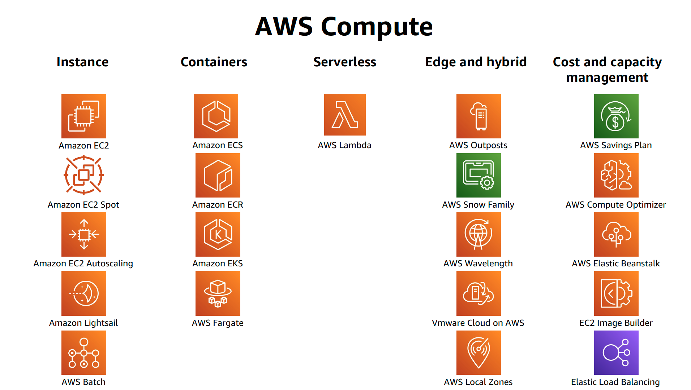{width="80%"}
    <figcaption>AWS Compute Services</figcaption>
</figure>

AWS offers compute at several different **levels of abstraction**. The higher the abstraction, the more of the operational stack AWS manages on your behalf, and the less control and flexibility you retain.

| Service | Abstraction level | Unit of deployment | What AWS manages | What you manage |
|---|---|---|---|---|
| **Amazon EC2** | Infrastructure as a Service (IaaS) | Virtual machine instance | Physical hosts, hypervisor, network fabric, hardware failure detection | Guest OS, patching, runtime, application, scaling policy, capacity |
| **Amazon ECS (EC2 launch type)** | Containers as a Service (CaaS) | Container / task | Orchestration control plane, scheduling, service discovery integration | Container image, EC2 host fleet, host patching, cluster capacity |
| **Amazon ECS (Fargate)** | Serverless containers | Container / task | Everything below the container: host, OS, agent, capacity | Container image, task sizing, IAM, networking configuration |
| **Amazon EKS** | Managed Kubernetes | Pod (in a Deployment, Job, etc.) | Kubernetes control plane, etcd, API server HA, control-plane upgrades | Worker nodes (or Fargate profiles), add-ons, manifests, upgrade cadence |
| **AWS Lambda** | Function as a Service (FaaS) | Function invocation | Absolutely everything except your code and configuration | Handler code, memory setting, IAM role, event source configuration |

!!! note "The single most important sentence in this chapter"
    You are not choosing between EC2, ECS, EKS, and Lambda on the basis of which is "best" or "most modern". You are choosing **how much of the operational stack you want to be responsible for**, and accepting the constraints that come with giving that responsibility away.

### The Compute Spectrum

<figure markdown="span">
    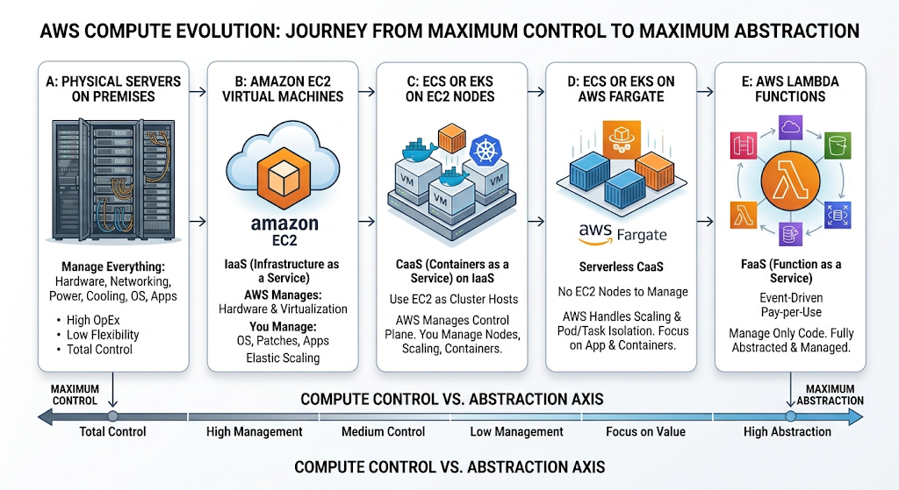{width="80%"}
    <figcaption>Level of Control in AWS</figcaption>
    
<i>Image Source: AI Generaed (Google Gemini)</i>

</figure>
Moving left to right along this spectrum:

- **Operational burden decreases.** You stop patching kernels, then you stop managing hosts, then you stop thinking about servers at all.
- **Granularity of billing increases.** You move from per-hour instance billing, to per-second task billing, to per-millisecond invocation billing.
- **Constraints tighten.** Lambda imposes a maximum execution duration, a maximum deployment package size, and a stateless execution model. EC2 imposes none of these.
- **Portability changes character.** Containers are portable across clouds; Lambda functions are portable only in their business logic, not in their operational shape.

---

## Why This Service or Concept Exists

### The Problem Before Cloud Compute

The structural problems were:

| Problem | Consequence |
|---|---|
| **Capacity had to be bought before demand was known** | Systematic over-provisioning; typical server utilisation of 10–20 percent |
| **Provisioning latency measured in weeks** | Business initiatives blocked on infrastructure |
| **Capital expenditure, not operating expenditure** | Large up-front cost, depreciation schedules, board approval for experiments |
| **Manual configuration** | Configuration drift, snowflake servers, "works on that box" failures |
| **Failure handling was manual** | Hardware failure meant an engineer physically replacing a component |
| **Scaling down was impossible** | You cannot un-buy a server |

### What AWS Compute Changed

**Amazon EC2 (2006)** was the founding answer: virtual machines available through an API in minutes, billed by the hour and later by the second, disposable by design. This converted capital expenditure into operating expenditure and provisioning time from weeks into minutes. Crucially, it made *elasticity* possible  the ability to grow and, just as importantly, shrink capacity in response to real demand.

But EC2 left a large problem unsolved. A virtual machine still has an operating system that must be patched, a filesystem that accumulates state, and a deployment process that must place application artefacts onto it. Teams building dozens of microservices discovered that managing hundreds of EC2 instances is not fundamentally easier than managing hundreds of physical servers  it is merely faster to provision them.

**Containers** solved the packaging problem: an immutable image bundling application code, runtime, libraries, and configuration, guaranteed to behave identically wherever it runs. But containers created a new problem  *placement*. If you have 300 containers and 40 hosts, which container runs where? What happens when a host dies? How do containers find each other? These are **orchestration** problems.

**Amazon ECS (2014)** provided AWS-native orchestration: a control plane that schedules containers onto a fleet, restarts them on failure, integrates with ELB, and authenticates through IAM. It is deliberately opinionated and deeply integrated with AWS.

**Amazon EKS (2018)** provided the same orchestration through **Kubernetes**, the open-source de facto standard, for organisations that wanted a portable, extensible, community-driven control plane, or that already had Kubernetes expertise and tooling.

**AWS Fargate (2017)** removed the last piece of server management from containers. With Fargate you do not run EC2 instances at all  you declare CPU and memory per task or pod, and AWS provisions the underlying compute invisibly.

**AWS Lambda (2014)** went furthest: you upload a function, you configure an event source, and AWS runs the function on demand, scaling from zero to thousands of concurrent executions and back to zero, charging only for the milliseconds consumed. There is no host to see, no capacity to plan, no idle cost.

!!! tip "The evolution is additive, not replacing"
    A common beginner error is to assume that Lambda "replaced" EC2, or that EKS "replaced" ECS. In reality, mature AWS estates run all of these simultaneously, each for the workloads it fits. Netflix runs enormous EC2 fleets *and* serverless functions. A bank may run a Kubernetes platform for its microservices *and* Lambda for its event glue *and* EC2 for a licensed legacy database.

### Traditional Approach Compared With the AWS Approach

| Dimension | Traditional data centre | AWS compute |
|---|---|---|
| Provisioning time | Weeks to months | Seconds to minutes |
| Cost model | Capital expenditure, depreciated | Operating expenditure, consumption-based |
| Capacity planning | Forecast peak 1–2 years ahead | Scale reactively or predictively |
| Failure recovery | Manual hardware replacement | Instance replacement via API or automatically by an Auto Scaling group |
| Utilisation | Typically 10–20 percent | 40–70 percent with autoscaling; effectively 100 percent with Lambda |
| Experimentation cost | High  hardware must be purchased | Near zero  terminate when finished |
| Geographic expansion | Build or lease a new data centre | Deploy into another Region via API |

## Core Concepts

### Virtualisation and Multi-Tenancy

A **hypervisor** is software (or, on modern AWS hardware, largely dedicated silicon) that partitions one physical server into multiple isolated virtual machines. Each VM believes it has its own CPU, memory, disks, and network interfaces. The hypervisor enforces isolation so that one tenant cannot read another tenant's memory or saturate another tenant's I/O.

<figure markdown="span">
    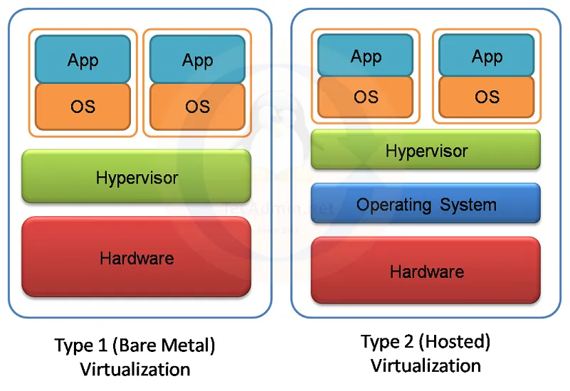{width="80%"}
    <figcaption>Types of Hypervisor</figcaption>
</figure>

**Multi-tenancy** is the practice of running multiple customers' workloads on shared physical hardware. It is what makes cloud economics work  utilisation of the physical fleet is high because peaks and troughs of different customers do not coincide. AWS offers tenancy options that trade this economy for isolation: shared (default), Dedicated Instances (hardware not shared with other AWS accounts), and Dedicated Hosts (you get a specific physical server, with visibility of sockets and cores, which matters for per-socket software licensing).

### Containers Versus Virtual Machines

<figure markdown="span">
    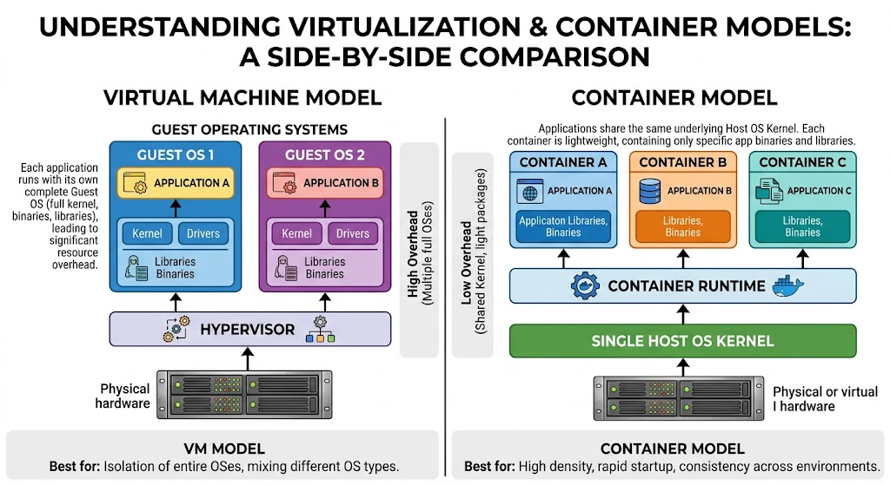{width="80%"}
    <figcaption>Virtual machine model VS Container Model</figcaption>
</figure>

A **container** is an operating-system-level isolation construct. It does not carry its own kernel. It uses Linux kernel primitives  **namespaces** (to give the process its own view of the process tree, network stack, mount table, users, and hostname) and **cgroups** (to constrain CPU, memory, and I/O consumption)  plus a layered filesystem.

| Property | Virtual machine | Container |
|---|---|---|
| Isolation boundary | Hardware-virtualised; separate kernel | Kernel namespaces; shared kernel |
| Start time | Tens of seconds to minutes | Milliseconds to a few seconds |
| Image size | Gigabytes | Tens to hundreds of megabytes |
| Density per host | Tens | Hundreds |
| Isolation strength | Very strong | Strong, but a shared kernel is a shared attack surface |
| Typical use | Full OS environments, legacy software | Microservices, stateless application processes |

!!! warning "Containers are not a security boundary equivalent to a VM"
    Because containers share the host kernel, a kernel vulnerability can in principle allow container escape. This is exactly why AWS Fargate and AWS Lambda do **not** simply run customer containers side by side on a shared kernel  they place each task or execution environment inside its own lightweight virtual machine. Never assume that "it is in a container" means "it is isolated from other tenants".

### Container Images, Registries, and Immutability

A **container image** is an immutable, layered, content-addressed filesystem plus metadata (entrypoint, environment variables, exposed ports). Images are built from a **Dockerfile**, stored in a **registry**  on AWS, **Amazon Elastic Container Registry (ECR)**  and pulled by hosts at launch.

Immutability is an architectural principle, not merely an implementation detail. It means:

- The artefact tested in staging is bit-for-bit the artefact running in production.
- Rollback is redeployment of a previous image tag, not an inverse migration script.
- Configuration that varies by environment must be injected at runtime (environment variables, Secrets Manager, Parameter Store) rather than baked into the image.

!!! danger "Never use the `latest` tag in production"
    `latest` is a mutable pointer. Two tasks launched five minutes apart can run different code with the same tag, and you lose the ability to roll back deterministically. Tag images with an immutable identifier  a Git commit SHA or a semantic version  and enable ECR **tag immutability** so a tag cannot be overwritten.

### Orchestration

**Orchestration** is the automated management of container lifecycle across a fleet of hosts. An orchestrator is responsible for:

| Responsibility | Meaning |
|---|---|
| **Scheduling / placement** | Deciding which host runs which container, given resource requests and constraints |
| **Desired state reconciliation** | Continuously comparing actual state to declared state and correcting the difference |
| **Health checking and self-healing** | Detecting unhealthy containers and replacing them |
| **Service discovery** | Allowing containers to find each other as instances come and go |
| **Load balancing integration** | Registering and deregistering targets with a load balancer |
| **Rolling deployment** | Replacing old versions with new versions without downtime |
| **Resource management** | Bin-packing containers onto hosts within CPU and memory limits |

The **declarative model** is central. You do not command "start three containers"; you declare "the desired count of this service is three", and a reconciliation loop makes reality match that declaration, indefinitely, including after failures you never observe.

<figure markdown="span">
    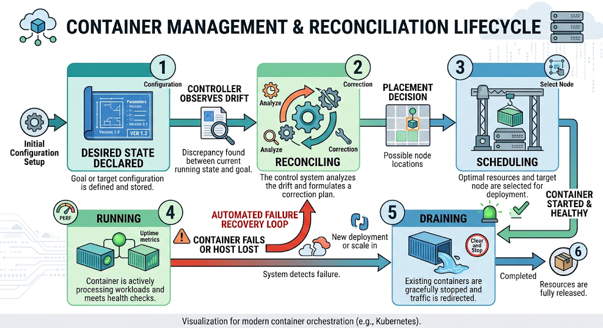{width="80%"}
    <figcaption>Modern Container Orchestration</figcaption>
</figure>

### Serverless

**Serverless** does not mean there are no servers. It means four properties hold simultaneously:

1. **No server provisioning or management** by you.
2. **Automatic, demand-driven scaling**, including scaling to zero.
3. **Pay for value consumed**, not for allocated capacity  no charge when idle.
4. **Built-in availability and fault tolerance** across Availability Zones by default.

Lambda satisfies all four. Fargate satisfies the first, second (partially  a running task costs money even when idle), and fourth, but a Fargate task that sits idle still bills; that is why Fargate is called "serverless containers" rather than fully serverless.

### Statelessness

A **stateless** compute node holds no data that cannot be lost without consequence. Session state, uploaded files, and caches must live in external services  DynamoDB, ElastiCache, S3, RDS.

Statelessness is what makes elasticity possible. If any instance can be terminated at any moment without data loss, then the platform is free to replace instances for scaling, patching, Spot reclamation, or failure recovery. Every compute service in this chapter assumes statelessness by default; every design that violates it (writing user uploads to a container's local filesystem, holding sessions in process memory behind a round-robin load balancer) creates a correctness bug that only appears under scaling or failure.

!!! example "The classic statefulness bug"
    A team stores user session data in the memory of each EC2 instance and enables sticky sessions on the load balancer to compensate. The application works. Then an instance is replaced during a deployment and those users are silently logged out mid-checkout. The fix is not more stickiness; it is externalising session state to ElastiCache or DynamoDB.

### Elasticity, Scalability, and Availability

These three words are frequently confused and mean different things.

| Term | Definition | Mechanism on AWS |
|---|---|---|
| **Scalability** | The ability to handle increased load by adding resources | Horizontal scaling of instances, tasks, pods, or concurrent executions |
| **Elasticity** | The ability to scale **out and back in** automatically in response to demand | Auto Scaling groups, ECS service auto scaling, HPA, Lambda concurrency |
| **High availability** | Continued operation despite the failure of a component | Multi-AZ deployment, health checks, redundancy |
| **Fault tolerance** | Continued operation with no degradation despite failure | N+1 or N+2 redundancy, retries, idempotency, circuit breakers |
| **Durability** | Data survives failure | Handled by storage services, not compute |

**Vertical scaling** (a larger instance) has a hard ceiling and requires downtime or replacement. **Horizontal scaling** (more instances) is unbounded in principle and is the cloud-native default. Design for horizontal scaling; use vertical scaling only where the workload genuinely cannot be partitioned, such as a single-writer relational database.

### The Shared Responsibility Model for Compute

AWS is responsible for the security **of** the cloud; the customer is responsible for security **in** the cloud. Where that line falls is exactly what differentiates the compute services.

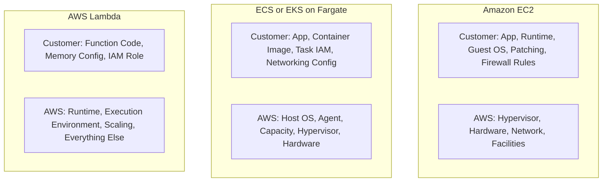

---

## Architecture Components

A production compute architecture is never just compute. The following components appear in nearly every design in this module.

| Component | Layer | Responsibility in a compute architecture |
|---|---|---|
| **Amazon Route 53** | DNS | Resolves the application hostname; health checks and latency-, geo-, or failover-based routing across Regions |
| **Amazon CloudFront** | Edge / CDN | Terminates TLS close to the user, caches static and cacheable dynamic content, absorbs volumetric traffic before it reaches compute, integrates with AWS WAF and Shield |
| **AWS WAF and Shield** | Edge security | Filters malicious HTTP requests and mitigates DDoS before requests consume compute capacity |
| **Application Load Balancer (ALB)** | Layer 7 | HTTP/HTTPS routing by host, path, header, or method; target groups of instances, IPs, or Lambda functions; per-target health checks; TLS termination |
| **Network Load Balancer (NLB)** | Layer 4 | Ultra-low-latency TCP/UDP/TLS load balancing, static IPs, extreme throughput; used for non-HTTP protocols and where source IP preservation matters |
| **Amazon API Gateway** | API front door | REST/HTTP/WebSocket APIs, request validation, throttling, authorisation, and direct integration with Lambda without a load balancer |
| **Amazon VPC** | Network | The isolated virtual network in which all non-Lambda-managed compute lives |
| **Subnets** | Network | AZ-scoped IP ranges; public subnets have a route to an Internet Gateway, private subnets do not |
| **Internet Gateway and NAT Gateway** | Network | Inbound/outbound internet for public subnets; outbound-only internet for private subnets |
| **VPC Endpoints** | Network | Private connectivity to AWS services without traversing the internet; essential for private ECS/EKS clusters and for reducing NAT cost |
| **Security Groups** | Network security | Stateful, instance/ENI/task/pod-level virtual firewalls; the primary microsegmentation tool |
| **Network ACLs** | Network security | Stateless, subnet-level filters; a coarse secondary control |
| **Amazon EC2** | Compute | Virtual machines; the substrate for IaaS workloads and for ECS/EKS node groups |
| **EC2 Auto Scaling Group** | Compute control | Maintains desired instance count, replaces failed instances, spreads across AZs, executes scaling policies |
| **Amazon ECS** | Compute orchestration | AWS-native container orchestration; clusters, services, tasks, task definitions |
| **Amazon EKS** | Compute orchestration | Managed Kubernetes control plane; node groups, Fargate profiles, add-ons |
| **AWS Fargate** | Compute capacity | Serverless capacity provider for ECS tasks and EKS pods |
| **AWS Lambda** | Compute | Event-driven function execution |
| **Amazon ECR** | Artefact store | Private, IAM-controlled container registry with image scanning, lifecycle policies, and tag immutability |
| **AWS IAM** | Identity | Roles for instances, task execution, task workloads, pods (IRSA), and functions; the foundation of least privilege |
| **Amazon S3** | Storage | Static assets, deployment artefacts, data lake input and output |
| **Amazon EBS and EFS** | Storage | Block storage attached to instances; shared POSIX filesystem mountable by many tasks, pods, and Lambda functions |
| **Amazon RDS, Aurora, DynamoDB** | Data | Externalised state that makes compute stateless |
| **Amazon SQS, SNS, EventBridge, Kinesis** | Messaging | Decoupling, buffering, fan-out, and event routing between compute components |
| **AWS Step Functions** | Orchestration | Durable, visual workflow orchestration across Lambda, ECS tasks, and other services; handles retries, timeouts, and long-running state |
| **Amazon CloudWatch** | Observability | Metrics, logs, alarms, dashboards, Container Insights, Lambda Insights |
| **AWS X-Ray** | Observability | Distributed tracing across service boundaries |
| **AWS CloudTrail** | Audit | Records every control-plane API call for security and compliance investigation |
| **AWS CloudFormation, CDK, Terraform** | Automation | Infrastructure as Code  declarative, version-controlled, reviewable infrastructure |
| **AWS Systems Manager** | Operations | Patch Manager, Session Manager (SSH-free shell access), Parameter Store for configuration |

!!! tip "Architectural reading of this table"
    Notice that the compute rows are a minority. In a well-designed system, compute is deliberately made boring: stateless, replaceable, and surrounded by managed services that hold the state, route the traffic, and observe the behaviour. If your compute layer is the most complicated part of your diagram, you have probably put responsibilities in the wrong place.

---

## AWS Service Deep Dive

!!! warning "On numbers and quotas"
    Service limits below are stated as of 2026. Many are **soft (adjustable) quotas** that can be raised through AWS Service Quotas, and several are **Region-dependent**. Treat every figure here as a design signal rather than an immutable constant, and verify against the AWS Service Quotas console and the current service documentation before committing to a design. Pricing is described in terms of **pricing dimensions** and orders of magnitude only; always consult the current AWS pricing pages and the AWS Pricing Calculator for figures.

### Amazon EC2

**Purpose.** To provide resizable virtual machines with full control over the operating system, so that arbitrary software  including legacy applications, licensed software, custom kernels, GPU workloads, and stateful systems  can run in the cloud with the same freedom as on physical hardware.

**Architecture.** An EC2 instance is a guest OS running on a Nitro host within a specific Availability Zone. It is composed of:

- An **AMI (Amazon Machine Image)**  the template containing the root volume snapshot, kernel configuration, and launch permissions.
- An **instance type**  a fixed combination of vCPU, memory, network bandwidth, and storage characteristics.
- One or more **ENIs**, each in a subnet, each with security groups.
- **EBS volumes** (network-attached, persistent, independently durable) and/or **instance store** volumes (physically attached NVMe, extremely fast, ephemeral, lost on stop or termination).
- An **IAM instance profile** granting the instance an IAM role.
- **User data** for first-boot bootstrapping.

**Important features.**

| Feature | Architectural value |
|---|---|
| Instance families (general purpose, compute, memory, storage, accelerated) | Match hardware to workload shape rather than over-buying a single dimension |
| Graviton processors (ARM-based) | Typically better price-performance than equivalent x86 instances for many workloads; requires ARM-compatible builds |
| Auto Scaling groups | Desired-count reconciliation, AZ balancing, health-based replacement, lifecycle hooks |
| Launch templates | Versioned instance configuration; the modern replacement for launch configurations, required for mixed-instances policies |
| Placement groups | Cluster (low latency, same rack), Spread (distinct hardware, for HA), Partition (fault-domain-aware, for HDFS-style systems) |
| Elastic IP and ENI attach/detach | Network identity that can survive instance replacement |
| Nitro Enclaves | Isolated, attestable compute environments for processing highly sensitive data with no persistent storage or interactive access |
| EC2 Image Builder | Automated, versioned, tested AMI pipelines  the correct answer to "golden image" management |
| Hibernation | Preserves RAM to EBS so an instance resumes with its memory state intact |

**Pricing model (dimensions).**

| Purchase option | How it works | Best for |
|---|---|---|
| **On-Demand** | Pay per second (60-second minimum for Linux) with no commitment | Unpredictable workloads, development, spike absorption |
| **Savings Plans (Compute or EC2 Instance)** | Commit to a dollar-per-hour spend for one or three years; discounts commonly in the region of 30–70 percent depending on term and payment option | Steady baseline load; Compute Savings Plans also cover Fargate and Lambda |
| **Reserved Instances** | Commit to a specific instance configuration for one or three years | Long-lived, unchanging workloads; Standard RIs can be sold in the Marketplace |
| **Spot Instances** | Bid on spare capacity at discounts frequently around 70–90 percent; AWS reclaims with a two-minute interruption notice | Fault-tolerant, stateless, interruptible work: batch, CI runners, stateless web tiers behind a queue |
| **Dedicated Instances / Dedicated Hosts** | Hardware isolation; Dedicated Hosts expose socket and core counts | Regulatory isolation, per-socket BYOL licensing |
| **Capacity Reservations** | Reserve capacity in a specific AZ without a term commitment | Guaranteeing capacity for a known event or DR failover |

Additional dimensions that surprise beginners: **EBS volume storage and provisioned IOPS**, **data transfer out to the internet**, **cross-AZ data transfer**, **NAT Gateway processing**, and **Elastic IPs that are allocated but not attached**.

**Performance characteristics.** Network and EBS bandwidth scale with instance size, and smaller instances of many families use a **credit-based burst** model for both CPU (the T family) and EBS/network throughput. A T-family instance that exhausts CPU credits is throttled to its baseline, which is a classic cause of mysterious latency in a system that "worked in testing". Enhanced networking (ENA) and, for HPC, Elastic Fabric Adapter provide high packet-per-second and low-latency capability.

**Scaling behaviour.** Horizontal scaling via Auto Scaling groups with target tracking (for example, maintain 50 percent average CPU), step scaling, scheduled scaling, or predictive scaling. Key parameters are the **warm-up period** (how long a new instance takes to become useful, so it is excluded from metrics until then) and the **cooldown** (preventing oscillation). Vertical scaling requires stopping and restarting the instance with a new type.

**Availability.** Instances are single-AZ. Availability is achieved by running an Auto Scaling group across multiple AZs behind a load balancer with health checks, and by setting the ASG health check type to `ELB` so that an instance failing application health checks is replaced, not merely one failing EC2 status checks.

**Security features.** Security groups and NACLs, IAM instance profiles with temporary credentials via IMDSv2, EBS encryption with KMS, Nitro-enforced isolation, AWS Systems Manager Session Manager for shell access without SSH keys or open port 22, Inspector for vulnerability assessment, and Nitro Enclaves for confidential computing.

**Service limits (illustrative, mostly adjustable).**

| Limit | Typical default | Notes |
|---|---|---|
| Running On-Demand instances | Expressed as a **vCPU quota per instance family group**, per Region | Adjustable; new accounts start low |
| Spot instances | Separate vCPU quota per family | Adjustable |
| ENIs per instance and IPs per ENI | Determined by instance type | Not adjustable; a hard design constraint for `awsvpc` density and the EKS VPC CNI |
| EBS volumes attached | Instance-type dependent | Nitro instances attach volumes as NVMe devices |
| Auto Scaling groups per Region | In the low thousands | Adjustable |

**Common configurations.** A private-subnet Auto Scaling group across three AZs, behind an ALB in public subnets, using a launch template referencing a hardened AMI produced by EC2 Image Builder, with an instance profile granting only the permissions the application needs, IMDSv2 required, EBS encrypted by a customer-managed KMS key, and Systems Manager Agent for patching and shell access.

!!! tip "When EC2 is the right answer"
    Choose EC2 when you need OS-level control, when software is licensed per host or requires a specific kernel, when the workload is long-running and steady enough for Savings Plans, when you need GPUs or specialised hardware, or when you are lifting and shifting an existing application before modernising it.

### Amazon ECS

**Purpose.** To run and scale Docker containers on AWS with a control plane that is fully managed, has no additional charge, and integrates natively with IAM, VPC networking, ELB, CloudWatch, and Auto Scaling  without requiring the team to learn Kubernetes.

**Architecture.**

| Object | Meaning |
|---|---|
| **Cluster** | A logical grouping of capacity and services. A namespace, not a machine. |
| **Task definition** | An immutable, versioned blueprint: container images, CPU and memory, ports, environment, secrets, log configuration, IAM roles, volumes |
| **Task** | A running instance of a task definition revision; one or more containers co-scheduled on one host |
| **Service** | A controller that maintains a desired count of tasks, registers them with a load balancer, and performs rolling deployments |
| **Capacity provider** | The source of compute: an Auto Scaling group, `FARGATE`, or `FARGATE_SPOT` |
| **Container agent** | The per-instance process that communicates with the control plane (EC2 launch type only) |

**Survey-level facts.**

- **Two launch types**: EC2 (you own the instances, maximum control and cost tuning) and Fargate (no instances at all).
- **Pricing**: the control plane is **free**; you pay for capacity. On EC2 you pay for whole instances whether or not tasks fill them, so bin-packing efficiency determines cost. On Fargate you pay per second (one-minute minimum) for the requested vCPU and memory, and **Fargate Spot** offers a substantial discount for interruptible tasks with a two-minute warning.
- **Two scaling layers**: service auto scaling adjusts the task count; on the EC2 launch type, capacity-provider managed scaling adjusts the instance count underneath. On Fargate the second layer does not exist.
- **Two task-level IAM roles**: the **task execution role** is used by the ECS agent or Fargate infrastructure to pull images, write logs, and fetch referenced secrets; the **task role** is what your application code uses. Keep them separate and minimal. See [2.2 Amazon ECS](../unit2/topic2.md#security-considerations) for the full treatment of all three ECS roles.
- **Availability** comes from running at least two tasks spread across AZs; the control plane itself is regional and multi-AZ.

**Service limits (illustrative, mostly adjustable).**

| Limit | Typical default |
|---|---|
| Clusters per Region | 10,000 |
| Services per cluster | 5,000 |
| Tasks per service | 5,000 |
| Containers per task definition | 10 |
| Task definition size | 64 KiB |
| Fargate task CPU / memory combinations | Discrete pairs from 0.25 vCPU / 0.5 GB up to 16 vCPU / 120 GB, with valid memory ranges tied to each vCPU size |
| Fargate ephemeral storage | 20 GiB included, configurable up to 200 GiB |

For the full treatment of clusters, capacity providers, networking, service discovery, and IAM roles, see [2.2 Amazon ECS](../unit2/topic2.md#amazon-ecs); for placement, auto scaling, and deployments, see [2.3 Container Orchestration with Amazon ECS](../unit2/topic3.md#the-two-scaling-layers-revisited).

### Amazon EKS

**Purpose.** To run upstream-conformant Kubernetes on AWS without operating the control plane, so that organisations can use the Kubernetes API, ecosystem, and portability while AWS handles API server availability, etcd durability, and control-plane patching.

**Survey-level facts.**

- **Architecture**: an AWS-managed control plane replicated across at least three AZs, plus a data plane you choose  self-managed nodes, managed node groups, Fargate profiles (one microVM per pod), Karpenter-provisioned nodes, or EKS Auto Mode.
- **Pricing**: an hourly charge **per cluster** for the control plane (on the order of ten cents per hour for standard support, higher for extended support  check the current EKS pricing page), plus the data plane (EC2 instances or Fargate vCPU and GB-seconds), load balancers, NAT Gateways, and data transfer.
- **Version upgrades are a recurring, mandatory obligation**: Kubernetes minor versions have a limited standard support window, after which extended support costs more.
- **Security**: IAM authentication combined with Kubernetes RBAC; IRSA or EKS Pod Identity for per-pod AWS permissions; NetworkPolicy for east-west segmentation, because the default pod network is flat.

**Scaling behaviour.** Kubernetes scaling operates at three distinct layers, and an exam or interview will test whether you can name all three:

| Layer | Mechanism | What it changes |
|---|---|---|
| **Pod horizontal** | Horizontal Pod Autoscaler (HPA) | Replica count of a Deployment, based on CPU, memory, or custom/external metrics via the metrics API |
| **Pod vertical** | Vertical Pod Autoscaler (VPA) | The CPU/memory requests of pods, based on observed usage |
| **Node** | Cluster Autoscaler or Karpenter | Number and type of worker nodes, in response to unschedulable pods |

KEDA extends HPA with event-driven triggers, for example scaling on SQS queue depth or Kafka consumer lag  the Kubernetes analogue of Lambda's event-driven model.

**Service limits (illustrative).**

| Limit | Typical default |
|---|---|
| Clusters per account per Region | 100 |
| Managed node groups per cluster | 30 |
| Nodes per managed node group | 450 |
| Pods per node | Determined by instance type ENI/IP capacity under the VPC CNI, unless prefix delegation is enabled |
| Fargate profiles per cluster | 10, with up to 5 selectors each |

For the full treatment, see [3.1 Amazon EKS Architecture](../unit3/topic1.md#amazon-eks-control-plane) (control plane, VPC CNI, identity), [3.2 Deploying Applications on Amazon EKS](../unit3/topic2.md) (cluster lifecycle, manifests, Helm, GitOps), and [3.3 Amazon EKS Advanced Concepts](../unit3/topic3.md#managed-node-groups-versus-karpenter-versus-auto-mode) (Fargate profiles, managed node groups, add-ons, operators).

### AWS Lambda

**Purpose.** To execute code in response to events with no server or capacity management at all, scaling automatically from zero to very high concurrency, and charging only for compute actually consumed.

**Architecture.** A **function** consists of code (a ZIP package or a container image up to 10 GB), a **runtime** (managed Node.js, Python, Java, .NET, Ruby, Go via provided runtimes, or a custom runtime through the Runtime API), a **handler** entry point, a **memory** setting from 128 MB to 10,240 MB that proportionally allocates CPU, a **timeout** up to 15 minutes, an **execution role**, and optional **layers**, **VPC configuration**, **environment variables**, and **ephemeral storage** in `/tmp` from 512 MB to 10,240 MB.

**Important features.**

| Feature | Purpose |
|---|---|
| **Versions and aliases** | Immutable published versions; aliases as stable pointers enabling weighted traffic shifting for canary deployments |
| **Layers** | Shared dependency archives, reducing package duplication across functions |
| **Container image support** | Package a function as an OCI image up to 10 GB, reusing existing container build pipelines |
| **Provisioned concurrency** | Pre-initialised environments that eliminate cold starts, billed for being kept warm |
| **Reserved concurrency** | Caps a function's maximum concurrency and simultaneously guarantees it that capacity, protecting other functions and downstream databases |
| **SnapStart** | Snapshots an initialised execution environment and restores it, dramatically reducing cold starts for supported runtimes such as Java |
| **Lambda function URLs** | A built-in HTTPS endpoint without API Gateway |
| **Response streaming** | Progressive response delivery for larger payloads and lower time-to-first-byte |
| **Event source mappings** | Managed pollers for SQS, Kinesis, DynamoDB Streams, MSK, Amazon MQ, and DocumentDB |
| **Graviton (arm64) architecture** | Better price-performance for most workloads |
| **Destinations** | On-success and on-failure routing for asynchronous invocations to SQS, SNS, EventBridge, or another function |
| **Extensions and the Telemetry API** | Sidecar-style processes for observability and secrets caching |

**Limitations.** These are the constraints that determine whether Lambda is viable at all:

| Constraint | Value | Design implication |
|---|---|---|
| Maximum execution duration | 15 minutes (900 seconds, hard) | Long jobs must be decomposed, or moved to ECS/Batch/Step Functions |
| Memory | 128 MB to 10,240 MB | CPU scales with memory; roughly one full vCPU near 1,769 MB, up to about six vCPUs at maximum |
| Deployment package | 50 MB zipped direct upload, 250 MB unzipped including layers, 10 GB as a container image | Large ML models generally require the container image path or EFS |
| Ephemeral `/tmp` | 512 MB default, up to 10,240 MB | Ephemeral and per-environment; never a durable store |
| Synchronous payload | 6 MB request and response (hard) | Use S3 and pass a reference for larger payloads |
| Asynchronous payload | 256 KB (hard) | Same pattern applies |
| Concurrency | Default account limit of 1,000 concurrent executions per Region, a **soft quota** | Must be raised deliberately before a launch; also protects downstream systems |
| Layers per function | 5 | Composition constraint |
| Function and layer storage per Region | 75 GB (soft) | Clean up old versions and unused layers |
| Environment variable total size | 4 KB (hard) | Store larger configuration in Parameter Store or Secrets Manager |
| Statelessness | No guaranteed environment reuse | Never rely on in-memory state persisting between invocations |

**Pricing model.** Three principal dimensions: **number of requests**, **GB-seconds of duration** (configured memory multiplied by billed duration in milliseconds), and, where used, **provisioned concurrency** (billed for the time environments are kept warm plus a lower duration rate). A perpetual free tier covers a substantial monthly allowance of requests and GB-seconds. `arm64` is cheaper per GB-second than `x86_64`. Additional charges arise from the services Lambda talks to  API Gateway requests, CloudWatch Logs ingestion (frequently a larger bill than the Lambda itself for chatty functions), NAT Gateway processing for VPC-attached functions, and data transfer.

!!! tip "The counter-intuitive memory optimisation"
    Because CPU is allocated proportionally to memory, increasing memory often **reduces total cost**: a function that takes 2,000 ms at 512 MB may take 400 ms at 1,536 MB. The GB-seconds consumed fall even though the per-millisecond rate rises. Use **AWS Lambda Power Tuning** (a Step Functions state machine) to find the cost-optimal memory setting empirically rather than guessing.

**Performance characteristics.** Warm invocation overhead is a few milliseconds. Cold-start Init cost ranges from roughly 100–300 ms for a small interpreted function to several seconds for large JVM or .NET applications. Provisioned concurrency and SnapStart address the tail. Because each environment handles one request at a time, **per-invocation latency does not degrade under load** the way a saturated server does  instead concurrency rises, which is a fundamentally different and generally more predictable performance profile.

**Scaling behaviour.** Concurrency equals the number of simultaneously executing environments. Lambda scales concurrency in **bursts**, adding a substantial number of environments per function per short interval (per-function burst scaling, on the order of a thousand additional concurrent executions every ten seconds, up to the account limit), which is far faster than any Auto Scaling group. Two controls shape it:

- **Reserved concurrency** caps and guarantees a function's share of the account pool. Setting it to zero is an effective emergency stop.
- **Provisioned concurrency** keeps environments initialised, and is itself auto-scalable on a schedule or a utilisation target.

**Availability.** Lambda automatically runs functions across multiple AZs within a Region with no configuration. If you attach a function to a VPC, you must specify subnets in multiple AZs, or you reintroduce a single-AZ dependency. Cross-Region resilience requires deploying the function in multiple Regions and routing with Route 53 or Global Accelerator.

**Security features.** Per-function execution roles (the most granular IAM boundary of any compute service), resource-based policies controlling who may invoke the function, environment-variable encryption with KMS, VPC attachment for private resource access, Code Signing to enforce that only signed artefacts are deployed, and per-function CloudWatch log groups.

**Common configurations.** A Python or Node.js function on `arm64`, 512–1,024 MB memory, a timeout set slightly above the observed p99 duration, an execution role scoped to specific resource ARNs, structured JSON logging with a defined log retention period, an SQS event source with a dead-letter queue and a `maxReceiveCount`, X-Ray active tracing, and deployment through a versioned alias with a canary traffic shift.

### AWS Fargate as a Capacity Mode

Fargate deserves separate treatment because students frequently misclassify it as a fourth orchestrator. It is not. **Fargate is a way of obtaining capacity for ECS or EKS; you still need one of those orchestrators.** The launch-type decision is developed in [2.2 Amazon ECS](../unit2/topic2.md#the-launch-type-decision-made-honestly), and Fargate on EKS in [3.3 Amazon EKS Advanced Concepts](../unit3/topic3.md#aws-fargate-on-eks).

| Aspect | ECS on EC2 | ECS on Fargate | EKS on EC2 | EKS on Fargate |
|---|---|---|---|---|
| Host management | Yours | AWS | Yours | AWS |
| Billing granularity | Per instance-second | Per task vCPU-second and GB-second | Per instance-second | Per pod vCPU-second and GB-second |
| Bin packing | You control density | One microVM per task; no packing | You control density | One microVM per pod |
| DaemonSets / host agents | Supported | Not applicable | Supported | **Not supported** |
| GPU | Supported | Not supported | Supported | Not supported |
| Privileged containers, host paths | Supported | Not supported | Supported | Not supported |
| Spot capacity | EC2 Spot | Fargate Spot | EC2 Spot | Not available |
| Typical cost position | Cheaper at high, steady utilisation | Cheaper at low or spiky utilisation and always cheaper in engineer-hours | Cheaper at scale | Convenient for isolated or bursty pods |

!!! note "The Fargate cost heuristic"
    Fargate's per-vCPU-hour rate is higher than the equivalent EC2 rate, but you pay only for what tasks request rather than for whole instances. Fargate therefore wins when your instances would sit below roughly 60–70 percent utilisation, and EC2 with Savings Plans or Spot wins when you can genuinely keep instances well packed. Always include the cost of the engineering time spent patching, scaling, and troubleshooting the node fleet in the comparison  for most teams it dominates the raw compute difference.

---

## Important AWS Terminology

| Term | Meaning |
|------|----------|
| **AMI (Amazon Machine Image)** | A template containing a root volume snapshot and launch metadata, used to boot EC2 instances |
| **Instance type** | A named combination of vCPU, memory, storage, and network capability, for example `m7g.large` |
| **Instance family** | A group of instance types optimised for a workload class: general purpose (M, T), compute (C), memory (R, X), storage (I, D), accelerated (P, G, Inf, Trn) |
| **Graviton** | AWS-designed ARM-based processors offering improved price-performance; requires arm64-compatible builds |
| **Nitro System** | The AWS hardware and lightweight hypervisor platform that offloads networking and storage to dedicated cards |
| **Firecracker** | The open-source micro-VMM developed by AWS that underpins Lambda and Fargate isolation |
| **microVM** | A minimal virtual machine with a reduced device model, booting in roughly 125 milliseconds |
| **Hypervisor** | Software or firmware that creates and runs virtual machines on physical hardware |
| **Availability Zone (AZ)** | One or more discrete data centres with independent power and cooling within a Region |
| **Region** | A geographic area containing multiple isolated Availability Zones |
| **ENI (Elastic Network Interface)** | A virtual network interface in a VPC subnet with its own private IP, MAC address, and security groups |
| **Security Group** | A stateful virtual firewall attached to an ENI, task, or pod; allow rules only |
| **Network ACL** | A stateless, subnet-level packet filter supporting both allow and deny rules |
| **Instance profile** | The container that delivers an IAM role to an EC2 instance |
| **IMDSv2** | The session-oriented, token-required Instance Metadata Service, which mitigates SSRF-based credential theft |
| **User data** | A script executed by cloud-init at instance first boot |
| **Launch template** | A versioned, reusable definition of instance configuration used by Auto Scaling groups and Spot Fleets |
| **Auto Scaling group (ASG)** | A controller that maintains a desired instance count across AZs and replaces unhealthy instances |
| **Target tracking scaling** | A policy that adjusts capacity to keep a metric at a target value, analogous to a thermostat |
| **Warm-up period** | The time a newly launched instance is excluded from aggregate scaling metrics |
| **Spot Instance** | Spare EC2 capacity at a steep discount, reclaimable with a two-minute notice |
| **Savings Plan** | A commitment to a dollar-per-hour spend for one or three years in exchange for a discount; Compute Savings Plans also cover Fargate and Lambda |
| **Placement group** | A logical grouping influencing instance placement: cluster, spread, or partition |
| **Container image** | An immutable, layered filesystem plus metadata used to instantiate containers |
| **Amazon ECR** | The AWS private container registry, with IAM access control, scanning, and lifecycle policies |
| **Task definition** | The immutable, versioned ECS blueprint describing containers, resources, roles, and logging |
| **Task** | A running instantiation of an ECS task definition revision |
| **ECS Service** | An ECS controller maintaining a desired task count with load balancer registration and rolling deployments |
| **Capacity provider** | The ECS abstraction for a source of compute: an Auto Scaling group, `FARGATE`, or `FARGATE_SPOT` |
| **Task execution role** | The IAM role AWS infrastructure assumes to pull images, fetch secrets, and write logs on your behalf |
| **Task role** | The IAM role assumed by your application code inside the container |
| **awsvpc network mode** | ECS networking in which each task receives its own ENI, private IP, and security groups |
| **AWS Fargate** | A serverless compute engine that provides capacity for ECS tasks and EKS pods without managing instances |
| **Kubernetes** | An open-source container orchestration platform with a declarative API and reconciliation controllers |
| **Pod** | The smallest deployable unit in Kubernetes: one or more containers sharing a network namespace and storage |
| **Deployment** | A Kubernetes controller managing a ReplicaSet to maintain replicas and perform rolling updates |
| **kubelet** | The Kubernetes node agent that runs pods assigned to its node and reports status |
| **etcd** | The strongly consistent distributed key-value store holding Kubernetes cluster state |
| **kube-proxy** | The node component programming iptables or IPVS rules to implement Service virtual IPs |
| **VPC CNI** | The AWS Kubernetes networking plugin that allocates real VPC IP addresses to pods |
| **IRSA (IAM Roles for Service Accounts)** | OIDC-based federation granting a Kubernetes service account an IAM role |
| **EKS Pod Identity** | A newer, simpler mechanism for associating IAM roles with Kubernetes service accounts |
| **HPA (Horizontal Pod Autoscaler)** | The Kubernetes controller that scales replica count based on metrics |
| **Cluster Autoscaler** | The controller that adds or removes nodes when pods cannot be scheduled or nodes are underutilised |
| **Karpenter** | An AWS-developed node provisioner that launches right-sized instances directly in response to pending pods |
| **PodDisruptionBudget** | A policy limiting how many replicas may be voluntarily disrupted simultaneously |
| **Taints and tolerations** | Node-side repulsion and pod-side acceptance rules controlling scheduling |
| **NetworkPolicy** | A Kubernetes resource restricting pod-to-pod and pod-to-external traffic |
| **Function** | The Lambda unit of deployment: code, runtime, handler, memory, timeout, and role |
| **Handler** | The entry point in your code that Lambda invokes with an event and a context object |
| **Execution environment** | The Firecracker microVM in which a Lambda function version runs; serves one invocation at a time |
| **Cold start** | An invocation that must pay the initialisation cost of creating a new execution environment |
| **Provisioned concurrency** | Pre-initialised Lambda environments kept warm to eliminate cold starts, at additional cost |
| **Reserved concurrency** | A per-function cap on concurrency that also guarantees that capacity to the function |
| **Event source mapping** | A Lambda-managed poller that reads from a stream or queue and invokes the function with batches |
| **Lambda layer** | A shareable archive of libraries or runtime components mounted into the execution environment |
| **SnapStart** | A Lambda feature that snapshots and restores an initialised environment to reduce cold starts |
| **Dead letter queue (DLQ)** | A destination for messages or events that could not be processed after retries |
| **Control plane** | The management layer that accepts API calls and decides desired state |
| **Data plane** | The layer that runs workloads and serves user traffic |
| **Idempotency** | The property that repeating an operation produces the same result, essential for at-least-once delivery systems |
| **Bin packing** | Placing containers onto hosts so as to maximise resource utilisation |
| **Blast radius** | The scope of impact of a failure or a compromise |
| **Infrastructure as Code (IaC)** | Defining infrastructure in version-controlled, machine-readable templates |
| **Immutable infrastructure** | Replacing rather than modifying running components when changes are needed |

---

## Configuration Options

### EC2 Configuration

| Setting | Options | How to decide |
|---|---|---|
| **Instance family** | M, T, C, R, X, I, P, G, Inf, Trn | Profile the workload: CPU-bound (C), memory-bound (R/X), balanced (M), bursty and low-average (T), I/O-bound (I), ML (P/G/Inf/Trn) |
| **Architecture** | x86_64 or arm64 (Graviton) | Prefer Graviton where your build pipeline and dependencies support arm64 |
| **Purchase option** | On-Demand, Spot, Savings Plan, Reserved, Capacity Reservation | Baseline on a Savings Plan, burst on On-Demand, fault-tolerant work on Spot |
| **Tenancy** | Shared, Dedicated Instance, Dedicated Host | Only leave shared when regulation or per-socket licensing requires it |
| **Storage** | gp3, io2, st1, sc1, instance store | gp3 by default (IOPS and throughput decoupled from size); io2 for high, consistent IOPS; instance store for scratch |
| **Auto Scaling policy** | Target tracking, step, simple, scheduled, predictive | Target tracking by default; scheduled for known patterns; predictive for cyclical load |
| **Health check type** | EC2 or ELB | Always `ELB` for load-balanced applications, so application-level failure triggers replacement |
| **Metadata options** | IMDSv1 optional or IMDSv2 required, hop limit | Always require IMDSv2 |
| **Termination policy** | Default, OldestInstance, NewestInstance, ClosestToNextInstanceHour | `OldestInstance` supports rolling out newer AMIs naturally |

### ECS Configuration

| Setting | Options | How to decide |
|---|---|---|
| **Launch type / capacity provider** | EC2 ASG, `FARGATE`, `FARGATE_SPOT` | Fargate unless you need host control, GPUs, or very high steady utilisation |
| **Network mode** | `awsvpc`, `bridge`, `host`, `none` | `awsvpc` for security and observability; `bridge` only for legacy density needs |
| **Secrets** | `secrets` block referencing Secrets Manager or SSM | Never plaintext `environment` entries for credentials |

Task sizing, deployment parameters, placement strategies, service discovery, and logging drivers are configured in [2.2 Amazon ECS](../unit2/topic2.md#configuration-options) and [2.3 Container Orchestration with Amazon ECS](../unit2/topic3.md#configuration-options).

### EKS Configuration

| Setting | Options | How to decide |
|---|---|---|
| **Data plane** | Managed node groups, self-managed nodes, Fargate profiles, Karpenter, Auto Mode | Karpenter for cost-efficient dynamic scaling; managed node groups for simplicity |
| **Identity** | `aws-auth` ConfigMap, access entries, IRSA, Pod Identity | Access entries plus Pod Identity for new clusters |
| **Autoscaling** | HPA, VPA, KEDA, Cluster Autoscaler, Karpenter | HPA plus Karpenter is the common modern pairing |

API endpoint access, VPC CNI options, add-ons, ingress, and storage drivers are configured in [3.1 Amazon EKS Architecture](../unit3/topic1.md#configuration-options) and [3.3 Amazon EKS Advanced Concepts](../unit3/topic3.md#configuration-options).

### Lambda Configuration

| Setting | Options | How to decide |
|---|---|---|
| **Memory** | 128 MB to 10,240 MB | Tune empirically with Power Tuning; higher memory often lowers total cost |
| **Architecture** | x86_64, arm64 | arm64 for lower price per GB-second where dependencies allow |
| **Timeout** | 1 s to 900 s | Set slightly above observed p99, not at the maximum  a long timeout turns a hang into an expensive hang |
| **Packaging** | ZIP or container image | Container image for large dependencies or existing container pipelines |
| **Concurrency** | Unreserved, reserved, provisioned | Reserved to protect downstream databases; provisioned for latency-critical paths |
| **VPC** | None, or subnets plus security groups | Attach only when you must reach private resources; it adds NAT cost and complexity |
| **Event source** | API Gateway, Function URL, ALB, S3, SQS, SNS, EventBridge, Kinesis, DynamoDB Streams | Choose synchronous only where the caller genuinely needs the result |
| **Error handling** | Retry attempts, DLQ, on-failure destination, `maxBatchingWindow`, `functionResponseTypes` | Use partial batch responses for SQS to avoid reprocessing successful messages |
| **Tracing** | Active X-Ray tracing, Lambda Insights, Powertools | Enable at least active tracing in production |

---

## Design Considerations

### The Compute Selection Decision Framework

This is the central architectural skill of this chapter. Work through the questions in order; the first constraint that binds determines the answer.

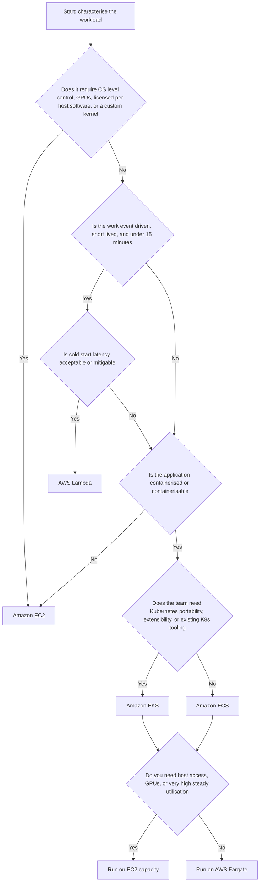

!!! question "Apply the framework"
    A team is building a nightly report generator that reads 40 GB from S3, performs a join, and writes a CSV. Peak runtime is 40 minutes. Lambda is eliminated at the 15-minute constraint. The work is containerisable and stateless, runs once per day, and needs no host control  an **ECS task on Fargate, triggered by EventBridge Scheduler**, is the natural answer. If the same job needed GPUs, it would move to **AWS Batch on EC2 Spot**.

### Comparative Matrix

| Dimension | EC2 | ECS on Fargate | EKS | Lambda |
|---|---|---|---|---|
| Operational burden | Highest | Low | Highest of the container options | Lowest |
| Time to first deployment | Days | Hours | Days to weeks | Minutes |
| Granularity of billing | Per instance-second | Per task-second | Per node-second plus cluster hour | Per millisecond |
| Idle cost | Full | Full while task runs | Cluster fee plus node cost | Zero |
| Cold start | Minutes (boot) | Tens of seconds (task start) | Seconds to minutes | Milliseconds to seconds |
| Maximum execution duration | Unbounded | Unbounded | Unbounded | 15 minutes |
| Statefulness supported | Yes | Limited (EFS) | Yes (StatefulSets, EBS/EFS) | No |
| Portability off AWS | Low (AMI-bound) | Medium (images port, definitions do not) | High | Low operationally |
| Scaling speed | Minutes | Tens of seconds | Seconds (pods), minutes (nodes) | Sub-second |
| Team skill required | Linux and systems administration | Docker and AWS | Kubernetes, deep | Application code plus event modelling |
| Best fit | Legacy, licensed, GPU, steady heavy load | Microservices with modest operational appetite | Large platforms, many teams, extensibility | Event glue, APIs, spiky and bursty work |

### Scalability

Design for **horizontal scaling** at every tier, and know your bottleneck. Adding compute nodes is useless if the relational database connection pool is exhausted  which is exactly what happens when a Lambda function with 1,000 concurrency talks directly to RDS. Use **RDS Proxy** for Lambda-to-relational access, or place a queue between the scalable tier and the constrained tier.

Understand the **scaling latency** of each service, because it determines how much headroom you must carry:

| Service | Time from demand signal to serving capacity |
|---|---|
| Lambda | Milliseconds to a few seconds |
| ECS/EKS pod on existing capacity | Seconds to tens of seconds |
| ECS task on Fargate (new microVM) | Tens of seconds |
| EKS node via Karpenter | Under a minute typically |
| EC2 via Auto Scaling group | One to several minutes |

### Availability and Fault Tolerance

- Deploy across at least two, preferably three, AZs. This is the single highest-value availability decision.
- Set health checks that test the application, not merely the process. An HTTP endpoint that verifies downstream dependencies is more useful than a TCP port check  but beware of cascading failure, where a dependency outage marks every instance unhealthy and the platform terminates your entire fleet. A common compromise is a shallow liveness check and a deeper readiness check.
- Assume every compute node is disposable. Design graceful shutdown: handle `SIGTERM`, stop accepting new work, drain in-flight requests, and deregister from the load balancer within the configured deregistration delay.
- Use **at least two replicas** of everything. A single-replica Deployment has no availability at all during a rolling update or node drain.

### Reliability

Reliability is about behaviour under partial failure. Implement retries with **exponential backoff and jitter**, set client timeouts shorter than server timeouts, apply **circuit breakers** so a failing dependency does not consume all your threads, and make every operation reachable by a retry **idempotent**. In event-driven systems, delivery is at-least-once, so duplicate processing is not an exception case  it is normal traffic.

### Latency

Latency budgets should be allocated explicitly across hops. Edge caching removes hops entirely. Keep chatty services in the same AZ where possible (cross-AZ traffic adds sub-millisecond latency but does incur data transfer charges). Reuse connections  creating a new TLS connection per request is often the dominant latency cost in a microservice call chain, and connection reuse is a major reason to initialise SDK clients outside a Lambda handler.

### Cost

Cost is a design constraint, not an afterthought. The dominant levers in order of typical impact are: **eliminate idle capacity**, **right-size**, **commit to a baseline** with Savings Plans, **use Spot for interruptible work**, **choose Graviton**, and **reduce data transfer** (NAT Gateway processing and cross-AZ transfer are frequent silent cost centres).

### Maintainability and Operational Complexity

Every service you operate has a fixed cognitive cost independent of scale. A three-engineer team running a self-managed Kubernetes platform will spend most of its time on the platform rather than on the product. Choose the **highest level of abstraction that satisfies your constraints**, and revisit the choice only when a constraint actually binds. "We might need Kubernetes later" is not a constraint; it is speculation.

!!! tip "The architect's default"
    For a new, containerisable, stateless microservice with no unusual requirements, the sensible 2026 default is **ECS on Fargate**, with **Lambda** for event glue. Move to **EKS** when you have multiple teams needing a shared, extensible platform, or genuine multi-cloud portability requirements. Move to **EC2** when a hard constraint forces it.

---

## AWS Best Practices

The AWS Well-Architected Framework provides six pillars. Below, each is expressed as concrete compute practice.

### Operational Excellence

- Define **all** infrastructure as code. Console changes are undiscoverable, unreviewable, and unreproducible.
- Make deployments small, frequent, and reversible. Use ECS deployment circuit breakers, CodeDeploy blue/green, or Lambda alias weighted routing so rollback is a single, fast, well-rehearsed action.
- Externalise configuration to SSM Parameter Store or AppConfig, and secrets to Secrets Manager.
- Emit structured, correlated logs and treat log format as an interface contract.
- Automate patching with Systems Manager Patch Manager, or eliminate the need through immutable AMIs and Fargate.
- Run game days: deliberately terminate an instance, drain a node, and fail an AZ in a test environment, and verify that the system behaves as designed.

### Security

- Least privilege everywhere: per-task roles, per-pod roles, per-function roles. Never a shared "application role" across services.
- No long-lived access keys on compute. Use instance profiles, task roles, IRSA/Pod Identity, and execution roles, all of which supply short-lived credentials.
- Run compute in **private subnets**. Only load balancers and NAT gateways belong in public subnets.
- Enforce IMDSv2, drop unnecessary Linux capabilities, run containers as non-root with a read-only root filesystem.
- Scan images in ECR, and block deployment of images with critical vulnerabilities in the pipeline.
- Encrypt everything: EBS with KMS, environment variables with KMS, traffic in transit with TLS.

### Reliability

- Multi-AZ by default; design for AZ loss as an expected event.
- Health checks, automatic replacement, and self-healing controllers rather than human intervention.
- Decouple with queues so that a downstream failure degrades throughput rather than availability.
- Set and test **service quotas** ahead of a launch. Being throttled at 1,000 Lambda concurrency during your busiest hour is a self-inflicted outage.
- Back up and test recovery for anything stateful. Compute should hold nothing that needs backing up.

### Performance Efficiency

- Select the instance family and size from measurements, not intuition. Use Compute Optimizer recommendations.
- Prefer Graviton where compatible.
- Cache aggressively at the edge (CloudFront), in front of the database (ElastiCache), and inside the process where safe.
- Use asynchronous processing so that user-facing latency is decoupled from work duration.
- Benchmark Lambda memory settings; the cost-optimal setting is frequently also the latency-optimal setting.

### Cost Optimization

- Turn off non-production environments outside working hours  often a 60–70 percent saving on those environments.
- Apply Savings Plans to the steady baseline only, and leave the variable portion On-Demand or Spot.
- Use Fargate Spot and EC2 Spot for anything interruptible.
- Set ECR lifecycle policies and CloudWatch Logs retention policies; both accumulate cost silently.
- Tag everything with a cost allocation tag scheme and enforce it with AWS Config or SCPs.

### Sustainability

- Higher utilisation is directly lower energy consumption per unit of work. Right-sizing and bin-packing are sustainability practices as much as cost practices.
- Graviton delivers more work per watt.
- Serverless architectures that scale to zero consume no energy when idle.
- Choose Regions with a higher proportion of renewable energy where latency and data-residency requirements permit.

---

## Security Considerations

### Identity and Least Privilege

Every compute service has a mechanism for obtaining **temporary, automatically rotated credentials**. Using any other mechanism is a defect.

| Compute service | Credential mechanism | Granularity |
|---|---|---|
| EC2 | Instance profile, retrieved via IMDSv2 | Per instance |
| ECS on EC2 | Container instance role, task execution role, task role | Per task (via the task role) |
| ECS on Fargate | Task execution role, task role | Per task |
| EKS | Node instance role, IRSA, EKS Pod Identity | Per pod (via IRSA or Pod Identity) |
| Lambda | Execution role | Per function |

!!! danger "The node role anti-pattern in EKS"
    Broad permissions on the EKS **node instance role** are inherited by every pod on that node, defeating per-pod isolation. Use a minimal node role plus IRSA or Pod Identity, and block pod access to IMDS. See [3.1 Amazon EKS Architecture](../unit3/topic1.md#pod-identity-why-the-node-role-is-not-enough).

Least privilege in practice means: scope actions narrowly, scope resource ARNs to specific resources rather than `*`, use IAM condition keys (`aws:SourceVpce`, `aws:PrincipalTag`, `aws:RequestedRegion`), and use **permissions boundaries** and **Service Control Policies** to place a ceiling on what any role in an account can do.

### Network Security

The layered model, from outside in:

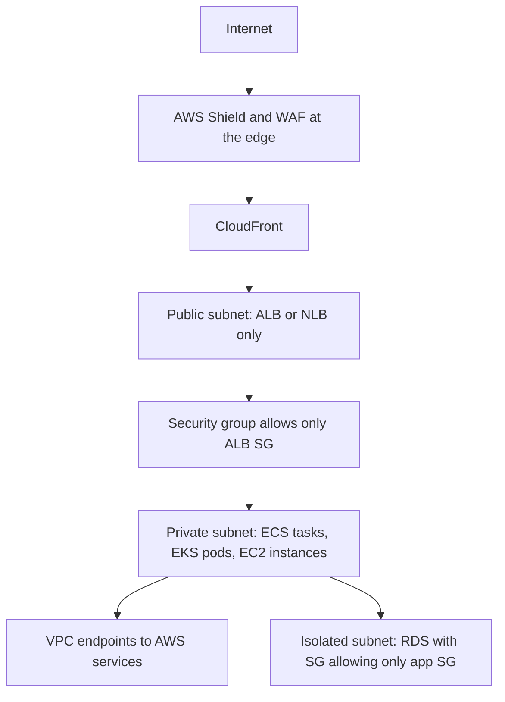

Key rules:

- **Security groups reference other security groups**, not CIDR blocks, for internal traffic. This makes the rule self-maintaining as IP addresses change.
- **Compute lives in private subnets.** If a resource has a public IP address and does not need one, that is a finding.
- **VPC endpoints** (interface endpoints for ECR, ECS, Secrets Manager, CloudWatch Logs, STS; a gateway endpoint for S3) keep traffic on the AWS network, remove the NAT Gateway dependency, and allow endpoint policies to restrict which resources can be reached.
- **NACLs** are a coarse, stateless second layer  useful for blanket denials such as blocking a known-malicious CIDR, not for application-level segmentation.
- In EKS, add **NetworkPolicy** for east-west control; the default is fully open.

### Data Protection

Encrypt at rest with KMS: EBS volumes, EFS filesystems, ECR repositories, Lambda environment variables, and EKS secrets envelope encryption. Prefer **customer-managed keys** where you need key policies, rotation control, and the ability to revoke access by disabling the key. Encrypt in transit with TLS everywhere, including between the load balancer and the application where the data is sensitive.

Secrets belong in **AWS Secrets Manager** (with automatic rotation for supported databases) or **SSM Parameter Store SecureString**, referenced at runtime. They must never be in the container image, in a Git repository, in a plaintext environment variable, or in a task definition's `environment` block, all of which are readable by anyone with `DescribeTaskDefinition` permission.

### Runtime Hardening

| Control | Applies to | Effect |
|---|---|---|
| Non-root user in the image | Containers | Limits damage from application compromise |
| `readonlyRootFilesystem` | ECS and Kubernetes | Prevents an attacker writing tools to disk |
| Drop Linux capabilities | ECS and Kubernetes | Removes unnecessary kernel privileges |
| Pod Security Admission (`restricted`) | EKS | Enforces a hardened baseline at admission time |
| Image signing and Code Signing for Lambda | All | Ensures only trusted artefacts are deployed |
| ECR scan on push plus a pipeline gate | All container services | Blocks known-vulnerable images from reaching production |
| Amazon GuardDuty (EKS Protection, Runtime Monitoring, Lambda Protection) | All | Detects anomalous behaviour at runtime |

### Logging, Audit and Compliance

**CloudTrail** records every control-plane API call and is the primary forensic source: who launched an instance, who modified a security group, who invoked a function. Enable it in all Regions, deliver to a dedicated, access-restricted S3 bucket with object lock, and consider CloudTrail Lake for querying. **VPC Flow Logs** capture network metadata. **EKS control-plane audit logs** record every Kubernetes API request. **AWS Config** records resource configuration over time and evaluates it against rules, which is how you evidence compliance rather than merely assert it.

---

## Performance Optimization

### Caching

Caching is the highest-leverage performance technique because a cache hit consumes no compute at all.

| Layer | Service | What it caches |
|---|---|---|
| Edge | CloudFront | Static assets and cacheable API responses, close to the user |
| API | API Gateway caching | Responses keyed by request parameters |
| Application data | ElastiCache (Redis or Valkey, Memcached) | Query results, session state, computed aggregates |
| Database read scaling | RDS read replicas, DynamoDB DAX | Read-heavy access patterns |
| In-process | Lambda global scope, container process memory | Configuration, secrets, compiled artefacts  per environment, not shared |

### Connection Reuse

Establishing a TCP connection and a TLS session costs one or more round trips. Reuse matters more than most teams realise:

- In Lambda, construct SDK clients, database connections, and HTTP agents **outside the handler** so they persist across warm invocations, and enable HTTP keep-alive.
- Between microservices, use connection pooling and HTTP/2 where supported.
- Between Lambda and a relational database, use **RDS Proxy**, which multiplexes many Lambda connections onto a small pool, preventing connection exhaustion.

### Right-Sizing and Hardware Selection

Use **AWS Compute Optimizer** for EC2, ECS on Fargate, and Lambda recommendations; it analyses CloudWatch metrics and proposes concrete changes. Move to Graviton where builds permit. For CPU-bound workloads, prefer compute-optimised families over general purpose. For latency-critical inter-node communication, use cluster placement groups.

### Autoscaling Tuning

The commonest performance failure is not the absence of autoscaling but its misconfiguration:

- **Scale-out should be aggressive; scale-in should be conservative.** The cost of being briefly over-provisioned is small; the cost of being under-provisioned during a spike is an outage.
- Set **warm-up** and **cooldown** so metrics are not polluted by instances that are still booting, and so the group does not oscillate.
- Scale on the metric that reflects the bottleneck. `ALBRequestCountPerTarget` is usually a better signal than CPU for a web tier, and SQS `ApproximateNumberOfMessagesVisible` (or, better, a backlog-per-instance custom metric) is the right signal for a queue consumer.

### Parallelism and Asynchrony

Decompose work so it can run in parallel: Lambda fan-out from SNS or EventBridge, Step Functions **Map** state for distributed iteration, Kinesis shards for parallel stream processing, and multiple ECS tasks consuming a shared SQS queue. Move anything that need not be in the request path out of it  email sending, thumbnail generation, analytics writes.

### Storage Optimization

Choose gp3 over gp2 (IOPS and throughput are configurable independently of size, and it is usually cheaper). Use instance store for scratch data that can be regenerated. For containers, keep images small  a multi-stage Dockerfile producing a distroless or Alpine-based final image reduces pull time, attack surface, and Fargate task start latency. Enable **SOCI** lazy loading for large images on Fargate.

### Measurement Discipline

Optimise against measurements, never assumptions. Establish p50, p90, p99, and p99.9 latency; averages hide the tail, and the tail is what users complain about. Load-test before launch with realistic traffic shapes, including a cold-start scenario for serverless components.

---

## Cost Optimization

### Understanding What You Actually Pay For

| Service | Primary cost dimensions | Frequently overlooked costs |
|---|---|---|
| EC2 | Instance-seconds by type, EBS GB-months and provisioned IOPS | Unattached EBS volumes, unattached Elastic IPs, cross-AZ transfer, snapshots |
| ECS on EC2 | Underlying EC2 and EBS | Idle capacity from poor bin packing |
| ECS on Fargate | vCPU-seconds, GB-seconds, ephemeral storage above 20 GiB | Over-provisioned task sizes; per-task ENI does not cost but NAT processing does |
| EKS | Cluster hour, plus data plane | Cluster fee per cluster, NAT Gateway, one ALB per Ingress if not grouped, extended version support surcharge |
| Lambda | Requests, GB-seconds, provisioned concurrency | CloudWatch Logs ingestion and storage, NAT for VPC functions, API Gateway requests |

!!! warning "Data transfer and NAT are the classic surprise line items"
    A NAT Gateway costs an hourly rate per AZ **plus a per-GB processing charge**. A container fleet pulling large images from ECR through NAT, or a Lambda fleet calling S3 through NAT, can generate a NAT bill that exceeds the compute bill. Gateway VPC endpoints for S3 and DynamoDB are free and should always be present; interface endpoints for ECR, CloudWatch Logs, and Secrets Manager pay for themselves quickly in a busy cluster.

### Purchase Commitments

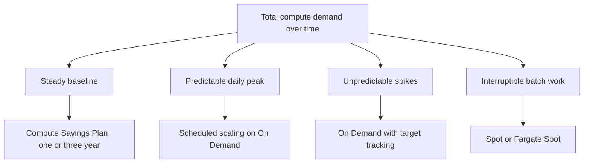

**Compute Savings Plans** are the most flexible commitment: they apply across EC2 instance families, Regions, ECS Fargate, and Lambda duration. **EC2 Instance Savings Plans** give a deeper discount but lock you to a family in a Region. **Reserved Instances** are the least flexible. Commit only to the portion of demand you are confident will persist  typically the trailing minimum of the last several months.

### Spot Strategy

Spot capacity is reclaimed with a two-minute warning delivered through instance metadata (EC2) or a task state change (Fargate Spot). To use it safely: diversify across many instance types and AZs, use capacity-optimised allocation, handle `SIGTERM` and the interruption notice by draining gracefully, and never place a workload on Spot whose interruption would be user-visible without a fallback. A common production pattern is a capacity provider strategy with a base of On-Demand tasks plus a weighted majority on Spot.

### Elimination and Right-Sizing

- Schedule non-production environments off outside working hours with EventBridge Scheduler and a small Lambda that sets ASG and ECS desired counts to zero.
- Right-size using Compute Optimizer; the most common finding in real estates is systematic over-provisioning of memory.
- Set **CloudWatch Logs retention** on every log group. The default is "never expire", and log storage silently accumulates for years.
- Set **ECR lifecycle policies** to expire untagged and old images.
- Use **S3 Intelligent-Tiering** for artefact and data buckets.

### Governance and Visibility

**AWS Cost Explorer** for trend analysis and rightsizing recommendations, **AWS Budgets** with alerts and actions, **Cost Anomaly Detection** for unexpected changes, **Trusted Advisor** for idle-resource and commitment checks, and **cost allocation tags** enforced with AWS Config rules or tag policies so that spend can be attributed to a team, service, and environment. Untagged spend is unmanageable spend.

---

## Monitoring and Observability

Observability rests on three signals  **metrics** (aggregated numbers over time), **logs** (discrete events), and **traces** (the path of one request across services)  plus, increasingly, **profiles**.

### CloudWatch Metrics

| Service | Metrics that matter | What they tell you |
|---|---|---|
| EC2 | `CPUUtilization`, `NetworkIn/Out`, `StatusCheckFailed`, `CPUCreditBalance` | Saturation, health, T-family credit exhaustion |
| EC2 (agent required) | Memory and disk utilisation | The hypervisor cannot see guest memory; you **must** install the CloudWatch agent |
| ECS | `CPUUtilization`, `MemoryUtilization`, `RunningTaskCount`, `PendingTaskCount` | Sustained pending tasks mean insufficient cluster capacity |
| EKS / Container Insights | Node and pod CPU/memory, pod restarts, cluster failed node count | Restart loops, resource pressure, scheduling failures |
| Lambda | `Invocations`, `Duration`, `Errors`, `Throttles`, `ConcurrentExecutions`, `IteratorAge` | `Throttles` means you hit a concurrency limit; rising `IteratorAge` means stream processing is falling behind |
| ALB | `TargetResponseTime`, `HTTPCode_Target_5XX_Count`, `UnHealthyHostCount`, `RequestCountPerTarget` | Application health independent of instance health |
| SQS | `ApproximateNumberOfMessagesVisible`, `ApproximateAgeOfOldestMessage` | Backlog and processing lag; the best scaling signal for consumers |

!!! tip "The four alarms every compute service should have"
    (1) Error rate above a threshold, (2) latency p99 above the service-level objective, (3) saturation of the binding resource (CPU, memory, concurrency, or queue age), and (4) a capacity alarm indicating that scaling cannot keep up (pending tasks, unschedulable pods, or Lambda throttles). Alarms should be actionable; an alarm with no runbook is noise.

### Logs

- EC2: install the CloudWatch agent to ship OS and application logs; do not rely on logs sitting on a disposable instance.
- ECS: the `awslogs` driver, or FireLens with Fluent Bit for routing, filtering, and multi-destination delivery.
- EKS: Fluent Bit as a DaemonSet shipping to CloudWatch Logs or OpenSearch, plus control-plane audit logs.
- Lambda: automatic delivery to a per-function log group; use advanced logging controls to set log level and JSON format natively.

Log in **structured JSON** with a consistent schema including timestamp, level, service, version, request or trace ID, and message. This makes CloudWatch Logs Insights queries possible and turns logs into a queryable dataset rather than prose.

### Tracing

**AWS X-Ray** propagates a trace ID across service boundaries, producing a service map and per-segment timings that show exactly which hop consumed the latency budget. Enable active tracing on Lambda, add the X-Ray daemon or the ADOT collector as a sidecar for ECS, and deploy ADOT as a DaemonSet or via the operator for EKS. **AWS Distro for OpenTelemetry (ADOT)** is the vendor-neutral path and is the right default for new systems, allowing export to X-Ray, Amazon Managed Prometheus, or third-party backends.

**Powertools for AWS Lambda** (Python, TypeScript, Java, .NET) provides structured logging, custom metrics via the Embedded Metric Format, tracing, and idempotency helpers with minimal code, and should be considered standard equipment for serverless work.

### Dashboards and Synthetic Monitoring

Build a dashboard per service showing the RED metrics  **Rate, Errors, Duration**  alongside saturation. Add **CloudWatch Synthetics canaries** that exercise critical user journeys continuously from outside the system, because a canary detects an outage that internal metrics can miss (for example, a DNS or certificate failure). Use **CloudWatch ServiceLens** to join traces, metrics, and logs in one view.

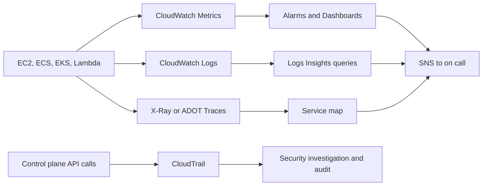

---

## Integration with Other AWS Services

Compute is never deployed alone. The table below explains **why** each integration exists, which is the examinable and interview-relevant part.

| Service | Integrates with | Why |
|---|---|---|
| **Elastic Load Balancing** | EC2, ECS, EKS, Lambda | Distributes traffic, performs health checks, terminates TLS. ALB can invoke Lambda directly as a target, which is a useful alternative to API Gateway for simple HTTP workloads |
| **API Gateway** | Lambda, ECS/EKS via VPC Link, HTTP endpoints | Adds authorisation, throttling, request validation, and usage plans in front of compute |
| **Amazon ECR** | ECS, EKS, Lambda container images, App Runner | The authenticated, scanned, lifecycle-managed source of container artefacts |
| **Amazon S3** | All | Deployment artefacts, static assets, data lake input/output; also an event source for Lambda |
| **Amazon EFS** | EC2, ECS, EKS, Lambda | Shared POSIX filesystem across many compute nodes; enables large ML models on Lambda |
| **Amazon EBS** | EC2, EKS via CSI driver | Durable block storage for stateful workloads |
| **Amazon RDS / Aurora** | All | Relational state. Use RDS Proxy with Lambda to avoid connection exhaustion |
| **Amazon DynamoDB** | All, especially Lambda | Serverless key-value store whose scaling model matches Lambda's; DynamoDB Streams is a first-class Lambda event source |
| **Amazon SQS** | All | Buffering and decoupling; the standard way to convert an availability problem into a latency problem |
| **Amazon SNS** | All | Pub/sub fan-out to many subscribers, including Lambda and SQS |
| **Amazon EventBridge** | All | Content-based event routing, schema registry, third-party SaaS events, and scheduling; the backbone of event-driven architecture |
| **AWS Step Functions** | Lambda, ECS tasks, and 200-plus AWS APIs directly | Durable orchestration of long-running or multi-step workflows with built-in retry, catch, and parallelism; the correct answer when a workflow exceeds Lambda's 15 minutes |
| **Amazon Kinesis / MSK** | Lambda, ECS, EKS | High-throughput ordered stream processing |
| **AWS Secrets Manager / SSM Parameter Store** | All | Runtime injection of secrets and configuration without baking them into artefacts |
| **AWS IAM / STS** | All | Temporary credentials and authorisation for everything |
| **AWS KMS** | All | Encryption key management for storage, secrets, and envelope encryption |
| **Amazon CloudWatch / X-Ray / CloudTrail** | All | Metrics, logs, traces, and audit |
| **AWS CodePipeline, CodeBuild, CodeDeploy** | All | CI/CD: build images, push to ECR, and deploy with blue/green or rolling strategies |
| **AWS CloudFormation / CDK / SAM / Terraform** | All | Declarative provisioning; SAM specialises in serverless, CDK generates CloudFormation from general-purpose languages |
| **AWS Systems Manager** | EC2, ECS via ECS Exec | Patching, inventory, and keyless shell access |
| **AWS App Mesh / VPC Lattice / Istio** | ECS, EKS | Service-to-service traffic management, mTLS, retries, and observability |
| **Amazon Route 53** | All | DNS, health checks, and failover routing including multi-Region active-active or active-passive |
| **AWS Batch** | EC2, Fargate | Managed batch job queues and compute environments for large-scale batch and HPC |
| **Amazon Bedrock and SageMaker** | Lambda, ECS, EKS | Model inference invoked from application compute; SageMaker endpoints for hosted models |

### A Representative Integrated Architecture

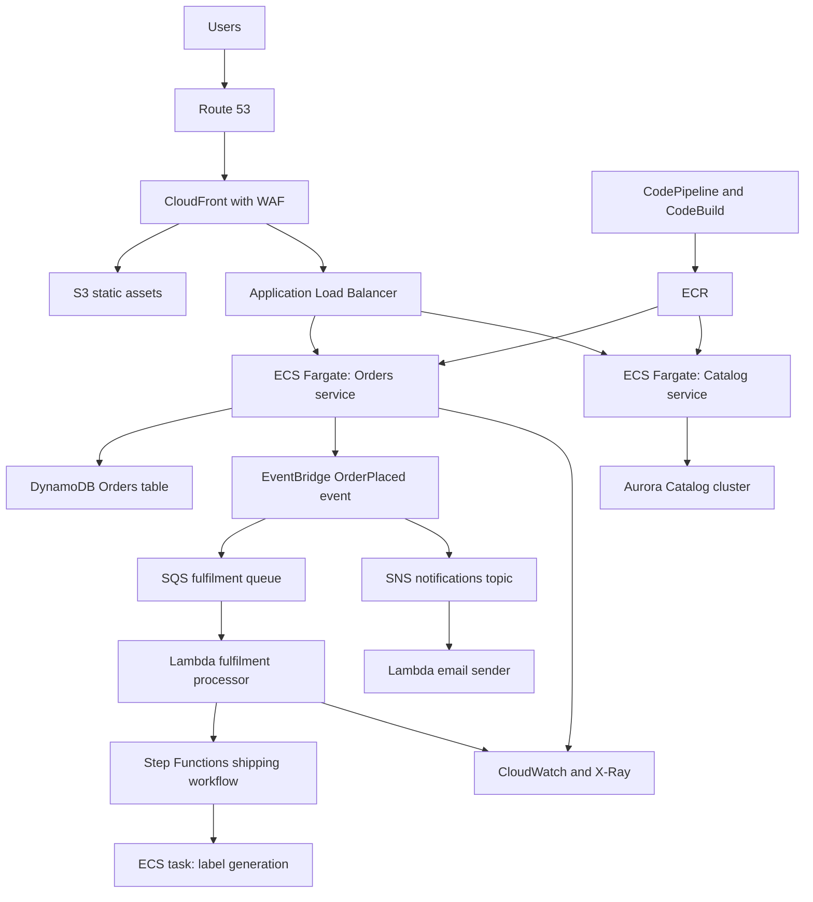

!!! info "Reading this diagram architecturally"
    Note that the synchronous path (user to ALB to service to database) is deliberately short. Everything that does not need to complete before responding to the user  fulfilment, notifications, shipping  is pushed behind EventBridge and SQS. This keeps user-facing latency low and makes the system resilient to failures in the downstream components. This is the essence of cloud-native design.

---

## Common Architecture Patterns

### Three-Tier Web Architecture

The classic pattern: a presentation tier (CloudFront and S3, or a web service), an application tier (EC2 ASG, ECS service, or EKS Deployment in private subnets), and a data tier (RDS Multi-AZ or DynamoDB in isolated subnets). Each tier scales independently and is separated by security groups. Still the correct starting point for most conventional applications.

### Microservices

Independently deployable services, each owning its data, communicating over well-defined APIs or events. Container orchestration is the natural substrate because it provides a uniform deployment contract. The architectural cost is distributed-systems complexity: network partitions, partial failures, eventual consistency, distributed tracing, and versioned API contracts. **Do not adopt microservices for a small team building a single product**; the coordination overhead exceeds the benefit until organisational scale demands independent deployment.

### Serverless Event-Driven

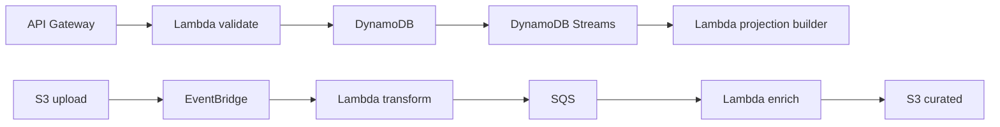

Producers emit events; a router (EventBridge) delivers them to consumers; consumers are functions that scale independently. Loose coupling, zero idle cost, and independent evolution. The cost is harder end-to-end reasoning and debugging, which is why tracing is mandatory rather than optional here.

### Fan-Out and Fan-In

**Fan-out**: one event triggers many parallel consumers via SNS (push) or EventBridge (routing) or Kinesis (shards). **Fan-in**: many parallel results are aggregated, typically by writing to a common store and using a Step Functions Map state with a final aggregation step. Used heavily in media processing, where one uploaded video fans out into multiple transcoding jobs and fans back in to a manifest.

### Queue-Based Load Levelling

A queue between producer and consumer absorbs spikes, allowing the consumer to process at its own sustainable rate. Scale consumers on queue depth or message age. This is the correct answer to "our database cannot handle the write spike".

### Strangler Fig Migration

Place a routing layer (ALB listener rules or API Gateway) in front of a monolith, then progressively route individual paths to new services running on Fargate or Lambda while the monolith continues to serve the rest. The monolith is retired only when the last route has moved. This is the standard, low-risk modernisation path from EC2 to containers.

### Sidecar

A helper container deployed alongside the application container in the same task or pod, sharing its network namespace  used for log shipping (Fluent Bit), tracing (ADOT collector), or service mesh proxying (Envoy). It keeps cross-cutting concerns out of application code. Not available on EKS Fargate for DaemonSet-style agents, which is a common reason to choose EC2 nodes.

### Circuit Breaker, Retry with Backoff, and Bulkhead

- **Retry with exponential backoff and jitter** prevents a thundering herd from converting a brief blip into a sustained outage.
- **Circuit breaker** stops calling a failing dependency after a threshold, failing fast and allowing recovery.
- **Bulkhead** partitions resources  separate connection pools, separate thread pools, separate ECS services, or reserved Lambda concurrency per function  so that one saturated component cannot consume all capacity. Lambda's reserved concurrency is a bulkhead implemented by the platform.

### Saga

For a transaction spanning multiple services with their own databases, a distributed two-phase commit is impractical. A **saga** executes a sequence of local transactions, each with a compensating action to undo it if a later step fails. Step Functions is the natural implementation on AWS, with the workflow definition making the compensation logic explicit and auditable.

### CQRS and Event Sourcing

Separate the write model from the read model. Writes go to DynamoDB; DynamoDB Streams trigger a Lambda that projects into an optimised read store (OpenSearch, a materialised view, or a cache). Reads and writes then scale and evolve independently. The trade-off is eventual consistency in the read path, which must be acceptable to the business.

### Blue/Green and Canary Deployment

**Blue/green** stands up an entire parallel environment and shifts traffic atomically, giving near-instant rollback  implemented with CodeDeploy for ECS and Lambda, or two target groups on an ALB. **Canary** shifts a small percentage of traffic to the new version, monitors alarms, and rolls forward or back automatically  implemented with Lambda alias weights or ALB weighted target groups. Both depend on having good alarms; automated rollback is only as good as the signal that triggers it.

---

## Industry Use Cases

| Sector | Workload | Typical compute choice | Reasoning |
|---|---|---|---|
| Media streaming | Video transcoding | EC2 Spot or AWS Batch, or MediaConvert | Interruptible, parallel, compute-intensive, long-running |
| Media streaming | Recommendation API | ECS Fargate or EKS | Steady low-latency traffic, containerised microservices |
| E-commerce | Storefront web tier | ECS Fargate or EC2 ASG behind ALB | Elastic, stateless, spiky at campaign times |
| E-commerce | Order processing | SQS plus Lambda or Fargate consumers | Must absorb spikes and never lose an order |
| E-commerce | Image thumbnailing | Lambda on S3 events | Short, parallel, event-shaped, bursty |
| Banking | Core ledger | EC2 with Dedicated Hosts | Licensing, auditability, tenancy isolation |
| Banking | Fraud scoring | Lambda or Fargate with SageMaker endpoint | Low-latency per-transaction inference |
| Insurance | Nightly actuarial batch | AWS Batch on EC2 Spot | Massive, interruptible, cost-sensitive |
| Healthcare | Genomics pipelines | AWS Batch or EKS with Spot | Huge bursty parallel compute |
| Healthcare | Patient portal | ECS Fargate in private subnets | Compliance-friendly, moderate scale, low ops burden |
| Government | Citizen services portal | EC2 with Savings Plans or ECS | Predictable load, data residency, procurement constraints |
| IoT | Telemetry ingestion | IoT Core plus Kinesis plus Lambda | Millions of tiny events, highly parallel, zero idle cost |
| Gaming | Real-time game servers | EC2 or GameLift with NLB | UDP, stateful sessions, latency-critical |
| Gaming | Leaderboards and matchmaking | Lambda plus DynamoDB | Spiky, stateless, event-driven |
| SaaS platform | Multi-tenant application platform | EKS with namespace isolation | Many teams, extensibility, portability |
| Logistics | Route optimisation | ECS tasks or Batch on Spot | Long-running compute, not latency-critical |
| Analytics | ETL orchestration | Step Functions plus Lambda plus Glue | Multi-step, long-running, needs retries and visibility |

---

## Advantages

### Amazon EC2

Complete control over the operating system means any software can run, including legacy applications, custom kernels, and commercial software with host-based licensing. The breadth of instance types  hundreds of combinations including GPU, FPGA, high-memory, and bare metal  means hardware can be matched precisely to workload shape. The purchase-option flexibility (Spot, Savings Plans, Reserved) enables the deepest cost optimisation of any compute service for steady workloads. It is also the most predictable performance model, since you own the entire instance.

### Amazon ECS

The control plane is free and requires no operational effort at all  there is no version to upgrade, no etcd to worry about, and no cluster fee. Integration with IAM, VPC, ELB, CloudWatch, and Auto Scaling is native and requires no controllers or add-ons. Task-level IAM roles provide fine-grained security with a very simple mental model. The conceptual surface area is small enough that a team can be productive in days, and combined with Fargate it removes host management entirely. For a team whose objective is to ship an application rather than to build a platform, ECS delivers the best ratio of capability to complexity.

### Amazon EKS

You get the upstream Kubernetes API, which means the entire cloud-native ecosystem  Helm, Argo CD, Istio, Prometheus, Kyverno, thousands of operators  works without modification. Workloads and manifests are portable across clouds and on-premises, which matters for genuine multi-cloud or hybrid strategies. Kubernetes is extensible through CRDs and controllers, so a platform team can encode organisational policy as software and offer self-service abstractions to product teams. Kubernetes skills are widely available in the labour market. AWS operates the hardest part  a highly available, backed-up control plane.

### AWS Lambda

There is no infrastructure to manage at all, and scaling is automatic, immediate, and requires no configuration. Billing is per millisecond with genuinely zero cost when idle, which makes low-traffic and spiky workloads dramatically cheaper than any provisioned model. Time from idea to running code is minutes. The per-function IAM role is the finest-grained security boundary available. Native integration with more than 200 AWS services makes Lambda the natural glue for event-driven architecture, and built-in multi-AZ redundancy means high availability requires no design work.

### Fargate

Removes an entire class of operational work  AMI management, patching, node scaling, capacity providers, cluster autoscaler tuning  while retaining the container packaging model. Each task runs in its own microVM, giving stronger isolation than shared-kernel container hosting. Billing matches the resources tasks actually request, which is far more honest than paying for partly empty instances.

---

## Limitations

### Amazon EC2

You own the operating system, and therefore patching, hardening, agent management, and vulnerability response  a continuing cost measured in engineer-hours. Boot time is minutes, so reactive scaling always lags demand and you must carry headroom. Idle instances cost full price. Capacity planning does not disappear; it merely becomes faster to act on. Instances are AZ-bound, and neither the instance nor its instance-store data survives AZ loss, so multi-AZ design is entirely your responsibility. Configuration drift is a constant risk unless you enforce immutable AMIs.

### Amazon ECS

It is AWS-proprietary; task and service definitions do not transfer to another platform, though container images do. The extensibility model is limited  there is no equivalent of CRDs, operators, or admission webhooks, so you cannot easily encode custom platform behaviour. The third-party ecosystem is much smaller than Kubernetes'. For very large, multi-team platform engineering efforts, the abstractions ECS offers may prove too thin.

### Amazon EKS

Kubernetes is genuinely complex and its failure modes are numerous and subtle  CrashLoopBackOff, ImagePullBackOff, pending pods due to insufficient resources or taints, DNS failures under load, misconfigured probes causing rolling restarts. The control plane has a per-cluster hourly cost that penalises many-small-cluster designs. **Version upgrades are mandatory, recurring work**, requiring validation of deprecated APIs and coordination with add-on versions. The VPC CNI consumes real VPC IPs, so subnet sizing becomes an architectural constraint. EKS Fargate cannot run DaemonSets, privileged containers, or GPU workloads. The total cost of ownership, including the platform team required to run it well, is the highest of the four services.

### AWS Lambda

The 15-minute maximum duration excludes long-running work outright. Cold starts add tail latency that is difficult to eliminate entirely without paying for provisioned concurrency. Payload limits (6 MB synchronous, 256 KB asynchronous) force an S3-reference pattern for large data. There is no persistent local state, and `/tmp` is per-environment and ephemeral. Concurrency limits are account-wide by default and can throttle unrelated functions. High-volume, steady workloads can be **more expensive** than an equivalently sized Fargate or EC2 deployment, because you pay a premium for elasticity you are not using. Debugging distributed serverless systems is harder than debugging a monolith, and local testing is an approximation. Vendor lock-in at the operational level is real: the business logic ports, but the event wiring, IAM, and observability do not.

### Fargate

Higher per-vCPU cost than EC2, so it loses on price for high, steady utilisation. No GPU support. No privileged containers, host path mounts, or DaemonSets. Limited to discrete CPU/memory combinations rather than arbitrary sizing. Task start time is longer than starting a container on a warm host, because a microVM must be created and the image pulled. You cannot install host-level agents, so some third-party security and monitoring products either do not work or require a sidecar variant.

---

## Common Mistakes

### Beginner Mistakes

| Mistake | Why it is wrong | Correct approach |
|---|---|---|
| Placing application servers in public subnets with public IPs | Directly exposes compute to the internet | Compute in private subnets; only load balancers are public |
| Security group rules with `0.0.0.0/0` on port 22 or 3389 | Invites credential-stuffing attacks | Use Systems Manager Session Manager; no inbound SSH at all |
| Storing AWS access keys in code, environment variables, or AMIs | Long-lived credentials leak and rarely get rotated | Instance profiles, task roles, IRSA, execution roles |
| Deploying into one Availability Zone | An AZ event becomes a full outage | Minimum two AZs, preferably three |
| Using the `latest` image tag | Non-deterministic deployments and no reliable rollback | Immutable tags with the Git SHA, plus ECR tag immutability |
| Writing application state to a container's filesystem | Lost on every restart, scale event, or deployment | Externalise to S3, DynamoDB, RDS, or EFS |
| No health checks, or health checks that always return 200 | The platform cannot detect a broken application | Meaningful readiness and liveness checks |
| Console-driven infrastructure | Undocumented, unreproducible, drifts immediately | Infrastructure as Code from day one |
| Ignoring CloudWatch Logs retention | Silent, unbounded cost growth | Set retention on every log group |
| Assuming Lambda is always cheapest | Steady high-throughput workloads can cost more on Lambda | Model the cost with real volumes before deciding |

### Production Mistakes

| Mistake | Consequence | Mitigation |
|---|---|---|
| Lambda at high concurrency connecting directly to RDS | Database connection exhaustion, cascading failure | RDS Proxy, or reserved concurrency as a bulkhead, or a queue |
| No reserved concurrency on any function | One runaway function throttles every other function in the account | Reserve concurrency for critical functions; cap non-critical ones |
| No dead-letter queue on asynchronous processing | Events are silently lost after retries | DLQ or on-failure destination plus an alarm on DLQ depth |
| Scaling on CPU when the bottleneck is I/O or queue depth | The system never scales when it needs to | Scale on the metric that reflects the actual constraint |
| No PodDisruptionBudget in EKS | A node drain during an upgrade takes all replicas down | PDB plus multiple replicas plus topology spread |
| Setting Kubernetes CPU limits equal to requests on latency-sensitive services | Aggressive CPU throttling under burst | Set requests accurately; consider omitting CPU limits while always setting memory limits |
| No graceful shutdown handling | In-flight requests dropped on every deployment and scale-in | Handle `SIGTERM`, drain, and align deregistration delay with the drain period |
| Single NAT Gateway for all AZs | An AZ failure removes egress for the whole VPC, and cross-AZ data charges accrue | One NAT Gateway per AZ, or VPC endpoints |
| Deploying without a rollback mechanism | An outage becomes a long outage | Deployment circuit breaker, blue/green, or canary with automatic rollback |
| Not testing at the concurrency limit | Throttling discovered during the launch event | Load-test to the quota, then request a quota increase in advance |
| Treating Kubernetes namespaces as a security boundary | Lateral movement across tenants | NetworkPolicy, RBAC, resource quotas, Pod Security Admission |
| Long Lambda timeouts "to be safe" | A hung dependency burns 15 minutes of billed duration per invocation | Timeout slightly above observed p99 |

### Certification Traps

| Trap | The reality |
|---|---|
| "ECS costs more than EKS because it is managed" | ECS has **no** control-plane charge; EKS charges per cluster hour |
| "Fargate is a container orchestrator" | Fargate is a **capacity mode** for ECS and EKS, not an orchestrator |
| "Lambda can run for up to 15 minutes, so it suits any batch job" | 15 minutes is a **hard** limit that cannot be raised through a support request; longer jobs need Fargate, Batch, or Step Functions |
| "Security groups can deny traffic" | Security groups are **allow-only** and **stateful**; NACLs are stateless and support deny |
| "The task execution role is what my application code uses" | The **task role** is used by your code; the execution role is used by the ECS/Fargate infrastructure |
| "Reserved concurrency and provisioned concurrency are the same" | Reserved **caps and guarantees** concurrency; provisioned **pre-warms** environments to remove cold starts |
| "Spot Instances are terminated without warning" | There is a **two-minute** interruption notice |
| "You can enable detailed memory metrics on EC2 in the console" | Memory and disk metrics require the **CloudWatch agent** in the guest OS |
| "Multi-AZ means multi-Region" | Multi-AZ is within one Region; multi-Region requires separate deployments and Route 53 or Global Accelerator routing |
| "EKS Fargate supports DaemonSets" | It does not; use EC2 node groups where DaemonSets are required |
| "An ASG health check type of EC2 detects application failure" | Only `ELB` health check type detects application-level failure |
| "IAM roles can be attached directly to an EC2 instance" | A role is delivered via an **instance profile** |
| "Higher Lambda memory always costs more" | Memory increases vCPU proportionally, so a higher setting can be **cheaper** overall by shortening duration |
| "Placing a Lambda function in a VPC makes it more secure" | It does **not** by default and generally **adds** latency and NAT cost; do it only when private resource access is required |
| "T instances suit sustained high CPU" | Sustained load exhausts CPU credits and throttles the instance to its baseline; use M or C |
| "Instance store (`d` suffix) data survives a stop" | Instance store is **ephemeral** and is lost on stop or termination |
| "Graviton (`g` suffix) runs any existing build" | Graviton is ARM; the software must support **arm64** |
| "Compute optimized suits memory-heavy databases" | Databases and caches usually belong on **memory optimized** (R, X) families; C has lower memory per vCPU |

## Summary

AWS compute is best understood not as four unrelated products but as a single spectrum of abstraction. At one end, Amazon EC2 hands over a virtual machine and, with it, complete control and complete responsibility for the operating system, patching, capacity, and scaling. At the other end, AWS Lambda hands over nothing but a function and takes responsibility for everything beneath it, in exchange for accepting a constrained execution model: short duration, no persistent local state, and a cold-start penalty. Amazon ECS and Amazon EKS occupy the middle, standardising the unit of deployment as a container image and delegating placement, health, and reconciliation to a control plane  with AWS Fargate available in both to remove the node layer entirely.

The architectural lessons generalise well beyond these four services.

First, **every managed service is a trade of control for operational leverage**, and the correct position on that spectrum depends on what the team actually needs to control. Choosing EC2 because it feels familiar imports years of patching and capacity work; choosing Lambda because it is fashionable imports a 15-minute ceiling and a cold-start tax into a workload that may tolerate neither.

Second, **elasticity requires statelessness**. Horizontal scaling, rolling deployment, health-based replacement, Spot interruption tolerance, and multi-AZ resilience are all consequences of the same design property: any request can be served by any instance, and losing an instance loses nothing durable. Externalising session and durable state to DynamoDB, ElastiCache, RDS, S3, or EFS is the enabling decision that makes every other compute capability available.

Third, **the control plane and the data plane fail differently, and designs should reflect that**. A managed control plane outage typically prevents new deployments and scaling actions while running workloads continue to serve. Understanding this separation explains why AWS invests so heavily in control-plane resilience, why data-plane capacity should carry N-1 headroom, and why a deployment freeze is a survivable incident while a data-plane collapse is not.

Fourth, **cost is an architectural property, not a billing afterthought**. The purchasing model (On-Demand, Savings Plans, Reserved, Spot), the memory setting on a Lambda function, the choice between a continuously utilised container and a per-invocation function, the decision to run one NAT Gateway or three, and the log retention period are all design decisions made at architecture time whose consequences appear on an invoice months later.

Finally, **compute choices should be reversible where possible**. Containerising an application, externalising state, defining infrastructure as code, and instrumenting for observability all preserve the ability to move down or up the abstraction ladder as requirements change. The best compute decision an architect makes is often the one that keeps the next decision cheap.

!!! question "Practice and interview questions"
    Questions for this topic are kept separately: [Practice questions](../Questions/unit1.md#13-aws-compute-services) · [Interview questions](../interviewquestions/unit1.md#13-aws-compute-services).
