# Storage Services — Amazon S3, Amazon EBS, and Amazon EFS

## Definition

AWS storage services are managed, API-driven, durable data-persistence systems that decouple data from the lifetime of any individual compute resource. They sit in the **data layer** of an AWS architecture, beneath the compute layer (EC2, ECS, EKS, Lambda) and alongside the database layer (RDS, DynamoDB, Aurora).

Three services form the foundation of the AWS storage portfolio, and each implements a fundamentally different storage abstraction.

### Amazon S3 — Simple Storage Service

Amazon S3 is a **regional, fully managed object storage service**. Data is stored as immutable **objects** — an opaque blob of bytes plus user-defined metadata — inside flat containers called **buckets**, and accessed over HTTPS through a REST API. S3 has no file system, no directories, no partial in-place writes, and no notion of a mounted device. It is designed for effectively unlimited capacity, eleven nines of durability, and internet-scale concurrency.

### Amazon EBS — Elastic Block Store

Amazon EBS is an **Availability-Zone-scoped, network-attached block storage service**. It presents a raw block device to an EC2 instance, which the guest operating system formats with a file system (ext4, XFS, NTFS) exactly as it would a physical disk. EBS volumes are attached to instances over a purpose-built network path, replicated within a single Availability Zone, and support point-in-time snapshots stored in S3.

### Amazon EFS — Elastic File System

Amazon EFS is a **regional, fully managed, elastic network file system** implementing the **NFSv4.1** protocol. It provides shared POSIX semantics — directories, file permissions, hard links, byte-range locking — to thousands of concurrent clients across multiple Availability Zones. Capacity grows and shrinks automatically as files are written and deleted, with no provisioning step.

<figure markdown="span">
    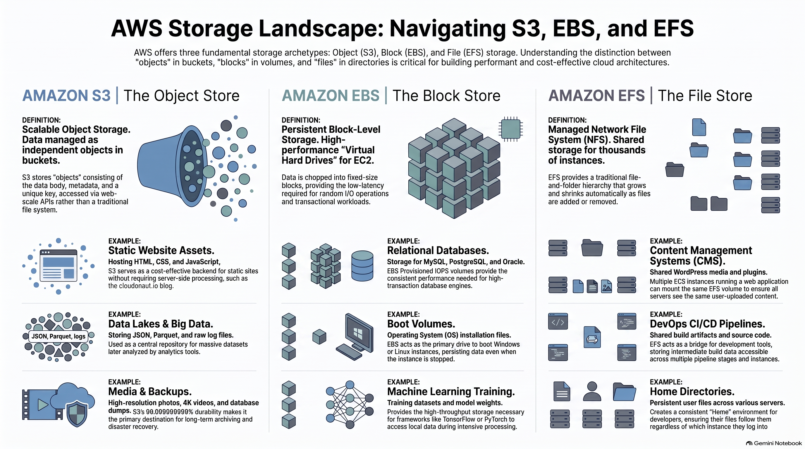{width="80%"}
    <figcaption>Storage Services in AWS</figcaption>
    
<i>Image Source: AI generated (Google Gemini)</i>

</figure>

### Where they fit in AWS architecture

<figure markdown="span">
    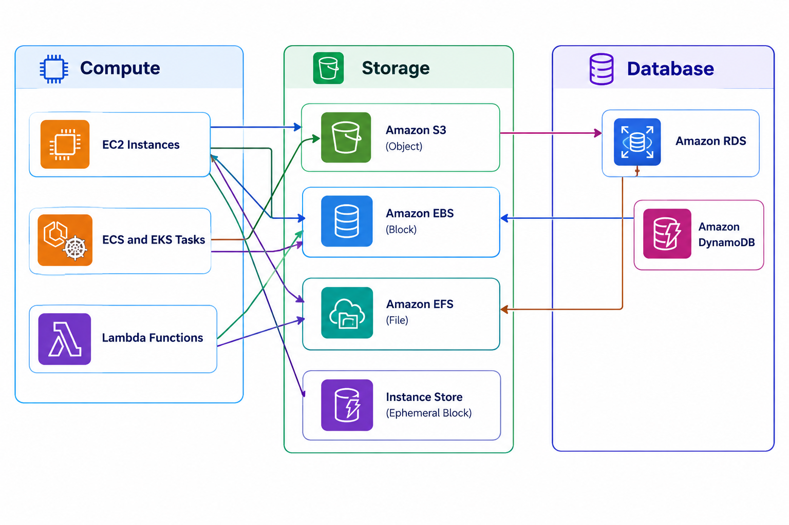{width="80%"}
    <figcaption>Storage Servives</figcaption>
    
<i>Image Source: AI generated (Chatgpt)</i>

</figure>

!!! note "Storage is not the same as a database"
    A database imposes structure, query semantics, transactions, and indexing on top of storage. A storage service stores bytes and returns bytes. RDS internally uses EBS volumes; DynamoDB internally uses its own distributed storage layer. The architectural rule is straightforward: if you need to *query* the data by content, you want a database; if you need to *retrieve* the data by identity, you want storage.

---

## Why This Service or Concept Exists

### The problem before cloud storage

In a traditional on-premises data centre, storage is a capital purchase. An organisation forecasts capacity for three to five years, buys a Storage Area Network or Network Attached Storage appliance, racks it, cables it, configures RAID groups, and hires storage administrators. This model has structural defects that no amount of operational discipline can remove.

| Problem in the traditional model | Consequence | How AWS storage addresses it |
|---|---|---|
| Capacity must be forecast years in advance | Either over-provisioning and wasted capital, or emergency procurement with weeks of lead time | Elastic capacity provisioned by API in seconds |
| Durability depends on RAID and local redundancy | A data-centre fire, flood, or power event destroys all copies | S3 and EFS replicate across multiple Availability Zones automatically |
| Scaling throughput requires buying more spindles or controllers | Performance is bounded by hardware already purchased | Performance is a configurable dimension decoupled from capacity, notably in gp3 and io2 |
| Backups are batch jobs to tape with long restore times | Recovery Time Objective measured in days | Snapshots are incremental, API-driven, and restorable in minutes |
| Storage is a shared, contended appliance | Noisy-neighbour effects across unrelated applications | Per-volume and per-file-system performance isolation |
| Geographic redundancy requires a second data centre | Prohibitive cost for most organisations | Cross-Region Replication is a configuration setting |
| Access control is network-based and coarse | Anyone on the correct VLAN can reach the data | Identity-based IAM policies, resource policies, and encryption context |

### Why AWS introduced three distinct services

A frequent beginner question is why AWS did not build one universal storage service. The answer is that the three storage abstractions make **mutually incompatible trade-offs**, and no single design can satisfy all of them simultaneously.

Object storage achieves near-infinite scale and extreme durability precisely because it gives up in-place mutation, POSIX semantics, and low-latency small random writes. Every object is written whole, distributed across many devices with erasure coding, and identified by a key in a flat namespace. That design is what makes eleven nines of durability and unlimited capacity achievable — but it also means you cannot open an object, seek to byte 4,096, and overwrite four bytes.

Block storage achieves single-digit-millisecond latency and true random-access semantics precisely because it presents a narrow, low-level interface — read block N, write block N — to exactly one host at a time in the common case. That design is what makes it suitable for database engines and boot volumes. But it cannot span Availability Zones, because synchronous block replication across tens of kilometres would destroy the latency guarantee.

File storage achieves shared, concurrent, POSIX-correct access from many hosts precisely because it maintains a distributed metadata service that coordinates directory structure, locking, and permissions. That coordination cost is what makes EFS more expensive per gigabyte and higher-latency than EBS — but it is also what allows a hundred containers to write into the same directory safely.

<figure markdown="span">
    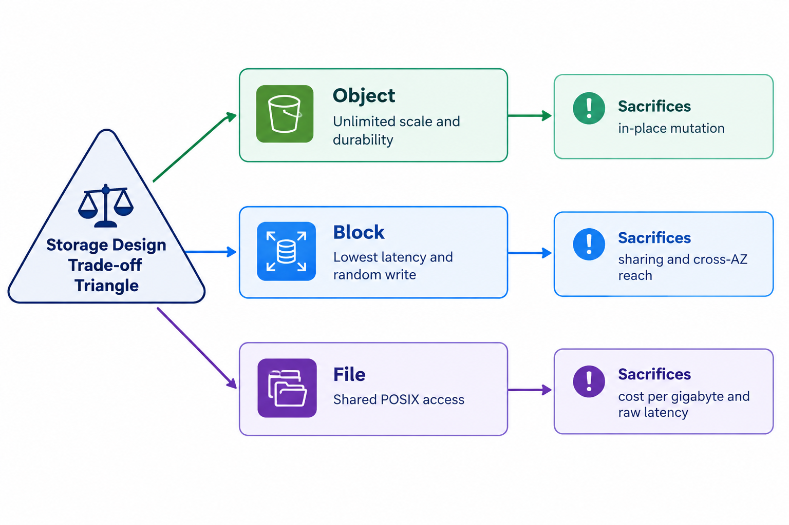{width="80%"}
    <figcaption>Storage Servives Tradeoffs</figcaption>
    
<i>Image Source: AI generated (Chatgpt)</i>

</figure>

!!! tip "The architect's framing"
    Do not ask "which AWS storage service should I use". Ask "what access pattern does my data have". Access pattern determines abstraction; abstraction determines service. This sequencing is what separates an architect from a console operator.

### Benefits over older methods

- **Consumption-based economics.** You pay for what is stored and what is requested, not for what might be needed in 2029.
- **Durability as an engineered property.** Eleven nines of durability is achieved through erasure coding and multi-AZ placement, not through hoping the RAID controller holds.
- **Separation of capacity from performance.** With gp3 volumes, IOPS and throughput are provisioned independently of size — an option that has no clean on-premises analogue.
- **Security integrated with identity.** Access is granted to IAM principals, not to network segments.
- **Programmability.** Every operation is an API call, which makes storage automatable, testable, and expressible as Infrastructure as Code.

---

## Real-World Motivation

Abstract benefits become convincing only when tied to concrete engineering pressures. The following scenarios illustrate why organisations reach for each abstraction.

### Media streaming at global scale

A video streaming platform of the kind operated by Netflix ingests master video files, transcodes them into dozens of bitrate ladders, and serves the resulting segments to hundreds of millions of devices. The transcoded segments are written once and read billions of times. They are immutable, individually addressable, and vary enormously in access frequency — a new release is hot for two weeks and cold forever after.

This is the canonical object storage workload. S3 stores the segments; CloudFront caches them at the edge; S3 Intelligent-Tiering moves aged content to cheaper tiers automatically. Attempting this on block storage would require a file system large enough to hold petabytes, which does not exist as a single EBS volume, and would provide no HTTP-native access path.

### Transactional financial systems

A core banking ledger running PostgreSQL on EC2 demands single-digit-millisecond write latency, strict ordering, crash-consistent recovery, and predictable IOPS under load. The database engine writes 8 KiB pages and a write-ahead log with fsync barriers.

This is the canonical block storage workload. Only EBS io2 Block Express provides the sub-millisecond latency, the provisioned IOPS guarantee, and the durability that a transactional engine requires. S3 cannot serve this because it has no partial-write semantics; EFS cannot serve it because NFS network round-trips and metadata coordination add latency that the log writer cannot absorb.

### Shared content management for a legacy application

A government agency migrates a document management system in which a fleet of application servers all mount `/var/www/documents` and read and write the same directory tree. The application uses POSIX file locking and expects `rename` to be atomic. Rewriting it to use an object API would take eighteen months and is not funded.

This is the canonical file storage workload. EFS lets the fleet mount the same file system from every Availability Zone with no application change, preserving POSIX semantics while removing the single-server bottleneck. This "lift and shift with shared state" pattern is one of the most common real migrations an architect will encounter.

### Analytics and the data lake

An e-commerce company such as Amazon or a ride-hailing platform such as Uber lands raw clickstream events, transaction logs, and telemetry into a central repository, then runs Athena, EMR, Glue, and Redshift Spectrum over it. The data is append-only, queried by columnar scan, and retained for years for regulatory reasons.

S3 is the storage substrate for essentially every data lake on AWS, because compute engines can be attached and detached independently of the data, and because storage classes let seven-year-old data cost a fraction of last week's data.

### Container platforms and stateful workloads

A microservices platform running on EKS deploys pods that are rescheduled across nodes at any moment. A pod that writes to its container file system loses that data on restart. A pod that needs shared configuration or user uploads across replicas needs storage that is not tied to a node.

EFS provides `ReadWriteMany` persistent volumes for shared state; EBS provides `ReadWriteOnce` persistent volumes for per-pod state such as a Prometheus time-series database; S3 provides the artefact and object store the application talks to over the API. This triad appears in nearly every production Kubernetes architecture and is a direct DSO303 outcome.

!!! example "Healthcare and regulated data"
    A hospital system storing medical imaging must retain studies for decades, encrypt them with customer-managed keys, produce an immutable audit trail of every access, and prevent deletion before a retention period expires. S3 with SSE-KMS, CloudTrail data events, and S3 Object Lock in Compliance mode satisfies all four requirements as configuration rather than as custom code. This is a clear illustration of why managed storage beats self-managed storage in regulated environments.

---

## Core Concepts

### The three storage abstractions

Understanding the taxonomy is the single highest-leverage concept in this chapter. Everything else follows from it.

| Dimension | Object storage | Block storage | File storage |
|---|---|---|---|
| Unit of storage | Object — bytes plus metadata | Fixed-size block, typically 512 B or 4 KiB | File within a directory hierarchy |
| Namespace | Flat keyspace within a bucket | Linear array of numbered blocks | Hierarchical tree of directories |
| Access protocol | HTTPS REST API | Block protocol over a network path, presented as a device | NFS or SMB |
| Mutation model | Replace whole object; no partial overwrite | Overwrite any block in place | Read, write, seek, truncate, append |
| Metadata | Rich, user-defined, stored with the object | None beyond the block address | POSIX attributes — owner, mode, timestamps |
| Concurrent writers | Many, last write wins per key | Normally one host; Multi-Attach is a special case | Many, coordinated by the file system |
| Typical latency | Tens of milliseconds first byte | Sub-millisecond to low single-digit milliseconds | Low single-digit milliseconds |
| Scale ceiling | Effectively unlimited | Per-volume ceiling, currently 64 TiB for most types | Petabyte-scale, elastic |
| AWS service | Amazon S3 | Amazon EBS, instance store | Amazon EFS, Amazon FSx |

<figure markdown="span">
    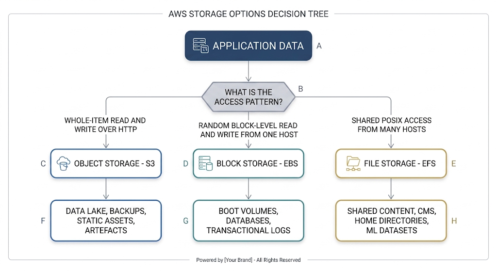{width="80%"}
    <figcaption>Storage Servives Decision options</figcaption>
    
<i>Image Source: AI generated (Google Gemini)</i>

</figure>

### Amazon S3 core vocabulary

**Bucket.** A container for objects, created in a specific AWS Region. Bucket names in the general-purpose namespace are globally unique across all AWS accounts because they must be resolvable as DNS names. A bucket is a *regional* resource — its data never leaves the Region unless you explicitly replicate it.

**Object.** The stored entity: a key, a value (the byte payload, from zero bytes up to 5 TiB), a version identifier, metadata, and access-control information.

**Key.** The full, unique name of an object within a bucket, for example `logs/2026/08/10/app-server-01.log.gz`. The key is a single flat string. S3 has **no directories**.

**Prefix.** Any leading substring of a key, conventionally delimited by `/`. Prefixes are the mechanism by which S3 emulates a folder hierarchy in the console and by which request-rate scaling is partitioned. Prefixes are also the unit at which many IAM policies and lifecycle rules are scoped.

**Delimiter.** A character supplied to `ListObjectsV2` that causes S3 to roll up keys sharing a common prefix into `CommonPrefixes`, producing the appearance of a folder listing.

**Versioning.** A bucket-level setting that, once enabled, causes every `PUT` and `DELETE` to create a new version rather than replacing or removing data. A `DELETE` inserts a **delete marker**; the prior versions remain and are billed.

**Storage class.** A per-object attribute selecting the durability, availability, latency, and cost profile — Standard, Intelligent-Tiering, Standard-IA, One Zone-IA, Glacier Instant Retrieval, Glacier Flexible Retrieval, Glacier Deep Archive, and Express One Zone.

**Lifecycle policy.** Bucket-level rules that transition objects between storage classes or expire them after a defined age, evaluated asynchronously once per day.

**Multipart upload.** A protocol for uploading a large object as independent parts that can be sent in parallel and retried individually, then assembled server-side.

**Presigned URL.** A time-limited URL that embeds a signature granting a specific operation on a specific object to an anonymous holder, without granting them IAM credentials.

!!! warning "There are no folders in S3"
    The console displays folders, and the CLI accepts paths that look like folders, but the underlying data model is a flat map from key strings to objects. Creating a "folder" in the console creates a zero-byte object whose key ends in `/`. Believing in folders leads directly to two classic errors: assuming that renaming a prefix is cheap (it is a copy of every object followed by a delete of every object), and assuming that listing is free (it is a paginated API call billed per request that scans the index).

### Amazon EBS core vocabulary

**Volume.** A block device of a chosen type and size, created within one Availability Zone, attachable to EC2 instances in that same Availability Zone.

**Volume type.** The performance and cost family: `gp3` and `gp2` for general-purpose SSD, `io2 Block Express` and `io1` for provisioned-IOPS SSD, `st1` for throughput-optimised HDD, and `sc1` for cold HDD.

**IOPS.** Input/output operations per second, measured against a base I/O size — 16 KiB for SSD-backed types. A single 128 KiB request counts as multiple IOPS on SSD types.

**Throughput.** Bytes per second transferred, the product of IOPS and I/O size up to the volume and instance ceilings.

**Burst bucket.** The credit mechanism that allows `gp2`, `st1`, and `sc1` volumes to exceed their baseline performance for limited periods. `gp3` has no burst bucket; its performance is provisioned and constant.

**Snapshot.** A point-in-time, incremental, block-level copy of a volume stored durably in S3 in a service-managed bucket you cannot browse. Snapshots are *Regional* resources and are the mechanism by which EBS data crosses Availability Zone and Region boundaries.

**EBS-optimised instance.** An instance whose network capacity for EBS traffic is dedicated and separate from general network traffic. All current-generation instances are EBS-optimised by default.

**Multi-Attach.** A capability of `io1` and `io2` volumes allowing a single volume to be attached to up to sixteen Nitro-based instances in the same Availability Zone concurrently. It provides no coordination; a cluster-aware file system is mandatory.

**Elastic Volumes.** The capability to change a volume's size, type, and provisioned performance while it remains attached and in use, without detaching or stopping the instance.

### Amazon EFS core vocabulary

**File system.** The regional EFS resource, identified by an `fs-` identifier, which contains the directory tree.

**Mount target.** An elastic network interface with an IP address placed in a subnet within one Availability Zone, through which NFS clients in that Availability Zone reach the file system. You create one mount target per Availability Zone you intend to serve.

**Access point.** An application-specific entry point into a file system that enforces a root directory and can override the POSIX user and group identity of all requests through it. Access points are the mechanism for safe multi-tenant sharing of a single file system.

**Throughput mode.** `Elastic` scales throughput automatically with demand and is the recommended default; `Provisioned` fixes a throughput level independent of stored size; `Bursting` scales baseline throughput with the amount of data stored and uses a credit bucket.

**Performance mode.** `General Purpose` minimises per-operation latency and is correct for nearly all workloads; `Max I/O` raises the aggregate parallel throughput ceiling at the cost of higher latency and is legacy for most designs.

**Storage class.** `Standard` for multi-AZ frequently accessed data, `Infrequent Access` and `Archive` for cooler data, plus One Zone variants that store data in a single Availability Zone at a lower price and lower availability.

**Lifecycle management.** Policies that move files between EFS storage classes based on the time since last access, and optionally move them back on first read.

### Instance store

**Instance store** is physically attached NVMe or SSD storage on the host serving an EC2 instance. It offers the highest possible I/O performance because there is no network in the path, but the data is **ephemeral**: it is lost when the instance stops, hibernates, or is terminated, and when the underlying hardware fails. It is not a durable storage service, and no snapshot mechanism exists for it.

!!! danger "Instance store data loss is a design property, not a failure"
    Instance store volumes lose all data on instance stop or termination. Architects use them deliberately — for scratch space, caches, temporary shuffle data in Spark, or replicated distributed databases such as Cassandra that maintain their own redundancy across nodes. Placing a single-copy production database on instance store is a design error, not bad luck.

### Durability and availability are different properties

Students frequently conflate these two figures. They measure different failure modes and are engineered by different mechanisms.

- **Durability** is the probability that stored data is not lost. S3 Standard is designed for 99.999999999 percent (eleven nines) annual durability, achieved by erasure-coding each object across devices in at least three Availability Zones.
- **Availability** is the probability that stored data can be *accessed* at a given moment. S3 Standard offers a 99.99 percent availability design target with a 99.9 percent Service Level Agreement.

Data can be perfectly durable and temporarily unavailable — for instance, during a control plane disruption. The architectural implication is that a design requiring high availability may need a second Region or a cached copy, even though the durability of a single Region is already extraordinary.

| Service or class | Design durability | Design availability | AZ scope |
|---|---|---|---|
| S3 Standard | 99.999999999 percent | 99.99 percent | Three or more AZs |
| S3 Standard-IA | 99.999999999 percent | 99.9 percent | Three or more AZs |
| S3 One Zone-IA | 99.999999999 percent within the AZ | 99.5 percent | One AZ |
| S3 Glacier Deep Archive | 99.999999999 percent | 99.99 percent after restore | Three or more AZs |
| S3 Express One Zone | High within the AZ | 99.95 percent | One AZ |
| EBS gp3 and io2 volume | Annual failure rate between 0.1 and 0.2 percent for gp3; io2 is designed for 99.999 percent durability | 99.8 to 99.999 percent depending on type | One AZ |
| EBS snapshot | Same multi-AZ durability as S3 | Regional | Regional |
| EFS Standard | Designed for eleven nines | 99.99 percent | Three or more AZs |
| EFS One Zone | Designed for eleven nines within the AZ | 99.9 percent | One AZ |
| Instance store | None — ephemeral | Tied to the instance | One host |

!!! note "Interpreting eleven nines"
    Eleven nines of annual durability means that if you store ten million objects, you should statistically expect to lose one object every ten thousand years. This figure describes AWS device and facility failure. It does **not** protect against a user or an application deleting the data, an IAM policy being misconfigured, or ransomware encrypting the bucket. Those risks are addressed by versioning, MFA Delete, Object Lock, replication to a separate account, and Backup vaults — not by the durability figure.

### Consistency model

Since December 2020, Amazon S3 provides **strong read-after-write consistency** for all `PUT` and `DELETE` operations on all objects, in all Regions, with no performance penalty and no opt-in. A successful `PUT` is immediately visible to any subsequent `GET`, `LIST`, or `HEAD`. Overwrites and deletes are also strongly consistent.

This removed an entire class of workaround code that older systems carried, such as retry loops after writing a manifest file. However, two caveats remain relevant to architects:

- Bucket **configuration** changes — policies, ACLs, lifecycle rules, replication rules — remain **eventually consistent** and may take time to propagate.
- Cross-Region Replication is asynchronous by design and provides no consistency guarantee at the destination; S3 Replication Time Control provides a Service Level Agreement of fifteen minutes for the vast majority of objects but is still asynchronous.

EBS provides the consistency semantics of a block device: a write acknowledged to the operating system is durable within the Availability Zone. EFS provides NFSv4.1 close-to-open consistency by default, with strong consistency for operations within a single mount when the client cache is respected.

---

## Internal Working

This section explains what actually happens inside AWS when you issue a storage request. Understanding these mechanisms is what allows you to predict performance, explain failures, and design around limits rather than being surprised by them.

### Control plane versus data plane

Every AWS storage service separates two distinct subsystems, and conflating them is a common source of architectural error.

The **control plane** handles resource lifecycle: creating buckets, creating and attaching volumes, creating mount targets, modifying configuration. Control plane operations are relatively low-volume, are often Regional in scope, involve consensus and metadata updates, and take seconds to minutes.

The **data plane** handles the actual movement of bytes: `GetObject`, `PutObject`, block reads and writes, NFS operations. Data plane operations are extremely high-volume, are designed for minimal dependencies, and take microseconds to milliseconds.

AWS deliberately engineers data planes to have **static stability** — the ability to continue operating correctly even when the control plane is impaired. This is why a running EC2 instance keeps reading and writing its EBS volume during a Regional control plane event even though you cannot launch new instances.

| Aspect | Control plane | Data plane |
|---|---|---|
| S3 examples | `CreateBucket`, `PutBucketPolicy`, `PutLifecycleConfiguration` | `GetObject`, `PutObject`, `ListObjectsV2` |
| EBS examples | `CreateVolume`, `AttachVolume`, `CreateSnapshot`, `ModifyVolume` | Block read and write from the attached instance |
| EFS examples | `CreateFileSystem`, `CreateMountTarget`, `CreateAccessPoint` | NFS read, write, and metadata operations |
| Failure impact | Cannot provision or reconfigure | Cannot access data — far more severe |
| Design implication | Pre-provision capacity; do not create resources on the critical path | Design retries, timeouts, and multi-AZ redundancy here |

!!! tip "A design rule that follows directly"
    Never place a control plane call on a user request's critical path. An application that calls `CreateBucket` or `AttachVolume` during a customer transaction has coupled its availability to the least-available subsystem. Provision in advance, ideally through Infrastructure as Code, and let the request path touch only the data plane.

### Inside Amazon S3

#### The flat keyspace and the partitioned index

S3 maintains a distributed **index** that maps a bucket-and-key string to the physical location of the object's data fragments. Because the keyspace is a flat, lexicographically ordered string space, S3 partitions this index by key range. When a particular key range receives sustained high request rates, S3 automatically splits that partition into smaller ranges spread across more index servers. This process is called **partition splitting** and it happens continuously and transparently.

The published request-rate targets are **at least 3,500 `PUT`, `COPY`, `POST`, and `DELETE` requests per second, and at least 5,500 `GET` and `HEAD` requests per second, per partitioned prefix**. Crucially, there is no limit on the number of prefixes, so aggregate throughput scales horizontally as you spread keys across prefixes.

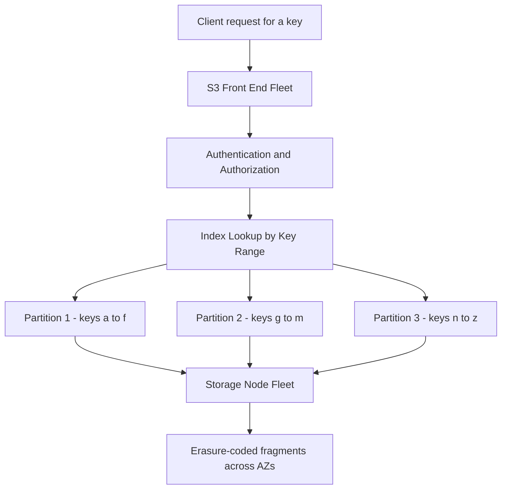
```mermaid
graph TD
    A["Client request for a key"] --> B["S3 Front End Fleet"]
    B --> C["Authentication and Authorization"]
    C --> D["Index Lookup by Key Range"]
    D --> E["Partition 1 - keys a to f"]
    D --> F["Partition 2 - keys g to m"]
    D --> G["Partition 3 - keys n to z"]
    E --> H["Storage Node Fleet"]
    F --> H
    G --> H
    H --> I["Erasure-coded fragments across AZs"]
```

!!! info "The historical hashed-prefix advice is obsolete"
    Before 2018, S3 required a random hash at the start of keys to distribute load. That requirement was removed when S3 introduced automatic prefix-level scaling. Modern guidance is the opposite: use meaningful, hierarchical prefixes such as `year/month/day/`, and if a single prefix genuinely saturates, introduce parallel prefixes deliberately. Certification questions still occasionally test the modern behaviour, so know that the rate limits are per prefix and that adding prefixes multiplies capacity.

#### Erasure coding and multi-AZ placement

When S3 accepts a `PUT`, it does not simply write three copies. It applies **erasure coding**: the object's data is split into *k* data fragments and *m* parity fragments, such that the original can be reconstructed from any *k* of the *k + m* total fragments. These fragments are then distributed across storage devices located in a minimum of three Availability Zones within the Region.

This design is more space-efficient than triple replication while tolerating more simultaneous failures. S3 continuously runs background **integrity checking**, computing checksums on stored fragments, detecting silent data corruption or bit rot, and regenerating any degraded fragment from the surviving ones. The eleven-nines figure is the output of a reliability model over these mechanisms — device annual failure rates, fragment counts, and the speed of automatic repair.

The write is not acknowledged to the client until enough fragments are durably persisted across multiple Availability Zones to satisfy the durability design. This is why S3 `PUT` latency is measured in tens of milliseconds rather than microseconds, and why S3 is inappropriate as a database write path.

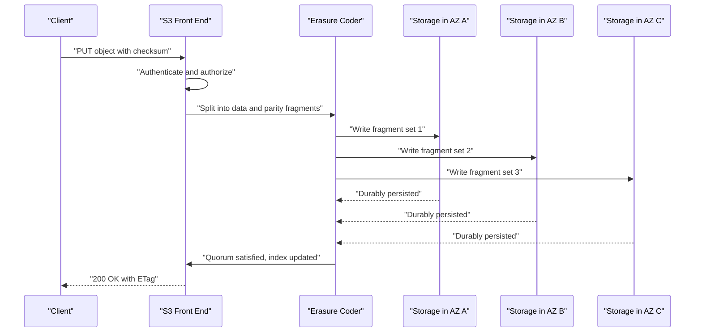
```mermaid
sequenceDiagram
    participant C as "Client"
    participant FE as "S3 Front End"
    participant EC as "Erasure Coder"
    participant AZ1 as "Storage in AZ A"
    participant AZ2 as "Storage in AZ B"
    participant AZ3 as "Storage in AZ C"
    C->>FE: "PUT object with checksum"
    FE->>FE: "Authenticate and authorize"
    FE->>EC: "Split into data and parity fragments"
    EC->>AZ1: "Write fragment set 1"
    EC->>AZ2: "Write fragment set 2"
    EC->>AZ3: "Write fragment set 3"
    AZ1-->>EC: "Durably persisted"
    AZ2-->>EC: "Durably persisted"
    AZ3-->>EC: "Durably persisted"
    EC->>FE: "Quorum satisfied, index updated"
    FE-->>C: "200 OK with ETag"
```

#### How strong consistency is achieved

Strong read-after-write consistency requires that the index update and the data write become visible atomically from the perspective of any reader. S3 achieves this without sacrificing throughput by making the index itself a strongly consistent, replicated store, and by ensuring that a `GET` resolves through that index rather than through any cached or eventually replicated view. The practical consequence for architects is that no application-level workaround is needed, and any code you inherit that sleeps or retries after a write to "wait for consistency" can be deleted.

#### The networking path and VPC endpoints

By default, S3 is reached over its public Regional endpoint, for example `s3.ap-south-1.amazonaws.com`. A request from an EC2 instance in a private subnet would therefore need a NAT Gateway and an Internet Gateway to reach it — which incurs NAT data-processing charges, adds a bandwidth bottleneck, and routes internal traffic through a public endpoint.

AWS provides two endpoint types that keep the traffic on the AWS network.

| Endpoint type | Mechanism | Cost | Cross-account and on-premises reach | Typical use |
|---|---|---|---|---|
| Gateway VPC endpoint for S3 | Adds a prefix-list route to the VPC route table; traffic to S3 leaves via the endpoint | No hourly or data charge | Not reachable from on-premises over VPN or Direct Connect | Default choice for in-VPC access to S3 |
| Interface VPC endpoint powered by PrivateLink | Places an ENI with a private IP inside your subnet; resolved by private DNS | Hourly charge per endpoint plus data processing | Reachable from on-premises and from peered VPCs | Hybrid architectures and stricter network isolation |

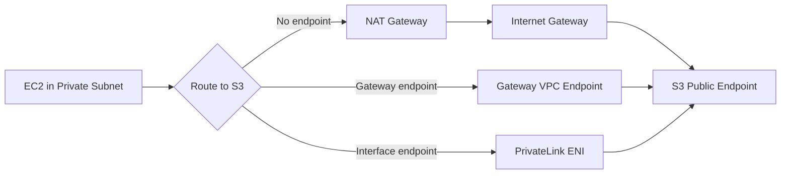
```mermaid
graph LR
    A["EC2 in Private Subnet"] --> B{"Route to S3"}
    B -->|"No endpoint"| C["NAT Gateway"]
    C --> D["Internet Gateway"]
    D --> E["S3 Public Endpoint"]
    B -->|"Gateway endpoint"| F["Gateway VPC Endpoint"]
    F --> E
    B -->|"Interface endpoint"| G["PrivateLink ENI"]
    G --> E
```

!!! warning "A common and expensive mistake"
    Routing terabytes of S3 traffic through a NAT Gateway is one of the most frequent avoidable costs in AWS bills. NAT Gateway charges an hourly fee plus a per-gigabyte data-processing fee on top of the data transfer. A Gateway VPC endpoint for S3 eliminates that per-gigabyte charge entirely and costs nothing. Adding one is often the single highest-return cost optimisation in an account.

### Inside Amazon EBS

#### Network-attached storage that behaves like a disk

An EBS volume is not a disk inside the EC2 host. It is storage residing on a separate fleet of EBS servers, reached over a dedicated, high-bandwidth network fabric. The illusion of a local disk is created at the hardware level.

On Nitro-based instances — which is to say all current-generation instances — the **Nitro card for EBS** is a dedicated PCIe device on the host. The guest operating system sees a standard NVMe controller and issues ordinary NVMe commands to it. The Nitro card intercepts those commands, encrypts the data if the volume is encrypted, converts them into network operations against the EBS server fleet, and returns completions to the guest. The hypervisor and the guest CPU are not involved in the I/O path, which is why Nitro instances achieve near-bare-metal storage performance and why EBS encryption has no measurable performance cost.

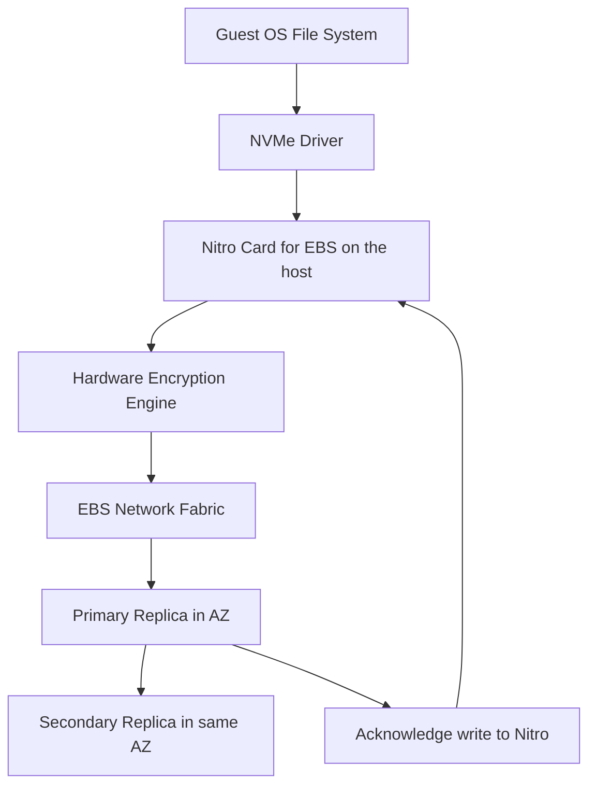
```mermaid
graph TD
    A["Guest OS File System"] --> B["NVMe Driver"]
    B --> C["Nitro Card for EBS on the host"]
    C --> D["Hardware Encryption Engine"]
    D --> E["EBS Network Fabric"]
    E --> F["Primary Replica in AZ"]
    F --> G["Secondary Replica in same AZ"]
    F --> H["Acknowledge write to Nitro"]
    H --> C
```

#### Replication within a single Availability Zone

Each EBS volume's data is automatically replicated across multiple servers **within one Availability Zone**. A write is acknowledged only after it is durably recorded on more than one replica, which is what protects against the failure of any single storage server or drive.

The deliberate architectural decision is that this replication does **not** span Availability Zones. Synchronous replication over the tens of kilometres separating Availability Zones would add hundreds of microseconds to every write, destroying the latency profile that block storage exists to provide. Therefore:

- An EBS volume can only be attached to an instance in **its own Availability Zone**.
- An Availability Zone failure makes the volume unavailable, though the data is not lost.
- Cross-AZ and cross-Region durability for EBS is achieved through **snapshots**, not through the volume itself.

!!! danger "Availability Zone scope is the defining constraint of EBS"
    Any architecture that treats an EBS volume as a highly available store is wrong. If an application must survive the loss of an Availability Zone with its data intact and immediately accessible, the correct answers are database-level replication such as RDS Multi-AZ, a multi-AZ file system such as EFS, or object storage such as S3 — not a single EBS volume.

#### Snapshot mechanics

An EBS snapshot is a **block-level, incremental, point-in-time copy** written to S3 in a service-managed location. The mechanics matter because they explain both the cost model and the restore behaviour.

The first snapshot of a volume copies every block that has ever been written. Subsequent snapshots copy only the blocks that changed since the previous snapshot, and reference the unchanged blocks by pointer. This is why a daily snapshot of a 1 TiB volume with 10 GiB of daily change costs approximately the size of the full first copy plus 10 GiB per day, not 1 TiB per day.

Deleting a snapshot does not break later snapshots. AWS removes only the blocks that no snapshot still references, so the chain remains restorable at every retained point. This reference-counted design is why you cannot compute a snapshot's "size" in isolation.

When a volume is created from a snapshot, it is **available immediately** but is **lazily loaded**: blocks are fetched from S3 on first access, meaning the initial reads after a restore are slower than steady-state. Two mechanisms address this. **Fast Snapshot Restore** pre-warms a snapshot in specified Availability Zones so that restored volumes deliver full performance instantly, at an hourly charge per snapshot per Availability Zone. Alternatively, an operator can sequentially read the entire device to force hydration.

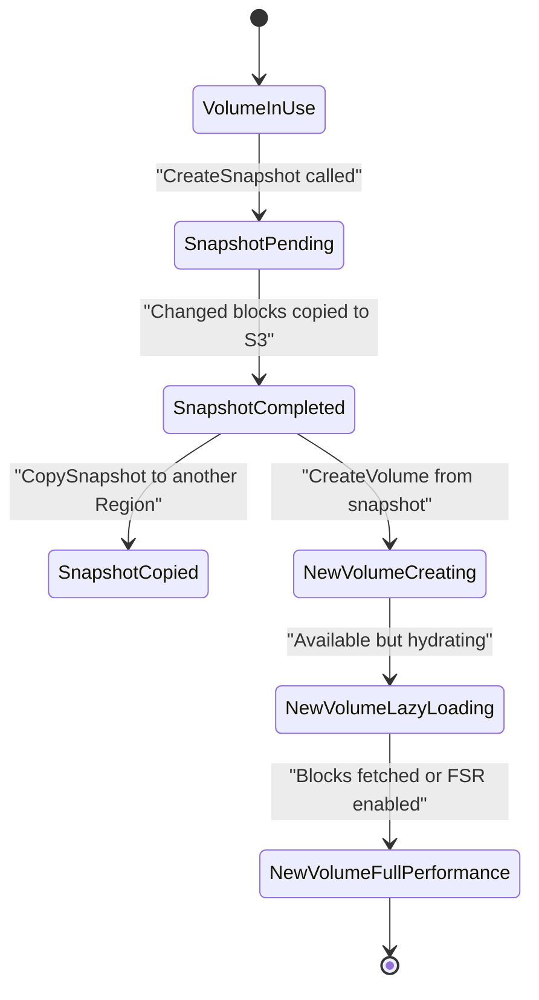
```mermaid
stateDiagram-v2
    [*] --> VolumeInUse
    VolumeInUse --> SnapshotPending : "CreateSnapshot called"
    SnapshotPending --> SnapshotCompleted : "Changed blocks copied to S3"
    SnapshotCompleted --> SnapshotCopied : "CopySnapshot to another Region"
    SnapshotCompleted --> NewVolumeCreating : "CreateVolume from snapshot"
    NewVolumeCreating --> NewVolumeLazyLoading : "Available but hydrating"
    NewVolumeLazyLoading --> NewVolumeFullPerformance : "Blocks fetched or FSR enabled"
    NewVolumeFullPerformance --> [*]
```

!!! note "Crash consistency versus application consistency"
    A snapshot taken while a volume is in use is **crash consistent** — equivalent to pulling the power cable. A journalling file system such as ext4 or XFS will recover, but a database may need to replay its log. For **application-consistent** snapshots, the correct approach is to flush and freeze the file system before the snapshot, which AWS Systems Manager Run Command and AWS Backup can orchestrate, or to snapshot from a quiesced replica.

### Inside Amazon EFS

#### A managed NFSv4.1 service with distributed metadata

EFS implements the NFSv4.1 protocol so that any standard Linux NFS client can mount it with no proprietary agent. Behind the protocol endpoint, EFS is a distributed system with two logically separate subsystems: a **metadata service** that maintains the directory tree, inodes, permissions, and lock state, and a **data service** that stores file contents redundantly across multiple Availability Zones in the Region.

Every file's data and metadata are stored redundantly across Availability Zones, which is precisely why EFS survives an Availability Zone failure while EBS does not — and equally why EFS has higher per-operation latency than EBS, since a metadata mutation must be coordinated across zones.

#### Mount targets and the network path

An EFS file system is a Regional resource, but clients do not talk to a Regional endpoint. Instead you create a **mount target** in each Availability Zone. A mount target is an elastic network interface with a private IP address inside one of your subnets, protected by a security group.

When an EC2 instance or a container mounts the file system using the DNS name `fs-0123456789abcdef0.efs.ap-south-1.amazonaws.com`, Route 53 resolves that name to the IP address of the mount target **in the client's own Availability Zone**. This zone-local resolution is deliberate: it keeps NFS traffic within the Availability Zone, minimising latency and avoiding cross-AZ data transfer charges.

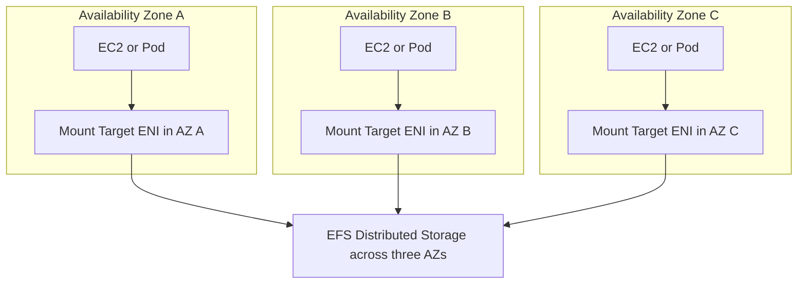
```mermaid
graph TD
    subgraph "Availability Zone A"
        A1["EC2 or Pod"] --> M1["Mount Target ENI in AZ A"]
    end
    subgraph "Availability Zone B"
        A2["EC2 or Pod"] --> M2["Mount Target ENI in AZ B"]
    end
    subgraph "Availability Zone C"
        A3["EC2 or Pod"] --> M3["Mount Target ENI in AZ C"]
    end
    M1 --> E["EFS Distributed Storage across three AZs"]
    M2 --> E
    M3 --> E
```

!!! warning "The most common EFS failure to diagnose"
    A mount that hangs and eventually times out is almost always a security group problem or a missing mount target. The mount target's security group must allow inbound TCP port 2049 from the client's security group, and a mount target must exist in the client's Availability Zone. If either is absent, the NFS client will retry silently until it times out, producing no useful error message.

#### Elastic capacity and throughput

EFS has no provisioned size. Metadata operations allocate space as files are written and release it as files are deleted, and billing is computed from measured storage consumption. This removes an entire class of operational work — no resizing, no monitoring free space, no emergency expansion at 03:00.

In **Elastic throughput** mode, EFS measures the workload's demand continuously and adjusts the available throughput automatically, billing for the data actually read and written. In **Bursting** mode, baseline throughput scales at roughly 50 KiB/s per GiB stored, with burst credits accumulating when the file system runs below baseline and depleting when it runs above. A small file system in Bursting mode can therefore exhaust its credits and become dramatically slower — a classic and confusing production incident.

---

## Architecture Components

A production storage architecture involves more than the storage service itself. The following components typically appear together, and an architect must be able to state the responsibility of each.

| Component | Responsibility in a storage architecture |
|---|---|
| Client — browser, mobile app, service | Originates read and write requests; may upload directly to S3 using presigned URLs to bypass the application tier |
| Amazon Route 53 | Resolves service and bucket endpoints; resolves EFS mount target DNS to the zone-local IP |
| Amazon CloudFront | Caches S3 objects at edge locations, reducing latency, origin load, and data transfer cost; enforces access through Origin Access Control |
| Application Load Balancer | Distributes requests across a stateless application tier that has externalised its state into S3 or EFS; can log access records directly to S3 |
| Amazon API Gateway | Fronts APIs that issue presigned URLs or proxy directly to S3 for small payloads |
| Amazon VPC, subnets, route tables | Define the network path from compute to storage; carry the Gateway or Interface endpoint for S3 and the mount target ENIs for EFS |
| Security groups | Stateful instance-level firewall; controls TCP 2049 to EFS mount targets; irrelevant to S3 unless an Interface endpoint is used |
| Network ACLs | Stateless subnet-level firewall; must permit both request and ephemeral response ports for NFS |
| Amazon EC2 | Attaches EBS volumes and instance store; mounts EFS; reads and writes S3 over the API |
| Amazon ECS and Amazon EKS | Mount EFS as shared volumes and EBS as per-task or per-pod volumes through the CSI drivers |
| AWS Lambda | Reads and writes S3 as an event source and a data store; can mount EFS through an access point for shared state or large dependencies |
| AWS IAM | Authorises every storage API call; defines roles for instances, tasks, and functions |
| AWS KMS | Provides and controls the customer-managed keys used to encrypt S3 objects, EBS volumes, EFS file systems, and snapshots |
| Amazon S3 | Object store for artefacts, backups, data lake, static assets, and logs |
| Amazon EBS | Block store for boot volumes, databases, and per-instance persistent state |
| Amazon EFS | Shared file store for content, home directories, and shared container volumes |
| Amazon CloudWatch | Collects storage metrics and logs; hosts alarms and dashboards |
| AWS CloudTrail | Records management events always, and S3 or Lambda data events when explicitly enabled |
| Amazon EventBridge and Amazon SNS and Amazon SQS | Carry S3 event notifications to downstream consumers, enabling event-driven processing |
| AWS Backup | Centralises backup policy, retention, and cross-Region and cross-account copy for EBS, EFS, and other resources |
| AWS CloudFormation and Terraform | Define storage resources declaratively so environments are reproducible and reviewable |

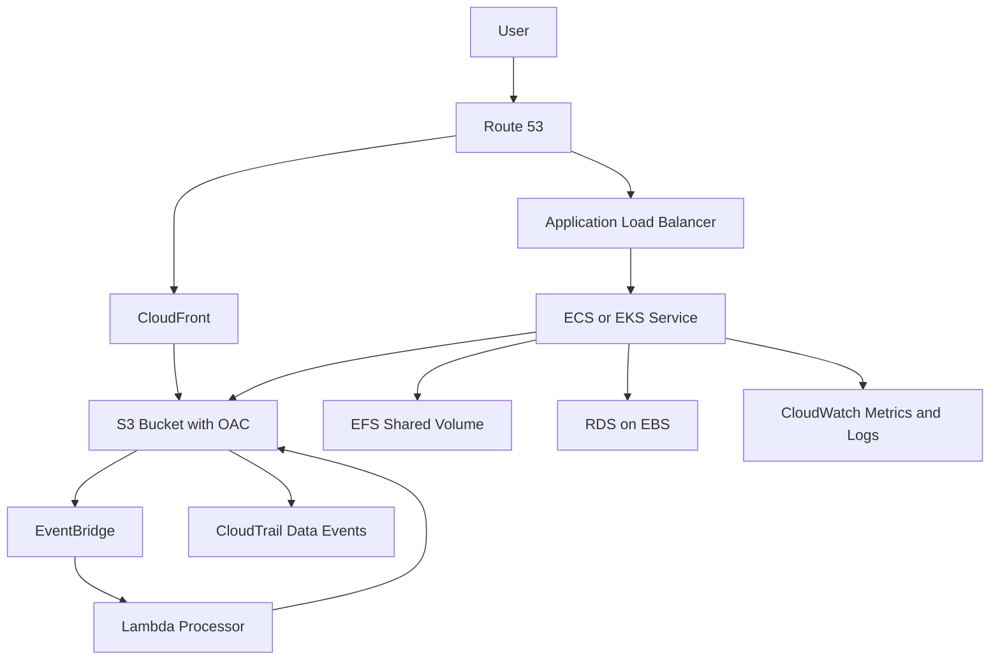
```mermaid
graph TD
    U["User"] --> R53["Route 53"]
    R53 --> CF["CloudFront"]
    CF --> S3["S3 Bucket with OAC"]
    R53 --> ALB["Application Load Balancer"]
    ALB --> ECS["ECS or EKS Service"]
    ECS --> EFSV["EFS Shared Volume"]
    ECS --> S3
    ECS --> RDS["RDS on EBS"]
    S3 --> EVB["EventBridge"]
    EVB --> LMB["Lambda Processor"]
    LMB --> S3
    S3 --> CT["CloudTrail Data Events"]
    ECS --> CW["CloudWatch Metrics and Logs"]
```

---

## Request Lifecycle

Tracing a request end to end is the fastest way to build an accurate mental model of latency, failure points, and cost.

### Lifecycle of an S3 GET request

1. The client resolves the bucket endpoint through DNS. For virtual-hosted-style addressing, the name is `bucket-name.s3.region.amazonaws.com`.
2. If the client is inside a VPC with a Gateway endpoint for S3, the route table directs the traffic to the endpoint and it never traverses the internet. Otherwise it exits through a NAT Gateway and Internet Gateway.
3. TLS is negotiated with the S3 front-end fleet.
4. The client presents an AWS Signature Version 4 signature derived from its credentials. S3 verifies the signature and identifies the principal.
5. S3 evaluates authorisation as the union of the identity-based IAM policy, the bucket policy, any Service Control Policy, any VPC endpoint policy, Block Public Access settings, and — if enabled — object ownership and ACL rules. An explicit `Deny` anywhere wins.
6. S3 consults the index partition owning that key range and locates the object's fragments.
7. If the object is encrypted with SSE-KMS, S3 calls KMS to decrypt the data key. This adds latency and consumes a KMS request quota, which is why S3 Bucket Keys exist.
8. S3 reads sufficient fragments, reconstructs the object, and streams the bytes back with a `200 OK` and an `ETag`.
9. Metrics are emitted to CloudWatch; if data events are enabled, a record is written to CloudTrail.

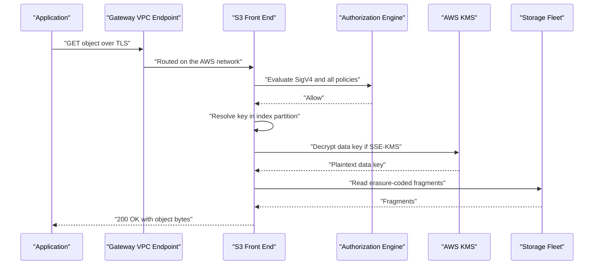
```mermaid
sequenceDiagram
    participant App as "Application"
    participant VPCE as "Gateway VPC Endpoint"
    participant S3 as "S3 Front End"
    participant IAM as "Authorization Engine"
    participant KMS as "AWS KMS"
    participant ST as "Storage Fleet"
    App->>VPCE: "GET object over TLS"
    VPCE->>S3: "Routed on the AWS network"
    S3->>IAM: "Evaluate SigV4 and all policies"
    IAM-->>S3: "Allow"
    S3->>S3: "Resolve key in index partition"
    S3->>KMS: "Decrypt data key if SSE-KMS"
    KMS-->>S3: "Plaintext data key"
    S3->>ST: "Read erasure-coded fragments"
    ST-->>S3: "Fragments"
    S3-->>App: "200 OK with object bytes"
```

### Lifecycle of an EBS write

1. The application issues a `write` system call.
2. The operating system's page cache may buffer the write. Durability is only guaranteed after `fsync` or when the write is issued with a barrier.
3. The file system translates the file offset into logical block addresses and issues NVMe commands.
4. The Nitro card for EBS receives the NVMe command, encrypts the payload in hardware if the volume is encrypted, and packages it for the EBS network fabric.
5. The EBS server fleet writes the block to the primary replica and synchronously to at least one additional replica within the same Availability Zone.
6. Once the required replicas acknowledge, the Nitro card signals completion to the guest.
7. The application's `fsync` returns and the data is durable within that Availability Zone.

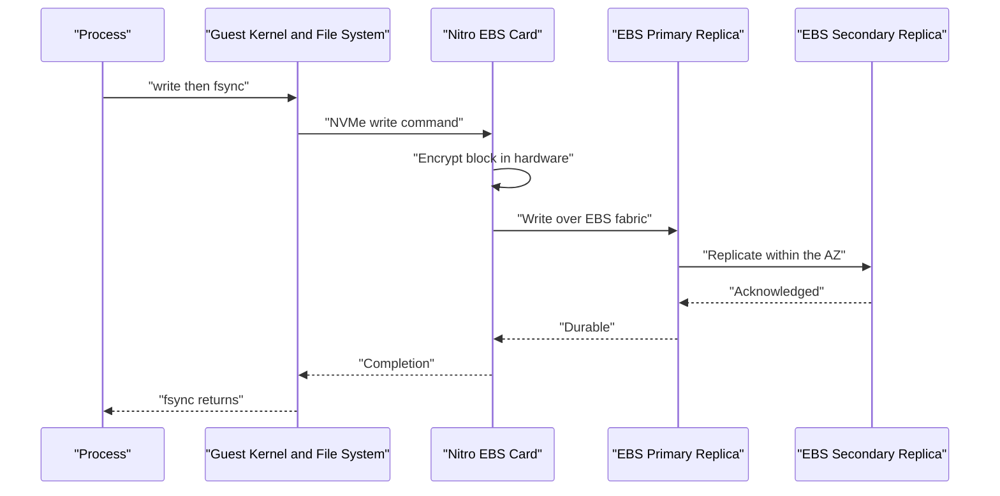
```mermaid
sequenceDiagram
    participant P as "Process"
    participant OS as "Guest Kernel and File System"
    participant N as "Nitro EBS Card"
    participant E1 as "EBS Primary Replica"
    participant E2 as "EBS Secondary Replica"
    P->>OS: "write then fsync"
    OS->>N: "NVMe write command"
    N->>N: "Encrypt block in hardware"
    N->>E1: "Write over EBS fabric"
    E1->>E2: "Replicate within the AZ"
    E2-->>E1: "Acknowledged"
    E1-->>N: "Durable"
    N-->>OS: "Completion"
    OS-->>P: "fsync returns"
```

### Lifecycle of an EFS read

1. The client resolves the file system DNS name; Route 53 returns the mount target IP in the client's own Availability Zone.
2. The NFS client establishes a TCP session on port 2049 to that mount target ENI. The mount target's security group must permit the traffic.
3. If IAM authorisation or TLS is in use, the `efs-utils` helper establishes a stunnel-based encrypted channel and signs requests.
4. The client issues NFS `LOOKUP` operations to walk the path, then `OPEN` and `READ`.
5. The metadata service resolves the inode and permissions, applying any access point enforcement of root directory and POSIX identity.
6. The data service returns the requested byte ranges, read from redundant copies across Availability Zones.
7. The client caches attributes and data according to NFS close-to-open semantics.

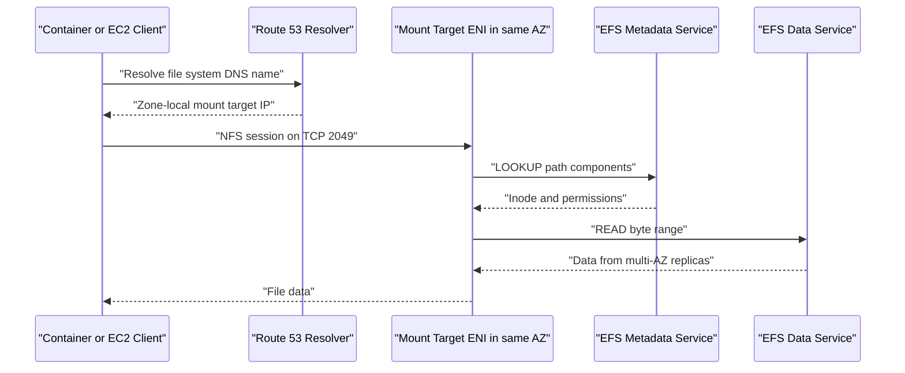
```mermaid
sequenceDiagram
    participant C as "Container or EC2 Client"
    participant DNS as "Route 53 Resolver"
    participant MT as "Mount Target ENI in same AZ"
    participant MD as "EFS Metadata Service"
    participant DS as "EFS Data Service"
    C->>DNS: "Resolve file system DNS name"
    DNS-->>C: "Zone-local mount target IP"
    C->>MT: "NFS session on TCP 2049"
    MT->>MD: "LOOKUP path components"
    MD-->>MT: "Inode and permissions"
    MT->>DS: "READ byte range"
    DS-->>MT: "Data from multi-AZ replicas"
    MT-->>C: "File data"
```

### Synchronous versus asynchronous paths

Storage participates in both communication styles, and mixing them up produces incorrect designs.

| Path | Style | Latency expectation | Design implication |
|---|---|---|---|
| `GetObject` and `PutObject` | Synchronous | Tens of milliseconds | Set timeouts and retries; never call on a tight loop without concurrency |
| EBS block I/O | Synchronous | Sub-millisecond to low milliseconds | Provision IOPS to match the peak, not the average |
| EFS NFS operations | Synchronous | Low milliseconds, higher for metadata | Avoid workloads dominated by small metadata operations |
| S3 event notification to Lambda, SQS, SNS, or EventBridge | Asynchronous | Typically seconds, no ordering guarantee | Consumers must be idempotent and tolerate duplicates and reordering |
| S3 lifecycle transitions | Asynchronous batch | Evaluated approximately daily | Do not depend on a transition happening at an exact hour |
| S3 Cross-Region Replication | Asynchronous | Minutes; fifteen-minute SLA with Replication Time Control | Destination is not a consistent read replica |
| EBS snapshot creation | Asynchronous after the point-in-time is captured | The point in time is immediate; the copy completes later | The volume can be used immediately after the API returns |

!!! warning "S3 event notifications are at-least-once"
    S3 event notifications guarantee delivery at least once, not exactly once, and provide no ordering guarantee across keys. Any Lambda function or SQS consumer triggered by S3 must be idempotent — typically by making the output key deterministic from the input key, or by recording processed object versions in DynamoDB with a conditional write.

---

## AWS Service Deep Dive

### Amazon S3 Deep Dive

#### Purpose

S3 exists to store an unbounded number of immutable objects with extreme durability, accessible over HTTP from anywhere with appropriate credentials, at a cost per gigabyte low enough to make retaining data cheaper than deciding whether to delete it. It is the default destination for backups, logs, media, data lakes, static websites, build artefacts, and machine learning training sets.

#### Architecture

S3 is a Regional service composed of a horizontally scaled front-end fleet, a strongly consistent partitioned index, and a storage fleet that holds erasure-coded fragments across at least three Availability Zones. Buckets are containers with Regional affinity; objects are addressed by key within a bucket. There is no server for you to size, no capacity to provision, and no maintenance window.

Two bucket types now exist. **General purpose buckets** are the standard, multi-AZ, globally named buckets used for nearly all workloads. **Directory buckets** support the S3 Express One Zone storage class, use a hierarchical namespace optimised for single-digit-millisecond latency, and reside in a single Availability Zone chosen by the customer.

#### Important features

- **Versioning** preserves every version of every object and inserts delete markers instead of destroying data.
- **Object Lock** provides write-once-read-many retention in Governance mode, which privileged users can override, and Compliance mode, which nobody including the root user can override until the retention period expires.
- **Lifecycle policies** transition objects between storage classes and expire them, including expiring noncurrent versions and aborting incomplete multipart uploads.
- **Replication**, both Cross-Region and Same-Region, copies objects asynchronously to another bucket, optionally in another account, with optional Replication Time Control.
- **Event notifications** to Lambda, SQS, SNS, and EventBridge make S3 an event source for event-driven architectures.
- **Multipart upload** enables parallel, resumable uploads of large objects.
- **Presigned URLs** delegate a single operation to an anonymous holder for a bounded time.
- **S3 Select** and **Athena** allow SQL-style querying of object contents without moving the data.
- **Requester Pays** shifts request and transfer charges to the caller.
- **Transfer Acceleration** routes uploads through CloudFront edge locations for geographically distant clients.
- **Storage Lens** provides organisation-wide analytics on usage and activity.
- **Access Points** and **Object Lambda Access Points** provide per-application entry points and on-the-fly transformation of retrieved objects.
- **Mountpoint for Amazon S3** presents a bucket as a file system for read-heavy analytics, without providing full POSIX semantics.

#### Storage classes

| Storage class | Designed for | Minimum storage duration | Minimum billable object size | Retrieval fee | Availability Zones | First-byte latency |
|---|---|---|---|---|---|---|
| S3 Standard | Frequently accessed, general purpose | None | None | None | Three or more | Milliseconds |
| S3 Intelligent-Tiering | Unknown or changing access patterns | None | 128 KiB for auto-tiering eligibility | None; small monitoring fee per object | Three or more | Milliseconds |
| S3 Standard-IA | Infrequent access, rapid retrieval needed | 30 days | 128 KiB | Per GiB retrieved | Three or more | Milliseconds |
| S3 One Zone-IA | Infrequent access, recreatable data | 30 days | 128 KiB | Per GiB retrieved | One | Milliseconds |
| S3 Glacier Instant Retrieval | Archive needing millisecond access | 90 days | 128 KiB | Per GiB retrieved, higher than IA | Three or more | Milliseconds |
| S3 Glacier Flexible Retrieval | Archive, minutes to hours acceptable | 90 days | 40 KiB | Per GiB and per request, varies by retrieval tier | Three or more | Expedited in one to five minutes, Standard in three to five hours, Bulk in five to twelve hours |
| S3 Glacier Deep Archive | Long-term retention, rarely accessed | 180 days | 40 KiB | Per GiB retrieved | Three or more | Standard in around twelve hours, Bulk in up to forty-eight hours |
| S3 Express One Zone | Latency-sensitive, very high request rate | One hour | 512 KiB | None, but higher request charges | One, in a directory bucket | Single-digit milliseconds |

!!! danger "Minimum duration charges are a real budget trap"
    An object stored in Standard-IA and deleted after five days is billed for thirty days. An object in Glacier Deep Archive deleted after a week is billed for one hundred and eighty days. Lifecycle rules that transition short-lived data to colder classes can therefore *increase* cost substantially. Always compare the expected object lifetime against the minimum storage duration before writing a transition rule.

#### Storage class decision flow

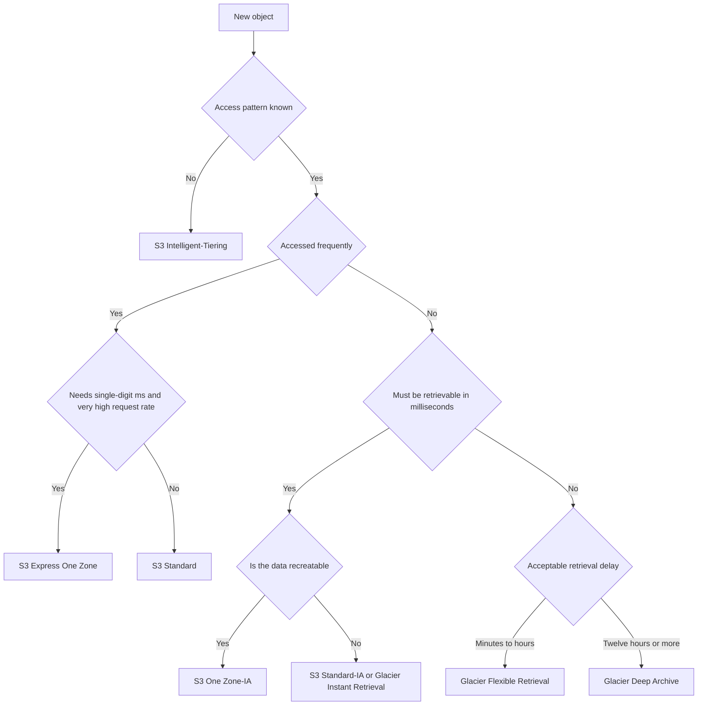
```mermaid
graph TD
    A["New object"] --> B{"Access pattern known"}
    B -->|"No"| C["S3 Intelligent-Tiering"]
    B -->|"Yes"| D{"Accessed frequently"}
    D -->|"Yes"| E{"Needs single-digit ms and very high request rate"}
    E -->|"Yes"| F["S3 Express One Zone"]
    E -->|"No"| G["S3 Standard"]
    D -->|"No"| H{"Must be retrievable in milliseconds"}
    H -->|"Yes"| I{"Is the data recreatable"}
    I -->|"Yes"| J["S3 One Zone-IA"]
    I -->|"No"| K["S3 Standard-IA or Glacier Instant Retrieval"]
    H -->|"No"| L{"Acceptable retrieval delay"}
    L -->|"Minutes to hours"| M["Glacier Flexible Retrieval"]
    L -->|"Twelve hours or more"| N["Glacier Deep Archive"]
```

#### The life of an object under versioning and lifecycle rules

The following state machine shows why versioning without lifecycle expiry causes unbounded cost growth, and why a delete in a versioned bucket is recoverable.

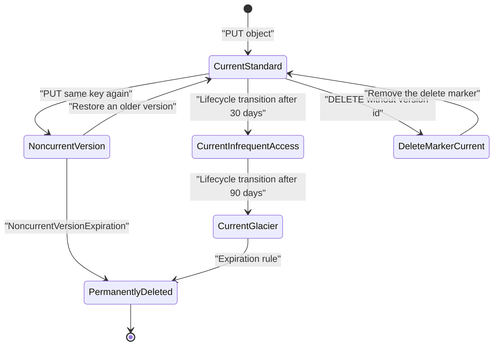
```mermaid
stateDiagram-v2
    [*] --> CurrentStandard : "PUT object"
    CurrentStandard --> NoncurrentVersion : "PUT same key again"
    NoncurrentVersion --> CurrentStandard : "Restore an older version"
    CurrentStandard --> CurrentInfrequentAccess : "Lifecycle transition after 30 days"
    CurrentInfrequentAccess --> CurrentGlacier : "Lifecycle transition after 90 days"
    CurrentStandard --> DeleteMarkerCurrent : "DELETE without version id"
    DeleteMarkerCurrent --> CurrentStandard : "Remove the delete marker"
    NoncurrentVersion --> PermanentlyDeleted : "NoncurrentVersionExpiration"
    CurrentGlacier --> PermanentlyDeleted : "Expiration rule"
    PermanentlyDeleted --> [*]
```

!!! danger "The delete that is not a delete"
    In a versioned bucket, a `DELETE` without a version identifier does not remove data; it inserts a delete marker and hides the object. The prior versions remain and continue to be billed. To actually free storage you must delete specific version identifiers, which is exactly what a `NoncurrentVersionExpiration` lifecycle rule automates. This mechanism is simultaneously the strongest protection against accidental deletion and the most common cause of unexplained storage growth.

#### Limitations

- Objects are immutable; there is no partial in-place update and no append. Modifying one byte requires re-uploading the whole object.
- Maximum object size is 5 TiB, and a single `PUT` without multipart is limited to 5 GiB.
- Listing is a paginated, eventually complete operation over a very large keyspace; listing millions of keys is slow and costly. Use S3 Inventory instead.
- Renaming an object or a prefix is a copy plus a delete, with full data transfer and request cost.
- No POSIX semantics: no file locking, no hard links, no atomic rename of a tree.
- Strong consistency applies to object data, not to bucket configuration.
- Bucket names are globally unique, which constrains naming conventions across organisations.

#### Pricing model

S3 charges across several independent dimensions. Architects must reason about all of them, because request charges frequently exceed storage charges for small-object workloads.

| Dimension | Basis | Architectural implication |
|---|---|---|
| Storage | Per GiB-month, varying by storage class | Lifecycle policies are the main lever |
| Requests | Per thousand `PUT`, `COPY`, `POST`, `LIST` and per thousand `GET` and `SELECT`, priced differently per class | Batching small objects can cut cost by an order of magnitude |
| Data transfer out to the internet | Per GiB, tiered | Serve through CloudFront to reduce it |
| Data transfer within a Region to services | Generally free to services in the same Region | Use a Gateway VPC endpoint to avoid NAT charges |
| Retrieval | Per GiB for IA and Glacier classes | A cold class accessed often costs more than Standard |
| Management features | Per object for Intelligent-Tiering monitoring, Inventory, Storage Lens advanced metrics, Object Lock, replication | Small-object-heavy buckets pay a high per-object overhead |
| Replication | Storage in the destination plus inter-Region transfer plus requests | Cross-Region Replication roughly doubles storage cost |

!!! info "Verify pricing before quoting figures"
    Prices differ by Region and change over time. Treat published figures as orders of magnitude — Standard storage on the order of low tens of United States cents per GiB-month, Deep Archive roughly an order of magnitude cheaper, and internet egress on the order of several cents per GiB. Always confirm against the current AWS pricing pages and model your workload with the AWS Pricing Calculator before committing to a design.

#### Performance characteristics and scaling behaviour

- At least 3,500 write and 5,500 read requests per second **per partitioned prefix**, with unlimited prefixes and automatic partition splitting.
- Throughput scales horizontally with parallelism; a single connection is limited by TCP behaviour, so large transfers should use multipart with many concurrent parts.
- Byte-range `GET` requests allow parallel reads of a single large object.
- First-byte latency in the tens of milliseconds for Standard; single-digit milliseconds for Express One Zone.
- No provisioning, no warm-up, and no capacity planning: S3 scales elastically as load arrives.

#### Availability, durability, and security features

S3 Standard is designed for eleven nines of durability and 99.99 percent availability, backed by a 99.9 percent Service Level Agreement. Security features include Block Public Access at both account and bucket level, bucket policies, IAM identity policies, Access Points, VPC endpoint policies, default encryption with SSE-S3 or SSE-KMS or DSSE-KMS, Bucket Keys to reduce KMS calls, Object Lock, MFA Delete, Access Analyzer for S3, server access logging, and CloudTrail data events.

Since 2023, **all new objects are encrypted at rest by default with SSE-S3**, and Block Public Access and object ownership defaults were tightened so that ACLs are disabled on new buckets.

#### Service limits

| Limit | Value | Adjustable |
|---|---|---|
| Buckets per account | 10,000 by default in the general purpose namespace | Yes, through a quota increase |
| Objects per bucket | Unlimited | Not applicable |
| Maximum object size | 5 TiB | No |
| Maximum single `PUT` without multipart | 5 GiB | No |
| Parts per multipart upload | 10,000 | No |
| Part size range | 5 MiB to 5 GiB, last part may be smaller | No |
| Bucket policy document size | 20 KB | No |
| Lifecycle rules per bucket | 1,000 | No |
| Access points per Region per account | Several thousand | Yes |
| Request rate per prefix | 3,500 write and 5,500 read per second minimum | Scales automatically |

#### Common configurations

A production bucket typically has versioning enabled, Block Public Access fully on, default encryption with a customer-managed KMS key and Bucket Keys enabled, a bucket policy denying non-TLS requests, a lifecycle rule that expires noncurrent versions after a retention window and aborts incomplete multipart uploads after seven days, server access logging or CloudTrail data events directed to a separate logging bucket, and replication to a second Region or a separate account for critical data.

---

### Amazon EBS Deep Dive

#### Purpose

EBS exists to give EC2 instances persistent, low-latency, random-access block storage that survives instance termination and can be snapshotted, resized, and re-attached. It is the storage substrate for boot volumes, self-managed databases, and any workload whose software expects a local disk.

#### Architecture

EBS volumes live on a dedicated storage fleet within a single Availability Zone, replicated across multiple servers in that zone, and reached from the EC2 host over a purpose-built network fabric mediated by the Nitro card. The volume is exposed to the guest as an NVMe block device. Snapshots are written incrementally to S3 as Regional resources, providing the cross-zone and cross-Region durability path.

#### Volume types

| Type | Media | Size range | Max IOPS per volume | Max throughput per volume | IOPS model | Best-suited workloads |
|---|---|---|---|---|---|---|
| gp3 | SSD | 1 GiB to 64 TiB | 16,000 | 1,000 MiB/s | 3,000 IOPS baseline included, provisioned independently of size | Default for boot volumes, most databases, application servers |
| gp2 | SSD | 1 GiB to 64 TiB | 16,000 | 250 MiB/s | 3 IOPS per GiB, burst to 3,000 for small volumes | Legacy general purpose; superseded by gp3 |
| io1 | SSD | 4 GiB to 16 TiB | 64,000 | 1,000 MiB/s | Provisioned, up to 50 IOPS per GiB | Legacy high-performance; superseded by io2 |
| io2 Block Express | SSD | 4 GiB to 64 TiB | 256,000 | 4,000 MiB/s | Provisioned, up to 1,000 IOPS per GiB | Mission-critical relational databases, SAP HANA, Oracle |
| st1 | HDD | 125 GiB to 16 TiB | 500 | 500 MiB/s | Throughput-oriented with burst credits | Big data, log processing, data warehouses, sequential reads |
| sc1 | HDD | 125 GiB to 16 TiB | 250 | 250 MiB/s | Lowest cost, throughput-oriented | Cold data accessed a few times per month |

!!! tip "gp3 is almost always better than gp2"
    gp3 costs roughly twenty percent less per GiB than gp2, includes 3,000 IOPS and 125 MiB/s regardless of size, and lets you provision IOPS and throughput independently of capacity. Under gp2, obtaining 3,000 sustained IOPS required a 1,000 GiB volume. Migrating gp2 volumes to gp3 is an online `ModifyVolume` operation and is one of the most reliable cost optimisations available in a mature account.

#### Important features

- **Elastic Volumes** allow online changes to size, type, IOPS, and throughput without detaching or stopping the instance. Note that the file system must then be grown with `growpart` and `resize2fs` or `xfs_growfs`.
- **Snapshots** are incremental, Regional, copyable across Regions and accounts, and shareable.
- **Fast Snapshot Restore** eliminates lazy-loading latency for restored volumes at an hourly charge.
- **Encryption** is at-rest and in-transit between the instance and the volume, performed in Nitro hardware, with negligible performance impact. Encryption by default can be enforced account-wide per Region.
- **Multi-Attach** allows io1 and io2 volumes to attach to up to sixteen Nitro instances in the same Availability Zone; a cluster-aware file system is required.
- **Data Lifecycle Manager** automates snapshot creation, retention, and cross-Region copy.
- **EBS direct APIs** allow reading snapshot blocks and writing new snapshots programmatically, enabling efficient backup tooling.
- **Recycle Bin** allows recovery of accidentally deleted snapshots and AMIs within a retention window.

#### Limitations

- A volume is bound to a single Availability Zone and can only attach to instances in that zone.
- Except for Multi-Attach, a volume attaches to exactly one instance at a time.
- Volume performance is also capped by the **instance's** EBS bandwidth and IOPS limits, which vary by instance type and size. A large volume attached to a small instance will not deliver its rated performance.
- Volumes cannot be shrunk; they can only grow.
- Snapshots are crash-consistent unless the file system is quiesced.
- HDD types perform poorly for small random I/O; they are throughput devices, not IOPS devices.

#### Pricing model

| Dimension | gp3 | gp2 | io1 and io2 | st1 and sc1 |
|---|---|---|---|---|
| Provisioned capacity | Per GiB-month | Per GiB-month | Per GiB-month | Per GiB-month, lowest for sc1 |
| Provisioned IOPS | Charged above the included 3,000 | Included in capacity price | Charged per provisioned IOPS-month, with tiering on io2 | Not applicable |
| Provisioned throughput | Charged above the included 125 MiB/s | Not configurable | Not separately charged | Not applicable |
| Snapshots | Per GiB-month of changed blocks stored, with a cheaper archive tier | Same | Same | Same |
| Fast Snapshot Restore | Per hour per snapshot per Availability Zone | Same | Same | Same |

Capacity is billed for what is **provisioned**, not for what is used. A 500 GiB volume containing 10 GiB of data costs the same as a full one — a fundamental difference from S3 and EFS and a recurring source of waste.

#### Performance characteristics and scaling behaviour

SSD types are optimised for IOPS and measure I/O in 16 KiB units; HDD types are optimised for megabytes per second and measure I/O in 1 MiB units. gp2, st1, and sc1 use burst-credit buckets, meaning sustained load can exhaust credits and drop performance to baseline abruptly. gp3, io1, and io2 deliver consistent provisioned performance with no credit mechanism.

Scaling is **vertical and explicit**: you change the volume's size, type, or provisioned performance. There is no automatic scaling. Architects therefore monitor `VolumeQueueLength`, `BurstBalance`, and throughput metrics and adjust deliberately.

#### Availability, durability, and security features

An EBS volume is a single-Availability-Zone resource. gp3 and gp2 volumes are designed for an annual failure rate between 0.1 and 0.2 percent; io2 is designed for 99.999 percent durability. Availability design targets range from 99.8 to 99.999 percent depending on type. Security features include KMS encryption at rest with per-volume data keys, in-transit encryption on the fabric, IAM control over volume and snapshot APIs, snapshot sharing controls, and the ability to enforce encryption by default at the account level.

#### Service limits

| Limit | Typical default | Adjustable |
|---|---|---|
| Aggregate provisioned storage per Region | Tens of TiB per volume type family | Yes |
| Snapshots per Region | 100,000 | Yes |
| Volumes attachable per instance | Instance-type dependent, commonly 28 attachments on Nitro including network interfaces | No |
| Maximum volume size | 64 TiB for gp3, gp2, io2 Block Express; 16 TiB for io1, st1, sc1 | No |
| Multi-Attach instances per volume | 16 | No |
| IOPS to size ratio | 500 to 1 for gp3, 1,000 to 1 for io2 | No |

#### Common configurations

A typical production configuration uses an encrypted gp3 root volume of modest size, a separate encrypted data volume sized and provisioned for the workload's measured IOPS, `DeleteOnTermination` set to false for data volumes, XFS or ext4 with an appropriate mount option set, an entry in `/etc/fstab` using the volume UUID rather than the device name, and a Data Lifecycle Manager policy taking tagged snapshots on a schedule with cross-Region copy for disaster recovery.

---

### Amazon EFS Deep Dive

#### Purpose

EFS exists to provide a shared, elastic, POSIX-compliant file system that many compute resources across multiple Availability Zones can mount simultaneously, without any capacity planning and without the operational burden of running an NFS server cluster.

#### Architecture

EFS is a Regional service with data and metadata stored redundantly across multiple Availability Zones. Clients access it through mount targets — elastic network interfaces placed in your subnets, one per Availability Zone — using the standard NFSv4.1 protocol. Access points provide application-scoped views with enforced root directories and POSIX identities.

#### Important features

- **Elastic capacity** with no provisioning; you pay for stored bytes.
- **Elastic throughput mode** that scales performance automatically to demand.
- **Storage classes and lifecycle management** that move files to Infrequent Access and Archive based on last-access time, and optionally back to Standard on read.
- **Access points** for multi-tenant isolation within one file system.
- **IAM authorisation for NFS clients**, enabling policy-based control in addition to POSIX permissions.
- **Encryption at rest with KMS and in transit with TLS** through the `efs-utils` mount helper.
- **AWS Backup integration** for policy-driven backup and restore.
- **Replication** to another Region for disaster recovery, with a Recovery Point Objective typically measured in minutes.
- **Container-native integration** through the ECS volume configuration and the EFS CSI driver for Kubernetes, supporting `ReadWriteMany` persistent volumes.

#### Storage classes

| Class | Availability Zone scope | Relative storage price | Access charge | Intended use |
|---|---|---|---|---|
| EFS Standard | Multiple AZs | Highest | None | Active working set |
| EFS Infrequent Access | Multiple AZs | Substantially lower | Per GiB read and written | Files not accessed for a configured period |
| EFS Archive | Multiple AZs | Lowest of the multi-AZ classes | Higher per GiB access charge | Files accessed a few times per year |
| EFS One Zone | Single AZ | Lower than the Standard equivalent | None | Development, test, and recreatable data |
| EFS One Zone-IA | Single AZ | Lowest overall | Per GiB access charge | Cold, recreatable, single-zone data |

#### Limitations

- Higher per-operation latency than EBS, because operations traverse the network and coordinate distributed metadata.
- Higher cost per GiB-month than both EBS and S3 for the Standard class.
- Metadata-intensive workloads — for example compiling a large source tree or `ls` on a directory with hundreds of thousands of entries — perform poorly relative to a local disk.
- Not suitable as a database data directory for latency-sensitive transactional engines.
- `Max I/O` performance mode raises the throughput ceiling but increases per-operation latency and is unnecessary for most designs.
- Linux NFSv4.1 only; Windows SMB workloads require Amazon FSx for Windows File Server instead.

#### Pricing model

| Dimension | Basis |
|---|---|
| Storage | Per GiB-month, differing sharply by storage class |
| Infrequent Access and Archive access | Per GiB read or written from those classes |
| Elastic throughput | Per GiB of data read and written |
| Provisioned throughput | Per MiB/s-month, in addition to storage |
| Backup storage through AWS Backup | Per GiB-month of warm and cold backup |
| Cross-Region replication | Storage in the destination plus inter-Region transfer |

Unlike EBS, EFS bills for **consumed** capacity rather than provisioned capacity, which makes it economical for sparse or unpredictable data volumes but expensive for large, dense, hot data sets relative to EBS.

#### Performance characteristics and scaling behaviour

Throughput scales with the file system automatically in Elastic mode, reaching multiple gigabytes per second for reads in supported Regions. Bursting mode ties baseline throughput to stored capacity at approximately 50 KiB/s per GiB with a credit bucket, which is why small file systems in Bursting mode can stall. IOPS scale to hundreds of thousands of operations per second in General Purpose mode. Because throughput is aggregate across all clients, EFS is well suited to fan-out read patterns such as many containers reading the same model file.

#### Availability, durability, and security features

EFS Standard is designed for eleven nines of durability and 99.99 percent availability across multiple Availability Zones, which makes it fundamentally more available than a single EBS volume. Security is layered: security groups control network reachability to mount targets, IAM policies control who may mount and what actions they may perform, access points enforce a root directory and POSIX identity, POSIX permissions apply within the file system, and KMS provides encryption at rest with TLS in transit.

#### Service limits

| Limit | Typical value | Adjustable |
|---|---|---|
| File systems per account per Region | 1,000 | Yes |
| Mount targets per Availability Zone per file system | 1 | No |
| Connections per file system | Tens of thousands of NFS clients | Some aspects adjustable |
| Access points per file system | 1,000 | Yes |
| Maximum file size | 47.9 TiB | No |
| Maximum file system size | Effectively unlimited, petabyte scale | Not applicable |
| Security groups per mount target | 5 | No |

#### Common configurations

A production EFS deployment uses Elastic throughput, General Purpose performance mode, encryption at rest with a customer-managed KMS key, mount targets in every Availability Zone used by the compute tier, a dedicated security group allowing TCP 2049 only from the application security group, one access point per application enforcing a root directory and a non-root POSIX identity, lifecycle management transitioning to Infrequent Access after thirty days, TLS-enabled mounts via `efs-utils`, and an AWS Backup plan with a retention schedule.

---

### Contextual Services

#### Amazon FSx

Amazon FSx is a family of managed file systems for workloads whose requirements exceed what EFS is designed to satisfy.

| FSx variant | Protocol | Primary use case |
|---|---|---|
| FSx for Windows File Server | SMB, with Active Directory integration | Windows applications, shared Windows home directories, .NET workloads |
| FSx for Lustre | Lustre, POSIX | High-performance computing, machine learning training, seismic and genomics analysis; can link directly to an S3 bucket |
| FSx for NetApp ONTAP | NFS, SMB, and iSCSI | Migrating existing NetApp estates; snapshots, cloning, and tiering features |
| FSx for OpenZFS | NFS | Low-latency, ZFS-based workloads needing snapshots and cloning |

The architectural rule is straightforward: choose EFS for Linux NFS shared storage, FSx for Windows File Server when SMB and Active Directory are required, and FSx for Lustre when the workload needs hundreds of gigabytes per second of throughput against data staged from S3.

#### S3 Glacier storage classes

The Glacier name now refers to storage classes within S3 rather than to a separate service for new designs. Glacier Instant Retrieval provides millisecond access for archives read a few times per year; Glacier Flexible Retrieval provides retrieval in minutes to hours; Glacier Deep Archive provides the lowest storage price in AWS in exchange for retrieval times measured in hours and a one-hundred-and-eighty-day minimum duration. Objects in the Flexible Retrieval and Deep Archive classes must be **restored** before they can be read, which creates a temporary copy in a readable class for a specified number of days.

#### AWS Storage Gateway

AWS Storage Gateway is a hybrid service that runs as a virtual appliance or hardware appliance inside an on-premises data centre and presents familiar local protocols while storing data in AWS.

| Gateway type | Local protocol presented | AWS storage used | Typical scenario |
|---|---|---|---|
| S3 File Gateway | NFS and SMB | S3 objects | Presenting a file share whose files become S3 objects for analytics |
| FSx File Gateway | SMB | FSx for Windows File Server | Low-latency on-premises access to a managed Windows file system |
| Volume Gateway | iSCSI block volumes | EBS snapshots in S3 | Backing up on-premises block volumes, or cached volumes with a local hot set |
| Tape Gateway | Virtual Tape Library over iSCSI | S3 and Glacier classes | Replacing physical tape libraries without changing backup software |

!!! note "Storage Gateway is a migration and hybrid tool"
    Storage Gateway exists to let organisations adopt cloud storage without rewriting applications or replacing backup software. It is rarely the right answer for a greenfield cloud-native design, where the application should speak to S3 or EFS directly.

---

## Important AWS Terminology

| Term | Meaning |
|---|---|
| Object storage | Storage abstraction in which data is stored as whole immutable objects with metadata in a flat keyspace, accessed over an API |
| Block storage | Storage abstraction presenting a linear array of fixed-size blocks that a file system formats and mutates in place |
| File storage | Storage abstraction presenting a hierarchical directory tree with POSIX or SMB semantics, shareable across hosts |
| Bucket | Regional container for S3 objects, with a globally unique name in the general purpose namespace |
| Directory bucket | S3 bucket type supporting the Express One Zone class, with a hierarchical namespace in a single Availability Zone |
| Key | The complete unique name of an object within a bucket |
| Prefix | A leading substring of an object key, used for logical grouping, policy scoping, and request-rate partitioning |
| Delimiter | A character passed to a list operation to group keys into common prefixes, emulating folders |
| ETag | An identifier returned for an object, equal to the MD5 hash for simple uploads and a composite value for multipart uploads |
| Versioning | Bucket setting that retains every version of an object and uses delete markers instead of destructive deletes |
| Delete marker | The placeholder version created when an object is deleted in a versioned bucket |
| Noncurrent version | Any object version that is not the latest; billed and expirable by lifecycle rules |
| Storage class | Per-object attribute determining cost, latency, availability, and retrieval behaviour |
| Lifecycle policy | Bucket rules that transition or expire objects based on age or version status |
| Multipart upload | Protocol for uploading a large object in independently retryable parts assembled server-side |
| Presigned URL | Time-limited signed URL granting a specific S3 operation without sharing credentials |
| Block Public Access | Account and bucket level control that overrides policies and ACLs to prevent public exposure |
| Object Lock | Write-once-read-many retention control in Governance or Compliance mode |
| Object Ownership | Setting that disables ACLs and makes the bucket owner the owner of all objects |
| Access Point | A named, policy-bearing entry point into a bucket for a specific application |
| Object Lambda Access Point | Access point that invokes a Lambda function to transform objects as they are retrieved |
| Cross-Region Replication | Asynchronous replication of objects to a bucket in another Region |
| Replication Time Control | Feature adding a fifteen-minute replication Service Level Agreement and replication metrics |
| S3 Inventory | Scheduled report listing objects and their metadata, avoiding expensive list operations |
| S3 Storage Lens | Organisation-wide storage usage and activity analytics |
| Requester Pays | Bucket setting that charges request and transfer costs to the requester |
| Transfer Acceleration | Upload path through CloudFront edge locations for distant clients |
| Mountpoint for Amazon S3 | Client that exposes an S3 bucket as a file system for read-heavy workloads without full POSIX semantics |
| Volume | An EBS block device created in one Availability Zone and attachable to instances in that zone |
| Volume type | The EBS performance family, such as gp3, io2 Block Express, st1, or sc1 |
| IOPS | Input output operations per second, measured against a 16 KiB unit on SSD types |
| Throughput | Bytes transferred per second, bounded by the volume and by the instance |
| Burst balance | Credit pool allowing gp2, st1, and sc1 volumes to exceed baseline performance temporarily |
| Snapshot | Incremental, block-level, point-in-time backup of an EBS volume stored in S3 as a Regional resource |
| Fast Snapshot Restore | Feature that pre-warms a snapshot so restored volumes deliver full performance immediately |
| Lazy loading | Behaviour whereby a volume restored from a snapshot fetches blocks from S3 on first access |
| Elastic Volumes | Capability to change size, type, and performance of an attached volume without downtime |
| Multi-Attach | EBS capability allowing one io1 or io2 volume to attach to up to sixteen Nitro instances in one Availability Zone |
| EBS-optimised | Instance property providing dedicated network capacity for EBS traffic |
| Nitro card for EBS | Dedicated hardware on the EC2 host that converts NVMe commands into EBS network operations and performs encryption |
| Instance store | Ephemeral block storage physically attached to the host, lost on stop or termination |
| Data Lifecycle Manager | Service automating EBS snapshot creation, retention, and cross-Region copy |
| Mount target | Elastic network interface in a subnet through which NFS clients in that Availability Zone reach an EFS file system |
| Access point | EFS entry point enforcing a root directory and POSIX identity for an application |
| Throughput mode | EFS setting selecting Elastic, Provisioned, or Bursting throughput behaviour |
| Performance mode | EFS setting selecting General Purpose or Max I/O |
| efs-utils | AWS-provided mount helper enabling TLS encryption in transit and IAM authorisation for EFS |
| Close-to-open consistency | NFS semantics guaranteeing that a file closed by one client is fully visible to a client that subsequently opens it |
| Durability | The probability that stored data is not lost over a period |
| Availability | The probability that stored data can be accessed at a given moment |
| Control plane | Subsystem handling resource creation and configuration |
| Data plane | Subsystem handling the movement of data, engineered for static stability |
| Erasure coding | Technique splitting data into data and parity fragments so the original is recoverable from a subset |
| Gateway VPC endpoint | Route-table-based private path from a VPC to S3 or DynamoDB with no additional charge |
| Interface VPC endpoint | PrivateLink elastic network interface providing a private path to an AWS service, reachable from on-premises |
| SSE-S3 | Server-side encryption using keys managed entirely by S3 |
| SSE-KMS | Server-side encryption using an AWS KMS key, providing auditable and controllable key usage |
| DSSE-KMS | Dual-layer server-side encryption applying two independent layers of KMS encryption |
| S3 Bucket Keys | Feature that reduces KMS request volume and cost by deriving short-lived bucket-level keys |
| SSE-C | Server-side encryption with a customer-provided key supplied on every request |
| CSI driver | Container Storage Interface plugin allowing Kubernetes to provision and attach EBS or EFS volumes |

---

## Configuration Options

### Amazon S3 configuration

| Setting | Options | Architectural guidance |
|---|---|---|
| Storage class | Standard, Intelligent-Tiering, Standard-IA, One Zone-IA, Glacier Instant, Glacier Flexible, Deep Archive, Express One Zone | Set at upload for known patterns; use Intelligent-Tiering when patterns are unknown |
| Versioning | Disabled, Enabled, Suspended | Enable for any bucket holding non-reproducible data; pair with lifecycle expiry of noncurrent versions |
| Default encryption | SSE-S3, SSE-KMS, DSSE-KMS | SSE-S3 for general data, SSE-KMS with Bucket Keys where audit and key control are required |
| Block Public Access | Four independent toggles at account and bucket level | Enable all four unless a documented public-hosting requirement exists |
| Object Ownership | ACLs disabled — bucket owner enforced, or ACLs enabled | Keep ACLs disabled; use bucket policies exclusively |
| Lifecycle rules | Transition, expiration, noncurrent expiration, abort incomplete multipart uploads | Always include an abort-incomplete-multipart rule |
| Replication | Cross-Region, Same-Region, with or without Replication Time Control | Replicate to a separate account for ransomware resilience |
| Event notifications | Lambda, SQS, SNS, EventBridge | Prefer EventBridge for richer filtering and multiple targets |
| Object Lock | Governance or Compliance mode, with retention period or legal hold | Compliance mode is irreversible; test in a sandbox first |
| Transfer Acceleration | Enabled or disabled | Only worthwhile for geographically distant, large uploads |
| Requester Pays | Enabled or disabled | Useful for publishing large public datasets |
| Static website hosting | Enabled with index and error documents | Prefer CloudFront with Origin Access Control over public website endpoints |

### Amazon EBS configuration

| Setting | Options | Architectural guidance |
|---|---|---|
| Volume type | gp3, gp2, io1, io2 Block Express, st1, sc1 | Default to gp3; escalate to io2 only with measured evidence |
| Size | 1 GiB to 64 TiB depending on type | Size for capacity plus growth; remember volumes cannot shrink |
| Provisioned IOPS | Up to 16,000 on gp3, 256,000 on io2 Block Express | Provision to the measured peak, not the average |
| Provisioned throughput | Up to 1,000 MiB/s on gp3 | Increase for sequential workloads such as log ingestion |
| Encryption | Enabled with an AWS managed or customer managed KMS key | Enable encryption by default at the account level |
| Delete on termination | True or false | True for root volumes, false for data volumes |
| Multi-Attach | Enabled on io1 and io2 | Only with a cluster-aware file system |
| Snapshot schedule | Data Lifecycle Manager or AWS Backup policy | Tag-driven policies scale better than per-volume configuration |

### Amazon EFS configuration

| Setting | Options | Architectural guidance |
|---|---|---|
| Throughput mode | Elastic, Provisioned, Bursting | Elastic is the correct default for variable workloads |
| Performance mode | General Purpose, Max I/O | General Purpose unless a measured parallel-throughput ceiling is reached |
| Storage class and lifecycle | Standard, IA, Archive, One Zone variants, with transition and return policies | Transition after thirty days of no access; enable return on first access for unpredictable reads |
| Availability | Regional or One Zone | One Zone only for recreatable development and test data |
| Encryption | At rest with KMS, in transit with TLS through efs-utils | Enable both; in-transit encryption is not the default for a raw NFS mount |
| Access points | Root directory and enforced POSIX user and group | One per application for tenant isolation |
| File system policy | Resource policy controlling mount and access actions | Use to deny non-TLS access and enforce access point usage |

### Mount and attachment options

Common Linux mount options for EFS include `nfsvers=4.1`, `rsize=1048576`, `wsize=1048576`, `hard`, `timeo=600`, and `retrans=2`. The `hard` option makes I/O retry indefinitely rather than returning errors, which preserves data integrity but can hang processes if the file system becomes unreachable — an important trade-off to state explicitly in a design review.

---

## Design Considerations

### The decision framework

This is the section to internalise. Given a workload, walk the questions in order.

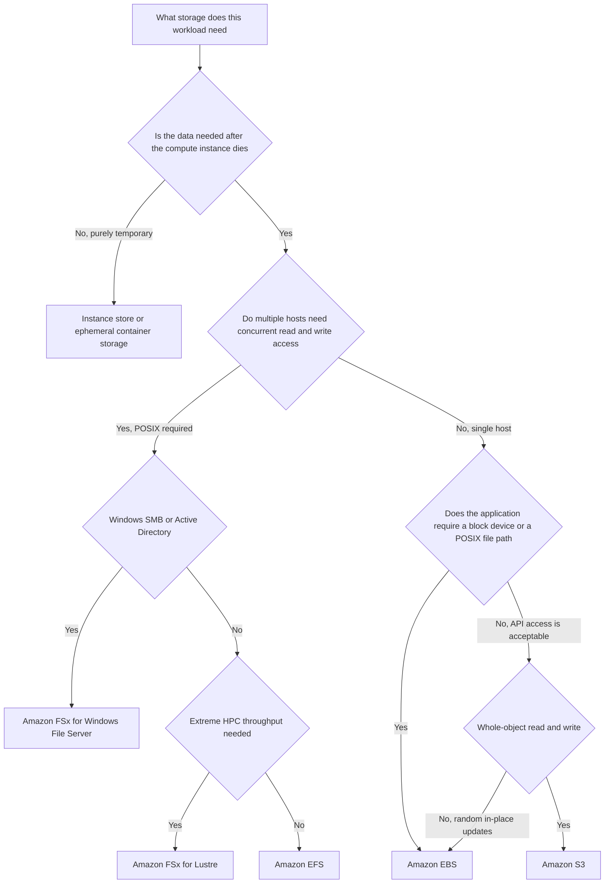
```mermaid
graph TD
    A["What storage does this workload need"] --> B{"Is the data needed after the compute instance dies"}
    B -->|"No, purely temporary"| C["Instance store or ephemeral container storage"]
    B -->|"Yes"| D{"Do multiple hosts need concurrent read and write access"}
    D -->|"Yes, POSIX required"| E{"Windows SMB or Active Directory"}
    E -->|"Yes"| F["Amazon FSx for Windows File Server"]
    E -->|"No"| G{"Extreme HPC throughput needed"}
    G -->|"Yes"| H["Amazon FSx for Lustre"]
    G -->|"No"| I["Amazon EFS"]
    D -->|"No, single host"| J{"Does the application require a block device or a POSIX file path"}
    J -->|"Yes"| K["Amazon EBS"]
    J -->|"No, API access is acceptable"| L{"Whole-object read and write"}
    L -->|"Yes"| M["Amazon S3"]
    L -->|"No, random in-place updates"| K
```

### Comparative decision table

| Criterion | Amazon S3 | Amazon EBS | Amazon EFS | Instance Store |
|---|---|---|---|---|
| Abstraction | Object | Block | File | Block |
| Scope | Regional | Single Availability Zone | Regional, multi-AZ | Single host |
| Concurrent access | Unlimited clients over HTTP | One instance, or up to sixteen with Multi-Attach | Thousands of clients | One instance |
| Capacity model | Unlimited, pay for stored bytes | Provisioned, pay for provisioned bytes | Elastic, pay for stored bytes | Fixed by instance type, included in instance price |
| Latency | Tens of milliseconds; single-digit for Express One Zone | Sub-millisecond to low milliseconds | Low milliseconds | Microseconds |
| Throughput ceiling | Effectively unlimited with parallelism | Up to 4,000 MiB/s per volume | Multiple GiB/s aggregate | Highest available |
| Durability | Eleven nines across three or more AZs | Replicated within one AZ; snapshots for cross-AZ | Eleven nines across three or more AZs | None |
| Survives instance termination | Yes | Yes | Yes | No |
| Survives AZ failure | Yes | No, data preserved but inaccessible | Yes | No |
| In-place partial update | No | Yes | Yes | Yes |
| POSIX semantics | No | Yes, via the guest file system | Yes | Yes, via the guest file system |
| Typical relative cost per GiB-month | Lowest | Moderate | Highest | Included |
| Best for | Data lakes, backups, media, artefacts, logs | Boot volumes, databases, single-host state | Shared content, CMS, ML datasets, container shared volumes | Cache, scratch, shuffle, replicated NoSQL |
| Worst for | Transactional writes, POSIX applications | Multi-AZ shared state | Latency-critical databases | Anything that must survive |

!!! question "Apply the framework"
    A team asks you to store user-uploaded profile photographs for a web application running on ECS Fargate across three Availability Zones. Work through the questions. The data must outlive the task, so it is not instance store. Multiple tasks must read it, but only through the application over HTTP, and each photograph is written whole and never partially updated. Therefore the answer is S3, fronted by CloudFront, with uploads performed by presigned URL directly from the browser so that the application tier never handles the bytes. Choosing EFS here would be a common but incorrect answer — it works, but it costs more, scales worse, and provides no CDN integration.

### Scalability

S3 scales without any action on your part; the design question is how to spread keys across prefixes and how to parallelise clients. EFS scales throughput automatically in Elastic mode; the design question is whether your workload is metadata-bound rather than throughput-bound. EBS does **not** scale automatically; the design question is whether you have measured the peak IOPS requirement and whether the instance type can deliver it.

### Availability and fault tolerance

An architecture built on a single EBS volume has an availability ceiling set by one Availability Zone. Moving state to EFS or S3 raises that ceiling to the Region. Moving beyond a single Region requires S3 Cross-Region Replication, EFS replication, or snapshot copies, along with a documented Recovery Time Objective and Recovery Point Objective.

| Failure scenario | S3 impact | EBS impact | EFS impact |
|---|---|---|---|
| Single storage device fails | None, transparent repair | None, replica serves | None, redundant copies |
| Single Availability Zone fails | None for multi-AZ classes | Volume inaccessible until the zone recovers | None; other mount targets serve |
| Region fails | Requires replication to another Region | Requires cross-Region snapshot copies | Requires EFS replication |
| Accidental deletion | Versioning and Object Lock protect | Snapshots and Recycle Bin protect | AWS Backup protects |
| Credential compromise | Replication to a separate account and Object Lock protect | Cross-account snapshot copies protect | Cross-account backup vault protects |

### Durability, latency, cost, and maintainability

Durability is a property you buy through redundancy and verify through restore testing — a backup that has never been restored is a hypothesis, not a control. Latency is determined primarily by the abstraction, secondarily by proximity, and only thirdly by configuration. Cost is dominated by different dimensions in each service: storage class for S3, provisioned capacity for EBS, and storage class plus throughput mode for EFS. Maintainability favours managed, elastic services, which is why EFS and S3 impose far less operational load than a self-managed NFS cluster on EC2 with EBS volumes.

### Operational complexity

Ranked from least to most operationally demanding: S3 requires almost nothing beyond policy hygiene; EFS requires network and access point configuration but no capacity management; EBS requires capacity planning, file system growth, snapshot scheduling, and Availability Zone-aware failover design. This ranking should influence design decisions in teams with limited operational capacity.

---

## AWS Best Practices

The AWS Well-Architected Framework provides six pillars. The following table maps concrete storage practices to each.

| Pillar | Storage practices |
|---|---|
| Operational Excellence | Define all storage in CloudFormation or Terraform; tag every bucket, volume, and file system with owner, environment, and data classification; automate snapshots through Data Lifecycle Manager or AWS Backup; test restores on a schedule; use S3 Inventory and Storage Lens rather than ad hoc listing |
| Security | Enable Block Public Access at the account level; keep ACLs disabled; enforce TLS through bucket and file system policies; encrypt everything at rest with KMS; apply least privilege to actions, resources, and conditions; enable CloudTrail data events for sensitive buckets; use VPC endpoints; use Object Lock for regulated retention |
| Reliability | Place state in multi-AZ services wherever the latency budget allows; snapshot EBS volumes and copy the snapshots to a second Region; enable S3 versioning; replicate critical buckets across Regions and accounts; document Recovery Time Objective and Recovery Point Objective and validate them |
| Performance Efficiency | Choose the abstraction that matches the access pattern before tuning; use gp3 rather than gp2; use multipart upload and byte-range reads for large objects; use CloudFront to cache; use EFS Elastic throughput; measure before provisioning IOPS |
| Cost Optimization | Apply lifecycle policies from day one; use Intelligent-Tiering for unknown patterns; delete incomplete multipart uploads; expire noncurrent versions; right-size EBS volumes and migrate gp2 to gp3; add a Gateway VPC endpoint for S3; review Storage Lens and Cost Explorer monthly |
| Sustainability | Delete data that has no retention requirement; use colder storage classes, which consume less energy per stored byte; avoid over-provisioned EBS capacity that occupies physical media without serving requests; compress and use columnar formats such as Parquet to reduce both cost and energy |

!!! tip "The two practices with the highest return"
    If you adopt only two practices from this chapter, adopt these. First, enable S3 versioning together with a lifecycle rule expiring noncurrent versions — this converts accidental deletion from a disaster into an inconvenience at bounded cost. Second, add a Gateway VPC endpoint for S3 in every VPC — this is free, improves security posture, and frequently eliminates a significant NAT Gateway bill.

---

## Security Considerations

### Layered authorisation for S3

Access to an S3 object is the result of evaluating several policy types together. An explicit `Deny` in any of them wins, and access is granted only if at least one policy allows it and none denies it.

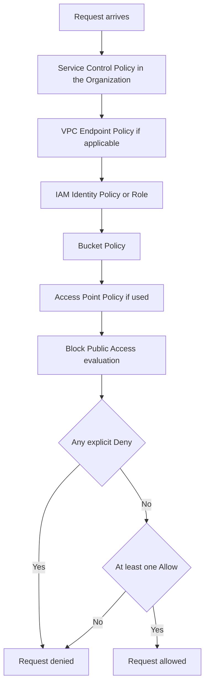
```mermaid
graph TD
    A["Request arrives"] --> B["Service Control Policy in the Organization"]
    B --> C["VPC Endpoint Policy if applicable"]
    C --> D["IAM Identity Policy or Role"]
    D --> E["Bucket Policy"]
    E --> F["Access Point Policy if used"]
    F --> G["Block Public Access evaluation"]
    G --> H{"Any explicit Deny"}
    H -->|"Yes"| I["Request denied"]
    H -->|"No"| J{"At least one Allow"}
    J -->|"Yes"| K["Request allowed"]
    J -->|"No"| I
```

### Least privilege in practice

Least privilege means constraining three things: **actions**, **resources**, and **conditions**. A policy that grants `s3:*` on `arn:aws:s3:::*` violates all three. A least-privilege policy grants `s3:GetObject` on `arn:aws:s3:::app-uploads/tenant-42/*` with a condition requiring `aws:SecureTransport` to be true and optionally requiring a specific `aws:SourceVpce`.

Note the frequently missed distinction between **bucket-level** and **object-level** actions. `s3:ListBucket` is a bucket-level action and its resource is the bucket ARN; `s3:GetObject` is an object-level action and its resource is the object ARN with a wildcard. A policy that lists only the object ARN will produce confusing `AccessDenied` errors on list operations.

### Encryption strategy

| Option | Key ownership | Audit trail | Cost | When to choose |
|---|---|---|---|---|
| SSE-S3 | AWS managed, invisible | No per-request KMS trail | No additional charge | Default for non-regulated data |
| SSE-KMS with an AWS managed key | AWS managed within your account | CloudTrail records key usage | KMS request charges | Baseline auditability with minimal setup |
| SSE-KMS with a customer managed key | You control the key policy, rotation, and deletion | Full CloudTrail trail | Key charge plus request charges | Regulated data, separation of duties, cross-account control |
| DSSE-KMS | Two independent KMS layers | Full trail | Highest | Requirements mandating dual-layer encryption |
| SSE-C | You supply the key on every request | Limited | No key charge | Rare; you accept full key management burden |
| Client-side encryption | You encrypt before upload | AWS sees only ciphertext | Application complexity | Zero-trust requirements where AWS must not be able to decrypt |

!!! tip "Enable S3 Bucket Keys with SSE-KMS"
    Without Bucket Keys, every object `PUT` and `GET` under SSE-KMS makes a KMS API call, which adds latency, consumes the KMS request quota, and generates a per-request charge. S3 Bucket Keys derive a short-lived bucket-level key, reducing KMS request volume by up to ninety-nine percent. For high-request-rate buckets this is both a cost and a throughput consideration.

### Network isolation

For S3, network isolation is achieved through VPC endpoints combined with endpoint policies and with bucket policy conditions on `aws:SourceVpce` or `aws:SourceVpc`. For EFS, isolation is achieved with security groups permitting TCP 2049 only from the application's security group, subnet placement of mount targets in private subnets, and Network ACLs that permit both the request and the ephemeral response range. For EBS, there is no network configuration; isolation is achieved through IAM control of attach and snapshot operations.

!!! danger "The three classic storage security failures"
    First, a bucket policy with `"Principal": "*"` and no condition, which exposes data to the internet — Block Public Access exists specifically to prevent this. Second, a snapshot shared publicly, which exposes an entire disk image including credentials baked into it. Third, an over-broad IAM role attached to an EC2 instance, allowing a compromised web application to read every bucket in the account. All three are configuration errors, not platform weaknesses, and all three are detectable with IAM Access Analyzer and AWS Config.

### Logging and compliance

CloudTrail records **management events** — `CreateBucket`, `PutBucketPolicy`, `CreateVolume`, `DeleteSnapshot` — by default. It does **not** record **data events** such as `GetObject` unless you explicitly enable them, because the volume and cost would be substantial. For sensitive buckets, enable data events and send them to a separate, locked logging account. S3 server access logging provides a lower-cost, best-effort alternative delivered as log files into another bucket.

Compliance controls include Object Lock in Compliance mode for regulatory retention such as SEC Rule 17a-4, KMS customer managed keys for key separation of duties, AWS Config rules for continuous conformance checking, and Macie for discovering sensitive data such as personally identifiable information within buckets.

---

## Performance Optimization

### Amazon S3

- **Parallelise.** Aggregate throughput comes from concurrency. Use multipart upload with many concurrent parts, and byte-range `GET` requests to read one large object with several connections.
- **Choose part size deliberately.** Parts smaller than about 8 MiB waste requests; very large parts reduce retry granularity. A part size between 8 MiB and 100 MiB suits most workloads, subject to the ten-thousand-part limit.
- **Spread across prefixes** only when a single prefix demonstrably saturates the per-prefix request rate.
- **Cache with CloudFront** for read-heavy public or semi-public content; this reduces latency, origin request cost, and egress cost simultaneously.
- **Avoid tiny objects.** Millions of one-kilobyte objects incur enormous per-request and per-object overhead. Aggregate them into larger files, ideally in a columnar format such as Parquet for analytics.
- **Use S3 Transfer Acceleration** only for geographically distant large uploads, and measure whether it actually helps for your client population.
- **Use Express One Zone** for workloads where request latency dominates, such as iterative machine learning training over many small reads.

### Amazon EBS

- **Match the volume to the workload shape.** Random small I/O needs SSD types; large sequential streaming needs st1.
- **Respect the instance ceiling.** Instance EBS bandwidth caps are frequently the true bottleneck. Check the instance type's documented EBS bandwidth before provisioning high IOPS.
- **Use RAID 0 across multiple volumes** only when a single volume cannot deliver the required throughput; accept that this multiplies the failure surface and complicates consistent snapshots.
- **Enable Fast Snapshot Restore** when Recovery Time Objective depends on restored volumes performing immediately.
- **Tune the file system.** Use appropriate mount options, align partitions, and consider `noatime` to eliminate metadata writes on every read.
- **Monitor `BurstBalance`** on gp2, st1, and sc1 and migrate to gp3 or io2 when it is regularly depleted.

### Amazon EFS

- **Use Elastic throughput** unless you have a steady, predictable load that Provisioned mode serves more cheaply.
- **Increase parallelism.** A single-threaded client cannot saturate EFS; throughput scales with concurrent operations and clients.
- **Increase `rsize` and `wsize`** to 1 MiB in mount options to reduce round trips.
- **Avoid metadata-heavy patterns.** Very large directories, recursive `find`, and compiling large source trees perform poorly. Restructure into shallower hierarchies where possible.
- **Cache read-mostly data locally** on the instance or in the container where correctness allows.

### Cross-cutting techniques

Connection reuse matters everywhere: reusing HTTPS connections in the AWS SDK avoids repeated TLS handshakes, which can dominate latency for small-object workloads. Compression reduces both transfer time and storage cost. Placing compute in the same Region — and, for EFS, the same Availability Zone — as the data removes both latency and cross-zone transfer charges.

---

## Cost Optimization

### Understanding where the money goes

| Service | Dominant cost driver | Most effective lever |
|---|---|---|
| S3 with large objects | Storage per GiB-month | Lifecycle transitions to IA and Glacier classes |
| S3 with many small objects | Request charges and per-object overhead | Aggregate objects; batch writes |
| S3 serving public content | Data transfer out to the internet | CloudFront in front of the bucket |
| EBS | Provisioned capacity, whether used or not | Right-size volumes; delete unattached volumes; migrate gp2 to gp3 |
| EBS snapshots | Accumulated changed blocks over long retention | Enforce retention policies; use the snapshot archive tier for long-term copies |
| EFS | Storage in the Standard class | Lifecycle transition to Infrequent Access and Archive |
| Any service reached through NAT | NAT data processing charges | Gateway VPC endpoint for S3 |

### Concrete optimisation actions

1. **Delete unattached EBS volumes.** Volumes left behind after instance termination continue billing indefinitely. Detect them with a Config rule or a scheduled Lambda function.
2. **Migrate every gp2 volume to gp3.** This is an online operation delivering roughly twenty percent savings with equal or better performance.
3. **Apply an abort-incomplete-multipart-upload lifecycle rule.** Failed uploads leave parts that are billed but invisible in standard listings — a genuinely common source of untraceable cost.
4. **Expire noncurrent versions.** Versioning without lifecycle expiry means storage grows without bound.
5. **Adopt S3 Intelligent-Tiering** for buckets with unpredictable access, accepting the small per-object monitoring charge in exchange for automatic tiering without retrieval fees.
6. **Compress and columnarise analytics data.** Converting JSON logs to compressed Parquet routinely reduces both storage and Athena scan costs by an order of magnitude.
7. **Use One Zone classes for recreatable data** such as derived thumbnails, transcoding intermediates, and test fixtures.
8. **Review Storage Lens** for buckets with high noncurrent-version ratios, high incomplete-multipart counts, or large volumes of objects never retrieved.

### Pricing instruments beyond the storage services

Reserved Instances and Savings Plans apply to compute, not to storage capacity, but they reduce the cost of the instances performing the I/O. Spot Instances suit storage-adjacent batch processing such as transcoding, provided intermediate results are checkpointed to S3. Cost Explorer with resource-level granularity and Trusted Advisor's underutilised-volume checks are the standard tools for finding waste.

!!! warning "The retrieval-cost trap"
    Moving data to Glacier Deep Archive appears to reduce cost dramatically until someone runs an analytics job over it. Retrieval charges plus the temporary restored copy can exceed a year of Standard storage. Cold classes are for data you are confident you will rarely read. If you are uncertain, Intelligent-Tiering is the safer choice because it has no retrieval fee between its frequent and infrequent tiers.

---

## Monitoring and Observability

### What to monitor and why

| Service | Key metrics | What a problem looks like |
|---|---|---|
| S3 | `BucketSizeBytes`, `NumberOfObjects` (daily); request metrics `AllRequests`, `4xxErrors`, `5xxErrors`, `FirstByteLatency`, `TotalRequestLatency`; replication metrics | Rising `4xxErrors` indicates permission or key errors; rising `5xxErrors` warrants retries with exponential backoff; latency spikes suggest a hot prefix |
| EBS | `VolumeReadOps`, `VolumeWriteOps`, `VolumeQueueLength`, `VolumeThroughputPercentage`, `BurstBalance`, `VolumeIdleTime` | A persistently high `VolumeQueueLength` means the volume is the bottleneck; a falling `BurstBalance` predicts an imminent performance collapse |
| EFS | `TotalIOBytes`, `PercentIOLimit`, `BurstCreditBalance`, `ClientConnections`, `MeteredIOBytes`, `StorageBytes` by class | `PercentIOLimit` near one hundred indicates the General Purpose IOPS ceiling; a falling `BurstCreditBalance` predicts throttling |

### Logging and tracing

CloudTrail management events give you the audit trail of configuration changes and are the first place to look when a bucket policy changed unexpectedly. CloudTrail data events give per-object access records for forensic investigation. S3 server access logs are a cheaper, best-effort alternative. AWS X-Ray traces show how much of a request's latency is attributable to an S3 call, which is essential when diagnosing a slow API endpoint in a microservices architecture. CloudWatch Logs Insights over VPC Flow Logs helps confirm whether S3 traffic is actually traversing the endpoint rather than the NAT Gateway.

### Alarms worth creating

- EBS `BurstBalance` below twenty percent for fifteen minutes.
- EBS `VolumeQueueLength` above a workload-specific threshold sustained for ten minutes.
- EFS `BurstCreditBalance` trending toward zero.
- S3 `5xxErrors` rate exceeding a small percentage of requests.
- S3 replication latency exceeding the Replication Time Control threshold.
- AWS Config rules alarming on unencrypted volumes, public buckets, or buckets without versioning.

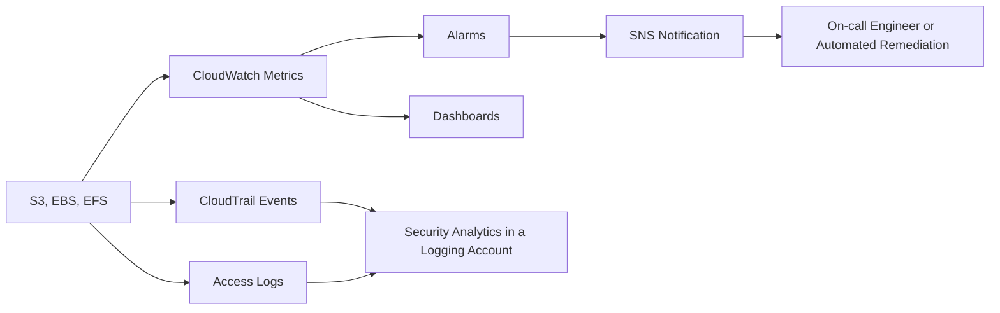
```mermaid
graph LR
    A["S3, EBS, EFS"] --> B["CloudWatch Metrics"]
    A --> C["CloudTrail Events"]
    A --> D["Access Logs"]
    B --> E["Alarms"]
    B --> F["Dashboards"]
    C --> G["Security Analytics in a Logging Account"]
    D --> G
    E --> H["SNS Notification"]
    H --> I["On-call Engineer or Automated Remediation"]
```

!!! note "Observability is a design requirement, not an afterthought"
    A storage layer without metrics and alarms is a storage layer whose failures you will learn about from users. Define, at design time, which metric indicates saturation for each storage resource and what the threshold is. This is a direct DSO303 observability outcome.

---

## Integration with Other AWS Services

| Service | Nature of the integration | Why the pairing exists |
|---|---|---|
| Amazon CloudFront | Caches S3 objects globally; Origin Access Control lets the bucket stay private | Reduces latency, origin load, and egress cost while removing the need for a public bucket |
| AWS Lambda | Triggered by S3 events; can mount EFS through an access point | Enables serverless event-driven processing of uploaded objects and shared state or large dependencies beyond the deployment package limit |
| Amazon ECS and Amazon EKS | Mount EFS volumes; attach EBS through the CSI driver | Provides persistent volumes to containers, allowing stateful workloads on an otherwise ephemeral platform |
| Amazon RDS and Amazon Aurora | RDS uses EBS internally; both export snapshots and logs to S3 | Managed databases inherit EBS durability while S3 holds backups and exports |
| Amazon DynamoDB | Exports tables to S3; imports from S3 | Enables analytics over operational data without affecting the table's provisioned capacity |
| Amazon Athena, AWS Glue, Amazon EMR, Redshift Spectrum | Query data directly in S3 | The data lake pattern — compute and storage scale and are billed independently |
| Amazon SNS, Amazon SQS, Amazon EventBridge | Receive S3 event notifications | Decouple producers from consumers and enable fan-out |
| AWS Step Functions | Orchestrates multi-step processing over S3 objects | Coordinates long-running workflows with retries and error handling |
| AWS Backup | Central policy for EBS, EFS, RDS, DynamoDB, and S3 | Unifies backup, retention, cross-Region copy, and compliance reporting |
| AWS KMS | Supplies encryption keys for all three services | Centralises key policy, rotation, and audit |
| AWS CloudFormation and Terraform | Declare storage resources | Makes environments reproducible and reviewable |
| Amazon SageMaker | Reads training data from S3 and FSx for Lustre; writes models to S3 | Decouples the training cluster's lifetime from the dataset |
| AWS DataSync | Transfers data between on-premises, S3, EFS, and FSx | Automates large-scale migration and ongoing synchronisation |
| AWS Transfer Family | Provides SFTP, FTPS, and FTP endpoints backed by S3 and EFS | Supports partners who cannot adopt the S3 API |
| Amazon CloudWatch and AWS CloudTrail | Metrics, logs, and audit records | Provide the observability and audit surface |
| Amazon Macie | Discovers sensitive data in S3 | Supports data classification and compliance obligations |

### Reference integration architecture

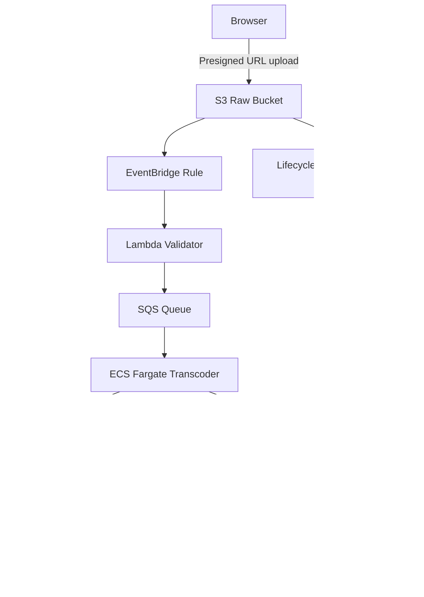
```mermaid
graph TD
    U["Browser"] -->|"Presigned URL upload"| S3R["S3 Raw Bucket"]
    S3R --> EB["EventBridge Rule"]
    EB --> L1["Lambda Validator"]
    L1 --> SQ["SQS Queue"]
    SQ --> ECS["ECS Fargate Transcoder"]
    ECS --> EFS["EFS Shared Working Set"]
    ECS --> S3P["S3 Processed Bucket"]
    S3P --> CFD["CloudFront Distribution"]
    CFD --> U2["Global Viewers"]
    S3P --> GLU["Glue Catalog"]
    GLU --> ATH["Athena Queries"]
    S3R --> LC["Lifecycle to Glacier Deep Archive"]
```

This single diagram exercises most DSO303 outcomes at once: browser uploads bypass the application tier through presigned URLs; the compute tier is stateless because all state lives in S3 and EFS; processing is event-driven and asynchronous; the CDN handles global delivery; the analytics layer reads the same objects without a separate copy; and lifecycle policies control long-term cost.

---

## Common Architecture Patterns

### Externalised state and the stateless service

The foundational cloud-native pattern. Application servers hold no durable state; sessions live in ElastiCache or DynamoDB, uploads live in S3, and shared files live in EFS. Because any instance can serve any request, the tier can be scaled horizontally, replaced during deployment, and terminated by Spot reclamation without data loss. Every other pattern in this section depends on this one.

### Static website hosting with a private origin

S3 stores the built front-end assets; CloudFront serves them globally; Origin Access Control ensures the bucket itself remains private and accessible only to the distribution. This pattern eliminates web servers entirely, costs a small fraction of an EC2-based equivalent, and scales to any traffic level with no configuration change.

### Event-driven object processing

An object is uploaded; S3 emits an event; a Lambda function or a queue-backed consumer processes it and writes a derived object. This is the standard image-thumbnailing, video-transcoding, virus-scanning, and log-parsing architecture.

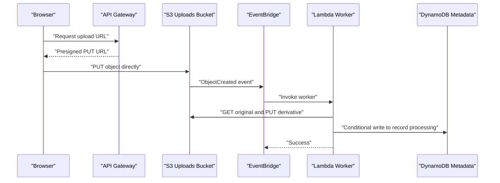
```mermaid
sequenceDiagram
    participant B as "Browser"
    participant API as "API Gateway"
    participant S3 as "S3 Uploads Bucket"
    participant EB as "EventBridge"
    participant L as "Lambda Worker"
    participant D as "DynamoDB Metadata"
    B->>API: "Request upload URL"
    API-->>B: "Presigned PUT URL"
    B->>S3: "PUT object directly"
    S3->>EB: "ObjectCreated event"
    EB->>L: "Invoke worker"
    L->>S3: "GET original and PUT derivative"
    L->>D: "Conditional write to record processing"
    L-->>EB: "Success"
```

!!! tip "Why the presigned URL matters architecturally"
    Routing uploads through the application tier means every byte crosses your compute, consuming memory, bandwidth, and request duration, and coupling upload throughput to instance count. Presigned URLs let the client write directly to S3 while the application retains full control over who may upload, where, and for how long. This is a canonical example of using a managed service's capability instead of writing code.

### Fan-out and fan-in

An S3 event is published to SNS, which fans out to several SQS queues, each feeding an independent consumer — a thumbnail generator, an indexer, and an audit logger. Fan-in is the reverse: many producers write objects under a common prefix, and a scheduled job aggregates them. Fan-out decouples consumers so that adding one requires no change to the producer.

### Data lake with medallion layering

Raw, cleansed, and curated data occupy distinct prefixes or buckets. Glue crawlers catalogue the schema; Athena and EMR query in place; lifecycle rules archive the raw layer aggressively because it can always be re-derived if the source system retains it. The defining benefit is that compute engines attach and detach without moving the data.

### Shared persistent volumes for containers

An EKS deployment mounts an EFS `ReadWriteMany` persistent volume so that all replicas see the same directory, while a StatefulSet uses EBS `ReadWriteOnce` volumes for per-pod state. The EFS CSI driver and the EBS CSI driver implement dynamic provisioning so that a `PersistentVolumeClaim` produces real AWS storage automatically.

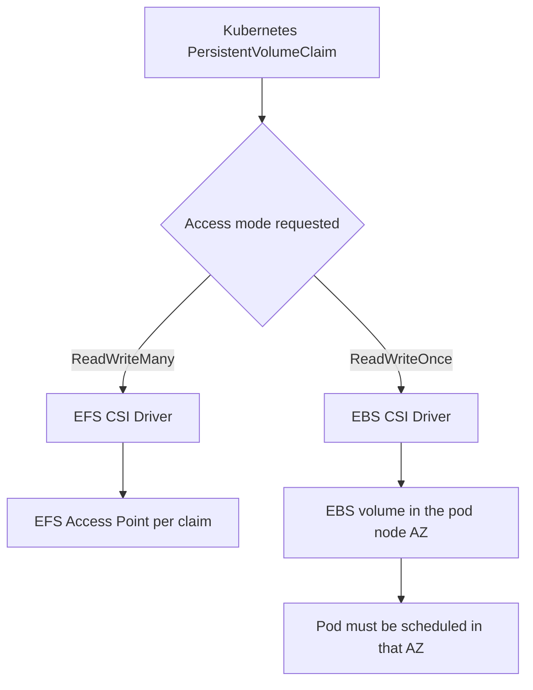
```mermaid
graph TD
    A["Kubernetes PersistentVolumeClaim"] --> B{"Access mode requested"}
    B -->|"ReadWriteMany"| C["EFS CSI Driver"]
    B -->|"ReadWriteOnce"| D["EBS CSI Driver"]
    C --> E["EFS Access Point per claim"]
    D --> F["EBS volume in the pod node AZ"]
    F --> G["Pod must be scheduled in that AZ"]
```

!!! warning "EBS volumes constrain Kubernetes scheduling"
    Because an EBS volume exists in one Availability Zone, a pod bound to an EBS-backed persistent volume can only be scheduled onto a node in that same zone. If that zone has no capacity, the pod stays `Pending`. This is why `WaitForFirstConsumer` volume binding mode exists and why multi-AZ StatefulSets need careful topology configuration.

### CI/CD artefact storage

Build pipelines store compiled artefacts, container image layers, test reports, and Terraform state in S3, with versioning enabled so a prior release can always be redeployed, and with lifecycle rules removing artefacts older than the retention policy. Terraform state in S3 with DynamoDB-based locking is the standard remote backend.

### Backup, disaster recovery, and the ransomware-resilient copy

EBS snapshots and EFS backups are copied to a second Region for disaster recovery, and critical S3 data is replicated into a **separate AWS account** whose credentials the production workload does not hold, with Object Lock applied. This separation is what defends against a compromised production identity deleting both the data and its backups.

### Additional applicable patterns

**Circuit breaker and retry with exponential backoff and jitter** should wrap every storage call, since `503 SlowDown` responses from S3 are expected under sudden load spikes and are resolved by backing off. **Bulkhead** isolation separates critical and non-critical workloads onto different buckets, volumes, or file systems so that one saturating the other is impossible. **CQRS** appears when writes go to a transactional database on EBS while reads are served from denormalised objects in S3. **Saga** compensation frequently involves deleting objects written by an earlier step when a later step fails.

## Industry Use Cases

| Industry or company profile | Workload | Storage design and rationale |
|---|---|---|
| Video streaming, as at Netflix | Transcoded video segment delivery | S3 for masters and renditions, CloudFront for edge delivery, Intelligent-Tiering for the long tail of catalogue content that is rarely watched |
| Global e-commerce, as at Amazon | Product images, order events, clickstream | S3 for images behind CloudFront, S3 data lake for events, EBS-backed relational databases for the transactional order ledger |
| Ride-hailing, as at Uber | Trip telemetry and geospatial history | S3 as the landing zone for high-volume event data, queried by Athena and EMR; hot operational state in DynamoDB rather than in storage |
| Music streaming, as at Spotify | Audio catalogue and machine learning training sets | S3 for audio objects, FSx for Lustre or EFS to feed distributed training jobs at high aggregate throughput |
| Accommodation marketplace, as at Airbnb | Property photographs and user uploads | Presigned URL uploads directly to S3, Lambda-based derivative generation, CloudFront for delivery |
| Financial services | Core ledger, trade records, regulatory archive | io2 Block Express for the database, S3 with Object Lock in Compliance mode for the seven-year regulatory archive, cross-Region replication for continuity |
| Healthcare | Medical imaging and electronic records | S3 with SSE-KMS customer managed keys, CloudTrail data events, Glacier classes for studies beyond the active window, strict least-privilege access |
| Government and public sector | Document management and citizen records | EFS for legacy applications requiring POSIX shared access, S3 for archival, Object Lock for statutory retention |
| Internet of Things | Device telemetry at high ingest rates | Kinesis or IoT Core into S3 in partitioned prefixes, lifecycle to Glacier, Athena for analysis |
| Genomics and scientific computing | Reference genomes and analysis pipelines | S3 as the durable store, FSx for Lustre linked to S3 as the high-throughput scratch layer for the compute cluster |
| Software as a Service platforms | Per-tenant document storage | A single bucket with tenant prefixes and IAM session policies or S3 Access Points, giving isolation without a bucket-per-tenant explosion |
| Gaming | Game assets, patches, player save data | S3 with CloudFront for patch distribution, DynamoDB for save state, EFS for shared build assets in the studio pipeline |

---

## Advantages

**Durability that is impractical to build yourself.** Eleven nines of durability across three Availability Zones with continuous background integrity verification is not something an organisation can replicate with a storage appliance and a backup schedule. It is the product of a reliability engineering programme at a scale only a hyperscaler can sustain.

**Elasticity that removes capacity planning as a discipline.** S3 and EFS have no size to provision. This eliminates the entire operational category of forecasting, procurement, expansion, and emergency capacity incidents.

**Separation of storage from compute.** Because data lives independently of any instance, compute can be scaled, replaced, moved between instance types, or run as Spot capacity without touching the data. This is the mechanism by which cloud-native elasticity is achieved.

**Performance decoupled from capacity.** gp3 lets you buy 16,000 IOPS on a 20 GiB volume. On-premises, IOPS came from spindles, so performance and capacity were fused. This decoupling frequently reduces cost substantially.

**Security integrated with identity and audited by default.** Access is granted to IAM principals with conditions, encrypted with keys whose usage is logged, and every configuration change is recorded in CloudTrail.

**Programmability and Infrastructure as Code.** Every storage resource is an API call and therefore expressible in CloudFormation or Terraform, reviewable in a pull request, and reproducible across environments.

**Rich ecosystem integration.** S3 in particular is the interchange format of AWS: dozens of services read from and write to it natively, which means choosing S3 preserves future optionality in a way that a proprietary storage appliance never does.

**Pay-for-what-you-use economics with fine-grained control.** Storage classes, lifecycle policies, and provisioned performance dimensions allow cost to be tuned continuously rather than fixed at purchase time.

---

## Limitations

**S3 has no POSIX semantics.** Applications expecting file locking, atomic rename, partial writes, or append cannot use S3 without modification. Mountpoint for Amazon S3 narrows this gap for read-heavy workloads but does not close it.

**S3 latency is unsuitable for transactional writes.** Tens of milliseconds per operation makes S3 wrong for a database write-ahead log, no matter how attractive its durability figures are.

**S3 request charges dominate for small objects.** A workload writing billions of small objects can pay more in requests than in storage, and per-object overheads for Intelligent-Tiering monitoring or Object Lock compound this.

**EBS is confined to a single Availability Zone.** This single fact constrains every high-availability design built on EC2 and is the most consequential limitation in this chapter.

**EBS bills for provisioned, not consumed, capacity.** Over-provisioned volumes are pure waste, and volumes cannot be shrunk, so the error is not easily corrected.

**EBS performance is capped by the instance as well as the volume.** Provisioning 64,000 IOPS on a volume attached to an instance limited to 20,000 IOPS wastes money and confuses benchmarking.

**EFS is more expensive and higher-latency than EBS.** The multi-AZ metadata coordination that gives EFS its availability is the same mechanism that makes it slower and costlier per gigabyte.

**EFS performs poorly on metadata-intensive workloads.** Large directories, recursive traversals, and compilation workloads exhibit latency that surprises teams migrating from local disks.

**Cross-Region replication is asynchronous everywhere.** No AWS storage service offers synchronous cross-Region replication, so any multi-Region design has a non-zero Recovery Point Objective that must be stated explicitly.

**Lifecycle transitions are not instantaneous.** Rules are evaluated approximately daily, and minimum storage durations mean that transitioning short-lived objects can increase cost.

**Eventual consistency persists for configuration.** Bucket policy and replication configuration changes propagate over time, which can produce confusing behaviour immediately after a change.

---

## Common Mistakes

### Beginner mistakes

- Believing S3 has folders, and therefore assuming a prefix rename is a cheap metadata operation rather than a full copy and delete.
- Making a bucket public in order to serve a website, instead of using CloudFront with Origin Access Control.
- Trying to attach one EBS volume to instances in two Availability Zones, or to two instances simultaneously without Multi-Attach and a cluster file system.
- Formatting an EBS volume that already contains data, destroying it — `mkfs` is not idempotent and gives no warning.
- Forgetting to add the volume to `/etc/fstab`, so the mount disappears after the next reboot; or adding it by device name rather than UUID, so a device renumbering breaks boot.
- Attempting to mount EFS without opening TCP 2049 in the security group, then reporting that "EFS does not work".
- Using EFS as a database data directory because it is shared, and being surprised by the latency.
- Enabling versioning without a lifecycle rule, then discovering storage costs growing without any apparent increase in data.

### Production mistakes

- Retaining snapshots forever with no policy, accumulating years of incremental blocks.
- Leaving unattached EBS volumes and orphaned snapshots after instance termination.
- Never testing a restore, so the Recovery Time Objective is unvalidated until an actual incident.
- Failing to add a Gateway VPC endpoint, paying NAT data-processing charges on all S3 traffic.
- Granting `s3:*` on `*` to an instance role, converting an application vulnerability into a full account data breach.
- Applying a lifecycle rule that moves short-lived objects into Standard-IA or Glacier, increasing cost due to minimum duration charges.
- Storing backups in the same account and Region as the production data, so a single credential compromise destroys both.
- Not enabling `AbortIncompleteMultipartUpload`, accumulating invisible billed storage from failed uploads.
- Ignoring `BurstBalance` on gp2 volumes until performance collapses under sustained load.
- Assuming S3 event notifications are exactly-once and ordered, producing duplicate or corrupted derived data.

<!-- ### Certification traps

- Confusing **durability** with **availability** in a question that specifies one of them precisely.
- Choosing S3 One Zone-IA for data that cannot be recreated — the durability figure applies only within a single Availability Zone, which is destroyed if the zone is lost.
- Selecting EBS for a requirement that says "shared across multiple instances in multiple Availability Zones", where the answer is EFS.
- Selecting EFS for a requirement that says "lowest latency block storage for a relational database", where the answer is io2 Block Express.
- Selecting instance store where the requirement says "must persist after the instance is stopped".
- Overlooking that Glacier Flexible Retrieval and Deep Archive require a restore step before the object is readable.
- Assuming a Gateway VPC endpoint works from on-premises over Direct Connect — it does not; that requires an Interface endpoint.
- Missing that a question describing millisecond retrieval of archival data points to Glacier Instant Retrieval rather than Glacier Flexible Retrieval.
- Forgetting that Object Lock requires versioning to be enabled.
- Believing that S3 Cross-Region Replication replicates existing objects automatically — it applies to new objects unless S3 Batch Replication is used for the backlog.

---
 -->

<!-- ---

## AWS Certification Tips

### Reading the question correctly

Associate-level examinations rarely test recall of numbers. They test whether you can map a set of requirements onto the correct service. Train yourself to extract the discriminating keywords.

| Phrase in the question | What it points to |
|---|---|
| "shared across multiple instances" or "shared file system" | Amazon EFS, or FSx for Windows if SMB is mentioned |
| "POSIX", "NFS", "mount", "directory hierarchy" | EFS or FSx, never S3 |
| "block storage", "boot volume", "attach to an instance" | Amazon EBS |
| "lowest latency", "sub-millisecond", "highest IOPS", "mission-critical database" | io2 Block Express |
| "temporary", "scratch", "cache", "can be lost" | Instance store |
| "millions of objects", "static assets", "data lake", "unlimited storage" | Amazon S3 |
| "archive", "retrieve within twelve hours", "lowest cost" | S3 Glacier Deep Archive |
| "archive but must be retrieved in milliseconds" | S3 Glacier Instant Retrieval |
| "access pattern is unknown or changes" | S3 Intelligent-Tiering |
| "can be recreated", "non-critical", "reduce cost" with millisecond access | S3 One Zone-IA |
| "immutable", "WORM", "regulatory retention", "cannot be deleted" | S3 Object Lock in Compliance mode |
| "private access from a VPC without internet" and cost sensitivity | Gateway VPC endpoint for S3 |
| "private access from on-premises over Direct Connect" | Interface VPC endpoint with PrivateLink |
| "high-performance computing", "hundreds of GB per second", "Lustre" | FSx for Lustre |
| "Windows", "Active Directory", "SMB" | FSx for Windows File Server |
| "on-premises appliance", "hybrid", "virtual tape" | AWS Storage Gateway | -->

### Frequently confused pairs

| Pair | The distinguishing fact |
|---|---|
| Durability versus availability | Durability is about not losing data; availability is about being able to reach it |
| S3 Standard-IA versus S3 One Zone-IA | One Zone-IA stores data in a single Availability Zone and is only appropriate for recreatable data |
| Glacier Instant versus Glacier Flexible | Instant retrieves in milliseconds; Flexible requires a restore taking minutes to hours |
| gp2 versus gp3 | gp3 decouples IOPS and throughput from size, costs less, and has no burst-credit mechanism |
| io1 versus io2 Block Express | io2 Block Express offers higher durability, a higher IOPS-to-size ratio, and up to 256,000 IOPS |
| EBS snapshot versus AMI | A snapshot is volume data; an AMI is a launch template referencing one or more snapshots plus metadata |
| Gateway endpoint versus Interface endpoint | Gateway is free, route-table based, and not reachable from on-premises; Interface uses an ENI, costs money, and is reachable from on-premises |
| SSE-S3 versus SSE-KMS | SSE-KMS gives you key policy control and a CloudTrail record of every key use |
| EFS versus FSx for Lustre | EFS is general-purpose shared storage; FSx for Lustre is for extreme-throughput HPC and machine learning |
| Instance store versus EBS | Instance store is ephemeral and host-local; EBS persists independently of the instance |

### Memory aids

- **Object, Block, File maps to S3, EBS, EFS** in that order — the most useful single mapping in the examination.
- **EBS is one zone, one instance; EFS is every zone, every instance.**
- **The colder the storage class, the longer the minimum duration and the higher the retrieval cost.**
- **Versioning is a prerequisite for Object Lock and for replication.**
- **Snapshots are Regional; volumes are zonal.**

!!! warning "Two traps that catch most candidates"
    First, a question that says data "must survive the loss of an Availability Zone" eliminates every single-zone option — a lone EBS volume, One Zone-IA, EFS One Zone, and instance store — regardless of how attractive their cost is. Second, a question that says data is "accessed once a quarter but must be available immediately" is describing Glacier Instant Retrieval, not Glacier Flexible Retrieval, and not Standard-IA.

---

## Summary

Storage is the durable substrate on which cloud-native architectures are built, and the storage decision is made before, not after, the compute decision. This chapter established three ideas that generalise far beyond AWS.

The first idea is that **access pattern determines abstraction**. Object, block, and file storage exist because they make different, mutually incompatible trade-offs. Object storage abandons in-place mutation to gain unbounded scale and eleven nines of durability. Block storage abandons sharing and cross-zone reach to gain sub-millisecond random-access latency. File storage accepts higher cost and latency to gain shared POSIX semantics across many hosts. Once you know how your data is read and written, the service follows.

The second idea is that **scope determines availability**. Amazon S3 and Amazon EFS are Regional services replicating across at least three Availability Zones and therefore survive the loss of one. Amazon EBS is bound to a single Availability Zone by a deliberate engineering decision that preserves its latency profile, and instance store is bound to a single host. Every high-availability design on AWS is shaped by this hierarchy, and the correct response to an EBS volume's zonal scope is snapshots for durability and database-level or file-system-level replication for availability.

The third idea is that **durability, availability, cost, and latency are dials, not defaults**. Storage classes, volume types, throughput modes, lifecycle policies, replication, and encryption choices are all levers an architect sets deliberately against explicit requirements. A design that has not stated its Recovery Point Objective, Recovery Time Objective, latency budget, and cost ceiling has not made these choices — it has merely accepted whichever defaults the console offered.

Three architectural lessons deserve particular emphasis. Externalising state into managed storage is what makes compute stateless, and stateless compute is what makes elasticity, rolling deployments, and Spot capacity possible. Durability figures describe hardware failure only; protection against human and application error requires versioning, Object Lock, cross-account replication, and tested restores. And security must be designed in from the first line of Infrastructure as Code — Block Public Access, default encryption, TLS enforcement, least-privilege policies, and VPC endpoints cost nothing to enable at creation time and are painful to retrofit after an incident.

!!! info "Connecting back to the module"
    Every subsequent DSO303 topic depends on this one. Container platforms need persistent volumes from EBS and EFS. Serverless architectures are triggered by S3 events and read their data from S3. Continuous delivery pipelines store artefacts and Terraform state in S3. Observability pipelines land logs in S3 for analysis. Security and compliance controls are expressed largely as storage policies. Master this chapter and the rest of the module becomes an exercise in composition.

---
