# Compute Services on AWS — EC2, ECS, EKS, Lambda and Fargate

!!! info "Where this topic sits in DSO303"
    Compute is the first of the four foundational resource classes in any cloud architecture — compute, storage, networking, and identity. Every later topic in this module (microservices, CI/CD pipelines, observability, event-driven design, security hardening) ultimately runs on one of the compute models introduced here. Choosing the compute model is one of the highest-leverage architectural decisions you will make, because it constrains your deployment pipeline, your scaling behaviour, your failure modes, your operational burden, and your monthly bill for years afterwards.

---

## Learning Objectives

After studying this chapter you should be able to:

- Explain the **AWS compute spectrum** — from virtual machines (IaaS) through container orchestration to functions (serverless) — and articulate what is traded away at each step along that spectrum.
- Describe the **shared responsibility boundary** for EC2, ECS on EC2, ECS on Fargate, EKS, and Lambda, and explain why that boundary is the single most useful lens for comparing compute services.
- Explain the **internal architecture** of each service, including the Nitro System for EC2, the ECS control plane and container agent, the Kubernetes control plane as managed by EKS, and Firecracker microVMs and execution environments for Lambda.
- Distinguish rigorously between **control plane** and **data plane** in each service, and explain why control-plane failure and data-plane failure have different blast radii.
- Trace the **complete network path** of a user request from DNS resolution to application process for each compute model.
- Reason about **scaling behaviour**: EC2 Auto Scaling groups and warm-up periods, ECS service auto scaling, Kubernetes HPA/Cluster Autoscaler/Karpenter, and Lambda concurrency scaling and cold starts.
- Apply a **structured decision framework** to select between EC2, ECS, EKS, and Lambda for a given workload, and defend that choice using scalability, cost, operational complexity, latency, and team-capability arguments.
- Design compute layers that satisfy the **AWS Well-Architected Framework** pillars, with specific attention to Multi-AZ availability, least-privilege IAM, encryption, and cost efficiency.
- Implement compute infrastructure using **Infrastructure as Code** (CloudFormation and Terraform) rather than console clicks, and explain why this is non-negotiable in production.
- Instrument compute workloads with **CloudWatch metrics, logs, alarms, Container Insights, and X-Ray tracing**.

---

## Definition

**Compute** in AWS is the family of services that execute your application code — that provide CPU cycles, memory, and an execution context in which a process runs. Storage services hold bytes at rest, networking services move bytes between endpoints, and compute services transform bytes.

AWS offers compute at several different **levels of abstraction**. The higher the abstraction, the more of the operational stack AWS manages on your behalf, and the less control and flexibility you retain.

| Service | Abstraction level | Unit of deployment | What AWS manages | What you manage |
|---|---|---|---|---|
| **Amazon EC2** | Infrastructure as a Service (IaaS) | Virtual machine instance | Physical hosts, hypervisor, network fabric, hardware failure detection | Guest OS, patching, runtime, application, scaling policy, capacity |
| **Amazon ECS (EC2 launch type)** | Containers as a Service (CaaS) | Container / task | Orchestration control plane, scheduling, service discovery integration | Container image, EC2 host fleet, host patching, cluster capacity |
| **Amazon ECS (Fargate)** | Serverless containers | Container / task | Everything below the container: host, OS, agent, capacity | Container image, task sizing, IAM, networking configuration |
| **Amazon EKS** | Managed Kubernetes | Pod (in a Deployment, Job, etc.) | Kubernetes control plane, etcd, API server HA, control-plane upgrades | Worker nodes (or Fargate profiles), add-ons, manifests, upgrade cadence |
| **AWS Lambda** | Function as a Service (FaaS) | Function invocation | Absolutely everything except your code and configuration | Handler code, memory setting, IAM role, event source configuration |

!!! note "The single most important sentence in this chapter"
    You are not choosing between EC2, ECS, EKS, and Lambda on the basis of which is "best" or "most modern". You are choosing **how much of the operational stack you want to be responsible for**, and accepting the constraints that come with giving that responsibility away.

### The Compute Spectrum

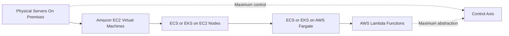

Moving left to right along this spectrum:

- **Operational burden decreases.** You stop patching kernels, then you stop managing hosts, then you stop thinking about servers at all.
- **Granularity of billing increases.** You move from per-hour instance billing, to per-second task billing, to per-millisecond invocation billing.
- **Constraints tighten.** Lambda imposes a maximum execution duration, a maximum deployment package size, and a stateless execution model. EC2 imposes none of these.
- **Portability changes character.** Containers are portable across clouds; Lambda functions are portable only in their business logic, not in their operational shape.

---

## Why This Service or Concept Exists

### The Problem Before Cloud Compute

Consider how a university or a mid-sized company provisioned an application server in 2005:

1. A capacity planning exercise estimated peak load, typically 12 to 24 months into the future.
2. A purchase order was raised for physical servers. Lead time: 6 to 12 weeks.
3. Servers were racked, cabled, powered, and connected to a switch in a data centre or server room.
4. An operating system was installed, hardened, and patched.
5. Middleware, runtimes, and the application were installed — usually by hand, following a runbook that drifted out of date.
6. If demand exceeded the estimate, the entire cycle repeated. If demand fell below the estimate, the capital was simply wasted.

The structural problems were:

| Problem | Consequence |
|---|---|
| **Capacity had to be bought before demand was known** | Systematic over-provisioning; typical server utilisation of 10–20 percent |
| **Provisioning latency measured in weeks** | Business initiatives blocked on infrastructure |
| **Capital expenditure, not operating expenditure** | Large up-front cost, depreciation schedules, board approval for experiments |
| **Manual configuration** | Configuration drift, snowflake servers, "works on that box" failures |
| **Failure handling was manual** | Hardware failure meant an engineer physically replacing a component |
| **Scaling down was impossible** | You cannot un-buy a server |

### What AWS Compute Changed

**Amazon EC2 (2006)** was the founding answer: virtual machines available through an API in minutes, billed by the hour and later by the second, disposable by design. This converted capital expenditure into operating expenditure and provisioning time from weeks into minutes. Crucially, it made *elasticity* possible — the ability to grow and, just as importantly, shrink capacity in response to real demand.

But EC2 left a large problem unsolved. A virtual machine still has an operating system that must be patched, a filesystem that accumulates state, and a deployment process that must place application artefacts onto it. Teams building dozens of microservices discovered that managing hundreds of EC2 instances is not fundamentally easier than managing hundreds of physical servers — it is merely faster to provision them.

**Containers** solved the packaging problem: an immutable image bundling application code, runtime, libraries, and configuration, guaranteed to behave identically wherever it runs. But containers created a new problem — *placement*. If you have 300 containers and 40 hosts, which container runs where? What happens when a host dies? How do containers find each other? These are **orchestration** problems.

**Amazon ECS (2014)** provided AWS-native orchestration: a control plane that schedules containers onto a fleet, restarts them on failure, integrates with ELB, and authenticates through IAM. It is deliberately opinionated and deeply integrated with AWS.

**Amazon EKS (2018)** provided the same orchestration through **Kubernetes**, the open-source de facto standard, for organisations that wanted a portable, extensible, community-driven control plane, or that already had Kubernetes expertise and tooling.

**AWS Fargate (2017)** removed the last piece of server management from containers. With Fargate you do not run EC2 instances at all — you declare CPU and memory per task or pod, and AWS provisions the underlying compute invisibly.

**AWS Lambda (2014)** went furthest: you upload a function, you configure an event source, and AWS runs the function on demand, scaling from zero to thousands of concurrent executions and back to zero, charging only for the milliseconds consumed. There is no host to see, no capacity to plan, no idle cost.

!!! tip "The evolution is additive, not replacing"
    A common beginner error is to assume that Lambda "replaced" EC2, or that EKS "replaced" ECS. In reality, mature AWS estates run all of these simultaneously, each for the workloads it fits. Netflix runs enormous EC2 fleets *and* serverless functions. A bank may run a Kubernetes platform for its microservices *and* Lambda for its event glue *and* EC2 for a licensed legacy database.

### Traditional Approach Compared With the AWS Approach

| Dimension | Traditional data centre | AWS compute |
|---|---|---|
| Provisioning time | Weeks to months | Seconds to minutes |
| Cost model | Capital expenditure, depreciated | Operating expenditure, consumption-based |
| Capacity planning | Forecast peak 1–2 years ahead | Scale reactively or predictively |
| Failure recovery | Manual hardware replacement | Instance replacement via API or automatically by an Auto Scaling group |
| Utilisation | Typically 10–20 percent | 40–70 percent with autoscaling; effectively 100 percent with Lambda |
| Experimentation cost | High — hardware must be purchased | Near zero — terminate when finished |
| Geographic expansion | Build or lease a new data centre | Deploy into another Region via API |

---

## Real-World Motivation

### Netflix — Elastic Capacity at Global Scale

Netflix serves a strongly diurnal load: European evening traffic peaks are several times the overnight trough. Under a fixed-capacity model, Netflix would have to own peak capacity permanently and leave most of it idle for most of the day. Netflix instead runs very large EC2 Auto Scaling groups that expand and contract with traffic, spread across multiple Availability Zones and Regions. The architectural lesson is that **elasticity converts a capacity problem into a cost-optimisation problem**, and the deeper lesson is that a system designed to add and remove instances continuously must also be designed to tolerate instances disappearing — which is precisely why Netflix built Chaos Monkey.

### Amazon Retail — Event-Driven Spikes

Prime Day and Black Friday produce traffic several multiples above baseline for a short window. Provisioning permanently for that peak would be economically absurd. Amazon uses a combination of predictive scaling ahead of a known event, reactive scaling during the event, and asynchronous decoupling — orders are accepted into SQS queues and processed by consumers that scale independently of the web tier. The lesson is that **asynchronous architectures absorb spikes that synchronous architectures cannot**.

### Uber and Lyft — Microservices on Container Orchestration

Ride-hailing platforms decompose into hundreds of services: matching, pricing, routing, payments, notifications, fraud. Each has a different scaling profile and release cadence. Deploying hundreds of independently versioned services onto raw EC2 instances is operationally impractical. Container orchestration provides a uniform deployment contract, bin-packing of heterogeneous services onto shared hosts, health-based restarts, and rolling deployments. The lesson is that **orchestration becomes necessary at the point where service count exceeds what a human can place by hand**.

### Spotify — Kubernetes for Platform Engineering

Spotify runs a large internal developer platform on Kubernetes, providing hundreds of autonomous squads with a self-service deployment interface. Kubernetes' extensibility — Custom Resource Definitions, operators, admission controllers — allows a platform team to encode organisational policy as software. The lesson is that **EKS is chosen not because it is a better scheduler than ECS, but because Kubernetes is an extensible platform on which you can build your own abstractions**.

### Financial Services — Compliance-Constrained Compute

A bank running a core ledger may be required to demonstrate the exact patch level of every host, to pin workloads to dedicated hardware for tenancy isolation, and to retain immutable audit logs. EC2 with Dedicated Hosts, AWS Systems Manager Patch Manager, and CloudTrail satisfies these requirements in a way that a fully abstracted platform cannot, because the bank must be able to *evidence* control it does not have on Lambda. The lesson is that **regulatory requirements can pull you back down the abstraction spectrum**, and that this is a legitimate architectural driver.

### Healthcare and Genomics — Bursty Batch Compute

A genomics pipeline may need 5,000 vCPUs for four hours per week and nothing at all the rest of the time. AWS Batch on EC2 Spot capacity, or Fargate Spot, or massively parallel Lambda fan-out, all allow this workload to exist at a cost that would be impossible with owned hardware. The lesson is that **the cloud makes certain workloads economically feasible that were previously impossible**, not merely cheaper.

### Government and Public Sector — Sovereign and Predictable

Government workloads often have steady, predictable load and long procurement cycles, with strict data-residency requirements. Reserved Instances or Compute Savings Plans on EC2 in a specific Region, inside a private VPC with no internet gateway, is frequently the correct answer. The lesson is that **predictable load favours committed pricing, and serverless is not automatically cheaper**.

### IoT Telemetry — Serverless Event Processing

A fleet of a million sensors emitting a reading every minute produces a very high-volume, very small-payload, highly parallel event stream. Lambda triggered from IoT Core or Kinesis, scaling automatically with shard or event volume, with no idle cost overnight, is close to an ideal fit. The lesson is that **Lambda excels where work is event-shaped, short-lived, stateless, and spiky**.

---

## Core Concepts

### Virtualisation and Multi-Tenancy

A **hypervisor** is software (or, on modern AWS hardware, largely dedicated silicon) that partitions one physical server into multiple isolated virtual machines. Each VM believes it has its own CPU, memory, disks, and network interfaces. The hypervisor enforces isolation so that one tenant cannot read another tenant's memory or saturate another tenant's I/O.

**Multi-tenancy** is the practice of running multiple customers' workloads on shared physical hardware. It is what makes cloud economics work — utilisation of the physical fleet is high because peaks and troughs of different customers do not coincide. AWS offers tenancy options that trade this economy for isolation: shared (default), Dedicated Instances (hardware not shared with other AWS accounts), and Dedicated Hosts (you get a specific physical server, with visibility of sockets and cores, which matters for per-socket software licensing).

### Containers Versus Virtual Machines

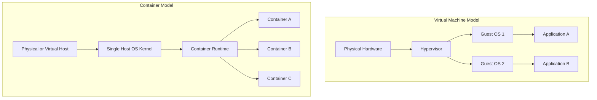

A **container** is an operating-system-level isolation construct. It does not carry its own kernel. It uses Linux kernel primitives — **namespaces** (to give the process its own view of the process tree, network stack, mount table, users, and hostname) and **cgroups** (to constrain CPU, memory, and I/O consumption) — plus a layered filesystem.

| Property | Virtual machine | Container |
|---|---|---|
| Isolation boundary | Hardware-virtualised; separate kernel | Kernel namespaces; shared kernel |
| Start time | Tens of seconds to minutes | Milliseconds to a few seconds |
| Image size | Gigabytes | Tens to hundreds of megabytes |
| Density per host | Tens | Hundreds |
| Isolation strength | Very strong | Strong, but a shared kernel is a shared attack surface |
| Typical use | Full OS environments, legacy software | Microservices, stateless application processes |

!!! warning "Containers are not a security boundary equivalent to a VM"
    Because containers share the host kernel, a kernel vulnerability can in principle allow container escape. This is exactly why AWS Fargate and AWS Lambda do **not** simply run customer containers side by side on a shared kernel — they place each task or execution environment inside its own lightweight virtual machine. Never assume that "it is in a container" means "it is isolated from other tenants".

### Container Images, Registries, and Immutability

A **container image** is an immutable, layered, content-addressed filesystem plus metadata (entrypoint, environment variables, exposed ports). Images are built from a **Dockerfile**, stored in a **registry** — on AWS, **Amazon Elastic Container Registry (ECR)** — and pulled by hosts at launch.

Immutability is an architectural principle, not merely an implementation detail. It means:

- The artefact tested in staging is bit-for-bit the artefact running in production.
- Rollback is redeployment of a previous image tag, not an inverse migration script.
- Configuration that varies by environment must be injected at runtime (environment variables, Secrets Manager, Parameter Store) rather than baked into the image.

!!! danger "Never use the `latest` tag in production"
    `latest` is a mutable pointer. Two tasks launched five minutes apart can run different code with the same tag, and you lose the ability to roll back deterministically. Tag images with an immutable identifier — a Git commit SHA or a semantic version — and enable ECR **tag immutability** so a tag cannot be overwritten.

### Orchestration

**Orchestration** is the automated management of container lifecycle across a fleet of hosts. An orchestrator is responsible for:

| Responsibility | Meaning |
|---|---|
| **Scheduling / placement** | Deciding which host runs which container, given resource requests and constraints |
| **Desired state reconciliation** | Continuously comparing actual state to declared state and correcting the difference |
| **Health checking and self-healing** | Detecting unhealthy containers and replacing them |
| **Service discovery** | Allowing containers to find each other as instances come and go |
| **Load balancing integration** | Registering and deregistering targets with a load balancer |
| **Rolling deployment** | Replacing old versions with new versions without downtime |
| **Resource management** | Bin-packing containers onto hosts within CPU and memory limits |

The **declarative model** is central. You do not command "start three containers"; you declare "the desired count of this service is three", and a reconciliation loop makes reality match that declaration, indefinitely, including after failures you never observe.

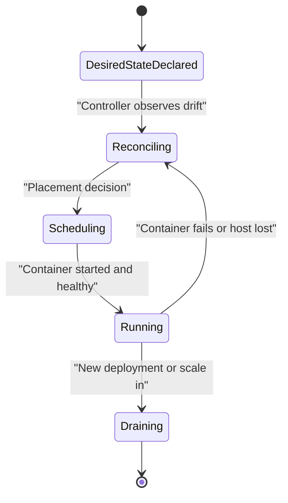

### Serverless

**Serverless** does not mean there are no servers. It means four properties hold simultaneously:

1. **No server provisioning or management** by you.
2. **Automatic, demand-driven scaling**, including scaling to zero.
3. **Pay for value consumed**, not for allocated capacity — no charge when idle.
4. **Built-in availability and fault tolerance** across Availability Zones by default.

Lambda satisfies all four. Fargate satisfies the first, second (partially — a running task costs money even when idle), and fourth, but a Fargate task that sits idle still bills; that is why Fargate is called "serverless containers" rather than fully serverless.

### Statelessness

A **stateless** compute node holds no data that cannot be lost without consequence. Session state, uploaded files, and caches must live in external services — DynamoDB, ElastiCache, S3, RDS.

Statelessness is what makes elasticity possible. If any instance can be terminated at any moment without data loss, then the platform is free to replace instances for scaling, patching, Spot reclamation, or failure recovery. Every compute service in this chapter assumes statelessness by default; every design that violates it (writing user uploads to a container's local filesystem, holding sessions in process memory behind a round-robin load balancer) creates a correctness bug that only appears under scaling or failure.

!!! example "The classic statefulness bug"
    A team stores user session data in the memory of each EC2 instance and enables sticky sessions on the load balancer to compensate. The application works. Then an instance is replaced during a deployment and those users are silently logged out mid-checkout. The fix is not more stickiness; it is externalising session state to ElastiCache or DynamoDB.

### Elasticity, Scalability, and Availability

These three words are frequently confused and mean different things.

| Term | Definition | Mechanism on AWS |
|---|---|---|
| **Scalability** | The ability to handle increased load by adding resources | Horizontal scaling of instances, tasks, pods, or concurrent executions |
| **Elasticity** | The ability to scale **out and back in** automatically in response to demand | Auto Scaling groups, ECS service auto scaling, HPA, Lambda concurrency |
| **High availability** | Continued operation despite the failure of a component | Multi-AZ deployment, health checks, redundancy |
| **Fault tolerance** | Continued operation with no degradation despite failure | N+1 or N+2 redundancy, retries, idempotency, circuit breakers |
| **Durability** | Data survives failure | Handled by storage services, not compute |

**Vertical scaling** (a larger instance) has a hard ceiling and requires downtime or replacement. **Horizontal scaling** (more instances) is unbounded in principle and is the cloud-native default. Design for horizontal scaling; use vertical scaling only where the workload genuinely cannot be partitioned, such as a single-writer relational database.

### Availability Zones and Regions

An **Availability Zone (AZ)** is one or more discrete data centres with independent power, cooling, and physical security, connected to other AZs in the Region by high-bandwidth, low-latency private fibre. A **Region** is a geographic area containing multiple AZs.

The architectural rule for compute is simple and absolute: **spread compute across at least two, preferably three, Availability Zones**. An Auto Scaling group across three AZs, an ECS service with subnets in three AZs, or an EKS node group across three AZs converts an AZ failure from an outage into a capacity reduction.

!!! note "Why three AZs rather than two"
    With two AZs, losing one removes 50 percent of your capacity, so you must run at 200 percent of steady-state capacity to survive an AZ loss without degradation. With three AZs, losing one removes 33 percent, so 150 percent suffices. Three AZs is meaningfully cheaper for the same resilience target.

### The Shared Responsibility Model for Compute

AWS is responsible for the security **of** the cloud; the customer is responsible for security **in** the cloud. Where that line falls is exactly what differentiates the compute services.

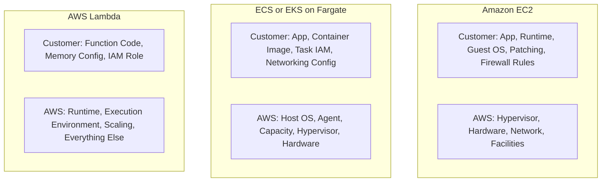

---

## Internal Working

Understanding what happens behind the API call is what separates an architect from a console user. In every case below, keep two questions in mind: **where is the control plane, and where is the data plane?**

- The **control plane** is the management layer — the APIs, schedulers, and state stores that decide what should exist and where.
- The **data plane** is the layer that actually serves traffic and runs your code.

The distinction matters because their failure modes differ. If the ECS control plane were unavailable, existing tasks would continue serving traffic; you simply could not deploy or scale. If the data plane fails, your users see errors immediately. **Well-architected systems degrade gracefully when the control plane is impaired.**

### Amazon EC2 and the Nitro System

Historically, EC2 hosts ran a modified Xen hypervisor, and the hypervisor itself consumed host CPU and memory to emulate network and storage devices. This "virtualisation tax" reduced the capacity available to customers and added latency.

The **AWS Nitro System** re-architected this. Nitro moves virtualisation functions off the main system board and onto dedicated hardware:

| Nitro component | Responsibility |
|---|---|
| **Nitro Cards** | Dedicated hardware for VPC networking, EBS storage, instance storage, and system control. Network and storage I/O bypass the main CPU. |
| **Nitro Security Chip** | Integrates into the motherboard; controls access to hardware resources and firmware, making persistent firmware compromise infeasible. |
| **Nitro Hypervisor** | A very thin, KVM-based hypervisor that primarily allocates CPU and memory. Because I/O is offloaded, it does almost nothing on the data path. |

The architectural consequences are significant:

- Nearly all host CPU and memory is available to customer instances, so bare-metal-class performance is achievable in a virtualised instance.
- Because the Nitro Security Chip constrains the hardware and there is no general-purpose administrative access path to customer instances, AWS operators cannot access customer instance memory or data. This is a *design* property, not a policy promise.
- Features such as **EBS encryption at line rate**, **Elastic Fabric Adapter** for HPC, and **bare metal instance types** are all consequences of the Nitro architecture.

**EC2 launch flow (control plane to data plane):**

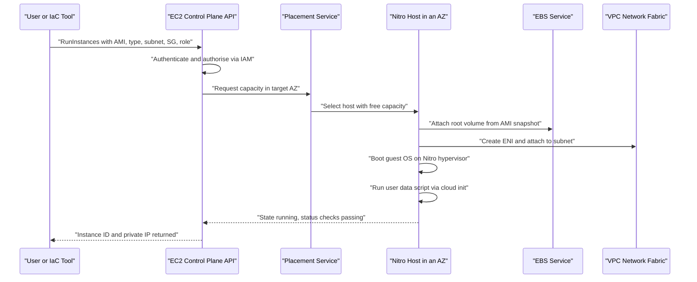

Two details matter architecturally. First, the **Elastic Network Interface (ENI)** is a first-class VPC object with its own private IP, MAC address, and security groups — instance networking is a VPC construct, not an OS construct. Second, **user data** runs once at first boot by default and is the standard bootstrap hook, though for anything beyond trivial bootstrapping you should bake configuration into the AMI (with EC2 Image Builder) or use a configuration-management tool.

### Amazon ECS Internals

ECS separates cleanly into a fully AWS-managed control plane and a customer-visible (or Fargate-hidden) data plane.

**Control plane.** The ECS control plane is a regional, AWS-operated service. It stores cluster state, accepts API calls (`RunTask`, `CreateService`, `UpdateService`), runs the **scheduler** that decides placement, and runs the **service scheduler** reconciliation loop that maintains desired count. You never see, patch, or pay for it — ECS itself has no control-plane charge.

**Data plane.** On the EC2 launch type, the data plane is EC2 instances you own, each running the **ECS container agent** (a Go binary, usually pre-installed on the ECS-Optimized AMI) plus a container runtime. On Fargate, the data plane is AWS-managed microVMs and you never see a host.

**The agent is a poller, not a listener.** This is a frequently misunderstood point. The container agent establishes an **outbound** connection to the ECS service endpoint and receives instructions over it. There is no inbound connection from AWS to your instance. Consequently:

- ECS instances in private subnets need outbound internet access via a NAT Gateway, or VPC endpoints for `ecs`, `ecs-agent`, `ecs-telemetry`, `ecr.api`, `ecr.dkr`, `logs`, and S3 (for image layers).
- If the agent cannot reach the endpoint, the instance eventually shows as disconnected and the scheduler stops placing tasks on it — but already-running containers keep running.

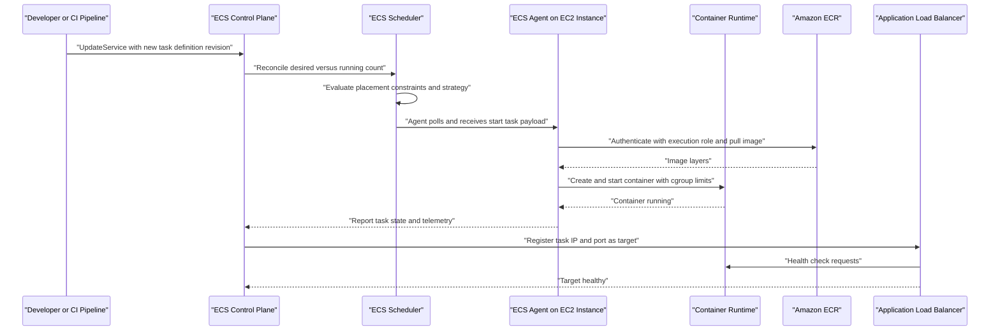

**Task definitions and tasks.** A **task definition** is an immutable, versioned JSON document — the blueprint. Each update creates a new **revision**. A **task** is a running instantiation of a revision: one or more containers scheduled together onto the same host, sharing a network namespace under `awsvpc` mode. A **service** maintains a desired number of tasks and integrates with load balancing and deployment strategies.

**Networking modes** on the EC2 launch type determine the network path:

| Mode | Behaviour | Trade-off |
|---|---|---|
| `awsvpc` | Each task gets its own ENI, private IP, and security groups | Best isolation and observability; ENIs per instance are limited by instance type |
| `bridge` | Docker bridge with port mapping, optionally dynamic host ports | High density; weaker isolation; security groups apply at instance level |
| `host` | Container uses the host network namespace directly | Lowest overhead; port conflicts; no per-task isolation |
| `none` | No external networking | Batch jobs with no network requirement |

Fargate always uses `awsvpc`.

### AWS Fargate Internals

Fargate is not a separate orchestrator; it is a **capacity provider** — a way of obtaining data-plane capacity for ECS tasks or EKS pods without managing instances.

When a task is launched on Fargate, AWS provisions a **dedicated, right-sized microVM** for that task on AWS-managed hardware, attaches an ENI **in your VPC** (this is the key point — the ENI is in your subnet, consumes an IP from your CIDR, and is governed by your security groups), pulls the image, and starts the container. When the task stops, the microVM is destroyed.

!!! info "Why Fargate gives each task its own microVM"
    If Fargate packed multiple customers' containers onto a shared kernel, a container-escape vulnerability would be a cross-tenant breach. By giving each task a dedicated microVM, Fargate obtains VM-grade isolation with container-grade start times. This is also why you cannot run privileged containers, mount host paths, or use a container as a DaemonSet-style host agent on Fargate — there is no host to reach.

### Amazon EKS Internals

Kubernetes has a well-defined control-plane architecture. EKS runs that control plane for you.

**Kubernetes control-plane components:**

| Component | Responsibility |
|---|---|
| **kube-apiserver** | The single front door. All reads and writes go through it. Performs authentication, authorisation, admission control, and validation. |
| **etcd** | A strongly consistent, distributed key-value store holding all cluster state. The source of truth. |
| **kube-scheduler** | Watches for unscheduled pods and binds each to a node based on resource requests, affinity, taints and tolerations, and topology constraints. |
| **kube-controller-manager** | Runs reconciliation loops — the Deployment controller, ReplicaSet controller, node controller, and so on. |
| **cloud-controller-manager** | Integrates with AWS to provision load balancers, EBS volumes, and route tables. |

**Worker node components:**

| Component | Responsibility |
|---|---|
| **kubelet** | The node agent. Watches the API server for pods assigned to its node and instructs the container runtime to run them. Reports node and pod status. |
| **containerd** | The container runtime that pulls images and manages container lifecycle. |
| **kube-proxy** | Programs iptables or IPVS rules so that Service virtual IPs route to healthy pod endpoints. |
| **VPC CNI plugin** | The AWS-specific networking plugin that assigns each pod a **real VPC IP address** from the subnet, via secondary IPs on the node's ENIs. |

**What EKS manages.** EKS runs the API server, etcd, scheduler, and controller manager across **at least three Availability Zones**, with automated backups of etcd, automatic replacement of unhealthy control-plane instances, and a managed upgrade path. The control plane runs in an AWS-owned VPC and is exposed to your VPC through cross-account ENIs. You are charged an hourly fee per cluster for this control plane — a genuine difference from ECS, which is free.

!!! warning "The EKS control plane is per cluster and always on"
    Because EKS bills an hourly control-plane fee per cluster regardless of workload, running many small clusters is expensive. This is a real architectural pressure toward fewer, larger, multi-tenant clusters with namespace-level isolation — which in turn creates a need for network policies, resource quotas, and RBAC discipline.

**The VPC CNI is architecturally significant.** Unlike overlay-network CNIs, the AWS VPC CNI gives each pod a routable VPC IP. This means pods are first-class network citizens: security groups can be applied to pods, VPC Flow Logs capture pod traffic, and there is no encapsulation overhead. The cost is **IP address consumption** — a large cluster can exhaust a subnet's CIDR. Architects must size subnets generously, or enable prefix delegation, or use custom networking with a secondary CIDR.

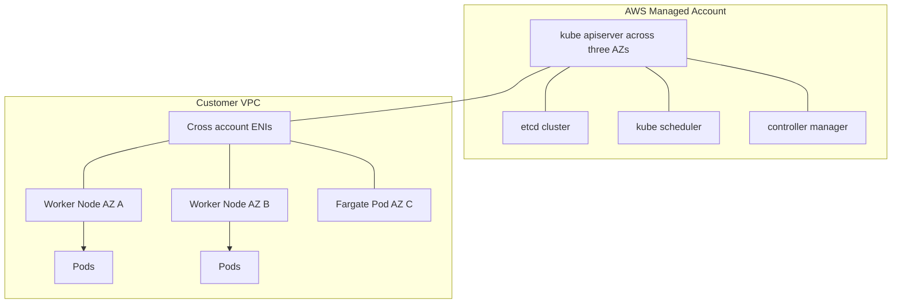

**Identity mapping.** EKS authenticates users through IAM, translating IAM identities into Kubernetes RBAC subjects — historically via the `aws-auth` ConfigMap, and now preferably via **EKS access entries**, an API-driven mechanism that is auditable and does not risk locking you out by ConfigMap corruption. For workload identity, **IAM Roles for Service Accounts (IRSA)** — and more recently **EKS Pod Identity** — allow a pod to assume an IAM role via an OIDC-federated token projected into the pod, so a pod gets exactly the AWS permissions it needs without sharing the node role.

### AWS Lambda Internals

Lambda's internals are the most abstracted and the most interesting.

**Firecracker.** AWS built **Firecracker**, an open-source Virtual Machine Monitor written in Rust, specifically for serverless. A Firecracker microVM boots in roughly 125 milliseconds, has a minimal device model (no BIOS, no PCI, no legacy devices), and consumes only a few megabytes of memory overhead. This gives Lambda hardware-virtualisation isolation between tenants at a granularity and start-up cost that a conventional hypervisor could not achieve. Fargate uses the same technology.

**The execution environment lifecycle.** A Lambda **execution environment** is a microVM that hosts one function version and processes **one invocation at a time**. Its lifecycle has three phases:

| Phase | What happens | Billing |
|---|---|---|
| **Init** | A microVM is created, the runtime is bootstrapped, the deployment package is downloaded and extracted, and code outside the handler (imports, static initialisers, connection setup) executes | Included in the reported init duration; for standard on-demand invocation the init is not billed separately, though provisioned concurrency changes the model |
| **Invoke** | The handler function runs for this event | Billed per millisecond of duration multiplied by configured memory |
| **Shutdown** | After a period of inactivity the environment is frozen and eventually destroyed | Not billed |

Between invocations the environment is **frozen**, not destroyed. If another invocation arrives soon, the same environment is **thawed** and reused — this is a **warm start**, and the Init phase is skipped entirely.

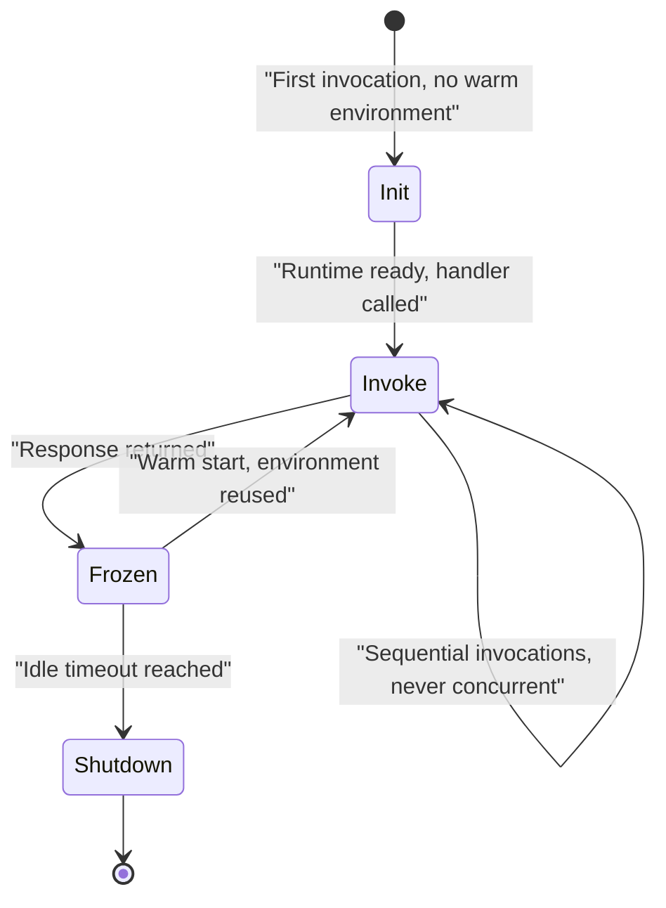

!!! danger "One environment serves exactly one request at a time"
    This is the most important mental model for Lambda. Concurrency is achieved by creating **more environments**, never by threading within one. Therefore ten concurrent requests means ten environments, and any in-memory cache you populate is per-environment, not shared. Never assume anything about which environment serves a request.

**Cold starts.** A **cold start** is an invocation that must pay the Init phase. It occurs on the first invocation of a function version, when concurrency increases beyond the number of warm environments, and after environments are recycled. Typical additional latency ranges from tens of milliseconds for a small Python or Node.js function to several seconds for a large JVM or .NET function loading a heavy dependency-injection framework. Deploying a function into a VPC no longer causes multi-second cold starts — since the Hyperplane ENI redesign, VPC-attached ENIs are created and shared ahead of time rather than per environment.

Mitigations, in order of preference:

1. Reduce package size and defer heavy imports.
2. Move client construction and configuration loading outside the handler so it runs once per environment.
3. Choose a lighter runtime or use ahead-of-time compilation (for example, native images for Java, or `Lambda SnapStart` for Java, which snapshots an initialised environment and restores it).
4. Use **provisioned concurrency** to keep a declared number of environments initialised and warm, at additional cost.

**Worker fleet and placement.** Lambda runs on a large fleet of EC2 **Worker** hosts. Each Worker hosts many Firecracker microVMs. A per-function **Assignment Service** (a Lambda-internal control plane component) tracks which environments are warm for which function version and routes an incoming invocation either to a warm environment or to a placement request for a new one. The critical isolation property is that a given microVM is only ever used for **one function version of one account** for its entire lifetime — it is never recycled across tenants.

**Synchronous versus asynchronous invocation paths.** These follow genuinely different internal routes:

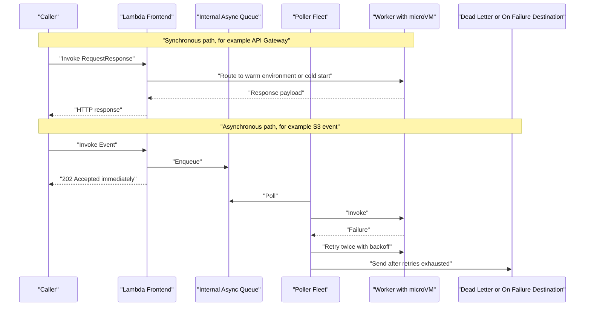

For **event source mappings** (SQS, Kinesis, DynamoDB Streams, MSK), the model is different again: a Lambda-managed **poller fleet** reads from the source and invokes your function synchronously with a batch. Failure semantics are therefore determined by the source — for SQS, a failed batch returns messages to the queue after the visibility timeout; for Kinesis and DynamoDB Streams, a failed batch blocks the shard until it succeeds or the retry policy expires, which is a classic cause of stalled stream processing.

---

## Architecture Components

A production compute architecture is never just compute. The following components appear in nearly every design in this module.

| Component | Layer | Responsibility in a compute architecture |
|---|---|---|
| **Amazon Route 53** | DNS | Resolves the application hostname; health checks and latency-, geo-, or failover-based routing across Regions |
| **Amazon CloudFront** | Edge / CDN | Terminates TLS close to the user, caches static and cacheable dynamic content, absorbs volumetric traffic before it reaches compute, integrates with AWS WAF and Shield |
| **AWS WAF and Shield** | Edge security | Filters malicious HTTP requests and mitigates DDoS before requests consume compute capacity |
| **Application Load Balancer (ALB)** | Layer 7 | HTTP/HTTPS routing by host, path, header, or method; target groups of instances, IPs, or Lambda functions; per-target health checks; TLS termination |
| **Network Load Balancer (NLB)** | Layer 4 | Ultra-low-latency TCP/UDP/TLS load balancing, static IPs, extreme throughput; used for non-HTTP protocols and where source IP preservation matters |
| **Amazon API Gateway** | API front door | REST/HTTP/WebSocket APIs, request validation, throttling, authorisation, and direct integration with Lambda without a load balancer |
| **Amazon VPC** | Network | The isolated virtual network in which all non-Lambda-managed compute lives |
| **Subnets** | Network | AZ-scoped IP ranges; public subnets have a route to an Internet Gateway, private subnets do not |
| **Internet Gateway and NAT Gateway** | Network | Inbound/outbound internet for public subnets; outbound-only internet for private subnets |
| **VPC Endpoints** | Network | Private connectivity to AWS services without traversing the internet; essential for private ECS/EKS clusters and for reducing NAT cost |
| **Security Groups** | Network security | Stateful, instance/ENI/task/pod-level virtual firewalls; the primary microsegmentation tool |
| **Network ACLs** | Network security | Stateless, subnet-level filters; a coarse secondary control |
| **Amazon EC2** | Compute | Virtual machines; the substrate for IaaS workloads and for ECS/EKS node groups |
| **EC2 Auto Scaling Group** | Compute control | Maintains desired instance count, replaces failed instances, spreads across AZs, executes scaling policies |
| **Amazon ECS** | Compute orchestration | AWS-native container orchestration; clusters, services, tasks, task definitions |
| **Amazon EKS** | Compute orchestration | Managed Kubernetes control plane; node groups, Fargate profiles, add-ons |
| **AWS Fargate** | Compute capacity | Serverless capacity provider for ECS tasks and EKS pods |
| **AWS Lambda** | Compute | Event-driven function execution |
| **Amazon ECR** | Artefact store | Private, IAM-controlled container registry with image scanning, lifecycle policies, and tag immutability |
| **AWS IAM** | Identity | Roles for instances, task execution, task workloads, pods (IRSA), and functions; the foundation of least privilege |
| **Amazon S3** | Storage | Static assets, deployment artefacts, data lake input and output |
| **Amazon EBS and EFS** | Storage | Block storage attached to instances; shared POSIX filesystem mountable by many tasks, pods, and Lambda functions |
| **Amazon RDS, Aurora, DynamoDB** | Data | Externalised state that makes compute stateless |
| **Amazon SQS, SNS, EventBridge, Kinesis** | Messaging | Decoupling, buffering, fan-out, and event routing between compute components |
| **AWS Step Functions** | Orchestration | Durable, visual workflow orchestration across Lambda, ECS tasks, and other services; handles retries, timeouts, and long-running state |
| **Amazon CloudWatch** | Observability | Metrics, logs, alarms, dashboards, Container Insights, Lambda Insights |
| **AWS X-Ray** | Observability | Distributed tracing across service boundaries |
| **AWS CloudTrail** | Audit | Records every control-plane API call for security and compliance investigation |
| **AWS CloudFormation, CDK, Terraform** | Automation | Infrastructure as Code — declarative, version-controlled, reviewable infrastructure |
| **AWS Systems Manager** | Operations | Patch Manager, Session Manager (SSH-free shell access), Parameter Store for configuration |

!!! tip "Architectural reading of this table"
    Notice that the compute rows are a minority. In a well-designed system, compute is deliberately made boring: stateless, replaceable, and surrounded by managed services that hold the state, route the traffic, and observe the behaviour. If your compute layer is the most complicated part of your diagram, you have probably put responsibilities in the wrong place.

---

## Request Lifecycle

### Synchronous Web Request Through a Container Service

Consider a user loading a product page from an application running as ECS tasks behind an ALB.

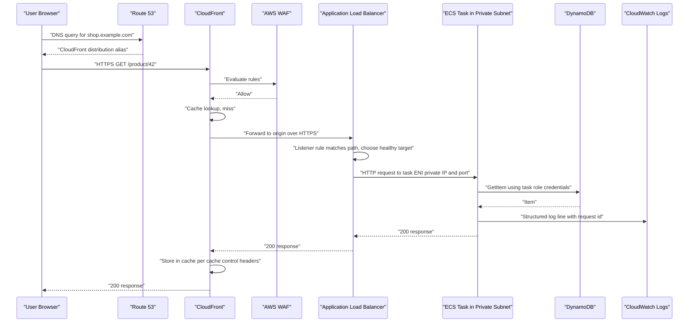

**Step-by-step, with the architectural reasoning at each hop:**

1. **DNS resolution.** Route 53 returns an alias record for the CloudFront distribution. Using an alias rather than a CNAME allows the apex domain to be used and incurs no additional lookup charge.
2. **Edge termination.** TLS terminates at the nearest CloudFront point of presence, so the expensive handshake happens close to the user. This alone can remove 100 ms or more of latency for distant users.
3. **Security filtering.** WAF evaluates managed and custom rules at the edge, so malicious requests never consume application compute. **Filtering at the edge is cheaper than filtering at the origin.**
4. **Cache evaluation.** A cache hit ends the request here. Every cache hit is a request your compute layer never sees — CloudFront is, in effect, a compute-cost optimisation.
5. **Origin request.** CloudFront forwards to the ALB. The ALB's security group should permit inbound traffic only from CloudFront's managed prefix list, not from the whole internet.
6. **Load balancer routing.** The ALB evaluates listener rules and selects a healthy target from the target group using round-robin or least-outstanding-requests. Unhealthy targets are excluded automatically.
7. **Task ingress.** With `awsvpc` networking, the ALB sends traffic directly to the task's own ENI private IP. The task's security group should allow inbound only from the ALB's security group — **security group referencing**, not CIDR ranges, is the correct pattern.
8. **Data access.** The container obtains temporary credentials from the **task IAM role** via the container credentials endpoint (`169.254.170.2`). No long-lived access keys exist anywhere in the system.
9. **Logging.** The `awslogs` log driver streams stdout/stderr to CloudWatch Logs. Logs should be structured JSON including a correlation ID.
10. **Response and caching.** The response propagates back, and CloudFront caches it according to `Cache-Control` headers.

### Serverless Request Through API Gateway and Lambda

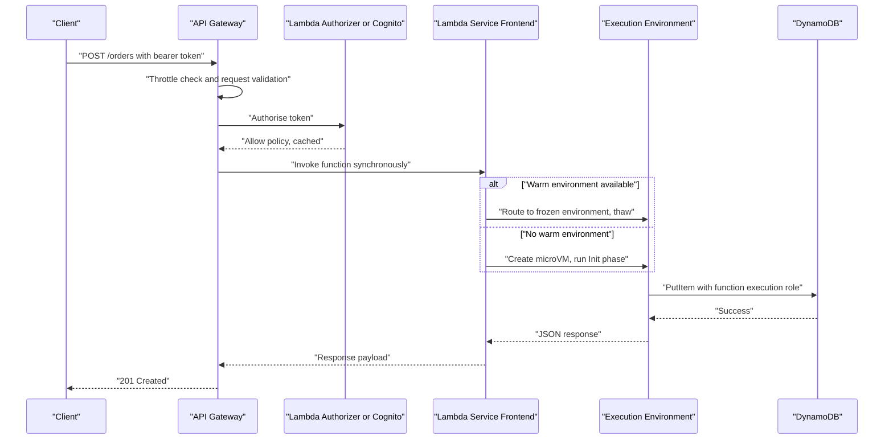

The critical differences from the container path:

- **There is no load balancer and no VPC hop** unless the function is explicitly attached to a VPC. Lambda's own service infrastructure handles ingress.
- **The scaling decision is made per request**, not per aggregated metric. There is no scaling delay in the Auto Scaling sense — but there is cold-start latency.
- **Throttling is a first-class concept.** API Gateway throttles, and Lambda enforces account and per-function concurrency limits. Exceeding them yields `429 TooManyRequestsException`, and the client must retry.

### Asynchronous, Event-Driven Lifecycle

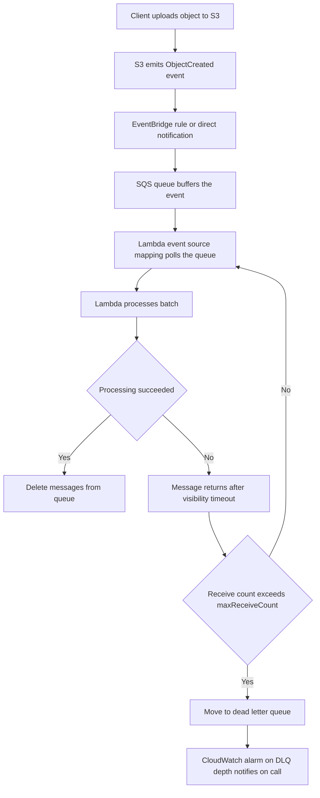

!!! note "Synchronous versus asynchronous is an availability decision"
    In the synchronous path, if the compute layer is unavailable the user sees an error. In the asynchronous path, if the compute layer is unavailable the queue simply grows, and processing catches up when capacity returns. **Introducing a queue converts an availability problem into a latency problem** — which is almost always the better problem to have. This is the single most valuable pattern in event-driven architecture.

---

## AWS Service Deep Dive

!!! warning "On numbers and quotas"
    Service limits below are stated as of 2026. Many are **soft (adjustable) quotas** that can be raised through AWS Service Quotas, and several are **Region-dependent**. Treat every figure here as a design signal rather than an immutable constant, and verify against the AWS Service Quotas console and the current service documentation before committing to a design. Pricing is described in terms of **pricing dimensions** and orders of magnitude only; always consult the current AWS pricing pages and the AWS Pricing Calculator for figures.

### Amazon EC2

**Purpose.** To provide resizable virtual machines with full control over the operating system, so that arbitrary software — including legacy applications, licensed software, custom kernels, GPU workloads, and stateful systems — can run in the cloud with the same freedom as on physical hardware.

**Architecture.** An EC2 instance is a guest OS running on a Nitro host within a specific Availability Zone. It is composed of:

- An **AMI (Amazon Machine Image)** — the template containing the root volume snapshot, kernel configuration, and launch permissions.
- An **instance type** — a fixed combination of vCPU, memory, network bandwidth, and storage characteristics.
- One or more **ENIs**, each in a subnet, each with security groups.
- **EBS volumes** (network-attached, persistent, independently durable) and/or **instance store** volumes (physically attached NVMe, extremely fast, ephemeral, lost on stop or termination).
- An **IAM instance profile** granting the instance an IAM role.
- **User data** for first-boot bootstrapping.

**Important features.**

| Feature | Architectural value |
|---|---|
| Instance families (general purpose, compute, memory, storage, accelerated) | Match hardware to workload shape rather than over-buying a single dimension |
| Graviton processors (ARM-based) | Typically better price-performance than equivalent x86 instances for many workloads; requires ARM-compatible builds |
| Auto Scaling groups | Desired-count reconciliation, AZ balancing, health-based replacement, lifecycle hooks |
| Launch templates | Versioned instance configuration; the modern replacement for launch configurations, required for mixed-instances policies |
| Placement groups | Cluster (low latency, same rack), Spread (distinct hardware, for HA), Partition (fault-domain-aware, for HDFS-style systems) |
| Elastic IP and ENI attach/detach | Network identity that can survive instance replacement |
| Nitro Enclaves | Isolated, attestable compute environments for processing highly sensitive data with no persistent storage or interactive access |
| EC2 Image Builder | Automated, versioned, tested AMI pipelines — the correct answer to "golden image" management |
| Hibernation | Preserves RAM to EBS so an instance resumes with its memory state intact |

**Limitations.**

- You are responsible for the guest OS: patching, hardening, agent installation, log shipping, and vulnerability management.
- Boot time is measured in tens of seconds to minutes, so reactive scaling always lags demand.
- Idle instances cost the same as busy instances — utilisation discipline is entirely on you.
- An instance is bound to one AZ; instance-store data and the instance itself do not survive AZ loss.

**Pricing model (dimensions).**

| Purchase option | How it works | Best for |
|---|---|---|
| **On-Demand** | Pay per second (60-second minimum for Linux) with no commitment | Unpredictable workloads, development, spike absorption |
| **Savings Plans (Compute or EC2 Instance)** | Commit to a dollar-per-hour spend for one or three years; discounts commonly in the region of 30–70 percent depending on term and payment option | Steady baseline load; Compute Savings Plans also cover Fargate and Lambda |
| **Reserved Instances** | Commit to a specific instance configuration for one or three years | Long-lived, unchanging workloads; Standard RIs can be sold in the Marketplace |
| **Spot Instances** | Bid on spare capacity at discounts frequently around 70–90 percent; AWS reclaims with a two-minute interruption notice | Fault-tolerant, stateless, interruptible work: batch, CI runners, stateless web tiers behind a queue |
| **Dedicated Instances / Dedicated Hosts** | Hardware isolation; Dedicated Hosts expose socket and core counts | Regulatory isolation, per-socket BYOL licensing |
| **Capacity Reservations** | Reserve capacity in a specific AZ without a term commitment | Guaranteeing capacity for a known event or DR failover |

Additional dimensions that surprise beginners: **EBS volume storage and provisioned IOPS**, **data transfer out to the internet**, **cross-AZ data transfer**, **NAT Gateway processing**, and **Elastic IPs that are allocated but not attached**.

**Performance characteristics.** Network and EBS bandwidth scale with instance size, and smaller instances of many families use a **credit-based burst** model for both CPU (the T family) and EBS/network throughput. A T-family instance that exhausts CPU credits is throttled to its baseline, which is a classic cause of mysterious latency in a system that "worked in testing". Enhanced networking (ENA) and, for HPC, Elastic Fabric Adapter provide high packet-per-second and low-latency capability.

**Scaling behaviour.** Horizontal scaling via Auto Scaling groups with target tracking (for example, maintain 50 percent average CPU), step scaling, scheduled scaling, or predictive scaling. Key parameters are the **warm-up period** (how long a new instance takes to become useful, so it is excluded from metrics until then) and the **cooldown** (preventing oscillation). Vertical scaling requires stopping and restarting the instance with a new type.

**Availability.** Instances are single-AZ. Availability is achieved by running an Auto Scaling group across multiple AZs behind a load balancer with health checks, and by setting the ASG health check type to `ELB` so that an instance failing application health checks is replaced, not merely one failing EC2 status checks.

**Security features.** Security groups and NACLs, IAM instance profiles with temporary credentials via IMDSv2, EBS encryption with KMS, Nitro-enforced isolation, AWS Systems Manager Session Manager for shell access without SSH keys or open port 22, Inspector for vulnerability assessment, and Nitro Enclaves for confidential computing.

**Service limits (illustrative, mostly adjustable).**

| Limit | Typical default | Notes |
|---|---|---|
| Running On-Demand instances | Expressed as a **vCPU quota per instance family group**, per Region | Adjustable; new accounts start low |
| Spot instances | Separate vCPU quota per family | Adjustable |
| ENIs per instance and IPs per ENI | Determined by instance type | Not adjustable; a hard design constraint for `awsvpc` density and the EKS VPC CNI |
| EBS volumes attached | Instance-type dependent | Nitro instances attach volumes as NVMe devices |
| Auto Scaling groups per Region | In the low thousands | Adjustable |

**Common configurations.** A private-subnet Auto Scaling group across three AZs, behind an ALB in public subnets, using a launch template referencing a hardened AMI produced by EC2 Image Builder, with an instance profile granting only the permissions the application needs, IMDSv2 required, EBS encrypted by a customer-managed KMS key, and Systems Manager Agent for patching and shell access.

!!! tip "When EC2 is the right answer"
    Choose EC2 when you need OS-level control, when software is licensed per host or requires a specific kernel, when the workload is long-running and steady enough for Savings Plans, when you need GPUs or specialised hardware, or when you are lifting and shifting an existing application before modernising it.

### Amazon ECS

**Purpose.** To run and scale Docker containers on AWS with a control plane that is fully managed, has no additional charge, and integrates natively with IAM, VPC networking, ELB, CloudWatch, and Auto Scaling — without requiring the team to learn Kubernetes.

**Architecture.**

| Object | Meaning |
|---|---|
| **Cluster** | A logical grouping of capacity and services. A namespace, not a machine. |
| **Task definition** | An immutable, versioned blueprint: container images, CPU and memory, ports, environment, secrets, log configuration, IAM roles, volumes |
| **Task** | A running instance of a task definition revision; one or more containers co-scheduled on one host |
| **Service** | A controller that maintains a desired count of tasks, registers them with a load balancer, and performs rolling deployments |
| **Capacity provider** | The source of compute: an Auto Scaling group, `FARGATE`, or `FARGATE_SPOT` |
| **Container agent** | The per-instance process that communicates with the control plane (EC2 launch type only) |

**Important features.**

- **Two launch types**: EC2 (you own the instances, maximum control and cost tuning) and Fargate (no instances at all).
- **Capacity provider strategies** allowing a service to be split across, for example, 1 base task on Fargate plus a 1:4 weight ratio between Fargate and Fargate Spot.
- **Service Connect** and **ECS Service Discovery (Cloud Map)** for service-to-service communication by name.
- **Deployment circuit breaker** that automatically rolls back a deployment whose tasks repeatedly fail to reach a healthy state.
- **Task roles separate from execution roles** — a genuinely important security feature discussed below.
- **ECS Exec** for interactive shell access into a running container via Systems Manager, without SSH.
- **ECS Anywhere** for running the ECS agent on on-premises or edge hardware managed by the same control plane.

**Limitations.**

- ECS is AWS-specific. Task definitions and service definitions do not port to another cloud, though the container images do.
- Its extensibility model is far narrower than Kubernetes — there are no CRDs, operators, or admission controllers.
- The ecosystem of third-party tooling (service meshes, policy engines, GitOps controllers) is smaller than Kubernetes'.

**Pricing model.** The ECS control plane is **free**. You pay for the underlying capacity:

- **EC2 launch type**: standard EC2 instance, EBS, and data transfer charges. You pay for the whole instance whether or not tasks fill it, so **bin-packing efficiency directly determines cost**.
- **Fargate**: per-second billing (one-minute minimum) on **vCPU-seconds and GB-seconds** of the requested task size, plus ephemeral storage above the included allowance. **Fargate Spot** offers a substantial discount for interruptible tasks, with a two-minute termination warning.

**Performance characteristics.** Task start time on EC2 is dominated by image pull time (seconds, or sub-second when the layer is already cached on the host). On Fargate, each task must pull the image into a fresh microVM, so start time is typically in the tens of seconds; Fargate supports **Seekable OCI (SOCI)** lazy loading to reduce this for large images. Networking in `awsvpc` mode gives each task the full performance of its own ENI.

**Scaling behaviour.** Two independent layers must scale, and confusing them is a classic error:

1. **Service auto scaling** — Application Auto Scaling adjusts the desired task count using target tracking (on `ECSServiceAverageCPUUtilization`, `ECSServiceAverageMemoryUtilization`, `ALBRequestCountPerTarget`) or step scaling or scheduled scaling.
2. **Cluster capacity scaling** — on the EC2 launch type, **managed scaling via capacity providers** adjusts the Auto Scaling group so that there is room for tasks. It computes a `CapacityProviderReservation` metric and scales instances to keep a configured target (for example, 100 means "exactly enough capacity", below 100 leaves headroom for faster task starts).

On Fargate, layer 2 does not exist. This is the primary operational simplification Fargate buys you.

**Availability.** The ECS control plane is regional and multi-AZ. Your availability comes from placing tasks across multiple AZs — use the `spread` placement strategy across `attribute:ecs.availability-zone`, run at least two tasks per service, and ensure subnets in the service's network configuration span AZs.

**Security features.** Three distinct IAM roles, and understanding their separation is examinable and operationally important:

| Role | Assumed by | Used for |
|---|---|---|
| **Container instance role** | The EC2 instance (EC2 launch type only) | Agent-to-control-plane calls, ECR pulls at host level |
| **Task execution role** | The ECS agent / Fargate infrastructure, on your behalf | Pulling the image from ECR, writing container logs to CloudWatch, retrieving secrets referenced in the task definition |
| **Task role** | Your application code inside the container | All AWS API calls the application itself makes |

Additional controls: `awsvpc` per-task security groups, secrets injected from Secrets Manager or SSM Parameter Store by reference (never as plaintext environment variables), ECR image scanning, read-only root filesystem, dropping Linux capabilities, and running as a non-root user.

!!! danger "The most common ECS security mistake"
    Granting the application's permissions to the **task execution role** instead of the **task role**, or worse, using one over-privileged role for both. The execution role is used by AWS infrastructure before your code runs; the task role is what your code gets. Keep them separate and minimal.

**Service limits (illustrative, mostly adjustable).**

| Limit | Typical default |
|---|---|
| Clusters per Region | 10,000 |
| Services per cluster | 5,000 |
| Tasks per service | 5,000 |
| Containers per task definition | 10 |
| Task definition size | 64 KiB |
| Fargate task CPU / memory combinations | Discrete pairs from 0.25 vCPU / 0.5 GB up to 16 vCPU / 120 GB, with valid memory ranges tied to each vCPU size |
| Fargate ephemeral storage | 20 GiB included, configurable up to 200 GiB |

**Common configurations.** A Fargate service with two or more tasks in private subnets across three AZs, fronted by an ALB in public subnets, images pulled from ECR through VPC endpoints, secrets from Secrets Manager, logs to CloudWatch with a retention policy, Container Insights enabled, deployment circuit breaker with rollback enabled, and target-tracking auto scaling on `ALBRequestCountPerTarget`.

### Amazon EKS

**Purpose.** To run upstream-conformant Kubernetes on AWS without operating the control plane, so that organisations can use the Kubernetes API, ecosystem, and portability while AWS handles API server availability, etcd durability, and control-plane patching.

**Architecture.** EKS splits into the AWS-managed control plane (API server, etcd, scheduler, controller manager, replicated across at least three AZs in an AWS-owned VPC) and your data plane, which may be any combination of:

| Data plane option | Description | Trade-off |
|---|---|---|
| **Self-managed nodes** | You create the Auto Scaling group and AMI yourself | Maximum control; you own AMI builds and upgrade orchestration |
| **Managed node groups** | EKS provisions and manages an ASG of EKS-optimised nodes, with node draining on update | Good balance; still EC2 instances you pay for by the hour |
| **Fargate profiles** | Pods matching a namespace/label selector run on Fargate, one microVM per pod | No nodes to manage; no DaemonSets, no privileged pods, no GPU |
| **Karpenter** | An open-source, AWS-developed node provisioner that launches right-sized instances directly in response to unschedulable pods | Fastest and most cost-efficient node scaling; replaces Cluster Autoscaler |
| **EKS Auto Mode** | AWS manages compute, storage, and networking of the data plane, including node provisioning, patching, and consolidation | Lowest operational burden for a Kubernetes cluster; premium on compute cost |

**Important features.**

- Upstream-conformant Kubernetes API, so standard manifests, Helm charts, and operators work unchanged.
- **EKS add-ons** for managed lifecycle of the VPC CNI, CoreDNS, `kube-proxy`, EBS/EFS CSI drivers, and Pod Identity agent.
- **IRSA and EKS Pod Identity** for per-pod IAM permissions.
- **Security groups for pods**, allowing VPC security groups to be applied at pod granularity.
- **EKS access entries** for IAM-to-RBAC mapping through the AWS API rather than the `aws-auth` ConfigMap.
- **Extended version support** for clusters running an older Kubernetes minor version, at an increased hourly rate.
- Integration with AWS Load Balancer Controller (provisions ALBs from Ingress objects and NLBs from Service objects), External DNS, and the EBS/EFS CSI drivers.

**Limitations.**

- Kubernetes is genuinely complex. It introduces a large surface area of concepts, failure modes, and security configuration that a small team may not have capacity to operate well.
- The control plane has an hourly charge **per cluster**, which discourages cluster proliferation.
- **Version upgrades are a recurring, mandatory operational obligation.** Kubernetes minor versions have a limited standard support window (roughly 14 months), after which extended support incurs a higher fee, and eventually the cluster is auto-upgraded. Upgrades must be sequential across minor versions and require validating deprecated API usage.
- Fargate on EKS cannot run DaemonSets, privileged containers, GPU workloads, or host-network pods, which breaks many common observability and networking agents.
- The VPC CNI consumes real VPC IP addresses per pod, which can exhaust subnets.

**Pricing model.** An hourly charge per cluster for the control plane (on the order of ten cents per hour per cluster for standard support, higher for extended support — check the current EKS pricing page), plus the data plane: EC2 instances, or Fargate vCPU-seconds and GB-seconds, plus EBS, load balancers, NAT Gateways, and data transfer. EKS Auto Mode adds a management surcharge on top of EC2 cost.

**Performance characteristics.** The API server's throughput and etcd's write latency become relevant at large scale (thousands of nodes, tens of thousands of objects); EKS scales the control plane automatically but very chatty controllers can still stress it. Pod start latency is dominated by image pull and any init containers; node provisioning latency is minutes with Cluster Autoscaler and typically much faster with Karpenter, which launches instances directly.

**Scaling behaviour.** Kubernetes scaling operates at three distinct layers, and an exam or interview will test whether you can name all three:

| Layer | Mechanism | What it changes |
|---|---|---|
| **Pod horizontal** | Horizontal Pod Autoscaler (HPA) | Replica count of a Deployment, based on CPU, memory, or custom/external metrics via the metrics API |
| **Pod vertical** | Vertical Pod Autoscaler (VPA) | The CPU/memory requests of pods, based on observed usage |
| **Node** | Cluster Autoscaler or Karpenter | Number and type of worker nodes, in response to unschedulable pods |

KEDA extends HPA with event-driven triggers, for example scaling on SQS queue depth or Kafka consumer lag — the Kubernetes analogue of Lambda's event-driven model.

**Availability.** The control plane is multi-AZ and managed. Your responsibility is to spread node groups across AZs, use `topologySpreadConstraints` or pod anti-affinity so replicas of the same Deployment do not land on one node or in one AZ, configure **PodDisruptionBudgets** so that voluntary disruptions (node drains during upgrades) cannot take all replicas down at once, and set readiness probes correctly so traffic is not sent to pods that are not ready.

**Security features.** IAM authentication combined with Kubernetes **RBAC** authorisation; IRSA/Pod Identity for workload credentials; security groups for pods and Kubernetes **NetworkPolicy** for east-west segmentation; secrets envelope-encrypted with KMS; private API server endpoint; audit logs shipped to CloudWatch; Pod Security Admission to enforce baseline or restricted standards; and image scanning in ECR combined with admission-time policy enforcement.

!!! warning "The default Kubernetes network is flat"
    Without NetworkPolicy, every pod in a cluster can reach every other pod. In a multi-tenant cluster this is a serious lateral-movement risk. Namespaces are an organisational boundary, not a security boundary, until you add NetworkPolicy, RBAC, resource quotas, and admission control.

**Service limits (illustrative).**

| Limit | Typical default |
|---|---|
| Clusters per account per Region | 100 |
| Managed node groups per cluster | 30 |
| Nodes per managed node group | 450 |
| Pods per node | Determined by instance type ENI/IP capacity under the VPC CNI, unless prefix delegation is enabled |
| Fargate profiles per cluster | 10, with up to 5 selectors each |

**Common configurations.** A private-endpoint cluster with managed node groups or Karpenter across three AZs, the AWS Load Balancer Controller provisioning ALBs from Ingress resources, IRSA for every workload that touches AWS APIs, Cluster Autoscaler or Karpenter for node scaling, HPA for pod scaling, Container Insights or an Amazon Managed Prometheus and Grafana stack for observability, and GitOps deployment through Argo CD or Flux.

### AWS Lambda

**Purpose.** To execute code in response to events with no server or capacity management at all, scaling automatically from zero to very high concurrency, and charging only for compute actually consumed.

**Architecture.** A **function** consists of code (a ZIP package or a container image up to 10 GB), a **runtime** (managed Node.js, Python, Java, .NET, Ruby, Go via provided runtimes, or a custom runtime through the Runtime API), a **handler** entry point, a **memory** setting from 128 MB to 10,240 MB that proportionally allocates CPU, a **timeout** up to 15 minutes, an **execution role**, and optional **layers**, **VPC configuration**, **environment variables**, and **ephemeral storage** in `/tmp` from 512 MB to 10,240 MB.

**Important features.**

| Feature | Purpose |
|---|---|
| **Versions and aliases** | Immutable published versions; aliases as stable pointers enabling weighted traffic shifting for canary deployments |
| **Layers** | Shared dependency archives, reducing package duplication across functions |
| **Container image support** | Package a function as an OCI image up to 10 GB, reusing existing container build pipelines |
| **Provisioned concurrency** | Pre-initialised environments that eliminate cold starts, billed for being kept warm |
| **Reserved concurrency** | Caps a function's maximum concurrency and simultaneously guarantees it that capacity, protecting other functions and downstream databases |
| **SnapStart** | Snapshots an initialised execution environment and restores it, dramatically reducing cold starts for supported runtimes such as Java |
| **Lambda function URLs** | A built-in HTTPS endpoint without API Gateway |
| **Response streaming** | Progressive response delivery for larger payloads and lower time-to-first-byte |
| **Event source mappings** | Managed pollers for SQS, Kinesis, DynamoDB Streams, MSK, Amazon MQ, and DocumentDB |
| **Graviton (arm64) architecture** | Better price-performance for most workloads |
| **Destinations** | On-success and on-failure routing for asynchronous invocations to SQS, SNS, EventBridge, or another function |
| **Extensions and the Telemetry API** | Sidecar-style processes for observability and secrets caching |

**Limitations.** These are the constraints that determine whether Lambda is viable at all:

| Constraint | Value | Design implication |
|---|---|---|
| Maximum execution duration | 15 minutes | Long jobs must be decomposed, or moved to ECS/Batch/Step Functions |
| Memory | 128 MB to 10,240 MB | CPU scales with memory; roughly one full vCPU near 1,769 MB, up to about six vCPUs at maximum |
| Deployment package | 50 MB zipped direct upload, 250 MB unzipped including layers, 10 GB as a container image | Large ML models generally require the container image path or EFS |
| Ephemeral `/tmp` | 512 MB default, up to 10,240 MB | Ephemeral and per-environment; never a durable store |
| Synchronous payload | 6 MB request and response | Use S3 and pass a reference for larger payloads |
| Asynchronous payload | 256 KB | Same pattern applies |
| Concurrency | Default account limit of 1,000 concurrent executions per Region, a **soft quota** | Must be raised deliberately before a launch; also protects downstream systems |
| Layers per function | 5 | Composition constraint |
| Statelessness | No guaranteed environment reuse | Never rely on in-memory state persisting between invocations |

**Pricing model.** Three principal dimensions: **number of requests**, **GB-seconds of duration** (configured memory multiplied by billed duration in milliseconds), and, where used, **provisioned concurrency** (billed for the time environments are kept warm plus a lower duration rate). A perpetual free tier covers a substantial monthly allowance of requests and GB-seconds. `arm64` is cheaper per GB-second than `x86_64`. Additional charges arise from the services Lambda talks to — API Gateway requests, CloudWatch Logs ingestion (frequently a larger bill than the Lambda itself for chatty functions), NAT Gateway processing for VPC-attached functions, and data transfer.

!!! tip "The counter-intuitive memory optimisation"
    Because CPU is allocated proportionally to memory, increasing memory often **reduces total cost**: a function that takes 2,000 ms at 512 MB may take 400 ms at 1,536 MB. The GB-seconds consumed fall even though the per-millisecond rate rises. Use **AWS Lambda Power Tuning** (a Step Functions state machine) to find the cost-optimal memory setting empirically rather than guessing.

**Performance characteristics.** Warm invocation overhead is a few milliseconds. Cold-start Init cost ranges from roughly 100–300 ms for a small interpreted function to several seconds for large JVM or .NET applications. Provisioned concurrency and SnapStart address the tail. Because each environment handles one request at a time, **per-invocation latency does not degrade under load** the way a saturated server does — instead concurrency rises, which is a fundamentally different and generally more predictable performance profile.

**Scaling behaviour.** Concurrency equals the number of simultaneously executing environments. Lambda scales concurrency in **bursts**, adding a substantial number of environments per function per short interval (per-function burst scaling, on the order of a thousand additional concurrent executions every ten seconds, up to the account limit), which is far faster than any Auto Scaling group. Two controls shape it:

- **Reserved concurrency** caps and guarantees a function's share of the account pool. Setting it to zero is an effective emergency stop.
- **Provisioned concurrency** keeps environments initialised, and is itself auto-scalable on a schedule or a utilisation target.

**Availability.** Lambda automatically runs functions across multiple AZs within a Region with no configuration. If you attach a function to a VPC, you must specify subnets in multiple AZs, or you reintroduce a single-AZ dependency. Cross-Region resilience requires deploying the function in multiple Regions and routing with Route 53 or Global Accelerator.

**Security features.** Per-function execution roles (the most granular IAM boundary of any compute service), resource-based policies controlling who may invoke the function, environment-variable encryption with KMS, VPC attachment for private resource access, Code Signing to enforce that only signed artefacts are deployed, and per-function CloudWatch log groups.

**Service limits (illustrative; several adjustable).**

| Limit | Typical default |
|---|---|
| Concurrent executions per Region | 1,000 (soft) |
| Function and layer storage per Region | 75 GB (soft) |
| Timeout | 900 seconds (hard) |
| Environment variable total size | 4 KB (hard) |
| Invocation payload, synchronous | 6 MB (hard) |
| Invocation payload, asynchronous | 256 KB (hard) |

**Common configurations.** A Python or Node.js function on `arm64`, 512–1,024 MB memory, a timeout set slightly above the observed p99 duration, an execution role scoped to specific resource ARNs, structured JSON logging with a defined log retention period, an SQS event source with a dead-letter queue and a `maxReceiveCount`, X-Ray active tracing, and deployment through a versioned alias with a canary traffic shift.

### AWS Fargate as a Capacity Mode

Fargate deserves separate treatment because students frequently misclassify it as a fourth orchestrator. It is not. **Fargate is a way of obtaining capacity for ECS or EKS; you still need one of those orchestrators.**

| Aspect | ECS on EC2 | ECS on Fargate | EKS on EC2 | EKS on Fargate |
|---|---|---|---|---|
| Host management | Yours | AWS | Yours | AWS |
| Billing granularity | Per instance-second | Per task vCPU-second and GB-second | Per instance-second | Per pod vCPU-second and GB-second |
| Bin packing | You control density | One microVM per task; no packing | You control density | One microVM per pod |
| DaemonSets / host agents | Supported | Not applicable | Supported | **Not supported** |
| GPU | Supported | Not supported | Supported | Not supported |
| Privileged containers, host paths | Supported | Not supported | Supported | Not supported |
| Spot capacity | EC2 Spot | Fargate Spot | EC2 Spot | Not available |
| Typical cost position | Cheaper at high, steady utilisation | Cheaper at low or spiky utilisation and always cheaper in engineer-hours | Cheaper at scale | Convenient for isolated or bursty pods |

!!! note "The Fargate cost heuristic"
    Fargate's per-vCPU-hour rate is higher than the equivalent EC2 rate, but you pay only for what tasks request rather than for whole instances. Fargate therefore wins when your instances would sit below roughly 60–70 percent utilisation, and EC2 with Savings Plans or Spot wins when you can genuinely keep instances well packed. Always include the cost of the engineering time spent patching, scaling, and troubleshooting the node fleet in the comparison — for most teams it dominates the raw compute difference.

---

## Important AWS Terminology

| Term | Meaning |
|------|----------|
| **AMI (Amazon Machine Image)** | A template containing a root volume snapshot and launch metadata, used to boot EC2 instances |
| **Instance type** | A named combination of vCPU, memory, storage, and network capability, for example `m7g.large` |
| **Instance family** | A group of instance types optimised for a workload class: general purpose (M, T), compute (C), memory (R, X), storage (I, D), accelerated (P, G, Inf, Trn) |
| **Graviton** | AWS-designed ARM-based processors offering improved price-performance; requires arm64-compatible builds |
| **Nitro System** | The AWS hardware and lightweight hypervisor platform that offloads networking and storage to dedicated cards |
| **Firecracker** | The open-source micro-VMM developed by AWS that underpins Lambda and Fargate isolation |
| **microVM** | A minimal virtual machine with a reduced device model, booting in roughly 125 milliseconds |
| **Hypervisor** | Software or firmware that creates and runs virtual machines on physical hardware |
| **Availability Zone (AZ)** | One or more discrete data centres with independent power and cooling within a Region |
| **Region** | A geographic area containing multiple isolated Availability Zones |
| **ENI (Elastic Network Interface)** | A virtual network interface in a VPC subnet with its own private IP, MAC address, and security groups |
| **Security Group** | A stateful virtual firewall attached to an ENI, task, or pod; allow rules only |
| **Network ACL** | A stateless, subnet-level packet filter supporting both allow and deny rules |
| **Instance profile** | The container that delivers an IAM role to an EC2 instance |
| **IMDSv2** | The session-oriented, token-required Instance Metadata Service, which mitigates SSRF-based credential theft |
| **User data** | A script executed by cloud-init at instance first boot |
| **Launch template** | A versioned, reusable definition of instance configuration used by Auto Scaling groups and Spot Fleets |
| **Auto Scaling group (ASG)** | A controller that maintains a desired instance count across AZs and replaces unhealthy instances |
| **Target tracking scaling** | A policy that adjusts capacity to keep a metric at a target value, analogous to a thermostat |
| **Warm-up period** | The time a newly launched instance is excluded from aggregate scaling metrics |
| **Spot Instance** | Spare EC2 capacity at a steep discount, reclaimable with a two-minute notice |
| **Savings Plan** | A commitment to a dollar-per-hour spend for one or three years in exchange for a discount; Compute Savings Plans also cover Fargate and Lambda |
| **Placement group** | A logical grouping influencing instance placement: cluster, spread, or partition |
| **Container image** | An immutable, layered filesystem plus metadata used to instantiate containers |
| **Amazon ECR** | The AWS private container registry, with IAM access control, scanning, and lifecycle policies |
| **Task definition** | The immutable, versioned ECS blueprint describing containers, resources, roles, and logging |
| **Task** | A running instantiation of an ECS task definition revision |
| **ECS Service** | An ECS controller maintaining a desired task count with load balancer registration and rolling deployments |
| **Capacity provider** | The ECS abstraction for a source of compute: an Auto Scaling group, `FARGATE`, or `FARGATE_SPOT` |
| **Task execution role** | The IAM role AWS infrastructure assumes to pull images, fetch secrets, and write logs on your behalf |
| **Task role** | The IAM role assumed by your application code inside the container |
| **awsvpc network mode** | ECS networking in which each task receives its own ENI, private IP, and security groups |
| **AWS Fargate** | A serverless compute engine that provides capacity for ECS tasks and EKS pods without managing instances |
| **Kubernetes** | An open-source container orchestration platform with a declarative API and reconciliation controllers |
| **Pod** | The smallest deployable unit in Kubernetes: one or more containers sharing a network namespace and storage |
| **Deployment** | A Kubernetes controller managing a ReplicaSet to maintain replicas and perform rolling updates |
| **kubelet** | The Kubernetes node agent that runs pods assigned to its node and reports status |
| **etcd** | The strongly consistent distributed key-value store holding Kubernetes cluster state |
| **kube-proxy** | The node component programming iptables or IPVS rules to implement Service virtual IPs |
| **VPC CNI** | The AWS Kubernetes networking plugin that allocates real VPC IP addresses to pods |
| **IRSA (IAM Roles for Service Accounts)** | OIDC-based federation granting a Kubernetes service account an IAM role |
| **EKS Pod Identity** | A newer, simpler mechanism for associating IAM roles with Kubernetes service accounts |
| **HPA (Horizontal Pod Autoscaler)** | The Kubernetes controller that scales replica count based on metrics |
| **Cluster Autoscaler** | The controller that adds or removes nodes when pods cannot be scheduled or nodes are underutilised |
| **Karpenter** | An AWS-developed node provisioner that launches right-sized instances directly in response to pending pods |
| **PodDisruptionBudget** | A policy limiting how many replicas may be voluntarily disrupted simultaneously |
| **Taints and tolerations** | Node-side repulsion and pod-side acceptance rules controlling scheduling |
| **NetworkPolicy** | A Kubernetes resource restricting pod-to-pod and pod-to-external traffic |
| **Function** | The Lambda unit of deployment: code, runtime, handler, memory, timeout, and role |
| **Handler** | The entry point in your code that Lambda invokes with an event and a context object |
| **Execution environment** | The Firecracker microVM in which a Lambda function version runs; serves one invocation at a time |
| **Cold start** | An invocation that must pay the initialisation cost of creating a new execution environment |
| **Provisioned concurrency** | Pre-initialised Lambda environments kept warm to eliminate cold starts, at additional cost |
| **Reserved concurrency** | A per-function cap on concurrency that also guarantees that capacity to the function |
| **Event source mapping** | A Lambda-managed poller that reads from a stream or queue and invokes the function with batches |
| **Lambda layer** | A shareable archive of libraries or runtime components mounted into the execution environment |
| **SnapStart** | A Lambda feature that snapshots and restores an initialised environment to reduce cold starts |
| **Dead letter queue (DLQ)** | A destination for messages or events that could not be processed after retries |
| **Control plane** | The management layer that accepts API calls and decides desired state |
| **Data plane** | The layer that runs workloads and serves user traffic |
| **Idempotency** | The property that repeating an operation produces the same result, essential for at-least-once delivery systems |
| **Bin packing** | Placing containers onto hosts so as to maximise resource utilisation |
| **Blast radius** | The scope of impact of a failure or a compromise |
| **Infrastructure as Code (IaC)** | Defining infrastructure in version-controlled, machine-readable templates |
| **Immutable infrastructure** | Replacing rather than modifying running components when changes are needed |

---

## Configuration Options

### EC2 Configuration

| Setting | Options | How to decide |
|---|---|---|
| **Instance family** | M, T, C, R, X, I, P, G, Inf, Trn | Profile the workload: CPU-bound (C), memory-bound (R/X), balanced (M), bursty and low-average (T), I/O-bound (I), ML (P/G/Inf/Trn) |
| **Architecture** | x86_64 or arm64 (Graviton) | Prefer Graviton where your build pipeline and dependencies support arm64 |
| **Purchase option** | On-Demand, Spot, Savings Plan, Reserved, Capacity Reservation | Baseline on a Savings Plan, burst on On-Demand, fault-tolerant work on Spot |
| **Tenancy** | Shared, Dedicated Instance, Dedicated Host | Only leave shared when regulation or per-socket licensing requires it |
| **Storage** | gp3, io2, st1, sc1, instance store | gp3 by default (IOPS and throughput decoupled from size); io2 for high, consistent IOPS; instance store for scratch |
| **Auto Scaling policy** | Target tracking, step, simple, scheduled, predictive | Target tracking by default; scheduled for known patterns; predictive for cyclical load |
| **Health check type** | EC2 or ELB | Always `ELB` for load-balanced applications, so application-level failure triggers replacement |
| **Metadata options** | IMDSv1 optional or IMDSv2 required, hop limit | Always require IMDSv2 |
| **Termination policy** | Default, OldestInstance, NewestInstance, ClosestToNextInstanceHour | `OldestInstance` supports rolling out newer AMIs naturally |

### ECS Configuration

| Setting | Options | How to decide |
|---|---|---|
| **Launch type / capacity provider** | EC2 ASG, `FARGATE`, `FARGATE_SPOT` | Fargate unless you need host control, GPUs, or very high steady utilisation |
| **Network mode** | `awsvpc`, `bridge`, `host`, `none` | `awsvpc` for security and observability; `bridge` only for legacy density needs |
| **Task size** | Discrete Fargate vCPU/memory pairs, or CPU units and memory on EC2 | Size from observed p95 utilisation plus headroom, not from guesswork |
| **Deployment controller** | ECS rolling, CodeDeploy blue/green, external | Rolling with circuit breaker for most; blue/green where instant rollback is required |
| **Deployment parameters** | `minimumHealthyPercent`, `maximumPercent` | 100/200 gives a fully additive deployment; 50/100 saves capacity but reduces availability during deploys |
| **Placement strategy** | `spread`, `binpack`, `random`, with constraints | `spread` across AZ for availability, then `binpack` on memory for cost |
| **Service discovery** | Service Connect, Cloud Map, ALB | Service Connect for service-to-service with built-in metrics and retries |
| **Logging** | `awslogs`, `awsfirelens`, `splunk` | `awslogs` for simplicity; FireLens where routing or filtering is needed |
| **Secrets** | `secrets` block referencing Secrets Manager or SSM | Never plaintext `environment` entries for credentials |

### EKS Configuration

| Setting | Options | How to decide |
|---|---|---|
| **Data plane** | Managed node groups, self-managed nodes, Fargate profiles, Karpenter, Auto Mode | Karpenter for cost-efficient dynamic scaling; managed node groups for simplicity |
| **API endpoint access** | Public, public with CIDR restriction, private | Private or CIDR-restricted for production |
| **Networking** | VPC CNI, prefix delegation, custom networking, security groups for pods | Enable prefix delegation to increase pod density and preserve IP space |
| **Identity** | `aws-auth` ConfigMap, access entries, IRSA, Pod Identity | Access entries plus Pod Identity for new clusters |
| **Add-ons** | VPC CNI, CoreDNS, kube-proxy, EBS CSI, EFS CSI, Pod Identity agent | Use managed add-ons so lifecycle is handled by EKS |
| **Ingress** | AWS Load Balancer Controller with Ingress or Gateway API | Share one ALB across Ingresses with IngressGroup to reduce cost |
| **Autoscaling** | HPA, VPA, KEDA, Cluster Autoscaler, Karpenter | HPA plus Karpenter is the common modern pairing |
| **Storage** | EBS CSI (single-attach block), EFS CSI (shared POSIX) | EBS for per-pod state; EFS where many pods need the same filesystem |

### Lambda Configuration

| Setting | Options | How to decide |
|---|---|---|
| **Memory** | 128 MB to 10,240 MB | Tune empirically with Power Tuning; higher memory often lowers total cost |
| **Architecture** | x86_64, arm64 | arm64 for lower price per GB-second where dependencies allow |
| **Timeout** | 1 s to 900 s | Set slightly above observed p99, not at the maximum — a long timeout turns a hang into an expensive hang |
| **Packaging** | ZIP or container image | Container image for large dependencies or existing container pipelines |
| **Concurrency** | Unreserved, reserved, provisioned | Reserved to protect downstream databases; provisioned for latency-critical paths |
| **VPC** | None, or subnets plus security groups | Attach only when you must reach private resources; it adds NAT cost and complexity |
| **Event source** | API Gateway, Function URL, ALB, S3, SQS, SNS, EventBridge, Kinesis, DynamoDB Streams | Choose synchronous only where the caller genuinely needs the result |
| **Error handling** | Retry attempts, DLQ, on-failure destination, `maxBatchingWindow`, `functionResponseTypes` | Use partial batch responses for SQS to avoid reprocessing successful messages |
| **Tracing** | Active X-Ray tracing, Lambda Insights, Powertools | Enable at least active tracing in production |

---

## Design Considerations

### The Compute Selection Decision Framework

This is the central architectural skill of this chapter. Work through the questions in order; the first constraint that binds determines the answer.

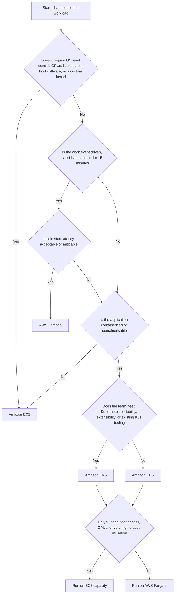

!!! question "Apply the framework"
    A team is building a nightly report generator that reads 40 GB from S3, performs a join, and writes a CSV. Peak runtime is 40 minutes. Lambda is eliminated at the 15-minute constraint. The work is containerisable and stateless, runs once per day, and needs no host control — an **ECS task on Fargate, triggered by EventBridge Scheduler**, is the natural answer. If the same job needed GPUs, it would move to **AWS Batch on EC2 Spot**.

### Comparative Matrix

| Dimension | EC2 | ECS on Fargate | EKS | Lambda |
|---|---|---|---|---|
| Operational burden | Highest | Low | Highest of the container options | Lowest |
| Time to first deployment | Days | Hours | Days to weeks | Minutes |
| Granularity of billing | Per instance-second | Per task-second | Per node-second plus cluster hour | Per millisecond |
| Idle cost | Full | Full while task runs | Cluster fee plus node cost | Zero |
| Cold start | Minutes (boot) | Tens of seconds (task start) | Seconds to minutes | Milliseconds to seconds |
| Maximum execution duration | Unbounded | Unbounded | Unbounded | 15 minutes |
| Statefulness supported | Yes | Limited (EFS) | Yes (StatefulSets, EBS/EFS) | No |
| Portability off AWS | Low (AMI-bound) | Medium (images port, definitions do not) | High | Low operationally |
| Scaling speed | Minutes | Tens of seconds | Seconds (pods), minutes (nodes) | Sub-second |
| Team skill required | Linux and systems administration | Docker and AWS | Kubernetes, deep | Application code plus event modelling |
| Best fit | Legacy, licensed, GPU, steady heavy load | Microservices with modest operational appetite | Large platforms, many teams, extensibility | Event glue, APIs, spiky and bursty work |

### Scalability

Design for **horizontal scaling** at every tier, and know your bottleneck. Adding compute nodes is useless if the relational database connection pool is exhausted — which is exactly what happens when a Lambda function with 1,000 concurrency talks directly to RDS. Use **RDS Proxy** for Lambda-to-relational access, or place a queue between the scalable tier and the constrained tier.

Understand the **scaling latency** of each service, because it determines how much headroom you must carry:

| Service | Time from demand signal to serving capacity |
|---|---|
| Lambda | Milliseconds to a few seconds |
| ECS/EKS pod on existing capacity | Seconds to tens of seconds |
| ECS task on Fargate (new microVM) | Tens of seconds |
| EKS node via Karpenter | Under a minute typically |
| EC2 via Auto Scaling group | One to several minutes |

### Availability and Fault Tolerance

- Deploy across at least two, preferably three, AZs. This is the single highest-value availability decision.
- Set health checks that test the application, not merely the process. An HTTP endpoint that verifies downstream dependencies is more useful than a TCP port check — but beware of cascading failure, where a dependency outage marks every instance unhealthy and the platform terminates your entire fleet. A common compromise is a shallow liveness check and a deeper readiness check.
- Assume every compute node is disposable. Design graceful shutdown: handle `SIGTERM`, stop accepting new work, drain in-flight requests, and deregister from the load balancer within the configured deregistration delay.
- Use **at least two replicas** of everything. A single-replica Deployment has no availability at all during a rolling update or node drain.

### Reliability

Reliability is about behaviour under partial failure. Implement retries with **exponential backoff and jitter**, set client timeouts shorter than server timeouts, apply **circuit breakers** so a failing dependency does not consume all your threads, and make every operation reachable by a retry **idempotent**. In event-driven systems, delivery is at-least-once, so duplicate processing is not an exception case — it is normal traffic.

### Latency

Latency budgets should be allocated explicitly across hops. Edge caching removes hops entirely. Keep chatty services in the same AZ where possible (cross-AZ traffic adds sub-millisecond latency but does incur data transfer charges). Reuse connections — creating a new TLS connection per request is often the dominant latency cost in a microservice call chain, and connection reuse is a major reason to initialise SDK clients outside a Lambda handler.

### Cost

Cost is a design constraint, not an afterthought. The dominant levers in order of typical impact are: **eliminate idle capacity**, **right-size**, **commit to a baseline** with Savings Plans, **use Spot for interruptible work**, **choose Graviton**, and **reduce data transfer** (NAT Gateway processing and cross-AZ transfer are frequent silent cost centres).

### Maintainability and Operational Complexity

Every service you operate has a fixed cognitive cost independent of scale. A three-engineer team running a self-managed Kubernetes platform will spend most of its time on the platform rather than on the product. Choose the **highest level of abstraction that satisfies your constraints**, and revisit the choice only when a constraint actually binds. "We might need Kubernetes later" is not a constraint; it is speculation.

!!! tip "The architect's default"
    For a new, containerisable, stateless microservice with no unusual requirements, the sensible 2026 default is **ECS on Fargate**, with **Lambda** for event glue. Move to **EKS** when you have multiple teams needing a shared, extensible platform, or genuine multi-cloud portability requirements. Move to **EC2** when a hard constraint forces it.

---

## AWS Best Practices

The AWS Well-Architected Framework provides six pillars. Below, each is expressed as concrete compute practice.

### Operational Excellence

- Define **all** infrastructure as code. Console changes are undiscoverable, unreviewable, and unreproducible.
- Make deployments small, frequent, and reversible. Use ECS deployment circuit breakers, CodeDeploy blue/green, or Lambda alias weighted routing so rollback is a single, fast, well-rehearsed action.
- Externalise configuration to SSM Parameter Store or AppConfig, and secrets to Secrets Manager.
- Emit structured, correlated logs and treat log format as an interface contract.
- Automate patching with Systems Manager Patch Manager, or eliminate the need through immutable AMIs and Fargate.
- Run game days: deliberately terminate an instance, drain a node, and fail an AZ in a test environment, and verify that the system behaves as designed.

### Security

- Least privilege everywhere: per-task roles, per-pod roles, per-function roles. Never a shared "application role" across services.
- No long-lived access keys on compute. Use instance profiles, task roles, IRSA/Pod Identity, and execution roles, all of which supply short-lived credentials.
- Run compute in **private subnets**. Only load balancers and NAT gateways belong in public subnets.
- Enforce IMDSv2, drop unnecessary Linux capabilities, run containers as non-root with a read-only root filesystem.
- Scan images in ECR, and block deployment of images with critical vulnerabilities in the pipeline.
- Encrypt everything: EBS with KMS, environment variables with KMS, traffic in transit with TLS.

### Reliability

- Multi-AZ by default; design for AZ loss as an expected event.
- Health checks, automatic replacement, and self-healing controllers rather than human intervention.
- Decouple with queues so that a downstream failure degrades throughput rather than availability.
- Set and test **service quotas** ahead of a launch. Being throttled at 1,000 Lambda concurrency during your busiest hour is a self-inflicted outage.
- Back up and test recovery for anything stateful. Compute should hold nothing that needs backing up.

### Performance Efficiency

- Select the instance family and size from measurements, not intuition. Use Compute Optimizer recommendations.
- Prefer Graviton where compatible.
- Cache aggressively at the edge (CloudFront), in front of the database (ElastiCache), and inside the process where safe.
- Use asynchronous processing so that user-facing latency is decoupled from work duration.
- Benchmark Lambda memory settings; the cost-optimal setting is frequently also the latency-optimal setting.

### Cost Optimization

- Turn off non-production environments outside working hours — often a 60–70 percent saving on those environments.
- Apply Savings Plans to the steady baseline only, and leave the variable portion On-Demand or Spot.
- Use Fargate Spot and EC2 Spot for anything interruptible.
- Set ECR lifecycle policies and CloudWatch Logs retention policies; both accumulate cost silently.
- Tag everything with a cost allocation tag scheme and enforce it with AWS Config or SCPs.

### Sustainability

- Higher utilisation is directly lower energy consumption per unit of work. Right-sizing and bin-packing are sustainability practices as much as cost practices.
- Graviton delivers more work per watt.
- Serverless architectures that scale to zero consume no energy when idle.
- Choose Regions with a higher proportion of renewable energy where latency and data-residency requirements permit.

---

## Security Considerations

### Identity and Least Privilege

Every compute service has a mechanism for obtaining **temporary, automatically rotated credentials**. Using any other mechanism is a defect.

| Compute service | Credential mechanism | Granularity |
|---|---|---|
| EC2 | Instance profile, retrieved via IMDSv2 | Per instance |
| ECS on EC2 | Container instance role, task execution role, task role | Per task (via the task role) |
| ECS on Fargate | Task execution role, task role | Per task |
| EKS | Node instance role, IRSA, EKS Pod Identity | Per pod (via IRSA or Pod Identity) |
| Lambda | Execution role | Per function |

!!! danger "The node role anti-pattern in EKS"
    If you attach broad permissions to the EKS **node instance role**, every pod on that node inherits them, because pods can reach the instance metadata service by default. This defeats per-pod isolation entirely. The correct configuration is a minimal node role plus IRSA or Pod Identity for workload permissions, together with blocking pod access to IMDS (for example, by setting the metadata hop limit to 1 or using the VPC CNI setting that disables pod IMDS access).

Least privilege in practice means: scope actions narrowly, scope resource ARNs to specific resources rather than `*`, use IAM condition keys (`aws:SourceVpce`, `aws:PrincipalTag`, `aws:RequestedRegion`), and use **permissions boundaries** and **Service Control Policies** to place a ceiling on what any role in an account can do.

### Network Security

The layered model, from outside in:

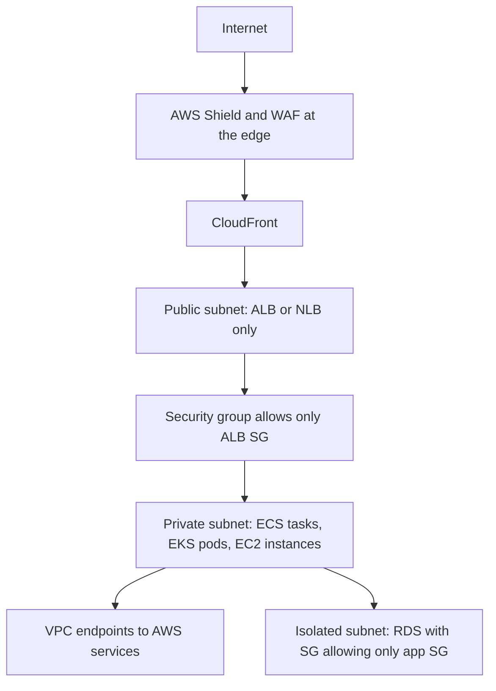

Key rules:

- **Security groups reference other security groups**, not CIDR blocks, for internal traffic. This makes the rule self-maintaining as IP addresses change.
- **Compute lives in private subnets.** If a resource has a public IP address and does not need one, that is a finding.
- **VPC endpoints** (interface endpoints for ECR, ECS, Secrets Manager, CloudWatch Logs, STS; a gateway endpoint for S3) keep traffic on the AWS network, remove the NAT Gateway dependency, and allow endpoint policies to restrict which resources can be reached.
- **NACLs** are a coarse, stateless second layer — useful for blanket denials such as blocking a known-malicious CIDR, not for application-level segmentation.
- In EKS, add **NetworkPolicy** for east-west control; the default is fully open.

### Data Protection

Encrypt at rest with KMS: EBS volumes, EFS filesystems, ECR repositories, Lambda environment variables, and EKS secrets envelope encryption. Prefer **customer-managed keys** where you need key policies, rotation control, and the ability to revoke access by disabling the key. Encrypt in transit with TLS everywhere, including between the load balancer and the application where the data is sensitive.

Secrets belong in **AWS Secrets Manager** (with automatic rotation for supported databases) or **SSM Parameter Store SecureString**, referenced at runtime. They must never be in the container image, in a Git repository, in a plaintext environment variable, or in a task definition's `environment` block, all of which are readable by anyone with `DescribeTaskDefinition` permission.

### Runtime Hardening

| Control | Applies to | Effect |
|---|---|---|
| Non-root user in the image | Containers | Limits damage from application compromise |
| `readonlyRootFilesystem` | ECS and Kubernetes | Prevents an attacker writing tools to disk |
| Drop Linux capabilities | ECS and Kubernetes | Removes unnecessary kernel privileges |
| Pod Security Admission (`restricted`) | EKS | Enforces a hardened baseline at admission time |
| Image signing and Code Signing for Lambda | All | Ensures only trusted artefacts are deployed |
| ECR scan on push plus a pipeline gate | All container services | Blocks known-vulnerable images from reaching production |
| Amazon GuardDuty (EKS Protection, Runtime Monitoring, Lambda Protection) | All | Detects anomalous behaviour at runtime |

### Logging, Audit and Compliance

**CloudTrail** records every control-plane API call and is the primary forensic source: who launched an instance, who modified a security group, who invoked a function. Enable it in all Regions, deliver to a dedicated, access-restricted S3 bucket with object lock, and consider CloudTrail Lake for querying. **VPC Flow Logs** capture network metadata. **EKS control-plane audit logs** record every Kubernetes API request. **AWS Config** records resource configuration over time and evaluates it against rules, which is how you evidence compliance rather than merely assert it.

---

## Performance Optimization

### Caching

Caching is the highest-leverage performance technique because a cache hit consumes no compute at all.

| Layer | Service | What it caches |
|---|---|---|
| Edge | CloudFront | Static assets and cacheable API responses, close to the user |
| API | API Gateway caching | Responses keyed by request parameters |
| Application data | ElastiCache (Redis or Valkey, Memcached) | Query results, session state, computed aggregates |
| Database read scaling | RDS read replicas, DynamoDB DAX | Read-heavy access patterns |
| In-process | Lambda global scope, container process memory | Configuration, secrets, compiled artefacts — per environment, not shared |

### Connection Reuse

Establishing a TCP connection and a TLS session costs one or more round trips. Reuse matters more than most teams realise:

- In Lambda, construct SDK clients, database connections, and HTTP agents **outside the handler** so they persist across warm invocations, and enable HTTP keep-alive.
- Between microservices, use connection pooling and HTTP/2 where supported.
- Between Lambda and a relational database, use **RDS Proxy**, which multiplexes many Lambda connections onto a small pool, preventing connection exhaustion.

### Right-Sizing and Hardware Selection

Use **AWS Compute Optimizer** for EC2, ECS on Fargate, and Lambda recommendations; it analyses CloudWatch metrics and proposes concrete changes. Move to Graviton where builds permit. For CPU-bound workloads, prefer compute-optimised families over general purpose. For latency-critical inter-node communication, use cluster placement groups.

### Autoscaling Tuning

The commonest performance failure is not the absence of autoscaling but its misconfiguration:

- **Scale-out should be aggressive; scale-in should be conservative.** The cost of being briefly over-provisioned is small; the cost of being under-provisioned during a spike is an outage.
- Set **warm-up** and **cooldown** so metrics are not polluted by instances that are still booting, and so the group does not oscillate.
- Scale on the metric that reflects the bottleneck. `ALBRequestCountPerTarget` is usually a better signal than CPU for a web tier, and SQS `ApproximateNumberOfMessagesVisible` (or, better, a backlog-per-instance custom metric) is the right signal for a queue consumer.

### Parallelism and Asynchrony

Decompose work so it can run in parallel: Lambda fan-out from SNS or EventBridge, Step Functions **Map** state for distributed iteration, Kinesis shards for parallel stream processing, and multiple ECS tasks consuming a shared SQS queue. Move anything that need not be in the request path out of it — email sending, thumbnail generation, analytics writes.

### Storage Optimization

Choose gp3 over gp2 (IOPS and throughput are configurable independently of size, and it is usually cheaper). Use instance store for scratch data that can be regenerated. For containers, keep images small — a multi-stage Dockerfile producing a distroless or Alpine-based final image reduces pull time, attack surface, and Fargate task start latency. Enable **SOCI** lazy loading for large images on Fargate.

### Measurement Discipline

Optimise against measurements, never assumptions. Establish p50, p90, p99, and p99.9 latency; averages hide the tail, and the tail is what users complain about. Load-test before launch with realistic traffic shapes, including a cold-start scenario for serverless components.

---

## Cost Optimization

### Understanding What You Actually Pay For

| Service | Primary cost dimensions | Frequently overlooked costs |
|---|---|---|
| EC2 | Instance-seconds by type, EBS GB-months and provisioned IOPS | Unattached EBS volumes, unattached Elastic IPs, cross-AZ transfer, snapshots |
| ECS on EC2 | Underlying EC2 and EBS | Idle capacity from poor bin packing |
| ECS on Fargate | vCPU-seconds, GB-seconds, ephemeral storage above 20 GiB | Over-provisioned task sizes; per-task ENI does not cost but NAT processing does |
| EKS | Cluster hour, plus data plane | Cluster fee per cluster, NAT Gateway, one ALB per Ingress if not grouped, extended version support surcharge |
| Lambda | Requests, GB-seconds, provisioned concurrency | CloudWatch Logs ingestion and storage, NAT for VPC functions, API Gateway requests |

!!! warning "Data transfer and NAT are the classic surprise line items"
    A NAT Gateway costs an hourly rate per AZ **plus a per-GB processing charge**. A container fleet pulling large images from ECR through NAT, or a Lambda fleet calling S3 through NAT, can generate a NAT bill that exceeds the compute bill. Gateway VPC endpoints for S3 and DynamoDB are free and should always be present; interface endpoints for ECR, CloudWatch Logs, and Secrets Manager pay for themselves quickly in a busy cluster.

### Purchase Commitments

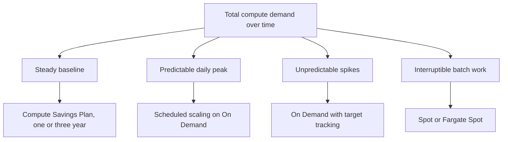

**Compute Savings Plans** are the most flexible commitment: they apply across EC2 instance families, Regions, ECS Fargate, and Lambda duration. **EC2 Instance Savings Plans** give a deeper discount but lock you to a family in a Region. **Reserved Instances** are the least flexible. Commit only to the portion of demand you are confident will persist — typically the trailing minimum of the last several months.

### Spot Strategy

Spot capacity is reclaimed with a two-minute warning delivered through instance metadata (EC2) or a task state change (Fargate Spot). To use it safely: diversify across many instance types and AZs, use capacity-optimised allocation, handle `SIGTERM` and the interruption notice by draining gracefully, and never place a workload on Spot whose interruption would be user-visible without a fallback. A common production pattern is a capacity provider strategy with a base of On-Demand tasks plus a weighted majority on Spot.

### Elimination and Right-Sizing

- Schedule non-production environments off outside working hours with EventBridge Scheduler and a small Lambda that sets ASG and ECS desired counts to zero.
- Right-size using Compute Optimizer; the most common finding in real estates is systematic over-provisioning of memory.
- Set **CloudWatch Logs retention** on every log group. The default is "never expire", and log storage silently accumulates for years.
- Set **ECR lifecycle policies** to expire untagged and old images.
- Use **S3 Intelligent-Tiering** for artefact and data buckets.

### Governance and Visibility

**AWS Cost Explorer** for trend analysis and rightsizing recommendations, **AWS Budgets** with alerts and actions, **Cost Anomaly Detection** for unexpected changes, **Trusted Advisor** for idle-resource and commitment checks, and **cost allocation tags** enforced with AWS Config rules or tag policies so that spend can be attributed to a team, service, and environment. Untagged spend is unmanageable spend.

---

## Monitoring and Observability

Observability rests on three signals — **metrics** (aggregated numbers over time), **logs** (discrete events), and **traces** (the path of one request across services) — plus, increasingly, **profiles**.

### CloudWatch Metrics

| Service | Metrics that matter | What they tell you |
|---|---|---|
| EC2 | `CPUUtilization`, `NetworkIn/Out`, `StatusCheckFailed`, `CPUCreditBalance` | Saturation, health, T-family credit exhaustion |
| EC2 (agent required) | Memory and disk utilisation | The hypervisor cannot see guest memory; you **must** install the CloudWatch agent |
| ECS | `CPUUtilization`, `MemoryUtilization`, `RunningTaskCount`, `PendingTaskCount` | Sustained pending tasks mean insufficient cluster capacity |
| EKS / Container Insights | Node and pod CPU/memory, pod restarts, cluster failed node count | Restart loops, resource pressure, scheduling failures |
| Lambda | `Invocations`, `Duration`, `Errors`, `Throttles`, `ConcurrentExecutions`, `IteratorAge` | `Throttles` means you hit a concurrency limit; rising `IteratorAge` means stream processing is falling behind |
| ALB | `TargetResponseTime`, `HTTPCode_Target_5XX_Count`, `UnHealthyHostCount`, `RequestCountPerTarget` | Application health independent of instance health |
| SQS | `ApproximateNumberOfMessagesVisible`, `ApproximateAgeOfOldestMessage` | Backlog and processing lag; the best scaling signal for consumers |

!!! tip "The four alarms every compute service should have"
    (1) Error rate above a threshold, (2) latency p99 above the service-level objective, (3) saturation of the binding resource (CPU, memory, concurrency, or queue age), and (4) a capacity alarm indicating that scaling cannot keep up (pending tasks, unschedulable pods, or Lambda throttles). Alarms should be actionable; an alarm with no runbook is noise.

### Logs

- EC2: install the CloudWatch agent to ship OS and application logs; do not rely on logs sitting on a disposable instance.
- ECS: the `awslogs` driver, or FireLens with Fluent Bit for routing, filtering, and multi-destination delivery.
- EKS: Fluent Bit as a DaemonSet shipping to CloudWatch Logs or OpenSearch, plus control-plane audit logs.
- Lambda: automatic delivery to a per-function log group; use advanced logging controls to set log level and JSON format natively.

Log in **structured JSON** with a consistent schema including timestamp, level, service, version, request or trace ID, and message. This makes CloudWatch Logs Insights queries possible and turns logs into a queryable dataset rather than prose.

### Tracing

**AWS X-Ray** propagates a trace ID across service boundaries, producing a service map and per-segment timings that show exactly which hop consumed the latency budget. Enable active tracing on Lambda, add the X-Ray daemon or the ADOT collector as a sidecar for ECS, and deploy ADOT as a DaemonSet or via the operator for EKS. **AWS Distro for OpenTelemetry (ADOT)** is the vendor-neutral path and is the right default for new systems, allowing export to X-Ray, Amazon Managed Prometheus, or third-party backends.

**Powertools for AWS Lambda** (Python, TypeScript, Java, .NET) provides structured logging, custom metrics via the Embedded Metric Format, tracing, and idempotency helpers with minimal code, and should be considered standard equipment for serverless work.

### Dashboards and Synthetic Monitoring

Build a dashboard per service showing the RED metrics — **Rate, Errors, Duration** — alongside saturation. Add **CloudWatch Synthetics canaries** that exercise critical user journeys continuously from outside the system, because a canary detects an outage that internal metrics can miss (for example, a DNS or certificate failure). Use **CloudWatch ServiceLens** to join traces, metrics, and logs in one view.

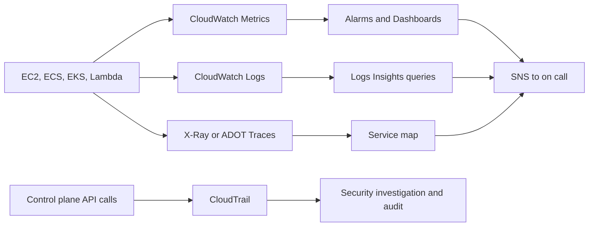

---

## Integration with Other AWS Services

Compute is never deployed alone. The table below explains **why** each integration exists, which is the examinable and interview-relevant part.

| Service | Integrates with | Why |
|---|---|---|
| **Elastic Load Balancing** | EC2, ECS, EKS, Lambda | Distributes traffic, performs health checks, terminates TLS. ALB can invoke Lambda directly as a target, which is a useful alternative to API Gateway for simple HTTP workloads |
| **API Gateway** | Lambda, ECS/EKS via VPC Link, HTTP endpoints | Adds authorisation, throttling, request validation, and usage plans in front of compute |
| **Amazon ECR** | ECS, EKS, Lambda container images, App Runner | The authenticated, scanned, lifecycle-managed source of container artefacts |
| **Amazon S3** | All | Deployment artefacts, static assets, data lake input/output; also an event source for Lambda |
| **Amazon EFS** | EC2, ECS, EKS, Lambda | Shared POSIX filesystem across many compute nodes; enables large ML models on Lambda |
| **Amazon EBS** | EC2, EKS via CSI driver | Durable block storage for stateful workloads |
| **Amazon RDS / Aurora** | All | Relational state. Use RDS Proxy with Lambda to avoid connection exhaustion |
| **Amazon DynamoDB** | All, especially Lambda | Serverless key-value store whose scaling model matches Lambda's; DynamoDB Streams is a first-class Lambda event source |
| **Amazon SQS** | All | Buffering and decoupling; the standard way to convert an availability problem into a latency problem |
| **Amazon SNS** | All | Pub/sub fan-out to many subscribers, including Lambda and SQS |
| **Amazon EventBridge** | All | Content-based event routing, schema registry, third-party SaaS events, and scheduling; the backbone of event-driven architecture |
| **AWS Step Functions** | Lambda, ECS tasks, and 200-plus AWS APIs directly | Durable orchestration of long-running or multi-step workflows with built-in retry, catch, and parallelism; the correct answer when a workflow exceeds Lambda's 15 minutes |
| **Amazon Kinesis / MSK** | Lambda, ECS, EKS | High-throughput ordered stream processing |
| **AWS Secrets Manager / SSM Parameter Store** | All | Runtime injection of secrets and configuration without baking them into artefacts |
| **AWS IAM / STS** | All | Temporary credentials and authorisation for everything |
| **AWS KMS** | All | Encryption key management for storage, secrets, and envelope encryption |
| **Amazon CloudWatch / X-Ray / CloudTrail** | All | Metrics, logs, traces, and audit |
| **AWS CodePipeline, CodeBuild, CodeDeploy** | All | CI/CD: build images, push to ECR, and deploy with blue/green or rolling strategies |
| **AWS CloudFormation / CDK / SAM / Terraform** | All | Declarative provisioning; SAM specialises in serverless, CDK generates CloudFormation from general-purpose languages |
| **AWS Systems Manager** | EC2, ECS via ECS Exec | Patching, inventory, and keyless shell access |
| **AWS App Mesh / VPC Lattice / Istio** | ECS, EKS | Service-to-service traffic management, mTLS, retries, and observability |
| **Amazon Route 53** | All | DNS, health checks, and failover routing including multi-Region active-active or active-passive |
| **AWS Batch** | EC2, Fargate | Managed batch job queues and compute environments for large-scale batch and HPC |
| **Amazon Bedrock and SageMaker** | Lambda, ECS, EKS | Model inference invoked from application compute; SageMaker endpoints for hosted models |

### A Representative Integrated Architecture

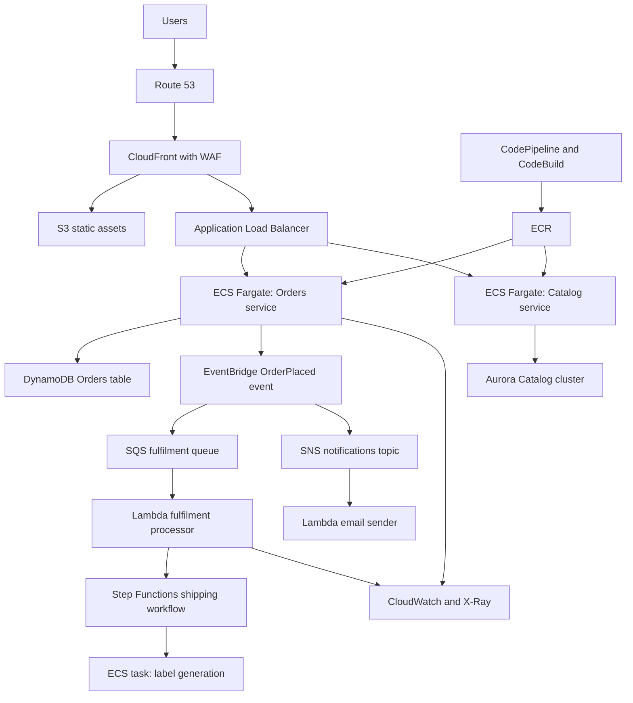

!!! info "Reading this diagram architecturally"
    Note that the synchronous path (user to ALB to service to database) is deliberately short. Everything that does not need to complete before responding to the user — fulfilment, notifications, shipping — is pushed behind EventBridge and SQS. This keeps user-facing latency low and makes the system resilient to failures in the downstream components. This is the essence of cloud-native design.

---

## Common Architecture Patterns

### Three-Tier Web Architecture

The classic pattern: a presentation tier (CloudFront and S3, or a web service), an application tier (EC2 ASG, ECS service, or EKS Deployment in private subnets), and a data tier (RDS Multi-AZ or DynamoDB in isolated subnets). Each tier scales independently and is separated by security groups. Still the correct starting point for most conventional applications.

### Microservices

Independently deployable services, each owning its data, communicating over well-defined APIs or events. Container orchestration is the natural substrate because it provides a uniform deployment contract. The architectural cost is distributed-systems complexity: network partitions, partial failures, eventual consistency, distributed tracing, and versioned API contracts. **Do not adopt microservices for a small team building a single product**; the coordination overhead exceeds the benefit until organisational scale demands independent deployment.

### Serverless Event-Driven

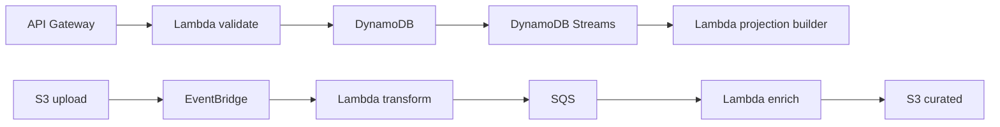

Producers emit events; a router (EventBridge) delivers them to consumers; consumers are functions that scale independently. Loose coupling, zero idle cost, and independent evolution. The cost is harder end-to-end reasoning and debugging, which is why tracing is mandatory rather than optional here.

### Fan-Out and Fan-In

**Fan-out**: one event triggers many parallel consumers via SNS (push) or EventBridge (routing) or Kinesis (shards). **Fan-in**: many parallel results are aggregated, typically by writing to a common store and using a Step Functions Map state with a final aggregation step. Used heavily in media processing, where one uploaded video fans out into multiple transcoding jobs and fans back in to a manifest.

### Queue-Based Load Levelling

A queue between producer and consumer absorbs spikes, allowing the consumer to process at its own sustainable rate. Scale consumers on queue depth or message age. This is the correct answer to "our database cannot handle the write spike".

### Strangler Fig Migration

Place a routing layer (ALB listener rules or API Gateway) in front of a monolith, then progressively route individual paths to new services running on Fargate or Lambda while the monolith continues to serve the rest. The monolith is retired only when the last route has moved. This is the standard, low-risk modernisation path from EC2 to containers.

### Sidecar

A helper container deployed alongside the application container in the same task or pod, sharing its network namespace — used for log shipping (Fluent Bit), tracing (ADOT collector), or service mesh proxying (Envoy). It keeps cross-cutting concerns out of application code. Not available on EKS Fargate for DaemonSet-style agents, which is a common reason to choose EC2 nodes.

### Circuit Breaker, Retry with Backoff, and Bulkhead

- **Retry with exponential backoff and jitter** prevents a thundering herd from converting a brief blip into a sustained outage.
- **Circuit breaker** stops calling a failing dependency after a threshold, failing fast and allowing recovery.
- **Bulkhead** partitions resources — separate connection pools, separate thread pools, separate ECS services, or reserved Lambda concurrency per function — so that one saturated component cannot consume all capacity. Lambda's reserved concurrency is a bulkhead implemented by the platform.

### Saga

For a transaction spanning multiple services with their own databases, a distributed two-phase commit is impractical. A **saga** executes a sequence of local transactions, each with a compensating action to undo it if a later step fails. Step Functions is the natural implementation on AWS, with the workflow definition making the compensation logic explicit and auditable.

### CQRS and Event Sourcing

Separate the write model from the read model. Writes go to DynamoDB; DynamoDB Streams trigger a Lambda that projects into an optimised read store (OpenSearch, a materialised view, or a cache). Reads and writes then scale and evolve independently. The trade-off is eventual consistency in the read path, which must be acceptable to the business.

### Blue/Green and Canary Deployment

**Blue/green** stands up an entire parallel environment and shifts traffic atomically, giving near-instant rollback — implemented with CodeDeploy for ECS and Lambda, or two target groups on an ALB. **Canary** shifts a small percentage of traffic to the new version, monitors alarms, and rolls forward or back automatically — implemented with Lambda alias weights or ALB weighted target groups. Both depend on having good alarms; automated rollback is only as good as the signal that triggers it.

---

## Industry Use Cases

| Sector | Workload | Typical compute choice | Reasoning |
|---|---|---|---|
| Media streaming | Video transcoding | EC2 Spot or AWS Batch, or MediaConvert | Interruptible, parallel, compute-intensive, long-running |
| Media streaming | Recommendation API | ECS Fargate or EKS | Steady low-latency traffic, containerised microservices |
| E-commerce | Storefront web tier | ECS Fargate or EC2 ASG behind ALB | Elastic, stateless, spiky at campaign times |
| E-commerce | Order processing | SQS plus Lambda or Fargate consumers | Must absorb spikes and never lose an order |
| E-commerce | Image thumbnailing | Lambda on S3 events | Short, parallel, event-shaped, bursty |
| Banking | Core ledger | EC2 with Dedicated Hosts | Licensing, auditability, tenancy isolation |
| Banking | Fraud scoring | Lambda or Fargate with SageMaker endpoint | Low-latency per-transaction inference |
| Insurance | Nightly actuarial batch | AWS Batch on EC2 Spot | Massive, interruptible, cost-sensitive |
| Healthcare | Genomics pipelines | AWS Batch or EKS with Spot | Huge bursty parallel compute |
| Healthcare | Patient portal | ECS Fargate in private subnets | Compliance-friendly, moderate scale, low ops burden |
| Government | Citizen services portal | EC2 with Savings Plans or ECS | Predictable load, data residency, procurement constraints |
| IoT | Telemetry ingestion | IoT Core plus Kinesis plus Lambda | Millions of tiny events, highly parallel, zero idle cost |
| Gaming | Real-time game servers | EC2 or GameLift with NLB | UDP, stateful sessions, latency-critical |
| Gaming | Leaderboards and matchmaking | Lambda plus DynamoDB | Spiky, stateless, event-driven |
| SaaS platform | Multi-tenant application platform | EKS with namespace isolation | Many teams, extensibility, portability |
| Logistics | Route optimisation | ECS tasks or Batch on Spot | Long-running compute, not latency-critical |
| Analytics | ETL orchestration | Step Functions plus Lambda plus Glue | Multi-step, long-running, needs retries and visibility |

---

## Advantages

### Amazon EC2

Complete control over the operating system means any software can run, including legacy applications, custom kernels, and commercial software with host-based licensing. The breadth of instance types — hundreds of combinations including GPU, FPGA, high-memory, and bare metal — means hardware can be matched precisely to workload shape. The purchase-option flexibility (Spot, Savings Plans, Reserved) enables the deepest cost optimisation of any compute service for steady workloads. It is also the most predictable performance model, since you own the entire instance.

### Amazon ECS

The control plane is free and requires no operational effort at all — there is no version to upgrade, no etcd to worry about, and no cluster fee. Integration with IAM, VPC, ELB, CloudWatch, and Auto Scaling is native and requires no controllers or add-ons. Task-level IAM roles provide fine-grained security with a very simple mental model. The conceptual surface area is small enough that a team can be productive in days, and combined with Fargate it removes host management entirely. For a team whose objective is to ship an application rather than to build a platform, ECS delivers the best ratio of capability to complexity.

### Amazon EKS

You get the upstream Kubernetes API, which means the entire cloud-native ecosystem — Helm, Argo CD, Istio, Prometheus, Kyverno, thousands of operators — works without modification. Workloads and manifests are portable across clouds and on-premises, which matters for genuine multi-cloud or hybrid strategies. Kubernetes is extensible through CRDs and controllers, so a platform team can encode organisational policy as software and offer self-service abstractions to product teams. Kubernetes skills are widely available in the labour market. AWS operates the hardest part — a highly available, backed-up control plane.

### AWS Lambda

There is no infrastructure to manage at all, and scaling is automatic, immediate, and requires no configuration. Billing is per millisecond with genuinely zero cost when idle, which makes low-traffic and spiky workloads dramatically cheaper than any provisioned model. Time from idea to running code is minutes. The per-function IAM role is the finest-grained security boundary available. Native integration with more than 200 AWS services makes Lambda the natural glue for event-driven architecture, and built-in multi-AZ redundancy means high availability requires no design work.

### Fargate

Removes an entire class of operational work — AMI management, patching, node scaling, capacity providers, cluster autoscaler tuning — while retaining the container packaging model. Each task runs in its own microVM, giving stronger isolation than shared-kernel container hosting. Billing matches the resources tasks actually request, which is far more honest than paying for partly empty instances.

---

## Limitations

### Amazon EC2

You own the operating system, and therefore patching, hardening, agent management, and vulnerability response — a continuing cost measured in engineer-hours. Boot time is minutes, so reactive scaling always lags demand and you must carry headroom. Idle instances cost full price. Capacity planning does not disappear; it merely becomes faster to act on. Instances are AZ-bound, so multi-AZ design is entirely your responsibility. Configuration drift is a constant risk unless you enforce immutable AMIs.

### Amazon ECS

It is AWS-proprietary; task and service definitions do not transfer to another platform, though container images do. The extensibility model is limited — there is no equivalent of CRDs, operators, or admission webhooks, so you cannot easily encode custom platform behaviour. The third-party ecosystem is much smaller than Kubernetes'. For very large, multi-team platform engineering efforts, the abstractions ECS offers may prove too thin.

### Amazon EKS

Kubernetes is genuinely complex and its failure modes are numerous and subtle — CrashLoopBackOff, ImagePullBackOff, pending pods due to insufficient resources or taints, DNS failures under load, misconfigured probes causing rolling restarts. The control plane has a per-cluster hourly cost that penalises many-small-cluster designs. **Version upgrades are mandatory, recurring work**, requiring validation of deprecated APIs and coordination with add-on versions. The VPC CNI consumes real VPC IPs, so subnet sizing becomes an architectural constraint. EKS Fargate cannot run DaemonSets, privileged containers, or GPU workloads. The total cost of ownership, including the platform team required to run it well, is the highest of the four services.

### AWS Lambda

The 15-minute maximum duration excludes long-running work outright. Cold starts add tail latency that is difficult to eliminate entirely without paying for provisioned concurrency. Payload limits (6 MB synchronous, 256 KB asynchronous) force an S3-reference pattern for large data. There is no persistent local state, and `/tmp` is per-environment and ephemeral. Concurrency limits are account-wide by default and can throttle unrelated functions. High-volume, steady workloads can be **more expensive** than an equivalently sized Fargate or EC2 deployment, because you pay a premium for elasticity you are not using. Debugging distributed serverless systems is harder than debugging a monolith, and local testing is an approximation. Vendor lock-in at the operational level is real: the business logic ports, but the event wiring, IAM, and observability do not.

### Fargate

Higher per-vCPU cost than EC2, so it loses on price for high, steady utilisation. No GPU support. No privileged containers, host path mounts, or DaemonSets. Limited to discrete CPU/memory combinations rather than arbitrary sizing. Task start time is longer than starting a container on a warm host, because a microVM must be created and the image pulled. You cannot install host-level agents, so some third-party security and monitoring products either do not work or require a sidecar variant.

---

## Common Mistakes

### Beginner Mistakes

| Mistake | Why it is wrong | Correct approach |
|---|---|---|
| Placing application servers in public subnets with public IPs | Directly exposes compute to the internet | Compute in private subnets; only load balancers are public |
| Security group rules with `0.0.0.0/0` on port 22 or 3389 | Invites credential-stuffing attacks | Use Systems Manager Session Manager; no inbound SSH at all |
| Storing AWS access keys in code, environment variables, or AMIs | Long-lived credentials leak and rarely get rotated | Instance profiles, task roles, IRSA, execution roles |
| Deploying into one Availability Zone | An AZ event becomes a full outage | Minimum two AZs, preferably three |
| Using the `latest` image tag | Non-deterministic deployments and no reliable rollback | Immutable tags with the Git SHA, plus ECR tag immutability |
| Writing application state to a container's filesystem | Lost on every restart, scale event, or deployment | Externalise to S3, DynamoDB, RDS, or EFS |
| No health checks, or health checks that always return 200 | The platform cannot detect a broken application | Meaningful readiness and liveness checks |
| Console-driven infrastructure | Undocumented, unreproducible, drifts immediately | Infrastructure as Code from day one |
| Ignoring CloudWatch Logs retention | Silent, unbounded cost growth | Set retention on every log group |
| Assuming Lambda is always cheapest | Steady high-throughput workloads can cost more on Lambda | Model the cost with real volumes before deciding |

### Production Mistakes

| Mistake | Consequence | Mitigation |
|---|---|---|
| Lambda at high concurrency connecting directly to RDS | Database connection exhaustion, cascading failure | RDS Proxy, or reserved concurrency as a bulkhead, or a queue |
| No reserved concurrency on any function | One runaway function throttles every other function in the account | Reserve concurrency for critical functions; cap non-critical ones |
| No dead-letter queue on asynchronous processing | Events are silently lost after retries | DLQ or on-failure destination plus an alarm on DLQ depth |
| Scaling on CPU when the bottleneck is I/O or queue depth | The system never scales when it needs to | Scale on the metric that reflects the actual constraint |
| No PodDisruptionBudget in EKS | A node drain during an upgrade takes all replicas down | PDB plus multiple replicas plus topology spread |
| Setting Kubernetes CPU limits equal to requests on latency-sensitive services | Aggressive CPU throttling under burst | Set requests accurately; consider omitting CPU limits while always setting memory limits |
| No graceful shutdown handling | In-flight requests dropped on every deployment and scale-in | Handle `SIGTERM`, drain, and align deregistration delay with the drain period |
| Single NAT Gateway for all AZs | An AZ failure removes egress for the whole VPC, and cross-AZ data charges accrue | One NAT Gateway per AZ, or VPC endpoints |
| Deploying without a rollback mechanism | An outage becomes a long outage | Deployment circuit breaker, blue/green, or canary with automatic rollback |
| Not testing at the concurrency limit | Throttling discovered during the launch event | Load-test to the quota, then request a quota increase in advance |
| Treating Kubernetes namespaces as a security boundary | Lateral movement across tenants | NetworkPolicy, RBAC, resource quotas, Pod Security Admission |
| Long Lambda timeouts "to be safe" | A hung dependency burns 15 minutes of billed duration per invocation | Timeout slightly above observed p99 |

### Certification Traps

| Trap | The reality |
|---|---|
| "ECS costs more than EKS because it is managed" | ECS has **no** control-plane charge; EKS charges per cluster hour |
| "Fargate is a container orchestrator" | Fargate is a **capacity mode** for ECS and EKS, not an orchestrator |
| "Lambda can run for up to 15 minutes, so it suits any batch job" | 15 minutes is a **hard** limit; longer jobs need Fargate, Batch, or Step Functions |
| "Security groups can deny traffic" | Security groups are **allow-only** and **stateful**; NACLs are stateless and support deny |
| "The task execution role is what my application code uses" | The **task role** is used by your code; the execution role is used by the ECS/Fargate infrastructure |
| "Reserved concurrency and provisioned concurrency are the same" | Reserved **caps and guarantees** concurrency; provisioned **pre-warms** environments to remove cold starts |
| "Spot Instances are terminated without warning" | There is a **two-minute** interruption notice |
| "You can enable detailed memory metrics on EC2 in the console" | Memory and disk metrics require the **CloudWatch agent** in the guest OS |
| "Multi-AZ means multi-Region" | Multi-AZ is within one Region; multi-Region requires separate deployments and Route 53 or Global Accelerator routing |
| "EKS Fargate supports DaemonSets" | It does not; use EC2 node groups where DaemonSets are required |
| "An ASG health check type of EC2 detects application failure" | Only `ELB` health check type detects application-level failure |
| "IAM roles can be attached directly to an EC2 instance" | A role is delivered via an **instance profile** |


## Interview Questions

### Conceptual Questions

**1. Explain the difference between vertical and horizontal scaling, and why cloud-native design prefers the latter.**

Vertical scaling increases the capacity of a single instance (a larger instance type); horizontal scaling adds more instances. Vertical scaling is bounded by the largest available instance, usually requires a restart, and leaves a single failure domain. Horizontal scaling is effectively unbounded, allows in-place replacement of unhealthy members, and distributes failure risk across Availability Zones. Cloud-native design prefers horizontal scaling because it makes capacity a runtime property managed by a control loop rather than a procurement decision. The precondition is statelessness: session and durable state must be externalised to DynamoDB, ElastiCache, RDS, or S3.

**2. What is the difference between an ECS task, a task definition, and a service?**

A task definition is an immutable, versioned blueprint: container images, CPU and memory reservations, port mappings, environment variables, logging configuration, and the task and execution IAM roles. A task is a running instantiation of one revision of that blueprint — one or more containers scheduled together on the same host and sharing a network namespace. A service is a controller that maintains a desired count of tasks, replaces unhealthy ones, registers them with a load balancer target group, and orchestrates rolling or blue/green deployments. The mental model is class, object, and supervisor.

**3. Why does AWS Lambda have a cold start, and what determines its duration?**

A cold start occurs when no warm execution environment exists for an invocation, so Lambda must allocate a Firecracker microVM, download and decrypt the deployment package or container image, initialise the runtime, and execute the function's initialisation code before the handler runs. Duration is driven by package or image size, runtime choice (interpreted runtimes such as Python and Node.js initialise faster than JVM or .NET), the amount of work performed outside the handler, the memory setting (which proportionally allocates vCPU, so more memory means faster initialisation), and whether the function is attached to a VPC. Provisioned concurrency and SnapStart eliminate or drastically reduce this latency.

**4. Distinguish the ECS task execution role from the ECS task role.**

The execution role is assumed by the ECS agent and Fargate infrastructure, not by application code. It grants permission to pull images from ECR, retrieve secrets from Secrets Manager or SSM Parameter Store for injection into the container environment, and write to CloudWatch Logs. The task role is assumed by the application process inside the container and is what the AWS SDK picks up through the container credential provider. Least privilege requires two distinct roles; conflating them grants the application infrastructure permissions it should never hold.

**5. What does AWS Fargate actually remove from the operational burden, and what does it not?**

Fargate removes the EC2 layer: no AMI patching, no instance right-sizing, no cluster capacity management, no bin-packing, no SSH access, and per-task rather than per-instance billing granularity. It does not remove container image hygiene, application-level patching, IAM design, networking design (tasks still occupy subnets and ENIs), observability, or cost governance. It also does not remove the need to understand orchestration semantics — deployment strategies, health checks, and draining still apply.

**6. Explain the concept of a control plane and a data plane using ECS and EKS as examples.**

The control plane holds desired state, makes scheduling and placement decisions, and reconciles actual state toward desired state; the data plane executes workloads and carries request traffic. In ECS, the control plane is an AWS-managed regional service holding cluster, service, and task-definition state, while the data plane is EC2 instances running the ECS agent, or Fargate capacity. In EKS, the control plane is a managed, multi-AZ Kubernetes API server and etcd cluster, and the data plane is managed node groups, self-managed nodes, or Fargate profiles. The distinction matters operationally: a control-plane outage generally stops new deployments and scaling decisions, but already-running data-plane workloads continue serving traffic.

**7. Why is an Auto Scaling group with `ELB` health check type materially different from one with `EC2` health check type?**

The `EC2` health check reports only on hypervisor-level instance status — whether the instance is running and passing system and instance status checks. An instance whose application process has crashed, deadlocked, or is returning HTTP 500 still passes. The `ELB` health check type delegates the decision to the load balancer's target group health check, which probes an application endpoint. Only the latter detects application-level failure and triggers replacement. This is a very common production defect and a recurring certification trap.

### Scenario Questions

**1. A team runs a nightly report that takes 45 minutes and reads several gigabytes from S3. They propose AWS Lambda. Evaluate.**

Lambda is unsuitable as a single invocation: the maximum execution duration is 15 minutes, which is a hard limit, and ephemeral storage is bounded. Three viable redesigns exist. First, decompose the job into a map-reduce shape — a Step Functions Distributed Map fanning out many short Lambda invocations over S3 key ranges, then a reduce step. Second, run it as an ECS or EKS task on Fargate, invoked on a schedule by EventBridge Scheduler, which has no duration limit and generous memory. Third, if the work is fundamentally an analytical query over S3 data, replace the compute entirely with Athena or an EMR Serverless job. The architectural lesson is that a duration limit is a signal to reconsider the decomposition, not merely to pick a bigger runtime.

**2. A microservice receives steady traffic of roughly 200 requests per second with brief 10x spikes at lunchtime. Cost is a first-class concern. Which compute model?**

Steady baseline plus predictable spikes favours containers on ECS or EKS with Fargate for burst capacity, or EC2 with a Savings Plan covering the baseline and Spot or on-demand for the peak. Lambda's per-invocation pricing becomes expensive at sustained high request rates compared with a continuously utilised container, so at 200 requests per second sustained, containers usually win on cost while Lambda wins on operational simplicity. A defensible answer states the crossover reasoning explicitly: Lambda is optimal for spiky, low-duty-cycle workloads; containers are optimal once utilisation is high and steady. Compute Savings Plans apply across EC2, Fargate, and Lambda, so the baseline can be committed regardless of the model chosen.

**3. A regulated financial customer requires that no other tenant's workload share the physical host. What are the options and their trade-offs?**

Dedicated Instances guarantee hardware isolation at the account level but do not give visibility of or control over socket and core placement. Dedicated Hosts additionally expose the physical server, enabling per-socket or per-core software licensing (bring-your-own-license for Windows Server or Oracle) and affinity so an instance returns to the same host after a stop and start. Both carry a substantial cost premium and reduce placement flexibility, which weakens elasticity. On Fargate each task runs in its own isolation boundary with dedicated kernel, which satisfies many isolation requirements without dedicated hardware, but does not satisfy a literal "no shared physical hardware" clause. The architect's job is to determine whether the requirement is genuinely about physical hardware or about isolation and compliance evidence, because the answer changes the cost by an order of magnitude.

**4. An EKS cluster experiences pods stuck in `Pending` with the event `too many pods`. Diagnose.**

This is almost always the ENI-based IP address limit of the Amazon VPC CNI. Each node can host a number of pods bounded by the number of ENIs its instance type supports multiplied by the IP addresses per ENI, minus one for the node itself. Small instance types therefore host very few pods regardless of free CPU and memory. Remedies include selecting larger instance types, enabling prefix delegation on the VPC CNI (which assigns /28 prefixes rather than individual secondary IPs and greatly increases pod density), or adopting custom networking with a secondary CIDR. A secondary possibility is that the subnets themselves have exhausted their IP space, which is a CIDR planning failure.

**5. A Lambda function attached to a VPC intermittently fails to reach an RDS database, and the team observes connection exhaustion on the database.**

Lambda scales horizontally by creating concurrent execution environments, each of which opens its own database connection. At high concurrency this multiplies into thousands of connections and exceeds the RDS `max_connections` parameter, which itself scales with instance memory. The correct remedy is Amazon RDS Proxy, which maintains a pooled, multiplexed set of connections to the database and lets Lambda functions borrow from the pool. Supporting measures include setting reserved concurrency on the function to bound the blast radius, opening the connection outside the handler so it is reused across warm invocations, and confirming that the security groups allow traffic from the Lambda ENIs' security group on the database port.

### Architecture Questions

**1. Design a compute layer for a three-tier e-commerce application that must survive the loss of an Availability Zone.**

Place an Application Load Balancer across at least two, preferably three, Availability Zones in public subnets. Run the application tier as an ECS service on Fargate, or an Auto Scaling group, spread across the same Availability Zones in private subnets, with a desired count set so that N-1 zones can carry full peak load. Target tracking scaling on request count per target or on CPU maintains headroom. Externalise session state to ElastiCache or DynamoDB so any instance can serve any request. Use RDS Multi-AZ or Aurora with reader instances in each zone. Verify that the ASG or service uses `ELB` health checks, that deployment uses rolling or blue/green with a minimum healthy percentage, and that the NAT Gateway is provisioned per zone so that the loss of one zone does not break egress for the others.

**2. When would you choose EKS over ECS, given that ECS is simpler?**

Choose EKS when the organisation needs the Kubernetes API and ecosystem — Helm charts, operators, custom resource definitions, service meshes such as Istio, GitOps tooling such as Argo CD or Flux — or when workload portability across clouds and on-premises is a genuine requirement, or when the engineering organisation already has Kubernetes expertise and multi-cluster tooling. Choose ECS when the priority is minimal operational surface, deep and native AWS integration, no control-plane charge, and a smaller learning curve. The decision is fundamentally about ecosystem leverage and existing skills, not about technical capability, because both can run the same containers with comparable reliability.

**3. Design an event-driven image-processing pipeline and justify the compute choice at each stage.**

An upload lands in S3, which emits an event to EventBridge or directly to SQS. A Lambda function consumes the queue, generates thumbnails, and writes results back to S3 and metadata to DynamoDB — Lambda is correct here because the work is short, stateless, embarrassingly parallel, and bursty, and the cost at low duty cycle is negligible. If a stage requires heavy machine-learning inference exceeding 15 minutes or requiring GPUs, that stage moves to an ECS Fargate task or an EC2 GPU instance triggered by Step Functions, because Lambda does not offer GPUs. A dead-letter queue captures poison messages, and Step Functions orchestrates multi-stage workflows so that retries, timeouts, and error paths are declarative rather than embedded in application code.

**4. How would you achieve zero-downtime deployment for a containerised service, and what are the trade-offs of each strategy?**

Rolling update with a minimum healthy percentage of 100 and a maximum percent above 100 launches new tasks before draining old ones; it is cheap and simple but briefly runs two versions concurrently, which requires backward-compatible schemas and APIs. Blue/green through CodeDeploy stands up a complete replacement task set behind a second target group and shifts traffic all at once, linearly, or canary, with automatic rollback on CloudWatch alarms; it doubles capacity cost during deployment but gives a clean and fast rollback. Canary within a rolling update, or Lambda weighted aliases for serverless, exposes a small traffic percentage to the new version first, which minimises blast radius at the cost of a longer deployment window and more complex observability.

### Troubleshooting Questions

**1. An ECS Fargate task repeatedly stops with `CannotPullContainerError`.**

The task cannot reach ECR. In a private subnet without a NAT Gateway, create interface VPC endpoints for `ecr.api` and `ecr.dkr`, a Gateway endpoint for S3 (ECR layers are stored in S3), and an interface endpoint for `logs` if CloudWatch Logs is the log driver. Alternatively confirm the route to a NAT Gateway. Secondary causes are an execution role lacking `ecr:GetAuthorizationToken` and the ECR read permissions, an incorrect image tag, or a task launched with `assignPublicIp` disabled in a public subnet.

**2. An EC2 instance in a private subnet cannot install packages from the internet.**

Confirm a NAT Gateway exists in a public subnet in the same Availability Zone, that the private subnet's route table has a `0.0.0.0/0` route to that NAT Gateway, that the public subnet's route table has a `0.0.0.0/0` route to an Internet Gateway, that the NAT Gateway subnet is genuinely public, and that the outbound security group and the network ACLs on both subnets permit the traffic — remembering that NACLs are stateless and therefore need an inbound ephemeral-port rule for return traffic.

**3. A Lambda function reports `Task timed out after 3.00 seconds` only in production.**

The default timeout of three seconds is almost never appropriate for a function performing network calls. Raise the timeout to a value above the observed p99 duration but below the caller's tolerance, and set it deliberately rather than by default. Then investigate why production is slower: cold starts, VPC-attached ENI behaviour, a downstream dependency with higher latency at scale, connection establishment inside the handler rather than outside it, or insufficient memory throttling the vCPU allocation. Enable AWS X-Ray to attribute the latency to a specific downstream segment.

**4. An Auto Scaling group continuously launches and terminates instances.**

This is a scaling or health-check thrash loop. The common causes are a health check grace period shorter than the application's boot time, so instances are terminated before they become healthy; a failing user-data bootstrap script; an `ELB` health check pointing at a path that the application does not serve, or one that requires authentication; step or simple scaling policies without adequate cooldown fighting each other; or an unhealthy AMI. Inspect the Auto Scaling activity history, the target group health-check reason codes, and the instance console output.

**5. An EKS pod cannot assume its IAM role and receives `AccessDenied` from the AWS SDK.**

Verify the full IRSA or EKS Pod Identity chain: the cluster has an OIDC identity provider registered in IAM; the IAM role's trust policy references that provider and constrains the `sub` claim to the correct namespace and service account; the Kubernetes ServiceAccount carries the `eks.amazonaws.com/role-arn` annotation; the pod spec sets `serviceAccountName`; and the SDK version supports web identity token credentials. A frequent error is a trust policy that matches the wrong namespace, which fails silently and falls back to the node instance role.

### Certification-style Questions

**1.** A company runs a stateless web tier that must scale automatically and minimise cost. Traffic is unpredictable and frequently idle for hours. Which is MOST cost-effective?

- A. EC2 On-Demand instances in an Auto Scaling group with a minimum of two
- B. AWS Lambda behind Amazon API Gateway
- C. ECS on EC2 with Reserved Instances
- D. EC2 Dedicated Hosts

**Answer: B.** Long idle periods mean any always-on capacity is wasted. Lambda charges only for invocations and duration and scales to zero. Reserved Instances and Dedicated Hosts commit to capacity that is unused most of the time.

**2.** An application must run for approximately 30 minutes per job, requires 8 GB of memory, and is triggered a few times per day. Which service requires the LEAST operational overhead while meeting the requirement?

- A. AWS Lambda
- B. Amazon EC2 with an Auto Scaling group
- C. Amazon ECS on AWS Fargate triggered by EventBridge Scheduler
- D. Amazon EKS with managed node groups

**Answer: C.** Lambda cannot run for 30 minutes. EC2 and EKS both introduce node management. Fargate has no duration limit, no servers to manage, and is billed only while the task runs.

**3.** A workload can tolerate interruption and must minimise cost for a large batch of independent jobs. Which purchasing option is MOST appropriate?

- A. On-Demand
- B. Reserved Instances
- C. Spot Instances
- D. Dedicated Hosts

**Answer: C.** Spot offers the deepest discount and is designed for interruption-tolerant, fault-tolerant, and stateless workloads, with a two-minute interruption notice.

**4.** Which of the following is required for an EC2 instance to write objects to Amazon S3 following security best practice?

- A. Store access keys in the user data script
- B. Attach an IAM role through an instance profile
- C. Store credentials in `~/.aws/credentials` on the instance
- D. Make the S3 bucket public

**Answer: B.** Roles delivered through an instance profile provide temporary, automatically rotated credentials retrieved from IMDS. Long-lived keys embedded on the instance are a credential-management liability.

**5.** A containerised service must reduce cold-start latency for a synchronous, user-facing Lambda function written in Java. Which feature addresses this MOST directly?

- A. Reserved concurrency
- B. Provisioned concurrency or Lambda SnapStart
- C. Increasing the function timeout
- D. Attaching the function to a VPC

**Answer: B.** Provisioned concurrency keeps initialised environments warm; SnapStart restores a pre-initialised snapshot and is specifically effective for JVM runtimes. Reserved concurrency caps concurrency and does not warm environments, and attaching to a VPC generally increases rather than decreases latency.

**6.** An Auto Scaling group must replace instances whose application has crashed although the operating system is still running. What must be configured?

- A. Health check type `EC2`
- B. Health check type `ELB` with a target group health check on an application endpoint
- C. A shorter cooldown period
- D. Termination protection

**Answer: B.** Only the load balancer health check observes application-level behaviour.

**7.** Which statement about AWS Fargate is correct?

- A. Fargate is an alternative container orchestrator to ECS and EKS
- B. Fargate allows SSH access to the underlying host
- C. Fargate is a serverless compute engine used as a capacity type by both ECS and EKS
- D. Fargate supports DaemonSets on EKS

**Answer: C.** Fargate is a capacity provider, not an orchestrator; there is no host access, and EKS on Fargate does not support DaemonSets.

## Hands-on Lab

### Objective

Deploy a containerised web service on Amazon ECS with the AWS Fargate launch type, behind an Application Load Balancer, in a two-Availability-Zone VPC, with target-tracking auto scaling and centralised logging. Then deploy an equivalent AWS Lambda function behind a Function URL and compare cold-start latency, scaling behaviour, and cost characteristics. The comparison is the pedagogical point: the same business capability delivered under two compute models.

!!! info "Environment"
    This lab is designed for the AWS Academy Learner Lab sandbox. The Learner Lab provides a pre-existing `LabRole` and restricts IAM role creation, so the steps below reuse `LabRole` where a task role or execution role is required. In a full AWS account, create least-privilege roles instead.

### Architecture

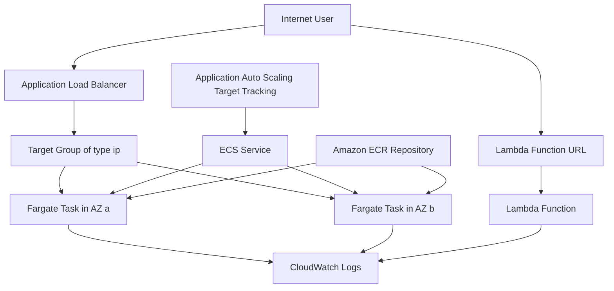

### AWS Services Used

| Service | Role in the lab |
|---|---|
| Amazon VPC | Two public and two private subnets across two Availability Zones |
| Amazon ECR | Private registry holding the application image |
| Amazon ECS | Cluster, task definition, and service |
| AWS Fargate | Serverless capacity for the tasks |
| Elastic Load Balancing | Application Load Balancer and target group |
| Application Auto Scaling | Target-tracking policy on the ECS service |
| AWS Lambda | Serverless comparison implementation |
| Amazon CloudWatch | Logs, metrics, and the scaling alarms |
| AWS IAM | Task role and task execution role |

### Implementation Steps

**Step 1 — Prepare the container image.**

Create a minimal application and Dockerfile locally, then build and push it to Amazon ECR.

```dockerfile
# Dockerfile - a deliberately small image to keep pull time short
FROM public.ecr.aws/docker/library/python:3.12-slim
WORKDIR /app
COPY app.py .
RUN pip install --no-cache-dir flask gunicorn
EXPOSE 8080
CMD ["gunicorn", "--bind", "0.0.0.0:8080", "--workers", "2", "app:app"]
```

```python
# app.py - exposes a health endpoint and a CPU-burning endpoint used to trigger scaling
import os, socket, time
from flask import Flask, jsonify

app = Flask(__name__)

@app.get("/health")
def health():
    return jsonify(status="ok", host=socket.gethostname()), 200

@app.get("/")
def index():
    return jsonify(message="Hello from ECS Fargate",
                   host=socket.gethostname(),
                   az=os.environ.get("AWS_AVAILABILITY_ZONE", "unknown")), 200

@app.get("/burn")
def burn():
    # Generates CPU load so that the target-tracking policy has something to react to
    end = time.time() + 5
    while time.time() < end:
        pow(2, 20000)
    return jsonify(burned_seconds=5), 200
```

```bash
ACCOUNT_ID=$(aws sts get-caller-identity --query Account --output text)
REGION=$(aws configure get region)
REPO=dso303-demo

aws ecr create-repository --repository-name "$REPO"
aws ecr get-login-password --region "$REGION" \
  | docker login --username AWS --password-stdin "$ACCOUNT_ID.dkr.ecr.$REGION.amazonaws.com"

docker build -t "$REPO":v1 .
docker tag "$REPO":v1 "$ACCOUNT_ID.dkr.ecr.$REGION.amazonaws.com/$REPO:v1"
docker push "$ACCOUNT_ID.dkr.ecr.$REGION.amazonaws.com/$REPO:v1"
```

**Step 2 — Create the ECS cluster.**

```bash
aws ecs create-cluster --cluster-name dso303-cluster \
  --capacity-providers FARGATE FARGATE_SPOT \
  --default-capacity-provider-strategy capacityProvider=FARGATE,weight=1
```

**Step 3 — Register the task definition.** Save the JSON from the Code Examples section as `taskdef.json`, then register it.

```bash
aws ecs register-task-definition --cli-input-json file://taskdef.json
```

**Step 4 — Create the load balancer and target group.** The target group type must be `ip` because `awsvpc` tasks receive their own ENI and are not registered by instance ID.

```bash
aws elbv2 create-target-group \
  --name dso303-tg --protocol HTTP --port 8080 \
  --vpc-id "$VPC_ID" --target-type ip \
  --health-check-path /health \
  --health-check-interval-seconds 15 \
  --healthy-threshold-count 2 --unhealthy-threshold-count 3
```

Create the Application Load Balancer in the two public subnets, then create a listener on port 80 forwarding to the target group.

**Step 5 — Create the ECS service.** Place tasks in the private subnets, attach them to the target group, and spread them across Availability Zones.

```bash
aws ecs create-service \
  --cluster dso303-cluster \
  --service-name dso303-svc \
  --task-definition dso303-task \
  --desired-count 2 \
  --launch-type FARGATE \
  --network-configuration "awsvpcConfiguration={subnets=[$PRIV_A,$PRIV_B],securityGroups=[$TASK_SG],assignPublicIp=DISABLED}" \
  --load-balancers "targetGroupArn=$TG_ARN,containerName=web,containerPort=8080" \
  --health-check-grace-period-seconds 60 \
  --deployment-configuration "minimumHealthyPercent=100,maximumPercent=200" \
  --placement-strategy "type=spread,field=attribute:ecs.availability-zone"
```

!!! warning "Private subnets require egress for image pull"
    Because `assignPublicIp` is `DISABLED`, the tasks have no route to the public internet unless the private subnets route through a NAT Gateway, or unless interface VPC endpoints exist for `ecr.api`, `ecr.dkr`, and `logs`, plus a Gateway endpoint for S3. Omitting this is the single most common cause of `CannotPullContainerError` in this lab.

**Step 6 — Configure target-tracking auto scaling.**

```bash
aws application-autoscaling register-scalable-target \
  --service-namespace ecs \
  --resource-id service/dso303-cluster/dso303-svc \
  --scalable-dimension ecs:service:DesiredCount \
  --min-capacity 2 --max-capacity 10

aws application-autoscaling put-scaling-policy \
  --service-namespace ecs \
  --resource-id service/dso303-cluster/dso303-svc \
  --scalable-dimension ecs:service:DesiredCount \
  --policy-name cpu-target-50 \
  --policy-type TargetTrackingScaling \
  --target-tracking-scaling-policy-configuration '{
    "TargetValue": 50.0,
    "PredefinedMetricSpecification": {"PredefinedMetricType": "ECSServiceAverageCPUUtilization"},
    "ScaleOutCooldown": 60,
    "ScaleInCooldown": 180
  }'
```

**Step 7 — Generate load and observe scaling.**

```bash
ALB_DNS=$(aws elbv2 describe-load-balancers --names dso303-alb \
  --query 'LoadBalancers[0].DNSName' --output text)

for i in $(seq 1 200); do curl -s "http://$ALB_DNS/burn" > /dev/null & done; wait

watch -n 10 "aws ecs describe-services --cluster dso303-cluster \
  --services dso303-svc --query 'services[0].[desiredCount,runningCount]'"
```

**Step 8 — Deploy the Lambda equivalent and compare.** Deploy the handler from the Code Examples section, create a Function URL, and measure latency for the first request after a period of inactivity versus subsequent requests.

```bash
for i in 1 2 3 4 5; do
  curl -s -o /dev/null -w "%{time_total}\n" "$FUNCTION_URL"
done
```

**Step 9 — Record observations and clean up.** Delete the ECS service, the load balancer, the target group, the Lambda function, and the ECR repository. In a Learner Lab, leaving a NAT Gateway or an Application Load Balancer running will exhaust the budget quickly, because both bill per hour regardless of traffic.

### Expected Output

| Observation | Expected result |
|---|---|
| Initial ECS service state | `desiredCount` 2, `runningCount` 2, both tasks healthy in the target group |
| Response body across repeated requests | The `host` field alternates, demonstrating load distribution across tasks |
| Under `/burn` load | `desiredCount` rises toward 10 within two to four minutes, then returns to 2 after the scale-in cooldown |
| ECS task placement | Tasks distributed across both Availability Zones |
| Lambda first request after idle | Noticeably higher `time_total`, typically several hundred milliseconds, reflecting the cold start |
| Lambda subsequent requests | Substantially lower `time_total`, typically tens of milliseconds |
| CloudWatch Logs | One log stream per task and per Lambda execution environment |

!!! tip "What the lab is really teaching"
    The ECS path required roughly a dozen resources and explicit decisions about subnets, health checks, and scaling thresholds. The Lambda path required almost none of that but imposed a cold-start penalty and a duration ceiling. Neither is superior; the exercise is to feel the trade-off physically rather than read about it.

## Code Examples

### AWS CLI — launching an EC2 instance with a launch template

```bash
# Launch templates are versioned and are required for mixed-instances policies.
aws ec2 create-launch-template \
  --launch-template-name dso303-web-lt \
  --version-description v1 \
  --launch-template-data '{
    "ImageId": "resolve:ssm:/aws/service/ami-amazon-linux-latest/al2023-ami-kernel-default-x86_64",
    "InstanceType": "t3.micro",
    "IamInstanceProfile": {"Name": "LabInstanceProfile"},
    "SecurityGroupIds": ["sg-0123456789abcdef0"],
    "MetadataOptions": {"HttpTokens": "required", "HttpPutResponseHopLimit": 2},
    "Monitoring": {"Enabled": true},
    "TagSpecifications": [{
      "ResourceType": "instance",
      "Tags": [{"Key": "Name", "Value": "dso303-web"}, {"Key": "Module", "Value": "DSO303"}]
    }],
    "UserData": "'"$(base64 -w0 <<'UD'
#!/bin/bash
dnf -y install nginx
systemctl enable --now nginx
UD
)"'"
  }'
```

!!! note "Why `HttpTokens: required`"
    This enforces IMDSv2, which requires a session token obtained by a `PUT` request. IMDSv1 is vulnerable to server-side request forgery, where a compromised application is tricked into fetching instance credentials. Enforcing IMDSv2 is a baseline security control and is checked by AWS Config and Security Hub.

### AWS CLI — Auto Scaling group with a mixed-instances policy

```bash
# Combines On-Demand baseline with Spot for cost efficiency, across three AZs.
aws autoscaling create-auto-scaling-group \
  --auto-scaling-group-name dso303-asg \
  --min-size 2 --max-size 12 --desired-capacity 2 \
  --vpc-zone-identifier "subnet-aaa,subnet-bbb,subnet-ccc" \
  --health-check-type ELB --health-check-grace-period 120 \
  --target-group-arns "$TG_ARN" \
  --mixed-instances-policy '{
    "LaunchTemplate": {
      "LaunchTemplateSpecification": {"LaunchTemplateName": "dso303-web-lt", "Version": "$Latest"},
      "Overrides": [
        {"InstanceType": "t3.medium"},
        {"InstanceType": "t3a.medium"},
        {"InstanceType": "m6i.large"}
      ]
    },
    "InstancesDistribution": {
      "OnDemandBaseCapacity": 2,
      "OnDemandPercentageAboveBaseCapacity": 20,
      "SpotAllocationStrategy": "price-capacity-optimized"
    }
  }'
```

### ECS task definition (JSON)

```json
{
  "family": "dso303-task",
  "networkMode": "awsvpc",
  "requiresCompatibilities": ["FARGATE"],
  "cpu": "512",
  "memory": "1024",
  "runtimePlatform": {"cpuArchitecture": "X86_64", "operatingSystemFamily": "LINUX"},
  "executionRoleArn": "arn:aws:iam::111122223333:role/LabRole",
  "taskRoleArn": "arn:aws:iam::111122223333:role/LabRole",
  "containerDefinitions": [
    {
      "name": "web",
      "image": "111122223333.dkr.ecr.us-east-1.amazonaws.com/dso303-demo:v1",
      "essential": true,
      "portMappings": [{"containerPort": 8080, "protocol": "tcp"}],
      "environment": [{"name": "APP_ENV", "value": "lab"}],
      "secrets": [
        {"name": "DB_PASSWORD", "valueFrom": "arn:aws:secretsmanager:us-east-1:111122223333:secret:dso303/db-AbCdEf"}
      ],
      "healthCheck": {
        "command": ["CMD-SHELL", "curl -f http://localhost:8080/health || exit 1"],
        "interval": 30, "timeout": 5, "retries": 3, "startPeriod": 30
      },
      "logConfiguration": {
        "logDriver": "awslogs",
        "options": {
          "awslogs-group": "/ecs/dso303",
          "awslogs-region": "us-east-1",
          "awslogs-stream-prefix": "web",
          "awslogs-create-group": "true"
        }
      }
    }
  ]
}
```

!!! tip "Secrets belong in `secrets`, never in `environment`"
    Values placed in `environment` are visible in the task definition, which is readable by anyone with `ecs:DescribeTaskDefinition`. The `secrets` block causes the execution role to fetch the value at task start and inject it, so the ciphertext reference rather than the plaintext is stored.

### Kubernetes manifests for EKS

```yaml
apiVersion: apps/v1
kind: Deployment
metadata:
  name: dso303-web
  labels: {app: dso303-web}
spec:
  replicas: 3
  selector:
    matchLabels: {app: dso303-web}
  template:
    metadata:
      labels: {app: dso303-web}
    spec:
      serviceAccountName: dso303-sa      # bound to an IAM role via IRSA
      topologySpreadConstraints:
        - maxSkew: 1
          topologyKey: topology.kubernetes.io/zone
          whenUnsatisfiable: DoNotSchedule
          labelSelector:
            matchLabels: {app: dso303-web}
      containers:
        - name: web
          image: 111122223333.dkr.ecr.us-east-1.amazonaws.com/dso303-demo:v1
          ports: [{containerPort: 8080}]
          resources:
            requests: {cpu: "250m", memory: "256Mi"}
            limits:   {cpu: "500m", memory: "512Mi"}
          readinessProbe:
            httpGet: {path: /health, port: 8080}
            initialDelaySeconds: 5
            periodSeconds: 10
          livenessProbe:
            httpGet: {path: /health, port: 8080}
            initialDelaySeconds: 30
            periodSeconds: 20
---
apiVersion: v1
kind: Service
metadata:
  name: dso303-web
spec:
  type: ClusterIP
  selector: {app: dso303-web}
  ports: [{port: 80, targetPort: 8080}]
---
apiVersion: v1
kind: ServiceAccount
metadata:
  name: dso303-sa
  annotations:
    eks.amazonaws.com/role-arn: arn:aws:iam::111122223333:role/dso303-pod-role
```

!!! note "Requests versus limits"
    `requests` drive scheduling — the scheduler places a pod only on a node with that much unreserved capacity. `limits` drive enforcement — exceeding a memory limit terminates the container with `OOMKilled`, while exceeding a CPU limit throttles it. Setting requests too high wastes cluster capacity; setting them too low causes noisy-neighbour contention.

### AWS Lambda handler (Python)

```python
import json, os, time
import boto3

# Initialised once per execution environment, reused across warm invocations.
# Moving client construction inside the handler is a classic performance defect.
_ddb = boto3.resource("dynamodb")
_table = _ddb.Table(os.environ["TABLE_NAME"])
COLD_START_AT = time.time()

def handler(event, context):
    is_cold = (time.time() - COLD_START_AT) < 0.5
    try:
        _table.put_item(Item={
            "pk": context.aws_request_id,
            "received_at": int(time.time()),
            "source": event.get("requestContext", {}).get("http", {}).get("sourceIp", "unknown"),
        })
    except Exception as exc:
        # Returning 5xx allows the caller or the event source to retry.
        return {"statusCode": 500, "body": json.dumps({"error": str(exc)})}

    return {
        "statusCode": 200,
        "headers": {"Content-Type": "application/json"},
        "body": json.dumps({
            "message": "Hello from Lambda",
            "cold_start": is_cold,
            "remaining_ms": context.get_remaining_time_in_millis(),
            "memory_mb": context.memory_limit_in_mb,
        }),
    }
```

### Python (boto3) — driving ECS and inspecting scaling

```python
import boto3

ecs = boto3.client("ecs")

def deploy_new_revision(cluster: str, service: str, image: str) -> str:
    """Register a new task definition revision and update the service in place.

    ECS deployments are declarative: we change desired state and the service
    scheduler reconciles toward it using the deployment configuration.
    """
    svc = ecs.describe_services(cluster=cluster, services=[service])["services"][0]
    td = ecs.describe_task_definition(taskDefinition=svc["taskDefinition"])["taskDefinition"]

    for key in ("taskDefinitionArn", "revision", "status", "requiresAttributes",
                "compatibilities", "registeredAt", "registeredBy", "deregisteredAt"):
        td.pop(key, None)

    td["containerDefinitions"][0]["image"] = image
    new_arn = ecs.register_task_definition(**td)["taskDefinition"]["taskDefinitionArn"]

    ecs.update_service(cluster=cluster, service=service,
                       taskDefinition=new_arn, forceNewDeployment=True)
    waiter = ecs.get_waiter("services_stable")
    waiter.wait(cluster=cluster, services=[service])
    return new_arn
```

### CloudFormation — ECS service on Fargate behind an ALB (abridged)

```yaml
AWSTemplateFormatVersion: '2010-09-09'
Description: DSO303 ECS Fargate service with target-tracking auto scaling

Parameters:
  VpcId:        {Type: AWS::EC2::VPC::Id}
  PrivateSubnets: {Type: List<AWS::EC2::Subnet::Id>}
  PublicSubnets:  {Type: List<AWS::EC2::Subnet::Id>}
  ImageUri:     {Type: String}

Resources:
  Cluster:
    Type: AWS::ECS::Cluster
    Properties:
      ClusterName: dso303-cluster
      ClusterSettings: [{Name: containerInsights, Value: enabled}]

  LogGroup:
    Type: AWS::Logs::LogGroup
    Properties:
      LogGroupName: /ecs/dso303
      RetentionInDays: 14        # unbounded retention is a silent, growing cost

  TaskDefinition:
    Type: AWS::ECS::TaskDefinition
    Properties:
      Family: dso303-task
      Cpu: '512'
      Memory: '1024'
      NetworkMode: awsvpc
      RequiresCompatibilities: [FARGATE]
      ExecutionRoleArn: !Sub 'arn:aws:iam::${AWS::AccountId}:role/LabRole'
      TaskRoleArn: !Sub 'arn:aws:iam::${AWS::AccountId}:role/LabRole'
      ContainerDefinitions:
        - Name: web
          Image: !Ref ImageUri
          Essential: true
          PortMappings: [{ContainerPort: 8080}]
          LogConfiguration:
            LogDriver: awslogs
            Options:
              awslogs-group: !Ref LogGroup
              awslogs-region: !Ref AWS::Region
              awslogs-stream-prefix: web

  Service:
    Type: AWS::ECS::Service
    DependsOn: Listener
    Properties:
      Cluster: !Ref Cluster
      DesiredCount: 2
      LaunchType: FARGATE
      TaskDefinition: !Ref TaskDefinition
      HealthCheckGracePeriodSeconds: 60
      DeploymentConfiguration:
        MinimumHealthyPercent: 100
        MaximumPercent: 200
        DeploymentCircuitBreaker: {Enable: true, Rollback: true}
      NetworkConfiguration:
        AwsvpcConfiguration:
          Subnets: !Ref PrivateSubnets
          SecurityGroups: [!Ref TaskSecurityGroup]
          AssignPublicIp: DISABLED
      LoadBalancers:
        - ContainerName: web
          ContainerPort: 8080
          TargetGroupArn: !Ref TargetGroup

  ScalableTarget:
    Type: AWS::ApplicationAutoScaling::ScalableTarget
    Properties:
      MinCapacity: 2
      MaxCapacity: 10
      ResourceId: !Sub 'service/${Cluster}/${Service.Name}'
      ScalableDimension: ecs:service:DesiredCount
      ServiceNamespace: ecs
      RoleARN: !Sub 'arn:aws:iam::${AWS::AccountId}:role/aws-service-role/ecs.application-autoscaling.amazonaws.com/AWSServiceRoleForApplicationAutoScaling_ECSService'

  ScalingPolicy:
    Type: AWS::ApplicationAutoScaling::ScalingPolicy
    Properties:
      PolicyName: cpu-target-50
      PolicyType: TargetTrackingScaling
      ScalingTargetId: !Ref ScalableTarget
      TargetTrackingScalingPolicyConfiguration:
        TargetValue: 50.0
        PredefinedMetricSpecification:
          PredefinedMetricType: ECSServiceAverageCPUUtilization
        ScaleInCooldown: 180
        ScaleOutCooldown: 60
```

!!! tip "Deployment circuit breaker"
    `DeploymentCircuitBreaker` with `Rollback: true` instructs ECS to detect a deployment whose tasks repeatedly fail to become healthy and automatically revert to the last known-good task definition. Without it, a bad image can leave a service stuck in a failing deployment loop indefinitely.

### Terraform — Lambda function with an alias and weighted deployment

```hcl
resource "aws_lambda_function" "api" {
  function_name    = "dso303-api"
  role             = aws_iam_role.lambda.arn
  handler          = "app.handler"
  runtime          = "python3.12"
  filename         = data.archive_file.pkg.output_path
  source_code_hash = data.archive_file.pkg.output_base64sha256

  memory_size = 512   # memory also determines vCPU allocation
  timeout     = 15
  publish     = true  # required to create immutable versions for aliases

  environment {
    variables = { TABLE_NAME = aws_dynamodb_table.items.name }
  }

  tracing_config { mode = "Active" }  # enables AWS X-Ray

  # Bounds blast radius: this function can never consume more than 100
  # concurrent executions from the account pool.
  reserved_concurrent_executions = 100
}

resource "aws_lambda_alias" "live" {
  name             = "live"
  function_name    = aws_lambda_function.api.function_name
  function_version = aws_lambda_function.api.version

  # Canary: 10 percent of traffic to the new version, 90 percent to the old.
  routing_config {
    additional_version_weights = {
      (aws_lambda_function.api.version) = 0.1
    }
  }
}

resource "aws_lambda_provisioned_concurrency_config" "warm" {
  function_name                     = aws_lambda_alias.live.function_name
  qualifier                         = aws_lambda_alias.live.name
  provisioned_concurrent_executions = 5
}
```

### Shell — EC2 user data for a resilient bootstrap

```bash
#!/bin/bash
set -euxo pipefail
# Fail fast and log everything; a silent bootstrap failure produces an instance
# that passes EC2 health checks but never serves traffic.
exec > >(tee /var/log/user-data.log | logger -t user-data) 2>&1

dnf -y update
dnf -y install nginx amazon-cloudwatch-agent

TOKEN=$(curl -sX PUT "http://169.254.169.254/latest/api/token" \
  -H "X-aws-ec2-metadata-token-ttl-seconds: 21600")
AZ=$(curl -sH "X-aws-ec2-metadata-token: $TOKEN" \
  http://169.254.169.254/latest/meta-data/placement/availability-zone)

echo "<h1>DSO303</h1><p>AZ: $AZ</p>" > /usr/share/nginx/html/index.html
echo "ok" > /usr/share/nginx/html/health

systemctl enable --now nginx
systemctl enable --now amazon-cloudwatch-agent
```

## AWS Certification Tips

### Exam tips

- Read the question for the discriminating constraint. Words such as *least operational overhead*, *most cost-effective*, *minimum change*, *highest availability*, and *fully managed* almost always eliminate two of the four options immediately.
- "Least operational overhead" points toward serverless: Lambda over Fargate, Fargate over EC2, managed services over self-managed.
- "Most cost-effective for interruption-tolerant work" points to Spot. "Most cost-effective for steady, predictable, long-running work" points to Savings Plans or Reserved Instances.
- A stated duration above 15 minutes eliminates Lambda. A stated GPU requirement eliminates Lambda. A stated requirement for a specific kernel, kernel module, or a licensed operating system points to EC2, possibly on Dedicated Hosts.
- If the question mentions Kubernetes, Helm, operators, or portability to on-premises, the answer is EKS. If it mentions deep AWS integration with no Kubernetes requirement, the answer is ECS.

### Frequently confused services and concepts

| Pair | The distinguishing fact |
|---|---|
| ECS versus EKS | ECS is AWS-proprietary orchestration with no control-plane charge; EKS is upstream-conformant Kubernetes with a per-cluster hourly charge |
| Fargate versus EC2 launch type | Fargate is a capacity mode with no host access and per-task billing; EC2 launch type gives host access and per-instance billing |
| Reserved concurrency versus provisioned concurrency | Reserved caps and guarantees a concurrency share; provisioned pre-initialises environments to remove cold starts and is separately billed |
| Lambda version versus alias | A version is an immutable snapshot; an alias is a movable pointer supporting weighted traffic shifting |
| Launch template versus launch configuration | Launch templates are versioned, support the full EC2 API, and are required for mixed-instances policies; launch configurations are legacy |
| Auto Scaling group versus Application Auto Scaling | The former scales EC2 instances; the latter scales ECS services, DynamoDB tables, Aurora replicas, and similar |
| Target tracking versus step scaling | Target tracking maintains a metric at a set point and is the default recommendation; step scaling responds to alarm breach magnitude and suits non-linear responses |
| Instance store versus EBS | Instance store is physically attached, extremely fast, and ephemeral; EBS is network-attached, persistent, and snapshot-capable |
| Spot Instance versus Spot Fleet versus capacity-optimized allocation | The first is a single interruptible instance; the second a managed collection; the third an allocation strategy that reduces interruption probability |
| Task role versus task execution role | The application uses the task role; the ECS and Fargate infrastructure uses the execution role |
| Cluster Autoscaler versus Karpenter versus HPA | The first two add nodes; HPA adds pods. Karpenter provisions right-sized nodes directly rather than adjusting Auto Scaling groups |
| Placement group types | Cluster for low latency in one AZ, spread for maximum hardware isolation, partition for large distributed systems such as HDFS and Cassandra |

### Memory aids

- **The compute ladder.** EC2 (you manage the OS) to ECS/EKS on EC2 (you manage the nodes) to Fargate (you manage the container) to Lambda (you manage the function). Each rung trades control for reduced operational burden.
- **The 15-minute rule.** Lambda 15 minutes, API Gateway REST integration timeout 29 seconds, ALB idle timeout 60 seconds by default. If a stated duration exceeds one of these, that component is eliminated.
- **"Roles, not keys."** Any option embedding long-lived access keys is wrong on a security question.
- **"Multi-AZ for availability, Multi-Region for disaster recovery."** These are different problems with different costs.
- **`awsvpc` means the task gets its own ENI**, which is why target groups must be of type `ip` and why ENI limits bound task density on EC2 launch type.

!!! danger "Common certification traps"
    - An Auto Scaling group with `EC2` health checks does **not** detect application failure.
    - Fargate is **not** an orchestrator and does **not** support DaemonSets on EKS.
    - Spot Instances **do** receive a two-minute interruption notice; "no warning" is wrong.
    - Lambda's 15-minute timeout is a **hard** limit that cannot be raised by a support request.
    - IAM roles attach to EC2 through an **instance profile**, not directly.
    - Increasing Lambda memory increases vCPU proportionally, so a higher memory setting can be **cheaper** overall by shortening duration.
    - Placing a Lambda function in a VPC does **not** make it more secure by default and generally **adds** latency; do it only when private resource access is required.

## Summary

AWS compute is best understood not as four unrelated products but as a single spectrum of abstraction. At one end, Amazon EC2 hands over a virtual machine and, with it, complete control and complete responsibility for the operating system, patching, capacity, and scaling. At the other end, AWS Lambda hands over nothing but a function and takes responsibility for everything beneath it, in exchange for accepting a constrained execution model: short duration, no persistent local state, and a cold-start penalty. Amazon ECS and Amazon EKS occupy the middle, standardising the unit of deployment as a container image and delegating placement, health, and reconciliation to a control plane — with AWS Fargate available in both to remove the node layer entirely.

The architectural lessons generalise well beyond these four services.

First, **every managed service is a trade of control for operational leverage**, and the correct position on that spectrum depends on what the team actually needs to control. Choosing EC2 because it feels familiar imports years of patching and capacity work; choosing Lambda because it is fashionable imports a 15-minute ceiling and a cold-start tax into a workload that may tolerate neither.

Second, **elasticity requires statelessness**. Horizontal scaling, rolling deployment, health-based replacement, Spot interruption tolerance, and multi-AZ resilience are all consequences of the same design property: any request can be served by any instance, and losing an instance loses nothing durable. Externalising session and durable state to DynamoDB, ElastiCache, RDS, S3, or EFS is the enabling decision that makes every other compute capability available.

Third, **the control plane and the data plane fail differently, and designs should reflect that**. A managed control plane outage typically prevents new deployments and scaling actions while running workloads continue to serve. Understanding this separation explains why AWS invests so heavily in control-plane resilience, why data-plane capacity should carry N-1 headroom, and why a deployment freeze is a survivable incident while a data-plane collapse is not.

Fourth, **cost is an architectural property, not a billing afterthought**. The purchasing model (On-Demand, Savings Plans, Reserved, Spot), the memory setting on a Lambda function, the choice between a continuously utilised container and a per-invocation function, the decision to run one NAT Gateway or three, and the log retention period are all design decisions made at architecture time whose consequences appear on an invoice months later.

Finally, **compute choices should be reversible where possible**. Containerising an application, externalising state, defining infrastructure as code, and instrumenting for observability all preserve the ability to move down or up the abstraction ladder as requirements change. The best compute decision an architect makes is often the one that keeps the next decision cheap.

## Practice Questions

### Beginner Questions

1. Define an Amazon Machine Image, an instance type, and an instance profile, and explain the role each plays when an EC2 instance launches.
2. Explain the difference between object-level responsibility in the AWS shared responsibility model for EC2 versus for AWS Lambda. Name three things that become the customer's responsibility with EC2 but not with Lambda.
3. What is a container image, and why does immutability of that image matter for reproducible deployments? Contrast this with configuring a server after launch.
4. List the four purchasing options for EC2 capacity and give one workload that suits each.
5. An AWS Lambda function is configured with 128 MB of memory and takes 4 seconds to run. The team increases it to 512 MB and it now takes 1 second. Explain why the total cost may be unchanged or lower, and why the user-perceived latency improves.

### Intermediate Questions

1. A service currently runs on three EC2 instances behind an Application Load Balancer with a fixed desired count. Describe how you would convert it to an elastic architecture, naming the specific components, the health-check configuration, and the scaling policy you would select, and justify each choice.
2. Compare ECS on Fargate with ECS on EC2 across cost, security isolation, operational overhead, task density, and support for GPU and DaemonSet-style workloads. State the conditions under which each becomes the correct choice.
3. Explain the full sequence of events, including control-plane and data-plane actions, that occurs between an `UpdateService` API call with a new task definition and the point at which all traffic reaches the new version under a rolling deployment with `minimumHealthyPercent` 100 and `maximumPercent` 200.
4. An EKS cluster's pods must call Amazon S3. Describe the IRSA mechanism end to end — the OIDC provider, the IAM trust policy, the ServiceAccount annotation, and the token projection — and explain why this is superior to attaching permissions to the node instance role.
5. A team reports that their Lambda function occasionally returns duplicate results to downstream systems. Explain the delivery semantics involved for asynchronous invocation and for an SQS event source, and describe how you would make the function idempotent.

### Advanced Questions

1. Design a compute architecture for a global video-streaming platform's metadata API. It must serve 50,000 requests per second at peak with a p99 latency budget of 100 milliseconds, tolerate the loss of a full Availability Zone with no capacity degradation, deploy 30 times per day with automatic rollback, and minimise cost. Specify the compute model, the scaling strategy, the deployment strategy, the purchasing model, and the failure domains, and justify every choice against a stated alternative you rejected.
2. A monolithic Java application currently runs on eight large EC2 instances at 20 percent average CPU utilisation with sharp quarter-end peaks. Propose a migration path across at least three stages, from rehosting through containerisation to selective serverless decomposition. For each stage, state what it costs, what it improves, what new failure modes it introduces, and what would justify stopping at that stage rather than continuing.
3. Critically evaluate the claim that "serverless is always cheaper". Construct a quantitative crossover argument comparing AWS Lambda against ECS on Fargate for a workload of average duration 200 milliseconds and 512 MB of memory. Identify the approximate request rate at which the continuously provisioned container becomes cheaper, state your assumptions explicitly, and then explain why the purely financial crossover is not by itself sufficient grounds for the architectural decision.
4. An organisation runs a stateful, latency-sensitive trading engine that requires sub-millisecond inter-node communication, cannot tolerate noisy neighbours, and must satisfy a regulatory requirement for hardware isolation and detailed audit evidence. Design the compute layer, addressing placement groups, instance tenancy, enhanced networking with Elastic Fabric Adapter or SR-IOV, IMDS hardening, and the observability and audit trail required. Explain which cloud-native principles you are deliberately sacrificing and why that sacrifice is defensible here.
5. Design the control loop for a multi-tenant SaaS platform in which each tenant's workload must be isolated, tenants have wildly different load profiles, and the platform must scale from 10 to 10,000 tenants without a linear increase in operational effort. Compare a pool model (shared compute, logical isolation), a silo model (dedicated compute per tenant), and a hybrid bridge model. Address noisy neighbours, blast radius, cost attribution per tenant, deployment strategy, and the specific AWS compute primitives you would use for each model.