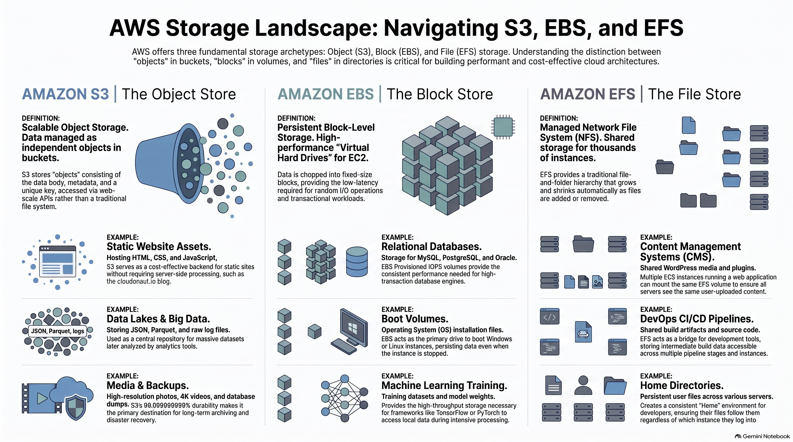
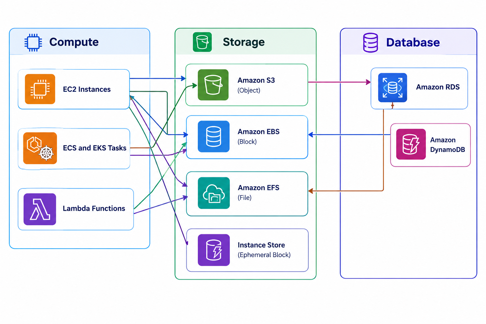
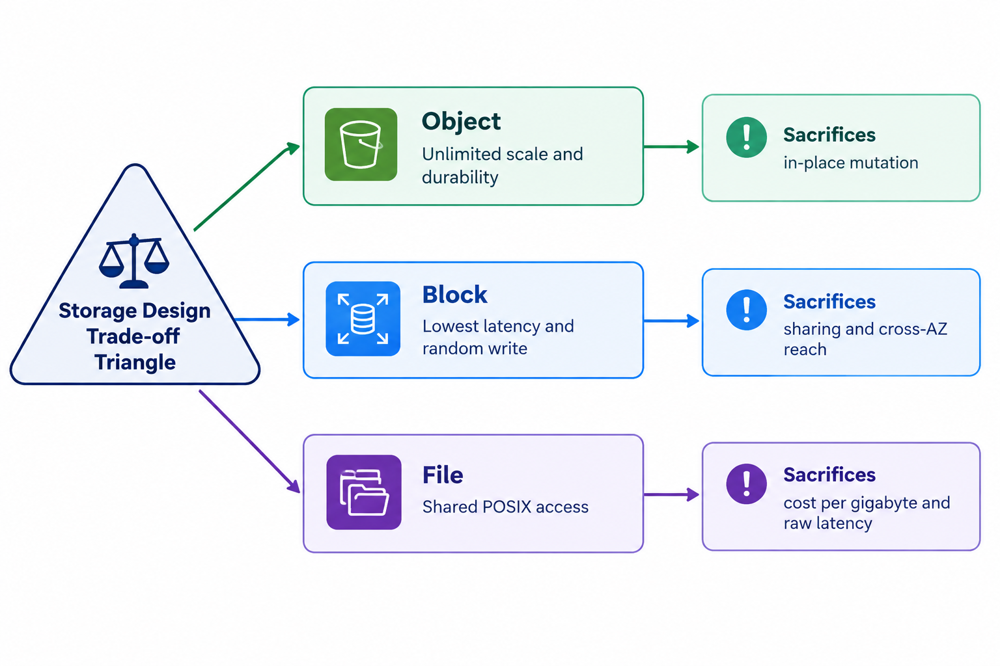
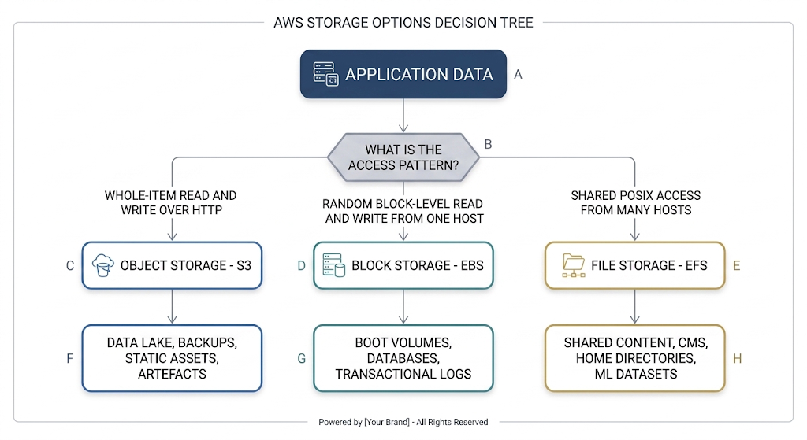
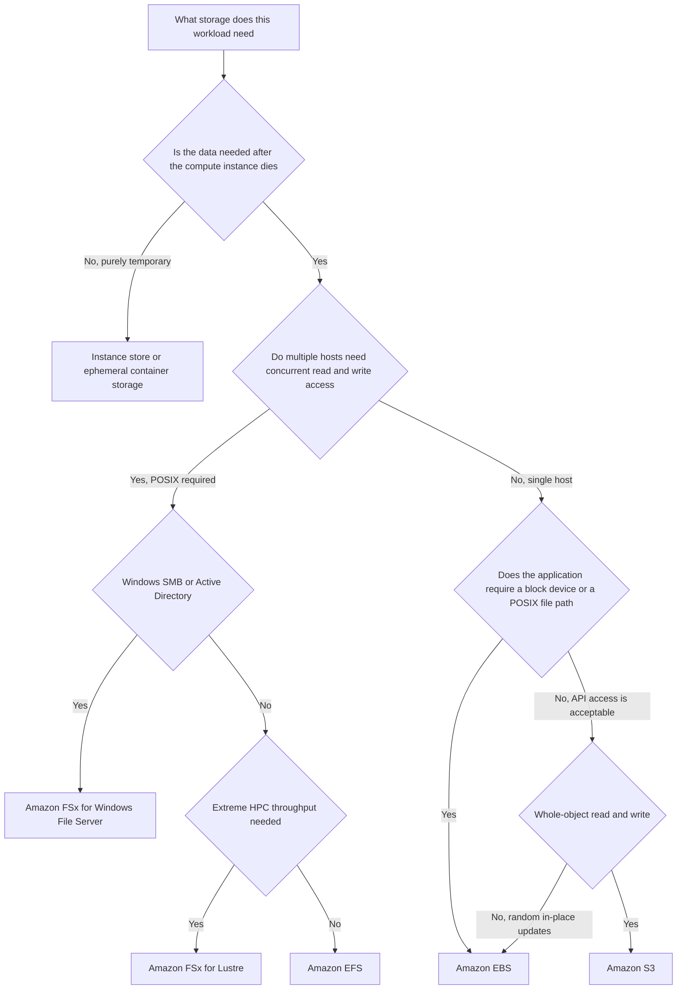

# Storage Services  Amazon S3, Amazon EBS, and Amazon EFS

!!! info "Scope of this chapter"
    This chapter is the Unit 1 survey of AWS storage: the object, block and file distinction, a comparison of the three services, the key storage classes and volume types, and when to choose each. The full treatment of each service, including internals, configuration and integration with ECS, EKS and Lambda, is in [6.1 AWS Storage Solutions](../unit6/topic1.md): [Amazon S3](../unit6/topic1.md#object-storage-with-amazon-s3), [Amazon EBS](../unit6/topic1.md#block-storage-with-amazon-ebs) and [Amazon EFS](../unit6/topic1.md#file-storage-with-amazon-efs).

## Definition

AWS storage services are managed, API-driven, durable data-persistence systems that decouple data from the lifetime of any individual compute resource. They sit in the **data layer** of an AWS architecture, beneath the compute layer (EC2, ECS, EKS, Lambda) and alongside the database layer (RDS, DynamoDB, Aurora).

Three services form the foundation of the AWS storage portfolio, and each implements a fundamentally different storage abstraction.

### Amazon S3  Simple Storage Service

Amazon S3 is a **regional, fully managed object storage service**. Data is stored as immutable **objects**  an opaque blob of bytes plus user-defined metadata  inside flat containers called **buckets**, and accessed over HTTPS through a REST API. S3 has no file system, no directories, no partial in-place writes, and no notion of a mounted device. It is designed for effectively unlimited capacity, eleven nines of durability, and internet-scale concurrency.

### Amazon EBS  Elastic Block Store

Amazon EBS is an **Availability-Zone-scoped, network-attached block storage service**. It presents a raw block device to an EC2 instance, which the guest operating system formats with a file system (ext4, XFS, NTFS) exactly as it would a physical disk. EBS volumes are replicated within a single Availability Zone and support point-in-time snapshots stored in S3.

### Amazon EFS  Elastic File System

Amazon EFS is a **regional, fully managed, elastic network file system** implementing the **NFSv4.1** protocol. It provides shared POSIX semantics  directories, file permissions, byte-range locking  to thousands of concurrent clients across multiple Availability Zones. Capacity grows and shrinks automatically as files are written and deleted, with no provisioning step.

<figure markdown="span">
    {width="80%"}
    <figcaption>Storage Services in AWS</figcaption>
    
<i>Image Source: AI generated (Google Gemini)</i>

</figure>

### Where they fit in AWS architecture

<figure markdown="span">
    {width="80%"}
    <figcaption>Storage Servives</figcaption>
    
<i>Image Source: AI generated (Chatgpt)</i>

</figure>

!!! note "Storage is not the same as a database"
    A database imposes structure, query semantics, transactions, and indexing on top of storage. A storage service stores bytes and returns bytes. If you need to *query* the data by content, you want a database ([Chapter 1.5](../unit1/topic5.md)); if you need to *retrieve* the data by identity, you want storage.

---

## Why This Service or Concept Exists

In a traditional data centre, storage is a capital purchase: capacity is forecast years ahead, durability depends on RAID inside one building, performance is bounded by the spindles already bought, and backups go to tape with restores measured in days. AWS storage replaces this with elastic capacity provisioned by API, multi-AZ durability as a configuration default, performance that is configurable independently of capacity (notably with gp3 volumes), incremental snapshots restorable in minutes, and access control based on IAM identity rather than network segments.

AWS offers three services rather than one because the three abstractions make **mutually incompatible trade-offs**. Object storage gives up in-place mutation to gain unbounded scale and durability; block storage gives up sharing and cross-zone reach to gain sub-millisecond random access; file storage accepts higher cost and latency to gain shared POSIX semantics across many hosts. The reasoning is developed in [6.1 The Three Storage Abstractions](../unit6/topic1.md#the-three-storage-abstractions).

<figure markdown="span">
    {width="80%"}
    <figcaption>Storage Servives Tradeoffs</figcaption>
    
<i>Image Source: AI generated (Chatgpt)</i>

</figure>

!!! tip "The architect's framing"
    Do not ask "which AWS storage service should I use". Ask "what access pattern does my data have". Access pattern determines abstraction; abstraction determines service.

---

## Core Concepts

### The three storage abstractions

| Dimension | Object storage (S3) | Block storage (EBS) | File storage (EFS) |
|---|---|---|---|
| Unit of storage | Object: bytes plus metadata | Fixed-size block | File within a directory tree |
| Access protocol | HTTPS REST API | Block device attached to one instance | NFS mount from many clients |
| Mutation model | Replace whole object | Overwrite any block in place | Read, write, seek, append |
| Concurrent writers | Many, last write wins per key | Normally one instance | Many, coordinated by the file system |
| Typical latency | Tens of milliseconds | Sub-millisecond to low milliseconds | Low milliseconds |
| Scope | Regional, three or more AZs | One Availability Zone | Regional, multi-AZ (or One Zone) |

<figure markdown="span">
    {width="80%"}
    <figcaption>Storage Servives Decision options</figcaption>
    
<i>Image Source: AI generated (Google Gemini)</i>

</figure>

### Key vocabulary

| Service | Terms to know |
|---|---|
| Amazon S3 | **Bucket** (Regional container, globally unique name), **object**, **key** (the full object name; S3 has no real folders), **prefix**, **versioning**, **storage class**, **lifecycle policy**, **presigned URL** |
| Amazon EBS | **Volume** (lives in one AZ), **volume type**, **IOPS**, **throughput**, **snapshot** (incremental, Regional, stored in S3), **Multi-Attach** |
| Amazon EFS | **File system**, **mount target** (one network interface per AZ, TCP 2049), **access point**, **throughput mode**, **storage class** |

**Instance store** is disk physically attached to the EC2 host. It is the fastest option but **ephemeral**: data is lost when the instance stops or terminates, so it suits only scratch space, caches and data replicated elsewhere.

### Durability and availability are different properties

**Durability** is the probability that data is not lost; **availability** is the probability that it can be reached at a given moment. S3 Standard is designed for eleven nines of durability and 99.99 percent availability. A single EBS volume is replicated only within one Availability Zone, so a zone failure makes it unavailable (though not lost). Durability figures describe hardware failure only; they do not protect against deletion by a user or application, which is what versioning, Object Lock and backups are for. See [6.1 Durability and Availability](../unit6/topic1.md#durability-and-availability) for the per-class figures.

S3 provides **strong read-after-write consistency** for object operations; bucket configuration changes and cross-Region replication remain eventually consistent.

---

## Architecture Components

| Component | Role in a storage architecture |
|---|---|
| Amazon CloudFront | Caches S3 objects at the edge; Origin Access Control keeps the bucket private |
| Amazon VPC, route tables, VPC endpoints | Carry the private path from compute to S3 (Gateway endpoint) and the EFS mount targets ([Chapter 1.6](../unit1/topic6.md)) |
| Security groups | Allow TCP 2049 from clients to EFS mount targets |
| Amazon EC2, ECS, EKS, Lambda | Attach EBS, mount EFS and call the S3 API ([Chapter 1.3](../unit1/topic3.md)) |
| AWS IAM | Authorises every storage API call ([Chapter 1.2](../unit1/topic2.md)) |
| AWS KMS | Supplies the keys that encrypt S3 objects, EBS volumes and EFS file systems ([8.3](../unit8/topic3.md#encryption-at-rest-with-aws-kms)) |
| Amazon CloudWatch and AWS CloudTrail | Storage metrics, alarms and audit records |
| AWS Backup | Central backup policy for EBS, EFS and S3 |

---

## AWS Service Deep Dive

This section summarises the options an architect chooses between. Full tables of limits, pricing dimensions and features are in 6.1.

### Amazon S3 storage classes

| Storage class | Use when | Minimum storage duration | Retrieval |
|---|---|---|---|
| S3 Standard | Data is accessed frequently | None | Milliseconds |
| S3 Intelligent-Tiering | The access pattern is unknown or changes | None | Milliseconds |
| S3 Standard-IA | Data is read rarely but must be available immediately | 30 days | Milliseconds, per-GiB fee |
| S3 One Zone-IA | As above, but the data can be recreated | 30 days | Milliseconds, single AZ |
| S3 Glacier Instant Retrieval | Archive that still needs millisecond access | 90 days | Milliseconds |
| S3 Glacier Flexible Retrieval | Archive; minutes to hours is acceptable | 90 days | Restore required |
| S3 Glacier Deep Archive | Long-term retention, lowest price | 180 days | Restore in about 12 hours or more |
| S3 Express One Zone | Single-digit-millisecond latency at very high request rates | One hour | Single AZ directory bucket |

!!! warning "Colder is not always cheaper"
    Colder classes carry minimum storage durations and retrieval fees. Moving short-lived or frequently read data into IA or Glacier classes can increase cost. See [6.1 Storage classes](../unit6/topic1.md#storage-classes).

Other S3 features to recognise at survey level: **versioning** (every overwrite and delete keeps the previous version), **lifecycle rules** (transition or expire objects by age), **Object Lock** (write-once-read-many retention), **replication** (asynchronous copy to another bucket or Region), **presigned URLs** and **multipart upload**.

### Amazon EBS volume types

| Type | Media | Use when |
|---|---|---|
| gp3 | SSD | The default for boot volumes, most databases and application servers; IOPS and throughput are set independently of size |
| gp2 | SSD | Legacy; performance tied to size with burst credits. Migrate to gp3 |
| io2 Block Express | SSD | Mission-critical databases needing the highest IOPS (up to 256,000) and lowest latency |
| io1 | SSD | Legacy provisioned IOPS; superseded by io2 |
| st1 | HDD | Large sequential reads such as log processing and data warehouses |
| sc1 | HDD | Cold data accessed a few times a month, at the lowest cost |

EBS bills for **provisioned** capacity, volumes can grow but not shrink, and performance is also capped by the instance type. See [6.1 Volume types](../unit6/topic1.md#volume-types) for the full limits.

### Amazon EFS options

| Setting | Options | Survey guidance |
|---|---|---|
| Throughput mode | Elastic, Provisioned, Bursting | Elastic is the correct default |
| Performance mode | General Purpose, Max I/O | General Purpose for nearly all workloads |
| Storage class | Standard, Infrequent Access, Archive, plus One Zone variants | Lifecycle management moves cold files to cheaper classes |
| Availability | Regional or One Zone | One Zone only for recreatable data |

See [6.1 Throughput modes, performance modes and elastic capacity](../unit6/topic1.md#throughput-modes-performance-modes-and-elastic-capacity).

### Contextual services

**Amazon FSx** provides managed file systems beyond EFS: FSx for Windows File Server (SMB and Active Directory), FSx for Lustre (high-performance computing and machine learning, linked to S3), FSx for NetApp ONTAP and FSx for OpenZFS. **AWS Storage Gateway** presents on-premises NFS, SMB, iSCSI or virtual tape interfaces backed by AWS storage, and is a hybrid and migration tool. See [6.1 Choosing between EFS, FSx and Mountpoint for Amazon S3](../unit6/topic1.md#choosing-between-efs-fsx-and-mountpoint-for-amazon-s3).

---

## Important AWS Terminology

| Term | Meaning |
|---|---|
| Object storage | Data stored as whole immutable objects with metadata in a flat keyspace, accessed over an API |
| Block storage | A linear array of fixed-size blocks that a file system formats and mutates in place |
| File storage | A hierarchical directory tree with POSIX or SMB semantics, shareable across hosts |
| Bucket | Regional container for S3 objects, with a globally unique name |
| Key and prefix | The full name of an object, and a leading part of it used for grouping and policy scoping |
| Storage class | Per-object attribute setting cost, latency, availability and retrieval behaviour |
| Lifecycle policy | Rules that transition or expire objects by age |
| Versioning | Retains every version of an object; deletes insert a delete marker |
| Presigned URL | Time-limited signed URL granting one S3 operation without sharing credentials |
| Volume | An EBS block device in one Availability Zone |
| IOPS | Input/output operations per second |
| Snapshot | Incremental, point-in-time backup of an EBS volume, stored as a Regional resource |
| Instance store | Ephemeral block storage on the host, lost on stop or termination |
| Mount target | Network interface in a subnet through which NFS clients in that AZ reach EFS |
| Access point | EFS entry point enforcing a root directory and POSIX identity |
| Durability | The probability that stored data is not lost |
| Availability | The probability that stored data can be accessed at a given moment |
| Gateway VPC endpoint | Free, route-table-based private path from a VPC to S3 |

The complete glossaries are in each part of [6.1](../unit6/topic1.md).

---

## Configuration Options

| Service | Settings that matter first | Survey default |
|---|---|---|
| Amazon S3 | Storage class, versioning, default encryption, Block Public Access, lifecycle rules, replication | Versioning on, Block Public Access on, lifecycle rule for noncurrent versions and incomplete multipart uploads |
| Amazon EBS | Volume type, size, IOPS and throughput, encryption, delete on termination, snapshot schedule | gp3, encrypted, snapshots automated by Data Lifecycle Manager or AWS Backup |
| Amazon EFS | Throughput mode, performance mode, lifecycle, encryption, access points, mount targets | Elastic throughput, General Purpose, a mount target in every AZ, TLS mounts |

Detailed configuration tables are in 6.1: [S3 bucket configuration](../unit6/topic1.md#bucket-configuration), [EBS configuration](../unit6/topic1.md#configuration-options_1) and [EFS configuration](../unit6/topic1.md#configuration-options_2).

---

## Design Considerations

### The decision framework

```mermaid
graph TD
    A["What storage does this workload need"] --> B{"Is the data needed after the compute instance dies"}
    B -->|"No, purely temporary"| C["Instance store or ephemeral container storage"]
    B -->|"Yes"| D{"Do multiple hosts need concurrent read and write access"}
    D -->|"Yes, POSIX required"| E{"Windows SMB or Active Directory"}
    E -->|"Yes"| F["Amazon FSx for Windows File Server"]
    E -->|"No"| G{"Extreme HPC throughput needed"}
    G -->|"Yes"| H["Amazon FSx for Lustre"]
    G -->|"No"| I["Amazon EFS"]
    D -->|"No, single host"| J{"Does the application require a block device or a POSIX file path"}
    J -->|"Yes"| K["Amazon EBS"]
    J -->|"No, API access is acceptable"| L{"Whole-object read and write"}
    L -->|"Yes"| M["Amazon S3"]
    L -->|"No, random in-place updates"| K
```

### When to choose each

| Choose | When | Avoid when |
|---|---|---|
| Amazon S3 | Data is written whole and read by identity: data lakes, backups, media, static assets, build artefacts, logs | The application needs POSIX semantics or low-latency transactional writes |
| Amazon EBS | One instance needs a persistent disk: boot volumes, self-managed databases, single-host state | Data must be shared across instances or survive an AZ failure while staying accessible |
| Amazon EFS | Many instances, containers or functions share the same files: content management, shared uploads, ML models, home directories | The workload is a latency-critical database or is dominated by small metadata operations |
| Instance store | Scratch space, caches or data that is replicated elsewhere | Anything that must survive a stop or termination |

The full service comparison, including throughput ceilings, capacity models and failure scenarios, is in [6.1 The Three Storage Abstractions](../unit6/topic1.md#the-three-storage-abstractions).

**Scope determines availability.** S3 and EFS survive the loss of an Availability Zone; a single EBS volume does not. Moving beyond one Region always requires asynchronous replication (S3 replication, EFS replication or snapshot copies), so a multi-Region design has a non-zero Recovery Point Objective.

---

## AWS Best Practices

| Pillar | Storage practices at survey level |
|---|---|
| Operational Excellence | Define storage in Infrastructure as Code; tag every bucket, volume and file system; automate snapshots and test restores |
| Security | Block Public Access at account level; encrypt everything at rest; enforce TLS; least-privilege policies; VPC endpoints |
| Reliability | Prefer multi-AZ services for state; enable S3 versioning; copy snapshots and backups to another Region or account |
| Performance Efficiency | Match the abstraction to the access pattern first; use gp3; parallelise large S3 transfers; use CloudFront |
| Cost Optimization | Lifecycle rules from day one; Intelligent-Tiering for unknown patterns; delete unattached volumes; Gateway endpoint for S3 |
| Sustainability | Delete data with no retention requirement; use colder classes; avoid over-provisioned volumes |

!!! tip "The two practices with the highest return"
    First, enable S3 versioning together with a lifecycle rule expiring noncurrent versions  this converts accidental deletion from a disaster into an inconvenience at bounded cost. Second, add a Gateway VPC endpoint for S3 in every VPC  this is free, improves security posture, and frequently eliminates a significant NAT Gateway bill.

---

## Security Considerations

- **Access control.** S3 access is the combined result of IAM identity policies, bucket policies and Block Public Access; an explicit `Deny` anywhere wins. Keep ACLs disabled and never make a bucket public to host a website; use CloudFront with Origin Access Control. IAM fundamentals are in [Chapter 1.2](../unit1/topic2.md) and the full evaluation logic in [8.1](../unit8/topic1.md).
- **Encryption.** All new S3 objects are encrypted by default with SSE-S3; SSE-KMS adds key control and an audit trail. EBS and EFS encrypt at rest with KMS, and EFS encrypts in transit with TLS through `efs-utils`. See [8.3 Data Protection and Encryption](../unit8/topic3.md#server-side-and-client-side-encryption-choices-for-s3) for the S3 encryption options and [8.3 Encryption at Rest with AWS KMS](../unit8/topic3.md#encryption-at-rest-with-aws-kms) for KMS.
- **Network isolation.** Use a Gateway VPC endpoint for S3 and restrict EFS mount targets to TCP 2049 from the application's security group.
- **Audit.** CloudTrail records management events by default; S3 object-level data events must be enabled explicitly.

The service-specific controls are in 6.1: [S3](../unit6/topic1.md#object-storage-with-amazon-s3), [EBS](../unit6/topic1.md#block-storage-with-amazon-ebs) and [EFS](../unit6/topic1.md#file-storage-with-amazon-efs).

---

## Performance Optimization

- **S3:** parallelise with multipart upload and byte-range reads; cache with CloudFront; avoid millions of tiny objects.
- **EBS:** choose SSD types for random I/O and HDD types for sequential throughput; check the instance's EBS bandwidth, which is often the real ceiling.
- **EFS:** use Elastic throughput and parallel clients; avoid metadata-heavy patterns such as very large directories.

---

## Cost Optimization

| Service | Dominant cost driver | Most effective lever |
|---|---|---|
| S3 | Storage class, request count, data transfer out | Lifecycle transitions, fewer larger objects, CloudFront, Gateway endpoint instead of NAT |
| EBS | Provisioned capacity, used or not | Right-size, delete unattached volumes, migrate gp2 to gp3, set snapshot retention |
| EFS | Storage in the Standard class | Lifecycle transitions to Infrequent Access and Archive |

---

## Monitoring and Observability

| Service | Metrics to know |
|---|---|
| S3 | `BucketSizeBytes`, `NumberOfObjects`, `4xxErrors`, `5xxErrors`, `FirstByteLatency` |
| EBS | `VolumeQueueLength`, `BurstBalance`, `VolumeReadOps`, `VolumeWriteOps` |
| EFS | `PercentIOLimit`, `BurstCreditBalance`, `ClientConnections`, `StorageBytes` |

CloudWatch itself is covered in [7.1](../unit7/topic1.md#infrastructure-and-application-monitoring-with-amazon-cloudwatch).

---

## Integration with Other AWS Services

| Service | Integration |
|---|---|
| Amazon CloudFront | Serves S3 content globally from a private bucket |
| AWS Lambda | Triggered by S3 events; can mount EFS |
| Amazon ECS and Amazon EKS | Mount EFS as shared volumes and EBS as per-task or per-pod volumes |
| Amazon RDS | Uses EBS internally; exports snapshots to S3 |
| Amazon Athena, AWS Glue, Amazon EMR | Query data in place in an S3 data lake |
| Amazon SNS, SQS, EventBridge | Receive S3 event notifications |
| AWS Backup | Central backup for EBS, EFS and S3 |
| AWS DataSync and AWS Transfer Family | Migrate data, and provide SFTP endpoints backed by S3 and EFS |

---

## Common Architecture Patterns

- **Externalised state.** Application servers keep no durable state: uploads live in S3, shared files in EFS, sessions in ElastiCache or DynamoDB. This is what makes a tier horizontally scalable and safe to replace ([Chapter 1.7](../unit1/topic7.md)).
- **Static website with a private origin.** S3 holds the assets and CloudFront serves them.
- **Event-driven object processing.** An upload emits an event, and a Lambda function or queue consumer writes a derived object.
- **Direct upload with presigned URLs.** Browsers upload straight to S3 so the application tier never handles the bytes.
- **Shared and per-pod volumes for containers.** EFS provides `ReadWriteMany` volumes; EBS provides `ReadWriteOnce` volumes bound to one AZ.
- **Backup to a separate account.** Snapshots, backups and replicas are copied to another account and Region to resist credential compromise.

---

## Industry Use Cases

| Industry | Storage design |
|---|---|
| Video streaming | S3 for masters and renditions, CloudFront for delivery, Intelligent-Tiering for the long tail of the catalogue |
| Financial services | io2 Block Express for the core ledger database; S3 with Object Lock for the regulatory archive |
| Government document management | EFS for a legacy application that needs shared POSIX files across servers |
| Analytics and data lakes | S3 as the landing zone, queried by Athena and EMR, with lifecycle rules for aged data |
| Healthcare imaging | S3 with SSE-KMS, CloudTrail data events and Object Lock for long retention |
| Container platforms | EFS for shared content, EBS for per-pod state such as a metrics database, S3 for artefacts |

---

## Advantages

- **Durability** far beyond what a single organisation can engineer itself.
- **Elasticity**: S3 and EFS have no size to provision.
- **Separation of storage from compute**, which lets compute be scaled, replaced or run on Spot capacity without moving data.
- **Performance decoupled from capacity** with gp3.
- **Security integrated with identity** and audited through CloudTrail.
- **Programmability**: every resource is an API call and can be declared as code.

---

## Limitations

- S3 has no POSIX semantics and is too slow for transactional writes.
- EBS is confined to one Availability Zone and bills for provisioned capacity.
- EFS costs more per GiB and has higher latency than EBS, and performs poorly on metadata-heavy workloads.
- Cross-Region replication is asynchronous for every storage service.
- Lifecycle transitions run roughly daily and cold classes have minimum storage durations.

---

## Common Mistakes

- Believing S3 has folders, and assuming a prefix rename is cheap.
- Making a bucket public to serve a website instead of using CloudFront.
- Trying to attach an EBS volume to an instance in another Availability Zone.
- Mounting EFS without opening TCP 2049 in the mount target's security group.
- Using EFS or S3 as the data directory of a transactional database.
- Enabling versioning without a lifecycle rule, so storage grows without bound.
- Routing S3 traffic through a NAT gateway instead of a Gateway VPC endpoint.
- Leaving unattached EBS volumes and old snapshots running up cost.

The full beginner and production mistake tables are in each part of [6.1](../unit6/topic1.md).

<!-- ### Certification traps

- Confusing **durability** with **availability** in a question that specifies one of them precisely.
- Choosing S3 One Zone-IA for data that cannot be recreated  the durability figure applies only within a single Availability Zone, which is destroyed if the zone is lost.
- Selecting EBS for a requirement that says "shared across multiple instances in multiple Availability Zones", where the answer is EFS.
- Selecting EFS for a requirement that says "lowest latency block storage for a relational database", where the answer is io2 Block Express.
- Selecting instance store where the requirement says "must persist after the instance is stopped".
- Overlooking that Glacier Flexible Retrieval and Deep Archive require a restore step before the object is readable.
- Assuming a Gateway VPC endpoint works from on-premises over Direct Connect  it does not; that requires an Interface endpoint.
- Missing that a question describing millisecond retrieval of archival data points to Glacier Instant Retrieval rather than Glacier Flexible Retrieval.
- Forgetting that Object Lock requires versioning to be enabled.
- Believing that S3 Cross-Region Replication replicates existing objects automatically  it applies to new objects unless S3 Batch Replication is used for the backlog.

---
 -->

## Summary

Storage is the durable substrate on which cloud-native architectures are built, and the storage decision is made before, not after, the compute decision. This chapter established three ideas that generalise far beyond AWS.

The first idea is that **access pattern determines abstraction**. Object, block, and file storage exist because they make different, mutually incompatible trade-offs. Object storage abandons in-place mutation to gain unbounded scale and eleven nines of durability. Block storage abandons sharing and cross-zone reach to gain sub-millisecond random-access latency. File storage accepts higher cost and latency to gain shared POSIX semantics across many hosts. Once you know how your data is read and written, the service follows.

The second idea is that **scope determines availability**. Amazon S3 and Amazon EFS are Regional services replicating across at least three Availability Zones and therefore survive the loss of one. Amazon EBS is bound to a single Availability Zone by a deliberate engineering decision that preserves its latency profile, and instance store is bound to a single host.

The third idea is that **durability, availability, cost, and latency are dials, not defaults**. Storage classes, volume types, throughput modes, lifecycle policies, replication, and encryption choices are all levers an architect sets deliberately against explicit requirements.

!!! info "Connecting back to the module"
    Every subsequent DSO303 topic depends on this one. Container platforms need persistent volumes from EBS and EFS. Serverless architectures are triggered by S3 events and read their data from S3. Continuous delivery pipelines store artefacts and Terraform state in S3. [6.1 AWS Storage Solutions](../unit6/topic1.md) returns to all three services in depth once these platforms have been introduced.

---

!!! question "Practice and interview questions"
    Questions for this topic are kept separately: [Practice questions](../Questions/unit1.md#14-aws-storage-services) · [Interview questions](../interviewquestions/unit1.md#14-aws-storage-services).
