# Database Services on AWS — Amazon RDS and Aurora, Amazon DynamoDB, and Amazon ElastiCache

## Definition

A **database service** on AWS is a managed data persistence and retrieval capability in which AWS operates the underlying infrastructure — hardware provisioning, operating system installation and patching, database engine installation and patching, backup orchestration, failure detection, and failover — while the customer retains responsibility for data modelling, schema design, query performance, access control policy, and capacity or cost decisions.

The three services in scope for this chapter occupy distinct positions in the AWS data layer:

| Service | Category | Data Model | Primary Purpose |
|---|---|---|---|
| **Amazon RDS** | Managed relational database | Relational, SQL, ACID | Structured transactional data with complex relationships and joins |
| **Amazon Aurora** | Cloud-native relational database (an RDS engine option) | Relational, MySQL- and PostgreSQL-compatible | Relational workloads requiring higher throughput, faster recovery, and storage elasticity than standard RDS |
| **Amazon DynamoDB** | Managed NoSQL key-value and document database | Key-value and document | Predictable single-digit millisecond access at effectively unbounded scale for known access patterns |
| **Amazon ElastiCache** | Managed in-memory data store and cache | Key-value in memory, Redis rich data structures | Microsecond-latency reads, reduction of load on the primary database, session and leaderboard state |

### Where These Services Sit in AWS Architecture

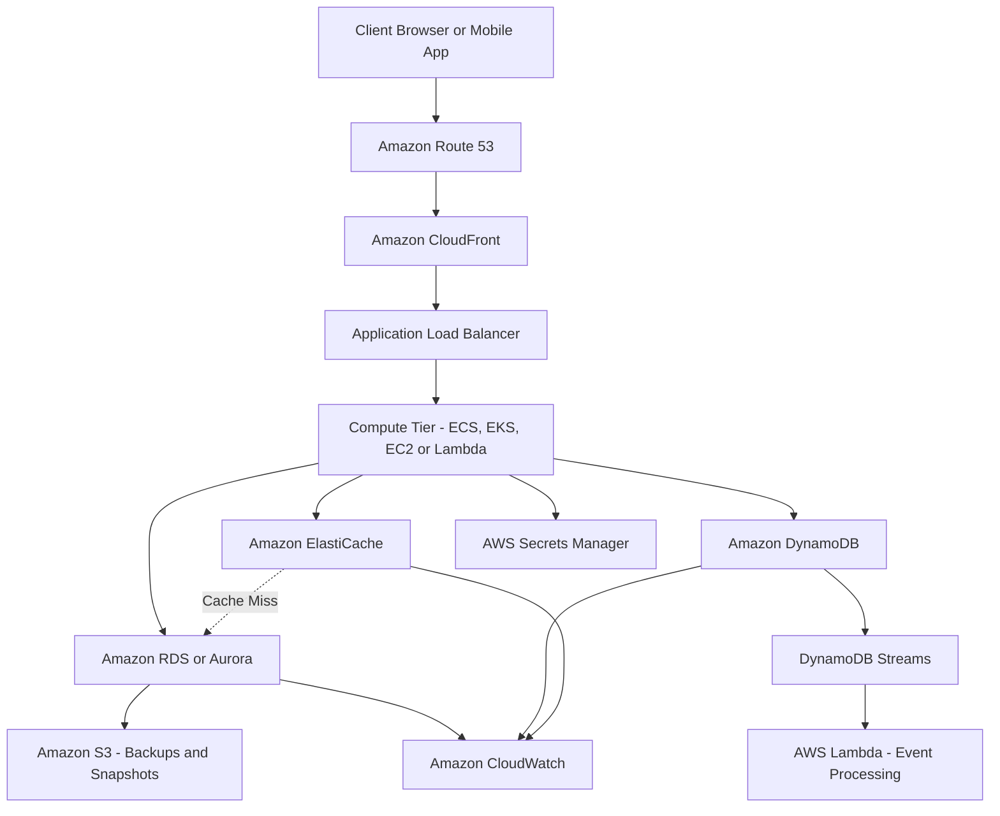
```mermaid
graph TD
    A["Client Browser or Mobile App"] --> B["Amazon Route 53"]
    B --> C["Amazon CloudFront"]
    C --> D["Application Load Balancer"]
    D --> E["Compute Tier - ECS, EKS, EC2 or Lambda"]
    E --> F["Amazon ElastiCache"]
    E --> G["Amazon RDS or Aurora"]
    E --> H["Amazon DynamoDB"]
    F -.->|"Cache Miss"| G
    G --> I["Amazon S3 - Backups and Snapshots"]
    H --> J["DynamoDB Streams"]
    J --> K["AWS Lambda - Event Processing"]
    E --> L["AWS Secrets Manager"]
    G --> M["Amazon CloudWatch"]
    H --> M
    F --> M
```

!!! note "The Data Tier Is the Stateful Tier"
    Everything above the database in this diagram is, in a well-designed cloud-native system, **stateless** — it can be destroyed and recreated freely. The database tier is where state lives, and state is what makes distributed systems difficult. Scaling stateless compute is a solved problem: add more instances behind a load balancer. Scaling state requires you to make explicit, irreversible decisions about consistency, partitioning, and replication. This is why the data layer, not the application layer, determines the ceiling on your architecture.

### Architectural Position

- **RDS and Aurora** sit in private subnets inside your VPC, reachable only from the compute tier. They serve the **system of record** for transactional business data.
- **DynamoDB** is a *regional* service that lives outside your VPC and is accessed over the AWS network via a public service endpoint or, preferably, a **VPC Gateway Endpoint**. It serves workloads whose access patterns are known in advance and whose scale requirements exceed what a single relational writer can absorb.
- **ElastiCache** sits inside your VPC, in front of the database, absorbing repetitive read traffic and holding ephemeral state that does not justify durable storage.

---

## Why This Service or Concept Exists

### The Problem: Databases Are Operationally Brutal

Consider what an organisation must do to run a production PostgreSQL database on its own hardware, or even on a bare EC2 instance:

| Responsibility | What It Actually Involves |
|---|---|
| Provisioning | Sizing CPU, memory, IOPS and storage; procuring hardware with a lead time of weeks |
| Installation | Installing and configuring the OS, tuning kernel parameters, installing the engine |
| Patching | Tracking CVEs for both OS and engine; scheduling maintenance windows; testing patches |
| Backups | Writing and testing backup scripts; verifying restores; managing offsite retention |
| High Availability | Configuring streaming replication, a witness or arbiter, and automated failover tooling |
| Failure Detection | Building health checks that distinguish a hung database from a slow one |
| Failover | Promoting a standby, repointing clients, fencing the old primary to prevent split-brain |
| Monitoring | Instrumenting slow queries, replication lag, connection saturation, disk pressure |
| Scaling | Planning capacity months ahead; downtime for vertical resize; sharding for horizontal growth |
| Security | Encryption at rest and in transit, credential rotation, network isolation, audit logging |

None of this activity differentiates the business. A retail company does not win customers by being excellent at PostgreSQL minor-version upgrades. This is what AWS calls **undifferentiated heavy lifting**, and eliminating it is the core value proposition of managed database services.

### The Shared Responsibility Model for Databases

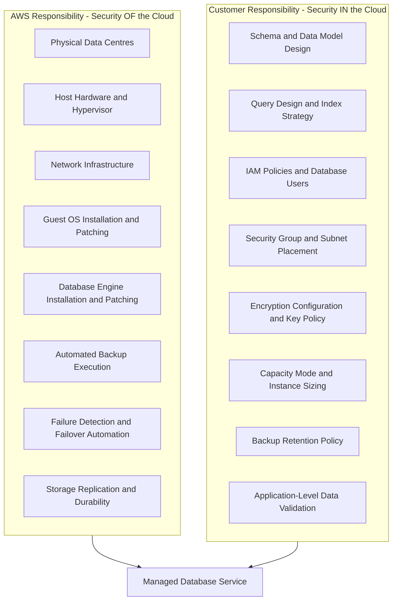
```mermaid
graph TD
    subgraph AWS["AWS Responsibility - Security OF the Cloud"]
        A1["Physical Data Centres"]
        A2["Host Hardware and Hypervisor"]
        A3["Network Infrastructure"]
        A4["Guest OS Installation and Patching"]
        A5["Database Engine Installation and Patching"]
        A6["Automated Backup Execution"]
        A7["Failure Detection and Failover Automation"]
        A8["Storage Replication and Durability"]
    end
    subgraph CUST["Customer Responsibility - Security IN the Cloud"]
        B1["Schema and Data Model Design"]
        B2["Query Design and Index Strategy"]
        B3["IAM Policies and Database Users"]
        B4["Security Group and Subnet Placement"]
        B5["Encryption Configuration and Key Policy"]
        B6["Capacity Mode and Instance Sizing"]
        B7["Backup Retention Policy"]
        B8["Application-Level Data Validation"]
    end
    AWS --> C["Managed Database Service"]
    CUST --> C
```

!!! warning "A Managed Service Is Not an Unmanaged Responsibility"
    A common and expensive misconception among students and junior engineers is that "managed" means "AWS handles everything." AWS will faithfully replicate a badly designed schema and diligently back up a table with no indexes. AWS will not tell you that your query does a full table scan, that your partition key is causing a hot partition, or that you have granted `AdministratorAccess` to your application role. Poor design is *your* failure mode, and it is the failure mode that actually causes production outages.

### Traditional Approach Versus AWS Approach

| Dimension | Traditional On-Premises | AWS Managed |
|---|---|---|
| Time to first database | Weeks to months | Minutes |
| HA setup | Manual replication plus custom failover scripts, weeks of engineering | One checkbox for Multi-AZ |
| Failover time | Minutes to hours, often manual, error-prone | Typically 60–120 seconds for RDS Multi-AZ, often under 35 seconds for Aurora |
| Backups | Custom cron scripts, untested restores | Automated daily snapshots plus continuous transaction log capture |
| Point-in-time recovery | Requires disciplined log shipping and manual replay | Built in, to any second within the retention window |
| Vertical scaling | Buy hardware, schedule outage, migrate | Modify instance class, brief failover |
| Read scaling | Manual replica configuration | Add a read replica with a few API calls |
| Patching | Manual, risky, often deferred indefinitely | Applied in a customer-defined maintenance window |
| Capital expenditure | Large upfront CAPEX | Operational expenditure, pay for what you run |
| Encryption at rest | Requires disk-level or engine-level configuration | Enable at creation, integrated with KMS |

### The Deeper Reason: Purpose-Built Databases

The second, more architectural reason these services exist is that **the relational model is not universally optimal**. For roughly thirty years the industry defaulted to a relational database for every problem, because a relational database was the only mature option and because a single database server was the natural unit of deployment.

Cloud-scale workloads broke this assumption. A social graph, a time-series stream of IoT telemetry, a full-text search index, a shopping cart, and a financial ledger have genuinely different access patterns, consistency requirements, and scaling characteristics. Forcing all of them into one relational engine means every workload is served by a compromise.

AWS's response is the **purpose-built database strategy**: offer a family of databases, each optimised for a category of workload, and expect architects to select deliberately.

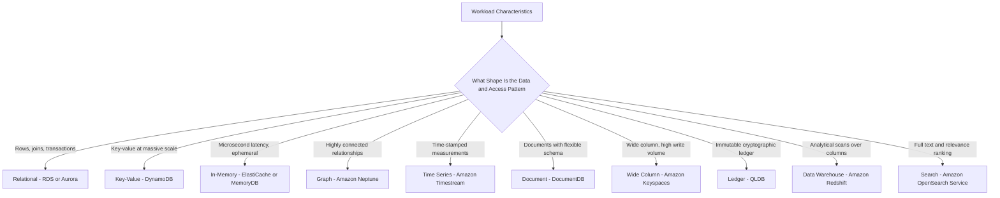
```mermaid
graph TD
    A["Workload Characteristics"] --> B{"What Shape Is the Data and Access Pattern"}
    B -->|"Rows, joins, transactions"| C["Relational - RDS or Aurora"]
    B -->|"Key-value at massive scale"| D["Key-Value - DynamoDB"]
    B -->|"Microsecond latency, ephemeral"| E["In-Memory - ElastiCache or MemoryDB"]
    B -->|"Highly connected relationships"| F["Graph - Amazon Neptune"]
    B -->|"Time-stamped measurements"| G["Time Series - Amazon Timestream"]
    B -->|"Documents with flexible schema"| H["Document - DocumentDB"]
    B -->|"Wide column, high write volume"| I["Wide Column - Amazon Keyspaces"]
    B -->|"Immutable cryptographic ledger"| J["Ledger - QLDB"]
    B -->|"Analytical scans over columns"| K["Data Warehouse - Amazon Redshift"]
    B -->|"Full text and relevance ranking"| L["Search - Amazon OpenSearch Service"]
```

!!! tip "The Architect's Rule"
    Choose the database that matches the **access pattern**, not the one you already know. The cost of an incorrect data store choice is not a slow query — it is a rewrite, because data models are the hardest thing in a system to change once production data exists in them.

!!! warning "But Do Not Over-Fragment"
    The purpose-built philosophy is frequently taken too far. Every additional data store adds an operational surface: another backup policy, another monitoring dashboard, another failure mode, another set of credentials, another consistency boundary that your application must reconcile. A three-person startup running six database technologies has made an architectural error, not a sophisticated choice. Introduce a new data store when the workload *demonstrably* does not fit the ones you have, and not before.

---

## Real-World Motivation

### Amazon.com and the Origin of DynamoDB

The most instructive story in this chapter is Amazon's own. In the early 2000s, Amazon's retail site ran on large relational databases. During peak events, the shopping cart service — arguably the most availability-critical component in the entire business — experienced outages when the relational tier was saturated or when a failover occurred.

Amazon's engineers observed something important: the shopping cart did not need joins, did not need complex transactions across many entities, and did not need ad hoc queries. It needed to read and write a cart by customer ID, with extremely high availability, at any scale. They were paying the full cost of a relational database for none of its benefits.

The 2007 **Dynamo paper** described the resulting system: a partitioned, replicated key-value store that prioritised availability and partition tolerance over strict consistency, using consistent hashing for partitioning and quorum techniques for replication. Amazon DynamoDB, launched in 2012, is the managed evolution of those ideas — it retains the partitioning and replication approach while adding strongly consistent read options and a managed control plane.

!!! example "The Business Framing"
    Amazon's internal calculation was that a shopping cart which is *available but occasionally shows a slightly stale item* is vastly more valuable than a cart which is *perfectly consistent but unavailable*. An unavailable cart is a lost sale, immediately and measurably. This is a **business decision expressed as a consistency model** — precisely the kind of reasoning this module exists to teach.

### Netflix

Netflix serves viewing history, playback position, and personalisation state to hundreds of millions of profiles. A user resuming a film on a different device expects their position within seconds. The access pattern is: read by profile ID and title ID; write on every playback heartbeat. This is enormous write volume with a trivially simple access pattern — a textbook key-value workload. Netflix uses Cassandra-family and DynamoDB-style stores for this, with caching layers in front to absorb the read amplification of the homepage.

Meanwhile, Netflix's **billing** system — subscriptions, invoices, payment reconciliation — is relational and transactional. The same company runs both models, in the same product, for different subsystems. This is the purpose-built philosophy in practice.

### Uber

A ride request involves several distinct workloads simultaneously:

| Subsystem | Requirement | Appropriate Store |
|---|---|---|
| Driver location updates | Extremely high write rate, ephemeral, geospatial | In-memory store with geospatial indexing, such as Redis |
| Trip record | Transactional, must never be lost, financially significant | Relational with ACID guarantees |
| Surge pricing lookups | Read-heavy, tolerant of seconds of staleness | Cache |
| Trip history | Append-only, large volume, queried by user | Key-value or wide-column |
| Fraud analytics | Large scans, aggregations | Data warehouse |

No single database serves all five well. Attempting to do so means the geospatial write firehose competes for resources with the financial ledger — an unacceptable coupling.

### Financial Services

A core banking ledger has non-negotiable requirements: every transaction must be atomic, balances must never be observed in an inconsistent intermediate state, and every change must be auditable. These are the exact guarantees ACID transactions provide. A bank running its ledger on an eventually consistent store would be unable to answer the question "what is this account's balance?" with confidence — a regulatory impossibility.

But the *same bank* will run its mobile app's session state in ElastiCache, its transaction search in OpenSearch, and its fraud-detection feature store in DynamoDB. Regulatory rigour applies to the ledger, not to every byte the institution stores.

!!! info "Sovereignty and Compliance"
    Regulated industries frequently face data residency requirements — data about citizens of a country must remain within that country's borders. AWS Regions map directly to this requirement: choosing a Region is choosing a jurisdiction. RDS, DynamoDB and ElastiCache are all Regional or AZ-scoped resources, so residency is enforced by architecture rather than by policy documentation. This is a significant reason government and healthcare systems adopt managed databases in specific Regions.

### Healthcare

An electronic health record system stores patient demographics and clinical encounters relationally, because clinical data is deeply relational — a patient has encounters, an encounter has observations, an observation references a coded terminology. Losing referential integrity in that graph is a patient-safety issue.

At the same time, ingesting a continuous stream of vital-sign telemetry from bedside monitors at thousands of writes per second is not a relational workload. It is a time-series or key-value workload. Both live in the same architecture, separated by their access characteristics.

### E-Commerce at Scale

Consider a national e-commerce platform during a flash sale:

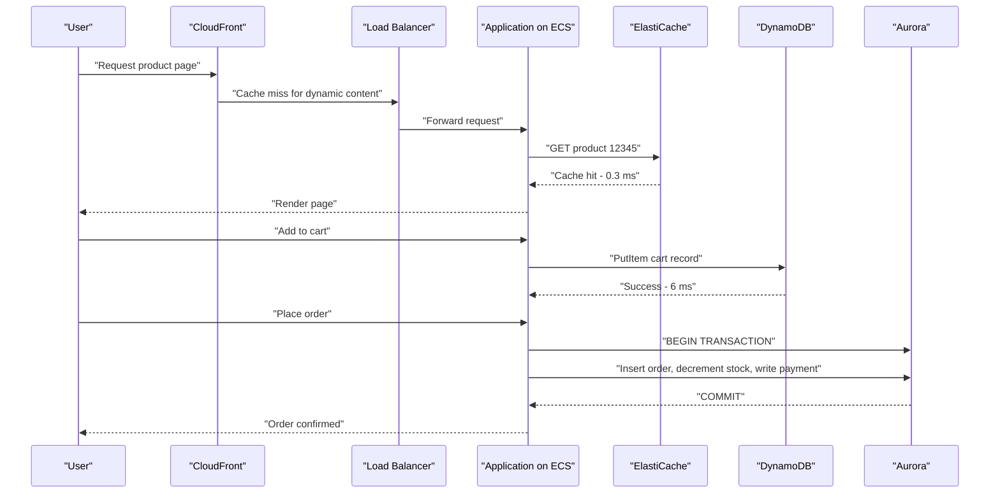
```mermaid
sequenceDiagram
    participant U as "User"
    participant CF as "CloudFront"
    participant ALB as "Load Balancer"
    participant APP as "Application on ECS"
    participant EC as "ElastiCache"
    participant DDB as "DynamoDB"
    participant RDS as "Aurora"
    U->>CF: "Request product page"
    CF->>ALB: "Cache miss for dynamic content"
    ALB->>APP: "Forward request"
    APP->>EC: "GET product 12345"
    EC-->>APP: "Cache hit - 0.3 ms"
    APP-->>U: "Render page"
    U->>APP: "Add to cart"
    APP->>DDB: "PutItem cart record"
    DDB-->>APP: "Success - 6 ms"
    U->>APP: "Place order"
    APP->>RDS: "BEGIN TRANSACTION"
    APP->>RDS: "Insert order, decrement stock, write payment"
    RDS-->>APP: "COMMIT"
    APP-->>U: "Order confirmed"
```

Notice the deliberate allocation: the product catalogue read path is served from cache at microsecond latency; the cart, which must never fail and has a simple access pattern, is on DynamoDB; the order placement, which requires a multi-row atomic transaction, is on Aurora. Each store is used for what it is good at.

---

## Core Concepts

### Relational Databases and the ACID Guarantees

A **relational database** organises data into tables of rows and columns, with a fixed schema, relationships expressed through foreign keys, and a declarative query language (SQL) that permits arbitrary joins, filters and aggregations decided at query time rather than at design time.

Its defining contract is **ACID**:

| Property | Meaning | Why It Matters Architecturally |
|---|---|---|
| **Atomicity** | A transaction executes completely or not at all | A funds transfer cannot debit one account without crediting the other |
| **Consistency** | A transaction moves the database from one valid state to another, respecting all constraints | Foreign keys, check constraints and uniqueness are never violated, even under concurrency |
| **Isolation** | Concurrent transactions do not observe each other's intermediate state | Two simultaneous stock decrements cannot both read the same starting value and oversell |
| **Durability** | Once committed, data survives crashes | An acknowledged order is not lost when the instance dies |

!!! note "Isolation Levels Are a Trade-off Dial"
    Isolation is not binary. SQL defines levels — Read Uncommitted, Read Committed, Repeatable Read, Serializable — that trade correctness guarantees against concurrency. PostgreSQL defaults to Read Committed; MySQL InnoDB defaults to Repeatable Read. Stronger isolation costs throughput because it holds locks longer or forces more transaction retries. Knowing your engine's default isolation level is a genuine production concern, not academic trivia.

### NoSQL and the BASE Model

**NoSQL** is a family of databases that relax one or more relational constraints — usually the fixed schema, the join capability, or the strict consistency guarantee — in exchange for horizontal scalability and predictable latency.

The counterpart to ACID is **BASE**:

- **Basically Available** — the system responds to every request, even if the response is not the most current data.
- **Soft state** — the system's state may change over time without new input, as replicas converge.
- **Eventually consistent** — given no new writes, all replicas will converge to the same value.

!!! warning "NoSQL Does Not Mean "No Consistency""
    DynamoDB offers *strongly consistent reads* as a per-request option, and *ACID transactions* across up to 100 items. The BASE model describes a default behaviour and a design philosophy, not an absolute limitation. Conversely, a relational database with asynchronous read replicas is *eventually consistent when read through a replica*. The line between the two families is far blurrier than introductory material suggests, and examination questions exploit this.

### The Fundamental Scaling Distinction

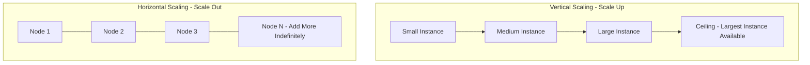
```mermaid
graph TD
    subgraph V["Vertical Scaling - Scale Up"]
        V1["Small Instance"] --> V2["Medium Instance"]
        V2 --> V3["Large Instance"]
        V3 --> V4["Ceiling - Largest Instance Available"]
    end
    subgraph H["Horizontal Scaling - Scale Out"]
        H1["Node 1"] --- H2["Node 2"]
        H2 --- H3["Node 3"]
        H3 --- H4["Node N - Add More Indefinitely"]
    end
```

| Aspect | Vertical Scaling | Horizontal Scaling |
|---|---|---|
| Method | Bigger machine | More machines |
| Applies naturally to | Relational writers | Key-value stores, stateless compute |
| Ceiling | Hard — the largest instance type in the Region | Effectively none |
| Downtime | Usually requires restart or failover | None if designed for it |
| Cost curve | Superlinear — the largest instances cost disproportionately more | Roughly linear |
| Complexity | Low | High — requires partitioning strategy |
| Failure blast radius | Entire database | One shard or partition |

The critical insight is that **a relational database's write path scales vertically by default**. You can add read replicas to scale reads horizontally, but there is one writer, and that writer is a single machine. This is the ceiling that motivated the entire NoSQL movement. DynamoDB, by contrast, scales writes horizontally by adding partitions, which is why it can absorb workloads no single relational instance could.

### The CAP Theorem, Stated Correctly

Eric Brewer's CAP theorem states that a distributed data store can provide **at most two** of the following three guarantees:

| Guarantee | Precise Meaning |
|---|---|
| **Consistency (C)** | Every read receives the most recent write or an error. This is *linearizability*, not the "C" in ACID. |
| **Availability (A)** | Every request receives a non-error response, without a guarantee that it contains the most recent write. |
| **Partition Tolerance (P)** | The system continues to operate despite arbitrary loss of messages between nodes. |

!!! danger "The Most Common CAP Misconception"
    Students routinely say "DynamoDB is AP and RDS is CA." **CA is not an achievable option for a distributed system.** Network partitions are not a design choice — they are a fact of physical networks. Cables are cut, switches fail, an Availability Zone loses connectivity. Any system distributed across machines *must* tolerate partitions, so **P is mandatory**. The real theorem, in practice, is: *when a partition occurs, you must choose between C and A.* A single-node database is technically CA only because it is not distributed at all — and a single-node database has no availability story worth having.

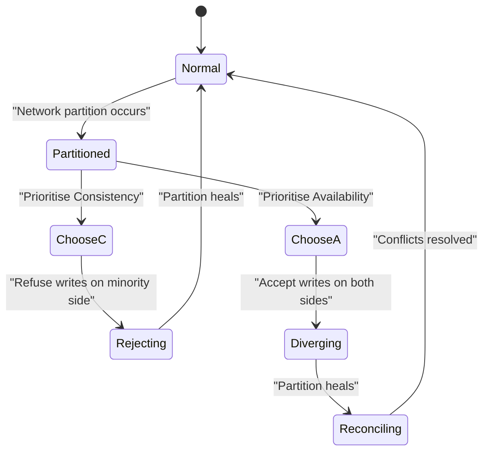
```mermaid
stateDiagram-v2
    [*] --> Normal
    Normal --> Partitioned: "Network partition occurs"
    Partitioned --> ChooseC: "Prioritise Consistency"
    Partitioned --> ChooseA: "Prioritise Availability"
    ChooseC --> Rejecting: "Refuse writes on minority side"
    ChooseA --> Diverging: "Accept writes on both sides"
    Rejecting --> Normal: "Partition heals"
    Diverging --> Reconciling: "Partition heals"
    Reconciling --> Normal: "Conflicts resolved"
```

Applied to our three services:

| Service | Behaviour Under Partition | Classification |
|---|---|---|
| RDS Multi-AZ | Standby is synchronous; if the primary is isolated, failover occurs and the old primary is fenced. Writes are unavailable during failover. | CP-leaning |
| Aurora | Quorum-based storage; tolerates loss of an entire AZ plus one additional node for reads, and an entire AZ for writes | CP-leaning with high availability |
| DynamoDB (eventually consistent reads) | Serves reads from any replica, always available | AP-leaning |
| DynamoDB (strongly consistent reads) | Reads from the leader; unavailable if the leader partition is unreachable | CP for those requests |
| ElastiCache Redis with replicas | Failover promotes a replica; recently written data not yet replicated may be lost | AP-leaning, and not durable by design |

### PACELC — The Extension That Matters More in Practice

CAP only describes behaviour *during* a partition, which is rare. **PACELC** (Daniel Abadi) extends it:

> **If** there is a **P**artition, choose between **A**vailability and **C**onsistency; **E**lse (in normal operation), choose between **L**atency and **C**onsistency.

The "else" branch is what you actually experience daily. A strongly consistent DynamoDB read costs twice the RCUs of an eventually consistent read and has higher latency, because it must be served by the partition leader rather than any replica. Reading from an RDS read replica is faster and cheaper for the primary but may return stale data. **You trade latency for consistency on almost every request you design.**

!!! tip "How to Use PACELC in a Design Review"
    For each read path in your system, ask: *what is the business cost of returning data that is 500 milliseconds stale?* For a product description: zero. For a user's own profile immediately after they edited it: high, because it looks like a bug. For an account balance before a withdrawal: unacceptable. Different read paths in the same application legitimately warrant different consistency choices. This is called **read-your-own-writes** consistency and is often solved by routing a user's reads to the primary for a short window after their write.

### OLTP Versus OLAP

| Characteristic | OLTP — Online Transaction Processing | OLAP — Online Analytical Processing |
|---|---|---|
| Typical operation | Read or write a few rows by key | Scan and aggregate millions of rows |
| Query latency target | Milliseconds | Seconds to minutes |
| Concurrency | Thousands of short transactions | Few long-running queries |
| Storage layout | Row-oriented | Column-oriented |
| Example | "Insert this order" | "Total revenue by region by month for three years" |
| AWS service | RDS, Aurora, DynamoDB | Redshift, Athena, EMR |

!!! danger "Do Not Run Analytics on Your Production OLTP Database"
    This is the single most common cause of self-inflicted production outages in early-stage systems. A business analyst runs a report that scans the orders table, the query holds locks or saturates I/O, connection pools exhaust, and the checkout path times out. The correct architecture separates these: replicate to a read replica dedicated to reporting, or export to S3 and query with Athena, or load into Redshift. Aurora's **zero-ETL integration with Amazon Redshift** exists precisely to make this separation cheap.

### Consistency Models Summarised

| Model | Guarantee | Where You See It |
|---|---|---|
| **Strong / Linearizable** | A read always reflects all prior writes | RDS primary, DynamoDB strongly consistent read, Aurora writer |
| **Eventual** | Replicas converge given no new writes; a read may be stale | DynamoDB default read, RDS read replica, Aurora reader (with small lag) |
| **Read-your-own-writes** | A client always sees its own prior writes | Achieved by routing that client's reads to the primary |
| **Monotonic reads** | A client never sees data go backwards in time | Achieved by pinning a client session to one replica |
| **Causal** | Causally related operations are seen in order by all observers | Application-level design, or specialised stores |

### Durability Versus Availability

These are routinely confused and are entirely different properties.

- **Durability** is the probability that committed data will *not be lost*. It concerns permanence.
- **Availability** is the proportion of time the system can *serve requests*. It concerns reachability.

A database can be highly durable and unavailable: your data is safely stored across three AZs but the instance is failing over, so you cannot read it. It can be highly available and non-durable: ElastiCache serves every request but loses everything on restart.

| Concept | Metric | Example Target |
|---|---|---|
| Durability | Annual probability of data loss | Aurora and S3-class storage designs target extremely low loss probability |
| Availability | Percentage uptime, expressed in "nines" | 99.99 percent equals roughly 52 minutes of downtime per year |
| **RPO** — Recovery Point Objective | Maximum acceptable *data loss*, in time | "We can lose at most 5 minutes of transactions" |
| **RTO** — Recovery Time Objective | Maximum acceptable *downtime* | "We must be serving within 15 minutes" |

!!! example "Translating Business Requirements into Architecture"
    A requirement of "RPO of 5 minutes, RTO of 1 hour" can be met by automated backups with point-in-time recovery. A requirement of "RPO near zero, RTO under 2 minutes" demands Multi-AZ synchronous replication with automatic failover. A requirement of "survive the loss of an entire Region with RPO under 1 second" demands Aurora Global Database or DynamoDB Global Tables. **RPO and RTO are the two numbers that determine your entire data-tier architecture and its cost.** Always extract them from stakeholders before designing.

### Caching Fundamentals

A **cache** is a high-speed store holding a subset of data so that future requests are served faster than from the origin. Caching works because real workloads exhibit **locality of reference** — a small fraction of items receives a large fraction of requests (the Pareto or power-law distribution).

| Term | Meaning |
|---|---|
| **Cache hit** | The requested item was found in the cache |
| **Cache miss** | The item was absent; the origin must be consulted |
| **Hit ratio** | Hits divided by total requests — the primary measure of cache effectiveness |
| **TTL — Time To Live** | Duration after which an entry expires automatically |
| **Eviction policy** | Rule for discarding entries when memory is full, for example LRU or LFU |
| **Cache stampede** | Many concurrent requests miss simultaneously and all hit the origin at once |
| **Cache invalidation** | Removing or updating an entry when the underlying data changes |

!!! note "Why Hit Ratio Dominates Everything"
    If a cache read takes 0.5 ms and a database read takes 10 ms, a 95 percent hit ratio gives an average latency of `0.95 × 0.5 + 0.05 × 10 = 0.975 ms`. Dropping to an 80 percent hit ratio gives `0.8 × 0.5 + 0.2 × 10 = 2.4 ms` — nearly 2.5 times worse. Cache effectiveness is highly nonlinear in hit ratio. Monitoring `CacheHitRate` is therefore not optional.

---

## Internal Working

Understanding what happens beneath the API is what separates an architect from a console operator. This section describes the actual mechanisms.

### Control Plane Versus Data Plane

Every AWS service is internally split into two planes with radically different characteristics.

| Plane | Purpose | Example Operations | Design Properties |
|---|---|---|---|
| **Control plane** | Manage the lifecycle of resources | `CreateDBInstance`, `ModifyDBInstance`, `CreateTable`, `CreateReplicationGroup` | Lower request volume, higher latency, more complex, changes configuration |
| **Data plane** | Serve actual application requests | SQL queries, `GetItem`, `PutItem`, Redis `GET` and `SET` | Extremely high volume, low latency, simple, must be maximally available |

!!! info "Why This Distinction Is Architecturally Important"
    AWS deliberately engineers the data plane to have **static stability** — it continues to function correctly even if the control plane is entirely unavailable. If the RDS control plane were degraded, you might be unable to create a new instance, but your existing instance would continue serving queries. This is why the guidance "do not put control plane calls in your request path" matters: never have your application call `DescribeDBInstances` or `DescribeTable` on every user request. Cache configuration at startup. Depending on the control plane at request time imports its lower availability into your critical path.

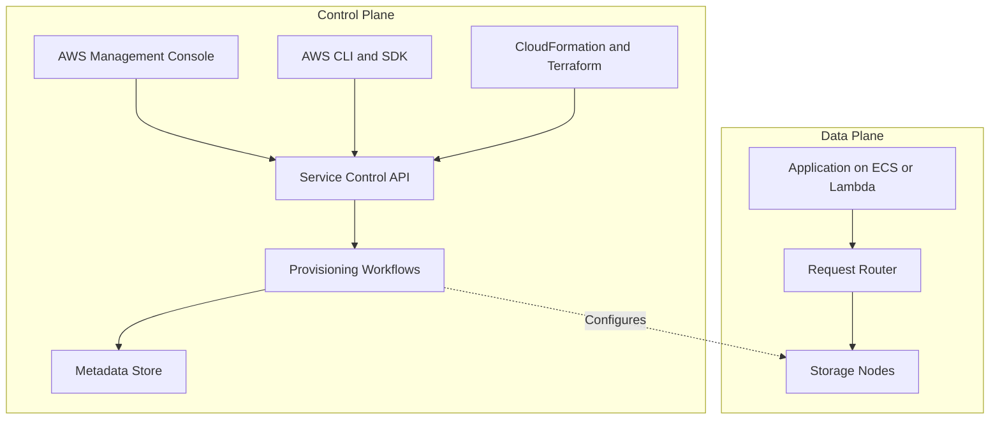
```mermaid
graph TD
    subgraph CP["Control Plane"]
        C1["AWS Management Console"]
        C2["AWS CLI and SDK"]
        C3["CloudFormation and Terraform"]
        C1 --> C4["Service Control API"]
        C2 --> C4
        C3 --> C4
        C4 --> C5["Provisioning Workflows"]
        C5 --> C6["Metadata Store"]
    end
    subgraph DP["Data Plane"]
        D1["Application on ECS or Lambda"]
        D1 --> D2["Request Router"]
        D2 --> D3["Storage Nodes"]
    end
    C5 -.->|"Configures"| D3
```

### Amazon RDS Internal Working

#### Single-AZ Instance

A single-AZ RDS instance is an EC2 instance running the database engine, with its data on **Amazon EBS** volumes attached over the network. The separation of compute from storage is significant: if the EC2 host fails, AWS can start a replacement instance and reattach the same EBS volumes, preserving data.

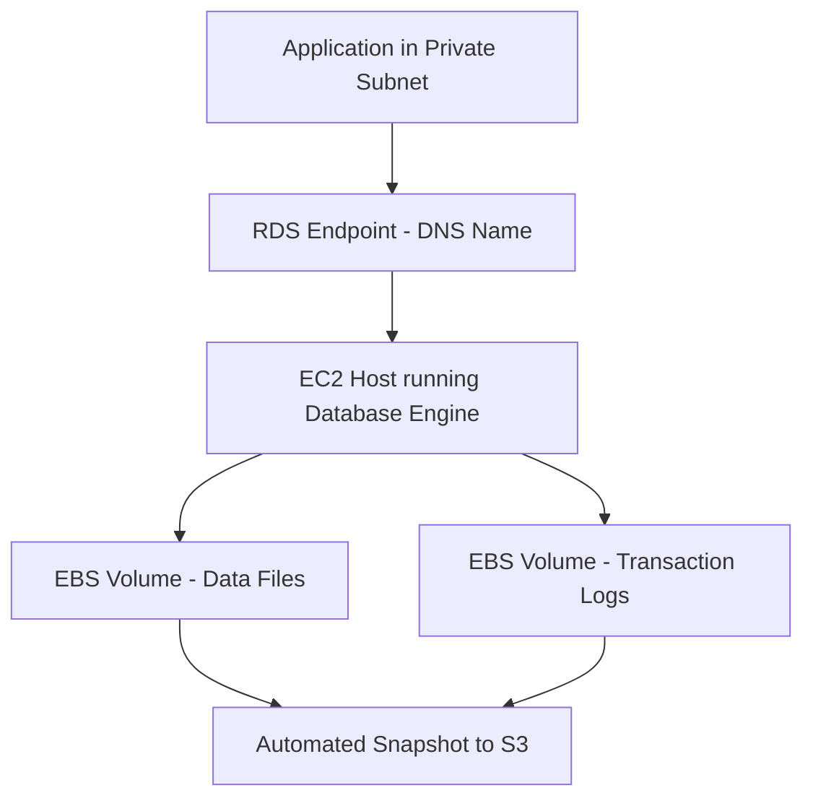
```mermaid
graph TD
    A["Application in Private Subnet"] --> B["RDS Endpoint - DNS Name"]
    B --> C["EC2 Host running Database Engine"]
    C --> D["EBS Volume - Data Files"]
    C --> E["EBS Volume - Transaction Logs"]
    D --> F["Automated Snapshot to S3"]
    E --> F
```

#### Multi-AZ Deployment — Synchronous Replication

Multi-AZ is the mechanism by which RDS achieves high availability. Two distinct architectures exist:

**Multi-AZ instance deployment (one standby):**

- AWS provisions a **standby replica** in a different Availability Zone.
- Every write to the primary is **synchronously replicated** to the standby at the storage or engine level before the commit is acknowledged to the client.
- The standby is **not readable**. It exists solely for failover. Students very frequently get this wrong.
- Failure detection is continuous. On primary failure, AZ failure, storage failure, network partition, or a customer-initiated reboot with failover, RDS promotes the standby.

**Multi-AZ DB cluster deployment (two readable standbys):**

- Available for MySQL and PostgreSQL. Provisions a writer and **two readable standby instances** across three AZs.
- Uses semi-synchronous replication: a commit is acknowledged once at least one standby confirms.
- Typically offers faster failover than the single-standby model and adds read capacity.

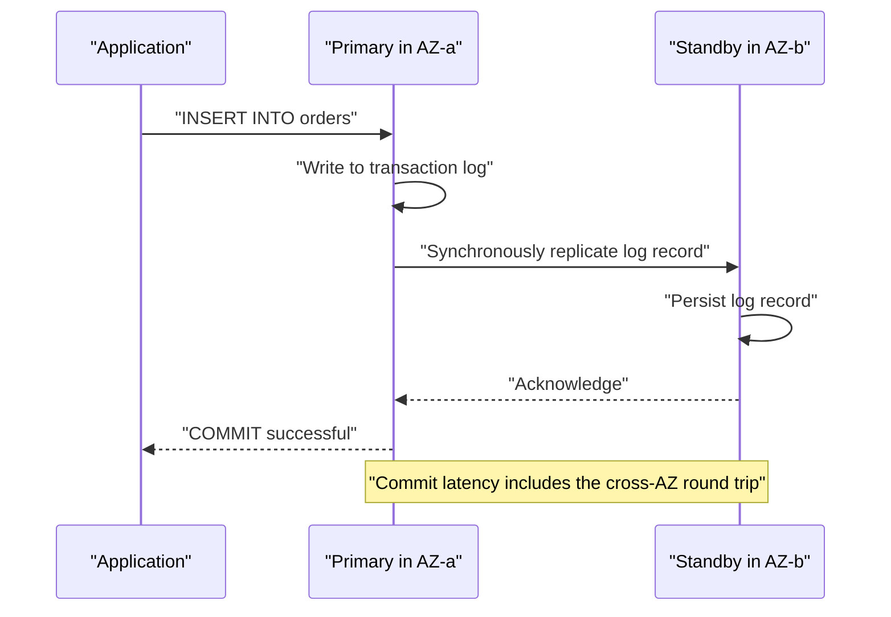
```mermaid
sequenceDiagram
    participant APP as "Application"
    participant P as "Primary in AZ-a"
    participant S as "Standby in AZ-b"
    APP->>P: "INSERT INTO orders"
    P->>P: "Write to transaction log"
    P->>S: "Synchronously replicate log record"
    S->>S: "Persist log record"
    S-->>P: "Acknowledge"
    P-->>APP: "COMMIT successful"
    Note over P,S: "Commit latency includes the cross-AZ round trip"
```

!!! warning "Multi-AZ Costs You Write Latency"
    Because the commit waits for the standby to acknowledge, every write pays a cross-AZ network round trip — typically one to two milliseconds. For a write-heavy OLTP workload this is a real, measurable cost. It is almost always worth paying, but you must *know* you are paying it. This is the durability-versus-latency trade-off from PACELC, made concrete.

#### The Failover Mechanism — DNS CNAME Switching

This mechanism is examined constantly, so understand it precisely.

Your application does **not** connect to an IP address. It connects to an RDS **endpoint**, a DNS name such as `orders-db.abc123xyz.eu-west-1.rds.amazonaws.com`. This DNS record is a **CNAME** that resolves to the address of the current primary.

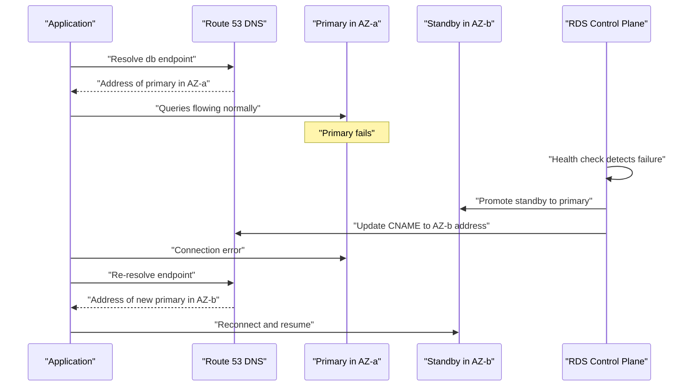
```mermaid
sequenceDiagram
    participant APP as "Application"
    participant DNS as "Route 53 DNS"
    participant P as "Primary in AZ-a"
    participant S as "Standby in AZ-b"
    participant RDS as "RDS Control Plane"
    APP->>DNS: "Resolve db endpoint"
    DNS-->>APP: "Address of primary in AZ-a"
    APP->>P: "Queries flowing normally"
    Note over P: "Primary fails"
    RDS->>RDS: "Health check detects failure"
    RDS->>S: "Promote standby to primary"
    RDS->>DNS: "Update CNAME to AZ-b address"
    APP->>P: "Connection error"
    APP->>DNS: "Re-resolve endpoint"
    DNS-->>APP: "Address of new primary in AZ-b"
    APP->>S: "Reconnect and resume"
```

Key consequences that architects must design around:

1. **Existing connections are severed.** The application *will* see errors during failover. Your code must implement retry with exponential backoff and jitter.
2. **DNS caching can delay recovery.** The RDS endpoint has a short TTL, but JVM applications historically cache DNS resolutions indefinitely by default. Setting `networkaddress.cache.ttl` to a low value such as 5 seconds is a mandatory step for Java applications on RDS. This single misconfiguration causes more prolonged post-failover outages than any other.
3. **Failover typically completes in roughly 60 to 120 seconds** for the classic Multi-AZ instance deployment, and faster for Multi-AZ DB clusters and Aurora. Treat these as typical observed ranges, not contractual guarantees.
4. **The endpoint name never changes.** Do not hard-code IP addresses; never resolve once at startup and cache forever.

!!! danger "The Retry Requirement Is Not Optional"
    A cloud-native application must assume its database connection can be terminated at any moment — by failover, by maintenance, by scaling, or by a transient network event. Applications that treat a dropped connection as a fatal error will experience an outage every time AWS performs routine maintenance. Retry logic with exponential backoff and jitter, plus a connection pool that validates connections before handing them out, is a baseline requirement.

#### Read Replicas — Asynchronous Replication

Read replicas serve a different purpose from Multi-AZ standbys, and confusing them is a classic examination trap.

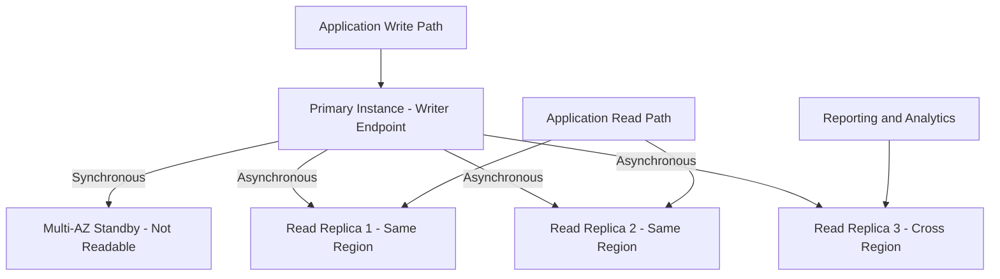
```mermaid
graph TD
    A["Application Write Path"] --> B["Primary Instance - Writer Endpoint"]
    B -->|"Synchronous"| C["Multi-AZ Standby - Not Readable"]
    B -->|"Asynchronous"| D["Read Replica 1 - Same Region"]
    B -->|"Asynchronous"| E["Read Replica 2 - Same Region"]
    B -->|"Asynchronous"| F["Read Replica 3 - Cross Region"]
    G["Application Read Path"] --> D
    G --> E
    H["Reporting and Analytics"] --> F
```

| Dimension | Multi-AZ Standby | Read Replica |
|---|---|---|
| Purpose | High availability and disaster recovery | Read scaling and offloading |
| Replication | Synchronous | Asynchronous |
| Readable | No (in the single-standby model) | Yes |
| Automatic failover | Yes | No — manual promotion |
| Placement | Different AZ, same Region | Same AZ, different AZ, or different Region |
| Data currency | Identical to primary | Lagging by milliseconds to seconds |
| Effect on write latency | Increases it | Negligible |
| Can be promoted to standalone | No | Yes |

The replication mechanism is engine-specific: MySQL and MariaDB use binary log replication; PostgreSQL uses its native streaming replication protocol. In both cases the primary does not wait for the replica, so the primary's write path is unaffected — but the replica may fall behind.

**Replica lag** is the delay between a commit on the primary and its visibility on the replica. It is exposed as the CloudWatch metric `ReplicaLag`. Lag grows when:

- The write rate on the primary exceeds the replica's ability to apply changes (single-threaded apply in some engines).
- The replica instance class is smaller than the primary's.
- A long-running query on the replica blocks the apply process.
- A large batch operation such as a bulk `DELETE` generates a burst of replication traffic.

!!! warning "The Stale Read Bug"
    A user updates their profile, the application writes to the primary and immediately redirects to a page that reads from a replica. The replica has not caught up, so the user sees their *old* profile and concludes the save failed. They save again. This produces duplicate writes and support tickets. Solutions: route reads to the primary for a short window after a write for that session; or return the written object from the write response rather than re-reading; or use a session-consistency token. Design for this explicitly — it is one of the most common real-world defects in read-replica architectures.

#### Automated Backups and Point-in-Time Recovery

RDS's backup mechanism has two components working together:

1. **Daily automated snapshot** — a storage-level snapshot of the volumes, taken during the configured backup window and stored in Amazon S3 (in AWS-managed buckets you do not see).
2. **Continuous transaction log capture** — the database's write-ahead log or binary log is uploaded to S3 continuously, typically at around five-minute granularity.

Point-in-time recovery works by restoring the most recent snapshot **before** the target time and then replaying transaction logs forward to the exact requested second.

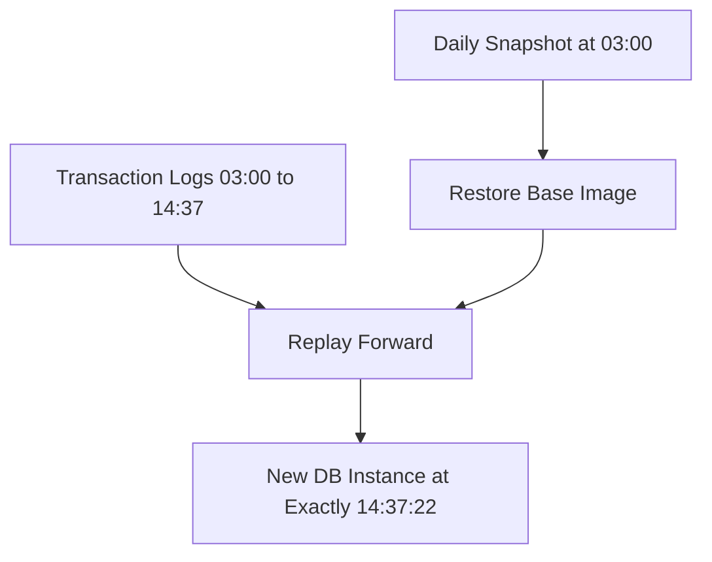
```mermaid
graph TD
    A["Daily Snapshot at 03:00"] --> B["Restore Base Image"]
    C["Transaction Logs 03:00 to 14:37"] --> D["Replay Forward"]
    B --> D
    D --> E["New DB Instance at Exactly 14:37:22"]
```

!!! danger "Point-in-Time Recovery Creates a NEW Instance"
    PITR does not roll back your existing database in place. It provisions a **new** instance restored to the target time, with a **new endpoint**. Recovering therefore involves: restore to a new instance, validate the data, then repoint the application — either by updating configuration or by renaming instances. Factor this into your RTO calculation, because restoring a large database takes real time proportional to its size.

!!! note "Snapshot Lifecycle Semantics"
    **Automated backups are deleted when you delete the DB instance** (unless you take a final snapshot). **Manual snapshots persist until you explicitly delete them.** This asymmetry has destroyed real companies' data. If a database matters, take manual snapshots on a schedule, or use AWS Backup with a retention policy, and consider copying snapshots to a second Region and a second account for ransomware and account-compromise resilience.

### Amazon Aurora Internal Working

Aurora is not "RDS with a faster engine." It is a fundamentally re-architected database in which the storage layer was rewritten as a distributed, multi-tenant, log-structured service. Understanding this design is one of the highest-value pieces of knowledge in this chapter.

#### The Core Insight: The Log Is the Database

In a traditional relational database, committing a transaction involves writing several things to disk: the write-ahead log, the data pages, a double-write buffer (in MySQL), and eventually more. When you replicate that database, you ship *all* of those writes across the network. This is enormous write amplification.

Aurora's designers observed that the **redo log is sufficient** — data pages can always be reconstructed from a prior page image plus the log records that apply to it. So Aurora's database node sends **only redo log records** to the storage layer. The storage nodes themselves materialise data pages in the background, asynchronously and continuously.

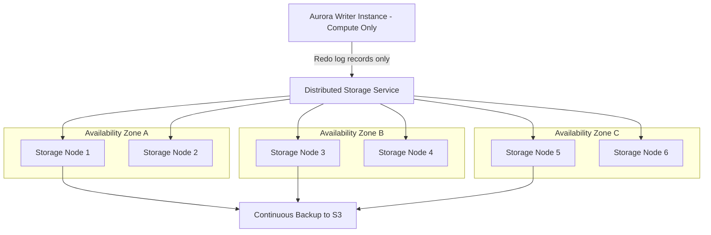
```mermaid
graph TD
    A["Aurora Writer Instance - Compute Only"] -->|"Redo log records only"| B["Distributed Storage Service"]
    subgraph AZ1["Availability Zone A"]
        S1["Storage Node 1"]
        S2["Storage Node 2"]
    end
    subgraph AZ2["Availability Zone B"]
        S3["Storage Node 3"]
        S4["Storage Node 4"]
    end
    subgraph AZ3["Availability Zone C"]
        S5["Storage Node 5"]
        S6["Storage Node 6"]
    end
    B --> S1
    B --> S2
    B --> S3
    B --> S4
    B --> S5
    B --> S6
    S1 --> C["Continuous Backup to S3"]
    S3 --> C
    S5 --> C
```

#### Six-Way Replication and Quorum

Aurora maintains **six copies of every data segment across three Availability Zones — two copies per AZ**. It uses quorum protocols rather than requiring all copies to respond:

| Operation | Quorum Required | Meaning |
|---|---|---|
| **Write** | 4 out of 6 | A commit is acknowledged when 4 of 6 storage nodes persist the log record |
| **Read** | 3 out of 6 | A read is satisfied by 3 of 6 nodes (in practice Aurora tracks which segments are current and reads from one) |

The arithmetic is deliberate: because write quorum (4) plus read quorum (3) exceeds the total number of copies (6), any read quorum necessarily intersects any write quorum, guaranteeing that a read observes the latest committed write.

The failure tolerance that follows:

| Failure Scenario | Effect on Writes | Effect on Reads |
|---|---|---|
| Loss of one storage node | None — 5 of 6 available, quorum of 4 met | None |
| Loss of an entire AZ (2 nodes) | None — 4 of 6 available, quorum of 4 exactly met | None |
| Loss of an AZ plus one more node | Writes unavailable until repair — only 3 of 6 | Reads still served — quorum of 3 met |

!!! info "Why This Design Is Superior for Availability"
    Aurora can lose **an entire Availability Zone and still accept writes**, and lose an AZ plus one additional node and still serve reads. A traditional Multi-AZ RDS deployment loses its primary and must fail over — a disruptive event. Aurora's storage layer absorbs the failure without any failover at all, because no single node is authoritative.

#### Segments and Protection Groups

Aurora's storage volume is divided into **10 GiB segments**. Each segment is replicated six ways. A large database is thousands of segments spread across hundreds of storage nodes. This granularity is what makes repair fast: if a node fails, Aurora only needs to re-replicate the 10 GiB segments it held, in parallel across many nodes, typically completing in seconds to minutes rather than the hours a full-volume rebuild would take.

Aurora storage grows automatically in 10 GiB increments up to a documented maximum (128 TiB for recent versions — verify the current figure for your engine version, as AWS has raised it over time). **You never provision storage size for Aurora.** This eliminates an entire class of operational incident: running out of disk.

#### Reader Instances and Replica Lag

Aurora reader instances attach to the **same shared storage volume** as the writer. They do not replicate data by shipping and replaying logs in the traditional sense; they read the same pages and apply in-memory cache invalidation from the writer's log stream.

This has two important consequences:

1. **Replica lag is typically in the tens of milliseconds**, not seconds, because there is no data to copy — only cache coherence to maintain.
2. **Adding a reader does not copy data**, so a new reader becomes available quickly regardless of database size.

Aurora supports up to 15 Aurora Replicas per cluster, and provides two endpoints:

| Endpoint | Behaviour |
|---|---|
| **Cluster (writer) endpoint** | Always points at the current writer; follows failover automatically |
| **Reader endpoint** | Load-balances connections across available readers |
| **Custom endpoint** | A user-defined subset of instances, for example "all r6g.4xlarge readers for reporting" |
| **Instance endpoint** | A specific instance; used for diagnostics, rarely for application traffic |

!!! warning "The Reader Endpoint Balances Connections, Not Queries"
    The Aurora reader endpoint performs DNS round-robin at *connection* time. If your application uses long-lived pooled connections, they will be distributed once at pool creation and then remain pinned. A pool created when only one reader existed will never use readers added later, unless the pool recycles connections. Configure a maximum connection lifetime in your pool to allow periodic rebalancing.

#### Aurora Failover

Aurora failover promotes an existing reader to writer. Because storage is shared, there is no data to recover or synchronise — the new writer simply begins accepting writes against the same volume. Failover typically completes in around 30 seconds or less, and often faster with the **RDS Proxy** in front or with cluster-aware drivers.

You assign a **failover priority tier** (0 through 15) to each reader; Aurora promotes the lowest-numbered tier, breaking ties by choosing the instance closest in size to the writer.

#### Aurora Serverless v2

Aurora Serverless v2 replaces provisioned instance classes with **Aurora Capacity Units (ACUs)**, where one ACU is approximately 2 GiB of memory with corresponding CPU and networking. You set a minimum and maximum ACU range and Aurora scales within it in fine-grained increments, in place, in seconds, without dropping connections.

| Aspect | Provisioned Aurora | Aurora Serverless v2 |
|---|---|---|
| Capacity unit | Instance class | ACU |
| Scaling granularity | Whole instance resize with failover | Fractional ACU steps, in place |
| Scaling speed | Minutes | Seconds |
| Best for | Steady, predictable load | Variable, spiky or unpredictable load |
| Cost at steady high load | Lower | Higher per unit of capacity |
| Cost at low or intermittent load | Higher — you pay for idle | Lower |

!!! tip "When Serverless v2 Is the Right Call"
    Development and test environments, workloads with pronounced daily or seasonal peaks, multi-tenant systems where each tenant's load is unpredictable, and new applications with unknown traffic. For a steady 24/7 production workload at high utilisation, provisioned instances with a Reserved Instance commitment are usually cheaper.

#### Aurora Global Database

An Aurora Global Database has one primary Region that handles writes and up to five secondary Regions that receive changes through a **dedicated storage-layer replication infrastructure**, not through the database engine. Typical cross-Region lag is under one second. A secondary Region can be promoted to primary — planned failover typically completes quickly, and unplanned promotion is measured in minutes with an RPO usually under one second.

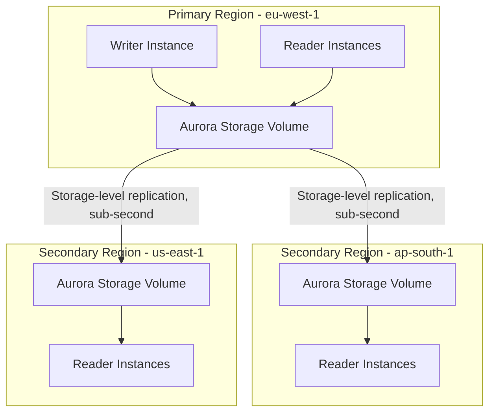
```mermaid
graph TD
    subgraph R1["Primary Region - eu-west-1"]
        W["Writer Instance"] --> SV1["Aurora Storage Volume"]
        RD1["Reader Instances"] --> SV1
    end
    subgraph R2["Secondary Region - ap-south-1"]
        SV2["Aurora Storage Volume"] --> RD2["Reader Instances"]
    end
    subgraph R3["Secondary Region - us-east-1"]
        SV3["Aurora Storage Volume"] --> RD3["Reader Instances"]
    end
    SV1 -->|"Storage-level replication, sub-second"| SV2
    SV1 -->|"Storage-level replication, sub-second"| SV3
```

### Amazon DynamoDB Internal Working

#### Partitioning by Hash of the Partition Key

This is the single most important mechanism in DynamoDB, and almost every DynamoDB design mistake traces back to misunderstanding it.

When you write an item, DynamoDB computes an **internal hash function over the partition key value**. The output of that hash determines which **partition** stores the item. A partition is a unit of storage and throughput, physically located on a set of storage nodes.

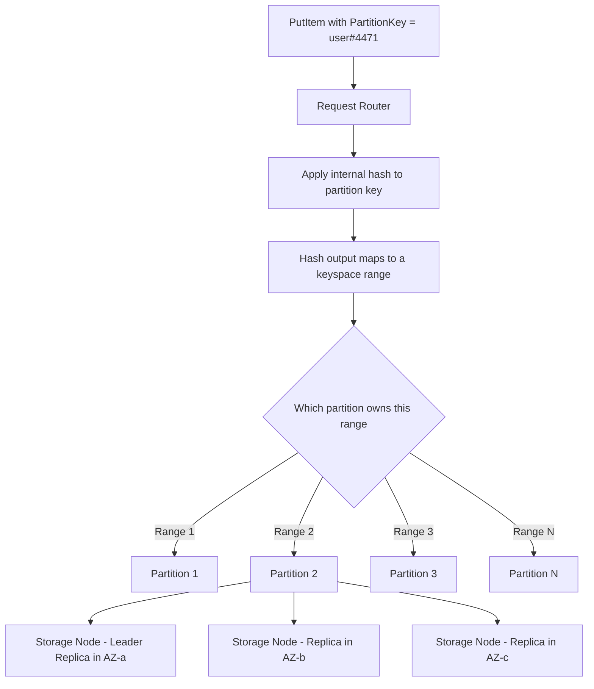
```mermaid
graph TD
    A["PutItem with PartitionKey = user#4471"] --> B["Request Router"]
    B --> C["Apply internal hash to partition key"]
    C --> D["Hash output maps to a keyspace range"]
    D --> E{"Which partition owns this range"}
    E -->|"Range 1"| P1["Partition 1"]
    E -->|"Range 2"| P2["Partition 2"]
    E -->|"Range 3"| P3["Partition 3"]
    E -->|"Range N"| PN["Partition N"]
    P2 --> R1["Storage Node - Leader Replica in AZ-a"]
    P2 --> R2["Storage Node - Replica in AZ-b"]
    P2 --> R3["Storage Node - Replica in AZ-c"]
```

Consequences that follow directly from this design:

1. **Every read or write that supplies the full partition key is routed to exactly one partition.** This is why `GetItem` is O(1) and why latency is predictable regardless of table size — a 10 KB table and a 100 TB table both take one hop.
2. **A query without the partition key cannot be routed** and must therefore `Scan` every partition. This is why `Scan` is expensive and why access patterns must be designed up front.
3. **Items sharing a partition key value are stored together**, physically adjacent and sorted by the sort key. This is why range queries on the sort key are efficient.
4. **Throughput is distributed across partitions.** If all your traffic targets one partition key value, you are limited by what one partition can deliver, regardless of how much capacity the table has in total. This is the **hot partition** problem.

#### Replication and Leader Election

Each partition is replicated across three Availability Zones. One replica is the **leader**; the others are followers.

| Operation | Path |
|---|---|
| Write | Routed to the leader; the leader appends to its log and replicates; acknowledged once a quorum of replicas has durably persisted it |
| Strongly consistent read | Served by the leader, guaranteeing the latest committed value |
| Eventually consistent read | Served by any replica, which may lag the leader by a very short interval |

Leader election uses a **Paxos-based** consensus protocol. If the leader becomes unreachable, the remaining replicas elect a new leader. This happens automatically and is invisible to applications — there is no endpoint to update, because clients always talk to the DynamoDB request routing layer rather than directly to storage nodes.

!!! info "Why DynamoDB Has No Endpoint to Fail Over"
    Unlike RDS, DynamoDB has no per-customer host to connect to. Your application calls a **Regional service endpoint** such as `dynamodb.eu-west-1.amazonaws.com`, and a fleet of request routers determines which storage nodes hold the relevant partition. Failures of individual storage nodes are handled inside that fleet. This is the architectural reason DynamoDB's availability model is fundamentally stronger than a single-writer relational database's — there is no single point of failure to lose.

#### Partition Splitting

DynamoDB splits partitions automatically for two reasons:

- **Size** — a partition holds up to approximately 10 GB of data. Exceeding this triggers a split.
- **Throughput** — a partition can sustain approximately 3,000 RCU and 1,000 WCU. If provisioned throughput exceeds what current partitions can serve, DynamoDB splits.

Splits are performed by dividing the partition's key-hash range in two and redistributing items. Splits happen in the background without downtime.

!!! warning "Partitions Never Merge"
    If you provision very high throughput temporarily — for example, 100,000 WCU for a bulk load — DynamoDB creates many partitions. When you reduce throughput afterwards, **those partitions remain**, and the reduced capacity is now divided among many more partitions. Each partition receives a smaller share, which can cause throttling on keys that were previously fine. This behaviour has been substantially mitigated by adaptive capacity in modern DynamoDB, but the underlying principle — that historical high provisioning shapes your partition layout — remains worth knowing and is a favourite examination topic.

#### Adaptive Capacity

Modern DynamoDB includes **adaptive capacity**, which addresses uneven access distribution in two ways:

1. **Throughput reallocation** — DynamoDB shifts unused capacity from cold partitions to hot ones automatically, within seconds. This is now instantaneous rather than the slow reallocation of earlier generations.
2. **Isolating frequently accessed items** — if a single item or a small set of items is extremely hot, DynamoDB can split the partition around them so the hot items get a dedicated partition.

!!! danger "Adaptive Capacity Is a Safety Net, Not a Design Strategy"
    Adaptive capacity mitigates moderate skew. It **cannot** rescue you from a genuinely pathological key design — for example, a partition key of `"ALL_ORDERS"` for every item, or a date-based partition key where all of today's traffic hits one value. A single partition still has a physical ceiling of roughly 3,000 RCU and 1,000 WCU. No amount of adaptive capacity exceeds a single partition's physical limits. **Design a high-cardinality partition key with an even access distribution. That is the requirement.**

#### DynamoDB Streams

DynamoDB Streams is an ordered, time-ordered change log of item-level modifications in a table, retained for 24 hours.

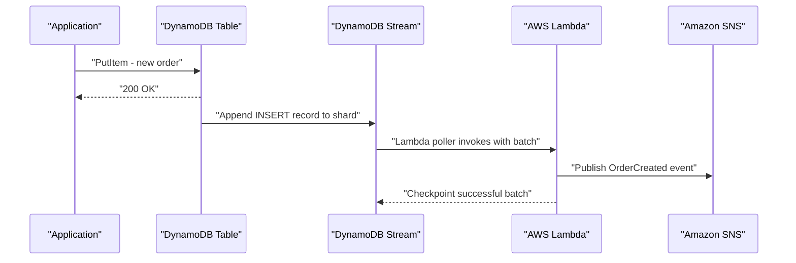
```mermaid
sequenceDiagram
    participant APP as "Application"
    participant DDB as "DynamoDB Table"
    participant STR as "DynamoDB Stream"
    participant L as "AWS Lambda"
    participant SNS as "Amazon SNS"
    APP->>DDB: "PutItem - new order"
    DDB-->>APP: "200 OK"
    DDB->>STR: "Append INSERT record to shard"
    STR->>L: "Lambda poller invokes with batch"
    L->>SNS: "Publish OrderCreated event"
    L-->>STR: "Checkpoint successful batch"
```

Stream view types determine what each record contains:

| View Type | Record Contains |
|---|---|
| `KEYS_ONLY` | Only the key attributes of the modified item |
| `NEW_IMAGE` | The entire item as it appears after the modification |
| `OLD_IMAGE` | The entire item as it appeared before the modification |
| `NEW_AND_OLD_IMAGES` | Both before and after images |

Ordering guarantee: **records for a given partition key are delivered in the exact order the modifications occurred**. There is no global ordering across different partition keys — this mirrors the partitioning model and is exactly the guarantee an event-driven system usually needs.

!!! example "Streams as the Foundation of Event-Driven Architecture"
    Streams make DynamoDB writes into events without any application-level publishing code. This directly implements the **transactional outbox** pattern: because the stream record is produced by the database itself, there is no possibility of the write succeeding but the event publication failing. Common uses include maintaining a materialised view, replicating to OpenSearch for full-text search, triggering notifications, updating aggregate counters, and auditing. This is a DSO303 module outcome — event-driven architecture with AWS service integration — expressed as a single configuration setting.

#### DynamoDB Accelerator (DAX)

DAX is a fully managed, write-through caching layer that sits in front of DynamoDB and is API-compatible with it, reducing read latency from single-digit milliseconds to **microseconds**. It runs as a cluster of nodes inside your VPC.

DAX maintains two caches: an **item cache** for `GetItem` and `BatchGetItem` results, and a **query cache** for `Query` and `Scan` results. Writes go through DAX to DynamoDB, and DAX updates its item cache — but the query cache is invalidated by TTL rather than by write, so query results can be stale.

!!! warning "DAX Is Only Consistent for Eventually Consistent Reads"
    Strongly consistent reads bypass the DAX cache entirely and go directly to DynamoDB. If your workload requires strong consistency, DAX provides no benefit for those requests. Additionally, writes made directly to DynamoDB while bypassing DAX will not invalidate the DAX cache, producing stale reads. **All access must route through DAX** for it to be coherent.

### Amazon ElastiCache Internal Working

#### Memcached Architecture

Memcached is deliberately simple: a set of independent nodes, each holding a distinct slice of the keyspace, with **no replication and no persistence**.

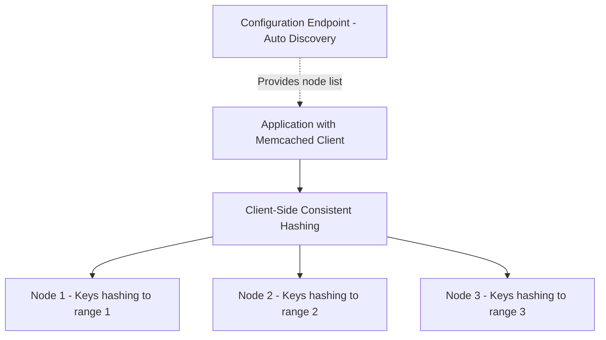
```mermaid
graph TD
    A["Application with Memcached Client"] --> B["Client-Side Consistent Hashing"]
    B --> C["Node 1 - Keys hashing to range 1"]
    B --> D["Node 2 - Keys hashing to range 2"]
    B --> E["Node 3 - Keys hashing to range 3"]
    F["Configuration Endpoint - Auto Discovery"] -.->|"Provides node list"| A
```

Critically, **the partitioning logic lives in the client library**, not in the server. Each node is unaware of the others. ElastiCache provides **Auto Discovery** through a configuration endpoint so clients can learn the current node list without redeployment.

The consequence: **if a node fails, the data on it is simply gone**, and clients rehash to the remaining nodes. This is acceptable only because Memcached is a pure cache — every miss can be satisfied from the origin.

#### Redis Architecture — Replication Groups

Redis in ElastiCache is organised into **replication groups**. A replication group contains one or more **shards** (called node groups); each shard has one primary node and up to five read replicas.

**Cluster mode disabled** — a single shard:

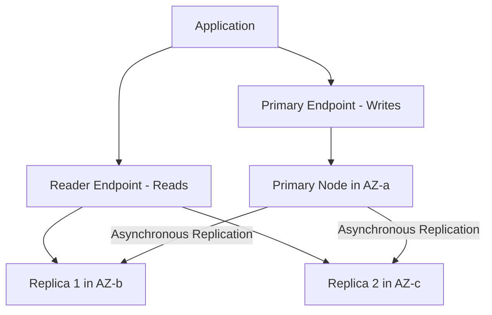
```mermaid
graph TD
    A["Application"] --> B["Primary Endpoint - Writes"]
    A --> C["Reader Endpoint - Reads"]
    B --> D["Primary Node in AZ-a"]
    C --> E["Replica 1 in AZ-b"]
    C --> F["Replica 2 in AZ-c"]
    D -->|"Asynchronous Replication"| E
    D -->|"Asynchronous Replication"| F
```

- The entire dataset lives on one primary and is fully replicated to each replica.
- Scaling writes or dataset size requires a **larger node type** — vertical scaling only.
- Simpler to operate; supports multi-key operations and transactions freely, because all keys are on one node.

**Cluster mode enabled** — multiple shards:

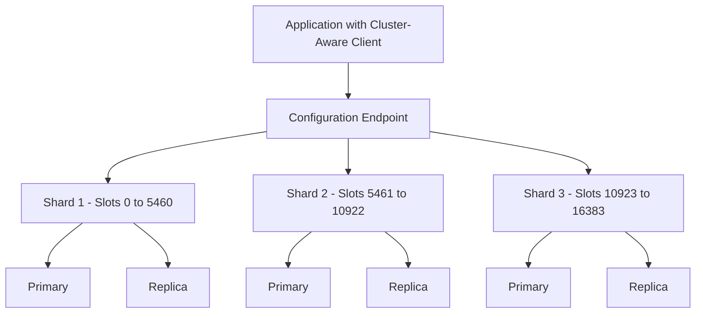
```mermaid
graph TD
    A["Application with Cluster-Aware Client"] --> B["Configuration Endpoint"]
    B --> C["Shard 1 - Slots 0 to 5460"]
    B --> D["Shard 2 - Slots 5461 to 10922"]
    B --> E["Shard 3 - Slots 10923 to 16383"]
    C --> C1["Primary"]
    C --> C2["Replica"]
    D --> D1["Primary"]
    D --> D2["Replica"]
    E --> E1["Primary"]
    E --> E2["Replica"]
```

- The keyspace is divided into **16,384 hash slots**. Each key maps to a slot via `CRC16(key) mod 16384`, and each shard owns a contiguous range of slots.
- Data and write throughput scale **horizontally** by adding shards.
- Requires a cluster-aware client that understands `MOVED` and `ASK` redirections.
- **Multi-key operations only work if all keys are in the same slot.** You force this with **hash tags**: keys written as `user:{4471}:profile` and `user:{4471}:cart` both hash only the portion inside the braces, so both land in the same slot and can participate in the same transaction.

| Aspect | Cluster Mode Disabled | Cluster Mode Enabled |
|---|---|---|
| Shards | Exactly 1 | Up to 500 (a soft, adjustable quota) |
| Scaling | Vertical only | Horizontal by adding shards |
| Max dataset | Limited by one node's memory | Sum across all shards |
| Multi-key operations | Unrestricted | Only within a hash slot |
| Client requirement | Standard Redis client | Cluster-aware client |
| Failure blast radius | Whole dataset | One shard |

#### Redis Failover

With **Multi-AZ with automatic failover** enabled, ElastiCache monitors the primary. On failure it promotes the replica with the least replication lag and updates the **primary endpoint DNS** to point at the new primary. Failover typically completes within tens of seconds.

!!! danger "Redis Replication Is Asynchronous — Writes Can Be Lost"
    Because replication to Redis replicas is asynchronous, a primary that fails immediately after acknowledging a write may lose that write if it had not yet reached a replica. **Never treat ElastiCache Redis as your system of record.** If you need durable, ACID-compliant in-memory storage, the correct service is **Amazon MemoryDB for Redis**, which writes to a distributed multi-AZ transaction log before acknowledging — trading a small amount of write latency for durability.

#### Redis Persistence Options

Redis in ElastiCache supports snapshots (RDB) written to S3, and append-only file (AOF) behaviour on some configurations. Snapshots are useful for seeding a new cluster or for recovering a warm cache after a planned change, but should not be relied upon as a primary durability mechanism.

### The Networking Path Inside a VPC

Understanding the actual network path is essential for debugging connectivity, which is the most common practical problem students encounter in labs.

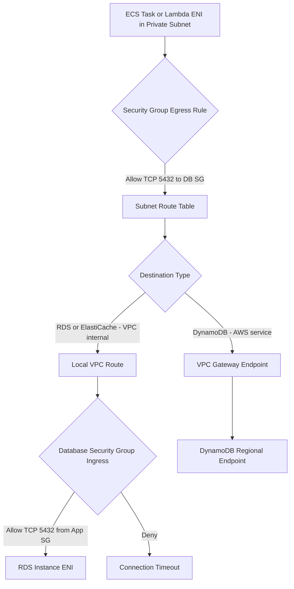
```mermaid
graph TD
    A["ECS Task or Lambda ENI in Private Subnet"] --> B{"Security Group Egress Rule"}
    B -->|"Allow TCP 5432 to DB SG"| C["Subnet Route Table"]
    C --> D{"Destination Type"}
    D -->|"RDS or ElastiCache - VPC internal"| E["Local VPC Route"]
    D -->|"DynamoDB - AWS service"| F["VPC Gateway Endpoint"]
    E --> G{"Database Security Group Ingress"}
    G -->|"Allow TCP 5432 from App SG"| H["RDS Instance ENI"]
    G -->|"Deny"| I["Connection Timeout"]
    F --> J["DynamoDB Regional Endpoint"]
```

Three checks resolve almost every connectivity failure:

| Check | Question | Symptom If Wrong |
|---|---|---|
| Security group | Does the DB security group allow inbound on the engine port **from the application's security group**? | Connection times out (no response at all) |
| Subnet and route | Is the DB in a subnet reachable from the application's subnet, and is there a route? | Connection times out |
| DNS and credentials | Does the endpoint resolve, and are the credentials valid? | DNS failure or authentication error |

!!! tip "Diagnosing a Timeout Versus a Refusal"
    A **timeout** almost always means a network or security group problem — the packet never reached the database, or the reply never returned. A **connection refused** means the network path worked but nothing was listening on that port. An **authentication error** means the network path *and* the listener worked, and the problem is credentials or database-level permissions. Learning to read these three symptoms correctly will save you hours in every lab and every production incident.

!!! note "Reference Security Groups, Not CIDR Blocks"
    The professional pattern is to allow inbound traffic to the database security group *from the application's security group ID*, rather than from an IP range. This is self-maintaining: as tasks and instances are created and destroyed with changing IP addresses, the rule remains correct. Using CIDR blocks such as `10.0.0.0/16` grants access to everything in the VPC and is a real security weakness.

---

## Architecture Components

A production data tier is never a database in isolation. The following components each carry a distinct responsibility.

### Network and Edge Components

| Component | Responsibility in the Data Tier Context |
|---|---|
| **Amazon Route 53** | Resolves service and database endpoint names; provides health-check-driven DNS failover for multi-Region designs |
| **Amazon CloudFront** | Caches static and cacheable dynamic responses at the edge, removing load from the origin and therefore from the database |
| **Application Load Balancer** | Distributes HTTP traffic to the compute tier; keeps the compute tier stateless so that database connections are managed per task, not per user |
| **Amazon VPC** | Provides the isolated network in which RDS, Aurora and ElastiCache reside |
| **Public subnets** | Host internet-facing components only — NAT gateways and load balancers. **Databases never belong here.** |
| **Private subnets** | Host the compute tier and the database tier; have no direct route to an internet gateway |
| **DB Subnet Group** | An RDS construct listing the subnets (in at least two AZs) in which RDS may place instances; a prerequisite for Multi-AZ |
| **Cache Subnet Group** | The equivalent construct for ElastiCache |
| **Security Groups** | Stateful virtual firewalls attached to ENIs; the primary access control at the network layer |
| **Network ACLs** | Stateless subnet-level filters; a secondary, coarse defence-in-depth layer |
| **VPC Gateway Endpoint** | Routes DynamoDB and S3 traffic over the AWS network without traversing a NAT gateway or the internet; no additional charge |
| **VPC Interface Endpoint (PrivateLink)** | Provides private ENIs for services such as Secrets Manager and KMS; hourly and data-processing charges apply |

### Compute Tier Components

| Component | Data Tier Concern |
|---|---|
| **Amazon EC2** | Long-lived instances; can hold long-lived connection pools efficiently |
| **Amazon ECS on Fargate** | Tasks are ephemeral; each task holds its own pool, so total connections scale with task count |
| **Amazon EKS** | Same connection multiplication concern as ECS, amplified by pod autoscaling |
| **AWS Lambda** | The most severe connection problem: each concurrent execution environment opens its own connection, and thousands of concurrent invocations can exhaust an RDS instance's connection limit |
| **Amazon RDS Proxy** | Sits between the compute tier and RDS or Aurora, multiplexing many client connections onto a small pool of database connections; also handles failover transparently and integrates with Secrets Manager and IAM authentication |

!!! danger "The Lambda and RDS Connection Problem — A Core DSO303 Concern"
    A `db.t3.medium` PostgreSQL instance supports a few hundred connections. A Lambda function scaled to 1,000 concurrent executions, each opening one connection, will exhaust that limit and every subsequent invocation will fail with a connection error — including invocations from other, healthy services sharing the database. This is not a hypothetical: it is one of the most common serverless production incidents.

    The remedies, in order of preference:

    1. **Use RDS Proxy** — the purpose-built solution. It pools and multiplexes connections and holds them across Lambda invocations.
    2. **Reuse the connection across invocations** by declaring the client outside the handler so it persists in the warm execution environment.
    3. **Set reserved concurrency** on the function to cap the maximum number of connections it can create.
    4. **Reconsider the data store** — DynamoDB uses stateless HTTPS requests and has no connection concept at all, which is precisely why it pairs naturally with Lambda.

### Data Tier Components

| Component | Responsibility |
|---|---|
| **RDS DB instance** | Runs the database engine; the unit of compute and memory sizing |
| **RDS Multi-AZ standby** | Synchronous replica for failover; not readable in the single-standby model |
| **RDS read replica** | Asynchronous readable copy for read scaling and reporting isolation |
| **Aurora cluster** | The logical container comprising the shared storage volume plus its instances |
| **Aurora writer instance** | The single instance accepting writes for a cluster (in the default single-master configuration) |
| **Aurora reader instance** | Serves reads from the shared volume; a failover candidate |
| **Aurora shared storage volume** | The distributed, six-way-replicated, auto-growing storage service |
| **DynamoDB table** | The top-level container; scoped to a Region |
| **DynamoDB partition** | The physical unit of storage and throughput |
| **Global Secondary Index (GSI)** | An alternative-key index with its own partitions and its own capacity |
| **Local Secondary Index (LSI)** | An alternative sort key sharing the base table's partition key and partitions |
| **DynamoDB Streams** | The ordered change log enabling event-driven integration |
| **DAX cluster** | In-VPC microsecond read cache in front of DynamoDB |
| **ElastiCache node** | A single cache instance |
| **ElastiCache shard / node group** | A primary plus its replicas, owning a slice of the keyspace |
| **ElastiCache replication group** | The full set of shards forming a Redis deployment |

### Supporting Services

| Component | Responsibility |
|---|---|
| **AWS IAM** | Controls which principals may call which database APIs, and enables IAM database authentication |
| **AWS KMS** | Manages the customer master keys used for encryption at rest |
| **AWS Secrets Manager** | Stores database credentials and rotates them automatically using a Lambda rotation function |
| **AWS Systems Manager Parameter Store** | A lower-cost alternative for non-rotating configuration values |
| **Amazon S3** | Destination for RDS snapshots, Aurora continuous backup, DynamoDB exports, and Redis snapshots |
| **Amazon CloudWatch** | Metrics, logs, alarms and dashboards for every service in the data tier |
| **AWS CloudTrail** | Audit record of every control plane API call; optionally, DynamoDB data plane events |
| **AWS X-Ray** | Distributed tracing, including database call subsegments, to locate latency |
| **AWS Backup** | Centralised, policy-driven backup across RDS, Aurora, DynamoDB and other services |
| **AWS Database Migration Service (DMS)** | Migrates data between engines and into AWS, with optional continuous replication |
| **AWS Schema Conversion Tool (SCT)** | Converts schema and procedural code between heterogeneous engines |

### A Complete Reference Architecture

```mermaid
graph TD
    U["Users"] --> R53["Route 53"]
    R53 --> CF["CloudFront"]
    CF --> ALB["Application Load Balancer in Public Subnets"]
    subgraph VPC["VPC"]
        subgraph PUB["Public Subnets - AZ a and b"]
            ALB
            NAT["NAT Gateway"]
        end
        subgraph APPSUB["Private App Subnets - AZ a and b"]
            ECS["ECS Fargate Tasks"]
            PROXY["RDS Proxy"]
        end
        subgraph DATASUB["Private Data Subnets - AZ a, b and c"]
            CACHE["ElastiCache Redis Replication Group"]
            AUR["Aurora Cluster - Writer and Readers"]
        end
        GWEP["VPC Gateway Endpoint for DynamoDB"]
        IFEP["Interface Endpoint for Secrets Manager"]
    end
    ALB --> ECS
    ECS --> CACHE
    ECS --> PROXY
    PROXY --> AUR
    ECS --> GWEP
    GWEP --> DDB["DynamoDB Regional Endpoint"]
    ECS --> IFEP
    IFEP --> SM["Secrets Manager"]
    DDB --> STR["DynamoDB Streams"]
    STR --> LAM["Lambda Consumer"]
    AUR --> S3["S3 - Backups"]
    ECS --> CW["CloudWatch"]
    AUR --> CW
    CACHE --> CW
```

---

## Request Lifecycle

### Synchronous Read Path with Cache-Aside

```mermaid
sequenceDiagram
    participant C as "Client"
    participant A as "Application"
    participant R as "ElastiCache Redis"
    participant D as "Aurora Writer or Reader"
    C->>A: "GET /products/12345"
    A->>R: "GET product:12345"
    alt Cache Hit
        R-->>A: "Serialized product JSON"
        A-->>C: "200 OK - latency around 2 ms"
    else Cache Miss
        R-->>A: "nil"
        A->>D: "SELECT * FROM products WHERE id = 12345"
        D-->>A: "Row"
        A->>R: "SETEX product:12345 300 payload"
        A-->>C: "200 OK - latency around 12 ms"
    end
```

Step by step:

1. The client's request reaches the compute tier through Route 53, CloudFront and the ALB.
2. The application constructs a deterministic cache key. Key design matters: it must incorporate every parameter that changes the result, including tenant identity and locale, or you will serve one tenant's data to another.
3. The application issues a `GET` to Redis. Network latency inside a VPC is on the order of hundreds of microseconds.
4. On a hit, the value is deserialised and returned. The database is never consulted.
5. On a miss, the application queries the database, writes the result into the cache with a TTL, and returns it.
6. The TTL bounds staleness. A short TTL means fresher data and a lower hit ratio; a long TTL means the opposite. This is a business decision per data type, not a global setting.

### Synchronous Write Path with Transaction

```mermaid
sequenceDiagram
    participant C as "Client"
    participant A as "Application"
    participant P as "RDS Proxy"
    participant W as "Aurora Writer"
    participant S as "Storage Quorum"
    participant R as "ElastiCache"
    C->>A: "POST /orders"
    A->>P: "Acquire pooled connection"
    P->>W: "BEGIN"
    A->>W: "INSERT INTO orders"
    A->>W: "UPDATE inventory SET qty = qty - 1 WHERE id = 55 AND qty > 0"
    A->>W: "INSERT INTO payments"
    A->>W: "COMMIT"
    W->>S: "Write redo log records"
    S-->>W: "Quorum of 4 of 6 acknowledged"
    W-->>A: "Commit successful"
    A->>R: "DEL product:55"
    A-->>C: "201 Created"
```

Points worth noting:

- The three statements form one atomic transaction. If the inventory update matches zero rows because stock ran out, the application rolls back and no order or payment record persists. This is atomicity doing real work.
- The `qty > 0` predicate in the `UPDATE` is an **optimistic concurrency** technique: it prevents overselling without holding a lock across the whole request.
- The commit is not acknowledged until the storage quorum confirms. **Durability is established before the client is told the order succeeded.**
- The cache entry is **deleted rather than updated**. Deleting is safer than writing a new value, because two concurrent writers updating a cache entry can interleave and leave the cache permanently inconsistent with the database. Deleting forces the next reader to repopulate from the source of truth.

### Asynchronous Event-Driven Path via DynamoDB Streams

```mermaid
sequenceDiagram
    participant A as "Order Service"
    participant D as "DynamoDB Orders Table"
    participant S as "DynamoDB Stream"
    participant L as "Lambda Processor"
    participant E as "EventBridge"
    participant N as "Notification Service"
    participant O as "OpenSearch"
    A->>D: "PutItem order#9001"
    D-->>A: "200 OK"
    Note over A: "Client response returns here - the rest is asynchronous"
    D->>S: "Append INSERT record"
    L->>S: "Poll shard iterator"
    S-->>L: "Batch of stream records"
    L->>E: "PutEvents OrderCreated"
    E->>N: "Rule match - send confirmation email"
    L->>O: "Index order document for search"
    L-->>S: "Checkpoint"
```

The essential architectural distinction:

| Property | Synchronous | Asynchronous |
|---|---|---|
| Client waits | Yes | No |
| Failure visible to client | Immediately | Not at all — needs separate alerting |
| Coupling | Tight — caller depends on callee availability | Loose — callee can be down temporarily |
| Latency perceived by user | Sum of all steps | Only the first write |
| Retry responsibility | Caller | Platform, with a dead letter queue |
| Ordering | Natural | Guaranteed only per partition key |

!!! warning "Asynchronous Failures Are Silent"
    When the Lambda stream processor fails, the user sees nothing wrong — their order was accepted. But the confirmation email never sends and the order never appears in search. You **must** configure a destination for failed records (an `OnFailure` destination or a dead letter queue), set `BisectBatchOnFunctionError` so one poison record does not block a whole batch, bound `MaximumRetryAttempts` and `MaximumRecordAgeInSeconds`, and alarm on `IteratorAge`. A rising `IteratorAge` means your consumer is falling behind, and since stream data expires after 24 hours, sustained lag results in permanent data loss.

### DynamoDB Request Lifecycle in Detail

```mermaid
graph TD
    A["Application calls GetItem"] --> B["SDK signs request with SigV4 using IAM credentials"]
    B --> C["HTTPS request to Regional endpoint"]
    C --> D["Request Router fleet"]
    D --> E["IAM authorization check including condition keys"]
    E -->|"Denied"| F["AccessDeniedException"]
    E -->|"Allowed"| G["Compute hash of partition key"]
    G --> H["Locate owning partition"]
    H --> I{"Consistency requested"}
    I -->|"Strong"| J["Route to leader replica"]
    I -->|"Eventual"| K["Route to any replica"]
    J --> L["Read item"]
    K --> L
    L --> M["Meter consumed capacity"]
    M --> N{"Capacity available"}
    N -->|"No"| O["ProvisionedThroughputExceededException"]
    N -->|"Yes"| P["Return item and ConsumedCapacity"]
```

Three details of practical importance:

1. **Authorization happens per request**, using the IAM policy attached to the calling principal. Because IAM condition keys such as `dynamodb:LeadingKeys` can restrict access to items whose partition key matches the caller's identity, DynamoDB supports genuine row-level authorization without application code.
2. **Throttling is a normal, expected condition**, not necessarily a bug. The AWS SDKs retry `ProvisionedThroughputExceededException` automatically with exponential backoff. Your responsibility is to monitor `ThrottledRequests` and decide whether the correct response is more capacity, a better key design, or accepting the backoff.
3. **Every response carries `ConsumedCapacity`** if you request it. This is the single most useful diagnostic in DynamoDB, because it tells you the true cost of a query — frequently revealing that a `Query` is reading far more data than it returns because a filter expression is applied *after* the read.

!!! danger "Filter Expressions Do Not Reduce Cost"
    A `FilterExpression` is applied **after** items are read from storage and **after** capacity is consumed. Filtering 10,000 items down to 3 costs the RCUs for all 10,000. Filters reduce network transfer and application-side work, nothing more. If you find yourself relying on filters for selectivity, your key or index design is wrong.

---

## AWS Service Deep Dive

### Amazon RDS and Amazon Aurora

#### Purpose

To provide a managed relational database that preserves full SQL compatibility, ACID transactions, referential integrity and the mature tooling ecosystem of established engines, while removing the operational burden of running them.

#### Supported Engines

| Engine | Notes |
|---|---|
| **Amazon Aurora (MySQL-compatible)** | Cloud-native, wire-compatible with MySQL |
| **Amazon Aurora (PostgreSQL-compatible)** | Cloud-native, wire-compatible with PostgreSQL |
| **MySQL** | Community MySQL |
| **PostgreSQL** | Community PostgreSQL, with a wide extension catalogue |
| **MariaDB** | MySQL fork |
| **Oracle** | Bring Your Own Licence or Licence Included |
| **Microsoft SQL Server** | Multiple editions; Licence Included or BYOL under specific terms |
| **IBM Db2** | Available in RDS with BYOL |

!!! tip "Choosing an Engine"
    For a greenfield cloud-native application with no licence constraints, **Aurora PostgreSQL** is the strong default: PostgreSQL's extension ecosystem (including `pgvector` for embeddings, `PostGIS` for geospatial and `pg_stat_statements` for query analysis) combined with Aurora's storage architecture is difficult to beat. Choose Oracle or SQL Server only when an existing application genuinely requires them; the licence cost frequently exceeds the infrastructure cost.

#### Architecture

Standard RDS: an EC2-based instance with EBS storage, optionally with a synchronous standby and asynchronous read replicas.

Aurora: a fleet of compute instances sharing a distributed, log-structured, six-way-replicated storage service, as described in *Internal Working*.

#### Important Features

| Feature | Available In | Description |
|---|---|---|
| Multi-AZ deployment | RDS and Aurora | Automatic failover to another AZ |
| Read replicas | RDS and Aurora | Up to 15 Aurora Replicas; RDS engine limits are lower (commonly 5 or 15 depending on engine) |
| Automated backups with PITR | Both | Retention configurable from 1 to 35 days |
| Manual snapshots | Both | Retained until explicitly deleted; copyable across Regions and accounts |
| Encryption at rest with KMS | Both | Must be enabled at creation for RDS; cannot be added in place |
| IAM database authentication | Both (MySQL and PostgreSQL) | Short-lived token instead of a password |
| Performance Insights | Both | Database load visualised by wait event and by SQL statement |
| Enhanced Monitoring | Both | OS-level metrics at up to 1-second granularity |
| RDS Proxy | Both | Connection pooling and multiplexing |
| Blue/Green Deployments | RDS and Aurora (MySQL and PostgreSQL) | A synchronised staging environment for low-risk upgrades and schema changes |
| Aurora Serverless v2 | Aurora only | Fine-grained automatic capacity scaling |
| Aurora Global Database | Aurora only | Cross-Region replication with sub-second typical lag |
| Aurora Backtrack | Aurora MySQL only | Rewind the cluster in place to a prior point without a restore |
| Aurora fast database cloning | Aurora only | Copy-on-write clone created in minutes regardless of size |
| Zero-ETL integration with Redshift | Aurora | Near-real-time analytics without building a pipeline |
| Aurora I/O-Optimized | Aurora | A pricing configuration that removes per-I/O charges in exchange for higher instance and storage rates |

!!! tip "Aurora Fast Cloning Is Underused and Extremely Valuable"
    An Aurora clone shares the source's storage using copy-on-write, so creating a full-size copy of a 10 TB production database takes minutes and initially costs almost nothing in storage — you pay only for the pages that subsequently diverge. This makes it practical to test a destructive schema migration against a genuine copy of production data before running it for real. In a CI/CD context, this is the correct way to validate migrations, and it directly addresses the DSO303 outcome on CI/CD and database change management.

#### Limitations

| Limitation | Consequence |
|---|---|
| Single writer (standard configuration) | Write throughput ultimately bounded by one instance |
| No OS access | Cannot install arbitrary agents or modify the OS |
| Restricted superuser | Some engine features requiring true superuser are unavailable |
| Encryption cannot be enabled in place | Requires snapshot, encrypted copy, restore |
| Major version upgrades require care | Potential downtime and application incompatibility |
| Aurora is not available on all engines | Only MySQL and PostgreSQL compatibility |
| Storage cannot be reduced | RDS storage can be increased but never decreased |
| Cross-Region read replica lag | Subject to inter-Region network latency |

#### Pricing Model

Charges accrue along these dimensions. Always verify current rates on the AWS pricing pages, as they vary by Region and change over time.

| Dimension | Description |
|---|---|
| Instance hours | Per second, with a 10-minute minimum, by instance class |
| Storage | Per GB-month provisioned (RDS) or consumed (Aurora) |
| Provisioned IOPS | Charged separately for `io1` and `io2` volume types |
| I/O requests | Aurora Standard charges per million requests; Aurora I/O-Optimized does not |
| Backup storage | Free up to the size of the database; charged beyond that |
| Snapshot export to S3 | Per GB exported |
| Data transfer | Cross-AZ and cross-Region transfer charges apply |
| RDS Proxy | Per vCPU-hour of the underlying database instance |
| Aurora Serverless v2 | Per ACU-hour |
| Backtrack | Per million change records stored |
| Licence | Included in the hourly rate for Licence Included Oracle and SQL Server |

!!! warning "Aurora I/O Charges Surprise People"
    With Aurora Standard, every read that misses the buffer pool and every write to storage is a billable I/O. A poorly indexed, scan-heavy workload can accumulate an I/O bill exceeding the instance cost. **Aurora I/O-Optimized** eliminates per-I/O charges for a higher instance and storage rate; AWS guidance is that it becomes economical when I/O exceeds roughly 25 percent of your total Aurora spend. Check the `VolumeReadIOPs` and `VolumeWriteIOPs` metrics and compute the crossover for your workload.

#### Performance Characteristics

| Metric | Typical Behaviour |
|---|---|
| Point read latency | Sub-millisecond from buffer pool; low single-digit milliseconds from storage |
| Commit latency (single-AZ) | Around 1 ms |
| Commit latency (Multi-AZ) | Around 2 to 5 ms due to the cross-AZ round trip |
| Aurora commit latency | Low, because only redo log records are written and only a 4-of-6 quorum is required |
| Aurora replica lag | Typically tens of milliseconds |
| RDS read replica lag | Milliseconds to seconds, workload-dependent |
| Throughput claim | AWS states Aurora MySQL can deliver up to roughly five times standard MySQL throughput and Aurora PostgreSQL up to roughly three times standard PostgreSQL, on equivalent hardware — treat these as vendor benchmark figures, not guarantees for your workload |

#### Scaling Behaviour

| Axis | RDS | Aurora |
|---|---|---|
| Compute vertical | Modify instance class; brief downtime or failover | Same, plus Serverless v2 in-place scaling |
| Storage | Increase manually, or enable storage autoscaling; cannot decrease | Automatic in 10 GiB increments; no action required |
| Read horizontal | Add read replicas | Add Aurora Replicas, up to 15 |
| Write horizontal | Not supported natively — requires application-level sharding | Aurora Limitless Database addresses this for supported configurations; otherwise the same constraint applies |
| Cross-Region | Cross-Region read replica | Aurora Global Database |

#### Availability and Durability

| Configuration | Availability Characteristics | Durability Characteristics |
|---|---|---|
| Single-AZ RDS | No automatic failover; an AZ failure is an outage | EBS-backed, plus automated backups to S3 |
| Multi-AZ RDS instance | Automatic failover, typically 60–120 seconds | Synchronous standby means near-zero RPO for AZ failure |
| Multi-AZ DB cluster | Faster failover, plus two readable standbys | Semi-synchronous commit |
| Aurora | Survives an AZ loss without failover of storage; instance failover typically under 30 seconds | Six copies across three AZs; continuous backup to S3 |
| Aurora Global Database | Regional failure survivable; promotion in minutes | Typical cross-Region RPO under one second |

#### Security Features

IAM for control plane authorization; IAM database authentication for the data plane; KMS encryption at rest including automated backups, snapshots and replicas; TLS in transit with certificate verification; security groups; private subnet placement; Secrets Manager integration with automatic rotation; database activity streams for Aurora providing a near-real-time audit stream; and engine-native audit logging exported to CloudWatch Logs.

#### Service Limits

Most RDS limits are **soft quotas** adjustable through AWS Support, and several vary by Region and engine version. Verify current values in the Service Quotas console rather than memorising them.

| Limit | Typical Default | Adjustable |
|---|---|---|
| DB instances per Region | 40 | Yes |
| Manual snapshots per Region | 100 | Yes |
| Read replicas per source (engine-dependent) | 5 or 15 | Sometimes |
| Aurora Replicas per cluster | 15 | No |
| Aurora cluster storage maximum | 128 TiB for recent engine versions | No |
| Backup retention | 1 to 35 days | No — use manual snapshots or AWS Backup for longer |
| Maximum database connections | Determined by a formula based on instance memory | Configurable via parameter group |
| Security groups per DB instance | Small, engine-independent limit | Yes |

#### Common Configurations

| Scenario | Recommended Configuration |
|---|---|
| Production OLTP | Aurora PostgreSQL, Multi-AZ with at least one reader, encryption on, 14–35 day backup retention, RDS Proxy, Performance Insights enabled |
| Development and test | Aurora Serverless v2 with a low minimum ACU, or a small single-AZ RDS instance, 1-day backups |
| Read-heavy public content | Aurora with several readers behind the reader endpoint, plus ElastiCache in front |
| Reporting isolation | A dedicated read replica or a custom endpoint targeting reporting-sized readers |
| Regulated multi-Region | Aurora Global Database with a customer-managed KMS key in each Region |
| Legacy commercial engine | RDS for Oracle or SQL Server, Multi-AZ, with licence model chosen deliberately |

### Amazon DynamoDB

#### Purpose

To provide a fully managed, serverless, horizontally scalable key-value and document database delivering consistent single-digit millisecond latency at any scale, with no servers to manage, no connection management, and no capacity ceiling that requires re-architecture.

#### Architecture

A Regional service composed of a request routing fleet, a metadata service, and a storage fleet organised into partitions, each replicated across three Availability Zones with Paxos-based leader election, as described in *Internal Working*. There is no instance, no endpoint to fail over, and no VPC placement.

#### The Data Model

| Concept | Definition |
|---|---|
| **Table** | A collection of items. Regional. No fixed schema beyond the primary key. |
| **Item** | A single record, analogous to a row. Maximum size **400 KB** including attribute names. |
| **Attribute** | A name-value pair, analogous to a column. Items in the same table need not have the same attributes. |
| **Primary key** | Either a **simple** key (partition key only) or a **composite** key (partition key plus sort key) |
| **Partition key (HASH)** | Determines the physical partition. Required. |
| **Sort key (RANGE)** | Orders items within a partition key. Optional. Enables range queries. |
| **Item collection** | All items sharing the same partition key value |

Supported attribute types: `S` (string), `N` (number), `B` (binary), `BOOL`, `NULL`, `L` (list), `M` (map), `SS`/`NS`/`BS` (sets). Only scalar types (`S`, `N`, `B`) may be used as key attributes.

!!! warning "The 400 KB Item Limit Shapes Your Design"
    An item cannot exceed 400 KB. This rules out storing images, documents or large blobs in DynamoDB. The correct pattern is to store the object in **S3** and keep the S3 key, size, content type and metadata in DynamoDB. It also constrains unbounded lists: an item containing a growing list of comments will eventually hit the limit and start failing writes. Model one-to-many relationships as **multiple items in an item collection**, not as a nested list inside one item.

#### Partition Key Design — The Central Skill

A good partition key has two properties:

1. **High cardinality** — many distinct values, so data spreads across many partitions.
2. **Uniform access distribution** — no single value receives disproportionate traffic.

| Candidate Partition Key | Cardinality | Distribution | Verdict |
|---|---|---|---|
| `user_id` for a per-user workload | Very high | Even, assuming no dominant user | Excellent |
| `order_id` (UUID) | Very high | Even | Excellent |
| `device_id` for IoT telemetry | High | Even | Good |
| `status` with values PENDING, SHIPPED, DELIVERED | 3 | Extremely skewed | Unusable |
| `order_date` for daily ingest | High overall | All of today's traffic hits one value | Poor for writes |
| `country` for a national app | Low, and heavily skewed | One country dominates | Poor |
| `tenant_id` in multi-tenant SaaS | Medium | Skewed if one tenant is very large | Requires care |

##### Write Sharding for Unavoidably Hot Keys

When the natural key is inherently hot — for example, all events for the current day — you distribute writes artificially by appending a shard suffix.

```
Natural key:  2026-08-10                     -> one partition, throttled
Sharded key:  2026-08-10#0 ... 2026-08-10#9  -> ten partitions, ten times the throughput
```

On write, choose the suffix by a random number or by a deterministic hash of another attribute. On read, issue ten parallel `Query` calls (a scatter-gather) and merge the results.

| Suffix Strategy | Write Behaviour | Read Behaviour |
|---|---|---|
| Random suffix | Perfectly even | Must query all shards for a complete result |
| Calculated suffix, for example `hash(order_id) mod 10` | Even | Can target the exact shard when you know `order_id` |

!!! tip "The Trade-off Is Explicit"
    Write sharding trades read simplicity for write throughput. Use a **calculated** suffix when you will frequently look up individual items, because it lets you compute the exact shard. Use a **random** suffix when reads are always full-collection scans anyway. The number of shards should reflect your required throughput divided by roughly 1,000 WCU per partition, with headroom.

##### Sort Key Design and Composite Sort Keys

The sort key is the mechanism for expressing hierarchy and enabling range queries. A composite sort key encodes multiple dimensions in one string, ordered from most to least significant.

```
PK: USER#4471
SK: ORDER#2026-08-10#9001
SK: ORDER#2026-08-11#9014
SK: ADDRESS#HOME
SK: ADDRESS#WORK
```

With this design, a single `Query` on `PK = USER#4471 AND begins_with(SK, "ORDER#2026-08")` retrieves every order placed by that user in August 2026, sorted chronologically, in one request. This is the essence of DynamoDB modelling: **the key structure encodes the query**.

!!! danger "Model the Access Patterns Before the Data"
    Relational design begins with entities and normalisation, and queries come later because SQL can express anything. DynamoDB design begins with an exhaustive written list of access patterns, and the key schema is derived from that list. If you design a DynamoDB table without first enumerating every query your application will make, you will get it wrong, and correcting it after production data exists requires a data migration. **Access patterns first. Always.**

#### Single-Table Design

Single-table design places multiple entity types in one table, using generic key attribute names (`PK`, `SK`) and a type discriminator, so that related entities of different types share a partition and can be retrieved together in one request.

```mermaid
erDiagram
    CUSTOMER ||--o{ ORDER : "places"
    ORDER ||--o{ ORDER_ITEM : "contains"
    PRODUCT ||--o{ ORDER_ITEM : "referenced by"
    CUSTOMER {
        string partition_key "CUST#4471"
        string sort_key "PROFILE"
        string email
        string name
    }
    ORDER {
        string partition_key "CUST#4471"
        string sort_key "ORDER#9001"
        string status
        number total
    }
    ORDER_ITEM {
        string partition_key "ORDER#9001"
        string sort_key "ITEM#SKU-55"
        number quantity
        number unit_price
    }
    PRODUCT {
        string partition_key "PROD#SKU-55"
        string sort_key "METADATA"
        string title
        number price
    }
```

An example table layout:

| PK | SK | entity_type | Other Attributes |
|---|---|---|---|
| `CUST#4471` | `PROFILE` | Customer | `email`, `name`, `created_at` |
| `CUST#4471` | `ORDER#2026-08-10#9001` | Order | `status`, `total`, `GSI1PK=STATUS#PENDING` |
| `CUST#4471` | `ORDER#2026-08-11#9014` | Order | `status`, `total` |
| `CUST#4471` | `ADDRESS#HOME` | Address | `line1`, `city`, `postcode` |
| `ORDER#9001` | `ITEM#SKU-55` | OrderItem | `qty`, `unit_price` |
| `ORDER#9001` | `ITEM#SKU-72` | OrderItem | `qty`, `unit_price` |
| `PROD#SKU-55` | `METADATA` | Product | `title`, `price`, `stock` |

| Access Pattern | Implementation |
|---|---|
| Get a customer's profile | `GetItem PK=CUST#4471, SK=PROFILE` |
| Get a customer's profile and all orders and addresses in one call | `Query PK=CUST#4471` |
| Get a customer's August 2026 orders | `Query PK=CUST#4471 AND begins_with(SK,"ORDER#2026-08")` |
| Get all line items for an order | `Query PK=ORDER#9001 AND begins_with(SK,"ITEM#")` |
| Get all pending orders across customers | `Query` on GSI1 where `GSI1PK=STATUS#PENDING` |
| Get product details | `GetItem PK=PROD#SKU-55, SK=METADATA` |

| Aspect | Single-Table | Multi-Table |
|---|---|---|
| Requests per page render | Often one | One per entity type |
| Latency | Lower | Higher, and variable |
| Cost | Lower — fewer requests | Higher |
| Readability of data | Poor — the table looks opaque | Good |
| Onboarding difficulty | High | Low |
| Adding a new access pattern | May require a new GSI or a migration | Easier |
| Per-entity capacity and monitoring | Not separable | Separable |

!!! note "A Balanced Professional View"
    Single-table design is the canonical DynamoDB pattern and is genuinely optimal for latency and cost in high-scale systems with well-understood access patterns. It is also difficult to reason about, hard to hand over, and unforgiving of requirement changes. For a microservice owning a small number of tightly related entities with stable access patterns, single-table design is correct. For an exploratory application whose requirements are still moving, a small number of purpose-specific tables is a defensible and pragmatic choice. State the trade-off explicitly in a design review rather than asserting a dogma.

#### Secondary Indexes — LSI Versus GSI

| Property | Local Secondary Index (LSI) | Global Secondary Index (GSI) |
|---|---|---|
| Partition key | **Must** be the same as the base table's | **Any** attribute |
| Sort key | A different attribute | Any attribute, optional |
| When it can be created | **Only at table creation** | Any time, and deletable any time |
| Maximum per table | 5 | 20 by default (a soft quota) |
| Consistency | Supports **strongly consistent** reads | **Eventually consistent only** |
| Capacity | Shares the base table's throughput | Has its **own** provisioned throughput |
| Storage location | Same partitions as the base table | Separate partitions |
| Constraint imposed | Item collection (all items with one partition key, across table and LSIs) limited to **10 GB** | None |
| Key uniqueness required | No | No |

```mermaid
graph TD
    A["Base Table - PK = user_id, SK = order_date"] --> B["LSI - PK = user_id, SK = order_total"]
    A --> C["GSI1 - PK = status, SK = order_date"]
    A --> D["GSI2 - PK = product_id, SK = order_date"]
    A -.->|"Same partitions, shared capacity"| B
    A -.->|"Separate partitions, own capacity, async replication"| C
    A -.->|"Separate partitions, own capacity, async replication"| D
```

!!! danger "The Two Most Dangerous GSI Behaviours"
    **First: a throttled GSI can throttle your base table.** GSI updates are applied asynchronously, but if a GSI's write capacity is insufficient, the backlog eventually causes writes to the *base table* to be throttled, because DynamoDB will not allow the index to fall arbitrarily far behind. Always provision GSI write capacity at least as generously as the base table's for attributes that change on every write.

    **Second: a GSI with a low-cardinality partition key is a hot partition you built on purpose.** A GSI on `status` with three possible values creates three partitions receiving all traffic. If you need to query by status, use a **sparse index** — only write the GSI key attribute for items in the state you care about (for example, only set `GSI1PK` while an order is `PENDING`, and remove the attribute when it ships). The index then contains only the active working set, which is both small and cheap.

!!! tip "Sparse Indexes Are One of the Most Elegant DynamoDB Techniques"
    An item appears in a GSI **only if it has the GSI's key attributes**. Deliberately omitting those attributes gives you an index containing only the subset of items you need — a work queue of unprocessed records, for instance. The index stays small no matter how large the table grows, so scanning it is cheap and predictable. Use this instead of scanning the table with a filter.

##### Index Projections

| Projection Type | Attributes Copied Into the Index | Trade-off |
|---|---|---|
| `KEYS_ONLY` | Table and index keys only | Smallest and cheapest; usually requires a second read to fetch the full item |
| `INCLUDE` | Keys plus a specified list | Balanced; the usual correct choice |
| `ALL` | Every attribute | Fastest reads, highest storage and write cost |

A read from an index that must then fetch the full item from the base table is a **fetch**, and it consumes additional capacity. Choose `INCLUDE` with exactly the attributes your query needs to avoid fetches without paying for `ALL`.

#### Capacity Modes

| Aspect | Provisioned | On-Demand |
|---|---|---|
| You specify | RCU and WCU per second | Nothing |
| Billing | Per provisioned capacity-hour | Per request |
| Cost per request | Lower at steady, high utilisation | Higher per request |
| Cost at low or spiky use | Higher — you pay for idle | Lower |
| Auto scaling | Available, target-utilisation based | Inherent |
| Instant scale-up | No — auto scaling reacts over minutes | Yes, up to double the previous peak instantly |
| Throttling risk | Yes, if under-provisioned or during a scaling lag | Much lower, but not zero for extreme, sudden spikes |
| Best for | Predictable, sustained traffic | New applications, spiky, unpredictable, or development |

!!! tip "The Standard Practical Approach"
    Launch a new table in **on-demand** mode. You do not know the traffic pattern yet, and on-demand removes the risk of throttling during launch. After a few weeks, examine the `ConsumedReadCapacityUnits` and `ConsumedWriteCapacityUnits` metrics. If utilisation is steady and high, switch to provisioned with auto scaling and consider a **reserved capacity** commitment — the saving can be substantial. If traffic is spiky, remain on demand. You may switch modes, subject to a cooldown period between switches.

!!! info "On-Demand Scaling Headroom"
    On-demand tables instantly accommodate up to double the previous observed peak. Beyond that, DynamoDB scales further but may throttle briefly while it does. If you know a very large spike is coming — a ticket sale opening, a marketing campaign — you can either **pre-warm** by driving controlled traffic in advance, or set a **maximum throughput** limit on the on-demand table to bound runaway cost. Do not assume on-demand is infinitely elastic at zero notice.

#### Read Consistency Options

| Option | Behaviour | Cost |
|---|---|---|
| **Eventually consistent read** | Served from any replica; may not reflect a very recent write | **0.5 RCU** per 4 KB |
| **Strongly consistent read** | Served from the leader; always reflects all prior successful writes | **1 RCU** per 4 KB |
| **Transactional read** | Part of a `TransactGetItems` serializable snapshot | **2 RCU** per 4 KB |

#### RCU and WCU Calculation

These formulas are examinable and are genuinely used in capacity planning.

**Read Capacity Unit (RCU)**

- 1 RCU = one **strongly consistent** read per second of an item up to **4 KB**.
- 1 RCU = **two** eventually consistent reads per second of an item up to 4 KB.
- Item size is **rounded up** to the next 4 KB boundary.

**Write Capacity Unit (WCU)**

- 1 WCU = one standard write per second of an item up to **1 KB**.
- Item size is **rounded up** to the next 1 KB boundary.
- A transactional write costs **2 WCU** per 1 KB.

!!! example "Worked Example 1 — Basic Reads"
    **Requirement:** 100 strongly consistent reads per second of 6 KB items.

    1. Round item size up: 6 KB rounds up to 8 KB, which is 2 units of 4 KB.
    2. RCUs per read: 2.
    3. Total: `100 × 2 =` **200 RCU**.

    Now the same workload with **eventually consistent** reads:

    - Eventually consistent reads cost half: `200 / 2 =` **100 RCU**.

    The lesson: simply choosing eventual consistency where the business permits it halves your read cost.

!!! example "Worked Example 2 — Writes"
    **Requirement:** 250 writes per second of 3.2 KB items.

    1. Round up: 3.2 KB rounds up to 4 KB, which is 4 units of 1 KB.
    2. WCUs per write: 4.
    3. Total: `250 × 4 =` **1,000 WCU**.

    Note that 1,000 WCU is approximately the throughput ceiling of a single partition, so this workload requires a partition key that distributes across multiple partitions.

!!! example "Worked Example 3 — Mixed Workload with a GSI"
    **Requirement:** An orders table.

    - Writes: 500 new orders per second, item size 2.5 KB.
    - Reads: 2,000 eventually consistent reads per second, item size 2.5 KB.
    - One GSI on `status` with `ALL` projection, receiving every write.

    **Base table writes:** 2.5 KB rounds up to 3 KB = 3 WCU per write. `500 × 3 =` **1,500 WCU**.

    **Base table reads:** 2.5 KB rounds up to 4 KB = 1 unit. Strong would be 1 RCU; eventual is 0.5 RCU. `2,000 × 0.5 =` **1,000 RCU**.

    **GSI writes:** With `ALL` projection the index item is also about 2.5 KB, rounding to 3 WCU. Every base write produces an index write, so **1,500 WCU** on the GSI.

    **Total write capacity to provision: 3,000 WCU** across the table and its index. This is the calculation people forget, and it is why an unnecessary `ALL`-projection GSI **doubles your write bill**.

!!! example "Worked Example 4 — Transactions"
    **Requirement:** 50 transactions per second, each writing 3 items of 0.8 KB.

    1. Each item rounds up to 1 KB = 1 unit.
    2. Transactional writes cost 2 WCU per unit: 2 WCU per item.
    3. Per transaction: `3 × 2 = 6` WCU.
    4. Total: `50 × 6 =` **300 WCU**.

    A transaction costs twice a standard write because DynamoDB executes a two-phase commit across partitions. Use transactions where atomicity is genuinely required, not by default.

!!! example "Worked Example 5 — Query Cost and the Filter Trap"
    **Scenario:** `Query PK=CUST#4471` returns an item collection of 300 items averaging 1.5 KB, and a `FilterExpression` reduces the result to 12 items.

    1. Total data read: `300 × 1.5 KB = 450 KB`.
    2. A `Query` aggregates the size of all items read and rounds the **total** up to a 4 KB boundary: `450 / 4 = 112.5`, rounding to 113 units.
    3. Eventually consistent: `113 × 0.5 =` **56.5 RCU**, billed as 57.

    You paid for 450 KB to receive 18 KB. Had the sort key encoded the filter condition, the same result would have cost around 3 RCU. **This single misunderstanding accounts for a large share of unexpected DynamoDB bills.**

#### Transactions

DynamoDB supports ACID transactions via `TransactWriteItems` and `TransactGetItems`.

| Property | Detail |
|---|---|
| Maximum items per transaction | 100 |
| Maximum total size | 4 MB |
| Scope | Multiple items, multiple tables, **same Region and same account** |
| Supported actions in a write transaction | `Put`, `Update`, `Delete`, `ConditionCheck` |
| Constraint | The same item may not appear twice in one transaction |
| Cost | Twice a non-transactional operation |
| Isolation | Serializable |

!!! tip "Condition Expressions Handle Most Cases More Cheaply"
    Before reaching for a transaction, ask whether a **conditional write** suffices. `PutItem` with `ConditionExpression: attribute_not_exists(PK)` gives you atomic create-if-absent at standard cost. `UpdateItem` with `ConditionExpression: version = :expected` gives you optimistic locking. These single-item conditional operations are atomic, cost half what a transaction costs, and cover a large majority of real requirements. Reserve transactions for genuinely multi-item invariants such as debit-and-credit.

#### Other Important Features

| Feature | Description |
|---|---|
| **Time To Live (TTL)** | Designate a numeric attribute holding a Unix epoch timestamp; DynamoDB deletes expired items automatically in the background at **no write cost**. Deletions typically occur within 48 hours of expiry, so TTL is not a precise scheduler. |
| **Global Tables** | Multi-Region, multi-active replication with last-writer-wins conflict resolution based on timestamps |
| **Point-in-Time Recovery (PITR)** | Continuous backups allowing restore to any second within the last 35 days; restores to a **new table** |
| **On-demand backup** | Full backups retained indefinitely, with no performance impact |
| **Export to S3** | Export table data to S3 in DynamoDB JSON or Ion format without consuming RCUs, for querying with Athena |
| **Import from S3** | Populate a new table directly from S3 without consuming WCUs |
| **PartiQL** | A SQL-compatible query language over DynamoDB. Convenient, but it does not change the underlying cost model — a PartiQL statement that cannot use a key still performs a scan. |
| **DAX** | Microsecond read caching |
| **Contributor Insights** | Identifies the most frequently accessed keys — the definitive tool for diagnosing hot partitions |
| **Streams and Kinesis Data Streams integration** | Change data capture for event-driven and analytics pipelines |

!!! warning "Global Tables Conflict Resolution Is Last-Writer-Wins"
    In a multi-active Global Table, concurrent writes to the same item in two Regions are resolved by choosing the write with the later timestamp; **the other write is silently discarded**. This is acceptable for user-partitioned data where a given user writes in one Region. It is **not** acceptable for a counter, a shared inventory quantity, or a financial balance, where losing a write is a correctness failure. If your data has genuine cross-Region write contention, either partition writes by Region at the application layer or use a single-writer design.

#### Limitations

| Limitation | Consequence |
|---|---|
| No joins | Relationships must be denormalised or resolved with multiple requests |
| No ad hoc queries | Every query must be served by the primary key or an index |
| 400 KB item limit | Large objects must live in S3 |
| Query requires the full partition key | No equivalent of an arbitrary `WHERE` clause |
| No native aggregations | Counts and sums must be maintained by the application, often via Streams |
| GSIs are eventually consistent | Read-after-write against a GSI is unreliable |
| LSIs only at creation | An access pattern discovered later cannot use an LSI |
| Sorting only on the sort key | Cannot order results by an arbitrary attribute |
| Cross-Region transactions unsupported | Transactions are Region- and account-scoped |
| Vendor-specific | The API is proprietary; portability is limited |

#### Pricing Model

| Dimension | Notes |
|---|---|
| Provisioned RCU and WCU | Per capacity-unit-hour; reserved capacity available for a one- or three-year commitment |
| On-demand read and write request units | Per million requests |
| Data storage | Per GB-month; a small monthly allowance is included in the Free Tier |
| Global Tables | Replicated write request units, charged per Region |
| Streams | Read request units for `GetRecords` beyond the free allowance; Lambda triggers consume no stream read charges of their own beyond Lambda invocation cost |
| PITR | Per GB-month of table size |
| On-demand backup and restore | Per GB stored and per GB restored |
| Export and import via S3 | Per GB processed |
| DAX | Per node-hour |
| Data transfer | Out of the Region |

!!! info "Storage and Index Cost Compound"
    A GSI with `ALL` projection roughly **doubles** your storage cost as well as your write cost for the projected attributes. With PITR enabled, backup cost also scales with total table size including indexes. Three `ALL`-projection GSIs on a 1 TB table means roughly 4 TB of storage plus 4 TB of PITR coverage. Project only what you query.

#### Performance Characteristics and Scaling

| Metric | Behaviour |
|---|---|
| `GetItem` latency | Consistently single-digit milliseconds, independent of table size |
| `GetItem` through DAX on a cache hit | Microseconds |
| Table size | Effectively unlimited |
| Throughput | Effectively unlimited, subject to per-partition limits and account quotas |
| Per-partition ceiling | Approximately 3,000 RCU and 1,000 WCU |
| Scaling mechanism | Automatic partition splitting; no downtime |
| Latency at scale | Flat — this is the defining property |

#### Availability, Durability and Service Limits

Data is synchronously replicated across three Availability Zones within a Region. AWS publishes a service level agreement of 99.99 percent for standard tables and 99.999 percent for Global Tables — verify current SLA terms, which are commitments about service credits rather than physical guarantees.

| Limit | Value | Adjustable |
|---|---|---|
| Item size | 400 KB | No |
| Partition key value length | 1 to 2048 bytes | No |
| Sort key value length | 1 to 1024 bytes | No |
| LSIs per table | 5 | No |
| GSIs per table | 20 | Yes — a soft quota |
| Items per transaction | 100 | No |
| Transaction payload | 4 MB | No |
| `Query` or `Scan` result page | 1 MB before pagination | No |
| `BatchGetItem` | 100 items or 16 MB | No |
| `BatchWriteItem` | 25 put or delete requests or 16 MB | No |
| Tables per Region | 2,500 | Yes |
| Account-level provisioned throughput | Region-dependent default | Yes |
| Stream retention | 24 hours | No |
| PITR window | 35 days | No |

!!! note "Pagination Is Not Optional"
    Both `Query` and `Scan` return at most 1 MB of data per call and include a `LastEvaluatedKey` when more results remain. Application code that ignores `LastEvaluatedKey` will silently process only the first page — a defect that passes every test with small data volumes and fails in production. Always loop until `LastEvaluatedKey` is absent, or use the SDK's paginator.

#### Common Configurations

| Scenario | Configuration |
|---|---|
| Session store | Simple key on `session_id`, TTL attribute, on-demand capacity |
| Shopping cart | PK `CUST#id`, SK `CART#item_id`, on-demand, Streams for abandoned-cart processing |
| IoT telemetry | PK `device_id`, SK ISO-8601 timestamp, TTL for expiry, provisioned with auto scaling |
| Event sourcing | PK `aggregate_id`, SK monotonically increasing sequence number, conditional write on `attribute_not_exists` for optimistic concurrency |
| Multi-tenant SaaS | PK includes `tenant_id`; IAM policies use the `dynamodb:LeadingKeys` condition for tenant isolation |
| Global user profiles | Global Tables in the Regions your users occupy, PITR enabled |


### Amazon ElastiCache

#### Purpose

To provide managed, in-memory data stores — Redis (and the AWS-maintained Valkey-compatible engine) and Memcached — that sit in front of a primary database or act as a primary store for ephemeral data, so that read-heavy and latency-sensitive workloads are served from RAM in microseconds instead of from disk-backed storage in milliseconds.

The architectural motivation is that most application workloads exhibit strong locality: a small fraction of the data is responsible for the overwhelming majority of reads. Serving that hot fraction from memory removes load from the primary database, which in turn allows the primary database to be smaller, cheaper, and further from its saturation point.

#### Architecture

```mermaid
graph TD
    APP["Application Tier"] --> PE["Primary Endpoint for writes"]
    APP --> RE["Reader Endpoint for reads"]
    PE --> P1["Shard 1 Primary Node"]
    RE --> R1A["Shard 1 Replica in AZ b"]
    RE --> R1B["Shard 1 Replica in AZ c"]
    P1 --> R1A
    P1 --> R1B
    PE --> P2["Shard 2 Primary Node"]
    RE --> R2A["Shard 2 Replica in AZ b"]
    P2 --> R2A
    APP --> DB["Amazon RDS or DynamoDB"]
    P1 --> SNAP["Backup to Amazon S3"]
```

An ElastiCache for Redis deployment is described by a **replication group**. With cluster mode disabled, a replication group is a single shard: one primary node accepting writes and up to five read replicas receiving asynchronous replication. With cluster mode enabled, the keyspace is divided into 16,384 hash slots distributed across up to 500 shards, each shard being an independent primary with its own replicas. Nodes are placed in a **cache subnet group**, which is a set of subnets inside a VPC, and are protected by security groups exactly like an RDS instance.

ElastiCache for Memcached is architecturally simpler and deliberately so: a cluster is a set of independent nodes with no replication, no persistence, and no failover. Client libraries shard across nodes using consistent hashing, and node loss simply means the keys that hashed to that node are gone and will be recomputed on the next miss.

#### Redis Versus Memcached

| Dimension | Redis / Valkey | Memcached |
|---|---|---|
| Data structures | Strings, lists, sets, sorted sets, hashes, bitmaps, HyperLogLog, streams, geospatial | Strings only |
| Replication | Yes, asynchronous, with automatic failover | None |
| Persistence | Yes, RDB snapshots and append-only file | None |
| Multi-AZ and failover | Yes | No |
| Backup and restore | Yes, to Amazon S3 | No |
| Transactions | Yes, `MULTI`/`EXEC`, plus Lua scripting | No |
| Pub/Sub and Streams | Yes | No |
| Multi-threaded | Largely single-threaded for command execution | Multi-threaded |
| Horizontal scaling | Sharding via cluster mode | Add nodes; client-side consistent hashing |
| Encryption in transit and at rest | Yes | In-transit encryption supported on recent versions |
| Typical use | Leaderboards, sessions, rate limiting, queues, caching, geospatial | Simple, very high-throughput object caching |

!!! tip "The selection heuristic"
    Choose Memcached only when the requirement is genuinely a simple, ephemeral, multi-threaded object cache and losing the entire cache is acceptable. In every other case — and that is most cases — Redis is the correct default, because replication, persistence, failover, and richer data structures cost little and remove entire categories of failure.

#### Caching Strategies

```mermaid
sequenceDiagram
    participant A as "Application"
    participant C as "ElastiCache"
    participant D as "Primary Database"
    A->>C: GET user 42
    alt Cache hit
        C-->>A: Value returned in microseconds
    else Cache miss
        C-->>A: Null
        A->>D: SELECT from users where id equals 42
        D-->>A: Row
        A->>C: SETEX user 42 with TTL
        A-->>A: Return value to caller
    end
```

**Cache-aside, also called lazy loading.** The application checks the cache, and on a miss reads the database and populates the cache. Only requested data is ever cached, so the cache stays small and relevant, and a cache failure degrades performance without breaking correctness. The costs are a three-trip penalty on every miss and the risk of serving stale data until the TTL expires.

**Write-through.** The application writes to the cache and the database together, so the cache is never stale. The costs are write latency on every write, and a cache filled with data that may never be read — which wastes memory. Write-through is usually combined with a TTL to evict cold entries.

**Write-behind, or write-back.** The application writes to the cache, which asynchronously flushes to the database. This gives the lowest write latency but risks data loss and is rarely appropriate with a cache as the intermediary unless durability is otherwise guaranteed.

**Time-to-live as a correctness tool.** Every cached entry should carry a TTL. The TTL is the maximum staleness the business will tolerate, expressed in seconds. Setting it is a product decision, not a technical one.

!!! warning "Thundering herd and cache stampede"
    When a very popular key expires, thousands of concurrent requests miss simultaneously and all query the database at once, which can saturate it. Mitigations include adding jitter to TTLs so keys do not expire in lockstep, using a short-lived distributed lock so that only one request recomputes the value while others wait or serve a stale copy, and proactively refreshing hot keys before expiry.

#### Important Features

| Feature | Architectural value |
|---|---|
| Multi-AZ with automatic failover | A replica is promoted on primary failure, typically within tens of seconds, with the primary endpoint DNS updated |
| Cluster mode | Horizontal write scaling and memory scaling beyond a single node |
| Online resharding and scaling | Add or remove shards and replicas without downtime |
| Data tiering | On specific node families, less-frequently accessed data is stored on local NVMe SSD rather than RAM, lowering cost per gigabyte |
| Global Datastore | Cross-Region replication for Redis with sub-second typical replication latency, for low-latency global reads and Regional disaster recovery |
| Backup and restore | Snapshots to Amazon S3, restorable into a new cluster |
| Encryption | At rest with KMS, in transit with TLS, plus Redis AUTH and Role-Based Access Control |
| ElastiCache Serverless | Capacity is managed automatically and billed by data stored and compute consumed, removing node sizing entirely |
| Reserved nodes | Substantial discount for one-year or three-year commitments |

#### Limitations

- Redis command execution is largely single-threaded, so a single expensive command such as `KEYS *` or a large `LRANGE` blocks all other clients on that node. Command complexity is an operational concern, not merely a coding style preference.
- Replication is asynchronous, so a failover can lose the most recent writes. ElastiCache is not a system of record.
- Memcached offers no replication, persistence, failover, or backup at all.
- A cluster is confined to one VPC and one Region unless Global Datastore is used.
- Scaling operations, although online, involve slot migration and can cause brief elevated latency.
- Memory is the binding constraint; exceeding it triggers eviction according to the configured `maxmemory-policy`, and an inappropriate policy such as `noeviction` will cause writes to fail rather than evict.

#### Pricing Model

Node-based clusters are billed per node-hour by node type, plus backup storage beyond the free allowance, plus data transfer between Availability Zones and Regions. ElastiCache Serverless is billed by gigabyte-hours of data stored and by ElastiCache Processing Units consumed. Reserved nodes provide a significant discount for a one-year or three-year commitment.

!!! info "Verify current figures"
    All pricing here is described in terms of dimensions and relative magnitude only. Consult the current AWS pricing pages and the AWS Pricing Calculator before committing to a design or a budget.

#### Performance Characteristics and Scaling Behaviour

In-memory access latency is typically in the range of tens to hundreds of microseconds at the server, with total round-trip latency dominated by the network path within the VPC. A single well-chosen Redis node can serve hundreds of thousands of simple operations per second, but this collapses if the workload contains large values, expensive commands, or very large pipelines.

Scaling proceeds along three axes. **Vertical scaling** moves to a larger node type, increasing memory and network bandwidth. **Read scaling** adds replicas and directs reads to the reader endpoint, accepting replica lag. **Write and memory scaling** requires cluster mode and additional shards, which redistributes hash slots. ElastiCache Serverless removes the axis choice by scaling automatically.

#### Availability, Durability and Service Limits

Multi-AZ replication groups with automatic failover are the baseline for any production cache whose loss would cause a stampede against the primary database. Durability is explicitly weak by design: Redis persistence through snapshots and append-only file reduces but does not eliminate loss, and asynchronous replication means recent writes may not survive a failover.

Limits worth knowing: up to 500 shards per Redis cluster in cluster mode, up to five read replicas per shard, and 16,384 hash slots. Node counts and cluster counts per Region are soft quotas adjustable through AWS Service Quotas, and several limits are Region-dependent.

#### Security Features

Deploy inside private subnets with a cache subnet group; use security groups to restrict the port (6379 for Redis, 11211 for Memcached) to the application tier's security group only. Enable encryption at rest with AWS KMS and encryption in transit with TLS. Use Redis Role-Based Access Control to create users with restricted command and key-pattern permissions rather than relying on a single shared AUTH token. Never place a cache in a public subnet or attach a security group permitting `0.0.0.0/0`; unauthenticated Redis instances exposed to the internet are a well-documented and frequently exploited attack surface.

#### Common Configurations

| Scenario | Configuration |
|---|---|
| Session store for a stateless web tier | Redis, cluster mode disabled, Multi-AZ enabled, TTL equal to session timeout, `volatile-lru` eviction |
| Database read cache | Redis, cache-aside, TTL with jitter, `allkeys-lru` eviction, sized to hold the working set |
| Leaderboard or ranking | Redis sorted sets, cluster mode enabled if the keyspace is large |
| Rate limiting | Redis counters with `INCR` and `EXPIRE`, or a Lua script for atomic token-bucket logic |
| Very high-throughput simple object cache | Memcached with client-side consistent hashing, accepting total loss on node failure |
| Global low-latency reads | Redis Global Datastore with secondary clusters in reader Regions |
| Unpredictable or spiky demand | ElastiCache Serverless |

## Important AWS Terminology

| Term | Meaning |
|---|---|
| ACID | Atomicity, Consistency, Isolation, Durability — the transactional guarantees of a classical relational database |
| Adaptive capacity | DynamoDB's automatic redistribution of throughput toward hot partitions, which mitigates but does not eliminate hot-key problems |
| Aurora cluster volume | The distributed, self-healing storage layer shared by all instances in an Aurora cluster, replicated six ways across three Availability Zones |
| Aurora Serverless v2 | An Aurora capacity mode that scales compute in fine-grained Aurora Capacity Units in response to load |
| Availability Zone | One or more discrete data centres with independent power, cooling, and networking within an AWS Region |
| BASE | Basically Available, Soft state, Eventual consistency — the design posture of many distributed NoSQL systems |
| Cache-aside | A caching pattern in which the application reads from the cache and, on a miss, reads the database and populates the cache |
| CAP theorem | In the presence of a network partition, a distributed system must sacrifice either consistency or availability |
| Capacity mode | For DynamoDB, the choice between provisioned throughput with optional auto scaling and fully on-demand billing |
| Cluster endpoint | The DNS name that always resolves to the current writer instance of an Aurora or RDS cluster |
| Composite primary key | A DynamoDB primary key consisting of a partition key and a sort key, permitting many items under one partition |
| Conditional write | A write that succeeds only if a stated condition holds, providing optimistic concurrency control |
| DAX | DynamoDB Accelerator, a fully managed, write-through, in-memory cache purpose-built for DynamoDB with microsecond read latency |
| Database engine | The software implementing the database, such as PostgreSQL, MySQL, MariaDB, Oracle, SQL Server, or Aurora |
| DB parameter group | A named collection of engine configuration parameters applied to RDS instances |
| DB subnet group | The set of subnets across Availability Zones in which RDS may place instances |
| Eventual consistency | A read may return a value that does not reflect the most recent completed write, but will converge |
| Failover | Promotion of a standby or replica to primary following failure of the current primary |
| Global Secondary Index | A DynamoDB index with a partition key and optional sort key different from the base table, with its own throughput and eventual consistency |
| Global Table | A DynamoDB multi-Region, multi-active replicated table using last-writer-wins conflict resolution |
| Hash slot | One of the 16,384 logical partitions across which an ElastiCache Redis cluster distributes keys |
| Hot partition | A DynamoDB partition receiving disproportionate traffic because of poor partition-key selection |
| Item | A single record in a DynamoDB table, limited to 400 KB including attribute names |
| Item collection | All items in a DynamoDB table sharing the same partition key value |
| Local Secondary Index | A DynamoDB index sharing the base table's partition key with a different sort key, supporting strongly consistent reads, created only at table creation |
| Multi-AZ deployment | An RDS configuration maintaining a synchronous standby in a second Availability Zone for automatic failover |
| Optimistic concurrency | Concurrency control by detecting conflicting modification at write time rather than by locking |
| Parameter group versus option group | Parameter groups tune engine configuration; option groups enable engine-specific features such as Oracle TDE or SQL Server auditing |
| Partition key | The DynamoDB attribute whose hash determines the physical partition storing an item; also called the hash key |
| Point-in-time recovery | Restoration of a database to any second within the retention window, using continuous backups and transaction logs |
| Projection | The set of attributes copied into a DynamoDB secondary index, one of `KEYS_ONLY`, `INCLUDE`, or `ALL` |
| Provisioned IOPS | An EBS or RDS storage configuration guaranteeing a specified rate of input and output operations per second |
| Quorum | The minimum number of replica acknowledgements required for a read or a write to be considered complete |
| RCU | Read Capacity Unit — one strongly consistent read per second of an item up to 4 KB, or two eventually consistent reads |
| Read replica | An asynchronously replicated, read-only copy of a database used to scale reads or to serve as a promotion candidate |
| Replica lag | The delay between a write committing on the primary and appearing on a replica |
| Replication group | An ElastiCache for Redis construct comprising a primary node and its replicas, optionally sharded |
| RDS Proxy | A managed connection pool that multiplexes application connections onto a smaller set of database connections |
| Scan versus Query | `Scan` reads every item in a table or index; `Query` reads only items sharing a specified partition key value |
| Single-table design | A DynamoDB modelling technique storing multiple entity types in one table using generic key attributes and overloaded indexes |
| Sparse index | A DynamoDB global secondary index containing only items that possess the index key attribute, used to model filtered views efficiently |
| Storage auto scaling | The RDS feature that increases allocated storage automatically when free space falls below a threshold |
| Streams | An ordered, time-ordered change log of item-level modifications, available in DynamoDB Streams and Kinesis Data Streams for DynamoDB |
| Strong consistency | A read that reflects all writes that completed successfully before it |
| Thundering herd | A load spike on the origin database caused by simultaneous expiry of a popular cache entry |
| Time to live | An attribute-driven DynamoDB mechanism, or a Redis expiry, that automatically removes items after a timestamp |
| Transaction | A group of operations applied atomically, all succeeding or all failing |
| WCU | Write Capacity Unit — one write per second of an item up to 1 KB |
| Write-through | A caching pattern in which every write updates both the cache and the database |
| Writer and reader endpoints | Aurora DNS endpoints directing traffic to the single writer instance and to the load-balanced set of readers respectively |

## Configuration Options

### Amazon RDS and Aurora

| Configuration | Options and guidance |
|---|---|
| Engine and version | PostgreSQL, MySQL, MariaDB, Oracle, SQL Server, Db2, Aurora PostgreSQL, Aurora MySQL. Prefer Aurora when the workload benefits from its storage architecture and read scaling; prefer community engines when portability or licence cost dominates |
| Instance class | `db.t` burstable for development, `db.m` general purpose, `db.r` memory-optimised for large working sets, `db.x` for extreme memory. Graviton-based classes usually offer better price-performance |
| Deployment option | Single-AZ for non-production only; Multi-AZ instance deployment for standard high availability; Multi-AZ DB cluster for faster failover and two readable standbys; Aurora cluster for the storage-decoupled architecture |
| Storage type | `gp3` general purpose for most workloads, `io1` or `io2` Provisioned IOPS for sustained high I/O with low latency variance. Aurora manages storage automatically |
| Storage auto scaling | Enable it, with a maximum threshold. Running out of storage takes a database offline |
| Backup retention | Zero disables automated backups and point-in-time recovery entirely; production should use seven to thirty-five days |
| Backup window and maintenance window | Set explicitly to low-traffic periods rather than accepting the default |
| Parameter group | Custom groups allow tuning of `max_connections`, `work_mem`, `shared_buffers`, timeouts, and logging. Note that static parameters require a reboot |
| Option group | Engine-specific features such as Oracle Transparent Data Encryption, SQL Server Audit, or MariaDB audit plugin |
| Encryption at rest | Enable at creation with a KMS key. An unencrypted instance cannot be converted in place; it must be snapshotted, copied with encryption, and restored |
| Performance Insights | Enable it. The retention period beyond the free tier is billable but the diagnostic value is high |
| Deletion protection | Enable in production; it prevents accidental deletion through the API or console |
| Aurora Serverless v2 capacity range | Minimum and maximum Aurora Capacity Units; the minimum determines both cost floor and cold-scaling behaviour |

### Amazon DynamoDB

| Configuration | Options and guidance |
|---|---|
| Capacity mode | On-demand for unpredictable, spiky, or new workloads; provisioned with auto scaling for steady, forecastable traffic where the discount matters |
| Table class | Standard for typical access patterns; Standard-Infrequent Access for large tables read rarely, trading higher request cost for lower storage cost |
| Primary key | Simple partition key for pure key-value lookups; composite partition and sort key wherever a one-to-many relationship or range query exists |
| Secondary indexes | GSIs for alternative access patterns, created at any time, eventually consistent, separately provisioned; LSIs only at table creation, sharing the partition key, strongly consistent, subject to a 10 GB item-collection limit |
| Index projection | `KEYS_ONLY` is cheapest, `INCLUDE` is usually optimal, `ALL` avoids base-table fetches but duplicates storage and write cost |
| Point-in-time recovery | Enable for any table holding business data; it provides second-granularity restore across the retention window |
| Time to live | Specify an attribute holding a Unix epoch timestamp; expired items are removed asynchronously without consuming write capacity |
| Streams | Enable with `NEW_AND_OLD_IMAGES` when downstream event-driven processing needs before-and-after state |
| Encryption | Enabled by default with an AWS owned key; choose an AWS managed or customer managed KMS key where audit or key-control requirements exist |
| Global Tables | Add replica Regions for multi-active global access; be explicit that conflict resolution is last-writer-wins |
| DAX | Add when read latency must fall below single-digit milliseconds to microseconds and the workload is read-dominant |

### Amazon ElastiCache

| Configuration | Options and guidance |
|---|---|
| Engine | Redis or Valkey for almost all cases; Memcached only for simple, disposable, multi-threaded object caching |
| Cluster mode | Disabled for a single shard up to the node's memory; enabled when memory or write throughput exceeds one node |
| Node type | `cache.t` for development, `cache.m` general purpose, `cache.r` memory-optimised. Data-tiering node families reduce cost per gigabyte for large, partly cold datasets |
| Multi-AZ and automatic failover | Enable for any cache whose loss would stampede the origin database |
| `maxmemory-policy` | `allkeys-lru` for a pure cache; `volatile-lru` or `volatile-ttl` when some keys must never be evicted; avoid `noeviction` unless write failure is genuinely preferable to eviction |
| Encryption | At rest with KMS and in transit with TLS; enable Redis RBAC users rather than a single shared AUTH token |
| Snapshot retention | Useful for warm restart of a large cache, not as a durability mechanism |
| Serverless | Choose when demand is unpredictable and node sizing is undesirable operational work |

## Design Considerations

### Scalability

Relational databases scale writes vertically, which has a hard ceiling. Aurora pushes that ceiling higher by decoupling storage, and read scaling is straightforward with up to fifteen low-lag replicas sharing one storage volume. DynamoDB scales horizontally by partition and is, for practical purposes, unbounded — provided the partition key distributes traffic evenly. This is the single most consequential design decision in a DynamoDB table, and it cannot be changed after the fact without a migration.

!!! warning "Scalability is a property of the data model, not the service"
    A DynamoDB table with `status` as the partition key does not scale, no matter how much capacity is provisioned, because all `ACTIVE` items land on one partition. The service is horizontally scalable; a badly keyed table is not.

### Availability

RDS Multi-AZ provides automatic failover typically within one to two minutes for the instance deployment, and often under thirty-five seconds for a Multi-AZ DB cluster. Aurora typically fails over in under thirty seconds because the storage layer survives the compute failure. DynamoDB replicates synchronously across three Availability Zones as a service property, with no configuration and no failover event visible to the application. ElastiCache with Multi-AZ promotes a replica automatically, but the cache is a performance component, and the architecture must survive its absence.

### Reliability and Durability

| Service | Durability mechanism | Recovery capability |
|---|---|---|
| RDS | Synchronous standby, automated backups, transaction logs | Point-in-time recovery within the retention window, up to thirty-five days |
| Aurora | Six-way replication across three AZs, quorum writes, continuous backup to Amazon S3, self-healing storage | Point-in-time recovery, backtrack on Aurora MySQL, fast clone |
| DynamoDB | Synchronous replication across three AZs | Point-in-time recovery to any second in the retention window, on-demand backups |
| ElastiCache | Asynchronous replication, optional snapshots | Restore from snapshot; recent writes may be lost. Not a system of record |

### Latency

Latency decreases as data moves closer to memory and closer to the caller. A rough ordering for a well-designed system is: DAX or ElastiCache in the microsecond to low-millisecond range, DynamoDB in single-digit milliseconds, Aurora in low single-digit milliseconds for cached pages, and RDS with cold disk reads in the tens of milliseconds. Cross-Region reads add the physical propagation delay, which no amount of engineering removes.

### Cost

The cost structures differ so fundamentally that comparing them requires modelling the actual access pattern. RDS and ElastiCache bill for provisioned capacity whether or not it is used, so utilisation is the dominant cost lever. DynamoDB on-demand bills per request, so request count and item size dominate. A workload with sustained, predictable, high throughput usually favours provisioned capacity or reserved instances; a workload that is idle most of the time usually favours on-demand and serverless modes.

### Maintainability and Operational Complexity

Relational schemas are self-describing and support ad hoc query, which makes them forgiving of requirements that change after launch. DynamoDB single-table designs are extremely efficient for known access patterns and extremely awkward for unknown ones; adding a genuinely new access pattern often means adding a global secondary index or backfilling data. The honest trade-off is that DynamoDB moves design effort forward in time: more thinking before the first write, far less firefighting at scale.

!!! question "The question to ask before choosing DynamoDB"
    Can you enumerate every access pattern the application will need? If yes, DynamoDB will serve them at any scale. If no, and the query patterns will be discovered through use, a relational database will absorb that uncertainty far more gracefully.

## AWS Best Practices

### Operational Excellence

- Define databases as code with CloudFormation, the CDK, or Terraform, and manage schema changes with a migration tool such as Flyway, Liquibase, or Alembic executed from the CI/CD pipeline rather than by hand.
- Set explicit maintenance and backup windows aligned to genuine low-traffic periods.
- Enable Performance Insights on RDS and Aurora, and Contributor Insights on DynamoDB, before an incident rather than during one.
- Practise failover. An untested failover is an assumption, not a capability. Aurora and RDS both support forced failover for exactly this purpose.
- Tag every database resource with owner, environment, and cost centre so that cost attribution and lifecycle policy are possible.

### Security

- Place every database in private subnets with no route to an Internet Gateway. A publicly accessible RDS instance is almost never justified.
- Restrict access with security groups referencing the application tier's security group rather than CIDR ranges.
- Use IAM database authentication or Secrets Manager with automatic rotation instead of static credentials in configuration files or environment variables.
- Enable encryption at rest at creation time and encryption in transit through TLS, and enforce TLS at the engine level with a parameter such as `rds.force_ssl`.
- Apply least privilege inside the database as well as in IAM. Application accounts should not own schemas or hold administrative rights.

### Reliability

- Enable Multi-AZ for every production relational database and deletion protection for every database whose loss would be material.
- Set backup retention deliberately; a retention of zero silently disables point-in-time recovery.
- Enable point-in-time recovery on DynamoDB tables holding business data.
- Design the application to tolerate cache absence, replica lag, and transient failover errors, with bounded retries using exponential backoff and jitter.
- Test restores, not just backups. A backup that has never been restored is an untested hypothesis.

### Performance Efficiency

- Match the data store to the access pattern rather than defaulting to a single technology across the estate.
- Cache the hot working set, and set TTLs from the tolerable-staleness requirement.
- Use `Query` rather than `Scan`; a full-table `Scan` in a request path is a defect.
- Use RDS Proxy where a highly concurrent or serverless compute tier connects to a relational database.
- Index deliberately. Every index accelerates reads and taxes writes and storage.

### Cost Optimization

- Right-size instances against observed utilisation rather than against peak-day guesses, and use Compute Optimizer and Trusted Advisor recommendations.
- Purchase Reserved Instances or Savings Plans for steady baseline database capacity.
- Move DynamoDB tables with predictable traffic from on-demand to provisioned with auto scaling once the pattern is established, and consider the Standard-Infrequent Access table class for large, rarely read tables.
- Stop or downsize non-production databases outside working hours; an always-on development database is one of the most common sources of avoidable spend.
- Set log retention. Unbounded CloudWatch Logs retention grows silently and indefinitely.

### Sustainability

Serverless and on-demand capacity modes improve aggregate hardware utilisation, which reduces energy consumption per unit of work. Graviton-based instance classes deliver better performance per watt. Deleting unused snapshots, unattached storage, and idle replicas removes real physical resource consumption, not merely a line on an invoice.

## Security Considerations

### Identity and Access Management

Database security in AWS operates at two distinct layers that students routinely conflate. The **IAM layer** governs control-plane actions: who may create, modify, snapshot, or delete a database. The **engine layer** governs data-plane access: which database user may read which table. An IAM policy granting `rds:*` does not grant the ability to run a `SELECT`, and a database grant does not permit deleting the instance.

DynamoDB is the exception that proves the rule, because its data plane *is* an AWS API. Every `GetItem` and `PutItem` is an IAM-authorised action, which allows remarkably fine-grained control.

```json
{
  "Version": "2012-10-17",
  "Statement": [{
    "Sid": "TenantIsolationByLeadingKey",
    "Effect": "Allow",
    "Action": ["dynamodb:GetItem", "dynamodb:Query", "dynamodb:PutItem", "dynamodb:UpdateItem"],
    "Resource": "arn:aws:dynamodb:us-east-1:111122223333:table/Orders",
    "Condition": {
      "ForAllValues:StringEquals": {
        "dynamodb:LeadingKeys": ["${aws:PrincipalTag/tenantId}"]
      }
    }
  }]
}
```

!!! tip "Fine-grained access control in DynamoDB"
    The `dynamodb:LeadingKeys` condition key restricts a principal to items whose partition key matches a value derived from their identity. This enforces multi-tenant isolation in IAM rather than in application code, which means a bug in the application cannot leak another tenant's data.

### Least Privilege

Application database accounts should hold only the privileges the application exercises. In practice this means separate accounts for migrations (which need DDL) and for runtime (which needs only DML), and separate read-only accounts for analytics and reporting consumers. For DynamoDB, grant specific actions on specific table and index ARNs rather than `dynamodb:*` on `*`.

### Encryption and Key Management

| Layer | RDS and Aurora | DynamoDB | ElastiCache |
|---|---|---|---|
| At rest | KMS-encrypted volumes, snapshots, and logs; must be enabled at creation | Always encrypted; choose AWS owned, AWS managed, or customer managed KMS key | KMS encryption at rest, enabled at creation |
| In transit | TLS to the endpoint; enforce with `rds.force_ssl` or engine equivalent | TLS on all API endpoints by default | TLS in transit, enabled at creation |
| Key control | Customer managed keys allow rotation policy, key deletion, and cross-account grants | Customer managed keys allow denying the service access by revoking the key | Customer managed keys supported |

!!! danger "Encryption at rest cannot be enabled in place"
    For RDS and ElastiCache, encryption at rest is set at creation. Converting an unencrypted database requires taking a snapshot, copying the snapshot with encryption enabled, and restoring from the copy — a migration with downtime. Decide before creation, not after an audit.

### Secrets Management

Store database credentials in AWS Secrets Manager with automatic rotation, and retrieve them at runtime through the SDK or through native integration such as ECS task-definition `secrets` blocks. For RDS and Aurora, IAM database authentication removes the password entirely, issuing a short-lived token derived from IAM credentials — an excellent fit for Lambda and containerised workloads because it eliminates the long-lived secret rather than merely protecting it.

### Network Isolation

```mermaid
graph TD
    IGW["Internet Gateway"] --> PUB["Public Subnets"]
    PUB --> ALB["Application Load Balancer"]
    ALB --> APPSG["App Security Group in Private Subnets"]
    APPSG --> DBSG["Database Security Group"]
    DBSG --> RDS["RDS Multi-AZ"]
    APPSG --> CACHESG["Cache Security Group"]
    CACHESG --> EC["ElastiCache Replication Group"]
    APPSG --> VPCE["Gateway VPC Endpoint"]
    VPCE --> DDB["Amazon DynamoDB"]
```

The database security group should permit inbound traffic on the engine port **only** from the application security group, expressed as a security-group reference rather than a CIDR. DynamoDB, being a public AWS API endpoint, should be reached through a Gateway VPC endpoint so that traffic never traverses the public internet or a NAT Gateway — which is both a security improvement and a meaningful cost saving.

### Logging, Auditing and Compliance

- **AWS CloudTrail** records every control-plane action and, for DynamoDB, optionally data-plane events.
- **Database logs** — PostgreSQL and MySQL error, slow-query, and audit logs — can be exported to CloudWatch Logs for retention and alerting.
- **Amazon RDS Enhanced Monitoring** provides operating-system-level metrics at up to one-second granularity.
- **AWS Config** rules detect publicly accessible instances, unencrypted storage, and disabled backups.
- **Amazon Macie**, **GuardDuty RDS Protection**, and **Security Hub** provide anomaly and sensitive-data detection.

For regulated workloads, note that RDS and DynamoDB are in scope for common compliance programmes, but compliance is a shared outcome: AWS certifies the service, and the customer must still configure encryption, access control, retention, and audit logging correctly.

## Performance Optimization

### Caching

The highest-leverage performance optimisation available is usually to avoid the database query entirely.

```mermaid
graph LR
    C["Client"] --> CF["CloudFront edge cache"]
    CF --> API["Application"]
    API --> DAX["DynamoDB Accelerator"]
    API --> EC["ElastiCache"]
    DAX --> DDB["DynamoDB"]
    EC --> RDS["RDS or Aurora"]
```

Each layer removes work from the layer beneath it. A well-tuned cache hierarchy commonly serves 90 to 99 percent of reads before they reach the primary database, which allows that database to be provisioned for the residual rather than for the peak.

### Read Scaling

Add RDS or Aurora read replicas and direct read-only traffic to the reader endpoint. This is effective and cheap, but it introduces replica lag, and any read that must reflect the caller's own immediately preceding write must go to the writer. The pattern of routing "read your own writes" to the primary and everything else to replicas is a standard and worthwhile complication.

### Connection Management

Establishing a database connection is expensive — a TCP handshake, a TLS negotiation, and engine-side authentication and process or thread allocation. Connection pooling amortises this. In serverless and highly elastic architectures, where compute scales horizontally and each execution environment would otherwise hold its own connection, **Amazon RDS Proxy** is the correct answer: it maintains a warm pool, multiplexes many client connections onto few database connections, and improves failover behaviour by holding client connections open during a failover.

!!! warning "The Lambda connection-exhaustion failure"
    A Lambda function scaling to 1,000 concurrent executions against a `db.t3.medium` will exhaust `max_connections` and fail. The remedy is RDS Proxy, supported by reserved concurrency to bound the blast radius, and by opening connections outside the handler so that warm invocations reuse them.

### Query and Index Optimisation

For relational engines, use `EXPLAIN` and `EXPLAIN ANALYZE` to confirm index usage, watch for sequential scans on large tables, and enable slow-query logging with a threshold that produces a usable signal. Index selectively: each index accelerates a read pattern and taxes every write.

For DynamoDB, the equivalent discipline is to ensure every request-path operation is a `Query` or `GetItem` rather than a `Scan`, that the partition key spreads load, and that secondary indexes project only the attributes actually needed. Enable Contributor Insights to identify the most frequently accessed keys and confirm that no single key dominates.

### Parallelism and Batching

Use `BatchGetItem` and `BatchWriteItem` to amortise request overhead, and `TransactWriteItems` only where atomicity across items is genuinely required, since transactions consume roughly twice the capacity. For large offline scans, use parallel `Scan` with distinct segments, but only outside the request path. For relational bulk loads, disable non-essential indexes, use `COPY` or `LOAD DATA`, and batch commits rather than committing per row.

### Storage and Instance Optimisation

Choose memory-optimised instance classes when the working set should be resident in the buffer pool, because a cache hit in `shared_buffers` or the InnoDB buffer pool is orders of magnitude cheaper than a disk read. Choose Provisioned IOPS storage when the workload requires sustained, predictable I/O with low latency variance. Aurora removes most of this decision by managing storage automatically.

## Cost Optimization

### Understanding the Pricing Dimensions

| Service | Primary cost dimensions |
|---|---|
| RDS | Instance hours by class, allocated storage and IOPS, backup storage beyond the database size, data transfer across AZs and Regions, licence costs for commercial engines |
| Aurora | Instance hours or Aurora Capacity Unit hours, storage consumed, I/O operations on the standard configuration, backup storage, cross-Region replication |
| DynamoDB | Read and write request units or provisioned capacity hours, storage per gigabyte-month, optional features such as Streams, Global Tables replicated writes, PITR, and backups |
| ElastiCache | Node hours by node type, or serverless data and processing units, backup storage, cross-AZ and cross-Region data transfer |

!!! info "Verify current figures"
    Every figure discussed here is a dimension and an order of magnitude only. Consult the current AWS pricing pages and the AWS Pricing Calculator before making a budgetary commitment.

### Levers That Actually Move the Number

1. **Right-size before you optimise anything else.** Most database over-spend is an instance provisioned for an imagined peak. Use CloudWatch metrics over a representative period, and Compute Optimizer recommendations, to select the class.
2. **Commit to the steady baseline.** Reserved Instances for RDS and ElastiCache, and DynamoDB reserved capacity, offer substantial discounts for one-year or three-year commitments. Commit only to the floor of observed usage, and cover the remainder on demand.
3. **Choose the right capacity mode.** DynamoDB on-demand is excellent for unknown and spiky traffic and expensive for steady high throughput. Provisioned capacity with auto scaling is materially cheaper once traffic is predictable. Measure before switching.
4. **Stop non-production databases outside working hours.** RDS instances can be stopped for up to seven days at a time; Aurora Serverless v2 can scale to a very low floor. An idle development database running continuously is pure waste.
5. **Use a Gateway VPC endpoint for DynamoDB and S3.** Routing this traffic through a NAT Gateway incurs per-gigabyte processing charges for no benefit.
6. **Control storage growth.** Enable DynamoDB TTL to expire aged items, use the Standard-Infrequent Access table class for large cold tables, archive old relational data to S3 with a lifecycle policy, and delete orphaned manual snapshots — which persist and bill long after the database they came from is gone.
7. **Set retention on everything.** Backup retention, log retention, and Performance Insights retention all bill, and all default to values that are not necessarily the ones you want.
8. **Cache aggressively.** A cache node is usually much cheaper than the larger database instance it makes unnecessary.
9. **Minimise cross-AZ chatter.** Data transfer between Availability Zones is billable in both directions; a chatty application that reads from a replica in another zone on every request pays for it.

!!! tip "Cost governance tooling"
    Use AWS Cost Explorer with resource tags to attribute database spend to teams and services, AWS Budgets with alerts to catch runaway growth early, and Trusted Advisor to surface idle instances and unassociated resources.

## Monitoring and Observability

### The Four Questions Monitoring Must Answer

Effective database observability answers: is it available, is it fast enough, is it approaching a limit, and did something change? Each service exposes a different set of signals for these questions.

### Amazon CloudWatch Metrics

| Service | Metrics that matter most | Why |
|---|---|---|
| RDS and Aurora | `CPUUtilization`, `DatabaseConnections`, `FreeableMemory`, `FreeStorageSpace`, `ReadLatency`, `WriteLatency`, `ReplicaLag`, `DiskQueueDepth`, `BurstBalance` | Connections approaching `max_connections` and storage approaching zero are the two most common causes of hard outage |
| DynamoDB | `ConsumedReadCapacityUnits`, `ConsumedWriteCapacityUnits`, `ThrottledRequests`, `ReadThrottleEvents`, `WriteThrottleEvents`, `SuccessfulRequestLatency`, `UserErrors`, `SystemErrors`, `AgeOfOldestUnreplicatedRecord` | Throttling is the primary symptom of both under-provisioning and hot partitions and must be alarmed on |
| ElastiCache | `CPUUtilization`, `EngineCPUUtilization`, `CacheHits`, `CacheMisses`, `Evictions`, `DatabaseMemoryUsagePercentage`, `CurrConnections`, `ReplicationLag` | A rising eviction rate with a falling hit rate means the cache is too small for the working set |

!!! warning "`EngineCPUUtilization` versus `CPUUtilization` on Redis"
    Because Redis executes commands on a single thread, node-level `CPUUtilization` can look comfortable while the engine thread is saturated. `EngineCPUUtilization` is the metric that reveals command-execution saturation, and it is the one to alarm on.

### Deeper Diagnostic Tools

- **Amazon RDS Performance Insights** visualises database load decomposed by wait event, SQL statement, host, and user, which converts "the database is slow" into "these three queries are waiting on lock acquisition".
- **Enhanced Monitoring** exposes operating-system metrics — process list, memory breakdown, disk I/O — at up to one-second granularity, finer than the standard hypervisor-level CloudWatch metrics.
- **DynamoDB Contributor Insights** identifies the most frequently accessed partition keys, which is the direct diagnostic for a hot partition.
- **AWS X-Ray** traces a request across services and attributes latency to specific database calls, which is how you distinguish a slow database from a slow network path or a slow downstream dependency.
- **Database Activity Streams** provide a near-real-time, protected stream of database activity for audit and compliance on Aurora and RDS for Oracle and SQL Server.

### Alarms Worth Configuring

```mermaid
stateDiagram-v2
    [*] --> Healthy
    Healthy --> Warning: "Storage below 20 percent or connections above 80 percent"
    Warning --> Critical: "Storage below 10 percent or throttling sustained"
    Warning --> Healthy: "Auto scaling or manual remediation applied"
    Critical --> Incident: "Failover or write failure"
    Incident --> Healthy: "Recovery and post-incident review"
```

At minimum, alarm on free storage space below a threshold expressed in days-of-growth rather than gigabytes, database connections above 80 percent of `max_connections`, replica lag above the application's staleness tolerance, DynamoDB throttled requests above zero on a sustained basis, and ElastiCache evictions rising while the hit rate falls. Route alarms to a notification channel through Amazon SNS and, for anything that requires action within minutes, to an on-call rotation.

### Logging and Tracing

Export engine logs — error, slow query, general, and audit — to CloudWatch Logs with an explicit retention period, and use CloudWatch Logs Insights to query them. Emit structured application logs including the query identifier and the correlation identifier so that an application trace and a database log entry can be joined. Enable CloudTrail data events for DynamoDB tables holding sensitive data so that individual item access is auditable.

## Integration with Other AWS Services

```mermaid
graph TD
    subgraph Compute
        LAM["AWS Lambda"]
        ECS["Amazon ECS and EKS"]
        EC2["Amazon EC2"]
    end
    subgraph Data
        RDS["Amazon RDS and Aurora"]
        DDB["Amazon DynamoDB"]
        EC["Amazon ElastiCache"]
    end
    LAM --> PROXY["Amazon RDS Proxy"]
    PROXY --> RDS
    ECS --> RDS
    ECS --> EC
    LAM --> DDB
    DDB --> STREAM["DynamoDB Streams"]
    STREAM --> LAM2["Lambda Stream Consumer"]
    LAM2 --> OS["Amazon OpenSearch Service"]
    LAM2 --> SNS["Amazon SNS"]
    RDS --> DMS["AWS DMS"]
    DMS --> S3["Amazon S3 Data Lake"]
    S3 --> ATH["Amazon Athena"]
    SM["AWS Secrets Manager"] --> ECS
    SM --> LAM
    KMS["AWS KMS"] --> RDS
    KMS --> DDB
    CW["Amazon CloudWatch"] --> RDS
    CW --> DDB
    CW --> EC
```

| Integrating service | Why it integrates | Typical use |
|---|---|---|
| AWS Lambda | Event-driven compute needs a data store, and DynamoDB Streams needs a consumer | Serverless APIs, change-data processing, aggregation |
| Amazon RDS Proxy | Bridges highly concurrent, ephemeral compute to connection-limited relational engines | Lambda and Fargate access to RDS and Aurora |
| AWS Secrets Manager | Removes static credentials from code and configuration, with automatic rotation | Credential injection into ECS tasks and Lambda functions |
| AWS KMS | Provides customer-controlled encryption keys and an auditable key usage trail | Encryption at rest for every data store |
| Amazon S3 | Durable, cheap object storage for archives, exports, and analytics | DynamoDB export to S3, RDS snapshot export to Parquet, Aurora `SELECT INTO OUTFILE S3` |
| Amazon Athena and AWS Glue | Query exported data without loading it into a database | Analytics over operational data without touching the production database |
| Amazon OpenSearch Service | Provides full-text and complex ad hoc search, which DynamoDB deliberately does not | Search index maintained from DynamoDB Streams |
| Amazon Kinesis Data Streams | Higher-fanout, longer-retention change streaming than DynamoDB Streams | Multiple independent consumers of the same change feed |
| AWS Database Migration Service | Moves and continuously replicates data between heterogeneous engines | Migration to AWS, ongoing replication to a data lake |
| Amazon EventBridge | Decouples database change events from downstream consumers | Event-driven microservice choreography |
| AWS Step Functions | Coordinates multi-step workflows with built-in error handling | Saga orchestration across service-owned databases |
| Amazon QuickSight and Redshift | Analytical query and visualisation over data unsuited to the operational store | Business intelligence without loading the production database |
| AWS Backup | Centralised, policy-driven backup across RDS, Aurora, DynamoDB, and more | Compliance-driven retention and cross-Region copy |

!!! note "Why DynamoDB and OpenSearch appear together so often"
    DynamoDB is deliberately not a search engine: it can retrieve by key extremely efficiently and cannot answer "find every order containing the word *urgent* placed in the last week" without a scan. The idiomatic AWS answer is to stream changes into OpenSearch and route search queries there, keeping each store on the access pattern it is good at. This is polyglot persistence in practice.

## Common Architecture Patterns

### Cache-Aside with a Read-Through Fallback

The default pattern for read-heavy applications. The application consults ElastiCache or DAX, falls back to the primary store on a miss, and populates the cache with a TTL. It is simple, degrades gracefully, and is the pattern students should reach for first.

### Database Per Service

In a microservice architecture, each service owns its data store exclusively and no other service reads its tables directly. This preserves the ability to change schema and even to change database technology without coordinating across teams. The cost is that cross-service queries and cross-service transactions become distributed problems.

```mermaid
graph LR
    O["Order Service"] --> ODB["Aurora PostgreSQL"]
    I["Inventory Service"] --> IDB["DynamoDB"]
    S["Search Service"] --> SDB["OpenSearch"]
    SESS["Session Service"] --> EC["ElastiCache Redis"]
    O -.->|"events only"| EB["Amazon EventBridge"]
    EB -.-> I
    EB -.-> S
```

### Saga for Distributed Transactions

Because a distributed transaction across service-owned databases is undesirable, a business transaction is modelled as a sequence of local transactions, each publishing an event that triggers the next, with a compensating transaction defined for each step to undo it on failure. AWS Step Functions is the idiomatic orchestrator, providing declarative retry, catch, and compensation.

### CQRS with Change Data Capture

Separate the write model from the read model. Writes go to DynamoDB or Aurora; DynamoDB Streams or a logical replication slot feeds a projection into a store optimised for reading — OpenSearch for search, a materialised view for reporting, ElastiCache for point lookups. The read model is eventually consistent by construction, which must be acceptable to the business.

### Event Sourcing

Persist the sequence of state-changing events as the source of truth rather than the current state. DynamoDB models this well with the aggregate identifier as partition key and a monotonically increasing sequence number as sort key, using a conditional write on `attribute_not_exists` for optimistic concurrency. Current state is a fold over the event stream, usually snapshotted periodically for efficiency.

### Read Replica Fan-Out

A writer instance with multiple readers, with the application routing read-only traffic to the reader endpoint. Aurora makes this particularly attractive because replicas share the storage volume, so replica lag is typically in the tens of milliseconds rather than seconds.

### Sharding by Tenant

For very large multi-tenant systems, partition tenants across multiple database instances or across partition-key prefixes. This bounds blast radius and permits per-tenant scaling, at the cost of a routing layer and cross-shard query complexity.

### Polyglot Persistence

The overarching pattern: select the store per access pattern rather than per organisation. A single application legitimately uses Aurora for transactional integrity, DynamoDB for high-volume key-access, ElastiCache for hot reads and sessions, OpenSearch for search, S3 for large objects, and Redshift for analytics.

!!! tip "The architect's question"
    Do not ask "which database should we standardise on?" Ask "what are the access patterns, what are the consistency requirements, and what is the scale of each?" The answer usually names more than one store, and that is a sign of maturity rather than of sprawl.

## Industry Use Cases

| Organisation type | Workload | Typical data-store selection and rationale |
|---|---|---|
| Streaming media | Viewing history, watch position, recommendations metadata | DynamoDB for the enormous, key-addressed, globally distributed write volume; ElastiCache for the hot catalogue; a relational store for billing |
| E-commerce | Product catalogue, cart, orders, inventory | DynamoDB or ElastiCache for cart and session; Aurora for orders and payments where ACID transactions are non-negotiable; OpenSearch for product search |
| Ride-hailing and delivery | Driver location, trip state, pricing | DynamoDB for high-frequency location writes with TTL; Redis geospatial structures for proximity search; Aurora for trip settlement and finance |
| Financial services | Ledgers, transactions, positions, audit | Aurora or RDS with Multi-AZ, strict ACID guarantees, encryption, Database Activity Streams for audit; DynamoDB for high-volume idempotency keys and event logs |
| Healthcare | Patient records, appointments, telemetry | Encrypted RDS or Aurora for the record of truth with strong compliance controls; DynamoDB for device telemetry; strict IAM and audit throughout |
| Gaming | Player profiles, leaderboards, matchmaking, sessions | DynamoDB for player state at global scale with Global Tables; Redis sorted sets for leaderboards; ElastiCache for matchmaking queues |
| Internet of Things | Device telemetry at very high ingest rates | DynamoDB with a well-distributed device-identifier partition key and TTL for expiry; Timestream where the workload is genuinely time-series; S3 for the long-term archive |
| Government and public sector | Citizen services, registries, case management | Relational stores for referential integrity and auditability; Multi-AZ for availability requirements; encryption with customer managed keys for data-sovereignty controls |
| Software as a Service | Multi-tenant application data | Pool model on DynamoDB with tenant-prefixed partition keys and `LeadingKeys` isolation, or silo model on separate Aurora clusters for regulated tenants |
| Social platforms | Feeds, follower graphs, notifications | DynamoDB single-table design for feed fan-out; ElastiCache for hot timeline segments; OpenSearch for content search |

## Advantages

### Managed Relational Databases

Amazon RDS removes the operational burden that historically consumed a large fraction of a database administrator's time: provisioning, operating-system and engine patching, backup scheduling, failover configuration, and replica setup. Multi-AZ delivers automatic failover with no application-level implementation. Point-in-time recovery converts a class of catastrophic mistakes into a bounded recovery exercise. Crucially, none of this requires abandoning SQL, existing tooling, existing skills, or existing applications, which makes RDS the lowest-friction path to the cloud for the very large population of applications built on relational assumptions.

Aurora extends these advantages by re-architecting the storage layer. Because the six-way replicated, self-healing storage volume is shared, adding a read replica does not copy data, failover does not require a data catch-up, and storage grows automatically. Backtrack and fast clone provide operational capabilities that have no on-premises equivalent at comparable cost.

### DynamoDB

The advantages are consistency of performance and absence of operational limits. Single-digit-millisecond latency is maintained as the table grows from megabytes to petabytes and from tens to millions of requests per second, because the architecture partitions rather than scales up. There are no instances to size, no version upgrades to schedule, no failover to configure, and no storage to provision. Encryption, multi-AZ replication, and continuous backup are service properties rather than configuration. On-demand capacity means a new application can be launched with no capacity forecast at all, and Global Tables extend the same properties across Regions with a single configuration change.

### ElastiCache

The advantage is a very large improvement in latency and a very large reduction in primary-database load for a comparatively small cost. Moving the hot working set into memory routinely reduces read latency by one to two orders of magnitude and allows the primary database to be provisioned far below the raw request rate. Redis additionally supplies data structures — sorted sets, streams, geospatial indexes, atomic counters — that solve problems such as leaderboards, rate limiting, and proximity search far more elegantly than a relational query would.

## Limitations

### Amazon RDS and Aurora

- Write throughput remains fundamentally vertical. Aurora raises the ceiling substantially but does not remove it; beyond that ceiling, sharding or a different data model is required.
- Failover is not instantaneous. Applications must handle connection loss and retry, and in-flight transactions are lost.
- Read replicas are asynchronous, so read-after-write consistency requires routing to the writer.
- Managed does not mean unmanaged: schema design, index strategy, query tuning, connection management, and capacity planning remain entirely the customer's responsibility.
- Engine version upgrades still require planning and a maintenance window, and major-version upgrades can require application testing.
- Commercial engines carry licensing cost and, in some cases, feature restrictions relative to a self-managed installation, and superuser access is not granted.

### Amazon DynamoDB

- Query flexibility is deliberately constrained. There are no joins, no aggregations, and no ad hoc filtering that does not either use a key or scan.
- Access patterns must be known in advance, because the key design encodes them. Late-discovered access patterns require new indexes or data migration.
- The 400 KB item size limit forces large payloads into S3 with a pointer stored in the item.
- A poorly chosen partition key produces hot partitions and throttling that no amount of provisioned capacity fixes.
- Transactions are limited in scope and roughly double the capacity consumed.
- Global Tables resolve conflicts by last-writer-wins, which silently discards a concurrent update and is unacceptable for some domains.
- Cost can be surprising: high-volume small-item traffic, heavily projected indexes, and `Scan`-based access patterns each inflate consumption in ways that are invisible in a small test environment.

### Amazon ElastiCache

- It is not durable and must never be the system of record. Asynchronous replication means a failover can lose recent writes.
- Redis command execution is largely single-threaded, so one expensive command degrades every client on the node.
- Cache invalidation is genuinely difficult, and stale data is a correctness problem that TTLs bound rather than eliminate.
- Memory is a hard constraint; exceeding it triggers eviction, and an inappropriate eviction policy causes write failures.
- Adding a cache adds a component that can fail, adds a consistency question, and adds operational surface. It is not free complexity.

### Cross-Cutting Trade-Offs

!!! warning "There is no free scalability"
    Every property gained is paid for somewhere. DynamoDB's unlimited horizontal scale is paid for with query inflexibility and up-front modelling effort. Aurora's rich query capability is paid for with a write ceiling. ElastiCache's microsecond latency is paid for with weak durability and a cache-invalidation problem. The architect's role is to choose which price the workload can afford.

## Common Mistakes

### Beginner Mistakes

| Mistake | Why it is wrong | Correct approach |
|---|---|---|
| Making an RDS instance publicly accessible for convenience | Exposes the database to the internet; a frequent cause of breaches | Private subnets, security-group references, access through a bastion or Session Manager |
| Hard-coding database credentials in code or environment variables | Credentials leak through source control, logs, and task definitions | Secrets Manager with rotation, or IAM database authentication |
| Using `Scan` in DynamoDB because it returns everything | Reads and bills for every item; latency and cost grow with table size | Design the key schema so the access pattern is a `Query` or `GetItem` |
| Choosing a low-cardinality DynamoDB partition key such as `status` or `country` | Concentrates traffic on one partition, causing throttling | Choose a high-cardinality key; add a write-sharding suffix if necessary |
| Leaving backup retention at zero | Silently disables point-in-time recovery | Set a deliberate retention period for every production database |
| Treating ElastiCache as durable storage | Data is lost on failover or eviction | Cache only what can be recomputed; keep the system of record elsewhere |
| Adding an index for every column "just in case" | Every index taxes writes and consumes storage | Index to serve identified query patterns, and remove unused indexes |
| Not setting a TTL on cached entries | Stale data persists indefinitely | Derive the TTL from tolerable staleness and add jitter |

### Production Mistakes

| Mistake | Consequence | Remedy |
|---|---|---|
| Connecting Lambda directly to RDS at high concurrency | Connection exhaustion and cascading failures | RDS Proxy, reserved concurrency, connections created outside the handler |
| Never testing failover or restore | Recovery capability is assumed rather than proven | Scheduled game days with forced failover and restore drills |
| Running schema migrations manually during a deployment | Irreproducible state and no rollback path | Versioned migrations executed by the CI/CD pipeline, designed to be backward compatible |
| Ignoring `ReadThrottleEvents` and `WriteThrottleEvents` because requests eventually succeed on retry | Latency degrades invisibly until it becomes an outage | Alarm on sustained throttling and investigate key distribution |
| Deploying a schema change that is not backward compatible during a rolling deployment | Old and new application versions run concurrently against one schema | Expand-and-contract migration: add, backfill, switch reads, then remove |
| Sizing the cache smaller than the working set | High eviction rate, low hit rate, and load pushed back onto the database | Monitor `Evictions` and `CacheHitRate`; scale the cache to the working set |
| Failing to plan for cross-AZ data transfer | Unexpected and persistent cost | Keep chatty paths within an Availability Zone where possible; use VPC endpoints |
| Retrying failed writes without exponential backoff and jitter | Retry storms amplify an incident | Use the SDK's adaptive retry mode with jitter and a bounded attempt count |
| Leaving orphaned manual snapshots | Storage bills accrue indefinitely after the database is deleted | Lifecycle policy and periodic audit of snapshots |

<!-- ### Certification Traps

!!! danger "Frequently examined misconceptions"
    - **Multi-AZ is for availability; read replicas are for scaling reads.** The standby in an RDS Multi-AZ instance deployment is not readable. A question asking to "improve read performance" is answered with read replicas, not Multi-AZ.
    - **A Local Secondary Index can only be created when the table is created**, and shares the base table's partition key. A Global Secondary Index can be created at any time with any key.
    - **DynamoDB transactions are limited in scope and cost roughly double.** They are not a general substitute for relational transactions.
    - **DAX is a DynamoDB-specific cache**; ElastiCache is a general-purpose cache. A question specifying microsecond DynamoDB reads with minimal application change wants DAX.
    - **Encryption at rest must be enabled at creation** for RDS and ElastiCache; it cannot be toggled on an existing instance.
    - **Aurora replicas are for both read scaling and failover targets**; RDS read replicas require manual promotion unless they are part of a Multi-AZ DB cluster.
    - **Global Tables use last-writer-wins**, which is eventual consistency across Regions and not a distributed transaction.
    - **On-demand capacity is not always cheaper.** For steady, high, predictable throughput, provisioned capacity with auto scaling costs materially less.
    - **A cache does not make an application consistent.** Any answer implying that adding ElastiCache provides strong consistency is wrong. -->


<!-- ## AWS Certification Tips

### Exam tips

- Identify the discriminating requirement first. *Relational*, *ACID*, *joins*, *complex queries*, and *existing SQL application* point to RDS or Aurora. *Single-digit millisecond at any scale*, *key-value*, *serverless*, and *unpredictable traffic* point to DynamoDB. *Microsecond*, *in-memory*, *leaderboard*, and *session store* point to ElastiCache or DAX.
- "Improve read performance" is answered by read replicas or a cache, never by Multi-AZ.
- "Improve availability" or "automatic failover" is answered by Multi-AZ, never by read replicas.
- "Recover from accidental deletion" is answered by point-in-time recovery or backups, never by replication, because replication faithfully reproduces the deletion.
- "Least operational overhead" favours DynamoDB and Aurora Serverless over self-managed alternatives, and managed services over EC2-hosted databases.
- Watch for a stated latency requirement. Microseconds means DAX or ElastiCache; single-digit milliseconds means DynamoDB; tens of milliseconds is comfortable for RDS.
- Watch for a stated scale. Petabytes with millions of requests per second eliminates a single relational instance. -->

### Frequently confused services and concepts

| Pair | The distinguishing fact |
|---|---|
| Multi-AZ versus read replica | Availability with an unreadable standby versus read scaling with a readable asynchronous copy |
| RDS versus Aurora | Managed community engines on conventional storage versus an AWS-engineered engine with a distributed, shared, six-way replicated storage layer |
| Aurora Serverless v2 versus provisioned Aurora | Fine-grained automatic capacity scaling versus fixed instance classes |
| DAX versus ElastiCache | DynamoDB-specific, API-compatible, write-through cache versus a general-purpose cache requiring application integration |
| Redis versus Memcached | Rich data structures with replication, persistence, and failover versus a simple multi-threaded object cache |
| LSI versus GSI | Same partition key, created only with the table, strongly consistent versus any keys, created anytime, eventually consistent, own throughput |
| Query versus Scan | Reads items under one partition key versus reading the entire table |
| Filter expression versus key condition | Applied after the read and still billed versus applied to select what is read |
| On-demand versus provisioned capacity | Per-request billing with no forecast versus committed throughput at lower unit cost |
| DynamoDB Streams versus Kinesis Data Streams for DynamoDB | Twenty-four-hour retention with limited consumers versus longer retention and higher fan-out |
| Global Tables versus Aurora Global Database | Multi-active, last-writer-wins versus single writer Region with read-only secondaries |
| Automated backup versus manual snapshot | Retained for the configured window and deleted with the instance versus retained until explicitly deleted |
| Parameter group versus option group | Engine configuration tuning versus enabling engine-specific features |
| RDS Proxy versus a client-side connection pool | Managed, shared, failover-aware pool outside the application versus a pool per application process |

### Memory aids

- **"Replicate for reads, stand by for availability, back up for mistakes."** These three requirements map to three different features and are the most common source of confusion.
- **"The partition key is the scalability decision."** Everything else in DynamoDB can be changed later; this cannot, cheaply.
- **"Encryption at rest is a birth decision."** RDS and ElastiCache cannot be encrypted in place.
- **"Cache for latency, replica for throughput, shard for volume."**
- **RCU arithmetic:** one strongly consistent read of up to 4 KB, or two eventually consistent reads. WCU: one write of up to 1 KB. Round item size **up** to the block boundary before multiplying.
- **"Managed is not unmanaged."** Schema, indexes, queries, and capacity remain the customer's responsibility on every managed database.

!!! danger "Frequently examined traps"
    - The RDS Multi-AZ standby in an instance deployment is **not readable**.
    - An LSI **cannot** be added after table creation.
    - DynamoDB filter expressions consume capacity for **every item read**, not only for items returned.
    - Global Tables use **last-writer-wins**; they are not a distributed transaction.
    - A read replica does **not** protect against accidental data deletion.
    - ElastiCache is **not durable** and must never be described as a system of record.
    - Increasing provisioned capacity does **not** fix a hot partition.
    - `Scan` with a filter is **not** an optimisation; it is a full read that discards results after billing for them.

## Summary

The AWS database portfolio is best understood as a deliberate rejection of the idea that one database technology should serve every access pattern. For decades the relational database was the default answer to every persistence question, and applications were bent to fit it. AWS instead offers purpose-built stores and asks the architect to characterise the access pattern first and select the store second.

**Amazon RDS** removes the operational burden of running a relational engine — provisioning, patching, backups, failover, replicas — without asking the organisation to abandon SQL, transactions, referential integrity, or existing skills. **Amazon Aurora** goes further and re-architects the storage layer itself, decoupling compute from a six-way replicated, self-healing distributed volume, which is what makes near-instant replica addition, fast failover, automatic storage growth, continuous backup, and fast cloning possible. These services remain the correct default whenever the data is relational, the queries are complex or unknown in advance, and strong transactional guarantees matter.

**Amazon DynamoDB** trades query flexibility for unbounded, predictable horizontal scale. Because it partitions by the hash of the partition key, its performance is a function of key design rather than of data volume, and single-digit-millisecond latency holds from megabytes to petabytes. The price is that access patterns must be known in advance and encoded into the key schema and secondary indexes; there are no joins, no aggregations, and no free ad hoc queries. This is not a deficiency but the deliberate exchange that makes the scale guarantee possible.

**Amazon ElastiCache** exploits the fact that most workloads have strong locality, serving the hot fraction of data from memory in microseconds. It is the highest-leverage performance investment available in most architectures and simultaneously the component most likely to introduce subtle correctness problems, because cache invalidation and staleness are genuinely hard. It must never be treated as durable.

Several architectural lessons generalise well beyond these three services.

First, **the data model is the architecture**. A DynamoDB partition key, a relational index strategy, and a cache key scheme are not implementation details; they determine whether the system scales, and they are among the most expensive decisions to reverse.

Second, **consistency is a requirement to be elicited, not a property to be maximised**. Strong consistency costs latency, availability during partitions, and money. The architect's job is to ask which reads genuinely require the most recent write and to route only those to the writer.

Third, **replication, standby, and backup solve three different problems**. Read replicas scale reads, standbys provide availability, and backups recover from mistakes. Conflating them produces architectures that survive hardware failure and are destroyed by a mistaken `DELETE`.

Fourth, **cost follows the access pattern**. Provisioned capacity rewards steady utilisation; on-demand rewards unpredictability; caching converts expensive database capacity into cheap memory. These are design-time decisions whose consequences appear months later on an invoice.

Finally, **polyglot persistence is a sign of maturity rather than sprawl** — provided each store is chosen against a stated access pattern, each is owned by a single service, and the resulting eventual consistency between them is deliberate and understood. The mark of a competent cloud architect is not knowing the most services, but being able to justify each choice against the alternative that was rejected.

