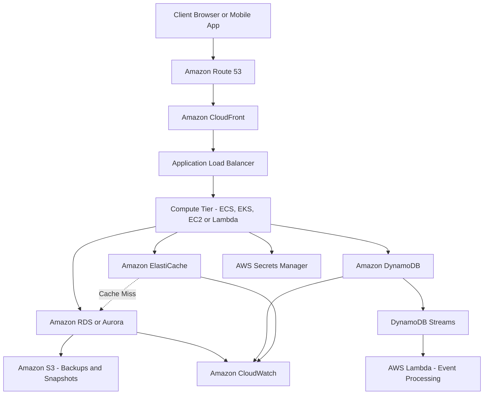
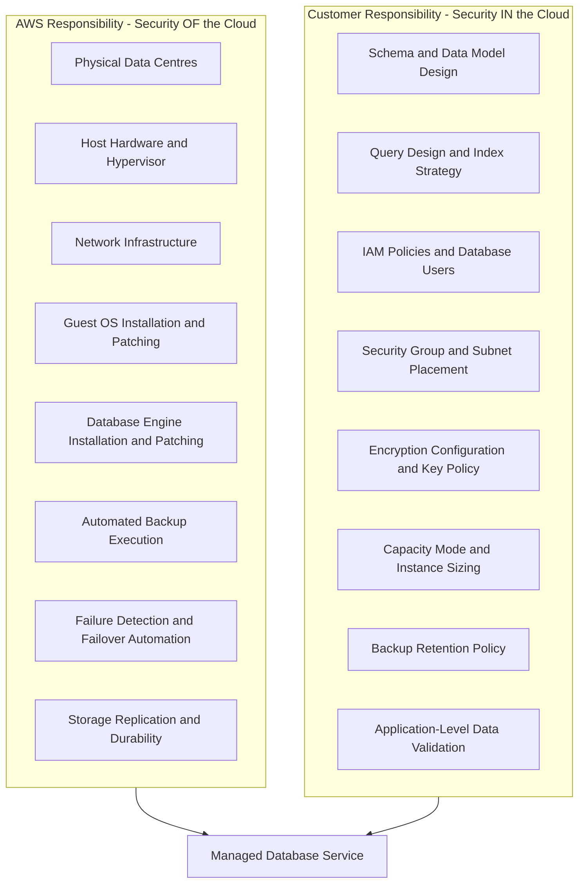
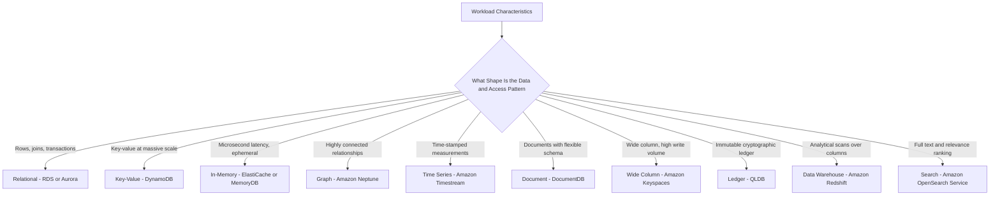
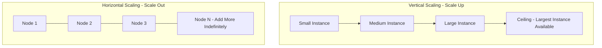
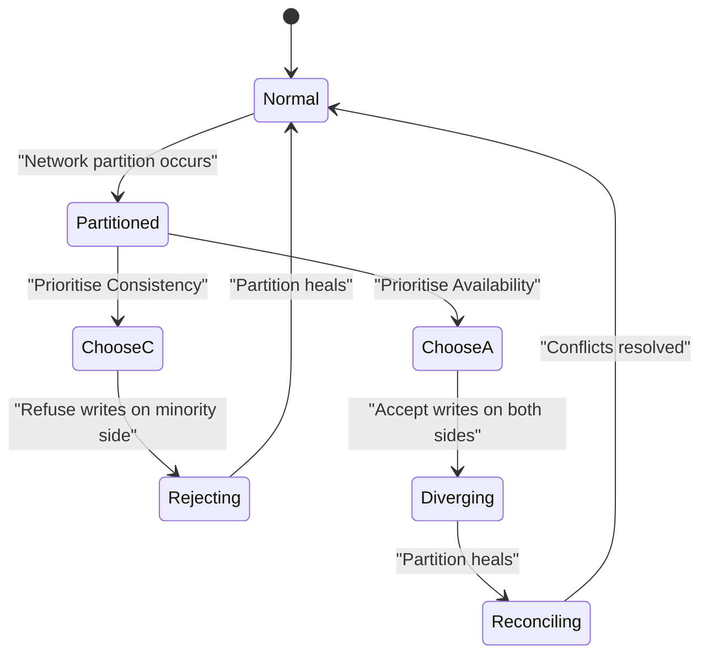
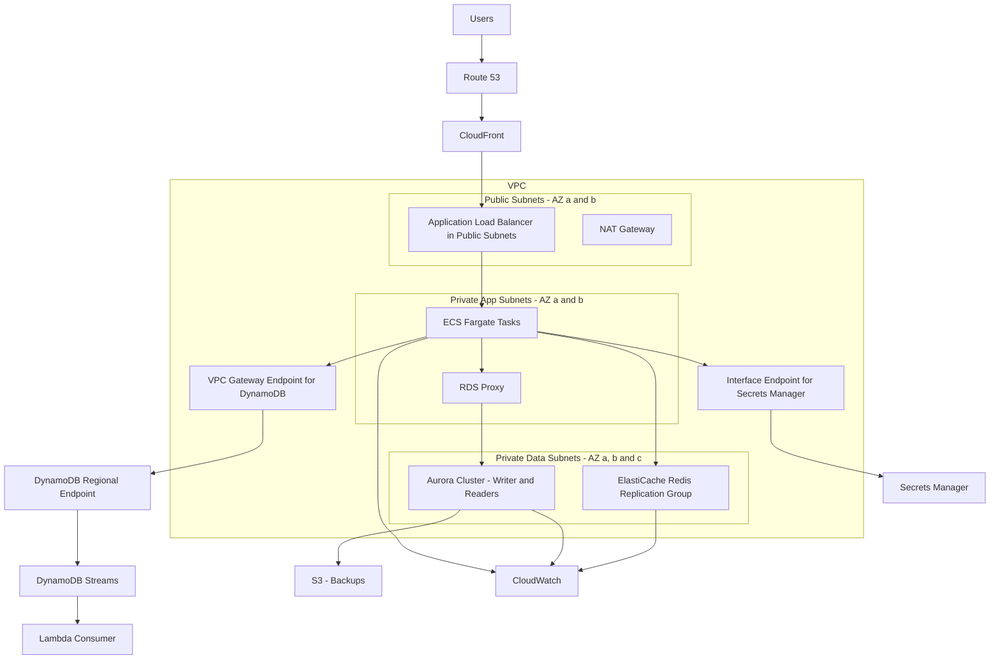
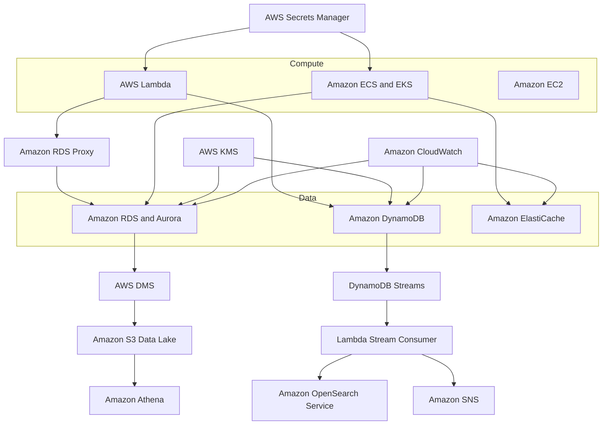
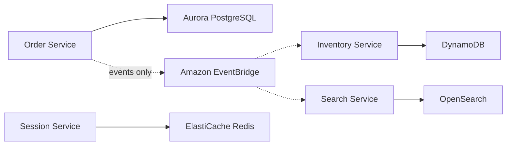

# Database Services on AWS  Amazon RDS and Aurora, Amazon DynamoDB, and Amazon ElastiCache

## Definition

A **database service** on AWS is a managed data persistence and retrieval capability in which AWS operates the underlying infrastructure  hardware provisioning, operating system installation and patching, database engine installation and patching, backup orchestration, failure detection, and failover  while the customer retains responsibility for data modelling, schema design, query performance, access control policy, and capacity or cost decisions.

The three services in scope for this chapter occupy distinct positions in the AWS data layer:

| Service | Category | Data Model | Primary Purpose |
|---|---|---|---|
| **Amazon RDS** | Managed relational database | Relational, SQL, ACID | Structured transactional data with complex relationships and joins |
| **Amazon Aurora** | Cloud-native relational database (an RDS engine option) | Relational, MySQL- and PostgreSQL-compatible | Relational workloads requiring higher throughput, faster recovery, and storage elasticity than standard RDS |
| **Amazon DynamoDB** | Managed NoSQL key-value and document database | Key-value and document | Predictable single-digit millisecond access at effectively unbounded scale for known access patterns |
| **Amazon ElastiCache** | Managed in-memory data store and cache | Key-value in memory, Redis rich data structures | Microsecond-latency reads, reduction of load on the primary database, session and leaderboard state |

!!! info "Scope of this chapter"
    This chapter is the Unit 1 survey of AWS databases: the concepts needed to choose between relational, NoSQL and in-memory stores, and each service at summary level. The full treatment of RDS, Aurora and DynamoDB (and of Amazon Neptune and Amazon Redshift) is in [6.2 AWS Database Services](../unit6/topic2.md). ElastiCache is covered in depth in [6.1 Caching Strategies with Amazon ElastiCache](../unit6/topic1.md#caching-strategies-with-amazon-elasticache).

### Where These Services Sit in AWS Architecture

!!! note "The Data Tier Is the Stateful Tier"
    Everything above the database in this diagram is, in a well-designed cloud-native system, **stateless**  it can be destroyed and recreated freely. The database tier is where state lives, and state is what makes distributed systems difficult. Scaling stateless compute is a solved problem: add more instances behind a load balancer. Scaling state requires you to make explicit, irreversible decisions about consistency, partitioning, and replication. This is why the data layer, not the application layer, determines the ceiling on your architecture.

### Architectural Position

- **RDS and Aurora** sit in private subnets inside your VPC, reachable only from the compute tier. They serve the **system of record** for transactional business data.
- **DynamoDB** is a *regional* service that lives outside your VPC and is accessed over the AWS network via a public service endpoint or, preferably, a **VPC Gateway Endpoint**. It serves workloads whose access patterns are known in advance and whose scale requirements exceed what a single relational writer can absorb.
- **ElastiCache** sits inside your VPC, in front of the database, absorbing repetitive read traffic and holding ephemeral state that does not justify durable storage.

---

## Why This Service or Concept Exists

### The Problem: Databases Are Operationally Brutal

Consider what an organisation must do to run a production PostgreSQL database on its own hardware, or even on a bare EC2 instance:

| Responsibility | What It Actually Involves |
|---|---|
| Provisioning | Sizing CPU, memory, IOPS and storage; procuring hardware with a lead time of weeks |
| Installation | Installing and configuring the OS, tuning kernel parameters, installing the engine |
| Patching | Tracking CVEs for both OS and engine; scheduling maintenance windows; testing patches |
| Backups | Writing and testing backup scripts; verifying restores; managing offsite retention |
| High Availability | Configuring streaming replication, a witness or arbiter, and automated failover tooling |
| Failure Detection | Building health checks that distinguish a hung database from a slow one |
| Failover | Promoting a standby, repointing clients, fencing the old primary to prevent split-brain |
| Monitoring | Instrumenting slow queries, replication lag, connection saturation, disk pressure |
| Scaling | Planning capacity months ahead; downtime for vertical resize; sharding for horizontal growth |
| Security | Encryption at rest and in transit, credential rotation, network isolation, audit logging |

None of this activity differentiates the business. A retail company does not win customers by being excellent at PostgreSQL minor-version upgrades. This is what AWS calls **undifferentiated heavy lifting**, and eliminating it is the core value proposition of managed database services.

### The Shared Responsibility Model for Databases

!!! warning "A Managed Service Is Not an Unmanaged Responsibility"
    A common and expensive misconception among students and junior engineers is that "managed" means "AWS handles everything." AWS will faithfully replicate a badly designed schema and diligently back up a table with no indexes. AWS will not tell you that your query does a full table scan, that your partition key is causing a hot partition, or that you have granted `AdministratorAccess` to your application role. Poor design is *your* failure mode, and it is the failure mode that actually causes production outages.

### Traditional Approach Versus AWS Approach

| Dimension | Traditional On-Premises | AWS Managed |
|---|---|---|
| Time to first database | Weeks to months | Minutes |
| HA setup | Manual replication plus custom failover scripts, weeks of engineering | One checkbox for Multi-AZ |
| Failover time | Minutes to hours, often manual, error-prone | Typically 60–120 seconds for RDS Multi-AZ, often under 35 seconds for Aurora |
| Backups | Custom cron scripts, untested restores | Automated daily snapshots plus continuous transaction log capture |
| Point-in-time recovery | Requires disciplined log shipping and manual replay | Built in, to any second within the retention window |
| Vertical scaling | Buy hardware, schedule outage, migrate | Modify instance class, brief failover |
| Read scaling | Manual replica configuration | Add a read replica with a few API calls |
| Patching | Manual, risky, often deferred indefinitely | Applied in a customer-defined maintenance window |
| Capital expenditure | Large upfront CAPEX | Operational expenditure, pay for what you run |
| Encryption at rest | Requires disk-level or engine-level configuration | Enable at creation, integrated with KMS |

### The Deeper Reason: Purpose-Built Databases

The second, more architectural reason these services exist is that **the relational model is not universally optimal**. For roughly thirty years the industry defaulted to a relational database for every problem, because a relational database was the only mature option and because a single database server was the natural unit of deployment.

Cloud-scale workloads broke this assumption. A social graph, a time-series stream of IoT telemetry, a full-text search index, a shopping cart, and a financial ledger have genuinely different access patterns, consistency requirements, and scaling characteristics. Forcing all of them into one relational engine means every workload is served by a compromise.

AWS's response is the **purpose-built database strategy**: offer a family of databases, each optimised for a category of workload, and expect architects to select deliberately.

!!! tip "The Architect's Rule"
    Choose the database that matches the **access pattern**, not the one you already know. The cost of an incorrect data store choice is not a slow query  it is a rewrite, because data models are the hardest thing in a system to change once production data exists in them.

!!! warning "But Do Not Over-Fragment"
    The purpose-built philosophy is frequently taken too far. Every additional data store adds an operational surface: another backup policy, another monitoring dashboard, another failure mode, another set of credentials, another consistency boundary that your application must reconcile. A three-person startup running six database technologies has made an architectural error, not a sophisticated choice. Introduce a new data store when the workload *demonstrably* does not fit the ones you have, and not before.

---

## Core Concepts

### Relational Databases and the ACID Guarantees

A **relational database** organises data into tables of rows and columns, with a fixed schema, relationships expressed through foreign keys, and a declarative query language (SQL) that permits arbitrary joins, filters and aggregations decided at query time rather than at design time.

Its defining contract is **ACID**:

| Property | Meaning | Why It Matters Architecturally |
|---|---|---|
| **Atomicity** | A transaction executes completely or not at all | A funds transfer cannot debit one account without crediting the other |
| **Consistency** | A transaction moves the database from one valid state to another, respecting all constraints | Foreign keys, check constraints and uniqueness are never violated, even under concurrency |
| **Isolation** | Concurrent transactions do not observe each other's intermediate state | Two simultaneous stock decrements cannot both read the same starting value and oversell |
| **Durability** | Once committed, data survives crashes | An acknowledged order is not lost when the instance dies |

!!! note "Isolation Levels Are a Trade-off Dial"
    Isolation is not binary. SQL defines levels  Read Uncommitted, Read Committed, Repeatable Read, Serializable  that trade correctness guarantees against concurrency. PostgreSQL defaults to Read Committed; MySQL InnoDB defaults to Repeatable Read. Stronger isolation costs throughput because it holds locks longer or forces more transaction retries. Knowing your engine's default isolation level is a genuine production concern, not academic trivia.

### NoSQL and the BASE Model

**NoSQL** is a family of databases that relax one or more relational constraints  usually the fixed schema, the join capability, or the strict consistency guarantee  in exchange for horizontal scalability and predictable latency.

The counterpart to ACID is **BASE**:

- **Basically Available**  the system responds to every request, even if the response is not the most current data.
- **Soft state**  the system's state may change over time without new input, as replicas converge.
- **Eventually consistent**  given no new writes, all replicas will converge to the same value.

!!! warning "NoSQL Does Not Mean "No Consistency""
    DynamoDB offers *strongly consistent reads* as a per-request option, and *ACID transactions* across up to 100 items. The BASE model describes a default behaviour and a design philosophy, not an absolute limitation. Conversely, a relational database with asynchronous read replicas is *eventually consistent when read through a replica*. The line between the two families is far blurrier than introductory material suggests, and examination questions exploit this.

### The Fundamental Scaling Distinction

| Aspect | Vertical Scaling | Horizontal Scaling |
|---|---|---|
| Method | Bigger machine | More machines |
| Applies naturally to | Relational writers | Key-value stores, stateless compute |
| Ceiling | Hard  the largest instance type in the Region | Effectively none |
| Downtime | Usually requires restart or failover | None if designed for it |
| Cost curve | Superlinear  the largest instances cost disproportionately more | Roughly linear |
| Complexity | Low | High  requires partitioning strategy |
| Failure blast radius | Entire database | One shard or partition |

The critical insight is that **a relational database's write path scales vertically by default**. You can add read replicas to scale reads horizontally, but there is one writer, and that writer is a single machine. This is the ceiling that motivated the entire NoSQL movement. DynamoDB, by contrast, scales writes horizontally by adding partitions, which is why it can absorb workloads no single relational instance could.

### The CAP Theorem, Stated Correctly

Eric Brewer's CAP theorem states that a distributed data store can provide **at most two** of the following three guarantees:

| Guarantee | Precise Meaning |
|---|---|
| **Consistency (C)** | Every read receives the most recent write or an error. This is *linearizability*, not the "C" in ACID. |
| **Availability (A)** | Every request receives a non-error response, without a guarantee that it contains the most recent write. |
| **Partition Tolerance (P)** | The system continues to operate despite arbitrary loss of messages between nodes. |

!!! danger "The Most Common CAP Misconception"
    Students routinely say "DynamoDB is AP and RDS is CA." **CA is not an achievable option for a distributed system.** Network partitions are not a design choice  they are a fact of physical networks. Cables are cut, switches fail, an Availability Zone loses connectivity. Any system distributed across machines *must* tolerate partitions, so **P is mandatory**. The real theorem, in practice, is: *when a partition occurs, you must choose between C and A.* A single-node database is technically CA only because it is not distributed at all  and a single-node database has no availability story worth having.

Applied to our three services:

| Service | Behaviour Under Partition | Classification |
|---|---|---|
| RDS Multi-AZ | Standby is synchronous; if the primary is isolated, failover occurs and the old primary is fenced. Writes are unavailable during failover. | CP-leaning |
| Aurora | Quorum-based storage; tolerates loss of an entire AZ plus one additional node for reads, and an entire AZ for writes | CP-leaning with high availability |
| DynamoDB (eventually consistent reads) | Serves reads from any replica, always available | AP-leaning |
| DynamoDB (strongly consistent reads) | Reads from the leader; unavailable if the leader partition is unreachable | CP for those requests |
| ElastiCache Redis with replicas | Failover promotes a replica; recently written data not yet replicated may be lost | AP-leaning, and not durable by design |

### PACELC  The Extension That Matters More in Practice

CAP only describes behaviour *during* a partition, which is rare. **PACELC** (Daniel Abadi) extends it:

> **If** there is a **P**artition, choose between **A**vailability and **C**onsistency; **E**lse (in normal operation), choose between **L**atency and **C**onsistency.

The "else" branch is what you actually experience daily. A strongly consistent DynamoDB read costs twice the RCUs of an eventually consistent read and has higher latency, because it must be served by the partition leader rather than any replica. Reading from an RDS read replica is faster and cheaper for the primary but may return stale data. **You trade latency for consistency on almost every request you design.**

!!! tip "How to Use PACELC in a Design Review"
    For each read path in your system, ask: *what is the business cost of returning data that is 500 milliseconds stale?* For a product description: zero. For a user's own profile immediately after they edited it: high, because it looks like a bug. For an account balance before a withdrawal: unacceptable. Different read paths in the same application legitimately warrant different consistency choices. This is called **read-your-own-writes** consistency and is often solved by routing a user's reads to the primary for a short window after their write.

### OLTP Versus OLAP

| Characteristic | OLTP  Online Transaction Processing | OLAP  Online Analytical Processing |
|---|---|---|
| Typical operation | Read or write a few rows by key | Scan and aggregate millions of rows |
| Query latency target | Milliseconds | Seconds to minutes |
| Concurrency | Thousands of short transactions | Few long-running queries |
| Storage layout | Row-oriented | Column-oriented |
| Example | "Insert this order" | "Total revenue by region by month for three years" |
| AWS service | RDS, Aurora, DynamoDB | Redshift, Athena, EMR |

!!! danger "Do Not Run Analytics on Your Production OLTP Database"
    This is the single most common cause of self-inflicted production outages in early-stage systems. A business analyst runs a report that scans the orders table, the query holds locks or saturates I/O, connection pools exhaust, and the checkout path times out. The correct architecture separates these: replicate to a read replica dedicated to reporting, or export to S3 and query with Athena, or load into Redshift. Aurora's **zero-ETL integration with Amazon Redshift** exists precisely to make this separation cheap.

### Consistency Models Summarised

| Model | Guarantee | Where You See It |
|---|---|---|
| **Strong / Linearizable** | A read always reflects all prior writes | RDS primary, DynamoDB strongly consistent read, Aurora writer |
| **Eventual** | Replicas converge given no new writes; a read may be stale | DynamoDB default read, RDS read replica, Aurora reader (with small lag) |
| **Read-your-own-writes** | A client always sees its own prior writes | Achieved by routing that client's reads to the primary |
| **Monotonic reads** | A client never sees data go backwards in time | Achieved by pinning a client session to one replica |
| **Causal** | Causally related operations are seen in order by all observers | Application-level design, or specialised stores |

### Durability Versus Availability

These are routinely confused and are entirely different properties.

- **Durability** is the probability that committed data will *not be lost*. It concerns permanence.
- **Availability** is the proportion of time the system can *serve requests*. It concerns reachability.

A database can be highly durable and unavailable: your data is safely stored across three AZs but the instance is failing over, so you cannot read it. It can be highly available and non-durable: ElastiCache serves every request but loses everything on restart.

| Concept | Metric | Example Target |
|---|---|---|
| Durability | Annual probability of data loss | Aurora and S3-class storage designs target extremely low loss probability |
| Availability | Percentage uptime, expressed in "nines" | 99.99 percent equals roughly 52 minutes of downtime per year |
| **RPO**  Recovery Point Objective | Maximum acceptable *data loss*, in time | "We can lose at most 5 minutes of transactions" |
| **RTO**  Recovery Time Objective | Maximum acceptable *downtime* | "We must be serving within 15 minutes" |

!!! example "Translating Business Requirements into Architecture"
    A requirement of "RPO of 5 minutes, RTO of 1 hour" can be met by automated backups with point-in-time recovery. A requirement of "RPO near zero, RTO under 2 minutes" demands Multi-AZ synchronous replication with automatic failover. A requirement of "survive the loss of an entire Region with RPO under 1 second" demands Aurora Global Database or DynamoDB Global Tables. **RPO and RTO are the two numbers that determine your entire data-tier architecture and its cost.** Always extract them from stakeholders before designing.

### Caching Fundamentals

A **cache** is a high-speed store holding a subset of data so that future requests are served faster than from the origin. Caching works because real workloads exhibit **locality of reference**  a small fraction of items receives a large fraction of requests (the Pareto or power-law distribution).

| Term | Meaning |
|---|---|
| **Cache hit** | The requested item was found in the cache |
| **Cache miss** | The item was absent; the origin must be consulted |
| **Hit ratio** | Hits divided by total requests  the primary measure of cache effectiveness |
| **TTL  Time To Live** | Duration after which an entry expires automatically |
| **Eviction policy** | Rule for discarding entries when memory is full, for example LRU or LFU |
| **Cache stampede** | Many concurrent requests miss simultaneously and all hit the origin at once |
| **Cache invalidation** | Removing or updating an entry when the underlying data changes |

!!! note "Why Hit Ratio Dominates Everything"
    If a cache read takes 0.5 ms and a database read takes 10 ms, a 95 percent hit ratio gives an average latency of `0.95 × 0.5 + 0.05 × 10 = 0.975 ms`. Dropping to an 80 percent hit ratio gives `0.8 × 0.5 + 0.2 × 10 = 2.4 ms`  nearly 2.5 times worse. Cache effectiveness is highly nonlinear in hit ratio. Monitoring `CacheHitRate` is therefore not optional.

The caching patterns, TTL design, invalidation and stampede protection are covered in [6.1 Caching Strategies with Amazon ElastiCache](../unit6/topic1.md#caching-strategies-with-amazon-elasticache).

---

## Architecture Components

A production data tier is never a database in isolation. The following components each carry a distinct responsibility.

### Network and Edge Components

| Component | Responsibility in the Data Tier Context |
|---|---|
| **Amazon Route 53** | Resolves service and database endpoint names; provides health-check-driven DNS failover for multi-Region designs |
| **Amazon CloudFront** | Caches static and cacheable dynamic responses at the edge, removing load from the origin and therefore from the database |
| **Application Load Balancer** | Distributes HTTP traffic to the compute tier; keeps the compute tier stateless so that database connections are managed per task, not per user |
| **Amazon VPC** | Provides the isolated network in which RDS, Aurora and ElastiCache reside |
| **Public subnets** | Host internet-facing components only  NAT gateways and load balancers. **Databases never belong here.** |
| **Private subnets** | Host the compute tier and the database tier; have no direct route to an internet gateway |
| **DB Subnet Group** | An RDS construct listing the subnets (in at least two AZs) in which RDS may place instances; a prerequisite for Multi-AZ |
| **Cache Subnet Group** | The equivalent construct for ElastiCache |
| **Security Groups** | Stateful virtual firewalls attached to ENIs; the primary access control at the network layer |
| **Network ACLs** | Stateless subnet-level filters; a secondary, coarse defence-in-depth layer |
| **VPC Gateway Endpoint** | Routes DynamoDB and S3 traffic over the AWS network without traversing a NAT gateway or the internet; no additional charge |
| **VPC Interface Endpoint (PrivateLink)** | Provides private ENIs for services such as Secrets Manager and KMS; hourly and data-processing charges apply |

### Compute Tier Components

| Component | Data Tier Concern |
|---|---|
| **Amazon EC2** | Long-lived instances; can hold long-lived connection pools efficiently |
| **Amazon ECS on Fargate** | Tasks are ephemeral; each task holds its own pool, so total connections scale with task count |
| **Amazon EKS** | Same connection multiplication concern as ECS, amplified by pod autoscaling |
| **AWS Lambda** | The most severe connection problem: each concurrent execution environment opens its own connection, and thousands of concurrent invocations can exhaust an RDS instance's connection limit |
| **Amazon RDS Proxy** | Sits between the compute tier and RDS or Aurora, multiplexing many client connections onto a small pool of database connections; also handles failover transparently and integrates with Secrets Manager and IAM authentication |
!!! danger "The Lambda and RDS Connection Problem  A Core DSO303 Concern"
    A `db.t3.medium` PostgreSQL instance supports a few hundred connections. A Lambda function scaled to 1,000 concurrent executions, each opening its own connection, exhausts that limit, and every other service sharing the database then fails too. The remedies are RDS Proxy, reusing the connection across warm invocations by creating it outside the handler, capping the function with reserved concurrency, or choosing DynamoDB, which has no connections at all. [6.2](../unit6/topic2.md#the-connection-problem-quantified) quantifies the problem for Lambda, ECS and EKS and covers RDS Proxy in depth.

### Data Tier Components

| Component | Responsibility |
|---|---|
| **RDS DB instance** | Runs the database engine; the unit of compute and memory sizing |
| **RDS Multi-AZ standby** | Synchronous replica for failover; not readable in the single-standby model |
| **RDS read replica** | Asynchronous readable copy for read scaling and reporting isolation |
| **Aurora cluster** | The logical container comprising the shared storage volume plus its instances |
| **Aurora writer instance** | The single instance accepting writes for a cluster (in the default single-master configuration) |
| **Aurora reader instance** | Serves reads from the shared volume; a failover candidate |
| **Aurora shared storage volume** | The distributed, six-way-replicated, auto-growing storage service |
| **DynamoDB table** | The top-level container; scoped to a Region |
| **DynamoDB partition** | The physical unit of storage and throughput |
| **Global Secondary Index (GSI)** | An alternative-key index with its own partitions and its own capacity |
| **Local Secondary Index (LSI)** | An alternative sort key sharing the base table's partition key and partitions |
| **DynamoDB Streams** | The ordered change log enabling event-driven integration |
| **DAX cluster** | In-VPC microsecond read cache in front of DynamoDB |
| **ElastiCache node** | A single cache instance |
| **ElastiCache shard / node group** | A primary plus its replicas, owning a slice of the keyspace |
| **ElastiCache replication group** | The full set of shards forming a Redis deployment |

### Supporting Services

| Component | Responsibility |
|---|---|
| **AWS IAM** | Controls which principals may call which database APIs, and enables IAM database authentication |
| **AWS KMS** | Manages the customer master keys used for encryption at rest |
| **AWS Secrets Manager** | Stores database credentials and rotates them automatically using a Lambda rotation function |
| **AWS Systems Manager Parameter Store** | A lower-cost alternative for non-rotating configuration values |
| **Amazon S3** | Destination for RDS snapshots, Aurora continuous backup, DynamoDB exports, and Redis snapshots |
| **Amazon CloudWatch** | Metrics, logs, alarms and dashboards for every service in the data tier |
| **AWS CloudTrail** | Audit record of every control plane API call; optionally, DynamoDB data plane events |
| **AWS X-Ray** | Distributed tracing, including database call subsegments, to locate latency |
| **AWS Backup** | Centralised, policy-driven backup across RDS, Aurora, DynamoDB and other services |
| **AWS Database Migration Service (DMS)** | Migrates data between engines and into AWS, with optional continuous replication |
| **AWS Schema Conversion Tool (SCT)** | Converts schema and procedural code between heterogeneous engines |

### A Complete Reference Architecture

---

## AWS Service Deep Dive

Each service is summarised below at the level needed for Unit 1. The full deep dives are in [6.2 AWS Database Services](../unit6/topic2.md) for RDS, Aurora and DynamoDB, and in [6.1 Caching Strategies with Amazon ElastiCache](../unit6/topic1.md#caching-strategies-with-amazon-elasticache) for ElastiCache.

### Amazon RDS and Amazon Aurora

**Purpose.** To provide a managed relational database that preserves full SQL compatibility, ACID transactions, referential integrity and the mature tooling ecosystem of established engines, while removing the operational burden of running them.

**Engines.** Aurora (MySQL- and PostgreSQL-compatible), MySQL, PostgreSQL, MariaDB, Oracle, Microsoft SQL Server and IBM Db2. For a greenfield application with no licence constraint, Aurora PostgreSQL is the usual default; choose a commercial engine only when an existing application genuinely requires it.

| Feature | What it gives you |
|---|---|
| Multi-AZ deployment | Automatic failover to a standby in another AZ, typically 60 to 120 seconds for RDS and around 30 seconds or less for Aurora |
| Read replicas | Asynchronous readable copies for read scaling; up to 15 Aurora Replicas per cluster |
| Automated backups and PITR | Restore to any second within a 1 to 35 day retention window |
| Encryption at rest with KMS | Chosen at creation; cannot be enabled in place |
| RDS Proxy | Managed connection pooling for Lambda and highly elastic compute |
| Aurora Serverless v2 | Capacity that scales in fine-grained Aurora Capacity Units |
| Aurora Global Database | Cross-Region replication with typically sub-second lag |

The limit shared by RDS and standard Aurora is a single writer: reads scale out with replicas, but writes scale vertically. See [6.2 Relational Databases with Amazon RDS and Aurora](../unit6/topic2.md#amazon-rds-and-aurora-engine-fundamentals) for engines, features, pricing, limits and common configurations in full.

### Amazon DynamoDB

**Purpose.** To provide a fully managed, serverless, horizontally scalable key-value and document database delivering consistent single-digit millisecond latency at any scale, with no servers to manage, no connection management, and no capacity ceiling that requires re-architecture.

| Concept | Summary |
|---|---|
| Table, item, attribute | A Regional table of items, each up to 400 KB; no fixed schema beyond the primary key |
| Primary key | A partition key alone, or a partition key plus a sort key |
| Secondary indexes | GSI: any keys, created at any time, eventually consistent, its own capacity. LSI: same partition key, created only with the table, supports strong reads |
| Capacity modes | On-demand (per request, no forecast) or provisioned (RCU and WCU, with auto scaling) |
| Capacity units | 1 RCU is one strongly consistent read per second of up to 4 KB, or two eventually consistent reads; 1 WCU is one write per second of up to 1 KB |
| Transactions | ACID across up to 100 items, at twice the capacity of ordinary operations |
| Other features | TTL, Streams, Global Tables, point-in-time recovery, DAX |

!!! danger "Model the Access Patterns Before the Data"
    Relational design begins with entities and normalisation, because SQL can express any query later. DynamoDB design begins with a written list of every access pattern, and the key schema is derived from that list. Correcting a key design after production data exists requires a data migration. **Access patterns first. Always.**

See [6.2 NoSQL Databases with Amazon DynamoDB](../unit6/topic2.md#nosql-databases-with-amazon-dynamodb) for key and index design, single-table design, RCU and WCU arithmetic, transactions and integrations in full.

### Amazon ElastiCache

**Purpose.** To provide managed, in-memory data stores (Valkey, Redis OSS and Memcached) that sit in front of a primary database or hold ephemeral shared state, so that read-heavy and latency-sensitive workloads are served from RAM in microseconds instead of from disk-backed storage in milliseconds. Most workloads show strong locality, so serving the hot fraction of the data from memory lets the primary database be smaller, cheaper and further from saturation.

A Valkey or Redis OSS deployment is a replication group of one shard (cluster mode disabled) or many shards (cluster mode enabled), each a primary with asynchronously replicated read replicas; ElastiCache Serverless removes node sizing entirely. Because replication is asynchronous, a failover can lose recent writes, so **ElastiCache is never the system of record**. The main engine choice is summarised below.

| Dimension | Redis / Valkey | Memcached |
|---|---|---|
| Data structures | Strings, lists, sets, sorted sets, hashes, bitmaps, HyperLogLog, streams, geospatial | Strings only |
| Replication | Yes, asynchronous, with automatic failover | None |
| Persistence | Yes, RDB snapshots and append-only file | None |
| Multi-AZ and failover | Yes | No |
| Backup and restore | Yes, to Amazon S3 | No |
| Transactions | Yes, `MULTI`/`EXEC`, plus Lua scripting | No |
| Pub/Sub and Streams | Yes | No |
| Multi-threaded | Largely single-threaded for command execution | Multi-threaded |
| Horizontal scaling | Sharding via cluster mode | Add nodes; client-side consistent hashing |
| Encryption in transit and at rest | Yes | In-transit encryption supported on recent versions |
| Typical use | Leaderboards, sessions, rate limiting, queues, caching, geospatial | Simple, very high-throughput object caching |

!!! tip "The selection heuristic"
    Choose Memcached only when the requirement is genuinely a simple, ephemeral, multi-threaded object cache and losing the entire cache is acceptable. In every other case  and that is most cases  Redis is the correct default, because replication, persistence, failover, and richer data structures cost little and remove entire categories of failure.

See [6.1 Caching Strategies with Amazon ElastiCache](../unit6/topic1.md#caching-strategies-with-amazon-elasticache) for the engines, architecture, caching patterns, features, limits, pricing, security and common configurations in full.

### Service Comparison and Decision Table

| Dimension | Amazon RDS | Amazon Aurora | Amazon DynamoDB | Amazon ElastiCache |
|---|---|---|---|---|
| Data model | Relational | Relational | Key-value and document | In-memory key-value and data structures |
| Query flexibility | Full SQL, joins, ad hoc | Full SQL, joins, ad hoc | Key and index lookups only | Key lookups and data-structure commands |
| Write scaling | Vertical, one writer | Vertical, one writer | Horizontal by partition | Horizontal by shard in cluster mode |
| Typical latency | Low milliseconds | Low milliseconds | Single-digit milliseconds | Sub-millisecond |
| Durability | Synchronous Multi-AZ standby, backups | Six copies across three AZs, continuous backup | Synchronous replication across three AZs | Weak by design; asynchronous replicas |
| Connection model | Persistent TCP connections | Persistent TCP connections | Stateless HTTPS requests | Persistent TCP connections |
| Network placement | Private subnets in your VPC | Private subnets in your VPC | Regional endpoint, reached through a gateway endpoint | Private subnets in your VPC |

| Requirement stated in a design or exam question | Choose |
|---|---|
| Relational data, joins, ACID transactions, an existing SQL application | RDS, or Aurora for higher throughput, faster failover and auto-growing storage |
| Single-digit millisecond key-value access at any scale, serverless, unpredictable traffic | DynamoDB |
| Microsecond reads in front of a database, sessions, leaderboards | ElastiCache, or DAX when the database is DynamoDB |
| Improve read performance | Read replicas or a cache, never Multi-AZ |
| Improve availability or add automatic failover | Multi-AZ, never read replicas |
| Recover from an accidental deletion | Point-in-time recovery or backups, never replication, which reproduces the deletion |
| Survive the loss of a Region | Aurora Global Database or DynamoDB Global Tables |
| Deep relationship traversal such as fraud rings | Amazon Neptune ([6.2](../unit6/topic2.md#graph-databases-with-amazon-neptune)) |
| Aggregations over large history | Amazon Redshift ([6.2](../unit6/topic2.md#data-warehousing-with-amazon-redshift)) |

## Important AWS Terminology

| Term | Meaning |
|---|---|
| ACID | Atomicity, Consistency, Isolation, Durability  the transactional guarantees of a classical relational database |
| Adaptive capacity | DynamoDB's automatic redistribution of throughput toward hot partitions, which mitigates but does not eliminate hot-key problems |
| Aurora cluster volume | The distributed, self-healing storage layer shared by all instances in an Aurora cluster, replicated six ways across three Availability Zones |
| Aurora Serverless v2 | An Aurora capacity mode that scales compute in fine-grained Aurora Capacity Units in response to load |
| Availability Zone | One or more discrete data centres with independent power, cooling, and networking within an AWS Region |
| BASE | Basically Available, Soft state, Eventual consistency  the design posture of many distributed NoSQL systems |
| Cache-aside | A caching pattern in which the application reads from the cache and, on a miss, reads the database and populates the cache |
| CAP theorem | In the presence of a network partition, a distributed system must sacrifice either consistency or availability |
| Capacity mode | For DynamoDB, the choice between provisioned throughput with optional auto scaling and fully on-demand billing |
| Cluster endpoint | The DNS name that always resolves to the current writer instance of an Aurora or RDS cluster |
| Composite primary key | A DynamoDB primary key consisting of a partition key and a sort key, permitting many items under one partition |
| Conditional write | A write that succeeds only if a stated condition holds, providing optimistic concurrency control |
| DAX | DynamoDB Accelerator, a fully managed, write-through, in-memory cache purpose-built for DynamoDB with microsecond read latency |
| Database engine | The software implementing the database, such as PostgreSQL, MySQL, MariaDB, Oracle, SQL Server, or Aurora |
| DB parameter group | A named collection of engine configuration parameters applied to RDS instances |
| DB subnet group | The set of subnets across Availability Zones in which RDS may place instances |
| Eventual consistency | A read may return a value that does not reflect the most recent completed write, but will converge |
| Failover | Promotion of a standby or replica to primary following failure of the current primary |
| Global Secondary Index | A DynamoDB index with a partition key and optional sort key different from the base table, with its own throughput and eventual consistency |
| Global Table | A DynamoDB multi-Region, multi-active replicated table using last-writer-wins conflict resolution |
| Hash slot | One of the 16,384 logical partitions across which an ElastiCache Redis cluster distributes keys |
| Hot partition | A DynamoDB partition receiving disproportionate traffic because of poor partition-key selection |
| Item | A single record in a DynamoDB table, limited to 400 KB including attribute names |
| Item collection | All items in a DynamoDB table sharing the same partition key value |
| Local Secondary Index | A DynamoDB index sharing the base table's partition key with a different sort key, supporting strongly consistent reads, created only at table creation |
| Multi-AZ deployment | An RDS configuration maintaining a synchronous standby in a second Availability Zone for automatic failover |
| Optimistic concurrency | Concurrency control by detecting conflicting modification at write time rather than by locking |
| Parameter group versus option group | Parameter groups tune engine configuration; option groups enable engine-specific features such as Oracle TDE or SQL Server auditing |
| Partition key | The DynamoDB attribute whose hash determines the physical partition storing an item; also called the hash key |
| Point-in-time recovery | Restoration of a database to any second within the retention window, using continuous backups and transaction logs |
| Projection | The set of attributes copied into a DynamoDB secondary index, one of `KEYS_ONLY`, `INCLUDE`, or `ALL` |
| Provisioned IOPS | An EBS or RDS storage configuration guaranteeing a specified rate of input and output operations per second |
| Quorum | The minimum number of replica acknowledgements required for a read or a write to be considered complete |
| RCU | Read Capacity Unit  one strongly consistent read per second of an item up to 4 KB, or two eventually consistent reads |
| Read replica | An asynchronously replicated, read-only copy of a database used to scale reads or to serve as a promotion candidate |
| Replica lag | The delay between a write committing on the primary and appearing on a replica |
| Replication group | An ElastiCache for Redis construct comprising a primary node and its replicas, optionally sharded |
| RDS Proxy | A managed connection pool that multiplexes application connections onto a smaller set of database connections |
| Scan versus Query | `Scan` reads every item in a table or index; `Query` reads only items sharing a specified partition key value |
| Single-table design | A DynamoDB modelling technique storing multiple entity types in one table using generic key attributes and overloaded indexes |
| Sparse index | A DynamoDB global secondary index containing only items that possess the index key attribute, used to model filtered views efficiently |
| Storage auto scaling | The RDS feature that increases allocated storage automatically when free space falls below a threshold |
| Streams | An ordered, time-ordered change log of item-level modifications, available in DynamoDB Streams and Kinesis Data Streams for DynamoDB |
| Strong consistency | A read that reflects all writes that completed successfully before it |
| Thundering herd | A load spike on the origin database caused by simultaneous expiry of a popular cache entry |
| Time to live | An attribute-driven DynamoDB mechanism, or a Redis expiry, that automatically removes items after a timestamp |
| Transaction | A group of operations applied atomically, all succeeding or all failing |
| WCU | Write Capacity Unit  one write per second of an item up to 1 KB |
| Write-through | A caching pattern in which every write updates both the cache and the database |
| Writer and reader endpoints | Aurora DNS endpoints directing traffic to the single writer instance and to the load-balanced set of readers respectively |

## Configuration Options

The decisions below are made at creation time and are expensive to change later. The full option tables are in 6.2 for [RDS and Aurora](../unit6/topic2.md#engine-instance-and-storage-settings) and [DynamoDB](../unit6/topic2.md#general-table-settings). The ElastiCache options, including eviction policy choice and client connectivity, are in [6.1 Configuration Options](../unit6/topic1.md#configuration-options_3).

| Service | Decisions that matter most |
|---|---|
| RDS and Aurora | Engine and version; instance class or Serverless v2 ACU range; Single-AZ (non-production only) versus Multi-AZ; storage type and storage auto scaling; backup retention (zero disables point-in-time recovery); encryption at creation; deletion protection |
| DynamoDB | Primary key; capacity mode; secondary indexes and their projections; point-in-time recovery; TTL attribute; Streams view type; Global Tables |
| ElastiCache | Engine (Valkey or Redis OSS for almost all cases; Memcached only for simple, disposable object caching); node-based or Serverless; cluster mode; Multi-AZ with automatic failover; `maxmemory-policy`; encryption at rest and in transit |

## Design Considerations

### Scalability

Relational databases scale writes vertically, which has a hard ceiling. Aurora pushes that ceiling higher by decoupling storage, and read scaling is straightforward with up to fifteen low-lag replicas sharing one storage volume. DynamoDB scales horizontally by partition and is, for practical purposes, unbounded  provided the partition key distributes traffic evenly. This is the single most consequential design decision in a DynamoDB table, and it cannot be changed after the fact without a migration.

!!! warning "Scalability is a property of the data model, not the service"
    A DynamoDB table with `status` as the partition key does not scale, no matter how much capacity is provisioned, because all `ACTIVE` items land on one partition. The service is horizontally scalable; a badly keyed table is not.

### Availability

RDS Multi-AZ provides automatic failover typically within one to two minutes for the instance deployment, and often under thirty-five seconds for a Multi-AZ DB cluster. Aurora typically fails over in under thirty seconds because the storage layer survives the compute failure. DynamoDB replicates synchronously across three Availability Zones as a service property, with no configuration and no failover event visible to the application. ElastiCache with Multi-AZ promotes a replica automatically, but the cache is a performance component, and the architecture must survive its absence.

### Reliability and Durability

| Service | Durability mechanism | Recovery capability |
|---|---|---|
| RDS | Synchronous standby, automated backups, transaction logs | Point-in-time recovery within the retention window, up to thirty-five days |
| Aurora | Six-way replication across three AZs, quorum writes, continuous backup to Amazon S3, self-healing storage | Point-in-time recovery, backtrack on Aurora MySQL, fast clone |
| DynamoDB | Synchronous replication across three AZs | Point-in-time recovery to any second in the retention window, on-demand backups |
| ElastiCache | Asynchronous replication, optional snapshots | Restore from snapshot; recent writes may be lost. Not a system of record |

### Latency

Latency decreases as data moves closer to memory and closer to the caller. A rough ordering for a well-designed system is: DAX or ElastiCache in the microsecond to low-millisecond range, DynamoDB in single-digit milliseconds, Aurora in low single-digit milliseconds for cached pages, and RDS with cold disk reads in the tens of milliseconds. Cross-Region reads add the physical propagation delay, which no amount of engineering removes.

### Cost

The cost structures differ so fundamentally that comparing them requires modelling the actual access pattern. RDS and ElastiCache bill for provisioned capacity whether or not it is used, so utilisation is the dominant cost lever. DynamoDB on-demand bills per request, so request count and item size dominate. A workload with sustained, predictable, high throughput usually favours provisioned capacity or reserved instances; a workload that is idle most of the time usually favours on-demand and serverless modes.

### Maintainability and Operational Complexity

Relational schemas are self-describing and support ad hoc query, which makes them forgiving of requirements that change after launch. DynamoDB single-table designs are extremely efficient for known access patterns and extremely awkward for unknown ones; adding a genuinely new access pattern often means adding a global secondary index or backfilling data. The honest trade-off is that DynamoDB moves design effort forward in time: more thinking before the first write, far less firefighting at scale.

!!! question "The question to ask before choosing DynamoDB"
    Can you enumerate every access pattern the application will need? If yes, DynamoDB will serve them at any scale. If no, and the query patterns will be discovered through use, a relational database will absorb that uncertainty far more gracefully.

## AWS Best Practices

### Operational Excellence

- Define databases as code with CloudFormation, the CDK, or Terraform, and manage schema changes with a migration tool such as Flyway, Liquibase, or Alembic executed from the CI/CD pipeline rather than by hand.
- Set explicit maintenance and backup windows aligned to genuine low-traffic periods.
- Enable Performance Insights on RDS and Aurora, and Contributor Insights on DynamoDB, before an incident rather than during one.
- Practise failover. An untested failover is an assumption, not a capability. Aurora and RDS both support forced failover for exactly this purpose.
- Tag every database resource with owner, environment, and cost centre so that cost attribution and lifecycle policy are possible.

### Security

- Place every database in private subnets with no route to an Internet Gateway. A publicly accessible RDS instance is almost never justified.
- Restrict access with security groups referencing the application tier's security group rather than CIDR ranges.
- Use IAM database authentication or Secrets Manager with automatic rotation instead of static credentials in configuration files or environment variables.
- Enable encryption at rest at creation time and encryption in transit through TLS, and enforce TLS at the engine level with a parameter such as `rds.force_ssl`.
- Apply least privilege inside the database as well as in IAM. Application accounts should not own schemas or hold administrative rights.

### Reliability

- Enable Multi-AZ for every production relational database and deletion protection for every database whose loss would be material.
- Set backup retention deliberately; a retention of zero silently disables point-in-time recovery.
- Enable point-in-time recovery on DynamoDB tables holding business data.
- Design the application to tolerate cache absence, replica lag, and transient failover errors, with bounded retries using exponential backoff and jitter.
- Test restores, not just backups. A backup that has never been restored is an untested hypothesis.

### Performance Efficiency

- Match the data store to the access pattern rather than defaulting to a single technology across the estate.
- Cache the hot working set, and set TTLs from the tolerable-staleness requirement.
- Use `Query` rather than `Scan`; a full-table `Scan` in a request path is a defect.
- Use RDS Proxy where a highly concurrent or serverless compute tier connects to a relational database.
- Index deliberately. Every index accelerates reads and taxes writes and storage.

### Cost Optimization

- Right-size instances against observed utilisation rather than against peak-day guesses, and use Compute Optimizer and Trusted Advisor recommendations.
- Purchase Reserved Instances or Savings Plans for steady baseline database capacity.
- Move DynamoDB tables with predictable traffic from on-demand to provisioned with auto scaling once the pattern is established, and consider the Standard-Infrequent Access table class for large, rarely read tables.
- Stop or downsize non-production databases outside working hours; an always-on development database is one of the most common sources of avoidable spend.
- Set log retention. Unbounded CloudWatch Logs retention grows silently and indefinitely.

### Sustainability

Serverless and on-demand capacity modes improve aggregate hardware utilisation, which reduces energy consumption per unit of work. Graviton-based instance classes deliver better performance per watt. Deleting unused snapshots, unattached storage, and idle replicas removes real physical resource consumption, not merely a line on an invoice.

## Security Considerations

### Identity and Access Management

Database security in AWS operates at two distinct layers that students routinely conflate. The **IAM layer** governs control-plane actions: who may create, modify, snapshot, or delete a database. The **engine layer** governs data-plane access: which database user may read which table. An IAM policy granting `rds:*` does not grant the ability to run a `SELECT`, and a database grant does not permit deleting the instance.

DynamoDB is the exception that proves the rule, because its data plane *is* an AWS API. Every `GetItem` and `PutItem` is an IAM-authorised action, which allows remarkably fine-grained control.

The `dynamodb:LeadingKeys` condition key goes further, restricting a principal to items whose partition key matches a value derived from its identity, which enforces multi-tenant isolation in IAM rather than in application code. See [6.2](../unit6/topic2.md#fine-grained-access-control-for-multi-tenancy) for the policy and its use, and [8.1](../unit8/topic1.md) for IAM policy evaluation.

### Least Privilege

Application database accounts should hold only the privileges the application exercises. In practice this means separate accounts for migrations (which need DDL) and for runtime (which needs only DML), and separate read-only accounts for analytics and reporting consumers. For DynamoDB, grant specific actions on specific table and index ARNs rather than `dynamodb:*` on `*`.

### Encryption and Key Management

All three services encrypt data at rest with AWS KMS and in transit with TLS. DynamoDB is always encrypted at rest. For RDS and ElastiCache, encryption at rest is a creation-time decision: converting an unencrypted RDS database means taking a snapshot, copying it with encryption enabled and restoring from the copy, which is a migration with downtime. Enforce TLS at the engine with a parameter such as `rds.force_ssl`.

See [8.3 Data Protection and Encryption](../unit8/topic3.md#encryption-at-rest-with-aws-kms) for the full treatment of KMS key types, key policies, envelope encryption, and how RDS, Aurora and DynamoDB use KMS.

### Secrets Management

Store database credentials in AWS Secrets Manager with automatic rotation, and retrieve them at runtime through the SDK or through native integration such as ECS task-definition `secrets` blocks. For RDS and Aurora, IAM database authentication removes the password entirely, issuing a short-lived token derived from IAM credentials  an excellent fit for Lambda and containerised workloads because it eliminates the long-lived secret rather than merely protecting it. See [8.3 Data Protection and Encryption](../unit8/topic3.md#secrets-management-with-aws-secrets-manager) for Secrets Manager rotation, RDS-managed master passwords, and retrieval patterns.

### Network Isolation

The database security group should permit inbound traffic on the engine port **only** from the application security group, expressed as a security-group reference rather than a CIDR. DynamoDB, being a public AWS API endpoint, should be reached through a Gateway VPC endpoint so that traffic never traverses the public internet or a NAT Gateway  which is both a security improvement and a meaningful cost saving.

### Logging, Auditing and Compliance

- **AWS CloudTrail** records every control-plane action and, for DynamoDB, optionally data-plane events.
- **Database logs**  PostgreSQL and MySQL error, slow-query, and audit logs  can be exported to CloudWatch Logs for retention and alerting.
- **Amazon RDS Enhanced Monitoring** provides operating-system-level metrics at up to one-second granularity.
- **AWS Config** rules detect publicly accessible instances, unencrypted storage, and disabled backups.
- **Amazon Macie**, **GuardDuty RDS Protection**, and **Security Hub** provide anomaly and sensitive-data detection.

For regulated workloads, note that RDS and DynamoDB are in scope for common compliance programmes, but compliance is a shared outcome: AWS certifies the service, and the customer must still configure encryption, access control, retention, and audit logging correctly.

## Performance Optimization

- **Cache first.** A cache hierarchy of CloudFront, then ElastiCache or DAX, commonly serves 90 to 99 percent of reads before they reach the primary database, which can then be sized for the residual load.
- **Scale reads with replicas.** Direct read-only traffic to the reader endpoint, but send any read that must reflect the caller's own preceding write to the writer.
- **Manage connections.** Pool connections, and put RDS Proxy between Lambda or highly elastic compute and a relational database (see [6.2](../unit6/topic2.md#amazon-rds-proxy)).
- **Design queries and indexes.** For relational engines, confirm index use with `EXPLAIN ANALYZE` and enable slow-query logging; each index speeds a read pattern and taxes every write. For DynamoDB, make every request-path operation a `Query` or `GetItem`, spread load with the partition key, project only needed attributes, and check key distribution with Contributor Insights.
- **Batch.** Use `BatchGetItem` and `BatchWriteItem` to amortise request overhead, `TransactWriteItems` only where atomicity is required, and parallel `Scan` only outside the request path. For relational bulk loads, use `COPY` or `LOAD DATA` and batch commits rather than committing per row.
- **Choose instances and storage deliberately.** Memory-optimised classes keep the working set in the buffer pool; Provisioned IOPS storage suits sustained I/O that needs low latency variance. Aurora manages storage automatically.

## Cost Optimization

### Understanding the Pricing Dimensions

| Service | Primary cost dimensions |
|---|---|
| RDS | Instance hours by class, allocated storage and IOPS, backup storage beyond the database size, data transfer across AZs and Regions, licence costs for commercial engines |
| Aurora | Instance hours or Aurora Capacity Unit hours, storage consumed, I/O operations on the standard configuration, backup storage, cross-Region replication |
| DynamoDB | Read and write request units or provisioned capacity hours, storage per gigabyte-month, optional features such as Streams, Global Tables replicated writes, PITR, and backups |
| ElastiCache | Node hours by node type, or serverless data and processing units, backup storage, cross-AZ and cross-Region data transfer |

!!! info "Verify current figures"
    Every figure discussed here is a dimension and an order of magnitude only. Consult the current AWS pricing pages and the AWS Pricing Calculator before making a budgetary commitment.

### Levers That Actually Move the Number

1. **Right-size before you optimise anything else.** Most database over-spend is an instance provisioned for an imagined peak. Use CloudWatch metrics over a representative period, and Compute Optimizer recommendations, to select the class.
2. **Commit to the steady baseline.** Reserved Instances for RDS and ElastiCache, and DynamoDB reserved capacity, offer substantial discounts for one-year or three-year commitments. Commit only to the floor of observed usage, and cover the remainder on demand.
3. **Choose the right capacity mode.** DynamoDB on-demand is excellent for unknown and spiky traffic and expensive for steady high throughput. Provisioned capacity with auto scaling is materially cheaper once traffic is predictable. Measure before switching.
4. **Stop non-production databases outside working hours.** RDS instances can be stopped for up to seven days at a time; Aurora Serverless v2 can scale to a very low floor. An idle development database running continuously is pure waste.
5. **Use a Gateway VPC endpoint for DynamoDB and S3.** Routing this traffic through a NAT Gateway incurs per-gigabyte processing charges for no benefit.
6. **Control storage growth.** Enable DynamoDB TTL to expire aged items, use the Standard-Infrequent Access table class for large cold tables, archive old relational data to S3 with a lifecycle policy, and delete orphaned manual snapshots  which persist and bill long after the database they came from is gone.
7. **Set retention on everything.** Backup retention, log retention, and Performance Insights retention all bill, and all default to values that are not necessarily the ones you want.
8. **Cache aggressively.** A cache node is usually much cheaper than the larger database instance it makes unnecessary.
9. **Minimise cross-AZ chatter.** Data transfer between Availability Zones is billable in both directions; a chatty application that reads from a replica in another zone on every request pays for it.

!!! tip "Cost governance tooling"
    Use AWS Cost Explorer with resource tags to attribute database spend to teams and services, AWS Budgets with alerts to catch runaway growth early, and Trusted Advisor to surface idle instances and unassociated resources.

## Monitoring and Observability

### The Four Questions Monitoring Must Answer

Effective database observability answers: is it available, is it fast enough, is it approaching a limit, and did something change? Each service exposes a different set of signals for these questions.

### Amazon CloudWatch Metrics

| Service | Metrics that matter most | Why |
|---|---|---|
| RDS and Aurora | `CPUUtilization`, `DatabaseConnections`, `FreeableMemory`, `FreeStorageSpace`, `ReadLatency`, `WriteLatency`, `ReplicaLag`, `DiskQueueDepth`, `BurstBalance` | Connections approaching `max_connections` and storage approaching zero are the two most common causes of hard outage |
| DynamoDB | `ConsumedReadCapacityUnits`, `ConsumedWriteCapacityUnits`, `ThrottledRequests`, `ReadThrottleEvents`, `WriteThrottleEvents`, `SuccessfulRequestLatency`, `UserErrors`, `SystemErrors`, `AgeOfOldestUnreplicatedRecord` | Throttling is the primary symptom of both under-provisioning and hot partitions and must be alarmed on |
| ElastiCache | `CPUUtilization`, `EngineCPUUtilization`, `CacheHits`, `CacheMisses`, `Evictions`, `DatabaseMemoryUsagePercentage`, `CurrConnections`, `ReplicationLag` | A rising eviction rate with a falling hit rate means the cache is too small for the working set |

!!! warning "`EngineCPUUtilization` versus `CPUUtilization` on Redis"
    Because Redis executes commands on a single thread, node-level `CPUUtilization` can look comfortable while the engine thread is saturated. `EngineCPUUtilization` is the metric that reveals command-execution saturation, and it is the one to alarm on.

### Diagnostics and Alarms

Beyond these metrics, use CloudWatch Database Insights and Performance Insights to see which SQL and wait events consume an RDS or Aurora database ([6.2](../unit6/topic2.md#cloudwatch-database-insights-performance-insights-and-enhanced-monitoring)), Contributor Insights to find hot DynamoDB keys, and AWS X-Ray to attribute request latency to specific database calls. At minimum, alarm on free storage space expressed in days of growth rather than gigabytes, connections above 80 percent of `max_connections`, replica lag beyond the application's staleness tolerance, sustained DynamoDB throttling, and ElastiCache evictions rising while the hit rate falls. How CloudWatch metrics, alarms and dashboards work is covered in [7.1](../unit7/topic1.md#infrastructure-and-application-monitoring-with-amazon-cloudwatch), and log export and querying in [7.2](../unit7/topic2.md).

## Integration with Other AWS Services

| Integrating service | Why it integrates | Typical use |
|---|---|---|
| AWS Lambda | Event-driven compute needs a data store, and DynamoDB Streams needs a consumer | Serverless APIs, change-data processing, aggregation |
| Amazon RDS Proxy | Bridges highly concurrent, ephemeral compute to connection-limited relational engines | Lambda and Fargate access to RDS and Aurora |
| AWS Secrets Manager | Removes static credentials from code and configuration, with automatic rotation | Credential injection into ECS tasks and Lambda functions |
| AWS KMS | Provides customer-controlled encryption keys and an auditable key usage trail | Encryption at rest for every data store |
| Amazon S3 | Durable, cheap object storage for archives, exports, and analytics | DynamoDB export to S3, RDS snapshot export to Parquet, Aurora `SELECT INTO OUTFILE S3` |
| Amazon Athena and AWS Glue | Query exported data without loading it into a database | Analytics over operational data without touching the production database |
| Amazon OpenSearch Service | Provides full-text and complex ad hoc search, which DynamoDB deliberately does not | Search index maintained from DynamoDB Streams |
| Amazon Kinesis Data Streams | Higher-fanout, longer-retention change streaming than DynamoDB Streams | Multiple independent consumers of the same change feed |
| AWS Database Migration Service | Moves and continuously replicates data between heterogeneous engines | Migration to AWS, ongoing replication to a data lake |
| Amazon EventBridge | Decouples database change events from downstream consumers | Event-driven microservice choreography |
| AWS Step Functions | Coordinates multi-step workflows with built-in error handling | Saga orchestration across service-owned databases |
| Amazon QuickSight and Redshift | Analytical query and visualisation over data unsuited to the operational store | Business intelligence without loading the production database |
| AWS Backup | Centralised, policy-driven backup across RDS, Aurora, DynamoDB, and more | Compliance-driven retention and cross-Region copy |

!!! note "Why DynamoDB and OpenSearch appear together so often"
    DynamoDB is deliberately not a search engine: it can retrieve by key extremely efficiently and cannot answer "find every order containing the word *urgent* placed in the last week" without a scan. The idiomatic AWS answer is to stream changes into OpenSearch and route search queries there, keeping each store on the access pattern it is good at. This is polyglot persistence in practice.

## Common Architecture Patterns

### Cache-Aside with a Read-Through Fallback

The default pattern for read-heavy applications. The application consults ElastiCache or DAX, falls back to the primary store on a miss, and populates the cache with a TTL. It is simple, degrades gracefully, and is the pattern students should reach for first.

### Database Per Service

In a microservice architecture, each service owns its data store exclusively and no other service reads its tables directly. This preserves the ability to change schema and even to change database technology without coordinating across teams. The cost is that cross-service queries and cross-service transactions become distributed problems.

### Saga for Distributed Transactions

Because a distributed transaction across service-owned databases is undesirable, a business transaction is modelled as a sequence of local transactions, each publishing an event that triggers the next, with a compensating transaction defined for each step to undo it on failure. AWS Step Functions is the idiomatic orchestrator, providing declarative retry, catch, and compensation.

### CQRS with Change Data Capture

Separate the write model from the read model. Writes go to DynamoDB or Aurora; DynamoDB Streams or a logical replication slot feeds a projection into a store optimised for reading  OpenSearch for search, a materialised view for reporting, ElastiCache for point lookups. The read model is eventually consistent by construction, which must be acceptable to the business.

### Event Sourcing

Persist the sequence of state-changing events as the source of truth rather than the current state. DynamoDB models this well with the aggregate identifier as partition key and a monotonically increasing sequence number as sort key, using a conditional write on `attribute_not_exists` for optimistic concurrency. Current state is a fold over the event stream, usually snapshotted periodically for efficiency.

### Read Replica Fan-Out

A writer instance with multiple readers, with the application routing read-only traffic to the reader endpoint. Aurora makes this particularly attractive because replicas share the storage volume, so replica lag is typically in the tens of milliseconds rather than seconds.

### Sharding by Tenant

For very large multi-tenant systems, partition tenants across multiple database instances or across partition-key prefixes. This bounds blast radius and permits per-tenant scaling, at the cost of a routing layer and cross-shard query complexity.

### Polyglot Persistence

The overarching pattern: select the store per access pattern rather than per organisation. A single application legitimately uses Aurora for transactional integrity, DynamoDB for high-volume key-access, ElastiCache for hot reads and sessions, OpenSearch for search, S3 for large objects, and Redshift for analytics.

!!! tip "The architect's question"
    Do not ask "which database should we standardise on?" Ask "what are the access patterns, what are the consistency requirements, and what is the scale of each?" The answer usually names more than one store, and that is a sign of maturity rather than of sprawl.

## Industry Use Cases

| Organisation type | Workload | Typical data-store selection and rationale |
|---|---|---|
| Streaming media | Viewing history, watch position, recommendations metadata | DynamoDB for the enormous, key-addressed, globally distributed write volume; ElastiCache for the hot catalogue; a relational store for billing |
| E-commerce | Product catalogue, cart, orders, inventory | DynamoDB or ElastiCache for cart and session; Aurora for orders and payments where ACID transactions are non-negotiable; OpenSearch for product search |
| Ride-hailing and delivery | Driver location, trip state, pricing | DynamoDB for high-frequency location writes with TTL; Redis geospatial structures for proximity search; Aurora for trip settlement and finance |
| Financial services | Ledgers, transactions, positions, audit | Aurora or RDS with Multi-AZ, strict ACID guarantees, encryption, Database Activity Streams for audit; DynamoDB for high-volume idempotency keys and event logs |
| Healthcare | Patient records, appointments, telemetry | Encrypted RDS or Aurora for the record of truth with strong compliance controls; DynamoDB for device telemetry; strict IAM and audit throughout |
| Gaming | Player profiles, leaderboards, matchmaking, sessions | DynamoDB for player state at global scale with Global Tables; Redis sorted sets for leaderboards; ElastiCache for matchmaking queues |
| Internet of Things | Device telemetry at very high ingest rates | DynamoDB with a well-distributed device-identifier partition key and TTL for expiry; Timestream where the workload is genuinely time-series; S3 for the long-term archive |
| Government and public sector | Citizen services, registries, case management | Relational stores for referential integrity and auditability; Multi-AZ for availability requirements; encryption with customer managed keys for data-sovereignty controls |
| Software as a Service | Multi-tenant application data | Pool model on DynamoDB with tenant-prefixed partition keys and `LeadingKeys` isolation, or silo model on separate Aurora clusters for regulated tenants |
| Social platforms | Feeds, follower graphs, notifications | DynamoDB single-table design for feed fan-out; ElastiCache for hot timeline segments; OpenSearch for content search |

## Advantages

### Managed Relational Databases

Amazon RDS removes the operational burden that historically consumed a large fraction of a database administrator's time: provisioning, operating-system and engine patching, backup scheduling, failover configuration, and replica setup. Multi-AZ delivers automatic failover with no application-level implementation. Point-in-time recovery converts a class of catastrophic mistakes into a bounded recovery exercise. Crucially, none of this requires abandoning SQL, existing tooling, existing skills, or existing applications, which makes RDS the lowest-friction path to the cloud for the very large population of applications built on relational assumptions.

Aurora extends these advantages by re-architecting the storage layer. Because the six-way replicated, self-healing storage volume is shared, adding a read replica does not copy data, failover does not require a data catch-up, and storage grows automatically. Backtrack and fast clone provide operational capabilities that have no on-premises equivalent at comparable cost.

### DynamoDB

The advantages are consistency of performance and absence of operational limits. Single-digit-millisecond latency is maintained as the table grows from megabytes to petabytes and from tens to millions of requests per second, because the architecture partitions rather than scales up. There are no instances to size, no version upgrades to schedule, no failover to configure, and no storage to provision. Encryption, multi-AZ replication, and continuous backup are service properties rather than configuration. On-demand capacity means a new application can be launched with no capacity forecast at all, and Global Tables extend the same properties across Regions with a single configuration change.

### ElastiCache

The advantage is a very large improvement in latency and a very large reduction in primary-database load for a comparatively small cost. Moving the hot working set into memory routinely reduces read latency by one to two orders of magnitude and allows the primary database to be provisioned far below the raw request rate. Redis additionally supplies data structures  sorted sets, streams, geospatial indexes, atomic counters  that solve problems such as leaderboards, rate limiting, and proximity search far more elegantly than a relational query would.

## Limitations

### Amazon RDS and Aurora

- Write throughput remains fundamentally vertical. Aurora raises the ceiling substantially but does not remove it; beyond that ceiling, sharding or a different data model is required.
- Failover is not instantaneous. Applications must handle connection loss and retry, and in-flight transactions are lost.
- Read replicas are asynchronous, so read-after-write consistency requires routing to the writer.
- Managed does not mean unmanaged: schema design, index strategy, query tuning, connection management, and capacity planning remain entirely the customer's responsibility.
- Engine version upgrades still require planning and a maintenance window, and major-version upgrades can require application testing.
- Commercial engines carry licensing cost and, in some cases, feature restrictions relative to a self-managed installation, and superuser access is not granted.

### Amazon DynamoDB

- Query flexibility is deliberately constrained. There are no joins, no aggregations, and no ad hoc filtering that does not either use a key or scan.
- Access patterns must be known in advance, because the key design encodes them. Late-discovered access patterns require new indexes or data migration.
- The 400 KB item size limit forces large payloads into S3 with a pointer stored in the item.
- A poorly chosen partition key produces hot partitions and throttling that no amount of provisioned capacity fixes.
- Transactions are limited in scope and roughly double the capacity consumed.
- Global Tables resolve conflicts by last-writer-wins, which silently discards a concurrent update and is unacceptable for some domains.
- Cost can be surprising: high-volume small-item traffic, heavily projected indexes, and `Scan`-based access patterns each inflate consumption in ways that are invisible in a small test environment.

### Amazon ElastiCache

- It is not durable and must never be the system of record. Asynchronous replication means a failover can lose recent writes.
- Redis command execution is largely single-threaded, so one expensive command degrades every client on the node.
- Cache invalidation is genuinely difficult, and stale data is a correctness problem that TTLs bound rather than eliminate.
- Memory is a hard constraint; exceeding it triggers eviction, and an inappropriate eviction policy causes write failures.
- Adding a cache adds a component that can fail, adds a consistency question, and adds operational surface. It is not free complexity.

### Cross-Cutting Trade-Offs

!!! warning "There is no free scalability"
    Every property gained is paid for somewhere. DynamoDB's unlimited horizontal scale is paid for with query inflexibility and up-front modelling effort. Aurora's rich query capability is paid for with a write ceiling. ElastiCache's microsecond latency is paid for with weak durability and a cache-invalidation problem. The architect's role is to choose which price the workload can afford.

## Common Mistakes

### Beginner Mistakes

| Mistake | Why it is wrong | Correct approach |
|---|---|---|
| Making an RDS instance publicly accessible for convenience | Exposes the database to the internet; a frequent cause of breaches | Private subnets, security-group references, access through a bastion or Session Manager |
| Hard-coding database credentials in code or environment variables | Credentials leak through source control, logs, and task definitions | Secrets Manager with rotation, or IAM database authentication |
| Using `Scan` in DynamoDB because it returns everything | Reads and bills for every item; latency and cost grow with table size | Design the key schema so the access pattern is a `Query` or `GetItem` |
| Choosing a low-cardinality DynamoDB partition key such as `status` or `country` | Concentrates traffic on one partition, causing throttling | Choose a high-cardinality key; add a write-sharding suffix if necessary |
| Leaving backup retention at zero | Silently disables point-in-time recovery | Set a deliberate retention period for every production database |
| Treating ElastiCache as durable storage | Data is lost on failover or eviction | Cache only what can be recomputed; keep the system of record elsewhere |
| Adding an index for every column "just in case" | Every index taxes writes and consumes storage | Index to serve identified query patterns, and remove unused indexes |
| Not setting a TTL on cached entries | Stale data persists indefinitely | Derive the TTL from tolerable staleness and add jitter |

### Production Mistakes

| Mistake | Consequence | Remedy |
|---|---|---|
| Connecting Lambda directly to RDS at high concurrency | Connection exhaustion and cascading failures | RDS Proxy, reserved concurrency, connections created outside the handler |
| Never testing failover or restore | Recovery capability is assumed rather than proven | Scheduled game days with forced failover and restore drills |
| Running schema migrations manually during a deployment | Irreproducible state and no rollback path | Versioned migrations executed by the CI/CD pipeline, designed to be backward compatible |
| Ignoring `ReadThrottleEvents` and `WriteThrottleEvents` because requests eventually succeed on retry | Latency degrades invisibly until it becomes an outage | Alarm on sustained throttling and investigate key distribution |
| Deploying a schema change that is not backward compatible during a rolling deployment | Old and new application versions run concurrently against one schema | Expand-and-contract migration: add, backfill, switch reads, then remove |
| Sizing the cache smaller than the working set | High eviction rate, low hit rate, and load pushed back onto the database | Monitor `Evictions` and `CacheHitRate`; scale the cache to the working set |
| Failing to plan for cross-AZ data transfer | Unexpected and persistent cost | Keep chatty paths within an Availability Zone where possible; use VPC endpoints |
| Retrying failed writes without exponential backoff and jitter | Retry storms amplify an incident | Use the SDK's adaptive retry mode with jitter and a bounded attempt count |
| Leaving orphaned manual snapshots | Storage bills accrue indefinitely after the database is deleted | Lifecycle policy and periodic audit of snapshots |

<!-- ### Certification Traps

!!! danger "Frequently examined misconceptions"
    - **Multi-AZ is for availability; read replicas are for scaling reads.** The standby in an RDS Multi-AZ instance deployment is not readable. A question asking to "improve read performance" is answered with read replicas, not Multi-AZ.
    - **A Local Secondary Index can only be created when the table is created**, and shares the base table's partition key. A Global Secondary Index can be created at any time with any key.
    - **DynamoDB transactions are limited in scope and cost roughly double.** They are not a general substitute for relational transactions.
    - **DAX is a DynamoDB-specific cache**; ElastiCache is a general-purpose cache. A question specifying microsecond DynamoDB reads with minimal application change wants DAX.
    - **Encryption at rest must be enabled at creation** for RDS and ElastiCache; it cannot be toggled on an existing instance.
    - **Aurora replicas are for both read scaling and failover targets**; RDS read replicas require manual promotion unless they are part of a Multi-AZ DB cluster.
    - **Global Tables use last-writer-wins**, which is eventual consistency across Regions and not a distributed transaction.
    - **On-demand capacity is not always cheaper.** For steady, high, predictable throughput, provisioned capacity with auto scaling costs materially less.
    - **A cache does not make an application consistent.** Any answer implying that adding ElastiCache provides strong consistency is wrong. -->

## Summary

The AWS database portfolio is best understood as a deliberate rejection of the idea that one database technology should serve every access pattern. For decades the relational database was the default answer to every persistence question, and applications were bent to fit it. AWS instead offers purpose-built stores and asks the architect to characterise the access pattern first and select the store second.

**Amazon RDS** removes the operational burden of running a relational engine  provisioning, patching, backups, failover, replicas  without asking the organisation to abandon SQL, transactions, referential integrity, or existing skills. **Amazon Aurora** goes further and re-architects the storage layer itself, decoupling compute from a six-way replicated, self-healing distributed volume, which is what makes near-instant replica addition, fast failover, automatic storage growth, continuous backup, and fast cloning possible. These services remain the correct default whenever the data is relational, the queries are complex or unknown in advance, and strong transactional guarantees matter.

**Amazon DynamoDB** trades query flexibility for unbounded, predictable horizontal scale. Because it partitions by the hash of the partition key, its performance is a function of key design rather than of data volume, and single-digit-millisecond latency holds from megabytes to petabytes. The price is that access patterns must be known in advance and encoded into the key schema and secondary indexes; there are no joins, no aggregations, and no free ad hoc queries. This is not a deficiency but the deliberate exchange that makes the scale guarantee possible.

**Amazon ElastiCache** exploits the fact that most workloads have strong locality, serving the hot fraction of data from memory in microseconds. It is the highest-leverage performance investment available in most architectures and simultaneously the component most likely to introduce subtle correctness problems, because cache invalidation and staleness are genuinely hard. It must never be treated as durable.

Several architectural lessons generalise well beyond these three services.

First, **the data model is the architecture**. A DynamoDB partition key, a relational index strategy, and a cache key scheme are not implementation details; they determine whether the system scales, and they are among the most expensive decisions to reverse.

Second, **consistency is a requirement to be elicited, not a property to be maximised**. Strong consistency costs latency, availability during partitions, and money. The architect's job is to ask which reads genuinely require the most recent write and to route only those to the writer.

Third, **replication, standby, and backup solve three different problems**. Read replicas scale reads, standbys provide availability, and backups recover from mistakes. Conflating them produces architectures that survive hardware failure and are destroyed by a mistaken `DELETE`.

Fourth, **cost follows the access pattern**. Provisioned capacity rewards steady utilisation; on-demand rewards unpredictability; caching converts expensive database capacity into cheap memory. These are design-time decisions whose consequences appear months later on an invoice.

Finally, **polyglot persistence is a sign of maturity rather than sprawl**  provided each store is chosen against a stated access pattern, each is owned by a single service, and the resulting eventual consistency between them is deliberate and understood. The mark of a competent cloud architect is not knowing the most services, but being able to justify each choice against the alternative that was rejected.

!!! question "Practice and interview questions"
    Questions for this topic are kept separately: [Practice questions](../Questions/unit1.md#15-aws-database-services) · [Interview questions](../interviewquestions/unit1.md#15-aws-database-services).
