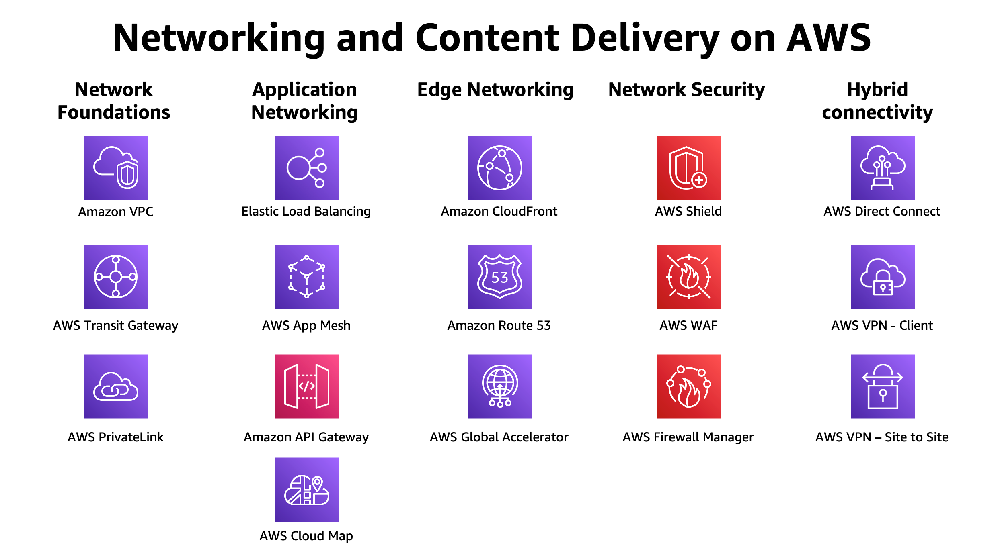
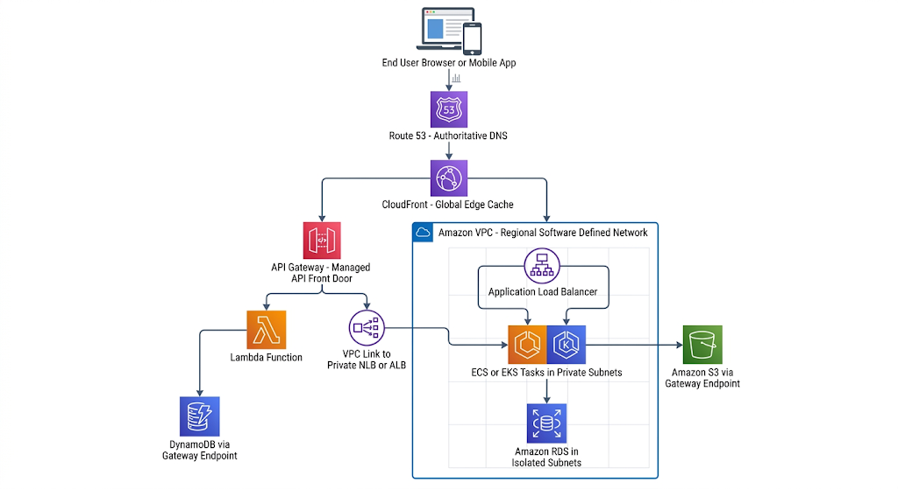
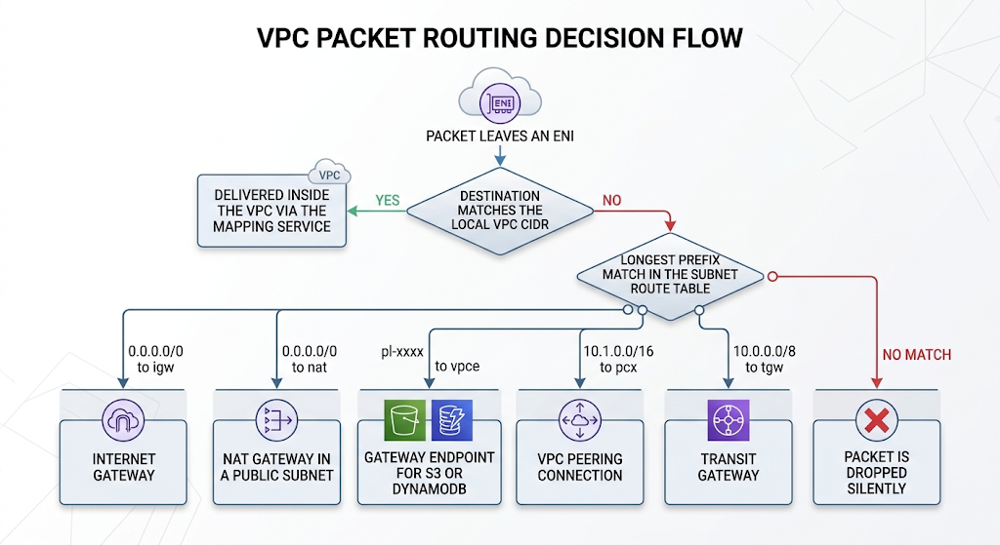
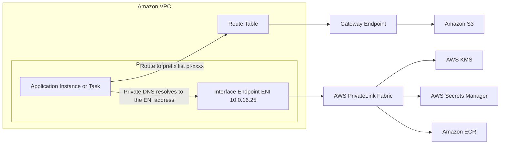
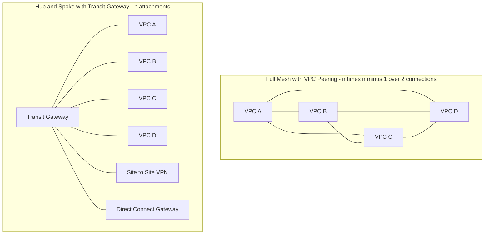
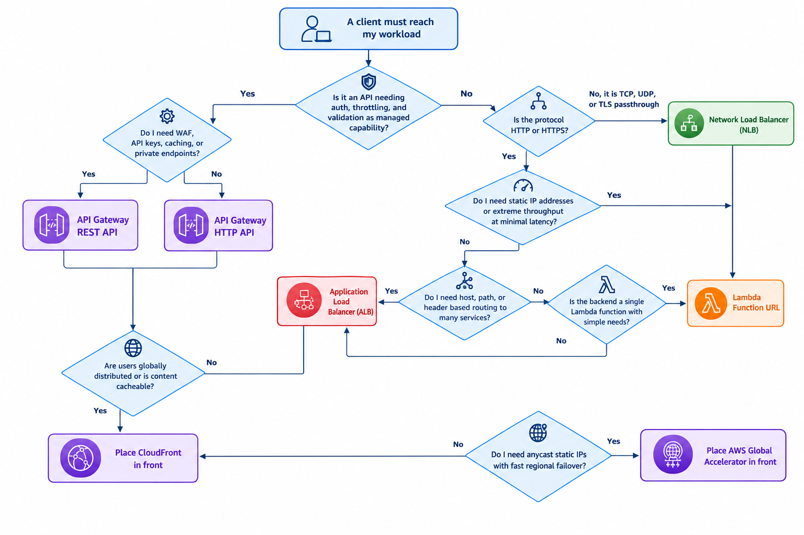
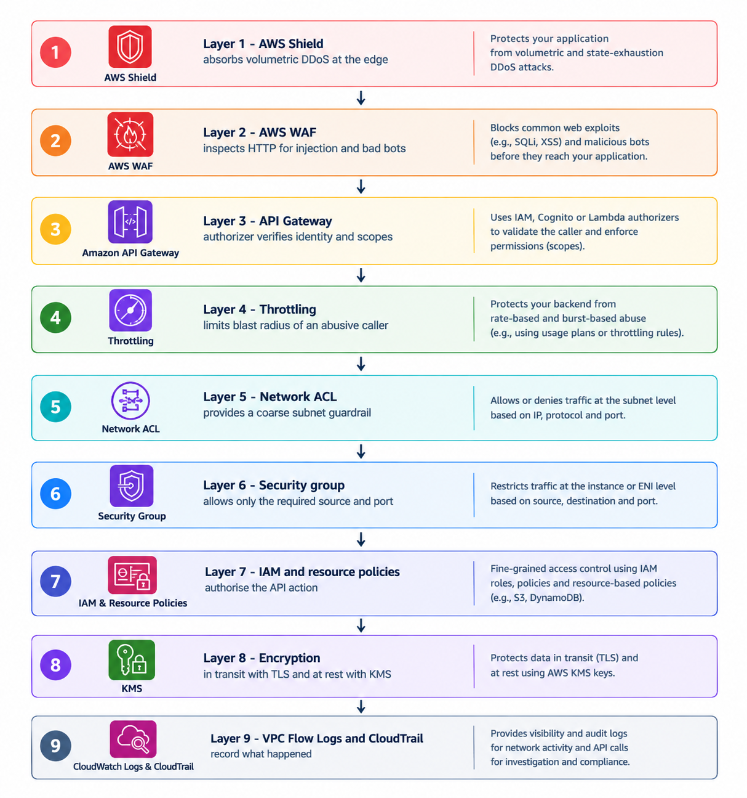
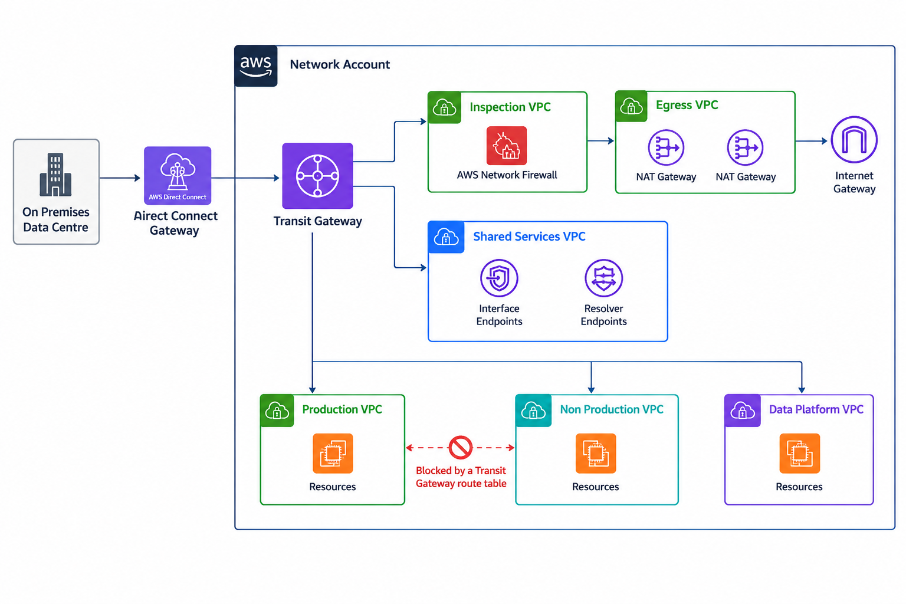

# Networking Services: Amazon VPC, Amazon Route 53, and Amazon API Gateway

## Definition

**Amazon Virtual Private Cloud (Amazon VPC)** is a logically isolated, software-defined virtual network within an AWS Region, in which you provision AWS resources using an IP address range that you define. A VPC gives you control over IP addressing, subnetting, route tables, gateways, and both instance-level and subnet-level packet filtering. A VPC is a **regional** construct: it spans all Availability Zones in one Region and cannot cross Regions.

**Amazon Route 53** is a highly available and scalable authoritative Domain Name System (DNS) service, combined with domain registration, DNS health checking, traffic policy management, and application recovery controls. It is a **global** service with a **regional** control-plane anchor in `us-east-1`. Route 53 is what turns a human-readable name such as `api.example.com` into an IP address or an alias to an AWS-managed endpoint, and it is the first place where you can express traffic-steering and failover intent.

**Amazon API Gateway** is a fully managed service for creating, publishing, securing, monitoring, and operating APIs at any scale. It sits in front of backend compute (Lambda, containers on ECS or EKS, EC2, or any HTTP endpoint including on-premises services) and provides authentication and authorization, request validation, throttling, caching, transformation, and observability as a managed capability rather than as application code.

<figure markdown="span">
    {width="80%"}
    <figcaption>AWS network services</figcaption>
    
<i>Image Source: AI Generaed (Google Gemini)</i>

</figure>

### Where They Sit in AWS Architecture

<figure markdown="span">
    {width="80%"}
    <figcaption>Where netwroking sits in the architecture</figcaption>
    
<i>Image Source: AI Generaed (Google Gemini)</i>

</figure>

!!! note "The Three Layers of a Network Answer"
    Almost every AWS networking question decomposes into three layers:
    
    1. **name resolution** (Route 53  what address do I connect to?),
    2. **path** (VPC route tables, gateways, endpoints  can the packet get there?),
    3. **permission** (security groups, NACLs, IAM policies, resource policies  is the packet allowed?). When something does not work, check all three, in that order.

---

## Why This Service or Concept Exists

### The Problem Before Amazon VPC

The original EC2 offering, retroactively called **EC2-Classic**, placed every customer's instances on a single flat shared network. Each instance received a public IP address from a shared pool and a private address from a shared `10.0.0.0/8` space. There were security groups, but there was no customer-defined address space, no subnetting, no route tables, no private-only instances, and no way to build a network topology that mirrored a traditional data centre.

This was unacceptable for enterprises for three reasons:

1. **No network-level isolation.** Regulated workloads (finance, healthcare, government) require that a database be *unreachable* from the internet as a property of the network, not merely as a property of a firewall rule.
2. **No address planning.** Enterprises extending an on-premises data centre into the cloud need to choose their own RFC 1918 addresses so that VPN or Direct Connect routing does not collide with existing addresses.
3. **No architectural tiering.** The classic three-tier architecture  public web tier, private application tier, isolated database tier  depends on the ability to say "this subnet has no route to the internet."

Amazon VPC, launched in 2009 and made the default in 2013, gave customers a network they could design.

!!! info "Traditional Data Centre Versus VPC"
    | Concern | Traditional Data Centre | Amazon VPC |
    |---|---|---|
    | Address space | Assigned by network team, changing it is a project | You choose the CIDR at creation; secondary CIDRs can be added later |
    | Subnet creation | Physical VLAN, switch configuration, change window | An API call, seconds |
    | Router | Physical device you buy, rack, patch, and licence | Implicit, built into the VPC, infinitely available, free |
    | Firewall | Appliance pair, capacity-planned, a shared bottleneck | Security groups enforced distributed at every ENI, no chokepoint |
    | NAT | An appliance or a pair of servers you maintain | NAT Gateway, managed, scales to tens of gigabits per second |
    | Scaling the network | Buy more hardware, months of lead time | Bandwidth follows instance size; the fabric is already there |
    | Cost model | Large capital expenditure, depreciated | Operating expenditure, per hour and per gigabyte processed |

### Why Route 53 Exists

Running your own authoritative DNS is deceptively hard. It demands globally distributed anycast infrastructure, resistance to volumetric DDoS attacks (DNS is a favourite amplification target), sub-second propagation of record changes, and near-perfect availability  because when DNS fails, *everything* fails, and it fails in a way that caches make slow to recover from.

Route 53 also solves a problem that classical DNS never addressed: **DNS as a traffic-management control plane**. Classic DNS answers "what is the address of this name?" Route 53 answers "what is the *best* address for *this particular* resolver, given health, latency, geography, and my declared weighting?" That converts DNS from a lookup table into a global load-balancing and disaster-recovery mechanism.

The `Alias` record type is an AWS-specific innovation worth understanding: it lets you point the *apex* of a zone (`example.com`, which the DNS standards forbid from carrying a CNAME) at an AWS resource such as a CloudFront distribution or an ALB, with the resolution performed inside Route 53 at no query charge.

### Why API Gateway Exists

Before managed API front doors, every team re-implemented the same cross-cutting concerns inside the application: authentication, authorization, rate limiting, request validation, API keys and usage plans, versioning and stage management, CORS, request and response transformation, caching, and per-route metrics. This code was duplicated across microservices, drifted between them, and became the source of a disproportionate share of security incidents.

API Gateway externalises those concerns into a managed, horizontally scaled tier that sits *before* your code. This is the **API Gateway pattern** from microservices literature, delivered as a service. It also enables true serverless HTTP: Lambda has no listening socket and no port, so something must terminate TLS, parse HTTP, and invoke the function. API Gateway (or a Lambda function URL, or an ALB) performs that role.

!!! tip "Architect's Framing"
    Do not ask "which AWS networking service should I use?" Ask "what is the smallest set of components that gets the packet to the right place, denies everything else by default, survives the loss of one Availability Zone, and can be described entirely in code?" The service choice usually falls out of that question.

---

## Core Concepts

### The VPC as a Software-Defined Network

The single most important conceptual leap is this: **a VPC is not a physical network**. Your instances are not on a dedicated switch. They share physical hosts and physical network fabric with other customers. Isolation is achieved in software, by encapsulation and by a distributed mapping and policy system. Understanding this explains many otherwise-arbitrary behaviours: why you cannot run a packet sniffer and see a neighbour's traffic, why broadcast and multicast do not work natively, why you cannot use a custom routing protocol between instances, and why a security group is not a chokepoint that can be overwhelmed.

### CIDR and Address Planning

Classless Inter-Domain Routing (CIDR) notation expresses a network as `address/prefix-length`. The prefix length is the number of leading bits that are fixed; the remaining bits enumerate hosts. A `/16` fixes 16 bits and leaves 16 host bits, giving 65,536 addresses.

| CIDR | Total addresses | Usable in an AWS subnet | Typical AWS use |
|---|---|---|---|
| `/16` | 65,536 | 65,531 | Maximum size of a VPC CIDR block |
| `/17` | 32,768 | 32,763 | Very large subnet, rarely appropriate |
| `/18` | 16,384 | 16,379 | Large container subnet for EKS with the VPC CNI |
| `/19` | 8,192 | 8,187 | Application tier in a large VPC |
| `/20` | 4,096 | 4,091 | Common private subnet size |
| `/21` | 2,048 | 2,043 | Application tier, medium |
| `/22` | 1,024 | 1,019 | Application tier, medium |
| `/23` | 512 | 507 | Database tier |
| `/24` | 256 | 251 | Public subnet for load balancers and NAT |
| `/26` | 64 | 59 | Minimum practical for an ALB subnet |
| `/27` | 32 | 27 | Endpoint or transit attachment subnet |
| `/28` | 16 | 11 | Smallest subnet AWS permits |

AWS permits VPC CIDR blocks between `/16` and `/28`, and subnet CIDR blocks between `/16` and `/28`. A VPC may have a primary CIDR plus additional secondary CIDRs, which is the standard remedy when a VPC runs out of address space.

**Five addresses in every subnet are reserved** and are not assignable:

| Address in `10.0.1.0/24` | Reserved for |
|---|---|
| `10.0.1.0` | Network address |
| `10.0.1.1` | VPC implicit router |
| `10.0.1.2` | Amazon-provided DNS (the Route 53 Resolver, mapped from VPC base plus two) |
| `10.0.1.3` | Reserved by AWS for future use |
| `10.0.1.255` | Network broadcast address; AWS does not support broadcast but reserves it |

!!! warning "The Reserved-Address Trap"
    A `/28` subnet gives you 11 usable addresses, not 16, and an ALB requires at least 8 free addresses per subnet to scale. Sizing a subnet by dividing the expected instance count by 256 and rounding down is how teams end up with `InsufficientFreeAddressesInSubnet` errors during a traffic spike, precisely when scaling matters most.

#### A Reference CIDR Plan

A disciplined plan allocates address space hierarchically so that ranges are summarisable and never collide across accounts, environments, and Regions.

| Scope | CIDR | Rationale |
|---|---|---|
| Whole organisation | `10.0.0.0/8` | Reserve the entire RFC 1918 class A for AWS |
| Production, Region A | `10.0.0.0/14` | Room for many VPCs, summarisable in one on-premises route |
| Production VPC 1 | `10.0.0.0/16` | One VPC |
| Public subnets (3 AZ) | `10.0.0.0/24`, `10.0.1.0/24`, `10.0.2.0/24` | Load balancers, NAT Gateways only |
| Private app subnets | `10.0.16.0/20`, `10.0.32.0/20`, `10.0.48.0/20` | Containers and instances; large because `awsvpc` mode consumes one IP per task |
| Isolated data subnets | `10.0.64.0/22`, `10.0.68.0/22`, `10.0.72.0/22` | RDS, ElastiCache; no internet route |
| Reserved for growth | `10.0.128.0/17` | Never allocate the second half on day one |
| Non-production, Region A | `10.4.0.0/14` | Distinct range so peering to production remains possible |
| Disaster recovery Region | `10.8.0.0/14` | Distinct so cross-Region peering never overlaps |

!!! danger "Overlapping CIDRs Are Permanent"
    VPC peering and Transit Gateway attachments **cannot** connect networks with overlapping CIDR blocks. There is no cloud equivalent of source NAT on a peering connection. If two teams both use `10.0.0.0/16`, the only remedies are re-addressing an entire VPC (which means rebuilding every resource in it) or inserting a NAT layer in a middle VPC. Address planning is one of the few AWS decisions that is genuinely expensive to reverse.

### Subnets and Availability Zones

A subnet is a range of IP addresses within a VPC, bound to **exactly one Availability Zone**. This binding is the foundation of high availability in AWS: to survive the loss of an Availability Zone, you must have subnets  and running capacity  in at least two, and preferably three.

A subnet is **public** if and only if its associated route table contains a route to an Internet Gateway. A subnet is **private** if it has a route to a NAT Gateway (outbound only). A subnet is **isolated** if it has neither. Nothing else about the subnet distinguishes these cases; "public subnet" is a statement about a route table.

!!! note "Availability Zone IDs Versus Names"
    The name `us-east-1a` is mapped to a different physical zone for different AWS accounts, deliberately, to spread load. The **AZ ID** (for example `use1-az2`) is consistent across accounts. When correlating placement across accounts  for example to keep a shared-services VPC in the same physical zone as a workload VPC and avoid cross-AZ data charges  compare AZ IDs, not names.

### Route Tables and the Implicit Router

Every VPC has an **implicit router**, a distributed function rather than a device. Route tables tell it what to do. Every subnet is associated with exactly one route table; if you do not associate one explicitly, the subnet uses the VPC's **main** route table.

Routing uses **longest prefix match**: the most specific matching route wins, regardless of the order rules appear in the table. Every route table implicitly contains a `local` route for the VPC's CIDR (and each secondary CIDR), which cannot be removed and always wins for intra-VPC traffic.

<figure markdown="span">
    {width="80%"}
    <figcaption>VPC Packet Routing</figcaption>
    
<i>Image Source: AI Generaed (Google Gemini)</i>

</figure>

!!! warning "Silent Drops"
    When no route matches, the packet is discarded without an ICMP unreachable message in most cases. This is why a missing route presents to the application as a **timeout**, whereas a security group or NACL denial also presents as a timeout, but a rejected TCP connection (RST) usually means the packet arrived and something at the destination refused it. Learning to read *timeout versus connection refused* is the single most useful troubleshooting reflex in AWS networking.

### Internet Gateway

An Internet Gateway (IGW) is a horizontally scaled, redundant, highly available VPC component attached to a VPC (one IGW per VPC). It performs two functions:

1. It provides a target in route tables for internet-routable traffic.
2. It performs **one-to-one network address translation** between an instance's private address and its associated public IPv4 address or Elastic IP.

The second point is frequently misunderstood. An EC2 instance with a public IP address does *not* see that address on its network interface. `ip addr` inside the instance shows only the private address. The IGW rewrites the source address on the way out and the destination address on the way in. This is why the instance's operating system must never be configured with the public address, and why an Elastic IP that is disassociated does not require any change inside the guest.

An IGW is free, imposes no bandwidth constraint of its own, and adds no measurable latency.

For IPv6, the analogue of a NAT Gateway is the **egress-only Internet Gateway**, which allows outbound IPv6 traffic and stateful return traffic but blocks inbound connections. IPv6 addresses in AWS are globally routable, so there is no NAT; the egress-only gateway provides the outbound-only semantic without address translation.

### NAT Gateway

A NAT Gateway allows instances in a private subnet to initiate outbound connections to the internet (for operating system patches, container image pulls from public registries, third-party API calls) while preventing the internet from initiating connections to them.

Key architectural facts:

- A NAT Gateway lives **in a public subnet** and requires an Elastic IP. It is a zonal resource; it does not fail over across Availability Zones.
- Instances in private subnets route `0.0.0.0/0` to the NAT Gateway.
- For high availability you deploy **one NAT Gateway per Availability Zone**, with each Availability Zone's private route table pointing at the NAT Gateway in its own zone. A single shared NAT Gateway is both a single point of failure and a source of cross-AZ data transfer charges.
- It scales automatically from 5 Gbps up to 100 Gbps and supports up to 55,000 simultaneous connections **to each unique destination** (destination IP, destination port, protocol). Exceeding that produces `ErrorPortAllocation` errors.
- It is stateful and supports TCP, UDP, and ICMP. It does not support inbound-initiated connections and cannot be used to publish a service.

!!! tip "The Most Common Avoidable AWS Networking Cost"
    NAT Gateways charge both an hourly rate and a per-gigabyte data-processing rate. A workload that pulls container images and writes logs and objects to S3 through a NAT Gateway can spend more on NAT data processing than on compute. Adding a **Gateway endpoint for S3** costs nothing and removes that traffic from the NAT path entirely. Always audit what is actually traversing NAT using VPC Flow Logs before accepting the bill.

### Security Groups Versus Network ACLs

These are the two packet-filtering layers in a VPC, and the difference between them is examined constantly.

| Dimension | Security Group | Network ACL |
|---|---|---|
| Attaches to | Elastic network interfaces (so, effectively, instances, tasks, load balancer nodes, RDS instances, endpoints) | Subnets |
| Statefulness | **Stateful**  return traffic for an allowed flow is automatically permitted | **Stateless**  return traffic must be explicitly allowed by a rule in the opposite direction |
| Rule types | Allow rules only; there is no deny | Allow **and** deny rules |
| Evaluation | All rules are evaluated; if any rule allows the traffic, it is permitted | Rules are evaluated in ascending rule-number order; the first match wins and evaluation stops |
| Default behaviour | Default security group allows all outbound and allows inbound from itself; a newly created security group allows all outbound and nothing inbound | Default NACL allows all inbound and outbound; a custom NACL denies everything until you add rules |
| Source or destination can be | CIDR, another security group, a prefix list | CIDR blocks only  **not** a security group |
| Typical use | Primary control; expresses application intent ("the web tier may talk to the app tier") | Coarse subnet-wide guardrail; blocking a specific malicious CIDR; regulatory requirement for a second layer |
| Ephemeral ports | Not a concern, statefulness handles it | **Must** be allowed outbound (or inbound for responses), typically `1024-65535` |
| Quota | Default 5 security groups per network interface (adjustable to 16), 60 inbound and 60 outbound rules per group by default | 1 NACL per subnet; 20 rules per direction by default, adjustable to 40 |

!!! warning "The Ephemeral-Port Trap"
    Because a NACL is stateless, the reply to an inbound HTTPS request leaves from port 443 toward the client's ephemeral port, so the outbound NACL rules must allow `1024-65535`. Forgetting this makes every connection hang. This is why security groups should carry the real policy and NACLs should stay coarse.

See [8.2 Network Security](../unit8/topic2.md#vpc-design-and-security-groups) for security group design, referencing and connection tracking, and [Network ACLs and VPC Flow Logs](../unit8/topic2.md#network-acls-and-vpc-flow-logs) for NACL evaluation order, the ephemeral-port return path, deny lists and incident containment.

### Security Group Referencing  the Cloud-Native Idiom

The most important cloud-native property of security groups is that a rule's source can be **another security group**, not a CIDR. `sg-app` allows inbound TCP 8080 from `sg-alb`. As the ALB scales out and its nodes acquire new addresses, and as tasks are replaced with new IP addresses, the rule remains correct without modification. You have expressed *identity-based* rather than *address-based* policy  a firewall rule that survives elasticity. Address-based rules in an auto-scaling environment are a maintenance defect. [8.2 Network Security](../unit8/topic2.md#vpc-design-and-security-groups) builds on this idiom with one group per service role, chained tiers and restricted egress.

### VPC Endpoints

By default, calling `s3.amazonaws.com` or `kinesis.us-east-1.amazonaws.com` from a private subnet sends the request out through a NAT Gateway and across the public internet path (though within the AWS backbone in many cases) to a public service endpoint. VPC endpoints keep that traffic on the AWS private network and remove the dependency on a NAT Gateway.

| Aspect | Gateway Endpoint | Interface Endpoint (AWS PrivateLink) |
|---|---|---|
| Services supported | Amazon S3 and Amazon DynamoDB only | Most AWS services, plus Marketplace and your own services |
| Mechanism | A **route** in the route table pointing at a prefix list | An **elastic network interface** with a private IP in your subnet |
| DNS | Uses the normal public service DNS name, resolved to the public IP but routed via the endpoint | Provides endpoint-specific DNS names, plus optional **private DNS** which overrides the public name inside the VPC |
| Cross-VPC or on-premises reachability | No  route-table scoped, does not work over peering, VPN, or Direct Connect | Yes  an ENI has an IP address reachable from anywhere that can route to it |
| Security control | Endpoint policy (a resource policy) plus route table | Endpoint policy plus a **security group** on the ENI |
| Cost | **No charge** | Hourly charge per endpoint per Availability Zone, plus a per-gigabyte data-processing charge |
| High availability | Managed, regional | You create one ENI per Availability Zone; you own the redundancy decision |

```mermaid
graph LR
    subgraph vpc["Amazon VPC"]
        subgraph priv["Private Subnet"]
            APP["Application Instance or Task"]
            ENI["Interface Endpoint ENI 10.0.16.25"]
        end
        RT["Route Table"]
    end
    APP -->|"Route to prefix list pl-xxxx"| RT
    RT --> GWE["Gateway Endpoint"]
    GWE --> S3["Amazon S3"]
    APP -->|"Private DNS resolves to the ENI address"| ENI
    ENI --> PL["AWS PrivateLink Fabric"]
    PL --> KMS["AWS KMS"]
    PL --> SM["AWS Secrets Manager"]
    PL --> ECR["Amazon ECR"]
```
<!-- TODO: Generate a professional with proper symbol in whie background image -->

!!! note "Interface Endpoints Are Also How You Publish a Service"
    AWS PrivateLink is bidirectional in concept. A software vendor can place a Network Load Balancer in front of its service, create a **VPC endpoint service**, and allow named AWS accounts to create Interface endpoints into it. The consumer reaches the provider's service using an address in the *consumer's* own VPC, with no peering, no route exchange, and no CIDR-overlap constraint. This is the correct pattern for software-as-a-service delivered privately, and it is far more scalable than peering.

### VPC Peering Versus Transit Gateway

**VPC peering** creates a one-to-one networking connection between two VPCs, in the same or different Regions and accounts. Traffic uses the AWS backbone, never the internet. Crucially, peering is **non-transitive**: if A peers with B and B peers with C, A cannot reach C. Each pair needs its own connection and a route-table entry in every subnet route table on both sides.

**AWS Transit Gateway** is a regional network transit hub. Each VPC, VPN, or Direct Connect gateway attaches once to the Transit Gateway, and the Transit Gateway performs transitive routing between attachments according to its own route tables. This converts an O(n²) mesh into an O(n) hub-and-spoke.

```mermaid
graph TD
    subgraph mesh["Full Mesh with VPC Peering - n times n minus 1 over 2 connections"]
        A1["VPC A"] --- B1["VPC B"]
        A1 --- C1["VPC C"]
        A1 --- D1["VPC D"]
        B1 --- C1
        B1 --- D1
        C1 --- D1
    end
    subgraph hub["Hub and Spoke with Transit Gateway - n attachments"]
        TGW["Transit Gateway"]
        TGW --- A2["VPC A"]
        TGW --- B2["VPC B"]
        TGW --- C2["VPC C"]
        TGW --- D2["VPC D"]
        TGW --- VPN["Site to Site VPN"]
        TGW --- DX["Direct Connect Gateway"]
    end
```

<!-- TODO: Generate a professional with proper symbol in whie background image -->

| Criterion | VPC Peering | Transit Gateway |
|---|---|---|
| Topology | Point to point | Hub and spoke |
| Transitive routing | No | Yes |
| Connections for *n* VPCs | *n(n−1)/2* | *n* |
| Route table entries | Per peering, in every subnet route table | One summarised route per VPC toward the Transit Gateway |
| Bandwidth | No aggregate limit imposed by peering itself | Up to 50 Gbps per VPC attachment (burst); design around it |
| On-premises integration | Not supported; a peer cannot use another VPC's VPN | Native; VPN and Direct Connect attach directly |
| Segmentation | Implicit through which peerings exist | Explicit through multiple Transit Gateway route tables |
| Cost | No hourly charge; data transfer charges apply | Hourly charge per attachment plus a per-gigabyte data-processing charge |
| Latency | Marginally lower  one fewer hop | One additional hop, typically sub-millisecond |
| When to choose | Two to roughly five VPCs, stable topology, latency and cost sensitive | More than a handful of VPCs, hybrid connectivity, multi-account, segmentation requirements |

!!! tip "The Decision Rule"
    Below roughly five VPCs with no on-premises requirement, peering is cheaper and simpler. Above that, or the moment you need Direct Connect, VPN, or account segmentation, Transit Gateway wins decisively  and the crossover is reached faster than teams expect, because peering's operational cost is in route-table churn, not in the connection itself.

### Elastic Load Balancing in the Request Path

Elastic Load Balancing distributes incoming traffic across multiple targets in multiple Availability Zones. Load balancer nodes themselves live in the subnets you nominate, scale horizontally, and are addressed by a DNS name whose underlying addresses change  which is why you must never hard-code a load balancer's IP address (for ALB) and must always use its DNS name or a Route 53 alias.

| Dimension | Application Load Balancer | Network Load Balancer |
|---|---|---|
| OSI layer | 7 (HTTP and HTTPS, gRPC) | 4 (TCP, UDP, TLS) |
| Routing decisions | Host header, path, HTTP header, query string, source IP, HTTP method | Flow hash of the 5-tuple only |
| Latency added | Low, but the request is parsed | Ultra low, roughly tens of microseconds |
| Static IP | No  use the DNS name | Yes  one Elastic IP per Availability Zone |
| TLS termination | Yes, with SNI and multiple certificates | Yes with a TLS listener, or pass through with a TCP listener |
| Preserves client source IP | No  use the `X-Forwarded-For` header | Yes, by default for instance and IP targets in many modes |
| Target types | Instance, IP, Lambda | Instance, IP, Application Load Balancer |
| WebSockets | Supported | Supported at layer 4 |
| WAF integration | Yes, AWS WAF attaches directly | No, not directly |
| Sticky sessions | Yes, cookie based | Yes, source-IP based |
| Typical use | Microservices behind one entry point, host and path routing, containers | Extreme throughput, static IP requirements, non-HTTP protocols, PrivateLink providers |

### Amazon CloudFront in the Request Path

CloudFront is a global content delivery network with hundreds of points of presence. It terminates the client TLS connection at the edge closest to the user, serves cached content directly, and forwards cache misses to the origin over AWS's optimised backbone rather than the public internet  which usually reduces latency even for entirely dynamic, uncacheable content.

CloudFront also provides the natural attachment point for AWS WAF and AWS Shield, supports **Origin Access Control** so that a private S3 bucket can be served without ever being public, and can execute logic at the edge through CloudFront Functions (lightweight, viewer-facing, sub-millisecond) and Lambda@Edge (heavier, supports origin-facing triggers and network access).

!!! note "CloudFront Is Not Only for Static Content"
    Placing CloudFront in front of an API reduces TCP and TLS handshake latency (the handshake terminates at the edge, tens of milliseconds away, rather than at a Region thousands of kilometres away), absorbs volumetric attacks before they reach your origin, and lets you cache safely at the route level with a well-designed cache key. Treating CloudFront as "only for images" leaves substantial performance on the table.

### DNS Fundamentals and Route 53 Concepts

DNS is a distributed, hierarchical, cached database. Resolution proceeds from the root, to the top-level domain, to the authoritative name servers for the zone.

- **Domain and zone.** A *domain* is a name in the hierarchy. A *hosted zone* in Route 53 is the container of records for a domain and its subdomains, and it corresponds to a DNS zone file.
- **Public hosted zone** answers queries from the public internet. **Private hosted zone** answers queries only from the VPCs you associate with it, which is how you give internal names to internal resources without publishing them.
- **Name server (NS) records** delegate authority. When you create a public hosted zone, Route 53 assigns four name servers drawn from different top-level domains for resilience; you must place these NS records at the registrar for delegation to work.
- **Start of Authority (SOA)** carries zone metadata including the negative-caching TTL.
- **TTL (time to live)** is how long a resolver may cache an answer. It is the single most important operational parameter in DNS: a long TTL reduces query cost and improves resilience to Route 53 unavailability, while a short TTL shortens failover time. Sixty seconds is a common compromise for records participating in failover; 300 to 3600 seconds suits stable records.
- **Alias record** is Route 53-specific. It maps a name directly to an AWS resource (CloudFront distribution, ALB or NLB, API Gateway custom domain, S3 website endpoint, Global Accelerator, another record in the same zone). Unlike a CNAME it may be used at the zone apex, it returns an A or AAAA answer rather than a second lookup, it automatically tracks the resource's changing addresses, and queries to alias targets that are AWS resources are not charged.
- **Health check** is an active probe from a fleet of Route 53 checkers in many locations. Health checks can monitor an endpoint, monitor a CloudWatch alarm, or compute a boolean over other health checks (a *calculated* health check). Only records with certain routing policies can be associated with health checks.
- **Route 53 Resolver** is the VPC-internal recursive resolver at `VPC base plus two`, along with inbound and outbound **Resolver endpoints** that allow DNS to be forwarded between a VPC and on-premises networks in either direction.

!!! warning "Route 53 Health Checks Cannot See Private Resources"
    The Route 53 health-checking fleet lives on the public internet. It cannot probe an endpoint in a private subnet. To fail over on the health of a private resource, publish a CloudWatch metric and use a **CloudWatch alarm health check**, which reads the alarm state rather than probing the network.

### API Gateway Concepts

- **API**  the top-level container. Choose REST, HTTP, or WebSocket at creation; the type cannot be changed afterwards.
- **Resource and method** (REST) or **route** (HTTP and WebSocket)  the path and verb that a request matches.
- **Integration**  what API Gateway calls: Lambda proxy, Lambda custom, HTTP proxy, HTTP custom, AWS service integration (call DynamoDB, SQS, Step Functions, or S3 directly with no compute in between), VPC Link (to a private ALB, NLB, or Cloud Map service), or MOCK.
- **Stage**  a named deployment of an API, such as `dev`, `test`, `prod`. Stages carry their own throttling, caching, logging, and **stage variables**, which lets one API definition point at different backends per environment.
- **Authorizer**  IAM (SigV4), Amazon Cognito user pools, a Lambda authorizer (token or request based, with policy caching), or, for HTTP APIs, a built-in JWT authorizer that validates OIDC and OAuth 2.0 tokens without any code.
- **Usage plan and API key**  quota and rate limiting per consumer, for monetised or partner APIs (REST APIs only).
- **Mapping template**  Velocity Template Language transformation of request or response bodies (REST APIs only). Powerful, but application logic in a template is difficult to test and version; prefer proxy integration and keep transformation in code.
- **Endpoint type**  Edge-optimized (fronted by a CloudFront distribution AWS manages), Regional (clients in one Region, or you want to attach your own CloudFront distribution), or Private (accessible only through an Interface endpoint in your VPC, controlled by a resource policy).

!!! tip "Direct Service Integration Is an Underused Architecture"
    An API Gateway AWS-service integration can put a message on an SQS queue or start a Step Functions execution with **no Lambda function at all**. That removes a whole compute tier from the critical path: no cold starts, no runtime patching, no concurrency limits, and no per-invocation charge. When the API's job is to accept and enqueue, this is often the correct design.

This chapter treats API Gateway at survey level, as the managed front door in the network request path. See [4.2 API Management and Service Mesh](../unit4/topic2.md#api-management-vocabulary) for the full treatment of API management vocabulary, throttling levels, and usage plans.

---

## Architecture Components

| Component | Layer | Responsibility | Failure domain |
|---|---|---|---|
| Client (browser, mobile, device) |  | Initiates the request, caches DNS answers according to TTL |  |
| Route 53 | Global DNS | Resolves the name; applies routing policy and health checks | Global, anycast |
| AWS WAF | Edge or regional | Inspects HTTP requests, blocks injection, bad bots, and rate-abusive sources | Attached to CloudFront, ALB, API Gateway, AppSync |
| AWS Shield | Edge | Absorbs volumetric and protocol DDoS attacks | Global |
| CloudFront | Edge | Terminates TLS near the user, caches, forwards misses over the AWS backbone | Hundreds of points of presence |
| API Gateway | Regional or edge | Authentication, validation, throttling, transformation, routing to integrations | Regional, multi-AZ |
| Application Load Balancer | Regional, layer 7 | Content-based routing across targets and Availability Zones | Nodes per subnet, multi-AZ |
| Network Load Balancer | Regional, layer 4 | Ultra-low-latency flow distribution, static IPs, PrivateLink provider endpoint | Nodes per subnet, multi-AZ |
| VPC | Regional | The address space and the boundary of the software-defined network | Regional |
| Subnet | Zonal | An address range bound to one Availability Zone | Single Availability Zone |
| Route table | Subnet-scoped | Declares where non-local traffic is sent | Follows the subnet |
| Internet Gateway | VPC-scoped | Internet path plus one-to-one NAT for public addresses | Highly available by design |
| NAT Gateway | Zonal | Outbound-only internet access for private subnets | Single Availability Zone; deploy one per zone |
| Egress-only Internet Gateway | VPC-scoped | Outbound-only IPv6 access | Highly available |
| Security group | ENI-scoped | Stateful allow-list expressing application intent | Distributed, no chokepoint |
| Network ACL | Subnet-scoped | Stateless ordered allow and deny guardrail | Follows the subnet |
| Gateway endpoint | Route-table-scoped | Private path to S3 and DynamoDB with no charge | Regional |
| Interface endpoint | Zonal ENI | Private path to AWS services or partner services via PrivateLink | One ENI per Availability Zone |
| VPC peering | VPC pair | Non-transitive private connectivity between two VPCs | Managed, no bandwidth bottleneck |
| Transit Gateway | Regional | Hub for transitive routing between VPCs, VPN, and Direct Connect | Regional, multi-AZ |
| Site-to-Site VPN | Regional | Encrypted tunnels over the internet to on premises | Two tunnels per connection |
| Direct Connect | Location-based | Dedicated private circuit to AWS | Requires a second circuit for resilience |
| Elastic IP | Regional | A static public IPv4 address you own and can remap | Remappable within a Region |
| Elastic network interface | Zonal | The actual virtual NIC, carrying addresses and security groups | Bound to one subnet |
| EC2, ECS, EKS, Lambda | Compute | The workload that terminates the connection | Placement determines resilience |
| RDS, ElastiCache, DynamoDB | Data | The persistence tier reached over the network | Multi-AZ or regional |
| VPC Flow Logs | Observability | Records accepted and rejected flow metadata | Per VPC, subnet, or ENI |
| CloudWatch, CloudTrail, X-Ray | Observability | Metrics and alarms, API audit trail, distributed traces | Regional |

---

## AWS Service Deep Dive

### Amazon VPC

**Purpose.** To provide a customer-defined, logically isolated network in which AWS resources are placed, with full control over addressing, routing, and packet filtering.

**Architecture.** A VPC is regional and spans every Availability Zone in the Region. Within it, subnets are zonal. An implicit, infinitely available router forwards according to per-subnet route tables. Gateways (Internet Gateway, NAT Gateway, virtual private gateway, Transit Gateway attachment, endpoints) are the exits. Enforcement is distributed to the Nitro card at every elastic network interface.

**Important features.**

- Multiple CIDR blocks per VPC (a primary plus secondary blocks), IPv4 and dual-stack IPv6, and IPv6-only subnets.
- Amazon-provided DNS with private hosted zones, Resolver rules, and inbound and outbound Resolver endpoints for hybrid DNS.
- VPC Flow Logs at VPC, subnet, or ENI granularity, in a customisable format, delivered to CloudWatch Logs, S3, or Kinesis Data Firehose.
- Traffic Mirroring for packet-level inspection by intrusion-detection appliances.
- Security groups, network ACLs, and **AWS Network Firewall** for stateful deep inspection, domain filtering, and Suricata-compatible rules.
- VPC Sharing through AWS Resource Access Manager, so a network team owns the VPC and application accounts deploy into shared subnets.
- Prefix lists (customer-managed and AWS-managed) so that rules and routes reference a named set of CIDRs rather than a list of literals.
- Reachability Analyzer and Network Access Analyzer for static, configuration-based path analysis without sending a packet.

**Limitations.**

- A VPC cannot span Regions. Cross-Region connectivity requires inter-Region peering, Transit Gateway peering, or a VPN.
- The CIDR block of a VPC cannot be changed after creation; only additional blocks can be added, and blocks can only be removed if unused.
- Subnets cannot be resized after creation.
- Peering is non-transitive and does not permit overlapping CIDRs.
- No native broadcast or multicast on the VPC data path (Transit Gateway multicast is a separate feature).
- Only five reserved addresses per subnet are unavailable, but load balancers and container networking consume addresses faster than most teams predict.

**Pricing model.** The VPC itself, subnets, route tables, Internet Gateways, security groups, and NACLs carry **no charge**. Costs arise from:

| Dimension | Charged as |
|---|---|
| NAT Gateway | Per hour, plus per gigabyte processed |
| Interface endpoint (PrivateLink) | Per hour per endpoint per Availability Zone, plus per gigabyte processed |
| Gateway endpoint (S3, DynamoDB) | No charge |
| Transit Gateway | Per attachment hour, plus per gigabyte processed |
| VPC peering | No hourly charge; data transfer charges apply, higher across Availability Zones and Regions |
| Public IPv4 addresses | Per hour for every public IPv4 address, whether attached or idle |
| Data transfer out to the internet | Per gigabyte, tiered |
| Cross-AZ data transfer | Per gigabyte in each direction |
| Site-to-Site VPN, Direct Connect | Per connection hour plus data transfer |
| VPC Flow Logs | Charged by the destination service (CloudWatch Logs or S3 ingestion and storage) |

!!! warning "Public IPv4 Addresses Are Now Metered"
    Since 2024 every public IPv4 address in AWS carries an hourly charge, including addresses attached to running instances. This changed cost architecture materially: idle Elastic IPs, one public IP per instance in a large fleet, and NAT Gateways all now have a visible line item. It is also a deliberate incentive toward IPv6 and toward keeping workloads private behind load balancers.

**Performance characteristics.** Network bandwidth is a function of instance type, not of the VPC. Within an Availability Zone, latency between instances is typically a few hundred microseconds; between Availability Zones in a Region, single-digit milliseconds. Enhanced networking (ENA) and, for the most demanding workloads, Elastic Fabric Adapter provide high packets-per-second and low jitter. Cluster placement groups reduce inter-node latency for tightly coupled workloads at the cost of correlated failure risk.

**Scaling behaviour.** The network fabric is already provisioned; there is no capacity to plan for the VPC itself. What you must plan is **address space**, because address exhaustion is the practical scaling limit. NAT Gateways scale automatically to 100 Gbps. Interface endpoints scale but are per-Availability-Zone resources you must place deliberately.

**Availability.** Internet Gateways and the implicit router are designed to be highly available with no single point of failure. **NAT Gateways, Interface endpoint ENIs, and subnets are zonal** and are the components where your architecture, not AWS, determines availability.

**Security features.** Security groups, network ACLs, AWS Network Firewall, endpoint policies, VPC Flow Logs, Traffic Mirroring, private subnets with no internet route, and integration with IAM condition keys such as `aws:SourceVpce` and `aws:SourceVpc` for resource policies.

**Service limits (defaults; most are adjustable quotas  verify current values in Service Quotas).**

| Quota | Default |
|---|---|
| VPCs per Region | 5 |
| Subnets per VPC | 200 |
| IPv4 CIDR blocks per VPC | 5 (up to 50) |
| Route tables per VPC | 200 |
| Routes per route table | 50 (up to 1000, with caveats for propagated routes) |
| Security groups per VPC | 2,500 |
| Rules per security group | 60 inbound and 60 outbound |
| Security groups per network interface | 5 (up to 16) |
| Network ACLs per VPC | 200 |
| Rules per network ACL | 20 per direction (up to 40) |
| Active VPC peering connections per VPC | 50 (up to 125) |
| Internet Gateways per Region | Matches the VPC quota |
| NAT Gateways per Availability Zone | 5 |
| Elastic IPs per Region | 5 |

**Common configurations.** A three-tier, three-Availability-Zone VPC with a `/16` CIDR, one public `/24` per zone containing only load balancers and NAT Gateways, one private `/20` per zone for compute, one isolated `/22` per zone for data, one NAT Gateway per zone, a Gateway endpoint for S3 and DynamoDB, Interface endpoints for the AWS APIs actually used, and Flow Logs enabled to a central logging account.

### Amazon Route 53

**Purpose.** Authoritative DNS, domain registration, health checking, and DNS-based traffic management and failover.

**Architecture.** Globally distributed anycast authoritative name servers, a global health-checker fleet, a control plane anchored in `us-east-1`, and a per-VPC Route 53 Resolver for private DNS. Hosted zones are global objects; private hosted zones are associated with specific VPCs.

**Important features.**

- Public and private hosted zones, with the same zone name permitted in both (**split-horizon DNS**), so `api.example.com` can resolve to an internal load balancer inside the VPC and to a public endpoint outside.
- Alias records to AWS resources, usable at the zone apex, resolved internally, and not charged.
- Seven routing policies, described below.
- Health checks against endpoints, CloudWatch alarms, or other health checks, with configurable failure thresholds, request intervals, string matching in the response body, and latency measurement.
- Traffic Flow  a visual policy editor that composes routing policies into a reusable traffic policy with versioning.
- Route 53 Resolver endpoints and forwarding rules for hybrid DNS in both directions.
- Route 53 Resolver DNS Firewall for blocking queries to known-malicious or disallowed domains  an effective data-exfiltration control.
- Route 53 Application Recovery Controller with **routing controls** whose data plane is deliberately independent of control planes, plus readiness checks and safety rules.
- DNSSEC signing for public hosted zones, and domain registration with DNSSEC support.

**Routing policies.**

| Policy | What it does | Health checks | Typical use | Key caution |
|---|---|---|---|---|
| **Simple** | Returns a single record; multiple values in one record are returned in random order to the client | Not supported | A single endpoint, static mappings | No failover at all; the client picks arbitrarily |
| **Weighted** | Distributes answers across records in proportion to assigned weights, from 0 to 255 | Supported | Canary and blue-green releases, gradual migration, splitting between Regions | Weight 0 removes a record unless all are 0; caching means the split is statistical, not exact |
| **Latency-based** | Returns the record for the Region with the lowest measured network latency to the *resolver* | Supported | Multi-Region active-active for performance | It optimises latency, not geography or compliance; measurement is to the resolver, not the user |
| **Failover** | Active-passive; returns the primary while healthy, otherwise the secondary | Required for the primary | Disaster recovery, static maintenance page in S3 | Failover speed is bounded by TTL plus health-check detection time |
| **Geolocation** | Returns a record based on the *user's* inferred location, by continent, country, or subdivision | Supported | Data-residency and licensing compliance, localised content | Always configure a **default** record for unmatched locations, or those users get no answer |
| **Geoproximity** | Routes by geographic distance between user and resource, with a **bias** that expands or shrinks a resource's effective region | Supported | Shifting traffic gradually toward or away from a Region | Requires a traffic policy (Traffic Flow); more complex to reason about |
| **Multivalue answer** | Returns up to eight healthy records at random, each optionally health-checked | Supported | Cheap client-side load spreading with health awareness | Not a load balancer; no connection draining, no capacity awareness |
| **IP-based** | Routes based on the client subnet using CIDR collections you define | Supported | Steering specific ISPs or corporate networks to specific endpoints | Requires accurate, maintained CIDR data |

!!! question "Weighted Versus Latency  a Classic Exam Discriminator"
    If the requirement mentions **performance for globally distributed users**, choose latency-based. If it mentions **percentages, canaries, gradual shifts, or A/B testing**, choose weighted. If it mentions **legal or compliance restrictions on which country serves which user**, choose geolocation. If it mentions **active-passive disaster recovery**, choose failover.

**Limitations.**

- DNS-based failover is bounded by TTL and by resolvers that ignore TTL. It is a coarse instrument; for sub-second failover use a load balancer or AWS Global Accelerator, which shifts traffic at the network layer using anycast addresses and does not depend on client DNS caching.
- Health checks cannot reach private endpoints directly; use CloudWatch alarm health checks.
- The control plane is `us-east-1`-dependent for record changes.
- Route 53 does not perform load balancing in any capacity-aware sense; it only chooses which answer to return.

**Pricing model.** Per hosted zone per month (with a lower rate beyond the first 25 zones); per million queries, with different rates for standard queries, latency-based, geo, and IP-based queries; per health check per month, with additional charges for optional features such as string matching and HTTPS; domain registration priced per TLD per year. **Alias queries to AWS resources are not charged.** Traffic Flow policy records carry an additional monthly charge.

**Performance characteristics.** Query latency is typically a few milliseconds from anycast edge locations. Record changes propagate to all Route 53 name servers within about 60 seconds, but *visible* propagation to end users is governed entirely by TTL and by intermediate resolver behaviour.

**Scaling behaviour.** Effectively unbounded from the customer's perspective; Route 53 answers many trillions of queries and is engineered to absorb attack traffic.

**Availability.** Route 53 carries a 100 percent availability service-level agreement for its DNS data plane  unique among AWS services  reflecting anycast, shuffle sharding, and multi-TLD name-server distribution.

**Security features.** DNSSEC signing and validation, Resolver DNS Firewall, query logging (public zones and Resolver query logs), IAM policies on hosted-zone operations, domain transfer lock, and private hosted zones so internal names are never published.

**Service limits (defaults, adjustable unless stated).** 500 hosted zones per account; 10,000 records per hosted zone; 200 health checks per account; 100 VPC associations per private hosted zone; 50 domains per account for registration.

**Common configurations.** A public hosted zone with alias records to CloudFront and to Regional API Gateway custom domains; a private hosted zone associated with the workload VPCs giving internal service names; failover records with health checks for a disaster-recovery Region; weighted records for canary deployments; Resolver outbound endpoints and forwarding rules for on-premises name resolution.

### Amazon API Gateway

This is a survey of API Gateway as it appears in the network request path. See [4.2 API Management and Service Mesh](../unit4/topic2.md#amazon-api-gateway) for the full deep dive: features, the complete REST, HTTP, and WebSocket comparison, pricing, performance, and configuration.

**Purpose.** A fully managed front door for APIs, providing routing, authorization, validation, throttling, transformation, caching, and observability without application code.

**Architecture.** A multi-tenant, regionally distributed managed service. Edge-optimized APIs are fronted by an AWS-managed CloudFront distribution; Regional APIs are reached directly in the Region; Private APIs are reachable only through Interface endpoints inside a VPC. Backend integration happens over AWS-internal paths, or through a VPC Link into your private subnets.

**API types at a glance.**

| Dimension | REST API | HTTP API | WebSocket API |
|---|---|---|---|
| Protocol | Request-response over HTTP | Request-response over HTTP | Persistent bidirectional connection |
| Relative cost | Highest | Roughly 70 percent cheaper than REST for the same request volume | Charged per message and per connection minute |
| Endpoint types | Edge-optimized, Regional, Private | Regional only | Regional only |
| AWS WAF, API keys and usage plans, caching, request validation | Yes | No | No |
| Private integrations | VPC Link to an NLB (or an ALB with VPC links V2) | VPC Link to an ALB, NLB, or Cloud Map | VPC Link |
| Best for | Regulated or monetised APIs needing validation, keys, WAF, and caching | Most new serverless APIs  simpler, faster, cheaper | Chat, live dashboards, notifications, multiplayer, streaming progress |

!!! tip "Choosing the API Type"
    Start with **HTTP API**. Move to **REST API** only when you specifically need one of: AWS WAF, API keys and usage plans, request validation with models, response caching, edge-optimized endpoints, private endpoints, or VTL transformation. Choose **WebSocket API** only when the server must push to the client without the client polling. The API type cannot be changed after creation.

**Limits that shape network design (defaults; most are adjustable).** Account-level throttle of 10,000 requests per second with a 5,000-request burst per Region; 29-second default integration timeout (raisable for REST APIs in many Regions, but long work should still be made asynchronous); 10 MB payload for REST APIs, so large uploads should use pre-signed S3 URLs; 600 APIs per account per type; 300 routes or resources per API; 10 stages per API; 32 KB WebSocket frame size; Lambda authorizer result cache TTL up to 3600 seconds. API Gateway will happily accept more traffic than your backend can serve, which is why per-route throttling is a design tool, not an afterthought.

**Availability.** Regional, multi-Availability-Zone, managed. For multi-Region availability, deploy Regional APIs in each Region behind Route 53 failover or latency records, or behind AWS Global Accelerator.

**Common configurations.** An HTTP API with a JWT authorizer validating Cognito or an external identity provider, `$default` stage with auto-deploy, Lambda proxy integration for business logic, a VPC Link to a private ALB for containerised services, a custom domain with an ACM certificate, access logging to CloudWatch Logs in JSON, and per-route throttling protecting an expensive downstream.

---

## Important AWS Terminology

| Term | Meaning |
|---|---|
| Region | A geographic area containing multiple isolated Availability Zones; the scope of most AWS services |
| Availability Zone | One or more discrete data centres with independent power, cooling, and networking within a Region |
| AZ ID | A stable identifier for a physical zone (for example `use1-az1`), consistent across accounts unlike zone names |
| VPC | A logically isolated, customer-defined virtual network within one Region |
| CIDR block | An IP range expressed as address and prefix length, for example `10.0.0.0/16` |
| Secondary CIDR | An additional address range added to an existing VPC when the primary is exhausted |
| Subnet | A CIDR range within a VPC, bound to exactly one Availability Zone |
| Public subnet | A subnet whose route table has a route to an Internet Gateway |
| Private subnet | A subnet with outbound internet access via a NAT Gateway but no inbound path |
| Isolated subnet | A subnet with no route to the internet in either direction |
| Route table | The set of routes applied to traffic leaving a subnet |
| Main route table | The default route table used by any subnet without an explicit association |
| Local route | The immutable route for the VPC's own CIDR blocks; always present and always wins for intra-VPC traffic |
| Longest prefix match | The rule that the most specific matching route is chosen |
| Implicit router | The distributed forwarding function inside a VPC, addressed at the second IP of each subnet |
| Internet Gateway | The VPC component providing an internet path and one-to-one NAT for public addresses |
| NAT Gateway | A managed zonal component providing outbound-only internet access via port address translation |
| Egress-only Internet Gateway | The IPv6 equivalent of outbound-only access, with no address translation |
| Elastic IP | A static public IPv4 address allocated to your account and remappable between resources |
| Elastic network interface (ENI) | A virtual network interface carrying private and public addresses, MAC address, and security groups |
| Security group | A stateful, allow-only packet filter attached to network interfaces |
| Network ACL | A stateless, ordered allow and deny filter attached to subnets |
| Ephemeral port | The short-lived high-numbered source port a client uses, typically 1024 to 65535 |
| Connection tracking | The per-flow state that makes security groups stateful |
| Prefix list | A named, reusable set of CIDR blocks usable in routes and security group rules |
| Gateway endpoint | A route-table-based private path to Amazon S3 or DynamoDB, at no charge |
| Interface endpoint | An ENI in your subnet providing a private path to a service via AWS PrivateLink |
| AWS PrivateLink | The technology behind Interface endpoints and endpoint services, exposing a service by private IP |
| VPC endpoint service | A service you publish behind an NLB or GWLB for others to consume via PrivateLink |
| VPC peering | A non-transitive one-to-one private connection between two VPCs |
| Transit Gateway | A regional hub providing transitive routing between VPCs, VPNs, and Direct Connect |
| Transit Gateway route table | A routing domain within a Transit Gateway used to segment which attachments can reach which |
| Direct Connect | A dedicated physical network circuit between a customer location and AWS |
| Site-to-Site VPN | Encrypted IPsec tunnels between a customer gateway and AWS over the internet |
| VPC Flow Logs | Records of accepted and rejected IP flow metadata for a VPC, subnet, or ENI |
| Traffic Mirroring | Copying packets from an ENI to a monitoring appliance for deep inspection |
| Reachability Analyzer | A static configuration analysis tool that determines whether a path exists between two resources |
| Route 53 Resolver | The VPC-internal recursive DNS resolver, at the VPC base address plus two |
| Hosted zone | A container for DNS records for a domain; public or private |
| Split-horizon DNS | The same domain name resolving differently inside a VPC and on the public internet |
| Alias record | A Route 53 record type pointing to an AWS resource, usable at the zone apex and not charged |
| TTL | The duration for which a resolver may cache a DNS answer |
| Routing policy | The Route 53 rule determining which record is returned for a query |
| Health check | A Route 53 probe of an endpoint, a CloudWatch alarm, or a combination of other checks |
| Traffic Flow | The Route 53 visual editor that composes routing policies into versioned traffic policies |
| DNSSEC | Cryptographic signing of DNS records to prevent spoofing and cache poisoning |
| Resolver endpoint | Inbound or outbound endpoints enabling DNS forwarding between a VPC and on-premises networks |
| Listener | The load balancer component defining the protocol and port on which client connections are accepted |
| Target group | The set of registered targets a load balancer forwards to, with its own health check |
| Connection draining | Deregistration delay, allowing in-flight requests to complete before a target is removed |
| Cross-zone load balancing | Distributing traffic evenly across all targets in all zones rather than per zone |
| Origin Access Control | The CloudFront mechanism allowing access to a private S3 bucket without making it public |
| Stage | A named deployment of an API Gateway API with its own settings and URL |
| Integration | The backend that API Gateway invokes for a route or method |
| VPC Link | The API Gateway construct that reaches private resources in a VPC |
| Authorizer | The API Gateway component that authenticates and authorizes a request |
| Usage plan | A REST API construct binding API keys to throttle and quota limits |
| Token bucket | The throttling algorithm using a steady refill rate plus a burst allowance |
| Mapping template | A Velocity Template Language transformation of an API Gateway request or response |
| awsvpc mode | The ECS networking mode giving each task its own ENI, private IP, and security groups |
| Amazon VPC CNI | The EKS networking plugin that assigns VPC IP addresses directly to pods |
| Control plane | The APIs that create and change configuration |
| Data plane | The path that actually carries traffic |

---

## Configuration Options

### VPC and Subnet Configuration

| Setting | Options | Guidance |
|---|---|---|
| VPC CIDR | `/16` to `/28`, plus secondary blocks | Choose `/16` unless you have a strong reason; unused address space is free |
| Tenancy | Default or dedicated | Dedicated tenancy is expensive and rarely required; it cannot be reverted for the VPC |
| DNS support and hostnames | Enabled or disabled | Enable both; Interface endpoint private DNS depends on them |
| Subnet auto-assign public IPv4 | On or off | Off for private and isolated subnets; on only for genuinely public subnets, and prefer explicit Elastic IPs |
| IPv6 | Amazon-provided `/56`, or bring your own | Consider dual stack to reduce IPv4 address charges and avoid NAT for outbound |
| Route table association | Explicit or main | Always associate explicitly; relying on the main route table causes accidents |
| NAT | NAT Gateway or self-managed NAT instance | NAT Gateway unless you need a very low-traffic development environment at minimal cost |
| DHCP option set | Amazon-provided or custom | Custom sets are used to point at on-premises DNS servers in hybrid designs |

### Endpoint, Peering, and Transit Configuration

| Setting | Options | Guidance |
|---|---|---|
| Endpoint type | Gateway or Interface | Gateway for S3 and DynamoDB always; Interface for everything else you use frequently |
| Interface endpoint private DNS | Enabled or disabled | Enable so existing code needs no change; disable when you must reach both the endpoint and the public service |
| Endpoint policy | Full access or restricted | Restrict to your own buckets and accounts to prevent exfiltration to third-party buckets |
| Peering DNS resolution | Enabled or disabled | Enable so private hosted-zone names resolve across the peering |
| Transit Gateway route tables | Single shared or multiple segmented | Use separate route tables to build production, non-production, and shared-services segments |
| Transit Gateway appliance mode | On or off | Enable when traffic must remain on the same appliance across Availability Zones, for stateful inspection |
| Route propagation | Static or propagated (BGP) | Propagation reduces manual routes for VPN and Direct Connect but obscures intent; document it |

### Load Balancer Configuration

| Setting | Options | Guidance |
|---|---|---|
| Scheme | Internet-facing or internal | Internal for anything behind an API Gateway VPC Link or another service |
| Target type | Instance, IP, Lambda, ALB | IP targets are required for `awsvpc` ECS tasks and for on-premises targets |
| Health check | Protocol, path, interval, thresholds, matcher | Point at a real dependency-aware health endpoint, not at `/` |
| Deregistration delay | 0 to 3600 seconds | Set it to slightly longer than your longest request to avoid dropping in-flight work |
| Cross-zone load balancing | On by default for ALB; off by default for NLB | Enabling on NLB improves distribution but incurs cross-AZ data charges |
| Idle timeout | Default 60 seconds on ALB | Must exceed the client and backend keep-alive settings, or you will see intermittent 502 responses |
| TLS policy | Predefined security policies | Choose the most restrictive policy your clients support; review annually |

### API Gateway Configuration

The settings below are the ones that interact with network design. API type, authorizer, throttling, and logging settings are covered in [4.2 API Management and Service Mesh](../unit4/topic2.md#api-gateway-configuration).

| Setting | Options | Guidance |
|---|---|---|
| Endpoint type | Edge-optimized, Regional, Private | Regional plus your own CloudFront gives the most control; Private for internal-only APIs |
| Integration | Lambda proxy, HTTP proxy, AWS service, VPC Link, MOCK | Prefer proxy integrations; use AWS service integrations to remove compute entirely |
| Caching | Off, or 0.5 GB to 237 GB per stage | Only for REST APIs; charged by size per hour, so justify it with a measured hit rate |
| CORS | Per-API or per-route | Configure at the gateway rather than in every handler |

---

## Design Considerations

### The Entry-Point Decision Framework

<figure markdown="span">
    {width="80%"}
    <figcaption>Decision framework</figcaption>
    
<i>Image Source: AI Generaed (Chatgpt)</i>

</figure>

### Scalability

The VPC fabric does not need to be scaled, but three things do: **address space**, **NAT capacity**, and **downstream capacity**. Address exhaustion is the most common hard wall, especially with EKS and the Amazon VPC CNI, where every pod consumes a VPC IP address. A 300-node cluster running 30 pods per node needs roughly 9,000 addresses in the pod subnets alone, plus warm-pool headroom the CNI keeps per node. Mitigations include large secondary CIDRs dedicated to pods, custom networking to place pods in a secondary `100.64.0.0/10` range, or prefix delegation to allocate `/28` blocks per ENI.

For API Gateway, scaling is automatic but must be **bounded**: unbounded scaling simply relocates the failure to your database. Per-route throttling plus Lambda reserved concurrency plus RDS Proxy for connection pooling constitute a coherent back-pressure chain.

### Availability and Fault Tolerance

Enumerate the zonal components: subnets, NAT Gateways, Interface endpoint ENIs, EC2 instances, ECS tasks, single-AZ RDS instances. Each one is a component whose loss must be survivable.

| Component | Zonal or regional | Availability design |
|---|---|---|
| Internet Gateway | Highly available by design | Nothing to do |
| NAT Gateway | Zonal | One per Availability Zone, with per-zone route tables |
| Interface endpoint | ENI per Availability Zone | Create in every zone the workload uses |
| ALB and NLB | Nodes per subnet | Enable at least two, preferably three, subnets |
| ECS or EKS workload | Task or pod placement | Spread across zones with placement or topology constraints |
| RDS | Single-AZ or Multi-AZ | Multi-AZ for production; Multi-AZ cluster for faster failover and readable standbys |
| Route 53 | Global | Health checks plus failover records |
| API Gateway | Regional, multi-AZ | Multi-Region only if the requirement justifies it |

!!! danger "The Single NAT Gateway Anti-Pattern"
    A very common cost-saving decision is to deploy one NAT Gateway and route all private subnets to it. This creates two problems at once. First, if that Availability Zone fails, **every** private subnet in the VPC loses outbound internet access, including the zones that are still healthy  a zonal failure has become a VPC-wide failure. Second, all traffic from other zones crosses an Availability Zone boundary and incurs cross-AZ data-transfer charges in addition to NAT processing charges. The saving is one NAT Gateway's hourly rate; the cost is a correlated failure mode and a per-gigabyte surcharge.

### Reliability

Prefer designs whose failure recovery uses only data planes. Pre-provision standby capacity rather than planning to create it during an incident. Use health checks that reflect the ability to serve real requests, including critical dependencies, but be careful: a health check that fails when a non-critical dependency is degraded will remove healthy capacity and turn a partial outage into a total one. Distinguish **shallow** health checks (is the process alive?) used for load-balancer target health from **deep** checks used for alarms.

### Durability

Networking components hold little state, but two exceptions matter: DNS records, which are configuration whose loss is an outage and which should therefore live in version-controlled Infrastructure as Code, and VPC Flow Logs, which are evidence and should be delivered to an S3 bucket in a separate, restricted logging account with object lock where compliance demands it.

### Latency

Every hop costs. A request path of CloudFront, API Gateway, Lambda, RDS Proxy, RDS has five network legs, and each adds latency and a failure mode. Reduce by: terminating TLS at the edge (large win for distant users), keeping components in the same Availability Zone when consistent with availability requirements, using connection reuse everywhere, and deleting components that exist only out of habit. Cross-AZ latency is single-digit milliseconds  negligible for a web request, significant for a chatty service making 50 sequential calls per request.

### Cost

Networking is where cloud bills surprise people, because the charges are per gigabyte and invisible in application code. The dominant dimensions are NAT Gateway processing, cross-AZ data transfer, internet egress, Interface endpoint hours, Transit Gateway attachment hours and processing, and public IPv4 address hours.

### Maintainability and Operational Complexity

Prefer fewer moving parts. A Transit Gateway is more complex than one peering connection but far simpler than fifteen. Security groups referencing other security groups are dramatically more maintainable than CIDR lists. Everything should be defined in code; a network built by console clicking cannot be reviewed, cannot be reproduced in another Region, and cannot be recovered quickly.

## AWS Best Practices

### Operational Excellence

- Define the entire network in CloudFormation, CDK, or Terraform. Networking is the least frequently changed and most catastrophic-to-lose layer, which makes it the highest-value candidate for Infrastructure as Code.
- Separate the network stack from the application stack, and export values (VPC ID, subnet IDs, security group IDs) through CloudFormation exports, SSM Parameter Store, or Terraform remote state. Application deployments should never be able to modify subnets.
- Tag every network resource with owner, environment, cost centre, and data classification. Cost allocation for data transfer is impossible without tags.
- Use Reachability Analyzer in CI to assert that a path exists (or does not exist) before merging a change.

### Security

- Default deny. Private subnets by default; a public subnet is an exception that needs justification.
- Security groups reference security groups, not CIDRs, wherever both ends are in AWS.
- Restrict endpoint policies and use `aws:SourceVpce` conditions in resource policies so that even valid credentials cannot be used from outside your network.
- Enable VPC Flow Logs everywhere, in a custom format that includes the flow direction and TCP flags, and centralise them.
- Use AWS Network Firewall or Route 53 Resolver DNS Firewall for egress filtering when the threat model includes data exfiltration.

### Reliability

- Three Availability Zones where the Region offers them; two is the minimum for production.
- One NAT Gateway per zone, per-zone private route tables.
- Health checks at every layer, and failover paths tested by deliberately breaking things (game days).
- Avoid recovery procedures that depend on control-plane APIs in the impaired Region.

### Performance Efficiency

- Put CloudFront in front of anything user-facing, cacheable or not.
- Use Gateway endpoints for S3 and DynamoDB unconditionally; they are free and remove NAT from a very high-volume path.
- Reuse connections: HTTP keep-alive, database connection pools, and, for Lambda, clients instantiated outside the handler.
- Choose instance types with sufficient network bandwidth and enable enhanced networking.

### Cost Optimization

- Audit NAT Gateway traffic with Flow Logs; move the top talkers to endpoints.
- Release unused Elastic IPs and remove unnecessary public IPv4 addresses.
- Consider dual-stack or IPv6-only subnets with an egress-only Internet Gateway to eliminate NAT entirely for outbound-only IPv6 workloads.
- Keep chatty traffic within an Availability Zone where the availability requirement permits it.
- Prefer HTTP APIs over REST APIs unless a REST-only feature is genuinely needed.

### Sustainability

Reducing data transferred reduces energy consumed. Caching at the edge, compressing responses, choosing efficient serialisation formats, and eliminating unnecessary hops are sustainability measures as well as performance and cost measures. Right-sizing and consolidating idle NAT Gateways and endpoints in non-production environments has a real effect at organisational scale.

## Security Considerations

### Defence in Depth Applied to the Network

<figure markdown="span">
    {width="80%"}
    <figcaption>Defence Applied in Network</figcaption>
    
<i>Image Source: AI Generaed (Chatgpt)</i>

</figure>

### IAM and Least Privilege

Network permissions are among the most dangerous in AWS. `ec2:AuthorizeSecurityGroupIngress` allows an actor to open a database to the world; `ec2:CreateRoute` allows an actor to create an internet path from an isolated subnet. Separate these from application-deployment roles. Use IAM condition keys and Service Control Policies to prevent, for example, the creation of Internet Gateways in accounts that must remain isolated, or the modification of a security group rule to `0.0.0.0/0` on port 22 or 3389.

### Encryption

Traffic between Availability Zones and between Regions on the AWS backbone is encrypted at the physical layer by AWS, but that is not a substitute for application-level TLS. Terminate TLS at CloudFront or the load balancer, and re-encrypt to the backend when the data classification requires end-to-end encryption. Use ACM for certificate issuance and automatic renewal; ACM certificates used with CloudFront must be issued in `us-east-1`, while certificates for a Regional load balancer or Regional API Gateway must be in the same Region as the resource. See [8.3 Data Protection and Encryption](../unit8/topic3.md#encryption-in-transit-with-aws-certificate-manager) for ACM and TLS in depth.

### KMS and Secrets Manager

Database credentials should never be in environment variables or images. Store them in Secrets Manager with automatic rotation, retrieve them at runtime over an **Interface endpoint** so the request never leaves the AWS network, and grant access through an IAM role scoped to a single secret. Encrypt with a customer-managed KMS key when you need key-level audit and revocation. The KMS key policy plus the `aws:SourceVpce` condition together mean that a leaked credential is unusable from outside your VPC. See [8.3 Data Protection and Encryption](../unit8/topic3.md) for the full treatment of KMS and Secrets Manager.

### Public Versus Private Resources

The correct default is that nothing has a public IP address. Load balancers and NAT Gateways live in public subnets; everything else does not. Administrative access uses **AWS Systems Manager Session Manager**, which requires no inbound port, no bastion host, no SSH key management, and produces a full CloudTrail and session log. If Session Manager is used with Interface endpoints for `ssm`, `ssmmessages`, and `ec2messages`, administrative access works with no internet path at all.

!!! danger "Port 22 Open to 0.0.0.0/0"
    This is the single most common finding in AWS security assessments. It is also entirely avoidable: Session Manager removes the need for inbound SSH completely. If you must use SSH, use EC2 Instance Connect Endpoint, which provides SSH connectivity to private instances through an AWS-managed endpoint without a public IP or a bastion.

### Logging and Compliance

Enable VPC Flow Logs, CloudTrail (organisation trail, into a separate account, with log-file validation), Route 53 Resolver query logging, ALB and CloudFront access logs, and API Gateway access logs. Together these answer the questions an incident responder asks: who called what API, what resolved which name, what flows were attempted, and which were rejected. For regulated workloads, note that Flow Logs capture metadata only, not payloads; Traffic Mirroring is required when packet contents must be inspected.

## Performance Optimization

### Caching

- **CloudFront** for static assets and for cacheable API responses. Design the cache key deliberately: forwarding every header and cookie to the origin reduces the hit rate to nearly zero.
- **API Gateway stage cache** for REST APIs where identical requests repeat, with the cache key derived from specific path and query parameters.
- **Lambda authorizer caching**, keyed on the identity source, so that a token is validated once per TTL rather than once per request.
- **ElastiCache** for application-level and database query caching inside the VPC.
- **DNS TTL** is a cache too; a longer TTL reduces query cost and latency at the price of slower change propagation.

### Auto Scaling and Load Balancing

Scale on a metric that reflects real load. For an ALB-fronted service, `RequestCountPerTarget` is usually a better signal than CPU utilisation, because it scales on demand rather than on symptom. Use target tracking rather than step scaling where possible. Enable connection draining long enough for in-flight requests to finish, and set the ALB idle timeout above your backend keep-alive so that the load balancer, not the backend, closes idle connections.

### Parallelism and Connection Reuse

Sequential dependent calls dominate tail latency in microservice architectures. Parallelise independent calls. Reuse connections at every layer: HTTP keep-alive between services, an SDK client created once outside a Lambda handler, and RDS Proxy so that thousands of Lambda invocations share a small pool of database connections rather than exhausting `max_connections`.

!!! tip "The Single Highest-Value Lambda Networking Optimisation"
    Instantiate SDK clients, database connections, and secret lookups **outside** the handler function. They are then created once per execution environment rather than once per invocation, removing TLS handshakes and credential fetches from the hot path. This routinely halves p50 latency in real services.

### Lambda in a VPC

A Lambda function attached to a VPC uses **Hyperplane ENIs**, shared network interfaces created per unique combination of subnet and security group set. This design removed the multi-second cold-start penalty that VPC-attached Lambda functions suffered before 2019. Two consequences remain:

- A VPC-attached function has **no internet access** unless the subnet routes to a NAT Gateway. This surprises teams whose function calls a third-party API.
- Function concurrency consumes subnet IP addresses; size the subnets accordingly.
- Attach a function to a VPC only when it must reach a private resource. If it only calls DynamoDB and S3, keeping it outside the VPC is simpler and removes the NAT dependency.

### Storage and Protocol Efficiency

Enable compression at CloudFront and at the load balancer. Prefer HTTP/2 (supported by ALB and CloudFront) for multiplexing, and consider gRPC on ALB for internal service-to-service calls. Use S3 Transfer Acceleration or multipart uploads for large objects over long distances. For very large or latency-critical transfers, evaluate AWS Global Accelerator, which places traffic onto the AWS backbone at the nearest edge.

## Cost Optimization

| Dimension | Where it bites | Optimisation |
|---|---|---|
| NAT Gateway hours | One per Availability Zone in every environment | Consolidate in non-production; consider a single NAT Gateway in development only, never in production |
| NAT Gateway data processing | Container image pulls, S3 traffic, log shipping | Gateway endpoints for S3 and DynamoDB; Interface endpoints for ECR, CloudWatch Logs, STS, Secrets Manager |
| Cross-AZ data transfer | Charged in both directions | Zone-aware routing, per-zone NAT, and topology-aware service discovery |
| Internet egress | Tiered per gigabyte | CloudFront reduces origin egress and has lower egress rates; compress everything |
| Public IPv4 addresses | Per hour, per address | Remove public IPs from instances; release idle Elastic IPs; adopt IPv6 where possible |
| Interface endpoints | Per endpoint per Availability Zone per hour | Only create endpoints for services you actually call at volume; share via a central endpoints VPC where sensible |
| Transit Gateway | Per attachment hour plus per gigabyte | Justify against peering below roughly five VPCs |
| Route 53 | Per zone and per million queries | Alias records to AWS resources are free; consolidate zones; avoid unnecessarily short TTLs on high-volume records |
| API Gateway | Per million requests, plus cache hours | HTTP API instead of REST where features permit; caching only with a measured hit rate |
| Load balancers | Per hour plus capacity units (LCU or NLCU) | Consolidate many small services behind one ALB using host and path rules |

!!! example "A Real Cost Investigation"
    A team saw a monthly NAT Gateway data-processing charge exceeding its entire ECS compute bill. Flow Logs analysed in Athena showed that 78 percent of NAT bytes were destined for S3 and Amazon ECR. Adding a Gateway endpoint for S3 (free) and Interface endpoints for `ecr.api`, `ecr.dkr`, and `logs` reduced the NAT charge by more than 80 percent, and the Interface endpoint hourly charges were a small fraction of the saving. The lesson is that you cannot optimise what you have not measured, and Flow Logs plus Athena is the measurement.

Use **AWS Cost Explorer** with the usage-type dimension to identify `NatGateway-Bytes`, `DataTransfer-Regional-Bytes`, and `PublicIPv4:InUseAddress` line items, and **AWS Trusted Advisor** for idle load balancers and unassociated Elastic IPs. Set AWS Budgets alerts on data-transfer usage types specifically, not only on total spend.

## Monitoring and Observability

### VPC Flow Logs

Flow Logs record metadata, not payloads, for IP flows at VPC, subnet or ENI level: addresses, ports, protocol, packets, bytes, time window and whether the flow was accepted or rejected. For a network architect they answer two questions nothing else can: which flows are being **rejected** (a misconfiguration or a probe), and what is actually traversing the NAT Gateway, and to where (the cost investigation above). Deliver them to S3 in Parquet and query with Athena. See [Network ACLs and VPC Flow Logs](../unit8/topic2.md#network-acls-and-vpc-flow-logs) for record fields, custom formats, what Flow Logs do not capture, and their use as security evidence.

### CloudWatch Metrics That Matter

| Metric | Source | Why it matters |
|---|---|---|
| `ErrorPortAllocation`, `PacketsDropCount` | NAT Gateway | Port exhaustion and capacity problems |
| `BytesOutToDestination` | NAT Gateway | Cost driver and exfiltration signal |
| `HTTPCode_ELB_5XX_Count` versus `HTTPCode_Target_5XX_Count` | ALB | Distinguishes load balancer faults from application faults |
| `TargetResponseTime` percentiles | ALB | Use p99, not average |
| `UnHealthyHostCount` | ALB and NLB | Capacity loss before it becomes an outage |
| `RejectedConnectionCount` | ALB | The load balancer hit a connection limit |
| `ActiveFlowCount`, `TCP_Target_Reset_Count` | NLB | Flow volume and backend resets |
| `4XXError`, `5XXError`, `Count`, `Latency`, `IntegrationLatency` | API Gateway | The gap between `Latency` and `IntegrationLatency` is API Gateway's own overhead |
| `ThrottleCount` | API Gateway usage plans | Consumers hitting quota |
| `HealthCheckStatus`, `HealthCheckPercentageHealthy` | Route 53 | Failover readiness |
| `conntrack_allowance_exceeded`, `bw_in_allowance_exceeded` | ENA driver on EC2 | Instance-level network limits being hit |

### CloudTrail

CloudTrail records every control-plane call: who modified a security group, who created a route, who changed a DNS record. Create an EventBridge rule on `AuthorizeSecurityGroupIngress` where the CIDR is `0.0.0.0/0` and alert on it; this single detection catches a large fraction of accidental exposures. Route 53 control-plane events appear in `us-east-1`.

### AWS X-Ray and Distributed Tracing

X-Ray traces a request across API Gateway, Lambda, and downstream AWS calls, producing a service map and per-segment latency. It is how you discover that the 800-millisecond p99 is 40 milliseconds of API Gateway, 60 milliseconds of Lambda initialisation, and 700 milliseconds in a single unindexed database query. Instrument with the AWS Distro for OpenTelemetry if you need vendor-neutral traces across ECS, EKS, and Lambda. See [7.1 Monitoring](../unit7/topic1.md#distributed-tracing-with-aws-x-ray) for the full treatment of X-Ray.

### Reachability Analyzer and Network Access Analyzer

Reachability Analyzer answers "can resource A reach resource B on port 443?" by analysing configuration, without sending packets, and tells you the specific component that blocks the path. Network Access Analyzer answers the inverse and more valuable question: "is there *any* path from the internet to my database subnets?" Run it as a scheduled compliance check.

---

## Integration with Other AWS Services

### Compute

- **EC2**  instances receive ENIs in a subnet; instance type determines bandwidth; placement groups control physical proximity.
- **ECS on Fargate and EC2**  `awsvpc` network mode gives each task its own ENI, private IP, and security groups. This is what makes per-service network policy possible, and it is why task density is bounded by ENI limits on EC2 launch type and by subnet IP availability everywhere.
- **EKS**  the Amazon VPC CNI assigns real VPC IP addresses to pods, so pods are first-class VPC citizens reachable by security groups, load balancers, and Flow Logs. The trade-off is address consumption. Security groups for pods, custom networking with secondary CIDRs, and prefix delegation are the standard mitigations. The AWS Load Balancer Controller provisions ALBs from Ingress objects and NLBs from Service objects of type LoadBalancer.
- **Lambda**  VPC attachment via Hyperplane ENIs, as described above.

### Storage and Data

- **S3**  Gateway endpoint, endpoint policies, Origin Access Control for CloudFront, and `aws:SourceVpce` conditions in bucket policies to enforce that objects are only reachable from your network.
- **RDS and Aurora**  deployed into a DB subnet group spanning multiple Availability Zones; reached by a DNS endpoint that Multi-AZ failover repoints; protected by a security group referencing the application's security group; RDS Proxy for connection pooling.
- **DynamoDB**  Gateway endpoint; no VPC placement because it is a regional service reached over an API.
- **ElastiCache**  in-VPC, subnet group, security group.

### Messaging and Integration

- **SQS, SNS, EventBridge, Step Functions**  reachable through Interface endpoints and integrable directly from API Gateway with no compute in between. These are the components that convert a synchronous chain into a resilient asynchronous one.

### Edge and Delivery

- **CloudFront** with Origin Access Control, WAF, Shield, and Lambda@Edge or CloudFront Functions.
- **AWS Global Accelerator** for anycast static IP addresses, sub-minute regional failover, and non-HTTP protocols.

### Security and Governance

- **AWS WAF, Shield Advanced, Network Firewall, GuardDuty** (which consumes VPC Flow Logs, DNS logs, and CloudTrail to detect crypto-mining, port scanning, and communication with known-malicious hosts), **Security Hub**, **Config** rules such as `vpc-sg-open-only-to-authorized-ports` and `restricted-ssh`.

### CI/CD and Automation

- **CloudFormation, CDK, Terraform** for the network itself.
- **CodeBuild** projects can run inside a VPC to reach private resources, which requires a NAT path or endpoints for artifact and log access.
- **CodeDeploy** blue-green deployments manipulate ALB target groups; **API Gateway canary deployments** shift a percentage of stage traffic. Both are network-layer expressions of a deployment strategy.

---

## Common Architecture Patterns

### Three-Tier Web Application

Public subnets with an internet-facing ALB, private subnets with an Auto Scaling group or ECS service, isolated subnets with Multi-AZ RDS. Route 53 alias to the ALB, CloudFront in front for static assets and TLS termination at the edge. This remains the correct answer for a large fraction of real workloads and should be your default until a requirement forces something else.

### Serverless API

Route 53 alias to a CloudFront distribution or directly to an API Gateway custom domain, an HTTP API with a JWT authorizer, Lambda proxy integration, DynamoDB via a Gateway endpoint if the function is in a VPC, and EventBridge for asynchronous fan-out. No subnets to size, no instances to patch  but note that if the functions do not need private resources, you may not need a VPC at all for the compute tier.

### Private Microservices with Service Discovery

ECS services in `awsvpc` mode registered in AWS Cloud Map, reached by internal DNS names in a private hosted zone, fronted internally by an internal ALB, and exposed externally only through an API Gateway HTTP API with a VPC Link. Each service has its own security group; policy is expressed as "the orders service may call the payments service on port 8443", which is exactly how the architecture diagram reads.

### Hub-and-Spoke Multi-Account Network

A network account owns a Transit Gateway and shares it via Resource Access Manager. Workload accounts attach their VPCs. An inspection VPC hosts AWS Network Firewall or a third-party appliance behind a Gateway Load Balancer, and Transit Gateway route tables force east-west and egress traffic through it. A shared-services VPC hosts centralised Interface endpoints and Resolver endpoints, so 50 accounts share one set of endpoints rather than paying for 50.

<figure markdown="span">
    {width="80%"}
    <figcaption>Hub-and-Spoke Multi-Account Network</figcaption>
    
<i>Image Source: AI Generaed (Chatgpt)</i>

</figure>

### Centralised Egress

Rather than a NAT Gateway in every VPC, route all `0.0.0.0/0` traffic through the Transit Gateway to a dedicated egress VPC with one NAT Gateway set. This reduces NAT hourly charges substantially at scale, at the cost of Transit Gateway data-processing charges and an extra hop. The crossover point depends on the number of VPCs and the traffic volume; model it rather than assuming.

### Event-Driven and Fan-Out

API Gateway to EventBridge or SNS, fanning out to multiple SQS queues consumed by independent services. The network implication is that services no longer call each other synchronously, so a network partition or a slow dependency does not propagate.

### Circuit Breaker, Retry, and Bulkhead

Bounded retries with exponential backoff and jitter, circuit breakers that fail fast against a failing dependency, and bulkheads that stop one consumer exhausting shared capacity all have network-layer expressions: separate target groups, separate Lambda reserved concurrency, and API Gateway per-route throttling, which is a bulkhead implemented at the network edge. See [4.3 Resilience in AWS Microservices](../unit4/topic3.md#timeout-retry-with-backoff-and-jitter-circuit-breaker-bulkhead) for the full treatment.

### Blue-Green and Canary at the Network Layer

Weighted Route 53 records shift traffic between whole stacks; ALB weighted target groups shift between versions behind one listener; API Gateway canary deployments shift a percentage within a stage. Each operates at a different granularity and rollback speed, and the right choice depends on how quickly you need to reverse and how much DNS caching you can tolerate.

## Industry Use Cases

| Industry | Requirement | Networking design |
|---|---|---|
| Media streaming | Global low latency, enormous egress | CloudFront with a large cache footprint, Route 53 latency routing, origin shielding to protect the origin |
| Banking and payments | Regulatory isolation, auditability | Isolated data subnets, no Internet Gateway route, Interface endpoints for all AWS APIs, Network Firewall egress control, centralised Flow Logs |
| Healthcare | Hybrid, data residency | Direct Connect plus Transit Gateway, Resolver endpoints for bidirectional DNS, geolocation routing for residency |
| E-commerce | Traffic spikes, canary releases | ALB with target-tracking auto scaling, weighted Route 53 for canaries, API Gateway throttling to protect inventory services |
| Ride hailing and logistics | Millions of persistent connections | NLB for connection scale and static IPs, WebSocket APIs for driver and rider updates, `awsvpc` per-service security |
| Government | Strict segmentation, no public exposure | Private API Gateway endpoints reached via Interface endpoints, Transit Gateway route-table segmentation, Session Manager for administration |
| IoT and utilities | Device firmware pins IP addresses | NLB with Elastic IPs per Availability Zone, multivalue answer routing, long-lived connections |
| Software as a service | Deliver a service into customer VPCs privately | AWS PrivateLink endpoint services behind an NLB, avoiding peering and CIDR-overlap problems entirely |

## Advantages

- **Genuine network isolation with software agility.** You get the topology of a data centre with the provisioning speed of an API call, and the isolation is enforced in hardware at every host rather than by an appliance you must size.
- **Distributed enforcement without chokepoints.** Security groups scale with your fleet because they are enforced at each ENI. There is no firewall pair to become a bottleneck or a single point of failure.
- **Identity-based network policy.** Security groups referencing security groups produce firewall rules that remain correct through auto scaling, deployments, and IP churn  something traditional networks cannot do.
- **Private access to managed services.** Endpoints and PrivateLink let you consume AWS and third-party services without any internet path, which collapses a whole class of exfiltration risk.
- **DNS as a control plane.** Route 53 turns naming into traffic management, giving you global failover, canary releases, and geographic compliance without touching application code.
- **Managed cross-cutting API concerns.** API Gateway removes authentication, throttling, validation, and observability from every service's codebase, reducing duplicated and divergent security-critical logic.
- **Everything is an API, so everything is code.** The entire network is reproducible, reviewable, diffable, and destroyable  which changes disaster recovery from a documented procedure into a pipeline execution.
- **Pay for what you use, with elasticity built in.** No capital expenditure on routers, firewalls, or load balancers, and no capacity planning for the fabric.

## Limitations

- **Address planning is effectively irreversible.** VPC CIDRs cannot be changed and subnets cannot be resized. A poor initial plan constrains the architecture for years.
- **Peering is non-transitive and forbids overlap**, which forces either Transit Gateway or PrivateLink at scale.
- **Zonal components create hidden single points of failure**, notably NAT Gateways and single-zone Interface endpoints. AWS does not make these highly available for you.
- **Data-transfer charges are opaque to developers.** Nothing in application code reveals that a call crossed an Availability Zone boundary or a NAT Gateway.
- **DNS-based failover is bounded by caching.** Some resolvers and some client libraries ignore TTL entirely; sub-second failover requires a different mechanism.
- **API Gateway timeouts and payload limits** constrain design; long-running and large-payload operations must be redesigned rather than configured around.
- **HTTP APIs lack features** that regulated or monetised APIs need, and API type cannot be changed after creation.
- **Managed means less control.** You cannot run arbitrary routing protocols inside a VPC, cannot use broadcast or multicast natively, and cannot inspect packets without deliberately architecting for mirroring or a firewall appliance.
- **Complexity grows quickly in multi-account designs.** A Transit Gateway with multiple route tables, an inspection VPC, and centralised endpoints is powerful and genuinely difficult to reason about; it demands strong documentation and automated verification.
- **Quotas bind at scale.** Routes per route table, security groups per interface, rules per group, and Transit Gateway attachment bandwidth all become real constraints in large estates.

## Common Mistakes

### Beginner Mistakes

- Believing a subnet is public because it is named "public". It is public only if its route table has an Internet Gateway route.
- Launching an instance in a public subnet without a public IP address and then wondering why it is unreachable.
- Forgetting that the security group's **outbound** rules matter when the instance is the client.
- Using a NACL to express application policy, then discovering the stateless ephemeral-port problem.
- Sizing subnets from instance counts and ignoring the five reserved addresses, load balancer requirements, and `awsvpc` per-task addresses.
- Hard-coding a load balancer IP address instead of using its DNS name or an alias record.
- Attaching a Lambda function to a VPC when it does not need private access, then being unable to call a public API.
- Creating overlapping CIDRs across environments and discovering it only when peering is required.

### Production Mistakes

- One NAT Gateway for the whole VPC, creating both a correlated failure mode and cross-AZ charges.
- No Gateway endpoint for S3, paying NAT data-processing charges on high-volume object traffic.
- Health checks pointing at `/` rather than a real readiness endpoint, so a broken dependency is never detected  or, conversely, a health check that includes a non-critical dependency and removes all capacity when that dependency degrades.
- ALB idle timeout shorter than backend keep-alive, causing intermittent unexplained 502 responses.
- No deregistration delay, so deployments drop in-flight requests.
- Security groups written with CIDR lists that drift as the fleet changes.
- No VPC Flow Logs, making cost analysis and incident response guesswork.
- Disaster-recovery plans that require control-plane calls in the failed Region.
- Interface endpoints created in only one Availability Zone, silently making a "private" design zone-dependent.
- Lambda authorizers without result caching, doubling the invocation count and the latency of every request.

<!-- ### Certification Traps

- Security groups are **stateful**; NACLs are **stateless**. Almost every exam includes at least one question that turns on this.
- Security groups have **no deny rules**; only NACLs do. If the question requires blocking a specific IP address, the answer is a NACL.
- A NACL rule source cannot be a security group.
- NACL rules are evaluated in **number order, first match wins**; security group rules are all evaluated and any allow permits.
- Gateway endpoints work only for **S3 and DynamoDB**, and they do not work over peering, VPN, or Direct Connect. Interface endpoints do.
- Peering is **not transitive** and does not permit **overlapping CIDRs**.
- An IGW alone does not give an instance internet access: it also needs a public IP or Elastic IP, a route, and permissive security group and NACL rules.
- NAT Gateway is **zonal**; NAT instance requires disabling the source/destination check.
- **Latency** routing for performance, **geolocation** for compliance, **weighted** for canaries, **failover** for active-passive, **multivalue** for simple health-aware spreading.
- Route 53 **health checks cannot probe private endpoints**; use a CloudWatch alarm health check.
- ACM certificates for CloudFront must be in **us-east-1**.
- **NLB for static IP addresses and extreme performance; ALB for content-based routing; API Gateway for managed API features.**
- Only **REST APIs** support AWS WAF, API keys and usage plans, request validation, caching, and private endpoints. -->

## Summary

Networking in AWS is the discipline of controlling three things deliberately: **what a name resolves to**, **where a packet is allowed to travel**, and **who is permitted to send it**. Amazon VPC, Amazon Route 53, and Amazon API Gateway are the primary instruments for those three concerns, and the load balancing and content-delivery services sit between them in the request path.

The architectural lessons worth carrying beyond this chapter:

- **A VPC is software, not wire.** Isolation comes from encapsulation and a distributed mapping service, with enforcement at every host's Nitro card. This is why security groups scale without a chokepoint, why broadcast does not exist, and why you cannot observe a neighbour's traffic.
- **A subnet's tier is a property of its route table.** "Public", "private", and "isolated" are conclusions drawn from routing, and a route table is the artefact you show an auditor.
- **Statefulness is the dividing line between the two filters.** Security groups carry application intent because they are stateful and can reference other groups; NACLs are coarse guardrails because they are stateless and ordered.
- **Address planning is the one decision you cannot cheaply undo.** Plan hierarchically, leave headroom, never overlap, and account for container networking's appetite for addresses.
- **Zonal components are where availability is won or lost.** NAT Gateways, Interface endpoint ENIs, and subnets are per-zone; AWS does not make them highly available on your behalf.
- **Keep traffic on the AWS network.** Endpoints and PrivateLink simultaneously improve security, reduce latency, and cut cost  a rare alignment of all three, and the reason a Gateway endpoint for S3 should be considered mandatory.
- **DNS is a control plane for traffic.** Route 53 routing policies and health checks turn naming into global failover, canary deployment, and compliance placement, subject always to the arithmetic of TTL and caching.
- **Push cross-cutting concerns to the edge.** Authorization, validation, throttling, and caching in API Gateway are cheaper, more consistent, and more secure than the same logic repeated in every service.
- **Prefer designs whose recovery path is data-plane only.** Pre-provisioned capacity plus health-check-driven failover is more resilient than any plan that must call a control-plane API during an incident.
- **Decouple where you can.** A queue between the front door and the workers converts a scaling failure into a latency increase, and turns a chain of multiplied availabilities into independent ones.
- **Express the whole network as code.** The network is the layer you change least and can least afford to lose; it is therefore the layer where Infrastructure as Code returns the most.

For DSO303 specifically, these ideas recur throughout the module. The `awsvpc` mode that makes ECS tasks first-class network citizens, the VPC CNI that gives EKS pods real VPC addresses, Lambda's Hyperplane ENIs, CI/CD pipelines that need private access to build artefacts, and observability built on Flow Logs and X-Ray are all direct applications of the material in this chapter.

!!! question "Practice and interview questions"
    Questions for this topic are kept separately: [Practice questions](../Questions/unit1.md#16-aws-network-services) · [Interview questions](../interviewquestions/unit1.md#16-aws-network-services).
