# Cloud-Native Design Patterns: Serverless, Microservices, Event-Driven, API-First

## Definition

A **cloud-native design pattern** is a reusable, named solution to a recurring architectural problem, expressed in a way that assumes the application runs on elastic, distributed, API-driven cloud infrastructure rather than on fixed on-premises servers.

Cloud-native applications are designed _for_ the cloud, not merely _moved to_ the cloud. The Cloud Native Computing Foundation (CNCF) characterises cloud-native systems as loosely coupled, resilient, manageable, observable, and combined with robust automation, allowing engineers to make high-impact changes frequently and predictably.

The four patterns in this lecture are the structural pillars of cloud-native design:

| Pattern           | One-Sentence Definition                                                                                                                      |
| ----------------- | -------------------------------------------------------------------------------------------------------------------------------------------- |
| **Serverless**    | Run code without provisioning or managing servers; the cloud provider allocates compute on demand and bills per use.                         |
| **Microservices** | Decompose an application into small, independently deployable services, each owning its data and communicating over well-defined interfaces. |
| **Event-Driven**  | Components communicate by producing and consuming events asynchronously, decoupling producers from consumers in time and topology.           |
| **API-First**     | Design and agree on the API contract before writing implementation code, treating the API as the primary product interface.                  |

!!! info "Patterns, not products"

     A pattern is a way of thinking; a service is a tool. You can build microservices badly on EKS and you can build a well-factored serverless system that violates every microservices principle. Examinations and interviews test whether you understand the _pattern_, not whether you can name the service.


## Why These Patterns Exist

### The problem with the traditional approach

The traditional enterprise application was a **monolith** deployed on long-lived servers:

- All features compiled into one deployable artifact (a WAR file, a single binary, one large codebase).
- One relational database shared by every feature.
- Scaling meant buying a bigger server (vertical scaling) or cloning the entire application even if only one feature was under load.
- A single bug could crash the entire application; a single deployment risked every feature.
- Release cycles were measured in weeks or months because every team had to coordinate around one artifact.
- Capacity was provisioned for _peak_ load, so servers sat idle most of the time — paid for 24/7, used at perhaps 15–20% average utilisation.

### Why the cloud demanded new patterns

Cloud infrastructure changed three economic and technical assumptions:

1. **Compute became elastic and metered.** If you can acquire capacity in seconds and pay per second, provisioning for peak is wasteful. Serverless takes this to its logical conclusion: pay per invocation.
2. **Failure became normal, not exceptional.** In a fleet of thousands of commodity machines across Availability Zones, individual failures happen constantly. Architectures must isolate failure (microservices, bulkheads) and absorb it asynchronously (event-driven) rather than assume reliable hardware.
3. **Software delivery velocity became a competitive weapon.** Organisations that deploy hundreds of times per day outlearn those that deploy quarterly. Independent deployability (microservices) and stable contracts (API-first) make high-frequency deployment safe.

### Traditional vs cloud-native comparison

| Dimension            | Traditional Monolith        | Cloud-Native                         |
| -------------------- | --------------------------- | ------------------------------------ |
| Deployment unit      | One large artifact          | Many small services / functions      |
| Scaling              | Vertical, whole-application | Horizontal, per-component, automatic |
| Failure blast radius | Entire application          | Single service or function           |
| Data ownership       | One shared database         | Database per service                 |
| Communication        | In-process method calls     | Network calls: APIs and events       |
| Capacity model       | Provision for peak          | Elastic, pay-per-use                 |
| Release cadence      | Weeks to months             | Minutes to hours                     |
| Team structure       | Layered (UI team, DB team)  | Cross-functional, service-aligned    |

!!! note "Conway's Law"

     Organisations design systems that mirror their communication structures. Microservices are as much an _organisational_ pattern as a technical one: small autonomous teams own small autonomous services. Amazon's "two-pizza team" rule is the organisational twin of the microservices pattern. 

## Core Concepts

### Coupling and cohesion

These two words underlie all four patterns.

- **Coupling** is the degree to which components depend on one another. Cloud-native design minimises coupling in three dimensions:
  - **Technology coupling** — services should not care what language or database other services use.
  - **Temporal coupling** — a producer should not need the consumer to be available _right now_ (event-driven breaks temporal coupling).
  - **Location/topology coupling** — a producer should not need to know _who_ or _how many_ consumers exist.
- **Cohesion** is the degree to which the responsibilities inside one component belong together. A well-designed microservice has high cohesion: it does one business capability completely.

### Serverless — core concepts

- **Function as a Service (FaaS):** Code packaged as functions triggered by events; AWS Lambda is the canonical FaaS.
- **Serverless is broader than FaaS:** managed services with no capacity management — S3, DynamoDB on-demand, SQS, EventBridge, Fargate, Aurora Serverless, Step Functions — are all "serverless" in the sense that you never see a server.
- **Scale-to-zero:** When there is no traffic, there is no cost (for the compute layer). This is the defining economic property.
- **Ephemeral execution environments:** Lambda functions run in short-lived, stateless MicroVMs; state must live in external stores (DynamoDB, S3, ElastiCache).
- **Cold start:** The latency of initialising a new execution environment when no warm one is available.
- **Concurrency model:** Lambda scales by running one request per environment and adding environments, not by adding threads to a shared server.

### How a serverless (Lambda) invocation works internally

Lambda separates a **control plane** (CreateFunction, UpdateFunctionCode, configuration APIs) from a **data plane** (Invoke). The data plane is engineered for massive horizontal scale.

1. An event source (API Gateway, S3, EventBridge, SQS) calls the Invoke API, or a poller fleet reads from a stream/queue on your behalf.
2. The **Frontend Invoke service** authenticates the request (SigV4/IAM) and consults the **Assignment/Placement service** to find a warm execution environment.
3. If a warm environment exists, the payload is routed to it (**warm start**, typically single-digit milliseconds of overhead).
4. If not, a **cold start** occurs: Lambda's placement service selects a worker host, launches a new **Firecracker MicroVM** (a lightweight virtual machine providing hardware-level isolation in ~125 ms), downloads and mounts the code package or container image, starts the language runtime, and runs your initialisation code _outside the handler_.
5. The handler executes with a configured memory size; CPU is allocated **proportionally to memory** (1,769 MB ≈ 1 vCPU).
6. The environment is frozen after the response and kept warm for reuse; each environment processes **one request at a time**, so concurrency = number of active environments.

<figure markdown="span">
    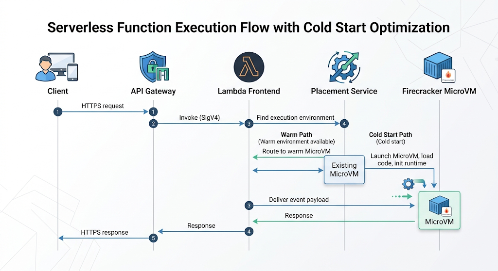{width="80%"}
    <figcaption>Lambda Invocation Example</figcaption>
    <p align='right' style="font-size:0.8em"><i>Image Source: AI Generaed (Google Gemini)</i></p>
</figure>

!!! tip "Why cold starts happen and how to reason about them"
    Cold starts are the price of scale-to-zero. They are influenced by package size, runtime choice (interpreted runtimes such as Python start faster than JVM without SnapStart), VPC attachment (largely solved since Hyperplane ENIs), and initialisation code. Provisioned Concurrency pre-initialises environments for latency-critical paths.


### Microservices — core concepts

- **Bounded context (from Domain-Driven Design):** Each service maps to one business subdomain with its own vocabulary and model — Orders, Inventory, Payments.
- **Independent deployability:** The single most important test. If deploying service A requires coordinating with service B's team, you have a distributed monolith.
- **Database per service:** Each service owns its data store and exposes it only via its API. Shared databases recreate coupling at the data layer.
- **Smart endpoints, dumb pipes:** Business logic lives in services; the network (ALB, SQS) merely transports messages, unlike heavyweight enterprise service buses.
- **Service discovery:** Services find each other via DNS (AWS Cloud Map), load balancers, or a service mesh rather than hard-coded addresses.
- **Decentralised governance:** Teams choose their own stacks (polyglot persistence, polyglot programming) within organisational guardrails.

### How microservices work internally on AWS

A containerised microservice on ECS or EKS involves:

1. **Build:** CI pipeline builds a Docker image and pushes it to **Amazon ECR**.
2. **Schedule:** The orchestrator's control plane (ECS control plane, or the EKS-managed Kubernetes control plane) decides _where_ to run task/pod replicas across Availability Zones, respecting CPU/memory requests and placement constraints.
3. **Run:** The data plane executes containers — on EC2 instances you manage, or on **Fargate**, where AWS provisions an isolated MicroVM per task (serverless containers).
4. **Register:** Tasks register with a target group (ALB) or Cloud Map for service discovery; health checks gate traffic.
5. **Communicate:** Service-to-service calls flow through the VPC network, optionally through a service mesh sidecar/proxy layer for mTLS, retries, and traffic shaping.
6. **Scale:** Metrics (CPU, request count per target, queue depth) drive horizontal scaling of task/pod counts; Cluster Autoscaler or Karpenter scales the underlying nodes on EKS.


### Event-driven — core concepts

- **Event:** An immutable record that _something happened_ — `OrderPlaced`, `PaymentCaptured`. Events describe the past; they are facts, not requests.
- **Command vs event:** A command (`ChargeCard`) asks one specific recipient to do something and implies coupling; an event announces a fact to whoever cares.
- **Producer / consumer:** Producers emit events with no knowledge of consumers; consumers subscribe with no knowledge of producers.
- **Event router / broker:** The intermediary — EventBridge (rule-based routing), SNS (pub/sub fan-out), SQS (queue buffering), Kinesis (ordered streaming).
- **Choreography vs orchestration:**
  - _Choreography:_ services react to each other's events with no central coordinator — flexible, but the overall flow is implicit.
  - _Orchestration:_ a central coordinator (Step Functions) explicitly directs the workflow — visible, auditable, but a central dependency.
- **Delivery semantics:** At-least-once delivery is the practical default; consumers must therefore be **idempotent** (safe to process the same event twice).
- **Eventual consistency:** Because consumers process events after the fact, different services' views of the world converge over time rather than instantly.

### How event-driven systems work internally

- **SQS (queue):** Producers write messages to a distributed, replicated store across multiple AZs. Consumers **poll**; a received message becomes invisible for the _visibility timeout_; the consumer must explicitly delete it after successful processing, otherwise it reappears — this is how at-least-once delivery and automatic retry are implemented. Failed messages exceeding `maxReceiveCount` move to a **dead-letter queue (DLQ)**.
- **SNS (topic):** Producers publish once; SNS **pushes** copies to every subscription (Lambda, SQS, HTTPS, email, mobile push). Fan-out is achieved by subscribing multiple SQS queues to one topic.
- **EventBridge (event bus):** Producers put events onto a bus; **rules** pattern-match on event content (JSON structure) and route matching events to targets, with input transformation, archive/replay, and a **schema registry**. EventBridge is the natural hub for cross-service and SaaS integration.
- **Kinesis Data Streams:** An ordered, partitioned log. Records with the same partition key land on the same shard, preserving order per key; consumers track their own position (checkpointing), enabling replay — fundamentally different from a queue, where consumption removes the message.

<figure markdown="span">
    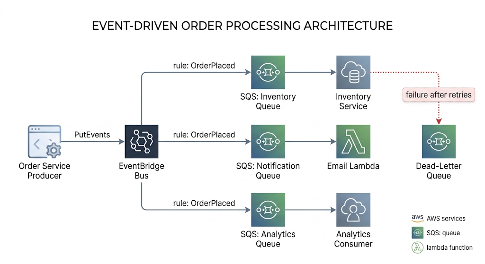{width="80%"}
    <figcaption>EvenDriven  Example</figcaption>
    <p align='right' style="font-size:0.8em"><i>Image Source: AI Generaed (Google Gemini)</i></p>
</figure>

!!! warning "At-least-once means duplicates will happen"
  SQS standard queues, SNS, and EventBridge all deliver at-least-once. Network retries and visibility-timeout expiry produce duplicates in production. Consumers must be idempotent — for example, by recording processed event IDs in DynamoDB with a conditional write.


### API-first — core concepts

- **Contract-first design:** The API specification (OpenAPI for REST, GraphQL schema, AsyncAPI or EventBridge schemas for events) is authored, reviewed, and agreed _before_ implementation.
- **API as product:** APIs have consumers, documentation, versioning, SLAs, and lifecycle management — they are products, not by-products.
- **Consumer-driven design:** The contract is shaped by what consumers need, not by what the internal data model happens to look like.
- **Versioning and backward compatibility:** Contracts evolve additively; breaking changes require new versions and deprecation timelines.
- **Mocking and parallel development:** Once the contract exists, frontend and backend teams build in parallel against mock servers generated from the specification.
- **Governance:** Style guides, linting (e.g., Spectral), and review boards keep hundreds of APIs consistent.


### How API-first works in practice

1. Architects and consumers co-author an **OpenAPI 3.x specification** (paths, schemas, status codes, auth).
2. The spec is reviewed like code (pull requests, linting against a style guide).
3. Mock servers are generated; frontend teams integrate immediately.
4. The spec is **imported into API Gateway**, which becomes the enforcing runtime: request validation against JSON Schema, authentication (Cognito, IAM, Lambda authorizers), throttling, usage plans, and stage-based versioning.
5. Server stubs and typed client SDKs are generated from the same spec, keeping implementation and contract synchronised.
6. Contract tests in CI verify the implementation never drifts from the published contract.


### How the four patterns interlock

<figure markdown="span">
    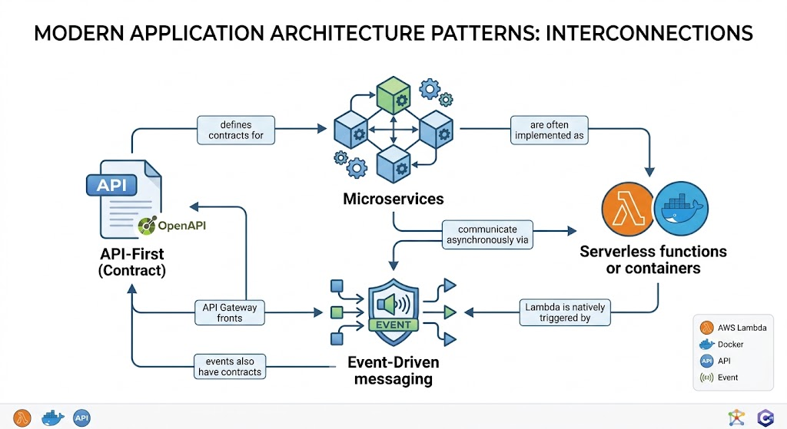{width="80%"}
    <figcaption>Modern Application Architecture Pattern</figcaption>
    <p align='right' style="font-size:0.8em"><i>Image Source: AI Generaed (Google Gemini)</i></p>
</figure>

API-first defines _what_ services promise; microservices define _how the system is decomposed_; event-driven defines _how parts communicate without coupling_; serverless defines _how compute is provisioned and billed_. Real systems combine all four.


## Architecture Components

The following components appear across all four patterns. Understanding each component's _responsibility_ matters more than memorising features.

| Component                                  | Responsibility in Cloud-Native Architecture                                                                                                             |
| ------------------------------------------ | ------------------------------------------------------------------------------------------------------------------------------------------------------- |
| **Client**                                 | Browser, mobile app, or machine consumer; initiates requests against published API contracts.                                                           |
| **Route 53**                               | DNS resolution and routing policies (latency, failover, weighted) — the global entry point.                                                             |
| **CloudFront**                             | Edge caching and TLS termination close to users; fronts API Gateway/ALB to cut latency.                                                                 |
| **API Gateway**                            | The API-first enforcement point: contract validation, authN/authZ, throttling, versioning, and routing to Lambda, HTTP backends, or other AWS services. |
| **ALB (Application Load Balancer)**        | Layer-7 routing (path/host based) to microservice target groups; health checks; commonly fronts ECS/EKS services.                                       |
| **NLB (Network Load Balancer)**            | Layer-4, ultra-low-latency TCP/UDP load balancing; static IPs; used for non-HTTP protocols and PrivateLink.                                             |
| **VPC / Subnets**                          | Network isolation boundary; public subnets for ingress, private subnets for services and data stores.                                                   |
| **Security Groups**                        | Stateful, instance/ENI-level virtual firewalls — the micro-segmentation tool between microservices.                                                     |
| **Lambda**                                 | Serverless compute: event-triggered, stateless functions; the unit of serverless deployment.                                                            |
| **ECS / Fargate**                          | AWS-native container orchestration; Fargate removes node management (serverless containers).                                                            |
| **EKS**                                    | Managed Kubernetes control plane for teams standardising on the Kubernetes ecosystem.                                                                   |
| **Docker / ECR**                           | Container packaging and the private image registry feeding ECS/EKS deployments.                                                                         |
| **DynamoDB**                               | Serverless NoSQL key-value store; single-digit-millisecond reads; the default microservice/serverless database.                                         |
| **RDS / Aurora**                           | Managed relational databases where transactions and SQL are required; Aurora Serverless v2 for elastic capacity.                                        |
| **SQS**                                    | Durable point-to-point queue: buffering, load levelling, retry, DLQ.                                                                                    |
| **SNS**                                    | Pub/sub topic: one-to-many push fan-out.                                                                                                                |
| **EventBridge**                            | Content-based event router with rules, schema registry, archive/replay; the backbone of event-driven integration.                                       |
| **Step Functions**                         | Serverless workflow orchestration: explicit state machines with retries, error handling, and human-visible execution history.                           |
| **IAM**                                    | Identity and least-privilege authorisation for every service-to-service call.                                                                           |
| **Cognito**                                | End-user identity (sign-up/sign-in, OAuth2/OIDC tokens) consumed by API Gateway authorizers.                                                            |
| **CloudWatch**                             | Metrics, logs, alarms, dashboards — the observability substrate.                                                                                        |
| **X-Ray**                                  | Distributed tracing across API Gateway, Lambda, and microservices.                                                                                      |
| **CloudFormation / Terraform / SAM / CDK** | Infrastructure as Code: the automation pillar that makes all patterns repeatable.                                                                       |

---

## Request Lifecycle

### Reference architecture: e-commerce order placement

The lifecycle below combines all four patterns: an API-first contract at the edge, a serverless synchronous path for the user-facing action, and event-driven fan-out to microservices for everything that can happen asynchronously.

<figure markdown="span">
    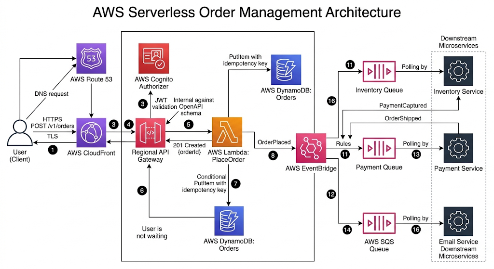{width="80%"}
    <figcaption>AWS Serverless Order Management Architecture</figcaption>
    <p align='right' style="font-size:0.8em"><i>Image Source: AI Generaed (Google Gemini)</i></p>
</figure>

**Synchronous segment (steps 1–13):** The user waits only for authentication, validation, order persistence, and event emission — a minimal, fast, highly available path.

**Asynchronous segment (after the response):** Inventory reservation, payment capture, email confirmation, analytics, and fraud checks all proceed in parallel, each with its own retry policy and DLQ. If the email service is down for an hour, orders still succeed; messages wait in the queue.

!!! tip "Architectural rule of thumb"
Keep the synchronous path as short as the business allows. Everything the user does not need to see _in the response_ should be an event. This single decision drives most of a system's resilience and latency characteristics.

### Synchronous vs asynchronous communication

| Aspect                    | Synchronous (REST/gRPC via ALB or API Gateway) | Asynchronous (SQS/SNS/EventBridge)           |
| ------------------------- | ---------------------------------------------- | -------------------------------------------- |
| Caller behaviour          | Blocks waiting for a response                  | Fire-and-forget; response via callback/event |
| Temporal coupling         | High — callee must be up now                   | None — broker buffers                        |
| Failure propagation       | Cascades up the call chain                     | Absorbed by queue; retried later             |
| Latency perceived by user | Sum of the whole chain                         | Only the enqueue time                        |
| Consistency               | Immediate                                      | Eventual                                     |
| Debugging                 | Simpler (one trace)                            | Harder (correlation IDs, tracing required)   |
| Typical use               | Queries, user-facing reads                     | Side effects, integrations, heavy work       |

---

## AWS Service Deep Dive

This topic spans several services; the deep dive focuses on the four services that most directly embody each pattern.

### AWS Lambda (serverless compute)

| Attribute                 | Details                                                                                                                                                                                            |
| ------------------------- | -------------------------------------------------------------------------------------------------------------------------------------------------------------------------------------------------- |
| **Purpose**               | Run code in response to events without managing servers.                                                                                                                                           |
| **Architecture**          | Firecracker MicroVMs on a multi-tenant worker fleet; frontend/placement services route invocations; poller fleets consume streams/queues.                                                          |
| **Key features**          | 20+ runtimes and container image support (up to 10 GB images), layers, versions and aliases, destinations, Function URLs, SnapStart (JVM/.NET/Python), response streaming.                         |
| **Limitations**           | 15-minute maximum execution; 128 MB–10,240 MB memory; 512 MB–10 GB ephemeral `/tmp`; 6 MB synchronous payload (20 MB with streaming responses in supported configurations); stateless.             |
| **Pricing**               | Per request + GB-second of duration; Provisioned Concurrency billed while enabled; free tier of 1M requests/month.                                                                                 |
| **Performance**           | Warm invocations add single-digit ms; CPU scales with memory; cold starts range from tens of ms (Python/Node) to seconds (large JVM apps without SnapStart).                                       |
| **Scaling**               | Each function scales up to the account/Region concurrency pool (default 1,000, raisable); burst scaling of 1,000 new environments per 10 seconds per function.                                     |
| **Availability**          | Regional service automatically spread across multiple AZs — multi-AZ HA with zero configuration.                                                                                                   |
| **Security**              | Execution role (IAM) per function; resource-based policies control who may invoke; optional VPC attachment; environment variables encrypted with KMS.                                              |
| **Common configurations** | Memory tuning (use AWS Lambda Power Tuning), reserved concurrency to protect downstream databases, DLQ/destinations for async failures, SQS event source with batch size and `maximumConcurrency`. |

### Amazon API Gateway (API-first)

| Attribute                  | Details                                                                                                                                                                                    |
| -------------------------- | ------------------------------------------------------------------------------------------------------------------------------------------------------------------------------------------ |
| **Purpose**                | Fully managed front door for APIs: publish, secure, throttle, version, and monitor.                                                                                                        |
| **Architecture**           | Regional fleets behind CloudFront (edge-optimised endpoints); integrates with Lambda, HTTP backends, VPC Link (private ALB/NLB), and direct AWS service integrations.                      |
| **API types**              | **REST API** (full features: API keys, usage plans, request validation, caching), **HTTP API** (cheaper, lower latency, JWT auth, subset of features), **WebSocket API** (bidirectional).  |
| **Key features**           | OpenAPI import/export, request/response validation and mapping, Cognito/IAM/Lambda authorizers, per-client throttling via usage plans, stage variables, canary releases, response caching. |
| **Limitations**            | 29-second integration timeout (extendable in some Regions with quota changes for REST APIs); 10 MB payload; regional throttle defaults (10,000 RPS, burst 5,000 — raisable).               |
| **Pricing**                | Per million requests (HTTP API significantly cheaper than REST API) + data transfer + optional cache.                                                                                      |
| **Scaling / availability** | Fully managed, multi-AZ, scales automatically to account limits.                                                                                                                           |
| **Security**               | TLS enforced, WAF integration, mutual TLS, resource policies (e.g., restrict to a VPC or IP range), private APIs via interface VPC endpoints.                                              |

### Amazon EventBridge (event-driven)

| Attribute        | Details                                                                                                                                                                                                                           |
| ---------------- | --------------------------------------------------------------------------------------------------------------------------------------------------------------------------------------------------------------------------------- |
| **Purpose**      | Serverless event bus routing events between AWS services, your applications, and SaaS providers based on content rules.                                                                                                           |
| **Architecture** | Default bus (AWS service events), custom buses, partner buses; rules pattern-match JSON and forward to up to 5 targets each; Pipes connect a single source to a single target with filtering/enrichment; Scheduler replaces cron. |
| **Key features** | Schema registry with code bindings, archive and replay, input transformers, cross-account/cross-Region routing, DLQs per target, API destinations (call external HTTPS APIs with auth).                                           |
| **Limitations**  | At-least-once delivery, no ordering guarantees, 256 KB event size, default 10,000 PutEvents/sec (Region-dependent, raisable); latency typically ~0.5 s (higher than SNS).                                                         |
| **Pricing**      | Per million events published (AWS service events on the default bus are free to receive).                                                                                                                                         |
| **Availability** | Regional, multi-AZ, with global endpoints for cross-Region failover.                                                                                                                                                              |
| **Security**     | IAM for publish/manage, resource policies for cross-account buses, KMS encryption at rest.                                                                                                                                        |

### Amazon ECS with AWS Fargate (microservices runtime)

| Attribute        | Details                                                                                                                                                                                        |
| ---------------- | ---------------------------------------------------------------------------------------------------------------------------------------------------------------------------------------------- |
| **Purpose**      | Orchestrate containerised microservices; Fargate provides serverless container execution.                                                                                                      |
| **Architecture** | Control plane (AWS-managed) schedules **tasks** (from task definitions) into **services** that maintain desired count behind ALB target groups; Fargate runs each task in an isolated MicroVM. |
| **Key features** | Blue/green deployments via CodeDeploy, circuit-breaker rollback, Service Connect / Cloud Map discovery, capacity providers (Fargate, Fargate Spot, EC2), task-level IAM roles.                 |
| **Limitations**  | Fargate task sizes up to 16 vCPU / 120 GB; no GPU on classic Fargate; no privileged containers; less ecosystem flexibility than Kubernetes.                                                    |
| **Pricing**      | Fargate: per vCPU-second and GB-second; EC2 launch type: you pay for instances; Fargate Spot up to ~70% discount for interruption-tolerant tasks.                                              |
| **Scaling**      | Service Auto Scaling on CloudWatch metrics (CPU, memory, ALB request count per target, custom/queue-depth metrics).                                                                            |
| **Availability** | Spread tasks across AZs via the service scheduler; ALB health checks replace failed tasks automatically.                                                                                       |
| **Security**     | Task execution role (pull image, write logs) vs task role (application permissions); security groups per task with `awsvpc` networking; images scanned in ECR.                                 |

!!! note "ECS vs EKS decision"
ECS is simpler, deeply AWS-integrated, and has no control-plane fee; EKS provides Kubernetes portability and its ecosystem (Helm, operators, service meshes) at the cost of a per-cluster hourly fee and greater operational complexity. Choose EKS when the organisation is committed to Kubernetes skills or multi-cloud portability; otherwise ECS/Fargate is the pragmatic default for AWS-native microservices.

---

## Important AWS Terminology

| Term                              | Meaning                                                                                                                                  |
| --------------------------------- | ---------------------------------------------------------------------------------------------------------------------------------------- |
| **Cloud-native**                  | Applications designed to exploit elastic, managed, distributed cloud infrastructure — loosely coupled, resilient, observable, automated. |
| **FaaS**                          | Function as a Service; event-triggered, provider-managed code execution (Lambda).                                                        |
| **Cold start**                    | Latency of creating and initialising a new Lambda execution environment.                                                                 |
| **Execution environment**         | The Firecracker MicroVM plus runtime in which a Lambda invocation runs; handles one request at a time.                                   |
| **Concurrency (Lambda)**          | Number of simultaneous execution environments; reserved concurrency caps it, provisioned concurrency pre-warms it.                       |
| **Bounded context**               | A DDD term: the boundary within which a domain model applies; the natural seam for a microservice.                                       |
| **Distributed monolith**          | Anti-pattern: services that are physically separate but must be deployed or changed together.                                            |
| **Database per service**          | Each microservice exclusively owns its data store; others access data only via its API or events.                                        |
| **Event**                         | Immutable record of a fact that occurred; past tense (`OrderPlaced`).                                                                    |
| **Command**                       | A directed request for a specific action (`ChargeCard`); implies one handler.                                                            |
| **Choreography**                  | Event-driven coordination without a central controller.                                                                                  |
| **Orchestration**                 | Central workflow coordination (Step Functions) with explicit state.                                                                      |
| **Fan-out**                       | One event delivered to many consumers (SNS→multiple SQS).                                                                                |
| **Dead-letter queue (DLQ)**       | Queue receiving messages that repeatedly failed processing, isolating poison messages.                                                   |
| **Visibility timeout**            | Period during which a received SQS message is hidden from other consumers pending deletion.                                              |
| **Idempotency**                   | Property that processing the same message/request multiple times yields the same result.                                                 |
| **Eventual consistency**          | Distributed replicas converge over time; reads may briefly see stale data.                                                               |
| **At-least-once delivery**        | Broker guarantees delivery but may duplicate; the consumer handles duplicates.                                                           |
| **OpenAPI**                       | Standard, machine-readable specification format for REST API contracts.                                                                  |
| **Contract testing**              | Automated verification that a service implementation conforms to its published API contract.                                             |
| **Throttling**                    | Rejecting excess requests (HTTP 429) to protect backends; configured per stage/client in API Gateway.                                    |
| **Sidecar / service mesh**        | Proxy deployed beside each service instance handling mTLS, retries, and traffic policy (e.g., Envoy).                                    |
| **Saga**                          | Pattern managing a distributed transaction as a sequence of local transactions with compensating actions.                                |
| **Backpressure / load levelling** | Using a queue to smooth bursts so consumers process at a sustainable rate.                                                               |

---

## Configuration Options

### Serverless configuration decisions (Lambda)

| Setting                  | Options                                                                          | Architectural Implication                                                                                           |
| ------------------------ | -------------------------------------------------------------------------------- | ------------------------------------------------------------------------------------------------------------------- |
| **Memory size**          | 128 MB – 10,240 MB                                                               | CPU scales with memory; more memory often _reduces_ cost by finishing faster. Tune empirically.                     |
| **Packaging**            | ZIP archive (250 MB unzipped) or container image (10 GB)                         | Container images suit large ML dependencies and unify CI with container workflows.                                  |
| **Concurrency**          | Unreserved (shared pool), Reserved (cap), Provisioned (pre-warmed)               | Reserved protects downstream RDS from connection storms; Provisioned removes cold starts for latency-critical APIs. |
| **Networking**           | No VPC (default) or VPC-attached                                                 | VPC attachment is required to reach private RDS/ElastiCache; needs NAT Gateway or VPC endpoints for AWS API access. |
| **Invocation model**     | Synchronous, Asynchronous, Event source mapping (poll-based)                     | Determines retry semantics: async retries twice then DLQ; poll-based retries per queue configuration.               |
| **Event source mapping** | Batch size, batch window, `maximumConcurrency`, filter criteria, bisect on error | Filtering at the source avoids paying for invocations that would immediately discard the event.                     |
| **Architecture**         | x86_64 or arm64 (Graviton2)                                                      | Graviton typically offers ~20% better price-performance.                                                            |

### Microservices runtime configuration

| Setting                             | Options                                                        | Architectural Implication                                                                                                           |
| ----------------------------------- | -------------------------------------------------------------- | ----------------------------------------------------------------------------------------------------------------------------------- |
| **Launch type / capacity provider** | Fargate, Fargate Spot, EC2                                     | Fargate for operational simplicity; EC2 for GPU, custom AMIs, or high steady-state density; Spot for interruption-tolerant workers. |
| **Network mode (ECS)**              | `awsvpc`, `bridge`, `host`                                     | `awsvpc` gives each task its own ENI and security group — required for Fargate and for per-service micro-segmentation.              |
| **Deployment type**                 | Rolling update, Blue/Green (CodeDeploy), Canary                | Blue/green enables instant rollback; canary limits blast radius of a bad release.                                                   |
| **Service discovery**               | ALB target groups, ECS Service Connect, Cloud Map DNS          | Internal service-to-service traffic usually avoids the ALB hop for latency and cost.                                                |
| **Scaling policy**                  | Target tracking, step scaling, scheduled                       | Target tracking on _request count per target_ or _queue depth_ is usually superior to CPU for request-driven services.              |
| **EKS node provisioning**           | Managed node groups, self-managed, Fargate profiles, Karpenter | Karpenter provisions right-sized nodes just-in-time, improving bin-packing and cost.                                                |

### Event-driven configuration

| Setting                         | Options                                               | Architectural Implication                                                                                                                                                            |
| ------------------------------- | ----------------------------------------------------- | ------------------------------------------------------------------------------------------------------------------------------------------------------------------------------------ |
| **Queue type**                  | SQS Standard vs FIFO                                  | FIFO guarantees ordering and exactly-once _processing_ within a message group but caps throughput (3,000 msg/s with batching per group); Standard is nearly unlimited but unordered. |
| **Visibility timeout**          | Seconds to 12 hours                                   | Must exceed the consumer's worst-case processing time, otherwise duplicate processing occurs.                                                                                        |
| **`maxReceiveCount` / redrive** | Integer + DLQ target                                  | Prevents poison messages from blocking the queue indefinitely.                                                                                                                       |
| **Long polling**                | `ReceiveMessageWaitTimeSeconds` 0–20                  | Long polling reduces empty receives and cost, and lowers latency.                                                                                                                    |
| **Message retention**           | 1 minute – 14 days                                    | Longer retention buys recovery time during extended consumer outages.                                                                                                                |
| **EventBridge rule targets**    | Up to 5 targets, input transformer, DLQ, retry policy | Always configure a target DLQ; otherwise failed deliveries are silently lost after retries.                                                                                          |
| **Kinesis shards / on-demand**  | Provisioned shards vs on-demand                       | Ordering is per shard; shard count determines throughput and consumer parallelism.                                                                                                   |

### API-first configuration

| Setting                 | Options                                               | Architectural Implication                                                                                                         |
| ----------------------- | ----------------------------------------------------- | --------------------------------------------------------------------------------------------------------------------------------- |
| **API type**            | REST, HTTP, WebSocket                                 | HTTP API for simple, cost-sensitive Lambda proxies; REST API when you need API keys, usage plans, request validation, or caching. |
| **Endpoint type**       | Edge-optimised, Regional, Private                     | Private APIs (via interface VPC endpoints) for internal-only microservice contracts.                                              |
| **Authorisation**       | IAM, Cognito user pools, Lambda authorizer, JWT, mTLS | Cognito for end users; IAM for service-to-service; Lambda authorizers for custom/legacy token schemes.                            |
| **Throttling**          | Account, stage, method, and usage-plan level          | Per-client usage plans prevent one tenant from exhausting shared capacity.                                                        |
| **Caching**             | 0.5 GB – 237 GB, per-stage TTL                        | Cuts backend invocations and cost for read-heavy endpoints; must handle cache invalidation.                                       |
| **Versioning strategy** | Path (`/v1`), header, or stage-based                  | Path versioning is explicit and cache-friendly; never break an existing version.                                                  |

---

## Design Considerations

| Quality                    | Serverless                                                         | Microservices                                                        | Event-Driven                                                        | API-First                                                                     |
| -------------------------- | ------------------------------------------------------------------ | -------------------------------------------------------------------- | ------------------------------------------------------------------- | ----------------------------------------------------------------------------- |
| **Scalability**            | Automatic, per-invocation, to thousands of concurrent environments | Per-service horizontal scaling; scale the hot service only           | Broker absorbs bursts; consumers scale independently                | Gateway throttling protects backends and enables graceful degradation         |
| **Availability**           | Multi-AZ by default, no configuration                              | Requires multi-AZ task placement and health checks                   | Broker is multi-AZ and durable; buffers consumer outages            | Managed gateway is multi-AZ; contracts enable failover to alternate backends  |
| **Reliability**            | Built-in retries; must design for idempotency                      | Failure isolated per service; requires circuit breakers and timeouts | Retries + DLQ give at-least-once durability                         | Validation rejects malformed input before it reaches services                 |
| **Durability**             | Compute is ephemeral — state must be externalised                  | Persist to DynamoDB/RDS/S3, never to container disk                  | Messages replicated across AZs; EventBridge archive enables replay  | Contracts version data schemas, protecting stored payloads                    |
| **Latency**                | Cold starts on the tail; warm path is fast                         | Predictable warm containers; extra network hop per call              | Adds broker latency but removes it from the user path               | Extra hop through the gateway (single-digit ms) plus optional caching benefit |
| **Cost**                   | Zero when idle; can exceed containers at sustained high volume     | Pay for running capacity, idle included                              | Per-message cost, trivially small; saves compute by smoothing peaks | Per-request gateway cost; caching reduces backend spend                       |
| **Performance**            | CPU tied to memory; concurrency model avoids thread contention     | Full control over runtime tuning and connection pooling              | Throughput-oriented rather than latency-oriented                    | Request validation and caching offload work from services                     |
| **Maintainability**        | Small functions are easy to read, hard to navigate at scale        | Small codebases per team; clear ownership                            | Loose coupling eases change; flows become implicit                  | Contract is the durable, documented source of truth                           |
| **Operational complexity** | Lowest infrastructure burden; highest observability burden         | Highest: orchestration, networking, deployment pipelines per service | Debugging distributed async flows is genuinely hard                 | Governance overhead: style guides, versioning, deprecation                    |

!!! warning "The complexity conservation principle"
These patterns do not remove complexity; they _relocate_ it. Complexity moves out of the codebase and into the network, the deployment pipeline, and the observability stack. A team without CI/CD maturity and distributed tracing will find microservices slower and less reliable than the monolith they replaced.

### When to choose which pattern

| Scenario                                                          | Recommended Approach                                | Reasoning                                                                                                    |
| ----------------------------------------------------------------- | --------------------------------------------------- | ------------------------------------------------------------------------------------------------------------ |
| New product, small team, unclear domain boundaries                | Modular monolith on Fargate, API-first from day one | Avoid distributed complexity before you understand the domain; keep clean module seams for later extraction. |
| Spiky, unpredictable traffic (marketing campaigns, tax season)    | Serverless (Lambda + DynamoDB on-demand)            | Scale-to-zero economics and automatic burst scaling.                                                         |
| Sustained high throughput, steady load, long-running processes    | Containers on ECS/EKS with Savings Plans or Spot    | Predictable cost per unit of compute beats per-invocation pricing at scale.                                  |
| Many downstream systems reacting to the same business fact        | Event-driven with EventBridge fan-out               | Adding a consumer requires no change to the producer.                                                        |
| Multi-step business process needing auditability and compensation | Step Functions orchestration (Saga)                 | Explicit state, visible execution history, built-in retries and compensations.                               |
| Public or partner-facing integration                              | API-first with API Gateway                          | Contract stability, throttling, authentication, and monetisation via usage plans.                            |
| Strict sub-10 ms latency at high, constant RPS                    | Containers with warm connection pools, possibly NLB | Avoids cold starts and gateway overhead.                                                                     |
| Legacy migration with limited cloud skills                        | Rehost, then strangle incrementally                 | The Strangler Fig pattern reduces risk versus a big-bang rewrite.                                            |

---

## AWS Best Practices

Mapped to the six pillars of the **AWS Well-Architected Framework**, plus the **Serverless Application Lens**.

### Operational Excellence

- Define all infrastructure as code (SAM, CDK, CloudFormation, or Terraform); no console-created production resources.
- Deploy small changes frequently through automated pipelines with automated rollback (CodeDeploy canary, ECS deployment circuit breaker).
- Instrument structured JSON logging with correlation IDs propagated across every service hop.
- Run game days: deliberately fail a service, an AZ, or a consumer and verify the system degrades as designed.
- Maintain runbooks per service and per alarm; alarms without runbooks generate noise, not action.

### Security

- One IAM role per function, per task, per service — never a shared "application role".
- Enforce least privilege with resource-level ARNs and condition keys; avoid `"Resource": "*"`.
- Authenticate at the edge (Cognito/OIDC at API Gateway) _and_ authorise between services (IAM SigV4, mTLS in the mesh) — do not rely on the network perimeter alone.
- Encrypt everywhere: TLS in transit, KMS at rest for DynamoDB, S3, SQS, EventBridge; Secrets Manager for credentials with automatic rotation.
- Place compute in private subnets; expose only load balancers and gateways publicly; use VPC endpoints to keep AWS API traffic off the internet.
- Validate all input at the gateway against JSON Schema; attach AWS WAF for injection and bot protection.

### Reliability

- Design every consumer to be idempotent; assume duplicate delivery.
- Configure DLQs on every asynchronous target and alarm on DLQ depth greater than zero.
- Apply timeouts, retries with exponential backoff and jitter, and circuit breakers on every synchronous call.
- Isolate resources with the bulkhead pattern: reserved concurrency per function, separate queues per consumer, separate connection pools.
- Spread tasks and data across at least three Availability Zones; test AZ failure.
- Prefer static stability: the system should keep serving during a dependency's control-plane outage rather than needing to change state to survive.

### Performance Efficiency

- Choose the right compute for the workload profile: Lambda for bursty and event-driven, Fargate for steady request/response, EC2/EKS for specialised or GPU workloads.
- Tune Lambda memory using AWS Lambda Power Tuning rather than defaulting to 128 MB.
- Cache aggressively at every layer: CloudFront for static and cacheable API responses, API Gateway cache, ElastiCache/DAX for hot data.
- Initialise SDK clients and database connections _outside_ the Lambda handler to reuse them across invocations.
- Use event filtering (Lambda event source filters, EventBridge patterns) so compute is only invoked for relevant events.
- Adopt Graviton (arm64) where the runtime supports it.

### Cost Optimization

- Right-size continuously: Lambda memory, Fargate task CPU/memory, and container requests/limits.
- Use Fargate Spot and EC2 Spot for fault-tolerant, interruptible work; Compute Savings Plans for steady baseline load.
- Batch messages (SQS batch size, Kinesis batching) to reduce invocation counts.
- Prefer HTTP APIs over REST APIs when advanced features are unnecessary — a substantial per-request saving.
- Use DynamoDB on-demand for unpredictable traffic and provisioned with auto scaling for predictable traffic.
- Apply S3 lifecycle policies and log retention limits; CloudWatch Logs with infinite retention is a common silent cost.
- Tag every resource by service, team, and environment to enable cost allocation and accountability.

### Sustainability

- Scale-to-zero architectures consume no energy when idle — serverless is the sustainability-optimal choice for intermittent workloads.
- Improved bin-packing (Fargate right-sizing, Karpenter consolidation) reduces the physical footprint per unit of work.
- Move infrequently accessed data to cooler storage classes; delete data that has no retention requirement.
- Graviton processors deliver more work per watt.

---

## Security Considerations

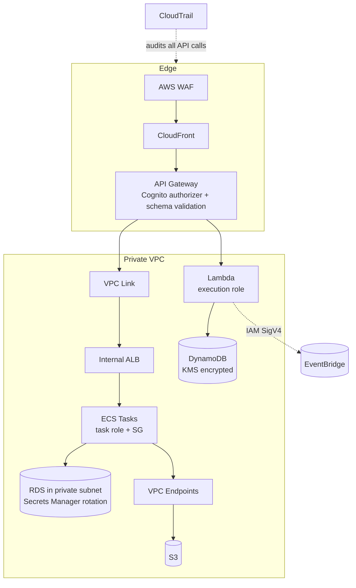

- **IAM and least privilege.** Every Lambda function has its own execution role; every ECS task has its own task role, distinct from the task _execution_ role used only to pull images and write logs. Scope policies to specific resource ARNs and use condition keys (`aws:SourceArn`, `aws:PrincipalOrgID`) to prevent the confused-deputy problem.
- **Service-to-service authorisation.** In event-driven systems, control who may `PutEvents` on a bus and which targets a rule may invoke. Resource policies on SQS queues, SNS topics, and Lambda functions restrict cross-account access explicitly.
- **Encryption.** TLS 1.2+ in transit everywhere, including internal service calls. KMS customer-managed keys where key rotation policy, cross-account grants, or auditability are required; AWS-managed keys otherwise.
- **Secrets.** Never place credentials in environment variables in plaintext or in container images. Use Secrets Manager (automatic rotation) or SSM Parameter Store SecureString, fetched at initialisation and cached.
- **Security groups vs NACLs.** Security groups are stateful and are the primary micro-segmentation tool between microservices (allow the Orders service SG to reach the Orders database SG on 5432 only). NACLs are stateless, subnet-level, and used for coarse deny rules such as blocking known-bad CIDRs.
- **Public vs private resources.** Only ALBs, NLBs, CloudFront, and API Gateway should be internet-facing. Compute and data live in private subnets. Private APIs and PrivateLink keep partner integrations off the public internet entirely.
- **Logging and audit.** CloudTrail records every control-plane API call (who created that queue, who changed that IAM policy) and is the foundation of forensic investigation. Enable it organisation-wide with log file validation and a separate, restricted logging account.
- **Compliance.** The shared responsibility model applies: AWS secures the cloud, you secure what you build in it. Serverless narrows _your_ share (no OS patching) but never eliminates application-layer responsibility for authorisation, input validation, and data handling.

!!! danger "Common security failure in event-driven systems"
Teams often authenticate rigorously at the API edge and then treat the internal event bus as trusted. Any component that can publish to the bus can then trigger privileged downstream actions. Authorise _publishing_ and _consuming_ explicitly, validate event payloads against registered schemas, and never let an event carry an unverified `userId` that downstream services trust implicitly.

---

## Performance Optimization

- **Caching.** CloudFront for static assets and cacheable GET responses; API Gateway stage cache keyed on path and selected headers; DAX in front of DynamoDB for microsecond reads; ElastiCache (Redis) for session and computed data. Every cache layer removes both latency and cost.
- **Auto scaling.** Prefer demand-proportional signals: ALB `RequestCountPerTarget` for web tiers, `ApproximateNumberOfMessagesVisible` (or backlog per task) for queue workers, and Application Auto Scaling target tracking rather than manual step policies.
- **Load balancing.** ALB for HTTP with path/host routing and least-outstanding-requests; NLB for extreme throughput and non-HTTP protocols; cross-zone load balancing enabled to avoid hot AZs.
- **Parallelism.** Fan out with SNS/EventBridge so independent work happens concurrently; use Step Functions `Map` state (including distributed map for very large datasets) for parallel batch processing; increase Kinesis shards or SQS consumer concurrency to raise throughput.
- **Connection reuse.** In Lambda, create clients and pool connections in the initialisation phase. For relational databases behind Lambda, use **RDS Proxy** to prevent connection exhaustion when concurrency spikes.
- **Storage optimisation.** Design DynamoDB partition keys for even distribution to avoid hot partitions; use single-table design where access patterns justify it; use S3 Transfer Acceleration or multipart uploads for large objects; choose the appropriate storage class per access pattern.
- **Payload discipline.** Keep events small; use the **claim-check pattern** — store the large payload in S3 and put only the pointer in the event — to stay within 256 KB message limits and reduce transfer cost.
- **Monitoring for performance.** Track p50, p90, and p99 latency, not averages. Tail latency is where cold starts, GC pauses, and retries reveal themselves.

---

## Cost Optimization

| Lever                                 | How It Applies to These Patterns                                                                                                                 |
| ------------------------------------- | ------------------------------------------------------------------------------------------------------------------------------------------------ |
| **Pay-as-you-go**                     | Lambda, API Gateway, SQS, SNS, EventBridge, DynamoDB on-demand, and Fargate all bill per unit of work or per second — no idle capacity charges.  |
| **Reserved capacity / Savings Plans** | Compute Savings Plans cover Lambda, Fargate, and EC2 with 1- or 3-year commitments; apply to the steady baseline, leave the peak on-demand.      |
| **Spot**                              | Fargate Spot and EC2 Spot for queue consumers, batch jobs, and CI runners — workloads that tolerate a two-minute interruption notice.            |
| **Storage classes**                   | S3 Intelligent-Tiering for unpredictable access; Glacier tiers for archives; EBS gp3 over gp2 for cheaper baseline IOPS.                         |
| **Lifecycle policies**                | Expire S3 objects, transition logs, and set CloudWatch Logs retention (commonly 30–90 days) instead of the default "never expire".               |
| **Rightsizing**                       | Lambda Power Tuning for memory; Compute Optimizer for EC2/Fargate/Lambda recommendations; remove over-provisioned container CPU/memory requests. |
| **Architectural levers**              | Filter events before invoking compute; batch SQS/Kinesis records; choose HTTP API over REST API; use ARM/Graviton; cache to avoid recomputation. |
| **Cost Explorer**                     | Analyse spend by tag, service, and account; identify month-over-month anomalies; forecast.                                                       |
| **AWS Budgets & Anomaly Detection**   | Alert before overspend rather than after the invoice.                                                                                            |
| **Trusted Advisor**                   | Flags idle load balancers, unattached EIPs, underutilised instances, and missing Savings Plan coverage.                                          |

!!! tip "The serverless cost crossover"
Lambda is dramatically cheaper than containers at low and bursty volume, and can become more expensive at very high, constant volume. Model the crossover with real numbers rather than dogma: estimate requests per month, average duration, and memory, then compare against an equivalently sized Fargate service with Savings Plans. Include _engineering time saved_ — operational cost is a real cost.

---

## Monitoring and Observability

Distributed systems fail in ways that are invisible from any single component. Observability is not optional in cloud-native architecture; it is a first-class design requirement.

| Tool                                     | Role                                                                                                                                                                                                                 |
| ---------------------------------------- | -------------------------------------------------------------------------------------------------------------------------------------------------------------------------------------------------------------------- |
| **CloudWatch Metrics**                   | Time-series data: Lambda `Invocations`, `Errors`, `Throttles`, `Duration`, `ConcurrentExecutions`; SQS `ApproximateAgeOfOldestMessage`; ALB `TargetResponseTime`, `HTTPCode_Target_5XX`; ECS CPU/memory utilisation. |
| **CloudWatch Logs & Logs Insights**      | Centralised structured logs; query across services with a SQL-like language; use metric filters to turn log patterns into alarms.                                                                                    |
| **CloudWatch Alarms**                    | Threshold and anomaly-detection alarms feeding SNS, on-call paging, or automated remediation.                                                                                                                        |
| **CloudWatch Dashboards**                | Per-service and per-journey views combining metrics, logs, and alarms.                                                                                                                                               |
| **AWS X-Ray**                            | Distributed tracing: a single trace shows the API Gateway hop, the Lambda cold start, the DynamoDB call, and the downstream service, with timing for each segment.                                                   |
| **CloudTrail**                           | Control-plane audit: who changed configuration, when, and from where.                                                                                                                                                |
| **AWS Distro for OpenTelemetry (ADOT)**  | Vendor-neutral instrumentation for traces and metrics across ECS, EKS, and Lambda.                                                                                                                                   |
| **Container Insights / Lambda Insights** | Deeper runtime metrics for containers and functions.                                                                                                                                                                 |
| **EventBridge Archive & Replay**         | Operational recovery tool: replay historical events after fixing a consumer bug.                                                                                                                                     |

### The three pillars applied

- **Metrics** answer _is something wrong?_ — Alarm on business-meaningful signals (orders per minute dropping), not only infrastructure signals.
- **Logs** answer _what exactly happened?_ — Emit structured JSON with `correlationId`, `service`, `version`, and `eventId` on every line.
- **Traces** answer _where is the time going, and which hop failed?_ — Essential once a request crosses three or more services.

!!! warning "The asynchronous debugging problem"
In event-driven systems the user-facing request succeeds while the real work fails silently in a consumer twenty seconds later. Without DLQ alarms, correlation IDs, and tracing, this failure is invisible until a customer complains. Instrument asynchronous paths _more_ heavily than synchronous ones, and always alarm on `ApproximateAgeOfOldestMessage` and DLQ depth.

### Key alarms every cloud-native system should have

| Alarm                                            | Why                                                     |
| ------------------------------------------------ | ------------------------------------------------------- |
| Lambda `Errors` > 0 (per function, sustained)    | Functional failure.                                     |
| Lambda `Throttles` > 0                           | Concurrency limit reached; requests are being rejected. |
| SQS DLQ `ApproximateNumberOfMessagesVisible` > 0 | Messages permanently failed processing.                 |
| SQS `ApproximateAgeOfOldestMessage` > SLA        | Consumers cannot keep up; backlog growing.              |
| ALB `HTTPCode_ELB_5XX` / `UnHealthyHostCount`    | Service instances failing health checks.                |
| API Gateway `4XXError` spike                     | Contract violation, auth failure, or client bug.        |
| API Gateway `Latency` p99 breach                 | Backend degradation.                                    |
| EventBridge `FailedInvocations`                  | Rule target could not be invoked.                       |

---

## Integration with Other AWS Services

| Service                                                  | Why It Integrates With These Patterns                                                                                          |
| -------------------------------------------------------- | ------------------------------------------------------------------------------------------------------------------------------ |
| **API Gateway → Lambda**                                 | The canonical serverless API-first pairing: contract enforcement at the gateway, business logic in functions.                  |
| **Lambda → DynamoDB**                                    | Both scale horizontally and serverlessly; DynamoDB Streams turn table changes into events, closing the loop into event-driven. |
| **S3 → Lambda**                                          | Object-created events trigger processing pipelines (image resizing, ETL) with no polling.                                      |
| **EventBridge → Step Functions**                         | Events start orchestrated workflows that need retries, branching, and compensation.                                            |
| **SNS → SQS → Lambda**                                   | The classic durable fan-out: SNS distributes, SQS buffers and retries per consumer, Lambda processes.                          |
| **DynamoDB Streams / Kinesis → Lambda**                  | Change-data-capture for materialised views, CQRS read models, and audit trails.                                                |
| **ECS/EKS → ALB → API Gateway (VPC Link)**               | Containerised microservices published through a governed API front door.                                                       |
| **Cognito → API Gateway**                                | Managed user identity issuing JWTs validated at the edge.                                                                      |
| **Secrets Manager / Parameter Store → Lambda & ECS**     | Runtime credential injection with rotation.                                                                                    |
| **CodePipeline / CodeBuild / CodeDeploy → ECS & Lambda** | CI/CD for independent service deployment, canary releases, and automatic rollback.                                             |
| **ECR → ECS/EKS/Lambda**                                 | Single image registry serving both container orchestrators and container-packaged functions.                                   |
| **X-Ray / CloudWatch → everything**                      | Cross-cutting observability spanning synchronous and asynchronous hops.                                                        |
| **AWS Cloud Map / Service Connect**                      | Service discovery for dynamic microservice endpoints.                                                                          |
| **Step Functions → Lambda, ECS, SNS, SQS, DynamoDB**     | Direct SDK integrations remove "glue" Lambdas entirely, reducing cost and failure modes.                                       |

---

## Common Architecture Patterns

### Serverless web application


<figure markdown="span">
    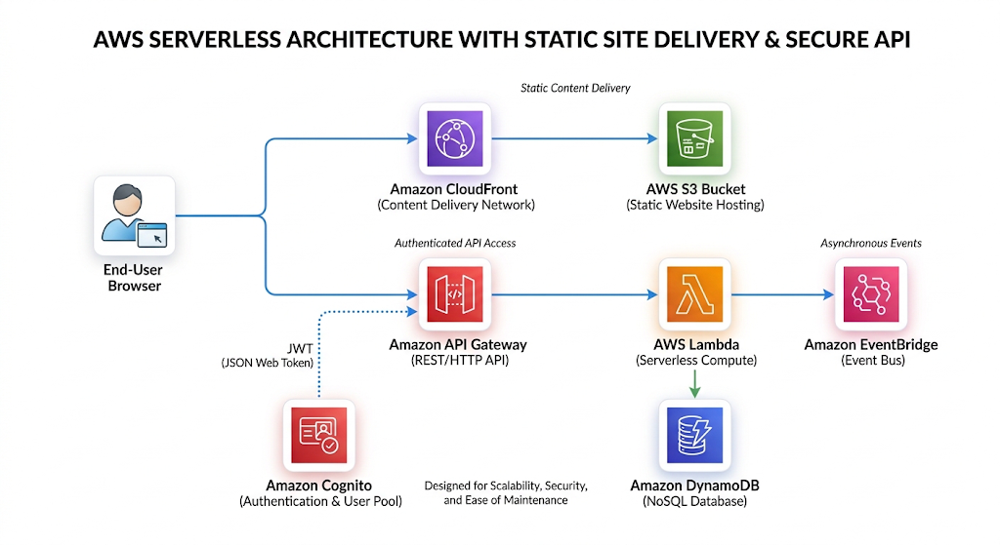{width="80%"}
    <figcaption>Example : AWS Serverless Archiecture with static Site Delivery and Secure API</figcaption>
    <p align='right' style="font-size:0.8em"><i>Image Source: AI Generaed (Google Gemini)</i></p>
</figure>


### Microservices with an API gateway

Each service is independently deployable, owns its data, and is reachable only through the gateway or an internal ALB.

<figure markdown="span">
    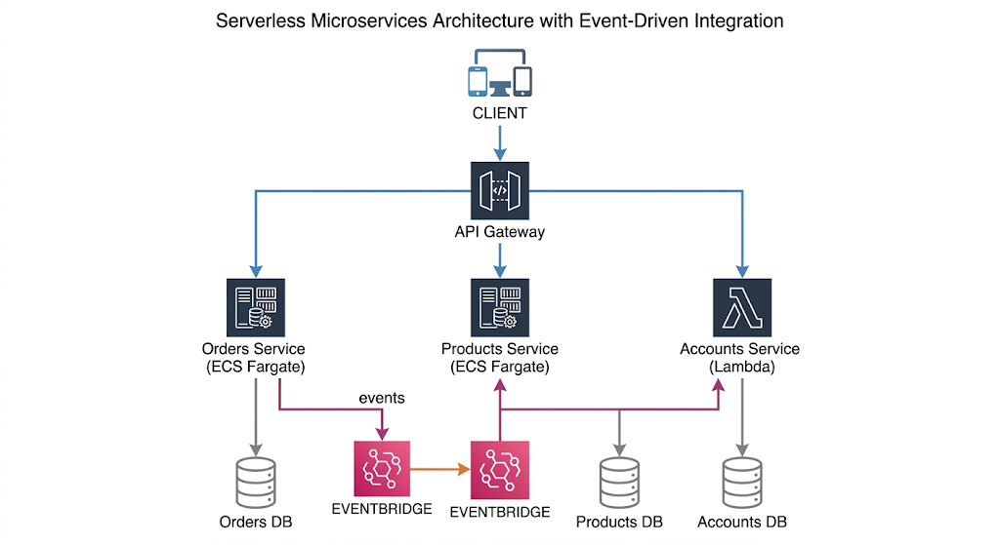{width="80%"}
    <figcaption>Example: Serverless Microservice Architecture with Event Driven Integrations</figcaption>
    <p align='right' style="font-size:0.8em"><i>Image Source: AI Generaed (Google Gemini)</i></p>
</figure>

### Event-driven fan-out (Pub/Sub)

One producer, many independent consumers, each with its own queue, retry policy, and DLQ — adding a consumer never modifies the producer.

### CQRS with event sourcing

Commands write to a normalised store; DynamoDB Streams project changes into read-optimised views (OpenSearch, a denormalised table, or a cache). Reads and writes then scale independently.
<figure markdown="span">
    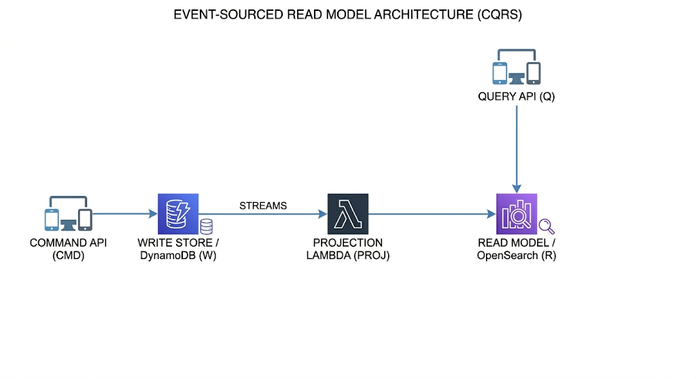{width="80%"}
    <figcaption>Example: Event Source Read Model Architecture(CQRS)</figcaption>
    <p align='right' style="font-size:0.8em"><i>Image Source: AI Generaed (Google Gemini)</i></p>
</figure>

### Saga (distributed transaction)

There are no ACID transactions across microservices. A saga executes a sequence of local transactions, each with a **compensating action** if a later step fails.
<figure markdown="span">
    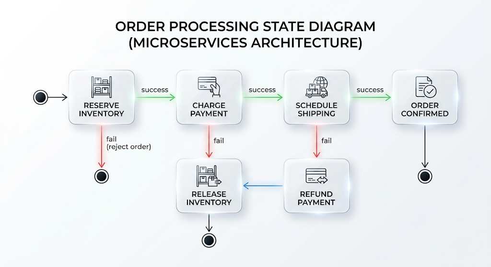{width="80%"}
    <figcaption>Example: Order Processing State Diagram</figcaption>
    <p align='right' style="font-size:0.8em"><i>Image Source: AI Generaed (Google Gemini)</i></p>
</figure>

Step Functions implements orchestrated sagas natively with `Catch` blocks invoking compensation states.

### Resilience patterns

| Pattern                           | Purpose                                                         | AWS Implementation                                                                              |
| --------------------------------- | --------------------------------------------------------------- | ----------------------------------------------------------------------------------------------- |
| **Circuit breaker**               | Stop calling a failing dependency; fail fast and recover        | Application libraries; App Mesh outlier detection; ECS deployment circuit breaker for rollbacks |
| **Retry with backoff and jitter** | Recover from transient faults without synchronised retry storms | AWS SDK adaptive retry mode; SQS redrive; Step Functions `Retry`                                |
| **Bulkhead**                      | Contain failure to one compartment                              | Reserved concurrency per Lambda; separate queues, connection pools, and clusters per consumer   |
| **Queue-based load levelling**    | Protect a slow downstream from bursts                           | SQS between producer and consumer, with `maximumConcurrency` on the event source mapping        |
| **Claim check**                   | Move large payloads out of messages                             | Store in S3, pass the key in the event                                                          |
| **Strangler fig**                 | Incrementally replace a monolith                                | Route selected paths at API Gateway/ALB to new services while the monolith serves the rest      |
| **Idempotent consumer**           | Tolerate duplicate delivery                                     | Conditional writes on an idempotency key in DynamoDB; Powertools idempotency utility            |
| **Outbox**                        | Guarantee the database write and the event publication agree    | Write the event to the same table transactionally, then publish from DynamoDB Streams           |

!!! note "Fan-out versus fan-in"
_Fan-out_ distributes one event to many consumers (SNS/EventBridge). _Fan-in_ aggregates many results into one (Step Functions `Map` with a final aggregation state, or a Kinesis aggregator). Both appear frequently in certification scenarios about parallel processing.

---

## Industry Use Cases

| Sector / Company Type               | Pattern Combination              | Application                                                                                                                                         |
| ----------------------------------- | -------------------------------- | --------------------------------------------------------------------------------------------------------------------------------------------------- |
| **Media streaming (Netflix-style)** | Microservices + event-driven     | Independent playback, recommendation, billing, and licensing services; viewing events stream to analytics and personalisation engines.              |
| **Ride-hailing (Uber-style)**       | Event-driven + microservices     | Trip lifecycle events (requested, matched, started, completed) drive pricing, ETA, driver payouts, and fraud detection concurrently.                |
| **E-commerce (Amazon-style)**       | All four                         | API-first storefront APIs, microservices per domain, serverless for bursty flows (flash sales, image processing), events for order fulfilment.      |
| **Music streaming (Spotify-style)** | Microservices + event-driven     | Playback and skip events feed real-time recommendation models and royalty accounting.                                                               |
| **Financial services**              | Event-driven + saga + serverless | Immutable event ledgers for audit; sagas for cross-account transfers with compensation; Lambda for fraud scoring bursts.                            |
| **Healthcare**                      | API-first + microservices        | Standardised interoperability APIs (e.g., FHIR) with strict contracts; PHI encrypted with KMS; per-service access boundaries for compliance.        |
| **Government digital services**     | API-first + serverless           | Published contracts allow departments and third parties to integrate; serverless absorbs deadline-driven spikes (tax filing, benefit applications). |
| **IoT and smart cities**            | Event-driven + serverless        | Millions of device telemetry events routed via IoT Core to Kinesis, Lambda, and time-series stores.                                                 |
| **SaaS multi-tenant platforms**     | API-first + microservices        | Usage plans and per-tenant throttling in API Gateway; tenant isolation at the IAM and data layers.                                                  |
| **Gaming**                          | Serverless + event-driven        | Leaderboards on DynamoDB, matchmaking events, and serverless backends that scale with unpredictable player counts.                                  |
| **Logistics and supply chain**      | Event-driven + saga              | Shipment state changes propagate to tracking, customs, billing, and customer notification systems.                                                  |

---

## Advantages

**Serverless**

- No server provisioning, patching, or capacity planning — operational burden shifts to AWS.
- Automatic, fine-grained scaling from zero to thousands of concurrent executions.
- True pay-per-use: idle costs nothing, making experimentation and low-traffic services economically viable.
- Multi-AZ high availability with no configuration.
- Faster time to market: a function plus an event source is a complete production deployment.

**Microservices**

- Independent deployability enables high release frequency without cross-team coordination.
- Failure isolation: one service degrading does not take down the system.
- Independent, targeted scaling of the components that are actually under load.
- Technology heterogeneity: the right language and datastore per problem.
- Clear ownership boundaries aligned to small autonomous teams.
- Easier comprehension: a new engineer can understand one service in days rather than a monolith in months.

**Event-driven**

- Extreme loose coupling: new consumers are added without touching producers.
- Natural resilience: brokers buffer during downstream outages instead of cascading failures.
- Load levelling: queues absorb bursts that would otherwise overwhelm databases.
- Real-time responsiveness across the enterprise.
- Auditability and replay: an event log is both an audit trail and a recovery mechanism.

**API-first**

- Parallel development against a mocked contract compresses delivery timelines.
- Stable contracts prevent integration breakage and allow internal refactoring without consumer impact.
- Reusability: one well-designed API serves web, mobile, partners, and internal systems.
- Automatic, accurate documentation and generated SDKs.
- A governance point for security, throttling, monetisation, and analytics.

---

## Limitations

**Serverless**

- Cold-start latency on the tail; problematic for strict low-latency SLAs without Provisioned Concurrency.
- Hard execution limits: 15 minutes, payload sizes, memory ceiling — unsuitable for long-running or very heavy jobs.
- Stateless by design; state externalisation adds latency and cost.
- Relational database connection pressure requires RDS Proxy or a rethink toward DynamoDB.
- Cost can exceed containers at sustained high throughput.
- Vendor lock-in is highest here; portability requires deliberate abstraction.
- Local testing and debugging are harder than with containers.

**Microservices**

- Distributed systems complexity: partial failure, network latency, retries, and clock skew become application concerns.
- Operational overhead multiplies: pipelines, dashboards, alarms, and on-call rotations per service.
- No cross-service ACID transactions; sagas and eventual consistency add design and testing burden.
- Data duplication across services and the challenge of keeping projections consistent.
- End-to-end testing is significantly harder than for a monolith.
- Premature decomposition with wrong boundaries is expensive to correct.

**Event-driven**

- Debugging and tracing asynchronous flows is genuinely difficult without disciplined observability.
- Eventual consistency confuses users and stakeholders ("I placed the order but it does not appear yet").
- Duplicate and out-of-order delivery must be handled explicitly in every consumer.
- The overall business process is implicit and undocumented under pure choreography.
- Event schema evolution requires versioning discipline; a careless change breaks unknown consumers.
- Poison messages can stall processing without correct DLQ configuration.

**API-first**

- Upfront design effort delays the first line of implementation code.
- Governance overhead: style guides, review boards, versioning, and deprecation processes.
- Contracts can ossify: a poorly designed public API is extremely expensive to change.
- Risk of designing contracts around internal data models rather than consumer needs.
- Version proliferation if deprecation is not enforced.

!!! warning "The distributed monolith"
The most common and most damaging failure mode: services are split physically but remain logically coupled — they share a database, must be released together, and call each other synchronously in long chains. This delivers every cost of microservices and none of the benefits. The diagnostic question is simple: _can this service be deployed to production, right now, without coordinating with any other team?_ If not, it is not a microservice.

---

## Common Mistakes

### Beginner mistakes

- Treating "cloud-native" as "running on EC2 in AWS" — lift-and-shift is not cloud-native.
- Starting with microservices before the domain boundaries are understood, producing services that constantly need to change together.
- Building a "Lambda monolith" with a single function containing a large `if/else` router over every route, then justifying it as serverless.
- Assuming Lambda is stateless-but-fresh: relying on `/tmp` or global variables persisting (or _not_ persisting) between invocations.
- Placing SDK client creation and connection setup _inside_ the handler, paying initialisation cost on every invocation.
- Forgetting that SQS requires explicit message deletion; assuming receiving is consuming.
- Ignoring idempotency and being surprised by duplicate charges or duplicate emails.
- Using CPU utilisation to scale a queue worker instead of queue depth.
- Hard-coding endpoints and secrets instead of using Cloud Map, Parameter Store, or Secrets Manager.
- Building through the console with no Infrastructure as Code, then being unable to recreate the environment.

### Production mistakes

- No DLQ, or a DLQ with no alarm — silent, permanent data loss.
- Visibility timeout shorter than processing time, causing the same message to be processed repeatedly and concurrently.
- Unbounded Lambda concurrency in front of a small RDS instance, exhausting the connection pool during a traffic spike.
- Synchronous call chains four or five services deep: latency compounds and any single failure fails the whole request.
- Retries without exponential backoff and jitter, converting a brief blip into a self-inflicted denial of service.
- Missing correlation IDs, making incident investigation across services nearly impossible.
- Shared database across "microservices", so a schema change requires a coordinated multi-team release.
- Breaking API changes shipped without a new version, silently breaking mobile clients that cannot be force-upgraded.
- CloudWatch Logs retention left at "never expire", producing a large and entirely avoidable bill.
- Over-permissive IAM roles copied between services because narrowing them "takes too long".
- No load testing of the asynchronous path; the API scales but consumers fall permanently behind.

## Code Examples

### AWS SAM template (serverless, event-driven, API-first)

```yaml
AWSTemplateFormatVersion: "2010-09-09"
Transform: AWS::Serverless-2016-10-31
Description: Cloud-native order system demonstrating serverless, event-driven and API-first patterns

Globals:
  Function:
    Runtime: python3.12
    Architectures: [arm64]
    Timeout: 15
    MemorySize: 512
    Tracing: Active
    Environment:
      Variables:
        POWERTOOLS_SERVICE_NAME: orders

Resources:
  OrdersTable:
    Type: AWS::DynamoDB::Table
    Properties:
      BillingMode: PAY_PER_REQUEST
      AttributeDefinitions:
        - AttributeName: orderId
          AttributeType: S
      KeySchema:
        - AttributeName: orderId
          KeyType: HASH
      SSESpecification:
        SSEEnabled: true
      PointInTimeRecoverySpecification:
        PointInTimeRecoveryEnabled: true

  OrdersBus:
    Type: AWS::Events::EventBus
    Properties:
      Name: orders-bus

  InventoryDLQ:
    Type: AWS::SQS::Queue
    Properties:
      MessageRetentionPeriod: 1209600 # 14 days

  InventoryQueue:
    Type: AWS::SQS::Queue
    Properties:
      VisibilityTimeout: 90 # >= 6x function timeout
      ReceiveMessageWaitTimeSeconds: 20 # long polling
      RedrivePolicy:
        deadLetterTargetArn: !GetAtt InventoryDLQ.Arn
        maxReceiveCount: 3

  PlaceOrderFunction:
    Type: AWS::Serverless::Function
    Properties:
      Handler: place_order.handler
      CodeUri: src/
      Environment:
        Variables:
          TABLE_NAME: !Ref OrdersTable
          BUS_NAME: !Ref OrdersBus
      Policies:
        - DynamoDBCrudPolicy:
            TableName: !Ref OrdersTable
        - EventBridgePutEventsPolicy:
            EventBusName: !Ref OrdersBus
      Events:
        CreateOrder:
          Type: HttpApi
          Properties:
            Path: /v1/orders
            Method: POST

  ReserveInventoryFunction:
    Type: AWS::Serverless::Function
    Properties:
      Handler: reserve_inventory.handler
      CodeUri: src/
      ReservedConcurrentExecutions: 20 # bulkhead: protect downstream
      Events:
        FromQueue:
          Type: SQS
          Properties:
            Queue: !GetAtt InventoryQueue.Arn
            BatchSize: 10
            FunctionResponseTypes: [ReportBatchItemFailures]

  OrderPlacedRule:
    Type: AWS::Events::Rule
    Properties:
      EventBusName: !Ref OrdersBus
      EventPattern:
        source: ["orders.service"]
        detail-type: ["OrderPlaced"]
      Targets:
        - Id: InventoryTarget
          Arn: !GetAtt InventoryQueue.Arn

Outputs:
  ApiEndpoint:
    Value: !Sub "https://${ServerlessHttpApi}.execute-api.${AWS::Region}.amazonaws.com"
```

### Lambda producer with idempotency (Python, boto3)

```python
import json
import os
import uuid
from datetime import datetime, timezone

import boto3
from botocore.exceptions import ClientError

# Initialised OUTSIDE the handler: reused across warm invocations
dynamodb = boto3.resource("dynamodb")
events = boto3.client("events")
table = dynamodb.Table(os.environ["TABLE_NAME"])
BUS_NAME = os.environ["BUS_NAME"]


def handler(event, context):
    body = json.loads(event["body"])
    idempotency_key = body["idempotencyKey"]
    order_id = str(uuid.uuid5(uuid.NAMESPACE_OID, idempotency_key))

    item = {
        "orderId": order_id,
        "customerId": body["customerId"],
        "items": body["items"],
        "status": "PLACED",
        "createdAt": datetime.now(timezone.utc).isoformat(),
    }

    try:
        # Conditional write: the idempotency guarantee
        table.put_item(
            Item=item,
            ConditionExpression="attribute_not_exists(orderId)",
        )
        created = True
    except ClientError as exc:
        if exc.response["Error"]["Code"] != "ConditionalCheckFailedException":
            raise
        created = False  # Duplicate request; do not re-emit the event

    if created:
        events.put_events(
            Entries=[{
                "EventBusName": BUS_NAME,
                "Source": "orders.service",
                "DetailType": "OrderPlaced",
                "Detail": json.dumps({
                    "orderId": order_id,
                    "customerId": item["customerId"],
                    "items": item["items"],
                    "correlationId": context.aws_request_id,
                }),
            }]
        )

    return {
        "statusCode": 201,
        "headers": {"Content-Type": "application/json"},
        "body": json.dumps({"orderId": order_id, "status": "PLACED"}),
    }
```

### Lambda consumer with partial batch failure reporting

```python
import json


def handler(event, context):
    failures = []

    for record in event["Records"]:
        try:
            envelope = json.loads(record["body"])       # EventBridge envelope
            detail = envelope["detail"]                  # business payload
            reserve_stock(detail["orderId"], detail["items"])
        except Exception:
            # Only this message is retried; the rest of the batch is deleted
            failures.append({"itemIdentifier": record["messageId"]})

    return {"batchItemFailures": failures}


def reserve_stock(order_id, items):
    for item in items:
        if item["sku"] == "FAIL-TEST":
            raise RuntimeError(f"Simulated failure for order {order_id}")
    # Real implementation: conditional DynamoDB updates decrementing stock
```

### AWS CLI verification commands

```bash
# Publish a test event directly to the bus
aws events put-events --entries '[{
  "EventBusName": "orders-bus",
  "Source": "orders.service",
  "DetailType": "OrderPlaced",
  "Detail": "{\"orderId\":\"test-1\",\"items\":[{\"sku\":\"ABC\",\"qty\":1}]}"
}]'

# Inspect queue backlog and in-flight messages
aws sqs get-queue-attributes \
  --queue-url "$QUEUE_URL" \
  --attribute-names ApproximateNumberOfMessages \
                    ApproximateNumberOfMessagesNotVisible \
                    ApproximateAgeOfOldestMessage

# Check for poison messages in the DLQ
aws sqs receive-message --queue-url "$DLQ_URL" --max-number-of-messages 10

# Observe function concurrency and throttling
aws cloudwatch get-metric-statistics \
  --namespace AWS/Lambda --metric-name Throttles \
  --dimensions Name=FunctionName,Value=ReserveInventoryFunction \
  --start-time "$(date -u -d '1 hour ago' +%Y-%m-%dT%H:%M:%SZ)" \
  --end-time "$(date -u +%Y-%m-%dT%H:%M:%SZ)" \
  --period 300 --statistics Sum

# Replay archived events after fixing a consumer bug
aws events start-replay \
  --replay-name recover-orders \
  --event-source-arn "$ARCHIVE_ARN" \
  --event-start-time 2026-07-01T00:00:00Z \
  --event-end-time 2026-07-01T06:00:00Z \
  --destination '{"Arn":"'"$BUS_ARN"'"}'
```

### Terraform: queue, DLQ, and EventBridge rule

```hcl
resource "aws_sqs_queue" "inventory_dlq" {
  name                      = "inventory-dlq"
  message_retention_seconds = 1209600
}

resource "aws_sqs_queue" "inventory" {
  name                       = "inventory-queue"
  visibility_timeout_seconds = 90
  receive_wait_time_seconds  = 20
  sqs_managed_sse_enabled    = true

  redrive_policy = jsonencode({
    deadLetterTargetArn = aws_sqs_queue.inventory_dlq.arn
    maxReceiveCount     = 3
  })
}

resource "aws_cloudwatch_event_rule" "order_placed" {
  name           = "order-placed"
  event_bus_name = aws_cloudwatch_event_bus.orders.name

  event_pattern = jsonencode({
    source        = ["orders.service"]
    "detail-type" = ["OrderPlaced"]
  })
}

resource "aws_cloudwatch_event_target" "to_inventory" {
  rule           = aws_cloudwatch_event_rule.order_placed.name
  event_bus_name = aws_cloudwatch_event_bus.orders.name
  arn            = aws_sqs_queue.inventory.arn

  dead_letter_config {
    arn = aws_sqs_queue.inventory_dlq.arn
  }

  retry_policy {
    maximum_retry_attempts       = 3
    maximum_event_age_in_seconds = 3600
  }
}

resource "aws_cloudwatch_metric_alarm" "dlq_not_empty" {
  alarm_name          = "inventory-dlq-has-messages"
  namespace           = "AWS/SQS"
  metric_name         = "ApproximateNumberOfMessagesVisible"
  dimensions          = { QueueName = aws_sqs_queue.inventory_dlq.name }
  statistic           = "Maximum"
  period              = 60
  evaluation_periods  = 1
  threshold           = 0
  comparison_operator = "GreaterThanThreshold"
}
```

### OpenAPI contract fragment (API-first)

```yaml
openapi: 3.0.3
info:
  title: Orders API
  version: 1.0.0
paths:
  /v1/orders:
    post:
      operationId: placeOrder
      security:
        - CognitoAuth: []
      requestBody:
        required: true
        content:
          application/json:
            schema:
              $ref: "#/components/schemas/PlaceOrderRequest"
      responses:
        "201":
          description: Order accepted
          content:
            application/json:
              schema:
                $ref: "#/components/schemas/OrderCreated"
        "400": { description: Validation failed }
        "429": { description: Rate limit exceeded }
components:
  schemas:
    PlaceOrderRequest:
      type: object
      required: [customerId, items, idempotencyKey]
      properties:
        customerId: { type: string, format: uuid }
        idempotencyKey: { type: string, minLength: 8, maxLength: 128 }
        items:
          type: array
          minItems: 1
          items:
            type: object
            required: [sku, qty]
            properties:
              sku: { type: string }
              qty: { type: integer, minimum: 1 }
    OrderCreated:
      type: object
      properties:
        orderId: { type: string }
        status: { type: string, enum: [PLACED] }
```

### Kubernetes deployment for a microservice on EKS

```yaml
apiVersion: apps/v1
kind: Deployment
metadata:
  name: orders-service
  labels: { app: orders-service }
spec:
  replicas: 3
  selector:
    matchLabels: { app: orders-service }
  template:
    metadata:
      labels: { app: orders-service }
    spec:
      serviceAccountName: orders-sa # IRSA: pod-level IAM role
      containers:
        - name: orders
          image: 123456789012.dkr.ecr.eu-west-1.amazonaws.com/orders:1.4.2
          ports: [{ containerPort: 8080 }]
          resources:
            requests: { cpu: "250m", memory: "512Mi" }
            limits: { cpu: "1000m", memory: "1Gi" }
          readinessProbe:
            httpGet: { path: /health/ready, port: 8080 }
            initialDelaySeconds: 5
          livenessProbe:
            httpGet: { path: /health/live, port: 8080 }
            initialDelaySeconds: 15
      topologySpreadConstraints: # spread across AZs
        - maxSkew: 1
          topologyKey: topology.kubernetes.io/zone
          whenUnsatisfiable: ScheduleAnyway
          labelSelector:
            matchLabels: { app: orders-service }
---
apiVersion: autoscaling/v2
kind: HorizontalPodAutoscaler
metadata:
  name: orders-hpa
spec:
  scaleTargetRef:
    apiVersion: apps/v1
    kind: Deployment
    name: orders-service
  minReplicas: 3
  maxReplicas: 30
  metrics:
    - type: Resource
      resource:
        name: cpu
        target: { type: Utilization, averageUtilization: 65 }
```

### Step Functions state machine (orchestrated saga)

```json
{
  "Comment": "Order saga with compensation",
  "StartAt": "ReserveInventory",
  "States": {
    "ReserveInventory": {
      "Type": "Task",
      "Resource": "arn:aws:states:::lambda:invoke",
      "Parameters": { "FunctionName": "ReserveInventory", "Payload.$": "$" },
      "Retry": [
        {
          "ErrorEquals": ["States.TaskFailed"],
          "IntervalSeconds": 2,
          "MaxAttempts": 3,
          "BackoffRate": 2.0
        }
      ],
      "Catch": [{ "ErrorEquals": ["States.ALL"], "Next": "RejectOrder" }],
      "Next": "ChargePayment"
    },
    "ChargePayment": {
      "Type": "Task",
      "Resource": "arn:aws:states:::lambda:invoke",
      "Parameters": { "FunctionName": "ChargePayment", "Payload.$": "$" },
      "Catch": [{ "ErrorEquals": ["States.ALL"], "Next": "ReleaseInventory" }],
      "Next": "OrderConfirmed"
    },
    "ReleaseInventory": {
      "Type": "Task",
      "Resource": "arn:aws:states:::lambda:invoke",
      "Parameters": { "FunctionName": "ReleaseInventory", "Payload.$": "$" },
      "Next": "RejectOrder"
    },
    "RejectOrder": { "Type": "Fail", "Error": "OrderFailed" },
    "OrderConfirmed": { "Type": "Succeed" }
  }
}
```

---

## Architecture Diagrams

### Pattern selection decision flow

<figure markdown="span">
    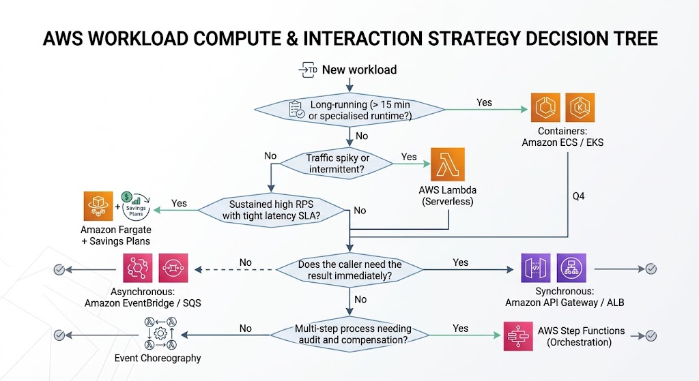{width="80%"}
    <figcaption>Patttern Selection Flow</figcaption>
    <p align='right' style="font-size:0.8em"><i>Image Source: AI Generaed (Google Gemini)</i></p>
</figure>


### Monolith to cloud-native evolution

<figure markdown="span">
    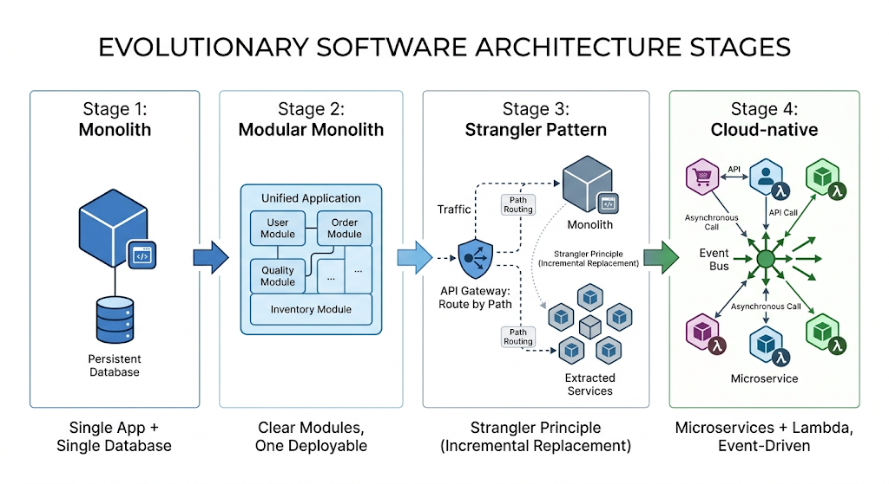{width="80%"}
    <figcaption>Evolution of Software Architecture Stages</figcaption>
    <p align='right' style="font-size:0.8em"><i>Image Source: AI Generaed (Google Gemini)</i></p>
</figure>


### End-to-end platform reference architecture

<figure markdown="span">
    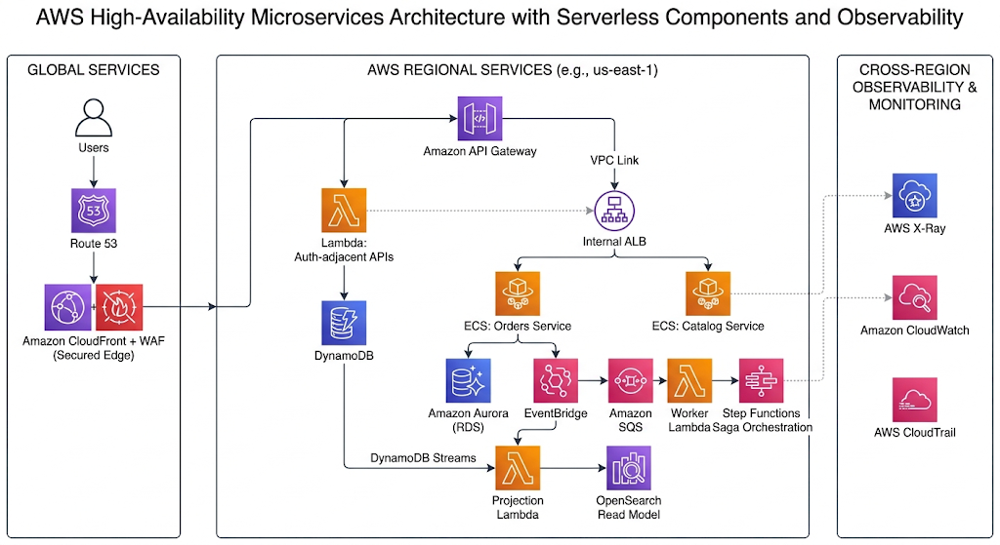{width="80%"}
    <figcaption>High Avialability Microservice Architecture</figcaption>
    <p align='right' style="font-size:0.8em"><i>Image Source: AI Generaed (Google Gemini)</i></p>
</figure>


### Order journey from the user's perspective
<figure markdown="span">
    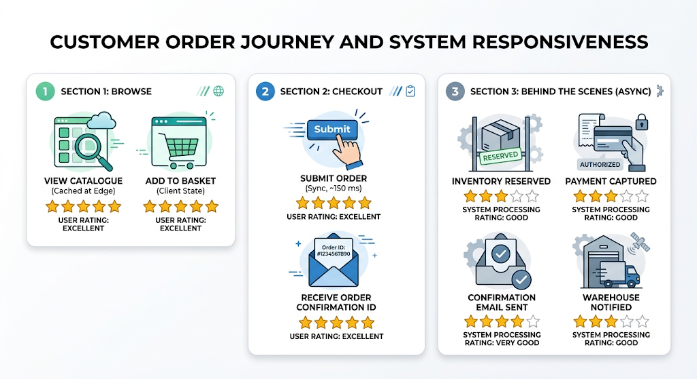{width="80%"}
    <figcaption>User Prespective of Customer order journey</figcaption>
    <p align='right' style="font-size:0.8em"><i>Image Source: AI Generaed (Google Gemini)</i></p>
</figure>

## Summary

- Cloud-native design patterns exist because cloud infrastructure changed three fundamental assumptions: capacity became elastic and metered, failure became routine rather than exceptional, and delivery speed became a competitive advantage. The four patterns in this topic each address one consequence of that shift.

- **Serverless** answers _how compute should be provisioned_: on demand, per invocation, scaling to zero, with the provider absorbing operational responsibility. It is optimal for bursty, event-driven, and intermittent workloads, and it trades cold-start latency, execution limits, and portability for radically lower operational burden.

- **Microservices** answers _how the system should be decomposed_: into independently deployable, independently scalable services aligned to bounded contexts and to team ownership. It delivers failure isolation and delivery velocity at the cost of distributed systems complexity — and it fails badly when boundaries are drawn prematurely or when services share a database.

- **Event-driven** answers _how components should communicate_: asynchronously, through immutable facts routed by a broker, so producers know nothing of consumers. It is the primary mechanism for loose coupling, load levelling, and resilience, and it demands idempotency, correlation IDs, DLQs, and disciplined observability in return.

- **API-first** answers _how integration should be governed_: by designing and agreeing the contract before implementation, treating the API as a durable product with versioning, documentation, and enforcement at the gateway.
