# Docker Fundamentals on AWS

## Definition

A **container** is a process, or a small group of processes, running on a shared host kernel with a private view of the system: its own filesystem root, its own process tree, its own network interfaces, its own hostname, and a hard ceiling on the CPU, memory, and I/O it may consume. It is not a lightweight virtual machine. It is an ordinary Linux process that the kernel has been instructed to lie to.

A **container image** is an immutable, layered, content-addressed filesystem bundle plus a configuration document describing how to start a process from it. The image is the artefact; the container is a running instance of it. The relationship is exactly that of a class to an object, and the same reasoning applies: many containers can run from one image, and the image itself never changes.

**Docker** is the toolchain that popularised both, a build tool, a local runtime, and a registry client. The formats it created have since been standardised by the **Open Container Initiative (OCI)** into an image specification, a runtime specification, and a distribution specification, so that "Docker image" is now loosely used for what is properly an **OCI image**, and images built by Docker run on runtimes Docker never touched.

<figure markdown="span">
    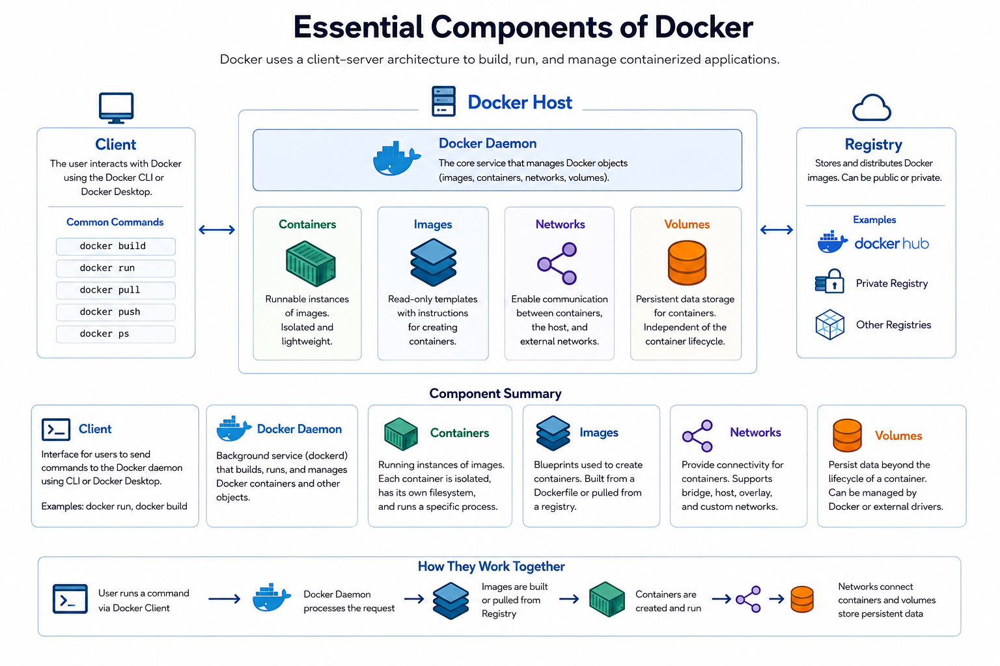{width="80%"}
    <figcaption>Components of dockers</figcaption>

</figure>

**Amazon Elastic Container Registry (ECR)** is AWS's managed OCI-compliant registry: a private, regional, IAM-authorised store for images, integrated with ECS, EKS, AWS Lambda container images, and AWS App Runner.

<figure markdown="span">
    {width="80%"}
    <figcaption>Elestic Container Registry</figcaption>
</figure>

**Amazon ECS task definitions** and **services** are the declarative layer that turns an image into a running workload. A task definition is the immutable specification; a service is the controller that keeps a desired number of instances of that specification alive and reachable.

| Layer | Artefact | Mutable? | Analogy |
|---|---|---|---|
| **Dockerfile** | Build instructions | Yes, it is source code | The recipe |
| **Image layer** | A tarball of filesystem changes, addressed by SHA-256 | No | One prepared ingredient |
| **Image manifest** | A JSON document listing layers and configuration, itself addressed by SHA-256 | No | The assembled dish's specification |
| **Tag** | A human-readable pointer to a manifest digest | **Yes, unless made immutable** | A label on the shelf |
| **Container** | A running process created from an image | Its writable layer is, and is discarded on exit | The dish being eaten |
| **Task definition** | An ECS JSON specification referencing an image | No; each registration creates a new revision | The order ticket |
| **Task** | A running instantiation of a task-definition revision | No | The order being served |
| **Service** | A controller maintaining N tasks | Its desired state is | The kitchen manager |

Within an AWS architecture these sit at the boundary between build time and run time. ECR is the handoff point: everything before it is CI, everything after it is deployment. The single most consequential property of that handoff is that the artefact crossing it is **immutable and identified by a cryptographic digest**, which is what makes a deployment reproducible, a rollback trustworthy, and a security scan meaningful.

!!! note "Containers are not virtual machines, and the difference is the kernel"

    A virtual machine runs its own kernel on virtualised hardware provided by a hypervisor. A container shares the host's kernel. That single fact explains every difference that follows: containers start in milliseconds because there is no kernel to boot; they are dense because there is no duplicated operating system per workload; and their isolation is weaker, because a kernel vulnerability is a shared vulnerability. AWS Fargate exists precisely to close that last gap, by giving each task its own lightweight virtual machine while preserving the container developer experience.

## Why This Service or Concept Exists

### The problem containers solve

The problem is not packaging. The problem is that **an application's behaviour depends on its environment, and environments drift**.

Before containers, deploying an application meant reproducing an environment: the right language runtime at the right patch level, the right shared libraries, the right locale and timezone settings, the right filesystem layout, the right environment variables, the right sysctl values.

| Problem before containers | Consequence |
|---|---|
| **Application and dependencies installed separately onto a host** | Two applications needing different versions of the same library cannot share a host |
| **Environments converged rather than constructed** | Configuration drift; staging and production diverge silently over months |
| **No standard artefact** | Every language and framework had its own deployment story; operations teams learned all of them |
| **Deployment as a sequence of steps** | A failed step leaves a half-deployed machine in an undefined state |
| **Rollback meant re-running the previous steps** | Rollback was itself a risky deployment, so teams avoided it |
| **Full VM per workload for isolation** | Minutes to boot, gigabytes of duplicated OS, poor density, expensive |
| **Developer machine unlike production** | Bugs reproducible only in production |

The container image solved this by making the environment **part of the artefact**. The image contains the application, its dependencies, and its filesystem. It is built once, in a defined way, and the identical bytes run in development, staging, and production. Deployment stops being a procedure and becomes a substitution: stop the process running image A, start a process running image B.

### What AWS added, and why ECR exists

An image is only useful if it can be stored, retrieved, and trusted. A registry is therefore infrastructure, and treating it casually has consequences that show up at exactly the wrong moment.

Public registries introduce three problems for a production system.

- First, an **availability dependency**: if your deployment path pulls from a public registry, a public registry outage is your outage, and your ability to replace a failed task depends on a third party.

- Second, **rate limits**: public registries throttle anonymous and free-tier pulls, and a cluster scaling out during a traffic spike is precisely the moment a rate limit bites.

- Third, **trust**: a mutable public tag can be repointed, and there is no organisational control over what enters your runtime.

| Concern | Public registry | Amazon ECR |
|---|---|---|
| Authentication | Account credentials, often shared | IAM principals, temporary tokens, no shared secrets |
| Authorisation granularity | Repository-level at best | IAM policies plus repository policies, condition keys, cross-account statements |
| Availability | Third-party dependency on your deployment path | Regional AWS service inside your account boundary |
| Network path | Over the internet through a NAT gateway | Interface VPC endpoint, never leaving the AWS network |
| Rate limits | Yes, and they bite during scale-out | Account-level API quotas, far higher, adjustable |
| Vulnerability scanning | Varies; often paid | Basic scanning free; enhanced scanning via Amazon Inspector, continuous |
| Immutability | Rarely enforced | Repository setting, enforced by the service |
| Lifecycle management | Manual | Declarative lifecycle policies |
| Encryption at rest | Opaque | AES-256 by default, or a customer-managed AWS KMS key |
| Audit | None you can access | AWS CloudTrail records every push, pull, and policy change |

ECR exists so that the artefact store is inside your security, availability, and cost boundary rather than outside it.

### Why an orchestrator exists

Running `docker run` on an EC2 instance works. It works right up until any of the following happens, and one of them always happens:

- The container exits at three in the morning and nothing restarts it.
- The instance fails and nothing reschedules its containers elsewhere.
- You need a second instance and must now decide, by hand, which containers run where.
- You deploy a new version and must stop the old container before the new one is healthy, producing downtime.
- The load balancer does not know the new container's port, because Docker assigned it dynamically.
- Three containers on one instance all want port 8080.
- Traffic doubles and you must manually launch instances and manually place containers on them.
- A container needs a database password, and the only mechanism you have is an environment variable in a shell script on disk.
- You need to know which version of which service is running where, and the answer lives only in `docker ps` output on eleven machines.

Every one of these is a control-loop problem: something must continuously compare *what should be running* with *what is running* and act on the difference. That loop is what ECS is. Section 2.1.2 asks you to build the manual version so that the value of the declarative version is felt rather than asserted.

## Real-World Motivation

**A university teaching platform.** A department runs student project submissions through an automated grading service that must execute untrusted student code in Python, Java, and C++, each requiring different toolchains. Installing all three on shared hosts produced version conflicts within a semester. Rebuilt as three container images invoked per submission, each grading run starts from an identical, known filesystem, is capped at one vCPU and 512 MB by cgroups, is denied network access, and is destroyed afterwards. *The architectural lesson is that immutability plus resource limits turns "run arbitrary code safely" from an operations problem into a configuration property — though note that container isolation alone is not sufficient against a determined attacker, which is why a serious version of this system runs each submission in its own Fargate task with its own microVM.*

**A national broadcaster's media pipeline.** Transcoding jobs depend on a specific `ffmpeg` build with specific codec libraries. When those were installed on long-lived EC2 instances, an operating-system patch that upgraded a shared library silently changed the output bitrate of thousands of files before anyone noticed. Moving `ffmpeg` and its exact dependency set into an image pinned by digest made the transcoder's behaviour a property of the artefact rather than of the host. *The architectural lesson is that the failures immutability prevents are usually silent-corruption failures rather than crash failures, and silent failures are the expensive kind.*

**A bank's regulated release process.** An auditor asks which code was running in production on a given date. With mutable tags the honest answer is "we believe it was version 4.2, but the tag has been repushed since". With immutable tags, digest-pinned task definitions, and CloudTrail records of every ECR push, the answer is a digest, the commit it was built from, the scan result at build time, and the identity that pushed it. *The architectural lesson is that supply-chain traceability is not a security feature bolted on afterwards; it is a consequence of choosing immutability at the registry and pinning by digest at deployment.*

**A retailer's regional expansion.** A retailer operating in `eu-west-1` opens in `ap-southeast-1`. Their deployment pipeline pulled images across the Atlantic on every task launch, adding tens of seconds to scale-out and incurring inter-Region data-transfer charges on every pull. Enabling ECR cross-Region replication put the bytes in the Region that needed them. *The architectural lesson is that the registry is on the critical path of scaling, so registry latency is scale-out latency, and scale-out latency is the difference between absorbing a spike and dropping traffic.*

**A start-up's outage caused by someone else's registry.** A four-engineer team based their images on `FROM node:18` from a public registry and pulled it directly during every deployment. A public-registry incident during a marketing push meant new tasks could not start while existing ones were being replaced. Adopting an ECR pull-through cache removed the external dependency from the deployment path. *The architectural lesson is that every external dependency on the deployment path is an availability dependency, and the deployment path is exercised most heavily exactly when the system is under stress.*

**A logistics company's architecture mismatch.** Engineers on ARM-based laptops built images locally and pushed them; tasks on x86 Fargate failed with `exec format error`. The team could not reproduce the failure because their laptops ran the image perfectly. *The architectural lesson is that an image is architecture-specific, that "works on my machine" has returned in a new form, and that CI must build for the target architecture — or the project must adopt multi-architecture manifests deliberately.*

## Core Concepts

### What the Linux kernel actually provides

Three kernel mechanisms, combine to produce a container.

**Namespaces** partition kernel resources so that a process sees only its own partition. There are several, and they are independent:

| Namespace | What it isolates | Practical consequence |
|---|---|---|
| **PID** | Process identifiers | The container's main process is PID 1, and it inherits PID 1's signal-handling responsibilities |
| **Mount (mnt)** | Filesystem mount points | The container has its own root filesystem |
| **Network (net)** | Interfaces, routes, ports, firewall rules | Two containers can both bind port 8080 without conflict |
| **UTS** | Hostname and domain name | The container has its own hostname |
| **IPC** | System V IPC and POSIX message queues | Shared-memory isolation between containers |
| **User** | UID and GID mappings | Root inside the container can map to an unprivileged UID outside it |
| **Cgroup** | The cgroup hierarchy view | The container cannot see the host's full cgroup tree |

**Control groups (cgroups)** account for and limit resource consumption: CPU shares and quotas, memory limits, block-I/O weights, and process cµounts. Two properties matter architecturally. Memory limits are enforced by **killing** — a container that exceeds its memory limit is terminated by the kernel OOM killer, surfacing as `OOMKilled` and exit code 137. CPU limits are enforced by **throttling** — a container that exceeds its CPU quota is paused until the next scheduling period, which produces latency spikes while average utilisation graphs look calm. This asymmetry is the reason for the standard advice in 1.3.2: set memory limits, and be cautious with CPU limits on latency-sensitive services.

**Union filesystems** (OverlayFS on modern Linux) stack read-only layers with a thin writable layer on top. Reads fall through the stack to the first layer containing the file; writes are copied up into the writable layer. This is what makes images shareable: fifty containers from the same image share one copy of the read-only layers on disk and in the page cache.

<figure markdown="span">
    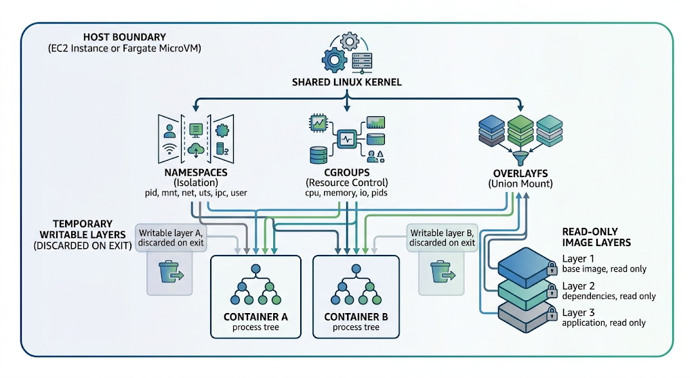{width="80%"}
    <figcaption>Union File System</figcaption>
    
<i>Image Source: AI Generaed (Google Gemini)</i>

</figure>

!!! danger "The writable layer is not storage"

    Anything a container writes to its own filesystem disappears when the task stops, and on Fargate it counts against the task's ephemeral storage allocation. Application state belongs in Amazon RDS, Amazon DynamoDB, Amazon S3, Amazon EFS, or an Amazon EBS volume — never in the container. Writing logs to a file inside the container is the most common version of this mistake: write to `stdout` and let the log driver route it, or the logs vanish with the task that produced them, which is the moment you most want them.

### Images, layers, manifests, tags, and digests

An OCI image is not a single file. It is a set of objects in a content-addressed store:

- **Layers** (blobs): compressed tar archives of filesystem changes. Each is identified by the SHA-256 of its content.
- **Image configuration**: a JSON document holding the entrypoint, command, environment, working directory, exposed ports, user, and the ordered list of layer digests. Also a blob, also digest-addressed.
- **Image manifest**: a JSON document referencing the configuration blob and the layer blobs. Its own digest — `sha256:...` — *is* the image's identity.
- **Image index** (or manifest list): a document referencing several manifests, one per platform, which is how one name serves both `linux/amd64` and `linux/arm64`.
- **Tag**: a mutable label in a repository pointing at a manifest digest.

<figure markdown="span">
    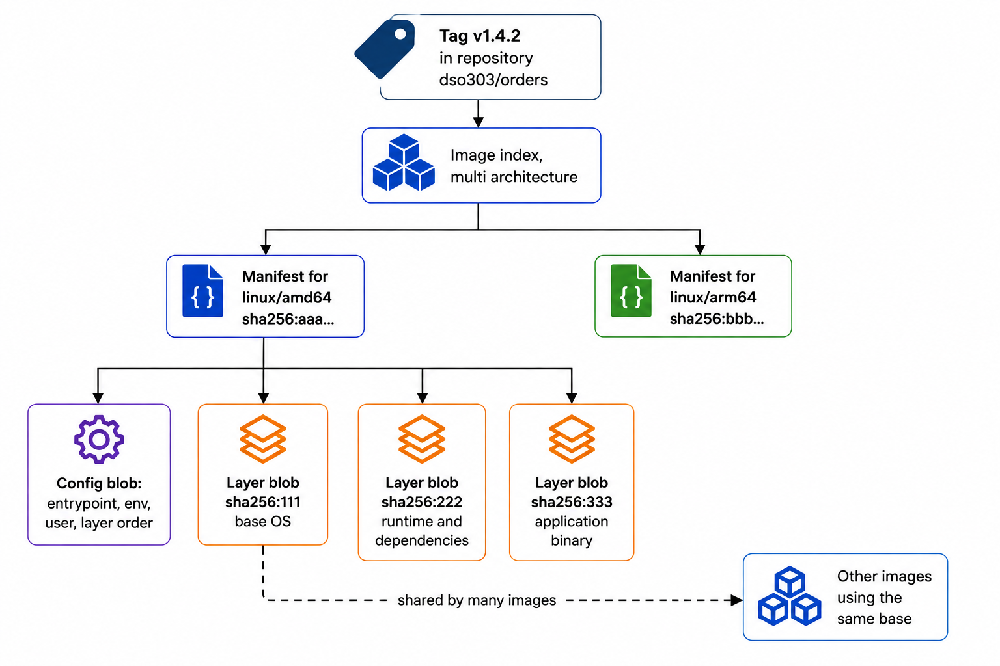{width="80%"}
    <figcaption>Docker files</figcaption>
    
<i>Image Source: AI Generaed (Google Gemini)</i>

</figure>

The distinction between a tag and a digest is the single most important operational fact in this section. A tag is a **name**; a digest is an **identity**. Repushing a tag changes what the name refers to and leaves no trace in the deployment specification that used it. Referencing an image as `...amazonaws.com/dso303/orders@sha256:aaa...` makes the deployed bytes cryptographically exact: the same digest today and in two years retrieves the same image or fails, and it cannot silently retrieve something else.

!!! danger "Never deploy `latest`, and never rely on a mutable tag in production"

    `latest` is not a version; it is a pointer that anyone with push access can move. Two tasks launched ten minutes apart can run different code. A rollback to the previous tag can retrieve bytes that are not the bytes that tag held when it was healthy. And a vulnerability scan of a tag tells you nothing about what is currently running under it. Enable **tag immutability** on every ECR repository at creation, tag with the commit SHA or a semantic version, and **pin by digest** in task definitions and manifests.

### Dockerfiles and the build cache

A Dockerfile is a sequence of instructions, most of which produce a layer. The builder caches each layer keyed on the instruction and its inputs; when a layer's cache key changes, that layer and **every layer after it** are rebuilt. Layer ordering is therefore a performance decision:

| Instruction | Produces a layer? | Notes |
|---|---|---|
| `FROM` | Starts from an existing image's layers | Pin by digest for reproducibility, or at minimum a specific version tag |
| `RUN` | Yes | Chain related commands with `&&` and clean caches in the same `RUN`, or the cleanup happens in a later layer and the bytes remain in the earlier one |
| `COPY` and `ADD` | Yes | Copy dependency manifests before source so that a source change does not invalidate the dependency-install layer. Prefer `COPY`; `ADD` also fetches URLs and auto-extracts archives, which is surprising behaviour |
| `ENV`, `WORKDIR`, `USER`, `EXPOSE`, `LABEL` | Metadata only | Cheap; `EXPOSE` is documentation and publishes nothing by itself |
| `ENTRYPOINT` and `CMD` | Metadata only | `ENTRYPOINT` is the executable, `CMD` supplies default arguments. Use exec form (`["prog","arg"]`) so the process is PID 1 and receives signals |
| `HEALTHCHECK` | Metadata only | Honoured by Docker; **ECS uses the task definition's `healthCheck` block instead** |

**Multi-stage builds** are the single highest-value technique. A build stage carries the compiler, package manager, and test tooling; a runtime stage copies only the built artefact into a minimal base. The result is smaller, starts faster, and has a dramatically smaller vulnerability surface because the tools an attacker would use are simply absent.

<figure markdown="span">
    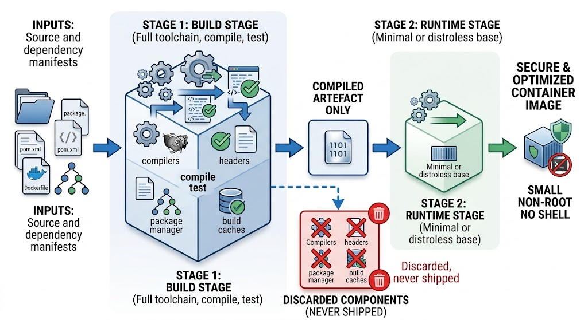{width="80%"}
    <figcaption>Multi stage Build process</figcaption>
    
<i>Image Source: AI Generaed (Google Gemini)</i>

</figure>

!!! tip "Image size is a scaling-latency decision, not housekeeping"

    On Fargate there is no warm image cache: every task launch pulls the image. A 1 GB image can add tens of seconds between "traffic arrived" and "a task is serving it", which directly limits how fast a service can absorb a spike. Reducing an image from 1.2 GB to 80 MB through a multi-stage build is a *performance* change with a measurable effect on scale-out responsiveness, and it reduces ECR storage and data-transfer costs at the same time.

### Amazon ECR concepts

| Concept | Definition | Why it matters |
|---|---|---|
| **Registry** | One per AWS account per Region, at `<account-id>.dkr.ecr.<region>.amazonaws.com` | The registry is regional; an image in `us-east-1` is not in `eu-west-1` unless replicated |
| **Repository** | A named collection of related images, for example `dso303/orders` | The unit of IAM policy, immutability, scanning configuration, and lifecycle policy |
| **Repository policy** | A resource-based policy on the repository | The mechanism for cross-account pull access; distinct from identity-based IAM policies |
| **Tag immutability** | Repository setting rejecting a push to an existing tag; also available in exclusion-filter variants that exempt named tag patterns | The control that makes a tag a reliable identifier |
| **Lifecycle policy** | Declarative rules expiring images by age or count | Controls storage cost; untagged images accumulate rapidly in an active pipeline |
| **Basic scanning** | Free CVE scan on push, based on the Clair database, OS packages only | A baseline; does not rescan and does not cover language dependencies |
| **Enhanced scanning** | Amazon Inspector, continuous rescanning, OS packages plus language dependencies | Catches CVEs disclosed *after* the push, which is when most relevant CVEs are disclosed |
| **Pull-through cache** | An ECR repository that transparently caches images from an upstream public registry | Removes a public registry from the deployment path and from rate-limit exposure |
| **Replication** | Cross-Region and cross-account automatic copying | Reduces pull latency and removes a cross-Region dependency at scale-out |
| **ECR Public** | A separate public registry service at `public.ecr.aws` | Where AWS publishes base images; not the same service as private ECR |
| **Encryption** | AES-256 by default, or a customer-managed KMS key | A CMK gives key-level policy and a CloudTrail record of every decrypt |
| **Interface VPC endpoints** | `ecr.api` and `ecr.dkr`, plus an S3 **gateway** endpoint | Required for tasks in private subnets without NAT; also removes NAT data-processing charges |

!!! warning "ECR image pulls need three endpoints, not one"

    A task in a private subnet with no NAT gateway needs the `ecr.api` interface endpoint (for `GetAuthorizationToken` and manifest operations), the `ecr.dkr` interface endpoint (for the Docker registry protocol), **and** an S3 **gateway** endpoint, because the layer blobs themselves are served from S3. Configuring only the two ECR endpoints produces a pull that authenticates successfully and then hangs or fails while fetching layers — a confusing failure that is entirely avoidable and appears in certification scenarios.

### Running a container on EC2 by hand

On an EC2 instance, running a container requires a container runtime. The practical stack is a high-level runtime (`docker` or `nerdctl`) over `containerd` over `runc`, where `runc` is the component that actually calls `clone()` with the namespace flags and writes the cgroup files.

The manual workflow is short: install the runtime, authenticate to ECR, pull, run with explicit port mappings and resource limits, and supervise with `systemd` so the container restarts on failure and on reboot. What it lacks is the entire content of 2.2 and 2.3:

| Concern | Manual on EC2 | What ECS provides |
|---|---|---|
| Restart on crash | `systemd` unit with `Restart=always` | Service scheduler replaces the task |
| Instance failure | Nothing; the containers are gone | Scheduler places replacement tasks on healthy capacity |
| Placement across hosts | A human decision, recorded nowhere | Placement strategies and constraints (2.3.1) |
| Port conflicts | Manual allocation, tracked in a wiki | `awsvpc` mode gives each task its own IP, or dynamic port mapping with ALB |
| Load-balancer registration | Manual target registration | Automatic registration and deregistration on task lifecycle |
| Rolling deployment | A shell script and hope | Deployment configuration with minimum healthy percent (2.3.3) |
| Secrets | Environment variables in a file on disk | `secrets` block sourced from Secrets Manager or Parameter Store |
| Credentials for AWS APIs | The instance profile, shared by every container | A per-task IAM role |
| Scaling | Manual instance launch and manual placement | Service auto scaling plus capacity providers (2.3.2) |
| Inventory of what runs where | `docker ps` on every host | `DescribeServices` and `DescribeTasks`, and the console |
| Logs | Files on the instance, lost when it terminates | `awslogs` or FireLens streaming off the host |

!!! info "Do the manual version once, deliberately"

    The lab in this chapter has you run a container on EC2 by hand *and then* deploy the identical image as an ECS service. The comparison is the lesson. Students who skip the manual step tend to treat ECS as arbitrary configuration to memorise; students who have supervised a container with `systemd` and manually registered an ALB target recognise every ECS feature as the automation of something they did by hand.

### ECS task definitions

A **task definition** is an immutable JSON document. Registering it creates a numbered **revision** within a **family**, and revisions are never modified — `dso303-orders:7` means one exact specification forever. This immutability is what makes rollback a pointer change rather than a rebuild.

The structural elements, grouped by what they control:

| Group | Fields | Purpose |
|---|---|---|
| **Identity** | `family`, `revision` (assigned) | Versioned name of the specification |
| **Platform** | `requiresCompatibilities`, `cpu`, `memory`, `runtimePlatform` (OS and CPU architecture), `ephemeralStorage` | Where and on what shape the task runs |
| **Networking** | `networkMode` (`awsvpc`, `bridge`, `host`, `none`) | How the task gets network identity |
| **Identity and access** | `executionRoleArn`, `taskRoleArn` | The two task-scoped IAM roles |
| **Containers** | `containerDefinitions[]` | One entry per container in the task |
| **Storage** | `volumes[]`, `mountPoints`, `volumesFrom` | Bind mounts, EFS volumes, Docker volumes |
| **Placement** | `placementConstraints` | Constraints evaluated at task-definition level |
| **Process controls** | `pidMode`, `ipcMode` | Namespace sharing between containers, rarely needed |

And within each container definition:

| Field | Purpose | Frequently misunderstood because |
|---|---|---|
| `name` | Container name within the task | Referenced by `dependsOn`, `links`, and the service's `loadBalancers` block |
| `image` | Image reference, tag or digest | A digest here is what makes the deployment reproducible |
| `essential` | If true, the container exiting stops the whole task | Every task needs at least one essential container; sidecars are usually `false` |
| `cpu`, `memory`, `memoryReservation` | Container-level allocation | `memory` is a hard limit that triggers `OOMKilled`; `memoryReservation` is a soft floor. On Fargate the task-level values dominate |
| `portMappings` | Container port, host port, protocol, `name`, `appProtocol` | Host port `0` means dynamic assignment on `bridge` mode; `name` is **required** for ECS Service Connect |
| `environment` | Plaintext environment variables | Visible to anyone with `ecs:DescribeTaskDefinition`; never for secrets |
| `secrets` | Values pulled from Secrets Manager or SSM at start | Retrieved by the **execution role**, before your code runs |
| `logConfiguration` | Log driver and its options | `awslogs` to CloudWatch, or `awsfirelens` for routing and filtering |
| `healthCheck` | Command, interval, timeout, retries, start period | This is the **container** health check, distinct from the target group's |
| `dependsOn` | Ordering with conditions `START`, `COMPLETE`, `SUCCESS`, `HEALTHY` | How an init container or a config-fetching sidecar is sequenced |
| `stopTimeout` | Seconds between `SIGTERM` and `SIGKILL`, up to 120 | Must exceed your longest in-flight request for graceful drain |
| `user`, `readonlyRootFilesystem`, `linuxParameters` | Runtime hardening | Free security wins that most tutorials omit |
| `ulimits` | Per-container resource limits, notably `nofile` | The cause of "too many open files" under load |

<figure markdown="span">
    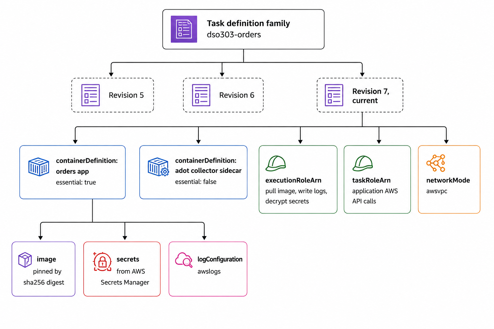{width="80%"}
    <figcaption>AWS Task Defination</figcaption>
    
<i>Image Source: AI Generaed (Chatgpt)</i>

</figure>

### Tasks, services, and the reconciliation loop

A **task** is one running instantiation of a task-definition revision. A **service** is a controller with a `desiredCount` that continuously compares desired state with observed state and issues the API calls that close the gap. This control loop is the whole idea, and it is worth stating precisely:

1. Observe the set of `RUNNING` tasks belonging to this service.
2. Compare its size and task-definition revision with the desired count and revision.
3. If fewer tasks are running than desired, or a task is unhealthy, place replacements according to the placement strategy and capacity provider strategy.
4. If more are running than desired, or tasks run an old revision during a deployment, deregister and stop the surplus, honouring the deployment configuration.
5. Register newly healthy tasks with any configured load-balancer target groups, and deregister stopping ones first.
6. Repeat, forever.

Use a **standalone task** (`RunTask`) for work that finishes: a database migration, a batch job, a scheduled report. Use a **service** for work that should always be running: an API, a queue consumer, a web front end.

<figure markdown="span">
    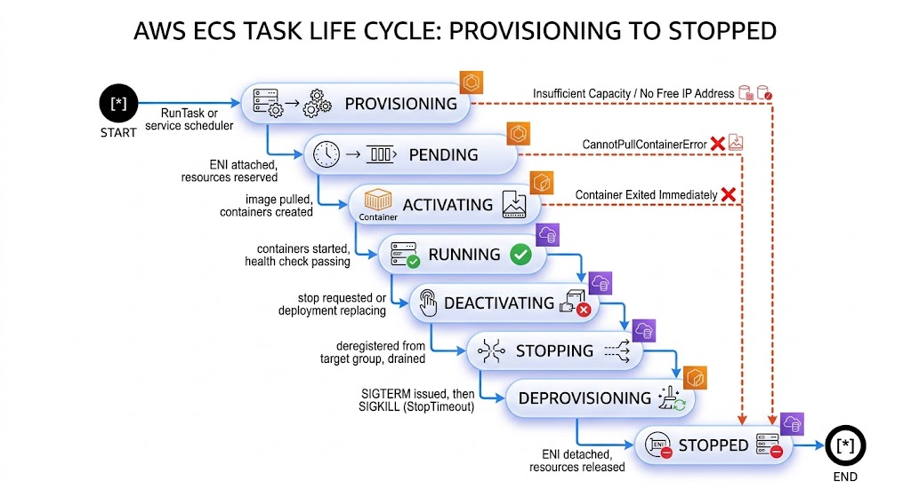{width="80%"}
    <figcaption>AWS Task Reconciliation Loop</figcaption>
    
<i>Image Source: AI Generaed (Google Gemini)</i>

</figure>

!!! tip "Read the state a task is stuck in — it names the cause"

    A task stuck in `PROVISIONING` is waiting for capacity or a network interface: no EC2 room, no free subnet IP addresses, or a Fargate quota. A task that reaches `PENDING` and then `STOPPED` almost always failed to pull the image: check the ECR repository name, the Region, the execution role's permissions, and whether a private subnet has the three endpoints it needs. A task that reaches `RUNNING` and immediately stops is an application failure: read `stoppedReason` and the container `exitCode`. Reading the state before guessing turns a thirty-minute investigation into a two-minute one.

---

## Internal Working

### What `docker build` actually does

The builder reads the Dockerfile and, for each instruction, computes a cache key from the instruction text and its inputs — for `COPY`, a checksum of the copied files. If a cached layer matches, it is reused; otherwise the instruction executes inside a temporary container and the resulting filesystem difference is captured as a new layer, compressed, and hashed. When all instructions complete, the builder writes the configuration blob, then the manifest referencing the configuration and the layers. The manifest's SHA-256 becomes the image's identity.

Two consequences follow directly. First, **a file deleted in a later layer still occupies space in the earlier one**, because layers are additive; `RUN apt-get install ... && rm -rf /var/lib/apt/lists/*` in one instruction removes the bytes, whereas the same commands in two instructions does not. Second, **secrets used during a build persist in the layer that used them**, even if a later layer deletes the file — which is why build-time secrets must use BuildKit's `--mount=type=secret` rather than `COPY` or `ARG`.

### The push protocol and the ECR authorisation flow

<figure markdown="span">
    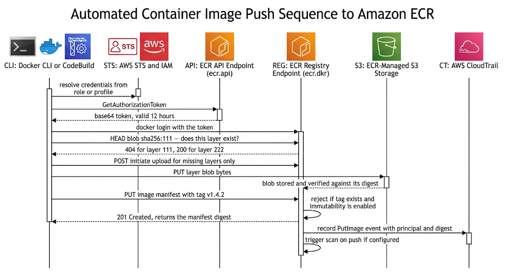{width="80%"}
    <figcaptiona>Push protocol and the authorization loop</figcaption>
    
<i>Image Source: AI Generaed (Google Gemini)</i>

</figure>

Two details repay attention. The registry asks for layers it does not already hold, so pushing a new version of an image whose base layers are unchanged transfers only the application layer — usually a few megabytes rather than the full image. And the authorisation token is short-lived and derived from IAM: there is no long-lived registry password to leak, which is a meaningful improvement over the shared credentials common with self-hosted registries.

### The pull path at task launch

<figure markdown="span">
    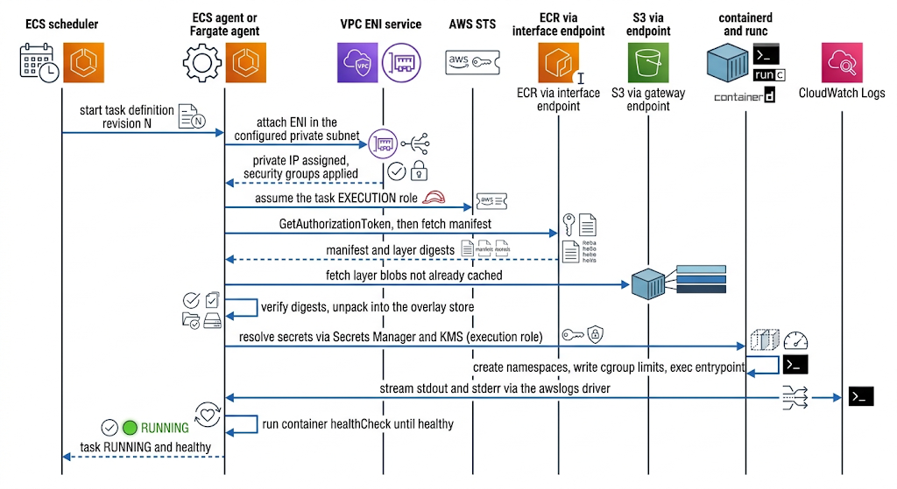{width="80%"}
    <figcaptiona>Push Pull Path at Task Launch</figcaption>
    
<i>Image Source: AI Generaed (Google Gemini)</i>

</figure>

The **execution role** does all of this: pull, log-stream creation, secret decryption. Your application code has not started yet. Once it does, it obtains credentials for the **task role** from the task metadata endpoint at `169.254.170.2` (or the v4 endpoint whose URI is injected as `ECS_CONTAINER_METADATA_URI_V4`), which the AWS SDKs discover automatically. This is why a correctly configured task never contains an access key.

### Where image pull time goes

| Phase | Typical contribution | Lever |
|---|---|---|
| ENI attachment (`awsvpc`) | Several seconds, Fargate | None directly; fewer, longer-lived tasks amortise it |
| Authorisation token | Sub-second | Cached by the agent |
| Manifest fetch | Sub-second | Negligible |
| Layer download | **Dominant**; proportional to compressed image size | Multi-stage builds, minimal bases, layer sharing, VPC endpoints, same-Region ECR |
| Decompression and unpack | Proportional to uncompressed size | Fewer and smaller layers; consider zstd-compressed images |
| Container start and health check | Application-dependent | Faster startup, correct `startPeriod` on the health check |

On EC2 capacity, layers already present on the instance are not re-downloaded, so a scale-out onto a warm instance is dramatically faster than a cold one — which is an argument for warm pools and for keeping instances long-lived. On Fargate there is no shared cache between tasks, so image size matters more.

---

## Architecture Components

| Component | Responsibility in this chapter's scope |
|---|---|
| **Developer workstation** | Authors the Dockerfile and validates locally; the source of architecture-mismatch bugs when it differs from the target platform |
| **Source repository** | Holds the Dockerfile beside the application; the commit SHA becomes the image tag, tying artefact to source |
| **AWS CodeBuild or another CI runner** | Performs the build in a controlled environment for the correct target architecture; holds no long-lived registry credentials, only an IAM role |
| **BuildKit** | The modern builder: parallel stages, cache mounts, build secrets that do not persist into layers, multi-architecture output |
| **Amazon ECR (private)** | The artefact store and the supply-chain control point: immutability, scanning, lifecycle, replication, policy |
| **Amazon ECR Public / `public.ecr.aws`** | Source of AWS-published base images; using it directly on the deployment path is an availability dependency |
| **ECR pull-through cache** | Caches upstream public images inside your registry, removing that dependency and rate limits |
| **Amazon Inspector** | Enhanced, continuous vulnerability scanning of images at rest in ECR |
| **AWS KMS** | Encryption of repository contents; a customer-managed key adds key-level policy and decrypt auditing |
| **Amazon EC2** | The manual container host in 2.1.2, and the capacity substrate underneath ECS EC2 launch type |
| **containerd and runc** | The runtime layer that creates namespaces and cgroups and executes the entrypoint |
| **`systemd`** | The manual supervisor in 2.1.2 — restart-on-failure and start-on-boot, and nothing beyond one host |
| **ECS agent** | On EC2 capacity, registers the instance with a cluster, receives placement instructions, manages task lifecycle, reports state |
| **Amazon ECS control plane** | Stores task definitions and service state; runs the scheduler and the reconciliation loop |
| **AWS Fargate** | Serverless capacity: one microVM per task, no instance to manage, no shared image cache |
| **Task execution role** | Used by the agent before your code runs: ECR pull, log-stream creation, secret decryption |
| **Task role** | Used by your application code for AWS API calls, delivered through the task metadata endpoint |
| **AWS Secrets Manager and SSM Parameter Store** | Sources for the `secrets` block, keeping credentials out of images and out of `environment` |
| **Amazon CloudWatch Logs** | Destination for `stdout` and `stderr` via the `awslogs` driver; the only place logs survive the task |
| **Interface and gateway VPC endpoints** | `ecr.api`, `ecr.dkr`, `logs`, `secretsmanager`, `ssm`, `sts` as interface endpoints; **S3 as a gateway endpoint** for layer blobs |
| **Application Load Balancer** | Registers task IPs as targets; in 2.1.2 you register them by hand to see what ECS automates |
| **AWS CloudTrail** | Audit record of every ECR push, pull authorisation, task-definition registration, and service update |

Read architecturally, these fall into three groups. The **build group** — workstation, CI, BuildKit — produces an artefact and should be the only thing that can write to the registry. The **registry group** — ECR with its immutability, scanning, lifecycle, and policy settings — is the control point where an organisation decides what is allowed to reach production, and it is the cheapest place to enforce that decision. The **runtime group** — EC2 or Fargate, the agent, the roles, the endpoints, the log destination — consumes the artefact and must never modify it. When these three groups are cleanly separated, "what is running in production" has a single, checkable answer: a digest.

## Request Lifecycle

The lifecycle in this chapter is not a user request but the journey of a change from a developer's commit to a container serving traffic.

<figure markdown="span">
    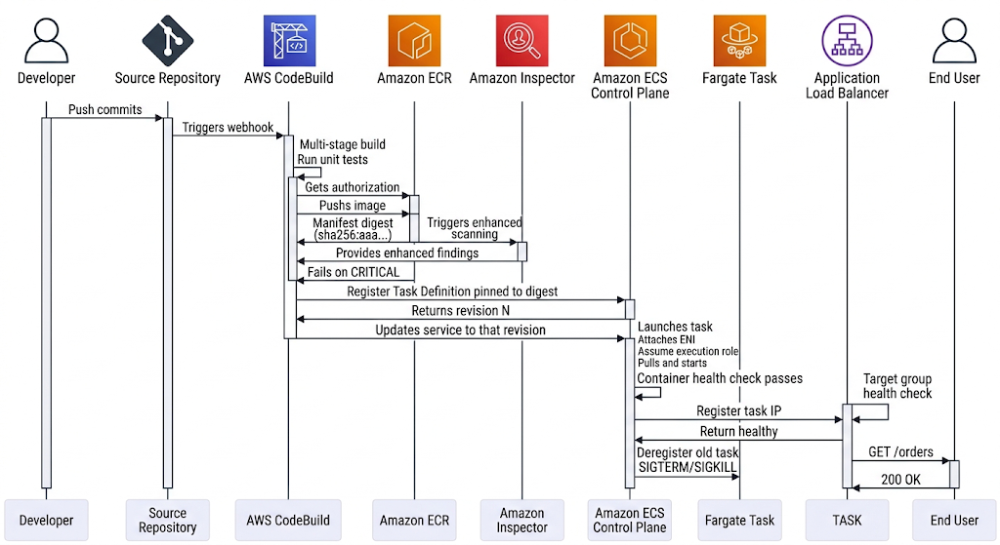{width="80%"}
    <figcaptiona>Request Lifecycle</figcaption>
    
<i>Image Source: AI Generaed (Google Gemini)</i>

</figure>

The reasoning at each stage:

1. **The commit SHA becomes the tag.** This makes the artefact traceable to source without a lookup table, and guarantees uniqueness, which is what tag immutability requires.
2. **The build happens in CI, not on a laptop.** The build environment is itself controlled and reproducible, and it targets the deployment architecture rather than the developer's.
3. **CodeBuild authenticates with an IAM role.** No registry password exists to be leaked, and CloudTrail records which principal pushed which digest.
4. **The scan gates the pipeline.** This is the cheapest point at which a vulnerable image can be stopped; stopping it after deployment is incident response rather than prevention.
5. **The task definition pins the digest, not the tag.** The specification now names exact bytes. Rolling back means pointing the service at an earlier revision, which names an earlier digest.
6. **The execution role pulls and the task role serves.** Two identities, two blast radii, as established in 1.3.2.
7. **Two health checks, in sequence.** The container health check tells ECS the container is alive; the target group health check tells the ALB it is ready for traffic. Both must pass before a target receives requests.
8. **Deregistration precedes termination.** The old task leaves the target group and drains in-flight requests before receiving `SIGTERM`, which is what makes the deployment invisible to users.

!!! warning "Promote the digest, never rebuild per environment"

    A pipeline that rebuilds the image for staging and again for production has tested one artefact and shipped a different one. Base images move, transitive dependencies resolve differently, and a build a week later is not the build you validated. Build once, scan once, and promote the **same digest** through environments, varying only configuration injected at run time. Two identical Dockerfiles do not guarantee two identical images; only the digest does.

---

## AWS Service Deep Dive

!!! warning "On numbers and quotas"

    Quotas here are representative as of 2026 and most are **soft** — adjustable through AWS Service Quotas or a support case. They vary by Region and account. Verify in the Service Quotas console for the account and Region you are designing in rather than trusting a printed figure. Pricing is described only as **dimensions** and **relative positions**; model actual cost in the AWS Pricing Calculator.

### Amazon Elastic Container Registry

**Purpose.** Store, version, scan, and serve OCI images inside your AWS account boundary, authorised by IAM, integrated with every AWS container runtime.

**Architecture.** One registry per account per Region. Manifests and metadata are held by the ECR service; layer blobs are stored in ECR-managed Amazon S3, which is why pulls require an S3 route. The API endpoint (`ecr.api`) serves the AWS API surface — `GetAuthorizationToken`, `DescribeImages`, `PutImage`, lifecycle and policy operations — while the registry endpoint (`ecr.dkr`) serves the OCI distribution protocol used by container clients.

**Important features.** Tag immutability per repository; lifecycle policies with rules keyed on age, count, and tag prefix; basic scan-on-push and Inspector-backed enhanced continuous scanning; pull-through cache rules for upstream public registries; cross-Region and cross-account replication configured registry-wide; repository policies for cross-account access; encryption with AES-256 or a customer-managed KMS key; image signing through AWS Signer with container-image signing; OCI artefact support, so Helm charts and SBOMs can be stored alongside images.

**Limitations.** The registry is regional, so multi-Region deployment requires replication or accepts cross-Region pull latency and data-transfer charges. Lifecycle policies evaluate on a schedule rather than instantly. Basic scanning covers operating-system packages only and does not rescan, which makes it a weak control on its own. Pull-through cache supports a defined set of upstream registries and requires the first pull to populate the cache, so it removes the steady-state dependency rather than the first-pull dependency. Immutability cannot be applied retroactively to tags already pushed.

**Pricing model.** Storage per GB-month of stored images, and data transfer out. Data transfer **within the same Region** to ECS, EKS, or EC2 is not charged, which is a strong argument for keeping images in the Region where they are consumed. Enhanced scanning is charged per image scanned and rescanned. Replication incurs cross-Region transfer plus storage in the destination Region. The largest avoidable line item is almost always accumulated untagged images from CI, addressed by a lifecycle policy.

**Performance characteristics.** Pull throughput is high and generally not the bottleneck; the bottleneck is image size and the number of layers. Layer deduplication means an unchanged base is neither stored twice nor transferred twice. Interface endpoints remove NAT gateway hops and their per-GB processing charge from the pull path.

**Scaling behaviour.** Fully managed; you scale by pushing more images. The practical limits are API rate quotas on `GetAuthorizationToken` and image operations, which a very large simultaneous scale-out can approach — a reason to prefer fewer, larger tasks over very many tiny ones when scaling by hundreds.

**Availability.** Regional service, multi-AZ internally. For a multi-Region architecture, configure replication so that a Region's deployment path does not depend on another Region.

**Security features.** IAM identity policies and repository resource policies; encryption at rest; TLS in transit; CloudTrail for every API call; scan findings routed to Amazon EventBridge and AWS Security Hub; tag immutability; image signing and verification; pull-through cache so third-party content enters through a controlled path.

**Service limits (representative, mostly soft).** Repositories per Region and images per repository are in the tens of thousands. Maximum layer size and maximum image size are large enough that hitting them indicates a design problem rather than a quota problem. Lifecycle policy rules per repository are limited to a small number, which is ample for well-designed policies. Verify current values in Service Quotas.

**Common configurations.** Immutable tags enabled at creation; enhanced scanning enabled registry-wide; a lifecycle policy expiring untagged images after one to seven days and retaining the last thirty tagged images; interface endpoints for `ecr.api` and `ecr.dkr` plus an S3 gateway endpoint in every VPC that runs tasks; a repository policy granting pull-only access to the workload accounts when builds are centralised; replication to any Region that runs workloads.

### Amazon EC2 as a container host

**Purpose.** Provide a Linux host on which a container runtime executes containers — either manually, as in 2.1.2, or under the ECS agent as EC2 launch-type capacity.

**Architecture.** An EC2 instance running a container runtime. For ECS, use the **ECS-optimised AMI**, which ships with `containerd`, the ECS agent, and sensible defaults already configured; the agent reads `/etc/ecs/ecs.config` for the cluster name and registers the instance as a container instance.

**Important features for manual use.** `systemd` units for supervision; instance user data for bootstrapping; instance profiles for AWS credentials; EBS volumes for persistent data; Auto Scaling groups for replacement on failure.

**Limitations for manual use.** Everything in the comparison table earlier: no cross-host scheduling, no automatic replacement on instance failure, no rolling deployment, no dynamic load-balancer registration, no per-container identity, and no inventory. These are not deficiencies of EC2; they are simply not EC2's job.

**Pricing model.** Instance hours plus EBS. Unlike Fargate, you pay for the whole instance whether containers use it or not, which is favourable at high sustained utilisation and wasteful at low utilisation.

**Performance characteristics.** A warm instance with cached layers starts a container in seconds, materially faster than a cold Fargate task, because there is no ENI attachment and no image download. This is the main performance argument for EC2 capacity.

**Security features.** The critical one is the **instance metadata service**. By default every container on the instance can reach IMDS and obtain the instance profile's credentials, which destroys per-task identity. Enforce IMDSv2 and set the hop limit to 1 so that a container's network namespace cannot reach it, or block the `169.254.169.254` route from container networks.

!!! danger "The instance profile is a shared credential"

    On EC2 capacity, every container on an instance can reach the instance metadata service unless you prevent it. A single compromised container therefore obtains the permissions of the container instance role — and if that role has been given application permissions "for convenience", it obtains those too. Keep the container instance role limited to cluster registration, ECR pull, and log writing; grant application permissions only through task roles; and enforce IMDSv2 with a hop limit of 1.

### The task definition as a specification

**Purpose.** Declare, immutably and completely, what a task is: its containers, images, resources, networking, identity, storage, logging, and lifecycle behaviour.

**Resource sizing on Fargate.** Task CPU and memory come from a **fixed valid matrix**, not arbitrary values: 0.25 vCPU pairs with 0.5, 1, or 2 GB; 0.5 vCPU with 1 to 4 GB; 1 vCPU with 2 to 8 GB; and so on through 16 vCPU with 32 to 120 GB to 32 vCPU, which offers only the discrete values 60, 120, or 244 GB. Choosing an invalid pair is rejected at registration, and sizes of 8 vCPU and above are Linux-only. Container-level `cpu` and `memory` then subdivide the task-level allocation; a container `memory` value is a hard limit and exceeding it is `OOMKilled` even if the task as a whole has room.

**Ephemeral storage.** Fargate tasks receive a default ephemeral volume (20 GB at the time of writing) expandable to 200 GB, encrypted, and destroyed with the task. It is scratch space, not storage.

**Network modes.**

| Mode | Behaviour | When to use |
|---|---|---|
| `awsvpc` | Task gets its own ENI, private IP, and security groups. **Required on Fargate** | The default for everything; per-task security groups are the security model |
| `bridge` | Docker's virtual bridge; container ports map to host ports, optionally dynamic (host port 0) | EC2 launch type with dynamic port mapping behind an ALB, for density |
| `host` | Container shares the host's network namespace directly | Highest performance, no port isolation; monitoring agents and specialised cases |
| `none` | No external networking | Batch work that needs no network |

**Common configurations.** `awsvpc` mode; task-level CPU and memory from the Fargate matrix; image pinned by digest; `secrets` rather than `environment` for credentials; `awslogs` with an explicit log group that has a retention policy; a `healthCheck` with a `startPeriod` longer than the application's cold start; `stopTimeout` above the p99 request duration; `readonlyRootFilesystem: true`; a non-root `user`; and `runtimePlatform` set explicitly when building on ARM.

---

## Important AWS Terminology

| Term | Meaning |
|---|---|
| **Container** | A process isolated by kernel namespaces and constrained by cgroups, sharing the host kernel |
| **Image** | An immutable, layered, content-addressed filesystem bundle plus start-up configuration |
| **OCI** | Open Container Initiative; the standards body owning the image, runtime, and distribution specifications |
| **Layer** | A compressed tar archive of filesystem changes, identified by the SHA-256 of its content |
| **Image manifest** | JSON document referencing the configuration blob and layer blobs; its digest is the image's identity |
| **Image index / manifest list** | A document referencing one manifest per platform, enabling multi-architecture images |
| **Digest** | `sha256:...`, the cryptographic identity of an image; immutable by construction |
| **Tag** | A human-readable, by default mutable, pointer to a manifest digest |
| **Tag immutability** | ECR repository setting rejecting a push to an existing tag, optionally with wildcard exclusion filters |
| **Base image** | The image a Dockerfile starts `FROM` |
| **Distroless image** | A runtime image containing the application and its runtime only — no shell, no package manager |
| **Multi-stage build** | A Dockerfile with several `FROM` stages, shipping only the final stage's contents |
| **BuildKit** | The modern Docker builder: parallelism, cache mounts, build secrets, multi-architecture output |
| **Build context** | The directory sent to the builder; `.dockerignore` controls what is excluded |
| **Namespace (Linux)** | Kernel mechanism partitioning a resource type so a process sees only its own partition |
| **cgroup** | Kernel mechanism accounting for and limiting CPU, memory, I/O, and process count |
| **OverlayFS** | The union filesystem stacking read-only layers under a writable layer |
| **Writable layer** | The per-container top layer, discarded when the container is removed |
| **containerd** | The container runtime managing image storage and container lifecycle |
| **runc** | The low-level runtime that creates namespaces and cgroups and executes the process |
| **Registry** | A service storing and serving images; in ECR, one per account per Region |
| **Repository** | A named collection of images within a registry; the unit of policy |
| **Repository policy** | A resource-based policy on an ECR repository, used for cross-account access |
| **Authorisation token** | A short-lived (12-hour) ECR credential obtained through `GetAuthorizationToken` |
| **Lifecycle policy** | Declarative ECR rules expiring images by age, count, or tag pattern |
| **Basic scanning** | Free scan-on-push covering operating-system packages only, no rescanning |
| **Enhanced scanning** | Amazon Inspector continuous scanning covering OS and language-package vulnerabilities |
| **Pull-through cache** | An ECR repository transparently caching images from an upstream public registry |
| **Replication (ECR)** | Registry-level configuration copying images across Regions or accounts automatically |
| **ECR Public** | The separate public registry at `public.ecr.aws` |
| **Task definition** | Immutable, versioned ECS JSON specification of a task |
| **Family** | The name grouping task-definition revisions |
| **Revision** | The auto-incrementing version of a task definition within its family |
| **Container definition** | One container's entry within a task definition |
| **Essential container** | A container whose exit stops the entire task |
| **Sidecar** | A non-essential helper container in the same task, sharing its network namespace |
| **Task** | A running instantiation of a task-definition revision |
| **Service** | The ECS controller maintaining a desired count of tasks and registering them with load balancers |
| **Standalone task** | A task launched with `RunTask` that runs to completion and is not maintained |
| **`awsvpc` network mode** | Each task receives its own ENI, private IP, and security groups |
| **`bridge` network mode** | Docker bridge networking with static or dynamic host-port mapping |
| **Dynamic port mapping** | Host port `0` in `bridge` mode; the host port is assigned at runtime and registered with the ALB |
| **Task execution role** | The role the ECS agent assumes to pull images, create log streams, and decrypt secrets |
| **Task role** | The role application code assumes for AWS API calls, delivered via the task metadata endpoint |
| **Container instance role** | The EC2 instance profile used by the ECS agent on EC2 capacity |
| **Task metadata endpoint** | The link-local endpoint supplying task metadata and task-role credentials to containers |
| **`awslogs` driver** | The log driver streaming container `stdout` and `stderr` to CloudWatch Logs |
| **FireLens** | ECS log routing through a Fluent Bit or Fluentd sidecar to arbitrary destinations |
| **`stopTimeout`** | Seconds between `SIGTERM` and `SIGKILL` when a container is stopped |
| **`dependsOn`** | Container start ordering with `START`, `COMPLETE`, `SUCCESS`, or `HEALTHY` conditions |
| **Ephemeral storage** | The temporary volume attached to a Fargate task, destroyed with the task |
| **`OOMKilled`** | Kernel termination of a container that exceeded its memory limit; exit code 137 |
| **`exec format error`** | Failure to run an image built for a different CPU architecture |
| **`CannotPullContainerError`** | Task failure caused by an image that could not be retrieved |
| **Multi-architecture image** | One tag serving several platforms via an image index |
| **SBOM** | Software Bill of Materials; the inventory of components in an image |
| **Image signing** | Cryptographic attestation of an image's provenance, verified before deployment |

## Configuration Options

### Dockerfile and build configuration

| Choice | Options | How to decide |
|---|---|---|
| **Base image** | Full distribution, slim variant, Alpine, distroless, scratch | Distroless or slim for compiled languages; slim for interpreted runtimes. Alpine uses musl rather than glibc, which breaks some native extensions and can change DNS resolution behaviour — test rather than assume |
| **Base image pinning** | Floating tag, version tag, digest | Digest for reproducibility; a version tag plus a scheduled rebuild is the pragmatic middle ground, because a pinned digest never receives security patches until you move it |
| **Target architecture** | `linux/amd64`, `linux/arm64`, multi-architecture | ARM64 (Graviton) for better price-performance where dependencies allow; build explicitly for the target, never implicitly from the build host |
| **Build stages** | Single stage, multi-stage | Multi-stage always; the only reason not to is a trivial image with no build step |
| **Layer ordering** | Dependencies before source, or the reverse | Dependency manifests first, then `RUN` install, then source — so a source edit does not re-resolve dependencies |
| **Build secrets** | `ARG`, `COPY`, BuildKit `--mount=type=secret` | Only the BuildKit secret mount; `ARG` and `COPY` persist the secret in the image history |
| **`.dockerignore`** | Present or absent | Always present, excluding `.git`, `node_modules`, local environment files, and test fixtures — it reduces context upload time and prevents secrets leaking into the build |
| **Process form** | Shell form or exec form for `ENTRYPOINT` | Exec form, so the application is PID 1 and receives `SIGTERM` directly rather than through a shell that swallows it |
| **User** | root, or a created non-root user | Non-root, always; combine with `readonlyRootFilesystem` in the task definition |
| **Compression** | gzip (default), zstd | zstd decompresses faster, reducing task start time, where the toolchain supports it |

### Amazon ECR repository configuration

| Setting | Options | How to decide |
|---|---|---|
| **Tag mutability** | `MUTABLE`, `IMMUTABLE`, and the newer `IMMUTABLE_WITH_EXCLUSION` / `MUTABLE_WITH_EXCLUSION` with up to five wildcard exclusion filters | `IMMUTABLE` at creation. Use an exclusion variant only for a deliberate, narrow case such as allowing `dev-*` to be overwritten; the setting governs subsequent pushes and does not lock or unlock tags already present |
| **Scan configuration** | Manual, basic scan-on-push, enhanced (Inspector) | Enhanced registry-wide for anything reaching production; basic is a weak control because it never rescans |
| **Encryption** | AES-256 (default), AWS KMS customer-managed key | CMK where you need key-level policy, rotation control, and decrypt auditing; default otherwise |
| **Lifecycle policy** | Rules by age, count, tag prefix | Expire untagged after one to seven days; retain the last N tagged images per prefix; keep release-tagged images longer than CI-tagged ones |
| **Repository policy** | Absent, or cross-account statements | Grant `ecr:BatchGetImage`, `ecr:GetDownloadUrlForLayer`, `ecr:BatchCheckLayerAvailability` to workload accounts; never grant push |
| **Replication** | None, cross-Region, cross-account | Replicate to every Region that launches tasks from the image |
| **Pull-through cache** | Configured per upstream registry | Configure for every public base image the organisation uses |

### ECS task-definition configuration

| Setting | Options | How to decide |
|---|---|---|
| **`requiresCompatibilities`** | `FARGATE`, `EC2`, `EXTERNAL` | Fargate unless you need GPUs, local NVMe, a host daemon, or lowest unit cost at sustained utilisation |
| **`networkMode`** | `awsvpc`, `bridge`, `host`, `none` | `awsvpc` by default; `bridge` with dynamic ports only for density on EC2 capacity |
| **Task CPU and memory** | Fargate matrix values; arbitrary on EC2 | Size from measured p99 plus headroom; over-sizing is paid continuously on every replica |
| **`memory` vs `memoryReservation`** | Hard limit vs soft floor | Set `memory` as a hard limit to fail fast and visibly; a container with no limit can starve its neighbours on EC2 |
| **`runtimePlatform`** | OS family and `cpuArchitecture` | Set explicitly; the default is x86_64 and a silent mismatch produces `exec format error` |
| **`ephemeralStorage`** | 20 to 200 GB on Fargate | Raise only for genuine scratch needs; it is billed and it is not storage |
| **`healthCheck`** | Command, `interval`, `timeout`, `retries`, `startPeriod` | `startPeriod` must exceed the application's cold start, or the container is killed while still booting |
| **`stopTimeout`** | Up to 120 seconds | Slightly above p99 request duration, so `SIGTERM` handling can drain |
| **`secrets` vs `environment`** | Both available | `secrets` for anything sensitive; `environment` is readable by anyone with `ecs:DescribeTaskDefinition` |
| **`logConfiguration`** | `awslogs`, `awsfirelens`, `splunk`, others | `awslogs` for simplicity; FireLens when filtering before ingestion or routing to several destinations |
| **`user` and `readonlyRootFilesystem`** | Any UID; true or false | Non-root and read-only root, with `tmpfs` mounts for paths that genuinely need writes |
| **`linuxParameters.capabilities`** | Add or drop Linux capabilities | Drop `ALL` and add back only what is required; most applications require none |
| **`ulimits`** | `nofile`, `nproc`, others | Raise `nofile` for services holding many connections; the default causes "too many open files" under load |
| **`dependsOn`** | `START`, `COMPLETE`, `SUCCESS`, `HEALTHY` | `HEALTHY` for a proxy or agent the application needs; `SUCCESS` for an init container that must finish first |

!!! tip "Two health checks, two purposes"

    The task definition's `healthCheck` is executed **inside** the container by the agent and tells ECS whether to consider the container healthy — it drives `dependsOn: HEALTHY` and container replacement. The target group's health check is executed **by the load balancer** over the network and decides whether the target receives traffic. They can disagree, and when they do the difference is diagnostic: container healthy but target unhealthy points at security groups, the wrong port, or a path that requires authentication.

---

## Design Considerations

<figure markdown="span">
    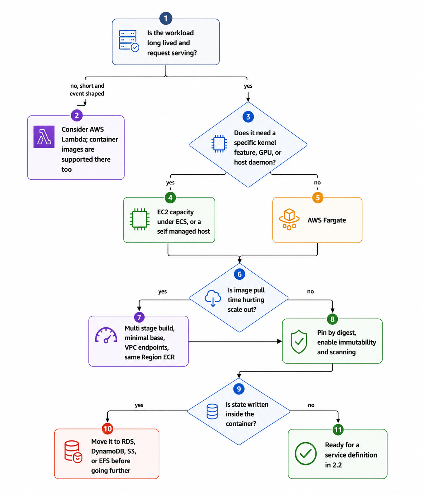{width="80%"}
    <figcaptiona>Design Consideration Flow</figcaption>
    
<i>Image Source: AI Generaed (Chatgpt)</i>

</figure>

| Quality | What it means here | Design levers | The trade-off you accept |
|---|---|---|---|
| **Reproducibility** | The same specification always produces the same running bytes | Digest pinning, build-once-promote-many, immutable tags | A pinned base image stops receiving patches until you deliberately move it, so you must schedule rebuilds |
| **Scalability** | How fast new capacity begins serving | Small images, layer sharing, VPC endpoints, warm EC2 capacity | Smaller images often mean more build complexity and a base without debugging tools |
| **Availability** | Whether a deployment or scale-out can proceed | Private registry, replication, endpoints instead of NAT | Replication and endpoints cost money and configuration |
| **Security** | The blast radius of a compromised container | Minimal base, non-root, read-only root, dropped capabilities, scanning, per-task roles | A distroless image has no shell, which makes live debugging harder and pushes you towards ECS Exec on a debug sidecar |
| **Durability** | Whether data survives a task | Nothing durable inside the container; RDS, DynamoDB, S3, EFS outside it | Externalising state is the work; it is also the point |
| **Latency** | Cold-start contribution to user-visible latency | Image size, runtime choice, lazy initialisation | Optimising start time can conflict with rich start-up validation |
| **Cost** | Registry storage, transfer, and wasted compute | Lifecycle policies, right-sized tasks, same-Region pulls, Graviton | Aggressive lifecycle policies can delete an image you wanted for forensics |
| **Maintainability** | Cost of keeping images current | Base-image update automation, scheduled rebuilds, SBOMs | Automation must be built and owned |
| **Operational complexity** | What an engineer faces during an incident | Consistent image conventions, standard health endpoints, ECS Exec | Standardisation constrains teams that want to be different |

!!! danger "An image is a snapshot of vulnerabilities as well as of code"

    The day you build an image, its CVE count is whatever the scanner reports. Six months later the same bytes contain months of undisclosed-then-disclosed vulnerabilities, and nothing about the running system has changed to tell you. This is why **enhanced scanning matters more than scan-on-push**: it rescans images at rest and reports new findings against images you deployed long ago. Pair it with a scheduled rebuild of long-lived services, or your most stable service becomes your most vulnerable one precisely because nobody has needed to touch it.

---

## AWS Best Practices

### Operational Excellence

Build in CI, never from a workstation, so that the build environment is itself version-controlled and reproducible. Tag every image with the commit SHA so the artefact is traceable to source without a lookup. Standardise a small set of base images across the organisation and update them centrally, so that a base-image CVE is one change rather than forty. Give every service the same conventions — the same health endpoint path, the same log format, the same required labels — so that an engineer on call for an unfamiliar service is not also learning a new convention. Keep the Dockerfile beside the application code it builds, so that a change to either is reviewed together. Automate base-image updates with scheduled rebuilds and dependency-update tooling, and treat a failing rebuild as a real signal rather than noise.

### Security

Start from a minimal base and add only what is needed; every package present is attack surface. Run as a non-root user, mount the root filesystem read-only, and drop all Linux capabilities, adding back only what the process demonstrably requires. Never place a secret in a Dockerfile, in `ARG`, in a `COPY`ed file, or in a task definition's `environment` block — use BuildKit secret mounts at build time and the `secrets` block at run time. Enable tag immutability and enhanced scanning on every repository, and gate the pipeline on critical findings. Grant push permission only to CI roles and pull-only permission to workload roles. Use a pull-through cache so that third-party images enter through a controlled path where they can be scanned and retained. On EC2 capacity, enforce IMDSv2 with a hop limit of 1 so containers cannot reach the instance profile. Record everything: CloudTrail for registry and ECS API calls, and scan findings into Security Hub.

### Reliability

Handle `SIGTERM` explicitly: stop accepting new work, finish in-flight requests, close connections, exit. A process that ignores `SIGTERM` has every deployment cut its in-flight requests. Make the container's start-up idempotent and tolerant of dependencies that are not yet available, retrying with backoff rather than crashing, so that ordering during a cluster-wide restart does not become a cascade. Keep the image small enough that a scale-out is fast, because scale-out latency is a reliability property under load. Remove public registries from the deployment path with pull-through caching or vendored base images. Replicate images to every Region that launches them, so a Region can recover without a cross-Region dependency.

### Performance Efficiency

Use multi-stage builds and minimal bases; image size translates directly into scale-out latency on Fargate. Order layers so the cache is effective, and use BuildKit cache mounts for package-manager caches so that dependency resolution is not repeated on every build. Build for ARM64 where dependencies permit, for better price-performance on both EC2 and Fargate. Keep VPC endpoints in place so pulls take the AWS network rather than a NAT gateway. On EC2 capacity, prefer longer-lived instances so the layer cache is warm.

### Cost Optimization

Apply a lifecycle policy to every repository at creation, expiring untagged images within days and retaining a bounded number of tagged ones; an active pipeline can otherwise accumulate hundreds of gigabytes of images nobody will ever pull. Keep images in the Region that consumes them, since same-Region pulls to ECS, EKS, and EC2 are not charged for data transfer. Add S3 gateway and ECR interface endpoints to remove NAT gateway data-processing charges from every pull. Right-size task CPU and memory from measurement, because on Fargate over-sizing is paid continuously on every replica. Set retention on every CloudWatch log group; an implicitly created log group retains data forever.

### Sustainability

Smaller images move fewer bytes and consume less storage and network energy. Graviton-based compute delivers more work per watt. Higher utilisation through right-sizing reduces idle capacity. Deleting unused images and stale non-production environments removes real, if unglamorous, energy consumption.

---

## Security Considerations

<figure markdown="span">
    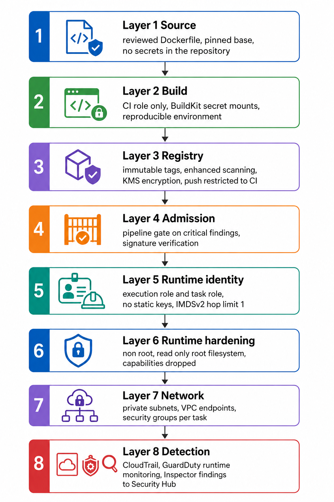{width="80%"}
    <figcaption>Security Considerations</figcaption>
    
<i>Image Source: AI Generaed (Google Gemini)</i>

</figure>

**Supply chain.** The registry is the control point. An organisation that enforces immutability, scanning, and push-only-from-CI has answered "what can reach production" in one place rather than in every pipeline. Add signing with AWS Signer and verification before deployment where the threat model justifies it — a compromised CI role that can push is otherwise able to introduce arbitrary code under a name that has already been approved.

**Secrets.** There are three distinct places a secret must not appear, and each has a correct alternative. At build time, use BuildKit `--mount=type=secret`, never `ARG` or a `COPY`ed file, because both persist in image history that anyone who can pull the image can read. In the task definition, use the `secrets` block rather than `environment`, because `ecs:DescribeTaskDefinition` is commonly granted broadly for visibility and task definitions end up in CloudFormation templates, Git history, and support tickets. At run time, do not write secrets to the container filesystem or to logs; a value logged once is in CloudWatch for the retention period.

**Identity.** The two task roles were established in 1.3.2 and are worth restating in build-and-run terms. The **execution role** acts before your code runs: it pulls the image, creates the log stream, and decrypts secrets. The **task role** is what your code uses. Giving the execution role your application's data permissions means the image-pull identity also holds database access; giving the task role permission to read every secret in the account means one compromised container reads them all. Scope both narrowly, and on EC2 capacity remember the third role — the container instance role — and block IMDS from containers.

**Runtime hardening.** `readonlyRootFilesystem: true` prevents an attacker from writing a tool into the container. A non-root `user` means a container escape starts from an unprivileged UID. Dropping all capabilities removes most of the primitives an escape would use. None of these cost anything, all of them are omitted by most tutorials, and together they turn a straightforward compromise into a difficult one.

**Network.** Tasks belong in private subnets with `assignPublicIp` disabled. Reach AWS APIs through interface and gateway endpoints, which also removes the NAT gateway from the pull path. Express service-to-service permission as security-group references rather than CIDR ranges, so that "orders may call catalog" is an identity statement.

**Detection.** Enable Amazon GuardDuty Runtime Monitoring for ECS, which observes process, file, and network behaviour inside tasks and detects activity that no scanner can predict — a shell spawned in a container that should never spawn one, an outbound connection to a known-bad address, a credential exfiltration pattern. Route Inspector and GuardDuty findings into Security Hub so that one queue holds them.

!!! danger "Three failures that recur in production"

    First, a secret in a Dockerfile `ARG` or in an early layer: deleting it in a later layer does not remove it, and `docker history` on the pulled image exposes it to anyone with pull access. Second, database credentials in a task definition's `environment` block, readable by every principal with `ecs:DescribeTaskDefinition` and copied into every template and ticket that references the task. Third, containers on EC2 capacity reaching the instance metadata service and assuming the container instance role — which silently defeats every per-task role in the cluster.

---

## Performance Optimization

**Image size is the primary lever, and it is a scaling property.** On Fargate every task launch pulls the image, so the compressed image size sits directly in the path between "load arrived" and "capacity is serving". A multi-stage build that reduces a Go service from 900 MB to 20 MB, or a Node service from 1.1 GB to 180 MB, changes scale-out from tens of seconds to a few seconds. Measure it: the ECS task's `pullStartedAt` and `pullStoppedAt` timestamps are returned by `DescribeTasks` and are the honest answer.

**Layer strategy.** Fewer, well-ordered layers pull and unpack faster, and stable layers shared across images are cached on warm EC2 instances. Put the volatile application layer last so that everything before it is shared with the previous version.

**Network path.** Interface endpoints for `ecr.api`, `ecr.dkr`, `logs`, `secretsmanager`, and `sts`, plus an S3 gateway endpoint, keep the pull inside the AWS network. This removes a NAT gateway hop, its per-GB charge, and its throughput ceiling from every task launch — which matters most during the large simultaneous launches that a scale-out event produces.

**Application start-up.** Defer expensive initialisation that is not needed to serve the first request, and set the health check's `startPeriod` to cover genuine warm-up so that a slow-but-correct start is not mistaken for a failure and replaced in a loop. Lazily establishing a database connection pool rather than blocking on it at boot is usually the single largest start-up saving.

**Runtime choice.** A compiled binary in a distroless image starts in milliseconds; a JVM with a large classpath takes seconds; an interpreted runtime importing a deep dependency tree sits in between. Where cold start is on the critical path of absorbing load, this is an architectural input rather than a language preference.

**Architecture.** Graviton (ARM64) offers materially better price-performance for most workloads. Build multi-architecture images so that the choice is a capacity decision rather than a rebuild.

**EC2 warm cache.** On EC2 capacity, an instance that already holds the base layers pulls only the application layer. Longer-lived instances and warm pools convert a cold pull into a warm one, which is a strong argument for EC2 capacity where scale-out latency is critical and utilisation is high.

---

## Cost Optimization

| What you pay for | Dimension | Frequently overlooked |
|---|---|---|
| **ECR storage** | Per GB-month | CI pushing an image per commit with no lifecycle policy; untagged layers from overwritten tags |
| **ECR data transfer out** | Per GB, to the internet or across Regions | Cross-Region pulls at every scale-out; same-Region pulls to ECS, EKS, and EC2 are not charged |
| **Enhanced scanning** | Per image scanned and rescanned | Scanning every CI build of every branch rather than only images that can reach an environment |
| **NAT gateway** | Per hour plus per GB processed | Every image pull, log write, and secret fetch from private subnets without VPC endpoints |
| **Fargate compute** | Per vCPU-hour and GB-hour | Over-provisioned task size multiplied by every replica, paid continuously |
| **EC2 compute** | Instance hours | Idle headroom on half-empty instances |
| **Ephemeral storage** | Per GB-hour above the included allowance on Fargate | Raised "just in case" and never revisited |
| **CloudWatch Logs** | Per GB ingested plus storage | Debug logging left on in production; log groups with no retention policy |
| **Inter-AZ transfer** | Per GB | Not a build concern, but a pull from a cross-AZ path can be |

**The lifecycle policy is the highest-value single action.** A pipeline that pushes one image per commit to twenty repositories accumulates storage indefinitely. A policy expiring untagged images after seven days and retaining the last thirty tagged images per repository typically removes most of the stored volume with no operational impact.

**Endpoints pay for themselves quickly.** An interface endpoint has an hourly charge and a per-GB charge, both lower than the NAT gateway's per-GB processing charge for the same traffic. On a cluster that launches tasks frequently, the endpoints are cheaper and also faster and more available.

**Right-size before optimising anything else.** On Fargate, a task sized at 2 vCPU that needs 0.5 costs four times what it should, on every replica, every second. Use Container Insights or Compute Optimizer to size from measured usage, and revisit quarterly rather than once.

!!! warning "The surprise line items in a container estate"

    Three dominate unexpected bills. **ECR storage from CI**, because nobody notices gigabytes accumulating until the invoice arrives. **NAT gateway data processing**, because every task launch pulls an image through it unless endpoints exist. **CloudWatch Logs ingestion**, because per-request logging at scale can exceed the compute cost of the service producing it. All three are fixed by configuration rather than by engineering, which makes them the cheapest savings available.

---

## Monitoring and Observability

Everything the container writes to `stdout` and `stderr` is captured by the configured log driver and leaves the host. Everything it writes to a file inside the container is lost when the task stops. That single sentence determines the logging design: log to standard output in structured JSON, and let the platform route it.

| Signal | Source | What it tells you |
|---|---|---|
| **`pullStartedAt` and `pullStoppedAt`** | `DescribeTasks` | Actual image pull duration; the honest measure of whether image size is hurting you |
| **Task `lastStatus` and `desiredStatus`** | `DescribeTasks` | Where in the lifecycle a task is stuck, which names the failure class |
| **`stoppedReason`** | `DescribeTasks` | Why a task stopped: `CannotPullContainerError`, `OutOfMemoryError`, `Essential container in task exited` |
| **Container `exitCode`** | `DescribeTasks` | 0 clean, 1 application error, 137 `SIGKILL` or OOM, 139 segmentation fault, 143 `SIGTERM` |
| **Service events** | `DescribeServices` | Placement failures, registration and deregistration, scaling actions — usually name the cause outright |
| **`RunningTaskCount` vs `DesiredTaskCount`** | Container Insights | A persistent gap means placement failure: no capacity, no IP addresses, or failing health checks |
| **`CPUUtilization`, `MemoryUtilization`** | Container Insights | Saturation and the input to right-sizing |
| **Restart count** | Container Insights | Crash loops and repeated `OOMKilled` events |
| **ECR scan findings** | Inspector via EventBridge | New CVEs in images already deployed |
| **`RepositoryPullCount`** and API metrics | CloudWatch | Pull volume; unexpected spikes can indicate a task crash-loop pulling repeatedly |
| **CloudTrail `PutImage`, `RegisterTaskDefinition`, `UpdateService`** | CloudTrail | Who changed what, and when — the question asked most often after an incident |

**Structured logs.** Emit JSON with a stable schema: timestamp, level, service name, image digest or version, correlation ID, trace ID, message. Including the **image digest** in the log line is an unusual but valuable practice, because it answers "which build produced this behaviour" without a lookup.

**Retention.** A log group created implicitly by ECS has no retention policy and keeps data forever. Create log groups explicitly in infrastructure as code with a retention setting, and treat an implicitly created log group as a defect.

**Container Insights.** Enable it at the cluster level. It supplies per-task CPU, memory, network, and storage metrics plus curated dashboards, and it is the difference between "the service is slow" and "the service is memory-saturated at 94 per cent on every task".

**ECS Exec.** For live investigation, `aws ecs execute-command` opens a shell into a running container over AWS Systems Manager — no SSH, no bastion, no inbound ports, and every session recorded in CloudTrail and optionally logged to S3. Note the interaction with distroless images: no shell exists inside them, which is a real trade-off between hardening and debuggability. The usual resolution is a debug sidecar enabled only when needed, or reproducing the issue in a non-production task built from a debuggable variant.

---

## Integration with Other AWS Services

| Service | Why it integrates with images and task definitions |
|---|---|
| **AWS CodeBuild** | Builds images in a managed environment with an IAM role rather than registry credentials; the standard push origin |
| **AWS CodePipeline** | Orchestrates build, scan, task-definition registration, and service update as one auditable flow |
| **AWS CodeDeploy** | Blue/green traffic shifting for ECS services, with validation hooks and automatic rollback |
| **Amazon ECR** | The artefact store and supply-chain control point |
| **Amazon Inspector** | Continuous vulnerability scanning of images at rest, feeding EventBridge and Security Hub |
| **AWS Signer** | Signs container images so that provenance can be verified before deployment |
| **Amazon ECS** | Consumes task definitions; the subject of 2.2 and 2.3 |
| **Amazon EKS** | Consumes the same images through Kubernetes manifests, which is the portability argument for OCI |
| **AWS Lambda** | Runs container images up to 10 GB as function packages, so one build process can serve both models |
| **AWS App Runner** | Deploys directly from an ECR repository for simple request-serving workloads with no infrastructure to define |
| **AWS Fargate** | Runs tasks with no instance management; one microVM per task |
| **Amazon EC2** | The alternative capacity substrate, with a warm image cache and lower unit cost at high utilisation |
| **AWS Secrets Manager and SSM Parameter Store** | Sources for the `secrets` block; keep credentials out of images and out of `environment` |
| **AWS KMS** | Encrypts repository contents, secrets, and Fargate ephemeral storage |
| **AWS IAM and STS** | Execution role, task role, container instance role; temporary credentials everywhere |
| **Amazon CloudWatch Logs** | Destination for the `awslogs` driver |
| **AWS Systems Manager** | ECS Exec sessions without SSH; Parameter Store for configuration |
| **Amazon EventBridge** | Routes ECS task state changes and ECR image-push and scan events into automation |
| **AWS CloudTrail** | Audit trail of registry and ECS control-plane calls |
| **Amazon GuardDuty** | Runtime threat detection inside ECS tasks |
| **AWS CloudFormation, CDK, Terraform** | Declarative definition of repositories, task definitions, roles, and log groups |
| **Amazon S3** | Stores ECR layer blobs internally, and holds build caches and artefacts in your own pipelines |

<figure markdown="span">
    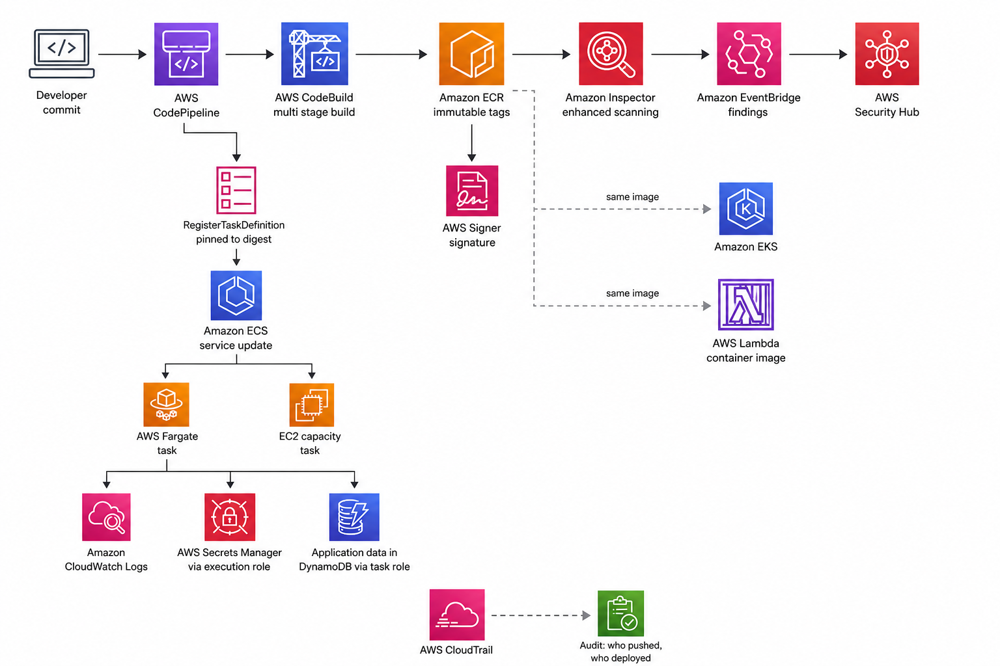{width="80%"}
    <figcaption>Integration with Other services</figcaption>
    
<i>Image Source: AI Generaed (Chatgpt)</i>

</figure>

This diagram illustrates a secure, automated Continuous Integration and Continuous Delivery (CI/CD) pipeline on AWS specifically designed for containerized applications. It traces the lifecycle of code from a developer's commit all the way to runtime execution and auditing.

Here is a step-by-step breakdown of the architecture:

**1. Source & Build Phase**

* **Developer Commit:** The process begins when a developer pushes code to a repository.
* **AWS CodePipeline:** This service acts as the orchestrator, detecting the commit and triggering the automated workflow.
* **AWS CodeBuild:** The pipeline triggers a multi-stage build process to compile the code and create a Docker container image.
* **Amazon ECR (Elastic Container Registry):** The finished image is pushed to ECR. It uses **immutable tags**, which prevents an image tag (like `v1.2`) from being overwritten, ensuring strict version control.

**2. Security & Compliance Phase**

* **Amazon Inspector:** Once the image lands in ECR, Inspector automatically scans it for software vulnerabilities.
* **EventBridge & Security Hub:** If vulnerabilities are found, the findings are routed through Amazon EventBridge and aggregated in AWS Security Hub for centralized security management.
* **AWS Signer:** The container image is cryptographically signed to guarantee its integrity and prove it hasn't been tampered with before deployment.

**3. Deployment Phase**

* **Amazon ECS (Primary Path):** CodePipeline registers a new ECS Task Definition. Crucially, it pins the image to its unique SHA digest rather than just a tag, ensuring the exact image that was scanned and signed is the one being deployed. ECS then updates the service to run the new tasks.
* **Compute Options (Fargate vs. EC2):** ECS can run these tasks on **AWS Fargate** (a serverless compute engine where AWS manages the underlying infrastructure) or on standard **Amazon EC2** instances.
* **Alternative Compute (EKS & Lambda):** The dotted lines indicate that the exact same container image stored in ECR can also be deployed to Amazon EKS (managed Kubernetes) or run as an AWS Lambda container image.

**4. Runtime Integrations (Focusing on Fargate)**

* **Amazon CloudWatch Logs:** The running application sends its operational logs here.
* **AWS Secrets Manager:** The task retrieves necessary credentials (like database passwords) via its **Execution Role** (which grants permissions to the container agent).
* **Amazon DynamoDB:** The application reads and writes its core data to a DynamoDB NoSQL database, authorized via its **Task Role** (which grants AWS permissions directly to the application code).

**5. Auditing & Governance**

* **AWS CloudTrail:** Throughout this entire lifecycle, CloudTrail records API calls. This creates an immutable audit log answering critical governance questions like "who pushed this commit?" and "who triggered this deployment?"

## Common Architecture Patterns

### Immutable artefact and build-once-promote-many

Build the image once, scan it once, and promote the identical digest through development, staging, and production, varying only configuration injected at run time. This is the foundational pattern of the chapter, and it is what makes testing meaningful: the artefact validated in staging is the artefact running in production, byte for byte.

### Multi-stage build

Compile and test in a stage carrying the full toolchain; ship a runtime stage containing only the artefact and a minimal base. Reduces size, start time, and vulnerability surface simultaneously. There is essentially no case for a single-stage build of a compiled application.

### Sidecar

A helper container in the same task, sharing its network namespace and lifecycle: a log router such as Fluent Bit under FireLens, an ADOT collector for traces and metrics, the AWS-managed, Envoy-based proxy that ECS Service Connect injects, or a database connection pooler. The trade-off is resource overhead multiplied by every replica, which is why node-level collection is preferred where the platform allows it — and why Fargate, which has no DaemonSet equivalent, makes sidecars the only option and their cost a real line item.

### Init container pattern with `dependsOn`

A non-essential container that runs to completion before the application starts — fetching configuration, running a schema check, warming a cache — sequenced with `dependsOn` using the `SUCCESS` condition. This keeps one-off start-up work out of the application image and out of its entrypoint script.

### Base-image hierarchy

An organisation maintains a small set of hardened base images — one per language runtime — built centrally, scanned, and updated on a schedule. Application images build `FROM` those. A CVE in the base is then one rebuild and a fleet-wide redeploy rather than forty independent investigations. The cost is a platform responsibility that someone must own.

### Pull-through cache

Public base images are consumed through an ECR pull-through cache rather than directly, so that the deployment path has no external dependency, rate limits do not apply, and third-party content is scanned and retained under your own policy.

### Sidecar-free log routing to `stdout`

The application writes structured JSON to standard output and knows nothing about the log destination. The platform routes it. This is what makes the same image runnable on ECS, EKS, Lambda, and a developer's laptop without change, and it is why file-based logging inside a container is an anti-pattern rather than a preference.

### Distroless runtime with an out-of-band debug path

The production image contains no shell and no package manager. Debugging happens through ECS Exec into a sidecar, through a separately built debug variant used only in non-production, or through observability rather than interactive access. The pattern accepts reduced debuggability as the price of a much smaller attack surface, and it is only viable where observability is genuinely good.

---

## Industry Use Cases

| Sector | Workload | How images and task definitions are used | Reasoning |
|---|---|---|---|
| Higher education | Automated code grading | One image per language toolchain; a standalone task per submission with strict CPU and memory limits and no network | Reproducible execution environments and hard resource caps for untrusted code |
| Media | Video transcoding | A digest-pinned image containing an exact `ffmpeg` build; EC2 capacity with a warm layer cache | Output correctness depends on the exact binary; warm cache reduces per-job start time |
| Retail banking | Payment service | Distroless image, non-root, read-only root, signed, scanned continuously, promoted by digest | Regulatory traceability from commit to running bytes |
| E-commerce | Seasonal traffic peaks | Small images and VPC endpoints so scale-out is measured in seconds | Scale-out latency is the difference between absorbing a spike and dropping traffic |
| Healthcare | HL7 and FHIR integration adapters | One small image per external system, each an independently deployable task definition | Vendor-specific dependencies isolated per adapter; a vendor's library conflict cannot affect another integration |
| Industrial IoT | Telemetry ingestion | ARM64 images on Graviton capacity, sized precisely from measurement | Sustained high-throughput workload where price-performance dominates |
| Government | Multi-supplier portal | A shared hardened base image maintained centrally; suppliers build `FROM` it | Baseline security posture enforced at the artefact level across contractual boundaries |
| SaaS | Multi-tenant API | One image serving all tenants, tenant context supplied at run time as configuration | One artefact, many deployments; a code fork per tenant would be unmaintainable |
| Logistics | Route optimisation | GPU-dependent image on EC2 capacity, since Fargate offers no GPU | Hardware requirement dictates the capacity choice, not preference |
| Start-ups generally | Everything | Pull-through cache, Fargate, small images, lifecycle policies from day one | The cheapest time to adopt these is before the estate grows |

---

## Advantages

**Environmental determinism.** The application and its dependencies travel together as one immutable artefact. Configuration drift as a class of failure disappears, and "works on my machine" is reduced to architecture mismatch — a narrow, detectable problem rather than a diffuse one.

**Deployment becomes substitution.** Releasing is stopping a process running image A and starting one running image B. Rollback is the same operation in reverse. Because the artefact is immutable and digest-addressed, rollback retrieves exactly the bytes that were previously healthy, which is what makes automatic rollback on a failed deployment safe enough to enable by default.

**Density and speed.** Sharing a kernel means no duplicated operating system per workload and no boot sequence. Start times measured in milliseconds to seconds, rather than minutes, change what is architecturally possible: scaling in response to load becomes reactive rather than anticipatory.

**Portability across compute models.** One OCI image runs on ECS, EKS, Lambda, App Runner, a developer's laptop, and another cloud. The packaging decision does not commit the compute decision, which preserves options that would otherwise have to be bought back later.

**A single supply-chain control point.** Because everything reaching production passes through the registry, immutability, scanning, signing, and lifecycle are enforced in one place rather than in every pipeline. Few security controls are this cheap relative to their coverage.

**Resource isolation without virtualisation cost.** cgroups cap a container's CPU and memory so one workload cannot starve another on the same host, at a fraction of a VM's overhead.

**ECR-specific advantages.** IAM-based authorisation with no long-lived registry password; short-lived tokens; same-Region pulls with no data-transfer charge; deep integration with ECS, EKS, Lambda, and App Runner; continuous scanning through Inspector; declarative lifecycle management; and a full CloudTrail record of every push and policy change.

**Task-definition-specific advantages.** An immutable, versioned, complete description of a workload — containers, resources, networking, identity, logging, and lifecycle — in one reviewable document that can live in version control and be diffed, which turns "what changed in this deployment" into a question with an exact answer.

---

## Limitations

**Isolation is weaker than a virtual machine's.** A shared kernel means a kernel vulnerability is shared. Containers are not a sufficient boundary for genuinely hostile multi-tenancy; that requires a VM boundary, which on AWS means Fargate's per-task microVM or separate instances, and for the strongest boundary a separate account.

**Statelessness is a requirement, not a suggestion.** The writable layer is ephemeral. Any application assuming durable local disk must be changed before it can be containerised honestly, and that change is frequently the largest part of a migration.

**Images age silently.** The bytes do not change, but the vulnerability profile of what is inside them does. Without continuous scanning and a rebuild cadence, the most stable service becomes the most vulnerable one precisely because nobody has needed to touch it.

**Image size is a real operational constraint.** Large images slow every scale-out, cost storage and transfer, and enlarge attack surface. Getting them small requires build discipline that teams must learn and maintain.

**Architecture matters again.** An image built for ARM64 will not run on x86_64. The failure is late, at task start, and confusing because the image works perfectly on the machine that built it.

**Debugging is harder in hardened images.** No shell means no interactive investigation. This is a genuine trade-off, and it forces investment in observability that many teams have not made.

**Layer caching can mislead.** A cached layer means a stale layer: a Dockerfile with `RUN apt-get update` cached from three months ago installs three-month-old packages. Reproducibility and freshness pull in opposite directions and must be reconciled deliberately with scheduled rebuilds.

**ECR-specific limitations.** Regional, so multi-Region needs replication. Lifecycle policies evaluate on a schedule, not instantly. Basic scanning covers OS packages only and never rescans. Immutability cannot be applied retroactively. Pull-through cache covers a defined set of upstreams and does not remove the first-pull dependency.

**Task-definition-specific limitations.** A hard size ceiling in the low tens of kilobytes, which many environment variables can approach. A maximum of ten containers per task definition. Fargate CPU and memory must come from the fixed matrix rather than arbitrary values. And revisions accumulate indefinitely, so a family can reach thousands of revisions in an active pipeline.

---

## Common Mistakes

### Beginner Mistakes

| Mistake | Why it is wrong | What to do instead |
|---|---|---|
| Deploying the `latest` tag | Mutable pointer; unreproducible deployments; rollback cannot be trusted | Tag with the commit SHA, enable tag immutability, pin by digest in the task definition |
| Running the container as root | A container escape starts with root privileges | Create and use a non-root user; set `readonlyRootFilesystem` and drop all capabilities |
| Secrets in `ARG`, in a `COPY`ed file, or in `environment` | Persist in image history or are readable via `ecs:DescribeTaskDefinition` | BuildKit secret mounts at build time; the `secrets` block at run time |
| Single-stage build with the full toolchain | Huge image, slow pulls, large attack surface | Multi-stage build with a minimal or distroless runtime stage |
| Copying source before installing dependencies | Every source edit invalidates the dependency layer and rebuilds it | Copy dependency manifests, install, then copy source |
| Writing application data or logs inside the container | Both vanish when the task stops | External stores for data; `stdout` for logs |
| `ENTRYPOINT` in shell form | The shell becomes PID 1 and swallows `SIGTERM`; the application never drains | Exec form: `ENTRYPOINT ["/usr/local/bin/app"]` |
| No `.dockerignore` | Slow builds, and `.git` or local environment files land in the image | Add one, excluding VCS metadata, dependencies, and local configuration |
| Assuming `EXPOSE` publishes a port | It is documentation only | Publish through `portMappings` in the task definition |
| Relying on the Dockerfile `HEALTHCHECK` under ECS | ECS uses the task definition's `healthCheck` | Define `healthCheck` in the container definition |
| Building on an ARM laptop for x86 capacity | `exec format error` at task start, unreproducible locally | Build in CI for the target, or publish a multi-architecture image; set `runtimePlatform` explicitly |
| No lifecycle policy on the repository | Storage grows without bound from CI pushes | Expire untagged images within days; retain a bounded number of tagged ones |
| Private subnets with ECR endpoints but no S3 gateway endpoint | Authentication succeeds and the layer fetch fails | Add `ecr.api`, `ecr.dkr`, **and** the S3 gateway endpoint |

### Production Mistakes

| Mistake | Consequence | Remedy |
|---|---|---|
| Rebuilding the image per environment | The artefact tested is not the artefact shipped | Build once, promote the digest, vary only injected configuration |
| No `SIGTERM` handling | Every deployment cuts in-flight requests | Trap `SIGTERM`, drain, exit; tune `stopTimeout` and the target group's deregistration delay |
| Basic scanning only | CVEs disclosed after the push are never detected | Enhanced scanning through Inspector, with findings routed to Security Hub |
| Pinning a base image digest and never moving it | The image never receives security patches | Scheduled rebuilds with an explicit base-image update process |
| Public registry on the deployment path | A third party's outage or rate limit blocks your scale-out | Pull-through cache, or vendored base images in your own registry |
| No VPC endpoints | NAT charges on every pull, plus an internet dependency for task launch | Interface endpoints for ECR, Logs, Secrets Manager, STS; S3 gateway endpoint |
| Over-sized Fargate tasks | Paid continuously on every replica | Right-size from Container Insights or Compute Optimizer, quarterly |
| Implicitly created log groups | Logs retained forever, at cost | Create log groups in IaC with explicit retention |
| Containers reaching IMDS on EC2 capacity | Per-task roles silently defeated | IMDSv2 with hop limit 1, or block the metadata route from container networks |
| Ignoring `stoppedReason` and guessing | Long investigations of problems the API already named | Read `lastStatus`, `stoppedReason`, and `exitCode` first, every time |
| Task-definition revisions never reviewed | Configuration drift between families; nobody knows what is deployed | Generate task definitions from IaC, and diff revisions during review |
| Memory limit set far above actual use to "avoid OOM" | Real leaks are hidden until they are catastrophic; capacity is wasted | Set a limit from measurement, alarm on approach, and fix the leak |

<!-- ### Certification Traps

| Trap | The reality |
|---|---|
| "Containers virtualise the hardware like a VM" | They share the host kernel and use namespaces and cgroups; only Fargate adds a per-task VM boundary |
| "A tag uniquely identifies an image" | Only a digest does. A tag is mutable unless the repository enforces immutability |
| "The Dockerfile `HEALTHCHECK` is what ECS uses" | ECS uses the task definition's `healthCheck` block |
| "`EXPOSE` publishes the port" | It is metadata; `portMappings` publishes |
| "The task execution role is what my application uses to call DynamoDB" | That is the **task role**. The execution role pulls images, writes logs, and decrypts secrets before your code runs |
| "ECR is global" | It is regional, one registry per account per Region; multi-Region requires replication |
| "Basic scanning is continuous" | It scans on push only and covers OS packages; enhanced scanning through Inspector is the continuous one |
| "Adding ECR interface endpoints is enough for private-subnet pulls" | Layer blobs come from S3, so an S3 **gateway** endpoint is also required |
| "Data written in a container persists across restarts" | The writable layer is discarded; use EFS, EBS, S3, RDS, or DynamoDB |
| "Fargate tasks can use any CPU and memory values" | They must come from the fixed valid combination matrix |
| "A task and a service are the same thing" | A task is one running instantiation; a service is the controller maintaining a desired count of them |
| "Task definitions can be edited" | They are immutable; registering a change creates a new revision |
| "`memoryReservation` is a hard limit" | `memoryReservation` is a soft floor; `memory` is the hard limit that triggers `OOMKilled` |
| "Alpine is always the right small base" | Alpine uses musl, which breaks some native extensions and changes DNS behaviour; distroless or slim is often the better answer | -->

<!-- ## AWS Certification Tips -->

<!-- ### Exam tips

Questions in this area test whether you understand the *properties* of images and task definitions, not command syntax. Find the constraint in the scenario and eliminate against it.

- "Must prove the deployed image is the tested image", "auditor", "reproducible" points to **immutable tags plus digest pinning**. Any option mentioning `latest` or rebuilding per environment is wrong.
- "Tasks in a private subnet cannot pull" points to **VPC endpoints**, and the discriminator is usually the missing **S3 gateway endpoint** rather than the ECR interface endpoints.
- "Application must read a secret without exposing it" points to the **`secrets` block** sourced from Secrets Manager or Parameter Store, never `environment` and never a Dockerfile `ARG`.
- "Application must call an AWS API" points to the **task role**. Any option mentioning access keys in environment variables is wrong.
- "Slow scale-out", "tasks take a long time to start" points to **image size** and a multi-stage build, and secondarily to VPC endpoints and same-Region ECR.
- "Reduce ECR cost" points to **lifecycle policies** first, then same-Region pulls.
- "Eliminate dependence on a public registry" points to **pull-through cache**.
- "Detect vulnerabilities in images already deployed" points to **enhanced scanning with Inspector**, not basic scan-on-push.
- "`exec format error`" points to a **CPU architecture mismatch**, and the fix is building for the target or a multi-architecture image.
- "Exit code 137" or "`OutOfMemoryError`" points to a **memory limit** exceeded.
- "Data must survive the task" eliminates the container filesystem; the answer is EFS, EBS, S3, RDS, or DynamoDB.
- Anything mentioning GPUs, privileged containers, host daemons, or local NVMe eliminates **Fargate**. -->

### Frequently confused pairs

| Pair | The distinguishing fact |
|---|---|
| **Image vs container** | The image is the immutable artefact; the container is a running instance of it |
| **Tag vs digest** | A tag is a mutable name; a digest is the cryptographic identity of exact bytes |
| **Basic vs enhanced scanning** | Basic scans on push, OS packages only, never rescans; enhanced uses Inspector, scans continuously, covers language packages |
| **`ecr.api` vs `ecr.dkr` endpoints** | `ecr.api` serves the AWS API; `ecr.dkr` serves the Docker registry protocol; both are needed, plus an S3 gateway endpoint |
| **ECR private vs ECR Public** | Different services; `public.ecr.aws` is the public one and is not where your private images live |
| **Task execution role vs task role** | Execution role acts before your code runs (pull, logs, secrets); task role is used by your code |
| **Container instance role vs task role** | Instance role is the EC2 instance profile shared by the host; task role is per task |
| **Task vs service** | A task is one running instantiation; a service maintains a desired count of them |
| **Task definition vs task** | The definition is the immutable versioned blueprint; the task is a running instance of one revision |
| **`memory` vs `memoryReservation`** | `memory` is the hard limit that causes `OOMKilled`; `memoryReservation` is a soft floor for scheduling |
| **Container `healthCheck` vs target group health check** | The first runs inside the container and informs ECS; the second runs over the network and controls traffic |
| **`EXPOSE` vs `portMappings`** | `EXPOSE` is documentation in the image; `portMappings` actually publishes |
| **`awsvpc` vs `bridge`** | `awsvpc` gives the task its own ENI, IP, and security groups and is required on Fargate; `bridge` maps container ports to host ports |
| **`COPY` vs `ADD`** | `COPY` copies files; `ADD` also fetches URLs and auto-extracts archives, which is surprising and best avoided |
| **`ENTRYPOINT` vs `CMD`** | `ENTRYPOINT` is the executable; `CMD` supplies default arguments that a `docker run` argument overrides |
| **Shell form vs exec form** | Shell form runs through `/bin/sh`, which becomes PID 1 and swallows `SIGTERM`; exec form makes your process PID 1 |
| **Lifecycle policy vs replication** | Lifecycle expires images to control cost; replication copies them to other Regions or accounts |
| **Immutable tag vs signed image** | Immutability prevents a tag being repointed; signing attests to provenance and can be verified before deployment |

### Memory aids

- **"Tags name, digests identify."** Say it before writing any deployment specification.
- **"Execution pulls, task runs."** The two roles, in the order they act.
- **"Three endpoints for a pull: `api`, `dkr`, and S3."** The S3 gateway endpoint is the one everyone forgets.
- **"Build once, promote the digest."** A rebuild per environment ships something you did not test.
- **"137 is memory, 139 is a segfault, 143 is a clean `SIGTERM`."**
- **"Layers are additive; deleting does not shrink and does not hide."** Both the size lesson and the secrets lesson in one sentence.
- **"`EXPOSE` documents, `portMappings` publishes."**
- **"Small images scale faster."** Image size is a performance property, not housekeeping.

<!-- !!! danger "Common certification traps"

    - Believing a tag uniquely identifies an image, or that `latest` is a version.
    - Granting application data permissions to the **task execution role** instead of the task role.
    - Adding ECR interface endpoints for a private subnet and omitting the **S3 gateway endpoint**.
    - Believing basic scan-on-push is continuous, or that it covers language dependencies.
    - Assuming ECR is global rather than regional.
    - Assuming a container's filesystem writes persist across restarts.
    - Choosing arbitrary Fargate CPU and memory values instead of valid matrix combinations.
    - Believing the Dockerfile `HEALTHCHECK` is what ECS evaluates.
    - Believing `EXPOSE` publishes a port.
    - Believing task definitions can be edited in place.
    - Treating containers as equivalent to VMs for isolation of untrusted or hostile workloads.
    - Believing that identical Dockerfiles produce identical images. -->

## Summary

First, **the container image is an artefact, and its most valuable property is immutability**. Everything else in this chapter follows from that. Because the image cannot change, a deployment is a substitution rather than a procedure; because it is identified by a content digest, a rollback retrieves exactly the bytes that were previously healthy; because it is scanned and signed as a unit, a supply-chain claim about it is checkable. The corollary is the rule that students most often break: a tag is a name, not an identity, and a system that deploys tags has forfeited every one of those properties while appearing to work.

Second, **the environment being part of the artefact is what actually solved the deployment problem**. Configuration management converged machines towards a description and could never guarantee that two converged machines were the same. A container image constructs the environment instead, so drift as a class of failure disappears and "works on my machine" narrows to the single property the image does not carry — the CPU architecture. That residual is worth naming explicitly, because it is the one place the old failure mode still lives.

Third, **the registry is infrastructure and a control point, not a filing cabinet**. Placing it inside your account boundary removes a third party from the deployment path, which matters most during a scale-out, which is when the system is already under stress. Beyond availability, the registry is the cheapest place an organisation can enforce what may reach production: immutability, continuous scanning, push restricted to CI, lifecycle limits, and signing are all one configuration each and cover every service at once. And the operational details are not incidental — the S3 gateway endpoint that image layers require, and the lifecycle policy that bounds storage, are both routinely omitted and both routinely cause incidents or invoices.

Fourth, **running a container by hand teaches you what an orchestrator is for better than any explanation can**. `docker run` under `systemd` handles a crashed process and a rebooted host, and nothing else. It cannot place work across hosts, replace a task after an instance fails, deploy without downtime, register a dynamic port with a load balancer, give each container its own AWS identity, or tell you what is running where. Every ECS feature in the next two chapters is the automation of something you did manually in this one, and recognising it as such is the difference between learning ECS and memorising it.

Fifth, **the task definition is where the architecture becomes a specification**. It is immutable and versioned, so a revision names an exact configuration forever and rollback is a pointer change. It carries two distinct identities — an execution role that acts before your code runs and a task role that your code uses — and keeping them separate is a security boundary that costs nothing to maintain and is routinely collapsed for convenience. It carries the hardening settings that most tutorials omit and that cost nothing: non-root user, read-only root filesystem, dropped capabilities. And it carries the lifecycle settings — `stopTimeout`, `healthCheck` with an honest `startPeriod` — that determine whether a deployment is invisible to users or produces thirty seconds of errors.

Sixth, and most importantly for the chapters that follow, **containerisation is a packaging improvement, and packaging improvements are worth having on their own terms**. A containerised monolith is still a monolith, and claiming otherwise is how teams end up disappointed by an architecture they never actually adopted. What containerisation genuinely delivers is a reproducible artefact, a fast and reversible deployment, and a uniform operational surface across every service regardless of language. Those are the preconditions for the orchestration in 2.2 and 2.3 and for the microservices architecture in 1.3.2 — necessary, valuable, and not by themselves sufficient.

