# Amazon Elastic Container Service

## Definition

**Amazon Elastic Container Service (ECS)** is an AWS-native container orchestrator: a managed control plane that stores your declared desired state, schedules containers onto capacity, replaces them when they fail, and integrates them with AWS networking, identity, load balancing, and observability.

An **ECS cluster** is a logical grouping of services, tasks, and — on EC2 capacity — container instances. It is a namespace, a capacity boundary, and a permissions boundary. It is not a physical thing: the cluster has no endpoint, no version, no control-plane charge, and nothing to patch. Creating one is an API call that costs nothing and completes instantly.

A **capacity provider** names *where* tasks may run. `FARGATE` and `FARGATE_SPOT` are built-in; an Auto Scaling group capacity provider wraps an ASG of EC2 instances and can manage that ASG's size on your behalf.

**AWS Fargate** is serverless compute for containers: you declare CPU and memory, AWS provisions an isolated microVM, runs your task in it, and bills per second for the resources you declared.

**Service discovery** is the mechanism by which one component learns another's current address, given that task IP addresses are ephemeral. **Load balancing** is the mechanism by which requests are distributed across the healthy instances of a service.

| Layer | The question it answers | ECS mechanism |
|---|---|---|
| **Cluster** | Which boundary does this workload belong to? | `CreateCluster`; cluster name on every task and service |
| **Capacity provider** | On what kind of capacity may this run? | `FARGATE`, `FARGATE_SPOT`, ASG capacity provider |
| **Capacity provider strategy** | In what proportion across those kinds? | `base` and `weight` per provider |
| **Task definition** | What is the workload? | Immutable revision, from 2.1 |
| **Service** | How many, and how are they kept alive and reachable? | `desiredCount`, deployment configuration, load balancer registration |
| **North-south** | How does external traffic reach a task? | ALB, NLB, or API Gateway, with target type `ip` or `instance` |
| **East-west** | How does one service reach another? | Service Connect, Cloud Map, internal load balancer, VPC Lattice |

Within an AWS architecture, ECS sits in the application tier: behind an edge of Amazon Route 53, Amazon CloudFront, AWS WAF, and a load balancer; inside private subnets of a VPC; in front of Amazon RDS, Amazon DynamoDB, Amazon ElastiCache, and Amazon S3; and connected to peers by a mixture of direct calls and asynchronous messaging over Amazon SQS, Amazon SNS, and Amazon EventBridge.

!!! note "The cluster is free, and that fact has architectural consequences"

    Amazon EKS charges an hourly fee per cluster, which pushes organisations towards a small number of large, multi-tenant clusters with namespace isolation inside them. ECS charges nothing for clusters, so a cluster-per-team, cluster-per-environment, or cluster-per-application topology costs nothing extra. This asymmetry is not trivia: it means that on ECS, isolation between teams can be obtained by creating another cluster rather than by engineering it inside a shared one — which is a genuine and frequently decisive advantage.

---

## Why This Service or Concept Exists

### The problem ECS solves

Chapter 2.1 ended with an EC2 instance running a container under `systemd`, and a list of things that arrangement cannot do. Each item on that list is a variant of the same problem: **there is no continuous process comparing what should be running with what is running, and acting on the difference**.

| The gap in manual container hosting | What is actually required |
|---|---|
| A container dies and `systemd` restarts it — but only on that host | A controller that can place a replacement anywhere in a fleet |
| An instance fails and its containers are simply gone | A controller that notices the loss and schedules replacements on healthy capacity |
| Deciding which container runs on which host | A scheduler evaluating resources, constraints, and strategy |
| Three containers wanting port 8080 | A network model that gives each workload its own address, or dynamic port allocation the platform tracks |
| Telling a load balancer about a new container | Automatic target registration on start and deregistration on stop |
| Deploying without downtime | A deployment controller that starts new tasks, waits for health, drains old ones, and can roll back |
| Giving each container its own AWS credentials | A per-task identity delivered without static keys |
| Knowing what runs where | An API that answers authoritatively |
| Growing and shrinking capacity with load | Two coordinated scaling layers: tasks, and the capacity underneath them |

Kubernetes solves the same problem. ECS solves it with a deliberately smaller conceptual surface: there are no new object kinds to learn, no custom resource definitions, no controllers to install, and no version to upgrade. That constraint is the product decision. It buys simplicity and costs extensibility.

### Why capacity providers exist

Early ECS forced you to state a **launch type** — `EC2` or `FARGATE` — in the service definition, coupling the workload declaration to the capacity decision. That coupling caused two real problems: you could not run part of a service on Spot and part on On-Demand, and changing the capacity model meant changing the service.

Capacity providers separate the two. The service says "run twenty tasks according to this strategy"; the strategy says "two on Fargate On-Demand as a guaranteed base, and the remainder split four-to-one between Fargate Spot and On-Demand". The workload declaration no longer names the capacity, which is what makes mixed On-Demand and Spot fleets, and migration between capacity models, straightforward.

### Why Fargate exists

Running containers on EC2 leaves you with a fleet: AMIs to patch, instances to scale, bin packing to reason about, an SSH surface to defend, and the awkward reality that the instance is a shared trust boundary for every container on it.

Fargate removes the instance. Each task runs in its own lightweight virtual machine with its own kernel, so the container-escape concern that makes shared-kernel multi-tenancy uncomfortable is bounded by a VM rather than by namespaces. You never patch anything, never scale a fleet, and never bin pack. You pay a per-vCPU premium for that, and you give up GPUs, privileged containers, host daemons, and local NVMe.

| Concern | Self-managed EC2 fleet | ECS on EC2 capacity | AWS Fargate |
|---|---|---|---|
| AMI patching | You | You, though EKS-style managed updates help | AWS |
| Instance scaling | You | Capacity provider managed scaling | Does not exist |
| Bin packing | You | ECS scheduler | Does not exist |
| Isolation boundary | Namespaces on a shared kernel | Namespaces on a shared kernel | A microVM per task |
| Start latency | Fast on a warm host | Fast on a warm host with cached layers | Slower: ENI attach plus a full image pull |
| Unit cost at high sustained utilisation | Lowest | Lowest | Higher |
| Cost at low or spiky utilisation | Poor, you pay for idle | Poor, you pay for idle | Good, you pay per task-second |
| GPU, privileged, host daemons | Available | Available | Not available |

### Why service discovery exists

In `awsvpc` mode every task has its own private IP, and that IP is valid only for the life of the task. A task replaced during a deployment, a scale-in event, or a health-check failure has a different address. Any component holding a peer's address therefore holds a value that will become wrong, usually at the least convenient moment.

The mechanisms differ in **where the routing decision is made**, and that is the axis on which to compare them: at a load balancer (a network hop, an hourly charge, but works across VPCs and accounts), in the client after a DNS lookup (no hop, but DNS caching makes stale endpoints a real failure mode), or in a local proxy inside the task (no network hop, no control-plane call on the request path, plus retries and telemetry).

!!! warning "Service discovery is not a naming convenience"

    Students routinely treat service discovery as "a nicer way to write a hostname". It is not. It is the mechanism that keeps a distributed system connected while its members are constantly being replaced. Get it wrong — hard-code an IP, cache a DNS record past its TTL, put a `DescribeTasks` call on the request path — and the failure appears only under change: during a deployment, during scale-in, during an AZ event. Those are precisely the moments when you least want a second failure.

## Core Concepts

### The cluster

A cluster is a logical grouping with four practical roles:

1. **A namespace.** Service names are unique within a cluster, not within an account.
2. **A capacity boundary.** Container instances register with exactly one cluster, and tasks are placed only on capacity in their own cluster.
3. **A permissions boundary.** IAM policies can scope `ecs:*` actions to a cluster ARN, so "this pipeline may deploy only to staging" is expressible.
4. **An observability boundary.** Container Insights, cluster-level metrics, and most dashboards are naturally cluster-scoped.

Cluster settings worth knowing: `containerInsights` (`disabled`, `enabled`, or `enhanced`) controls metric collection; `executeCommandConfiguration` controls ECS Exec logging and KMS encryption; `serviceConnectDefaults` sets a default AWS Cloud Map namespace so individual services need not repeat it; and `defaultCapacityProviderStrategy` applies to services that do not specify their own.

**Cluster topology** is a design decision with real consequences:

| Topology | Argument for | Argument against | Typical fit |
|---|---|---|---|
| **One cluster per account per environment** | Simplest; shared capacity; one dashboard per environment | All teams share a blast radius for capacity exhaustion | Small to medium organisations |
| **One cluster per team per environment** | Team-level isolation and IAM scoping at zero cost | More clusters to observe and configure | The common default at moderate scale |
| **One cluster per application** | Tight blast radius; simple cost attribution | Poor capacity sharing on EC2; sprawl | Regulated or high-criticality applications |
| **One cluster per service** | Maximum isolation | Sprawl; cross-cutting change becomes N changes | Almost never correct |
| **Separate AWS accounts, one or more clusters each** | The strongest boundary; audit scope becomes an AWS boundary | Cross-account networking, sharing, and pipelines to build | Compliance isolation, multi-tenant SaaS silos |

!!! tip "Choose cluster boundaries by blast radius and IAM, not by tidiness"

    The useful questions are: who should be able to deploy here, what should fail together, and what should be observed together. If two workloads have the same answers to all three, they belong in the same cluster. On EC2 capacity there is a fourth question — should these workloads share instances — because sharing improves bin packing and worsens isolation.

### Container instances and the ECS agent

On EC2 capacity, a **container instance** is an EC2 instance that has registered with a cluster. Registration is performed by the **ECS agent**, which runs on the instance (already installed on the ECS-optimised AMI), reads the cluster name from `/etc/ecs/ecs.config`, opens an outbound connection to the ECS control plane, and thereafter reports the instance's **resources** and **attributes** and executes placement instructions.

| Concept | Meaning | Why it matters |
|---|---|---|
| **Registered resources** | Total CPU units, memory, and ports the instance offers | The scheduler's view of capacity |
| **Remaining resources** | What is left after placed tasks | Placement fails when no instance has enough remaining |
| **Attributes** | Key-value facts: AZ, instance type, AMI ID, agent version, custom attributes you set | The vocabulary of placement constraints in 2.3.1 |
| **Agent connectivity** | Whether the agent is currently connected | A disconnected agent means no new placements on that instance |
| **Instance status** | `ACTIVE`, `DRAINING`, `REGISTERING`, `DEREGISTERING` | `DRAINING` stops new placement and moves service tasks off, which is how you patch an instance safely |
| **Managed draining** | Capacity provider feature that drains an instance automatically when the ASG terminates it | Prevents scale-in and instance refresh from killing tasks abruptly |

The agent's outbound-only connection matters architecturally: instances need no inbound access from AWS, and in a private subnet they need either a NAT gateway or VPC endpoints for `ecs-agent`, `ecs-telemetry`, and `ecs`, in addition to the ECR and Logs endpoints from 2.1.

### Capacity providers and strategies

A **capacity provider strategy** is a list of providers, each with a `base` and a `weight`.

- **`base`** is an absolute number of tasks placed on that provider *before* weights apply. At most one provider in a strategy may have a non-zero base.
- **`weight`** is a relative share governing how tasks *beyond* the bases are distributed.

For example, `FARGATE` with `base=2, weight=1` and `FARGATE_SPOT` with `weight=4`: the first two tasks go to On-Demand; beyond that, one in five goes to On-Demand and four in five to Spot. At a desired count of twelve, that is two plus two On-Demand and eight Spot.

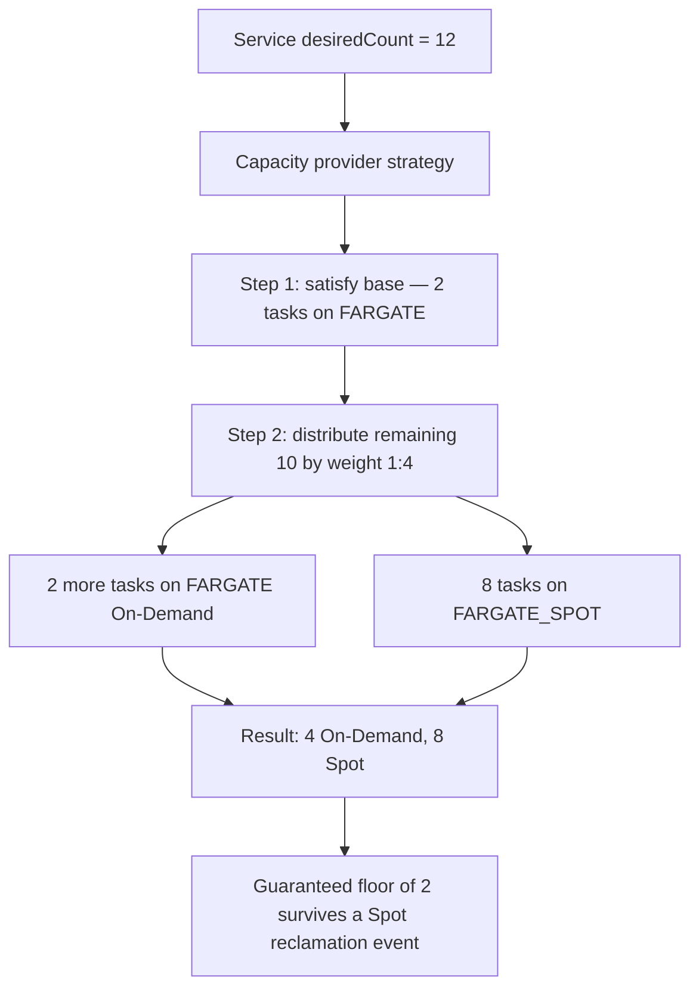

**Auto Scaling group capacity providers** add three managed behaviours:

| Feature | What it does | Why it matters |
|---|---|---|
| **Managed scaling** | ECS publishes a `CapacityProviderReservation` metric and drives the ASG towards a target capacity percentage | This is the second scaling layer; without it, tasks stick in `PROVISIONING` |
| **Managed termination protection** | Prevents the ASG scaling in an instance that is still running tasks | Without it, scale-in kills running work |
| **Managed draining** | Sets an instance to `DRAINING` on termination so service tasks are relocated first | Makes instance refresh and Spot interruption graceful |

**Target capacity** deserves explanation because it is routinely misconfigured. Setting it to 100 per cent means ECS aims for no spare room, so every scale-out waits for an instance launch — typically one to three minutes. Setting it to 80 per cent keeps roughly a fifth of the cluster free, so tasks place immediately and the instance launch happens behind them. You are trading a little idle cost for scale-out latency, and for a user-facing service that trade is almost always worth making.

!!! danger "Two scaling layers on EC2, one on Fargate"

    **Service auto scaling** (Application Auto Scaling) changes `desiredCount` — how many tasks you want. **Cluster capacity scaling** (capacity provider managed scaling) changes how many EC2 instances exist for those tasks to run on. They are separate systems and both must be configured. The classic symptom of configuring only the first is a service that raises its desired count during peak and then sits with tasks in `PROVISIONING` forever, while the CPU graphs of the existing instances look fine. On Fargate the second layer does not exist, which removes an entire class of misconfiguration — and is one of the strongest practical arguments for Fargate.

### Services

A **service** maintains a desired number of tasks from a specified task-definition revision, replaces failures, and registers tasks with load-balancer target groups. Its key properties, beyond the scheduler behaviour covered in 2.3:

| Property | Purpose |
|---|---|
| `desiredCount` | How many tasks should be running |
| `taskDefinition` | Which revision to run |
| `capacityProviderStrategy` or `launchType` | Where tasks run |
| `networkConfiguration` | Subnets, security groups, public IP assignment for `awsvpc` |
| `loadBalancers` | Target group, container name, and container port to register |
| `serviceRegistries` | Cloud Map registration for DNS-based discovery |
| `serviceConnectConfiguration` | Service Connect namespace, advertised services, client aliases |
| `healthCheckGracePeriodSeconds` | How long to ignore load-balancer health checks after a task starts |
| `deploymentConfiguration` | Minimum healthy percent, maximum percent, circuit breaker — see 2.3.3 |
| `enableExecuteCommand` | Whether ECS Exec is permitted |
| `propagateTags` | Whether service or task-definition tags are copied to tasks, which matters for cost attribution |
| `schedulingStrategy` | `REPLICA` (a desired count) or `DAEMON` (one task per eligible container instance, EC2 only) |

The **`DAEMON`** scheduling strategy is worth noting because it is the ECS analogue of a Kubernetes DaemonSet: exactly one task per eligible container instance, automatically placed on new instances as they join. It is how you run a node-level log collector or monitoring agent — and it is unavailable on Fargate, and also unsupported with the `CODE_DEPLOY` and `EXTERNAL` deployment controllers, which is precisely why Fargate workloads must use sidecars for collection and pay that overhead per task.

### North-south: getting traffic in

| Option | Layer | Strengths | Weaknesses | Choose when |
|---|---|---|---|---|
| **Application Load Balancer** | 7 (HTTP/HTTPS) | Host and path routing, one ALB shared by many services, WebSockets, HTTP/2, gRPC, OIDC authentication, weighted target groups | HTTP only; per-hour plus LCU cost | The default for HTTP services |
| **Network Load Balancer** | 4 (TCP/UDP/TLS) | Extreme throughput, very low latency, static IPs, preserves source IP, non-HTTP protocols | No content-based routing | Non-HTTP protocols, static IP requirements, very high connection counts |
| **Amazon API Gateway** | 7, API-oriented | Per-consumer API keys, usage plans, request validation, throttling, WebSocket APIs, direct AWS service integrations | Higher per-request cost; another hop | You need API management, not just routing — see 1.3.4 |
| **CloudFront in front of any of these** | Edge | TLS termination near the user, caching, AWS WAF and Shield, absorbs read load | Cache invalidation discipline required | Public-facing services with global users or cacheable content |

**Target types** determine what the load balancer sends packets to:

| Target type | What is registered | Works with | Notes |
|---|---|---|---|
| `ip` | The task's own private IP | `awsvpc` mode; **required on Fargate** | No extra hop; health checks test the task directly; each task consumes a subnet IP |
| `instance` | The container instance and a host port | `bridge` or `host` mode on EC2 | Enables dynamic port mapping for density; adds a NAT hop on the instance |

**Dynamic port mapping** is the reason `instance` targets still exist. In `bridge` mode with a container port of 8080 and a host port of `0`, Docker assigns an ephemeral host port at start, ECS learns it, and ECS registers *that* port with the target group. This lets many copies of the same service share one instance without port conflicts — the problem you hit manually in the 2.1 lab. It is the density play on EC2 capacity, and its cost is losing per-task security groups.

**Health checks** exist at two levels and mean different things, which was introduced in 2.1 and matters operationally here:

| Check | Executed by | Decides | Typical misconfiguration |
|---|---|---|---|
| Container `healthCheck` | The ECS agent, inside the container | Whether ECS considers the container healthy; drives `dependsOn: HEALTHY` | `startPeriod` shorter than the application's cold start, producing a restart loop |
| Target group health check | The load balancer, over the network | Whether the target receives traffic | Wrong port, wrong path, path requiring authentication, or security group blocking the load balancer |

**Draining settings** determine whether a deployment is invisible. The **deregistration delay** on the target group is what protects in-flight requests: the target is removed from rotation and existing connections are allowed to finish for that many seconds. It must exceed the p99 request duration, and it must be shorter than or comparable to the task's `stopTimeout`, since ECS will otherwise `SIGKILL` a task that is still draining.

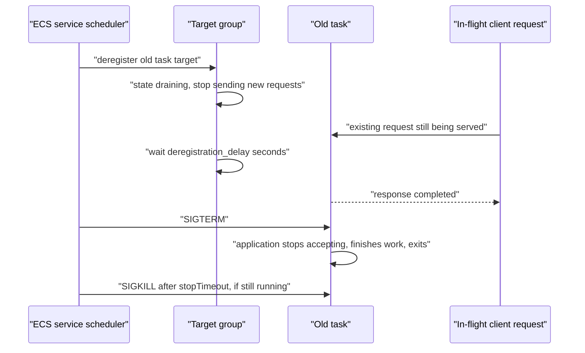

### East-west: services finding each other

| Mechanism | Where the routing decision is made | Extra network hop | Retries and outlier ejection | Cost | Crosses VPC or account |
|---|---|---|---|---|---|
| **Internal ALB or NLB per service** | At the load balancer | Yes | Coarse | Hourly plus LCU per load balancer | Yes |
| **AWS Cloud Map DNS** | In the client, after DNS resolution | No | None; DNS caching causes stale endpoints | Minimal | Within a VPC or peered network |
| **ECS Service Connect** | In an AWS-managed, Envoy-based proxy on localhost | No | Yes: client-side load balancing, outlier ejection, retries, per-call metrics | Sidecar resource overhead per task | Within a Cloud Map namespace |
| **Amazon VPC Lattice** | In the VPC data plane, transparently | Managed, no sidecar | Retries, weighted routing, IAM auth policies | Per-request and per-hour | Yes, across VPCs, accounts, and compute types |

**ECS Service Connect** is the pragmatic default for ECS-to-ECS HTTP and gRPC. You name a Cloud Map namespace, declare on the server side that a named port mapping is advertised under a discovery name with a client alias, and enable the client side on callers. ECS injects and manages a sidecar proxy in each task — Envoy-based, but not present in your task definition and not configurable by you. Callers then use `http://catalog:8080`, resolved locally. What you get, without writing proxy configuration: connection pooling, client-side load balancing across healthy endpoints, automatic ejection of failing endpoints, and per-request metrics broken down **by client and by server** in the `ECS/ServiceConnect` CloudWatch namespace — telemetry that answers "which caller is causing this callee's errors" without any application instrumentation.

Two constraints are worth stating. The `portMappings` entry in the **server** task definition **must have a `name`**, because that name is what the service definition advertises; client-only services have no such requirement. And enabling Service Connect on an existing service requires a new deployment, since the proxy is injected at task start.

**AWS Cloud Map** registers task IPs as DNS A records (or SRV records for `bridge` mode with dynamic ports) in a private hosted zone. It is simple and protocol-agnostic, which is why it remains correct for non-HTTP traffic. Its weakness is DNS caching: some client libraries and runtimes cache resolutions well beyond the TTL — the JVM historically cached indefinitely by default — so a caller can hold the address of a task that stopped minutes ago.

**Amazon VPC Lattice** is the AWS-native answer to connectivity *between* boundaries: across VPCs, across accounts, and across compute types, so an ECS service can call a Lambda function or an EKS workload through one application-layer network with IAM auth policies and weighted routing, without sidecars. Its natural use case is exactly the one Service Connect does not cover.

!!! warning "AWS App Mesh should not be chosen for new work"

    App Mesh is on a deprecation trajectory. For service-to-service connectivity within ECS, use **Service Connect**; across VPCs, accounts, or compute types, use **Amazon VPC Lattice**; on EKS where a full mesh is genuinely required, use Istio or Linkerd. Certification questions that offer App Mesh as the "modern service mesh" answer are testing whether you are current.

---

## Internal Working

### Control plane and data plane

ECS separates a **control plane** — AWS-owned, multi-tenant, entirely invisible, with no endpoint you manage and no charge — from a **data plane** that runs your containers and serves your traffic.

The control plane holds cluster, service, and task-definition state and runs two loops: the **scheduler**, which decides where a task goes, and the **service reconciliation loop**, which compares desired with observed and issues the calls that close the gap.

| Aspect | ECS |
|---|---|
| Control-plane location | AWS-owned and multi-tenant; no endpoint, no version, no patching |
| Control-plane cost | None |
| API | `ecs:*` AWS API calls, authorised by IAM |
| Data plane | Fargate microVMs, or EC2 instances running the ECS agent |
| Node-to-control-plane path | Outbound only, initiated by the agent |

The consequence that matters: **a control-plane impairment does not stop running traffic**. Existing tasks keep serving, the ALB keeps routing to healthy targets, and established connections are unaffected. What you lose is the ability to *change* things — no new deployments, no replacement of failed tasks, no scaling. This bounds the blast radius of a control-plane incident to "serious but survivable", provided nothing in your request path depends on a control-plane call.

!!! danger "Never place a control-plane call on the request path"

    If a service calls `ecs:DescribeTasks` or `ecs:ListTasks` to discover a peer on every request, it has coupled its own availability to the control plane's and thrown away the isolation the architecture provided. It will also hit API throttling, which appears as a latency cliff under exactly the load you least want it. Discover peers through the Service Connect proxy on localhost, or through DNS resolved from a local cache — both keep working when the control plane does not.

### How a task is placed and started on Fargate

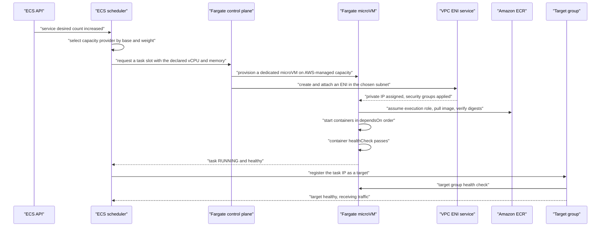

The two slow steps are **ENI attachment** and **image pull**, and only the second is under your control — which is why 2.1 treated image size as a scaling property. There is no shared image cache between Fargate tasks, so every task pays the full pull.

**Fargate platform versions** determine the feature set and the underlying agent and kernel. `LATEST` is the sensible default; pinning a version is appropriate only when you have a specific compatibility requirement, and it then becomes something you must remember to move.

### How a task is placed and started on EC2 capacity

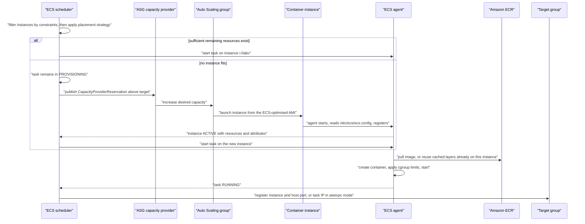

The branch is the whole point. When capacity exists, placement is nearly instant. When it does not, the task waits for an instance launch — one to three minutes — which is why target capacity below 100 per cent is worth its idle cost for user-facing services. And the image pull is frequently free on a warm instance, because layers pulled for a previous task are already in the local store.

### Where task start latency goes

| Phase | Fargate | EC2 warm instance | EC2 cold instance |
|---|---|---|---|
| Capacity acquisition | Seconds | Immediate | 60–180 seconds |
| ENI attachment | Several seconds | Several seconds in `awsvpc`; none in `bridge` | Same |
| Image pull | Full pull, every task | Usually cached | Full pull |
| Container start | Application-dependent | Application-dependent | Application-dependent |
| Health check and registration | 15–60 seconds depending on thresholds | Same | Same |

This table is the honest basis for the launch-type decision when scale-out latency matters: EC2 with warm capacity is faster, and Fargate is simpler. If your service must absorb a step change in load within seconds, either keep warm capacity or scale ahead of demand on a schedule — no orchestrator can make a cold start instant.

### How the ALB reaches a task

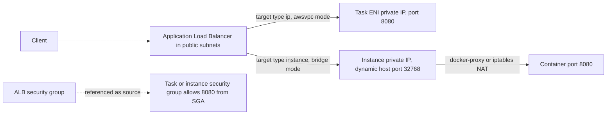

With `ip` targets the ALB sends packets directly to the task's own ENI: one fewer hop, and the health check tests the task rather than the host. With `instance` targets the packet arrives at the instance on an ephemeral host port and is NATed into the container.

The security-group relationship is where most "target unhealthy" incidents live. The correct pattern is a **security group reference**, not a CIDR: the task's security group allows port 8080 *from the ALB's security group*. This states an identity relationship, survives subnet changes, and is self-documenting.

---

## Architecture Components

| Component | Responsibility |
|---|---|
| **Client** | Originates requests; its retry behaviour is a potential source of amplification |
| **Amazon Route 53** | Public DNS for the edge; also hosts the private hosted zone Cloud Map writes discovery records into |
| **Amazon CloudFront** | Edge TLS termination and caching; absorbs read load before it reaches a task |
| **AWS WAF and AWS Shield** | Rule-based filtering and DDoS protection at the edge or the ALB |
| **Application Load Balancer** | Layer 7 entry; host and path routing to per-service target groups; the sharing point that lets many services use one load balancer |
| **Network Load Balancer** | Layer 4 entry for non-HTTP protocols, static IPs, or very high connection volume |
| **Amazon API Gateway** | Managed API front door where API keys, usage plans, and request validation are required |
| **Target group** | The registration point; owns the health check, the deregistration delay, and the target type |
| **Amazon VPC** | The network boundary; its subnet sizing bounds how many `awsvpc` tasks can exist |
| **Public subnets** | Hold load balancers and NAT gateways only |
| **Private subnets** | Hold tasks and container instances; every `awsvpc` task consumes one IP address |
| **Security groups** | Stateful, identity-based firewalls; the correct unit of service-to-service policy through group references |
| **VPC endpoints** | `ecr.api`, `ecr.dkr`, `logs`, `secretsmanager`, `ssm`, `ssmmessages`, `sts`, `ecs`, `ecs-agent`, `ecs-telemetry` as interface endpoints, plus the S3 gateway endpoint |
| **NAT gateway** | Egress for private subnets; a large and frequently unexamined cost line without endpoints |
| **Amazon ECS control plane** | Stores desired state; runs the scheduler and reconciliation loop; charges nothing |
| **ECS cluster** | Logical grouping, capacity boundary, IAM boundary, observability boundary |
| **Capacity provider** | Names where tasks may run and, for ASG providers, manages the underlying fleet |
| **AWS Fargate** | Per-task microVM capacity with no instances to manage |
| **Amazon EC2 container instances** | The alternative capacity substrate, with a warm image cache and lower unit cost at high utilisation |
| **ECS agent** | Registers the instance, executes placement, manages task lifecycle, reports state |
| **Auto Scaling group** | The fleet underneath an ASG capacity provider; also provides instance refresh for patching |
| **AWS Cloud Map** | The service registry backing both Service Connect namespaces and DNS-based discovery |
| **ECS Service Connect** | AWS-managed, Envoy-based proxies providing east-west discovery, load balancing, retries, and telemetry |
| **Amazon VPC Lattice** | Cross-VPC, cross-account, cross-compute application networking with IAM auth policies |
| **Task execution role** | Pulls images, creates log streams, decrypts secrets — before your code runs |
| **Task role** | The application's own AWS identity |
| **Container instance role** | The EC2 instance profile used by the agent; must not carry application permissions |
| **AWS Secrets Manager and SSM Parameter Store** | Sources for the `secrets` block |
| **Amazon CloudWatch and Container Insights** | Metrics, logs, alarms, and the cluster and service dashboards |
| **AWS CloudTrail** | Audit of `RegisterTaskDefinition`, `UpdateService`, `ExecuteCommand`, and every other control-plane call |
| **AWS Systems Manager** | ECS Exec sessions without SSH or bastion hosts |

Read architecturally, these form three rings. The **edge ring** — Route 53, CloudFront, WAF, ALB — is shared across services rather than duplicated per service, which is what keeps decomposition from multiplying the edge bill. The **orchestration ring** — cluster, capacity providers, services, agent or Fargate — is where the control loop lives, and its defining property is that it is declarative: you state desired state and the platform closes the gap continuously. The **connectivity ring** — security groups, endpoints, Service Connect, Cloud Map, Lattice — is where most production incidents actually occur, because it is the part that fails only under change rather than under load.

---

## Request Lifecycle

Two lifecycles matter in this chapter: a user request arriving from outside, and a service calling another service inside.

### North-south, end to end

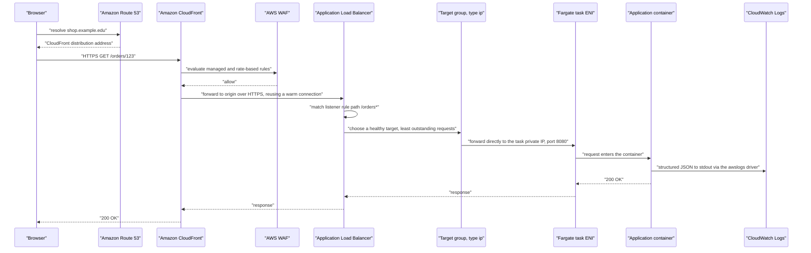

The reasoning at each hop:

1. **CloudFront terminates TLS at the edge**, removing two round trips for a distant client and keeping warm connections to the origin so the origin handshake is usually already paid for.
2. **WAF evaluates before compute is consumed.** A rate-based rule here protects every service behind the ALB, and blocking at the edge is far cheaper than blocking in your application.
3. **The ALB routes by listener rule.** This is the decomposition made visible: `/orders*` and `/catalog*` are separate target groups, separately deployable and scalable, sharing one load balancer and therefore one certificate and one hourly charge.
4. **The target group chooses a healthy target.** `least_outstanding_requests` is usually better than round robin when request cost varies, because round robin will happily send a cheap request to a task already handling an expensive one.
5. **The packet goes straight to the task's IP.** With `ip` targets there is no instance-level NAT hop, and the health check has been testing this exact task rather than its host.
6. **Logs leave the host immediately.** Nothing useful is retained on the task, which is what makes the task disposable.

### East-west through Service Connect

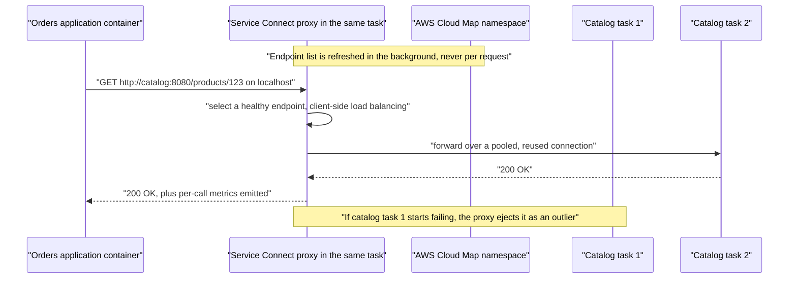

The critical property is the note at the top: **endpoint discovery happens in the background, not on the request path**. The application resolves a name on localhost; no DNS lookup crosses the network per request, no control-plane call is made, and the proxy's endpoint list is maintained continuously. This is what makes the mechanism resilient to control-plane impairment and immune to DNS caching problems.

### Synchronous versus asynchronous, restated for ECS

| Property | Direct call through Service Connect | Message through SQS or EventBridge |
|---|---|---|
| Caller knows the outcome | Immediately | Eventually, or never directly |
| Availability | The product of both services' availability | Depends only on the broker |
| Latency | Added to the caller's own | Only the enqueue time |
| Coupling | Temporal: both must be up at once | Temporally decoupled |
| Failure handling | Retry, circuit break, degrade | Redrive, dead-letter queue, replay |
| Right for | A read the user is waiting on; validation that must precede a response | Anything the user need not wait for; fan-out; spiky work |

!!! tip "Every synchronous hop you remove multiplies out of your availability calculation"

    Six services at 99.9 per cent in series produce roughly 99.4 per cent — about 3.5 hours of downtime per month from six components that each look excellent on their own dashboard. The same arithmetic applies to tail latency. Before adding a synchronous call between two ECS services, ask whether the caller genuinely needs the answer before responding to its own caller. If not, publish an event.

---

## AWS Service Deep Dive

!!! warning "On numbers and quotas"

    Figures here are representative as of 2026 and most quotas are **soft** — adjustable through AWS Service Quotas or a support case. They vary by Region and account. Verify in the Service Quotas console for the account and Region you are designing in. Pricing is described as **dimensions** and **relative positions** only; model actual cost in the AWS Pricing Calculator.

### Amazon ECS

**Purpose.** Run and scale containerised workloads on AWS with the smallest workable conceptual surface, integrated by default with IAM, VPC networking, Elastic Load Balancing, CloudWatch, and Secrets Manager.

**Architecture.** An AWS-operated, multi-tenant control plane holding cluster, service, and task-definition state and running the scheduler and the reconciliation loop. There is no cluster endpoint, no control-plane node, and no version. The data plane is Fargate microVMs or EC2 instances running the ECS agent.

**Important features.** Immutable versioned task definitions; `REPLICA` and `DAEMON` scheduling strategies; capacity providers with base-and-weight strategies mixing On-Demand and Spot; `awsvpc` networking with per-task ENIs and security groups; ECS Service Connect; Cloud Map service discovery; deployment configuration with a circuit breaker and automatic rollback; blue/green through AWS CodeDeploy; ECS Exec over Systems Manager; task-definition secret injection; container dependency ordering; `stopTimeout`; ECS Anywhere for on-premises capacity; scheduled tasks through EventBridge Scheduler.

**Limitations.** No ecosystem of third-party controllers, operators, or custom resource types — what AWS ships is what exists, and there is no admission-control extension point. No portability: an ECS task definition runs nowhere but AWS. Scheduling is coarser than Kubernetes': placement strategies and constraints rather than affinity, anti-affinity, topology spread, priority, and preemption. Ten containers per task definition. No native equivalent to a Kubernetes operator for running complex stateful software.

**Pricing model.** The control plane and clusters are free. You pay for the data plane — Fargate per vCPU-hour and GB-hour billed per second with a one-minute minimum, or EC2 instance hours — plus the ancillaries: ALB hours and LCUs, NAT gateway hours and data processing, CloudWatch Logs ingestion, ECR storage, and inter-AZ data transfer. In a small estate those ancillaries frequently exceed the compute bill, which surprises people.

**Performance characteristics.** Fargate task start is typically tens of seconds, dominated by ENI attachment and image pull. EC2 capacity with a warm instance and cached layers starts in seconds. Fargate provides no burstable CPU credits: you get the vCPU you declared, consistently, which is an advantage over burstable EC2 families for latency-sensitive work.

**Scaling behaviour.** Two layers on EC2 — service auto scaling for tasks, capacity provider managed scaling for instances — and one layer on Fargate. Covered in depth in 2.3.2.

**Availability.** Spread tasks across at least two and preferably three Availability Zones. On Fargate this is achieved simply by supplying subnets in three AZs; on EC2 it additionally requires the ASG to span three AZs and a `spread` placement strategy on `attribute:ecs.availability-zone`.

**Security features.** Three distinct IAM roles; per-task security groups in `awsvpc` mode; no shared Docker socket on Fargate; read-only root filesystem and non-root user through the task definition; secrets injected rather than baked; ECS Exec audited through CloudTrail and optionally logged to S3 or CloudWatch with KMS encryption; Amazon GuardDuty ECS Runtime Monitoring.

**Service limits (representative, mostly soft).** Clusters per account, services per cluster, and tasks per service are in the thousands and adjustable. Container instances per cluster is in the thousands. Task definition size has a hard ceiling in the low tens of kilobytes — reachable with many environment variables. Ten containers per task definition. Load balancer target groups per service is limited to a small number. Verify all of these in Service Quotas.

**Common configurations.** Fargate launch type or a capacity provider strategy; `awsvpc` mode; private subnets with `assignPublicIp: DISABLED` and VPC endpoints; `awslogs` to a log group with retention set; deployment circuit breaker with rollback enabled; minimum healthy percent 100 and maximum percent 200; Service Connect enabled with one namespace per environment; Container Insights enabled at the cluster.

### AWS Fargate

**Purpose.** Remove the instance layer entirely. You declare CPU and memory; AWS provisions an isolated microVM, patches the substrate, and bills per second.

**Architecture.** Each task runs in its own lightweight virtual machine on AWS-managed capacity, with its own kernel and its own ENI. There is no host you share with another task and no host you can log into.

**Resource model.** Task CPU and memory must come from a **fixed valid matrix**: 0.25 vCPU with 0.5, 1, or 2 GB; 0.5 vCPU with 1 to 4 GB; 1 vCPU with 2 to 8 GB; 2 vCPU with 4 to 16 GB; 4 vCPU with 8 to 30 GB; 8 vCPU with 16 to 60 GB; 16 vCPU with 32 to 120 GB; and 32 vCPU with the three discrete values 60, 120, or 244 GB. Sizes of 8 vCPU and above are Linux-only. Ephemeral storage defaults to 20 GB and is expandable to 200 GB, encrypted, and destroyed with the task.

**Important features.** Per-task microVM isolation; ARM64 (Graviton) support at lower cost than x86; Fargate Spot at a steep discount with two minutes of interruption notice; platform versions; ephemeral storage sizing; EFS volume support for shared persistent storage; ECS Exec.

**Limitations.** A per-vCPU premium over equivalent EC2 capacity, which becomes significant at sustained high utilisation. No GPUs. No local NVMe. No privileged containers, no host-level daemons, and no `DAEMON` scheduling strategy — so log and metric collection must be sidecars, whose overhead multiplies by replica count. No Windows-plus-GPU niches. Slower start than a warm EC2 instance. Fargate Spot is not available for all configurations and should never carry the synchronous request path alone.

**Pricing model.** Per vCPU-hour and per GB-hour of declared resources, billed per second with a one-minute minimum, plus ephemeral storage above the included allowance. Fargate Spot is substantially discounted. Compute Savings Plans apply to Fargate as well as EC2 and Lambda, which makes a committed baseline worth covering.

**Performance characteristics.** Consistent vCPU with no burst credits. Start latency of roughly 30 to 90 seconds for a moderate image, dominated by ENI attachment and pull. No shared image cache, so image size matters more than on EC2.

**Availability.** Tasks are placed across the subnets you supply; supplying three AZs' subnets is the whole configuration.

**Security features.** VM-level isolation per task; no shared kernel with other tasks; no SSH surface; no Docker socket; per-task ENI and security groups; ephemeral storage encrypted with an AWS-managed key or a customer-managed key.

### Amazon EC2 capacity for ECS

**Purpose.** Provide container capacity you control, for workloads Fargate cannot run or economics Fargate cannot match.

**Architecture.** An Auto Scaling group of instances built from the ECS-optimised AMI, wrapped by a capacity provider. The ECS agent on each instance registers it and executes placement.

**Important features.** Any instance family, including GPU, high-memory, compute-optimised, and instances with local NVMe; privileged containers and host daemons; the `DAEMON` scheduling strategy; a warm image-layer cache; bin packing of many small tasks onto fewer instances; Spot instances with capacity-provider-managed draining; instance refresh for AMI patching.

**Limitations.** You own AMI patching, instance scaling, bin packing, and the security posture of the host. The instance is a shared trust boundary for every task on it. Idle headroom is paid for. And capacity scaling is a second system that must be configured and understood.

**Pricing model.** Instance hours, plus EBS. Reserved Instances, EC2 Instance Savings Plans, Compute Savings Plans, and Spot all apply. At sustained high utilisation with commitments, unit cost is materially below Fargate.

**Performance characteristics.** Fast task start on a warm instance with cached layers; no ENI attachment in `bridge` mode. Bin packing lets small tasks share an instance efficiently.

**Security features.** Everything ECS provides plus everything you must do yourself: patch the AMI on a cadence, enforce **IMDSv2 with a hop limit of 1** so containers cannot reach the instance profile, keep the container instance role minimal, and avoid mounting the Docker socket into containers under any circumstances.

!!! danger "The instance is a shared trust boundary"

    On EC2 capacity, every task on an instance shares a kernel and, unless you prevent it, can reach the instance metadata service and assume the container instance role. That single fact defeats per-task IAM roles across the entire instance. Enforce IMDSv2 with a hop limit of 1, keep the container instance role limited to cluster registration, ECR pull, and log writing, and never mount `/var/run/docker.sock` into a container — doing so grants root on the host to whatever is in that container.

### The launch-type decision, made honestly

| Dimension | EC2 capacity | AWS Fargate |
|---|---|---|
| Who patches the host | You, on a cadence you must own | AWS |
| Capacity scaling | A second system you configure and tune | Does not exist |
| Bin packing | Your problem, and a real one | Does not exist |
| Isolation | Shared kernel per instance | microVM per task |
| Task start latency | Fast on warm capacity | Slower; full pull every time |
| Unit cost at sustained high utilisation | Lower, especially with commitments and Spot | Higher |
| Cost at spiky or low utilisation | Poor; you pay for idle | Good; per-second billing |
| GPU, privileged, host daemons, local NVMe | Available | Unavailable |
| `DAEMON` strategy for node agents | Available | Unavailable; use sidecars |
| Operational surface | AMIs, ASGs, agent versions, draining, IMDS | Effectively none |
| Right for | Sustained high-utilisation fleets, special hardware, teams with platform capability | Spiky load, many small services, small teams, strict per-task isolation |

The decision rule that holds up in practice: **start on Fargate, and move a workload to EC2 capacity when a measured constraint requires it** — a hardware requirement Fargate cannot meet, a sustained-utilisation profile where the premium is material, or a start-latency requirement that only a warm cache satisfies. The reverse migration path — starting on EC2 because it is cheaper per vCPU and discovering you have accidentally acquired a platform team — is the more expensive mistake, because the cost appears as engineering time rather than as a line on an invoice.

Amazon ECS offers two primary compute launch types: **EC2 Launch Type** (customer-managed compute) and **AWS Fargate** (serverless compute). The fundamental split lies between having direct control over the host virtual machines versus abstracting them away entirely.

```
       ECS on EC2 (Customer-Managed)               ECS on AWS Fargate (Serverless)
   ┌─────────────────────────────────────┐      ┌───────────────────────────────────┐
   │             ECS Cluster             │      │            ECS Cluster            │
   │                                     │      │                                   │
   │  ┌───────────────────────────────┐  │      │  ┌─────────────┐ ┌─────────────┐  │
   │  │       EC2 Instance (VM)       │  │      │  │  Task / Pod │ │  Task / Pod │  │
   │  │  ┌───────────┐ ┌───────────┐  │  │      │  │ ┌─────────┐ │ │ ┌─────────┐ │  │
   │  │  │Container A│ │Container B│  │  │      │  │ │Container│ │ │ │Container│ │  │
   │  │  └───────────┘ └───────────┘  │  │      │  │ └─────────┘ │ │ └─────────┘ │  │
   │  │    ECS Container Agent        │  │      │  │  Dedicated  │ │  Dedicated  │  │
   │  │    OS (Linux / Windows)       │  │      │  │  MicroVM    │ │  MicroVM    │  │
   │  └───────────────────────────────┘  │      │  └─────────────┘ └─────────────┘  │
   │  [User manages OS, patching, VM]    │      │  [AWS manages all underlying infra]│
   └─────────────────────────────────────┘      └───────────────────────────────────┘

```

---

### Core Differences

| Dimension | ECS EC2 Launch Type | ECS Fargate Launch Type |
| --- | --- | --- |
| **Infrastructure Management** | Customer manages EC2 instances, OS patching, AMI updates, instance sizing, and cluster autoscaling. | Fully managed by AWS (Serverless). No EC2 instances, OS updates, or host patching to maintain. |
| **Workload Execution** | Multiple containers/tasks share the resources of a single EC2 host; agent schedules tasks onto existing nodes. | Each task runs in its own isolated microVM with dedicated compute and memory allocated on demand. |
| **Scaling Mechanism** | Two-tier: Scale container tasks (ECS Service Autoscaling) **and** scale EC2 host nodes (Auto Scaling Group / Capacity Providers). | Single-tier: Scale container tasks only; compute scales automatically per task definition. |
| **Host Access & Control** | Full root/SSH access to underlying EC2 hosts; support for specialized hardware (GPUs) and custom kernel configs. | No host-level access (no SSH/OS visibility). Runtime debugging is handled via **ECS Exec**. |
| **Billing Model** | Pay for the EC2 instances and attached EBS volumes running in the cluster, regardless of container utilization. | Pay solely for the vCPU and memory allocated per running task, measured down to per-second granularity. |

---

### Working Mechanisms

**1. ECS EC2 Launch Type**

* **Cluster Bootstrapping:** You define an Auto Scaling Group (ASG) of EC2 instances registered to an ECS cluster via the pre-installed `amazon-ecs-agent`.
* **Task Placement:** When you launch a task or service, the ECS control plane inspects the cluster's registered instances. Using placement strategies (such as `binpack`, `spread`, or `random`), it schedules the task onto an EC2 node that has sufficient unreserved CPU and memory.
* **Execution:** The ECS agent on that specific instance interacts with the local container runtime (Docker/containerd) to pull the image and run the container alongside other co-located workloads.

**2. ECS Fargate Launch Type**

* **Resource Specification:** You define your task with precise resource requirements (e.g., `0.5 vCPU`, `1 GB RAM`) and launch type set to `FARGATE`.
* **Seamless Provisioning:** The ECS control plane directly contacts the Fargate fleet infrastructure. It provisions an ephemeral, purpose-built microVM (using Firecracker) matching your required task boundaries.
* **Execution & Isolation:** The container executes inside its dedicated microVM boundary with its own Elastic Network Interface (ENI) provisioned in your VPC (`awsvpc` network mode), completely isolated from all other customer workloads. When the task stops, the underlying compute is automatically deprovisioned.
---

## Important AWS Terminology

| Term | Meaning |
|---|---|
| **Cluster** | A logical grouping of ECS services, tasks, and container instances; a namespace, capacity, IAM, and observability boundary |
| **Container instance** | An EC2 instance registered with an ECS cluster by the ECS agent |
| **ECS agent** | The process on a container instance that registers it, executes placement, and reports task state |
| **Registered and remaining resources** | The CPU, memory, and ports an instance offers, and what is left after placed tasks |
| **Attribute** | A key-value fact about a container instance used by placement constraints |
| **Draining** | Container instance status that stops new placement and relocates service tasks off the instance |
| **Managed draining** | Capacity provider feature that drains instances automatically on ASG termination |
| **Capacity provider** | Named capacity for task placement: `FARGATE`, `FARGATE_SPOT`, or an ASG provider |
| **Capacity provider strategy** | A list of providers with `base` and `weight` controlling task distribution |
| **`base`** | An absolute number of tasks placed on a provider before weights apply; at most one provider may have a non-zero base |
| **`weight`** | The relative share of tasks beyond the bases |
| **Managed scaling** | Capacity provider feature driving the ASG size from the `CapacityProviderReservation` metric |
| **Target capacity** | The percentage of cluster capacity managed scaling aims to keep in use; below 100 leaves headroom for fast placement |
| **Managed termination protection** | Prevents ASG scale-in from terminating instances still running tasks |
| **Launch type** | The older, simpler way to state capacity: `EC2`, `FARGATE`, or `EXTERNAL` |
| **AWS Fargate** | Serverless container capacity with a microVM per task |
| **Fargate Spot** | Discounted, interruptible Fargate capacity with two minutes of notice |
| **Platform version** | The Fargate runtime version determining available features |
| **Ephemeral storage** | The temporary encrypted volume attached to a Fargate task, destroyed with it |
| **Service** | The controller maintaining a desired count of tasks and registering them with load balancers |
| **`REPLICA` scheduling strategy** | Maintain a desired number of tasks |
| **`DAEMON` scheduling strategy** | Run exactly one task per eligible container instance; EC2 capacity only, and not supported with the `CODE_DEPLOY` or `EXTERNAL` deployment controllers |
| **`healthCheckGracePeriodSeconds`** | How long a service ignores load-balancer health checks after a task starts |
| **`awsvpc` network mode** | Each task receives its own ENI, private IP, and security groups; required on Fargate |
| **`bridge` network mode** | Docker bridge networking with static or dynamic host-port mapping |
| **Dynamic port mapping** | Host port `0` in `bridge` mode; ECS registers the assigned ephemeral port with the target group |
| **Target group** | The Elastic Load Balancing resource holding targets, the health check, and the deregistration delay |
| **Target type `ip`** | Registers the task's own IP; required for `awsvpc` and Fargate |
| **Target type `instance`** | Registers the container instance and host port; enables dynamic port mapping |
| **Deregistration delay** | Seconds the load balancer allows in-flight requests to finish after removing a target |
| **Listener rule** | The ALB rule matching host or path and forwarding to a target group; how many services share one ALB |
| **`least_outstanding_requests`** | ALB algorithm sending a request to the target with the fewest in-flight requests |
| **Cross-zone load balancing** | Distributing across targets in all AZs; improves balance, incurs inter-AZ transfer charges |
| **AWS Cloud Map** | The service registry maintaining DNS and API-queryable records of service instances |
| **Service registry** | The `serviceRegistries` block registering a service's tasks into Cloud Map |
| **ECS Service Connect** | ECS-managed discovery with an injected, AWS-managed Envoy-based proxy providing client-side load balancing, retries, and telemetry |
| **Discovery name** | The name under which a Service Connect service is advertised in its namespace |
| **Client alias** | The hostname and port callers use to reach a Service Connect service |
| **Amazon VPC Lattice** | AWS-native application networking across VPCs, accounts, and compute types with IAM auth policies |
| **Task execution role** | The role the agent assumes to pull images, create log streams, and decrypt secrets |
| **Task role** | The role application code assumes for AWS API calls |
| **Container instance role** | The EC2 instance profile used by the ECS agent |
| **IMDSv2 and hop limit** | Instance metadata protections; hop limit 1 prevents containers reaching the instance profile |
| **ECS Exec** | Interactive shell into a running container over AWS Systems Manager |
| **Container Insights** | CloudWatch's curated container metrics, logs, and dashboards for ECS |
| **`CapacityProviderReservation`** | The CloudWatch metric managed scaling uses to drive ASG capacity |
| **ECS Anywhere** | Running ECS tasks on customer-managed on-premises or other-cloud capacity |

---

## Configuration Options

### Cluster configuration

| Setting | Options | How to decide |
|---|---|---|
| **Container Insights** | `disabled`, `enabled`, `enhanced` | `enhanced` for production; the per-metric cost is small next to the diagnostic value of per-task CPU, memory, and restart counts |
| **Default capacity provider strategy** | Any provider mix | Set it so that services created without an explicit strategy inherit a sensible default rather than a bare launch type |
| **Service Connect defaults** | A Cloud Map namespace | One namespace per environment, set at the cluster so services need not repeat it |
| **Execute command configuration** | Logging destination, KMS key | Log every ECS Exec session to CloudWatch or S3 and encrypt it; unlogged shell access into production is an audit finding |
| **Cluster granularity** | Per environment, per team, per application | By blast radius and IAM scope; clusters are free but not costless |

### Capacity provider configuration

| Setting | Options | How to decide |
|---|---|---|
| **Provider mix** | `FARGATE`, `FARGATE_SPOT`, ASG providers | On-Demand base sized to carry minimum viable traffic; Spot for the remainder where the workload tolerates interruption |
| **`base`** | 0 or a positive integer on one provider | Set it to the number of tasks that must survive a total Spot reclamation |
| **`weight`** | Relative integers | Express the steady-state ratio; 1:4 On-Demand to Spot is a common starting point |
| **Managed scaling** | Enabled or disabled | Always enabled on ASG providers; disabling it is the cause of the stuck-`PROVISIONING` failure |
| **Target capacity** | 1–100 per cent | 80–90 per cent for user-facing services so scale-out does not wait for an instance launch; closer to 100 for batch work where latency does not matter |
| **Managed termination protection** | Enabled or disabled | Enabled, or scale-in terminates instances that are still running tasks |
| **Managed draining** | Enabled or disabled | Enabled, so instance refresh and Spot interruption relocate tasks rather than killing them |
| **Instance types in the ASG** | One type, or a mixed-instances policy | A mixed-instances policy with several compatible types materially improves Spot availability |

### Service networking and load balancing

| Setting | Options | How to decide |
|---|---|---|
| **Subnets** | Any set | Private subnets in three AZs; the number of AZs you supply is the availability configuration |
| **`assignPublicIp`** | `ENABLED`, `DISABLED` | `DISABLED`; reach AWS APIs through VPC endpoints, and the internet through a NAT gateway only if genuinely required |
| **Security groups** | Any | One per service, allowing the load balancer's security group on the container port; use group references, never CIDRs |
| **Load balancer type** | ALB, NLB, none | ALB for HTTP; NLB for TCP, UDP, static IPs, or extreme throughput; none for queue consumers and workers |
| **Target type** | `ip`, `instance` | `ip` with `awsvpc`; `instance` only for `bridge`-mode density on EC2 |
| **Health-check path and thresholds** | Any path, interval, thresholds | A dedicated `/health` that checks only self-health; 15-second interval, 2 healthy, 3 unhealthy is a reasonable default |
| **`healthCheckGracePeriodSeconds`** | Seconds | Longer than the application's slowest cold start, or the ALB kills tasks that were still warming and the service replaces them in a loop |
| **Deregistration delay** | Seconds, default 300 | Just above p99 request duration; too low drops in-flight requests, too high slows every deployment |
| **ALB algorithm** | `round_robin`, `least_outstanding_requests` | `least_outstanding_requests` where request cost varies, which is most of the time |
| **Cross-zone load balancing** | On (ALB default) or off | On for even distribution; be aware it generates inter-AZ transfer charges |
| **Sticky sessions** | Off, or duration-based | Off; sticky sessions are a transitional crutch for applications with in-memory session state, and should carry a removal ticket |

### Service discovery

| Setting | Options | How to decide |
|---|---|---|
| **Mechanism** | Service Connect, Cloud Map DNS, internal load balancer, VPC Lattice | Service Connect for ECS-to-ECS HTTP and gRPC; Cloud Map for non-HTTP; internal load balancer or Lattice across VPCs and accounts |
| **Service Connect mode** | Client only, or client-and-server | Server side on anything that is called; client-only on callers that advertise nothing |
| **`portMappings.name`** | Any name | **Required** for Service Connect; a mapping without a name cannot be advertised |
| **Client alias** | Hostname and port | Use the logical service name and its natural port, so application configuration reads as `http://catalog:8080` |
| **Namespace** | One per environment, or shared | One per environment; a shared namespace across environments invites a staging service resolving a production peer |
| **Cloud Map TTL** | Seconds | Low, 15 to 30 seconds, and accept that some clients ignore it entirely — which is the argument for Service Connect |

!!! warning "`healthCheckGracePeriodSeconds` is the setting that causes endless replacement loops"

    A service registered with a load balancer will have its tasks killed by the ALB's health check if they are not healthy in time. If your application takes 45 seconds to warm up and the grace period is 0, every task is killed at around 30 seconds, replaced, killed again, and the service never stabilises — while the logs show an application that was starting perfectly normally. Set the grace period above the measured cold start, and set the container `healthCheck`'s `startPeriod` too.

---

## Design Considerations

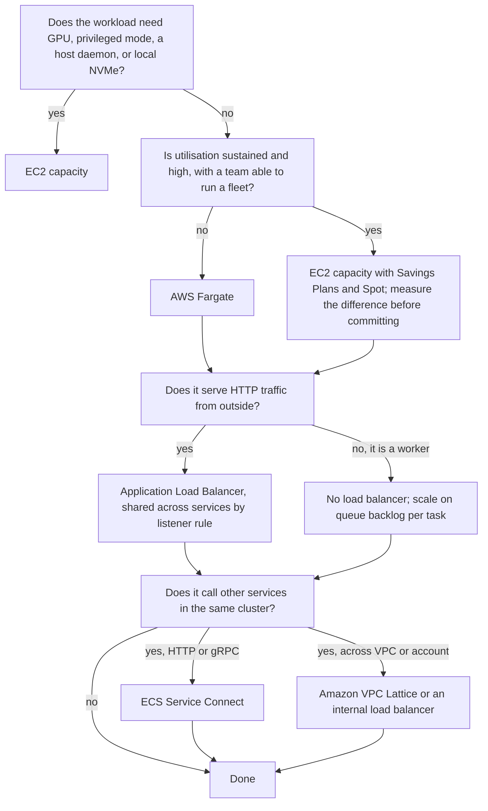

| Quality | What it means here | Design levers | The trade-off you accept |
|---|---|---|---|
| **Scalability** | Capacity follows load without human action | Service auto scaling, capacity provider managed scaling, target capacity headroom | Headroom costs money; without it, scale-out waits for instance launches |
| **Availability** | Failures are absorbed rather than felt | Three AZs, minimum healthy percent 100, On-Demand base under Spot, health checks that reflect reality | Multi-AZ generates inter-AZ transfer charges; a guaranteed base costs more than pure Spot |
| **Reliability** | Correct behaviour under partial failure | Deregistration delay, `SIGTERM` handling, circuit breaker with rollback, retries at one layer only | Graceful drain lengthens deployments |
| **Latency** | End-to-end user-perceived time | Fewer synchronous hops, Service Connect rather than internal load balancers, connection reuse, edge caching | Removing hops sometimes means merging services, which costs autonomy |
| **Cost** | Total cost of ownership, not compute price | Fargate versus EC2, Spot, shared ALB, VPC endpoints, right-sizing, log filtering | Spot introduces interruption handling; a shared ALB couples services to one listener configuration |
| **Security** | Blast radius of one compromised task | Per-task roles, per-task security groups, private subnets, Fargate microVM isolation, IMDSv2 hop limit 1 | Fargate's isolation costs a per-vCPU premium; per-task security groups consume more ENIs and IPs |
| **Operational complexity** | What an on-call engineer faces | Fargate removes the fleet; consistent conventions across services; Container Insights and ECS Exec | EC2's cost advantage is paid for in operational attention |
| **Capacity headroom** | Whether a task can start right now | Target capacity below 100 per cent, warm pools, scheduled pre-scaling | Idle capacity is a direct, visible cost |

!!! danger "Subnet sizing bounds your task count, and you cannot fix it later"

    Every `awsvpc` task consumes one private IP address, and so does every ENI on every container instance. A `/24` subnet offers roughly 251 usable addresses, so three `/24` private subnets cap you at a few hundred concurrent tasks across the whole VPC — a limit teams reliably discover during their first real scale-out event, under load. Subnet CIDRs cannot be resized, so the remedy at that point is a new VPC. Size private subnets for the estate you expect in three years: `/20` or larger per AZ is not extravagant.

---

## AWS Best Practices

### Operational Excellence

Define clusters, capacity providers, task definitions, services, target groups, and alarms in CloudFormation, CDK, or Terraform, so that the running configuration is reviewable and reproducible. Give every service the same shape — the same health-check path, the same log format, the same required tags, the same dashboard template — so an engineer paged for an unfamiliar service is not simultaneously learning a new convention. Enable Container Insights at the cluster and ECS Exec with session logging, so that investigation does not require a change. Practise deployments and rollbacks until both are boring, and enable the deployment circuit breaker so rollback is automatic rather than a human decision at three in the morning. Run game days: stop a task, drain an instance, reclaim a Spot task, and confirm the alarms fire and the dashboards explain what happened.

### Security

Give every service its own task role with a policy naming exactly the resources it uses, and keep the execution role separate and narrow. Place tasks and instances in private subnets, expose only load balancers publicly, and express service-to-service permission as security-group references rather than CIDR ranges. Add VPC endpoints so tasks can start, log, and fetch secrets without internet egress. On EC2 capacity, enforce IMDSv2 with a hop limit of 1, keep the container instance role minimal, and never mount the Docker socket into a container. Use `secrets` rather than `environment` for credentials. Log every ECS Exec session and restrict `ecs:ExecuteCommand` by tag or cluster. Enable GuardDuty ECS Runtime Monitoring, and route its findings and Inspector's into Security Hub.

### Reliability

Deploy across three Availability Zones and verify on a dashboard that tasks are actually distributed rather than merely permitted to be. Set the health-check grace period above the measured cold start. Use minimum healthy percent 100 with maximum percent 200 so a deployment never reduces serving capacity. Set the deregistration delay above p99 request duration, handle `SIGTERM`, and set `stopTimeout` accordingly. Keep an On-Demand base under any Spot capacity carrying user traffic. Prefer asynchronous communication so a downstream outage becomes a delay rather than a failure, and give every asynchronous consumer a dead-letter queue with an alarm on its depth. Define an SLO per service and alert on error-budget burn rather than on raw CPU.

### Performance Efficiency

Right-size tasks from Container Insights measurements rather than from guesses, and revisit quarterly. Keep images small, because on Fargate image size is scale-out latency. Prefer Service Connect to internal load balancers for east-west traffic: no extra hop, no hourly charge, connection pooling included. Use `least_outstanding_requests` on the ALB where request cost varies. Choose Graviton where dependencies permit. Cache at CloudFront and ElastiCache, because the cheapest request is the one that never reaches a task. Measure p50, p90, p99, and p99.9 separately — an average conceals exactly the behaviour users complain about.

### Cost Optimization

Choose Fargate or EC2 on measured utilisation, and revisit as the estate grows. Cover a committed baseline with Compute Savings Plans, which apply to Fargate, EC2, and Lambda alike. Use Spot for interruption-tolerant work above an On-Demand base. Share one ALB across many services through listener rules rather than provisioning one per service, since load-balancer hours dominate at low traffic. Add VPC endpoints to remove NAT gateway data processing from image pulls and log writes. Set retention on every log group, filter logs before ingestion where volume is high, and tag every resource with service, team, and environment so Cost Explorer can attribute spend to someone who can act on it. Schedule non-production services to zero outside working hours.

### Sustainability

The actions that reduce cost reduce energy use: higher utilisation through right-sizing and bin packing, Graviton for better performance per watt, scaling to a low floor overnight, deleting idle non-production environments, and reducing data volumes through log filtering and retention policies.

---

## Security Considerations

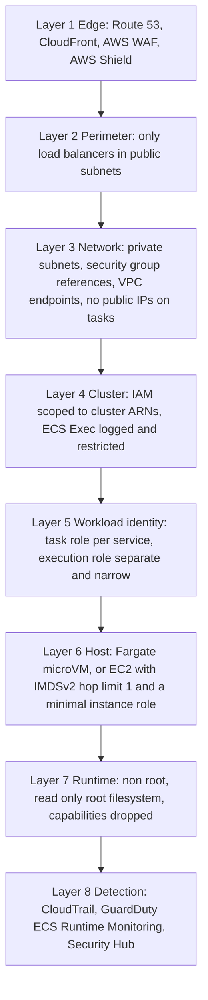

**The cluster as an IAM boundary.** Because `ecs:*` actions can be scoped to a cluster ARN, "this pipeline may update services in `dso303-staging` and nothing else" is directly expressible. This is one of the strongest practical arguments for a cluster-per-environment topology, and it costs nothing.

**Per-task identity, restated.** The three roles from 1.3.2 and 2.1 apply unchanged. The addition in this chapter is the capacity dimension: on Fargate there is no container instance role and no instance metadata service to reach, so per-task identity is airtight by construction. On EC2 capacity it is airtight only if you configure IMDSv2 with a hop limit of 1. That difference is a genuine security argument for Fargate and should be stated as such rather than dismissed as a cost decision.

**Network policy through security groups.** In `awsvpc` mode each task has its own security group, so service-to-service permission is expressible as identity: the catalog service's group allows port 8080 *from the orders service's group*. In `bridge` mode this granularity is lost — every task on an instance shares the instance's security group — which is a real security cost of choosing dynamic port mapping for density.

**Endpoints as a security control.** A task in a private subnet with the full endpoint set can pull its image, write its logs, fetch its secrets, and be reached by ECS Exec, all without any route to the internet. That is a materially stronger posture than a NAT gateway, and it is cheaper.

**ECS Exec.** It is the right way to get a shell into a container — no SSH, no bastion, no inbound ports, and every session recorded in CloudTrail. It is also a production shell, so treat it accordingly: enable session logging to CloudWatch or S3 with KMS encryption at the cluster, restrict `ecs:ExecuteCommand` by cluster and tag, and review sessions.

**Isolation strength, stated plainly.** Containers on a shared kernel are an appropriate boundary between workloads you trust to the same degree. They are not a sufficient boundary between mutually hostile workloads. Fargate's per-task microVM raises that boundary substantially. For the strongest boundary — regulatory isolation, genuinely hostile multi-tenancy — the answer is a separate AWS account, because then the boundary is an AWS boundary rather than a configuration claim you must prove.

!!! danger "Three failures that recur in production ECS estates"

    First, `bridge` mode chosen for density, silently discarding per-task security groups, so every task on an instance can reach everything every other task can reach. Second, EC2 capacity without an IMDS hop limit, so any compromised container assumes the container instance role and per-task roles become decorative. Third, a security group rule written as `10.0.0.0/16` instead of a group reference, which grants the whole VPC access to a service and is invisible in review because it looks like a normal internal rule.

---

## Performance Optimization

**Remove hops before optimising them.** An internal ALB between two ECS services adds a network hop, an hourly charge, and a tail-latency contribution. Service Connect's proxy runs inside the task, so the call goes over localhost to a pooled connection. Replacing internal load balancers with Service Connect is usually the single largest east-west latency improvement available, and it reduces cost at the same time.

**Connection reuse.** Establishing TCP and TLS per internal call can dominate the cost of a small request. HTTP keep-alive, HTTP/2, and gRPC amortise it. Service Connect's proxy pools connections for you, which is a substantial and frequently unnoticed part of its value.

**Load-balancer configuration.** `least_outstanding_requests` outperforms round robin whenever request cost varies, because round robin will send a cheap request to a task already handling an expensive one. Enable HTTP/2 to clients. Understand that cross-zone load balancing improves distribution and generates inter-AZ transfer charges, and decide deliberately.

**Scale on the right signal.** For a request-serving service, `ALBRequestCountPerTarget` tracks the actual driver of load; CPU is a proxy that works only for CPU-bound work and leaves I/O-bound services queueing while CPU graphs look calm. For queue consumers, scale on backlog per task. This is developed fully in 2.3.2, but the choice belongs to the service design.

**Capacity headroom.** On EC2 capacity, target capacity below 100 per cent means a task can start immediately rather than waiting for an instance launch. On Fargate the equivalent lever is scaling earlier — a lower target value on the scaling policy — or pre-scaling on a schedule when the load is calendar-driven. Reactive scaling cannot outrun a step change in load; only anticipation can.

**Task start time.** Small images, cached layers on EC2, and an application that defers expensive initialisation. Measure with `pullStartedAt` and `pullStoppedAt` from `DescribeTasks` rather than guessing which phase dominates.

**Right-sizing.** Fargate gives you exactly the vCPU you declared with no burst credits, so under-sizing shows up as consistent throttling rather than as occasional slowness. Size from measured p99 usage plus headroom, and remember that on Fargate over-sizing is paid continuously on every replica.

---

## Cost Optimization

| What you pay for | Dimension | Frequently overlooked |
|---|---|---|
| **Fargate compute** | Per vCPU-hour and GB-hour, per second, one-minute minimum | Over-sized tasks multiplied by replica count; ephemeral storage raised and forgotten |
| **EC2 capacity** | Instance hours | Idle headroom in half-empty instances; target capacity set too low |
| **ECS control plane** | Nothing | Genuinely free, unlike EKS — a real architectural asymmetry |
| **Application Load Balancer** | Per hour plus LCU | One ALB per service instead of one shared by many through listener rules |
| **NAT gateway** | Per hour plus per GB processed | Every image pull, log write, and secret fetch from private subnets without endpoints |
| **VPC interface endpoints** | Per hour per AZ plus per GB | Cheaper than the NAT traffic they replace, but not free; consolidate where possible |
| **Inter-AZ data transfer** | Per GB | Chatty east-west traffic crossing AZs; cross-zone load balancing |
| **CloudWatch Logs** | Per GB ingested plus storage | Debug logging in production; log groups with no retention |
| **Container Insights** | Per metric and log ingested | `enhanced` across many clusters at high cardinality |
| **Service Connect proxy** | Task CPU and memory | A small but real overhead multiplied by every task in the namespace |
| **ECR storage and transfer** | Per GB-month, per GB out | Covered in 2.1; cross-Region pulls are the avoidable part |

**Committed capacity.** Compute Savings Plans cover EC2, Fargate, and Lambda in one commitment, which suits a mixed estate. Commit to the trough of your daily curve and serve the variable portion on demand or on Spot.

**Spot.** Fargate Spot and EC2 Spot offer steep discounts for two minutes of interruption notice. Correct for asynchronous consumers, batch work, CI runners, and stateless replicas above a guaranteed On-Demand base. Incorrect as sole capacity for a synchronous request path. Express it as a capacity provider strategy with a non-zero `base` on the On-Demand provider, and on EC2 pair it with managed draining and a mixed-instances policy so reclamation is graceful and replacement capacity is available.

**Share the ALB.** A load balancer's hourly charge is the same whether it serves one service or twenty. Path- or host-based listener rules let many services share one ALB, one certificate, and one bill. For a twenty-service estate this is frequently the largest single saving available and requires no engineering, only configuration.

**Endpoints instead of NAT.** An interface endpoint's hourly and per-GB charges are lower than the NAT gateway's per-GB processing charge for the same traffic, and the endpoint is also faster and removes an internet dependency from task launch.

!!! warning "The surprise line items in an ECS estate"

    Four dominate. **NAT gateway data processing**, because every task launch pulls an image through it unless endpoints exist. **One ALB per service**, because load-balancer hours are fixed and a low-traffic service pays the same as a busy one. **CloudWatch Logs ingestion**, because per-request logging at scale can exceed the compute cost of the service producing it. And **over-sized Fargate tasks**, because the waste is invisible per task and enormous across a fleet. None of these require engineering to fix; all of them require someone to look.

---

## Monitoring and Observability

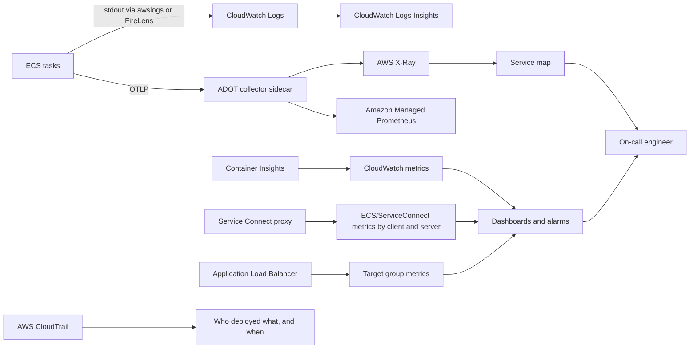

| Metric | Source | What it tells you |
|---|---|---|
| **`RunningTaskCount` versus `DesiredTaskCount`** | Container Insights | A persistent gap means placement failure: no capacity, no free IPs, or failing health checks |
| **`CapacityProviderReservation`** | ECS capacity provider | Whether the cluster capacity layer is keeping up; a sustained value above target means instances are being added |
| **`UnHealthyHostCount`** | ALB target group | The single most informative deployment-failure signal; if it rises during a deploy, roll back |
| **`HTTPCode_Target_5XX_Count`** | ALB | Application errors — distinct from `HTTPCode_ELB_5XX_Count`, which means no healthy target or an ALB-level failure |
| **`TargetResponseTime` p99** | ALB | User-perceived latency including queueing, not just server-side processing |
| **`ALBRequestCountPerTarget`** | ALB target group | Load per task; the best auto-scaling signal for request-serving services |
| **`CPUUtilization`, `MemoryUtilization`** | Container Insights | Saturation and the input to right-sizing |
| **Task restart count** | Container Insights | Crash loops and repeated `OOMKilled` events |
| **Service events** | `DescribeServices` | Placement failures, registration, scaling actions — usually name the cause outright |
| **`stoppedReason` and `exitCode`** | `DescribeTasks` | Why an individual task died; read this before hypothesising |
| **Service Connect request count and error rate by client** | `ECS/ServiceConnect` | Which caller is causing a callee's errors, with no application instrumentation |
| **Spot interruption events** | EventBridge | Whether Spot reclamation is affecting your service, and how often |
| **Error-budget burn rate** | Derived from SLIs | The only alarm that reliably corresponds to user harm |

**The diagnostic order that works.** For any ECS problem: read the **service events** first, because they name placement failures explicitly; then compare **desired against running**; then read the most recent stopped task's **`stoppedReason` and `exitCode`**; then check **target health** and its reason string; then, and only then, read application logs. Reversing this order — starting with application logs — is the most common cause of long investigations of problems the API had already named.

**Logs.** Structured JSON to `stdout` with a correlation ID, trace ID, service name, and version on every line. Set retention on every log group. Use metric filters to turn log patterns into alarmable metrics where a condition is only visible in logs.

**Tracing.** Instrument with OpenTelemetry through ADOT rather than a vendor SDK, so the destination is a configuration choice. Propagate context across asynchronous boundaries in SQS message attributes or EventBridge payloads, or traces fracture at exactly the boundary you most need to understand. The trace-derived service map is also the most reliable architecture diagram you will have, because it reflects what the system does rather than what a document claims.

**Alarms.** Alert on symptoms users feel — error rate, latency, backlog age, unhealthy host count — and reserve resource alarms for capacity planning rather than paging. Add CloudWatch Synthetics canaries against critical paths so you learn of an outage from a probe rather than from a customer.

---

## Integration with Other AWS Services

| Service | Why it integrates with ECS |
|---|---|
| **Elastic Load Balancing** | Dynamic target registration and deregistration on task lifecycle; the shared HTTP entry point |
| **Amazon Route 53** | Public DNS at the edge; hosts the private hosted zone Cloud Map writes into |
| **Amazon CloudFront and AWS WAF** | Edge caching, TLS termination, and filtering before compute is consumed |
| **Amazon API Gateway** | API management in front of ECS where keys, usage plans, and validation are required |
| **AWS Cloud Map** | The registry behind Service Connect namespaces and DNS-based discovery |
| **Amazon VPC Lattice** | Cross-VPC, cross-account, cross-compute connectivity with IAM auth policies |
| **AWS Fargate** | Serverless capacity |
| **Amazon EC2 and Auto Scaling** | Instance capacity, capacity provider managed scaling, instance refresh for patching |
| **Amazon ECR** | The image source, covered in 2.1 |
| **AWS IAM and STS** | Task roles, execution roles, instance roles; cluster-scoped permissions |
| **AWS Secrets Manager and SSM Parameter Store** | Runtime secret and configuration injection |
| **AWS KMS** | Encryption of secrets, ephemeral storage, ECS Exec session logs |
| **Amazon CloudWatch and Container Insights** | Metrics, logs, alarms, dashboards |
| **AWS X-Ray and ADOT** | Distributed tracing and the service map |
| **AWS CloudTrail** | Control-plane audit |
| **AWS Systems Manager** | ECS Exec without SSH; Parameter Store for configuration |
| **Amazon EventBridge** | Task state change events for automation; EventBridge Scheduler for scheduled tasks |
| **Amazon SQS, SNS** | Asynchronous decoupling between services; the scaling signal for worker services |
| **AWS Step Functions** | Orchestration of multi-service processes, and `RunTask` integration for batch steps |
| **Amazon RDS, Aurora, DynamoDB, ElastiCache, S3, EFS** | The data tier; RDS Proxy matters because many small tasks each holding a pool exhausts a database |
| **AWS CodePipeline, CodeBuild, CodeDeploy** | Build and deploy; CodeDeploy specifically provides ECS blue/green |
| **AWS CloudFormation, CDK, Terraform** | Declarative definition; CDK's `ecs_patterns` constructs assemble common topologies in a few lines |
| **Amazon GuardDuty** | Runtime threat detection inside ECS tasks |
| **AWS Compute Optimizer** | Right-sizing recommendations for ECS services on Fargate |

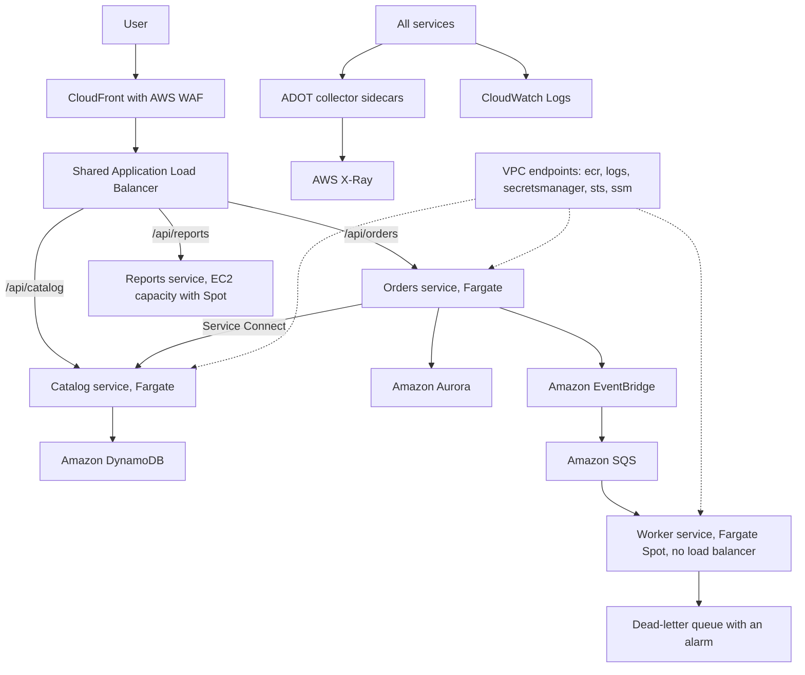

Read architecturally, this shows the three regimes coexisting deliberately. The **north-south path** shares one ALB, so adding a service costs a listener rule rather than a new load balancer and a new bill. The **east-west synchronous path** is a single Service Connect hop and is kept as short as possible, because every link multiplies into the availability calculation. Everything else is on the **asynchronous plane**, where a worker on Fargate Spot can be interrupted without a user noticing, and where a dead-letter queue with an alarm turns silent message loss into a page. Note also that the reports service runs on EC2 capacity while the rest runs on Fargate: this is not indecision but a legitimate response to a workload with a different cost profile, and it is affordable precisely because both are fronted by the same ALB and observed by the same pipeline.

---

## Common Architecture Patterns

### Shared load balancer with path-based routing

One ALB, one certificate, one hourly charge, many services behind listener rules. This is what keeps decomposition from multiplying the edge bill, and it is the ECS analogue of `IngressGroup` on EKS. Its cost is a shared configuration surface: a listener rule change touches a resource many services depend on, which argues for managing rules in infrastructure as code with per-service ownership of its own rule.

### Sidecar

A helper container in the same task sharing its network namespace: the Service Connect proxy, an ADOT collector, a Fluent Bit log router under FireLens, or a database connection pooler. On Fargate, where `DAEMON` scheduling is unavailable, sidecars are the only option for per-task collection and their resource overhead is a real, replica-multiplied line item.

### Capacity provider strategy with an On-Demand base and Spot remainder

A guaranteed floor of On-Demand tasks that survives a total Spot reclamation, with the bulk of capacity on Spot at a steep discount. The `base` is the design decision: it should be the number of tasks that can carry minimum viable traffic on their own.

### Worker service with no load balancer

A service consuming from SQS needs no inbound path at all: no load balancer, no target group, no health-check grace period. It scales on backlog per task rather than on request count, and it is an excellent Spot candidate. Students frequently attach an ALB to workers out of habit, which adds cost and an irrelevant health-check failure mode.

### `DAEMON` services for node-level agents

On EC2 capacity, one task per container instance, automatically placed on new instances. The correct home for a log collector or a monitoring agent that must see the host. Unavailable on Fargate, which is one of the more consequential Fargate limitations for organisations with an existing agent-based observability stack.

### Service Connect namespace per environment

One Cloud Map namespace per environment means `http://catalog:8080` resolves correctly in every environment without configuration differences, and a staging service can never accidentally resolve a production peer. This is a small decision with a large safety payoff.

### Cluster per environment, account per compliance boundary

Clusters separate environments cheaply and give IAM a natural scope. Accounts separate compliance domains and make the audit boundary an AWS boundary rather than a configuration claim. The two are complementary rather than alternatives.

### Blue/green with CodeDeploy

Two target groups and a listener that shifts traffic between them, with pre-traffic and post-traffic validation hooks and instant rollback by shifting back. Covered in depth in 2.3.3; noted here because it changes the load-balancer topology, requiring a second target group from the outset.

---

## Industry Use Cases

| Sector | Workload | Capacity and networking choice | Reasoning |
|---|---|---|---|
| Higher education | Semester-peaked submission portal | Fargate, small On-Demand base plus Spot, shared ALB | Extreme duty cycle makes idle provisioned capacity the dominant cost |
| Media | Continuous transcoding | EC2 capacity, GPU instances, Spot, Savings Plans | Hardware requirement plus sustained utilisation; Fargate cannot run it |
| Media | Catalogue API | Fargate behind CloudFront and a shared ALB | Read-heavy and cacheable; no platform team required |
| E-commerce | Checkout | Fargate On-Demand, three AZs, minimum healthy percent 100 | Availability-critical synchronous path; no Spot on the request path |
| E-commerce | Order-event workers | Fargate Spot, no load balancer, scale on queue backlog | Interruption-tolerant; the cheapest correct capacity |
| Retail banking | Payment initiation | Fargate in a dedicated AWS account, private subnets, endpoints only | microVM isolation and account-level audit boundary |
| Healthcare | Vendor integration adapters | Fargate, one service per integration, Service Connect internally | Independent failure domains per vendor with minimal operational overhead |
| Industrial IoT | Telemetry ingestion | EC2 Graviton capacity at high sustained utilisation | Predictable high throughput where unit cost dominates |
| Logistics | Tracking API | Fargate with DynamoDB, shared ALB | Simple access pattern, elastic load, minimal operations |
| Government | Multi-supplier portal | Cluster per supplier, shared ALB with listener rules per path | Contractual independence of deployment; shared edge to control cost |
| SaaS | Pooled multi-tenant API | Fargate, one service, tenant context per request | Highest density; one artefact for all tenants |
| SaaS | Siloed enterprise tenants | Cluster per tenant, or account per tenant | Contractual isolation expressed as topology, not as a code fork |
| Gaming | Account services | Fargate | Stateless, elastic, no ecosystem requirement |
| Gaming | Match servers | EC2 capacity, `bridge` mode with dynamic ports, NLB | Stateful, latency-sensitive, needs host-level control and UDP |

---

## Advantages

**No control plane to operate, and no charge for it.** There is no cluster endpoint, no etcd, no API server, no version, and no upgrade. For an organisation without a platform team this removes an entire category of recurring work — and unlike EKS, clusters themselves are free, so isolation between teams or environments can be bought by creating another cluster rather than engineered inside a shared one.

**A small, closed conceptual surface.** Clusters, capacity providers, task definitions, tasks, and services. A competent engineer is productive in days rather than months. There are no third-party controllers to select, install, secure, and upgrade, which means the platform does not quietly become a project.

**Deep AWS integration by default.** IAM roles per task, per-task security groups, ALB target registration, CloudWatch Logs, Secrets Manager injection, Systems Manager shell access, and CloudTrail audit all work by configuration rather than by installation. On other orchestrators several of these are controllers you adopt and maintain.

**Capacity flexibility without workload changes.** The same task definition runs on Fargate, on EC2 capacity, on Spot, and on ECS Anywhere. Capacity provider strategies let a single service span On-Demand and Spot with a guaranteed floor, expressed in two numbers.

**Fargate's isolation and simplicity.** A microVM per task removes the shared-kernel concern and the instance metadata hazard simultaneously, and removes AMI patching, fleet scaling, and bin packing from your responsibilities. For many organisations this is worth more than the per-vCPU premium costs.

**Service Connect as managed east-west networking.** Client-side load balancing, connection pooling, outlier ejection, retries, and per-caller telemetry, with no proxy configuration to write, no extra network hop, and no internal load balancer to pay for. Obtaining the equivalent elsewhere means adopting and operating a service mesh.

**Operational transparency.** Service events, `stoppedReason`, `exitCode`, and Container Insights answer most questions directly. ECS Exec provides a shell without SSH, bastions, or open ports, with every session audited.

---

## Limitations

**No ecosystem and no extension points.** What AWS ships is what exists. There is no admission control, no custom resource type, no operator pattern for running complex stateful software, and no community controller for a capability AWS has not built. If your requirement is one of those, ECS cannot meet it and the honest answer is EKS.

**No portability.** An ECS task definition runs on AWS and nowhere else. If a genuine multi-cloud or hybrid requirement exists, that is a strong argument against ECS — though it is worth testing whether the requirement is genuine, since Kubernetes manifests port while the surrounding IAM, load-balancer controller, and CNI configuration do not.

**Coarser scheduling.** Placement strategies and constraints are less expressive than affinity, anti-affinity, topology spread, priority, and preemption. For most workloads this does not matter; for dense mixed-workload clusters it does.

**Two scaling layers on EC2 capacity.** Service scaling and cluster capacity scaling are separate systems, and configuring only the first is one of the most common production failures in this chapter. Fargate removes the problem; EC2 capacity requires understanding it.

**Fargate's specific limitations.** A per-vCPU premium at sustained high utilisation. No GPUs, no privileged containers, no host daemons, no `DAEMON` scheduling, no local NVMe. Fixed CPU and memory combinations rather than arbitrary values. Ephemeral storage capped in the low hundreds of gigabytes. No shared image cache, so every task pays a full pull and image size matters more.

**EC2 capacity's specific limitations.** You own AMI patching, fleet scaling, bin packing, draining, and the IMDS hazard. The instance is a shared trust boundary. Idle headroom is paid for, and the headroom you remove to save money is the headroom that made scale-out fast.

**Networking constraints inherited from the VPC.** Every `awsvpc` task consumes a private IP address, so subnet sizing bounds task count, and subnet CIDRs cannot be resized. `bridge` mode relieves the pressure at the cost of per-task security groups.

**A smaller hiring pool.** ECS skills are AWS-specific and less transferable than Kubernetes skills, which matters for hiring and for engineers' own career reasoning. This is a real cost even where it is not a technical one.

---

## Common Mistakes

### Beginner Mistakes

| Mistake | Why it is wrong | What to do instead |
|---|---|---|
| Configuring service auto scaling on EC2 capacity without managed scaling | The service raises desired count and tasks sit in `PROVISIONING` forever | Enable managed scaling on the capacity provider, or use Fargate |
| Target capacity set to 100 per cent | Every scale-out waits one to three minutes for an instance launch | 80–90 per cent for user-facing services |
| Health-check grace period of 0 with a slow-starting application | The ALB kills tasks that were still warming up; the service replaces them in a loop | Set the grace period above the measured cold start, and set `startPeriod` too |
| Deregistration delay left at 0 | Users see 502 responses during every deployment | Set it just above p99 request duration |
| Security group rules written as CIDRs | Grants the whole VPC access; invisible in review | Reference the load balancer's or caller's security group |
| Tasks in public subnets with public IPs | Unnecessary internet exposure | Private subnets, `assignPublicIp: DISABLED`, VPC endpoints |
| One ALB per service | Load-balancer hours dominate at low traffic | One shared ALB with path- or host-based listener rules |
| Attaching a load balancer to a queue-consumer service | Cost and an irrelevant health-check failure mode | Workers need no load balancer; scale on backlog |
| Choosing `bridge` mode by default | Loses per-task security groups and per-task IP identity | `awsvpc` unless density on EC2 specifically requires otherwise |
| Hard-coding a peer task's IP address | The address is valid only for that task's lifetime | Service Connect, or Cloud Map DNS |
| A `/24` private subnet for an `awsvpc` cluster | IP exhaustion during the first real scale-out; unfixable in place | Size private subnets generously from the start |
| Assuming clusters cost money | ECS clusters are free; this changes the topology calculus | Use clusters as boundaries freely, within reason |
| Using Fargate Spot for the synchronous request path | Reclamation with two minutes' notice on user traffic | On-Demand base plus Spot remainder, expressed as `base` and `weight` |

### Production Mistakes

| Mistake | Consequence | Remedy |
|---|---|---|
| Managed termination protection disabled | ASG scale-in terminates instances still running tasks | Enable it, and enable managed draining |
| No `SIGTERM` handling in the application | Every deployment cuts in-flight requests | Trap `SIGTERM`, drain, exit; align `stopTimeout` and deregistration delay |
| DNS-based discovery with clients that cache indefinitely | Calls to tasks that stopped minutes ago | Service Connect, or explicit DNS cache TTL configuration in the client runtime |
| `DescribeTasks` on the request path for discovery | Couples data-plane availability to the control plane; hits API throttling under load | Discover through the local proxy or DNS, never per request |
| Tasks in a single AZ despite three subnets configured | An AZ event takes the whole service down | Verify actual distribution on a dashboard; use `spread` on `attribute:ecs.availability-zone` for EC2 |
| EC2 capacity without an IMDS hop limit | Any compromised container assumes the container instance role | IMDSv2 with hop limit 1, and a minimal instance role |
| Mounting the Docker socket into a container | Grants root on the host | Never do this; use ECS Exec for debugging |
| No VPC endpoints | NAT charges on every pull and log write, plus an internet dependency for task launch | Interface endpoints for ECR, Logs, Secrets Manager, STS, SSM; S3 gateway endpoint |
| Container Insights disabled to save money | Incidents take far longer because per-task metrics do not exist | Enable it; the diagnostic value dwarfs the cost |
| ECS Exec enabled without session logging | Unaudited shell access to production | Configure `executeCommandConfiguration` with logging and KMS, and restrict the action by tag |
| Reading application logs before service events | Long investigations of problems the API already named | Service events, then desired-versus-running, then `stoppedReason`, then target health, then logs |
| Cluster per service at scale | Cross-cutting change becomes N changes; no estate-wide view | Cluster per team per environment |

<!-- ### Certification Traps

| Trap | The reality |
|---|---|
| "ECS clusters incur an hourly charge like EKS clusters" | ECS has no control-plane or cluster charge; EKS does. The asymmetry is architecturally significant |
| "Cluster Autoscaler scales ECS tasks" | That is a Kubernetes component. On ECS, Application Auto Scaling scales tasks and capacity provider managed scaling scales instances |
| "Fargate can run any CPU and memory values" | They must come from the fixed valid matrix |
| "Fargate solves IP exhaustion" | Each Fargate task still consumes a VPC IP address; Fargate solves instance management, not address space |
| "Fargate supports DaemonSets or the `DAEMON` strategy" | It does not; per-task collection must use sidecars |
| "Target type `instance` works with `awsvpc` mode" | `awsvpc` requires target type `ip`; `instance` targets are for `bridge` and `host` modes |
| "Service Connect requires an internal load balancer" | It requires no load balancer at all; that is much of its value |
| "AWS App Mesh is the recommended service mesh for new ECS work" | App Mesh is on a deprecation trajectory; use Service Connect within ECS and VPC Lattice across boundaries |
| "The task execution role is what the application uses to call AWS APIs" | That is the task role; the execution role pulls images, writes logs, and decrypts secrets |
| "Launch type and capacity provider are the same thing" | Launch type is the simple choice; a capacity provider strategy allows weighted mixes with a guaranteed base |
| "`base` and `weight` both distribute proportionally" | `base` is an absolute count satisfied first; only the remainder is distributed by weight |
| "A higher target capacity is always better because it wastes less" | It also removes the headroom that makes task placement immediate; for user-facing services that is a poor trade |
| "ECS Exec requires SSH access to the container instance" | It uses AWS Systems Manager; no SSH, no bastion, no inbound ports |

--- -->

<!-- ## AWS Certification Tips

### Exam tips

Scenarios in this area contain exactly one discriminating constraint. Find it first, then eliminate.

- "Minimum operational overhead", "no container experience", "small team" points to **ECS on Fargate**.
- "GPU", "privileged", "host daemon", "DaemonSet", "local NVMe" eliminates **Fargate** entirely.
- "Steady, predictable, high utilisation" plus "lowest cost" points to **EC2 capacity with Savings Plans**; "spiky" or "unpredictable" plus "lowest cost" points to **Fargate**.
- "Tasks stuck in `PROVISIONING`" points to **capacity provider managed scaling** not configured, or **subnet IP exhaustion**.
- "Must survive Spot reclamation" points to a **capacity provider strategy with a non-zero `base`** on the On-Demand provider.
- "Service-to-service, no extra hop, retries and metrics" points to **ECS Service Connect**.
- "Across VPCs or accounts, or mixed compute types" points to **Amazon VPC Lattice**.
- "Per-consumer API keys, usage plans, request validation" points to **API Gateway**; "high-volume L7 routing at lowest per-request cost" points to **ALB**.
- "Static IP", "UDP", "extreme connection counts", "preserve source IP" points to **NLB**.
- "502 errors during deployment" points to **deregistration delay**, `SIGTERM` handling, and `stopTimeout`.
- "Compromised container must not obtain other workloads' credentials" points to **Fargate**, or IMDSv2 with hop limit 1 on EC2.
- "One task per instance for a monitoring agent" points to the **`DAEMON` scheduling strategy**, which implies EC2 capacity. -->

### Frequently confused pairs

| Pair | The distinguishing fact |
|---|---|
| **ECS cluster vs EKS cluster** | ECS clusters are free with no version; EKS clusters are charged hourly and must be upgraded |
| **Launch type vs capacity provider** | Launch type is a single choice; a capacity provider strategy allows weighted mixes with a guaranteed base |
| **`base` vs `weight`** | `base` is an absolute count satisfied first; `weight` distributes only the remainder |
| **Service auto scaling vs capacity provider managed scaling** | The first changes task count; the second changes instance count. Both are needed on EC2; only the first exists on Fargate |
| **Managed scaling vs managed termination protection vs managed draining** | Scaling adds and removes instances; termination protection stops scale-in killing busy instances; draining relocates tasks before an instance goes away |
| **`awsvpc` vs `bridge`** | `awsvpc` gives each task its own ENI, IP, and security groups; `bridge` shares the instance's, and enables dynamic port mapping |
| **Target type `ip` vs `instance`** | `ip` registers the task's own address and is required with `awsvpc`; `instance` registers the host and a port |
| **Container `healthCheck` vs target group health check** | The first runs inside the container and informs ECS; the second runs over the network and controls traffic |
| **`healthCheckGracePeriodSeconds` vs `startPeriod`** | The grace period tells the *service* to ignore load-balancer health; `startPeriod` tells the *agent* to ignore container health-check failures |
| **Deregistration delay vs `stopTimeout`** | The first is how long the load balancer drains a target; the second is how long ECS waits between `SIGTERM` and `SIGKILL` |
| **Service Connect vs Cloud Map** | Service Connect adds a managed proxy with load balancing, retries, and metrics; Cloud Map provides DNS records only |
| **Service Connect vs an internal ALB** | Service Connect adds no network hop and no hourly charge; an internal ALB adds both but crosses VPC and account boundaries |
| **App Mesh vs VPC Lattice** | App Mesh is a deprecating sidecar mesh; VPC Lattice is sidecar-free AWS-native connectivity across boundaries |
| **`REPLICA` vs `DAEMON`** | `REPLICA` maintains a desired count; `DAEMON` runs one task per eligible container instance, is EC2-only, and is unsupported with blue/green |
| **ALB vs NLB vs API Gateway** | Layer 7 content routing; layer 4 throughput and static IPs; API management with keys and usage plans |
| **Task role vs execution role vs instance role** | Application identity; pre-start identity for pull, logs, and secrets; the EC2 host's identity |

### Memory aids

- **"Clusters are free on ECS, charged on EKS."** This asymmetry drives topology.
- **"Two scaling layers on EC2, one on Fargate."** The stuck-`PROVISIONING` failure in one sentence.
- **"`base` first, `weight` for the rest."**
- **"`awsvpc` means `ip` targets."** And each task costs one subnet address.
- **"Deregister, drain, `SIGTERM`, `SIGKILL`."** The shutdown order, and where each setting applies.
- **"Service Connect for inside, ALB for outside, Lattice for across."**
- **"Events, then desired-versus-running, then `stoppedReason`, then target health, then logs."** The diagnostic order.
- **"Fargate for the fleeting, EC2 for the enduring."**

!!! danger "Common certification traps"

    - Believing ECS charges for clusters, or that EKS does not.
    - Configuring service auto scaling on EC2 capacity and forgetting capacity provider managed scaling.
    - Assuming Fargate is always cheaper, or always more expensive.
    - Believing Fargate solves subnet IP exhaustion — every Fargate task still consumes an address.
    - Expecting `DAEMON` scheduling or DaemonSets on Fargate.
    - Pairing target type `instance` with `awsvpc` network mode.
    - Choosing App Mesh for new work rather than Service Connect or VPC Lattice.
    - Believing Service Connect requires an internal load balancer.
    - Treating `base` as a percentage or `weight` as an absolute count.
    - Setting target capacity to 100 per cent and then being surprised that scale-out is slow.
    - Granting application permissions to the task execution role.
    - Omitting an `iam:PassRole` restriction from a deployment policy, leaving a privilege-escalation path.

---

## Summary

First, **the cluster is a boundary, not a machine, and on ECS it is free** — which changes the shape of good designs. There is no control plane to operate, no version to upgrade, and no hourly charge, so isolation between teams and environments can be obtained by creating another cluster rather than by engineering multi-tenancy inside a shared one. The boundaries worth drawing are the ones that answer who may deploy here, what should fail together, and what should be observed together. The failure mode at both extremes is real: one cluster for everything gives every team a shared blast radius, and one cluster per service turns every cross-cutting change into N changes with no estate-wide view.

Second, **capacity is a separate decision from workload, and capacity providers are what make that separation real**. A task definition describes what to run; a capacity provider strategy describes where, in what proportion, and with what guaranteed floor. The `base` is a reliability decision — the number of tasks that must survive a total Spot reclamation — and the `weight` is an economic one. On EC2 capacity there are two scaling layers and both must be configured, which is the source of the most common production failure in this chapter; on Fargate the second layer does not exist, which is one of the strongest practical arguments for it.

Third, **the EC2-versus-Fargate decision is a measurement, not a preference, and the same organisation will correctly reach opposite answers for different workloads**. Fargate wins on spiky utilisation, on small estates of many small services, on per-task microVM isolation, and above all on the operational cost it removes — the AMI patching, the fleet scaling, the bin packing, the instance metadata hazard, and the second scaling layer. EC2 wins on sustained high utilisation with commitments, on hardware Fargate does not offer, on warm-cache start latency, and on `DAEMON` workloads. The asymmetry worth remembering is that Fargate's cost appears on an invoice where it can be seen, and EC2's cost partly appears as engineering time where it cannot.

Fourth, **the network is where a container architecture succeeds or fails, and it fails under change rather than under load**. Every `awsvpc` task consumes a subnet IP address, so subnet sizing bounds the estate and cannot be corrected later. Security-group references rather than CIDRs express service-to-service permission as identity. VPC endpoints let a task start, log, and fetch secrets without any route to the internet, which is simultaneously a security improvement, a cost reduction, and a latency improvement. And the settings that make a deployment invisible — deregistration delay, `SIGTERM` handling, `stopTimeout`, health-check grace period — are four separate values that must agree, none of whose defaults suit a real workload.

Fifth, **east-west connectivity should not go through a load balancer when it does not have to**. Service Connect places the routing decision in a proxy inside the task: no network hop, no hourly charge, no control-plane call on the request path, connection pooling, outlier ejection, and per-caller telemetry that answers "which client is causing this server's errors" without any application instrumentation. Cloud Map DNS remains correct for non-HTTP protocols but inherits DNS caching semantics, which is a genuine failure mode during deployments. VPC Lattice is the answer when the call crosses a VPC, an account, or a compute type. And the more important question than any of these is whether the call needs to be synchronous at all, because availability multiplies down a synchronous chain and latency adds up it.

Sixth, **the platform names its own failures, and the diagnostic order is a skill**. Service events, then desired versus running, then `stoppedReason` and `exitCode`, then target health with its reason string, then application logs. Almost every failure in this chapter is identified in the first three steps, and the habit of reading them before hypothesising is more transferable than any individual fact in the chapter. The corollary is that Container Insights and ECS Exec should be enabled before an incident rather than during one, because an investigation that requires a configuration change first has already lost the time that mattered.

Seventh, and connecting back to 1.3.2, **ECS is a deliberate trade of extensibility for simplicity, and that trade is a legitimate architectural choice rather than a compromise**. There is no ecosystem, no admission control, no operator pattern, and no portability. In exchange there is nothing to upgrade, nothing to install, no platform team implied, and no cluster charge. For a team whose workloads are AWS-resident and whose scarce resource is engineering attention, that is frequently the better trade — and being able to say so plainly, in a room that expects to hear Kubernetes, is a substantial part of what an architect is for.

---

