# Container Orchestration with Amazon ECS

## Definition

**Container orchestration** is the continuous, automated management of a container fleet's lifecycle: deciding where each container runs, keeping the right number running, adjusting that number as demand changes, and replacing one version with another without interrupting service.

On Amazon ECS this is three cooperating control loops:

- **Placement** answers *where*. The ECS scheduler filters the available capacity, sorts it according to your declared strategy, and binds the task to a host — or, on Fargate, to a subnet and an AWS-managed slot.
- **Scaling** answers *how many*. Application Auto Scaling adjusts a service's `desiredCount` from a metric, and on EC2 capacity a capacity provider adjusts the instance count underneath it.
- **Deployment** answers *which version, and how do we get there*. A deployment controller replaces tasks of one task-definition revision with tasks of another under constraints that bound the risk.

| Loop | Setpoint you declare | Mechanism | What goes wrong when it is left at defaults |
|---|---|---|---|
| **Placement** | Constraints and an ordered strategy list | ECS scheduler | Replicas co-locate in one AZ; an AZ event becomes an outage |
| **Task scaling** | A metric and a target value | Application Auto Scaling | Scaling on CPU for an I/O-bound service never triggers |
| **Capacity scaling** | Target capacity percentage | Capacity provider managed scaling | Tasks stick in `PROVISIONING` under load |
| **Deployment** | Minimum healthy and maximum percent, circuit breaker | ECS or CodeDeploy deployment controller | A bad release drains healthy capacity, or a deployment reduces capacity during peak |

Within an AWS architecture these loops sit entirely in the ECS control plane and Application Auto Scaling, acting on the data plane described in 2.2. None of them is on the request path, which is what makes a control-plane impairment survivable.

!!! note "Orchestration is declarative, and that is the whole idea"

    You never tell ECS to start a task. You tell it what should be true — six tasks of revision 12, spread across three Availability Zones, between four and forty depending on requests per target — and the platform continuously acts to make reality match. Every setting in this chapter is part of that specification. The corresponding discipline is that if reality does not match, the specification is where you look first, not the platform.

---

## Why This Service or Concept Exists

### Why placement is a decision at all

If every host were identical and every failure independent, placement would not matter: any host would do. Neither is true.

Hosts are not identical. They have different amounts of remaining CPU and memory, they sit in different Availability Zones, they may have different instance types, GPUs, or local storage, and on Spot they have different interruption risks. And failures are not independent: **an Availability Zone is a correlated failure domain**. Every task in one AZ fails together when that AZ fails, which is precisely the event multi-AZ architecture exists to survive.

This produces the central tension of placement. **Bin packing** — filling one host before using the next — maximises density and minimises cost, and concentrates risk. **Spreading** — distributing across AZs and hosts — maximises availability, and wastes capacity. Real production configurations do both, in a deliberate order: spread first across the failure domain that matters, then pack within it.

| If placement were ignored | Consequence |
|---|---|
| All six replicas land in one AZ | A single-AZ event takes the service down entirely, despite three subnets being configured |
| Two replicas land on the same instance | An instance failure removes a third of capacity instead of a sixth |
| Tasks scattered across many half-empty instances | The EC2 bill is double what it needs to be |
| A GPU task placed on a non-GPU instance | It cannot start, and the failure is late and confusing |
| All Spot tasks on one instance type | A single capacity pool reclamation removes everything at once |

### Why auto scaling exists, and why the signal matters more than the mechanism

Static capacity is wrong in both directions. Provision for peak and you pay for idle capacity most of the time. Provision for average and you fail at peak. Auto scaling replaces a fixed number with a control loop.

The mechanism is straightforward. The difficulty — and where students and production teams alike go wrong — is **choosing the signal**. A scaling metric is a proxy for "how much work is arriving relative to how much we can do". CPU is a good proxy only when the work is CPU-bound. For a service that spends its time waiting on a database, CPU stays at 20 per cent while requests queue behind an exhausted connection pool, and a CPU-based policy never fires. For a queue consumer, raw queue depth is a *worse* proxy, because it does not account for the capacity you just added — scaling on it produces oscillation. The correct signals are load per unit of capacity: requests per target, or backlog per task.

| Workload | Wrong signal | Right signal | Why |
|---|---|---|---|
| HTTP API, I/O-bound | `CPUUtilization` | `ALBRequestCountPerTarget` | CPU never rises; requests per target tracks actual load |
| HTTP API, CPU-bound | Request count alone | `CPUUtilization`, or both | Here CPU genuinely is the constraint |
| SQS consumer | `ApproximateNumberOfMessagesVisible` | Backlog per task | Raw depth ignores added capacity, so the loop oscillates |
| Batch on a schedule | Any reactive metric | Scheduled scaling | Reactive scaling cannot outrun a step change |
| Spiky, latency-critical | Reactive scaling alone | Scheduled floor plus target tracking | Anticipation for the known part, reaction for the rest |

### Why deployment strategy exists

Replacing running software is the highest-risk routine operation a team performs. Two things can go wrong: the new version is broken, and the act of replacement itself interrupts service. Deployment strategy addresses both.

Before orchestrators, a deployment was a sequence of steps with a failure mode in the middle: stop the old version, start the new one, discover it does not work, and now nothing is running. ECS turns deployment into a controlled transition with explicit bounds — how much capacity may be removed, how much extra may be created, what counts as healthy, and what to do when the transition is not converging.

| The old failure | What ECS provides |
|---|---|
| Stop old, start new, discover breakage with nothing running | New tasks must be healthy before old ones stop |
| Capacity reduced during the deployment | `minimumHealthyPercent: 100` keeps full capacity throughout |
| A broken release drains the fleet as tasks crash-loop | The deployment circuit breaker halts and rolls back |
| Rollback is another risky deployment | Rollback is a pointer to a previous immutable revision |
| In-flight requests cut when a task stops | Deregistration delay plus `SIGTERM` handling drains them |
| A subtly bad release passes health checks and harms users | CloudWatch alarm-based rollback, or blue/green with validation hooks |

!!! warning "Health checks catch crashes, not regressions"

    The deployment circuit breaker detects tasks that fail to start or fail their health checks. It cannot detect a version that starts perfectly, passes `/health`, and returns wrong answers, or one that is 40 per cent slower. Those require **CloudWatch alarm-based rollback** on error rate and latency, or a canary that shifts a small traffic share and evaluates metrics before proceeding. Believing the circuit breaker is sufficient is one of the most consequential misunderstandings in this chapter.

---

## Real-World Motivation

**A university portal's Availability Zone lesson.** A department deployed a six-task service across three subnets and considered itself multi-AZ. During an AZ impairment the service went down completely: with the default placement behaviour and a cluster whose instances were unevenly distributed, five of six tasks had landed in the affected zone. The subnets were configured; the distribution was never verified. *The architectural lesson is that supplying three subnets permits spreading but does not guarantee it — you must declare a spread strategy and then check the actual distribution on a dashboard.*

**A retailer's scaling that never fired.** A checkout service scaled on `CPUUtilization` at a 70 per cent target. Under peak load CPU reached 35 per cent while p99 latency rose to four seconds, because the bottleneck was a saturated database connection pool. The service never scaled. Moving to `ALBRequestCountPerTarget` made the policy track the thing that actually caused load. *The architectural lesson is that a scaling metric must be a proxy for arriving work, and CPU is that proxy only for CPU-bound work.*

**A logistics company's oscillating workers.** A queue consumer scaled on `ApproximateNumberOfMessagesVisible` with a target of 100. Every burst drove the count to forty tasks, which drained the queue in seconds, which drove it back to two, which let the queue build again. The service spent its life scaling. Switching to backlog per task — messages visible divided by running tasks — produced a stable loop. *The architectural lesson is that a scaling metric must be normalised by current capacity, or the controller cannot converge.*

**A bank's silent regression.** A release passed every health check and deployed cleanly. It also introduced a rounding error in interest calculation that no health check could detect and that took nine hours and a customer complaint to surface. Rolling back was straightforward once identified; identifying it was not. The bank subsequently adopted CodeDeploy canary shifting with a post-traffic validation hook running business assertions against the new version before full promotion. *The architectural lesson is that deployment safety mechanisms detect the failures they are designed to detect, and "the process started and answered `/health`" is a very low bar.*

**A media company's deployment-time capacity dip.** A transcoding fleet deployed with `minimumHealthyPercent: 50`, halving capacity during each deployment. Deployments during quiet hours were invisible; a deployment during a live event caused a backlog that took two hours to clear. *The architectural lesson is that deployment parameters encode an assumption about when you deploy, and if that assumption is not enforced it will eventually be violated.*

**A start-up's circuit breaker earning its keep.** A four-person team pushed a release with a missing environment variable. Tasks started, crashed on the first request, and were replaced. Without the circuit breaker the service would have degraded as healthy old tasks were drained in favour of failing new ones. With it enabled, ECS halted after the failure threshold and rolled back automatically, and the team learned about it from an alarm rather than from users. *The architectural lesson is that the circuit breaker costs nothing, has no scenario in which you prefer a failing deployment to continue, and should be enabled by default on every service.*

**A gaming studio's Spot placement.** A studio ran stateless services entirely on EC2 Spot with a single instance type. A capacity-pool reclamation removed the whole fleet at once. Adding a mixed-instances policy across six compatible types, plus a `spread` strategy on instance ID, converted a total loss into the loss of a fraction. *The architectural lesson is that placement diversity and instance-type diversity are both risk controls, and Spot amplifies the cost of ignoring either.*


## Core Concepts

### The scheduler's decision pipeline

When the ECS scheduler must place a task, it runs a pipeline. Understanding the order explains most placement behaviour.

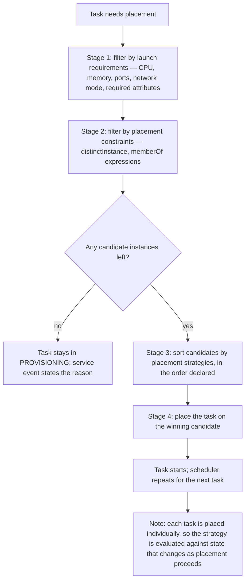

Two properties of this pipeline matter architecturally.

**Constraints filter; strategies sort.** A constraint can make placement impossible — if no instance satisfies it, the task simply does not run and the service event says so. A strategy can never make placement impossible; it only chooses among candidates that already qualify. This is why an over-tight constraint produces a stuck service and a poorly chosen strategy produces a working but badly distributed one.

**Tasks are placed one at a time.** The strategy is re-evaluated for each task against the state produced by previous placements, which is what makes `spread` converge on an even distribution rather than sending everything to the currently emptiest AZ.

On **Fargate** there are no container instances, so instance-level constraints and strategies do not apply. Fargate distributes tasks across the subnets you supply, which is why supplying subnets in three Availability Zones is, in practice, the entire availability configuration.

### Placement constraints

| Constraint | Syntax | Effect | Typical use |
|---|---|---|---|
| **`distinctInstance`** | `type=distinctInstance` | No two tasks of this service on the same container instance | Ensures an instance failure removes at most one replica |
| **`memberOf`** | `type=memberOf, expression=<CQL>` | Only instances matching the expression are candidates | Instance type, AZ, AMI, custom attributes |

The **Cluster Query Language** expresses `memberOf` filters over container-instance attributes:

```
attribute:ecs.instance-type =~ m6i.*
attribute:ecs.availability-zone in [us-east-1a, us-east-1b]
attribute:ecs.os-type == linux and attribute:ecs.cpu-architecture == arm64
attribute:workload-class == gpu
attribute:ecs.instance-type != t3.micro
```

Built-in attributes include `ecs.availability-zone`, `ecs.instance-type`, `ecs.os-type`, `ecs.os-family`, `ecs.cpu-architecture`, `ecs.ami-id`, `ecs.vpc-id`, `ecs.subnet-id`, and `ecs.capability.*` for agent features. Custom attributes are yours to define, either through `/etc/ecs/ecs.config` at boot or with `PutAttributes`, and they are the mechanism for expressing workload classes such as "instances licensed for this software" or "instances with the local NVMe our cache needs".

!!! danger "A constraint that nothing satisfies is a service that never runs"

    Constraints filter before strategies sort. If a `memberOf` expression references an instance type that is no longer in the Auto Scaling group, or a custom attribute nobody sets any more, every candidate is filtered out and tasks remain in `PROVISIONING` indefinitely — with a service event stating that no container instance met the requirements. This is one of the more confusing failures because the cluster has abundant free capacity. Audit constraints whenever the fleet composition changes.

### Placement strategies

| Strategy | Field | Behaviour | Optimises for |
|---|---|---|---|
| **`spread`** | `attribute:ecs.availability-zone`, `instanceId`, or any attribute | Distribute evenly across distinct values of the field | Availability |
| **`binpack`** | `cpu` or `memory` | Place on the instance with the least remaining of that resource that still fits | Density and cost |
| **`random`** | none | Choose a candidate at random | Nothing; a default, not a decision |

Strategies are an **ordered list**, applied as successive sort keys. The standard production configuration is:

```json
"placementStrategy": [
  { "type": "spread", "field": "attribute:ecs.availability-zone" },
  { "type": "binpack", "field": "memory" }
]
```

Read it as: first choose the Availability Zone that currently has the fewest tasks of this service, then within that zone choose the fullest instance that still has room. The result is even distribution across the correlated failure domain, and density within it — availability where it matters, cost efficiency where it does not conflict.

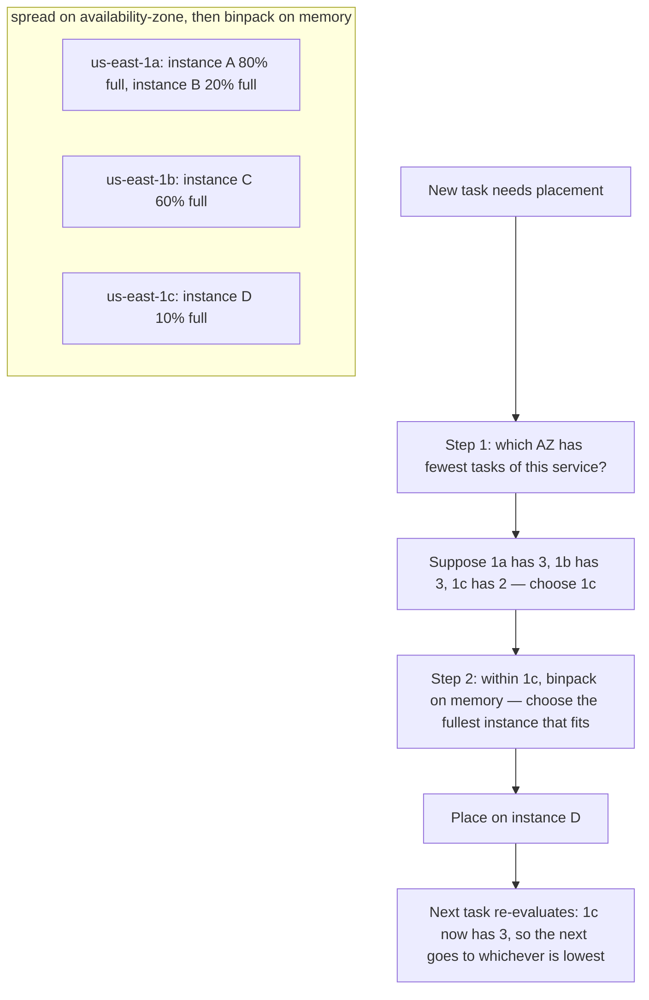

Reversing the order — binpack then spread — produces a very different and usually wrong outcome: the scheduler fills one instance completely before considering the zone, concentrating replicas on a single host in a single AZ.

!!! tip "Spread across zones, then bin pack within them"

    This ordering is the default recommendation for almost every production service on EC2 capacity, and it is worth being able to justify rather than just recite. Spreading across `instanceId` instead of AZ protects against instance failure but not zone failure, and zone failure is the larger correlated event. Adding `distinctInstance` as a constraint on top gives both, at the cost of requiring at least as many instances as tasks — appropriate for small, critical services and wasteful for large ones.

### Application Auto Scaling on ECS

The scaling layer is **Application Auto Scaling**, a separate service that registers a **scalable target** — here, `ecs:service:DesiredCount` for a given cluster and service — with a minimum and maximum capacity, and then applies **scaling policies** to it.

| Policy type | How it works | Best for |
|---|---|---|
| **Target tracking** | You give a metric and a target value; the service creates and manages CloudWatch alarms and computes the capacity change needed to hold the metric near the target | Almost everything; the default choice |
| **Step scaling** | You define alarm thresholds and the adjustment for each step | Asymmetric or aggressive responses target tracking cannot express |
| **Scheduled scaling** | You set minimum and maximum capacity at a time or on a cron schedule | Calendar-driven load; setting a floor before a known peak |

**Target tracking** is the workhorse and is worth understanding rather than treating as magic. When you create a target-tracking policy, Application Auto Scaling creates two CloudWatch alarms — a high alarm and a low alarm — and continuously computes a desired capacity that would bring the metric to the target, assuming the metric is roughly proportional to load per task. It scales out aggressively and in conservatively by design, and it will not scale in while a scale-out cooldown is active.

**Cooldowns** deserve deliberate asymmetry:

- **Scale-out cooldown** short, 60 seconds or less. Under-capacity harms users immediately.
- **Scale-in cooldown** long, 300 seconds or more. Removing capacity too eagerly causes flapping, and the cost of holding a few extra tasks for five minutes is trivial next to the cost of oscillation.

**Predefined metrics** available for ECS target tracking are `ECSServiceAverageCPUUtilization`, `ECSServiceAverageMemoryUtilization`, their high-resolution counterparts `ECSServiceAverageCPUUtilizationHighResolution` and `ECSServiceAverageMemoryUtilizationHighResolution` (which use 20-second metrics and require high-resolution metrics to be enabled on ECS first), and `ALBRequestCountPerTarget`. Anything else — SQS backlog per task, custom business metrics — uses a **customised metric specification**, frequently a CloudWatch **metric math** expression.

!!! warning "`ALBRequestCountPerTarget` is not available with blue/green deployments"

    The predefined `ALBRequestCountPerTarget` metric type is not supported for services using the `CODE_DEPLOY` deployment controller, because the service's traffic is split across two target groups whose identity changes each deployment. A blue/green service that needs request-based scaling must express it as a customised metric specification with metric math over the target groups, or scale on a different signal. This constraint is easy to miss because each feature is documented separately, and it surfaces only when you adopt the second one.

### Choosing the scaling metric

**For a request-serving service**, `ALBRequestCountPerTarget` is usually correct. It measures requests arriving per task, which is the actual driver of load, and it works for I/O-bound services where CPU never moves. The target value is derived, not guessed: measure the requests per task at which p99 latency begins to degrade, and set the target somewhat below it — commonly 60 to 70 per cent of that value, leaving headroom for the scaling delay.

**For a queue consumer**, the correct signal is **backlog per task**:

```
backlog_per_task = ApproximateNumberOfMessagesVisible / RunningTaskCount
```

and the target is derived from the latency you have promised:

```
target_backlog_per_task = acceptable_latency_seconds / seconds_per_message_per_task
```

If a task processes one message every 0.2 seconds and you have promised that a message is processed within 60 seconds, the target is 60 / 0.2 = 300 messages per task. Scaling on raw depth instead has no denominator, so the controller has no idea whether the capacity it just added is sufficient — which is exactly why it oscillates.

**`ApproximateAgeOfOldestMessage`** is the complementary *alarm* metric: it measures whether the promise is actually being kept, and it belongs on a dashboard and an alarm even when scaling is driven by backlog per task.

**For a genuinely CPU-bound worker**, CPU utilisation is correct, and this is the case where the obvious answer is also the right one.

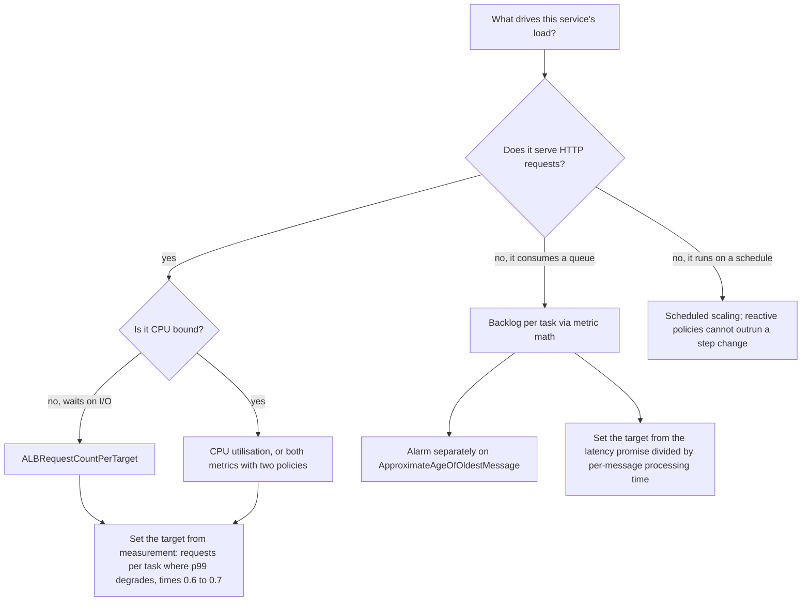

### The two scaling layers, revisited

2.2 introduced the distinction; here is the operational detail. Service auto scaling changes `desiredCount`. On EC2 capacity, capacity provider **managed scaling** changes the instance count, driven by the `CapacityProviderReservation` metric, which expresses how much capacity is needed relative to how much exists. The two loops run independently and must be tuned to cooperate: the capacity layer must react faster than, or at least concurrently with, the task layer, or every scale-out waits for an instance launch.

The practical settings that make them cooperate are **target capacity below 100 per cent** on the capacity provider, so there is standing headroom for immediate placement, and a **task scaling target below saturation**, so the service asks for capacity before it is in trouble. On Fargate the second loop does not exist and the only tuning is the first.

### Deployment: the rolling update

The default ECS deployment controller performs a rolling update governed by two percentages of `desiredCount`:

- **`minimumHealthyPercent`**: the floor below which the number of healthy tasks must not fall.
- **`maximumPercent`**: the ceiling on total tasks, old plus new, during the deployment.

| Configuration | Behaviour at `desiredCount` 10 | Capacity during deploy | Extra cost | Use when |
|---|---|---|---|---|
| min 100, max 200 | Start up to 10 new, then stop old | Never below 10 | Up to double, briefly | Production default |
| min 100, max 150 | Start 5 new, drain 5 old, repeat | Never below 10 | Up to 50 per cent | Production with capacity constraints |
| min 50, max 100 | Stop 5 old, start 5 new, repeat | Falls to 5 | None | Only when capacity cannot be exceeded and reduced capacity is acceptable |
| min 0, max 100 | Stop all, then start all | Zero | None | Singleton tasks that must not run twice; accepts downtime |

The `min 0, max 100` case is worth naming explicitly because it has a legitimate use: a task that must never have two instances running simultaneously — a scheduler, a leader process, or a service holding an exclusive lock — cannot use a strategy that starts a new task before stopping the old one.

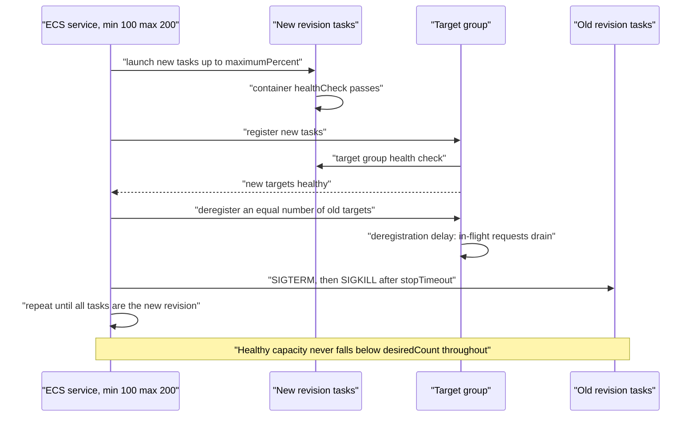

### The deployment circuit breaker

The circuit breaker monitors a rolling deployment and, if new tasks repeatedly fail to reach a healthy state, marks the deployment failed and — with `rollback: true` — automatically redeploys the previous revision. It has a failure threshold that scales with the desired count, and it terminates a deployment that is not converging rather than allowing it to consume the fleet.

What it detects: tasks that fail to start, containers that exit immediately, images that cannot be pulled, containers that fail their health check, and targets that never become healthy.

What it cannot detect: a version that starts cleanly, passes `/health`, and behaves incorrectly. For that you need **CloudWatch alarm-based rollback**, configured with the deployment, which rolls back when a named alarm — error rate, latency, a business metric — enters `ALARM` during the deployment's bake period.

!!! danger "Enable the circuit breaker on every service, and do not stop there"

    There is no scenario in which you would prefer a failing deployment to continue. The circuit breaker with rollback costs nothing and should be a default in your infrastructure-as-code module. But it is a floor, not a ceiling: pair it with alarm-based rollback on error rate and p99 latency, because "the container started" is a much weaker statement than "the release is good".

### Blue/green with AWS CodeDeploy

Setting a service's deployment controller to `CODE_DEPLOY` changes the model entirely. Instead of replacing tasks in place, CodeDeploy stands up a **complete second task set** (green) alongside the running one (blue), routes test traffic to it if configured, then shifts production traffic from the blue target group to the green one according to a chosen mode.

| Traffic-shifting mode | Behaviour | Trade-off |
|---|---|---|
| `AllAtOnce` | 100 per cent of traffic moves in one step | Fastest; full exposure immediately |
| `Linear` | A fixed percentage every N minutes | Gradual; longer deployment window |
| `Canary` | A small percentage, a bake interval, then the remainder | Best risk profile for the time it costs |

The topology requires **two target groups** and, optionally, a **test listener** on a separate port, which is why blue/green must be designed in from the outset rather than retrofitted.

**Lifecycle hooks** are the feature that distinguishes blue/green from a fancier rolling update. For ECS the hooks are `BeforeInstall`, `AfterInstall`, `AfterAllowTestTraffic`, `BeforeAllowTraffic`, and `AfterAllowTraffic`, each invoking a Lambda function that must report success or failure back to CodeDeploy. Note that there is no `BeforeAllowTestTraffic` hook — validation of the green task set before production traffic happens at `AfterInstall` (green exists, no traffic yet) and `AfterAllowTestTraffic` (test traffic has been served). This is where genuine validation lives: run a smoke suite against the green task set before any production traffic reaches it, and run business assertions after traffic shifts but before the deployment is declared successful.

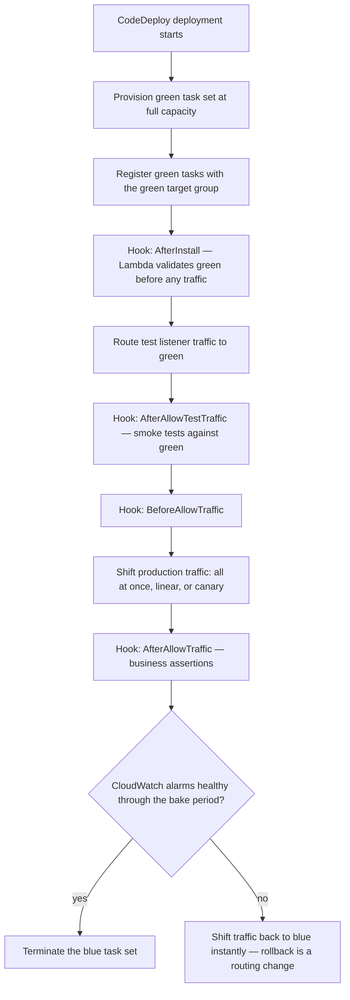

Rollback in this model is a **routing change**, not a redeployment, which is why it is measured in seconds rather than minutes. The cost is double capacity for the duration of the deployment plus the bake period, and considerably more configuration.

### Deploy is not release

The most valuable idea in deployment engineering is that **shipping code and exposing behaviour are separable**. A **feature flag** — in AWS AppConfig, or any flag system — lets you deploy code with a new capability switched off, verify the deployment is healthy on its own terms, and then enable the capability for one per cent of users, then ten, then all, without another deployment. Turning a feature off is instantaneous and carries none of a rollback's risk.

This changes the risk calculus completely. A deployment becomes a low-risk, frequent, boring event, and the risky decision — exposing new behaviour — becomes a separately controlled, instantly reversible one. It also decouples the two from each other in time, so a release can happen during business hours with the team watching, rather than at the moment the pipeline finishes.

---

## Internal Working

### How target tracking actually computes a capacity change

Target tracking is a proportional controller with guard rails. Application Auto Scaling maintains two CloudWatch alarms on the metric and, when one fires, computes a new capacity roughly as:

```
new_desired = ceil( current_desired × (current_metric_value / target_value) )
```

then clamps it to the scalable target's minimum and maximum. If a service running 10 tasks sees `ALBRequestCountPerTarget` at 150 against a target of 100, the computed capacity is `ceil(10 × 1.5) = 15`.

This formula explains three behaviours that otherwise look arbitrary.

**It requires the metric to be load *per task*.** The arithmetic only works if adding tasks reduces the metric proportionally. `ALBRequestCountPerTarget` and backlog per task have this property; raw queue depth does not, which is precisely why scaling on raw depth oscillates — the controller multiplies capacity by a ratio that adding capacity does not change.

**Scale-in is deliberately conservative.** The service will not scale in while a scale-out cooldown is active, and it applies the largest recent scale-out as a floor for a period, because removing capacity that was recently needed is more dangerous than keeping it briefly.

**Multiple policies on one service take the maximum.** If both a CPU policy and a request-count policy are attached, the service scales to the larger of the two computed capacities. This is safe, and it is the correct way to handle a service that can be constrained by either resource.

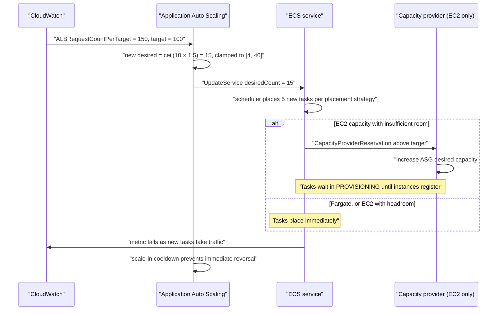

### How the rolling update converges

The service scheduler runs the deployment as a loop, not as a plan. On each iteration it computes how many new tasks it may start without exceeding `maximumPercent`, and how many old tasks it may stop without falling below `minimumHealthyPercent` — counting only tasks that are actually healthy. It then issues those starts and stops and repeats.

This loop structure is why a deployment stalls rather than fails when new tasks cannot become healthy: the scheduler is permitted to stop old tasks only when new healthy ones exist, so if none become healthy, none are stopped and the service continues serving on the old revision. The circuit breaker exists to end that stall with a decision rather than leaving it indefinite.

The **`rolloutState`** field on a deployment — `IN_PROGRESS`, `COMPLETED`, `FAILED` — with its accompanying `rolloutStateReason`, is the authoritative view of this loop and the first thing to read when a deployment is not progressing.

### What happens to a task during replacement

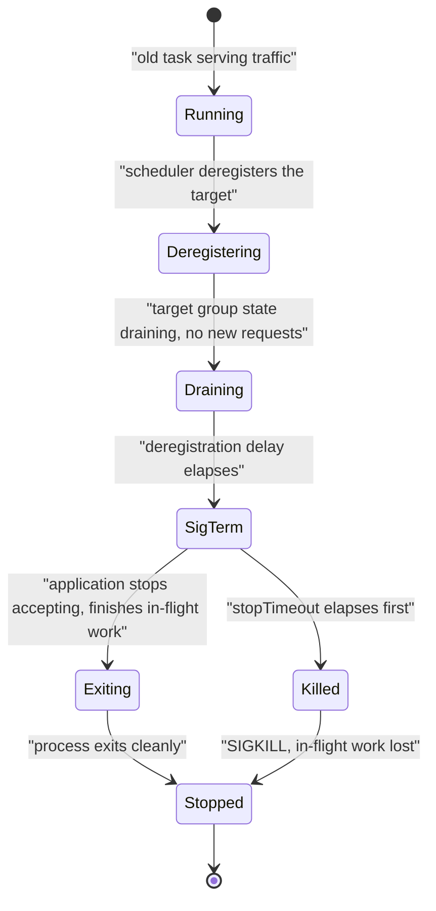

The path through `Killed` is the one to design away. It happens when the application does not handle `SIGTERM`, when `stopTimeout` is shorter than the drain the application needs, or when the entrypoint is in shell form so `/bin/sh` is PID 1 and never forwards the signal. All three are avoidable and all three are common.

### How placement interacts with scaling and deployment

The three loops are independent but coupled through capacity, and the couplings produce most of the surprising behaviour in a real cluster:

- A **placement constraint** that no instance satisfies stops scaling from having any effect, because the additional tasks cannot be placed.
- A **`spread` strategy across AZs** interacts with capacity: if one AZ has no instances with room, spread will place there anyway once the capacity provider adds one, but only after waiting.
- A **deployment with `maximumPercent: 200`** briefly requires double capacity, which on EC2 may trigger the capacity provider to launch instances mid-deployment — making deployments slower during periods when the cluster is already near its target capacity.
- **`distinctInstance`** caps a service's task count at the number of container instances, which silently caps auto scaling too.

!!! warning "Auto scaling can be capped by a placement constraint without any error"

    A service with `distinctInstance` and a scaling maximum of 40 running on a cluster of 12 instances will never exceed 12 tasks. Nothing reports this as an error; the service simply stops growing while the scaling policy keeps asking for more. The symptom is a metric that stays above target indefinitely with `desiredCount` above `runningCount`. Check placement constraints whenever scaling appears to have a ceiling you did not configure.

---

## Architecture Components

| Component | Responsibility in orchestration |
|---|---|
| **ECS scheduler** | Filters candidates by launch requirements and constraints, sorts by strategies, binds tasks to capacity |
| **ECS service scheduler (reconciliation loop)** | Maintains desired count, replaces failures, drives deployments |
| **Placement constraints** | `distinctInstance` and `memberOf` expressions that filter candidate instances |
| **Cluster Query Language** | The expression language over container-instance attributes |
| **Container-instance attributes** | Built-in facts (AZ, instance type, architecture) and custom attributes you define |
| **Placement strategies** | Ordered `spread`, `binpack`, `random` sort keys |
| **Application Auto Scaling** | Registers the scalable target and applies target-tracking, step, and scheduled policies |
| **Scalable target** | `ecs:service:DesiredCount` with a minimum and maximum |
| **Target-tracking policy** | Metric plus target value; manages its own alarms and computes capacity |
| **Step scaling policy** | Alarm thresholds with explicit adjustments per step |
| **Scheduled action** | Time-based minimum and maximum capacity |
| **CloudWatch alarms** | Created by target tracking; also authored by you for step scaling and deployment rollback |
| **CloudWatch metric math** | How backlog-per-task and other derived signals are expressed |
| **Capacity provider managed scaling** | The second scaling loop on EC2, driven by `CapacityProviderReservation` |
| **Deployment configuration** | `minimumHealthyPercent`, `maximumPercent`, circuit breaker, alarm-based rollback |
| **Deployment circuit breaker** | Detects a non-converging rollout and optionally rolls back |
| **ECS deployment controller** | The default in-place rolling update |
| **AWS CodeDeploy deployment controller** | Blue/green task sets, traffic shifting, lifecycle hooks |
| **Target groups (blue and green)** | The two registration points blue/green shifts between |
| **Test listener** | Optional second listener for validating green before production traffic |
| **AWS Lambda lifecycle hooks** | Validation functions invoked at each CodeDeploy lifecycle event |
| **AWS AppConfig** | Feature flags that separate release from deploy |
| **Amazon EventBridge** | Task state change and deployment state change events for automation and notification |
| **Amazon SQS** | The queue whose backlog drives worker scaling |
| **Application Load Balancer and target groups** | Source of `ALBRequestCountPerTarget`; owner of the deregistration delay |
| **Container Insights** | `RunningTaskCount`, `DesiredTaskCount`, per-task CPU and memory, restart counts |
| **AWS CloudTrail** | Audit of `UpdateService`, scaling actions, and deployments |

Read architecturally, these fall into three groups matching the three loops. **Placement** components are all about expressing intent to a scheduler that would otherwise choose arbitrarily. **Scaling** components are a control system whose quality depends almost entirely on the choice of input signal, not on the mechanism. **Deployment** components are about bounding the risk of change — how much capacity may be at risk, what counts as failure, and how fast the decision to abandon is made. The three interact only through capacity, which is why capacity headroom is the setting that most often turns a working configuration into a stuck one.

---

## Request Lifecycle

The lifecycle here is not a user request but a scaling event and the deployment that follows it, because those are the orchestration paths.

### A scale-out event, end to end

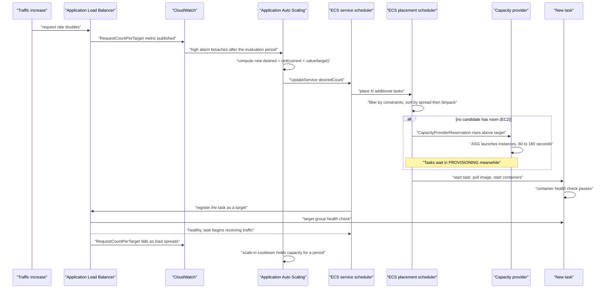

The timing is what matters for design. From the traffic increase to a task serving requests, the components are: the metric's publication interval and the alarm's evaluation periods (tens of seconds to a couple of minutes), possibly an instance launch (one to three minutes), the image pull and container start (seconds to a minute), and the health-check threshold (fifteen to sixty seconds). Two minutes is a good outcome; five is common. **Reactive scaling cannot outrun a step change in load**, which is why a known peak should be met with scheduled scaling that raises the floor before the peak arrives, with target tracking handling the variance above it.

### A rolling deployment, end to end

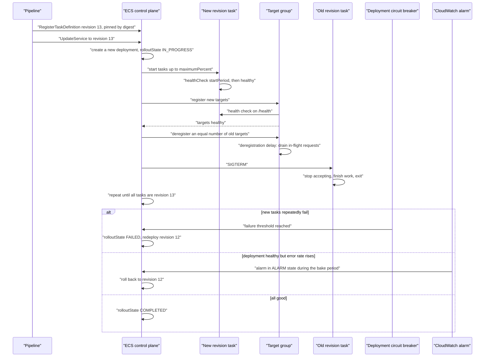

The two rollback paths are the point. The circuit breaker catches tasks that will not run; the alarm catches releases that run but are wrong. A service configured with only the first is protected against half the failure space.

---

## AWS Service Deep Dive

!!! warning "On numbers and quotas"

    Figures are representative as of 2026 and most quotas are **soft**. They vary by Region and account. Verify in AWS Service Quotas for the account and Region you are designing in. Pricing is described as dimensions and relative positions only.

### ECS task placement

**Purpose.** Bind tasks to capacity in a way that expresses your availability, cost, and hardware requirements rather than leaving the choice arbitrary.

**Architecture.** A four-stage pipeline in the scheduler: filter by launch requirements, filter by placement constraints, sort by ordered placement strategies, place. Applied per task, so the state seen by each placement includes the effects of previous ones.

**Important features.** `distinctInstance` and `memberOf` constraints; the Cluster Query Language over built-in and custom attributes; `spread`, `binpack`, and `random` strategies applied as an ordered list; constraints and strategies settable at the service level or per `RunTask` call; task-definition-level `placementConstraints` for requirements intrinsic to the workload.

**Limitations.** Only five placement strategy rules and ten placement constraints per service. No equivalent of Kubernetes pod affinity or anti-affinity relative to *other services*' tasks — `distinctInstance` applies within a service only. No preemption: a higher-priority task cannot evict a lower-priority one. On **Fargate**, instance-level constraints and strategies do not apply at all; distribution is across the subnets you supply.

**Performance characteristics.** Placement decisions are fast; the latency in a scale-out is capacity acquisition and image pull, not the scheduling decision.

**Availability implications.** This is the whole point. `spread` on `attribute:ecs.availability-zone` is what converts three configured subnets into an actual multi-AZ deployment on EC2 capacity. Without it, distribution follows whatever the default produces, which is not guaranteed to be even.

**Common configurations.** `spread` on availability zone, then `binpack` on memory, for general production services on EC2. Add `distinctInstance` for small critical services. `memberOf` with a custom attribute for workload classes such as GPU or licensed instances.

### ECS service auto scaling

**Purpose.** Match a service's task count to demand automatically, within bounds you set.

**Architecture.** Application Auto Scaling registers a scalable target for `ecs:service:DesiredCount`, then applies policies that call `UpdateService`. Target-tracking policies create and own CloudWatch alarms; step-scaling policies use alarms you author; scheduled actions change the minimum and maximum on a schedule.

**Important features.** Predefined metrics for CPU, memory, their high-resolution variants, and `ALBRequestCountPerTarget` (the last unavailable with the blue/green deployment controller); customised metric specifications, including CloudWatch metric math for derived signals such as backlog per task; separate scale-out and scale-in cooldowns; `disableScaleIn` for policies that should only add capacity; multiple policies per service, with the maximum computed capacity winning; scheduled actions with cron or rate expressions.

**Limitations.** Reactive by nature — it cannot anticipate a step change, and the end-to-end delay from load arriving to capacity serving is typically one to five minutes. Scaling is capped by the scalable target's maximum, by placement constraints, by subnet IP availability, and on EC2 by instance capacity. Metric publication intervals bound how quickly a policy can react. There is no built-in predictive scaling for ECS as there is for EC2 Auto Scaling groups; anticipation must be expressed through scheduled actions.

**Pricing model.** Application Auto Scaling itself is not charged; the CloudWatch alarms it creates are, at a negligible rate. The real cost consequence is the capacity it provisions.

**Scaling behaviour.** Aggressive out, conservative in, by design. Scale-in is suppressed during scale-out cooldowns and after recent scale-out activity.

**Common configurations.** Target tracking on `ALBRequestCountPerTarget` with a scale-out cooldown of 60 seconds and a scale-in cooldown of 300; a scheduled action raising the minimum before a known daily peak; a second CPU-based policy for services that can be constrained by either.

### ECS deployments

**Purpose.** Replace one task-definition revision with another under explicit risk bounds, and abandon the attempt automatically when it is not working.

**Architecture.** Two deployment controllers. `ECS` performs an in-place rolling update governed by minimum healthy and maximum percent, with an optional circuit breaker and alarm-based rollback. `CODE_DEPLOY` creates a complete second task set and shifts traffic between two target groups, with Lambda lifecycle hooks. A third, `EXTERNAL`, hands task-set management to your own controller and is rarely used.

**Important features.** `minimumHealthyPercent` and `maximumPercent`; deployment circuit breaker with automatic rollback; CloudWatch alarm-based rollback with a bake period; `rolloutState` and `rolloutStateReason` for observability; `forceNewDeployment` to redeploy the same revision, which is how you pick up a moved image tag or refresh tasks; `enableECSManagedTags` and `propagateTags` for cost attribution; blue/green traffic shifting in all-at-once, linear, and canary modes; four CodeDeploy lifecycle hooks.

**Limitations.** The rolling update cannot shift traffic by percentage — it shifts by task count, which for small services is a coarse increment. The circuit breaker detects health failures only, never behavioural regressions. Blue/green requires two target groups designed in from the start and consumes double capacity during the deployment. There is no built-in automatic canary analysis comparing metrics between versions; alarm-based rollback is threshold-based rather than comparative.

**Pricing model.** No charge for the deployment mechanism. Blue/green's cost is the double capacity during the deployment and bake period, and the Lambda invocations for hooks.

**Performance characteristics.** A rolling update's duration is roughly (number of batches) × (task start time plus health-check time plus deregistration delay). Small images and short health-check thresholds make deployments materially faster, which matters because a slow deployment is a long window of mixed versions.

**Common configurations.** `minimumHealthyPercent: 100`, `maximumPercent: 200`, circuit breaker enabled with rollback, alarm-based rollback on 5xx rate and p99 latency, and a health-check grace period above the measured cold start.

---

## Important AWS Terminology

| Term | Meaning |
|---|---|
| **Placement** | The scheduler's decision about which capacity a task runs on |
| **Placement constraint** | A filter determining which container instances are candidates |
| **`distinctInstance`** | Constraint preventing two tasks of the same service on one container instance |
| **`memberOf`** | Constraint restricting candidates to instances matching a Cluster Query Language expression |
| **Cluster Query Language (CQL)** | The expression language over container-instance attributes |
| **Container-instance attribute** | A key-value fact about an instance, built-in or custom |
| **`attribute:ecs.availability-zone`** | Built-in attribute naming an instance's Availability Zone |
| **Placement strategy** | An ordered sort key list applied to candidate instances |
| **`spread`** | Strategy distributing tasks evenly across distinct values of a field |
| **`binpack`** | Strategy placing tasks on the fullest instance that still fits, maximising density |
| **`random`** | Strategy choosing among candidates arbitrarily |
| **Correlated failure domain** | A set of resources that fail together, principally an Availability Zone |
| **Application Auto Scaling** | The AWS service that scales ECS services and other non-EC2 resources |
| **Scalable target** | The registered resource being scaled: `ecs:service:DesiredCount` with min and max |
| **Target tracking** | Policy holding a metric near a target value by computing capacity proportionally |
| **Step scaling** | Policy with explicit adjustments per alarm threshold band |
| **Scheduled scaling** | Time-based adjustment of minimum and maximum capacity |
| **`ALBRequestCountPerTarget`** | Requests per target over a period; the standard signal for request-serving services |
| **`ECSServiceAverageCPUUtilization`** | Predefined CPU metric for target tracking; a `...HighResolution` variant exists for 20-second metrics |
| **Backlog per task** | Queue depth divided by running task count; the correct queue-consumer signal |
| **`ApproximateNumberOfMessagesVisible`** | SQS queue depth; wrong as a scaling signal on its own |
| **`ApproximateAgeOfOldestMessage`** | SQS metric measuring whether the latency promise is being kept; an alarm metric |
| **Metric math** | CloudWatch expressions combining metrics, used to derive backlog per task |
| **Scale-out cooldown** | Minimum interval before another scale-out; keep short |
| **Scale-in cooldown** | Minimum interval before scaling in; keep long to prevent flapping |
| **Flapping** | Repeated scale-out and scale-in oscillation caused by a poor signal or short cooldowns |
| **`disableScaleIn`** | Policy option permitting a policy to add capacity but never remove it |
| **`CapacityProviderReservation`** | The metric driving capacity provider managed scaling on EC2 |
| **Deployment configuration** | The service settings governing how a deployment proceeds |
| **`minimumHealthyPercent`** | The floor on healthy tasks during a deployment, as a percentage of desired count |
| **`maximumPercent`** | The ceiling on total tasks during a deployment |
| **Rolling update** | In-place replacement of tasks revision by revision under those bounds |
| **Deployment circuit breaker** | Mechanism detecting a non-converging deployment and optionally rolling back |
| **Alarm-based rollback** | Rollback triggered by a CloudWatch alarm entering `ALARM` during deployment |
| **Bake period** | The interval after traffic shift during which alarms are watched before success is declared |
| **`rolloutState`** | Deployment status: `IN_PROGRESS`, `COMPLETED`, or `FAILED` |
| **`forceNewDeployment`** | Redeploy the current revision, used to refresh tasks or pick up a moved tag |
| **Deployment controller** | `ECS` for rolling updates, `CODE_DEPLOY` for blue/green, `EXTERNAL` for custom |
| **Task set** | A group of tasks of one revision within a service; the unit CodeDeploy shifts between |
| **Blue/green deployment** | Running two complete versions and shifting traffic between them |
| **Canary deployment** | Shifting a small traffic percentage first and evaluating before proceeding |
| **Linear traffic shifting** | Moving a fixed percentage at fixed intervals |
| **Lifecycle hook** | A Lambda function CodeDeploy invokes at a deployment stage, able to fail the deployment; for ECS: `BeforeInstall`, `AfterInstall`, `AfterAllowTestTraffic`, `BeforeAllowTraffic`, `AfterAllowTraffic` |
| **Test listener** | A second ALB listener used to send validation traffic to the green task set |
| **Progressive delivery** | Automated gradual exposure with metric-driven promotion or abort |
| **Feature flag** | A runtime switch separating deploying code from releasing behaviour |
| **AWS AppConfig** | The AWS service for feature flags and dynamic configuration with validated deployment |
| **Deregistration delay** | Seconds the load balancer drains a target before it is removed |
| **`stopTimeout`** | Seconds between `SIGTERM` and `SIGKILL` when a task is stopped |
| **Health-check grace period** | How long a service ignores load-balancer health after a task starts |

---

## Configuration Options

### Placement configuration

| Setting | Options | How to decide |
|---|---|---|
| **Strategy order** | Any ordered list of up to five rules | `spread` on availability zone first, then `binpack` on memory, for almost every production service on EC2 capacity |
| **`spread` field** | `attribute:ecs.availability-zone`, `instanceId`, any attribute | AZ protects against the larger correlated failure; `instanceId` protects against host failure; use AZ first and add `distinctInstance` if you need both |
| **`binpack` field** | `cpu` or `memory` | Pack on whichever resource your tasks actually exhaust first; for most services that is memory |
| **`distinctInstance`** | Present or absent | For small critical services where an instance failure must cost at most one replica; note it caps task count at instance count |
| **`memberOf` expressions** | Any CQL expression | Express genuine requirements — architecture, instance family, licensed hosts — never incidental preferences, because a stale expression stops placement entirely |
| **Custom attributes** | Any key-value | Define a small vocabulary such as `workload-class` and set it in `/etc/ecs/ecs.config`; ad-hoc attributes become unmaintainable |
| **Fargate** | Not applicable | Distribution follows the subnets you supply; supply three AZs' subnets |

### Auto scaling configuration

| Setting | Options | How to decide |
|---|---|---|
| **Policy type** | Target tracking, step, scheduled | Target tracking by default; step for asymmetric responses; scheduled for calendar-driven load, usually alongside target tracking |
| **Metric** | CPU, memory, `ALBRequestCountPerTarget`, custom | By what actually drives load; request count for I/O-bound HTTP services, backlog per task for consumers, CPU only when CPU-bound |
| **Target value** | Any | Derived from measurement: the load per task at which p99 degrades, times roughly 0.6 to 0.7 |
| **Minimum capacity** | Any | At least 2, and at least the number of AZs you want covered; 1 is a single point of failure |
| **Maximum capacity** | Any | High enough to absorb a realistic peak, low enough to bound a runaway; also check it is not silently capped by constraints or subnet IPs |
| **Scale-out cooldown** | Seconds | 60 or less; under-capacity harms users now |
| **Scale-in cooldown** | Seconds | 300 or more; flapping costs more than a few minutes of extra capacity |
| **`disableScaleIn`** | True or false | True when a second mechanism owns scale-in, or when scale-in is genuinely unsafe |
| **Multiple policies** | Any number | Safe: the maximum computed capacity wins. Use two when a service can be limited by either CPU or request rate |
| **Scheduled actions** | Cron or rate | Raise the *minimum* before a known peak rather than setting a fixed count, so target tracking still handles variance above the floor |

### Deployment configuration

| Setting | Options | How to decide |
|---|---|---|
| **Deployment controller** | `ECS`, `CODE_DEPLOY`, `EXTERNAL` | `ECS` rolling for most services; `CODE_DEPLOY` when you need instant rollback, pre-traffic validation, or percentage-based canaries |
| **`minimumHealthyPercent`** | 0–100 | 100 for production, so capacity never dips; 0 only for singleton tasks that must not run twice |
| **`maximumPercent`** | 100–200 | 200 for fast deployments with full capacity; 150 when capacity is constrained; 100 forces reduced capacity |
| **Circuit breaker** | Enabled, with or without rollback | Always enabled with rollback; there is no scenario preferring a failing deployment to continue |
| **Alarm-based rollback** | A list of CloudWatch alarms | 5xx rate and p99 latency at minimum; this is what catches regressions the circuit breaker cannot |
| **Health-check grace period** | Seconds | Above the measured cold start, or the ALB kills warming tasks and the service replaces them in a loop |
| **Deregistration delay** | Seconds | Just above p99 request duration |
| **`stopTimeout`** | Up to 120 seconds | Slightly above the drain the application needs, and comfortably above the deregistration delay |
| **Traffic shifting (blue/green)** | All at once, linear, canary | Canary for user-facing services; all-at-once only for internal services where the bake period is not worth the wall-clock time |
| **Lifecycle hooks** | Up to four Lambda functions | At minimum `AfterAllowTestTraffic` running a smoke suite; this is where blue/green earns its cost |

!!! tip "Derive targets from measurement, not from round numbers"

    A target value of 70 per cent CPU or 1000 requests per target is a guess until you have measured the point at which the service degrades. Run a load test, find the load per task at which p99 latency begins to rise, and set the target at 60 to 70 per cent of it. The gap is the headroom the scaling delay consumes: if scaling takes two minutes and load can double in two minutes, a target at the degradation point guarantees the service is degraded for the whole scaling window.

---

## Design Considerations

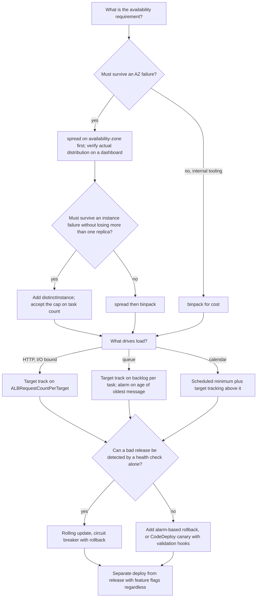

| Quality | What it means here | Design levers | The trade-off you accept |
|---|---|---|---|
| **Availability** | Surviving an AZ or instance failure without user impact | `spread` on AZ, `distinctInstance`, minimum capacity above 2, `minimumHealthyPercent: 100` | Spreading wastes capacity; `distinctInstance` caps scale; full-capacity deployments need headroom |
| **Cost** | Not paying for idle capacity | `binpack`, aggressive scale-in, Spot, lower target capacity | Density concentrates risk; aggressive scale-in causes flapping and slow response to the next peak |
| **Responsiveness** | How fast capacity follows load | Lower scaling target, short scale-out cooldown, capacity headroom, small images, scheduled pre-scaling | All of these cost money, and none makes reactive scaling instantaneous |
| **Stability** | Not oscillating | Normalised metrics, long scale-in cooldown, sensible evaluation periods | A stable loop responds more slowly to genuine changes |
| **Deployment safety** | Not shipping a bad release to everyone | Circuit breaker, alarm-based rollback, canary shifting, validation hooks, feature flags | Every safety mechanism lengthens the deployment or adds configuration |
| **Deployment speed** | How long a release takes | `maximumPercent: 200`, small images, short health-check thresholds, all-at-once shifting | Faster deployments spend less time validating |
| **Operational simplicity** | What the team must understand | Fargate removes the capacity loop; rolling updates are simpler than blue/green | Simpler mechanisms detect fewer failure classes |

!!! danger "Availability during deployment is a separate question from availability during failure"

    A service configured with three AZs and `spread` is well protected against an AZ event. The same service with `minimumHealthyPercent: 50` deliberately halves its own capacity every time it deploys. Teams routinely design carefully for the failure they fear and casually for the one they cause themselves — and deployments happen far more often than AZ failures. Both numbers are part of the availability design.

---

## AWS Best Practices

### Operational Excellence

Express placement strategies, scaling policies, and deployment configuration in infrastructure as code, so they are reviewable and consistent across services rather than clicked into a console once and forgotten. Standardise a module that sets the defaults this chapter recommends — spread then binpack, circuit breaker with rollback, minimum healthy 100, sensible cooldowns — so that a new service is safe by construction. Emit deployment events to EventBridge and notify the owning team, so a rollback is noticed rather than discovered. Verify actual task distribution on a dashboard rather than assuming the strategy worked. Practise rollback until it is boring, and run game days that stop tasks, drain instances, and simulate AZ loss.

### Security

Restrict who can call `UpdateService` and `RegisterTaskDefinition`, scoped to a cluster, and always constrain `iam:PassRole` to the specific execution and task roles a service uses — without that constraint a deployment principal can attach any role in the account to a task and assume it. Require deployments to reference immutable image digests, so the artefact being deployed is exactly the artefact that was scanned. Log deployment actions through CloudTrail and review who deployed what after any incident. Where blue/green lifecycle hooks run Lambda functions, scope those functions' permissions narrowly, since they gate production traffic.

### Reliability

Set the service minimum capacity to at least two, and to at least the number of Availability Zones you intend to cover. Use `spread` on availability zone as the first strategy on EC2 capacity, and supply three AZs' subnets on Fargate. Set `minimumHealthyPercent: 100` so a deployment never reduces serving capacity. Enable the circuit breaker with rollback everywhere, and add alarm-based rollback on error rate and latency for anything user-facing. Make the health-check grace period exceed the measured cold start. Align `stopTimeout`, deregistration delay, and the application's `SIGTERM` handling so drains complete. Alarm on a sustained gap between `desiredCount` and `runningCount`, because that gap is how every placement and capacity failure in this chapter presents itself.

### Performance Efficiency

Choose the scaling metric that reflects the actual constraint, and derive the target value from a load test rather than a round number. Keep images small, because task start time is on the critical path of every scale-out and every deployment. Maintain capacity headroom on EC2 so placement is immediate. Use scheduled scaling to raise the floor ahead of known peaks, since reactive scaling cannot anticipate. Keep deployments fast — small images, short health-check thresholds, `maximumPercent: 200` — because a slow deployment is a long window of mixed versions and a long window before a rollback completes.

### Cost Optimization

Bin pack within the failure domain you have chosen to spread across, which captures most of the density benefit without concentrating risk. Let scale-in actually happen: a long cooldown prevents flapping, but `disableScaleIn` left on permanently means you never give capacity back. Use scheduled scaling to drop the floor overnight and at weekends for services with a human-driven load pattern. Prefer Spot capacity above an On-Demand base for anything interruption-tolerant. Bound the maximum capacity so a runaway loop or a traffic anomaly cannot scale into a very large bill, and alarm when a service sits at its maximum.

### Sustainability

The same levers reduce energy: higher utilisation through bin packing and right-sized targets, scaling to a genuine floor rather than a padded one, scheduled scale-down outside working hours, and Graviton capacity for better work per watt. Reducing deployment frequency is *not* on this list, because frequent small deployments are safer and the compute cost of a rolling update is trivial.

---

## Security Considerations

**Deployment is a privileged operation.** A principal that can register a task definition and update a service can run arbitrary code in your account with whatever role it can pass. The controls that matter are: scoping `ecs:UpdateService` to specific cluster ARNs, constraining `iam:PassRole` to named roles with the `iam:PassedToService` condition, and requiring digest-pinned images so the deployed bytes are the scanned bytes. Of these, the `PassRole` constraint is the one most often omitted and the one that turns a deployment permission into a privilege-escalation path.

**Scaling limits are a security control as well as a cost control.** A maximum capacity on the scalable target bounds the blast radius of a traffic anomaly, a retry storm, or a scaling loop misconfiguration. Without it, an application-level bug that inflates the scaling metric can provision capacity until a quota or a budget stops it.

**Rollback must be as trustworthy as deployment.** Because task-definition revisions are immutable and images are pinned by digest, rolling back retrieves exactly the bytes that were previously healthy. This property is what makes automatic rollback safe to enable — and it depends entirely on the 2.1 discipline of immutable tags and digest pinning. A service deploying mutable tags has a rollback that is itself an untested deployment.

**Lifecycle hooks gate production traffic.** A CodeDeploy hook Lambda that returns success promotes a release; one that returns failure blocks it. Treat those functions as production-critical code: version them, review them, scope their IAM permissions narrowly, and make sure a hook that times out fails the deployment rather than passing it.

**Feature flags carry authorisation implications.** If a flag can be flipped to expose a capability to all users, the ability to flip it is equivalent to the ability to release. Control it accordingly, audit changes, and do not let a flag system become an unaudited side channel around your deployment controls.

!!! warning "An unbounded scaling maximum is a budget vulnerability"

    Every scalable target has a maximum, and leaving it very high "so we never run out" converts an application bug into a financial incident. A retry storm that inflates request counts, a metric-math error that divides by the wrong denominator, or a poison message that makes every task slow will all drive scale-out. Set a maximum you can justify, alarm when the service reaches it, and treat sitting at maximum as an incident rather than as normal operation.

---

## Performance Optimization

**Reduce the time from load arriving to capacity serving.** That interval is the sum of metric publication and alarm evaluation, capacity acquisition on EC2, image pull, container start, and health-check confirmation. Each has a lever: a shorter alarm evaluation period (at the cost of noise sensitivity), capacity headroom, a smaller image, faster application start-up, and a lower healthy threshold on the target group. Measure each rather than guessing which dominates — `pullStartedAt` and `pullStoppedAt` from `DescribeTasks` isolate the pull, and the service event timestamps isolate the rest.

**Scale earlier rather than faster.** Lowering the target value has a larger practical effect than tuning cooldowns, because it starts the scaling process before the service is saturated rather than trying to shorten a pipeline whose steps are mostly fixed.

**Anticipate what you can.** For calendar-driven load — a lecture timetable, a market open, a nightly batch — a scheduled action raising the minimum capacity beforehand converts a scaling problem into a non-problem. Reactive scaling then handles only the variance.

**Do not fight the deployment for capacity.** With `maximumPercent: 200`, a deployment briefly doubles task count. On EC2 near target capacity this triggers instance launches mid-deployment, making the deployment slow at exactly the wrong moment. Either keep headroom, or deploy when the cluster is not near its ceiling, or use 150 rather than 200 for large services.

**Keep deployments short.** Deployment duration is roughly the number of batches times the per-batch time. Small images, quick health checks, and a higher `maximumPercent` all reduce it. This matters beyond convenience: a long deployment is a long period of mixed versions, and a long rollback.

**Choose the strategy that matches the resource that runs out.** `binpack` on memory when tasks are memory-bound and on CPU when they are CPU-bound. Packing on the wrong dimension leaves instances that appear full but have plenty of the resource that actually matters, and produces placement failures that look inexplicable.

---

## Cost Optimization

| Lever | Mechanism | Caution |
|---|---|---|
| **Bin pack within the AZ** | `spread` on AZ then `binpack` on memory | Do not reverse the order; density before availability concentrates replicas on one host in one zone |
| **Let scale-in happen** | Reasonable scale-in cooldown rather than `disableScaleIn` | Too aggressive causes flapping and slow response to the next peak |
| **Scheduled scale-down** | Scheduled actions lowering the minimum overnight and at weekends | Only for services whose load genuinely follows a human schedule |
| **Right-size the target value** | Derive from a load test | A target that is too conservative permanently over-provisions every replica |
| **Spot above an On-Demand base** | Capacity provider strategy with a non-zero `base` | The base must be sized to carry floor traffic alone |
| **Bound the maximum** | Scalable target `MaxCapacity` | Set it from a realistic peak plus margin, and alarm on reaching it |
| **Capacity headroom** | Target capacity below 100 per cent on EC2 | This is a deliberate purchase of responsiveness with idle cost; price it rather than defaulting it |
| **Deployment capacity** | `maximumPercent` 150 rather than 200 for large services | Slower deployments; on Fargate the extra tasks are billed per second, so the cost is small |
| **Fewer, larger tasks** | Task sizing rather than scaling configuration | Coarser scaling granularity; a single task's failure removes more capacity |

**The largest cost mistakes in this chapter are not the obvious ones.** Over-provisioning through a conservative scaling target is invisible per task and enormous across a fleet, because it multiplies by every replica for every second. Flapping wastes start-up time and, on Fargate, pays the one-minute minimum repeatedly. And a scaling maximum left effectively unbounded turns a bug into a bill. All three are configuration rather than engineering.

!!! tip "On Fargate, deployment capacity is cheap; on EC2 it may not be"

    `maximumPercent: 200` on Fargate means paying for double capacity for the few minutes a deployment takes, billed per second — a trivial amount. On EC2 the same setting may require launching instances that are then billed by the hour and may sit idle afterwards. This asymmetry is a small but real point in Fargate's favour for services that deploy frequently.

---

## Monitoring and Observability

| Signal | Source | What it tells you |
|---|---|---|
| **`RunningTaskCount` versus `DesiredTaskCount`** | Container Insights | The universal symptom: a sustained gap means placement failure, capacity shortage, or crash looping |
| **`DesiredTaskCount` over time** | Container Insights | Whether scaling is happening at all, and whether it is oscillating |
| **Task distribution by Availability Zone** | Container Insights or a Logs Insights query over task metadata | Whether your `spread` strategy is actually working — assume nothing |
| **`ALBRequestCountPerTarget`** | ALB target group | Load per task; also the scaling signal itself |
| **`TargetResponseTime` p99** | ALB | Whether the scaling target value is actually protecting latency |
| **`UnHealthyHostCount`** | ALB target group | The most informative deployment-failure signal; a rise during a deploy means roll back |
| **`HTTPCode_Target_5XX_Count`** | ALB | The metric that should drive alarm-based rollback |
| **Scaling activity history** | Application Auto Scaling `describe-scaling-activities` | Every scaling decision with its cause and outcome; the first place to look when scaling misbehaves |
| **`rolloutState` and `rolloutStateReason`** | `DescribeServices` | Whether a deployment is progressing, completed, or failed, and why |
| **Service events** | `DescribeServices` | Placement failures, registration, and scaling narrated in plain text |
| **`CapacityProviderReservation`** | ECS capacity provider | Whether the EC2 capacity layer is keeping up with the task layer |
| **`ApproximateAgeOfOldestMessage`** | SQS | Whether a consumer is keeping its latency promise, independent of how it scales |
| **Deployment state change events** | EventBridge | The hook for notifying a team that a deployment started, completed, or rolled back |
| **Error-budget burn rate** | Derived from SLIs | The only alarm that reliably corresponds to user harm |

**Three dashboards worth building.** A **scaling dashboard** per service showing the scaling metric, the target line, desired and running counts, and scaling activities on the same time axis — this makes flapping, capping, and non-firing policies immediately visible. A **deployment dashboard** showing `rolloutState`, unhealthy host count, 5xx rate, and p99 latency during deployments. And an **availability dashboard** showing task count by AZ, which is the only way to know whether your placement strategy is doing what you believe.

**Alarms that correspond to real problems.** A sustained gap between desired and running. A service sitting at its scaling maximum. `ApproximateAgeOfOldestMessage` above the promise. 5xx rate and p99 latency, wired both to paging and to deployment rollback. And deployment failure events from EventBridge. Resource metrics such as CPU belong on dashboards for capacity planning rather than on pagers.

!!! tip "`describe-scaling-activities` answers most scaling questions in one call"

    When a service is not scaling as expected, the scaling activity history states what Application Auto Scaling decided, when, why, and whether it succeeded — including messages such as a request being clamped to the maximum capacity. Reading it first replaces most of the guesswork about whether the problem is the metric, the policy, the limits, or placement.

---

## Integration with Other AWS Services

| Service | Why it integrates with ECS orchestration |
|---|---|
| **Application Auto Scaling** | The scaling engine for `ecs:service:DesiredCount` |
| **Amazon CloudWatch** | Metrics that drive scaling, alarms that drive rollback, dashboards that show both |
| **CloudWatch metric math** | Expresses derived scaling signals such as backlog per task |
| **Elastic Load Balancing** | Source of `ALBRequestCountPerTarget`; owner of the deregistration delay; the registration point blue/green shifts between |
| **Amazon SQS** | The queue whose backlog drives worker scaling and whose oldest-message age measures the promise |
| **Amazon EC2 Auto Scaling** | The instance fleet under a capacity provider; instance refresh for patching |
| **AWS CodeDeploy** | Blue/green task sets, traffic shifting, and lifecycle hooks |
| **AWS Lambda** | Lifecycle hook validation functions; also automation triggered by deployment events |
| **AWS AppConfig** | Feature flags separating release from deploy, with validated configuration deployment |
| **Amazon EventBridge** | Task and deployment state change events for notification and automation; EventBridge Scheduler for scheduled tasks |
| **AWS CodePipeline and CodeBuild** | The pipeline that registers revisions and updates services |
| **AWS CloudFormation, CDK, Terraform** | Declarative definition of scaling policies, placement strategies, and deployment configuration |
| **AWS CloudTrail** | Audit of every `UpdateService` and scaling action |
| **AWS Systems Manager** | ECS Exec for investigating a task during a problematic deployment |
| **Amazon SNS** | Notification of deployment and scaling events to a team channel |
| **AWS X-Ray and ADOT** | Whether the new revision changed latency, which is what alarm-based rollback needs to see |
| **AWS Compute Optimizer** | Right-sizing recommendations that inform the scaling target and task size |

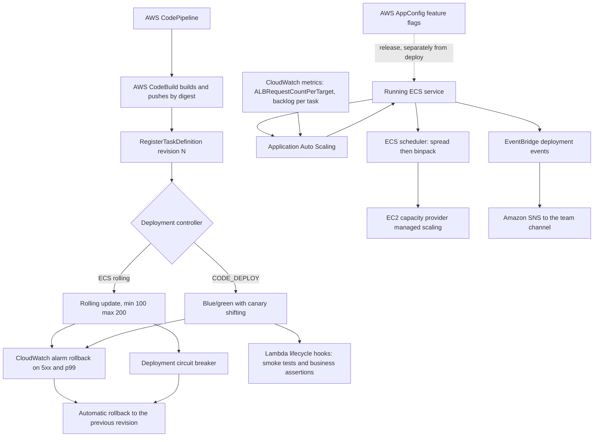

Read architecturally, this shows the three loops closing at different speeds and the deliberate separation of deploy from release. The **scaling loop** closes in minutes and is driven by a metric that must be normalised per task. The **placement loop** closes in seconds but is constrained by capacity that may take minutes to appear. The **deployment loop** closes in minutes and has two independent abort mechanisms — one for tasks that will not run, one for releases that run but are wrong. And the feature-flag path bypasses all three: it changes behaviour without changing what is deployed, which is why it is the fastest and safest control available.

---

## Common Architecture Patterns

### Spread across zones, bin pack within them

The default production placement configuration on EC2 capacity, and the one to be able to justify: availability across the correlated failure domain, density inside it. Applicable to essentially every replicated service. The exception is a service so small that `distinctInstance` is affordable and the additional instance-failure protection is worth the cap on scale.

### Target tracking on load per unit of capacity

Scale on a metric that falls when you add tasks: requests per target, backlog per task, or CPU for CPU-bound work. This is not a stylistic preference but a requirement of the control algorithm, which multiplies current capacity by the ratio of current value to target. A metric that does not respond to capacity makes the loop unstable by construction.

### Scheduled floor plus reactive ceiling

For calendar-driven load, a scheduled action raises the minimum capacity before the peak and lowers it afterwards, while target tracking handles variance above the floor. This combines anticipation for the predictable part with reaction for the rest, and it is strictly better than either alone for a service with a known load shape.

### Rolling update with two independent abort mechanisms

The circuit breaker catches tasks that will not run; alarm-based rollback on 5xx rate and p99 latency catches releases that run but are wrong. Together they cover both halves of the failure space, and neither is a substitute for the other. This is the default deployment pattern for most services.

### Blue/green with validation hooks

Two target groups, a full green task set, validation before any production traffic, canary shifting, a bake period, and rollback as a routing change. The cost is double capacity and considerably more configuration; the benefit is pre-production validation against the real environment and rollback measured in seconds. Justified for services where a bad release is expensive and where the validation hooks will actually be written — an unwritten hook makes blue/green an expensive rolling update.

### Deploy dark, release with a flag

Ship the code with the new behaviour switched off, confirm the deployment is healthy on its own terms, then enable the behaviour progressively through AWS AppConfig. Turning a flag off is instant and carries none of a rollback's risk. This is the highest-leverage risk reduction in deployment engineering, and it works with any deployment controller.

### Worker scaling on backlog with an independent latency alarm

Scale on backlog per task, but alarm on `ApproximateAgeOfOldestMessage`, because the two answer different questions: the first is the control input, the second is whether the promise to the business is being kept. A worker that scales correctly and still breaches its latency target is telling you the target value or the maximum capacity is wrong.

### Singleton task with `min 0, max 100`

For a workload that must never run twice concurrently — a scheduler, a leader, a holder of an exclusive lock — the deployment must stop the old task before starting the new one, accepting a brief gap. Naming this pattern explicitly matters because the usual advice (`min 100`) is exactly wrong here, and applying it produces two concurrent instances of something that must be unique.

---

## Industry Use Cases

| Sector | Workload | Orchestration configuration | Reasoning |
|---|---|---|---|
| Higher education | Timetabled exam portal | Scheduled minimum before each exam window, target tracking above it, spread on AZ | Load is known in advance; reactive scaling alone cannot meet a step change |
| E-commerce | Checkout | Spread on AZ, `min 100 / max 200`, circuit breaker plus alarm rollback, canary via CodeDeploy | Availability-critical and revenue-critical; both abort mechanisms justified |
| E-commerce | Order-event workers | Backlog-per-task scaling, Fargate Spot, alarm on oldest-message age | Interruption-tolerant; the correct signal is backlog, not CPU |
| Media | Transcoding fleet | `binpack` on CPU, EC2 Spot with mixed instance types, spread on instance ID | Cost-dominated batch work; instance diversity mitigates Spot pool reclamation |
| Media | Live-event API | Scheduled pre-scaling hours before broadcast, `min 100 / max 150` | Deployment during an event must not reduce capacity; the peak is a known step |
| Retail banking | Payment initiation | `distinctInstance`, spread on AZ, blue/green with business-assertion hooks | A bad release is expensive and a health check cannot detect it |
| Healthcare | Integration adapters | Independent scaling policies per adapter, rolling updates, feature flags | Each vendor integration has its own load shape and its own release risk |
| Industrial IoT | Telemetry ingestion | Scaling on stream lag via custom metric, EC2 capacity, binpack on memory | Sustained throughput where lag, not CPU, is the constraint |
| Logistics | Route optimisation | Scheduled scaling for the nightly batch, scale to zero between runs | Entirely predictable; reactive scaling would be pure overhead |
| Government | Multi-supplier portal | Standard deployment module enforced across suppliers, alarm rollback mandatory | Consistency of safety mechanisms across teams that do not share a codebase |
| SaaS | Pooled multi-tenant API | Target tracking on requests per target, canary shifting, feature flags per tenant tier | One deployment affects every tenant, so gradual exposure is essential |
| Gaming | Match services | `distinctInstance`, spread on AZ, `min 0 / max 100` for singleton coordinators | Stateful and latency-sensitive; the coordinator must not run twice |

---

## Advantages

**Declarative control loops replace procedures.** You specify what should be true and the platform continuously makes it so. Failures are absorbed rather than escalated, capacity follows demand without human action, and deployments are transitions with bounds rather than sequences of steps with a dangerous middle.

**Placement makes availability explicit and cheap.** Expressing "spread across Availability Zones, then pack within them" is two lines of configuration, and it converts a set of configured subnets into a genuine multi-AZ deployment. There is no engineering to build, only intent to state.

**Scaling is a control system with a small number of understandable knobs.** Target tracking removes the need to author alarms and adjustments; the entire design reduces to choosing the right signal and deriving the right target value. This is a much smaller cognitive surface than step scaling or custom controllers, and it fails in predictable ways.

**Rollback is trustworthy because the artefacts are immutable.** A task-definition revision names exact bytes, so rolling back is a pointer change to a known-good specification rather than another risky deployment. This is what makes automatic rollback safe enough to enable everywhere, and it is the payoff for the immutability discipline established in 2.1.

**Two independent deployment abort mechanisms.** The circuit breaker covers tasks that cannot run; alarm-based rollback covers releases that run but harm users. Neither requires custom tooling, and together they cover most of the realistic failure space.

**Blue/green provides pre-production validation against the real environment.** Lifecycle hooks let you run a smoke suite against a full-scale green task set, in the production VPC with production dependencies, before any user reaches it. No staging environment reproduces that fidelity.

**Fargate removes one entire loop.** With no capacity layer to configure, the most common production failure in this chapter — tasks stuck in `PROVISIONING` because only the task layer was scaled — cannot occur.

---

## Limitations

**Reactive scaling cannot anticipate.** The end-to-end delay from load arriving to capacity serving is typically one to five minutes, and no configuration reduces it to zero. A step change in load will be met with degraded service for that window unless you anticipated it with scheduled scaling or standing headroom. ECS also has no predictive scaling equivalent to the one EC2 Auto Scaling groups offer.

**Constraints can silently cap scaling.** `distinctInstance`, a `memberOf` expression, subnet IP availability, and instance capacity all bound the achievable task count, and none reports the cap as an error. The service simply stops growing while the policy keeps asking.

**The circuit breaker detects only health failures.** A release that starts, passes `/health`, and returns wrong answers or runs 40 per cent slower will deploy successfully. Detecting that requires alarms on behavioural metrics, or a canary with validation — and detecting it *reliably* requires the alarms to be sensitive enough to fire within the bake period, which is a genuinely hard tuning problem.

**Rolling updates shift by task count, not by traffic percentage.** For a service with four tasks, the smallest possible exposure step is 25 per cent of traffic. Percentage-based canaries require CodeDeploy, which requires the blue/green topology to have been designed in from the start.

**Blue/green costs double capacity and considerable configuration.** Two target groups, an optional test listener, lifecycle hook functions to write and maintain, and a longer deployment. If the hooks are never written, the additional cost buys only faster rollback.

**Placement is coarser than Kubernetes scheduling.** There is no affinity or anti-affinity relative to other services' tasks, no topology spread constraints with configurable skew, no priority and no preemption. `distinctInstance` applies within a service only. For most workloads this is immaterial; for dense mixed-workload clusters it is a real limitation.

**Metric availability bounds responsiveness.** ALB and SQS metrics publish at fixed intervals and alarms need evaluation periods, so there is a floor on how quickly a policy can react regardless of cooldown settings.

**Tuning requires load testing that many teams never do.** Every recommendation in this chapter that says "derive from measurement" assumes a load test exists. Without one, target values are guesses, and a guessed target either over-provisions permanently or fails to protect latency.

---

## Common Mistakes

### Beginner Mistakes

| Mistake | Why it is wrong | What to do instead |
|---|---|---|
| No placement strategy on EC2 capacity | Replicas can concentrate in one AZ; three subnets do not guarantee three-AZ distribution | `spread` on `attribute:ecs.availability-zone`, then `binpack` on memory |
| `binpack` before `spread` | Fills one instance completely before considering the zone, concentrating replicas | Spread first, pack second |
| Scaling on CPU for an I/O-bound service | CPU never rises, so the policy never fires while requests queue | `ALBRequestCountPerTarget` |
| Scaling on raw queue depth | The metric does not respond to added capacity, so the controller oscillates | Backlog per task via metric math |
| Minimum capacity of 1 | A single point of failure, and no AZ coverage | At least 2, and at least the number of AZs you want covered |
| Equal scale-out and scale-in cooldowns | Either slow response or flapping | Short out, long in |
| `minimumHealthyPercent: 50` in production | Every deployment halves capacity | 100, with `maximumPercent: 200` |
| Circuit breaker disabled | A failing deployment drains healthy capacity | Enable it with rollback on every service |
| Health-check grace period of 0 with a slow start | Tasks are killed while warming; the service never stabilises | Set it above the measured cold start |
| Believing the circuit breaker catches bad releases | It catches unhealthy tasks, not wrong answers | Add alarm-based rollback on 5xx and latency |
| A target value chosen as a round number | Either permanent over-provisioning or unprotected latency | Derive from a load test |
| Deploying `latest` and expecting rollback to work | The previous tag may now point at different bytes | Immutable tags and digest-pinned revisions, per 2.1 |
| `distinctInstance` on a large service | Silently caps task count at instance count | Use it only where the instance-failure protection is worth the cap |

### Production Mistakes

| Mistake | Consequence | Remedy |
|---|---|---|
| Scaling maximum left effectively unbounded | An application bug becomes a financial incident | Set a justified maximum and alarm on reaching it |
| `disableScaleIn` left on permanently | Capacity ratchets upwards and is never returned | Use a long scale-in cooldown instead, and revisit |
| Never verifying actual AZ distribution | A service believed to be multi-AZ is not | A dashboard showing task count by AZ, checked after every capacity change |
| Stale `memberOf` expressions after a fleet change | Tasks cannot be placed at all; abundant free capacity is misleading | Audit constraints whenever instance types or attributes change |
| Task layer scaled without the capacity layer on EC2 | Tasks stick in `PROVISIONING` under load | Managed scaling with target capacity below 100 per cent |
| Deploying during peak with `maximumPercent: 200` on a full cluster | Deployment triggers instance launches and becomes very slow | Keep headroom, or use 150, or deploy off-peak |
| No `SIGTERM` handling | Every deployment cuts in-flight requests | Trap the signal, drain, exit; align `stopTimeout` and deregistration delay |
| Alarm-based rollback configured but the alarm is too insensitive to fire in the bake period | The mechanism exists and never triggers | Tune the alarm against a real regression, and test it deliberately |
| Blue/green adopted without writing lifecycle hooks | Double cost for faster rollback only | Write at least an `AfterAllowTestTraffic` smoke suite, or use rolling updates |
| Scaling policies clicked into the console | Inconsistent across services, invisible in review, lost on recreation | Infrastructure as code with a shared module |
| Not reading `describe-scaling-activities` when scaling misbehaves | Long investigations of decisions already logged with reasons | Read it first |
| Treating a service sitting at maximum capacity as normal | The real problem is masked until something breaks | Alarm on it and investigate |

<!-- ### Certification Traps

| Trap | The reality |
|---|---|
| "Placement strategies can prevent a task from being placed" | Constraints filter and can prevent placement; strategies only sort |
| "`spread` and `binpack` are alternatives" | They are an ordered list applied as successive sort keys; the standard is spread then binpack |
| "Placement strategies apply on Fargate" | Instance-level strategies and constraints do not; Fargate distributes across the subnets supplied |
| "The deployment circuit breaker detects a bad release" | It detects tasks that fail to start or fail health checks, not behavioural regressions |
| "Cluster Autoscaler scales ECS tasks" | That is Kubernetes. On ECS, Application Auto Scaling scales tasks and capacity provider managed scaling scales instances |
| "Target tracking works with any metric" | It requires a metric that is load *per task* and falls as capacity is added |
| "`maximumPercent: 100` gives a zero-downtime deployment" | With minimum healthy at 100 it cannot start new tasks at all; with minimum below 100 it reduces capacity |
| "Blue/green is always safer, so always use it" | It is safer only if validation hooks are written; otherwise it is a costlier rolling update |
| "Rollback redeploys and rebuilds the previous version" | Rollback points at an existing immutable revision; with CodeDeploy it is a routing change |
| "Scale-in and scale-out cooldowns should be equal" | Deliberate asymmetry is correct: short out, long in |
| "Scheduled scaling replaces target tracking" | It sets the floor; target tracking handles variance above it |
| "`minimumHealthyPercent: 0` is always wrong" | It is correct for singleton tasks that must never run twice concurrently |
| "A service with three subnets is multi-AZ" | Only if tasks are actually distributed; on EC2 that requires a spread strategy and verification | -->

---

<!-- ## AWS Certification Tips

### Exam tips

Each scenario contains one discriminating constraint. Identify the loop it belongs to — placement, scaling, or deployment — then eliminate.

- "Must survive an Availability Zone failure" points to **`spread` on `attribute:ecs.availability-zone`**, first in the strategy list.
- "Minimise the number of instances" or "maximise density" points to **`binpack`**, but as the *second* strategy when availability also matters.
- "No two tasks on the same instance" points to **`distinctInstance`**, and you should remember it caps task count.
- "Tasks will not place despite free capacity" points to a **placement constraint** or **subnet IP exhaustion**, not to a strategy.
- "Service does not scale although load is high" points to the **wrong metric** (CPU on an I/O-bound service), a **clamped maximum**, or a **placement cap**.
- "Scaling oscillates" points to a metric that is **not normalised per task**, most often raw queue depth.
- "Known peak at a known time" points to **scheduled scaling**, raising the minimum.
- "Capacity must never drop during deployment" points to **`minimumHealthyPercent: 100`** with **`maximumPercent: 200`**.
- "Automatically stop and reverse a failing deployment" points to the **deployment circuit breaker with rollback**.
- "Release is healthy but wrong" points to **alarm-based rollback** or **CodeDeploy hooks** — never the circuit breaker.
- "Shift a small percentage of traffic and evaluate" points to **CodeDeploy canary**.
- "Roll back in seconds" points to **blue/green**, where rollback is a routing change.
- "Deploy the code but do not expose the feature yet" points to **feature flags in AWS AppConfig**. -->

### Frequently confused pairs

| Pair | The distinguishing fact |
|---|---|
| **Constraint vs strategy** | Constraints filter and can block placement; strategies sort and cannot |
| **`spread` vs `binpack`** | Availability across a failure domain versus density within one; order matters and spread comes first |
| **`spread` on AZ vs `distinctInstance`** | Zone-level distribution versus one task per instance; they solve different failures and can be combined |
| **Target tracking vs step scaling** | Proportional control from one target value versus explicit adjustments per threshold band |
| **Target tracking vs scheduled scaling** | Reactive versus anticipatory; scheduled sets the floor, target tracking handles variance |
| **`ALBRequestCountPerTarget` vs raw request count** | Per-target normalisation is what makes the control loop converge |
| **Queue depth vs backlog per task** | Only the second responds to added capacity |
| **`ApproximateNumberOfMessagesVisible` vs `ApproximateAgeOfOldestMessage`** | The first is a control input; the second measures whether the promise is kept |
| **Service auto scaling vs capacity provider managed scaling** | Task count versus instance count; both needed on EC2, only the first on Fargate |
| **`minimumHealthyPercent` vs `maximumPercent`** | The floor on healthy tasks versus the ceiling on total tasks |
| **Circuit breaker vs alarm-based rollback** | Unhealthy tasks versus harmful behaviour; both are needed |
| **Rolling update vs blue/green** | In-place replacement by task count versus a second task set with percentage traffic shifting |
| **Canary vs linear shifting** | A small share then the remainder after a bake, versus fixed increments at fixed intervals |
| **Deploy vs release** | Getting code onto servers versus exposing behaviour to users; feature flags separate them |
| **`rolloutState` vs deployment `status`** | `rolloutState` reports whether the rollout is converging; `status` reports which deployment is primary |
| **`forceNewDeployment` vs updating the revision** | Redeploys the current revision versus moving to a new one |

### Memory aids

- **"Constraints filter, strategies sort."**
- **"Spread across zones, pack within them."** In that order, always.
- **"Scale on load per task, or the loop will not converge."**
- **"Depth has no denominator."** The queue-scaling mistake in four words.
- **"Short out, long in."** Cooldown asymmetry.
- **"100 and 200."** The production deployment default.
- **"The breaker asks did it start; the alarm asks is it hurting; the hook asks is it correct."**
- **"Deploy dark, release with a flag."**
- **"Scheduled sets the floor, tracking handles the rest."**

!!! danger "Common certification traps"

    - Believing a placement strategy can prevent placement, or that a constraint merely influences it.
    - Putting `binpack` before `spread` and calling the result multi-AZ.
    - Expecting instance-level placement strategies to apply on Fargate.
    - Scaling on CPU for an I/O-bound service, or on raw queue depth for a consumer.
    - Believing the deployment circuit breaker catches a behavioural regression.
    - Choosing `maximumPercent: 100` with `minimumHealthyPercent: 100` and expecting the deployment to progress.
    - Applying `minimumHealthyPercent: 100` to a singleton workload that must never run twice.
    - Forgetting that `distinctInstance` and subnet IP capacity silently cap auto scaling.
    - Expecting reactive scaling to absorb a step change in load.
    - Assuming blue/green is safer even without validation hooks.
    - Believing rollback rebuilds the previous version rather than pointing at an existing immutable revision.
    - Leaving the scalable target's maximum effectively unbounded.

---

## Summary

First, **orchestration is three control loops, and an architect's job is to specify their setpoints rather than to operate them**. Placement answers where, scaling answers how many, and deployment answers which version and how we get there. Each runs continuously without being asked, each has a small number of settings that encode real engineering decisions, and each has defaults that are adequate for a demonstration and wrong for production. The discipline that follows is that when reality does not match intent, the specification is where you look first — the platform is doing exactly what it was told.

Second, **placement is an availability decision disguised as a scheduling detail**. An Availability Zone is a correlated failure domain, so where replicas live determines what a zone event costs you. `spread` on availability zone followed by `binpack` on memory buys availability across the domain that matters and density within it, in two lines of configuration. But supplying three subnets only *permits* even distribution — it does not guarantee it — so verification by counting tasks per zone is part of the design rather than an optional extra. And because constraints filter before strategies sort, a stale `memberOf` expression stops a service entirely on a cluster with abundant capacity, while `distinctInstance` silently caps how far that service can scale.

Third, **the scaling signal matters more than the scaling mechanism, and the requirement is mathematical rather than stylistic**. Target tracking computes new capacity by multiplying current capacity by the ratio of the metric to the target, which converges only if the metric falls as capacity is added. `ALBRequestCountPerTarget` and backlog per task have that property; CPU has it only for CPU-bound work; raw queue depth does not have it at all, which is why scaling on it oscillates no matter how the cooldowns are tuned. The target value should come from a load test — the load per task at which p99 degrades, discounted for the scaling delay — and the cooldowns should be deliberately asymmetric, because under-capacity harms users immediately and over-capacity costs a little money for a few minutes.

Fourth, **reactive scaling has a floor on its response time that no configuration removes**. Metric publication, alarm evaluation, capacity acquisition, image pull, container start, and health-check confirmation sum to minutes. For load that arrives predictably — a timetable, a market open, a nightly batch — the correct answer is scheduled scaling that raises the floor beforehand, with target tracking handling only the variance above it. Recognising which part of a load pattern is predictable, and refusing to solve it reactively, is one of the more valuable judgements in this chapter.

Fifth, **deployment safety requires two independent mechanisms because there are two independent failure classes**. The circuit breaker catches tasks that will not run and costs nothing, so it belongs on every service by default. It cannot catch a release that starts cleanly, passes its health check, and returns wrong answers or runs substantially slower — for that you need alarm-based rollback on error rate and latency, and for genuine pre-exposure validation you need CodeDeploy hooks running assertions against a green task set before any user reaches it. A team that has enabled the circuit breaker and stopped there is protected against roughly half of what actually goes wrong.

Sixth, **rollback is only trustworthy because the artefacts are immutable**, which is the payoff for the discipline established in 2.1. A task-definition revision names exact bytes, so rolling back is a pointer change to a specification that was known good rather than another untested deployment. This property is what makes automatic rollback safe enough to enable everywhere, and it evaporates the moment a service deploys mutable tags. The three chapters of this unit are connected precisely here: the artefact discipline in 2.1 is what makes the deployment automation in 2.3 safe.

Seventh, and most valuable in practice, **deploying code and releasing behaviour are separable, and separating them is the largest available risk reduction**. A feature flag lets a deployment become a frequent, boring, low-risk event and turns the risky decision — exposing new behaviour — into a separately controlled one that is reversible in seconds without a deployment at all. Every mechanism in this chapter bounds the damage of a bad release; only this one prevents the exposure. It works with any deployment controller, costs far less than blue/green, and shifts the release decision to a moment when the team is watching rather than to whenever the pipeline happens to finish.

---

