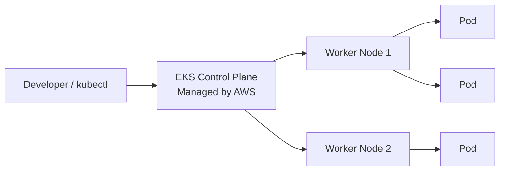
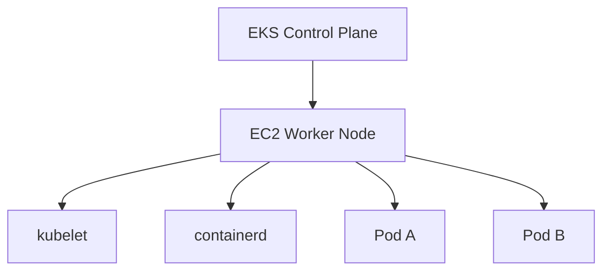
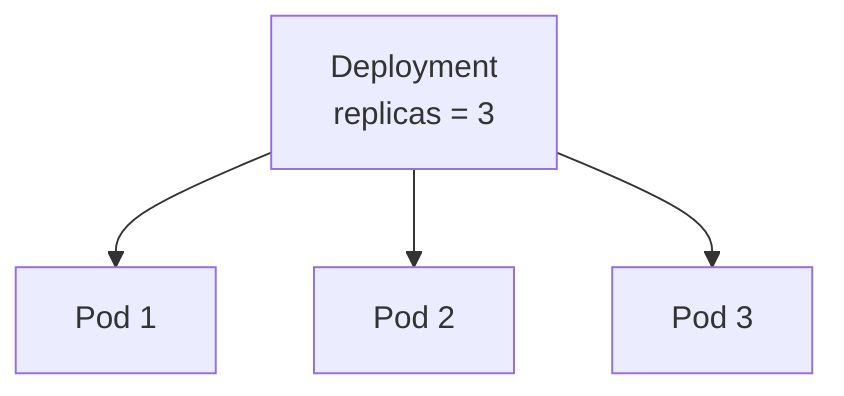
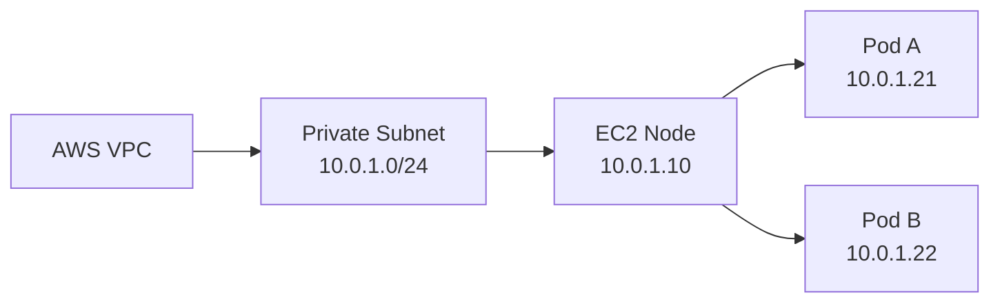
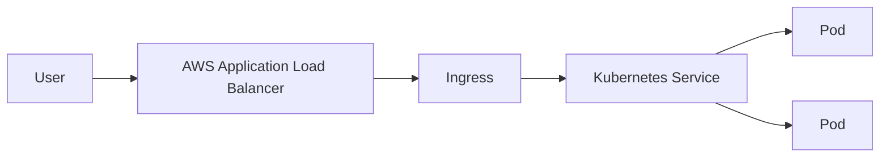
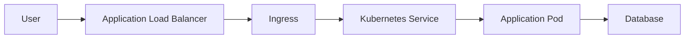
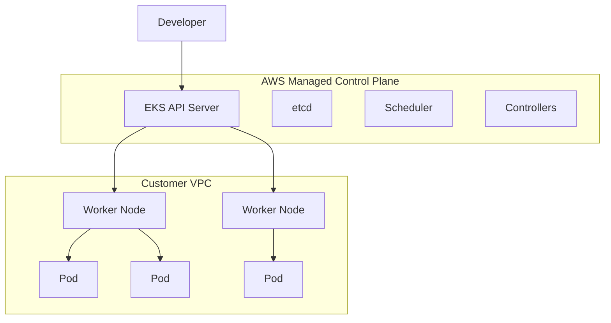

# Unit 3.1 — Amazon EKS Architecture

> **Course:** DSO303  
> **Level:** 4th Year Software Engineering  
> **Topic:** Kubernetes on AWS with Amazon EKS

---

## 1. What is Amazon EKS?

**Amazon Elastic Kubernetes Service (EKS)** is AWS's managed Kubernetes service.

Kubernetes normally requires us to operate two major parts:

1. **Control Plane** — manages the cluster.
2. **Data Plane** — runs our applications.

With EKS:

- **AWS manages the control plane.**
- **We manage the workloads and usually the worker compute.**

### Simple analogy

Think of EKS like a **university campus**.

- The **control plane** is the university administration.
- The **worker nodes** are classroom buildings.
- The **Pods** are the classes running inside the buildings.
- The **scheduler** decides which classroom a class should use.
- The **API server** is the administration counter where requests are submitted.

AWS operates the administration office, while we decide what applications should run in the classrooms.

---

## 2. Why do we need EKS?

Running Kubernetes ourselves is possible, but the control plane is difficult to maintain.

A Kubernetes control plane contains components such as:

- API Server
- etcd
- Scheduler
- Controller Manager

These components must remain available even if a server or Availability Zone fails.

EKS removes much of this operational burden.

### Without EKS

We may need to:

- install Kubernetes control-plane components,
- maintain `etcd`,
- configure high availability,
- patch the control plane,
- upgrade Kubernetes,
- manage certificates,
- recover failed control-plane machines.

### With EKS

AWS manages those tasks for us.

We focus more on:

- applications,
- Pods,
- networking,
- security,
- scaling,
- worker nodes.

---

# 3. The Most Important EKS Idea: Two Sides

EKS architecture becomes much easier when we divide it into two parts.

| Part | Managed by | Main Responsibility |
|---|---|---|
| Control Plane | AWS | Decides what should happen |
| Data Plane | Customer / AWS depending on compute option | Actually runs containers |



A useful question when troubleshooting is:

> **Is the problem in the control plane or in the data plane?**

---

# 4. EKS Control Plane

AWS manages the Kubernetes control plane.

The main components are:

## 4.1 API Server

The **API server** is the front door of Kubernetes.

Commands such as:

```bash
kubectl get pods
kubectl apply -f deployment.yaml
kubectl delete pod mypod
```

are sent to the API server.

### Analogy

The API server is like a **reception desk**.

You do not directly walk into every department.  
You submit your request to reception, and it sends the request to the correct place.

---

## 4.2 etcd

`etcd` stores the state of the Kubernetes cluster.

Examples of stored information:

- what Pods should exist,
- what Deployments exist,
- node information,
- configuration,
- Secrets,
- Service information.

### Analogy

`etcd` is the **official database/record book of the cluster**.

If Kubernetes wants to know:

> "What should the cluster currently look like?"

it checks the desired state stored through the Kubernetes API.

---

## 4.3 Scheduler

The scheduler decides **which node should run a new Pod**.

Example:

Suppose we have:

- Node A — 80% full
- Node B — 30% full

A new Pod requires 1 CPU and 2 GB RAM.

The scheduler evaluates the available nodes and chooses an appropriate one.

### Analogy

The scheduler is like a **hotel receptionist assigning rooms to guests**.

It does not build the room or carry the luggage.  
It only decides which suitable room the guest should receive.

---

## 4.4 Controller Manager

Controllers continuously compare:

> **Desired State vs Actual State**

Example:

You declare:

```yaml
replicas: 3
```

but only 2 Pods are running.

The Deployment controller detects the difference and creates another Pod.

```text
Desired State = 3 Pods
Actual State  = 2 Pods
Difference    = 1 Pod

Controller creates 1 new Pod.
```

### Analogy

A controller is like a **thermostat**.

If you set:

```text
Desired temperature = 22°C
Actual temperature  = 18°C
```

the thermostat activates heating until reality matches the desired state.

Kubernetes works in the same way.

---

# 5. Data Plane

The data plane is where application containers actually run.

It normally contains:

- Worker Nodes
- kubelet
- container runtime
- kube-proxy
- Pods
- VPC CNI
- CoreDNS

---

# 6. Worker Nodes

A worker node is a machine that runs Kubernetes workloads.

In EKS, worker compute may come from:

- EC2 managed node groups,
- self-managed EC2 nodes,
- AWS Fargate,
- newer managed EKS compute options.

For learning EKS, **managed node groups** are the easiest EC2-based option to understand.



---

# 7. kubelet

Every Kubernetes worker node runs a **kubelet**.

Its job is to communicate with the control plane and make sure assigned Pods are running.

### Example

The control plane says:

> "Node-1 should run nginx."

The kubelet on Node-1 makes sure the container runtime starts the nginx container.

### Analogy

If the control plane is the university administration, the kubelet is the **building manager**.

The administration assigns work to the building, and the building manager makes sure it happens.

---

# 8. Container Runtime

Kubernetes does not directly run containers.

A container runtime such as `containerd` performs the actual work.

It:

- pulls container images,
- creates containers,
- starts containers,
- stops containers.

```text
Kubernetes
   ↓
kubelet
   ↓
containerd
   ↓
Container
```

---

# 9. Pod

A **Pod** is the smallest deployable unit in Kubernetes.

A Pod usually contains one main application container.

Example:

```text
Pod
 └── nginx container
```

A Pod may also contain multiple containers when they need to work closely together.

```text
Pod
 ├── Application container
 └── Logging sidecar
```

Containers in the same Pod share:

- network namespace,
- IP address,
- some storage volumes.

---

# 10. Deployment

A Deployment manages Pods.

Suppose we want three copies of our application.

```yaml
replicas: 3
```

The Deployment maintains those three copies.

If one Pod crashes, Kubernetes creates another.



### Key idea

A Pod is temporary.

A Deployment provides **self-healing and replica management**.

---

# 11. Service

Pods can disappear and be recreated with different IP addresses.

A Kubernetes **Service** provides a stable network address for a group of Pods.

### Analogy

Imagine employees in an office.

Employees may change desks, but customers still call the same **company phone number**.

The company phone number is similar to a Kubernetes Service.

---

# 12. EKS Networking

Networking is one of the most important parts of EKS.

EKS integrates Kubernetes networking with the AWS VPC.

The important component is:

## Amazon VPC CNI

CNI means:

> **Container Network Interface**

The Amazon VPC CNI gives Pods IP addresses from the VPC.

This means a Pod can participate directly in VPC networking.



### Why is this useful?

Pods can integrate naturally with:

- VPC routing,
- security controls,
- AWS load balancers,
- other AWS services.

---

# 13. CoreDNS

Applications should not depend on changing Pod IP addresses.

CoreDNS allows services to communicate using names.

Example:

```text
payment-service
```

instead of:

```text
10.0.1.45
```

### Analogy

DNS is like the **contacts application on your phone**.

You remember:

```text
Mom
```

instead of remembering the phone number.

---

# 14. kube-proxy

`kube-proxy` helps route traffic sent to a Kubernetes Service toward the Pods behind that Service.

Example:

```text
Client
   ↓
payment-service
   ↓
Pod 1 / Pod 2 / Pod 3
```

The Service gives applications a stable endpoint even when Pods change.

---

# 15. Load Balancing in EKS

External users often need to reach an application running inside EKS.

One common design is:



The **AWS Load Balancer Controller** watches Kubernetes resources and can create AWS load balancers.

This shows an important EKS idea:

> A Kubernetes object can cause an AWS resource to be created.

---

# 16. IAM and Kubernetes Security

EKS uses two security worlds:

1. **AWS IAM**
2. **Kubernetes authorization**

They are related, but they are not the same thing.

### IAM answers

> Who are you in AWS?

Examples:

- IAM user
- IAM role
- EC2 role

### Kubernetes RBAC answers

> What are you allowed to do inside Kubernetes?

Examples:

- read Pods,
- create Deployments,
- delete Services.

---

# 17. Pod Identity

Applications running in Pods often need access to AWS services.

Example:

```text
Pod → Amazon S3
```

The bad design is:

> Give every Pod the permissions of the EC2 worker node.

That provides too much access.

A better approach gives permissions to the application itself using mechanisms such as:

- EKS Pod Identity,
- IAM Roles for Service Accounts (IRSA).

### Analogy

A worker node is an apartment building.

Pods are residents.

Giving every resident the **building owner's master key** is dangerous.

Each resident should receive only the key needed for their own room.

That is the principle behind Pod-level IAM.

---

# 18. EKS Compute Choices

A simple view:

| Option | Main Idea | Good For |
|---|---|---|
| Managed Node Group | AWS helps manage EC2 worker nodes | Most common workloads |
| Self-managed Nodes | You manage EC2 nodes yourself | Special OS/control requirements |
| Fargate | Run Pods without managing nodes | Small, isolated or bursty workloads |
| Karpenter | Dynamically provisions suitable EC2 capacity | Flexible and fast scaling |

For students, remember:

> **EKS is Kubernetes. EC2/Fargate provide the compute on which workloads run.**

---

# 19. EKS vs ECS

Both ECS and EKS run containers.

| ECS | EKS |
|---|---|
| AWS-native container orchestrator | Managed Kubernetes |
| Easier to learn | More concepts |
| Strong AWS integration | Strong Kubernetes ecosystem |
| Good for AWS-only teams | Good when Kubernetes skills/ecosystem are required |

### Simple rule

Choose **ECS** when simplicity is more important.

Choose **EKS** when you specifically need Kubernetes capabilities or ecosystem compatibility.

---

# 20. Request Flow Example

Suppose a user visits:

```text
https://shop.example.com
```

A simplified request flow might be:



Each layer has a different responsibility.

- ALB receives external traffic.
- Ingress defines HTTP routing.
- Service provides stable internal access.
- Pod runs the application.
- Database stores application data.

---

# 21. Common Student Confusions

## Confusion 1: "EKS runs my containers."

Not exactly.

EKS provides Kubernetes control-plane management.

Your containers run on compute such as:

- EC2 worker nodes,
- Fargate.

---

## Confusion 2: "A Pod is a VM."

No.

A Pod contains one or more containers.

It is much lighter than a virtual machine.

---

## Confusion 3: "Service means the same thing as Deployment."

No.

- Deployment → manages Pods.
- Service → gives Pods a stable network endpoint.

---

## Confusion 4: "AWS manages everything in EKS."

No.

AWS manages the EKS control plane.

You still remain responsible for your:

- workloads,
- configuration,
- security,
- application design,
- and depending on the compute option, worker nodes.

---

# 22. Architecture to Remember



---

# 23. Key Takeaways

1. **Amazon EKS is managed Kubernetes on AWS.**
2. AWS manages the **control plane**.
3. Applications run in **Pods** on the **data plane**.
4. Worker nodes commonly run on EC2.
5. The scheduler decides where Pods run.
6. Controllers continuously try to make actual state match desired state.
7. Deployments manage Pod replicas.
8. Services provide stable access to Pods.
9. The VPC CNI integrates Pod networking with the AWS VPC.
10. IAM and Kubernetes RBAC solve different authorization problems.
11. Pod-level AWS permissions are safer than giving applications the entire node role.
12. Always separate **control-plane problems** from **data-plane problems** when troubleshooting.

---

## One-Sentence Summary

> **Amazon EKS lets AWS operate the difficult Kubernetes control plane while developers use Kubernetes objects to run and manage containerized applications on AWS.**
