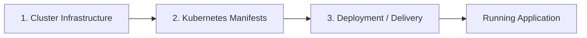
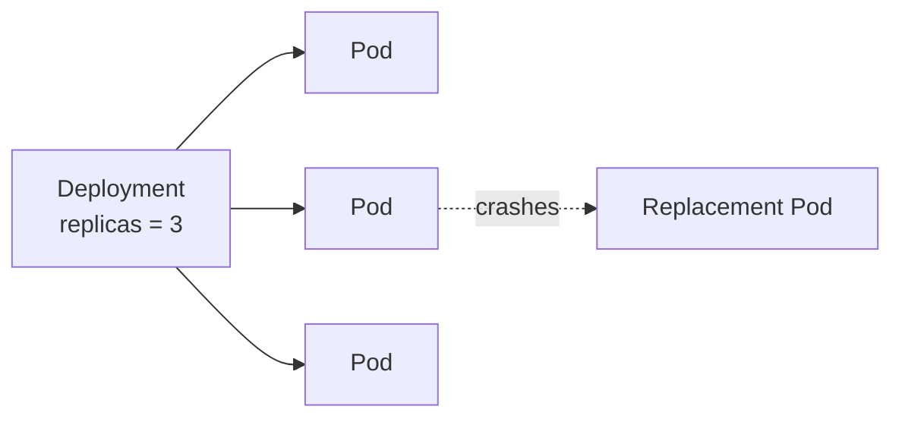
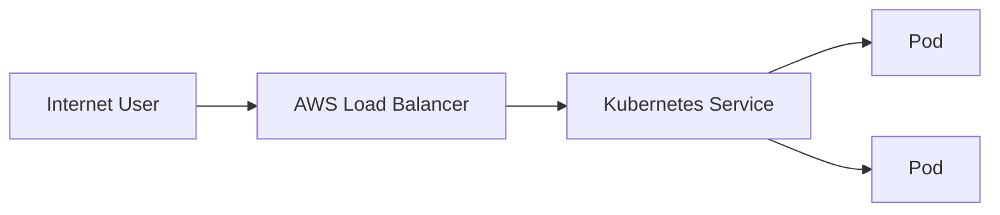
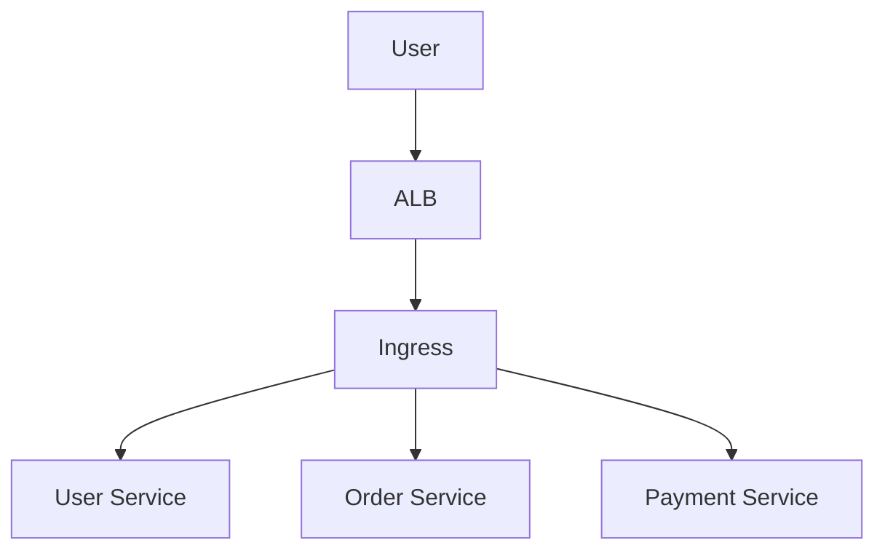
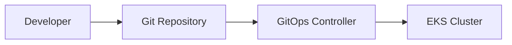
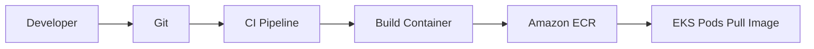
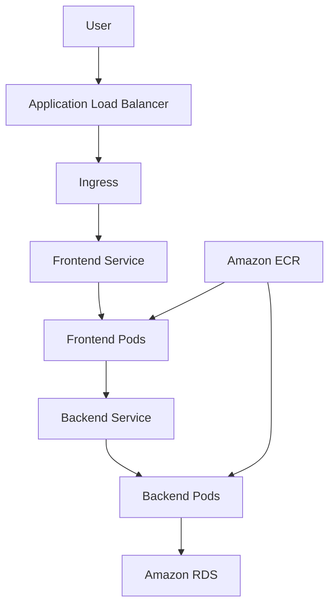

# Unit 3.2 — Deploying Applications on Amazon EKS

> **Course:** DSO303  
> **Level:** 4th Year Software Engineering  
> **Topic:** Deploying and Managing Kubernetes Applications

---

# 1. What Does "Deploying to EKS" Mean?

Deploying an application to EKS means telling Kubernetes:

> **This is what I want my application to look like.**

Kubernetes then tries to make the real cluster match that description.

Example:

```yaml
replicas: 3
```

means:

> "I want three copies of this application running."

If one copy crashes, Kubernetes creates another.

This is called **declarative management**.

---

# 2. Declarative vs Imperative

## Imperative approach

You tell the system exactly what action to perform.

Example:

```bash
kubectl create deployment web --image=nginx
```

This means:

> "Create this deployment now."

## Declarative approach

You describe the final state in a file.

```yaml
apiVersion: apps/v1
kind: Deployment
metadata:
  name: web
spec:
  replicas: 3
```

Then:

```bash
kubectl apply -f deployment.yaml
```

This means:

> "Make the cluster look like this."

### Analogy

Imperative:

> "Go to the kitchen, take two slices of bread, add cheese, then toast it."

Declarative:

> "I want a grilled cheese sandwich."

Kubernetes prefers the second style because it can continuously maintain the desired state.

---

# 3. Three Different Jobs

A production EKS application normally involves three separate concerns.

| Concern | Main Question |
|---|---|
| Cluster provisioning | Where will Kubernetes run? |
| Application definition | What should Kubernetes run? |
| Application delivery | How does the configuration reach the cluster? |

These should not be confused.



---

# 4. Creating the EKS Cluster

Before deploying an application, we need a usable cluster.

A simplified cluster needs:

- VPC
- subnets
- IAM roles
- EKS control plane
- worker compute
- networking
- CoreDNS
- access permissions

Tools commonly used include:

- AWS Console
- `eksctl`
- Terraform
- AWS CDK
- CloudFormation

For learning, `eksctl` is convenient because it hides much of the setup complexity.

Example:

```bash
eksctl create cluster \
  --name demo-cluster \
  --region ap-south-1
```

The important idea is not the command itself.

The important idea is:

> A usable EKS cluster is made from several AWS resources working together.

---

# 5. Connecting kubectl to EKS

`kubectl` is the standard Kubernetes command-line tool.

It communicates with the Kubernetes API server.

To configure access to an EKS cluster:

```bash
aws eks update-kubeconfig \
  --region ap-south-1 \
  --name demo-cluster
```

Then test:

```bash
kubectl get nodes
```

If working correctly, Kubernetes displays the cluster nodes.

---

# 6. kubeconfig

`kubectl` needs to know:

- which cluster to connect to,
- the API server address,
- how to authenticate.

This information is stored in a **kubeconfig** file.

Usually:

```text
~/.kube/config
```

### Analogy

A kubeconfig is similar to a **saved Wi-Fi profile**.

It tells your computer:

- which network to contact,
- where it is,
- how to authenticate.

---

# 7. Kubernetes YAML Structure

Most Kubernetes objects follow the same basic shape.

```yaml
apiVersion:
kind:
metadata:
spec:
```

Example:

```yaml
apiVersion: v1
kind: Pod
metadata:
  name: web
spec:
  containers:
    - name: nginx
      image: nginx
```

### The four important fields

| Field | Meaning |
|---|---|
| `apiVersion` | Which version of the Kubernetes API |
| `kind` | Type of object |
| `metadata` | Name, labels and other identification |
| `spec` | Desired configuration |

This pattern appears again and again in Kubernetes.

---

# 8. Deploying a Simple Application

Consider an nginx web application.

## Deployment

```yaml
apiVersion: apps/v1
kind: Deployment
metadata:
  name: web
spec:
  replicas: 3

  selector:
    matchLabels:
      app: web

  template:
    metadata:
      labels:
        app: web

    spec:
      containers:
        - name: nginx
          image: nginx:latest
          ports:
            - containerPort: 80
```

Apply it:

```bash
kubectl apply -f deployment.yaml
```

Check:

```bash
kubectl get deployments
kubectl get pods
```

---

# 9. Why Use a Deployment Instead of a Pod?

A raw Pod can disappear.

A Deployment makes sure the required number of Pods continues running.

### Example

Desired:

```text
3 Pods
```

One crashes:

```text
2 Pods
```

Deployment controller notices:

```text
Desired = 3
Actual  = 2
```

and creates another.



This is Kubernetes **self-healing**.

---

# 10. Exposing the Application with a Service

Pods are temporary.

Their IP addresses may change.

A **Service** gives them a stable network endpoint.

Example:

```yaml
apiVersion: v1
kind: Service
metadata:
  name: web-service
spec:
  selector:
    app: web

  ports:
    - port: 80
      targetPort: 80
```

The selector:

```yaml
app: web
```

connects the Service to Pods having that label.

---

# 11. Labels and Selectors

Labels are simple key-value identifiers.

Example:

```yaml
labels:
  app: payment
```

A Service may find Pods using:

```yaml
selector:
  app: payment
```

### Analogy

Labels are like **name tags at a conference**.

A selector says:

> "Find everyone wearing the tag `team=security`."

---

# 12. Service Types

Common Kubernetes Service types include:

## ClusterIP

Accessible only inside the cluster.

Good for:

```text
frontend → backend
backend → database service
```

---

## LoadBalancer

On AWS, this can expose the application through an AWS load balancer.

Simplified flow:



---

# 13. Ingress

A LoadBalancer Service for every application can become expensive.

Ingress allows several HTTP routes to share an entry point.

Example:

```text
example.com/users   → user-service
example.com/orders  → order-service
example.com/pay     → payment-service
```



On EKS, the AWS Load Balancer Controller can translate Kubernetes Ingress definitions into AWS load-balancer configuration.

---

# 14. ConfigMap

Applications need configuration.

Examples:

- API URLs,
- feature settings,
- environment names.

A **ConfigMap** stores non-secret configuration.

Example:

```yaml
apiVersion: v1
kind: ConfigMap
metadata:
  name: app-config
data:
  LOG_LEVEL: "info"
  ENVIRONMENT: "production"
```

### Why not build this into the image?

Because the same container image may be used in:

```text
Development
Staging
Production
```

while configuration differs.

---

# 15. Secrets

Sensitive values should not be placed directly in normal application YAML.

Examples:

- passwords,
- tokens,
- credentials.

Kubernetes provides a **Secret** object.

However:

> A Kubernetes Secret should not be treated as a complete enterprise secrets-management system by itself.

On AWS, production systems often integrate with services such as:

- AWS Secrets Manager,
- AWS Systems Manager Parameter Store.

---

# 16. Resource Requests and Limits

Kubernetes needs to understand how much CPU and memory a container needs.

Example:

```yaml
resources:
  requests:
    cpu: "250m"
    memory: "256Mi"

  limits:
    cpu: "500m"
    memory: "512Mi"
```

## Requests

The amount Kubernetes uses when deciding where the Pod can be scheduled.

## Limits

The maximum amount of the specified resource the container is allowed to consume.

### Analogy

Think of hotel booking.

- **Request** = room size you reserve.
- **Limit** = maximum room capacity you are allowed to use.

Bad resource settings lead to:

- poor scheduling,
- wasted money,
- CPU throttling,
- containers being killed for excessive memory use.

---

# 17. Health Probes

Kubernetes must know whether an application is working.

Three useful probe concepts are:

## Readiness Probe

> "Can this Pod receive traffic?"

If readiness fails, Kubernetes temporarily removes the Pod from Service traffic.

---

## Liveness Probe

> "Is this application still alive?"

If liveness repeatedly fails, Kubernetes can restart the container.

---

## Startup Probe

> "Has this slow application finished starting?"

Useful for applications with long startup times.

### Analogy

A restaurant:

- Startup → Has the restaurant opened?
- Readiness → Is it ready to accept customers?
- Liveness → Is the restaurant still operating normally?

---

# 18. Rolling Updates

Suppose version 1 is running:

```text
v1 v1 v1
```

We deploy version 2.

Kubernetes can gradually replace Pods:

```text
v1 v1 v1
v1 v1 v2
v1 v2 v2
v2 v2 v2
```

This is a **rolling update**.

Users can continue accessing the application during deployment.

---

# 19. Rollback

If the new version causes problems, we may return to a previous Deployment revision.

Useful commands include:

```bash
kubectl rollout status deployment/web
kubectl rollout history deployment/web
kubectl rollout undo deployment/web
```

The principle is more important than memorizing the commands:

> Production deployment must include a recovery strategy.

---

# 20. kubectl Is Excellent for Learning and Debugging

Useful commands:

```bash
kubectl get pods
kubectl get services
kubectl get deployments
kubectl describe pod <pod-name>
kubectl logs <pod-name>
```

For teaching and troubleshooting, `kubectl` is essential.

But production systems should avoid depending entirely on a developer manually running commands from a laptop.

---

# 21. Why Manual Production Deployment Is Risky

Imagine:

```bash
kubectl edit deployment payment
```

The change works.

But where is the permanent record?

If no Git commit exists:

- another engineer may not know what changed,
- rollback becomes harder,
- development and production may drift apart.

This is why teams prefer **declarative configuration stored in Git**.

---

# 22. Kustomize

Kustomize helps when the same application needs small differences in different environments.

Example:

```text
base/
  deployment.yaml
  service.yaml

overlays/
  dev/
  staging/
  production/
```

The base contains common configuration.

Each overlay modifies only what is different.

### Analogy

Think of a common university application form.

The base form is the same.

Different departments may attach a small extra page instead of creating the entire form again.

---

# 23. Helm

Helm is often described as the **package manager for Kubernetes**.

A Helm package is called a **Chart**.

A chart may contain:

- Deployment,
- Service,
- ConfigMap,
- Ingress,
- RBAC,
- other Kubernetes resources.

Values can customize the chart.

```text
Chart + values.yaml → Kubernetes YAML
```

### Analogy

Helm is like installing software with a package manager.

Instead of manually creating many files for Prometheus, you can install a maintained Prometheus Helm chart.

---

# 24. Kustomize vs Helm

| Kustomize | Helm |
|---|---|
| Modifies YAML | Templates YAML |
| Easy for small environment differences | Powerful for configurable packages |
| Built into kubectl | Separate packaging ecosystem |
| Good for internal app overlays | Very common for third-party software |

Many real systems use both.

---

# 25. GitOps

GitOps means Git stores the **desired state** of the cluster.

Instead of a developer pushing changes directly:

```text
Laptop → Cluster
```

the model becomes:

```text
Developer → Git → GitOps Controller → Cluster
```



Popular GitOps tools include:

- Argo CD
- Flux

### Why GitOps is useful

Git provides:

- history,
- reviews,
- rollback,
- traceability.

A controller continuously compares:

```text
Git desired state
vs
Cluster actual state
```

and corrects drift.

---

# 26. Container Image Flow

A typical EKS application build and deploy flow is:



A fuller workflow may add GitOps after the image is built.

---

# 27. Typical EKS Application Architecture



Notice the responsibilities:

- ALB → external entry.
- Ingress → routing.
- Service → stable internal network.
- Deployment/Pods → application execution.
- ECR → container image storage.
- RDS → database.

---

# 28. Common Deployment Problems

## Pod stays `Pending`

Possible reason:

- insufficient CPU/memory,
- no worker nodes,
- scheduling restrictions.

Start with:

```bash
kubectl describe pod <pod-name>
```

---

## Pod enters `CrashLoopBackOff`

The container keeps starting and crashing.

Possible causes:

- incorrect configuration,
- application error,
- missing environment variables,
- incorrect command.

Check:

```bash
kubectl logs <pod-name>
```

---

## `ImagePullBackOff`

Kubernetes cannot pull the image.

Possible causes:

- wrong image name,
- missing ECR permission,
- network problem,
- image does not exist.

---

## Service exists but application is unreachable

Check:

1. Are Pods running?
2. Are labels correct?
3. Does the Service selector match the Pod labels?
4. Is the target port correct?
5. Is the load balancer healthy?

---

# 29. Recommended Debugging Order

When something fails, debug from the inside outward.

```text
1. Is the Pod running?
2. Is the application healthy inside the Pod?
3. Does the Service find the Pod?
4. Does Ingress route to the Service?
5. Is the AWS load balancer healthy?
6. Can the client reach the load balancer?
```

This is much better than randomly changing settings.

---

# 30. Common Student Mistakes

### Mistake 1

Creating a Pod directly for a production application.

Better:

> Use a Deployment.

### Mistake 2

Forgetting that Service selectors depend on labels.

### Mistake 3

Using `latest` everywhere for container images.

Better:

```text
myapp:1.4.2
```

or immutable image digests for stronger reproducibility.

### Mistake 4

Putting all configuration directly into the container image.

### Mistake 5

Using `kubectl` manual changes as the permanent production deployment strategy.

### Mistake 6

Skipping requests, limits and health probes.

---

# 31. Key Takeaways

1. EKS deployments are **declarative**.
2. Kubernetes continuously tries to match desired state.
3. `kubectl` communicates with the Kubernetes API server.
4. `kubeconfig` tells kubectl how to connect.
5. Deployments manage application replicas.
6. Services provide stable access to Pods.
7. Labels and selectors connect Kubernetes objects.
8. Ingress handles HTTP routing.
9. ConfigMaps store normal configuration.
10. Sensitive application values require careful secrets management.
11. Requests and limits strongly affect scheduling and reliability.
12. Readiness, liveness and startup probes describe application health.
13. Helm packages Kubernetes software.
14. Kustomize handles environment-specific variations cleanly.
15. GitOps makes Git the source of truth for production deployments.

---

## One-Sentence Summary

> **Deploying to EKS means declaring the desired application state as Kubernetes objects and allowing controllers to continuously make the running cluster match that state.**
