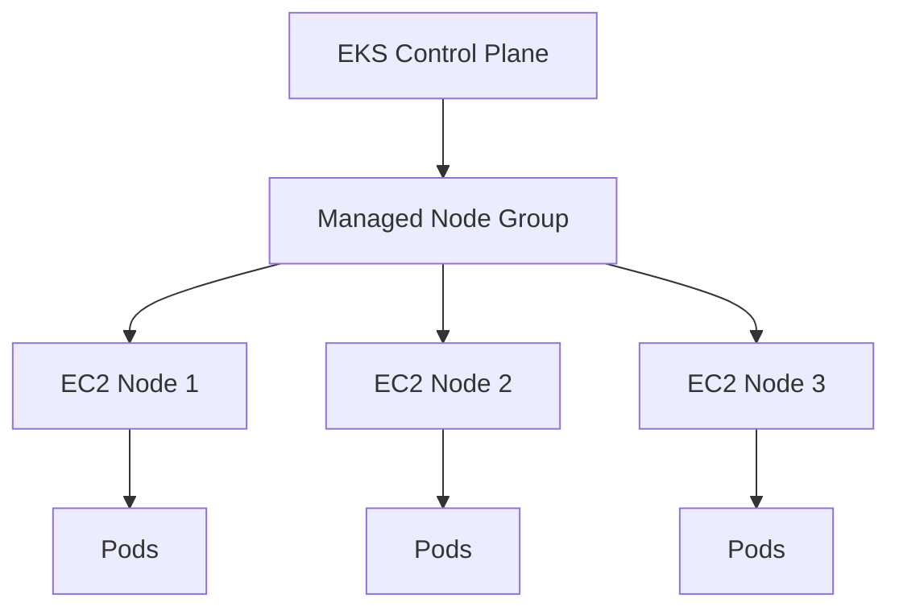
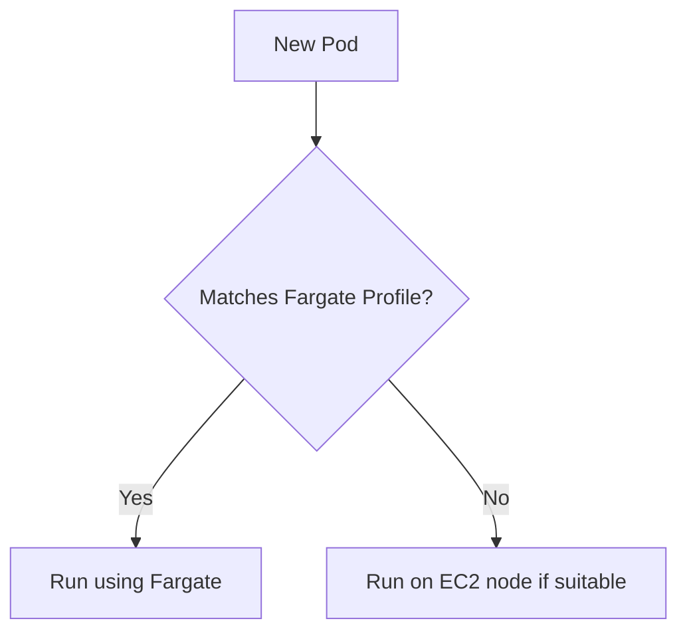
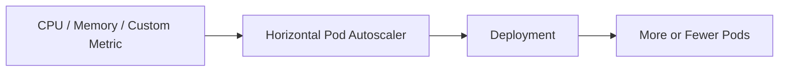
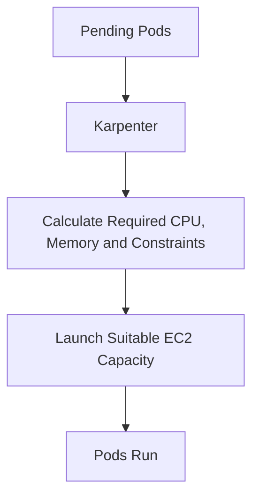
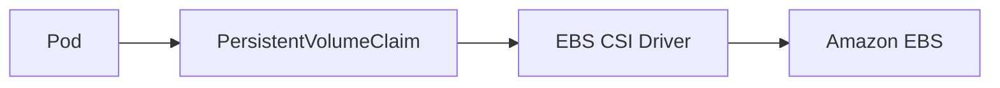
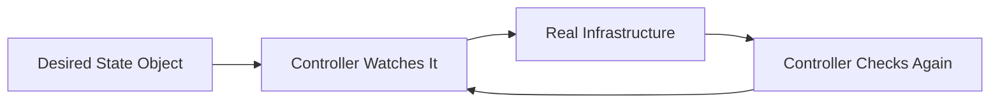
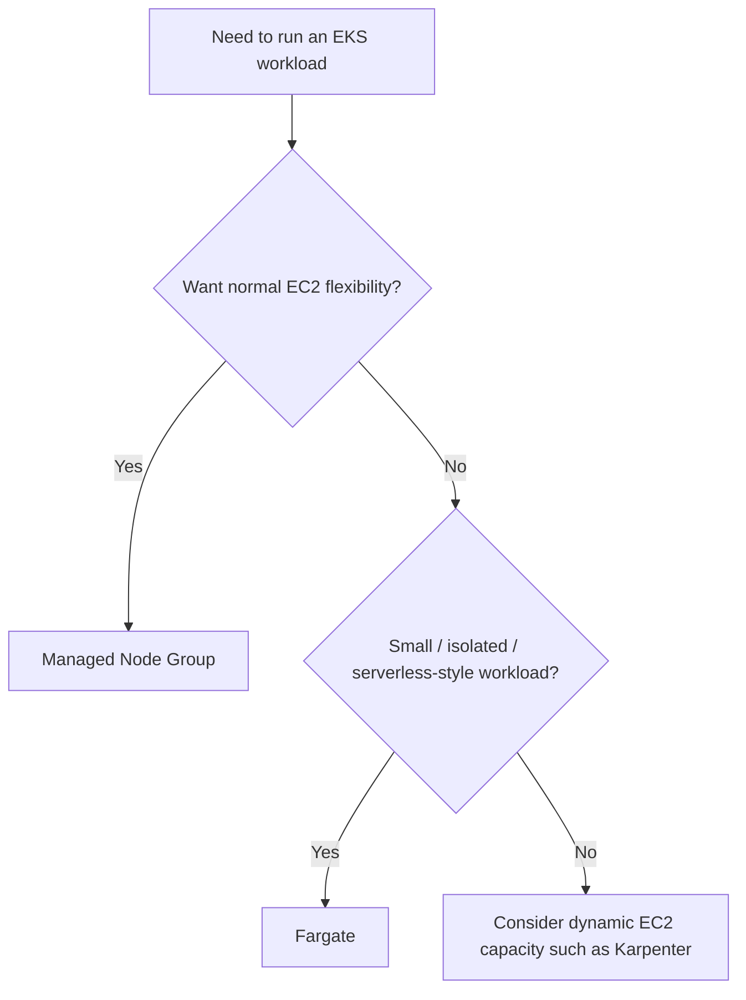
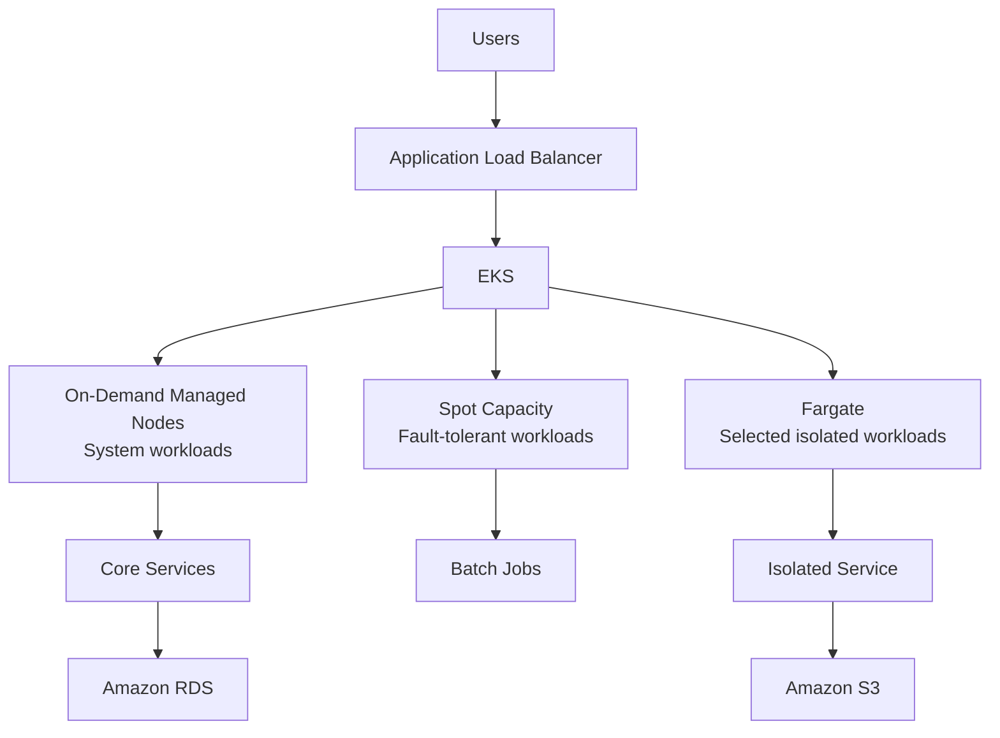

# Unit 3.3 — Amazon EKS Advanced Concepts

> **Course:** DSO303  
> **Level:** 4th Year Software Engineering  
> **Topic:** EKS Compute, Scaling, Add-ons and Operators

---

# 1. Why Do We Need Advanced EKS Features?

A basic EKS cluster can run applications.

Production systems have additional questions:

- Who manages worker nodes?
- How should the cluster scale?
- Can some workloads run without EC2 node management?
- How should networking and storage components be upgraded?
- Can Kubernetes manage more than containers?

This chapter answers those questions using four important ideas:

1. **Managed Node Groups**
2. **AWS Fargate**
3. **EKS Add-ons**
4. **Kubernetes Operators**

---

# 2. Managed Node Groups

A Kubernetes worker node is commonly an EC2 instance.

If we manage nodes ourselves, we must think about:

- AMIs,
- bootstrap configuration,
- node registration,
- Auto Scaling Groups,
- updates,
- replacing unhealthy instances,
- draining old nodes.

An **EKS Managed Node Group** lets AWS handle much of this worker-node lifecycle.

### Analogy

Imagine a company needs delivery trucks.

### Self-managed nodes

You:

- buy the trucks,
- maintain them,
- repair them,
- replace them,
- manage the fleet.

### Managed node groups

You still choose the type and approximate number of trucks, but another company handles much of the fleet maintenance.

---

# 3. What You Still Decide

Managed does **not** mean zero responsibility.

You still make decisions such as:

- EC2 instance type,
- minimum nodes,
- maximum nodes,
- desired capacity,
- labels,
- taints,
- On-Demand vs Spot.

Example:

```text
Minimum = 2 nodes
Desired = 3 nodes
Maximum = 10 nodes
```

---

# 4. Managed Node Group Architecture



Behind the managed node group, AWS uses EC2 and Auto Scaling concepts.

---

# 5. Node Updates

Nodes eventually need updates.

A safe update normally follows the idea:

```text
Create replacement capacity
        ↓
Stop scheduling new Pods on old node
        ↓
Move existing Pods away
        ↓
Terminate old node
```

Two useful Kubernetes terms are:

## Cordon

Marks a node so new Pods are not scheduled there.

```bash
kubectl cordon node-1
```

## Drain

Safely evicts workloads from the node where possible.

```bash
kubectl drain node-1
```

Managed node groups automate much of this process during updates.

---

# 6. AWS Fargate for EKS

Fargate allows Pods to run **without you managing EC2 worker nodes**.

Instead of thinking:

```text
How many EC2 nodes do I need?
```

you focus more on:

```text
Which Pods should run?
How much CPU and memory do they require?
```

AWS provides the underlying compute.

---

# 7. Fargate Analogy

Compare owning a car with using a taxi.

## EC2 node

You manage the vehicle.

- choose it,
- maintain capacity,
- patch it,
- replace it.

## Fargate

You request transportation when needed.

You do not manage the underlying vehicle.

You pay for the resources consumed by the workload.

---

# 8. Fargate Scheduling

EKS uses **Fargate profiles** to decide which Pods should run on Fargate.

A profile can match:

- namespace,
- optionally labels.

Example idea:

```text
Namespace: serverless
```

Pods created in that namespace may be scheduled to Fargate if the profile matches.



---

# 9. When Fargate Is Useful

Fargate is attractive for:

- small services,
- bursty workloads,
- isolated workloads,
- teams that do not want to manage nodes,
- workloads where per-Pod isolation is valuable.

But Fargate is not automatically the best choice for every Pod.

---

# 10. Fargate Limitations

Because you do not control the underlying worker host, some node-level features are limited or unavailable.

Typical considerations include:

- DaemonSet-based software may not fit,
- privileged containers are restricted,
- specialized hardware such as GPUs may not be available,
- some storage or networking features differ from EC2 nodes,
- startup may be slower than a warm EC2 node,
- cost may be higher for continuously busy workloads.

### Core principle

> Fargate trades infrastructure control for operational simplicity.

---

# 11. Fargate vs Managed Node Groups

| Managed Node Groups | Fargate |
|---|---|
| EC2 worker nodes exist | No node management for you |
| More control | Less infrastructure control |
| Good for steady workloads | Good for selected serverless-style Pods |
| Supports broader node-level features | Some node-level features restricted |
| Need capacity planning/scaling | Capacity abstracted per workload |

Production EKS clusters may use **both**.

This is an important design lesson:

> Cloud architecture is rarely about choosing one technology for everything.

---

# 12. Spot Instances

EC2 Spot Instances use spare AWS capacity and can be much cheaper than On-Demand capacity.

The trade-off:

> AWS may interrupt a Spot Instance.

Therefore Spot is suitable for workloads that can tolerate interruption.

Examples:

- batch jobs,
- CI workers,
- stateless services with enough replicas,
- background processing.

Avoid relying entirely on Spot for workloads that cannot tolerate sudden node removal.

---

# 13. Mixed Capacity Example

A production cluster may use:

```text
Managed Node Group A
  → On-Demand
  → system components

Managed Node Group B
  → Spot
  → batch workloads

Fargate
  → isolated namespace
```

This is often better than trying to use one compute model for everything.

---

# 14. Taints and Tolerations

Sometimes a node should accept only certain workloads.

A **taint** says:

> "Do not schedule ordinary Pods here."

A **toleration** says:

> "This Pod is allowed onto that tainted node."

### Analogy

A tainted node is like a **staff-only room**.

The toleration is the staff access card.

---

# 15. Labels and Node Selectors

Nodes can have labels.

Example:

```text
workload=gpu
environment=production
capacity=spot
```

A Pod can request a matching node.

Conceptually:

```yaml
nodeSelector:
  capacity: spot
```

This is useful for separating workload types.

---

# 16. Why Cluster Scaling Has Two Levels

Scaling Kubernetes involves two different questions.

## Question 1

Do we need more Pods?

Handled by workload-level scaling such as the:

**Horizontal Pod Autoscaler (HPA)**

## Question 2

Do we have enough machines to run those Pods?

Handled by node/capacity scaling such as:

- Cluster Autoscaler,
- Karpenter,
- managed EKS compute mechanisms.

These are not the same problem.

---

# 17. Horizontal Pod Autoscaler

Suppose an application currently has:

```text
2 Pods
```

Traffic increases.

HPA may scale:

```text
2 → 4 → 6 Pods
```

Later, when traffic falls:

```text
6 → 3 → 2 Pods
```



---

# 18. The Pending Pod Problem

Imagine:

```text
3 nodes are completely full.
```

HPA requests:

```text
5 additional Pods.
```

But no node has capacity.

The Pods stay:

```text
Pending
```

This is why Pod scaling alone is insufficient.

The cluster may also need more nodes.

---

# 19. Cluster Autoscaler

Cluster Autoscaler watches for unschedulable Pods.

Simplified logic:

```text
Pod cannot fit
     ↓
Need more node capacity
     ↓
Increase node group size
     ↓
New EC2 instance joins
     ↓
Pod gets scheduled
```

This works well, but it normally scales existing node groups.

---

# 20. Karpenter

Karpenter takes a more dynamic approach.

Instead of only asking:

> "Should this predefined node group become larger?"

it can ask:

> "What EC2 capacity is appropriate for the Pods waiting right now?"



This can improve:

- scaling speed,
- instance selection,
- cost efficiency,
- bin packing.

---

# 21. Scaling Analogy

Think of a restaurant.

## HPA

Adds more **waiters** when customers increase.

## Node Autoscaling

Adds more **restaurant floor space/tables** when the building is full.

Adding waiters is useless if there is nowhere for them to work.

Kubernetes needs both workload scaling and capacity scaling.

---

# 22. EKS Add-ons

An EKS cluster depends on important supporting software.

Examples include:

- VPC CNI
- CoreDNS
- kube-proxy
- CSI storage drivers
- observability agents
- Pod identity components

AWS provides many of these as **EKS add-ons**.

An EKS add-on is a versioned, AWS-supported way to install and manage important cluster software.

---

# 23. Why Add-ons Matter

Without version management, a cluster might have:

```text
Kubernetes 1.x
+
very old networking plugin
+
very old DNS component
```

Eventually versions become incompatible.

Treat add-ons as part of the cluster lifecycle.

When upgrading a cluster, also check the compatibility of:

- VPC CNI,
- CoreDNS,
- kube-proxy,
- storage drivers,
- other controllers.

---

# 24. Core Add-on Responsibilities

## VPC CNI

Provides Pod networking in the VPC.

If it fails:

> New Pods may have networking problems and nodes may not behave correctly.

---

## CoreDNS

Provides DNS for Kubernetes Services.

If it fails:

```text
payment-service
```

may no longer resolve by name.

---

## kube-proxy

Helps implement Kubernetes Service networking.

---

## CSI Driver

CSI means:

> Container Storage Interface

A CSI driver allows Kubernetes to work with storage systems.

On AWS, the EBS CSI driver allows Kubernetes workloads to use Amazon EBS volumes.

---

# 25. Persistent Storage

Containers and Pods are temporary.

Databases and stateful applications need persistent storage.

Example:

```text
Pod
 ↓
PersistentVolumeClaim
 ↓
EBS CSI Driver
 ↓
Amazon EBS Volume
```



The Pod may be recreated while the persistent data remains on the external storage.

---

# 26. Operators

Operators are one of the most powerful Kubernetes ideas.

An operator extends Kubernetes so that it can manage more complex systems.

Normally Kubernetes understands objects such as:

- Pod
- Deployment
- Service

An operator can introduce a new object such as:

```yaml
kind: Database
```

A controller then watches that object and performs the required actions.

---

# 27. Operator Analogy

Imagine a senior database administrator has a runbook:

```text
1. Create database
2. Configure users
3. Configure replication
4. Configure backup
5. Monitor health
6. Perform failover
7. Upgrade safely
```

An operator is like turning that expert runbook into software.

Instead of a human repeatedly following the procedure, the controller does it continuously.

---

# 28. Custom Resource Definitions

A **CustomResourceDefinition (CRD)** extends the Kubernetes API with new object types.

Example concept:

```yaml
apiVersion: database.example.com/v1
kind: Database
metadata:
  name: orders-db
spec:
  size: 100Gi
  replicas: 3
```

Kubernetes itself does not automatically know how to create this database.

An operator/controller watches the custom resource and performs the work.

---

# 29. The Controller Pattern

This is one of the most important patterns in Kubernetes.



The controller repeatedly asks:

```text
What should exist?
What actually exists?
What action makes them match?
```

The same idea powers:

- Deployments,
- operators,
- load balancer controllers,
- Karpenter,
- many Kubernetes extensions.

---

# 30. AWS Load Balancer Controller as an Example

Suppose you create an Ingress.

```yaml
kind: Ingress
```

The AWS Load Balancer Controller notices the object.

It may then create or configure an AWS Application Load Balancer.

```text
Kubernetes Ingress
       ↓
AWS Load Balancer Controller
       ↓
AWS ALB
```

This is Kubernetes controlling AWS infrastructure through a controller.

---

# 31. PodDisruptionBudget

Sometimes Kubernetes intentionally disrupts Pods.

Examples:

- node upgrade,
- node drain,
- cluster maintenance.

A **PodDisruptionBudget (PDB)** helps protect availability during voluntary disruption.

Example idea:

```text
3 replicas exist.
At least 2 must remain available.
```

A PDB helps prevent too many replicas from being voluntarily disrupted at once.

It does **not** prevent all failures.

A sudden EC2 crash is not something a PDB can stop.

---

# 32. High Availability

For a highly available workload:

- run multiple replicas,
- spread them across nodes,
- preferably spread across Availability Zones,
- use readiness probes,
- use appropriate disruption budgets,
- avoid one-node dependencies.

Bad design:

```text
All 5 replicas → one node
```

Better design:

```text
Replicas → multiple nodes → multiple AZs
```

---

# 33. Observability

A production cluster should answer:

- Is the application healthy?
- Is the node healthy?
- Are Pods restarting?
- Is CPU too high?
- Is memory exhausted?
- Are requests failing?
- Is scaling working?

Observability normally includes:

## Metrics

Numbers over time.

Examples:

```text
CPU = 80%
HTTP latency = 320 ms
Error rate = 2%
```

## Logs

Events and application messages.

## Traces

Follow one request through multiple services.

---

# 34. Security Principles

Important EKS security ideas include:

## Least privilege

Give a workload only the permissions it needs.

## Separate identities

Do not make all Pods share broad node permissions.

## Private networking where appropriate

Worker nodes are commonly placed in private subnets.

## Control image sources

Use trusted images and scan them for vulnerabilities.

## Restrict Kubernetes access

Use IAM plus Kubernetes RBAC carefully.

## Keep add-ons and nodes updated

Old software increases vulnerability risk.

---

# 35. Cost Optimization

Common EKS cost considerations include:

- EKS cluster fee,
- EC2 worker nodes,
- Fargate compute,
- load balancers,
- NAT gateways,
- storage,
- cross-AZ traffic,
- unused resources.

A technically correct architecture may still be a poor architecture if it wastes money.

### Example

If a Pod requests:

```text
4 CPU
```

but normally uses:

```text
0.2 CPU
```

the scheduler reserves much more capacity than required.

Bad requests can indirectly increase infrastructure cost.

---

# 36. Choosing Compute

A simple decision guide:



This is simplified, but useful for learning.

---

# 37. Example Production Design



This architecture uses different compute types for different needs.

---

# 38. Common Student Mistakes

## Mistake 1

Assuming Fargate is always cheaper.

Not necessarily.

It buys operational simplicity; price depends on workload shape and utilization.

---

## Mistake 2

Thinking HPA creates EC2 nodes.

It does not.

HPA changes the number of Pods.

Capacity scaling handles machines.

---

## Mistake 3

Ignoring add-on versions during a Kubernetes upgrade.

Cluster and add-on compatibility both matter.

---

## Mistake 4

Running every workload on Spot.

Spot can be interrupted.

Use it for workloads designed to tolerate interruption.

---

## Mistake 5

Treating an operator as just another application.

An operator is a controller that changes cluster or external state.

Its permissions and upgrades deserve careful attention.

---

## Mistake 6

Thinking "managed" means "AWS is responsible for my application."

AWS manages specific layers.

You remain responsible for your application architecture and configuration.

---

# 39. The Most Important Mental Model

Most advanced Kubernetes features are easier to understand if you remember one pattern:

> **Declare what you want. A controller watches and tries to make reality match it.**

Examples:

```text
Deployment
Desired replicas → Deployment Controller

HPA
Desired scale → Autoscaling Controller

Ingress
Desired HTTP routing → Load Balancer Controller

NodePool
Desired compute rules → Karpenter

Custom Resource
Desired domain-specific object → Operator
```

Different objects.

Same architectural idea.

---

# 40. Key Takeaways

1. Managed node groups simplify EC2 worker-node lifecycle management.
2. Fargate runs selected Pods without customer-managed nodes.
3. Fargate and EC2 worker nodes can coexist in one cluster.
4. Spot capacity can reduce cost but may be interrupted.
5. Taints and tolerations help reserve nodes for selected workloads.
6. HPA scales Pods.
7. Cluster-level autoscaling adds or removes compute capacity.
8. Karpenter dynamically chooses EC2 capacity based on workload requirements.
9. EKS add-ons package important cluster components with managed versions.
10. CSI drivers connect Kubernetes to persistent storage systems.
11. Operators extend Kubernetes with new APIs and automated operational knowledge.
12. PodDisruptionBudgets help protect availability during planned disruption.
13. Observability includes metrics, logs and traces.
14. Good EKS architecture balances reliability, security, performance and cost.
15. The controller/reconciliation pattern is the key idea behind Kubernetes.

---

## One-Sentence Summary

> **Advanced EKS features reduce infrastructure work and extend Kubernetes by using managed compute, autoscaling, add-ons and controllers to continuously match declared application and platform requirements.**
