# Amazon EKS Architecture

## Definition

**Amazon Elastic Kubernetes Service (EKS)** is a managed Kubernetes service in which AWS operates the Kubernetes control plane: the API server, `etcd`, the scheduler, and the controller managers:  as a highly available, single-tenant, AWS-owned deployment, while the worker nodes that run your containers execute inside your own Amazon VPC under your control.

The defining architectural fact of EKS is a **boundary that runs through the middle of a Kubernetes cluster**:

| Side of the boundary | What runs there | Who owns it | Who pays for it |
|---|---|---|---|
| **Control plane** | `kube-apiserver`, `etcd`, `kube-scheduler`, `kube-controller-manager`, `cloud-controller-manager`, the AWS IAM Authenticator webhook | AWS, in an AWS-managed VPC in an AWS-owned account | A flat per-cluster hourly fee |
| **Data plane** | `kubelet`, `kube-proxy`, `containerd`, your Pods, the VPC CNI plugin, CoreDNS, add-on Pods | You, in your VPC, on EC2 instances or Fargate | The compute, storage, and network you consume |

Everything else in this chapter is a consequence of that boundary. The control plane must reach your nodes, so EKS places network interfaces in your subnets. Your nodes must reach the control plane, so the API server has an endpoint whose accessibility you configure. Your Pods must have identities that AWS recognises, so a Kubernetes ServiceAccount must be bound to an IAM role. Your Pods need addresses, so a CNI plugin allocates them from your VPC.

Within an AWS architecture, EKS occupies the same position as Amazon ECS — the container orchestration layer above EC2 and below the application — but with a different contract. ECS is an AWS API for running containers. **EKS is the Kubernetes API, hosted**: your manifests, operators, Helm charts, and Kubernetes expertise transfer directly, and so do the Kubernetes concepts you must learn.

!!! note "EKS is not a fork of Kubernetes"

    EKS runs **upstream, CNCF-conformant Kubernetes**. There is no AWS dialect of the API, no proprietary object types you must use, and no lock-in at the manifest level: a Deployment written for EKS applies unchanged to a cluster running anywhere. What AWS adds is *operation* of the control plane, *integration* with AWS services through controllers and CSI drivers, and *validated builds* of the components everyone needs anyway. This distinction matters for the recurring exam and interview question about portability: your workload manifests are portable; your integrations with AWS Load Balancers, EBS volumes, and IAM roles are not, and that is a deliberate trade you make service by service.

---

## Why This Service or Concept Exists

### The problem: a Kubernetes control plane is genuinely hard to run

Kubernetes is a distributed system whose control plane must be highly available, consistent, and continuously patched. Operating one yourself means:

- Running **`etcd`** — a Raft-based consensus store — with an odd number of members across failure domains, monitoring its disk latency (to which it is exquisitely sensitive), taking and testing backups, defragmenting it, and rotating its certificates.
- Running **multiple API server replicas** behind a load balancer, with a full PKI: a cluster certificate authority, server certificates, client certificates for every component, and a rotation process for all of them.
- Running the **scheduler** and **controller manager** with leader election, and understanding what happens when leadership changes during a partition.
- Performing **version upgrades** of all of the above, in the correct order, while the cluster serves production traffic.

None of this differentiates your product. All of it can take a cluster down in ways that are difficult to diagnose. A frequently cited internal figure across the industry is that a self-managed Kubernetes control plane consumes the better part of one engineer's time per cluster, and produces its worst incidents at the moments it is being upgraded.

| Self-managed control plane burden | What EKS does about it |
|---|---|
| `etcd` quorum, backup, defragmentation, disk latency | AWS runs three `etcd` instances across three Availability Zones and operates them |
| API server HA, load balancing, scaling under load | At least two API server instances across AZs, scaled by AWS in response to load |
| Certificate authority and rotation for every component | Managed by AWS; you never see the control plane PKI |
| Control plane patching for CVEs | AWS patches within the platform version, transparently |
| Version upgrades of API server, scheduler, controllers | A single `UpdateClusterVersion` call; AWS performs the sequence |
| Control plane availability during an AZ failure | Multi-AZ by construction, with an availability SLA |
| Authenticating cloud identities to the cluster | The IAM Authenticator webhook is built in |

### Why not just use ECS?

This is the question a DSO303 student should be able to answer without appealing to preference, and Chapter 1.3.2 introduced it. The honest summary:

| Choose ECS when | Choose EKS when |
|---|---|
| The team is small and has no Kubernetes experience | The team already has Kubernetes skills, or will hire for them |
| The workload is AWS-only and will stay that way | Multi-cloud, hybrid, or on-premises portability is a real requirement |
| You want the smallest possible operational surface | You need the Kubernetes ecosystem: operators, Helm charts, service meshes, CRDs |
| The application is a straightforward set of services | You need advanced scheduling, custom controllers, or platform-building primitives |
| Time to first deployment matters more than flexibility | You are building an internal platform other teams will consume |

The decisive factor is usually **the ecosystem, not the scheduler**. Kubernetes' value is that thousands of pieces of infrastructure software — Argo CD, Istio, Prometheus operators, KEDA, cert-manager, database operators — are packaged as Kubernetes objects. If you need those, you need Kubernetes. If you do not, ECS achieves the same outcome with a fraction of the concepts.

### Why AWS runs the control plane in its own account

The control plane could have been run in your VPC on instances you own; EKS Anywhere and self-managed Kubernetes do exactly that. AWS chose otherwise for three reasons that are worth understanding because they explain the entire architecture:

**Isolation and blast radius.** Each cluster's control plane is single-tenant and runs in its own AWS-managed VPC. Nothing you do to your VPC — a route table error, a security group change, an IP exhaustion event, a node that pegs the network — can affect the control plane's availability.

**Operability.** AWS can patch, scale, and replace control plane instances without coordinating with you, because they are not in your account and do not appear in your inventory. When an API server instance becomes unhealthy, it is replaced, possibly in a different Availability Zone, and you do not see it happen.

**Uniform SLA.** A control plane whose reliability depended on customer VPC configuration could not carry a meaningful service level agreement. Moving it out of your account is what makes the API server endpoint availability SLA possible.

The cost of that choice is the complexity this chapter spends most of its time on: because the control plane is *outside* your VPC but must reach *inside* it, EKS creates cross-account network interfaces in your subnets, and a significant fraction of real EKS failures are failures of that path.

!!! tip "Frame every EKS design question as 'which side of the boundary is this on?'"

    Is the failure in the control plane (AWS's problem, visible as API errors and an SLA claim) or in the data plane (your problem, visible as Pods that will not start)? Is this component patched by AWS or by you? Does this traffic cross the boundary, and if so through which network interface and which security group? Students who internalise the boundary answer troubleshooting questions quickly; students who treat the cluster as one undifferentiated thing do not.

---

## Real-World Motivation

**A university's self-managed cluster and the upgrade that was not.** A computer science department ran Kubernetes on three EC2 instances configured with `kubeadm`. It worked for eighteen months. When a CVE required an upgrade, the person who had built it had graduated, the `etcd` backup had never been restored, and the certificate authority was six weeks from expiry — a fact nobody knew until the API server refused connections. Recovery took four days and a rebuild. *The architectural lesson is that a self-managed control plane's cost is not the day it is built but the day it must change, and that cost is paid by whoever is present then.*

**A fintech's IP exhaustion at 40 per cent CPU.** A team migrated from ECS to EKS reusing their existing VPC, whose subnets were `/24`. Their nodes were `m5.4xlarge` instances with plenty of spare CPU and memory, yet Pods stopped scheduling with `failed to assign an IP address to container`. The VPC CNI gives every Pod a real VPC address; 250 usable addresses per subnet, most consumed by warm pools, is a hard ceiling that has nothing to do with compute. *The architectural lesson is that on EKS, IP address capacity is a first-class capacity dimension that must be planned alongside CPU and memory, and it is invisible in every CPU dashboard.*

**A retailer's node role that owned the account.** Every Pod in a cluster used the node's instance profile for AWS access, so the node role accumulated the union of every application's permissions: S3, DynamoDB, SQS, Secrets Manager, and `iam:PassRole`. A vulnerability in one public-facing service let an attacker reach the instance metadata service and assume that role — and with it, everything. *The architectural lesson is that without per-Pod identity, the node role becomes the union of every workload's privileges, and one compromised Pod inherits all of it. IRSA and EKS Pod Identity exist precisely to collapse that blast radius.*

**A media company's private cluster that could not admit anything.** A team locked the cluster endpoint to private-only and tightened the cluster security group. Deployments then began failing with `failed calling webhook`: admission webhooks require the **API server to make an inbound connection to a Pod in the customer VPC**, which the new rules blocked. *The architectural lesson is that the control plane needs a path into your VPC, not merely out of it, and the features that break when it is missing — webhooks, `kubectl exec`, `kubectl logs`, `kubectl port-forward`, metrics — are exactly the ones you use during an incident.*

**A logistics company's cross-AZ data transfer bill.** A cluster ran three replicas of every service spread across three Availability Zones, with all Service traffic load balanced uniformly. Two thirds of every internal call crossed an AZ boundary and was billed in both directions. The monthly inter-AZ transfer charge exceeded the compute cost of the cluster. *The architectural lesson is that Kubernetes' default of treating all endpoints as equivalent is topology-blind, and on AWS topology has a price; topology aware routing and `internalTrafficPolicy` exist to express what the default ignores.*

**A government platform team's two-layer confusion.** An engineer with `AdministratorAccess` in IAM ran `kubectl get pods` and received `error: You must be logged in to the server (Unauthorized)`. The team spent a day widening IAM policies that were already unlimited. IAM authenticates; Kubernetes RBAC authorizes; an IAM administrator with no access entry is a stranger to the cluster. *The architectural lesson is that EKS has two independent permission systems and the error message tells you which one refused — `Unauthorized` is authentication, `Forbidden` is authorization, and confusing them wastes hours.*

**A start-up's Fargate surprise.** A team chose Fargate for every Pod to avoid managing nodes, then discovered their Prometheus node exporter DaemonSet would not run, their EBS-backed database could not attach a volume, and each Pod took considerably longer to start because every one of them pulled its image onto fresh infrastructure. *The architectural lesson is that Fargate removes the node and therefore removes everything that depends on there being a node; that is the trade, and it is a good one only for the workloads that do not need one.*

---

## Core Concepts

### The split architecture

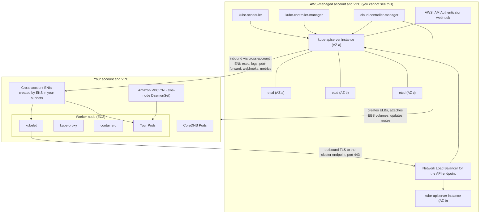
Generate a professionl, educational clean image with white background 
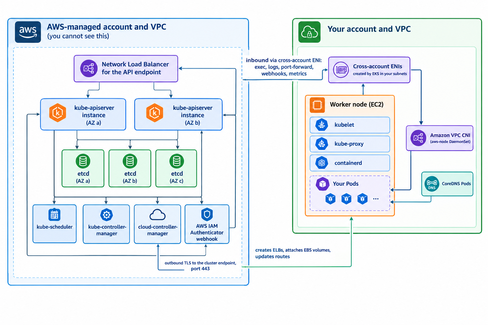

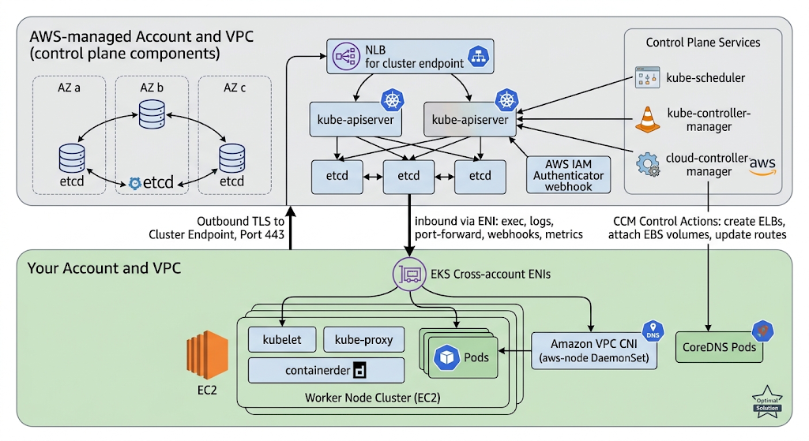

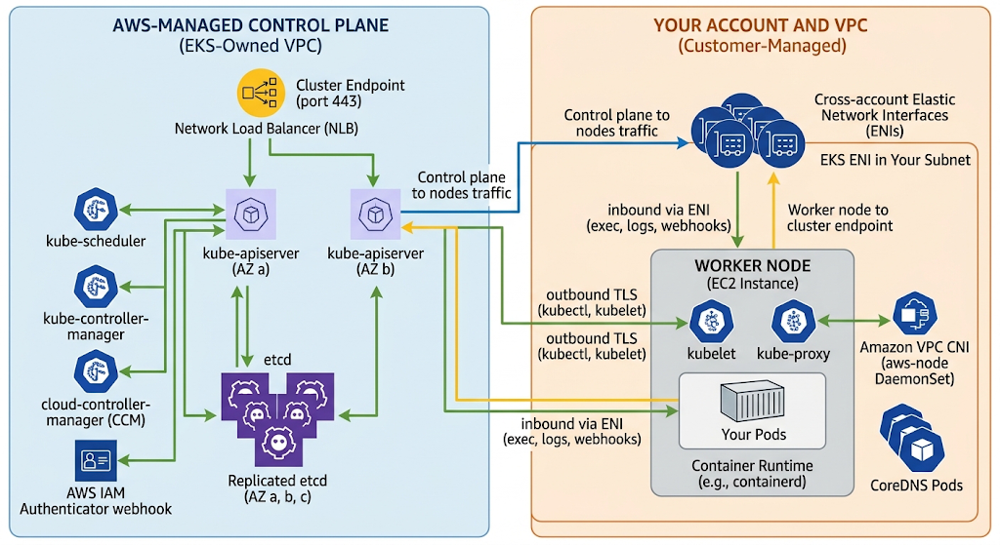
Three facts in this diagram do most of the explanatory work.

**The kubelet always initiates the outbound connection.** Every node maintains a persistent, authenticated TLS connection *out* to the cluster endpoint on port 443. This is why nodes in private subnets need a route to the endpoint — through a NAT gateway, through the private endpoint, or through VPC endpoints — and why the node security group needs outbound 443.

**The API server sometimes needs to initiate an inbound connection.** `kubectl exec`, `kubectl logs`, `kubectl port-forward`, the metrics API, and **every admission webhook** require the API server to open a connection to something inside your VPC. It does this through the cross-account ENIs. If that path is blocked, the cluster appears to work until you try to debug it or until an admission webhook is registered — at which point deployments fail.

**The cloud controller manager turns Kubernetes objects into AWS resources.** A Service of type `LoadBalancer` becomes an actual load balancer; a PersistentVolumeClaim becomes an EBS volume attachment; a node object's lifecycle follows an EC2 instance's. This is the integration layer, and it is why Kubernetes objects on EKS have AWS side effects that cost money.

### Kubernetes control plane components, and who runs them

| Component | Responsibility | On EKS |
|---|---|---|
| **`kube-apiserver`** | The only component that talks to `etcd`; validates, authenticates, authorizes, and admits every request; serves watches | AWS-managed, at least two instances across AZs |
| **`etcd`** | Consistent key-value store holding all cluster state; the single source of truth | AWS-managed, three instances across three AZs |
| **`kube-scheduler`** | Watches for unscheduled Pods, filters and scores nodes, binds Pod to node | AWS-managed |
| **`kube-controller-manager`** | Runs the built-in control loops: Deployment, ReplicaSet, Node, Job, ServiceAccount, and others | AWS-managed |
| **`cloud-controller-manager`** | The AWS-specific loops: node lifecycle from EC2, Service load balancers, routes | AWS-managed |
| **AWS IAM Authenticator webhook** | Validates the SigV4 pre-signed token in a `kubectl` request and maps it to a Kubernetes identity | AWS-managed, built in |
| **`kubelet`** | The node agent: registers the node, accepts Pod specs, tells the runtime to start containers, reports status, runs probes | **Yours**, on every node |
| **`kube-proxy`** | Programs the node's packet-forwarding rules so ClusterIP Services resolve to Pod endpoints | **Yours**, as a DaemonSet (an EKS add-on) |
| **`containerd`** | The container runtime that actually pulls images and runs containers | **Yours**, on every node |
| **VPC CNI (`aws-node`)** | Allocates VPC IP addresses to Pods and wires their network namespaces | **Yours**, as a DaemonSet (an EKS add-on) |
| **CoreDNS** | Cluster DNS: resolves Service names to ClusterIPs | **Yours**, as a Deployment (an EKS add-on) |

!!! warning "The add-ons are your responsibility even though AWS builds them"

    `kube-proxy`, CoreDNS, and the VPC CNI run as workloads *in your cluster*. AWS publishes validated, patched builds of them as **EKS add-ons**, and will update them when you ask — but they are data plane components, they consume your resources, they are on the critical path of every request, and if you never update them they will drift out of compatibility with the control plane version. A cluster upgraded to a new Kubernetes version with a two-year-old CNI is a common and entirely avoidable production incident.

### The Kubernetes object model, in the terms Chapter 2 established

For students arriving from ECS, the mapping is close enough to be useful and different enough to be dangerous:

| ECS concept | Kubernetes equivalent | Where they differ |
|---|---|---|
| Task definition | **Pod spec** (usually inside a Deployment template) | A Pod is a *group* of containers sharing a network namespace and volumes; a task definition is closer, but Kubernetes leans much harder on the sidecar pattern |
| Task | **Pod** | Same idea: the smallest schedulable unit |
| Service | **Deployment** + **Service** | Kubernetes splits "keep N replicas running" (Deployment) from "give them a stable address" (Service); ECS conflates them |
| Service discovery via Cloud Map | **Service** + CoreDNS | Kubernetes DNS is built in and mandatory rather than opt-in |
| Cluster | **Cluster** | Same word, but a Kubernetes cluster carries far more state and far more API surface |
| Container instance | **Node** | Same idea; a Node is an API object with conditions, taints, labels, and capacity |
| Placement constraint | **nodeSelector**, **node affinity**, **taints and tolerations** | Kubernetes has strictly more expressive placement, including Pod-to-Pod affinity |
| Placement strategy `spread` | **topologySpreadConstraints** | Kubernetes lets you set the tolerated skew and choose the topology key |
| Service auto scaling | **HorizontalPodAutoscaler** | Same control loop; the metric plumbing differs (metrics-server, KEDA) |
| Capacity provider managed scaling | **Cluster Autoscaler** or **Karpenter** | Same second loop; Karpenter is substantially more capable |
| ECS deployment circuit breaker | **Deployment strategy + readiness probes + progressDeadlineSeconds** | Kubernetes will also stall rather than break, but rollback is a manual `kubectl rollout undo` unless you add tooling |
| Task role | **ServiceAccount + IRSA or Pod Identity** | This is the largest conceptual gap and the subject of 3.1.3 |

### Node types: the data plane options

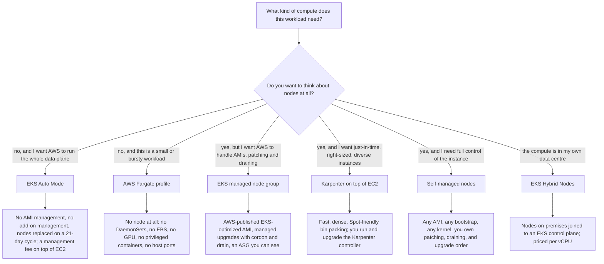

| Option | You manage | AWS manages | Choose when |
|---|---|---|---|
| **Managed node group** | Instance types, size, scaling bounds, labels and taints | AMI publication, node bootstrap, cordon-and-drain upgrades, health replacement | The default for most clusters: real nodes without AMI plumbing |
| **Self-managed nodes** | Everything: AMI, user data, ASG, upgrades, draining | Nothing beyond the control plane | You need a custom kernel, a specialised AMI, or an unsupported configuration |
| **AWS Fargate** | Nothing about infrastructure | The entire node concept | Bursty, small, stateless, untrusted, or isolation-sensitive Pods |
| **Karpenter** | The Karpenter controller and its NodePools | EC2 instance provisioning happens just in time | Scaling speed and bin-packing efficiency matter; heterogeneous or Spot-heavy fleets |
| **EKS Auto Mode** | Your workloads and NodePool policy | Compute, networking, storage, load balancing, node OS patching, add-on lifecycle | You want a managed data plane and accept the management fee and reduced control |
| **Hybrid Nodes** | On-premises hardware and its networking | The control plane, and the node's Kubernetes integration | Regulated or latency-bound workloads that must stay on-premises under one control plane |

!!! tip "The default recommendation for a first production cluster"

    **Managed node groups in private subnets across three Availability Zones, with the four core add-ons managed by EKS, plus Karpenter for any workload whose scaling is spiky.** This gives you real nodes (so DaemonSets, EBS volumes, and GPUs all work), AWS-managed AMIs and upgrades, and a fast second scaling loop where it matters. Fargate is then used selectively for specific namespaces rather than universally, and Auto Mode becomes attractive when the team's constraint is people rather than control.

### Node bootstrap and registration

A node does not become part of a cluster by being launched. The sequence matters because most "node stuck in `NotReady`" problems are a failure of one of these steps:

```mermaid
sequenceDiagram
    participant ASG as "EC2 Auto Scaling group"
    participant EC2 as "EC2 instance (EKS-optimized AMI)"
    participant BOOT as "Bootstrap: nodeadm / bootstrap.sh"
    participant KUBELET as "kubelet"
    participant API as "EKS API server"
    participant CNI as "aws-node (VPC CNI)"
    ASG->>EC2: "launch with user data and the node instance profile"
    EC2->>BOOT: "cloud-init runs the bootstrap"
    BOOT->>API: "DescribeCluster: fetch endpoint, CA certificate, cluster CIDR"
    BOOT->>KUBELET: "write kubelet config, kubeconfig, container runtime config"
    KUBELET->>API: "TLS bootstrap: authenticate with the node instance role via the IAM Authenticator"
    API->>API: "map the node role to system:nodes via an access entry"
    KUBELET->>API: "submit a Certificate Signing Request for a node client certificate"
    API-->>KUBELET: "signed certificate; node object created"
    KUBELET->>API: "report status: capacity, conditions, still NotReady (no network)"
    CNI->>CNI: "aws-node DaemonSet starts, attaches ENIs, builds the warm IP pool"
    CNI->>KUBELET: "CNI config written to /etc/cni/net.d"
    KUBELET->>API: "node condition Ready"
    API->>KUBELET: "scheduler may now bind Pods here"
```

Two consequences are worth stating explicitly. First, **a node is `NotReady` until the CNI is functional**, which is why a broken `aws-node` DaemonSet presents as nodes that never become ready rather than as a networking error. Second, **the node instance role must have an access entry mapping it to the node group** — with the API authentication mode this is created automatically for managed node groups, and it is exactly what you must create by hand for self-managed nodes. A node whose role has no mapping authenticates successfully and is then refused, and the symptom is a node that never appears in `kubectl get nodes` at all.

### Cluster endpoint access

The API server endpoint is a public DNS name that resolves differently depending on configuration:

| Mode | Resolves to | Node traffic path | `kubectl` from the internet | Typical use |
|---|---|---|---|---|
| **Public only** | Public IPs | Nodes egress to the public endpoint via NAT or an internet gateway | Yes, restricted by CIDR allow-list | Development; production only with a tight allow-list |
| **Public and private** | Public IPs from outside the VPC; private IPs from inside | Nodes stay inside the VPC | Yes, restricted by CIDR allow-list | The common production choice |
| **Private only** | Private IPs (via an EKS-managed Route 53 private hosted zone) | Inside the VPC | No — only from inside the VPC, or via VPN, Direct Connect, or a bastion | Regulated environments |

!!! danger "Private-only endpoints break `kubectl` from your laptop, and that is the point"

    With a private-only endpoint, every administrative action and every CI/CD pipeline must reach the cluster from inside the VPC or a network connected to it. This is a real security improvement and a real operational cost: you now need a bastion, a VPN, a self-hosted runner, or AWS Systems Manager Session Manager port forwarding. Teams routinely enable private-only, discover their pipeline is broken, and re-enable public access with `0.0.0.0/0` — which is strictly worse than where they started. Decide the access path *before* you change the endpoint mode.

---

## Core Concepts: EKS Networking and VPC Integration

### The VPC CNI's central decision

Most Kubernetes networking plugins give Pods addresses from an **overlay** network — a private CIDR that exists only inside the cluster, with packets encapsulated (VXLAN, Geneve) as they cross node boundaries. The Amazon VPC CNI does something different and more consequential: **every Pod receives a real, routable IP address from your VPC subnet**, drawn from secondary IP addresses on elastic network interfaces attached to the node.

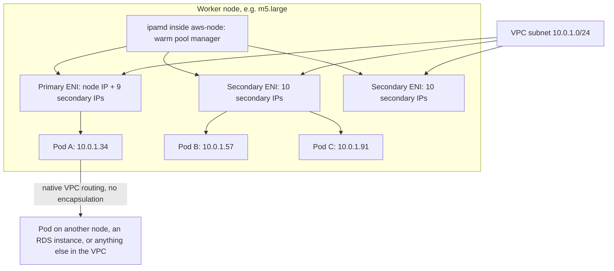

**Why AWS chose this.** Native VPC addressing means no encapsulation overhead, no separate network to debug, VPC Flow Logs that show Pod-level traffic, security groups that can apply to Pods, and — most importantly — Pods that are first-class VPC citizens reachable from anything else in the VPC without a gateway.

**What it costs.** Pod density is bounded by IP addresses, not only by CPU and memory, and your VPC's address plan becomes a cluster capacity constraint. This is the single most common architectural surprise in EKS.

### Maximum Pods per node

Without prefix delegation, the formula is:

```
max_pods = (number_of_ENIs × (IPs_per_ENI − 1)) + 2
```

The `− 1` is the ENI's primary address, which the Pods do not use; the `+ 2` accounts for Pods on the host network (`aws-node` and `kube-proxy`), which do not consume a Pod IP.

| Instance type | ENIs | IPs per ENI | Max Pods (standard) | Max Pods (prefix delegation) |
|---|---|---|---|---|
| `t3.small` | 3 | 4 | 11 | 110 |
| `t3.medium` | 3 | 6 | 17 | 110 |
| `m5.large` | 3 | 10 | 29 | 110 |
| `m5.xlarge` | 4 | 15 | 58 | 110 |
| `m5.4xlarge` | 8 | 30 | 234 | 250 |
| `m5.24xlarge` | 15 | 50 | 737 | 250 (Kubernetes-capped) |

!!! warning "A `t3.medium` node runs 17 Pods, and about five of them are already spoken for"

    `aws-node` and `kube-proxy` are host-network and do not count, but CoreDNS, the EBS CSI node driver, a log agent, a metrics agent, and a service mesh sidecar injector all do. Students in AWS Academy labs routinely launch two `t3.medium` nodes, deploy a modest application, and cannot understand why Pods are `Pending` with `Too many pods`. The answer is arithmetic, not configuration.

### Prefix delegation

**Prefix delegation** changes the allocation unit from a single IP address to a `/28` prefix (16 addresses) per slot on the ENI. Enabling `ENABLE_PREFIX_DELEGATION=true` on the VPC CNI transforms density:

```
max_pods = (number_of_ENIs × ((IPs_per_ENI − 1) × 16)) + 2
```

capped by the Kubernetes recommendation of **110 Pods** for nodes with fewer than 30 vCPUs and **250 Pods** for larger ones. An `m5.large` goes from 29 Pods to 110 — the same instance, four times the density, at no additional charge.

The trade-off is **IP consumption granularity**: a `/28` is allocated even if the node needs one address from it, and prefixes require contiguous free space in the subnet. A fragmented subnet may have 100 free addresses and no free `/28`, in which case prefix assignment fails while single-IP assignment would have succeeded.

| Setting | Effect | When to change it |
|---|---|---|
| `ENABLE_PREFIX_DELEGATION` | Allocate `/28` prefixes instead of single IPs | Almost always on Nitro instances; the density gain is large and free |
| `WARM_ENI_TARGET` | Keep this many fully free ENIs warm (default 1) | Lower it to conserve IPs; raise it for very fast Pod churn |
| `WARM_IP_TARGET` | Keep this many free IPs warm regardless of ENI boundaries | Set it in IP-constrained VPCs to stop over-allocation |
| `MINIMUM_IP_TARGET` | Floor on total allocated IPs | Pair with `WARM_IP_TARGET` to avoid churn on small nodes |
| `WARM_PREFIX_TARGET` | Warm prefixes to keep when prefix delegation is on | 1 is usually right; higher wastes address space |
| `AWS_VPC_K8S_CNI_CUSTOM_NETWORK_CFG` | Put Pods in different subnets from the node | Custom networking, below |
| `ENABLE_POD_ENI` | Enable branch ENIs for security groups for Pods | Only where per-Pod security groups are genuinely required |
| `AWS_VPC_K8S_CNI_EXTERNALSNAT` | Disable source NAT for Pod traffic leaving the VPC | When Pods must present their own IP to an on-premises network |

!!! tip "`WARM_IP_TARGET` is the knob that fixes 'we have IPs but Pods cannot get one'"

    By default the CNI allocates whole ENIs' worth of addresses at a time, so a node running three Pods may hold thirty addresses. In a constrained VPC this silently exhausts the subnet. Setting `WARM_IP_TARGET` (with `MINIMUM_IP_TARGET` to avoid thrash) makes allocation demand-driven. The cost is more `AssignPrivateIpAddresses` API calls during scale-out, which can hit EC2 API rate limits on very large clusters — a real trade, and one to make consciously.

### Custom networking and IPv6: the two structural answers to IP exhaustion

**Custom networking** places Pods in *different subnets from their nodes* — typically a secondary CIDR block added to the VPC from the `100.64.0.0/10` carrier-grade NAT range, which does not consume routable RFC 1918 space. Nodes keep small routable subnets; Pods get an enormous non-routable range. The costs are real: the node's primary ENI can no longer host Pods, so maximum Pods per node drops by roughly one ENI's worth, and every node needs an `ENIConfig` custom resource per Availability Zone.

**IPv6 clusters** eliminate the problem rather than managing it. Each Pod gets a globally unique IPv6 address from a `/80` per node; the address space is effectively unlimited. Egress to IPv4 endpoints works through NAT64 and DNS64 with an egress-only internet gateway. The cost is that **IPv6 must be chosen at cluster creation and cannot be changed**, and every dependency — application libraries, on-premises networks, third-party endpoints — must cope with IPv6.

| Approach | Address space gained | Cost | Reversible? |
|---|---|---|---|
| Prefix delegation | 16× density per node | `/28` granularity, fragmentation sensitivity | Yes, per cluster setting |
| Larger subnets | Linear | Requires VPC redesign or a new VPC | Only by rebuilding |
| Custom networking with `100.64.0.0/10` | Very large | Complexity; lower max Pods; per-AZ `ENIConfig` | Yes, with node replacement |
| IPv6 | Effectively unlimited | Whole-stack IPv6 readiness | **No** — cluster creation time only |

### Security groups for Pods

By default all Pods on a node share the node's security groups, which means security group rules cannot distinguish one workload from another. **Security groups for Pods** solves this with **branch ENIs**: on Nitro instances with `ENABLE_POD_ENI=true`, the VPC Resource Controller attaches a trunk ENI to the node and allocates branch interfaces to individual Pods, each with its own security groups, selected by a `SecurityGroupPolicy` custom resource.

This is the mechanism that lets you say "only the `payments` Pods may reach the payments database" using an RDS security group rule rather than a network policy. It is genuinely useful and genuinely expensive: branch ENIs consume a separate per-instance quota, they reduce the node's Pod capacity, and Pods using them take longer to start. Reserve it for the boundaries that must be enforced in the VPC rather than in the cluster.

### Services, kube-proxy, and CoreDNS

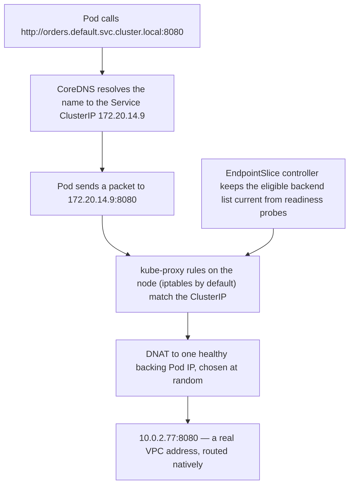

The ClusterIP is a **virtual address that exists only as a packet-rewriting rule** on every node; nothing listens on it. This explains several otherwise puzzling behaviours: you cannot ping a ClusterIP meaningfully, a Service with no ready endpoints black-holes traffic rather than refusing it, and `kube-proxy` being unhealthy on one node breaks Service resolution for Pods on that node only.

| Service type | What it creates | Use |
|---|---|---|
| `ClusterIP` | An internal virtual IP | Default; internal service-to-service traffic |
| `NodePort` | A port on every node forwarding to the Service | Rarely used directly; the substrate for instance-mode load balancing |
| `LoadBalancer` | An AWS load balancer via a controller | External exposure of a single Service |
| `ExternalName` | A CNAME in cluster DNS | Pointing a cluster name at an external endpoint |
| **Ingress** (not a Service type) | An ALB via the AWS Load Balancer Controller | HTTP routing for many Services behind one load balancer |

### The AWS Load Balancer Controller and target modes

The in-tree cloud provider creates a Classic Load Balancer for `type: LoadBalancer`, which is a legacy path. In practice you install the **AWS Load Balancer Controller**, which creates an **ALB** for Ingress resources and an **NLB** for annotated Services, and which supports two target modes:

| Target mode | Registers | Path | Consequences |
|---|---|---|---|
| **Instance mode** | Node instance IDs on a NodePort | Load balancer → node → `kube-proxy` → possibly another node → Pod | An extra hop, possible cross-AZ charges, source IP obscured unless preserved; works everywhere |
| **IP mode** | **Pod IP addresses directly** | Load balancer → Pod | One less hop, lower latency, true client IP with the right settings, required on Fargate |

!!! tip "IP mode is the modern default, and it is only possible because of the VPC CNI"

    A load balancer can register a Pod as a target only because that Pod holds a real VPC IP address. This is the clearest example of the VPC CNI's cost being repaid: the same decision that constrains Pod density is what removes a network hop from every external request and makes Pod-level security groups possible. When a question asks why you would accept the IP-planning burden of the VPC CNI, this is the answer.

### Cross-AZ traffic, and why it appears on the bill

Kubernetes Services select endpoints without regard to topology: a Pod in `us-east-1a` calling a Service with replicas in three zones sends roughly two thirds of its traffic across an Availability Zone boundary, and AWS charges for inter-AZ data transfer in both directions. Two mechanisms address this:

- **Topology aware routing** (the `service.kubernetes.io/topology-mode: Auto` annotation, formerly topology aware hints) asks EndpointSlice to prefer same-zone endpoints when the distribution allows it safely.
- **`internalTrafficPolicy: Local`** restricts a Service to endpoints on the *same node*, which eliminates the traffic entirely but breaks if no local endpoint exists.

Both trade availability for cost and latency: preferring local endpoints concentrates load and, in the `Local` case, fails closed. Use topology aware routing for chatty internal services with replicas in every zone, and leave it off for services whose replica count is small enough that zone skew would overload one zone.

---

## Core Concepts: EKS Security and IAM Integration

### The two-layer model

This is the concept students get wrong most often, and it is simple once stated:

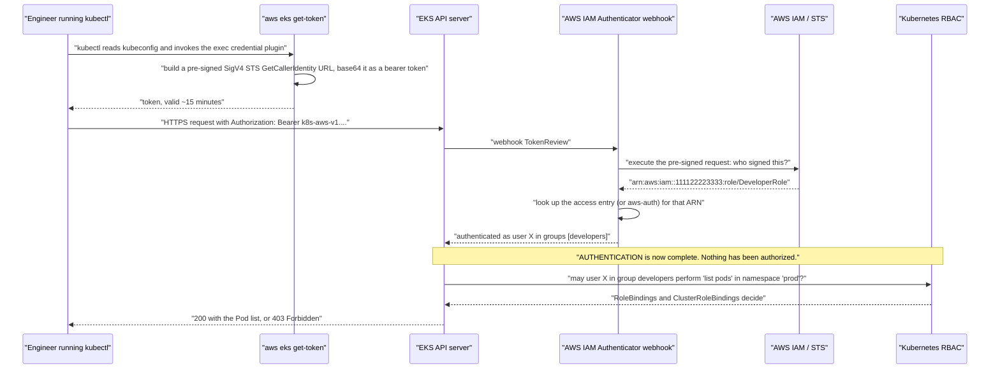

**IAM answers 'who are you'. Kubernetes RBAC answers 'what may you do'.** An IAM administrator with no access entry is authenticated as nobody and receives `Unauthorized`. A mapped user with no RoleBinding is authenticated and receives `Forbidden`. The two error messages are the diagnostic:

| Symptom | Layer at fault | Fix |
|---|---|---|
| `error: You must be logged in to the server (Unauthorized)` | Authentication — no access entry or `aws-auth` mapping for this principal | Create an access entry for the IAM principal |
| `Error from server (Forbidden): pods is forbidden: User "x" cannot list resource "pods"` | Authorization — mapped, but no RBAC grant | Bind a Role or ClusterRole, or associate an access policy |

!!! danger "The cluster creator is not special, and that has ended many lab sessions"

    The IAM principal that creates a cluster is granted `system:masters` implicitly, and **that grant is invisible in `aws-auth`**. If you create a cluster with a CI/CD role and then try `kubectl` as a human, you are `Unauthorized` with no obvious cause. Worse, if that creator principal is deleted without another admin being mapped, the cluster can become permanently unadministrable. Always create an explicit second cluster-admin access entry immediately after cluster creation — ideally a role assumable by a group of humans, not a single user.

### Access entries versus the `aws-auth` ConfigMap

Historically, mapping IAM principals to Kubernetes identities meant editing a ConfigMap in `kube-system` — a resource you could only edit if you already had access, whose syntax errors could lock everyone out, and which was invisible to IAM tooling and CloudTrail. **Access entries** replace it with a first-class EKS API, with a catalogue of managed access policies (the general-purpose four below, plus policies for hybrid nodes, Auto Mode, and other specific roles).

| | `aws-auth` ConfigMap | Access entries |
|---|---|---|
| Managed via | `kubectl edit` inside the cluster | EKS API, CLI, CloudFormation, Terraform |
| Failure mode | A YAML mistake locks everyone out | API validation; no lockout |
| Auditable in CloudTrail | No | Yes |
| Namespace scoping | Only via RBAC you author | Built in, through access scopes |
| Prebuilt permission sets | None | A managed catalogue of roughly two dozen, of which the general-purpose four are `AmazonEKSClusterAdminPolicy`, `AmazonEKSAdminPolicy`, `AmazonEKSEditPolicy`, and `AmazonEKSViewPolicy` |

The cluster's **authentication mode** selects which is active: `CONFIG_MAP` (legacy), `API_AND_CONFIG_MAP` (both, for migration), or `API` (access entries only, the modern default). The transition is one-way: once access entries are enabled they cannot be disabled, and a cluster created without ConfigMap support cannot add it later.

### Pod identity: why the node role is not enough

A Pod that needs to call `s3:GetObject` must present AWS credentials. Three mechanisms exist, and only two are acceptable:

**The node instance role (unacceptable).** Every Pod on a node can reach the instance metadata service and obtain the node's role credentials. The node role therefore accumulates the union of every workload's permissions, and any compromised Pod — or any Pod with a server-side request forgery bug — inherits all of them. This is the single most consequential misconfiguration in EKS security.

**IAM Roles for Service Accounts (IRSA).** The cluster exposes an OIDC discovery endpoint; you register it as an IAM OIDC identity provider. A mutating webhook in the control plane injects a **projected service account token** (a short-lived, audience-scoped JWT) into any Pod whose ServiceAccount carries an `eks.amazonaws.com/role-arn` annotation, along with the `AWS_ROLE_ARN` and `AWS_WEB_IDENTITY_TOKEN_FILE` environment variables. The AWS SDK finds them and calls `sts:AssumeRoleWithWebIdentity`. The role's trust policy names the OIDC provider and constrains the `sub` claim to a specific namespace and ServiceAccount.

**EKS Pod Identity.** A newer mechanism that removes the OIDC plumbing. You install the **EKS Pod Identity Agent** add-on (a DaemonSet), then create an **association** through the EKS API binding a ServiceAccount in a namespace to an IAM role. The agent serves credentials to the Pod over a link-local endpoint. The role's trust policy names `pods.eks.amazonaws.com` and requires `sts:AssumeRole` and `sts:TagSession` — and, critically, the same role can be reused across many clusters without editing its trust policy for each one.

```mermaid
flowchart TD
    subgraph IRSA["IRSA: OIDC federation"]
        A1["ServiceAccount annotated with eks.amazonaws.com/role-arn"] --> A2["Pod Identity Webhook injects a projected token and env vars"]
        A2 --> A3["SDK calls sts:AssumeRoleWithWebIdentity with the JWT"]
        A3 --> A4["Trust policy validates the OIDC issuer and the sub claim"]
        A4 --> A5["Temporary credentials"]
    end
    subgraph PI["EKS Pod Identity"]
        B1["Pod Identity Agent DaemonSet on each node"] --> B2["EKS API association: cluster + namespace + ServiceAccount to role"]
        B2 --> B3["Agent serves credentials on a link-local endpoint"]
        B3 --> B4["Trust policy names pods.eks.amazonaws.com; sts:AssumeRole and sts:TagSession"]
        B4 --> B5["Temporary credentials, with session tags for the cluster and namespace"]
    end
```

| | IRSA | EKS Pod Identity |
|---|---|---|
| Per-cluster setup | An IAM OIDC provider per cluster | Install one add-on |
| Role reuse across clusters | Trust policy must list every cluster's OIDC issuer | One trust policy works for all |
| Trust policy complexity | Issuer URL plus `sub` and `aud` conditions | Service principal plus session tag conditions |
| Works on AWS Fargate | Yes | **No** — the agent is a DaemonSet, and Fargate has no DaemonSets |
| Works outside EKS (ECS, EC2, on-premises) | The pattern generalises to any OIDC provider | EKS-specific |
| Role chaining and session tags | Limited | Supported; tags carry cluster, namespace and ServiceAccount |
| Recommendation | Still required for Fargate Pods and for portability | **Prefer for new work on EC2-backed nodes** |

!!! danger "Block the instance metadata service, or per-Pod identity is decorative"

    IRSA and Pod Identity give each Pod its own role — and change nothing at all if a Pod can still reach `169.254.169.254` and take the node's role instead. The remediation is to require IMDSv2 with `HttpPutResponseHopLimit: 1` on every node (which stops a container, one network hop away, from reaching it) or to block the address with a network policy. This one setting is the difference between a per-Pod identity model and a per-Pod identity theatre.

### Kubernetes Secrets, KMS, and the honest limitation

Kubernetes Secrets are **base64-encoded, not encrypted**, in `etcd`. EKS encrypts `etcd` volumes at rest by default, and you can additionally enable **envelope encryption with AWS KMS**, so that each Secret's data key is encrypted by a customer-managed key. This protects against a compromise of the storage layer and gives you an auditable, revocable key.

What it does **not** protect against is anyone with `get secrets` RBAC permission, or any Pod that mounts the Secret. For credentials that must not be visible to cluster administrators, or that must rotate automatically, the answer is **AWS Secrets Manager or Parameter Store** with the **Secrets Store CSI Driver**, which mounts the value into the Pod at runtime under an IRSA or Pod Identity role.

!!! warning "Deleting or disabling the KMS key destroys the cluster"

    Envelope encryption ties the cluster's Secrets to a KMS key. If that key is scheduled for deletion or its policy is changed so the cluster can no longer use it, every Secret becomes unreadable and the cluster is unrecoverable. Protect the key with a resource policy that prevents deletion, and keep it in the same account and Region as the cluster.

### Network policies, Pod Security Admission, and audit logging

**Network policies** are the Kubernetes-native answer to Pod-level segmentation. By default, all Pods can reach all other Pods; a NetworkPolicy selecting a set of Pods switches them to default-deny for the directions it specifies. Enforcement requires a plugin: the **VPC CNI supports network policies natively** (using eBPF) when enabled, and Calico is the common alternative. Network policies and security groups for Pods solve overlapping problems at different layers — policies are cheap, expressive and cluster-scoped; security groups are enforced in the VPC and visible to non-Kubernetes tooling.

**Pod Security Admission** replaced the removed PodSecurityPolicy. It applies one of three profiles — `privileged`, `baseline`, `restricted` — per namespace, in one of three modes (`enforce`, `audit`, `warn`), via namespace labels. The practical baseline for a production cluster is `restricted` enforced in application namespaces, with explicit exceptions for the namespaces that genuinely need privilege.

**Control plane logging** ships five log types to CloudWatch Logs: `api`, `audit`, `authenticator`, `controllerManager`, and `scheduler`. The **audit log is the one that matters for security**: it records every API request, its authenticated identity, and its outcome. It is off by default, it is not free, and it is the only record of who did what inside the cluster — CloudTrail records the EKS API calls, not the Kubernetes ones.

---

## Internal Working

### Control plane versus data plane, precisely

| Plane | What it does | Failure consequence |
|---|---|---|
| **Control plane** | Accepts and validates API requests, stores desired state in `etcd`, runs reconciliation loops, schedules Pods | You cannot make *changes*: no deployments, no scaling, no new Pods. Running Pods keep serving traffic |
| **Data plane** | Runs containers, forwards Service traffic, allocates Pod IPs, resolves cluster DNS | Traffic is affected immediately |

This separation is the reason a control plane impairment is survivable. The `kubelet` on each node continues running the Pods it already knows about; `kube-proxy` rules already programmed continue forwarding; CoreDNS continues resolving. What stops is *change*. Designing a system so that a control plane outage is an inconvenience rather than an outage means: do not put anything on the request path that requires an API call, keep replicas already running rather than relying on rapid scale-out, and be aware that a Pod which crashes during a control plane outage may not be replaced.

### What happens when you run `kubectl apply -f deployment.yaml`

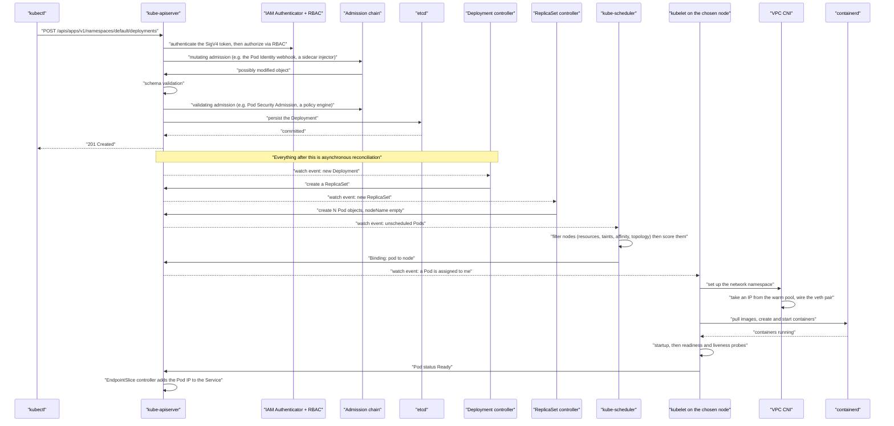

Three architectural lessons live in this sequence. **`kubectl apply` returns as soon as the object is persisted**, not when Pods are running — which is why `kubectl rollout status` exists and why a pipeline that treats `apply` as completion is lying to itself. **Every component watches the API server rather than calling each other**, which is what makes Kubernetes extensible: your own controller is indistinguishable from a built-in one. And **admission webhooks sit in the synchronous path of every write**, which is why a webhook whose backing Pod is unreachable can stop all deployments — the API server is waiting on something inside your VPC.

### How the VPC CNI allocates an address

```mermaid
stateDiagram-v2
    [*] --> NodeBoot : "aws-node starts"
    NodeBoot --> Warming : "ipamd attaches ENIs and requests secondary IPs or /28 prefixes"
    Warming --> Ready : "warm pool satisfies WARM_ENI_TARGET / WARM_IP_TARGET"
    Ready --> Assign : "kubelet asks the CNI to set up a Pod sandbox"
    Assign --> Wired : "take an IP from the warm pool, create the veth pair, add host routes"
    Wired --> Ready : "pool topped up asynchronously"
    Ready --> Exhausted : "no free IP and no free ENI slot"
    Exhausted --> Pending : "Pod stays ContainerCreating: failed to assign an IP address"
    Pending --> Ready : "subnet freed, prefix delegation enabled, or the node is replaced"
    Wired --> Released : "Pod deleted; IP returned to the warm pool (cooldown before reuse)"
    Released --> Ready
```

The **cooldown before reuse** matters more than it looks: an address is held briefly after a Pod terminates so that in-flight connections are not delivered to a different Pod that reuses the address. On a cluster with very high Pod churn this holding period is itself a source of address pressure.

### How the control plane reaches into your VPC

When you create a cluster you supply subnets. EKS creates **cross-account elastic network interfaces** in them — interfaces that appear in your VPC (and your bill for the addresses they consume) but are owned by an AWS service account. All control-plane-initiated traffic to your workloads traverses them: `kubectl exec` and `logs` and `port-forward`, the metrics API, and every admission webhook call.

The **cluster security group**, created automatically, is attached to those ENIs and to managed node group instances, and its default rule allows all traffic within itself. That default is what makes the path work out of the box, and tightening it without understanding the direction of each flow is the most common way to break a working cluster.

!!! warning "The control plane needs a route to your webhook Pods, and a private-only cluster does not change that"

    A validating or mutating webhook is a Service in your cluster. When the API server calls it, the connection originates in the AWS-managed VPC and arrives through a cross-account ENI. If the webhook's Pods are on nodes whose security group does not accept traffic from the cluster security group on the webhook port (commonly 8443 or 9443), every write matching that webhook's rules fails with `failed calling webhook ... context deadline exceeded` — and if the webhook's `failurePolicy` is `Fail`, that means every deployment stops. This failure has taken down more EKS clusters than any node-level problem.

---

## Architecture Components

| Component | Responsibility in an EKS architecture |
|---|---|
| **EKS cluster** | The managed control plane: API endpoint, `etcd`, scheduler, controllers, authenticator |
| **Cluster service role** | The IAM role EKS assumes to manage AWS resources on your behalf (ENIs, load balancers, logs) |
| **Cluster security group** | Applied to control plane ENIs and managed nodes; the default all-within-itself rule is what makes the cluster work |
| **Cross-account ENIs** | The control plane's inbound path into your VPC |
| **Cluster endpoint** | The API server's DNS name; public, public and private, or private only |
| **VPC and subnets** | At least two subnets in two AZs; private subnets for nodes; public subnets, or tags, for internet-facing load balancers |
| **Node instance role** | The IAM role assumed by the `kubelet`; needs `AmazonEKSWorkerNodePolicy`, `AmazonEC2ContainerRegistryReadOnly`, and CNI permissions |
| **Managed node group** | An EKS-managed Auto Scaling group with AWS-published AMIs and cordon-and-drain upgrades |
| **Karpenter** | A just-in-time node provisioner that creates right-sized, diverse instances directly from unschedulable Pods |
| **Fargate profile** | A selector that routes matching Pods onto AWS-managed serverless capacity |
| **EKS Auto Mode** | AWS management of compute, networking, storage, and load balancing in the data plane |
| **`kubelet`** | The node agent: registration, Pod lifecycle, probes, status reporting |
| **`kube-proxy`** | Programs `iptables`, IPVS, or `nftables` rules that implement Service virtual IPs |
| **`containerd`** | The container runtime |
| **Amazon VPC CNI (`aws-node`)** | Allocates VPC IPs to Pods; also the native network policy enforcement point |
| **CoreDNS** | Cluster DNS: Service and Pod name resolution |
| **AWS Load Balancer Controller** | Turns Ingress into ALBs and annotated Services into NLBs; IP-mode targeting |
| **EBS/EFS/FSx CSI drivers** | Turn PersistentVolumeClaims into AWS storage |
| **EKS Pod Identity Agent** | Serves per-Pod IAM credentials from an EKS association |
| **IAM OIDC provider** | The federation endpoint that makes IRSA possible |
| **Metrics Server** | Supplies CPU and memory metrics to the HorizontalPodAutoscaler |
| **Cluster Autoscaler** | Adjusts Auto Scaling group sizes in response to unschedulable Pods (the alternative to Karpenter) |
| **Amazon ECR** | The image registry the `kubelet` pulls from, authenticated by the node role |
| **AWS KMS** | Envelope encryption of Kubernetes Secrets; EBS volume encryption |
| **CloudWatch Logs** | Destination for the five control plane log types and for container logs |
| **AWS CloudTrail** | Audit of EKS API calls (cluster creation, node groups, access entries) — not of Kubernetes API calls |
| **Amazon GuardDuty** | EKS Protection: audit log analysis and runtime monitoring |

Read architecturally, these fall into three groups. **The boundary components** — the endpoint, the cross-account ENIs, the cluster security group, the node role — determine whether the cluster works at all, and are where most outages originate. **The data plane components** — nodes, CNI, `kube-proxy`, CoreDNS, CSI drivers — determine whether workloads run and are yours to keep current. **The integration components** — the load balancer controller, IRSA and Pod Identity, KMS, CloudWatch — determine how much of AWS your Kubernetes objects can reach, and are where the portability trade is actually made.

---

## Request Lifecycle

### An external HTTP request reaching a Pod

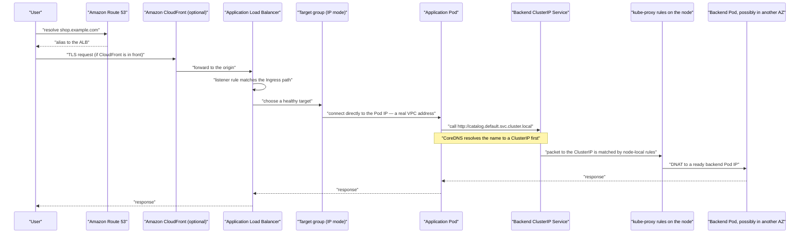

The step worth dwelling on is **`TG->>POD`**. In IP mode the load balancer speaks directly to the Pod: there is no NodePort, no second hop through `kube-proxy`, no ambiguity about which node handled the request, and no cross-AZ hop introduced by the load balancer's own routing. In instance mode the same request lands on a node's NodePort, `kube-proxy` picks a backend that may be on a different node in a different Availability Zone, and you pay for the hop in latency and in data transfer.

The step worth being suspicious of is **`SVC->>KP`**. That backend was chosen without regard to zone. In a three-AZ cluster, two calls in three cross a zone boundary.

### A control-plane-initiated request: an admission webhook

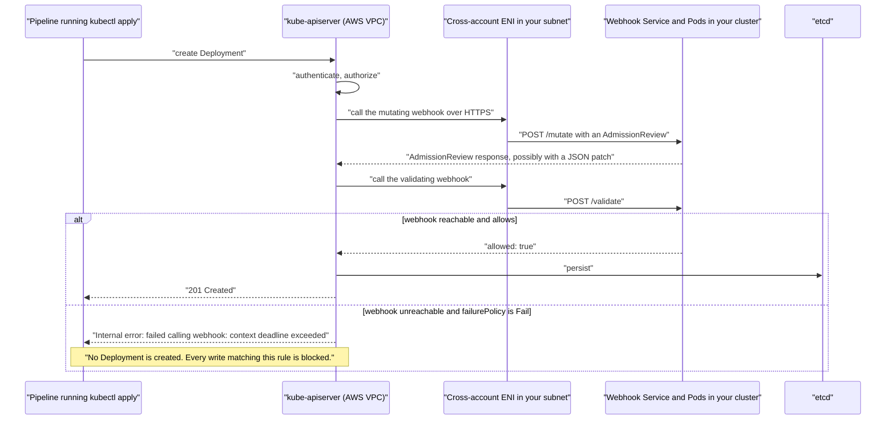

This is a **synchronous, blocking call from the AWS-managed control plane into your VPC**, on the critical path of a write. Understanding it explains why security group changes break deployments, why a webhook Pod that cannot be scheduled is a cluster-wide outage, and why `failurePolicy: Ignore` on non-security-critical webhooks is a resilience decision rather than a laziness.

---

## AWS Service Deep Dive

!!! warning "On numbers, versions, and quotas"

    Figures are representative as of 2026 and most quotas are **soft**. Kubernetes versions, add-on versions, and instance ENI limits change frequently. Verify against AWS Service Quotas, the EKS User Guide, and the Kubernetes version calendar for the account and Region you are designing in. Prices below are indicative and stated only to show relative magnitude.

### Amazon EKS control plane

**Purpose.** Provide a highly available, single-tenant, upstream-conformant Kubernetes control plane without any operational involvement from the customer.

**Architecture.** At least two `kube-apiserver` instances and three `etcd` instances distributed across three Availability Zones in an AWS-owned VPC, fronted by a network load balancer that serves the cluster endpoint. The scheduler, controller manager, cloud controller manager, and IAM Authenticator webhook run alongside. Cross-account ENIs in your subnets give the control plane an inbound path to your workloads.

**Important features.** Upstream-conformant Kubernetes; automatic patching within a platform version; single-command minor version upgrades; five control plane log types to CloudWatch; envelope encryption of Secrets with KMS; three endpoint access modes with CIDR allow-listing; access entries with managed access policies; native IAM authentication; an API server endpoint availability SLA.

**Limitations.** You cannot access `etcd` directly, take your own `etcd` backup, or run a custom admission controller *inside* the control plane (webhooks run in your cluster instead). API server flags are not freely configurable, though advanced control plane configuration options have expanded. Cluster version upgrades proceed **one minor version at a time**; EKS supports rolling a control plane back one minor version only within a short window after the upgrade, and nodes and add-ons must be rolled back separately, so an upgrade should be planned as effectively one-way. A cluster's VPC, subnets used for the control plane ENIs, IP family (IPv4 or IPv6), and Secrets-encryption choice are set at creation.

**Pricing model.** A flat fee per cluster per hour — indicatively **$0.10 per hour** for a version in standard support, rising to about **$0.60 per hour** for a version in extended support — independent of cluster size, plus the data plane resources you consume. The extended-support premium is a deliberate, six-fold economic incentive to keep clusters current.

**Performance characteristics.** The API server scales with load, managed by AWS. Practical limits are reached through very high object counts, very large objects, chatty controllers, and unbounded `list` calls rather than through node count. `etcd` has a hard total database size limit; clusters that store large ConfigMaps or huge numbers of Secrets can approach it.

**Scaling behaviour.** AWS adjusts control plane capacity in response to observed load. There is no customer-facing knob and no charge for the scaling.

**Availability.** Multi-AZ by construction, with automatic replacement of unhealthy instances, and an availability SLA on the API server endpoint. A control plane impairment prevents changes but does not stop running Pods.

**Security features.** IAM authentication; RBAC authorization; access entries with managed policies; KMS envelope encryption for Secrets; encrypted `etcd` volumes; audit logging; private endpoints; endpoint CIDR allow-lists; single-tenant isolation.

**Service limits.** Representative soft quotas per account and Region: clusters per account, managed node groups per cluster, nodes per managed node group, Fargate profiles per cluster and selectors per profile, access entries per cluster. Kubernetes itself has practical limits — commonly cited as around 5,000 nodes and 150,000 Pods per cluster — which are architectural guidance rather than enforced ceilings.

**Common configurations.** Public and private endpoint access with a CIDR allow-list; API authentication mode with access entries; all five control plane log types enabled in production, or at minimum `audit` and `authenticator`; Secrets encryption with a customer-managed KMS key; three private subnets across three AZs.

### The Amazon VPC CNI

**Purpose.** Give every Pod a routable VPC IP address so Pods are first-class VPC citizens.

**Architecture.** The `aws-node` DaemonSet runs `ipamd` (the IP address manager) and the CNI binary. `ipamd` attaches ENIs to the instance and requests secondary IP addresses or `/28` prefixes, maintaining a warm pool; the binary wires each Pod's network namespace to an address from that pool with a veth pair and host routes.

**Important features.** Native VPC addressing with no encapsulation; prefix delegation for high density; custom networking to place Pods in separate subnets; security groups for Pods via branch ENIs on Nitro instances; IPv6 support; native network policy enforcement using eBPF; extensive warm-pool tuning.

**Limitations.** Pod density is bounded by instance ENI and IP limits. Address consumption is aggressive by default. Prefix delegation requires contiguous free `/28` blocks and Nitro instances. Custom networking reduces maximum Pods and requires per-AZ configuration. Security groups for Pods consume a separate branch-ENI quota and slow Pod start-up. IPv6 is a cluster-creation-time decision.

**Pricing model.** No charge for the plugin. The cost is indirect: consumed VPC addresses, ENI attachment limits shaping instance choice, and the cross-AZ data transfer that native routing makes visible.

**Performance characteristics.** No encapsulation overhead, so Pod-to-Pod throughput approaches instance network performance. Pod start-up includes an IP assignment that is usually instant from the warm pool and can take seconds when a new ENI must be attached.

**Scaling behaviour.** The warm pool grows and shrinks with Pod density on the node, subject to `WARM_ENI_TARGET`, `WARM_IP_TARGET`, `MINIMUM_IP_TARGET`, and `WARM_PREFIX_TARGET`. Very large clusters can encounter EC2 API rate limits during mass scale-out.

**Availability.** Runs as a DaemonSet; a failed `aws-node` Pod makes its node `NotReady`, which is severe but node-local.

**Security features.** Security groups for Pods; native network policy enforcement; Pod traffic visible in VPC Flow Logs; source NAT control for traffic leaving the VPC.

**Common configurations.** Prefix delegation enabled; `WARM_IP_TARGET` and `MINIMUM_IP_TARGET` set in IP-constrained VPCs; custom networking with a `100.64.0.0/10` secondary CIDR in large clusters; network policy enforcement enabled; managed as an EKS add-on with a defined version and an IRSA or Pod Identity role.

### EKS identity integration

**Purpose.** Make AWS IAM the authentication source for cluster access, and give individual Pods their own least-privilege IAM roles.

**Architecture.** The IAM Authenticator webhook inside the control plane validates a pre-signed SigV4 STS token and resolves it to a Kubernetes username and groups using access entries (or the legacy `aws-auth` ConfigMap). For workloads, IRSA federates through a per-cluster OIDC provider and `sts:AssumeRoleWithWebIdentity`, while EKS Pod Identity uses a DaemonSet agent plus an EKS-managed association and `sts:AssumeRole`.

**Important features.** Access entries with managed access policies — a catalogue of roughly two dozen, of which `AmazonEKSClusterAdminPolicy`, `AmazonEKSAdminPolicy`, `AmazonEKSEditPolicy`, and `AmazonEKSViewPolicy` are the general-purpose set — and namespace-scoped access scopes; three cluster authentication modes; IRSA with fine-grained trust policy conditions on `sub` and `aud`; EKS Pod Identity with cross-cluster role reuse and session tags; automatic access entries for managed node groups and Fargate profiles.

**Limitations.** EKS Pod Identity does not work on Fargate. IRSA requires an OIDC provider per cluster and a trust policy edit per cluster. Neither prevents a Pod from using the node role unless IMDS access is restricted. Access entries cannot be disabled once enabled. RBAC remains a separate system that IAM cannot see: an IAM administrator is not a cluster administrator.

**Pricing model.** No charge. STS calls are not billed at any material rate.

**Security features.** Per-Pod least privilege; short-lived credentials with automatic rotation; auditable role assumption in CloudTrail; session tags identifying cluster, namespace, and ServiceAccount under Pod Identity; namespace-scoped cluster access without hand-written RBAC.

**Common configurations.** `API` authentication mode; a cluster-admin access entry for a human-assumable role created immediately after the cluster; `AmazonEKSViewPolicy` scoped to namespaces for most engineers; Pod Identity for EC2-backed workloads, IRSA for Fargate workloads; IMDSv2 with a hop limit of 1 on all nodes.
---

## Important AWS Terminology

| Term | Meaning |
|---|---|
| **Control plane** | The Kubernetes management components AWS runs for you: API server, `etcd`, scheduler, controller managers |
| **Data plane** | The nodes and Pods in your VPC that actually run workloads |
| **`kube-apiserver`** | The front door to the cluster; the only component that talks to `etcd` |
| **`etcd`** | The consistent key-value store holding all cluster state; three instances across three AZs on EKS |
| **`kube-scheduler`** | Assigns unscheduled Pods to nodes by filtering then scoring |
| **`kube-controller-manager`** | Runs the built-in reconciliation loops (Deployment, ReplicaSet, Node, Job, and others) |
| **`cloud-controller-manager`** | The AWS-specific loops: node lifecycle, Service load balancers, routes |
| **`kubelet`** | The node agent that registers the node and runs Pods |
| **`kube-proxy`** | Programs node packet-forwarding rules implementing Service virtual IPs |
| **`containerd`** | The container runtime EKS-optimized AMIs use |
| **Cluster endpoint** | The API server's DNS name; public, public and private, or private only |
| **Platform version** | An EKS-internal version identifier for control plane patches within a Kubernetes minor version |
| **Standard support** | The period (about 14 months) during which a Kubernetes version is supported at the base cluster price |
| **Extended support** | The additional period (about 12 months) at a substantially higher per-cluster price |
| **Cross-account ENI** | A network interface EKS creates in your subnets to give the control plane an inbound path |
| **Cluster security group** | The EKS-created security group applied to control plane ENIs and managed nodes |
| **Node instance role** | The IAM role assumed by the `kubelet`, granting cluster registration and ECR pull |
| **Cluster service role** | The IAM role EKS assumes to manage AWS resources on your behalf |
| **Pod execution role** | The IAM role the Fargate `kubelet` uses; trusted by `eks-fargate-pods.amazonaws.com` |
| **Managed node group** | An EKS-managed Auto Scaling group with AWS AMIs and cordon-and-drain upgrades |
| **Self-managed node** | An EC2 instance you bootstrap and upgrade yourself |
| **EKS-optimized AMI** | AWS-published node image with `kubelet`, `containerd`, the CNI, and the bootstrap tooling |
| **`nodeadm` / `NodeConfig`** | The AL2023 node bootstrap mechanism that replaced the older `bootstrap.sh` user data |
| **Karpenter** | A just-in-time node provisioner that launches right-sized instances from pending Pods |
| **Cluster Autoscaler** | The older node autoscaler that adjusts Auto Scaling group desired capacity |
| **EKS Auto Mode** | A mode in which AWS manages compute, networking, storage, and load balancing in the data plane |
| **Fargate profile** | A namespace and label selector routing matching Pods onto AWS-managed serverless capacity |
| **Hybrid Nodes** | On-premises or edge nodes joined to an EKS control plane, priced per vCPU |
| **Amazon VPC CNI** | The default networking plugin; assigns real VPC IPs to Pods |
| **`ipamd`** | The IP address manager inside `aws-node` that maintains the node's warm IP pool |
| **Warm pool** | Pre-allocated IP addresses or prefixes held so Pod start-up does not wait on an EC2 API call |
| **Prefix delegation** | Allocating `/28` prefixes instead of single IPs, multiplying Pod density by up to 16 |
| **Custom networking** | Placing Pods in different subnets from their nodes, via per-AZ `ENIConfig` resources |
| **Branch ENI** | A per-Pod network interface enabling security groups for Pods on Nitro instances |
| **`SecurityGroupPolicy`** | The custom resource that selects Pods and assigns them security groups |
| **`max_pods`** | The `kubelet`'s Pod ceiling on a node, derived from ENI and IP limits |
| **ClusterIP** | A virtual Service address implemented purely as packet-rewriting rules; nothing listens on it |
| **EndpointSlice** | The object holding the current set of ready Pod endpoints behind a Service |
| **CoreDNS** | Cluster DNS resolving Service and Pod names |
| **Ingress** | An HTTP routing object realised on EKS as an ALB by the AWS Load Balancer Controller |
| **AWS Load Balancer Controller** | The controller that creates ALBs for Ingress and NLBs for annotated Services |
| **Instance mode** | Target group registration by node and NodePort |
| **IP mode** | Target group registration by Pod IP; fewer hops, required on Fargate |
| **Topology aware routing** | EndpointSlice hints that prefer same-zone endpoints to cut cross-AZ traffic |
| **`internalTrafficPolicy: Local`** | Restricts a Service to endpoints on the same node |
| **Access entry** | An EKS API object mapping an IAM principal to a Kubernetes identity |
| **Access policy** | A managed permission set (`ClusterAdmin`, `Admin`, `Edit`, `View`) associated with an access entry |
| **Access scope** | The cluster-wide or namespace-limited scope of an associated access policy |
| **Authentication mode** | `CONFIG_MAP`, `API_AND_CONFIG_MAP`, or `API`; selects access entries, `aws-auth`, or both |
| **`aws-auth` ConfigMap** | The legacy in-cluster IAM mapping mechanism |
| **AWS IAM Authenticator** | The control plane webhook that validates SigV4 tokens and resolves them to cluster identities |
| **RBAC** | Kubernetes authorization: Roles, ClusterRoles, RoleBindings, ClusterRoleBindings |
| **IRSA** | IAM Roles for Service Accounts: OIDC federation giving a Pod an IAM role |
| **OIDC provider** | The IAM identity provider registered from the cluster's OIDC issuer URL |
| **Projected service account token** | A short-lived, audience-scoped JWT mounted into a Pod for federation |
| **EKS Pod Identity** | The newer per-Pod IAM mechanism using an agent DaemonSet and an EKS association |
| **Pod Identity Agent** | The DaemonSet serving credentials to Pods over a link-local endpoint |
| **IMDSv2** | The session-oriented instance metadata service; a hop limit of 1 blocks container access |
| **Envelope encryption** | KMS-backed encryption of Kubernetes Secrets on top of `etcd` volume encryption |
| **Secrets Store CSI Driver** | Mounts AWS Secrets Manager or Parameter Store values into Pods at runtime |
| **NetworkPolicy** | Kubernetes-native Pod-level network segmentation, enforced by the VPC CNI or Calico |
| **Pod Security Admission** | Namespace-labelled enforcement of the `privileged`, `baseline`, or `restricted` profiles |
| **Control plane logging** | The five CloudWatch log types: `api`, `audit`, `authenticator`, `controllerManager`, `scheduler` |
| **EKS add-on** | An AWS-managed, versioned deployment of a cluster component such as the CNI or CoreDNS |
| **`eksctl`** | The community CLI that creates clusters and their supporting AWS resources declaratively |

---

## Configuration Options

### Cluster-level configuration

| Setting | Options | How to decide |
|---|---|---|
| **Kubernetes version** | Supported minor versions | Stay within standard support; the extended-support premium is roughly six times the base price |
| **Endpoint access** | Public, public and private, private only | Public and private with a CIDR allow-list for most production; private only where the network path for administration and CI is already solved |
| **Authentication mode** | `CONFIG_MAP`, `API_AND_CONFIG_MAP`, `API` | `API` for new clusters; `API_AND_CONFIG_MAP` only while migrating |
| **Secrets encryption** | None, or a KMS customer-managed key | Enable it, and protect the key from deletion; it cannot be added to a Secret already written without rewriting it |
| **Control plane logging** | Any of five types | `audit` and `authenticator` at minimum in production; all five while diagnosing |
| **IP family** | IPv4, IPv6 | **Creation-time only.** IPv6 when address exhaustion is a structural problem and the whole stack supports it |
| **Subnets** | At least two in two AZs | Three private subnets across three AZs; size them for Pod density, not node count |
| **Cluster service role** | An IAM role | Use the AWS-managed policy; do not add permissions it does not need |

### Data plane configuration

| Setting | Options | How to decide |
|---|---|---|
| **Node type** | Managed node group, self-managed, Fargate, Auto Mode, Karpenter, hybrid | Managed node groups as the baseline; Karpenter where scaling speed and packing matter; Fargate for isolation-sensitive or bursty namespaces |
| **AMI type** | AL2023, Bottlerocket, Windows, GPU variants | AL2023 as the default; **Bottlerocket** for a minimal, immutable, API-driven host with a smaller attack surface |
| **Capacity type** | On-Demand, Spot | An On-Demand base sized to carry floor traffic, Spot above it for interruption-tolerant workloads |
| **Instance types** | Any | Prefer several compatible types for Spot pool diversity; check ENI limits against required Pod density |
| **Node labels and taints** | Any | Labels for scheduling intent, taints for dedicating nodes; both are how workloads and capacity are matched |
| **Node disk** | Size and type | Large enough for images plus ephemeral storage; image cache misses are a real start-up cost |
| **`max_pods`** | Derived or overridden | Leave it derived unless prefix delegation is on; then confirm the `kubelet` sees the higher value |

### VPC CNI configuration

| Setting | Default | Change it when |
|---|---|---|
| `ENABLE_PREFIX_DELEGATION` | `false` | Almost always, on Nitro instances: a large free density gain |
| `WARM_ENI_TARGET` | `1` | Lower to conserve addresses; raise for extreme Pod churn |
| `WARM_IP_TARGET` | unset | Set in IP-constrained VPCs to stop whole-ENI over-allocation |
| `MINIMUM_IP_TARGET` | unset | Pair with `WARM_IP_TARGET` to avoid allocation thrash |
| `ENABLE_POD_ENI` | `false` | Only where per-Pod security groups are genuinely required |
| `AWS_VPC_K8S_CNI_CUSTOM_NETWORK_CFG` | `false` | Custom networking with a secondary CIDR |
| `AWS_VPC_K8S_CNI_EXTERNALSNAT` | `false` | When Pods must present their own IP to on-premises networks |
| `ENABLE_NETWORK_POLICY` | `false` | When using native network policy enforcement instead of Calico |

### Identity configuration

| Setting | Options | How to decide |
|---|---|---|
| **Cluster access** | Access entries with managed policies, or custom RBAC | Managed policies with namespace access scopes cover most needs; author RBAC only for genuinely custom roles |
| **Workload identity** | Node role, IRSA, Pod Identity | Never the node role. Pod Identity for EC2-backed nodes; IRSA for Fargate and for portability |
| **IMDS** | IMDSv2 required, hop limit 1 or 2 | Hop limit **1** on every node, so containers cannot reach the metadata service |
| **Secrets** | Kubernetes Secrets, KMS envelope encryption, Secrets Manager via CSI | Envelope encryption always; Secrets Manager for anything that rotates or must be invisible to cluster admins |
| **Network policy** | None, VPC CNI native, Calico | Native enforcement as the default; default-deny per namespace as the target state |
| **Pod Security Admission** | `privileged`, `baseline`, `restricted` × `enforce`, `audit`, `warn` | `restricted` enforced in application namespaces, with named exceptions |

!!! tip "Three settings that are creation-time only, and therefore worth deciding slowly"

    **The IP family** (IPv4 or IPv6), **the VPC and the subnets used for control plane ENIs**, and **whether the `aws-auth` ConfigMap is available at all**. Everything else in this chapter can be changed later, sometimes disruptively. These three mean rebuilding the cluster, which in practice means a migration project. Spend the extra hour before `create-cluster`.

---

## Design Considerations

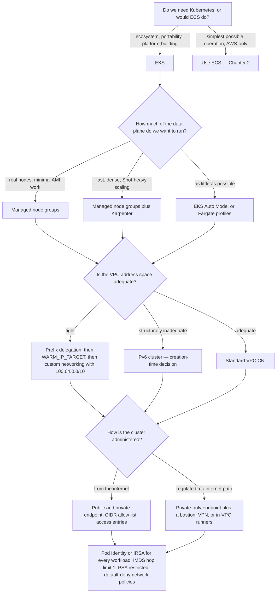

| Quality | What it means here | Design levers | The trade-off you accept |
|---|---|---|---|
| **Availability** | Surviving an AZ failure and a control plane impairment | Three AZs, `topologySpreadConstraints`, PodDisruptionBudgets, multiple replicas, no API dependency on the request path | Spreading costs cross-AZ data transfer; PDBs can block node upgrades |
| **Scalability** | Adding capacity fast enough and far enough | Karpenter, prefix delegation, adequate subnets, HPA with the right metric | Faster scaling means more EC2 API calls and less bin-packing stability |
| **Security** | Least privilege at every layer | Per-Pod IAM, IMDS hop limit 1, PSA, network policies, private endpoint, audit logs | Every control adds friction; private endpoints add network engineering |
| **Cost** | Not paying for idle or duplicated capacity | Spot, Graviton, Karpenter consolidation, right-sized requests, topology aware routing, staying in standard support | Density concentrates risk; Spot adds interruption handling; consolidation churns Pods |
| **Operability** | What the team must understand and maintain | Managed node groups, EKS add-ons, Auto Mode, GitOps | Managed options reduce control; the more AWS runs, the less you can tune |
| **Portability** | How much of this runs elsewhere | Standard manifests, avoiding AWS-specific annotations where practical | Portability means giving up ALB Ingress, EBS storage classes, and IRSA — usually not worth it |
| **Latency** | Time from request to response, and from Pod scheduled to Pod ready | IP-mode targets, topology aware routing, small images, warm IP pools, node pre-provisioning | Every latency optimisation is capacity held idle or a hop removed at some cost |

!!! danger "Kubernetes upgrades are the recurring obligation people forget to design for"

    A Kubernetes minor version leaves standard support after roughly fourteen months, and the extended-support price is about six times higher. That means **a cluster must be upgraded roughly every year, one minor version at a time, and the upgrade is effectively one-way** — a control plane rollback is possible only within a short window after the upgrade, and nodes and add-ons must be reverted separately. Each upgrade requires checking deprecated APIs, updating add-ons, and replacing nodes. Teams that do not plan for this end up either paying the extended-support premium indefinitely or performing a rushed multi-version upgrade under CVE pressure. Design the upgrade path — a non-production cluster that upgrades first, add-on versions pinned in IaC, deprecated API scanning in CI — on day one.

---

## AWS Best Practices

### Operational Excellence

Define the cluster, node groups, add-ons, and IAM in infrastructure as code — `eksctl` configuration files, CloudFormation, CDK, or Terraform — so a cluster can be rebuilt rather than repaired. Manage the core add-ons **as EKS add-ons with pinned versions** rather than as manifests you forgot you applied. Adopt GitOps (Argo CD or Flux) so the cluster's desired state is a Git repository and drift is visible. Run a non-production cluster one version ahead so upgrades are rehearsed rather than discovered. Enable control plane logging before you need it. Establish a node rotation cadence — managed node group updates or Karpenter drift and expiry — so nodes are cattle and the AMI is never a year old.

### Security

Use `API` authentication mode with access entries, and create a second cluster-admin access entry immediately after cluster creation so the cluster does not depend on one principal. Give every workload its own IAM role through Pod Identity or IRSA, and enforce IMDSv2 with a hop limit of 1 so the node role cannot be borrowed. Enable envelope encryption of Secrets with a customer-managed KMS key and protect that key from deletion. Run nodes in private subnets. Enable `audit` and `authenticator` control plane logs and ship them somewhere queryable. Apply Pod Security Admission at `restricted` in application namespaces. Adopt default-deny network policies namespace by namespace. Scan images in ECR and pin by digest. Enable GuardDuty EKS Protection for audit log analysis and runtime monitoring.

### Reliability

Spread across three Availability Zones and express it with `topologySpreadConstraints`, not hope. Set PodDisruptionBudgets so voluntary disruptions — node upgrades, Karpenter consolidation, drains — cannot take a service below its minimum. Define resource **requests** accurately, because the scheduler uses requests and only requests; a Pod without requests is a Pod the scheduler believes is free. Use readiness probes that actually test readiness, and startup probes for slow-starting applications, so a Pod does not receive traffic before it can serve it. Run at least two replicas of everything that matters, including CoreDNS. Keep the four core add-ons current. Understand that a control plane impairment stops change but not traffic, and design so that nothing on the request path requires an API call.

### Performance Efficiency

Enable prefix delegation so nodes reach their compute capacity rather than their IP ceiling. Use IP-mode target groups so the load balancer talks to Pods directly. Use topology aware routing for chatty internal services. Right-size requests and limits from observed usage — over-requesting is the largest and least visible waste in most clusters. Keep images small, since every scale-out and every node replacement pays the pull. Use Graviton instances where the workload supports ARM. Prefer Karpenter where scale-out latency matters, since it launches instances directly rather than adjusting an Auto Scaling group.

### Cost Optimization

Stay in standard support; the extended-support premium is the easiest large saving in EKS. Consolidate small clusters where isolation requirements allow, because the per-cluster fee is charged whether the cluster runs one Pod or a thousand. Use Spot capacity above an On-Demand base for interruption-tolerant workloads, with several instance types for pool diversity. Let Karpenter consolidate under-utilised nodes. Right-size requests, because unused requested capacity is capacity you cannot schedule anything else onto. Reduce cross-AZ chatter with topology aware routing. Use Graviton. Tag nodes and namespaces so cost allocation is possible at all, and use Kubecost or AWS split cost allocation data to see per-namespace spend.

### Sustainability

The levers are the same as for cost, because both are functions of utilisation: right-sized requests, Karpenter consolidation, Graviton's better performance per watt, Spot capacity that uses otherwise-idle inventory, and scaling to a genuine floor overnight. Consolidating several under-utilised clusters into one — with namespaces and network policies providing the isolation — is often the single largest reduction available.

---

## Security Considerations

**The node role is the security boundary that fails first.** Without per-Pod identity and IMDS restrictions, every Pod on a node can assume the node's role. A public-facing service with a server-side request forgery bug then has whatever that role has — and the node role tends to accumulate permissions because it is the path of least resistance. The remediation is two settings: per-Pod identity through Pod Identity or IRSA, and `HttpPutResponseHopLimit: 1` with IMDSv2 required. Neither works without the other.

**Authentication and authorization are separate systems, and both need designing.** IAM decides who reaches the API server; RBAC decides what they may do. Grant IAM principals cluster access through access entries with the least-privilege managed policy and a namespace access scope. Reserve `AmazonEKSClusterAdminPolicy` for a break-glass role. Remember that `system:masters` cannot be restricted by RBAC — a principal in that group is unconditionally an administrator, which is why the implicit cluster-creator grant deserves attention.

**Admission control is where policy is actually enforced.** Pod Security Admission blocks privileged Pods, host networking, and host path mounts by namespace label. A policy engine (Kyverno, OPA Gatekeeper) extends this to organisational rules: required labels, disallowed registries, mandatory resource requests. Both run as part of the write path, which is why a policy engine's availability becomes a cluster-wide concern and why its `failurePolicy` is a deliberate decision.

**Network segmentation has two independent tools.** Network policies are Kubernetes-native, cheap, and expressive, enforced by the VPC CNI or Calico; they are the right default. Security groups for Pods enforce in the VPC itself, are visible to security tooling that does not understand Kubernetes, and are the right choice for a boundary that must hold against a compromised cluster — for example, restricting which Pods may reach a database.

**Secrets deserve more than base64.** Enable KMS envelope encryption. For anything that rotates or must not be readable by cluster administrators, use AWS Secrets Manager through the Secrets Store CSI Driver, with the Pod's own IAM role granting access to only its own secrets.

**Supply chain matters as much as runtime.** Scan images in ECR, pin by digest rather than by tag so the deployed bytes are the scanned bytes, restrict which registries the cluster may pull from with a policy engine, and keep node AMIs current through managed node group updates or Karpenter's drift detection.

!!! danger "`system:masters` is invisible to RBAC and to most audits"

    RBAC cannot limit a principal in the `system:masters` group; the API server short-circuits authorization for it. This means an `aws-auth` entry or access entry granting that group is an unrestricted grant that no Role or ClusterRole review will reveal. Audit for it explicitly, prefer `AmazonEKSClusterAdminPolicy` on a named break-glass role, and alarm on its use in the control plane audit log.

---

## Performance Optimization

**Remove the hop.** IP-mode target groups let the load balancer connect directly to Pods, eliminating the NodePort hop, the second `kube-proxy` translation, and the possible cross-AZ detour that instance mode introduces. This is usually the largest single latency improvement available to an EKS service, and it costs nothing.

**Stop paying for zone crossings you did not intend.** Topology aware routing keeps Service traffic in-zone when the endpoint distribution allows it. For very chatty internal calls it reduces both latency and the inter-AZ data transfer bill. Use it where replicas exist in every zone; avoid it where a small replica count would let one zone become overloaded.

**Make Pods start faster.** Pod start-up is image pull plus IP assignment plus container start plus probe success. Small images and a warm image cache dominate; a warm IP pool removes the ENI attachment wait; a correctly tuned `startupProbe` stops the `kubelet` killing a slow application while also not delaying readiness for a fast one.

**Make nodes appear faster.** Cluster Autoscaler adjusts an Auto Scaling group and waits; Karpenter calls EC2 directly with a set of acceptable instance types and typically produces a ready node substantially sooner. Where scale-out latency is on the user-visible path, that difference is the design.

**Right-size requests, and understand what they do.** The scheduler places Pods using **requests**, not usage. Over-requesting wastes capacity invisibly — nodes appear full while their CPU graphs are flat. Under-requesting causes eviction and noisy-neighbour effects. Set CPU requests from observed usage and generally avoid CPU *limits* on latency-sensitive services (throttling is worse than brief over-use); set memory requests and limits equal for predictable eviction behaviour.

**Enable prefix delegation.** A node that could run 110 Pods and is capped at 29 is being wasted at four times its cost. This is one of the few settings that is free, large, and almost always right.

**Watch the control plane's own limits.** Very large clusters degrade through API server load: unbounded `list` calls from badly written controllers, huge numbers of Secrets or ConfigMaps, and chatty custom resources. Prefer watches and informers over polling, and paginate.

---

## Cost Optimization

| Lever | Mechanism | Caution |
|---|---|---|
| **Stay in standard support** | Upgrade annually | The extended-support price is roughly six times the base; this is usually the largest single saving |
| **Fewer, larger clusters** | Namespaces plus network policies for isolation | The per-cluster fee is fixed; but a shared cluster shares a blast radius and an upgrade schedule |
| **Spot above an On-Demand base** | Karpenter or managed node groups with mixed instances | The base must carry floor traffic alone; handle the two-minute interruption notice |
| **Graviton** | ARM instance families | Requires multi-architecture images; check every dependency |
| **Karpenter consolidation** | Automatic replacement of under-utilised nodes with cheaper ones | Causes Pod churn; PodDisruptionBudgets and `do-not-disrupt` annotations bound it |
| **Right-sized requests** | Vertical Pod Autoscaler in recommendation mode, or observed usage | The largest invisible waste in most clusters |
| **Prefix delegation** | One CNI setting | Turns IP-bound nodes into compute-bound nodes at no cost |
| **Topology aware routing** | An annotation | Reduces inter-AZ data transfer; can skew load with few replicas |
| **Fargate for spiky, small workloads** | Fargate profiles | Per-Pod pricing beats a node that is 10 per cent used; worse for steady, dense workloads |
| **Scheduled scale-down** | Cron-driven HPA bounds or Karpenter limits | Only for load that genuinely follows a human schedule |
| **Delete idle clusters** | Governance | Development clusters left running are pure cost with a per-hour floor |

**The largest EKS cost mistakes are structural rather than tactical.** A fleet of twenty small clusters pays twenty control plane fees for work that three clusters could do. A cluster left on an unsupported version pays a six-fold premium indefinitely. And requests set to "whatever the example used" waste more capacity than any Spot strategy recovers, because they multiply across every replica of every service.

!!! tip "Measure per-namespace cost before optimising"

    Without cost visibility per namespace or team, optimisation is guesswork. AWS split cost allocation data for EKS, or Kubecost, attributes node cost to Pods by requested resources. This usually reveals that a small number of over-requesting workloads account for most of the waste — and it converts an abstract efficiency argument into a specific conversation with a specific team.

---

## Monitoring and Observability

| Signal | Source | What it tells you |
|---|---|---|
| **Control plane `audit` log** | CloudWatch Logs | Every Kubernetes API request with its identity and outcome; the only record of who did what in-cluster |
| **`authenticator` log** | CloudWatch Logs | Why an IAM principal was or was not mapped; the answer to most `Unauthorized` questions |
| **`apiserver_request_duration_seconds`** | Prometheus metrics from the API server | Control plane latency and saturation |
| **Node conditions** | `kubectl get nodes`, Container Insights | `NotReady`, `MemoryPressure`, `DiskPressure`, `PIDPressure` — the first place a node problem appears |
| **Pending Pods and their events** | `kubectl describe pod`, Container Insights | Insufficient CPU or memory, no matching node, or `failed to assign an IP address` |
| **`awscni_total_ip_addresses` / `awscni_assigned_ip_addresses`** | VPC CNI metrics | How close each node is to IP exhaustion — the metric most clusters do not have and need |
| **Subnet free IP count** | CloudWatch, VPC | Whether the cluster is approaching a structural address limit |
| **`kubelet` restart and OOMKill counts** | Container Insights | Memory limits set too low, or a leak |
| **Pod restart counts** | Container Insights | Crash loops; a sustained non-zero rate is never normal |
| **HPA desired versus current replicas** | metrics-server, Container Insights | Whether autoscaling is working or capped |
| **Unschedulable Pod duration** | Karpenter or Cluster Autoscaler metrics | How long capacity takes to appear — the number that matters for scale-out latency |
| **ALB `TargetResponseTime`, `UnHealthyHostCount`, 5xx** | CloudWatch | The user-facing view, and the deployment-failure signal |
| **Cross-AZ data transfer** | Cost Explorer, VPC Flow Logs | Whether topology-blind routing is costing real money |
| **CoreDNS request rate and errors** | CoreDNS metrics | DNS is the most common invisible cause of latency and intermittent failure in Kubernetes |
| **GuardDuty EKS findings** | GuardDuty | Suspicious API activity and runtime behaviour |
| **CloudTrail EKS events** | CloudTrail | Cluster, node group, add-on, and access entry changes — *not* Kubernetes API calls |

**Three dashboards worth building.** A **capacity dashboard** showing, per node group, allocatable versus requested CPU and memory *and* assigned versus total IP addresses — because on EKS you can run out of any of the three. A **control plane dashboard** showing API server latency and error rates alongside `audit` log volume. And a **workload dashboard** per service showing replica counts, restarts, probe failures, and the ALB metrics on one time axis.

!!! tip "The two logs that answer most EKS questions"

    `kubectl describe pod` events answer almost every "why is this Pod not running" question — insufficient resources, no matching node, image pull failure, IP exhaustion, volume attachment failure — in plain text. The **`authenticator` control plane log** answers almost every "why can't I connect" question. Reaching for either before reasoning about what the system might be doing saves hours, and this is the single most useful operational habit to build in this module.

---

## Integration with Other AWS Services

| Service | Why it integrates with EKS |
|---|---|
| **Amazon EC2** | The instances behind managed node groups, self-managed nodes, and Karpenter |
| **Amazon VPC** | The network Pods live in; subnets, route tables, security groups, and the address plan |
| **Elastic Load Balancing** | ALBs for Ingress, NLBs for Services, via the AWS Load Balancer Controller |
| **AWS IAM and STS** | Cluster authentication, and per-Pod roles through IRSA or Pod Identity |
| **Amazon ECR** | The registry nodes pull from, authenticated by the node role; image scanning |
| **Amazon EBS, EFS, FSx, S3** | Persistent storage through CSI drivers and Mountpoint for S3 |
| **AWS KMS** | Envelope encryption of Secrets, and encryption of EBS volumes |
| **AWS Secrets Manager and Parameter Store** | Runtime secret injection through the Secrets Store CSI Driver |
| **Amazon CloudWatch** | Control plane logs, container logs and metrics, Container Insights, alarms |
| **Amazon Managed Service for Prometheus and Grafana** | The Kubernetes-native metrics path without running Prometheus yourself |
| **AWS X-Ray and AWS Distro for OpenTelemetry** | Distributed tracing across Pods and AWS services |
| **AWS CloudTrail** | Audit of EKS control plane API calls |
| **Amazon GuardDuty** | EKS Protection: audit log analysis and runtime threat detection |
| **AWS Certificate Manager** | TLS certificates terminated at the ALB or NLB |
| **Amazon Route 53** | DNS for Ingress hostnames, automated by ExternalDNS |
| **AWS App Mesh alternatives and service meshes** | Istio, Linkerd, or Cilium for mTLS and traffic management |
| **AWS CodePipeline, CodeBuild, Argo CD, Flux** | The delivery path from commit to cluster |
| **AWS CloudFormation, CDK, Terraform, `eksctl`** | Declarative cluster and node group definition |
| **AWS Controllers for Kubernetes (ACK)** | Manage AWS resources — S3 buckets, RDS instances, SQS queues — as Kubernetes custom resources |
| **Amazon SQS, SNS, EventBridge** | The messaging services Pods integrate with, using per-Pod IAM roles |

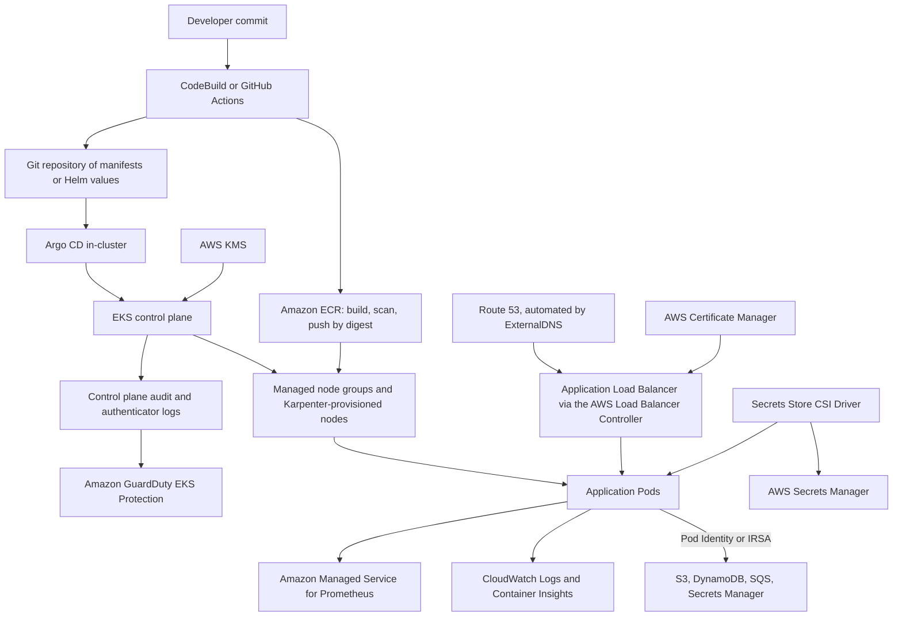

Read architecturally, this diagram separates three flows that are often conflated. The **delivery flow** (commit to ECR to Git to Argo CD to the API server) never touches the running data plane directly. The **runtime flow** (Route 53 to ALB to Pod to AWS services) never touches the control plane at all, which is what makes a control plane impairment survivable. And the **identity flow** — Pod Identity or IRSA connecting a ServiceAccount to an IAM role — is the only thing standing between a compromised Pod and the rest of the account.

---

## Common Architecture Patterns

### Managed node groups in three private subnets

The baseline production topology: three private subnets across three Availability Zones, managed node groups spanning all three, an internet-facing ALB in public subnets, and NAT gateways for egress. Everything else in this chapter is a refinement of this shape. Its virtue is that it has no unusual failure modes and every AWS troubleshooting document assumes it.

### Karpenter for just-in-time, heterogeneous capacity

Rather than pre-defining instance types in Auto Scaling groups, Karpenter reads pending Pods' actual requirements and launches instances that fit, choosing from a broad set of types and preferring Spot where allowed. It also consolidates: when Pods could fit on fewer or cheaper nodes, it replaces them. The trade is Pod churn and a controller you must run and upgrade. For clusters with variable, heterogeneous workloads it is usually a large improvement in both cost and scale-out latency.

### Fargate for isolation-sensitive or bursty namespaces

Rather than choosing Fargate for the whole cluster, apply a Fargate profile to specific namespaces: untrusted or multi-tenant workloads that benefit from per-Pod isolation, CI runners that are bursty and short-lived, or small services whose node would sit idle. Nodes remain available for everything that needs a node.

### Per-Pod IAM with the metadata service blocked

Every workload has its own ServiceAccount bound to its own least-privilege IAM role through Pod Identity or IRSA, and every node enforces IMDSv2 with a hop limit of 1. This is the pattern that makes a compromised Pod a contained incident rather than an account-wide one, and it is the single most valuable security pattern in this chapter.

### GitOps with Argo CD or Flux

The cluster's desired state is a Git repository; a controller in the cluster reconciles toward it. Deployment becomes a pull request; rollback becomes a revert; drift is detected and reported. It also removes the need for CI systems to hold cluster credentials, which matters more once the endpoint is private.

### The AWS Load Balancer Controller with IP-mode targets

One ALB fronting many Services through Ingress rules, registering Pod IPs directly. Combined with ExternalDNS for Route 53 records and ACM for certificates, this is the standard external exposure pattern on EKS, and IP mode is what makes it efficient.

### Cluster per environment, namespace per team

Separate clusters for production and non-production — different blast radius, different upgrade schedule, different access — with namespaces, resource quotas, network policies, and RBAC providing isolation between teams inside each. This balances the per-cluster fee and operational burden against genuine isolation requirements. The alternative, a cluster per team, multiplies cost and upgrade work and is justified only by hard compliance boundaries.

### Multi-cluster for blast radius or regional resilience

Two or more clusters, in different Regions or in the same Region, with traffic distributed by Route 53 or Global Accelerator and state replicated at the data layer. This is the answer to "what if the cluster itself is the problem" — a bad admission webhook, a failed upgrade, a Region event. It is expensive and complex and should be justified by a specific requirement rather than adopted by default.

---

## Industry Use Cases

| Sector | Workload | EKS configuration | Reasoning |
|---|---|---|---|
| Higher education | Multi-department platform | One cluster, namespace per department, quotas and network policies, `AmazonEKSEditPolicy` scoped per namespace | One control plane fee; strong enough isolation for internal teams |
| Higher education | Research batch computing | Karpenter with Spot and GPU node pools, taints and tolerations | Interruption-tolerant, bursty, and cost-dominated |
| E-commerce | Storefront and checkout | Managed node groups across three AZs, IP-mode ALB, HPA on requests per Pod, PDBs | Availability-critical and latency-sensitive |
| E-commerce | Order processing workers | Karpenter Spot node pool, KEDA scaling on SQS backlog per Pod | The Chapter 2.3 lesson, expressed in Kubernetes |
| Financial services | Payment services | Private-only endpoint, security groups for Pods, PSA `restricted`, KMS Secrets encryption, GuardDuty | Regulatory requirements enforced in the VPC, not only in the cluster |
| Financial services | Risk computation | Graviton node pools, right-sized requests, Karpenter consolidation | CPU-dominated cost with a portable workload |
| Media | Video transcoding | GPU node groups with taints, Spot with several instance families | Expensive capacity that must not be idle and can absorb interruption |
| Media | Content APIs | CloudFront to ALB to IP-mode targets, topology aware routing | Latency and inter-AZ transfer both matter at volume |
| Healthcare | Integration and interoperability services | Fargate profiles for third-party adapters, network policies, per-Pod IAM | Untrusted third-party code isolated at the Pod level |
| Telecommunications | Edge and on-premises workloads | EKS Hybrid Nodes joined to a cloud control plane | Latency and data residency force compute on-premises; management stays central |
| SaaS | Multi-tenant platform | Namespace per tenant with quotas and network policies, or cluster per tier for large tenants | The classic isolation-versus-cost decision, made per tenant tier |
| Government | Multi-supplier portal | Cluster per supplier or namespace per supplier, access entries per supplier role, GitOps | Independence of delivery with a centrally enforced safety floor |
| Machine learning | Training and inference | GPU node groups, Karpenter, ACK for S3 and SageMaker integration, IRSA for data access | Heterogeneous, expensive, bursty capacity with strong data-access controls |

---

## Advantages

**The control plane's hardest parts are simply gone.** `etcd` quorum, control plane PKI, API server high availability, and control plane patching are AWS's problem, delivered with a multi-AZ architecture and an SLA. This is not a marginal convenience; it removes the class of incident that most commonly destroys self-managed Kubernetes clusters.

**Upstream conformance means the ecosystem works.** Helm charts, operators, CRDs, service meshes, and Kubernetes-native tooling run unmodified. The value of Kubernetes is largely the value of what other people have built on it, and EKS preserves all of it.

**Native VPC networking makes Pods first-class AWS citizens.** A Pod with a real VPC IP address can be a load balancer target, can be reached from anything in the VPC, appears in Flow Logs, and can carry its own security groups. Overlay-based platforms need gateways and translation to achieve any of this.

**Identity integration is genuinely fine-grained.** A Pod can hold an IAM role scoped to exactly the resources it needs, with credentials that are short-lived and automatically rotated, and its role assumption is visible in CloudTrail. Few platforms offer per-workload cloud identity this cleanly.

**The data plane is a spectrum, not a choice.** Managed node groups, Karpenter, Fargate, Auto Mode, and hybrid nodes can coexist in one cluster, so a workload that needs a GPU, a workload that needs isolation, and a workload that needs to burst can each get the right substrate without a separate platform.

**Access management moved outside the cluster.** Access entries make cluster permissions an EKS API concern — auditable in CloudTrail, expressible in Terraform, immune to the ConfigMap lockout that has stranded countless self-managed clusters.

**Portability is real where it matters.** Workload manifests move to any conformant Kubernetes. The parts that do not move — ALB Ingress annotations, EBS storage classes, IRSA — are precisely the integrations you would have to rebuild anyway on another platform, and are a conscious trade rather than a hidden lock-in.

---

## Limitations

**Kubernetes is a large conceptual surface, and EKS does not shrink it.** Pods, Deployments, Services, Ingresses, ConfigMaps, Secrets, ServiceAccounts, RBAC, CRDs, admission control, probes, requests and limits, taints and tolerations, affinities, topology spread — a team must learn all of it. Compared with ECS, the time to a first correct production deployment is substantially longer, and the number of ways to be subtly wrong is much larger.

**You still operate the data plane.** Node AMIs, `kubelet` versions, the four core add-ons, the load balancer controller, CSI drivers, metrics-server, and any operator you installed are all yours to keep current and compatible. "Managed Kubernetes" manages half the cluster.

**The upgrade obligation is permanent and one-directional.** Roughly annual minor version upgrades, one version at a time, with no rollback, with deprecated API checks and add-on compatibility to verify each time. This is the recurring cost that surprises teams most.

**IP address planning is a hard constraint that CPU dashboards do not show.** The VPC CNI's native addressing is a real benefit that is paid for with an address budget, and exhausting it stops scheduling regardless of available compute. Remedies exist; the structural one (IPv6) is creation-time only.

**The per-cluster fee penalises fragmentation.** A flat hourly charge per cluster means many small clusters cost meaningfully more than a few large ones, which pushes toward shared clusters and therefore toward shared blast radius and shared upgrade schedules.

**The control-plane-to-VPC path is a genuine failure mode.** Admission webhooks, `exec`, `logs`, and metrics all depend on the control plane reaching into your VPC through cross-account ENIs. Security group and endpoint changes break it, and the resulting failures — `failed calling webhook` blocking all deployments — are severe and non-obvious.

**Fargate on EKS is a narrower product than Fargate on ECS.** No DaemonSets, no privileged containers, no host ports or host networking, no GPUs, no EBS volumes (EFS only), a fixed set of CPU and memory combinations, longer start-up, and no EKS Pod Identity. It is excellent for what fits and unusable for what does not.

**Cross-AZ traffic is charged and Kubernetes is topology-blind by default.** Without topology aware routing, a multi-AZ cluster sends most internal Service traffic across zone boundaries and pays for it in both directions.

**Cost attribution requires additional tooling.** A shared cluster's EC2 bill does not decompose into namespaces without split cost allocation data or a third-party tool, which makes chargeback and optimisation conversations harder than they are on ECS with per-task tagging.

---

## Common Mistakes

### Beginner Mistakes

| Mistake | Why it is wrong | What to do instead |
|---|---|---|
| Creating a cluster with a CI role, then trying `kubectl` as a human | The creator's admin grant is implicit and invisible; you are `Unauthorized` | Create an explicit cluster-admin access entry for a human-assumable role immediately |
| Confusing `Unauthorized` with `Forbidden` | They are different systems; widening IAM does not fix an RBAC problem | `Unauthorized` = no access entry; `Forbidden` = no RoleBinding |
| Using `t3.medium` nodes and wondering why Pods are `Pending` | Seventeen Pods maximum, several already consumed by system components | Larger instances, or prefix delegation, or both |
| Reusing a VPC with `/24` subnets | Every Pod takes a VPC address; you exhaust the subnet long before the CPU | Plan subnets for Pod density; enable prefix delegation |
| Giving Pods AWS access through the node role | Every Pod inherits every permission | Pod Identity or IRSA, plus IMDS hop limit 1 |
| No resource requests | The scheduler thinks the Pod is free, packs the node, and everything degrades | Set requests from observed usage; they are the scheduling input |
| One replica of everything | No availability during a node replacement, let alone an AZ event | At least two replicas plus a PodDisruptionBudget |
| No readiness probe | Traffic arrives before the application can serve it | A readiness probe that tests actual readiness, and a startup probe if start-up is slow |
| Nodes in public subnets | Unnecessary internet exposure of the whole data plane | Private subnets with NAT or VPC endpoints for egress |
| `latest` image tags | The deployed bytes are not the scanned bytes, and rollback is meaningless | Immutable tags and digest pinning, exactly as in 2.1 |
| Installing add-ons as loose manifests | Nobody knows what version is running or how to update it | EKS add-ons with pinned versions in IaC |
| Believing Fargate is a drop-in replacement for nodes | No DaemonSets, no EBS, no GPUs, no privileged containers | Use Fargate for namespaces whose workloads fit its model |

### Production Mistakes

| Mistake | Consequence | Remedy |
|---|---|---|
| Tightening the cluster security group without understanding webhook traffic | All deployments fail with `failed calling webhook` | Allow control plane to node traffic on webhook ports; test after every security group change |
| A webhook with `failurePolicy: Fail` and one replica | A single Pod failure blocks every matching write cluster-wide | Multiple replicas, a PodDisruptionBudget, and `Ignore` for non-security-critical webhooks |
| Never updating the core add-ons | Version skew with the control plane; subtle networking and DNS failures | Manage as EKS add-ons and update them as part of every cluster upgrade |
| Letting a cluster fall into extended support | About six times the control plane price, indefinitely | An annual upgrade cadence rehearsed in non-production |
| No PodDisruptionBudgets | Node upgrades and consolidation drain services below capacity | A PDB for every service with more than one replica |
| Enabling private-only endpoints without an administration path | CI/CD and humans are locked out; the usual fix is to re-open publicly to `0.0.0.0/0` | Solve the network path first: bastion, VPN, or in-VPC runners |
| Scheduling everything on Spot | A capacity event removes the whole cluster's workload | An On-Demand base sized for floor traffic; diverse instance types above it |
| Ignoring the CNI's IP metrics | Scale-out fails at a random future moment with no warning | Alarm on assigned versus total addresses per node and on subnet free IPs |
| KMS key for Secrets deleted or made inaccessible | Every Secret becomes unreadable; the cluster is unrecoverable | A key policy that prevents deletion; the key in the same account and Region |
| Granting `system:masters` broadly | An unrestricted grant that RBAC review cannot see | Managed access policies on named roles; audit for `system:masters` |
| CoreDNS left at two replicas in a large cluster | DNS becomes the cluster's bottleneck and its most confusing failure | Scale CoreDNS with cluster size; monitor its error rate and latency |
| Cluster upgraded without checking deprecated APIs | Workloads break after an upgrade that is effectively one-way | Scan manifests in CI; upgrade a non-production cluster first |

### Certification Traps

| Trap | The reality |
|---|---|
| "EKS manages the worker nodes" | Only with Auto Mode or Fargate. Standard EKS manages the control plane; nodes are yours |
| "The control plane runs in your VPC" | It runs in an AWS-managed VPC; only cross-account ENIs are in yours |
| "A control plane outage stops running Pods" | Running Pods continue; what stops is change |
| "IAM permissions grant Kubernetes access" | IAM authenticates; RBAC authorizes; an access entry connects them |
| "`AdministratorAccess` makes you a cluster admin" | It does not. Without an access entry you are `Unauthorized` |
| "Pods get overlay IPs" | With the VPC CNI they get real, routable VPC addresses |
| "Pod density depends only on CPU and memory" | ENI and IP limits usually bind first, unless prefix delegation is enabled |
| "IRSA and Pod Identity are the same mechanism" | IRSA uses OIDC federation; Pod Identity uses an agent and an EKS association, and does not work on Fargate |
| "Kubernetes Secrets are encrypted by default" | They are base64-encoded; `etcd` volumes are encrypted, but envelope encryption with KMS is opt-in |
| "Fargate supports DaemonSets" | It does not — there is no node to run one on |
| "You can downgrade a cluster version at any time" | Upgrades go one minor version at a time; a control plane rollback is possible only within a short window after the upgrade, and nodes and add-ons must be reverted separately |
| "Cluster Autoscaler and Karpenter are the same thing" | Cluster Autoscaler adjusts Auto Scaling groups; Karpenter launches instances directly and consolidates |
| "Instance mode and IP mode targeting differ only in configuration" | IP mode removes a hop, preserves the client IP more simply, and is required on Fargate |
| "Network policies work out of the box" | They require an enforcing plugin: the VPC CNI with network policy enabled, or Calico |
| "The `aws-auth` ConfigMap is still the recommended approach" | Access entries replaced it; new clusters should use `API` authentication mode |

---

## Interview Questions

### Conceptual Questions

**1. Describe the Amazon EKS architecture and explain precisely which components AWS operates and which you operate.**

EKS splits a Kubernetes cluster along a boundary. On AWS's side, in an AWS-owned account and VPC, sit the control plane components: at least two `kube-apiserver` instances and three `etcd` instances distributed across three Availability Zones, plus the scheduler, the controller manager, the cloud controller manager, and the AWS IAM Authenticator webhook. AWS operates, patches, scales, and replaces these, and carries an availability SLA on the API server endpoint. On your side, in your VPC, sits the data plane: EC2 instances or Fargate capacity running `kubelet`, `kube-proxy`, and `containerd`, along with your Pods and the cluster's DaemonSet components — the VPC CNI, CoreDNS, CSI drivers, and any controllers you install. Those are yours to size, patch, and keep version-compatible, even though AWS publishes validated builds of the core ones as EKS add-ons. The boundary is crossed in both directions: every `kubelet` holds an outbound TLS connection to the cluster endpoint, and the API server reaches inbound through **cross-account elastic network interfaces** that EKS creates in your subnets — a path used by `kubectl exec`, `logs`, `port-forward`, the metrics API, and every admission webhook. The practical value of understanding the boundary is diagnostic: a control plane problem manifests as API errors and is AWS's to fix, whereas a data plane problem manifests as Pods that will not start and is yours, and the features that break when the inbound path is blocked are exactly the ones you need during an incident.

**2. Explain the Amazon VPC CNI's design decision and its consequences.**

Most Kubernetes networking plugins give Pods addresses on an overlay network and encapsulate cross-node traffic. The Amazon VPC CNI instead assigns each Pod a **real, routable IP address from your VPC subnet**, taken from secondary addresses on elastic network interfaces attached to the node and managed by `ipamd` inside the `aws-node` DaemonSet, which maintains a warm pool so Pod start-up does not wait on an EC2 API call. The benefits are substantial: no encapsulation overhead, so Pod-to-Pod throughput approaches instance network performance; Pod traffic visible in VPC Flow Logs; Pods reachable directly from anything in the VPC; load balancers able to register **Pod IPs as targets**, removing the NodePort hop; and security groups applicable to individual Pods through branch ENIs. The cost is that **Pod density is bounded by IP addresses rather than by compute**. Without prefix delegation the ceiling is `(ENIs × (IPs per ENI − 1)) + 2`, which caps an `m5.large` at 29 Pods regardless of how much CPU is idle, and the default warm-pool behaviour allocates whole ENIs' worth of addresses at a time, so a lightly loaded node can hold thirty addresses. In a VPC with `/24` subnets this exhausts the address space long before the compute, and the failure — `failed to assign an IP address to container` — appears at 40 per cent CPU with nothing on a CPU dashboard to explain it. The remedies are prefix delegation, which multiplies density by up to sixteen for free; `WARM_IP_TARGET` and `MINIMUM_IP_TARGET`, which make allocation demand-driven; custom networking onto a `100.64.0.0/10` secondary CIDR; and, structurally, an IPv6 cluster — which must be chosen at creation time.

**3. Explain how a `kubectl` command is authenticated and authorized on EKS, and why an IAM administrator can be refused.**

There are two independent systems and they run in sequence. **Authentication** is AWS IAM's job. The `kubectl` credential plugin — `aws eks get-token` — constructs a pre-signed SigV4 request to `sts:GetCallerIdentity`, base64-encodes it as a bearer token valid for about fifteen minutes, and sends it to the API server. The AWS IAM Authenticator webhook inside the control plane executes that pre-signed request against STS, which returns the ARN of whoever signed it, and then looks up an **access entry** (or, on legacy clusters, the `aws-auth` ConfigMap) mapping that ARN to a Kubernetes username and groups. If no mapping exists, the request is `Unauthorized` — and this is precisely why an IAM principal with `AdministratorAccess` can be refused: unlimited AWS permissions say nothing about who you are inside the cluster. **Authorization** is then Kubernetes RBAC's job: the API server evaluates Roles, ClusterRoles, and their bindings against the authenticated username and groups, and returns `Forbidden` if nothing grants the verb on the resource in the namespace. The two error messages are the diagnostic — `Unauthorized` means authentication, so create an access entry; `Forbidden` means authorization, so bind a role or associate an access policy. Two further details matter operationally: the IAM principal that created the cluster holds an implicit, invisible `system:masters` grant, which is why creating a cluster with a CI role and then trying `kubectl` as a human fails confusingly; and `system:masters` itself cannot be constrained by RBAC, so it should be reserved for a named break-glass role rather than granted broadly.

**4. Compare IRSA and EKS Pod Identity, and say which you would choose.**

Both give a Pod its own IAM role rather than letting it use the node's, which is the actual security objective — without per-Pod identity the node role accumulates the union of every workload's permissions and a single compromised Pod inherits all of them. **IRSA** works through OIDC federation: the cluster publishes an OIDC discovery endpoint, you register it as an IAM identity provider, a control plane webhook injects a short-lived projected service account token plus `AWS_ROLE_ARN` and `AWS_WEB_IDENTITY_TOKEN_FILE` into any Pod whose ServiceAccount carries the `eks.amazonaws.com/role-arn` annotation, and the SDK calls `sts:AssumeRoleWithWebIdentity`. The role's trust policy names that cluster's OIDC issuer and conditions on the `sub` claim, so it is scoped to one namespace and ServiceAccount in one cluster. **EKS Pod Identity** removes the federation plumbing: you install the Pod Identity Agent add-on, then create an association through the EKS API binding a namespace and ServiceAccount to a role; the agent serves credentials over a link-local endpoint, and the role trusts `pods.eks.amazonaws.com` with `sts:AssumeRole` and `sts:TagSession`. The practical differences: Pod Identity roles are **reusable across clusters without trust policy edits**, which removes real friction in a multi-cluster estate, and it carries session tags identifying cluster, namespace, and ServiceAccount; IRSA requires an OIDC provider and a trust policy update per cluster but **works on Fargate**, where Pod Identity does not because its agent is a DaemonSet. So: Pod Identity for EC2-backed workloads on new clusters, IRSA for Fargate Pods and where the OIDC pattern is needed for portability. And either one is decorative unless nodes enforce IMDSv2 with a hop limit of 1, because otherwise a Pod can simply take the node role instead.

**5. What actually happens when you run `kubectl apply -f deployment.yaml`, and why does the command return before anything is running?**

The API server authenticates the request, authorizes it through RBAC, runs the **mutating admission** webhooks (which may inject sidecars or credentials), validates the object against the schema, runs the **validating admission** webhooks (Pod Security Admission, policy engines), and persists the Deployment to `etcd`. At that point it returns `201 Created` — and **the command is done**, because everything after this is asynchronous reconciliation. The Deployment controller, watching the API server, creates a ReplicaSet; the ReplicaSet controller creates Pod objects with no `nodeName`; the scheduler watches for unscheduled Pods, filters nodes by resource requests, taints, affinity and topology constraints, scores the survivors, and writes a Binding; the `kubelet` on the chosen node sees a Pod assigned to it, asks the VPC CNI to set up the network namespace and take an address from the warm pool, tells `containerd` to pull images and start containers, runs the probes, and reports `Ready`; the EndpointSlice controller then adds the Pod's IP to its Service. Three architectural points follow. First, a pipeline that treats `apply` as success is lying — `kubectl rollout status` is what waits for convergence. Second, every component **watches the API server** rather than calling each other, which is why a controller you write is indistinguishable from a built-in one and why Kubernetes is extensible at all. Third, **admission webhooks are synchronous and blocking**, and on EKS the API server calls them *inbound into your VPC* through cross-account ENIs — so an unreachable webhook with `failurePolicy: Fail` stops every matching write cluster-wide, which is one of the most severe and least obvious EKS failure modes.

### Scenario Questions

**1. Pods are stuck in `ContainerCreating` with `failed to assign an IP address to container`, while node CPU and memory are barely used. Diagnose and fix.**

This is VPC CNI address exhaustion, and the giveaway is exactly the mismatch described: compute is idle, so the constraint is not compute. I would establish which of two ceilings has been hit. First, **the node's ceiling**: `(ENIs × (IPs per ENI − 1)) + 2` for the instance type, visible as `awscni_total_ip_addresses` versus `awscni_assigned_ip_addresses` from the CNI metrics, and as `max_pods` in the node's allocatable capacity. Second, **the subnet's ceiling**: free IP addresses in the subnets the nodes sit in, which I would read from the VPC console or CloudWatch. The `aws-node` Pod's logs on the affected node say which — an inability to attach another ENI versus an `InsufficientFreeAddressesInSubnet` error from EC2. The remedies differ by cause and by urgency. Immediately: schedule elsewhere, or add nodes in a subnet that still has space. Tactically: enable **prefix delegation**, which changes the allocation unit to a `/28` and typically raises the per-node ceiling from tens of Pods to 110 — free, and almost always correct on Nitro instances — while checking that the subnet has contiguous `/28` blocks available, since a fragmented subnet can fail prefix assignment while single-IP assignment would succeed. Also set `WARM_IP_TARGET` with `MINIMUM_IP_TARGET` so nodes stop holding whole ENIs' worth of unused addresses, accepting more EC2 API calls during scale-out in exchange. Structurally: add a secondary CIDR from `100.64.0.0/10` and adopt **custom networking** so Pods live in a large non-routable range while nodes keep small routable subnets, or accept that the real answer for a cluster with a permanent address problem is an **IPv6 cluster** — which cannot be retrofitted and therefore means a migration. Finally, I would add the CNI IP metrics and subnet free-address count to alarms, because the reason this became an incident rather than a ticket is that nothing was watching the dimension that ran out.

**2. After a security review tightened security groups, all deployments began failing with `failed calling webhook ... context deadline exceeded`, although running Pods are fine. Explain and fix.**

This is the control plane's inbound path being cut. An admission webhook is a Service inside your cluster, and when the API server evaluates a write against a `MutatingWebhookConfiguration` or `ValidatingWebhookConfiguration`, it makes a **synchronous outbound call from the AWS-managed control plane into your VPC** through the cross-account ENIs EKS created in your subnets. Tightening security groups removed the rule permitting that traffic to the webhook's port — commonly 8443 or 9443 — so the call times out. Because the webhook's `failurePolicy` is `Fail`, the API server refuses the write, and since the webhook's rules match Deployments or Pods broadly, **every deployment in the cluster is blocked**. Running Pods are unaffected because they need no API writes, which is exactly the control plane versus data plane distinction. The fix is to restore an ingress rule on the node security group allowing traffic from the **cluster security group** on the webhook port, then verify with a trivial `kubectl apply`. Beyond the immediate fix I would do three things: document that the cluster security group's default all-within-itself rule is load-bearing and that changes to it must be tested with a write, not only with a `get`; review every webhook's `failurePolicy` and set `Ignore` on those that are not security-critical, so a networking fault degrades rather than halts; and ensure security-critical webhooks have multiple replicas across nodes with a PodDisruptionBudget, because a single-replica webhook with `failurePolicy: Fail` is a cluster-wide single point of failure. I would also note that the same path carries `kubectl exec`, `logs`, `port-forward`, and metrics — so if the rule were only partially restored, the symptom would move to "I cannot debug anything during an incident".

**3. A team's monthly EKS bill has grown 60 per cent with no traffic growth. Where do you look?**

I would look in a specific order, because EKS cost has a few large structural causes and many small ones. **First, control plane fees and version support.** Count the clusters — a fleet of development clusters that nobody deleted is pure fixed cost — and check whether any cluster has fallen into **extended support**, which is roughly six times the base per-cluster price and is the largest single line item that can appear without anyone doing anything. **Second, over-requesting.** The scheduler places Pods by requests, so requests that exceed real usage inflate node count invisibly: nodes look full while their CPU graphs are flat. Split cost allocation data or Kubecost attributes node cost to namespaces by request, and this usually reveals that a handful of workloads account for most of the waste. **Third, cross-AZ data transfer.** Kubernetes Services are topology-blind, so in a three-AZ cluster roughly two thirds of internal calls cross a zone boundary and are billed in both directions; for a chatty microservice estate this can exceed the compute bill, and topology aware routing addresses it. **Fourth, capacity strategy.** Whether Spot is being used where interruption is tolerable, whether Graviton is available for the workloads, whether Karpenter consolidation is enabled or whether under-utilised nodes are simply persisting, and whether nodes are much larger than the Pods they hold. **Fifth, the peripheral spend** that grows quietly: NAT gateway data processing (often fixable with VPC endpoints for S3, ECR, and other services), CloudWatch Logs ingestion and retention from verbose containers, load balancers left behind by deleted Services, and orphaned EBS volumes from deleted PersistentVolumeClaims. In my experience the ranking of findings is usually extended support or cluster sprawl first, over-requesting second, and cross-AZ transfer third — and only the third one is a genuinely interesting engineering problem.

**4. You must decide between EKS and ECS for a new platform serving eight internal teams. Argue both sides and make a recommendation.**

The decision turns on the ecosystem and the people, not on the schedulers, because both will run containers reliably across three Availability Zones with autoscaling and rolling deployments. **The case for ECS**: a much smaller conceptual surface, so the eight teams need to learn task definitions and services rather than the whole Kubernetes object model; no control plane fee; no annual upgrade obligation; simpler IAM, since task roles need no OIDC or agent; and per-task cost attribution that works with plain tags. If the teams are deploying straightforward web services and workers on AWS, and will continue to, ECS reaches a correct production state considerably faster and stays there with less effort. **The case for EKS**: the platform is being built for eight teams, which means you are building a platform, and Kubernetes is where platform primitives live — namespaces with quotas, RBAC, CRDs, admission policy engines for organisational rules, operators for databases and messaging, Argo CD for GitOps, KEDA for event-driven scaling, service meshes for mTLS. Recruiting is easier for Kubernetes skills, and workload manifests are portable if the organisation's cloud strategy changes. My recommendation would depend on one question I would ask first: **do the teams need any of the ecosystem, or is that a hypothetical?** If they need operators, GitOps at scale, or a policy engine, choose EKS and budget explicitly for a platform team of at least two people, an annual upgrade cadence, and IP address planning. If the requirement is "run our services reliably", choose ECS and revisit only when a concrete Kubernetes-shaped need appears. What I would not accept as a reason is portability in the abstract: the AWS integrations you will actually use — ALB Ingress, EBS storage classes, per-Pod IAM — are precisely the parts that do not move, so "we might leave AWS" does not by itself justify the additional complexity.

### Architecture Questions

**1. Design the complete EKS architecture for a payments platform with a 99.99 per cent availability target, a regulatory requirement that workloads not be reachable from the internet, and per-service least privilege.**

I would design it in four layers. **Network:** a VPC sized deliberately for Pod density rather than node count, with three private subnets across three Availability Zones for nodes, three small public subnets carrying only NAT gateways and internet-facing load balancers, and a secondary `100.64.0.0/10` CIDR with custom networking if the routable space is constrained. VPC endpoints for ECR, S3, STS, CloudWatch, and Secrets Manager so node egress does not depend on NAT and does not traverse the internet. **Cluster:** private-only endpoint access, with the administration path solved first — in-VPC CI runners and Systems Manager Session Manager port forwarding rather than a bastion with an SSH key. `API` authentication mode; a break-glass cluster-admin access entry on a role requiring multi-party approval, and `AmazonEKSEditPolicy` scoped to namespaces for delivery teams. Envelope encryption of Secrets with a customer-managed KMS key protected against deletion. All five control plane log types on, with `audit` and `authenticator` retained and queryable, and GuardDuty EKS Protection enabled. **Compute:** managed node groups on Bottlerocket across three AZs, entirely On-Demand for the payment path (Spot for batch and analytics in tainted node pools), IMDSv2 required with a hop limit of 1, and prefix delegation enabled. Karpenter for the non-payment workloads where scaling speed matters. **Workload and identity:** every service in its own namespace with a resource quota, a default-deny NetworkPolicy plus explicit allows, Pod Security Admission at `restricted`, three replicas with `topologySpreadConstraints` across zones and a PodDisruptionBudget, and per-service IAM roles through EKS Pod Identity. Security groups for Pods on the services that talk to the payments database, so that boundary is enforced in the VPC and visible to security tooling that does not read Kubernetes objects. For the 99.99 per cent target I would be honest about what a single cluster gives: the control plane has an SLA and the data plane is spread across three zones, but a bad admission webhook, a failed upgrade, or a cluster-level misconfiguration is a single point of failure that no amount of in-cluster redundancy addresses — so at that target I would run a second cluster, in a second Region, with traffic steered by Route 53 health checks and state replicated at the database layer, and I would rehearse the failover rather than assume it.

**2. You inherit fourteen EKS clusters across three teams, all on different Kubernetes versions, two in extended support, with no consistent add-on management and `aws-auth` ConfigMaps edited by hand. Prioritise the remediation.**

I would order by risk and by cost of delay, and start with the changes that do not require negotiation. **First, stop the bleeding on access.** Enable `API_AND_CONFIG_MAP` authentication mode and create explicit cluster-admin access entries for a human-assumable break-glass role on every cluster, because today an `aws-auth` typo or a deleted principal can render a cluster unadministrable, and that risk is unbounded. Migrate mappings to access entries cluster by cluster and then move to `API` mode. **Second, the two clusters in extended support.** They are burning roughly six times the base control plane price and, more importantly, they are the ones furthest from a working upgrade path — every month of delay makes the upgrade larger. I would upgrade them next, one minor version at a time, after scanning their manifests for deprecated APIs and updating their add-ons. **Third, standardise add-on management.** Convert the core four — VPC CNI, `kube-proxy`, CoreDNS, and the EBS CSI driver — to EKS add-ons with versions pinned in infrastructure as code on every cluster, because version skew with the control plane is what turns an upgrade into an incident, and because "nobody knows what version is running" is itself the problem. **Fourth, establish the upgrade cadence** as a standing obligation: a non-production cluster one version ahead, deprecated API scanning in CI, add-on compatibility checked as part of the same change, and a calendar entry rather than an intention. **Fifth, consolidate.** Fourteen clusters for three teams is very likely more than the isolation requirements justify; I would examine which boundaries are compliance-driven and which are historical, and propose a target of one cluster per environment per genuine boundary, which reduces both the fee and the upgrade work proportionally. Throughout, I would put everything into shared infrastructure-as-code modules so that cluster fifteen is correct by construction — otherwise this remediation recurs, which is the actual failure mode in estates like this.

**3. Design the identity and access model for an EKS-based internal platform used by twelve product teams, where the platform team must retain control of cluster-level configuration.**

The model has two halves, matching the two-layer architecture. **Human and pipeline access** is granted entirely through access entries in `API` authentication mode, never through hand-edited ConfigMaps. Each product team has an IAM role assumed through the organisation's identity provider, and each role gets an access entry associated with `AmazonEKSEditPolicy` **scoped to that team's namespaces** — so a team can deploy and debug in its own space and can read nothing in anyone else's. The platform team holds `AmazonEKSClusterAdminPolicy` on a role that requires elevation, and cluster-level objects — CustomResourceDefinitions, ClusterRoles, admission webhook configurations, node pools, add-ons — are managed only through the platform team's GitOps repository, with RBAC preventing product teams from creating them directly. **Workload identity** is per-service and self-service within bounds: each team's Pods use EKS Pod Identity associations binding their namespace's ServiceAccounts to IAM roles, and the platform team constrains this with an IAM permissions boundary attached to every team role, so teams can create roles for their own workloads but cannot grant themselves permissions outside their boundary. Nodes enforce IMDSv2 with a hop limit of 1 so the node role cannot be borrowed. **The guard rails that make this safe** are admission-time: Pod Security Admission at `restricted` in every product namespace, a policy engine enforcing required labels, allowed registries, mandatory resource requests, and prohibited host mounts, and a default-deny NetworkPolicy per namespace with explicit allows for cross-team calls. **Resource quotas and LimitRanges** per namespace stop one team consuming the cluster. What I would deliberately avoid is granting any product team `system:masters`, because that group cannot be constrained by RBAC and is invisible to a Role review — the entire model would silently collapse to one team having everything, and nobody would notice until an audit.

### Troubleshooting Questions

**1. A newly launched node never appears in `kubectl get nodes`. Walk through the diagnosis.**

The node is failing before or during registration, so I would follow the bootstrap sequence and stop where it breaks. **Does the instance have the right identity?** The node instance profile must carry `AmazonEKSWorkerNodePolicy`, `AmazonEC2ContainerRegistryReadOnly`, and CNI permissions; without them the `kubelet` cannot authenticate. **Is the node role mapped?** With `API` authentication mode a managed node group gets an access entry automatically, but a self-managed node group does not — its role needs an access entry of type `EC2_LINUX`, or an `aws-auth` entry on a legacy cluster. This case is distinctive: the `kubelet` authenticates to STS successfully and is then refused by the cluster, so the instance is healthy, the logs show authorization errors, and the node simply never appears. **Can the node reach the endpoint?** The `kubelet` opens an outbound TLS connection to the cluster endpoint on 443; a private subnet with no NAT route, a missing private endpoint, a security group with no outbound 443, or a broken DNS configuration all prevent it. If the endpoint is private-only, resolution depends on the EKS-managed Route 53 private hosted zone being associated with the VPC and on DNS support being enabled. **Did the bootstrap run correctly?** On AL2023 the `nodeadm` `NodeConfig` in user data must name the correct cluster, API endpoint, CA certificate, and CIDR; a mistyped cluster name is common and produces exactly this symptom. The evidence lives on the instance: `/var/log/cloud-init-output.log` for the bootstrap, and `journalctl -u kubelet` for the registration attempt, reachable through Systems Manager Session Manager without opening SSH. **Is the AMI compatible?** An AMI for a different Kubernetes minor version than the control plane can fail to register. For contrast, a node that appears but stays `NotReady` is a different problem — almost always the `aws-node` CNI Pod failing, since a node is `NotReady` until the CNI writes its configuration.

**2. A Pod cannot access an S3 bucket and returns `AccessDenied`, although the IAM role appears correct. Diagnose.**

I would first establish **which identity the Pod is actually using**, because the most common cause is that it is not using the role you think. Running `aws sts get-caller-identity` inside the Pod answers this immediately: if it returns the **node instance role**, the per-Pod identity is not being applied at all and the SDK fell back to the instance metadata service. For an IRSA Pod that means checking that the ServiceAccount carries the `eks.amazonaws.com/role-arn` annotation, that the Pod actually uses that ServiceAccount rather than `default`, that `AWS_ROLE_ARN` and `AWS_WEB_IDENTITY_TOKEN_FILE` are present in the container's environment (they are injected by a mutating webhook **at Pod creation**, so a Pod created before the annotation was added will not have them and must be recreated), and that the cluster's OIDC provider is registered in IAM. For a Pod Identity workload it means checking that the Pod Identity Agent add-on is installed and running on that node, and that an association exists for this cluster, namespace, and ServiceAccount. If the identity is correct, the failure is in the permission chain: the role's **trust policy** must name the right principal — the OIDC provider with a `sub` condition exactly matching `system:serviceaccount:<namespace>:<name>` for IRSA, or `pods.eks.amazonaws.com` with both `sts:AssumeRole` and `sts:TagSession` for Pod Identity, where omitting `TagSession` is a frequent and confusing error. Then the role's **permissions policy** must allow the action on both the bucket and the objects (`s3:ListBucket` on the bucket ARN and `s3:GetObject` on `arn:...:bucket/*` are different resources, and conflating them is a classic mistake), the **bucket policy** must not deny it, an SCP must not deny it, and if the objects are encrypted with a customer-managed KMS key the role also needs `kms:Decrypt` on that key. Finally, an SDK old enough not to support web identity federation will ignore IRSA entirely and silently use the node role — which loops back to the first check and is why `get-caller-identity` is always the right first command.

**3. Intermittent 5xx errors appear during every deployment, though the Deployment reports success. Diagnose.**

Success in a Deployment means the new ReplicaSet reached its desired count of ready Pods; it says nothing about whether requests were dropped on the way. I would look at three places where requests are lost during a rollout. **Readiness probes that lie.** A probe hitting `/health` that returns 200 as soon as the HTTP server binds — before caches are warm, connection pools are established, or dependencies are reachable — causes the endpoint to be added and traffic to arrive before the Pod can serve it. The fix is a readiness probe that tests actual readiness, and a `startupProbe` for slow-starting applications so the liveness probe does not kill them meanwhile. **Termination without draining.** When a Pod is deleted, endpoint removal and the `SIGTERM` are concurrent, not sequential: the `kubelet` sends `SIGTERM` while the EndpointSlice update and the load balancer's deregistration are still propagating, so a Pod that exits immediately on `SIGTERM` drops in-flight requests. The fix is a `preStop` hook with a sleep long enough to cover propagation, an application that handles `SIGTERM` by draining rather than exiting, and a `terminationGracePeriodSeconds` comfortably larger than both. With an ALB, the target group's **deregistration delay** must also be accounted for, and with **instance-mode** targets the propagation is slower still, which is one more argument for IP mode. **Insufficient surge capacity or disruption budget.** A rolling update with `maxUnavailable` above zero deliberately reduces capacity; with a PodDisruptionBudget absent, a simultaneous node event can compound it. I would set `maxUnavailable: 0` with `maxSurge: 25%` for latency-sensitive services and add a PDB. To confirm the diagnosis rather than guess, I would correlate ALB `TargetResponseTime`, `HTTPCode_Target_5XX_Count`, and `UnHealthyHostCount` against the rollout timeline: 5xx spikes at Pod *start* implicate readiness, and spikes at Pod *termination* implicate draining. That single distinction resolves most cases in minutes.

### Certification-style Questions

**1. A company requires that its EKS cluster's API server not be reachable from the internet, while its CI/CD pipeline continues to deploy. Which combination is appropriate?**

A. Public endpoint with a CIDR allow-list containing the pipeline's IP addresses
B. Private-only endpoint, with the pipeline running on self-hosted runners inside the VPC
C. Public and private endpoint access with no allow-list
D. Private-only endpoint, with the pipeline calling the public endpoint

**Answer: B.** A private-only endpoint removes internet reachability; the pipeline must then reach the API server from inside the VPC or a connected network. A leaves the endpoint internet-reachable. C is the opposite of the requirement. D is self-contradictory — with private-only access there is no public endpoint to call.

**2. Pods on `m5.large` nodes fail to schedule with `Too many pods`, while node CPU utilisation is under 20 per cent. Which change most directly increases Pod density at no additional cost?**

A. Move to a larger instance type
B. Enable prefix delegation on the Amazon VPC CNI
C. Increase the Auto Scaling group's maximum size
D. Enable custom networking with a secondary CIDR

**Answer: B.** Prefix delegation changes the allocation unit to a `/28`, raising an `m5.large` from 29 to 110 Pods with no additional charge. A adds cost and does not address the ratio. C adds nodes rather than density. D helps with subnet address exhaustion, not with the per-node Pod ceiling, and reduces maximum Pods slightly.

**3. An IAM user with the `AdministratorAccess` policy runs `kubectl get pods` and receives `error: You must be logged in to the server (Unauthorized)`. What is the cause?**

A. The user lacks `eks:DescribeCluster`
B. The user has no RoleBinding in the target namespace
C. The user has no access entry mapping it to a Kubernetes identity
D. The cluster endpoint is private

**Answer: C.** `Unauthorized` is an authentication failure: the IAM principal is not mapped to any cluster identity. B would produce `Forbidden`, not `Unauthorized`. A would prevent generating a kubeconfig, producing a different error. D would produce a connection failure rather than an authentication error.

**4. Which statement about the EKS control plane is correct?**

A. It runs on EC2 instances in the customer's VPC
B. If it becomes unavailable, all running Pods stop
C. It runs in an AWS-managed VPC, with cross-account ENIs in the customer's subnets
D. Customers can access `etcd` directly for backups

**Answer: C.** The control plane is single-tenant in an AWS-owned VPC; only the cross-account ENIs that give it an inbound path are in your subnets. A is wrong. B is wrong — running Pods continue; what stops is change. D is wrong: `etcd` is not customer-accessible.

**5. A workload running on AWS Fargate within EKS must access an S3 bucket with least privilege. Which mechanism is appropriate?**

A. EKS Pod Identity
B. IAM Roles for Service Accounts (IRSA)
C. The node instance role
D. Access keys stored in a Kubernetes Secret

**Answer: B.** EKS Pod Identity requires an agent DaemonSet, and Fargate does not support DaemonSets, so IRSA is the mechanism for Fargate Pods. C is not least privilege and does not exist on Fargate anyway. D is a static credential and never appropriate.

**6. After enabling a validating admission webhook with `failurePolicy: Fail`, all deployments fail with `context deadline exceeded`. What is the most likely cause?**

A. The webhook's TLS certificate has expired at the client
B. The node security group does not allow inbound traffic from the cluster security group on the webhook port
C. The cluster's Kubernetes version is unsupported
D. RBAC does not permit the webhook to read Pods

**Answer: B.** The API server calls the webhook inbound into the customer VPC through cross-account ENIs; if the node security group blocks that port the call times out. A would produce a TLS error rather than a timeout. C and D would produce different errors entirely.

**7. Which pair of settings ensures that a Pod cannot obtain the node's IAM role credentials?**

A. `automountServiceAccountToken: false` and a NetworkPolicy
B. IMDSv2 required, with `HttpPutResponseHopLimit` set to 1
C. Pod Security Admission at `restricted`
D. Enabling security groups for Pods

**Answer: B.** A hop limit of 1 prevents a container, one network hop from the host, from reaching the instance metadata service, and requiring IMDSv2 prevents the simple GET path. A concerns the Kubernetes service account token. C restricts Pod capabilities but not metadata access. D controls network policy at the VPC layer, not metadata access.

---

## Hands-on Lab

### Objective

Build an EKS cluster from first principles and then break it deliberately in the three ways this chapter describes: exhaust its IP addresses, block the control plane's inbound path, and attempt AWS access from a Pod without and then with a per-Pod IAM role. You will observe the split architecture directly rather than being told about it.

!!! info "Environment"

    This lab targets the **AWS Academy Learner Lab**, using `LabRole` where a service role is required. Region `us-east-1`, placeholder account `111122223333`. `eksctl`, `kubectl`, and the AWS CLI v2 must be installed. Substitute your own identifiers. Cluster creation takes about fifteen minutes; plan the session accordingly.

    !!! warning "Learner Lab constraints"

        Learner Lab accounts restrict IAM role creation, which affects IRSA and Pod Identity steps. Where `LabRole` must be reused, the least-privilege lesson is demonstrated conceptually rather than enforced. Note explicitly in your report which steps you could not complete and what you would have done in a full account.

### Architecture

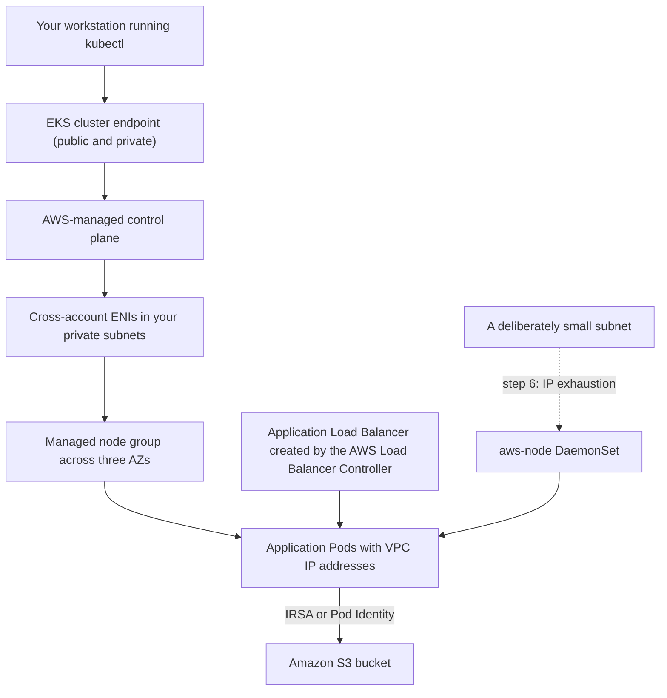

### AWS Services Used

| Service | Role in the lab |
|---|---|
| **Amazon EKS** | The cluster, its endpoint, node group, and add-ons |
| **Amazon EC2** | Worker nodes and their security groups |
| **Amazon VPC** | Subnets, route tables, and the address space you will exhaust |
| **AWS IAM and STS** | Access entries, the node role, and the per-Pod role |
| **Amazon ECR** | The image the nodes pull |
| **Elastic Load Balancing** | The ALB created from an Ingress |
| **Amazon S3** | The target of the per-Pod IAM exercise |
| **Amazon CloudWatch** | Control plane logs and container metrics |

### Implementation Steps

**Step 1 — Variables and prerequisites.**

```bash
export AWS_REGION=us-east-1
export ACCOUNT_ID=111122223333
export CLUSTER=dso303-ch31
export K8S_VERSION=1.33          # use a version in standard support

aws sts get-caller-identity
eksctl version
kubectl version --client
```

**Step 2 — Create the cluster declaratively.**

```yaml
# cluster.yaml
apiVersion: eksctl.io/v1alpha5
kind: ClusterConfig

metadata:
  name: dso303-ch31
  region: us-east-1
  version: "1.33"

# Access entries, not the aws-auth ConfigMap.
accessConfig:
  authenticationMode: API
  accessEntries:
    - principalARN: arn:aws:iam::111122223333:role/LabRole
      accessPolicies:
        - policyARN: arn:aws:eks::aws:cluster-access-policy/AmazonEKSClusterAdminPolicy
          accessScope:
            type: cluster

vpc:
  cidr: 10.42.0.0/16
  clusterEndpoints:
    publicAccess: true          # tightened in Step 8
    privateAccess: true
  nat:
    gateway: Single             # HighlyAvailable in production

# The control plane logs you will actually read.
cloudWatch:
  clusterLogging:
    enableTypes: ["api", "audit", "authenticator", "controllerManager", "scheduler"]

iam:
  withOIDC: true                # required for IRSA

managedNodeGroups:
  - name: ng-default
    instanceType: t3.large
    desiredCapacity: 2
    minSize: 2
    maxSize: 5
    privateNetworking: true     # nodes in private subnets
    volumeSize: 50
    disableIMDSv1: true         # IMDSv2 only
    # A hop limit of 1 is set separately; see Step 9.
    labels:
      workload: general

addons:
  - name: vpc-cni
    version: latest
  - name: coredns
    version: latest
  - name: kube-proxy
    version: latest
  - name: eks-pod-identity-agent
    version: latest
```

```bash
eksctl create cluster -f cluster.yaml      # about 15 minutes
aws eks update-kubeconfig --name "$CLUSTER" --region "$AWS_REGION"
kubectl get nodes -o wide
```

**Step 3 — Observe the split architecture.**

```bash
# The control plane you do not own: note there are no control plane instances here.
aws ec2 describe-instances --region "$AWS_REGION" \
  --filters "Name=tag:eks:cluster-name,Values=${CLUSTER}" \
  --query 'Reservations[].Instances[].[InstanceId,InstanceType,PrivateIpAddress]' --output table

# The cross-account ENIs EKS created in YOUR subnets. Note the requester ID.
aws ec2 describe-network-interfaces --region "$AWS_REGION" \
  --filters "Name=description,Values=Amazon EKS ${CLUSTER}" \
  --query 'NetworkInterfaces[].[NetworkInterfaceId,PrivateIpAddress,RequesterId,Description]' \
  --output table

# The endpoint your kubelets connect out to.
aws eks describe-cluster --name "$CLUSTER" --region "$AWS_REGION" \
  --query 'cluster.{endpoint:endpoint,access:resourcesVpcConfig.{public:endpointPublicAccess,private:endpointPrivateAccess},sg:resourcesVpcConfig.clusterSecurityGroupId}'
```

Record what you see: the instances are nodes only, and the ENIs are owned by an AWS service account but consume addresses in your subnets.

**Step 4 — Count Pod capacity, and prove the formula.**

```bash
kubectl get nodes -o json | jq -r \
  '.items[] | "\(.metadata.name)  max-pods=\(.status.allocatable.pods)  cpu=\(.status.allocatable.cpu)"'

# t3.large: 3 ENIs x 12 IPs -> (3 x 11) + 2 = 35
kubectl get pods -A --field-selector spec.nodeName=$(kubectl get nodes -o jsonpath='{.items[0].metadata.name}') \
  --no-headers | wc -l
```

**Step 5 — Deploy an application and expose it.**

```bash
kubectl create namespace shop
kubectl create deployment web --image=public.ecr.aws/nginx/nginx:stable -n shop --replicas=3
kubectl expose deployment web --port=80 --target-port=80 -n shop

# Spread across zones, and protect against voluntary disruption.
kubectl patch deployment web -n shop --type merge -p '
spec:
  template:
    spec:
      topologySpreadConstraints:
        - maxSkew: 1
          topologyKey: topology.kubernetes.io/zone
          whenUnsatisfiable: ScheduleAnyway
          labelSelector:
            matchLabels: { app: web }
'
kubectl create poddisruptionbudget web-pdb --selector=app=web --min-available=2 -n shop

# Confirm the Pods hold real VPC addresses in your CIDR.
kubectl get pods -n shop -o wide
```

**Step 6 — Exhaust the IP addresses deliberately.**

```bash
# Watch the CNI's own accounting first.
kubectl get pods -n kube-system -l k8s-app=aws-node -o name
NODE=$(kubectl get nodes -o jsonpath='{.items[0].metadata.name}')
kubectl scale deployment web -n shop --replicas=60

sleep 60
kubectl get pods -n shop --field-selector status.phase=Pending -o name | head
kubectl describe pod -n shop $(kubectl get pods -n shop --field-selector status.phase=Pending \
  -o jsonpath='{.items[0].metadata.name}') | tail -20
# Expect: 'Too many pods' from the scheduler, or a CNI IP assignment failure.

# Now raise the ceiling and watch it change.
kubectl set env daemonset aws-node -n kube-system ENABLE_PREFIX_DELEGATION=true
kubectl rollout status daemonset aws-node -n kube-system
# Nodes must be replaced for the new max-pods to take effect.
eksctl scale nodegroup --cluster "$CLUSTER" --name ng-default --nodes 3 --region "$AWS_REGION"
```

Record the `allocatable.pods` value before and after node replacement, and explain the difference using the formula.

**Step 7 — Break the control plane's inbound path.**

```bash
CLUSTER_SG=$(aws eks describe-cluster --name "$CLUSTER" --region "$AWS_REGION" \
  --query 'cluster.resourcesVpcConfig.clusterSecurityGroupId' --output text)

# Before: exec works, because the API server can reach the kubelet.
kubectl exec -n shop deploy/web -- hostname

# Remove the rule that permits control plane to node traffic.
aws ec2 revoke-security-group-ingress --group-id "$CLUSTER_SG" \
  --protocol -1 --source-group "$CLUSTER_SG" --region "$AWS_REGION"

sleep 30
kubectl get pods -n shop            # still works: this is a read from etcd
kubectl exec -n shop deploy/web -- hostname   # now fails or hangs
kubectl logs -n shop deploy/web               # now fails or hangs

# Restore it.
aws ec2 authorize-security-group-ingress --group-id "$CLUSTER_SG" \
  --protocol -1 --source-group "$CLUSTER_SG" --region "$AWS_REGION"
```

!!! tip "This is the most instructive thirty seconds in the lab"

    `kubectl get pods` keeps working because it reads from `etcd` inside the control plane. `kubectl exec` and `kubectl logs` stop working because they require the API server to open a connection *into your VPC*. The same path carries every admission webhook — which is why this security group change, in a real cluster with webhooks installed, would also stop every deployment.

**Step 8 — Two-layer authorization, demonstrated.**

```bash
# Create a namespace-scoped access entry for a second principal.
aws eks create-access-entry --cluster-name "$CLUSTER" --region "$AWS_REGION" \
  --principal-arn arn:aws:iam::${ACCOUNT_ID}:role/LabRole \
  --type STANDARD --username dso303-viewer --kubernetes-groups dso303-viewers || true

aws eks associate-access-policy --cluster-name "$CLUSTER" --region "$AWS_REGION" \
  --principal-arn arn:aws:iam::${ACCOUNT_ID}:role/LabRole \
  --policy-arn arn:aws:eks::aws:cluster-access-policy/AmazonEKSViewPolicy \
  --access-scope type=namespace,namespaces=shop

# Demonstrate the difference between the two failure modes.
kubectl auth can-i list pods --namespace shop --as dso303-viewer
kubectl auth can-i delete pods --namespace shop --as dso303-viewer     # no: Forbidden territory
kubectl auth can-i list pods --namespace kube-system --as dso303-viewer # no: out of scope
```

**Step 9 — Per-Pod identity, and the metadata service.**

```bash
BUCKET="dso303-${ACCOUNT_ID}-lab"
aws s3 mb "s3://${BUCKET}" --region "$AWS_REGION"
echo "hello from dso303" | aws s3 cp - "s3://${BUCKET}/hello.txt"

# First: a Pod with no per-Pod identity.
kubectl run probe -n shop --rm -it --restart=Never \
  --image=public.ecr.aws/aws-cli/aws-cli:latest -- \
  sh -c 'aws sts get-caller-identity; aws s3 ls s3://'"${BUCKET}"'/ || true'
# Record which identity it reports. If it is the NODE role, the node role is doing the work.

# Enforce a hop limit of 1 so containers cannot reach IMDS at all.
ASG=$(aws eks describe-nodegroup --cluster-name "$CLUSTER" --nodegroup-name ng-default \
  --region "$AWS_REGION" --query 'nodegroup.resources.autoScalingGroups[0].name' --output text)
for I in $(aws autoscaling describe-auto-scaling-groups --auto-scaling-group-names "$ASG" \
  --region "$AWS_REGION" --query 'AutoScalingGroups[0].Instances[].InstanceId' --output text); do
  aws ec2 modify-instance-metadata-options --instance-id "$I" \
    --http-tokens required --http-put-response-hop-limit 1 --region "$AWS_REGION"
done

# Re-run the probe: the metadata call should now fail.
kubectl run probe2 -n shop --rm -it --restart=Never \
  --image=public.ecr.aws/aws-cli/aws-cli:latest -- \
  sh -c 'aws sts get-caller-identity || echo "no credentials available — as intended"'
```

Then create a ServiceAccount with an IRSA annotation (or a Pod Identity association in a full account), attach a policy allowing only `s3:GetObject` on `arn:aws:s3:::${BUCKET}/*`, and re-run the probe. Record the three identities you observed: node role, none, and the per-Pod role.

**Step 10 — Read the logs that answer the questions.**

```bash
# Who authenticated, and how were they mapped?
aws logs filter-log-events --region "$AWS_REGION" \
  --log-group-name "/aws/eks/${CLUSTER}/cluster" \
  --log-stream-name-prefix "authenticator" --limit 20 \
  --query 'events[].message' --output text | head -20

# Every API request, with identity and outcome.
aws logs filter-log-events --region "$AWS_REGION" \
  --log-group-name "/aws/eks/${CLUSTER}/cluster" \
  --log-stream-name-prefix "kube-apiserver-audit" \
  --filter-pattern '{ $.verb = "delete" }' --limit 10 \
  --query 'events[].message' --output text
```

**Step 11 — Clean up.**

```bash
kubectl delete namespace shop
aws s3 rm "s3://${BUCKET}" --recursive && aws s3 rb "s3://${BUCKET}"
eksctl delete cluster --name "$CLUSTER" --region "$AWS_REGION" --wait
# Confirm no load balancers, ENIs, or EBS volumes are left behind.
aws elbv2 describe-load-balancers --region "$AWS_REGION" --query 'LoadBalancers[].LoadBalancerName'
```

!!! danger "Delete the cluster, and check what it left behind"

    An EKS cluster costs about $0.10 per hour whether or not anything runs on it, and load balancers and EBS volumes created by Kubernetes objects are **not** always removed when the cluster is deleted — deleting Services and PersistentVolumeClaims *before* deleting the cluster is what removes them cleanly. Orphaned load balancers are the most common source of surprise charges after an EKS lab.

### Expected Output

| Observation | Expected result |
|---|---|
| `describe-instances` filtered to the cluster | Worker nodes only; no control plane instances exist in your account |
| `describe-network-interfaces` | Cross-account ENIs in your subnets, owned by an AWS service requester ID |
| `allocatable.pods` on a `t3.large` | 35, matching `(3 × (12 − 1)) + 2` |
| Scaling to 60 replicas | Pods `Pending` with `Too many pods`, while node CPU stays low |
| After prefix delegation and node replacement | `allocatable.pods` rises to 110 |
| Revoking the cluster security group rule | `kubectl get` still works; `kubectl exec` and `kubectl logs` fail |
| `kubectl auth can-i` as the scoped viewer | Can list Pods in `shop`, cannot delete them, cannot see `kube-system` |
| Probe Pod before IRSA and before the hop limit | Reports the **node instance role** — the security problem, demonstrated |
| Probe Pod after the hop limit change | No credentials available |
| Probe Pod with a per-Pod role | Reports the per-Pod role and can read only the permitted objects |
| `authenticator` log | Shows the ARN, the mapping, and the resulting username and groups |

!!! tip "What the lab is really teaching"

    Four things. First, that **the control plane genuinely is not in your account** — you can see the ENIs it uses and the absence of the instances it runs on. Second, that **IP addresses are a capacity dimension**: the same node goes from 35 Pods to 110 with one environment variable, and the failure before that change looks nothing like a networking problem. Third, that **the control plane's inbound path is load-bearing**: one security group rule separates a working cluster from one you cannot debug, and in a cluster with webhooks, from one you cannot deploy to. Fourth, that **per-Pod identity is not optional**: the probe Pod's first answer — the node role — is the entire argument for IRSA and Pod Identity, and the hop-limit change is what makes them mean anything.

---

## Code Examples

### `eksctl`: a production-shaped cluster definition

```yaml
apiVersion: eksctl.io/v1alpha5
kind: ClusterConfig

metadata:
  name: dso303-prod
  region: us-east-1
  version: "1.33"                 # keep within standard support

accessConfig:
  authenticationMode: API         # access entries only; no aws-auth ConfigMap
  accessEntries:
    - principalARN: arn:aws:iam::111122223333:role/PlatformBreakGlass
      accessPolicies:
        - policyARN: arn:aws:eks::aws:cluster-access-policy/AmazonEKSClusterAdminPolicy
          accessScope: { type: cluster }
    - principalARN: arn:aws:iam::111122223333:role/TeamOrdersDeploy
      accessPolicies:
        - policyARN: arn:aws:eks::aws:cluster-access-policy/AmazonEKSEditPolicy
          accessScope:            # scoped: this team sees only its namespaces
            type: namespace
            namespaces: ["orders", "orders-staging"]

vpc:
  id: vpc-0123456789abcdef0
  subnets:
    private:
      us-east-1a: { id: subnet-0a1 }
      us-east-1b: { id: subnet-0b1 }
      us-east-1c: { id: subnet-0c1 }
  clusterEndpoints:
    publicAccess: true
    privateAccess: true
  publicAccessCIDRs:              # never leave this as 0.0.0.0/0
    - 203.0.113.0/24

secretsEncryption:
  keyARN: arn:aws:kms:us-east-1:111122223333:key/abcd-1234

cloudWatch:
  clusterLogging:
    enableTypes: ["audit", "authenticator", "api", "controllerManager", "scheduler"]
    logRetentionInDays: 90

iam:
  withOIDC: true                  # still needed for Fargate workloads using IRSA

managedNodeGroups:
  - name: ng-general
    amiFamily: Bottlerocket       # minimal, immutable host
    instanceTypes: ["m6i.large", "m6a.large", "m5.large"]   # diversity for Spot pools
    minSize: 3
    desiredCapacity: 6
    maxSize: 20
    privateNetworking: true
    volumeSize: 60
    volumeEncrypted: true
    disableIMDSv1: true
    instanceMetadataOptions:
      httpTokens: required
      httpPutResponseHopLimit: 1  # containers cannot reach the metadata service
    updateConfig:
      maxUnavailablePercentage: 25
    labels: { workload: general }

  - name: ng-spot-batch
    instanceTypes: ["m6i.xlarge", "m6a.xlarge", "m5.xlarge", "m5a.xlarge"]
    spot: true
    minSize: 0
    desiredCapacity: 0
    maxSize: 40
    privateNetworking: true
    taints:
      - key: workload
        value: batch
        effect: NoSchedule        # only tolerating workloads land here

addons:
  - name: vpc-cni
    version: latest
    configurationValues: |
      {
        "env": {
          "ENABLE_PREFIX_DELEGATION": "true",
          "WARM_PREFIX_TARGET": "1",
          "ENABLE_NETWORK_POLICY": "true"
        }
      }
  - name: coredns
    version: latest
  - name: kube-proxy
    version: latest
  - name: aws-ebs-csi-driver
    version: latest
  - name: eks-pod-identity-agent
    version: latest
```

### Terraform: EKS Pod Identity for a workload

```hcl
# The role the Pod will hold. Note the trust policy: no OIDC provider needed.
data "aws_iam_policy_document" "pod_trust" {
  statement {
    effect  = "Allow"
    actions = ["sts:AssumeRole", "sts:TagSession"]   # TagSession is REQUIRED
    principals {
      type        = "Service"
      identifiers = ["pods.eks.amazonaws.com"]
    }
  }
}

resource "aws_iam_role" "orders_app" {
  name               = "dso303-orders-app"
  assume_role_policy = data.aws_iam_policy_document.pod_trust.json
}

# Least privilege: this workload reads its own prefix and nothing else.
data "aws_iam_policy_document" "orders_app" {
  statement {
    effect    = "Allow"
    actions   = ["s3:GetObject"]
    resources = ["${aws_s3_bucket.orders.arn}/incoming/*"]
  }
  statement {
    effect    = "Allow"
    actions   = ["s3:ListBucket"]              # a DIFFERENT resource from the objects
    resources = [aws_s3_bucket.orders.arn]
    condition {
      test     = "StringLike"
      variable = "s3:prefix"
      values   = ["incoming/*"]
    }
  }
}

resource "aws_iam_role_policy" "orders_app" {
  role   = aws_iam_role.orders_app.id
  policy = data.aws_iam_policy_document.orders_app.json
}

# The association: cluster + namespace + service account -> role.
# The same role can be associated with other clusters with no trust policy change.
resource "aws_eks_pod_identity_association" "orders_app" {
  cluster_name    = aws_eks_cluster.main.name
  namespace       = "orders"
  service_account = "orders-app"
  role_arn        = aws_iam_role.orders_app.arn
}
```

### Kubernetes YAML: a production-shaped Deployment

```yaml
apiVersion: v1
kind: ServiceAccount
metadata:
  name: orders-app
  namespace: orders
  # For IRSA you would annotate here instead:
  #   eks.amazonaws.com/role-arn: arn:aws:iam::111122223333:role/dso303-orders-app
  # With Pod Identity the binding lives in the EKS API, not in this object.
---
apiVersion: apps/v1
kind: Deployment
metadata:
  name: orders
  namespace: orders
spec:
  replicas: 3
  strategy:
    type: RollingUpdate
    rollingUpdate:
      maxUnavailable: 0          # never dip below desired capacity
      maxSurge: 1
  selector:
    matchLabels: { app: orders }
  template:
    metadata:
      labels: { app: orders }
    spec:
      serviceAccountName: orders-app
      # Availability across the correlated failure domain — the 2.3 lesson in Kubernetes.
      topologySpreadConstraints:
        - maxSkew: 1
          topologyKey: topology.kubernetes.io/zone
          whenUnsatisfiable: DoNotSchedule
          labelSelector:
            matchLabels: { app: orders }
      securityContext:
        runAsNonRoot: true
        runAsUser: 10001
        seccompProfile: { type: RuntimeDefault }
      containers:
        - name: orders
          # Digest-pinned: the deployed bytes are the scanned bytes (the 2.1 discipline).
          image: 111122223333.dkr.ecr.us-east-1.amazonaws.com/orders@sha256:abcd1234...
          ports: [{ containerPort: 8080 }]
          # Requests are what the scheduler uses. Memory request == limit for predictability;
          # no CPU limit, because throttling a latency-sensitive service is worse than bursting.
          resources:
            requests: { cpu: "250m", memory: "512Mi" }
            limits:   { memory: "512Mi" }
          securityContext:
            allowPrivilegeEscalation: false
            readOnlyRootFilesystem: true
            capabilities: { drop: ["ALL"] }
          startupProbe:            # tolerate a slow start without a slow readiness signal
            httpGet: { path: /health, port: 8080 }
            failureThreshold: 30
            periodSeconds: 2
          readinessProbe:          # tests ACTUAL readiness: dependencies, pools, caches
            httpGet: { path: /ready, port: 8080 }
            periodSeconds: 5
          livenessProbe:
            httpGet: { path: /health, port: 8080 }
            periodSeconds: 10
          lifecycle:
            preStop:
              exec:
                # Cover endpoint propagation before the process starts shutting down.
                command: ["/bin/sh", "-c", "sleep 15"]
      terminationGracePeriodSeconds: 60
---
apiVersion: policy/v1
kind: PodDisruptionBudget
metadata:
  name: orders
  namespace: orders
spec:
  minAvailable: 2                 # bounds voluntary disruption: drains, upgrades, consolidation
  selector:
    matchLabels: { app: orders }
---
apiVersion: v1
kind: Service
metadata:
  name: orders
  namespace: orders
  annotations:
    service.kubernetes.io/topology-mode: "Auto"   # prefer same-zone endpoints
spec:
  selector: { app: orders }
  ports: [{ port: 80, targetPort: 8080 }]
---
apiVersion: networking.k8s.io/v1
kind: Ingress
metadata:
  name: orders
  namespace: orders
  annotations:
    kubernetes.io/ingress.class: alb
    alb.ingress.kubernetes.io/scheme: internet-facing
    alb.ingress.kubernetes.io/target-type: ip     # direct to Pod: one hop fewer
    alb.ingress.kubernetes.io/healthcheck-path: /ready
    alb.ingress.kubernetes.io/certificate-arn: arn:aws:acm:us-east-1:111122223333:certificate/abcd
spec:
  rules:
    - host: orders.example.com
      http:
        paths:
          - path: /
            pathType: Prefix
            backend:
              service:
                name: orders
                port: { number: 80 }
---
# Default-deny for the namespace, then explicit allows.
apiVersion: networking.k8s.io/v1
kind: NetworkPolicy
metadata:
  name: default-deny-ingress
  namespace: orders
spec:
  podSelector: {}
  policyTypes: ["Ingress"]
---
apiVersion: networking.k8s.io/v1
kind: NetworkPolicy
metadata:
  name: allow-from-alb-and-frontend
  namespace: orders
spec:
  podSelector:
    matchLabels: { app: orders }
  policyTypes: ["Ingress"]
  ingress:
    - from:
        - namespaceSelector:
            matchLabels: { kubernetes.io/metadata.name: frontend }
      ports: [{ protocol: TCP, port: 8080 }]
```

### JSON: an IRSA trust policy, annotated

```json
{
  "Version": "2012-10-17",
  "Statement": [
    {
      "Effect": "Allow",
      "Principal": {
        "Federated": "arn:aws:iam::111122223333:oidc-provider/oidc.eks.us-east-1.amazonaws.com/id/EXAMPLED539D4633E53DE1B716D3041E"
      },
      "Action": "sts:AssumeRoleWithWebIdentity",
      "Condition": {
        "StringEquals": {
          "oidc.eks.us-east-1.amazonaws.com/id/EXAMPLED539D4633E53DE1B716D3041E:aud": "sts.amazonaws.com",
          "oidc.eks.us-east-1.amazonaws.com/id/EXAMPLED539D4633E53DE1B716D3041E:sub": "system:serviceaccount:orders:orders-app"
        }
      }
    }
  ]
}
```

!!! danger "Use `StringEquals` on `sub`, never `StringLike` with a wildcard"

    A condition of `"system:serviceaccount:orders:*"` lets **any** ServiceAccount in the `orders` namespace assume this role, which means any team member who can create a ServiceAccount there can take it. A missing `sub` condition entirely is far worse: any ServiceAccount in the cluster can assume the role. This one line is the difference between per-workload least privilege and a namespace-wide, or cluster-wide, grant — and it is the most common IRSA misconfiguration in real accounts.

### Python (boto3): auditing an EKS estate

```python
"""Report EKS clusters whose configuration is unsafe or expensive."""
import boto3

REGION = "us-east-1"
eks = boto3.client("eks", region_name=REGION)
ec2 = boto3.client("ec2", region_name=REGION)


def audit_cluster(name: str) -> None:
    c = eks.describe_cluster(name=name)["cluster"]
    problems = []

    vpc = c["resourcesVpcConfig"]
    if vpc["endpointPublicAccess"] and vpc.get("publicAccessCidrs") == ["0.0.0.0/0"]:
        problems.append("public endpoint open to the entire internet")

    if not c.get("encryptionConfig"):
        problems.append("Kubernetes Secrets are not encrypted with a KMS key")

    logging = {
        t: s["enabled"]
        for s in c["logging"]["clusterLogging"]
        for t in s["types"]
    }
    for required in ("audit", "authenticator"):
        if not logging.get(required):
            problems.append(f"control plane log type '{required}' is disabled")

    if c.get("accessConfig", {}).get("authenticationMode") == "CONFIG_MAP":
        problems.append("legacy aws-auth ConfigMap mode: no access entries, no CloudTrail record")

    # Subnet headroom is a capacity dimension, not a detail.
    for subnet_id in vpc["subnetIds"]:
        s = ec2.describe_subnets(SubnetIds=[subnet_id])["Subnets"][0]
        if s["AvailableIpAddressCount"] < 64:
            problems.append(
                f"subnet {subnet_id} has only {s['AvailableIpAddressCount']} free IPs: "
                "Pod scheduling will fail before compute is exhausted"
            )

    # Nodes must not lend their role to containers.
    for ng_name in eks.list_nodegroups(clusterName=name)["nodegroups"]:
        ng = eks.describe_nodegroup(clusterName=name, nodegroupName=ng_name)["nodegroup"]
        asg_names = [g["name"] for g in ng["resources"]["autoScalingGroups"]]
        for asg in asg_names:
            insts = ec2.describe_instances(
                Filters=[{"Name": "tag:aws:autoscaling:groupName", "Values": [asg]}]
            )
            for r in insts["Reservations"]:
                for i in r["Instances"]:
                    opts = i.get("MetadataOptions", {})
                    if opts.get("HttpTokens") != "required":
                        problems.append(f"{ng_name}: IMDSv1 still permitted on {i['InstanceId']}")
                    if opts.get("HttpPutResponseHopLimit", 2) > 1:
                        problems.append(
                            f"{ng_name}: IMDS hop limit > 1 on {i['InstanceId']}: "
                            "containers can assume the node role"
                        )

    print(f"{name} (v{c['version']}, platform {c['platformVersion']}):")
    print("  - " + "\n  - ".join(problems) if problems else "  no findings")


if __name__ == "__main__":
    for cluster in eks.list_clusters()["clusters"]:
        audit_cluster(cluster)
```

### Shell: the EKS diagnostic sequence

```bash
CLUSTER=dso303-prod; REGION=us-east-1

# 1. Which layer refused me? Unauthorized = authentication; Forbidden = RBAC.
kubectl auth can-i --list 2>&1 | head -5

# 2. Why is this Pod not running? Events answer almost every case in plain text.
kubectl describe pod -n "$NS" "$POD" | sed -n '/Events:/,$p'

# 3. Is it IP exhaustion rather than compute?
kubectl get nodes -o json | jq -r \
  '.items[] | "\(.metadata.name) max-pods=\(.status.allocatable.pods)"'
aws ec2 describe-subnets --region "$REGION" \
  --subnet-ids $(aws eks describe-cluster --name "$CLUSTER" --region "$REGION" \
    --query 'cluster.resourcesVpcConfig.subnetIds[]' --output text) \
  --query 'Subnets[].[SubnetId,AvailabilityZone,AvailableIpAddressCount]' --output table

# 4. Is the node's CNI healthy? A node is NotReady until it is.
kubectl get pods -n kube-system -l k8s-app=aws-node -o wide
kubectl logs -n kube-system -l k8s-app=aws-node --tail=50 | grep -i "error\|failed"

# 5. Are any admission webhooks about to block every write?
kubectl get validatingwebhookconfigurations,mutatingwebhookconfigurations \
  -o custom-columns='NAME:.metadata.name,POLICY:.webhooks[*].failurePolicy'

# 6. Who did what? The audit log is the only in-cluster record.
aws logs filter-log-events --region "$REGION" \
  --log-group-name "/aws/eks/${CLUSTER}/cluster" \
  --log-stream-name-prefix kube-apiserver-audit \
  --filter-pattern '{ $.verb = "delete" && $.objectRef.resource = "deployments" }' \
  --limit 20 --query 'events[].message' --output text

# 7. Why was this principal refused?
aws logs filter-log-events --region "$REGION" \
  --log-group-name "/aws/eks/${CLUSTER}/cluster" \
  --log-stream-name-prefix authenticator --limit 20 \
  --query 'events[].message' --output text
```

---

## AWS Certification Tips

### Exam tips

Every EKS scenario contains one discriminating constraint. Locate it on the control plane / data plane / identity / networking axis, then eliminate.

- "AWS should manage the control plane but we need Kubernetes" → **EKS**; "we do not need Kubernetes" → **ECS**.
- "No node management at all" → **Fargate** or **EKS Auto Mode**; "DaemonSets, GPUs, or EBS required" → **not Fargate**.
- "Pods must not be reachable from the internet" → **private subnets**, and separately consider the **endpoint access mode**.
- "The API server must not be internet-reachable" → **private-only endpoint**, plus an in-VPC administration path.
- "Pods cannot get IP addresses although CPU is idle" → **VPC CNI exhaustion**; the fix is **prefix delegation**, then `WARM_IP_TARGET`, then **custom networking**, then **IPv6**.
- "Maximum Pods per node is too low" → the ENI formula, then **prefix delegation**.
- "A Pod needs least-privilege AWS access" → **Pod Identity** on EC2 nodes, **IRSA** on Fargate; never the node role.
- "An IAM administrator gets `Unauthorized`" → missing **access entry**; "gets `Forbidden`" → missing **RBAC binding**.
- "Manage cluster permissions outside the cluster, auditable" → **access entries**, `API` authentication mode.
- "Individual Pods need distinct security groups" → **security groups for Pods** with branch ENIs on Nitro instances.
- "Restrict Pod-to-Pod traffic inside the cluster" → **NetworkPolicy** with an enforcing plugin.
- "Encrypt Kubernetes Secrets" → **KMS envelope encryption**; "rotate them automatically" → **Secrets Manager with the CSI driver**.
- "Reduce inter-AZ data transfer" → **topology aware routing**.
- "Load balancer should reach Pods directly" → **IP-mode** target groups.
- "Scale nodes quickly with diverse and Spot instances" → **Karpenter**; "adjust an existing ASG" → **Cluster Autoscaler**.
- "All deployments fail with `failed calling webhook`" → the **control plane's inbound path** through the cluster security group.

### Frequently confused pairs

| Pair | The distinguishing fact |
|---|---|
| **Control plane vs data plane** | AWS runs the first; you run the second; an outage of the first stops change, not traffic |
| **`Unauthorized` vs `Forbidden`** | Authentication (no access entry) versus authorization (no RBAC grant) |
| **Access entries vs `aws-auth`** | An auditable EKS API versus an in-cluster ConfigMap that can lock everyone out |
| **IRSA vs Pod Identity** | OIDC federation versus an agent and an EKS association; only IRSA works on Fargate |
| **Node role vs Pod role** | The node role is shared by every Pod on the node; a Pod role is not |
| **IMDSv1 vs IMDSv2 with hop limit 1** | The second is what actually stops containers taking the node role |
| **VPC CNI vs an overlay CNI** | Real VPC IPs, IP-bound density, Pod-level security groups versus encapsulation and unlimited addresses |
| **Prefix delegation vs custom networking** | Node density versus subnet address space; different problems |
| **Instance mode vs IP mode targets** | An extra hop through NodePort versus direct-to-Pod; IP mode is required on Fargate |
| **ClusterIP vs NodePort vs LoadBalancer** | Internal virtual IP, a port on every node, an AWS load balancer |
| **Service vs Ingress** | Layer 4 exposure of one Service versus HTTP routing to many |
| **Cluster Autoscaler vs Karpenter** | Adjusting ASG desired capacity versus launching right-sized instances directly |
| **Managed node group vs self-managed** | AWS AMIs and cordon-and-drain upgrades versus complete control and complete responsibility |
| **Fargate vs Auto Mode** | No node at all versus AWS-managed real nodes |
| **Requests vs limits** | Requests drive scheduling; limits drive throttling and OOM kills |
| **Liveness vs readiness vs startup probes** | Restart me, send me traffic, and do not judge me yet |
| **NetworkPolicy vs security groups for Pods** | Enforced by the CNI inside the cluster versus enforced in the VPC |
| **Standard vs extended support** | About fourteen months at the base price, then about twelve months at roughly six times it |

### Memory aids

- **"AWS runs the brain; you run the muscle."** Control plane versus data plane.
- **"IAM says who; RBAC says what."** And `Unauthorized` versus `Forbidden` tells you which refused.
- **"Every Pod is a VPC citizen — and pays rent in IP addresses."**
- **"ENIs times IPs, minus one, plus two."** The max-pods formula.
- **"Prefix delegation: sixteen times the Pods, none of the cost."**
- **"The node role is everyone's role."** Why per-Pod identity exists.
- **"A hop limit of one is what makes IRSA true."**
- **"The API server calls *into* your VPC."** Webhooks, `exec`, `logs`, metrics.
- **"Requests schedule; limits punish."**
- **"Upgrade yearly or pay six times over."**

!!! danger "Common certification traps"

    - Believing EKS manages worker nodes in the standard configuration.
    - Believing the control plane runs in your VPC, or that a control plane outage stops running Pods.
    - Assuming `AdministratorAccess` grants cluster access.
    - Assuming Pods get overlay addresses, or that Pod density depends only on CPU and memory.
    - Treating IRSA and Pod Identity as interchangeable — Pod Identity does not work on Fargate.
    - Believing Kubernetes Secrets are encrypted by default.
    - Expecting DaemonSets, EBS volumes, GPUs, or privileged containers to work on Fargate.
    - Believing a cluster version can be freely downgraded at any time, or upgraded by more than one minor version at a time.
    - Confusing Cluster Autoscaler with Karpenter.
    - Assuming NetworkPolicy objects are enforced without an enforcing plugin.
    - Forgetting that the cluster creator holds an invisible `system:masters` grant.
    - Forgetting that `system:masters` cannot be restricted by RBAC.

---

## Summary

First, **EKS is a Kubernetes cluster with a boundary drawn through it**, and almost every question in this chapter is answered by locating the thing you care about on one side or the other. AWS runs the API server, `etcd`, the scheduler, and the controller managers in its own account across three Availability Zones, with an SLA. You run the nodes, the `kubelet`, `kube-proxy`, the CNI, CoreDNS, and every controller you install, in your VPC, at your expense and on your maintenance schedule. The consequence worth carrying is that a control plane impairment stops *change* but not *traffic* — running Pods keep serving — while a data plane problem is immediate and yours.

Second, **the boundary is crossed in both directions, and the inbound direction is the one that breaks**. Every `kubelet` holds an outbound connection to the cluster endpoint; the API server reaches inbound through cross-account ENIs in your subnets for `kubectl exec`, `logs`, `port-forward`, metrics, and — critically — every admission webhook, synchronously, on the write path. A security group change that severs this leaves reads working and deployments failing, which is why "it worked yesterday and now nothing deploys" so often traces back to a network change rather than to Kubernetes.

Third, **the VPC CNI's decision to give every Pod a real VPC address is the source of both EKS's best networking properties and its most common capacity surprise**. Native routing with no encapsulation, Pods as load balancer targets, Pod-level security groups, and Flow Log visibility are all consequences of it — and so is a Pod ceiling of `(ENIs × (IPs per ENI − 1)) + 2` that binds long before CPU does. Prefix delegation multiplies that ceiling by up to sixteen for free and should be the default on Nitro instances; `WARM_IP_TARGET` makes allocation demand-driven; custom networking onto `100.64.0.0/10` buys space; and IPv6 removes the problem entirely but only at cluster creation. IP addresses are a capacity dimension, and no CPU dashboard will ever show you running out of them.

Fourth, **EKS has two independent permission systems and confusing them wastes hours**. AWS IAM authenticates: a pre-signed SigV4 token is resolved by the IAM Authenticator to an ARN, and an access entry maps that ARN to a Kubernetes identity. Kubernetes RBAC authorizes: Roles and bindings decide what that identity may do. `Unauthorized` means the first refused; `Forbidden` means the second did. Access entries replaced the `aws-auth` ConfigMap with an auditable API and managed policies that can be scoped to namespaces, and the cluster creator's implicit, invisible `system:masters` grant remains the trap that catches almost every student once.

Fifth, **per-Pod identity is the security control that matters most, and it is inert without one EC2 setting**. Without IRSA or Pod Identity, every Pod on a node can assume the node's role, so the node role becomes the union of every workload's permissions and one compromised Pod inherits all of them. IRSA federates through OIDC and works everywhere including Fargate; Pod Identity uses an agent and an EKS association, is simpler, and reuses roles across clusters but has no Fargate support. Either is decorative unless nodes require IMDSv2 with a hop limit of 1, because otherwise a Pod can simply take the node role instead.

Sixth, **the data plane is a spectrum and you should use more than one point on it**. Managed node groups are the sensible default; Karpenter adds fast, dense, Spot-friendly provisioning; Fargate removes the node entirely for workloads that do not need one; Auto Mode hands the whole data plane to AWS for a fee; hybrid nodes extend the cluster on-premises. These coexist in one cluster, which means the right answer is usually "managed node groups plus Karpenter, with Fargate profiles for specific namespaces" rather than any single choice.

Seventh, and most easily forgotten, **EKS carries a permanent, one-directional upgrade obligation**. A Kubernetes version leaves standard support after roughly fourteen months and the extended-support price is about six times higher; upgrades proceed one minor version at a time and are effectively one-way, since a control plane rollback is possible only within a short window and nodes and add-ons must be reverted separately; each one requires deprecated API checks, add-on updates, and node replacement. This is not an operational detail to handle later — it is a design input that determines whether you can afford many small clusters, whether your add-ons are managed or ad hoc, and whether your team has rehearsed the process before the CVE arrives.

---

