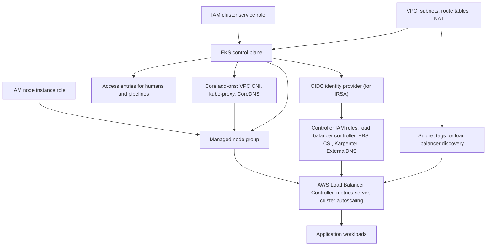
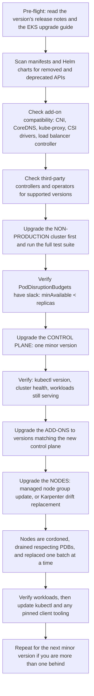
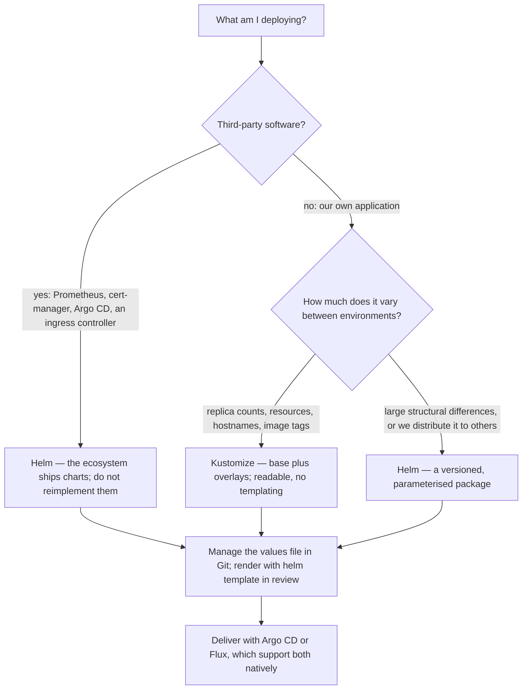
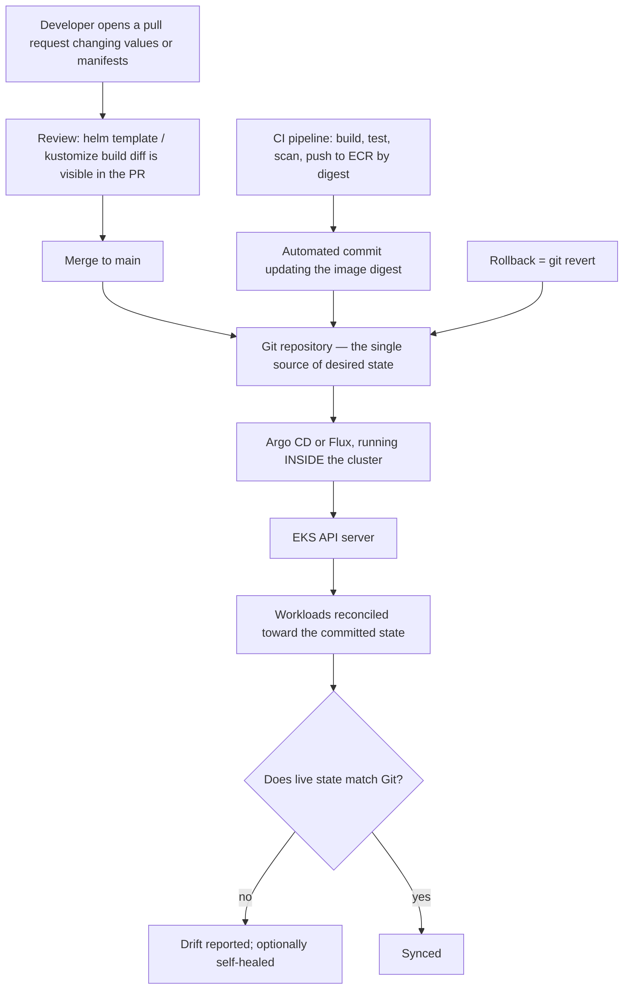
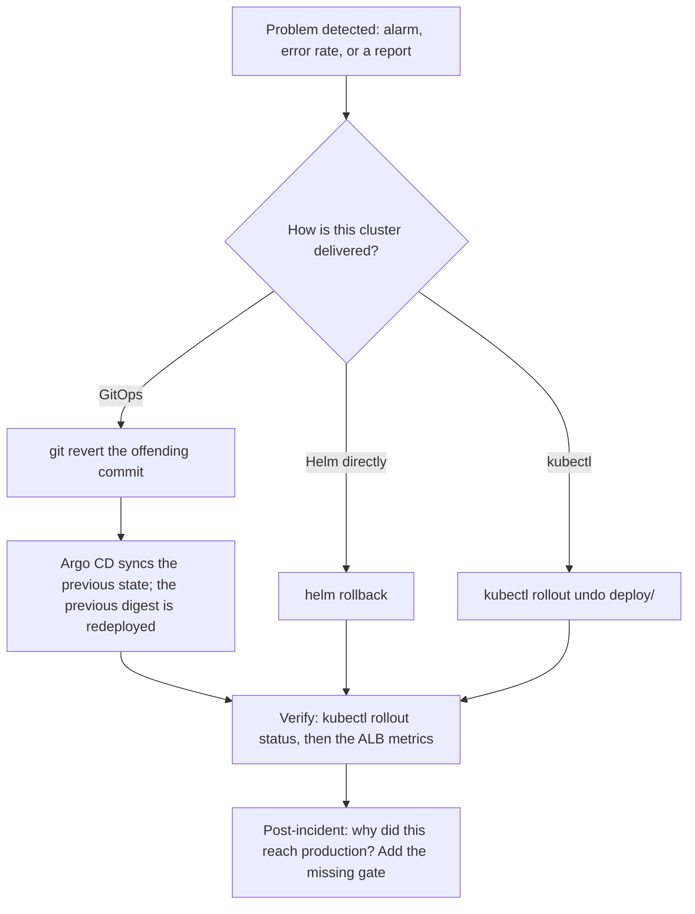
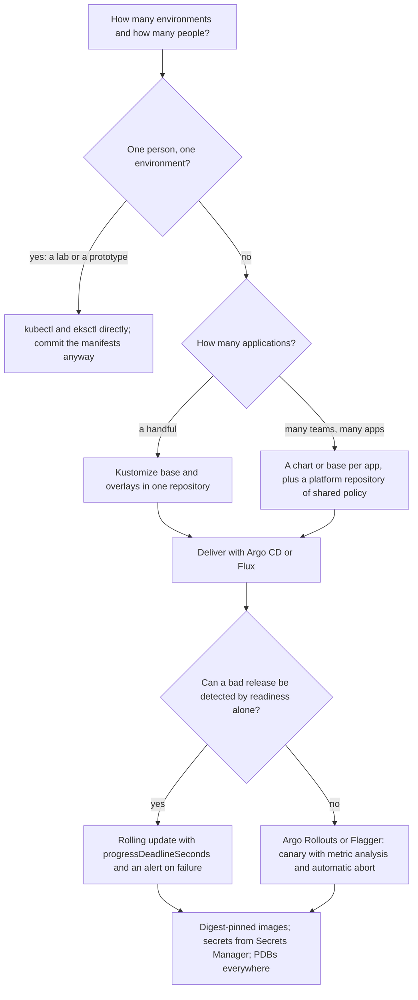
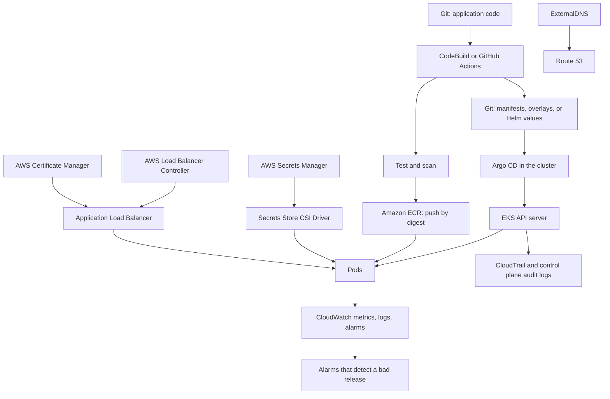
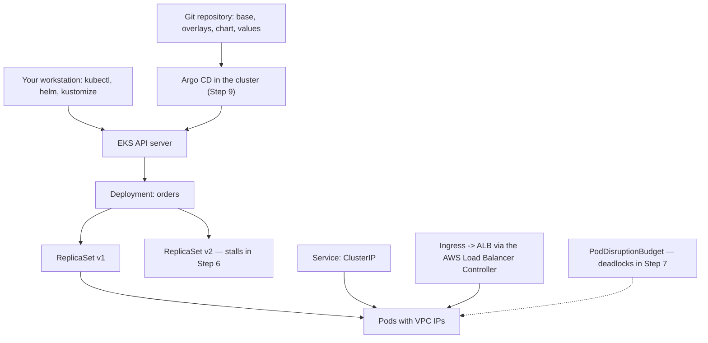

# Deploying Applications on Amazon EKS

!!! info "Where this topic sits in DSO303"

    Chapter 3.1 explained what an EKS cluster *is*: a control plane AWS operates, a data plane you operate, a network that gives every Pod a VPC address, and an identity model with two layers. This chapter is about *using* it — and about the discipline that separates a cluster you demonstrated once from a platform a team can rely on.

    **3.2.1** treats the **cluster lifecycle**: what actually happens during creation, why the order of resource creation matters, and how upgrades — the recurring, one-directional obligation introduced in 3.1 — are performed without an outage. **3.2.2** treats the **tools**: `kubectl` as the universal client and `eksctl` as the opinionated cluster builder, what each is good at, and the important truth that neither should be how production changes reach a cluster. **3.2.3** treats **packaging**: raw manifests, Kustomize, and Helm charts, and how to choose between templating and overlays for an internal platform.

    Read the chapter as a progression from **imperative to declarative**. Every section starts with the command you would type to learn the concept and ends with the declarative artefact you would commit to Git instead. That progression is the actual subject matter: the commands teach the model, and the manifests run the platform.

---

## Learning Objectives

After studying this chapter you should be able to:

- Describe the **cluster creation sequence** — IAM roles, VPC and subnets, control plane, OIDC provider, add-ons, node groups, controllers — and explain why the order is a dependency graph rather than a preference.
- Explain the **subnet requirements and tags** EKS and the AWS Load Balancer Controller rely on, and diagnose the failures produced when they are missing.
- Compare the four common cluster provisioning paths — the console, `eksctl`, CloudFormation or CDK, and Terraform — and choose appropriately for a given organisation.
- Perform and reason about a **cluster upgrade**: the pre-flight checks, the control plane update, the add-on updates, and the node replacement, in the correct order and with the correct verification at each step.
- Explain **PodDisruptionBudgets**, node **cordon** and **drain**, and why a badly written PDB can stall an upgrade indefinitely.
- Configure a **kubeconfig** for EKS, explain the exec credential plugin and the pre-signed STS token, and manage multiple clusters and contexts safely.
- Use `kubectl` fluently for **inspection, debugging, and diagnosis**: `describe`, `logs`, `events`, `exec`, `port-forward`, `top`, `rollout`, `auth can-i`, `explain`, and JSONPath output.
- Distinguish `kubectl apply` from `create` and `replace`, explain **server-side apply** and field ownership, and explain why `kubectl edit` in production is a defect rather than a technique.
- Use **`eksctl`** declaratively with a `ClusterConfig` file, and explain what it creates behind the scenes and where its abstraction leaks.
- Write correct **Kubernetes manifests** for a production service: Deployment, Service, Ingress, ConfigMap, Secret, ServiceAccount, HorizontalPodAutoscaler, PodDisruptionBudget, and NetworkPolicy.
- Explain the anatomy of a **Helm chart** — `Chart.yaml`, `values.yaml`, templates, helpers, hooks, and the release object — and perform install, upgrade, rollback, diff, and lint operations.
- Compare **Helm** and **Kustomize**, explain the templating-versus-overlay distinction, and choose between them (or combine them) for a multi-environment platform.
- Explain **GitOps** with Argo CD or Flux, why it is the correct end state for an internal platform, and what it changes about credentials, drift, and rollback.
- Diagnose the standard deployment failures: `ImagePullBackOff`, `CrashLoopBackOff`, `Pending`, `CreateContainerConfigError`, failing probes, and stalled rollouts.

---

## Definition

**Deploying an application on Amazon EKS** is the process of expressing the application's desired state as Kubernetes API objects, delivering those objects to the cluster's API server, and allowing the cluster's controllers to reconcile reality toward them.

That definition contains the whole discipline. There are three separable concerns, and confusing them is the source of most difficulty:

| Concern | Question it answers | Tools |
|---|---|---|
| **Cluster provisioning** | Does a cluster exist, with the right network, nodes, add-ons, and access? | `eksctl`, CloudFormation, CDK, Terraform, the console |
| **Manifest authoring and packaging** | What objects describe this application, and how do they vary across environments? | Raw YAML, Kustomize, Helm |
| **Delivery** | How do those objects reach the cluster, repeatably and auditably? | `kubectl` (learning), CI pipelines (adequate), GitOps (correct) |

Within an AWS architecture, this chapter sits between the infrastructure layer of Chapter 3.1 and the operational concerns of Chapter 3.3. The cluster is infrastructure; the manifests are application configuration; the delivery mechanism is the boundary between the two, and it is where most organisations' problems actually live.

!!! note "Everything in Kubernetes is the same three fields"

    Every Kubernetes object — a Pod, a Deployment, a NetworkPolicy, a custom resource you invent — has `apiVersion`, `kind`, `metadata`, and (almost always) `spec`. You declare `spec`; a controller writes `status`. `kubectl apply` submits the object; a controller notices and acts. Once a student sees that a Deployment and a CustomResourceDefinition are the same shape processed by different controllers, Kubernetes stops being a list of features and becomes one mechanism applied repeatedly. That realisation is worth more than memorising any particular resource.

---

## Why This Service or Concept Exists

### Why cluster creation is not one API call

Creating an EKS cluster looks like a single `CreateCluster` call, and the AWS console presents it that way. In practice a *usable* cluster is a dependency graph of a dozen resources, and getting the order wrong produces failures whose causes are several steps removed from their symptoms:



Nodes cannot become `Ready` before the CNI works. The load balancer controller cannot create an ALB before its IAM role exists, and cannot choose subnets before they are tagged. IRSA roles cannot be created before the OIDC provider is registered, which cannot happen before the cluster exists. A human clicking through a console will hit these in sequence and interpret each as a separate mystery; a tool that understands the graph will not.

This is why `eksctl`, the AWS CDK's EKS constructs, and the `terraform-aws-eks` module all exist: **the value they add is the graph, not the API calls**.

### Why `kubectl` is the wrong production deployment tool

`kubectl` is an excellent client and an indispensable diagnostic tool. As a *deployment* mechanism it has four specific defects:

| Defect | Consequence |
|---|---|
| It runs on somebody's machine | The cluster's state depends on who ran what, from where, with which file |
| It leaves no durable record of intent | `kubectl edit` changes a live object with no commit, no review, and no diff |
| It requires cluster credentials wherever it runs | Every CI runner holds cluster admin, which is the opposite of a private endpoint's purpose |
| It has no drift detection | A manual change persists silently until something breaks and nobody knows why |

The progression the industry settled on is: **`kubectl` to learn and to debug, CI pipelines to deploy adequately, GitOps to deploy correctly**. In the GitOps model the desired state is a Git repository, a controller inside the cluster reconciles toward it, deployment is a pull request, rollback is a revert, and drift is detected and reported. Nothing outside the cluster needs cluster credentials at all.

### Why packaging tools exist

A single application in a single environment needs perhaps six YAML files. The same application across development, staging, and production — differing in replica count, resource sizes, image tags, hostnames, and feature flags — needs either eighteen files that drift apart, or a mechanism for expressing the differences.

| Approach | Mechanism | Strength | Weakness |
|---|---|---|---|
| **Copy per environment** | Three directories | Simple, explicit | They diverge; a fix applied to one is forgotten in the others |
| **Kustomize** | A base plus declarative overlays that patch it | No templating language; output is always valid YAML; built into `kubectl` | Awkward for large conditional variation; no packaging or distribution story |
| **Helm** | Go templates plus a values file, packaged as a versioned chart | Distributable, versioned, with release history and rollback; the ecosystem standard for third-party software | Templated YAML is hard to read and easy to get subtly wrong; whitespace bugs are a genre |

The mature answer for most organisations is **both**: Helm for third-party software (you will not rewrite the Prometheus chart), and Kustomize for your own applications (where the variation between environments is small and readability matters most).

!!! tip "The recurring theme of this chapter"

    Every tool here has an imperative form that teaches the concept and a declarative form that runs the platform. `kubectl create deployment` teaches what a Deployment is; a committed manifest runs it. `eksctl create cluster` with flags teaches what a cluster needs; a `ClusterConfig` file runs it. `helm install --set` teaches values; a committed `values.yaml` runs it. Learn imperatively, operate declaratively — and be suspicious of any production system whose current state cannot be reconstructed from a repository.

---

## Real-World Motivation

**A university's demo cluster that became production.** A lecturer created a cluster in the console for a demonstration, and a department began using it for a real service. Eighteen months later nobody knew which subnets it used, why its node group had a strange instance type, or how to recreate it — and when a Kubernetes version reached end of standard support, the safest path was to build a new cluster and migrate. *The architectural lesson is that a cluster you cannot recreate from code is a cluster you cannot upgrade with confidence, and the console is a learning tool rather than a provisioning tool.*

**A start-up's `kubectl edit` mystery.** A service's memory limit was raised during an incident with `kubectl edit deployment`. It worked. Six weeks later a routine pipeline deployment reverted it, the service began OOM-killing under load, and three engineers spent a day looking for a memory leak that did not exist. *The architectural lesson is that a change not in the repository is a change that will be silently undone, and the time you save by editing live is repaid with interest at the worst possible moment.*

**A retailer's stalled upgrade.** A cluster upgrade cordoned a node and waited. And waited. A PodDisruptionBudget specified `minAvailable: 3` for a Deployment with three replicas, so no Pod could ever be evicted voluntarily. The drain blocked indefinitely, the node group update timed out, and the cluster spent two days between versions. *The architectural lesson is that a PodDisruptionBudget with no slack is not a strong availability guarantee — it is a deadlock, and `minAvailable` must always be strictly less than the replica count.*

**A bank's chart with no diff.** A platform team ran `helm upgrade` against production with a values change they believed was minor. The chart's template turned an unquoted numeric value into scientific notation, the resulting resource limit was nonsense, and the rollout failed halfway. Nobody had run `helm diff` because it was not part of the process. *The architectural lesson is that a templating language between your intent and the API server is a place where bugs live, and rendering the output before applying it — `helm template`, `helm diff`, `kubectl diff` — is not optional ceremony.*

**A media company's CI runner with cluster admin.** Every pipeline held a kubeconfig with `system:masters` so it could deploy. A supply chain attack on a build dependency exfiltrated it. The attacker then had complete control of every workload in every namespace. *The architectural lesson is that pushing to a cluster requires credentials to the cluster, and pulling from Git does not — which is the security argument for GitOps, independent of any of its workflow benefits.*

**A logistics team's environment drift.** Development, staging, and production had begun as copies of the same manifests. Over two years they diverged: production had a resource limit development lacked, staging had a probe production lacked, and a bug reproducible only in production turned out to be caused by a configuration difference nobody had recorded. *The architectural lesson is that copies drift and overlays do not, because an overlay states the difference explicitly and the base guarantees everything else is identical.*

**A government platform's helpful `latest`.** A supplier's chart used `image.tag: latest` with `imagePullPolicy: Always`. A Pod rescheduled at 3 a.m. onto a new node pulled a newer image than its siblings, and the cluster ran two versions of the same service without any deployment having occurred. *The architectural lesson is that in Kubernetes a Pod can restart at any time for reasons unrelated to you, so a mutable tag means your running version is decided by whenever a Pod happened to move — the digest-pinning discipline of 2.1 is not optional here either.*

---

## Core Concepts: Creating and Managing EKS Clusters

### What cluster creation actually does

`CreateCluster` provisions the control plane described in 3.1 and, in your account, creates the cross-account ENIs and the cluster security group. It does **not** create nodes, add-ons beyond the defaults, an OIDC provider, or any controller. A cluster immediately after creation has an API server, no compute, and no way for you to authenticate unless you were the creating principal.

| Stage | What is created | Typical duration | Failure symptom if skipped or wrong |
|---|---|---|---|
| **Prerequisites** | Cluster service role, node instance role, VPC, subnets, route tables, NAT | Minutes | Creation fails, or nodes cannot reach ECR or the endpoint |
| **Control plane** | API server, `etcd`, cross-account ENIs, cluster security group | 8–12 minutes | — |
| **Access** | Access entries for humans and pipelines | Seconds | `Unauthorized` for everyone but the creator |
| **OIDC provider** | An IAM identity provider from the cluster's issuer URL | Seconds | IRSA roles cannot be created |
| **Core add-ons** | VPC CNI, `kube-proxy`, CoreDNS | 1–2 minutes | Nodes never become `Ready`; DNS does not resolve |
| **Node group** | Launch template, Auto Scaling group, EC2 instances, node access entry | 3–5 minutes | No compute; every Pod `Pending` |
| **Controllers** | Load balancer controller, EBS CSI driver, metrics-server, Karpenter | Minutes | Ingress does nothing; PVCs stay `Pending`; HPA reports unknown metrics |

!!! warning "CoreDNS Pods stay `Pending` until nodes exist, and that is not an error"

    On a freshly created cluster with no node group, `kubectl get pods -n kube-system` shows CoreDNS `Pending`. Students frequently treat this as a broken cluster and start debugging DNS. It is simply a Deployment with no nodes to schedule onto; it resolves the moment a node group is created. Recognising "there is nowhere to run this" as distinct from "this is broken" is a general Kubernetes diagnostic skill.

### Subnet requirements and tags

EKS and the AWS Load Balancer Controller both discover subnets by tag, and missing tags produce failures that name nothing about tags:

| Tag | Applied to | Purpose |
|---|---|---|
| `kubernetes.io/role/elb = 1` | Public subnets | Where internet-facing load balancers are placed |
| `kubernetes.io/role/internal-elb = 1` | Private subnets | Where internal load balancers are placed |
| `kubernetes.io/cluster/<cluster-name> = shared` or `owned` | Subnets | Cluster association; required by older controller versions and still commonly applied |
| `karpenter.sh/discovery = <cluster-name>` | Subnets and security groups | How Karpenter discovers where to launch nodes |

The requirements themselves: **at least two subnets in two different Availability Zones**; private subnets for nodes in any production design; a route to the API server endpoint (through NAT, the private endpoint, or VPC endpoints); enough address space for Pods, not merely for nodes; and, if internet-facing load balancers are needed, public subnets with a route to an internet gateway.

!!! danger "An untagged subnet produces `could not find any suitable subnets for creating the ALB`"

    This error names the load balancer, not the tag, so teams look at the Ingress, the controller's IAM role, and the security groups before they look at subnet tags. Add the discovery tags at VPC creation time, in the same infrastructure-as-code that creates the subnets, and this failure never occurs.

### The cluster upgrade, in order

An upgrade is the recurring obligation established in 3.1: roughly annual, one minor version at a time, and effectively one-way — a control plane rollback is possible only within a short window after the upgrade, and nodes and add-ons must be reverted separately. The order is not optional, because Kubernetes supports a limited version skew between the control plane and the `kubelet` — nodes may run behind the control plane, never ahead.



**Why this order.** The control plane may run ahead of nodes but not behind them, so the control plane goes first. Add-ons must match the new control plane before nodes are replaced, or newly launched nodes run components that are incompatible with the API server. Nodes go last because their replacement is the disruptive part and should happen when everything else is already correct.

**What actually blocks upgrades in practice:** a removed API version still used by a manifest (the classic being the long-ago move of Ingress to `networking.k8s.io/v1`, but every release removes something); an add-on left at a version that predates the new control plane; a PodDisruptionBudget with no slack, which stalls the drain forever; a single-replica workload with a PDB, which is the same deadlock; and stateful workloads whose Pods cannot be evicted because their volumes are zone-bound.

### Node upgrades: cordon, drain, replace

A managed node group update replaces nodes rather than upgrading them in place, which is the correct behaviour for immutable infrastructure:

```mermaid
sequenceDiagram
    participant EKS as "EKS managed node group update"
    participant ASG as "Auto Scaling group"
    participant NEW as "New node (new AMI)"
    participant OLD as "Old node"
    participant PDB as "PodDisruptionBudget"
    participant POD as "Pods on the old node"
    EKS->>ASG: "raise capacity; launch a node with the new AMI"
    NEW->>EKS: "node registers and becomes Ready"
    EKS->>OLD: "cordon: mark unschedulable, no new Pods land here"
    EKS->>OLD: "drain: evict Pods one by one"
    OLD->>PDB: "eviction request for each Pod"
    alt PDB has slack
        PDB-->>OLD: "allowed"
        POD->>POD: "SIGTERM, preStop hook, graceful shutdown"
        POD->>NEW: "rescheduled by its controller onto available capacity"
    else PDB would be violated
        PDB-->>OLD: "denied; eviction retried"
        Note over OLD,PDB: "With minAvailable == replicas this loops forever and the update times out"
    end
    EKS->>ASG: "terminate the drained node"
    EKS->>EKS: "repeat per maxUnavailable until the group is replaced"
```

The `updateConfig` on a managed node group sets `maxUnavailable` or `maxUnavailablePercentage`, which bounds how much of the group is replaced at once — the same trade between speed and capacity that Chapter 2.3 made for ECS deployments.

!!! danger "`minAvailable: 3` on a three-replica Deployment is a deadlock, not a guarantee"

    A PodDisruptionBudget governs *voluntary* disruption: drains, node upgrades, Karpenter consolidation. If `minAvailable` equals the replica count, no Pod may ever be evicted, so a drain never completes and every node upgrade hangs until it times out. The rule is simple: **`minAvailable` must be strictly less than `replicas`**, or use `maxUnavailable: 1`. And a single-replica Deployment with any PDB at all is permanently undrainable — which is one more reason nothing that matters should run with one replica.

---

## Core Concepts: `kubectl` and `eksctl`

### The kubeconfig and how EKS authentication is wired

```bash
aws eks update-kubeconfig --name dso303-prod --region us-east-1
```

This writes a context into `~/.kube/config` containing the cluster endpoint, the cluster certificate authority, and — the interesting part — an **exec credential plugin**:

```yaml
users:
- name: arn:aws:eks:us-east-1:111122223333:cluster/dso303-prod
  user:
    exec:
      apiVersion: client.authentication.k8s.io/v1beta1
      command: aws
      args: ["--region", "us-east-1", "eks", "get-token", "--cluster-name", "dso303-prod"]
```

`kubectl` invokes `aws eks get-token` before each request; the CLI constructs the pre-signed SigV4 STS token described in 3.1; the token is valid for about fifteen minutes. Three consequences follow. **No long-lived cluster credential exists on disk** — the kubeconfig alone is useless without AWS credentials, which is a genuine security property. **Your cluster identity is whatever AWS identity is active**, so a change of profile or an assumed role changes who you are in the cluster. And **`--profile` or `--role-arn` can be added to the exec args** to pin a context to a specific identity, which is how you keep a production context from silently using development credentials.

!!! tip "Guard against the wrong-cluster accident"

    `kubectl` applies to whatever context is current, and the most expensive mistakes in Kubernetes operations are commands run against the wrong cluster. Show the current context in your shell prompt (`kubectl config current-context`, or `kube-ps1`), use `kubectx` to switch deliberately, and set a different context name for production that is visually distinct. This is not fussiness: `kubectl delete namespace` in the wrong context is unrecoverable.

### `kubectl` for inspection and diagnosis

This is the set worth genuine fluency, because these commands answer most questions:

| Command | Answers |
|---|---|
| `kubectl get <kind> -o wide` | What exists, and on which node and IP |
| `kubectl describe <kind> <name>` | **Events** — the single most useful diagnostic output in Kubernetes |
| `kubectl get events --sort-by=.lastTimestamp` | What has been happening in the namespace recently |
| `kubectl logs <pod> -c <container>` | Application output; `--previous` for the crashed instance, which is where the cause is |
| `kubectl logs -f -l app=orders --max-log-requests=10` | Streaming logs across all Pods of a service |
| `kubectl exec -it <pod> -- sh` | A shell inside a running container |
| `kubectl debug -it <pod> --image=busybox --target=<container>` | An ephemeral debug container beside a distroless container that has no shell |
| `kubectl port-forward svc/<name> 8080:80` | Reaching an internal Service from your machine without exposing it |
| `kubectl top nodes` / `kubectl top pods` | Actual usage, versus the requests the scheduler used (requires metrics-server) |
| `kubectl rollout status deploy/<name>` | Whether a deployment has actually converged — what `apply` does not tell you |
| `kubectl rollout undo deploy/<name>` | Revert to the previous ReplicaSet |
| `kubectl auth can-i <verb> <resource> --as <user>` | Whether RBAC permits something, without trying it |
| `kubectl explain <kind>.spec.<field>` | The schema, from the API server itself — better than searching documentation |
| `kubectl get pod -o jsonpath='{...}'` | Machine-readable extraction for scripts |
| `kubectl diff -f manifest.yaml` | What would change if this were applied |

!!! tip "`kubectl describe pod` first, always"

    Insufficient CPU or memory, no node matching the selector, image pull failures, IP assignment failures, volume attachment failures, probe failures, and OOM kills all appear in a Pod's events in plain English. Students who reason about what Kubernetes might be doing take twenty minutes; students who read the events take two. Build the habit before you build the theory.

### `apply` versus `create`, and server-side apply

| Command | Semantics | Use |
|---|---|---|
| `kubectl create` | Fails if the object exists | Imperative, one-off, learning |
| `kubectl apply` | Creates or updates by merging with the recorded configuration | The declarative workflow |
| `kubectl replace` | Overwrites the whole object; fails if it does not exist | Rare; you almost always want `apply` |
| `kubectl apply --server-side` | The API server tracks **field ownership** per manager | Multiple controllers legitimately managing different fields of one object |
| `kubectl edit` | Opens the live object in an editor | Diagnosis only; **never** as a change mechanism |
| `kubectl patch` | Applies a targeted change | Scripts and automation, not routine deployment |

**Server-side apply** matters more than it appears. When several actors touch one object — you set `replicas`, an HPA also sets `replicas`, a mutating webhook adds annotations — client-side apply produces silent tug-of-war. Server-side apply records which manager owns which field and reports a conflict rather than clobbering. If your `replicas` field is managed by an HPA, it should not be in your committed manifest at all; that is the field-ownership principle stated in practical terms.

### `eksctl`: what it does and where it leaks

`eksctl` is a community CLI (now with AWS documentation) whose real contribution is that it understands the dependency graph. `eksctl create cluster` generates CloudFormation stacks — one for the cluster and VPC, one per node group — and creates the OIDC provider, IAM roles, access entries, and add-ons in the correct order.

| Strength | Limitation |
|---|---|
| Fastest correct path from nothing to a working cluster | Creates CloudFormation stacks that your Terraform state does not know about |
| Sensible defaults for VPC, subnets, and node groups | Those defaults are not always what production needs |
| First-class support for IRSA, add-ons, Fargate profiles, and access entries | Weaker for continuous management than for creation |
| `ClusterConfig` files make it declarative and reviewable | Not a general-purpose IaC tool: it manages clusters, not the surrounding estate |
| Excellent for teaching, labs, and prototypes | Mixing it with Terraform for the same cluster leads to state conflicts |

The honest guidance: **`eksctl` for learning, labs, and prototypes; your organisation's standard IaC tool for production**, because a production cluster is one node in a much larger dependency graph that also contains databases, DNS, network connectivity, and other accounts.

| Provisioning path | Best for | Watch out for |
|---|---|---|
| **Console** | Learning what the fields mean, once | Nothing is reproducible; never for anything durable |
| **`eksctl`** | Labs, prototypes, a fast correct cluster | Hidden CloudFormation stacks; poor fit alongside Terraform |
| **CloudFormation / CDK** | AWS-native shops; CDK gives real programming constructs | EKS in raw CloudFormation is verbose; CDK's constructs run `kubectl` under the hood |
| **Terraform** | Multi-cloud or Terraform-standardised organisations | The Kubernetes provider creating in-cluster objects mixes two lifecycles and causes ordering problems |

!!! warning "Do not manage in-cluster objects with your infrastructure tool"

    Terraform's `kubernetes_manifest` resource and CDK's `KubernetesManifest` construct both work, and both create a problem: cluster infrastructure changes on a slow, careful cadence while application manifests change many times a day, and putting them in one state file couples the two. It also produces genuine ordering failures — Terraform planning against a cluster that does not exist yet, or against CRDs that have not been installed. Use IaC for the cluster and its IAM, and GitOps for what runs inside it.

---

## Core Concepts: Manifests, Kustomize, and Helm

### The manifests a production service actually needs

| Object | Purpose | Omitting it causes |
|---|---|---|
| **Deployment** | Desired replicas of a Pod template | — |
| **Service** | A stable virtual address and endpoint set | Nothing can reliably reach the Pods |
| **Ingress** | HTTP routing and an ALB | No external access |
| **ServiceAccount** | The Pod's identity, and its IAM binding | Pods use `default` and fall back to the node role |
| **ConfigMap** | Non-secret configuration | Configuration baked into images, requiring a rebuild to change |
| **Secret** | Sensitive values (better: a reference to Secrets Manager) | Credentials in a ConfigMap or an image |
| **HorizontalPodAutoscaler** | Replica count driven by a metric | Static capacity |
| **PodDisruptionBudget** | A floor during voluntary disruption | Drains and upgrades take the service down |
| **NetworkPolicy** | Which Pods may talk to these Pods | Any compromised Pod can reach this one |
| **ResourceQuota / LimitRange** | Namespace-level bounds and defaults | One team can consume the cluster |

### Requests, limits, and probes: the four fields that decide behaviour

These deserve emphasis because they cause more production incidents than any other part of a manifest.

**Requests** are what the **scheduler** uses. A Pod with no requests is a Pod the scheduler believes is free, so it packs nodes until everything degrades simultaneously. Requests should come from observed usage, not from the example you copied.

**Limits** are enforced at runtime, and the two resources behave differently. Exceeding a **memory** limit means the container is **OOM-killed** immediately. Exceeding a **CPU** limit means the container is **throttled** — not killed, but slowed, often catastrophically for latency-sensitive services. The common production guidance is therefore asymmetric: **set memory request equal to memory limit** for predictable eviction behaviour, and **set a CPU request but usually no CPU limit**, so a service can burst into idle capacity instead of being throttled while the node is half idle.

**Probes** have three kinds and confusing them is a classic failure:

| Probe | Question | Failure action | Common mistake |
|---|---|---|---|
| **`startupProbe`** | Has it finished starting? | Restart, but only after `failureThreshold` | Omitted, so a slow starter is killed by the liveness probe forever |
| **`readinessProbe`** | Can it serve traffic *now*? | Remove from Service endpoints | Points at a handler that returns 200 before dependencies are ready |
| **`livenessProbe`** | Is it wedged and in need of a restart? | Kill and restart the container | Checks a dependency, so a database blip restarts every Pod at once |

!!! danger "A liveness probe that checks a dependency turns a downstream blip into a cluster-wide restart storm"

    If `/health` verifies the database connection and the database has a thirty-second hiccup, every replica of every service that checks it fails its liveness probe simultaneously and is killed. The restart storm then delays recovery well past the original fault. **Liveness must test only the process's own health**; dependency health belongs in the readiness probe, where the consequence is removal from load balancing rather than a restart.

### Kustomize: bases and overlays

Kustomize is built into `kubectl` (`kubectl apply -k`). Its model is a **base** — a complete, valid set of manifests — plus **overlays** that patch it per environment. There is no templating language; every file is real YAML that a linter and an editor understand.

```
apps/orders/
├── base/
│   ├── kustomization.yaml
│   ├── deployment.yaml
│   ├── service.yaml
│   └── ingress.yaml
└── overlays/
    ├── dev/
    │   ├── kustomization.yaml      # replicas: 1, small resources, dev hostname
    │   └── patch-resources.yaml
    ├── staging/
    │   └── kustomization.yaml
    └── prod/
        ├── kustomization.yaml      # replicas: 6, prod hostname, PDB added
        ├── patch-resources.yaml
        └── pdb.yaml
```

The property that matters: **anything not stated in an overlay is guaranteed identical to the base**. Environments cannot drift in the ways copies do, because the difference between them is the only thing written down.

### Helm: charts, values, releases

A Helm chart is a package:

```
orders-chart/
├── Chart.yaml          # name, version, appVersion, dependencies
├── values.yaml         # default values — the chart's public interface
├── templates/
│   ├── deployment.yaml # Go templates rendering Kubernetes objects
│   ├── service.yaml
│   ├── ingress.yaml
│   ├── _helpers.tpl    # named template snippets: labels, names
│   └── NOTES.txt       # printed after install
└── charts/             # vendored dependency charts
```

Helm renders the templates with the merged values and submits the result. It records each install or upgrade as a **release** — a versioned revision stored as a Secret in the release namespace — which is what makes `helm rollback` possible.

| Command | Effect |
|---|---|
| `helm install <release> <chart> -f values-prod.yaml` | Render and create |
| `helm upgrade --install <release> <chart> -f values-prod.yaml` | Idempotent create-or-update; the form to use in automation |
| `helm template <chart> -f values.yaml` | Render locally without touching the cluster — the review step |
| `helm diff upgrade <release> <chart> -f values.yaml` | Show what would change (a plugin, and worth installing) |
| `helm lint <chart>` | Static checks on the chart |
| `helm history <release>` / `helm rollback <release> <rev>` | Release history and revert |
| `helm get values <release>` | What values are actually in effect — often surprising |

**Where Helm bites.** Templated YAML is whitespace-sensitive and the errors are obscure. Unquoted values become the wrong type — a version like `1.10` becomes the number `1.1`, and a large number becomes scientific notation. `--set` on the command line is invisible to review and is not recorded anywhere durable. Chart hooks (`pre-install`, `post-upgrade`) run outside the normal reconciliation and are easy to get wrong. And a `helm upgrade` that fails partway leaves a release in a `pending-upgrade` state that must be resolved manually.

### Choosing between them



!!! tip "The combination most platform teams converge on"

    **Helm for what other people wrote, Kustomize for what you wrote, and a GitOps controller applying both.** Argo CD and Flux each render Helm charts and Kustomize overlays natively, so this is not a compromise — it is using each tool where its strength lies, with one delivery mechanism and one audit trail.

### GitOps: the end state



What changes, concretely: **no external system holds cluster credentials**, because the controller pulls rather than being pushed to — which is what makes a private-endpoint cluster practical. **Rollback is a revert**, with the same review path as any change. **Drift is detected** rather than discovered. And **the repository is an accurate inventory** of what is running, which is precisely what the university in the motivation section did not have.

---

## Internal Working

### What `kubectl apply` sends, and what happens to it

`kubectl apply` does not send "please update this". It sends the object, and the API server merges it with the existing one according to the recorded configuration.

```mermaid
sequenceDiagram
    participant K as "kubectl apply -f deployment.yaml"
    participant TOK as "aws eks get-token"
    participant API as "kube-apiserver"
    participant ADM as "Admission chain"
    participant ETCD as "etcd"
    participant CTRL as "Deployment and ReplicaSet controllers"
    K->>TOK: "exec credential plugin"
    TOK-->>K: "pre-signed SigV4 bearer token"
    K->>K: "read the local file; compute a three-way merge against last-applied-configuration"
    K->>API: "PATCH (or PUT with --server-side)"
    API->>API: "authenticate via the IAM Authenticator, authorize via RBAC"
    API->>ADM: "mutating webhooks, then schema validation, then validating webhooks"
    API->>ETCD: "persist the merged object"
    API-->>K: "deployment.apps/orders configured"
    Note over K,CTRL: "kubectl is now finished. Nothing is running yet."
    API-->>CTRL: "watch event"
    CTRL->>API: "create or scale a ReplicaSet; create Pods"
```

The **three-way merge** is why `apply` behaves the way it does: it compares the file you supplied, the live object, and the `last-applied-configuration` annotation from your previous apply. A field you *removed* from your file is removed from the object because it appears in the last-applied set; a field *someone else added* is preserved because it never appeared there. Server-side apply replaces this heuristic with explicit per-field ownership tracked by the API server, which is why it reports conflicts instead of silently winning.

### How a rolling update converges, and how it stalls

```mermaid
stateDiagram-v2
    [*] --> Progressing : "spec.template changes; a new ReplicaSet is created"
    Progressing --> Scaling : "new RS scaled up within maxSurge"
    Scaling --> WaitReady : "wait for new Pods to pass readiness"
    WaitReady --> ScaleDown : "old RS scaled down within maxUnavailable"
    ScaleDown --> Scaling : "repeat"
    Scaling --> Complete : "all replicas are from the new ReplicaSet and Ready"
    WaitReady --> Stalled : "new Pods never become Ready"
    Stalled --> Failed : "progressDeadlineSeconds elapses: ProgressDeadlineExceeded"
    Failed --> RolledBack : "kubectl rollout undo — MANUAL, unless tooling automates it"
    Complete --> [*]
```



The difference from ECS is worth naming explicitly. ECS has a **deployment circuit breaker** that automatically rolls back a failing deployment. Kubernetes has no equivalent built in: `progressDeadlineSeconds` marks the Deployment as failed and **stops**, leaving the old ReplicaSet serving. That is safe — traffic is never sent to broken Pods, because they never become ready — but it is not automatic recovery. Automatic rollback requires either a pipeline that checks `kubectl rollout status` and issues `rollout undo`, or a progressive delivery controller such as Argo Rollouts or Flagger, which adds canary analysis and automated abort. Students moving from Chapter 2.3 to this chapter must not assume the circuit breaker came with them.

### How Helm decides what to change

`helm upgrade` performs a three-way merge of its own: the previously rendered manifest stored in the release Secret, the newly rendered manifest, and the live object. This is why a field that a controller added (an HPA's `replicas`, a webhook's annotation) is usually preserved, and why a field you removed from the chart is removed from the cluster. It is also why a release whose stored state is inconsistent — after a failed upgrade — produces confusing results until it is repaired with `helm rollback` or, in the worst case, by deleting and recreating the release.

---

## Architecture Components

| Component | Responsibility in the deployment workflow |
|---|---|
| **`eksctl` / CloudFormation / CDK / Terraform** | Create the cluster, its IAM, its network, its node groups, and its add-ons |
| **`ClusterConfig` file** | The declarative form of a cluster's definition for `eksctl` |
| **Cluster service role and node instance role** | The IAM identities the control plane and `kubelet` use |
| **Access entries** | Who may authenticate to the cluster, and with which managed policy |
| **kubeconfig and the exec credential plugin** | Local client configuration; no long-lived cluster credential |
| **`kubectl`** | The universal client: inspection, diagnosis, and learning |
| **Manifests** | The declarative description of application objects |
| **Kustomize base and overlays** | Environment variation expressed as patches rather than copies |
| **Helm chart, values, and release** | A versioned, parameterised package with history and rollback |
| **Container registry (Amazon ECR)** | Where images live; digests are what manifests should reference |
| **CI pipeline** | Build, test, scan, push by digest, and update the manifest repository |
| **GitOps controller (Argo CD, Flux)** | Reconciles the cluster toward Git; detects and reports drift |
| **Deployment controller and ReplicaSet controller** | Perform the rolling update inside the cluster |
| **HorizontalPodAutoscaler and metrics-server** | Adjust replica counts from metrics |
| **PodDisruptionBudget** | Bounds voluntary disruption during drains, upgrades, and consolidation |
| **AWS Load Balancer Controller** | Turns Ingress objects into ALBs; the external entry point |
| **Managed node group `updateConfig`** | Bounds how much of the fleet is replaced at once during an upgrade |
| **Argo Rollouts / Flagger** | Progressive delivery: canary analysis and automatic abort |

Read architecturally, these separate into **provisioning** (slow, careful, infrastructure-as-code), **packaging** (per application, versioned, reviewed), and **delivery** (frequent, automated, auditable). Most organisational pain in Kubernetes comes from collapsing two of these into one — managing manifests with Terraform, or provisioning clusters with the same pipeline that deploys applications — because the three have genuinely different change frequencies and genuinely different blast radii.

---

## Request Lifecycle

### From a commit to a running Pod

```mermaid
sequenceDiagram
    participant DEV as "Developer"
    participant GIT as "Application repository"
    participant CI as "CI: build, test, scan"
    participant ECR as "Amazon ECR"
    participant CFG as "Configuration repository (manifests or values)"
    participant ARGO as "Argo CD in the cluster"
    participant API as "EKS API server"
    participant RS as "ReplicaSet controller"
    participant SCH as "kube-scheduler"
    participant KL as "kubelet"
    participant ALB as "AWS Load Balancer Controller and ALB"
    DEV->>GIT: "push a commit"
    GIT->>CI: "trigger"
    CI->>CI: "unit tests, build image, scan for CVEs"
    CI->>ECR: "push by digest sha256:..."
    CI->>CFG: "automated commit: image digest updated"
    CFG->>ARGO: "Argo CD polls or receives a webhook"
    ARGO->>ARGO: "render Helm or Kustomize; diff against live state"
    ARGO->>API: "apply the changed objects"
    API->>RS: "new ReplicaSet created"
    RS->>API: "create Pods for the new revision"
    API->>SCH: "unscheduled Pods"
    SCH->>API: "bind to nodes"
    API->>KL: "Pod assigned"
    KL->>ECR: "pull the image by digest (node role authenticates)"
    KL->>KL: "start containers; startup then readiness probes"
    KL->>API: "Ready"
    API->>ALB: "EndpointSlice updated; controller registers the Pod IP as a target"
    ALB-->>DEV: "the new version is serving"
    ARGO->>ARGO: "report Synced and Healthy, or surface a failure"
```

Two things in this flow are deliberate design decisions rather than mechanics. **The image is referenced by digest**, so the bytes that were scanned are the bytes that run and a rollback is a return to known bytes — the 2.1 discipline, unchanged. And **nothing outside the cluster ever calls the API server**: Argo CD pulls, so the CI system holds registry credentials and Git credentials but no cluster credentials at all.

### A rollback



All three paths work. Only the first leaves a reviewed, attributable record of the rollback in the same place as the record of the change — which matters at 3 a.m. and matters more the next morning.

---

## AWS Service Deep Dive

!!! warning "On versions and quotas"

    Kubernetes versions, `eksctl` behaviour, Helm versions, and add-on compatibility all change frequently. Figures below are representative as of 2026. Verify against the EKS User Guide, the Kubernetes version calendar, and AWS Service Quotas for the account and Region you are designing in.

### EKS cluster lifecycle management

**Purpose.** Create, configure, upgrade, and delete clusters and node groups reproducibly.

**Architecture.** The EKS API exposes `CreateCluster`, `UpdateClusterVersion`, `UpdateClusterConfig`, `CreateNodegroup`, `UpdateNodegroupVersion`, `CreateAddon`, `UpdateAddon`, `CreateAccessEntry`, and `CreateFargateProfile`. Provisioning tools compose these with the IAM, EC2, and VPC calls they depend on.

**Important features.** Managed node group updates that cordon, drain, and replace nodes respecting PodDisruptionBudgets; `updateConfig` bounding concurrent replacement; EKS add-on version management with conflict resolution; access entries with managed policies; cluster and node group tags propagated for cost allocation; launch template support for custom node configuration.

**Limitations.** Upgrades proceed **one minor version at a time and are effectively one-way**, since a control plane rollback is possible only within a short window after the upgrade and nodes and add-ons must be reverted separately. A cluster's VPC, control-plane subnets, IP family, and whether the `aws-auth` ConfigMap is available are fixed at creation. Node group updates can be blocked indefinitely by PodDisruptionBudgets that admit no eviction. Managed node group configuration changes often require node replacement. A cluster cannot be moved between accounts or Regions.

**Pricing model.** The per-cluster control plane fee described in 3.1 — indicatively $0.10 per hour in standard support and about $0.60 in extended support — plus the data plane. Lifecycle operations themselves are not charged.

**Performance characteristics.** Cluster creation takes roughly ten to fifteen minutes; deletion similar. Node group creation takes three to five minutes. A control plane version upgrade typically takes twenty to forty minutes and is non-disruptive to running workloads. Node group upgrades take as long as draining requires, which is a function of your PodDisruptionBudgets, `terminationGracePeriodSeconds`, and node count.

**Availability.** Control plane upgrades are performed without downtime for the API server. Node upgrades are disruptive per node and are the reason PodDisruptionBudgets and multiple replicas exist.

**Security features.** Every lifecycle call is recorded in CloudTrail; access entries make cluster permissions auditable; managed node groups enforce IMDS options from the launch template; add-ons can be given their own IAM roles rather than relying on the node role.

**Service limits.** Representative soft quotas per account and Region: clusters, managed node groups per cluster, nodes per node group, Fargate profiles per cluster, and access entries per cluster.

**Common configurations.** A `ClusterConfig` file or Terraform module defining the cluster, three node groups (general On-Demand, Spot batch, and a system group for controllers), the four core add-ons pinned to versions, access entries per team, and control plane logging enabled.

### `kubectl`

**Purpose.** The universal Kubernetes client, for every API operation.

**Architecture.** A Go client that reads a kubeconfig, obtains credentials — for EKS, through the `aws eks get-token` exec plugin — and speaks the REST API, with client-side merge logic for `apply`.

**Important features.** `apply` with three-way merge; server-side apply with field ownership; `describe` aggregating events; `logs` with `--previous` and label selectors; `exec`, `port-forward`, `cp`, and `debug` with ephemeral containers; `rollout status`, `history`, and `undo`; `auth can-i` for RBAC testing; `explain` for the live schema; `diff` for dry runs; JSONPath and Go template output; `-k` for Kustomize.

**Limitations.** Client and server version skew is supported only within about one minor version. `apply` returns before convergence. `kubectl edit` produces unrecorded changes. Bulk operations against large clusters can be slow and can load the API server. It requires credentials wherever it runs, which is precisely what GitOps avoids.

**Pricing model.** Free. API calls are not billed, though very heavy `list` usage can add API server load.

**Common configurations.** A kubeconfig per cluster with the exec plugin pinned to a profile or role ARN; context name visible in the shell prompt; `kubectl diff` before `kubectl apply` for any manual change; `kubectl rollout status` after every deployment in automation.

### `eksctl`

**Purpose.** Create and manage EKS clusters and their supporting AWS resources with a single tool that understands the dependency graph.

**Architecture.** Generates CloudFormation stacks for the cluster, VPC, and each node group, and calls the EKS, IAM, and EC2 APIs directly for the rest. A `ClusterConfig` YAML file is the declarative interface.

**Important features.** One-command cluster creation; `ClusterConfig` files covering VPC, node groups, Fargate profiles, add-ons, access entries, IRSA service accounts, and control plane logging; node group creation, scaling, deletion, and version updates; `eksctl utils update-*` helpers; unattended cluster upgrades.

**Limitations.** The CloudFormation stacks it creates are invisible to other IaC tools, so mixing `eksctl` with Terraform on the same cluster causes state conflicts. Its VPC defaults are convenient rather than production-shaped. It manages clusters, not the wider estate. Some newer EKS features appear in the AWS CLI before `eksctl`.

**Pricing model.** Free; you pay for the AWS resources it creates, including the CloudFormation stacks' underlying resources.

**Common configurations.** A `ClusterConfig` file committed to Git for labs and prototypes; `eksctl create iamserviceaccount` for IRSA roles on clusters it manages; `eksctl upgrade cluster` followed by `eksctl upgrade nodegroup` for a full version bump.

### Helm

**Purpose.** Package, parameterise, version, distribute, and install Kubernetes applications.

**Architecture.** A client-side tool (Helm 3 has no in-cluster component). It renders Go templates against merged values, submits the result to the API server, and stores each release revision as a Secret in the release's namespace.

**Important features.** Charts with dependencies; `values.yaml` as a documented interface; `helm upgrade --install` for idempotent automation; release history and `helm rollback`; `helm template` for local rendering; lifecycle hooks; OCI registry support so ECR can host charts; `helm diff` as a plugin.

**Limitations.** Templated YAML is error-prone, especially with whitespace and type coercion of unquoted values. `--set` bypasses review and is not durably recorded. Failed upgrades leave releases in a pending state requiring manual repair. Chart quality varies widely across the ecosystem. Values files provide no schema enforcement unless the chart author supplies a JSON schema.

**Pricing model.** Free; ECR charges apply if charts are stored there as OCI artefacts.

**Common configurations.** `helm upgrade --install` in automation with a committed values file per environment; charts pinned to exact versions; `helm diff` in review; third-party charts vendored or mirrored rather than pulled live from the internet at deploy time.

---

## Important AWS Terminology

| Term | Meaning |
|---|---|
| **`eksctl`** | The community CLI that creates clusters and their supporting AWS resources |
| **`ClusterConfig`** | The declarative YAML file `eksctl` consumes |
| **kubeconfig** | The client configuration file naming clusters, users, and contexts |
| **Context** | A named cluster-plus-user pairing; the thing `kubectl` acts against |
| **Exec credential plugin** | The mechanism by which `kubectl` calls `aws eks get-token` for a short-lived token |
| **`aws eks update-kubeconfig`** | The command that writes an EKS context into your kubeconfig |
| **Manifest** | A YAML or JSON file describing one or more Kubernetes objects |
| **`apiVersion` / `kind` / `metadata` / `spec` / `status`** | The universal shape of every Kubernetes object; you write `spec`, controllers write `status` |
| **Declarative management** | Describing desired state and letting controllers reconcile |
| **Three-way merge** | `apply`'s comparison of your file, the live object, and the last-applied configuration |
| **Server-side apply** | API-server-tracked field ownership per manager, with explicit conflicts |
| **`last-applied-configuration`** | The annotation client-side apply uses to detect removed fields |
| **Deployment** | A controller maintaining replicas of a Pod template, with rolling updates |
| **ReplicaSet** | The object a Deployment creates per revision; the unit `rollout undo` switches between |
| **`maxSurge` / `maxUnavailable`** | Rolling update bounds: extra Pods permitted, and Pods that may be missing |
| **`progressDeadlineSeconds`** | How long a stalled rollout waits before being marked failed (it does **not** roll back) |
| **`kubectl rollout status` / `undo` / `history`** | Wait for convergence; revert; list revisions |
| **Requests** | The resource amounts the scheduler uses for placement |
| **Limits** | Runtime ceilings: memory over-limit is an OOM kill, CPU over-limit is throttling |
| **`startupProbe` / `readinessProbe` / `livenessProbe`** | Has it started; can it serve; is it wedged |
| **PodDisruptionBudget** | A floor on available Pods during voluntary disruption |
| **Cordon** | Marking a node unschedulable |
| **Drain** | Evicting Pods from a node, respecting PodDisruptionBudgets |
| **`updateConfig`** | Managed node group setting bounding concurrent node replacement |
| **Kustomize** | Declarative overlays over a base; no templating language; `kubectl apply -k` |
| **Base / Overlay** | The shared manifests, and the per-environment patches applied to them |
| **Helm chart** | A versioned package of templates, values, and metadata |
| **`values.yaml`** | A chart's default parameters and its public interface |
| **Release** | A named installation of a chart, with a revision history |
| **`helm upgrade --install`** | Idempotent install-or-upgrade; the form for automation |
| **`helm template`** | Render a chart locally without contacting the cluster |
| **`helm diff`** | A plugin showing what an upgrade would change |
| **Chart hook** | A resource run at a lifecycle point such as `pre-install` or `post-upgrade` |
| **GitOps** | Git as the source of desired state, with an in-cluster controller reconciling toward it |
| **Argo CD / Flux** | The two common GitOps controllers |
| **Drift** | Divergence between live cluster state and the committed desired state |
| **Progressive delivery** | Gradual exposure with automated analysis: Argo Rollouts, Flagger |
| **Subnet discovery tags** | `kubernetes.io/role/elb`, `kubernetes.io/role/internal-elb`, `karpenter.sh/discovery` |
| **`ImagePullBackOff`** | The `kubelet` cannot pull the image: name, permissions, or registry |
| **`CrashLoopBackOff`** | The container starts and exits repeatedly; the cause is in the previous logs |
| **`CreateContainerConfigError`** | A referenced ConfigMap or Secret key does not exist |
| **`OOMKilled`** | The container exceeded its memory limit |
| **`Evicted`** | The `kubelet` removed the Pod under node resource pressure |

---

## Configuration Options

### Cluster creation

| Setting | Options | How to decide |
|---|---|---|
| **Provisioning tool** | Console, `eksctl`, CloudFormation/CDK, Terraform | `eksctl` for labs; your organisation's standard IaC for production; the console only to learn |
| **Kubernetes version** | Supported minors | The newest version your add-ons and controllers support; never let it reach extended support |
| **Node group layout** | One or several | At least a general group; add a tainted Spot group for batch and a small system group for controllers |
| **`updateConfig`** | `maxUnavailable` or percentage | 1 for small groups; 25 per cent for large ones; the same speed-versus-capacity trade as ECS deployments |
| **AMI type** | AL2023, Bottlerocket, GPU, Windows | AL2023 by default; Bottlerocket for a minimal immutable host |
| **Add-on management** | EKS add-ons or self-managed manifests | EKS add-ons, always, with versions pinned in IaC |
| **Add-on conflict resolution** | `NONE`, `OVERWRITE`, `PRESERVE` | `OVERWRITE` when AWS defaults are authoritative; `PRESERVE` when you have deliberately customised fields |

### Deployment behaviour

| Setting | Options | How to decide |
|---|---|---|
| **Strategy** | `RollingUpdate`, `Recreate` | Rolling for anything serving traffic; `Recreate` only for singletons that must not run twice |
| **`maxSurge` / `maxUnavailable`** | Counts or percentages | `maxUnavailable: 0` with `maxSurge: 1` or `25%` for latency-sensitive services |
| **`progressDeadlineSeconds`** | Seconds | Above the realistic worst-case start time; note it fails, it does not roll back |
| **`revisionHistoryLimit`** | Integer | 5 to 10: enough to roll back, not enough to clutter |
| **`terminationGracePeriodSeconds`** | Seconds | Above the drain the application needs plus the `preStop` sleep |
| **`preStop` hook** | Usually a sleep | 10 to 20 seconds, to cover endpoint and load balancer propagation |
| **PodDisruptionBudget** | `minAvailable` or `maxUnavailable` | **`minAvailable` strictly less than replicas**, or `maxUnavailable: 1` |
| **`topologySpreadConstraints`** | Zone, node, custom | Zone with `maxSkew: 1`; `DoNotSchedule` for critical services, `ScheduleAnyway` where capacity is tight |

### Packaging

| Setting | Options | How to decide |
|---|---|---|
| **Packaging tool** | Raw YAML, Kustomize, Helm | Helm for third-party software; Kustomize for your own; both under one GitOps controller |
| **Image reference** | Tag or digest | **Digest**, always: a Pod can restart at any time and must get the same bytes |
| **Values management** | Committed files or `--set` | Committed files; `--set` is invisible to review and to history |
| **Chart source** | Public repository or a mirror | Mirror or vendor: a deploy that depends on a third-party repository being up is fragile |
| **Secrets** | Kubernetes Secret, Sealed Secrets, External Secrets, CSI driver | Secrets Manager via the Secrets Store CSI Driver or External Secrets Operator; never plaintext in Git |
| **Delivery** | `kubectl`, CI push, GitOps pull | GitOps for anything with more than one environment or more than one person |

!!! tip "Two defaults that prevent a whole class of incident"

    **`maxUnavailable: 0` on the Deployment** and **`minAvailable: replicas − 1` on the PodDisruptionBudget.** The first means a rollout never reduces serving capacity; the second means a drain can always make progress while never taking the service below its floor. Put both in your platform's template so that every new service starts correct, because neither is the default and both are learned the hard way otherwise.

---

## Design Considerations



| Quality | What it means here | Design levers | The trade-off you accept |
|---|---|---|---|
| **Reproducibility** | The cluster and its workloads can be rebuilt from code | IaC for the cluster, Git for manifests, digests for images | Slower than clicking; every change needs a commit |
| **Auditability** | You can answer who changed what, when, and why | GitOps, access entries, CloudTrail, control plane audit logs | Process overhead; no emergency `kubectl edit` |
| **Safety of change** | A bad release does not reach everyone | Readiness probes, `maxUnavailable: 0`, canary analysis, feature flags | Slower rollouts; more machinery to maintain |
| **Recoverability** | Rollback is fast and trustworthy | Immutable digests, `rollout undo`, `helm rollback`, `git revert` | Requires the discipline of immutable artefacts |
| **Environment fidelity** | Staging predicts production | Shared base with minimal overlays | Environments cost more when they are genuinely similar |
| **Operational simplicity** | What the team must understand | Fewer tools; Kustomize over Helm for in-house apps | Fewer tools means less expressive power |
| **Security of delivery** | Who holds cluster credentials | GitOps pull rather than CI push | The GitOps controller becomes a privileged component to protect |

!!! danger "Kubernetes will not roll back for you"

    Chapter 2.3's ECS deployment circuit breaker automatically reverses a failing deployment. Kubernetes has no equivalent: a Deployment whose new Pods never become ready **stalls** — the old ReplicaSet keeps serving, which is safe — and after `progressDeadlineSeconds` it is marked `ProgressDeadlineExceeded` and left there. Nothing reverts. If your process assumes the platform will recover on its own, your process is wrong. Either check `kubectl rollout status` in the pipeline and issue `rollout undo` on failure, or adopt a progressive delivery controller. And note that neither catches a release that becomes ready and is *wrong* — that still needs alarms, canary analysis, or feature flags, exactly as in 2.3.

---

## AWS Best Practices

### Operational Excellence

Define the cluster in infrastructure as code and the workloads in Git, and keep the two repositories separate because they change at completely different rates. Adopt GitOps so deployment is a pull request and rollback is a revert. Pin add-on versions and update them as an explicit part of every cluster upgrade. Rehearse upgrades on a non-production cluster that runs one version ahead. Standardise a service template — Deployment, Service, PDB, HPA, NetworkPolicy, probes, resource requests — so a new service is correct by construction rather than by review. Automate the checks that humans forget: deprecated API scanning, `helm diff` in review, and `kubectl rollout status` in the pipeline.

### Security

Deliver by pull, not push, so no external system holds cluster credentials. Reference images by digest so what runs is what was scanned. Keep secrets out of Git entirely — use the Secrets Store CSI Driver or External Secrets Operator against AWS Secrets Manager, and give each workload its own IAM role. Scope access entries to namespaces with the least-privilege managed policy, and reserve cluster admin for a break-glass role. Enforce Pod Security Admission at `restricted` and add a policy engine for organisational rules such as required labels, allowed registries, and mandatory resource requests. Ensure the GitOps controller's own permissions are scoped: it is the most privileged workload in the cluster.

### Reliability

Set `maxUnavailable: 0` for services that must not lose capacity during a rollout, and give every multi-replica workload a PodDisruptionBudget with slack. Write readiness probes that test actual readiness and liveness probes that test only the process. Add a `preStop` sleep and a `terminationGracePeriodSeconds` large enough to cover it, so rollouts do not drop in-flight requests. Spread across zones with `topologySpreadConstraints`. Set resource requests from observed usage. Alert on failed rollouts and on GitOps sync failures — a cluster that silently stopped applying your commits is a cluster whose state you no longer know.

### Performance Efficiency

Keep images small: every scale-out, every node replacement, and every rollout pays the pull. Set requests accurately, since over-requesting silently inflates node count. Avoid CPU limits on latency-sensitive services, because throttling is worse than bursting. Use `helm template` and `kustomize build` in CI so rendering errors are caught before they reach the API server. Prefer server-side apply where several controllers manage one object, to avoid the tug-of-war that wastes API calls and produces confusing behaviour.

### Cost Optimization

Reproducible clusters can be destroyed and recreated, which makes ephemeral development and preview environments practical — and an ephemeral environment costs nothing overnight. Right-size requests, because requests drive node count and node count drives the bill. Delete preview environments automatically when their pull request closes. Avoid a cluster per developer: namespaces with quotas cost one control plane fee instead of twenty. And prune old ReplicaSets and Helm release history, which cost little directly but add `etcd` load in large clusters.

### Sustainability

The efficiency levers are the same as the cost levers: accurate requests, ephemeral non-production environments that do not run overnight, fewer and better-utilised clusters, and small images that reduce both transfer and storage. Deploying *more* frequently is not in tension with any of this — small, frequent deployments are both safer and cheaper than large infrequent ones.

---

## Security Considerations

**Delivery credentials are the highest-value target in the pipeline.** Anything that can call `UpdateService` — in Kubernetes terms, anything that can `apply` a Deployment — can run arbitrary code in your cluster with whatever ServiceAccount it can reference. A CI system holding a `system:masters` kubeconfig is a single compromised build dependency away from total cluster control. GitOps removes this by inverting the direction: the controller pulls from Git, so CI needs registry and Git credentials only.

**Secrets must not be in Git, and base64 is not encryption.** A Kubernetes Secret manifest committed to a repository is a plaintext credential in version control forever. Use the Secrets Store CSI Driver or External Secrets Operator to pull from AWS Secrets Manager at runtime under the workload's own IAM role, or Sealed Secrets if values genuinely must live in the repository — but prefer the first, because it also gives you rotation.

**Admission control is where deployment policy is enforced.** Pod Security Admission at `restricted` blocks privileged containers, host networking, and host path mounts. A policy engine adds the rules specific to your organisation: images only from your ECR registries, resource requests mandatory, `latest` tags forbidden, required ownership labels. These are enforced at the API server, so they apply regardless of who deployed or how — which is what makes them worth more than a code review checklist.

**Chart provenance matters.** A third-party Helm chart is executable configuration that can create ClusterRoleBindings, DaemonSets, and privileged Pods. Review what a chart creates before installing it, pin exact versions, mirror charts into your own registry rather than pulling from the internet at deploy time, and treat a chart update with the same scrutiny as a dependency update in application code.

**The GitOps controller is a privileged workload.** Argo CD or Flux can apply anything to the cluster, so its own RBAC, its repository credentials, and its access to the cluster should be scoped as tightly as its function allows — per-project repository restrictions, per-application destination namespaces, and no cluster-admin where a namespace-scoped role suffices.

!!! danger "`kubectl edit` in production is an untracked, unreviewed, unattributable change"

    It bypasses review, leaves no record beyond an audit log entry nobody reads, and will be silently reverted by the next pipeline run — usually weeks later, and usually at the worst time. If a change is urgent enough to make live, it is urgent enough to commit immediately afterwards. The rule worth teaching students is simple: **anything you type that mutates production must end up in the repository within the hour, or it is a defect you have introduced.**

---

## Performance Optimization

**Shorten the deployment, because a long deployment is a long window of mixed versions.** Rollout duration is roughly the number of batches times per-batch time: image pull, container start, `startupProbe` success, readiness threshold, and the old Pod's grace period. Small images help most; a `startupProbe` with a short period and a high failure threshold lets a slow starter be detected quickly once ready; `maxSurge` above 1 parallelises batches.

**Pre-pull hot images.** A DaemonSet that pulls the common base images onto every node, or an image cache, removes the pull from the critical path of both scale-out and rollout. This matters most on nodes that are frequently replaced — Spot capacity and Karpenter-consolidated fleets.

**Do not let probes lie in either direction.** A readiness probe that returns 200 too early sends traffic to a Pod that cannot serve it, producing 5xx during every rollout. A readiness probe with a long period delays every rollout by that period per Pod. Both are tuning problems with real consequences.

**Use server-side apply for objects with several managers.** It avoids repeated conflicting writes between your pipeline, an HPA, and a mutating webhook, which show up as objects that seem to change on their own.

**Render before you apply.** `helm template`, `kustomize build`, and `kubectl diff` all run locally, cost nothing, and catch the errors that would otherwise be discovered by a half-completed rollout.

**Keep `etcd` uncluttered.** A very large `revisionHistoryLimit`, thousands of retained Helm release Secrets, and huge ConfigMaps all add control plane load. This rarely matters in a small cluster and matters a great deal in a large one.

---

## Cost Optimization

| Lever | Mechanism | Caution |
|---|---|---|
| **Ephemeral preview environments** | Namespace or cluster per pull request, destroyed on merge | Requires reproducible provisioning to be practical at all |
| **Namespaces instead of clusters for teams** | Quotas, network policies, RBAC | One control plane fee instead of many; shared blast radius |
| **Right-sized requests** | Vertical Pod Autoscaler in recommendation mode | Requests drive node count; this is the largest invisible waste |
| **Scale non-production to zero overnight** | Scheduled scaling of HPA bounds, or Karpenter limits | Only for environments nobody uses at night |
| **Prune history** | `revisionHistoryLimit`, Helm history limits | Minor cost; real `etcd` benefit in large clusters |
| **Delete orphaned resources on teardown** | Delete Services and PVCs before deleting the cluster | Load balancers and EBS volumes survive cluster deletion and keep billing |
| **Mirror charts and images internally** | ECR pull-through cache | Reduces NAT gateway data processing and external dependency |
| **Small images** | Multi-stage builds, distroless bases | Less storage, less transfer, faster everything |

**The largest deployment-related cost mistakes are structural.** A cluster per developer multiplies the control plane fee by the size of the team. A non-production estate that runs at production scale twenty-four hours a day costs as much as production. And orphaned load balancers and EBS volumes from deleted clusters bill indefinitely because nothing reminds you they exist — which is why teardown should be a scripted procedure that verifies, not a `delete cluster` and a hope.

---

## Monitoring and Observability

| Signal | Source | What it tells you |
|---|---|---|
| **`kubectl rollout status`** | API server | Whether a deployment actually converged — the thing `apply` does not report |
| **Deployment conditions** | `kubectl describe deploy` | `Progressing`, `Available`, and `ProgressDeadlineExceeded` with a reason |
| **Pod events** | `kubectl describe pod` | The plain-text cause of almost every scheduling or start-up failure |
| **Pod restart counts and `OOMKilled`** | Container Insights, `kubectl get pods` | Crash loops and memory limits set too low |
| **Container `lastState.terminated.reason`** | `kubectl get pod -o yaml` | Why the previous instance died, which is where the cause is |
| **GitOps sync status** | Argo CD or Flux | Whether the cluster still matches Git, and why it does not |
| **Drift alerts** | Argo CD | Someone changed something live; investigate rather than merely re-sync |
| **ALB `UnHealthyHostCount`, 5xx, `TargetResponseTime`** | CloudWatch | The user-facing view of a rollout going wrong |
| **HPA current versus desired replicas** | metrics-server, `kubectl describe hpa` | Whether scaling is working, capped, or lacking metrics |
| **Node conditions and `Evicted` Pods** | Container Insights | Node pressure during or after a rollout |
| **Control plane `audit` log** | CloudWatch Logs | Who applied what, and when — the record of manual changes |
| **`kubectl top` versus requests** | metrics-server | The gap between what you asked for and what you use |
| **CloudTrail EKS events** | CloudTrail | Cluster, node group, add-on, and access entry changes |

**The alarms that correspond to real problems:** a Deployment in `ProgressDeadlineExceeded`; a GitOps application `OutOfSync` or `Degraded` for more than a few minutes; Pod restart rate above zero sustained; `UnHealthyHostCount` rising during a deployment window; and any manual `kubectl` write against production visible in the audit log, which should be rare enough to be worth noticing.

!!! tip "Correlate the rollout timeline with the ALB metrics"

    Most "deployments cause errors" investigations are resolved by one comparison: were the 5xx spikes at Pod **start** or at Pod **termination**? Spikes at start implicate the readiness probe returning healthy too early. Spikes at termination implicate missing `preStop` handling, a too-short grace period, or deregistration delay. That single distinction turns a vague complaint into a specific fix, and it takes two minutes on a shared time axis.

---

## Integration with Other AWS Services

| Service | Why it integrates with EKS deployment |
|---|---|
| **Amazon ECR** | Image registry and OCI Helm chart registry; pull-through caching; image scanning |
| **AWS CodePipeline, CodeBuild, CodeDeploy** | The AWS-native path from commit to cluster |
| **GitHub Actions, GitLab CI** | The common third-party pipelines, using IRSA-style OIDC federation for AWS access |
| **AWS CloudFormation and CDK** | Cluster and node group provisioning; CDK's EKS constructs also apply manifests |
| **Terraform** | The common multi-cloud provisioning path for cluster and IAM |
| **AWS IAM and STS** | Access entries for pipelines and humans; per-workload roles |
| **AWS Secrets Manager and Parameter Store** | Runtime secret injection via the Secrets Store CSI Driver or External Secrets Operator |
| **Elastic Load Balancing** | ALBs created from Ingress objects during deployment |
| **Amazon Route 53** | DNS records created by ExternalDNS from Ingress hostnames |
| **AWS Certificate Manager** | TLS certificates referenced by Ingress annotations |
| **Amazon CloudWatch** | Deployment-time metrics and logs; alarms that gate or detect bad releases |
| **AWS CloudTrail** | Audit of EKS API operations performed by pipelines |
| **Amazon EventBridge** | Cluster and node group state change events for notification |
| **AWS Systems Manager** | Session Manager access to nodes without SSH, for the rare node-level investigation |
| **AWS Controllers for Kubernetes (ACK)** | Provision AWS resources as part of an application's manifests |



Read architecturally, this shows two credential boundaries that are easy to get wrong and important to get right. **CI holds registry and Git credentials but never cluster credentials**, because Argo CD pulls. And **Pods hold their own IAM roles, not the node's**, so a secret fetched at runtime is fetched under the identity of the workload that needs it. Both properties are lost the moment someone adds a kubeconfig to the CI system "just for this one deployment".
---

## Common Architecture Patterns

### Cluster as code, workloads as code, in separate repositories

Cluster provisioning and application manifests live in different repositories with different reviewers, different change rates, and different blast radii. The cluster repository changes a few times a quarter and every change is scrutinised; the application repository changes many times a day. Collapsing them means either the cluster gets careless changes or the applications get slow ones.

### Base plus overlays per environment

One Kustomize base defines the application; overlays for development, staging, and production state only the differences. Anything not in an overlay is guaranteed identical, which is what prevents the drift that copies always produce. The property to insist on: an overlay should be readable in thirty seconds, because it contains only what differs.

### App of apps

A single Argo CD Application points at a repository of Applications, each of which points at one workload. Onboarding a new service becomes one commit to the parent repository, and the whole estate is enumerable from one object. This is how a platform team gives twelve product teams self-service without giving them cluster credentials.

### Progressive delivery with automated analysis

Argo Rollouts or Flagger replaces the Deployment's rolling update with a canary: shift a small percentage of traffic, evaluate metrics for a bake period, promote or abort automatically. This is the Kubernetes answer to the gap named earlier — that Kubernetes does not roll back on its own — and it is the only pattern here that catches a release which becomes ready and is nonetheless wrong.

### Ephemeral preview environments

Each pull request gets a namespace, a Helm release or Kustomize overlay, a hostname, and a lifetime bounded by the pull request. Reviewers see the change running rather than described. This is only practical when provisioning is reproducible and cheap, which is the payoff for the discipline in the rest of this chapter.

### Secrets by reference, never by value

Manifests reference a `SecretProviderClass` or an `ExternalSecret`; the actual value lives in AWS Secrets Manager and is fetched at Pod start under the workload's own IAM role. Nothing sensitive is ever in Git, rotation happens outside the deployment cycle, and revoking access is an IAM change rather than a redeployment.

### Digest-pinned images with automated bumps

Manifests reference images by `sha256:` digest. CI pushes an image and opens an automated commit updating the digest. The deployed bytes are the scanned bytes; a rollback returns to known bytes; and a Pod rescheduled at 3 a.m. gets exactly the version its siblings are running.

### The platform service template

A repository template containing a correct Deployment, Service, Ingress, ServiceAccount, HPA, PDB, NetworkPolicy, probes, and resource requests, with the platform's conventions already applied. A new service starts correct rather than being corrected in review, which is the difference between a standard that holds and one that erodes.

---

## Industry Use Cases

| Sector | Deployment approach | Reasoning |
|---|---|---|
| Higher education | `eksctl` for teaching clusters; Kustomize overlays per module; clusters destroyed at term end | Reproducibility matters more than sophistication; ephemeral clusters cost nothing over the holidays |
| Higher education | Argo CD app-of-apps for a departmental platform | Lecturers and students deploy by pull request without ever holding cluster credentials |
| E-commerce | Terraform for clusters, Argo CD with Argo Rollouts for checkout | A bad checkout release is expensive; canary analysis with automatic abort is justified |
| E-commerce | Ephemeral preview environments per pull request | Reviewers see the change running; the environment disappears on merge |
| Financial services | Helm charts vendored into an internal ECR registry; charts reviewed before adoption | A third-party chart is executable configuration; provenance is a control requirement |
| Financial services | GitOps mandatory; no human holds deploy credentials | Segregation of duties satisfied by the delivery mechanism rather than by policy documents |
| Media | Helm for the observability stack, Kustomize for in-house services | The right tool for each: nobody rewrites the Prometheus chart, nobody templates a six-file app |
| Media | Progressive delivery on the streaming API | Regression detection needs metric analysis, not just readiness |
| Healthcare | External Secrets Operator against Secrets Manager; nothing sensitive in Git | Auditable secret access under per-workload IAM roles |
| Logistics | CDK for cluster and AWS resources, Argo CD for workloads | The team is TypeScript-fluent; the split keeps cluster and app lifecycles separate |
| SaaS | Helm chart published to ECR as an OCI artefact, installed per tenant cluster | The product *is* a chart; versioning and rollback are customer-facing features |
| Government | Terraform modules enforced across suppliers; Argo CD projects scoped per supplier | A central safety floor without becoming a deployment bottleneck |
| Machine learning | Kustomize overlays per GPU node pool; Helm for Kubeflow components | Heterogeneous infrastructure with a large third-party component surface |

---

## Advantages

**Declarative deployment means the cluster converges rather than being changed.** You describe what should be true; controllers make it so, continuously, and keep making it so after a node fails or a Pod is evicted. A deployment is a change to a description, not a sequence of steps with a dangerous middle.

**The manifest is the documentation, and it is executable.** A correct Deployment states the image, the resources, the probes, the identity, and the disruption budget in one reviewable file. There is no gap between how the system is described and how it runs, which is the failure mode of every wiki page ever written about a deployment procedure.

**Rollback is cheap and trustworthy — if the artefacts are immutable.** `kubectl rollout undo` switches back to the previous ReplicaSet; `helm rollback` restores a previous release revision; `git revert` restores a previous desired state. All three are fast and safe precisely because a digest-pinned image is exactly the bytes that were previously healthy.

**Kustomize eliminates environment drift structurally.** Because an overlay states only the difference, everything else is identical by construction rather than by vigilance. Drift becomes impossible rather than merely discouraged.

**Helm makes third-party software installable and upgradable.** An entire observability stack, an ingress controller, or a database operator arrives as one versioned artefact with a documented interface, a release history, and a rollback. Reimplementing any of them would be weeks of work of no value to anyone.

**GitOps changes the credential model, not just the workflow.** Because the controller pulls, no external system needs cluster credentials — which makes a private-endpoint cluster practical, removes the highest-value target from CI, and produces an audit trail that is a code review history rather than a log nobody reads.

**Every tool here is portable.** `kubectl`, Kustomize, Helm, and Argo CD work identically against any conformant Kubernetes cluster. The skills and the artefacts transfer, which is a substantial part of the argument for Kubernetes in the first place.

---

## Limitations

**Kubernetes does not roll back automatically.** A failed rollout stalls and is marked `ProgressDeadlineExceeded`; nothing reverts. Compared with the ECS deployment circuit breaker of Chapter 2.3 this is a genuine regression in out-of-the-box safety, and closing it requires pipeline logic or a progressive delivery controller.

**YAML is a poor configuration language and templated YAML is worse.** Indentation errors, type coercion of unquoted values, and whitespace-sensitive Go templates produce a category of bug that has nothing to do with your application. `helm template` and schema validation mitigate it; nothing eliminates it.

**The tool surface is large.** `kubectl`, `eksctl`, Helm, Kustomize, a GitOps controller, a policy engine, a secrets operator, and a progressive delivery controller is eight tools before any application code exists. Each has its own failure modes, upgrade cadence, and documentation.

**Cluster upgrades are irreversible and recurring.** One minor version at a time, no rollback, annual by economic necessity, with deprecated APIs and add-on compatibility to verify each time. There is no equivalent obligation in ECS.

**GitOps has its own failure modes.** A misconfigured `prune` deletes resources; an out-of-sync controller silently stops applying changes; the controller itself becomes the most privileged workload in the cluster; and emergency changes are genuinely slower because the correct path is a pull request.

**`kubectl apply` reports acceptance, not success.** A pipeline that treats it as completion will report green while nothing is running. `kubectl rollout status` is required and frequently omitted.

**Secrets management needs external machinery.** Kubernetes Secrets are base64 in `etcd` and must not go in Git, so every serious deployment needs Secrets Manager plus a CSI driver or operator — additional components to install, upgrade, and secure.

**Debugging is multi-layered.** A failing deployment can be an application bug, an image problem, an RBAC denial, a scheduling constraint, an IP exhaustion, a probe misconfiguration, an admission webhook, or a security group. The diagnostic path is longer than on a platform with fewer moving parts.

---

## Common Mistakes

### Beginner Mistakes

| Mistake | Why it is wrong | What to do instead |
|---|---|---|
| Treating `kubectl apply` as deployment success | It returns when the object is persisted, not when Pods run | Follow with `kubectl rollout status` |
| `kubectl edit` to fix something | Untracked, unreviewed, silently reverted later | Change the manifest and apply; commit within the hour |
| `image: myapp:latest` | A rescheduled Pod can get different bytes than its siblings | Digest pinning, as in 2.1 |
| No resource requests | The scheduler believes the Pod is free and overpacks the node | Requests from observed usage |
| Memory limit far above the request | Unpredictable eviction and node pressure | Memory request equal to limit |
| A CPU limit on a latency-sensitive service | Throttling while the node is half idle | CPU request, usually no CPU limit |
| A liveness probe that checks the database | A downstream blip restarts every replica at once | Liveness tests only the process; dependencies belong in readiness |
| A readiness probe that returns 200 immediately | Traffic arrives before the Pod can serve it; 5xx on every rollout | Test actual readiness; add a `startupProbe` for slow starts |
| `minAvailable` equal to the replica count | No Pod can ever be evicted; drains hang forever | `minAvailable` strictly less than replicas, or `maxUnavailable: 1` |
| Committing a Secret manifest | A plaintext credential in Git history forever | Secrets Store CSI Driver or External Secrets Operator |
| Copying manifests per environment | They drift and a fix is applied to one of three | Kustomize base plus overlays |
| Ignoring subnet discovery tags | `could not find any suitable subnets for creating the ALB` | Tag subnets in the same IaC that creates them |
| Debugging by reasoning rather than reading events | Twenty minutes instead of two | `kubectl describe pod` first, every time |
| `helm upgrade` without rendering first | Template bugs discovered by a half-completed rollout | `helm template` and `helm diff` in review |

### Production Mistakes

| Mistake | Consequence | Remedy |
|---|---|---|
| CI holding a `system:masters` kubeconfig | One compromised build dependency owns the cluster | GitOps: the controller pulls; CI holds no cluster credentials |
| No PodDisruptionBudgets | Node upgrades and consolidation take services below capacity | A PDB with slack for every multi-replica workload |
| No `preStop` hook or grace period | In-flight requests dropped on every rollout | A `preStop` sleep covering propagation, and a longer grace period |
| Cluster upgraded without scanning for removed APIs | Workloads break after an upgrade that is effectively one-way | Deprecated API scanning in CI; upgrade non-production first |
| Add-ons left at old versions through an upgrade | Version skew with the control plane; subtle DNS and networking failures | Update add-ons between the control plane and node steps |
| Mixing `eksctl` and Terraform on one cluster | Hidden CloudFormation stacks and state conflicts | One provisioning tool per cluster |
| Managing in-cluster objects with Terraform | Coupled lifecycles, ordering failures, slow application changes | IaC for the cluster; GitOps for what runs in it |
| `--set` used in deployment automation | Effective configuration exists only in a pipeline definition | Committed values files |
| Pulling third-party charts from the internet at deploy time | A deployment that fails when someone else's repository is down | Mirror charts into ECR; pin exact versions |
| No alert on GitOps sync failure | The cluster silently stops matching Git and nobody knows | Alarm on `OutOfSync` and `Degraded` |
| Deleting a cluster without deleting Services and PVCs | Orphaned load balancers and EBS volumes bill indefinitely | A scripted teardown that verifies afterwards |
| Assuming a stalled rollout will recover | It waits, then fails, and stays failed | `rollout status` in the pipeline with an explicit `rollout undo` on failure |

### Certification Traps

| Trap | The reality |
|---|---|
| "`kubectl apply` waits for Pods to be running" | It returns when the object is persisted; use `rollout status` |
| "Kubernetes automatically rolls back a failed deployment" | It stalls and reports `ProgressDeadlineExceeded`; rollback is manual or tooled |
| "`progressDeadlineSeconds` triggers a rollback" | It marks the Deployment failed; it does not revert anything |
| "A liveness probe should verify dependencies" | That causes restart storms; dependencies belong in readiness |
| "`minAvailable: 3` on three replicas is the safest setting" | It is a deadlock: no eviction is ever permitted |
| "Helm needs a server-side component" | Tiller was removed in Helm 3; it is entirely client-side |
| "Kustomize requires a separate binary" | It is built into `kubectl` as `apply -k` |
| "Clusters can be upgraded by several minor versions at once" | One at a time; a control plane rollback is possible only within a short window after the upgrade |
| "`eksctl` is the AWS-recommended production provisioning tool" | It is excellent for labs; production usually uses CloudFormation, CDK, or Terraform |
| "Kubernetes Secrets are encrypted" | Base64-encoded; encryption requires KMS envelope encryption, and Git is never the place for them |
| "`kubectl replace` and `kubectl apply` are equivalent" | `replace` overwrites the whole object and fails if it does not exist |
| "Node group upgrades ignore PodDisruptionBudgets" | They respect them, which is why a bad PDB stalls an upgrade |

---

## Interview Questions

### Conceptual Questions

**1. Explain the difference between imperative and declarative management in Kubernetes, and why the distinction matters operationally.**

Imperative management issues commands that describe an action — `kubectl create deployment`, `kubectl scale`, `kubectl edit` — and the cluster performs it. Declarative management submits a description of desired state and lets controllers converge toward it continuously. The mechanical difference is small; the operational difference is large. With declarative management the **file is the source of truth**, so the current state of the system can be reconstructed from a repository, reviewed before it is applied, diffed against reality, and reverted by reverting a commit. With imperative management the state of the system is the sum of every command anyone has ever run, which is unknowable. The failure mode that makes this concrete is the one every team eventually experiences: someone raises a memory limit during an incident with `kubectl edit`, it works, and weeks later a routine pipeline run reverts it because the pipeline applies the committed manifest, which never changed. The service then fails in a way that appears unrelated to any recent change. `kubectl apply` also behaves subtly differently from `create`: it performs a three-way merge between your file, the live object, and the `last-applied-configuration` annotation, which is how it can remove a field you deleted while preserving a field another controller added. Server-side apply replaces that heuristic with explicit per-field ownership tracked by the API server, which is what you want when an HPA and your manifest both have opinions about `replicas` — and the correct resolution there is that `replicas` should not be in your manifest at all.

**2. Compare Helm and Kustomize, and describe how you would use them in a platform serving several teams.**

They solve the same problem — variation across environments — with opposite mechanisms. **Helm** templates: a chart contains Go templates rendered against merged values, and the output is a package that can be versioned, published, and installed with a release history that supports `helm rollback`. **Kustomize** overlays: a base of complete, valid manifests is patched by per-environment overlays, with no templating language at all, so every file is real YAML that an editor and a linter understand. The trade is expressiveness against readability. Helm can express arbitrary conditional structure and is the only sane way to consume third-party software — nobody should reimplement the Prometheus chart — but templated YAML is whitespace-sensitive and coerces unquoted values, so `1.10` becomes `1.1` and a large number becomes scientific notation, and these bugs are discovered by a half-completed rollout. Kustomize cannot express large structural variation but makes environment differences immediately legible, and it guarantees that anything an overlay does not mention is identical to the base, which is what makes drift structurally impossible rather than merely discouraged. For a multi-team platform I would use **Helm for what other people wrote and Kustomize for what we wrote**, with a single GitOps controller applying both — Argo CD and Flux render each natively, so this is not a compromise but each tool used where its strength lies, under one audit trail. I would also insist that values live in committed files rather than `--set` flags, and that third-party charts are mirrored into our own ECR registry and pinned to exact versions, because a chart is executable configuration that can create ClusterRoleBindings and privileged Pods.

**3. Why is GitOps preferable to a CI pipeline that runs `kubectl apply`, and what does it cost?**

The workflow benefits are real but secondary; the decisive argument is about credentials. A pipeline that pushes to a cluster must **hold cluster credentials**, and in practice those credentials tend toward cluster admin so that they work for everything. That makes the CI system the highest-value target in the estate: one compromised build dependency and an attacker has complete control of every workload in every namespace. GitOps inverts the direction — a controller **inside** the cluster pulls from Git — so CI holds registry and Git credentials and nothing else, and the cluster's API server need not be reachable from CI at all, which is what makes a private-endpoint cluster practical rather than theoretical. The secondary benefits follow from the same inversion: deployment is a pull request with review and attribution, rollback is `git revert` with the same path, drift between live state and Git is **detected and reported** rather than discovered months later, and the repository is an accurate inventory of what is running. The costs are honest ones. The GitOps controller becomes the most privileged workload in the cluster and must be scoped carefully — per-project repository restrictions and per-application destination namespaces rather than blanket cluster admin. Emergency changes are genuinely slower, because the correct path is a commit. A misconfigured `prune` setting will delete resources you meant to keep. And you now have another component to install, upgrade, and monitor — including alerting on sync failure, because a controller that has silently stopped applying commits leaves you believing the cluster matches Git when it does not.

**4. Explain the three probe types, and describe a specific incident caused by confusing two of them.**

A **`startupProbe`** answers "has it finished starting"; while it is failing, the liveness and readiness probes are suspended, and only after it succeeds do they begin. A **`readinessProbe`** answers "can it serve traffic now"; failing it removes the Pod from its Service's EndpointSlice, so traffic stops arriving, but the container is not restarted. A **`livenessProbe`** answers "is this process wedged"; failing it kills and restarts the container. The classic incident comes from putting a dependency check in the liveness probe. A team writes one `/health` endpoint that verifies the database connection and wires it to both probes. The database has a thirty-second hiccup — a failover, a lock, a brief network event. Every replica of every service using that endpoint fails its liveness probe **simultaneously**, and Kubernetes kills all of them. The restart storm then means that when the database recovers thirty seconds later, nothing is running to serve traffic, and the cold starts and reconnection stampede extend the outage well past the original fault. The correct design is that **liveness tests only the process's own health** — can it respond at all — while **readiness tests everything it needs to serve a request**, because the consequence of failing readiness is removal from load balancing, which is recoverable and reverses itself the moment the dependency returns. The second common confusion is omitting the `startupProbe` for a slow-starting application, so the liveness probe kills it before it ever finishes initialising and the Pod restarts forever — a `CrashLoopBackOff` whose cause is entirely in the probe configuration.

**5. Walk through an EKS cluster upgrade and explain why the order is what it is.**

The order is dictated by the version skew Kubernetes permits: the `kubelet` may run **behind** the control plane but never ahead of it. So the sequence is pre-flight, control plane, add-ons, nodes. **Pre-flight** is where the work actually is: read the target version's release notes for removed APIs, scan every manifest and rendered Helm chart for API versions that no longer exist, check compatibility for the four core add-ons and every third-party controller — the load balancer controller, CSI drivers, Karpenter, the GitOps controller, the metrics server — and verify that PodDisruptionBudgets have slack, because a PDB whose `minAvailable` equals its replica count will make the node phase hang forever. Then upgrade a **non-production cluster** first and run the full test suite, which is the only step that converts theory into evidence. **The control plane** goes next, one minor version, taking twenty to forty minutes without disrupting running workloads. **The add-ons** go next, to versions matching the new control plane, so that newly launched nodes do not run components incompatible with the API server. **The nodes** go last, because their replacement is the disruptive part and should happen when everything else is already correct: a managed node group update launches replacement nodes on the new AMI, cordons an old node, drains it respecting PodDisruptionBudgets, and terminates it, repeating within the bound set by `updateConfig`. Two things make this obligation worth designing for rather than handling reactively: the upgrade is **effectively one-way** — a control plane rollback is possible only within a short window after it, and nodes and add-ons must be reverted separately — and a version that falls out of standard support costs roughly six times as much per cluster-hour, so the cadence is effectively annual whether or not anyone plans it.

### Scenario Questions

**1. A deployment reports success in the pipeline but users see errors. The Pods are all `Running` and `1/1 Ready`. Diagnose.**

"Ready" means a readiness probe passed, which is a claim the application makes about itself, so I would start by asking whether the claim is true. The most common cause is a **readiness probe that returns 200 too early** — pointing at a handler that responds as soon as the HTTP server binds, before caches are warm, connection pools are established, or downstream dependencies are reachable. Traffic then arrives at a Pod that cannot serve it, and because this happens on every rollout, the errors are correlated with deployments and nothing else. The second cause is the **termination side**: when a Pod is deleted, the `SIGTERM` and the EndpointSlice update are concurrent, not sequential, so a Pod that exits promptly on `SIGTERM` drops requests that were already in flight or that the load balancer had not yet stopped sending. With an ALB the target group's deregistration delay adds to that propagation window, and with instance-mode targets it is longer still. The fix is a `preStop` hook that sleeps for ten to twenty seconds, an application that handles `SIGTERM` by draining rather than exiting, and a `terminationGracePeriodSeconds` comfortably larger than both. The third possibility is that the pipeline never actually verified anything: `kubectl apply` returns when the object is persisted, so a pipeline that treats it as success reports green while the rollout is still progressing or has stalled. To distinguish these in minutes rather than hours I would put the ALB's `HTTPCode_Target_5XX_Count`, `TargetResponseTime`, and `UnHealthyHostCount` on one axis with the rollout timeline: spikes at Pod **start** implicate readiness, spikes at Pod **termination** implicate draining, and a flat line with errors elsewhere means the deployment is not the cause at all.

**2. A managed node group upgrade has been running for two hours with one node cordoned and nothing progressing. Explain and fix.**

The drain is blocked, and almost always by a PodDisruptionBudget that admits no eviction. A PDB governs *voluntary* disruption, and if `minAvailable` equals the replica count — `minAvailable: 3` on a three-replica Deployment — then evicting any Pod would violate it, so every eviction request is denied and retried indefinitely until the node group update times out. The same deadlock occurs with a single-replica Deployment that has any PDB at all, which is a good argument against single-replica anything. I would confirm by describing the cordoned node's Pods and the relevant PDBs: `kubectl get pdb -A` shows `ALLOWED DISRUPTIONS: 0` for the offending one, which is the diagnosis in a single column. The other candidates worth checking are a Pod with no controller (a bare Pod is never rescheduled, so a drain will not evict it without `--force`), a StatefulSet Pod whose volume is bound to a zone where no replacement node exists, and a Pod stuck terminating because its `terminationGracePeriodSeconds` is very long and it ignores `SIGTERM`. The immediate fix is to correct the PDB — `minAvailable: 2`, or `maxUnavailable: 1` which expresses the intent more robustly because it survives replica count changes — after which the drain proceeds on its own. The durable fix is to add a check to the platform's service template and, ideally, a policy engine rule rejecting any PDB whose `minAvailable` is not strictly less than the workload's replica count, because this mistake is entirely mechanical and will otherwise recur with every new service.

**3. A `helm upgrade` failed halfway and the release is stuck in `pending-upgrade`. Some Pods are on the new version and some on the old. What do you do?**

First, establish the actual state rather than the reported one: `helm history` shows the release revisions and which is `pending-upgrade`, `helm get manifest` shows what Helm believes it applied, and `kubectl get pods` shows what is really running. A `pending-upgrade` state means Helm began an upgrade and did not finish — the process was interrupted, or a resource failed to become ready within the timeout — and Helm will refuse subsequent operations while the release is in that state. **If service is degraded, that is the priority**: `helm rollback <release> <last-good-revision>` restores the previous manifest, and if Helm itself refuses, applying the previous rendered manifest directly with `kubectl apply` is a legitimate emergency measure so long as it is followed by repairing the release state. The most common cause of the failure in the first place is a resource that never becomes ready — a bad image reference, a failing probe, an unschedulable Pod — and I would find it in the events of the Pods from the new revision rather than in Helm's output, which tends to report only that a timeout elapsed. Once service is restored, the preventive work is the part that matters: **`helm diff upgrade` before every upgrade**, so the change is visible in review rather than discovered at apply time; `--atomic` on upgrades so a failure rolls back automatically instead of leaving a partial state; a `--timeout` sized to the realistic worst case; and, better than all of these, moving Helm behind a GitOps controller so the desired state is a commit, the rendering is visible in the pull request, and the reconciliation is continuous rather than a one-shot command someone ran from a laptop.

**4. Your organisation deploys with a CI pipeline that holds a cluster-admin kubeconfig. Make the case for changing it, and describe the migration.**

The argument I would lead with is not workflow but blast radius. That kubeconfig means the CI system can create any object in any namespace, including privileged Pods and ClusterRoleBindings — it is, in effect, root on the cluster, held by a system that executes third-party code on every build. A compromised build dependency, a malicious pull request against a repository with permissive workflow triggers, or an exfiltrated runner secret gives an attacker everything. It also blocks a security improvement the organisation probably wants anyway: the cluster endpoint cannot be made private while an external CI system must reach it. **GitOps removes the credential entirely** by inverting the direction: Argo CD or Flux runs in the cluster and pulls from Git, so CI needs registry credentials to push an image and Git credentials to open a commit, and nothing else. For the migration I would go incrementally rather than in one step. Start by splitting the repositories — application code in one, rendered manifests or Helm values in another — and have the pipeline stop applying and instead open an automated commit updating the image digest. Install the GitOps controller and point it at one non-critical application, running in parallel with the existing pipeline until the team trusts it. Then move applications across in batches, watching for the two predictable problems: resources created imperatively in the past that are not in Git (which the controller will want to prune, so audit before enabling pruning), and fields managed by other controllers such as HPA `replicas` (which must be removed from the manifests or excluded from diffing). Finally, revoke the pipeline's cluster access, alarm on sync failures, and scope the controller's own permissions per project and destination namespace — because having removed the most privileged credential from CI, it would be a poor outcome to recreate it inside the cluster without limits.

### Architecture Questions

**1. Design the complete deployment architecture for a platform serving twelve product teams on shared EKS clusters, where teams deploy independently and the platform team enforces standards.**

The design has to make independence real while keeping the safety floor central, so I would separate the three concerns explicitly. **Provisioning** is the platform team's alone: Terraform modules define the clusters, node groups, add-ons, IAM, and network, changing on a slow reviewed cadence in a repository product teams do not touch. **Packaging** belongs to each team: a repository per service containing a Kustomize base and per-environment overlays, seeded from a **platform service template** that already includes correct probes, resource requests, a PodDisruptionBudget with slack, a NetworkPolicy, an HPA, and digest-pinned image references — so a new service starts correct rather than being corrected in review. **Delivery** is Argo CD in an app-of-apps arrangement: one parent Application enumerates each team's Applications, an Argo CD Project per team restricts which repositories they may source from and which namespaces they may deploy to, and onboarding a service is one commit. No product team holds cluster credentials at all; they hold Git write access to their own repositories. **The standards are enforced at admission rather than by review**, because review does not scale to twelve teams: Pod Security Admission at `restricted` in every product namespace, and a policy engine rejecting images from outside our ECR registries, manifests without resource requests, `latest` tags, PodDisruptionBudgets without slack, and Pods without an owning label. **Isolation** comes from namespaces with ResourceQuotas and LimitRanges, default-deny NetworkPolicies with explicit allows, and per-workload IAM roles through Pod Identity with an IAM permissions boundary so teams can create their own workload roles but not escalate. **Environments**: separate clusters for production and non-production, because the blast radius and upgrade schedules genuinely differ, plus ephemeral preview namespaces per pull request that are destroyed on merge. The one thing I would deliberately avoid is a shared deployment pipeline owned by the platform team, because that recreates the coordination bottleneck the whole design exists to remove.

**2. An organisation wants zero-downtime deployments with automatic rollback on regressions. Design it, and be explicit about what Kubernetes does not give you.**

I would start with what the platform provides for free and then name the gap honestly. **Zero downtime during a rollout** is achievable with standard Kubernetes: `maxUnavailable: 0` with `maxSurge: 1` or `25%` so capacity never dips; a readiness probe that tests genuine readiness so traffic never reaches a Pod that cannot serve it; a `preStop` sleep and a `terminationGracePeriodSeconds` covering endpoint and load balancer propagation so in-flight requests are not dropped; `topologySpreadConstraints` so the rollout never concentrates replicas in one zone; and a PodDisruptionBudget so concurrent node events cannot compound the rollout's own disruption. **Automatic rollback is where Kubernetes stops short**, and this is the important part of the answer: a Deployment whose new Pods never become ready **stalls** — the old ReplicaSet keeps serving, which is safe — and after `progressDeadlineSeconds` it is marked `ProgressDeadlineExceeded` and left there. Nothing reverts. The minimum remedy is pipeline logic: `kubectl rollout status --timeout`, and `kubectl rollout undo` on failure. But that only catches Pods that never become ready. It does **not** catch the more dangerous case — a release that starts cleanly, passes its probes, and is wrong — which is exactly the distinction Chapter 2.3 drew between the ECS circuit breaker and alarm-based rollback. For that I would use **Argo Rollouts or Flagger**: replace the Deployment strategy with a canary that shifts a small traffic percentage, runs an analysis template against real metrics — error rate and p99 latency from CloudWatch or Prometheus — over a bake period, and promotes or aborts automatically. And above all of it I would put **feature flags**, because they are still the highest-leverage control: deploying code with new behaviour switched off makes the deployment boring, and turning a flag off is instant and carries none of a rollback's risk. The honest summary is that Kubernetes gives you safe *stalling* by default, and everything beyond that is machinery you add deliberately.

**3. You are asked to make forty microservices' deployments consistent. They currently use a mix of raw YAML, three Helm charts, and hand-run `kubectl` commands. Prioritise.**

I would order by risk first and consistency second, because consistency is a means rather than an end. **First, eliminate the hand-run commands**, since those are the ones whose state exists nowhere and will be silently reverted at some future moment; even before any standardisation, capturing what is running into committed manifests makes the estate knowable. **Second, fix the four settings that cause outages**, uniformly and mechanically, ahead of any restructuring: resource requests present on every workload, PodDisruptionBudgets with slack on every multi-replica workload, `maxUnavailable: 0` on anything serving traffic, and probes corrected so liveness does not check dependencies. These are a scripted change across forty repositories and they remove most of the realistic incident surface. **Third, introduce delivery before packaging.** Put a GitOps controller in front of whatever exists today — Argo CD renders raw YAML, Kustomize, and Helm equally well — so that every service, whatever its format, is delivered the same way, is diffable, and no longer needs anyone to hold cluster credentials. This gives most of the operational benefit without touching forty sets of manifests. **Fourth, standardise packaging** as services are touched for other reasons rather than as a big-bang migration: a shared Kustomize base with per-service overlays for in-house services, keeping Helm only where a chart is genuinely distributed or where the variation is structural. **Fifth, make the standard self-enforcing** with a policy engine, so that the fortieth service and the forty-first cannot regress. Throughout I would resist the temptation to lead with the packaging rewrite, because it is the most visible piece of work and the least valuable: forty consistent manifests delivered by hand from laptops is a worse system than forty inconsistent ones delivered by GitOps.

### Troubleshooting Questions

**1. A Pod is in `CrashLoopBackOff`. Walk through the diagnosis.**

`CrashLoopBackOff` means the container starts, exits, and is restarted with exponential backoff — so the container is running long enough to fail, which distinguishes it from `ImagePullBackOff` (never started) and `Pending` (never scheduled). The cause is almost always in the **previous** instance's output, because the current one may not have produced any yet: `kubectl logs <pod> --previous` is the first command, and it resolves the majority of cases immediately — a missing environment variable, an unreachable dependency at start-up, a configuration parse error, an unhandled exception. If the logs are empty I would look at `kubectl describe pod` for the container's `lastState.terminated` block, whose `reason` and `exitCode` are diagnostic: `OOMKilled` means the memory limit is too low (or there is a leak), exit code 137 is `SIGKILL` and usually the same thing, exit code 1 is an application error, and 126 or 127 mean the entrypoint could not be executed — a wrong command, a missing binary, or a non-executable file, which is common with hand-written Dockerfiles. The events in the same output cover the rest: `CreateContainerConfigError` means a referenced ConfigMap or Secret key does not exist, which is a manifest error rather than an application one; repeated `Liveness probe failed` means the probe is killing a container that is actually fine, most often because a slow-starting application has no `startupProbe`. If the application needs interactive investigation and the image is distroless with no shell, `kubectl debug --target=<container>` attaches an ephemeral container sharing the process namespace, which is the modern replacement for building debug tools into production images. The general habit worth teaching is that this entire sequence is three commands and no reasoning — `logs --previous`, `describe`, then `debug` if needed — and that reasoning about what the application might be doing before reading its actual output is how twenty minutes get spent on a two-minute problem.

**2. `kubectl apply` succeeds but nothing changes in the cluster. Explain the possible causes.**

`apply` reporting `unchanged` or `configured` while reality does not move points at one of several disconnects. First and most embarrassingly common: **the wrong context**. The command applied cleanly to a different cluster or namespace, which is why the context belongs in the shell prompt and why production contexts should be visually distinct. Second: **the object changed but no Pods needed to**. Editing a ConfigMap does not restart the Pods that mounted it as environment variables — they read it at start-up — so the change is applied and inert until a rollout; the remedy is a checksum annotation on the Pod template so a ConfigMap change alters the template and triggers a rollout, which is a standard Helm idiom. Third: **another manager owns the field**. If an HPA controls `replicas`, your manifest's value is overwritten in a continuous tug-of-war; server-side apply would report this as a conflict rather than silently losing, and the correct fix is to remove `replicas` from the manifest entirely. Fourth: **a GitOps controller is reverting you**. If Argo CD or Flux is managing the application, it will reconcile the cluster back to Git within minutes, so a manual `apply` appears to work and then undoes itself — which is the system working correctly and a good reason to check `kubectl get application` before debugging further. Fifth: **a mutating admission webhook is rewriting the object** after your apply, so the live state legitimately differs from your file; `kubectl get -o yaml` compared against your manifest shows it. Sixth: **the rollout is stalled rather than absent** — the Deployment is updated, the new ReplicaSet exists, and its Pods are not becoming ready, so the old ones keep serving; `kubectl rollout status` and `kubectl get rs` distinguish this from nothing having happened at all. The fastest general discriminator is `kubectl diff -f manifest.yaml`: if it shows no difference, the object already matches and the problem is downstream; if it shows a difference that persists after applying, something else is managing the field.

**3. After a cluster upgrade, several workloads fail with `no matches for kind ... in version ...`. Explain what happened and how it should have been prevented.**

An API version the manifests use was **removed** in the new Kubernetes version. Kubernetes deprecates API versions for several releases and then removes them, and once removed the API server simply does not serve that group-version-kind — so `kubectl apply`, a Helm upgrade, and a GitOps sync all fail with this message. What makes it painful on EKS specifically is that the upgrade is **effectively one-way** — a control plane rollback is possible only within a short window after it, and this failure typically surfaces days later — so in practice the only paths forward are to fix the manifests or to restore workloads from an earlier state on a different cluster. The immediate remedy is to identify every affected object, update the manifests to the current API version, and reapply; note that objects already running are unaffected until something tries to update them, which is why the failure often appears at the next deployment rather than during the upgrade itself, and appears to be caused by an unrelated change. Prevention is entirely mechanical and belongs in the pre-flight step of the upgrade procedure: run a deprecated-API scanner such as `kubent`, `pluto`, or the API server's own deprecation metrics against both the rendered manifests **and** the live cluster — rendered manifests alone miss anything applied historically, and the live cluster alone misses charts not yet deployed. Rendered output matters particularly for Helm, because the offending API version is inside a template rather than in any file a grep would find, so `helm template` must run first. I would also make it continuous rather than annual: scan in CI on every pull request, so a manifest using a version that is deprecated today is fixed months before the removal, and check the release notes for every version being skipped when a cluster is more than one behind. The broader lesson is that the upgrade obligation is the recurring cost of EKS, and the work is almost entirely in the pre-flight rather than in the upgrade calls themselves.

### Certification-style Questions

**1. A team runs `kubectl apply -f deployment.yaml`, which returns successfully. Which command confirms the new version is actually serving?**

A. `kubectl get deployments`
B. `kubectl rollout status deployment/<name>`
C. `kubectl describe deployment <name>`
D. `kubectl get events`

**Answer: B.** `apply` returns when the object is persisted; `rollout status` blocks until the rollout converges or fails. A shows counts that may be mid-rollout. C and D are diagnostic but do not wait for convergence.

**2. A Deployment's new Pods never become ready. After `progressDeadlineSeconds` elapses, what happens?**

A. Kubernetes automatically rolls back to the previous ReplicaSet
B. The Deployment is marked `ProgressDeadlineExceeded` and the old ReplicaSet continues serving
C. All Pods of the old ReplicaSet are terminated
D. The Deployment is deleted

**Answer: B.** Kubernetes stalls and reports failure; it does not roll back. The old ReplicaSet keeps serving, which is safe but is not recovery. Automatic rollback requires pipeline logic or a progressive delivery controller.

**3. A PodDisruptionBudget specifies `minAvailable: 3` for a Deployment with `replicas: 3`. What is the effect during a node drain?**

A. Pods are evicted one at a time
B. Pods are evicted only after new ones are ready
C. No Pod can be evicted, and the drain never completes
D. The PodDisruptionBudget is ignored during node group upgrades

**Answer: C.** Evicting any Pod would drop availability below `minAvailable`, so every eviction is denied. `minAvailable` must be strictly less than the replica count, or use `maxUnavailable: 1`.

**4. Which statement about Kustomize and Helm is correct?**

A. Kustomize requires a separate binary not included with `kubectl`
B. Helm requires a server-side component called Tiller
C. Kustomize patches a base with overlays and uses no templating language
D. Helm cannot roll back to a previous release

**Answer: C.** Kustomize is overlay-based and is built into `kubectl` as `apply -k`. Tiller was removed in Helm 3. `helm rollback` exists and uses the stored release history.

**5. An organisation must ensure no external system holds credentials to the EKS API server while still deploying automatically. Which approach satisfies this?**

A. A CI pipeline with a kubeconfig stored in a secrets manager
B. A GitOps controller in the cluster that pulls manifests from Git
C. `kubectl` run from a bastion host inside the VPC
D. An IAM role assumed by the CI pipeline with `AmazonEKSClusterAdminPolicy`

**Answer: B.** Only the pull model removes cluster credentials from external systems. A and D both give an external system cluster access, regardless of how the credential is stored. C still requires a human or system with credentials.

**6. Which sequence is correct for upgrading an EKS cluster?**

A. Nodes, then control plane, then add-ons
B. Control plane, then add-ons, then nodes
C. Add-ons, then nodes, then control plane
D. All three simultaneously

**Answer: B.** The `kubelet` may run behind the control plane but never ahead, so the control plane goes first; add-ons must match the new control plane before new nodes launch; node replacement is the disruptive step and goes last.

**7. A container is repeatedly restarted with `lastState.terminated.reason: OOMKilled`. What is the cause?**

A. The CPU limit is too low
B. The liveness probe is failing
C. The container exceeded its memory limit
D. The node is under disk pressure

**Answer: C.** Exceeding a memory limit results in an immediate kill. Exceeding a CPU limit causes throttling, not termination. A failing liveness probe produces a different termination reason, and disk pressure produces `Evicted`.

---

## Hands-on Lab

### Objective

Deploy an application to EKS four ways — imperatively with `kubectl`, declaratively with manifests, with Kustomize overlays, and with a Helm chart — then break the deployment deliberately in the three ways this chapter describes: a stalled rollout that does not roll back, a PodDisruptionBudget deadlock during a node drain, and a readiness probe that lies. Finish by putting the whole thing behind a GitOps controller.

!!! info "Environment"

    This lab targets the **AWS Academy Learner Lab**, using `LabRole` where a service role is required. Region `us-east-1`, placeholder account `111122223333`. It builds on the cluster from the 3.1 lab; recreate it if it was cleaned up. `kubectl`, `eksctl`, and `helm` must be installed. Substitute your own identifiers throughout.

### Architecture



### AWS Services Used

| Service | Role in the lab |
|---|---|
| **Amazon EKS** | The cluster and its node group |
| **Amazon ECR** | The registry for the sample image (or a public ECR image) |
| **Elastic Load Balancing** | The ALB created from the Ingress |
| **Amazon EC2** | The nodes you will cordon and drain |
| **AWS IAM** | The access entry that lets you deploy |
| **Amazon CloudWatch** | Deployment-time metrics and the control plane audit log |

### Implementation Steps

**Step 1 — Variables and context safety.**

```bash
export AWS_REGION=us-east-1
export ACCOUNT_ID=111122223333
export CLUSTER=dso303-ch32

aws eks update-kubeconfig --name "$CLUSTER" --region "$AWS_REGION"
kubectl config current-context          # ALWAYS confirm before anything destructive
kubectl create namespace orders
kubectl config set-context --current --namespace=orders
```

**Step 2 — Imperative, to learn the objects.**

```bash
kubectl create deployment orders --image=public.ecr.aws/nginx/nginx:1.27 --replicas=3
kubectl expose deployment orders --port=80 --target-port=80

kubectl get deploy,rs,pods,svc -o wide
kubectl describe deployment orders | head -30

# Export what you just created, and note everything the cluster added.
kubectl get deployment orders -o yaml > /tmp/generated.yaml
grep -c "" /tmp/generated.yaml     # far longer than anything you would write by hand
```

Record which fields the API server defaulted: `strategy`, `revisionHistoryLimit`, `terminationGracePeriodSeconds`, `dnsPolicy`, `restartPolicy`, and the entire `status` block.

**Step 3 — Declarative, with the fields that matter.**

```bash
kubectl delete deployment orders svc/orders
mkdir -p k8s/base && cd k8s
```

Write `base/deployment.yaml` with explicit requests, probes, a `preStop` hook, and `maxUnavailable: 0` (the full manifest appears in Code Examples below), plus `base/service.yaml` and `base/kustomization.yaml`, then:

```bash
kubectl diff -k base/ || true      # what WOULD change — the habit worth building
kubectl apply -k base/
kubectl rollout status deploy/orders --timeout=120s
```

**Step 4 — Kustomize overlays.**

```bash
mkdir -p overlays/dev overlays/prod
cat > overlays/prod/kustomization.yaml <<'YAML'
apiVersion: kustomize.config.k8s.io/v1beta1
kind: Kustomization
resources:
  - ../../base
  - pdb.yaml
replicas:
  - name: orders
    count: 6
patches:
  - path: patch-resources.yaml
YAML

# Render both and diff them: the overlay contains ONLY the difference.
kubectl kustomize overlays/dev  > /tmp/dev.yaml
kubectl kustomize overlays/prod > /tmp/prod.yaml
diff /tmp/dev.yaml /tmp/prod.yaml | head -40
```

**Step 5 — Helm, and the rendering step people skip.**

```bash
helm create orders-chart
# Edit values.yaml: image, replicas, resources, probes.

helm template orders ./orders-chart -f values-prod.yaml > /tmp/rendered.yaml
head -40 /tmp/rendered.yaml         # render BEFORE applying, every time

helm upgrade --install orders ./orders-chart -n orders -f values-prod.yaml --atomic --timeout 5m
helm history orders -n orders
helm get values orders -n orders    # what is ACTUALLY in effect
```

**Step 6 — A stalled rollout, and the absence of automatic rollback.**

```bash
# Deploy an image that does not exist.
kubectl set image deploy/orders nginx=public.ecr.aws/nginx/nginx:does-not-exist-9999

kubectl rollout status deploy/orders --timeout=90s || echo "ROLLOUT DID NOT CONVERGE"
kubectl get rs -o wide              # both ReplicaSets exist; the old one still serves
kubectl get pods                    # new Pods in ImagePullBackOff
kubectl describe deploy orders | grep -A5 Conditions

# Wait past progressDeadlineSeconds and observe what does NOT happen.
sleep 120
kubectl describe deploy orders | grep ProgressDeadlineExceeded
kubectl get pods                    # the bad ReplicaSet is STILL there. Nothing rolled back.

# Recovery is manual.
kubectl rollout undo deploy/orders
kubectl rollout status deploy/orders
```

!!! danger "This step is the whole point of the chapter's comparison with ECS"

    ECS's deployment circuit breaker would have failed the deployment and redeployed the previous revision automatically. Kubernetes stalls, marks the Deployment `ProgressDeadlineExceeded`, and waits — safely, because the old Pods keep serving, but indefinitely. If your pipeline does not check `rollout status` and issue `rollout undo`, a broken deployment sits half-applied until a human notices.

**Step 7 — A PodDisruptionBudget deadlock.**

```bash
kubectl scale deploy/orders --replicas=3
kubectl create poddisruptionbudget orders-bad --selector=app=orders --min-available=3
kubectl get pdb orders-bad          # ALLOWED DISRUPTIONS: 0  <- the diagnosis, in one column

NODE=$(kubectl get pods -o jsonpath='{.items[0].spec.nodeName}')
timeout 120 kubectl drain "$NODE" --ignore-daemonsets --delete-emptydir-data \
  || echo "DRAIN BLOCKED — this is what stalls a node group upgrade"

kubectl uncordon "$NODE"
kubectl delete pdb orders-bad
kubectl create poddisruptionbudget orders --selector=app=orders --max-unavailable=1
kubectl get pdb orders              # ALLOWED DISRUPTIONS: 1
kubectl drain "$NODE" --ignore-daemonsets --delete-emptydir-data --timeout=180s
kubectl uncordon "$NODE"
```

**Step 8 — A readiness probe that lies.**

```bash
# Point readiness at a path that is always available, with no initial delay.
kubectl patch deploy orders --type json -p '[
  {"op":"replace","path":"/spec/template/spec/containers/0/readinessProbe",
   "value":{"tcpSocket":{"port":80},"initialDelaySeconds":0,"periodSeconds":1}}
]'
kubectl rollout restart deploy/orders
# A TCP check passes the instant the socket binds — before the application can serve.
# Watch endpoints appear before the Pod is genuinely ready.
kubectl get endpointslices -w &
sleep 20; kill %1
```

Record how quickly endpoints were added, and explain why an HTTP readiness probe against a path that verifies dependencies would have behaved differently.

**Step 9 — GitOps.**

```bash
helm repo add argo https://argoproj.github.io/argo-helm
helm install argocd argo/argo-cd -n argocd --create-namespace --wait

kubectl apply -f - <<'YAML'
apiVersion: argoproj.io/v1alpha1
kind: Application
metadata:
  name: orders
  namespace: argocd
spec:
  project: default
  source:
    repoURL: https://github.com/YOUR-ORG/dso303-manifests.git
    targetRevision: main
    path: k8s/overlays/prod
  destination:
    server: https://kubernetes.default.svc
    namespace: orders
  syncPolicy:
    automated:
      prune: true         # deletes what Git no longer declares — audit before enabling
      selfHeal: true      # reverts manual changes
YAML

# Now prove self-healing: make a manual change and watch it be undone.
kubectl scale deploy/orders --replicas=99
sleep 60
kubectl get deploy orders           # back to the committed replica count
kubectl get application orders -n argocd -o jsonpath='{.status.sync.status}'
```

**Step 10 — Clean up.**

```bash
kubectl delete application orders -n argocd
helm uninstall argocd -n argocd
helm uninstall orders -n orders || true
kubectl delete namespace orders argocd
# Delete Services and PVCs BEFORE deleting the cluster, or their AWS resources are orphaned.
aws elbv2 describe-load-balancers --region "$AWS_REGION" \
  --query 'LoadBalancers[].LoadBalancerName' --output table
```

### Expected Output

| Observation | Expected result |
|---|---|
| `kubectl get deployment -o yaml` after imperative creation | Far more fields than you supplied; the API server defaults most of them |
| `kubectl diff -k` before apply | The exact set of changes, before anything is committed to the cluster |
| Kustomize `dev` versus `prod` render | Differences limited to replicas, resources, and the added PDB |
| `helm template` output | The complete rendered manifests, reviewable before any cluster contact |
| Deploying a non-existent image | New Pods `ImagePullBackOff`; old ReplicaSet still serving; **no rollback** |
| After `progressDeadlineSeconds` | `ProgressDeadlineExceeded` condition, and the failed ReplicaSet still present |
| `kubectl rollout undo` | Traffic returns to the previous ReplicaSet within seconds |
| `kubectl get pdb` with `minAvailable: 3` on 3 replicas | `ALLOWED DISRUPTIONS: 0` |
| `kubectl drain` with that PDB | Blocked indefinitely; the same condition that stalls a node group upgrade |
| The same drain with `maxUnavailable: 1` | Completes, evicting Pods one at a time |
| TCP readiness probe | Endpoints added almost immediately, before the application is genuinely ready |
| Argo CD after `kubectl scale --replicas=99` | Replica count reverted to the committed value; the manual change is undone |

!!! tip "What the lab is really teaching"

    Four things. First, that **declarative is not a style preference**: the imperative commands taught you the objects, and everything after Step 2 was reconstructible from files while Step 2 was not. Second, that **Kubernetes will not roll back for you** — Step 6 leaves a broken ReplicaSet in place indefinitely, and the pipeline logic or progressive delivery controller that fixes it is something you add. Third, that **a PodDisruptionBudget with no slack is a deadlock**, and `ALLOWED DISRUPTIONS: 0` is the single column that diagnoses it. Fourth, that **GitOps changes what is possible**, not merely what is convenient: after Step 9, a manual change is reverted automatically and nothing outside the cluster needs credentials to deploy.

---

## Code Examples

### The manifest set, with the fields that actually matter annotated

```yaml
# k8s/base/deployment.yaml
apiVersion: apps/v1
kind: Deployment
metadata:
  name: orders
  labels: { app: orders }
spec:
  # replicas is deliberately ABSENT: the HPA owns this field.
  # Leaving it here creates a tug-of-war with the autoscaler.
  strategy:
    type: RollingUpdate
    rollingUpdate:
      maxUnavailable: 0        # capacity never dips during a rollout
      maxSurge: 1
  revisionHistoryLimit: 5      # enough to roll back, not enough to clutter etcd
  progressDeadlineSeconds: 300 # marks FAILED after this — it does NOT roll back
  selector:
    matchLabels: { app: orders }
  template:
    metadata:
      labels: { app: orders }
      annotations:
        # Changing a ConfigMap does not restart Pods; a checksum in the template does.
        checksum/config: "REPLACED_BY_KUSTOMIZE_OR_HELM"
    spec:
      serviceAccountName: orders          # its own identity, bound to an IAM role
      topologySpreadConstraints:
        - maxSkew: 1
          topologyKey: topology.kubernetes.io/zone
          whenUnsatisfiable: ScheduleAnyway
          labelSelector:
            matchLabels: { app: orders }
      securityContext:
        runAsNonRoot: true
        seccompProfile: { type: RuntimeDefault }
      containers:
        - name: orders
          # Digest, not tag: a Pod rescheduled at 3 a.m. must get the same bytes.
          image: 111122223333.dkr.ecr.us-east-1.amazonaws.com/orders@sha256:abc123...
          ports: [{ containerPort: 8080, name: http }]
          resources:
            requests:                     # what the SCHEDULER uses
              cpu: "200m"
              memory: "256Mi"
            limits:
              memory: "256Mi"             # equal to request: predictable eviction
              # No CPU limit: throttling a latency-sensitive service is worse than bursting.
          startupProbe:                   # tolerate a slow start without a slow readiness signal
            httpGet: { path: /healthz, port: http }
            failureThreshold: 30
            periodSeconds: 2
          readinessProbe:                 # can it serve NOW: checks dependencies
            httpGet: { path: /ready, port: http }
            periodSeconds: 5
            failureThreshold: 3
          livenessProbe:                  # is the PROCESS wedged: checks nothing external
            httpGet: { path: /healthz, port: http }
            periodSeconds: 10
            failureThreshold: 3
          lifecycle:
            preStop:
              exec:
                # Cover endpoint and load balancer propagation before shutdown begins.
                command: ["/bin/sh", "-c", "sleep 15"]
          securityContext:
            allowPrivilegeEscalation: false
            readOnlyRootFilesystem: true
            capabilities: { drop: ["ALL"] }
      terminationGracePeriodSeconds: 60   # > preStop sleep + drain time
---
apiVersion: policy/v1
kind: PodDisruptionBudget
metadata:
  name: orders
spec:
  # maxUnavailable survives replica-count changes; minAvailable equal to replicas deadlocks.
  maxUnavailable: 1
  selector:
    matchLabels: { app: orders }
---
apiVersion: autoscaling/v2
kind: HorizontalPodAutoscaler
metadata:
  name: orders
spec:
  scaleTargetRef: { apiVersion: apps/v1, kind: Deployment, name: orders }
  minReplicas: 3                          # at least one per AZ
  maxReplicas: 30                         # bounded: a bug must not become a bill
  metrics:
    - type: Resource
      resource:
        name: cpu
        target: { type: Utilization, averageUtilization: 70 }
  behavior:
    scaleUp:
      stabilizationWindowSeconds: 0       # short: under-capacity harms users now
    scaleDown:
      stabilizationWindowSeconds: 300     # long: flapping costs more than a few Pods
```

### Kustomize: base and production overlay

```yaml
# k8s/base/kustomization.yaml
apiVersion: kustomize.config.k8s.io/v1beta1
kind: Kustomization
resources:
  - deployment.yaml
  - service.yaml
  - serviceaccount.yaml
commonLabels:
  app.kubernetes.io/name: orders
  app.kubernetes.io/managed-by: kustomize
configMapGenerator:
  - name: orders-config
    literals: [LOG_LEVEL=info]
# Generated ConfigMaps get a content hash suffix, so a change to the
# ConfigMap changes the Pod template and triggers a rollout automatically.
```

```yaml
# k8s/overlays/prod/kustomization.yaml
apiVersion: kustomize.config.k8s.io/v1beta1
kind: Kustomization
namespace: orders
resources:
  - ../../base
  - ingress.yaml            # only production is externally exposed
images:
  - name: 111122223333.dkr.ecr.us-east-1.amazonaws.com/orders
    digest: sha256:abc123...   # bumped by CI in an automated commit
replicas:
  - { name: orders, count: 6 }
configMapGenerator:
  - name: orders-config
    behavior: merge
    literals: [LOG_LEVEL=warn]
patches:
  - target: { kind: Deployment, name: orders }
    patch: |-
      - op: replace
        path: /spec/template/spec/containers/0/resources/requests/cpu
        value: "500m"
      - op: replace
        path: /spec/template/spec/topologySpreadConstraints/0/whenUnsatisfiable
        value: DoNotSchedule     # production insists on real zone spread
```

The overlay is the entire difference between environments. Everything not mentioned is identical to the base by construction — which is the property copies can never provide.

### Helm: a values file and the commands that make it safe

```yaml
# values-prod.yaml — the reviewed, committed interface to the chart
image:
  repository: 111122223333.dkr.ecr.us-east-1.amazonaws.com/orders
  digest: sha256:abc123...
  pullPolicy: IfNotPresent
  # NEVER: tag: latest

replicaCount: 6

resources:
  requests: { cpu: 500m, memory: 512Mi }
  limits:   { memory: 512Mi }

podDisruptionBudget:
  enabled: true
  maxUnavailable: 1

serviceAccount:
  create: true
  name: orders
  # With EKS Pod Identity the binding lives in the EKS API, not here.

ingress:
  enabled: true
  className: alb
  annotations:
    alb.ingress.kubernetes.io/scheme: internet-facing
    alb.ingress.kubernetes.io/target-type: ip     # direct to Pod
  hosts:
    - host: orders.example.com
      paths: [{ path: /, pathType: Prefix }]

# Quote anything that could be coerced. "1.10" unquoted becomes the number 1.1.
appVersion: "1.10"
```

```bash
# The three commands that prevent most Helm incidents.
helm lint ./orders-chart -f values-prod.yaml
helm template orders ./orders-chart -f values-prod.yaml | kubectl apply --dry-run=server -f -
helm diff upgrade orders ./orders-chart -f values-prod.yaml   # plugin; install it

# --atomic rolls back automatically on failure instead of leaving a pending-upgrade release.
helm upgrade --install orders ./orders-chart -n orders \
  -f values-prod.yaml --atomic --timeout 5m
```

### Argo CD Application with a rollout gate

```yaml
apiVersion: argoproj.io/v1alpha1
kind: Application
metadata:
  name: orders
  namespace: argocd
spec:
  project: team-orders            # a Project restricts sources and destinations per team
  source:
    repoURL: https://github.com/example/dso303-manifests.git
    targetRevision: main
    path: k8s/overlays/prod
  destination:
    server: https://kubernetes.default.svc
    namespace: orders
  syncPolicy:
    automated:
      prune: true                 # audit for un-declared resources BEFORE enabling
      selfHeal: true              # reverts manual kubectl changes
    syncOptions:
      - CreateNamespace=true
      - ServerSideApply=true      # explicit field ownership; conflicts instead of clobbering
    retry:
      limit: 3
      backoff: { duration: 15s, factor: 2, maxDuration: 3m }
  ignoreDifferences:
    # replicas is owned by the HPA, not by Git. Without this, Argo fights the autoscaler.
    - group: apps
      kind: Deployment
      jsonPointers: ["/spec/replicas"]
```

### CI: build, scan, push by digest, and open a commit — with no cluster credentials

```yaml
# .github/workflows/deploy.yml
name: build-and-propose
on:
  push: { branches: [main] }

permissions:
  id-token: write        # OIDC federation to AWS: no long-lived keys
  contents: write

jobs:
  build:
    runs-on: ubuntu-latest
    steps:
      - uses: actions/checkout@v4

      - uses: aws-actions/configure-aws-credentials@v4
        with:
          role-to-assume: arn:aws:iam::111122223333:role/GitHubActionsECRPush
          aws-region: us-east-1
          # This role can push to ECR. It CANNOT touch the cluster.

      - uses: aws-actions/amazon-ecr-login@v2
        id: ecr

      - name: Build and push, capturing the digest
        id: push
        run: |
          IMAGE="${{ steps.ecr.outputs.registry }}/orders"
          docker build -t "$IMAGE:${GITHUB_SHA}" .
          docker push "$IMAGE:${GITHUB_SHA}"
          DIGEST=$(aws ecr describe-images --repository-name orders \
            --image-ids imageTag="${GITHUB_SHA}" \
            --query 'imageDetails[0].imageDigest' --output text)
          echo "digest=$DIGEST" >> "$GITHUB_OUTPUT"

      - name: Fail the build on critical findings
        run: |
          aws ecr wait image-scan-complete --repository-name orders \
            --image-id imageTag="${GITHUB_SHA}"
          CRIT=$(aws ecr describe-image-scan-findings --repository-name orders \
            --image-id imageTag="${GITHUB_SHA}" \
            --query 'imageScanFindings.findingSeverityCounts.CRITICAL' --output text)
          [ "$CRIT" = "None" ] || [ "$CRIT" = "0" ] || { echo "critical CVEs: $CRIT"; exit 1; }

      - name: Propose the digest bump in the manifest repository
        run: |
          git clone https://x-access-token:${{ secrets.MANIFEST_TOKEN }}@github.com/example/dso303-manifests.git m
          cd m/k8s/overlays/prod
          # Argo CD picks this up; nothing here talks to the cluster.
          kustomize edit set image \
            111122223333.dkr.ecr.us-east-1.amazonaws.com/orders@${{ steps.push.outputs.digest }}
          git commit -am "orders: ${GITHUB_SHA}" && git push
```

### Shell: the deployment diagnostic sequence

```bash
NS=orders; APP=orders

# 1. Did it converge? apply does not answer this.
kubectl rollout status deploy/$APP -n $NS --timeout=180s || echo "DID NOT CONVERGE"

# 2. Why not? Conditions name the reason.
kubectl describe deploy $APP -n $NS | sed -n '/Conditions:/,/Events:/p'

# 3. Which ReplicaSet is failing, and what do its Pods say?
kubectl get rs -n $NS -l app=$APP -o wide
kubectl describe pod -n $NS -l app=$APP | sed -n '/Events:/,$p' | tail -30

# 4. The cause is in the PREVIOUS instance's output.
kubectl logs -n $NS -l app=$APP --previous --tail=50 2>/dev/null

# 5. Why did the last container die?
kubectl get pods -n $NS -l app=$APP \
  -o jsonpath='{range .items[*]}{.metadata.name}{"\t"}{.status.containerStatuses[0].lastState.terminated.reason}{"\t"}{.status.containerStatuses[0].lastState.terminated.exitCode}{"\n"}{end}'

# 6. Can anything be evicted? ALLOWED DISRUPTIONS: 0 stalls every drain and upgrade.
kubectl get pdb -A

# 7. Is a GitOps controller reverting my manual change?
kubectl get application -n argocd -o custom-columns='NAME:.metadata.name,SYNC:.status.sync.status,HEALTH:.status.health.status'

# 8. Who applied this, and when?
aws logs filter-log-events --region us-east-1 \
  --log-group-name "/aws/eks/dso303-prod/cluster" \
  --log-stream-name-prefix kube-apiserver-audit \
  --filter-pattern '{ $.objectRef.resource = "deployments" && $.verb = "patch" }' \
  --limit 10 --query 'events[].message' --output text
```

---

## AWS Certification Tips

### Exam tips

Locate the scenario's constraint on the provisioning / packaging / delivery axis, then eliminate.

- "Reproducible cluster creation" → **IaC**: `eksctl` config, CloudFormation, CDK, or Terraform; never the console.
- "Confirm the deployment succeeded" → **`kubectl rollout status`**, not `apply`.
- "A failed deployment must revert automatically" → **not built in**; pipeline `rollout undo`, or Argo Rollouts / Flagger.
- "Detect a release that is healthy but wrong" → **canary analysis** or **alarms**, never probes.
- "No external system may hold cluster credentials" → **GitOps** (pull), never a CI kubeconfig.
- "Environments must not drift" → **Kustomize base and overlays**.
- "Package and distribute software for others to install" → **Helm chart**, versioned, in an OCI registry.
- "Node drain hangs" → a **PodDisruptionBudget** with no slack.
- "Upgrade order" → **control plane, add-ons, nodes**; one minor version; effectively one-way.
- "Pod restarted with `OOMKilled`" → the **memory limit**, not CPU.
- "Every replica restarted when the database blipped" → a **liveness probe checking a dependency**.
- "5xx during every deployment" → **readiness** (at start) or **`preStop` and grace period** (at termination).
- "Secrets must not be in Git" → **Secrets Store CSI Driver** or **External Secrets Operator**.
- "A rescheduled Pod ran a different version" → a **mutable tag**; pin by digest.

### Frequently confused pairs

| Pair | The distinguishing fact |
|---|---|
| **`apply` vs `create`** | `apply` is declarative and merges; `create` fails if the object exists |
| **`apply` vs `replace`** | `replace` overwrites the whole object and requires it to exist |
| **Client-side vs server-side apply** | An annotation-based three-way merge versus API-server field ownership with explicit conflicts |
| **`kubectl apply` vs `rollout status`** | Object persisted versus rollout converged |
| **`progressDeadlineSeconds` vs a circuit breaker** | Marks failed and stops, versus ECS's automatic rollback |
| **Helm vs Kustomize** | Templating and packaging versus overlays and readability |
| **Chart vs release** | The package versus a named installation of it with history |
| **`helm upgrade` vs `helm upgrade --install`** | Fails if absent versus idempotent create-or-update |
| **Requests vs limits** | Scheduling input versus runtime ceiling |
| **Memory limit vs CPU limit** | OOM kill versus throttling |
| **Liveness vs readiness vs startup** | Restart me; stop sending traffic; do not judge me yet |
| **`minAvailable` vs `maxUnavailable` (PDB)** | Both express a floor; `maxUnavailable` survives replica changes without deadlocking |
| **`maxSurge` vs `maxUnavailable` (Deployment)** | Extra Pods permitted versus Pods that may be missing |
| **Cordon vs drain** | Stop scheduling here versus evict what is already here |
| **`eksctl` vs Terraform** | Cluster-focused convenience versus estate-wide infrastructure as code |
| **CI push vs GitOps pull** | External credentials to the cluster versus none |
| **Deployment vs StatefulSet** | Interchangeable replicas versus stable identities and per-Pod volumes |

### Memory aids

- **"Apply accepts; rollout status confirms."**
- **"Kubernetes stalls; it does not roll back."**
- **"Requests schedule; limits punish."**
- **"Memory kills, CPU throttles."**
- **"Liveness = the process; readiness = the dependencies."**
- **"`minAvailable` must be less than replicas, or nothing moves."**
- **"Control plane, add-ons, nodes — never the other way."**
- **"Helm for theirs, Kustomize for ours."**
- **"Pull, don't push."**
- **"Render before you apply."**
- **"If you typed it, commit it."**

!!! danger "Common certification traps"

    - Believing `kubectl apply` waits for Pods to run.
    - Believing Kubernetes rolls back a failed deployment automatically.
    - Believing `progressDeadlineSeconds` reverts anything.
    - Setting `minAvailable` equal to the replica count and calling it high availability.
    - Putting a dependency check in a liveness probe.
    - Believing Helm 3 has a server-side component.
    - Believing Kustomize needs a separate binary.
    - Upgrading more than one minor version at a time, or expecting to downgrade freely at any point afterwards.
    - Assuming node group upgrades ignore PodDisruptionBudgets.
    - Treating Kubernetes Secrets as encrypted, or committing them to Git.
    - Using a mutable image tag and expecting deterministic rollback.
    - Managing in-cluster objects with the same tool that provisions the cluster.

---

## Summary

First, **deployment on EKS is three separable concerns, and most organisational pain comes from collapsing them**. Provisioning creates the cluster and changes slowly under careful review. Packaging describes the application and varies per environment. Delivery moves the description into the cluster many times a day. They have different change rates, different reviewers, and different blast radii — which is why managing manifests with Terraform, or provisioning clusters with the application pipeline, causes problems that look like tooling failures and are actually design failures.

Second, **the progression from imperative to declarative is the chapter's actual subject**. `kubectl create` teaches what a Deployment is; a committed manifest runs it. `eksctl create cluster` with flags teaches what a cluster needs; a `ClusterConfig` file runs it. `helm install --set` teaches values; a committed values file runs it. The test worth applying to any production system is whether its current state can be reconstructed from a repository — and if it cannot, the gap between what is running and what anyone believes is running will widen until something breaks in a way nobody can explain.

Third, **Kubernetes does not roll back for you, and this is the most important thing an ECS-trained engineer must unlearn**. Chapter 2.3's deployment circuit breaker automatically reversed a failing deployment. Here, a Deployment whose Pods never become ready stalls — safely, with the old ReplicaSet still serving — and after `progressDeadlineSeconds` is marked failed and left there. Closing that gap requires `kubectl rollout status` with an explicit `rollout undo` in the pipeline; and closing the *larger* gap — a release that becomes ready and is nonetheless wrong — requires canary analysis with Argo Rollouts or Flagger, alarms, or, best of all, feature flags that separate deploying code from releasing behaviour.

Fourth, **four fields in a manifest cause most production incidents, and all four are unglamorous**. Resource **requests** drive scheduling, so omitting them makes the scheduler overpack every node. **Limits** behave asymmetrically: exceeding memory is an immediate kill, exceeding CPU is throttling, which is why memory request should equal limit and latency-sensitive services usually want no CPU limit at all. **Probes** must be distinguished — liveness tests only the process, readiness tests everything needed to serve, and a startup probe protects a slow starter — because a liveness probe that checks a database turns a thirty-second blip into a cluster-wide restart storm. And a **PodDisruptionBudget** with `minAvailable` equal to the replica count is not a strong guarantee but a deadlock that stalls every drain and every node group upgrade.

Fifth, **Helm and Kustomize are not competitors and the right answer is usually both**. Helm templates, packages, versions, and distributes, which is what third-party software needs and what nobody should reimplement; its cost is whitespace-sensitive templated YAML and silent type coercion, mitigated by rendering and diffing before every apply. Kustomize patches a base with overlays in plain YAML, which makes environment differences legible and makes drift structurally impossible rather than merely discouraged. Helm for what other people wrote, Kustomize for what you wrote, and one GitOps controller applying both.

Sixth, **GitOps is a credential decision before it is a workflow decision**. A CI system that pushes to a cluster must hold cluster credentials, and those credentials tend toward cluster admin, which makes CI the highest-value target in the estate and blocks private-endpoint clusters entirely. A controller that pulls from Git removes that credential, makes deployment a reviewed commit, makes rollback a revert, and turns drift from something discovered months later into something reported in minutes. The costs are real — the controller is now the most privileged workload, `prune` can delete what you meant to keep, and emergencies are genuinely slower — but they are costs of a system that can be reasoned about rather than one that cannot.

Seventh, **the cluster upgrade is a permanent obligation and its work is almost entirely in the pre-flight**. Control plane, then add-ons, then nodes, one minor version, effectively one-way, roughly annually because the extended-support price makes it so. What actually breaks are removed API versions in manifests nobody scanned, add-ons left behind, and PodDisruptionBudgets that admit no eviction — all three detectable in advance, cheaply, by tooling that runs in CI. A team that treats the upgrade as an event to survive will keep being surprised; a team that treats it as a scheduled input to design will not.

---

