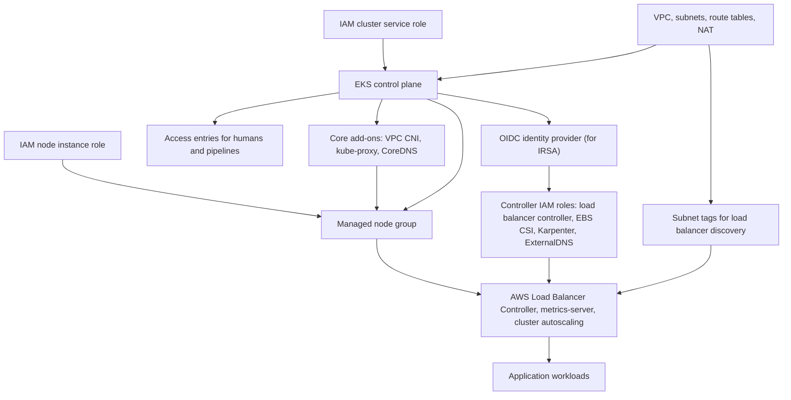
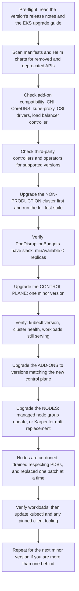
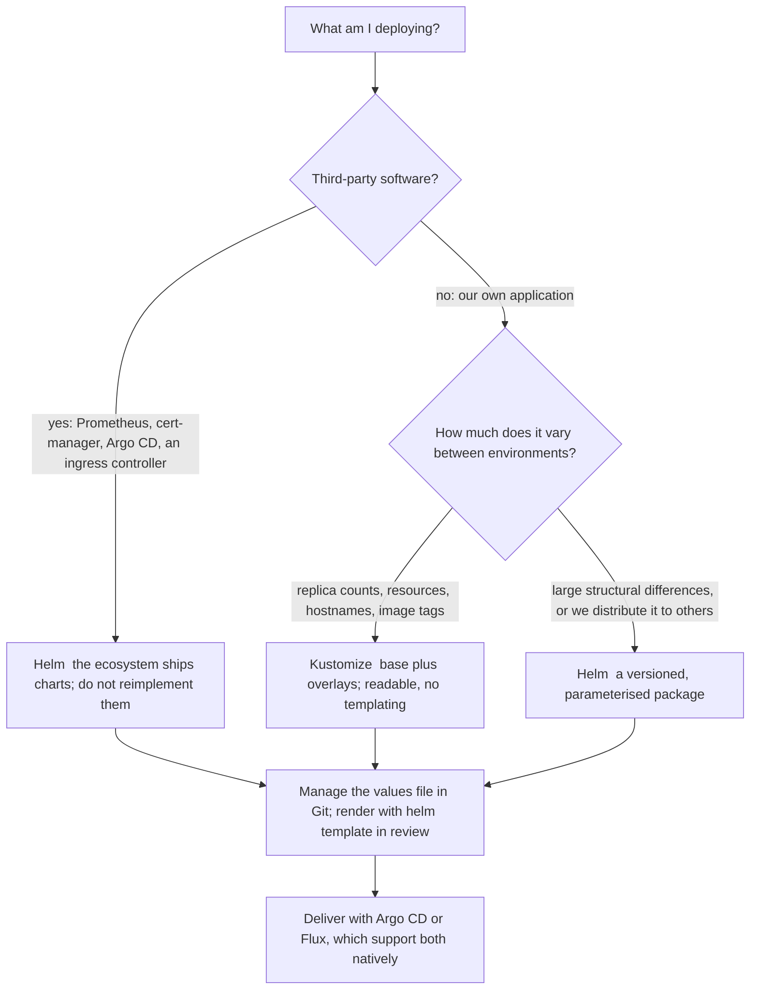
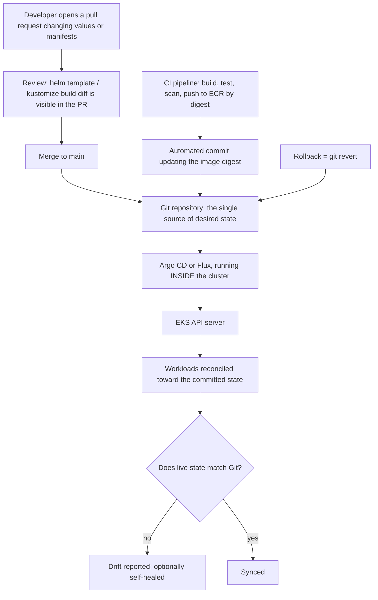
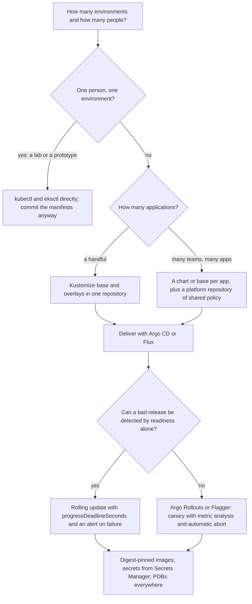
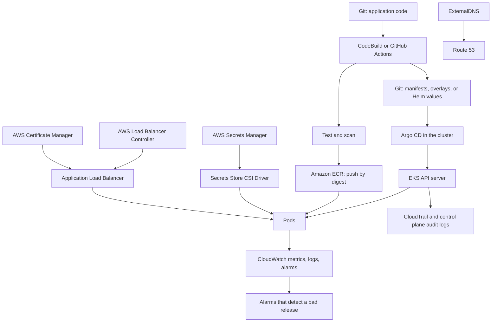

# Deploying Applications on Amazon EKS

---

## Definition

**Deploying an application on Amazon EKS** is the process of expressing the application's desired state as Kubernetes API objects, delivering those objects to the cluster's API server, and allowing the cluster's controllers to reconcile reality toward them.

That definition contains the whole discipline. There are three separable concerns, and confusing them is the source of most difficulty:

| Concern | Question it answers | Tools |
|---|---|---|
| **Cluster provisioning** | Does a cluster exist, with the right network, nodes, add-ons, and access? | `eksctl`, CloudFormation, CDK, Terraform, the console |
| **Manifest authoring and packaging** | What objects describe this application, and how do they vary across environments? | Raw YAML, Kustomize, Helm |
| **Delivery** | How do those objects reach the cluster, repeatably and auditably? | `kubectl` (learning), CI pipelines (adequate), GitOps (correct) |

Within an AWS architecture, this chapter sits between the infrastructure layer of Chapter 3.1 and the operational concerns of Chapter 3.3. The cluster is infrastructure; the manifests are application configuration; the delivery mechanism is the boundary between the two, and it is where most organisations' problems actually live.

!!! note "Everything in Kubernetes is the same three fields"

    Every Kubernetes object  a Pod, a Deployment, a NetworkPolicy, a custom resource you invent  has `apiVersion`, `kind`, `metadata`, and (almost always) `spec`. You declare `spec`; a controller writes `status`. `kubectl apply` submits the object; a controller notices and acts. Once a student sees that a Deployment and a CustomResourceDefinition are the same shape processed by different controllers, Kubernetes stops being a list of features and becomes one mechanism applied repeatedly. That realisation is worth more than memorising any particular resource.

---

## Why This Service or Concept Exists

### Why cluster creation is not one API call

Creating an EKS cluster looks like a single `CreateCluster` call, and the AWS console presents it that way. In practice a *usable* cluster is a dependency graph of a dozen resources, and getting the order wrong produces failures whose causes are several steps removed from their symptoms:


```mermaid
flowchart TD
    A["IAM cluster service role"] --> C["EKS control plane"]
    B["VPC, subnets, route tables, NAT"] --> C
    B --> B2["Subnet tags for load balancer discovery"]
    C --> D["OIDC identity provider (for IRSA)"]
    C --> E["Access entries for humans and pipelines"]
    C --> F["Core add-ons: VPC CNI, kube-proxy, CoreDNS"]
    A2["IAM node instance role"] --> G["Managed node group"]
    F --> G
    C --> G
    D --> H["Controller IAM roles: load balancer controller, EBS CSI, Karpenter, ExternalDNS"]
    G --> I["AWS Load Balancer Controller, metrics-server, cluster autoscaling"]
    H --> I
    I --> J["Application workloads"]
    B2 --> I
```

Nodes cannot become `Ready` before the CNI works. The load balancer controller cannot create an ALB before its IAM role exists, and cannot choose subnets before they are tagged. IRSA roles cannot be created before the OIDC provider is registered, which cannot happen before the cluster exists. A human clicking through a console will hit these in sequence and interpret each as a separate mystery; a tool that understands the graph will not.

This is why `eksctl`, the AWS CDK's EKS constructs, and the `terraform-aws-eks` module all exist: **the value they add is the graph, not the API calls**.

### Why `kubectl` is the wrong production deployment tool

`kubectl` is an excellent client and an indispensable diagnostic tool. As a *deployment* mechanism it has four specific defects:

| Defect | Consequence |
|---|---|
| It runs on somebody's machine | The cluster's state depends on who ran what, from where, with which file |
| It leaves no durable record of intent | `kubectl edit` changes a live object with no commit, no review, and no diff |
| It requires cluster credentials wherever it runs | Every CI runner holds cluster admin, which is the opposite of a private endpoint's purpose |
| It has no drift detection | A manual change persists silently until something breaks and nobody knows why |

The progression the industry settled on is: **`kubectl` to learn and to debug, CI pipelines to deploy adequately, GitOps to deploy correctly**. In the GitOps model the desired state is a Git repository, a controller inside the cluster reconciles toward it, deployment is a pull request, rollback is a revert, and drift is detected and reported. Nothing outside the cluster needs cluster credentials at all.

### Why packaging tools exist

A single application in a single environment needs perhaps six YAML files. The same application across development, staging, and production  differing in replica count, resource sizes, image tags, hostnames, and feature flags  needs either eighteen files that drift apart, or a mechanism for expressing the differences.

| Approach | Mechanism | Strength | Weakness |
|---|---|---|---|
| **Copy per environment** | Three directories | Simple, explicit | They diverge; a fix applied to one is forgotten in the others |
| **Kustomize** | A base plus declarative overlays that patch it | No templating language; output is always valid YAML; built into `kubectl` | Awkward for large conditional variation; no packaging or distribution story |
| **Helm** | Go templates plus a values file, packaged as a versioned chart | Distributable, versioned, with release history and rollback; the ecosystem standard for third-party software | Templated YAML is hard to read and easy to get subtly wrong; whitespace bugs are a genre |

The mature answer for most organisations is **both**: Helm for third-party software (you will not rewrite the Prometheus chart), and Kustomize for your own applications (where the variation between environments is small and readability matters most).

!!! tip "The recurring theme of this chapter"

    Every tool here has an imperative form that teaches the concept and a declarative form that runs the platform. `kubectl create deployment` teaches what a Deployment is; a committed manifest runs it. `eksctl create cluster` with flags teaches what a cluster needs; a `ClusterConfig` file runs it. `helm install --set` teaches values; a committed `values.yaml` runs it. Learn imperatively, operate declaratively  and be suspicious of any production system whose current state cannot be reconstructed from a repository.

---

## Core Concepts: Creating and Managing EKS Clusters

### What cluster creation actually does

`CreateCluster` provisions the control plane described in 3.1 and, in your account, creates the cross-account ENIs and the cluster security group. It does **not** create nodes, add-ons beyond the defaults, an OIDC provider, or any controller. A cluster immediately after creation has an API server, no compute, and no way for you to authenticate unless you were the creating principal.

| Stage | What is created | Typical duration | Failure symptom if skipped or wrong |
|---|---|---|---|
| **Prerequisites** | Cluster service role, node instance role, VPC, subnets, route tables, NAT | Minutes | Creation fails, or nodes cannot reach ECR or the endpoint |
| **Control plane** | API server, `etcd`, cross-account ENIs, cluster security group | 8–12 minutes |  |
| **Access** | Access entries for humans and pipelines | Seconds | `Unauthorized` for everyone but the creator |
| **OIDC provider** | An IAM identity provider from the cluster's issuer URL | Seconds | IRSA roles cannot be created |
| **Core add-ons** | VPC CNI, `kube-proxy`, CoreDNS | 1–2 minutes | Nodes never become `Ready`; DNS does not resolve |
| **Node group** | Launch template, Auto Scaling group, EC2 instances, node access entry | 3–5 minutes | No compute; every Pod `Pending` |
| **Controllers** | Load balancer controller, EBS CSI driver, metrics-server, Karpenter | Minutes | Ingress does nothing; PVCs stay `Pending`; HPA reports unknown metrics |

!!! warning "CoreDNS Pods stay `Pending` until nodes exist, and that is not an error"

    On a freshly created cluster with no node group, `kubectl get pods -n kube-system` shows CoreDNS `Pending`. Students frequently treat this as a broken cluster and start debugging DNS. It is simply a Deployment with no nodes to schedule onto; it resolves the moment a node group is created. Recognising "there is nowhere to run this" as distinct from "this is broken" is a general Kubernetes diagnostic skill.

### Subnet requirements and tags

EKS and the AWS Load Balancer Controller both discover subnets by tag, and missing tags produce failures that name nothing about tags:

| Tag | Applied to | Purpose |
|---|---|---|
| `kubernetes.io/role/elb = 1` | Public subnets | Where internet-facing load balancers are placed |
| `kubernetes.io/role/internal-elb = 1` | Private subnets | Where internal load balancers are placed |
| `kubernetes.io/cluster/<cluster-name> = shared` or `owned` | Subnets | Cluster association; required by older controller versions and still commonly applied |
| `karpenter.sh/discovery = <cluster-name>` | Subnets and security groups | How Karpenter discovers where to launch nodes |

The requirements themselves: **at least two subnets in two different Availability Zones**; private subnets for nodes in any production design; a route to the API server endpoint (through NAT, the private endpoint, or VPC endpoints); enough address space for Pods, not merely for nodes; and, if internet-facing load balancers are needed, public subnets with a route to an internet gateway.

!!! danger "An untagged subnet produces `could not find any suitable subnets for creating the ALB`"

    This error names the load balancer, not the tag, so teams look at the Ingress, the controller's IAM role, and the security groups before they look at subnet tags. Add the discovery tags at VPC creation time, in the same infrastructure-as-code that creates the subnets, and this failure never occurs.

### The cluster upgrade, in order

An upgrade is the recurring obligation established in [3.1](topic1.md#design-considerations): roughly annual, one minor version at a time, and effectively one-way  a control plane rollback is possible only within a short window after the upgrade, and nodes and add-ons must be reverted separately. The order is not optional, because Kubernetes supports a limited version skew between the control plane and the `kubelet`  nodes may run behind the control plane, never ahead.


```mermaid
flowchart TD
    A["Pre-flight: read the version's release notes and the EKS upgrade guide"] --> B["Scan manifests and Helm charts for removed and deprecated APIs"]
    B --> C["Check add-on compatibility: CNI, CoreDNS, kube-proxy, CSI drivers, load balancer controller"]
    C --> D["Check third-party controllers and operators for supported versions"]
    D --> E["Upgrade the NON-PRODUCTION cluster first and run the full test suite"]
    E --> F["Verify PodDisruptionBudgets have slack: minAvailable < replicas"]
    F --> G["Upgrade the CONTROL PLANE: one minor version"]
    G --> H["Verify: kubectl version, cluster health, workloads still serving"]
    H --> I["Upgrade the ADD-ONS to versions matching the new control plane"]
    I --> J["Upgrade the NODES: managed node group update, or Karpenter drift replacement"]
    J --> K["Nodes are cordoned, drained respecting PDBs, and replaced one batch at a time"]
    K --> L["Verify workloads, then update kubectl and any pinned client tooling"]
    L --> M["Repeat for the next minor version if you are more than one behind"]
```

**Why this order.** The control plane may run ahead of nodes but not behind them, so the control plane goes first. Add-ons must match the new control plane before nodes are replaced, or newly launched nodes run components that are incompatible with the API server. Nodes go last because their replacement is the disruptive part and should happen when everything else is already correct.

**What actually blocks upgrades in practice:** a removed API version still used by a manifest (the classic being the long-ago move of Ingress to `networking.k8s.io/v1`, but every release removes something); an add-on left at a version that predates the new control plane; a PodDisruptionBudget with no slack, which stalls the drain forever; a single-replica workload with a PDB, which is the same deadlock; and stateful workloads whose Pods cannot be evicted because their volumes are zone-bound.

### Node upgrades: cordon, drain, replace

A managed node group update replaces nodes rather than upgrading them in place, which is the correct behaviour for immutable infrastructure:

```mermaid
sequenceDiagram
    participant EKS as "EKS managed node group update"
    participant ASG as "Auto Scaling group"
    participant NEW as "New node (new AMI)"
    participant OLD as "Old node"
    participant PDB as "PodDisruptionBudget"
    participant POD as "Pods on the old node"
    EKS->>ASG: "raise capacity; launch a node with the new AMI"
    NEW->>EKS: "node registers and becomes Ready"
    EKS->>OLD: "cordon: mark unschedulable, no new Pods land here"
    EKS->>OLD: "drain: evict Pods one by one"
    OLD->>PDB: "eviction request for each Pod"
    alt PDB has slack
        PDB-->>OLD: "allowed"
        POD->>POD: "SIGTERM, preStop hook, graceful shutdown"
        POD->>NEW: "rescheduled by its controller onto available capacity"
    else PDB would be violated
        PDB-->>OLD: "denied; eviction retried"
        Note over OLD,PDB: "With minAvailable == replicas this loops forever and the update times out"
    end
    EKS->>ASG: "terminate the drained node"
    EKS->>EKS: "repeat per maxUnavailable until the group is replaced"
```

The `updateConfig` on a managed node group sets `maxUnavailable` or `maxUnavailablePercentage`, which bounds how much of the group is replaced at once  the same trade between speed and capacity that Chapter 2.3 made for ECS deployments.

!!! danger "`minAvailable: 3` on a three-replica Deployment is a deadlock, not a guarantee"

    A PodDisruptionBudget governs *voluntary* disruption: drains, node upgrades, Karpenter consolidation. If `minAvailable` equals the replica count, no Pod may ever be evicted, so a drain never completes and every node upgrade hangs until it times out. The rule is simple: **`minAvailable` must be strictly less than `replicas`**, or use `maxUnavailable: 1`. And a single-replica Deployment with any PDB at all is permanently undrainable  which is one more reason nothing that matters should run with one replica.

---

## Core Concepts: `kubectl` and `eksctl`

### The kubeconfig and how EKS authentication is wired

```bash
aws eks update-kubeconfig --name dso303-prod --region us-east-1
```

This writes a context into `~/.kube/config` containing the cluster endpoint, the cluster certificate authority, and  the interesting part  an **exec credential plugin**:

```yaml
users:
- name: arn:aws:eks:us-east-1:111122223333:cluster/dso303-prod
  user:
    exec:
      apiVersion: client.authentication.k8s.io/v1beta1
      command: aws
      args: ["--region", "us-east-1", "eks", "get-token", "--cluster-name", "dso303-prod"]
```

`kubectl` invokes `aws eks get-token` before each request; the CLI constructs the pre-signed SigV4 STS token described in 3.1; the token is valid for about fifteen minutes. Three consequences follow. **No long-lived cluster credential exists on disk**  the kubeconfig alone is useless without AWS credentials, which is a genuine security property. **Your cluster identity is whatever AWS identity is active**, so a change of profile or an assumed role changes who you are in the cluster. And **`--profile` or `--role-arn` can be added to the exec args** to pin a context to a specific identity, which is how you keep a production context from silently using development credentials.

!!! tip "Guard against the wrong-cluster accident"

    `kubectl` applies to whatever context is current, and the most expensive mistakes in Kubernetes operations are commands run against the wrong cluster. Show the current context in your shell prompt (`kubectl config current-context`, or `kube-ps1`), use `kubectx` to switch deliberately, and set a different context name for production that is visually distinct. This is not fussiness: `kubectl delete namespace` in the wrong context is unrecoverable.

### `kubectl` for inspection and diagnosis

This is the set worth genuine fluency, because these commands answer most questions:

| Command | Answers |
|---|---|
| `kubectl get <kind> -o wide` | What exists, and on which node and IP |
| `kubectl describe <kind> <name>` | **Events**  the single most useful diagnostic output in Kubernetes |
| `kubectl get events --sort-by=.lastTimestamp` | What has been happening in the namespace recently |
| `kubectl logs <pod> -c <container>` | Application output; `--previous` for the crashed instance, which is where the cause is |
| `kubectl logs -f -l app=orders --max-log-requests=10` | Streaming logs across all Pods of a service |
| `kubectl exec -it <pod> -- sh` | A shell inside a running container |
| `kubectl debug -it <pod> --image=busybox --target=<container>` | An ephemeral debug container beside a distroless container that has no shell |
| `kubectl port-forward svc/<name> 8080:80` | Reaching an internal Service from your machine without exposing it |
| `kubectl top nodes` / `kubectl top pods` | Actual usage, versus the requests the scheduler used (requires metrics-server) |
| `kubectl rollout status deploy/<name>` | Whether a deployment has actually converged  what `apply` does not tell you |
| `kubectl rollout undo deploy/<name>` | Revert to the previous ReplicaSet |
| `kubectl auth can-i <verb> <resource> --as <user>` | Whether RBAC permits something, without trying it |
| `kubectl explain <kind>.spec.<field>` | The schema, from the API server itself  better than searching documentation |
| `kubectl get pod -o jsonpath='{...}'` | Machine-readable extraction for scripts |
| `kubectl diff -f manifest.yaml` | What would change if this were applied |

!!! tip "`kubectl describe pod` first, always"

    Insufficient CPU or memory, no node matching the selector, image pull failures, IP assignment failures, volume attachment failures, probe failures, and OOM kills all appear in a Pod's events in plain English. Students who reason about what Kubernetes might be doing take twenty minutes; students who read the events take two. Build the habit before you build the theory.

### `apply` versus `create`, and server-side apply

| Command | Semantics | Use |
|---|---|---|
| `kubectl create` | Fails if the object exists | Imperative, one-off, learning |
| `kubectl apply` | Creates or updates by merging with the recorded configuration | The declarative workflow |
| `kubectl replace` | Overwrites the whole object; fails if it does not exist | Rare; you almost always want `apply` |
| `kubectl apply --server-side` | The API server tracks **field ownership** per manager | Multiple controllers legitimately managing different fields of one object |
| `kubectl edit` | Opens the live object in an editor | Diagnosis only; **never** as a change mechanism |
| `kubectl patch` | Applies a targeted change | Scripts and automation, not routine deployment |

**Server-side apply** matters more than it appears. When several actors touch one object  you set `replicas`, an HPA also sets `replicas`, a mutating webhook adds annotations  client-side apply produces silent tug-of-war. Server-side apply records which manager owns which field and reports a conflict rather than clobbering. If your `replicas` field is managed by an HPA, it should not be in your committed manifest at all; that is the field-ownership principle stated in practical terms.

### `eksctl`: what it does and where it leaks

`eksctl` is a community CLI (now with AWS documentation) whose real contribution is that it understands the dependency graph. `eksctl create cluster` generates CloudFormation stacks  one for the cluster and VPC, one per node group  and creates the OIDC provider, IAM roles, access entries, and add-ons in the correct order.

| Strength | Limitation |
|---|---|
| Fastest correct path from nothing to a working cluster | Creates CloudFormation stacks that your Terraform state does not know about |
| Sensible defaults for VPC, subnets, and node groups | Those defaults are not always what production needs |
| First-class support for IRSA, add-ons, Fargate profiles, and access entries | Weaker for continuous management than for creation |
| `ClusterConfig` files make it declarative and reviewable | Not a general-purpose IaC tool: it manages clusters, not the surrounding estate |
| Excellent for teaching, labs, and prototypes | Mixing it with Terraform for the same cluster leads to state conflicts |

The honest guidance: **`eksctl` for learning, labs, and prototypes; your organisation's standard IaC tool for production**, because a production cluster is one node in a much larger dependency graph that also contains databases, DNS, network connectivity, and other accounts.

| Provisioning path | Best for | Watch out for |
|---|---|---|
| **Console** | Learning what the fields mean, once | Nothing is reproducible; never for anything durable |
| **`eksctl`** | Labs, prototypes, a fast correct cluster | Hidden CloudFormation stacks; poor fit alongside Terraform |
| **CloudFormation / CDK** | AWS-native shops; CDK gives real programming constructs | EKS in raw CloudFormation is verbose; CDK's constructs run `kubectl` under the hood |
| **Terraform** | Multi-cloud or Terraform-standardised organisations | The Kubernetes provider creating in-cluster objects mixes two lifecycles and causes ordering problems |

!!! warning "Do not manage in-cluster objects with your infrastructure tool"

    Terraform's `kubernetes_manifest` resource and CDK's `KubernetesManifest` construct both work, and both create a problem: cluster infrastructure changes on a slow, careful cadence while application manifests change many times a day, and putting them in one state file couples the two. It also produces genuine ordering failures  Terraform planning against a cluster that does not exist yet, or against CRDs that have not been installed. Use IaC for the cluster and its IAM, and GitOps for what runs inside it.

---

## Core Concepts: Manifests, Kustomize, and Helm

### The manifests a production service actually needs

| Object | Purpose | Omitting it causes |
|---|---|---|
| **Deployment** | Desired replicas of a Pod template |  |
| **Service** | A stable virtual address and endpoint set | Nothing can reliably reach the Pods |
| **Ingress** | HTTP routing and an ALB | No external access |
| **ServiceAccount** | The Pod's identity, and its IAM binding | Pods use `default` and fall back to the node role |
| **ConfigMap** | Non-secret configuration | Configuration baked into images, requiring a rebuild to change |
| **Secret** | Sensitive values (better: a reference to Secrets Manager) | Credentials in a ConfigMap or an image |
| **HorizontalPodAutoscaler** | Replica count driven by a metric | Static capacity |
| **PodDisruptionBudget** | A floor during voluntary disruption | Drains and upgrades take the service down |
| **NetworkPolicy** | Which Pods may talk to these Pods | Any compromised Pod can reach this one |
| **ResourceQuota / LimitRange** | Namespace-level bounds and defaults | One team can consume the cluster |

### Requests, limits, and probes: the four fields that decide behaviour

These deserve emphasis because they cause more production incidents than any other part of a manifest.

**Requests** are what the **scheduler** uses. A Pod with no requests is a Pod the scheduler believes is free, so it packs nodes until everything degrades simultaneously. Requests should come from observed usage, not from the example you copied.

**Limits** are enforced at runtime, and the two resources behave differently. Exceeding a **memory** limit means the container is **OOM-killed** immediately. Exceeding a **CPU** limit means the container is **throttled**  not killed, but slowed, often catastrophically for latency-sensitive services. The common production guidance is therefore asymmetric: **set memory request equal to memory limit** for predictable eviction behaviour, and **set a CPU request but usually no CPU limit**, so a service can burst into idle capacity instead of being throttled while the node is half idle.

**Probes** have three kinds and confusing them is a classic failure:

| Probe | Question | Failure action | Common mistake |
|---|---|---|---|
| **`startupProbe`** | Has it finished starting? | Restart, but only after `failureThreshold` | Omitted, so a slow starter is killed by the liveness probe forever |
| **`readinessProbe`** | Can it serve traffic *now*? | Remove from Service endpoints | Points at a handler that returns 200 before dependencies are ready |
| **`livenessProbe`** | Is it wedged and in need of a restart? | Kill and restart the container | Checks a dependency, so a database blip restarts every Pod at once |

!!! danger "A liveness probe that checks a dependency turns a downstream blip into a cluster-wide restart storm"

    If `/health` verifies the database connection and the database has a thirty-second hiccup, every replica of every service that checks it fails its liveness probe simultaneously and is killed. The restart storm then delays recovery well past the original fault. **Liveness must test only the process's own health**; dependency health belongs in the readiness probe, where the consequence is removal from load balancing rather than a restart.

### Kustomize: bases and overlays

Kustomize is built into `kubectl` (`kubectl apply -k`). Its model is a **base**  a complete, valid set of manifests  plus **overlays** that patch it per environment. There is no templating language; every file is real YAML that a linter and an editor understand.

```
apps/orders/
├── base/
│   ├── kustomization.yaml
│   ├── deployment.yaml
│   ├── service.yaml
│   └── ingress.yaml
└── overlays/
    ├── dev/
    │   ├── kustomization.yaml      # replicas: 1, small resources, dev hostname
    │   └── patch-resources.yaml
    ├── staging/
    │   └── kustomization.yaml
    └── prod/
        ├── kustomization.yaml      # replicas: 6, prod hostname, PDB added
        ├── patch-resources.yaml
        └── pdb.yaml
```

The property that matters: **anything not stated in an overlay is guaranteed identical to the base**. Environments cannot drift in the ways copies do, because the difference between them is the only thing written down.

### Helm: charts, values, releases

A Helm chart is a package:

```
orders-chart/
├── Chart.yaml          # name, version, appVersion, dependencies
├── values.yaml         # default values  the chart's public interface
├── templates/
│   ├── deployment.yaml # Go templates rendering Kubernetes objects
│   ├── service.yaml
│   ├── ingress.yaml
│   ├── _helpers.tpl    # named template snippets: labels, names
│   └── NOTES.txt       # printed after install
└── charts/             # vendored dependency charts
```

Helm renders the templates with the merged values and submits the result. It records each install or upgrade as a **release**  a versioned revision stored as a Secret in the release namespace  which is what makes `helm rollback` possible.

| Command | Effect |
|---|---|
| `helm install <release> <chart> -f values-prod.yaml` | Render and create |
| `helm upgrade --install <release> <chart> -f values-prod.yaml` | Idempotent create-or-update; the form to use in automation |
| `helm template <chart> -f values.yaml` | Render locally without touching the cluster  the review step |
| `helm diff upgrade <release> <chart> -f values.yaml` | Show what would change (a plugin, and worth installing) |
| `helm lint <chart>` | Static checks on the chart |
| `helm history <release>` / `helm rollback <release> <rev>` | Release history and revert |
| `helm get values <release>` | What values are actually in effect  often surprising |

**Where Helm bites.** Templated YAML is whitespace-sensitive and the errors are obscure. Unquoted values become the wrong type  a version like `1.10` becomes the number `1.1`, and a large number becomes scientific notation. `--set` on the command line is invisible to review and is not recorded anywhere durable. Chart hooks (`pre-install`, `post-upgrade`) run outside the normal reconciliation and are easy to get wrong. And a `helm upgrade` that fails partway leaves a release in a `pending-upgrade` state that must be resolved manually.

### Choosing between them


```mermaid
flowchart TD
    A["What am I deploying?"] --> B{"Third-party software?"}
    B -->|"yes: Prometheus, cert-manager, Argo CD, an ingress controller"| C["Helm  the ecosystem ships charts; do not reimplement them"]
    B -->|"no: our own application"| D{"How much does it vary between environments?"}
    D -->|"replica counts, resources, hostnames, image tags"| E["Kustomize  base plus overlays; readable, no templating"]
    D -->|"large structural differences, or we distribute it to others"| F["Helm  a versioned, parameterised package"]
    C --> G["Manage the values file in Git; render with helm template in review"]
    E --> G
    F --> G
    G --> H["Deliver with Argo CD or Flux, which support both natively"]
```

!!! tip "The combination most platform teams converge on"

    **Helm for what other people wrote, Kustomize for what you wrote, and a GitOps controller applying both.** Argo CD and Flux each render Helm charts and Kustomize overlays natively, so this is not a compromise  it is using each tool where its strength lies, with one delivery mechanism and one audit trail.

### GitOps: the end state


```mermaid
flowchart TD
    DEV["Developer opens a pull request changing values or manifests"] --> REV["Review: helm template / kustomize build diff is visible in the PR"]
    REV --> MERGE["Merge to main"]
    MERGE --> REPO["Git repository  the single source of desired state"]
    REPO --> ARGO["Argo CD or Flux, running INSIDE the cluster"]
    ARGO --> API["EKS API server"]
    API --> WORK["Workloads reconciled toward the committed state"]
    WORK --> DRIFT{"Does live state match Git?"}
    DRIFT -->|"no"| ALERT["Drift reported; optionally self-healed"]
    DRIFT -->|"yes"| OK["Synced"]
    CI["CI pipeline: build, test, scan, push to ECR by digest"] --> BUMP["Automated commit updating the image digest"]
    BUMP --> REPO
    ROLL["Rollback = git revert"] --> REPO
```

What changes, concretely: **no external system holds cluster credentials**, because the controller pulls rather than being pushed to  which is what makes a private-endpoint cluster practical. **Rollback is a revert**, with the same review path as any change. **Drift is detected** rather than discovered. And **the repository is an accurate inventory** of what is running, which is precisely what the university in the motivation section did not have.

---

## Architecture Components

| Component | Responsibility in the deployment workflow |
|---|---|
| **`eksctl` / CloudFormation / CDK / Terraform** | Create the cluster, its IAM, its network, its node groups, and its add-ons |
| **`ClusterConfig` file** | The declarative form of a cluster's definition for `eksctl` |
| **Cluster service role and node instance role** | The IAM identities the control plane and `kubelet` use |
| **Access entries** | Who may authenticate to the cluster, and with which managed policy |
| **kubeconfig and the exec credential plugin** | Local client configuration; no long-lived cluster credential |
| **`kubectl`** | The universal client: inspection, diagnosis, and learning |
| **Manifests** | The declarative description of application objects |
| **Kustomize base and overlays** | Environment variation expressed as patches rather than copies |
| **Helm chart, values, and release** | A versioned, parameterised package with history and rollback |
| **Container registry (Amazon ECR)** | Where images live; digests are what manifests should reference |
| **CI pipeline** | Build, test, scan, push by digest, and update the manifest repository |
| **GitOps controller (Argo CD, Flux)** | Reconciles the cluster toward Git; detects and reports drift |
| **Deployment controller and ReplicaSet controller** | Perform the rolling update inside the cluster |
| **HorizontalPodAutoscaler and metrics-server** | Adjust replica counts from metrics |
| **PodDisruptionBudget** | Bounds voluntary disruption during drains, upgrades, and consolidation |
| **AWS Load Balancer Controller** | Turns Ingress objects into ALBs; the external entry point |
| **Managed node group `updateConfig`** | Bounds how much of the fleet is replaced at once during an upgrade |
| **Argo Rollouts / Flagger** | Progressive delivery: canary analysis and automatic abort |

Read architecturally, these separate into **provisioning** (slow, careful, infrastructure-as-code), **packaging** (per application, versioned, reviewed), and **delivery** (frequent, automated, auditable). Most organisational pain in Kubernetes comes from collapsing two of these into one  managing manifests with Terraform, or provisioning clusters with the same pipeline that deploys applications  because the three have genuinely different change frequencies and genuinely different blast radii.

---

## AWS Service Deep Dive

!!! warning "On versions and quotas"

    Kubernetes versions, `eksctl` behaviour, Helm versions, and add-on compatibility all change frequently. Figures below are representative as of 2026. Verify against the EKS User Guide, the Kubernetes version calendar, and AWS Service Quotas for the account and Region you are designing in.

### EKS cluster lifecycle management

**Purpose.** Create, configure, upgrade, and delete clusters and node groups reproducibly.

**Architecture.** The EKS API exposes `CreateCluster`, `UpdateClusterVersion`, `UpdateClusterConfig`, `CreateNodegroup`, `UpdateNodegroupVersion`, `CreateAddon`, `UpdateAddon`, `CreateAccessEntry`, and `CreateFargateProfile`. Provisioning tools compose these with the IAM, EC2, and VPC calls they depend on.

**Important features.** Managed node group updates that cordon, drain, and replace nodes respecting PodDisruptionBudgets; `updateConfig` bounding concurrent replacement; EKS add-on version management with conflict resolution; access entries with managed policies; cluster and node group tags propagated for cost allocation; launch template support for custom node configuration.

**Limitations.** Upgrades proceed **one minor version at a time and are effectively one-way**, since a control plane rollback is possible only within a short window after the upgrade and nodes and add-ons must be reverted separately. A cluster's VPC, control-plane subnets, IP family, and whether the `aws-auth` ConfigMap is available are fixed at creation. Node group updates can be blocked indefinitely by PodDisruptionBudgets that admit no eviction. Managed node group configuration changes often require node replacement. A cluster cannot be moved between accounts or Regions.

**Pricing model.** The per-cluster control plane fee described in 3.1  indicatively $0.10 per hour in standard support and about $0.60 in extended support  plus the data plane. Lifecycle operations themselves are not charged.

**Performance characteristics.** Cluster creation takes roughly ten to fifteen minutes; deletion similar. Node group creation takes three to five minutes. A control plane version upgrade typically takes twenty to forty minutes and is non-disruptive to running workloads. Node group upgrades take as long as draining requires, which is a function of your PodDisruptionBudgets, `terminationGracePeriodSeconds`, and node count.

**Availability.** Control plane upgrades are performed without downtime for the API server. Node upgrades are disruptive per node and are the reason PodDisruptionBudgets and multiple replicas exist.

**Security features.** Every lifecycle call is recorded in CloudTrail; access entries make cluster permissions auditable; managed node groups enforce IMDS options from the launch template; add-ons can be given their own IAM roles rather than relying on the node role.

**Service limits.** Representative soft quotas per account and Region: clusters, managed node groups per cluster, nodes per node group, Fargate profiles per cluster, and access entries per cluster.

**Common configurations.** A `ClusterConfig` file or Terraform module defining the cluster, three node groups (general On-Demand, Spot batch, and a system group for controllers), the four core add-ons pinned to versions, access entries per team, and control plane logging enabled.

### `kubectl`

**Purpose.** The universal Kubernetes client, for every API operation.

**Architecture.** A Go client that reads a kubeconfig, obtains credentials  for EKS, through the `aws eks get-token` exec plugin  and speaks the REST API, with client-side merge logic for `apply`.

**Important features.** `apply` with three-way merge; server-side apply with field ownership; `describe` aggregating events; `logs` with `--previous` and label selectors; `exec`, `port-forward`, `cp`, and `debug` with ephemeral containers; `rollout status`, `history`, and `undo`; `auth can-i` for RBAC testing; `explain` for the live schema; `diff` for dry runs; JSONPath and Go template output; `-k` for Kustomize.

**Limitations.** Client and server version skew is supported only within about one minor version. `apply` returns before convergence. `kubectl edit` produces unrecorded changes. Bulk operations against large clusters can be slow and can load the API server. It requires credentials wherever it runs, which is precisely what GitOps avoids.

**Pricing model.** Free. API calls are not billed, though very heavy `list` usage can add API server load.

**Common configurations.** A kubeconfig per cluster with the exec plugin pinned to a profile or role ARN; context name visible in the shell prompt; `kubectl diff` before `kubectl apply` for any manual change; `kubectl rollout status` after every deployment in automation.

### `eksctl`

**Purpose.** Create and manage EKS clusters and their supporting AWS resources with a single tool that understands the dependency graph.

**Architecture.** Generates CloudFormation stacks for the cluster, VPC, and each node group, and calls the EKS, IAM, and EC2 APIs directly for the rest. A `ClusterConfig` YAML file is the declarative interface.

**Important features.** One-command cluster creation; `ClusterConfig` files covering VPC, node groups, Fargate profiles, add-ons, access entries, IRSA service accounts, and control plane logging; node group creation, scaling, deletion, and version updates; `eksctl utils update-*` helpers; unattended cluster upgrades.

**Limitations.** The CloudFormation stacks it creates are invisible to other IaC tools, so mixing `eksctl` with Terraform on the same cluster causes state conflicts. Its VPC defaults are convenient rather than production-shaped. It manages clusters, not the wider estate. Some newer EKS features appear in the AWS CLI before `eksctl`.

**Pricing model.** Free; you pay for the AWS resources it creates, including the CloudFormation stacks' underlying resources.

**Common configurations.** A `ClusterConfig` file committed to Git for labs and prototypes; `eksctl create iamserviceaccount` for IRSA roles on clusters it manages; `eksctl upgrade cluster` followed by `eksctl upgrade nodegroup` for a full version bump.

### Helm

**Purpose.** Package, parameterise, version, distribute, and install Kubernetes applications.

**Architecture.** A client-side tool (Helm 3 has no in-cluster component). It renders Go templates against merged values, submits the result to the API server, and stores each release revision as a Secret in the release's namespace.

**Important features.** Charts with dependencies; `values.yaml` as a documented interface; `helm upgrade --install` for idempotent automation; release history and `helm rollback`; `helm template` for local rendering; lifecycle hooks; OCI registry support so ECR can host charts; `helm diff` as a plugin.

**Limitations.** Templated YAML is error-prone, especially with whitespace and type coercion of unquoted values. `--set` bypasses review and is not durably recorded. Failed upgrades leave releases in a pending state requiring manual repair. Chart quality varies widely across the ecosystem. Values files provide no schema enforcement unless the chart author supplies a JSON schema.

**Pricing model.** Free; ECR charges apply if charts are stored there as OCI artefacts.

**Common configurations.** `helm upgrade --install` in automation with a committed values file per environment; charts pinned to exact versions; `helm diff` in review; third-party charts vendored or mirrored rather than pulled live from the internet at deploy time.

---

## Important AWS Terminology

| Term | Meaning |
|---|---|
| **`eksctl`** | The community CLI that creates clusters and their supporting AWS resources |
| **`ClusterConfig`** | The declarative YAML file `eksctl` consumes |
| **kubeconfig** | The client configuration file naming clusters, users, and contexts |
| **Context** | A named cluster-plus-user pairing; the thing `kubectl` acts against |
| **Exec credential plugin** | The mechanism by which `kubectl` calls `aws eks get-token` for a short-lived token |
| **`aws eks update-kubeconfig`** | The command that writes an EKS context into your kubeconfig |
| **Manifest** | A YAML or JSON file describing one or more Kubernetes objects |
| **`apiVersion` / `kind` / `metadata` / `spec` / `status`** | The universal shape of every Kubernetes object; you write `spec`, controllers write `status` |
| **Declarative management** | Describing desired state and letting controllers reconcile |
| **Three-way merge** | `apply`'s comparison of your file, the live object, and the last-applied configuration |
| **Server-side apply** | API-server-tracked field ownership per manager, with explicit conflicts |
| **`last-applied-configuration`** | The annotation client-side apply uses to detect removed fields |
| **Deployment** | A controller maintaining replicas of a Pod template, with rolling updates |
| **ReplicaSet** | The object a Deployment creates per revision; the unit `rollout undo` switches between |
| **`maxSurge` / `maxUnavailable`** | Rolling update bounds: extra Pods permitted, and Pods that may be missing |
| **`progressDeadlineSeconds`** | How long a stalled rollout waits before being marked failed (it does **not** roll back) |
| **`kubectl rollout status` / `undo` / `history`** | Wait for convergence; revert; list revisions |
| **Requests** | The resource amounts the scheduler uses for placement |
| **Limits** | Runtime ceilings: memory over-limit is an OOM kill, CPU over-limit is throttling |
| **`startupProbe` / `readinessProbe` / `livenessProbe`** | Has it started; can it serve; is it wedged |
| **PodDisruptionBudget** | A floor on available Pods during voluntary disruption |
| **Cordon** | Marking a node unschedulable |
| **Drain** | Evicting Pods from a node, respecting PodDisruptionBudgets |
| **`updateConfig`** | Managed node group setting bounding concurrent node replacement |
| **Kustomize** | Declarative overlays over a base; no templating language; `kubectl apply -k` |
| **Base / Overlay** | The shared manifests, and the per-environment patches applied to them |
| **Helm chart** | A versioned package of templates, values, and metadata |
| **`values.yaml`** | A chart's default parameters and its public interface |
| **Release** | A named installation of a chart, with a revision history |
| **`helm upgrade --install`** | Idempotent install-or-upgrade; the form for automation |
| **`helm template`** | Render a chart locally without contacting the cluster |
| **`helm diff`** | A plugin showing what an upgrade would change |
| **Chart hook** | A resource run at a lifecycle point such as `pre-install` or `post-upgrade` |
| **GitOps** | Git as the source of desired state, with an in-cluster controller reconciling toward it |
| **Argo CD / Flux** | The two common GitOps controllers |
| **Drift** | Divergence between live cluster state and the committed desired state |
| **Progressive delivery** | Gradual exposure with automated analysis: Argo Rollouts, Flagger |
| **Subnet discovery tags** | `kubernetes.io/role/elb`, `kubernetes.io/role/internal-elb`, `karpenter.sh/discovery` |
| **`ImagePullBackOff`** | The `kubelet` cannot pull the image: name, permissions, or registry |
| **`CrashLoopBackOff`** | The container starts and exits repeatedly; the cause is in the previous logs |
| **`CreateContainerConfigError`** | A referenced ConfigMap or Secret key does not exist |
| **`OOMKilled`** | The container exceeded its memory limit |
| **`Evicted`** | The `kubelet` removed the Pod under node resource pressure |

---

## Configuration Options

### Cluster creation

| Setting | Options | How to decide |
|---|---|---|
| **Provisioning tool** | Console, `eksctl`, CloudFormation/CDK, Terraform | `eksctl` for labs; your organisation's standard IaC for production; the console only to learn |

Cluster-level settings (Kubernetes version, endpoint access, authentication mode) are tabulated in [3.1 Configuration Options](topic1.md#configuration-options); node group layout, AMI family, `updateConfig`, and add-on versioning and conflict resolution are tabulated in [3.3 Configuration Options](topic3.md#configuration-options).

### Deployment behaviour

| Setting | Options | How to decide |
|---|---|---|
| **Strategy** | `RollingUpdate`, `Recreate` | Rolling for anything serving traffic; `Recreate` only for singletons that must not run twice |
| **`maxSurge` / `maxUnavailable`** | Counts or percentages | `maxUnavailable: 0` with `maxSurge: 1` or `25%` for latency-sensitive services |
| **`progressDeadlineSeconds`** | Seconds | Above the realistic worst-case start time; note it fails, it does not roll back |
| **`revisionHistoryLimit`** | Integer | 5 to 10: enough to roll back, not enough to clutter |
| **`terminationGracePeriodSeconds`** | Seconds | Above the drain the application needs plus the `preStop` sleep |
| **`preStop` hook** | Usually a sleep | 10 to 20 seconds, to cover endpoint and load balancer propagation |
| **PodDisruptionBudget** | `minAvailable` or `maxUnavailable` | **`minAvailable` strictly less than replicas**, or `maxUnavailable: 1` |
| **`topologySpreadConstraints`** | Zone, node, custom | Zone with `maxSkew: 1`; `DoNotSchedule` for critical services, `ScheduleAnyway` where capacity is tight |

### Packaging

| Setting | Options | How to decide |
|---|---|---|
| **Packaging tool** | Raw YAML, Kustomize, Helm | Helm for third-party software; Kustomize for your own; both under one GitOps controller |
| **Image reference** | Tag or digest | **Digest**, always: a Pod can restart at any time and must get the same bytes |
| **Values management** | Committed files or `--set` | Committed files; `--set` is invisible to review and to history |
| **Chart source** | Public repository or a mirror | Mirror or vendor: a deploy that depends on a third-party repository being up is fragile |
| **Secrets** | Kubernetes Secret, Sealed Secrets, External Secrets, CSI driver | Secrets Manager via the Secrets Store CSI Driver or External Secrets Operator; never plaintext in Git |
| **Delivery** | `kubectl`, CI push, GitOps pull | GitOps for anything with more than one environment or more than one person |

!!! tip "Two defaults that prevent a whole class of incident"

    **`maxUnavailable: 0` on the Deployment** and **`minAvailable: replicas − 1` on the PodDisruptionBudget.** The first means a rollout never reduces serving capacity; the second means a drain can always make progress while never taking the service below its floor. Put both in your platform's template so that every new service starts correct, because neither is the default and both are learned the hard way otherwise.

---

## Design Considerations


```mermaid
flowchart TD
    A["How many environments and how many people?"] --> B{"One person, one environment?"}
    B -->|"yes: a lab or a prototype"| C["kubectl and eksctl directly; commit the manifests anyway"]
    B -->|"no"| D{"How many applications?"}
    D -->|"a handful"| E["Kustomize base and overlays in one repository"]
    D -->|"many teams, many apps"| F["A chart or base per app, plus a platform repository of shared policy"]
    E --> G["Deliver with Argo CD or Flux"]
    F --> G
    G --> H{"Can a bad release be detected by readiness alone?"}
    H -->|"yes"| I["Rolling update with progressDeadlineSeconds and an alert on failure"]
    H -->|"no"| J["Argo Rollouts or Flagger: canary with metric analysis and automatic abort"]
    I --> K["Digest-pinned images; secrets from Secrets Manager; PDBs everywhere"]
    J --> K
```

| Quality | What it means here | Design levers | The trade-off you accept |
|---|---|---|---|
| **Reproducibility** | The cluster and its workloads can be rebuilt from code | IaC for the cluster, Git for manifests, digests for images | Slower than clicking; every change needs a commit |
| **Auditability** | You can answer who changed what, when, and why | GitOps, access entries, CloudTrail, control plane audit logs | Process overhead; no emergency `kubectl edit` |
| **Safety of change** | A bad release does not reach everyone | Readiness probes, `maxUnavailable: 0`, canary analysis, feature flags | Slower rollouts; more machinery to maintain |
| **Recoverability** | Rollback is fast and trustworthy | Immutable digests, `rollout undo`, `helm rollback`, `git revert` | Requires the discipline of immutable artefacts |
| **Environment fidelity** | Staging predicts production | Shared base with minimal overlays | Environments cost more when they are genuinely similar |
| **Operational simplicity** | What the team must understand | Fewer tools; Kustomize over Helm for in-house apps | Fewer tools means less expressive power |
| **Security of delivery** | Who holds cluster credentials | GitOps pull rather than CI push | The GitOps controller becomes a privileged component to protect |

---

## AWS Best Practices

### Operational Excellence

Define the cluster in infrastructure as code and the workloads in Git, and keep the two repositories separate because they change at completely different rates. Adopt GitOps so deployment is a pull request and rollback is a revert. Pin add-on versions and update them as an explicit part of every cluster upgrade. Rehearse upgrades on a non-production cluster that runs one version ahead. Standardise a service template  Deployment, Service, PDB, HPA, NetworkPolicy, probes, resource requests  so a new service is correct by construction rather than by review. Automate the checks that humans forget: deprecated API scanning, `helm diff` in review, and `kubectl rollout status` in the pipeline.

### Security

Deliver by pull, not push, so no external system holds cluster credentials. Reference images by digest so what runs is what was scanned. Keep secrets out of Git entirely  use the Secrets Store CSI Driver or External Secrets Operator against AWS Secrets Manager, and give each workload its own IAM role. Scope access entries to namespaces with the least-privilege managed policy, and reserve cluster admin for a break-glass role. Enforce Pod Security Admission at `restricted` and add a policy engine for organisational rules such as required labels, allowed registries, and mandatory resource requests. Ensure the GitOps controller's own permissions are scoped: it is the most privileged workload in the cluster.

### Reliability

Set `maxUnavailable: 0` for services that must not lose capacity during a rollout, and give every multi-replica workload a PodDisruptionBudget with slack. Write readiness probes that test actual readiness and liveness probes that test only the process. Add a `preStop` sleep and a `terminationGracePeriodSeconds` large enough to cover it, so rollouts do not drop in-flight requests. Spread across zones with `topologySpreadConstraints`. Set resource requests from observed usage. Alert on failed rollouts and on GitOps sync failures  a cluster that silently stopped applying your commits is a cluster whose state you no longer know.

### Performance Efficiency

Keep images small: every scale-out, every node replacement, and every rollout pays the pull. Set requests accurately, since over-requesting silently inflates node count. Avoid CPU limits on latency-sensitive services, because throttling is worse than bursting. Use `helm template` and `kustomize build` in CI so rendering errors are caught before they reach the API server. Prefer server-side apply where several controllers manage one object, to avoid the tug-of-war that wastes API calls and produces confusing behaviour.

### Cost Optimization

Reproducible clusters can be destroyed and recreated, which makes ephemeral development and preview environments practical  and an ephemeral environment costs nothing overnight. Right-size requests, because requests drive node count and node count drives the bill. Delete preview environments automatically when their pull request closes. Avoid a cluster per developer: namespaces with quotas cost one control plane fee instead of twenty. And prune old ReplicaSets and Helm release history, which cost little directly but add `etcd` load in large clusters.

### Sustainability

The efficiency levers are the same as the cost levers: accurate requests, ephemeral non-production environments that do not run overnight, fewer and better-utilised clusters, and small images that reduce both transfer and storage. Deploying *more* frequently is not in tension with any of this  small, frequent deployments are both safer and cheaper than large infrequent ones.

---

## Security Considerations

**Delivery credentials are the highest-value target in the pipeline.** Anything that can call `UpdateService`  in Kubernetes terms, anything that can `apply` a Deployment  can run arbitrary code in your cluster with whatever ServiceAccount it can reference. A CI system holding a `system:masters` kubeconfig is a single compromised build dependency away from total cluster control. GitOps removes this by inverting the direction: the controller pulls from Git, so CI needs registry and Git credentials only.

**Secrets must not be in Git, and base64 is not encryption.** A Kubernetes Secret manifest committed to a repository is a plaintext credential in version control forever. Use the Secrets Store CSI Driver or External Secrets Operator to pull from AWS Secrets Manager at runtime under the workload's own IAM role, or Sealed Secrets if values genuinely must live in the repository  but prefer the first, because it also gives you rotation.

**Admission control is where deployment policy is enforced.** Pod Security Admission at `restricted` blocks privileged containers, host networking, and host path mounts. A policy engine adds the rules specific to your organisation: images only from your ECR registries, resource requests mandatory, `latest` tags forbidden, required ownership labels. These are enforced at the API server, so they apply regardless of who deployed or how  which is what makes them worth more than a code review checklist.

**Chart provenance matters.** A third-party Helm chart is executable configuration that can create ClusterRoleBindings, DaemonSets, and privileged Pods. Review what a chart creates before installing it, pin exact versions, mirror charts into your own registry rather than pulling from the internet at deploy time, and treat a chart update with the same scrutiny as a dependency update in application code.

**The GitOps controller is a privileged workload.** Argo CD or Flux can apply anything to the cluster, so its own RBAC, its repository credentials, and its access to the cluster should be scoped as tightly as its function allows  per-project repository restrictions, per-application destination namespaces, and no cluster-admin where a namespace-scoped role suffices.

!!! danger "`kubectl edit` in production is an untracked, unreviewed, unattributable change"

    It bypasses review, leaves no record beyond an audit log entry nobody reads, and will be silently reverted by the next pipeline run  usually weeks later, and usually at the worst time. If a change is urgent enough to make live, it is urgent enough to commit immediately afterwards. The rule worth teaching students is simple: **anything you type that mutates production must end up in the repository within the hour, or it is a defect you have introduced.**

---

## Performance Optimization

**Shorten the deployment, because a long deployment is a long window of mixed versions.** Rollout duration is roughly the number of batches times per-batch time: image pull, container start, `startupProbe` success, readiness threshold, and the old Pod's grace period. Small images help most; a `startupProbe` with a short period and a high failure threshold lets a slow starter be detected quickly once ready; `maxSurge` above 1 parallelises batches.

**Pre-pull hot images.** A DaemonSet that pulls the common base images onto every node, or an image cache, removes the pull from the critical path of both scale-out and rollout. This matters most on nodes that are frequently replaced  Spot capacity and Karpenter-consolidated fleets.

**Do not let probes lie in either direction.** A readiness probe that returns 200 too early sends traffic to a Pod that cannot serve it, producing 5xx during every rollout. A readiness probe with a long period delays every rollout by that period per Pod. Both are tuning problems with real consequences.

**Use server-side apply for objects with several managers.** It avoids repeated conflicting writes between your pipeline, an HPA, and a mutating webhook, which show up as objects that seem to change on their own.

**Render before you apply.** `helm template`, `kustomize build`, and `kubectl diff` all run locally, cost nothing, and catch the errors that would otherwise be discovered by a half-completed rollout.

**Keep `etcd` uncluttered.** A very large `revisionHistoryLimit`, thousands of retained Helm release Secrets, and huge ConfigMaps all add control plane load. This rarely matters in a small cluster and matters a great deal in a large one.

---

## Cost Optimization

| Lever | Mechanism | Caution |
|---|---|---|
| **Ephemeral preview environments** | Namespace or cluster per pull request, destroyed on merge | Requires reproducible provisioning to be practical at all |
| **Right-sized requests** | Vertical Pod Autoscaler in recommendation mode | Requests drive node count; this is the largest invisible waste |
| **Scale non-production to zero overnight** | Scheduled scaling of HPA bounds, or Karpenter limits | Only for environments nobody uses at night |
| **Prune history** | `revisionHistoryLimit`, Helm history limits | Minor cost; real `etcd` benefit in large clusters |
| **Delete orphaned resources on teardown** | Delete Services and PVCs before deleting the cluster | Load balancers and EBS volumes survive cluster deletion and keep billing |
| **Mirror charts and images internally** | ECR pull-through cache | Reduces NAT gateway data processing and external dependency |
| **Small images** | Multi-stage builds, distroless bases | Less storage, less transfer, faster everything |

**The largest deployment-related cost mistakes are structural.** A cluster per developer multiplies the control plane fee by the size of the team. A non-production estate that runs at production scale twenty-four hours a day costs as much as production. And orphaned load balancers and EBS volumes from deleted clusters bill indefinitely because nothing reminds you they exist  which is why teardown should be a scripted procedure that verifies, not a `delete cluster` and a hope.

---

## Monitoring and Observability

| Signal | Source | What it tells you |
|---|---|---|
| **`kubectl rollout status`** | API server | Whether a deployment actually converged  the thing `apply` does not report |
| **Deployment conditions** | `kubectl describe deploy` | `Progressing`, `Available`, and `ProgressDeadlineExceeded` with a reason |
| **Pod events** | `kubectl describe pod` | The plain-text cause of almost every scheduling or start-up failure |
| **Pod restart counts and `OOMKilled`** | Container Insights, `kubectl get pods` | Crash loops and memory limits set too low |
| **Container `lastState.terminated.reason`** | `kubectl get pod -o yaml` | Why the previous instance died, which is where the cause is |
| **GitOps sync status** | Argo CD or Flux | Whether the cluster still matches Git, and why it does not |
| **Drift alerts** | Argo CD | Someone changed something live; investigate rather than merely re-sync |
| **ALB `UnHealthyHostCount`, 5xx, `TargetResponseTime`** | CloudWatch | The user-facing view of a rollout going wrong |
| **HPA current versus desired replicas** | metrics-server, `kubectl describe hpa` | Whether scaling is working, capped, or lacking metrics |
| **Node conditions and `Evicted` Pods** | Container Insights | Node pressure during or after a rollout |
| **Control plane `audit` log** | CloudWatch Logs | Who applied what, and when  the record of manual changes |
| **`kubectl top` versus requests** | metrics-server | The gap between what you asked for and what you use |
| **CloudTrail EKS events** | CloudTrail | Cluster, node group, add-on, and access entry changes |

**The alarms that correspond to real problems:** a Deployment in `ProgressDeadlineExceeded`; a GitOps application `OutOfSync` or `Degraded` for more than a few minutes; Pod restart rate above zero sustained; `UnHealthyHostCount` rising during a deployment window; and any manual `kubectl` write against production visible in the audit log, which should be rare enough to be worth noticing.

!!! tip "Correlate the rollout timeline with the ALB metrics"

    Most "deployments cause errors" investigations are resolved by one comparison: were the 5xx spikes at Pod **start** or at Pod **termination**? Spikes at start implicate the readiness probe returning healthy too early. Spikes at termination implicate missing `preStop` handling, a too-short grace period, or deregistration delay. That single distinction turns a vague complaint into a specific fix, and it takes two minutes on a shared time axis.

---

## Integration with Other AWS Services

| Service | Why it integrates with EKS deployment |
|---|---|
| **Amazon ECR** | Image registry and OCI Helm chart registry; pull-through caching; image scanning |
| **AWS CodePipeline, CodeBuild, CodeDeploy** | The AWS-native path from commit to cluster |
| **GitHub Actions, GitLab CI** | The common third-party pipelines, using IRSA-style OIDC federation for AWS access |
| **AWS CloudFormation and CDK** | Cluster and node group provisioning; CDK's EKS constructs also apply manifests |
| **Terraform** | The common multi-cloud provisioning path for cluster and IAM |
| **AWS IAM and STS** | Access entries for pipelines and humans; per-workload roles |
| **AWS Secrets Manager and Parameter Store** | Runtime secret injection via the Secrets Store CSI Driver or External Secrets Operator |
| **Elastic Load Balancing** | ALBs created from Ingress objects during deployment |
| **Amazon Route 53** | DNS records created by ExternalDNS from Ingress hostnames |
| **AWS Certificate Manager** | TLS certificates referenced by Ingress annotations |
| **Amazon CloudWatch** | Deployment-time metrics and logs; alarms that gate or detect bad releases |
| **AWS CloudTrail** | Audit of EKS API operations performed by pipelines |
| **Amazon EventBridge** | Cluster and node group state change events for notification |
| **AWS Systems Manager** | Session Manager access to nodes without SSH, for the rare node-level investigation |
| **AWS Controllers for Kubernetes (ACK)** | Provision AWS resources as part of an application's manifests |


```mermaid
flowchart TD
    GH["Git: application code"] --> CI["CodeBuild or GitHub Actions"]
    CI --> SCAN["Test and scan"]
    SCAN --> ECR["Amazon ECR: push by digest"]
    CI --> CFG["Git: manifests, overlays, or Helm values"]
    CFG --> ARGO["Argo CD in the cluster"]
    ARGO --> EKS["EKS API server"]
    EKS --> PODS["Pods"]
    ECR --> PODS
    SM["AWS Secrets Manager"] --> CSI["Secrets Store CSI Driver"]
    CSI --> PODS
    ALBC["AWS Load Balancer Controller"] --> ALB["Application Load Balancer"]
    ALB --> PODS
    EDNS["ExternalDNS"] --> R53["Route 53"]
    ACM["AWS Certificate Manager"] --> ALB
    PODS --> CW["CloudWatch metrics, logs, alarms"]
    CW --> GATE["Alarms that detect a bad release"]
    EKS --> CT["CloudTrail and control plane audit logs"]
```

Read architecturally, this shows two credential boundaries that are easy to get wrong and important to get right. **CI holds registry and Git credentials but never cluster credentials**, because Argo CD pulls. And **Pods hold their own IAM roles, not the node's**, so a secret fetched at runtime is fetched under the identity of the workload that needs it. Both properties are lost the moment someone adds a kubeconfig to the CI system "just for this one deployment".

---

## Common Architecture Patterns

### Cluster as code, workloads as code, in separate repositories

Cluster provisioning and application manifests live in different repositories with different reviewers, different change rates, and different blast radii. The cluster repository changes a few times a quarter and every change is scrutinised; the application repository changes many times a day. Collapsing them means either the cluster gets careless changes or the applications get slow ones.

### Base plus overlays per environment

One Kustomize base defines the application; overlays for development, staging, and production state only the differences. Anything not in an overlay is guaranteed identical, which is what prevents the drift that copies always produce. The property to insist on: an overlay should be readable in thirty seconds, because it contains only what differs.

### App of apps

A single Argo CD Application points at a repository of Applications, each of which points at one workload. Onboarding a new service becomes one commit to the parent repository, and the whole estate is enumerable from one object. This is how a platform team gives twelve product teams self-service without giving them cluster credentials.

### Progressive delivery with automated analysis

Argo Rollouts or Flagger replaces the Deployment's rolling update with a canary: shift a small percentage of traffic, evaluate metrics for a bake period, promote or abort automatically. This is the Kubernetes answer to the gap named earlier  that Kubernetes does not roll back on its own  and it is the only pattern here that catches a release which becomes ready and is nonetheless wrong.

### Ephemeral preview environments

Each pull request gets a namespace, a Helm release or Kustomize overlay, a hostname, and a lifetime bounded by the pull request. Reviewers see the change running rather than described. This is only practical when provisioning is reproducible and cheap, which is the payoff for the discipline in the rest of this chapter.

### Secrets by reference, never by value

Manifests reference a `SecretProviderClass` or an `ExternalSecret`; the actual value lives in AWS Secrets Manager and is fetched at Pod start under the workload's own IAM role. Nothing sensitive is ever in Git, rotation happens outside the deployment cycle, and revoking access is an IAM change rather than a redeployment.

### Digest-pinned images with automated bumps

Manifests reference images by `sha256:` digest. CI pushes an image and opens an automated commit updating the digest. The deployed bytes are the scanned bytes; a rollback returns to known bytes; and a Pod rescheduled at 3 a.m. gets exactly the version its siblings are running.

### The platform service template

A repository template containing a correct Deployment, Service, Ingress, ServiceAccount, HPA, PDB, NetworkPolicy, probes, and resource requests, with the platform's conventions already applied. A new service starts correct rather than being corrected in review, which is the difference between a standard that holds and one that erodes.

---

## Industry Use Cases

| Sector | Deployment approach | Reasoning |
|---|---|---|
| Higher education | `eksctl` for teaching clusters; Kustomize overlays per module; clusters destroyed at term end | Reproducibility matters more than sophistication; ephemeral clusters cost nothing over the holidays |
| Higher education | Argo CD app-of-apps for a departmental platform | Lecturers and students deploy by pull request without ever holding cluster credentials |
| E-commerce | Terraform for clusters, Argo CD with Argo Rollouts for checkout | A bad checkout release is expensive; canary analysis with automatic abort is justified |
| E-commerce | Ephemeral preview environments per pull request | Reviewers see the change running; the environment disappears on merge |
| Financial services | Helm charts vendored into an internal ECR registry; charts reviewed before adoption | A third-party chart is executable configuration; provenance is a control requirement |
| Financial services | GitOps mandatory; no human holds deploy credentials | Segregation of duties satisfied by the delivery mechanism rather than by policy documents |
| Media | Helm for the observability stack, Kustomize for in-house services | The right tool for each: nobody rewrites the Prometheus chart, nobody templates a six-file app |
| Media | Progressive delivery on the streaming API | Regression detection needs metric analysis, not just readiness |
| Healthcare | External Secrets Operator against Secrets Manager; nothing sensitive in Git | Auditable secret access under per-workload IAM roles |
| Logistics | CDK for cluster and AWS resources, Argo CD for workloads | The team is TypeScript-fluent; the split keeps cluster and app lifecycles separate |
| SaaS | Helm chart published to ECR as an OCI artefact, installed per tenant cluster | The product *is* a chart; versioning and rollback are customer-facing features |
| Government | Terraform modules enforced across suppliers; Argo CD projects scoped per supplier | A central safety floor without becoming a deployment bottleneck |
| Machine learning | Kustomize overlays per GPU node pool; Helm for Kubeflow components | Heterogeneous infrastructure with a large third-party component surface |

---

## Advantages

**Declarative deployment means the cluster converges rather than being changed.** You describe what should be true; controllers make it so, continuously, and keep making it so after a node fails or a Pod is evicted. A deployment is a change to a description, not a sequence of steps with a dangerous middle.

**The manifest is the documentation, and it is executable.** A correct Deployment states the image, the resources, the probes, the identity, and the disruption budget in one reviewable file. There is no gap between how the system is described and how it runs, which is the failure mode of every wiki page ever written about a deployment procedure.

**Rollback is cheap and trustworthy  if the artefacts are immutable.** `kubectl rollout undo` switches back to the previous ReplicaSet; `helm rollback` restores a previous release revision; `git revert` restores a previous desired state. All three are fast and safe precisely because a digest-pinned image is exactly the bytes that were previously healthy.

**Kustomize eliminates environment drift structurally.** Because an overlay states only the difference, everything else is identical by construction rather than by vigilance. Drift becomes impossible rather than merely discouraged.

**Helm makes third-party software installable and upgradable.** An entire observability stack, an ingress controller, or a database operator arrives as one versioned artefact with a documented interface, a release history, and a rollback. Reimplementing any of them would be weeks of work of no value to anyone.

**GitOps changes the credential model, not just the workflow.** Because the controller pulls, no external system needs cluster credentials  which makes a private-endpoint cluster practical, removes the highest-value target from CI, and produces an audit trail that is a code review history rather than a log nobody reads.

**Every tool here is portable.** `kubectl`, Kustomize, Helm, and Argo CD work identically against any conformant Kubernetes cluster. The skills and the artefacts transfer, which is a substantial part of the argument for Kubernetes in the first place.

---

## Limitations

**Kubernetes does not roll back automatically.** A failed rollout stalls and is marked `ProgressDeadlineExceeded`; nothing reverts. Compared with the ECS deployment circuit breaker of Chapter 2.3 this is a genuine regression in out-of-the-box safety, and closing it requires pipeline logic or a progressive delivery controller.

**YAML is a poor configuration language and templated YAML is worse.** Indentation errors, type coercion of unquoted values, and whitespace-sensitive Go templates produce a category of bug that has nothing to do with your application. `helm template` and schema validation mitigate it; nothing eliminates it.

**The tool surface is large.** `kubectl`, `eksctl`, Helm, Kustomize, a GitOps controller, a policy engine, a secrets operator, and a progressive delivery controller is eight tools before any application code exists. Each has its own failure modes, upgrade cadence, and documentation.

**GitOps has its own failure modes.** A misconfigured `prune` deletes resources; an out-of-sync controller silently stops applying changes; the controller itself becomes the most privileged workload in the cluster; and emergency changes are genuinely slower because the correct path is a pull request.

**`kubectl apply` reports acceptance, not success.** A pipeline that treats it as completion will report green while nothing is running. `kubectl rollout status` is required and frequently omitted.

**Secrets management needs external machinery.** Kubernetes Secrets are base64 in `etcd` and must not go in Git, so every serious deployment needs Secrets Manager plus a CSI driver or operator  additional components to install, upgrade, and secure.

**Debugging is multi-layered.** A failing deployment can be an application bug, an image problem, an RBAC denial, a scheduling constraint, an IP exhaustion, a probe misconfiguration, an admission webhook, or a security group. The diagnostic path is longer than on a platform with fewer moving parts.

---

## Common Mistakes

### Beginner Mistakes

| Mistake | Why it is wrong | What to do instead |
|---|---|---|
| Treating `kubectl apply` as deployment success | It returns when the object is persisted, not when Pods run | Follow with `kubectl rollout status` |
| `kubectl edit` to fix something | Untracked, unreviewed, silently reverted later | Change the manifest and apply; commit within the hour |
| `image: myapp:latest` | A rescheduled Pod can get different bytes than its siblings | Digest pinning, as in 2.1 |
| No resource requests | The scheduler believes the Pod is free and overpacks the node | Requests from observed usage |
| Memory limit far above the request | Unpredictable eviction and node pressure | Memory request equal to limit |
| A CPU limit on a latency-sensitive service | Throttling while the node is half idle | CPU request, usually no CPU limit |
| A liveness probe that checks the database | A downstream blip restarts every replica at once | Liveness tests only the process; dependencies belong in readiness |
| A readiness probe that returns 200 immediately | Traffic arrives before the Pod can serve it; 5xx on every rollout | Test actual readiness; add a `startupProbe` for slow starts |
| `minAvailable` equal to the replica count | No Pod can ever be evicted; drains hang forever | `minAvailable` strictly less than replicas, or `maxUnavailable: 1` |
| Committing a Secret manifest | A plaintext credential in Git history forever | Secrets Store CSI Driver or External Secrets Operator |
| Copying manifests per environment | They drift and a fix is applied to one of three | Kustomize base plus overlays |
| Ignoring subnet discovery tags | `could not find any suitable subnets for creating the ALB` | Tag subnets in the same IaC that creates them |
| Debugging by reasoning rather than reading events | Twenty minutes instead of two | `kubectl describe pod` first, every time |
| `helm upgrade` without rendering first | Template bugs discovered by a half-completed rollout | `helm template` and `helm diff` in review |

### Production Mistakes

| Mistake | Consequence | Remedy |
|---|---|---|
| CI holding a `system:masters` kubeconfig | One compromised build dependency owns the cluster | GitOps: the controller pulls; CI holds no cluster credentials |
| No PodDisruptionBudgets | Node upgrades and consolidation take services below capacity | A PDB with slack for every multi-replica workload |
| No `preStop` hook or grace period | In-flight requests dropped on every rollout | A `preStop` sleep covering propagation, and a longer grace period |
| Cluster upgraded without scanning for removed APIs | Workloads break after an upgrade that is effectively one-way | Deprecated API scanning in CI; upgrade non-production first |
| Mixing `eksctl` and Terraform on one cluster | Hidden CloudFormation stacks and state conflicts | One provisioning tool per cluster |
| Managing in-cluster objects with Terraform | Coupled lifecycles, ordering failures, slow application changes | IaC for the cluster; GitOps for what runs in it |
| `--set` used in deployment automation | Effective configuration exists only in a pipeline definition | Committed values files |
| Pulling third-party charts from the internet at deploy time | A deployment that fails when someone else's repository is down | Mirror charts into ECR; pin exact versions |
| No alert on GitOps sync failure | The cluster silently stops matching Git and nobody knows | Alarm on `OutOfSync` and `Degraded` |
| Deleting a cluster without deleting Services and PVCs | Orphaned load balancers and EBS volumes bill indefinitely | A scripted teardown that verifies afterwards |
| Assuming a stalled rollout will recover | It waits, then fails, and stays failed | `rollout status` in the pipeline with an explicit `rollout undo` on failure |

### Certification Traps

| Trap | The reality |
|---|---|
| "`kubectl apply` waits for Pods to be running" | It returns when the object is persisted; use `rollout status` |
| "Kubernetes automatically rolls back a failed deployment" | It stalls and reports `ProgressDeadlineExceeded`; rollback is manual or tooled |
| "`progressDeadlineSeconds` triggers a rollback" | It marks the Deployment failed; it does not revert anything |
| "A liveness probe should verify dependencies" | That causes restart storms; dependencies belong in readiness |
| "`minAvailable: 3` on three replicas is the safest setting" | It is a deadlock: no eviction is ever permitted |
| "Helm needs a server-side component" | Tiller was removed in Helm 3; it is entirely client-side |
| "Kustomize requires a separate binary" | It is built into `kubectl` as `apply -k` |
| "Clusters can be upgraded by several minor versions at once, or downgraded freely" | One at a time; a control plane rollback is possible only within a short window after the upgrade, and nodes and add-ons must be reverted separately |
| "A mutable image tag still gives deterministic rollback" | A rescheduled Pod can pull different bytes; only digest pinning makes rollback return to known bytes |
| "The tool that provisions the cluster should also manage in-cluster objects" | It couples two lifecycles and causes ordering failures; IaC for the cluster, GitOps for what runs in it |
| "`eksctl` is the AWS-recommended production provisioning tool" | It is excellent for labs; production usually uses CloudFormation, CDK, or Terraform |
| "`kubectl replace` and `kubectl apply` are equivalent" | `replace` overwrites the whole object and fails if it does not exist |

---

## Summary

First, **deployment on EKS is three separable concerns, and most organisational pain comes from collapsing them**. Provisioning creates the cluster and changes slowly under careful review. Packaging describes the application and varies per environment. Delivery moves the description into the cluster many times a day. They have different change rates, different reviewers, and different blast radii  which is why managing manifests with Terraform, or provisioning clusters with the application pipeline, causes problems that look like tooling failures and are actually design failures.

Second, **the progression from imperative to declarative is the chapter's actual subject**. `kubectl create` teaches what a Deployment is; a committed manifest runs it. `eksctl create cluster` with flags teaches what a cluster needs; a `ClusterConfig` file runs it. `helm install --set` teaches values; a committed values file runs it. The test worth applying to any production system is whether its current state can be reconstructed from a repository  and if it cannot, the gap between what is running and what anyone believes is running will widen until something breaks in a way nobody can explain.

Third, **Kubernetes does not roll back for you, and this is the most important thing an ECS-trained engineer must unlearn**. Chapter 2.3's deployment circuit breaker automatically reversed a failing deployment. Here, a Deployment whose Pods never become ready stalls  safely, with the old ReplicaSet still serving  and after `progressDeadlineSeconds` is marked failed and left there. Closing that gap requires `kubectl rollout status` with an explicit `rollout undo` in the pipeline; and closing the *larger* gap  a release that becomes ready and is nonetheless wrong  requires canary analysis with Argo Rollouts or Flagger, alarms, or, best of all, feature flags that separate deploying code from releasing behaviour.

Fourth, **four fields in a manifest cause most production incidents, and all four are unglamorous**. Resource **requests** drive scheduling, so omitting them makes the scheduler overpack every node. **Limits** behave asymmetrically: exceeding memory is an immediate kill, exceeding CPU is throttling, which is why memory request should equal limit and latency-sensitive services usually want no CPU limit at all. **Probes** must be distinguished  liveness tests only the process, readiness tests everything needed to serve, and a startup probe protects a slow starter  because a liveness probe that checks a database turns a thirty-second blip into a cluster-wide restart storm. And a **PodDisruptionBudget** with `minAvailable` equal to the replica count is not a strong guarantee but a deadlock that stalls every drain and every node group upgrade.

Fifth, **Helm and Kustomize are not competitors and the right answer is usually both**. Helm templates, packages, versions, and distributes, which is what third-party software needs and what nobody should reimplement; its cost is whitespace-sensitive templated YAML and silent type coercion, mitigated by rendering and diffing before every apply. Kustomize patches a base with overlays in plain YAML, which makes environment differences legible and makes drift structurally impossible rather than merely discouraged. Helm for what other people wrote, Kustomize for what you wrote, and one GitOps controller applying both.

Sixth, **GitOps is a credential decision before it is a workflow decision**. A CI system that pushes to a cluster must hold cluster credentials, and those credentials tend toward cluster admin, which makes CI the highest-value target in the estate and blocks private-endpoint clusters entirely. A controller that pulls from Git removes that credential, makes deployment a reviewed commit, makes rollback a revert, and turns drift from something discovered months later into something reported in minutes. The costs are real  the controller is now the most privileged workload, `prune` can delete what you meant to keep, and emergencies are genuinely slower  but they are costs of a system that can be reasoned about rather than one that cannot.

Seventh, **the cluster upgrade is a permanent obligation and its work is almost entirely in the pre-flight**. Control plane, then add-ons, then nodes, one minor version, effectively one-way, roughly annually because the extended-support price makes it so. What actually breaks are removed API versions in manifests nobody scanned, add-ons left behind, and PodDisruptionBudgets that admit no eviction  all three detectable in advance, cheaply, by tooling that runs in CI. A team that treats the upgrade as an event to survive will keep being surprised; a team that treats it as a scheduled input to design will not.

---

!!! question "Practice and interview questions"
    Questions for this topic are kept separately: [Practice questions](../Questions/unit3.md#32-deploying-applications-on-amazon-eks) · [Interview questions](../interviewquestions/unit3.md#32-deploying-applications-on-amazon-eks).
