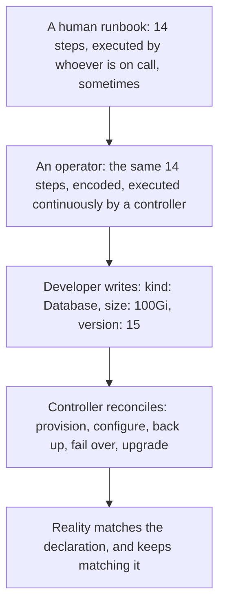
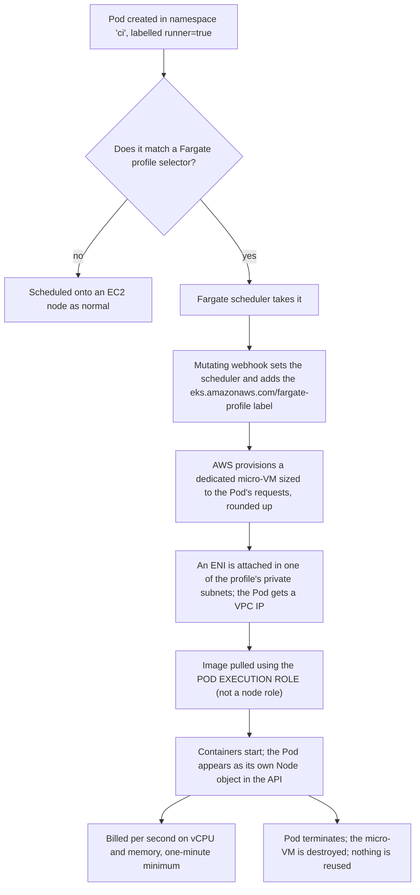
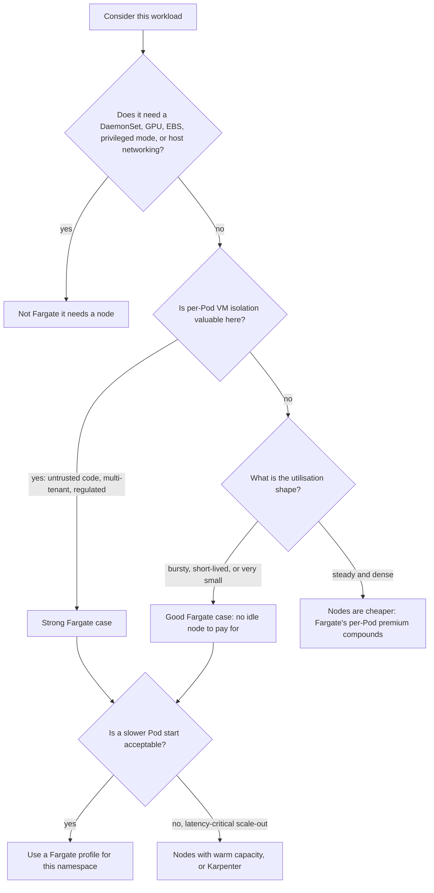
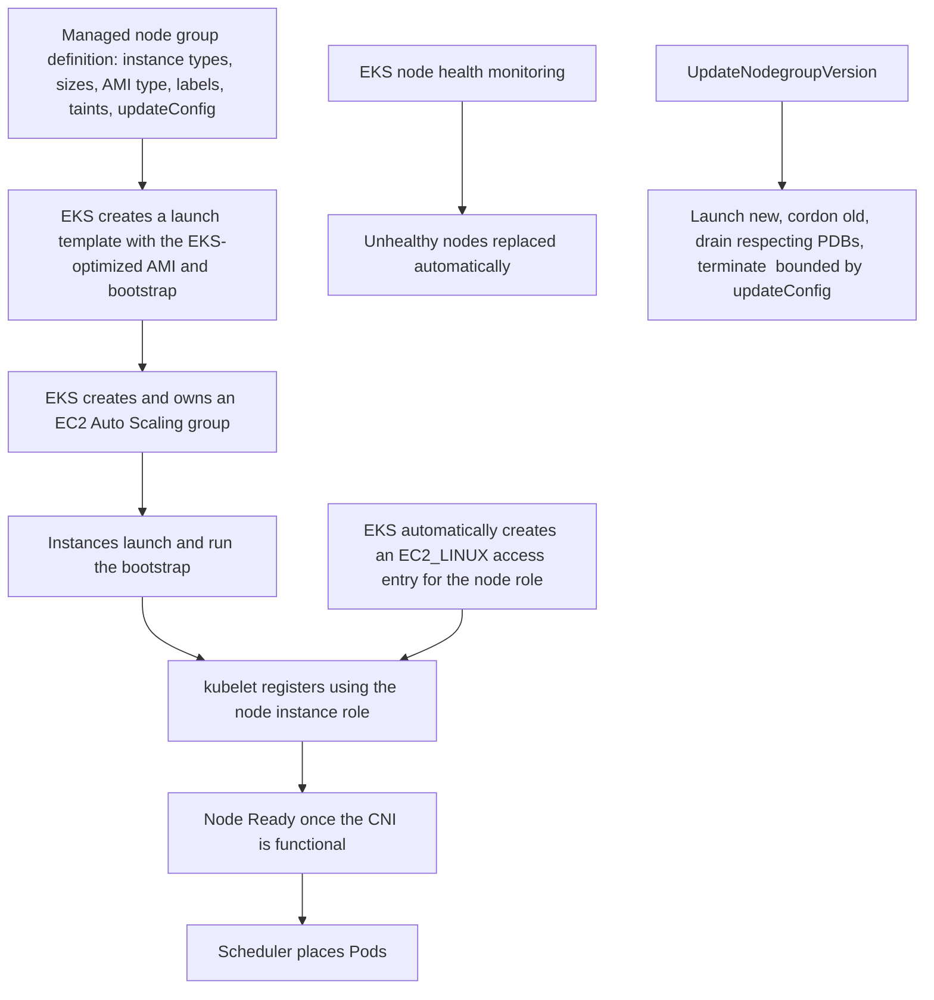
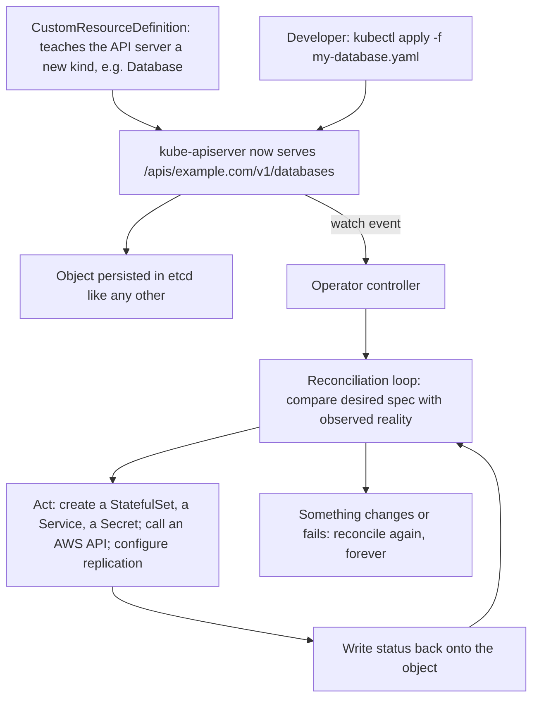
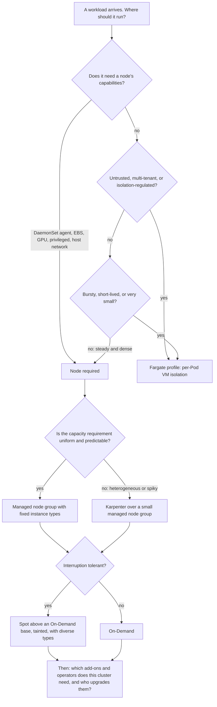
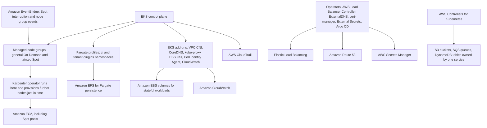

# Amazon EKS Advanced Concepts

---

## Definition

This chapter covers three mechanisms by which an EKS cluster's operational surface is reduced or extended.

**AWS Fargate on EKS** is a serverless compute engine in which each Pod runs in its own dedicated micro-VM with no shared node, no node you can log into, and no node you can schedule anything else onto. You declare *which* Pods should run this way with a **Fargate profile**; AWS provisions capacity per Pod on demand.

**Managed node groups** are EKS-operated Auto Scaling groups of EC2 instances running AWS-published, EKS-optimized AMIs, where AWS handles the launch template, the bootstrap, the cluster registration, health-based replacement, and the cordon-and-drain node replacement during version updates  while leaving you the instance types, sizes, scaling bounds, labels, and taints.

**EKS add-ons** are AWS-packaged, versioned, validated deployments of cluster components (the VPC CNI, CoreDNS, `kube-proxy`, CSI drivers, the Pod Identity Agent, observability agents and more), installed and upgraded through the EKS API rather than as loose manifests. **Operators** are the general pattern add-ons are a managed instance of: a CustomResourceDefinition that extends the Kubernetes API with a new object type, plus a controller that watches those objects and reconciles the world toward them.

| Mechanism | What it removes from you | What it costs |
|---|---|---|
| **Fargate profile** | The node entirely: no AMI, no patching, no capacity planning, no bin packing | Anything that needs a node  DaemonSets, EBS, GPUs, privileged containers  plus per-Pod pricing and slower start |
| **Managed node group** | AMI publication, bootstrap, registration, drain-and-replace upgrades | You still choose instances, still schedule the upgrade, still own capacity strategy |
| **EKS add-on** | Building, patching, and version-matching cluster components | A version to track and an upgrade to perform with every cluster upgrade |
| **Operator** | The imperative runbook for operating a complex system | A controller to run, secure, and upgrade  and a new API surface to understand |

Within an AWS architecture these sit in the data plane and its supporting components  below the applications of Chapter 3.2 and above the cluster of Chapter 3.1.

!!! note "These are not alternatives; they compose"

    A single production cluster commonly runs managed node groups for general workloads, a tainted Spot node group for batch, Fargate profiles for a couple of isolation-sensitive namespaces, the four core add-ons managed by EKS, and half a dozen operators. The exam question "should I use Fargate or node groups" almost always has the answer "both, for different workloads"  and being able to say *which* workloads is the actual skill.

---

## Why This Service or Concept Exists

### Why Fargate exists: the node is an operational liability

A node is an EC2 instance you must patch, size, monitor, secure, replace, and pay for whether or not it is full. For a large fleet of steady workloads that overhead is amortised well. For several categories of workload it is not:

| Workload | Why a node is a poor fit |
|---|---|
| A small service needing 0.25 vCPU | The smallest sensible node is many times larger and mostly idle |
| A CI runner that exists for four minutes | A node's launch, join, and drain cost exceeds the job |
| An untrusted or multi-tenant workload | Container isolation on a shared kernel is weaker than a per-Pod VM boundary |
| A workload with a bursty, unpredictable shape | Capacity must be pre-provisioned or scaled reactively, and both are wrong some of the time |
| A cluster's first workload | You should not have to run infrastructure to run one Pod |

Fargate's answer is to make the Pod the unit of compute. AWS provisions a dedicated micro-VM sized to the Pod's requests, runs it, and bills per second. Every limitation follows from that single decision rather than being an arbitrary restriction  which is why the limitations are worth deriving rather than memorising:

| Limitation | Because |
|---|---|
| No DaemonSets | A DaemonSet runs one Pod per node; there is no node to be one-per |
| No `hostNetwork` or `hostPort` | The host is a micro-VM shared with nothing; there is no host network to join |
| No privileged containers | A privileged container escapes into the host, which AWS owns |
| No GPU or specialised hardware | Capacity is standard AWS-managed compute, not your instance selection |
| No EBS volumes | EBS attaches to an instance; there is no persistent instance (EFS works, being network-attached) |
| Slower Pod start | The micro-VM must be provisioned and the image pulled fresh with no node-level cache |
| No EKS Pod Identity | Its agent is a DaemonSet (see the first row); IRSA works because it needs no agent |
| Fixed CPU and memory combinations | Capacity is allocated in defined shapes, and your requests are rounded up to one |
| Node-based scheduling features do not apply | `topologySpreadConstraints` and node affinity assume nodes to spread across |

### Why managed node groups exist: nodes without the plumbing

Self-managing nodes means building or selecting an AMI, writing bootstrap user data that fetches the cluster endpoint and CA and configures the `kubelet`, creating and sizing an Auto Scaling group, mapping the node role so the node may join, replacing unhealthy instances, and  hardest of all  upgrading: launching new-version nodes, cordoning old ones, draining them while respecting PodDisruptionBudgets, and terminating them in a bounded, resumable way.

Every one of those is undifferentiated work, and the drain logic in particular is easy to get subtly wrong. Managed node groups do all of it behind one API, while leaving you every decision that is actually about your workload.

| Self-managed burden | What managed node groups provide |
|---|---|
| Build or select and track an AMI | AWS publishes and versions EKS-optimized AMIs per Kubernetes version |
| Write and maintain bootstrap user data | Handled; a launch template lets you extend it when you must |
| Map the node role so nodes may join | An `EC2_LINUX` access entry is created automatically |
| Replace unhealthy nodes | Health monitoring with automatic replacement |
| Orchestrate version upgrades | Launch, cordon, drain respecting PDBs, terminate, bounded by `updateConfig` |
| Handle Spot interruption and rebalance | Rebalance recommendations and interruption notices trigger a drain |
| Tag and label consistently | Labels and taints declared on the group and applied to nodes |

### Why add-ons exist: the components everyone needs, versioned

Every cluster needs a CNI, a DNS server, a Service proxy, and usually a CSI driver. These are open-source components with their own release cadence, their own compatibility matrix against Kubernetes versions, and their own CVEs. Installed as loose `kubectl apply -f https://...` manifests they become invisible: nobody knows what version is running, nobody updates them, and a cluster upgrade breaks in a way that appears to be the upgrade's fault.

EKS add-ons make them first-class API objects with a version, a configuration, an IAM role, and an update operation  visible in CloudTrail, expressible in infrastructure as code, and updatable as an explicit step in the upgrade procedure of Chapter 3.2.

### Why operators exist: Kubernetes as a platform, not a container runner

The single most consequential idea in Kubernetes is that **the API is extensible and every controller is equal**. You define a CustomResourceDefinition  say, `kind: Database`  and write a controller that watches `Database` objects and makes reality match. From the API server's point of view your controller is indistinguishable from the built-in Deployment controller.

This is what turns Kubernetes from a scheduler into a platform. Instead of a runbook that says "to create a database, do these fourteen things", a developer writes eight lines of YAML and an operator that encodes the expertise does the fourteen things  continuously, including after a failure, and including the parts a human would forget at 3 a.m.


```mermaid
flowchart TD
    A["A human runbook: 14 steps, executed by whoever is on call, sometimes"] --> B["An operator: the same 14 steps, encoded, executed continuously by a controller"]
    B --> C["Developer writes: kind: Database, size: 100Gi, version: 15"]
    C --> D["Controller reconciles: provision, configure, back up, fail over, upgrade"]
    D --> E["Reality matches the declaration, and keeps matching it"]
```

!!! tip "The one sentence that explains half of Kubernetes"

    **A controller watches objects of a kind and makes the world match them.** The Deployment controller does it for Deployments. Karpenter does it for NodePools. ACK does it for AWS resources. The AWS Load Balancer Controller does it for Ingresses. Once a student sees that these are the same mechanism with different object types, the ecosystem stops being a list of tools to memorise and becomes one pattern applied repeatedly  and writing your own controller stops being exotic.

---

## Core Concepts: EKS Fargate Profiles

### The model


```mermaid
flowchart TD
    POD["Pod created in namespace 'ci', labelled runner=true"] --> SCHED{"Does it match a Fargate profile selector?"}
    SCHED -->|"no"| NODE["Scheduled onto an EC2 node as normal"]
    SCHED -->|"yes"| FSCHED["Fargate scheduler takes it"]
    FSCHED --> MUT["Mutating webhook sets the scheduler and adds the eks.amazonaws.com/fargate-profile label"]
    MUT --> PROV["AWS provisions a dedicated micro-VM sized to the Pod's requests, rounded up"]
    PROV --> ENI["An ENI is attached in one of the profile's private subnets; the Pod gets a VPC IP"]
    ENI --> PULL["Image pulled using the POD EXECUTION ROLE (not a node role)"]
    PULL --> RUN["Containers start; the Pod appears as its own Node object in the API"]
    RUN --> BILL["Billed per second on vCPU and memory, one-minute minimum"]
    RUN --> DONE["Pod terminates; the micro-VM is destroyed; nothing is reused"]
```

Two consequences deserve emphasis. **Each Fargate Pod appears as its own Node object** in `kubectl get nodes`, with a name beginning `fargate-`. That node is not yours: you cannot schedule onto it, log into it, or run anything alongside the Pod. And **nothing is reused between Pods**  no image cache, no warm capacity  which is the source of Fargate's slower start.

### Fargate profiles and selectors

A profile has a name, a **pod execution role**, a list of **private subnets**, and up to **five selectors**. Each selector has a **required namespace** and **optional labels**:

```yaml
fargateProfiles:
  - name: ci-runners
    podExecutionRoleARN: arn:aws:iam::111122223333:role/EksFargatePodExecutionRole
    subnets: [subnet-0a1, subnet-0b1, subnet-0c1]     # private subnets only
    selectors:
      - namespace: ci
        labels:
          runner: "true"          # BOTH namespace and label must match
      - namespace: preview-*      # wildcards are supported
```

| Rule | Detail |
|---|---|
| **Namespace is required** | A selector always names a namespace; labels alone are not enough |
| **All labels must match** | Within one selector, every label is required (an AND) |
| **Any selector may match** | Across selectors in a profile, one match is enough (an OR) |
| **Wildcards are supported** | `*` matches zero or more characters, `?` exactly one, in namespaces and label values |
| **Multiple matching profiles** | The profile whose name sorts first alphanumerically wins; a Pod can override with the `eks.amazonaws.com/fargate-profile` label |
| **Profiles are immutable** | To change selectors you create a new profile and delete the old one |
| **Deleting a profile** | Its Pods are stopped and become `Pending` |
| **Only private subnets** | Fargate Pods get no public IP; egress needs NAT or VPC endpoints |

!!! warning "Immutability means selectors are a design decision, not a setting"

    A Fargate profile cannot be edited. Changing which Pods run on Fargate means creating a new profile and deleting the old one, and deleting a profile stops its Pods. Design selectors around **stable namespace boundaries**  a `ci` namespace, a `tenant-plugins` namespace  rather than around labels that application teams control, or you will be recreating profiles as a routine operation.

### The resource model, and what you are actually billed for

Fargate allocates capacity in defined CPU and memory combinations, and **your Pod's total requests are rounded up to the nearest valid combination**. AWS additionally reserves approximately **256 MB** per Pod for Kubernetes components, which comes out of the allocation.

| Requested (all containers) | Allocated | What you pay for |
|---|---|---|
| 0.2 vCPU, 300 MB | 0.25 vCPU, 1 GB (0.5 GB + reservation rounds up) | The allocation, not the request |
| 0.4 vCPU, 1.5 GB | 0.5 vCPU, 2 GB | The allocation |
| 1 vCPU, 7.5 GB | 1 vCPU, 8 GB | The allocation |
| 3 vCPU, 5 GB | 4 vCPU, 8 GB (CPU forces the shape) | Considerably more than requested |

Ephemeral storage is **20 GiB by default**, expandable by requesting `ephemeral-storage` up to 175 GiB. Supported sizes range from 0.25 vCPU with 0.5 GB of memory up to 16 vCPU with 120 GB, and only defined combinations exist between them.

!!! danger "Under-requesting memory on Fargate costs money and over-requesting costs more"

    Because you pay for the allocated shape rather than the requested one, a Pod requesting 3 vCPU and 5 GB is billed for 4 vCPU and 8 GB  a third more CPU and 60 per cent more memory than asked for. And because AWS reserves 256 MB, a Pod requesting exactly 1 GB is allocated 2 GB. Right-sizing requests to land **just below** a combination boundary is a real and easily overlooked optimisation, and it is the opposite of the EC2 intuition where slack is free until the node fills.

### Identity, storage, and networking on Fargate

**Identity** works through a **pod execution role**  trusted by `eks-fargate-pods.amazonaws.com`, used by the AWS-managed `kubelet` to register the Pod and pull images from ECR. It is *not* available to your containers, which is a security improvement over the node instance role problem of Chapter 3.1: a Fargate Pod has no node role to steal. For AWS access from inside the container you use **IRSA**; **EKS Pod Identity does not work**, because its agent is a DaemonSet.

**Storage** is ephemeral by default and destroyed with the Pod. **Amazon EFS** works through the EFS CSI driver because it is network-attached; **Amazon EBS does not**, because it attaches to an instance.

**Networking** is standard VPC networking  the Pod gets a real VPC IP from one of the profile's subnets  with two consequences. Load balancer target groups must use **IP mode**, since there is no instance to register. And because the subnets are private, egress to the internet requires NAT or VPC endpoints.

**Logging** uses a built-in Fluent Bit log router configured by a ConfigMap in the `aws-observability` namespace, which is how you get logs off a Pod that has no node to run a log agent DaemonSet on.

### When Fargate is right


```mermaid
flowchart TD
    A["Consider this workload"] --> B{"Does it need a DaemonSet, GPU, EBS, privileged mode, or host networking?"}
    B -->|"yes"| C["Not Fargate  it needs a node"]
    B -->|"no"| D{"Is per-Pod VM isolation valuable here?"}
    D -->|"yes: untrusted code, multi-tenant, regulated"| E["Strong Fargate case"]
    D -->|"no"| F{"What is the utilisation shape?"}
    F -->|"bursty, short-lived, or very small"| G["Good Fargate case: no idle node to pay for"]
    F -->|"steady and dense"| H["Nodes are cheaper: Fargate's per-Pod premium compounds"]
    E --> I{"Is a slower Pod start acceptable?"}
    G --> I
    I -->|"yes"| J["Use a Fargate profile for this namespace"]
    I -->|"no, latency-critical scale-out"| K["Nodes with warm capacity, or Karpenter"]
```

| Good fit | Poor fit |
|---|---|
| CI/CD runners and short-lived jobs | Steady, dense, always-on services |
| Untrusted or customer-supplied code | Anything needing a DaemonSet agent |
| Small services in a mostly empty cluster | Stateful workloads needing EBS |
| Bursty, unpredictable workloads | GPU or specialised hardware workloads |
| A cluster's first few workloads | Latency-critical scale-out |
| Namespaces needing hard isolation | Workloads relying on node affinity or topology spread |

---

## Core Concepts: EKS Managed Node Groups

### What a managed node group is

A managed node group is an EC2 Auto Scaling group that EKS creates and operates on your behalf, plus a launch template, plus the lifecycle logic that makes the nodes join and leave the cluster cleanly.


```mermaid
flowchart TD
    NG["Managed node group definition: instance types, sizes, AMI type, labels, taints, updateConfig"] --> LT["EKS creates a launch template with the EKS-optimized AMI and bootstrap"]
    LT --> ASG["EKS creates and owns an EC2 Auto Scaling group"]
    ASG --> INST["Instances launch and run the bootstrap"]
    INST --> JOIN["kubelet registers using the node instance role"]
    AE["EKS automatically creates an EC2_LINUX access entry for the node role"] --> JOIN
    JOIN --> READY["Node Ready once the CNI is functional"]
    READY --> SCHED["Scheduler places Pods"]
    HEALTH["EKS node health monitoring"] --> REPL["Unhealthy nodes replaced automatically"]
    UPD["UpdateNodegroupVersion"] --> DRAIN["Launch new, cordon old, drain respecting PDBs, terminate  bounded by updateConfig"]
```

The **automatic access entry** is worth naming, because it is the difference between a managed and a self-managed node group that most often bites: with self-managed nodes you must create the `EC2_LINUX` access entry yourself, and a node whose role is unmapped authenticates and is then refused, appearing simply never to join.

### AMI families

| AMI type | Characteristics | Choose when |
|---|---|---|
| **Amazon Linux 2023** | General-purpose, `dnf`, SSM agent, `nodeadm`/`NodeConfig` bootstrap | The default for most clusters |
| **Bottlerocket** | Minimal, container-optimised, immutable root filesystem, API-driven configuration, no shell or package manager, separate control and admin containers | Security-conscious fleets; smaller attack surface and faster boot |
| **AL2023 GPU / NVIDIA** | Bundled GPU drivers and container toolkit | Machine learning and rendering workloads |
| **Windows** | Windows Server core images | .NET Framework workloads that cannot be containerised on Linux |

!!! tip "Bottlerocket is the better default than most teams assume"

    Its root filesystem is read-only and integrity-checked, there is no shell or package manager to exploit, updates are atomic image swaps with rollback rather than in-place package upgrades, and it boots faster because it contains almost nothing. The cost is that anything requiring host-level customisation  an agent installed into the host OS, a kernel module, a custom `systemd` unit  must be reworked as a privileged container or is simply not possible. For a fleet running only containers, that cost is usually zero and the security gain is real.

### Launch templates: the escape hatch

A managed node group can use a **custom launch template**, which is how you extend the abstraction without abandoning it: custom user data appended to the bootstrap, a specific AMI, additional security groups, instance metadata options (the `httpPutResponseHopLimit: 1` from Chapter 3.1), larger or additional EBS volumes, placement groups, and detailed monitoring.

The important constraint: **when you supply a custom AMI ID, you take over AMI lifecycle**. EKS no longer updates the node group to new AMI versions automatically, because it does not know how to build yours. Most teams should use a launch template for metadata options, volumes, and security groups while leaving the AMI to AWS.

### Updating a node group

Two kinds of update exist and they are frequently conflated:

| Update | Trigger | Effect |
|---|---|---|
| **Version update** | New Kubernetes version, or a new AMI release for the current version | Nodes replaced with the new AMI |
| **Configuration update** | Changing scaling bounds, labels, taints, or the launch template version | Scaling bounds apply immediately; most other changes require node replacement |

The version update sequence is the cordon-and-drain described in Chapter 3.2, bounded by `updateConfig`:

| Setting | Meaning | Guidance |
|---|---|---|
| `maxUnavailable` | Nodes replaced concurrently, as a count | 1 for small groups where every node matters |
| `maxUnavailablePercentage` | The same, as a percentage of the group | 25 per cent for large groups; the same speed-versus-capacity trade as an ECS deployment |
| `updateStrategy` | `DEFAULT` launches replacement capacity before draining; `MINIMAL` drains without adding capacity first | `DEFAULT` in production; `MINIMAL` only where extra capacity is unavailable and reduced capacity is acceptable |
| **Force flag** | Ignores PodDisruptionBudgets and evicts regardless | The escape from a deadlocked drain, not a default |

!!! danger "The force flag finishes an upgrade; it does not fix a configuration"

    An update blocked by a PodDisruptionBudget with no slack will time out. The force flag will complete it by ignoring the budget entirely  which may briefly take a service to zero replicas. Use it to escape a stuck upgrade if you must, then fix the PodDisruptionBudget (`maxUnavailable: 1`, or `minAvailable` strictly less than replicas), because otherwise you will be forcing every future upgrade and the budget is providing no protection at all.

### Spot capacity in managed node groups

Setting `capacityType: SPOT` gives you EC2 Spot capacity with AWS handling the awkward parts:

- **Capacity-optimized allocation**, launching from the pools least likely to be interrupted.
- **Rebalance recommendations**, an early warning before the interruption notice, used to start draining proactively.
- **Interruption notices** (two minutes), which trigger a cordon and drain.

Your side of the bargain is **instance type diversity**  several compatible types, so one pool's reclamation does not remove the whole group  and **workloads that tolerate rescheduling**: correct PodDisruptionBudgets, `terminationGracePeriodSeconds` well under two minutes, checkpointing for long jobs, and no assumption of node stability.

| Capacity type | Use |
|---|---|
| **On-Demand** | The base that must carry floor traffic alone; anything user-facing and latency-critical |
| **Spot** | Batch, CI, stateless workers, and anything that reschedules cheaply |
| **Capacity Blocks** | Reserved GPU capacity for a defined future window; machine learning training |

The standard production shape is an **On-Demand node group sized to carry floor traffic** plus a **tainted Spot node group** that only tolerating workloads land on  the same base-plus-Spot pattern [Chapter 2.3](../unit2/topic3.md) established for ECS capacity providers.

### Managed node groups versus Karpenter versus Auto Mode

| | Managed node group | Karpenter | EKS Auto Mode |
|---|---|---|---|
| **Provisioning model** | Pre-defined ASGs with fixed instance types | Just-in-time instances chosen from Pod requirements | AWS-managed, Karpenter-based |
| **Scale-out latency** | ASG adjustment, then launch | Direct EC2 launch; typically faster | Managed |
| **Bin packing** | Whatever the ASG's types allow | Chooses instance shapes that fit the pending Pods | Managed |
| **Consolidation** | None | Replaces under-utilised nodes with cheaper ones automatically | Managed |
| **Spot handling** | Built in | Built in, with broader pool diversity | Managed |
| **You operate** | Nothing beyond the group | The Karpenter controller and its NodePools | Nothing |
| **Node lifetime** | Until you replace it | Bounded by expiry and drift settings | Bounded (nodes replaced regularly) |
| **Cost** | EC2 only | EC2 only | EC2 plus a management fee |
| **Control** | High | High | Reduced: limited node customisation |

The honest guidance: **managed node groups for a baseline and for anything needing specific instance configuration; Karpenter for workloads whose scaling is spiky or heterogeneous; Auto Mode when the team's binding constraint is people rather than control.** They coexist  Karpenter itself needs somewhere to run, and that somewhere is usually a small managed node group.

---

## Core Concepts: Add-ons and Operators

### The EKS add-on model

An add-on is an EKS API object with a name, a version, optional `configurationValues`, an optional IAM role, and a conflict resolution mode.

| Add-on tier | Built and supported by | Scanned by AWS | Examples |
|---|---|---|---|
| **AWS add-ons** | AWS | Yes | VPC CNI, `kube-proxy`, CoreDNS, EBS/EFS/S3 CSI drivers, snapshot controller, Pod Identity Agent, CloudWatch Observability, GuardDuty agent, node monitoring agent |
| **AWS Marketplace add-ons** | Partners | Yes | Commercial observability, security, and cost tooling |
| **Community add-ons** | Open source community | Yes (compatibility only) | Metrics Server, cert-manager, ExternalDNS, kube-state-metrics |

**Conflict resolution** decides what happens when the add-on's desired configuration differs from what is live in the cluster:

| Mode | Behaviour | Use when |
|---|---|---|
| `NONE` | Fail the update if there is a conflict | You want to be told rather than surprised |
| `OVERWRITE` | AWS's configuration wins | The AWS defaults are authoritative; the usual choice |
| `PRESERVE` | Your in-cluster changes are kept | You have deliberately customised fields and intend to keep them. `PRESERVE` is valid on an add-on **update** only; creation accepts `NONE` or `OVERWRITE` |

**`configurationValues`** supplies add-on settings as JSON or YAML through the API  the VPC CNI's `ENABLE_PREFIX_DELEGATION`, CoreDNS's replica count and resources, the EBS CSI driver's tolerations  so that configuration lives in your infrastructure as code rather than in a `kubectl set env` command somebody ran once.

**Add-on IAM roles** are supplied through IRSA or a Pod Identity association, so the EBS CSI driver holds permission to create volumes, and the CNI holds permission to manage ENIs, without either relying on the node role.

!!! warning "An add-on's version is part of your upgrade, not an afterthought"

    Add-ons run in the data plane and must be compatible with the control plane version. The order from Chapter 3.2  control plane, then add-ons, then nodes  exists because a node launched with an old CNI against a new API server can fail in ways that look like networking faults. Pin add-on versions in infrastructure as code, and update them as an explicit, reviewed step of every cluster upgrade.

### The core add-ons, and what breaks without each

| Add-on | Role | Symptom if broken or stale |
|---|---|---|
| **Amazon VPC CNI** | Pod IP allocation | Nodes never become `Ready`; Pods stuck in `ContainerCreating` |
| **CoreDNS** | Cluster DNS | Intermittent, confusing failures everywhere; the most misdiagnosed outage in Kubernetes |
| **`kube-proxy`** | Service virtual IP rules | ClusterIP Services unreachable from the affected node only |
| **EBS CSI driver** | PersistentVolumeClaims to EBS volumes | PVCs stay `Pending`; StatefulSets never start |
| **EFS CSI driver** | Shared, multi-attach, and Fargate-compatible storage | No shared volumes; no persistent storage on Fargate |
| **Pod Identity Agent** | Per-Pod IAM credentials | Pods fall back to the node role  a security failure, not a functional one |
| **Snapshot controller** | Volume snapshots | Backups of persistent volumes do not work |
| **CloudWatch Observability** | Container Insights metrics and logs | No cluster observability |
| **Node monitoring agent** | Node-level health detection and auto-repair | Unhealthy nodes are not detected or replaced |

!!! danger "CoreDNS is the component whose failure looks like everything else failing"

    DNS resolution failures present as intermittent connection errors, timeouts, and retries scattered across unrelated services  never as "DNS is down". CoreDNS should run at least two replicas, be spread across zones and nodes with anti-affinity, have a PodDisruptionBudget, be scaled with cluster size, and have its request rate, error rate, and latency on a dashboard. A cluster whose CoreDNS runs two Pods on the same node is one node event away from a cluster-wide mystery.

### The operator pattern


```mermaid
flowchart TD
    CRD["CustomResourceDefinition: teaches the API server a new kind, e.g. Database"] --> API["kube-apiserver now serves /apis/example.com/v1/databases"]
    USER["Developer: kubectl apply -f my-database.yaml"] --> API
    API --> ETCD["Object persisted in etcd like any other"]
    API -->|"watch event"| CTRL["Operator controller"]
    CTRL --> LOOP["Reconciliation loop: compare desired spec with observed reality"]
    LOOP --> ACT["Act: create a StatefulSet, a Service, a Secret; call an AWS API; configure replication"]
    ACT --> STATUS["Write status back onto the object"]
    STATUS --> LOOP
    LOOP --> DRIFT["Something changes or fails: reconcile again, forever"]
```

The mechanics worth knowing because they explain real behaviour:

| Mechanism | What it does | Why it matters |
|---|---|---|
| **CustomResourceDefinition** | Registers a new kind with a schema | Your object gets validation, RBAC, and `kubectl` support for free |
| **Reconciliation loop** | Level-triggered: compares desired to actual, repeatedly | Idempotent and self-healing; missing an event is survivable |
| **Owner references** | Marks children as owned by a parent | Deleting the parent garbage-collects the children |
| **Finalizers** | Blocks deletion until cleanup completes | Why a namespace sometimes hangs in `Terminating` forever |
| **Status subresource** | Separates reported state from desired state | You write `spec`; the controller writes `status` |
| **Admission webhooks** | Validate or mutate objects at write time | Where an operator enforces its own rules  and where it can break the cluster |
| **Leader election** | One active replica among several | High availability without duplicate reconciliation |

**A namespace stuck in `Terminating`** is almost always a finalizer whose controller is gone: the object cannot be deleted until the finalizer is removed, and the controller that would remove it no longer exists. This is worth knowing because it is common, alarming, and simple once understood.

### Operators worth knowing in a DSO303 context

| Operator | What it manages | Why it is representative |
|---|---|---|
| **AWS Load Balancer Controller** | Ingress and Service objects into ALBs and NLBs | The integration point of Chapter 3.1's networking |
| **Karpenter** | NodePools into EC2 instances | Node provisioning expressed as reconciliation |
| **Cluster Autoscaler** | Auto Scaling group sizes | The older approach, still widely deployed |
| **cert-manager** | Certificate objects into issued TLS certificates | The canonical "operator does a tedious thing correctly" example |
| **ExternalDNS** | Ingress hostnames into Route 53 records | Kubernetes objects driving AWS resources |
| **External Secrets Operator** | ExternalSecret objects into Kubernetes Secrets from Secrets Manager | Chapter 3.2's secrets pattern, implemented |
| **Prometheus Operator** | ServiceMonitor objects into scrape configuration | Observability as declarative configuration |
| **Argo CD** | Application objects into deployed workloads | GitOps itself is an operator |
| **AWS Controllers for Kubernetes (ACK)** | S3 buckets, RDS instances, SQS queues, DynamoDB tables | AWS resources as Kubernetes objects |
| **Database operators** (CloudNativePG, Strimzi) | Stateful systems with failover and backup | Where operators deliver the most and risk the most |

### AWS Controllers for Kubernetes, and its trade-off

ACK lets a manifest create AWS resources:

```yaml
apiVersion: s3.services.k8s.aws/v1alpha1
kind: Bucket
metadata:
  name: orders-uploads
spec:
  name: dso303-orders-uploads
```

The appeal is a single workflow: an application's manifests declare both its Pods and the S3 bucket they need, delivered by the same GitOps controller. The trade-off is real and should be argued rather than assumed.

| For ACK | Against ACK |
|---|---|
| One declarative workflow for application and its dependencies | Resource lifecycle is now tied to a Kubernetes cluster's lifecycle |
| Developers self-serve AWS resources without a separate pipeline | Deleting a namespace can delete a production database |
| Continuous reconciliation corrects drift in AWS resources | Terraform and CloudFormation have far broader coverage and maturity |
| Kubernetes RBAC governs who may create what | The controller holds broad AWS permissions inside the cluster |

The defensible middle position: **ACK for resources whose lifetime genuinely matches the application**  a queue, a bucket, a DynamoDB table owned by one service  and **Terraform or CloudFormation for shared, long-lived infrastructure** such as VPCs, databases with independent retention requirements, and anything whose deletion would be catastrophic. And in either case, deletion policies and `deletionPolicy: retain` annotations deserve deliberate attention.

!!! danger "An operator is executable configuration with cluster-wide permissions"

    Installing an operator typically creates CustomResourceDefinitions, a ClusterRole (often broad), a ClusterRoleBinding, a Deployment, and sometimes an admission webhook. Any of those can compromise or destabilise the cluster: a webhook with `failurePolicy: Fail` and one replica blocks every matching write when that replica is unavailable; a ClusterRole with `*` on `*` is cluster admin by another name; and a CRD's controller can create anything it is permitted to. **Read what a chart creates before installing it**, pin exact versions, mirror charts into your own registry, restrict who may create CRDs and ClusterRoleBindings at all, and treat an operator upgrade with the same care as a Kubernetes upgrade  because for the resources it owns, it is one.

---

## Architecture Components

| Component | Responsibility |
|---|---|
| **Fargate profile** | Selects which Pods run on serverless capacity, and in which subnets |
| **Pod execution role** | The IAM role AWS's `kubelet` uses to register the Pod and pull images |
| **Fargate scheduler** | The alternative scheduler that binds matching Pods to Fargate capacity |
| **Fargate micro-VM** | One Pod's dedicated, isolated compute, destroyed on Pod termination |
| **Fargate log router** | Built-in Fluent Bit, configured in the `aws-observability` namespace |
| **Managed node group** | An EKS-operated ASG with AWS AMIs and lifecycle management |
| **Launch template** | The escape hatch for user data, AMI, volumes, security groups, and IMDS options |
| **EKS-optimized AMI** | AWS-published node image with `kubelet`, `containerd`, CNI, and bootstrap |
| **`updateConfig`** | Bounds concurrent node replacement during a version update |
| **Node instance role and `EC2_LINUX` access entry** | The node's identity and its cluster mapping, created automatically for managed groups |
| **Capacity type** | On-Demand, Spot, or Capacity Blocks |
| **Karpenter NodePool and NodeClass** | Declarative just-in-time provisioning constraints |
| **EKS add-on** | A versioned, AWS-managed cluster component with configuration and an IAM role |
| **`configurationValues`** | Add-on settings expressed through the EKS API |
| **Conflict resolution mode** | `NONE`, `OVERWRITE`, or `PRESERVE` for add-on configuration drift |
| **CustomResourceDefinition** | Extends the Kubernetes API with a new object kind |
| **Controller / operator** | Watches objects of that kind and reconciles the world toward them |
| **Admission webhook** | Where an operator validates or mutates writes; a cluster-wide dependency |
| **Finalizer** | Blocks deletion until cleanup completes; the cause of `Terminating` hangs |
| **Owner reference** | Enables garbage collection of an operator's child resources |
| **AWS Controllers for Kubernetes** | Operators that reconcile AWS resources from Kubernetes objects |

Read architecturally, these divide into **substrate** (Fargate, node groups, Karpenter  where Pods run), **platform components** (add-ons  what every cluster needs), and **extensions** (operators  what makes this cluster yours). The first is a per-workload decision, the second is a per-cluster baseline, and the third is where a platform team's judgement shows: every operator adds capability, an upgrade obligation, and a potential cluster-wide dependency.

---

## AWS Service Deep Dive

!!! warning "On numbers, versions, and quotas"

    Figures are representative as of 2026 and most quotas are **soft**. Fargate resource combinations, AMI families, add-on catalogues, and instance ENI limits change frequently. Verify against the EKS User Guide and AWS Service Quotas for your account and Region. Prices are indicative and stated only for relative magnitude.

### AWS Fargate on EKS

**Purpose.** Run Pods with no node to manage, and with per-Pod VM isolation.

**Architecture.** A mutating webhook in the control plane evaluates Fargate profile selectors at admission and assigns matching Pods to the Fargate scheduler. AWS provisions a dedicated micro-VM per Pod in one of the profile's private subnets, attaches an ENI, pulls images with the pod execution role, and registers the Pod as its own Node object.

**Important features.** Per-Pod isolation on a dedicated kernel; no AMI, patching, or capacity management; per-second billing with a one-minute minimum; namespace and label selectors with wildcard support; automatic distribution across the profile's subnets; built-in Fluent Bit log routing; EFS support; IRSA for workload identity.

**Limitations.** No DaemonSets, `hostNetwork`, `hostPort`, privileged containers, GPUs, or EBS volumes. No **EKS Pod Identity**. No `topologySpreadConstraints`, and node affinity is meaningless. Profiles are **immutable**, limited to five selectors, and must use private subnets. Resources are allocated in fixed combinations from 0.25 vCPU and 0.5 GB up to 16 vCPU and 120 GB, with roughly 256 MB reserved per Pod and 20 GiB of ephemeral storage by default. Load balancer targets must be **IP mode**. Pod start is slower because nothing is cached.

**Pricing model.** Per vCPU-second and GB-second of the **allocated** shape, from image pull until termination, with a one-minute minimum. Excellent for bursty and small workloads; more expensive than a well-packed node for steady, dense ones.

**Performance characteristics.** Pod start-up is typically tens of seconds and dominated by capacity provisioning and an uncached image pull. Steady-state performance is comparable to equivalent EC2 capacity.

**Availability.** Pods are distributed across the profile's subnets, but distribution is not guaranteed even; where exact zone balance matters, one profile per subnet is the documented technique.

**Security features.** Per-Pod kernel isolation; no node role for a container to steal; no host to compromise; a pod execution role unavailable to your containers; standard VPC networking and security groups.

**Service limits.** Representative soft quotas on Fargate profiles per cluster (commonly 10), selectors per profile (5), and concurrent Fargate Pods per Region.

**Common configurations.** A profile per isolation-sensitive or bursty namespace  `ci`, `tenant-plugins`, `preview-*`  with IRSA for AWS access, EFS for any persistence, IP-mode target groups, and requests tuned to land just under a resource combination boundary.

### EKS managed node groups

**Purpose.** Real EC2 nodes without the AMI, bootstrap, registration, and upgrade plumbing.

**Architecture.** EKS creates a launch template and an Auto Scaling group, launches instances from an EKS-optimized AMI, and creates an `EC2_LINUX` access entry so the node role may join. It monitors node health, replaces unhealthy instances, and orchestrates version updates as launch, cordon, drain, terminate.

**Important features.** AL2023, Bottlerocket, GPU, and Windows AMI families; custom launch templates for user data, AMI, volumes, security groups, and IMDS options; labels and taints declared on the group; On-Demand, Spot, and Capacity Blocks; Spot rebalance and interruption handling; `updateConfig` bounding concurrent replacement; a force flag for blocked drains; node auto-repair with the node monitoring agent; tags for cost allocation.

**Limitations.** Supplying a custom AMI ID transfers AMI lifecycle to you. Many configuration changes require node replacement. Instance types are fixed per group, so heterogeneous requirements mean several groups (or Karpenter). Scale-out is ASG-mediated and slower than Karpenter's direct launches. PodDisruptionBudgets can block an update indefinitely. There is no bin-packing intelligence: the group launches what it was told to launch.

**Pricing model.** EC2 instance, EBS, and data transfer charges only; the management is free.

**Performance characteristics.** Node launch to `Ready` is typically one to three minutes, dominated by instance launch, bootstrap, and CNI initialisation. Version updates take as long as draining requires.

**Scaling behaviour.** Scaled by the Cluster Autoscaler, by Karpenter (for other groups), or manually within `minSize` and `maxSize`.

**Availability.** Spanning three subnets across three Availability Zones is the baseline; the ASG balances across them.

**Security features.** IMDSv2 enforcement and hop limits through the launch template; Bottlerocket's minimal immutable host; encrypted EBS volumes; SSM access without SSH; automatic access entry rather than a hand-edited mapping.

**Service limits.** Representative soft quotas on node groups per cluster and nodes per group.

**Common configurations.** A general On-Demand group on AL2023 or Bottlerocket across three AZs; a tainted Spot group with four to six compatible instance types for batch; a small system group for controllers; a launch template setting IMDSv2 with a hop limit of 1; `maxUnavailablePercentage: 25`.

### EKS add-ons

**Purpose.** Install, configure, version, and upgrade cluster components through the EKS API rather than as loose manifests.

**Architecture.** The EKS API stores an add-on's name, version, `configurationValues`, IAM role, and conflict resolution mode, and applies the corresponding manifests into the cluster. Add-on Pods run in your data plane like any other workload.

**Important features.** Three tiers (AWS, Marketplace, community); explicit versioning with compatibility information per Kubernetes version; `configurationValues` as JSON or YAML; conflict resolution modes; IAM roles through IRSA or Pod Identity; CloudTrail visibility; installable at cluster creation.

**Limitations.** Not every component is available as an add-on, so operators still arrive by Helm. Some deep customisations require `PRESERVE` and careful management. Add-on versions must be tracked against Kubernetes versions, which is work you cannot delegate. An add-on update is a data plane change and can be disruptive if mishandled.

**Pricing model.** No charge for AWS add-ons beyond the resources they consume; Marketplace add-ons carry their vendor's pricing.

**Common configurations.** VPC CNI with `ENABLE_PREFIX_DELEGATION` and network policy enabled; CoreDNS with at least two replicas and anti-affinity; `kube-proxy`; EBS CSI driver with its own IAM role; Pod Identity Agent; CloudWatch Observability; all pinned to versions in infrastructure as code.

### Operators and custom controllers

**Purpose.** Extend the Kubernetes API with domain-specific objects, and encode operational expertise as a continuously running control loop.

**Architecture.** A CustomResourceDefinition registers the new kind with an OpenAPI schema; a controller watches those objects through an informer, enqueues keys, and runs an idempotent reconcile function that compares desired to actual state and acts. Owner references provide garbage collection; finalizers gate deletion; the status subresource separates reported from desired state; admission webhooks enforce rules at write time; leader election provides high availability.

**Important features.** New object kinds with validation, RBAC, and `kubectl` support inherited automatically; level-triggered reconciliation that is robust to missed events and restarts; the ability to manage anything with an API, including AWS resources through ACK.

**Limitations.** Every operator is a workload to run, secure, and upgrade. Operators typically require broad RBAC and sometimes cluster admin. Admission webhooks become cluster-wide dependencies. Finalizers cause deletion hangs when a controller is removed. CRD version upgrades can be disruptive. Operator quality across the ecosystem varies enormously, and a poor one fails in ways that are hard to diagnose because the failure is inside someone else's control loop.

**Pricing model.** No AWS charge; the cost is the resources the controller consumes and the operational attention it requires.

**Common configurations.** A deliberately small baseline  AWS Load Balancer Controller, ExternalDNS, cert-manager, External Secrets Operator, Karpenter, a metrics stack, and a GitOps controller  installed from mirrored charts at pinned versions, each with a scoped IAM role and, where it registers a webhook, multiple replicas and a PodDisruptionBudget.

---

## Important AWS Terminology

| Term | Meaning |
|---|---|
| **AWS Fargate** | Serverless compute in which each Pod runs in its own dedicated micro-VM |
| **Fargate profile** | The object selecting which Pods run on Fargate, and in which subnets |
| **Selector** | A namespace (required) plus optional labels; up to five per profile |
| **Pod execution role** | The IAM role AWS's `kubelet` uses on Fargate; trusted by `eks-fargate-pods.amazonaws.com` |
| **`eks.amazonaws.com/fargate-profile`** | The label identifying, or forcing, the profile a Pod uses |
| **Fargate scheduler** | The alternative scheduler that binds matching Pods to Fargate capacity |
| **Resource combination** | The fixed CPU and memory shapes Fargate allocates; requests are rounded up |
| **Ephemeral storage** | Fargate's per-Pod scratch space, 20 GiB by default and expandable |
| **Managed node group** | An EKS-operated Auto Scaling group of EC2 nodes with AWS AMIs |
| **Self-managed node** | An EC2 instance you bootstrap, register, and upgrade yourself |
| **EKS-optimized AMI** | AWS-published node image containing `kubelet`, `containerd`, the CNI, and bootstrap tooling |
| **Bottlerocket** | A minimal, immutable, API-driven container host OS with no shell or package manager |
| **Amazon Linux 2023** | The general-purpose EKS node OS, bootstrapped with `nodeadm` and a `NodeConfig` |
| **Launch template** | The EC2 object allowing custom user data, AMI, volumes, security groups, and IMDS options |
| **`nodeadm` / `NodeConfig`** | The AL2023 node bootstrap mechanism |
| **`EC2_LINUX` access entry** | The node role mapping created automatically for managed node groups |
| **`updateConfig`** | `maxUnavailable` or `maxUnavailablePercentage` bounding concurrent node replacement, plus the update strategy |
| **Force update** | A node group update that ignores PodDisruptionBudgets |
| **Capacity type** | `ON_DEMAND`, `SPOT`, or `CAPACITY_BLOCK` |
| **Rebalance recommendation** | An early Spot signal, before the two-minute interruption notice |
| **Spot interruption notice** | The two-minute warning that triggers a cordon and drain |
| **Capacity-optimized allocation** | Launching Spot capacity from the least-interrupted pools |
| **Karpenter** | An operator that provisions right-sized EC2 instances just in time from pending Pods |
| **NodePool / EC2NodeClass** | Karpenter's declarative provisioning constraints and AWS-specific node settings |
| **Consolidation** | Karpenter replacing under-utilised nodes with cheaper or fewer ones |
| **Drift** | Karpenter replacing nodes whose configuration no longer matches their NodePool |
| **EKS Auto Mode** | AWS management of the whole data plane: compute, networking, storage, load balancing |
| **EKS add-on** | An AWS-managed, versioned deployment of a cluster component |
| **`configurationValues`** | Add-on settings supplied through the EKS API as JSON or YAML |
| **Conflict resolution** | `NONE`, `OVERWRITE`, or `PRESERVE` when add-on configuration differs from the cluster |
| **AWS add-on / Marketplace add-on / community add-on** | The three support tiers |
| **CustomResourceDefinition (CRD)** | Extends the Kubernetes API with a new object kind and schema |
| **Custom resource** | An instance of a CRD-defined kind |
| **Controller** | A loop that watches objects and reconciles the world toward them |
| **Operator** | A controller plus CRDs that encodes domain expertise for a specific system |
| **Reconciliation loop** | The level-triggered compare-and-act cycle at the heart of every controller |
| **Level-triggered** | Acting on current state rather than on events; robust to missed events and restarts |
| **Informer** | The cached watch mechanism controllers use instead of polling the API server |
| **Owner reference** | Marks a resource as owned by another, enabling garbage collection |
| **Finalizer** | Blocks deletion until cleanup completes; the usual cause of `Terminating` hangs |
| **Status subresource** | The controller-written half of an object, separate from the user-written `spec` |
| **Admission webhook** | An operator's validating or mutating hook in the API server's write path |
| **Leader election** | One active controller replica among several |
| **AWS Controllers for Kubernetes (ACK)** | Operators that reconcile AWS resources from Kubernetes objects |
| **`deletionPolicy: retain`** | An ACK annotation preventing deletion of the underlying AWS resource |

---

## Configuration Options

### Fargate

| Setting | Options | How to decide |
|---|---|---|
| **Profile granularity** | One profile per namespace, or one covering several | One per stable namespace boundary; profiles are immutable, so avoid churn |
| **Selectors** | Namespace, plus optional labels, up to five | Namespace-only where possible; label selectors couple you to application team choices |
| **Subnets** | Private subnets only | All three AZs' private subnets; a profile per subnet where exact zone balance is required |
| **Pod execution role** | An IAM role | Minimum permissions: ECR pull and cluster registration; never application permissions |
| **Workload identity** | IRSA only | Pod Identity does not work on Fargate |
| **Requests** | Any values | Tune to land just **under** a resource combination boundary; you pay for the allocation |
| **Ephemeral storage** | 20 GiB default, expandable | Raise only where genuinely needed; it is billable |
| **Storage** | EFS only | EBS is impossible; design around it or use a node |
| **Logging** | Fluent Bit ConfigMap in `aws-observability` | Configure it at cluster build; there is no node for a log DaemonSet |

### Managed node groups

| Setting | Options | How to decide |
|---|---|---|
| **AMI family** | AL2023, Bottlerocket, GPU, Windows | Bottlerocket where nothing needs host customisation; AL2023 otherwise |
| **Instance types** | One or several | Several compatible types, especially for Spot; check ENI limits against required Pod density |
| **Capacity type** | On-Demand, Spot, Capacity Blocks | On-Demand base sized for floor traffic; Spot above it, tainted |
| **Group layout** | One or several groups | A general group, a tainted Spot group, and a small system group for controllers |
| **Labels and taints** | Any | Labels express scheduling intent; taints dedicate capacity |
| **`updateConfig`** | Count or percentage | 1 for small groups; 25 per cent for large ones |
| **Launch template** | Optional | Use it for IMDS options, volumes, and security groups; avoid custom AMI IDs unless necessary |
| **IMDS** | Tokens required, hop limit | **Required, hop limit 1**  the Chapter 3.1 control that makes per-Pod identity meaningful |
| **Disk** | Size and type | Large enough for the image cache; a small disk causes `DiskPressure` evictions |
| **Scaling** | Cluster Autoscaler, Karpenter, or manual | Karpenter where scale-out latency and packing matter |

### Add-ons

| Setting | Options | How to decide |
|---|---|---|
| **Which add-ons** | The four core plus what you need | VPC CNI, CoreDNS, `kube-proxy`, Pod Identity Agent as a baseline; EBS CSI if anything is stateful |
| **Version** | Explicit or default | Explicit and pinned in IaC; update as a step of every cluster upgrade |
| **Conflict resolution** | `NONE`, `OVERWRITE`, `PRESERVE` (`PRESERVE` on update only) | `OVERWRITE` normally; `PRESERVE` only where you have deliberate customisations |
| **`configurationValues`** | JSON or YAML | Put CNI prefix delegation, CoreDNS replicas, and tolerations here rather than in ad-hoc commands |
| **IAM** | IRSA or Pod Identity association | Always; never let an add-on rely on the node role |

### Operators

| Setting | Options | How to decide |
|---|---|---|
| **Which operators** | A deliberately small set | Each adds capability, an upgrade obligation, and a possible cluster-wide dependency |
| **Source** | Public chart or internal mirror | Mirror into ECR and pin exact versions; a chart is executable configuration |
| **Scope** | Cluster-wide or namespaced | Namespaced where the operator supports it |
| **RBAC** | As shipped, or reduced | Review the ClusterRole; a `*` on `*` is cluster admin |
| **Webhook `failurePolicy`** | `Fail` or `Ignore` | `Fail` only for security-critical policy, and then with multiple replicas and a PDB |
| **Replicas** | One or several with leader election | Several for anything on the write path or the request path |
| **ACK deletion policy** | Delete or retain | `retain` for anything whose loss would be catastrophic |

!!! tip "Three settings that pay for themselves immediately"

    **IMDS hop limit 1 on every node group**, which turns per-Pod identity from decoration into a control. **`ENABLE_PREFIX_DELEGATION` in the VPC CNI's `configurationValues`**, which multiplies Pod density for free. And **CoreDNS at two or more replicas with anti-affinity and a PodDisruptionBudget**, which prevents the single most confusing class of cluster-wide outage. None takes more than a few lines, and each removes a whole category of incident.

---

## Design Considerations


```mermaid
flowchart TD
    A["A workload arrives. Where should it run?"] --> B{"Does it need a node's capabilities?"}
    B -->|"DaemonSet agent, EBS, GPU, privileged, host network"| C["Node required"]
    B -->|"no"| D{"Untrusted, multi-tenant, or isolation-regulated?"}
    D -->|"yes"| E["Fargate profile: per-Pod VM isolation"]
    D -->|"no"| F{"Bursty, short-lived, or very small?"}
    F -->|"yes"| E
    F -->|"no: steady and dense"| C
    C --> G{"Is the capacity requirement uniform and predictable?"}
    G -->|"yes"| H["Managed node group with fixed instance types"]
    G -->|"no: heterogeneous or spiky"| I["Karpenter over a small managed node group"]
    H --> J{"Interruption tolerant?"}
    I --> J
    J -->|"yes"| K["Spot above an On-Demand base, tainted, with diverse types"]
    J -->|"no"| L["On-Demand"]
    K --> M["Then: which add-ons and operators does this cluster need, and who upgrades them?"]
    L --> M
```

| Quality | What it means here | Design levers | The trade-off you accept |
|---|---|---|---|
| **Operational burden** | How much data plane you run | Fargate, Auto Mode, managed groups, add-ons | Less burden means less control and, for Fargate and Auto Mode, a price premium |
| **Isolation** | What a container escape reaches | Fargate micro-VMs, Bottlerocket, separate node groups, taints | Isolation costs density, and Fargate costs node capabilities |
| **Cost** | Paying for used rather than provisioned capacity | Spot, Graviton, Karpenter consolidation, Fargate for bursty work | Spot needs tolerance; consolidation churns Pods; Fargate is dearer when dense |
| **Elasticity** | How fast capacity appears | Karpenter, warm capacity, Fargate | Karpenter is another operator; warm capacity is idle spend |
| **Extensibility** | What the platform can do for teams | Operators, CRDs, ACK | Every operator is a component to secure and upgrade, and may be a cluster-wide dependency |
| **Upgradability** | How hard the annual upgrade is | Fewer operators; add-ons over loose manifests; pinned versions | A small platform does less; a large one is harder to move forward |
| **Portability** | What survives leaving EKS | Standard Kubernetes objects and operators | ACK, Fargate profiles, and add-on configuration do not |

!!! danger "Every operator you install is a component you must upgrade forever"

    A cluster upgrade is only as easy as its least compatible component. Ten operators means ten compatibility matrices to check against every Kubernetes version, ten changelogs to read, and ten chances that something breaks during an upgrade that is effectively one-way. Teams accumulate operators enthusiastically and account for them never. The discipline is to require, for each one, a named owner, a pinned version in infrastructure as code, and a documented answer to "what breaks if this is unavailable"  and to remove the ones nobody can answer for.

---

## AWS Best Practices

### Operational Excellence

Define node groups, Fargate profiles, and add-ons in infrastructure as code with pinned versions, and treat add-on updates as an explicit step of the cluster upgrade rather than something noticed later. Keep the operator set small and owned. Enable the node monitoring agent so unhealthy nodes are detected and repaired rather than sitting `NotReady`. Rotate nodes regularly  through node group updates, or Karpenter expiry and drift  so no node is a year old and the drain path is exercised routinely rather than discovered during an emergency. Use taints and labels deliberately so workload placement is expressed rather than incidental.

### Security

Enforce IMDSv2 with a hop limit of 1 on every node group, without which per-Pod identity is decorative. Prefer Bottlerocket where nothing needs host customisation. Give every add-on and operator its own IAM role through IRSA or Pod Identity; never let one rely on the node role. Read what an operator's chart creates  ClusterRoles, webhooks, CRDs  before installing it, and mirror charts into your own registry at pinned versions. Use Fargate for untrusted or multi-tenant code, where per-Pod VM isolation is a genuine boundary rather than a shared-kernel assumption. Restrict who may create CRDs and ClusterRoleBindings, since both are effectively cluster-level privilege.

### Reliability

Run CoreDNS with at least two replicas, anti-affinity, a PodDisruptionBudget, and scaling appropriate to cluster size. Give every operator that registers an admission webhook multiple replicas and a PodDisruptionBudget, and set `failurePolicy: Ignore` unless the webhook is security-critical. Spread node groups across three Availability Zones. Size Spot node groups with several compatible instance types so one pool's reclamation is a partial loss. Keep PodDisruptionBudgets with slack so node group updates can make progress. Understand which add-ons are on the request path  the CNI, `kube-proxy`, CoreDNS  and treat their configuration changes with production care.

### Performance Efficiency

Enable prefix delegation through the CNI add-on's `configurationValues` so nodes reach their compute capacity rather than their IP ceiling. Use Karpenter where scale-out latency matters, since it launches instances directly rather than adjusting an Auto Scaling group. Right-size Fargate requests to land just under a resource combination boundary. Keep images small, because Fargate has no image cache at all and node replacement invalidates the node's. Choose the AMI family for boot speed as well as security  Bottlerocket boots faster because it contains less.

### Cost Optimization

Run an On-Demand base sized for floor traffic with tainted Spot capacity above it. Use Graviton where the workload supports ARM. Let Karpenter consolidate under-utilised nodes. Use Fargate where a node would sit mostly idle, and nodes where Fargate's per-Pod premium would compound. Right-size requests, because on nodes they drive node count and on Fargate they drive the billed shape directly. Delete Fargate profiles and node groups for environments nobody uses, and prefer scaling a Spot batch group to zero over keeping it warm.

### Sustainability

The same levers: higher utilisation through consolidation and accurate requests, Graviton's better performance per watt, Spot capacity that uses inventory that would otherwise idle, and scaling batch groups to zero between runs. Fargate's per-Pod model is efficient for bursty workloads and wasteful for dense ones  matching substrate to shape is the sustainability decision as much as the cost one.

---

## Security Considerations

**Fargate's isolation is a genuine boundary, and it is the strongest argument for it.** On a shared node, a container escape reaches a kernel shared with every other Pod on that node. On Fargate it reaches an AWS-managed kernel running one Pod. For untrusted code, customer-supplied plugins, or multi-tenant workloads, that difference is the whole security case  and it applies to a namespace rather than to a cluster, which is why selective Fargate profiles beat a Fargate-only cluster.

**The pod execution role is not a node role, and that is an improvement.** It is used by AWS's `kubelet` to register the Pod and pull images, and it is not available to your containers  so the Chapter 3.1 failure in which every Pod on a node can assume the node's role simply does not exist on Fargate. On EC2 nodes the equivalent protection is the IMDS hop limit, which is a setting you must apply rather than a property you inherit.

**Node group configuration carries the security controls that matter most.** IMDSv2 required with a hop limit of 1; encrypted EBS volumes; a minimal AMI; SSM rather than SSH; and node rotation so the running kernel is recent. Bottlerocket adds an immutable root filesystem and no shell to exploit, which removes a large class of post-compromise activity.

**Add-ons should hold their own IAM roles.** The EBS CSI driver needs permission to create and attach volumes; the CNI needs permission to manage ENIs; the load balancer controller needs permission to create load balancers. Granting these to the node role gives every Pod on the node the same abilities, which is exactly the pattern per-Pod identity exists to eliminate.

**Operators are the largest under-examined privilege in most clusters.** What an operator installs, why each piece is a potential compromise or outage, and the review discipline that follows are set out in the [operator danger note above](#aws-controllers-for-kubernetes-and-its-trade-off); the single-replica webhook case is expanded below.

**ACK deserves specific caution.** A controller that can create S3 buckets and RDS instances can also delete them, and Kubernetes garbage collection means deleting a namespace can delete production data. Use `deletionPolicy: retain` for anything whose loss would be serious, scope the controller's IAM role narrowly, and keep long-lived shared infrastructure in Terraform or CloudFormation where its lifecycle is not tied to a cluster's.

!!! danger "A single-replica admission webhook is a cluster-wide single point of failure"

    When an operator registers a validating or mutating webhook with `failurePolicy: Fail`, the API server calls it  inbound into your VPC, as Chapter 3.1 described  on every matching write. If its one Pod is evicted during a node scale-in, every matching write fails and deployments stop cluster-wide. Multiple replicas, a PodDisruptionBudget, anti-affinity, and `failurePolicy: Ignore` for anything that is not security-critical are the four settings that prevent it, and none of them is the default in most charts.

---

## Performance Optimization

**Match the substrate to the shape of the workload.** A steady, dense service on Fargate pays a per-Pod premium and a slower start for isolation it may not need. A four-minute CI job on a node pays for launch, join, and drain. Getting this right per workload is worth more than tuning anything within either substrate.

**Reduce Fargate's start-up cost where it dominates.** Small images matter more here than anywhere else, because there is no node-level cache and every Pod pulls fresh. Where start-up latency is on the user-visible path, Fargate is usually the wrong substrate regardless of tuning.

**Use Karpenter where scale-out latency matters.** Direct EC2 launches from pending Pods' actual requirements are typically faster than an Auto Scaling group adjustment, and the instances chosen fit the Pods rather than the other way round.

**Keep enough headroom that placement is immediate.** A Pod that must wait for a node is a Pod that waits minutes. Whether that headroom comes from a capacity provider target below 100 per cent, Karpenter's speed, or over-provisioning placeholder Pods with low priority, it is a deliberate purchase of responsiveness.

**Right-size in the units you are billed in.** On nodes, requests drive node count; on Fargate, requests drive the allocated shape directly, and a Pod requesting 3 vCPU is billed for 4. The optimisation is different in kind, and on Fargate it is unusually direct.

**Scale CoreDNS with the cluster.** DNS is on the path of nearly every request, and an under-scaled CoreDNS produces latency that appears distributed across every service and is attributed to none of them.

---

## Cost Optimization

| Lever | Mechanism | Caution |
|---|---|---|
| **Spot above an On-Demand base** | A tainted Spot node group with several instance types | The base must carry floor traffic alone; workloads must tolerate rescheduling |
| **Graviton** | ARM instance families | Requires multi-architecture images and dependency support |
| **Karpenter consolidation** | Automatic replacement of under-utilised nodes | Pod churn; bound it with PodDisruptionBudgets and `do-not-disrupt` |
| **Fargate for bursty work** | Per-Pod billing with a one-minute minimum | More expensive than a well-packed node for steady, dense workloads |
| **Right-sized Fargate requests** | Land just below a resource combination boundary | You are billed for the allocation, not the request |
| **Scale batch groups to zero** | `minSize: 0` with Karpenter or the Cluster Autoscaler | Only for workloads that genuinely stop |
| **Fewer operators** | Governance | Each consumes resources continuously and attention permanently |
| **Capacity Blocks for GPU** | Reserved future capacity | Only where the schedule is known in advance |
| **Node rotation and consolidation together** | Regular replacement plus right-sizing | Churn; ensure PodDisruptionBudgets are correct first |

**The structural mistakes cost more than the tactical ones.** Running everything on Fargate because it is convenient is expensive at any real scale. Running everything On-Demand because Spot seems risky forgoes a large saving on workloads that would tolerate it perfectly. And an operator estate nobody prunes consumes both compute and, more expensively, the engineering attention that every upgrade requires.

---

## Monitoring and Observability

| Signal | Source | What it tells you |
|---|---|---|
| **Node conditions** | `kubectl get nodes`, Container Insights | `NotReady`, `MemoryPressure`, `DiskPressure`  the first sign of a node problem |
| **Node group update status** | `describe-nodegroup`, CloudTrail | Whether an upgrade is progressing, blocked, or timed out |
| **`kubectl get pdb -A`** | API server | `ALLOWED DISRUPTIONS: 0` is the diagnosis for every stalled drain |
| **Spot interruption and rebalance events** | EventBridge, CloudWatch | How often Spot capacity is being reclaimed, and whether drains complete in time |
| **Fargate Pod start latency** | Pod events, Container Insights | Whether Fargate's start-up cost is affecting the workload |
| **Fargate Pods running and their shapes** | `kubectl get nodes -l eks.amazonaws.com/compute-type=fargate` | What you are actually being billed for |
| **Add-on versions and health** | `describe-addon`, add-on Pod status | Version drift against the control plane; `DEGRADED` add-on status |
| **CoreDNS request rate, error rate, latency** | CoreDNS metrics | The most misdiagnosed cluster-wide failure |
| **Operator controller metrics** | Controller-runtime metrics (reconcile errors, queue depth, latency) | Whether an operator is keeping up or silently failing |
| **Custom resource status conditions** | `kubectl get <kind> -o wide` | An operator's own report of whether it has converged |
| **Admission webhook latency and errors** | API server metrics, Pod logs | A webhook degrading the write path before it fails it |
| **Karpenter metrics** | Karpenter's Prometheus metrics | Time from unschedulable Pod to ready node; consolidation activity |
| **Node age distribution** | Container Insights, EC2 | Whether nodes are being rotated or quietly accumulating age |

**Three dashboards worth building.** A **substrate dashboard** showing Pods by compute type  managed node group, Spot, Fargate  so the mix is visible and cost conversations have data. A **platform health dashboard** covering add-on versions, CoreDNS metrics, CNI IP headroom (the `awscni_*` metrics described in [3.1](topic1.md#monitoring-and-observability)), and operator reconcile error rates, because these fail quietly and take everything with them. And an **upgrade readiness dashboard** showing the Kubernetes version, add-on versions against their compatibility, node age, and PodDisruptionBudgets with zero allowed disruptions  because that last column is what will stall the next upgrade.

!!! tip "`kubectl get pdb -A` is the fastest pre-upgrade check there is"

    One column  `ALLOWED DISRUPTIONS`  tells you which workloads will block a node drain. Running it before every node group update converts the most common cause of a four-hour stalled upgrade into a two-minute fix beforehand. Add it to the upgrade runbook and to a dashboard, and the class of incident largely disappears.

---

## Integration with Other AWS Services

| Service | Why it integrates |
|---|---|
| **Amazon EC2** | The instances behind managed node groups, Karpenter, and Auto Mode |
| **EC2 Auto Scaling** | The group EKS creates and operates for a managed node group |
| **Amazon EC2 Spot** | Interruption-tolerant capacity with rebalance and interruption handling |
| **AWS Fargate** | The serverless substrate behind Fargate profiles |
| **Amazon ECR** | Images pulled by the node role on EC2, or the pod execution role on Fargate |
| **Amazon EBS / EFS / FSx / S3** | Storage through CSI driver add-ons; EFS is the Fargate-compatible option |
| **AWS IAM** | Node instance roles, pod execution roles, and per-add-on and per-operator roles |
| **Elastic Load Balancing** | ALBs and NLBs created by the AWS Load Balancer Controller operator |
| **Amazon Route 53** | Records created by the ExternalDNS operator |
| **AWS Certificate Manager** | Certificates referenced by Ingress, or issued in-cluster by cert-manager |
| **AWS Secrets Manager** | Values injected by the External Secrets Operator or the Secrets Store CSI Driver |
| **Amazon CloudWatch** | Container Insights and logs through the CloudWatch Observability add-on; Fluent Bit on Fargate |
| **Amazon Managed Service for Prometheus / Grafana** | The metrics path the Prometheus Operator feeds |
| **Amazon GuardDuty** | Runtime monitoring through the GuardDuty agent add-on |
| **AWS Systems Manager** | Node access without SSH; patch and inventory data |
| **Amazon EventBridge** | Spot interruption, node group, and cluster state change events |
| **AWS CloudTrail** | Audit of node group, Fargate profile, and add-on operations |
| **AWS resources generally** | Provisioned as Kubernetes objects through ACK |


```mermaid
flowchart TD
    CLUSTER["EKS control plane"] --> MNG["Managed node groups: general On-Demand and tainted Spot"]
    CLUSTER --> FP["Fargate profiles: ci and tenant-plugins namespaces"]
    CLUSTER --> ADDON["EKS add-ons: VPC CNI, CoreDNS, kube-proxy, EBS CSI, Pod Identity Agent, CloudWatch"]
    MNG --> KARP["Karpenter operator runs here and provisions further nodes just in time"]
    KARP --> EC2["Amazon EC2, including Spot pools"]
    ADDON --> EBS["Amazon EBS volumes for stateful workloads"]
    FP --> EFS["Amazon EFS for Fargate persistence"]
    OPS["Operators: AWS Load Balancer Controller, ExternalDNS, cert-manager, External Secrets, Argo CD"] --> ELB["Elastic Load Balancing"]
    OPS --> R53["Amazon Route 53"]
    OPS --> SM["AWS Secrets Manager"]
    ACK["AWS Controllers for Kubernetes"] --> AWSRES["S3 buckets, SQS queues, DynamoDB tables owned by one service"]
    ADDON --> CW["Amazon CloudWatch"]
    EBRIDGE["Amazon EventBridge: Spot interruption and node group events"] --> MNG
    CLUSTER --> CT["AWS CloudTrail"]
```

Read architecturally, the diagram shows the same pattern three times. **Add-ons** turn AWS-built components into managed cluster objects. **Operators** turn Kubernetes objects into AWS resources  an Ingress into an ALB, an ExternalSecret into a Secrets Manager read, a NodePool into EC2 instances. And **ACK** generalises that to AWS resources at large. All three are the reconciliation loop applied to different domains, which is why understanding the pattern once explains the whole picture.

---

## Common Architecture Patterns

### The mixed data plane

One cluster, three substrates: a general managed node group for steady services, a tainted Spot group for batch and CI, and Fargate profiles for isolation-sensitive namespaces. This is the pattern most production clusters converge on, and its virtue is that each workload gets the substrate whose trade-offs suit it rather than the one the cluster happened to standardise on.

### On-Demand base with tainted Spot above

An On-Demand group sized to carry floor traffic alone, and a Spot group carrying diverse instance types with a taint that only interruption-tolerant workloads tolerate. Identical in shape to Chapter 2.3's ECS capacity provider strategy, expressed in Kubernetes vocabulary.

### Karpenter over a small system node group

A small managed node group runs the controllers  Karpenter itself, the load balancer controller, CoreDNS, the GitOps controller  and Karpenter provisions everything else just in time. This solves the bootstrap problem (Karpenter must run somewhere) while getting Karpenter's speed and packing for the workloads that vary.

### Fargate for the untrusted namespace

Rather than Fargate everywhere, a profile scoped to the namespace running customer-supplied or third-party code. Per-Pod VM isolation applies exactly where it is worth its cost, and the rest of the cluster keeps DaemonSets, EBS, and GPUs.

### Add-ons as code, pinned and upgraded together

The four core add-ons plus whatever else the cluster needs, declared with explicit versions and `configurationValues` in infrastructure as code, updated as a step in the same change that upgrades the control plane. This is what prevents the two-year-old CNI of the motivation section.

### A deliberately minimal operator baseline

AWS Load Balancer Controller, ExternalDNS, cert-manager, External Secrets Operator, Karpenter, a metrics stack, and a GitOps controller  each with a named owner, a pinned version from a mirrored chart, a scoped IAM role, and multiple replicas where it registers a webhook. Everything beyond that baseline must justify its permanent upgrade cost.

### ACK for service-owned resources only

A queue, a bucket, or a table whose lifetime matches one service is declared in that service's manifests with a retain deletion policy; VPCs, shared databases, and anything whose deletion would be catastrophic stay in Terraform or CloudFormation. This keeps the developer self-service benefit without tying critical infrastructure to a cluster's lifecycle.

### Node rotation as routine

Nodes replaced on a regular cadence  node group updates, or Karpenter expiry and drift  so the running kernel is recent, the drain path is exercised, and PodDisruptionBudget mistakes are found on an ordinary Tuesday rather than during an emergency upgrade.

---

## Industry Use Cases

| Sector | Configuration | Reasoning |
|---|---|---|
| Higher education | Managed node groups for teaching clusters; Fargate for student-submitted code | Per-Pod isolation for untrusted submissions without a node per student |
| Higher education | Spot GPU groups with Capacity Blocks for scheduled research runs | Cost-dominated, interruption-tolerant, with known peaks |
| E-commerce | On-Demand base plus tainted Spot; Karpenter for the storefront's variable load | Availability where revenue depends on it, cost where it does not |
| E-commerce | Fargate profiles for preview environments per pull request | Bursty, short-lived, and cheaper than keeping nodes for them |
| Financial services | Bottlerocket everywhere; IMDS hop limit 1; a minimal, reviewed operator set | Attack surface and auditability are controls, not preferences |
| Financial services | Database operators for stateful services with automated failover | Encoded expertise executed at 2 a.m. correctly |
| Media | GPU node groups with taints for transcoding; Spot with several families | Expensive capacity that must not idle and can absorb interruption |
| Media | Karpenter consolidation across a large heterogeneous fleet | Bin packing at a scale where manual instance selection cannot keep up |
| Healthcare | Fargate for third-party integration adapters | Untrusted vendor code isolated per Pod |
| Healthcare | External Secrets Operator against Secrets Manager | Auditable, rotating secret access under per-workload roles |
| SaaS | Fargate for customer plugin execution; nodes for the platform itself | Isolation exactly where multi-tenancy makes it necessary |
| Logistics | ACK for service-owned queues and tables; Terraform for shared infrastructure | Developer self-service without tying critical resources to a cluster |
| Machine learning | Karpenter with GPU NodePools and Capacity Blocks; Kubeflow operators | Heterogeneous, expensive, bursty capacity with a large operator surface |
| Government | Managed node groups only, pinned add-on versions, an approved operator list | Change control and supply chain provenance as formal requirements |

---

## Advantages

**The data plane becomes a per-workload decision rather than a cluster-wide commitment.** Fargate, managed node groups, Spot groups, Karpenter, and Auto Mode coexist in one cluster, so an untrusted plugin, a GPU training job, and a steady web tier each get the substrate that suits them without separate platforms.

**Fargate removes the node and everything that comes with it.** No AMI, no patching, no capacity planning, no bin packing, no node role to steal, and a kernel shared with nothing. For bursty, small, or untrusted workloads that is a substantial reduction in both operational burden and attack surface.

**Managed node groups remove the plumbing without removing control.** AWS publishes the AMI, bootstraps the node, creates the access entry, monitors health, and orchestrates cordon-and-drain upgrades; you keep instance types, sizes, labels, taints, and capacity strategy. The drain logic in particular is the part that is genuinely hard to write and easy to get subtly wrong.

**Spot becomes routine rather than risky.** Capacity-optimized allocation, rebalance recommendations, and interruption-triggered drains mean a well-configured Spot node group behaves like ordinary capacity that occasionally rotates, which is what makes the saving accessible to teams that would otherwise avoid it.

**Add-ons make cluster components visible, versioned, and upgradable.** A component with a version field in an API is a component someone can own; a component applied from a URL two years ago is not. This is a small mechanism with a disproportionate effect on whether a cluster can be upgraded.

**Operators encode expertise and execute it continuously.** A database operator performs the failover correctly at 2 a.m. every time, which is more than can be said for the runbook that describes the same steps. The pattern generalises: anything with an API can be reconciled toward a declared state.

**The extension mechanism is uniform.** A CustomResourceDefinition plus a controller is how the AWS Load Balancer Controller, Karpenter, cert-manager, ACK, and your own future controller all work. Learning the pattern once explains the ecosystem and makes writing your own tractable.

---

## Limitations

**Fargate's limitations are structural, not a roadmap.** No DaemonSets, host networking, privileged containers, GPUs, or EBS volumes; no EKS Pod Identity; no topology spread; fixed resource shapes; slower start. These follow from there being no node, so they will not be fixed by a future release  they are the trade.

**Fargate is expensive for steady, dense workloads.** Per-Pod billing on a rounded-up shape, plus a 256 MB reservation per Pod, plus no bin packing, means a fleet of always-on services costs materially more than the equivalent well-packed nodes.

**Managed node groups are not intelligent about capacity.** They launch what they were told to launch; they do not choose instance shapes from pending Pods, do not consolidate, and scale through an Auto Scaling group rather than directly. Heterogeneous requirements mean several groups or a second tool.

**Node group updates can be blocked by your own configuration.** A PodDisruptionBudget with no slack stalls the drain indefinitely, and the only escape is the force flag, which ignores the budget entirely. The platform will wait for you to be correct rather than deciding for you.

**Custom AMIs transfer the AMI lifecycle back to you.** The moment a launch template names an AMI ID, EKS stops updating the node group's image, and the convenience that justified managed node groups is substantially reduced.

**Every add-on and operator is a permanent upgrade obligation.** Each has a compatibility matrix, a changelog, and a chance of breaking an upgrade that is effectively one-way. Ten operators is ten of those, forever.

**Operators concentrate privilege and can become cluster-wide dependencies.** Broad ClusterRoles, admission webhooks on the write path, CRDs with finalizers that hang deletions, and controllers whose failures are inside someone else's reconciliation loop. The convenience is real and so is the coupling.

**ACK ties AWS resource lifecycles to a Kubernetes cluster.** Garbage collection means a namespace deletion can destroy a production resource, coverage is narrower than Terraform's, and the controller holds broad AWS permissions inside the cluster.

**EKS Auto Mode reduces control along with burden.** Less node customisation, a management fee on top of EC2, and a data plane whose behaviour you tune less directly. For teams whose constraint is people this is a good trade; for teams with specific requirements it may not be.

---

## Common Mistakes

### Beginner Mistakes

| Mistake | Why it is wrong | What to do instead |
|---|---|---|
| Running the whole cluster on Fargate | No DaemonSets, no EBS, no GPUs, and a premium on steady workloads | Fargate profiles for specific namespaces; nodes for everything else |
| Expecting a DaemonSet to run on Fargate | There is no node for one Pod per node | Sidecars, or the built-in Fluent Bit log router |
| Trying to use EKS Pod Identity on Fargate | Its agent is a DaemonSet | IRSA for Fargate workloads |
| Attaching an EBS volume to a Fargate Pod | EBS attaches to an instance; there is not one | EFS, or run the workload on a node |
| Requesting 3 vCPU on Fargate and expecting to pay for 3 | Requests are rounded up to a valid combination | Size requests just under a boundary |
| Editing a Fargate profile | Profiles are immutable | Create a new profile and delete the old one |
| Installing add-ons from URLs | Nobody knows the version; nobody updates it | EKS add-ons with versions pinned in IaC |
| Running CoreDNS with two Pods on one node | One node event becomes a cluster-wide mystery | Anti-affinity, a PDB, and replicas scaled with the cluster |
| Installing an operator without reading its manifests | You have run someone else's privileged code | Review the ClusterRole, webhooks, and CRDs first |
| Letting add-ons use the node role | Every Pod on the node inherits those permissions | An IRSA or Pod Identity role per add-on |
| A single Spot instance type in a node group | One pool reclamation removes the entire group | Four to six compatible types |
| Assuming Spot is unsuitable for production | Managed node groups handle drains automatically | An On-Demand base plus tainted Spot |

### Production Mistakes

| Mistake | Consequence | Remedy |
|---|---|---|
| An admission webhook with one replica and `failurePolicy: Fail` | Every matching write fails cluster-wide when that Pod is unavailable | Multiple replicas, a PDB, anti-affinity, and `Ignore` where not security-critical |
| Add-ons never updated across cluster upgrades | Version skew; subtle DNS and networking failures | Update add-ons between the control plane and node steps |
| Force-updating node groups routinely | The PodDisruptionBudget provides no protection at all | Fix the budgets; keep force for genuine emergencies |
| Custom AMI IDs in launch templates without a patch process | Nodes accumulate unpatched vulnerabilities silently | Use AWS AMIs, or own the pipeline that builds and rotates yours |
| Operators accumulated with no owner | The next cluster upgrade is blocked by something nobody understands | A named owner, a pinned version, and a documented failure impact per operator |
| ACK managing a production database | A namespace deletion destroys it | `deletionPolicy: retain`; keep critical infrastructure in Terraform |
| Nodes never rotated | An old kernel, an untested drain path, and a painful first upgrade | Regular node group updates, or Karpenter expiry and drift |
| Karpenter consolidation without PodDisruptionBudgets | Continuous Pod churn on critical services | PDBs and `karpenter.sh/do-not-disrupt` where appropriate |
| CoreDNS not scaled with the cluster | Distributed, unattributable latency across every service | Scale replicas with cluster size; monitor its metrics |
| IMDS hop limit left at 2 | Per-Pod identity is decorative; any Pod can take the node role | Hop limit 1 with IMDSv2 required, in the launch template |
| No Fargate log routing configured | Fargate Pods produce no retrievable logs | Configure the `aws-observability` ConfigMap at cluster build |
| Charts pulled from the internet at deploy time | Deployments fail when someone else's repository does | Mirror into ECR at pinned versions |

### Certification Traps

| Trap | The reality |
|---|---|
| "Fargate supports DaemonSets, GPUs, privileged containers, or host networking" | None of them; there is no node to run one per, or to grant access to |
| "Fargate Pods can use EBS volumes" | EFS only |
| "You are billed for what a Fargate Pod requests" | You are billed for the allocated combination, rounded up, plus a reservation |
| "Fargate profiles can be edited" | They are immutable; create and delete |
| "A Fargate profile selector can match on labels alone" | A namespace is always required |
| "Managed node groups upgrade nodes in place" | They replace them: launch, cordon, drain, terminate |
| "Node group updates ignore PodDisruptionBudgets" | They respect them  which is why a PDB with no slack stalls an upgrade  unless you force the update |
| "Karpenter and the Cluster Autoscaler are the same" | One launches instances directly and consolidates; the other adjusts ASG capacity |
| "Add-ons are optional extras" | The CNI, CoreDNS, and `kube-proxy` are load-bearing data plane components |
| "`OVERWRITE` preserves your customisations" | `PRESERVE` does; `OVERWRITE` replaces them with AWS's configuration |
| "An operator is just a Deployment" | It is a Deployment plus CRDs, RBAC, and often an admission webhook |
| "CRDs are namespaced" | They are cluster-scoped; creating one is a cluster-level privilege |
| "EKS Auto Mode is the same as Fargate" | Auto Mode manages real nodes; Fargate removes them |
| "An admission webhook affects only the operator that installed it" | With `failurePolicy: Fail` it is on the write path of every matching request; if unavailable, those writes fail cluster-wide |
| "A controller that misses an event fails to converge" | Reconciliation is level-triggered; the next pass converges anyway |

---

## Summary

First, **the data plane is a per-workload decision, not a cluster-wide commitment**. Fargate, managed node groups, Spot groups, Karpenter, and Auto Mode coexist in one cluster, and the mature answer to "which should we use" is almost always "these three, for these workloads". A student who leaves believing there is one correct substrate has learned the wrong lesson; the skill is naming which workload belongs where and why.

Second, **every Fargate limitation follows from one design decision**, which is why they should be derived rather than memorised. Making the Pod the unit of compute means there is no node  so no DaemonSets, no host networking, no privileged containers, no GPUs, no EBS, no EKS Pod Identity (its agent is a DaemonSet), no topology spread, no image cache, and fixed resource shapes with a per-Pod reservation. What you get in exchange is real: per-Pod kernel isolation that is a genuine security boundary for untrusted code, no capacity to plan, no AMI to patch, and no node role for a container to steal. That trade is excellent for bursty, small, short-lived, and untrusted workloads and poor for steady, dense, node-dependent ones.

Third, **managed node groups remove the plumbing while leaving the decisions**. AWS publishes and versions the AMI, bootstraps the node, creates the access entry that lets it join, replaces unhealthy instances, handles Spot rebalance and interruption, and orchestrates the cordon-drain-replace upgrade  which is the part that is genuinely difficult to write and easy to get subtly wrong. You keep instance types, sizes, labels, taints, capacity strategy, and the upgrade schedule. The abstraction stops at intelligence: the group launches what you specified rather than what your Pods need, which is precisely the gap Karpenter fills.

Fourth, **your own configuration is what blocks upgrades, and one column tells you in advance**. A PodDisruptionBudget whose `minAvailable` equals the replica count denies every eviction, so the drain never completes and the node group update runs until it times out. `kubectl get pdb -A` showing `ALLOWED DISRUPTIONS: 0` is the entire diagnosis, and running it before every upgrade converts the most common four-hour incident into a two-minute fix. The force flag exists to escape the deadlock and does exactly what it says  it finishes the upgrade by ignoring the budget, which is not the same as making the configuration correct.

Fifth, **add-ons exist so that cluster components have owners**. The CNI, CoreDNS, `kube-proxy`, and the CSI drivers are load-bearing data plane software with their own release cadences and compatibility matrices, and installed as loose manifests from a URL they become invisible  nobody knows the version, nobody updates it, and a cluster upgrade fails in a way that looks like the upgrade's fault. As EKS add-ons they have a version field, `configurationValues` in your infrastructure as code, their own IAM roles rather than the node's, a CloudTrail record, and a place in the upgrade order between the control plane and the nodes.

Sixth, **the operator pattern is the most important idea in this chapter and possibly in Kubernetes**. A CustomResourceDefinition teaches the API server a new kind; a controller watches those objects and reconciles the world toward them, level-triggered so that missed events and restarts converge anyway. The AWS Load Balancer Controller, Karpenter, cert-manager, External Secrets, Argo CD, and ACK are all this same pattern with different object types, which is why understanding it once explains the ecosystem and makes writing your own an ordinary engineering task rather than an exotic one  the way to turn an operational runbook into something that executes continuously and correctly rather than occasionally and from memory.

Seventh, and most easily ignored, **every operator and add-on is a permanent upgrade obligation and a concentration of privilege**. Each has a compatibility matrix to check against every Kubernetes version, a changelog to read, and a chance of blocking an upgrade that is effectively one-way. Each typically holds a broad ClusterRole, and some register admission webhooks that sit in the write path  where a single-replica webhook with `failurePolicy: Fail` becomes a cluster-wide outage the moment its Pod is evicted. The discipline that makes a platform survivable is unglamorous: a small, deliberate baseline; every component pinned, mirrored, and owned by a named team; webhooks with replicas and disruption budgets; and a quarterly willingness to remove the ones nobody can justify.

---

!!! question "Practice and interview questions"
    Questions for this topic are kept separately: [Practice questions](../Questions/unit3.md#33-amazon-eks-advanced-concepts) · [Interview questions](../interviewquestions/unit3.md#33-amazon-eks-advanced-concepts).
