# Microservices Design Principles on AWS


<!-- ## Learning Objectives

After studying this chapter you should be able to:

- Apply **decomposition strategies** systematically — by business capability, by subdomain, by volatility, by scaling profile, by compliance scope, and by data cohesion — and explain why each produces different boundaries from the same system.
- Run an **event-storming** exercise conceptually, and convert its output into candidate service boundaries with explicit data ownership.
- Use **AWS Application Discovery Service**, **AWS App2Container** and the routing pattern encoded by **AWS Migration Hub Refactor Spaces** as instruments of an incremental decomposition rather than as one-off migration tools, and know why Refactor Spaces itself is no longer a choice for new work.
- Distinguish the four **inter-service communication styles** on the synchronous/asynchronous and one-to-one/one-to-many axes, and pick the AWS service that implements each.
- Design and operate **AWS AppSync** in depth: GraphQL schemas, unit and pipeline resolvers, JavaScript and VTL resolver runtimes, data sources, subscriptions, caching, the five authorisation modes, and — most importantly for microservices — **Merged APIs** as a federation mechanism that preserves team autonomy.
- Choose correctly between **AppSync**, **Amazon API Gateway**, **Application Load Balancer**, and **Amazon VPC Lattice** for a given interaction, and justify the choice in terms of client shape, contract ownership, and cost.
- Apply the **backend-for-frontend** and **API composition** patterns, and recognise when an aggregation layer has become a distributed monolith's control centre.
- Implement **database per service** with AWS purpose-built databases, and select among DynamoDB, Aurora, Aurora DSQL, RDS, DocumentDB, Neptune, Keyspaces, MemoryDB, ElastiCache, Timestream and OpenSearch on the basis of **access pattern**, not familiarity.
- Implement cross-service data patterns on AWS: the **transactional outbox** with DynamoDB Streams and Aurora change data capture, **sagas** with AWS Step Functions, **CQRS** read models, **reference-data replication**, and **zero-ETL** analytics offloads.
- State precisely what **eventual consistency** costs the business, and design the reconciliation and observability that must accompany it.

--- -->

## Definition

**Microservices design principles** are the set of rules an architect applies when converting a business domain into a collection of independently deployable services on a cloud platform. On AWS, the principles are the same as anywhere else; what changes is that AWS supplies a specific, opinionated toolkit for each of them, and that the choice of tool has direct consequences for cost, latency, operational load, and how difficult a boundary is to move later.

Three principles dominate, and this chapter is organised around them.

| Principle | The question it answers | The failure it prevents | Primary AWS instruments |
|---|---|----|---|
| **Decomposition by business capability** | Where does one service end and the next begin? | Boundaries drawn on technical layers, producing a distributed monolith | Domain analysis, AWS Migration Hub Refactor Spaces, Application Discovery Service, App2Container |
| **Explicit, versioned contracts over the network** | How do services talk, and who owns the contract? | Implicit coupling through shared libraries, shared schemas, or undocumented behaviour | Amazon API Gateway, AWS AppSync (including Merged APIs), Amazon EventBridge, Amazon SQS, Amazon SNS, Amazon VPC Lattice |
| **Exclusive data ownership** | Who is allowed to write this row, and who may only ask? | A shared database that re-couples services while keeping the network hops | Amazon DynamoDB, Amazon Aurora and Aurora DSQL, Amazon RDS, Amazon DocumentDB, Amazon Neptune, Amazon Keyspaces, Amazon MemoryDB, Amazon ElastiCache, Amazon Timestream, Amazon OpenSearch Service |

A fourth principle — **design for failure** — is equally definitional but is treated separately in chapter 4.3, because on AWS it has its own distinct toolkit.

Within an AWS architecture these principles operate at three different layers. Decomposition is an **analysis-time** activity that produces no AWS resources at all; it produces a boundary map. Communication is an **edge and east-west** concern realised in API Gateway, AppSync, ALB, VPC Lattice, EventBridge, SQS and SNS. Data ownership is a **persistence-tier** concern realised in the choice and configuration of purpose-built databases and in the pipelines that move data between them without granting one service write access to another's tables.

!!! note "The principles are ordered, and the order is not negotiable"

    Boundaries first, contracts second, data third — and then, only then, a compute platform. Teams that begin with "we will use EKS" and derive boundaries afterwards consistently produce services shaped like the deployment units they already had. The compute decision, treated at length in Units II and III, is the *last* decision in this sequence and the easiest to change; the data boundary is the *hardest* to change and therefore deserves the most analysis.

---

## Why This Service or Concept Exists

### The problem: decomposition is where microservices programmes fail

The industry has by now accumulated a large body of evidence about why microservices adoptions fail, and the failures cluster. They are almost never failures of container orchestration, which is a solved problem with two mature managed services. They are failures of boundary-drawing and data ownership, and they present in four recognisable shapes:

| Failure shape | What it looks like in production | Root cause |
|---|---|---|
| **The distributed monolith** | Twelve services, one release train, a shared library that must be bumped everywhere at once | Boundaries drawn without ownership; contracts implicit rather than explicit |
| **The shared database** | Three services reading one Aurora cluster; nobody can change a column | Data ownership never assigned, because assigning it required real domain work |
| **The chatty chain** | One user request fans into fourteen sequential internal calls; p99 is unusable | Over-decomposition on technical rather than capability lines |
| **The aggregation bottleneck** | One "API service" that every team must modify to expose a new field | A gateway or BFF owned by a central team, recreating the coordination cost microservices exist to remove |

Each of these is a design failure that a container platform cannot detect, prevent, or repair. This is why the syllabus places design principles in their own unit after the platform units: the platform is the easy half.

### What AWS changed

AWS did not invent microservices; Amazon's own service-oriented reorganisation predates the term by roughly a decade. What AWS supplies is a set of managed components that make each principle affordable to follow, where previously following them required building infrastructure.

| Principle | Cost of following it before managed cloud | Cost on AWS today |
|---|---|---|
| Database per service | Provision, patch, back up, monitor and licence N database servers; most teams refused, and shared one | Create N DynamoDB tables or Aurora Serverless clusters through IaC in minutes; pay per request or per ACU |
| Explicit API contracts | Build and operate an API gateway, an auth layer, a rate limiter, a schema registry | API Gateway or AppSync with authorisation, throttling, validation and caching as configuration |
| Federated GraphQL across teams | Operate Apollo Federation or a schema-stitching gateway with its own team | AppSync **Merged APIs**: each team owns a source API; AWS performs the merge and detects conflicts |
| Reliable event publication | Build an outbox poller and a broker; operate Kafka or RabbitMQ | DynamoDB Streams or Aurora CDC into EventBridge, SQS, or Kinesis, all managed |
| Cross-service reporting without shared tables | Build an ETL pipeline and a warehouse | Zero-ETL integrations into Amazon Redshift; S3 data lake with Athena and Glue |
| Incremental extraction from a monolith | Build and operate a routing layer with per-route traffic shifting | API Gateway or an ALB in front of the monolith with per-path routes; **Refactor Spaces** orchestrated this as one resource, though it is closed to new customers since November 2025 |
| Purpose-built persistence | One relational engine for every workload, because operating a second was prohibitive | Eleven managed database engines, each fitting a distinct access pattern |

!!! warning "Managed services lower the cost of following a principle; they do not enforce it"

    AWS will happily let you point four ECS services at one Aurora cluster, publish an event that no consumer can parse, or build a single AppSync API that one team owns and eleven teams queue to modify. Every anti-pattern listed above is fully supported by the platform and costs nothing extra. The discipline remains the architect's responsibility, and this is the central lesson of Unit IV.

---

## Real-World Motivation

**Retail order management.** A retailer's monolith contains checkout, pricing, promotions, inventory, fulfilment and returns. Naïvely decomposed into "an order service, a customer service, and a product service", it produces three services that all write the `orders` table, because pricing needs order lines, promotions needs order totals, and returns needs the original order. Decomposed by **bounded context** instead, "order" turns out to mean four different things — a basket under construction, a confirmed commercial commitment, a picking instruction, and a revenue-recognition event — and each meaning belongs to a different service with a different lifecycle and a different store. *The architectural lesson is that the noun in the requirements document is rarely a service boundary; the boundary is where the noun changes meaning.*

**Banking with regulatory asymmetry.** A bank's payment-initiation capability is in PCI DSS scope; its statement-preferences capability is not. If they share a database, the preferences database is in scope, and every change to it enters a regulated change-control process. Decomposed with separate data stores in separate accounts, and communicating only through events on a cross-account Amazon EventBridge bus, the preferences team ships several times a day and never speaks to an auditor. *The architectural lesson is that compliance scope is a data-ownership question before it is a network question, and separating the store is what actually removes the service from scope.*

**Mobile-first travel platform.** A travel application's mobile client needs, for one screen, a booking, its itinerary segments, the hotel's amenities, the traveller's loyalty balance and current weather at the destination. Under a REST-per-service model this is five round trips over a mobile network with a 150 ms round-trip time. Under AppSync with a merged schema and per-field resolvers, it is one request, with each field resolved in parallel against the owning service, and the loyalty and weather fields declared nullable so that their failure degrades one card rather than the screen. *The architectural lesson is that the client's data shape and the services' ownership boundaries are different concerns, and GraphQL exists precisely to reconcile them without forcing either to distort.*

**Media platform with divergent access patterns.** A streaming service's playback-entitlement lookup is a single-key read at 200,000 requests per second with a hard 10 ms budget; its rights-management data is a graph of territory, window and licence relationships queried with multi-hop traversals; its viewing history is append-heavy time-series data; its catalogue search is full-text with faceting. One relational engine serves all four badly. Decomposed, they become DynamoDB, Neptune, Timestream and OpenSearch respectively. *The architectural lesson is that "database per service" is what makes "purpose-built database" possible; a shared database forces the lowest common denominator engine on every workload.*

**Insurance claims with a long-running process.** A claim spans intake, fraud scoring, adjuster assignment, approval, payment and notification, taking between two minutes and six weeks, and it must be possible to cancel and unwind it at any point. There is no distributed transaction available. Implemented as a Step Functions state machine with explicit compensations and a `.waitForTaskToken` integration for human adjuster steps, the process becomes a single inspectable artefact with a visible execution history. *The architectural lesson is that a business process spanning services must live somewhere explicit, or it lives nowhere and exists only as emergent behaviour that nobody can debug.*

**Multi-tenant B2B SaaS.** A vendor must offer free-tier tenants a pooled data model and enterprise tenants a contractually isolated one. With DynamoDB, pooled tenants share a table partitioned by `TENANT#<id>` with IAM `dynamodb:LeadingKeys` conditions enforcing isolation at the credential level; siloed tenants get their own table, and in the strictest cases their own AWS account. The same service code serves both, because the tenancy decision is expressed in the data topology rather than in a code fork. *The architectural lesson is that data ownership design gives you an isolation dial you can set per customer, which a shared schema never can.*

---

## Core Concepts

### The decomposition problem, stated precisely

Decomposition is the act of partitioning a domain into subsets such that:

1. **Cohesion is high inside a subset** — things that change together are in the same service.
2. **Coupling is low between subsets** — a change inside one service rarely forces a change in another.
3. **Each subset has an owner** — exactly one team is accountable for it.
4. **Each subset owns its data exclusively** — no other service writes, and ideally none reads, its store.
5. **The cognitive load of a subset fits one team** — the team can hold it in their heads and be woken for it.

These five criteria frequently conflict. Maximising cohesion pushes towards fewer, larger services; minimising team cognitive load pushes towards more, smaller ones. Decomposition strategies are heuristics for resolving that conflict, and different heuristics produce different — and all defensible — partitions of the same domain.

### Strategy one: decomposition by business capability

A **business capability** is something the business does, expressed in the business's own language, independently of how it is currently implemented: *accept payment*, *manage inventory*, *arrange shipment*, *price a product*, *underwrite a policy*. Capabilities are stable over decades; implementations are not. Decomposing by capability produces services whose names a non-technical executive would recognise, and that is a good sign.

The method is straightforward and is usually done as a workshop rather than by an individual:

1. List what the business does, from the organisation's own capability map if it has one, or from the top-level menu of the existing application if it does not.
2. Group activities into capabilities at a consistent level of granularity — the test is that all your capabilities feel like siblings.
3. For each capability, identify the data it must own to be autonomous.
4. Identify which capabilities need data from which others, and record whether that need is on a synchronous request path or can be satisfied asynchronously.
5. Assign each capability to exactly one team; where two teams both claim one, the capability is probably two.

| Capability | Owns | Needs from others | Interaction style |
|---|---|---|---|
| Catalogue | Products, categories, attributes, media references | Nothing | Publishes `ProductUpdated` |
| Pricing | Price lists, rules, currency, tax logic | Product identity and category | Subscribes to `ProductUpdated`; keeps a local projection |
| Inventory | Stock levels, reservations, warehouses | Product identity | Subscribes to `ProductUpdated` |
| Ordering | Orders, order lines, order state | Product summary, price at time of order, stock availability | Synchronous availability check; price and product snapshot copied into the order |
| Fulfilment | Shipments, carriers, tracking | Order contents and destination | Subscribes to `OrderConfirmed` |
| Payments | Transactions, refunds, payment methods | Order total and identifier | Subscribes to `OrderConfirmed`; publishes `PaymentSettled` |

Notice the fourth row. Ordering **copies** the product summary and price into the order at the moment of ordering, rather than referring to the catalogue for them later. This is not denormalisation for performance; it is correctness. The price on an order is the price that was agreed, not the price that happens to be current when someone opens the order six months later. Recognising that a copied value is semantically different from a reference is one of the most useful skills in decomposition, and it removes a very large number of apparent cross-service dependencies.

### Strategy two: decomposition by subdomain and bounded context

Domain-driven design supplies the sharper instrument. A **subdomain** is a part of the problem space; a **bounded context** is a boundary in the solution space inside which a model and its vocabulary are internally consistent. Subdomains come in three kinds, and the kind determines how much engineering investment each deserves:

| Subdomain type | Definition | Investment | AWS implication |
|---|---|---|---|
| **Core** | What differentiates this business from competitors | Highest; your best engineers, custom build | Own service, own store, own team, full observability |
| **Supporting** | Necessary, specific to you, but not differentiating | Moderate; build simply | Own service, but favour managed and serverless to minimise operational load |
| **Generic** | Necessary and identical across businesses — authentication, notifications, payments processing | Lowest; buy or use a managed service | Amazon Cognito, Amazon SES or SNS, a payment provider; do not build |

This classification saves more engineering time than any other technique in this chapter. Teams routinely build a bespoke user-identity service — a generic subdomain — and under-invest in the pricing engine that is their actual competitive advantage. Amazon Cognito exists precisely so that identity does not consume a core team.

The relationships **between** contexts also have names, and naming them clarifies who absorbs the cost of change:

| Relationship | Meaning | When to use it |
|---|---|---|
| **Partnership** | Two contexts succeed or fail together; teams coordinate | Rare and expensive; a sign the boundary may be wrong |
| **Customer–supplier** | Downstream's needs influence upstream's roadmap | The normal healthy relationship between internal teams |
| **Conformist** | Downstream accepts upstream's model as-is | Acceptable for a stable, well-designed upstream; dangerous for a legacy one |
| **Anti-corruption layer** | Downstream translates upstream's model into its own | The correct treatment of any legacy system or third-party API |
| **Open host service with published language** | Upstream publishes a stable, general-purpose contract | What every service exposed to more than two consumers should become |
| **Separate ways** | Contexts do not integrate; duplication is accepted | Correct more often than teams expect; duplication is cheaper than coupling |

!!! tip "Prefer duplication to coupling across a boundary"

    Inside a service, duplication is a defect to be refactored away. Across a service boundary, duplication is frequently the correct answer, because the alternative — a shared library or a shared table — reintroduces exactly the coupling the boundary exists to remove. If the ordering service and the fulfilment service both have a small `Address` type with slightly different validation rules, that is not technical debt; that is two bounded contexts with different requirements, correctly separated.

### Event storming as the discovery technique

Event storming converts tacit domain knowledge into a boundary map in a day or two. It runs as a facilitated workshop with domain experts and engineers in the same room, and it proceeds in passes:

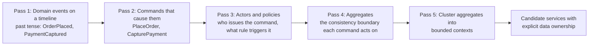

Two outputs matter most. First, the **aggregate** — the smallest set of data that must be transactionally consistent — is the unit that cannot be split across services, because splitting it means giving up a local transaction. Second, the **pivotal events** where the language changes are the strongest boundary candidates: the moment a basket becomes an order, or an order becomes a shipment, is almost always a context boundary.

### Strategy three: decomposition by volatility

Code that changes at very different rates should not share a deployment unit. If a promotions engine changes weekly and a tax calculator changes twice a year under legislative pressure, coupling them means the tax calculator is redeployed fifty times a year for no reason, each redeployment carrying non-zero risk to a component whose correctness is legally significant.

This heuristic has the advantage of being **measurable**. Commit history gives you change frequency per file, and co-change analysis — which files change in the same commit — gives you empirical cohesion. A simple analysis over a monolith's Git history:

```bash
# Change frequency per file over the last two years.
git log --since='2 years ago' --name-only --pretty=format: \
  | grep -v '^$' | sort | uniq -c | sort -rn | head -40

# Co-change: pairs of files that change in the same commit, ranked.
git log --since='2 years ago' --name-only --pretty=format:'---%H' \
  | awk '/^---/{c++} !/^---/ && NF {print c" "$0}' \
  | sort -k2 | awk '{a[$1]=a[$1]" "$2} END {for (k in a) print a[k]}' \
  | tr ' ' '\n' | paste -d, - - | sort | uniq -c | sort -rn | head -40
```

Empirical co-change clusters are frequently a better guide than an architect's intuition, because they reflect how the system actually evolves rather than how it was intended to.

### Strategy four: decomposition by scaling and availability profile

Two capabilities with radically different load shapes or availability requirements are candidates for separation even when their domains are adjacent, because a shared deployment unit forces a single capacity and availability decision on both.

| Signal | Example | Consequence of not separating |
|---|---|---|
| Different peak-to-trough ratio | Checkout peaks 40× on one Friday; review ingestion is flat | Provision the whole application for checkout peak |
| Different availability target | Playback authorisation must never fail; recommendations may degrade | The lower-value component's failures take down the higher-value one |
| Different latency budget | A 10 ms entitlement check alongside a 3 s report generation | The report's thread pool and garbage collection profile harm the check's tail latency |
| Different resource dimension | Memory-bound image processing alongside I/O-bound API serving | Instance type must satisfy both, so it over-provisions one |
| Different failure semantics | Fail-closed payment versus fail-open personalisation | A single process cannot have two failure policies |

!!! warning "This heuristic over-splits if used alone"

    Scaling profile is a *supporting* argument for a boundary that domain analysis already suggests, not a sufficient reason on its own. A service extracted purely because it is CPU-heavy, with no domain coherence, becomes a "technical layer" service — the anti-pattern this chapter warns about most — and will be called synchronously by everything.

### Strategy five: decomposition by compliance and data classification

Where regulated data lives determines audit scope, and audit scope has a direct, recurring monetary cost. Data classified as cardholder data, protected health information, or personal data under a regime with data-residency requirements should be isolated in a service whose store, network and identity are separable from the rest.

On AWS the strongest available boundary is the **account**, not the VPC and certainly not the Kubernetes namespace, because an account boundary is trivially demonstrable to an auditor and is enforced by IAM at the platform level rather than by configuration you must prove. The standard topology is an AWS Organizations organisational unit for in-scope workloads, governed by Service Control Policies, with cross-account communication restricted to a narrow asynchronous interface over an EventBridge event bus or a resource-shared VPC Lattice service network.

### Strategy six: decomposition around the aggregate and the transaction

The hardest practical constraint on decomposition is that **you cannot split an aggregate across services without giving up its transaction**. If placing an order must atomically decrement stock and create an order record, then either those live in one service, or you accept a saga with compensations and the eventual consistency that entails.

The technique is to work backwards from the transactions the business genuinely requires to be atomic:

1. List the operations that must be all-or-nothing in the business's own terms.
2. For each, list the data it touches.
3. Data touched by the same mandatory-atomic operation belongs in the same service, unless the business will accept a compensating undo.
4. Ask the business explicitly: "if the second half fails, is it acceptable to undo the first half a few seconds later, and what does the customer see in between?" The answer is often yes, and the times it is no are precisely the boundaries you must not draw.

This conversation, held before the boundary is drawn, is worth more than any amount of subsequent saga engineering.

### Service granularity and the anti-patterns

| Anti-pattern | Symptom | Correction |
|---|---|---|
| **Entity service** | A "Customer service" exposing only CRUD, called by everyone | Move behaviour to the data; a service should own a capability, not a table |
| **Technical-layer service** | "Validation service", "data access service" | Decompose vertically by capability, not horizontally by layer |
| **Nano-service** | Two hundred services for forty engineers; more pipelines than features | Merge; the fixed per-service cost dominates |
| **God service** | One service that everything calls and that owns most of the data | The monolith survived the migration; re-run the decomposition on it |
| **Chatty chain** | Fourteen sequential internal calls per user request | Collapse services, copy reference data, or move to events |
| **Shared database** | Two services on one schema | Assign ownership; expose an API or publish events |
| **Central aggregation layer owned by one team** | Every team queues to add a field to "the API" | Federate: AppSync Merged APIs, or per-team API Gateway stages behind one custom domain |

!!! danger "The single most common decomposition error"

    Decomposing along the layers of the existing codebase — controllers, services, repositories — because those boundaries are already visible in the code. The result is a set of services that must all be deployed together for any feature to work, connected by synchronous calls, sharing one database. That is a distributed monolith: it pays the full network, operational and failure-mode cost of microservices and delivers none of the independence. Boundaries must be drawn in the **problem** space and only then projected onto code.

### Inter-service communication: the taxonomy

Every interaction between two services sits at one point on two independent axes, and naming the point tells you which AWS service implements it.

| | **One-to-one** | **One-to-many** |
|---|---|---|
| **Synchronous** | Request/response: HTTP through ALB, API Gateway, VPC Lattice, or ECS Service Connect; GraphQL query or mutation through AppSync | Rare and usually a mistake: scatter-gather across many services on a request path multiplies failure probability |
| **Asynchronous** | Command message on an Amazon SQS queue; asynchronous Lambda invocation | Event publication to Amazon EventBridge or Amazon SNS; a stream on Amazon Kinesis; AppSync subscriptions to clients |

Two further distinctions matter more than students expect:

**Commands versus events.** A *command* names a recipient and requests an action: `ReserveInventory`. An *event* names nothing but a fact that has already happened: `OrderPlaced`. Commands couple the sender to the receiver; events do not. A system whose "events" are named `SendEmail` or `CreateShipment` is publishing commands with an event's syntax, and it has all the coupling of a direct call with none of the clarity. The test is the tense and the knowledge: an event is past tense and its publisher does not know or care who consumes it.

**Orchestration versus choreography.** Orchestration puts a coordinator in charge of a multi-service process — on AWS, Step Functions — giving one inspectable artefact, explicit error handling, and a visible execution history, at the cost of the coordinator knowing about all participants. Choreography has each service react to events with no coordinator, giving maximum decoupling at the cost that the business process exists nowhere as a single thing and can only be reconstructed from traces. The practical rule: **orchestrate processes that a business person would draw as a flowchart and that need compensation; choreograph reactions that are genuinely independent side effects.**

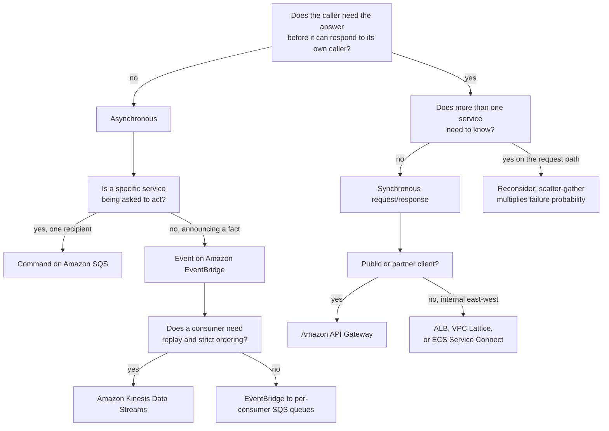

### AWS AppSync and the GraphQL model

**GraphQL** is a query language and runtime in which the client specifies exactly which fields it needs and the server resolves each field independently. Three properties make it structurally interesting for microservices, and one property makes it dangerous.

The three useful properties:

1. **The client declares its data shape.** A mobile screen needing five pieces of data from four services issues one request rather than five, which on a high-latency mobile network is the difference between a responsive screen and a slow one.
2. **Fields resolve independently and in parallel.** A field backed by a slow service does not serialise behind a field backed by a fast one, and a nullable field whose resolver fails returns `null` with an error entry while the rest of the response succeeds — partial success is native to the protocol rather than something you must engineer.
3. **The schema is a contract that can be composed.** Several teams can each own part of one schema, which is what makes federation possible.

The dangerous property: **one schema is one shared artefact**. If a central team owns it, every product team queues behind that team to expose a field, and the API layer becomes precisely the coordination bottleneck microservices exist to remove. The answer on AWS is Merged APIs, described below, and it is the single most important AppSync feature for this syllabus.

**AWS AppSync** is the managed GraphQL service: AWS operates the GraphQL engine, the WebSocket infrastructure for subscriptions, the authorisation layer, the cache and the schema merge. You supply a schema, data sources, and resolvers.

### AppSync core vocabulary

| Term | Meaning |
|---|---|
| **Schema** | The SDL document defining types, and the `Query`, `Mutation` and `Subscription` root types |
| **Data source** | A backend AppSync can call: Lambda, DynamoDB, Aurora through the RDS Data API, Amazon OpenSearch, an HTTP endpoint, Amazon EventBridge, Amazon Bedrock, or `NONE` for a local resolver |
| **Resolver** | The code mapping one schema field to one or more data-source operations |
| **Unit resolver** | A resolver attached to a single data source |
| **Pipeline resolver** | An ordered series of **functions**, each attached to a data source, sharing a `$ctx.stash` — the mechanism for authorisation-then-fetch, or fan-out to several services for one field |
| **Resolver runtime** | **APPSYNC_JS**, a JavaScript runtime with `request` and `response` handlers, or **VTL**, the older Velocity template language. New work uses APPSYNC_JS |
| **Direct Lambda resolver** | A resolver with no mapping template; the whole `context` object is passed to the function and its return value is used as-is |
| **Subscription** | A field on the `Subscription` type that clients open over WebSocket; `@aws_subscribe` binds it to one or more mutations |
| **Merged API** | An AppSync API whose schema is composed from several **source APIs**, each owned by a different team and account; AWS merges them and reports type conflicts |
| **Source API association** | The link between a Merged API and one source API, in auto-merge or manual-merge mode |
| **AppSync Events** | The non-GraphQL side of AppSync: serverless WebSocket pub/sub over **channel namespaces**, for broadcasting to connected clients without defining a schema |
| **Caching** | A managed per-API or per-resolver cache with a TTL and a configurable cache key |
| **Authorisation mode** | API key, AWS IAM, Amazon Cognito user pools, OpenID Connect, or a Lambda authoriser; one primary plus up to a number of additional modes, selectable per field with directives |
| **Conflict detection** | Optimistic-concurrency and conflict-resolution configuration for offline-capable clients synchronising through AppSync |

### Merged APIs: federation without a central team

This is the mechanism that reconciles GraphQL's single schema with microservices' team autonomy, and it deserves to be understood precisely.

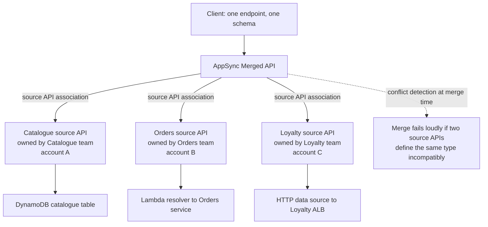

Each team owns a complete, independently deployable AppSync API with its own schema, resolvers, data sources and pipeline. The Merged API associates those source APIs and presents one endpoint to clients. Critically:

- A team ships a new field by deploying **their own** source API. With auto-merge, the merged schema updates without any action by a central team and without a merged-API deployment. This is the property that preserves independent deployability.
- Conflicts — two source APIs defining the same type with incompatible fields — are detected at merge time and reported, rather than silently resolved.
- Source APIs can live in **different AWS accounts**, associated through cross-account IAM, so the ownership boundary can be an account boundary.
- Authorisation modes are configured on the Merged API; source APIs keep their own for direct access, which is useful for a team's own testing.

The alternative, a single AppSync API that all teams modify, works and is simpler for a small organisation. The distinction is exactly the one that governs this whole unit: with one team, a shared artefact is fine; with several teams whose release cadences conflict, a shared artefact is the bottleneck.

!!! tip "How to explain the AppSync-versus-API-Gateway choice in one sentence"

    Choose **API Gateway** when the contract is a set of operations you publish to consumers you do not control — partners, third-party developers, other organisations — and you need per-consumer keys, usage plans and request validation. Choose **AppSync** when the consumers are your own clients, the pain is over-fetching and round trips across many services, and you want the schema to be a composable contract several teams can own. Choose **both** in a large estate: they are not competitors, and a common topology is API Gateway for the public partner API and AppSync for the first-party web and mobile clients.

### Data management: the ownership rule and its consequences

The rule is one sentence: **each service exclusively owns its data store; no other service reads or writes it directly.** The consequences are four, and every one of them costs something.

| Consequence | What you lose | What you use instead on AWS |
|---|---|---|
| No cross-service joins | A single SQL statement joining orders and products | API composition; a CQRS read model; a data-lake copy in S3 queried by Athena; a zero-ETL integration into Redshift |
| No cross-service ACID transactions | `BEGIN … COMMIT` across two services | A saga with compensations, orchestrated by Step Functions |
| No shared referential integrity | A foreign key preventing an order referencing a deleted product | Soft deletes, tombstone events, reconciliation jobs, and accepting that a reference may dangle briefly |
| N stores to operate | One database to back up, patch and monitor | N managed stores, which is why serverless options — DynamoDB on-demand, Aurora Serverless v2, Aurora DSQL — matter so much at this granularity |

!!! danger "The read that becomes a write dependency"

    Teams frequently negotiate a compromise: "the reporting service will only *read* the orders table; it will never write." Within a quarter, the orders team cannot rename a column, add a NOT NULL constraint, change the capacity mode, or migrate the table, because an unknown number of readers depend on its physical schema. A read dependency on a physical schema is every bit as coupling as a write dependency; it is simply less obvious, which makes it worse. The schema has become an unversioned public API owned by nobody.

### Choosing among AWS purpose-built databases

The choice is made from the **access pattern**, and the single most common error is choosing from familiarity instead.

| Store | Data model | Choose it when | Avoid it when |
|---|---|---|---|
| **Amazon DynamoDB** | Key-value and document | Access patterns are known and few; you need single-digit-millisecond reads at any scale; you want serverless elasticity matching a service's own | Queries are ad hoc or analytical; you need joins; the access pattern is genuinely unknown |
| **Amazon Aurora (MySQL/PostgreSQL)** | Relational | You need transactions, joins, constraints, and an ad-hoc query capability; the team knows SQL | Write throughput exceeds a single writer; you need multi-region active-active writes |
| **Amazon Aurora Serverless v2** | Relational | The above, with variable or intermittent load; per-service databases that must scale to a low floor | Steady, high, predictable load where provisioned instances cost less |
| **Amazon Aurora DSQL** | Distributed relational, PostgreSQL-compatible | You need active-active multi-region writes with strong consistency and no failover step, and can accept its feature subset | You depend on PostgreSQL features it does not support, or need a single-region low-cost store |
| **Amazon RDS** | Relational, several engines | You need a specific engine, version or extension Aurora does not offer; lift-and-shift of an existing schema | You want Aurora's storage-layer replication and failover characteristics |
| **Amazon DocumentDB** | Document, MongoDB-compatible | Existing MongoDB application or genuinely document-shaped aggregates with rich queries | A greenfield key-value pattern that DynamoDB serves more cheaply and elastically |
| **Amazon Neptune** | Graph | Relationships are the query — recommendations, fraud rings, entitlement graphs, knowledge graphs | Relationships are shallow; two joins do not justify a graph engine |
| **Amazon Keyspaces** | Wide-column, Cassandra-compatible | Existing Cassandra workload; very high write throughput with a wide-column model | Greenfield, where DynamoDB is usually the simpler AWS-native answer |
| **Amazon MemoryDB** | In-memory, Redis/Valkey-compatible, durable | You need in-memory speed **as the primary store** with multi-AZ durability | You need a cache in front of a durable store; use ElastiCache |
| **Amazon ElastiCache** | In-memory cache | Caching, session state, rate-limit counters, distributed locks | Data you cannot afford to lose |
| **Amazon Timestream** | Time series | Telemetry, metrics, IoT readings with time-window queries and retention tiering | General-purpose workloads |
| **Amazon OpenSearch Service** | Search and analytics | Full-text search, faceting, log analytics, aggregations over semi-structured data | As a system of record; treat it as a derived read model |
| **Amazon S3 with Athena and Glue** | Object storage and query | The analytical copy of everything; the replacement for cross-service joins in reporting | Operational, low-latency access |
| **Amazon Redshift** | Columnar warehouse | Cross-service analytics at scale, fed by zero-ETL integrations | Operational transactions |

!!! note "Polyglot persistence is permitted, not required"

    Database-per-service *allows* each service to choose a fitting engine. It does not oblige you to use eleven. Every additional engine is a set of operational skills, a backup and restore procedure, a monitoring configuration and an upgrade path. A sensible default for a mid-sized estate is two: DynamoDB for services with known access patterns and Aurora Serverless v2 for services needing relational flexibility, adding a third only when a specific access pattern genuinely demands it.

### The cross-service data patterns

**Transactional outbox.** Writing to your database and publishing an event are two operations that cannot be made atomic. The outbox makes them one local transaction plus one asynchronous publication.

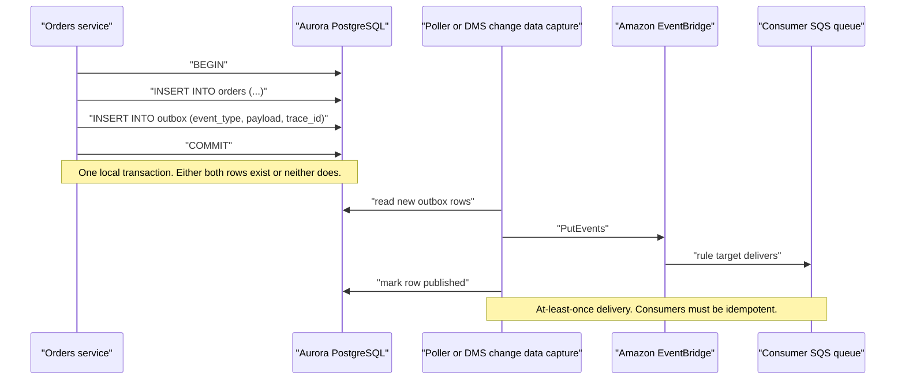

On DynamoDB the outbox is even simpler, because **DynamoDB Streams** gives change data capture for free: write the business item, and a Lambda triggered by the stream publishes the event. The stream record *is* the outbox, and there is no poller to operate. This is one of the strongest practical arguments for DynamoDB in an event-driven microservices estate.

**Saga with compensating transactions.** Treated fully in chapter 4.3; the data-management point here is that the saga is what replaces the transaction you gave up when you split the aggregate, and that its compensations are business operations, not rollbacks.

**CQRS read models.** Because cross-service joins are gone, a view assembling data from several services is built by a projector consuming events into a purpose-built store — DynamoDB for a key-shaped view, OpenSearch for a searchable one. The read model is eventually consistent by construction, and it must be rebuildable from the event history, or a projector bug becomes permanent data corruption.

**Reference-data replication.** When service B needs a small, slowly changing subset of service A's data on a hot path, B subscribes to A's events and keeps a local projection of exactly the fields it needs. This removes a synchronous dependency entirely and is almost always better than caching A's API responses, because it survives A being completely unavailable.

**Zero-ETL and the analytics escape hatch.** The reporting requirement that used to be a join is served by continuously replicating each service's data into Amazon Redshift through zero-ETL integrations, or into S3 as an analytical copy queried by Athena. This is the correct answer to "but finance needs a report across all six services" and it does not require anyone to read anyone else's operational tables.

### Consistency, stated honestly

| Model | Where you get it on AWS | What it costs |
|---|---|---|
| Strong consistency within one aggregate | A single DynamoDB item; a single Aurora transaction | Nothing; this is why aggregates must not be split |
| Strong consistency across items in one DynamoDB table or account | `TransactWriteItems` | Bounded item count per transaction, roughly double the write capacity, and no cross-service reach |
| Strong consistency across regions | Aurora DSQL | A feature subset relative to PostgreSQL, and a newer operational surface |
| Read-your-writes | DynamoDB strongly consistent reads; Aurora reads from the writer | Higher cost or lost read-replica offload |
| Eventual consistency | Everything cross-service | A stale window, duplicate submissions, support tickets, and reconciliation jobs you must build and staff |

!!! warning "Eventual consistency is a business decision that must be made by the business"

    "The customer may not see their order in their history for up to two seconds" is either acceptable or it is not, and the architect's job is to ask rather than to assume. When the answer is "not acceptable", the correct response is usually not more engineering but a different boundary: the data belongs in the same service. Budget explicitly for reconciliation jobs that can answer "are these two services in agreement?", because in a system without foreign keys, that question is asked eventually and there must be a way to answer it.

---

## AWS Service Deep Dive

!!! warning "On numbers and quotas"

    Quotas stated below are representative as of 2026. Most are **soft** and adjustable through AWS Service Quotas; a minority are hard. They vary by Region and account. Verify in the Service Quotas console for the account and Region you are designing in. Pricing is described as **dimensions** and **relative positions** only; model actual cost in the AWS Pricing Calculator.

### AWS AppSync

**Purpose.** Provide a managed GraphQL and event API layer that resolves each field of a client request against the owning backend, in parallel, with authorisation, caching, real-time subscriptions and cross-team schema federation supplied by the platform.

**Architecture.** AppSync is fully managed and regional. A request arrives at the AppSync endpoint over HTTPS (queries and mutations) or WebSocket (subscriptions). AppSync parses and validates the query against the schema, evaluates the authorisation mode and any field-level directives, then executes the resolver graph: fields at the same depth resolve concurrently, and nested fields resolve after their parent. Each resolver runs either as an APPSYNC_JS function inside AppSync's own sandboxed JavaScript runtime, or as a VTL template, or is passed straight through to a Lambda function as a direct Lambda resolver. Data-source calls are made using an IAM service role that AppSync assumes, so AppSync itself is the principal that talks to DynamoDB, Aurora, OpenSearch or an HTTP endpoint. Subscription delivery runs over a managed WebSocket fleet: a mutation's response is evaluated against every registered subscription's filter and pushed to matching connections.

**Important features.**

| Feature | What it does | Why it matters architecturally |
|---|---|---|
| **Merged APIs** | Compose one schema from several independently owned source APIs, across accounts | The federation mechanism that keeps GraphQL compatible with team autonomy |
| **Pipeline resolvers** | Chain functions over several data sources for one field, sharing a stash | Authorise-then-fetch, and fan-out to several services for a single field, without a Lambda |
| **APPSYNC_JS runtime** | Write resolvers in a JavaScript subset, no Lambda invocation | Removes cold starts and per-invocation cost from simple resolvers |
| **Direct Lambda resolvers** | Pass the whole context to a function, no mapping template | The simplest path when the backend is a service behind a Lambda |
| **Data sources** | DynamoDB, Lambda, RDS Data API, OpenSearch, HTTP, EventBridge, Bedrock, NONE | AppSync can call a DynamoDB table or an internal ALB directly, with no compute in between |
| **Subscriptions** | Managed WebSocket push on mutation, with server-side filtering | Real-time UI without operating a WebSocket fleet |
| **Enhanced subscription filtering** | Filter server-side on fields the client specifies | Prevents fanning irrelevant messages to every connection |
| **AppSync Events** | Channel-namespace pub/sub over WebSocket with no GraphQL schema | Broadcast and presence use cases that do not need a query language |
| **Caching** | Per-API or per-resolver cache with TTL and a configurable key | Absorbs read load before it reaches a service |
| **Five authorisation modes** | API key, IAM, Cognito user pools, OIDC, Lambda authoriser; multiple modes per API, selectable per field | One API can serve an authenticated first-party client and an IAM-signed internal caller |
| **Private APIs** | An AppSync endpoint reachable only through a VPC interface endpoint | Internal APIs that must not be internet-reachable |
| **WAF integration** | Attach an AWS WAF web ACL to the API | Rate-based rules and managed rule sets at the GraphQL edge |
| **Conflict detection and sync** | Optimistic concurrency with configurable resolution for offline clients | Mobile clients that write while disconnected |

**Limitations.** GraphQL is not a good fit for bulk data transfer or for file upload; use S3 presigned URLs and return the URL through the API. Query complexity is a real operational risk: a deeply nested query can fan out into hundreds of resolver executions, and depth and complexity limits must be configured deliberately. The APPSYNC_JS runtime is a **subset** of JavaScript — no `async`/`await`, no arbitrary npm modules, limited built-ins — so non-trivial logic belongs in Lambda. Response payload size, resolver execution time and subscription payload size are all capped. There is no built-in usage-plan or API-key-per-consumer metering comparable to API Gateway's, so monetised partner APIs are a poor fit. Caching is per-resolver with a TTL and no fine-grained invalidation API, so it suits reference data rather than rapidly changing state.

**Pricing model.** Charged per **query and mutation operation**, per **subscription message delivered**, and per **connection-minute** for subscriptions; the optional cache is charged per instance-hour by cache size. There is no charge for the merge in a Merged API, but operations against the Merged API are billed. The architectural implication is that a chatty client issuing many small queries costs more than one issuing a single well-shaped query — which is precisely the behaviour GraphQL encourages — and that long-lived subscriptions from many idle clients are a real, easily overlooked line item.

**Performance characteristics.** Field resolution is concurrent at the same depth, so a query touching four services has roughly the latency of the slowest one rather than their sum. This is the strongest performance argument for GraphQL in a microservices estate. The counterweight is that a badly shaped nested query serialises: a list of 100 orders each resolving a customer field produces 100 sequential-per-item resolver executions — the **N+1 problem** — which must be solved by batching. AppSync supports batch invocation for Lambda data sources (`BatchInvoke`) and `BatchGetItem` for DynamoDB; using them is not optional at scale.

**Scaling behaviour.** AppSync scales automatically with request volume; you provision nothing except optionally the cache. The scaling constraint moves to your data sources: a Lambda resolver has a concurrency limit, a DynamoDB table has throughput settings, and an Aurora cluster has connections. The most common AppSync scaling incident is not AppSync throttling but the Aurora connection pool behind an RDS Data API resolver.

**Availability.** Regional, multi-AZ, managed by AWS. For multi-Region, front two regional APIs with Route 53 latency or failover routing and accept that subscriptions do not fail over transparently — clients must reconnect.

**Security features.** Five authorisation modes with per-field directives (`@aws_auth`, `@aws_cognito_user_pools`, `@aws_iam`, `@aws_oidc`, `@aws_api_key`), so a single type can expose public fields and restricted fields; AWS WAF attachment; private APIs over VPC endpoints; a service role per data source following least privilege; field-level authorisation implemented in a pipeline function's first step; CloudWatch request-level logging with configurable verbosity, and X-Ray tracing.

**Service limits (representative, mostly soft).** Resolvers per API, types per schema and API count per region are in the hundreds to low thousands. Query depth and resolver count per request are configurable limits you should set. Subscription payload size, connection duration, and concurrent connections per API all have ceilings. Source APIs per Merged API is a specific quota worth checking before designing a large federation.

**Common configurations.** APPSYNC_JS resolvers with direct DynamoDB data sources for owned data; direct Lambda resolvers for fields backed by a service; pipeline resolvers where authorisation must precede the fetch; Cognito user pools as the primary authorisation mode with IAM as an additional mode for internal callers; WAF attached with a rate-based rule; X-Ray enabled; CloudWatch logs at `ERROR` in production and `ALL` in development; a Merged API in a platform account associating one source API per product team's account.

### Amazon API Gateway in the decomposition context

API Gateway is treated in depth in chapter 4.2. For decomposition purposes only three facts matter here. First, it offers **three API types** — REST, HTTP and WebSocket — with different feature sets and per-request costs, and the REST type is the one carrying usage plans, API keys, request validation and per-method caching. Second, its **per-consumer usage plans and API keys** are the feature that makes it the correct front door for partner and third-party APIs, which AppSync does not replicate. Third, a **custom domain with base-path mappings** allows several independently deployed APIs, owned by different teams, to appear under one hostname — the REST equivalent of a Merged API and the correct way to avoid a single central API artefact.

### AWS Migration Hub Refactor Spaces

**Purpose.** Provision and manage the infrastructure required to run a strangler-fig decomposition incrementally: the routing layer, the network path between the monolith and the new services, and the account structure, created and maintained as one AWS resource rather than assembled by hand.

**Architecture.** A Refactor Spaces **environment** contains an **application**, which orchestrates an Amazon API Gateway, an API Gateway VPC link, a Network Load Balancer, an AWS Transit Gateway attachment and the AWS Resource Access Manager shares and resource-based policies needed to bridge the environment's accounts and VPCs. Within the application you register **services** — a URL endpoint or a Lambda function — and **routes** mapping a path to a service. The default route sends everything to the monolith; each new route peels one path off to a new service.

**Why it matters for this chapter.** The mechanics of a strangler fig — a router in front of the monolith, per-path routing, cross-account and cross-VPC network paths, and traffic shifting — are exactly the same for every migration, are fiddly to build correctly, and are frequently the reason a decomposition stalls before the first extraction. Refactor Spaces turns that into a managed resource. It also enforces a helpful discipline: extraction is expressed as a route, so "which capabilities have we actually extracted" has an answer visible in the console.

!!! warning "Refactor Spaces is closed to new customers"

    Since **7 November 2025** AWS Migration Hub Refactor Spaces has been closed to new customers, with **AWS Transform** positioned as the recommended alternative for modernisation work. Study it for the *pattern* it encodes — a managed router in front of a monolith, extraction expressed as a route, cross-account networking provisioned for you — because that pattern is what you will otherwise assemble by hand from API Gateway, a VPC link, an NLB and a Transit Gateway attachment. Do not plan a new migration around the service itself.

**Limitations.** It provisions opinionated infrastructure you do not fully control, adds its own cost per application and per hour, and is deliberately migration-shaped: it is scaffolding for a transition, not a permanent production edge. Once the monolith is gone, the routing usually moves to a plain API Gateway or ALB.

### Supporting analysis services

| Service | Role in decomposition |
|---|---|
| **AWS Application Discovery Service** | Inventories on-premises servers and, importantly, their **network dependencies** — which process talks to which, and how often. The dependency graph is empirical evidence about coupling that beats architectural memory |
| **AWS Migration Hub Strategy Recommendations** | Analyses source code and running processes and proposes rehost, replatform or refactor strategies per component |
| **AWS App2Container** | Containerises an existing Java or .NET application in place, producing an image, an ECS task definition or Kubernetes manifests, and a CloudFormation template. The pragmatic first step: containerise the monolith before decomposing it |
| **Amazon CloudWatch Application Signals** | Once services exist, produces an automatic service map and per-service SLO tracking from telemetry, which validates whether the boundaries you drew match the call patterns you actually have |

!!! tip "Use the dependency graph as evidence, not as the design"

    Application Discovery Service and Application Signals tell you what the system *does*; they do not tell you what it *should* do. A high-traffic dependency between two components may be evidence of a boundary that should not exist, or evidence of one that should be asynchronous. The graph is an input to the domain conversation, not a substitute for it.

---

## Internal Working

### How AppSync executes a query

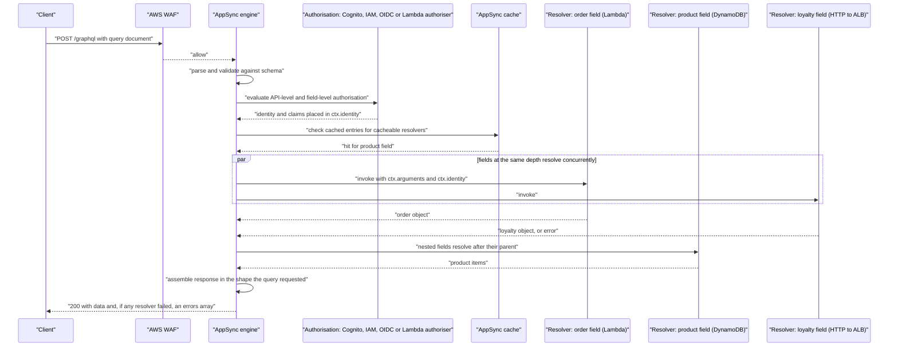

Four properties of this flow are architecturally important and are what students most often get wrong:

1. **Authorisation is evaluated before resolvers run**, and field-level directives mean one query can be partly authorised. A field the caller may not see is removed and reported in `errors`, while the rest of the response is returned.
2. **Sibling fields resolve concurrently.** Latency is governed by the slowest sibling, not the sum. This is why GraphQL suits an aggregation over several services.
3. **A failed resolver on a nullable field does not fail the request.** The field is `null` and an entry appears in `errors`. HTTP status remains 200. Monitoring that only counts non-200 responses will report a healthy API while every loyalty field on every request is failing — a genuinely common production blind spot.
4. **Nested list fields are the N+1 trap.** `orders { product { name } }` over 100 orders means 100 product resolutions unless batching is configured.

### The N+1 problem and its two AWS solutions

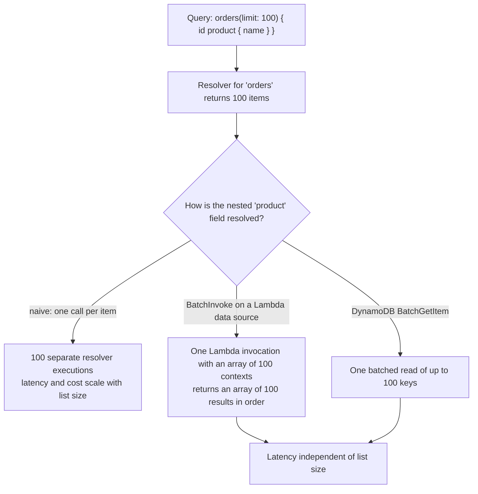

Batching is configured on the data source and resolver (`maxBatchSize`), and the Lambda function must be written to accept and return arrays. Failing to do this is the most common cause of an AppSync API that performs beautifully in development with three records and collapses in production with three hundred.

### How the outbox actually becomes an event on AWS

Two mechanisms, with different operational profiles:

| Mechanism | How it works | Ordering | Operational load | Best fit |
|---|---|---|---|---|
| **DynamoDB Streams plus Lambda** | Every item change is emitted on a stream; a Lambda reads it and publishes to EventBridge | Per partition key | Very low; no poller to run | Services whose store is DynamoDB — the default choice |
| **Kinesis Data Streams for DynamoDB** | Changes fed to a Kinesis stream instead | Per partition key, with longer retention and replay | Low | When you need replay beyond the stream's 24-hour window, or fan-out to many independent consumers |
| **Aurora with AWS DMS change data capture** | DMS reads the transaction log and writes changes to Kinesis, or to an S3 target | Transaction order | Moderate; a DMS instance to size and monitor | Relational services where you cannot add a poller |
| **Poller inside the service** | A background thread or scheduled task reads unpublished outbox rows and publishes | Insertion order | You own it, including its failure modes | When you need full control of the publication logic and payload shaping |

!!! danger "The dual write, and why it is always wrong"

    The tempting shortcut is: write to the database, then call `PutEvents`. If the process dies between the two, the state change exists and no event was published, and no amount of retry logic can fix it because the retry state itself was in the dead process. The inverse failure — event published, transaction rolled back — is worse, because downstream services act on something that never happened. There is no configuration that makes a dual write safe. The outbox, or a stream derived from the database's own log, is the only correct construction, and this is a standard examination and interview question.

### Control plane versus data plane in this chapter's services

| Service | Control plane | Data plane | Consequence |
|---|---|---|---|
| **AppSync** | Schema, resolver, data-source and merge configuration | Query, mutation and subscription execution | A merge failure blocks schema changes but does not stop request serving |
| **API Gateway** | Deployments and stage configuration | Request handling | A failed deployment leaves the previous stage serving |
| **DynamoDB** | Table, index and capacity configuration | `GetItem`, `Query`, `PutItem` | Adding a global secondary index is a control-plane operation that backfills asynchronously; the table serves throughout |
| **Aurora** | Cluster, instance and parameter configuration | SQL connections | A parameter change may require a reboot; plan it as a data-plane event |
| **EventBridge** | Buses, rules and schema registry | `PutEvents` and delivery | A rule change takes effect without interrupting publication |

The rule from Units II and III applies unchanged: **never place a control-plane call on the request path**. Discovering a service's endpoint by calling `DescribeServices` per request, or reading a schema from the AppSync control plane per request, couples your data plane's availability to a control plane that is not designed for that load and will throttle you.

---

## Architecture Components

| Component | Responsibility in a decomposed architecture |
|---|---|
| **Client (web, mobile, partner, internal service)** | Determines the shape of the edge: a mobile client with expensive round trips argues for GraphQL; a partner integration argues for a versioned REST contract |
| **Amazon Route 53** | Public DNS and health-check failover; hosts the private zone AWS Cloud Map writes discovery records into |
| **Amazon CloudFront** | Edge caching and TLS termination close to the user; absorbs read traffic before it becomes a service request |
| **AWS WAF** | Managed and rate-based rules at CloudFront, ALB, API Gateway or AppSync; the cheapest place to stop abuse |
| **Amazon API Gateway** | Public and partner API front door: per-consumer keys, usage plans, request validation, throttling, mock and proxy integrations |
| **AWS AppSync** | First-party client API: GraphQL aggregation across services, real-time subscriptions, and cross-team schema federation through Merged APIs |
| **Application Load Balancer** | Shared L7 entry to container services with path and host routing; the low-cost high-volume option where API-management features are not needed |
| **Amazon VPC Lattice** | Application networking across VPCs and accounts with IAM auth policies, connecting ECS, EKS, EC2 and Lambda uniformly; the successor path for App Mesh workloads |
| **Amazon ECS and Amazon EKS** | Where long-lived services run; the compute decision is per service and is made last |
| **AWS Lambda** | Where short, event-shaped work runs; also the standard AppSync resolver target |
| **Amazon EventBridge** | The domain-event routing fabric and schema registry; the mechanism by which a service announces a fact without knowing its consumers |
| **Amazon SQS** | Durable per-consumer buffering, queue-based load levelling, and dead-letter capture |
| **Amazon SNS** | Fan-out of one message to many subscribers, canonically SNS to several SQS queues so each consumer buffers independently |
| **Amazon Kinesis Data Streams** | Ordered, replayable streams for high-throughput telemetry and change-data-capture feeds |
| **AWS Step Functions** | Where a multi-service business process lives explicitly, with retries, catches, compensations and a visible execution history |
| **Amazon DynamoDB** | The default per-service store for known access patterns; its Streams provide outbox semantics without a poller |
| **Amazon Aurora, Aurora Serverless v2, Aurora DSQL** | Relational stores for services needing transactions, joins and ad-hoc queries, with serverless and multi-region-active options |
| **Amazon ElastiCache and MemoryDB** | Caching and shared ephemeral state; MemoryDB when in-memory data must be durable |
| **Amazon OpenSearch Service** | Search and log analytics; in a decomposed system, usually a derived read model rather than a system of record |
| **Amazon S3, Athena, Glue, Redshift** | The analytical plane that replaces cross-service joins; fed by events or zero-ETL integrations |
| **AWS IAM and AWS STS** | Per-service workload identity; the actual security boundary between services |
| **AWS Secrets Manager and Parameter Store** | Per-service credentials and configuration injected at start, never baked into images |
| **AWS KMS** | Envelope encryption for every store, with customer-managed keys where key-level policy and audit matter |
| **Amazon CloudWatch, X-Ray, ADOT** | Metrics, logs, traces and the service map; in a decomposed system the trace is the only complete record of a request |
| **AWS Migration Hub Refactor Spaces** (closed to new customers since November 2025) | The managed strangler-fig routing layer during a decomposition: API Gateway, VPC link, NLB and Transit Gateway provisioned as one resource |
| **AWS CloudFormation, AWS CDK, Terraform** | Every boundary expressed as code, so that a service's infrastructure is versioned with the service |

Read structurally, these components form three planes. The **contract plane** — API Gateway, AppSync, ALB, VPC Lattice, EventBridge — is where boundaries become visible and enforceable; if a boundary is not represented here, it is not real. The **ownership plane** — the per-service databases and their IAM policies — is where boundaries become durable; a boundary not enforced by an IAM policy that physically prevents service B from reading service A's table is a boundary maintained by good intentions. The **evidence plane** — traces, service maps, event schemas, Application Signals — is where you discover whether the boundaries you designed are the boundaries you have. Most decomposition programmes invest heavily in the first, insufficiently in the second, and not at all in the third, and then cannot explain why the architecture drifted.

---

## Request Lifecycle

A mobile client opens an order-detail screen requiring the order, its line items with product names and images, the shipment's tracking status, and the customer's loyalty balance. Four services own these; the client makes one request.

```mermaid
sequenceDiagram
    participant M as "Mobile client"
    participant WAF as "AWS WAF"
    participant AS as "AppSync Merged API"
    participant COG as "Amazon Cognito user pool"
    participant OS as "Orders source API to Lambda"
    participant CAT as "Catalogue source API to DynamoDB"
    participant SH as "Shipping source API to HTTP data source"
    participant LOY as "Loyalty source API to Lambda"
    participant XR as "AWS X-Ray"
    M->>WAF: "POST /graphql with JWT and one query document"
    WAF-->>AS: "allow after rate-based rule"
    AS->>COG: "validate JWT signature and claims"
    COG-->>AS: "identity placed in ctx.identity"
    AS->>AS: "validate query against merged schema; check depth and complexity limits"
    AS->>XR: "begin trace segment"
    par sibling fields resolve concurrently
        AS->>OS: "resolve order(id) for this customer"
        AS->>LOY: "resolve loyaltyBalance for this customer"
    end
    OS-->>AS: "order with line item product IDs"
    LOY--xAS: "timeout after 1s; field is nullable"
    AS->>CAT: "BatchGetItem for all line item product IDs in one call"
    CAT-->>AS: "product summaries"
    AS->>SH: "resolve shipment status for this order"
    SH-->>AS: "tracking state"
    AS->>AS: "assemble response; loyaltyBalance is null with an errors entry"
    AS-->>M: "200 with data and a partial-failure errors array"
    M->>M: "render screen; loyalty card shows 'unavailable'"
```

The reasoning at each step:

1. **WAF evaluates before any resolver runs.** A rate-based rule protects four services with one configuration, and blocking at the edge costs a fraction of blocking inside a service.
2. **Authorisation resolves once, at the API, not four times in four services.** Each source API still enforces its own authorisation for direct access, but the client's identity is established once and passed down as `ctx.identity`.
3. **Depth and complexity limits are checked before execution.** Without them, one adversarial nested query can fan out into thousands of resolver executions — a denial-of-service vector unique to GraphQL and one that must be configured deliberately.
4. **Order and loyalty resolve concurrently.** Under REST this screen is four sequential round trips over a mobile network; here it is one, and the concurrent portion costs the slower of the two.
5. **The loyalty resolver times out and the field is nullable.** The screen renders with one card degraded rather than failing entirely. This is partial failure as a first-class protocol feature, and it is the single strongest argument for GraphQL at a mobile edge. Note carefully that the HTTP status is **200**: your alarms must count the `errors` array, not the status code.
6. **Line-item products are fetched with one batched read.** Without `maxBatchSize` and a `BatchGetItem` resolver this is N separate reads and the screen's latency grows with basket size.
7. **The catalogue is queried through its owning source API.** The orders service stores product *identifiers* and a price snapshot; it does not store the catalogue's data, and the merge happens in the API layer where it belongs rather than by one service reading another's table.
8. **One trace covers all four services** because AppSync propagates the X-Ray trace context. Without this, the question "why was that screen slow" has four separate, uncorrelated answers.

### Synchronous versus asynchronous in this design

| Interaction | Style | Justification |
|---|---|---|
| Client to AppSync | Synchronous | The user is waiting for a screen |
| AppSync to each source API | Synchronous, concurrent | The data is needed for this response; concurrency prevents summation |
| Orders service writing an order | Local transaction plus outbox row | Atomicity between the state change and its announcement |
| `OrderConfirmed` to shipping, payments, analytics | Asynchronous via EventBridge to per-consumer SQS | None of these must complete before the customer is told the order was accepted |
| Catalogue changes to the pricing and inventory services | Asynchronous event with a local projection | Removes a synchronous dependency from those services' hot paths entirely |
| Cross-service reporting | Asynchronous replication to Redshift or S3 | Reporting must never be a reason to grant read access to an operational store |

---

## Important AWS Terminology

| Term | Meaning |
|---|---|
| **Business capability** | Something the business does, named in the business's language, independent of implementation |
| **Subdomain** | A part of the problem space; classified as core, supporting or generic |
| **Bounded context** | A boundary in the solution space inside which one model and vocabulary are consistent |
| **Ubiquitous language** | The shared vocabulary of a bounded context, used identically in conversation, code and schema |
| **Aggregate** | The smallest set of data that must be transactionally consistent; cannot be split across services without a saga |
| **Anti-corruption layer** | Translation at a boundary preventing an external or legacy model from leaking inward |
| **Open host service** | A context that publishes a stable, general-purpose contract for many consumers |
| **Event storming** | A facilitated workshop deriving events, commands, aggregates and contexts from domain experts |
| **Co-change analysis** | Empirical measurement of which files change together, used as evidence of cohesion |
| **Volatility-based decomposition** | Separating components by rate of change rather than by function |
| **Strangler fig** | Incremental migration routing capabilities away from a monolith one at a time until it can be deleted |
| **Refactor Spaces** | AWS Migration Hub feature orchestrating API Gateway, a VPC link, an NLB and Transit Gateway as the routing and networking layer for a strangler-fig migration; closed to new customers since November 2025 |
| **Self-contained system** | A service that owns its data *and* its user interface, integrating with peers at the UI or link level |
| **Command** | A message naming a recipient and requesting an action; couples sender to receiver |
| **Domain event** | A past-tense fact published without knowledge of consumers |
| **Orchestration** | A coordinator drives a multi-service process; explicit and observable |
| **Choreography** | Services react to events with no coordinator; decoupled and harder to observe |
| **GraphQL** | A query language in which the client specifies fields and the server resolves each independently |
| **Schema (AppSync)** | The SDL document defining types and the Query, Mutation and Subscription roots |
| **Resolver** | Code mapping one schema field to one or more data-source operations |
| **Unit resolver** | A resolver bound to a single data source |
| **Pipeline resolver** | An ordered chain of functions over several data sources, sharing `ctx.stash` |
| **APPSYNC_JS** | AppSync's sandboxed JavaScript resolver runtime; a subset of the language, no Lambda invocation |
| **VTL** | Velocity Template Language, the older AppSync resolver runtime |
| **Direct Lambda resolver** | A resolver with no mapping template; the context is passed to the function and its return used as-is |
| **Data source** | A backend AppSync can call: DynamoDB, Lambda, RDS Data API, OpenSearch, HTTP, EventBridge, Bedrock, or NONE |
| **Subscription** | A GraphQL field delivered over WebSocket, bound to mutations with `@aws_subscribe` |
| **Merged API** | An AppSync API composing its schema from several independently owned source APIs, possibly cross-account |
| **Source API** | One team's independently deployable AppSync API, associated into a Merged API |
| **Auto-merge** | Merge mode in which a source API's change propagates to the Merged API without a merged-API deployment |
| **AppSync Events** | AppSync's schemaless WebSocket pub/sub over channel namespaces |
| **N+1 problem** | Resolving a nested field once per item in a list, making latency and cost scale with list size |
| **BatchInvoke and maxBatchSize** | AppSync's batching mechanism for Lambda data sources, the standard N+1 remedy |
| **Query depth and complexity limits** | Configurable ceilings preventing an adversarial nested query from fanning out unboundedly |
| **Partial response** | A GraphQL response returning `data` with nulls plus an `errors` array, at HTTP 200 |
| **Backend for frontend (BFF)** | A per-client-type aggregating service tuned to that client's screens |
| **API composition** | Assembling a view by calling several services and joining in the aggregation layer |
| **Database per service** | Exclusive ownership of a data store by exactly one service |
| **Polyglot persistence** | Different services using different database engines fitted to their access patterns |
| **Purpose-built database** | An AWS engine designed for one data model: key-value, relational, document, graph, wide-column, in-memory, time series, search |
| **Aurora Serverless v2** | Aurora capacity that scales in fine-grained ACU increments, including to a low floor |
| **Aurora DSQL** | Distributed, PostgreSQL-compatible relational service supporting active-active multi-region writes with strong consistency |
| **DynamoDB Streams** | An ordered per-partition-key change feed from a DynamoDB table; the free outbox |
| **Transactional outbox** | Writing the event in the same local transaction as the state change, publishing asynchronously |
| **Dual write** | Writing to the database and publishing separately; always unsafe |
| **Change data capture (CDC)** | Deriving a change feed from a database's own log, on AWS via DynamoDB Streams or AWS DMS |
| **Saga** | A sequence of local transactions with compensating transactions replacing a distributed transaction |
| **Compensating transaction** | A business operation that semantically undoes a completed local transaction |
| **CQRS** | Command Query Responsibility Segregation: separate write and read models |
| **Read model or projection** | A derived, query-shaped store built by consuming events |
| **Reference-data replication** | A consumer keeping a local projection of a small, slowly changing subset of another service's data |
| **Zero-ETL integration** | Managed continuous replication from an operational store into Amazon Redshift without a pipeline to build |
| **Eventual consistency** | The guarantee that replicas converge given no new writes, with a stale window in between |
| **Idempotency key** | A caller-supplied identifier making a repeated operation safe to process once |
| **Tombstone event** | An event announcing a deletion, so consumers can remove their projections |
| **Reconciliation job** | A scheduled comparison answering "are these two services in agreement?" |
| **Data classification** | Labelling data by sensitivity, which determines its isolation and audit scope |
| **AWS Organizations and SCPs** | Account grouping and guardrails; the strongest available isolation boundary on AWS |

---

## Configuration Options

### AWS AppSync configuration

| Setting | Options | How to decide |
|---|---|---|
| **API type** | GraphQL API, Merged API, Events API | Merged API as soon as more than one team owns fields; a single GraphQL API only while one team owns everything |
| **Merge mode** | Auto-merge or manual merge | Auto-merge preserves independent deployability and is the default choice; manual merge only where a release gate is contractually required |
| **Primary authorisation mode** | API key, IAM, Cognito user pools, OIDC, Lambda authoriser | Cognito or OIDC for first-party users; IAM for internal service callers; Lambda authoriser for bespoke token schemes; API key only for public read-only data and never as the sole control on writes |
| **Additional authorisation modes** | Any of the above, with per-field directives | Use to expose a public subset and an authenticated subset from one API without duplicating the schema |
| **Resolver runtime** | APPSYNC_JS or VTL | APPSYNC_JS for all new work; VTL only for existing resolvers |
| **Resolver kind** | Unit or pipeline | Pipeline whenever authorisation, validation or enrichment must precede the data-source call |
| **Data source type** | DynamoDB, Lambda, RDS Data API, OpenSearch, HTTP, EventBridge, Bedrock, NONE | Direct DynamoDB or HTTP where the mapping is simple — it removes a Lambda's cost and cold start; Lambda where real logic is required |
| **maxBatchSize** | Integer per resolver on Lambda data sources | Set on every resolver that appears under a list field; this is the N+1 defence |
| **Caching** | None, per-API, or per-resolver with TTL and cache key | Per-resolver on reference-data fields with a TTL matching real change frequency; never on user-specific data unless the identity is part of the cache key |
| **Query depth limit** | Integer | Set it; an unset depth limit is a denial-of-service vector |
| **Resolver count limit** | Integer per request | Set it, sized from your legitimate worst-case query |
| **Logging level** | NONE, ERROR, ALL | `ERROR` with field-level logging in production; `ALL` in development. `ALL` in production at volume is a significant CloudWatch cost |
| **X-Ray tracing** | Enabled or disabled | Enabled; without it the concurrent resolver fan-out is invisible |
| **WAF web ACL** | Attached or not | Attached, with a rate-based rule, on any internet-facing API |
| **Visibility** | Global or private | Private with a VPC interface endpoint for internal-only APIs |

### Decomposition and boundary configuration

| Decision | Options | How to decide |
|---|---|---|
| **Boundary criterion** | Capability, subdomain, volatility, scaling profile, compliance, aggregate | Capability and subdomain lead; the others corroborate or veto. Never a technical layer |
| **Service granularity** | Coarse (one per capability) or fine (one per aggregate) | Start coarse. Splitting a service later is far cheaper than merging two that have diverged |
| **Extraction order** | Highest value, lowest risk, or highest learning | Lowest risk and highest learning first. The first extraction's purpose is to build the pipeline, the observability and the team's confidence |
| **Data extraction technique** | Dual-write then backfill; CDC replication; big-bang migration | Dual-write with backfill and verification for anything you cannot take offline; big-bang only for small, low-traffic tables |
| **Temporary shared-database access** | Prohibited, or permitted with an expiry | Permitted only with a named owner, a removal ticket and a date. Untracked temporary violations become permanent architecture |
| **Isolation level** | Namespace, cluster, VPC, account | Account for regulated or hostile-tenancy boundaries; the weaker levels for convenience boundaries |

### Data store configuration

| Setting | Options | How to decide |
|---|---|---|
| **DynamoDB capacity mode** | On-demand or provisioned with auto scaling | On-demand for new or spiky services and for anything whose traffic you cannot predict; provisioned with auto scaling and a Savings Plan for steady, high, well-understood load |
| **DynamoDB table design** | Single-table or table-per-entity | Single-table where access patterns are known and related entities are read together; table-per-entity where a service's entities are genuinely independent and the team is new to DynamoDB |
| **DynamoDB Streams view type** | KEYS_ONLY, NEW_IMAGE, OLD_IMAGE, NEW_AND_OLD_IMAGES | `NEW_AND_OLD_IMAGES` when publishing domain events, because consumers frequently need the delta |
| **DynamoDB consistency** | Eventually consistent or strongly consistent reads | Strongly consistent only where read-your-writes is required; it costs double and is unavailable on global secondary indexes |
| **Aurora capacity** | Provisioned instances or Serverless v2 ACUs | Serverless v2 for per-service databases with variable load; provisioned for steady high load with reservations |
| **Aurora read scaling** | Reader endpoint, Aurora Auto Scaling for replicas | Route reads to the reader endpoint only where replica lag is acceptable, which excludes read-your-writes paths |
| **Connection management** | Direct, RDS Proxy, RDS Data API | RDS Proxy whenever many small tasks or Lambda functions connect; the Data API for AppSync and Lambda where an HTTP interface avoids connection state entirely |
| **Encryption** | AWS-managed or customer-managed KMS keys | Customer-managed where you need key policy, rotation control and a CloudTrail record of every decrypt |
| **Backup** | Automated backups, PITR, AWS Backup plans | PITR on every operational store; AWS Backup with a cross-account vault for anything whose loss is a business event |
| **Global tables and multi-region** | Single region, DynamoDB global tables, Aurora Global Database, Aurora DSQL | Multi-region only when a business requirement names it; each option has different write semantics and each multiplies cost and complexity |

---

## Design Considerations

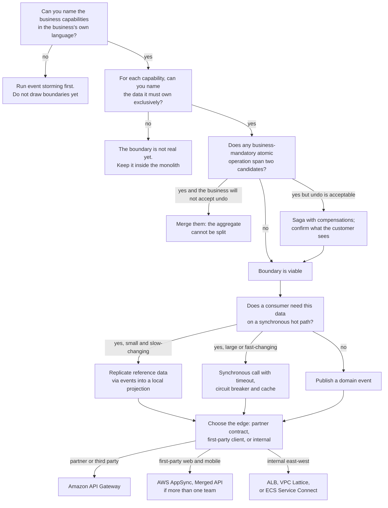

| Quality | What it means here | Design levers | The trade-off you accept |
|---|---|---|---|
| **Scalability** | Each service scales on its own signal and its store scales with it | Per-service capacity decisions; DynamoDB on-demand; Aurora Serverless v2; AppSync's automatic scaling | More independent capacity decisions to get right; the bottleneck moves to whichever store you under-provisioned |
| **Availability** | A failure in one capability degrades one feature | Asynchronous decoupling; nullable GraphQL fields; per-consumer queues; account-level isolation | Composite availability of a synchronous chain is the product of its links; every synchronous dependency you add is a multiplication |
| **Reliability** | Correct behaviour under partial failure and duplicate delivery | Outbox, idempotency keys, dead-letter queues, sagas with compensation, reconciliation jobs | Substantially more code and test surface than a transactional monolith |
| **Durability** | No acknowledged work is lost | Outbox in the same transaction; durable queues; PITR on every store | At-least-once delivery makes duplicates the consumer's problem |
| **Latency** | End-to-end user-perceived time | Concurrent field resolution; batching; reference-data replication; caching at CloudFront and in AppSync | Each hop adds serialisation, TLS and a tail-latency contribution; GraphQL's concurrency mitigates but does not remove this |
| **Consistency** | What the user sees immediately after a write | Keep aggregates whole; strongly consistent reads where required; explicit UI treatment of pending state | Cross-service consistency is eventual, and the business must accept a specific stale window |
| **Cost** | Total cost of ownership, not compute cost | Serverless stores that scale to a floor; shared ALB; caching; batching | Per-service overheads multiply: a database, a pipeline, a dashboard, an on-call rotation per service |
| **Maintainability** | Cost of changing the system | Small services, versioned contracts, one team per service, schema federation | Cross-cutting changes span many repositories; a field added to a screen may touch three teams |
| **Operational complexity** | What the on-call engineer faces at three in the morning | Tracing, service maps, standardised runbooks, Application Signals | This is the tax. It is real, permanent, and the reason the modular monolith remains the correct default for small organisations |

!!! danger "The two pieces of arithmetic that govern every decomposition"

    **Availability multiplies downward.** Six services in a synchronous chain, each independently available 99.9 per cent of the time, compose to roughly 99.4 per cent — about three and a half hours of downtime a month from six components that each look excellent on their own dashboard. **Latency adds upward.** Six p99s of 50 ms do not produce a p99 of 50 ms; tail latencies compound worse than averages. Every synchronous dependency you can convert into a replicated local projection or an asynchronous event removes a term from both calculations, which is why the asynchronous default matters more than any other single design rule in this unit.

---

## AWS Best Practices

### Operational Excellence

Express every boundary as code. A service's repository should contain its application, its infrastructure (CloudFormation, CDK or Terraform), its API schema, its event schemas, its dashboards and its runbook, so that the boundary is versioned with the thing it bounds. Register event schemas in the **EventBridge schema registry** and generate consumer code bindings from them, so that a producer's breaking change is caught at build time rather than in production. Give every service the same shape — the same health-check path, the same structured log format, the same required tags — so that an engineer on call for an unfamiliar service is not also learning a new convention. Adopt **contract testing** between consumers and providers, because in a decomposed system integration tests across every pair do not scale and provider-side contract verification does. Practise the extraction procedure: the first strangler-fig extraction should be rehearsed in a non-production environment end to end, including the data backfill and the cutover, before it is attempted on a real capability.

### Security

The unit of authorisation is the service. Each service gets its own IAM role whose policy names exactly the tables, buckets, queues and keys it uses, and — where possible — narrows further with condition keys such as `dynamodb:LeadingKeys` for tenant isolation or `events:source` to prevent one service publishing events that impersonate another. This is what makes data ownership enforceable rather than aspirational: service B literally cannot read service A's table, because its credentials do not permit it. Place regulated capabilities in their own AWS account under an Organizations OU with Service Control Policies. On AppSync, use per-field authorisation directives rather than a single API-wide mode, implement field-level authorisation as the first function of a pipeline resolver, and give each data source its own least-privilege service role. Encrypt every store with KMS, using customer-managed keys where key-level policy and decrypt auditing matter. Treat the event payload as a security surface: an event containing personal data is a copy of that data in every consumer's queue and every consumer's logs, so publish identifiers and let consumers fetch what they are authorised to see, unless the payload is genuinely non-sensitive.

### Reliability

Make every consumer idempotent, because every asynchronous mechanism on AWS is at-least-once. Give every consumer a dead-letter queue, alarm on its depth, and name an owner for the redrive procedure — an unowned DLQ is silent permanent data loss. Never dual-write; use an outbox or a change stream. Apply a timeout to every synchronous call without exception, retry with exponential backoff and full jitter at exactly one layer, and cap retries with a budget. Prefer replicating a small reference-data projection over calling another service on a hot path, because the projection survives that service's total outage. Build reconciliation jobs from the start, not after the first discrepancy: a scheduled comparison of order counts against payment counts, alarmed on divergence, is cheap insurance in a system that has given up foreign keys.

### Performance Efficiency

Shape the edge to the client. A mobile client benefits enormously from one GraphQL request with concurrent field resolution; a partner integration benefits from a stable, coarse REST resource. Configure `maxBatchSize` on every AppSync resolver under a list field. Cache reference data at the resolver with a TTL matched to its real change rate, and cache further out at CloudFront where the data is public. Choose the database from the access pattern: a single-key lookup at high volume belongs in DynamoDB, not in a relational table with an index. Use RDS Proxy or the RDS Data API wherever many small compute units connect to a relational store, because connection exhaustion is the classic failure of a decomposed system against a shared relational engine. Measure p50, p90, p99 and p99.9 separately per service and per composed request; an average conceals exactly the behaviour users complain about.

### Cost Optimization

Prefer stores that scale to a low floor for per-service databases: DynamoDB on-demand and Aurora Serverless v2 make eight small databases affordable in a way that eight provisioned instances do not. Share one ALB across many services with path routing rather than provisioning one per service. Add VPC endpoints for the AWS APIs your services call from private subnets, because NAT gateway data processing is a persistent and invisible tax. Set log retention on every log group and reduce AppSync logging from `ALL` to `ERROR` in production. Watch subscription connection-minutes on AppSync: a mobile application that holds a subscription open on every backgrounded device generates cost with no user value, and disconnecting on background is a one-line client change with a material bill impact. Tag every resource with service, team and environment so Cost Explorer attributes spend to a team that can act on it.

### Sustainability

The actions that reduce cost reduce energy use: higher utilisation, serverless stores that scale to a floor instead of idling, Graviton-based compute, scheduled shutdown of non-production environments, and shrinking data volumes through log filtering, trace sampling and lifecycle policies. Replicating reference data rather than calling a service repeatedly also reduces total work done per user request, which is a genuine efficiency gain and not only a latency one.

---

## Security Considerations

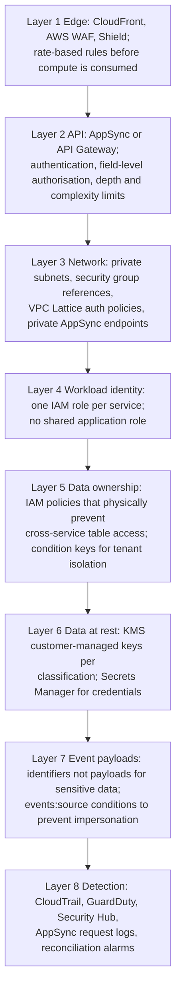

**Identity is the boundary.** In a decomposed system the network perimeter tells you very little: all your services are in private subnets and can all reach one another. What actually separates them is that the orders service's IAM role permits `dynamodb:GetItem` on exactly one table. A shared "application role" used by twelve services makes the blast radius of any single compromised container equal to the union of twelve services' permissions, and it silently permits every data-ownership violation this chapter warns about.

**Least privilege can be finer than the resource ARN.** Two condition keys deserve specific attention in a microservices context. `dynamodb:LeadingKeys` restricts a role to items whose partition key matches a pattern, which is how pooled multi-tenancy is enforced at the credential level rather than in application code that can be bypassed by a bug. `events:source` restricts which `source` value a principal may publish, which matters because in a choreographed event-driven system consumers trust the `source` field to decide whether an event is authentic; without the condition, any service with `events:PutEvents` can impersonate any other.

**GraphQL-specific risks.** Three are unique to this chapter's material. First, **query depth and complexity** — an adversarial nested query is a denial-of-service amplifier, and the limits must be set explicitly. Second, **field-level authorisation** — an API-wide authorisation mode says the caller may use the API, not that they may see a particular field; sensitive fields need directives or a pipeline authorisation function. Third, **introspection** — a publicly introspectable schema reveals the shape of your entire domain, including fields that exist but are restricted; consider disabling introspection on internet-facing production APIs and publishing a schema artefact to trusted consumers instead.

**AppSync data-source roles.** AppSync assumes a service role to reach each data source. That role is a genuine principal with genuine permissions, and it is a common oversight to grant it broadly — `dynamodb:*` on the whole account — because it is one step removed from application code. Scope it to the specific table and the specific actions the resolvers perform.

**Events as a data-exfiltration surface.** An event containing a customer's full record is copied into every subscriber's queue, every subscriber's logs and every subscriber's dead-letter queue. If one of those subscribers is a lower-trust analytics service, the personal data has left its classification boundary through a mechanism nobody reviewed. The default should be **thin events**: identifiers, the change type, and a timestamp, with consumers calling back to the owner for details under their own authorisation. Thick events are a deliberate performance choice for non-sensitive data, not a default.

**Compliance scope follows data.** The cheapest way to keep a service out of an audit is for it never to receive regulated data, in any form, including in an event payload. This is a design-time decision about event shape, and it is far cheaper than the alternative of proving after the fact that a service which does receive such data handles it correctly.

---

## Performance Optimization

**Remove synchronous hops before optimising them.** The highest-leverage change available in a decomposed system is usually not making a call faster but eliminating it. Reference-data replication — a consumer keeping a local projection of the few fields it needs, updated by events — converts a network call into a local read and removes a term from both the latency sum and the availability product. Reserve synchronous calls for data that is large, fast-changing, or must be authoritative at the moment of use.

**Exploit GraphQL's concurrency, and defeat its N+1.** Sibling fields resolve in parallel, so an aggregation of four services costs the slowest rather than the sum — that is free performance and it is the main reason to put AppSync at a mobile edge. But nested list fields serialise per item unless batched. Set `maxBatchSize` on Lambda data sources under list fields, use `BatchGetItem` for DynamoDB, and write resolver functions that accept and return arrays. Test with realistic list sizes; a development dataset of three records hides this defect completely.

**Cache in the right place, once.** CloudFront for public, cacheable responses; the AppSync resolver cache for reference-data fields with a TTL matched to real change frequency; ElastiCache for shared computed state across replicas; an in-process cache for data that changes daily. Caching the same data at three layers produces three invalidation problems and a stale window equal to their sum. Be explicit about the invalidation strategy — TTL, write-through, or event-driven invalidation on a domain event — because a stale cache is a correctness bug wearing a performance costume.

**Choose the database from the access pattern, then design the keys.** A DynamoDB table whose partition key does not match its dominant query will be slow and expensive regardless of provisioned capacity, and no amount of scaling fixes a hot partition. Enumerate the access patterns before designing the key schema; this is the single most consequential performance decision in a DynamoDB-backed service and it is very hard to change later. On the relational side, connection count is usually the binding constraint before CPU: many small tasks each holding a pool exhausts an Aurora instance, and RDS Proxy or the Data API is the answer.

**Batch and parallelise deliberately.** Fan out independent downstream calls concurrently rather than sequentially — three 40 ms calls in parallel cost 40 ms, in series 120 ms. Use batch APIs where they exist: `BatchGetItem`, `TransactWriteItems` where atomicity is genuinely needed, SQS batch send and receive, `PutRecords` on Kinesis, and `PutEvents` with up to the batch limit of entries. Per-call overhead dominates small operations.

**Measure the composed request, not only the services.** Every service can report an excellent p99 while the screen the user sees is slow, because the composition is where the time goes. Record end-to-end latency at the edge separately from per-service latency, and use the X-Ray trace waterfall for slow requests specifically — both X-Ray and OpenTelemetry allow filtering by duration, and one slow trace answers in a minute what a week of dashboard-watching will not.

---

## Cost Optimization

| What you pay for | Dimension | Frequently overlooked |
|---|---|---|
| **AppSync operations** | Per query and mutation | A chatty client issuing five small queries per screen instead of one composed query |
| **AppSync subscriptions** | Per message delivered and per connection-minute | Mobile clients holding subscriptions open while backgrounded, generating connection-minutes with no user value |
| **AppSync cache** | Per instance-hour by size | A cache provisioned for a workload whose data is not cacheable |
| **API Gateway** | Per request; REST APIs cost more per request than HTTP APIs | Using REST APIs for internal high-volume traffic where an HTTP API or ALB would serve |
| **Lambda resolvers** | Per invocation and GB-second | A resolver that could have been a direct DynamoDB or HTTP data source, paying Lambda cost and cold-start latency per field |
| **DynamoDB** | Per request unit or provisioned capacity, plus storage and streams | Strongly consistent reads at double cost where eventual would do; on-demand left on a steady predictable workload |
| **Aurora** | Per ACU-hour or instance-hour, plus I/O and storage | Provisioned instances for a per-service database that is idle most of the day; Serverless v2 with a minimum ACU floor set too high |
| **NAT gateway** | Per hour and per GB processed | Every AWS API call from private subnets without VPC endpoints |
| **Inter-AZ and cross-Region transfer** | Per GB | Chatty east-west traffic crossing AZs; cross-Region event replication configured without a business requirement |
| **CloudWatch Logs** | Per GB ingested and stored | AppSync logging at `ALL` in production; debug logging left enabled; no retention policy |
| **X-Ray** | Per trace recorded | Unsampled tracing on a high-volume API |
| **EventBridge** | Per million events published | Fine-grained events published per field change rather than per meaningful domain change |
| **Data stores multiplied per service** | Instance-hours or request units | Eight services with eight provisioned databases where serverless options would idle at near-zero |

**The structural cost lesson of decomposition** is that fixed per-service costs multiply. A database, a pipeline, a log group, a dashboard, an alarm set and possibly a load balancer per service means that a system split into twenty services pays twenty times some fixed overhead. This is the strongest quantitative argument against nano-services and the strongest argument for serverless data stores at fine granularity: DynamoDB on-demand and Aurora Serverless v2 have a near-zero floor, which is what makes eight small services economically viable where eight provisioned RDS instances would not be.

**Committed capacity and rightsizing.** Compute Savings Plans cover Lambda, Fargate and EC2 in one commitment, which suits a mixed estate; DynamoDB reserved capacity suits steady provisioned tables. Commit to the measured trough, not the peak. Revisit quarterly, because a decomposed estate's cost shape changes as services grow at different rates — which is itself one of the benefits, since per-service tagging makes the change visible.

---

## Monitoring and Observability

In a decomposed system no single component's logs contain a failure. The failure lives in the composition, and only three instruments see it: the distributed trace, the correlated log, and the reconciliation job.

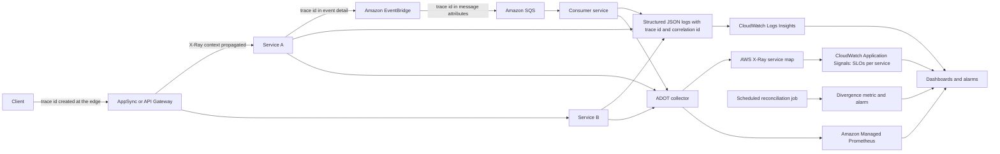

### The metrics that matter for this chapter's concerns

| Metric | Source | What it tells you |
|---|---|---|
| **`4XXError` and `5XXError`** | AppSync, API Gateway | Client-side and server-side failure rates at the edge |
| **GraphQL `errors` array count** | AppSync request logs, via a metric filter | **The critical one.** Partial failures return HTTP 200; without a metric filter counting `errors`, a resolver failing on every request is invisible |
| **`Latency` at the API versus per-resolver latency** | AppSync and X-Ray | Whether the composition or a specific backend is slow |
| **Resolver invocation count per request** | AppSync logs | Detects N+1: a count that scales with list size is the signature |
| **`ConnectSuccess` and `SubscribeSuccess`** | AppSync | Subscription health; a silent drop in subscribe rate means clients are failing to establish real-time updates |
| **`ThrottledRequests` and `ConsumedReadCapacityUnits`** | DynamoDB | Hot partitions, under-provisioning, and whether the key design matches the access pattern |
| **`DatabaseConnections`** | RDS and Aurora | Connection exhaustion from many small compute units — a classic decomposition failure |
| **`ReplicaLag`** | Aurora | How stale a read-replica read may be; directly relevant to read-your-writes bugs |
| **`IteratorAge`** | DynamoDB Streams and Kinesis consumers | How far behind the outbox publisher is; a rising value means events are being published late and consumers are diverging |
| **`ApproximateAgeOfOldestMessage`** | SQS | Consumer health on asynchronous paths; the asynchronous equivalent of latency |
| **DLQ `ApproximateNumberOfMessagesVisible`** | SQS | Permanently failed work that a human must act on. Always alarm on this |
| **`FailedInvocations` and rule match count** | EventBridge | Events published that no rule matched — usually a schema change nobody told the consumers about |
| **Reconciliation divergence count** | Custom metric from a scheduled job | Whether two services actually agree; the only direct measurement of eventual-consistency health |
| **Error budget burn rate** | Derived from SLIs, tracked by Application Signals | The only alarm that reliably corresponds to user harm |

!!! danger "The HTTP 200 blind spot"

    This is worth stating twice. A GraphQL API returning `{"data": {"order": {...}, "loyaltyBalance": null}, "errors": [{"path": ["loyaltyBalance"], ...}]}` has failed for one field and succeeded for the rest, and it returns **HTTP 200**. Every dashboard, load balancer metric and uptime check that counts non-200 responses will report perfect health while a feature is entirely broken. Create a CloudWatch metric filter on the AppSync log group matching error entries, dimension it by field path, and alarm on it. Teams discover this the slow way, usually via a customer.

**Logs.** Emit structured JSON with a stable schema carrying the trace ID, a business correlation ID (the order ID, the claim number), the service name, the version and the environment on every line. Without a correlation ID, investigating one customer's problem across six services means grepping six log groups by timestamp, which does not work under concurrency. Use Logs Insights to query across groups and metric filters to turn log patterns into alarmable metrics.

**Traces.** Instrument with OpenTelemetry through ADOT so the destination is a configuration choice. Propagate context across asynchronous boundaries by carrying the trace ID in EventBridge event detail and SQS message attributes, or your service map fractures at exactly the boundary you most need to understand. Sample low for successes and always for errors and slow requests. The trace-derived **service map is the most reliable architecture diagram you will ever have**, because it shows what the system does rather than what a document claims — and in the context of this chapter, it is how you discover that a boundary you designed as asynchronous has quietly acquired a synchronous call.

**Application Signals** deserves specific mention here because it closes the loop on decomposition: it produces per-service SLOs and a dependency map from telemetry automatically, which lets you ask, six months after an extraction, whether the boundaries you drew match the call patterns you actually have. They frequently do not, and knowing that early is what prevents architectural drift from becoming architectural debt.

---

## Integration with Other AWS Services

| Service | Why it integrates with microservices design |
|---|---|
| **AWS AppSync** | Client-facing aggregation and federation; resolves fields against many services concurrently and merges team-owned schemas |
| **Amazon API Gateway** | Partner and public contracts with per-consumer keys, usage plans and validation; custom domains with base-path mappings federate REST APIs across teams |
| **Application Load Balancer** | Shared, low-cost L7 entry to container services for internal and high-volume traffic |
| **Amazon VPC Lattice** | Cross-VPC and cross-account service-to-service connectivity with IAM auth policies and no sidecars |
| **Amazon EventBridge** | Domain-event routing plus a schema registry that makes event contracts explicit and generatable |
| **Amazon SQS** | Per-consumer durable buffering and dead-letter capture; the bulkhead between a fast producer and a slow consumer |
| **Amazon SNS** | One-to-many fan-out, canonically to several SQS queues so each consumer buffers independently |
| **Amazon Kinesis Data Streams** | Ordered, replayable change and telemetry streams; the DynamoDB Streams alternative when replay matters |
| **AWS Step Functions** | The explicit home of a multi-service business process, with compensations and visible execution history |
| **Amazon DynamoDB** | The default per-service store for known access patterns; Streams give outbox semantics free |
| **Amazon Aurora, Aurora Serverless v2, Aurora DSQL** | Relational per-service stores, with serverless economics at fine granularity and multi-region active-active where required |
| **Amazon RDS Proxy and the RDS Data API** | Connection management for many small compute units against a relational store; the Data API is also an AppSync data source |
| **Amazon ElastiCache and MemoryDB** | Shared caching and durable in-memory state |
| **Amazon OpenSearch Service** | Search read models built from events |
| **Amazon S3, AWS Glue, Amazon Athena, Amazon Redshift** | The analytical plane replacing cross-service joins; zero-ETL integrations remove the pipeline you would otherwise build |
| **AWS Database Migration Service** | Change data capture from relational stores, and the dual-write-and-backfill mechanism for extracting a table from a monolith |
| **Amazon Cognito** | The generic identity subdomain you should not build |
| **AWS IAM and STS** | Per-service identity; the mechanism that makes data ownership enforceable |
| **AWS Migration Hub Refactor Spaces** | Managed strangler-fig routing during decomposition; closed to new customers since November 2025, with AWS Transform as the successor |
| **AWS Application Discovery Service and Application Signals** | Empirical dependency evidence before and after decomposition |
| **AWS CloudFormation, CDK, Terraform** | Boundaries as code, versioned with the service they bound |
| **Amazon CloudWatch, AWS X-Ray, ADOT** | The observability without which a decomposed system cannot be operated |

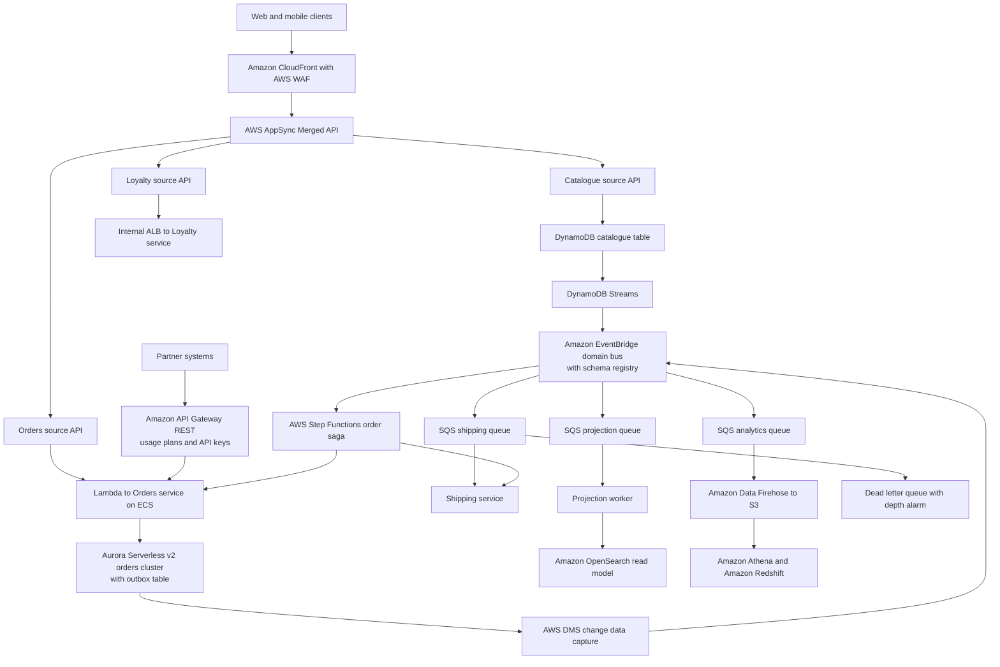

Read architecturally, this diagram separates four planes deliberately. The **client plane** is shaped to its consumers: GraphQL for first-party clients whose pain is round trips, REST with usage plans for partners whose need is a stable versioned contract. The **ownership plane** shows each service with exactly one store and no arrows between stores — that absence is the design. The **event plane** carries changes out of each store through a mechanism derived from the store's own log (Streams, CDC) so there is no dual write, into EventBridge where the schema registry makes the contract explicit, and out to per-consumer queues so no consumer's slowness affects another's. The **analytical plane** is where the cross-service join went: Firehose to S3 to Athena and Redshift, so that "finance needs a report across all six services" never becomes a reason to grant read access to an operational table.

---

## Common Architecture Patterns

### Decompose by business capability

Services aligned to what the business does, each owning its data. The default and most durable decomposition. Implemented on AWS as one service with one store per capability, communicating through EventBridge for facts and API Gateway, AppSync or VPC Lattice for requests.

### Decompose by subdomain, with core, supporting and generic classification

The refinement that tells you where to invest. Generic subdomains — identity, notification, payment processing — are bought or consumed as managed services (Cognito, SES, SNS, a payment provider). Core subdomains get your best engineers and full autonomy. This classification saves more effort than any other single technique in this chapter.

### Strangler fig

Incremental extraction behind a routing layer, with each iteration ending in data-ownership transfer and deletion of the old code. On AWS the routing layer is API Gateway or an ALB in front of the monolith — assembled directly, or, in existing estates, orchestrated by AWS Migration Hub Refactor Spaces, which has been closed to new customers since November 2025. ALB weighted target groups or API Gateway canary stages perform the traffic shift; DMS performs the data migration. The pattern's discipline is finishing each iteration; a strangler fig stopped halfway is a permanent hybrid in which nobody can change anything.

### Branch by abstraction and parallel run

Two techniques for de-risking an extraction. **Branch by abstraction** introduces an interface inside the monolith, implements it twice — once against the old code, once against the new service — and switches with a feature flag in AWS AppConfig. **Parallel run** sends production traffic to both implementations, serves the old result, and compares the two asynchronously, alarming on divergence. Parallel run is the only technique that gives you real confidence before a cutover on a high-stakes capability, and it is worth its cost for payments, pricing and anything with a regulator.

### Self-contained systems

A stronger variant in which each service owns its data *and* its user interface, integrating with peers through hyperlinks or client-side composition rather than a shared aggregation layer. It eliminates the aggregation bottleneck entirely, at the cost of a less integrated user experience. Worth knowing because it is the honest alternative when the BFF or gateway has become the coordination point microservices were meant to remove.

### API composition and backend for frontend

**API composition** assembles a view by calling several services and joining the results in the aggregation layer. **Backend for frontend** gives each client type — web, mobile, partner, internal — its own aggregating service tuned to its screens, so that a mobile client's need for a combined payload does not distort the domain services. AppSync is a managed API-composition engine; a BFF is what you build when the composition needs real logic. The failure mode of both is a central team owning them, which is why Merged APIs matter.

### Database per service with polyglot persistence

Exclusive ownership plus the freedom — not the obligation — to select an engine per access pattern. On AWS this is the difference between one Aurora cluster serving eleven workloads badly and DynamoDB, Neptune, Timestream and OpenSearch each serving one workload well.

### Transactional outbox and change data capture

The only correct construction for publishing an event about a state change. On DynamoDB, Streams provide it with no poller; on Aurora, DMS change data capture reads the transaction log; the hand-rolled outbox table plus poller remains valid where you need control over payload shaping.

### Saga

Multi-service business transactions as sequences of local transactions with compensations, orchestrated by Step Functions where visibility matters and choreographed by events where decoupling matters more. Treated fully in chapter 4.3. The data-management point is that the saga is what you buy with the transaction you sold when you split the aggregate.

### CQRS and event sourcing

Separate write and read models, with projections built by consuming events. Solves the loss of cross-service joins. Event sourcing goes further and makes the event log the system of record, which is powerful for audit and temporal queries and considerably more demanding, because historical schema evolution and projection rebuild time become engineering problems in their own right.

### Reference-data replication

A consumer keeps a local projection of the small, slowly changing subset of another service's data that it needs on a hot path, updated by events. Frequently the single highest-value change available in a chatty system: it removes a synchronous hop, a failure mode and a latency term all at once.

### Anti-corruption layer

An adapter service translating a legacy or third-party model into your domain model. Essential during strangler-fig migration, and the correct treatment of any integration whose model you do not control.

### Thin events with callback

Publishing identifiers and change type rather than full payloads, with consumers fetching details under their own authorisation. Reduces coupling to the producer's internal model, keeps sensitive data inside its classification boundary, and keeps event payloads small. The trade-off is a synchronous callback, so it is not appropriate where the consumer must work when the producer is down.

### Zero-ETL and the analytical plane

Continuous managed replication of operational data into Redshift, or event-driven landing in S3 queried by Athena, as the answer to cross-service reporting. It exists so that "we need a report" never becomes an argument for a shared database.

---

## Industry Use Cases

| Sector | Decomposition decision | Communication choice | Data choice |
|---|---|---|---|
| E-commerce | Catalogue, pricing, inventory, ordering, fulfilment, payments as capabilities | AppSync Merged API for web and mobile; EventBridge between services | DynamoDB for catalogue and orders; Aurora for finance-facing reconciliation; OpenSearch for search |
| Retail banking | Payment initiation isolated in its own account by compliance scope | Cross-account EventBridge only; no synchronous calls into the regulated account | Aurora with customer-managed KMS keys inside scope; DynamoDB outside |
| Insurance | Claim intake, fraud scoring, adjudication, payment as capabilities; the claim process itself as an explicit orchestration | Step Functions with `waitForTaskToken` for human adjuster steps | Aurora for the claim aggregate; S3 for documents; OpenSearch for adjuster search |
| Media streaming | Entitlement, rights, catalogue, viewing history, recommendations split on access pattern as much as domain | AppSync for the client; Kinesis for viewing telemetry | DynamoDB for entitlement; Neptune for rights graphs; Timestream for viewing history; OpenSearch for catalogue search |
| Travel | Booking, itinerary, loyalty, content as capabilities across several supplier integrations | AppSync Merged API, one source API per team; anti-corruption adapters per supplier | Aurora for bookings; DynamoDB for loyalty; ElastiCache for supplier response caching |
| Healthcare | Patient record isolated by data classification; integration adapters one per external system | Thin events carrying identifiers only; details fetched under the consumer's own authorisation | Aurora with CMK for the record; DynamoDB for adapter state; S3 with Object Lock for documents |
| Logistics | Order, route optimisation, tracking, proof of delivery | Events for state changes; API Gateway for carrier partner integration | DynamoDB for tracking at high write volume; Neptune for route graphs; Timestream for telemetry |
| Industrial IoT | Ingestion, anomaly detection, device management, operator console | Kinesis for ingestion; AppSync subscriptions for the live console | Timestream for readings; DynamoDB for device registry; S3 for the raw archive |
| B2B SaaS | Pooled and siloed tenancy as a data-topology decision, not a code fork | One API surface; tenant context in every request | DynamoDB with `LeadingKeys` isolation for pooled; per-tenant tables or accounts for siloed |
| Public sector | Boundaries follow supplier contracts, because no supplier may block another's release | AppSync Merged API with one source API per supplier account | Per-supplier stores; a shared analytical plane in S3 |

---

## Advantages

**Boundaries that follow the business are stable.** Business capabilities change on a scale of years; technical implementations change on a scale of months. A service named `pricing` survives three rewrites of its internals and two changes of database engine, because the boundary was drawn where the business is stable. This is the deepest reason capability-based decomposition outperforms every technical alternative.

**Exclusive data ownership makes autonomy real.** The moment a team owns its store outright, it can change its schema, its engine, its capacity mode and its indexing without a conversation. Independent deployability of code is meaningless if the schema is shared; data ownership is what converts an organisational chart into an engineering reality, and an IAM policy is what makes it enforceable rather than aspirational.

**Purpose-built persistence becomes possible.** A shared database forces one engine on every workload, which means the lowest common denominator. Database-per-service is the precondition for using DynamoDB where the pattern is key-value, Neptune where it is a graph, and Timestream where it is time series — and the performance and cost differences between the right engine and a general-purpose one are frequently an order of magnitude, not a percentage.

**GraphQL federation reconciles client convenience with team autonomy.** Historically an aggregation layer was a coordination bottleneck: convenient for clients, owned by one team, queued behind by everyone else. AppSync Merged APIs let each team ship a field by deploying their own API, while the client still sees one endpoint and one schema. That is a genuine structural improvement, not a convenience feature, and it is why Merged APIs deserve the emphasis this chapter gives them.

**Partial failure becomes a first-class outcome.** A GraphQL response with one null field and an errors entry is a degraded screen rather than a failed one. Combined with per-consumer SQS queues and asynchronous events, the architecture gains the ability to **choose what breaks first**, which is one of the most valuable properties a production system can have and is unavailable in a monolith where everything shares a process.

**Compliance scope becomes a design parameter.** Because data ownership determines audit scope, an architect can remove entire teams and services from a regulatory regime by designing where regulated data lives and ensuring it never travels in an event payload. The saving is recurring and large.

**Cost becomes attributable.** Per-service tagging means the bill decomposes by team, and a team that can see its own cost behaves differently from one looking at a single company-wide figure. Serverless per-service stores make fine granularity economically viable in a way provisioned instances never did.

---

## Limitations

**Decomposition is irreversible in practice.** Splitting a service is comparatively easy; merging two that have diverged — different schemas, different engines, different deployment histories, different teams — is a project. This asymmetry is why the advice is always to start coarse. A boundary drawn wrongly is not a bug you fix in a sprint.

**Domain knowledge is the binding constraint, and it is scarce.** Correct boundaries require people who understand the business deeply enough to know where the language changes. Those people are usually busy, frequently not engineers, and sometimes no longer at the company. No tool, and no amount of code analysis, substitutes for them. This is the honest reason many decompositions produce technical-layer boundaries: technical layers are visible in the code, and domain boundaries are not.

**You lose transactions, joins and referential integrity, and you must replace all three.** Sagas, compensations, outboxes, idempotency, projections and reconciliation are code you now write, test and operate. The business must accept eventual consistency, and where it will not, some intended boundaries are simply not viable.

**Per-service fixed costs multiply.** A database, a pipeline, a repository, dashboards, alarms, a runbook, an owner and an on-call rotation per service means twenty services is twenty of each. This is the arithmetic behind the nano-service anti-pattern and the reason a modular monolith remains correct for small organisations.

**Latency adds and availability multiplies.** A chain of synchronous services has latency equal to the sum and availability equal to the product. GraphQL's concurrent field resolution mitigates the latency term for aggregation specifically, but it does not help a chain, and nothing helps the availability product except removing dependencies.

**GraphQL introduces its own failure modes.** The N+1 problem, unbounded query complexity as a denial-of-service vector, the HTTP 200 partial-failure blind spot, and caching that is coarser than REST's because the response shape varies per request. Each is manageable; none is automatic, and all four are routinely discovered in production rather than in design.

**Federation has an operational surface.** Merged APIs add a merge step that can fail, cross-account IAM associations that can break, and a schema-conflict class of error that does not exist with a single API. Source API quotas bound how far the federation scales.

**Testing gets harder.** Integration testing across every pair of services does not scale, so you need contract testing, which requires discipline the organisation may not have. Local development of a system with twelve services and eight databases is a genuine engineering problem that consumes real effort.

**Observability is a precondition, not an add-on.** Without distributed tracing, correlation IDs and a service map, an incident spanning five services is close to unresolvable. Organisations that decompose before investing in observability trade a debuggable system for an undebuggable one, and diagnose the result as a microservices problem rather than an instrumentation one.

---

## Common Mistakes

### Beginner Mistakes

| Mistake | Why it is wrong | What to do instead |
|---|---|---|
| Decomposing along technical layers | Produces services that must all deploy together for any feature | Decompose vertically by business capability |
| Creating entity services exposing only CRUD | Behaviour lives in callers; the service is a shared database with HTTP in front | Move behaviour to where the data lives; a service owns a capability |
| Starting with the compute platform | Boundaries end up shaped like the deployment units you already had | Boundaries, then contracts, then data, then compute |
| Sharing a database "just for reads" | A read dependency on a physical schema couples just as hard and less visibly | Expose an API, publish events, or replicate a projection |
| Dual-writing to the database and the event bus | Admits a window where one succeeds and the other does not; unfixable by retry | Outbox table, DynamoDB Streams, or DMS change data capture |
| Naming events as commands (`SendEmail`) | Couples the publisher to the consumer with an event's syntax | Past-tense facts: `OrderPlaced`, `PaymentSettled` |
| One AppSync API owned by a platform team | Every product team queues to add a field; the API becomes the bottleneck | Merged API with one source API per team, auto-merge enabled |
| No `maxBatchSize` on resolvers under list fields | N+1: latency and cost scale with list size, invisible with test data | Configure batching; test with production-scale lists |
| No query depth or complexity limits | An adversarial nested query is a denial-of-service amplifier | Set both explicitly |
| Monitoring only HTTP status on a GraphQL API | Partial failures return 200; a broken field is invisible | Metric filter on the `errors` array, dimensioned by field path |
| Choosing the database the team already knows | A key-value pattern in a relational table, or ad-hoc queries against DynamoDB | Enumerate access patterns first; choose the engine from them |
| Copying a reference where a snapshot is meant | An order's price changes when the catalogue's does | Copy the value into the order; a price agreed is not a price current |
| A shared `company-common` library across services | A version bump requires a coordinated deploy of every service | Prefer duplication to coupling across boundaries |

### Production Mistakes

| Mistake | Consequence | Remedy |
|---|---|---|
| Temporary shared-database access with no expiry | Becomes permanent architecture; extraction stalls forever | Named owner, removal ticket, date, and a dashboard of outstanding violations |
| Thick events containing personal data | Regulated data copied into every consumer's queue, logs and DLQ | Thin events with identifiers; consumers fetch under their own authorisation |
| No `events:source` condition on `PutEvents` | Any service can publish events impersonating any other | Condition-key restriction per service role |
| No dead-letter queue, or a DLQ with no alarm and no owner | Silent permanent loss of business events | DLQ per consumer, depth alarm, owned redrive runbook |
| No reconciliation jobs | Divergence between services discovered by a customer, months later | Scheduled comparison with a divergence metric and alarm |
| Consumers that are not idempotent | Duplicate orders and double charges under at-least-once delivery | Idempotency keys with conditional writes |
| Projection with no rebuild path | A projector bug becomes permanent corruption | Ensure read models are rebuildable from retained events; test the rebuild |
| Aurora connection exhaustion from many small tasks | Latency cliff, then errors, under exactly the load you least want | RDS Proxy, the RDS Data API, or bounded per-task pools |
| Unbounded AppSync subscription lifetimes | Connection-minute cost from backgrounded mobile clients | Disconnect on background; set idle timeouts |
| AppSync logging at `ALL` in production | CloudWatch ingestion can exceed the cost of the API itself | `ERROR` with field-level logging; sample where more is needed |
| A hot DynamoDB partition | Throttling at a fraction of provisioned capacity | Revisit the key design; add a write-sharding suffix if the pattern demands it |
| Schema change published without consumer notice | Consumers fail on deserialisation; EventBridge rules stop matching | Schema registry, additive-only evolution, versioned event types |
| Reading from an Aurora replica on a read-your-writes path | User does not see their own change; support tickets | Route those reads to the writer, or design the UI for pending state |
| No trace propagation across the asynchronous boundary | The service map fractures exactly where you need it | Trace ID in event detail and SQS message attributes |

### Certification Traps

| Trap | The reality |
|---|---|
| "Microservices improve performance" | They typically worsen latency by adding network hops. They improve deployability, independent scalability and blast-radius containment |
| "AppSync replaces API Gateway" | They solve different problems. API Gateway carries usage plans, API keys and per-consumer throttling for partner APIs; AppSync aggregates and federates for first-party clients. Large estates run both |
| "GraphQL always reduces the number of backend calls" | It reduces *client* round trips. Backend calls can increase dramatically without batching — this is the N+1 problem |
| "A GraphQL error means a non-200 response" | Partial failures return HTTP 200 with an `errors` array |
| "Write to the database, then publish the event" | That is a dual write and it is always unsafe. Outbox or change data capture |
| "Two-phase commit across microservices" | Impractical at scale and not offered. Sagas with compensating transactions, orchestrated by Step Functions |
| "Each microservice must have its own database engine" | It must have its own *store*. Two services may both use DynamoDB, or separate schemas on separate clusters. Polyglot persistence is permitted, not mandatory |
| "Separate schemas on the same Aurora cluster satisfy database-per-service" | Better than a shared schema, but capacity, failover and maintenance are still shared; it is a compromise, not the pattern |
| "DynamoDB cannot support transactions" | `TransactWriteItems` provides ACID across items within an account and region, with limits. It does not extend across services |
| "Strongly consistent reads are the safe default in DynamoDB" | They cost double, are unavailable on GSIs, and are unnecessary for most reads. Use them only where read-your-writes is required |
| "A Merged API is a performance optimisation" | It is an *ownership* mechanism. Its purpose is to let teams deploy independently while clients see one schema |
| "Decompose by entity: a Customer service, an Order service, a Product service" | That is entity-service decomposition and it produces a distributed CRUD layer. Decompose by capability |
| "Event-driven means no synchronous calls anywhere" | Synchronous calls are correct where the user is waiting and the answer must be authoritative. The rule is that asynchronous is the *default*, not the only option |
| "Refactor Spaces is a permanent architecture" | It is migration scaffolding — and it is closed to new customers as of November 2025. After the monolith is gone the routing moves to plain API Gateway or an ALB |

---

## Interview Questions

### Conceptual Questions

**1. You are given a monolith and asked to decompose it. Describe your method, in order, and say what artefact each step produces.**

I would work in the problem space before touching the code. First, an **event-storming workshop** with domain experts producing a timeline of domain events, the commands that cause them, and the aggregates each command acts on; the artefact is a wall of events clustered into candidate contexts. Second, a **capability map** naming what the business does in its own language, cross-checked against the event clusters — where the two agree I have high confidence, and where they disagree there is a conversation to have. Third, for each candidate boundary I would name **the data it must own exclusively**; a candidate for which I cannot do this is not yet a service and stays inside the monolith. Fourth, I would list the **operations the business requires to be atomic** and check whether any spans two candidates: where it does and the business will not accept a compensating undo, the candidates merge, because an aggregate cannot be split. Fifth, I would corroborate with **empirical evidence** — co-change analysis over the Git history, and the network dependency graph from Application Discovery Service or Application Signals — treating disagreement between the design and the evidence as a signal to re-examine, not as an answer. Sixth, I would **classify each subdomain** as core, supporting or generic, and immediately remove the generic ones from the build list in favour of managed services. Only then would I sequence the extractions, choosing the first for low risk and high learning rather than high value, and only at that point would I choose a compute platform. The artefacts, in order: an event map, a capability map, a data-ownership table, an atomicity analysis, a corroboration report, an investment classification, and an extraction sequence.

**2. Explain why a shared database is a worse problem than a shared library, even though both are forms of coupling.**

Both couple, but they differ in three ways that make the database worse. First, **visibility**: a shared library dependency is declared in a manifest and is greppable; a second service reading a table appears nowhere except in that service's connection string, so the coupling is invisible to the owner of the data. Second, **versioning**: a library can be versioned, so consumers upgrade on their own schedule and a breaking change is a semantic-version bump that consumers see; a physical database schema has exactly one version, live, shared by everyone, so any change is simultaneously breaking for every reader with no upgrade window. Third, **the failure is silent and delayed**: a library incompatibility fails at build or start time, whereas a schema change breaks a consumer at runtime, in production, possibly only on a code path exercised monthly. The consequence is that a shared database converts the owner's schema into an unversioned public API maintained by nobody, and within a year nobody can rename a column. The remedy is not better coordination; it is assigning ownership, exposing an API or events, and enforcing it with an IAM policy that makes the direct read literally impossible.

**3. Distinguish a command from an event, and explain why the distinction has architectural consequences rather than being terminology.**

A **command** names its recipient and requests an action that has not happened yet: `ReserveInventory`. An **event** names no recipient and states a fact that has already happened: `InventoryReserved`. The consequence is in who knows about whom. A command's sender must know the receiver exists, know its contract, and generally know whether it succeeded — that is coupling in the same direction as a synchronous call, merely with a queue in between, and the sender must handle the receiver's absence. An event's publisher knows nothing about consumers; a new consumer is added without the publisher changing, being redeployed, or being told. That is why the event is the primitive that enables independent evolution. The practical test is the tense and the knowledge, and the practical failure is a system whose "events" are named `SendEmail` and `CreateShipment`: those are commands with an event's syntax, they carry all the coupling of a direct call, and the team gets none of the extensibility it believed it was buying. A secondary consequence is error handling: a failed command is the sender's problem and needs a reply path; a failed consumer of an event is that consumer's problem and belongs in its own dead-letter queue.

**4. What is the N+1 problem in AppSync, why does it not appear during development, and what are the two AWS mechanisms that solve it?**

The N+1 problem occurs when a nested field is resolved once per item of a parent list: a query for 100 orders each with a `product` field triggers one resolver execution for the orders plus 100 for the products. Latency and cost then scale linearly with list size, and because sibling concurrency does not apply across the parent-child relationship, the executions add up. It does not appear in development because development datasets are small — with three orders, four resolver executions is imperceptible, and the code is structurally identical to the code that will collapse at three hundred. The two mechanisms are **batch invocation for Lambda data sources**, configured with `maxBatchSize` on the resolver, where AppSync collects the contexts for all items and invokes the function once with an array, expecting an array of results in the same order; and **`BatchGetItem` for DynamoDB data sources**, where a batch resolver reads up to the batch limit of keys in one call. Both require the resolver's code to be written for arrays, which is why retrofitting is more than a configuration change. The diagnostic signal in production is resolver invocation count per request scaling with response list size, which is worth a dashboard.

**5. Why is the transactional outbox necessary, and why can no amount of retry logic replace it?**

Because a state change and its announcement must be atomic, and they live in two systems that share no transaction. Writing the row and then calling `PutEvents` admits a window: if the process dies between them, the order exists and no consumer knows. Retry logic cannot help, because the retry state lived in the process that died — there is no durable record that a publication is owed. The inverse ordering is worse: publish first, then write, and a rollback leaves consumers acting on an order that does not exist. The outbox removes the window by making the announcement part of the same local transaction: the `outbox` row is inserted alongside the business row, so either both are committed or neither is. A separate process — a poller, or on DynamoDB the Streams-plus-Lambda path, or DMS reading Aurora's transaction log — then publishes and marks the row done. The cost is that publication becomes at-least-once, since the publisher may crash after publishing and before marking, so **every consumer must be idempotent**. That is a real obligation, but it is a bounded, testable one, whereas the dual write's failure mode is unbounded and undetectable.

### Scenario Questions

**1. A team proposes decomposing an e-commerce monolith into a Customer service, a Product service, an Order service and a Payment service. Evaluate the proposal.**

The names are a warning sign: these are entities, not capabilities, and entity-based decomposition reliably produces a distributed CRUD layer where behaviour lives in whichever service is calling. I would test the proposal with three questions. First, **where does pricing live?** If it is in Product, then Product owns both catalogue content and commercial policy, which change at completely different rates and belong to different teams. If it is in Order, then Order recalculates prices, which means the pricing rules are in the transaction path. Neither answer is good, which tells me `pricing` is a missing capability. Second, **who owns inventory?** It is absent from the list, which usually means it is hiding inside Product, coupling a read-heavy content workload to a write-heavy contention workload with completely different scaling and consistency needs. Third, **what does the Customer service actually do?** If the answer is "stores customer records", it is an entity service, and the real capabilities are things like *authenticate*, *manage preferences*, *manage addresses* and *manage loyalty*, of which authentication is a generic subdomain that should be Cognito rather than code. My counter-proposal would be capability-shaped — catalogue, pricing, inventory, ordering, fulfilment, payments, loyalty — with identity delegated to Cognito, and I would make the argument concretely by walking a real change request through both designs: "add a promotional price for members in one region" touches one service in my proposal and three in theirs, which is the difference that matters to the business.

**2. A mobile team complains that a product screen requires six API calls and takes 1.8 seconds on a 4G connection. The backend team says each of their six services responds in under 80 milliseconds. Who is right, and what would you do?**

Both are right, which is the point. Six sequential round trips on a mobile network with a 150 to 250 millisecond round-trip time are dominated by the network, not by the services; the backend's 80 milliseconds is real and irrelevant to the user's experience. I would not fix this by making services faster. I would introduce an aggregation layer — AppSync is the managed option — so the client makes one request and the six resolutions happen concurrently inside AWS, where the round trip between AppSync and a service is a millisecond rather than two hundred. Expected result is roughly one round trip plus the slowest service, so approximately 300 milliseconds instead of 1.8 seconds. Three details make or break it. First, **batching**: if any of those six is a list whose items each resolve a nested field, I must set `maxBatchSize` or I will have replaced six calls with sixty. Second, **nullable fields for non-essential data**: the loyalty and reviews fields should degrade to null rather than failing the screen, and the client must render for that case. Third, **ownership**: if one team owns the aggregation layer, I have created a bottleneck, so I would use a Merged API with one source API per owning team from the start rather than retrofitting federation later. I would also check whether any of the six is a static or slowly changing payload that belongs in CloudFront instead, because the cheapest call is the one that never reaches AWS at all.

**3. During an extraction, the new inventory service needs the product catalogue's name and category on its hot path. The team proposes calling the catalogue service synchronously on every request, with a cache. Evaluate and offer alternatives.**

The proposal works but it buys the wrong thing. A synchronous call plus a cache means inventory's availability now depends on catalogue's — except during the cache TTL, which is precisely when you are least sure the data is correct — and it adds a network term to inventory's latency on every cache miss, including at exactly the moment of a deployment or a cold start when miss rates spike. It also does nothing for the cold-start thundering herd. The better answer, given the data is small and slowly changing, is **reference-data replication**: inventory subscribes to `ProductUpdated` events and maintains a local projection of exactly two fields, in its own store. Now the lookup is a local read, inventory works normally when catalogue is entirely down, the latency term disappears, and the coupling is to an event contract rather than an API contract. The costs I would state honestly are that the projection is eventually consistent — bounded by event propagation, usually seconds — that it needs a bootstrap path for a new service or a rebuilt store, and that deletions need tombstone events or the projection accumulates orphans. If the data were large or fast-changing, or if staleness were unacceptable, I would go back to the synchronous call but add a timeout, a circuit breaker and a documented degraded behaviour. And if inventory genuinely cannot function correctly with a two-second-stale product name, that is evidence the boundary is wrong and the two capabilities may belong together.

**4. A regulator requires that cardholder data never leaves a defined boundary, and your architecture publishes an `OrderPlaced` event containing the full order including a payment method summary. What is wrong and how do you fix it?**

The event is an uncontrolled copy mechanism. Every subscriber's SQS queue holds the payload, as do their application logs, their dead-letter queues, their CloudWatch log groups and quite possibly an analytics landing zone in S3 — none of which were in the compliance boundary that was reviewed, and all of which are now in scope. The fix has three parts. First, **thin the event**: publish `OrderPlaced` with an order identifier, a customer identifier, a timestamp and a total, and nothing about the payment instrument. Consumers needing more call the owning service under their own IAM identity, which means the owner enforces authorisation per consumer and can log every access — a property the fan-out gave away entirely. Second, **isolate the boundary at the account level**: the payments capability lives in its own account under an Organizations OU with Service Control Policies, receiving work over a cross-account EventBridge bus, so that the audit boundary is an AWS boundary rather than a configuration claim. Third, **enforce the event shape**: register the event schema in the EventBridge schema registry, and add a contract test in the producer's pipeline asserting that no field matching the sensitive-data classification appears in the published schema, so the next well-meaning developer who adds a convenient field is stopped at build time rather than at audit time. I would also audit what has already been distributed, because the events published before this fix are still sitting in queues and logs with their own retention periods.

### Architecture Questions

**1. Design the API layer for a company with four product teams, a web client, an iOS client and twenty partner integrations. Justify every choice.**

I would build two distinct edges, because the two audiences have incompatible requirements. For **partners**, an Amazon API Gateway REST API: partners need a stable versioned contract, per-consumer API keys, usage plans with quotas and throttles, request validation at the edge, and a documented specification they can generate clients from — every one of which API Gateway provides and AppSync does not. I would use a custom domain with base-path mappings so that each team's API deploys independently under one hostname, avoiding a single central API artefact, and I would version explicitly in the path because partner clients cannot be forced to upgrade. For **first-party web and iOS clients**, an AppSync Merged API: these clients suffer from round trips and over-fetching, they change their data needs weekly, and they are deployed by us so they can move with the schema. Each of the four teams owns a source API in its own account, associated with auto-merge, so a team ships a field by deploying its own API with no central coordination — this is the property that keeps the API layer from becoming the bottleneck. Authorisation is Cognito user pools as the primary mode with IAM as an additional mode for internal callers, and sensitive fields carry per-field directives. I would set depth and complexity limits explicitly, attach WAF with a rate-based rule, enable X-Ray, and configure `maxBatchSize` on every resolver under a list field. Between services, neither edge is used: east-west traffic goes over VPC Lattice or an internal ALB for synchronous calls and EventBridge for facts, because routing internal traffic through the public edge doubles cost and latency and makes internal calls indistinguishable from customer traffic in every metric. The one thing I would refuse is a single shared GraphQL API owned by a platform team, because with four teams that is the coordination bottleneck we are trying to remove.

**2. Design the data topology for an order-management system decomposed into ordering, inventory, pricing, fulfilment and payments, including how reporting works.**

Each service owns one store, chosen from its access pattern. **Ordering** owns an Aurora Serverless v2 PostgreSQL cluster with an `orders`, `order_lines` and `outbox` schema: it needs a transaction across order and lines, it needs ad-hoc queries for customer service, and Serverless v2 lets it idle cheaply. **Inventory** owns a DynamoDB table keyed by SKU with conditional writes for reservations: the access pattern is a known single-key read-modify-write at high contention, which is exactly DynamoDB's shape, and conditional expressions give me atomic decrement without a transaction. **Pricing** owns a DynamoDB table of price lists and rules with a local reference projection of product identity fed by catalogue events. **Fulfilment** owns Aurora for shipment aggregates and S3 for label documents. **Payments** owns Aurora in a separate AWS account inside the PCI boundary. Cross-service data movement is one-directional and event-driven: ordering's outbox is read by DMS change data capture into EventBridge; inventory and fulfilment publish their own events from DynamoDB Streams and their outbox respectively; each consumer has its own SQS queue with a dead-letter queue. Ordering copies the price and the product summary into the order line at order time as a **snapshot**, not a reference, because the price agreed is not the price current. The order process itself is a Step Functions saga with compensations — release reservation, refund payment — because it spans services and must be undoable. **Reporting** does not touch any operational store: each service's events land in S3 through Amazon Data Firehose, catalogued by Glue and queried by Athena, with a zero-ETL integration into Redshift for the finance team's warehouse. I would build two reconciliation jobs from day one, comparing order count against payment count and reservation totals against order lines, each publishing a divergence metric with an alarm, because I have given up foreign keys and something must be able to answer whether the services agree.

**3. Your organisation has fourteen services, and a new requirement needs data from six of them on one screen with a 500 millisecond budget. Design the solution and state what you would refuse to do.**

I would start by asking whether all six are genuinely needed at first paint, because the cheapest solution to an aggregation problem is usually a smaller aggregation: if two of the six populate a panel below the fold, they become a second query issued after render, and the budget problem disappears. For what remains, an AppSync query with concurrent field resolution costs roughly the slowest service rather than the sum, so six services at 80 milliseconds each is 80 to 150 milliseconds of backend time, comfortably inside 500 milliseconds with the network. I would mark the two least critical fields nullable with client-side degraded rendering, set per-resolver timeouts below the overall budget with deadline propagation, batch any nested list resolutions, and cache the two fields backed by slowly changing reference data at the resolver with a short TTL. What I would refuse is, first, **building a new "screen service" that calls the other six synchronously and owns no data** — that is a technical-layer service, it becomes the place every future screen requirement lands, and it turns six independent failure domains into one. Second, I would refuse to **let the aggregation layer read any service's database directly** to save a hop, however tempting the latency argument, because that trades a bounded performance problem for an unbounded coupling one. Third, I would refuse to **denormalise all six services' data into one read model** for this single screen without evidence that the pattern recurs; a projection is justified when several consumers need the same shape or when the synchronous composition genuinely cannot meet the budget, and building one speculatively adds a projector, a rebuild path and a consistency window to solve a problem that concurrency already solved. If measurement later shows the composition cannot meet the budget, then a CQRS read model built from events is the correct escalation, and I would say so at the time with the numbers that justified it.

### Troubleshooting Questions

**1. After a decomposition, p99 latency on a key user journey rose from 400 milliseconds to 2.6 seconds, though every service reports a p99 under 90 milliseconds. Diagnose.**

Every service being fast while the journey is slow means the time is in the composition, so I would read a trace waterfall for a slow request rather than looking at service dashboards, filtering X-Ray by duration to find one. The likely findings, in order of frequency: a **synchronous chain** where services call each other in series, so the journey's latency is the sum of six p99s rather than one — six 90-millisecond p99s do not compose to 90 milliseconds, and tail latencies compound worse than averages. An **N+1 fan-out** where a list field resolves per item, which shows in the trace as many identical short spans and in the metrics as resolver count scaling with list size. **Retry amplification**, where a transient failure at one hop is retried at three layers, so the slow requests are the ones that retried, and the p99 is measuring retries rather than work. **Connection establishment** cost, if keep-alive is not in use, adding a TCP and TLS handshake per internal call. **DNS resolution latency**, a classic and frequently missed cause in Kubernetes when `ndots` configuration causes several failed lookups per call. And **cold starts**, if Lambda resolvers are involved and concurrency is spiky. The systematic fix follows from which the trace shows, but the structural remedy is usually the same: convert serial calls into concurrent ones, replace a synchronous dependency on small slow-changing data with a local projection fed by events, and batch anything under a list.

**2. A consumer service is processing the same order twice, occasionally, and customers are being charged twice. Walk through the diagnosis and the fix.**

Duplicate processing under at-least-once delivery is expected behaviour, not a bug in the messaging layer, so the defect is in the consumer. I would confirm the mechanism first by checking whether the duplicates carry the same message ID or different ones. **Same message ID** means the message was redelivered because the visibility timeout expired before processing completed — the consumer is slower than its visibility timeout, so the queue reasonably concluded it had died. The fix there is to raise the visibility timeout above the p99 processing time, or use a heartbeat to extend it, and to make the handler faster or move long work behind a checkpoint. **Different message IDs** means the event was genuinely published twice, which points at the publisher: an outbox poller that crashed after publishing and before marking the row done, a Lambda triggered by DynamoDB Streams that was retried after a partial batch failure, or an EventBridge rule matching two targets that both route to the same queue. Either way, the durable fix is the same and is not on the publisher: **make the consumer idempotent**. The charge operation takes an idempotency key derived from the order identifier and the operation — not a generated UUID, which would be different on each delivery — and the payment write uses a conditional expression such as `attribute_not_exists(paymentId)` in DynamoDB or a unique constraint in Aurora, so the second attempt is a no-op that returns the first result. I would also check the payment provider's own idempotency-key support, because the safest design passes the key all the way to them. And I would add a metric counting suppressed duplicates, because a rising count is a signal that something upstream is republishing more than it should.

**3. Six months after a decomposition, teams complain that every feature requires changes in three or four services and releases are slower than before. Diagnose.**

This is the distributed monolith presenting exactly as it always does, and the symptom named — a feature touching three or four services — is the diagnosis. I would test three hypotheses with evidence. First, **wrong boundaries**: I would take the last twenty feature tickets and map which services each touched. If one pair of services co-changes in most tickets, they are one capability that was split, most likely along a technical seam, and the remedy is to merge them. Second, **a shared artefact**: a common library, a shared schema, or a single central API that everyone must modify to expose a field. If adding a field to a screen requires a platform team's release, the API layer is the bottleneck, and the remedy is federation — Merged APIs with per-team source APIs, or per-team API Gateway base-path mappings. Third, **synchronous coupling in the contracts**: if service A cannot deploy until B deploys because of an API change, the contracts are not being evolved additively, and the remedy is backward-compatible change discipline, contract testing, and consumer-driven contracts verified in the provider's pipeline. I would also check the trace-derived service map against the intended architecture, because six months of expedient decisions usually reveals synchronous calls that were designed to be events. The honest possible conclusion, which I would be prepared to state, is that some of these services should be merged back: a boundary that was drawn wrong is not fixed by better tooling, and the organisation may have had fewer independent teams than boundaries, in which case Conway's law was always going to win.

### Certification-style Questions

**1. A company is decomposing a monolith. A team proposes services named `ValidationService`, `DataAccessService` and `BusinessLogicService`. What is the primary problem?**

A. The services will be too large to deploy independently
B. The decomposition is by technical layer, so every feature requires all three to change and deploy together
C. AWS does not support more than two services behind one load balancer
D. The services cannot each own a separate database

**Answer: B.** Layer-based decomposition produces a distributed monolith: no feature can ship without coordinated deployment of all three, and they are joined by synchronous calls over a shared database. A is not the issue — they may well be small. C is false. D is a consequence rather than the primary problem, and in fact these three would inevitably share one database, which is itself a symptom of the same error.

**2. An application must publish an event whenever an order is written to Amazon Aurora, with no possibility of the write succeeding while the event is lost. Which approach is correct?**

A. Write the order, then call `PutEvents` on Amazon EventBridge in the same function
B. Call `PutEvents` first, then write the order, rolling back the write if publication failed
C. Write the order and an outbox row in one database transaction, and publish asynchronously from the outbox using change data capture
D. Write the order and rely on EventBridge's at-least-once delivery to guarantee publication

**Answer: C.** The outbox makes the state change and the announcement atomic within one local transaction, with an asynchronous publisher reading the committed outbox rows. A and B are dual writes with a failure window that no retry can close. D misunderstands the guarantee: EventBridge guarantees delivery of events it has accepted, not publication of events that were never sent.

**3. A mobile client fetches data from five microservices for one screen and suffers high latency on cellular networks. Which AWS service most directly addresses this while preserving each team's ability to deploy independently?**

A. Amazon API Gateway REST API with a Lambda aggregator function
B. AWS AppSync Merged API with one source API per team
C. Application Load Balancer with path-based routing to five target groups
D. Amazon CloudFront with a longer cache TTL

**Answer: B.** A Merged API gives the client one endpoint with concurrent field resolution while each team owns and deploys its own source API. A solves the round-trip problem but the aggregator function becomes an artefact one team owns and every team queues behind. C does not reduce the number of client round trips. D cannot help with per-user, frequently changing data.

**4. Which statement about database-per-service is correct?**

A. Each service must use a different database engine
B. Each service must have exclusive ownership of its data store; other services access the data only through its API or its events
C. Services may share a database provided they use separate tables
D. Database-per-service eliminates the need for idempotent consumers

**Answer: B.** Ownership is the requirement; engine diversity is a permitted consequence, not an obligation, which rules out A. C is the shared-database anti-pattern — separate tables in one schema still couple schema, capacity, failover and maintenance. D is unrelated and false: at-least-once delivery makes idempotency necessary regardless.

**5. An AWS AppSync query returning a list of 200 items resolves a nested field for each item, and latency scales with list size. Which change fixes the root cause?**

A. Enable AppSync caching on the parent resolver
B. Increase the Lambda function's memory allocation
C. Configure `maxBatchSize` on the nested resolver and rewrite the Lambda function to accept and return arrays
D. Add a global secondary index to the DynamoDB table

**Answer: C.** This is the N+1 problem; batching collapses N invocations into one. A caches the list but does not change the per-item fan-out on a miss. B makes each of the 200 invocations marginally faster without changing the count. D may help each individual query but does not address the number of resolver executions.

**6. A company must keep a payments capability inside PCI DSS scope while other teams deploy freely. Which design most reliably limits audit scope?**

A. A separate Kubernetes namespace for payments with NetworkPolicy
B. A separate VPC for payments within the same AWS account
C. A separate AWS account for payments under an Organizations OU with SCPs, communicating only over a cross-account EventBridge bus with thin events
D. A separate database schema for payments within the shared Aurora cluster

**Answer: C.** An account boundary is enforced by the platform and is trivially demonstrable to an auditor, and thin events prevent cardholder data being copied into out-of-scope consumers. A and B are configuration-level separations that must be proven rather than asserted, and neither prevents data travelling in event payloads. D leaves the cluster itself in scope.

---

## Hands-on Lab

### Objective

Build a two-team decomposition and prove three of this chapter's principles work end to end. You will create a **catalogue source API** backed directly by DynamoDB, an **orders source API** backed by a Lambda resolver, compose them into an **AppSync Merged API** so that one client query spans both teams' data, publish an `OrderPlaced` event from an **outbox implemented with DynamoDB Streams** rather than a dual write, deliver it to a consumer through **EventBridge and SQS with a dead-letter queue**, and demonstrate that the orders service never reads the catalogue's table.

!!! info "Environment"

    This lab targets the **AWS Academy Learner Lab**, which supplies a pre-existing `LabRole` and restricts creation of new IAM roles. `LabRole` is therefore reused for the Lambda execution role and the AppSync data-source service roles. In a production account each data source and each function would have its own least-privilege role, and reusing one role across a service boundary would defeat the data-ownership enforcement this chapter argues for. Region is `us-east-1`; the placeholder account ID is `111122223333`.

### Architecture

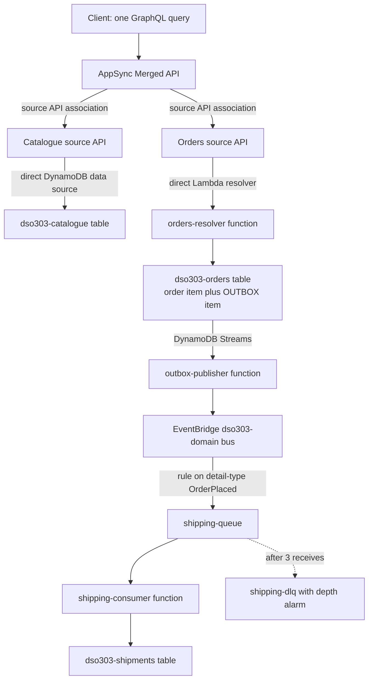

### AWS Services Used

| Service | Role in the lab |
|---|---|
| **AWS AppSync** | Two source APIs and one Merged API; direct DynamoDB and direct Lambda resolvers |
| **Amazon DynamoDB** | One table per service, plus Streams as the outbox mechanism |
| **AWS Lambda** | Orders resolver, outbox publisher, shipping consumer |
| **Amazon EventBridge** | The domain event bus and the routing rule |
| **Amazon SQS** | Per-consumer buffer and dead-letter queue |
| **Amazon CloudWatch** | Logs, the DLQ depth alarm, and a metric filter for GraphQL partial failures |
| **AWS IAM** | `LabRole` reused as execution and data-source role |

### Implementation Steps

**Step 1 — Variables and the two service-owned tables.**

```bash
export AWS_REGION=us-east-1
export ACCOUNT_ID=111122223333
export ROLE_ARN=arn:aws:iam::${ACCOUNT_ID}:role/LabRole

aws dynamodb create-table --table-name dso303-catalogue \
  --attribute-definitions AttributeName=productId,AttributeType=S \
  --key-schema AttributeName=productId,KeyType=HASH \
  --billing-mode PAY_PER_REQUEST --region "$AWS_REGION"

# The orders table carries both order items and outbox items, so that a write of
# an order and its event announcement is ONE transaction, not a dual write.
aws dynamodb create-table --table-name dso303-orders \
  --attribute-definitions AttributeName=pk,AttributeType=S AttributeName=sk,AttributeType=S \
  --key-schema AttributeName=pk,KeyType=HASH AttributeName=sk,KeyType=RANGE \
  --billing-mode PAY_PER_REQUEST \
  --stream-specification StreamEnabled=true,StreamViewType=NEW_AND_OLD_IMAGES \
  --region "$AWS_REGION"

aws dynamodb create-table --table-name dso303-shipments \
  --attribute-definitions AttributeName=orderId,AttributeType=S \
  --key-schema AttributeName=orderId,KeyType=HASH \
  --billing-mode PAY_PER_REQUEST --region "$AWS_REGION"

aws dynamodb put-item --table-name dso303-catalogue --region "$AWS_REGION" \
  --item '{"productId":{"S":"P-123"},"name":{"S":"Noise-cancelling headphones"},
           "category":{"S":"audio"},"listPrice":{"N":"249.00"}}'
```

`NEW_AND_OLD_IMAGES` is chosen deliberately: consumers of a domain event frequently need the delta, and the view type cannot be changed without recreating the stream.

**Step 2 — The catalogue source API, with no compute at all.**

```bash
CAT_API=$(aws appsync create-graphql-api --name dso303-catalogue-api \
  --authentication-type API_KEY --region "$AWS_REGION" \
  --query 'graphqlApi.apiId' --output text)

cat > catalogue.graphql <<'SDL'
type Product {
  productId: ID!
  name: String!
  category: String!
  listPrice: Float!
}
type Query {
  product(productId: ID!): Product
}
SDL

aws appsync start-schema-creation --api-id "$CAT_API" \
  --definition fileb://catalogue.graphql --region "$AWS_REGION"

aws appsync create-data-source --api-id "$CAT_API" --name CatalogueTable \
  --type AMAZON_DYNAMODB --service-role-arn "$ROLE_ARN" \
  --dynamodb-config tableName=dso303-catalogue,awsRegion=${AWS_REGION} \
  --region "$AWS_REGION"

cat > product-resolver.js <<'JS'
import { util } from '@aws-appsync/utils';

export function request(ctx) {
  return {
    operation: 'GetItem',
    key: util.dynamodb.toMapValues({ productId: ctx.args.productId }),
  };
}

export function response(ctx) {
  if (ctx.error) { util.error(ctx.error.message, ctx.error.type); }
  return ctx.result;
}
JS

aws appsync create-resolver --api-id "$CAT_API" --type-name Query \
  --field-name product --data-source-name CatalogueTable \
  --runtime name=APPSYNC_JS,runtimeVersion=1.0.0 \
  --code file://product-resolver.js --region "$AWS_REGION"
```

Note that this field costs no Lambda invocation and has no cold start. A direct data source is the correct choice whenever the mapping is a simple read, and reaching for Lambda by reflex is a common and expensive habit.

**Step 3 — The orders source API, backed by a Lambda resolver.**

The orders resolver writes the order item and the outbox item in a single `TransactWriteItems` call.

```python
# orders_resolver.py
import json, os, time, uuid
import boto3

ddb = boto3.client("dynamodb")
TABLE = os.environ["ORDERS_TABLE"]


def handler(event, context):
    field = event["info"]["fieldName"]
    if field == "placeOrder":
        return place_order(event["arguments"], event["identity"])
    if field == "order":
        return get_order(event["arguments"]["orderId"])
    raise Exception(f"unhandled field {field}")


def place_order(args, identity):
    order_id = args.get("idempotencyKey") or str(uuid.uuid4())
    now = int(time.time())
    order = {
        "pk": {"S": f"ORDER#{order_id}"},
        "sk": {"S": "META"},
        "orderId": {"S": order_id},
        "productId": {"S": args["productId"]},
        "quantity": {"N": str(args["quantity"])},
        # The price is COPIED, not referenced. A price agreed is not a price current.
        "pricePaid": {"N": str(args["pricePaid"])},
        "status": {"S": "PLACED"},
        "createdAt": {"N": str(now)},
    }
    outbox = {
        "pk": {"S": f"ORDER#{order_id}"},
        "sk": {"S": f"OUTBOX#{now}"},
        "eventType": {"S": "OrderPlaced"},
        "payload": {"S": json.dumps({
            "orderId": order_id,
            "productId": args["productId"],
            "quantity": args["quantity"],
        })},
    }
    try:
        # ONE transaction. Either the order and its announcement both exist, or neither does.
        ddb.transact_write_items(TransactItems=[
            {"Put": {"TableName": TABLE, "Item": order,
                     "ConditionExpression": "attribute_not_exists(pk)"}},
            {"Put": {"TableName": TABLE, "Item": outbox}},
        ])
    except ddb.exceptions.TransactionCanceledException:
        # Idempotent: a retry with the same key returns the existing order.
        return get_order(order_id)
    return {"orderId": order_id, "productId": args["productId"],
            "quantity": args["quantity"], "pricePaid": args["pricePaid"],
            "status": "PLACED"}


def get_order(order_id):
    r = ddb.get_item(TableName=TABLE,
                     Key={"pk": {"S": f"ORDER#{order_id}"}, "sk": {"S": "META"}})
    if "Item" not in r:
        return None
    i = r["Item"]
    return {"orderId": i["orderId"]["S"], "productId": i["productId"]["S"],
            "quantity": int(i["quantity"]["N"]), "pricePaid": float(i["pricePaid"]["N"]),
            "status": i["status"]["S"]}
```

The orders schema deliberately exposes `productId` as a scalar and **not** a `Product` object, because the orders team does not own product data:

```graphql
type Order {
  orderId: ID!
  productId: ID!
  quantity: Int!
  pricePaid: Float!
  status: String!
}
type Query {
  order(orderId: ID!): Order
}
type Mutation {
  placeOrder(productId: ID!, quantity: Int!, pricePaid: Float!,
             idempotencyKey: String): Order
}
```

```bash
ORD_API=$(aws appsync create-graphql-api --name dso303-orders-api \
  --authentication-type API_KEY --region "$AWS_REGION" \
  --query 'graphqlApi.apiId' --output text)

aws appsync start-schema-creation --api-id "$ORD_API" \
  --definition fileb://orders.graphql --region "$AWS_REGION"

aws appsync create-data-source --api-id "$ORD_API" --name OrdersLambda \
  --type AWS_LAMBDA --service-role-arn "$ROLE_ARN" \
  --lambda-config lambdaFunctionArn=arn:aws:lambda:${AWS_REGION}:${ACCOUNT_ID}:function:orders-resolver \
  --region "$AWS_REGION"

# Direct Lambda resolvers: no mapping template, the whole context is passed through.
for f in order:Query placeOrder:Mutation; do
  aws appsync create-resolver --api-id "$ORD_API" \
    --type-name "${f#*:}" --field-name "${f%:*}" \
    --data-source-name OrdersLambda --region "$AWS_REGION"
done
```

**Step 4 — Compose the Merged API.**

```bash
MERGED=$(aws appsync create-graphql-api --name dso303-merged-api \
  --api-type MERGED --authentication-type API_KEY \
  --merged-api-execution-role-arn "$ROLE_ARN" \
  --region "$AWS_REGION" --query 'graphqlApi.apiId' --output text)

for SRC in "$CAT_API" "$ORD_API"; do
  aws appsync associate-source-graphql-api --merged-api-identifier "$MERGED" \
    --source-api-identifier "$SRC" \
    --source-api-association-config mergeType=AUTO_MERGE \
    --region "$AWS_REGION"
done

aws appsync list-source-api-associations --merged-api-identifier "$MERGED" \
  --region "$AWS_REGION"
```

`AUTO_MERGE` is the setting that preserves independent deployability: from now on, either team can add a field by deploying **their own** API, and the merged schema updates with no action by anyone else. Verify this by adding a field to the catalogue schema and querying the Merged API without touching it.

**Step 5 — The outbox publisher: DynamoDB Streams to EventBridge.**

```python
# outbox_publisher.py
import json, os
import boto3

events = boto3.client("events")
BUS = os.environ["EVENT_BUS"]


def handler(event, context):
    entries = []
    for record in event["Records"]:
        if record["eventName"] != "INSERT":
            continue
        new = record["dynamodb"]["NewImage"]
        # Only outbox items become domain events; order items are internal state.
        if not new["sk"]["S"].startswith("OUTBOX#"):
            continue
        entries.append({
            "EventBusName": BUS,
            "Source": "com.dso303.orders",
            "DetailType": new["eventType"]["S"],
            "Detail": new["payload"]["S"],
        })
    # PutEvents accepts a batch; sending one call per record wastes both time and money.
    for i in range(0, len(entries), 10):
        resp = events.put_events(Entries=entries[i:i + 10])
        if resp["FailedEntryCount"]:
            # Raise so Lambda retries the batch. Consumers are idempotent, so
            # at-least-once republication is safe.
            raise Exception(f"failed entries: {resp}")
    return {"published": len(entries)}
```

```bash
STREAM_ARN=$(aws dynamodb describe-table --table-name dso303-orders \
  --query 'Table.LatestStreamArn' --output text --region "$AWS_REGION")

aws events create-event-bus --name dso303-domain --region "$AWS_REGION"

aws lambda create-event-source-mapping \
  --function-name outbox-publisher --event-source-arn "$STREAM_ARN" \
  --starting-position LATEST --batch-size 10 \
  --maximum-retry-attempts 3 --bisect-batch-on-function-error \
  --region "$AWS_REGION"
```

`--bisect-batch-on-function-error` matters: without it, one poison record blocks the whole shard, and the outbox stops publishing for every order behind it.

**Step 6 — Route the event to a per-consumer queue with a dead-letter queue.**

```bash
DLQ_URL=$(aws sqs create-queue --queue-name shipping-dlq \
  --region "$AWS_REGION" --query QueueUrl --output text)
DLQ_ARN=$(aws sqs get-queue-attributes --queue-url "$DLQ_URL" \
  --attribute-names QueueArn --query 'Attributes.QueueArn' --output text --region "$AWS_REGION")

Q_URL=$(aws sqs create-queue --queue-name shipping-queue --region "$AWS_REGION" \
  --attributes "{\"VisibilityTimeout\":\"60\",
    \"RedrivePolicy\":\"{\\\"deadLetterTargetArn\\\":\\\"${DLQ_ARN}\\\",\\\"maxReceiveCount\\\":\\\"3\\\"}\"}" \
  --query QueueUrl --output text)
Q_ARN=$(aws sqs get-queue-attributes --queue-url "$Q_URL" \
  --attribute-names QueueArn --query 'Attributes.QueueArn' --output text --region "$AWS_REGION")

aws events put-rule --name shipping-on-order-placed --event-bus-name dso303-domain \
  --event-pattern '{"source":["com.dso303.orders"],"detail-type":["OrderPlaced"]}' \
  --region "$AWS_REGION"

aws events put-targets --rule shipping-on-order-placed --event-bus-name dso303-domain \
  --targets "Id=1,Arn=${Q_ARN}" --region "$AWS_REGION"

# The alarm is the point of the DLQ. An unalarmed DLQ is silent data loss.
aws cloudwatch put-metric-alarm --alarm-name shipping-dlq-not-empty \
  --namespace AWS/SQS --metric-name ApproximateNumberOfMessagesVisible \
  --dimensions Name=QueueName,Value=shipping-dlq \
  --statistic Maximum --period 300 --evaluation-periods 1 \
  --threshold 0 --comparison-operator GreaterThanThreshold \
  --region "$AWS_REGION"
```

**Step 7 — Exercise the system with one cross-team query.**

```bash
MERGED_URL=$(aws appsync get-graphql-api --api-id "$MERGED" \
  --query 'graphqlApi.uris.GRAPHQL' --output text --region "$AWS_REGION")
KEY=$(aws appsync create-api-key --api-id "$MERGED" \
  --query 'apiKey.id' --output text --region "$AWS_REGION")

# Mutation on the orders team's API, through the merged endpoint.
curl -s -X POST "$MERGED_URL" -H "x-api-key: $KEY" -H 'Content-Type: application/json' \
  -d '{"query":"mutation { placeOrder(productId:\"P-123\", quantity:2, pricePaid:249.00,
       idempotencyKey:\"order-0001\") { orderId status } }"}'

# Repeat the identical call: idempotency means one order, not two.
curl -s -X POST "$MERGED_URL" -H "x-api-key: $KEY" -H 'Content-Type: application/json' \
  -d '{"query":"mutation { placeOrder(productId:\"P-123\", quantity:2, pricePaid:249.00,
       idempotencyKey:\"order-0001\") { orderId status } }"}'

# ONE query spanning BOTH teams' services.
curl -s -X POST "$MERGED_URL" -H "x-api-key: $KEY" -H 'Content-Type: application/json' \
  -d '{"query":"query { order(orderId:\"order-0001\") { orderId quantity pricePaid status }
       product(productId:\"P-123\") { name category listPrice } }"}'
```

Observe in the response that `pricePaid` on the order and `listPrice` on the product are separate values. Change the catalogue price and re-run: the order's `pricePaid` does not move. That is the snapshot-versus-reference distinction, working.

**Step 8 — Prove the boundary, and prove partial failure.**

```bash
# The orders resolver has no code path to the catalogue table. Confirm it:
grep -c "dso303-catalogue" orders_resolver.py    # expect 0

# Break the catalogue resolver deliberately, then re-run the combined query.
aws dynamodb delete-table --table-name dso303-catalogue --region "$AWS_REGION"
```

Re-running the combined query now returns **HTTP 200** with `"product": null` and an `errors` array, while `order` resolves normally. This is the partial-failure behaviour described earlier, and it is why status-code monitoring is insufficient. Add the metric filter that catches it:

```bash
aws logs put-metric-filter --region "$AWS_REGION" \
  --log-group-name "/aws/appsync/apis/${MERGED}" \
  --filter-name graphql-field-errors \
  --filter-pattern '{ $.logType = "RequestSummary" && $.graphQLAPIErrorCount > 0 }' \
  --metric-transformations \
    metricName=GraphQLFieldErrors,metricNamespace=DSO303,metricValue=1
```

**Step 9 — Clean up.**

```bash
for API in "$MERGED" "$ORD_API" "$CAT_API"; do
  aws appsync delete-graphql-api --api-id "$API" --region "$AWS_REGION"
done
aws events remove-targets --rule shipping-on-order-placed \
  --event-bus-name dso303-domain --ids 1 --region "$AWS_REGION"
aws events delete-rule --name shipping-on-order-placed \
  --event-bus-name dso303-domain --region "$AWS_REGION"
aws events delete-event-bus --name dso303-domain --region "$AWS_REGION"
aws sqs delete-queue --queue-url "$Q_URL" --region "$AWS_REGION"
aws sqs delete-queue --queue-url "$DLQ_URL" --region "$AWS_REGION"
for T in dso303-orders dso303-shipments; do
  aws dynamodb delete-table --table-name "$T" --region "$AWS_REGION"
done
aws cloudwatch delete-alarms --alarm-names shipping-dlq-not-empty --region "$AWS_REGION"
```

### Expected Output

| Observation | Expected result |
|---|---|
| First `placeOrder` mutation | HTTP 200 with a new `orderId` and status `PLACED` |
| Repeated `placeOrder` with the same idempotency key | The same order returned; one order item in the table, not two |
| `scan` of `dso303-orders` | Two items per order: one `META` and one `OUTBOX#...` |
| CloudWatch logs for `outbox-publisher` | `{"published": 1}` within a few seconds of the mutation |
| `receive-message` on `shipping-queue` | An `OrderPlaced` event with `source` `com.dso303.orders` |
| Combined query across both source APIs | One response containing both `order` and `product` |
| Adding a field to the catalogue schema only | The field is queryable on the Merged API with no merged-API deployment |
| Combined query after deleting the catalogue table | HTTP **200**, `product: null`, an `errors` entry, `order` still correct |
| `GraphQLFieldErrors` metric | Non-zero after the induced failure; this is the alarm that status codes miss |
| Deliberately failing the shipping consumer three times | The message appears in `shipping-dlq` and the alarm enters ALARM |

!!! tip "What this lab is really teaching"

    Four things, none of which is "how to type AppSync commands". First, that **a Merged API makes federation a configuration choice**, so two teams can own one client-facing schema without one team waiting on the other. Second, that **the outbox is not extra work when your store is DynamoDB** — Streams give you change data capture free, and a `TransactWriteItems` with a business item and an outbox item is the whole pattern. Third, that **a copied value is semantically different from a reference**, which is why the order's price does not move when the catalogue's does, and why recognising this eliminates a great many apparent cross-service dependencies. Fourth, that **a GraphQL partial failure returns HTTP 200**, which is a monitoring blind spot you now know to close before it finds you in production.

---

## Code Examples

### CloudFormation: an AppSync source API with a least-privilege data-source role

```yaml
AWSTemplateFormatVersion: '2010-09-09'
Description: One team's AppSync source API with an exclusively owned DynamoDB table

Parameters:
  TeamName: { Type: String, Default: catalogue }

Resources:
  Table:
    Type: AWS::DynamoDB::Table
    Properties:
      TableName: !Sub 'dso303-${TeamName}'
      BillingMode: PAY_PER_REQUEST
      AttributeDefinitions:
        - { AttributeName: pk, AttributeType: S }
      KeySchema:
        - { AttributeName: pk, KeyType: HASH }
      StreamSpecification: { StreamViewType: NEW_AND_OLD_IMAGES }
      PointInTimeRecoverySpecification: { PointInTimeRecoveryEnabled: true }
      SSESpecification: { SSEEnabled: true }

  # This role is what makes data ownership ENFORCEABLE rather than aspirational:
  # it names exactly one table and exactly the actions the resolvers perform.
  DataSourceRole:
    Type: AWS::IAM::Role
    Properties:
      AssumeRolePolicyDocument:
        Statement:
          - Effect: Allow
            Principal: { Service: appsync.amazonaws.com }
            Action: sts:AssumeRole
            Condition:
              StringEquals: { 'aws:SourceAccount': !Ref AWS::AccountId }
      Policies:
        - PolicyName: own-table-only
          PolicyDocument:
            Statement:
              - Effect: Allow
                Action: [ dynamodb:GetItem, dynamodb:Query, dynamodb:BatchGetItem ]
                Resource: !GetAtt Table.Arn

  Api:
    Type: AWS::AppSync::GraphQLApi
    Properties:
      Name: !Sub 'dso303-${TeamName}-api'
      AuthenticationType: AMAZON_COGNITO_USER_POOLS
      UserPoolConfig:
        UserPoolId: !ImportValue dso303-user-pool-id
        AwsRegion: !Ref AWS::Region
        DefaultAction: ALLOW
      XrayEnabled: true
      LogConfig:
        FieldLogLevel: ERROR            # ALL in production is a large CloudWatch bill
        CloudWatchLogsRoleArn: !ImportValue dso303-appsync-logs-role
      # Without these two, one nested query is a denial-of-service amplifier.
      QueryDepthLimit: 6
      ResolverCountLimit: 60

  DataSource:
    Type: AWS::AppSync::DataSource
    Properties:
      ApiId: !GetAtt Api.ApiId
      Name: OwnTable
      Type: AMAZON_DYNAMODB
      ServiceRoleArn: !GetAtt DataSourceRole.Arn
      DynamoDBConfig:
        TableName: !Ref Table
        AwsRegion: !Ref AWS::Region
```

!!! note "Why `QueryDepthLimit` and `ResolverCountLimit` are in the template"

    They are security controls, not tuning parameters, and putting them in infrastructure code makes them reviewable. An API deployed without them accepts a query nested twenty levels deep that fans out into thousands of resolver executions from a single unauthenticated request.

### AppSync JavaScript pipeline resolver: authorise, then fetch

```javascript
// Function 1 of a pipeline: field-level authorisation BEFORE any data access.
// An API-level auth mode says the caller may use the API, not that they may
// see this particular record.
import { util } from '@aws-appsync/utils';

export function request(ctx) {
  const groups = ctx.identity.groups ?? [];
  const callerId = ctx.identity.sub;
  ctx.stash.callerId = callerId;
  ctx.stash.isSupport = groups.includes('support');
  // Local resolver: no data source is called for this step.
  return {};
}

export function response(ctx) {
  return {};
}
```

```javascript
// Function 2: fetch, then enforce ownership on the result.
import { util } from '@aws-appsync/utils';

export function request(ctx) {
  return {
    operation: 'GetItem',
    key: util.dynamodb.toMapValues({ pk: `ORDER#${ctx.args.orderId}` }),
    consistentRead: false,   // eventual consistency is fine for a read-only view
  };
}

export function response(ctx) {
  if (ctx.error) { util.error(ctx.error.message, ctx.error.type); }
  const item = ctx.result;
  if (!item) { return null; }
  if (item.customerId !== ctx.stash.callerId && !ctx.stash.isSupport) {
    // Unauthorized on this FIELD; the rest of the query still resolves.
    util.unauthorized();
  }
  return item;
}
```

### AppSync batch resolver: the N+1 remedy

```python
# Lambda data source with maxBatchSize set on the resolver. AppSync passes an
# ARRAY of contexts and expects an array of results IN THE SAME ORDER.
import boto3

ddb = boto3.resource("dynamodb")
TABLE = ddb.Table("dso303-catalogue")


def handler(event, context):
    # Single-invocation shape (no batching configured).
    if isinstance(event, dict):
        return fetch([event["source"]["productId"]])[0]

    ids = [e["source"]["productId"] for e in event]
    unique = list(dict.fromkeys(ids))          # de-duplicate before the read
    by_id = {p["productId"]: p for p in fetch(unique)}
    # Order must match the input array exactly, including duplicates and misses.
    return [by_id.get(i) for i in ids]


def fetch(ids):
    if not ids:
        return []
    out, keys = [], [{"productId": i} for i in ids]
    for i in range(0, len(keys), 100):         # BatchGetItem caps at 100 keys
        resp = ddb.meta.client.batch_get_item(
            RequestItems={"dso303-catalogue": {"Keys": keys[i:i + 100]}})
        out.extend(resp["Responses"].get("dso303-catalogue", []))
    return out
```

### Python: idempotent event consumer

```python
import json, os
import boto3
from botocore.exceptions import ClientError

ddb = boto3.client("dynamodb")
SHIPMENTS = os.environ["SHIPMENTS_TABLE"]


def handler(event, context):
    failures = []
    for record in event["Records"]:
        try:
            body = json.loads(record["body"])
            detail = body["detail"]           # EventBridge envelope
            create_shipment(detail["orderId"], detail["productId"], detail["quantity"])
        except Exception:
            # Partial batch failure: only the failed messages are retried,
            # rather than the whole batch being redelivered.
            failures.append({"itemIdentifier": record["messageId"]})
    return {"batchItemFailures": failures}


def create_shipment(order_id, product_id, quantity):
    try:
        ddb.put_item(
            TableName=SHIPMENTS,
            Item={"orderId": {"S": order_id},
                  "productId": {"S": product_id},
                  "quantity": {"N": str(quantity)},
                  "status": {"S": "REQUESTED"}},
            # Idempotency: a redelivered event is a no-op, not a second shipment.
            ConditionExpression="attribute_not_exists(orderId)",
        )
    except ClientError as e:
        if e.response["Error"]["Code"] != "ConditionalCheckFailedException":
            raise
        # Already processed. Emit a metric so a rising duplicate rate is visible.
        print(json.dumps({"event": "duplicate_suppressed", "orderId": order_id}))
```

### Terraform: an IAM policy that enforces the data boundary and prevents event impersonation

```hcl
resource "aws_iam_role_policy" "orders_service" {
  role = aws_iam_role.orders_service.id
  policy = jsonencode({
    Version = "2012-10-17"
    Statement = [
      {
        Sid      = "OwnTableOnly"
        Effect   = "Allow"
        Action   = ["dynamodb:GetItem", "dynamodb:PutItem", "dynamodb:Query",
                    "dynamodb:TransactWriteItems"]
        Resource = aws_dynamodb_table.orders.arn
        # Pooled multi-tenancy enforced at the CREDENTIAL level, not in code.
        Condition = {
          "ForAllValues:StringLike" = {
            "dynamodb:LeadingKeys" = ["TENANT#$${aws:PrincipalTag/tenant}#*"]
          }
        }
      },
      {
        Sid      = "PublishOwnDomainEventsOnly"
        Effect   = "Allow"
        Action   = "events:PutEvents"
        Resource = aws_cloudwatch_event_bus.domain.arn
        # Without this, ANY service can publish events impersonating this one,
        # and choreographed consumers trust the source field.
        Condition = { StringEquals = { "events:source" = "com.dso303.orders" } }
      }
      # Note what is ABSENT: no permission on the catalogue table. The boundary
      # is enforced by IAM, not by developer discipline.
    ]
  })
}
```

### Shell: auditing for data-ownership violations

```bash
# Which principals other than the owning service can read a given table?
# Run this in CI; a new answer is an architecture change nobody reviewed.
TABLE_ARN=arn:aws:dynamodb:us-east-1:111122223333:table/dso303-orders

for ROLE in $(aws iam list-roles --query 'Roles[].RoleName' --output text); do
  for POL in $(aws iam list-role-policies --role-name "$ROLE" \
                 --query 'PolicyNames[]' --output text 2>/dev/null); do
    if aws iam get-role-policy --role-name "$ROLE" --policy-name "$POL" \
         --query 'PolicyDocument' --output json 2>/dev/null \
         | grep -q "dso303-orders"; then
      echo "role=$ROLE policy=$POL references the orders table"
    fi
  done
done

# Which consumers are actually matching a given event type? A rule that stopped
# matching after a schema change is a silent integration failure.
aws events list-rule-names-by-target --target-arn "$Q_ARN" \
  --event-bus-name dso303-domain
aws cloudwatch get-metric-statistics --namespace AWS/Events \
  --metric-name FailedInvocations --dimensions Name=RuleName,Value=shipping-on-order-placed \
  --start-time "$(date -u -d '24 hours ago' +%FT%TZ)" \
  --end-time "$(date -u +%FT%TZ)" --period 3600 --statistics Sum
```

### GraphQL: a schema showing ownership and degradation

```graphql
# Orders team's source API. Note what it does NOT declare.
type Order {
  orderId: ID!
  # A scalar, not a Product. The orders team does not own product data, and
  # declaring a Product field here would make the catalogue's model part of
  # the orders team's contract.
  productId: ID!
  quantity: Int!
  # A SNAPSHOT, taken at order time. Not a lookup against current price.
  pricePaid: Float!
  status: OrderStatus!
  # Nullable by design: if the loyalty service is unavailable, this field is
  # null with an errors entry and the rest of the screen still renders.
  loyaltyPointsEarned: Int
}

enum OrderStatus { PLACED CONFIRMED SHIPPED CANCELLED }

type Query {
  order(orderId: ID!): Order
  # Bounded list: an unbounded list field is an N+1 amplifier waiting to happen.
  orders(customerId: ID!, limit: Int = 20, nextToken: String): OrderConnection!
}

type OrderConnection { items: [Order!]!  nextToken: String }

type Mutation {
  # The idempotency key is part of the CONTRACT, not an implementation detail,
  # because the client is the only party that can generate a stable one.
  placeOrder(input: PlaceOrderInput!, idempotencyKey: String!): Order!
}

input PlaceOrderInput { productId: ID!  quantity: Int!  pricePaid: Float! }
```

---

## AWS Certification Tips

### Exam tips

Questions on this material test whether you can find the **discriminating constraint** in a scenario. Read for the constraint first, then eliminate.

- "Teams must deploy independently" or "without coordinating releases" points to **capability-based boundaries, federated APIs and exclusive data ownership**. Any option involving a shared database or a single central API is wrong.
- "Mobile client", "multiple round trips", "over-fetching", "one request" points to **AWS AppSync**.
- "Partner developers", "API keys", "usage plans", "quotas", "request validation" points to **Amazon API Gateway**, and specifically the REST API type.
- "The event must not be lost if the write succeeds" points to the **transactional outbox**, implemented with DynamoDB Streams or DMS change data capture. Any option that writes then publishes separately is a dual write and is wrong.
- "Undo completed steps if a later step fails" points to a **saga with compensating transactions** orchestrated by **Step Functions**. Any option containing "two-phase commit" or "distributed transaction" is a distractor.
- "Single-digit-millisecond", "known access pattern", "any scale" points to **DynamoDB**. "Ad-hoc queries", "joins", "transactions across tables" points to **Aurora**. "Relationships are the query" points to **Neptune**. "Full-text search and faceting" points to **OpenSearch**.
- "Multi-region active-active writes with strong consistency" points to **Aurora DSQL**. "Multi-region reads with a single writer" points to **Aurora Global Database**. "Multi-region key-value with last-writer-wins" points to **DynamoDB global tables**.
- "Reduce audit scope" or "keep regulated data isolated" points to a **separate AWS account** under an Organizations OU with SCPs, not a namespace or a VPC.
- "Downstream service outage must not fail the user request" points to a **queue** or an **event**, or to a nullable GraphQL field with degraded rendering.
- "Latency scales with the number of items returned" points to the **N+1 problem** and batching.
- Anything describing services named after entities or technical layers is describing an **anti-pattern**, whatever else the option says.

### Frequently confused services and concepts

| Pair | The distinguishing fact |
|---|---|
| **AppSync vs API Gateway** | AppSync aggregates and federates for first-party clients; API Gateway manages contracts for consumers you do not control, with keys, usage plans and validation |
| **Merged API vs a single GraphQL API** | The Merged API is an *ownership* mechanism: source APIs deploy independently. A single API is one artefact many teams must share |
| **Unit vs pipeline resolver** | Unit binds one field to one data source; pipeline chains functions sharing `ctx.stash`, which is how you authorise before fetching |
| **APPSYNC_JS vs a Lambda resolver** | APPSYNC_JS runs inside AppSync with no invocation cost or cold start, but is a language subset; Lambda for real logic |
| **Direct data source vs Lambda data source** | A direct DynamoDB or HTTP data source removes a Lambda's cost and latency for simple mappings |
| **Command vs event** | A command names a recipient and requests future action; an event states a past fact and names no one |
| **Orchestration vs choreography** | A coordinator drives the process and is observable; choreography is decoupled and the process exists only in traces |
| **Outbox vs dual write** | The outbox writes the event in the same local transaction; a dual write admits an unrecoverable window |
| **DynamoDB Streams vs Kinesis Data Streams for DynamoDB** | Streams is the built-in 24-hour change feed; Kinesis gives longer retention, replay and independent fan-out |
| **Saga vs distributed transaction** | A saga is local transactions plus compensations with eventual consistency; a distributed transaction is not on offer |
| **Compensating transaction vs rollback** | A compensation is a new business operation that semantically undoes; a rollback discards uncommitted work |
| **CQRS vs event sourcing** | CQRS separates read and write models; event sourcing makes the event log the system of record. Independent, often combined |
| **Snapshot vs reference** | A copied value fixes what was agreed; a reference reflects what is current. Confusing them is a correctness bug |
| **Thin vs thick events** | Thin carries identifiers and keeps sensitive data inside its boundary; thick carries payloads and is faster but copies data everywhere |
| **Aurora Serverless v2 vs Aurora DSQL** | Serverless v2 scales one cluster's capacity; DSQL is a distributed engine with active-active multi-region writes |
| **DynamoDB `TransactWriteItems` vs a saga** | Transactions are ACID within one account and region across items; sagas span services and are eventually consistent |
| **Strongly vs eventually consistent DynamoDB reads** | Strong costs double, is unavailable on GSIs, and is needed only for read-your-writes |
| **Account vs VPC vs namespace isolation** | Only the account boundary is enforced by the platform and trivially demonstrable to an auditor |

### Memory aids

- **Boundaries, contracts, data, compute** — the order of decisions, hardest to reverse first. Compute is last because it is easiest to change.
- **"Capability, not entity; vertical, not layered."** The two most common decomposition errors, in one line.
- **"A price agreed is not a price current."** The snapshot-versus-reference test, which removes many false dependencies.
- **"Never dual write."** Outbox or change data capture. There is no third correct option.
- **"Availability multiplies down; latency adds up."** Say it before designing any synchronous chain.
- **"GraphQL returns 200 when it fails."** Alarm on the `errors` array, not the status code.
- **"Batch under every list."** The N+1 defence, stated as a habit.
- **"Thin events, fetch on demand."** Keeps regulated data inside its boundary.
- **"The IAM policy is the boundary."** If service B's role can read service A's table, the boundary exists only in the diagram.

!!! danger "Common certification traps"

    - Choosing entity services (`CustomerService`, `OrderService`) because the option names sound like microservices.
    - Believing AppSync and API Gateway are alternatives for the same job rather than tools for different audiences.
    - Selecting "write to the database, then publish the event" — a dual write — because it looks simplest.
    - Assuming GraphQL always reduces backend calls; without batching it multiplies them.
    - Assuming a GraphQL failure produces a non-200 status.
    - Choosing two-phase commit or a shared transaction for a cross-service process instead of a saga.
    - Believing database-per-service requires a different engine per service.
    - Believing separate schemas on one Aurora cluster satisfy database-per-service.
    - Using strongly consistent DynamoDB reads by default, or expecting them on a global secondary index.
    - Choosing a namespace or a VPC where the scenario's constraint is audit scope, for which the answer is a separate account.
    - Forgetting that at-least-once delivery makes consumer idempotency mandatory, not optional.
    - Treating a Merged API as a performance feature rather than an ownership mechanism.

---

## Summary

First, **decomposition is a problem-space activity, and every failure of microservices adoption traces back to skipping it**. Boundaries drawn from the shape of the existing code — controllers, repositories, entities, layers — reproduce the monolith's coupling across a network and deliver none of the independence that justified the cost. Boundaries drawn from business capabilities and bounded contexts are stable over years, because the business changes far more slowly than its implementations. The practical sequence is fixed: capabilities and contexts first, corroborated by volatility, scaling profile, compliance scope and empirical co-change; then data ownership; then contracts; and only then a compute platform. An architect who is asked "ECS or EKS?" before "what does this business do?" is being asked the wrong question first.

Second, **the aggregate is the hard floor on granularity**. You cannot split data that must be transactionally consistent without giving up the transaction and buying a saga in its place. The most valuable conversation in any decomposition is the one that asks the business, explicitly, which operations must be atomic and what the customer sees if the second half is undone two seconds after the first. The answers determine which boundaries are viable, and they must be obtained before the boundary is drawn, not discovered afterwards in an incident review.

Third, **communication style is a design decision with arithmetic consequences**. Availability multiplies downward along a synchronous chain and latency adds upward, so each synchronous dependency you remove improves both. The default should therefore be asynchronous, with synchronous calls justified individually, and the highest-leverage change available in most chatty systems is replacing a hot-path call with a locally maintained projection fed by events. Where synchronous aggregation is genuinely required, GraphQL's concurrent field resolution converts a sum of latencies into a maximum — which is the strongest technical argument for AppSync at a client edge, and it comes with the N+1 problem and the HTTP 200 partial-failure blind spot as the price of admission.

Fourth, **an API layer is an ownership question before it is a technology question**. A single shared API artefact owned by a central team is the coordination bottleneck microservices exist to remove, however good the technology behind it. AppSync Merged APIs, and API Gateway custom domains with per-team base-path mappings, exist to make the edge federated so that a team ships a field by deploying its own artefact. This is why Merged APIs matter more in this syllabus than any individual AppSync feature: they are the mechanism that keeps a convenient client experience from re-centralising the organisation.

Fifth, **data ownership is what makes the architecture real, and IAM is what makes ownership real**. A boundary that is documented but not enforced by a policy physically preventing service B from reading service A's table is a boundary maintained by good intentions, and good intentions have a half-life of about one quarter. Exclusive ownership is also the precondition for purpose-built persistence: only once a service owns its store can it choose DynamoDB for a key-value pattern, Neptune for a graph and Timestream for a series, and those choices are frequently order-of-magnitude improvements rather than percentage ones.

Sixth, **there is exactly one correct way to publish an event about a state change, and it is the outbox**. A dual write admits a failure window that no retry logic can close, because the retry state died with the process. Writing the event in the same local transaction and publishing asynchronously from the committed record — with DynamoDB Streams, Aurora change data capture, or a poller — closes it, at the price of at-least-once delivery and therefore mandatory consumer idempotency. That price is bounded and testable; the dual write's is neither.

Seventh, and most importantly for this module, **every one of these principles costs something, and an architect's professional contribution is pricing them honestly**. Database per service costs you joins, transactions and referential integrity, and buys you autonomy and engine choice. Asynchronous communication costs you read-your-writes and simple debugging, and buys you availability and elasticity. Federation costs you a merge step and a class of schema conflict, and buys you independent deployment. Eventual consistency costs you support tickets and reconciliation jobs, and buys you services that do not fail together. The correct default for a new system remains a modular monolith with one store, and the skill this unit is teaching is not enthusiasm for decomposition but the judgement to say, with numbers, when a specific boundary has earned its cost — and when it has not.

---

## Practice Questions

### Beginner Questions

1. Define a business capability and explain why capability-based boundaries are more stable than boundaries drawn from an application's existing module structure.
2. State the database-per-service rule precisely, and explain why a second service reading — but never writing — another service's table still violates it.
3. Explain the difference between a command and a domain event, giving one correctly named example of each from an e-commerce system.
4. Describe what a resolver is in AWS AppSync, and explain the difference between a unit resolver and a pipeline resolver.
5. A GraphQL query returns HTTP 200 with a `data` object containing a null field and a non-empty `errors` array. Explain what has happened and why this matters for monitoring.

### Intermediate Questions

1. A team wants the orders service to store a `productName` field copied from the catalogue at order time. Another team argues this is denormalisation and the orders service should look up the name when needed. Argue both positions, then state which is correct and why.
2. Explain the N+1 problem in AppSync using a concrete query. Describe the two AWS mechanisms that solve it, what must change in the resolver code, and the production metric that reveals the problem.
3. Compare AWS AppSync and Amazon API Gateway across five dimensions: client shape, contract ownership, per-consumer control, real-time capability, and cost model. Give one scenario where each is clearly correct.
4. Describe the transactional outbox pattern as implemented on DynamoDB and as implemented on Aurora. State precisely which failure mode it eliminates, what new obligation it creates for consumers, and why a retry cannot substitute for it.
5. A system has eight microservices and finance requires a monthly report joining data from six of them. Three solutions are proposed: grant the reporting service read access to six databases; have the reporting service call six APIs and join in memory; replicate all six services' data into a warehouse. Evaluate each and recommend one.

### Advanced Questions

1. You are handed a nine-year-old insurance monolith and asked to produce a decomposition plan. Write the plan. It must specify the discovery method and its artefacts, at least six candidate boundaries with the criterion that justified each, the data ownership of each, which operations must remain atomic and why, the extraction sequence with a justification for the first extraction, and the three measurements you would use after six months to determine whether the boundaries were correct.
2. Design the complete API and data topology for a company with five product teams, a web client, an iOS client, forty partner integrations and a PCI-scoped payments capability. Specify the edge for each audience, the federation mechanism, the store per service with a justification from access pattern, the event contracts including what may not appear in a payload, and the reconciliation jobs you would build on day one. Then state the three most likely ways this design degrades over two years and what you would put in place now to detect each.
3. A team reports that a decomposition completed eighteen months ago has made delivery slower rather than faster: most features touch three or more services, p99 latency has tripled, and two incidents in the last quarter took over an hour to diagnose. You have access to the Git history, the X-Ray service map, the IAM policies and the event schemas. Describe your investigation in order, the specific evidence you would gather from each source, the three most likely root causes, and — for the most likely one — the remediation plan including what you would merge back and how you would justify that to a team that spent eighteen months splitting it.
4. Critique the following proposal: "We will build one AppSync API owned by the platform team, with all resolvers as Lambda functions. Each Lambda will query whichever service databases it needs directly, for performance. Domain events will be published by each service calling `PutEvents` after its database write. All services will share one Aurora cluster with a schema per service, to save cost. Reporting will read from a read replica of that cluster." Identify at least six distinct defects, rank them by the severity and reversibility of the damage, propose a corrected design, and state which parts of the original you would keep.
5. A business requires that a customer sees their newly placed order in their order history immediately, with no stale window, and separately requires that the ordering and history capabilities be owned by different teams with independent release cadences. Analyse the tension between these two requirements. Present at least three technically valid resolutions with their trade-offs, state which you would recommend and why, and describe the conversation you would have with the business if none of the three is acceptable to them.