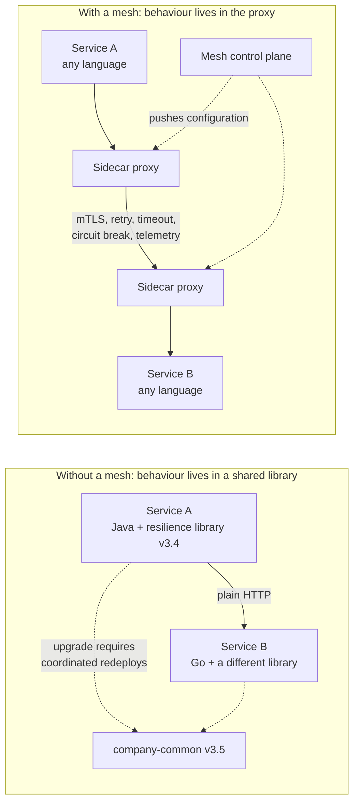
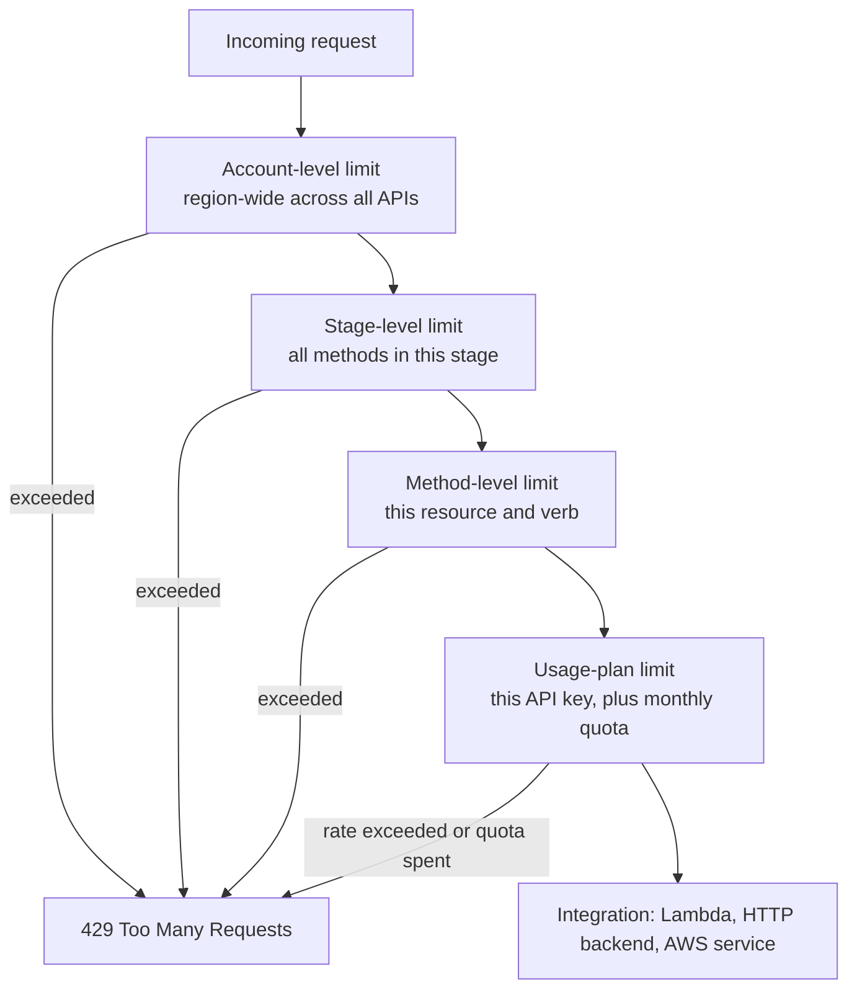
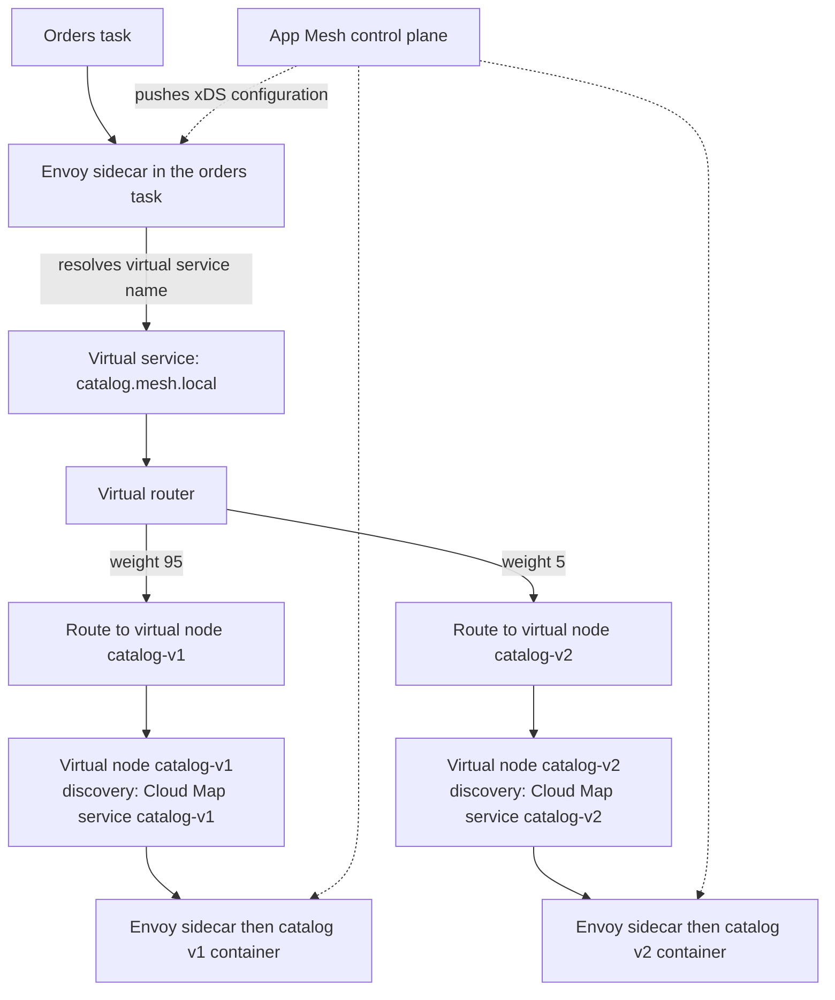
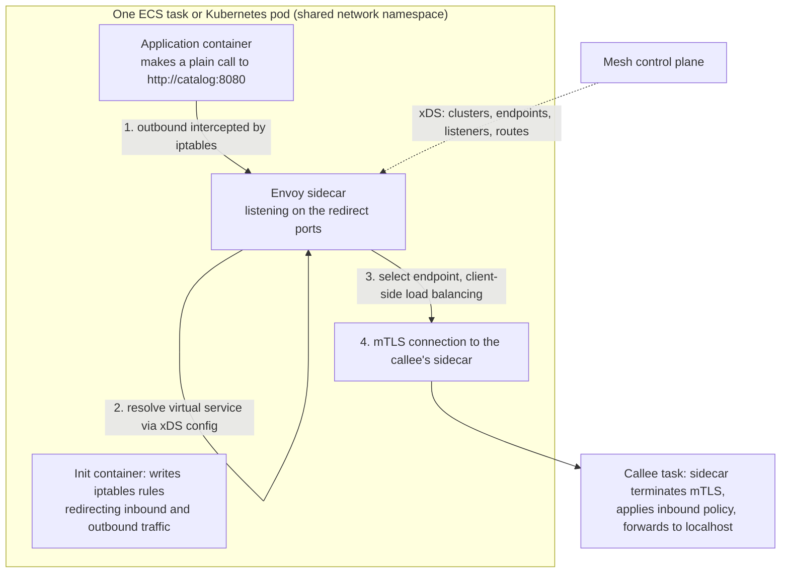
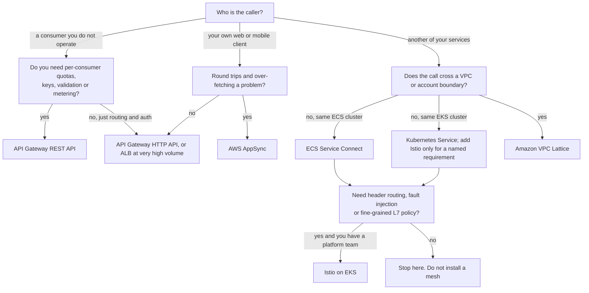
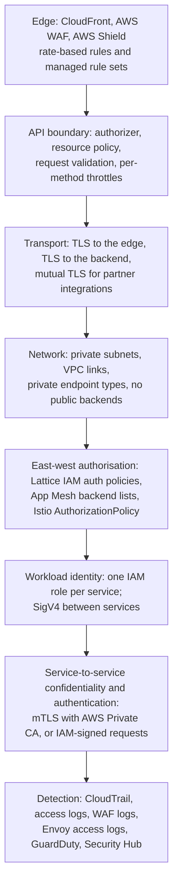
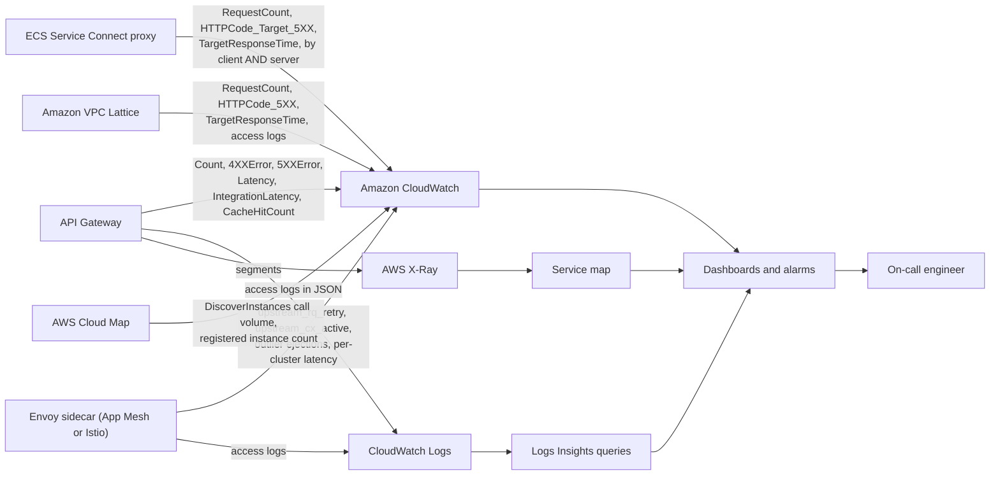
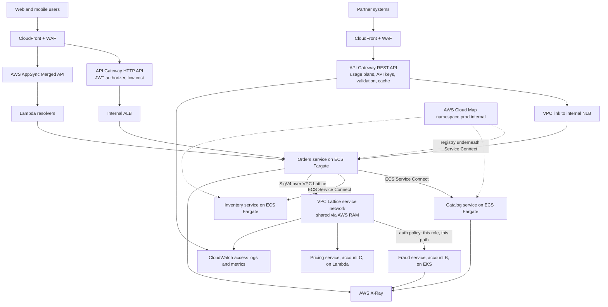
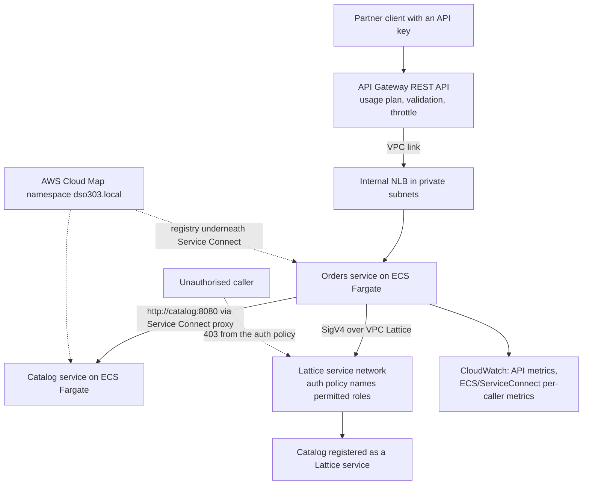

# API Management and Service Mesh on AWS

!!! info "Where this topic sits in DSO303"

    Chapter 4.1 established where service boundaries should be drawn and who owns which data. This chapter treats the infrastructure that carries the conversations across those boundaries. It has two halves that are frequently confused and must be kept distinct. **API management** is a north–south concern: how requests enter your system from clients you do not run, and how you authenticate, throttle, validate, version and meter them. **Service discovery and service mesh** are east–west concerns: how a service finds a peer whose addresses change constantly, and how the cross-cutting network behaviours — mutual TLS, retries, timeouts, traffic splitting, telemetry — are applied uniformly without every team implementing them in application code. Chapter 4.3 then treats what those network behaviours must do when things fail.

    This chapter is being taught at an unusual moment. **AWS App Mesh reaches end of support on 30 September 2026.** The syllabus requires it, and it remains the clearest teaching vehicle for service-mesh concepts, so it is covered in full — but every architectural recommendation in this chapter points at its successors: **Amazon ECS Service Connect** within ECS, **Amazon VPC Lattice** across VPCs, accounts and compute types, and **Istio** or **Linkerd** on Amazon EKS. Treat the App Mesh material as conceptual education and migration knowledge, not as a design recommendation.

---

## Learning Objectives

After studying this chapter you should be able to:

- Distinguish **API management** from **service discovery** from **service mesh**, and explain why solving one does not solve the others.
- Choose correctly among the three Amazon API Gateway types — **REST**, **HTTP** and **WebSocket** — on the basis of required features and per-request cost, and justify when an **Application Load Balancer** is the better answer than any of them.
- Design API Gateway in depth: **stages and deployments**, **resource policies**, the five **authorisation mechanisms**, **request validation**, **mapping templates**, **usage plans and API keys**, **throttling at four levels**, **caching**, **canary releases**, **private APIs**, **custom domains with base-path mappings**, and **VPC links** to private backends.
- Explain the **service-discovery problem** precisely, and compare DNS-based discovery, API-based discovery, client-side load balancing and server-side load balancing.
- Operate **AWS Cloud Map**: namespaces, services, instances, custom attributes, health checking, and its role underneath ECS service discovery and ECS Service Connect.
- Explain **service mesh** architecture — data plane, control plane, sidecar proxy, virtual services, virtual nodes, virtual routers, routes and virtual gateways — using App Mesh as the reference model.
- State honestly what a mesh gives you (**uniform mTLS, retries, timeouts, traffic shifting, L7 telemetry, without application changes**) and what it costs (**a control plane, a proxy per workload, an upgrade obligation, and a new class of failure**).
- Plan a **migration from App Mesh** to ECS Service Connect, VPC Lattice, or Istio, and choose between them on defensible grounds.
- Design **Amazon VPC Lattice** service networks, services, listeners, target groups and **auth policies** for cross-VPC and cross-account connectivity without sidecars.
- Apply the whole toolkit to a realistic estate: which traffic goes through the API layer, which through the mesh or Lattice, and which through neither.

---

## Definition

Three distinct capabilities are commonly bundled under "API infrastructure", and conflating them is the single most common conceptual error in this part of the syllabus.

**API management** is the discipline of exposing a service's operations to consumers as a governed product. It covers the contract (a specification consumers can generate clients from), authentication and authorisation, request validation, rate limiting and quotas per consumer, versioning and deprecation, metering and monetisation, caching, and developer-facing documentation. On AWS its primary instrument is **Amazon API Gateway**.

**Service discovery** is the mechanism by which one service obtains a currently valid network address for another, given that in a container or serverless environment those addresses change continuously — a task is replaced, a pod is rescheduled, an Auto Scaling group scales out, and every one of those events changes the set of valid addresses. On AWS its primary instrument is **AWS Cloud Map**, sitting underneath ECS service discovery and ECS Service Connect, alongside DNS through Route 53 private hosted zones and Kubernetes' own Service and CoreDNS mechanism.

**Service mesh** is a layer of proxies, deployed alongside every workload and configured from a central control plane, that intercepts all service-to-service traffic and applies cross-cutting network policy: mutual TLS with automatic certificate rotation, retries, timeouts, circuit breaking, outlier ejection, weighted traffic splitting for canaries, header-based routing, and uniform L7 telemetry — all without any application code being modified. On AWS the historical instrument was **AWS App Mesh**; its successors are **Amazon ECS Service Connect**, **Amazon VPC Lattice**, and the open-source meshes on EKS.

| Concern | Direction | Question it answers | AWS instruments |
|---|---|---|---|
| **API management** | North–south | How do external clients call us, under what contract, and at what rate? | Amazon API Gateway, AWS AppSync, AWS WAF, Amazon Cognito |
| **Service discovery** | East–west | Where is the `catalog` service right now? | AWS Cloud Map, Route 53 private hosted zones, ECS Service Connect, Kubernetes Services and CoreDNS |
| **Service mesh / application networking** | East–west | How do all internal calls behave, and how do I change that without touching code? | ECS Service Connect, Amazon VPC Lattice, Istio or Linkerd on EKS; formerly AWS App Mesh |
| **Load balancing** | Both | Which instance handles this request? | Application Load Balancer, Network Load Balancer, client-side balancing inside a mesh proxy |

!!! note "A gateway is not a mesh, and putting one in the middle is a design error"

    Students frequently propose routing internal service-to-service traffic through API Gateway "for consistency". This doubles the cost, adds a hop with its own latency and failure mode, makes internal calls indistinguishable from customer traffic in every metric and log, and consumes API Gateway quotas that exist for external traffic. The two layers exist for different reasons and different threat models: the gateway governs a boundary you do not control, and the mesh governs traffic entirely inside your own trust domain.

Within an AWS architecture these layers stack. Requests arrive at Route 53, pass CloudFront and AWS WAF, and enter through API Gateway, AppSync or an ALB. From there they reach services running on ECS, EKS, EC2 or Lambda inside a VPC. Those services then talk to one another through a discovery mechanism and, if one is present, a mesh or VPC Lattice. Behind them sit the per-service data stores of chapter 4.1.

---

## Why This Service or Concept Exists

### The API management problem

Before managed API gateways, every team exposing an HTTP API implemented the same list of concerns itself, badly and differently:

| Concern | What each team built | Consequence |
|---|---|---|
| Authentication | A bespoke token check in a middleware | Twelve implementations, twelve sets of bugs, no central revocation |
| Rate limiting | An in-process counter, or nothing | Per-instance limits that do not compose; one abusive consumer saturates the service |
| Quotas per consumer | Usually nothing | No way to offer tiered access or to bill by usage |
| Request validation | Inside the handler, after the request was accepted | Malformed requests consume compute before being rejected |
| Versioning | A path prefix and hope | No deprecation mechanism; old versions live forever |
| Documentation | A wiki page, stale within a month | Consumers integrate against behaviour rather than contract |
| Metering | Log parsing | No reliable answer to "what does this consumer cost us?" |
| Caching | A cache inside the service | Cached responses still consume a connection and a thread |

The economic argument for a managed gateway is that every one of these is undifferentiated: no business wins customers by having a better rate limiter. AWS introduced API Gateway to make them configuration rather than code, and to move rejection of bad or excessive traffic to a point **before** it costs you compute.

### The service-discovery problem

In a static environment, service B's address was written in service A's configuration file, because it did not change. Containers and serverless demolished this assumption. A Fargate task in `awsvpc` mode receives a fresh private IP each time it starts; a Kubernetes pod's IP is valid only for that pod's lifetime; an Auto Scaling group replaces instances continuously. The set of valid addresses for a logical service therefore changes many times a day, and in an autoscaling system, many times an hour.

| Era | Discovery mechanism | Failure mode |
|---|---|---|
| Physical servers | IP in a config file or `/etc/hosts` | Manual, error-prone, but stable |
| Virtual machines | DNS records updated by hand or by a script | Stale records point at dead hosts |
| Early cloud | A load balancer per service, addressed by its DNS name | Works, but a load balancer per service pair is expensive and adds a hop |
| Self-managed discovery | Consul, ZooKeeper or etcd operated by you | A distributed consensus system to run, which is a full-time job with no business differentiation |
| Managed discovery | AWS Cloud Map, ECS Service Connect, Kubernetes Services | Discovery becomes configuration; the remaining hazards are DNS caching and stale health state |

The reason AWS built Cloud Map rather than telling everyone to use DNS is that DNS is a poor fit for the job in three specific ways: it carries no metadata beyond an address, its caching behaviour is controlled by clients that frequently ignore TTLs, and it cannot express health in a way clients respect promptly. Cloud Map keeps a queryable registry with **custom attributes** and health state, and *also* projects DNS records for clients that want them.

### The service-mesh problem

Once you have many services calling one another, a set of network behaviours must be implemented consistently by all of them:

- Mutual TLS, so that a callee can authenticate its caller rather than trusting the network.
- Timeouts on every outbound call, because a call without a timeout is a hang waiting to happen.
- Retries with backoff and jitter, at exactly one layer.
- Circuit breaking and outlier ejection, so a failing instance stops receiving traffic.
- Connection pooling and keep-alive, because per-request TLS handshakes dominate small internal calls.
- Weighted traffic splitting, so a new version can take five per cent of traffic.
- Consistent L7 telemetry: request rate, error rate and latency per caller–callee pair.

Implemented in application code, these become a shared library, which must exist for every language the estate uses, must be upgraded in lockstep across every service — reintroducing precisely the coupling microservices exist to remove — and is invariably implemented slightly differently in each language.

The mesh's insight is to move all of it **out of the process** and into a proxy that intercepts the workload's traffic. The application makes a plain HTTP call to a plain hostname; the proxy performs discovery, load balancing, mTLS, retries and telemetry. Policy is expressed centrally and applied uniformly, in any language, without recompiling anything.



### Why AWS is moving away from App Mesh

App Mesh implemented this model faithfully: an AWS-managed control plane configuring Envoy sidecars, with resources named virtual services, virtual nodes, virtual routers and routes. It worked, and its concepts are the standard concepts.

But the sidecar model has real costs — a proxy container per task or pod consuming CPU and memory multiplied by every replica, an extra network hop within the pod, added start-up time, and a new failure surface where a misconfigured proxy silently breaks traffic. And App Mesh's scope was limited to a mesh: it did not solve connectivity **across** VPCs and accounts, which is where large organisations actually struggle.

AWS's answer was to split the problem. **ECS Service Connect** handles the within-ECS case with a managed proxy that AWS injects and configures, so you never write proxy configuration. **Amazon VPC Lattice** handles the across-VPC, across-account, across-compute-type case in the VPC data plane itself, with no sidecars at all and IAM-based auth policies. Between them they cover most of what App Mesh was used for, with materially less operational surface. Teams needing the full expressiveness of a mesh — fine-grained L7 policy, fault injection, complex traffic-shifting rules — use Istio on EKS, where the ecosystem is far richer than App Mesh ever was.

!!! warning "App Mesh end of support: 30 September 2026"

    After that date App Mesh is not a supportable choice for new or existing production workloads. If you encounter it in an existing estate, the migration paths are: **ECS workloads** to ECS Service Connect for in-cluster discovery and client-side balancing, or to VPC Lattice where traffic crosses VPC or account boundaries; **EKS workloads** to Istio or Linkerd where a full mesh is genuinely needed, or to VPC Lattice with the Gateway API controller where the requirement is connectivity rather than mesh policy. Plan the migration around the traffic paths, not around a like-for-like resource mapping, because the successor services have different models rather than different names for the same model.

---

## Real-World Motivation

**Partner API monetisation.** A logistics company exposes rate-quote and shipment-booking APIs to four hundred partner integrators on three commercial tiers. Each partner needs its own credential, its own request-per-second ceiling, its own monthly quota, and a usage record accurate enough to bill against. Building this would mean a credential store, a distributed rate limiter, a metering pipeline and a reconciliation process. With API Gateway REST APIs it is an API key, a usage plan and a stage — configuration, not code — and the throttle is enforced before a request reaches any compute. *The architectural lesson is that per-consumer governance is the defining capability of an API gateway and the reason it is not interchangeable with a load balancer.*

**A public API under attack.** A ticketing platform's on-sale events attract both genuine demand spikes and bot traffic. Without an edge layer, every bot request consumes a container's thread and a database connection. With WAF rate-based rules at CloudFront, API Gateway throttling per method, and a usage plan per authenticated client, the abusive traffic is rejected before it costs anything, and the throttle response is a well-formed 429 that legitimate clients back off from rather than a timeout they retry into. *The architectural lesson is that rejecting bad traffic early is the cheapest capacity you will ever buy, and that the rejection must be well-formed or it makes the problem worse.*

**Internal high-volume traffic where a gateway is the wrong answer.** The same company routes 40,000 requests per second of internal service-to-service traffic. Routing it through API Gateway would cost more per request than the compute serving it, add a hop, and pollute every API metric with traffic that has no external consumer. Internal traffic goes over an internal ALB and ECS Service Connect instead. *The architectural lesson is that API management is for boundaries you do not control; internal traffic inside your trust domain should not pay for it.*

**Service discovery under continuous replacement.** A media platform runs 900 ECS tasks that are replaced continuously by deployments, scaling and Spot interruptions. Hard-coded addresses are impossible, and an internal ALB between every pair of services would mean dozens of load balancers, dozens of hourly charges, and an extra hop on every internal call. ECS Service Connect gives each caller a local proxy that knows the current healthy endpoints, performs client-side balancing, and ejects failing ones — with no load balancer between services at all. *The architectural lesson is that discovery and load balancing can be moved into the caller, removing both a network hop and a bill line.*

**Cross-account connectivity in a large organisation.** A bank runs 140 services across 30 AWS accounts and several VPCs, on a mixture of ECS, EKS, EC2 and Lambda. The historic answer — VPC peering meshes, Transit Gateway routes, internal ALBs and PrivateLink endpoints per service pair — produced a networking topology nobody could reason about and a CIDR overlap problem that blocked two acquisitions. VPC Lattice replaces it with a service network: services register regardless of compute type or account, callers reach them by a stable name, and access is governed by IAM auth policies rather than by routing tables. *The architectural lesson is that at organisational scale, connectivity and authorisation are the hard problem, and they are not solved by a mesh confined to one cluster.*

**Progressive delivery of a payments change.** A retailer must ship a rewritten payment-authorisation service with the ability to send one per cent of traffic to it, compare error rates, and revert in seconds. Implemented in application code this is a feature flag plus bespoke routing; implemented in the network layer it is a weighted route — an App Mesh virtual router historically, an Istio VirtualService or a VPC Lattice weighted target group today — changed by an API call with no deployment. *The architectural lesson is that traffic shifting belongs in the network layer because it must be changeable faster than a deployment.*

---

## Core Concepts

### API management vocabulary

| Term | Meaning |
|---|---|
| **API** | A managed collection of resources and methods with a contract, deployed to stages |
| **Resource** | A path segment in a REST API, such as `/orders/{orderId}` |
| **Method** | An HTTP verb on a resource, with its own authorisation, validation, integration and throttle |
| **Integration** | How the method reaches a backend: Lambda proxy, Lambda custom, HTTP proxy, HTTP custom, AWS service, or mock |
| **Proxy integration** | The request is passed to the backend essentially untouched and the backend's response is returned as-is; the default and the simplest |
| **Mapping template** | A Velocity template transforming the request or response; used in non-proxy integrations to decouple the external contract from the backend's shape |
| **Stage** | A named deployment of an API — `dev`, `prod` — with its own variables, throttles, caching, logging and WAF association |
| **Deployment** | An immutable snapshot of the API's configuration, promoted to a stage |
| **Stage variable** | A name-value pair usable in integration configuration, enabling one API definition to point at different backends per stage |
| **Usage plan** | A throttle and quota applied to a set of API keys across specified stages; the mechanism for commercial tiers |
| **API key** | An identifier associated with a usage plan; an identity for **metering**, not for authentication |
| **Authorizer** | The mechanism authenticating a caller: IAM, a Cognito user pool, a Lambda (token or request) authoriser, or JWT on HTTP APIs |
| **Resource policy** | An IAM-style policy on the API itself, restricting by source VPC endpoint, IP range or account; the only way to make an API genuinely private |
| **Request validator** | Edge-side validation of body against a JSON Schema model and of required parameters, rejecting malformed requests before integration |
| **Model** | A JSON Schema attached to an API, used for validation and SDK generation |
| **VPC link** | A managed connection from API Gateway to a private backend. REST APIs use VPC links V1 to an NLB, or — since November 2025 — VPC links V2 to an ALB; HTTP APIs reach an ALB, NLB or Cloud Map service |
| **Custom domain and base-path mapping** | A hostname you own, mapping different base paths to different APIs — the mechanism that federates REST APIs across teams |
| **Canary release** | A stage configuration sending a percentage of traffic to a new deployment with separate metrics |
| **Throttling** | Rate and burst limits, applied at account, stage, method and usage-plan levels |
| **Edge-optimized, regional, private** | REST API endpoint types: fronted by CloudFront, served from the Region, or reachable only via VPC endpoints |

### The three API Gateway types

This is examined constantly and misremembered constantly.

| Dimension | **REST API** | **HTTP API** | **WebSocket API** |
|---|---|---|---|
| Positioning | Full-featured API management | Lower cost, lower latency, fewer features | Bidirectional, stateful connections |
| Relative cost per request | Highest | Substantially lower | Charged per message and per connection-minute |
| API keys and usage plans | Yes | **No** | No |
| Request validation against a model | Yes | No | No |
| Mapping templates (VTL) | Yes | No (parameter mapping only) | Yes |
| Caching | Yes, per stage and per method | **No** | No |
| Private endpoint type | Yes, with a resource policy | No | No |
| Resource policies | Yes | No | No |
| WAF association | Yes | **No** (place CloudFront in front) | No |
| Authorisation | IAM, Cognito, Lambda authorisers | JWT (OIDC/OAuth2), IAM, Lambda authorisers | IAM, Lambda authorisers |
| VPC link targets | NLB (VPC links V1); ALB (VPC links V2, since Nov 2025). **Not** Cloud Map | ALB, NLB, or Cloud Map service | n/a |
| Canary releases | Yes | No (use weighted stages or route-level integrations) | No |
| X-Ray tracing | Yes | Yes | Yes |
| Typical use | Partner and public APIs needing governance and metering | Internal or first-party APIs, Lambda proxying, cost-sensitive high volume | Chat, live dashboards, notifications, collaborative editing |

!!! danger "The most common API Gateway exam trap"

    **HTTP APIs do not support API keys, usage plans, request validation, caching, resource policies or direct WAF association.** If a scenario mentions per-consumer quotas, tiered partner access, edge validation against a schema, or a private API restricted to a VPC endpoint, the answer is a **REST API**, and any option offering an HTTP API is wrong regardless of how attractive its lower cost sounds. Conversely, if a scenario stresses lowest cost and lowest latency for a simple Lambda proxy with JWT auth, the answer is an **HTTP API** and choosing REST is over-engineering.

### Throttling: four levels, and how they interact



Throttling uses a **token bucket**: a steady **rate** refills the bucket, and a **burst** is the bucket's capacity, allowing short spikes above the rate. The most specific applicable limit wins, and every level can reject independently. Two consequences matter architecturally. First, throttling is your **backend's protection**, so the limits should be derived from what the backend can actually sustain — a Lambda function's reserved concurrency, or an Aurora cluster's connection ceiling — not from a round number. Second, a 429 is a **well-formed, immediate** rejection that a well-behaved client backs off from, which is vastly better for the system than the timeout the client would otherwise experience; load shedding at the edge is a reliability feature, not a punishment.

### Service discovery: the four mechanisms

| Mechanism | Where the routing decision is made | Extra network hop | Health awareness | Metadata beyond an address |
|---|---|---|---|---|
| **DNS (Route 53 private hosted zone, Cloud Map DNS)** | In the client, after resolution | No | Only by removing records; clients cache past TTL | No |
| **API-based registry (Cloud Map `DiscoverInstances`)** | In the client | No | Yes, filterable by health status | **Yes**: custom attributes such as version, region, capability |
| **Server-side load balancer (ALB, NLB)** | At the load balancer | **Yes** | Yes, with configurable health checks | No |
| **Client-side balancing via a proxy (Service Connect, mesh sidecar, VPC Lattice)** | In the caller's local proxy | No network hop | Yes, with outlier ejection | Yes, via the control plane |

**Why DNS caching is the recurring failure.** A client resolves `catalog.internal`, receives three IPs, and caches them — often far longer than the TTL, because many runtimes and connection pools cache DNS for the process lifetime or indefinitely. A task is replaced; its IP is now dead or, worse, reassigned to something else. The client continues sending traffic to it until something forces re-resolution. This is the specific reason API-based discovery and proxy-based discovery exist, and it is why "just use DNS" is an inadequate answer for high-churn workloads.

### AWS Cloud Map vocabulary

| Term | Meaning |
|---|---|
| **Namespace** | A logical grouping with a name such as `production.internal`; public DNS, private DNS (backed by a Route 53 private hosted zone), or API-only (no DNS at all) |
| **Service** | A named logical service within a namespace, defining the DNS record type and health-check configuration for its instances |
| **Service instance** | One registered endpoint: an IP and port, or a CNAME, plus arbitrary **custom attributes** |
| **`RegisterInstance` / `DeregisterInstance`** | The API calls that add or remove an instance; ECS calls these automatically for you |
| **`DiscoverInstances`** | The API-based lookup, returning instances filtered by namespace, service, health status and custom attributes |
| **Custom attributes** | Arbitrary key-value pairs on an instance — `VERSION=2.1`, `AZ=us-east-1a`, `CAPABILITY=gpu` — filterable at discovery time. This is Cloud Map's distinguishing feature over DNS |
| **Health check configuration** | Route 53 health checks for public namespaces, or **custom health status** you set yourself for private ones |
| **`HealthCheckCustomConfig`** | Health state reported by an external system, such as the ECS agent, rather than probed by Route 53 |

The relationship worth memorising: **ECS service discovery and ECS Service Connect are both built on Cloud Map.** When you enable either, ECS creates a Cloud Map namespace and service and registers and deregisters instances on your behalf as tasks start and stop. Cloud Map is the registry underneath; Service Connect adds the managed proxy and client-side balancing on top.

### Service mesh architecture

A mesh has two planes, and understanding the split explains almost everything about mesh behaviour under failure.

**The data plane** is the set of proxies — Envoy, in App Mesh and Istio — deployed with each workload, typically as a sidecar container in the same task or pod, sharing its network namespace. Traffic is redirected into the proxy by `iptables` rules or, in newer models, by a node-level component. The proxy performs discovery, load balancing, mTLS, retries, timeouts, circuit breaking and telemetry emission. **All application traffic flows through the data plane.**

**The control plane** computes configuration from the mesh's declared resources and pushes it to the proxies. It is not on the request path.

The critical consequence, exactly parallel to the ECS and EKS control-plane discussion in Unit II: **if the control plane fails, existing traffic continues to flow**, because each proxy holds its last-known configuration. What you lose is the ability to *change* routing, and the ability for proxies to learn about newly started endpoints. This bounds the blast radius of a control-plane incident and is why a mesh's control plane, though important, is not a single point of total failure. It is also why placing a control-plane call on the request path is a design error.

### App Mesh resource model

App Mesh's vocabulary is the standard vocabulary for this concept and remains worth knowing even as the service is retired, because Istio's model maps onto it closely.

| App Mesh resource | Meaning | Nearest Istio equivalent |
|---|---|---|
| **Mesh** | The top-level boundary containing all other resources | The mesh itself, scoped by control plane |
| **Virtual node** | A logical pointer to an actual workload — an ECS service, a Kubernetes deployment — with its service discovery, listeners, health checks, backends and TLS configuration | `DestinationRule` plus workload labels |
| **Virtual service** | The **name callers use**, backed either by a virtual node directly or by a virtual router | `VirtualService` (the name) plus `Service` |
| **Virtual router** | A routing construct owning routes; the point at which traffic is split between versions | `VirtualService` route rules |
| **Route** | A match condition (path, header, method, gRPC service) and weighted targets, plus retry policy and timeouts | An HTTPRoute rule with weights |
| **Virtual gateway** | An ingress point into the mesh not associated with a single workload | `Gateway` |
| **Gateway route** | Routing rules for traffic entering through a virtual gateway | Gateway-attached route |
| **Backend** | A virtual service that a virtual node is permitted to call; **App Mesh denies unlisted backends by default** | Sidecar resource / authorization policy |



The mental model that makes this click: a **virtual service is a name**, a **virtual node is a workload**, and a **virtual router is the decision between them**. A canary is a change to route weights on the virtual router — no deployment, no application change, effective in seconds. That is the capability a mesh is actually bought for.

### ECS Service Connect

Service Connect is AWS's answer for service-to-service communication **within ECS**, and it is the recommended replacement for App Mesh for that case.

You declare, in the ECS service definition, a namespace and — for services that accept traffic — a **discovery name** and **client aliases**. ECS injects and manages an Envoy proxy in each task, registers endpoints in Cloud Map, and configures the proxy for you. Callers use a short stable name such as `http://catalog:8080`, which resolves inside the task to the local proxy.

What you get without writing any proxy configuration: endpoint discovery, client-side load balancing across healthy endpoints, connection pooling and reuse, outlier ejection of failing endpoints, automatic retry of connection-level failures, and per-request metrics broken down **by client service and server service** in the `ECS/ServiceConnect` CloudWatch namespace. That last item is genuinely valuable and hard to obtain otherwise: it answers "which caller is causing the callee's errors" with no application instrumentation.

What you do not get, relative to a full mesh: fine-grained L7 routing on headers, fault injection, complex authorisation policy, and cross-cluster or cross-account reach. For those, VPC Lattice or Istio.

### Amazon VPC Lattice

VPC Lattice is application networking built **into the VPC data plane**, with no sidecars. Its scope is deliberately different from a mesh: it connects services **across VPCs, accounts and compute types**.

| Term | Meaning |
|---|---|
| **Service network** | The logical boundary that services and VPCs associate with; the unit shared across accounts through AWS Resource Access Manager |
| **Service** | A logical service with listeners and routing rules, registered into one or more service networks |
| **Listener** | Protocol and port on which the service accepts traffic, with rules |
| **Listener rule** | Path, header or method match, with weighted forwarding to target groups |
| **Target group** | Targets of a type: instance, IP, Lambda function, or an ALB |
| **Auth policy** | An **IAM policy** attached to a service network or service, authorising callers by IAM principal — the mechanism that makes access control identity-based rather than network-based |
| **Service network VPC association** | Makes the service network reachable from a VPC, without peering or Transit Gateway routes |
| **DNS name** | A managed name per service, resolvable from any associated VPC |

The properties that matter architecturally: it works **across overlapping CIDRs**, because it is not routing at layer 3; it treats **Lambda, ECS, EKS and EC2 uniformly** as targets; it authorises with **IAM** rather than security groups, so "the orders service may call the catalogue service" is expressed as an identity statement; and it requires **no proxy in your workloads**, so there is no per-replica CPU and memory overhead and nothing to upgrade inside your tasks.

!!! tip "How to choose among the three successors"

    **ECS Service Connect** when the traffic is service-to-service **inside ECS** and you want discovery, client-side balancing and per-caller telemetry with essentially no configuration. **Amazon VPC Lattice** when traffic crosses **VPC, account or compute-type boundaries**, or when you want IAM-based authorisation between services, or when overlapping CIDRs make traditional networking painful. **Istio or Linkerd on EKS** when you genuinely need full mesh expressiveness — header-based routing, fault injection, fine-grained L7 authorisation policy, mesh-wide mTLS with a specific certificate authority — and you have a platform team to operate it. Choosing a full mesh because it is standard practice buys a control plane, a certificate authority, a proxy per pod and a permanent upgrade obligation in exchange for features you may never configure.

---

## AWS Service Deep Dive

!!! warning "On numbers and quotas"

    Quotas below are representative as of 2026, mostly **soft** and adjustable through AWS Service Quotas, and they vary by Region and account. Verify in the Service Quotas console for the account and Region you are designing in. Pricing is described as dimensions and relative positions only.

### Amazon API Gateway

**Purpose.** Present a governed, managed front door for APIs: authenticate and authorise callers, validate and transform requests, throttle and meter per consumer, cache responses, route to backends across compute types, and do all of it before a request consumes any of your compute.

**Architecture.** API Gateway is a fully managed regional service. For **edge-optimized** REST APIs, AWS also provisions a CloudFront distribution in front of the regional endpoint, so TLS terminates at the edge and requests travel the AWS backbone to the Region. For **regional** endpoints, clients reach the Region directly — usually preferred when you operate your own CloudFront distribution, because a stacked distribution adds a hop without benefit. For **private** endpoints, the API is reachable only through interface VPC endpoints and a resource policy restricting to those endpoint IDs. A request is matched to a resource and method, evaluated against the authoriser, validated, transformed by mapping templates if the integration is non-proxy, and forwarded to the integration; the response follows the reverse path.

**Important features.**

| Feature | What it does | Why it matters |
|---|---|---|
| **Stages and deployments** | Immutable deployment snapshots promoted to named stages | Rollback is promoting a previous deployment; environments differ by stage variables, not by separate API definitions |
| **Usage plans and API keys** | Per-consumer rate, burst and monthly quota | The defining API-management capability; REST APIs only |
| **Request validation** | Body validated against a JSON Schema model, required parameters checked | Malformed requests rejected at the edge, never reaching compute |
| **Mapping templates** | VTL transformation of request and response | Decouples the public contract from the backend's shape, so a backend refactor does not break consumers |
| **Caching** | Per-stage cache with per-method TTL and configurable cache keys | Absorbs repeat reads; REST APIs only |
| **Canary release** | A percentage of stage traffic to a new deployment with separate metrics | Progressive delivery at the API layer, no backend change |
| **Resource policy** | IAM-style policy on the API restricting by VPC endpoint, IP or account | The only way to make an API genuinely private |
| **VPC link** | Private connectivity to backends in a VPC | Keeps backends off the internet. REST: NLB (V1) or ALB (V2, since Nov 2025), never Cloud Map; HTTP: ALB, NLB or Cloud Map |
| **Custom domain and base-path mapping** | One hostname mapped to several APIs by base path | Federates REST APIs across teams without a single shared API artefact |
| **Lambda authoriser** | Custom authentication returning an IAM policy, with caching by token or by request parameters | Bespoke token schemes; the policy cache is essential or every request pays the authoriser's latency |
| **Mock integration** | Returns a configured response with no backend | Contract-first development: publish the API before the service exists |
| **AWS service integration** | Calls DynamoDB, SQS, Step Functions and others directly | Removes a Lambda function from simple pass-throughs; genuinely reduces cost and latency |
| **Access logging and execution logging** | Structured access logs, plus per-request execution detail | Execution logging is verbose and expensive; enable deliberately |
| **WAF association** | Web ACL on a REST API stage | Managed and rate-based rules; HTTP APIs need CloudFront in front instead |

**Limitations.** A hard integration timeout — historically 29 seconds, now raisable on REST APIs but still bounded — means long-running work must be made asynchronous, typically by returning 202 with a status resource. Payload size is capped in the tens of megabytes for REST, so large uploads belong on S3 presigned URLs. VTL mapping templates are powerful and genuinely unpleasant to debug and test. HTTP APIs omit a long list of features (see the comparison in Core Concepts) and that list is the most examined fact in this chapter. Caching is per stage with coarse invalidation. Per-request cost on REST APIs is high enough that it is the wrong instrument for very high-volume internal traffic.

**Pricing model.** Per million requests, with REST substantially more expensive per request than HTTP; data transfer out; the optional cache per hour by size; WebSocket charged per message plus connection-minutes. Practical implications: use HTTP APIs where the REST feature set is not needed; do not route internal east-west traffic through any API Gateway type; and remember the cache is charged whether or not it is hit, so it must earn its place.

**Performance characteristics.** Added latency is typically single-digit to low tens of milliseconds. A Lambda authoriser without result caching adds its full invocation latency, including cold starts, to **every** request — configuring the authoriser cache TTL is one of the highest-impact settings in the service. Edge-optimized endpoints reduce latency for globally distributed clients by terminating TLS at the edge; regional endpoints are better when you already front the API with your own CloudFront distribution.

**Scaling behaviour.** Scales automatically; the constraint is your account-level requests-per-second limit and your backend's capacity. The most common scaling incident is not API Gateway throttling but the backend behind it — Lambda concurrency exhausted, or an Aurora connection pool saturated. Throttles should therefore be set from measured backend capacity, so the gateway sheds load instead of forwarding a stampede.

**Availability.** Regional and multi-AZ by design. For multi-Region, use Route 53 health-check failover or latency routing across two regional deployments with a shared custom domain, and design for the fact that stage state and caches are per Region.

**Security features.** Five authorisation options — IAM (SigV4), Cognito user pools, Lambda token authorisers, Lambda request authorisers, and JWT authorisers on HTTP APIs; resource policies; mutual TLS on custom domains; WAF association; private endpoint types; per-method access control; and full CloudTrail coverage of control-plane changes.

**Service limits (representative).** Requests per second per account per Region, APIs per account, resources per API, stages per API and usage plans per account are all soft quotas in the hundreds to tens of thousands. Integration timeout and payload size are the hard ones that shape design.

**Common configurations.** REST API, regional endpoint behind your own CloudFront distribution with WAF; Cognito authoriser for first-party callers and API keys with usage plans for partners; request validation enabled on every method with a body; VPC link to an internal NLB for container backends; access logging in JSON to CloudWatch with execution logging off; X-Ray enabled; a custom domain with one base path per team's API.

### AWS Cloud Map

**Purpose.** Maintain an authoritative, queryable registry of the current, healthy endpoints of each logical service, together with arbitrary metadata, and optionally project that registry into DNS.

**Architecture.** Cloud Map holds namespaces, services and instances. For DNS-enabled namespaces it manages a Route 53 hosted zone — private for `PRIVATE_DNS`, public for `PUBLIC_DNS` — creating and removing records as instances register and deregister. API-only namespaces (`HTTP`) create no DNS at all and are queried solely with `DiscoverInstances`. Health state comes either from Route 53 health checks (public namespaces) or from a custom health status that an external system such as the ECS agent updates.

**Important features.** Custom attributes per instance, filterable at discovery time; health-aware discovery that can exclude unhealthy instances, with a configurable threshold that returns all instances rather than none if everything is unhealthy; automatic registration and deregistration when used through ECS; support for A, AAAA, SRV and CNAME record types, where SRV is the one that carries **port** information — important for dynamic port mapping.

**Limitations.** DNS-based discovery inherits every DNS caching problem, and Cloud Map cannot force a client to respect TTLs. There is no traffic management: Cloud Map tells you where instances are, and load balancing, retries and circuit breaking are somebody else's job. Instance registration is eventually consistent, so there is a brief window after a task starts during which it may not be discoverable. Quotas on instances per service and services per namespace are relevant for very large fleets.

**Pricing model.** Per registered instance per month, plus per million discovery API calls and per million DNS queries. The practical implication is that calling `DiscoverInstances` on every request is both slow and billable; cache the result for a few seconds in the client, which is exactly what a proxy-based approach does for you.

**Scaling and availability.** Regional and managed. Discovery calls are throttled per account, which is another reason not to place them on a per-request path.

**Security features.** IAM control over registration and discovery — worth using, since an attacker who can register an instance can redirect traffic. Private DNS namespaces are resolvable only from associated VPCs.

**Common configurations.** A private DNS namespace per environment, such as `prod.internal`; one Cloud Map service per logical service; ECS registering instances automatically; SRV records where ports vary; custom attributes recording version and capability where clients need to select among them.

### AWS App Mesh

!!! danger "End of support: 30 September 2026"

    This section is included because the syllabus requires it and because the concepts are the standard concepts. It is **not** a recommendation. New workloads should use ECS Service Connect, Amazon VPC Lattice, or Istio or Linkerd on EKS. Existing App Mesh workloads should be on a migration plan.

**Purpose.** Provide a managed control plane that configures Envoy sidecar proxies to standardise service-to-service communication — discovery, load balancing, retries, timeouts, circuit breaking, mTLS and telemetry — across ECS, EKS, EC2 and Fargate, without application changes.

**Architecture.** You declare mesh resources (virtual nodes, services, routers, routes, gateways) through the App Mesh API. The control plane translates them into Envoy **xDS** configuration and pushes it to each proxy over a long-lived gRPC stream. Each proxy is a sidecar container in the same task or pod as the application, sharing its network namespace; an init container installs `iptables` rules redirecting inbound and outbound traffic into the proxy. The application makes ordinary HTTP calls to ordinary hostnames; the proxy intercepts them, resolves the virtual service, selects an endpoint, applies policy and forwards.

**Important features.** Weighted routing for canaries and blue/green; retry policies with per-attempt timeouts; request and idle timeouts; outlier detection ejecting failing endpoints; connection pool limits acting as a bulkhead; mTLS with certificates from AWS Private CA or from files; TLS origination and termination at the proxy; virtual gateways for ingress; **explicit backend declaration**, so a virtual node may only call the virtual services it lists — a genuine security control; and access logs plus Envoy statistics exported to CloudWatch, Prometheus or X-Ray.

**Limitations, and why they matter.** The sidecar tax is real: one Envoy per replica, consuming CPU and memory multiplied across the fleet, plus added task start-up time and an extra in-pod hop each way. The Envoy version is your responsibility to keep current. Debugging is genuinely harder, because a request now traverses two proxies and a misconfiguration presents as a connection reset with no application-side explanation. Scope was limited to workloads you could put a sidecar into, so Lambda and managed services could not participate. Cross-account and cross-VPC connectivity was not solved. And the resource model — four resource types for what feels like one concept — is a real learning cost. Together these are why AWS moved on.

**Pricing model.** No charge for the App Mesh control plane; you pay for the compute the sidecars consume and for the telemetry they emit. That hidden compute cost is easy to underestimate: an Envoy sidecar sized at 256 CPU units and 512 MB, multiplied across four hundred tasks, is a substantial standing bill for infrastructure that serves no business function.

**Migration paths.**

| Existing App Mesh use | Successor | Notes |
|---|---|---|
| ECS service-to-service discovery and load balancing | **ECS Service Connect** | Closest replacement; AWS manages the proxy and its configuration |
| Weighted canary routing on ECS | **ECS Service Connect** with separate services, or **VPC Lattice** weighted target groups, or CodeDeploy blue/green | Lattice gives finer weighted control at the network layer |
| Cross-VPC or cross-account service calls | **Amazon VPC Lattice** | The case App Mesh never addressed well |
| mTLS between services | **VPC Lattice** with IAM auth policies, or **Istio** on EKS | Lattice authorises by IAM identity rather than certificate identity; if certificate-based mTLS is a hard requirement, Istio |
| Header-based routing, fault injection, fine-grained L7 policy | **Istio** on EKS | The only successor with full mesh expressiveness |
| Virtual gateway ingress | **ALB** with Ingress or Gateway API, or an **Istio gateway** | |

### Amazon VPC Lattice

**Purpose.** Provide application-layer connectivity, routing and IAM-based authorisation between services across VPCs, accounts and compute types, without peering, Transit Gateway routes, per-pair load balancers, or sidecar proxies.

**Architecture.** A **service network** is the boundary; services register into it and VPCs associate with it. Once a VPC is associated, workloads in that VPC resolve each service's managed DNS name and reach it through the Lattice data plane, which is implemented in the VPC infrastructure rather than in your workloads. A service has listeners and listener rules that match on path, header or method and forward to weighted target groups, whose targets may be instances, IPs, Lambda functions or an ALB. **Auth policies** — IAM policies attached to the service network or the individual service — decide which principals may call which paths and methods.

**Important features.** Cross-account sharing through AWS Resource Access Manager; operation across **overlapping CIDR ranges**, because it does not route at layer 3; uniform treatment of ECS, EKS, EC2 and Lambda targets; weighted routing for canaries; automatic TLS between client and service; request-level logging, metrics and access logs; and integration with the Kubernetes **Gateway API** through the AWS Gateway API Controller, so EKS workloads can declare Lattice resources as native Kubernetes objects.

**Limitations.** It is not a full mesh: no fault injection, no sidecar-level fine-grained policy, and a smaller L7 feature surface than Istio. There is a per-service and per-service-network hourly charge plus data processing, so it is not free connectivity. Some protocols and behaviours supported by a mesh are not supported. And it is a newer operational surface, so organisational familiarity is lower.

**Pricing model.** Per service-network hour, per service hour, plus data processed per gigabyte and requests. The architectural implication is that Lattice earns its cost when it replaces several internal load balancers, PrivateLink endpoints, or a peering topology; using it for a handful of services inside one VPC is usually more expensive than an internal ALB.

**Security features.** IAM auth policies as the primary control — genuinely different from security groups, because the statement is about a **principal** rather than a CIDR or a security group ID; security-group support on service-network VPC associations; TLS in transit; and full CloudTrail coverage.

**Common configurations.** One service network per environment, shared across accounts through RAM; one Lattice service per microservice, with an auth policy naming exactly the caller roles permitted; VPC associations for every VPC that must call in; the Gateway API controller on EKS clusters so that Kubernetes teams declare `Gateway` and `HTTPRoute` objects rather than Lattice APIs directly.

---

## Internal Working

### An API Gateway request, end to end

```mermaid
sequenceDiagram
    participant C as "Client"
    participant CF as "CloudFront (edge-optimized) or direct (regional)"
    participant WAF as "AWS WAF"
    participant AG as "API Gateway front end"
    participant AUTH as "Authorizer: IAM, Cognito, or Lambda"
    participant CACHE as "Stage cache"
    participant VAL as "Request validator"
    participant MAP as "Mapping template"
    participant VPCL as "VPC link to internal NLB"
    participant SVC as "ECS service in a private subnet"
    C->>CF: "HTTPS request"
    CF->>WAF: "evaluate managed and rate-based rules"
    WAF-->>AG: "allow"
    AG->>AG: "match resource and method; apply account, stage and method throttles"
    AG->>AUTH: "invoke authorizer (result may be cached by token)"
    AUTH-->>AG: "IAM policy allow or deny, plus context"
    AG->>AG: "apply usage-plan throttle and quota for this API key"
    AG->>CACHE: "cache lookup on the configured cache key"
    CACHE-->>AG: "miss"
    AG->>VAL: "validate body against the JSON Schema model and required parameters"
    VAL-->>AG: "valid, else 400 without touching the backend"
    AG->>MAP: "transform request (non-proxy integrations only)"
    MAP->>VPCL: "forward over the VPC link"
    VPCL->>SVC: "private connection, no internet path"
    SVC-->>AG: "200 with a payload"
    AG->>CACHE: "store per method TTL"
    AG-->>C: "response, with access log written and X-Ray segment emitted"
```

Five points are worth dwelling on, because they are where design decisions bite:

1. **Throttling happens before the authoriser at the account and stage level**, which is what protects you from an unauthenticated flood — the requests are rejected before you spend anything on authenticating them. The usage-plan throttle necessarily comes after, because it needs the API key.
2. **The authoriser result is cached by token**, and the TTL is configurable. Without caching, a Lambda authoriser's latency and cost are added to every single request, cold starts included. This one setting frequently halves an API's p99.
3. **Validation happens before the integration.** A malformed body is rejected with a 400 and never becomes a Lambda invocation or a container request. This is free capacity.
4. **The cache is checked before validation and integration but after authorisation**, and the cache key is configurable — if the response varies per user, the identity must be part of the key, or one user will be served another's data. This is a real and severe misconfiguration, not a theoretical one.
5. **VPC links keep backends private.** The alternative — a public ALB with a security group allowing the world, plus a shared secret header — is a pattern you will see in the wild and should not reproduce.

### Cloud Map registration and discovery

```mermaid
sequenceDiagram
    participant ECS as "ECS service scheduler"
    participant TASK as "New Fargate task"
    participant CM as "AWS Cloud Map"
    participant R53 as "Route 53 private hosted zone"
    participant CLIENT as "Calling service"
    ECS->>TASK: "start task; ENI attached, private IP assigned"
    TASK-->>ECS: "container health check passing"
    ECS->>CM: "RegisterInstance with IP, port and custom attributes"
    CM->>R53: "create A or SRV record in the private zone"
    CM-->>ECS: "registered; custom health status set to HEALTHY"
    alt DNS-based discovery
        CLIENT->>R53: "resolve catalog.prod.internal"
        R53-->>CLIENT: "one or more A records"
        Note over CLIENT: Client caches. Stale entries are the classic failure.
    else API-based discovery
        CLIENT->>CM: "DiscoverInstances(namespace, service, HealthStatus=HEALTHY, filter VERSION=2)"
        CM-->>CLIENT: "instances with attributes; unhealthy excluded"
        Note over CLIENT: Cache for a few seconds. Do NOT call per request.
    end
    ECS->>CM: "DeregisterInstance when the task stops"
    CM->>R53: "remove the record"
```

The window between a task stopping and clients ceasing to send it traffic is the sum of deregistration time and client-side DNS cache lifetime. Under DNS-based discovery that window can be minutes, which is why draining, connection reuse and retries matter, and why proxy-based approaches — which learn of endpoint changes through a push from the control plane — behave so much better in a high-churn environment.

### How a mesh sidecar intercepts traffic



Three consequences follow directly and explain most mesh incidents. First, **the application is unaware of any of this**, which is the point — but it also means an application-level trace shows a fast call while the proxy is retrying three times, so proxy telemetry is not optional. Second, **the proxy must start before the application** or early outbound calls fail; container dependency ordering (`dependsOn` on ECS, an init container or sidecar lifecycle in Kubernetes) exists for this reason and omitting it produces intermittent start-up failures that are miserable to diagnose. Third, **a proxy misconfiguration presents as a connection reset with no application-side explanation**, so the first diagnostic step in any mesh incident is the proxy's own logs and statistics, not the application's.

### Control plane versus data plane, restated for this chapter

| Layer | Control plane | Data plane | If the control plane is unavailable |
|---|---|---|---|
| **API Gateway** | Deployments, stage configuration, authorisers | Request handling | Existing stages keep serving; you cannot deploy |
| **Cloud Map** | Namespaces and services | `DiscoverInstances`, DNS resolution | Registration and deregistration stop; existing DNS records persist and go stale |
| **App Mesh / Istio** | Mesh resources and xDS distribution | Envoy forwarding traffic | Existing traffic flows with last-known configuration; new endpoints are not learned and routing cannot change |
| **VPC Lattice** | Service networks, services, listeners, auth policies | Request forwarding in the VPC data plane | Existing routing persists; configuration changes do not take effect |

!!! danger "Never put a discovery call on the request path"

    Calling `DiscoverInstances` or `DescribeServices` per request couples your data plane's availability to a control plane that was never designed for that load, and you will meet its throttle at exactly the traffic level you least want to. Resolve through a local proxy (Service Connect, mesh sidecar), through DNS with a short cached TTL, or through an API call whose result you cache for several seconds. All three keep serving when the registry is unavailable.

---

## Architecture Components

| Component | Responsibility |
|---|---|
| **Client** | Owns retry behaviour and therefore is a potential source of retry storms; its network characteristics determine whether the edge should be REST or GraphQL |
| **Amazon Route 53** | Public DNS and health-check failover; hosts the private zone that Cloud Map writes discovery records into |
| **Amazon CloudFront** | Edge TLS termination and caching; the required WAF attachment point for HTTP APIs, which cannot take a web ACL directly |
| **AWS WAF** | Managed rule sets and rate-based rules at CloudFront, ALB or a REST API stage; the cheapest rejection point in the stack |
| **AWS Shield** | DDoS protection, standard at the edge and Advanced where an SLA and response team are required |
| **Amazon API Gateway** | The governed north–south boundary: authentication, validation, throttling, quotas, metering, caching, versioning |
| **AWS AppSync** | The alternative north–south boundary for first-party clients; treated in chapter 4.1 |
| **Application Load Balancer** | Shared L7 entry for container services and the low-cost high-volume alternative to a gateway for internal or first-party traffic |
| **Network Load Balancer** | L4 entry, static IPs, extreme connection counts; the required VPC link target for REST APIs |
| **VPC link** | The private path from API Gateway into a VPC, so backends need no public exposure |
| **AWS Cloud Map** | The service registry: namespaces, services, instances, health state and custom attributes |
| **Amazon ECS Service Connect** | Managed proxy plus Cloud Map registration giving in-ECS discovery, client-side balancing and per-caller telemetry |
| **Kubernetes Service and CoreDNS** | The equivalent mechanism inside EKS, with kube-proxy or eBPF handling the forwarding |
| **AWS App Mesh (end of support 30 September 2026)** | The historical managed mesh control plane configuring Envoy sidecars |
| **Envoy proxy** | The data plane of App Mesh and Istio: discovery, balancing, mTLS, retries, circuit breaking, telemetry |
| **Amazon VPC Lattice** | Cross-VPC, cross-account, cross-compute application networking with IAM auth policies and no sidecars |
| **AWS Private CA** | Issues the certificates a mesh uses for mTLS, with automated rotation |
| **AWS Certificate Manager** | Public certificates for custom domains on API Gateway, CloudFront and ALB |
| **Amazon Cognito** | Managed user pools issuing the JWTs that API Gateway and AppSync authorisers validate |
| **AWS Lambda** | Custom authorisers, and a first-class target for both API Gateway integrations and VPC Lattice target groups |
| **AWS IAM and STS** | SigV4 authentication for internal callers; the identities that Lattice auth policies name |
| **Amazon CloudWatch** | API Gateway and Lattice metrics, Service Connect per-caller metrics, Envoy statistics, access logs and alarms |
| **AWS X-Ray and ADOT** | Distributed tracing across the gateway, the mesh and the services |
| **AWS CloudFormation, CDK, Terraform** | The API definition, the mesh or Lattice configuration and the discovery namespaces expressed as versioned code |

Read structurally, these components form two distinct rings with deliberately different properties. The **north–south ring** — Route 53, CloudFront, WAF, API Gateway or AppSync, custom domains — is a **trust boundary**: everything arriving here is presumed hostile until authenticated, every consumer is metered, and the contract is versioned because you cannot force clients to upgrade. The **east–west ring** — Cloud Map, Service Connect, a mesh or Lattice, internal ALBs — is inside your trust domain, so its concerns are entirely different: not metering and monetisation but discovery under churn, uniform failure behaviour, mutual authentication between services, and telemetry attributing errors to a specific caller. Confusing the two produces the two classic errors: routing internal traffic through the gateway, which is expensive and pollutes every metric, and exposing an internal service directly to the internet because "it is behind a load balancer".

---

## Request Lifecycle

A partner system calls a public API; the request then traverses two internal services and one cross-account service.

```mermaid
sequenceDiagram
    participant P as "Partner system"
    participant CF as "Amazon CloudFront with AWS WAF"
    participant AG as "API Gateway REST API, regional"
    participant AUTH as "Lambda authorizer (result cached)"
    participant NLB as "Internal NLB via VPC link"
    participant ORD as "Orders task on ECS Fargate"
    participant SC as "Service Connect proxy in the orders task"
    participant CAT as "Catalog task on ECS Fargate"
    participant VL as "Amazon VPC Lattice service network"
    participant FRD as "Fraud service in another AWS account"
    participant XR as "AWS X-Ray"
    P->>CF: "POST /v2/orders with a partner API key and bearer token"
    CF->>CF: "WAF rate-based rule and managed rules"
    CF->>AG: "forward to the regional endpoint"
    AG->>AG: "account and stage throttles applied"
    AG->>AUTH: "authorize (cache miss on first call only)"
    AUTH-->>AG: "Allow, with partnerId in the context"
    AG->>AG: "usage-plan throttle and monthly quota for this API key"
    AG->>AG: "validate body against the JSON Schema model"
    AG->>NLB: "forward over the VPC link; backend has no public address"
    NLB->>ORD: "private connection"
    ORD->>XR: "begin segment; trace id propagated onward"
    ORD->>SC: "GET http://catalog:8080/products/123"
    SC->>SC: "resolve via Cloud Map registry held locally; client-side balancing"
    SC->>CAT: "connection reused from the pool; no load balancer hop"
    CAT-->>SC: "200"
    SC-->>ORD: "200, plus per-caller metrics emitted to ECS/ServiceConnect"
    ORD->>VL: "POST https://fraud-<id>.vpc-lattice-svcs.../score, SigV4 signed"
    VL->>VL: "evaluate the auth policy: is this IAM role permitted?"
    VL->>FRD: "forward across the account boundary; no peering, no shared CIDR"
    FRD-->>VL: "score"
    VL-->>ORD: "score"
    ORD-->>AG: "201 Created"
    AG-->>CF: "201, access log written, usage recorded against the plan"
    CF-->>P: "201"
```

The architectural reasoning at each layer:

1. **WAF at CloudFront rejects abuse before it reaches the gateway**, which is both the cheapest rejection and the one that protects the gateway's own quotas.
2. **Account and stage throttles apply before authorisation**, so an unauthenticated flood costs nothing to authenticate.
3. **The Lambda authoriser's result is cached**, so the partner's subsequent requests within the TTL do not pay its latency. Without this the authoriser is on the critical path of every request.
4. **The usage plan enforces the partner's commercial tier** and records usage for billing. This capability exists in no other AWS component and is the reason a REST API was chosen over an HTTP API here.
5. **Validation rejects malformed bodies at the edge.** The orders service never sees them.
6. **The VPC link means the orders service has no public address at all.** Compare this with the common anti-pattern of a public ALB plus a shared secret header.
7. **The internal call to catalog goes through Service Connect**, not through a load balancer: no extra hop, no hourly charge, connection reuse, outlier ejection, and per-caller metrics for free. This is the east–west ring behaving as it should.
8. **The cross-account call goes through VPC Lattice**, authorised by an IAM auth policy naming the orders service's role. No VPC peering, no Transit Gateway route, no shared CIDR space, and the authorisation statement is about identity rather than network location.
9. **One trace spans all of it**, because the trace ID propagates from the gateway through both internal hops. Without that, "why was that partner request slow" has three unconnected answers.

### Which mechanism for which traffic

| Traffic | Mechanism | Why not the others |
|---|---|---|
| Partner or public client to your system | API Gateway REST API | An ALB cannot meter per consumer; AppSync cannot issue usage plans |
| First-party web or mobile client | AppSync, or API Gateway HTTP API | REST's feature set is unnecessary; the extra per-request cost is not earned |
| Very high-volume first-party traffic with no per-consumer governance | ALB | Any gateway's per-request cost dominates at this volume |
| Service to service inside one ECS cluster | ECS Service Connect | A load balancer adds a hop and an hourly charge; the gateway is far worse |
| Service to service inside one EKS cluster | Kubernetes Service, plus Istio only if mesh policy is genuinely needed | A mesh installed without a specific requirement is pure operational cost |
| Service to service across VPCs or accounts | VPC Lattice | Peering plus per-pair load balancers or PrivateLink endpoints does not scale organisationally |
| Service to a Lambda function | VPC Lattice target group, or direct invocation | A mesh cannot include Lambda; a sidecar cannot be installed there |
| Anything needing per-consumer quotas | API Gateway REST API only | This is the one capability with no substitute |

---

## Important AWS Terminology

| Term | Meaning |
|---|---|
| **API management** | Governing how external consumers call your services: contract, auth, throttling, quotas, versioning, metering |
| **North–south traffic** | Traffic entering or leaving the system from clients you do not operate |
| **East–west traffic** | Traffic between services inside your own trust domain |
| **REST API (API Gateway)** | The full-featured API type: usage plans, API keys, validation, caching, resource policies, WAF, canaries |
| **HTTP API (API Gateway)** | The lower-cost, lower-latency type without keys, usage plans, validation, caching, resource policies or direct WAF |
| **WebSocket API** | Bidirectional persistent connections, billed per message and connection-minute |
| **Stage** | A named deployment of an API with its own variables, throttles, cache, logging and WAF association |
| **Deployment** | An immutable snapshot of API configuration promoted to a stage |
| **Stage variable** | A name-value pair usable in integration configuration, enabling one definition across environments |
| **Proxy integration** | Passes the request through essentially untouched and returns the backend's response as-is |
| **Mapping template** | A VTL transformation decoupling the public contract from the backend's shape |
| **Model** | A JSON Schema attached to an API, used for request validation and SDK generation |
| **Request validator** | Edge-side rejection of malformed requests before any integration is invoked |
| **Usage plan** | Rate, burst and monthly quota applied to a set of API keys; REST APIs only |
| **API key** | A metering identity, **not** an authentication credential |
| **Authorizer** | IAM SigV4, a Cognito user pool, a Lambda token or request authoriser, or a JWT authoriser on HTTP APIs |
| **Authorizer result caching** | TTL-bounded caching of an authoriser's decision; without it every request pays the authoriser's latency |
| **Resource policy** | An IAM-style policy on the API restricting by VPC endpoint, source IP or account |
| **Endpoint type** | Edge-optimized (CloudFront-fronted), regional, or private (VPC endpoints only) |
| **VPC link** | Private connectivity from API Gateway to a backend. REST: NLB via VPC links V1, or ALB via VPC links V2 (since November 2025); never Cloud Map. HTTP: ALB, NLB or Cloud Map |
| **Custom domain and base-path mapping** | One hostname serving several independently deployed APIs by path prefix |
| **Canary release (API Gateway)** | A percentage of stage traffic routed to a new deployment with separate metrics |
| **Token bucket** | The throttling algorithm: a refill **rate** plus a bucket **burst** capacity |
| **Service discovery** | Obtaining a currently valid address for a logical service whose endpoints change constantly |
| **Namespace (Cloud Map)** | A grouping of services; public DNS, private DNS, or API-only (HTTP) |
| **Service instance (Cloud Map)** | One registered endpoint plus arbitrary custom attributes |
| **Custom attributes** | Key-value metadata on an instance, filterable at discovery time; Cloud Map's key advantage over DNS |
| **`DiscoverInstances`** | The API-based lookup returning healthy instances filtered by attributes |
| **`HealthCheckCustomConfig`** | Health state reported by an external system such as the ECS agent, rather than probed by Route 53 |
| **SRV record** | A DNS record carrying **port** as well as host; needed where ports are dynamic |
| **DNS caching** | Client-side retention of resolved addresses, frequently beyond TTL; the classic discovery failure |
| **ECS Service Connect** | ECS-managed discovery plus an injected, AWS-configured Envoy proxy giving client-side balancing and per-caller metrics |
| **Discovery name and client alias** | What a Service Connect service advertises, and the name and port callers use |
| **Service mesh** | A proxy layer applying uniform network policy to service-to-service traffic, configured centrally |
| **Data plane (mesh)** | The proxies that carry every request |
| **Control plane (mesh)** | The component computing and pushing proxy configuration; not on the request path |
| **Sidecar** | A proxy container in the same task or pod as the application, sharing its network namespace |
| **Envoy** | The proxy used by App Mesh and Istio |
| **xDS** | The protocol by which a control plane pushes configuration to Envoy |
| **Mesh (App Mesh)** | The top-level boundary containing all other App Mesh resources |
| **Virtual node** | A pointer to a real workload with its discovery, listeners, health checks, backends and TLS settings |
| **Virtual service** | The **name** callers use, backed by a virtual node or a virtual router |
| **Virtual router** | The construct owning routes; where traffic is split between versions |
| **Route** | A match condition plus weighted targets, retry policy and timeouts |
| **Virtual gateway** | An ingress point into the mesh not tied to a single workload |
| **Backend (App Mesh)** | A virtual service a virtual node is permitted to call; unlisted backends are denied by default |
| **Outlier detection** | Ejecting an endpoint that is returning errors, and probing before returning it to the pool |
| **Connection pool limits** | Per-destination caps acting as a bulkhead inside the proxy |
| **Traffic shifting** | Moving a percentage of requests to a new version by changing route weights, with no deployment |
| **mTLS** | Mutual TLS: both parties present certificates, so the callee authenticates the caller |
| **Amazon VPC Lattice** | Application networking across VPCs, accounts and compute types with IAM auth policies and no sidecars |
| **Service network** | The Lattice boundary that services register into and VPCs associate with |
| **Auth policy** | An IAM policy on a Lattice service network or service authorising callers by principal |
| **Service network VPC association** | Makes a service network reachable from a VPC without peering or Transit Gateway routes |
| **AWS Gateway API Controller** | The controller letting EKS teams declare Lattice resources as Kubernetes `Gateway` and `HTTPRoute` objects |

---

## Configuration Options

### API Gateway configuration

| Setting | Options | How to decide |
|---|---|---|
| **API type** | REST, HTTP, WebSocket | REST when you need keys, usage plans, validation, caching, resource policies or WAF; HTTP for cost-sensitive first-party or internal APIs; WebSocket for bidirectional traffic |
| **Endpoint type** | Edge-optimized, regional, private | Regional when you front it with your own CloudFront distribution; edge-optimized for globally distributed clients and no custom CDN; private for internal-only APIs, paired with a resource policy |
| **Integration type** | Lambda proxy, Lambda custom, HTTP proxy, HTTP custom, AWS service, mock | Proxy integrations by default; AWS service integration to eliminate a pass-through Lambda entirely; mock for contract-first development |
| **Authorisation** | None, IAM, Cognito, Lambda token, Lambda request, JWT | IAM for internal AWS callers; Cognito or JWT for first-party users; Lambda authorisers for bespoke schemes; never `NONE` on a mutating method |
| **Authorizer result TTL** | 0 to 3600 seconds | Set it. Zero means every request invokes the authoriser, adding its full latency and cost including cold starts |
| **Request validation** | None, body, parameters, both | Both, on every method that accepts input. Rejection at the edge is free capacity |
| **Throttle: rate and burst** | Per account, stage, method, usage plan | Derive from measured backend capacity — Lambda reserved concurrency, database connections — not from a round number |
| **Usage plan quota** | Requests per day, week or month | The commercial tier expressed technically; required for any metered partner API |
| **Caching** | Off, or a cache size with per-method TTL and cache key | On for idempotent reads with genuine repetition. **If the response varies per user, the identity must be in the cache key** |
| **Canary settings** | Percentage of traffic, stage variable overrides, separate metrics | Use for any change to a partner-facing API where rollback speed matters |
| **VPC link** | REST: NLB (V1) or ALB (V2); HTTP: ALB, NLB or Cloud Map | Always, for backends in a VPC. Note that a REST API cannot target a Cloud Map service at all. A public backend with a secret header is not a substitute |
| **Access logging** | Off, or a format string to CloudWatch or Firehose | On, in JSON, including request ID, API key ID, latency, integration latency and status |
| **Execution logging** | Off, ERROR, INFO with data tracing | ERROR in production. INFO with data tracing logs request bodies, which is both expensive and a data-protection hazard |
| **X-Ray tracing** | On or off | On |
| **Mutual TLS** | On a custom domain, with a truststore in S3 | For partner integrations requiring client certificates |
| **WAF web ACL** | Attached to a REST stage | Attached on anything internet-facing. HTTP APIs must use CloudFront instead |

### Cloud Map configuration

| Setting | Options | How to decide |
|---|---|---|
| **Namespace type** | Public DNS, private DNS, HTTP (API-only) | Private DNS for most internal services; HTTP when clients use `DiscoverInstances` and you want no DNS caching problem at all |
| **DNS record type** | A, AAAA, SRV, CNAME | A for fixed ports; **SRV** when ports vary, since SRV carries the port |
| **TTL** | Seconds | Low — 15 to 60 seconds — for high-churn services; understand that many clients ignore TTL entirely |
| **Health check** | Route 53 health check, `HealthCheckCustomConfig`, or none | Custom config for private namespaces where ECS reports health; Route 53 checks only for publicly reachable endpoints |
| **Health-check threshold** | Integer | Governs how many failures flip status; too low causes flapping |
| **Custom attributes** | Arbitrary key-value pairs | Record version, AZ and capability where clients must select among instances; this is what DNS cannot do |
| **Discovery approach** | DNS resolution or `DiscoverInstances` | Prefer a proxy or a short client-side cache over either; never call `DiscoverInstances` per request |

### Service mesh and Lattice configuration

| Setting | Options | How to decide |
|---|---|---|
| **Do you need a mesh at all?** | None, ECS Service Connect, VPC Lattice, Istio or Linkerd | Start with none. Adopt Service Connect for ECS discovery, Lattice for cross-boundary connectivity, and a full mesh only for a named requirement it uniquely satisfies |
| **Proxy model** | Sidecar or ambient/node-level | Ambient mode (Istio) substantially reduces per-pod overhead; sidecars remain necessary on Fargate for EKS, where DaemonSets are unavailable |
| **mTLS mode** | Permissive or strict | Permissive during migration so unmeshed workloads still work; strict once every workload is enrolled, and verify with a negative test |
| **Retry policy** | Attempts, per-retry timeout, retryable conditions | Retries in the mesh **and** in the application is double-retrying; choose one layer. Never retry non-idempotent requests by default |
| **Timeouts** | Per-request and idle | Per-request timeout below the caller's own budget; deadline propagation where supported |
| **Outlier detection** | Consecutive errors, ejection duration, max ejection percentage | Cap max ejection percentage, or a correlated failure ejects the entire fleet and turns degradation into an outage |
| **Connection pool limits** | Max connections, max pending requests per destination | The bulkhead: prevents one slow destination consuming every connection |
| **Traffic split weights** | Percentages across route targets | Start at 1 to 5 per cent, watch error rate and latency, then step up. Automate the abort |
| **Backends (App Mesh)** | Explicitly listed virtual services | Deny-by-default is a real security control; list only what the node legitimately calls |
| **Lattice auth policy** | IAM policy on service network or service | Name specific principals and paths. An unset auth policy means the service network's association is the only control |
| **Lattice target type** | Instance, IP, Lambda, ALB | ALB targets when an existing ALB fronts the workload; Lambda targets to include functions in the same service network |

!!! warning "Two mesh settings that turn a small failure into an outage"

    First, **retries configured in both the mesh and the application**: three application retries over three mesh retries is nine requests per logical call, which is a retry storm generator. Decide on one layer and disable the other explicitly. Second, **outlier detection without a maximum ejection percentage**: when a shared dependency degrades, every endpoint starts returning errors, every endpoint is ejected, and the load balancer has no healthy targets left — converting a partial degradation into a total outage. Cap ejection at a fraction of the fleet, typically well under half.

---

## Design Considerations



| Quality | What it means here | Design levers | The trade-off you accept |
|---|---|---|---|
| **Scalability** | The edge and the discovery layer absorb growth without becoming the bottleneck | API Gateway's automatic scaling; client-side balancing rather than a load balancer per pair; Lattice rather than a peering mesh | Account-level request quotas become a real ceiling; the backend, not the gateway, is usually what breaks first |
| **Availability** | A failure in the API or mesh layer does not take everything down | Multi-AZ managed services; proxies holding last-known configuration; Route 53 failover across Regions | A mesh adds a component that can fail; a misconfigured proxy fails closed and silently |
| **Reliability** | Uniform, correct behaviour under partial failure | Timeouts and retries at exactly one layer; outlier ejection with a cap; circuit breaking; throttling as load shedding | Retries configured in two places multiply load; ejection without a cap removes all capacity |
| **Latency** | Time added by the infrastructure itself | Authorizer caching; connection reuse; removing load balancer hops with client-side balancing; regional versus edge-optimized endpoints | A sidecar adds a hop each way; a gateway adds milliseconds; both are usually worth it, but not on internal high-volume paths |
| **Security** | Callers are authenticated and authorised at both rings | WAF at the edge; authorisers; resource policies; private endpoints and VPC links; mTLS or IAM auth policies east-west | Strict mTLS breaks unmeshed workloads; an auth policy misconfiguration denies legitimate traffic |
| **Cost** | Per-request and per-hour charges of the infrastructure | HTTP over REST where features permit; shared ALB; no gateway on internal traffic; Lattice replacing several load balancers | REST per-request cost at internal volume can exceed the compute it fronts; sidecar CPU and memory across a large fleet is a standing bill |
| **Operability** | What an engineer can see and change at three in the morning | Per-caller metrics from Service Connect; access logs; mesh proxy statistics; traffic weights changeable without deployment | A mesh makes the network debuggable in one sense and much harder to debug in another |
| **Portability** | How locked-in the choices are | Kubernetes Gateway API over vendor-specific resources; OpenAPI definitions as the source of truth | Managed services trade portability for operational relief, and that is usually the right trade |

!!! danger "The three highest-consequence design errors in this chapter"

    **One: routing east–west traffic through API Gateway.** It doubles cost, adds a hop, consumes quotas meant for external traffic, and makes internal calls indistinguishable from customer traffic in every metric and log you own. **Two: installing a service mesh with no specific requirement.** You acquire a control plane, a certificate authority, a proxy per replica and a permanent upgrade obligation, in exchange for features nobody configures — and you make every future incident harder to diagnose. **Three: an internal service exposed publicly because "it is behind a load balancer".** A load balancer is not an authorisation boundary. Backends belong in private subnets, reached through VPC links, VPC Lattice or PrivateLink.

---

## AWS Best Practices

### Operational Excellence

Define APIs contract-first as OpenAPI documents held in version control, and import them into API Gateway rather than clicking a console; the specification is then the source of truth for the gateway, the SDKs and the documentation simultaneously. Use stages and immutable deployments so that rollback is promoting a previous deployment, not redeploying old code. Give every API the same access-log format so that one Logs Insights query works across all of them. Adopt a deprecation policy with a stated notice period, publish it, and instrument usage per API key per version so you know who still calls a version you intend to retire — retiring a version you cannot measure is guesswork. On the east–west side, keep the mesh or Lattice configuration in the same repository as the service it configures, so a change to a route weight is reviewed like a code change. Rehearse traffic shifts and rollbacks until both are boring.

### Security

Authenticate at the edge and authorise at both rings. Never use an API key as an authentication mechanism — it identifies a consumer for metering and can be extracted from any client. Attach WAF with managed rules and a rate-based rule on anything internet-facing, remembering that an HTTP API needs CloudFront in front to get one. Keep backends in private subnets, reached through VPC links, and use resource policies to make private APIs genuinely private. Set authorisers on every method including the ones you think nobody calls. East–west, express permission as identity: an App Mesh backend list, a Lattice auth policy naming principals, or an Istio authorization policy — not a CIDR range. Turn mTLS to strict once every workload is enrolled, and verify with a negative test that an unenrolled workload is actually refused. Never enable data tracing in production execution logs; it writes request bodies to CloudWatch, which is both a cost problem and a data-protection incident waiting to be discovered.

### Reliability

Set throttles from measured backend capacity so the gateway sheds load rather than forwarding a stampede into an exhausted connection pool. Configure timeouts everywhere and retries in exactly one layer. Cap outlier-detection ejection so a correlated failure cannot remove the whole fleet. Prefer client-side load balancing with health awareness over DNS round-robin, because DNS caching means a dead endpoint keeps receiving traffic long after it should. Use canary releases at the API layer and weighted routes at the network layer, with automatic abort on an error-rate or latency breach. Design for the discovery registry being briefly unavailable: hold last-known-good endpoints rather than failing closed on a lookup error, and never place a discovery API call on the request path.

### Performance Efficiency

Cache the authoriser result — this is frequently the single largest latency win available on an API. Cache idempotent responses at the stage with a correct cache key. Reuse connections: keep-alive and HTTP/2 for internal calls, because per-request TLS handshakes dominate small internal requests, and this is a substantial and under-appreciated part of what Service Connect and mesh proxies give you. Remove load balancer hops from internal paths with client-side balancing. Choose regional endpoints when you already run CloudFront, so you are not stacking two distributions. Measure integration latency separately from total latency in API Gateway metrics, because the difference is exactly the overhead the gateway itself is adding and it tells you whether to optimise the gateway or the backend.

### Cost Optimization

Choose HTTP APIs over REST wherever the REST feature set is not genuinely required — the per-request difference is large and compounds at volume. Keep internal traffic off the gateway entirely. Share one ALB across many services with path or host routing rather than one per service, since load balancer hours are fixed and a low-traffic service pays the same as a busy one. Right-size the API Gateway cache or turn it off; it is charged whether or not it is hit. Watch the sidecar tax: a proxy sized at 256 CPU units and 512 MB across four hundred tasks is a large standing cost for infrastructure that serves no business function, and it is one of the strongest arguments for the sidecar-free VPC Lattice model. Evaluate Lattice against what it replaces — several internal load balancers, PrivateLink endpoints and a peering topology — rather than against zero. Set retention on access logs and reduce execution logging to `ERROR`.

### Sustainability

Rejecting abusive traffic at the edge means it never reaches compute, which is a genuine energy saving and not only a cost one. Caching at the edge and at the gateway removes work entirely. Removing a load balancer hop and reusing connections reduces packets, TLS handshakes and CPU per request across the whole estate. Sidecar-free models reduce standing compute. Trace sampling and log filtering reduce the volume of data stored and processed for telemetry, which at scale is a material share of a system's footprint.

---

## Security Considerations



**API keys are not credentials.** They identify a consumer so that a usage plan can be applied and usage metered. They travel in a header, are extractable from any client that holds one, and grant no authorisation by themselves. A method protected only by an API key is effectively public. Pair keys with a real authoriser — IAM, Cognito, JWT or a Lambda authoriser — always.

**Lambda authorisers and the caching trade-off.** The result cache is keyed by the identity source, normally the token. A long TTL improves latency and cost but extends the window during which a revoked token still works. Choose the TTL from your revocation requirement, not from your latency target, and where revocation must be immediate, use short-lived tokens rather than a long cache.

**Resource policies are the only true privacy control.** A private endpoint type without a resource policy restricting `aws:SourceVpce` is not private in the way people assume. The two are used together: the endpoint type makes it reachable only through VPC endpoints, and the policy restricts which endpoints.

**The cache key is a security control.** An API Gateway cache configured without the caller's identity in the key on a response that varies per user will serve one user's data to another. This is not a theoretical risk; it is one of the more common serious misconfigurations in the service, and it is invisible in testing with a single account.

**Mutual TLS for partners.** Custom domains support mTLS with a truststore in S3, which is frequently a contractual requirement in financial and healthcare integrations. Certificate revocation and truststore rotation must be operationalised, or an expired partner certificate becomes an outage.

**East–west authorisation is where the models genuinely differ.** App Mesh's backend list is a coarse allow-list: this node may call these services. Istio's `AuthorizationPolicy` can express per-path, per-method, per-principal rules. VPC Lattice's auth policy is an **IAM policy**, which means the statement is "this IAM role may POST to this path on this service" and it is evaluated by IAM with all the tooling that implies — policy simulation, CloudTrail, condition keys, and Access Analyzer. For an AWS-native estate this is a genuine advantage, because it makes service-to-service authorisation reviewable with the same instruments as everything else.

**Strict mTLS has a migration hazard.** Turning mTLS from permissive to strict before every workload is enrolled breaks every unenrolled caller instantly and, because the failure is inside the proxy, with no application-level explanation. Enrol first, verify with a negative test, then switch — and make sure the negative test actually runs, because the failure mode of forgetting it is discovering at cutover that one batch job nobody remembered is now broken.

**Logging as a data-protection hazard.** API Gateway execution logging with data tracing writes request and response bodies to CloudWatch Logs. On any API handling personal or financial data this is a data-protection incident with a retention period attached. Use access logging with a field list you have reviewed, and keep execution logging at `ERROR`.

---

## Performance Optimization

**Cache the authoriser.** On an API with a Lambda authoriser and no result caching, the authoriser is invoked on every request, adding its full latency — including cold starts — to the critical path. Setting a TTL appropriate to your revocation requirement is often the single largest latency improvement available.

**Reuse connections and remove hops.** A small internal call spends more time on TCP and TLS establishment than on work if connections are not pooled. Service Connect and mesh proxies pool for you, which is a substantial and frequently unnoticed part of their value. Client-side load balancing also removes a network hop compared with an internal load balancer, and at high internal call volumes that hop is measurable.

**Choose the endpoint type deliberately.** Edge-optimized REST APIs terminate TLS near the client and traverse the AWS backbone, which helps distant clients. If you already run your own CloudFront distribution, a regional endpoint avoids stacking two distributions and the extra hop that entails.

**Use AWS service integrations to delete a hop entirely.** An API Gateway method that puts a message on SQS, writes an item to DynamoDB or starts a Step Functions execution can integrate directly with that service. Removing a pass-through Lambda removes an invocation, a cold start and a failure mode.

**Defeat the tail, not the mean.** In a system with a gateway, a proxy and several services, the mean is uninformative. Track p50, p90, p99 and p99.9 at the edge and per service, and use API Gateway's `IntegrationLatency` alongside `Latency`: the difference is precisely the gateway's own overhead, and knowing which of the two is growing tells you where to look.

**Tune the mesh for the traffic, not from defaults.** Default connection-pool sizes, retry counts and timeouts are starting points. A service with many concurrent callers needs a larger pool; a service on a user-facing path needs a tighter timeout than a batch consumer. And retries interact with timeouts: three retries with a one-second per-attempt timeout under a caller with a two-second budget means the caller gives up mid-retry, so the third attempt is work performed for nobody.

**Watch the sidecar's own resource usage.** An under-provisioned Envoy throttles, and the symptom is application latency with no application cause — a genuinely confusing incident. Monitor proxy CPU and memory as first-class metrics, not as an afterthought.

---

## Cost Optimization

| What you pay for | Dimension | Frequently overlooked |
|---|---|---|
| **API Gateway REST** | Per million requests, plus data transfer | Internal service-to-service traffic routed through the gateway, where per-request cost can exceed the compute it fronts |
| **API Gateway HTTP** | Per million requests, substantially cheaper than REST | Using REST for an API that needs none of REST's features |
| **API Gateway cache** | Per hour by cache size | Provisioned and charged whether or not it is hit; a cache on non-repeating traffic is pure cost |
| **WebSocket APIs** | Per message plus connection-minutes | Idle connections held open by backgrounded clients |
| **Lambda authorisers** | Per invocation | No result caching means one invocation per request |
| **Application Load Balancer** | Per hour plus LCU | One ALB per service instead of a shared ALB with routing rules |
| **AWS Cloud Map** | Per registered instance per month, plus discovery calls and DNS queries | `DiscoverInstances` on a per-request path, which is both slow and billable |
| **App Mesh sidecars** | The compute the Envoy containers consume | The control plane is free; the sidecars are not, and across a large fleet the standing cost is significant |
| **VPC Lattice** | Per service-network hour, per service hour, data processed, requests | Evaluated against zero it looks expensive; evaluated against the load balancers, PrivateLink endpoints and peering it replaces, it frequently is not |
| **NAT gateway** | Per hour and per GB | Service-to-service traffic leaving and re-entering the VPC because a private path was not configured |
| **Inter-AZ transfer** | Per GB | Chatty east–west traffic crossing AZs on every call |
| **CloudWatch Logs** | Per GB ingested and stored | Execution logging with data tracing; Envoy access logs at full verbosity; no retention policy |
| **X-Ray** | Per trace recorded | Unsampled tracing on a high-volume API |

**The structural cost lessons** of this chapter are three. First, **the gateway is for external traffic**; putting internal traffic through it is the most expensive mistake available here and it is made regularly in the name of consistency. Second, **REST versus HTTP is a real decision with a real price difference**, and the correct question is whether you need keys, usage plans, validation, caching, resource policies or WAF — if not, HTTP. Third, **sidecar overhead is invisible in the bill** because it appears as ordinary Fargate or EC2 cost rather than as a mesh line item; the only way to see it is to multiply the proxy's reservation by the replica count, and doing that arithmetic before adopting a mesh changes minds.

---

## Monitoring and Observability



### The metrics that matter

| Metric | Source | What it tells you |
|---|---|---|
| **`Count`** | API Gateway | Request volume per API, stage and method; the denominator for every rate |
| **`4XXError`** | API Gateway | Client errors including **429 throttles**; a spike here often means a consumer exceeded a usage plan, not that your API broke |
| **`5XXError`** | API Gateway | Gateway or integration failures |
| **`Latency` versus `IntegrationLatency`** | API Gateway | Their difference is the gateway's own overhead. If `Latency` grows and `IntegrationLatency` does not, look at the authoriser or the mapping template |
| **`CacheHitCount` and `CacheMissCount`** | API Gateway | Whether the cache is earning its hourly charge |
| **Per-API-key request count** | Access logs | Which consumer is driving load or approaching a quota; the input to capacity and commercial conversations |
| **`ConcurrentExecutions` and throttles** | Lambda behind the API | Whether the backend, not the gateway, is the limiting factor |
| **Service Connect `RequestCount` and error rate by client and server** | `ECS/ServiceConnect` | **The most valuable east–west metric available on AWS**: it attributes a callee's errors to a specific caller with no application instrumentation |
| **`upstream_rq_retry`** | Envoy statistics | Retry volume. A rising retry rate is the earliest signal of a retry storm forming |
| **`upstream_cx_active` against pool limits** | Envoy statistics | Connection-pool saturation, which is the bulkhead engaging |
| **Outlier ejection count and ejection percentage** | Envoy statistics | Endpoints being removed. An ejection percentage approaching the cap means a correlated failure, not an individual bad instance |
| **Envoy container CPU and memory** | Container Insights | An under-provisioned proxy adds latency with no application cause |
| **VPC Lattice `RequestCount`, `HTTPCode_5XX`, `TargetResponseTime`** | CloudWatch | Cross-boundary call health, per service |
| **Lattice auth policy denials** | Lattice access logs | Legitimate callers being refused after a policy change; alarm on this after any policy deployment |
| **Cloud Map `DiscoverInstances` call rate** | CloudWatch | A rate proportional to request volume means somebody put discovery on the request path |
| **Registered instance count per service** | Cloud Map | A count that does not match the running task count means registration or deregistration is failing |
| **WAF blocked request count by rule** | WAF logs | What is being rejected at the edge, and whether a rule is catching legitimate traffic |

!!! tip "The single most useful dashboard in this chapter"

    A per-caller, per-callee grid of request rate, error rate and p99 latency — obtainable from ECS Service Connect metrics, Envoy statistics or Lattice metrics without touching application code. It answers the question that dominates east–west incidents: **not "is the catalogue service unhealthy" but "which caller is causing the catalogue service's errors"**. In a system with fifteen services this converts an hour of correlation into a glance, and it is available essentially for free once Service Connect, a mesh or Lattice is in place.

**Logs.** API Gateway access logs should be JSON with request ID, API key ID, resource path, method, status, latency, integration latency and the authoriser's principal. Envoy and Lattice access logs give the east–west equivalent. Set retention on every log group. Use metric filters to turn patterns — authoriser denials, auth policy denials, specific error codes — into alarmable metrics.

**Traces.** Enable X-Ray on API Gateway and propagate the trace context through the mesh and into every service. A trace that begins at the third service is nearly worthless because it cannot show where the time went. Note specifically that a mesh retry is visible in the proxy's statistics but may appear as a single long span in an application-level trace, which is exactly why proxy telemetry and application telemetry are complementary rather than redundant.

**Alarms that correspond to harm.** Alarm on error rate, p99 latency and quota exhaustion — things a consumer feels — rather than on infrastructure metrics. A 429 spike is a special case worth its own alarm, because it is simultaneously a sign that your protection is working and that a consumer is having a bad experience, and which of those matters depends on who the consumer is.

---

## Integration with Other AWS Services

| Service | Why it integrates with API management and service networking |
|---|---|
| **Amazon CloudFront** | Edge caching and TLS termination; the mandatory WAF attachment point for HTTP APIs |
| **AWS WAF and AWS Shield** | Rule-based rejection and DDoS protection before requests reach the gateway |
| **Amazon Route 53** | Custom-domain DNS, health-check failover between Regions, and the private zones backing Cloud Map |
| **AWS Certificate Manager** | Public certificates for custom domains on API Gateway, CloudFront and ALB |
| **AWS Private CA** | The certificate authority a mesh uses for mTLS, with automated issuance and rotation |
| **Amazon Cognito** | User pools issuing JWTs that API Gateway authorisers validate natively |
| **AWS Lambda** | Custom authorisers, API integrations, and a first-class VPC Lattice target type |
| **Amazon ECS and Amazon EKS** | The workloads behind the gateway and inside the mesh; ECS Service Connect and the EKS Gateway API controller are the integration points |
| **Elastic Load Balancing** | ALB as the shared L7 entry and as a Lattice target; NLB (or, with VPC links V2, an ALB) as the REST API VPC-link target |
| **AWS Cloud Map** | The registry underneath ECS service discovery and Service Connect |
| **Amazon VPC Lattice** | Cross-VPC, cross-account, cross-compute connectivity with IAM authorisation |
| **AWS Resource Access Manager** | Shares a Lattice service network across accounts, which is what makes organisation-wide connectivity practical |
| **AWS PrivateLink** | The alternative one-to-one private exposure mechanism; Lattice is the many-to-many generalisation |
| **AWS Step Functions, Amazon SQS, Amazon DynamoDB, Amazon Kinesis** | Direct API Gateway service integrations that remove a pass-through Lambda |
| **Amazon API Gateway usage plans plus AWS Marketplace** | Metered, monetised APIs sold to third parties |
| **AWS Secrets Manager** | Partner credentials and truststore material for mutual TLS |
| **AWS IAM and STS** | SigV4 for internal callers; the principals named in Lattice auth policies |
| **Amazon CloudWatch, AWS X-Ray, ADOT** | Metrics, logs, traces and the service map across both rings |
| **AWS CloudTrail** | Audit of who changed a stage, a route weight, or an auth policy — asked far more often than students expect |
| **AWS CloudFormation, CDK, Terraform** | The whole configuration as versioned code, reviewed like application changes |



Read architecturally, this diagram shows the two rings kept deliberately separate and each doing only what it is good at. The **north–south ring** differentiates by audience rather than by technology: partners get a REST API because only it can meter and quota them, first-party clients get an HTTP API or AppSync because they need neither and should not pay for both, and everything sits behind CloudFront and WAF so that abuse is rejected before it costs anything. The **east–west ring** differentiates by boundary: calls inside the ECS cluster use Service Connect, which adds no hop, no load balancer and no hourly charge while giving per-caller telemetry; calls crossing account boundaries use VPC Lattice, which needs no peering, tolerates overlapping CIDRs, treats an EKS service and a Lambda function identically, and authorises with IAM. Notice what is absent: no internal traffic passes through API Gateway, no service is publicly addressable, and no sidecar mesh is installed because nothing in this estate requires one. That last absence is a design decision, and being able to defend it is as much a part of this syllabus as being able to configure a mesh.

---

## Common Architecture Patterns

### API Gateway pattern

A single managed entry point handling authentication, throttling, validation and routing so that individual services do not each implement them. The pattern's failure mode is a gateway configuration owned by one central team that every product team must queue behind; the remedy is a custom domain with per-team base-path mappings, so each team deploys its own API under a shared hostname.

### Backend for frontend

A per-client-type aggregating service tuned to that client's screens, so a mobile client's need for a combined payload does not distort the domain services. Distinct from the gateway pattern: a BFF contains logic and is owned by the client team, whereas a gateway is configuration owned by whoever owns the boundary.

### Strangler fig at the API layer

Route rules send most paths to the monolith and specific paths to new services, moving one at a time. Implemented with API Gateway path routing, ALB weighted target groups, or AWS Migration Hub Refactor Spaces. The API layer is where a migration becomes visible and controllable.

### Canary release and progressive delivery

Shift a small percentage of traffic to a new version, measure, then proceed or abort. Available at the API layer (API Gateway canary stage settings), at the load balancer (weighted target groups), and at the network layer (mesh route weights, Lattice weighted target groups). The network-layer version is the most powerful because it changes in seconds with no deployment; the essential discipline is automating the abort on an error-rate or latency breach rather than relying on a human watching a dashboard.

### Sidecar

A helper container in the same task or pod handling cross-cutting concerns: a mesh proxy, a log router, a metrics collector. The trade-off is resource overhead multiplied by replica count, which is precisely why ambient mesh modes and sidecar-free models such as Lattice exist.

### Service discovery with client-side load balancing

The caller's local proxy holds the current healthy endpoint list and chooses among them, removing both the load balancer hop and its hourly charge while adding outlier ejection and connection reuse. ECS Service Connect and mesh sidecars implement this. It is strictly better than DNS round-robin for high-churn workloads and is the reason a load balancer between every service pair is an anti-pattern rather than a default.

### Ambassador and adapter

An ambassador proxies outbound calls on behalf of an application that cannot be modified — a legacy binary, a third-party agent — giving it retries, TLS and telemetry it does not implement. An adapter normalises a workload's telemetry or interface to the platform's expectations. Both are sidecar variants and both are useful during migration.

### Circuit breaker, retry with backoff and jitter, bulkhead, timeout

The resilience quartet, implemented here in the network layer rather than in application code: outlier detection is the circuit breaker, retry policies carry backoff, connection-pool limits are the bulkhead, and per-request timeouts bound the wait. Chapter 4.3 treats their semantics in depth. The rule that belongs in this chapter is that they must be implemented **once** — in the mesh or in the application, not both.

### Gateway offloading

Moving cross-cutting work out of services and into the edge: TLS termination, authentication, request validation, response compression, caching, and WAF filtering. Every item moved is code that no longer exists in twelve services and compute that is no longer consumed.

### Anti-corruption layer at the edge

Mapping templates or a thin adapter service translate an external partner's model into your domain model so that a partner's schema never propagates inward. This is the API-layer expression of the pattern introduced in chapter 4.1.

---

## Industry Use Cases

| Sector | Requirement | Choice | Reasoning |
|---|---|---|---|
| Logistics | Four hundred partner integrators on three commercial tiers | API Gateway REST with usage plans per tier | Per-consumer quotas and metering exist nowhere else |
| Ticketing | Public API under bot pressure during on-sales | CloudFront, WAF rate-based rules, REST API throttling | Rejection at the edge is the cheapest capacity available |
| Fintech | Partner integration requiring client certificates | API Gateway custom domain with mutual TLS | A contractual requirement in many financial integrations |
| Media streaming | 40,000 requests per second of internal east–west traffic | ECS Service Connect | Any gateway's per-request cost would exceed the compute; no hop, no load balancer |
| Retail banking | 140 services across 30 accounts, overlapping CIDRs | Amazon VPC Lattice with RAM sharing | Works across overlapping CIDRs and authorises by IAM identity, not network location |
| Healthcare | Internal API that must never be internet-reachable | Private REST API with a resource policy on VPC endpoints | The endpoint type plus the policy is the only genuine privacy control |
| Gaming | Live match state pushed to connected clients | API Gateway WebSocket API, or AppSync subscriptions | Bidirectional persistent connections without operating a WebSocket fleet |
| SaaS platform | Five teams each owning part of one public API | Custom domain with per-team base-path mappings | Federates REST APIs without a single shared API artefact |
| Telecommunications | Fine-grained L7 policy, fault injection, header routing on EKS | Istio | The only successor with full mesh expressiveness, justified by a named requirement |
| Public sector | Multi-supplier portal, no supplier may block another | Per-supplier API behind one custom domain; Lattice for cross-account calls | Contractual independence expressed in the routing layer |
| Industrial IoT | Device telemetry ingestion at very high volume | ALB or direct Kinesis, not a gateway | Per-request gateway cost at telemetry volume is prohibitive and no per-consumer governance is needed |
| Insurance | Legacy SOAP backend, modern REST contract for clients | REST API with mapping templates | The anti-corruption layer implemented as configuration rather than code |

---

## Advantages

**Governance becomes configuration.** Authentication, throttling, quotas, validation, caching and metering stop being twelve inconsistent implementations and become settings on one managed service, applied uniformly and changeable without a deployment. For anything exposed to consumers you do not control, this is transformative rather than incremental.

**Rejection moves to the cheapest possible point.** A request blocked by WAF at the edge, throttled at the stage, or rejected by a request validator never becomes compute, never opens a database connection and never appears in your service's tail latency. This is capacity you obtain by configuration.

**Per-consumer control makes commercial models possible.** Usage plans and API keys are the difference between "we have an API" and "we sell an API". Tiered access, quotas, per-consumer throttles and reliable usage records have no substitute in any other AWS component.

**Discovery under churn becomes somebody else's problem.** Cloud Map and Service Connect remove the entire class of failure in which a client holds a stale address, without requiring you to operate a consensus system. Registration and deregistration happen automatically as tasks come and go.

**Client-side load balancing removes hops and charges simultaneously.** A proxy that knows the healthy endpoints eliminates the internal load balancer between service pairs, taking with it a network hop, an hourly charge, and a component that could fail — while adding outlier ejection and connection reuse.

**Cross-cutting network behaviour becomes uniform without touching code.** mTLS, retries, timeouts, circuit breaking and telemetry applied identically to a Java service and a Go service, changeable centrally, with no shared library to version across the estate. This is the mesh's real value proposition and it is genuine.

**Traffic shifting becomes faster than deployment.** Changing a route weight is an API call taking effect in seconds, which makes progressive delivery and instant rollback practical in a way that redeployment never is.

**Per-caller telemetry arrives free.** ECS Service Connect, mesh proxies and Lattice all emit request rate, error rate and latency broken down by caller and callee with no application instrumentation. In an incident this is the difference between an hour of log correlation and a glance at a dashboard.

**Lattice specifically solves the organisational problem.** Connectivity across accounts, VPCs and compute types with IAM-based authorisation, tolerant of overlapping CIDRs, with no sidecars to operate — this addresses the case that defeats large organisations and that no mesh confined to a single cluster ever addressed.

---

## Limitations

**A gateway is an additional hop with its own limits.** It adds latency, has an integration timeout that forces long-running work to become asynchronous, has payload size caps, and consumes account-level request quotas. At very high volume its per-request cost can exceed the compute it fronts, which is why it is the wrong instrument for internal traffic.

**The REST and HTTP feature gap is a trap.** HTTP APIs are cheaper and faster and lack keys, usage plans, validation, caching, resource policies and direct WAF association. Teams choose HTTP for cost, then discover a missing feature, then migrate under pressure. The decision must be made from the required feature list, not from the price list.

**Mapping templates are difficult.** VTL is powerful, hard to test, hard to debug, and a common source of subtle bugs that appear only for specific payload shapes. Proxy integrations avoid it and should be the default.

**DNS-based discovery cannot be fixed from the server side.** Cloud Map can set a low TTL; it cannot make clients respect it. Any solution relying purely on DNS retains a stale-endpoint window whose length you do not control.

**A registry on the request path is a self-inflicted outage.** `DiscoverInstances` per request is slow, billable and throttled, and it couples your data plane to a control plane at exactly the traffic level that will break it.

**The sidecar tax is real and invisible.** A proxy per replica consumes CPU and memory multiplied by the fleet, adds start-up time and an in-pod hop each way, and appears in the bill as ordinary compute rather than as a mesh line item. Doing the multiplication before adopting a mesh is a useful discipline.

**A mesh makes some debugging much harder.** A misconfigured proxy presents as a connection reset with no application-side explanation. Requests traverse two proxies. Application traces can show a fast call while the proxy retried three times. The mesh must be observable in its own right, and that is additional work.

**A mesh is an operational commitment.** A control plane to run and upgrade, an Envoy version to keep current, a certificate authority to operate, and a class of configuration error that fails closed. Adopting one without a specific requirement is pure cost.

**App Mesh is at end of support.** As of 30 September 2026 it is not a supportable choice, and any estate still running it needs a migration plan whose successor differs by traffic path rather than being a like-for-like replacement.

**VPC Lattice is not a mesh.** No fault injection, no sidecar-level fine-grained policy, a smaller L7 surface than Istio, and per-service and per-network hourly charges that make it uneconomic for a handful of services inside one VPC.

**Everything here is a new failure domain.** An expired partner certificate, a mis-scoped resource policy, an over-aggressive throttle, a Lattice auth policy denying a legitimate caller, a strict-mTLS switch flipped before enrolment completed — each is an outage caused by the infrastructure that was supposed to improve reliability, and each is a real incident that has happened to real organisations.

---

## Common Mistakes

### Beginner Mistakes

| Mistake | Why it is wrong | What to do instead |
|---|---|---|
| Routing internal service-to-service traffic through API Gateway | Doubles cost, adds a hop, consumes external quotas, pollutes every metric | Service Connect, an internal ALB, or VPC Lattice |
| Choosing an HTTP API and then needing usage plans | HTTP APIs have no keys, usage plans, validation, caching, resource policies or WAF | Decide from the required feature list before choosing the type |
| Treating an API key as authentication | It is a metering identity, extractable from any client, granting no authorisation | Pair it with IAM, Cognito, JWT or a Lambda authoriser |
| Lambda authoriser with no result caching | Its full latency and cost, cold starts included, on every request | Set a TTL derived from your revocation requirement |
| Caching a per-user response without identity in the cache key | One user is served another user's data | Include the identity in the cache key, or do not cache |
| A public backend with a shared secret header | A header is not an authorisation boundary | VPC link to a private backend |
| A "private" endpoint type with no resource policy | Not private in the way assumed | Endpoint type plus a resource policy on `aws:SourceVpce` |
| Hard-coding service addresses | Every task replacement breaks the caller | Cloud Map, Service Connect, or Kubernetes Services |
| Calling `DiscoverInstances` on every request | Slow, billable, throttled, and couples data plane to control plane | Use a proxy, or cache the result for several seconds |
| An internal ALB between every service pair | A hop and an hourly charge per pair | Client-side balancing via Service Connect or a mesh |
| Installing a mesh with no named requirement | A control plane, a CA, a proxy per pod and an upgrade obligation for features nobody configures | Start with none; adopt Service Connect or Lattice; add a mesh only for a specific need |
| Retries in both the mesh and the application | Nine requests per logical call; a retry storm generator | Choose one layer and disable the other explicitly |
| Enabling execution logging with data tracing in production | Request bodies written to CloudWatch: cost and a data-protection incident | Access logging with a reviewed field list; execution logging at `ERROR` |
| Adopting App Mesh for new work in 2026 | End of support 30 September 2026 | Service Connect, VPC Lattice, or Istio |

### Production Mistakes

| Mistake | Consequence | Remedy |
|---|---|---|
| Throttles set to round numbers rather than measured backend capacity | The gateway forwards a stampede into an exhausted connection pool | Derive limits from Lambda concurrency, database connections and load-test results |
| Outlier detection with no maximum ejection percentage | A correlated failure ejects the whole fleet; degradation becomes an outage | Cap ejection well below half the endpoints |
| Switching mTLS to strict before every workload is enrolled | Instant, silent breakage of unenrolled callers with no application-level explanation | Enrol, run a negative test, then switch |
| Deploying a Lattice auth policy without a dry run | Legitimate callers denied at cutover | Stage the policy, alarm on denials, and verify with the actual caller roles |
| No alarm on 429 rate | A consumer is silently degraded for days | Alarm on `4XXError` with a dimension separating throttles |
| Mismatched timeouts between caller and proxy | The caller abandons mid-retry; work is done for nobody | Make the total retry budget fit inside the caller's deadline; propagate deadlines |
| Under-provisioned Envoy sidecar | Application latency with no application cause | Monitor proxy CPU and memory as first-class metrics |
| Proxy not started before the application | Intermittent start-up failures on outbound calls | Container dependency ordering; init or sidecar lifecycle guarantees |
| No canary on partner-facing API changes | A breaking change reaches four hundred integrators at once | Canary stage settings with automatic rollback triggers |
| Stale Cloud Map registrations after task failures | Traffic to dead endpoints | Verify registered instance count against running task count as an alarm |
| An API version retired without usage measurement | An unknown partner breaks | Meter per key per version; publish and enforce a deprecation window |
| Certificate expiry on a mutual-TLS custom domain | A partner integration outage on a known date | Track expiry, alarm well in advance, and operationalise truststore rotation |
| Access logs with no retention policy | CloudWatch ingestion and storage growing without bound | Set retention on every log group at creation |

### Certification Traps

| Trap | The reality |
|---|---|
| "HTTP APIs are always better because they are cheaper and faster" | They lack API keys, usage plans, request validation, caching, resource policies and direct WAF association. If the scenario names any of those, the answer is REST |
| "An API key authenticates the caller" | It identifies a consumer for metering. Authentication requires IAM, Cognito, JWT or a Lambda authoriser |
| "Use API Gateway for service-to-service communication" | It is a north–south boundary. East–west uses Service Connect, an internal ALB, VPC Lattice or a mesh |
| "AWS App Mesh is the AWS service mesh to choose" | It reaches end of support on 30 September 2026. Choose Service Connect, VPC Lattice, or Istio |
| "A service mesh provides service discovery, so Cloud Map is unnecessary" | On ECS, Service Connect and App Mesh both use Cloud Map underneath as the registry |
| "VPC Lattice is a service mesh" | It is application networking across VPCs and accounts with no sidecars. It lacks fault injection and fine-grained sidecar policy |
| "PrivateLink and VPC Lattice are interchangeable" | PrivateLink is one-to-one private exposure of a single endpoint; Lattice is many-to-many connectivity with routing and IAM authorisation |
| "Cluster Autoscaler, mesh, and gateway all do load balancing, so pick any" | They operate at different layers with different failure modes and costs |
| "A private API endpoint type is sufficient for privacy" | It also needs a resource policy restricting `aws:SourceVpce` |
| "Edge-optimized is always better than regional" | If you already front the API with your own CloudFront distribution, edge-optimized stacks two distributions and adds a hop |
| "A REST API VPC link can target an AWS Cloud Map service" | It cannot. REST APIs reach an **NLB** (VPC links V1) or an **ALB** (VPC links V2, since November 2025). Only **HTTP APIs** can target a Cloud Map service |
| "You can attach a WAF web ACL to an HTTP API" | You cannot. Put CloudFront in front and attach the web ACL there |
| "Enable retries everywhere for reliability" | Retries at multiple layers multiply load and cause retry storms. One layer, with jitter, under a budget |
| "DNS TTL guarantees clients refresh" | Many clients cache far beyond TTL, some for the process lifetime. This is why proxy-based discovery exists |
| "Usage plans throttle before authentication" | Account and stage throttles apply first; usage-plan throttles need the API key and therefore come after |

---

## Interview Questions

### Conceptual Questions

**1. Distinguish API management, service discovery and service mesh. Why does solving one not solve the others?**

They address three different questions at two different boundaries. **API management** is north–south: how consumers you do not operate reach your system, under what contract, with what authentication, at what rate, and with what usage record. Its concerns are commercial and contractual as much as technical — versioning, deprecation, quotas, metering — because you cannot force external clients to upgrade and you may need to bill them. **Service discovery** is east–west and much narrower: given that a logical service's endpoints change many times an hour in a container environment, how does a caller obtain a currently valid, healthy address. **Service mesh** is also east–west but broader: given that every internal call needs a timeout, a retry policy, mutual authentication, circuit breaking and telemetry, how do you apply those uniformly across many services in many languages without a shared library that must be upgraded in lockstep. Solving one does not solve the others because the mechanisms do not transfer: an API gateway has no idea which task IPs are currently healthy, a registry has no opinion about retries, and a mesh has no concept of a monthly quota or a paying consumer. The practical consequence of confusing them is the two classic errors — routing internal traffic through the gateway, which is expensive and pollutes every metric, and exposing an internal service publicly because it happens to sit behind a load balancer.

**2. When would you choose an API Gateway HTTP API over a REST API, and what would make you reverse that choice?**

I would default to an HTTP API for first-party and internal APIs where the interaction is straightforward: a JWT or IAM-authenticated client, a Lambda or ALB backend, no per-consumer commercial tiers, no need to validate against a schema at the edge, and no caching requirement. It costs materially less per request and adds less latency, and at any real volume that difference is significant. I would reverse the choice the moment a scenario names any of six things, because HTTP APIs support none of them: **API keys and usage plans**, which are the only mechanism on AWS for per-consumer rate limits and monthly quotas and therefore mandatory for a metered partner API; **request validation** against a JSON Schema model, which rejects malformed input before it becomes compute; **caching**, which is per stage and per method on REST only; **resource policies**, which are required to make a private API genuinely private by restricting to specific VPC endpoints; **direct WAF association**, since an HTTP API needs CloudFront in front to get a web ACL; and **canary release settings** on a stage. The decision should therefore be made from the required feature list, never from the price list, because the migration path from HTTP to REST after discovering a missing feature is a rewrite of the API's configuration under time pressure.

**3. Explain why DNS-based service discovery is inadequate for high-churn container workloads, and what replaces it.**

DNS has three deficiencies for this job. First, **caching is controlled by the client, not by you.** You can set a fifteen-second TTL in Cloud Map, but many runtimes, connection pools and JVM configurations cache resolved addresses far longer — sometimes for the process lifetime — so a task that stopped two minutes ago continues to receive traffic. Second, **DNS carries no metadata.** It returns an address, so a client cannot ask for "instances of catalogue running version 2.1 in this Availability Zone" without a separate mechanism. Third, **health is expressed only by record removal**, which is both coarse and subject to the same caching problem, and it interacts badly with the case where every instance is unhealthy — returning nothing is usually worse than returning something. The replacements are API-based discovery through Cloud Map's `DiscoverInstances`, which supports health filtering and custom-attribute filtering, and — better — proxy-based discovery, where a local proxy such as the ECS Service Connect sidecar or a mesh sidecar receives endpoint updates **pushed** from a control plane and performs client-side load balancing with outlier ejection. The proxy approach removes the caching problem entirely, removes the load balancer hop, and adds connection reuse and per-caller telemetry. The one thing you must not do is call `DiscoverInstances` per request: it is slow, billable and throttled, and it makes your data plane depend on a control plane at exactly the load that will break it.

**4. What does a service mesh actually give you, what does it cost, and how do you decide?**

It gives you five things applied uniformly, in any language, with no application changes: **mutual TLS with automatic certificate rotation**, so a callee authenticates its caller rather than trusting the network; **consistent timeouts, retries and circuit breaking** without a shared library that must be upgraded across every service in lockstep; **weighted traffic shifting** changeable in seconds by API call rather than by deployment; **connection pooling and reuse**, which materially reduces the cost of small internal calls; and **uniform L7 telemetry per caller–callee pair**, which is frequently the single most useful thing in an incident. The costs are a control plane to run and upgrade, a proxy per replica consuming CPU and memory multiplied across the fleet, added task start-up time, an extra hop each way, an Envoy version to keep current, a certificate authority to operate, and a new class of failure that presents as a connection reset with no application-level explanation. My decision rule is that a mesh must be justified by a **named requirement it uniquely satisfies** — organisation-wide mTLS with a specific CA, header-based routing, fault injection, or fine-grained L7 authorisation policy. If the actual requirement is "services need to find each other and calls should be resilient", ECS Service Connect or VPC Lattice provides it with a fraction of the operational surface. Installing a mesh because it is standard practice is how organisations acquire a platform team they did not budget for.

**5. AWS App Mesh reaches end of support on 30 September 2026. Explain why, and describe the migration.**

App Mesh implemented the sidecar mesh model faithfully, but three things made it a poor long-term bet for AWS. First, **the sidecar tax**: a proxy per replica is real standing cost and real added latency, and the industry has moved towards node-level and ambient models to reduce it. Second, **scope**: App Mesh solved communication between workloads you could inject a sidecar into, which excluded Lambda and managed services, and it did not solve the problem large organisations actually struggle with, which is connectivity **across** VPCs and accounts. Third, **ecosystem**: for teams that genuinely need full mesh expressiveness, Istio is far richer than App Mesh ever became, so App Mesh was squeezed between "too much operational surface for simple cases" and "not enough capability for complex ones". The migration is by traffic path rather than by resource mapping. **In-ECS service-to-service traffic** moves to ECS Service Connect, which gives discovery, client-side balancing, outlier ejection and per-caller metrics with AWS managing the proxy configuration. **Traffic crossing VPC or account boundaries** moves to VPC Lattice, which authorises with IAM policies, tolerates overlapping CIDRs and treats every compute type uniformly. **Workloads needing genuine mesh policy** move to Istio on EKS. **Virtual gateway ingress** becomes an ALB with Ingress or the Gateway API. The practical advice is to inventory what the mesh is actually configured to do — in most estates it is discovery and retries, nothing more — because that determines whether the migration is a straightforward move to Service Connect or a genuine Istio adoption.

### Scenario Questions

**1. A team proposes putting API Gateway in front of every microservice, including internal ones, "for consistency and observability". Evaluate.**

I would decline, and I would be specific about why rather than appealing to convention. The costs are concrete. **Financial**: REST API per-request pricing applied to internal east–west traffic can exceed the cost of the compute serving it, and internal traffic in a decomposed system is typically several times external traffic. **Latency**: every internal call gains the gateway's overhead, and in a chain of four internal calls that is four times, compounding into the tail. **Quotas**: internal traffic consumes account-level request limits that exist for external traffic, so an internal load spike can throttle your customers. **Observability, which is their stated goal, actually gets worse**: internal calls become indistinguishable from customer traffic in every API metric and access log, so "how many requests did customers make" becomes unanswerable. **Failure domain**: a gateway configuration error now breaks internal communication as well as external. What I would offer instead directly addresses the two real motivations. For **consistency**, standardise the east–west layer: ECS Service Connect within the cluster and VPC Lattice across boundaries, both configured through the same IaC modules, giving uniform behaviour without the gateway. For **observability**, Service Connect and Lattice both emit request rate, error rate and latency **broken down by caller and callee** with no application instrumentation — which is strictly better than what the gateway would give them, because the gateway does not know which internal service made a call. I would also point out that if what they actually want is uniform authentication between services, IAM SigV4 with Lattice auth policies provides it, and it is both cheaper and more auditable than an API key scheme.

**2. An internal service's callers intermittently receive connection errors after deployments, though the service itself reports healthy. Diagnose.**

The symptom — errors correlated with deployments, with the service itself healthy — points at the window between an endpoint going away and callers ceasing to send it traffic. I would check four things in order. First, **the discovery mechanism**: if callers resolve DNS and cache it, they will keep sending to a dead IP for as long as their cache holds, which for many runtimes is far beyond the TTL and sometimes indefinite. The evidence is errors whose target IP no longer exists among running tasks. Second, **deregistration timing**: whether the task is deregistered from Cloud Map or the target group **before** it stops, and whether the deregistration delay exceeds the p99 request duration. A delay of zero cuts in-flight requests; a very long one slows deployments but is safer. Third, **`SIGTERM` handling**: if the application does not trap `SIGTERM` to stop accepting new connections and drain existing ones, every deployment kills in-flight work regardless of what the discovery layer does. Fourth, **keep-alive mismatch**: if the application's idle timeout is shorter than the caller's, the caller reuses a connection the backend has just closed, which produces intermittent resets — and this one produces errors continuously, not only at deployment, so it is distinguishable. The durable fix depends on which it is, but the structural answer for a high-churn service is to move from DNS-based discovery to proxy-based discovery with Service Connect, because a pushed endpoint update takes effect immediately whereas a cached DNS record does not, and because the proxy also retries connection-level failures transparently.

**3. A bank has 140 services across 30 AWS accounts on ECS, EKS, EC2 and Lambda, with two acquired estates whose VPC CIDRs overlap. Design the connectivity.**

The overlapping CIDRs eliminate the traditional answers immediately: VPC peering and Transit Gateway both route at layer 3 and cannot resolve an overlap, and a per-pair PrivateLink or internal load balancer topology at 140 services does not scale organisationally even where it works. I would use **Amazon VPC Lattice**. One service network per environment, created in a central networking account and shared to every workload account through AWS Resource Access Manager. Each of the 140 services registers as a Lattice service with listeners and target groups, and the target type varies by compute — IP targets for ECS and EKS, instance targets for EC2, Lambda targets for functions — while callers see a uniform managed DNS name and are indifferent to what is behind it. Each workload VPC associates with the service network, which makes every service resolvable from it without any routing configuration and, critically, **without any CIDR overlap problem**, because Lattice does not route at layer 3. Authorisation is the part I would emphasise to the bank: each service carries an **IAM auth policy** naming the specific caller roles and, where it matters, the specific paths and methods they may use — so "the payments service may POST to /score on the fraud service" is an IAM statement, evaluable with policy simulation, auditable in CloudTrail, and reviewable with the same tooling as every other permission in the organisation. That is a substantially stronger position than security groups referencing other security groups across thirty accounts. For the EKS clusters I would deploy the AWS Gateway API Controller so those teams declare `Gateway` and `HTTPRoute` objects rather than calling Lattice APIs, keeping their workflow Kubernetes-native. I would be honest about the costs: per-service-network and per-service hourly charges plus data processing, which must be weighed against the load balancers, PrivateLink endpoints and Transit Gateway attachments it replaces — at this scale it wins, but at ten services in one VPC it would not.

**4. Your public API is being scraped. Legitimate partners are unaffected, but origin costs have tripled. Design the response.**

I would work from the outside in, because every layer further out is cheaper. **At CloudFront with WAF**: a rate-based rule keyed on IP with a threshold set from observed legitimate behaviour; managed rule sets including the bot-control and reputation lists; and geographic restriction if the API has no legitimate callers in the source regions. This is the cheapest rejection available and it happens before API Gateway sees the request. **At API Gateway**: require authentication on every method — scraping usually exploits an unauthenticated read endpoint, and simply requiring a token frequently ends it; set method-level throttles derived from real backend capacity; and ensure every partner has an API key in a usage plan so their traffic is separately governed and unaffected by measures aimed at anonymous callers. **In the response**: make sure the rejection is a well-formed 429 or 403 with appropriate headers, because a timeout invites the client to retry harder while a 429 tells a well-behaved client to back off — and even a badly behaved one costs less to reject than to serve. **Structurally**: if the scraped data is public and cacheable, put it behind CloudFront with a long TTL so the scraping costs almost nothing, which converts an attack into a non-event; if it is not public, it should never have been unauthenticated. **For measurement**: WAF logs by rule and API Gateway access logs by key give me the before-and-after evidence, and I would alarm on the 429 rate dimensioned so that a legitimate partner hitting a limit is distinguishable from anonymous abuse. I would explicitly avoid the tempting shortcut of an IP block list maintained by hand, because it is unmaintainable and catches shared corporate egress addresses.

### Architecture Questions

**1. Design the complete north–south and east–west topology for a retailer with a public API, a mobile app, 60 internal services on ECS and EKS across four accounts, and a partner channel.**

**North–south, differentiated by audience.** Partners get an API Gateway **REST** API behind CloudFront and WAF: API keys and usage plans for their commercial tiers, request validation against JSON Schema models, mutual TLS on the custom domain for those who require it, canary stage settings so a change reaches one per cent of partners first, and a VPC link to an internal NLB so no backend is publicly addressable. The mobile app gets **AppSync** for its aggregation needs, or an **HTTP API** where the interaction is a simple authenticated call, both behind CloudFront with WAF — HTTP APIs cannot take a web ACL directly, which is exactly why CloudFront is not optional here. All of it sits under one custom domain with **base-path mappings per team**, so no single team owns "the API" and each deploys independently. **East–west, differentiated by boundary.** Within each ECS cluster, **Service Connect** with one Cloud Map namespace per environment: no load balancer between service pairs, no hop, client-side balancing, outlier ejection, connection reuse, and per-caller metrics for free. Within EKS clusters, native Kubernetes Services, with no mesh installed unless a specific requirement appears. Across the four accounts, **VPC Lattice**: one service network per environment shared by RAM, services registered regardless of compute type, and IAM auth policies naming permitted caller roles — which also means the EKS teams use the Gateway API controller and keep their workflow Kubernetes-native. **What I would not build**: no API Gateway on internal paths, no internal ALB per service pair, no service mesh, and no publicly addressable backend anywhere. **Observability** ties it together: X-Ray from the gateway through every hop, access logs in one JSON format across API Gateway and Lattice, and a per-caller-per-callee dashboard from Service Connect and Lattice metrics, which is the artefact that actually shortens incidents.

**2. Design a progressive-delivery mechanism for a payment-authorisation service where rollback must complete within thirty seconds, and explain each layer's role.**

Thirty seconds rules out anything requiring a deployment, so the shift must happen in the network layer where it is a configuration change. I would use **weighted routing** — VPC Lattice weighted target groups, or Istio route weights if a mesh is already present — with two target groups pointing at the old and new versions running simultaneously. The sequence is: deploy the new version to zero weight and let it warm; shift one per cent; hold for a measured interval; then five, twenty-five, fifty, one hundred, with a hold at each step. **The abort must be automatic**, because a human watching a dashboard is not a thirty-second rollback mechanism: a CloudWatch alarm on error rate, p99 latency and a business metric — authorisation success rate, which is the one that actually matters here — triggers a Lambda that sets the weights back to 100/0. That is an API call taking effect in seconds. **Layer roles**: the API gateway or edge is untouched, because the change is internal and clients should be unaware; the network layer performs the shift because only it changes faster than a deployment; the application layer contributes the business metric, which infrastructure metrics cannot supply — a version that returns 200 while declining every authorisation looks perfectly healthy to the network. **What I would add for a payment service specifically**: a parallel-run phase before any real traffic shift, where the new version processes a shadow copy of requests and results are compared asynchronously without being served, because for a capability with a regulator the cost of a comparison harness is trivial against the cost of an incorrect authorisation. And I would require that both versions be idempotent on the same key, so a request that lands on one version and is retried onto the other cannot double-charge.

**3. An organisation wants "zero trust between services". Design what that means concretely on AWS and state what you would refuse to promise.**

Concretely it means four properties. **Every call is authenticated**: the callee knows which service is calling, cryptographically, not by IP address. On AWS this is either SigV4 with IAM identities — the natural choice for a Lattice-based estate, since every workload already has a role — or mTLS with certificates from AWS Private CA if a mesh is in place. **Every call is authorised by a policy naming a principal**: a Lattice auth policy or an Istio `AuthorizationPolicy` stating that this role may call this path with this method, rather than a security group stating that this CIDR may reach this port. **Every call is encrypted in transit**, which Lattice provides between client and service and a mesh provides end to end. **Every call is logged with the caller's identity**, so an access review can answer who called what. I would also insist on **per-service IAM roles**, because a shared application role makes every one of the above meaningless — you cannot authorise by principal if twelve services share a principal. What I would refuse to promise is that this makes the system secure. Zero trust between services does nothing about a compromised service calling within its legitimate permissions, about an application vulnerability, about over-broad policies written under time pressure, or about the data-ownership violations of chapter 4.1 — a service with `dynamodb:*` on every table is a zero-trust network with a wide-open data plane. I would also flag the operational hazards honestly: strict mTLS switched on before enrolment completes breaks everything silently, and a Lattice auth policy deployed without a staged rollout and denial alarms will deny legitimate callers at cutover. Zero trust is a set of properties with a real implementation cost and a real outage risk during adoption, not a product you enable.

### Troubleshooting Questions

**1. After enabling a Lambda authoriser, p99 latency on an API rose from 120 ms to 900 ms and Lambda costs doubled. Diagnose and fix.**

The magnitude and the cost doubling together point at the authoriser being invoked on **every** request, which means the authoriser result cache is disabled or its TTL is zero. Confirm by comparing the authoriser function's invocation count to the API's request count — if they match, there is no caching — and by comparing API Gateway's `Latency` with `IntegrationLatency`, since the difference is gateway-side work including the authoriser. Cold starts explain the tail specifically: an authoriser invoked per request at moderate concurrency will cold-start frequently, and each cold start is added directly to a user-facing request. The fix has three parts. **Set the authoriser result TTL**, chosen from your token revocation requirement rather than your latency target — if revocation must be immediate, use short-lived tokens instead of a long cache. **Verify the identity source is correct**, because the cache is keyed on it: if the identity source includes a header that varies per request, the cache key is unique every time and the cache never hits even when configured. **Reduce the authoriser's own cost**: avoid a VPC-attached authoriser if it does not need VPC resources, keep the deployment package small, cache any downstream lookups such as JWKS keys outside the handler, and consider whether a native **Cognito or JWT authoriser** would do the job — a bespoke Lambda authoriser validating a standard JWT is work API Gateway will do for free and faster.

**2. A caller reports intermittent 503s from a service. The service's own metrics show no errors and normal latency. There is a mesh in place. Diagnose.**

The service reporting healthy while callers see 503s means the failure is between them, which in a meshed estate means the proxies. I would read the **caller-side proxy's** statistics and access logs first, because they are the only component that sees both sides. The candidates: **outlier ejection** has removed endpoints — check the ejection count and, crucially, whether the ejection percentage is at its cap, because a correlated failure ejecting most of the fleet leaves too few healthy endpoints and produces 503s while each individual instance looks fine. **Connection pool limits** are saturated — `upstream_cx_active` at its ceiling with pending requests queuing means the bulkhead is engaging, which is working as designed but needs a larger pool or a slower caller. **Endpoint staleness** — the proxy's endpoint list disagrees with the actually running tasks, which points at a control-plane push failure or Cloud Map registration lagging. **A retry budget exhausted**, so requests that would have succeeded on retry are failing fast. **mTLS failure** on a subset of endpoints — a certificate that failed to rotate on some tasks presents exactly as intermittent connection failure with the application unaware. And **the proxy itself throttling** because it is under-provisioned, which shows in the sidecar's own CPU metric. The general lesson worth stating is that in a meshed system, "the application is fine" is not the same as "the request path is fine", and the proxy must be observable in its own right or these incidents are unresolvable.

**3. Immediately after deploying a VPC Lattice auth policy, one of eight caller services began receiving 403s. Diagnose and remediate.**

An auth policy is an IAM policy, so the diagnosis is an IAM diagnosis. First, **read the Lattice access logs** for the denied requests: they identify the calling principal, the path and the method, which usually makes the mismatch obvious immediately. The common causes, in order: the policy names the **role ARN** rather than the **assumed-role session principal**, or vice versa, so the principal in the request does not match the statement; the service calls a path or method the policy did not enumerate, which happens whenever a policy was written from a partial reading of the API; the caller signs with a role different from the one assumed — an ECS task role versus the container instance role, or an EKS pod using node credentials because Pod Identity was never configured, which means the principal is the node's role and not the one you authorised; or a condition key in the policy, such as a source VPC restriction, that this particular caller does not satisfy. **Remediation immediately**: revert the policy, because a partial outage is not the place to iterate. **Remediation properly**: use IAM policy simulation against the actual caller principals before redeploying; stage the policy with a broad statement plus **denial logging and an alarm** so you can observe what would be denied before tightening; and enumerate paths and methods from the service's own OpenAPI definition rather than from memory. The process lesson is that an authorisation policy is a change with the same blast radius as a routing change and deserves the same canary discipline — a policy that has never been tested against real caller identities is an outage scheduled for its deployment date.

### Certification-style Questions

**1. A company needs to expose an API to external partners with per-partner monthly quotas and request-rate limits, and must reject malformed requests before they reach the backend. Which is the most appropriate?**

A. Amazon API Gateway HTTP API with a JWT authorizer
B. Amazon API Gateway REST API with usage plans, API keys and request validation
C. Application Load Balancer with listener rules and AWS WAF rate-based rules
D. AWS AppSync with API key authorisation

**Answer: B.** Usage plans with API keys are the only AWS mechanism for per-consumer quotas and rate limits, and request validation against a model rejects malformed bodies at the edge. A supports neither usage plans nor request validation. C offers rate-based rules by IP, not per consumer, and no quotas. D has no usage-plan equivalent.

**2. An ECS-based microservices application needs service-to-service discovery and load balancing without deploying an internal load balancer between each pair of services. Which approach is most appropriate?**

A. Route all internal traffic through Amazon API Gateway
B. Amazon ECS Service Connect
C. An internal Application Load Balancer per service
D. Hard-coded task IP addresses refreshed by a scheduled job

**Answer: B.** Service Connect registers endpoints in Cloud Map and injects an AWS-managed proxy giving client-side load balancing, outlier ejection and per-caller metrics, with no load balancer between services. A is a north–south boundary and is expensive and inappropriate for east–west traffic. C is the cost and latency problem the question excludes. D is unworkable in a container environment where IPs change constantly.

**3. Which statement about AWS App Mesh is correct as of 2026?**

A. It is the recommended service mesh for new AWS workloads
B. It reaches end of support on 30 September 2026; new workloads should use ECS Service Connect, Amazon VPC Lattice, or Istio on EKS
C. It has been replaced by AWS Cloud Map
D. It supports AWS Lambda as a mesh participant

**Answer: B.** App Mesh is at end of support and the migration targets differ by traffic path. C is incorrect — Cloud Map is a registry, not a mesh, and App Mesh used it. D is incorrect: a sidecar cannot be injected into Lambda, which is one of the scope limitations that motivated the move to Lattice.

**4. A company must connect 100 services across 25 AWS accounts, some with overlapping VPC CIDR ranges, running on ECS, EKS, EC2 and Lambda, with authorisation based on service identity. Which is most appropriate?**

A. VPC peering between all account VPCs
B. AWS Transit Gateway with route tables per account
C. Amazon VPC Lattice with a service network shared through AWS RAM and IAM auth policies
D. AWS PrivateLink endpoints between every pair of services

**Answer: C.** Lattice operates above layer 3, so overlapping CIDRs are not a problem; it treats all four compute types uniformly as targets; it shares across accounts through RAM; and its auth policies authorise by IAM principal. A and B both route at layer 3 and cannot resolve CIDR overlap. D is one-to-one and does not scale to this many pairs.

**5. An API Gateway REST API must be reachable only from within specific VPCs. Which combination achieves this?**

A. A regional endpoint with a security group
B. A private endpoint type with a resource policy restricting `aws:SourceVpce`
C. An edge-optimized endpoint with AWS WAF IP rules
D. A regional endpoint with a Lambda authorizer

**Answer: B.** The private endpoint type makes the API reachable only via interface VPC endpoints, and the resource policy restricts which endpoints. A is wrong because API Gateway does not take a security group. C restricts by IP but leaves the API internet-facing. D authenticates callers but does not restrict network reachability.

**6. Which of the following is NOT supported by API Gateway HTTP APIs?**

A. JWT authorizers
B. VPC links to an Application Load Balancer
C. Usage plans and API keys
D. AWS Lambda proxy integrations

**Answer: C.** Usage plans and API keys are REST-only. HTTP APIs do support JWT authorizers, VPC links to ALB, NLB or Cloud Map services, and Lambda proxy integrations. This gap is the single most examined fact about the two API types. Note that B is a genuine HTTP API capability and is also available to REST APIs through VPC links V2 since November 2025 — only the Cloud Map target remains HTTP-only.

---

## Hands-on Lab

### Objective

Build both rings and prove they are different. You will expose a **partner-facing REST API** with an API key, a usage plan and request validation, reaching a private ECS backend through a **VPC link** so nothing is publicly addressable; wire **ECS Service Connect** so the orders service reaches the catalog service with no load balancer between them; inspect the **AWS Cloud Map** registry that Service Connect creates underneath; register the catalog service into an **Amazon VPC Lattice** service network with an **IAM auth policy** and demonstrate that an unauthorised caller is refused; and finally observe the per-caller telemetry that makes east–west incidents tractable.

!!! info "Environment"

    Targets the **AWS Academy Learner Lab**, which supplies `LabRole` and restricts new IAM role creation, so `LabRole` is reused throughout. In production each service would have its own least-privilege role — and for the Lattice auth policy step that distinction is the entire point, so where the lab uses one role you should read it as "the orders service's role". Region `us-east-1`; account placeholder `111122223333`.

### Architecture



### AWS Services Used

| Service | Role in the lab |
|---|---|
| **Amazon API Gateway** | REST API with API key, usage plan, request validator and VPC link |
| **Elastic Load Balancing** | Internal NLB as the VPC link target |
| **Amazon ECS with AWS Fargate** | Two services, private subnets, no public IPs |
| **Amazon ECS Service Connect** | East–west discovery, client-side balancing, per-caller metrics |
| **AWS Cloud Map** | The registry Service Connect creates and maintains |
| **Amazon VPC Lattice** | Cross-boundary service exposure with an IAM auth policy |
| **Amazon CloudWatch** | API metrics and access logs; Service Connect metrics |
| **AWS IAM** | `LabRole` as execution, task and calling identity |

### Implementation Steps

**Step 1 — Variables and the ECS cluster with a Service Connect namespace.**

```bash
export AWS_REGION=us-east-1
export ACCOUNT_ID=111122223333
export CLUSTER=dso303-net
export ROLE_ARN=arn:aws:iam::${ACCOUNT_ID}:role/LabRole
export VPC_ID=vpc-0abc1234def567890
export SUBNET_A=subnet-0aaa1111bbbb2222a
export SUBNET_B=subnet-0aaa1111bbbb2222b
export SG_APP=sg-0app2222

# Setting the namespace at cluster level means each service need not repeat it.
# ECS creates the backing Cloud Map namespace for you.
aws ecs create-cluster --cluster-name "$CLUSTER" \
  --settings name=containerInsights,value=enhanced \
  --service-connect-defaults namespace=dso303.local \
  --region "$AWS_REGION"

aws servicediscovery list-namespaces --region "$AWS_REGION" \
  --query "Namespaces[?Name=='dso303.local'].[Id,Type,Name]" --output table
```

Note the namespace `Type` in that output. Service Connect creates an **HTTP** (API-only) namespace, not a DNS one — which is exactly the point made earlier: the proxy learns endpoints from the control plane, so there is no DNS record and therefore no DNS cache to go stale.

**Step 2 — Create the catalog service, advertising a discoverable endpoint.**

```bash
aws ecs create-service --cluster "$CLUSTER" --service-name catalog \
  --task-definition dso303-catalog --desired-count 2 --launch-type FARGATE \
  --network-configuration "awsvpcConfiguration={subnets=[${SUBNET_A},${SUBNET_B}],
      securityGroups=[${SG_APP}],assignPublicIp=DISABLED}" \
  --service-connect-configuration '{
      "enabled": true,
      "namespace": "dso303.local",
      "services": [{
        "portName": "catalog-8080-tcp",
        "discoveryName": "catalog",
        "clientAliases": [{ "port": 8080, "dnsName": "catalog" }]
      }]
    }' \
  --region "$AWS_REGION"
```

`assignPublicIp=DISABLED` is not incidental: for the rest of this lab the only route in is the VPC link, which is the design being demonstrated.

**Step 3 — Create the orders service as a Service Connect client, behind an internal NLB.**

```bash
NLB_ARN=$(aws elbv2 create-load-balancer --name dso303-int-nlb \
  --subnets "$SUBNET_A" "$SUBNET_B" --scheme internal --type network \
  --query 'LoadBalancers[0].LoadBalancerArn' --output text --region "$AWS_REGION")

TG_ARN=$(aws elbv2 create-target-group --name dso303-orders-tg \
  --protocol TCP --port 8080 --vpc-id "$VPC_ID" --target-type ip \
  --health-check-protocol HTTP --health-check-path /health \
  --query 'TargetGroups[0].TargetGroupArn' --output text --region "$AWS_REGION")

aws elbv2 create-listener --load-balancer-arn "$NLB_ARN" \
  --protocol TCP --port 80 \
  --default-actions Type=forward,TargetGroupArn="$TG_ARN" --region "$AWS_REGION"

aws ecs create-service --cluster "$CLUSTER" --service-name orders \
  --task-definition dso303-orders --desired-count 2 --launch-type FARGATE \
  --network-configuration "awsvpcConfiguration={subnets=[${SUBNET_A},${SUBNET_B}],
      securityGroups=[${SG_APP}],assignPublicIp=DISABLED}" \
  --load-balancers targetGroupArn="$TG_ARN",containerName=orders,containerPort=8080 \
  --service-connect-configuration '{ "enabled": true, "namespace": "dso303.local" }' \
  --enable-execute-command --region "$AWS_REGION"
```

The orders service declares no `services` block, because it advertises nothing internally — it is a client only. The task definition sets `CATALOG_URL=http://catalog:8080`, a name resolved inside the task by the injected proxy.

**Step 4 — Inspect the registry underneath.**

```bash
NS_ID=$(aws servicediscovery list-namespaces --region "$AWS_REGION" \
  --query "Namespaces[?Name=='dso303.local'].Id" --output text)

aws servicediscovery list-services --region "$AWS_REGION" \
  --filters Name=NAMESPACE_ID,Values="$NS_ID" \
  --query 'Services[].[Name,Id]' --output table

SVC_ID=$(aws servicediscovery list-services --region "$AWS_REGION" \
  --filters Name=NAMESPACE_ID,Values="$NS_ID" \
  --query "Services[?Name=='catalog'].Id" --output text)

# The registry Service Connect maintains for you, with health state per instance.
aws servicediscovery list-instances --service-id "$SVC_ID" --region "$AWS_REGION"

aws servicediscovery discover-instances --namespace-name dso303.local \
  --service-name catalog --health-status HEALTHY --region "$AWS_REGION"
```

Scale the catalog service to four tasks and re-run `list-instances`: the registry updates within seconds and the proxies learn the new endpoints by push, with no DNS anywhere in the path.

**Step 5 — The partner-facing REST API with a VPC link, an API key and validation.**

```bash
VPCLINK_ID=$(aws apigateway create-vpc-link --name dso303-link \
  --target-arns "$NLB_ARN" --region "$AWS_REGION" \
  --query 'id' --output text)
# VPC link creation takes several minutes; wait for status AVAILABLE.
aws apigateway get-vpc-link --vpc-link-id "$VPCLINK_ID" --region "$AWS_REGION" \
  --query 'status'

API_ID=$(aws apigateway create-rest-api --name dso303-partner-api \
  --endpoint-configuration types=REGIONAL \
  --region "$AWS_REGION" --query 'id' --output text)

ROOT=$(aws apigateway get-resources --rest-api-id "$API_ID" --region "$AWS_REGION" \
  --query 'items[0].id' --output text)
RES=$(aws apigateway create-resource --rest-api-id "$API_ID" --parent-id "$ROOT" \
  --path-part orders --region "$AWS_REGION" --query 'id' --output text)

# A model is what makes edge-side validation possible. HTTP APIs cannot do this.
aws apigateway create-model --rest-api-id "$API_ID" --name OrderRequest \
  --content-type application/json --region "$AWS_REGION" \
  --schema '{"$schema":"http://json-schema.org/draft-04/schema#","type":"object",
             "required":["productId","quantity"],
             "properties":{"productId":{"type":"string"},
                           "quantity":{"type":"integer","minimum":1,"maximum":100}}}'

VALIDATOR=$(aws apigateway create-request-validator --rest-api-id "$API_ID" \
  --name body-and-params --validate-request-body --validate-request-parameters \
  --region "$AWS_REGION" --query 'id' --output text)

aws apigateway put-method --rest-api-id "$API_ID" --resource-id "$RES" \
  --http-method POST --authorization-type NONE --api-key-required \
  --request-validator-id "$VALIDATOR" \
  --request-models application/json=OrderRequest --region "$AWS_REGION"

aws apigateway put-integration --rest-api-id "$API_ID" --resource-id "$RES" \
  --http-method POST --type HTTP_PROXY --integration-http-method POST \
  --uri "http://${NLB_DNS}/orders" --connection-type VPC_LINK \
  --connection-id "$VPCLINK_ID" --region "$AWS_REGION"

aws apigateway create-deployment --rest-api-id "$API_ID" --stage-name prod \
  --region "$AWS_REGION"
```

!!! danger "`--authorization-type NONE` with `--api-key-required` is deliberately wrong"

    The lab uses it so that you can exercise usage plans without standing up Cognito, and so that the point lands: an API key is **not** authentication. Anyone who extracts the key from a partner's client can call this method. In production this method carries a Cognito, JWT or IAM authoriser **as well as** the key — the key meters, the authoriser authenticates. Verify the lab's exposure yourself by calling with the key and no credentials at all.

**Step 6 — Usage plan, key, and throttle derived from backend capacity.**

```bash
KEY_ID=$(aws apigateway create-api-key --name partner-acme --enabled \
  --region "$AWS_REGION" --query 'id' --output text)

PLAN_ID=$(aws apigateway create-usage-plan --name tier-standard \
  --api-stages apiId="$API_ID",stage=prod \
  --throttle rateLimit=10,burstLimit=20 \
  --quota limit=1000,period=DAY \
  --region "$AWS_REGION" --query 'id' --output text)

aws apigateway create-usage-plan-key --usage-plan-id "$PLAN_ID" \
  --key-id "$KEY_ID" --key-type API_KEY --region "$AWS_REGION"

KEY_VALUE=$(aws apigateway get-api-key --api-key "$KEY_ID" --include-value \
  --region "$AWS_REGION" --query 'value' --output text)
```

The rate of 10 with a burst of 20 is the token bucket in miniature. Exercise all four behaviours:

```bash
URL="https://${API_ID}.execute-api.${AWS_REGION}.amazonaws.com/prod/orders"

# 1. Valid request with the key: 201.
curl -s -o /dev/null -w '%{http_code}\n' -X POST "$URL" \
  -H "x-api-key: $KEY_VALUE" -H 'Content-Type: application/json' \
  -d '{"productId":"P-123","quantity":2}'

# 2. Missing key: 403, and the backend is never contacted.
curl -s -o /dev/null -w '%{http_code}\n' -X POST "$URL" \
  -H 'Content-Type: application/json' -d '{"productId":"P-123","quantity":2}'

# 3. Malformed body: 400 from the VALIDATOR, at the edge, no compute consumed.
curl -s -X POST "$URL" -H "x-api-key: $KEY_VALUE" \
  -H 'Content-Type: application/json' -d '{"quantity":0}'

# 4. Exceed the rate: 429 once the bucket empties.
for i in $(seq 1 60); do
  curl -s -o /dev/null -w '%{http_code} ' -X POST "$URL" \
    -H "x-api-key: $KEY_VALUE" -H 'Content-Type: application/json' \
    -d '{"productId":"P-123","quantity":1}'
done; echo
```

Check the ECS task logs for the orders service after step 3: the malformed request and the keyless request never appear there. That absence is the lesson.

**Step 7 — Register catalog into a VPC Lattice service network with an auth policy.**

```bash
SN_ARN=$(aws vpc-lattice create-service-network --name dso303-net \
  --auth-type AWS_IAM --region "$AWS_REGION" --query 'arn' --output text)
SN_ID=$(aws vpc-lattice list-service-networks --region "$AWS_REGION" \
  --query "items[?name=='dso303-net'].id" --output text)

aws vpc-lattice create-service-network-vpc-association \
  --service-network-identifier "$SN_ID" --vpc-identifier "$VPC_ID" \
  --security-group-ids "$SG_APP" --region "$AWS_REGION"

SVC_ARN=$(aws vpc-lattice create-service --name catalog \
  --auth-type AWS_IAM --region "$AWS_REGION" --query 'arn' --output text)
SVC_LID=$(aws vpc-lattice list-services --region "$AWS_REGION" \
  --query "items[?name=='catalog'].id" --output text)

aws vpc-lattice create-service-network-service-association \
  --service-network-identifier "$SN_ID" --service-identifier "$SVC_LID" \
  --region "$AWS_REGION"

# The auth policy: an IAM policy, evaluated by IAM, auditable in CloudTrail.
cat > auth-policy.json <<JSON
{
  "Version": "2012-10-17",
  "Statement": [{
    "Effect": "Allow",
    "Principal": { "AWS": "arn:aws:iam::${ACCOUNT_ID}:role/LabRole" },
    "Action": "vpc-lattice-svcs:Invoke",
    "Resource": "*",
    "Condition": {
      "StringEquals": { "vpc-lattice-svcs:RequestMethod": "GET" }
    }
  }]
}
JSON

aws vpc-lattice put-auth-policy --resource-identifier "$SVC_LID" \
  --policy file://auth-policy.json --region "$AWS_REGION"
```

Note what the policy says: **this principal, this action, and only GET**. That is a per-method authorisation statement about an identity, which a security group cannot express.

**Step 8 — Prove the auth policy, from inside a task.**

```bash
TASK=$(aws ecs list-tasks --cluster "$CLUSTER" --service-name orders \
  --query 'taskArns[0]' --output text --region "$AWS_REGION")
aws ecs execute-command --cluster "$CLUSTER" --task "$TASK" \
  --container orders --interactive --command "/bin/sh" --region "$AWS_REGION"

# Inside the task:
#   LATTICE_DNS=$(...)   # from: aws vpc-lattice get-service --service-identifier ...
#
#   # SigV4-signed GET as the task role: 200.
#   awscurl --service vpc-lattice-svcs --region us-east-1 \
#           "https://${LATTICE_DNS}/products/P-123"
#
#   # Same identity, POST instead of GET: 403 from the CONDITION in the policy.
#   awscurl --service vpc-lattice-svcs --region us-east-1 -X POST \
#           "https://${LATTICE_DNS}/products"
#
#   # Unsigned request: 403. Network reachability is not authorisation.
#   curl -s -o /dev/null -w '%{http_code}\n' "https://${LATTICE_DNS}/products/P-123"
#
#   # Service Connect, for contrast: a plain call to a plain name, no signing.
#   wget -qO- http://catalog:8080/products/P-123
```

The final two commands sitting side by side are the lesson of this chapter in miniature. The Lattice call is authenticated and authorised by IAM because it crosses a boundary you have decided to govern; the Service Connect call is a plain HTTP request to a short name inside your own cluster, resolved by a local proxy with no hop and no signing. Same estate, two rings, two entirely appropriate mechanisms.

**Step 9 — Observe the telemetry that makes east–west incidents tractable.**

```bash
# Per-caller, per-callee request counts. No application instrumentation.
aws cloudwatch list-metrics --namespace ECS/ServiceConnect --region "$AWS_REGION" \
  --query 'Metrics[0:10].[MetricName,Dimensions]' --output json

aws cloudwatch get-metric-statistics --namespace ECS/ServiceConnect \
  --metric-name RequestCount \
  --dimensions Name=DiscoveryName,Value=catalog Name=ServiceName,Value=orders \
  --start-time "$(date -u -d '1 hour ago' +%FT%TZ)" \
  --end-time "$(date -u +%FT%TZ)" --period 300 --statistics Sum \
  --region "$AWS_REGION"

# The gateway's own overhead: Latency minus IntegrationLatency.
for M in Latency IntegrationLatency Count 4XXError; do
  aws cloudwatch get-metric-statistics --namespace AWS/ApiGateway --metric-name "$M" \
    --dimensions Name=ApiName,Value=dso303-partner-api Name=Stage,Value=prod \
    --start-time "$(date -u -d '1 hour ago' +%FT%TZ)" \
    --end-time "$(date -u +%FT%TZ)" --period 300 --statistics Average Sum \
    --region "$AWS_REGION" --query "[\"$M\", Datapoints[0]]"
done
```

**Step 10 — Clean up.**

```bash
aws vpc-lattice delete-auth-policy --resource-identifier "$SVC_LID" --region "$AWS_REGION"
aws vpc-lattice delete-service --service-identifier "$SVC_LID" --region "$AWS_REGION"
aws vpc-lattice delete-service-network --service-network-identifier "$SN_ID" --region "$AWS_REGION"
aws apigateway delete-rest-api --rest-api-id "$API_ID" --region "$AWS_REGION"
aws apigateway delete-vpc-link --vpc-link-id "$VPCLINK_ID" --region "$AWS_REGION"
aws apigateway delete-api-key --api-key "$KEY_ID" --region "$AWS_REGION"
aws apigateway delete-usage-plan --usage-plan-id "$PLAN_ID" --region "$AWS_REGION"
for S in orders catalog; do
  aws ecs update-service --cluster "$CLUSTER" --service "$S" --desired-count 0 --region "$AWS_REGION"
  aws ecs delete-service --cluster "$CLUSTER" --service "$S" --force --region "$AWS_REGION"
done
aws elbv2 delete-load-balancer --load-balancer-arn "$NLB_ARN" --region "$AWS_REGION"
sleep 30
aws elbv2 delete-target-group --target-group-arn "$TG_ARN" --region "$AWS_REGION"
aws ecs delete-cluster --cluster "$CLUSTER" --region "$AWS_REGION"
```

### Expected Output

| Observation | Expected result |
|---|---|
| `list-namespaces` after cluster creation | A namespace `dso303.local` of type **HTTP**, not DNS |
| `list-instances` on the catalog Cloud Map service | One instance per running task, with health status |
| Scaling catalog from 2 to 4 tasks | Registry reflects four instances within seconds; no DNS records anywhere |
| `wget http://catalog:8080/...` from inside an orders task | 200, resolved by the local Service Connect proxy |
| POST with a valid key and body | 201 from the orders service through the VPC link |
| POST with no API key | **403**, and nothing in the orders service logs |
| POST with `{"quantity":0}` | **400** from the request validator, and nothing in the orders service logs |
| Sixty rapid requests | 200s until the token bucket empties, then **429** |
| SigV4-signed GET through Lattice as `LabRole` | 200 |
| SigV4-signed **POST** through Lattice as the same role | **403** — the policy's condition permits GET only |
| Unsigned request to the Lattice DNS name | **403** — reachability is not authorisation |
| `ECS/ServiceConnect` metrics | `RequestCount` dimensioned by both client service and discovery name |
| `Latency` minus `IntegrationLatency` | The gateway's own added milliseconds, isolated |

!!! tip "What this lab is really teaching"

    Five things. First, that **an API key is not authentication** — you proved it by calling a method with no credentials at all. Second, that **rejection at the edge is free capacity**: the malformed and keyless requests never reached a container, and you verified their absence in the logs rather than taking it on trust. Third, that **Service Connect creates an API-only Cloud Map namespace**, so there is no DNS record and therefore no stale cache — which is precisely why proxy-based discovery beats DNS for high-churn workloads. Fourth, that **a Lattice auth policy is an IAM policy**, so "this role may GET but not POST" is a statement about identity that no security group can express and that CloudTrail records. Fifth, and most importantly, that the two rings are genuinely different: the same estate correctly uses a metered, validated, authenticated gateway for a partner and a plain unsigned HTTP call to a short name for an internal hop, and knowing which is which is the whole skill.

---

## Code Examples

### CloudFormation: a REST API with a VPC link, validation and a usage plan

```yaml
AWSTemplateFormatVersion: '2010-09-09'
Description: Partner-facing REST API with private backend and per-consumer governance

Parameters:
  NlbArn: { Type: String }
  NlbDns: { Type: String }

Resources:
  VpcLink:
    Type: AWS::ApiGateway::VpcLink
    Properties:
      Name: dso303-link
      TargetArns: [ !Ref NlbArn ]     # V1 VPC link: NLB. V2 links (Nov 2025+) also allow an ALB.
                                      # Neither can target a Cloud Map service -- that is HTTP APIs only.

  Api:
    Type: AWS::ApiGateway::RestApi
    Properties:
      Name: dso303-partner-api
      EndpointConfiguration: { Types: [ REGIONAL ] }   # own CloudFront in front

  OrderModel:
    Type: AWS::ApiGateway::Model
    Properties:
      RestApiId: !Ref Api
      ContentType: application/json
      Name: OrderRequest
      Schema:
        $schema: 'http://json-schema.org/draft-04/schema#'
        type: object
        required: [ productId, quantity ]
        properties:
          productId: { type: string, pattern: '^P-[0-9]+$' }
          quantity:  { type: integer, minimum: 1, maximum: 100 }

  Validator:
    Type: AWS::ApiGateway::RequestValidator
    Properties:
      RestApiId: !Ref Api
      Name: body-and-params
      ValidateRequestBody: true
      ValidateRequestParameters: true

  Resource:
    Type: AWS::ApiGateway::Resource
    Properties:
      RestApiId: !Ref Api
      ParentId: !GetAtt Api.RootResourceId
      PathPart: orders

  Method:
    Type: AWS::ApiGateway::Method
    Properties:
      RestApiId: !Ref Api
      ResourceId: !Ref Resource
      HttpMethod: POST
      # The key METERS. The authorizer AUTHENTICATES. Both are required.
      ApiKeyRequired: true
      AuthorizationType: COGNITO_USER_POOLS
      AuthorizerId: !Ref CognitoAuthorizer
      RequestValidatorId: !Ref Validator
      RequestModels: { application/json: !Ref OrderModel }
      Integration:
        Type: HTTP_PROXY
        IntegrationHttpMethod: POST
        ConnectionType: VPC_LINK
        ConnectionId: !Ref VpcLink
        Uri: !Sub 'http://${NlbDns}/orders'

  CognitoAuthorizer:
    Type: AWS::ApiGateway::Authorizer
    Properties:
      RestApiId: !Ref Api
      Name: cognito
      Type: COGNITO_USER_POOLS
      IdentitySource: method.request.header.Authorization
      ProviderARNs: [ !ImportValue dso303-user-pool-arn ]

  Stage:
    Type: AWS::ApiGateway::Stage
    Properties:
      RestApiId: !Ref Api
      DeploymentId: !Ref Deployment
      StageName: prod
      TracingEnabled: true
      MethodSettings:
        - ResourcePath: '/*'
          HttpMethod: '*'
          # Throttles derived from MEASURED backend capacity, not round numbers.
          ThrottlingRateLimit: 200
          ThrottlingBurstLimit: 400
          LoggingLevel: ERROR          # never INFO with data tracing in production
          MetricsEnabled: true
      AccessLogSetting:
        DestinationArn: !GetAtt AccessLogs.Arn
        Format: '{"requestId":"$context.requestId","apiKeyId":"$context.identity.apiKeyId","status":"$context.status","latency":$context.responseLatency,"integrationLatency":$context.integrationLatency,"path":"$context.path"}'

  AccessLogs:
    Type: AWS::Logs::LogGroup
    Properties:
      LogGroupName: /aws/apigateway/dso303-partner-api
      RetentionInDays: 30

  Deployment:
    Type: AWS::ApiGateway::Deployment
    DependsOn: Method
    Properties: { RestApiId: !Ref Api }

  UsagePlan:
    Type: AWS::ApiGateway::UsagePlan
    Properties:
      UsagePlanName: tier-standard
      ApiStages: [ { ApiId: !Ref Api, Stage: !Ref Stage } ]
      Throttle: { RateLimit: 10, BurstLimit: 20 }
      Quota:    { Limit: 10000, Period: MONTH }
```

### Terraform: a VPC Lattice service with a per-method auth policy

```hcl
resource "aws_vpclattice_service_network" "main" {
  name      = "dso303-net"
  auth_type = "AWS_IAM"
}

# Shared to every workload account: this is what makes 30-account estates workable.
resource "aws_ram_resource_share" "lattice" {
  name                      = "dso303-service-network"
  allow_external_principals = false
}

resource "aws_ram_resource_association" "lattice" {
  resource_arn       = aws_vpclattice_service_network.main.arn
  resource_share_arn = aws_ram_resource_share.lattice.arn
}

resource "aws_vpclattice_service" "catalog" {
  name      = "catalog"
  auth_type = "AWS_IAM"
}

resource "aws_vpclattice_target_group" "catalog" {
  name = "catalog-tg"
  type = "IP"                       # ECS tasks; could equally be LAMBDA or ALB
  config {
    port           = 8080
    protocol       = "HTTP"
    vpc_identifier = var.vpc_id
    health_check {
      enabled = true
      path    = "/health"
    }
  }
}

resource "aws_vpclattice_listener" "catalog" {
  name               = "http"
  protocol           = "HTTP"
  port               = 80
  service_identifier = aws_vpclattice_service.catalog.id
  default_action {
    forward {
      # Weighted targets: a canary is a weight change, not a deployment.
      target_groups {
        target_group_identifier = aws_vpclattice_target_group.catalog.id
        weight                  = 100
      }
    }
  }
}

# The authorisation statement is about an IDENTITY, not a CIDR range.
resource "aws_vpclattice_auth_policy" "catalog" {
  resource_identifier = aws_vpclattice_service.catalog.arn
  policy = jsonencode({
    Version = "2012-10-17"
    Statement = [
      {
        Sid       = "OrdersServiceReadOnly"
        Effect    = "Allow"
        Principal = { AWS = aws_iam_role.orders_task.arn }
        Action    = "vpc-lattice-svcs:Invoke"
        Resource  = "*"
        Condition = {
          StringEquals = { "vpc-lattice-svcs:RequestMethod" = "GET" }
          # Restrict to the paths this caller legitimately uses.
          StringLike   = { "vpc-lattice-svcs:RequestPath" = "/products/*" }
        }
      }
      # Note what is absent: no wildcard principal. An unlisted role gets 403,
      # regardless of network reachability.
    ]
  })
}
```

### ECS task definition fragment: Service Connect port naming

```json
{
  "family": "dso303-catalog",
  "networkMode": "awsvpc",
  "requiresCompatibilities": ["FARGATE"],
  "cpu": "512",
  "memory": "1024",
  "containerDefinitions": [{
    "name": "catalog",
    "image": "111122223333.dkr.ecr.us-east-1.amazonaws.com/dso303/catalog@sha256:...",
    "essential": true,
    "portMappings": [{
      "name": "catalog-8080-tcp",
      "containerPort": 8080,
      "protocol": "tcp",
      "appProtocol": "http"
    }],
    "environment": [
      { "name": "PORT", "value": "8080" }
    ],
    "stopTimeout": 30,
    "readonlyRootFilesystem": true,
    "user": "1000:1000"
  }]
}
```

!!! note "The `name` on the port mapping is mandatory for Service Connect"

    Without it the service definition has nothing to reference as `portName`, and service creation fails with a message that does not obviously point at the task definition. This is one of the more common first-time Service Connect errors.

### AWS App Mesh (reference only): virtual router with a weighted canary

```yaml
# NOT a recommendation. App Mesh end of support: 30 September 2026.
# Included to show the resource model; migrate to Service Connect,
# VPC Lattice, or Istio.
apiVersion: appmesh.k8s.aws/v1beta2
kind: VirtualRouter
metadata:
  name: catalog-router
  namespace: dso303
spec:
  listeners:
    - portMapping: { port: 8080, protocol: http }
  routes:
    - name: primary
      httpRoute:
        match: { prefix: / }
        action:
          weightedTargets:
            - virtualNodeRef: { name: catalog-v1 }
              weight: 95
            - virtualNodeRef: { name: catalog-v2 }
              weight: 5           # a canary is a weight change, effective in seconds
        retryPolicy:
          maxRetries: 2
          perRetryTimeout: { unit: ms, value: 500 }
          httpRetryEvents: [ server-error, gateway-error ]
          tcpRetryEvents: [ connection-error ]
        timeout:
          perRequest: { unit: s, value: 2 }
          idle: { unit: s, value: 30 }
```

The equivalent intent expressed today: **VPC Lattice** weighted target groups for the traffic split, or **Istio** `VirtualService` weights on EKS. Note that the retry policy here must not be duplicated in the application, or every logical call becomes nine requests.

### Python: correct discovery caching

```python
import random, threading, time
import boto3

sd = boto3.client("servicediscovery")
_LOCK = threading.Lock()
_CACHE: dict[str, tuple[float, list[dict]]] = {}
TTL_SECONDS = 10


def endpoints(namespace: str, service: str) -> list[dict]:
    """Discover healthy endpoints, cached.

    NEVER call DiscoverInstances per request: it is slow, billable, throttled,
    and it couples your data plane to a control plane that will break first.
    """
    key = f"{namespace}/{service}"
    now = time.monotonic()
    with _LOCK:
        cached = _CACHE.get(key)
        if cached and now - cached[0] < TTL_SECONDS:
            return cached[1]
    try:
        resp = sd.discover_instances(
            NamespaceName=namespace,
            ServiceName=service,
            HealthStatus="HEALTHY",
            # Custom attributes are what DNS cannot give you.
            QueryParameters={"VERSION": "2"},
        )
        instances = [
            {"ip": i["Attributes"]["AWS_INSTANCE_IPV4"],
             "port": int(i["Attributes"].get("AWS_INSTANCE_PORT", 8080))}
            for i in resp["Instances"]
        ]
        if instances:
            with _LOCK:
                _CACHE[key] = (now, instances)
            return instances
    except Exception:
        pass
    # Fail OPEN on last-known-good rather than failing closed on a registry blip.
    with _LOCK:
        stale = _CACHE.get(key)
    if stale:
        return stale[1]
    raise RuntimeError(f"no endpoints for {key} and no cached value")


def pick(namespace: str, service: str) -> dict:
    return random.choice(endpoints(namespace, service))
```

### Shell: diagnosing the two rings

```bash
API=dso303-partner-api; STAGE=prod; REGION=us-east-1

# --- North-south ---
# 1. Is the gateway or the backend slow? The DIFFERENCE is the gateway's overhead.
for M in Latency IntegrationLatency; do
  aws cloudwatch get-metric-statistics --namespace AWS/ApiGateway --metric-name "$M" \
    --dimensions Name=ApiName,Value="$API" Name=Stage,Value="$STAGE" \
    --start-time "$(date -u -d '1 hour ago' +%FT%TZ)" --end-time "$(date -u +%FT%TZ)" \
    --period 300 --statistics Average --region "$REGION" \
    --query "[\`$M\`, Datapoints[-1].Average]" --output text
done

# 2. Which consumer is driving 429s? Usage-plan throttles show as 4XX.
aws logs start-query --log-group-name "/aws/apigateway/${API}" \
  --start-time "$(date -u -d '1 hour ago' +%s)" --end-time "$(date -u +%s)" \
  --query-string 'fields apiKeyId, status | filter status = 429
                  | stats count() by apiKeyId | sort by count() desc' \
  --region "$REGION"

# 3. Is the authorizer being invoked per request? Compare the counts.
#    If they are equal, the result cache is off or the identity source varies.

# --- East-west ---
# 4. WHICH CALLER is causing the callee's errors? The key east-west question.
aws cloudwatch list-metrics --namespace ECS/ServiceConnect --region "$REGION" \
  --metric-name HTTPCode_Target_5XX_Count --output table

# 5. Does the registry agree with reality?
aws servicediscovery list-instances --service-id "$SVC_ID" --region "$REGION" \
  --query 'length(Instances)'
aws ecs describe-services --cluster "$CLUSTER" --services catalog --region "$REGION" \
  --query 'services[0].runningCount'
# A persistent mismatch means registration or deregistration is failing.

# 6. Lattice auth denials after a policy change. Alarm on this.
aws logs filter-log-events --log-group-name /aws/vpclattice/dso303-net \
  --filter-pattern '{ $.responseCode = 403 }' --region "$REGION" \
  --query 'events[0:5].message'
```

---

## AWS Certification Tips

### Exam tips

Find the discriminating constraint, then eliminate. Almost every question in this area turns on one of six phrases.

- "**Per-consumer quotas**", "**API keys**", "**tiered partner access**", "**request validation**", "**caching**", "**resource policy**", "**private API**" — all of these point to an **API Gateway REST API**. Any HTTP API option is wrong.
- "**Lowest cost**", "**lowest latency**", "**simple Lambda proxy**", "**JWT authentication**", with none of the above — **HTTP API**.
- "**Bidirectional**", "**push to connected clients**", "**persistent connection**" — **WebSocket API**, or AppSync subscriptions.
- "**Service-to-service inside ECS**", "**without a load balancer between services**" — **ECS Service Connect**.
- "**Across VPCs**", "**across accounts**", "**overlapping CIDRs**", "**ECS, EKS, EC2 and Lambda together**", "**authorise by service identity**" — **Amazon VPC Lattice**.
- "**Header-based routing**", "**fault injection**", "**fine-grained L7 authorisation**", on EKS — **Istio**. And note that **App Mesh is never the right answer in 2026**.

Further eliminations that recur:

- An option routing internal service-to-service traffic through API Gateway is wrong.
- An option relying on an API key alone for authentication is wrong.
- An option attaching a WAF web ACL directly to an HTTP API is wrong; it needs CloudFront.
- An option using a VPC link from a REST API to an **AWS Cloud Map service** is wrong; only HTTP APIs can do that. (An ALB target is now valid for REST APIs through VPC links V2, so older exam material claiming NLB-only is out of date.)
- An option calling `DiscoverInstances` per request is wrong.
- An option enabling retries in both the mesh and the application is wrong.
- An option claiming a private endpoint type alone makes an API private is incomplete; it needs a resource policy.

### Frequently confused services and concepts

| Pair | The distinguishing fact |
|---|---|
| **REST vs HTTP API** | REST has keys, usage plans, validation, caching, resource policies, WAF, canaries; HTTP has none of them and costs less |
| **API key vs authorizer** | The key meters a consumer; the authoriser authenticates a caller. Both, always |
| **Edge-optimized vs regional** | Edge-optimized adds a managed CloudFront distribution; regional is correct when you run your own |
| **Private endpoint type vs resource policy** | The type restricts to VPC endpoints; the policy restricts to *which* endpoints. Both needed |
| **VPC link (REST) vs VPC link (HTTP)** | REST targets an NLB (V1) or an ALB (V2, since Nov 2025), never Cloud Map; HTTP targets ALB, NLB or a Cloud Map service |
| **Proxy vs non-proxy integration** | Proxy passes through; non-proxy uses mapping templates and can reshape the contract |
| **Stage vs deployment** | A deployment is an immutable snapshot; a stage points at one and carries its own settings |
| **Usage-plan throttle vs stage throttle** | Stage throttles apply to everyone before authorisation; usage-plan throttles apply per key after |
| **Cloud Map vs Route 53** | Cloud Map is a registry with metadata and health that *may* project DNS; Route 53 is DNS |
| **Cloud Map DNS namespace vs HTTP namespace** | DNS namespaces create records and inherit caching problems; HTTP namespaces are API-only |
| **`DiscoverInstances` vs DNS resolution** | The API supports health and attribute filtering; DNS returns addresses only |
| **A record vs SRV record** | SRV carries the **port**, which matters when ports are dynamic |
| **Service discovery vs load balancing** | Discovery tells you where endpoints are; balancing chooses among them. A proxy does both |
| **Service Connect vs Cloud Map service discovery** | Both use Cloud Map; Service Connect adds the managed proxy, client-side balancing and per-caller metrics |
| **Service Connect vs internal ALB** | Service Connect adds no hop and no hourly charge; an ALB adds both but crosses VPCs |
| **App Mesh vs VPC Lattice** | App Mesh is a sidecar mesh at end of support; Lattice is sidecar-free cross-boundary networking with IAM auth |
| **VPC Lattice vs PrivateLink** | PrivateLink is one-to-one exposure; Lattice is many-to-many with routing and authorisation |
| **Virtual service vs virtual node vs virtual router** | A name, a workload, and the decision between them |
| **Mesh control plane vs data plane** | The control plane configures; the data plane carries traffic and keeps working if the control plane fails |
| **Sidecar vs ambient mesh** | A proxy per pod versus a shared node-level proxy; ambient substantially reduces overhead |
| **mTLS vs TLS** | mTLS authenticates the **caller** as well as the callee; that is the property worth having internally |
| **Outlier detection vs health check** | A health check probes; outlier detection observes real traffic and ejects on observed errors |

### Memory aids

- **"North–south is a gateway; east–west is a mesh or Lattice."** The one-line separation that answers most questions.
- **"REST for revenue, HTTP for hops."** Usage plans and metering versus cheap internal routing.
- **"A key meters; an authorizer authenticates."**
- **"Only HTTP APIs reach Cloud Map."** REST VPC links take an NLB, or an ALB with V2 links; a Cloud Map target is HTTP-only.
- **"HTTP APIs: no keys, no plans, no validation, no cache, no policy, no WAF."** Six noes, in order.
- **"Cloud Map is the registry; Service Connect is the registry plus a proxy."**
- **"SRV carries the port."**
- **"App Mesh is over: Connect inside, Lattice across, Istio if you must."**
- **"Lattice authorises identities; security groups authorise addresses."**
- **"Retry in one layer. Cap your ejections."** The two mesh settings that turn incidents into outages.

!!! danger "Common certification traps"

    - Choosing an HTTP API when the scenario names usage plans, API keys, validation, caching, resource policies or WAF.
    - Treating an API key as authentication.
    - Routing internal service-to-service traffic through API Gateway.
    - Selecting AWS App Mesh for anything in 2026.
    - Assuming a REST API's VPC link can target a Cloud Map service; only HTTP APIs can.
    - Attaching a WAF web ACL directly to an HTTP API.
    - Assuming a private endpoint type is private without a resource policy.
    - Believing a service mesh removes the need for a service registry — on ECS both Service Connect and App Mesh use Cloud Map underneath.
    - Calling `DiscoverInstances` per request.
    - Enabling retries in both the mesh and the application.
    - Believing VPC Lattice is a service mesh, or that PrivateLink and Lattice are interchangeable.
    - Assuming DNS TTL guarantees clients will refresh.
    - Forgetting that account and stage throttles apply before authorisation while usage-plan throttles apply after.

---

## Summary

First, **the two rings are different and must be kept different**. North–south traffic crosses a trust boundary: callers are consumers you do not operate, so the concerns are authentication, per-consumer quotas, validation, versioning, deprecation and metering — commercial concerns as much as technical ones, because you cannot force an external client to upgrade and you may need to bill it. East–west traffic is inside your own trust domain, so the concerns are entirely different: discovery under continuous endpoint churn, uniform failure behaviour, mutual authentication between services, and telemetry that attributes a callee's errors to a specific caller. Almost every serious mistake in this chapter comes from applying one ring's tools to the other's problem — routing internal traffic through a gateway, or exposing an internal service publicly because it sits behind a load balancer.

Second, **the API Gateway type decision is a feature decision, not a price decision**. HTTP APIs are cheaper and faster and lack API keys, usage plans, request validation, caching, resource policies, direct WAF association and canary settings. If a requirement names any of those, the answer is a REST API, and choosing HTTP for cost and migrating later under pressure is a predictable, avoidable failure. The corollary is equally important: a REST API in front of internal high-volume traffic is over-engineering with a per-request bill attached.

Third, **discovery is a harder problem than it appears, and DNS is the wrong tool for high-churn workloads**. You control the TTL you publish; you do not control whether clients honour it, and many cache for the process lifetime. DNS also carries no metadata and expresses health only by record removal. The answer is either API-based discovery with health and attribute filtering, or — better — a local proxy that receives endpoint updates pushed from a control plane, performs client-side load balancing with outlier ejection, and reuses connections. That last approach removes the stale-endpoint class of failure, removes a network hop, removes an hourly charge, and supplies per-caller telemetry, which is why ECS Service Connect is the default answer for in-cluster traffic rather than an optional enhancement.

Fourth, **a service mesh is a genuine capability with a genuine, permanent cost, and it must be justified by a named requirement**. It gives uniform mTLS, retries, timeouts, circuit breaking, traffic shifting and L7 telemetry in any language with no application changes — real value that a shared library cannot match, because a library must be upgraded in lockstep across every service and thereby reintroduces the coupling microservices exist to remove. It costs a control plane, a certificate authority, a proxy per replica whose CPU and memory appear in the bill as ordinary compute, an upgrade obligation, and a class of failure that presents as a connection reset with no application-side explanation. Adopting one without a specific requirement it uniquely satisfies is how organisations acquire a platform team they did not budget for.

Fifth, **AWS's answer to the mesh has split into two more focused services, and App Mesh's end of support on 30 September 2026 is the practical expression of that**. ECS Service Connect handles in-cluster discovery and resilience with AWS managing the proxy configuration. VPC Lattice handles the problem App Mesh never solved — connectivity across VPCs, accounts and compute types, tolerant of overlapping CIDRs, with no sidecars — and it authorises with IAM policies, which means service-to-service authorisation becomes reviewable, simulatable and auditable with the same tooling as every other permission in the organisation. Teams needing full mesh expressiveness use Istio. Migration is planned by traffic path, not by mapping resources one-for-one, because these are different models rather than renamed ones.

Sixth, **identity is the authorisation boundary east–west, exactly as it was for data in chapter 4.1**. In a decomposed system all your services are in private subnets and can all reach one another, so the network tells you almost nothing. What separates them is that the orders service's role may invoke GET on the catalogue service's `/products/*` path and nothing else. A Lattice auth policy naming a principal, an Istio authorization policy, or an App Mesh backend list are all expressions of the same idea, and a security group referencing a CIDR range is not a substitute. The corollary is that per-service IAM roles are a precondition: you cannot authorise by principal if twelve services share a principal.

Seventh, **every component in this chapter is itself a failure domain, and the operational discipline matters more than the feature list**. An expired partner certificate, a throttle set from a round number rather than measured capacity, outlier detection without an ejection cap, strict mTLS switched on before enrolment completed, an auth policy deployed without denial alarms, retries configured in two layers — each is an outage caused by infrastructure that was supposed to improve reliability, and each has happened to real organisations. The instruments that make these tractable are the ones this chapter keeps returning to: throttles derived from measured backend capacity, one retry layer, capped ejection, staged policy rollout with denial alarms, and above all the per-caller-per-callee view of request rate, error rate and latency that turns "the catalogue service is unhealthy" into "the orders service is causing it".

---

## Practice Questions

### Beginner Questions

1. Distinguish north–south traffic from east–west traffic, and name the primary AWS instrument for each.
2. List four capabilities that an Amazon API Gateway REST API provides and an HTTP API does not, and give one scenario in which each is decisive.
3. Explain the difference between an API key and an authorizer in API Gateway, and state what is wrong with protecting a method with an API key alone.
4. Describe what AWS Cloud Map stores, and explain one thing it can do that a DNS record cannot.
5. Define a service mesh in terms of its data plane and control plane, and state what happens to existing traffic if the control plane becomes unavailable.

### Intermediate Questions

1. A team routes all internal service-to-service traffic through API Gateway for consistency and observability. Give four concrete reasons this is wrong, and describe what you would offer instead that satisfies both of their stated motivations.
2. Explain why DNS-based service discovery is inadequate for a service whose tasks are replaced many times per hour. Describe the failure precisely, name two AWS mechanisms that avoid it, and explain what each does that DNS does not.
3. AWS App Mesh reaches end of support on 30 September 2026. For each of the following uses, name the successor and justify it: in-ECS discovery and load balancing; weighted canary routing; mTLS between services; cross-account service calls; header-based routing with fault injection.
4. A Lambda authorizer has increased an API's p99 latency from 120 ms to 900 ms. Explain the mechanism, describe how you would confirm it from CloudWatch metrics alone, and give three distinct remediations.
5. Compare Amazon VPC Lattice, AWS PrivateLink and VPC peering as mechanisms for connecting services across accounts. State the situation in which each is correct, and explain specifically why overlapping CIDR ranges eliminate two of the three.

### Advanced Questions

1. Design the complete north–south and east–west topology for a retailer with a public API used by 400 partners on three commercial tiers, a mobile application, and 60 internal services split across ECS and EKS in four AWS accounts. Specify the API type and endpoint configuration for each audience with justification, the federation mechanism that prevents one team owning "the API", the east–west mechanism for each traffic path, and the specific observability artefacts you would build. Then state three things you deliberately would *not* build and defend each.
2. A platform team proposes: "We will install Istio on all six EKS clusters with sidecar injection everywhere, strict mTLS, retries of three at the mesh layer, outlier detection with default settings, and route all internal HTTP traffic through it. We will also put API Gateway in front of every service so all traffic is observable in one place." Identify at least six distinct defects, rank them by the severity and reversibility of the damage, propose a corrected design, and state which parts of the original proposal you would keep and why.
3. Your organisation has decided on "zero trust between services". Define what that means concretely on AWS in terms of authentication, authorisation, encryption and audit; specify the implementation for an estate running ECS, EKS and Lambda across twelve accounts; describe the migration sequence and the specific hazards at each step; and state clearly what this programme will *not* achieve, so that the security committee's expectations are correctly set.
4. A partner-facing API must support a breaking change to its response schema. Four hundred integrators depend on it, you cannot force them to upgrade, and two of them are contractually guaranteed twelve months' notice. Design the versioning, deployment, measurement and deprecation strategy using API Gateway capabilities. Explain how you would know when it is safe to retire the old version, what you would do about an integrator who has not migrated at the deadline, and how the design differs from what you would do for a first-party mobile client.
5. An incident review finds that a 90-second latency increase in one internal service produced a 40-minute full outage that persisted for 20 minutes after the original service had recovered. The estate uses a service mesh. Explain the mechanism in detail, identify every configuration defect that must have been present for this outcome to occur — covering retries, timeouts, outlier detection, connection pools and throttling — and specify the changes, with concrete settings, that would have bounded the incident to a degraded 90 seconds.