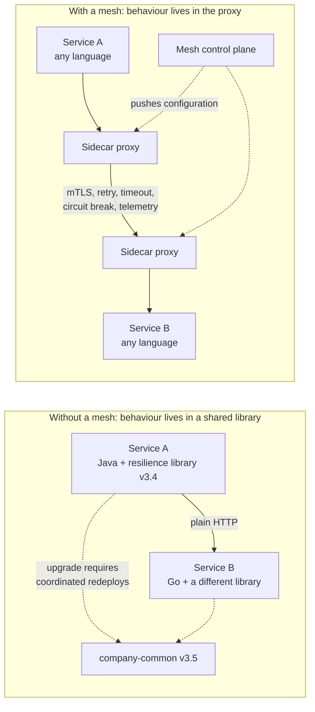
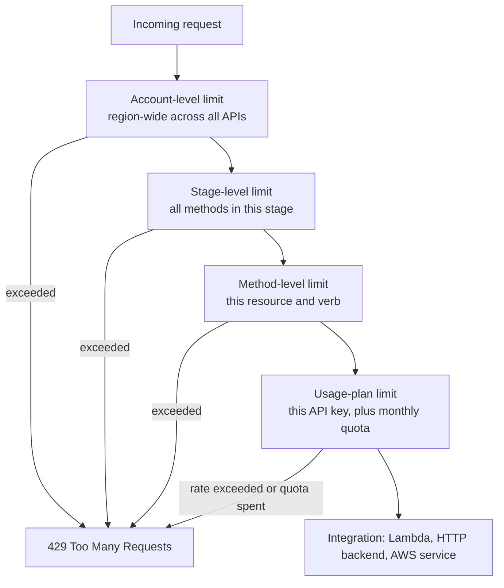
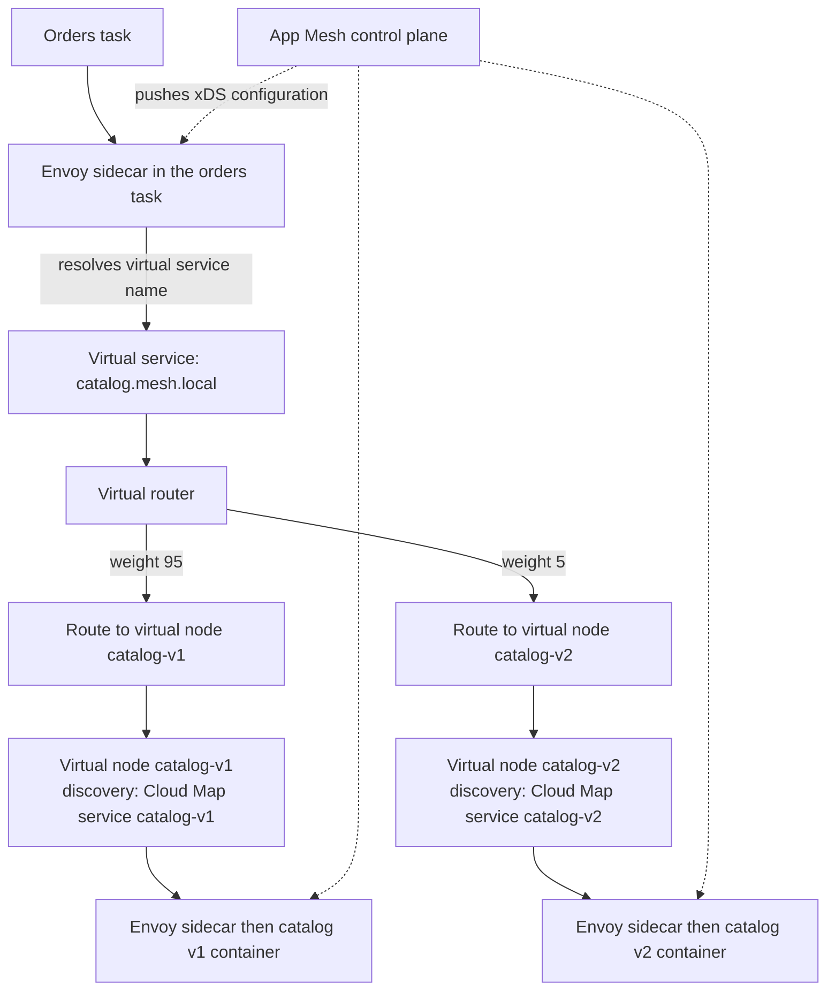
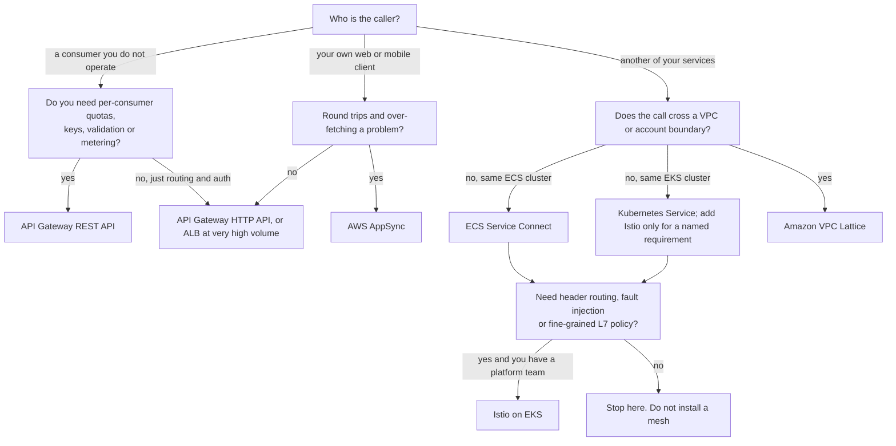
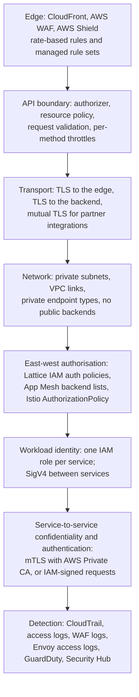
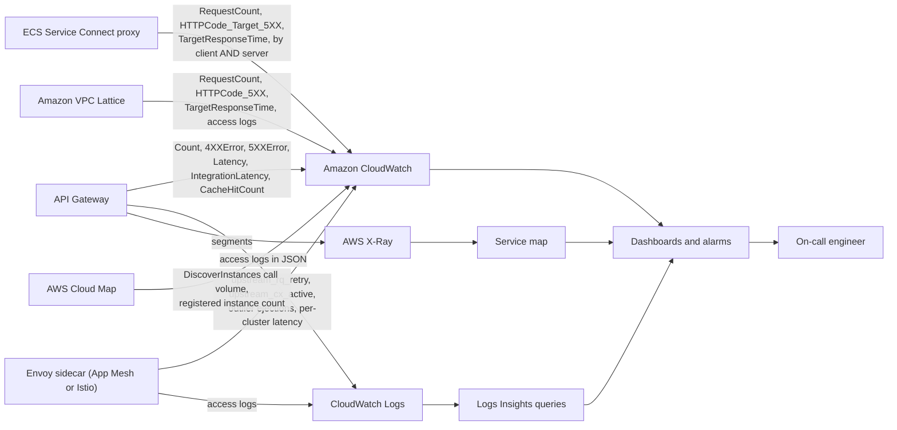
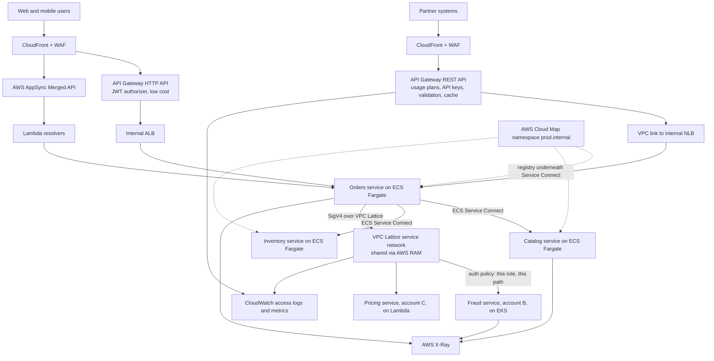

# API Management and Service Mesh on AWS

---

## Definition

Three distinct capabilities are commonly bundled under "API infrastructure", and conflating them is the single most common conceptual error in this part of the syllabus.

**API management** is the discipline of exposing a service's operations to consumers as a governed product. It covers the contract (a specification consumers can generate clients from), authentication and authorisation, request validation, rate limiting and quotas per consumer, versioning and deprecation, metering and monetisation, caching, and developer-facing documentation. On AWS its primary instrument is **Amazon API Gateway**.

**Service discovery** is the mechanism by which one service obtains a currently valid network address for another, given that in a container or serverless environment those addresses change continuously  a task is replaced, a pod is rescheduled, an Auto Scaling group scales out, and every one of those events changes the set of valid addresses. On AWS its primary instrument is **AWS Cloud Map**, sitting underneath ECS service discovery and ECS Service Connect, alongside DNS through Route 53 private hosted zones and Kubernetes' own Service and CoreDNS mechanism.

**Service mesh** is a layer of proxies, deployed alongside every workload and configured from a central control plane, that intercepts all service-to-service traffic and applies cross-cutting network policy: mutual TLS with automatic certificate rotation, retries, timeouts, circuit breaking, outlier ejection, weighted traffic splitting for canaries, header-based routing, and uniform L7 telemetry  all without any application code being modified. On AWS the historical instrument was **AWS App Mesh**; its successors are **Amazon ECS Service Connect**, **Amazon VPC Lattice**, and the open-source meshes on EKS.

| Concern | Direction | Question it answers | AWS instruments |
|---|---|---|---|
| **API management** | North–south | How do external clients call us, under what contract, and at what rate? | Amazon API Gateway, AWS AppSync, AWS WAF, Amazon Cognito |
| **Service discovery** | East–west | Where is the `catalog` service right now? | AWS Cloud Map, Route 53 private hosted zones, ECS Service Connect, Kubernetes Services and CoreDNS |
| **Service mesh / application networking** | East–west | How do all internal calls behave, and how do I change that without touching code? | ECS Service Connect, Amazon VPC Lattice, Istio or Linkerd on EKS; formerly AWS App Mesh |
| **Load balancing** | Both | Which instance handles this request? | Application Load Balancer, Network Load Balancer, client-side balancing inside a mesh proxy |

!!! note "A gateway is not a mesh, and putting one in the middle is a design error"

    Students frequently propose routing internal service-to-service traffic through API Gateway "for consistency". This doubles the cost, adds a hop with its own latency and failure mode, makes internal calls indistinguishable from customer traffic in every metric and log, and consumes API Gateway quotas that exist for external traffic. The two layers exist for different reasons and different threat models: the gateway governs a boundary you do not control, and the mesh governs traffic entirely inside your own trust domain.

Within an AWS architecture these layers stack. Requests arrive at Route 53, pass CloudFront and AWS WAF, and enter through API Gateway, AppSync or an ALB. From there they reach services running on ECS, EKS, EC2 or Lambda inside a VPC. Those services then talk to one another through a discovery mechanism and, if one is present, a mesh or VPC Lattice. Behind them sit the per-service data stores of [chapter 4.1](topic1.md).

---

## Why This Service or Concept Exists

### The API management problem

Before managed API gateways, every team exposing an HTTP API implemented the same list of concerns itself, badly and differently:

| Concern | What each team built | Consequence |
|---|---|---|
| Authentication | A bespoke token check in a middleware | Twelve implementations, twelve sets of bugs, no central revocation |
| Rate limiting | An in-process counter, or nothing | Per-instance limits that do not compose; one abusive consumer saturates the service |
| Quotas per consumer | Usually nothing | No way to offer tiered access or to bill by usage |
| Request validation | Inside the handler, after the request was accepted | Malformed requests consume compute before being rejected |
| Versioning | A path prefix and hope | No deprecation mechanism; old versions live forever |
| Documentation | A wiki page, stale within a month | Consumers integrate against behaviour rather than contract |
| Metering | Log parsing | No reliable answer to "what does this consumer cost us?" |
| Caching | A cache inside the service | Cached responses still consume a connection and a thread |

The economic argument for a managed gateway is that every one of these is undifferentiated: no business wins customers by having a better rate limiter. AWS introduced API Gateway to make them configuration rather than code, and to move rejection of bad or excessive traffic to a point **before** it costs you compute.

### The service-discovery problem

In a static environment, service B's address was written in service A's configuration file, because it did not change. Containers and serverless demolished this assumption. A Fargate task in `awsvpc` mode receives a fresh private IP each time it starts; a Kubernetes pod's IP is valid only for that pod's lifetime; an Auto Scaling group replaces instances continuously. The set of valid addresses for a logical service therefore changes many times a day, and in an autoscaling system, many times an hour.

| Era | Discovery mechanism | Failure mode |
|---|---|---|
| Physical servers | IP in a config file or `/etc/hosts` | Manual, error-prone, but stable |
| Virtual machines | DNS records updated by hand or by a script | Stale records point at dead hosts |
| Early cloud | A load balancer per service, addressed by its DNS name | Works, but a load balancer per service pair is expensive and adds a hop |
| Self-managed discovery | Consul, ZooKeeper or etcd operated by you | A distributed consensus system to run, which is a full-time job with no business differentiation |
| Managed discovery | AWS Cloud Map, ECS Service Connect, Kubernetes Services | Discovery becomes configuration; the remaining hazards are DNS caching and stale health state |

The reason AWS built Cloud Map rather than telling everyone to use DNS is that DNS is a poor fit for the job in three specific ways: it carries no metadata beyond an address, its caching behaviour is controlled by clients that frequently ignore TTLs, and it cannot express health in a way clients respect promptly. Cloud Map keeps a queryable registry with **custom attributes** and health state, and *also* projects DNS records for clients that want them.

### The service-mesh problem

Once you have many services calling one another, a set of network behaviours must be implemented consistently by all of them:

- Mutual TLS, so that a callee can authenticate its caller rather than trusting the network.
- Timeouts on every outbound call, because a call without a timeout is a hang waiting to happen.
- Retries with backoff and jitter, at exactly one layer.
- Circuit breaking and outlier ejection, so a failing instance stops receiving traffic.
- Connection pooling and keep-alive, because per-request TLS handshakes dominate small internal calls.
- Weighted traffic splitting, so a new version can take five per cent of traffic.
- Consistent L7 telemetry: request rate, error rate and latency per caller–callee pair.

Implemented in application code, these become a shared library, which must exist for every language the estate uses, must be upgraded in lockstep across every service  reintroducing precisely the coupling microservices exist to remove  and is invariably implemented slightly differently in each language.

The mesh's insight is to move all of it **out of the process** and into a proxy that intercepts the workload's traffic. The application makes a plain HTTP call to a plain hostname; the proxy performs discovery, load balancing, mTLS, retries and telemetry. Policy is expressed centrally and applied uniformly, in any language, without recompiling anything.

```mermaid
flowchart LR
    subgraph WITHOUT["Without a mesh: behaviour lives in a shared library"]
        A1["Service A<br/>Java + resilience library v3.4"] -->|"plain HTTP"| B1["Service B<br/>Go + a different library"]
        A1 -.->|"upgrade requires<br/>coordinated redeploys"| L1["company-common v3.5"]
        B1 -.-> L1
    end
    subgraph WITH["With a mesh: behaviour lives in the proxy"]
        A2["Service A<br/>any language"] --> P2["Sidecar proxy"]
        P2 -->|"mTLS, retry, timeout,<br/>circuit break, telemetry"| P3["Sidecar proxy"]
        P3 --> B2["Service B<br/>any language"]
        CP["Mesh control plane"] -.->|"pushes configuration"| P2
        CP -.-> P3
    end
```

### Why AWS is moving away from App Mesh

App Mesh implemented this model faithfully: an AWS-managed control plane configuring Envoy sidecars, with resources named virtual services, virtual nodes, virtual routers and routes. It worked, and its concepts are the standard concepts.

But the sidecar model has real costs  a proxy container per task or pod consuming CPU and memory multiplied by every replica, an extra network hop within the pod, added start-up time, and a new failure surface where a misconfigured proxy silently breaks traffic. And App Mesh's scope was limited to a mesh: it did not solve connectivity **across** VPCs and accounts, which is where large organisations actually struggle.

AWS's answer was to split the problem. **ECS Service Connect** handles the within-ECS case with a managed proxy that AWS injects and configures, so you never write proxy configuration. **Amazon VPC Lattice** handles the across-VPC, across-account, across-compute-type case in the VPC data plane itself, with no sidecars at all and IAM-based auth policies. Between them they cover most of what App Mesh was used for, with materially less operational surface. Teams needing the full expressiveness of a mesh  fine-grained L7 policy, fault injection, complex traffic-shifting rules  use Istio on EKS, where the ecosystem is far richer than App Mesh ever was.

!!! warning "App Mesh end of support: 30 September 2026"

    After that date App Mesh is not a supportable choice for new or existing production workloads. If you encounter it in an existing estate, the migration paths are: **ECS workloads** to ECS Service Connect for in-cluster discovery and client-side balancing, or to VPC Lattice where traffic crosses VPC or account boundaries; **EKS workloads** to Istio or Linkerd where a full mesh is genuinely needed, or to VPC Lattice with the Gateway API controller where the requirement is connectivity rather than mesh policy. Plan the migration around the traffic paths, not around a like-for-like resource mapping, because the successor services have different models rather than different names for the same model.

---

## Core Concepts

### API management vocabulary

| Term | Meaning |
|---|---|
| **API** | A managed collection of resources and methods with a contract, deployed to stages |
| **Resource** | A path segment in a REST API, such as `/orders/{orderId}` |
| **Method** | An HTTP verb on a resource, with its own authorisation, validation, integration and throttle |
| **Integration** | How the method reaches a backend: Lambda proxy, Lambda custom, HTTP proxy, HTTP custom, AWS service, or mock |
| **Proxy integration** | The request is passed to the backend essentially untouched and the backend's response is returned as-is; the default and the simplest |
| **Mapping template** | A Velocity template transforming the request or response; used in non-proxy integrations to decouple the external contract from the backend's shape |
| **Stage** | A named deployment of an API  `dev`, `prod`  with its own variables, throttles, caching, logging and WAF association |
| **Deployment** | An immutable snapshot of the API's configuration, promoted to a stage |
| **Stage variable** | A name-value pair usable in integration configuration, enabling one API definition to point at different backends per stage |
| **Usage plan** | A throttle and quota applied to a set of API keys across specified stages; the mechanism for commercial tiers |
| **API key** | An identifier associated with a usage plan; an identity for **metering**, not for authentication |
| **Authorizer** | The mechanism authenticating a caller: IAM, a Cognito user pool, a Lambda (token or request) authoriser, or JWT on HTTP APIs |
| **Resource policy** | An IAM-style policy on the API itself, restricting by source VPC endpoint, IP range or account; the only way to make an API genuinely private |
| **Request validator** | Edge-side validation of body against a JSON Schema model and of required parameters, rejecting malformed requests before integration |
| **Model** | A JSON Schema attached to an API, used for validation and SDK generation |
| **VPC link** | A managed connection from API Gateway to a private backend. REST APIs use VPC links V1 to an NLB, or  since November 2025  VPC links V2 to an ALB; HTTP APIs reach an ALB, NLB or Cloud Map service |
| **Custom domain and base-path mapping** | A hostname you own, mapping different base paths to different APIs  the mechanism that federates REST APIs across teams |
| **Canary release** | A stage configuration sending a percentage of traffic to a new deployment with separate metrics |
| **Throttling** | Rate and burst limits, applied at account, stage, method and usage-plan levels |
| **Edge-optimized, regional, private** | REST API endpoint types: fronted by CloudFront, served from the Region, or reachable only via VPC endpoints |

### The three API Gateway types

This is examined constantly and misremembered constantly.

| Dimension | **REST API** | **HTTP API** | **WebSocket API** |
|---|---|---|---|
| Positioning | Full-featured API management | Lower cost, lower latency, fewer features | Bidirectional, stateful connections |
| Relative cost per request | Highest | Substantially lower | Charged per message and per connection-minute |
| API keys and usage plans | Yes | **No** | No |
| Request validation against a model | Yes | No | No |
| Mapping templates (VTL) | Yes | No (parameter mapping only) | Yes |
| Caching | Yes, per stage and per method | **No** | No |
| Private endpoint type | Yes, with a resource policy | No | No |
| Resource policies | Yes | No | No |
| WAF association | Yes | **No** (place CloudFront in front) | No |
| Authorisation | IAM, Cognito, Lambda authorisers | JWT (OIDC/OAuth2), IAM, Lambda authorisers | IAM, Lambda authorisers |
| VPC link targets | NLB (VPC links V1); ALB (VPC links V2, since Nov 2025). **Not** Cloud Map | ALB, NLB, or Cloud Map service | n/a |
| Canary releases | Yes | No (use weighted stages or route-level integrations) | No |
| X-Ray tracing | Yes | Yes | Yes |
| Typical use | Partner and public APIs needing governance and metering | Internal or first-party APIs, Lambda proxying, cost-sensitive high volume | Chat, live dashboards, notifications, collaborative editing |

!!! danger "The most common API Gateway exam trap"

    **HTTP APIs do not support API keys, usage plans, request validation, caching, resource policies or direct WAF association.** If a scenario mentions per-consumer quotas, tiered partner access, edge validation against a schema, or a private API restricted to a VPC endpoint, the answer is a **REST API**, and any option offering an HTTP API is wrong regardless of how attractive its lower cost sounds. Conversely, if a scenario stresses lowest cost and lowest latency for a simple Lambda proxy with JWT auth, the answer is an **HTTP API** and choosing REST is over-engineering.

### Throttling: four levels, and how they interact

```mermaid
flowchart TD
    R["Incoming request"] --> A["Account-level limit<br/>region-wide across all APIs"]
    A -->|"exceeded"| X429["429 Too Many Requests"]
    A --> S["Stage-level limit<br/>all methods in this stage"]
    S -->|"exceeded"| X429
    S --> M["Method-level limit<br/>this resource and verb"]
    M -->|"exceeded"| X429
    M --> U["Usage-plan limit<br/>this API key, plus monthly quota"]
    U -->|"rate exceeded or quota spent"| X429
    U --> I["Integration: Lambda, HTTP backend, AWS service"]
```

Throttling uses a **token bucket**: a steady **rate** refills the bucket, and a **burst** is the bucket's capacity, allowing short spikes above the rate. The most specific applicable limit wins, and every level can reject independently. Two consequences matter architecturally. First, throttling is your **backend's protection**, so the limits should be derived from what the backend can actually sustain  a Lambda function's reserved concurrency, or an Aurora cluster's connection ceiling  not from a round number. Second, a 429 is a **well-formed, immediate** rejection that a well-behaved client backs off from, which is vastly better for the system than the timeout the client would otherwise experience; load shedding at the edge is a reliability feature, not a punishment.

### Service discovery: the four mechanisms

| Mechanism | Where the routing decision is made | Extra network hop | Health awareness | Metadata beyond an address |
|---|---|---|---|---|
| **DNS (Route 53 private hosted zone, Cloud Map DNS)** | In the client, after resolution | No | Only by removing records; clients cache past TTL | No |
| **API-based registry (Cloud Map `DiscoverInstances`)** | In the client | No | Yes, filterable by health status | **Yes**: custom attributes such as version, region, capability |
| **Server-side load balancer (ALB, NLB)** | At the load balancer | **Yes** | Yes, with configurable health checks | No |
| **Client-side balancing via a proxy (Service Connect, mesh sidecar, VPC Lattice)** | In the caller's local proxy | No network hop | Yes, with outlier ejection | Yes, via the control plane |

**Why DNS caching is the recurring failure.** A client resolves `catalog.internal`, receives three IPs, and caches them  often far longer than the TTL, because many runtimes and connection pools cache DNS for the process lifetime or indefinitely. A task is replaced; its IP is now dead or, worse, reassigned to something else. The client continues sending traffic to it until something forces re-resolution. This is the specific reason API-based discovery and proxy-based discovery exist, and it is why "just use DNS" is an inadequate answer for high-churn workloads.

### AWS Cloud Map vocabulary

| Term | Meaning |
|---|---|
| **Namespace** | A logical grouping with a name such as `production.internal`; public DNS, private DNS (backed by a Route 53 private hosted zone), or API-only (no DNS at all) |
| **Service** | A named logical service within a namespace, defining the DNS record type and health-check configuration for its instances |
| **Service instance** | One registered endpoint: an IP and port, or a CNAME, plus arbitrary **custom attributes** |
| **`RegisterInstance` / `DeregisterInstance`** | The API calls that add or remove an instance; ECS calls these automatically for you |
| **`DiscoverInstances`** | The API-based lookup, returning instances filtered by namespace, service, health status and custom attributes |
| **Custom attributes** | Arbitrary key-value pairs on an instance  `VERSION=2.1`, `AZ=us-east-1a`, `CAPABILITY=gpu`  filterable at discovery time. This is Cloud Map's distinguishing feature over DNS |
| **Health check configuration** | Route 53 health checks for public namespaces, or **custom health status** you set yourself for private ones |
| **`HealthCheckCustomConfig`** | Health state reported by an external system, such as the ECS agent, rather than probed by Route 53 |

The relationship worth memorising: **ECS service discovery and ECS Service Connect are both built on Cloud Map.** When you enable either, ECS creates a Cloud Map namespace and service and registers and deregisters instances on your behalf as tasks start and stop. Cloud Map is the registry underneath; Service Connect adds the managed proxy and client-side balancing on top.

### Service mesh architecture

A mesh has two planes, and understanding the split explains almost everything about mesh behaviour under failure.

**The data plane** is the set of proxies  Envoy, in App Mesh and Istio  deployed with each workload, typically as a sidecar container in the same task or pod, sharing its network namespace. Traffic is redirected into the proxy by `iptables` rules or, in newer models, by a node-level component. The proxy performs discovery, load balancing, mTLS, retries, timeouts, circuit breaking and telemetry emission. **All application traffic flows through the data plane.**

**The control plane** computes configuration from the mesh's declared resources and pushes it to the proxies. It is not on the request path.

The critical consequence, exactly parallel to the ECS and EKS control-plane discussion in Unit II: **if the control plane fails, existing traffic continues to flow**, because each proxy holds its last-known configuration. What you lose is the ability to *change* routing, and the ability for proxies to learn about newly started endpoints. This bounds the blast radius of a control-plane incident and is why a mesh's control plane, though important, is not a single point of total failure. It is also why placing a control-plane call on the request path is a design error.

### App Mesh resource model

App Mesh's vocabulary is the standard vocabulary for this concept and remains worth knowing even as the service is retired, because Istio's model maps onto it closely.

| App Mesh resource | Meaning | Nearest Istio equivalent |
|---|---|---|
| **Mesh** | The top-level boundary containing all other resources | The mesh itself, scoped by control plane |
| **Virtual node** | A logical pointer to an actual workload  an ECS service, a Kubernetes deployment  with its service discovery, listeners, health checks, backends and TLS configuration | `DestinationRule` plus workload labels |
| **Virtual service** | The **name callers use**, backed either by a virtual node directly or by a virtual router | `VirtualService` (the name) plus `Service` |
| **Virtual router** | A routing construct owning routes; the point at which traffic is split between versions | `VirtualService` route rules |
| **Route** | A match condition (path, header, method, gRPC service) and weighted targets, plus retry policy and timeouts | An HTTPRoute rule with weights |
| **Virtual gateway** | An ingress point into the mesh not associated with a single workload | `Gateway` |
| **Gateway route** | Routing rules for traffic entering through a virtual gateway | Gateway-attached route |
| **Backend** | A virtual service that a virtual node is permitted to call; **App Mesh denies unlisted backends by default** | Sidecar resource / authorization policy |

```mermaid
flowchart TD
    CLIENT["Orders task"] --> ENVOYA["Envoy sidecar in the orders task"]
    ENVOYA -->|"resolves virtual service name"| VS["Virtual service: catalog.mesh.local"]
    VS --> VR["Virtual router"]
    VR -->|"weight 95"| RN1["Route to virtual node catalog-v1"]
    VR -->|"weight 5"| RN2["Route to virtual node catalog-v2"]
    RN1 --> VN1["Virtual node catalog-v1<br/>discovery: Cloud Map service catalog-v1"]
    RN2 --> VN2["Virtual node catalog-v2<br/>discovery: Cloud Map service catalog-v2"]
    VN1 --> T1["Envoy sidecar then catalog v1 container"]
    VN2 --> T2["Envoy sidecar then catalog v2 container"]
    CP["App Mesh control plane"] -.->|"pushes xDS configuration"| ENVOYA
    CP -.-> T1
    CP -.-> T2
```

The mental model that makes this click: a **virtual service is a name**, a **virtual node is a workload**, and a **virtual router is the decision between them**. A canary is a change to route weights on the virtual router  no deployment, no application change, effective in seconds. That is the capability a mesh is actually bought for.

### ECS Service Connect

Service Connect is AWS's answer for service-to-service communication **within ECS**, and it is the recommended replacement for App Mesh for that case.

You declare, in the ECS service definition, a namespace and  for services that accept traffic  a **discovery name** and **client aliases**. ECS injects and manages an Envoy proxy in each task, registers endpoints in Cloud Map, and configures the proxy for you. Callers use a short stable name such as `http://catalog:8080`, which resolves inside the task to the local proxy.

What you get without writing any proxy configuration: endpoint discovery, client-side load balancing across healthy endpoints, connection pooling and reuse, outlier ejection of failing endpoints, automatic retry of connection-level failures, and per-request metrics broken down **by client service and server service** in the `ECS/ServiceConnect` CloudWatch namespace. That last item is genuinely valuable and hard to obtain otherwise: it answers "which caller is causing the callee's errors" with no application instrumentation.

What you do not get, relative to a full mesh: fine-grained L7 routing on headers, fault injection, complex authorisation policy, and cross-cluster or cross-account reach. For those, VPC Lattice or Istio.

### Amazon VPC Lattice

VPC Lattice is application networking built **into the VPC data plane**, with no sidecars. Its scope is deliberately different from a mesh: it connects services **across VPCs, accounts and compute types**.

| Term | Meaning |
|---|---|
| **Service network** | The logical boundary that services and VPCs associate with; the unit shared across accounts through AWS Resource Access Manager |
| **Service** | A logical service with listeners and routing rules, registered into one or more service networks |
| **Listener** | Protocol and port on which the service accepts traffic, with rules |
| **Listener rule** | Path, header or method match, with weighted forwarding to target groups |
| **Target group** | Targets of a type: instance, IP, Lambda function, or an ALB |
| **Auth policy** | An **IAM policy** attached to a service network or service, authorising callers by IAM principal  the mechanism that makes access control identity-based rather than network-based |
| **Service network VPC association** | Makes the service network reachable from a VPC, without peering or Transit Gateway routes |
| **DNS name** | A managed name per service, resolvable from any associated VPC |

The properties that matter architecturally: it works **across overlapping CIDRs**, because it is not routing at layer 3; it treats **Lambda, ECS, EKS and EC2 uniformly** as targets; it authorises with **IAM** rather than security groups, so "the orders service may call the catalogue service" is expressed as an identity statement; and it requires **no proxy in your workloads**, so there is no per-replica CPU and memory overhead and nothing to upgrade inside your tasks.

!!! tip "How to choose among the three successors"

    **ECS Service Connect** when the traffic is service-to-service **inside ECS** and you want discovery, client-side balancing and per-caller telemetry with essentially no configuration. **Amazon VPC Lattice** when traffic crosses **VPC, account or compute-type boundaries**, or when you want IAM-based authorisation between services, or when overlapping CIDRs make traditional networking painful. **Istio or Linkerd on EKS** when you genuinely need full mesh expressiveness  header-based routing, fault injection, fine-grained L7 authorisation policy, mesh-wide mTLS with a specific certificate authority  and you have a platform team to operate it. Choosing a full mesh because it is standard practice buys a control plane, a certificate authority, a proxy per pod and a permanent upgrade obligation in exchange for features you may never configure.

---

## AWS Service Deep Dive

!!! warning "On numbers and quotas"

    Quotas below are representative as of 2026, mostly **soft** and adjustable through AWS Service Quotas, and they vary by Region and account. Verify in the Service Quotas console for the account and Region you are designing in. Pricing is described as dimensions and relative positions only.

### Amazon API Gateway

**Purpose.** Present a governed, managed front door for APIs: authenticate and authorise callers, validate and transform requests, throttle and meter per consumer, cache responses, route to backends across compute types, and do all of it before a request consumes any of your compute.

**Architecture.** API Gateway is a fully managed regional service. For **edge-optimized** REST APIs, AWS also provisions a CloudFront distribution in front of the regional endpoint, so TLS terminates at the edge and requests travel the AWS backbone to the Region. For **regional** endpoints, clients reach the Region directly  usually preferred when you operate your own CloudFront distribution, because a stacked distribution adds a hop without benefit. For **private** endpoints, the API is reachable only through interface VPC endpoints and a resource policy restricting to those endpoint IDs. A request is matched to a resource and method, evaluated against the authoriser, validated, transformed by mapping templates if the integration is non-proxy, and forwarded to the integration; the response follows the reverse path.

**Important features.**

| Feature | What it does | Why it matters |
|---|---|---|
| **Stages and deployments** | Immutable deployment snapshots promoted to named stages | Rollback is promoting a previous deployment; environments differ by stage variables, not by separate API definitions |
| **Usage plans and API keys** | Per-consumer rate, burst and monthly quota | The defining API-management capability; REST APIs only |
| **Request validation** | Body validated against a JSON Schema model, required parameters checked | Malformed requests rejected at the edge, never reaching compute |
| **Mapping templates** | VTL transformation of request and response | Decouples the public contract from the backend's shape, so a backend refactor does not break consumers |
| **Caching** | Per-stage cache with per-method TTL and configurable cache keys | Absorbs repeat reads; REST APIs only |
| **Canary release** | A percentage of stage traffic to a new deployment with separate metrics | Progressive delivery at the API layer, no backend change |
| **Resource policy** | IAM-style policy on the API restricting by VPC endpoint, IP or account | The only way to make an API genuinely private |
| **VPC link** | Private connectivity to backends in a VPC | Keeps backends off the internet. REST: NLB (V1) or ALB (V2, since Nov 2025), never Cloud Map; HTTP: ALB, NLB or Cloud Map |
| **Custom domain and base-path mapping** | One hostname mapped to several APIs by base path | Federates REST APIs across teams without a single shared API artefact |
| **Lambda authoriser** | Custom authentication returning an IAM policy, with caching by token or by request parameters | Bespoke token schemes; the policy cache is essential or every request pays the authoriser's latency |
| **Mock integration** | Returns a configured response with no backend | Contract-first development: publish the API before the service exists |
| **AWS service integration** | Calls DynamoDB, SQS, Step Functions and others directly | Removes a Lambda function from simple pass-throughs; genuinely reduces cost and latency |
| **Access logging and execution logging** | Structured access logs, plus per-request execution detail | Execution logging is verbose and expensive; enable deliberately |
| **WAF association** | Web ACL on a REST API stage | Managed and rate-based rules; HTTP APIs need CloudFront in front instead |

**Limitations.** A hard integration timeout  historically 29 seconds, now raisable on REST APIs but still bounded  means long-running work must be made asynchronous, typically by returning 202 with a status resource. Payload size is capped in the tens of megabytes for REST, so large uploads belong on S3 presigned URLs. VTL mapping templates are powerful and genuinely unpleasant to debug and test. HTTP APIs omit a long list of features (see the comparison in Core Concepts) and that list is the most examined fact in this chapter. Caching is per stage with coarse invalidation. Per-request cost on REST APIs is high enough that it is the wrong instrument for very high-volume internal traffic.

**Pricing model.** Per million requests, with REST substantially more expensive per request than HTTP; data transfer out; the optional cache per hour by size; WebSocket charged per message plus connection-minutes. Practical implications: use HTTP APIs where the REST feature set is not needed; do not route internal east-west traffic through any API Gateway type; and remember the cache is charged whether or not it is hit, so it must earn its place.

**Performance characteristics.** Added latency is typically single-digit to low tens of milliseconds. A Lambda authoriser without result caching adds its full invocation latency, including cold starts, to **every** request  configuring the authoriser cache TTL is one of the highest-impact settings in the service. Edge-optimized endpoints reduce latency for globally distributed clients by terminating TLS at the edge; regional endpoints are better when you already front the API with your own CloudFront distribution.

**Scaling behaviour.** Scales automatically; the constraint is your account-level requests-per-second limit and your backend's capacity. The most common scaling incident is not API Gateway throttling but the backend behind it  Lambda concurrency exhausted, or an Aurora connection pool saturated. Throttles should therefore be set from measured backend capacity, so the gateway sheds load instead of forwarding a stampede.

**Availability.** Regional and multi-AZ by design. For multi-Region, use Route 53 health-check failover or latency routing across two regional deployments with a shared custom domain, and design for the fact that stage state and caches are per Region.

**Security features.** Five authorisation options  IAM (SigV4), Cognito user pools, Lambda token authorisers, Lambda request authorisers, and JWT authorisers on HTTP APIs; resource policies; mutual TLS on custom domains; WAF association; private endpoint types; per-method access control; and full CloudTrail coverage of control-plane changes.

**Service limits (representative).** Requests per second per account per Region, APIs per account, resources per API, stages per API and usage plans per account are all soft quotas in the hundreds to tens of thousands. Integration timeout and payload size are the hard ones that shape design.

**Common configurations.** REST API, regional endpoint behind your own CloudFront distribution with WAF; Cognito authoriser for first-party callers and API keys with usage plans for partners; request validation enabled on every method with a body; VPC link to an internal NLB for container backends; access logging in JSON to CloudWatch with execution logging off; X-Ray enabled; a custom domain with one base path per team's API.

### AWS Cloud Map

**Purpose.** Maintain an authoritative, queryable registry of the current, healthy endpoints of each logical service, together with arbitrary metadata, and optionally project that registry into DNS.

**Architecture.** Cloud Map holds namespaces, services and instances. For DNS-enabled namespaces it manages a Route 53 hosted zone  private for `PRIVATE_DNS`, public for `PUBLIC_DNS`  creating and removing records as instances register and deregister. API-only namespaces (`HTTP`) create no DNS at all and are queried solely with `DiscoverInstances`. Health state comes either from Route 53 health checks (public namespaces) or from a custom health status that an external system such as the ECS agent updates.

**Important features.** Custom attributes per instance, filterable at discovery time; health-aware discovery that can exclude unhealthy instances, with a configurable threshold that returns all instances rather than none if everything is unhealthy; automatic registration and deregistration when used through ECS; support for A, AAAA, SRV and CNAME record types, where SRV is the one that carries **port** information  important for dynamic port mapping.

**Limitations.** DNS-based discovery inherits every DNS caching problem, and Cloud Map cannot force a client to respect TTLs. There is no traffic management: Cloud Map tells you where instances are, and load balancing, retries and circuit breaking are somebody else's job. Instance registration is eventually consistent, so there is a brief window after a task starts during which it may not be discoverable. Quotas on instances per service and services per namespace are relevant for very large fleets.

**Pricing model.** Per registered instance per month, plus per million discovery API calls and per million DNS queries. The practical implication is that calling `DiscoverInstances` on every request is both slow and billable; cache the result for a few seconds in the client, which is exactly what a proxy-based approach does for you.

**Scaling and availability.** Regional and managed. Discovery calls are throttled per account, which is another reason not to place them on a per-request path.

**Security features.** IAM control over registration and discovery  worth using, since an attacker who can register an instance can redirect traffic. Private DNS namespaces are resolvable only from associated VPCs.

**Common configurations.** A private DNS namespace per environment, such as `prod.internal`; one Cloud Map service per logical service; ECS registering instances automatically; SRV records where ports vary; custom attributes recording version and capability where clients need to select among them.

### AWS App Mesh

!!! danger "End of support: 30 September 2026"

    This section is included because the syllabus requires it and because the concepts are the standard concepts. It is **not** a recommendation. New workloads should use ECS Service Connect, Amazon VPC Lattice, or Istio or Linkerd on EKS. Existing App Mesh workloads should be on a migration plan.

**Purpose.** Provide a managed control plane that configures Envoy sidecar proxies to standardise service-to-service communication  discovery, load balancing, retries, timeouts, circuit breaking, mTLS and telemetry  across ECS, EKS, EC2 and Fargate, without application changes.

**Architecture.** You declare mesh resources (virtual nodes, services, routers, routes, gateways) through the App Mesh API. The control plane translates them into Envoy **xDS** configuration and pushes it to each proxy over a long-lived gRPC stream. Each proxy is a sidecar container in the same task or pod as the application, sharing its network namespace; an init container installs `iptables` rules redirecting inbound and outbound traffic into the proxy. The application makes ordinary HTTP calls to ordinary hostnames; the proxy intercepts them, resolves the virtual service, selects an endpoint, applies policy and forwards.

**Important features.** Weighted routing for canaries and blue/green; retry policies with per-attempt timeouts; request and idle timeouts; outlier detection ejecting failing endpoints; connection pool limits acting as a bulkhead; mTLS with certificates from AWS Private CA or from files; TLS origination and termination at the proxy; virtual gateways for ingress; **explicit backend declaration**, so a virtual node may only call the virtual services it lists  a genuine security control; and access logs plus Envoy statistics exported to CloudWatch, Prometheus or X-Ray.

**Limitations, and why they matter.** The sidecar tax is real: one Envoy per replica, consuming CPU and memory multiplied across the fleet, plus added task start-up time and an extra in-pod hop each way. The Envoy version is your responsibility to keep current. Debugging is genuinely harder, because a request now traverses two proxies and a misconfiguration presents as a connection reset with no application-side explanation. Scope was limited to workloads you could put a sidecar into, so Lambda and managed services could not participate. Cross-account and cross-VPC connectivity was not solved. And the resource model  four resource types for what feels like one concept  is a real learning cost. Together these are why AWS moved on.

**Pricing model.** No charge for the App Mesh control plane; you pay for the compute the sidecars consume and for the telemetry they emit. That hidden compute cost is easy to underestimate: an Envoy sidecar sized at 256 CPU units and 512 MB, multiplied across four hundred tasks, is a substantial standing bill for infrastructure that serves no business function.

**Migration paths.**

| Existing App Mesh use | Successor | Notes |
|---|---|---|
| ECS service-to-service discovery and load balancing | **ECS Service Connect** | Closest replacement; AWS manages the proxy and its configuration |
| Weighted canary routing on ECS | **ECS Service Connect** with separate services, or **VPC Lattice** weighted target groups, or CodeDeploy blue/green | Lattice gives finer weighted control at the network layer |
| Cross-VPC or cross-account service calls | **Amazon VPC Lattice** | The case App Mesh never addressed well |
| mTLS between services | **VPC Lattice** with IAM auth policies, or **Istio** on EKS | Lattice authorises by IAM identity rather than certificate identity; if certificate-based mTLS is a hard requirement, Istio |
| Header-based routing, fault injection, fine-grained L7 policy | **Istio** on EKS | The only successor with full mesh expressiveness |
| Virtual gateway ingress | **ALB** with Ingress or Gateway API, or an **Istio gateway** | |

### Amazon VPC Lattice

**Purpose.** Provide application-layer connectivity, routing and IAM-based authorisation between services across VPCs, accounts and compute types, without peering, Transit Gateway routes, per-pair load balancers, or sidecar proxies.

**Architecture.** A **service network** is the boundary; services register into it and VPCs associate with it. Once a VPC is associated, workloads in that VPC resolve each service's managed DNS name and reach it through the Lattice data plane, which is implemented in the VPC infrastructure rather than in your workloads. A service has listeners and listener rules that match on path, header or method and forward to weighted target groups, whose targets may be instances, IPs, Lambda functions or an ALB. **Auth policies**  IAM policies attached to the service network or the individual service  decide which principals may call which paths and methods.

**Important features.** Cross-account sharing through AWS Resource Access Manager; operation across **overlapping CIDR ranges**, because it does not route at layer 3; uniform treatment of ECS, EKS, EC2 and Lambda targets; weighted routing for canaries; automatic TLS between client and service; request-level logging, metrics and access logs; and integration with the Kubernetes **Gateway API** through the AWS Gateway API Controller, so EKS workloads can declare Lattice resources as native Kubernetes objects.

**Limitations.** It is not a full mesh: no fault injection, no sidecar-level fine-grained policy, and a smaller L7 feature surface than Istio. There is a per-service and per-service-network hourly charge plus data processing, so it is not free connectivity. Some protocols and behaviours supported by a mesh are not supported. And it is a newer operational surface, so organisational familiarity is lower.

**Pricing model.** Per service-network hour, per service hour, plus data processed per gigabyte and requests. The architectural implication is that Lattice earns its cost when it replaces several internal load balancers, PrivateLink endpoints, or a peering topology; using it for a handful of services inside one VPC is usually more expensive than an internal ALB.

**Security features.** IAM auth policies as the primary control  genuinely different from security groups, because the statement is about a **principal** rather than a CIDR or a security group ID; security-group support on service-network VPC associations; TLS in transit; and full CloudTrail coverage.

**Common configurations.** One service network per environment, shared across accounts through RAM; one Lattice service per microservice, with an auth policy naming exactly the caller roles permitted; VPC associations for every VPC that must call in; the Gateway API controller on EKS clusters so that Kubernetes teams declare `Gateway` and `HTTPRoute` objects rather than Lattice APIs directly.

---

## Architecture Components

| Component | Responsibility |
|---|---|
| **Client** | Owns retry behaviour and therefore is a potential source of retry storms; its network characteristics determine whether the edge should be REST or GraphQL |
| **Amazon Route 53** | Public DNS and health-check failover; hosts the private zone that Cloud Map writes discovery records into |
| **Amazon CloudFront** | Edge TLS termination and caching; the required WAF attachment point for HTTP APIs, which cannot take a web ACL directly |
| **AWS WAF** | Managed rule sets and rate-based rules at CloudFront, ALB or a REST API stage; the cheapest rejection point in the stack |
| **AWS Shield** | DDoS protection, standard at the edge and Advanced where an SLA and response team are required |
| **Amazon API Gateway** | The governed north–south boundary: authentication, validation, throttling, quotas, metering, caching, versioning |
| **AWS AppSync** | The alternative north–south boundary for first-party clients; treated in [chapter 4.1](topic1.md) |
| **Application Load Balancer** | Shared L7 entry for container services and the low-cost high-volume alternative to a gateway for internal or first-party traffic |
| **Network Load Balancer** | L4 entry, static IPs, extreme connection counts; the required VPC link target for REST APIs |
| **VPC link** | The private path from API Gateway into a VPC, so backends need no public exposure |
| **AWS Cloud Map** | The service registry: namespaces, services, instances, health state and custom attributes |
| **Amazon ECS Service Connect** | Managed proxy plus Cloud Map registration giving in-ECS discovery, client-side balancing and per-caller telemetry |
| **Kubernetes Service and CoreDNS** | The equivalent mechanism inside EKS, with kube-proxy or eBPF handling the forwarding |
| **AWS App Mesh (end of support 30 September 2026)** | The historical managed mesh control plane configuring Envoy sidecars |
| **Envoy proxy** | The data plane of App Mesh and Istio: discovery, balancing, mTLS, retries, circuit breaking, telemetry |
| **Amazon VPC Lattice** | Cross-VPC, cross-account, cross-compute application networking with IAM auth policies and no sidecars |
| **AWS Private CA** | Issues the certificates a mesh uses for mTLS, with automated rotation |
| **AWS Certificate Manager** | Public certificates for custom domains on API Gateway, CloudFront and ALB |
| **Amazon Cognito** | Managed user pools issuing the JWTs that API Gateway and AppSync authorisers validate |
| **AWS Lambda** | Custom authorisers, and a first-class target for both API Gateway integrations and VPC Lattice target groups |
| **AWS IAM and STS** | SigV4 authentication for internal callers; the identities that Lattice auth policies name |
| **Amazon CloudWatch** | API Gateway and Lattice metrics, Service Connect per-caller metrics, Envoy statistics, access logs and alarms |
| **AWS X-Ray and ADOT** | Distributed tracing across the gateway, the mesh and the services |
| **AWS CloudFormation, CDK, Terraform** | The API definition, the mesh or Lattice configuration and the discovery namespaces expressed as versioned code |

Read structurally, these components form two distinct rings with deliberately different properties. The **north–south ring**  Route 53, CloudFront, WAF, API Gateway or AppSync, custom domains  is a **trust boundary**: everything arriving here is presumed hostile until authenticated, every consumer is metered, and the contract is versioned because you cannot force clients to upgrade. The **east–west ring**  Cloud Map, Service Connect, a mesh or Lattice, internal ALBs  is inside your trust domain, so its concerns are entirely different: not metering and monetisation but discovery under churn, uniform failure behaviour, mutual authentication between services, and telemetry attributing errors to a specific caller. Confusing the two produces the two classic errors: routing internal traffic through the gateway, which is expensive and pollutes every metric, and exposing an internal service directly to the internet because "it is behind a load balancer".

---

## Important AWS Terminology

| Term | Meaning |
|---|---|
| **API management** | Governing how external consumers call your services: contract, auth, throttling, quotas, versioning, metering |
| **North–south traffic** | Traffic entering or leaving the system from clients you do not operate |
| **East–west traffic** | Traffic between services inside your own trust domain |
| **REST API (API Gateway)** | The full-featured API type: usage plans, API keys, validation, caching, resource policies, WAF, canaries |
| **HTTP API (API Gateway)** | The lower-cost, lower-latency type without keys, usage plans, validation, caching, resource policies or direct WAF |
| **WebSocket API** | Bidirectional persistent connections, billed per message and connection-minute |
| **Stage** | A named deployment of an API with its own variables, throttles, cache, logging and WAF association |
| **Deployment** | An immutable snapshot of API configuration promoted to a stage |
| **Stage variable** | A name-value pair usable in integration configuration, enabling one definition across environments |
| **Proxy integration** | Passes the request through essentially untouched and returns the backend's response as-is |
| **Mapping template** | A VTL transformation decoupling the public contract from the backend's shape |
| **Model** | A JSON Schema attached to an API, used for request validation and SDK generation |
| **Request validator** | Edge-side rejection of malformed requests before any integration is invoked |
| **Usage plan** | Rate, burst and monthly quota applied to a set of API keys; REST APIs only |
| **API key** | A metering identity, **not** an authentication credential |
| **Authorizer** | IAM SigV4, a Cognito user pool, a Lambda token or request authoriser, or a JWT authoriser on HTTP APIs |
| **Authorizer result caching** | TTL-bounded caching of an authoriser's decision; without it every request pays the authoriser's latency |
| **Resource policy** | An IAM-style policy on the API restricting by VPC endpoint, source IP or account |
| **Endpoint type** | Edge-optimized (CloudFront-fronted), regional, or private (VPC endpoints only) |
| **VPC link** | Private connectivity from API Gateway to a backend. REST: NLB via VPC links V1, or ALB via VPC links V2 (since November 2025); never Cloud Map. HTTP: ALB, NLB or Cloud Map |
| **Custom domain and base-path mapping** | One hostname serving several independently deployed APIs by path prefix |
| **Canary release (API Gateway)** | A percentage of stage traffic routed to a new deployment with separate metrics |
| **Token bucket** | The throttling algorithm: a refill **rate** plus a bucket **burst** capacity |
| **Service discovery** | Obtaining a currently valid address for a logical service whose endpoints change constantly |
| **Namespace (Cloud Map)** | A grouping of services; public DNS, private DNS, or API-only (HTTP) |
| **Service instance (Cloud Map)** | One registered endpoint plus arbitrary custom attributes |
| **Custom attributes** | Key-value metadata on an instance, filterable at discovery time; Cloud Map's key advantage over DNS |
| **`DiscoverInstances`** | The API-based lookup returning healthy instances filtered by attributes |
| **`HealthCheckCustomConfig`** | Health state reported by an external system such as the ECS agent, rather than probed by Route 53 |
| **SRV record** | A DNS record carrying **port** as well as host; needed where ports are dynamic |
| **DNS caching** | Client-side retention of resolved addresses, frequently beyond TTL; the classic discovery failure |
| **ECS Service Connect** | ECS-managed discovery plus an injected, AWS-configured Envoy proxy giving client-side balancing and per-caller metrics |
| **Discovery name and client alias** | What a Service Connect service advertises, and the name and port callers use |
| **Service mesh** | A proxy layer applying uniform network policy to service-to-service traffic, configured centrally |
| **Data plane (mesh)** | The proxies that carry every request |
| **Control plane (mesh)** | The component computing and pushing proxy configuration; not on the request path |
| **Sidecar** | A proxy container in the same task or pod as the application, sharing its network namespace |
| **Envoy** | The proxy used by App Mesh and Istio |
| **xDS** | The protocol by which a control plane pushes configuration to Envoy |
| **Mesh (App Mesh)** | The top-level boundary containing all other App Mesh resources |
| **Virtual node** | A pointer to a real workload with its discovery, listeners, health checks, backends and TLS settings |
| **Virtual service** | The **name** callers use, backed by a virtual node or a virtual router |
| **Virtual router** | The construct owning routes; where traffic is split between versions |
| **Route** | A match condition plus weighted targets, retry policy and timeouts |
| **Virtual gateway** | An ingress point into the mesh not tied to a single workload |
| **Backend (App Mesh)** | A virtual service a virtual node is permitted to call; unlisted backends are denied by default |
| **Outlier detection** | Ejecting an endpoint that is returning errors, and probing before returning it to the pool |
| **Connection pool limits** | Per-destination caps acting as a bulkhead inside the proxy |
| **Traffic shifting** | Moving a percentage of requests to a new version by changing route weights, with no deployment |
| **mTLS** | Mutual TLS: both parties present certificates, so the callee authenticates the caller |
| **Amazon VPC Lattice** | Application networking across VPCs, accounts and compute types with IAM auth policies and no sidecars |
| **Service network** | The Lattice boundary that services register into and VPCs associate with |
| **Auth policy** | An IAM policy on a Lattice service network or service authorising callers by principal |
| **Service network VPC association** | Makes a service network reachable from a VPC without peering or Transit Gateway routes |
| **AWS Gateway API Controller** | The controller letting EKS teams declare Lattice resources as Kubernetes `Gateway` and `HTTPRoute` objects |

---

## Configuration Options

### API Gateway configuration

| Setting | Options | How to decide |
|---|---|---|
| **API type** | REST, HTTP, WebSocket | REST when you need keys, usage plans, validation, caching, resource policies or WAF; HTTP for cost-sensitive first-party or internal APIs; WebSocket for bidirectional traffic |
| **Endpoint type** | Edge-optimized, regional, private | Regional when you front it with your own CloudFront distribution; edge-optimized for globally distributed clients and no custom CDN; private for internal-only APIs, paired with a resource policy |
| **Integration type** | Lambda proxy, Lambda custom, HTTP proxy, HTTP custom, AWS service, mock | Proxy integrations by default; AWS service integration to eliminate a pass-through Lambda entirely; mock for contract-first development |
| **Authorisation** | None, IAM, Cognito, Lambda token, Lambda request, JWT | IAM for internal AWS callers; Cognito or JWT for first-party users; Lambda authorisers for bespoke schemes; never `NONE` on a mutating method |
| **Authorizer result TTL** | 0 to 3600 seconds | Set it. Zero means every request invokes the authoriser, adding its full latency and cost including cold starts |
| **Request validation** | None, body, parameters, both | Both, on every method that accepts input. Rejection at the edge is free capacity |
| **Throttle: rate and burst** | Per account, stage, method, usage plan | Derive from measured backend capacity  Lambda reserved concurrency, database connections  not from a round number |
| **Usage plan quota** | Requests per day, week or month | The commercial tier expressed technically; required for any metered partner API |
| **Caching** | Off, or a cache size with per-method TTL and cache key | On for idempotent reads with genuine repetition. **If the response varies per user, the identity must be in the cache key** |
| **Canary settings** | Percentage of traffic, stage variable overrides, separate metrics | Use for any change to a partner-facing API where rollback speed matters |
| **VPC link** | REST: NLB (V1) or ALB (V2); HTTP: ALB, NLB or Cloud Map | Always, for backends in a VPC. Note that a REST API cannot target a Cloud Map service at all. A public backend with a secret header is not a substitute |
| **Access logging** | Off, or a format string to CloudWatch or Firehose | On, in JSON, including request ID, API key ID, latency, integration latency and status |
| **Execution logging** | Off, ERROR, INFO with data tracing | ERROR in production. INFO with data tracing logs request bodies, which is both expensive and a data-protection hazard |
| **X-Ray tracing** | On or off | On |
| **Mutual TLS** | On a custom domain, with a truststore in S3 | For partner integrations requiring client certificates |
| **WAF web ACL** | Attached to a REST stage | Attached on anything internet-facing. HTTP APIs must use CloudFront instead |

### Cloud Map configuration

| Setting | Options | How to decide |
|---|---|---|
| **Namespace type** | Public DNS, private DNS, HTTP (API-only) | Private DNS for most internal services; HTTP when clients use `DiscoverInstances` and you want no DNS caching problem at all |
| **DNS record type** | A, AAAA, SRV, CNAME | A for fixed ports; **SRV** when ports vary, since SRV carries the port |
| **TTL** | Seconds | Low  15 to 60 seconds  for high-churn services; understand that many clients ignore TTL entirely |
| **Health check** | Route 53 health check, `HealthCheckCustomConfig`, or none | Custom config for private namespaces where ECS reports health; Route 53 checks only for publicly reachable endpoints |
| **Health-check threshold** | Integer | Governs how many failures flip status; too low causes flapping |
| **Custom attributes** | Arbitrary key-value pairs | Record version, AZ and capability where clients must select among instances; this is what DNS cannot do |
| **Discovery approach** | DNS resolution or `DiscoverInstances` | Prefer a proxy or a short client-side cache over either; never call `DiscoverInstances` per request |

### Service mesh and Lattice configuration

| Setting | Options | How to decide |
|---|---|---|
| **Do you need a mesh at all?** | None, ECS Service Connect, VPC Lattice, Istio or Linkerd | Start with none. Adopt Service Connect for ECS discovery, Lattice for cross-boundary connectivity, and a full mesh only for a named requirement it uniquely satisfies |
| **Proxy model** | Sidecar or ambient/node-level | Ambient mode (Istio) substantially reduces per-pod overhead; sidecars remain necessary on Fargate for EKS, where DaemonSets are unavailable |
| **mTLS mode** | Permissive or strict | Permissive during migration so unmeshed workloads still work; strict once every workload is enrolled, and verify with a negative test |
| **Retry policy** | Attempts, per-retry timeout, retryable conditions | Retries in the mesh **and** in the application is double-retrying; choose one layer. Never retry non-idempotent requests by default |
| **Timeouts** | Per-request and idle | Per-request timeout below the caller's own budget; deadline propagation where supported |
| **Outlier detection** | Consecutive errors, ejection duration, max ejection percentage | Cap max ejection percentage, or a correlated failure ejects the entire fleet and turns degradation into an outage |
| **Connection pool limits** | Max connections, max pending requests per destination | The bulkhead: prevents one slow destination consuming every connection |
| **Traffic split weights** | Percentages across route targets | Start at 1 to 5 per cent, watch error rate and latency, then step up. Automate the abort |
| **Backends (App Mesh)** | Explicitly listed virtual services | Deny-by-default is a real security control; list only what the node legitimately calls |
| **Lattice auth policy** | IAM policy on service network or service | Name specific principals and paths. An unset auth policy means the service network's association is the only control |
| **Lattice target type** | Instance, IP, Lambda, ALB | ALB targets when an existing ALB fronts the workload; Lambda targets to include functions in the same service network |

!!! warning "Two mesh settings that turn a small failure into an outage"

    First, **retries configured in both the mesh and the application**: three application retries over three mesh retries is nine requests per logical call, which is a retry storm generator. Decide on one layer and disable the other explicitly. Second, **outlier detection without a maximum ejection percentage**: when a shared dependency degrades, every endpoint starts returning errors, every endpoint is ejected, and the load balancer has no healthy targets left  converting a partial degradation into a total outage. Cap ejection at a fraction of the fleet, typically well under half.

---

## Design Considerations

```mermaid
flowchart TD
    A["Who is the caller?"] -->|"a consumer you do not operate"| B["Do you need per-consumer quotas,<br/>keys, validation or metering?"]
    A -->|"your own web or mobile client"| C["Round trips and over-fetching a problem?"]
    A -->|"another of your services"| D["Does the call cross a VPC or account boundary?"]
    B -->|"yes"| E["API Gateway REST API"]
    B -->|"no, just routing and auth"| F["API Gateway HTTP API, or ALB at very high volume"]
    C -->|"yes"| G["AWS AppSync"]
    C -->|"no"| F
    D -->|"no, same ECS cluster"| H["ECS Service Connect"]
    D -->|"no, same EKS cluster"| I["Kubernetes Service; add Istio only for a named requirement"]
    D -->|"yes"| J["Amazon VPC Lattice"]
    H --> K["Need header routing, fault injection<br/>or fine-grained L7 policy?"]
    I --> K
    K -->|"yes and you have a platform team"| L["Istio on EKS"]
    K -->|"no"| M["Stop here. Do not install a mesh"]
```

| Quality | What it means here | Design levers | The trade-off you accept |
|---|---|---|---|
| **Scalability** | The edge and the discovery layer absorb growth without becoming the bottleneck | API Gateway's automatic scaling; client-side balancing rather than a load balancer per pair; Lattice rather than a peering mesh | Account-level request quotas become a real ceiling; the backend, not the gateway, is usually what breaks first |
| **Availability** | A failure in the API or mesh layer does not take everything down | Multi-AZ managed services; proxies holding last-known configuration; Route 53 failover across Regions | A mesh adds a component that can fail; a misconfigured proxy fails closed and silently |
| **Reliability** | Uniform, correct behaviour under partial failure | Timeouts and retries at exactly one layer; outlier ejection with a cap; circuit breaking; throttling as load shedding | Retries configured in two places multiply load; ejection without a cap removes all capacity |
| **Latency** | Time added by the infrastructure itself | Authorizer caching; connection reuse; removing load balancer hops with client-side balancing; regional versus edge-optimized endpoints | A sidecar adds a hop each way; a gateway adds milliseconds; both are usually worth it, but not on internal high-volume paths |
| **Security** | Callers are authenticated and authorised at both rings | WAF at the edge; authorisers; resource policies; private endpoints and VPC links; mTLS or IAM auth policies east-west | Strict mTLS breaks unmeshed workloads; an auth policy misconfiguration denies legitimate traffic |
| **Cost** | Per-request and per-hour charges of the infrastructure | HTTP over REST where features permit; shared ALB; no gateway on internal traffic; Lattice replacing several load balancers | REST per-request cost at internal volume can exceed the compute it fronts; sidecar CPU and memory across a large fleet is a standing bill |
| **Operability** | What an engineer can see and change at three in the morning | Per-caller metrics from Service Connect; access logs; mesh proxy statistics; traffic weights changeable without deployment | A mesh makes the network debuggable in one sense and much harder to debug in another |
| **Portability** | How locked-in the choices are | Kubernetes Gateway API over vendor-specific resources; OpenAPI definitions as the source of truth | Managed services trade portability for operational relief, and that is usually the right trade |

!!! danger "The three highest-consequence design errors in this chapter"

    **One: routing east–west traffic through API Gateway.** It doubles cost, adds a hop, consumes quotas meant for external traffic, and makes internal calls indistinguishable from customer traffic in every metric and log you own. **Two: installing a service mesh with no specific requirement.** You acquire a control plane, a certificate authority, a proxy per replica and a permanent upgrade obligation, in exchange for features nobody configures  and you make every future incident harder to diagnose. **Three: an internal service exposed publicly because "it is behind a load balancer".** A load balancer is not an authorisation boundary. Backends belong in private subnets, reached through VPC links, VPC Lattice or PrivateLink.

---

## AWS Best Practices

### Operational Excellence

Define APIs contract-first as OpenAPI documents held in version control, and import them into API Gateway rather than clicking a console; the specification is then the source of truth for the gateway, the SDKs and the documentation simultaneously. Use stages and immutable deployments so that rollback is promoting a previous deployment, not redeploying old code. Give every API the same access-log format so that one Logs Insights query works across all of them. Adopt a deprecation policy with a stated notice period, publish it, and instrument usage per API key per version so you know who still calls a version you intend to retire  retiring a version you cannot measure is guesswork. On the east–west side, keep the mesh or Lattice configuration in the same repository as the service it configures, so a change to a route weight is reviewed like a code change. Rehearse traffic shifts and rollbacks until both are boring.

### Security

Authenticate at the edge and authorise at both rings. Never use an API key as an authentication mechanism  it identifies a consumer for metering and can be extracted from any client. Attach WAF with managed rules and a rate-based rule on anything internet-facing, remembering that an HTTP API needs CloudFront in front to get one. Keep backends in private subnets, reached through VPC links, and use resource policies to make private APIs genuinely private. Set authorisers on every method including the ones you think nobody calls. East–west, express permission as identity: an App Mesh backend list, a Lattice auth policy naming principals, or an Istio authorization policy  not a CIDR range. Turn mTLS to strict once every workload is enrolled, and verify with a negative test that an unenrolled workload is actually refused. Never enable data tracing in production execution logs; it writes request bodies to CloudWatch, which is both a cost problem and a data-protection incident waiting to be discovered.

### Reliability

Set throttles from measured backend capacity so the gateway sheds load rather than forwarding a stampede into an exhausted connection pool. Configure timeouts everywhere and retries in exactly one layer. Cap outlier-detection ejection so a correlated failure cannot remove the whole fleet. Prefer client-side load balancing with health awareness over DNS round-robin, because DNS caching means a dead endpoint keeps receiving traffic long after it should. Use canary releases at the API layer and weighted routes at the network layer, with automatic abort on an error-rate or latency breach. Design for the discovery registry being briefly unavailable: hold last-known-good endpoints rather than failing closed on a lookup error, and never place a discovery API call on the request path.

### Performance Efficiency

Cache the authoriser result  this is frequently the single largest latency win available on an API. Cache idempotent responses at the stage with a correct cache key. Reuse connections: keep-alive and HTTP/2 for internal calls, because per-request TLS handshakes dominate small internal requests, and this is a substantial and under-appreciated part of what Service Connect and mesh proxies give you. Remove load balancer hops from internal paths with client-side balancing. Choose regional endpoints when you already run CloudFront, so you are not stacking two distributions. Measure integration latency separately from total latency in API Gateway metrics, because the difference is exactly the overhead the gateway itself is adding and it tells you whether to optimise the gateway or the backend.

### Cost Optimization

Choose HTTP APIs over REST wherever the REST feature set is not genuinely required  the per-request difference is large and compounds at volume. Keep internal traffic off the gateway entirely. Share one ALB across many services with path or host routing rather than one per service, since load balancer hours are fixed and a low-traffic service pays the same as a busy one. Right-size the API Gateway cache or turn it off; it is charged whether or not it is hit. Watch the sidecar tax: a proxy sized at 256 CPU units and 512 MB across four hundred tasks is a large standing cost for infrastructure that serves no business function, and it is one of the strongest arguments for the sidecar-free VPC Lattice model. Evaluate Lattice against what it replaces  several internal load balancers, PrivateLink endpoints and a peering topology  rather than against zero. Set retention on access logs and reduce execution logging to `ERROR`.

### Sustainability

Rejecting abusive traffic at the edge means it never reaches compute, which is a genuine energy saving and not only a cost one. Caching at the edge and at the gateway removes work entirely. Removing a load balancer hop and reusing connections reduces packets, TLS handshakes and CPU per request across the whole estate. Sidecar-free models reduce standing compute. Trace sampling and log filtering reduce the volume of data stored and processed for telemetry, which at scale is a material share of a system's footprint.

---

## Security Considerations

```mermaid
flowchart TD
    A["Edge: CloudFront, AWS WAF, AWS Shield<br/>rate-based rules and managed rule sets"] --> B["API boundary: authorizer, resource policy,<br/>request validation, per-method throttles"]
    B --> C["Transport: TLS to the edge, TLS to the backend,<br/>mutual TLS for partner integrations"]
    C --> D["Network: private subnets, VPC links,<br/>private endpoint types, no public backends"]
    D --> E["East-west authorisation: Lattice IAM auth policies,<br/>App Mesh backend lists, Istio AuthorizationPolicy"]
    E --> F["Workload identity: one IAM role per service;<br/>SigV4 between services"]
    F --> G["Service-to-service confidentiality and authentication:<br/>mTLS with AWS Private CA, or IAM-signed requests"]
    G --> H["Detection: CloudTrail, access logs, WAF logs,<br/>Envoy access logs, GuardDuty, Security Hub"]
```

**API keys are not credentials.** They identify a consumer so that a usage plan can be applied and usage metered. They travel in a header, are extractable from any client that holds one, and grant no authorisation by themselves. A method protected only by an API key is effectively public. Pair keys with a real authoriser  IAM, Cognito, JWT or a Lambda authoriser  always.

**Lambda authorisers and the caching trade-off.** The result cache is keyed by the identity source, normally the token. A long TTL improves latency and cost but extends the window during which a revoked token still works. Choose the TTL from your revocation requirement, not from your latency target, and where revocation must be immediate, use short-lived tokens rather than a long cache.

**Resource policies are the only true privacy control.** A private endpoint type without a resource policy restricting `aws:SourceVpce` is not private in the way people assume. The two are used together: the endpoint type makes it reachable only through VPC endpoints, and the policy restricts which endpoints.

**The cache key is a security control.** An API Gateway cache configured without the caller's identity in the key on a response that varies per user will serve one user's data to another. This is not a theoretical risk; it is one of the more common serious misconfigurations in the service, and it is invisible in testing with a single account.

**Mutual TLS for partners.** Custom domains support mTLS with a truststore in S3, which is frequently a contractual requirement in financial and healthcare integrations. Certificate revocation and truststore rotation must be operationalised, or an expired partner certificate becomes an outage.

**East–west authorisation is where the models genuinely differ.** App Mesh's backend list is a coarse allow-list: this node may call these services. Istio's `AuthorizationPolicy` can express per-path, per-method, per-principal rules. VPC Lattice's auth policy is an **IAM policy**, which means the statement is "this IAM role may POST to this path on this service" and it is evaluated by IAM with all the tooling that implies  policy simulation, CloudTrail, condition keys, and Access Analyzer. For an AWS-native estate this is a genuine advantage, because it makes service-to-service authorisation reviewable with the same instruments as everything else.

**Strict mTLS has a migration hazard.** Turning mTLS from permissive to strict before every workload is enrolled breaks every unenrolled caller instantly and, because the failure is inside the proxy, with no application-level explanation. Enrol first, verify with a negative test, then switch  and make sure the negative test actually runs, because the failure mode of forgetting it is discovering at cutover that one batch job nobody remembered is now broken.

**Logging as a data-protection hazard.** API Gateway execution logging with data tracing writes request and response bodies to CloudWatch Logs. On any API handling personal or financial data this is a data-protection incident with a retention period attached. Use access logging with a field list you have reviewed, and keep execution logging at `ERROR`.

---

## Performance Optimization

**Cache the authoriser.** On an API with a Lambda authoriser and no result caching, the authoriser is invoked on every request, adding its full latency  including cold starts  to the critical path. Setting a TTL appropriate to your revocation requirement is often the single largest latency improvement available.

**Reuse connections and remove hops.** A small internal call spends more time on TCP and TLS establishment than on work if connections are not pooled. Service Connect and mesh proxies pool for you, which is a substantial and frequently unnoticed part of their value. Client-side load balancing also removes a network hop compared with an internal load balancer, and at high internal call volumes that hop is measurable.

**Choose the endpoint type deliberately.** Edge-optimized REST APIs terminate TLS near the client and traverse the AWS backbone, which helps distant clients. If you already run your own CloudFront distribution, a regional endpoint avoids stacking two distributions and the extra hop that entails.

**Use AWS service integrations to delete a hop entirely.** An API Gateway method that puts a message on SQS, writes an item to DynamoDB or starts a Step Functions execution can integrate directly with that service. Removing a pass-through Lambda removes an invocation, a cold start and a failure mode.

**Defeat the tail, not the mean.** In a system with a gateway, a proxy and several services, the mean is uninformative. Track p50, p90, p99 and p99.9 at the edge and per service, and use API Gateway's `IntegrationLatency` alongside `Latency`: the difference is precisely the gateway's own overhead, and knowing which of the two is growing tells you where to look.

**Tune the mesh for the traffic, not from defaults.** Default connection-pool sizes, retry counts and timeouts are starting points. A service with many concurrent callers needs a larger pool; a service on a user-facing path needs a tighter timeout than a batch consumer. And retries interact with timeouts: three retries with a one-second per-attempt timeout under a caller with a two-second budget means the caller gives up mid-retry, so the third attempt is work performed for nobody.

**Watch the sidecar's own resource usage.** An under-provisioned Envoy throttles, and the symptom is application latency with no application cause  a genuinely confusing incident. Monitor proxy CPU and memory as first-class metrics, not as an afterthought.

---

## Cost Optimization

| What you pay for | Dimension | Frequently overlooked |
|---|---|---|
| **API Gateway REST** | Per million requests, plus data transfer | Internal service-to-service traffic routed through the gateway, where per-request cost can exceed the compute it fronts |
| **API Gateway HTTP** | Per million requests, substantially cheaper than REST | Using REST for an API that needs none of REST's features |
| **API Gateway cache** | Per hour by cache size | Provisioned and charged whether or not it is hit; a cache on non-repeating traffic is pure cost |
| **WebSocket APIs** | Per message plus connection-minutes | Idle connections held open by backgrounded clients |
| **Lambda authorisers** | Per invocation | No result caching means one invocation per request |
| **Application Load Balancer** | Per hour plus LCU | One ALB per service instead of a shared ALB with routing rules |
| **AWS Cloud Map** | Per registered instance per month, plus discovery calls and DNS queries | `DiscoverInstances` on a per-request path, which is both slow and billable |
| **App Mesh sidecars** | The compute the Envoy containers consume | The control plane is free; the sidecars are not, and across a large fleet the standing cost is significant |
| **VPC Lattice** | Per service-network hour, per service hour, data processed, requests | Evaluated against zero it looks expensive; evaluated against the load balancers, PrivateLink endpoints and peering it replaces, it frequently is not |
| **NAT gateway** | Per hour and per GB | Service-to-service traffic leaving and re-entering the VPC because a private path was not configured |
| **Inter-AZ transfer** | Per GB | Chatty east–west traffic crossing AZs on every call |
| **CloudWatch Logs** | Per GB ingested and stored | Execution logging with data tracing; Envoy access logs at full verbosity; no retention policy |
| **X-Ray** | Per trace recorded | Unsampled tracing on a high-volume API |

**The structural cost lessons** of this chapter are three. First, **the gateway is for external traffic**; putting internal traffic through it is the most expensive mistake available here and it is made regularly in the name of consistency. Second, **REST versus HTTP is a real decision with a real price difference**, and the correct question is whether you need keys, usage plans, validation, caching, resource policies or WAF  if not, HTTP. Third, **sidecar overhead is invisible in the bill** because it appears as ordinary Fargate or EC2 cost rather than as a mesh line item; the only way to see it is to multiply the proxy's reservation by the replica count, and doing that arithmetic before adopting a mesh changes minds.

---

## Monitoring and Observability

```mermaid
flowchart LR
    A["API Gateway"] -->|"Count, 4XXError, 5XXError,<br/>Latency, IntegrationLatency, CacheHitCount"| M["Amazon CloudWatch"]
    A -->|"access logs in JSON"| L["CloudWatch Logs"]
    A -->|"segments"| X["AWS X-Ray"]
    B["ECS Service Connect proxy"] -->|"RequestCount, HTTPCode_Target_5XX,<br/>TargetResponseTime, by client AND server"| M
    C["Envoy sidecar (App Mesh or Istio)"] -->|"upstream_rq_retry, upstream_cx_active,<br/>outlier ejections, per-cluster latency"| M
    C -->|"access logs"| L
    D["Amazon VPC Lattice"] -->|"RequestCount, HTTPCode_5XX,<br/>TargetResponseTime, access logs"| M
    E["AWS Cloud Map"] -->|"DiscoverInstances call volume,<br/>registered instance count"| M
    X --> S["Service map"]
    M --> DASH["Dashboards and alarms"]
    L --> Q["Logs Insights queries"]
    S --> DASH
    Q --> DASH
    DASH --> ONCALL["On-call engineer"]
```

### The metrics that matter

| Metric | Source | What it tells you |
|---|---|---|
| **`Count`** | API Gateway | Request volume per API, stage and method; the denominator for every rate |
| **`4XXError`** | API Gateway | Client errors including **429 throttles**; a spike here often means a consumer exceeded a usage plan, not that your API broke |
| **`5XXError`** | API Gateway | Gateway or integration failures |
| **`Latency` versus `IntegrationLatency`** | API Gateway | Their difference is the gateway's own overhead. If `Latency` grows and `IntegrationLatency` does not, look at the authoriser or the mapping template |
| **`CacheHitCount` and `CacheMissCount`** | API Gateway | Whether the cache is earning its hourly charge |
| **Per-API-key request count** | Access logs | Which consumer is driving load or approaching a quota; the input to capacity and commercial conversations |
| **`ConcurrentExecutions` and throttles** | Lambda behind the API | Whether the backend, not the gateway, is the limiting factor |
| **Service Connect `RequestCount` and error rate by client and server** | `ECS/ServiceConnect` | **The most valuable east–west metric available on AWS**: it attributes a callee's errors to a specific caller with no application instrumentation |
| **`upstream_rq_retry`** | Envoy statistics | Retry volume. A rising retry rate is the earliest signal of a retry storm forming |
| **`upstream_cx_active` against pool limits** | Envoy statistics | Connection-pool saturation, which is the bulkhead engaging |
| **Outlier ejection count and ejection percentage** | Envoy statistics | Endpoints being removed. An ejection percentage approaching the cap means a correlated failure, not an individual bad instance |
| **Envoy container CPU and memory** | Container Insights | An under-provisioned proxy adds latency with no application cause |
| **VPC Lattice `RequestCount`, `HTTPCode_5XX`, `TargetResponseTime`** | CloudWatch | Cross-boundary call health, per service |
| **Lattice auth policy denials** | Lattice access logs | Legitimate callers being refused after a policy change; alarm on this after any policy deployment |
| **Cloud Map `DiscoverInstances` call rate** | CloudWatch | A rate proportional to request volume means somebody put discovery on the request path |
| **Registered instance count per service** | Cloud Map | A count that does not match the running task count means registration or deregistration is failing |
| **WAF blocked request count by rule** | WAF logs | What is being rejected at the edge, and whether a rule is catching legitimate traffic |

!!! tip "The single most useful dashboard in this chapter"

    A per-caller, per-callee grid of request rate, error rate and p99 latency  obtainable from ECS Service Connect metrics, Envoy statistics or Lattice metrics without touching application code. It answers the question that dominates east–west incidents: **not "is the catalogue service unhealthy" but "which caller is causing the catalogue service's errors"**. In a system with fifteen services this converts an hour of correlation into a glance, and it is available essentially for free once Service Connect, a mesh or Lattice is in place.

**Logs.** API Gateway access logs should be JSON with request ID, API key ID, resource path, method, status, latency, integration latency and the authoriser's principal. Envoy and Lattice access logs give the east–west equivalent. Set retention on every log group. Use metric filters to turn patterns  authoriser denials, auth policy denials, specific error codes  into alarmable metrics.

**Traces.** Enable X-Ray on API Gateway and propagate the trace context through the mesh and into every service. A trace that begins at the third service is nearly worthless because it cannot show where the time went. Note specifically that a mesh retry is visible in the proxy's statistics but may appear as a single long span in an application-level trace, which is exactly why proxy telemetry and application telemetry are complementary rather than redundant.

**Alarms that correspond to harm.** Alarm on error rate, p99 latency and quota exhaustion  things a consumer feels  rather than on infrastructure metrics. A 429 spike is a special case worth its own alarm, because it is simultaneously a sign that your protection is working and that a consumer is having a bad experience, and which of those matters depends on who the consumer is.

---

## Integration with Other AWS Services

| Service | Why it integrates with API management and service networking |
|---|---|
| **Amazon CloudFront** | Edge caching and TLS termination; the mandatory WAF attachment point for HTTP APIs |
| **AWS WAF and AWS Shield** | Rule-based rejection and DDoS protection before requests reach the gateway |
| **Amazon Route 53** | Custom-domain DNS, health-check failover between Regions, and the private zones backing Cloud Map |
| **AWS Certificate Manager** | Public certificates for custom domains on API Gateway, CloudFront and ALB |
| **AWS Private CA** | The certificate authority a mesh uses for mTLS, with automated issuance and rotation |
| **Amazon Cognito** | User pools issuing JWTs that API Gateway authorisers validate natively |
| **AWS Lambda** | Custom authorisers, API integrations, and a first-class VPC Lattice target type |
| **Amazon ECS and Amazon EKS** | The workloads behind the gateway and inside the mesh; ECS Service Connect and the EKS Gateway API controller are the integration points |
| **Elastic Load Balancing** | ALB as the shared L7 entry and as a Lattice target; NLB (or, with VPC links V2, an ALB) as the REST API VPC-link target |
| **AWS Cloud Map** | The registry underneath ECS service discovery and Service Connect |
| **Amazon VPC Lattice** | Cross-VPC, cross-account, cross-compute connectivity with IAM authorisation |
| **AWS Resource Access Manager** | Shares a Lattice service network across accounts, which is what makes organisation-wide connectivity practical |
| **AWS PrivateLink** | The alternative one-to-one private exposure mechanism; Lattice is the many-to-many generalisation |
| **AWS Step Functions, Amazon SQS, Amazon DynamoDB, Amazon Kinesis** | Direct API Gateway service integrations that remove a pass-through Lambda |
| **Amazon API Gateway usage plans plus AWS Marketplace** | Metered, monetised APIs sold to third parties |
| **AWS Secrets Manager** | Partner credentials and truststore material for mutual TLS |
| **AWS IAM and STS** | SigV4 for internal callers; the principals named in Lattice auth policies |
| **Amazon CloudWatch, AWS X-Ray, ADOT** | Metrics, logs, traces and the service map across both rings |
| **AWS CloudTrail** | Audit of who changed a stage, a route weight, or an auth policy  asked far more often than students expect |
| **AWS CloudFormation, CDK, Terraform** | The whole configuration as versioned code, reviewed like application changes |

```mermaid
flowchart TD
    PART["Partner systems"] --> CF1["CloudFront + WAF"]
    USER["Web and mobile users"] --> CF2["CloudFront + WAF"]
    CF1 --> AGR["API Gateway REST API<br/>usage plans, API keys, validation, cache"]
    CF2 --> AGH["API Gateway HTTP API<br/>JWT authorizer, low cost"]
    CF2 --> AS["AWS AppSync Merged API"]
    AGR --> VPCL["VPC link to internal NLB"]
    AGH --> ALB["Internal ALB"]
    AS --> LAM["Lambda resolvers"]
    VPCL --> ORD["Orders service on ECS Fargate"]
    ALB --> ORD
    LAM --> ORD
    ORD -->|"ECS Service Connect"| CAT["Catalog service on ECS Fargate"]
    ORD -->|"ECS Service Connect"| INV["Inventory service on ECS Fargate"]
    CM["AWS Cloud Map namespace prod.internal"] -.->|"registry underneath Service Connect"| ORD
    CM -.-> CAT
    CM -.-> INV
    ORD -->|"SigV4 over VPC Lattice"| SN["VPC Lattice service network<br/>shared via AWS RAM"]
    SN -->|"auth policy: this role, this path"| FRAUD["Fraud service, account B, on EKS"]
    SN --> PRICE["Pricing service, account C, on Lambda"]
    ORD --> XRAY["AWS X-Ray"]
    CAT --> XRAY
    FRAUD --> XRAY
    AGR --> CWL["CloudWatch access logs and metrics"]
    SN --> CWL
```

Read architecturally, this diagram shows the two rings kept deliberately separate and each doing only what it is good at. The **north–south ring** differentiates by audience rather than by technology: partners get a REST API because only it can meter and quota them, first-party clients get an HTTP API or AppSync because they need neither and should not pay for both, and everything sits behind CloudFront and WAF so that abuse is rejected before it costs anything. The **east–west ring** differentiates by boundary: calls inside the ECS cluster use Service Connect, which adds no hop, no load balancer and no hourly charge while giving per-caller telemetry; calls crossing account boundaries use VPC Lattice, which needs no peering, tolerates overlapping CIDRs, treats an EKS service and a Lambda function identically, and authorises with IAM. Notice what is absent: no internal traffic passes through API Gateway, no service is publicly addressable, and no sidecar mesh is installed because nothing in this estate requires one. That last absence is a design decision, and being able to defend it is as much a part of this syllabus as being able to configure a mesh.

---

## Common Architecture Patterns

### API Gateway pattern

A single managed entry point handling authentication, throttling, validation and routing so that individual services do not each implement them. The pattern's failure mode is a gateway configuration owned by one central team that every product team must queue behind; the remedy is a custom domain with per-team base-path mappings, so each team deploys its own API under a shared hostname.

### Backend for frontend

Defined in [4.1 API composition and backend for frontend](topic1.md#api-composition-and-backend-for-frontend). Distinct from the gateway pattern: a BFF contains logic and is owned by the client team, whereas a gateway is configuration owned by whoever owns the boundary.

### Strangler fig at the API layer

Route rules send most paths to the monolith and specific paths to new services, moving one at a time. Implemented with API Gateway path routing, ALB weighted target groups, or  in existing estates only, since it is closed to new customers  AWS Migration Hub Refactor Spaces; see [4.1 Strangler fig](topic1.md#strangler-fig). The API layer is where a migration becomes visible and controllable.

### Canary release and progressive delivery

Shift a small percentage of traffic to a new version, measure, then proceed or abort. Available at the API layer (API Gateway canary stage settings), at the load balancer (weighted target groups), and at the network layer (mesh route weights, Lattice weighted target groups). The network-layer version is the most powerful because it changes in seconds with no deployment; the essential discipline is automating the abort on an error-rate or latency breach rather than relying on a human watching a dashboard.

### Sidecar

A helper container in the same task or pod handling cross-cutting concerns: a mesh proxy, a log router, a metrics collector. The trade-off is resource overhead multiplied by replica count, which is precisely why ambient mesh modes and sidecar-free models such as Lattice exist.

### Service discovery with client-side load balancing

The caller's local proxy holds the current healthy endpoint list and chooses among them, removing both the load balancer hop and its hourly charge while adding outlier ejection and connection reuse. ECS Service Connect and mesh sidecars implement this. It is strictly better than DNS round-robin for high-churn workloads and is the reason a load balancer between every service pair is an anti-pattern rather than a default.

### Ambassador and adapter

An ambassador proxies outbound calls on behalf of an application that cannot be modified  a legacy binary, a third-party agent  giving it retries, TLS and telemetry it does not implement. An adapter normalises a workload's telemetry or interface to the platform's expectations. Both are sidecar variants and both are useful during migration.

### Circuit breaker, retry with backoff and jitter, bulkhead, timeout

The resilience quartet, implemented here in the network layer rather than in application code: outlier detection is the circuit breaker, retry policies carry backoff, connection-pool limits are the bulkhead, and per-request timeouts bound the wait. [Chapter 4.3](topic3.md#timeout-retry-with-backoff-and-jitter-circuit-breaker-bulkhead) treats their semantics in depth. The rule that belongs in this chapter is that they must be implemented **once**  in the mesh or in the application, not both.

### Gateway offloading

Moving cross-cutting work out of services and into the edge: TLS termination, authentication, request validation, response compression, caching, and WAF filtering. Every item moved is code that no longer exists in twelve services and compute that is no longer consumed.

### Anti-corruption layer at the edge

Mapping templates or a thin adapter service translate an external partner's model into your domain model so that a partner's schema never propagates inward. This is the API-layer expression of the pattern introduced in [chapter 4.1](topic1.md).

---

## Industry Use Cases

| Sector | Requirement | Choice | Reasoning |
|---|---|---|---|
| Logistics | Four hundred partner integrators on three commercial tiers | API Gateway REST with usage plans per tier | Per-consumer quotas and metering exist nowhere else |
| Ticketing | Public API under bot pressure during on-sales | CloudFront, WAF rate-based rules, REST API throttling | Rejection at the edge is the cheapest capacity available |
| Fintech | Partner integration requiring client certificates | API Gateway custom domain with mutual TLS | A contractual requirement in many financial integrations |
| Media streaming | 40,000 requests per second of internal east–west traffic | ECS Service Connect | Any gateway's per-request cost would exceed the compute; no hop, no load balancer |
| Retail banking | 140 services across 30 accounts, overlapping CIDRs | Amazon VPC Lattice with RAM sharing | Works across overlapping CIDRs and authorises by IAM identity, not network location |
| Healthcare | Internal API that must never be internet-reachable | Private REST API with a resource policy on VPC endpoints | The endpoint type plus the policy is the only genuine privacy control |
| Gaming | Live match state pushed to connected clients | API Gateway WebSocket API, or AppSync subscriptions | Bidirectional persistent connections without operating a WebSocket fleet |
| SaaS platform | Five teams each owning part of one public API | Custom domain with per-team base-path mappings | Federates REST APIs without a single shared API artefact |
| Telecommunications | Fine-grained L7 policy, fault injection, header routing on EKS | Istio | The only successor with full mesh expressiveness, justified by a named requirement |
| Public sector | Multi-supplier portal, no supplier may block another | Per-supplier API behind one custom domain; Lattice for cross-account calls | Contractual independence expressed in the routing layer |
| Industrial IoT | Device telemetry ingestion at very high volume | ALB or direct Kinesis, not a gateway | Per-request gateway cost at telemetry volume is prohibitive and no per-consumer governance is needed |
| Insurance | Legacy SOAP backend, modern REST contract for clients | REST API with mapping templates | The anti-corruption layer implemented as configuration rather than code |

---

## Advantages

**Governance becomes configuration.** Authentication, throttling, quotas, validation, caching and metering stop being twelve inconsistent implementations and become settings on one managed service, applied uniformly and changeable without a deployment. For anything exposed to consumers you do not control, this is transformative rather than incremental.

**Rejection moves to the cheapest possible point.** A request blocked by WAF at the edge, throttled at the stage, or rejected by a request validator never becomes compute, never opens a database connection and never appears in your service's tail latency. This is capacity you obtain by configuration.

**Per-consumer control makes commercial models possible.** Usage plans and API keys are the difference between "we have an API" and "we sell an API". Tiered access, quotas, per-consumer throttles and reliable usage records have no substitute in any other AWS component.

**Discovery under churn becomes somebody else's problem.** Cloud Map and Service Connect remove the entire class of failure in which a client holds a stale address, without requiring you to operate a consensus system. Registration and deregistration happen automatically as tasks come and go.

**Client-side load balancing removes hops and charges simultaneously.** A proxy that knows the healthy endpoints eliminates the internal load balancer between service pairs, taking with it a network hop, an hourly charge, and a component that could fail  while adding outlier ejection and connection reuse.

**Cross-cutting network behaviour becomes uniform without touching code.** mTLS, retries, timeouts, circuit breaking and telemetry applied identically to a Java service and a Go service, changeable centrally, with no shared library to version across the estate. This is the mesh's real value proposition and it is genuine.

**Traffic shifting becomes faster than deployment.** Changing a route weight is an API call taking effect in seconds, which makes progressive delivery and instant rollback practical in a way that redeployment never is.

**Per-caller telemetry arrives free.** ECS Service Connect, mesh proxies and Lattice all emit request rate, error rate and latency broken down by caller and callee with no application instrumentation. In an incident this is the difference between an hour of log correlation and a glance at a dashboard.

**Lattice specifically solves the organisational problem.** Connectivity across accounts, VPCs and compute types with IAM-based authorisation, tolerant of overlapping CIDRs, with no sidecars to operate  this addresses the case that defeats large organisations and that no mesh confined to a single cluster ever addressed.

---

## Limitations

**A gateway is an additional hop with its own limits.** It adds latency, has an integration timeout that forces long-running work to become asynchronous, has payload size caps, and consumes account-level request quotas. At very high volume its per-request cost can exceed the compute it fronts, which is why it is the wrong instrument for internal traffic.

**The REST and HTTP feature gap is a trap.** HTTP APIs are cheaper and faster and lack keys, usage plans, validation, caching, resource policies and direct WAF association. Teams choose HTTP for cost, then discover a missing feature, then migrate under pressure. The decision must be made from the required feature list, not from the price list.

**Mapping templates are difficult.** VTL is powerful, hard to test, hard to debug, and a common source of subtle bugs that appear only for specific payload shapes. Proxy integrations avoid it and should be the default.

**DNS-based discovery cannot be fixed from the server side.** Cloud Map can set a low TTL; it cannot make clients respect it. Any solution relying purely on DNS retains a stale-endpoint window whose length you do not control.

**A registry on the request path is a self-inflicted outage.** `DiscoverInstances` per request is slow, billable and throttled, and it couples your data plane to a control plane at exactly the traffic level that will break it.

**The sidecar tax is real and invisible.** A proxy per replica consumes CPU and memory multiplied by the fleet, adds start-up time and an in-pod hop each way, and appears in the bill as ordinary compute rather than as a mesh line item. Doing the multiplication before adopting a mesh is a useful discipline.

**A mesh makes some debugging much harder.** A misconfigured proxy presents as a connection reset with no application-side explanation. Requests traverse two proxies. Application traces can show a fast call while the proxy retried three times. The mesh must be observable in its own right, and that is additional work.

**A mesh is an operational commitment.** A control plane to run and upgrade, an Envoy version to keep current, a certificate authority to operate, and a class of configuration error that fails closed. Adopting one without a specific requirement is pure cost.

**App Mesh is at end of support.** As of 30 September 2026 it is not a supportable choice, and any estate still running it needs a migration plan whose successor differs by traffic path rather than being a like-for-like replacement.

**VPC Lattice is not a mesh.** No fault injection, no sidecar-level fine-grained policy, a smaller L7 surface than Istio, and per-service and per-network hourly charges that make it uneconomic for a handful of services inside one VPC.

**Everything here is a new failure domain.** An expired partner certificate, a mis-scoped resource policy, an over-aggressive throttle, a Lattice auth policy denying a legitimate caller, a strict-mTLS switch flipped before enrolment completed  each is an outage caused by the infrastructure that was supposed to improve reliability, and each is a real incident that has happened to real organisations.

---

## Common Mistakes

### Beginner Mistakes

| Mistake | Why it is wrong | What to do instead |
|---|---|---|
| Routing internal service-to-service traffic through API Gateway | Doubles cost, adds a hop, consumes external quotas, pollutes every metric | Service Connect, an internal ALB, or VPC Lattice |
| Choosing an HTTP API and then needing usage plans | HTTP APIs have no keys, usage plans, validation, caching, resource policies or WAF | Decide from the required feature list before choosing the type |
| Treating an API key as authentication | It is a metering identity, extractable from any client, granting no authorisation | Pair it with IAM, Cognito, JWT or a Lambda authoriser |
| Lambda authoriser with no result caching | Its full latency and cost, cold starts included, on every request | Set a TTL derived from your revocation requirement |
| Caching a per-user response without identity in the cache key | One user is served another user's data | Include the identity in the cache key, or do not cache |
| A public backend with a shared secret header | A header is not an authorisation boundary | VPC link to a private backend |
| A "private" endpoint type with no resource policy | Not private in the way assumed | Endpoint type plus a resource policy on `aws:SourceVpce` |
| Hard-coding service addresses | Every task replacement breaks the caller | Cloud Map, Service Connect, or Kubernetes Services |
| Calling `DiscoverInstances` on every request | Slow, billable, throttled, and couples data plane to control plane | Use a proxy, or cache the result for several seconds |
| An internal ALB between every service pair | A hop and an hourly charge per pair | Client-side balancing via Service Connect or a mesh |
| Installing a mesh with no named requirement | A control plane, a CA, a proxy per pod and an upgrade obligation for features nobody configures | Start with none; adopt Service Connect or Lattice; add a mesh only for a specific need |
| Retries in both the mesh and the application | Nine requests per logical call; a retry storm generator | Choose one layer and disable the other explicitly |
| Enabling execution logging with data tracing in production | Request bodies written to CloudWatch: cost and a data-protection incident | Access logging with a reviewed field list; execution logging at `ERROR` |
| Adopting App Mesh for new work in 2026 | End of support 30 September 2026 | Service Connect, VPC Lattice, or Istio |

### Production Mistakes

| Mistake | Consequence | Remedy |
|---|---|---|
| Throttles set to round numbers rather than measured backend capacity | The gateway forwards a stampede into an exhausted connection pool | Derive limits from Lambda concurrency, database connections and load-test results |
| Outlier detection with no maximum ejection percentage | A correlated failure ejects the whole fleet; degradation becomes an outage | Cap ejection well below half the endpoints |
| Switching mTLS to strict before every workload is enrolled | Instant, silent breakage of unenrolled callers with no application-level explanation | Enrol, run a negative test, then switch |
| Deploying a Lattice auth policy without a dry run | Legitimate callers denied at cutover | Stage the policy, alarm on denials, and verify with the actual caller roles |
| No alarm on 429 rate | A consumer is silently degraded for days | Alarm on `4XXError` with a dimension separating throttles |
| Mismatched timeouts between caller and proxy | The caller abandons mid-retry; work is done for nobody | Make the total retry budget fit inside the caller's deadline; propagate deadlines |
| Under-provisioned Envoy sidecar | Application latency with no application cause | Monitor proxy CPU and memory as first-class metrics |
| Proxy not started before the application | Intermittent start-up failures on outbound calls | Container dependency ordering; init or sidecar lifecycle guarantees |
| No canary on partner-facing API changes | A breaking change reaches four hundred integrators at once | Canary stage settings with automatic rollback triggers |
| Stale Cloud Map registrations after task failures | Traffic to dead endpoints | Verify registered instance count against running task count as an alarm |
| An API version retired without usage measurement | An unknown partner breaks | Meter per key per version; publish and enforce a deprecation window |
| Certificate expiry on a mutual-TLS custom domain | A partner integration outage on a known date | Track expiry, alarm well in advance, and operationalise truststore rotation |
| Access logs with no retention policy | CloudWatch ingestion and storage growing without bound | Set retention on every log group at creation |

### Certification Traps

| Trap | The reality |
|---|---|
| "HTTP APIs are always better because they are cheaper and faster" | They lack API keys, usage plans, request validation, caching, resource policies and direct WAF association. If the scenario names any of those, the answer is REST |
| "An API key authenticates the caller" | It identifies a consumer for metering. Authentication requires IAM, Cognito, JWT or a Lambda authoriser |
| "Use API Gateway for service-to-service communication" | It is a north–south boundary. East–west uses Service Connect, an internal ALB, VPC Lattice or a mesh |
| "AWS App Mesh is the AWS service mesh to choose" | It reaches end of support on 30 September 2026. Choose Service Connect, VPC Lattice, or Istio |
| "A service mesh provides service discovery, so Cloud Map is unnecessary" | On ECS, Service Connect and App Mesh both use Cloud Map underneath as the registry |
| "VPC Lattice is a service mesh" | It is application networking across VPCs and accounts with no sidecars. It lacks fault injection and fine-grained sidecar policy |
| "PrivateLink and VPC Lattice are interchangeable" | PrivateLink is one-to-one private exposure of a single endpoint; Lattice is many-to-many connectivity with routing and IAM authorisation |
| "Cluster Autoscaler, mesh, and gateway all do load balancing, so pick any" | They operate at different layers with different failure modes and costs |
| "A private API endpoint type is sufficient for privacy" | It also needs a resource policy restricting `aws:SourceVpce` |
| "Edge-optimized is always better than regional" | If you already front the API with your own CloudFront distribution, edge-optimized stacks two distributions and adds a hop |
| "A REST API VPC link can target an AWS Cloud Map service" | It cannot. REST APIs reach an **NLB** (VPC links V1) or an **ALB** (VPC links V2, since November 2025). Only **HTTP APIs** can target a Cloud Map service |
| "You can attach a WAF web ACL to an HTTP API" | You cannot. Put CloudFront in front and attach the web ACL there |
| "DNS TTL guarantees clients refresh" | Many clients cache far beyond TTL, some for the process lifetime. This is why proxy-based discovery exists |
| "Usage plans throttle before authentication" | Account and stage throttles apply first; usage-plan throttles need the API key and therefore come after |

---

## Summary

First, **the two rings are different and must be kept different**. North–south traffic crosses a trust boundary: callers are consumers you do not operate, so the concerns are authentication, per-consumer quotas, validation, versioning, deprecation and metering  commercial concerns as much as technical ones, because you cannot force an external client to upgrade and you may need to bill it. East–west traffic is inside your own trust domain, so the concerns are entirely different: discovery under continuous endpoint churn, uniform failure behaviour, mutual authentication between services, and telemetry that attributes a callee's errors to a specific caller. Almost every serious mistake in this chapter comes from applying one ring's tools to the other's problem  routing internal traffic through a gateway, or exposing an internal service publicly because it sits behind a load balancer.

Second, **the API Gateway type decision is a feature decision, not a price decision**. HTTP APIs are cheaper and faster and lack API keys, usage plans, request validation, caching, resource policies, direct WAF association and canary settings. If a requirement names any of those, the answer is a REST API, and choosing HTTP for cost and migrating later under pressure is a predictable, avoidable failure. The corollary is equally important: a REST API in front of internal high-volume traffic is over-engineering with a per-request bill attached.

Third, **discovery is a harder problem than it appears, and DNS is the wrong tool for high-churn workloads**. You control the TTL you publish; you do not control whether clients honour it, and many cache for the process lifetime. DNS also carries no metadata and expresses health only by record removal. The answer is either API-based discovery with health and attribute filtering, or  better  a local proxy that receives endpoint updates pushed from a control plane, performs client-side load balancing with outlier ejection, and reuses connections. That last approach removes the stale-endpoint class of failure, removes a network hop, removes an hourly charge, and supplies per-caller telemetry, which is why ECS Service Connect is the default answer for in-cluster traffic rather than an optional enhancement.

Fourth, **a service mesh is a genuine capability with a genuine, permanent cost, and it must be justified by a named requirement**. It gives uniform mTLS, retries, timeouts, circuit breaking, traffic shifting and L7 telemetry in any language with no application changes  real value that a shared library cannot match, because a library must be upgraded in lockstep across every service and thereby reintroduces the coupling microservices exist to remove. It costs a control plane, a certificate authority, a proxy per replica whose CPU and memory appear in the bill as ordinary compute, an upgrade obligation, and a class of failure that presents as a connection reset with no application-side explanation. Adopting one without a specific requirement it uniquely satisfies is how organisations acquire a platform team they did not budget for.

Fifth, **AWS's answer to the mesh has split into two more focused services, and App Mesh's end of support on 30 September 2026 is the practical expression of that**. ECS Service Connect handles in-cluster discovery and resilience with AWS managing the proxy configuration. VPC Lattice handles the problem App Mesh never solved  connectivity across VPCs, accounts and compute types, tolerant of overlapping CIDRs, with no sidecars  and it authorises with IAM policies, which means service-to-service authorisation becomes reviewable, simulatable and auditable with the same tooling as every other permission in the organisation. Teams needing full mesh expressiveness use Istio. Migration is planned by traffic path, not by mapping resources one-for-one, because these are different models rather than renamed ones.

Sixth, **identity is the authorisation boundary east–west, exactly as it was for data in [chapter 4.1](topic1.md)**. In a decomposed system all your services are in private subnets and can all reach one another, so the network tells you almost nothing. What separates them is that the orders service's role may invoke GET on the catalogue service's `/products/*` path and nothing else. A Lattice auth policy naming a principal, an Istio authorization policy, or an App Mesh backend list are all expressions of the same idea, and a security group referencing a CIDR range is not a substitute. The corollary is that per-service IAM roles are a precondition: you cannot authorise by principal if twelve services share a principal.

Seventh, **every component in this chapter is itself a failure domain, and the operational discipline matters more than the feature list**. An expired partner certificate, a throttle set from a round number rather than measured capacity, outlier detection without an ejection cap, strict mTLS switched on before enrolment completed, an auth policy deployed without denial alarms, retries configured in two layers  each is an outage caused by infrastructure that was supposed to improve reliability, and each has happened to real organisations. The instruments that make these tractable are the ones this chapter keeps returning to: throttles derived from measured backend capacity, one retry layer, capped ejection, staged policy rollout with denial alarms, and above all the per-caller-per-callee view of request rate, error rate and latency that turns "the catalogue service is unhealthy" into "the orders service is causing it".

---

!!! question "Practice and interview questions"
    Questions for this topic are kept separately: [Practice questions](../Questions/unit4.md#42-api-management-and-service-mesh) · [Interview questions](../interviewquestions/unit4.md#42-api-management-and-service-mesh).
