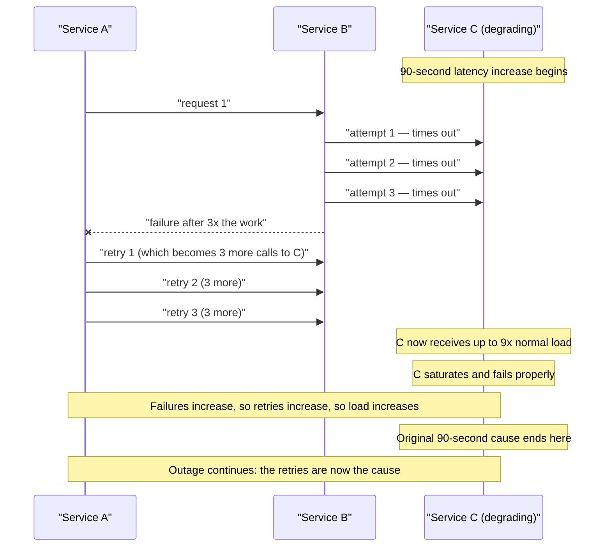
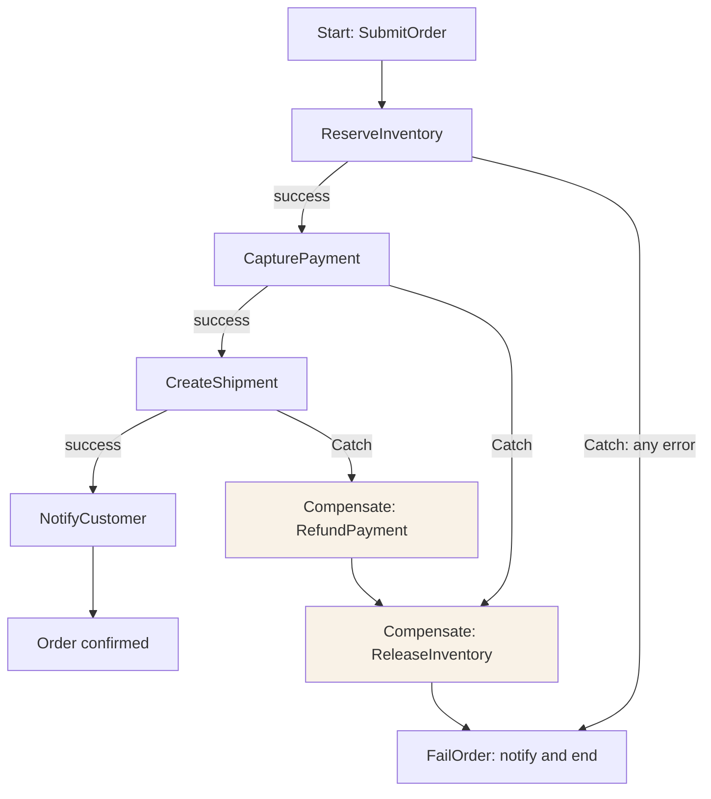
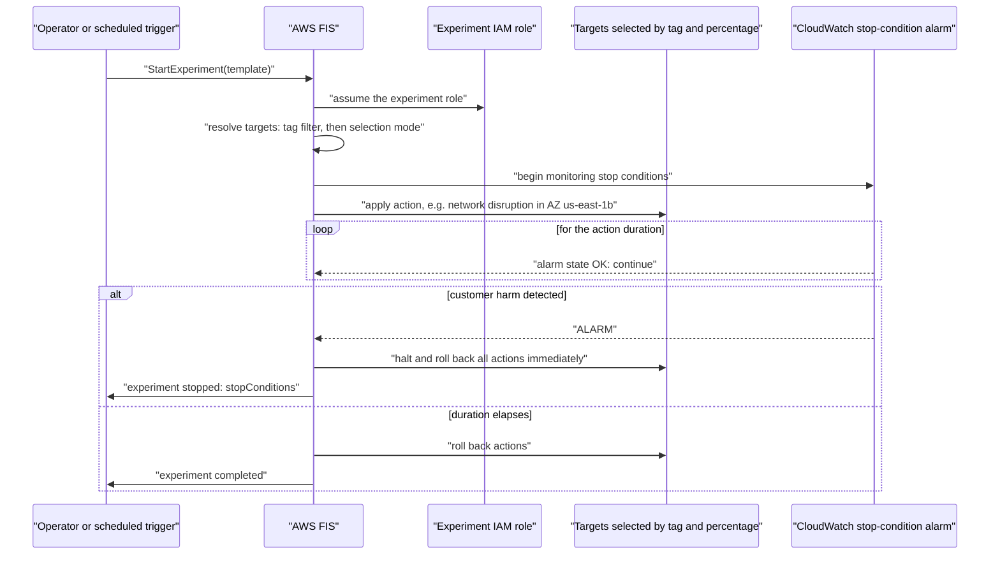
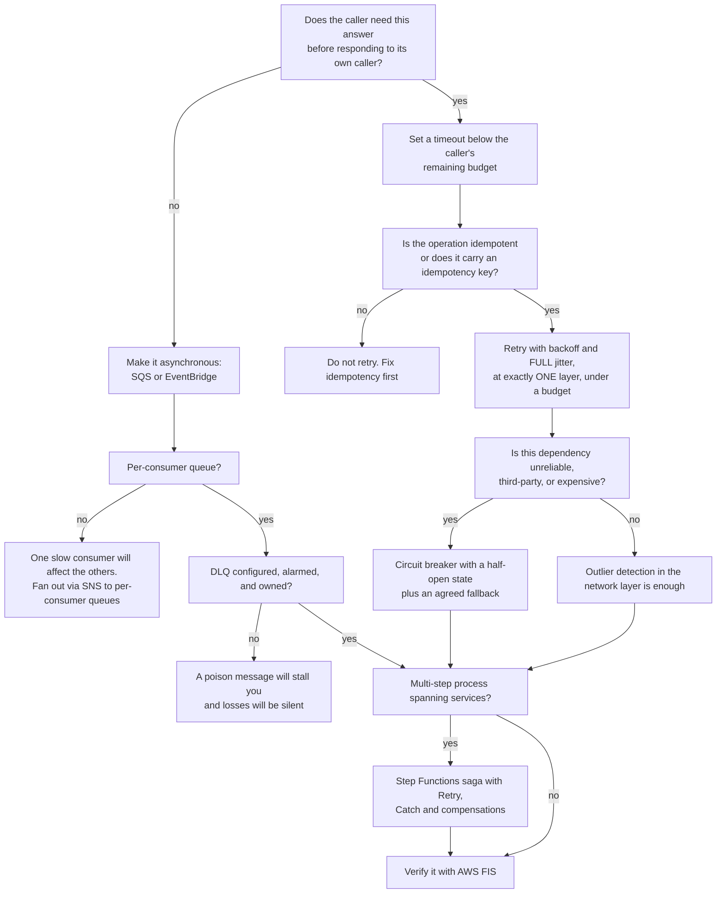
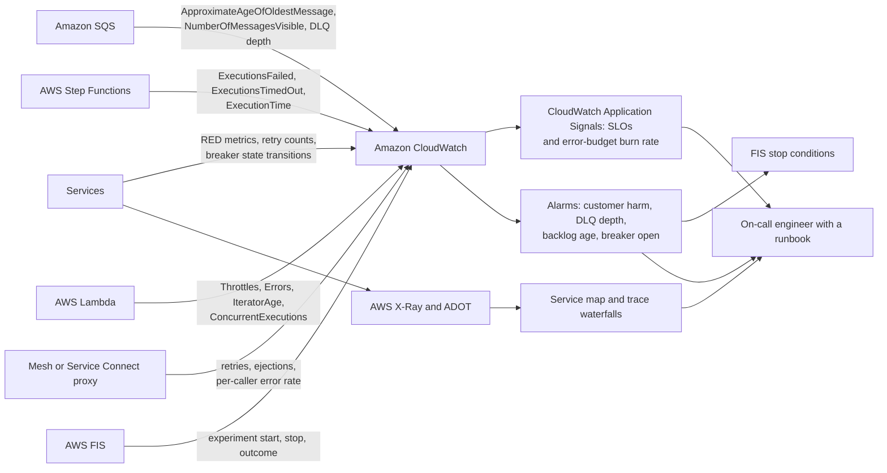
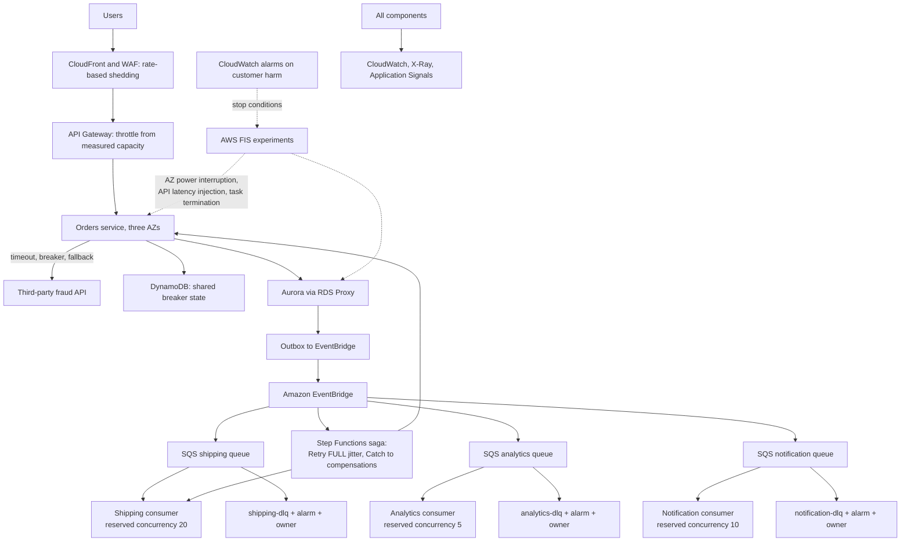
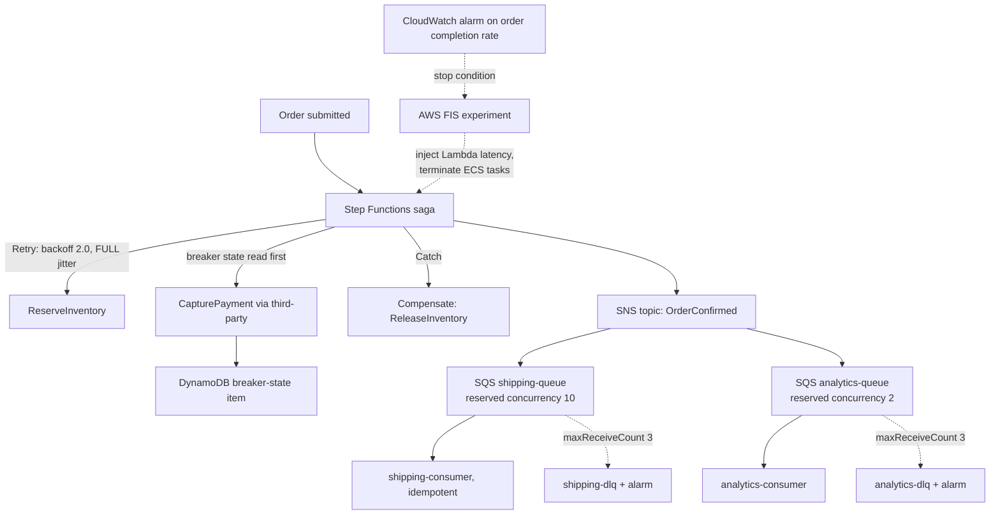

# Implementing Resilience in AWS Microservices

!!! info "Where this topic sits in DSO303"

    Chapter 4.1 drew the boundaries and assigned data ownership; chapter 4.2 built the infrastructure that carries traffic across those boundaries. Both introduced a debt that this chapter pays: **once a method call becomes a network call, it can fail in ways a method call never could** — it can be slow, it can be duplicated, it can succeed while the response is lost, and it can fail for one caller and not another. This chapter is about designing for that as the normal operating condition rather than as an exception.

    It has three parts, and they correspond to three different questions. **Retries and circuit breakers** ask: when a call fails, what should the caller do, and how do you stop a recovery attempt from becoming the outage? **Bulkheads and timeouts** ask: how do you keep one slow dependency from consuming every resource in the system, and how do you buffer a fast producer against a slow consumer? **Chaos engineering** asks the question that makes the other two honest: how do you know any of it works, given that you have never seen it work? Everything here builds directly on the resilience quartet introduced in section 1.3.2 and takes it from principle to AWS implementation.

---

## Learning Objectives

After studying this chapter you should be able to:

- Explain **partial failure**, **gray failure** and **metastable failure** as the distinctive hazards of distributed systems, and why a monolith exhibits none of them.
- Apply **timeouts**, **retries with exponential backoff and full jitter**, **retry budgets**, **circuit breakers**, **bulkheads**, **load shedding**, **deadline propagation** and **idempotency** correctly, and explain what each protects against and what each cannot do.
- Explain the **retry storm** mechanism precisely, including why an outage can outlive its cause, and specify the layered defences that bound it.
- Design **AWS Step Functions** as a resilience instrument: `Retry` and `Catch` with `IntervalSeconds`, `MaxAttempts`, `BackoffRate`, `MaxDelaySeconds` and `JitterStrategy`; `Parallel` and `Map` for isolation; `.waitForTaskToken` for human and external steps; and the **saga** pattern with compensating transactions.
- Implement a **circuit breaker** on AWS in each of its three legitimate homes — in the network layer, in the SDK and application, and as explicit state in a Step Functions workflow backed by DynamoDB — and choose between them.
- Design **bulkheads** with Amazon SQS: queue-per-consumer, queue-per-tenant, per-queue concurrency, reserved and provisioned Lambda concurrency, and connection-pool partitioning.
- Configure the SQS mechanisms that actually govern resilience: **visibility timeout**, **`maxReceiveCount` and redrive policy**, **dead-letter queues**, **redrive from a DLQ**, **long polling**, **partial batch responses**, **FIFO message groups**, and **message timers and delay queues**.
- Use **Amazon SNS** correctly for fan-out, including SNS-to-SQS as the canonical bulkhead, delivery retry policies, message filtering, and SNS dead-letter queues.
- Design and run a **chaos engineering** programme with **AWS Fault Injection Service (FIS)**: steady-state hypothesis, blast radius, stop conditions, experiment templates, actions and targets across EC2, ECS, EKS, RDS, Lambda and networking, plus **AZ availability power interruption** and **cross-Region** scenarios.
- Integrate resilience with **AWS Resilience Hub**, SLOs and error budgets, so that resilience is measured rather than asserted.

---

## Definition

**Resilience** is the property that a system continues to provide acceptable service in the presence of faults, and returns to full service afterwards without manual intervention. It is not the same as availability, which is a measurement, nor the same as reliability, which is about correctness over time. Resilience is a **design property** you build in deliberately, and it is composed of four distinct capabilities:

| Capability | Question it answers | Mechanisms in this chapter |
|---|---|---|
| **Fault isolation** | When something breaks, how much breaks with it? | Bulkheads, per-consumer queues, cell-based architecture, per-tenant partitioning, account and AZ boundaries |
| **Fault tolerance** | Can the system produce a correct or acceptable result despite the fault? | Retries, fallbacks, graceful degradation, redundancy, queue-based buffering |
| **Fault containment** | Does the fault stay put, or does it spread? | Circuit breakers, timeouts, load shedding, retry budgets, connection-pool limits |
| **Recovery** | Does it heal itself, and how fast? | Health checks, automatic replacement, dead-letter queues with redrive, saga compensation, automated rollback |

Three AWS services anchor this chapter, each addressing a different part of the problem:

- **AWS Step Functions** is where a multi-step process's error handling lives **explicitly**: retries with backoff and jitter, catch handlers, timeouts, compensation, and a durable execution history that survives the failure of everything participating in it.
- **Amazon SQS and Amazon SNS** are where **isolation and buffering** live: a queue is a bulkhead, a shock absorber, and a durable record of work that has not yet succeeded, all at once.
- **AWS Fault Injection Service** is where resilience stops being an assertion and becomes a **measurement**, by deliberately injecting the faults you claim to handle and observing whether you do.

!!! note "Resilience is a property of the whole system, not of any component"

    Every individual component in a system can be highly available while the system is fragile, because the fragility lives in the *interactions*: a retry policy that amplifies load, a shared connection pool that couples unrelated dependencies, a timeout longer than the caller's patience, a queue with no dead-letter destination. This is exactly why chapter 4.1's arithmetic — availability multiplies downward along a synchronous chain — matters, and why the highest-leverage resilience change is usually removing a dependency rather than hardening one.

---

## Why This Service or Concept Exists

### The failure modes that distribution introduces

A monolith fails in one way: the process dies, and everything stops. That is a bad outcome but a *simple* one, and it is detectable in milliseconds. Distributing the system replaces it with several harder problems.

| Failure mode | What it means | Why it is hard |
|---|---|---|
| **Partial failure** | Some components work, others do not | The system is neither up nor down; it is in a state your health checks were not designed to describe |
| **Ambiguous outcome** | The call timed out, so you do not know whether it succeeded | Retrying may duplicate the effect; not retrying may lose it. Only idempotency resolves this |
| **Gray failure** | A component is degraded but reports healthy | Health checks pass while users suffer; the system's own view of itself is wrong |
| **Metastable failure** | A system that stays broken after the trigger is gone | The recovery mechanism — retries — has become the load sustaining the failure |
| **Correlated failure** | Many components fail together | Redundancy assumed independence and did not get it: same AZ, same dependency, same bad deployment |
| **Cascading failure** | One component's failure overloads the next | Failure propagates along the dependency graph faster than humans can respond |
| **Poison message** | One malformed item blocks a queue or shard forever | Without a dead-letter path, throughput goes to zero for everything behind it |

!!! danger "Metastable failure is the one that surprises people"

    A brief latency spike causes timeouts. Timeouts cause retries. Retries multiply load. The extra load sustains the latency spike **after its original cause has disappeared**. The system is now in a stable state that is broken — hence *metastable* — and it will not recover on its own, because the thing keeping it broken is your own recovery mechanism. Restarting components often makes it worse, because a restarted service arrives to an unbounded backlog of queued retries. The only exits are shedding load, breaking circuits, or draining the retry backlog, and all three must be designed in beforehand: you cannot add them during the incident.

### What AWS provides, and what it does not

| Concern | Without managed services | With AWS |
|---|---|---|
| Durable buffering between services | Operate a message broker cluster | Amazon SQS: no capacity to manage, effectively unlimited scale |
| Fan-out with per-consumer isolation | One broker topic; a slow consumer affects others | SNS to per-consumer SQS queues; each buffers independently |
| Poison-message handling | Bespoke error tables and manual intervention | `maxReceiveCount` plus a dead-letter queue, with redrive built in |
| Durable multi-step process state | A database table, a scheduler, and hand-written recovery | Step Functions: durable execution history, declarative retry and catch |
| Retry with backoff and jitter | Implemented per language, inconsistently | Step Functions `Retry` fields; AWS SDK adaptive retry mode; mesh retry policy |
| Circuit breaking | A library per language, upgraded in lockstep | Envoy outlier detection; SDK adaptive mode; explicit state in DynamoDB for workflow-level breakers |
| Bulkheads | Manual thread-pool partitioning | Separate queues, Lambda reserved concurrency, ECS service isolation, separate accounts |
| Controlled fault injection | Unplug something and hope | AWS FIS with typed actions, stop conditions and a bounded blast radius |
| Resilience assessment | An architecture review and an opinion | AWS Resilience Hub: RTO and RPO assessment against a defined policy |

What AWS does **not** provide is the design. Every anti-pattern in this chapter — retries at three layers, no timeouts, a shared connection pool, a dead-letter queue nobody owns, a circuit breaker with no half-open state — is fully supported by the platform and costs nothing extra. The services make correct designs cheap; they do not make incorrect ones impossible.

---

## Real-World Motivation

**The retail flash sale that took itself down.** A retailer's checkout service depended on a pricing service that slowed by 300 milliseconds under load. Checkout's HTTP client had a default retry of three with no backoff; the API layer in front retried twice; the mobile client retried on timeout. A 300-millisecond degradation became eighteen times the normal request volume at the pricing service, which then failed properly, which caused every layer to retry harder. The incident lasted 50 minutes; the original latency spike lasted 90 seconds. *The architectural lesson is that retry configuration is a system-wide property, not a per-service one, and that retries at three layers multiply rather than add.*

**The bank that could not process anything for six hours.** A single malformed message — a payment instruction with a currency code the parser did not recognise — entered a FIFO queue. The consumer threw, the message returned to the queue, and because it was FIFO with a single message group, **nothing behind it could be processed**. There was no dead-letter queue. Six hours of payments queued behind one bad record. *The architectural lesson is that a dead-letter queue is not an optional refinement; without one, a single poison message is an outage, and with FIFO ordering it is an outage of everything in that message group.*

**The insurance claim that could not be undone.** A claims process reserved funds, notified the customer, and instructed a payment — three services, no coordinator. When the payment step failed, the reservation stayed and the customer had already been told their claim was approved. Reconstructing what had happened required reading four services' logs. Rebuilt as a Step Functions state machine with explicit `Catch` handlers and compensating transactions, the same failure produced an automatic reservation release, a correction notice, and a single execution history showing exactly what ran. *The architectural lesson is that a business process spanning services must live somewhere explicit, and an orchestrator's durable execution history is worth more during an incident than any amount of log correlation.*

**The streaming service that discovered its multi-AZ design did not work.** A media platform ran three Availability Zones and believed it could lose one. During a real AZ event it discovered that its database failover took eleven minutes, that a shared cache in the failed AZ caused a thundering herd on the origin, and that one service's connection pool did not retry to the new endpoint. None of this was visible in any architecture diagram. After adopting FIS with the AZ availability power-interruption action, run monthly in a pre-production environment and then quarterly in production during business hours, each of these was found and fixed before the next real event. *The architectural lesson is that multi-AZ is a claim until you have tested it, and that the failures found by testing are always the ones nobody predicted.*

**The SaaS platform where one tenant broke everyone.** A B2B platform processed all tenants' background jobs through one SQS queue with Lambda consumers. A single enterprise customer uploaded a 400,000-row file; the queue filled with their work; every other tenant's jobs waited hours behind it. The fix was a bulkhead: a queue per tenant tier with reserved Lambda concurrency per tier, so that a large tenant's burst consumes only its own share. *The architectural lesson is that a shared queue is a shared fate, and that multi-tenant systems need isolation in the work-distribution layer, not only in the data layer.*

**The payment gateway that failed closed correctly.** A retailer's fraud-scoring provider became unavailable. Because the call had a 400-millisecond timeout, a circuit breaker, and a documented fallback — accept transactions under a value threshold, queue the rest for review — checkout continued for 94 per cent of transactions during a 40-minute third-party outage. The alternative design, with no timeout and no breaker, would have hung every checkout thread. *The architectural lesson is that the most valuable resilience work is deciding, in advance and with the business, what degraded behaviour looks like — a decision that cannot be made during an incident.*

---

## Core Concepts

### Timeouts: the foundation everything else rests on

A call without a timeout is not a call; it is a hang waiting to happen. When a downstream service stops responding, an untimed caller holds its thread, its connection and its memory indefinitely. Under load, every thread ends up waiting on the same dependency, and the caller stops serving *all* traffic — including requests that never touch the failing dependency. This is how one service's degradation becomes a system-wide outage, and it is the most consequential single omission in this chapter.

Timeouts must be set from **measured latency**, not from a round number, and they interact:

| Timeout | What it bounds | How to set it |
|---|---|---|
| **Connection timeout** | Establishing a TCP connection | Short — hundreds of milliseconds. A slow connect means the endpoint is unreachable, not busy |
| **Request (read) timeout** | Waiting for a response after sending | Above the dependency's p99, below the caller's own remaining budget |
| **Total operation timeout** | The whole operation including retries | Must fit inside the caller's deadline, or the last retry is work performed for nobody |
| **Idle timeout** | An unused pooled connection | Shorter than the far end's idle timeout, or you reuse a connection the server just closed |
| **Overall request deadline** | The user's patience | Set at the edge and propagated downstream |

!!! danger "The arithmetic teams get wrong"

    A caller with a 2-second budget calls a dependency with a 1-second per-attempt timeout and three retries. Worst case: 3 seconds of attempts plus backoff, inside a 2-second budget. The caller gives up during the second retry, so the third attempt is **work performed for a request nobody is waiting for** — and it is performed at the exact moment the dependency is already struggling. The rule is that the **total retry budget must fit inside the caller's deadline**, which usually means fewer retries than instinct suggests. Two attempts with a tight timeout beats five with a loose one.

### Retries: necessary, and the most dangerous tool here

Retries recover from **transient** faults: a dropped packet, a brief throttle, an instance replaced mid-request. They are useless against **persistent** faults and actively harmful against **overload**, where the retry *is* the overload.

Three rules, all mandatory:

**Retry only what is retryable.** A 500, a 503, a 429 with a `Retry-After`, a connection reset, a timeout — retryable. A 400, a 401, a 403, a 404, a validation failure — not retryable, and retrying them wastes capacity and delays the real error reaching the caller.

**Retry only what is safe to repeat.** A GET is naturally idempotent. A POST that creates an order is not, unless it carries an idempotency key. Retrying a non-idempotent write duplicates the effect, which is how customers get charged twice.

**Use exponential backoff with full jitter.** Without backoff, retries arrive immediately, which is exactly wrong for an overloaded dependency. Without jitter, every client that failed at the same moment retries at the same moment, producing synchronised waves that keep the dependency saturated.

```
# Full jitter: the AWS-recommended formula.
sleep = random_between(0, min(cap, base * 2 ** attempt))
```

The `random_between(0, ...)` is the important part. "Equal jitter" and other half-measures still cluster; full jitter spreads retries across the whole interval and is measurably better at desynchronising a fleet.

**Retry at exactly one layer.** This is the rule teams break most often, because each layer's retry looks locally reasonable. Three retries at the client, three at the gateway and three in the SDK is up to 27 requests per logical call. Decide where retries live — usually as close to the failure as possible — and explicitly disable them everywhere else.

**Cap retries with a budget.** A retry budget expresses retries as a fraction of total requests, typically 10 to 20 per cent. Once the budget is exhausted, further failures fail fast rather than retrying. This is what bounds amplification when *everything* is failing, which is precisely when unbounded retry logic does the most damage.

### The retry storm, in detail



The defences are cumulative and all of them are needed:

| Defence | What it stops |
|---|---|
| **Retry at one layer only** | Multiplicative amplification, 27× down to 3× |
| **Full jitter** | Synchronised waves that keep the dependency saturated |
| **Retry budget** | Amplification when everything is failing |
| **Circuit breaker** | Calling a dependency that is known to be down at all |
| **Deadline propagation** | Work performed for requests already abandoned |
| **Load shedding at the callee** | The callee accepting more work than it can complete |
| **Backpressure through a queue** | The synchronous coupling that lets the caller push at all |

### Circuit breakers

A circuit breaker is a state machine wrapping calls to one dependency. When failures exceed a threshold, it **opens** and fails subsequent calls immediately without attempting them — giving the dependency room to recover and giving the caller a fast, predictable failure instead of a slow, thread-consuming one.



```mermaid
stateDiagram-v2
    [*] --> Closed
    Closed --> Open : "failure ratio exceeds threshold within the window"
    Open --> HalfOpen : "cooldown timer elapses"
    HalfOpen --> Closed : "trial requests succeed"
    HalfOpen --> Open : "a trial request fails"
    Closed --> Closed : "requests pass through; failures counted"
    Open --> Open : "requests fail fast; the dependency is not called"
    HalfOpen --> HalfOpen : "limited trial traffic only"
```

The **half-open** state is what makes it a circuit breaker rather than a kill switch: after a cooldown it allows a small number of trial requests, closing on success and reopening on failure. A breaker without a half-open state never recovers without human intervention.

Three parameters, and all three are commonly set wrongly:

| Parameter | Too low | Too high |
|---|---|---|
| **Failure threshold** | Flapping on normal error rates | Never opens; provides no protection |
| **Window** | Statistically meaningless on low-traffic dependencies | Slow to react; the damage is done before it opens |
| **Cooldown** | Hammers a recovering dependency with trial traffic | Stays open long after recovery, extending the outage |

**Where a circuit breaker lives on AWS.** There is no "AWS Circuit Breaker" service, and expecting one is a common misconception. There are three legitimate homes:

1. **The network layer** — Envoy outlier detection in a mesh, or ECS Service Connect's endpoint ejection. This is per-endpoint and automatic, needs no application code, and is the right default for service-to-service HTTP.
2. **The SDK and application** — the AWS SDK's `adaptive` retry mode implements client-side rate limiting that behaves like a breaker for AWS API calls; language libraries provide it for other calls.
3. **Explicit state in a workflow** — a DynamoDB item holding breaker state, read by a Step Functions state before calling an expensive or unreliable dependency. This is the right pattern for a **third-party** dependency where you want the breaker's state to be shared across all executions and visible to operators.

!!! warning "The `ECS deployment circuit breaker` is a different thing"

    ECS has a feature called the deployment circuit breaker, which detects a failing rolling deployment and rolls it back. It is valuable and you should enable it. It is **not** a request-path circuit breaker and it does nothing about a failing dependency. The name collision catches students in examinations, so read the context: deployment, or dependency?

### Bulkheads

Named for a ship's watertight compartments: partition resources so that exhausting one does not sink the vessel. The failure a bulkhead prevents is *resource coupling* — one slow dependency consuming a shared pool that unrelated work also needs.

| Bulkhead | AWS implementation | What it isolates |
|---|---|---|
| **Per-dependency connection pool** | Separate HTTP clients or pools per downstream; Envoy per-cluster connection limits | One slow dependency cannot consume every connection |
| **Per-consumer queue** | SNS fan-out to one SQS queue per consumer | A slow consumer's backlog does not affect its peers |
| **Per-tenant queue or partition** | Queue per tenant tier; DynamoDB partition per tenant | One large tenant cannot starve the others |
| **Per-workload concurrency** | Lambda **reserved concurrency** | One function cannot consume the account's whole concurrency pool |
| **Per-service compute** | Separate ECS services or EKS deployments | A memory leak in one does not kill another |
| **Per-priority queue** | Separate queues for interactive and batch work | Batch cannot starve interactive |
| **Per-cell** | Cell-based architecture: independent stacks each serving a shard of customers | A failure affects one cell's customers only |
| **Per-AZ and per-Region** | Zonal isolation, static stability, multi-Region | Correlated infrastructure failure |
| **Per-account** | Separate AWS accounts | Quota exhaustion, blast radius, and compliance scope |

!!! tip "Lambda reserved concurrency is the clearest bulkhead on AWS"

    An account has a total concurrent-execution limit shared by every function. Without reserved concurrency, one function processing a large queue backlog can consume all of it, and every other function in the account — including the ones serving user requests — is throttled. Setting reserved concurrency on the batch function both caps it and guarantees it that capacity. It is two numbers in a console that convert a shared fate into an isolated one, and it is routinely omitted.

### Load shedding and backpressure

When demand exceeds capacity there are exactly three options: serve slower, reject some work, or buffer it. Serving slower is the worst, because unbounded queueing makes latency unbounded, which users experience as an outage while every dashboard shows the system "working".

**Load shedding** means rejecting excess work early with a well-formed 429 or 503, ideally with a `Retry-After` header. It is better than queueing because a fast rejection lets the client back off or fail over, and it protects the work already in flight.

**Backpressure** means the consumer signals the producer to slow down. Synchronous HTTP has no native backpressure mechanism, which is precisely why a queue helps: the producer's write completes immediately, the consumer works at its own rate, and the queue depth becomes both the scaling signal and the health indicator. **This is the single most important reason to prefer asynchronous communication**, and it converts an availability problem into a latency problem — which is far more tractable.

### Idempotency

At-least-once delivery is the norm on AWS: SQS standard queues, SNS, EventBridge, Lambda event source mappings and Step Functions activities can all deliver more than once. Every consumer must therefore be idempotent, or duplicates become double charges.

| Technique | Implementation | Notes |
|---|---|---|
| **Conditional write** | DynamoDB `attribute_not_exists(pk)`; a SQL unique constraint | The simplest and strongest; the second attempt is a no-op |
| **Idempotency key table** | Store the key with the result and a TTL; return the stored result on repeat | Needed when the operation is not a single write |
| **Natural idempotency** | `SET status = 'SHIPPED'` rather than `increment(count)` | Design operations to be repeatable where possible |
| **Provider-side keys** | Pass an idempotency key to the payment provider | The safest option for money; the key must reach the system of record |
| **Powertools for AWS Lambda** | The idempotency utility with a DynamoDB persistence store | Handles in-progress state and expiry correctly |

The key must be **caller-supplied and stable across retries**. Generating a UUID inside the handler defeats the entire mechanism, because each delivery generates a different one — a mistake that looks correct in code review and fails only under duplicate delivery.

### Deadline propagation

If a caller has already given up, work done downstream is pure waste — and it is performed at the worst possible moment. Deadline propagation passes the remaining time budget with each call: the edge sets a deadline, each hop subtracts elapsed time, and any service seeing a deadline in the past fails immediately.

```python
# The pattern, in outline.
deadline_ms = int(headers.get("x-deadline-ms", 0))
remaining = deadline_ms - now_ms()
if remaining <= 0:
    raise DeadlineExceeded("caller has already abandoned this request")
timeout = min(my_default_timeout, remaining - safety_margin)
downstream_headers["x-deadline-ms"] = str(now_ms() + timeout)
```

Without it, a system under stress spends a growing share of its capacity computing answers that are discarded — work that actively deepens the outage. Step Functions supports the analogous idea natively with `TimeoutSeconds` on a state and on a whole state machine.

### Graceful degradation and static stability

**Graceful degradation** means deciding in advance which features may fail and what happens when they do: recommendations fall back to a generic list, personalisation falls back to defaults, a loyalty balance renders as "unavailable", fraud scoring falls back to a value threshold. This is a **business decision** and must be made with the business, before an incident, because during one there is no time.

**Static stability** is the stronger idea: a system that continues operating correctly using only resources it already has, without needing a control plane. An Auto Scaling group pre-provisioned for the loss of one AZ is statically stable; one that must scale out during an AZ failure depends on the EC2 control plane at exactly the moment it is busiest. The principle generalises: pre-provision, cache configuration, hold last-known-good state, and never require a control-plane call to keep serving.

### Chaos engineering

Chaos engineering is the disciplined practice of injecting faults into a system to build confidence in its ability to withstand them. It is not "breaking things randomly"; it is an experiment with a hypothesis, a bounded blast radius, and a stop condition.

The method:

1. **Define steady state** as a measurable output — order completion rate, p99 latency, error rate. Not "CPU is normal", which is not what users care about.
2. **Form a hypothesis**: "if one Availability Zone becomes unavailable, order completion rate stays above 99 per cent and p99 latency stays below 800 milliseconds."
3. **Bound the blast radius**: the smallest injection that tests the hypothesis, in the smallest environment that can falsify it.
4. **Define stop conditions**: CloudWatch alarms that abort the experiment automatically.
5. **Run it**, starting in pre-production, then production during business hours with the team present.
6. **Learn**: a disproved hypothesis is the point. An experiment that always passes stopped being informative some time ago.

**AWS Fault Injection Service (FIS)** — renamed from Fault Injection Simulator — is the managed instrument: an **experiment template** declares **actions** (what fault), **targets** (which resources, selected by tag, filter or explicit ARN), and **stop conditions** (CloudWatch alarms that halt it). FIS executes with an IAM role and records every experiment, so a chaos programme has an audit trail.

!!! danger "Two rules that separate chaos engineering from vandalism"

    **Stop conditions are mandatory.** Every FIS experiment must have at least one CloudWatch alarm that halts it, and it must be one that fires on **customer harm**, not on the injected fault itself. An experiment without a stop condition is an outage you scheduled. **Blast radius must be explicit and minimal.** Target by tag, on a subset, in one AZ, for a bounded duration. "Terminate all instances matching `env=prod`" is not an experiment; the resource-selection filters exist precisely so that you never write that.

---

## AWS Service Deep Dive

!!! warning "On numbers and quotas"

    Quotas are representative as of 2026, mostly **soft** and adjustable through AWS Service Quotas, varying by Region and account. Verify in the Service Quotas console. Pricing is described as dimensions only.

### AWS Step Functions as a resilience instrument

**Purpose.** Provide durable, observable orchestration of a multi-step process, with declarative error handling — retries with backoff and jitter, catch handlers, timeouts and compensations — and an execution history that survives the failure of every participant.

**Architecture.** A **state machine** defined in Amazon States Language executes as an **execution**. Step Functions durably records the state after every transition, so an execution survives the failure of any service it calls and of the compute running the work. Two workflow types: **Standard**, durable for up to a year, exactly-once state transitions, full execution history, priced per state transition; and **Express**, up to five minutes, at-least-once, priced by invocation and duration, suited to high-volume short work.

**The resilience features, which are the point of this section.**

| Feature | What it does | Why it matters |
|---|---|---|
| **`Retry`** | Per-state retry with `ErrorEquals`, `IntervalSeconds`, `MaxAttempts`, `BackoffRate`, `MaxDelaySeconds`, `JitterStrategy` | Declarative, correct retry — including full jitter — without writing it in every language |
| **`Catch`** | Routes a named error to a recovery state | Compensation and fallback expressed in the workflow rather than buried in a handler |
| **`TimeoutSeconds` and `HeartbeatSeconds`** | Bounds a state's duration; heartbeats detect a stalled worker | Prevents an execution hanging forever on a dead task |
| **State machine `TimeoutSeconds`** | Bounds the whole execution | The deadline for the entire process |
| **`Parallel`** | Independent branches; a failure in one is catchable | Fault isolation inside a workflow |
| **`Map` (inline and distributed)** | Iterate over items with `MaxConcurrency` and a **tolerated failure percentage** | A bulkhead and a partial-failure policy in one construct |
| **`.waitForTaskToken`** | Pauses until an external system or human calls `SendTaskSuccess` or `SendTaskFailure` | Long-running and human steps without polling |
| **`.sync` integrations** | Waits for an ECS task, Batch job or nested execution to complete | Removes hand-written polling loops, a classic source of bugs |
| **Redrive** | Restart a failed Standard execution from its point of failure | Recovery without re-running completed work |
| **Execution history** | Every input, output, error and retry, retained and queryable | During an incident this is worth more than any log correlation |

**Retry semantics in detail**, because the exam and real systems both depend on the exact behaviour:

```json
{
  "Retry": [
    {
      "ErrorEquals": ["Lambda.TooManyRequestsException", "Lambda.ServiceException"],
      "IntervalSeconds": 1,
      "MaxAttempts": 4,
      "BackoffRate": 2.0,
      "MaxDelaySeconds": 20,
      "JitterStrategy": "FULL"
    },
    {
      "ErrorEquals": ["States.ALL"],
      "IntervalSeconds": 2,
      "MaxAttempts": 2,
      "BackoffRate": 2.0
    }
  ]
}
```

`IntervalSeconds` is the wait before the first retry; each subsequent wait is multiplied by `BackoffRate`; `MaxDelaySeconds` caps it; `JitterStrategy: FULL` randomises each wait between zero and the computed value, which is the AWS-recommended full-jitter behaviour and should be set on essentially every retrier. Retriers are evaluated **in order** and the **first match wins**, so specific errors must precede `States.ALL`. `MaxAttempts: 0` disables retry for a matched error, which is how you make a genuinely non-retryable error fail fast.

**Limitations.** Standard workflows are priced per state transition, so a chatty state machine with many trivial states is expensive — model coarse steps. Payload size between states is capped in the hundreds of kilobytes, so large data is passed by S3 reference. Execution history has an event limit, relevant for very long loops. Express workflows give at-least-once execution, so their tasks must be idempotent. And a state machine is not a general-purpose programming language: complex conditional logic becomes unreadable in ASL long before it becomes impossible.

**Pricing model.** Standard: per state transition. Express: per invocation plus duration and memory. The practical rule is Standard for long-running, low-volume, auditable business processes — exactly the saga case — and Express for high-volume short orchestrations.

**Availability and scaling.** Regional, multi-AZ, managed. Scales automatically; the constraints are per-account execution start rates and state-transition rates, both soft quotas, and — far more often in practice — the concurrency of whatever the states call.

**Security features.** An execution role per state machine following least privilege; CloudWatch Logs at configurable levels; X-Ray tracing; KMS encryption of execution data; and full CloudTrail coverage. Note that execution history contains state input and output, so a workflow handling sensitive data needs log-level and encryption decisions made deliberately.

### Amazon SQS as a bulkhead and shock absorber

**Purpose.** Decouple producers from consumers with a durable, effectively unlimited buffer, so that a producer's rate and a consumer's rate need not match, and so that work is not lost when a consumer fails.

**Architecture.** Messages are stored redundantly across multiple AZs within a Region. A consumer **receives** a message, which makes it invisible for the **visibility timeout**; the consumer must **delete** it after successful processing, or it becomes visible again for another attempt. This receive-process-delete cycle, rather than a push, is what makes SQS naturally resilient: a consumer that dies mid-processing loses nothing.

| Queue type | Ordering | Delivery | Throughput |
|---|---|---|---|
| **Standard** | Best-effort ordering | At-least-once | Effectively unlimited |
| **FIFO** | Strict ordering **within a message group** | Exactly-once processing within the deduplication window | High, and much higher with high-throughput mode; per-message-group ordering is the constraint |

**The resilience mechanisms, which are the substance of this section.**

| Mechanism | What it does | How to set it |
|---|---|---|
| **Visibility timeout** | How long a received message stays invisible | Longer than the p99 processing time. Too short causes duplicate processing; too long delays retry after a crash |
| **`maxReceiveCount` and redrive policy** | After N receives, move the message to a dead-letter queue | 3 to 5 typically. This is the poison-message defence |
| **Dead-letter queue** | Destination for messages that repeatedly fail | Mandatory on every consumer. Alarm on depth; name an owner |
| **DLQ redrive** | Move messages back to the source queue after a fix | The recovery path; test it before you need it |
| **Long polling (`ReceiveMessageWaitTimeSeconds`)** | Wait up to 20 seconds for a message | Reduces empty receives, cost and latency. Effectively always on |
| **Batch operations** | Send, receive and delete up to 10 at a time | Fewer API calls, lower cost, higher throughput |
| **Partial batch response** | A Lambda consumer reports which messages in a batch failed | Without it, one bad message causes the **whole batch** to be redelivered |
| **Delay queues and message timers** | Delay delivery up to 15 minutes | Simple scheduled retry, and a way to space out work |
| **Message retention** | 1 minute to 14 days | Long retention on a DLQ so you have time to investigate |
| **Maximum message size and the extended client** | 256 KB, or large payloads stored in S3 | Pass large data by reference |
| **FIFO message group ID** | The ordering and parallelism unit | **Ordering is per group**, so a well-chosen group ID gives ordering *and* parallelism; one group means one consumer at a time |

!!! danger "Visibility timeout and Lambda: the classic misconfiguration"

    If a Lambda consumer's function timeout exceeds the queue's visibility timeout, the message becomes visible again **while the function is still processing it**, and a second invocation begins on the same message. The result is duplicate processing that looks random and is very hard to diagnose. The rule is that the queue's visibility timeout should be at least **six times** the function timeout, which is also what the AWS console suggests when you wire them together. And regardless of configuration, the consumer must be idempotent.

**Limitations.** Standard queues do not guarantee order and can deliver duplicates. FIFO throughput is bounded per message group, so a single group is a serialisation point. Maximum message size is 256 KB without the extended client. Maximum retention is 14 days. In-flight message limits apply per queue. There is no server-side filtering — a consumer receives what is in the queue, which is why fan-out filtering belongs in SNS or EventBridge.

**Pricing model.** Per million requests, with FIFO more expensive than standard, plus data transfer. Long polling and batching reduce request count substantially, and an idle queue polled aggressively with short polling is a surprisingly common small cost.

**Scaling behaviour.** Standard queues scale essentially without limit. The scaling decision that matters is the **consumer's**, and it should be driven by **backlog per consumer** — approximate messages visible divided by running consumers — rather than raw depth, because raw depth ignores the capacity you just added and causes the scaling loop to oscillate.

**Security features.** SSE with SQS-managed or KMS customer-managed keys; queue policies for cross-account access; VPC endpoints so traffic never leaves the AWS network; IAM control per action and per queue.

### Amazon SNS for fan-out with isolation

**Purpose.** Deliver one message to many subscribers, so that a producer need not know its consumers, with per-subscription filtering, retry and dead-lettering.

**Architecture.** Publishers send to a **topic**; SNS delivers to every **subscription** — SQS queues, Lambda functions, HTTP endpoints, email, SMS, mobile push, Kinesis Data Firehose. **Standard** topics are at-least-once with best-effort ordering; **FIFO** topics preserve ordering and deduplication and may deliver only to SQS FIFO queues.

**The resilience-relevant features.**

| Feature | What it does | Why it matters |
|---|---|---|
| **SNS to SQS fan-out** | Each consumer gets its own durable queue | **The canonical bulkhead.** A slow or failed consumer's backlog is entirely its own |
| **Message filtering** | Subscription filter policies on attributes or message body | Consumers receive only relevant messages, reducing wasted invocations |
| **Delivery retry policy** | Configurable backoff for HTTP/S endpoints | Bounded retry to endpoints you do not control |
| **Subscription dead-letter queue** | An SQS queue for messages SNS could not deliver | Without it, undeliverable messages are **discarded after the retry policy is exhausted** |
| **Message archiving and replay (FIFO)** | Retain and replay to a new subscriber | Recovery from a consumer bug, and onboarding a new consumer with history |

!!! warning "SNS direct-to-Lambda is not a bulkhead"

    Subscribing a Lambda function directly to an SNS topic gives you SNS's own retry policy and then discard. There is no queue, so a consumer outage longer than the retry window loses messages, there is no backlog to inspect, no redrive, and no way to reprocess. **SNS to SQS to Lambda** costs one extra hop and gives durable buffering, `maxReceiveCount`, a dead-letter queue, redrive, and a visible backlog. Use the direct subscription only for genuinely fire-and-forget notifications whose loss is acceptable.

### AWS Fault Injection Service

**Purpose.** Inject controlled, realistic faults into AWS workloads to validate resilience assumptions, with typed actions, explicit targeting, bounded duration and automatic stop conditions.

**Architecture.** An **experiment template** contains **actions**, **targets**, **stop conditions** and an **IAM role**. Actions have parameters and may depend on one another with `startAfter`, so a sequence can be composed. Targets are selected by resource type plus tags, filters or explicit ARNs, with a **selection mode** — all, a count, or a percentage — that is the primary blast-radius control. Stop conditions are CloudWatch alarms; if any enters ALARM, FIS halts the experiment and rolls back its actions.

**Representative action categories.**

| Category | Examples | What it tests |
|---|---|---|
| **Compute** | Stop, terminate or reboot EC2 instances; inject CPU, memory, I/O or kernel-panic stress | Instance replacement, capacity headroom, health checks |
| **Containers** | Stop ECS tasks; drain ECS container instances; terminate EKS pods and nodes | Rescheduling, deregistration, connection draining, `SIGTERM` handling |
| **Serverless** | Lambda invocation errors, added latency, and start-up failures | Retry configuration, DLQs, downstream tolerance |
| **Database** | Reboot or fail over RDS and Aurora instances and clusters | Failover time, connection-pool recovery, read-your-writes behaviour |
| **Networking** | Disrupt connectivity to a subnet, an AZ, a VPC, a prefix list, or specific AWS services; add latency and packet loss | Timeouts, retries, circuit breakers, cross-AZ assumptions |
| **AZ availability: power interruption** | Simulate a full AZ power event across multiple services simultaneously | The multi-AZ claim, end to end |
| **Cross-Region: connectivity** | Disrupt traffic between Regions | Multi-Region failover and replication assumptions |
| **API throttling and errors** | Inject throttling or errors on AWS API calls from targeted instances | Whether your SDK retry and backoff configuration is correct |

**Scenarios.** FIS supplies pre-built scenarios — notably the AZ availability power interruption — that compose several actions to model a realistic event rather than a single injected fault. These are the right starting point, because real failures are correlated and single-fault injections systematically under-test.

**Limitations.** FIS covers the faults AWS has implemented; application-level faults such as a corrupted cache entry or a logic error are outside its scope and need application-level injection. Some actions require the **SSM Agent** on targets, which is a prerequisite easily overlooked. Injection is at the infrastructure layer, so it cannot simulate a third-party API returning wrong data. And it requires a real IAM role with real permissions to disrupt real resources, so the role itself must be tightly scoped and auditable.

**Pricing model.** Per action-minute, differentiated between simple actions and the more complex AZ and cross-Region scenarios. Cheap relative to the outages it prevents, and the cost model naturally encourages short, targeted experiments — which is also the correct practice.

**Security features.** The experiment role is the control: scope it to the exact resource tags an experiment may touch. CloudTrail records every experiment and action. Stop conditions are enforced by the service, not by convention.

**Common configurations.** Tag-based targeting with a dedicated `ChaosReady=true` tag so nothing is targeted by accident; selection mode as a percentage rather than all; a stop condition alarming on customer-facing error rate or latency; experiments run in pre-production on a schedule and in production during business hours with the team present; templates in version control alongside the workload they test.

---

## Internal Working

### How a Step Functions retry actually executes

```mermaid
sequenceDiagram
    participant SF as "Step Functions execution"
    participant HIST as "Durable execution history"
    participant L as "Lambda: ReserveInventory"
    participant DDB as "DynamoDB"
    SF->>HIST: "TaskStateEntered recorded"
    SF->>L: "attempt 1"
    L->>DDB: "conditional write"
    DDB--xL: "ProvisionedThroughputExceeded"
    L--xSF: "error: Lambda.ServiceException"
    SF->>HIST: "TaskFailed recorded with the error"
    SF->>SF: "match retrier 1; wait IntervalSeconds=1, jittered to a value in [0,1]"
    SF->>L: "attempt 2"
    L--xSF: "same error"
    SF->>SF: "wait 1 x BackoffRate=2 = 2s, jittered to [0,2]"
    SF->>L: "attempt 3"
    L-->>SF: "success"
    SF->>HIST: "TaskSucceeded with output"
    Note over SF,HIST: State is durable after EVERY transition. The execution<br/>survives the failure of Step Functions' own workers.
```

Three properties are worth dwelling on. **Durability after every transition** is what makes an orchestrator different from a retry loop in application code: if the process running your loop dies, the loop's state dies with it, whereas a Step Functions execution resumes. **Retriers are ordered and first-match-wins**, so a `States.ALL` retrier placed first swallows everything and your specific policies never apply — a common and silent misconfiguration. **Jitter is per-attempt**, so two executions failing simultaneously do not retry simultaneously, which is the fleet-level property that prevents synchronised waves.

### How a saga unwinds



Four properties distinguish a correct saga from a hopeful one:

1. **Compensations are business operations, not rollbacks.** `RefundPayment` is a new transaction that appears in the ledger; you cannot un-take a payment. `ReleaseInventory` is a new reservation event. Every compensation is visible to the business and must be acceptable to it.
2. **Compensations must be idempotent and retryable**, because a compensation can itself fail and will be retried. A refund that is not idempotent is a double refund.
3. **Some steps cannot be compensated.** You cannot un-send an email; you send a correction. Identify these during design, and order the saga so that irreversible steps come **last**, after everything that might fail has already succeeded.
4. **The compensation order is the reverse of the forward order**, and the state machine must express that explicitly — which is precisely the value of having the process as one artefact rather than as emergent behaviour across five services.

### How an SQS message's lifecycle produces resilience

```mermaid
stateDiagram-v2
    [*] --> Available : "SendMessage"
    Available --> InFlight : "ReceiveMessage; visibility timeout starts"
    InFlight --> Deleted : "consumer succeeds and calls DeleteMessage"
    InFlight --> Available : "visibility timeout expires (consumer crashed or was too slow)"
    InFlight --> Available : "consumer calls ChangeMessageVisibility(0) on a known failure"
    Available --> DLQ : "receive count exceeds maxReceiveCount"
    DLQ --> Available : "operator redrives after fixing the cause"
    Deleted --> [*]
    DLQ --> [*] : "retention expires — this is silent data loss"
```



The lifecycle *is* the resilience mechanism, and each transition maps to a design decision. **Consumer crashes** are handled by the visibility timeout returning the message automatically — nothing is lost and nothing needs to be caught. **Transient failures** are handled by receiving again, up to `maxReceiveCount`. **Permanent failures** are handled by the dead-letter queue, which is the difference between a poison message costing you one message and costing you a queue. **Recovery** is redrive, after a fix. And the final transition is the one that ruins organisations: a dead-letter queue with default retention and no alarm **silently discards business events**, and nobody discovers it until a customer asks where their order went.

### The Lambda–SQS event source mapping, in detail

```mermaid
sequenceDiagram
    participant ESM as "Lambda event source mapping (poller)"
    participant Q as "SQS queue"
    participant FN as "Lambda function"
    participant DLQ as "Dead-letter queue"
    ESM->>Q: "ReceiveMessage, long poll, batch of up to 10"
    Q-->>ESM: "batch; visibility timeout starts on each message"
    ESM->>FN: "invoke with the batch"
    alt whole batch succeeds
        FN-->>ESM: "success"
        ESM->>Q: "DeleteMessage for the whole batch"
    else partial batch response configured
        FN-->>ESM: "batchItemFailures: [msg-3]"
        ESM->>Q: "delete all EXCEPT msg-3"
        Note over Q: only msg-3 becomes visible again
    else function throws
        FN--xESM: "error"
        Note over Q: the ENTIRE batch becomes visible again;<br/>nine good messages are reprocessed because of one bad one
    end
    Q->>DLQ: "after maxReceiveCount receives"
    ESM->>ESM: "scales pollers up on backlog, down when idle"
```

**Partial batch responses (`ReportBatchItemFailures`) are not optional at scale.** Without them, one bad message in a batch of ten causes all ten to be redelivered, which means nine successful operations are performed again — and if they are not idempotent, that is nine defects. With them, only the failing message returns. This single setting is one of the highest-value, lowest-effort resilience changes available on AWS and it is very frequently omitted.

### How a FIS experiment executes safely



The stop condition is the safety mechanism and it must alarm on **customer harm**, not on the fault. An alarm on "instances in this AZ are unreachable" will fire immediately and abort every experiment, teaching you nothing; an alarm on "order completion rate below 99 per cent" fires only if the system failed to absorb the fault, which is exactly the signal you wanted.

### Control plane versus data plane, and static stability

| Layer | Control plane | Data plane | Resilience consequence |
|---|---|---|---|
| **EC2 Auto Scaling** | Launching instances | Instances serving traffic | Scaling **during** an AZ event depends on a control plane under stress. Pre-provision instead — this is static stability |
| **ELB** | Target registration | Request forwarding | Existing healthy targets keep serving even if registration is impaired |
| **Route 53** | Record changes | DNS resolution | Resolution is extremely resilient; a failover that requires a record change depends on the control plane |
| **Step Functions** | Creating state machines | Running executions | Executions continue; you cannot deploy a new definition |
| **SQS** | Creating queues | Send, receive, delete | Message operations continue independently of queue management |
| **ECS and EKS** | Scheduling and placement | Running tasks and pods | Running workloads keep serving; new placements stop |

!!! tip "The single most useful resilience principle on AWS"

    **Do not depend on a control plane to stay up.** Pre-provision capacity for the failure you plan to survive rather than scaling into it; cache configuration rather than fetching it per request; hold last-known-good endpoints rather than failing closed when a registry is unreachable; and prefer failover mechanisms that require no API call. A system that must successfully call an API in order to survive a failure has made the failure worse, because control planes are precisely what degrade during large events.

---

## Architecture Components

| Component | Responsibility in a resilient architecture |
|---|---|
| **Client** | Owns retry behaviour; a client that retries aggressively without jitter is a retry-storm source you do not control |
| **Amazon Route 53** | Health-check-based failover between AZs and Regions; resolution survives most control-plane events |
| **Amazon CloudFront and AWS WAF** | Absorb and reject load at the edge before it becomes backend work; rate-based rules are the first line of load shedding |
| **Amazon API Gateway** | Throttling as deliberate load shedding, returning a well-formed 429 rather than a timeout |
| **Application Load Balancer** | Health checks, connection draining, cross-zone distribution, and removal of unhealthy targets |
| **Amazon ECS and Amazon EKS** | Automatic replacement of failed tasks and pods; multi-AZ spread; deployment circuit breaker and PodDisruptionBudgets |
| **AWS Fargate** | Per-task microVM isolation, so one task's resource exhaustion cannot affect another's |
| **AWS Lambda** | **Reserved concurrency** as a bulkhead; **provisioned concurrency** against cold-start latency; destinations and DLQs for asynchronous failures |
| **Amazon SQS** | The bulkhead, the shock absorber, and the durable record of unfinished work; DLQs as the poison-message defence |
| **Amazon SNS** | Fan-out with per-subscription filtering, retry policies and dead-letter queues |
| **Amazon EventBridge** | Content-based routing with retry policy, DLQ per target, and archive plus replay for recovery |
| **Amazon Kinesis Data Streams** | Ordered, replayable buffering; replay is a recovery mechanism a queue cannot offer |
| **AWS Step Functions** | Where a multi-step process's error handling lives explicitly, with durable state and compensations |
| **Amazon DynamoDB** | Idempotency records via conditional writes; circuit-breaker state shared across executions; on-demand capacity that absorbs spikes |
| **Amazon Aurora and RDS Proxy** | Multi-AZ failover; RDS Proxy preserves connections across failover and prevents connection exhaustion from many small consumers |
| **Amazon ElastiCache** | Caching that removes load from origins; also a correlated-failure risk if a cache outage produces a thundering herd |
| **AWS Fault Injection Service** | Controlled fault injection with typed actions, bounded blast radius and automatic stop conditions |
| **AWS Resilience Hub** | Assesses an application against defined RTO and RPO targets and recommends specific remediations |
| **Amazon CloudWatch** | Metrics, alarms, composite alarms, and the stop conditions that make chaos experiments safe |
| **CloudWatch Application Signals** | SLOs and error-budget burn rate, so resilience is measured against user experience |
| **AWS X-Ray and ADOT** | Traces showing where latency and failure actually occurred across services |
| **AWS Systems Manager** | Automation runbooks for recovery actions, invocable by alarm |
| **AWS Auto Scaling and Karpenter** | Capacity response; but pre-provisioning beats scaling during a failure event |
| **AWS Organizations and multiple accounts** | The strongest blast-radius boundary: separate quotas, separate control-plane exposure |

Read structurally, these components divide into three groups with distinct roles. The **absorbers** — CloudFront, WAF, API Gateway throttling, SQS, Kinesis — take load that the system cannot currently serve and either reject it cheaply or hold it durably; every one of them converts an availability problem into either a rejection or a latency problem. The **isolators** — separate queues, Lambda reserved concurrency, separate ECS services, AZs, cells, accounts — bound how far a failure travels; they do nothing to prevent failure and everything to limit it. The **recoverers** — health checks and replacement, dead-letter queues and redrive, saga compensation, Step Functions redrive, EventBridge replay — return the system to correctness afterwards. A design missing any one group fails characteristically: no absorbers means it falls over under load, no isolators means everything fails together, and no recoverers means it stays broken until a human intervenes.

---

## Request Lifecycle

An order is placed while the fraud-scoring provider is degraded and one Availability Zone is impaired.

```mermaid
sequenceDiagram
    participant U as "Customer"
    participant CF as "CloudFront and WAF"
    participant AG as "API Gateway (throttle configured from backend capacity)"
    participant ORD as "Orders service on ECS, three AZs"
    participant CB as "Circuit-breaker state in DynamoDB"
    participant FRD as "Third-party fraud API (degraded)"
    participant DB as "Aurora with RDS Proxy"
    participant SQS as "OrderPlaced queue"
    participant SFN as "Step Functions order saga"
    participant DLQ as "Dead-letter queue with alarm"
    U->>CF: "POST /orders"
    CF->>AG: "rate-based rule passed"
    AG->>ORD: "within throttle; a 429 here would be load shedding, not failure"
    ORD->>CB: "read breaker state for the fraud dependency"
    CB-->>ORD: "OPEN (opened 40 seconds ago)"
    Note over ORD,FRD: The fraud API is NOT called. Fast, predictable failure.
    ORD->>ORD: "apply the agreed fallback: accept below the value threshold"
    ORD->>DB: "one transaction: order row plus outbox row"
    Note over DB: The AZ-b writer failed over 90 seconds ago;<br/>RDS Proxy preserved the connection pool.
    DB-->>ORD: "commit"
    ORD-->>AG: "201 Created"
    AG-->>U: "201 — the customer is unaffected"
    ORD->>SQS: "outbox publisher enqueues OrderPlaced"
    SQS->>SFN: "start the saga execution"
    SFN->>SFN: "ReserveInventory with Retry: 3 attempts, backoff 2.0, FULL jitter"
    SFN->>SFN: "CapturePayment with Catch to ReleaseInventory"
    SFN->>SFN: "CreateShipment; on failure, Catch to RefundPayment then ReleaseInventory"
    alt saga step fails permanently
        SFN->>DLQ: "execution fails; the message reaches the DLQ after maxReceiveCount"
        DLQ->>DLQ: "depth alarm fires; a named owner investigates and redrives"
    end
```

The design decisions visible here:

1. **WAF and the API Gateway throttle are load shedding**, and the throttle is derived from what the backend can actually sustain. A 429 at this point is the system working, not failing.
2. **The circuit breaker means the fraud API is not called at all.** The caller fails fast, no thread is held, and the degraded provider gets room to recover. Without the breaker, every checkout would hold a connection waiting on a timeout.
3. **The fallback was agreed with the business in advance.** "Accept below a value threshold, queue the rest for manual review" is a commercial decision about risk appetite, and it cannot be invented during an incident.
4. **The AZ failover was invisible** because RDS Proxy held the connection pool across it. Without the proxy, every task's pool would have needed to re-establish, producing a connection storm against a database that had just restarted.
5. **The write is one local transaction with an outbox row**, so the state change and its announcement are atomic — the pattern from chapter 4.1, appearing here as a resilience property rather than a correctness one.
6. **The customer's request completes without waiting for inventory, payment or shipping.** The saga runs asynchronously, so the availability of the customer-facing path depends on two components rather than five.
7. **Retries with full jitter live in the state machine**, declaratively, in one place, with a durable record of every attempt.
8. **Every failure path ends somewhere owned**: a compensation, or a dead-letter queue with a depth alarm and a named owner. There is no path where work silently disappears.

### Synchronous versus asynchronous, as a resilience decision

| Property | Synchronous | Asynchronous via queue |
|---|---|---|
| Caller availability | The product of all downstream availabilities | Depends only on the queue |
| Failure of the downstream | The caller's request fails | The message waits; latency increases |
| Backpressure | None; the caller keeps pushing | Natural: queue depth grows and becomes the signal |
| Retry semantics | The caller must implement them | Built in via visibility timeout and `maxReceiveCount` |
| Poison handling | Caller's problem | Dead-letter queue |
| Load spike | Rejected or served slowly | Absorbed, then drained |
| Recovery | Re-issue by the client, if it is still there | Redrive from the DLQ |

!!! tip "The highest-leverage resilience change available in most systems"

    Converting a synchronous dependency into an asynchronous one removes a term from the availability product, removes a term from the latency sum, adds backpressure, adds built-in retry, and adds a durable record of unfinished work — four resilience properties from one change. It is worth substantially more than tuning the timeout on the call you could have removed. The question to ask of every synchronous internal call is: *does the caller genuinely need this answer before it can respond to its own caller?* Most of the time, it does not.

---

## Important AWS Terminology

| Term | Meaning |
|---|---|
| **Resilience** | Continuing to provide acceptable service under fault, and recovering without manual intervention |
| **Partial failure** | Some components working while others do not; the normal condition of a distributed system |
| **Ambiguous outcome** | A timed-out call whose success or failure is unknown; resolvable only by idempotency |
| **Gray failure** | A component degraded but reporting healthy; the system's own view of itself is wrong |
| **Metastable failure** | A stable broken state sustained by the recovery mechanism itself, outliving its trigger |
| **Cascading failure** | One component's failure overloading the next along the dependency graph |
| **Correlated failure** | Multiple components failing together because redundancy assumed independence it did not have |
| **Blast radius** | How much is affected when one thing fails |
| **Timeout** | A bound on how long a caller waits; the foundation everything else rests on |
| **Connection, request and idle timeout** | Bounds on connect, on response, and on an unused pooled connection |
| **Deadline propagation** | Passing the remaining budget downstream so abandoned work is not performed |
| **Exponential backoff** | Increasing the wait between retries multiplicatively |
| **Full jitter** | Randomising each wait between zero and the computed backoff; the AWS-recommended form |
| **Retry budget** | A cap on retries as a fraction of total requests, bounding amplification |
| **Retry storm** | Layered retries converting a transient fault into a sustained outage |
| **Circuit breaker** | A state machine that fails fast when a dependency is known-bad, with closed, open and half-open states |
| **Half-open** | The trial state that lets a breaker recover without human intervention |
| **Outlier detection** | Proxy-level ejection of endpoints returning errors; the mesh's circuit breaker |
| **ECS deployment circuit breaker** | A **different** feature: detects a failing rolling deployment and rolls it back |
| **Bulkhead** | Partitioned resources so exhausting one does not exhaust all |
| **Reserved concurrency** | A Lambda cap that both limits a function and guarantees it capacity; the clearest AWS bulkhead |
| **Provisioned concurrency** | Pre-initialised Lambda environments removing cold-start latency |
| **Load shedding** | Rejecting excess work early with a well-formed 429 or 503 |
| **Backpressure** | The consumer's rate constraining the producer; native to queues, absent from synchronous HTTP |
| **Idempotency** | Repeating an operation has the same effect as performing it once |
| **Idempotency key** | A caller-supplied, retry-stable identifier making a repeat safe |
| **Graceful degradation** | Pre-agreed reduced functionality when a dependency fails |
| **Static stability** | Continuing to operate correctly with resources already held, without a control-plane call |
| **Saga** | Local transactions plus compensating transactions replacing a distributed transaction |
| **Compensating transaction** | A new business operation that semantically undoes a completed one |
| **State machine and execution** | A Step Functions workflow definition, and one run of it |
| **Standard vs Express workflow** | Durable, exactly-once, per-transition pricing; versus short, at-least-once, per-invocation pricing |
| **`Retry` and `Catch`** | Declarative per-state retry policy, and error routing to a recovery state |
| **`BackoffRate`, `MaxDelaySeconds`, `JitterStrategy`** | The Step Functions retry-shaping fields; `JitterStrategy: FULL` is the correct default |
| **`States.ALL`** | The catch-all error name; must appear **last** among retriers and catchers |
| **`TimeoutSeconds` and `HeartbeatSeconds`** | A state's duration bound, and stall detection for a long-running worker |
| **`.waitForTaskToken`** | Pauses a state until an external caller signals success or failure |
| **Redrive (Step Functions)** | Restarting a failed Standard execution from its point of failure |
| **Visibility timeout** | How long a received SQS message stays invisible to other consumers |
| **`maxReceiveCount` and redrive policy** | How many receives before a message moves to the dead-letter queue |
| **Dead-letter queue (DLQ)** | The destination for repeatedly failing messages; mandatory, alarmed, and owned |
| **DLQ redrive** | Returning messages from a DLQ to the source queue after a fix |
| **Poison message** | A message that always fails, blocking progress if there is no DLQ |
| **Long polling** | Waiting up to 20 seconds for a message, reducing empty receives and cost |
| **Partial batch response (`ReportBatchItemFailures`)** | Reporting which messages in a batch failed, so only those are redelivered |
| **Message group ID (FIFO)** | The unit of ordering **and** of parallelism in a FIFO queue |
| **Delay queue and message timer** | Deferring delivery by up to 15 minutes |
| **SNS to SQS fan-out** | One message to many topics-subscribers, each with its own durable buffer; the canonical bulkhead |
| **Subscription filter policy** | Server-side filtering so consumers receive only relevant messages |
| **SNS delivery retry policy and subscription DLQ** | Bounded retry to endpoints, and capture of what could not be delivered |
| **Backlog per consumer** | Messages visible divided by running consumers; the correct queue scaling signal |
| **Chaos engineering** | Disciplined fault injection to build confidence in resilience |
| **Steady state** | A measurable output describing normal behaviour, expressed in user terms |
| **Hypothesis** | The claim an experiment tries to falsify |
| **Stop condition** | A CloudWatch alarm that halts a FIS experiment; mandatory |
| **Experiment template** | The FIS resource containing actions, targets, stop conditions and a role |
| **Action, target, selection mode** | What fault, which resources, and how many of them |
| **AZ availability: power interruption** | A FIS scenario modelling a realistic correlated AZ event across services |
| **Game day** | A rehearsed failure exercise with the team present |
| **AWS Resilience Hub** | Assessment of an application against defined RTO and RPO targets |
| **RTO and RPO** | Recovery time objective and recovery point objective |
| **SLO and error budget** | The reliability target, and the permitted shortfall used to pace risk |
| **Cell-based architecture** | Independent stacks each serving a shard of customers, bounding blast radius |
| **Shuffle sharding** | Assigning each customer a distinct random subset of workers, so no two customers share all of them |

---

## Configuration Options

### Step Functions

| Setting | Options | How to decide |
|---|---|---|
| **Workflow type** | Standard, Express | Standard for durable business processes, sagas and anything needing full history; Express for high-volume short orchestration, remembering it is at-least-once |
| **`Retry.ErrorEquals`** | Specific error names, service prefixes, `States.ALL` | List retryable errors specifically. **`States.ALL` must be last**, or it swallows everything |
| **`MaxAttempts`** | Integer, 0 disables | Small: 2 or 3. Total retry time must fit the caller's deadline. `0` makes a known non-retryable error fail fast |
| **`BackoffRate`** | Multiplier, typically 2.0 | 2.0 unless you have a reason; combined with `MaxDelaySeconds` to cap growth |
| **`MaxDelaySeconds`** | Integer | Caps the interval so a long backoff chain does not exceed the process's tolerance |
| **`JitterStrategy`** | `NONE`, `FULL` | **`FULL`, essentially always.** Without it, concurrent executions retry in synchronised waves |
| **`Catch`** | Error names to a recovery state, with `ResultPath` | Preserve the error in `ResultPath` so the compensation knows what happened |
| **`TimeoutSeconds` (state)** | Integer | Above p99 for the task, below the execution's remaining budget |
| **`HeartbeatSeconds`** | Integer | For long activities; detects a stalled worker far sooner than the task timeout |
| **`TimeoutSeconds` (state machine)** | Integer | The deadline for the whole process; an execution without one can hang for a year |
| **`Map` `MaxConcurrency`** | Integer | A bulkhead: bounds pressure on downstream services from a large batch |
| **`Map` `ToleratedFailurePercentage`** | Percentage | Expresses a partial-failure policy: is 2 per cent of items failing acceptable? |
| **Logging level** | `OFF`, `ERROR`, `FATAL`, `ALL` | `ERROR` in production; `ALL` includes state input and output, which may be sensitive and is expensive |
| **X-Ray tracing** | On, off | On |

### Amazon SQS

| Setting | Options | How to decide |
|---|---|---|
| **Queue type** | Standard, FIFO | Standard unless ordering or deduplication is genuinely required; FIFO's per-group throughput is a real constraint |
| **Visibility timeout** | 0 seconds to 12 hours | Above the p99 processing time. **With Lambda, at least six times the function timeout** |
| **`maxReceiveCount`** | Integer with a redrive policy | 3 to 5. Too low sends transient failures to the DLQ; too high delays detection of a poison message |
| **Dead-letter queue** | Configured or not | **Always.** Plus a depth alarm and a named owner |
| **DLQ message retention** | Up to 14 days | Maximum, so there is time to investigate before silent loss |
| **`ReceiveMessageWaitTimeSeconds`** | 0 to 20 | 20. Long polling reduces empty receives, cost and latency |
| **Delivery delay / message timer** | 0 to 15 minutes | A simple deferred retry, or spacing out a burst |
| **Batch size (Lambda ESM)** | 1 to 10, or higher with a batching window | Larger batches are cheaper; larger batches also mean more redelivered work on failure unless partial batch responses are on |
| **`ReportBatchItemFailures`** | On, off | **On.** Without it one bad message redelivers the whole batch |
| **Maximum concurrency (Lambda ESM)** | Integer | Bounds how many concurrent invocations this queue can drive — a per-queue bulkhead |
| **FIFO message group ID** | Chosen by the producer | The ordering **and** parallelism unit. Use the smallest key that preserves required ordering — customer ID, not a constant |
| **FIFO deduplication** | Content-based, or explicit `MessageDeduplicationId` | Explicit IDs when the producer has a natural key; content-based hashing otherwise |
| **High-throughput FIFO** | On, off | On when per-group throughput is the constraint |
| **Encryption** | SSE-SQS or SSE-KMS | KMS customer-managed keys where key policy and decrypt auditing matter |

### Amazon SNS

| Setting | Options | How to decide |
|---|---|---|
| **Topic type** | Standard, FIFO | FIFO only when ordered fan-out to SQS FIFO queues is required |
| **Subscription protocol** | SQS, Lambda, HTTPS, email, SMS, Firehose | **SQS for anything that matters.** Direct-to-Lambda has no durable buffer, no DLQ and no redrive |
| **Filter policy** | Attribute-based or message-body-based | Filter at SNS so consumers are not invoked for irrelevant messages |
| **Delivery retry policy** | Backoff parameters for HTTP/S | Bounded retry to endpoints you do not control |
| **Subscription DLQ** | An SQS queue | **Always** on any subscription whose loss would matter; without it, undeliverable messages are discarded |
| **Message archiving and replay (FIFO)** | Retention period | Enables recovery from a consumer bug and onboarding a new consumer with history |

### AWS Fault Injection Service

| Setting | Options | How to decide |
|---|---|---|
| **Target selection mode** | `ALL`, `COUNT(n)`, `PERCENT(n)` | Start with `COUNT(1)`, then a small percentage. `ALL` is almost never an experiment |
| **Target selection** | Tags, resource ARNs, filters | Require a dedicated tag such as `ChaosReady=true` so nothing is targeted by accident |
| **Stop conditions** | One or more CloudWatch alarms | **Mandatory**, and they must alarm on **customer harm**, not on the injected fault |
| **Action duration** | ISO 8601 duration | Short: minutes. Long enough to observe recovery, short enough to bound exposure |
| **Action sequencing** | `startAfter` | Compose realistic correlated scenarios rather than single isolated faults |
| **Experiment role** | An IAM role | Scoped to the exact tags and actions permitted. This role is the real safety boundary |
| **Environment** | Pre-production, then production | Pre-production first; production during business hours, announced, with the team present |
| **Scenario library** | AZ availability power interruption, cross-Region connectivity | Prefer a realistic scenario over a single fault: real failures are correlated |
| **Report configuration** | Experiment reports with pre- and post-experiment metrics | Produces the evidence an audit or a resilience review needs |

!!! danger "Three configuration mistakes that cause real incidents"

    **A visibility timeout shorter than the processing time** produces duplicate processing that appears random and is very hard to diagnose; with Lambda the rule of six times the function timeout exists precisely for this. **A missing dead-letter queue** turns one poison message into a stalled consumer, and on a FIFO queue into a stalled message group — six hours of payments behind one bad record is a real incident, not a hypothetical. **A FIS stop condition that alarms on the injected fault** aborts every experiment immediately and teaches you nothing, which is worse than not running the experiment because it creates false confidence that chaos testing is happening.

---

## Design Considerations



| Quality | What it means here | Design levers | The trade-off you accept |
|---|---|---|---|
| **Fault isolation** | A failure affects a bounded set of users or functions | Per-consumer queues, reserved concurrency, cells, AZs, accounts | More components to operate; isolation always costs some efficiency |
| **Fault tolerance** | An acceptable result despite the fault | Retries, fallbacks, degraded modes, queue buffering | A fallback is a second code path that is rarely exercised and therefore rarely correct — unless you test it |
| **Fault containment** | The failure does not spread | Timeouts, breakers, budgets, load shedding, pool limits | Shedding load means rejecting real users; that is a business decision |
| **Recovery** | The system heals without human intervention | Health checks and replacement, DLQ redrive, compensations, automated rollback | Automated recovery can amplify a problem if it is triggered by a wrong signal |
| **Latency** | Time under normal and degraded conditions | Tight timeouts, few retries, fail-fast breakers | Aggressive timeouts fail requests that would have succeeded; the setting is a trade, not an optimum |
| **Consistency** | What the user sees during and after a failure | Sagas, compensations, idempotency, reconciliation | Compensation windows are visible to customers and must be acceptable to the business |
| **Cost** | What resilience costs continuously | Redundancy, pre-provisioned capacity, extra queues, chaos experiments | Static stability means paying for capacity you use only during failures |
| **Operational complexity** | What an engineer faces during an incident | Explicit orchestration, DLQs with owners, per-caller telemetry | Every mechanism here is a component that can itself be misconfigured |
| **Testability** | Whether you know any of it works | FIS experiments, game days, Resilience Hub assessments | Testing in production has real risk; not testing has larger, deferred risk |

!!! danger "Untested resilience is not resilience"

    Every mechanism in this chapter — the fallback, the circuit breaker, the DLQ redrive, the AZ failover, the saga compensation — is a **code path that runs only during failure**, which means it is a code path that is essentially never exercised. In practice, untested failure paths are broken failure paths: the fallback references a configuration value that no longer exists, the redrive procedure was written for a queue that has since been renamed, the compensation calls an endpoint that moved. This is the entire justification for chaos engineering, and it is why section 4.3.3 is not an optional extra at the end of the chapter but the mechanism that makes the first two sections true.

---

## AWS Best Practices

### Operational Excellence

Write runbooks for the failures you expect, and make each one executable — ideally as a Systems Manager Automation document invocable from an alarm rather than as a wiki page a stressed engineer must find and interpret. Every dead-letter queue must have a named owning team, a depth alarm, and a tested redrive procedure; a DLQ with none of these is a mechanism for losing business events quietly. Run game days on a schedule, with the team present, starting in pre-production and graduating to production during business hours. Record every FIS experiment and its outcome, so that "we are resilient to an AZ failure" is a statement with evidence and a date attached. Keep experiment templates in version control next to the workload they test, so that a change to the architecture prompts a change to the experiment.

### Security

Scope the FIS experiment role tightly: it is a role whose entire purpose is to disrupt production resources, and it should be able to touch only resources carrying a specific chaos-enablement tag. Treat dead-letter queues as data stores in their own right — they contain full message payloads, so they inherit the classification of the data they carry and need the same encryption, retention and access controls as any other store. Step Functions execution history contains state input and output, so a workflow handling sensitive data needs its logging level and KMS configuration decided deliberately rather than left at defaults. Ensure a circuit breaker's open state fails **closed** for security-relevant dependencies: if the authorisation service is unreachable, the correct fallback is to deny, not to allow.

### Reliability

Set a timeout on every outbound call without exception. Retry at exactly one layer, with exponential backoff and full jitter, under a retry budget, and only for errors that are both transient and idempotent to repeat. Make every asynchronous consumer idempotent, because every asynchronous mechanism on AWS is at-least-once. Configure a dead-letter queue on every queue and every event target. Prefer asynchronous communication so that a downstream outage becomes a delay rather than a failure. Design for static stability: pre-provision for the failure you plan to survive rather than scaling into it. Use multiple Availability Zones and verify with a dashboard that replicas are actually distributed rather than merely permitted to be — and then verify with FIS that losing one is survivable. Alert on error-budget burn rate rather than on raw resource metrics, so pages correspond to user harm.

### Performance Efficiency

Scale queue consumers on **backlog per consumer**, not raw queue depth, because raw depth ignores the capacity you just added and produces an oscillating control loop. Use long polling and batch operations to reduce request count and cost. Set Lambda reserved concurrency to bound a function's pressure on shared downstream resources — a function scaling to a thousand concurrent executions against a database with a hundred connections is a self-inflicted outage. Use provisioned concurrency where cold-start latency is on a user-facing path. Cache aggressively, but design the cache-miss path for a thundering herd, because a cache failure that produces a synchronised stampede against the origin is a correlated failure that redundancy does not help.

### Cost Optimization

Resilience costs money and should be spent where it buys the most. Multi-AZ is close to mandatory; multi-Region active-active is expensive and should be justified by a named business requirement rather than by ambition. Pre-provisioned capacity for static stability is a standing cost, and the correct amount is the capacity needed to survive the failure you have decided to survive — not more. Dead-letter queues with long retention cost very little and prevent losses that cost a great deal. FIS is charged per action-minute, which is cheap relative to an unplanned outage and naturally encourages short, targeted experiments. Step Functions Standard is priced per state transition, so model coarse steps rather than decomposing a workflow into dozens of trivial states.

### Sustainability

Avoiding wasted work is a sustainability measure as well as a reliability one. Deadline propagation prevents computing answers nobody is waiting for. Circuit breakers prevent calls to a dependency that is known to be down. Load shedding at the edge prevents work that will fail anyway. Retry budgets prevent amplification. Each of these reduces total energy consumed per useful request, and in aggregate the reduction during an incident is substantial — a system in a retry storm can be doing many times its useful work with none of it delivered.

---

## Security Considerations

**The FIS experiment role is the most dangerous role in your account.** Its purpose is to terminate instances, disrupt networks and fail over databases. Scope it to a specific tag key and value — `ChaosReady=true` — applied only to resources deliberately enrolled, and use IAM conditions to constrain the actions it may take. Do not attach it to anything other than FIS, and audit its use in CloudTrail. An overly broad experiment role is the mechanism by which a chaos programme becomes an outage.

**Dead-letter queues inherit their messages' data classification.** A DLQ holding failed payment instructions contains payment instructions. Encrypt it with the same KMS key as the source, restrict access with the same policy, and set retention deliberately — long enough to investigate, not so long that it becomes an unmanaged archive of sensitive data. The same applies to Step Functions execution history and to any log group capturing message payloads.

**Fail closed where security depends on it.** A circuit breaker's open state must not become an authorisation bypass. If the token-validation service is unreachable, the correct behaviour is to reject requests, not to admit them. Conversely, a fail-closed fallback on a non-security dependency turns a partial degradation into a total outage — so the direction of failure is a per-dependency decision that must be made deliberately and documented.

**Idempotency records are a security-relevant store.** An idempotency table keyed by a caller-supplied value is, by construction, writable by callers. A caller that can guess or collide with another caller's key can observe or suppress their operation. Scope the key by caller identity — include the tenant or principal in the key — and apply the same partition-level IAM conditions used elsewhere for tenant isolation.

**Load shedding must not become a denial-of-service amplifier.** A throttle keyed on something an attacker controls, such as an arbitrary header, lets an attacker exhaust another consumer's budget. Key throttles on an authenticated identity, and use WAF rate-based rules keyed on IP as a separate, coarser layer.

**Chaos experiments are change events.** Run them under change management, announce them, and ensure the on-call engineer knows one is in progress — otherwise a genuine incident occurring during an experiment is misattributed, and the response is delayed while everyone assumes the experiment caused it. This has happened, and it turns a good practice into a real incident.

---

## Performance Optimization

**Timeouts are a performance control, not only a reliability one.** A tight timeout on a dependency bounds the tail of every request that touches it, and the tail is what users experience. Setting a timeout from the dependency's measured p99 plus a margin — rather than from a comfortable round number — measurably improves the caller's p99 by cutting off the long tail of requests that would eventually have succeeded but too late to matter.

**Fail fast beats waiting.** A circuit breaker in the open state returns in microseconds. During a dependency outage, a service with a breaker has near-normal latency for the requests it can serve and immediate, clean failures for the rest; a service without one has every thread blocked on a timeout. The difference in user-visible behaviour is enormous and it costs nothing to obtain.

**Scale on the right signal.** For queue consumers, backlog per consumer is the correct scaling metric: it accounts for the capacity already added and produces a stable control loop, whereas raw queue depth oscillates. For request-serving services, requests per target beats CPU, because an I/O-bound service saturates on connections long before CPU rises — and a service scaling on CPU that never scales simply queues, which is unbounded latency wearing a healthy dashboard.

**Batch, but batch with partial failure handling.** Larger SQS batches reduce request count and cost, but without `ReportBatchItemFailures` a larger batch means more work redelivered when one message fails. The two settings must be tuned together: batching is only a clean win once partial batch responses are enabled.

**Protect the connection pool.** Many small consumers against one relational database is the classic decomposition performance failure. RDS Proxy multiplexes connections and — importantly for this chapter — preserves them across a failover, which turns a database failover from a connection storm into a brief pause. Reserved concurrency on the consuming Lambda functions bounds how many connections can ever be demanded.

**Design the cache-miss path.** A cache that fails, or expires en masse, produces a synchronised stampede against the origin — a correlated failure that additional origin capacity rarely absorbs. Stagger TTLs with jitter, use request coalescing so that concurrent misses for the same key produce one origin call, and consider serving stale data while refreshing asynchronously.

**Measure recovery, not only failure.** Two systems with identical availability numbers can behave very differently: one degrades gently and recovers in seconds, the other fails hard and takes twenty minutes. Record time-to-detect, time-to-mitigate and time-to-recover for every incident and every chaos experiment, because those are the numbers that describe the experience and the numbers that improve when this chapter's mechanisms are working.

---

## Cost Optimization

| What you pay for | Dimension | Frequently overlooked |
|---|---|---|
| **Step Functions Standard** | Per state transition | A workflow decomposed into many trivial states; retries also consume transitions |
| **Step Functions Express** | Per invocation plus duration and memory | Long-running work in Express, where Standard would be cheaper and durable |
| **Amazon SQS** | Per million requests | Short polling generating constant empty receives; unbatched send and delete |
| **Amazon SNS** | Per million publishes plus per delivery | Fan-out to subscribers that filter out most messages — filter at SNS instead |
| **Dead-letter queues** | Storage and requests | Negligible cost; the real cost is not having one |
| **Lambda** | Invocations and GB-seconds | Whole-batch redelivery from a missing partial batch response, paying repeatedly for successful work |
| **Provisioned concurrency** | Per GB-second held | Provisioned on functions with no latency requirement |
| **Pre-provisioned capacity for static stability** | Instance or task hours | The deliberate standing cost of surviving an AZ failure without scaling |
| **Multi-AZ and multi-Region redundancy** | Duplicated infrastructure and cross-Region transfer | Multi-Region adopted without a named requirement, roughly doubling the estate |
| **AWS FIS** | Per action-minute | Cheap; the pricing model correctly encourages short targeted experiments |
| **CloudWatch alarms and metrics** | Per alarm and per custom metric | High-cardinality custom metrics for resilience dashboards |
| **Retry amplification** | Every downstream call's cost | A retry storm is a **cost** event as well as an availability event: nine times the invocations, nine times the database reads, all delivering nothing |

**The structural lesson** is that most of this chapter's mechanisms are cheap and most of the failures they prevent are expensive. A dead-letter queue costs almost nothing and prevents silent loss of business events. A correctly set visibility timeout costs nothing at all. Partial batch responses cost nothing and eliminate repeated work. Full jitter costs nothing. Reserved concurrency costs nothing. The genuinely expensive items are redundancy and pre-provisioned capacity, and those are the two that require an explicit business conversation about what level of failure the organisation intends to survive — a conversation that should produce a number, not an aspiration.

---

## Monitoring and Observability

You cannot operate resilience mechanisms you cannot see. A circuit breaker that opens invisibly, a DLQ nobody watches, and a retry rate nobody tracks are all worse than not having them, because they create confidence without evidence.



### The metrics that matter

| Metric | Source | What it tells you |
|---|---|---|
| **`ApproximateAgeOfOldestMessage`** | SQS | **The single best asynchronous health metric.** Rising age means consumers are not keeping up; it is the asynchronous equivalent of latency |
| **`ApproximateNumberOfMessagesVisible` on the DLQ** | SQS | Work that failed permanently and that a human must act on. **Always alarm at greater than zero** |
| **Backlog per consumer** | Derived: visible messages divided by running consumers | The correct scaling signal; a stable control loop where raw depth oscillates |
| **`NumberOfMessagesReceived` versus `NumberOfMessagesDeleted`** | SQS | A persistent gap means messages are being received and not deleted: failures, or a visibility timeout that is too short |
| **`ExecutionsFailed`, `ExecutionsTimedOut`, `ExecutionsAborted`** | Step Functions | Business processes that ended in compensation or failure rather than success |
| **`ExecutionTime` percentiles** | Step Functions | A rising p99 usually means retries are occurring inside executions |
| **Retry count per state** | Step Functions execution history, or a custom metric | The earliest indicator of a dependency degrading, well before it fails outright |
| **Circuit-breaker state transitions** | Custom metric, or Envoy ejection statistics | How often a breaker opens, and how long it stays open. A breaker that never opens is not configured correctly |
| **`upstream_rq_retry`** | Envoy or Service Connect | Retry volume at the network layer; a rising rate is a forming retry storm |
| **Outlier ejection percentage** | Envoy | Approaching the cap means correlated failure, not one bad instance |
| **`Throttles` and `ConcurrentExecutions`** | Lambda | Whether reserved concurrency is binding, and whether one function is consuming the account pool |
| **`IteratorAge`** | Lambda with streams | How far behind a stream consumer is; a rising value means events are being processed late |
| **`DatabaseConnections`** | RDS and Aurora | Connection exhaustion from many small consumers, the classic decomposition failure |
| **`4XXError` with a 429 dimension** | API Gateway | Load shedding engaging. Simultaneously a sign your protection works and that a consumer is suffering |
| **Duplicate-suppression count** | Custom metric from an idempotent consumer | A rising count means something upstream is republishing more than it should |
| **Time to detect, mitigate, recover** | Incident records and FIS experiment reports | The numbers that actually describe resilience, and the ones this chapter's mechanisms improve |
| **Error-budget burn rate** | Application Signals | The only alarm that reliably corresponds to user harm, and the correct trigger for paging |

!!! tip "The four alarms every asynchronous consumer needs"

    **DLQ depth greater than zero** — permanently failed work, with a named owner. **`ApproximateAgeOfOldestMessage` above a threshold** — the consumer is falling behind, which is the asynchronous equivalent of high latency and will otherwise be discovered by a customer. **Consumer error rate** — the cause. **Consumer concurrency at its reserved limit** — the bulkhead is engaging, which is correct behaviour but means work is queueing. Missing the first is how organisations lose business events silently; missing the second is how they discover a six-hour backlog from a support ticket.

**Traces.** Propagate the trace ID across every hop **including asynchronous ones** — in SQS message attributes and EventBridge event detail — or your service map fractures precisely at the boundary you most need to understand. Note that a retry performed by a mesh proxy or an SDK may appear as one long span in an application-level trace, which is exactly why proxy and SDK telemetry complement rather than duplicate application telemetry.

**Alarms should correspond to harm.** Alarm on error rate, latency, backlog age and DLQ depth — things a user or the business feels. Reserve CPU and memory alarms for capacity planning. And use the same customer-harm alarms as FIS stop conditions, which has the useful property of forcing you to define what harm means before you can run an experiment.

**AWS Resilience Hub** closes the loop by assessing an application against stated RTO and RPO targets, identifying gaps, and recommending specific remediations — turning "we think we are resilient" into an assessment with a date and a list of findings.

---

## Integration with Other AWS Services

| Service | Why it integrates with resilience |
|---|---|
| **AWS Step Functions** | Durable orchestration with declarative retry, catch, timeout and compensation; the explicit home of a cross-service process |
| **Amazon SQS** | Durable buffering, per-consumer bulkheads, poison-message handling through DLQs, and natural backpressure |
| **Amazon SNS** | Fan-out to per-consumer queues, subscription filtering, delivery retry policies and subscription DLQs |
| **Amazon EventBridge** | Content-based routing with per-target retry policy and DLQ, plus archive and replay as a recovery mechanism |
| **Amazon Kinesis Data Streams** | Ordered, replayable buffering; replay recovers from a consumer bug in a way a queue cannot |
| **AWS Lambda** | Reserved concurrency as a bulkhead, provisioned concurrency against cold starts, destinations and DLQs for asynchronous failures, partial batch responses |
| **Amazon ECS and Amazon EKS** | Automatic replacement, multi-AZ spread, deployment circuit breaker, PodDisruptionBudgets, graceful shutdown on `SIGTERM` |
| **Elastic Load Balancing** | Health checks, unhealthy-target removal, connection draining, cross-zone distribution |
| **Amazon Route 53** | Health-check failover between AZs and Regions; highly resilient resolution |
| **Amazon API Gateway** | Throttling as deliberate load shedding with a well-formed 429 |
| **Amazon DynamoDB** | Conditional writes for idempotency; shared circuit-breaker state; on-demand capacity that absorbs spikes without a scaling delay |
| **Amazon RDS Proxy** | Connection pooling that survives failover, converting a database failover from a connection storm into a pause |
| **Amazon ElastiCache** | Load removal from origins, with the cache-miss stampede as the correlated-failure risk to design for |
| **AWS Fault Injection Service** | Controlled injection with typed actions, bounded blast radius and mandatory stop conditions |
| **AWS Resilience Hub** | RTO and RPO assessment against a policy, with specific remediation recommendations |
| **Amazon CloudWatch and Application Signals** | Metrics, alarms, composite alarms, SLOs and error-budget burn rate; also the FIS stop conditions |
| **AWS X-Ray and ADOT** | Traces showing where failure and latency actually occurred, including across asynchronous boundaries |
| **AWS Systems Manager Automation** | Executable runbooks invocable from an alarm, rather than a wiki page found under stress |
| **AWS Backup and PITR** | Recovery point objectives made real |
| **AWS Organizations and multiple accounts** | The strongest blast-radius boundary: separate quotas and separate control-plane exposure |
| **AWS AppConfig** | Feature flags that turn a degraded mode on without a deployment — the fastest mitigation available |



Read architecturally, this diagram shows the three groups of mechanism working together and shows what each buys. The **absorbers** sit at the front: WAF and the API Gateway throttle reject what cannot be served, and the three SQS queues hold what does not need to be served now. The **isolators** are visible as the deliberate separation of those three queues, each with its own reserved concurrency: the analytics consumer, capped at five, cannot consume the concurrency the shipping consumer needs, and a backlog in one is invisible to the others — one message to EventBridge, three independent fates. The **recoverers** are the three dead-letter queues, each alarmed and owned, and the saga's compensation paths. The **containment** mechanisms are on the one synchronous external dependency: a timeout, a breaker whose state is shared across every task through DynamoDB so that one task's discovery of an outage protects all of them, and a pre-agreed fallback. And FIS closes the loop, injecting the AZ event and the dependency latency that every one of these mechanisms claims to handle — with CloudWatch alarms on customer harm serving simultaneously as the production alerting and as the stop conditions that make the experiments safe.

---

## Common Architecture Patterns

### Timeout, retry with backoff and jitter, circuit breaker, bulkhead

The resilience quartet. Their common purpose is to ensure a failure somewhere becomes a **bounded, local** failure. Implement each exactly once per call path — in the network layer, in the SDK, or in the application, but not in two of them — because the most common failure is implementing them at three layers and multiplying the load.

### Retry budget and load shedding

The two mechanisms that bound behaviour when *everything* is failing, which is precisely when per-call logic does the most damage. A budget caps retries as a fraction of traffic; shedding rejects excess work early with a well-formed 429 rather than queueing it into unbounded latency.

### Queue-based load levelling

A durable queue between a fast, spiky producer and a slower consumer. The producer's latency becomes the enqueue time, the consumer works at its own rate, and queue depth becomes both the scaling signal and the health indicator. This single pattern converts a large class of availability problems into latency problems, which are far more tractable.

### Fan-out with per-consumer queues

SNS or EventBridge to one SQS queue per consumer. Each consumer buffers independently, fails independently, has its own DLQ and its own scaling. The alternative — several consumers on one queue, or direct-to-Lambda subscriptions — couples their fates. This is the canonical bulkhead on AWS and it should be the default shape of any fan-out.

### Saga with compensating transactions

Multi-service business transactions as local transactions plus compensations, orchestrated by Step Functions where visibility matters and choreographed by events where decoupling matters more. Order the steps so irreversible actions come last, make compensations idempotent, and confirm with the business what the customer sees during the compensation window.

### Transactional outbox

Introduced in chapter 4.1 as a correctness pattern; it appears here as a resilience pattern, because it is what guarantees that a state change and its announcement cannot diverge under failure. There is no configuration that makes a dual write safe.

### Dead-letter queue with owned redrive

Every consumer has a DLQ; every DLQ has a depth alarm and a named owning team; every team has a tested redrive procedure. This converts a poison message from an outage into a ticket.

### Graceful degradation and feature flags

Pre-agreed reduced functionality per dependency, and a mechanism to activate it without a deployment. AWS AppConfig turns a degraded mode into a configuration change taking effect in seconds, which during an incident is the difference between a two-minute mitigation and a twenty-minute one.

### Static stability

Operate correctly with resources already held, without a control-plane call. Pre-provision for the failure you plan to survive; cache configuration; hold last-known-good endpoints; prefer failover mechanisms needing no API call.

### Cell-based architecture and shuffle sharding

**Cells** are independent stacks each serving a shard of customers, so a failure affects one cell rather than everyone; blast radius becomes a design parameter you choose. **Shuffle sharding** assigns each customer a distinct random subset of workers, so that no two customers share their entire set and one customer's poison workload degrades only a small, overlapping fraction of others. Together they are the most powerful blast-radius techniques available, and they are how large AWS services themselves are built.

### Chaos engineering and game days

Hypothesis-driven fault injection with a bounded blast radius and automatic stop conditions, run regularly, starting in pre-production. The purpose is not to break things; it is to convert claims about resilience into evidence.

### Compensating controls for the untestable

Some faults cannot be injected — a third-party returning subtly wrong data, a regional event you cannot simulate. For these, use **parallel run** comparison, reconciliation jobs that detect divergence, and periodic manual failover drills. The absence of an injection mechanism is not a reason to leave a failure mode untested; it is a reason to test it differently.

---

## Industry Use Cases

| Sector | Failure to survive | Mechanisms |
|---|---|---|
| E-commerce | Flash-sale load spike | Edge shedding, API throttling from measured capacity, queue-based levelling, backlog-per-consumer scaling |
| E-commerce | Payment provider outage | Timeout, circuit breaker with shared state, agreed fallback below a value threshold, queue for later capture |
| Retail banking | Poison payment instruction | DLQ with `maxReceiveCount`, depth alarm, owned redrive; FIFO group ID chosen so one bad record blocks one customer, not everyone |
| Insurance | Multi-week claim spanning services and humans | Step Functions Standard with `.waitForTaskToken`, compensations, and full execution history |
| Media streaming | Availability Zone loss | Three-AZ deployment, static stability with pre-provisioned capacity, FIS AZ power-interruption experiments quarterly |
| Healthcare | Third-party integration instability | Anti-corruption adapter per integration, per-adapter bulkhead, breaker per vendor so one vendor's outage is one adapter's outage |
| B2B SaaS | One tenant's burst starving others | Queue per tenant tier, reserved concurrency per tier, shuffle sharding across worker pools |
| Logistics | Carrier API rate limits | Retry with full jitter honouring `Retry-After`, retry budget, delay queues to spread work |
| Gaming | Regional infrastructure event | Cell-based architecture per region, Route 53 health-check failover, cross-Region FIS connectivity experiments |
| Industrial IoT | Telemetry burst from device reconnection storms | Kinesis buffering with replay, consumer scaling on iterator age, jittered device reconnection |
| Public sector | Supplier service failure in a shared portal | Per-supplier bulkheads, nullable UI regions with degraded rendering, per-supplier SLO tracking |
| Fintech | Ambiguous payment outcome after a timeout | Idempotency keys propagated to the provider, reconciliation jobs, saga compensation with an audit trail |

---

## Advantages

**Failure becomes bounded rather than total.** The whole purpose of this chapter's mechanisms is that a fault in one dependency produces a degraded feature rather than an outage. The ability to choose *what breaks first* — recommendations before checkout, analytics before shipping — is one of the most valuable properties a production system can have, and it is unavailable in a monolith where everything shares a process.

**Recovery becomes automatic.** Health checks and replacement, visibility timeouts returning unprocessed messages, DLQs capturing poison, saga compensations unwinding partial work, Step Functions redrive resuming from the point of failure: each removes a class of incident from the on-call rotation entirely. The measure of a mature system is not that it never fails but that most failures resolve without anyone being woken.

**Queues turn availability problems into latency problems.** This is a genuinely large win. A downstream outage that would have failed every request instead produces a growing backlog that drains when the dependency returns. Latency problems are visible, bounded, and recoverable; availability problems are none of those.

**Explicit orchestration makes the invisible visible.** A Step Functions execution history shows every input, output, error and retry of a business process that would otherwise exist only as emergent behaviour across five services' logs. During an incident this is worth more than any amount of log correlation, and it is the reason to prefer orchestration over choreography for processes that need compensation.

**Declarative retry removes an entire class of bug.** `Retry` with `BackoffRate` and `JitterStrategy: FULL` is correct, consistent and reviewable, in one place, for every language. Hand-written retry loops are where jitter is forgotten, non-retryable errors are retried, and the total retry budget quietly exceeds the caller's deadline.

**Bulkheads make multi-tenancy and mixed workloads safe.** Reserved concurrency, per-consumer queues and per-tenant partitioning convert "one customer's burst degrades everyone" into "one customer's burst uses their own share". For a SaaS business this is a product property, not only an engineering one.

**Chaos engineering converts belief into evidence.** "We are resilient to an AZ failure" becomes a statement with a date, an experiment identifier and a report. Every failure it finds is one found on a Tuesday afternoon with the team present rather than at three in the morning during a real event.

**Most of it is cheap.** A DLQ, a correctly set visibility timeout, partial batch responses, full jitter, reserved concurrency, a timeout on every call — all cost essentially nothing and prevent expensive failures. The costly items are redundancy and pre-provisioned capacity, and those are a deliberate business decision rather than an engineering default.

---

## Limitations

**Every mechanism is a component that can be misconfigured, and most fail silently.** A visibility timeout shorter than the processing time produces duplicates. A breaker with no half-open state never recovers. Outlier detection with no ejection cap removes the whole fleet. A DLQ with default retention loses messages after four days. Each of these is resilience infrastructure causing the incident it was meant to prevent.

**Untested failure paths are broken failure paths.** Fallbacks, redrive procedures, compensations and failovers run only during failure, which means they are essentially never exercised. In practice they rot: a fallback references a configuration value that no longer exists, a runbook names a queue that was renamed. This is not a hypothetical decay; it is the normal state of untested recovery code.

**Retries are dangerous in exactly the situation where they seem most needed.** During overload, the retry *is* the load. Every mechanism in this chapter that bounds retries — budgets, breakers, jitter, one-layer-only — exists because the naive response to failure makes failure worse.

**Asynchrony costs you read-your-writes and simple debugging.** A queue removes the availability dependency and replaces it with eventual consistency, a correlation-ID requirement, and a class of "where did my order go" question that only a trace and a DLQ can answer. That is a real cost paid by users and by engineers.

**Sagas are substantially more work than transactions.** Compensations must be written, made idempotent, tested, and ordered correctly, and some operations cannot be compensated at all. The business must accept what the customer sees during the compensation window, and that conversation is frequently harder than the engineering.

**Redundancy assumes independence you may not have.** Three replicas in three AZs behind one control plane, one deployment pipeline, one configuration store or one shared cache are not three independent failure domains. Correlated failure is what defeats redundancy, and it is invisible in architecture diagrams — which is exactly why FIS scenarios model correlated AZ events rather than single faults.

**Chaos engineering has real risk and real prerequisites.** Running experiments in production can cause incidents; running them without observability teaches nothing because you cannot see the outcome; running them without stop conditions is scheduling an outage. And an organisation without a blameless incident culture will not run them at all, because nobody wants to be the person who caused a Tuesday incident on purpose.

**FIS cannot inject everything.** Application-level faults — a corrupted cache entry, a logic error, a third-party returning subtly wrong data — are outside its scope, and some actions require the SSM Agent on targets. The absence of an injection mechanism does not mean the failure mode does not exist.

**Resilience costs money continuously.** Pre-provisioned capacity for static stability is paid for every hour and used only during failures. Multi-Region roughly doubles an estate. These are business decisions about what level of failure to survive, and pretending they are free is how resilience programmes lose their funding.

---

## Common Mistakes

### Beginner Mistakes

| Mistake | Why it is wrong | What to do instead |
|---|---|---|
| No timeout on an outbound call | One slow dependency exhausts every thread; the whole service hangs | An explicit timeout on every call, derived from measured p99 |
| Retrying non-idempotent writes | Duplicate orders and double charges | Idempotency keys with conditional writes, before enabling retry |
| Retrying non-retryable errors | Wastes capacity and delays the real error reaching the caller | Retry only 5xx, 429, timeouts and connection errors |
| Retry without jitter | Synchronised waves keep the dependency saturated | Exponential backoff with **full** jitter |
| Retries at three layers | Up to 27 requests per logical call | One layer only; disable the others explicitly |
| Total retry time exceeding the caller's deadline | The last attempts serve nobody, at the worst moment | Make the retry budget fit inside the deadline |
| No dead-letter queue | One poison message stalls the consumer; on FIFO it stalls a whole message group | A DLQ on every queue, with a depth alarm and an owner |
| Visibility timeout below processing time | Duplicate processing that looks random | Above p99; with Lambda, at least six times the function timeout |
| No `ReportBatchItemFailures` | One bad message redelivers the whole batch of ten | Enable partial batch responses on every SQS-triggered function |
| SNS subscribing Lambda directly for work that matters | No durable buffer, no DLQ, no redrive, no visible backlog | SNS to SQS to Lambda |
| Several consumers sharing one queue | Their fates are coupled; one slow consumer starves the others | One queue per consumer, fanned out from SNS or EventBridge |
| A circuit breaker with no half-open state | Never recovers without human intervention | Implement all three states |
| Confusing the ECS deployment circuit breaker with a request-path breaker | They solve entirely different problems | Read the context: deployment, or dependency? |
| Scaling consumers on raw queue depth | The control loop oscillates | Scale on backlog per consumer |
| `States.ALL` as the first retrier in Step Functions | It swallows everything; specific policies never apply | Specific errors first, `States.ALL` last |
| No `JitterStrategy` on a Step Functions retrier | Concurrent executions retry in synchronised waves | `JitterStrategy: FULL` |
| Generating the idempotency key inside the handler | Each delivery generates a different key; idempotency does nothing | Caller-supplied, stable across retries |

### Production Mistakes

| Mistake | Consequence | Remedy |
|---|---|---|
| DLQ with no alarm and no owner | Silent, permanent loss of business events, discovered by a customer | Alarm at depth greater than zero; a named owning team; a tested redrive |
| DLQ with default retention | Messages expire before anyone investigates | Fourteen-day retention on every DLQ |
| Outlier detection with no ejection cap | Correlated failure ejects the whole fleet; degradation becomes an outage | Cap maximum ejection well below half |
| Breaker thresholds tuned by guess | Flapping, or never opening at all | Derive from measured error rates; alarm on state transitions |
| No reserved concurrency on a batch function | It consumes the account's whole Lambda concurrency; user-facing functions throttle | Reserved concurrency on every non-interactive function |
| Cache expiry without jitter | Synchronised mass expiry stampedes the origin | Jittered TTLs and request coalescing |
| Scaling into an AZ failure | Depends on the EC2 control plane at its busiest | Static stability: pre-provision for the failure you plan to survive |
| Failover never tested | It does not work, and you find out during the real event | FIS AZ power-interruption experiments on a schedule |
| Runbook as a wiki page | Not found, or misread, under stress | Systems Manager Automation invocable from the alarm |
| Chaos experiment without a stop condition | A scheduled outage | Mandatory alarms on customer harm |
| Stop condition alarming on the injected fault | Every experiment aborts immediately; false confidence | Alarm on customer-facing metrics |
| Chaos experiment run without telling on-call | A genuine concurrent incident is misattributed and the response is delayed | Announce; run under change management |
| FIFO queue with a single message group | One bad message blocks everything; no parallelism | Group by customer or entity, the smallest key preserving required ordering |
| Fallback path never exercised | It references configuration that no longer exists | Exercise it deliberately, in production, with FIS or a feature flag |
| Compensation that is not idempotent | A retried compensation double-refunds | Conditional writes on compensations too |
| No reconciliation jobs | Divergence between services found months later by a customer | Scheduled comparison with a divergence metric and alarm |

### Certification Traps

| Trap | The reality |
|---|---|
| "Enable retries everywhere for reliability" | Retries at multiple layers multiply load and cause retry storms. One layer, jittered, under a budget |
| "The ECS deployment circuit breaker protects against a failing dependency" | It rolls back a failing **deployment**. It is unrelated to the request path |
| "AWS has a circuit breaker service" | It does not. Breakers live in the mesh proxy, the SDK, or explicit workflow state |
| "SQS FIFO guarantees exactly-once delivery" | It provides exactly-once **processing** within the deduplication window, and ordering **per message group**. Consumers must still be idempotent |
| "SQS standard queues preserve order" | Best-effort only. If order matters, FIFO or an ordering key in the payload |
| "A dead-letter queue is optional if the consumer is well written" | A poison message will stall a consumer, and on FIFO a whole message group. A DLQ is mandatory |
| "Subscribing Lambda directly to SNS is equivalent to SNS to SQS to Lambda" | No durable buffer, no `maxReceiveCount`, no DLQ, no redrive, no visible backlog |
| "Step Functions retries are exponential by default" | `BackoffRate` defaults to 2.0 but jitter does **not** default to `FULL`; set `JitterStrategy` explicitly |
| "`States.ALL` can appear anywhere in the retrier list" | Retriers are ordered and first-match-wins. `States.ALL` must be last |
| "Express workflows are just cheaper Standard workflows" | Express is at-least-once with limited history and a five-minute ceiling. Not interchangeable |
| "Scale consumers on queue depth" | Depth ignores the capacity you just added and oscillates. Backlog per consumer |
| "FIS is called Fault Injection Simulator" | It was renamed **AWS Fault Injection Service**. Both names appear in older material |
| "Chaos engineering means randomly breaking things in production" | It is hypothesis-driven, blast-radius-bounded, with mandatory stop conditions, starting in pre-production |
| "Multi-AZ means you survive an AZ failure" | It means you *might*. Failover time, connection-pool recovery and correlated dependencies determine whether you do — which is what FIS tests |
| "Idempotency is only needed for FIFO queues" | Every at-least-once mechanism on AWS needs it: standard SQS, SNS, EventBridge, Lambda ESM, Step Functions activities |
| "Increasing the visibility timeout fixes duplicate processing" | It reduces one cause. The consumer must be idempotent regardless |

---

## Interview Questions

### Conceptual Questions

**1. Explain metastable failure, and why restarting services often makes it worse.**

A metastable failure is a stable broken state sustained by the system's own recovery mechanism, which persists after the original trigger has gone. The canonical path: a brief latency increase causes timeouts; timeouts cause retries; retries multiply the load on the already-slow dependency; the extra load sustains the latency; and now the retries are the cause. The original 90-second spike ended long ago, but the system will not recover on its own, because the feedback loop is self-sustaining. Restarting services typically worsens it for two reasons. First, a restarted service starts cold — empty caches, unwarmed connection pools, JIT-uncompiled code — so it is slower precisely when it needs to be faster, and it fails more, and generates more retries. Second, while it was down, its callers' retries accumulated, so it comes back to a backlog larger than the load it could not handle before. The exits are all forms of removing load rather than adding capacity: shed load at the edge, open circuit breakers so failing dependencies are not called, drain or discard the retry backlog, and only then bring capacity back gradually. Crucially, all three must be designed in beforehand — you cannot add a retry budget or a circuit breaker during the incident, which is why this failure mode is the strongest argument for the mechanisms in this chapter.

**2. Where can a circuit breaker live on AWS, and how do you choose?**

There is no AWS circuit-breaker service, and expecting one is a common misconception. There are three legitimate homes. **The network layer**: Envoy outlier detection in a mesh, or ECS Service Connect's endpoint ejection. This works per endpoint, needs no application code, applies uniformly across languages, and is the correct default for service-to-service HTTP within your own estate. Its limitation is that it is per endpoint rather than per logical dependency, so it does not help when the whole dependency is down rather than one instance. **The SDK and application layer**: the AWS SDK's `adaptive` retry mode implements client-side rate limiting that behaves like a breaker for AWS API calls, and language libraries provide it for other calls. This gives you per-dependency state and the ability to implement a bespoke fallback, at the cost of being per-language and per-process — so ten tasks each learn independently that a dependency is down. **Explicit state in a data store**, typically a DynamoDB item read by the caller or by a Step Functions state before invoking an expensive or unreliable dependency. This is the right pattern for a **third-party** dependency, because the state is shared across every task and every execution — so one task's discovery of an outage protects all of them — and because it is visible to operators and can be manually forced open during a known vendor incident. My rule is: network layer for internal HTTP by default, application layer where a bespoke fallback is needed, and shared state in DynamoDB for external dependencies where you want fleet-wide and operator-visible behaviour.

**3. Explain why a dead-letter queue is mandatory rather than a refinement, and what makes a DLQ useful rather than decorative.**

Without a DLQ, a message that always fails is received, fails, becomes visible, is received again, and repeats forever. On a standard queue this consumes consumer capacity indefinitely and the message never leaves. On a **FIFO** queue it is far worse: because ordering is guaranteed per message group, nothing behind that message in its group can be processed at all, so one malformed record stalls every subsequent message for that group — which, if the group ID was chosen carelessly as a constant, means the entire queue. A real bank incident took six hours of payments this way. So the DLQ is the difference between a poison message costing one message and costing a queue. What makes it useful rather than decorative is three things beyond its existence. **An alarm on depth greater than zero**, because a DLQ nobody watches is just a slower way of losing data. **A named owning team**, because an alarm with no owner is an alarm that is acknowledged and forgotten. **Retention set to fourteen days and a tested redrive procedure**, because the default retention will expire your evidence before anyone investigates, and a redrive procedure written but never executed will not work when it is needed. I would add that a DLQ inherits the data classification of its messages, so it needs the same encryption and access controls as the store the messages came from — teams routinely forget that a DLQ full of failed payment instructions is a store of payment instructions.

**4. Why must the total retry budget fit inside the caller's deadline, and what goes wrong when it does not?**

Because otherwise the caller abandons the request part-way through the retry sequence, and every subsequent attempt is work performed for a request nobody is waiting for — performed, moreover, at the exact moment the dependency is already struggling, which is when wasted work is most damaging. Concretely: a caller with a two-second budget calling a dependency with a one-second per-attempt timeout and three retries can spend three seconds of attempts plus backoff. At two seconds the caller returns an error to its own caller. The third attempt then runs against a struggling dependency, consumes a connection and a thread, and its result is discarded. Multiply that across a fleet under stress and a meaningful fraction of total capacity is being spent on answers nobody will read — which is how a system in trouble gets into more trouble. The corrective is arithmetic: choose the per-attempt timeout and the number of attempts so their sum plus backoff fits the deadline, which usually means fewer retries than instinct suggests — two attempts with a tight timeout beats five with a loose one. The complete solution is **deadline propagation**: the edge sets a deadline, each hop subtracts elapsed time and passes the remainder, and any service seeing an expired deadline fails immediately rather than starting work. Step Functions gives the analogous capability with `TimeoutSeconds` at both state and state-machine level.

**5. What distinguishes chaos engineering from breaking things, and what does an experiment need to be safe?**

Chaos engineering is an experiment, which means it has a hypothesis that could be falsified, a bounded scope, and a defined abort. Breaking things has none of those. Concretely, an experiment needs five elements. **A steady-state definition expressed in user terms** — order completion rate, p99 latency, error rate — not "CPU is normal", because CPU is not what a customer experiences. **A hypothesis that could be wrong**: "if one Availability Zone becomes unavailable, order completion rate stays above 99 per cent." **A bounded blast radius**: target by tag, with a selection mode of a count or a small percentage, for a short duration, in the smallest environment that could falsify the hypothesis. **Stop conditions**, which in FIS are CloudWatch alarms that automatically halt and roll back the experiment — and these must alarm on **customer harm**, not on the injected fault, because an alarm on "instances in this AZ are unreachable" fires immediately and teaches you nothing while creating the impression that chaos testing is happening. **A learning loop**: an experiment that always passes stopped being informative some time ago and should be made harder. I would add two operational requirements: run it under change management and tell the on-call engineer, because a genuine incident occurring during an unannounced experiment is misattributed and the response is delayed; and scope the FIS experiment role to a dedicated chaos-enablement tag, because that role's entire purpose is to disrupt production and it is the most dangerous role in the account.

### Scenario Questions

**1. A team reports that during a partner API outage, their checkout service became completely unresponsive, including for requests that did not touch the partner. Diagnose and fix.**

The symptom — requests unrelated to the failing dependency also failing — is the signature of **resource exhaustion through a shared pool**, and the near-certain cause is a call with no timeout, or a timeout far longer than anyone realised. When the partner stopped responding, each checkout thread calling it blocked; under load every thread in the pool ended up blocked on the same dependency; and the service could no longer serve anything. I would confirm by checking thread or connection-pool metrics during the incident and by reading the HTTP client's configuration, where the default is very often no timeout at all. The fix is layered and every layer matters. **A timeout** on the partner call derived from its measured p99, low enough that a hung dependency releases the thread quickly. **A bulkhead**: a separate connection pool or a separate concurrency limit for the partner dependency, so that even if every partner call blocks, the pool serving other work is untouched — this is the change that specifically prevents unrelated requests failing. **A circuit breaker** so that after a threshold of failures the partner is not called at all, which makes the failure instant rather than timeout-length. **A pre-agreed fallback**, decided with the business: accept below a value threshold, queue for review above it, or decline — this is a commercial risk decision and cannot be invented during an incident. **Load shedding** at the edge so that if checkout does degrade, it degrades by rejecting cleanly rather than by hanging. And finally I would verify all of it with FIS by injecting latency on calls to the partner's endpoint, because every one of those mechanisms is a code path that will otherwise never be exercised until the next real outage.

**2. An order-processing Lambda triggered by SQS is occasionally processing the same order twice, and customers are being charged twice. Walk through diagnosis and fix.**

Duplicate delivery under at-least-once semantics is expected behaviour, not a messaging bug, so the defect is in the consumer. I would first distinguish the mechanism by checking whether the duplicates carry the **same message ID or different ones**. Same ID means redelivery: the message became visible again while still being processed, which happens when the **visibility timeout is shorter than the processing time** — with Lambda the specific rule is that the queue's visibility timeout should be at least six times the function timeout, and violating it produces exactly this symptom. It can also mean the function timed out part-way, having already performed the charge. Different IDs means the event was genuinely published twice: an outbox poller that crashed after publishing and before marking, a stream consumer retried after a partial batch failure, or two EventBridge rules both targeting the same queue. There is a third possibility worth checking specifically: **no `ReportBatchItemFailures`**, so one failing message in a batch of ten caused the whole batch to be redelivered and the nine successful charges were performed again — this is a very common cause and it looks like random duplication. The fixes: raise the visibility timeout above p99 processing time; enable partial batch responses; and, the durable one, **make the consumer idempotent** with a caller-supplied key stable across retries — the order ID, not a UUID generated in the handler — enforced by a conditional write (`attribute_not_exists`) or a unique constraint, and ideally passed through to the payment provider as their idempotency key so the guarantee reaches the system of record. I would also emit a metric counting suppressed duplicates, because a rising count tells you something upstream is republishing more than it should.

**3. A SaaS platform's background job processing has become unusable for small tenants: their jobs wait hours behind a single large customer's bulk uploads. Design the fix.**

This is a bulkhead problem: one shared queue means one shared fate, and no amount of scaling fixes it because the large tenant's work is genuinely ahead in the queue. I would introduce isolation in the work-distribution layer, in three stages. **First, separate queues by tenant tier**: a queue for enterprise, one for standard, one for free, each with its own Lambda consumer and its own **reserved concurrency**, so that a burst in one tier consumes only that tier's share and cannot touch the concurrency the others need. That alone solves the reported problem. **Second, within a tier, prevent one tenant from monopolising their own tier's queue**: either a queue per large tenant above a size threshold, or FIFO with the tenant ID as the **message group ID**, which gives per-tenant ordering *and* per-tenant parallelism, so one tenant's backlog does not block another's within the same queue. **Third, for very large submissions, decompose the work**: a 400,000-row upload should become a Step Functions Distributed Map with a bounded `MaxConcurrency` and a tolerated failure percentage, rather than one enormous message — this bounds its pressure on downstream services and gives per-item failure handling. I would add **shuffle sharding** across worker pools if the tenant count is large, so that no two tenants share their entire set of workers and a poison workload degrades only a small overlapping fraction. And I would scale each consumer on **backlog per consumer** rather than raw depth, alarm on `ApproximateAgeOfOldestMessage` per tier — since the small tenants' complaint is precisely that their oldest message is hours old, which is a metric nobody was watching — and give every queue its own DLQ with an owner.

**4. Your organisation claims to survive the loss of an Availability Zone but has never tested it. Design the programme to find out, without causing an outage.**

I would build up in stages rather than testing the claim directly, because the first AZ experiment in production on an untested system is not an experiment, it is an outage. **Stage zero: instrumentation and definitions.** Define steady state in user terms — order completion rate, p99 latency, error rate — and build the alarms, because those same alarms become the FIS stop conditions and without them an experiment teaches nothing. Run an AWS Resilience Hub assessment to get a list of structural gaps before injecting anything. **Stage one: pre-production, single faults.** Terminate one ECS task, then one instance, then fail over an RDS instance, each with a hypothesis and a stop condition. Measure recovery times. Expect to find things: a connection pool that does not reconnect, a health check that is too slow, a service with no retry. **Stage two: pre-production, correlated faults.** Use the FIS **AZ availability power-interruption scenario**, which models a realistic correlated event across services rather than a single fault — this is where the interesting failures live, because real events are correlated and single-fault testing systematically under-tests. **Stage three: production, business hours, announced.** Start with a small blast radius — a percentage selection mode, a short duration — with the team present, on-call informed, and change management aware. Increase scope only as experiments pass. **Stage four: schedule it.** Quarterly in production, monthly in pre-production, with templates in version control next to the workload so an architecture change prompts an experiment change. The specific things I expect to find, based on what these programmes usually find: failover slower than assumed, a shared cache in one AZ causing a thundering herd, a service that scales into the failure rather than being statically stable, and a dependency in one AZ that nobody had documented. Every one of those found on a Tuesday afternoon is one not found at three in the morning.

### Architecture Questions

**1. Design the complete resilience strategy for an order-placement flow spanning orders, inventory, payment, shipping and notification, and justify each decision.**

**Shape first, mechanisms second.** The most valuable decision is how few services the customer's request depends on. I would make exactly two things synchronous: a stock availability check, because promising an out-of-stock item is a business error the customer must learn about immediately, and the local transaction writing the order plus an outbox row. Everything else — payment capture for low-value orders, shipping, notification — is asynchronous. That single decision takes the customer-facing availability from the product of five services to the product of two, and the latency from the sum of five to the sum of two. **Synchronous path mechanisms**: a timeout on the inventory call below the request's remaining budget; retries with full jitter at one layer under a budget; a circuit breaker with a documented fallback — if inventory is unreachable, accept the order optimistically and reconcile, or decline, whichever the business chooses; deadline propagation from the edge; and load shedding at API Gateway with throttles derived from measured backend capacity. **Asynchronous path mechanisms**: the outbox published from the database's own change stream so a dual write is impossible; EventBridge fanning out to **one SQS queue per consumer**, each with reserved concurrency, its own DLQ, a depth alarm and a named owner; every consumer idempotent on the order ID with a conditional write; partial batch responses enabled; and visibility timeouts above p99 processing. **The multi-service process**: a Step Functions Standard saga owning reserve-capture-ship, with `Retry` using `BackoffRate` 2.0 and `JitterStrategy: FULL`, `Catch` handlers routing to compensations, compensations that are themselves idempotent, and irreversible steps ordered last. **Degradation, agreed with the business in advance**: notification failure is invisible to the order; shipping delay is a status change; payment failure compensates the reservation and notifies. **Verification**: FIS experiments injecting inventory latency, terminating orders tasks, failing over the database, and an AZ power interruption — because every mechanism above is a code path that otherwise never runs. **Measurement**: DLQ depth, `ApproximateAgeOfOldestMessage`, saga failure rate, retry counts, breaker transitions, and a reconciliation job comparing order count against payment count, alarmed on divergence.

**2. Design a circuit breaker for a third-party fraud-scoring API, given that you run 200 ECS tasks and want operators to be able to force it open during a known vendor incident.**

Per-process breakers are the wrong choice here for two reasons: each of 200 tasks would independently have to discover the outage, meaning 200 separate bursts of failing calls, and no operator could force the state. So I would implement **shared breaker state in DynamoDB**: a single item holding `state` (CLOSED, OPEN, HALF_OPEN), `failureCount`, `windowStart`, `openedAt`, and a `manualOverride` field. **Read path**: each task caches the state locally for a few seconds — not per request, because a DynamoDB read per request adds latency and cost and couples the request path to another dependency — and refreshes in the background. On CLOSED, call the API. On OPEN, skip the call entirely and apply the fallback. **Write path**: on failure, a conditional `UpdateItem` incrementing the counter within the current window and flipping to OPEN when the threshold is crossed; the conditional expression prevents 200 tasks racing to a wrong count. **Recovery**: after the cooldown, the state moves to HALF_OPEN, and a small number of tasks — selected by a conditional write that only one wins — send trial requests; success closes the breaker, failure reopens it with a fresh cooldown. **Operator control**: a `manualOverride` field that forces OPEN regardless of counters, settable from a runbook, so that during a known vendor incident nobody wastes capacity discovering what the vendor already told us. **The fallback matters more than the breaker**: accept below a value threshold and queue above it for review, which is a business decision about risk appetite made in advance. **Observability**: emit a metric on every state transition, alarm on transitions to OPEN, and dashboard the fraction of requests taking the fallback — because a breaker whose behaviour is invisible provides false confidence. **Failure of the breaker store itself**: if DynamoDB is unreachable, fail to the last cached state rather than failing closed on the breaker read, because a breaker that blocks all traffic when its own state store blips has become the outage.

**3. An incident review shows a 90-second latency increase in one service produced a 40-minute outage that continued for 20 minutes after the original service recovered. Identify every defect that must have been present and specify the fixes with concrete settings.**

The 20 minutes of outage after recovery is diagnostic: this is a **metastable failure**, sustained by retries. For that outcome, all of the following must have been true. **No retry budget**, so retries scaled with the failure rate rather than being capped as a fraction of traffic — fix: a budget of roughly 10 per cent of requests, beyond which failures fail fast. **Retries at multiple layers**, multiplying rather than adding — fix: retry at exactly one layer, disabled explicitly everywhere else, and audit the SDK, the mesh and the application to confirm. **No jitter**, so every client retried in synchronised waves — fix: exponential backoff with **full** jitter, `sleep = random(0, min(cap, base * 2^attempt))`. **No circuit breaker**, so callers kept calling a dependency that was failing every request — fix: a breaker with a threshold derived from measured error rates, a cooldown in the tens of seconds, and a half-open trial state. **Timeouts too long or absent**, so threads were held rather than released — fix: per-call timeouts at the dependency's p99 plus a margin, with the total retry budget fitting inside the caller's deadline. **No load shedding**, so the degraded service accepted more work than it could complete and queued it into unbounded latency — fix: API Gateway throttles derived from measured capacity, returning a well-formed 429 with `Retry-After`. **No deadline propagation**, so the service spent capacity computing answers for requests already abandoned — fix: a deadline header set at the edge, decremented at each hop, with immediate failure on expiry. **A synchronous dependency that need not have been synchronous** — fix, and this is the highest-leverage one: if the caller did not need the answer to respond, put a queue between them, which removes the dependency from the availability product and adds backpressure for free. **And no test**: fix by adding a FIS experiment injecting exactly this fault — latency on that dependency — run quarterly, with the incident's own customer-harm alarm as the stop condition, so that the next time these settings drift, an experiment finds it rather than a customer.

### Troubleshooting Questions

**1. A queue's `ApproximateAgeOfOldestMessage` has been climbing for two hours while the consumer's error rate is zero and its concurrency is well below its limit. Diagnose.**

Zero errors with a growing backlog and spare concurrency means the consumer is succeeding but not keeping up, and the constraint is not the consumer's own capacity. I would check, in order: **message arrival rate**, because the simplest explanation is that the producer's rate increased and the consumer's scaling policy has not responded — which is likely if it scales on raw queue depth rather than backlog per consumer, or if a maximum concurrency setting on the event source mapping is capping it below its reserved concurrency. **Per-message processing time**, because a downstream dependency that has slowed makes each message take longer while still succeeding: the consumer looks perfectly healthy and its throughput has halved. **Batch size and batching window**, because a small batch size with a long window means the consumer waits before invoking. **Downstream throttling that is being retried internally** — the consumer succeeds eventually, so the error rate is zero, but each message now takes several seconds. **A visibility-timeout interaction**: if messages are being received, processed slowly, and becoming visible again before deletion, the effective throughput drops while the error rate stays zero — the tell is `NumberOfMessagesReceived` substantially exceeding `NumberOfMessagesDeleted`. And **a FIFO message group bottleneck**: if the queue is FIFO and one group holds most of the messages, only one consumer can work that group regardless of available concurrency. The fix depends on which, but the systemic lesson is that error rate is the wrong health metric for an asynchronous consumer; **backlog age is**, and it should be alarmed, because this condition is invisible to every dashboard that watches errors.

**2. A Step Functions state machine shows a rising `ExecutionTime` p99 and occasional `ExecutionsTimedOut`, with no increase in `ExecutionsFailed`. Diagnose.**

Longer executions and timeouts without more failures means work is succeeding but taking longer, and the most likely cause is **retries occurring inside executions**: a task is failing transiently, being retried with backoff, and eventually succeeding, so the execution succeeds but takes several times as long. I would confirm by reading the execution history of a slow execution — it records every `TaskFailed` and every retry, so one execution answers the question definitively, which is exactly the value of durable history. The candidates behind the retries: a downstream dependency throttling, such as `Lambda.TooManyRequestsException` from concurrency exhaustion or `ProvisionedThroughputExceeded` from DynamoDB; a downstream service degrading; or a `Map` state whose `MaxConcurrency` is high enough to be self-throttling, where the workflow is causing its own downstream throttling. I would also check whether `MaxDelaySeconds` is unset, because with `BackoffRate` 2.0 and several attempts the backoff itself can add tens of seconds. And I would check whether `JitterStrategy` is `FULL`, because without it concurrent executions retry in lockstep and amplify whatever they are hitting. The fixes: address the underlying throttle — reserved concurrency, DynamoDB capacity, or a lower `MaxConcurrency` on the `Map`; cap the backoff with `MaxDelaySeconds`; set `JitterStrategy: FULL`; and set a state-machine `TimeoutSeconds` deliberately so that a stuck execution fails at a known point rather than hanging. I would also add a custom metric for retry count per state, because retries are the earliest signal of a dependency degrading and they are currently visible only by reading individual histories.

**3. Twelve hours after a deployment, 400 messages are in a dead-letter queue and the alarm has been firing all night unacknowledged. Describe your response.**

Two problems, and the second is the more serious. **Immediately**: read a sample of the DLQ messages to establish whether they share a cause — almost certainly they do, and almost certainly it is the deployment, so the first question is whether to roll back. Check whether the failures are a code defect (all messages fail identically) or data-dependent (only messages with a particular shape fail), because that determines whether a rollback fixes it. If a rollback is warranted, roll back first and investigate after; the DLQ has fourteen days of retention if it was configured correctly, so there is no urgency to redrive before the cause is fixed. **Then verify the DLQ retention**, because if it is at the default the evidence expires in days and this becomes silent loss. **Then redrive**, but not blindly: redrive a small sample first, confirm they now succeed, then redrive the rest, and watch for messages that fail again and return — a redrive into an unfixed consumer just refills the DLQ and consumes capacity. **The more serious problem** is that the alarm fired all night and nobody responded, which means the DLQ alarm is not routed to a paging destination, or it has no named owner, or the team has been trained to ignore it because it fires spuriously. That is the failure to fix in the retrospective, because a DLQ nobody watches is a mechanism for losing business events with extra steps. Concretely: assign a named owning team, route the alarm to their on-call rotation, write and **test** the redrive runbook as a Systems Manager Automation document, and add a deployment-time check that compares DLQ depth before and after a release. I would also ask what the 400 messages represent in business terms — 400 unshipped orders is a customer-communication problem, not only an engineering one, and that conversation should start before the technical fix is complete.

### Certification-style Questions

**1. An application processes messages from an Amazon SQS queue using AWS Lambda. Occasionally one malformed message causes the function to throw, and the team observes that many successfully processed messages are being processed again. What is the most likely cause?**

A. The visibility timeout is too long
B. `ReportBatchItemFailures` is not enabled, so the entire batch is redelivered when one message fails
C. The queue is a FIFO queue
D. The function's reserved concurrency is too low

**Answer: B.** Without partial batch responses, a function error causes every message in the batch to become visible again, so the successfully processed ones are reprocessed. A would delay redelivery, not cause reprocessing of successful messages. C is unrelated. D causes throttling, not reprocessing.

**2. A Step Functions state machine must retry a Lambda task on throttling errors with increasing delays, and concurrent executions must not retry in synchronised waves. Which configuration is correct?**

A. `"Retry": [{"ErrorEquals": ["States.ALL"], "MaxAttempts": 3}]`
B. `"Retry": [{"ErrorEquals": ["Lambda.TooManyRequestsException"], "IntervalSeconds": 1, "MaxAttempts": 4, "BackoffRate": 2.0, "JitterStrategy": "FULL"}]`
C. `"Catch": [{"ErrorEquals": ["Lambda.TooManyRequestsException"], "Next": "RetryState"}]`
D. `"Retry": [{"ErrorEquals": ["Lambda.TooManyRequestsException"], "IntervalSeconds": 1, "MaxAttempts": 4}]`

**Answer: B.** It matches the specific error, applies exponential backoff via `BackoffRate`, and — the discriminating detail — sets `JitterStrategy: FULL` so concurrent executions desynchronise. A retries everything including non-retryable errors and has no backoff shaping. C routes to another state rather than retrying. D backs off but without jitter, so waves persist.

**3. Which combination provides fault isolation so that a burst of work from one consumer cannot starve the others?**

A. One SQS queue with several consumers and increased visibility timeout
B. Amazon SNS fan-out to one SQS queue per consumer, with reserved concurrency per consuming Lambda function
C. Amazon SNS with all consumers subscribed directly as Lambda functions
D. A single SQS FIFO queue with one message group

**Answer: B.** Per-consumer queues isolate backlogs and reserved concurrency isolates compute capacity. A shares one queue and therefore one fate. C has no durable buffer, no DLQ and no redrive, and all functions still draw on the shared account concurrency. D serialises everything into one message group, which is the opposite of isolation.

**4. A team wants to validate that their application survives the loss of an Availability Zone. Which approach is correct?**

A. Terminate all instances in one AZ during peak traffic
B. Create an AWS FIS experiment using the AZ availability power-interruption scenario, targeting by tag with a stop condition alarming on order completion rate, run first in pre-production
C. Review the architecture diagram to confirm resources are in three AZs
D. Increase the Auto Scaling group's desired capacity and observe

**Answer: B.** It is hypothesis-driven, models a realistic correlated event, bounds the blast radius by tag, has a stop condition based on customer harm, and starts in pre-production. A has no stop condition and no bounded scope. C validates intent, not behaviour. D tests scaling, not failure.

**5. Which statement about Amazon SQS FIFO queues is correct?**

A. They guarantee exactly-once delivery, so consumers need not be idempotent
B. They guarantee ordering across the entire queue regardless of message group ID
C. They guarantee ordering within a message group and exactly-once processing within the deduplication window; consumers should still be idempotent
D. They do not support dead-letter queues

**Answer: C.** Ordering is per message group, deduplication operates within a window, and defensive idempotency remains correct practice. A overstates the guarantee. B is wrong: the message group ID is the ordering unit and also the parallelism unit. D is false — FIFO queues support DLQs and need them at least as much as standard queues, because a poison message blocks its whole message group.

**6. A caller has a 2-second budget. It calls a dependency with a 1-second per-attempt timeout and three retries with exponential backoff. What is the primary problem?**

A. The timeout is too short and will fail requests that would have succeeded
B. The total retry time can exceed the caller's budget, so later attempts do work for a request that has already been abandoned
C. Exponential backoff is inappropriate for a 2-second budget
D. Three retries is too few for reliability

**Answer: B.** The caller gives up part-way through the sequence, so the remaining attempts consume capacity on a struggling dependency for a result nobody will read. The fix is to size the total retry budget to fit inside the deadline and to propagate deadlines downstream. A may or may not be true and is not the primary structural defect. C is wrong — backoff is correct, but it must be bounded. D is the opposite of the correct conclusion.

---

## Hands-on Lab

### Objective

Build a resilient order pipeline and then **break it on purpose**. You will construct an SNS fan-out to two independently bulkheaded SQS consumers with dead-letter queues; run the multi-service process as a **Step Functions saga** with jittered retries and compensating transactions; implement a **circuit breaker with shared state in DynamoDB** for an unreliable third-party dependency; and finally use **AWS FIS** to inject latency and terminate tasks, verifying with a stop condition that the mechanisms work. The final step is the point of the lab: everything before it is a claim, and FIS is what turns it into evidence.

!!! info "Environment"

    Targets the **AWS Academy Learner Lab**, which supplies `LabRole` and restricts new IAM role creation, so `LabRole` is reused for Lambda execution, the Step Functions execution role and the FIS experiment role. In production the FIS role especially would be separate and tightly scoped — its entire purpose is to disrupt production resources, and reusing a general-purpose role for it is a genuine security defect, not a lab convenience. Region `us-east-1`; account placeholder `111122223333`.

### Architecture



### AWS Services Used

| Service | Role in the lab |
|---|---|
| **AWS Step Functions** | The saga: retries with full jitter, catch handlers, compensations |
| **Amazon SNS** | Fan-out of `OrderConfirmed` to two independent consumers |
| **Amazon SQS** | Per-consumer bulkheads, visibility timeouts, `maxReceiveCount`, DLQs |
| **AWS Lambda** | Task functions and consumers; **reserved concurrency** as the bulkhead |
| **Amazon DynamoDB** | Idempotency records and shared circuit-breaker state |
| **AWS Fault Injection Service** | Latency injection and task termination with a stop condition |
| **Amazon CloudWatch** | Metrics, DLQ alarms, and the FIS stop-condition alarm |

### Implementation Steps

**Step 1 — Variables, tables, and the fan-out with bulkheads.**

```bash
export AWS_REGION=us-east-1
export ACCOUNT_ID=111122223333
export ROLE_ARN=arn:aws:iam::${ACCOUNT_ID}:role/LabRole

aws dynamodb create-table --table-name dso303-idempotency \
  --attribute-definitions AttributeName=idempotencyKey,AttributeType=S \
  --key-schema AttributeName=idempotencyKey,KeyType=HASH \
  --billing-mode PAY_PER_REQUEST --region "$AWS_REGION"

# TTL so idempotency records expire rather than growing forever.
aws dynamodb update-time-to-live --table-name dso303-idempotency \
  --time-to-live-specification "Enabled=true,AttributeName=expiresAt" \
  --region "$AWS_REGION"

aws dynamodb create-table --table-name dso303-breaker \
  --attribute-definitions AttributeName=dependency,AttributeType=S \
  --key-schema AttributeName=dependency,KeyType=HASH \
  --billing-mode PAY_PER_REQUEST --region "$AWS_REGION"

TOPIC_ARN=$(aws sns create-topic --name dso303-order-confirmed \
  --region "$AWS_REGION" --query 'TopicArn' --output text)

# One queue per consumer: the canonical bulkhead. A slow analytics consumer
# must not delay shipping.
for C in shipping analytics; do
  DLQ_URL=$(aws sqs create-queue --queue-name ${C}-dlq --region "$AWS_REGION" \
    --attributes '{"MessageRetentionPeriod":"1209600"}' \
    --query QueueUrl --output text)                       # 14 days: maximum
  DLQ_ARN=$(aws sqs get-queue-attributes --queue-url "$DLQ_URL" \
    --attribute-names QueueArn --query 'Attributes.QueueArn' --output text \
    --region "$AWS_REGION")

  Q_URL=$(aws sqs create-queue --queue-name ${C}-queue --region "$AWS_REGION" \
    --attributes "{\"VisibilityTimeout\":\"180\",
      \"ReceiveMessageWaitTimeSeconds\":\"20\",
      \"RedrivePolicy\":\"{\\\"deadLetterTargetArn\\\":\\\"${DLQ_ARN}\\\",\\\"maxReceiveCount\\\":\\\"3\\\"}\"}" \
    --query QueueUrl --output text)
  Q_ARN=$(aws sqs get-queue-attributes --queue-url "$Q_URL" \
    --attribute-names QueueArn --query 'Attributes.QueueArn' --output text \
    --region "$AWS_REGION")

  aws sns subscribe --topic-arn "$TOPIC_ARN" --protocol sqs \
    --notification-endpoint "$Q_ARN" --region "$AWS_REGION"

  # The alarm IS the point of the DLQ. Without it this is slower data loss.
  aws cloudwatch put-metric-alarm --alarm-name ${C}-dlq-not-empty \
    --namespace AWS/SQS --metric-name ApproximateNumberOfMessagesVisible \
    --dimensions Name=QueueName,Value=${C}-dlq \
    --statistic Maximum --period 300 --evaluation-periods 1 \
    --threshold 0 --comparison-operator GreaterThanThreshold \
    --region "$AWS_REGION"

  # Backlog age: the asynchronous equivalent of latency, and the metric
  # that would have caught the "small tenants waiting hours" scenario.
  aws cloudwatch put-metric-alarm --alarm-name ${C}-backlog-age \
    --namespace AWS/SQS --metric-name ApproximateAgeOfOldestMessage \
    --dimensions Name=QueueName,Value=${C}-queue \
    --statistic Maximum --period 300 --evaluation-periods 2 \
    --threshold 600 --comparison-operator GreaterThanThreshold \
    --region "$AWS_REGION"
done
```

Visibility timeout of 180 seconds is chosen against a 30-second function timeout — the six-times rule. `ReceiveMessageWaitTimeSeconds=20` enables long polling. `maxReceiveCount=3` sends a persistently failing message to the DLQ after three attempts.

**Step 2 — Reserved concurrency: the bulkhead made concrete.**

```bash
# Shipping gets ten; analytics gets two. Analytics can NEVER consume the
# concurrency shipping needs, no matter how large its backlog grows.
aws lambda put-function-concurrency --function-name shipping-consumer \
  --reserved-concurrent-executions 10 --region "$AWS_REGION"
aws lambda put-function-concurrency --function-name analytics-consumer \
  --reserved-concurrent-executions 2 --region "$AWS_REGION"

for C in shipping analytics; do
  Q_ARN=arn:aws:sqs:${AWS_REGION}:${ACCOUNT_ID}:${C}-queue
  aws lambda create-event-source-mapping \
    --function-name ${C}-consumer --event-source-arn "$Q_ARN" \
    --batch-size 10 \
    --function-response-types ReportBatchItemFailures \
    --region "$AWS_REGION"
done
```

`--function-response-types ReportBatchItemFailures` is one flag and it eliminates whole-batch redelivery. Omitting it is one of the most common and most expensive defaults on AWS.

**Step 3 — An idempotent consumer with partial batch responses.**

```python
# shipping_consumer.py
import json, os, time
import boto3
from botocore.exceptions import ClientError

ddb = boto3.client("dynamodb")
IDEM = os.environ["IDEMPOTENCY_TABLE"]
SHIPMENTS = os.environ["SHIPMENTS_TABLE"]


def handler(event, context):
    failures = []
    for record in event["Records"]:
        try:
            envelope = json.loads(record["body"])          # SNS envelope
            detail = json.loads(envelope["Message"])
            process(detail)
        except Exception as exc:
            print(json.dumps({"error": str(exc), "messageId": record["messageId"]}))
            # ONLY this message is redelivered. The other nine are deleted.
            failures.append({"itemIdentifier": record["messageId"]})
    return {"batchItemFailures": failures}


def process(detail):
    order_id = detail["orderId"]
    # The key is CALLER-SUPPLIED and stable across retries. A uuid4() generated
    # here would be different on every delivery and would defeat idempotency.
    key = f"shipping#{order_id}"
    try:
        ddb.put_item(
            TableName=IDEM,
            Item={"idempotencyKey": {"S": key},
                  "expiresAt": {"N": str(int(time.time()) + 86400)}},
            ConditionExpression="attribute_not_exists(idempotencyKey)",
        )
    except ClientError as e:
        if e.response["Error"]["Code"] == "ConditionalCheckFailedException":
            print(json.dumps({"event": "duplicate_suppressed", "orderId": order_id}))
            return
        raise
    ddb.put_item(TableName=SHIPMENTS,
                 Item={"orderId": {"S": order_id}, "status": {"S": "REQUESTED"}})
```

**Step 4 — The saga: retries with full jitter, catch handlers, compensations.**

```json
{
  "Comment": "Order saga with jittered retries and compensating transactions",
  "StartAt": "ReserveInventory",
  "TimeoutSeconds": 300,
  "States": {
    "ReserveInventory": {
      "Type": "Task",
      "Resource": "arn:aws:lambda:us-east-1:111122223333:function:reserve-inventory",
      "TimeoutSeconds": 10,
      "Retry": [
        {
          "ErrorEquals": ["Lambda.TooManyRequestsException", "Lambda.ServiceException",
                          "InventoryTransientError"],
          "IntervalSeconds": 1,
          "MaxAttempts": 3,
          "BackoffRate": 2.0,
          "MaxDelaySeconds": 10,
          "JitterStrategy": "FULL"
        },
        {
          "ErrorEquals": ["OutOfStock"],
          "MaxAttempts": 0
        }
      ],
      "Catch": [
        { "ErrorEquals": ["States.ALL"], "ResultPath": "$.error", "Next": "FailOrder" }
      ],
      "Next": "CapturePayment"
    },

    "CapturePayment": {
      "Type": "Task",
      "Resource": "arn:aws:lambda:us-east-1:111122223333:function:capture-payment",
      "TimeoutSeconds": 15,
      "Retry": [
        {
          "ErrorEquals": ["PaymentTransientError"],
          "IntervalSeconds": 2,
          "MaxAttempts": 3,
          "BackoffRate": 2.0,
          "MaxDelaySeconds": 20,
          "JitterStrategy": "FULL"
        },
        { "ErrorEquals": ["CircuitOpen", "CardDeclined"], "MaxAttempts": 0 }
      ],
      "Catch": [
        { "ErrorEquals": ["States.ALL"], "ResultPath": "$.error",
          "Next": "CompensateReleaseInventory" }
      ],
      "Next": "CreateShipment"
    },

    "CreateShipment": {
      "Type": "Task",
      "Resource": "arn:aws:lambda:us-east-1:111122223333:function:create-shipment",
      "TimeoutSeconds": 20,
      "Retry": [
        { "ErrorEquals": ["States.ALL"], "IntervalSeconds": 2, "MaxAttempts": 2,
          "BackoffRate": 2.0, "JitterStrategy": "FULL" }
      ],
      "Catch": [
        { "ErrorEquals": ["States.ALL"], "ResultPath": "$.error",
          "Next": "CompensateRefundPayment" }
      ],
      "Next": "PublishOrderConfirmed"
    },

    "PublishOrderConfirmed": {
      "Type": "Task",
      "Resource": "arn:aws:states:::sns:publish",
      "Parameters": {
        "TopicArn": "arn:aws:sns:us-east-1:111122223333:dso303-order-confirmed",
        "Message.$": "States.JsonToString($)"
      },
      "End": true
    },

    "CompensateRefundPayment": {
      "Type": "Task",
      "Resource": "arn:aws:lambda:us-east-1:111122223333:function:refund-payment",
      "Comment": "A NEW business transaction, not a rollback. Must be idempotent.",
      "Retry": [
        { "ErrorEquals": ["States.ALL"], "IntervalSeconds": 5, "MaxAttempts": 5,
          "BackoffRate": 2.0, "JitterStrategy": "FULL" }
      ],
      "Next": "CompensateReleaseInventory"
    },

    "CompensateReleaseInventory": {
      "Type": "Task",
      "Resource": "arn:aws:lambda:us-east-1:111122223333:function:release-inventory",
      "Retry": [
        { "ErrorEquals": ["States.ALL"], "IntervalSeconds": 5, "MaxAttempts": 5,
          "BackoffRate": 2.0, "JitterStrategy": "FULL" }
      ],
      "Next": "FailOrder"
    },

    "FailOrder": {
      "Type": "Fail",
      "Error": "OrderFailed",
      "Cause": "Saga compensated; see execution history for the originating error"
    }
  }
}
```

Read the retriers carefully. `OutOfStock` and `CardDeclined` have `MaxAttempts: 0` — they are business outcomes, not transient faults, and retrying them wastes capacity and delays the real answer. `States.ALL` appears only in `Catch`, never first in a `Retry` list. Every retrier sets `JitterStrategy: FULL`. Compensations retry more persistently than forward steps, because a failed compensation leaves the system inconsistent. And the compensation order is the reverse of the forward order, expressed explicitly.

**Step 5 — Shared circuit-breaker state in DynamoDB.**

```python
# breaker.py — shared across all invocations, not per-process.
import os, time
import boto3
from botocore.exceptions import ClientError

ddb = boto3.client("dynamodb")
TABLE = os.environ["BREAKER_TABLE"]
THRESHOLD, WINDOW, COOLDOWN = 5, 60, 30
_local = {"state": None, "read_at": 0.0}
LOCAL_TTL = 5     # cache locally: a DynamoDB read PER REQUEST is its own problem


def state(dep: str) -> str:
    now = time.time()
    if _local["state"] and now - _local["read_at"] < LOCAL_TTL:
        return _local["state"]
    item = ddb.get_item(TableName=TABLE,
                        Key={"dependency": {"S": dep}}).get("Item")
    if not item:
        s = "CLOSED"
    elif item.get("manualOverride", {}).get("BOOL"):
        s = "OPEN"                      # operator forced it during a known outage
    elif item["state"]["S"] == "OPEN" and \
            now - float(item["openedAt"]["N"]) > COOLDOWN:
        s = "HALF_OPEN"                 # cooldown elapsed: allow trial traffic
    else:
        s = item["state"]["S"]
    _local.update(state=s, read_at=now)
    return s


def record_failure(dep: str) -> None:
    now = int(time.time())
    try:
        # Conditional update so 200 concurrent tasks cannot race to a wrong count.
        ddb.update_item(
            TableName=TABLE, Key={"dependency": {"S": dep}},
            UpdateExpression="SET failureCount = if_not_exists(failureCount, :z) + :one, "
                             "windowStart = if_not_exists(windowStart, :now)",
            ExpressionAttributeValues={":z": {"N": "0"}, ":one": {"N": "1"},
                                       ":now": {"N": str(now)}},
        )
        item = ddb.get_item(TableName=TABLE,
                            Key={"dependency": {"S": dep}})["Item"]
        if int(item["failureCount"]["N"]) >= THRESHOLD and \
                now - int(item["windowStart"]["N"]) <= WINDOW:
            ddb.update_item(
                TableName=TABLE, Key={"dependency": {"S": dep}},
                UpdateExpression="SET #s = :open, openedAt = :now, failureCount = :z",
                ExpressionAttributeNames={"#s": "state"},
                ExpressionAttributeValues={":open": {"S": "OPEN"},
                                           ":now": {"N": str(now)}, ":z": {"N": "0"}},
            )
            print('{"event":"breaker_opened","dependency":"%s"}' % dep)
    except ClientError:
        pass          # a breaker that fails on its own store must not block traffic


def record_success(dep: str) -> None:
    ddb.update_item(
        TableName=TABLE, Key={"dependency": {"S": dep}},
        UpdateExpression="SET #s = :closed, failureCount = :z",
        ExpressionAttributeNames={"#s": "state"},
        ExpressionAttributeValues={":closed": {"S": "CLOSED"}, ":z": {"N": "0"}},
    )
    _local.update(state="CLOSED", read_at=time.time())
```

The Lambda task reads `state()` first; on `OPEN` it raises `CircuitOpen` immediately without calling the provider, which the state machine treats as non-retryable and routes to compensation. Note the two deliberate choices: **a five-second local cache**, because a DynamoDB read per request adds latency and couples the request path to another dependency; and **swallowing errors from the breaker store itself**, because a breaker that blocks all traffic when its own state store blips has become the outage.

**Step 6 — Prove each mechanism, one at a time.**

```bash
SM_ARN=arn:aws:states:${AWS_REGION}:${ACCOUNT_ID}:stateMachine:dso303-order-saga

# A. Happy path.
aws stepfunctions start-execution --state-machine-arn "$SM_ARN" \
  --input '{"orderId":"o-1","productId":"P-1","quantity":1,"amount":50}' \
  --region "$AWS_REGION"

# B. Compensation: force the payment task to fail, then read the history and
#    confirm ReleaseInventory ran.
aws lambda update-function-configuration --function-name capture-payment \
  --environment "Variables={FORCE_FAIL=true}" --region "$AWS_REGION"
EXEC=$(aws stepfunctions start-execution --state-machine-arn "$SM_ARN" \
  --input '{"orderId":"o-2","productId":"P-1","quantity":1,"amount":50}' \
  --region "$AWS_REGION" --query 'executionArn' --output text)
sleep 20
aws stepfunctions get-execution-history --execution-arn "$EXEC" \
  --region "$AWS_REGION" \
  --query 'events[?type==`TaskStateEntered`].stateEnteredEventDetails.name'

# C. Breaker opens after five failures, and the sixth execution fails FAST.
for i in $(seq 3 8); do
  aws stepfunctions start-execution --state-machine-arn "$SM_ARN" \
    --input "{\"orderId\":\"o-$i\",\"productId\":\"P-1\",\"quantity\":1,\"amount\":50}" \
    --region "$AWS_REGION" >/dev/null
done
sleep 15
aws dynamodb get-item --table-name dso303-breaker \
  --key '{"dependency":{"S":"payment-provider"}}' --region "$AWS_REGION"

# D. Idempotency: publish the same OrderConfirmed twice.
for i in 1 2; do
  aws sns publish --topic-arn "$TOPIC_ARN" \
    --message '{"orderId":"o-99","productId":"P-1"}' --region "$AWS_REGION"
done
sleep 10
aws dynamodb scan --table-name dso303-shipments --region "$AWS_REGION" \
  --filter-expression "orderId = :o" \
  --expression-attribute-values '{":o":{"S":"o-99"}}' --query 'Count'
# Expect 1, and a duplicate_suppressed log line.

# E. Poison message reaches the DLQ after three receives and the alarm fires.
aws sns publish --topic-arn "$TOPIC_ARN" --message 'not valid json at all' \
  --region "$AWS_REGION"
sleep 240
aws sqs get-queue-attributes --queue-url "$(aws sqs get-queue-url \
  --queue-name shipping-dlq --query QueueUrl --output text --region $AWS_REGION)" \
  --attribute-names ApproximateNumberOfMessagesVisible --region "$AWS_REGION"

# F. The bulkhead: flood analytics and confirm shipping is unaffected.
for i in $(seq 1 500); do
  aws sns publish --topic-arn "$TOPIC_ARN" \
    --message "{\"orderId\":\"bulk-$i\",\"productId\":\"P-1\"}" \
    --region "$AWS_REGION" >/dev/null &
  [ $((i % 25)) -eq 0 ] && wait
done; wait
# Analytics backlog grows and is capped at 2 concurrent; shipping is untouched.
```

**Step 7 — The stop condition, then the chaos experiment.**

```bash
# The stop condition must alarm on CUSTOMER HARM, not on the injected fault.
# An alarm on "the injected latency exists" fires immediately and teaches nothing.
aws cloudwatch put-metric-alarm --alarm-name order-saga-failure-rate \
  --namespace AWS/States --metric-name ExecutionsFailed \
  --dimensions Name=StateMachineArn,Value="$SM_ARN" \
  --statistic Sum --period 60 --evaluation-periods 2 \
  --threshold 5 --comparison-operator GreaterThanThreshold \
  --treat-missing-data notBreaching --region "$AWS_REGION"

ALARM_ARN=$(aws cloudwatch describe-alarms --alarm-names order-saga-failure-rate \
  --region "$AWS_REGION" --query 'MetricAlarms[0].AlarmArn' --output text)

cat > fis-latency.json <<JSON
{
  "description": "Inject 5s latency into capture-payment; verify the breaker opens and the saga compensates",
  "roleArn": "${ROLE_ARN}",
  "stopConditions": [
    { "source": "aws:cloudwatch:alarm", "value": "${ALARM_ARN}" }
  ],
  "targets": {
    "PaymentFunction": {
      "resourceType": "aws:lambda:function",
      "resourceArns": ["arn:aws:lambda:${AWS_REGION}:${ACCOUNT_ID}:function:capture-payment"],
      "selectionMode": "ALL"
    }
  },
  "actions": {
    "InjectLatency": {
      "actionId": "aws:lambda:invocation-add-delay",
      "parameters": { "duration": "PT5S", "invocationPercentage": "50" },
      "targets": { "Functions": "PaymentFunction" }
    }
  },
  "tags": { "Name": "dso303-payment-latency", "ChaosReady": "true" }
}
JSON

TEMPLATE_ID=$(aws fis create-experiment-template --cli-input-json file://fis-latency.json \
  --region "$AWS_REGION" --query 'experimentTemplate.id' --output text)

aws fis start-experiment --experiment-template-id "$TEMPLATE_ID" --region "$AWS_REGION"
```

While it runs, submit orders and observe: some payment tasks time out at their 15-second state timeout, retries fire with jittered backoff visible in the execution history, the breaker opens after the threshold, and subsequent executions fail fast into compensation rather than waiting. **The hypothesis is that no order is left in an inconsistent state**, and you verify it by confirming that every failed execution ran `CompensateReleaseInventory`. If the failure alarm crosses its threshold, FIS halts the experiment automatically — which is the safety property that makes running this in a real environment defensible.

**Step 8 — A second experiment: correlated task termination.**

```bash
# 50 per cent of tasks, not all. The selection mode IS the blast-radius control.
cat > fis-task-kill.json <<JSON
{
  "description": "Terminate half the orders service tasks during load",
  "roleArn": "${ROLE_ARN}",
  "stopConditions": [
    { "source": "aws:cloudwatch:alarm", "value": "${ALARM_ARN}" }
  ],
  "targets": {
    "OrdersTasks": {
      "resourceType": "aws:ecs:task",
      "resourceTags": { "ChaosReady": "true", "Service": "orders" },
      "selectionMode": "PERCENT(50)"
    }
  },
  "actions": {
    "StopTasks": {
      "actionId": "aws:ecs:stop-task",
      "targets": { "Tasks": "OrdersTasks" }
    }
  },
  "tags": { "Name": "dso303-task-termination" }
}
JSON
```

Hypothesis: in-flight requests complete or fail cleanly, ECS replaces the tasks, and no message is lost because unacknowledged work returns to the queue after the visibility timeout. What this experiment usually finds the first time: `SIGTERM` is not handled, so in-flight requests are cut rather than drained.

**Step 9 — Clean up.**

```bash
aws fis delete-experiment-template --id "$TEMPLATE_ID" --region "$AWS_REGION"
aws stepfunctions delete-state-machine --state-machine-arn "$SM_ARN" --region "$AWS_REGION"
aws sns delete-topic --topic-arn "$TOPIC_ARN" --region "$AWS_REGION"
for C in shipping analytics; do
  for Q in ${C}-queue ${C}-dlq; do
    aws sqs delete-queue --queue-url "$(aws sqs get-queue-url --queue-name $Q \
      --query QueueUrl --output text --region $AWS_REGION)" --region "$AWS_REGION"
  done
  aws cloudwatch delete-alarms --alarm-names ${C}-dlq-not-empty ${C}-backlog-age \
    --region "$AWS_REGION"
done
for T in dso303-idempotency dso303-breaker dso303-shipments; do
  aws dynamodb delete-table --table-name "$T" --region "$AWS_REGION"
done
aws cloudwatch delete-alarms --alarm-names order-saga-failure-rate --region "$AWS_REGION"
```

### Expected Output

| Observation | Expected result |
|---|---|
| Happy-path execution | Succeeds; history shows each state entered once |
| Forced payment failure | History shows `CompensateReleaseInventory` then `FailOrder`; the reservation is released |
| Execution history during retries | `TaskFailed` then a retry, with **differing** wait intervals across concurrent executions — full jitter working |
| `OutOfStock` error | **No** retry attempts: `MaxAttempts: 0` on a business outcome |
| After five payment failures | The breaker item shows `state: OPEN` with an `openedAt` timestamp |
| Execution started while the breaker is open | Fails within milliseconds with `CircuitOpen`; the provider is never called |
| Same `OrderConfirmed` published twice | One shipment record; a `duplicate_suppressed` log line |
| Malformed message | Reaches `shipping-dlq` after three receives; `shipping-dlq-not-empty` enters ALARM |
| One bad message in a batch of ten | Only that message is redelivered; the other nine are deleted — verify via the consumer's logs |
| 500 analytics messages | Analytics backlog and age grow; analytics concurrency caps at 2; **shipping latency is unchanged** |
| FIS latency experiment | Retries and compensations occur; the experiment completes or is halted by the stop condition |
| FIS task termination | Tasks replaced by ECS; messages redelivered after the visibility timeout; probable finding: `SIGTERM` not handled |

!!! tip "What this lab is really teaching"

    Five things. First, that **a bulkhead is two numbers**: separate queues plus reserved concurrency, and step 6F proves that 500 analytics messages leave shipping untouched — the single clearest demonstration of isolation on AWS. Second, that **jitter is observable**: concurrent executions retrying at visibly different intervals is what prevents a synchronised wave, and you can see it in the history. Third, that **a business outcome is not a transient fault** — `MaxAttempts: 0` on `OutOfStock` is a correctness decision, not a tuning one. Fourth, that **a circuit breaker's value is fleet-wide**: shared state in DynamoDB means one task's discovery of an outage protects the other 199, and an operator can force it open during a known vendor incident. Fifth, and most importantly, that **everything before step 7 was a claim**. The FIS experiments are what convert "we handle payment provider latency" into evidence with a date and an experiment ID — and the first run almost always finds something, which is precisely the point.

---

## Code Examples

### CloudFormation: a queue with every resilience setting deliberate

```yaml
AWSTemplateFormatVersion: '2010-09-09'
Description: A bulkheaded consumer with a DLQ, alarms, and reserved concurrency

Parameters:
  ConsumerName: { Type: String }
  ReservedConcurrency: { Type: Number, Default: 10 }
  FunctionTimeout: { Type: Number, Default: 30 }

Resources:
  DeadLetterQueue:
    Type: AWS::SQS::Queue
    Properties:
      QueueName: !Sub '${ConsumerName}-dlq'
      MessageRetentionPeriod: 1209600     # 14 days: maximum, so evidence survives
      SqsManagedSseEnabled: true

  Queue:
    Type: AWS::SQS::Queue
    Properties:
      QueueName: !Sub '${ConsumerName}-queue'
      # Six times the function timeout: the rule that prevents duplicate
      # processing from a message reappearing mid-invocation.
      VisibilityTimeout: !Ref FunctionTimeout
      ReceiveMessageWaitTimeSeconds: 20   # long polling: fewer empty receives
      SqsManagedSseEnabled: true
      RedrivePolicy:
        deadLetterTargetArn: !GetAtt DeadLetterQueue.Arn
        maxReceiveCount: 3

  EventSourceMapping:
    Type: AWS::Lambda::EventSourceMapping
    Properties:
      EventSourceArn: !GetAtt Queue.Arn
      FunctionName: !Ref ConsumerFunction
      BatchSize: 10
      # Without this, one bad message redelivers the whole batch of ten.
      FunctionResponseTypes: [ ReportBatchItemFailures ]
      ScalingConfig:
        MaximumConcurrency: !Ref ReservedConcurrency   # per-queue bulkhead

  DlqNotEmptyAlarm:
    Type: AWS::CloudWatch::Alarm
    Properties:
      AlarmName: !Sub '${ConsumerName}-dlq-not-empty'
      AlarmDescription: !Sub 'Owner: ${ConsumerName} team. Runbook: redrive after fixing the cause.'
      Namespace: AWS/SQS
      MetricName: ApproximateNumberOfMessagesVisible
      Dimensions: [ { Name: QueueName, Value: !GetAtt DeadLetterQueue.QueueName } ]
      Statistic: Maximum
      Period: 300
      EvaluationPeriods: 1
      Threshold: 0
      ComparisonOperator: GreaterThanThreshold
      AlarmActions: [ !ImportValue oncall-topic-arn ]

  BacklogAgeAlarm:
    Type: AWS::CloudWatch::Alarm
    Properties:
      AlarmName: !Sub '${ConsumerName}-backlog-age'
      # The asynchronous equivalent of latency. Error rate will NOT catch this.
      Namespace: AWS/SQS
      MetricName: ApproximateAgeOfOldestMessage
      Dimensions: [ { Name: QueueName, Value: !GetAtt Queue.QueueName } ]
      Statistic: Maximum
      Period: 300
      EvaluationPeriods: 2
      Threshold: 600
      ComparisonOperator: GreaterThanThreshold
      AlarmActions: [ !ImportValue oncall-topic-arn ]
```

!!! note "Why the alarm description names an owner and a runbook"

    A dead-letter queue alarm with no owner is acknowledged and forgotten, which is how 400 failed orders sit unattended overnight. Putting the owning team and the runbook in the alarm description means the engineer who receives the page at three in the morning has both without searching.

### Python: retry with full jitter, deadline propagation and a budget

```python
import os, random, time
import requests

BASE, CAP, MAX_ATTEMPTS = 0.05, 2.0, 3
RETRYABLE_STATUS = {429, 500, 502, 503, 504}


class DeadlineExceeded(Exception): ...
class RetryBudgetExhausted(Exception): ...


class RetryBudget:
    """Caps retries as a FRACTION of requests. This is what bounds amplification
    when EVERYTHING is failing, which is when per-call retry logic is worst."""
    def __init__(self, ratio=0.1, window=60):
        self.ratio, self.window = ratio, window
        self.requests, self.retries, self.reset_at = 0, 0, time.monotonic() + window

    def allow_retry(self) -> bool:
        now = time.monotonic()
        if now > self.reset_at:
            self.requests = self.retries = 0
            self.reset_at = now + self.window
        if self.retries >= max(1, self.requests * self.ratio):
            return False
        self.retries += 1
        return True

    def record_request(self) -> None:
        self.requests += 1


BUDGET = RetryBudget()


def call(url: str, deadline: float, headers: dict | None = None) -> dict:
    """One retry layer. Full jitter. Budgeted. Deadline-aware."""
    headers = dict(headers or {})
    BUDGET.record_request()
    last_error = None

    for attempt in range(MAX_ATTEMPTS):
        remaining = deadline - time.monotonic()
        if remaining <= 0:
            raise DeadlineExceeded("caller already abandoned this request")

        # Propagate the deadline so the callee does not start work we will discard.
        headers["x-deadline-ms"] = str(int((time.monotonic() + remaining) * 1000))
        try:
            # Per-attempt timeout NEVER exceeds the remaining budget.
            r = requests.get(url, timeout=min(0.5, remaining), headers=headers)
            if r.status_code not in RETRYABLE_STATUS:
                r.raise_for_status()          # 4xx: do NOT retry, fail immediately
                return r.json()
            last_error = requests.HTTPError(f"status {r.status_code}")
            # Honour Retry-After when the server tells us how long to wait.
            hinted = float(r.headers.get("Retry-After", 0)) or None
        except (requests.Timeout, requests.ConnectionError) as exc:
            last_error, hinted = exc, None

        if attempt == MAX_ATTEMPTS - 1 or not BUDGET.allow_retry():
            break

        # FULL jitter: random over the WHOLE interval. Half-measures still cluster.
        backoff = hinted if hinted else random.uniform(0, min(CAP, BASE * 2 ** attempt))
        if time.monotonic() + backoff >= deadline:
            break                              # no point sleeping past the deadline
        time.sleep(backoff)

    raise last_error or RetryBudgetExhausted(url)
```

### Terraform: a FIS experiment template with a tightly scoped role

```hcl
# This role's ENTIRE PURPOSE is to disrupt production resources. Scope it to a
# dedicated enablement tag so nothing can be targeted by accident.
resource "aws_iam_role" "fis" {
  name = "dso303-fis-experiment"
  assume_role_policy = jsonencode({
    Version = "2012-10-17"
    Statement = [{
      Effect    = "Allow"
      Principal = { Service = "fis.amazonaws.com" }
      Action    = "sts:AssumeRole"
      Condition = { StringEquals = { "aws:SourceAccount" = data.aws_caller_identity.me.account_id } }
    }]
  })
}

resource "aws_iam_role_policy" "fis" {
  role = aws_iam_role.fis.id
  policy = jsonencode({
    Version = "2012-10-17"
    Statement = [{
      Effect   = "Allow"
      Action   = ["ecs:StopTask", "ecs:DescribeTasks", "ecs:ListTasks"]
      Resource = "*"
      # Only resources deliberately enrolled in the chaos programme.
      Condition = { StringEquals = { "aws:ResourceTag/ChaosReady" = "true" } }
    }]
  })
}

resource "aws_fis_experiment_template" "az_impairment" {
  description = "Model an AZ event; verify order completion stays above target"
  role_arn    = aws_iam_role.fis.arn

  # MANDATORY. And it alarms on CUSTOMER HARM, not on the injected fault --
  # an alarm on "the AZ is unreachable" fires instantly and teaches nothing.
  stop_condition {
    source = "aws:cloudwatch:alarm"
    value  = aws_cloudwatch_metric_alarm.order_completion_rate.arn
  }

  target {
    name           = "OrdersTasks"
    resource_type  = "aws:ecs:task"
    selection_mode = "PERCENT(50)"     # blast radius, chosen deliberately
    resource_tag {
      key   = "ChaosReady"
      value = "true"
    }
    filter {
      path   = "availabilityZone"
      values = ["us-east-1b"]
    }
  }

  action {
    name      = "StopTasksInOneAz"
    action_id = "aws:ecs:stop-task"
    target { key = "Tasks"  value = "OrdersTasks" }
  }

  action {
    name      = "ThenDisruptDatabaseConnectivity"
    action_id = "aws:network:disrupt-connectivity"
    parameter { key = "duration" value = "PT3M" }
    parameter { key = "scope"    value = "availability-zone" }
    target { key = "Subnets" value = "AzSubnets" }
    # Sequencing composes a CORRELATED scenario. Real failures are correlated;
    # single-fault injection systematically under-tests.
    start_after = ["StopTasksInOneAz"]
  }

  tags = { Name = "dso303-az-impairment" }
}
```

### Step Functions: a Distributed Map as a bulkhead with a failure policy

```json
{
  "ProcessOrderBatch": {
    "Type": "Map",
    "ItemProcessor": {
      "ProcessorConfig": { "Mode": "DISTRIBUTED", "ExecutionType": "EXPRESS" },
      "StartAt": "ProcessOne",
      "States": {
        "ProcessOne": {
          "Type": "Task",
          "Resource": "arn:aws:lambda:us-east-1:111122223333:function:process-order",
          "TimeoutSeconds": 30,
          "Retry": [
            { "ErrorEquals": ["States.TaskFailed"], "IntervalSeconds": 2,
              "MaxAttempts": 2, "BackoffRate": 2.0, "JitterStrategy": "FULL" }
          ],
          "End": true
        }
      }
    },
    "ItemReader": {
      "Resource": "arn:aws:states:::s3:getObject",
      "ReaderConfig": { "InputType": "CSV", "CSVHeaderLocation": "FIRST_ROW" },
      "Parameters": { "Bucket": "dso303-batches", "Key.$": "$.batchKey" }
    },
    "MaxConcurrency": 50,
    "ToleratedFailurePercentage": 2,
    "ResultWriter": {
      "Resource": "arn:aws:states:::s3:putObject",
      "Parameters": { "Bucket": "dso303-batch-results", "Prefix": "runs" }
    },
    "Catch": [
      { "ErrorEquals": ["States.ALL"], "Next": "AlertOperations" }
    ],
    "Next": "Summarise"
  }
}
```

`MaxConcurrency: 50` is the bulkhead — it bounds the pressure a 400,000-row batch places on downstream services, which is exactly the SaaS scenario from earlier in this chapter. `ToleratedFailurePercentage: 2` is a **partial-failure policy expressed declaratively**: the business has decided that 2 per cent of items failing is acceptable and worth continuing for, and above that the whole batch should stop. Making that number explicit in the workflow is far better than discovering it implicitly during an incident.

### Shell: incident triage across the asynchronous plane

```bash
REGION=us-east-1; Q=shipping-queue; DLQ=shipping-dlq
Q_URL=$(aws sqs get-queue-url --queue-name $Q --query QueueUrl --output text --region $REGION)
DLQ_URL=$(aws sqs get-queue-url --queue-name $DLQ --query QueueUrl --output text --region $REGION)

# 1. Backlog age: the asynchronous equivalent of latency. Check this FIRST --
#    error rate will read zero while a consumer falls hours behind.
aws sqs get-queue-attributes --queue-url "$Q_URL" --region $REGION \
  --attribute-names ApproximateAgeOfOldestMessage \
                    ApproximateNumberOfMessagesVisible \
                    ApproximateNumberOfMessagesNotVisible

# 2. Received far exceeding deleted means failures, or a visibility timeout
#    shorter than the processing time.
for M in NumberOfMessagesReceived NumberOfMessagesDeleted; do
  aws cloudwatch get-metric-statistics --namespace AWS/SQS --metric-name "$M" \
    --dimensions Name=QueueName,Value=$Q --period 300 --statistics Sum \
    --start-time "$(date -u -d '1 hour ago' +%FT%TZ)" --end-time "$(date -u +%FT%TZ)" \
    --region $REGION --query "[\`$M\`, Datapoints[-1].Sum]" --output text
done

# 3. What is IN the DLQ? Sample without consuming (visibility timeout 0).
aws sqs receive-message --queue-url "$DLQ_URL" --max-number-of-messages 5 \
  --visibility-timeout 0 --region $REGION --query 'Messages[].Body'

# 4. Is the consumer throttled? A bulkhead engaging is CORRECT but means queueing.
aws cloudwatch get-metric-statistics --namespace AWS/Lambda --metric-name Throttles \
  --dimensions Name=FunctionName,Value=shipping-consumer --period 300 --statistics Sum \
  --start-time "$(date -u -d '1 hour ago' +%FT%TZ)" --end-time "$(date -u +%FT%TZ)" \
  --region $REGION

# 5. Are retries happening inside saga executions? One history answers this.
EXEC=$(aws stepfunctions list-executions --state-machine-arn "$SM_ARN" \
  --status-filter FAILED --max-items 1 --region $REGION \
  --query 'executions[0].executionArn' --output text)
aws stepfunctions get-execution-history --execution-arn "$EXEC" --region $REGION \
  --query 'events[?type==`TaskFailed`].[timestamp,taskFailedEventDetails.error]' \
  --output table

# 6. Redrive -- ONLY after the cause is fixed, and sample first.
aws sqs start-message-move-task --source-arn \
  "arn:aws:sqs:${REGION}:111122223333:${DLQ}" \
  --max-number-of-messages-per-second 10 --region $REGION
```

---

## AWS Certification Tips

### Exam tips

Find the discriminating constraint. In this domain it is almost always one of eight phrases.

- "**Undo completed steps if a later step fails**" → a **saga with compensating transactions**, orchestrated by **Step Functions**. Any option naming two-phase commit or a distributed transaction is a distractor.
- "**Messages that repeatedly fail**", "**poison message**", "**one bad message blocks processing**" → a **dead-letter queue** with `maxReceiveCount`.
- "**One consumer's backlog must not affect another's**", "**one tenant must not starve others**" → **per-consumer queues** (SNS or EventBridge fan-out to SQS) plus **reserved concurrency**. This is a bulkhead question.
- "**The same message is processed twice**" → **idempotency** with a conditional write, plus checking the **visibility timeout** against the processing time.
- "**Successfully processed messages are reprocessed when one fails**" → **`ReportBatchItemFailures`** is not enabled.
- "**A brief slowdown caused a prolonged outage**" → **retry storm** and **metastable failure**: one retry layer, full jitter, retry budget, circuit breaker, load shedding.
- "**Validate that the application survives an AZ failure**" → **AWS FIS** with the AZ availability power-interruption scenario, a bounded blast radius and a **stop condition**.
- "**Retry with increasing delays without synchronised waves**" → `BackoffRate` with **`JitterStrategy: FULL`**.

Further eliminations that recur:

- An option adding retries at another layer is wrong.
- An option with no timeout is wrong.
- An option subscribing Lambda directly to SNS for work that matters is wrong — no buffer, no DLQ, no redrive.
- An option relying on a FIFO queue for exactly-once **delivery** overstates the guarantee.
- An option running a chaos experiment without a stop condition is wrong.
- An option whose stop condition alarms on the injected fault rather than customer harm is wrong.
- An option scaling consumers on raw queue depth rather than backlog per consumer is wrong.
- An option treating the ECS deployment circuit breaker as protection against a failing dependency is wrong.

### Frequently confused services and concepts

| Pair | The distinguishing fact |
|---|---|
| **Retry vs Catch (Step Functions)** | `Retry` re-attempts the same state; `Catch` routes to a different state |
| **`MaxAttempts: 0` vs omitting a retrier** | `0` explicitly disables retry for a matched error; omission falls through to the next retrier |
| **`BackoffRate` vs `JitterStrategy`** | Backoff grows the interval; jitter randomises it. You need both |
| **Standard vs Express workflows** | Durable, exactly-once, per-transition pricing; versus short, at-least-once, per-invocation |
| **Step Functions redrive vs SQS redrive** | Restarting a failed execution from its failure point; versus moving messages from a DLQ back to a queue |
| **Visibility timeout vs message retention** | How long a received message is hidden; versus how long it exists at all |
| **`maxReceiveCount` vs `MaxAttempts`** | SQS receives before the DLQ; versus Step Functions retries within a state |
| **Standard vs FIFO SQS** | Best-effort order, at-least-once; versus per-message-group order and exactly-once processing in a window |
| **Message group ID vs deduplication ID** | The ordering and parallelism unit; versus the duplicate-suppression key |
| **SNS to Lambda vs SNS to SQS to Lambda** | No buffer, no DLQ, no redrive; versus all three |
| **DLQ on the queue vs DLQ on the SNS subscription** | Consumer failures; versus SNS being unable to deliver at all |
| **Reserved vs provisioned concurrency** | A cap and a guarantee of capacity; versus pre-initialised environments against cold starts |
| **Circuit breaker vs retry** | Stops calling a known-bad dependency; versus re-attempting a transient failure. Complementary |
| **ECS deployment circuit breaker vs a request-path breaker** | Rolls back a failing deployment; versus stopping calls to a failing dependency |
| **Outlier detection vs health check** | Ejects on observed real-traffic errors; versus probing |
| **Bulkhead vs circuit breaker** | Limits how much a failure can consume; versus stopping calls entirely |
| **Load shedding vs throttling** | Rejecting excess work to protect yourself; versus enforcing a consumer's agreed limit. Mechanically similar, different intent |
| **Backpressure vs load shedding** | Slowing the producer; versus rejecting the work |
| **Saga vs distributed transaction** | Local transactions plus compensations, eventually consistent; versus atomicity that is not on offer |
| **Compensation vs rollback** | A new business operation that undoes; versus discarding uncommitted work |
| **RTO vs RPO** | How long recovery takes; versus how much data may be lost |
| **Static stability vs auto scaling** | Surviving with capacity already held; versus acquiring capacity during the event |
| **Chaos engineering vs load testing** | Does it survive faults; versus does it survive volume |
| **FIS stop condition vs the experiment's own alarm** | The stop condition must measure customer harm, not the injected fault |

### Memory aids

- **"Timeout, jitter, breaker, bulkhead"** — in order of value. A system with no timeouts cannot be saved by the other three.
- **"Retry in one layer. Cap the ejections. Budget the retries."** The three settings that turn incidents into outages when wrong.
- **"Every at-least-once mechanism needs idempotency."** SQS, SNS, EventBridge, Lambda ESM, Step Functions activities — all of them.
- **"Visibility timeout: six times the function timeout."**
- **"No DLQ, no mercy."** And a DLQ without an alarm and an owner is not a DLQ.
- **"`States.ALL` goes last."** Retriers are ordered and first-match-wins.
- **"Business outcome, `MaxAttempts: 0`."** `OutOfStock` and `CardDeclined` are answers, not faults.
- **"Backlog age, not error rate."** The asynchronous consumer's health metric.
- **"Backlog per consumer, not queue depth."** The scaling signal that does not oscillate.
- **"Stop conditions measure harm, not the fault."**
- **"Untested resilience is not resilience."** The sentence that justifies the whole of section 4.3.3.

!!! danger "Common certification traps"

    - Adding retries at another layer to improve reliability.
    - Confusing the ECS deployment circuit breaker with a request-path circuit breaker.
    - Expecting an "AWS Circuit Breaker" service to exist.
    - Believing SQS FIFO gives exactly-once **delivery** and removes the need for idempotency.
    - Believing standard queues preserve order.
    - Treating a dead-letter queue as optional.
    - Subscribing Lambda directly to SNS for work whose loss matters.
    - Forgetting `ReportBatchItemFailures`, then being surprised that successful messages are reprocessed.
    - Placing `States.ALL` first in a Step Functions retrier list.
    - Omitting `JitterStrategy: FULL` and expecting backoff alone to prevent synchronised retries.
    - Scaling consumers on raw queue depth.
    - Running a chaos experiment with no stop condition, or with one that alarms on the injected fault.
    - Assuming multi-AZ deployment means AZ failure is survivable without having tested it.
    - Calling it Fault Injection **Simulator** — it is AWS Fault Injection **Service**.

---

## Summary

First, **distribution introduces failure modes that a monolith simply does not have**, and the mechanisms in this chapter exist to answer them one by one. Partial failure means the system is neither up nor down. Ambiguous outcomes mean a timeout tells you nothing about whether the work happened, which is why idempotency is not optional. Gray failure means a component can report healthy while users suffer. Correlated failure means redundancy that assumed independence did not get it. And metastable failure means the recovery mechanism itself can become the outage — a brief spike sustained by retries long after its cause is gone. Recognising these as the normal operating condition, rather than as exceptions to be handled later, is what separates a design that degrades from one that collapses.

Second, **the resilience quartet is ordered, and the order matters**. Timeouts come first, because a call without one holds a thread until every thread is held and the service stops serving traffic that never touched the failing dependency. Jittered, budgeted, single-layer retries come second, because retries are simultaneously the most useful and the most dangerous tool here: they recover transient faults and they amplify overload, and the difference is entirely in the configuration. Circuit breakers come third, converting a slow failure into a fast one and giving a struggling dependency room to recover. Bulkheads come fourth, bounding how much of your capacity any single dependency can consume. A system with all four degrades; a system missing the first cannot be saved by the other three.

Third, **an orchestrator is where a cross-service process's error handling should live, and Step Functions makes that declarative**. `Retry` with `BackoffRate` and `JitterStrategy: FULL` is correct retry behaviour written once, reviewably, for every language — not reimplemented in each service with the jitter forgotten. `Catch` makes compensation an explicit part of the process rather than an exception handler somebody hoped was right. And the durable execution history means that during an incident the question "what actually happened to order 4471" has a single authoritative answer, instead of five services' logs and a timestamp correlation. The saga this enables is the price you paid in chapter 4.1 for splitting the aggregate, and paying it explicitly is much cheaper than paying it implicitly.

Fourth, **a queue is three resilience mechanisms in one object, which is why asynchrony is the highest-leverage change available**. It is a bulkhead, because one consumer's backlog is its own. It is a shock absorber, converting a load spike into a drainable backlog rather than a rejection. And it is a durable record of unfinished work, so nothing is lost when a consumer dies. Adding a queue between two services removes a term from the availability product, removes a term from the latency sum, adds backpressure that synchronous HTTP cannot provide, and adds retry and poison-message handling for free. The question worth asking of every synchronous internal call is whether the caller genuinely needs the answer before responding to its own caller — and most of the time it does not.

Fifth, **the small settings are where systems are actually won and lost**. A visibility timeout below the processing time produces duplicate processing that looks random. A missing dead-letter queue turns one malformed record into six hours of stalled payments. A missing `ReportBatchItemFailures` reprocesses nine good messages for every bad one. A missing `JitterStrategy` turns backoff into synchronised waves. `States.ALL` placed first silently disables every specific retry policy behind it. None of these appears in an architecture diagram, all of them cost nothing to get right, and each of them has taken down real production systems.

Sixth, **isolation is a design parameter you choose, and it is the only defence that scales**. Per-consumer queues, reserved concurrency, per-tenant partitioning, cells, shuffle sharding, Availability Zones and separate accounts are all the same idea at different granularities: decide in advance how much can fail together. Unlike fault tolerance, which requires you to anticipate the failure, isolation bounds the damage of failures you did not anticipate — which, empirically, is most of them.

Seventh, and the sentence this chapter exists to earn: **untested resilience is not resilience**. Every mechanism here — the fallback, the breaker's half-open state, the DLQ redrive, the AZ failover, the saga compensation — is a code path that runs only during failure and is therefore essentially never exercised. Untested failure paths rot: the fallback references configuration that no longer exists, the runbook names a queue that was renamed, the compensation calls an endpoint that moved. AWS FIS is what converts the claim into evidence, and the discipline that makes it safe is not complicated: a steady state expressed in what users experience, a hypothesis that could be wrong, a blast radius bounded by tag and percentage, and a stop condition that alarms on customer harm rather than on the fault you injected. Every failure found on a Tuesday afternoon with the team present is one not found at three in the morning by a customer — and an experiment that has never failed stopped being informative some time ago.

---

## Practice Questions

### Beginner Questions

1. Explain why every outbound network call needs a timeout, and describe precisely what happens to a service that calls a hung dependency without one.
2. Define exponential backoff and full jitter. Explain what goes wrong if you use backoff without jitter across a fleet of clients.
3. Describe the three states of a circuit breaker and explain what specifically goes wrong if the half-open state is omitted.
4. State the purpose of an SQS dead-letter queue and explain what happens to a persistently failing message on a FIFO queue that has no DLQ configured.
5. Explain why every consumer of an SQS queue must be idempotent, and describe one correct implementation using Amazon DynamoDB.

### Intermediate Questions

1. A Lambda function consuming an SQS queue occasionally processes the same message twice. Give three distinct possible causes, describe how you would distinguish between them from CloudWatch metrics and message attributes, and state the fix for each.
2. Explain the bulkhead pattern and describe three distinct AWS implementations. For each, state precisely what it isolates and what it does not.
3. Compare a Step Functions `Retry` block with retry logic written inside a Lambda function. Give three advantages of the declarative approach and one situation in which in-function retry is still correct.
4. A team enables retries in their service mesh, in the AWS SDK, and in their application code. Explain the consequence quantitatively, describe how the problem would present during an incident, and state what you would change.
5. Design a chaos experiment to validate that an order-processing pipeline survives the loss of its payment provider. Specify the steady state, the hypothesis, the FIS action and targets, the blast radius, the stop condition, and what result would falsify the hypothesis.

### Advanced Questions

1. An incident review shows that a 60-second latency increase in a single downstream service produced a 90-minute full outage that continued for 35 minutes after the downstream service had fully recovered. Explain the mechanism in detail. Identify every configuration defect that must have been present — covering timeouts, retries, jitter, budgets, breakers, bulkheads, load shedding and deadline propagation — and specify each remediation with concrete settings. Then describe the chaos experiment you would add to ensure the fix does not silently regress.
2. Design the complete resilience strategy for a payment-processing system spanning six services, one third-party provider, and a regulatory requirement that no payment may be lost or duplicated. Specify which interactions are synchronous and why; the retry, timeout, breaker and bulkhead configuration for each; the saga and its compensations including which steps cannot be compensated and how you order around that; the idempotency strategy including how the key reaches the provider; the reconciliation jobs; and the chaos experiments. State explicitly what you would tell the regulator about the failure modes that remain.
3. A SaaS platform serves 4,000 tenants through shared queues and shared Lambda functions. Two incidents in the last quarter were caused by a single large tenant's workload degrading service for everyone. Design the isolation strategy. Cover work distribution, compute concurrency, data partitioning, and the observability required to detect the next occurrence before customers do. Explain the cost implications, describe how you would decide how many isolation tiers to build, and state what you would do differently if there were 40 tenants rather than 4,000.
4. Your organisation has never run a chaos experiment and the engineering leadership is nervous about deliberately injecting faults into production. Write the case you would make, the twelve-month programme you would propose including the specific sequence of experiments, the prerequisites that must exist before the first production experiment, the governance and safety controls, and the metrics by which you would report progress. Address the objection that "we already know our system is resilient because we have never had an AZ failure".
5. Critique the following design: "Every service retries failed calls five times with a fixed one-second delay. All background work goes through a single SQS queue consumed by one Lambda function with no reserved concurrency. Failed messages are logged and deleted. Multi-service processes are implemented as chains of Lambda functions that invoke one another asynchronously. We deploy to three Availability Zones so we are resilient to an AZ failure." Identify at least seven distinct defects, rank them by the severity and reversibility of the damage they would cause, propose a corrected design, and describe how you would verify each correction.