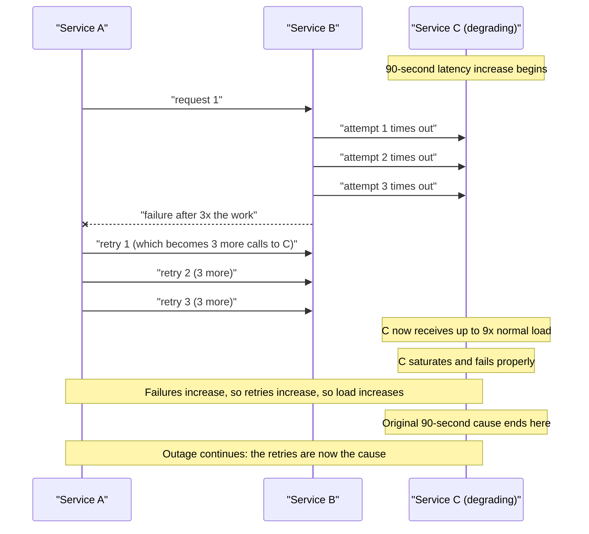
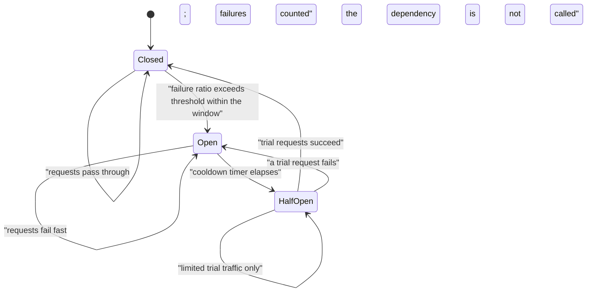
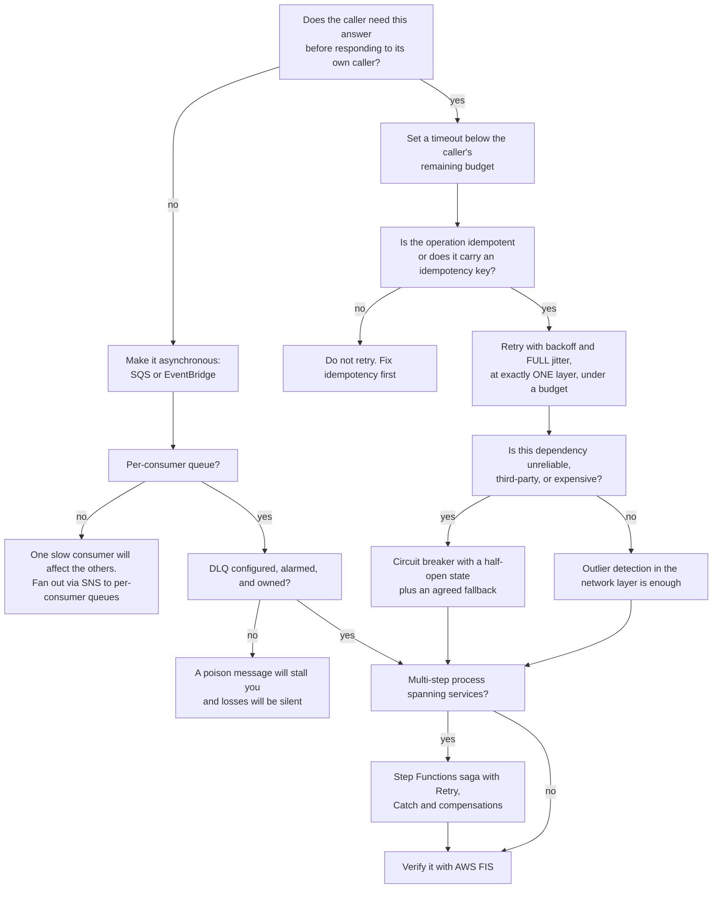
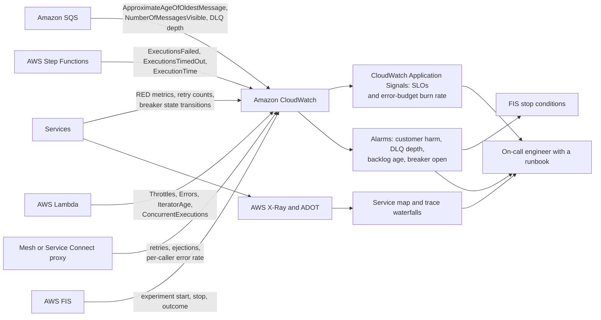
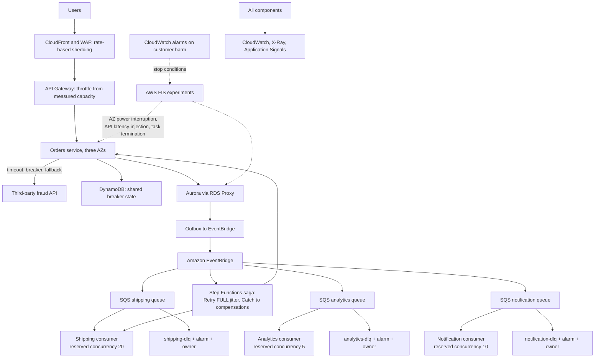

# Implementing Resilience in AWS Microservices

---

## Definition

**Resilience** is the property that a system continues to provide acceptable service in the presence of faults, and returns to full service afterwards without manual intervention. It is not the same as availability, which is a measurement, nor the same as reliability, which is about correctness over time. Resilience is a **design property** you build in deliberately, and it is composed of four distinct capabilities:

| Capability | Question it answers | Mechanisms in this chapter |
|---|---|---|
| **Fault isolation** | When something breaks, how much breaks with it? | Bulkheads, per-consumer queues, cell-based architecture, per-tenant partitioning, account and AZ boundaries |
| **Fault tolerance** | Can the system produce a correct or acceptable result despite the fault? | Retries, fallbacks, graceful degradation, redundancy, queue-based buffering |
| **Fault containment** | Does the fault stay put, or does it spread? | Circuit breakers, timeouts, load shedding, retry budgets, connection-pool limits |
| **Recovery** | Does it heal itself, and how fast? | Health checks, automatic replacement, dead-letter queues with redrive, saga compensation, automated rollback |

Three AWS services anchor this chapter, each addressing a different part of the problem:

- **AWS Step Functions** is where a multi-step process's error handling lives **explicitly**: retries with backoff and jitter, catch handlers, timeouts, compensation, and a durable execution history that survives the failure of everything participating in it.
- **Amazon SQS and Amazon SNS** are where **isolation and buffering** live: a queue is a bulkhead, a shock absorber, and a durable record of work that has not yet succeeded, all at once.
- **AWS Fault Injection Service** is where resilience stops being an assertion and becomes a **measurement**, by deliberately injecting the faults you claim to handle and observing whether you do.

!!! note "Resilience is a property of the whole system, not of any component"

    Every individual component in a system can be highly available while the system is fragile, because the fragility lives in the *interactions*: a retry policy that amplifies load, a shared connection pool that couples unrelated dependencies, a timeout longer than the caller's patience, a queue with no dead-letter destination. This is exactly why [chapter 4.1](topic1.md)'s arithmetic  availability multiplies downward along a synchronous chain  matters, and why the highest-leverage resilience change is usually removing a dependency rather than hardening one.

---

## Why This Service or Concept Exists

### The failure modes that distribution introduces

A monolith fails in one way: the process dies, and everything stops. That is a bad outcome but a *simple* one, and it is detectable in milliseconds. Distributing the system replaces it with several harder problems.

| Failure mode | What it means | Why it is hard |
|---|---|---|
| **Partial failure** | Some components work, others do not | The system is neither up nor down; it is in a state your health checks were not designed to describe |
| **Ambiguous outcome** | The call timed out, so you do not know whether it succeeded | Retrying may duplicate the effect; not retrying may lose it. Only idempotency resolves this |
| **Gray failure** | A component is degraded but reports healthy | Health checks pass while users suffer; the system's own view of itself is wrong |
| **Metastable failure** | A system that stays broken after the trigger is gone | The recovery mechanism  retries  has become the load sustaining the failure |
| **Correlated failure** | Many components fail together | Redundancy assumed independence and did not get it: same AZ, same dependency, same bad deployment |
| **Cascading failure** | One component's failure overloads the next | Failure propagates along the dependency graph faster than humans can respond |
| **Poison message** | One malformed item blocks a queue or shard forever | Without a dead-letter path, throughput goes to zero for everything behind it |

!!! danger "Metastable failure is the one that surprises people"

    A brief latency spike causes timeouts. Timeouts cause retries. Retries multiply load. The extra load sustains the latency spike **after its original cause has disappeared**. The system is now in a stable state that is broken  hence *metastable*  and it will not recover on its own, because the thing keeping it broken is your own recovery mechanism. Restarting components often makes it worse, because a restarted service arrives to an unbounded backlog of queued retries. The only exits are shedding load, breaking circuits, or draining the retry backlog, and all three must be designed in beforehand: you cannot add them during the incident.

### What AWS provides, and what it does not

| Concern | Without managed services | With AWS |
|---|---|---|
| Durable buffering between services | Operate a message broker cluster | Amazon SQS: no capacity to manage, effectively unlimited scale |
| Fan-out with per-consumer isolation | One broker topic; a slow consumer affects others | SNS to per-consumer SQS queues; each buffers independently |
| Poison-message handling | Bespoke error tables and manual intervention | `maxReceiveCount` plus a dead-letter queue, with redrive built in |
| Durable multi-step process state | A database table, a scheduler, and hand-written recovery | Step Functions: durable execution history, declarative retry and catch |
| Retry with backoff and jitter | Implemented per language, inconsistently | Step Functions `Retry` fields; AWS SDK adaptive retry mode; mesh retry policy |
| Circuit breaking | A library per language, upgraded in lockstep | Envoy outlier detection; SDK adaptive mode; explicit state in DynamoDB for workflow-level breakers |
| Bulkheads | Manual thread-pool partitioning | Separate queues, Lambda reserved concurrency, ECS service isolation, separate accounts |
| Controlled fault injection | Unplug something and hope | AWS FIS with typed actions, stop conditions and a bounded blast radius |
| Resilience assessment | An architecture review and an opinion | AWS Resilience Hub: RTO and RPO assessment against a defined policy |

What AWS does **not** provide is the design. Every anti-pattern in this chapter  retries at three layers, no timeouts, a shared connection pool, a dead-letter queue nobody owns, a circuit breaker with no half-open state  is fully supported by the platform and costs nothing extra. The services make correct designs cheap; they do not make incorrect ones impossible.

---

## Core Concepts

### Timeouts: the foundation everything else rests on

A call without a timeout is not a call; it is a hang waiting to happen. When a downstream service stops responding, an untimed caller holds its thread, its connection and its memory indefinitely. Under load, every thread ends up waiting on the same dependency, and the caller stops serving *all* traffic  including requests that never touch the failing dependency. This is how one service's degradation becomes a system-wide outage, and it is the most consequential single omission in this chapter.

Timeouts must be set from **measured latency**, not from a round number, and they interact:

| Timeout | What it bounds | How to set it |
|---|---|---|
| **Connection timeout** | Establishing a TCP connection | Short  hundreds of milliseconds. A slow connect means the endpoint is unreachable, not busy |
| **Request (read) timeout** | Waiting for a response after sending | Above the dependency's p99, below the caller's own remaining budget |
| **Total operation timeout** | The whole operation including retries | Must fit inside the caller's deadline, or the last retry is work performed for nobody |
| **Idle timeout** | An unused pooled connection | Shorter than the far end's idle timeout, or you reuse a connection the server just closed |
| **Overall request deadline** | The user's patience | Set at the edge and propagated downstream |

!!! danger "The arithmetic teams get wrong"

    A caller with a 2-second budget calls a dependency with a 1-second per-attempt timeout and three retries. Worst case: 3 seconds of attempts plus backoff, inside a 2-second budget. The caller gives up during the second retry, so the third attempt is **work performed for a request nobody is waiting for**  and it is performed at the exact moment the dependency is already struggling. The rule is that the **total retry budget must fit inside the caller's deadline**, which usually means fewer retries than instinct suggests. Two attempts with a tight timeout beats five with a loose one.

### Retries: necessary, and the most dangerous tool here

Retries recover from **transient** faults: a dropped packet, a brief throttle, an instance replaced mid-request. They are useless against **persistent** faults and actively harmful against **overload**, where the retry *is* the overload.

Three rules, all mandatory:

**Retry only what is retryable.** A 500, a 503, a 429 with a `Retry-After`, a connection reset, a timeout  retryable. A 400, a 401, a 403, a 404, a validation failure  not retryable, and retrying them wastes capacity and delays the real error reaching the caller.

**Retry only what is safe to repeat.** A GET is naturally idempotent. A POST that creates an order is not, unless it carries an idempotency key. Retrying a non-idempotent write duplicates the effect, which is how customers get charged twice.

**Use exponential backoff with full jitter.** Without backoff, retries arrive immediately, which is exactly wrong for an overloaded dependency. Without jitter, every client that failed at the same moment retries at the same moment, producing synchronised waves that keep the dependency saturated.

```
# Full jitter: the AWS-recommended formula.
sleep = random_between(0, min(cap, base * 2 ** attempt))
```

The `random_between(0, ...)` is the important part. "Equal jitter" and other half-measures still cluster; full jitter spreads retries across the whole interval and is measurably better at desynchronising a fleet.

**Retry at exactly one layer.** This is the rule teams break most often, because each layer's retry looks locally reasonable. Three retries at the client, three at the gateway and three in the SDK is up to 27 requests per logical call. Decide where retries live  usually as close to the failure as possible  and explicitly disable them everywhere else.

**Cap retries with a budget.** A retry budget expresses retries as a fraction of total requests, typically 10 to 20 per cent. Once the budget is exhausted, further failures fail fast rather than retrying. This is what bounds amplification when *everything* is failing, which is precisely when unbounded retry logic does the most damage.

### The retry storm, in detail


```mermaid
sequenceDiagram
    participant A as "Service A"
    participant B as "Service B"
    participant C as "Service C (degrading)"
    Note over C: 90-second latency increase begins
    A->>B: "request 1"
    B->>C: "attempt 1  times out"
    B->>C: "attempt 2  times out"
    B->>C: "attempt 3  times out"
    B--xA: "failure after 3x the work"
    A->>B: "retry 1 (which becomes 3 more calls to C)"
    A->>B: "retry 2 (3 more)"
    A->>B: "retry 3 (3 more)"
    Note over C: C now receives up to 9x normal load
    Note over C: C saturates and fails properly
    Note over A,C: Failures increase, so retries increase, so load increases
    Note over C: Original 90-second cause ends here
    Note over A,C: Outage continues: the retries are now the cause
```

The defences are cumulative and all of them are needed:

| Defence | What it stops |
|---|---|
| **Retry at one layer only** | Multiplicative amplification, 27× down to 3× |
| **Full jitter** | Synchronised waves that keep the dependency saturated |
| **Retry budget** | Amplification when everything is failing |
| **Circuit breaker** | Calling a dependency that is known to be down at all |
| **Deadline propagation** | Work performed for requests already abandoned |
| **Load shedding at the callee** | The callee accepting more work than it can complete |
| **Backpressure through a queue** | The synchronous coupling that lets the caller push at all |

### Circuit breakers

A circuit breaker is a state machine wrapping calls to one dependency. When failures exceed a threshold, it **opens** and fails subsequent calls immediately without attempting them  giving the dependency room to recover and giving the caller a fast, predictable failure instead of a slow, thread-consuming one.


```mermaid
stateDiagram-v2
    [*] --> Closed
    Closed --> Open : "failure ratio exceeds threshold within the window"
    Open --> HalfOpen : "cooldown timer elapses"
    HalfOpen --> Closed : "trial requests succeed"
    HalfOpen --> Open : "a trial request fails"
    Closed --> Closed : "requests pass through; failures counted"
    Open --> Open : "requests fail fast; the dependency is not called"
    HalfOpen --> HalfOpen : "limited trial traffic only"
```

The **half-open** state is what makes it a circuit breaker rather than a kill switch: after a cooldown it allows a small number of trial requests, closing on success and reopening on failure. A breaker without a half-open state never recovers without human intervention.

Three parameters, and all three are commonly set wrongly:

| Parameter | Too low | Too high |
|---|---|---|
| **Failure threshold** | Flapping on normal error rates | Never opens; provides no protection |
| **Window** | Statistically meaningless on low-traffic dependencies | Slow to react; the damage is done before it opens |
| **Cooldown** | Hammers a recovering dependency with trial traffic | Stays open long after recovery, extending the outage |

**Where a circuit breaker lives on AWS.** There is no "AWS Circuit Breaker" service, and expecting one is a common misconception. There are three legitimate homes:

1. **The network layer**  Envoy outlier detection in a mesh, or ECS Service Connect's endpoint ejection. This is per-endpoint and automatic, needs no application code, and is the right default for service-to-service HTTP.
2. **The SDK and application**  the AWS SDK's `adaptive` retry mode implements client-side rate limiting that behaves like a breaker for AWS API calls; language libraries provide it for other calls.
3. **Explicit state in a workflow**  a DynamoDB item holding breaker state, read by a Step Functions state before calling an expensive or unreliable dependency. This is the right pattern for a **third-party** dependency where you want the breaker's state to be shared across all executions and visible to operators.

!!! warning "The `ECS deployment circuit breaker` is a different thing"

    ECS has a feature called the deployment circuit breaker, which detects a failing rolling deployment and rolls it back. It is valuable and you should enable it. It is **not** a request-path circuit breaker and it does nothing about a failing dependency. The name collision catches students in examinations, so read the context: deployment, or dependency?

### Bulkheads

Named for a ship's watertight compartments: partition resources so that exhausting one does not sink the vessel. The failure a bulkhead prevents is *resource coupling*  one slow dependency consuming a shared pool that unrelated work also needs.

| Bulkhead | AWS implementation | What it isolates |
|---|---|---|
| **Per-dependency connection pool** | Separate HTTP clients or pools per downstream; Envoy per-cluster connection limits | One slow dependency cannot consume every connection |
| **Per-consumer queue** | SNS fan-out to one SQS queue per consumer | A slow consumer's backlog does not affect its peers |
| **Per-tenant queue or partition** | Queue per tenant tier; DynamoDB partition per tenant | One large tenant cannot starve the others |
| **Per-workload concurrency** | Lambda **reserved concurrency** | One function cannot consume the account's whole concurrency pool |
| **Per-service compute** | Separate ECS services or EKS deployments | A memory leak in one does not kill another |
| **Per-priority queue** | Separate queues for interactive and batch work | Batch cannot starve interactive |
| **Per-cell** | Cell-based architecture: independent stacks each serving a shard of customers | A failure affects one cell's customers only |
| **Per-AZ and per-Region** | Zonal isolation, static stability, multi-Region | Correlated infrastructure failure |
| **Per-account** | Separate AWS accounts | Quota exhaustion, blast radius, and compliance scope |

!!! tip "Lambda reserved concurrency is the clearest bulkhead on AWS"

    An account has a total concurrent-execution limit shared by every function. Without reserved concurrency, one function processing a large queue backlog can consume all of it, and every other function in the account  including the ones serving user requests  is throttled. Setting reserved concurrency on the batch function both caps it and guarantees it that capacity. It is two numbers in a console that convert a shared fate into an isolated one, and it is routinely omitted.

### Load shedding and backpressure

When demand exceeds capacity there are exactly three options: serve slower, reject some work, or buffer it. Serving slower is the worst, because unbounded queueing makes latency unbounded, which users experience as an outage while every dashboard shows the system "working".

**Load shedding** means rejecting excess work early with a well-formed 429 or 503, ideally with a `Retry-After` header. It is better than queueing because a fast rejection lets the client back off or fail over, and it protects the work already in flight.

**Backpressure** means the consumer signals the producer to slow down. Synchronous HTTP has no native backpressure mechanism, which is precisely why a queue helps: the producer's write completes immediately, the consumer works at its own rate, and the queue depth becomes both the scaling signal and the health indicator. **This is the single most important reason to prefer asynchronous communication**, and it converts an availability problem into a latency problem  which is far more tractable.

### Idempotency

At-least-once delivery is the norm on AWS: SQS standard queues, SNS, EventBridge, Lambda event source mappings and Step Functions activities can all deliver more than once. Every consumer must therefore be idempotent, or duplicates become double charges.

| Technique | Implementation | Notes |
|---|---|---|
| **Conditional write** | DynamoDB `attribute_not_exists(pk)`; a SQL unique constraint | The simplest and strongest; the second attempt is a no-op |
| **Idempotency key table** | Store the key with the result and a TTL; return the stored result on repeat | Needed when the operation is not a single write |
| **Natural idempotency** | `SET status = 'SHIPPED'` rather than `increment(count)` | Design operations to be repeatable where possible |
| **Provider-side keys** | Pass an idempotency key to the payment provider | The safest option for money; the key must reach the system of record |
| **Powertools for AWS Lambda** | The idempotency utility with a DynamoDB persistence store | Handles in-progress state and expiry correctly |

The key must be **caller-supplied and stable across retries**. Generating a UUID inside the handler defeats the entire mechanism, because each delivery generates a different one  a mistake that looks correct in code review and fails only under duplicate delivery.

### Deadline propagation

If a caller has already given up, work done downstream is pure waste  and it is performed at the worst possible moment. Deadline propagation passes the remaining time budget with each call: the edge sets a deadline, each hop subtracts elapsed time, and any service seeing a deadline in the past fails immediately.

```python
# The pattern, in outline.
deadline_ms = int(headers.get("x-deadline-ms", 0))
remaining = deadline_ms - now_ms()
if remaining <= 0:
    raise DeadlineExceeded("caller has already abandoned this request")
timeout = min(my_default_timeout, remaining - safety_margin)
downstream_headers["x-deadline-ms"] = str(now_ms() + timeout)
```

Without it, a system under stress spends a growing share of its capacity computing answers that are discarded  work that actively deepens the outage. Step Functions supports the analogous idea natively with `TimeoutSeconds` on a state and on a whole state machine.

### Graceful degradation and static stability

**Graceful degradation** means deciding in advance which features may fail and what happens when they do: recommendations fall back to a generic list, personalisation falls back to defaults, a loyalty balance renders as "unavailable", fraud scoring falls back to a value threshold. This is a **business decision** and must be made with the business, before an incident, because during one there is no time.

**Static stability** is the stronger idea: a system that continues operating correctly using only resources it already has, without needing a control plane. An Auto Scaling group pre-provisioned for the loss of one AZ is statically stable; one that must scale out during an AZ failure depends on the EC2 control plane at exactly the moment it is busiest. The principle generalises: pre-provision, cache configuration, hold last-known-good state, and never require a control-plane call to keep serving.

### Chaos engineering

Chaos engineering is the disciplined practice of injecting faults into a system to build confidence in its ability to withstand them. It is not "breaking things randomly"; it is an experiment with a hypothesis, a bounded blast radius, and a stop condition.

The method:

1. **Define steady state** as a measurable output  order completion rate, p99 latency, error rate. Not "CPU is normal", which is not what users care about.
2. **Form a hypothesis**: "if one Availability Zone becomes unavailable, order completion rate stays above 99 per cent and p99 latency stays below 800 milliseconds."
3. **Bound the blast radius**: the smallest injection that tests the hypothesis, in the smallest environment that can falsify it.
4. **Define stop conditions**: CloudWatch alarms that abort the experiment automatically.
5. **Run it**, starting in pre-production, then production during business hours with the team present.
6. **Learn**: a disproved hypothesis is the point. An experiment that always passes stopped being informative some time ago.

**AWS Fault Injection Service (FIS)**  renamed from Fault Injection Simulator  is the managed instrument: an **experiment template** declares **actions** (what fault), **targets** (which resources, selected by tag, filter or explicit ARN), and **stop conditions** (CloudWatch alarms that halt it). FIS executes with an IAM role and records every experiment, so a chaos programme has an audit trail.

!!! danger "Two rules that separate chaos engineering from vandalism"

    **Stop conditions are mandatory.** Every FIS experiment must have at least one CloudWatch alarm that halts it, and it must be one that fires on **customer harm**, not on the injected fault itself. An experiment without a stop condition is an outage you scheduled. **Blast radius must be explicit and minimal.** Target by tag, on a subset, in one AZ, for a bounded duration. "Terminate all instances matching `env=prod`" is not an experiment; the resource-selection filters exist precisely so that you never write that.

---

## AWS Service Deep Dive

!!! warning "On numbers and quotas"

    Quotas are representative as of 2026, mostly **soft** and adjustable through AWS Service Quotas, varying by Region and account. Verify in the Service Quotas console. Pricing is described as dimensions only.

### AWS Step Functions as a resilience instrument

**Purpose.** Provide durable, observable orchestration of a multi-step process, with declarative error handling  retries with backoff and jitter, catch handlers, timeouts and compensations  and an execution history that survives the failure of every participant.

**Architecture.** A **state machine** defined in Amazon States Language executes as an **execution**. Step Functions durably records the state after every transition, so an execution survives the failure of any service it calls and of the compute running the work. Two workflow types: **Standard**, durable for up to a year, exactly-once state transitions, full execution history, priced per state transition; and **Express**, up to five minutes, at-least-once, priced by invocation and duration, suited to high-volume short work.

**The resilience features, which are the point of this section.**

| Feature | What it does | Why it matters |
|---|---|---|
| **`Retry`** | Per-state retry with `ErrorEquals`, `IntervalSeconds`, `MaxAttempts`, `BackoffRate`, `MaxDelaySeconds`, `JitterStrategy` | Declarative, correct retry  including full jitter  without writing it in every language |
| **`Catch`** | Routes a named error to a recovery state | Compensation and fallback expressed in the workflow rather than buried in a handler |
| **`TimeoutSeconds` and `HeartbeatSeconds`** | Bounds a state's duration; heartbeats detect a stalled worker | Prevents an execution hanging forever on a dead task |
| **State machine `TimeoutSeconds`** | Bounds the whole execution | The deadline for the entire process |
| **`Parallel`** | Independent branches; a failure in one is catchable | Fault isolation inside a workflow |
| **`Map` (inline and distributed)** | Iterate over items with `MaxConcurrency` and a **tolerated failure percentage** | A bulkhead and a partial-failure policy in one construct |
| **`.waitForTaskToken`** | Pauses until an external system or human calls `SendTaskSuccess` or `SendTaskFailure` | Long-running and human steps without polling |
| **`.sync` integrations** | Waits for an ECS task, Batch job or nested execution to complete | Removes hand-written polling loops, a classic source of bugs |
| **Redrive** | Restart a failed Standard execution from its point of failure | Recovery without re-running completed work |
| **Execution history** | Every input, output, error and retry, retained and queryable | During an incident this is worth more than any log correlation |

**Retry semantics in detail**, because the exam and real systems both depend on the exact behaviour:

```json
{
  "Retry": [
    {
      "ErrorEquals": ["Lambda.TooManyRequestsException", "Lambda.ServiceException"],
      "IntervalSeconds": 1,
      "MaxAttempts": 4,
      "BackoffRate": 2.0,
      "MaxDelaySeconds": 20,
      "JitterStrategy": "FULL"
    },
    {
      "ErrorEquals": ["States.ALL"],
      "IntervalSeconds": 2,
      "MaxAttempts": 2,
      "BackoffRate": 2.0
    }
  ]
}
```

`IntervalSeconds` is the wait before the first retry; each subsequent wait is multiplied by `BackoffRate`; `MaxDelaySeconds` caps it; `JitterStrategy: FULL` randomises each wait between zero and the computed value, which is the AWS-recommended full-jitter behaviour and should be set on essentially every retrier. Retriers are evaluated **in order** and the **first match wins**, so specific errors must precede `States.ALL`. `MaxAttempts: 0` disables retry for a matched error, which is how you make a genuinely non-retryable error fail fast.

**Limitations.** Standard workflows are priced per state transition, so a chatty state machine with many trivial states is expensive  model coarse steps. Payload size between states is capped in the hundreds of kilobytes, so large data is passed by S3 reference. Execution history has an event limit, relevant for very long loops. Express workflows give at-least-once execution, so their tasks must be idempotent. And a state machine is not a general-purpose programming language: complex conditional logic becomes unreadable in ASL long before it becomes impossible.

**Pricing model.** Standard: per state transition. Express: per invocation plus duration and memory. The practical rule is Standard for long-running, low-volume, auditable business processes  exactly the saga case  and Express for high-volume short orchestrations.

**Availability and scaling.** Regional, multi-AZ, managed. Scales automatically; the constraints are per-account execution start rates and state-transition rates, both soft quotas, and  far more often in practice  the concurrency of whatever the states call.

**Security features.** An execution role per state machine following least privilege; CloudWatch Logs at configurable levels; X-Ray tracing; KMS encryption of execution data; and full CloudTrail coverage. Note that execution history contains state input and output, so a workflow handling sensitive data needs log-level and encryption decisions made deliberately.

### Amazon SQS as a bulkhead and shock absorber

**Purpose.** Decouple producers from consumers with a durable, effectively unlimited buffer, so that a producer's rate and a consumer's rate need not match, and so that work is not lost when a consumer fails.

**Architecture.** Messages are stored redundantly across multiple AZs within a Region. A consumer **receives** a message, which makes it invisible for the **visibility timeout**; the consumer must **delete** it after successful processing, or it becomes visible again for another attempt. This receive-process-delete cycle, rather than a push, is what makes SQS naturally resilient: a consumer that dies mid-processing loses nothing.

| Queue type | Ordering | Delivery | Throughput |
|---|---|---|---|
| **Standard** | Best-effort ordering | At-least-once | Effectively unlimited |
| **FIFO** | Strict ordering **within a message group** | Exactly-once processing within the deduplication window | High, and much higher with high-throughput mode; per-message-group ordering is the constraint |

**The resilience mechanisms, which are the substance of this section.**

| Mechanism | What it does | How to set it |
|---|---|---|
| **Visibility timeout** | How long a received message stays invisible | Longer than the p99 processing time. Too short causes duplicate processing; too long delays retry after a crash |
| **`maxReceiveCount` and redrive policy** | After N receives, move the message to a dead-letter queue | 3 to 5 typically. This is the poison-message defence |
| **Dead-letter queue** | Destination for messages that repeatedly fail | Mandatory on every consumer. Alarm on depth; name an owner |
| **DLQ redrive** | Move messages back to the source queue after a fix | The recovery path; test it before you need it |
| **Long polling (`ReceiveMessageWaitTimeSeconds`)** | Wait up to 20 seconds for a message | Reduces empty receives, cost and latency. Effectively always on |
| **Batch operations** | Send, receive and delete up to 10 at a time | Fewer API calls, lower cost, higher throughput |
| **Partial batch response** | A Lambda consumer reports which messages in a batch failed | Without it, one bad message causes the **whole batch** to be redelivered |
| **Delay queues and message timers** | Delay delivery up to 15 minutes | Simple scheduled retry, and a way to space out work |
| **Message retention** | 1 minute to 14 days | Long retention on a DLQ so you have time to investigate |
| **Maximum message size and the extended client** | 256 KB, or large payloads stored in S3 | Pass large data by reference |
| **FIFO message group ID** | The ordering and parallelism unit | **Ordering is per group**, so a well-chosen group ID gives ordering *and* parallelism; one group means one consumer at a time |

!!! danger "Visibility timeout and Lambda: the classic misconfiguration"

    If a Lambda consumer's function timeout exceeds the queue's visibility timeout, the message becomes visible again **while the function is still processing it**, and a second invocation begins on the same message. The result is duplicate processing that looks random and is very hard to diagnose. The rule is that the queue's visibility timeout should be at least **six times** the function timeout, which is also what the AWS console suggests when you wire them together. And regardless of configuration, the consumer must be idempotent.

**Limitations.** Standard queues do not guarantee order and can deliver duplicates. FIFO throughput is bounded per message group, so a single group is a serialisation point. Maximum message size is 256 KB without the extended client. Maximum retention is 14 days. In-flight message limits apply per queue. There is no server-side filtering  a consumer receives what is in the queue, which is why fan-out filtering belongs in SNS or EventBridge.

**Pricing model.** Per million requests, with FIFO more expensive than standard, plus data transfer. Long polling and batching reduce request count substantially, and an idle queue polled aggressively with short polling is a surprisingly common small cost.

**Scaling behaviour.** Standard queues scale essentially without limit. The scaling decision that matters is the **consumer's**, and it should be driven by **backlog per consumer**  approximate messages visible divided by running consumers  rather than raw depth, because raw depth ignores the capacity you just added and causes the scaling loop to oscillate.

**Security features.** SSE with SQS-managed or KMS customer-managed keys; queue policies for cross-account access; VPC endpoints so traffic never leaves the AWS network; IAM control per action and per queue.

### Amazon SNS for fan-out with isolation

**Purpose.** Deliver one message to many subscribers, so that a producer need not know its consumers, with per-subscription filtering, retry and dead-lettering.

**Architecture.** Publishers send to a **topic**; SNS delivers to every **subscription**  SQS queues, Lambda functions, HTTP endpoints, email, SMS, mobile push, Kinesis Data Firehose. **Standard** topics are at-least-once with best-effort ordering; **FIFO** topics preserve ordering and deduplication and may deliver only to SQS FIFO queues.

**The resilience-relevant features.**

| Feature | What it does | Why it matters |
|---|---|---|
| **SNS to SQS fan-out** | Each consumer gets its own durable queue | **The canonical bulkhead.** A slow or failed consumer's backlog is entirely its own |
| **Message filtering** | Subscription filter policies on attributes or message body | Consumers receive only relevant messages, reducing wasted invocations |
| **Delivery retry policy** | Configurable backoff for HTTP/S endpoints | Bounded retry to endpoints you do not control |
| **Subscription dead-letter queue** | An SQS queue for messages SNS could not deliver | Without it, undeliverable messages are **discarded after the retry policy is exhausted** |
| **Message archiving and replay (FIFO)** | Retain and replay to a new subscriber | Recovery from a consumer bug, and onboarding a new consumer with history |

!!! warning "SNS direct-to-Lambda is not a bulkhead"

    Subscribing a Lambda function directly to an SNS topic gives you SNS's own retry policy and then discard. There is no queue, so a consumer outage longer than the retry window loses messages, there is no backlog to inspect, no redrive, and no way to reprocess. **SNS to SQS to Lambda** costs one extra hop and gives durable buffering, `maxReceiveCount`, a dead-letter queue, redrive, and a visible backlog. Use the direct subscription only for genuinely fire-and-forget notifications whose loss is acceptable.

### AWS Fault Injection Service

**Purpose.** Inject controlled, realistic faults into AWS workloads to validate resilience assumptions, with typed actions, explicit targeting, bounded duration and automatic stop conditions.

**Architecture.** An **experiment template** contains **actions**, **targets**, **stop conditions** and an **IAM role**. Actions have parameters and may depend on one another with `startAfter`, so a sequence can be composed. Targets are selected by resource type plus tags, filters or explicit ARNs, with a **selection mode**  all, a count, or a percentage  that is the primary blast-radius control. Stop conditions are CloudWatch alarms; if any enters ALARM, FIS halts the experiment and rolls back its actions.

**Representative action categories.**

| Category | Examples | What it tests |
|---|---|---|
| **Compute** | Stop, terminate or reboot EC2 instances; inject CPU, memory, I/O or kernel-panic stress | Instance replacement, capacity headroom, health checks |
| **Containers** | Stop ECS tasks; drain ECS container instances; terminate EKS pods and nodes | Rescheduling, deregistration, connection draining, `SIGTERM` handling |
| **Serverless** | Lambda invocation errors, added latency, and start-up failures | Retry configuration, DLQs, downstream tolerance |
| **Database** | Reboot or fail over RDS and Aurora instances and clusters | Failover time, connection-pool recovery, read-your-writes behaviour |
| **Networking** | Disrupt connectivity to a subnet, an AZ, a VPC, a prefix list, or specific AWS services; add latency and packet loss | Timeouts, retries, circuit breakers, cross-AZ assumptions |
| **AZ availability: power interruption** | Simulate a full AZ power event across multiple services simultaneously | The multi-AZ claim, end to end |
| **Cross-Region: connectivity** | Disrupt traffic between Regions | Multi-Region failover and replication assumptions |
| **API throttling and errors** | Inject throttling or errors on AWS API calls from targeted instances | Whether your SDK retry and backoff configuration is correct |

**Scenarios.** FIS supplies pre-built scenarios  notably the AZ availability power interruption  that compose several actions to model a realistic event rather than a single injected fault. These are the right starting point, because real failures are correlated and single-fault injections systematically under-test.

**Limitations.** FIS covers the faults AWS has implemented; application-level faults such as a corrupted cache entry or a logic error are outside its scope and need application-level injection. Some actions require the **SSM Agent** on targets, which is a prerequisite easily overlooked. Injection is at the infrastructure layer, so it cannot simulate a third-party API returning wrong data. And it requires a real IAM role with real permissions to disrupt real resources, so the role itself must be tightly scoped and auditable.

**Pricing model.** Per action-minute, differentiated between simple actions and the more complex AZ and cross-Region scenarios. Cheap relative to the outages it prevents, and the cost model naturally encourages short, targeted experiments  which is also the correct practice.

**Security features.** The experiment role is the control: scope it to the exact resource tags an experiment may touch. CloudTrail records every experiment and action. Stop conditions are enforced by the service, not by convention.

**Common configurations.** Tag-based targeting with a dedicated `ChaosReady=true` tag so nothing is targeted by accident; selection mode as a percentage rather than all; a stop condition alarming on customer-facing error rate or latency; experiments run in pre-production on a schedule and in production during business hours with the team present; templates in version control alongside the workload they test.

---

## Architecture Components

| Component | Responsibility in a resilient architecture |
|---|---|
| **Client** | Owns retry behaviour; a client that retries aggressively without jitter is a retry-storm source you do not control |
| **Amazon Route 53** | Health-check-based failover between AZs and Regions; resolution survives most control-plane events |
| **Amazon CloudFront and AWS WAF** | Absorb and reject load at the edge before it becomes backend work; rate-based rules are the first line of load shedding |
| **Amazon API Gateway** | Throttling as deliberate load shedding, returning a well-formed 429 rather than a timeout |
| **Application Load Balancer** | Health checks, connection draining, cross-zone distribution, and removal of unhealthy targets |
| **Amazon ECS and Amazon EKS** | Automatic replacement of failed tasks and pods; multi-AZ spread; deployment circuit breaker and PodDisruptionBudgets |
| **AWS Fargate** | Per-task microVM isolation, so one task's resource exhaustion cannot affect another's |
| **AWS Lambda** | **Reserved concurrency** as a bulkhead; **provisioned concurrency** against cold-start latency; destinations and DLQs for asynchronous failures |
| **Amazon SQS** | The bulkhead, the shock absorber, and the durable record of unfinished work; DLQs as the poison-message defence |
| **Amazon SNS** | Fan-out with per-subscription filtering, retry policies and dead-letter queues |
| **Amazon EventBridge** | Content-based routing with retry policy, DLQ per target, and archive plus replay for recovery |
| **Amazon Kinesis Data Streams** | Ordered, replayable buffering; replay is a recovery mechanism a queue cannot offer |
| **AWS Step Functions** | Where a multi-step process's error handling lives explicitly, with durable state and compensations |
| **Amazon DynamoDB** | Idempotency records via conditional writes; circuit-breaker state shared across executions; on-demand capacity that absorbs spikes |
| **Amazon Aurora and RDS Proxy** | Multi-AZ failover; RDS Proxy preserves connections across failover and prevents connection exhaustion from many small consumers |
| **Amazon ElastiCache** | Caching that removes load from origins; also a correlated-failure risk if a cache outage produces a thundering herd |
| **AWS Fault Injection Service** | Controlled fault injection with typed actions, bounded blast radius and automatic stop conditions |
| **AWS Resilience Hub** | Assesses an application against defined RTO and RPO targets and recommends specific remediations |
| **Amazon CloudWatch** | Metrics, alarms, composite alarms, and the stop conditions that make chaos experiments safe |
| **CloudWatch Application Signals** | SLOs and error-budget burn rate, so resilience is measured against user experience |
| **AWS X-Ray and ADOT** | Traces showing where latency and failure actually occurred across services |
| **AWS Systems Manager** | Automation runbooks for recovery actions, invocable by alarm |
| **AWS Auto Scaling and Karpenter** | Capacity response; but pre-provisioning beats scaling during a failure event |
| **AWS Organizations and multiple accounts** | The strongest blast-radius boundary: separate quotas, separate control-plane exposure |

Read structurally, these components divide into three groups with distinct roles. The **absorbers**  CloudFront, WAF, API Gateway throttling, SQS, Kinesis  take load that the system cannot currently serve and either reject it cheaply or hold it durably; every one of them converts an availability problem into either a rejection or a latency problem. The **isolators**  separate queues, Lambda reserved concurrency, separate ECS services, AZs, cells, accounts  bound how far a failure travels; they do nothing to prevent failure and everything to limit it. The **recoverers**  health checks and replacement, dead-letter queues and redrive, saga compensation, Step Functions redrive, EventBridge replay  return the system to correctness afterwards. A design missing any one group fails characteristically: no absorbers means it falls over under load, no isolators means everything fails together, and no recoverers means it stays broken until a human intervenes.

---

## Important AWS Terminology

| Term | Meaning |
|---|---|
| **Resilience** | Continuing to provide acceptable service under fault, and recovering without manual intervention |
| **Partial failure** | Some components working while others do not; the normal condition of a distributed system |
| **Ambiguous outcome** | A timed-out call whose success or failure is unknown; resolvable only by idempotency |
| **Gray failure** | A component degraded but reporting healthy; the system's own view of itself is wrong |
| **Metastable failure** | A stable broken state sustained by the recovery mechanism itself, outliving its trigger |
| **Cascading failure** | One component's failure overloading the next along the dependency graph |
| **Correlated failure** | Multiple components failing together because redundancy assumed independence it did not have |
| **Blast radius** | How much is affected when one thing fails |
| **Timeout** | A bound on how long a caller waits; the foundation everything else rests on |
| **Connection, request and idle timeout** | Bounds on connect, on response, and on an unused pooled connection |
| **Deadline propagation** | Passing the remaining budget downstream so abandoned work is not performed |
| **Exponential backoff** | Increasing the wait between retries multiplicatively |
| **Full jitter** | Randomising each wait between zero and the computed backoff; the AWS-recommended form |
| **Retry budget** | A cap on retries as a fraction of total requests, bounding amplification |
| **Retry storm** | Layered retries converting a transient fault into a sustained outage |
| **Circuit breaker** | A state machine that fails fast when a dependency is known-bad, with closed, open and half-open states |
| **Half-open** | The trial state that lets a breaker recover without human intervention |
| **Outlier detection** | Proxy-level ejection of endpoints returning errors; the mesh's circuit breaker |
| **ECS deployment circuit breaker** | A **different** feature: detects a failing rolling deployment and rolls it back |
| **Bulkhead** | Partitioned resources so exhausting one does not exhaust all |
| **Reserved concurrency** | A Lambda cap that both limits a function and guarantees it capacity; the clearest AWS bulkhead |
| **Provisioned concurrency** | Pre-initialised Lambda environments removing cold-start latency |
| **Load shedding** | Rejecting excess work early with a well-formed 429 or 503 |
| **Backpressure** | The consumer's rate constraining the producer; native to queues, absent from synchronous HTTP |
| **Idempotency** | Repeating an operation has the same effect as performing it once |
| **Idempotency key** | A caller-supplied, retry-stable identifier making a repeat safe |
| **Graceful degradation** | Pre-agreed reduced functionality when a dependency fails |
| **Static stability** | Continuing to operate correctly with resources already held, without a control-plane call |
| **Saga** | Local transactions plus compensating transactions replacing a distributed transaction |
| **Compensating transaction** | A new business operation that semantically undoes a completed one |
| **State machine and execution** | A Step Functions workflow definition, and one run of it |
| **Standard vs Express workflow** | Durable, exactly-once, per-transition pricing; versus short, at-least-once, per-invocation pricing |
| **`Retry` and `Catch`** | Declarative per-state retry policy, and error routing to a recovery state |
| **`BackoffRate`, `MaxDelaySeconds`, `JitterStrategy`** | The Step Functions retry-shaping fields; `JitterStrategy: FULL` is the correct default |
| **`States.ALL`** | The catch-all error name; must appear **last** among retriers and catchers |
| **`TimeoutSeconds` and `HeartbeatSeconds`** | A state's duration bound, and stall detection for a long-running worker |
| **`.waitForTaskToken`** | Pauses a state until an external caller signals success or failure |
| **Redrive (Step Functions)** | Restarting a failed Standard execution from its point of failure |
| **Visibility timeout** | How long a received SQS message stays invisible to other consumers |
| **`maxReceiveCount` and redrive policy** | How many receives before a message moves to the dead-letter queue |
| **Dead-letter queue (DLQ)** | The destination for repeatedly failing messages; mandatory, alarmed, and owned |
| **DLQ redrive** | Returning messages from a DLQ to the source queue after a fix |
| **Poison message** | A message that always fails, blocking progress if there is no DLQ |
| **Long polling** | Waiting up to 20 seconds for a message, reducing empty receives and cost |
| **Partial batch response (`ReportBatchItemFailures`)** | Reporting which messages in a batch failed, so only those are redelivered |
| **Message group ID (FIFO)** | The unit of ordering **and** of parallelism in a FIFO queue |
| **Delay queue and message timer** | Deferring delivery by up to 15 minutes |
| **SNS to SQS fan-out** | One message to many topics-subscribers, each with its own durable buffer; the canonical bulkhead |
| **Subscription filter policy** | Server-side filtering so consumers receive only relevant messages |
| **SNS delivery retry policy and subscription DLQ** | Bounded retry to endpoints, and capture of what could not be delivered |
| **Backlog per consumer** | Messages visible divided by running consumers; the correct queue scaling signal |
| **Chaos engineering** | Disciplined fault injection to build confidence in resilience |
| **Steady state** | A measurable output describing normal behaviour, expressed in user terms |
| **Hypothesis** | The claim an experiment tries to falsify |
| **Stop condition** | A CloudWatch alarm that halts a FIS experiment; mandatory |
| **Experiment template** | The FIS resource containing actions, targets, stop conditions and a role |
| **Action, target, selection mode** | What fault, which resources, and how many of them |
| **AZ availability: power interruption** | A FIS scenario modelling a realistic correlated AZ event across services |
| **Game day** | A rehearsed failure exercise with the team present |
| **AWS Resilience Hub** | Assessment of an application against defined RTO and RPO targets |
| **RTO and RPO** | Recovery time objective and recovery point objective |
| **SLO and error budget** | The reliability target, and the permitted shortfall used to pace risk |
| **Cell-based architecture** | Independent stacks each serving a shard of customers, bounding blast radius |
| **Shuffle sharding** | Assigning each customer a distinct random subset of workers, so no two customers share all of them |

---

## Configuration Options

### Step Functions

| Setting | Options | How to decide |
|---|---|---|
| **Workflow type** | Standard, Express | Standard for durable business processes, sagas and anything needing full history; Express for high-volume short orchestration, remembering it is at-least-once |
| **`Retry.ErrorEquals`** | Specific error names, service prefixes, `States.ALL` | List retryable errors specifically. **`States.ALL` must be last**, or it swallows everything |
| **`MaxAttempts`** | Integer, 0 disables | Small: 2 or 3. Total retry time must fit the caller's deadline. `0` makes a known non-retryable error fail fast |
| **`BackoffRate`** | Multiplier, typically 2.0 | 2.0 unless you have a reason; combined with `MaxDelaySeconds` to cap growth |
| **`MaxDelaySeconds`** | Integer | Caps the interval so a long backoff chain does not exceed the process's tolerance |
| **`JitterStrategy`** | `NONE`, `FULL` | **`FULL`, essentially always.** Without it, concurrent executions retry in synchronised waves |
| **`Catch`** | Error names to a recovery state, with `ResultPath` | Preserve the error in `ResultPath` so the compensation knows what happened |
| **`TimeoutSeconds` (state)** | Integer | Above p99 for the task, below the execution's remaining budget |
| **`HeartbeatSeconds`** | Integer | For long activities; detects a stalled worker far sooner than the task timeout |
| **`TimeoutSeconds` (state machine)** | Integer | The deadline for the whole process; an execution without one can hang for a year |
| **`Map` `MaxConcurrency`** | Integer | A bulkhead: bounds pressure on downstream services from a large batch |
| **`Map` `ToleratedFailurePercentage`** | Percentage | Expresses a partial-failure policy: is 2 per cent of items failing acceptable? |
| **Logging level** | `OFF`, `ERROR`, `FATAL`, `ALL` | `ERROR` in production; `ALL` includes state input and output, which may be sensitive and is expensive |
| **X-Ray tracing** | On, off | On |

### Amazon SQS

| Setting | Options | How to decide |
|---|---|---|
| **Queue type** | Standard, FIFO | Standard unless ordering or deduplication is genuinely required; FIFO's per-group throughput is a real constraint |
| **Visibility timeout** | 0 seconds to 12 hours | Above the p99 processing time. **With Lambda, at least six times the function timeout** |
| **`maxReceiveCount`** | Integer with a redrive policy | 3 to 5. Too low sends transient failures to the DLQ; too high delays detection of a poison message |
| **Dead-letter queue** | Configured or not | **Always.** Plus a depth alarm and a named owner |
| **DLQ message retention** | Up to 14 days | Maximum, so there is time to investigate before silent loss |
| **`ReceiveMessageWaitTimeSeconds`** | 0 to 20 | 20. Long polling reduces empty receives, cost and latency |
| **Delivery delay / message timer** | 0 to 15 minutes | A simple deferred retry, or spacing out a burst |
| **Batch size (Lambda ESM)** | 1 to 10, or higher with a batching window | Larger batches are cheaper; larger batches also mean more redelivered work on failure unless partial batch responses are on |
| **`ReportBatchItemFailures`** | On, off | **On.** Without it one bad message redelivers the whole batch |
| **Maximum concurrency (Lambda ESM)** | Integer | Bounds how many concurrent invocations this queue can drive  a per-queue bulkhead |
| **FIFO message group ID** | Chosen by the producer | The ordering **and** parallelism unit. Use the smallest key that preserves required ordering  customer ID, not a constant |
| **FIFO deduplication** | Content-based, or explicit `MessageDeduplicationId` | Explicit IDs when the producer has a natural key; content-based hashing otherwise |
| **High-throughput FIFO** | On, off | On when per-group throughput is the constraint |
| **Encryption** | SSE-SQS or SSE-KMS | KMS customer-managed keys where key policy and decrypt auditing matter |

### Amazon SNS

| Setting | Options | How to decide |
|---|---|---|
| **Topic type** | Standard, FIFO | FIFO only when ordered fan-out to SQS FIFO queues is required |
| **Subscription protocol** | SQS, Lambda, HTTPS, email, SMS, Firehose | **SQS for anything that matters.** Direct-to-Lambda has no durable buffer, no DLQ and no redrive |
| **Filter policy** | Attribute-based or message-body-based | Filter at SNS so consumers are not invoked for irrelevant messages |
| **Delivery retry policy** | Backoff parameters for HTTP/S | Bounded retry to endpoints you do not control |
| **Subscription DLQ** | An SQS queue | **Always** on any subscription whose loss would matter; without it, undeliverable messages are discarded |
| **Message archiving and replay (FIFO)** | Retention period | Enables recovery from a consumer bug and onboarding a new consumer with history |

### AWS Fault Injection Service

| Setting | Options | How to decide |
|---|---|---|
| **Target selection mode** | `ALL`, `COUNT(n)`, `PERCENT(n)` | Start with `COUNT(1)`, then a small percentage. `ALL` is almost never an experiment |
| **Target selection** | Tags, resource ARNs, filters | Require a dedicated tag such as `ChaosReady=true` so nothing is targeted by accident |
| **Stop conditions** | One or more CloudWatch alarms | **Mandatory**, and they must alarm on **customer harm**, not on the injected fault |
| **Action duration** | ISO 8601 duration | Short: minutes. Long enough to observe recovery, short enough to bound exposure |
| **Action sequencing** | `startAfter` | Compose realistic correlated scenarios rather than single isolated faults |
| **Experiment role** | An IAM role | Scoped to the exact tags and actions permitted. This role is the real safety boundary |
| **Environment** | Pre-production, then production | Pre-production first; production during business hours, announced, with the team present |
| **Scenario library** | AZ availability power interruption, cross-Region connectivity | Prefer a realistic scenario over a single fault: real failures are correlated |
| **Report configuration** | Experiment reports with pre- and post-experiment metrics | Produces the evidence an audit or a resilience review needs |

!!! danger "Three configuration mistakes that cause real incidents"

    **A visibility timeout shorter than the processing time** produces duplicate processing that appears random and is very hard to diagnose; with Lambda the rule of six times the function timeout exists precisely for this. **A missing dead-letter queue** turns one poison message into a stalled consumer, and on a FIFO queue into a stalled message group  six hours of payments behind one bad record is a real incident, not a hypothetical. **A FIS stop condition that alarms on the injected fault** aborts every experiment immediately and teaches you nothing, which is worse than not running the experiment because it creates false confidence that chaos testing is happening.

---

## Design Considerations


```mermaid
flowchart TD
    A["Does the caller need this answer<br/>before responding to its own caller?"] -->|"no"| B["Make it asynchronous:<br/>SQS or EventBridge"]
    A -->|"yes"| C["Set a timeout below the caller's<br/>remaining budget"]
    C --> D["Is the operation idempotent<br/>or does it carry an idempotency key?"]
    D -->|"no"| E["Do not retry. Fix idempotency first"]
    D -->|"yes"| F["Retry with backoff and FULL jitter,<br/>at exactly ONE layer, under a budget"]
    F --> G["Is this dependency unreliable,<br/>third-party, or expensive?"]
    G -->|"yes"| H["Circuit breaker with a half-open state<br/>plus an agreed fallback"]
    G -->|"no"| I["Outlier detection in the network layer is enough"]
    B --> J["Per-consumer queue?"]
    J -->|"no"| K["One slow consumer will affect the others.<br/>Fan out via SNS to per-consumer queues"]
    J -->|"yes"| L["DLQ configured, alarmed, and owned?"]
    L -->|"no"| M["A poison message will stall you<br/>and losses will be silent"]
    L -->|"yes"| N["Multi-step process spanning services?"]
    H --> N
    I --> N
    N -->|"yes"| O["Step Functions saga with Retry,<br/>Catch and compensations"]
    N -->|"no"| P["Verify it with AWS FIS"]
    O --> P
```

| Quality | What it means here | Design levers | The trade-off you accept |
|---|---|---|---|
| **Fault isolation** | A failure affects a bounded set of users or functions | Per-consumer queues, reserved concurrency, cells, AZs, accounts | More components to operate; isolation always costs some efficiency |
| **Fault tolerance** | An acceptable result despite the fault | Retries, fallbacks, degraded modes, queue buffering | A fallback is a second code path that is rarely exercised and therefore rarely correct  unless you test it |
| **Fault containment** | The failure does not spread | Timeouts, breakers, budgets, load shedding, pool limits | Shedding load means rejecting real users; that is a business decision |
| **Recovery** | The system heals without human intervention | Health checks and replacement, DLQ redrive, compensations, automated rollback | Automated recovery can amplify a problem if it is triggered by a wrong signal |
| **Latency** | Time under normal and degraded conditions | Tight timeouts, few retries, fail-fast breakers | Aggressive timeouts fail requests that would have succeeded; the setting is a trade, not an optimum |
| **Consistency** | What the user sees during and after a failure | Sagas, compensations, idempotency, reconciliation | Compensation windows are visible to customers and must be acceptable to the business |
| **Cost** | What resilience costs continuously | Redundancy, pre-provisioned capacity, extra queues, chaos experiments | Static stability means paying for capacity you use only during failures |
| **Operational complexity** | What an engineer faces during an incident | Explicit orchestration, DLQs with owners, per-caller telemetry | Every mechanism here is a component that can itself be misconfigured |
| **Testability** | Whether you know any of it works | FIS experiments, game days, Resilience Hub assessments | Testing in production has real risk; not testing has larger, deferred risk |

!!! danger "Untested resilience is not resilience"

    Every mechanism in this chapter  the fallback, the circuit breaker, the DLQ redrive, the AZ failover, the saga compensation  is a **code path that runs only during failure**, which means it is a code path that is essentially never exercised. In practice, untested failure paths are broken failure paths: the fallback references a configuration value that no longer exists, the redrive procedure was written for a queue that has since been renamed, the compensation calls an endpoint that moved. This is the entire justification for chaos engineering, and it is why the [chaos-engineering](#chaos-engineering) material in this chapter is not an optional extra at the end of the chapter but the mechanism that makes the first two sections true.

---

## AWS Best Practices

### Operational Excellence

Write runbooks for the failures you expect, and make each one executable  ideally as a Systems Manager Automation document invocable from an alarm rather than as a wiki page a stressed engineer must find and interpret. Every dead-letter queue must have a named owning team, a depth alarm, and a tested redrive procedure; a DLQ with none of these is a mechanism for losing business events quietly. Run game days on a schedule, with the team present, starting in pre-production and graduating to production during business hours. Record every FIS experiment and its outcome, so that "we are resilient to an AZ failure" is a statement with evidence and a date attached. Keep experiment templates in version control next to the workload they test, so that a change to the architecture prompts a change to the experiment.

### Security

Scope the FIS experiment role tightly: it is a role whose entire purpose is to disrupt production resources, and it should be able to touch only resources carrying a specific chaos-enablement tag. Treat dead-letter queues as data stores in their own right  they contain full message payloads, so they inherit the classification of the data they carry and need the same encryption, retention and access controls as any other store. Step Functions execution history contains state input and output, so a workflow handling sensitive data needs its logging level and KMS configuration decided deliberately rather than left at defaults. Ensure a circuit breaker's open state fails **closed** for security-relevant dependencies: if the authorisation service is unreachable, the correct fallback is to deny, not to allow.

### Reliability

Set a timeout on every outbound call without exception. Retry at exactly one layer, with exponential backoff and full jitter, under a retry budget, and only for errors that are both transient and idempotent to repeat. Make every asynchronous consumer idempotent, because every asynchronous mechanism on AWS is at-least-once. Configure a dead-letter queue on every queue and every event target. Prefer asynchronous communication so that a downstream outage becomes a delay rather than a failure. Design for static stability: pre-provision for the failure you plan to survive rather than scaling into it. Use multiple Availability Zones and verify with a dashboard that replicas are actually distributed rather than merely permitted to be  and then verify with FIS that losing one is survivable. Alert on error-budget burn rate rather than on raw resource metrics, so pages correspond to user harm.

### Performance Efficiency

Scale queue consumers on **backlog per consumer**, not raw queue depth, because raw depth ignores the capacity you just added and produces an oscillating control loop. Use long polling and batch operations to reduce request count and cost. Set Lambda reserved concurrency to bound a function's pressure on shared downstream resources  a function scaling to a thousand concurrent executions against a database with a hundred connections is a self-inflicted outage. Use provisioned concurrency where cold-start latency is on a user-facing path. Cache aggressively, but design the cache-miss path for a thundering herd, because a cache failure that produces a synchronised stampede against the origin is a correlated failure that redundancy does not help.

### Cost Optimization

Resilience costs money and should be spent where it buys the most. Multi-AZ is close to mandatory; multi-Region active-active is expensive and should be justified by a named business requirement rather than by ambition. Pre-provisioned capacity for static stability is a standing cost, and the correct amount is the capacity needed to survive the failure you have decided to survive  not more. Dead-letter queues with long retention cost very little and prevent losses that cost a great deal. FIS is charged per action-minute, which is cheap relative to an unplanned outage and naturally encourages short, targeted experiments. Step Functions Standard is priced per state transition, so model coarse steps rather than decomposing a workflow into dozens of trivial states.

### Sustainability

Avoiding wasted work is a sustainability measure as well as a reliability one. Deadline propagation prevents computing answers nobody is waiting for. Circuit breakers prevent calls to a dependency that is known to be down. Load shedding at the edge prevents work that will fail anyway. Retry budgets prevent amplification. Each of these reduces total energy consumed per useful request, and in aggregate the reduction during an incident is substantial  a system in a retry storm can be doing many times its useful work with none of it delivered.

---

## Security Considerations

**The FIS experiment role is the most dangerous role in your account.** Its purpose is to terminate instances, disrupt networks and fail over databases. Scope it to a specific tag key and value  `ChaosReady=true`  applied only to resources deliberately enrolled, and use IAM conditions to constrain the actions it may take. Do not attach it to anything other than FIS, and audit its use in CloudTrail. An overly broad experiment role is the mechanism by which a chaos programme becomes an outage.

**Dead-letter queues inherit their messages' data classification.** A DLQ holding failed payment instructions contains payment instructions. Encrypt it with the same KMS key as the source, restrict access with the same policy, and set retention deliberately  long enough to investigate, not so long that it becomes an unmanaged archive of sensitive data. The same applies to Step Functions execution history and to any log group capturing message payloads.

**Fail closed where security depends on it.** A circuit breaker's open state must not become an authorisation bypass. If the token-validation service is unreachable, the correct behaviour is to reject requests, not to admit them. Conversely, a fail-closed fallback on a non-security dependency turns a partial degradation into a total outage  so the direction of failure is a per-dependency decision that must be made deliberately and documented.

**Idempotency records are a security-relevant store.** An idempotency table keyed by a caller-supplied value is, by construction, writable by callers. A caller that can guess or collide with another caller's key can observe or suppress their operation. Scope the key by caller identity  include the tenant or principal in the key  and apply the same partition-level IAM conditions used elsewhere for tenant isolation.

**Load shedding must not become a denial-of-service amplifier.** A throttle keyed on something an attacker controls, such as an arbitrary header, lets an attacker exhaust another consumer's budget. Key throttles on an authenticated identity, and use WAF rate-based rules keyed on IP as a separate, coarser layer.

**Chaos experiments are change events.** Run them under change management, announce them, and ensure the on-call engineer knows one is in progress  otherwise a genuine incident occurring during an experiment is misattributed, and the response is delayed while everyone assumes the experiment caused it. This has happened, and it turns a good practice into a real incident.

---

## Performance Optimization

**Timeouts are a performance control, not only a reliability one.** A tight timeout on a dependency bounds the tail of every request that touches it, and the tail is what users experience. Setting a timeout from the dependency's measured p99 plus a margin  rather than from a comfortable round number  measurably improves the caller's p99 by cutting off the long tail of requests that would eventually have succeeded but too late to matter.

**Fail fast beats waiting.** A circuit breaker in the open state returns in microseconds. During a dependency outage, a service with a breaker has near-normal latency for the requests it can serve and immediate, clean failures for the rest; a service without one has every thread blocked on a timeout. The difference in user-visible behaviour is enormous and it costs nothing to obtain.

**Scale on the right signal.** For queue consumers, backlog per consumer is the correct scaling metric: it accounts for the capacity already added and produces a stable control loop, whereas raw queue depth oscillates. For request-serving services, requests per target beats CPU, because an I/O-bound service saturates on connections long before CPU rises  and a service scaling on CPU that never scales simply queues, which is unbounded latency wearing a healthy dashboard.

**Batch, but batch with partial failure handling.** Larger SQS batches reduce request count and cost, but without `ReportBatchItemFailures` a larger batch means more work redelivered when one message fails. The two settings must be tuned together: batching is only a clean win once partial batch responses are enabled.

**Protect the connection pool.** Many small consumers against one relational database is the classic decomposition performance failure. RDS Proxy multiplexes connections and  importantly for this chapter  preserves them across a failover, which turns a database failover from a connection storm into a brief pause. Reserved concurrency on the consuming Lambda functions bounds how many connections can ever be demanded.

**Design the cache-miss path.** A cache that fails, or expires en masse, produces a synchronised stampede against the origin  a correlated failure that additional origin capacity rarely absorbs. Stagger TTLs with jitter, use request coalescing so that concurrent misses for the same key produce one origin call, and consider serving stale data while refreshing asynchronously.

**Measure recovery, not only failure.** Two systems with identical availability numbers can behave very differently: one degrades gently and recovers in seconds, the other fails hard and takes twenty minutes. Record time-to-detect, time-to-mitigate and time-to-recover for every incident and every chaos experiment, because those are the numbers that describe the experience and the numbers that improve when this chapter's mechanisms are working.

---

## Cost Optimization

| What you pay for | Dimension | Frequently overlooked |
|---|---|---|
| **Step Functions Standard** | Per state transition | A workflow decomposed into many trivial states; retries also consume transitions |
| **Step Functions Express** | Per invocation plus duration and memory | Long-running work in Express, where Standard would be cheaper and durable |
| **Amazon SQS** | Per million requests | Short polling generating constant empty receives; unbatched send and delete |
| **Amazon SNS** | Per million publishes plus per delivery | Fan-out to subscribers that filter out most messages  filter at SNS instead |
| **Dead-letter queues** | Storage and requests | Negligible cost; the real cost is not having one |
| **Lambda** | Invocations and GB-seconds | Whole-batch redelivery from a missing partial batch response, paying repeatedly for successful work |
| **Provisioned concurrency** | Per GB-second held | Provisioned on functions with no latency requirement |
| **Pre-provisioned capacity for static stability** | Instance or task hours | The deliberate standing cost of surviving an AZ failure without scaling |
| **Multi-AZ and multi-Region redundancy** | Duplicated infrastructure and cross-Region transfer | Multi-Region adopted without a named requirement, roughly doubling the estate |
| **AWS FIS** | Per action-minute | Cheap; the pricing model correctly encourages short targeted experiments |
| **CloudWatch alarms and metrics** | Per alarm and per custom metric | High-cardinality custom metrics for resilience dashboards |
| **Retry amplification** | Every downstream call's cost | A retry storm is a **cost** event as well as an availability event: nine times the invocations, nine times the database reads, all delivering nothing |

**The structural lesson** is that most of this chapter's mechanisms are cheap and most of the failures they prevent are expensive. A dead-letter queue costs almost nothing and prevents silent loss of business events. A correctly set visibility timeout costs nothing at all. Partial batch responses cost nothing and eliminate repeated work. Full jitter costs nothing. Reserved concurrency costs nothing. The genuinely expensive items are redundancy and pre-provisioned capacity, and those are the two that require an explicit business conversation about what level of failure the organisation intends to survive  a conversation that should produce a number, not an aspiration.

---

## Monitoring and Observability

You cannot operate resilience mechanisms you cannot see. A circuit breaker that opens invisibly, a DLQ nobody watches, and a retry rate nobody tracks are all worse than not having them, because they create confidence without evidence.


```mermaid
flowchart LR
    A["Services"] -->|"RED metrics, retry counts,<br/>breaker state transitions"| CW["Amazon CloudWatch"]
    B["Amazon SQS"] -->|"ApproximateAgeOfOldestMessage,<br/>NumberOfMessagesVisible, DLQ depth"| CW
    C["AWS Step Functions"] -->|"ExecutionsFailed, ExecutionsTimedOut,<br/>ExecutionTime"| CW
    D["AWS Lambda"] -->|"Throttles, Errors, IteratorAge,<br/>ConcurrentExecutions"| CW
    E["Mesh or Service Connect proxy"] -->|"retries, ejections,<br/>per-caller error rate"| CW
    F["AWS FIS"] -->|"experiment start, stop, outcome"| CW
    A --> X["AWS X-Ray and ADOT"]
    X --> SM["Service map and trace waterfalls"]
    CW --> SLO["CloudWatch Application Signals: SLOs<br/>and error-budget burn rate"]
    CW --> ALM["Alarms: customer harm, DLQ depth,<br/>backlog age, breaker open"]
    ALM --> FIS["FIS stop conditions"]
    ALM --> ONCALL["On-call engineer with a runbook"]
    SLO --> ONCALL
    SM --> ONCALL
```

### The metrics that matter

| Metric | Source | What it tells you |
|---|---|---|
| **`ApproximateAgeOfOldestMessage`** | SQS | **The single best asynchronous health metric.** Rising age means consumers are not keeping up; it is the asynchronous equivalent of latency |
| **`ApproximateNumberOfMessagesVisible` on the DLQ** | SQS | Work that failed permanently and that a human must act on. **Always alarm at greater than zero** |
| **Backlog per consumer** | Derived: visible messages divided by running consumers | The correct scaling signal; a stable control loop where raw depth oscillates |
| **`NumberOfMessagesReceived` versus `NumberOfMessagesDeleted`** | SQS | A persistent gap means messages are being received and not deleted: failures, or a visibility timeout that is too short |
| **`ExecutionsFailed`, `ExecutionsTimedOut`, `ExecutionsAborted`** | Step Functions | Business processes that ended in compensation or failure rather than success |
| **`ExecutionTime` percentiles** | Step Functions | A rising p99 usually means retries are occurring inside executions |
| **Retry count per state** | Step Functions execution history, or a custom metric | The earliest indicator of a dependency degrading, well before it fails outright |
| **Circuit-breaker state transitions** | Custom metric, or Envoy ejection statistics | How often a breaker opens, and how long it stays open. A breaker that never opens is not configured correctly |
| **`upstream_rq_retry`** | Envoy or Service Connect | Retry volume at the network layer; a rising rate is a forming retry storm |
| **Outlier ejection percentage** | Envoy | Approaching the cap means correlated failure, not one bad instance |
| **`Throttles` and `ConcurrentExecutions`** | Lambda | Whether reserved concurrency is binding, and whether one function is consuming the account pool |
| **`IteratorAge`** | Lambda with streams | How far behind a stream consumer is; a rising value means events are being processed late |
| **`DatabaseConnections`** | RDS and Aurora | Connection exhaustion from many small consumers, the classic decomposition failure |
| **`4XXError` with a 429 dimension** | API Gateway | Load shedding engaging. Simultaneously a sign your protection works and that a consumer is suffering |
| **Duplicate-suppression count** | Custom metric from an idempotent consumer | A rising count means something upstream is republishing more than it should |
| **Time to detect, mitigate, recover** | Incident records and FIS experiment reports | The numbers that actually describe resilience, and the ones this chapter's mechanisms improve |
| **Error-budget burn rate** | Application Signals | The only alarm that reliably corresponds to user harm, and the correct trigger for paging |

!!! tip "The four alarms every asynchronous consumer needs"

    **DLQ depth greater than zero**  permanently failed work, with a named owner. **`ApproximateAgeOfOldestMessage` above a threshold**  the consumer is falling behind, which is the asynchronous equivalent of high latency and will otherwise be discovered by a customer. **Consumer error rate**  the cause. **Consumer concurrency at its reserved limit**  the bulkhead is engaging, which is correct behaviour but means work is queueing. Missing the first is how organisations lose business events silently; missing the second is how they discover a six-hour backlog from a support ticket.

**Traces.** Propagate the trace ID across every hop **including asynchronous ones**  in SQS message attributes and EventBridge event detail  or your service map fractures precisely at the boundary you most need to understand. Note that a retry performed by a mesh proxy or an SDK may appear as one long span in an application-level trace, which is exactly why proxy and SDK telemetry complement rather than duplicate application telemetry.

**Alarms should correspond to harm.** Alarm on error rate, latency, backlog age and DLQ depth  things a user or the business feels. Reserve CPU and memory alarms for capacity planning. And use the same customer-harm alarms as FIS stop conditions, which has the useful property of forcing you to define what harm means before you can run an experiment.

**AWS Resilience Hub** closes the loop by assessing an application against stated RTO and RPO targets, identifying gaps, and recommending specific remediations  turning "we think we are resilient" into an assessment with a date and a list of findings.

---

## Integration with Other AWS Services

| Service | Why it integrates with resilience |
|---|---|
| **AWS Step Functions** | Durable orchestration with declarative retry, catch, timeout and compensation; the explicit home of a cross-service process |
| **Amazon SQS** | Durable buffering, per-consumer bulkheads, poison-message handling through DLQs, and natural backpressure |
| **Amazon SNS** | Fan-out to per-consumer queues, subscription filtering, delivery retry policies and subscription DLQs |
| **Amazon EventBridge** | Content-based routing with per-target retry policy and DLQ, plus archive and replay as a recovery mechanism |
| **Amazon Kinesis Data Streams** | Ordered, replayable buffering; replay recovers from a consumer bug in a way a queue cannot |
| **AWS Lambda** | Reserved concurrency as a bulkhead, provisioned concurrency against cold starts, destinations and DLQs for asynchronous failures, partial batch responses |
| **Amazon ECS and Amazon EKS** | Automatic replacement, multi-AZ spread, deployment circuit breaker, PodDisruptionBudgets, graceful shutdown on `SIGTERM` |
| **Elastic Load Balancing** | Health checks, unhealthy-target removal, connection draining, cross-zone distribution |
| **Amazon Route 53** | Health-check failover between AZs and Regions; highly resilient resolution |
| **Amazon API Gateway** | Throttling as deliberate load shedding with a well-formed 429 |
| **Amazon DynamoDB** | Conditional writes for idempotency; shared circuit-breaker state; on-demand capacity that absorbs spikes without a scaling delay |
| **Amazon RDS Proxy** | Connection pooling that survives failover, converting a database failover from a connection storm into a pause |
| **Amazon ElastiCache** | Load removal from origins, with the cache-miss stampede as the correlated-failure risk to design for |
| **AWS Fault Injection Service** | Controlled injection with typed actions, bounded blast radius and mandatory stop conditions |
| **AWS Resilience Hub** | RTO and RPO assessment against a policy, with specific remediation recommendations |
| **Amazon CloudWatch and Application Signals** | Metrics, alarms, composite alarms, SLOs and error-budget burn rate; also the FIS stop conditions |
| **AWS X-Ray and ADOT** | Traces showing where failure and latency actually occurred, including across asynchronous boundaries |
| **AWS Systems Manager Automation** | Executable runbooks invocable from an alarm, rather than a wiki page found under stress |
| **AWS Backup and PITR** | Recovery point objectives made real |
| **AWS Organizations and multiple accounts** | The strongest blast-radius boundary: separate quotas and separate control-plane exposure |
| **AWS AppConfig** | Feature flags that turn a degraded mode on without a deployment  the fastest mitigation available |


```mermaid
flowchart TD
    U["Users"] --> CF["CloudFront and WAF: rate-based shedding"]
    CF --> AG["API Gateway: throttle from measured capacity"]
    AG --> ORD["Orders service, three AZs"]
    ORD -->|"timeout, breaker, fallback"| FRD["Third-party fraud API"]
    ORD --> CBS["DynamoDB: shared breaker state"]
    ORD --> AUR["Aurora via RDS Proxy"]
    AUR --> OUT["Outbox to EventBridge"]
    OUT --> EB["Amazon EventBridge"]
    EB --> Q1["SQS shipping queue"]
    EB --> Q2["SQS analytics queue"]
    EB --> Q3["SQS notification queue"]
    Q1 --> SHIP["Shipping consumer<br/>reserved concurrency 20"]
    Q2 --> ANA["Analytics consumer<br/>reserved concurrency 5"]
    Q3 --> NOT["Notification consumer<br/>reserved concurrency 10"]
    Q1 --> D1["shipping-dlq + alarm + owner"]
    Q2 --> D2["analytics-dlq + alarm + owner"]
    Q3 --> D3["notification-dlq + alarm + owner"]
    EB --> SFN["Step Functions saga:<br/>Retry FULL jitter, Catch to compensations"]
    SFN --> ORD
    SFN --> SHIP
    FIS["AWS FIS experiments"] -.->|"AZ power interruption,<br/>API latency injection, task termination"| ORD
    FIS -.-> AUR
    CWA["CloudWatch alarms on customer harm"] -.->|"stop conditions"| FIS
    ALL["All components"] --> OBS["CloudWatch, X-Ray, Application Signals"]
```

Read architecturally, this diagram shows the three groups of mechanism working together and shows what each buys. The **absorbers** sit at the front: WAF and the API Gateway throttle reject what cannot be served, and the three SQS queues hold what does not need to be served now. The **isolators** are visible as the deliberate separation of those three queues, each with its own reserved concurrency: the analytics consumer, capped at five, cannot consume the concurrency the shipping consumer needs, and a backlog in one is invisible to the others  one message to EventBridge, three independent fates. The **recoverers** are the three dead-letter queues, each alarmed and owned, and the saga's compensation paths. The **containment** mechanisms are on the one synchronous external dependency: a timeout, a breaker whose state is shared across every task through DynamoDB so that one task's discovery of an outage protects all of them, and a pre-agreed fallback. And FIS closes the loop, injecting the AZ event and the dependency latency that every one of these mechanisms claims to handle  with CloudWatch alarms on customer harm serving simultaneously as the production alerting and as the stop conditions that make the experiments safe.

---

## Common Architecture Patterns

### Timeout, retry with backoff and jitter, circuit breaker, bulkhead

The resilience quartet. Their common purpose is to ensure a failure somewhere becomes a **bounded, local** failure. Implement each exactly once per call path  in the network layer, in the SDK, or in the application, but not in two of them  because the most common failure is implementing them at three layers and multiplying the load.

### Retry budget and load shedding

The two mechanisms that bound behaviour when *everything* is failing, which is precisely when per-call logic does the most damage. A budget caps retries as a fraction of traffic; shedding rejects excess work early with a well-formed 429 rather than queueing it into unbounded latency.

### Queue-based load levelling

A durable queue between a fast, spiky producer and a slower consumer. The producer's latency becomes the enqueue time, the consumer works at its own rate, and queue depth becomes both the scaling signal and the health indicator. This single pattern converts a large class of availability problems into latency problems, which are far more tractable.

### Fan-out with per-consumer queues

SNS or EventBridge to one SQS queue per consumer. Each consumer buffers independently, fails independently, has its own DLQ and its own scaling. The alternative  several consumers on one queue, or direct-to-Lambda subscriptions  couples their fates. This is the canonical bulkhead on AWS and it should be the default shape of any fan-out.

### Saga with compensating transactions

Multi-service business transactions as local transactions plus compensations, orchestrated by Step Functions where visibility matters and choreographed by events where decoupling matters more. Order the steps so irreversible actions come last, make compensations idempotent, and confirm with the business what the customer sees during the compensation window.

### Transactional outbox

Introduced in [chapter 4.1](topic1.md#the-cross-service-data-patterns) as a correctness pattern; it appears here as a resilience pattern, because it is what guarantees that a state change and its announcement cannot diverge under failure. There is no configuration that makes a dual write safe.

### Dead-letter queue with owned redrive

Every consumer has a DLQ; every DLQ has a depth alarm and a named owning team; every team has a tested redrive procedure. This converts a poison message from an outage into a ticket.

### Graceful degradation and feature flags

Pre-agreed reduced functionality per dependency, and a mechanism to activate it without a deployment. AWS AppConfig turns a degraded mode into a configuration change taking effect in seconds, which during an incident is the difference between a two-minute mitigation and a twenty-minute one.

### Static stability

Operate correctly with resources already held, without a control-plane call. Pre-provision for the failure you plan to survive; cache configuration; hold last-known-good endpoints; prefer failover mechanisms needing no API call.

### Cell-based architecture and shuffle sharding

**Cells** are independent stacks each serving a shard of customers, so a failure affects one cell rather than everyone; blast radius becomes a design parameter you choose. **Shuffle sharding** assigns each customer a distinct random subset of workers, so that no two customers share their entire set and one customer's poison workload degrades only a small, overlapping fraction of others. Together they are the most powerful blast-radius techniques available, and they are how large AWS services themselves are built.

### Chaos engineering and game days

Hypothesis-driven fault injection with a bounded blast radius and automatic stop conditions, run regularly, starting in pre-production. The purpose is not to break things; it is to convert claims about resilience into evidence.

### Compensating controls for the untestable

Some faults cannot be injected  a third-party returning subtly wrong data, a regional event you cannot simulate. For these, use **parallel run** comparison, reconciliation jobs that detect divergence, and periodic manual failover drills. The absence of an injection mechanism is not a reason to leave a failure mode untested; it is a reason to test it differently.

---

## Industry Use Cases

| Sector | Failure to survive | Mechanisms |
|---|---|---|
| E-commerce | Flash-sale load spike | Edge shedding, API throttling from measured capacity, queue-based levelling, backlog-per-consumer scaling |
| E-commerce | Payment provider outage | Timeout, circuit breaker with shared state, agreed fallback below a value threshold, queue for later capture |
| Retail banking | Poison payment instruction | DLQ with `maxReceiveCount`, depth alarm, owned redrive; FIFO group ID chosen so one bad record blocks one customer, not everyone |
| Insurance | Multi-week claim spanning services and humans | Step Functions Standard with `.waitForTaskToken`, compensations, and full execution history |
| Media streaming | Availability Zone loss | Three-AZ deployment, static stability with pre-provisioned capacity, FIS AZ power-interruption experiments quarterly |
| Healthcare | Third-party integration instability | Anti-corruption adapter per integration, per-adapter bulkhead, breaker per vendor so one vendor's outage is one adapter's outage |
| B2B SaaS | One tenant's burst starving others | Queue per tenant tier, reserved concurrency per tier, shuffle sharding across worker pools |
| Logistics | Carrier API rate limits | Retry with full jitter honouring `Retry-After`, retry budget, delay queues to spread work |
| Gaming | Regional infrastructure event | Cell-based architecture per region, Route 53 health-check failover, cross-Region FIS connectivity experiments |
| Industrial IoT | Telemetry burst from device reconnection storms | Kinesis buffering with replay, consumer scaling on iterator age, jittered device reconnection |
| Public sector | Supplier service failure in a shared portal | Per-supplier bulkheads, nullable UI regions with degraded rendering, per-supplier SLO tracking |
| Fintech | Ambiguous payment outcome after a timeout | Idempotency keys propagated to the provider, reconciliation jobs, saga compensation with an audit trail |

---

## Advantages

**Failure becomes bounded rather than total.** The whole purpose of this chapter's mechanisms is that a fault in one dependency produces a degraded feature rather than an outage. The ability to choose *what breaks first*  recommendations before checkout, analytics before shipping  is one of the most valuable properties a production system can have, and it is unavailable in a monolith where everything shares a process.

**Recovery becomes automatic.** Health checks and replacement, visibility timeouts returning unprocessed messages, DLQs capturing poison, saga compensations unwinding partial work, Step Functions redrive resuming from the point of failure: each removes a class of incident from the on-call rotation entirely. The measure of a mature system is not that it never fails but that most failures resolve without anyone being woken.

**Queues turn availability problems into latency problems.** This is a genuinely large win. A downstream outage that would have failed every request instead produces a growing backlog that drains when the dependency returns. Latency problems are visible, bounded, and recoverable; availability problems are none of those.

**Explicit orchestration makes the invisible visible.** A Step Functions execution history shows every input, output, error and retry of a business process that would otherwise exist only as emergent behaviour across five services' logs. During an incident this is worth more than any amount of log correlation, and it is the reason to prefer orchestration over choreography for processes that need compensation.

**Declarative retry removes an entire class of bug.** `Retry` with `BackoffRate` and `JitterStrategy: FULL` is correct, consistent and reviewable, in one place, for every language. Hand-written retry loops are where jitter is forgotten, non-retryable errors are retried, and the total retry budget quietly exceeds the caller's deadline.

**Bulkheads make multi-tenancy and mixed workloads safe.** Reserved concurrency, per-consumer queues and per-tenant partitioning convert "one customer's burst degrades everyone" into "one customer's burst uses their own share". For a SaaS business this is a product property, not only an engineering one.

**Chaos engineering converts belief into evidence.** "We are resilient to an AZ failure" becomes a statement with a date, an experiment identifier and a report. Every failure it finds is one found on a Tuesday afternoon with the team present rather than at three in the morning during a real event.

**Most of it is cheap.** A DLQ, a correctly set visibility timeout, partial batch responses, full jitter, reserved concurrency, a timeout on every call  all cost essentially nothing and prevent expensive failures. The costly items are redundancy and pre-provisioned capacity, and those are a deliberate business decision rather than an engineering default.

---

## Limitations

**Every mechanism is a component that can be misconfigured, and most fail silently.** A visibility timeout shorter than the processing time produces duplicates. A breaker with no half-open state never recovers. Outlier detection with no ejection cap removes the whole fleet. A DLQ with default retention loses messages after four days. Each of these is resilience infrastructure causing the incident it was meant to prevent.

**Untested failure paths are broken failure paths.** Fallbacks, redrive procedures, compensations and failovers run only during failure, which means they are essentially never exercised. In practice they rot: a fallback references a configuration value that no longer exists, a runbook names a queue that was renamed. This is not a hypothetical decay; it is the normal state of untested recovery code.

**Retries are dangerous in exactly the situation where they seem most needed.** During overload, the retry *is* the load. Every mechanism in this chapter that bounds retries  budgets, breakers, jitter, one-layer-only  exists because the naive response to failure makes failure worse.

**Asynchrony costs you read-your-writes and simple debugging.** A queue removes the availability dependency and replaces it with eventual consistency, a correlation-ID requirement, and a class of "where did my order go" question that only a trace and a DLQ can answer. That is a real cost paid by users and by engineers.

**Sagas are substantially more work than transactions.** Compensations must be written, made idempotent, tested, and ordered correctly, and some operations cannot be compensated at all. The business must accept what the customer sees during the compensation window, and that conversation is frequently harder than the engineering.

**Redundancy assumes independence you may not have.** Three replicas in three AZs behind one control plane, one deployment pipeline, one configuration store or one shared cache are not three independent failure domains. Correlated failure is what defeats redundancy, and it is invisible in architecture diagrams  which is exactly why FIS scenarios model correlated AZ events rather than single faults.

**Chaos engineering has real risk and real prerequisites.** Running experiments in production can cause incidents; running them without observability teaches nothing because you cannot see the outcome; running them without stop conditions is scheduling an outage. And an organisation without a blameless incident culture will not run them at all, because nobody wants to be the person who caused a Tuesday incident on purpose.

**FIS cannot inject everything.** Application-level faults  a corrupted cache entry, a logic error, a third-party returning subtly wrong data  are outside its scope, and some actions require the SSM Agent on targets. The absence of an injection mechanism does not mean the failure mode does not exist.

**Resilience costs money continuously.** Pre-provisioned capacity for static stability is paid for every hour and used only during failures. Multi-Region roughly doubles an estate. These are business decisions about what level of failure to survive, and pretending they are free is how resilience programmes lose their funding.

---

## Common Mistakes

### Beginner Mistakes

| Mistake | Why it is wrong | What to do instead |
|---|---|---|
| No timeout on an outbound call | One slow dependency exhausts every thread; the whole service hangs | An explicit timeout on every call, derived from measured p99 |
| Retrying non-idempotent writes | Duplicate orders and double charges | Idempotency keys with conditional writes, before enabling retry |
| Retrying non-retryable errors | Wastes capacity and delays the real error reaching the caller | Retry only 5xx, 429, timeouts and connection errors |
| Retry without jitter | Synchronised waves keep the dependency saturated | Exponential backoff with **full** jitter |
| Retries at three layers | Up to 27 requests per logical call | One layer only; disable the others explicitly |
| Total retry time exceeding the caller's deadline | The last attempts serve nobody, at the worst moment | Make the retry budget fit inside the deadline |
| No dead-letter queue | One poison message stalls the consumer; on FIFO it stalls a whole message group | A DLQ on every queue, with a depth alarm and an owner |
| Visibility timeout below processing time | Duplicate processing that looks random | Above p99; with Lambda, at least six times the function timeout |
| No `ReportBatchItemFailures` | One bad message redelivers the whole batch of ten | Enable partial batch responses on every SQS-triggered function |
| SNS subscribing Lambda directly for work that matters | No durable buffer, no DLQ, no redrive, no visible backlog | SNS to SQS to Lambda |
| Several consumers sharing one queue | Their fates are coupled; one slow consumer starves the others | One queue per consumer, fanned out from SNS or EventBridge |
| A circuit breaker with no half-open state | Never recovers without human intervention | Implement all three states |
| Confusing the ECS deployment circuit breaker with a request-path breaker | They solve entirely different problems | Read the context: deployment, or dependency? |
| Scaling consumers on raw queue depth | The control loop oscillates | Scale on backlog per consumer |
| `States.ALL` as the first retrier in Step Functions | It swallows everything; specific policies never apply | Specific errors first, `States.ALL` last |
| No `JitterStrategy` on a Step Functions retrier | Concurrent executions retry in synchronised waves | `JitterStrategy: FULL` |
| Generating the idempotency key inside the handler | Each delivery generates a different key; idempotency does nothing | Caller-supplied, stable across retries |

### Production Mistakes

| Mistake | Consequence | Remedy |
|---|---|---|
| DLQ with no alarm and no owner | Silent, permanent loss of business events, discovered by a customer | Alarm at depth greater than zero; a named owning team; a tested redrive |
| DLQ with default retention | Messages expire before anyone investigates | Fourteen-day retention on every DLQ |
| Outlier detection with no ejection cap | Correlated failure ejects the whole fleet; degradation becomes an outage | Cap maximum ejection well below half |
| Breaker thresholds tuned by guess | Flapping, or never opening at all | Derive from measured error rates; alarm on state transitions |
| No reserved concurrency on a batch function | It consumes the account's whole Lambda concurrency; user-facing functions throttle | Reserved concurrency on every non-interactive function |
| Cache expiry without jitter | Synchronised mass expiry stampedes the origin | Jittered TTLs and request coalescing |
| Scaling into an AZ failure | Depends on the EC2 control plane at its busiest | Static stability: pre-provision for the failure you plan to survive |
| Failover never tested | It does not work, and you find out during the real event | FIS AZ power-interruption experiments on a schedule |
| Runbook as a wiki page | Not found, or misread, under stress | Systems Manager Automation invocable from the alarm |
| Chaos experiment without a stop condition | A scheduled outage | Mandatory alarms on customer harm |
| Stop condition alarming on the injected fault | Every experiment aborts immediately; false confidence | Alarm on customer-facing metrics |
| Chaos experiment run without telling on-call | A genuine concurrent incident is misattributed and the response is delayed | Announce; run under change management |
| FIFO queue with a single message group | One bad message blocks everything; no parallelism | Group by customer or entity, the smallest key preserving required ordering |
| Fallback path never exercised | It references configuration that no longer exists | Exercise it deliberately, in production, with FIS or a feature flag |
| Compensation that is not idempotent | A retried compensation double-refunds | Conditional writes on compensations too |
| No reconciliation jobs | Divergence between services found months later by a customer | Scheduled comparison with a divergence metric and alarm |

### Certification Traps

| Trap | The reality |
|---|---|
| "Enable retries everywhere for reliability" | Retries at multiple layers multiply load and cause retry storms. One layer, jittered, under a budget |
| "The ECS deployment circuit breaker protects against a failing dependency" | It rolls back a failing **deployment**. It is unrelated to the request path |
| "AWS has a circuit breaker service" | It does not. Breakers live in the mesh proxy, the SDK, or explicit workflow state |
| "SQS FIFO guarantees exactly-once delivery" | It provides exactly-once **processing** within the deduplication window, and ordering **per message group**. Consumers must still be idempotent |
| "SQS standard queues preserve order" | Best-effort only. If order matters, FIFO or an ordering key in the payload |
| "A dead-letter queue is optional if the consumer is well written" | A poison message will stall a consumer, and on FIFO a whole message group. A DLQ is mandatory |
| "Subscribing Lambda directly to SNS is equivalent to SNS to SQS to Lambda" | No durable buffer, no `maxReceiveCount`, no DLQ, no redrive, no visible backlog |
| "Step Functions retries are exponential by default" | `BackoffRate` defaults to 2.0 but jitter does **not** default to `FULL`; set `JitterStrategy` explicitly |
| "`States.ALL` can appear anywhere in the retrier list" | Retriers are ordered and first-match-wins. `States.ALL` must be last |
| "Express workflows are just cheaper Standard workflows" | Express is at-least-once with limited history and a five-minute ceiling. Not interchangeable |
| "Scale consumers on queue depth" | Depth ignores the capacity you just added and oscillates. Backlog per consumer |
| "FIS is called Fault Injection Simulator" | It was renamed **AWS Fault Injection Service**. Both names appear in older material |
| "Chaos engineering means randomly breaking things in production" | It is hypothesis-driven, blast-radius-bounded, with mandatory stop conditions, starting in pre-production |
| "Multi-AZ means you survive an AZ failure" | It means you *might*. Failover time, connection-pool recovery and correlated dependencies determine whether you do  which is what FIS tests |
| "Idempotency is only needed for FIFO queues" | Every at-least-once mechanism on AWS needs it: standard SQS, SNS, EventBridge, Lambda ESM, Step Functions activities |
| "Increasing the visibility timeout fixes duplicate processing" | It reduces one cause. The consumer must be idempotent regardless |

---

## Summary

First, **distribution introduces failure modes that a monolith simply does not have**, and the mechanisms in this chapter exist to answer them one by one. Partial failure means the system is neither up nor down. Ambiguous outcomes mean a timeout tells you nothing about whether the work happened, which is why idempotency is not optional. Gray failure means a component can report healthy while users suffer. Correlated failure means redundancy that assumed independence did not get it. And metastable failure means the recovery mechanism itself can become the outage  a brief spike sustained by retries long after its cause is gone. Recognising these as the normal operating condition, rather than as exceptions to be handled later, is what separates a design that degrades from one that collapses.

Second, **the resilience quartet is ordered, and the order matters**. Timeouts come first, because a call without one holds a thread until every thread is held and the service stops serving traffic that never touched the failing dependency. Jittered, budgeted, single-layer retries come second, because retries are simultaneously the most useful and the most dangerous tool here: they recover transient faults and they amplify overload, and the difference is entirely in the configuration. Circuit breakers come third, converting a slow failure into a fast one and giving a struggling dependency room to recover. Bulkheads come fourth, bounding how much of your capacity any single dependency can consume. A system with all four degrades; a system missing the first cannot be saved by the other three.

Third, **an orchestrator is where a cross-service process's error handling should live, and Step Functions makes that declarative**. `Retry` with `BackoffRate` and `JitterStrategy: FULL` is correct retry behaviour written once, reviewably, for every language  not reimplemented in each service with the jitter forgotten. `Catch` makes compensation an explicit part of the process rather than an exception handler somebody hoped was right. And the durable execution history means that during an incident the question "what actually happened to order 4471" has a single authoritative answer, instead of five services' logs and a timestamp correlation. The saga this enables is the price you paid in [chapter 4.1](topic1.md) for splitting the aggregate, and paying it explicitly is much cheaper than paying it implicitly.

Fourth, **a queue is three resilience mechanisms in one object, which is why asynchrony is the highest-leverage change available**. It is a bulkhead, because one consumer's backlog is its own. It is a shock absorber, converting a load spike into a drainable backlog rather than a rejection. And it is a durable record of unfinished work, so nothing is lost when a consumer dies. Adding a queue between two services removes a term from the availability product, removes a term from the latency sum, adds backpressure that synchronous HTTP cannot provide, and adds retry and poison-message handling for free. The question worth asking of every synchronous internal call is whether the caller genuinely needs the answer before responding to its own caller  and most of the time it does not.

Fifth, **the small settings are where systems are actually won and lost**. A visibility timeout below the processing time produces duplicate processing that looks random. A missing dead-letter queue turns one malformed record into six hours of stalled payments. A missing `ReportBatchItemFailures` reprocesses nine good messages for every bad one. A missing `JitterStrategy` turns backoff into synchronised waves. `States.ALL` placed first silently disables every specific retry policy behind it. None of these appears in an architecture diagram, all of them cost nothing to get right, and each of them has taken down real production systems.

Sixth, **isolation is a design parameter you choose, and it is the only defence that scales**. Per-consumer queues, reserved concurrency, per-tenant partitioning, cells, shuffle sharding, Availability Zones and separate accounts are all the same idea at different granularities: decide in advance how much can fail together. Unlike fault tolerance, which requires you to anticipate the failure, isolation bounds the damage of failures you did not anticipate  which, empirically, is most of them.

Seventh, and the sentence this chapter exists to earn: **untested resilience is not resilience**. Every mechanism here  the fallback, the breaker's half-open state, the DLQ redrive, the AZ failover, the saga compensation  is a code path that runs only during failure and is therefore essentially never exercised. Untested failure paths rot: the fallback references configuration that no longer exists, the runbook names a queue that was renamed, the compensation calls an endpoint that moved. AWS FIS is what converts the claim into evidence, and the discipline that makes it safe is not complicated: a steady state expressed in what users experience, a hypothesis that could be wrong, a blast radius bounded by tag and percentage, and a stop condition that alarms on customer harm rather than on the fault you injected. Every failure found on a Tuesday afternoon with the team present is one not found at three in the morning by a customer  and an experiment that has never failed stopped being informative some time ago.

---

!!! question "Practice and interview questions"
    Questions for this topic are kept separately: [Practice questions](../Questions/unit4.md#43-resilience-in-aws-microservices) · [Interview questions](../interviewquestions/unit4.md#43-resilience-in-aws-microservices).
