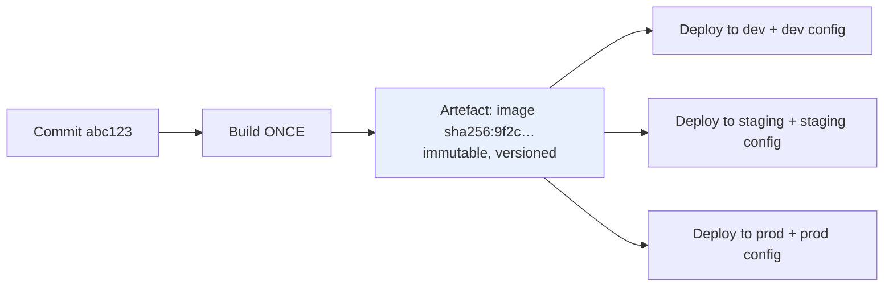
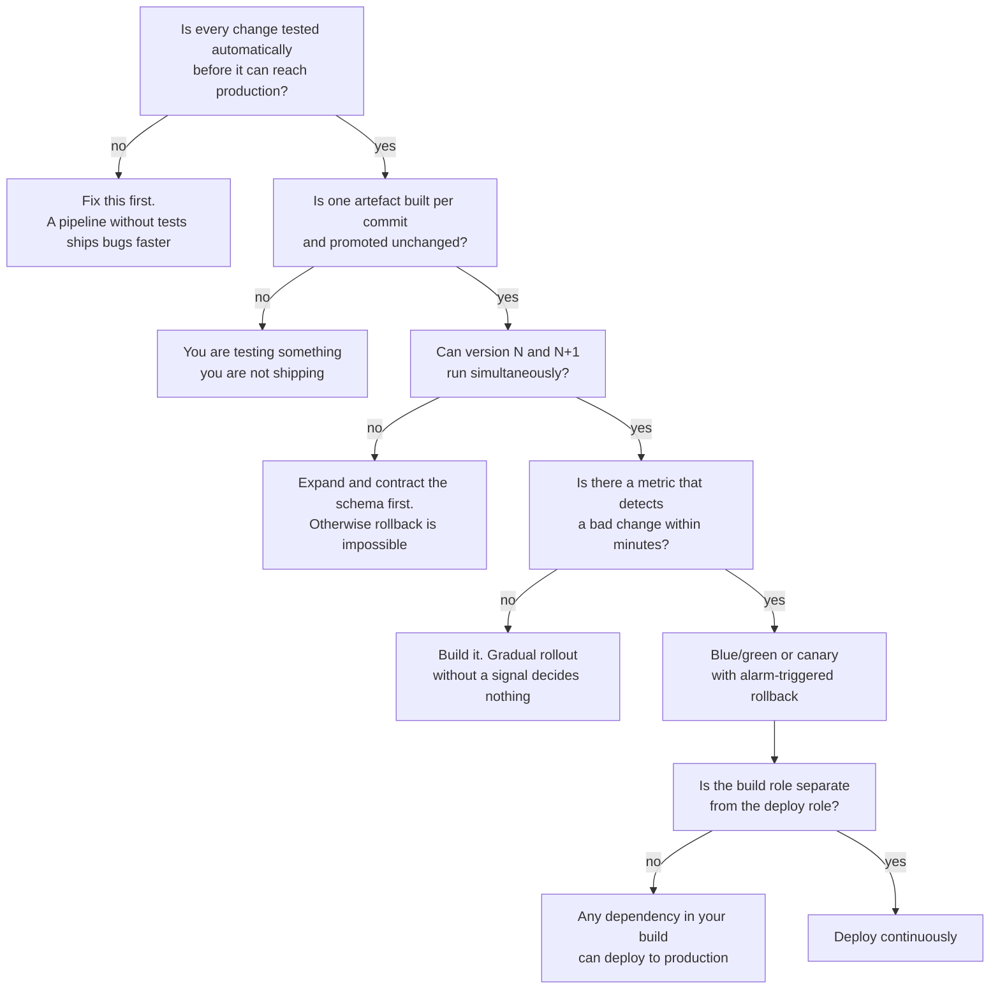
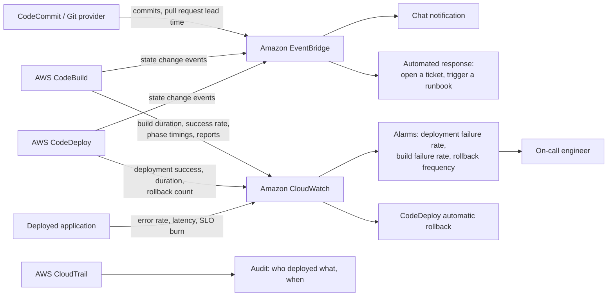
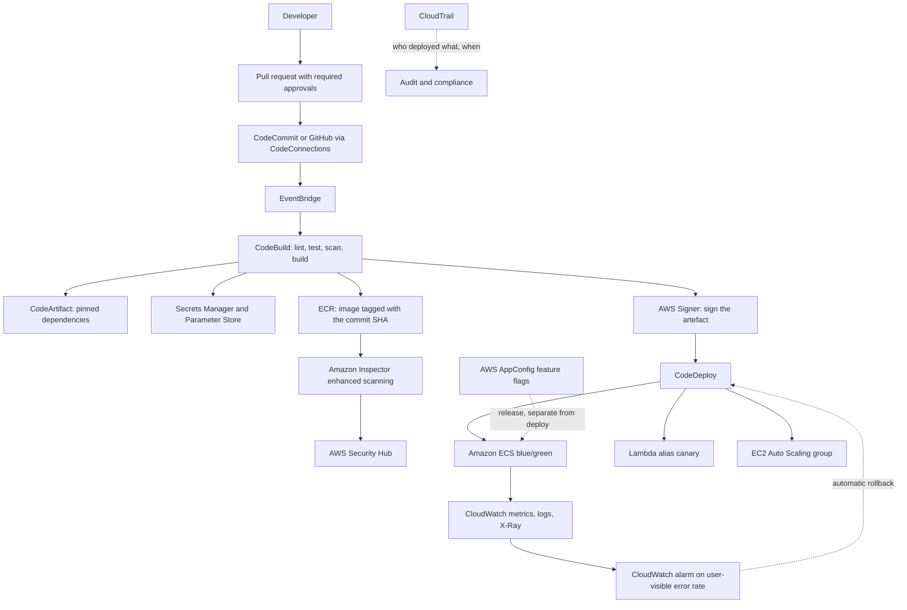

# AWS CI/CD Services: CodeCommit, CodeBuild and CodeDeploy

---

## Definition

**Continuous integration and continuous delivery (CI/CD)** is the practice of automating the path from a source-code change to a verified, deployable artefact and then to running software, such that the path is repeatable, auditable, and fast enough that developers integrate their work continuously rather than in large batches.

AWS provides this as three composable services, plus an orchestrator covered in [chapter 5.2](topic2.md):

| Service | Responsibility | The question it answers |
|---|---|---|
| **AWS CodeCommit** | Managed, private Git hosting with IAM-based access control | Where does the source of truth live, and who may change it? |
| **AWS CodeBuild** | Managed, ephemeral build and test compute | How does source become a tested, versioned, immutable artefact? |
| **AWS CodeDeploy** | Managed deployment orchestration with health monitoring and rollback | How does an artefact become running software without an outage? |
| **AWS CodePipeline** ([chapter 5.2](topic2.md)) | Workflow orchestration across the above and beyond | In what order, with what gates, and what happens when a stage fails? |

These are collectively the **AWS Developer Tools** or **AWS Code services**. Architecturally they sit *outside* the runtime architecture  they are the control plane for change, not part of the request path  which has two consequences worth stating early. First, their availability affects your ability to *deploy*, not your ability to *serve*; a CodeBuild outage is an inconvenience, not an incident. Second, they hold credentials that can modify everything in the account, which makes them a higher-value target than most of the workloads they deploy.

!!! note "A pipeline is not the same thing as automation"

    Automating a bad deployment process produces a fast bad deployment process. The value of a pipeline comes from what it *verifies* and what it can *undo*  the tests, the gates, the health checks, the rollback  not from the fact that a machine rather than a human is typing the commands. A pipeline with no tests and no rollback is a mechanism for reaching production faster than you can think, which is measurably worse than deploying by hand.

---

## Why This Service or Concept Exists

### The problem: integration was the bottleneck

Before continuous integration, teams worked on long-lived branches and merged them at the end of a release cycle. The merge  "integration"  was the hardest, least predictable part of the project, precisely because it was deferred. The cost of integrating two branches grows super-linearly with the time they have diverged: more conflicting changes, more forgotten context, more simultaneous unknowns when something breaks.

Continuous integration inverts this. Every developer merges to the mainline at least daily; every merge triggers an automated build and test; the integration cost is paid continuously in small amounts rather than at once in a large one. **The practice is the daily merge and the automated verification; the server is just the thing that runs it.** This is worth stating because teams routinely install a CI server, keep working on three-week feature branches, and conclude that CI does not help.

### The problem: deployment was the risk

The second problem is the deployment itself. When deployment is manual, slow and risky, the rational response is to deploy less often  which makes each deployment larger, which makes it riskier, which justifies deploying even less often. This is a stable, self-reinforcing bad state, and it is where most organisations start.

The way out is counter-intuitive and it is the central insight of modern delivery: **deploy more often, not less.** A change of ten lines has a small blast radius, is easy to reason about, and is easy to revert. A change of ten thousand lines has none of those properties. Frequency is not opposed to safety; frequency is a *component* of safety, provided each deployment is small, verified, observable and reversible.

The **DORA metrics** capture this, and the key point is that they are measured as a set of four:

| Metric | What it measures | Why it must be read with the others |
|---|---|---|
| **Deployment frequency** | How often you ship to production | Alone, it rewards recklessness |
| **Lead time for changes** | Commit to running in production | Alone, it rewards skipping verification |
| **Change failure rate** | Proportion of deployments causing degradation | Alone, it rewards never deploying |
| **Mean time to restore** | How long to recover from a failed change | Alone, it rewards optimising the incident, not preventing it |

The research finding that matters for architecture is that the first two and the last two are **not** in tension in high-performing organisations: the same teams deploy most often *and* fail least often *and* recover fastest. The mechanism is that small, automated, reversible changes improve all four simultaneously. A team deploying monthly cannot recover quickly, because their rollback target is a month of accumulated change.

### What AWS provides, and what it does not

| Concern | Without managed services | With AWS |
|---|---|---|
| Git hosting | Operate a Git server, its storage, backups and availability | CodeCommit: managed, multi-AZ, IAM-controlled |
| Build compute | A fleet of build servers, idle most of the time, drifting from each other | CodeBuild: ephemeral, per-build containers, per-minute billing |
| Build environment consistency | "Works on the build server"  a mutable, hand-configured machine | A container image specified in configuration, identical every run |
| Build scaling | A build queue at 5 p.m. on a Friday | Concurrent builds up to an account quota; reserved fleets when warm start matters |
| Deployment orchestration | Shell scripts over SSH, with no health model | CodeDeploy: lifecycle hooks, health checks, traffic shifting, automatic rollback |
| Gradual traffic shifting | Bespoke load-balancer scripting | Canary and linear configurations, integrated with ALB, Lambda aliases and ECS |
| Rollback | Redeploy the previous version and hope | Automatic rollback on a CloudWatch alarm, with the old version still running |
| Audit trail | Whatever the shell history retained | CloudTrail on every API call; deployment history per revision |

What AWS does **not** provide is the tests. Every mechanism in this chapter assumes something can tell the difference between a good change and a bad one. A pipeline whose only quality gate is "the build command exited zero" will deploy broken software promptly and reliably.

---

## Core Concepts

### Continuous integration, delivery and deployment

These three terms are used interchangeably in conversation and mean distinct things in engineering.

| Practice | Definition | What it requires |
|---|---|---|
| **Continuous integration** | Every developer merges to the mainline at least daily; every merge is automatically built and tested | A fast, reliable automated test suite; trunk-based development or very short-lived branches |
| **Continuous delivery** | Every change that passes the pipeline is *deployable* to production at any time; the decision to release is a business decision | Everything CI requires, plus automated deployment, environment parity, and reversible changes |
| **Continuous deployment** | Every change that passes the pipeline *is* deployed to production, with no human gate | Everything CD requires, plus high confidence in the tests, progressive delivery, and automated rollback |

The progression is cumulative and the step from delivery to deployment is organisational as much as technical. Most regulated organisations stop at continuous **delivery** with an approval action, and that is a legitimate architecture  provided the approval is a genuine decision rather than a ritual signature that nobody has the information to refuse.

!!! tip "The test that tells you which one you have"

    Ask: *if a developer merged a one-line change right now, how long until it is serving production traffic, and what stands between?* If the answer involves a person typing commands, you have neither. If it involves a person clicking approve, you have continuous delivery. If the answer is "about twenty minutes, automatically", you have continuous deployment.

### Build once, deploy many

An artefact is built **exactly once** from a given commit and then promoted unchanged through every environment: development, staging, production. Environment-specific behaviour comes from **configuration injected at deployment time**  environment variables, Parameter Store, Secrets Manager, ConfigMaps  never from rebuilding.



Violating this has a specific and severe consequence: **you have tested something you are not shipping.** A rebuild can differ through an unpinned dependency, a changed base image, a different build-agent toolchain, or a non-deterministic build step. The property this gives you is the one that makes the whole pipeline meaningful: the thing verified in staging and the thing running in production are byte-identical, so any behavioural difference must come from configuration or data  which narrows an incident investigation enormously.

The corollary is that **artefacts must be immutable and content-addressed**. A container tag of `latest` is not an artefact identifier; `sha256:9f2c…` is. [Chapter 5.2](topic2.md) returns to this with ECR image digests.

### The deployment strategies, and what each trades

| Strategy | Mechanism | Rollback | Cost | Use when |
|---|---|---|---|---|
| **In-place (rolling)** | Replace instances or tasks in batches | Redeploy the previous version: slow | No extra capacity | Stateless workloads that tolerate mixed versions briefly |
| **Blue/green** | Stand up a full new environment, shift traffic, keep the old one | Shift traffic back: seconds | Double capacity during deployment | Production workloads where rollback speed matters |
| **Canary** | Shift a small percentage, wait, then the rest | Shift back: seconds | Double capacity (as blue/green) | Changes whose failure mode is visible in metrics |
| **Linear** | Shift equal increments at fixed intervals | Shift back: seconds | Double capacity | Gradual exposure where a single canary step is too coarse |
| **All-at-once** | Everything, simultaneously | Redeploy: slow | None | Development environments only |

Two observations that students consistently miss. First, **canary and linear are traffic-shifting patterns layered on top of blue/green**  they need both versions running simultaneously, which is what makes rollback instantaneous. Second, **the rollback column is the important one.** Blue/green costs double capacity for the duration of a deployment, and buys a rollback measured in seconds rather than in redeployment time. For anything customer-facing that is a good trade, because the expensive resource is not compute, it is the duration of a bad change.

!!! warning "Mixed-version compatibility is a design requirement, not an accident"

    Every strategy except all-at-once runs two versions of your application simultaneously, against the same database, the same queues and the same caches. This means **version N and version N+1 must be compatible with each other and with the same schema**. The practical rule is **expand and contract**: add a nullable column, deploy code that writes both old and new, backfill, deploy code that reads new, and only then remove the old column  across several releases. A migration that drops a column in the same release as the code that stops using it makes rollback impossible, which silently disables the safety property the whole pipeline was built to provide.

### Feature flags and the separation of deploy from release

**Deployment** puts code on a server. **Release** exposes behaviour to users. Conflating them forces every change to be user-visible the moment it ships, which makes large changes terrifying and forces long-lived branches.

Feature flags separate the two: merge and deploy the code continuously with the feature disabled, then enable it for internal users, then a percentage, then everyone  as a configuration change taking effect in seconds. **AWS AppConfig** provides this with validation, gradual rollout and automatic rollback on a CloudWatch alarm. The operational value during an incident is large: disabling a flag is far faster and far less risky than deploying a revert, and it is the fastest mitigation available in most systems.

The cost is real and should be stated: every flag is a branch in production, so the number of possible states doubles per flag. Flags need owners and expiry dates, and removing them is part of the work, not an optional tidy-up.

### Build reproducibility and the supply chain

A build takes source and produces an artefact. Between those sits everything the build downloads  and that is where the supply chain lives.

| Risk | Mechanism | Mitigation |
|---|---|---|
| **Dependency drift** | An unpinned version resolves differently between builds | Lockfiles committed to the repository; `npm ci`, not `npm install` |
| **Base-image drift** | `FROM node:20` changes under you | Pin by digest: `FROM node:20@sha256:…` |
| **Dependency confusion** | An attacker publishes a public package matching your internal name | Scoped registries; CodeArtifact with an explicit upstream order |
| **Malicious install scripts** | A package's postinstall step runs with your build credentials | A least-privilege build role; no long-lived credentials in the build environment |
| **Compromised artefact after build** | Something modifies the artefact between build and deploy | Content-addressed artefacts; signing with AWS Signer; verification at deploy |
| **Unknown transitive dependencies** | You cannot answer "are we affected by CVE-X?" | Generate an **SBOM** on every build and store it with the artefact |

!!! danger "The build role is a primary security boundary"

    A build executes arbitrary code from your repository and from every dependency it downloads, using the build role's credentials. If that role can deploy to production, then anyone who can merge to a branch  or who can compromise any of your several hundred transitive dependencies  can deploy to production. The correct structure separates **the build identity** (read source, write artefacts, read specific parameters) from **the deploy identity** (change infrastructure), so that compromising a build does not grant deployment. [Chapter 5.2](topic2.md) implements this with per-stage roles in CodePipeline.

### Trunk-based development

CI in the strict sense requires that everyone integrates to one mainline frequently. The branching model that supports it is **trunk-based development**: short-lived branches (hours to a day or two), small pull requests, and incomplete work hidden behind feature flags rather than isolated on a branch.

The alternative  GitFlow with long-lived `develop`, `release` and `feature` branches  was designed for versioned software shipped to customers on a schedule, and it is a poor fit for a continuously deployed service. Its long-lived branches recreate exactly the deferred-integration cost that CI exists to remove. This is a case where the tooling is neutral and the practice decides the outcome.

---

## AWS Service Deep Dive

!!! warning "On quotas, numbers and service status"

    Figures below are representative as of 2026, mostly **soft quotas** adjustable through AWS Service Quotas, and vary by Region. Verify in the Service Quotas console. Pricing is described by dimension, not by figure. Service availability in this area has changed materially in recent years and is noted explicitly where it matters.

### AWS CodeCommit

**Purpose.** Fully managed, private Git repository hosting in which access control is expressed in **IAM** rather than in a separate user directory, and every API call is recorded in **CloudTrail**.

!!! info "Current status  read this before designing around CodeCommit"

    In **July 2024** AWS closed CodeCommit to new customers: existing customers kept full use, but no new account could create a repository. Much course material, many blog posts and a great deal of exam-preparation content was written either side of that change and contradicts itself. On **24 November 2025** AWS **returned CodeCommit to general availability**, reopening new-customer sign-ups, with Git LFS support scheduled for Q1 2026 and regional expansion continuing into Q3 2026. It currently carries a 99.9 per cent uptime SLA.

    Two lessons for an architect, and both are more valuable than the fact itself. First, **verify service availability at design time rather than trusting training material**, because this is exactly the class of fact that goes stale. Second, **a managed service being closed to new customers is a real architectural risk**, and it is a reason to keep the Git provider behind a replaceable boundary  which, since Git is a protocol rather than a product, is unusually easy here.

**Architecture.** Repositories are stored redundantly across multiple Availability Zones in a Region, encrypted at rest with KMS by default. Access is over HTTPS or SSH. Authentication has three forms, and choosing among them is the main design decision:

| Method | Mechanism | When to use |
|---|---|---|
| **IAM + `git-remote-codecommit`** | SigV4 signing using the caller's normal AWS credentials | **The preferred method.** Works with roles, SSO and temporary credentials; nothing long-lived to leak |
| **HTTPS Git credentials** | A per-IAM-user username and password generated in the console | Tools that cannot use the helper; note these are long-lived static credentials |
| **SSH key pairs** | A public key uploaded to the IAM user | Familiar to Git users; also a long-lived credential tied to an IAM user, not a role |

**Important features.** IAM policy control per repository, per branch (via `codecommit:References` conditions) and per action; approval rule templates that require a number of approvals from a named group before a pull request may merge; triggers to SNS or Lambda; EventBridge events for every repository change; cross-account access through role assumption; and VPC endpoints so that Git traffic never traverses the internet.

**Limitations.** No issues, no wiki, no built-in CI, no code-review features approaching GitHub's, no marketplace of integrations, no forking model suited to open-source contribution, and  until Git LFS lands  poor handling of large binaries. Repository and file-size limits apply. The pull-request experience is functional rather than pleasant, and for most teams this is the deciding factor.

**Pricing model.** Per active user per month above a free allowance, plus storage and Git requests above included amounts. For a small team it is effectively free; for a large one it is modest. Cost is rarely the deciding factor either way.

**Performance and scaling.** Managed and Regional; no capacity to provision. Very large monorepos and large binary assets are the practical constraints, not request volume.

**Availability.** Multi-AZ within a Region, with a 99.9 per cent SLA. A repository exists in one Region; cross-Region resilience means replicating to another Region yourself, which for Git is straightforward because every clone is a complete copy.

**Security features.** KMS encryption at rest (AWS-managed or customer-managed keys), TLS in transit, IAM policies including branch-level conditions, VPC endpoints, full CloudTrail coverage, and no public-repository concept at all  which is itself a security property for private code.

**When to choose it.** When IAM-native access control and CloudTrail auditing are genuinely required  regulated environments, or organisations wanting no identity system outside IAM; when data residency requires source to stay in a specific AWS Region under your own KMS keys; or when the team is small and already entirely inside AWS. **When not to choose it:** when developer experience, code review and the integration ecosystem matter more, which for most teams they do. The honest position for a course is that **GitHub or GitLab with CodeConnections is the more common production choice in 2026**, and that CodeCommit's IAM model is its genuine differentiator rather than a consolation.

!!! tip "The integration point that makes the choice reversible"

    **AWS CodeConnections** (formerly AWS CodeStar Connections) is the managed connection resource that lets CodePipeline, CodeBuild and CloudFormation consume GitHub, GitHub Enterprise, GitLab and Bitbucket repositories using a stored OAuth-style connection rather than personal access tokens. Because the rest of the pipeline consumes a *source action* rather than a specific product, changing Git providers is a single configuration change  which is why the Git hosting decision, unusually, is not a lock-in decision.

### AWS CodeBuild

**Purpose.** Run builds and tests on fully managed, **ephemeral** compute, provisioned per build from a specified container image, billed per minute, with no build servers to operate or patch.

**Architecture.** A **build project** defines the source, the environment (image, compute type, environment variables), the **service role**, the artefact destination, and the build instructions. When a build starts, CodeBuild provisions a fresh container from the specified image, clones the source into it, runs the phases from the **buildspec**, uploads artefacts, and destroys the container. Nothing persists between builds except what you explicitly cache or upload  which is the property that makes builds reproducible.

**The buildspec.** A YAML file, conventionally `buildspec.yml` at the repository root, with a fixed phase structure:

```yaml
version: 0.2

env:
  variables:                       # non-secret configuration, visible in logs
    NODE_ENV: production
  parameter-store:                 # from SSM Parameter Store at build start
    SONAR_HOST: /dso303/sonar/host
  secrets-manager:                 # from Secrets Manager  NEVER plain env vars
    REGISTRY_TOKEN: dso303/registry:token
  exported-variables:              # made available to later pipeline stages
    - IMAGE_DIGEST

phases:
  install:                         # runtime versions and build tooling
    runtime-versions:
      nodejs: 20
    commands:
      - npm ci                     # 'ci', not 'install': honours the lockfile exactly
  pre_build:                       # authentication, linting, static analysis
    commands:
      - aws ecr get-login-password --region "$AWS_REGION" | docker login --username AWS --password-stdin "$ECR_REGISTRY"
      - npm run lint
  build:                           # compile, test, package
    commands:
      - npm test -- --ci --reporters=jest-junit
      - docker build -t "$ECR_REGISTRY/$IMAGE_REPO:$CODEBUILD_RESOLVED_SOURCE_VERSION" .
  post_build:                      # push, sign, emit metadata
    commands:
      - docker push "$ECR_REGISTRY/$IMAGE_REPO:$CODEBUILD_RESOLVED_SOURCE_VERSION"
      - export IMAGE_DIGEST=$(docker inspect --format='{{index .RepoDigests 0}}' "$ECR_REGISTRY/$IMAGE_REPO:$CODEBUILD_RESOLVED_SOURCE_VERSION")

reports:                           # test results surfaced in the CodeBuild console
  unit-tests:
    files: [ 'junit.xml' ]
    file-format: JUNITXML

artifacts:
  files:
    - imagedefinitions.json
  name: build-$CODEBUILD_BUILD_NUMBER

cache:
  paths:
    - '/root/.npm/**/*'
```

Three details carry real weight. **`post_build` runs even when `build` fails**, so a `docker push` there will publish an artefact from a failed build unless guarded by `$CODEBUILD_BUILD_SUCCEEDING`. **`CODEBUILD_RESOLVED_SOURCE_VERSION`** is the full commit SHA and is the correct artefact tag: it is immutable, traceable and unambiguous, where `latest` is none of those. And **`exported-variables`** is the supported mechanism for passing a value  such as an image digest  from a build to a later pipeline stage, rather than writing it into a file and hoping.

**Compute options**, which is where most of the cost and latency decisions live:

| Compute type | Characteristics | Use for |
|---|---|---|
| **On-demand EC2 (general)** | `SMALL` through `2XLARGE`, x86 or ARM/Graviton, per-minute billing, cold start of tens of seconds | The default for most builds |
| **ARM / Graviton** | Cheaper per minute and often faster for compiled and container workloads | Anything whose toolchain supports ARM; the easiest cost win available |
| **Lambda compute** | Sub-second start, up to 15 minutes, no Docker daemon | Fast, short builds: linting, unit tests, CDK synth, small packaging steps |
| **Reserved-capacity fleets** | Pre-provisioned, warm instances; billed for the fleet, not per build | High build volume where queue time and cold start dominate; also supports batch builds and Windows Docker builds |
| **Windows and macOS** | Larger, more expensive environments | .NET Framework and Apple-platform builds |

**Important features.** Build phases and reports; local and S3 caching; VPC configuration so builds can reach private resources; batch builds for fan-out (for example, a matrix across runtime versions); build badges; webhook-triggered builds with filter groups; the ability to act as a **self-hosted GitHub Actions runner** so that GitHub-native workflows can execute on CodeBuild compute inside your VPC; and Docker layer caching for container builds.

**Limitations.** A maximum build timeout (8 hours by default); concurrent build quotas per account; no persistent state between builds by design; Docker-in-Docker requires privileged mode, which is a meaningful security decision rather than a checkbox; and Lambda compute has no Docker daemon, so container builds cannot use it.

**Pricing model.** Per build-minute by compute type, with a free-tier allowance; reserved fleets are billed for provisioned capacity regardless of use. Practical guidance: ARM where possible, caching configured deliberately, right-sized compute (a larger instance that halves the build can cost less in total), and reserved capacity only once queue time is demonstrably the constraint.

**Performance characteristics and scaling.** Builds run concurrently up to the account quota; there is no shared build server to queue behind. Cold start on on-demand compute is tens of seconds and is the main latency component of a short build  which is the specific problem Lambda compute and reserved fleets each solve differently.

**Security features.** A per-project IAM **service role**; secrets from Secrets Manager or Parameter Store rather than plaintext environment variables; KMS encryption of artefacts; VPC placement with security groups; and CloudTrail plus CloudWatch Logs for every build. Privileged mode, which Docker builds require, grants the build container elevated capability and should be enabled only on projects that genuinely build images.

!!! danger "Three CodeBuild mistakes with security consequences"

    **Plaintext secrets in environment variables** appear in the project configuration, in `StartBuild` API calls, and often in build logs. Use `secrets-manager` or `parameter-store` references. **An over-permissive service role** gives every dependency in your build the same power; scope it to reading the specific parameters, writing the specific artefact bucket and pushing the specific ECR repository. **`docker push` in `post_build` without checking `$CODEBUILD_BUILD_SUCCEEDING`** publishes artefacts from failed builds, after which "the image in ECR" no longer means "a build that passed".

### AWS CodeDeploy

**Purpose.** Orchestrate the deployment of an application revision across a fleet, a Lambda alias, or an ECS service  with defined lifecycle hooks, health monitoring, controlled traffic shifting and automatic rollback.

**Architecture.** Three compute platforms, and they behave differently enough that they should be learned separately:

| Platform | Deployment types | Traffic mechanism | Agent required |
|---|---|---|---|
| **EC2/On-premises** | In-place, blue/green | ELB registration and deregistration | **Yes**  the CodeDeploy agent on each instance |
| **AWS Lambda** | Blue/green only (canary, linear, all-at-once) | Alias weighted routing between versions | No |
| **Amazon ECS** | Blue/green only (canary, linear, all-at-once) | ALB/NLB listener switching between two target groups | No |

**The AppSpec file** declares what a revision consists of and what runs at each lifecycle event. It is `appspec.yml` for EC2/On-premises and `appspec.yaml` or JSON for Lambda and ECS, and the formats differ:

```yaml
# EC2/On-premises: files to copy and hooks to run, on the instance itself
version: 0.0
os: linux
files:
  - source: /
    destination: /var/www/app
hooks:
  ApplicationStop:
    - location: scripts/stop.sh
      timeout: 60
      runas: root
  BeforeInstall:
    - location: scripts/pre_install.sh
      timeout: 300
  AfterInstall:
    - location: scripts/configure.sh
      timeout: 300
  ApplicationStart:
    - location: scripts/start.sh
      timeout: 60
  ValidateService:            # the hook that decides success or failure
    - location: scripts/health_check.sh
      timeout: 300
```

```yaml
# ECS: which task definition and container, plus optional validation Lambdas
version: 0.0
Resources:
  - TargetService:
      Type: AWS::ECS::Service
      Properties:
        TaskDefinition: "arn:aws:ecs:us-east-1:111122223333:task-definition/orders:42"
        LoadBalancerInfo:
          ContainerName: "orders"
          ContainerPort: 8080
Hooks:
  - BeforeAllowTraffic: "arn:aws:lambda:us-east-1:111122223333:function:smoke-test-green"
  - AfterAllowTraffic: "arn:aws:lambda:us-east-1:111122223333:function:verify-live"
```

**Lifecycle hooks and their execution order**  the most examinable detail in this service, and genuinely useful operationally:

```mermaid
flowchart TD
    subgraph EC2["EC2 / On-premises, in-place"]
      A1["ApplicationStop"] --> A2["DownloadBundle*"]
      A2 --> A3["BeforeInstall"]
      A3 --> A4["Install*"]
      A4 --> A5["AfterInstall"]
      A5 --> A6["ApplicationStart"]
      A6 --> A7["ValidateService"]
    end
    subgraph ECSL["ECS, blue/green"]
      B1["BeforeInstall"] --> B2["Install*"]
      B2 --> B3["AfterInstall"]
      B3 --> B7["AllowTestTraffic*"]
      B7 --> B8["AfterAllowTestTraffic"]
      B8 --> B4["BeforeAllowTraffic"]
      B4 --> B5["AllowTraffic*"]
      B5 --> B6["AfterAllowTraffic"]
    end
```



`*` marks events reserved for CodeDeploy itself  you cannot attach a script to `DownloadBundle`, `Install`, `AllowTestTraffic` or `AllowTraffic`. Lambda deployments have only `BeforeAllowTraffic` and `AfterAllowTraffic`. On ECS there is no `BeforeAllowTestTraffic` hook: green can be validated with no traffic at `AfterInstall`, after test-listener traffic at `AfterAllowTestTraffic`, or immediately before production traffic at `BeforeAllowTraffic`.

Two points that matter in practice. **`ApplicationStop` runs from the *previously deployed* revision**, not the new one, which is the single most confusing behaviour in the service: a broken `ApplicationStop` script blocks future deployments until it is removed from the instance or the deployment ignores it. And **`BeforeAllowTraffic` is where automated verification of the green environment belongs**  a smoke test running here can fail the deployment before a single user reaches the new version, which is the most valuable hook in the entire lifecycle.

!!! danger "A hook that cannot report failure is worse than no hook"

    A hook Lambda must call `PutLifecycleEventHookExecutionStatus` on every path. If it raises an uncaught exception or times out, CodeDeploy never receives a status and the deployment stalls or, depending on configuration, proceeds. Catch every exception, report `Failed` explicitly on any doubt, and set the Lambda timeout comfortably below the hook's own timeout. A validation gate that fails open provides false confidence, which is worse than the honest absence of a gate.

**Deployment configurations.**

| Platform | Built-in configurations | Meaning |
|---|---|---|
| **EC2/On-premises** | `AllAtOnce`, `HalfAtATime`, `OneAtATime`, or custom by count/percentage | How many instances update simultaneously; the blast-radius control |
| **Lambda** | `Canary10Percent5Minutes`, `Canary10Percent30Minutes`, `Linear10PercentEvery1Minute` … `AllAtOnce` | Traffic weighting between the old and new alias versions |
| **ECS** | The same canary, linear and all-at-once family | Listener weighting between blue and green target groups |

**Automatic rollback** is configured per deployment group and triggers on deployment failure, on a failed hook, or  most importantly  on a **CloudWatch alarm** entering ALARM during the deployment. That alarm is the mechanism that turns a canary into a safety device rather than a delay, and it must watch something users feel: error rate, latency, checkout completion. An alarm on CPU will not fire for the failures that matter.

**Limitations.** EC2 deployments require the agent to be installed, running and able to reach the CodeDeploy service, and agent failures are the most common cause of stuck deployments. Blue/green on EC2 requires provisioning a replacement Auto Scaling group, which is slower than the ECS or Lambda equivalents. Lambda and ECS support blue/green only. Hooks have individual timeouts and a total deployment timeout. And CodeDeploy does not manage your database: schema compatibility across versions is entirely yours.

**Pricing model.** No charge for deployments to Lambda or ECS, and no charge for EC2 deployments to EC2 instances; on-premises instance deployments are charged per instance-update. In effect the service is free and the cost is the double capacity that blue/green consumes during a deployment.

**Availability and scaling.** Regional and managed. It scales to large fleets; the practical constraints are deployment configuration (one-at-a-time across 500 instances is slow by construction) and hook timeouts.

**Security features.** A service role permitting CodeDeploy to act on your resources, an instance profile on EC2 targets permitting the agent to fetch revisions from S3, KMS encryption of revision bundles, and CloudTrail coverage. On ECS and Lambda there is no agent and therefore no instance-level credential to protect, which is a quiet but real security advantage.

!!! note "ECS now has built-in blue/green, and the choice matters"

    Since **July 2025**, Amazon ECS supports **built-in blue/green deployments** natively in the ECS service deployment controller, with lifecycle hooks and bake-time monitoring, without CodeDeploy. This gives three options for an ECS deployment: the ECS rolling update (simple, no extra capacity, slow rollback; its settings and circuit breaker are covered in [2.3](../unit2/topic3.md#deployment-the-rolling-update)), **ECS native blue/green** (self-contained in the service definition, no second service to configure), and **CodeDeploy blue/green** (more hook types, integration with CodePipeline's deploy action, and the same model as your EC2 and Lambda deployments). For new ECS-only workloads the native option is now usually simpler; CodeDeploy remains the better answer when you want one deployment model across EC2, Lambda and ECS, or when you need its hook and rollback integration with an existing pipeline.

---

## Architecture Components

| Component | Responsibility in a delivery architecture |
|---|---|
| **Git provider (CodeCommit, GitHub, GitLab)** | The source of truth; branch protection and review are the first quality gate |
| **AWS CodeConnections** | Managed connection to an external Git provider, replacing personal access tokens |
| **AWS CodeBuild** | Ephemeral build and test compute; produces the immutable artefact |
| **Build service role** | The identity a build runs as; a primary security boundary |
| **Amazon ECR** | Immutable, content-addressed container artefact storage with scanning |
| **Amazon S3** | Artefact storage for non-container builds; pipeline artefact store |
| **AWS CodeArtifact** | Private package registry with controlled upstreams; the dependency-confusion defence |
| **AWS CodeDeploy** | Deployment orchestration, traffic shifting, health monitoring, rollback |
| **CodeDeploy agent** | On EC2 targets only; fetches revisions and runs lifecycle hooks |
| **Application Load Balancer** | Target-group switching for blue/green; the test listener for pre-traffic validation |
| **Lambda aliases and versions** | Weighted routing between function versions during a canary |
| **Amazon ECS task sets** | Blue and green sets of tasks within one service during a deployment |
| **AWS Signer** | Artefact signing, so a deploy can verify what a build produced |
| **AWS Secrets Manager and Parameter Store** | Build-time and runtime configuration and secrets, injected rather than baked in |
| **AWS AppConfig** | Feature flags; separates release from deployment and enables instant mitigation |
| **Amazon CloudWatch** | Build and deployment metrics, logs, and the alarms that drive automatic rollback |
| **Amazon EventBridge** | Build and deployment state-change events; the integration point for notifications and automation |
| **AWS CloudTrail** | The audit record: who deployed what, when, and with which identity |
| **IAM roles per stage** | Separation of build identity from deploy identity; least privilege across the pipeline |

Read structurally, these divide into three groups. The **producers**  the Git provider, CodeBuild, CodeArtifact  turn intent into a verified artefact, and their defining property is reproducibility. The **custodians**  ECR, S3, Signer, CloudTrail  hold that artefact immutably and prove its provenance. The **changers**  CodeDeploy, the load balancer, aliases and task sets, CloudWatch alarms  put it into service gradually and take it back out quickly. A delivery system missing any group fails characteristically: no producers means you cannot trust what you built, no custodians means you cannot prove what you shipped, and no changers means every deployment is a coin toss with no way to call it back.

---

## Important AWS Terminology

| Term | Meaning |
|---|---|
| **Continuous integration** | Every developer merges to the mainline at least daily, with automated build and test on each merge |
| **Continuous delivery** | Every passing change is deployable at any time; releasing is a business decision |
| **Continuous deployment** | Every passing change is deployed automatically, with no human gate |
| **DORA metrics** | Deployment frequency, lead time for changes, change failure rate, mean time to restore |
| **Build once, deploy many** | One artefact per commit, promoted unchanged through environments with injected configuration |
| **Artefact** | The immutable, versioned output of a build  a container image, a zip, a package |
| **Immutable artefact** | One that cannot change after creation; identified by content (a digest), not by a movable tag |
| **Trunk-based development** | Short-lived branches and frequent merges to one mainline; the branching model CI requires |
| **Feature flag** | Runtime configuration separating deployment from release; instant enable and disable |
| **Expand and contract** | The multi-release migration pattern that keeps schema changes backward-compatible |
| **AWS CodeCommit** | Managed private Git hosting with IAM-based access control; returned to general availability in November 2025 |
| **AWS CodeConnections** | Managed connections to GitHub, GitLab and Bitbucket for AWS developer tools |
| **`git-remote-codecommit`** | The credential helper that lets Git authenticate to CodeCommit with SigV4 and temporary credentials |
| **Approval rule template** | A CodeCommit rule requiring a number of approvals before a pull request may merge |
| **AWS CodeBuild** | Managed, ephemeral build compute billed per minute |
| **Build project** | The CodeBuild resource defining source, environment, role, artefacts and buildspec |
| **`buildspec.yml`** | The YAML file defining build phases, environment, reports, artefacts and cache |
| **Build phases** | `install`, `pre_build`, `build`, `post_build`  note that `post_build` runs even after a failed `build` |
| **`CODEBUILD_BUILD_SUCCEEDING`** | The variable to test in `post_build` before publishing anything |
| **`CODEBUILD_RESOLVED_SOURCE_VERSION`** | The full commit SHA of the build's source; the correct artefact tag |
| **`exported-variables`** | Buildspec values passed to later pipeline stages |
| **Build service role** | The IAM role a build runs as; exercised by every dependency the build executes |
| **Privileged mode** | The CodeBuild setting required for Docker-in-Docker builds; a real security decision |
| **Reserved-capacity fleet** | Pre-provisioned warm CodeBuild instances, removing queue and cold-start time |
| **Lambda compute** | A CodeBuild compute type with sub-second start and no Docker daemon |
| **Batch build** | One CodeBuild job fanning out into several coordinated builds, such as a version matrix |
| **AWS CodeDeploy** | Deployment orchestration with lifecycle hooks, traffic shifting and rollback |
| **Application and deployment group** | The CodeDeploy resources naming what is deployed and where it goes |
| **Deployment configuration** | The rule governing how fast the change is applied: `AllAtOnce`, `HalfAtATime`, `Canary10Percent5Minutes`, … |
| **`appspec.yml`** | The revision manifest declaring files, resources and lifecycle hooks |
| **Lifecycle hook** | A script or Lambda run at a defined point in a deployment |
| **`ApplicationStop`** | The hook that runs from the **previously deployed** revision  the classic source of stuck deployments |
| **`ValidateService`** | The EC2 hook where health verification belongs |
| **`BeforeAllowTraffic`** | The ECS and Lambda hook where green-environment smoke tests belong |
| **In-place deployment** | Updating existing instances in batches; rollback means redeploying |
| **Blue/green deployment** | Standing up a parallel environment and switching traffic; rollback is a traffic shift |
| **Canary deployment** | Shifting a small percentage of traffic first, then the remainder after a bake |
| **Linear deployment** | Shifting equal increments at fixed intervals |
| **Bake time** | The interval during which the alarm judges the new version; a canary with no bake tests nothing |
| **Termination wait** | How long the old version stays running after a successful shift |
| **Test listener** | A separate ALB listener for validating green before production traffic reaches it |
| **Task set** | The ECS construct holding the blue or green group of tasks within one service |
| **Automatic rollback** | Reverting on deployment failure, hook failure, or a CloudWatch alarm |
| **ECS native blue/green** | Built-in ECS blue/green deployments, available since July 2025, without CodeDeploy |
| **SBOM** | Software bill of materials: the dependency inventory that answers "are we affected by this CVE?" |
| **AWS Signer** | Artefact signing, so deployment can verify what the build produced |
| **AWS CodeArtifact** | Managed package registry with controlled upstream repositories |
| **Dependency confusion** | An attack in which a public package shadows a private one of the same name |
| **AWS AppConfig** | Managed feature flags and configuration with gradual rollout and alarm-based rollback |

---

## Configuration Options

### CodeCommit

| Setting | Options | How to decide |
|---|---|---|
| **Authentication** | `git-remote-codecommit` (SigV4), HTTPS Git credentials, SSH keys | **SigV4 helper** wherever possible: it works with roles and SSO and leaves no long-lived credential |
| **Encryption** | AWS-managed or customer-managed KMS key | Customer-managed where key policy control or decrypt auditing is required |
| **Approval rule template** | Number of approvals; approval pool | At least one approver who is not the author, enforced by the template rather than by convention |
| **Branch-level IAM conditions** | `codecommit:References` on push actions | Deny direct pushes to `main`; require the pull-request path |
| **Triggers and events** | SNS topic, Lambda function, EventBridge rule | EventBridge for pipeline integration; triggers for notifications |
| **VPC endpoint** | Configured or not | Configure where Git traffic must not traverse the internet |

### CodeBuild

| Setting | Options | How to decide |
|---|---|---|
| **Environment image** | AWS managed images, or your own from ECR | A custom image pinned by digest when build-tool versions must be exact |
| **Compute type** | `SMALL`–`2XLARGE`, Lambda, reserved fleet | Start small; **measure** before scaling up. A larger instance that halves build time often costs less overall |
| **Architecture** | x86 or ARM (Graviton) | ARM where the toolchain supports it: cheaper per minute and frequently faster |
| **Privileged mode** | On, off | **On only for projects that build container images.** It is a genuine privilege escalation, not a checkbox |
| **Cache** | None, local (source/Docker layer/custom), S3 | Local Docker-layer caching for image builds; S3 for dependency caches shared across build hosts |
| **VPC configuration** | None, or subnets and security groups | Required to reach private resources; note that a VPC build needs a NAT path or endpoints for outbound access |
| **Timeout** | 5 minutes to 8 hours | Tight enough that a hung build fails rather than burning an hour of billing |
| **Queued timeout** | Duration | Bounds how long a build waits for capacity before failing |
| **Environment variables** | Plaintext, Parameter Store, Secrets Manager | **Never plaintext for secrets.** They appear in configuration, API calls and often logs |
| **Service role** | An IAM role | Scoped to this project's specific source, artefacts, parameters and ECR repository |
| **Reports** | JUnit XML, Cucumber, test coverage formats | Configure them: test results in the console are how a failed build is diagnosed without reading logs |
| **Build badge** | Enabled, disabled | A quick signal in a README; not a substitute for alerting |
| **Webhook filter groups** | Event type, branch, file path, actor | Build only what matters: pull requests to `main`, not every push to every branch |

### CodeDeploy

| Setting | Options | How to decide |
|---|---|---|
| **Compute platform** | EC2/On-premises, Lambda, ECS | Determined by the workload, and it changes which deployment types exist |
| **Deployment type** | In-place, blue/green | Blue/green for anything customer-facing: rollback in seconds is worth the temporary double capacity |
| **Deployment configuration (EC2)** | `AllAtOnce`, `HalfAtATime`, `OneAtATime`, custom | This is a blast-radius decision. `AllAtOnce` belongs in development environments |
| **Deployment configuration (Lambda/ECS)** | Canary, linear, all-at-once variants | Canary for user-facing changes; linear where a single step is too coarse; all-at-once only below production |
| **CloudWatch alarms** | One or more alarms | **Mandatory for production**, and they must watch user-visible behaviour, not resource metrics |
| **Automatic rollback** | On failure, on alarm, on stopped deployment | Enable all three. The cost of an unnecessary rollback is far below the cost of a missed one |
| **Bake time / wait between steps** | Minutes | Long enough for the alarm's evaluation periods to produce a verdict; a one-minute bake under a five-minute alarm decides nothing |
| **Termination wait (blue/green)** | Minutes to hours | Long enough to notice a slow-burning problem and shift back manually |
| **Hook timeouts** | Seconds per hook | Above the hook's realistic worst case, below the patience of whoever is watching |
| **Load balancer / test listener** | ALB target groups; production and test listeners | A test listener is what makes pre-traffic validation possible |

!!! danger "Three configuration mistakes that cause real incidents"

    **`AllAtOnce` in production** removes the entire fleet's healthy capacity simultaneously if the new version is broken  the deployment finishes before anyone can react. **A canary with no CloudWatch alarm** is a delay, not a safety mechanism: nothing is watching, so the deployment proceeds to 100 per cent regardless of what the change did. **A bake time shorter than the alarm's evaluation window** guarantees the alarm cannot fire before the shift completes, which produces a canary that is theatre  and, worse, creates confidence that gradual rollout is protecting you.

---

## Design Considerations



| Quality | What it means here | Design levers | The trade-off you accept |
|---|---|---|---|
| **Lead time** | Commit to production | Fast tests, parallel stages, caching, Lambda compute | Speed pressure tempts teams to remove verification, which is the wrong saving |
| **Change failure rate** | Proportion of deployments that degrade service | Small changes, good tests, canaries, staging parity | More gates means slower delivery; too many gates means batching, which raises failure rate again |
| **Recoverability** | How fast a bad change is undone | Blue/green, alarm-triggered rollback, feature flags, reversible migrations | Double capacity during deployment; flags add production state |
| **Reproducibility** | Identical output from identical input | Ephemeral builds, pinned dependencies and base images, lockfiles | Pinning means deliberate dependency updates rather than automatic ones |
| **Blast radius** | How much breaks when a deployment is wrong | Deployment configuration, canary percentage, per-cell deployment | Smaller batches deploy more slowly in wall-clock time |
| **Security** | Who and what can change production | Per-stage roles, artefact signing, branch protection, scanning | Least privilege is more IAM work than one broad role |
| **Auditability** | Who deployed what, when, and why | CloudTrail, pull-request history, immutable artefacts, deployment history | Requires discipline: no out-of-band changes, ever |
| **Cost** | Build minutes, idle fleets, double capacity | ARM, caching, right-sizing, reserved capacity only when justified | Reserved fleets cost while idle; caching adds complexity |
| **Operational complexity** | What an engineer faces when the pipeline breaks | Fewer, well-understood stages; good failure messages | Every gate is a component that can itself fail and block delivery |

!!! danger "The property that makes frequent deployment safe is rollback, not testing"

    Testing reduces the probability that a change is bad. Rollback bounds the *cost* of a bad change, and it bounds it regardless of why the change was bad  including the failure modes your tests could not have anticipated, which in practice are most of them. This is why blue/green with an alarm-triggered rollback is worth its double capacity, and why an irreversible database migration is a far more serious architectural defect than a gap in test coverage. A team with excellent tests and no rollback path deploys nervously; a team with adequate tests and instant rollback deploys constantly.

---

## AWS Best Practices

### Operational Excellence

Define the pipeline itself in code  CloudFormation, CDK or Terraform  and review changes to it exactly as you review application changes; a pipeline configured by hand in a console is the build server of chapter 5.1's cautionary tale, wearing a managed-service badge. Make build failures loud and specific: configure CodeBuild reports so a failed test is visible without reading a log, and route build and deployment state changes through EventBridge to a chat channel the team actually reads. Keep the pipeline fast, because a pipeline slower than about fifteen minutes stops being a feedback mechanism and becomes something developers work around. Record every deployment against a commit and a change record, and treat an out-of-band console change to production as an incident in its own right  not because it is forbidden, but because it silently invalidates every guarantee the pipeline provides.

### Security

Separate build identity from deploy identity: the build role reads source, writes artefacts and reads specific parameters, and it must not be able to change production. Store nothing long-lived in the build environment  use Secrets Manager and Parameter Store references, and for external Git providers use CodeConnections rather than personal access tokens. Protect the mainline branch with IAM conditions or provider-side branch protection so that the only path to production is a reviewed pull request. Scan dependencies and images on every build and fail the build on critical findings, generating an SBOM alongside the artefact so that the next zero-day is a query rather than an archaeology project. Sign artefacts with AWS Signer and verify at deployment, so that "this image came from our pipeline" is a checkable claim. And enable privileged mode only on projects that genuinely build container images.

### Reliability

Build once and deploy many, always. Deploy with a strategy that keeps the previous version running  blue/green or canary  and configure automatic rollback on a CloudWatch alarm watching user-visible behaviour. Make every database migration backward-compatible across at least one release, using expand and contract, because a migration that forbids rollback disables the pipeline's central safety property. Validate the green environment with a real smoke test over a test listener in `BeforeAllowTraffic` rather than trusting a container health check, which only proves the process started. Ensure the pipeline is never a runtime dependency of the application, and document the manual deployment and rollback path for the case where the pipeline itself is unavailable during an incident.

### Performance Efficiency

Cache dependencies deliberately, keying the cache on lockfile contents so a dependency change invalidates it correctly. Prefer ARM/Graviton compute where the toolchain allows: it is usually both cheaper and faster, and it is the single easiest improvement available in most build configurations. Parallelise independent work  lint, unit tests and image build frequently need not be sequential, and batch builds express that natively. Use Lambda compute for short builds where cold start dominates total time, and reserved-capacity fleets only once you have measured that queue time, not build time, is the constraint. Right-size rather than defaulting: measure the build at two compute sizes before choosing, because build-minute pricing means a faster larger instance is often cheaper in total.

### Cost Optimization

Build minutes are billed per minute of actual build, so the highest-leverage cost work is making builds shorter: caching, ARM, right-sizing, and not rebuilding unchanged components. Reserved-capacity fleets are billed for provisioned capacity whether or not you use it, so they are justified by sustained high volume, not by a busy Friday. Blue/green deployments double capacity for the duration of the deployment, which is a real but bounded cost and almost always the right purchase. Set build timeouts tightly so a hung build costs minutes rather than hours. Apply ECR lifecycle policies so that years of per-commit images do not accumulate silently  this is [chapter 5.2](topic2.md)'s topic, and it is one of the most commonly overlooked line items in a delivery estate.

### Sustainability

Shorter builds, cached dependencies and ARM compute all reduce energy per change, and the aggregate over thousands of builds is substantial. Not rebuilding what has not changed is the largest single saving available. Avoiding whole-fleet redeployments for configuration changes  using AppConfig or environment updates instead  avoids recomputing artefacts that are already correct. And deleting unused artefacts and images through lifecycle policies removes storage that is doing nothing but existing.

---

## Security Considerations

**The build role is the account's most under-examined privilege.** A build executes your repository's code plus every dependency it downloads, with the build role's credentials available at the container credential endpoint. If that role can deploy, then a compromised transitive dependency can deploy. The structural fix is separation: a build role scoped to reading source, writing to one artefact location and reading named parameters; a *separate* deploy role assumed by the pipeline's deploy stage. This is the single most valuable IAM decision in a delivery system and it is very frequently skipped because one broad role is quicker to write.

**Secrets belong in Secrets Manager or Parameter Store, referenced rather than embedded.** A plaintext CodeBuild environment variable is visible in the project configuration, in `StartBuild` calls recorded by CloudTrail, to anyone with `codebuild:BatchGetProjects`, and frequently in build logs when a script echoes its environment. Buildspec `secrets-manager` and `parameter-store` blocks fetch values at build start without exposing them in configuration.

**Branch protection is an access-control mechanism, not a workflow preference.** If a developer can push directly to `main` and `main` deploys to production, then every developer has direct production write access, and the pull-request process is advisory. Enforce it with CodeCommit approval rule templates and `codecommit:References` IAM conditions, or with provider-side branch protection for GitHub and GitLab.

**Artefact provenance must be verifiable, not assumed.** Tag by commit SHA, deploy by digest, sign with AWS Signer, and verify the signature at deployment. Without this, "the image in ECR" is a claim about a mutable tag rather than a fact about a specific build, and mutable tags are how the wrong artefact reaches production without anybody doing anything obviously wrong.

**Dependency confusion deserves a specific defence.** If your build resolves `@acme/internal-utils` from a public registry when the internal one is unreachable, an attacker who publishes that name publicly owns your build. CodeArtifact with an explicit upstream order, scoped registries, and a build that fails rather than falling back are the defences.

**Privileged mode is a real escalation.** Docker-in-Docker requires it, and it weakens the isolation of the build container. Enable it only where images are genuinely built, and treat those projects as higher-sensitivity than the rest.

**CloudTrail is the audit record, and it only works if the pipeline is the only path.** Every deployment through the pipeline is attributable to a commit, a reviewer and a role. A single manual `aws ecs update-service` from an engineer's laptop breaks that chain for everything downstream  which is why out-of-band changes should be alarmed on, not merely discouraged.

---

## Performance Optimization

**Measure the phases before optimising anything.** CodeBuild reports per-phase durations; in most projects the time is concentrated in one place  dependency installation, image build, or a slow test suite  and optimising elsewhere achieves nothing. Teams routinely upgrade compute to fix a build whose time is entirely dependency download.

**Cache with a correct key.** Dependency caches keyed on the lockfile hash restore when dependencies are unchanged and invalidate when they change. A cache keyed on the branch name silently serves stale dependencies; a cache with no invalidation is worse than no cache, because it produces builds that are fast and wrong.

**Use local Docker layer caching for image builds**, and order the Dockerfile so that layers change in increasing frequency: base image, system packages, dependency manifests, dependency install, then application source last. A Dockerfile that copies the whole source before installing dependencies invalidates the dependency layer on every commit, which is the most common reason container builds are slow.

**Parallelise independent stages.** Lint, unit tests, security scanning and image build often have no ordering dependency. CodeBuild batch builds express this natively, and [chapter 5.2](topic2.md) shows the CodePipeline equivalent with parallel actions in a stage.

**Choose compute against measured behaviour.** A `LARGE` instance that halves a build's duration costs the same total as a `MEDIUM` that takes twice as long, and delivers feedback twice as fast  build-minute pricing makes this trade unusually clean. Separately, ARM/Graviton is typically both cheaper per minute and faster for compiled and container workloads.

**Attack cold start where it dominates.** For a 45-second lint job, a 40-second container provision is most of the wall-clock time; Lambda compute starts in under a second and removes it. For sustained high build volume, reserved fleets keep instances warm. Neither helps a twenty-minute build, where provisioning is noise.

**Do not rebuild what has not changed.** In a monorepo, path-based webhook filters and per-component pipelines prevent every commit from rebuilding everything. This is simultaneously the largest performance, cost and sustainability win available, and it is usually the last thing teams do.

---

## Cost Optimization

| What you pay for | Dimension | Frequently overlooked |
|---|---|---|
| **CodeBuild on-demand** | Per build-minute by compute type | Long builds caused by uncached dependencies, not by slow compute |
| **CodeBuild reserved fleets** | Provisioned capacity, billed whether used or not | Reserved capacity bought for a perceived queue problem that was actually a caching problem |
| **CodeBuild oversizing** | Larger compute per minute | Sometimes *cheaper* overall if it shortens the build enough  measure rather than assume either way |
| **x86 versus ARM** | Per-minute rate | ARM is usually cheaper *and* faster; the easiest saving in most estates |
| **CodeCommit** | Active users, storage, requests above the free allowance | Rarely material |
| **CodeDeploy** | Free for EC2, Lambda and ECS; charged per on-premises instance update | The real cost is the double capacity during blue/green |
| **Blue/green capacity** | Duplicate tasks or instances during deployment | Almost always worth it; longer termination waits extend it |
| **ECR storage** | Per GB-month | Per-commit images accumulating for years without a lifecycle policy |
| **S3 artefact store** | Storage and requests | Pipeline artefacts retained indefinitely with no lifecycle rule |
| **CloudWatch Logs** | Ingestion and storage | Verbose build logs at default infinite retention |
| **Hung builds** | Full build-minute price until timeout | A default 8-hour timeout on a 4-minute build |

**The structural lesson** is that a delivery estate's cost is dominated by time and by accumulation. Time: shorter builds through caching, ARM and not rebuilding unchanged components. Accumulation: lifecycle policies on ECR, the artefact bucket and log groups. Both are configuration rather than architecture, both are cheap to fix, and both are invisible until someone reads the bill.

---

## Monitoring and Observability



### The metrics that matter

| Metric | Source | What it tells you |
|---|---|---|
| **Deployment frequency** | Deployment events, counted | Whether batch size is small. Falling frequency predicts rising failure rate |
| **Lead time for changes** | Commit timestamp to deployment timestamp | Where the delay actually is  usually review or queueing, rarely the build |
| **Change failure rate** | Deployments causing rollback or incident, over total | The honest measure of pipeline quality |
| **Mean time to restore** | Incident start to recovery | Whether rollback works in practice, not just in configuration |
| **Build duration, p50 and p95** | CodeBuild metrics | Feedback speed; a p95 far above p50 usually means cache misses |
| **Build success rate** | CodeBuild metrics | A persistently failing build that nobody fixes has stopped being a gate |
| **Build queue time** | Build start minus submit time | The only evidence that justifies reserved capacity |
| **Deployment duration** | CodeDeploy metrics | Long deployments narrow the window for reacting to a bad one |
| **Rollback count** | CodeDeploy events | Rising rollbacks means the tests are not catching what the alarms are |
| **Time in each pipeline stage** | Pipeline execution history | Where the lead time goes; approval stages are usually the answer |
| **Application error rate and latency during deployment** | Application metrics | The signal the rollback alarm depends on; without it, gradual rollout decides nothing |
| **SLO error-budget burn during deployment** | CloudWatch Application Signals | The measure that connects deployment practice to user experience |

!!! tip "The four alarms a delivery system needs"

    **Deployment failure rate above a threshold**  something systemic has broken. **Rollback triggered**  page someone, because an automatic rollback means a bad change reached production and the tests did not catch it. **Build failure on the mainline branch**  the mainline is broken and every subsequent change is now blocked behind it. **Build duration exceeding a threshold**  feedback is degrading, which is the leading indicator of developers batching changes to avoid waiting. The first two are about safety; the last two are about whether the system will still be used as intended in six months.

**Deployment markers on dashboards** are a small practice with a large payoff: overlay deployment events on your application metrics so that "this started at 14:32" and "we deployed at 14:31" are visible in one glance. A very large share of incidents are caused by the most recent deployment, and making that correlation immediate removes the first twenty minutes of most investigations.

**CloudTrail answers the audit questions**: who started this deployment, with which role, from where, and against which artefact. Combined with immutable artefacts tagged by commit SHA, this makes "what is running in production and who put it there" a query rather than an investigation.

---

## Integration with Other AWS Services

| Service | Why it integrates with CI/CD |
|---|---|
| **AWS CodePipeline** | Orchestrates source, build, test, approval and deploy stages; the subject of [chapter 5.2](topic2.md) |
| **AWS CodeConnections** | Managed connection to GitHub, GitLab and Bitbucket without personal access tokens |
| **Amazon ECR** | Immutable container artefact storage with scanning, lifecycle policies and digests |
| **Amazon S3** | Artefact storage for non-container builds and the pipeline artefact store |
| **AWS CodeArtifact** | Private package registry with controlled upstreams; the dependency-confusion defence |
| **Amazon ECS and AWS Fargate** | Deployment target via CodeDeploy blue/green or native ECS deployments |
| **Amazon EKS** | Deployment target via the CodePipeline EKS action, or GitOps with Argo CD |
| **AWS Lambda** | Deployment target with alias-based canary and linear traffic shifting |
| **AWS CloudFormation and CDK** | Deploy infrastructure from the same pipeline that deploys application code ([chapter 5.3](topic3.md)) |
| **AWS Secrets Manager and Parameter Store** | Build-time and runtime configuration and secrets, injected rather than baked in |
| **AWS AppConfig** | Feature flags separating release from deployment; the fastest incident mitigation available |
| **AWS Signer** | Artefact signing and verification, making provenance checkable |
| **Amazon Inspector** | Continuous vulnerability scanning of images in ECR and of Lambda functions |
| **AWS Security Hub** | Aggregated findings from scanning across the estate |
| **Amazon CloudWatch** | Build and deployment metrics, logs, and the alarms that drive automatic rollback |
| **Amazon EventBridge** | State-change events for notification, automation and pipeline triggering |
| **AWS CloudTrail** | The audit record of every build, deployment and configuration change |
| **AWS Systems Manager** | Parameter Store, and Automation runbooks invoked from deployment events |
| **AWS Organizations and multiple accounts** | Separate accounts per environment; the strongest blast-radius boundary for deployment |
| **Amazon SNS and AWS Chatbot** | Human notification of build and deployment outcomes |



Read architecturally, this shows the three groups from earlier working together. The **producers** run left to right across the top: a reviewed change becomes a build that resolves pinned dependencies from CodeArtifact and injects configuration rather than baking it in. The **custodians** sit in the middle: ECR holds the artefact immutably, Inspector and Security Hub judge it, Signer proves where it came from. The **changers** sit on the right: CodeDeploy moves traffic gradually across three different compute platforms with the same model, AppConfig separates release from deployment, and the CloudWatch alarm closes the loop by watching what users experience and pulling the change back automatically when that degrades. The feedback arrow from application metrics to the rollback is the single most important line in the diagram  without it, everything upstream is a faster way to reach production with no way back.

---

## Common Architecture Patterns

### Build once, deploy many

One artefact per commit, promoted unchanged through environments with configuration injected at deployment. The foundational pattern; everything else assumes it. Its violation  building per environment  means the thing you tested is not the thing you shipped.

### Immutable infrastructure

Never modify a running server; replace it with a new one built from a new artefact. This makes the running state a function of the artefact plus configuration, eliminates configuration drift, and makes rollback a matter of running the previous artefact. Containers enforce it structurally, which is much of why they displaced configuration-management tooling for application deployment.

### Blue/green with automated rollback

Two environments, traffic switched between them, the previous one kept running through a termination wait, and a CloudWatch alarm on user-visible behaviour authorised to switch back automatically. The canonical safe-deployment pattern, and the reason double capacity during deployment is a good purchase.

### Progressive delivery

Canary and linear traffic shifting combined with feature flags and, where available, cohort targeting. Exposure increases only while the signal stays healthy. The important design work is not the percentages; it is defining the signal that decides whether to continue.

### Expand and contract for schema change

Additive schema change first, code that writes both shapes, backfill, code that reads the new shape, and only then removal  across several releases. The pattern that keeps rollback possible through a data-model change, and the one whose absence silently disables everything else in this chapter.

### Pipeline as code

The pipeline defined in CloudFormation, CDK or Terraform, reviewed and versioned like any other code, and ideally able to update itself ([chapter 5.2](topic2.md)'s self-mutating pipeline). Prevents the pipeline from becoming the new undocumented, hand-configured build server.

### Separation of build and deploy identities

Distinct IAM roles per pipeline stage, so that compromising a build does not grant the ability to deploy. The highest-value IAM structure in a delivery system.

### Trunk-based development with feature flags

Short-lived branches, frequent merges, incomplete work hidden behind flags rather than isolated on branches. The practice that makes continuous integration real rather than nominal.

### Deployment windows and progressive environments

Development, then staging, then a canary environment, then production  with automated promotion gated on signals rather than on calendar dates. The value is that each environment answers a different question; a staging environment that answers none is pure cost.

### GitOps

The desired state in Git, an agent in the cluster reconciling continuously toward it. The dominant pattern for Kubernetes deployment, covered in [chapter 5.2](topic2.md). The distinction from the pipeline model here is push versus pull: CodeDeploy pushes a change; Argo CD pulls the declared state and corrects drift continuously.

---

## Industry Use Cases

| Sector | Delivery requirement | How the services meet it |
|---|---|---|
| E-commerce | Deploy during peak season without risking checkout | Canary with a checkout-error-rate alarm and automatic rollback; feature flags for instant mitigation |
| Retail banking | Every production change auditable and approved | CodeCommit approval rule templates, IAM branch conditions, CloudTrail, a manual approval stage before production |
| Healthcare | Validated builds with a provable dependency inventory | SBOM generation per build, signed artefacts, Inspector scanning gating the pipeline |
| Media streaming | High build volume, hundreds of engineers | Reserved-capacity fleets, aggressive caching, per-component pipelines in a monorepo |
| B2B SaaS | Per-tenant and per-cell rollout | Progressive deployment cell by cell, with per-cell alarms bounding blast radius |
| Public sector | Separation of duties between build and deploy | Distinct per-stage IAM roles, cross-account deployment, an approval action with a named approver group |
| Gaming | Large binary assets in the repository | Git LFS, S3-backed artefacts, and large-compute CodeBuild projects |
| Fintech | No unreviewed path to production | Branch protection enforced in IAM, signed artefacts verified at deploy, out-of-band change alarms |
| Industrial IoT | Deployment to intermittently connected edge devices | CodeDeploy on-premises deployments, or Greengrass component deployment |
| Logistics | Frequent small changes across many services | Trunk-based development, per-service pipelines, automated canaries |

---

## Advantages

**No build infrastructure to operate.** CodeBuild removes an entire class of work  patching build servers, managing capacity, diagnosing why a build behaves differently on agent three  and removes it structurally rather than by making it easier. The ephemeral container is not a convenience; it is what makes "it worked on the build server" impossible to say.

**Reproducibility by construction.** A build environment specified as a container image, provisioned fresh every time, cannot drift. The most persistent source of "unexplainable" build failures simply does not exist in this model.

**Deployment safety as configuration rather than code.** Canary percentages, bake times, alarm-triggered rollback and lifecycle hooks are declarative settings, not bespoke scripts. The organisation gets a consistent, reviewable deployment model across EC2, Lambda and ECS, which matters far more than any individual feature.

**Rollback measured in seconds.** Blue/green keeps the previous version running, so recovery is a traffic shift. This single property is what changes deployment from an event into a routine operation, and it is what makes the DORA finding  that frequent deployers also fail least  mechanically possible.

**IAM-native security and complete audit.** Access control, credentials and audit all use the same primitives as the rest of AWS. A build's permissions are an IAM role; a deployment's actor is a CloudTrail record; there is no second identity system to keep in step.

**Pay only for what runs.** Per-minute build billing and free deployments mean an idle delivery system costs almost nothing, which removes the pressure to share a single overloaded build server between teams  historically the main source of build queue contention.

**Progressive delivery is available to everyone.** Canary deployment with automated rollback used to require substantial bespoke engineering. As a deployment configuration plus a CloudWatch alarm, it is available to a team of three, which is a genuine democratisation of a practice that was previously the preserve of large platform teams.

---

## Limitations

**These services are individually good and collectively less integrated than their competitors.** CodePipeline, CodeBuild and CodeDeploy each do one thing well, and assembling them into a delivery system is real work. GitHub Actions and GitLab CI offer a single configuration file, a large marketplace and a much shorter path from zero to a working pipeline. A team choosing AWS-native tooling should do so for a reason  IAM integration, VPC access, compliance boundaries  rather than by default.

**CodeCommit's developer experience is weak, and its recent history is a caution.** Code review, search and integrations are materially behind GitHub and GitLab. Its closure to new customers in 2024 and return to general availability in late 2025 also demonstrate that "managed" does not mean "permanent", and that the risk is real even when the outcome was eventually favourable.

**The build role is a large, easily missed attack surface.** Every dependency in every build executes with it. Most teams never scope it properly, and the failure is silent until it is not.

**Blue/green costs double capacity and demands version compatibility.** Two versions run simultaneously against one database, one set of queues and one cache. That compatibility is a design obligation on every change, and it is the obligation teams most often forget  usually discovered when a rollback fails because the schema has already moved.

**A pipeline is only as good as its tests, and tests are the part AWS does not provide.** Every mechanism here assumes something can distinguish a good change from a bad one. Without that, the pipeline reliably delivers defects to production at high speed, with an excellent audit trail.

**Feedback speed degrades silently.** A pipeline that grows from eight minutes to forty does not announce itself; developers simply start batching changes to avoid waiting, batch size grows, and change failure rate rises months later for reasons nobody connects to build duration.

**Multi-account and multi-Region delivery is significantly more complex than the single-account tutorials suggest.** Cross-account roles, KMS key policies that permit the deploying account to decrypt artefacts, and Region-specific resources all have to be right, and the failure messages are not always illuminating.

**Emergency changes will happen.** Every organisation eventually faces an incident where the pipeline is too slow or is itself broken. The mature response is a documented, audited break-glass path  not pretending the situation will not arise, which reliably produces an undocumented one.

---

## Common Mistakes

### Beginner Mistakes

| Mistake | Why it is wrong | What to do instead |
|---|---|---|
| Building separately per environment | You test one artefact and ship a different one | Build once; promote the same artefact with injected configuration |
| Tagging images `latest` | Not an identifier; you cannot say what is running | Tag with the commit SHA; deploy by digest |
| `docker push` in `post_build` with no success check | Publishes artefacts from failed builds | Guard on `$CODEBUILD_BUILD_SUCCEEDING` |
| Plaintext secrets in build environment variables | Visible in configuration, API calls and logs | `secrets-manager` and `parameter-store` buildspec references |
| `npm install` rather than `npm ci` | Ignores the lockfile; builds are not reproducible | `npm ci`, and commit the lockfile |
| No cache configured | Every build redownloads every dependency | Cache keyed on the lockfile hash |
| `AllAtOnce` deployment configuration in production | The whole fleet breaks before anyone reacts | `HalfAtATime` at minimum; canary for user-facing changes |
| Canary with no CloudWatch alarm | Nothing is watching; the canary is a delay | An alarm on user-visible behaviour, with automatic rollback enabled |
| Bake time shorter than the alarm evaluation window | The alarm cannot fire before the shift completes | Bake for at least the alarm's evaluation period, with margin |
| Health check treated as a smoke test | Proves the process started, not that it works | A real request over the test listener in `BeforeAllowTraffic` |
| An `ApplicationStop` script that can fail | Blocks all future deployments, from the *old* revision | Make it idempotent and tolerant; test the failure path |
| A build role with `AdministratorAccess` | Every dependency in the build can do anything | Scope to the specific source, artefacts, parameters and repository |
| Deploying from a developer's laptop | Breaks the audit chain and the artefact guarantee | The pipeline is the only path; alarm on out-of-band changes |
| A migration that drops a column in the same release that stops using it | Rollback becomes impossible | Expand and contract across releases |
| Building on every push to every branch | Cost and queue time with no signal | Webhook filter groups: pull requests and the mainline |

### Production Mistakes

| Mistake | Consequence | Remedy |
|---|---|---|
| No rollback ever tested | It does not work, discovered during an incident | Exercise rollback deliberately, on a schedule, in production |
| Pipeline is a runtime dependency of the application | A pipeline outage becomes a production outage | Nothing in the request path may depend on the pipeline |
| No documented manual deployment path | During a pipeline outage there is no way to ship a fix | A tested break-glass runbook, audited when used |
| Reserved fleets bought to fix slow builds | Cost rises; builds are still slow | Measure queue time versus build time first; usually the fix is caching |
| Alarms on CPU rather than user-visible metrics | Rollback never triggers for the failures that matter | Alarm on error rate, latency and business outcomes |
| ECR with no lifecycle policy | Years of per-commit images, growing silently | Lifecycle rules by count and age, keeping tagged releases |
| Build failures on `main` tolerated for days | The gate has stopped being a gate | Alarm on mainline build failure; fixing it is the team's top priority |
| One shared IAM role across all pipeline stages | No separation of duties; a build compromise is a deploy compromise | A role per stage, scoped to that stage's actions |
| Approval stages used as a substitute for tests | The approver has no information to refuse with | Approvals for business timing; tests for correctness |
| Long-lived feature branches with a CI server attached | Deferred integration, which is the problem CI exists to solve | Trunk-based development with feature flags |
| Termination wait set to zero | The blue environment is gone; manual rollback is a redeploy | Minutes to hours, sized to how fast a problem would surface |
| No deployment markers on dashboards | Every incident investigation starts from scratch | Overlay deployment events on application metrics |

### Certification Traps

| Trap | The reality |
|---|---|
| "CodeCommit is deprecated / unavailable to new customers" | It was closed to new customers in July 2024 and **returned to general availability on 24 November 2025**. Verify current status rather than trusting older material |
| "CodeDeploy supports in-place deployment for Lambda and ECS" | **Blue/green only** on those platforms. In-place is EC2/On-premises |
| "`ApplicationStop` runs from the new revision" | It runs from the **previously deployed** revision  the classic stuck-deployment cause |
| "You can attach a script to `AllowTraffic`" | `DownloadBundle`, `Install` and `AllowTraffic` are reserved for CodeDeploy |
| "`post_build` only runs if the build succeeded" | It runs regardless; check `$CODEBUILD_BUILD_SUCCEEDING` |
| "CodeBuild keeps state between builds" | Containers are ephemeral. Only explicitly configured caches and artefacts persist |
| "Lambda compute in CodeBuild can build Docker images" | No Docker daemon. Use EC2-based compute for image builds |
| "Canary and linear are alternatives to blue/green" | They are traffic-shifting configurations **on top of** blue/green  both versions run |
| "CodeDeploy charges per deployment" | Free for EC2, Lambda and ECS; charged per on-premises instance update |
| "Automatic rollback needs a Lambda function" | It is a deployment-group setting driven by CloudWatch alarms |
| "ECS blue/green requires CodeDeploy" | Since July 2025 ECS has **built-in** blue/green deployments as well |
| "A build badge is a monitoring solution" | It is a README image. Alarms are monitoring |
| "Tagging images `latest` is fine for deployment" | Tag by commit SHA and deploy by digest |
| "Rebuilding per environment from the same commit is equivalent" | It produces a different artefact; build once and promote |
| "A canary is safe on its own" | A canary with no CloudWatch alarm is only a delay |
| "The rollback alarm should watch the whole service" | Dimension it on the **green** target group, or a failing 10 per cent canary barely moves it |
| "A container health check validates the deployment" | It proves the process started; a smoke test over the test listener proves it works |
| "Plaintext CodeBuild environment variables are acceptable for secrets" | Use `secrets-manager` or `parameter-store` references |
| "The build role can hold deploy permissions for simplicity" | Separate the build role from the deploy role |

---

## Summary

First, **a pipeline is a risk-management system, not an automation project**. Its value is in what it verifies and what it can undo; the fact that a machine rather than a person types the commands is incidental. Automating a process with no tests and no rollback produces a faster route to production with no way back, which is measurably worse than deploying by hand. Every design decision in this chapter follows from asking what evidence the pipeline collects and what it can reverse.

Second, **deploying more often is how you deploy more safely, and the mechanism is batch size**. A ten-line change is easy to reason about, easy to verify and easy to revert; a ten-thousand-line change is none of these. The DORA finding that the same organisations deploy most frequently *and* fail least often *and* recover fastest is not a paradox: small, automated, reversible changes improve all four metrics through the same mechanism. The organisational instinct  deploy less often because deploying is risky  is a stable, self-reinforcing bad state, and the way out runs in the opposite direction to intuition.

Third, **build once and deploy many is a correctness requirement**. An artefact built separately per environment means you tested something you are not shipping, and the differences  an unpinned dependency, a floating base image, a different toolchain  are silent, intermittent and extremely hard to diagnose. The discipline that follows is concrete: ephemeral build environments, committed lockfiles, base images pinned by digest, artefacts tagged with the commit SHA, deployment by digest, and every environment-specific value injected at deployment rather than baked in.

Fourth, **rollback is the property that makes everything else work, and it is the one most easily destroyed**. Blue/green keeps the previous version running, so recovery is a traffic shift measured in seconds rather than a redeployment performed under pressure. Canary and linear are traffic-shifting configurations layered on that, which is why they need a CloudWatch alarm dimensioned on the new version and a bake time longer than the alarm's evaluation window  without both, gradual rollout is theatre that creates confidence without providing protection. And because two versions run simultaneously, **expand and contract on every schema change** is not a refinement: a migration that forbids rollback silently disables the safety property the entire pipeline exists to provide.

Fifth, **the build role is a primary security boundary and it is the one teams most consistently overlook**. A build executes your code plus every dependency and transitive dependency with that role's credentials, which means the role's permissions are effectively granted to hundreds of third parties. Separating the build identity  read source, write artefacts, read named parameters  from the deploy identity, ideally across an account boundary, is the highest-value IAM decision in a delivery system. Supporting it: secrets referenced rather than embedded, branch protection enforced in IAM rather than in convention, artefacts signed and verified, and privileged mode enabled only where images are genuinely built.

Sixth, **the three AWS services divide the problem cleanly, and the division is the lesson**. CodeCommit  returned to general availability in November 2025 after a period closed to new customers, which is itself a reminder to verify service status rather than trust training material  holds the source with IAM-native access control. CodeBuild makes builds reproducible by construction: an ephemeral container from a specified image, provisioned fresh every time, cannot drift, which eliminates the entire category of failure that made hand-configured build servers unmaintainable. CodeDeploy makes deployment safety declarative: lifecycle hooks, traffic shifting, health monitoring and alarm-triggered rollback are configuration, consistent across EC2, Lambda and ECS, rather than bespoke scripts per platform.

Seventh, and the sentence this chapter shares with [chapter 4.3](../unit4/topic3.md): **an untested rollback is not a rollback**. Every safety mechanism here  the automatic rollback, the smoke-test hook, the alarm, the break-glass path  is a code path that executes only when something has gone wrong, and therefore essentially never. Untested recovery paths rot exactly as untested resilience does: the alarm is dimensioned on the wrong metric, the bake is shorter than the evaluation window, the smoke test references an endpoint that moved. Deliberately deploying a broken version and watching the rollback happen without a human is the only practice that converts a claim into evidence, and it should be repeated on a schedule rather than performed once.

---

!!! question "Practice and interview questions"
    Questions for this topic are kept separately: [Practice questions](../Questions/unit5.md#51-aws-cicd-services-codecommit-codebuild-and-codedeploy) · [Interview questions](../interviewquestions/unit5.md#51-aws-cicd-services-codecommit-codebuild-and-codedeploy).
