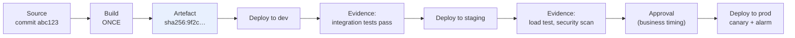
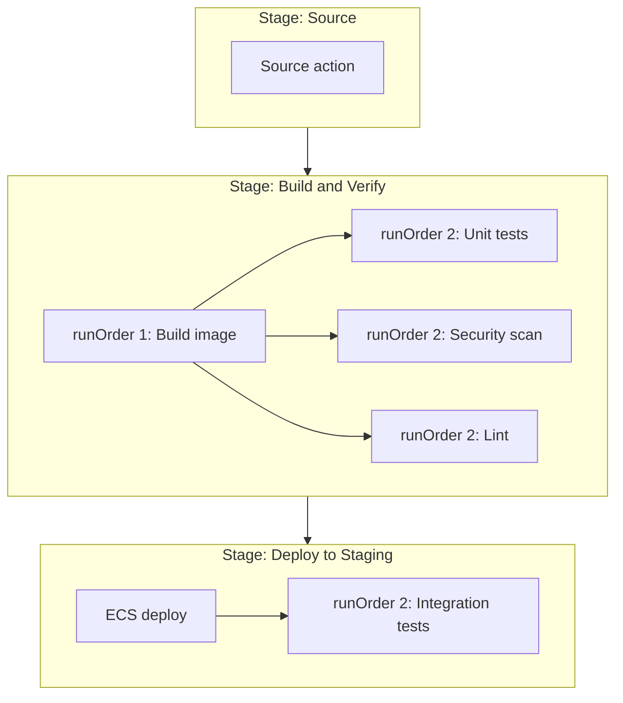
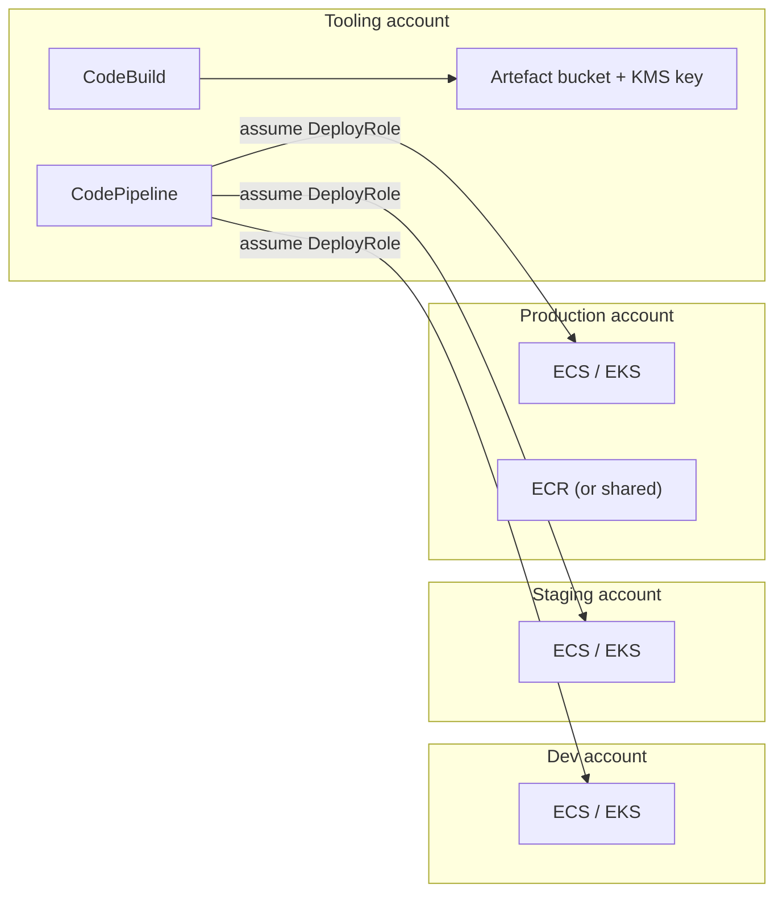
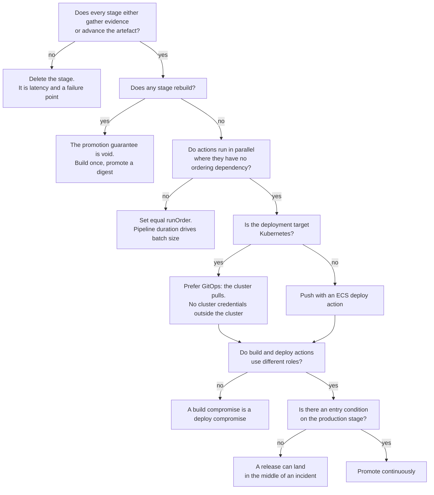
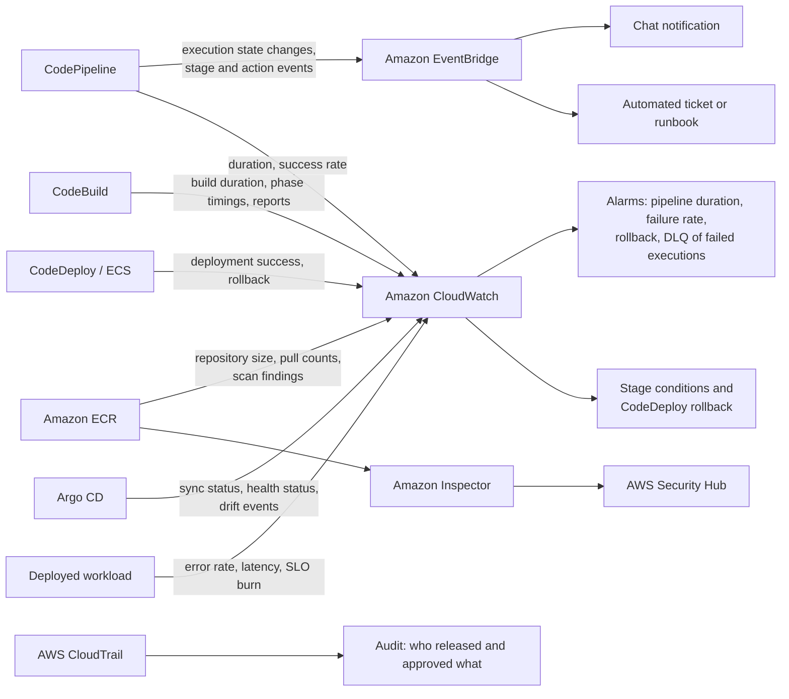
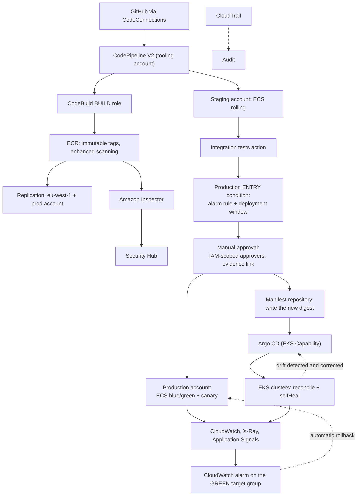

# Implementing CI/CD Pipelines on AWS: CodePipeline, ECR and Container Deployment

---

## Definition

**AWS CodePipeline** is a fully managed continuous delivery service that models a release process as a **sequence of stages**, each containing **actions**, with **artefacts** passed between them. It does not build, test or deploy anything itself; it invokes services that do, holds their outputs, and enforces the ordering, the gates and the failure behaviour.

The distinction matters architecturally. CodePipeline is a **workflow engine specialised for release**, in the same way that Step Functions ([chapter 4.3](../unit4/topic3.md)) is a workflow engine specialised for business processes. Both give you durable execution, explicit failure handling and an auditable history; CodePipeline additionally understands artefacts, source changes and deployment targets natively.

| Concept | Definition |
|---|---|
| **Pipeline** | The whole release workflow for one application or component |
| **Stage** | An ordered group of actions, e.g. Source, Build, Deploy-to-Staging, Deploy-to-Production |
| **Action** | One unit of work: a source check-out, a build, an approval, a deployment, an invocation |
| **Action type** | The category  Source, Build, Test, Deploy, Approval, Invoke  which determines the provider options |
| **Artefact** | A versioned set of files passed between actions through the artefact store (an S3 bucket) |
| **Transition** | The link between two stages, which can be manually disabled to hold changes |
| **Execution** | One run of the pipeline, triggered by a change or started manually |
| **Variable** | A value produced by one action and consumed by a later one, such as an image digest |

Around it sit the two other subjects of this chapter. **Amazon ECR** is the artefact store for containers  a managed, private OCI registry integrated with IAM, Inspector and the container runtimes. **Amazon ECS and Amazon EKS** are the deployment targets, and the chapter's central practical argument is that they are different enough to warrant different delivery architectures rather than one pattern applied twice.

!!! note "The pipeline's real output is not a deployment; it is evidence"

    At the end of a pipeline execution you should be able to state, without investigation: which commit, which artefact digest, which tests passed, which vulnerabilities were present, who approved it, when it reached each environment, and whether it is still there. A pipeline that deploys successfully but cannot answer those questions has automated the easy half of the problem.

---

## Why This Service or Concept Exists

### The problem: orchestration is where delivery systems actually fail

[Chapter 5.1](topic1.md)'s three services can be wired together with a shell script: build, then if that succeeded, deploy. Teams do exactly this, and it fails in predictable ways.

**There is no durable state.** If the machine running the script dies mid-release, the release is in an unknown state and nobody knows which environments got the change. **There is no artefact identity.** The script's "the thing we just built" is a local file, so the staging deployment and the production deployment may not be the same bytes. **There is no gate.** Inserting an approval means blocking a shell script on human input, which is neither auditable nor resumable. **There is no failure model.** What happens when stage three fails after stage two succeeded is whatever the script's author thought about, which is usually nothing. And **there is no history**: "what was deployed to production on 14 March and by whom" is answerable only if someone kept the logs.

These are precisely the problems [chapter 4.3](../unit4/topic3.md) identified for business processes and solved with an orchestrator. The same argument applies: **a multi-step process spanning services must live somewhere explicit, with durable state and declarative failure handling**, or it exists only as emergent behaviour that nobody can reason about during an incident.

### The problem: container artefacts need custody, not just storage

A container registry looks like a file store, and treating it as one causes a specific class of incident. The failure is that **tags are mutable pointers**. `myapp:v1.2` can be made to point at different content tomorrow; `myapp:latest` almost certainly will. So "we deployed v1.2 to staging and v1.2 to production" can be true and still describe two different images.

ECR's answer is a set of custody properties rather than storage features: **immutable tags** so a tag once written cannot be repointed, **digests** so an artefact can be named by its content, **scanning** so the artefact's vulnerability state is known and recorded, **lifecycle policies** so accumulation is bounded, and **registry-level replication and permissions** so the same artefact can be consumed across accounts and Regions without being rebuilt.

### The problem: Kubernetes does not want to be deployed to

ECS and EKS both run containers, and the naive conclusion is that they need the same pipeline. They do not, and the reason is structural.

ECS has a **service** resource with a deployment controller. Updating it is an API call against a Regional AWS endpoint, authenticated with IAM. A pipeline can push a change to it from outside using the same identity model as everything else in AWS. This is a natural fit for a push-based pipeline.

Kubernetes has an **API server** holding declared state, and controllers inside the cluster that continuously reconcile actual state toward it. Pushing to it from outside requires network reachability to that API server  frequently private  and an identity mapping between IAM and Kubernetes RBAC. More importantly, pushing fights the model: the cluster is *already* a reconciliation loop, and a push-based pipeline is a second, competing source of truth that cannot detect or correct drift.

The pattern that fits is **GitOps**: the desired state lives in Git, an agent inside the cluster watches it and reconciles continuously. The pipeline's job ends at updating the manifest repository. [Push versus pull deployment](#push-versus-pull-deployment) develops both approaches, because both are legitimate and the choice has real consequences.

### What AWS provides, and what it does not

| Concern | Without an orchestrator | With CodePipeline and ECR |
|---|---|---|
| Release state | A shell script's local variables | Durable execution state, resumable, with history |
| Artefact identity across stages | "The file we just built" | A versioned artefact in the artefact store, referenced by every stage |
| Approval gates | A blocked script, or nothing | A first-class approval action with IAM-scoped approvers, recorded in CloudTrail |
| Failure behaviour | Whatever the author considered | Declarative: stage conditions, retry, rollback, skip |
| Cross-account deployment | Long-lived credentials copied between accounts | Cross-account role assumption with KMS-encrypted artefacts |
| Artefact immutability | Discipline | Tag immutability enforced by the registry |
| Vulnerability state of an artefact | A scan someone ran once | Continuous rescanning through Amazon Inspector, with findings attached to the image |
| Registry sprawl | Manual deletion, eventually | Lifecycle policies evaluated automatically |
| Multi-Region artefact availability | Rebuild per Region, violating build-once | Cross-Region replication of the identical image |
| Audit | Log archaeology | Execution history plus CloudTrail, per action and per identity |

What AWS does **not** provide is the promotion policy: what evidence justifies moving an artefact from staging to production is yours to define, and a pipeline whose only gate is "the previous stage exited zero" has automated a process with no opinion.

---

## Core Concepts

### The pipeline as a promotion machine

The mental model that makes everything else follow: a pipeline takes **one immutable artefact** and moves it through a sequence of environments, gathering evidence at each step. Nothing rebuilds. Nothing is modified. The only things that change between environments are configuration and the accumulated evidence.

Two design rules follow directly and are worth stating as rules. **A stage must either gather evidence or advance the artefact.** A stage that does neither  a "validate" stage that always passes, a notification stage that could be an EventBridge rule  adds latency and a failure point for nothing. **No stage may rebuild.** If a production stage runs `docker build`, the pipeline has stopped being a promotion machine and every guarantee from earlier stages is void.

### Stages, actions and the parallelism inside a stage

A **stage** is a sequence point; **actions within a stage run in parallel by default** unless ordered by `runOrder`. This is the main lever for pipeline latency.

Actions sharing a `runOrder` run concurrently; a higher `runOrder` waits for all lower ones to complete. Three parallel verification actions after a build take as long as the slowest, not the sum  which in a typical pipeline is the difference between a twelve-minute and a twenty-five-minute release.

### Artefacts and how data moves

Every action declares **input artefacts** and **output artefacts**. CodePipeline stores them in an S3 **artefact store** (one per Region, encrypted with a KMS key) and passes references between actions. An action receives its inputs in its working directory and writes outputs back.

This has consequences students should internalise. **Artefacts are files, not state**: there is no shared filesystem or database between actions, and everything an action needs must be an input artefact or a variable. **Artefact size matters**  very large artefacts add upload and download time to every stage that touches them, which is one reason container pipelines pass a tiny `imagedefinitions.json` rather than the image itself; the image lives in ECR and the pipeline moves only a reference. And **the artefact store is a security boundary**: anyone who can read that bucket can read every build output of every pipeline in that Region.

For values rather than files  an image digest, a version number, a stack output  the mechanism is **variables**: an action produces named outputs, and later actions reference them as `#{BuildAction.ImageDigest}`. This is a V2 pipeline capability and it is what removes a whole genre of "write it to a file and hope the next stage reads it" fragility.

### V1 and V2 pipeline types

CodePipeline has two pipeline types, and the difference is large enough that choosing V1 for a new pipeline is almost always a mistake.

| Capability | V1 | V2 |
|---|---|---|
| Stages, actions, artefacts | Yes | Yes |
| **Pipeline-level variables** | No | Yes, including values supplied at execution start |
| **Git tag and branch filters on triggers** | Limited | Yes, with include/exclude on branches, tags and file paths |
| **Stage-level conditions** | No | Yes: entry, on-success and on-failure conditions with rules |
| **Automated stage rollback** | No | Yes, configurable on failure |
| **Stage retry** | Manual only | Failed actions or all actions, automatic or manual |
| **Manual stage skipping** | No | Yes |
| **Pricing model** | Per active pipeline per month | Per action execution minute, plus a free tier |

The pricing difference is worth understanding rather than memorising: **V1 charges a flat monthly fee per active pipeline**, which penalises having many small pipelines; **V2 charges per action execution minute**, which penalises long-running actions and rewards having many pipelines that run rarely. For a monorepo with twenty per-service pipelines that each run a few times a day, V2 is usually substantially cheaper as well as more capable.

### Stage conditions: gates without glue code

V2's stage conditions are the feature that removes most bespoke Lambda functions from mature pipelines. A stage may declare three kinds of condition:

| Condition | Evaluated | Typical use |
|---|---|---|
| **Entry condition** | Before the stage begins | "Only enter the production stage if no CloudWatch alarm is in ALARM", "only during the deployment window" |
| **On-success condition** | After the stage succeeds | "Verify the deployment's health for ten minutes before proceeding" |
| **On-failure condition** | After the stage fails | "Roll back this stage automatically" |

Each condition contains **rules**, and the available rule types include a **CloudWatch alarm check**, a **deployment window** check, a **pipeline variable check**, a **Lambda invoke**, and **CodeBuild and Commands rules** for arbitrary verification. The result determines whether the stage proceeds, fails, rolls back or is skipped.

!!! tip "The single highest-value condition in a production pipeline"

    An **entry condition on the production stage with an alarm rule**: if the production service is currently unhealthy, do not deploy into it. This prevents the very common compounding failure in which a team is mid-incident and an unrelated pipeline execution deploys a change into the middle of it  turning one problem into two and destroying the correlation between "what changed" and "what broke". It is four lines of configuration and it replaces an entire category of human coordination.

### Execution modes

When a new change arrives while an execution is in flight, the pipeline must decide what to do. V2 offers three modes and the choice is a real design decision.

| Mode | Behaviour | Use when |
|---|---|---|
| **`SUPERSEDED`** (default) | A newer execution overtakes an older one waiting to enter a stage; the older one is cancelled | High-frequency trunk-based development where only the newest change matters |
| **`QUEUED`** | Executions queue and run one at a time, in order | Every change must reach production individually  audit requirements, or deployments with per-change verification |
| **`PARALLEL`** | Executions run independently and concurrently | Independent branches or per-feature environments, where executions do not share a target |

The trap is `PARALLEL` against a shared deployment target: two executions can deploy different artefacts to the same environment concurrently and the winner is a race. `PARALLEL` is for pipelines whose executions target *different* things.

### Container artefact identity: tag versus digest

An image has an immutable, content-derived **digest** and zero or more mutable **tags**; the distinction is explained in [2.1 Docker and ECR](../unit2/topic1.md#images-layers-manifests-tags-and-digests). In a pipeline it becomes four rules.

- **Tag with the commit SHA** so the artefact is traceable to the exact source that produced it.
- **Deploy by digest** so what runs is determined at deployment time and cannot change afterwards. A task definition referencing `repo@sha256:9f2c…` is a fact; one referencing `repo:stable` is a query evaluated whenever a task launches.
- **Enable tag immutability** on the repository so a tag, once written, cannot be repointed. This turns a discipline into an enforced property.
- **Never deploy `latest` anywhere**, and in a repository with immutability enabled you structurally cannot.

### Push versus pull deployment

The distinction that decides the shape of a Kubernetes delivery system.

| Property | Push (CodePipeline → cluster) | Pull (GitOps: agent in cluster → Git) |
|---|---|---|
| **Who initiates** | The pipeline, from outside | An agent inside the cluster |
| **Network direction** | Inbound to the cluster API server | Outbound from the cluster to Git and the registry |
| **Credentials** | The pipeline holds cluster credentials | The cluster holds read access to Git; the pipeline holds none |
| **Drift** | Undetected; the pipeline knows only what it last pushed | Detected and corrected continuously |
| **Source of truth** | Ambiguous  the cluster, or the last pipeline run | Unambiguous  the Git repository |
| **Multi-cluster** | The pipeline needs credentials for each | Each cluster pulls its own state independently |
| **Rollback** | Redeploy a previous artefact through the pipeline | `git revert`, and the agent reconciles |
| **Audit** | Pipeline execution history | Git history, which is the deployment history |

The security argument for pull is stronger than it first appears: in a pull model **no external system holds credentials to the cluster**, which removes the pipeline from the cluster's threat model entirely. The operational argument is drift correction. The cost is a second repository to manage and a reconciliation delay between merge and effect  usually seconds to a few minutes, and configurable.

### Multi-account promotion

The strongest boundary available in AWS is the account boundary, and a mature delivery architecture uses it per environment.

Three permission surfaces must all agree, and forgetting any one produces a confusing failure:

1. **The cross-account role** in the target account, trusting the pipeline's role in the tooling account.
2. **The artefact bucket policy**, granting the target account's role read access.
3. **The KMS key policy** on the artefact encryption key, granting that role `kms:Decrypt`  the one most often forgotten, and the one whose absence surfaces as an S3 access-denied message pointing at the wrong thing.

For ECR the equivalent is a **repository policy** granting the target accounts pull access, or **cross-account replication** so each account has a local copy of the identical image.

---

## AWS Service Deep Dive

!!! warning "On quotas and numbers"

    Figures are representative as of 2026, mostly **soft quotas** adjustable via AWS Service Quotas and varying by Region. Verify in the Service Quotas console. Pricing is described by dimension.

### AWS CodePipeline

**Purpose.** Model a release process as durable, auditable, declarative workflow: stages and actions with explicit ordering, artefact passing, gates, failure handling and history.

**Architecture.** A pipeline is a Regional resource with an **artefact store** (an S3 bucket with a KMS key) and a **service role**. Each execution is a durable state machine: CodePipeline records the state after each action, so an execution survives failures of the services it invokes. Source changes arrive by EventBridge (CodeCommit, ECR, S3) or by webhook through CodeConnections (GitHub, GitLab, Bitbucket).

**Action types and representative providers:**

| Action type | Providers |
|---|---|
| **Source** | CodeCommit, CodeConnections (GitHub, GitHub Enterprise, GitLab, Bitbucket), S3, ECR |
| **Build** | CodeBuild, Commands (inline shell without a CodeBuild project), Jenkins |
| **Test** | CodeBuild, Device Farm, third-party |
| **Deploy** | CodeDeploy, ECS (standard and blue/green), **EKS**, CloudFormation, CloudFormation StackSets, S3, Elastic Beanstalk, Service Catalog, AppConfig, OpsWorks |
| **Approval** | Manual approval with an SNS notification |
| **Invoke** | Lambda, Step Functions, EventBridge, Inspector scan |

Two of these deserve note. The **Commands action** runs shell commands inline without defining a CodeBuild project, which removes a great deal of boilerplate for small steps  at the cost of having no reusable, versioned project definition. The **EKS deploy action**, added in February 2025, applies Kubernetes manifests to a cluster **including clusters in private VPCs**, with CodePipeline establishing connectivity itself rather than requiring you to run build compute inside the VPC; it is available in all CodePipeline Regions except GovCloud and China.

**Important features.** V2 variables and parameterised executions; triggers with branch, tag and file-path filters; stage-level conditions with alarm, deployment-window, variable-check, Lambda and CodeBuild rules; automated stage rollback; stage retry and manual skipping; execution modes; manual transition disabling to hold changes at a stage boundary; cross-account and cross-Region actions; and EventBridge events for every state change.

**Limitations.** Quotas on stages per pipeline, actions per stage, and concurrent executions. Artefacts move through S3, so very large artefacts add latency at every stage. The action-type catalogue is broad but finite, and anything outside it needs a Lambda or CodeBuild action. Pipeline definitions are verbose in raw JSON, which is one of the strongest arguments for defining them with CDK ([chapter 5.3](topic3.md)). And a pipeline is a Regional resource: multi-Region delivery means either cross-Region actions or a pipeline per Region.

**Pricing model.** **V1**: a flat charge per active pipeline per month, with one free pipeline. **V2**: per action execution minute, with a monthly free allowance. The structural consequence is that V2 favours many pipelines that run intermittently, and penalises actions that idle  an approval action waiting two days does not accrue action-minutes, but a long-running build does.

**Availability and scaling.** Regional and managed, multi-AZ. Concurrency limits are account-level soft quotas; in practice the constraint is the concurrency of what the actions invoke  CodeBuild capacity, deployment targets  rather than CodePipeline itself.

**Security features.** A pipeline service role plus optional **per-action role overrides**, which is the mechanism for separating build identity from deploy identity within one pipeline. KMS encryption of the artefact store. Cross-account role assumption. Manual approval actions with IAM-scoped approvers. Full CloudTrail coverage, including who approved what.

!!! danger "The per-action role override is the feature most teams never use, and it is the most important one"

    By default every action runs as the pipeline's service role, which therefore needs the union of every permission any action requires  build permissions *and* production deployment permissions in one role. Specifying a `roleArn` per action lets the build action run as a build role that cannot deploy, and the production deploy action run as a deploy role that cannot build. This is [chapter 5.1](topic1.md)'s build/deploy separation, implemented. Without it, the separation exists on a slide and not in the account.

### Amazon Elastic Container Registry

Repository fundamentals  the registry and authentication model, tag immutability, basic versus enhanced scanning, lifecycle policies, pull-through cache, pricing, and the three VPC endpoints a private-subnet pull needs  are owned by [2.1 Docker and ECR](../unit2/topic1.md#amazon-elastic-container-registry). This chapter is concerned with how the pipeline uses the registry:

| Feature | Role in the pipeline |
|---|---|
| **Image digests and tag immutability** | The pipeline tags with the commit SHA and deploys by digest; immutability makes that identity enforced rather than conventional |
| **Enhanced scanning (Amazon Inspector)** | A gate: the pipeline fails on critical findings, and continuous rescanning catches CVEs disclosed after the push |
| **Lifecycle policies** | Bound the accumulation of per-commit images, but must never expire an image a live task definition still references |
| **Cross-Region and cross-account replication** | Multi-Region and multi-account delivery without violating build-once |
| **Repository and registry policies** | Let one account's pipeline publish an image that many workload accounts pull |
| **OCI artefact support** | Helm charts, SBOMs and signatures stored alongside the image, keeping provenance with the artefact |

ECR is not a general-purpose artefact store: language packages belong in AWS CodeArtifact. Image size, which drives task and pod start time and therefore scaling and rollback speed, should be kept small.

### Deployment actions for ECS and EKS

**The standard ECS deploy action** takes an `imagedefinitions.json` input artefact naming the container and image URI, registers a new task definition revision, and updates the service  which then performs the **rolling update** described in [2.3](../unit2/topic3.md#deployment-the-rolling-update). Simple, requires no extra capacity, and rollback means another rolling deployment.

**The ECS blue/green deploy action via CodeDeploy** takes `appspec.yaml` and `taskdef.json` and drives the traffic-shifting deployment of [chapter 5.1](../unit5/topic1.md#aws-codedeploy): two target groups, a test listener, lifecycle hooks, canary shifting and alarm-triggered rollback.

**ECS native blue/green**, available since July 2025, moves that capability into the ECS service's own deployment controller, removing the need for a separate CodeDeploy application and deployment group; the choice between it and CodeDeploy is set out in [5.1](../unit5/topic1.md#aws-codedeploy).

**The EKS deploy action** applies Kubernetes manifests to a named cluster, handling connectivity to private clusters itself. It requires the pipeline's role to be mapped to Kubernetes RBAC  through an EKS access entry or `aws-auth`  with permission to create and update the objects in question.

**GitOps with Argo CD** inverts the direction. The pipeline updates a manifest repository (typically by writing a new image digest into a Kustomize overlay or Helm values file) and stops. Argo CD, running in or alongside the cluster, detects the change, applies it, reports health and sync status, and continuously corrects drift.

!!! note "Amazon EKS Capability for Argo CD"

    Announced in **November 2025**, **Amazon EKS Capabilities** are AWS-managed, Kubernetes-native platform features that run on AWS-owned infrastructure separate from your clusters, with AWS handling scaling, patching and upgrades. The launch set is **Argo CD**, **AWS Controllers for Kubernetes (ACK)** and **Kube Resource Orchestrator (KRO)**. The Argo CD capability matters for this chapter because it removes the main operational objection to GitOps on EKS  that you now operate the GitOps controller too, including its upgrades, its availability and its own credentials. It is generally available in all Regions except GovCloud and China, and is enabled through the EKS API, CLI, eksctl, console or infrastructure as code.

---

## Architecture Components

| Component | Responsibility in a pipeline architecture |
|---|---|
| **AWS CodePipeline** | Orchestration: stages, actions, artefacts, gates, failure behaviour, history |
| **Pipeline service role** | The default identity for actions; should be minimal, with per-action overrides doing the real work |
| **Per-action role overrides** | Where build/deploy identity separation is actually implemented |
| **Artefact store (S3 + KMS)** | Durable artefact passing between actions; a cross-account permission surface |
| **AWS CodeConnections** | Managed connection to GitHub, GitLab or Bitbucket for source actions |
| **Amazon EventBridge** | Source-change detection and pipeline state-change events |
| **AWS CodeBuild** | Build, test and any custom action; the general-purpose escape hatch |
| **Commands action** | Inline shell for small steps without a CodeBuild project |
| **Amazon ECR** | Container artefact custody: digests, immutability, scanning, lifecycle, replication |
| **ECR lifecycle policy** | Bounded accumulation  and a hazard if it expires a referenced image |
| **ECR replication rules** | The same image in several Regions and accounts without rebuilding |
| **Amazon Inspector** | Continuous rescanning of images after push; findings to Security Hub |
| **AWS CodeDeploy** | Blue/green and canary traffic shifting for ECS, Lambda and EC2 |
| **Amazon ECS service and task sets** | The deployment target; blue and green sets during a deployment |
| **Application Load Balancer** | Production and test listeners; target-group switching |
| **Amazon EKS cluster** | The Kubernetes deployment target |
| **EKS access entries / `aws-auth`** | The IAM-to-RBAC mapping a push-based EKS deployment requires |
| **Argo CD (EKS Capability or self-managed)** | The reconciliation loop for GitOps delivery |
| **Manifest repository** | The declared desired state; in GitOps this *is* the deployment history |
| **Kustomize or Helm** | How one set of manifests becomes per-environment variants |
| **Stage conditions and rules** | Gates: alarm checks, deployment windows, variable checks, verification builds |
| **Manual approval action** | The human decision point, with IAM-scoped approvers, recorded in CloudTrail |
| **Cross-account deploy roles** | The account-boundary control on who may change production |
| **Amazon CloudWatch** | Deployment and pipeline metrics; the alarms behind conditions and rollback |
| **AWS CloudTrail** | The audit record: every execution, approval and deployment, per identity |

Read structurally, these divide into the same three groups as [chapter 5.1](topic1.md), with the orchestrator added. The **producers** end at ECR. The **custodians**  ECR's immutability, scanning, replication and the artefact store  hold and attest. The **changers**  the deploy actions, CodeDeploy, Argo CD  put the artefact into service. What CodePipeline adds is the **decider**: the component holding the promotion policy, the gates and the failure behaviour, which in the shell-script version of this architecture existed only in someone's head.

---

## Important AWS Terminology

| Term | Meaning |
|---|---|
| **Pipeline** | The full release workflow for one application or component |
| **Stage** | An ordered group of actions and a sequence point in the pipeline |
| **Action** | One unit of work within a stage: source, build, test, deploy, approve, invoke |
| **`runOrder`** | The ordering of actions within a stage; equal values run in parallel |
| **Artefact** | A versioned set of files passed between actions via the artefact store |
| **Artefact store** | The S3 bucket, encrypted with a KMS key, holding pipeline artefacts |
| **Transition** | The link between stages; can be disabled to hold changes at a boundary |
| **Execution** | One run of the pipeline |
| **Execution mode** | `SUPERSEDED`, `QUEUED` or `PARALLEL`: what happens when changes overlap |
| **Pipeline type V1 / V2** | Flat monthly pricing and basic features; versus per-action-minute pricing with variables, conditions, rollback and retry |
| **Pipeline variable** | A named value produced by an action or supplied at execution start, referenced as `#{Action.Variable}` |
| **Trigger** | What starts an execution, with filters on branch, tag and file path |
| **Stage condition** | Entry, on-success or on-failure logic evaluated around a stage |
| **Rule** | The check inside a condition: alarm, deployment window, variable check, Lambda, CodeBuild, Commands |
| **Stage rollback** | Automatically returning a stage to its previous successful execution on failure |
| **Manual approval action** | A human gate with SNS notification and IAM-scoped approvers |
| **Commands action** | Inline shell commands without a CodeBuild project |
| **Per-action role override** | An action-level `roleArn`; how build and deploy identities are separated |
| **AWS CodeConnections** | Managed connections to GitHub, GitLab and Bitbucket (formerly CodeStar Connections) |
| **Amazon ECR** | Managed private container registry, one registry per account per Region |
| **Repository** | A named collection of images within a registry |
| **Image digest** | The content-derived SHA-256 identifier; immutable |
| **Image tag** | A mutable label pointing at a digest |
| **Tag immutability** | A repository setting preventing a tag from being repointed |
| **Basic scanning** | CVE scanning on push against an open-source database |
| **Enhanced scanning** | Continuous rescanning by Amazon Inspector, covering OS and language packages |
| **Lifecycle policy** | Rules expiring images by age, count or tag status |
| **Replication rule** | Registry-level automatic copying of images across Regions and accounts |
| **Pull-through cache** | A local cache of an upstream public registry |
| **Repository policy** | A resource-based policy granting cross-account access to a repository |
| **`ecr.api` and `ecr.dkr` endpoints** | The two interface VPC endpoints ECR requires  plus S3 for layer download |
| **`imagedefinitions.json`** | The artefact file mapping container names to image URIs for the standard ECS deploy action |
| **`taskdef.json` and `appspec.yaml`** | The artefacts a CodeDeploy ECS blue/green action consumes |
| **Task set** | The blue or green group of tasks within one ECS service during a deployment |
| **ECS native blue/green** | Built-in ECS blue/green deployments, available since July 2025, without CodeDeploy |
| **EKS deploy action** | The CodePipeline action applying manifests to an EKS cluster, including private clusters |
| **EKS access entry** | The modern mechanism mapping an IAM principal to Kubernetes RBAC |
| **GitOps** | Desired state in Git, reconciled continuously by an in-cluster agent |
| **Argo CD** | The most widely used GitOps reconciliation controller for Kubernetes |
| **Amazon EKS Capabilities** | AWS-managed Kubernetes platform features  Argo CD, ACK and KRO  announced November 2025 |
| **Sync and health status** | Argo CD's report of whether actual matches declared, and whether the workload is working |
| **Drift** | Divergence between declared and actual state; invisible to push pipelines, corrected by reconciliation |
| **Kustomize overlay** | Environment-specific patches over a shared manifest base |
| **App of Apps** | An Argo CD pattern where one application declares others, bootstrapping a whole environment |
| **Promotion** | Advancing one artefact from one environment to the next without rebuilding |

---

## Configuration Options

### CodePipeline

| Setting | Options | How to decide |
|---|---|---|
| **Pipeline type** | V1, V2 | **V2** for anything new. Variables, conditions, rollback and retry are not optional features in a production pipeline |
| **Execution mode** | `SUPERSEDED`, `QUEUED`, `PARALLEL` | `SUPERSEDED` for trunk-based development; `QUEUED` when every change must reach production individually; `PARALLEL` **only** when executions target different things |
| **Trigger filters** | Branch, tag, file path; include and exclude | Filter deliberately. An unfiltered trigger in a monorepo runs every pipeline on every commit |
| **`runOrder`** | Integer per action | Equal values run in parallel. This is the main lever on pipeline duration |
| **Per-action `roleArn`** | An IAM role per action | **Use it.** This is where build and deploy identities separate |
| **Stage entry condition** | Alarm, deployment window, variable check, Lambda, CodeBuild rules | An alarm rule on the production stage prevents deploying into an ongoing incident |
| **Stage on-success condition** | The same rule types | Post-deployment monitoring before the execution is declared good |
| **Stage on-failure condition** | `ROLLBACK`, `FAIL`, `RETRY` | `ROLLBACK` on deployment stages; `FAIL` where rollback is not meaningful |
| **Retry mode** | Failed actions only, or all actions | Failed actions only, unless actions are non-idempotent in combination |
| **Artefact store encryption** | AWS-managed or customer-managed KMS key | **Customer-managed for cross-account pipelines**  the key policy is how other accounts get decrypt access |
| **Transitions** | Enabled, disabled | Disable a transition to hold changes at a boundary during a freeze, rather than pausing the whole pipeline |
| **Approval action** | SNS topic, approver IAM policy, external URL | Give the approver a link to the evidence: test reports, scan findings, the diff |

### Amazon ECR

Repository settings  tag mutability, scan configuration, lifecycle rules, encryption, pull-through cache and VPC endpoints  are in [2.1 Configuration Options](../unit2/topic1.md#amazon-ecr-repository-configuration). The pipeline-specific decisions are:

| Setting | Options | How to decide |
|---|---|---|
| **Scan result as a gate** | Report only, fail the build on a severity threshold | **Fail on critical findings** in the build stage; a finding nobody acts on changes nothing |
| **Lifecycle policy scope** | Rules by tag status, age, count | **Never expire an image a live task definition references**; retain release-tagged images longer than per-commit ones |
| **Replication** | Cross-Region, cross-account rules | The correct way to serve multiple Regions and accounts without rebuilding |
| **Repository policy** | Resource-based policy | Grant pull to specific workload-account principals rather than broadening IAM policies |

### ECS and EKS deployment

| Setting | Options | How to decide |
|---|---|---|
| **ECS deployment mechanism** | Rolling update, ECS native blue/green, CodeDeploy blue/green | Rolling below production; **native blue/green** for an ECS-only estate; **CodeDeploy** when one model must span EC2, Lambda and ECS. Rolling-update settings and the circuit breaker are in [2.3](../unit2/topic3.md#deployment-configuration) |
| **Image reference in the task definition** | Tag or digest | **Digest.** A tag is resolved at task launch, so a rolling replacement can silently pick up different content |
| **EKS deployment mechanism** | CodePipeline EKS action, CodeBuild with `kubectl`, GitOps with Argo CD | **GitOps** for anything multi-cluster, multi-team or long-lived; the EKS action for simple single-cluster cases |
| **Argo CD sync policy** | Manual, automated; `prune`, `selfHeal` | `automated` with `selfHeal` for drift correction; `prune` deliberately, since it deletes resources removed from Git |
| **Argo CD source** | Plain manifests, Kustomize, Helm | Kustomize overlays for environment variation; Helm where a chart already exists |
| **Manifest repository structure** | One repository, or one per environment | One repository with overlays is simpler; separate repositories give per-environment access control |
| **Rollout verification** | `kubectl rollout status`, Argo CD health, Argo Rollouts | Never treat `kubectl apply` exiting zero as a successful deployment |

!!! danger "Three configuration mistakes that cause real incidents"

    **A task definition referencing a tag rather than a digest** means a task replaced at 3 a.m. by autoscaling may pull different content from the tasks that started at deployment time  a genuinely non-deterministic fleet, and one of the hardest bugs in this chapter to diagnose. **A lifecycle policy expiring an image that a running task definition still references** breaks task replacement and scaling: the service looks healthy until it needs to launch a task, then permanently loses capacity. **`PARALLEL` execution mode against a shared environment** lets two executions deploy different artefacts to the same target concurrently, and which one wins is a race.

---

## Design Considerations

| Quality | What it means here | Design levers | The trade-off you accept |
|---|---|---|---|
| **Pipeline latency** | Merge to production | Parallel actions, caching, fewer stages, Lambda compute | Fewer gates means less evidence; the answer is faster gates, not fewer |
| **Promotion integrity** | The thing in production is the thing you tested | One build, digest references, immutable tags | Environment differences must move entirely into configuration |
| **Blast radius** | How much a bad execution can affect | Per-service pipelines, per-environment accounts, canary deployment | More pipelines and accounts to operate |
| **Drift resistance** | Whether actual state matches declared | GitOps reconciliation, `selfHeal`, IaC for infrastructure | Reconciliation will revert emergency manual changes  which is the point, and occasionally inconvenient |
| **Identity separation** | What a compromised component can reach | Per-action roles, cross-account deploy roles | More IAM to design and maintain |
| **Auditability** | Who released what, when, and on what evidence | Execution history, CloudTrail, Git history as deployment history | Requires that out-of-band changes are prevented, not merely discouraged |
| **Availability of delivery** | Can you ship during an incident | Simple pipelines, a documented manual path | A manual path is a control you must audit |
| **Cost** | Action minutes, storage, transfer | V2 pricing, lifecycle policies, replication instead of cross-Region pulls | Replication duplicates storage  usually cheaper than repeated transfer |
| **Operational complexity** | What an engineer faces when delivery breaks | Fewer moving parts; good failure messages | GitOps adds a controller and a repository to understand |

!!! danger "Pipeline duration is a reliability metric, not a convenience metric"

    A pipeline that takes forty minutes changes developer behaviour: people batch changes to avoid waiting. Batch size then grows, and change failure rate rises months later for reasons nobody connects back to pipeline duration. This is the same mechanism as [chapter 5.1](topic1.md)'s argument about release size, arriving through a different door. It means **pipeline latency deserves an alarm and a budget**, exactly like application latency  and that the fix is parallel actions and faster gates, never fewer gates.

---

## AWS Best Practices

### Operational Excellence

Define pipelines in code  CDK, CloudFormation or Terraform  and review changes to them as you review application changes; a pipeline edited in the console is an undocumented production control. Prefer many small pipelines over one large one, because a failing deployment of one service should not block another's release, and because V2's per-minute pricing no longer penalises pipeline count. Give every stage a name that states what it verifies rather than what it runs, so a failed execution communicates something to someone who did not build it. Route pipeline state changes through EventBridge to a channel the team reads, and alarm on pipeline duration as well as on failure. And keep a tested manual deployment path, because the pipeline will eventually be unavailable at exactly the moment you need to ship a fix.

### Security

Use per-action role overrides so the build action cannot deploy and the deploy action cannot build; put production in a separate account so that separation is an account boundary rather than a policy statement. Encrypt the artefact store with a customer-managed KMS key and grant decrypt only to the roles that need it  and remember that this key policy is part of every cross-account artefact read. Enable ECR tag immutability and enhanced scanning, and gate promotion on scan findings rather than reporting them. Grant cross-account ECR access through repository policies rather than by broadening IAM. Scope approval actions to a named IAM group that excludes the change's author. And alarm on any production mutation performed by an identity other than the deploy role, because every control in this chapter can be walked around with one CLI call otherwise.

### Reliability

Promote one artefact by digest; never rebuild in a later stage. Put an entry condition with an alarm rule on the production stage so a release cannot land mid-incident. Configure on-failure rollback on deployment stages and an on-success monitoring window afterwards, because a deployment completing and a change being good are different claims. For ECS, deploy blue/green with a canary and an alarm dimensioned on the green target group. For EKS, verify rollout status rather than trusting `kubectl apply`  or use GitOps, where health assessment is the controller's job by construction. Ensure lifecycle policies cannot expire an image any live task definition references. And confirm that the image pull path  VPC endpoints, replication, pull-through cache  is as available as the workload, since pod and task replacement depend on it.

### Performance Efficiency

Run actions in parallel wherever there is no ordering dependency; this is usually the largest single improvement available. Keep artefacts small  a container pipeline should pass a few kilobytes of JSON, not the image  because every artefact is uploaded and downloaded at every stage boundary. Filter triggers by branch and file path so unaffected pipelines do not run. Use replication rather than cross-Region pulls, both for latency and for cost. And keep images small and layer-ordered, since image size directly determines task and pod start time, and therefore how fast you can scale out and how fast a rollback takes effect.

### Cost Optimization

V2's per-action-minute pricing rewards short actions and many pipelines, so splitting a monolithic pipeline is often cheaper as well as safer. Apply ECR lifecycle policies at repository creation rather than at the first cost review; per-commit images accumulate invisibly. Prefer replication over repeated cross-Region pulls, since storage is usually cheaper than transfer at any meaningful pull volume. Use pull-through cache to avoid paying for  and depending on  repeated public-registry pulls. Set build timeouts tightly. And review enhanced scanning scope: continuous rescanning is charged per image, so a repository holding 30 retained images costs a fraction of one holding 3,000.

### Sustainability

The efficiency measures here are the sustainability measures: not running pipelines for unaffected components, not rebuilding artefacts that already exist, not transferring images repeatedly across Regions, and not retaining artefacts nobody will ever pull. Smaller images reduce transfer and storage across every pull for the life of a service, which aggregates to far more than the build-time saving.

---

## Security Considerations

**The artefact store is a cross-pipeline read surface.** Every build output of every pipeline in a Region lands in one bucket. Anyone with read access to it has read access to compiled artefacts, configuration files and anything a build inadvertently wrote there. Restrict it, encrypt it with a customer-managed key, and remember that granting a cross-account role decrypt access grants it read access to every artefact in that store, not only the one it needs.

**Per-action roles are the difference between a boundary and a diagram.** The default  one pipeline service role holding the union of all permissions  means the build action runs with production deployment rights it never uses, and therefore that every dependency in the build has them too. Override the role per action, and put production in its own account so the strongest boundary AWS offers is doing the work.

**Tag immutability is a security control, not housekeeping.** Without it, an attacker with push access can repoint a tag at a malicious image, and any deployment that resolves a tag at launch time will run it. With immutability plus digest-based deployment, the attacker must compromise the pipeline itself to change what runs.

**Scanning must gate rather than report.** An Inspector finding that appears on a dashboard nobody reads changes nothing. The pipeline should fail on critical findings, and enhanced scanning matters specifically because it rescans images already pushed  the vulnerability that affects you is usually disclosed after your build, not before it.

**GitOps moves the trust boundary to the manifest repository.** In a pull model the cluster applies whatever the repository declares, so **write access to that repository is production deployment access**. It needs branch protection, required reviews and signed commits at least as strict as the application repository  and teams routinely apply less, because it "only contains YAML".

**Push-based EKS deployment requires care in two places.** The pipeline's role must be mapped into Kubernetes RBAC through an access entry, and that mapping should grant permission over specific namespaces and object kinds rather than `cluster-admin`, which is the path of least resistance and the wrong one. And the pipeline must be able to reach a frequently private API server  the native EKS action handles this without you placing build compute in the VPC, which is both simpler and smaller as an attack surface.

**Approvals must carry evidence.** An approval action whose approver sees only "approve or reject" is a signature, not a decision. Attach the external URL to the build report, the scan findings and the change diff, so the approver can exercise judgement  and scope the approver group in IAM so that self-approval is impossible.

---

## Performance Optimization

**Parallelise within stages first.** Actions sharing a `runOrder` run concurrently, so a build followed by three verification actions costs the build plus the slowest verification, not the sum. In a typical pipeline this single change removes a third to a half of total duration and costs nothing.

**Keep artefacts tiny.** Every artefact is written to S3 at the end of one action and read back at the start of the next. A container pipeline should pass `imagedefinitions.json`, `taskdef.json` and `appspec.yaml`  a few kilobytes  while the image itself stays in ECR. Pipelines that pass build directories around pay that transfer at every boundary.

**Filter triggers.** In a monorepo, unfiltered triggers mean twenty pipelines run on every commit, most of them building nothing that changed. Branch and file-path filters eliminate the work rather than making it faster, which is always the better saving.

**Make images small and correctly layered.** Image size determines pull time, and therefore how quickly every deployment, scale-out and rollback takes effect; the techniques are in [2.1 Performance Optimization](../unit2/topic1.md#performance-optimization).

**Replicate rather than pull across Regions.** A cross-Region pull pays transfer cost and latency on every task launch; replication pays storage once. At any real scale-out volume, replication wins on both.

**Choose the ECS deployment mechanism for the recovery you need, not the speed you want.** A [rolling update](../unit2/topic3.md#deployment-the-rolling-update) deploys quickly with no capacity dip but recovers slowly. Blue/green costs double capacity for the deployment window and recovers in seconds. The second is almost always the better purchase for production, because the expensive resource is the duration of a bad change.

**Measure the stage breakdown before optimising.** CodePipeline's execution history shows time per action. The answer is frequently not the build: it is a test stage that has accumulated slow integration tests, an approval that sits for hours, or a deployment waiting on a health check with a long interval and a high threshold.

---

## Cost Optimization

| What you pay for | Dimension | Frequently overlooked |
|---|---|---|
| **CodePipeline V1** | Per active pipeline per month | Many small pipelines are penalised; this is the main reason to move to V2 |
| **CodePipeline V2** | Per action execution minute | Long-running actions, and unfiltered triggers running pipelines that build nothing |
| **CodeBuild minutes** | Per build-minute by compute type | Rebuilding unchanged components; uncached dependencies |
| **ECR storage** | Per GB-month | **The classic**: per-commit images retained for years with no lifecycle policy |
| **ECR enhanced scanning** | Per image scanned and rescanned | Continuous rescanning of thousands of retained images that will never be pulled |
| **ECR data transfer** | Cross-Region and internet egress | Serving several Regions from one registry instead of replicating |
| **ECR replication** | Storage in each destination | Cheaper than repeated cross-Region pulls at any meaningful volume |
| **S3 artefact store** | Storage and requests | Artefacts retained indefinitely with no lifecycle rule |
| **KMS** | Per request | High-frequency pipelines generating large numbers of decrypt calls |
| **Blue/green capacity** | Duplicate tasks during deployment | Real, bounded, and almost always worth it; long termination waits extend it |
| **Cross-Region pulls at scale** | Transfer per task launch | An autoscaling event pulling a 1.2 GB image a hundred times |

**The structural lesson** is that a delivery estate's cost is dominated by **accumulation** and by **repetition**. Accumulation: images, artefacts and logs retained forever because nothing deletes them. Repetition: rebuilding what has not changed, pulling across Regions what could have been replicated, and running pipelines for components a commit did not touch. Both are configuration rather than architecture, and both are invisible until someone reads the bill  which is why lifecycle policies belong in the same template that creates the repository.

---

## Monitoring and Observability

### The metrics that matter

| Metric | Source | What it tells you |
|---|---|---|
| **Pipeline execution duration** | CodePipeline / CloudWatch | Feedback speed. Rising duration predicts rising batch size and, later, rising failure rate |
| **Time per stage and per action** | Execution history | Where the duration actually is  usually a test stage or an approval, rarely the build |
| **Pipeline success rate** | CodePipeline metrics | A pipeline failing routinely has stopped functioning as a gate |
| **Time spent in approval** | Execution history | Often the largest component of lead time, and entirely invisible in build metrics |
| **Deployment frequency per environment** | Execution events | Whether promotion is actually happening, or artefacts are piling up in staging |
| **Rollback count** | CodeDeploy / ECS events | Rising rollbacks means the earlier stages are not catching what production does |
| **ECR repository size and image count** | ECR metrics | The accumulation problem, visible before the bill |
| **ECR pull failures** | ECS and EKS events | A **data-plane** problem: task replacement and scaling depend on pulls succeeding |
| **Inspector critical findings on deployed images** | Inspector / Security Hub | The vulnerability state of what is actually running, not what was scanned at build |
| **Argo CD sync status** | Argo CD metrics | `OutOfSync` means declared and actual disagree  drift, or a failed apply |
| **Argo CD health status** | Argo CD metrics | `Degraded` means the workload is unhealthy, which `kubectl apply` succeeding would not have told you |
| **Drift events** | Argo CD | Manual changes to clusters; a leading indicator of environment divergence |
| **Application error rate and latency during and after deployment** | Application metrics | The signal behind conditions and rollback; without it, gates decide nothing |

!!! tip "The four alarms a pipeline needs"

    **Pipeline failure on the mainline**  the path to production is blocked and every subsequent change is queued behind it. **Rollback triggered**  a bad change reached production and the earlier stages missed it; this should page someone, because it is evidence about the pipeline, not only about the change. **Pipeline duration above budget**  feedback is degrading, which is the leading indicator of batching. **ECR pull failures**  this one is different in kind from the others, because it affects running workloads rather than releases: it means scaling and task replacement are broken.

**Deployment markers remain the highest-value observability practice**, as in [chapter 5.1](topic1.md): overlay pipeline deployment events on application dashboards so that the correlation between "we released at 14:31" and "errors started at 14:32" is immediate rather than investigated.

**For GitOps specifically**, the deployment history is the **Git history of the manifest repository**, which is a genuinely better audit artefact than a pipeline execution list: it is diffable, it is signed if you require signed commits, and it answers "what was declared for this environment on 14 March" with a `git checkout`.

---

## Integration with Other AWS Services

| Service | Why it integrates with pipelines |
|---|---|
| **AWS CodeBuild** | Build, test and arbitrary custom actions; the general-purpose action provider |
| **AWS CodeDeploy** | Blue/green and canary traffic shifting for ECS, Lambda and EC2 |
| **AWS CodeConnections** | Source from GitHub, GitLab and Bitbucket without personal access tokens |
| **Amazon ECR** | Container artefact custody, scanning, lifecycle and replication |
| **Amazon ECS and AWS Fargate** | Push-based deployment target with rolling, native blue/green or CodeDeploy blue/green |
| **Amazon EKS** | Deployment target via the native EKS action or, preferably at scale, GitOps |
| **Amazon EKS Capabilities** | Managed Argo CD, ACK and KRO, removing the operational cost of running the GitOps controller |
| **AWS Lambda** | Deployment target with alias canaries; also an action provider for custom gates |
| **AWS Step Functions** | An invoke action for orchestration too complex for a stage, such as a multi-Region rollout |
| **AWS CloudFormation and CDK** | Deploy infrastructure from the same pipeline, and define the pipeline itself ([chapter 5.3](topic3.md)) |
| **Amazon EventBridge** | Source detection, state-change events, and cross-account pipeline triggering |
| **Amazon Inspector** | Continuous image scanning; findings that should gate promotion |
| **AWS Security Hub** | Aggregated findings across repositories and accounts |
| **AWS Signer** | Image signing, verified before deployment |
| **Amazon CloudWatch** | Metrics and the alarms behind stage conditions and automatic rollback |
| **AWS CloudTrail** | Who executed, approved and deployed what, with which identity |
| **AWS Secrets Manager and Parameter Store** | Build-time and runtime configuration, injected rather than baked into artefacts |
| **AWS AppConfig** | Feature flags, separating release from deployment |
| **AWS Organizations** | The multi-account structure that makes environment boundaries real |
| **Amazon SNS and AWS Chatbot** | Approval notifications and pipeline outcome reporting |

Read architecturally, the diagram shows the chapter's three arguments at once. **One artefact, many destinations**: a single build produces one digest, which ECR replicates rather than anyone rebuilding, and which both the ECS and the EKS paths consume unchanged  build-once-deploy-many holding across accounts, Regions and orchestrators. **Two delivery directions**: the ECS path is a push, with the pipeline holding a cross-account deploy role; the EKS path is a pull, with the pipeline holding no cluster credentials at all and writing only to a repository, while the reconciliation arrow back from EKS to Argo CD is the drift correction a push model cannot provide. And **gates fed by production's own telemetry**: the entry condition reads the same CloudWatch alarms that drive rollback, so the system's knowledge of its own health governs both whether a change may enter and whether it may stay.

---

## Common Architecture Patterns

### The promotion pipeline

One build, then a sequence of environments, each gated by evidence. The canonical shape, and the one every other pattern here modifies. Its defining rule is that nothing after the build stage may produce a new artefact.

### Per-service pipelines with a shared definition

One pipeline per deployable component rather than one pipeline for everything, so that one service's failure does not block another's release  with the definitions generated from a shared construct in CDK so twenty pipelines are one piece of reviewed code. V2's per-minute pricing removed the cost argument against this.

### Multi-account promotion

A tooling account holding the pipeline, and separate accounts per environment, with cross-account deploy roles. The strongest blast-radius and separation-of-duties control available in AWS, and the one that makes "a developer cannot deploy to production" an enforced fact.

### Fan-out to multiple Regions

ECR replication plus either cross-Region deploy actions or a Step Functions invoke action orchestrating a staged regional rollout  one Region, bake, then the rest. The pattern that turns a global deployment from a single event into a progressive one.

### GitOps with an application-of-applications

The pipeline writes digests into a manifest repository; Argo CD reconciles. An "App of Apps" root application declares the others, so bootstrapping a new cluster is a single application definition rather than a runbook. The pattern that scales Kubernetes delivery across many clusters and teams.

### Image promotion by digest across registries

Rather than rebuilding per environment, the identical digest is replicated or re-tagged into the environment's registry. Some organisations promote by copying the image into a production-only registry that only the production account can write to, which makes "an artefact that reached production" a physically distinct set.

### Stage conditions as deployment gates

Alarm rules, deployment windows and verification builds expressed as declarative conditions rather than as Lambda functions. The V2 feature that removes most bespoke glue from mature pipelines.

### The pipeline that deploys itself

A pipeline whose first stages update its own definition from source before running the rest, so a change to the delivery process follows the same review and promotion path as a change to the application. [Chapter 5.3](topic3.md) implements this with CDK Pipelines.

### Progressive delivery on Kubernetes

Argo Rollouts or Flagger performing canary and blue/green analysis inside the cluster, using metrics from Prometheus or CloudWatch to decide whether to proceed. The Kubernetes equivalent of CodeDeploy's traffic shifting, and the reason a GitOps pipeline does not have to give up canary deployment.

### Ephemeral preview environments

A pipeline triggered by pull-request open, deploying to a short-lived namespace or service, and destroyed on merge or close. Expensive if unbounded and extremely valuable when scoped, because it moves review from reading a diff to using the change.

---

## Industry Use Cases

| Sector | Delivery requirement | How the services meet it |
|---|---|---|
| E-commerce | Deploy during peak without risking checkout | Entry condition on production health, ECS blue/green with canary, alarm-driven rollback |
| Retail banking | Separation of duties and complete audit | Multi-account promotion, per-action roles, IAM-scoped approvals, CloudTrail |
| Healthcare | Prove the vulnerability state of what is running | ECR enhanced scanning with Inspector, promotion gated on findings, SBOMs as OCI artefacts |
| Media streaming | Global rollout, Region by Region | ECR cross-Region replication, Step Functions orchestrating a staged regional rollout |
| B2B SaaS | Per-cell and per-tenant-tier rollout | Per-cell pipelines or a Step Functions fan-out, with per-cell alarms bounding blast radius |
| Public sector | Private clusters, no internet path | Native EKS deploy action for private clusters, ECR VPC endpoints, pull-through cache |
| Gaming | Many microservices, many clusters | GitOps with an App of Apps, EKS Capability for Argo CD, per-service pipelines from a shared CDK construct |
| Fintech | No credential outside the cluster may deploy to it | Pull-based GitOps; the pipeline writes to Git and holds no cluster access |
| Logistics | Environments drifting from their manifests | Argo CD with `selfHeal`, making drift visible and self-correcting |
| Industrial IoT | Deploy to many edge clusters intermittently connected | GitOps, where each cluster pulls when it can rather than being pushed to |

---

## Advantages

**Durable, auditable release state.** An execution survives the failure of everything it invokes, and its history answers what was released, when, by whom and on what evidence  the same argument [chapter 4.3](../unit4/topic3.md) made for orchestrating business processes, applied to the release process.

**Gates without glue code.** V2 stage conditions express alarm checks, deployment windows and verification builds declaratively. A decade of pipelines implemented these as Lambda functions that each team wrote slightly differently; making them configuration makes them reviewable and consistent.

**Identity separation that is actually enforceable.** Per-action role overrides plus cross-account deployment turn "the build cannot deploy" from a principle into an account-level fact. Very few CI systems make this as straightforward, and it addresses the single largest security exposure identified in [chapter 5.1](topic1.md).

**Artefact custody that removes a class of incident.** ECR's immutable tags and digests make "what is running in production" a fact rather than a query evaluated at task launch. The mutable-tag incidents in the motivation section are structurally impossible under this configuration.

**Continuous knowledge of artefact vulnerability state.** Enhanced scanning rescans images after push, which matters because the CVE that affects you is almost always disclosed after your build. A build-time-only scan tells you about the past.

**Build-once-deploy-many that survives account and Region boundaries.** ECR replication means many Regions and accounts consume the identical digest. This is the point at which most organisations abandon the principle, and replication is what makes keeping it cheap.

**A Kubernetes delivery model that matches Kubernetes.** GitOps aligns with the cluster's own reconciliation model, removes cluster credentials from external systems, makes Git history the deployment history, and  the benefit teams consistently underestimate  detects and corrects drift, which a push pipeline structurally cannot. The EKS Capability for Argo CD removes the main objection by making the controller AWS-managed.

---

## Limitations

**CodePipeline is verbose and assembly is real work.** Compared with a single `.gitlab-ci.yml` or GitHub Actions workflow, defining a CodePipeline in raw JSON or CloudFormation is lengthy, and the ecosystem of ready-made actions is far smaller. Much of this is mitigated by defining pipelines in CDK, which is a strong argument for [chapter 5.3](topic3.md) rather than a defence of the raw API.

**The action catalogue is finite.** Anything outside it becomes a CodeBuild or Lambda action, at which point you are writing and maintaining the integration yourself  and the Commands action, while convenient, gives up the versioned, reusable project definition that makes a CodeBuild action reviewable.

**Cross-account and cross-Region configuration is genuinely fiddly.** Three permission surfaces must agree, and the failure messages frequently point at the wrong one  a missing KMS grant surfacing as an S3 access denial being the canonical example. This is not conceptually hard, but it consumes far more time than its difficulty warrants.

**ECR lifecycle policies can break running workloads.** A policy that expires an image still referenced by a live task definition or a pod spec turns scaling and task replacement into a failure, and the service looks healthy right up until it needs to launch something. This is one of the few configurations in this chapter whose mistake is felt by users rather than by engineers.

**GitOps adds moving parts and a second source of truth to keep correct.** A manifest repository, a controller, and a reconciliation delay between merge and effect. Write access to that repository is production deployment access, and it is routinely protected less carefully than the application repository because it "only contains YAML".

**Drift correction can fight incident response.** `selfHeal` will revert the emergency `kubectl scale` an engineer just performed. That is the intended behaviour and it is occasionally exactly the wrong thing at 3 a.m., which means the break-glass procedure must include how to suspend reconciliation deliberately rather than discovering the conflict under pressure.

**Pipeline latency degrades silently.** Nothing announces that a pipeline has grown from eight minutes to forty; developers simply start batching, and the consequence appears months later as a change failure rate nobody attributes to pipeline duration.

**A pipeline cannot substitute for a promotion policy.** CodePipeline will happily promote an artefact on no evidence at all. What justifies moving from staging to production is a decision the organisation must make and encode; the service provides the mechanism and no opinion.

---

## Common Mistakes

### Beginner Mistakes

| Mistake | Why it is wrong | What to do instead |
|---|---|---|
| Rebuilding in the production stage | Voids every guarantee earlier stages provided | Promote the artefact; never rebuild |
| Deploying by tag rather than digest | A tag resolves at task launch; the fleet becomes non-deterministic | Reference `repo@sha256:…` in the task definition |
| Tag mutability left enabled | A tag can be repointed at different content | `IMMUTABLE` on every repository |
| No ECR lifecycle policy | Silent, unbounded accumulation and cost | Lifecycle rules configured when the repository is created |
| All actions sequential | Pipeline duration is the sum instead of the maximum | Equal `runOrder` for actions with no dependency |
| Unfiltered triggers in a monorepo | Every pipeline runs on every commit | Branch and file-path filters |
| One pipeline service role for everything | The build action holds production deployment rights | Per-action `roleArn` overrides |
| `kubectl apply` treated as a successful deployment | It means the API server accepted the object, nothing more | `kubectl rollout status`, or GitOps health assessment |
| `cluster-admin` for the pipeline's EKS access entry | Far more than the deployment needs | Namespace- and kind-scoped RBAC |
| Passing the build directory as an artefact | Uploaded and downloaded at every stage boundary | Pass a few kilobytes of JSON; keep the image in ECR |
| `PARALLEL` execution mode against one environment | Two executions race to deploy different artefacts | `SUPERSEDED` or `QUEUED` for a shared target |
| Approval action with no evidence attached | The approver cannot exercise judgement | Link the test report, scan findings and diff |
| Missing the `ecr.dkr` or S3 endpoint in a private subnet | Authentication succeeds, layer download times out | All three: `ecr.api`, `ecr.dkr`, and S3 gateway |
| V1 pipeline type for a new pipeline | No variables, conditions, rollback or retry | V2 |

### Production Mistakes

| Mistake | Consequence | Remedy |
|---|---|---|
| Lifecycle policy expiring a referenced image | Scaling and task replacement fail; capacity is lost permanently | Exclude images referenced by live task definitions; retain by count generously |
| No entry condition on the production stage | A release lands in the middle of an unrelated incident | An alarm rule as an entry condition |
| KMS key policy omitting the cross-account role | Cross-account deployment fails with a misleading S3 error | Grant `kms:Decrypt` on the artefact key to every deploying role |
| Rollback never exercised | It does not work, discovered during an incident | Deliberately deploy a known-bad change to pre-production on a schedule |
| Manifest repository with weaker protection than the app repository | Write access to it is production deployment access | Equal or stricter branch protection and review requirements |
| `selfHeal` enabled with no documented suspension procedure | Reconciliation fights incident response | A break-glass procedure that includes suspending sync deliberately |
| Serving several Regions from one ECR registry | Transfer cost and latency on every task launch | Replication rules |
| Pipeline duration unmonitored | Batching grows; change failure rate rises months later | An alarm on execution duration, treated as a reliability metric |
| Scan findings reported but not gating | Known-critical images reach production | Fail the pipeline on critical findings |
| Approval stages used to compensate for missing tests | Slower releases and no additional safety | Approvals for business timing; tests for correctness |
| Out-of-band `aws ecs update-service` tolerated | The audit chain and artefact guarantee are broken | Alarm on production mutations by non-deploy identities |

### Certification Traps

| Trap | The reality |
|---|---|
| "Actions in a stage always run sequentially" | Actions with the same `runOrder` run **in parallel** |
| "A pipeline can rebuild for each environment" | That violates build-once-deploy-many; promote the artefact |
| "V1 and V2 differ only in price" | V2 adds variables, triggers with filters, stage conditions, rollback, retry and skipping |
| "Stage conditions require a Lambda function" | Alarm, deployment-window, variable-check, CodeBuild and Commands rules are built in |
| "ECR tags are immutable by default" | Repositories are `MUTABLE` unless you set `IMMUTABLE` |
| "Basic scanning covers application dependencies" | It is weak on language packages; **enhanced** scanning via Inspector covers them and rescans continuously |
| "One VPC endpoint is enough for private ECR pulls" | `ecr.api`, `ecr.dkr` **and** S3 |
| "CodePipeline cannot deploy to a private EKS cluster" | The native EKS action, added February 2025, handles private-cluster connectivity |
| "GitOps is just a pipeline that runs `kubectl`" | It is a pull-based reconciliation loop; drift detection and correction are the distinguishing properties |
| "Argo CD must be self-managed on EKS" | The **Amazon EKS Capability for Argo CD**, announced November 2025, is AWS-managed |
| "ECS blue/green requires CodeDeploy" | ECS has had **native** blue/green since July 2025 |
| "`PARALLEL` execution mode makes pipelines faster" | It runs **executions** concurrently, not actions; against a shared target it is a race |
| "Deploying by tag is equivalent to deploying by digest" | A tag is resolved at task launch; deploy by digest |
| "`kubectl apply` exiting zero means the deployment succeeded" | Check rollout status or Argo CD health; sync and health are separate facts |
| "Grant the pipeline `cluster-admin` on EKS" | Map it to namespace-scoped RBAC through an access entry |
| "One pipeline service role satisfies separation of duties" | Use per-action `roleArn` overrides, ideally across accounts |
| "An access-denied reading cross-account artefacts is an S3 problem" | It is usually the **KMS key policy** on the artefact store |
| "Any lifecycle policy is safe" | One that expires an image a live task definition references breaks scaling and replacement |

---

## Summary

First, **a pipeline is a promotion machine for one immutable artefact, and every design rule follows from that**. Each stage either gathers evidence about the artefact or advances it toward production; a stage that does neither is latency and a failure point, and a stage that *rebuilds* voids every guarantee the earlier stages provided. This is why artefact identity  commit-SHA tags, immutable repositories, digest-based deployment  is the foundation rather than a detail: without it, the pipeline's evidence refers to something that no longer exists.

Second, **CodePipeline's value is durable orchestration and declarative failure handling**, the same argument [chapter 4.3](../unit4/topic3.md) made for Step Functions and business processes. A shell script chaining build and deploy has no durable state, no artefact identity, no gate, no failure model and no history. V2 adds the features that remove most bespoke glue from mature pipelines: variables passing a digest between stages, filtered triggers, and stage conditions expressing alarm checks, deployment windows and verification as configuration rather than as a Lambda function each team writes differently. The single highest-value condition is an **entry condition on the production stage with an alarm rule**, because it prevents the compounding failure of a release landing in the middle of an unrelated incident.

Third, **ECR is custody, not storage, and the distinction is where a class of incident lives**. A tag is a mutable pointer resolved at every pull  including pulls that happen at autoscaling and task replacement, long after the deployment. Immutability plus digest-based deployment makes "what is running" a fact rather than a race. Enhanced scanning matters because the CVE that affects you is almost always disclosed after your build. Replication is what lets build-once-deploy-many survive account and Region boundaries, which is exactly where organisations otherwise abandon it. And lifecycle policies are the one configuration in this chapter whose mistake is felt by users: **an expired image that a live task definition references breaks task replacement and scaling**, which is a data-plane failure caused by a delivery-side setting.

Fourth, **ECS and EKS deserve different delivery architectures, and the asymmetry is not accidental**. ECS has an AWS API, an IAM identity model and a deployment controller designed to be driven from outside, so a push-based deploy action fits it naturally. Kubernetes is already a reconciliation loop, so pushing into it creates a competing source of truth that cannot see drift. GitOps aligns with the model: the pipeline writes a digest to a repository and holds no cluster credentials at all, Git history becomes the deployment history, and  the benefit teams consistently underestimate  manual changes are detected and corrected continuously rather than accumulating invisibly until two environments that should be identical are not. The **Amazon EKS Capability for Argo CD**, available since November 2025, removes the main operational objection by making the controller AWS-managed.

Fifth, **identity separation is only real when it is enforced, and CodePipeline provides two levels of enforcement most teams never use**. Per-action role overrides let the build action run as a role that cannot deploy while the deploy action runs as one that cannot build; cross-account deployment turns that separation into an account boundary. Without these, the pipeline's single service role holds the union of every permission, which means every dependency in every build effectively holds production deployment rights. This is [chapter 5.1](topic1.md)'s warning about the build role, implemented  or not.

Sixth, **the operational failures in this domain are concentrated in a few specific places**, and they are worth memorising rather than rediscovering. Cross-account delivery has three coupled permission surfaces and the **KMS key policy** is both the most forgotten and the one whose failure reports an S3 error. Private ECR pulls need **three** endpoints, and having two produces an authentication success followed by a layer-download timeout. `kubectl apply` exiting zero means the API server accepted an object, not that a workload is healthy  which is how a pipeline stays green for three days while nothing is live. And `Synced` and `Healthy` are independent facts, which is precisely why a reconciliation controller reports both.

Seventh, **pipeline duration is a reliability metric**. Nothing announces that a pipeline has grown from eight minutes to forty; developers simply begin batching changes to avoid waiting, batch size grows, and change failure rate rises months later for reasons nobody attributes to build time. The remedy is the same one that improves everything else here  parallel actions at equal `runOrder`, filtered triggers, small artefacts, small images  and the discipline is to alarm on it, exactly as you would alarm on application latency.

---

!!! question "Practice and interview questions"
    Questions for this topic are kept separately: [Practice questions](../Questions/unit5.md#52-cicd-pipelines-with-codepipeline-and-amazon-ecr) · [Interview questions](../interviewquestions/unit5.md#52-cicd-pipelines-with-codepipeline-and-amazon-ecr).
