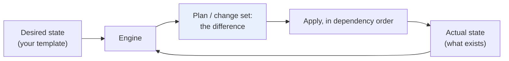
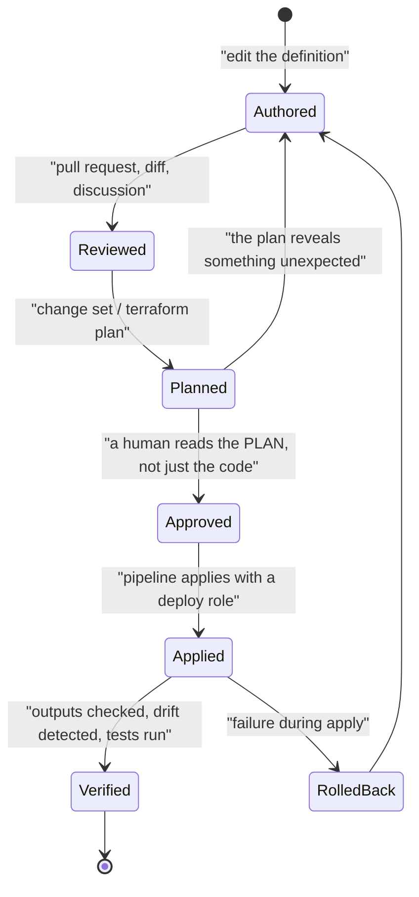
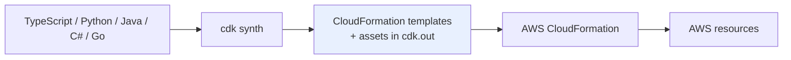
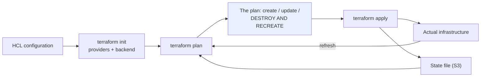
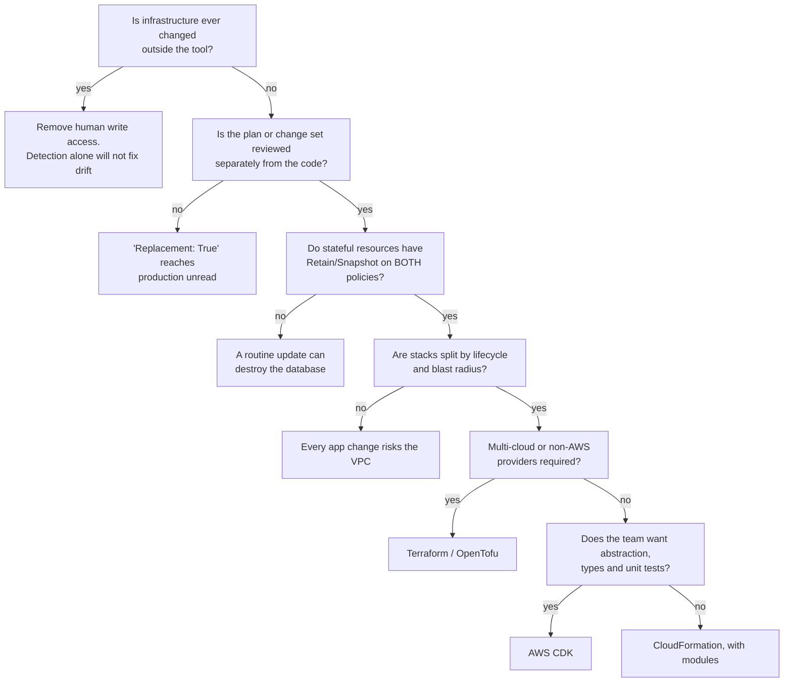
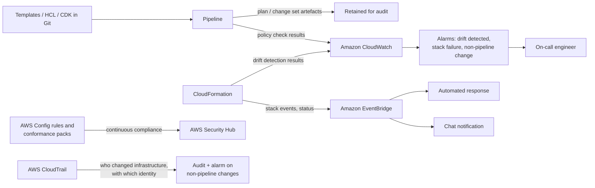
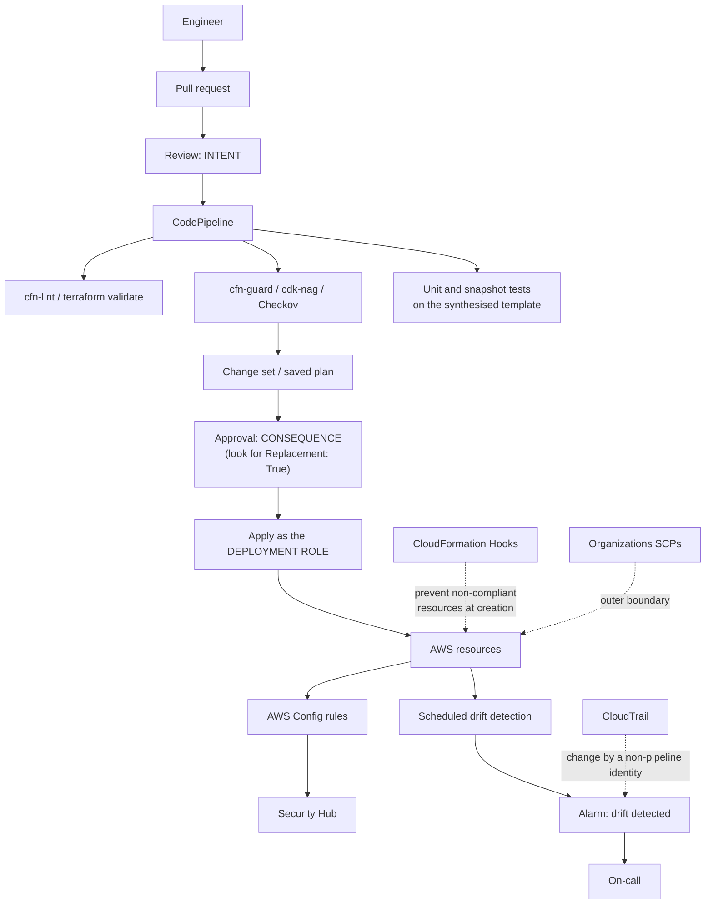

# Infrastructure as Code on AWS: CloudFormation, CDK and Terraform

---

## Definition

**Infrastructure as Code (IaC)** is the practice of defining infrastructure  networks, compute, storage, identity, monitoring  in machine-readable files that are version-controlled, reviewed, tested and applied by automation, such that the files are the **authoritative description** of what exists and the only sanctioned route to changing it.

The three tools this chapter covers occupy different positions:

| Tool | What it is | Where the state lives | Scope |
|---|---|---|---|
| **AWS CloudFormation** | AWS's native declarative provisioning engine | Managed by AWS, inside the service | AWS only |
| **AWS CDK** | A framework generating CloudFormation from TypeScript, Python, Java, C# or Go | In CloudFormation, because CDK *is* CloudFormation underneath | AWS primarily (CDK for Terraform and CDK8s exist) |
| **Terraform / OpenTofu** | An independent provisioning engine with a pluggable provider model | A state file you host and protect | Any provider: AWS, Azure, GCP, Datadog, GitHub, Kubernetes |

!!! note "The distinction that clarifies everything else"

    **CDK is not an alternative to CloudFormation; it is a way of writing CloudFormation.** `cdk synth` produces a template, `cdk deploy` hands that template to CloudFormation, and every CloudFormation concept in this chapter  change sets, stack states, rollback, drift, deletion policies  applies unchanged to a CDK application. Students who skip CloudFormation and start with CDK consistently struggle at exactly the moment it matters: when a stack is stuck in `UPDATE_ROLLBACK_FAILED` and the abstraction has nothing to say about it.

    **Terraform is a genuine alternative**, because it is a different engine with a different state model. That is why its failure modes are different  a corrupted state file has no CloudFormation equivalent  and why the comparison is architectural rather than syntactic.

---

## Why This Service or Concept Exists

### The problem: manual infrastructure does not survive contact with reality

Four failures recur, and they are the whole case for IaC.

**Environments diverge.** Staging and production are built by hand months apart, by different people. They differ in ways nobody documented, so "it worked in staging" stops being evidence. This is the same defect as [chapter 5.1](topic1.md)'s per-environment builds, one layer down  and it is worse, because infrastructure differences are harder to see than artefact differences.

**Nothing is reproducible.** An account is lost, a Region becomes unavailable, or a new customer requires an isolated deployment. Rebuilding requires reconstructing decisions from memory and from resources that no longer exist. Organisations discover this precisely when they have the least time.

**Changes are unreviewable and untraceable.** A console change leaves a CloudTrail record of an API call, which tells you what happened but not why, not what else was considered, and not who agreed. There is no diff, no reviewer, and no revert.

**Drift accumulates silently.** Someone widens a security group during an incident. Someone raises a limit to unblock a demo. Nobody reverts either. Six months later the environment differs from every document describing it, and nobody knows in how many ways.

IaC addresses all four with one mechanism: **the file is the source of truth, and changes to infrastructure are changes to the file**  reviewed like code, versioned like code, tested like code, and applied by a machine.

### The problem: the API is imperative and humans are not reliable state machines

AWS APIs are imperative: create this, modify that, delete the other. To reach a desired configuration you must know the current one, compute the difference and issue the right calls in the right order  including the order dependencies, such as a subnet requiring a VPC, and the awkward ones, such as replacing a resource that others reference.

A declarative engine inverts this. You describe the **desired state**; the engine determines current state, computes the difference, orders the operations by dependency, and applies them. That gives you two properties you cannot practically hand-write:

- **Idempotency**: applying the same definition repeatedly produces the same result. Running it twice is safe, which means automation can retry.
- **Convergence**: whatever the current state, the engine moves toward the declared state  so a partially-applied change can simply be re-applied.

These are the same properties that make Kubernetes controllers work ([chapter 3.1](../unit3/topic1.md)) and that make GitOps reconciliation possible ([chapter 5.2](topic2.md)). IaC is the same idea applied to cloud resources, and recognising it as one idea rather than three is worth more than memorising any individual tool's syntax.

### What AWS provides, and what it does not

| Concern | Manual / scripted | With IaC |
|---|---|---|
| Reproducing an environment | Reconstruct from memory and documentation | Apply the same definition with different parameters |
| Knowing what exists | Click through consoles across Regions | Read the repository |
| Reviewing a change | A screenshot in a ticket, if you are lucky | A pull request with a diff and a plan |
| Ordering of operations | Hand-maintained scripts that break when resources change | A dependency graph computed by the engine |
| Partial failure | Resources half-created, cleaned up by hand | Automatic rollback (CloudFormation) or a re-runnable plan (Terraform) |
| Detecting manual changes | Nothing detects them | Drift detection, or continuous reconciliation |
| Deleting an environment cleanly | Hunt for orphans for weeks | Delete the stack; dependencies are resolved in reverse |
| Multi-account, multi-Region rollout | Repeat by hand, accept divergence | StackSets, or a Terraform module applied per account |
| Auditing who changed what and why | CloudTrail API calls with no intent | Git history with a reviewer and a message |

What no tool provides is **the discipline**. Every failure in this chapter  drift, stuck stacks, a state file in someone's home directory, a `terraform destroy` on production  is fully supported by the tooling. IaC makes the correct approach cheap; it does not make the incorrect one impossible.

---

## Core Concepts

### Declarative and imperative, idempotency and convergence

**Imperative**: "create a VPC, then create a subnet in it, then create a route table, then associate it." You specify the steps; you own the ordering, the error handling and the question of what to do when half of it already exists.

**Declarative**: "there is a VPC with this CIDR, containing these subnets, with these routes." You specify the outcome; the engine discovers current state, computes a difference and orders the work.



**Idempotency** means applying the same definition repeatedly converges to the same result rather than compounding. **Convergence** means the engine moves from whatever state exists toward the declared one. Together they are what make automation safe: a failed run can be re-run, and a partially-applied change can be completed rather than untangled.

!!! tip "The one loop, three times"

    This diagram is the same loop as a Kubernetes controller ([chapter 3.1](../unit3/topic1.md)) and the same loop as Argo CD's reconciliation ([chapter 5.2](topic2.md)). Declared state, observed state, difference, act. Recognising that CloudFormation, Kubernetes and GitOps are three instances of one pattern is the single most transferable idea in the module  and it is why the failure modes rhyme: drift, stuck reconciliation, and "the declared state is wrong" appear in all three.

### State, and why it is the deepest difference between the tools

Every declarative engine needs to know what it created  to tell the difference between "this resource does not exist" and "this resource exists and I do not manage it".

| Engine | Where state lives | Consequences |
|---|---|---|
| **CloudFormation** | Inside the AWS service, per stack | Nothing to host, protect or back up. You cannot inspect or repair it directly; you are dependent on the service's own recovery mechanisms |
| **Terraform / OpenTofu** | A **state file** you host  S3, a Terraform Cloud backend, or locally | You control it and must protect it. It contains resource attributes **including secrets**. Corruption or loss is a serious incident. It can be surgically repaired, which is occasionally invaluable |

This single difference generates most of the practical contrasts between the tools. CloudFormation's opacity means fewer operational responsibilities and fewer escape hatches. Terraform's explicit state means more responsibility  remote backend, locking, versioning, encryption, access control  and more power, because `terraform state mv`, `import` and `rm` can repair situations that would leave a CloudFormation stack wedged.

### Drift

**Drift** is divergence between declared state and actual state, caused by changes made outside the tool: a console edit, a CLI call, an automated remediation, or another IaC tool touching the same resource.

Drift is dangerous for three compounding reasons. **The declaration becomes false**, so your documentation asserts something untrue with authority. **The next apply may revert it**, which is correct in principle and occasionally catastrophic in practice  the drift might be the emergency fix keeping the service up. **Rollback may fail**, because the engine's model of what it should restore no longer matches what is there, which is exactly how stacks get stuck.

| Engine | Drift handling |
|---|---|
| **CloudFormation** | **Drift detection** on demand, per stack or per resource; reports differences but does not correct them |
| **Terraform** | `terraform plan` naturally reveals drift, because it refreshes actual state before diffing |
| **Both** | Neither prevents drift. Prevention is IAM: humans should not have write access to production infrastructure |

!!! danger "The only real defence against drift is removing the ability to cause it"

    Detection tells you about drift after it has happened and does not stop it happening again. The structural answer is that **people do not have write access to production infrastructure**  only the pipeline's deployment role does. Human access is read-only, with a time-bounded, alarmed break-glass path for emergencies. Every organisation that has eliminated drift has done so this way; none has done it by running drift detection more often.

### The lifecycle of a change



The step teams skip is **Planned → Approved**: reviewing the *plan*, not only the code. The code says what you intend; the plan says what will actually happen to existing resources  and the gap between them is where the damage lives. A one-word change to a parameter can read as trivial in a diff and appear in the plan as **replace the RDS instance**.

!!! danger "Replacement is the thing to look for in every plan"

    Some property changes can be applied in place; others require the resource to be **destroyed and recreated**. Changing an RDS instance identifier, a subnet's CIDR, an EC2 AMI in some configurations, or a DynamoDB table's key schema all mean: delete the resource, create a new one. For stateless resources that is a brief interruption. For a database, a stateful volume or anything holding data, **it is data loss**. CloudFormation change sets label this `Replacement: True`; Terraform plans print `-/+ destroy and then create replacement` and `# forces replacement` on the offending attribute. Reading for that string is the single highest-value habit in this chapter.

### Modularity and composition

A 3,000-line template describing everything is unreviewable and undeployable in parts. Every tool provides composition, and the architectural decision is **where the boundaries go**.

The useful principle: **split by lifecycle and blast radius, not by resource type.** Things that change together and can safely fail together belong in one unit. A typical split:

| Layer | Contents | Change frequency |
|---|---|---|
| **Foundation** | VPC, subnets, transit gateway, DNS zones | Rarely; changes are high-risk |
| **Shared services** | Clusters, databases, shared load balancers | Occasionally |
| **Application** | Services, task definitions, scaling policies, alarms | Constantly |
| **Configuration** | Parameters, feature flags | Continuously, often outside IaC |

The mistake is a single stack containing the VPC and the application, which means every routine application change carries the risk of touching the network  and means the network's blast radius is every deployment.

### Secrets

**Never put secrets in IaC.** This is stated more absolutely than most rules here because the failure is total: a secret in a template is in Git history forever, visible to everyone with repository access, and typically also visible in CloudFormation's own console. Worse for Terraform: **the state file contains resource attributes, including generated passwords**, so even a secret you did not write into the configuration can end up in state.

The correct patterns: create the secret in Secrets Manager with a generated value and reference it by ARN; use CloudFormation **dynamic references** (`{{resolve:secretsmanager:...}}`) so the value is resolved at deployment and not stored in the template; grant the runtime identity permission to read it; and treat the Terraform state file as a secret store in its own right  encrypted, access-controlled, and never in a public or broadly-readable bucket.

### Testing infrastructure

Infrastructure code is code and can be tested, with a hierarchy of increasing cost and fidelity:

| Level | What it checks | Tools |
|---|---|---|
| **Linting** | Syntax and obvious errors | `cfn-lint`, `terraform validate`, `tflint` |
| **Policy** | Rules: encryption required, no public buckets, mandatory tags | `cfn-guard`, `cdk-nag`, OPA/Conftest, Checkov, `tfsec` |
| **Unit / snapshot** | The synthesised template contains what you expect | CDK `assertions`, Terraform `plan` assertions |
| **Plan review** | What will actually change, including replacements | Change sets, `terraform plan` |
| **Integration** | Deploy to a real environment and assert behaviour | Terratest, CDK integration tests, ephemeral environments |
| **Compliance** | Continuous conformance of live resources | AWS Config rules, Security Hub, conformance packs |

The highest value for the lowest effort is **policy checks in the pipeline**: a rule that fails the build on an unencrypted bucket or an over-permissive security group catches a whole category of defect before it exists, and it does so uniformly rather than depending on whether a particular reviewer was paying attention.

---

## AWS Service Deep Dive

!!! warning "On quotas and numbers"

    Figures are representative as of 2026, mostly **soft quotas** adjustable through AWS Service Quotas and varying by Region. Verify in the Service Quotas console.

### AWS CloudFormation

**Purpose.** Provision and manage AWS resources declaratively as a **stack**, with dependency ordering, automatic rollback, drift detection and a full change history.

**Architecture.** A **template** (JSON or YAML) describes resources. Submitting it creates a **stack**  a managed unit whose state lives inside the service. CloudFormation builds a dependency graph from explicit `DependsOn` declarations and implicit references (`Ref`, `Fn::GetAtt`), creates resources in order, parallelising where it can, and on failure **rolls back by default**, deleting what it created.

**Template anatomy**, all of which is examinable and all of which is used in practice:

```yaml
AWSTemplateFormatVersion: '2010-09-09'
Description: Application stack for DSO303

Parameters:                      # inputs, with types and constraints
  Environment:
    Type: String
    AllowedValues: [ dev, staging, production ]
  DbPassword:
    Type: AWS::SSM::Parameter::Value<String>   # never a plain String for secrets
    Default: /dso303/db/password

Mappings:                        # static lookup tables
  EnvConfig:
    dev:        { InstanceType: t4g.small,  MinSize: 1, MultiAz: false }
    production: { InstanceType: m7g.large,  MinSize: 3, MultiAz: true }

Conditions:                      # boolean expressions controlling creation
  IsProduction: !Equals [ !Ref Environment, production ]

Resources:
  Database:
    Type: AWS::RDS::DBInstance
    DeletionPolicy: Snapshot           # do NOT silently destroy data
    UpdateReplacePolicy: Snapshot      # the one teams forget
    Properties:
      DBInstanceClass: !FindInMap [ EnvConfig, !Ref Environment, InstanceType ]
      MultiAZ: !If [ IsProduction, true, false ]
      StorageEncrypted: true
      MasterUserPassword: '{{resolve:secretsmanager:dso303/db:SecretString:password}}'

  ScalingPolicy:
    Type: AWS::ApplicationAutoScaling::ScalingPolicy
    Condition: IsProduction            # exists only in production

Outputs:                         # values other stacks or humans consume
  DatabaseEndpoint:
    Value: !GetAtt Database.Endpoint.Address
    Export:
      Name: !Sub '${AWS::StackName}-DbEndpoint'
```

**Intrinsic functions** worth knowing: `Ref`, `Fn::GetAtt`, `Fn::Sub`, `Fn::Join`, `Fn::Select`, `Fn::Split`, `Fn::FindInMap`, `Fn::If`, `Fn::ImportValue`, `Fn::Cidr`, `Fn::ForEach` (a recent addition that removes a great deal of repetition), and the condition functions `Fn::Equals`, `Fn::And`, `Fn::Or`, `Fn::Not`.

**Stack states**, and the ones that matter operationally:

| State | Meaning | What you can do |
|---|---|---|
| `CREATE_COMPLETE` | Created successfully | Update, delete |
| `CREATE_FAILED` → `ROLLBACK_COMPLETE` | Creation failed and was rolled back | **Only delete.** You cannot update a stack in `ROLLBACK_COMPLETE` |
| `UPDATE_COMPLETE` | Updated successfully | Update, delete |
| `UPDATE_ROLLBACK_COMPLETE` | An update failed and was rolled back cleanly | Update, delete |
| `UPDATE_ROLLBACK_FAILED` | **The rollback itself failed** | `ContinueUpdateRollback`, possibly skipping resources. The dangerous state |
| `DELETE_FAILED` | Deletion failed, usually a non-empty bucket or a dependency | Retry, possibly retaining resources |
| `IMPORT_COMPLETE` | Existing resources brought under management | Update, delete |

**Important features:**

| Feature | What it does | Why it matters |
|---|---|---|
| **Change sets** | Preview what an update will do before applying | The only way to see `Replacement: True` before it happens |
| **Drift detection** | Compare declared against actual | Finds the security group someone widened eight months ago |
| **Stack policies** | Deny updates to specified resources | Protects a database from an accidental replacement |
| **`DeletionPolicy` / `UpdateReplacePolicy`** | `Retain`, `Snapshot`, `Delete` on removal or replacement | The difference between a bad change and data loss |
| **Nested stacks** | A stack resource that is itself a stack | Reuse and decomposition inside one deployment unit |
| **Cross-stack references** | `Export` and `Fn::ImportValue` | Sharing values between independent stacks  with a coupling cost |
| **StackSets** | One template deployed across accounts and Regions | Organisation-wide baselines: guardrails, logging, roles |
| **Modules** | Reusable resource groupings registered in the registry | Reuse without the CDK |
| **Hooks** | Proactive validation invoked before a resource is provisioned | Preventive controls that stop non-compliant resources being created at all |
| **Custom resources / Lambda-backed** | Provision anything CloudFormation does not support | The escape hatch, and a source of stuck stacks when written carelessly |
| **IaC generator** | Scan an account and generate a template from existing resources | The realistic path out of a hand-built estate |
| **Git sync** | CloudFormation tracks a Git repository and deploys on commit | GitOps for infrastructure without a pipeline |
| **Termination protection** | Prevents stack deletion | Essential on production foundation stacks |

**Limitations.** Templates are verbose, and logic is awkward  `Fn::If` and `Conditions` are a poor substitute for a language, which is the central motivation for CDK. Quotas apply to template size, resource count per stack and parameter count. Coverage of new AWS features occasionally lags their console and API availability. Custom resources are powerful and dangerous: a Lambda-backed custom resource that fails to signal completion will hang a stack until its timeout, which can be hours. And `ROLLBACK_COMPLETE` requiring deletion is a genuine papercut that surprises people repeatedly.

**Pricing model.** No charge for CloudFormation operations on AWS resource types; you pay for the resources created. Third-party registry resource operations and handler runtime are charged. Effectively free for normal use.

**Availability and scaling.** Regional and managed. Stacks are Regional; multi-Region means StackSets or a stack per Region. Very large stacks are slow  creation and update time grows with the resource count, and the dependency graph's critical path dominates.

**Security features.** Stack-level **service roles**, so CloudFormation acts with a specific identity rather than the caller's permissions  the mechanism that lets a restricted human trigger a privileged deployment. Stack policies. Termination protection. Full CloudTrail coverage. Dynamic references to Secrets Manager and Parameter Store so secrets are not stored in templates. And Hooks for preventive policy enforcement.

!!! danger "The two policies that separate a bad day from a catastrophe"

    **`DeletionPolicy: Retain` or `Snapshot`** on every stateful resource  databases, S3 buckets holding data, EFS file systems. Without it, deleting a stack deletes the data. **`UpdateReplacePolicy`** is the one teams omit, and it covers a different and more insidious case: a property change that forces **replacement** will delete the old resource even though you never asked to delete anything. A developer changing a database identifier in a template, with no `UpdateReplacePolicy`, destroys the database. Both policies should be set on every stateful resource, always, and they cost nothing.

### AWS Cloud Development Kit

**Purpose.** Define AWS infrastructure in a general-purpose programming language, with abstraction, type checking, unit testing and IDE support  synthesised into CloudFormation templates and deployed by CloudFormation.

**Architecture.** A CDK **app** contains **stacks**, which contain **constructs**. `cdk synth` executes your program and produces CloudFormation templates plus **assets** (Lambda bundles, container images, files) into the `cdk.out` directory. `cdk deploy` uploads the assets and submits the templates to CloudFormation.



**The construct levels**, which is the core concept:

| Level | What it is | Example |
|---|---|---|
| **L1 (Cfn*)** | A direct, generated one-to-one mapping to a CloudFormation resource | `CfnBucket`  every property, no defaults, no opinions |
| **L2** | A curated AWS-authored abstraction with sensible defaults and helper methods | `s3.Bucket`  encryption defaults, `grantRead()` generating the IAM policy for you |
| **L3 (patterns)** | Multi-resource opinionated solutions | `ApplicationLoadBalancedFargateService`  VPC, cluster, ALB, service, task definition, security groups, logs |

The value concentrates in **L2**, and specifically in the `grant*` methods: `bucket.grantRead(lambdaFunction)` writes the correct IAM policy, on the correct principal, with the correct resource ARNs including the `/*` suffix people forget. A very large share of real-world IAM defects are policies written by hand; this removes that category.

**Important features.** `constructs` as reusable, testable, publishable units  the abstraction that made the logistics migration in the motivation section possible. **Aspects**, which visit every node in the tree and can enforce or mutate  the mechanism behind `cdk-nag`'s security rules. **Assets**, bundling and uploading Lambda code and Docker images automatically. **Context and environment-aware synthesis.** **`cdk diff`**, which shows the change-set difference before deploying. **CDK Pipelines**, a self-mutating CodePipeline construct. **`assertions`** for unit testing the synthesised template. And **`cdk import`** and **`cdk migrate`** for bringing existing resources or templates under CDK management.

**Bootstrapping** is a prerequisite that trips everyone once: `cdk bootstrap` provisions a **CDKToolkit** stack in each target account and Region containing an S3 bucket and ECR repository for assets, plus IAM roles used for deployment. Without it, `cdk deploy` fails. The bootstrap roles are also a security consideration in their own right: the default deployment role is powerful, and in a multi-account setup you should understand which roles trust which accounts.

**Limitations.** Everything CloudFormation cannot do, CDK cannot do  the same quotas, the same stuck-stack states, the same rollback semantics. **Synthesis is code execution**, so a bug produces a wrong template rather than an error, and `cdk diff` is therefore not optional. Upgrading `aws-cdk-lib` can change synthesised output, so a version bump is an infrastructure change and needs a diff. L3 patterns are opinionated and can be hard to customise at the edges, which sometimes means dropping to L2 or L1 and losing the abstraction. And a CDK codebase is a software project: it has dependencies, tests, a build, and maintenance obligations that a YAML file does not.

!!! note "The CDK CLI and library are now separate"

    The CDK Toolkit (CLI) and the construct library have been split into independently versioned packages, with a programmatic toolkit library also available. For teams this mostly means pinning both deliberately in CI rather than relying on a globally installed `cdk` binary whose version nobody tracks  a genuine source of "it synthesised differently on my machine".

**Pricing.** Free; you pay for the resources and for the bootstrap bucket and repository.

**Security features.** Inherits CloudFormation's. Adds `cdk-nag` for rule packs (AWS Solutions, HIPAA, NIST) evaluated at synthesis time, with explicit suppressions that must be justified in code  which converts a security exception from an undocumented decision into a reviewed one.

### Terraform and OpenTofu

**Purpose.** Provision infrastructure across many providers with one declarative language and one workflow, using an explicit state file and a plan/apply cycle.

**Architecture.** Configuration in **HCL** declares resources. **Providers** are plugins implementing the CRUD operations for a platform. `terraform init` downloads providers and configures the **backend**; `terraform plan` refreshes state, builds a dependency graph and computes a diff; `terraform apply` executes it.



**Core concepts:**

| Concept | Meaning |
|---|---|
| **Provider** | A plugin for a platform: `aws`, `azurerm`, `google`, `kubernetes`, `datadog`, `github` |
| **Resource** | A managed object: `resource "aws_s3_bucket" "logs" { … }` |
| **Data source** | A read-only lookup of something you do not manage |
| **State** | The record mapping configuration to real resources, with their attributes |
| **Backend** | Where state lives: `s3`, `remote`, `local` |
| **State locking** | Prevents concurrent applies corrupting state |
| **Module** | A reusable group of resources with inputs and outputs |
| **Workspace** | Multiple named states from one configuration |
| **`lifecycle` block** | `prevent_destroy`, `create_before_destroy`, `ignore_changes` |
| **`import`** | Bring an existing resource under management |
| **`moved` block** | Refactor without destroying and recreating |

!!! tip "S3 native state locking replaced the DynamoDB table"

    For years the standard S3 backend required a **DynamoDB table** for state locking, and forgetting it was a classic cause of corrupted state when two applies ran concurrently. Terraform now supports **native S3 state locking** via the `use_lockfile = true` backend option, which places a `.tflock` object alongside the state and removes the DynamoDB dependency entirely. New configurations should use it; a great deal of existing material and many older modules still specify `dynamodb_table`, so recognising both is necessary when reading real code.

**Important features.** A very large provider ecosystem, including providers for things AWS has no service for  Datadog monitors, GitHub repositories, Kubernetes objects  which is the genuine multi-cloud and multi-vendor argument. `plan` as a first-class artefact that can be saved and applied later, so the thing reviewed is exactly the thing applied. Modules and a public registry. `targeted` applies for surgical operations. `state mv`, `rm` and `import` for repair. `moved` blocks for refactoring without destruction. And an explicit dependency graph you can render with `terraform graph`.

**Limitations.** **The state file is your responsibility**  hosting, locking, versioning, encryption, access control and backup  and it contains secrets. Provider bugs are real and you are dependent on provider release cycles. Large monolithic configurations become slow, because `refresh` queries every managed resource. Workspaces are frequently misused for environment separation when separate state backends and separate credentials are safer. And drift is revealed only when you run `plan`, which means an estate nobody plans against drifts invisibly.

**Licensing  and this is now an architectural consideration, not a footnote.** In August 2023 HashiCorp changed Terraform's licence from MPL 2.0 to the **Business Source License (BSL) 1.1**, which restricts use in products competing with HashiCorp. The community forked the last MPL version as **OpenTofu**, which moved under the Linux Foundation and subsequently into the CNCF. **IBM completed its acquisition of HashiCorp in 2025.** The two codebases have since diverged rather than tracking each other, and HCP Terraform's free tier has been capped by resource count.

!!! warning "What the licence situation means for an architecture decision"

    For a university lab or an ordinary enterprise using Terraform to manage its own infrastructure, the BSL does not restrict use. The considerations are longer-term and worth stating plainly rather than taking a side on. **Divergence**: OpenTofu and Terraform are no longer drop-in equivalents as they were at fork time, so a migration is a real project rather than a rename. **Governance**: OpenTofu is foundation-governed; Terraform's direction is set by IBM. **Commercial terms**: HCP Terraform's pricing and free-tier limits can change, and have. **Ecosystem**: providers and modules largely work with both, and that is the main reason the fork remains practical. The engineering conclusion is to treat the choice as one you may have to revisit, and therefore to avoid depending on features unique to either  not to assume the question is settled.

**Pricing.** The CLI is free for both. HCP Terraform and Terraform Enterprise are commercial, priced by managed resources; Spacelift, Env0, Scalr and Atlantis are alternatives, and self-hosting in a pipeline with an S3 backend is free.

**Security features.** Backend encryption and access control; `sensitive = true` marking values so they are redacted in output (but **still stored in state**); policy as code with Sentinel (commercial), OPA or Checkov; and provider-level credential handling that should use an assumed role in CI rather than static keys.

---

## Architecture Components

| Component | Responsibility in an IaC architecture |
|---|---|
| **Template / HCL configuration** | The declared desired state; the authoritative description of the environment |
| **Git repository** | Version history, review, and the audit record of intent  not just of action |
| **CloudFormation stack** | The deployment unit, its state, and its lifecycle |
| **Change set / `terraform plan`** | The preview; where `Replacement: True` is caught before it destroys data |
| **Stack policy** | Denies updates to protected resources such as databases |
| **`DeletionPolicy` / `UpdateReplacePolicy`** | What happens to data when a resource is removed or replaced |
| **Terraform state file + backend** | The record of managed resources; **contains secrets; must be protected** |
| **State locking (S3 `use_lockfile`)** | Prevents concurrent applies corrupting state |
| **Providers** | The plugins implementing resource operations for each platform |
| **CDK construct tree** | The in-memory model synthesised into templates |
| **CDK bootstrap stack (CDKToolkit)** | Asset storage and the deployment roles CDK assumes |
| **CDK Aspects / `cdk-nag`** | Policy applied at synthesis, before anything is deployed |
| **Modules / nested stacks / L3 constructs** | Reuse and composition |
| **StackSets** | One definition across many accounts and Regions |
| **CloudFormation Hooks** | Preventive validation before a resource is provisioned |
| **AWS Config rules and conformance packs** | Continuous compliance of live resources, after provisioning |
| **Policy-as-code (`cfn-guard`, Checkov, OPA, `tfsec`)** | Pipeline gates on encryption, exposure, tagging |
| **Deployment role** | The only identity permitted to change infrastructure |
| **AWS Secrets Manager / Parameter Store** | Where secrets live; referenced, never embedded |
| **AWS Organizations and SCPs** | The boundary within which any IaC change must remain |
| **AWS CloudTrail** | The record of what the deployment role actually did |
| **CDK Pipelines / CodePipeline** | Applying infrastructure changes through the same reviewed path as code |

Read structurally, these divide into three groups. The **describers**  templates, HCL, constructs, modules  say what should exist. The **deciders**  change sets, plans, policy checks, hooks, reviews  determine whether that description may be realised and what it will cost. The **enforcers**  deletion policies, stack policies, SCPs, the restriction of write access to a deployment role, drift detection and Config rules  keep reality aligned with the description afterwards. Most organisations build the first group, skip the second, and wonder why the third is necessary.

---

## Important AWS Terminology

| Term | Meaning |
|---|---|
| **Infrastructure as Code** | Defining infrastructure in version-controlled files applied by automation |
| **Declarative** | Describing desired state; the engine computes the steps |
| **Imperative** | Specifying the steps yourself |
| **Idempotency** | Applying the same definition repeatedly yields the same result |
| **Convergence** | The engine moves from any current state toward the declared state |
| **Desired state / actual state** | What you declared; what exists |
| **Drift** | Divergence between declared and actual, caused by out-of-band changes |
| **Template** | A CloudFormation document describing resources |
| **Stack** | A CloudFormation deployment unit with its own state and lifecycle |
| **Stack set** | One template deployed across many accounts and Regions |
| **Change set** | A preview of what an update will do, including replacements |
| **`Replacement: True`** | The resource will be **destroyed and recreated**  data loss for stateful resources |
| **`DeletionPolicy`** | `Delete`, `Retain` or `Snapshot` when a resource is removed from a stack |
| **`UpdateReplacePolicy`** | The same, for when an update forces replacement  the one teams forget |
| **Stack policy** | A policy denying updates to protected resources |
| **Termination protection** | Prevents a stack from being deleted |
| **`ROLLBACK_COMPLETE`** | A failed creation was rolled back; the stack can **only be deleted** |
| **`UPDATE_ROLLBACK_FAILED`** | The rollback itself failed; requires `ContinueUpdateRollback` |
| **Nested stack** | A stack declared as a resource inside another stack |
| **Cross-stack reference** | `Export` and `Fn::ImportValue` sharing values between stacks |
| **Intrinsic function** | `Ref`, `Fn::GetAtt`, `Fn::Sub`, `Fn::If`, `Fn::ForEach` and others |
| **Dynamic reference** | `{{resolve:secretsmanager:...}}`, resolving a secret at deployment time |
| **Custom resource** | A Lambda-backed resource for anything CloudFormation does not support |
| **CloudFormation Hook** | Preventive validation invoked before a resource is provisioned |
| **CloudFormation module** | A reusable grouping of resources registered in the registry |
| **IaC generator** | Generates a template from resources already existing in an account |
| **Git sync** | CloudFormation deploying directly from a tracked Git repository |
| **Resource import** | Bringing existing resources under stack management |
| **AWS CDK** | A framework generating CloudFormation from a programming language |
| **Construct** | The CDK building block; the tree node |
| **L1 / L2 / L3** | Raw `Cfn*` resources; curated abstractions; multi-resource patterns |
| **Synthesis (`cdk synth`)** | Executing the CDK app to produce templates and assets |
| **`cdk.out`** | The synthesis output directory |
| **Bootstrap (`cdk bootstrap`)** | Provisioning the CDKToolkit stack: asset bucket, ECR repository, deployment roles |
| **Asset** | Lambda code or a Docker image uploaded during deployment |
| **Aspect** | A visitor applied to every node in the construct tree |
| **`cdk-nag`** | Rule packs evaluated at synthesis, with explicit in-code suppressions |
| **`cdk diff`** | The difference between synthesised and deployed state |
| **CDK Pipelines** | A self-mutating CodePipeline construct for deploying CDK apps |
| **Terraform** | An independent provisioning engine with a pluggable provider model |
| **OpenTofu** | The MPL-licensed fork of Terraform, now under the CNCF |
| **HCL** | HashiCorp Configuration Language |
| **Provider** | A plugin implementing resource operations for a platform |
| **State file** | Terraform's record of managed resources and their attributes  **contains secrets** |
| **Backend** | Where state is stored: `s3`, `remote`, `local` |
| **State locking** | Preventing concurrent applies; now via the S3 `use_lockfile` option rather than DynamoDB |
| **`terraform plan`** | The diff, saveable as an artefact and applied exactly |
| **`-/+` and "forces replacement"** | Terraform's notation for destroy-and-recreate |
| **Module** | A reusable Terraform unit with inputs and outputs |
| **Workspace** | Multiple named states from one configuration |
| **`lifecycle` block** | `prevent_destroy`, `create_before_destroy`, `ignore_changes` |
| **`moved` block** | Refactoring without destroying and recreating |
| **`terraform import` / `state mv` / `state rm`** | State repair and adoption operations |
| **Policy as code** | `cfn-guard`, `cdk-nag`, Checkov, `tfsec`, OPA/Conftest |
| **BSL** | The Business Source License, adopted by Terraform in August 2023 |

---

## Configuration Options

### CloudFormation

| Setting | Options | How to decide |
|---|---|---|
| **`DeletionPolicy`** | `Delete`, `Retain`, `Snapshot` | **`Retain` or `Snapshot` on every stateful resource.** The default deletes your data |
| **`UpdateReplacePolicy`** | `Delete`, `Retain`, `Snapshot` | The same, and set it separately  a forced replacement is not a deletion request but destroys data identically |
| **Stack policy** | Deny `Update:Replace` / `Update:Delete` on specified resources | Protect databases and stateful storage from accidental replacement |
| **Termination protection** | On, off | **On** for every production and foundation stack |
| **Rollback configuration** | CloudWatch alarms, monitoring period | Roll back an infrastructure change if an application alarm fires during it |
| **Stack service role** | An IAM role | Lets a restricted human trigger a privileged deployment; the basis of separation of duties |
| **`DependsOn`** | Explicit dependency | Only where an implicit reference does not express a real ordering requirement |
| **`CreationPolicy` / `WaitCondition`** | Signal-based completion | Wait for instances to signal readiness rather than assuming creation means ready |
| **Nested stacks vs cross-stack exports** | Either | Nested for one deployment unit; exports for independent lifecycles  noting an export cannot be changed while imported |
| **StackSets permission model** | Self-managed, service-managed | Service-managed with AWS Organizations for organisation-wide baselines |
| **Git sync** | Configured or not | GitOps for infrastructure without building a pipeline  useful for guardrail stacks |

### AWS CDK

| Setting | Options | How to decide |
|---|---|---|
| **Construct level** | L1, L2, L3 | L2 by default; L1 when you need a property L2 does not expose; L3 for speed when its opinions fit |
| **`RemovalPolicy`** | `DESTROY`, `RETAIN`, `SNAPSHOT` | CDK's name for `DeletionPolicy`. **Note many L2 constructs default to `DESTROY`**  verify for anything stateful |
| **Environment (`env`)** | Explicit account and Region, or environment-agnostic | **Explicit** for production: environment-agnostic stacks cannot use context lookups such as AZ discovery |
| **Bootstrap** | Per account and Region, with trust relationships | Understand which accounts the bootstrap roles trust; the default deployment role is powerful |
| **Aspects** | Tagging, `cdk-nag` rule packs | `cdk-nag` in the pipeline, with suppressions requiring a written justification in code |
| **Library and CLI versions** | Pinned or floating | **Pinned, both.** A version bump changes synthesised output and is an infrastructure change |
| **Testing** | Snapshot, fine-grained assertions, integration | Fine-grained assertions on security-relevant properties; snapshots to catch unintended synthesis changes |
| **`cdk diff` in the pipeline** | Present or absent | **Present.** Synthesis is code execution and can be wrong without erroring |

### Terraform / OpenTofu

| Setting | Options | How to decide |
|---|---|---|
| **Backend** | `s3`, `remote` (HCP), `local` | **Never `local` for anything shared.** S3 with versioning and encryption |
| **State locking** | `use_lockfile = true`, or a `dynamodb_table` | `use_lockfile` for new configurations; recognise the DynamoDB form in existing code |
| **State encryption** | SSE-S3 or SSE-KMS | KMS: state contains secrets, and the key policy is how you control who can read them |
| **Environment separation** | Workspaces, separate state keys, separate accounts | **Separate state and separate credentials per environment.** Workspaces are a mutable shell setting and are how production gets destroyed by accident |
| **Provider version constraints** | Pessimistic (`~>`), exact, open | Constrain deliberately and commit `.terraform.lock.hcl`; an unpinned provider is an unpinned dependency |
| **`lifecycle { prevent_destroy }`** | On stateful resources | A hard stop that fails the plan rather than warning in it |
| **`create_before_destroy`** | On, off | Where replacement must not cause an availability gap |
| **`ignore_changes`** | Specific attributes | For attributes changed legitimately outside Terraform  use sparingly; it is drift you have chosen to accept |
| **Saved plan (`-out`)** | Used or not | **Used in pipelines**, so the artefact reviewed is exactly the artefact applied |
| **Module sources** | Registry, Git with a ref, local | Pin to a tag or commit, never a floating branch |
| **`-target`** | Surgical apply | Emergency only; it applies a subset and leaves the rest un-converged |

!!! danger "Three configuration mistakes that destroy data"

    **A stateful resource with the default deletion policy**  including a CDK construct defaulting to `DESTROY`  and **`UpdateReplacePolicy` omitted**, the two cases explained under [AWS CloudFormation](#aws-cloudformation). **Terraform workspace or credential selection as the only thing separating environments**, which is how `terraform destroy` runs against production: the plan said 94 resources and the engineer believed they were in `dev`.

---

## Design Considerations



| Quality | What it means here | Design levers | The trade-off you accept |
|---|---|---|---|
| **Reproducibility** | A new environment from nothing | Parameterised definitions, no manual steps, no hand-created dependencies | Everything must be in code, including the awkward parts |
| **Blast radius** | What one bad apply can affect | Stack and module boundaries, separate accounts, stack policies | More units to coordinate; cross-unit references add coupling |
| **Reviewability** | Whether a human can judge a change | Small stacks, plan review, policy checks, readable abstractions | CDK abstraction can hide consequence; the diff must still be read |
| **Drift resistance** | Whether reality stays aligned | Remove write access, drift detection, Config rules, Hooks | Break-glass access becomes a designed, audited path rather than a habit |
| **Recoverability** | Rebuilding after loss | IaC coverage of everything, tested restore, state backups | Coverage requires discipline where the console is faster |
| **Safety of data** | Whether an update can destroy it | Deletion and update-replace policies, stack policies, `prevent_destroy` | Protected resources need deliberate handling when they genuinely must change |
| **Change velocity** | How fast infrastructure changes safely | Automation, modules, small units | More gates and smaller units mean more coordination per change |
| **Portability** | Whether the definition survives a platform change | Terraform's provider model; avoiding features unique to one tool | Abstraction over clouds usually costs access to the best of each |
| **Operational complexity** | What an engineer faces when it breaks | Fewer tools, consistent patterns, good error paths | Every additional tool is another failure mode and another thing to learn |

!!! danger "The failure mode that makes all of this pointless"

    **Partial coverage.** An estate where 70 per cent is in code and 30 per cent was created by hand has the costs of IaC and few of its benefits: you still cannot rebuild, still cannot enumerate, and the hand-made resources are exactly the ones nobody documented. Worse, the IaC-managed resources often *depend* on the hand-made ones, so the templates only work in an account that already has the undocumented parts. Coverage is not a nice-to-have percentage; it is the property that makes the claim "we can rebuild this" either true or false, and it has no partial credit.

---

## AWS Best Practices

### Operational Excellence

Keep infrastructure definitions in version control alongside  or beside  the application they support, and apply them through the same reviewed pipeline path that [chapter 5.2](topic2.md) built for application code. Split stacks by lifecycle and blast radius so routine application changes cannot touch the network. Review the **plan or change set**, not only the diff, and make that a named step with a named approver rather than something that happens if someone thinks of it. Run drift detection on a schedule and alarm on the result, treating a drift finding as an incident to investigate rather than a report to file. Tag everything through a single mechanism  CDK Aspects, Terraform `default_tags`, or a Stack-level tag  so cost attribution and ownership are properties of the system rather than of people's memory. And keep a tested rebuild: an environment that has never been created from its definition is a hypothesis.

### Security

Never put secrets in templates, configuration or variables files; reference them from Secrets Manager or Parameter Store, and treat the **Terraform state file as a secret store** with encryption, versioning and tight access control. Run policy as code in the pipeline  `cfn-guard`, `cdk-nag`, Checkov or OPA  so that encryption, public-access and tagging rules are enforced uniformly rather than at a reviewer's discretion, and use **CloudFormation Hooks** where you want prevention rather than detection. Give CloudFormation a **stack service role** so a human with narrow permissions can trigger a privileged deployment without holding those permissions themselves. Restrict infrastructure write access to the deployment role and make human access read-only with a time-bounded, alarmed break-glass path. And review what the CDK bootstrap roles trust in a multi-account setup, because they are among the most powerful roles in the organisation and they are created by a command most people run without reading.

### Reliability

Set `DeletionPolicy` and `UpdateReplacePolicy`  or `RemovalPolicy` and `prevent_destroy`  on every stateful resource, and verify the defaults rather than assuming them, since several CDK L2 constructs default to destruction. Use stack policies or `prevent_destroy` on databases so that an unintended replacement fails the plan rather than executing it. Read every plan for replacement markers. Prefer `create_before_destroy` where a replacement would otherwise cause an availability gap. Keep foundation stacks small, protected and rarely changed. Test the disaster path: deploy the whole estate into an empty account periodically, because that is the only way to discover the undocumented manual dependency before you need it to not exist.

### Performance Efficiency

Split stacks by lifecycle, avoid defensive `DependsOn`, and cache providers and modules in CI; the details are in [Performance Optimization](#performance-optimization).

### Cost Optimization

Treat the definition as a cost document that is reviewed in the pull request; the cost dimensions and practices are in [Cost Optimization](#cost-optimization).

### Sustainability

Right-sizing expressed in code is right-sizing that persists, because it is reviewed and reapplied rather than drifting upward through successive incidents. Automatically destroying ephemeral environments removes idle capacity that otherwise runs indefinitely. And consolidating duplicated stacks into shared modules reduces both the resources provisioned and the review effort spent on each of them.

---

## Security Considerations

**Secrets in IaC are a permanent disclosure.** A password committed to a template is in Git history forever, readable by everyone with repository access, and typically also visible in the CloudFormation console's parameter list. Removing it from the current file removes nothing. The patterns that work: generate the secret in Secrets Manager and reference it, use dynamic references so the value resolves at deployment, and grant the runtime identity read permission rather than passing the value through the deployment at all.

**The Terraform state file is the most under-protected secret store in most organisations.** It contains resource attributes, and those include generated passwords, private keys and connection strings  including secrets you never wrote into your configuration. `sensitive = true` redacts a value from console output and does nothing to what is stored. The state bucket needs KMS encryption, versioning, restrictive policies, and access logging, and it should be treated in a security review exactly as you would treat a database of credentials.

**The deployment role is the most powerful identity in the account.** It can create IAM roles, modify networking and delete data. It should be assumable only by the pipeline, scoped as tightly as the work allows, and monitored  any use of it outside a pipeline execution should alarm. The same applies to the **CDK bootstrap roles**, which are created by a single command and are rarely reviewed afterwards despite being exactly this kind of identity.

**Policy as code is the only control that scales.** A reviewer will not consistently notice an unencrypted volume in a 400-line diff at 5 p.m. A rule will, every time, identically. Run `cfn-guard`, `cdk-nag`, Checkov or OPA in the pipeline and fail the build; use **CloudFormation Hooks** when the requirement is that a non-compliant resource cannot be created at all, even outside the pipeline.

**Drift is a security problem.** The retail example in the motivation section  a security group open to the internet for eight months while the template said otherwise  is the canonical case. Detection is necessary and insufficient; the structural answer is that humans do not have write access to production infrastructure, so drift has no route in.

**IaC can encode a privilege escalation.** A template creating an IAM role with `AdministratorAccess`, applied by a pipeline that any developer can trigger through a merge, is a path from repository write access to account administration. Policy checks should refuse over-broad policies, and **IAM permission boundaries** should limit what roles created by the pipeline can themselves do.

**A custom resource runs your code with the deployment role's permissions.** A Lambda-backed custom resource is arbitrary code invoked during provisioning, with whatever permissions its execution role carries. It deserves the same scrutiny as a build script  [chapter 5.1](topic1.md)'s argument about the build role, arriving in a different costume.

---

## Performance Optimization

**Split stacks.** Deployment time grows with resource count, and a stack's critical path is the longest dependency chain in it. A 400-resource stack that takes 25 minutes usually contains three or four independent subgraphs that would deploy concurrently as separate stacks  and separating them also reduces blast radius, which is the rare optimisation that improves safety at the same time.

**Remove unnecessary `DependsOn`.** Every explicit dependency serialises work the engine would otherwise parallelise. Implicit dependencies created by `Ref` and `Fn::GetAtt` already capture the real ordering; `DependsOn` is for the cases where a genuine ordering requirement is invisible to the graph, and it is routinely added defensively where no requirement exists.

**Keep Terraform configurations small enough to refresh quickly.** `plan` queries the current state of every managed resource, so a configuration with 2,000 resources spends most of its time on API calls. Splitting by lifecycle  one state for the network, one per application  usually reduces plan time by an order of magnitude and improves the blast radius at the same time. `-refresh=false` skips the refresh in tight development loops, but use it deliberately: it also hides drift.

**Cache providers, modules and CDK dependencies in CI.** `terraform init` downloading providers on every run, or `npm ci` reinstalling the CDK library, is often the largest single component of an infrastructure pipeline's duration.

**Be careful with wait conditions and custom resources.** A `CreationPolicy` waiting for a signal that never arrives, or a custom resource that fails to respond, blocks a stack until its timeout  potentially hours. Set timeouts deliberately and ensure custom resources signal on failure paths as well as success paths, which is the bug that causes most of these.

**For CDK, watch synthesis time.** A large app with expensive context lookups can take minutes to synthesise before anything is deployed. Cache `cdk.context.json` in the repository so AZ and AMI lookups are not repeated, and remember that an uncached lookup in a pipeline is both slow and a source of non-determinism.

---

## Cost Optimization

| What you pay for | Dimension | Frequently overlooked |
|---|---|---|
| **CloudFormation** | Free for AWS resource types | Third-party registry handler operations are charged |
| **AWS CDK** | Free | The bootstrap S3 bucket and ECR repository accumulate assets from every deployment |
| **Terraform CLI / OpenTofu** | Free | HCP Terraform and Terraform Enterprise are charged per managed resource, and free-tier caps have changed |
| **Terraform state backend** | S3 storage and requests, KMS requests | Versioning retains every state revision indefinitely without a lifecycle rule |
| **The resources themselves** | Everything you declare | **The real cost.** IaC is where it becomes reviewable |
| **Ephemeral environments** | Full environment cost while they exist | Environments created by automation and destroyed by nobody |
| **Over-provisioned non-production** | Production-sized instances in dev | A copied template with the sizing parameter left at its default |
| **Idle infrastructure** | NAT gateways, load balancers, provisioned capacity | Declared once for a workload that has since gone away |
| **CDK asset accumulation** | S3 and ECR storage in the bootstrap stack | `cdk gc` exists for this and is rarely run |

**The structural lesson** is that IaC does not reduce cost by itself  it makes cost **legible and reviewable**. A pull request adding three NAT gateways is the cheapest possible moment to ask whether one would do, and it is the only moment at which the answer changes the outcome. Organisations that get cost benefit from IaC do so by treating the definition as a cost document: mappings that genuinely size non-production smaller, tags applied by one mechanism so showback works, automatic destruction of ephemeral environments, and a habit of asking cost questions in review rather than in the monthly bill meeting.

---

## Monitoring and Observability



### The metrics and signals that matter

| Signal | Source | What it tells you |
|---|---|---|
| **Drift detection result** | CloudFormation, on a schedule | Reality has diverged from the declaration  a security and reliability finding, not a tidiness one |
| **Infrastructure changes by non-pipeline identities** | CloudTrail | Someone changed production outside the reviewed path. **The most important signal in this chapter** |
| **Stack status transitions** | CloudFormation via EventBridge | Failures, rollbacks, and the `UPDATE_ROLLBACK_FAILED` state that needs intervention |
| **Change sets containing `Replacement: True`** | Pipeline policy check | A change that will destroy and recreate a resource, flagged before approval |
| **Policy-check failures** | `cfn-guard`, `cdk-nag`, Checkov | Encryption, exposure and tagging violations caught before provisioning |
| **AWS Config rule compliance** | AWS Config | Continuous conformance of live resources, independent of how they were created |
| **`terraform plan` showing changes on an unchanged configuration** | Terraform in CI, on a schedule | Drift, in Terraform's idiom |
| **State file version history** | S3 versioning | The ability to recover from a corrupted or truncated state |
| **Time from merge to applied** | Pipeline metrics | Whether the reviewed path is fast enough that people use it rather than routing around it |
| **IaC coverage** | Config inventory versus stack resources | The resources nobody manages  the ones that will block a rebuild |

!!! tip "The four alarms an IaC estate needs"

    **A production infrastructure change by an identity other than the deployment role**  this is the one that matters most, because every other control in this chapter can be bypassed with one console click and this is what tells you it happened. **Drift detected** on any production stack. **A stack in a failed or rollback-failed state**, because `UPDATE_ROLLBACK_FAILED` does not resolve itself and blocks every subsequent change. **A change set containing a replacement of a stateful resource**, flagged before approval rather than discovered after.

**IaC coverage deserves a dashboard.** Compare the resource inventory AWS Config knows about against the resources your stacks and state files claim to manage. The difference is the set of things nobody can rebuild, and it is almost always larger than the team expects  which makes it the most useful number to put in front of people who believe the estate is under control.

---

## Integration with Other AWS Services

| Service | Why it integrates with IaC |
|---|---|
| **AWS CodePipeline and CodeBuild** | Applying infrastructure changes through the same reviewed path as application code |
| **AWS CDK Pipelines** | A self-mutating pipeline that deploys the CDK app, including changes to itself |
| **AWS Secrets Manager and Parameter Store** | Where secrets live; referenced via dynamic references rather than embedded |
| **AWS Config** | Continuous compliance of live resources, and the inventory for measuring IaC coverage |
| **AWS Security Hub** | Aggregated findings from policy checks and Config rules |
| **CloudFormation Hooks** | Preventive validation that blocks non-compliant resources at provisioning time |
| **AWS Organizations and SCPs** | The outer boundary within which any IaC change must remain |
| **AWS Control Tower** | Landing zones and guardrails, themselves deployed as StackSets |
| **AWS Service Catalog** | Curated, pre-approved templates that teams may self-serve |
| **Amazon EventBridge** | Stack and drift events for notification and automated response |
| **AWS CloudTrail** | Who changed infrastructure, with which identity  the drift detector of last resort |
| **AWS Systems Manager** | Parameter Store for configuration; Automation runbooks triggered by stack events |
| **Amazon S3 and AWS KMS** | Terraform state storage, encryption and versioning |
| **Amazon ECS, EKS and Lambda** | The workloads being provisioned; also CDK asset targets |
| **AWS Controllers for Kubernetes (ACK)** | Managing AWS resources from Kubernetes manifests  an EKS Capability since November 2025 |
| **AWS Resource Groups and Tag Editor** | Finding and grouping what IaC created, provided tagging is consistent |
| **AWS Backup** | The restore path for data that deletion policies protected |



Read architecturally, the diagram shows defence in depth around a single claim: that the repository describes reality. **Before provisioning**, linting, policy checks and unit tests judge the definition, and the approval step judges the *consequence* rather than the code  a distinction the two review boxes make deliberately. **At provisioning**, the deployment role is the only identity permitted to act, Hooks refuse non-compliant resources even when they arrive by another route, and SCPs bound everything. **After provisioning**, Config rules assess live resources independently of how they were created, drift detection compares reality against the declaration, and CloudTrail catches the one thing none of the others can: a change made outside the pipeline entirely. That last arrow is the most important in the diagram, because every control to its left can be bypassed by one person with console access and a good reason.

---

## Common Architecture Patterns

### Layered stacks by lifecycle

Foundation (VPC, DNS, transit), shared services (clusters, databases), application (services, alarms)  each a separate stack with its own change frequency and blast radius. The single most valuable structural decision in this chapter, because it stops routine application changes from carrying network risk.

### Pipeline-applied infrastructure

Infrastructure changes reach production only through the reviewed pipeline path, applied by a deployment role no human holds. This converts "we have IaC" into "the file is the only way infrastructure changes", which is the property that actually delivers the benefits.

### Plan review as a distinct gate

A named step where a human reads the change set or saved plan, specifically for replacement markers. Distinct from code review because it answers a different question: not "is this what we meant?" but "what will this do to what exists?"

### Policy as code in the pipeline

`cfn-guard`, `cdk-nag`, Checkov or OPA failing the build on encryption, exposure and tagging violations. Uniform where reviewers are inconsistent, and it converts a security standard from a document into a mechanism.

### Preventive controls with Hooks and SCPs

Where detection is insufficient, prevent: Hooks refuse to provision non-compliant resources regardless of the route taken, and SCPs bound what any identity in the account can do. The layer that survives someone bypassing the pipeline.

### StackSets for organisation-wide baselines

One definition of logging, guardrails, baseline roles and Config rules, deployed to every account and Region, and automatically applied to new accounts. The pattern that makes an organisation's floor consistent without per-account work.

### Shared constructs and modules

One reviewed definition of "a service", instantiated many times  the pattern behind the logistics migration from 54,000 lines to 4,000. Its value is that a new requirement is one change and one review rather than sixty, and sixty reviews means one of them will be wrong.

### Self-mutating pipelines (CDK Pipelines)

A pipeline whose first stages update its own definition from source before running the rest, so a change to the delivery process follows the same review and promotion path as everything else. The infrastructure equivalent of [chapter 5.2](topic2.md)'s pipeline-as-code argument, taken to its conclusion.

### Ephemeral environments from the same definition

A pull request provisions a complete environment from the same code that builds production, destroyed on merge. High value for review  it moves review from reading a diff to using the change  and expensive if destruction is not automatic.

### Importing an existing estate

The **IaC generator** scans an account and produces templates; resource import brings them under stack management; Terraform's `import` blocks do the equivalent. The realistic path out of a hand-built estate, and the one that makes the fintech's eleven-month migration in the motivation section avoidable next time.

### Immutable infrastructure

Never modify a running resource; replace it from a new definition. The infrastructure counterpart to [chapter 5.1](topic1.md)'s immutable artefacts, and the reason containers and Auto Scaling groups pair naturally with IaC.

---

## Industry Use Cases

| Sector | Requirement | How IaC meets it |
|---|---|---|
| Retail banking | Every infrastructure change reviewed and auditable | Pipeline-applied IaC, plan review as a named gate, no human write access, CloudTrail alarms |
| Healthcare | Provable encryption and access controls everywhere | Policy as code in the pipeline, Hooks for prevention, Config rules for continuous assurance |
| Media streaming | Identical environments in many Regions | One parameterised definition per Region; StackSets for baselines |
| B2B SaaS | An isolated environment per enterprise customer | One module or stack set instantiated per tenant, with per-tenant parameters |
| Public sector | Organisation-wide guardrails on every account | Control Tower and StackSets, applied automatically to new accounts |
| Gaming | Environments created and destroyed constantly | Ephemeral environments from the same definition, destroyed automatically |
| Fintech | Prove what existed at a past moment | Git history of the definitions, plus change-set artefacts retained per deployment |
| Logistics | Sixty near-identical services | Shared CDK constructs; a new requirement is one change, not sixty |
| Industrial IoT | Consistent edge and Regional deployments | Modules applied per site, with the same definition and different parameters |
| Multi-cloud enterprise | One workflow across AWS, Azure and SaaS vendors | Terraform's provider model, which is the genuine argument for it |

---

## Advantages

**Reproducibility, which is the whole point.** An environment can be recreated from its definition  in a new account, a new Region, for a new customer, or after a disaster. Every other benefit follows from this one, and the organisations that discover they lack it discover it at the worst possible moment.

**Review and audit of intent, not just of action.** CloudTrail records that an API call happened; Git records what was proposed, who questioned it, what was decided and why. For any organisation that must explain its infrastructure to an auditor, the second is worth considerably more than the first.

**Consequence visible before it happens.** Change sets and plans show what an update will do to existing resources  including, critically, whether anything will be destroyed and recreated. No manual process offers this, and it is the cheapest risk control in the chapter.

**Uniform policy enforcement.** A rule that fails the build on an unencrypted volume applies identically to every change by every engineer at every hour. A reviewer's attention does not.

**Safe blast-radius design.** Stack and module boundaries make "what can one bad change affect" an explicit decision rather than an emergent property, in exactly the way [chapter 4.3](../unit4/topic3.md)'s bulkheads did for runtime failures.

**Abstraction and reuse, where CDK earns its place.** One reviewed construct instantiated sixty times means a new requirement is one change and one review. Sixty duplicated templates means sixty reviews and at least one mistake.

**Portability and vendor breadth, where Terraform earns its place.** One workflow across AWS, other clouds and SaaS vendors  and a state model you can inspect and repair, which occasionally saves a situation that would leave a CloudFormation stack wedged.

**Cost becomes legible.** Instance sizes, NAT gateways and provisioned capacity are lines in a file that a reviewer can question at the only moment when questioning them changes anything.

---

## Limitations

**IaC is only as good as its coverage, and coverage has no partial credit**  see the partial-coverage warning under [Design Considerations](#design-considerations).

**Drift is not solved by any tool.** Detection is retrospective and correction is manual; the structural fix described under [Drift](#drift)  removing human write access  is an organisational change rather than a technical one, and many organisations are unwilling to make it.

**CloudFormation's rollback can trap a stack.** `UPDATE_ROLLBACK_FAILED` is a genuinely bad place to be, especially when the stack contains a production database, and it happens exactly when drift has made the engine's model wrong. Recovery requires understanding `ContinueUpdateRollback` and resource skipping under time pressure.

**CDK adds a step that can be wrong on its own terms.** Synthesis is code execution, so a logic bug produces a valid template describing something you did not intend, and a library version bump can change the output without any change to your code. The abstraction that removes boilerplate also removes visibility, which is why `cdk diff` and snapshot tests are load-bearing rather than optional.

**Terraform's state is an operational responsibility and a security asset.** Remote backend, locking, versioning, encryption, access control and backup  all yours. The state file contains secrets. Losing it, corrupting it, or leaving it readable are all serious incidents with no CloudFormation equivalent.

**No engine can make a stateful change safe.** Replacing a database is destructive whatever tool requests it. IaC makes the consequence visible in advance and can refuse to proceed, which is valuable, but the underlying operation is still destructive and still needs a plan.

**The abstraction layers can obscure the platform.** Engineers who learn CDK L3 constructs without CloudFormation are effective until something fails, at which point the error messages are CloudFormation's and the mental model is missing. This is a real training cost and it is the reason this chapter teaches CloudFormation first.

**Licensing and governance are now live architectural variables.** Terraform's BSL change, the OpenTofu fork, the IBM acquisition and HCP's changing free-tier limits mean the tool choice has a commercial dimension that did not exist a few years ago. This is not a reason to avoid Terraform; it is a reason to treat the choice as revisable and to avoid depending on features unique to either fork.

---

## Common Mistakes

### Beginner Mistakes

| Mistake | Why it is wrong | What to do instead |
|---|---|---|
| Secrets in templates or `.tfvars` | Permanently in Git history and in the console | Secrets Manager with dynamic references |
| Applying without reading the change set or plan | `Replacement: True` on a database reaches production unread | Plan review as a named, separate gate |
| No `DeletionPolicy` on stateful resources | Deleting the stack deletes the data | `Retain` or `Snapshot` on everything stateful |
| `UpdateReplacePolicy` omitted | A forced replacement destroys data during a routine update | Set both policies, always |
| Assuming CDK L2 defaults are safe | Several default to `RemovalPolicy.DESTROY` | Check the synthesised template; set `RETAIN` explicitly |
| Terraform state stored locally | Lost with the laptop; no locking; duplicate environments | S3 backend with versioning, encryption and `use_lockfile` |
| Workspaces as the only environment separation | A wrong workspace destroys production | Separate state, separate credentials, separate accounts |
| One stack for everything | Every application change risks the VPC | Split by lifecycle and blast radius |
| Unnecessary `DependsOn` | Serialises work the engine would parallelise | Rely on implicit references |
| Unpinned providers or CDK versions | The same code produces different infrastructure | Pin, and commit lock files |
| No `cdk diff` in the pipeline | Synthesis bugs deploy silently | `cdk diff` as a pipeline step |
| Manual console changes to IaC-managed resources | Drift, and a rollback that may later fail | Change the definition; remove console write access |
| Creating resources by hand "just this once" | The 30 per cent that blocks every future rebuild | Everything through the definition, without exception |
| Not bootstrapping a CDK target account | `cdk deploy` fails confusingly | `cdk bootstrap` per account and Region |

### Production Mistakes

| Mistake | Consequence | Remedy |
|---|---|---|
| Humans with write access to production infrastructure | Drift accumulates; rollbacks eventually fail | Read-only human access; a time-bounded, alarmed break-glass path |
| No drift detection | Divergence found by an auditor or an attacker | Scheduled detection with an alarm, treated as an incident |
| No alarm on non-pipeline infrastructure changes | Every other control is bypassable and you never know | CloudTrail alarm on infrastructure mutations by non-deploy identities |
| Terraform state bucket without versioning | A corrupted state is unrecoverable | Versioning, KMS encryption, tight access control, and tested restore |
| Cross-stack exports used widely | An exported value cannot change while imported; stacks become undeletable | Prefer parameters or Parameter Store lookups for loose coupling |
| Foundation and application in one stack | The network's blast radius is every deployment | Layer by lifecycle |
| Custom resource without failure signalling | The stack hangs until timeout, potentially hours | Signal on every path; set a deliberate timeout |
| The estate never rebuilt from its definition | The rebuild claim is untested and usually false | Periodically deploy the whole estate into an empty account |
| `-target` used routinely | Parts of the estate are never converged | Emergency use only, followed by a full apply |
| No permission boundary on pipeline-created roles | A merge can escalate to account administration | Permission boundaries plus policy checks on IAM resources |
| CDK bootstrap trust relationships never reviewed | Among the most powerful roles in the organisation, unexamined | Review them as part of any multi-account design |

### Certification Traps

| Trap | The reality |
|---|---|
| "A stack in `ROLLBACK_COMPLETE` can be updated" | It can **only be deleted** |
| "Rollback always succeeds" | `UPDATE_ROLLBACK_FAILED` exists, and drift is how you get there |
| "`DeletionPolicy` covers replacement" | It does not. `UpdateReplacePolicy` is separate and is the one teams omit |
| "CDK is an alternative to CloudFormation" | CDK **generates** CloudFormation; all its semantics apply |
| "CDK works without bootstrapping" | `cdk bootstrap` is required per account and Region |
| "Terraform has automatic rollback" | It does not. A failed apply leaves a partially-applied state you re-plan and re-apply |
| "Terraform state locking requires DynamoDB" | Native S3 locking via `use_lockfile` replaced that requirement |
| "`sensitive = true` keeps a value out of state" | It redacts **output**; the value is still in state |
| "Drift detection corrects drift" | It **reports**; it does not remediate |
| "Config rules prevent non-compliant resources" | Config is detective, after creation; prevention is **CloudFormation Hooks** or **SCPs** |
| "StackSets and nested stacks solve the same problem" | StackSets deploy across accounts and Regions; nested stacks decompose one deployment |
| "Terraform is proprietary now and cannot be used" | BSL restricts competing products, not ordinary use; OpenTofu is the MPL fork |
| "Workspaces provide environment isolation" | They provide separate state from one configuration  not separate credentials or accounts |

---

## Summary

First, **infrastructure as code is not about writing infrastructure in a file; it is about making the file the only way infrastructure changes**. A repository full of templates that nobody provisions from, beside an estate people edit in a console, has the costs of IaC and none of its benefits  and it is worse than having nothing, because it documents something untrue with authority. Every practice in this chapter, from plan review to removing human write access, exists to make the declaration trustworthy. Partial coverage has no partial credit: an estate that is 70 per cent managed still cannot be rebuilt, and the unmanaged 30 per cent is precisely the part nobody documented.

Second, **the declarative loop is one pattern you have now seen three times**. Declared state, observed state, difference, act. It is a Kubernetes controller in [chapter 3.1](../unit3/topic1.md), Argo CD's reconciliation in [chapter 5.2](topic2.md), and CloudFormation or Terraform here. Idempotency and convergence are what make it safe to automate: a failed run can be re-run, and a partially applied change can be completed rather than untangled. Recognising these as one idea rather than three is the most transferable thing in the module, and it explains why the failure modes rhyme  drift, a reconciliation that will not complete, and a declared state that is itself wrong.

Third, **the plan is the control, and replacement is what you are looking for**. A code review answers "is this what we meant?"; a change set or plan answers "what will this do to what exists?"  and the gap between those is where data loss lives. A one-word parameter change reads as trivial in a diff and appears in a change set as `Replacement: True` on the production database. Reading for that string costs seconds and is the highest-value habit in this chapter. Behind it sit the two policies that make a mistake survivable: `DeletionPolicy` for removal and `UpdateReplacePolicy` for forced replacement, which cover different events, both cost nothing, and are omitted together.

Fourth, **drift is a security problem and only one thing prevents it**. A security group open to the internet for eight months while the template said otherwise is not a tidiness failure; it is an exposure that the documentation actively concealed. Detection is retrospective and non-corrective. Terraform surfaces drift on every plan and CloudFormation on demand, and neither stops it recurring. The structural answer is that humans have read-only access to production infrastructure and only the pipeline's deployment role may write, with a time-bounded, alarmed break-glass path. This is an organisational change rather than a technical one, which is why most organisations have drift.

Fifth, **the three tools occupy genuinely different positions and the choice should be argued rather than assumed**. CloudFormation is the foundation  AWS-managed state, automatic rollback, and the engine that CDK ultimately drives, which is why learning it first is not optional. CDK's value is abstraction and reuse, not language preference: one construct instantiated sixty times turns a new requirement into one change and one review, where sixty duplicated templates mean sixty reviews of which one will be wrong. Its cost is that synthesis is code execution, so a logic bug or a library bump produces a valid template describing something nobody intended  which makes `cdk diff`, snapshot tests and pinned versions load-bearing rather than optional. Terraform's genuine argument is the provider model: one workflow across AWS, other clouds and SaaS vendors, plus an inspectable, repairable state. Its cost is that the state file is an operational responsibility and a secret store, and its licensing  BSL, the OpenTofu fork, IBM's ownership, changing HCP terms  is now a live architectural variable rather than a footnote.

Sixth, **state is the deepest difference between the engines and it determines their failure modes**. CloudFormation's opaque, service-managed state means nothing to host or protect, automatic rollback that is safer when it works, and `UPDATE_ROLLBACK_FAILED` when reality has drifted far enough that the engine's model is wrong. Terraform's explicit state means remote backends, locking  now natively in S3 via `use_lockfile` rather than a DynamoDB table  versioning, encryption and backup as your responsibility, no rollback at all, and surgical repair through `state mv`, `import` and `rm` when something goes wrong. Neither is better; they trade control against responsibility, and you live with whichever you chose for entirely different reasons.

Seventh, **this chapter closes the loop the module opened**. Chapters 1 to 4 designed the architecture; 5.1 and 5.2 automated delivery of the code running on it; 5.3 puts the architecture itself under the same discipline  version controlled, reviewed, tested, applied by a pipeline, and continuously reconciled against reality. The unifying claim across all five chapters is the one worth carrying out of the module: **the systems that are safe to change frequently are the ones where every change is small, verified, observable and reversible.** Immutable artefacts, canary deployment with alarm-driven rollback, GitOps reconciliation, change sets and deletion policies are the same principle expressed at five different layers  and an organisation that applies it at four of them and not the fifth will discover, at the worst possible moment, that the fifth is where its risk had been accumulating.

---

!!! question "Practice and interview questions"
    Questions for this topic are kept separately: [Practice questions](../Questions/unit5.md#53-infrastructure-as-code) · [Interview questions](../interviewquestions/unit5.md#53-infrastructure-as-code).
