# AWS Storage Solutions

This section is organised in four parts, each of which can be studied on its own.

| Part | Service | Abstraction | Central integration question |
|------|---------|-------------|------------------------------|
| Object Storage with Amazon S3 | Amazon S3 | Object | How does S3 act as the shared data plane and event source that connects services? |
| Block Storage with Amazon EBS | Amazon EBS | Block | How do stateful containers and instances obtain durable, low-latency disks? |
| File Storage with Amazon EFS | Amazon EFS | File | How do many containers and functions share one POSIX file system safely? |
| Caching Strategies with Amazon ElastiCache | Amazon ElastiCache | In-memory key-value | Where, what and how long should a cloud-native system cache? |

## Choosing a Storage Service for a Workload

The four parts share one decision that should be made before any of them is read in detail: which abstraction the workload needs. The flow below extends the survey framework from [Chapter 1.4](../unit1/topic4.md) with the caching layer.

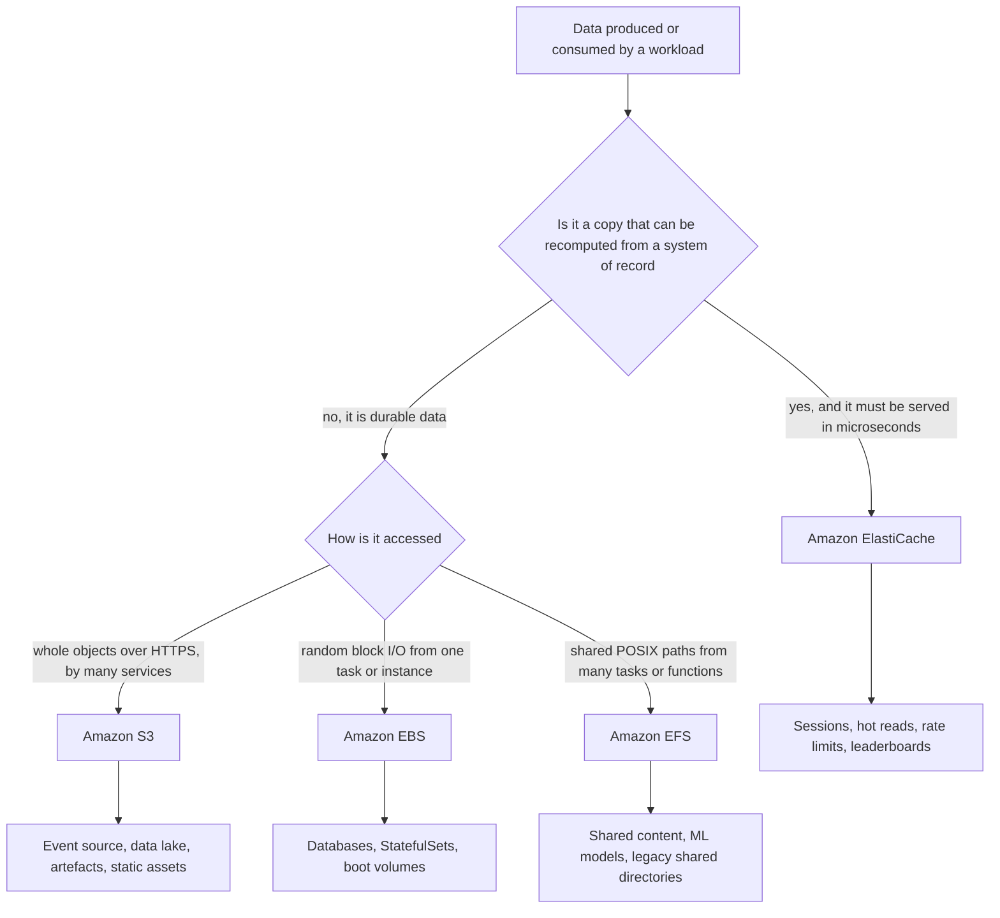

| Criterion | Amazon S3 | Amazon EBS | Amazon EFS | Amazon ElastiCache |
|-----------|-----------|------------|------------|--------------------|
| Consumed from ECS | Task role and SDK | EBS volume attached at task deployment | EFS volume in the task definition | Client library over TLS inside the VPC |
| Consumed from EKS | Pod Identity or IRSA, Mountpoint CSI driver | EBS CSI driver, ReadWriteOnce | EFS CSI driver, ReadWriteMany | Client library, cluster-aware client |
| Consumed from Lambda | SDK and native event source | Not supported | Mounted under /mnt when the function is in a VPC | Client library, function in a VPC |
| Scope | Regional | Single Availability Zone | Regional or One Zone | VPC, Multi-AZ replication group |
| Durability role | System of record | System of record for one host | System of record for shared files | Never the system of record |
| Typical latency | Tens of milliseconds, single digits with Express One Zone | Sub-millisecond | Low milliseconds | Sub-millisecond |

!!! tip "The architectural thread of this section"
    Cloud-native compute is disposable only when its state lives somewhere else. Every part of this section is a variation on one idea: ==externalise state into the managed service whose access pattern matches it==, grant each workload its own least-privilege identity to reach it, and observe it as carefully as the compute that uses it.

### The Three Storage Abstractions

AWS offers three storage services rather than one because object, block and file storage make ==mutually incompatible trade-offs==:

- Object storage achieves near-infinite scale and extreme durability because it gives up in-place mutation, POSIX semantics and low-latency small random writes. Every object is written whole, erasure-coded across devices and identified by a key in a flat namespace, so you cannot open an object, seek to byte 4,096 and overwrite four bytes.
- Block storage achieves sub-millisecond latency and true random access because it presents a narrow interface (read block N, write block N) to one host at a time in the common case. It cannot span Availability Zones, because synchronous block replication across tens of kilometres would destroy the latency guarantee.
- File storage achieves shared, concurrent, POSIX-correct access from many hosts because it maintains a distributed metadata service that coordinates directories, locking and permissions. That coordination is what makes EFS more expensive per gigabyte and higher-latency than EBS, and also what lets a hundred containers write into the same directory safely.

| Dimension | Object storage | Block storage | File storage |
|---|---|---|---|
| Unit of storage | Object: bytes plus metadata | Fixed-size block, typically 512 B or 4 KiB | File within a directory hierarchy |
| Namespace | Flat keyspace within a bucket | Linear array of numbered blocks | Hierarchical tree of directories |
| Access protocol | HTTPS REST API | Block protocol over a network path, presented as a device | NFS or SMB |
| Mutation model | Replace whole object; no partial overwrite | Overwrite any block in place | Read, write, seek, truncate, append |
| Metadata | Rich, user-defined, stored with the object | None beyond the block address | POSIX attributes: owner, mode, timestamps |
| Concurrent writers | Many, last write wins per key | Normally one host; Multi-Attach is a special case | Many, coordinated by the file system |
| Typical latency | Tens of milliseconds first byte | Sub-millisecond to low single-digit milliseconds | Low single-digit milliseconds |
| Scale ceiling | Effectively unlimited | Per-volume ceiling, currently 64 TiB for most types | Petabyte-scale, elastic |
| AWS service | Amazon S3 | Amazon EBS, instance store | Amazon EFS, Amazon FSx |

!!! note "Storage is not the same as a database"
    A database imposes structure, query semantics, transactions and indexing on top of storage. A storage service stores bytes and returns bytes. RDS internally uses EBS volumes; DynamoDB uses its own distributed storage layer. If you need to *query* data by content, you want a database ([Section 6.2](../unit6/topic2.md)); if you need to *retrieve* data by identity, you want storage.

The comparison below adds instance store, the ephemeral block storage physically attached to the EC2 host, which is covered with EBS in [Instance store versus EBS](#instance-store-versus-ebs).

| Criterion | Amazon S3 | Amazon EBS | Amazon EFS | Instance Store |
|---|---|---|---|---|
| Abstraction | Object | Block | File | Block |
| Scope | Regional | Single Availability Zone | Regional, multi-AZ | Single host |
| Concurrent access | Unlimited clients over HTTP | One instance, or up to sixteen with Multi-Attach | Thousands of clients | One instance |
| Capacity model | Unlimited, pay for stored bytes | Provisioned, pay for provisioned bytes | Elastic, pay for stored bytes | Fixed by instance type, included in instance price |
| Latency | Tens of milliseconds; single-digit for Express One Zone | Sub-millisecond to low milliseconds | Low milliseconds | Microseconds |
| Throughput ceiling | Effectively unlimited with parallelism | Up to 4,000 MiB/s per volume | Multiple GiB/s aggregate | Highest available |
| Durability | Eleven nines across three or more AZs | Replicated within one AZ; snapshots for cross-AZ | Eleven nines across three or more AZs | None |
| Survives instance termination | Yes | Yes | Yes | No |
| Survives AZ failure | Yes | No, data preserved but inaccessible | Yes | No |
| In-place partial update | No | Yes | Yes | Yes |
| POSIX semantics | No | Yes, via the guest file system | Yes | Yes, via the guest file system |
| Typical relative cost per GiB-month | Lowest | Moderate | Highest | Included |
| Best for | Data lakes, backups, media, artefacts, logs | Boot volumes, databases, single-host state | Shared content, CMS, ML datasets, container shared volumes | Cache, scratch, shuffle, replicated NoSQL |
| Worst for | Transactional writes, POSIX applications | Multi-AZ shared state | Latency-critical databases | Anything that must survive |

!!! example "Apply the framework"
    A team must store user-uploaded profile photographs for a web application running on ECS Fargate across three Availability Zones. The data must outlive the task, so it is not instance store. Multiple tasks read it, but only through the application over HTTP, and each photograph is written whole and never partially updated. The answer is S3, fronted by CloudFront, with uploads performed by presigned URL directly from the browser so that the application tier never handles the bytes. EFS would work, but it costs more, scales worse and provides no CDN integration.

Ranked from least to most operationally demanding: S3 requires almost nothing beyond policy hygiene; EFS requires network and access point configuration but no capacity management; EBS requires capacity planning, file system growth, snapshot scheduling and Availability Zone-aware failover design.

### Durability and Availability

Students frequently conflate these two figures. They measure different failure modes and are engineered by different mechanisms.

- ==Durability== is the probability that stored data is not lost. S3 Standard is designed for 99.999999999 percent (eleven nines) annual durability, achieved by erasure-coding each object across devices in at least three Availability Zones.
- ==Availability== is the probability that stored data can be *accessed* at a given moment. S3 Standard has a 99.99 percent availability design target with a 99.9 percent Service Level Agreement.

Data can be perfectly durable and temporarily unavailable, for instance during a control plane disruption. A design requiring high availability may therefore need a second Region or a cached copy, even though single-Region durability is already extraordinary.

| Service or class | Design durability | Design availability | AZ scope |
|---|---|---|---|
| S3 Standard | 99.999999999 percent | 99.99 percent | Three or more AZs |
| S3 Standard-IA | 99.999999999 percent | 99.9 percent | Three or more AZs |
| S3 One Zone-IA | 99.999999999 percent within the AZ | 99.5 percent | One AZ |
| S3 Glacier Deep Archive | 99.999999999 percent | 99.99 percent after restore | Three or more AZs |
| S3 Express One Zone | High within the AZ | 99.95 percent | One AZ |
| EBS gp3 and io2 volume | Annual failure rate between 0.1 and 0.2 percent for gp3; io2 is designed for 99.999 percent durability | 99.8 to 99.999 percent depending on type | One AZ |
| EBS snapshot | Same multi-AZ durability as S3 | Regional | Regional |
| EFS Standard (Regional) | Designed for eleven nines | 99.99 percent | Three or more AZs |
| EFS One Zone | Designed for eleven nines within the AZ | 99.9 percent | One AZ |
| Instance store | None; ephemeral | Tied to the instance | One host |

!!! note "Interpreting eleven nines"
    Eleven nines of annual durability means that if you store ten million objects, you should statistically expect to lose one object every ten thousand years. The figure describes AWS device and facility failure. It does ==not== protect against a user or application deleting the data, a misconfigured policy, or ransomware. Those risks are addressed by versioning, MFA Delete, Object Lock, replication to a separate account and AWS Backup vaults, as discussed in each part below.

| Failure scenario | S3 impact | EBS impact | EFS impact |
|---|---|---|---|
| Single storage device fails | None, transparent repair | None, replica serves | None, redundant copies |
| Single Availability Zone fails | None for multi-AZ classes | Volume inaccessible until the zone recovers | None; other mount targets serve |
| Region fails | Requires replication to another Region | Requires cross-Region snapshot copies | Requires EFS replication |
| Accidental deletion | Versioning and Object Lock protect | Snapshots and Recycle Bin protect | AWS Backup protects |
| Credential compromise | Replication to a separate account and Object Lock protect | Cross-account snapshot copies protect | Cross-account backup vault protects |

!!! warning "Cross-Region replication is asynchronous everywhere"
    No AWS storage service offers synchronous cross-Region replication, so every multi-Region storage design has a non-zero Recovery Point Objective that must be stated explicitly.

### Control Plane and Data Plane

Every AWS storage service separates two subsystems, and conflating them is a common source of architectural error.

The ==control plane== handles resource lifecycle: creating buckets, creating and attaching volumes, creating mount targets, modifying configuration. Control plane operations are low-volume, often Regional, involve consensus and metadata updates, and take seconds to minutes. The ==data plane== moves bytes: `GetObject`, `PutObject`, block reads and writes, NFS operations. Data plane operations are extremely high-volume, designed for minimal dependencies, and take microseconds to milliseconds.

AWS engineers data planes for ==static stability==: the ability to keep operating correctly while the control plane is impaired. This is why a running EC2 instance keeps reading and writing its EBS volume during a Regional control plane event even though new instances cannot be launched.

| Aspect | Control plane | Data plane |
|---|---|---|
| S3 examples | `CreateBucket`, `PutBucketPolicy`, `PutBucketLifecycleConfiguration` | `GetObject`, `PutObject`, `ListObjectsV2` |
| EBS examples | `CreateVolume`, `AttachVolume`, `CreateSnapshot`, `ModifyVolume` | Block read and write from the attached instance |
| EFS examples | `CreateFileSystem`, `CreateMountTarget`, `CreateAccessPoint` | NFS read, write and metadata operations |
| Failure impact | Cannot provision or reconfigure | Cannot access data, which is far more severe |
| Design implication | Pre-provision capacity; do not create resources on the critical path | Design retries, timeouts and multi-AZ redundancy here |

!!! tip "A design rule that follows directly"
    Never place a control plane call on a user request's critical path. An application that calls `CreateBucket` or `AttachVolume` during a customer transaction has coupled its availability to the least-available subsystem. Provision in advance through Infrastructure as Code ([Chapter 5.3](../unit5/topic3.md)) and let the request path touch only the data plane. The same split also drives least privilege: workload roles hold data plane permissions, pipelines hold control plane permissions (see [S3 as a shared data plane](#s3-as-a-shared-data-plane)).

### Encryption Across the Storage Services

All three services encrypt at rest with AWS KMS and support encryption in transit; the service-specific settings are described in each part ([S3](#encryption-and-kms), [EBS](#encryption-and-kms_1), [EFS](#encryption)). Key types, envelope encryption, key policies and the S3 Bucket Key mechanism are explained once in [8.3 Encryption at Rest with AWS KMS](../unit8/topic3.md#encryption-at-rest-with-aws-kms).

---

## Object Storage with Amazon S3

### Definition

Amazon Simple Storage Service (Amazon S3) is a regional, fully managed object storage service accessed through an HTTPS API. In the context of service integration, S3 is best defined as ==a durable, event-emitting, policy-governed shared data plane== that decouples producers of data from its consumers.

Within an AWS architecture, S3 sits beneath almost every other layer:

| Layer | How S3 participates |
|-------|---------------------|
| Compute (ECS, EKS, Lambda, EC2) | Reads inputs, writes outputs, stores models and configuration bundles |
| Eventing (Lambda, SQS, SNS, EventBridge) | Emits object-level events that start downstream processing |
| Delivery (CloudFront) | Serves as the origin for static sites, media and downloadable artefacts |
| Analytics (Athena, Glue, EMR, Redshift) | Holds the data lake, including Apache Iceberg tables |
| Machine learning (SageMaker AI, Bedrock) | Stores training data, checkpoints, model artefacts and knowledge-base documents |
| Delivery pipelines (CodePipeline, CodeBuild, Terraform) | Stores build artefacts, caches and infrastructure state |
| Governance (Macie, GuardDuty, CloudTrail, AWS Backup) | Is scanned, audited and protected as a primary data store |

### Why This Service or Concept Exists

#### The integration problem

In a monolith, components share data through a local file system or a shared database. When the system is decomposed into microservices, containers and functions, this shared state disappears: containers are ephemeral, functions have no persistent disk, and nodes are replaced at any time. Something must hold large, durable data that many independent components can reach.

Traditional options each fail in a cloud-native setting:

| Traditional option | Why it fails for distributed, elastic workloads |
|--------------------|-------------------------------------------------|
| Local disk on a server | Lost when the instance or container is replaced; not shared |
| NFS file server | Single point of failure, capacity planning, one Availability Zone, scaling limits |
| Database BLOB columns | Expensive storage, large rows harm database performance and backups |
| FTP or SFTP drop folders | No fine-grained authorisation, polling-based, weak integrity guarantees |

S3 solves these problems because it is ==shared by default, elastic without provisioning, addressable over HTTPS from anywhere with the right permissions, and able to announce changes as events==.

#### Why AWS kept extending S3

AWS has repeatedly added integration features to S3 because customers began using it for purposes far beyond simple file storage:

| Customer need | AWS response |
|---------------|--------------|
| Hundreds of applications sharing one bucket with one enormous bucket policy | S3 Access Points (2019) |
| Global applications needing one endpoint with automatic Regional failover | Multi-Region Access Points (2021) |
| Data lakes where human users and directory groups need prefix-level access | S3 Access Grants (2023) |
| Low-latency storage for machine learning training and interactive analytics | S3 Express One Zone (2023) |
| Tabular analytics with transactional semantics | S3 Tables with Apache Iceberg (2024) |
| Safe concurrent writers without an external lock service | Conditional writes (2024) |
| End-to-end integrity verification | Additional checksum algorithms and default integrity protection in SDKs (2022 onwards) |
| Mounting S3 in containers that expect a file system | Mountpoint for Amazon S3 and its Kubernetes CSI driver (2023) |

!!! tip "Architectural lesson"
    When a managed service keeps absorbing responsibilities that teams previously built themselves (locking, indexing, table maintenance, access brokering), an architect should re-evaluate custom code regularly. Building a lock table in DynamoDB solely to protect an S3 object may no longer be necessary.

### Core Concepts

#### Buckets, objects, keys and prefixes

| Concept | Meaning |
|---------|---------|
| Bucket | A container for objects, created in one AWS Region. General purpose bucket names are globally unique because they must resolve as DNS names, but the bucket is a Regional resource: its data never leaves the Region unless you replicate it |
| Object | The stored entity: a key, a value (from zero bytes to 5 TiB), a version identifier, metadata and access-control information |
| Key | The full, unique name of an object within a bucket, for example `logs/2026/08/10/app-server-01.log.gz`. It is a single flat string |
| Prefix | Any leading substring of a key, conventionally delimited by `/`. Prefixes emulate folders in the console, partition request-rate scaling, and scope many IAM policies and lifecycle rules |
| Delimiter | A character passed to `ListObjectsV2` that rolls keys sharing a common prefix into `CommonPrefixes`, producing the appearance of a folder listing |
| Versioning | A bucket setting under which every `PUT` and `DELETE` creates a new version instead of replacing or removing data; a `DELETE` inserts a delete marker and prior versions remain billed |
| Storage class | A per-object attribute selecting the durability, availability, latency and cost profile (see [Storage classes](#storage-classes)) |
| Lifecycle policy | Bucket rules that transition objects between storage classes or expire them after a defined age, evaluated asynchronously about once per day |
| Multipart upload | A protocol for uploading a large object as independent parts sent in parallel, retried individually and assembled server-side |
| Presigned URL | A time-limited URL embedding a signature that grants one operation on one object to an anonymous holder, without giving them IAM credentials |

!!! warning "There are no folders in S3"
    The console displays folders and the CLI accepts folder-like paths, but the data model is a flat map from key strings to objects. Creating a "folder" in the console creates a zero-byte object whose key ends in `/`. Believing in folders leads to two classic errors: assuming that renaming a prefix is cheap (it is a copy of every object followed by a delete of every object), and assuming that listing is free (it is a paginated, billed API call that scans the index).

#### Consistency model

Since December 2020, S3 provides ==strong read-after-write consistency== for all `PUT` and `DELETE` operations on all objects, in all Regions, with no performance penalty and no opt-in. A successful `PUT` is immediately visible to any subsequent `GET`, `LIST` or `HEAD`, and overwrites and deletes are also strongly consistent. Code that sleeps or retries after a write "to wait for consistency" can be deleted. Two caveats remain:

- Bucket ==configuration== changes (policies, lifecycle rules, replication rules) remain eventually consistent and may take time to propagate.
- Cross-Region Replication is asynchronous and gives no consistency guarantee at the destination; S3 Replication Time Control provides a fifteen-minute Service Level Agreement for the vast majority of objects, but is still asynchronous.

#### S3 as a shared data plane

The general control plane and data plane distinction is explained in [Control Plane and Data Plane](#control-plane-and-data-plane). For S3, a useful mental model divides interactions into three planes:

| Plane | Operations | Typical caller |
|-------|------------|----------------|
| Data plane | GetObject, PutObject, HeadObject, ListObjectsV2, DeleteObject | Application code in tasks, pods and functions |
| Control plane | CreateBucket, PutBucketPolicy, PutBucketNotificationConfiguration, PutBucketLifecycleConfiguration | IaC tools and pipelines |
| Management plane | Batch Operations, Inventory, Storage Lens, Access Grants | Platform and data governance teams |

A well-designed workload role should normally hold ==only data plane permissions, scoped to specific prefixes==. Control plane permissions belong to the deployment pipeline.

#### Credential delivery to workloads

No cloud-native workload should hold long-lived access keys. Each compute platform has its own mechanism for delivering short-lived credentials obtained through AWS Security Token Service (STS):

| Compute platform | Credential mechanism | Where credentials come from |
|------------------|----------------------|-----------------------------|
| EC2 instance | Instance profile | Instance Metadata Service (IMDSv2) |
| ECS task | Task role (`taskRoleArn`) | Container credentials endpoint exposed to the task |
| EKS pod | EKS Pod Identity or IAM Roles for Service Accounts (IRSA) | Pod Identity Agent, or a projected service account token exchanged with STS |
| Lambda function | Execution role | Environment variables injected by the Lambda runtime |
| CodeBuild project | Service role | Container credentials endpoint |
| Human user | IAM Identity Center permission set, or S3 Access Grants | Federated sign-in |

The AWS SDKs use a ==default credential provider chain== that discovers these sources automatically. Application code should therefore construct an S3 client without passing credentials explicitly. The same container image then runs unchanged on a laptop (using a developer profile), in ECS, in EKS and in CodeBuild.

#### Event sources

S3 can announce changes through two integration channels:

| Channel | Configuration | Destinations |
|---------|---------------|--------------|
| S3 Event Notifications | Per-bucket notification configuration with event types and optional prefix and suffix filters | Lambda, SQS standard queues, SNS standard topics |
| Amazon EventBridge integration | A single bucket-level switch that sends all supported events to the default event bus | Any EventBridge target, filtered by rules |

Both channels provide ==at-least-once delivery==. Consumers must therefore be idempotent, a principle introduced in [Chapter 1.7](../unit1/topic7.md).

#### Access abstraction layers

As the number of consumers grows, the bucket policy becomes a bottleneck. S3 therefore offers layers of access abstraction:

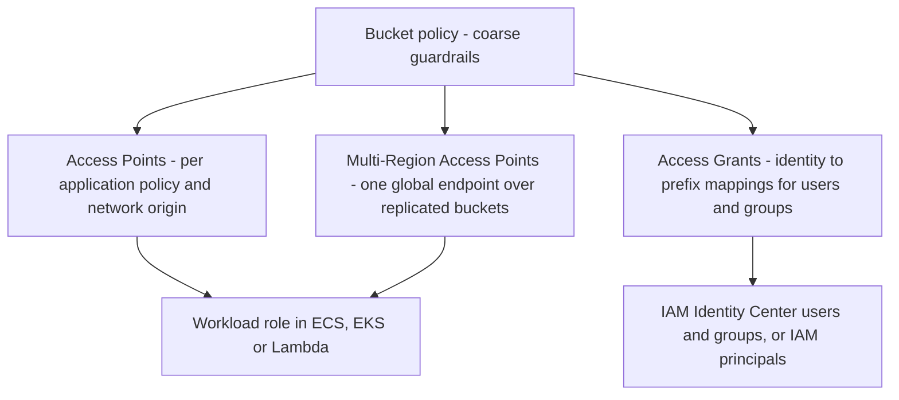

#### Coordination and integrity primitives

S3 is not a database, but it now provides primitives that allow multiple writers to coordinate safely:

| Primitive | Header | Behaviour |
|-----------|--------|-----------|
| Create only if absent | `If-None-Match: *` | The write succeeds only if no object exists at that key; otherwise HTTP 412 Precondition Failed |
| Compare-and-swap | `If-Match: <ETag>` | The write succeeds only if the current object's ETag matches; otherwise HTTP 412 |
| Conditional read | `If-Match`, `If-None-Match`, `If-Modified-Since` on GET and HEAD | Avoids downloading unchanged data |
| Integrity checksum | `x-amz-checksum-crc32`, `crc32c`, `crc64nvme`, `sha1`, `sha256` | S3 validates the payload and stores the checksum with the object |

#### Performance tiers

S3 now spans a range of latency and access models:

| Offering | Bucket type | Latency profile | Typical use |
|----------|-------------|-----------------|-------------|
| S3 general purpose buckets | General purpose | Tens of milliseconds for first byte | Most application data, data lakes, archives |
| S3 Express One Zone | Directory bucket in one Availability Zone | Single-digit milliseconds | ML training, interactive analytics, high-rate small objects |
| S3 Tables | Table bucket | Optimised for Iceberg query engines | Managed analytical tables |

!!! note "Directory buckets versus general purpose buckets"
    Directory buckets organise keys into real directories rather than a flat namespace, require session-based authentication through `CreateSession` (handled transparently by current SDKs), and have bucket names ending in a zone suffix such as `--use1-az4--x-s3`. Several general purpose features, such as some lifecycle transitions, replication options and storage classes, are not available or behave differently. Verify feature support before migrating a workload.

### AWS Service Deep Dive

#### Purpose

In this part, the purpose of S3 is viewed through its integration role: to provide ==a single, secure, scalable, event-driven store that every other component of the platform can rely upon==, so that compute can remain stateless and disposable.

#### Architecture

The following diagram shows a typical cloud-native platform with S3 at its centre.

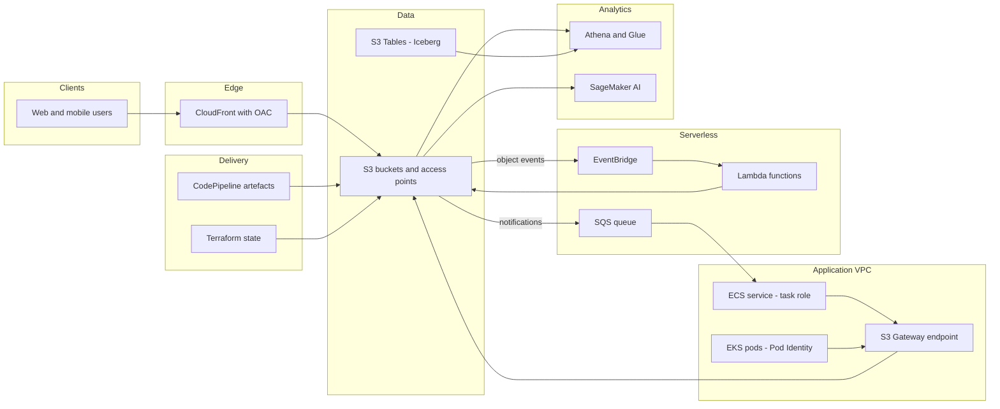

The key architectural properties are:

| Property | Consequence for integration |
|----------|-----------------------------|
| Regional service with multi-AZ durability | Compute in any Availability Zone of the Region reads the same data |
| HTTPS API | Any language and any platform can integrate; no drivers or mounts required |
| Private connectivity through Gateway endpoints | Traffic from VPC workloads avoids NAT gateways and the internet |
| Resource-based policies | Cross-account and service-to-service access without sharing credentials |
| Event emission | Pipelines can react to data arrival without polling |

#### Important Features

The foundational data protection and transfer features are:

| Feature | What it provides |
|---------|------------------|
| Versioning | Preserves every version of every object and inserts delete markers instead of destroying data |
| Object Lock | Write-once-read-many retention in Governance mode (privileged users can override) or Compliance mode (nobody, including the root user, can override until the retention period expires); requires versioning |
| Lifecycle policies | Transition objects between storage classes and expire them, including expiring noncurrent versions and aborting incomplete multipart uploads |
| Replication | Cross-Region (CRR) and Same-Region (SRR) asynchronous copy to another bucket, optionally in another account, with optional Replication Time Control; applies to new objects unless S3 Batch Replication handles the backlog; requires versioning |
| Multipart upload | Parallel, resumable uploads of large objects |
| Presigned URLs | Delegate a single operation to an anonymous holder for a bounded time |
| Requester Pays | Shifts request and transfer charges to the caller, useful for publishing large public datasets |
| Transfer Acceleration | Routes uploads through CloudFront edge locations for geographically distant clients |
| Static website hosting | Serves index and error documents from a website endpoint; prefer CloudFront with OAC over a public website endpoint |

The integration and advanced features are:

| Feature | What it provides | Integration relevance |
|---------|------------------|-----------------------|
| Access Points | Named network endpoints with their own policy, optionally restricted to a VPC | Per-microservice or per-team access to shared buckets |
| Multi-Region Access Points | A global hostname that routes requests to the closest healthy replicated bucket | Active-active or active-passive multi-Region applications |
| Access Grants | Maps IAM principals or directory identities to S3 prefixes and vends temporary credentials | Data lake access for analysts and tools like Athena and SageMaker Studio |
| Event Notifications | Object-level events to Lambda, SQS and SNS | Simple, low-latency pipelines |
| EventBridge integration | All bucket events to EventBridge with rich filtering | Multi-consumer, content-based routing, archive and replay |
| Conditional writes | `If-None-Match` and `If-Match` on writes | Locking, leader election, optimistic concurrency |
| Checksums | CRC32, CRC32C, CRC64NVME, SHA-1, SHA-256, including full-object checksums for multipart uploads | End-to-end integrity verification |
| Batch Operations | Managed, audited operations across billions of objects | Re-encryption, re-tagging, copying, restores, backfills |
| Inventory | Scheduled listing of objects and metadata in CSV, ORC or Parquet | Auditing encryption, replication status, and feeding Batch Operations |
| Storage Lens | Organisation-wide usage and activity metrics and recommendations | Cost and data-protection governance |
| S3 Metadata | Automatically maintained, queryable metadata tables for a bucket, stored as S3 Tables | Discovering and querying objects without listing |
| S3 Tables | Table buckets storing Apache Iceberg tables with automatic maintenance | Managed data lake tables |
| S3 Express One Zone | High-performance, single-AZ directory buckets | ML training, shuffle data, low-latency caches |
| Mountpoint for Amazon S3 | A file client that presents a bucket as a local mount, with a CSI driver for Kubernetes | Legacy or file-based tools reading large datasets |
| S3 Object Lambda | Transforms data on GET through a Lambda function behind an Object Lambda Access Point | On-the-fly redaction or format conversion (see availability note) |
| S3 Vectors | Vector buckets and indexes for storing and querying embeddings | Retrieval-augmented generation and semantic search (a recent addition; verify Regional availability) |

!!! warning "S3 Object Lambda availability"
    During 2025 AWS announced that S3 Object Lambda would no longer be available to new customers, while existing customers could continue to use it. Treat Object Lambda as a legacy pattern for new designs. Equivalent designs include transforming data at write time into a derived bucket, serving transformed content through CloudFront with a Lambda-backed origin, or exposing an API Gateway and Lambda endpoint that reads from S3. Verify current status in the AWS documentation before designing around it.

#### Storage classes

| Storage class | Designed for | Minimum storage duration | Minimum billable object size | Retrieval fee | Availability Zones | First-byte latency |
|---|---|---|---|---|---|---|
| S3 Standard | Frequently accessed, general purpose | None | None | None | Three or more | Milliseconds |
| S3 Intelligent-Tiering | Unknown or changing access patterns | None | 128 KiB for auto-tiering eligibility | None; small monitoring fee per object | Three or more | Milliseconds |
| S3 Standard-IA | Infrequent access, rapid retrieval needed | 30 days | 128 KiB | Per GiB retrieved | Three or more | Milliseconds |
| S3 One Zone-IA | Infrequent access, recreatable data | 30 days | 128 KiB | Per GiB retrieved | One | Milliseconds |
| S3 Glacier Instant Retrieval | Archive needing millisecond access | 90 days | 128 KiB | Per GiB retrieved, higher than IA | Three or more | Milliseconds |
| S3 Glacier Flexible Retrieval | Archive, minutes to hours acceptable | 90 days | 40 KiB | Per GiB and per request, varies by retrieval tier | Three or more | Expedited in one to five minutes, Standard in three to five hours, Bulk in five to twelve hours |
| S3 Glacier Deep Archive | Long-term retention, rarely accessed | 180 days | 40 KiB | Per GiB retrieved | Three or more | Standard in around twelve hours, Bulk in up to forty-eight hours |
| S3 Express One Zone | Latency-sensitive, very high request rate | One hour | 512 KiB | None, but higher request charges | One, in a directory bucket | Single-digit milliseconds |

The Glacier name now refers to storage classes within S3 rather than to a separate service for new designs. Objects in Glacier Flexible Retrieval and Glacier Deep Archive must be ==restored== before they can be read, which creates a temporary copy in a readable class for a specified number of days; Glacier Instant Retrieval needs no restore.

!!! danger "Minimum duration charges are a real budget trap"
    An object stored in Standard-IA and deleted after five days is billed for thirty days. An object in Glacier Deep Archive deleted after a week is billed for one hundred and eighty days. Lifecycle rules that transition short-lived data to colder classes can therefore ==increase== cost. Always compare the expected object lifetime with the minimum storage duration before writing a transition rule.

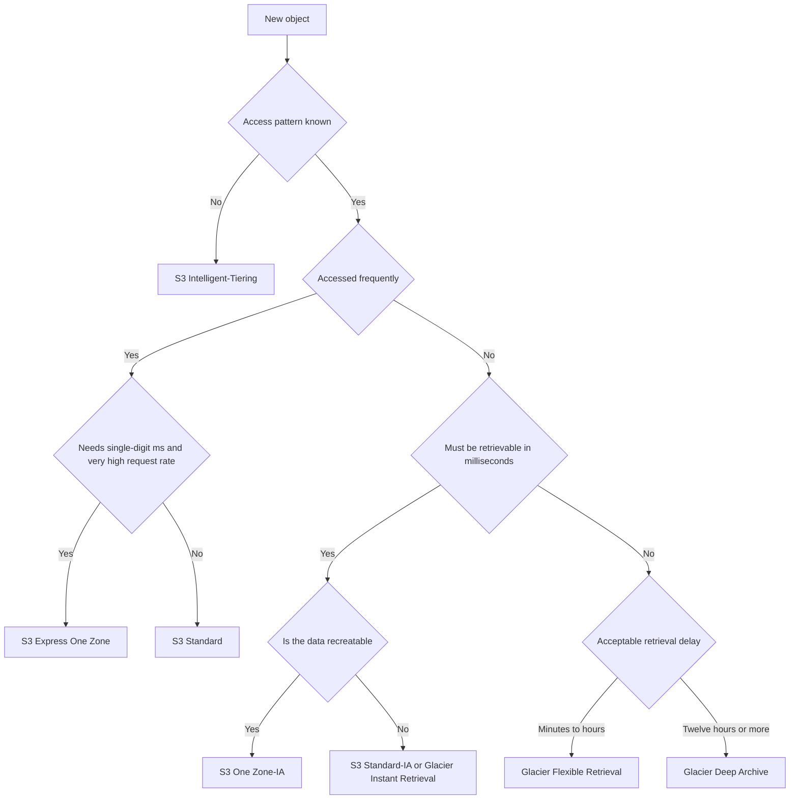

#### The life of an object under versioning and lifecycle rules

The state machine shows why versioning without lifecycle expiry causes unbounded cost growth, and why a delete in a versioned bucket is recoverable.

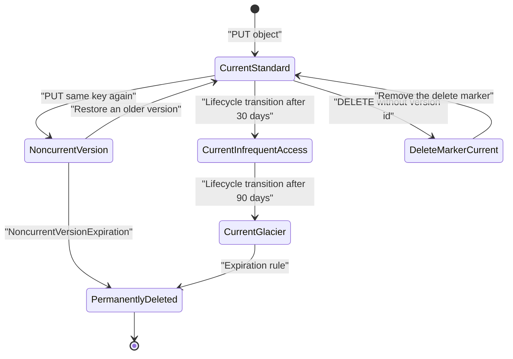

!!! danger "The delete that is not a delete"
    In a versioned bucket, a `DELETE` without a version identifier does not remove data; it inserts a delete marker and hides the object. The prior versions remain and continue to be billed. To free storage you must delete specific version identifiers, which is exactly what a `NoncurrentVersionExpiration` lifecycle rule automates. This mechanism is simultaneously the strongest protection against accidental deletion and the most common cause of unexplained storage growth.

#### Limitations

| Limitation | Architectural impact |
|------------|----------------------|
| Maximum object size of 5 TiB, and 5 GiB for a single `PUT` without multipart | Large objects must use multipart upload |
| No POSIX semantics: no file locking, no hard links, no atomic rename of a tree | POSIX applications need EFS or EBS |
| Strong consistency applies to object data, not to bucket configuration | Configuration changes can take time to take effect |
| Bucket names are globally unique | Naming conventions must include an account or organisation component |
| Objects are immutable; there is no in-place partial update on general purpose buckets | Append-heavy workloads must write new objects or use a table format such as Iceberg |
| No native rename; a rename is copy plus delete | Directory renames on large prefixes are slow and expensive; design keys that never need renaming |
| Event delivery is at least once and not strictly ordered | Consumers must be idempotent and must not assume ordering |
| Listing is paginated and eventually expensive at very large scale | Use Inventory or S3 Metadata instead of repeated full listings |
| Request rate scales per prefix gradually | Sudden bursts on a new prefix can produce HTTP 503 Slow Down responses |
| Mountpoint is not a POSIX file system | Random writes, in-place edits, file locking and hard links are not supported |
| Event Notifications cannot target FIFO queues or FIFO topics directly | Use EventBridge or an intermediate function if ordering or deduplication is required |

#### Pricing Model and recommendations

S3 cost for integration-heavy architectures is dominated by more than storage. The dimensions are listed below; figures are indicative, as of 2026, and should be verified in the AWS Pricing Calculator.

| Dimension | What drives it | Recommendation |
|-----------|----------------|----------------|
| Storage (GB-month) | Volume, storage class | Lifecycle and Intelligent-Tiering (see [Storage classes](#storage-classes)) |
| Requests | PUT, COPY, POST, LIST cost roughly an order of magnitude more per request than GET | Batch small objects; avoid LIST-based polling |
| Data transfer out | To the internet or across Regions | Serve through CloudFront; keep compute in the same Region |
| NAT gateway processing | Private subnet traffic to S3 without an endpoint | Always add a Gateway endpoint for S3 |
| Management features | Inventory per million objects listed, Storage Lens advanced metrics, Batch Operations per job and per object | Enable where the governance value justifies it |
| S3 Express One Zone | Lower request cost, higher storage cost than S3 Standard | Use as a performance tier, not as bulk storage |
| S3 Tables | Storage, requests, plus monitoring and compaction charges | Compare against self-managed Iceberg maintenance compute |
| KMS | One KMS request per object operation without Bucket Keys | Enable S3 Bucket Keys for SSE-KMS buckets |
| Retrieval | Per GiB for IA and Glacier classes | A cold class accessed often costs more than Standard |
| Replication | Storage in the destination plus inter-Region transfer plus requests | Cross-Region Replication roughly doubles storage cost |
| Per-object management charges | Intelligent-Tiering monitoring, Object Lock, replication and Inventory are charged per object | Small-object-heavy buckets pay a high per-object overhead |

!!! info "Verify pricing before quoting figures"
    Prices differ by Region and change over time. Treat published figures as orders of magnitude: Standard storage on the order of low tens of United States cents per GiB-month, Deep Archive roughly an order of magnitude cheaper, and internet egress on the order of several cents per GiB. Model the workload in the AWS Pricing Calculator before committing to a design.

#### Performance Characteristics

| Characteristic | Typical behaviour |
|----------------|-------------------|
| First-byte latency, general purpose buckets | Tens of milliseconds, variable |
| First-byte latency, S3 Express One Zone | Single-digit milliseconds, consistent |
| Per-connection throughput | Tens to low hundreds of MB/s; aggregate throughput scales with parallel connections |
| Aggregate throughput | Effectively unlimited with enough parallelism across prefixes and connections |
| Request rate | At least 3,500 writes and 5,500 reads per second per partitioned prefix, scaling further as S3 repartitions |

#### Scaling Behaviour

S3 scales without provisioning, but the scaling is ==adaptive rather than instantaneous==. When a prefix receives a sustained increase in traffic, S3 splits the underlying index partitions. During the transition, clients may receive HTTP 503 Slow Down responses. Well-behaved clients retry with exponential backoff and jitter, and S3 converges on the new rate. Architects should therefore:

- distribute high-rate keys across multiple prefixes, for example by date and a hash component;
- ramp traffic gradually for large backfills where possible;
- rely on SDK retry modes rather than custom retry loops.

#### Availability

Designed durability and availability for each storage class are compared in [Durability and Availability](#durability-and-availability). Multi-Region Access Points with replication extend the failure domain to several Regions, with availability depending on the configuration. Single-AZ offerings trade resilience for cost or latency. Data that cannot be regenerated should not live solely in a single-AZ bucket.

#### Security Features

| Feature | Purpose |
|---------|---------|
| Object Ownership: bucket owner enforced | Disables ACLs so that policies alone govern access; the default for new buckets |
| Block Public Access | Account and bucket level safeguard against public exposure |
| Default encryption | Every new object is encrypted, SSE-S3 by default, SSE-KMS optionally |
| Access Point and VPC endpoint policies | Restrict access by network origin |
| Resource Control Policies (AWS Organizations) | Organisation-wide ceilings on what can be done to S3 resources, regardless of the caller's account |
| Condition keys | `aws:SourceVpce`, `aws:PrincipalOrgID`, `s3:x-amz-server-side-encryption`, `aws:SecureTransport`, `s3:if-none-match` and others |
| Amazon Macie | Discovers sensitive data such as personal information in buckets |
| GuardDuty S3 Protection and Malware Protection for S3 | Detects suspicious access patterns and scans newly uploaded objects for malware |
| CloudTrail data events and server access logs | Object-level audit trails |
| Object Lock and MFA Delete | Immutable retention, and a second factor for deleting versions or changing versioning state |
| IAM Access Analyzer for S3 | Reports buckets shared outside the account or organisation |

#### Service Limits

The following values are indicative, as of 2026. Verify them in Service Quotas and the S3 documentation.

| Limit | Indicative value |
|-------|------------------|
| General purpose buckets per account | 10,000 by default, adjustable upwards |
| Directory buckets per account | 100 by default, adjustable |
| Table buckets per Region per account | Small default quota, adjustable |
| Maximum object size | 5 TB for general purpose buckets (check current documentation for any increase) |
| Maximum single PUT | 5 GB; use multipart upload above this |
| Parts per multipart upload | 10,000 |
| Part size range | 5 MiB to 5 GiB; the last part may be smaller |
| Objects per bucket | Unlimited |
| Lifecycle rules per bucket | 1,000 |
| Access points per Region per account | 10,000 by default, adjustable |
| Event notification configurations | Rules must not overlap in event type and prefix or suffix for the same destination set |
| Object tags | 10 per object |
| Bucket policy size | 20 KB |

!!! tip "Why the bucket policy size limit matters"
    The 20 KB policy size limit is one of the main reasons Access Points exist. A shared data lake bucket with dozens of consumer statements quickly exhausts it. Delegating access control to Access Points gives each consumer its own policy document.

### Important AWS Terminology

Bucket, object, key, prefix, delimiter, versioning, storage class, lifecycle policy, multipart upload and presigned URL are defined in [Buckets, objects, keys and prefixes](#buckets-objects-keys-and-prefixes).

| Term | Meaning |
|------|---------|
| Delete marker | The placeholder version created when an object is deleted in a versioned bucket |
| Noncurrent version | Any object version that is not the latest; billed and expirable by lifecycle rules |
| Block Public Access | Account and bucket level control that overrides policies and ACLs to prevent public exposure |
| Object Lock | Write-once-read-many retention control in Governance or Compliance mode, with retention periods or legal holds |
| Object Ownership | Setting that disables ACLs and makes the bucket owner the owner of all objects |
| Cross-Region Replication | Asynchronous replication of objects to a bucket in another Region |
| Replication Time Control | Feature adding a fifteen-minute replication Service Level Agreement and replication metrics |
| Requester Pays | Bucket setting that charges request and transfer costs to the requester |
| Transfer Acceleration | Upload path through CloudFront edge locations for distant clients |
| Erasure coding | Technique splitting data into data and parity fragments so the original is recoverable from a subset |
| Partition splitting | Automatic division of a hot key range in the S3 index across more servers |
| Gateway VPC endpoint | Route-table-based private path from a VPC to S3 or DynamoDB with no additional charge |
| Interface VPC endpoint | PrivateLink elastic network interface providing a private path to an AWS service, reachable from on-premises |
| SSE-S3, SSE-KMS, DSSE-KMS, SSE-C | The server-side encryption options for S3 objects (see [Encryption and KMS](#encryption-and-kms)) |
| S3 Bucket Key | A short-lived bucket-level key that reduces KMS request volume for SSE-KMS |
| Task role | The IAM role an ECS task assumes for application calls to AWS APIs, distinct from the task execution role used by the ECS agent |
| Task execution role | The IAM role used by ECS to pull images and write logs; it should not carry application S3 permissions |
| EKS Pod Identity | An EKS feature that associates a Kubernetes service account with an IAM role through an association, using the Pod Identity Agent |
| IRSA | IAM Roles for Service Accounts; pods exchange a projected OIDC token for role credentials through `AssumeRoleWithWebIdentity` |
| Mountpoint for Amazon S3 | An open-source file client that mounts a bucket as a local directory, optimised for high-throughput sequential access |
| Mountpoint CSI driver | A Kubernetes CSI driver that exposes Mountpoint as persistent volumes for pods |
| Access Point | A named endpoint attached to a bucket, with its own access policy and optional VPC restriction |
| Access Point alias | An automatically generated bucket-style name for an access point, usable wherever a bucket name is expected |
| Multi-Region Access Point | A global endpoint that routes S3 requests across buckets in multiple Regions, with failover controls |
| S3 Access Grants | A service that maps identities to S3 locations and issues scoped temporary credentials through `GetDataAccess` |
| Access Grants instance | The container for grants, one per Region per account, optionally linked to IAM Identity Center |
| Event Notification | A per-bucket configuration that sends selected event types to Lambda, SQS or SNS |
| Recursive loop detection | A Lambda safeguard that detects and stops invocation loops involving supported services, including S3 |
| Conditional write | A PUT or multipart completion that succeeds only if a precondition on the current object holds |
| ETag | An identifier of an object version's content, used as the comparison value in `If-Match` |
| Full-object checksum | A checksum covering the entire object, including multipart uploads, as opposed to a checksum of checksums of parts |
| Batch Operations job | A managed job that performs one operation across all objects listed in a manifest |
| Manifest | The list of objects for a Batch Operations job, supplied as CSV, an Inventory report, or generated from filters |
| S3 Inventory | A scheduled report of objects and their metadata written to a destination bucket |
| Storage Lens | An analytics feature that aggregates storage usage and activity metrics across accounts and Regions |
| Directory bucket | A bucket type used by S3 Express One Zone with a hierarchical namespace and session authentication |
| Table bucket | A bucket type that stores Apache Iceberg tables managed by S3 Tables |
| Apache Iceberg | An open table format that adds schemas, snapshots, ACID commits and time travel on top of files in object storage |
| Origin Access Control (OAC) | The CloudFront mechanism that signs origin requests to S3 so that the bucket can remain private |
| Resource Control Policy (RCP) | An AWS Organizations policy that sets maximum permissions on resources, including S3 buckets, across accounts |
| Terraform S3 backend | The Terraform configuration that stores state in S3, with native lock files in recent Terraform versions |

### Configuration Options

#### Bucket configuration

| Setting | Options | Architectural guidance |
|---|---|---|
| Storage class | Standard, Intelligent-Tiering, Standard-IA, One Zone-IA, Glacier Instant, Glacier Flexible, Deep Archive, Express One Zone | Set at upload for known patterns; use Intelligent-Tiering when patterns are unknown |
| Versioning | Disabled, Enabled, Suspended | Enable for any bucket holding non-reproducible data; pair with lifecycle expiry of noncurrent versions |
| Default encryption | SSE-S3, SSE-KMS, DSSE-KMS | SSE-S3 for general data; SSE-KMS with Bucket Keys where audit and key control are required |
| Block Public Access | Four independent toggles at account and bucket level | Enable all four unless a documented public-hosting requirement exists |
| Object Ownership | ACLs disabled (bucket owner enforced), or ACLs enabled | Keep ACLs disabled; use policies exclusively |
| Lifecycle rules | Transition, expiration, noncurrent expiration, abort incomplete multipart uploads | Always include an abort-incomplete-multipart rule |
| Replication | Cross-Region, Same-Region, with or without Replication Time Control | Replicate to a separate account for ransomware resilience |
| Object Lock | Governance or Compliance mode, with retention period or legal hold | Compliance mode is irreversible; test in a sandbox first |
| Transfer Acceleration | Enabled or disabled | Only worthwhile for geographically distant, large uploads |
| Requester Pays | Enabled or disabled | Useful for publishing large public datasets |
| Static website hosting | Enabled with index and error documents | Prefer CloudFront with Origin Access Control over public website endpoints |

A production bucket typically has versioning enabled, Block Public Access fully on, default encryption with Bucket Keys, a bucket policy denying non-TLS requests, a lifecycle rule that expires noncurrent versions after a retention window and aborts incomplete multipart uploads after a few days, server access logging or CloudTrail data events directed to a separate logging bucket, and replication to a second Region or a separate account for critical data.

#### Workload access configuration

| Option | Where it is configured | Guidance |
|--------|------------------------|----------|
| ECS task role | `taskRoleArn` in the task definition | One role per service; prefix-scoped data permissions |
| EKS Pod Identity association | EKS API: cluster, namespace, service account, role | Preferred for new EKS clusters; no OIDC provider per cluster required |
| IRSA | Service account annotation `eks.amazonaws.com/role-arn` plus an OIDC trust policy | Still widely used, and required on some platforms outside EKS |
| Lambda execution role | Function configuration | One role per function; avoid shared roles |
| VPC endpoint | Gateway endpoint on private subnet route tables | Mandatory for private subnets; attach an endpoint policy |

#### Event configuration

| Option | S3 Event Notifications | EventBridge integration |
|--------|------------------------|-------------------------|
| Enablement | Notification configuration per destination | One bucket-level setting |
| Filtering | Event type, key prefix, key suffix | Any field: key patterns, size, source IP, requester, bucket, with EventBridge operators |
| Destinations | Lambda, SQS standard, SNS standard | Any EventBridge target, up to five per rule, many rules |
| Multiple consumers on the same events | Not with overlapping filters; fan out through SNS | Native, through multiple rules |
| Archive and replay | No | Yes |
| Cross-account delivery | Through resource policies on the destination | Through event bus policies |
| Latency | Typically seconds or less | Typically slightly higher; still near real time |
| Cost | No additional S3 charge | EventBridge charges per event for events delivered to the default bus from S3 (verify current pricing) |

!!! tip "Choosing an event channel"
    Use Event Notifications for a single, simple consumer where the lowest latency and cost matter, for example one Lambda function creating thumbnails. Use EventBridge when several teams consume the same events, when filtering needs more than prefix and suffix, when replay is valuable, or when events must cross account boundaries in an event-driven architecture as described in [Chapter 1.7](../unit1/topic7.md).

#### Access control configuration

| Mechanism | Best for | Key settings |
|-----------|----------|--------------|
| Bucket policy | Guardrails: TLS only, encryption requirements, organisation boundary, delegation to access points | `aws:SecureTransport`, `aws:PrincipalOrgID`, `s3:DataAccessPointAccount` |
| Access Point | One application or team | Network origin `VPC` or `Internet`, access point policy, Block Public Access settings |
| Multi-Region Access Point | Multi-Region applications | Buckets in each Region, replication rules, routing and failover configuration |
| Access Grants | Many human users and groups over data lake prefixes | Locations, grants with READ, WRITE or READWRITE, IAM Identity Center link |
| Resource Control Policy | Organisation-wide data perimeter | Deny access from principals outside the organisation |

#### Integrity and concurrency options

| Option | Values | Guidance |
|--------|--------|----------|
| Checksum algorithm | CRC32, CRC32C, CRC64NVME, SHA-1, SHA-256 | CRC-based algorithms are fastest; current SDKs compute a CRC checksum by default on uploads |
| Checksum type for multipart | Composite or full object | Full-object checksums allow comparison with a checksum calculated locally over the whole file |
| Conditional create | `If-None-Match: *` | Prevents overwriting existing keys |
| Conditional update | `If-Match: <ETag>` | Optimistic concurrency on a known version |
| Enforcing conditional writes | Bucket policy conditions `s3:if-none-match` and `s3:if-match` | Rejects unconditional writes from any client |

#### SDK and transfer configuration

| Setting | Purpose | Typical choice |
|---------|---------|----------------|
| Retry mode | Controls retry behaviour for throttling and transient errors | `standard` for most workloads; `adaptive` for clients that frequently hit throttling |
| Maximum attempts | Upper bound on retries | 3 to 10 depending on latency tolerance |
| Transfer manager part size | Size of each multipart part | 8 to 64 MiB for general workloads |
| Transfer concurrency | Parallel part uploads or ranged downloads | Tune to network bandwidth and CPU |
| CRT-based client | High-performance native transfer client | Use for large objects and high throughput on large instances |
| Connection pool size | Reuse of TCP and TLS connections | Increase for highly parallel workloads |

### Design Considerations

#### Scalability

S3 itself rarely limits scalability; the integration around it usually does. Consider the following:

| Concern | Design response |
|---------|-----------------|
| Hot prefixes | Design keys with high-cardinality components early in the key, for example `tenant=42/2026/09/26/<uuid>.json` |
| Consumer throughput | Buffer events in SQS so that ECS or Lambda consumers scale on queue depth |
| Downstream limits | Lambda reserved concurrency or SQS event source maximum concurrency protects databases downstream |
| Listing large buckets | Replace listing with Inventory, S3 Metadata tables or an application-maintained index |

#### Availability and reliability

- Event consumers must tolerate duplicate and out-of-order events.
- A consumer failure must not lose an event. Placing SQS between S3 and the consumer provides durable buffering and a dead-letter queue.
- Cross-Region resilience requires replication plus a routing mechanism such as a Multi-Region Access Point or application-level Region selection.
- Single-AZ tiers such as S3 Express One Zone should contain data that can be regenerated from a durable source.

#### Durability

Durability is protected at the service level, but applications can still destroy data. Versioning, Object Lock, replication to another account and AWS Backup for S3 protect against deletion by faulty code or compromised credentials. Checksums protect against corruption in transit and in client-side processing.

#### Latency

| Requirement | Recommended approach |
|-------------|----------------------|
| Users worldwide downloading static assets | CloudFront with OAC in front of S3 |
| Repeated small reads in a hot loop | Cache in memory, ElastiCache, or use S3 Express One Zone |
| Machine learning training with many small files | Express One Zone, larger shard files, or Mountpoint with caching |
| Large file downloads | Parallel ranged GETs through the transfer manager |

#### Cost

Integration designs frequently incur hidden request and transfer costs: polling with LIST, storing millions of tiny objects, traversing NAT gateways, and cross-Region reads. These are addressed in the Cost Optimization section.

#### Maintainability and operational complexity

| Choice | Complexity trade-off |
|--------|----------------------|
| One bucket per microservice | Clear ownership and blast radius; more buckets to govern |
| Shared bucket with access points | Centralised governance; requires disciplined naming and prefix ownership |
| Event Notifications | Simple, but configuration is a single document per bucket that multiple teams may contend for |
| EventBridge | More moving parts, but decentralised rule ownership per team |

!!! note "Ownership boundary"
    In a microservices architecture ([Chapter 4.1](../unit4/topic1.md)), each bucket or prefix should have exactly one owning service. Other services receive access through events, access points or APIs, never by writing to another service's prefix.

### AWS Best Practices

| Pillar | Best practice for S3 integration |
|--------|----------------------------------|
| Operational Excellence | Define buckets, notifications, access points and policies only through IaC; use Storage Lens dashboards and Inventory reports for fleet visibility; tag buckets with owner and data classification |
| Security | Use task roles, Pod Identity and execution roles instead of keys; enforce TLS; keep ACLs disabled; use Access Points for per-application policies; build a data perimeter with RCPs, SCPs and endpoint policies; enable Macie and GuardDuty S3 Protection |
| Reliability | Buffer events in SQS with dead-letter queues; make consumers idempotent; enable versioning; replicate critical data to another Region or account; use SDK retries with backoff |
| Performance Efficiency | Distribute keys across prefixes; use parallel multipart transfers; use Express One Zone and Mountpoint caching for ML; serve through CloudFront |
| Cost Optimization | Add Gateway endpoints to remove NAT charges; enable Bucket Keys; avoid LIST polling; aggregate small objects; set lifecycle rules for incomplete multipart uploads and noncurrent versions |
| Sustainability | Store data once and share through access points rather than copying per team; transition cold data; delete temporary pipeline outputs through lifecycle expiry; use columnar formats such as Parquet to reduce data scanned |

### Security Considerations

#### IAM and least privilege for workloads

A workload policy should grant only the actions and prefixes the service needs. The following policy grants an ECS order-export service write access to its own prefix and read access to a shared reference prefix.

```json
{
  "Version": "2012-10-17",
  "Statement": [
    {
      "Sid": "WriteOwnPrefix",
      "Effect": "Allow",
      "Action": ["s3:PutObject", "s3:GetObject"],
      "Resource": "arn:aws:s3:::acme-orders-111122223333/exports/*"
    },
    {
      "Sid": "ReadReferenceData",
      "Effect": "Allow",
      "Action": "s3:GetObject",
      "Resource": "arn:aws:s3:::acme-orders-111122223333/reference/*"
    },
    {
      "Sid": "ListOnlyOwnPrefixes",
      "Effect": "Allow",
      "Action": "s3:ListBucket",
      "Resource": "arn:aws:s3:::acme-orders-111122223333",
      "Condition": {
        "StringLike": { "s3:prefix": ["exports/*", "reference/*"] }
      }
    }
  ]
}
```

!!! warning "Object and bucket ARNs are different resources"
    `s3:ListBucket` applies to the bucket ARN, whereas `s3:GetObject` and `s3:PutObject` apply to object ARNs ending in `/*`. Placing them against the wrong resource is one of the most common causes of AccessDenied errors.

#### Attribute-based access control with EKS Pod Identity

EKS Pod Identity adds session tags such as `kubernetes-namespace` and `kubernetes-service-account` to the role session. A single role can then be shared across namespaces while each namespace can reach only its own prefix:

```json
{
  "Effect": "Allow",
  "Action": ["s3:GetObject", "s3:PutObject"],
  "Resource": "arn:aws:s3:::acme-platform-111122223333/${aws:PrincipalTag/kubernetes-namespace}/*"
}
```

This pattern reduces role sprawl, but it concentrates risk in one role. Many organisations still prefer one role per service for clearer audit trails.

#### Encryption and KMS

Since 2023, all new objects are encrypted at rest by default with SSE-S3. S3 offers five encryption choices, compared as key-control decisions in [8.3 Encryption at Rest with AWS KMS](../unit8/topic3.md#server-side-and-client-side-encryption-choices-for-s3):

| Option | Who holds the key | Typical use |
|---|---|---|
| SSE-S3 | S3, with AWS owned keys | Default for non-regulated data |
| SSE-KMS | A KMS key, AWS managed (`aws/s3`) or customer managed | Audit of key use, separation of duties, cross-account control |
| DSSE-KMS | A KMS key, with two independent layers of encryption applied by S3 | Requirements mandating dual-layer encryption |
| SSE-C | The caller supplies the key on every request; S3 does not store it | Rare legacy requirements; verify current default blocking on new buckets |
| Client-side encryption | The application encrypts before upload | S3 must never see plaintext |

When a bucket uses SSE-KMS, a consumer needs both S3 permissions and KMS permissions (`kms:Decrypt` for reads; `kms:GenerateDataKey` for writes) on the key, and the key policy must allow the principal. For cross-account access, both the key policy in the owning account and the identity policy in the consuming account must allow the KMS action. Enabling S3 Bucket Keys reduces KMS request volume and cost, by up to 99 percent. Key policies, envelope encryption and Bucket Key side effects are covered in [8.3 Encryption at Rest with AWS KMS](../unit8/topic3.md#encryption-at-rest-with-aws-kms).

#### Secrets Manager

S3 access should never require secrets, because all AWS compute platforms deliver role credentials. Secrets Manager remains relevant only when a workload integrates with an external S3-compatible system that uses static keys; in that case, store the keys in Secrets Manager and inject them into the ECS task or Kubernetes Secret through the Secrets Store CSI driver (see [8.3 Secrets Management with AWS Secrets Manager](../unit8/topic3.md#secrets-management-with-aws-secrets-manager)).

#### Network controls

| Control | Effect |
|---------|--------|
| Gateway endpoint for S3 | Private route from the VPC; no internet or NAT path required |
| Endpoint policy | Restricts which buckets can be reached through the endpoint, preventing data exfiltration to arbitrary buckets |
| `aws:SourceVpce` or `aws:SourceVpc` in bucket policy | Restricts access to requests arriving from approved endpoints or VPCs |
| VPC-origin Access Point | An access point that accepts requests only from a specified VPC |
| Security groups and NACLs | Do not filter Gateway endpoint traffic by bucket; they can allow the S3 prefix list for egress control |

!!! danger "The data perimeter"
    A data perimeter combines three statements: only trusted identities, only from expected networks, only to trusted resources. For S3 this means SCPs or RCPs requiring `aws:PrincipalOrgID`, bucket policies requiring `aws:SourceVpce` for sensitive data, and VPC endpoint policies restricting access to buckets owned by the organisation (`aws:ResourceOrgID`). Without the endpoint policy, a compromised container could upload stolen data to an attacker's bucket through the organisation's own endpoint.

#### Logging, detection and compliance

| Capability | What it records or detects |
|------------|----------------------------|
| CloudTrail management events | Control plane changes such as policy updates |
| CloudTrail data events | Object-level API calls; enable selectively because of volume and cost |
| S3 server access logs | Request-level logs delivered to a bucket, lower cost, best effort |
| GuardDuty S3 Protection | Anomalous access such as unusual geolocation, disabled logging, or suspicious bulk reads |
| GuardDuty Malware Protection for S3 | Scans newly uploaded objects and can tag them with the scan result, enabling quarantine workflows |
| Amazon Macie | Discovers personal data and credentials, reports public or shared buckets |
| AWS Config rules | Continuously checks bucket settings such as encryption, public access and versioning |
| IAM Access Analyzer | Identifies buckets shared outside the account or organisation |

CloudTrail records management events by default, but ==not== data events such as `GetObject`, because their volume and cost would be substantial; enable data events for sensitive buckets and deliver them to a separate, locked logging account. Regulatory retention, such as SEC Rule 17a-4, is met with Object Lock in Compliance mode.

!!! danger "The three classic storage security failures"
    First, a bucket policy with `"Principal": "*"` and no condition, which exposes data to the internet; Block Public Access exists to prevent this. Second, an EBS snapshot shared publicly, which exposes an entire disk image including any credentials baked into it (see [Network, public exposure and logging](#network-public-exposure-and-logging)). Third, an over-broad role attached to a workload, allowing a compromised web application to read every bucket in the account. All three are configuration errors, detectable with IAM Access Analyzer and AWS Config.

!!! example "Malware quarantine pipeline"
    An upload service writes user files to `uploads/`. GuardDuty Malware Protection for S3 scans each new object and applies a tag with the result. A bucket policy denies `s3:GetObject` on objects whose tag does not indicate a clean result, and an EventBridge rule on the scan result event moves infected objects to a quarantine bucket. Downstream services therefore never read an unscanned file.

### Performance Optimization

#### Request-rate design

S3 scales request capacity per prefix. A key design that concentrates writes on a single, monotonically increasing prefix, such as `logs/2026-09-26T10:00:00/`, can create a hot partition during bursts. The table compares key designs.

| Key design | Distribution | Queryability |
|------------|--------------|--------------|
| `logs/<timestamp>-<uuid>` | Poor under bursts | Good for time-range listing |
| `logs/<hash-2-chars>/<timestamp>-<uuid>` | Good | Listing by time requires scanning all hash prefixes |
| `logs/dt=2026-09-26/hr=10/<uuid>.parquet` | Adequate when combined with batching | Excellent for Athena partition pruning |

!!! tip "Handling HTTP 503 Slow Down"
    A 503 response is a signal that S3 is repartitioning, not a failure. The SDK's standard retry mode applies exponential backoff with jitter automatically. The `adaptive` retry mode additionally applies client-side rate limiting, which helps batch jobs that would otherwise flood a prefix. Do not wrap SDK calls in an additional retry loop without backoff; this amplifies the problem.

#### Parallelism and the transfer manager

A single HTTP connection to S3 delivers limited throughput. High throughput is achieved by splitting objects into parts and transferring them over many connections. The SDK transfer managers automate this:

| SDK | High-level transfer facility |
|-----|------------------------------|
| Python (boto3) | `upload_file`, `download_file` with `TransferConfig`; optional CRT acceleration |
| Java v2 | `S3TransferManager` built on the CRT-based `S3AsyncClient` |
| JavaScript v3 | `Upload` from `@aws-sdk/lib-storage` |
| Go v2 | `feature/s3/manager` Uploader and Downloader |
| AWS CLI | `aws s3 cp` and `aws s3 sync`, configurable through `max_concurrent_requests` and `multipart_chunksize`, with an optional CRT transfer client |

Choose part size deliberately: parts smaller than about 8 MiB waste requests, while very large parts reduce retry granularity; 8 MiB to 100 MiB suits most workloads within the 10,000-part limit. Use byte-range `GET` requests to read one large object over several connections. S3 Transfer Acceleration helps only geographically distant, large uploads, so measure it against your client population before enabling it.

#### Connection reuse

Establishing TLS for every request adds latency. Create one S3 client per process or per Lambda execution environment and reuse it. In Lambda, initialise the client outside the handler so that warm invocations reuse connections.

#### Caching

| Layer | Cache option |
|-------|--------------|
| Edge | CloudFront caches objects close to users |
| Application | In-memory cache or ElastiCache for small, frequently read objects such as configuration files |
| File client | Mountpoint local disk or memory cache, or a shared cache in S3 Express One Zone |
| Conditional GET | `If-None-Match` with a cached ETag returns HTTP 304 Not Modified without a payload |

#### Storage and format optimisation

- Aggregate small records into larger objects of tens to hundreds of megabytes for analytics.
- Use columnar formats such as Parquet and compression to reduce bytes read by Athena and Spark.
- Use byte-range GETs to read only the required part of a large object, such as a Parquet footer.
- Use S3 Tables when many engines update the same dataset, so that compaction is managed automatically.

#### Monitoring

| Signal | Source |
|--------|--------|
| Request counts, 4xx and 5xx errors, first-byte latency | S3 request metrics in CloudWatch, enabled per bucket or filter |
| Storage by class, object counts | Daily CloudWatch storage metrics and Storage Lens |
| Replication latency and pending operations | S3 Replication metrics with Replication Time Control |
| Client-side latency and retries | SDK metrics, AWS X-Ray or AWS Distro for OpenTelemetry traces |
| Event pipeline health | SQS queue age and depth, Lambda errors and throttles, EventBridge failed invocations |

Rising `4xxErrors` indicate permission or key errors; rising `5xxErrors` warrant retries with exponential backoff; latency spikes suggest a hot prefix. CloudWatch Logs Insights over VPC Flow Logs confirms whether S3 traffic actually traverses the Gateway endpoint rather than the NAT gateway. Alarms worth creating include a `5xxErrors` rate above a small percentage of requests, replication latency above the Replication Time Control threshold, and AWS Config rules for public buckets or buckets without versioning. How CloudWatch metrics, alarms and dashboards work is covered in [7.1 Infrastructure and Application Monitoring with Amazon CloudWatch](../unit7/topic1.md#infrastructure-and-application-monitoring-with-amazon-cloudwatch).

### Cost Optimization

| Lever | Explanation |
|-------|-------------|
| Lifecycle transitions | Move aged data to IA and Glacier classes; the main lever for buckets of large objects |
| Intelligent-Tiering | For unpredictable access, accept a small per-object monitoring charge in exchange for automatic tiering without retrieval fees |
| Noncurrent version expiry | Versioning without lifecycle expiry means storage grows without bound |
| One Zone classes for recreatable data | Derived thumbnails, transcoding intermediates and test fixtures do not need multi-AZ storage |
| Compress and columnarise | Converting JSON logs to compressed Parquet routinely reduces both storage and Athena scan costs by an order of magnitude |
| Gateway endpoints | Gateway endpoints for S3 have no hourly or data processing charge, unlike NAT gateways |
| Bucket Keys | Reduce KMS API calls, often by a large factor, for SSE-KMS buckets |
| Avoid LIST polling | Replace periodic `ListObjectsV2` scans with events or Inventory |
| Aggregate small objects | Per-request charges dominate for workloads writing millions of tiny objects |
| CloudFront in front of S3 | Reduces S3 GET requests and internet data transfer; transfer from S3 to CloudFront is not charged |
| Same-Region compute | Cross-Region reads incur inter-Region transfer charges |
| Incomplete multipart cleanup | A lifecycle rule to abort incomplete uploads after a few days removes invisible storage |
| Storage Lens recommendations | Identifies buckets without lifecycle rules, with high noncurrent version volume, or with incomplete uploads |
| Right tier for performance | Express One Zone is cost-effective for high request rates, not for bulk retention |
| Cost Explorer and tagging | Tag buckets by owner and application to allocate storage and request costs |
| Trusted Advisor | Flags open buckets and some cost issues |

!!! warning "The retrieval-cost trap"
    Moving data to Glacier Deep Archive appears to reduce cost dramatically until someone runs an analytics job over it. Retrieval charges plus the temporary restored copy can exceed a year of Standard storage. Cold classes are for data you are confident you will rarely read; if you are uncertain, Intelligent-Tiering is safer because it has no retrieval fee between its frequent and infrequent tiers.

!!! note "Savings Plans and Reserved Capacity"
    S3 has no reserved capacity or Savings Plans. Its cost optimisation relies on storage classes, request efficiency and data transfer design. Savings Plans apply to the compute that processes S3 data, such as Fargate and Lambda.

### Integration with Other AWS Services

#### Consuming S3 from Amazon ECS tasks

An ECS task obtains credentials through its task role. The ECS agent exposes a credentials endpoint to the task, and the SDK credential chain uses it automatically through the `AWS_CONTAINER_CREDENTIALS_RELATIVE_URI` environment variable.

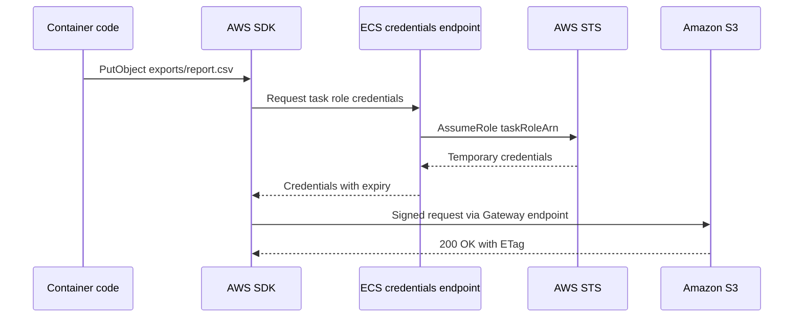

| Design point | Recommendation |
|--------------|----------------|
| Task role versus execution role | Application S3 permissions go on the task role only |
| Networking | Private subnets with a Gateway endpoint for S3 |
| Large inputs | Download with the transfer manager to ephemeral storage, or stream directly |
| Configuration files | Prefer SSM Parameter Store or AppConfig for configuration; S3 is suitable for large bundles |
| Environment files | ECS can load `environmentFiles` from S3; this uses the execution role, not the task role |

!!! warning "Execution role and task role confusion"
    ECS uses the execution role to fetch `environmentFiles` from S3 before the container starts, whereas the application uses the task role at runtime. A task that fails to start with an S3 error usually has a missing execution role permission; an application that logs AccessDenied usually has a missing task role permission.

#### Consuming S3 from Amazon EKS pods

EKS offers two mechanisms for pod-level credentials.

| Aspect | EKS Pod Identity | IRSA |
|--------|------------------|------|
| Setup | Install the Pod Identity Agent add-on and create an association | Create an IAM OIDC provider per cluster and annotate the service account |
| Trust policy | Trusts the service principal `pods.eks.amazonaws.com` | Trusts the cluster's OIDC provider with `sub` and `aud` conditions |
| Role reuse across clusters | The same role can be used by many clusters without editing its trust policy | Each cluster's OIDC provider must be added to the trust policy |
| Session tags for ABAC | Yes, including namespace and service account | Not by default |
| Typical choice | New EKS clusters | Existing clusters, or tooling that only supports IRSA |

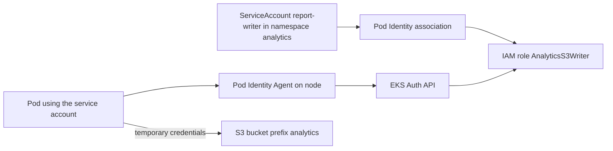

##### Mountpoint for Amazon S3 CSI driver

Some tools, such as legacy data processors and ML frameworks, expect a file system path. The Mountpoint for Amazon S3 CSI driver, available as an EKS add-on, mounts a bucket or prefix into a pod.

| Characteristic | Behaviour |
|----------------|-----------|
| Provisioning | Static provisioning: a PersistentVolume references an existing bucket |
| Reads | Optimised for high-throughput sequential and random reads of large files |
| Writes | Sequential writes of new files; modifying existing files is not supported on general purpose buckets |
| Deletes and renames | Deletes can be allowed through a mount option; rename support is limited to directory buckets in recent versions |
| Caching | Optional local cache, and a shared cache on Express One Zone in recent versions |
| Credentials | Driver-level or pod-level credentials; recent versions of the driver support pod-level IAM identities. Check the driver documentation for the supported mechanisms in the installed version |

!!! warning "Mountpoint is not a general-purpose file system"
    Mountpoint translates file operations into S3 API calls. It deliberately does not emulate operations that S3 cannot perform efficiently, such as random writes, file locking or appending on general purpose buckets. Databases, applications that edit files in place, and shared home directories should use [Amazon EFS](#file-storage-with-amazon-efs) or EBS (the Amazon EBS part of this section) instead.

#### Consuming S3 from AWS Lambda

Lambda integrates with S3 as a consumer (reading and writing through the execution role) and as an event target.

| Integration style | Flow | Strengths | Weaknesses |
|-------------------|------|-----------|------------|
| Direct Event Notification | S3 to Lambda asynchronous invocation | Lowest latency and simplest | Limited filtering; retries governed by Lambda asynchronous settings |
| S3 to SQS to Lambda | S3 notification to SQS, Lambda polls with an event source mapping | Durable buffering, batching, concurrency control, DLQ | Additional component and slight latency |
| S3 to EventBridge to Lambda | EventBridge rule filters and routes | Rich filtering, multiple consumers, replay | Additional cost and component |
| S3 to EventBridge to Step Functions | Rule starts a workflow | Multi-step processing with error handling | Higher cost per execution |

##### Recursive invocation loops

A classic mistake is a function triggered by `ObjectCreated` that writes its output into the same bucket and prefix, triggering itself indefinitely. Lambda's recursive loop detection now covers S3 and stops the loop after a limited number of recursive invocations, sending the event to a dead-letter queue or on-failure destination if configured. This safeguard reduces the cost of mistakes but does not replace correct design:

- write outputs to a different bucket, or to a prefix excluded by the notification filter;
- use distinct input and output prefixes such as `incoming/` and `processed/`;
- in EventBridge rules, match on the input prefix explicitly.

!!! danger "Do not rely on loop detection as a control"
    Loop detection is a safety net that acts only after the loop has started and depends on tracing metadata propagated by supported SDKs. Architecture reviews should still reject designs in which a function's output can match its own trigger.

#### S3 event-driven pipelines


Design rules for event pipelines:

| Rule | Reason |
|------|--------|
| Include the object version ID or ETag in processing idempotency keys | Duplicate events for the same object version must produce one result |
| Treat events as notifications, not state | Re-read the object; the event does not carry the content |
| Handle deletes and overwrites | A `PUT` to an existing key produces a new event with a new version |
| Use claim check | Pass the bucket and key through queues rather than the payload ([Chapter 1.7](../unit1/topic7.md)) |
| Buffer before scarce resources | SQS between S3 and database-writing consumers protects the database |

#### CloudFront with Origin Access Control

CloudFront OAC signs requests to the S3 origin with SigV4, allowing the bucket to remain fully private with Block Public Access enabled. The bucket policy trusts the CloudFront service principal, restricted to a specific distribution.

```json
{
  "Version": "2012-10-17",
  "Statement": [
    {
      "Sid": "AllowCloudFrontOACRead",
      "Effect": "Allow",
      "Principal": { "Service": "cloudfront.amazonaws.com" },
      "Action": "s3:GetObject",
      "Resource": "arn:aws:s3:::acme-web-assets-111122223333/*",
      "Condition": {
        "StringEquals": {
          "AWS:SourceArn": "arn:aws:cloudfront::111122223333:distribution/E2EXAMPLE123"
        }
      }
    }
  ]
}
```

| Consideration | Detail |
|---------------|--------|
| OAC versus OAI | OAC supersedes the legacy Origin Access Identity and supports SSE-KMS, all Regions and dynamic requests |
| SSE-KMS objects | The KMS key policy must allow the CloudFront service principal to decrypt, conditioned on the distribution ARN |
| Website endpoints | OAC works with the S3 REST endpoint, not the static website endpoint |
| Cache invalidation | Use versioned file names such as `app.3f9a1c.js` in CI/CD rather than frequent invalidations |

#### S3 in CI/CD pipelines

| Use | Detail |
|-----|--------|
| CodePipeline artefact store | Each stage passes zipped artefacts through an S3 bucket; encrypt with a customer managed KMS key for cross-account deployments |
| CodeBuild cache | S3 cache for dependencies between builds |
| Static site deployment | Build, `aws s3 sync --delete` to the bucket, then invalidate only `index.html` |
| Lambda and CloudFormation packages | `aws cloudformation package` and SAM upload templates and code bundles to S3 |
| Release promotion | Immutable artefacts copied between environment buckets with checksums verified |

#### S3 as the Terraform state backend

[Chapter 5.3](../unit5/topic3.md) introduced Terraform. Remote state belongs in S3 with versioning and encryption enabled. Recent Terraform versions support ==native S3 state locking== using a lock file written with conditional writes, which removes the need for a separate DynamoDB lock table. The DynamoDB-based locking arguments are deprecated in recent versions.

```hcl
terraform {
  backend "s3" {
    bucket       = "acme-tfstate-111122223333"
    key          = "platform/network/terraform.tfstate"
    region       = "us-east-1"
    encrypt      = true
    use_lockfile = true
  }
}
```

!!! tip "Protecting state"
    Terraform state often contains sensitive values. Restrict the state bucket to the pipeline role, enable versioning so that a corrupted state can be rolled back, and block deletion with a bucket policy that denies `s3:DeleteBucket` and object deletion except by a break-glass role.

#### Data lake integration

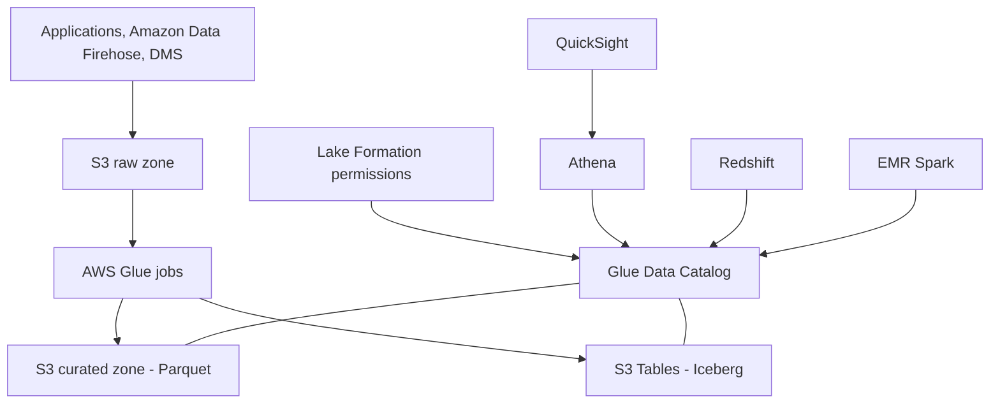

| Service | Role in the lake |
|---------|------------------|
| AWS Glue Data Catalog | Central metadata store for databases, tables and partitions |
| AWS Glue ETL and crawlers | Transformation and schema discovery |
| Amazon Athena | Serverless SQL over S3 and S3 Tables, charged by data scanned or provisioned capacity |
| AWS Lake Formation | Fine-grained permissions at database, table, column and row level for catalog-based access |
| Amazon S3 Tables | Managed Iceberg tables with automatic compaction, snapshot management and unreferenced file removal |
| Amazon EMR and Redshift | Spark and data warehouse engines querying the same tables |

!!! note "Why S3 Tables matter"
    Self-managed Iceberg tables on general purpose buckets require periodic compaction of small files and cleanup of expired snapshots, typically run as scheduled Spark jobs. S3 Tables moves this maintenance into the storage service and exposes an Iceberg REST catalog endpoint, and integrates with the Glue Data Catalog and Lake Formation so that Athena, Redshift, EMR and other engines can query the tables. For DSO303 purposes, the key lesson is that table maintenance becomes a managed responsibility, similar to how RDS absorbed database administration tasks.

#### S3 Express One Zone for analytics and machine learning

| Use | Why Express One Zone fits |
|-----|---------------------------|
| ML training data loading | Consistent low latency keeps GPUs busy |
| Checkpointing | Fast writes of large checkpoint files during training |
| Spark shuffle and intermediate data | Short-lived, regenerable data with high request rates |
| Low-latency cache for general purpose buckets | Mountpoint can use an Express One Zone bucket as a shared cache |

Compute should be placed in the same Availability Zone as the directory bucket to gain the latency benefit and avoid cross-AZ transfer considerations.

#### Cross-account access patterns

| Pattern | Mechanism | When to use |
|---------|-----------|-------------|
| Resource policy grant | Bucket policy allows the consumer's role ARN; consumer's identity policy allows the actions | Small number of known consumers |
| Role assumption | Consumer assumes a role in the data-owning account | Owner wants full control over permissions |
| Access Point delegation | Bucket policy delegates to access points; an access point policy grants the consumer | Many consumers of a shared lake |
| Cross-account access points | An access point in the consumer's account attached to a bucket in the owner's account, with delegation | Consumer teams manage their own endpoints |
| Lake Formation sharing | Share catalog tables across accounts through AWS RAM | Governed analytics sharing |
| Replication to consumer account | Replicate data into a bucket owned by the consumer | Isolation or Regional locality |

!!! warning "Both sides must allow cross-account access"
    Within one account, either an identity policy or a resource policy can grant access. Across accounts, ==both== the identity policy in the caller's account ==and== the resource policy in the bucket's account must allow the action, and the KMS key policy must allow it too when SSE-KMS is used.

#### Governance at scale

| Service | Role |
|---------|------|
| S3 Batch Operations | Applies an operation to every object in a manifest: copy, invoke Lambda, replace tags, restore from archive, update Object Lock settings, replicate existing objects (Batch Replication), compute checksums and other supported operations |
| S3 Inventory | Daily or weekly report of objects with fields such as size, storage class, encryption status, replication status and checksum algorithm |
| Storage Lens | Organisation-wide dashboards with free metrics and paid advanced metrics including prefix-level aggregation and CloudWatch publishing |
| S3 Metadata | Queryable metadata tables maintained automatically as objects change |

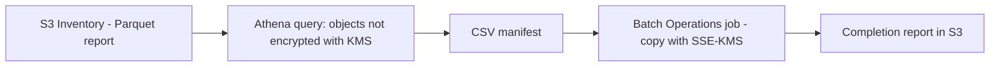

### Common Architecture Patterns

| Pattern | Description with S3 | DSO303 link |
|---------|---------------------|-------------|
| Serverless processing | Upload triggers Lambda, results written to another prefix | [Chapter 1.7](../unit1/topic7.md) |
| Event-driven fan-out | EventBridge routes one upload event to several independent consumers | [Chapter 1.7](../unit1/topic7.md) |
| Queue-based load levelling | S3 notifications into SQS consumed by an ECS service scaling on queue depth | Chapters [2.3](../unit2/topic3.md) and [4.3](../unit4/topic3.md) |
| Claim check | Large payloads stored in S3; messages carry only a reference | [Chapter 1.7](../unit1/topic7.md) |
| Static content offload | Front-end assets served from S3 through CloudFront while APIs run on ECS or EKS | [Chapter 1.7](../unit1/topic7.md) |
| Presigned direct upload | Clients upload directly to S3 using presigned URLs issued by an API, bypassing application servers | This part |
| Optimistic concurrency | Read an object and its ETag, modify, write with `If-Match`; retry on HTTP 412 | This part |
| Leader election and locking | Workers race to create a lock object with `If-None-Match: *`; the winner proceeds | This part |
| Data lake zones | Raw, curated and consumption zones with Glue, Athena and S3 Tables | This part |
| Retry with backoff | SDK retries for 503 and 500 responses | [Chapter 4.3](../unit4/topic3.md) |
| Bulkhead | Separate buckets or access points per tenant or workload to contain failures and policy changes | [Chapter 4.3](../unit4/topic3.md) |

!!! example "Exactly-once output with conditional writes"
    A Lambda consumer processing duplicate events writes its output to `processed/<source-key>/<version-id>.json` with `If-None-Match: *`. The first invocation succeeds; a duplicate receives HTTP 412 and treats it as success. The storage layer itself enforces idempotency without a separate deduplication table.

### Industry Use Cases

| Industry | Use case | Integration pattern |
|----------|----------|---------------------|
| Media and streaming | Uploaded videos trigger transcoding pipelines and are delivered globally | S3 events, Step Functions, AWS Elemental MediaConvert, CloudFront |
| Financial services | Daily trade files from partners are validated, archived with Object Lock, and loaded into the data warehouse | SFTP through AWS Transfer Family, EventBridge, Glue, Redshift |
| Healthcare | Medical images are stored with strict access and scanned for sensitive data | Access Points, Macie, CloudTrail data events, Lake Formation |
| E-commerce | Product images uploaded by sellers are scanned, resized and served | Presigned uploads, GuardDuty Malware Protection, Lambda, CloudFront |
| Machine learning and generative AI | Training datasets, checkpoints, model artefacts, and knowledge-base documents for retrieval-augmented generation | Express One Zone, Mountpoint CSI on EKS, SageMaker AI, Bedrock Knowledge Bases, S3 Vectors |
| Software delivery | Build artefacts, container build caches, and infrastructure state | CodePipeline, CodeBuild, Terraform S3 backend |
| Internet of Things | Devices stream telemetry that lands in partitioned Parquet files | Amazon Data Firehose, S3 Tables, Athena |
| Education | Learning management systems store coursework submissions and media | Presigned uploads, lifecycle transitions, CloudFront |

### Advantages

| Advantage | Explanation |
|-----------|-------------|
| Stateless compute | Because S3 holds durable data, ECS tasks, pods and functions can be replaced, scaled to zero, or moved between Availability Zones without data migration |
| Universal integration | Nearly every AWS analytics, ML, delivery and security service reads from or writes to S3 natively, which removes custom connectors |
| Event-driven by design | Object events turn storage into a trigger, allowing pipelines to react within seconds without polling |
| Fine-grained, layered access | IAM, bucket policies, Access Points, Access Grants, Lake Formation and RCPs allow access to be delegated safely to many teams |
| Elastic throughput | Aggregate throughput grows with parallelism; no capacity planning is required for most workloads |
| Coordination primitives | Conditional writes provide locking and compare-and-swap without an additional database |
| Integrity guarantees | End-to-end checksums detect corruption between client and storage |
| Open formats | Iceberg and Parquet on S3 allow multiple engines to share data without lock-in to one query engine |
| Governance at scale | Batch Operations, Inventory and Storage Lens make billions of objects manageable |

### Limitations

| Limitation | Trade-off and mitigation |
|------------|--------------------------|
| Not a file system | Mountpoint helps for read-heavy workloads, but applications needing POSIX semantics should use EFS or EBS |
| Not a database | Conditional writes allow simple coordination, but queries, secondary indexes and transactions across objects require DynamoDB, Aurora or Iceberg tables |
| Latency on general purpose buckets | Tens of milliseconds is unsuitable for chatty, per-request lookups; use caching or Express One Zone |
| At-least-once, unordered events | Consumers carry the burden of idempotency and ordering logic |
| Policy complexity | Many overlapping policy types make access errors hard to diagnose |
| Request costs for small objects | Architectures producing many tiny objects can cost more in requests than storage |
| Regional scope | Multi-Region designs require replication and routing, with replication lag and conflict considerations |
| Evolving feature set | Some features, such as Object Lambda, change availability; designs should isolate feature-specific code |

### Common Mistakes

#### Beginner Mistakes

| Mistake | Consequence | Correction |
|---------|-------------|------------|
| Embedding access keys in container images or environment variables | Leaked long-lived credentials | Use task roles, Pod Identity or execution roles |
| Granting `s3:*` on `*` to a workload | Any compromise exposes every bucket | Scope actions and prefixes |
| Writing Lambda output into the triggering prefix | Recursive invocation loop and runaway cost | Separate input and output prefixes or buckets |
| Assuming each event arrives exactly once and in order | Duplicate records, corrupted aggregates | Idempotent consumers keyed on version ID or ETag |
| Placing `s3:ListBucket` on the object ARN | AccessDenied when listing | Apply `ListBucket` to the bucket ARN |
| Making a bucket public to serve a website | Data exposure and no TLS on the website endpoint | CloudFront with OAC and a private bucket |
| Private subnet tasks reaching S3 through NAT | Unnecessary data processing charges and a dependency on NAT | Add a Gateway endpoint |
| Using Mountpoint for a database or in-place file edits | Write failures | Use EBS or EFS |
| Believing S3 has folders | A prefix "rename" turns out to be a full copy and delete of every object | Design keys that never need renaming |
| Enabling versioning without a lifecycle rule | Storage cost grows with no apparent increase in data | Expire noncurrent versions |

#### Production Mistakes

| Mistake | Consequence | Correction |
|---------|-------------|------------|
| No endpoint policy on the S3 Gateway endpoint | Exfiltration path to any bucket in any account | Restrict to organisation-owned buckets |
| Invoking Lambda directly from S3 for a database-writing consumer | Bursts of uploads overwhelm the database | Buffer with SQS and set maximum concurrency |
| One notification configuration shared by several teams, edited by hand | Overwritten configurations silently stop pipelines | Manage through IaC, or move to EventBridge rules owned by each team |
| Single key prefix for a large backfill | 503 Slow Down responses and job failures | Spread keys and use adaptive retries |
| Missing lifecycle rule for incomplete multipart uploads | Invisible, growing storage cost | Abort incomplete uploads after a few days |
| SSE-KMS without Bucket Keys at high request rate | KMS throttling and cost | Enable Bucket Keys |
| Cross-account consumer granted in the bucket policy but not in the KMS key policy | AccessDenied on GET despite a correct bucket policy | Update the key policy and the consumer's identity policy |
| Replicating to another Region without testing failover | Unknown recovery time during an outage | Use Multi-Region Access Point failover controls and run game days |
| Terraform state bucket without versioning | A corrupted state cannot be recovered | Versioning, restricted access and native lock files |
| Lifecycle rule moving short-lived objects into Standard-IA or Glacier | Minimum duration charges increase cost | Compare object lifetime with the minimum storage duration |
| Backups and replicas in the same account as production | One credential compromise destroys data and copies | Replicate into a separate account with Object Lock |

#### Troubleshooting AccessDenied with layered evaluation

An S3 request is allowed only if ==every applicable layer permits it and no layer explicitly denies it==. The diagram shows the layers an architect should check, from the outermost organisational controls inwards.

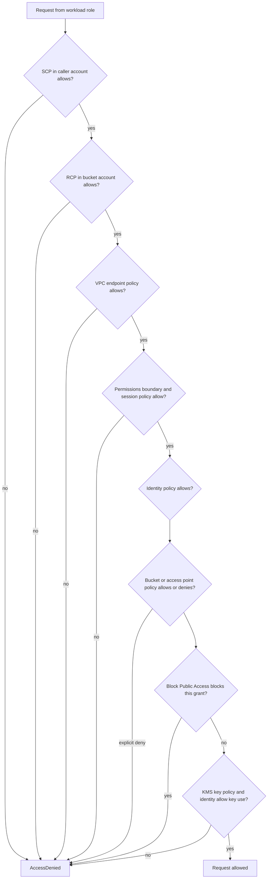

| Step | What to check | Useful tool |
|------|---------------|-------------|
| Identify the caller | Which role session actually made the call | `aws sts get-caller-identity` inside the container, CloudTrail `userIdentity` |
| Read the error message | S3 error messages for many AccessDenied cases now state which policy type caused the denial, for example an identity-based policy, a resource-based policy, an SCP or a VPC endpoint policy | Application logs and CLI output |
| Identity policy | Action, resource ARN form, conditions such as `s3:prefix` | IAM Policy Simulator |
| Resource policies | Bucket policy, access point policy, explicit denies such as TLS or encryption requirements | Bucket permissions tab, IAM Access Analyzer |
| Network | Endpoint policy, `aws:SourceVpce` conditions, access point network origin | VPC console, CloudTrail `vpcEndpointId` |
| Encryption | KMS key policy, grants, `kms:ViaService` conditions | CloudTrail KMS events |
| Organisation | SCPs and RCPs | AWS Organizations console |
| Object existence | Without `s3:ListBucket`, S3 returns 403 rather than 404 for a missing key | Grant `ListBucket` on the bucket to see the true 404 |

!!! tip "The 403 for a missing object"
    S3 deliberately returns AccessDenied for a non-existent key when the caller lacks `s3:ListBucket`, because revealing whether a key exists could leak information. Many "permission" incidents are actually typing errors in the key.

!!! danger "Explicit deny always wins"
    An explicit `Deny` in any layer overrides every `Allow`. A bucket policy that denies requests without `aws:SecureTransport` or without a particular encryption header will block even an administrator. Check denies first.

### Summary

Amazon S3 is far more than a place to keep files. In a cloud-native architecture it is ==the shared, durable data plane that allows every other component to remain stateless==. This part examined S3 from the perspective of integration:

| Theme | Architectural lesson |
|-------|----------------------|
| Workload identity | ECS task roles, EKS Pod Identity or IRSA, and Lambda execution roles deliver short-lived credentials; no workload should hold access keys |
| Events | S3 Event Notifications suit simple single consumers; EventBridge suits multi-consumer, filtered, replayable, cross-account designs; every consumer must be idempotent |
| Loop safety | Separate input and output locations; Lambda loop detection is a safety net, not a design |
| Access at scale | Bucket policies set guardrails, Access Points delegate per application, Multi-Region Access Points route globally, Access Grants map people and groups to prefixes |
| Coordination and integrity | Conditional writes provide create-if-absent and compare-and-swap; checksums provide end-to-end integrity |
| Performance | Spread keys across prefixes, parallelise transfers, reuse clients, cache at the edge, and choose Express One Zone for latency-critical ML and analytics |
| Analytics | S3 with Glue, Athena, Lake Formation and S3 Tables forms a governed, open-format data lake |
| Delivery | S3 stores CI/CD artefacts and Terraform state, and serves front ends privately through CloudFront OAC |
| Governance | Batch Operations, Inventory, Storage Lens, Macie and GuardDuty make large estates auditable and safe |
| Troubleshooting | AccessDenied is resolved by walking the layers: organisation policies, endpoint policies, identity, resource policies, Block Public Access and KMS |

!!! tip "The architect's summary"
    Design S3 integrations around three questions. Who is calling, and with which short-lived identity? How does the consumer learn that data has changed, and what happens if it learns twice? Which policy layers must all agree for the call to succeed?

## Block Storage with Amazon EBS

!!! note "EBS in one paragraph"
    An EBS volume is network-attached block storage that lives in one Availability Zone and attaches to EC2 instances in that zone. Volumes are replicated within the zone, can be resized and retuned online with Elastic Volumes, and are backed up with incremental snapshots stored regionally. Capacity is billed as ==provisioned, not consumed==: a 500 GiB volume holding 10 GiB costs the same as a full one, and volumes can grow but never shrink.

### Definition

Amazon EBS provides persistent, zonal block storage volumes for EC2 instances, and therefore for every compute platform built on EC2 capacity, including ECS on EC2, ECS on Fargate, EKS managed node groups, Karpenter-provisioned nodes and EKS Auto Mode.

From an integration perspective, EBS is best defined as ==durable, low-latency, single-writer storage whose lifecycle can be bound to an instance, a task, a pod or an independent resource==.

| Integration context | How EBS participates |
|---------------------|----------------------|
| EC2 and Auto Scaling groups | Root and data volumes defined by AMIs and launch templates |
| Amazon EKS | Persistent volumes provisioned dynamically by the EBS CSI driver |
| Amazon ECS | Task-attached volumes configured at deployment for Fargate and EC2 tasks |
| Image pipelines | AMIs are EBS snapshots plus metadata, built by EC2 Image Builder |
| Backup and recovery | Snapshots automated by Data Lifecycle Manager and AWS Backup |
| Resilience engineering | EBS I/O disruptions injected by AWS Fault Injection Service |
| Data services | Self-managed databases, search engines, message brokers and caches |

### Why This Service or Concept Exists

#### The persistent state problem in container platforms

Containers were designed to be stateless and disposable. Yet many systems are inherently stateful: databases, search clusters, message brokers, build caches and ML feature stores. When such workloads run on containers, three problems appear:

| Problem | Why it matters |
|---------|----------------|
| Data must outlive the container | A crashed pod or replaced task must not lose its data |
| Data must follow the workload | A rescheduled pod must reattach the same data on a new node |
| Storage must be provisioned automatically | Platform teams cannot create volumes manually for every pod or task |

Local instance store solves none of these, because its data is lost when the instance stops or is replaced. Network file systems such as EFS solve sharing but do not provide the low latency and block semantics that databases expect. EBS provides block semantics with persistence independent of the instance, and its API allows orchestrators to create, attach, detach, snapshot and delete volumes programmatically.

#### Why AWS built integration layers around EBS

| Need | AWS response |
|------|--------------|
| Kubernetes needed a vendor-neutral storage interface | The Container Storage Interface and the Amazon EBS CSI driver, available as an EKS add-on |
| ECS users wanted block storage without managing instances | Amazon ECS EBS volume integration for Fargate and EC2 tasks (2024) |
| Organisations needed consistent, patched machine images | EC2 Image Builder |
| Manual snapshot scripts were unreliable | Amazon Data Lifecycle Manager and AWS Backup |
| Long-term snapshot retention was expensive | EBS Snapshots Archive tier |
| Accidental or malicious snapshot deletion | Recycle Bin with retention rules and rule locks |
| Backup vendors needed efficient change tracking | EBS direct APIs |
| Teams needed to verify resilience to storage faults | Fault Injection Service actions for EBS I/O disruption |

!!! tip "Architectural lesson"
    A cloud-native platform does not eliminate state; it isolates state into a small number of well-understood components with automated provisioning, backup and recovery. EBS integrations are the mechanisms that make this automation possible.

### Core Concepts

#### Volume types

| Type | Media | Size range | Max IOPS per volume | Max throughput per volume | IOPS model | Best-suited workloads |
|---|---|---|---|---|---|---|
| gp3 | SSD | 1 GiB to 64 TiB | 16,000 | 1,000 MiB/s | 3,000 IOPS and 125 MiB/s baseline included, provisioned independently of size | Default for boot volumes, most databases, application servers |
| gp2 | SSD | 1 GiB to 64 TiB | 16,000 | 250 MiB/s | 3 IOPS per GiB, burst to 3,000 for small volumes | Legacy general purpose; superseded by gp3 |
| io1 | SSD | 4 GiB to 16 TiB | 64,000 | 1,000 MiB/s | Provisioned, up to 50 IOPS per GiB | Legacy high-performance; superseded by io2 |
| io2 Block Express | SSD | 4 GiB to 64 TiB | 256,000 | 4,000 MiB/s | Provisioned, up to 1,000 IOPS per GiB | Mission-critical relational databases, SAP HANA, Oracle |
| st1 | HDD | 125 GiB to 16 TiB | 500 | 500 MiB/s | Throughput-oriented with burst credits | Big data, log processing, data warehouses, sequential reads |
| sc1 | HDD | 125 GiB to 16 TiB | 250 | 250 MiB/s | Lowest cost, throughput-oriented | Cold data accessed a few times per month |

!!! tip "gp3 is almost always better than gp2"
    gp3 costs roughly twenty percent less per GiB than gp2, includes 3,000 IOPS and 125 MiB/s regardless of size, and lets you provision IOPS and throughput independently of capacity. Under gp2, obtaining 3,000 sustained IOPS required a 1,000 GiB volume. Migrating gp2 to gp3 is an online `ModifyVolume` operation and one of the most reliable cost optimisations in a mature account.

#### IOPS, throughput and burst credits

| Concept | Meaning |
|---------|---------|
| IOPS | Input/output operations per second, measured against a 16 KiB unit on SSD types and a 1 MiB unit on HDD types; a single 128 KiB request counts as several IOPS on SSD |
| Throughput | Bytes per second transferred: IOPS multiplied by I/O size, up to the volume and instance ceilings |
| Burst bucket | The credit mechanism that lets gp2, st1 and sc1 exceed baseline performance for limited periods; sustained load exhausts the credits and performance drops abruptly to baseline |
| Provisioned performance | gp3, io1 and io2 deliver consistent provisioned performance with no credit mechanism |
| EBS-optimised instance | An instance whose network capacity for EBS traffic is dedicated and separate from general traffic; all current-generation instances are EBS-optimised by default |
| Elastic Volumes | Online changes to size, type, IOPS and throughput while the volume stays attached; the file system must then be grown with `growpart` and `xfs_growfs` or `resize2fs` |
| Multi-Attach | io1 and io2 volumes can attach to up to sixteen Nitro-based instances in the same Availability Zone; there is no coordination, so a cluster-aware file system is mandatory |

Scaling is ==vertical and explicit==: EBS never scales automatically. Architects monitor `VolumeQueueLength`, `BurstBalance` and throughput metrics and adjust deliberately. SSD types are IOPS devices and HDD types are throughput devices; HDD types perform poorly for small random I/O.

#### Instance store versus EBS

==Instance store== is NVMe or SSD storage physically attached to the host serving an EC2 instance. It offers the highest possible I/O performance because there is no network in the path, but its data is ==ephemeral==: it is lost when the instance stops, hibernates or terminates, and when the underlying hardware fails. It is not a durable storage service and has no snapshot mechanism. EBS, by contrast, persists independently of the instance.

!!! danger "Instance store data loss is a design property, not a failure"
    Architects use instance store deliberately for scratch space, caches, temporary shuffle data in Spark, or replicated distributed databases such as Cassandra that maintain their own redundancy across nodes. Placing a single-copy production database on instance store is a design error, not bad luck.

#### Lifecycle binding

The most important design question for any EBS volume is ==what its lifecycle is bound to==.

| Binding | Example | Deleted when |
|---------|---------|--------------|
| Instance | Root volume in a launch template with `DeleteOnTermination: true` | The instance terminates |
| Task | ECS task volume with a termination policy that deletes on task stop | The ECS task stops |
| Persistent volume claim | EKS PVC bound to a PV with `reclaimPolicy: Delete` | The PVC is deleted |
| Retained persistent volume | PV with `reclaimPolicy: Retain` | An operator deletes it explicitly |
| Independent resource | A data volume created by IaC and attached to an instance | IaC destroys it |

#### Zonal affinity

An EBS volume exists in exactly one Availability Zone. Every orchestrator that uses EBS must therefore schedule the consuming workload into the same zone. This constraint shapes the entire design of stateful services on AWS:

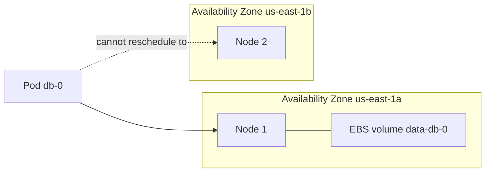

If node 1 fails and no capacity exists in `us-east-1a`, the pod remains Pending, even if `us-east-1b` has ample capacity. Stateful designs must provide capacity in each zone that holds volumes and must achieve cross-zone resilience through application-level replication or snapshot-based recovery.

#### Container Storage Interface on Kubernetes

Kubernetes separates storage requests from storage implementation:

| Object | Owner | Purpose |
|--------|-------|---------|
| StorageClass | Platform team | Describes a class of storage: driver, parameters, binding mode, expansion and reclaim policy |
| PersistentVolumeClaim (PVC) | Application team | Requests storage of a size and access mode from a StorageClass |
| PersistentVolume (PV) | Created dynamically by the driver | Represents one EBS volume |
| VolumeSnapshotClass | Platform team | Describes how snapshots are taken |
| VolumeSnapshot and VolumeSnapshotContent | Application team and driver | Represent one EBS snapshot |
| VolumeAttributesClass | Platform team | Describes modifiable performance attributes such as IOPS and throughput for supported drivers |
| CSINode | Driver | Reports how many volumes a node can attach |

The EBS CSI driver has two components: a controller Deployment that calls EC2 APIs to create, attach, modify and snapshot volumes, and a node DaemonSet that formats and mounts devices on each node.

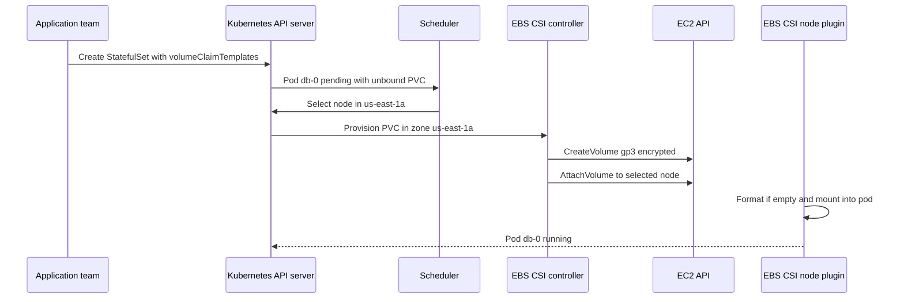

#### Volume binding modes

| Mode | Behaviour | Consequence |
|------|-----------|-------------|
| `Immediate` | The volume is created as soon as the PVC is created | The zone may be chosen before the pod is scheduled, causing an unschedulable pod |
| `WaitForFirstConsumer` | The volume is created only after the scheduler selects a node | The volume is created in the node's zone; recommended for EBS |

#### ECS task-attached EBS volumes

For ECS, the task definition declares a volume with `configuredAtLaunch: true`, and the actual EBS parameters are supplied when the task is launched: in the service definition for services, or in `RunTask` for standalone tasks. This separates the reusable application definition from environment-specific storage sizing.

| Element | Location | Content |
|---------|----------|---------|
| Volume declaration | Task definition | Name and `configuredAtLaunch: true` |
| Mount point | Container definition | Path inside the container |
| Volume configuration | Service or RunTask | Size, type, IOPS, throughput, encryption, KMS key, snapshot ID, file system type, tags, termination policy |
| Infrastructure role | Service or RunTask | IAM role that ECS uses to create and manage the volume |

!!! warning "ECS volumes are per task, not per service identity"
    Each ECS task launched by a service receives its own new volume, created empty or from a snapshot. When the task is replaced, the replacement receives a new volume; data does not migrate to it automatically. ECS task-attached volumes suit scratch space, per-task caches and workloads seeded from a snapshot. They do not provide the stable identity-to-volume mapping that Kubernetes StatefulSets provide.

#### Images and templates

An Amazon Machine Image (AMI) backed by EBS consists of one or more snapshots plus launch metadata. Launch templates reference an AMI and can override block device mappings. Auto Scaling groups launch instances from launch templates. The chain from image build to running fleet is therefore also an EBS chain:

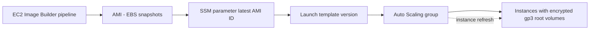

#### Snapshot automation and protection

| Mechanism | Scope | Purpose |
|-----------|-------|---------|
| Data Lifecycle Manager (DLM) | EBS snapshots and EBS-backed AMIs | Tag-based schedules, retention, cross-Region and cross-account copy, archive, Fast Snapshot Restore |
| AWS Backup | Many services including EBS | Central backup plans, vaults, vault locks, organisation policies, restore testing |
| Snapshot archive tier | Individual snapshots | Low-cost long-term retention with slower restore |
| Recycle Bin | Snapshots and AMIs | Recovery of deleted resources within a retention period |
| Snapshot Block Public Access | Region | Prevents public sharing of snapshots |

### AWS Service Deep Dive

#### Purpose

Within Unit VI, the purpose of EBS is to give stateful components of a cloud-native system ==persistent, performant block storage that orchestrators can manage automatically==, with backup, recovery and security integrated into the platform rather than bolted on.

#### Architecture

The following diagram shows how EBS integrates with the platform layers covered in earlier units.

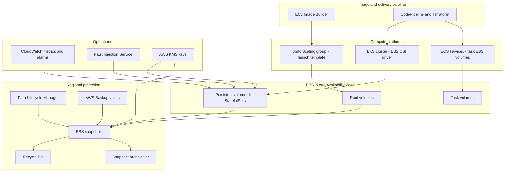

The critical architectural facts are:

| Fact | Integration consequence |
|------|-------------------------|
| Volumes are zonal | Stateful workloads are pinned to a zone; capacity planning is per zone |
| Snapshots are regional and stored durably | Snapshots are the mechanism for moving data across zones |
| Snapshots can be copied across Regions and shared across accounts | Disaster recovery and account isolation are built on snapshot copies |
| Attach and detach are EC2 API operations | Orchestrators require IAM permissions for EC2 volume actions |
| Performance depends on both the volume and the instance | Instance EBS bandwidth can cap volume performance |

#### Important Features

| Feature | What it provides | Integration relevance |
|---------|------------------|-----------------------|
| EBS CSI driver add-on | Dynamic provisioning, attachment, resizing, snapshots and modification for Kubernetes | Stateful workloads on EKS |
| EKS Auto Mode block storage | A managed EBS provisioner built into Auto Mode, using the provisioner name `ebs.csi.eks.amazonaws.com` | No self-managed driver on Auto Mode clusters |
| ECS task-attached EBS volumes | Volumes created, attached and optionally deleted per task, configured at deployment | Block storage for Fargate and EC2 tasks |
| Encryption by default | Regional setting that encrypts every new volume and snapshot copy | Compliance without relying on every template author |
| Data Lifecycle Manager | Policy-based snapshot and AMI automation using tags, including default policies | Hands-off backup for fleets |
| AWS Backup | Centralised, cross-service backup with vault lock and organisation-wide policies | Enterprise backup governance |
| Snapshot archive tier | Full-snapshot archival at much lower storage cost | Compliance retention |
| Recycle Bin | Retention rules that keep deleted snapshots and AMIs recoverable, with optional rule lock | Protection against accidental and malicious deletion |
| Time-based snapshot copy | Copies that complete within a requested duration, for predictable recovery point objectives | Cross-Region DR with defined timing (verify current availability) |
| EBS direct APIs | Read and write snapshot blocks, and list changed blocks between snapshots, without creating volumes | Backup software, data migration, forensic analysis |
| Provisioned volume initialisation rate | Volumes created from snapshots can be initialised at a specified rate for predictable readiness (a recent addition; verify availability and pricing) | Faster, predictable restores without Fast Snapshot Restore |
| Attached EBS status check | An EC2 instance status check reporting impairment of attached volumes | Auto Scaling health and alarms |
| Stalled I/O metric | A per-volume CloudWatch check indicating stalled I/O on Nitro instances | Detection of storage impairment |
| Fault Injection Service EBS actions | Pausing I/O on volumes, and in recent versions injecting latency | Resilience testing of stateful services |

#### Limitations

| Limitation | Architectural impact |
|------------|----------------------|
| Single Availability Zone | Zonal failure makes the volume unavailable; cross-zone resilience must come from replication or snapshots |
| Single writer for most volume types | Multi-Attach exists only for io1 and io2 in limited scenarios with cluster-aware file systems |
| Attachment limits per instance | Nodes with many pods using volumes can exhaust attachment slots |
| Snapshot restores are lazily loaded by default | First reads of restored blocks are slower unless initialised or Fast Snapshot Restore is used |
| ECS task volumes are not reattached to replacement tasks | Not suitable for durable per-identity state in ECS services |
| Resizing is one-directional | Volumes can grow but not shrink; shrinking requires data migration |
| Modification cooldown | After an Elastic Volumes modification, further modifications must wait for a cooling period (indicative, about six hours; verify current behaviour) |

#### Pricing Model and recommendations

Figures are indicative, as of 2026; verify in the AWS Pricing Calculator.

| Dimension | Charged for | Recommendation |
|-----------|-------------|----------------|
| Volume storage | Provisioned GiB-month, whether used or not | Right-size and grow online rather than over-provisioning |
| Provisioned IOPS and throughput | gp3 above the included baseline; io1 and io2 IOPS | Start from the gp3 baseline and tune from metrics |
| Snapshot storage, standard tier | Changed blocks stored, GB-month | Retention policies in DLM or AWS Backup |
| Snapshot archive tier | Full snapshot size at a much lower rate, plus retrieval charges; minimum 90-day retention | Only for snapshots retained for months or years |
| Fast Snapshot Restore | Per snapshot per Availability Zone per hour | Enable only for snapshots used for rapid scaling or recovery |
| Cross-Region snapshot copy | Inter-Region data transfer plus storage in the destination | Copy only critical snapshots; use incremental copies |
| EBS direct APIs | Per API request | Suitable for backup tools; account for request volume |
| Recycle Bin | Retained snapshots are charged at their normal storage rate | Keep retention periods proportionate |

!!! tip "The unattached volume problem"
    Volumes left behind by deleted instances, retained PVs and abandoned test environments continue to incur charges. Use `reclaimPolicy: Delete` for disposable environments, `DeleteOnTermination` for root volumes, and AWS Trusted Advisor or Compute Optimizer findings to identify idle volumes.

#### Performance Characteristics

Volume-level limits are given in [Volume types](#volume-types). In integrated systems the most common bottleneck is instead the ==instance's EBS bandwidth==, because all EBS traffic of an instance shares its dedicated EBS network path.

| Factor | Explanation |
|--------|-------------|
| Instance EBS bandwidth | Each instance type has maximum EBS bandwidth and IOPS; many smaller sizes have a lower baseline with the ability to burst for a limited time, typically up to 30 minutes at least once every 24 hours |
| Aggregate demand | Several gp3 volumes on one node, or several pods on one node, share the instance's EBS bandwidth |
| Queue depth | Applications must issue enough concurrent I/O to reach provisioned IOPS |
| I/O size | Throughput equals IOPS multiplied by I/O size; large sequential I/O reaches throughput limits before IOPS limits |
| Latency | io2 Block Express offers the most consistent sub-millisecond latency; gp3 provides single-digit millisecond latency for most workloads |
| Restored volumes | Lazy loading from S3 slows first access unless initialised, provisioned-rate initialised or restored with Fast Snapshot Restore |

!!! example "Sizing a node for EBS"
    A database pod requires a gp3 volume with 12,000 IOPS and 700 MiB/s throughput. If it is scheduled onto an instance whose baseline EBS bandwidth is well below 700 MiB/s, the volume will never deliver its provisioned throughput except during bursts. The instance type must be selected using its EBS bandwidth specification, obtainable with `aws ec2 describe-instance-types`, and node selectors or Karpenter NodePool requirements should steer database pods onto suitable instance families.

#### Scaling Behaviour

| Scaling dimension | Mechanism |
|-------------------|-----------|
| Capacity | Elastic Volumes increases size online; the CSI driver exposes this through PVC resizing when `allowVolumeExpansion: true` |
| Performance | Elastic Volumes changes gp3 IOPS and throughput or io2 IOPS online; Kubernetes exposes this through VolumeAttributesClass on supported versions, or through driver-specific annotations |
| Number of volumes | New pods and tasks receive new volumes automatically; limited by per-instance attachment limits and account quotas |
| Fleet scale-out | Auto Scaling groups launch instances with root volumes from the AMI; Fast Snapshot Restore or provisioned initialisation removes first-read latency for large AMIs |

#### Availability

EBS volumes are designed for high availability within one Availability Zone, and io2 volumes are designed for higher durability than other types (see [Durability and Availability](#durability-and-availability)). For the platform:

| Failure | Impact | Mitigation |
|---------|--------|------------|
| Instance failure | Volume survives; must be reattached | Orchestrator reschedules the pod to another node in the same zone |
| Volume impairment | I/O stalls or errors | Status checks, stalled I/O alarms, failover to a replica |
| Availability Zone impairment | Volumes in that zone unavailable | Application replication across zones, or restore from regional snapshots in another zone |
| Regional impairment | All volumes and regional snapshots unavailable | Cross-Region snapshot copies and infrastructure as code for the recovery Region |
| Logical corruption or deletion | Data wrong or gone | Point-in-time snapshots, Recycle Bin, AWS Backup vault lock |

#### Security Features

| Feature | Purpose |
|---------|---------|
| Encryption by default | Enforces encryption of all new volumes in a Region, with a chosen default KMS key |
| Customer managed KMS keys | Control over key policy, rotation and cross-account sharing |
| IAM condition keys | For example `ec2:Encrypted` and `ec2:VolumeType` to deny creation of non-compliant volumes |
| Snapshot Block Public Access | Blocks public sharing of snapshots at Region level |
| Recycle Bin rule lock | Prevents rules from being modified or deleted without an unlock delay |
| AWS Backup Vault Lock | Write-once, read-many retention for backups, including a compliance mode |
| CloudTrail | Records all volume, snapshot and attachment API activity |

#### Service Limits

Values are indicative, as of 2026; verify in Service Quotas and the EBS documentation.

| Limit | Indicative value |
|-------|------------------|
| Storage per volume type per Region | Soft quotas in TiB, adjustable |
| Snapshots per Region | Large soft quota, adjustable |
| Concurrent snapshot copies per destination Region | Limited; adjustable |
| Volume attachments per instance | Depends on instance type; many Nitro instances share a limit across EBS volumes, network interfaces and NVMe instance store volumes, while some newer types have dedicated EBS attachment limits |
| Elastic Volumes modifications | One modification per volume in a cooling period |
| Fast Snapshot Restore | Limited number of snapshots per Region enabled concurrently; credit-based volume creation rate |
| ECS task-attached EBS volumes | One EBS volume per task at the time of writing |
| Maximum volume size | 64 TiB for gp3, gp2 and io2 Block Express; 16 TiB for io1, st1 and sc1 |
| Multi-Attach instances per volume | 16 |
| IOPS to size ratio | 500 to 1 for gp3, 1,000 to 1 for io2 |

### Important AWS Terminology

Volume types, IOPS, throughput, burst credits, Elastic Volumes and Multi-Attach are defined in [Core Concepts](#volume-types).

| Term | Meaning |
|------|---------|
| Volume | An EBS block device created in one Availability Zone and attachable to instances in that zone |
| Snapshot | Incremental, block-level, point-in-time backup of a volume stored in S3 as a Regional resource |
| Lazy loading | Behaviour whereby a volume restored from a snapshot fetches blocks from S3 on first access |
| Fast Snapshot Restore | Feature that pre-warms a snapshot in chosen Availability Zones so restored volumes deliver full performance immediately |
| Nitro card for EBS | Dedicated hardware on the EC2 host that converts NVMe commands into EBS network operations and performs encryption |
| Instance store | Ephemeral block storage physically attached to the host, lost on stop or termination |
| Crash-consistent snapshot | A snapshot equivalent to a power loss; application consistency requires quiescing first |
| Container Storage Interface (CSI) | A standard API that lets orchestrators use storage systems through pluggable drivers |
| EBS CSI driver | The CSI driver, `ebs.csi.aws.com`, that provisions and manages EBS volumes for Kubernetes |
| StorageClass | A Kubernetes object that defines a class of dynamically provisioned storage |
| PersistentVolumeClaim | A request by a workload for storage of a given size and access mode |
| Reclaim policy | Whether a PV and its EBS volume are deleted or retained when the claim is released |
| WaitForFirstConsumer | A binding mode that delays volume creation until a pod is scheduled, ensuring zone alignment |
| Allowed topologies | StorageClass restriction on which zones volumes may be created in |
| StatefulSet | A Kubernetes controller that gives each replica a stable identity and its own PVC |
| volumeClaimTemplates | The StatefulSet section that generates one PVC per replica |
| VolumeSnapshot | A Kubernetes object representing a point-in-time snapshot, backed by an EBS snapshot |
| VolumeAttributesClass | A Kubernetes object describing mutable volume attributes such as IOPS and throughput |
| Snapshot controller | The Kubernetes controller, installed separately or as an EKS add-on, that manages VolumeSnapshot objects |
| configuredAtLaunch | An ECS task definition volume property indicating that the volume is configured at deployment |
| ECS infrastructure role | The IAM role ECS assumes to create and manage task-attached EBS volumes |
| Block device mapping | The part of an AMI or launch template that defines which volumes an instance receives |
| Golden image | A pre-hardened, pre-configured AMI used as the standard base for a fleet |
| EC2 Image Builder recipe | The definition of a parent image, components and block device mappings used to build an image |
| Distribution configuration | Image Builder settings that copy, share and publish images to Regions, accounts and launch templates |
| Instance refresh | An Auto Scaling feature that replaces instances progressively when a launch template changes |
| Data Lifecycle Manager policy | A tag-targeted schedule that creates, copies, archives and deletes snapshots or AMIs |
| Backup plan and backup vault | AWS Backup constructs for schedules and for storing recovery points |
| Recycle Bin retention rule | A rule that keeps deleted snapshots or AMIs recoverable for a defined period |
| EBS direct APIs | APIs for reading, writing and comparing snapshot blocks directly |
| Attached EBS status check | An instance status check that reports impaired attached volumes |
| VolumeStalledIOCheck | A CloudWatch metric that reports whether a volume's I/O has stalled |

### Configuration Options

#### EBS CSI StorageClass parameters

| Parameter | Example | Purpose |
|-----------|---------|---------|
| `provisioner` | `ebs.csi.aws.com` (or `ebs.csi.eks.amazonaws.com` on EKS Auto Mode) | Selects the driver |
| `type` | `gp3`, `io2`, `st1` | Volume type |
| `iops` | `"6000"` | Provisioned IOPS for gp3, io1 and io2 |
| `throughput` | `"250"` | gp3 throughput in MiB/s |
| `iopsPerGB` | `"50"` | io1 and io2 IOPS proportional to size |
| `encrypted` | `"true"` | Encrypt the volume |
| `kmsKeyId` | Key ARN | Customer managed key |
| `csi.storage.k8s.io/fstype` | `ext4`, `xfs` | File system created on first mount |
| `tagSpecification_1` | `"team=payments"` | Tags applied to created volumes |
| `volumeBindingMode` | `WaitForFirstConsumer` | Zone alignment with scheduled pods |
| `allowVolumeExpansion` | `true` | Allow PVC resizing |
| `reclaimPolicy` | `Delete` or `Retain` | Fate of the volume when the PVC is deleted |
| `allowedTopologies` | Zone list | Restrict volume placement |

#### ECS task volume configuration

| Setting | Purpose |
|---------|---------|
| `roleArn` | Infrastructure role, typically with the managed policy `AmazonECSInfrastructureRolePolicyForVolumes` |
| `sizeInGiB` | Volume size; may be omitted when a snapshot defines it |
| `volumeType`, `iops`, `throughput` | Performance configuration |
| `snapshotId` | Seed the volume from a snapshot |
| `encrypted`, `kmsKeyId` | Encryption settings; the Region default applies when encryption by default is enabled |
| `filesystemType` | For example `ext4` or `xfs` on Linux |
| `tagSpecifications` | Tags propagated to the volume |
| `terminationPolicy.deleteOnTermination` | Delete the volume when the task stops, or retain it |

#### Launch template block device mappings

| Setting | Recommendation |
|---------|----------------|
| `VolumeType` | `gp3` for root and general data volumes |
| `Encrypted` and `KmsKeyId` | Always encrypted; use the organisation's key |
| `DeleteOnTermination` | `true` for root volumes in Auto Scaling groups |
| `Iops` and `Throughput` | Baseline unless measured need exists |
| `VolumeSize` | The AMI's snapshot size or larger |

#### Backup automation settings

| Setting | DLM | AWS Backup |
|---------|-----|------------|
| Targeting | Resource tags, or default policies for all volumes and instances | Tags, resource ARNs, or organisation backup policies |
| Schedule | Interval, cron, or retention-based | Cron-based backup rules |
| Retention | Count or age | Lifecycle with transitions to cold storage where supported |
| Cross-Region copy | Yes | Yes |
| Cross-account copy | Yes, with cross-account copy event policies | Yes, across accounts in an organisation |
| Archive tier | Yes, for snapshots | Cold storage transitions for supported resources |
| Application consistency | Pre and post scripts via Systems Manager | Windows VSS; scripts via other mechanisms |
| Immutability | Recycle Bin rule lock | Vault Lock, logically air-gapped vaults |

### Design Considerations

#### Scalability

| Concern | Design response |
|---------|-----------------|
| Many stateful pods per node | Monitor the CSINode allocatable count; choose instance types with sufficient attachment slots |
| Growing data | Enable volume expansion; alarm on file system utilisation, not only on volume size |
| Horizontal scale of stateful systems | Scale by adding replicas with their own volumes, relying on application sharding or replication |
| Rapid fleet scale-out from large AMIs | Keep AMIs small; use Fast Snapshot Restore or provisioned initialisation for latency-sensitive boot |

#### Availability and reliability

The zonal nature of EBS forces an explicit choice for each stateful component:

| Strategy | How it works | Recovery behaviour |
|----------|--------------|--------------------|
| Application replication across zones | Each replica has its own EBS volume in a different zone; the application replicates data, for example PostgreSQL streaming replication or Kafka partition replication | Failover to a replica in a healthy zone within seconds to minutes |
| Snapshot-based recovery | Regular snapshots; on zone failure, restore into another zone | Recovery point equals snapshot interval; recovery time includes restore and initialisation |
| Managed service | Use RDS, Aurora, Amazon MSK or OpenSearch Service, which handle cross-zone replication | Service-managed failover |

!!! warning "A StatefulSet is not a high-availability mechanism"
    A StatefulSet provides stable identities and stable volumes, but if a replica's zone fails, that replica cannot move. High availability requires an application that replicates across replicas placed in different zones, with pod topology spread constraints ensuring the placement.

#### Durability

Durability of a single EBS volume is high but not equivalent to S3. A defence-in-depth approach combines snapshots at an interval matching the recovery point objective, cross-Region copies for disaster recovery, cross-account copies for protection against account compromise, and immutability through Vault Lock or Recycle Bin rule locks.

#### Latency and performance

Place latency-sensitive stateful workloads on io2 Block Express or tuned gp3 volumes, on instance types with adequate EBS bandwidth, and keep compute and volume in the same zone (which EBS enforces).

#### Cost

The main cost risks are over-provisioned capacity, retained volumes from deleted workloads, unbounded snapshot retention and unnecessary Fast Snapshot Restore. These are addressed in the Cost Optimization section.

#### Maintainability and operational complexity

| Choice | Complexity trade-off |
|--------|----------------------|
| EBS CSI add-on managed by EKS | AWS manages add-on versions; the team still owns StorageClass design and upgrades |
| EKS Auto Mode block storage | Least operational effort; fewer tuning options and a different provisioner name to account for in manifests |
| ECS task-attached volumes | No driver to operate; limited to per-task semantics |
| Kubernetes operators for data services | Automate failover and backups, but add a critical component that must itself be upgraded and understood |
| Custom snapshot scripts | Flexible but fragile; prefer DLM or AWS Backup |

#### Databases on EBS versus managed databases

| Criterion | Self-managed database on EBS (EC2 or Kubernetes) | Managed service (RDS, Aurora, DynamoDB) |
|-----------|---------------------------------------------------|-----------------------------------------|
| Control | Full control of engine version, extensions, configuration and operating system | Limited to supported engines, versions and parameters |
| Operational effort | Team owns patching, backups, replication, failover, upgrades and monitoring | Largely handled by AWS |
| High availability | Must be built with replication across zones | Multi-AZ built in |
| Backups | Snapshot automation plus application-consistent techniques such as write-ahead log archiving | Automated backups and point-in-time recovery |
| Cost | Potentially lower infrastructure cost at scale; higher engineering cost | Higher unit price, lower operational cost |
| Suitable when | An engine or extension is not offered as a managed service; licensing or specialised tuning requires it; a Kubernetes operator is mature and the team has expertise | Most transactional application databases |

!!! tip "Architect's default"
    For DSO303 designs, the default choice is a managed database service ([Section 6.2](../unit6/topic2.md)). Running a database on EBS is a deliberate exception that must be justified by a requirement the managed service cannot meet, and must include a documented backup, replication and upgrade strategy.

### AWS Best Practices

| Pillar | Best practice for EBS integration |
|--------|-----------------------------------|
| Operational Excellence | Define StorageClasses, launch templates, ECS volume configurations and backup policies only in IaC; tag volumes with owner, application and backup tier; build AMIs through Image Builder pipelines; publish latest AMI IDs through Parameter Store |
| Security | Enable encryption by default in every Region; use customer managed keys; enable Snapshot Block Public Access; scope the CSI driver and ECS infrastructure roles to the managed policies; lock Recycle Bin rules and backup vaults |
| Reliability | Use `WaitForFirstConsumer`; spread stateful replicas across zones; automate snapshots with DLM or AWS Backup; copy critical snapshots across Regions and accounts; test restores regularly; alarm on status checks and stalled I/O; test with Fault Injection Service |
| Performance Efficiency | Use gp3 and tune IOPS and throughput independently; choose instance types by EBS bandwidth; use XFS or ext4 appropriately; initialise volumes restored from snapshots for latency-sensitive workloads |
| Cost Optimization | Delete unattached volumes; right-size with Compute Optimizer; migrate gp2 to gp3; set retention for snapshots; archive long-term snapshots; enable Fast Snapshot Restore only where required |
| Sustainability | Avoid over-provisioned volumes; delete obsolete AMIs and snapshots with Image Builder lifecycle policies and DLM retention; prefer managed services that share infrastructure efficiently |

### Security Considerations

#### IAM and least privilege

| Principal | Required permissions | Guidance |
|-----------|----------------------|----------|
| EBS CSI controller | EC2 volume, attachment, snapshot and tag actions; KMS actions when using customer managed keys | Use the AWS managed policy `AmazonEBSCSIDriverPolicy`, attached through EKS Pod Identity or IRSA to the controller service account; add KMS permissions and key policy grants for custom keys |
| ECS infrastructure role | EC2 volume and attachment actions for ECS-managed volumes | Use `AmazonECSInfrastructureRolePolicyForVolumes`; add KMS permissions for customer managed keys |
| Image Builder instance profile | Systems Manager and log access | Use the Image Builder managed policies |
| DLM and AWS Backup service roles | Snapshot creation, copy and deletion | Use the default service roles or scoped custom roles |
| Application workloads | Usually none for EBS | Pods and tasks use volumes through the file system; they should not hold EC2 volume permissions |

!!! danger "Never give application pods EC2 volume permissions"
    A pod that can call `ec2:AttachVolume` or `ec2:CreateSnapshot` could attach another tenant's volume to a node it controls, or copy data out through a snapshot. Only the CSI controller should hold these permissions, through its own service account identity.

#### Encryption and KMS

Encryption by default is a per-Region account setting. Once enabled, all new volumes, and all copies of unencrypted snapshots, are encrypted with the configured default key. Encryption happens in Nitro hardware, at rest and in transit between the instance and the volume, with per-volume data keys and negligible performance impact. KMS key types, key policies and grants are explained in [8.3 Encryption at Rest with AWS KMS](../unit8/topic3.md#encryption-at-rest-with-aws-kms); the table below lists only the EBS-specific requirements.

| Scenario | Requirement |
|----------|-------------|
| Encrypting with a customer managed key | Principals creating and attaching volumes need `kms:CreateGrant`, `kms:GenerateDataKeyWithoutPlaintext`, `kms:Decrypt` and related permissions; the key policy must allow them |
| Sharing an encrypted snapshot with another account | Must use a customer managed key; the key policy must allow the target account; the AWS managed key `aws/ebs` cannot be shared |
| Receiving a shared encrypted snapshot | The recipient typically copies the snapshot and re-encrypts it with its own key, removing dependency on the source key |
| Cross-Region copy | Specify a KMS key in the destination Region; KMS keys are Regional unless multi-Region keys are used |
| Sharing an AMI with encrypted snapshots | Share both the AMI and the key; Image Builder distribution settings can re-encrypt per Region and account |

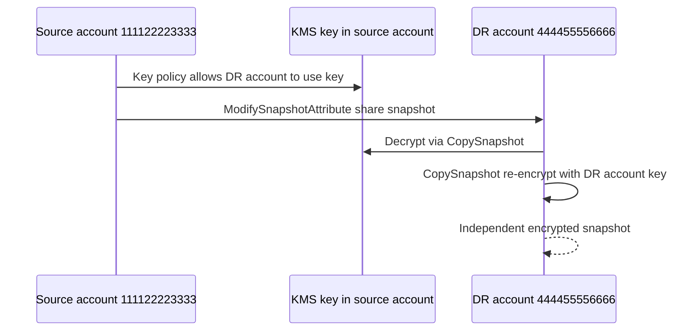

#### Guardrails with policy conditions

An SCP or identity policy can deny creation of unencrypted volumes:

```json
{
  "Sid": "DenyUnencryptedVolumes",
  "Effect": "Deny",
  "Action": "ec2:CreateVolume",
  "Resource": "*",
  "Condition": { "Bool": { "ec2:Encrypted": "false" } }
}
```

#### Network, public exposure and logging

| Control | Relevance to EBS |
|---------|------------------|
| Security groups and NACLs | Do not apply to EBS traffic, which uses the dedicated EBS network path; they protect the instance and the application that serves the data |
| Snapshot Block Public Access | Prevents a snapshot from being shared publicly, a known source of data leaks |
| Private versus public resources | Volumes are never directly reachable over a network; exposure occurs through the instance, snapshots or AMIs |
| CloudTrail | Logs `CreateVolume`, `AttachVolume`, `CreateSnapshot`, `ModifySnapshotAttribute` and direct API activity |
| AWS Config | Rules such as encrypted volumes, encryption by default enabled, and no public snapshots |
| Compliance | Vault Lock compliance mode and Recycle Bin rule locks support retention requirements |

### Performance Optimization

#### Instance bandwidth and volume configuration

| Technique | Explanation |
|-----------|-------------|
| Match instance to volume | Check `EbsInfo` for the instance type: baseline and maximum bandwidth, throughput and IOPS |
| Distribute across instances | Spread high-I/O pods across nodes so that they do not compete for the same instance EBS bandwidth |
| Tune gp3 independently | Raise IOPS or throughput without increasing size |
| Use RAID 0 only with care | Striping multiple volumes increases performance but multiplies failure probability; prefer a single larger or faster volume where possible |
| Choose file system options | XFS for large files and parallel I/O; ext4 as a general default; use `noatime` to avoid metadata writes on reads |

#### Restores and initialisation

Volumes created from snapshots load blocks from S3 on first access. For latency-sensitive restores:

| Option | Behaviour | Cost |
|--------|-----------|------|
| Default lazy loading | First access to each block is slower | None |
| Manual initialisation with `fio` or `dd` | Reads every block to force download | Time and I/O |
| Provisioned initialisation rate | Volume is initialised at a specified rate for predictable readiness (verify availability) | Per-volume charge |
| Fast Snapshot Restore | Volumes are fully initialised at creation | Hourly per snapshot per zone |

#### Caching and parallelism

- Use the page cache and database buffer pools; size instance memory accordingly.
- Increase application I/O concurrency to reach provisioned IOPS.
- For container platforms, use local NVMe instance store for regenerable caches and EBS for persistent state.

#### Monitoring

| Metric or check | What it indicates |
|-----------------|-------------------|
| `VolumeReadOps`, `VolumeWriteOps`, `VolumeReadBytes`, `VolumeWriteBytes` | Workload IOPS and throughput |
| `VolumeTotalReadTime`, `VolumeTotalWriteTime` | Used with operation counts to derive average latency |
| `VolumeQueueLength` | Outstanding I/O; sustained high values with high latency indicate saturation |
| `VolumeIdleTime` | Time with no I/O |
| `BurstBalance` | Remaining burst credits on gp2, st1 and sc1 |
| `VolumeThroughputPercentage` and `VolumeConsumedReadWriteOps` | Utilisation of provisioned IOPS volumes |
| `VolumeStalledIOCheck` | Whether the volume's I/O is stalled |
| Volume status checks | `ok`, `warning`, `impaired` or `insufficient-data`; I/O may be disabled on impaired volumes when data consistency is uncertain |
| `StatusCheckFailed_AttachedEBS` | Instance-level check that an attached volume is impaired |
| `EBSIOBalance%` and `EBSByteBalance%` | Remaining instance-level EBS burst balance on burstable-bandwidth instance types |
| Kubernetes volume stats | `kubelet_volume_stats_used_bytes` and related metrics through Container Insights or Prometheus |

!!! note "Newer EBS observability"
    AWS continues to add EBS metrics, such as checks indicating that a workload exceeds the volume's provisioned performance and more detailed per-volume latency statistics available through CloudWatch and the NVMe interface on Nitro instances. Check the current EBS CloudWatch metrics documentation when building dashboards.

A persistently high `VolumeQueueLength` means the volume is the bottleneck, and a falling `BurstBalance` predicts an imminent performance collapse. Useful alarms are `BurstBalance` below twenty percent for fifteen minutes and `VolumeQueueLength` above a workload-specific threshold for ten minutes. Alarm and dashboard mechanics are covered in [7.3 Creating CloudWatch Dashboards and Alarms](../unit7/topic3.md#creating-cloudwatch-dashboards-and-alarms).

### Cost Optimization

| Lever | Explanation |
|-------|-------------|
| Pay-as-you-go | EBS is charged for provisioned capacity and performance; there are no reserved volumes or Savings Plans for EBS itself |
| Rightsizing | Compute Optimizer produces EBS volume recommendations based on utilisation |
| gp2 to gp3 migration | Elastic Volumes allows migration without downtime, typically at lower cost for the same baseline performance |
| Unattached volumes | Find volumes in the `available` state and delete or snapshot them |
| Retained PVs | Review PVs in the `Released` state on EKS clusters |
| Snapshot retention | Enforce with DLM or AWS Backup; delete snapshots of decommissioned systems |
| Archive tier | Move snapshots retained for 90 days or more and rarely restored |
| AMI lifecycle | Image Builder lifecycle policies deprecate and delete old AMIs and their snapshots |
| Fast Snapshot Restore | Disable when not in active use |
| Spot for stateless tiers | Use Spot with Auto Scaling groups for stateless nodes; root volumes are deleted with the instance |
| Cost Explorer and tags | Allocate EBS cost by team, application and environment |
| Trusted Advisor | Flags underutilised and unattached volumes |

### Integration with Other AWS Services

#### EBS with Amazon EKS

##### Installing and authorising the driver

The EBS CSI driver is installed as the EKS add-on `aws-ebs-csi-driver`. Its controller service account needs an IAM role with `AmazonEBSCSIDriverPolicy`, supplied through EKS Pod Identity or IRSA. On EKS Auto Mode clusters, block storage is built in, and StorageClasses reference the Auto Mode provisioner instead of installing the add-on.

##### StatefulSets with topology awareness

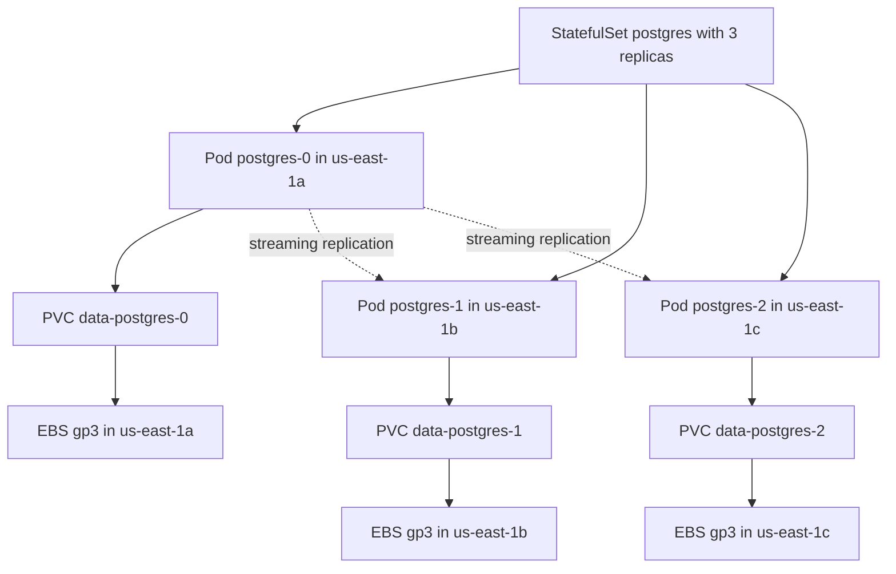

| Kubernetes feature | Role in the design |
|--------------------|--------------------|
| `volumeClaimTemplates` | Each replica receives its own PVC and EBS volume |
| `WaitForFirstConsumer` | Each volume is created in the zone of its pod's node |
| `topologySpreadConstraints` | Places replicas in different zones |
| PodDisruptionBudget | Prevents node drains from evicting too many replicas at once |
| `persistentVolumeClaimRetentionPolicy` | Controls whether PVCs are deleted when the StatefulSet is deleted or scaled down (available in recent Kubernetes versions) |
| Node autoscaling | Karpenter or Cluster Autoscaler must be able to add nodes in each zone that holds volumes |

!!! warning "Scaling down a StatefulSet"
    By default, scaling a StatefulSet down leaves the PVCs of removed replicas in place so that data survives a later scale-up. This protects data but leaves billed volumes behind. Decide the retention policy deliberately and document it.

##### Volume expansion and modification

PVC expansion is performed by editing `spec.resources.requests.storage` when the StorageClass allows expansion. The driver calls Elastic Volumes, and the node plugin grows the file system online. Performance changes can be applied through a VolumeAttributesClass referenced by the PVC on Kubernetes versions that support it, which lets platform teams offer named performance tiers such as `standard` and `fast`.

##### Snapshots and restores

The snapshot controller, available as an EKS add-on, manages `VolumeSnapshot` objects. The EBS CSI driver creates EBS snapshots for them. A new PVC can use a VolumeSnapshot as its `dataSource`, which restores the snapshot into a new volume, potentially in a different zone. This is the Kubernetes-native way to clone environments and to recover a replica into a healthy zone.

#### EBS with Amazon ECS

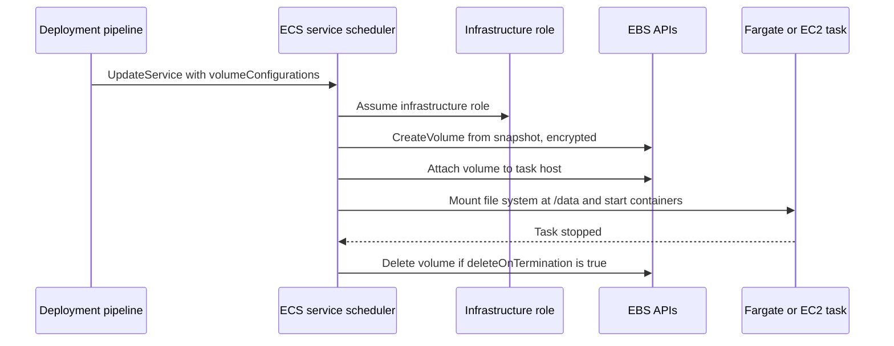

| Use case | Why ECS EBS volumes fit |
|----------|-------------------------|
| Large scratch space for data processing on Fargate | More and faster space than default ephemeral storage |
| Per-task working sets seeded from a snapshot | Reference datasets or ML models restored quickly into each task |
| Build and test workloads | Isolated, disposable block storage per task |
| Single-task stateful utilities | Retained volumes can be snapshotted for later use |

For shared, persistent state across tasks, ECS continues to use [EFS](#file-storage-with-amazon-efs) or external data services.

#### Auto Scaling groups, launch templates and golden images

| Stage | Service | EBS relevance |
|-------|---------|---------------|
| Build | EC2 Image Builder recipe with hardening and agent components | Defines root volume size, type and encryption in the image |
| Test | Image Builder test components | Validates the image before distribution |
| Distribute | Distribution configuration | Copies AMIs to Regions and accounts, re-encrypts snapshots with local keys, optionally updates launch templates |
| Publish | Parameter Store parameter for the latest AMI ID | Launch templates and IaC resolve the AMI dynamically |
| Deploy | Auto Scaling group instance refresh | Replaces instances progressively with the new image |
| Retire | Image Builder lifecycle policies | Deprecate, disable and delete old AMIs and their snapshots |

!!! tip "Immutable infrastructure"
    Instances in an Auto Scaling group should be disposable. Their root volumes contain only the image and temporary data; application state lives in S3, EFS, databases or dedicated EBS volumes owned by a stateful tier. Patching is performed by building a new image and refreshing the group, not by modifying running instances.

#### Backup and recovery services

| Service | Integration |
|---------|-------------|
| Data Lifecycle Manager | Tag-based snapshot and AMI policies; default policies can protect all volumes or instances in a Region |
| AWS Backup | Backup plans assign EBS volumes and EC2 instances by tag; vaults can be locked; organisation backup policies apply plans across accounts; restore testing validates recoverability |
| Recycle Bin | Retention rules keep deleted snapshots and AMIs recoverable; AWS has been extending Recycle Bin to more resource types, so verify current support |
| Snapshot archive tier | Moves full snapshots to archive for long-term retention; restores take up to about 72 hours |
| Amazon S3 | Snapshots are stored in AWS-managed S3 infrastructure, but are not visible as objects in customer buckets |

#### Cross-AZ, cross-Region and cross-account disaster recovery

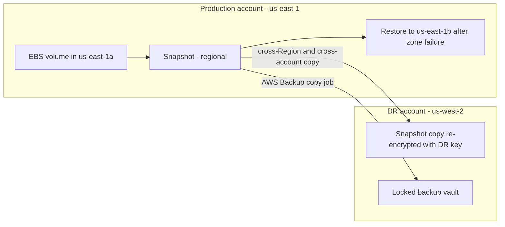

| Recovery scope | Mechanism | Typical RPO and RTO drivers |
|----------------|-----------|-----------------------------|
| Instance failure | Reattach volume to a replacement instance in the same zone | Minutes; automated by orchestrators |
| Zone failure | Restore latest snapshot into another zone, or fail over to an application replica | Snapshot interval; restore and initialisation time |
| Region failure | Restore from cross-Region copies into a recovery Region using IaC | Copy frequency and duration; infrastructure deployment time |
| Account compromise | Restore from copies in a separate, locked account or vault | Frequency of cross-account copies |

#### EBS direct APIs

The EBS direct APIs allow applications to read blocks from snapshots, list blocks that changed between two snapshots of the same lineage, and write new snapshots block by block, all without creating or attaching volumes. Backup vendors use them for efficient incremental backups, and migration tools use them to import disk images directly into snapshots.

| API | Purpose |
|-----|---------|
| `ListSnapshotBlocks` | Lists blocks in a snapshot |
| `ListChangedBlocks` | Lists blocks that differ between two snapshots |
| `GetSnapshotBlock` | Reads the data of one block |
| `StartSnapshot`, `PutSnapshotBlock`, `CompleteSnapshot` | Create a snapshot by writing blocks directly |

#### AWS Fault Injection Service

FIS provides the `aws:ebs:pause-volume-io` action, which pauses I/O on target volumes for a specified duration on Nitro-based instances, and recent versions add an action that injects I/O latency. Architects use these actions to verify that databases fail over, that health checks and alarms fire, and that applications time out gracefully rather than hanging.

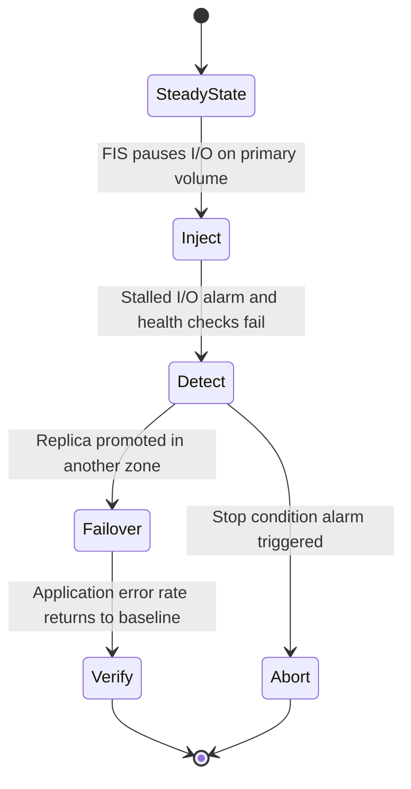

#### Observability integration

| Tool | EBS integration |
|------|-----------------|
| CloudWatch | Volume metrics, status checks, alarms, dashboards |
| CloudWatch Container Insights | PVC and file system usage for EKS and ECS |
| Amazon Managed Service for Prometheus and Grafana | kubelet volume metrics and CSI driver metrics |
| AWS Health | Notifications about scheduled events and degraded volumes |
| EventBridge | Events for snapshot completion, copy completion, volume modification and volume state changes, used to drive automation |

### Common Architecture Patterns

| Pattern | Description | DSO303 link |
|---------|-------------|-------------|
| Stateless compute, stateful tier | Web and API tiers keep nothing important on EBS; state lives in a dedicated tier | Chapters [1.7](../unit1/topic7.md) and [4.1](../unit4/topic1.md) |
| StatefulSet with application replication | Replicas in separate zones, each with its own EBS volume | [Chapter 3.3](../unit3/topic3.md) |
| Kubernetes operator for data services | An operator manages provisioning, backups and failover of a database on EBS | [Chapter 3.3](../unit3/topic3.md) |
| Golden image pipeline | Image Builder produces hardened AMIs consumed by launch templates and node groups | Chapters [5.1](../unit5/topic1.md) and [5.3](../unit5/topic3.md) |
| Immutable replacement | Instance refresh or node group update replaces instances rather than patching volumes | [Chapter 5.2](../unit5/topic2.md) |
| Snapshot-seeded environments | Test environments cloned from production snapshots, with data masking | [Chapter 5.2](../unit5/topic2.md) |
| Backup vault isolation | Backups copied to a separate account with locked vaults | This part |
| Pilot light disaster recovery | Snapshots and AMIs copied to a recovery Region with IaC ready to deploy | [Chapter 4.3](../unit4/topic3.md) |
| Bulkhead by volume | Separate volumes for logs, data and temporary files so that one cannot exhaust another | [Chapter 4.3](../unit4/topic3.md) |
| Chaos experiment | FIS pauses volume I/O to validate failover and timeouts | [Chapter 4.3](../unit4/topic3.md) |

### Industry Use Cases

| Industry | Use case | Integration pattern |
|----------|----------|---------------------|
| Financial services | Self-managed trading databases with strict latency requirements | io2 Block Express, memory-optimised instances, application replication, locked backup vaults |
| SaaS platforms | Per-tenant databases or search clusters on EKS | StatefulSets, EBS CSI, VolumeSnapshots, Karpenter |
| Media | Rendering nodes with large scratch volumes | ECS tasks with EBS volumes, Spot capacity |
| Healthcare | Regulated imaging archives with long retention | Encrypted volumes, AWS Backup with Vault Lock, snapshot archive |
| E-commerce | Elasticsearch or OpenSearch clusters self-managed on EC2 | gp3 volumes tuned for throughput, cross-zone replicas, DLM snapshots |
| Enterprise IT | Lift-and-shift of commercial applications | Golden AMIs, Auto Scaling groups, AWS Backup, cross-Region DR |
| Continuous integration | Build agents with warm dependency caches | Snapshot-seeded ECS task volumes or pre-baked AMIs |
| Telecommunications | Network functions with persistent state on Kubernetes | EBS CSI, topology-aware scheduling, FIS resilience testing |

### Advantages

| Advantage | Explanation |
|-----------|-------------|
| Persistence independent of compute | Volumes survive instance, task and pod failures, allowing stateful workloads on disposable compute |
| Orchestrator integration | The CSI driver and ECS integration make provisioning, attachment, resizing and snapshotting automatic and declarative |
| Predictable low latency | Block semantics and provisioned performance suit databases and other latency-sensitive systems |
| Online elasticity | Size and performance can be changed without downtime |
| Mature backup ecosystem | DLM, AWS Backup, Recycle Bin, archive tier and direct APIs cover automation, immutability and long-term retention |
| Portable recovery | Regional snapshots can be restored in any zone and copied to other Regions and accounts |
| Security by default | Encryption by default, KMS integration and snapshot public access blocking reduce the risk of misconfiguration |
| Testable resilience | FIS actions allow teams to rehearse storage failures safely |

### Limitations

| Limitation | Trade-off and mitigation |
|------------|--------------------------|
| Zonal scope | Stateful workloads are pinned to a zone; mitigate with application replication or managed services |
| Single writer | Shared access requires EFS, FSx or application-level sharing; Multi-Attach is niche |
| Operational burden of self-managed data services | Backups, upgrades, failover and tuning become the team's responsibility |
| Attachment limits | Dense stateful pods per node can exhaust slots; choose instance types and pod density accordingly |
| Restore latency | Lazy loading delays full performance after restore; initialisation options add cost |
| No shrinking | Over-provisioning is expensive to reverse |
| ECS task volume semantics | Per-task volumes do not follow a logical service identity across replacements |

### Common Mistakes

#### Beginner Mistakes

| Mistake | Consequence | Correction |
|---------|-------------|------------|
| Using `Immediate` binding for EBS StorageClasses | Volume created in a zone with no schedulable node; pod stuck Pending with a volume node affinity conflict | Use `WaitForFirstConsumer` |
| Expecting a pod to move to another zone with its volume | Pod remains Pending after a zone or node failure | Plan capacity per zone and replicate at the application level |
| Storing application state on Auto Scaling group root volumes | Data lost on scale-in or instance refresh | Store state in S3, EFS, a database or a dedicated stateful tier |
| Forgetting to grow the file system after enlarging a volume on EC2 | Extra capacity unused | Run `xfs_growfs` or `resize2fs`; the CSI driver does this automatically for PVCs |
| Assuming device names such as `/dev/sdf` on Nitro instances | Mount scripts fail | Use NVMe device paths or `/dev/disk/by-id` links containing the volume ID |
| Creating snapshots manually without retention | Unbounded snapshot costs or missing backups | Use DLM or AWS Backup |
| Sharing a snapshot encrypted with `aws/ebs` | Sharing fails | Re-encrypt with a customer managed key before sharing |
| Attaching a volume to an instance in another Availability Zone | The API rejects the attachment | Create a snapshot and restore it in the target zone |
| Running `mkfs` on a volume that already holds data | Data destroyed without warning, because `mkfs` is not idempotent | Check with `file -s` first |
| Adding the mount to `/etc/fstab` by device name, or not at all | The mount disappears after reboot, or boot fails after device renumbering | Use the file system UUID and the `nofail` option |
| Leaving unattached volumes after instance termination | Volumes bill indefinitely | Detect volumes in the `available` state with Config or a scheduled function |
| Ignoring `BurstBalance` on gp2, st1 or sc1 | Performance collapses under sustained load | Migrate to gp3 or io2, or alarm on the balance |

#### Production Mistakes

| Mistake | Consequence | Correction |
|---------|-------------|------------|
| Provisioning high gp3 throughput on an instance with low EBS bandwidth | Volume never reaches provisioned performance; unexplained latency | Size instances by EBS bandwidth; monitor instance EBS balance metrics |
| Never testing restores | Backups exist but cannot meet RTO, or are inconsistent | AWS Backup restore testing and scheduled game days |
| Backups in the same account as production only | Compromised credentials delete production and backups together | Cross-account copies, Vault Lock, Recycle Bin rule locks |
| Granting EC2 volume permissions to application roles | Potential data theft through attach or snapshot | Restrict volume APIs to the CSI controller and infrastructure roles |
| `reclaimPolicy: Retain` everywhere | Thousands of orphaned volumes | Use Retain only for critical data, with an ownership process |
| Ignoring the Elastic Volumes cooling period | Unable to adjust a volume a second time during an incident | Plan modifications; size with headroom |
| Running a production database on EBS without replication | Zone impairment causes an outage and possible data loss | Replicate across zones or use a managed database |
| Relying on crash-consistent snapshots for databases without testing | Recovery requires log replay, and some engines may need application-consistent backups | Use database-native backups or pre and post snapshot scripts |

### Summary

Amazon EBS is the persistence layer that allows stateful systems to run on disposable, orchestrated compute. This part examined how EBS integrates with the platform:

| Theme | Architectural lesson |
|-------|----------------------|
| Lifecycle binding | Decide whether each volume belongs to an instance, a task, a claim or an independent resource, and configure deletion accordingly |
| Zonal affinity | EBS pins workloads to a zone; use `WaitForFirstConsumer`, per-zone capacity and application replication for availability |
| Kubernetes integration | The EBS CSI driver, StorageClasses, StatefulSets, VolumeSnapshots and VolumeAttributesClasses make storage declarative |
| ECS integration | Task-attached volumes are configured at deployment and suit per-task scratch and snapshot-seeded data, not durable per-identity state |
| Images and fleets | Image Builder pipelines produce encrypted golden AMIs consumed by launch templates, Auto Scaling groups and node groups |
| Backup and protection | DLM and AWS Backup automate snapshots; archive tier reduces retention cost; Recycle Bin, Vault Lock and cross-account copies protect against deletion |
| Disaster recovery | Snapshots move data across zones, Regions and accounts; KMS key design determines whether sharing is possible |
| Performance | Instance EBS bandwidth is as important as volume configuration; monitor queue length, latency, burst balances and stalled I/O |
| Resilience | FIS EBS actions validate failover and timeouts before real failures occur |
| Database choice | Managed databases are the default; self-managed databases on EBS are a justified exception |

!!! tip "The architect's summary"
    For every EBS volume in a design, an architect should be able to answer four questions. What owns its lifecycle? In which zone does it live, and what happens when that zone fails? How is it backed up, and where do those backups live? Is the instance capable of delivering the performance the volume promises?

## File Storage with Amazon EFS

!!! note "EFS in one paragraph"
    EFS is a Regional, elastic, POSIX-compliant file system accessed over NFSv4.0/4.1 on TCP port 2049. Clients reach it through a ==mount target== (an elastic network interface) in each Availability Zone. Regional file systems store data redundantly across multiple AZs; One Zone file systems store data in a single AZ. It bills for ==consumed== rather than provisioned capacity, which makes it economical for sparse or unpredictable data but more expensive than EBS for large, dense, hot data sets.

### Definition

==Amazon EFS as an integration service== is a fully managed, serverless, elastic NFS file system that multiple compute clients (EC2 instances, ECS tasks, EKS pods, Fargate tasks and Lambda execution environments) can mount concurrently, with read-after-write consistency for a given client and close-to-open consistency across clients, as expected from NFS.

Within an AWS architecture, EFS sits in the data tier alongside Amazon S3 and Amazon EBS, but it plays a distinctive role: it is the only one of the three that offers ==shared, concurrent, POSIX-semantics access across Availability Zones== to many compute clients at once, without the application having to change its file I/O code.

```mermaid
flowchart LR
    subgraph "Compute tier"
        EKS["EKS pods via EFS CSI driver"]
        ECS["ECS tasks on EC2 or Fargate"]
        LMB["Lambda functions"]
        EC2["EC2 instances and batch jobs"]
    end
    subgraph "VPC networking"
        MT1["Mount target AZ-a"]
        MT2["Mount target AZ-b"]
        MT3["Mount target AZ-c"]
    end
    subgraph "Amazon EFS"
        AP["Access points"]
        FSP["File system policy"]
        FS["Regional file system"]
    end
    EKS --> MT1
    ECS --> MT2
    LMB --> MT3
    EC2 --> MT1
    MT1 --> AP
    MT2 --> AP
    MT3 --> AP
    AP --> FSP --> FS
    FS -.-> REP["EFS Replication to DR Region"]
    FS -.-> BK["AWS Backup vault"]
```

### Why This Service or Concept Exists

#### The paradox of stateless compute

Cloud-native design, as taught in Units I to IV, pushes state out of compute. Containers are disposable, pods are rescheduled, Fargate tasks have no durable local disk, and Lambda execution environments are reclaimed at will. Most state therefore belongs in databases, caches and object storage. However, a significant class of software still assumes a ==hierarchical, mutable, shared file system==:

| Workload | Why it needs a file system |
|----------|---------------------------|
| Content management systems such as WordPress, Drupal, Moodle | Uploads, plugins and themes are written to a directory tree that every web replica must see |
| Legacy and commercial applications being containerised | Code reads configuration and writes reports with `open()`, `rename()`, `flock()` |
| Machine learning inference | Large model weights and Python dependencies exceed container image or Lambda package limits |
| CI/CD and build systems | Shared caches (Maven, npm, Gradle) and build artefacts across runners |
| Data science notebooks | Shared home directories across JupyterHub pods |
| Scientific and media pipelines | Many workers read and write intermediate files concurrently |
| Stateful Kubernetes applications with ReadWriteMany needs | Several pods across nodes and AZs must mount the same volume |

Rewriting all of these to use an object API is often uneconomic. EFS exists so that these workloads can run on elastic, disposable compute ==without reintroducing a self-managed NFS server as a single point of failure==.

#### Problems with the older approaches

| Older approach | Problem | How EFS addresses it |
|----------------|---------|----------------------|
| Self-managed NFS server on EC2 | Single instance and single AZ failure domain; patching, capacity planning, backups are manual | Regional, multi-AZ, managed service with no servers |
| EBS volume per instance | Block storage attaches to one instance in one AZ (Multi-Attach is limited to io1/io2 in one AZ and needs a cluster-aware file system) | Many clients across AZs mount concurrently |
| Baking assets into the container image | Images become large, slow to pull, and must be rebuilt when content changes | Content lives independently of the image lifecycle |
| Syncing files to S3 and back with scripts | Race conditions, partial copies, no POSIX locking or rename semantics | Native POSIX semantics with NFS locking |

#### Why AWS integrated EFS so deeply with container and serverless platforms

AWS added EFS support to ECS on Fargate (platform version 1.4.0), to Lambda (2020), and to EKS through the open-source EFS CSI driver, later packaged as an EKS add-on. The motivation is architectural: ==if compute becomes serverless, storage that requires a server would become the bottleneck of the design==. By making EFS mountable by any managed compute service, AWS allows an architect to keep the whole stack free of servers to patch.

### Core Concepts

#### File systems, mount targets and the network path

| Concept | Meaning |
|---------|---------|
| File system | The Regional EFS resource, identified by an `fs-` identifier, that contains the directory tree |
| Mount target | An elastic network interface with a private IP address in one subnet of one Availability Zone, protected by a security group; create one in every AZ you serve |
| Access point | An application-specific entry point that enforces a root directory and can override the POSIX user and group of every request (see [Identity on a shared file system](#identity-on-a-shared-file-system)) |
| Lifecycle management | Policies that move files between storage classes based on time since last access, and optionally back on first read |

Clients do not talk to a Regional endpoint. When an instance, task or pod mounts `fs-0123456789abcdef0.efs.ap-south-1.amazonaws.com`, DNS resolves the name to the mount target ==in the client's own Availability Zone==. This zone-local resolution keeps NFS traffic inside the zone, minimising latency and avoiding cross-AZ data transfer charges.

```mermaid
graph TD
    subgraph "Availability Zone A"
        A1["EC2 or Pod"] --> M1["Mount Target ENI in AZ A"]
    end
    subgraph "Availability Zone B"
        A2["EC2 or Pod"] --> M2["Mount Target ENI in AZ B"]
    end
    subgraph "Availability Zone C"
        A3["EC2 or Pod"] --> M3["Mount Target ENI in AZ C"]
    end
    M1 --> E["EFS Distributed Storage across three AZs"]
    M2 --> E
    M3 --> E
```

!!! warning "The most common EFS failure to diagnose"
    A mount that hangs and eventually times out is almost always a security group problem or a missing mount target. The mount target's security group must allow inbound TCP 2049 from the client's security group, and a mount target must exist in the client's Availability Zone. If either is missing, the NFS client retries silently until it times out, producing no useful error (see [Troubleshooting mount failures and hangs](#troubleshooting-mount-failures-and-hangs)).

#### Throughput modes, performance modes and elastic capacity

EFS has no provisioned size: space is allocated as files are written and released as they are deleted, and billing follows measured consumption. This removes resizing, free-space monitoring and emergency expansion from operations.

| Setting | Options | Behaviour |
|---------|---------|-----------|
| Throughput mode | Elastic | Measures demand continuously and adjusts throughput automatically, billing for data read and written; the recommended default |
| | Provisioned | Fixes a throughput level independent of stored size, billed per MiB/s-month |
| | Bursting | Baseline throughput scales at roughly 50 KiB/s per GiB stored, with burst credits that accumulate below baseline and deplete above it |
| Performance mode | General Purpose | Lowest per-operation latency; correct for nearly all workloads |
| | Max I/O | Raises the aggregate parallel throughput ceiling at the cost of higher latency; legacy for most designs |

!!! danger "The small file system in Bursting mode"
    Because Bursting ties baseline throughput to stored size, a small file system can exhaust its credits and become dramatically slower, a classic and confusing production incident. Elastic throughput avoids this.

#### Storage classes

| Class | Availability Zone scope | Relative storage price | Access charge | Intended use |
|---|---|---|---|---|
| EFS Standard | Multiple AZs | Highest | None | Active working set |
| EFS Infrequent Access | Multiple AZs | Substantially lower | Per GiB read and written | Files not accessed for a configured period |
| EFS Archive | Multiple AZs | Lowest of the multi-AZ classes | Higher per GiB access charge | Files accessed a few times per year |
| EFS One Zone | Single AZ | Lower than the Standard equivalent | None | Development, test and recreatable data |
| EFS One Zone-IA | Single AZ | Lowest overall | Per GiB access charge | Cold, recreatable, single-zone data |

#### Mount options

Common Linux mount options include `nfsvers=4.1`, `rsize=1048576`, `wsize=1048576`, `hard`, `timeo=600` and `retrans=2`; the `efs-utils` helper applies suitable defaults. The `hard` option makes I/O retry indefinitely rather than return errors, which preserves integrity but can hang processes if the file system becomes unreachable, an important trade-off to state in a design review (see [Troubleshooting mount failures and hangs](#troubleshooting-mount-failures-and-hangs)). A plain `mount -t nfs4` works but transmits data unencrypted; `mount -t efs -o tls,iam` adds TLS and IAM authorisation.

#### Consistency semantics that matter to application designers

EFS implements NFSv4.1 semantics. Two properties shape how applications must be written:

- ==Close-to-open consistency==: when one client closes a file and another client subsequently opens it, the second client sees the data written by the first. While both hold the file open, the second client may see stale cached data.
- ==Advisory locking==: NFS byte-range locks (`fcntl`/`flock` mapped to NFSv4 locks) work across clients, but only if every writer uses them. EFS does not enforce mandatory locking.

!!! warning "EFS is not a database"
    Running SQLite, or a database engine that expects local-disk fsync latency, on EFS across several writers is a frequent cause of corruption and poor performance. Shared file systems suit content, artefacts and models; transactional state belongs in RDS, Aurora or DynamoDB.

#### Identity on a shared file system

Every NFS request carries a numeric POSIX user ID (uid) and group ID (gid). EFS authorises file access using standard POSIX permission bits against those numbers. In a multi-tenant container platform this creates a problem: one container running as uid 0 (root) could read every other tenant's files. Two EFS mechanisms solve it:

| Mechanism | What it does | Where it is enforced |
|-----------|--------------|----------------------|
| Access point | Overrides the uid/gid presented by the client with a fixed identity, and confines the client to a root directory | EFS service side, regardless of what the client claims |
| IAM authorisation | Requires the client to present AWS credentials when mounting, evaluated against the file system policy and identity policies | At mount time, through efs-utils or the platform's mount helper |

Combining the two gives ==defence in depth==: IAM decides whether the workload may mount at all and with which permissions (read, write, root), and the access point decides which directory and identity it sees.

#### IAM actions for EFS clients

| IAM action | Grants |
|------------|--------|
| `elasticfilesystem:ClientMount` | Mount with read-only access |
| `elasticfilesystem:ClientWrite` | Write access (requires ClientMount as well) |
| `elasticfilesystem:ClientRootAccess` | Act as uid 0 without root squashing |

!!! note "Root squashing by policy"
    If a file system policy grants `ClientMount` and `ClientWrite` but not `ClientRootAccess`, a client mounting as root is treated as the NFS anonymous user. This is the EFS equivalent of the traditional `root_squash` export option and is a recommended default.

#### Integration models by compute platform

```mermaid
flowchart TB
    subgraph "Amazon EKS"
        P1["Pod"] --> PVC["PersistentVolumeClaim"]
        PVC --> PV["PersistentVolume"]
        PV --> CSI["EFS CSI node DaemonSet"]
    end
    subgraph "Amazon ECS"
        T1["Task"] --> VOL["efsVolumeConfiguration"]
        VOL --> AGENT["ECS agent or Fargate platform mount helper"]
    end
    subgraph "AWS Lambda"
        F1["Function"] --> FSC["FileSystemConfigs"]
        FSC --> LMP["Local mount path under /mnt"]
    end
    CSI --> EFS["EFS access point and file system"]
    AGENT --> EFS
    LMP --> EFS
```

| Platform | Declaration | Mount performed by | Identity to EFS |
|----------|-------------|--------------------|-----------------|
| EKS on EC2 nodes | PV/PVC and StorageClass | EFS CSI node plugin running efs-utils on the node | Node IAM role for mount authorisation by default; access point identity for POSIX |
| EKS on Fargate | Static PV only | Fargate platform (driver built in) | Pod execution role context; access point identity |
| ECS on EC2 | `volumes[].efsVolumeConfiguration` | ECS agent using efs-utils on the container instance | Task role if `iam: ENABLED` |
| ECS on Fargate | Same as above | Fargate platform | Task role if `iam: ENABLED` |
| Lambda | `FileSystemConfigs` referencing an access point ARN | Lambda service | Function execution role; access point identity |

### AWS Service Deep Dive

#### Purpose

In the integration context, EFS provides a ==shared persistence layer for compute that is otherwise ephemeral==, so that scaling out, replacing, or rescheduling a workload never loses or duplicates file data.

#### Architecture

EFS separates a distributed metadata layer (directories, inodes, attributes, locks) from a distributed data layer. Both are spread across multiple AZs for Regional file systems. Clients speak NFS to a mount target in their own AZ; the mount target forwards requests to the storage fleet. This architecture explains two properties that matter throughout this part:

1. ==Every file operation is a network round trip==, including metadata operations such as `stat()`, `open()` and `readdir()`. Workloads dominated by small-file metadata operations therefore perform very differently from workloads streaming large files.
2. ==Throughput and IOPS scale with the aggregate of many clients==, not with any single client. A single NFS client is limited by its own network bandwidth and by the concurrency it generates.

```mermaid
sequenceDiagram
    participant App as "Application in pod"
    participant K as "Node kernel NFS client"
    participant P as "efs-utils proxy with TLS"
    participant MT as "Mount target ENI in same AZ"
    participant M as "EFS metadata layer"
    participant D as "EFS data layer"
    App->>K: "open and read file"
    K->>P: "NFSv4.1 LOOKUP and OPEN"
    P->>MT: "TLS on port 2049"
    MT->>M: "resolve inode and check permissions"
    M-->>MT: "file handle"
    K->>P: "NFS READ"
    P->>MT: "encrypted READ"
    MT->>D: "fetch data blocks"
    D-->>App: "data returned through the same path"
```

#### Important Features

| Feature | Integration significance |
|---------|-------------------------|
| Elastic throughput | Throughput scales automatically with demand; no capacity planning for spiky container or Lambda workloads |
| Access points | Per-application or per-PVC isolation on one shared file system |
| File system policy | Resource-based policy that enforces TLS, IAM and access-point usage centrally |
| Encryption at rest with KMS | Chosen at creation; cannot be changed afterwards |
| Encryption in transit | TLS through efs-utils; enforceable by policy |
| EFS Replication | Asynchronous replication to another Region or within the Region for disaster recovery |
| AWS Backup integration | Policy-driven, incremental backups with item-level restore |
| Lifecycle management | Moves cold files to IA and Archive; can move them back on access |
| EFS CSI driver EKS add-on | AWS-managed installation and upgrades of the driver |
| Mount target per AZ | Clients keep traffic within their AZ, avoiding cross-AZ data charges and latency |

#### Limitations

- NFS only; there is no SMB protocol support (use FSx for Windows File Server or FSx for NetApp ONTAP).
- Linux clients only for native mounting; Windows workloads are not supported.
- Per-operation latency is higher than local NVMe or EBS; metadata-heavy workloads can be slow.
- Encryption at rest must be decided at file system creation.
- One Zone file systems are exposed to AZ failure.
- EKS dynamic provisioning is limited by the number of access points per file system.
- EKS on Fargate supports static provisioning only.

#### Pricing Model and recommendations

EFS pricing has several dimensions. Values are indicative, as of 2026; verify in the AWS Pricing Calculator.

| Dimension | Behaviour | Recommendation |
|-----------|-----------|----------------|
| Storage (GB-month) per storage class | Standard is the highest price; IA and Archive are progressively cheaper per GB | Enable lifecycle management for data with cold tails |
| Access charges for IA and Archive | Per GB read from (and tiered into) the cheaper classes | Do not tier hot data; configure "transition to Standard on first access" when access is unpredictable |
| Elastic throughput | Per GB of data read and per GB written; writes cost more than reads | Default for spiky or unknown workloads |
| Provisioned throughput | Per MiB/s-month provisioned above the baseline included with storage | Consider for steady, high, predictable throughput where it is cheaper than Elastic |
| Bursting throughput | No throughput charge; throughput tied to stored size with burst credits | Only for small, predictable workloads with large stored size |
| Replication | Destination storage plus data transfer for cross-Region replication | Replicate only file systems that need regional DR |
| Backup | AWS Backup storage and restore charges | Tune retention per data classification |

!!! tip "Elastic throughput cost behaviour"
    Elastic throughput is charged by the bytes you move, not by the capacity you reserve. This aligns perfectly with bursty workloads (a Lambda function loading a model on cold start, a nightly batch job), but it can surprise teams with a workload that reads the same large files repeatedly, such as hundreds of pods each loading a 5 GB model at every restart. Always estimate "bytes read per month" before choosing the throughput mode. Small I/O and metadata operations are metered with a minimum per-operation size, so millions of tiny operations can cost more than their raw byte count suggests; verify the current metering rules in the EFS pricing page.

#### Performance Characteristics

| Characteristic | Indicative behaviour, as of 2026 |
|----------------|----------------------------------|
| Read latency, General Purpose mode | Sub-millisecond for frequently accessed data |
| Write latency | Low single-digit milliseconds, since writes are durably stored across AZs before acknowledgement |
| Per-client throughput | Bounded by the client's network bandwidth and NFS concurrency, typically up to around 1.5 GiB/s per client with efs-utils; verify current documentation |
| Aggregate throughput with Elastic | Scales to tens of GiB/s for reads and several GiB/s for writes per file system in larger Regions |
| Aggregate IOPS | Hundreds of thousands of read IOPS with Elastic throughput and General Purpose mode |

!!! note "Why aggregate numbers mislead beginners"
    The headline throughput figures are for many clients in parallel. A single Python process reading files one by one sees per-operation latency, not aggregate throughput. Parallelism is the key to EFS performance; see Performance Optimization.

#### Scaling Behaviour

- Storage capacity grows and shrinks automatically; there is no provisioned size.
- Elastic throughput scales automatically with demand up to the Regional limits.
- Clients scale independently: adding pods, tasks or Lambda environments adds NFS connections, and EFS absorbs them up to the per-file-system connection limit.
- Metadata scalability is per directory as well as per file system. Very large flat directories (hundreds of thousands of entries) make `readdir` and `lookup` operations slower; shard directories by prefix.

#### Availability

| File system type | Design | Suitable for |
|------------------|--------|--------------|
| Regional | Data and metadata stored redundantly across multiple AZs; mount targets in each AZ | Production workloads that must survive an AZ failure |
| One Zone | Stored in a single AZ; lower price | Development, reproducible data, or workloads already pinned to one AZ |

A Regional file system survives AZ failure only if ==clients in surviving AZs have their own mount target==. A common design flaw is to create a mount target in one subnet only.

#### Security Features

- IAM identity policies and a resource-based file system policy.
- Access points that enforce POSIX identity and root directory.
- Security groups on mount targets (inbound TCP 2049 from client security groups only).
- Encryption at rest with AWS KMS (AWS managed key or customer managed key).
- Encryption in transit with TLS 1.2 through efs-utils.
- AWS CloudTrail logging of management API calls and of client mount authorisation events when IAM authorisation is used.
- Interface VPC endpoint for the EFS management API.

#### Service Limits

Indicative, as of 2026; verify in Service Quotas and the EFS quotas page.

| Limit | Indicative value | Integration implication |
|-------|------------------|-------------------------|
| Access points per file system | 1,000 | Caps the number of dynamically provisioned PVCs per file system in `efs-ap` mode |
| Mount targets per file system per AZ | 1 | One mount target per AZ, shared by all clients in that AZ |
| NFS client connections per file system | Around 25,000 | Relevant for large Lambda concurrency and large EKS clusters |
| Open files per client | Around 32,768 | Relevant for connection-heavy application servers |
| Locks per file per client | Several hundred | Applications that lock many byte ranges |
| Maximum file size | Around 47.9 TiB | Rarely a constraint |
| Directory depth | 1,000 levels | Rarely a constraint |
| File systems per account per Region | 1,000 (adjustable) | Per-tenant file system designs |
| Security groups per mount target | 5 | Group client security groups rather than listing many |

### Important AWS Terminology

Mount target, access point, throughput mode, performance mode and storage class are defined in [Core Concepts](#file-systems-mount-targets-and-the-network-path).

| Term | Meaning |
|------|---------|
| Container Storage Interface (CSI) | A standard API through which a container orchestrator asks a storage plugin to provision, attach and mount volumes |
| EFS CSI driver | The AWS-maintained CSI plugin that mounts EFS into Kubernetes pods; runs as a controller Deployment and a node DaemonSet |
| Static provisioning | An administrator creates the PersistentVolume that points at an existing file system or access point |
| Dynamic provisioning | The CSI controller creates storage on demand when a PersistentVolumeClaim references a StorageClass |
| `efs-ap` provisioning mode | The EFS CSI dynamic provisioning mode in which each PVC receives its own new access point on a shared file system |
| `volumeHandle` | The identifier in a static PV that names the file system, optional subpath and optional access point, for example `fs-0123::fsap-0456` |
| ReadWriteMany (RWX) | A Kubernetes access mode allowing many nodes to mount a volume read-write simultaneously |
| EKS Pod Identity | EKS feature that associates an IAM role with a Kubernetes service account through the EKS Pod Identity Agent, without an OIDC provider per cluster |
| IRSA | IAM Roles for Service Accounts; the older mechanism using the cluster OIDC provider and web identity federation |
| efs-utils | The Amazon mount helper (`mount -t efs`) that adds TLS, IAM authorisation and AZ-aware DNS; version 2 uses a built-in proxy (efs-proxy) instead of stunnel |
| File system policy | A resource-based IAM policy attached to an EFS file system |
| Root squashing | Mapping a client's uid 0 to an unprivileged identity so that root on the client is not root on the file system |
| EFS Replication | A managed, asynchronous copy of a file system to a destination file system, used for disaster recovery |
| Recovery Point Objective (RPO) | The maximum acceptable age of data restored after a failure |
| Recovery Time Objective (RTO) | The maximum acceptable time to restore service after a failure |
| AWS DataSync | Managed data transfer service that copies files and metadata between on-premises storage, EFS, FSx and S3 |
| Mountpoint for Amazon S3 | An open-source file client that presents an S3 bucket as a local file system with object-storage semantics |
| `PercentIOLimit` | CloudWatch metric showing how close a General Purpose file system is to its I/O limit |
| `MeteredIOBytes` | CloudWatch metric of bytes counted against throughput, including metadata |
| `ClientConnections` | CloudWatch metric counting connected NFS clients |

### Configuration Options

#### EFS CSI driver on Amazon EKS

The EFS CSI driver has two components:

| Component | Kubernetes object | Responsibility | IAM needs |
|-----------|-------------------|----------------|-----------|
| Controller | Deployment `efs-csi-controller` with service account `efs-csi-controller-sa` | Creates and deletes access points for dynamic provisioning | `elasticfilesystem:CreateAccessPoint`, `DeleteAccessPoint`, `Describe*`, `TagResource`, usually via the AWS managed policy `AmazonEFSCSIDriverPolicy` |
| Node plugin | DaemonSet `efs-csi-node` | Runs efs-utils on each node and performs the NFS mount into pod directories | Node role, or the `efs-csi-node-sa` service account role, needs `ClientMount`/`ClientWrite` when IAM authorisation is enforced |

```mermaid
flowchart LR
    DEV["Developer applies PVC"] --> API["Kubernetes API server"]
    API --> CTRL["efs-csi-controller"]
    CTRL -->|"CreateAccessPoint with uid gid and path"| EFSAPI["EFS control plane"]
    CTRL --> PV["PV bound to PVC with volumeHandle fs::fsap"]
    SCHED["Scheduler places pod on node"] --> KUBELET["kubelet"]
    KUBELET --> NODE["efs-csi-node on that node"]
    NODE -->|"mount -t efs with tls and accesspoint"| MT["Mount target in node AZ"]
```

##### Installing the driver and granting IAM with EKS Pod Identity

The recommended installation is the managed EKS add-on `aws-efs-csi-driver`. EKS Pod Identity is the preferred credential mechanism for new clusters because it avoids per-cluster OIDC trust policy edits and allows the same role to be reused across clusters.

```mermaid
sequenceDiagram
    participant Admin as "Platform engineer"
    participant IAM as "AWS IAM"
    participant EKS as "EKS API"
    participant Agent as "Pod Identity Agent on node"
    participant Ctrl as "efs-csi-controller pod"
    Admin->>IAM: "Create role trusted by pods.eks.amazonaws.com"
    Admin->>IAM: "Attach AmazonEFSCSIDriverPolicy"
    Admin->>EKS: "Create pod identity association for kube-system efs-csi-controller-sa"
    Admin->>EKS: "Install aws-efs-csi-driver add-on"
    Ctrl->>Agent: "Request credentials"
    Agent->>EKS: "AssumeRoleForPodIdentity"
    EKS-->>Agent: "Temporary credentials"
    Agent-->>Ctrl: "Credentials scoped to the role"
```

!!! info "Pod Identity versus IRSA for the EFS CSI driver"
    Recent versions of the EFS CSI driver support EKS Pod Identity; older versions required IRSA. If a cluster already uses IRSA for the driver, it continues to work. For new clusters, check the add-on version compatibility table and prefer Pod Identity. Note that the role for the controller is not the role used by application pods: application pods do not call the EFS API directly.

##### Static provisioning

Static provisioning is appropriate when the file system, and often the access point, already exist, for example a content directory shared by all replicas of one Deployment, or any workload on EKS Fargate.

| `volumeHandle` form | Meaning |
|---------------------|---------|
| `fs-0123456789abcdef0` | Mount the file system root |
| `fs-0123456789abcdef0:/shared/content` | Mount a subdirectory (the directory must exist) |
| `fs-0123456789abcdef0::fsap-0abc123` | Mount through an access point, which enforces identity and root directory |

The driver mounts with TLS by default (`encryptInTransit` volume attribute defaults to true in current versions). Mount options such as `iam` can be added through `spec.mountOptions`.

##### Dynamic provisioning with `efs-ap`

In dynamic provisioning, the controller does ==not create a new file system==. It creates a new ==access point== on an existing file system for each PVC. Each access point receives:

- A root directory under a configurable `basePath`, created with `directoryPerms`.
- A POSIX uid and gid drawn from the range `gidRangeStart` to `gidRangeEnd`, so that each PVC's files are owned by a unique identity and one tenant cannot read another's directory even if both mount the same file system.

| StorageClass parameter | Purpose | Typical value |
|------------------------|---------|---------------|
| `provisioningMode` | Selects access point provisioning | `efs-ap` |
| `fileSystemId` | The shared file system | `fs-0123456789abcdef0` |
| `directoryPerms` | Permissions of the created root directory | `700` for strict isolation, `770` for group sharing |
| `gidRangeStart`, `gidRangeEnd` | Range of POSIX IDs allocated to access points | A range reserved for Kubernetes, for example `1000000` to `1100000` |
| `basePath` | Parent directory for all dynamically created directories | `/dynamic` |
| `subPathPattern` | Template for directory names, for example using PVC namespace and name | `${.PVC.namespace}/${.PVC.name}` |
| `ensureUniqueDirectory` | Appends a unique suffix so two PVCs cannot collide on the same path | `true` (the default) |
| `reuseAccessPoint` | Reuses an existing access point with the same PVC name, useful when re-creating clusters | `false` unless planned |
| `uid`, `gid` | Fixed identity for all access points instead of allocating from a range | Use only when all consumers must share ownership |
| `reclaimPolicy` (StorageClass field) | `Delete` removes the access point when the PVC is deleted; `Retain` keeps it | `Retain` for data that must outlive the claim |

!!! warning "What Delete actually deletes"
    With `reclaimPolicy: Delete`, the controller deletes the access point. By default it does not delete the directory contents, so data may remain on the file system and continue to cost money. Newer driver versions offer an option to delete the access point root directory; verify the behaviour of your driver version and design explicit data retention rules.

!!! danger "The access point ceiling"
    Because each dynamically provisioned PVC consumes one access point, a single file system can back at most the access point quota worth of PVCs (indicatively 1,000). A multi-tenant platform expecting more claims must spread them across several StorageClasses, each pointing at a different file system.

##### Access modes and capacity requests

EFS volumes are normally requested with `ReadWriteMany`. The `storage` value in the PVC is required by Kubernetes but ==is not enforced by EFS==, because EFS is elastic. Architects must therefore enforce quotas by other means, such as monitoring `StorageBytes`, directory-level scripts, or per-tenant file systems.

#### Amazon ECS and AWS Fargate EFS volumes

| Field in `efsVolumeConfiguration` | Purpose | Recommendation |
|-----------------------------------|---------|----------------|
| `fileSystemId` | Target file system | Required |
| `rootDirectory` | Directory to mount; must be `/` or omitted when an access point is used | Use access points instead |
| `transitEncryption` | `ENABLED` or `DISABLED` | Always `ENABLED`; required when IAM authorisation is used |
| `transitEncryptionPort` | Local port for the TLS proxy | Leave unset unless there is a port conflict |
| `authorizationConfig.accessPointId` | Mount through an access point | Always set in production |
| `authorizationConfig.iam` | `ENABLED` makes the mount use the task role | Enable, and grant only the needed client actions |

Fargate requires platform version 1.4.0 or later for EFS. The Fargate task's ENI must be able to reach the mount target on TCP 2049, so the ==mount target security group must allow inbound 2049 from the task security group==.

!!! tip "Task role, not task execution role"
    With `iam: ENABLED`, the credentials presented to EFS come from the ==task role== (`taskRoleArn`), which represents the application. The task execution role is used by the agent to pull images and write logs. Placing EFS permissions on the execution role is a common mistake.

#### AWS Lambda file system configuration

| Setting | Constraint |
|---------|-----------|
| VPC configuration | The function must be attached to private subnets in a VPC that contains EFS mount targets in the same AZs |
| File system reference | Lambda mounts EFS through an ==access point ARN==, not a raw file system ID |
| Local mount path | Must begin with `/mnt/`, for example `/mnt/models` |
| Execution role | Needs `elasticfilesystem:ClientMount` (and `ClientWrite` for writes) plus the VPC network interface permissions, typically via `AWSLambdaVPCAccessExecutionRole` |
| Security groups | Function SG must be allowed on port 2049 by the mount target SG |
| Compatibility | Lambda SnapStart does not support EFS attachments; verify current compatibility before combining features |

#### File system policies

A file system policy is evaluated together with identity policies. The most useful condition keys are:

| Condition key | Use |
|---------------|-----|
| `aws:SecureTransport` | Deny any mount not using TLS |
| `elasticfilesystem:AccessPointArn` | Allow access only through specific access points |
| `elasticfilesystem:AccessedViaMountTarget` | Require access through a mount target, preventing other paths |
| `aws:PrincipalArn` / `aws:PrincipalTag` | Restrict to specific workload roles |

!!! example "Common policy baseline"
    A production baseline usually contains three statements: deny when `aws:SecureTransport` is false; allow `ClientMount` and `ClientWrite` to named workload roles only when accessed through a mount target; deny `ClientRootAccess` to everyone except a break-glass administration role.

#### Throughput and lifecycle choices for integrated workloads

| Workload | Throughput mode | Lifecycle |
|----------|-----------------|-----------|
| WordPress uploads on ECS | Elastic | Transition to IA after 30 days, back to Standard on first access |
| ML model store for Lambda | Elastic | Keep models in Standard; old model versions to IA |
| CI build cache | Elastic, or Provisioned if steady and heavy | Short retention; clean up by job |
| Shared notebook home directories on EKS | Elastic | IA after 30 days, Archive after 90 days |
| Long-running HPC scratch | Consider FSx for Lustre instead | Not applicable |

### Design Considerations

#### Scalability

EFS removes storage capacity planning, but it does not remove ==client-side and metadata scaling limits==. When scaling to thousands of pods or Lambda environments, consider connection counts against the per-file-system limit, the access point quota for dynamic provisioning, and the directory structure. Design the directory tree so that no single directory holds hundreds of thousands of entries.

#### Availability

- Create mount targets in every AZ used by the compute tier. EKS node groups, ECS services and Lambda functions typically span three AZs.
- Use Regional file systems for production. A One Zone file system couples the workload's availability to one AZ and needs compute to be pinned to that AZ to avoid cross-AZ traffic.
- Prefer soft dependencies: if a container can start and serve some requests without the file system (for example, serving cached content), health checks should not fail purely because a slow NFS operation occurred.

#### Reliability and durability

EFS Regional storage is designed for very high durability (eleven nines). Durability does not protect against logical errors: a buggy job that deletes a directory is replicated faithfully. ==Backups protect against logical corruption; replication protects against regional unavailability==. Production designs need both, and the two are complementary rather than alternatives.

#### Latency

Every NFS operation crosses the network. Applications that perform thousands of `stat()` calls per request (for example PHP frameworks that check file modification times, or Python imports scanning many directories) suffer. Mitigations include opcode caches, larger attribute caching timeouts where consistency allows, bundling small files, and copying hot read-only content to local ephemeral storage at startup.

#### Cost

The largest cost drivers are usually Standard storage for data that is rarely read, and Elastic throughput for repeated large reads. Lifecycle management addresses the first. Local caching, fewer restarts, or moving large read-mostly assets to S3 addresses the second.

#### Maintainability and operational complexity

| Design choice | Maintainability effect |
|---------------|------------------------|
| One file system per application | Clear ownership, simple policies, independent backup and replication; more resources to manage |
| One shared file system with access points per tenant | Fewer resources; policies and quotas become more complex; noisy neighbours share limits |
| Dynamic provisioning | Self-service for developers; must manage access point quota and orphaned data |
| Static provisioning | Explicit and auditable; more manual work |

!!! question "Design reflection"
    A platform team offers "shared storage" to 40 development teams on one EKS cluster. Would you provide one file system with dynamic provisioning, or one file system per team with static provisioning? Consider isolation, blast radius, backup policies, cost attribution through tags, and the access point quota.

### AWS Best Practices

#### Operational Excellence

- Define file systems, mount targets, access points, policies, backup plans and replication in Infrastructure as Code ([Chapter 5.3](../unit5/topic3.md)), never through the console alone.
- Install the EFS CSI driver as a managed EKS add-on and upgrade it together with the cluster version as part of the platform CI/CD pipeline.
- Tag every file system and access point with application, owner, environment and data classification, so that cost allocation and backup selection by tag work.
- Maintain runbooks for mount failures and for regional failover of replicated file systems, and rehearse them.

#### Security

- Enforce TLS and IAM authorisation with a file system policy; deny `ClientRootAccess` by default.
- Use one access point per application or per PVC so that each workload sees only its own directory with its own POSIX identity.
- Use a customer managed KMS key for regulated data, with a key policy that restricts use to the EFS service and approved roles.
- Restrict the mount target security group to the security groups of known clients.

#### Reliability

- Use Regional file systems with a mount target in every AZ the compute tier uses.
- Protect against logical corruption with AWS Backup and against Regional failure with EFS Replication.
- Test restores regularly; a backup that has never been restored is an assumption, not a control.

#### Performance Efficiency

- Default to Elastic throughput and General Purpose performance mode.
- Parallelise I/O across threads, processes and clients.
- Keep hot small-file sets local (image layers, `emptyDir`, Lambda `/tmp`) and use EFS for shared or large data.

#### Cost Optimization

- Enable lifecycle management with IA and Archive transitions.
- Monitor `MeteredIOBytes` to understand throughput charges under Elastic throughput.
- Delete orphaned access point directories left by deleted PVCs.

#### Sustainability

- Tiering cold data to IA and Archive reduces the resources required to store it.
- Avoid duplicating the same large assets into every container image; a single shared copy reduces storage and network transfer.

### Security Considerations

#### IAM and least privilege per workload

Each workload should have its own role and receive only the EFS client actions it needs.

| Workload | Role | EFS permissions |
|----------|------|-----------------|
| Web frontend reading uploaded media | ECS task role `web-task-role` | `ClientMount` through access point `media-ro` |
| Upload processor writing media | ECS task role `upload-task-role` | `ClientMount`, `ClientWrite` through access point `media-rw` |
| Model inference Lambda | Execution role `infer-fn-role` | `ClientMount` through access point `models-ro` |
| Model publisher pipeline | CodeBuild role | `ClientMount`, `ClientWrite` through access point `models-rw` |
| EFS CSI controller | Pod Identity role | `CreateAccessPoint`, `DeleteAccessPoint`, `Describe*`, `TagResource` with tag conditions |

!!! tip "Scope the CSI controller"
    The AWS managed `AmazonEFSCSIDriverPolicy` uses tag conditions so that the controller can delete only access points it created. If you write a custom policy, keep that tag-based scoping; otherwise a compromised controller could delete access points belonging to other workloads.

#### Encryption

| Layer | Mechanism | Notes |
|-------|-----------|-------|
| At rest | AWS KMS, set at creation | Enabled by default for new file systems created in the console; enforce with an SCP or AWS Config rule for API-created ones |
| In transit | TLS via efs-utils, enforced by policy | ECS `transitEncryption: ENABLED`; CSI driver TLS default; Lambda uses encryption in transit |
| Backups | Encrypted with the backup vault's KMS key | Cross-account backup copies need key policy grants |

KMS key management itself is covered in [8.3 Encryption at Rest with AWS KMS](../unit8/topic3.md#encryption-at-rest-with-aws-kms).

#### Network controls

- Mount target security groups: inbound TCP 2049 from client security groups only. No `0.0.0.0/0` rules.
- Network ACLs: allow 2049 and the ephemeral return port range between client subnets and mount target subnets.
- Private subnets only: EFS mount targets have private IP addresses and should never be reachable from the internet.
- EFS management API access from private subnets uses the `com.amazonaws.us-east-1.elasticfilesystem` interface endpoint; this endpoint is for API calls, not for NFS traffic.

#### Secrets

EFS itself does not use passwords, which is an advantage: authentication is IAM based. However, applications sometimes store secrets such as `wp-config.php` or TLS private keys on shared file systems. ==Secrets belong in AWS Secrets Manager or Systems Manager Parameter Store==, injected at runtime into the task or pod, not in a shared directory that many workloads can read (see [8.3 Secrets Management with AWS Secrets Manager](../unit8/topic3.md#secrets-management-with-aws-secrets-manager)).

#### Logging and compliance

- CloudTrail records management events such as `CreateAccessPoint` and `PutFileSystemPolicy`, and records `NewClientConnection` style events for IAM-authorised mounts, which provides an audit trail of which role mounted which file system.
- AWS Config rules can detect file systems without encryption, without backup plans, or with policies that do not enforce TLS.
- EFS does not provide per-file access logs. If per-file auditing is a compliance requirement, consider FSx for NetApp ONTAP or FSx for Windows File Server, which offer file access auditing.

### Performance Optimization

#### Understanding metadata-heavy workloads

The single most important performance insight for EFS is the difference between ==data-heavy== and ==metadata-heavy== workloads.

| Workload type | Example | Dominant cost | EFS behaviour |
|---------------|---------|---------------|---------------|
| Large sequential data | Loading a 4 GB model file | Bandwidth | Excellent, especially with parallel readers |
| Many small files | `npm install`, `git clone`, unpacking a 200,000-file archive | Per-file create, stat and close round trips | Slow compared with local disk |
| Many attribute checks | PHP applications checking every include file | `GETATTR` and `LOOKUP` round trips | Latency-bound |
| Large directory listings | `ls` of a directory with 500,000 entries | `READDIR` pagination | Slow; shard directories |

```mermaid
flowchart TD
    Q1{"Is the workload dominated by small files or metadata calls"}
    Q1 -->|"Yes"| Q2{"Is the data read-only after build"}
    Q2 -->|"Yes"| A1["Bake into image or copy to local storage at startup"]
    Q2 -->|"No"| Q3{"Can files be bundled or directories sharded"}
    Q3 -->|"Yes"| A2["Bundle into archives, shard directories, increase parallelism"]
    Q3 -->|"No"| A3["Consider FSx for OpenZFS or FSx for Lustre"]
    Q1 -->|"No, large files"| A4["EFS with Elastic throughput and parallel readers"]
```

#### Techniques

| Technique | How | Why it helps |
|-----------|-----|--------------|
| Parallelism | Use multiple threads or processes; `nconnect` mount option on supported kernels via efs-utils | Hides per-operation latency by keeping many requests in flight |
| Larger I/O sizes | Default `rsize`/`wsize` of 1 MiB; avoid tiny writes | Fewer round trips per byte |
| Local caching | Copy hot read-only assets to `emptyDir` or Lambda `/tmp` on start | Moves repeated reads to local memory or disk |
| Attribute caching | Keep default `actimeo` behaviour or increase for read-mostly content | Fewer `GETATTR` calls; trade-off is staler metadata |
| Application caches | PHP OPcache with timestamp validation reduced; Python bytecode precompiled | Removes per-request file checks |
| Directory sharding | `uploads/ab/cd/abcdef.jpg` rather than one flat directory | Keeps directories small |
| Same-AZ access | Clients resolve the mount target in their own AZ via efs-utils | Lowest latency and no cross-AZ transfer |
| Avoid lock contention | Minimise concurrent writers to the same file | NFS locking round trips serialise writers |

!!! example "Lambda model loading"
    A Lambda function that loads a 2 GB PyTorch model from EFS on every cold start is bounded by per-environment throughput. Loading the model into a module-level global means warm invocations reuse it. Provisioned concurrency pre-warms environments so that users do not see the load time. If cold start latency is still too high, container images up to 10 GB with the model baked in may be faster, at the cost of redeploying for every model change.

#### Monitoring EFS

| Metric or signal | Meaning | Alarm idea |
|------------------|---------|------------|
| `PercentIOLimit` | Percentage of the I/O limit used, General Purpose mode | Sustained above 90 percent means the workload is IOPS-bound |
| `MeteredIOBytes` and `PermittedThroughput` | Metered throughput and permitted throughput; metric math `MeteredIOBytes / period / PermittedThroughput` gives throughput utilisation | Utilisation above 80 percent for Provisioned or Bursting |
| `BurstCreditBalance` | Credits remaining in Bursting mode | Falling towards zero predicts throttling |
| `DataReadIOBytes`, `DataWriteIOBytes`, `MetadataIOBytes` | Breakdown of I/O types | High metadata share signals a metadata-heavy workload |
| `ClientConnections` | Number of connected clients | Approaching the connection quota during Lambda scaling |
| `StorageBytes` | Size by storage class | Unexpected growth, orphaned PVC data |
| Client-side `nfsiostat` / `mountstats` | Per-operation latency and retransmissions from the node | Retransmissions indicate network issues |
| Container Insights and CSI driver logs | Mount errors in the `efs-csi-node` pods | Mount failure count |

!!! tip "Throughput utilisation in the console"
    The EFS console displays a "Throughput utilization" graph computed with CloudWatch metric math from metered and permitted throughput. Reproduce the same expression in your own dashboards and alarms, defined in IaC, rather than relying on the console.

Metric math, alarms and dashboards themselves are explained in [7.1](../unit7/topic1.md#infrastructure-and-application-monitoring-with-amazon-cloudwatch) and [7.3](../unit7/topic3.md#creating-cloudwatch-dashboards-and-alarms).

### Cost Optimization

| Lever | Detail |
|-------|--------|
| Pay-as-you-go storage | No provisioning; storage bills by actual GB-month used per class |
| Lifecycle management | Transition to IA (for example after 30 days) and Archive (for example after 90 days); IA and Archive are much cheaper per GB but charge for access |
| Transition back on access | Moves files accessed again to Standard, avoiding repeated IA access charges for data that becomes hot |
| Choose the throughput mode deliberately | Elastic for spiky workloads; Provisioned only when steady throughput makes it cheaper |
| One Zone for non-critical data | Lower storage price for development and reproducible data |
| Reduce repeated reads | Cache large assets locally; avoid unnecessary pod restarts reading models |
| Reserved capacity and Savings Plans | EFS is not covered by Compute Savings Plans; cost savings come from tiering and throughput choices |
| Cost Explorer | Filter by usage type (storage class, throughput, requests) and by cost allocation tags |
| Trusted Advisor and Compute Optimizer | Surface idle resources; EFS-specific recommendations are limited, so custom dashboards matter |
| Clean-up | Remove orphaned PVC directories, stale replication destinations and expired backups |

!!! warning "IA is not always cheaper"
    If a file in IA is read frequently, access charges can exceed the storage savings. Lifecycle policies suit data with a clear cold tail. For random, unpredictable access, use "transition to Standard on first access".

### Integration with Other AWS Services

#### EFS on EKS: shared content for a multi-AZ Deployment

```mermaid
flowchart LR
    ALB["Application Load Balancer"] --> P1["Pod AZ-a"]
    ALB --> P2["Pod AZ-b"]
    ALB --> P3["Pod AZ-c"]
    P1 --> PVC["PVC content RWX"]
    P2 --> PVC
    P3 --> PVC
    PVC --> AP["Access point fsap-content uid 1001"]
    AP --> EFS["Regional EFS"]
    EFS --> BK["AWS Backup daily"]
    EFS --> REP["EFS Replication to us-west-2"]
```

The Deployment scales freely across AZs; every replica mounts the same PVC in ReadWriteMany mode. The access point ensures that all pods operate as uid 1001 regardless of the image's user.

#### EFS with ECS on Fargate: WordPress without servers

WordPress stores uploaded media and plugins in `wp-content`. Running it on Fargate behind an ALB requires every task to share that directory. The database is Aurora MySQL, credentials come from Secrets Manager, and static media can be served through CloudFront.

```mermaid
flowchart LR
    U["Users"] --> CF["CloudFront"]
    CF --> ALB["ALB"]
    ALB --> T1["Fargate task AZ-a"]
    ALB --> T2["Fargate task AZ-b"]
    T1 --> EFS["EFS wp-content via access point"]
    T2 --> EFS
    T1 --> AUR["Aurora MySQL"]
    T2 --> AUR
    SM["Secrets Manager"] -.-> T1
    SM -.-> T2
```

#### EFS with Lambda: large models and dependencies

Lambda deployment packages are limited (indicatively 250 MB unzipped for zip packages, 10 GB for container images) and `/tmp` is configurable up to 10 GB but is per execution environment and ephemeral. EFS lets many functions share a model store that a CI/CD pipeline updates independently.

```mermaid
flowchart LR
    PIPE["CodePipeline model release"] --> CB["CodeBuild in VPC"]
    CB -->|"writes via access point models-rw"| EFS["EFS model store"]
    API["API Gateway"] --> FN["Inference Lambda in VPC"]
    FN -->|"reads via access point models-ro at /mnt/models"| EFS
    FN --> CW["CloudWatch Logs and metrics"]
```

!!! warning "Connection and concurrency limits for Lambda"
    Every Lambda execution environment establishes its own NFS connection. A burst to thousands of concurrent environments creates thousands of connections and a burst of reads. Check the connection quota and use reserved concurrency to cap the fan-out. For write-heavy workloads, many concurrent Lambda writers contending for the same files will serialise on NFS locks; queue work through SQS instead.

#### EFS Replication for disaster recovery

EFS Replication maintains an asynchronous, read-only copy of a file system in another Region (or the same Region). AWS states a recovery point objective of minutes for most file systems (an SLO of around 15 minutes; verify current documentation). The destination is read-only while replication is active; to fail over, the replication configuration is deleted, which makes the destination writable. After the primary Region recovers, replication can be configured in the reverse direction to fail back.

```mermaid
stateDiagram-v2
    [*] --> Replicating: "Create replication configuration"
    Replicating --> FailedOver: "Delete replication, destination becomes writable"
    FailedOver --> ReverseReplicating: "Create replication from DR back to primary"
    ReverseReplicating --> FailedBack: "Delete reverse replication after sync"
    FailedBack --> Replicating: "Re-create original replication"
```

| DR concern | Design answer |
|------------|---------------|
| Destination mount targets | Create them in the DR Region VPC in advance, defined in IaC |
| Access points | Access points are not replicated; define them in IaC for both Regions |
| File system policy | Not replicated; deploy through IaC |
| Compute in DR | Pilot light ECS services or EKS manifests pointing at the DR file system ID |
| DNS | Route 53 failover records for the application endpoint |
| Encryption | Destination uses a KMS key in the destination Region |

!!! note "Cross-account replication"
    Recent EFS releases extended replication to destination file systems in other accounts and to existing destination file systems. Availability and prerequisites of these options should be verified in current documentation before relying on them in a design.

#### AWS Backup

AWS Backup provides incremental, policy-based backups of EFS with retention rules, cross-Region and cross-account copies, vault lock for immutability, and item-level restore of individual files or directories. File systems created through the console have automatic daily backups enabled by default.

| Replication | Backup |
|-------------|--------|
| Protects against Regional unavailability | Protects against deletion, corruption, ransomware |
| RPO of minutes | RPO equal to backup frequency, for example 24 hours or 1 hour |
| Replicates deletions and corruption | Preserves historical points in time |
| Fast failover | Restore takes time proportional to data size |

#### AWS DataSync for migration

DataSync copies data and POSIX metadata (ownership, permissions, timestamps) between on-premises NFS or SMB servers, EFS, FSx, and S3. It uses a parallel transfer protocol with integrity verification, supports incremental re-runs, and can be scheduled. A typical migration performs an initial bulk copy, repeated incremental syncs while the old system remains live, and a final cutover sync during a short maintenance window.

```mermaid
flowchart LR
    NAS["On-premises NFS server"] --> AGT["DataSync agent VM"]
    AGT -->|"TLS over Direct Connect or VPN"| DS["DataSync service"]
    DS --> EFS["Amazon EFS"]
    S3["S3 bucket of legacy assets"] --> DS
```

#### Choosing between EFS, FSx and Mountpoint for Amazon S3

```mermaid
flowchart TD
    S["Need file access from compute"] --> Q1{"Windows clients or SMB protocol"}
    Q1 -->|"Yes, Windows-native AD integration"| FW["FSx for Windows File Server"]
    Q1 -->|"Yes, multi-protocol or NetApp features"| FO["FSx for NetApp ONTAP"]
    Q1 -->|"No, Linux NFS"| Q2{"HPC or ML training needing hundreds of GB/s with sub-ms latency"}
    Q2 -->|"Yes"| FL["FSx for Lustre, optionally linked to S3"]
    Q2 -->|"No"| Q3{"Data mostly large objects read sequentially, no in-place edits or renames"}
    Q3 -->|"Yes"| MS3["Mountpoint for Amazon S3"]
    Q3 -->|"No"| Q4{"Small-file latency critical, snapshots and clones, ZFS features"}
    Q4 -->|"Yes"| FZ["FSx for OpenZFS"]
    Q4 -->|"No"| EFS["Amazon EFS"]
```

| Criterion | Amazon EFS | FSx for Lustre | FSx for NetApp ONTAP | FSx for OpenZFS | FSx for Windows | Mountpoint for S3 |
|-----------|-----------|----------------|----------------------|-----------------|-----------------|-------------------|
| Protocol | NFSv4 | Lustre client | NFS, SMB, iSCSI, NVMe/TCP | NFS | SMB | FUSE client over S3 API |
| Capacity model | Elastic, no provisioning | Provisioned (with some elastic options) | Provisioned SSD with elastic capacity pool tier | Provisioned (Intelligent-Tiering option in newer releases) | Provisioned | Elastic (S3) |
| Latency | Sub-ms to low ms | Sub-ms, very high throughput | Sub-ms | Sub-ms, strong small-file performance | Sub-ms to ms | Object store latency, tens of ms first byte |
| POSIX semantics | Full | Full | Full (NFS) | Full | Windows ACLs | Partial: no in-place modification of existing objects, limited rename support |
| Multi-AZ | Regional by default | Single AZ | Multi-AZ option | Multi-AZ option | Multi-AZ option | S3 is Regional |
| Kubernetes CSI | EFS CSI driver | FSx for Lustre CSI driver | NetApp Trident | FSx for OpenZFS CSI driver | SMB CSI driver | Mountpoint for S3 CSI driver |
| Serverless compute | ECS Fargate, Lambda | EC2 and EKS nodes | EC2 and EKS nodes | EC2 and EKS nodes | EC2 Windows, ECS Windows on EC2 | EKS nodes and EC2 |
| Management overhead | Lowest | Moderate | Moderate to high | Moderate | Moderate | Low |
| Best for | Shared content, home directories, CMS, model stores for serverless | HPC, ML training, genomics | Enterprise NAS migration, multi-protocol | Linux NAS migration, dev/test clones, latency-sensitive small files | Windows applications, SQL Server file shares | Read-heavy analytics and ML data lakes on S3 |

!!! tip "The architect's shortcut"
    If the data already lives in S3 and the workload reads large files sequentially, use Mountpoint for S3 or the S3 API directly. If the workload is Linux, needs full POSIX semantics, must be shared by serverless compute, and has moderate performance needs, choose EFS. If throughput or small-file latency requirements exceed EFS, or Windows or enterprise NAS features are required, choose the appropriate FSx member.

#### Hybrid access with AWS Storage Gateway

AWS Storage Gateway runs as a virtual or hardware appliance in an on-premises data centre and presents familiar local protocols while storing data in AWS.

| Gateway type | Local protocol presented | AWS storage used | Typical scenario |
|---|---|---|---|
| S3 File Gateway | NFS and SMB | S3 objects | A file share whose files become S3 objects for analytics |
| FSx File Gateway | SMB | FSx for Windows File Server | Low-latency on-premises access to a managed Windows file system |
| Volume Gateway | iSCSI block volumes | EBS snapshots in S3 | Backing up on-premises block volumes, or cached volumes with a local hot set |
| Tape Gateway | Virtual Tape Library over iSCSI | S3 and Glacier classes | Replacing physical tape libraries without changing backup software |

!!! note "Storage Gateway is a migration and hybrid tool"
    Storage Gateway lets organisations adopt cloud storage without rewriting applications or replacing backup software. It is rarely the right answer for a greenfield cloud-native design, where the application should use S3 or EFS directly. For one-off or scheduled bulk transfers, AWS DataSync is usually the better tool.

### Common Architecture Patterns

| Pattern | Description | EFS role |
|---------|-------------|----------|
| Shared content tier | Stateless web replicas behind a load balancer share uploaded content | RWX volume or ECS EFS volume |
| Model store for serverless inference | Pipeline publishes models; Lambda and ECS tasks read them | Read-only access points for consumers, read-write for publisher |
| Claim check with files | A producer writes a large file to EFS and sends only its path through SQS or EventBridge (see [Chapter 1.7](../unit1/topic7.md) for claim check) | Payload store; S3 is usually preferable across accounts |
| Work queue with shared workspace | Workers pull tasks from SQS and read or write intermediate files on EFS | Shared scratch space |
| Blue/green deployments with shared data | Blue and green ECS services mount the same file system | Data persists across deployments; schema of files must be backward compatible |
| Per-tenant isolation | One access point, or one file system, per tenant | Access points with unique uid/gid and root directory |
| Pilot light DR | Replicated file system and IaC-defined compute ready in a second Region | EFS Replication destination |
| Lift-and-shift then modernise | Migrate a NAS-dependent application to containers with EFS, then gradually move data to S3 and databases | Transitional storage |

!!! note "Retry and circuit breaker"
    NFS clients mounted with the default `hard` option retry indefinitely, which can make an application thread hang rather than fail. In microservices, wrap file operations with timeouts in the application where possible, and use readiness probes so that a pod whose mount is unhealthy stops receiving traffic. [Chapter 4.3](../unit4/topic3.md) discusses timeouts, retries and circuit breakers in depth.

### Industry Use Cases

| Industry | Use case | Why EFS |
|----------|----------|---------|
| Media and publishing | CMS platforms serving uploaded images and documents across many containers | Shared POSIX storage without rewriting the CMS |
| Education | Moodle or JupyterHub on EKS with per-student home directories | Dynamic provisioning with per-PVC access points |
| Financial services | Batch risk engines sharing reference data files across ECS tasks | Concurrent reads, IAM-controlled access, encryption, backups |
| Healthcare and life sciences | Genomics pipelines sharing intermediate files (with FSx for Lustre for the hottest stages) | Elastic capacity, lifecycle to IA for completed runs |
| Software companies | CI runners on EKS sharing dependency caches | RWX and elastic capacity |
| AI start-ups | Serverless inference loading models from a shared store | Lambda and Fargate integration without servers |
| Government | Lift-and-shift of legacy NFS-based applications | Managed, encrypted, auditable replacement for on-premises NAS |

### Advantages

| Advantage | Explanation |
|-----------|-------------|
| Serverless storage for serverless compute | No servers, capacity or patching; pairs naturally with Fargate and Lambda |
| True shared access across AZs | Many clients in multiple AZs mount the same data concurrently with POSIX semantics |
| No application rewrite | Existing file-based code works unchanged, which accelerates containerisation of legacy software |
| Fine-grained, IAM-integrated security | Access points, file system policies, IAM roles per workload, KMS and TLS |
| Elastic cost model | Pay for stored bytes and moved bytes, not for provisioned capacity |
| Built-in data protection | AWS Backup integration and managed cross-Region replication |
| Native integration across compute services | EKS CSI add-on, ECS task definitions and Lambda configuration all support EFS directly |

### Limitations

| Limitation | Trade-off |
|------------|-----------|
| Network latency on every operation | Excellent for shared content, poor for metadata-heavy or database-like workloads |
| Linux and NFS only | Windows and SMB workloads need FSx |
| Per-client throughput ceiling | High aggregate throughput requires many clients or parallel I/O |
| No capacity quotas per directory | Kubernetes PVC size is not enforced; runaway writers can grow cost |
| Access point quota | Limits dynamic provisioning density per file system |
| Asynchronous replication | RPO is minutes, not zero; applications must tolerate a small data loss window on regional failover |
| Cost at scale for hot data | Standard storage and Elastic throughput can exceed the cost of S3 for large, read-mostly datasets |
| No per-file audit logging | Compliance regimes requiring file access audit need FSx alternatives |

### Common Mistakes

#### Beginner Mistakes

| Mistake | Consequence | Correction |
|---------|-------------|------------|
| Forgetting inbound TCP 2049 on the mount target security group | Mounts time out | Allow 2049 from the client security group |
| Creating a mount target in only one AZ | Clients in other AZs cannot mount, or mount across AZs with extra latency and cost | One mount target per AZ used |
| Putting EFS permissions on the ECS task execution role | Mount fails with access denied when IAM authorisation is enabled | Grant client actions to the task role |
| Using a Lambda mount path outside `/mnt` | Configuration rejected | Use `/mnt/<name>` |
| Attaching Lambda to EFS without a VPC configuration | Configuration rejected | Place the function in subnets with mount targets |
| Expecting the PVC `storage` request to limit usage | Unbounded growth | Monitor `StorageBytes`, set budgets and alarms |
| Running as root and relying on root access | Access denied when root squashing is enforced | Use access points with a defined uid/gid |
| Storing a SQLite database on EFS for several writers | Lock contention, corruption risk | Use a managed database |

#### Production Mistakes

| Mistake | Consequence | Correction |
|---------|-------------|------------|
| Using EFS for `node_modules` or Python site-packages imported on every request | High latency, high metadata I/O | Bake dependencies into images or copy to local storage |
| No backups because "EFS is durable" | Accidental deletion is permanent | AWS Backup plan with tested restores |
| Relying on replication as a backup | Deletions replicate within minutes | Combine replication with point-in-time backups |
| Unbounded Lambda concurrency against EFS | Connection surge, throughput spike, higher cost | Reserved concurrency; cache models in memory |
| Dynamic provisioning without planning for access point limits | New PVCs stuck in Pending | Multiple StorageClasses across file systems |
| Access points and policies not in IaC in the DR Region | Failover succeeds for data but applications cannot mount | Deploy identical access points and policies in both Regions |
| Flat directories with millions of files | Slow listings, slow cleanups | Shard directory trees |
| Lifecycle to IA for hot files | Access charges exceed savings | Transition to Standard on first access, or no IA |

#### Troubleshooting mount failures and hangs

```mermaid
flowchart TD
    A["Mount fails or hangs"] --> B{"Timeout with no response"}
    B -->|"Yes"| C["Check SG 2049, NACLs, route, mount target exists in client AZ and is available"]
    C --> D["Check VPC DNS support and DNS hostnames; resolve fs-id.efs.region.amazonaws.com"]
    B -->|"No, error returned"| E{"access denied by server"}
    E -->|"Yes"| F["Check file system policy, IAM role actions, TLS requirement, access point ARN condition"]
    E -->|"No"| G{"No such file or directory"}
    G -->|"Yes"| H["Subdirectory in volumeHandle or rootDirectory does not exist; use access point to create it"]
    G -->|"No"| I{"Permission denied on file operations after mount"}
    I -->|"Yes"| J["POSIX uid gid mismatch; check access point PosixUser and directory permissions"]
    I -->|"No"| K["Check efs-utils logs, efs-csi-node logs, kernel NFS messages"]
```

| Symptom | Likely cause | Diagnosis |
|---------|--------------|-----------|
| Pod stuck in `ContainerCreating` with `MountVolume.SetUp failed` | Network path, IAM, or missing directory | `kubectl describe pod`, logs of the `efs-csi-node` pod on the same node |
| ECS task stops with `ResourceInitializationError: failed to invoke EFS utils commands` | Security group, missing mount target, DNS, or IAM | ECS stopped reason; VPC Reachability Analyzer from task ENI to mount target |
| Lambda error `EFSMountConnectivityException` or `EFSMountTimeoutException` | Security groups or mount target AZ coverage | Compare function subnets with mount target subnets |
| Lambda error `EFSIOException` or `EFSMountFailureException` | Access point or permission errors | Execution role, access point configuration |
| Application hangs on file I/O after running normally | Network disruption with `hard` NFS mount; client retries indefinitely | Node `dmesg` for "nfs: server not responding"; efs-utils watchdog logs |
| Mounts work by IP but not by DNS name | VPC DNS attributes disabled or custom DNS resolvers | Enable `enableDnsSupport` and `enableDnsHostnames`, or use Route 53 Resolver forwarding |
| Slow `ls` and application start | Metadata-heavy access pattern | `MetadataIOBytes`, `nfsiostat` per-operation latency |

!!! danger "Hard mounts and application hangs"
    NFS `hard` mounts are the correct default because they prevent silent data corruption: the client never returns a spurious I/O error for a transient network issue. The consequence is that a blocked operation blocks the calling thread until the server returns. Do not switch to `soft` mounts to "fix" hangs for writable data; instead, fix the network cause, use timeouts in the application, and use liveness and readiness probes to recycle unhealthy pods.

### Summary

Amazon EFS is the shared file layer that allows cloud-native compute to remain disposable while still serving software that depends on a POSIX file system. In an integrated architecture, EFS is consumed through the EFS CSI driver on EKS, through `efsVolumeConfiguration` on ECS and Fargate, and through access point ARNs on Lambda. Across all three, the same design rules apply: every workload receives its own IAM role and its own access point; a file system policy enforces TLS, mount-target access and root squashing; and mount targets exist in every AZ where compute runs.

The key architectural lessons are:

- ==Shared storage is a deliberate exception to statelessness==, justified for content, models, caches and legacy software, not for transactional data.
- ==Access points are the unit of isolation== on a shared file system; in EKS dynamic provisioning, one access point per PVC with a unique uid/gid delivers multi-tenant isolation, bounded by the access point quota.
- ==Performance depends on the shape of the workload==: large parallel reads perform well, while small-file and metadata-heavy workloads suffer from network round trips.
- ==Elastic throughput converts capacity planning into byte accounting==, which is ideal for spiky demand but must be monitored for repeated large reads.
- ==Backups and replication solve different problems==; production designs need both, and access points and policies must also exist in the DR Region.
- ==The choice between EFS, FSx and Mountpoint for S3 is driven by protocol, semantics, performance and operational model==, not by familiarity.

## Caching Strategies with Amazon ElastiCache

!!! note "ElastiCache at a glance"
    ElastiCache is a managed in-memory data store offering the Valkey, Redis OSS and Memcached engines. Node-based clusters consist of shards (node groups), each with one primary and up to five replicas; cluster mode enabled distributes 16,384 hash slots across shards. Redis OSS and Valkey offer rich data structures, replication, persistence options and pub/sub; Memcached offers a simple, multi-threaded key-value cache without replication. Cache-aside (lazy loading) populates the cache on a miss; write-through updates the cache on every write; write-behind buffers writes. A cache stampede occurs when many clients miss the same key simultaneously. The engine comparison is in the [AWS Service Deep Dive](#valkey-and-redis-oss-versus-memcached), and the patterns in [Core Concepts](#caching-patterns-and-the-decision-table).

### Definition

A ==caching strategy== is the set of architectural decisions that determine what data is stored in a faster, closer, cheaper-to-read tier; where in the request path that tier sits; how data enters and leaves it; how long it remains valid; and how the system behaves when the cache is empty, stale or unavailable.

==Amazon ElastiCache== is the AWS managed service that provides the in-memory application cache tier for such strategies. It supports the Valkey, Redis OSS and Memcached engines, in two deployment models: node-based clusters, where the architect chooses node types and shard counts, and ElastiCache Serverless, where capacity scales automatically and is billed by stored data and processing units.

In an AWS architecture, ElastiCache sits between the compute tier (Lambda, ECS, EKS, EC2) and the system of record (Aurora, RDS, DynamoDB, or external APIs), inside private subnets of a VPC.

```mermaid
flowchart LR
    U["Client"] --> CF["CloudFront edge cache"]
    CF --> APIGW["API Gateway stage cache"]
    APIGW --> SVC["Microservice on ECS, EKS or Lambda"]
    SVC --> LOCAL["In-process cache"]
    SVC --> EC["ElastiCache Valkey"]
    SVC --> DAX["DynamoDB Accelerator"]
    EC -.->|"miss"| DB["Aurora or RDS"]
    DAX --> DDB["DynamoDB"]
    DB --> BP["Database buffer pool"]
```

### Why This Service or Concept Exists

#### The latency and cost gap

Reading from memory in a nearby cache typically takes well under a millisecond; a well-indexed relational query takes several milliseconds; a complex join, a cross-Region call or a third-party API can take hundreds of milliseconds. Cloud-native systems multiply this gap because a single user request may fan out to many microservices, each of which calls a data store. ==Latency compounds across the call graph==, so the p99 latency of a page is dominated by the slowest dependency.

A cache exists to exploit two properties of real workloads:

| Property | Meaning | Consequence |
|----------|---------|-------------|
| Temporal locality | Data read recently is likely to be read again soon | Keeping it close avoids repeated work |
| Skewed popularity | A small fraction of keys receives most requests (a Zipf-like distribution) | A cache much smaller than the dataset can serve most reads |

#### Why caching is a strategy, not a component

Beginners often treat a cache as a component to add when a database is slow. Architects treat caching as a strategy because a cache changes ==correctness== (clients may read stale data), ==availability== (the system may now depend on the cache), ==cost== (a cache may allow a smaller database or may be pure overhead), and ==failure modes== (stampedes, hot keys, cold starts after failover). Every cached item is a small consistency contract between the writer and the readers.

#### Why AWS provides managed caches

Self-managed Redis or Memcached on EC2 requires the team to handle replication, failover, patching, scaling, backups, TLS and monitoring. ElastiCache automates these, integrates with IAM, KMS, CloudWatch and VPC security, and, with ElastiCache Serverless, removes capacity planning entirely. AWS added the Valkey engine (an open-source, Linux Foundation fork of Redis OSS created in 2024 after the Redis licence change) and priced it lower than Redis OSS, which has made Valkey the default engine choice for new designs.

### Core Concepts

#### Where to cache in a cloud-native stack

Each layer has a different scope, freshness control and cost. The architectural principle is: ==serve each request from the outermost layer that can answer it correctly==.

| Layer | Service | Scope | What it caches well | Invalidation control | Limitations |
|-------|---------|-------|---------------------|---------------------|-------------|
| Browser and client | HTTP `Cache-Control`, ETags | One user | Static assets, user-specific responses | TTL, validators | No central control once cached |
| Edge | Amazon CloudFront | Global, per edge location and regional edge cache | Static assets, public API responses, media | Cache policies, TTLs, invalidation API, versioned URLs | Personalised responses need careful cache keys |
| API tier | API Gateway REST API stage cache | Per stage | Idempotent GET responses | TTL (default 300 s, up to 3,600 s), per-method settings, `Cache-Control: max-age=0` with authorisation | REST APIs only; billed hourly by cache size; single-Region |
| In-process | Local memory in the service (for example Caffeine, `functools.lru_cache`, a module-level dictionary in Lambda) | One process or execution environment | Very hot, small, rarely changing data such as configuration and feature flags | Short TTL, events | Inconsistent across replicas; lost on restart; duplicates memory |
| Distributed application cache | ElastiCache Valkey, Redis OSS, Memcached | All replicas of all services in the VPC | Query results, computed objects, sessions, counters | Application-controlled TTL and deletes | Additional infrastructure, network hop |
| Database-specific | DynamoDB Accelerator (DAX) | One DynamoDB table set | Item and query results for DynamoDB | Write-through for items written via DAX | DynamoDB only; eventually consistent reads only |
| Database engine | Aurora or RDS buffer pool | One database instance | Hot pages | Automatic | Consumes database memory; does not reduce query CPU for complex queries |

```mermaid
flowchart TD
    R["Incoming request"] --> Q1{"Same response for many users and safe to share"}
    Q1 -->|"Yes"| EDGE["Cache at CloudFront with a cache policy"]
    Q1 -->|"No"| Q2{"Idempotent GET through a REST API with simple keys"}
    Q2 -->|"Yes, and low change rate"| APIC["API Gateway stage cache"]
    Q2 -->|"No"| Q3{"Tiny, extremely hot, tolerant of seconds of staleness"}
    Q3 -->|"Yes"| LOC["In-process cache with short TTL"]
    Q3 -->|"No"| Q4{"DynamoDB item or query reads"}
    Q4 -->|"Yes"| DAXN["DAX or ElastiCache"]
    Q4 -->|"No"| ECN["ElastiCache application cache"]
```

!!! tip "Layered caching is normal"
    Production systems usually combine layers: CloudFront for public assets, a short in-process cache for configuration, and ElastiCache for shared query results. The danger is ==stacked TTLs==: if CloudFront caches for 60 seconds, the service caches locally for 30 seconds and ElastiCache holds data for 300 seconds, the worst-case staleness seen by a user is the sum, not the maximum. Design end-to-end freshness budgets.

#### Caching patterns and the decision table

Three foundational patterns govern how data enters the cache and how writes reach the system of record.

- ==Cache-aside==, also called lazy loading: the application checks the cache and, on a miss, reads the database and populates the cache (see [Chapter 1.5](../unit1/topic5.md#cache-aside-with-a-read-through-fallback)). Only requested data is ever cached, so the cache stays small and relevant, and a cache failure degrades performance without breaking correctness. The costs are three trips on every miss (cache, database, cache write) and the risk of serving stale data until the TTL expires or the key is invalidated.
- ==Write-through==: the application writes to the database and the cache together, so the cache is not stale for keys written this way. The costs are extra latency on every write and a cache filled with data that may never be read, which wastes memory; write-through is therefore usually combined with a TTL so that cold entries age out.
- ==Write-behind==, also called write-back: the application writes to the cache, and the cache contents are flushed to the database asynchronously. This gives the lowest write latency but risks data loss, and it is rarely appropriate with a pure cache as the intermediary unless durability is guaranteed by other means (see the warning below).

Two further patterns complete the set.

- ==Read-through==: the application asks the cache, and the cache itself loads from the database on a miss. ElastiCache does not load from databases on its own; read-through is implemented by a library or data-access layer that wraps the cache (for example a caching repository class), or by services with built-in read-through such as DAX.
- ==Refresh-ahead==: the cache refreshes popular entries before they expire, so that readers rarely experience a miss. It is implemented with background refresh jobs, scheduled Lambda functions, or probabilistic early recomputation.

| Pattern | Read path | Write path | Staleness | Miss penalty | Complexity | Best when |
|---------|-----------|------------|-----------|--------------|------------|-----------|
| Cache-aside | App reads cache; on miss, reads DB and populates cache | App writes DB, then deletes or updates cache key | Bounded by TTL or invalidation | Full DB read on each miss | Low | General-purpose default; read-heavy data |
| Read-through | App reads through a caching layer that loads on miss | Usually combined with write-through or invalidation | Same as cache-aside | Same, hidden in the layer | Medium (library) | Many services should share a consistent loading policy |
| Write-through | Reads hit a warm cache | App writes DB and cache synchronously | Low | Low after first write | Medium | Data is read soon after it is written, such as user profiles |
| Write-behind | Reads hit the cache | App writes cache; an asynchronous worker persists to DB | Cache is the newest copy | Low | High; risk of data loss | Very high write rates that tolerate delayed persistence, such as counters and metrics |
| Refresh-ahead | Readers almost always hit | Background refresh before expiry | Bounded by refresh interval | Near zero for hot keys | Medium | Predictably hot, expensive-to-compute data such as homepage aggregates |

!!! warning "Write-behind and durability"
    In write-behind, the cache temporarily holds the only copy of recent writes. A node failure before persistence loses data unless the cache is itself durable. If write-behind semantics are required for business-critical data, use Amazon MemoryDB, or persist through a durable queue such as SQS or Kinesis rather than relying on an in-memory buffer.

!!! note "Delete, do not update, on write"
    In cache-aside, the safer invalidation on write is to ==delete the key== rather than write the new value. Two concurrent writers updating the cache can interleave so that the older value is written last, leaving the cache permanently stale until TTL expiry. Deleting forces the next reader to load the current database value. The remaining race (a reader loads an old value just before a writer deletes) is bounded by the TTL, which is one reason every cached key should have a TTL.

#### TTL design

A TTL is a business decision expressed in seconds: ==how stale may this data be before it causes harm?==

| Data | Change frequency | Harm from staleness | Indicative TTL |
|------|-----------------|--------------------|----------------|
| Product catalogue description | Hours to days | Low | 1 to 24 hours, with event invalidation |
| Product price | Minutes | Medium to high (legal and trust) | Short TTL plus event-driven invalidation, or no cache at checkout |
| Stock level for display | Seconds | Medium | 5 to 30 seconds; authoritative check at checkout |
| User session | Per request | High if it expires early (logout) | Sliding expiry, for example 30 minutes |
| Feature flags | Rarely | Medium | 30 to 60 seconds in-process |
| Exchange rates from a third-party API | Per minute | Medium | Aligned with upstream refresh period |
| Negative results (not found) | Varies | Low | Much shorter than positive TTL, for example 30 to 60 seconds |

Three TTL design rules:

1. ==Every key has a TTL==, even when invalidation exists. TTL is the safety net for missed invalidation events and for write races.
2. ==Add jitter==. If a batch job populates 100,000 keys with a TTL of exactly 3,600 seconds, they all expire in the same second. Randomise, for example `ttl = base + random(0, 0.1 * base)`.
3. ==Separate logical expiry from physical expiry== for refresh-ahead: store the value with a longer physical TTL but record a soft expiry timestamp inside the value; readers that see a soft-expired value can serve it while triggering a refresh.

#### Invalidation strategies

| Strategy | Mechanism | Consistency | Coupling | Typical use |
|----------|-----------|-------------|----------|-------------|
| TTL expiry only | Keys expire | Stale up to TTL | None | Data that tolerates bounded staleness |
| Explicit delete in the write path | Service deletes the key after committing the database write | Near-immediate for that service's keys | Writer must know all cache keys | Single service owning both data and cache |
| Event-driven invalidation | Database change events trigger deletion by an independent consumer | Near real-time, eventually consistent | Loose; writers do not know about caches | Microservices where many readers cache data owned by another service |
| Versioned keys | Key includes a version (`product:42:v17`) or a namespace generation counter | Immediate for new reads; old keys age out | Readers must learn the current version | Bulk invalidation, deployments, schema changes |
| Tag or group invalidation | A set records keys belonging to a group; invalidate by iterating the set | Immediate | Medium | Invalidate everything related to one tenant or one product |

##### Event-driven invalidation with DynamoDB Streams and EventBridge

In a microservice architecture ([Chapter 4.1](../unit4/topic1.md)), the service that owns data should not need to know which other services cache it. Change data capture solves this. DynamoDB Streams emits item-level changes; a Lambda function consumes them and deletes affected keys. When several services cache the same data, EventBridge Pipes can route stream records to an event bus, and each consuming service owns an invalidation rule ([Chapter 1.7](../unit1/topic7.md) covers Pipes and rules).

```mermaid
sequenceDiagram
    participant W as "Catalogue service"
    participant D as "DynamoDB Products table"
    participant S as "DynamoDB Stream"
    participant P as "EventBridge Pipe"
    participant B as "Event bus"
    participant L1 as "Search service invalidator Lambda"
    participant L2 as "Pricing service invalidator Lambda"
    participant C as "ElastiCache"
    W->>D: "UpdateItem product 42"
    D->>S: "MODIFY record with keys"
    S->>P: "Batch of records"
    P->>B: "ProductChanged event"
    B->>L1: "Rule match"
    B->>L2: "Rule match"
    L1->>C: "DEL search:product:42"
    L2->>C: "DEL price:product:42"
```

For Aurora and RDS, equivalent change events can come from the transactional outbox pattern ([Chapter 1.7](../unit1/topic7.md)), in which the service writes an event row in the same transaction as the data change and a relay publishes it.

!!! tip "Invalidation must be idempotent and tolerant of reordering"
    Stream consumers retry, and events can be delivered more than once. `DEL` is naturally idempotent. If a consumer sets new values rather than deleting, include a version number and use a conditional update (for example a Lua script that writes only if the incoming version is higher), otherwise an old event processed late can overwrite newer data.

##### Versioned keys

Versioned keys avoid deleting anything. The reader first obtains a small, frequently cached version marker, then reads the versioned key.

| Approach | Key example | Invalidation action |
|----------|-------------|---------------------|
| Per-entity version | `product:42:v17` where the version is stored in the database row | Writer increments the version; readers compute the new key |
| Namespace generation | `gen:catalog` holds `93`; data keys are `catalog:93:product:42` | `INCR gen:catalog` invalidates the whole namespace instantly |
| Deployment version | `v2025-10-01:homepage` | New release reads new keys; old keys expire |

Versioned keys are particularly useful in CI/CD ([Chapter 5.2](../unit5/topic2.md)): if a deployment changes the serialised shape of cached objects, including the application's schema version in keys prevents new code from failing to deserialise old values, and allows blue/green versions to run side by side.

#### Stampede protection

A ==cache stampede== (also called a thundering herd) happens when a very popular key expires or is evicted: thousands of concurrent requests miss at the same moment and all query the database at once, which can saturate it and turn a cache miss into an outage. TTL jitter prevents keys from expiring in lockstep, but it does not protect a single hot key.

The simplest guard is a short-lived distributed lock. On a miss, a request tries `SET lock:key token NX PX 5000`; only the request that acquires the lock recomputes the value and writes it back with a jittered TTL, while the others wait briefly and re-read the key, serve a stale copy, or, as a last resort, fall through to the database rather than fail the request. The lock's own expiry guarantees that a crashed lock holder cannot block the key forever. A safe release checks the token before deleting the lock.

In production, the lock is combined with the other techniques below.

| Technique | Idea | Strengths | Weaknesses |
|-----------|------|-----------|------------|
| Distributed lock (mutex) | On miss, one client acquires `SET lock:key token NX PX 5000`, recomputes and fills; others wait briefly or serve stale data | Strictly limits recomputation to one worker | Waiting adds latency; lock expiry must exceed recomputation time; use a token and compare-and-delete to release safely |
| Probabilistic early expiration | Each reader recomputes early with a probability that increases as expiry approaches (the XFetch algorithm) | No coordination; spreads refreshes over time | Occasional duplicate recomputation |
| Request coalescing | Within one process, concurrent requests for the same key share one in-flight load (single-flight) | Removes duplicates inside each replica cheaply | Does not coordinate across replicas; combine with a lock |
| Serve stale while revalidating | Keep a stale copy and return it while one worker refreshes | Excellent user latency | Requires soft-expiry metadata |

The XFetch rule recomputes when:

`now - delta * beta * ln(random()) >= expiry`

where `delta` is the time the last recomputation took, `beta` (typically 1.0) tunes eagerness, and `random()` is uniform in (0, 1]. Since `ln(random())` is negative, the left side is `now` plus a random positive offset, so expensive keys (larger `delta`) are refreshed earlier.

```mermaid
flowchart TD
    A["Read key"] --> B{"Value present"}
    B -->|"No"| L{"Acquire lock with SET NX PX"}
    L -->|"Acquired"| RC["Recompute from database and SET with TTL and jitter"]
    L -->|"Not acquired"| W["Wait briefly and retry read, or return fallback"]
    B -->|"Yes"| X{"XFetch says refresh early"}
    X -->|"No"| RET["Return cached value"]
    X -->|"Yes"| L2{"Acquire lock"}
    L2 -->|"Acquired"| BG["Refresh in background and return current value"]
    L2 -->|"Not acquired"| RET
```

#### Negative caching

When a key does not exist in the database, a naive cache-aside implementation queries the database on every request for that key. Attackers or bugs requesting random identifiers can therefore bypass the cache entirely (cache penetration). ==Negative caching== stores a sentinel such as `__NOT_FOUND__` with a short TTL. When the item is later created, the create path must delete the sentinel, or the short TTL bounds the delay. For very large key spaces under attack, a Bloom filter (available through the Valkey Bloom module in recent Valkey versions on ElastiCache; verify engine version support) can reject identifiers that certainly do not exist.

#### Hot keys

A hot key is a single key receiving a disproportionate share of traffic, for example a flash-sale product. In cluster mode, one key maps to one hash slot on one shard, so ==adding shards does not help a hot key==.

| Mitigation | How it works | Trade-off |
|------------|--------------|-----------|
| Read replicas with replica reads | Cluster-aware client sends reads to replicas (`READONLY`), multiplying read capacity of the shard | Replica lag; writes still hit one primary |
| Key replication (suffix sharding) | Store copies as `hot:42#0` to `hot:42#7`, which hash to different slots; readers pick a random suffix | Writes and invalidation must touch all copies |
| In-process caching of the hot key | Each replica keeps the value for one to five seconds | Brief inconsistency across replicas |
| Client-side caching with server-assisted invalidation | Redis 6+ and Valkey support `CLIENT TRACKING`, where the server notifies clients when tracked keys change; support in ElastiCache and in client libraries should be verified per engine version and deployment type | Additional client complexity; memory in each client |
| Split large values | Break a large hash into several keys | More round trips per read |
| Push to an outer layer | Cache the whole response at CloudFront | Only suitable for shareable responses |

Hot keys can be found with `valkey-cli --hotkeys` (requires an LFU eviction policy), by sampling commands in the application, or by observing a single shard's `EngineCPUUtilization` rising while others are idle.

#### Beyond caching: ElastiCache as a shared state service

Stateless microservices on ECS and EKS (Chapters [1.7](../unit1/topic7.md) and [4.1](../unit4/topic1.md)) push small, fast-changing, shared state into ElastiCache. These uses are not caches in the strict sense, because the data may not exist anywhere else, so their durability requirements must be assessed separately.

| Use | Data structure and commands | Why ElastiCache | Durability consideration |
|-----|----------------------------|-----------------|-------------------------|
| Session store | Hash per session `session:{id}` with `HSET`, `EXPIRE` refreshed on each request (sliding expiry) | Any task or pod can serve any user, so load balancers need no sticky sessions | Losing sessions logs users out; use Multi-AZ replicas; MemoryDB if loss is unacceptable |
| Rate limiting | Fixed window: `INCR` plus `EXPIRE`; sliding window: sorted set with `ZADD`, `ZREMRANGEBYSCORE`, `ZCARD`; token bucket: Lua script | Atomic operations shared by all replicas enforce a global limit | Brief loss resets counters, usually acceptable |
| Leaderboard | Sorted set with `ZINCRBY`, `ZREVRANGE ... WITHSCORES`, `ZREVRANK` | O(log N) updates and rank queries on millions of members | Rebuild from the database or event log after loss, or use MemoryDB |
| Proximity search | Geospatial index with `GEOADD` for positions and `GEOSEARCH` for members within a radius or box | Very high rates of position updates (for example drivers or couriers) and nearby-member queries served from memory, far more simply than a relational query | Positions are ephemeral and refreshed continuously; the durable trip or order record stays in the database |
| Pub/sub notifications | `PUBLISH`, `SUBSCRIBE`, sharded pub/sub `SPUBLISH` in cluster mode | Very low latency fan-out to connected subscribers, such as WebSocket servers | At-most-once; disconnected subscribers miss messages; use Streams, SNS, EventBridge or Kinesis for durable delivery |
| Lightweight queues and streams | Streams with `XADD`, consumer groups `XREADGROUP`, `XACK` | Low latency work distribution | In-memory; SQS is the durable default |
| Distributed locks | `SET key token NX PX ttl` with safe release | Coordinate singleton work across replicas | Locks based on a single primary can be lost on failover; do not use for correctness-critical mutual exclusion without fencing tokens |
| Idempotency keys | `SET idem:{requestId} result NX EX 86400` | Deduplicate retried API requests across replicas | Loss can permit a duplicate; combine with database constraints for payments |

!!! warning "Pub/sub is not a message queue"
    Valkey and Redis OSS pub/sub deliver a message only to subscribers connected at that moment. There is no persistence, acknowledgement or replay. Use it for ephemeral notifications, such as pushing a live score update to connected WebSocket servers, and use SQS, SNS, EventBridge or Kinesis ([Section 6.3](../unit6/topic3.md) and [Chapter 1.7](../unit1/topic7.md)) when delivery must be guaranteed.

#### Valkey, ElastiCache Serverless and MemoryDB

| Option | Nature | Choose when |
|--------|--------|-------------|
| ElastiCache for Valkey, node-based | Open-source, Redis OSS compatible engine (Valkey 7.2 and 8.x on ElastiCache as of 2026); priced lower than Redis OSS; performance improvements such as enhanced multi-threaded I/O | Default for new designs with predictable load and a need for control over node types, shards and parameter groups |
| ElastiCache Serverless for Valkey | No nodes or shards to manage; scales memory and compute automatically; billed by GB-hour of data stored and ElastiCache Processing Units (ECPUs); low minimum data charge for Valkey compared with Redis OSS | Spiky or unknown workloads, new services, many small caches per microservice, teams without cache operations expertise |
| ElastiCache for Redis OSS | Original engine | Existing deployments; features or versions not yet available on Valkey; an in-place engine upgrade from Redis OSS to Valkey is supported for many versions |
| ElastiCache for Memcached | Multi-threaded, simple key-value, no replication | Pure, disposable object caching where simplicity and multi-threading matter and data structures are unnecessary |
| Amazon MemoryDB | Valkey and Redis OSS compatible in-memory database with a durable Multi-AZ transaction log; writes are acknowledged after being durably logged | The in-memory data is the system of record: sessions that must never be lost, leaderboards, inventory counters, feature stores, vector search with durability |

```mermaid
flowchart TD
    A["Need an in-memory data store"] --> B{"Is the data also in a durable system of record"}
    B -->|"Yes, pure cache"| C{"Predictable steady load and need for fine control"}
    C -->|"Yes"| D["ElastiCache node-based Valkey"]
    C -->|"No, spiky or unknown"| E["ElastiCache Serverless Valkey"]
    B -->|"No, cache is primary"| F{"Is losing recent writes acceptable"}
    F -->|"Yes, rebuildable"| G["ElastiCache with Multi-AZ replicas and backups"]
    F -->|"No"| H["Amazon MemoryDB"]
```

!!! note "Why MemoryDB is slower for writes"
    ElastiCache replication is asynchronous: the primary acknowledges a write before replicas receive it, so a failover can lose the most recent writes. MemoryDB acknowledges writes only after they are persisted to its distributed transaction log across multiple AZs, which adds single-digit millisecond write latency while reads remain microsecond to sub-millisecond. This is the classic durability versus latency trade-off discussed with PACELC in [Chapter 1.5](../unit1/topic5.md#pacelc-the-extension-that-matters-more-in-practice).

### AWS Service Deep Dive

This section summarises ElastiCache as a service.

#### Purpose

ElastiCache provides a managed, low-latency, shared in-memory tier that absorbs read traffic, holds ephemeral shared state for stateless services, and decouples user-facing latency from the performance of the system of record.

#### Architecture

| Deployment | Architecture | Endpoint model |
|------------|--------------|----------------|
| Node-based, cluster mode disabled | One shard: primary and up to five replicas | Primary endpoint for writes, reader endpoint load-balancing across replicas |
| Node-based, cluster mode enabled | Up to hundreds of shards (indicatively 500 with engine 5.0.6 or later), each with primary and replicas; 16,384 hash slots | Configuration endpoint; the client discovers the slot map with `CLUSTER SLOTS`/`CLUSTER SHARDS` |
| Serverless | AWS-managed fleet that shards and replicates across multiple AZs automatically | A single endpoint (port 6379) plus a reader endpoint (port 6380) for replica reads; clients must support the cluster protocol; TLS is always on |

```mermaid
flowchart LR
    subgraph "Serverless cache"
        EP["Endpoint 6379 and reader 6380"] --> PROXY["AWS-managed proxy layer"]
        PROXY --> S1["Shard group A multi-AZ"]
        PROXY --> S2["Shard group B multi-AZ"]
        PROXY --> S3["Shard group C added automatically"]
    end
    subgraph "Node-based cluster mode enabled"
        CFG["Configuration endpoint"] --> N1["Shard 1 primary and replica"]
        CFG --> N2["Shard 2 primary and replica"]
    end
    APP1["Lambda or ECS client"] --> EP
    APP2["EKS client with slot map"] --> CFG
```

In the node-based models, nodes are placed in a ==cache subnet group== (a set of private subnets in the VPC) and protected by security groups, in the same way as an RDS instance.

#### Valkey and Redis OSS Versus Memcached

| Dimension | Valkey and Redis OSS | Memcached |
|-----------|----------------------|-----------|
| Data structures | Strings, lists, sets, sorted sets, hashes, bitmaps, HyperLogLog, streams, geospatial indexes | Strings only |
| Replication | Yes, asynchronous, with automatic failover | None |
| Persistence | RDB snapshots; append-only file (AOF) on some configurations | None |
| Multi-AZ and failover | Yes | No |
| Backup and restore | Yes, snapshots to Amazon S3 | No |
| Transactions and scripting | `MULTI`/`EXEC`, Lua scripts and functions | No |
| Pub/sub and streams | Yes | No |
| Threading | Command execution on one main thread per node, with I/O threading | Multi-threaded |
| Horizontal scaling | Cluster mode with hash slots | Add nodes; client-side consistent hashing |
| Default port | 6379 | 11211 |
| Encryption in transit and at rest | Yes | In-transit encryption on recent versions |
| Typical use | Caching, sessions, leaderboards, rate limiting, queues, geospatial proximity search | Simple, very high-throughput object caching |

!!! tip "The selection heuristic"
    Choose Memcached only when the requirement is genuinely a simple, ephemeral, multi-threaded object cache and losing the entire cache on a node failure is acceptable. In every other case, and that is most cases, Valkey (or Redis OSS) is the correct default, because replication, persistence, failover and richer data structures cost little and remove entire categories of failure.

#### Important Features

| Feature | Strategic significance |
|---------|------------------------|
| Valkey engine | Lower price, open governance, compatibility with Redis OSS clients |
| ElastiCache Serverless | Removes capacity planning; scales within seconds to minutes for growth; suited to per-microservice caches |
| Multi-AZ with automatic failover | Replica promotion when a primary fails; typically completes in seconds to tens of seconds |
| Online resharding and scaling | Add or remove shards and replicas without downtime in cluster mode enabled |
| Data tiering (r6gd node types) | Keeps hot data in memory and colder data on local NVMe SSD, reducing cost for large, skewed datasets |
| Global Datastore | Cross-Region replication for node-based Valkey and Redis OSS clusters |
| IAM authentication | Short-lived SigV4 tokens instead of static passwords for Valkey and Redis OSS 7.0+ |
| RBAC users and user groups | Per-application users with command and key-pattern permissions |
| Encryption in transit and at rest | TLS and KMS |
| Backups and snapshots | Point-in-time snapshots to warm a new cluster or migrate |
| Vector search | Recent Valkey versions on ElastiCache support vector similarity search for semantic caching of generative AI responses; verify engine and deployment support |

#### Limitations

- Asynchronous replication means failover can lose the latest writes.
- Multi-key operations in cluster mode require keys in the same hash slot (use hash tags such as `{user:42}:cart`).
- Online scaling in cluster mode migrates hash slots between shards, which can cause brief elevated latency.
- Memcached offers no replication, persistence, failover or backup at all.
- Memory is expensive per GB compared with disk-based stores.
- Not accessible from outside the VPC without additional networking.
- Serverless imposes per-cache maximums on storage and ECPU throughput (indicatively several terabytes of data and millions of ECPUs per second; verify in Service Quotas) and does not expose parameter groups.
- Global Datastore is not available for Serverless caches; verify current support.

#### Pricing Model and recommendations

| Deployment | Billing dimensions (indicative, as of 2026; verify in the Pricing Calculator) | Recommendation |
|------------|-------------------------------------------------------------------------------|----------------|
| Node-based | Per node-hour by node type; reserved nodes for one or three years; backup storage beyond the free allowance; cross-AZ and cross-Region data transfer | Right-size nodes to memory and CPU needs; buy reserved nodes for steady baseline |
| Serverless | GB-hours of data stored (with a minimum per cache) and ECPUs consumed; an ECPU roughly corresponds to a simple command on a small payload, and larger payloads consume more | Excellent for spiky and small workloads; compare with node-based for large, steady workloads |
| Engine choice | Valkey is priced lower than Redis OSS for both node-based and Serverless | Default to Valkey |
| Global Datastore | Nodes in each Region plus cross-Region data transfer | Use only where multi-Region low-latency reads justify it |

#### Performance Characteristics

- Sub-millisecond latency for simple commands from clients in the same AZ.
- Each Valkey or Redis OSS shard executes commands on a main thread; enhanced I/O threading offloads network processing, so one shard can serve hundreds of thousands of simple operations per second on larger nodes.
- Latency increases with value size, command complexity (`KEYS`, `SMEMBERS` on huge sets, large `ZRANGE`), and cross-AZ hops.
- Network bandwidth per node is often the real limit for large values; watch `NetworkBandwidthOutAllowanceExceeded`.

#### Scaling Behaviour

| Dimension | Node-based | Serverless |
|-----------|-----------|------------|
| Memory | Scale up node type or add shards | Automatic |
| Read throughput | Add replicas; replica reads | Automatic; reader endpoint for replica reads |
| Write throughput | Add shards | Automatic |
| Hot key | Replicas and key replication | Automatic scaling cannot split one key; the same mitigations apply |
| Connections | Per node limit (`maxclients` indicatively 65,000) | Managed; per-cache connection limits apply |

#### Availability

- Deploy at least one replica per shard in a different AZ with Multi-AZ enabled; the ElastiCache SLA applies to Multi-AZ configurations.
- Serverless caches replicate across multiple AZs automatically.
- Design the application so that a cache outage degrades performance rather than breaking functionality: timeouts, circuit breakers ([Chapter 4.3](../unit4/topic3.md)), and fallbacks to the database with load shedding.

#### Security Features

VPC-only placement, security groups, TLS in transit, KMS at rest, AUTH tokens, RBAC, IAM authentication, CloudTrail for API calls, and compliance programmes including PCI DSS and HIPAA eligibility for supported configurations. Details follow in Security Considerations.

#### Service Limits

Indicative, as of 2026; verify in Service Quotas.

| Limit | Indicative value |
|-------|------------------|
| Nodes per Region per account | 300 (adjustable) |
| Shards per cluster (cluster mode enabled) | 500 |
| Replicas per shard | 5 |
| Maximum client connections per node | 65,000 |
| Maximum value size for a string | 512 MB (keep values far smaller in practice) |
| Global Datastore secondary Regions | 2 |
| IAM authentication token validity | 15 minutes to establish a connection; connections are closed after 12 hours and must re-authenticate |

### Important AWS Terminology

| Term | Meaning |
|------|---------|
| Node | A single cache instance of a chosen node type |
| Shard (node group) | A primary node plus up to five replicas, owning a range of hash slots |
| Replication group | The full set of shards forming one Valkey or Redis OSS deployment |
| Cluster mode | Setting that allows multiple shards (enabled) or restricts the deployment to one shard (disabled) |
| Hash slot | One of 16,384 buckets of the keyspace; a key's slot is `CRC16(key) mod 16384` |
| Primary, reader and configuration endpoints | DNS names for writes, for load-balanced replica reads, and for cluster topology discovery respectively |
| Cache subnet group | The set of VPC subnets in which cache nodes are placed |
| Auto Discovery | Memcached configuration endpoint that lets clients learn the current node list |
| Consistent hashing | Client-side key-to-node mapping used by Memcached that remaps only a fraction of keys when nodes change |
| RDB snapshot and AOF | Point-in-time backup of the dataset, and a log of write commands, respectively |
| Cache-aside | Pattern in which the application loads data into the cache on a miss (lazy loading) |
| Write-through | Pattern in which every write updates the database and the cache together |
| Write-behind | Pattern in which writes go to the cache and are persisted to the database asynchronously |
| Valkey | Open-source, Linux Foundation governed fork of Redis OSS, supported by ElastiCache and MemoryDB |
| ElastiCache Serverless | Deployment option that scales capacity automatically and bills by data stored and ECPUs |
| ECPU | ElastiCache Processing Unit; the unit of compute billing for Serverless, based on vCPU time and data transferred per request |
| Read-through | Pattern in which a caching layer loads missing data from the source on behalf of the caller |
| Refresh-ahead | Pattern in which popular entries are refreshed before they expire |
| Soft expiry | A logical expiry timestamp stored with a value, earlier than its physical TTL, used for serve-stale and refresh-ahead |
| TTL jitter | Randomisation added to TTLs to prevent synchronised expiry |
| Cache stampede | Many concurrent recomputations of the same missing or expired key |
| XFetch | Probabilistic early expiration algorithm that prevents stampedes without coordination |
| Request coalescing | Merging concurrent in-process requests for the same key into one load, also called single-flight |
| Negative caching | Caching the fact that an item does not exist |
| Cache penetration | Requests for non-existent keys that repeatedly bypass the cache and reach the database |
| Hot key | A key receiving a disproportionate share of traffic, concentrating load on one shard |
| Hash tag | The part of a key within braces, such as `{user:42}`, that alone is hashed so related keys share a slot |
| Client-side caching | Caching in the application process with server-assisted invalidation through `CLIENT TRACKING` |
| Eviction policy | The `maxmemory-policy` rule deciding which keys are removed when memory is full |
| RBAC | Role-based access control with ElastiCache users and user groups, each user having an access string |
| Access string | Rule syntax such as `on ~session:* +@read +@write -@dangerous` defining keys and commands a user may use |
| IAM authentication | Authentication using a SigV4-signed token generated from an IAM identity |
| Global Datastore | Cross-Region replication of a node-based cluster to up to two secondary Regions |
| MemoryDB | Durable, in-memory database service compatible with Valkey and Redis OSS |
| Semantic cache | A cache keyed by embedding similarity, used to reuse responses of large language models for similar prompts |

### Configuration Options

#### Eviction policy choice

When memory reaches `maxmemory`, the engine applies `maxmemory-policy`. The ElastiCache default parameter group uses `volatile-lru`, which evicts only keys that have a TTL.

| Policy | Evicts | Choose when |
|--------|--------|-------------|
| `volatile-lru` (ElastiCache default) | Least recently used keys among keys with TTL | Mixed use: cache keys with TTL alongside persistent keys without TTL |
| `allkeys-lru` | Least recently used among all keys | Pure cache where every key is disposable |
| `allkeys-lfu` | Least frequently used among all keys | Pure cache with stable popularity skew; better at keeping long-term hot keys |
| `volatile-lfu` | Least frequently used among keys with TTL | Mixed use with skewed popularity |
| `volatile-ttl` | Keys with the nearest expiry first | TTLs encode priority |
| `allkeys-random`, `volatile-random` | Random | Uniform access patterns; rare |
| `noeviction` | Nothing; writes fail with an out-of-memory error | The data is not a cache (queues, locks, sessions that must not silently disappear) |

!!! danger "volatile-lru with keys that have no TTL"
    If an application writes cache entries without TTLs under the default `volatile-lru` policy, the engine has nothing eligible to evict. Memory fills, and writes begin to fail with OOM errors even though the workload is a cache. Either set TTLs on every cache key or use `allkeys-lru`/`allkeys-lfu` for a pure cache.

!!! tip "Separate caches for separate semantics"
    Do not mix disposable cache entries and must-not-lose state such as rate-limit windows or sessions in one cluster with one eviction policy. Separate them into different caches (easy with Serverless) so that each has the right policy, sizing and alarms.

#### Connectivity from compute platforms

| Platform | Network placement | Credentials and secrets | Connection behaviour |
|----------|------------------|------------------------|----------------------|
| Lambda | Function attached to private subnets in the cache's VPC; security group allowed on 6379/6380 by the cache SG | IAM authentication with the execution role, or an AUTH token from Secrets Manager fetched at initialisation | Create the client outside the handler so warm invocations reuse the connection; small pool per environment |
| ECS on Fargate or EC2 | `awsvpc` task ENIs in private subnets; task SG referenced by cache SG | Task role for IAM auth, or `secrets` from Secrets Manager injected as environment variables | Connection pool per task sized to concurrency |
| EKS | Pods in VPC CNI subnets; with security groups for pods, per-pod SGs; otherwise node SG | EKS Pod Identity role for IAM auth; Secrets Store CSI driver or External Secrets for tokens | Pool per pod; beware thousands of pods times pool size |

#### IAM authentication and RBAC

IAM authentication (Valkey 7.2+ and Redis OSS 7.0+, with TLS required) works as follows:

1. Create an ElastiCache user with authentication mode `iam`; the user ID and user name must be identical.
2. Add the user to a user group attached to the cache.
3. Grant the workload role `elasticache:Connect` on both the cache (replication group or serverless cache) and the user ARN.
4. The client generates a SigV4 presigned token (valid for 15 minutes) and uses it as the password in the `AUTH`/`HELLO` command with the user name.
5. Connections authenticated with IAM are closed after 12 hours; clients must reconnect with a fresh token, which cluster-aware libraries can do through a credential provider callback.

```mermaid
sequenceDiagram
    participant Pod as "EKS pod with Pod Identity"
    participant STS as "Pod Identity Agent"
    participant App as "Client library"
    participant EC as "ElastiCache Valkey"
    Pod->>STS: "Obtain role credentials"
    App->>App: "Sign presigned connect URL with SigV4, token valid 15 minutes"
    App->>EC: "TLS connect then AUTH cart-svc token"
    EC->>EC: "Verify signature and elasticache Connect permission"
    EC-->>App: "OK, RBAC access string applied"
    Note over App,EC: "Connection re-authenticated before 12 hour limit"
```

RBAC access strings apply least privilege at the command and key level:

| Service user | Access string | Effect |
|--------------|---------------|--------|
| `cart-svc` | `on ~cart:* ~{user:*}:cart +@read +@write +@hash -@dangerous` | Only cart keys; no administrative commands |
| `ratelimit-svc` | `on ~rl:* +incr +expire +ttl +evalsha +eval` | Only rate-limit keys and scripts |
| `ops-readonly` | `on ~* +@read +info -keys` | Read-only diagnostics without `KEYS` |
| `default` | Disabled or `off` | Prevents unauthenticated access with the default user |

#### Client libraries and cluster awareness

| Language | Common cluster-aware clients | Notes |
|----------|------------------------------|-------|
| Multiple | Valkey GLIDE (AWS-sponsored, Rust core with Python, Java, Node.js and Go bindings) | Designed for cluster topology changes, reconnection and IAM integration; verify feature coverage per language |
| Python | `redis-py` (`RedisCluster`), `valkey-py` | Use `RedisCluster` for cluster mode and Serverless |
| Java | Lettuce, Jedis (`JedisCluster`), Redisson | Lettuce is non-blocking and suits reactive services |
| Node.js | `ioredis` (`Cluster`), `node-redis` | Enable `dnsLookup` handling for TLS with cluster endpoints as documented |
| Go | `go-redis` (`ClusterClient`) | Supports read-from-replica routing |

A cluster-aware client maintains a map of slots to nodes, follows `MOVED` and `ASK` redirections during resharding and failover, and refreshes the topology periodically. A non-cluster client connected to a cluster endpoint will fail with `MOVED` errors on keys owned by other shards.

#### Connection pooling and timeouts

| Setting | Recommendation | Reason |
|---------|----------------|--------|
| Pool size | Small, matched to concurrent in-flight requests per process | Every connection consumes server memory; thousands of pods with large pools exhaust `maxclients` |
| Connect timeout | Short, for example 1 to 2 seconds | Fail fast during failover |
| Command timeout | Tight, for example 50 to 250 ms for cache reads | A slow cache must not be slower than the database it protects |
| Retries | Few, with exponential backoff and jitter | Avoid retry storms ([Chapter 4.3](../unit4/topic3.md)) |
| Keepalive | Enabled | Detect dead connections through NAT and load balancers |
| Topology refresh | Periodic and on `MOVED` | Adapt to scaling and failover |
| DNS caching | Respect low TTLs | Endpoints resolve to new IPs after failover |

### Design Considerations

#### Should this data be cached at all?

| Question | If the answer is yes | If the answer is no |
|----------|---------------------|--------------------|
| Is the data read far more often than written (read-to-write ratio above roughly 10:1)? | Good candidate | Caching adds invalidation cost for little benefit |
| Is the source slow or expensive per read? | Good candidate | A fast key-value lookup in DynamoDB may not need a cache |
| Can the business tolerate bounded staleness? | Cache with TTL and invalidation | Read from the source, or cache with write-through and strict invalidation |
| Is access skewed towards a hot subset? | High hit ratio with modest memory | Uniform access needs cache size near dataset size |
| Is the result identical for many callers? | Consider an outer layer such as CloudFront | Per-user caching has lower hit ratios |

#### Scalability

Caches scale reads cheaply, but they also concentrate load. Design for hot keys and connection counts, not only for memory. In cluster mode, co-locate related keys with hash tags only where multi-key operations are needed; excessive hash tagging recreates hot shards.

#### Availability and the dependency trap

If the database is sized assuming a 95 percent hit ratio, the cache has silently become a ==hard dependency==: a cache failure or cold restart sends twenty times the expected load to the database, which may fail in turn. Mitigations:

- Size the database to survive a degraded hit ratio, or implement load shedding and request prioritisation.
- Use Multi-AZ replicas so failover keeps the cache warm.
- Warm new caches before routing traffic (replay recent keys, restore from snapshot, or ramp traffic gradually).
- Wrap cache calls in circuit breakers so that an unhealthy cache is bypassed quickly instead of adding timeouts to every request.

```mermaid
stateDiagram-v2
    [*] --> Healthy
    Healthy --> Degraded: "Cache latency or errors exceed threshold"
    Degraded --> BypassCache: "Circuit opens"
    BypassCache --> LoadShedding: "Database load above safe limit"
    LoadShedding --> BypassCache: "Load reduced"
    BypassCache --> HalfOpen: "Cooldown elapsed"
    HalfOpen --> Healthy: "Trial requests succeed"
    HalfOpen --> BypassCache: "Trial requests fail"
```

#### Reliability and consistency

State the consistency contract explicitly for every cached entity: "profile reads may be up to 60 seconds stale; prices are invalidated within 2 seconds of change; checkout always reads the database". This turns an implicit technical accident into an explicit design decision that product owners can review.

#### Latency

Keep cache clients in the same AZ as a replica where possible (read-from-replica with AZ affinity is supported by several clients). Avoid large values: a 1 MB value takes longer to transfer than many database queries. Use pipelining for batches of commands and avoid O(N) commands on large collections.

#### Cost

A cache is justified when it reduces cost elsewhere (database instance size, DynamoDB read capacity, third-party API charges) or delivers latency the business values. Measure both sides: a cache with a 30 percent hit ratio may cost more than it saves.

#### Maintainability and operational complexity

Centralise caching logic in a shared library or repository layer (read-through style) so that key naming, serialisation, TTL, jitter, stampede protection and metrics are consistent across services. Document the key schema, for example `{service}:{entity}:{id}:v{schemaVersion}`.

### AWS Best Practices

#### Operational Excellence

- Define caches, parameter groups, users, user groups and alarms in IaC ([Chapter 5.3](../unit5/topic3.md)).
- Treat the key schema and serialisation format as a versioned contract; include schema versions in keys so that deployments do not break on old values.
- Test failover in non-production environments using the `TestFailover` API for node-based clusters.
- Publish application-level cache metrics (hit, miss, load time, errors) with Embedded Metric Format or OpenTelemetry through ADOT.

#### Security

- Enable TLS and encryption at rest; use IAM authentication or RBAC with per-service users; disable the default user.
- Restrict security groups to specific client security groups; never expose caches publicly.
- Never cache secrets or sensitive personal data unless it is encrypted and the retention is justified.

#### Reliability

- Multi-AZ with automatic failover and at least one replica per shard.
- TTL on every cache key; circuit breakers and fallbacks in clients.
- Use MemoryDB when the in-memory data is the system of record.

#### Performance Efficiency

- Choose Valkey and the latest Graviton-based node families for price-performance.
- Use cluster-aware clients, pipelining, connection reuse and replica reads.
- Keep values small and use appropriate data structures.

#### Cost Optimization

- Default to Valkey; use Serverless for spiky or small workloads and reserved nodes for steady baselines.
- Monitor hit ratio and evictions to right-size memory; consider data tiering nodes for large, skewed datasets.

#### Sustainability

- A well-tuned cache reduces database compute and network transfer.
- Right-size and consolidate idle caches; Serverless avoids idle over-provisioned nodes.

### Security Considerations

#### Network isolation

| Control | Recommendation |
|---------|----------------|
| Subnets | Dedicated private subnets in at least two AZs through a cache subnet group |
| Security groups | Inbound 6379 (and 6380 for Serverless reader endpoint) only from the security groups of Lambda functions, ECS tasks, EKS pods or nodes |
| Network ACLs | Allow cache ports and ephemeral return traffic between application and cache subnets |
| Cross-VPC access | VPC peering or AWS Transit Gateway; for Serverless, a cache can be created with endpoints in chosen subnets |
| Public access | Not supported and not desirable |

#### Authentication and least privilege

| Method | Mechanism | Strength | Use |
|--------|-----------|----------|-----|
| No authentication | Security groups only | Weak | Never in production |
| AUTH token | One shared password, stored in Secrets Manager, rotatable | Moderate; shared secret | Legacy clients |
| RBAC users with passwords | Per-service users with access strings; passwords in Secrets Manager | Strong isolation between services | Clients without IAM support |
| IAM authentication | Short-lived SigV4 tokens tied to the workload role; access string still applied | Strongest; no long-lived secrets | Recommended for Lambda, ECS task roles and EKS Pod Identity |

!!! tip "One user per service"
    With per-service RBAC users, a compromised recommendation service cannot read the session keys of the authentication service, and CloudWatch and slow logs can attribute load to a user. This is least privilege applied inside a shared data store.

#### Encryption and KMS

- Encryption in transit (TLS) must be enabled for IAM authentication and is always on for Serverless.
- Encryption at rest protects data on disk (snapshots, swap, data tiering SSD) with an AWS managed or customer managed KMS key.
- Clients must validate the server certificate; do not disable certificate verification to "fix" TLS errors.
- KMS key types and policies are covered in [8.3 Encryption at Rest with AWS KMS](../unit8/topic3.md#encryption-at-rest-with-aws-kms).

#### Secrets Manager

When AUTH tokens or RBAC passwords are used, store them in Secrets Manager, inject them into ECS through the `secrets` field, into EKS through the Secrets Store CSI driver, and into Lambda by fetching at initialisation (or through the Parameters and Secrets Lambda extension), and rotate them. ElastiCache supports modifying AUTH tokens with a rotate strategy that temporarily accepts both old and new tokens. Rotation mechanics are covered in [8.3 Secrets Management with AWS Secrets Manager](../unit8/topic3.md#secrets-management-with-aws-secrets-manager).

#### Data protection in the cache

Treat cached data with the same classification as its source. Personal data in a cache is still personal data under GDPR and similar regulations. Prefer caching identifiers and non-sensitive projections; if sensitive fields must be cached, encrypt them at the application level and keep TTLs short.

#### Logging and compliance

- CloudTrail records control plane actions such as `CreateUser`, `ModifyReplicationGroup` and `CreateServerlessCache`.
- Slow logs and engine logs can be delivered to CloudWatch Logs or Kinesis Data Firehose for node-based clusters.
- AWS Config rules can detect caches without encryption or without automatic backups.

### Performance Optimization

#### Measuring cache effectiveness

| Metric | Source | Healthy signal | Action if unhealthy |
|--------|--------|----------------|---------------------|
| Hit ratio `CacheHits / (CacheHits + CacheMisses)` (also published as `CacheHitRate`) | CloudWatch `AWS/ElastiCache` | Stable and high for the workload, often above 80 to 90 percent | Review TTLs, key design, cache size, cold starts |
| `Evictions` | CloudWatch | Near zero for a well-sized cache | Increase memory, reduce value size, shorten TTLs for cold data |
| `EngineCPUUtilization` | CloudWatch, per node | Below roughly 70 to 80 percent sustained | Add shards, find hot keys, remove expensive commands |
| `CPUUtilization` | CloudWatch, host-level | Relevant on small nodes with few vCPUs | Scale node type |
| `DatabaseMemoryUsagePercentage` | CloudWatch | Below eviction threshold with headroom | Scale memory or tune TTLs |
| `CurrConnections`, `NewConnections` | CloudWatch | Stable; new connection rate low | Fix clients creating connections per request (common in Lambda) |
| `ReplicationLag` | CloudWatch | Low milliseconds | Investigate write bursts or large values |
| `NetworkBandwidthOutAllowanceExceeded` | CloudWatch | Zero | Larger node type, more shards, smaller values |
| `ElastiCacheProcessingUnits`, `BytesUsedForCache` | CloudWatch for Serverless | Within budget | Optimise commands and payload sizes |
| Serverless throttling metrics | CloudWatch for Serverless | Zero | Raise configured maximums or reduce load spikes |
| Application-level miss latency | Application metrics, X-Ray or ADOT traces | Miss path latency acceptable | Optimise loaders; add refresh-ahead |

```mermaid
flowchart LR
    APP["Service with cache library"] -->|"hit miss load time via EMF or OTel"| CW["CloudWatch metrics"]
    EC["ElastiCache"] -->|"engine metrics"| CW
    APP -->|"traces with cache spans"| XR["X-Ray or ADOT collector"]
    CW --> DASH["Dashboard: hit ratio, evictions, EngineCPU, connections"]
    CW --> ALM["Alarms to SNS and on-call"]
```

!!! note "Engine hit ratio versus business hit ratio"
    The engine counts every `GET` of every key, including locks, rate-limit counters and session reads. The hit ratio that matters architecturally is per cache use case. Emit application metrics tagged by key prefix, for example `cache.hit{entity=product}`, to see which entity has a poor hit ratio.

#### Optimisation techniques

| Technique | Explanation |
|-----------|-------------|
| Pipelining and batching | Send many commands in one round trip; use `MGET` for keys in the same slot or client-side slot grouping |
| Efficient serialisation | Compact formats (MessagePack, Protocol Buffers) and compression for large values reduce memory and bandwidth |
| Hashes for objects | Use a hash to update fields individually instead of rewriting a large JSON string |
| Avoid O(N) commands | Replace `KEYS` with `SCAN`; paginate large sorted sets; avoid huge `SMEMBERS` |
| Lua scripts and functions | Make read-modify-write sequences atomic in one round trip, such as token bucket rate limiting |
| Replica reads with AZ affinity | Spread read load and reduce cross-AZ latency |
| Connection reuse | Long-lived pools; in Lambda, initialise outside the handler |
| Local near cache | A tiny in-process layer in front of ElastiCache for the hottest keys |
| Auto Scaling | Node-based clusters support Application Auto Scaling of shards and replicas on CPU or memory metrics; Serverless scales automatically |

### Cost Optimization

#### Sizing a node-based cache

A structured sizing method:

1. Estimate the working set: number of hot keys multiplied by average key plus value size, plus per-key overhead (commonly tens of bytes per key, more for small collections).
2. Add memory for replication buffers and background operations; ElastiCache reserves a percentage of memory through `reserved-memory-percent` (default 25 percent on newer parameter groups).
3. Add headroom for growth, commonly 20 to 30 percent.
4. Choose the number of shards from the larger of memory need and write throughput need, and replicas from read throughput and availability needs.

!!! example "Worked sizing example"
    A product service caches 2 million product projections of about 1.5 KB each, plus key and overhead of about 100 bytes: roughly 3.2 GB. With 25 percent reserved memory and 30 percent growth headroom, the requirement is about 3.2 / 0.75 x 1.3, roughly 5.5 GB of node memory per copy. A single shard of a memory-optimised node with at least 6.4 GB (for example an r7g.large, indicatively about 13 GB) with one replica in another AZ satisfies memory and availability; add a second replica if read CPU becomes the limit. Verify node memory values in the current documentation.

#### Serverless versus node-based cost

| Workload shape | Likely cheaper |
|----------------|----------------|
| Small cache (under a few GB), low or spiky traffic, many per-service caches | Serverless |
| Development and test environments that are idle most of the day | Serverless |
| Large, steady, high-throughput cache running continuously | Node-based with reserved nodes |
| Large dataset with a small hot subset | Node-based with data tiering |

#### Other levers

| Lever | Detail |
|-------|--------|
| Pay-as-you-go | Both models bill hourly or by usage; no upfront commitment required |
| Reserved nodes | One or three year terms for node-based clusters reduce hourly cost substantially; size-flexible within a node family for supported engines |
| Savings Plans | ElastiCache is covered by Database Savings Plans where available; verify current eligibility |
| Spot | Not applicable to ElastiCache |
| Engine | Valkey is priced lower than Redis OSS |
| Rightsizing | Use `DatabaseMemoryUsagePercentage`, `EngineCPUUtilization` and Evictions; downsize over-provisioned clusters |
| Cost Explorer and tags | Tag caches by service and environment; review by usage type |
| Trusted Advisor | Flags underutilised or idle nodes in supported plans |
| Data transfer | Keep clients in the same AZ where practical; cross-AZ traffic incurs charges |

### Integration with Other AWS Services

#### Lambda with ElastiCache

Lambda scales to many concurrent execution environments, each holding its own connections. Poorly written functions create a new connection per invocation, which exhausts connections and adds TLS handshake latency to every request.

```mermaid
flowchart LR
    APIGW["API Gateway"] --> FN["Lambda in private subnets"]
    FN -->|"TLS with IAM token, client created at init"| EC["ElastiCache Serverless Valkey"]
    FN -->|"miss"| DDB["DynamoDB"]
    FN -.-> CW["CloudWatch and X-Ray"]
    FN -->|"VPC gateway endpoint"| DDB
```

Key points:

- The function needs VPC configuration; if it also calls public AWS APIs, provide VPC endpoints (a gateway endpoint for DynamoDB, interface endpoints for others) or a NAT gateway.
- Initialise the client in the global scope; set short timeouts; cap concurrency with reserved concurrency if the cache or database has connection limits.
- ElastiCache Serverless handles connection surges more gracefully than a small node-based cluster, but per-environment pools should still be small.

#### ECS and EKS stateless services with a session store

```mermaid
flowchart LR
    U["Users"] --> ALB["ALB without sticky sessions"]
    ALB --> T1["ECS task or EKS pod AZ-a"]
    ALB --> T2["ECS task or EKS pod AZ-b"]
    ALB --> T3["ECS task or EKS pod AZ-c"]
    T1 --> EC["ElastiCache Valkey Multi-AZ session store"]
    T2 --> EC
    T3 --> EC
    T1 --> DB["Aurora"]
```

Because sessions live in ElastiCache, deployments can replace tasks and pods freely (rolling, blue/green, canary as in [Chapter 5.2](../unit5/topic2.md)) without logging users out, and Auto Scaling can remove any replica. Frameworks provide session adapters: Spring Session Data Redis, `connect-redis` for Express, Django cache sessions.

#### Event-driven cache maintenance

| Source | Integration | Purpose |
|--------|-------------|---------|
| DynamoDB Streams | Lambda event source mapping or EventBridge Pipes | Invalidate or refresh keys on item change |
| Aurora and RDS | Outbox table relayed to EventBridge, or a change data capture tool such as AWS DMS streaming changes to Kinesis | Invalidate keys for relational data |
| EventBridge Scheduler | Scheduled Lambda | Refresh-ahead for known hot aggregates, cache warming before a sale |
| S3 events | Lambda | Invalidate cached metadata when objects change |
| CodePipeline | Post-deployment step | Increment namespace generation counters when a release changes cached shapes |

#### Global Datastore for multi-Region architectures

Global Datastore replicates a node-based Valkey or Redis OSS cluster from a primary Region to up to two secondary Regions, with cross-Region replication lag typically under one second. Secondary clusters serve local reads; writes go to the primary Region. During a Regional event, a secondary can be promoted to primary (a manual or automated operational step).

```mermaid
flowchart LR
    subgraph "us-east-1 primary"
        A1["Services"] --> P["Primary cluster read and write"]
    end
    subgraph "eu-west-1 secondary"
        A2["Services"] --> S1["Secondary cluster read only"]
    end
    subgraph "ap-southeast-1 secondary"
        A3["Services"] --> S2["Secondary cluster read only"]
    end
    P -->|"async replication under 1 s typical"| S1
    P -->|"async replication"| S2
    A2 -.->|"writes routed to primary Region"| P
```

!!! warning "Global Datastore is still eventually consistent"
    Readers in secondary Regions can read values that are slightly behind the primary, and an unplanned promotion may lose the most recent writes. For caches this is usually acceptable; for multi-Region durable state consider MemoryDB multi-Region capabilities or DynamoDB Global Tables, and verify the consistency semantics of each.

#### Caching for generative AI workloads

A newer integration is ==semantic caching== in front of Amazon Bedrock. Prompts are embedded, and a vector similarity search in ElastiCache (Valkey vector search) finds previously answered prompts that are sufficiently similar; the stored response is returned instead of invoking the model. This reduces latency and inference cost, but requires careful similarity thresholds and must not return one user's private response to another.

### Common Architecture Patterns

| Pattern | ElastiCache role |
|---------|------------------|
| Cache-aside microservice | Each service owns its cache keys and its invalidation |
| Read-through repository | A shared library wraps data access with consistent caching |
| CQRS read model | A precomputed read model ([Chapter 4.1](../unit4/topic1.md)) stored in ElastiCache for very fast queries, rebuilt from events |
| Event-driven invalidation | Streams and events delete or refresh keys, decoupling writers from caches |
| Session externalisation | Stateless ECS and EKS services store sessions centrally |
| Distributed rate limiting | API layer or service mesh sidecars share counters |
| Leaderboard and ranking | Sorted sets serve real-time rankings |
| Pub/sub fan-out | Real-time notifications to connected WebSocket servers |
| Circuit breaker around the cache | Bypass cache on failure; protect the database with load shedding |
| Bulkhead | Separate caches per criticality so a noisy use case cannot evict critical data |
| Semantic cache | Reuse generative AI responses |

### Industry Use Cases

| Industry | Use case | Strategy |
|----------|----------|----------|
| E-commerce | Product pages, carts, flash sales | CloudFront for pages, ElastiCache for product projections with event-driven invalidation, key replication for hot flash-sale items, sessions in ElastiCache |
| Gaming | Real-time leaderboards and matchmaking | Sorted sets; MemoryDB when rankings are the system of record |
| Financial services | Market data fan-out, rate limiting of trading APIs, fraud feature lookups | Pub/sub and sorted sets; strict TTLs; IAM authentication and encryption |
| Media streaming | User profiles, entitlements, recommendations | Cache-aside with refresh-ahead; Global Datastore for multi-Region reads |
| Travel | Caching expensive third-party availability searches | TTL aligned to supplier freshness; negative caching for empty searches |
| SaaS platforms | Per-tenant configuration and throttling | Versioned namespaces per tenant; token bucket rate limits |
| Advertising technology | Frequency capping and bidding features at very high throughput | Counters with short TTLs; large clusters with replica reads |
| Education platforms | Session stores and quiz leaderboards for spiky exam traffic | ElastiCache Serverless to absorb bursts |

### Advantages

| Advantage | Explanation |
|-----------|-------------|
| Latency reduction | Sub-millisecond reads remove slow dependencies from the request path |
| Database offload | Fewer reads allow smaller or fewer database instances and lower DynamoDB capacity |
| Enables stateless compute | Sessions and shared state move out of tasks and pods |
| Rich data structures | Sorted sets, hashes, streams and scripts solve problems beyond key-value caching |
| Managed operations | Failover, patching, scaling, backups and encryption are handled by AWS |
| Serverless option | Capacity planning disappears for spiky workloads |
| Strong security integration | IAM authentication, RBAC, KMS, TLS, VPC isolation |
| Multi-Region reads | Global Datastore brings data close to users in other Regions |

### Limitations

| Limitation | Trade-off |
|------------|-----------|
| Staleness | Every cache introduces a consistency window that must be designed and communicated |
| Invalidation complexity | Correct invalidation across microservices requires events, versioning and idempotency |
| Memory cost | Memory is costly per GB; caching everything is wasteful |
| Hidden dependency | High hit ratios can make the cache a critical dependency for database survival |
| Asynchronous replication | Failover may lose recent writes; MemoryDB adds durability with higher write latency |
| Hot keys | Automatic scaling does not split a single key |
| VPC-only access | Lambda functions must be VPC-attached, adding networking design |
| Cluster mode constraints | Multi-key operations limited to one slot |

### Common Mistakes

#### Beginner Mistakes

| Mistake | Consequence | Correction |
|---------|-------------|------------|
| Creating a new client connection inside the Lambda handler | Connection churn, high latency, connection exhaustion | Create the client during initialisation |
| Using a non-cluster client with Serverless or cluster mode enabled | `MOVED` errors | Use a cluster-aware client |
| Writing cache keys without TTLs | Memory fills; OOM with `volatile-lru` | TTL on every cache key |
| Updating the cache instead of deleting on write | Permanent stale data after races | Delete on write in cache-aside |
| Caching errors or partial results | Errors served repeatedly | Cache only successful, complete results; use negative caching deliberately |
| Disabling TLS certificate verification | Man-in-the-middle exposure | Use the correct CA bundle and hostname |
| Security group allowing 6379 from `0.0.0.0/0` inside the VPC | Any compromised resource can reach the cache | Reference client security groups |

#### Production Mistakes

| Mistake | Consequence | Correction |
|---------|-------------|------------|
| Identical TTLs for bulk-loaded keys | Synchronised expiry and a stampede | TTL jitter, refresh-ahead |
| No stampede protection on expensive keys | Database overload when a hot key expires | Locks, XFetch, request coalescing, serve-stale |
| Database sized for the cached steady state only | Cascading failure when the cache fails or restarts cold | Load shedding, warm-up, Multi-AZ, capacity headroom |
| Mixing sessions and disposable cache in one cluster | Sessions evicted under memory pressure | Separate caches and eviction policies |
| Using pub/sub for business-critical messages | Lost messages during disconnects | SQS, SNS, EventBridge or Streams with consumer groups |
| Running `KEYS *` in production | Main thread blocked, latency spike for all clients | `SCAN`; restrict `@dangerous` with RBAC |
| Large values (several MB) | Bandwidth saturation, replication lag | Compress, split, or store in S3 with a key reference |
| Changing serialised object shapes without versioned keys | New code fails on old cached values during deployment | Schema version in keys |
| Ignoring the 12-hour IAM connection limit | Periodic mass reconnection errors | Client credential provider that re-authenticates |

#### Troubleshooting guide

| Symptom | Likely cause | Diagnosis |
|---------|--------------|-----------|
| Lambda times out connecting | Missing VPC config, security group rule, or TLS mismatch | Check function subnets and SGs; confirm TLS enabled in the client |
| `WRONGPASS` or `NOAUTH` | Wrong user, expired IAM token, user not in user group | Check user group attachment, `elasticache:Connect` permission, token generation time |
| `NOPERM` | RBAC access string denies command or key pattern | Review the user's access string |
| `CROSSSLOT` errors | Multi-key command across slots | Use hash tags or split commands |
| Hit ratio drops after deployment | New key format or serialisation | Versioned keys, pre-warm |
| One shard at high `EngineCPUUtilization` | Hot key or hot slot | `--hotkeys`, application sampling, key replication |
| Rising `Evictions` and falling hit ratio | Cache too small or TTLs too long for cold data | Scale memory, tune TTLs, LFU policy |
| Latency spikes every few minutes | Expensive commands, large values, or backup/snapshot on primary | Slow log, schedule snapshots on replicas, reduce value size |

### Summary

Caching is an architectural strategy, not a component. A cloud-native system offers several caching layers, from CloudFront at the edge through API Gateway, in-process memory, ElastiCache and DAX, to the database buffer pool, and the architect's task is to serve each request from the outermost layer that can answer it correctly while keeping end-to-end staleness within an explicit budget.

The key architectural lessons are:

- ==Choose the pattern from the read-write profile==: cache-aside as the default, write-through for read-after-write data, write-behind only with a durable buffer, and refresh-ahead for predictably hot, expensive data.
- ==TTL is a business decision with a safety-net role==; every key needs one, with jitter.
- ==Invalidation belongs to events in microservices==: DynamoDB Streams, EventBridge and outbox events decouple writers from caches; versioned keys make bulk invalidation and deployments safe.
- ==Protect the system of record==: locks, probabilistic early expiration and request coalescing stop stampedes; negative caching stops penetration; key replication and client-side caching tame hot keys; circuit breakers and capacity headroom prevent the cache from becoming a hidden single point of failure.
- ==ElastiCache is also a shared state service== for sessions, rate limits, leaderboards and ephemeral pub/sub; where the in-memory data is the system of record, MemoryDB provides durability.
- ==Integrate securely and efficiently==: VPC placement, TLS, IAM authentication with per-service RBAC users, cluster-aware clients, small long-lived connection pools, and observability built on hit ratio, evictions and EngineCPUUtilization.
- ==Default to Valkey, and choose Serverless or node-based by workload shape==; use Global Datastore for multi-Region reads with an understanding of its eventual consistency.

## Section Summary

Section 6.1 treated storage as an integration problem rather than a catalogue of services. Amazon S3 is the shared data plane and the most common event source in AWS; Amazon EBS gives stateful containers and instances durable disks at the price of Availability Zone affinity; Amazon EFS lets many tasks and functions share one POSIX namespace; and Amazon ElastiCache accelerates all of them while holding nothing that cannot be rebuilt.

Four lessons carry forward into Sections [6.2](../unit6/topic2.md) and [6.3](../unit6/topic3.md):

- ==Access pattern selects the service==, and scope (host, Availability Zone, Region) selects the availability ceiling.
- ==Every workload receives its own identity== (task role, Pod Identity association, execution role) scoped to the exact buckets, volumes, access points and cache users it needs.
- ==Storage emits events and metrics==; S3 notifications, snapshot events and cache metrics are inputs to the event-driven and observability designs of [Section 6.3](../unit6/topic3.md) and Unit V.
- ==Caches and replicas are copies, not truth==; the system of record must always be identifiable, which is the subject of [Section 6.2](../unit6/topic2.md).

!!! question "Practice and interview questions"
    Questions for this topic are kept separately: [Practice questions](../Questions/unit6.md#61-aws-storage-solutions) · [Interview questions](../interviewquestions/unit6.md#61-aws-storage-solutions).
