# AWS Database Services

| Part | Service | Data model | Workload |
|------|---------|------------|----------|
| Relational Databases with Amazon RDS and Aurora | Amazon RDS, Amazon Aurora | Relational | Transactional systems of record with rich queries |
| NoSQL Databases with Amazon DynamoDB | Amazon DynamoDB | Key-value and document | Known access patterns at any scale, serverless backends |
| Graph Databases with Amazon Neptune | Amazon Neptune | Property graph and RDF | Deep relationship traversal: fraud rings, recommendations, knowledge graphs |
| Data Warehousing with Amazon Redshift | Amazon Redshift | Columnar relational | Analytical queries across the whole organisation |

## Choosing a Database for a Microservice

In a microservice architecture each service owns its data store, so the selection below is made per service, not once per organisation. This is polyglot persistence applied deliberately.

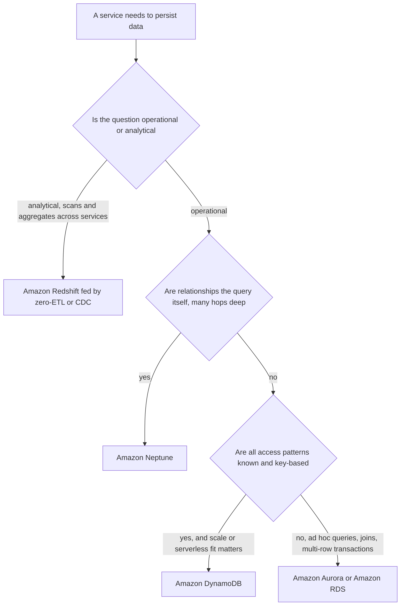

| Criterion | RDS and Aurora | DynamoDB | Neptune | Redshift |
|-----------|----------------|----------|---------|----------|
| Query style | SQL, joins, ad hoc | Key and index lookups only | Gremlin, openCypher, SPARQL traversals | SQL, large scans and aggregates |
| Connection model | Persistent TCP connections, pooled or proxied | Stateless HTTPS per request | WebSocket or HTTPS inside a VPC | JDBC/ODBC or the stateless Data API |
| Fit with Lambda | Needs RDS Proxy or Data API | Native fit | Good, inside a VPC | Data API |
| Scaling of writes | Vertical, single writer | Horizontal by partition | Vertical, single writer | Parallel ingestion, not OLTP |
| Change data capture | DMS, zero-ETL, activity streams | DynamoDB Streams, Kinesis | Neptune Streams | Consumer, not source |

!!! danger "The rule that connects all four parts"
    ==Analytics must never query service databases directly.== Operational stores in the first three parts are owned by individual services; the warehouse in the fourth part receives their data through zero-ETL integrations, change data capture or events. Breaking this rule couples services at the data layer and lets a reporting query take down a checkout path.

---

## Relational Databases with Amazon RDS and Aurora

!!! note "Foundations assumed from Chapter 1.5"
    ACID and isolation levels, CAP and PACELC, and the consistency models are covered in [Chapter 1.5 Core Concepts](../unit1/topic5.md#core-concepts) and are not repeated here.

---

### Definition

In the context of Unit VI, a ==relational database integration== is the set of architectural decisions and platform mechanisms through which application workloads (containers, functions, pipelines and analytics consumers) connect to, authenticate against, evolve, observe and extract change from a managed relational database, without compromising the database's transactional guarantees or availability.

Amazon RDS and Amazon Aurora supply the engine. The integration layer around them is made up of several distinct AWS capabilities:

| Integration concern | Primary AWS mechanisms |
|---|---|
| Connection management | Client-side pools, Amazon RDS Proxy, RDS Data API, AWS Advanced wrappers |
| Authentication | AWS Secrets Manager (including RDS-managed master passwords), IAM database authentication |
| Credential delivery to workloads | ECS `secrets`, External Secrets Operator, Secrets Store CSI Driver with the AWS provider, Lambda extensions and SDK caching |
| Schema evolution | Flyway, Liquibase or framework migrators run from CI/CD; RDS Blue/Green Deployments; Aurora fast clones |
| Change propagation | AWS DMS, native logical replication and binlog, Aurora zero-ETL integrations, Lambda invocation from Aurora |
| Horizontal write scale | Aurora Limitless Database, Aurora DSQL, or application sharding |
| Observability | CloudWatch Database Insights, Performance Insights, Enhanced Monitoring, engine logs, X-Ray and ADOT |
| Provisioning | CloudFormation, CDK, Terraform, ACK RDS controller |

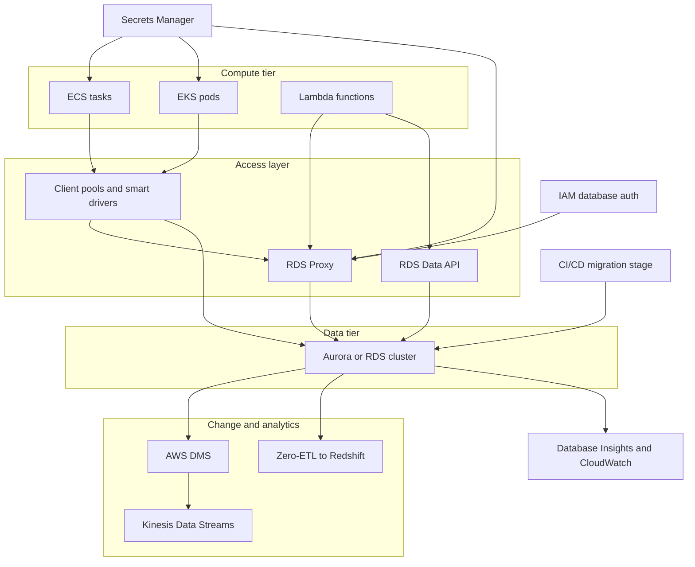

---

### Why This Service or Concept Exists

Relational databases were designed for a world of a few long-lived application servers, each holding a stable pool of connections, deployed a few times a year by a team that also owned the schema. Cloud-native systems violate every one of those assumptions:

| Traditional assumption | Cloud-native reality | Integration problem created |
|---|---|---|
| A few application servers | Hundreds of containers or thousands of function environments | Connection counts explode and fluctuate |
| Servers live for months | Tasks and pods live for minutes to days | Connection churn, TLS handshake cost, cold pools |
| Password in a configuration file | Credentials must rotate and never appear in images | Delivery and rotation of secrets to ephemeral workloads |
| One team owns the whole schema | Many teams own many services | Coupling through shared tables |
| Quarterly releases with downtime | Many deployments per day with zero downtime | Schema must change while two application versions run |
| Reporting runs against production | Analytics must not affect OLTP latency | Change must be streamed out, not queried out |
| A failover is a rare, manual event | Failover, patching and scaling are routine | Clients must reconnect quickly and correctly |

AWS responded by building integration capabilities around the engines rather than changing the engines' fundamental single-writer model:

- ==RDS Proxy== exists because connection-oriented protocols do not scale with function-per-request compute.
- ==IAM database authentication and RDS-managed Secrets Manager credentials== exist because static passwords are incompatible with least privilege and rotation.
- ==Blue/Green Deployments and fast clones== exist because database change is the riskiest part of continuous delivery.
- ==The Data API== exists because some consumers, such as Lambda functions and Amazon Bedrock Knowledge Bases, benefit from an HTTPS request model with no connection or VPC plumbing.
- ==Zero-ETL integrations== exist because hand-built extract-transform-load pipelines are expensive to maintain and are a common cause of stale analytics.
- ==Aurora Limitless Database and Aurora DSQL== exist because some workloads outgrow a single writer but still require SQL and transactions.

!!! tip "The architect's framing"
    The relational engine gives you correctness. The integration layer determines whether that correctness survives contact with elastic compute, continuous delivery and distributed teams. Most relational database incidents in cloud-native systems are not engine failures; they are ==integration failures==: exhausted connections, stale credentials, locking migrations, or clients that do not reconnect after failover.

---

### Core Concepts

#### Data ownership in a microservice system

[Chapter 4.1](../unit4/topic1.md) established that each microservice should own its data. For relational databases this principle has three practical implementations, and the choice among them is an engineering trade-off rather than a rule.

| Model | Description | Coupling | Operational cost | Typical use |
|---|---|---|---|---|
| Shared database, shared schema | Several services read and write the same tables | Very high: any schema change can break other services | Lowest | Legacy monolith being decomposed; to be avoided in new designs |
| Shared cluster, schema-per-service | One Aurora cluster, one PostgreSQL schema or MySQL database per service, each with its own database user | Moderate: schemas are isolated by grants, but compute, connections, maintenance windows and failures are shared | Low | Small to medium systems, cost-sensitive environments, early-stage microservices |
| Database-per-service (cluster-per-service) | Each service has its own RDS instance or Aurora cluster | Low: independent scaling, versions, maintenance and blast radius | Highest | Services with distinct scaling, compliance or availability profiles |

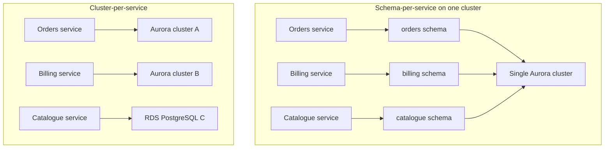

!!! warning "Schema-per-service is only isolation if grants enforce it"
    Placing each service in its own schema achieves nothing if every service connects as the same master user. Each service must have its own database role, granted privileges only on its own schema, and the master credential must be reserved for administration and migrations. Without this, a "separate schema" design is a shared database in disguise.

The decision is usually driven by four questions:

1. ==Do the services scale differently?== A write-heavy order service and a read-mostly catalogue service on one writer compete for the same CPU, buffer pool and connection limit.
2. ==Do they have different availability or compliance requirements?== A payment ledger that needs Global Database and customer-managed KMS keys should not force those costs onto a recommendation service.
3. ==How many teams are involved?== Separate teams benefit from separate maintenance windows, engine versions and parameter groups.
4. ==What is the cost floor?== Each Aurora cluster carries at least one instance or a Serverless v2 minimum. Twenty services with a Multi-AZ cluster each is a substantial fixed cost.

!!! example "A pragmatic progression"
    Many organisations start with a shared Aurora cluster and schema-per-service with strict grants, then ==promote a service to its own cluster when its metrics justify it==: sustained CPU contention, a noisy-neighbour incident, a compliance boundary, or a distinct scaling curve. Because each service already owns a schema and communicates with others only through APIs and events, the promotion is a data migration, not an architectural rewrite.

When data belonging to one service is needed by another, the options are an API call, an event carrying the required state (event-carried state transfer, [Chapter 1.7](../unit1/topic7.md#event-driven-core-concepts)), or a read-optimised projection maintained through change data capture. ==Direct cross-schema SQL joins between services are the coupling that database-per-service exists to prevent.==

#### The connection problem, quantified

A relational connection is a stateful, authenticated TCP session. On PostgreSQL each connection is a backend operating-system process consuming memory (commonly several megabytes before any query work memory is used). On MySQL each connection is a thread with per-connection buffers. Engines therefore cap connections, and RDS derives the default cap from instance memory.

| Engine | Default `max_connections` on RDS (indicative, verify in the parameter group) |
|---|---|
| RDS for PostgreSQL | `LEAST({DBInstanceClassMemory/9531392}, 5000)` |
| RDS for MySQL | `{DBInstanceClassMemory/12582880}` |
| Aurora PostgreSQL and Aurora MySQL | A per-instance-class default published in the Aurora documentation; Serverless v2 derives it from the maximum ACU setting |

!!! info "Serverless v2 and connection limits"
    For Aurora Serverless v2 the default connection limit is derived from the ==maximum== ACU configured, not the current capacity, so that scaling does not change the limit mid-flight. A cluster configured with a very low maximum ACU therefore also has a low connection limit. Verify the current formula in the Aurora documentation.

The demand side depends on the compute platform:

| Compute platform | Connection demand formula |
|---|---|
| ECS service | `max tasks × pool maximum per task` |
| EKS Deployment with HPA | `HPA maxReplicas × pool maximum per pod` (plus any sidecars or jobs that connect) |
| Lambda without a proxy | Up to `function concurrency × connections per environment`; cap it with reserved concurrency and create the connection outside the handler so warm environments reuse it |
| Batch jobs and migrations | Usually small but must be reserved |
| Administrative and monitoring | Reserve headroom, commonly 5 to 10 percent of the limit |

!!! example "Worked example: autoscaling multiplies connections"
    An order service runs on ECS Fargate with Service Auto Scaling between 4 and 40 tasks. Each task uses HikariCP with `maximumPoolSize = 20`. A second service on EKS scales to 25 pods with a pool of 10. A reporting job uses 5 connections.

    - ECS demand at maximum scale: `40 × 20 = 800`
    - EKS demand at maximum scale: `25 × 10 = 250`
    - Reporting: `5`
    - Total worst case: ==1,055 connections==

    The Aurora writer is a `db.r7g.large`. Its default connection limit is roughly one thousand (verify for your instance class). At peak scale-out, which is exactly when the business is busiest, new connections begin to fail. Nothing in either service's configuration is individually wrong; the failure is emergent from the combination.

#### Sizing a pool with Little's Law

Little's Law states that the average number of items in a system equals the arrival rate multiplied by the average time each item spends in the system: `L = λ × W`. Applied to a connection pool, `L` is the number of connections busy at any instant, `λ` is the rate of database operations, and `W` is how long each operation holds a connection.

!!! example "Worked example: how many connections does a task actually need?"
    Each ECS task serves 150 requests per second. Each request performs two queries inside one transaction, and the transaction holds a connection for an average of 8 ms.

    - Busy connections per task: `150 × 0.008 = 1.2`
    - Allowing for variance and bursts, a pool of 4 to 5 per task is ample.

    The team had configured 20 per task. At 40 tasks that is 800 connections, of which only about 50 are busy on average. ==Over-sized pools are the most common cause of connection exhaustion==, and they also hurt the database, because hundreds of mostly idle backends consume memory that could have served the buffer cache.

The database side has its own sizing limit. A widely cited guideline from the HikariCP project is that a database performs best with active connections in the order of `(CPU cores × 2) + effective spindle count`. Beyond that point, additional concurrent queries contend for CPU and locks and throughput falls. The purpose of pooling is therefore twofold: to cap total connections below the engine limit, and to ==queue excess work in the application rather than inside the database==.

| Pool parameter (HikariCP naming) | Guidance for cloud-native workloads |
|---|---|
| `maximumPoolSize` | Derive from Little's Law with headroom; keep small |
| `minimumIdle` | Equal to maximum for predictable latency, lower for bursty services |
| `connectionTimeout` | Short (for example 2 to 5 seconds) so requests fail fast instead of piling up |
| `maxLifetime` | Shorter than any server-side or proxy idle timeout, and short enough (for example 10 to 30 minutes) to rebalance across Aurora readers and pick up rotated credentials |
| `keepaliveTime` | Enable to detect dead connections after failover |
| Validation | Use the driver's `isValid` check rather than a test query where supported |

#### Where RDS Proxy fits

RDS Proxy moves pooling out of each application process into a managed, shared, highly available service. Many client connections are multiplexed onto a smaller number of database connections, and a database connection is borrowed only for the duration of a transaction rather than for the lifetime of a client session. The next section examines it in depth.

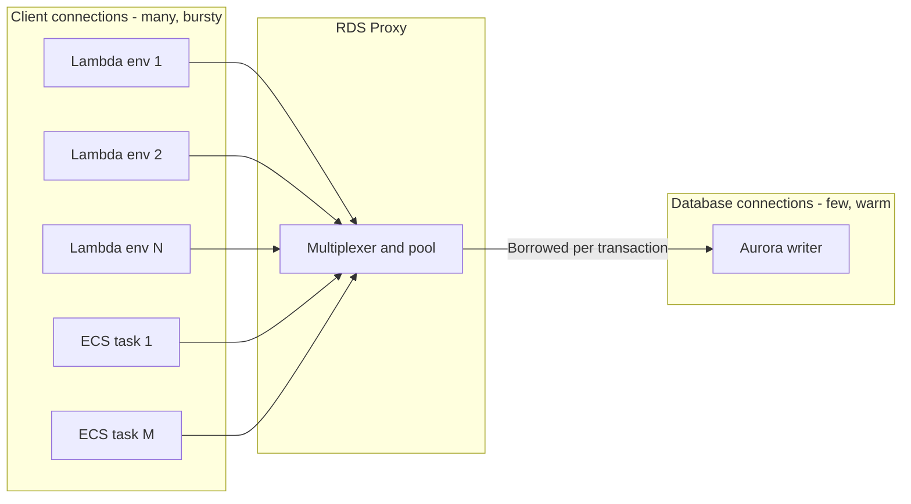

#### Authentication models

| Model | How the credential is obtained | Rotation | Suited to |
|---|---|---|---|
| Static password in configuration | Environment variable or file | Manual, rarely done | Nothing in production |
| Secrets Manager secret | Workload reads secret at start or on demand | Automatic, scheduled | Most container workloads |
| RDS-managed master password | RDS creates and rotates a Secrets Manager secret for the master user | Automatic, managed by RDS | Administrative and migration access |
| IAM database authentication | Workload generates a signed token from its IAM role; token valid for 15 minutes for new connections | No secret to rotate | Lambda, EKS Pod Identity or IRSA, ECS task roles, low connection-rate workloads |
| IAM at the proxy | Client authenticates to RDS Proxy with IAM; proxy uses a secret (or, where supported, IAM) to reach the database | Secret rotated centrally | High connection-rate workloads wanting IAM identity |

#### Schema evolution as a deployment concern

In a rolling or blue/green application deployment, the old and new versions of a service run simultaneously against one database. Any schema change must therefore be compatible with both versions for the duration of the rollout. This leads to the ==expand-contract== pattern (also called parallel change), examined in the Design Considerations section.

#### Change data capture

==Change data capture (CDC)== is the continuous extraction of committed row changes from a database's transaction log, in commit order, for delivery to downstream consumers. Reading the log rather than polling tables means CDC imposes little load, captures deletes, and preserves ordering. On PostgreSQL the log is the write-ahead log, exposed through ==logical replication slots==; on MySQL it is the ==binary log== in row format.

!!! warning "CDC is not the same as auditing"
    Database Activity Streams on Aurora deliver a near-real-time, encrypted stream of database activity (who ran which statement) to Kinesis Data Streams for security monitoring and compliance. It is an ==audit feed==, not a change feed; it does not give you reliable before-and-after row images to drive business events. Use DMS, logical replication or zero-ETL for data changes.

#### Failover-aware clients

RDS and Aurora failover is announced through DNS. A client that relies on DNS must wait for the record to change and for its own resolver cache to expire. ==Topology-aware clients== avoid this: they query the cluster's instance topology directly, detect the new writer, and reconnect to its instance endpoint within seconds. The AWS Advanced JDBC Wrapper and its sibling wrappers for other languages implement this, and RDS Proxy achieves a similar effect on the server side.

---

### AWS Service Deep Dive

This section opens with the engine fundamentals of Amazon RDS and Amazon Aurora, then examines the integration services and newer Aurora capabilities in turn.

#### Amazon RDS and Aurora engine fundamentals

##### Purpose

To provide a managed relational database that preserves full SQL compatibility, ACID transactions, referential integrity and the mature tooling ecosystem of established engines, while removing the operational burden of running them.

##### Supported engines

| Engine | Notes |
|---|---|
| **Amazon Aurora (MySQL-compatible)** | Cloud-native, wire-compatible with MySQL |
| **Amazon Aurora (PostgreSQL-compatible)** | Cloud-native, wire-compatible with PostgreSQL |
| **MySQL** | Community MySQL |
| **PostgreSQL** | Community PostgreSQL, with a wide extension catalogue |
| **MariaDB** | MySQL fork |
| **Oracle** | Bring Your Own Licence or Licence Included |
| **Microsoft SQL Server** | Multiple editions; Licence Included or BYOL under specific terms |
| **IBM Db2** | Available in RDS with BYOL |

!!! tip "Choosing an Engine"
    For a greenfield cloud-native application with no licence constraints, **Aurora PostgreSQL** is the strong default: PostgreSQL's extension ecosystem (including `pgvector` for embeddings, `PostGIS` for geospatial and `pg_stat_statements` for query analysis) combined with Aurora's storage architecture is difficult to beat. Choose Oracle or SQL Server only when an existing application genuinely requires them; the licence cost frequently exceeds the infrastructure cost.

##### Architecture

Standard RDS: an EC2-based instance with EBS storage, optionally with a synchronous standby and asynchronous read replicas.

Aurora: a fleet of compute instances sharing a distributed, log-structured, six-way-replicated storage service.

##### Important features

| Feature | Available In | Description |
|---|---|---|
| Multi-AZ deployment | RDS and Aurora | Automatic failover to another AZ |
| Read replicas | RDS and Aurora | Up to 15 Aurora Replicas; RDS engine limits are lower (commonly 5 or 15 depending on engine) |
| Automated backups with PITR | Both | Retention configurable from 1 to 35 days |
| Manual snapshots | Both | Retained until explicitly deleted; copyable across Regions and accounts |
| Encryption at rest with KMS | Both | Must be enabled at creation for RDS; cannot be added in place |
| IAM database authentication | Both (MySQL and PostgreSQL) | Short-lived token instead of a password |
| Performance Insights | Both | Database load visualised by wait event and by SQL statement |
| Enhanced Monitoring | Both | OS-level metrics at up to 1-second granularity |
| RDS Proxy | Both | Connection pooling and multiplexing |
| Blue/Green Deployments | RDS and Aurora (MySQL and PostgreSQL) | A synchronised staging environment for low-risk upgrades and schema changes |
| Aurora Serverless v2 | Aurora only | Fine-grained automatic capacity scaling |
| Aurora Global Database | Aurora only | Cross-Region replication with sub-second typical lag |
| Aurora Backtrack | Aurora MySQL only | Rewind the cluster in place to a prior point without a restore |
| Aurora fast database cloning | Aurora only | Copy-on-write clone created in minutes regardless of size |
| Zero-ETL integration with Redshift | Aurora | Near-real-time analytics without building a pipeline |
| Aurora I/O-Optimized | Aurora | A pricing configuration that removes per-I/O charges in exchange for higher instance and storage rates |

##### Limitations

| Limitation | Consequence |
|---|---|
| Single writer (standard configuration) | Write throughput ultimately bounded by one instance |
| No OS access | Cannot install arbitrary agents or modify the OS |
| Restricted superuser | Some engine features requiring true superuser are unavailable |
| Encryption cannot be enabled in place | Requires snapshot, encrypted copy, restore |
| Major version upgrades require care | Potential downtime and application incompatibility |
| Aurora is not available on all engines | Only MySQL and PostgreSQL compatibility |
| Storage cannot be reduced | RDS storage can be increased but never decreased |
| Cross-Region read replica lag | Subject to inter-Region network latency |

##### Pricing model

Charges accrue along these dimensions. Always verify current rates on the AWS pricing pages, as they vary by Region and change over time.

| Dimension | Description |
|---|---|
| Instance hours | Per second, with a 10-minute minimum, by instance class |
| Storage | Per GB-month provisioned (RDS) or consumed (Aurora) |
| Provisioned IOPS | Charged separately for `io1` and `io2` volume types |
| I/O requests | Aurora Standard charges per million requests; Aurora I/O-Optimized does not |
| Backup storage | Free up to the size of the database; charged beyond that |
| Snapshot export to S3 | Per GB exported |
| Data transfer | Cross-AZ and cross-Region transfer charges apply |
| Backtrack | Per million change records stored |
| Licence | Included in the hourly rate for Licence Included Oracle and SQL Server |

RDS Proxy, Serverless v2, Data API and other integration pricing is listed under [Consolidated service characteristics](#consolidated-service-characteristics).

!!! warning "Aurora I/O Charges Surprise People"
    With Aurora Standard, every read that misses the buffer pool and every write to storage is a billable I/O. A poorly indexed, scan-heavy workload can accumulate an I/O bill exceeding the instance cost. **Aurora I/O-Optimized** eliminates per-I/O charges for a higher instance and storage rate; AWS guidance is that it becomes economical when I/O exceeds roughly 25 percent of your total Aurora spend. Check the `VolumeReadIOPs` and `VolumeWriteIOPs` metrics and compute the crossover for your workload.

##### Performance characteristics

| Metric | Typical Behaviour |
|---|---|
| Point read latency | Sub-millisecond from buffer pool; low single-digit milliseconds from storage |
| Commit latency (single-AZ) | Around 1 ms |
| Commit latency (Multi-AZ) | Around 2 to 5 ms due to the cross-AZ round trip |
| Aurora commit latency | Low, because only redo log records are written and only a 4-of-6 quorum is required |
| Aurora replica lag | Typically tens of milliseconds |
| RDS read replica lag | Milliseconds to seconds, workload-dependent |
| Throughput claim | AWS states Aurora MySQL can deliver up to roughly five times standard MySQL throughput and Aurora PostgreSQL up to roughly three times standard PostgreSQL, on equivalent hardware  treat these as vendor benchmark figures, not guarantees for your workload |

##### Scaling behaviour

| Axis | RDS | Aurora |
|---|---|---|
| Compute vertical | Modify instance class; brief downtime or failover | Same, plus Serverless v2 in-place scaling |
| Storage | Increase manually, or enable storage autoscaling; cannot decrease | Automatic in 10 GiB increments; no action required |
| Read horizontal | Add read replicas | Add Aurora Replicas, up to 15 |
| Write horizontal | Not supported natively  requires application-level sharding | Aurora Limitless Database addresses this for supported configurations; otherwise the same constraint applies |
| Cross-Region | Cross-Region read replica | Aurora Global Database |

##### Availability and durability

| Configuration | Availability Characteristics | Durability Characteristics |
|---|---|---|
| Single-AZ RDS | No automatic failover; an AZ failure is an outage | EBS-backed, plus automated backups to S3 |
| Multi-AZ RDS instance | Automatic failover, typically 60–120 seconds | Synchronous standby means near-zero RPO for AZ failure |
| Multi-AZ DB cluster | Faster failover, plus two readable standbys | Semi-synchronous commit |
| Aurora | Survives an AZ loss without failover of storage; instance failover typically under 30 seconds | Six copies across three AZs; continuous backup to S3 |
| Aurora Global Database | Regional failure survivable; promotion in minutes | Typical cross-Region RPO under one second |

##### Service limits

Most RDS limits are **soft quotas** adjustable through AWS Support, and several vary by Region and engine version. Verify current values in the Service Quotas console rather than memorising them.

| Limit | Typical Default | Adjustable |
|---|---|---|
| DB instances per Region | 40 | Yes |
| Manual snapshots per Region | 100 | Yes |
| Read replicas per source (engine-dependent) | 5 or 15 | Sometimes |
| Aurora Replicas per cluster | 15 | No |
| Aurora cluster storage maximum | 128 TiB for recent engine versions | No |
| Backup retention | 1 to 35 days | No  use manual snapshots or AWS Backup for longer |
| Maximum database connections | Determined by a formula based on instance memory | Configurable via parameter group |
| Security groups per DB instance | Small, engine-independent limit | Yes |

##### Common configurations

| Scenario | Recommended Configuration |
|---|---|
| Production OLTP | Aurora PostgreSQL, Multi-AZ with at least one reader, encryption on, 14–35 day backup retention, RDS Proxy, Performance Insights enabled |
| Development and test | Aurora Serverless v2 with a low minimum ACU, or a small single-AZ RDS instance, 1-day backups |
| Read-heavy public content | Aurora with several readers behind the reader endpoint, plus ElastiCache in front |
| Reporting isolation | A dedicated read replica or a custom endpoint targeting reporting-sized readers |
| Regulated multi-Region | Aurora Global Database with a customer-managed KMS key in each Region |
| Legacy commercial engine | RDS for Oracle or SQL Server, Multi-AZ, with licence model chosen deliberately |

#### Amazon RDS Proxy

##### Purpose

RDS Proxy is a fully managed database proxy that pools and shares database connections, reduces failover disruption, and centralises authentication for RDS for MySQL, RDS for PostgreSQL, RDS for MariaDB, RDS for SQL Server, Aurora MySQL and Aurora PostgreSQL (verify current engine and version support). It is the standard answer when many short-lived or highly concurrent clients must reach a relational database.

##### Architecture

A proxy is deployed into subnets of your VPC across multiple Availability Zones and is reached only from inside the VPC (or from connected networks). It is not publicly accessible. It consists of:

| Component | Role |
|---|---|
| Proxy endpoint | The DNS name clients connect to. The default endpoint is read/write and targets the writer |
| Additional endpoints | Read-only endpoints that target Aurora readers, or endpoints placed in other VPCs |
| Target group | Defines the database (instance or cluster) behind the proxy and the connection pool configuration |
| Authentication configuration | One or more Secrets Manager secrets for database users, plus client authentication settings (password or IAM) |
| IAM role | Lets the proxy read the secrets (and decrypt them with KMS) |

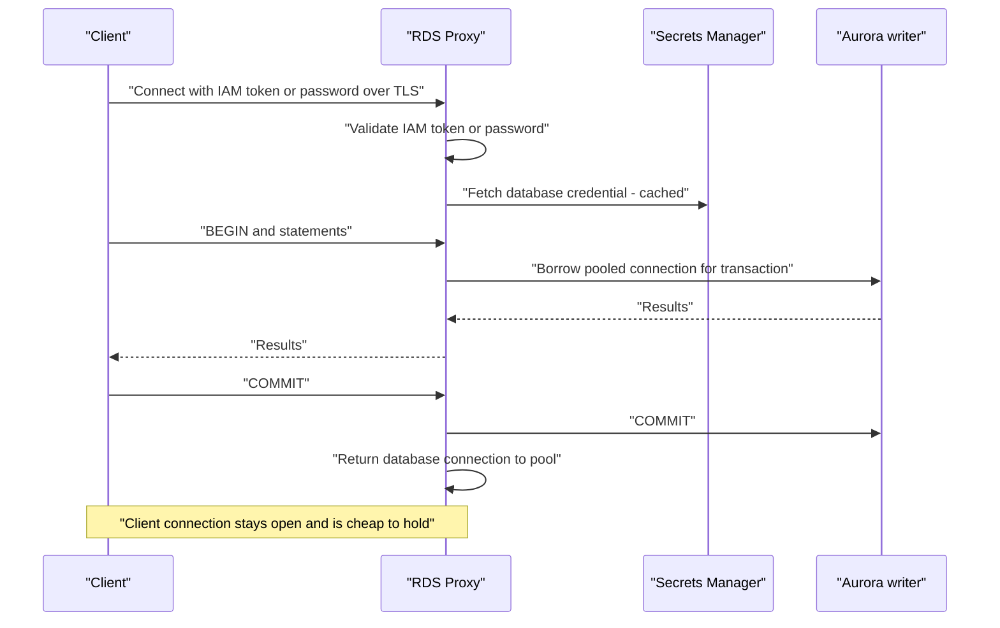

##### Multiplexing and transaction-level reuse

RDS Proxy reuses a database connection for a different client ==at transaction boundaries==. While a client is inside a transaction, the underlying database connection is dedicated to it. Between transactions, the same database connection may serve another client. This is what allows thousands of client connections to share tens of database connections.

##### Session pinning

Multiplexing is only safe if nothing about the database session is specific to one client. When a client does something that creates ==session state==, the proxy cannot hand the connection to anyone else, and it ==pins== that client to that database connection until the client disconnects. A pinned connection behaves like an unpooled one.

| Common pinning triggers | Engine |
|---|---|
| `SET` of session variables (for example `SET search_path`, `SET time_zone`), unless excluded by a pinning filter | PostgreSQL and MySQL |
| Temporary tables | PostgreSQL and MySQL |
| Session-level advisory locks, `LOCK TABLES` | PostgreSQL and MySQL |
| User-defined variables (`SET @x`) | MySQL |
| Prepared statements in some forms, and `PREPARE`/`DEALLOCATE` statements | Engine- and version-dependent |
| `LISTEN`/`NOTIFY`, `WITH HOLD` cursors | PostgreSQL |
| Statements larger than the proxy's internal buffer | PostgreSQL and MySQL |

Pinning is observable: the CloudWatch metric `DatabaseConnectionsCurrentlySessionPinned` counts pinned connections, and proxy logs (when enhanced logging is briefly enabled) record the reason. Remedies are:

- Move session initialisation into the proxy's ==initialization query== (`InitQuery`), so that every database connection is created with the same settings and clients do not issue `SET` statements.
- Use the ==session pinning filter== `EXCLUDE_VARIABLE_SETS`, which tells the proxy not to pin on variable assignments. This is safe only if every client sets the same values or does not depend on them.
- Configure ORMs and drivers to avoid server-side prepared statements where they cause pinning, or confirm that your engine version handles them without pinning.
- Keep transactions short so that non-pinned connections return to the pool quickly.

!!! danger "A proxy with 100 percent pinning is an expensive no-op"
    Teams frequently deploy RDS Proxy in front of a Java or Python ORM, see no reduction in database connections, and conclude the proxy "does not work". The usual cause is that the ORM issues a `SET` on every new connection or uses a pinning construct. ==Always check `DatabaseConnectionsCurrentlySessionPinned` after enabling a proxy.==

##### Connection pool configuration

| Setting | Meaning | Guidance |
|---|---|---|
| `MaxConnectionsPercent` | Maximum database connections the proxy may open, as a percentage of the database's `max_connections` | Leave headroom for administration, migrations and other proxies; for example 70 to 90 |
| `MaxIdleConnectionsPercent` | How many idle database connections the proxy keeps open | Lower values release resources, higher values reduce latency for bursts |
| `ConnectionBorrowTimeout` | How long a client waits for a pooled connection before an error | Align with application timeouts; a long value hides saturation |
| `IdleClientTimeout` (proxy level) | How long an idle client connection is kept | Shorter than Lambda environment lifetimes is unnecessary; long values are fine because client connections are cheap |
| `InitQuery` | SQL run when each database connection is opened | Use for `SET` statements that would otherwise pin |
| `SessionPinningFilters` | Categories of operations that do not cause pinning | `EXCLUDE_VARIABLE_SETS` where safe |
| `RequireTLS` | Enforce TLS between client and proxy | Enable in production |

##### Authentication at the proxy

RDS Proxy separates ==client-to-proxy== authentication from ==proxy-to-database== authentication.

- Client to proxy: native database password, or IAM authentication. With IAM, the client generates an authentication token signed with its IAM role and presents it as the password; the IAM policy grants `rds-db:connect` on the ==proxy's== resource ID.
- Proxy to database: the proxy retrieves the database user's credential from Secrets Manager using its own IAM role. Because the proxy reads the secret on demand, ==Secrets Manager rotation does not require client changes==. AWS has also introduced an option for the proxy to authenticate to the database using IAM itself (sometimes described as end-to-end IAM authentication), which removes the need to store a database secret for that user. Verify availability for your engine and Region before designing around it.

This separation has a significant consequence. IAM database authentication directly against an instance has a limit on the rate of new IAM-authenticated connections that AWS advises should stay modest (verify current guidance). Placing a proxy in front allows high connection-rate clients such as Lambda to use IAM identity while the proxy holds a small number of long-lived database connections.

##### Failover behaviour

When the writer of an Aurora cluster or Multi-AZ RDS deployment fails over, the proxy detects the new writer by monitoring the database, not by waiting for DNS. Client connections to the proxy remain open. In-flight transactions on the failed writer are lost and must be retried by the application, but idle clients typically see no disconnection. AWS has published figures indicating that the proxy can substantially reduce application-observed failover time for Aurora and RDS; treat vendor figures as indicative and measure with a forced failover in your own environment.

!!! tip "Proxy and smart drivers are complementary, not exclusive"
    RDS Proxy handles pooling and failover centrally. A topology-aware driver handles failover in the client. For Lambda, the proxy is almost always the right tool. For long-running ECS or EKS services with well-sized client pools, either approach works; choose the proxy when you also need connection-count protection or IAM at scale, and the smart driver when you want to avoid the proxy's cost and additional network hop.

##### Read-only endpoints

For Aurora clusters, you can create an additional proxy endpoint with the `READ_ONLY` role. It distributes connections across Aurora readers, and if no reader is available it rejects connections rather than sending reads to the writer. This gives a pooled equivalent of the Aurora reader endpoint.

##### Limitations

- RDS Proxy adds a network hop, typically adding a small amount of latency per round trip. For chatty, many-statement transactions this is measurable.
- Pinning can negate its benefit, as described above.
- It does not perform read/write splitting on its own; the application must choose the read/write or read-only endpoint.
- It is reachable only from within a VPC (or peered, Transit Gateway or VPN networks) and cannot be made public.
- Some engine features and protocols are unsupported; check the documentation for your engine version.
- A proxy holding open database connections can prevent an Aurora Serverless v2 instance from pausing when scale-to-zero is configured.

##### Pricing model and recommendations

RDS Proxy is priced per vCPU-hour of the underlying provisioned database instances, or per ACU-hour for Aurora Serverless v2, with a minimum charge (indicative, as of 2026; verify in the Pricing Calculator). The cost therefore scales with database size rather than with traffic. It is usually justified when any of the following holds: Lambda or other highly elastic clients connect; connection storms have caused incidents; IAM authentication is required at high connection rates; or failover time must be reduced without changing application drivers.

#### IAM database authentication in depth

IAM database authentication replaces a password with a short-lived token. The workload's IAM role must allow `rds-db:connect` on a resource ARN of the form `arn:aws:rds-db:us-east-1:111122223333:dbuser:<DbiResourceId or cluster resource ID>/<db_username>`. The database user must be marked as IAM-enabled: in PostgreSQL by granting the `rds_iam` role, in MySQL by creating the user with the `AWSAuthenticationPlugin`.

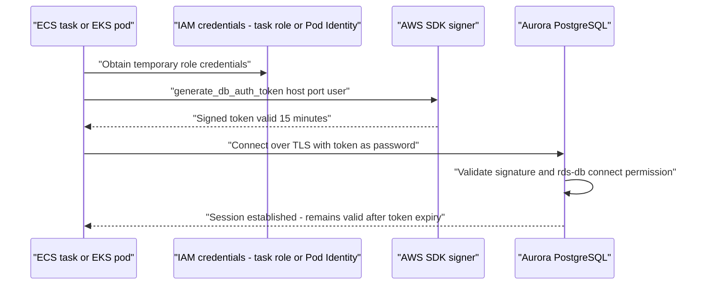

| Property | Detail |
|---|---|
| Token lifetime | 15 minutes, for establishing new connections only; an established connection is not terminated when the token expires |
| Transport | TLS is required |
| Engines | MySQL, MariaDB and PostgreSQL families on RDS and Aurora (verify current list) |
| Rate consideration | AWS advises IAM authentication for workloads with moderate new-connection rates; use RDS Proxy for high connection churn |
| Authorisation | Remains in the database: IAM only authenticates; `GRANT` statements still control what the user can do |

!!! note "Why IAM authentication suits Kubernetes and Lambda"
    With EKS Pod Identity or IRSA ([Chapter 3.1](../unit3/topic1.md#core-concepts-eks-security-and-iam-integration)), each Kubernetes service account maps to an IAM role. With IAM database authentication, that role maps to a database user. The result is a chain of identity from pod to SQL grant ==with no secret stored anywhere==, which is exactly the property security teams want in multi-tenant clusters.

#### RDS Data API

##### Purpose

The Data API exposes SQL execution as an HTTPS API (`rds-data`). A caller sends `ExecuteStatement` or `BatchExecuteStatement` requests containing the cluster ARN, the ARN of a Secrets Manager secret, the database name and SQL with parameters. There is no driver, no persistent connection and no requirement for the caller to be in the VPC.

##### Architecture and features

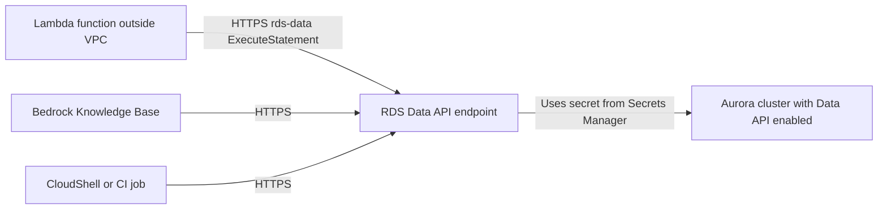

| Aspect | Detail |
|---|---|
| Supported clusters | Aurora PostgreSQL and Aurora MySQL, provisioned and Serverless v2, on supported versions (verify) |
| Operations | `ExecuteStatement`, `BatchExecuteStatement`, `BeginTransaction`, `CommitTransaction`, `RollbackTransaction` |
| Authentication | IAM to call the API, plus a Secrets Manager secret for the database user |
| Transactions | Supported via a transaction ID that spans calls, with a timeout |
| Results | Typed records, or JSON-formatted records; response size is capped per call (verify current limits) |
| Auditing | Calls are recorded in CloudTrail, which is a significant audit benefit |

##### When to use it

- Lambda functions that make a small number of queries per invocation and would otherwise need VPC attachment, RDS Proxy and a driver layer.
- Administrative scripts and CI/CD steps that must run SQL without network access to the VPC.
- Services that integrate over the Data API, such as Amazon Bedrock Knowledge Bases with an Aurora PostgreSQL vector store, which requires the Data API to be enabled.

##### Limitations

- Per-request overhead is higher than a pooled connection; it is unsuited to high-throughput, low-latency request paths with many statements per request.
- Result size and request duration limits make it unsuitable for large exports.
- Some engine-specific data types and features are mapped imperfectly; test carefully.
- Throughput of the Data API itself is subject to quotas; verify in Service Quotas.

#### RDS Blue/Green Deployments

##### Purpose

A Blue/Green Deployment creates a synchronised copy (green) of a production database (blue), lets you apply changes to green, and then switches production traffic to green, typically in under a minute, with guardrails. It is designed for major version upgrades, parameter changes, instance class changes and ==replication-compatible schema changes==.

##### Architecture

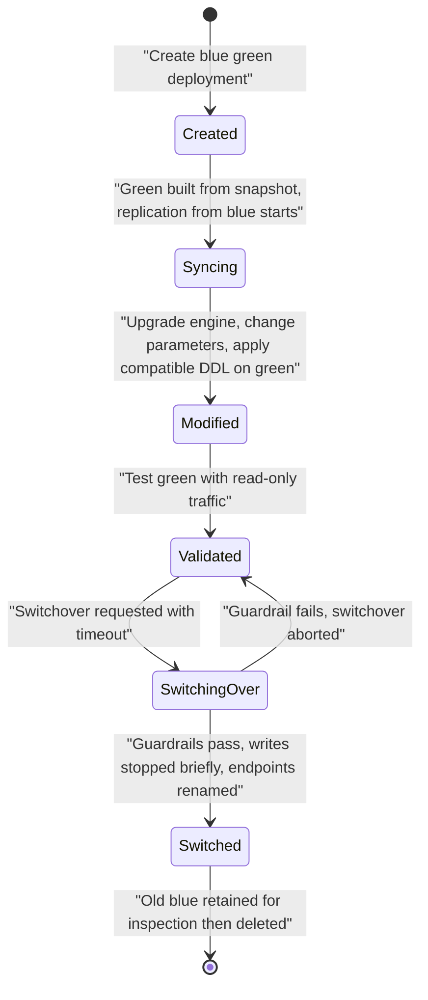

| Feature | Detail |
|---|---|
| Replication | Binary log replication for MySQL-family engines; logical replication for PostgreSQL-family engines |
| Green writability | Green is read-only by default so that writes do not diverge from blue |
| Switchover | Stops writes on blue, waits for green to catch up, renames endpoints so green takes blue's names, and reports progress through events |
| Guardrails | Checks such as replication lag and long-running transactions; the switchover times out rather than proceeding unsafely |
| Endpoint continuity | Applications keep the same endpoint names; no connection string change is needed |

##### Limitations and schema change rules

Because green is kept current by replication from blue, a schema change on green must not break replication of blue's writes. Additive changes such as adding a nullable column at the end of a table or adding an index are generally compatible; renaming or dropping columns that blue still writes are not. PostgreSQL logical replication does not replicate DDL, so schema changes made on blue during the deployment are not propagated. Check the engine-specific limitations list before relying on Blue/Green for schema work.

!!! tip "Blue/Green complements expand-contract, it does not replace it"
    Blue/Green gives a fast, low-risk switchover for ==infrastructure-level== change: an engine upgrade from PostgreSQL 15 to 17, a parameter group change, a move to Graviton. For ==application-level== schema evolution during normal feature delivery, expand-contract migrations executed by the pipeline remain the primary tool. Use both.

#### Aurora fast clones for test environments

!!! tip "Aurora Fast Cloning Is Underused and Extremely Valuable"
    An Aurora clone shares the source's storage using copy-on-write, so creating a full-size copy of a 10 TB production database takes minutes and initially costs almost nothing in storage  you pay only for the pages that subsequently diverge. This makes it practical to test a destructive schema migration against a genuine copy of production data before running it for real. In a CI/CD context, this is the correct way to validate migrations, and it directly addresses the DSO303 outcome on CI/CD and database change management.

In a delivery pipeline, clones become an environment factory:

| Pipeline use | How a clone helps |
|---|---|
| Migration rehearsal | Run the new migration against a clone of production to measure lock duration and runtime on real data volumes |
| Performance testing | Test a new query plan or index against production-scale data without touching production |
| Ephemeral review environments | Create a clone per pull request, run integration tests, delete it afterwards |
| Incident analysis | Clone production at the moment of an incident for forensic queries |
| Data masking | Clone, run a masking job, then share the masked clone with lower environments |

!!! warning "Clones carry production data"
    A clone is a full copy of production data, including personal and payment data. Treat clones as production from a security perspective: restrict who can create them, place them in production-grade subnets, and run a ==masking or tokenisation step== before any developer or test tool is given access. Cross-account cloning (via AWS RAM) is useful for isolating test accounts, but the data classification travels with the clone.

Clones are billed for their own compute and for storage pages that diverge from the source. A clone left running for weeks under heavy write load gradually accumulates its own storage. Automate deletion in the pipeline.

#### Aurora Serverless v2 in integration context

Aurora Serverless v2 scales compute in Aurora capacity units (ACUs). Two integration-relevant properties deserve attention.

##### Scale to zero with automatic pause

Aurora Serverless v2 supports a minimum capacity of ==0 ACUs== on supported engine versions. When an instance has had no user connections for a configured period (`SecondsUntilAutoPause`), it pauses and compute charges stop; storage charges continue. The next connection attempt resumes the instance, which AWS describes as taking in the order of seconds (commonly cited as around 15 seconds; verify for your engine version).

| Consideration | Implication |
|---|---|
| Resume latency | The first request after a pause waits for resume. Acceptable for development, test and internal tools; rarely acceptable for customer-facing request paths |
| Open connections | Any open connection, including idle pool connections, RDS Proxy connections, monitoring agents and replication, can prevent the pause |
| Client timeouts | Connection timeouts must exceed the resume time or the first request fails |
| Multi-instance clusters | Readers and writers pause according to their own settings and roles; confirm the behaviour for reader instances in the documentation |
| Features that keep the instance busy | Some features, such as certain replication or integration configurations, prevent pausing; verify the current list |

!!! tip "Where scale to zero pays off"
    Ephemeral pull-request environments, nightly-only batch databases, training and lab environments, and per-tenant databases for dormant tenants. In those cases a cluster that costs only storage while idle changes the economics of database-per-environment and database-per-tenant designs.

##### Capacity range and connection limits

The maximum ACU setting bounds both cost and the default connection limit. A range such as 0.5 to 4 ACUs is a reasonable development default; production ranges should be derived from load testing, and the minimum should be high enough that buffer-cache warmth is preserved during quiet periods.

#### Aurora Limitless Database

##### Purpose

Aurora Limitless Database is a capability of Aurora PostgreSQL that scales ==writes and storage horizontally== across multiple shards while presenting a single database endpoint and PostgreSQL interface. It targets workloads that have exceeded what the largest single writer instance can deliver.

##### Architecture

| Component | Role |
|---|---|
| DB shard group | The set of compute resources that make up the Limitless deployment, scaled in ACUs |
| Routers | Accept connections, parse queries, route them to shards and coordinate distributed transactions |
| Shards | Each stores a portion of the data and processes queries for it |
| Sharded tables | Tables distributed across shards by a shard key |
| Collocated tables | Sharded tables that use the same shard key so that related rows land on the same shard |
| Reference tables | Small tables replicated to every shard to avoid cross-shard joins |

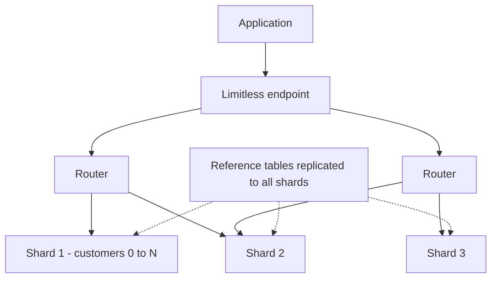

##### Positioning

Limitless keeps the relational model and PostgreSQL compatibility, but ==data modelling becomes shard-aware==: choosing the shard key, collocating related tables and keeping transactions single-shard where possible decide performance, much as partition key choice does in DynamoDB. Some PostgreSQL features have restrictions under Limitless; review the compatibility list. Treat it as an option when a relational workload has outgrown a single writer and cannot reasonably be decomposed, not as a default.

#### Amazon Aurora DSQL

##### Purpose

Aurora DSQL is a serverless, distributed SQL database with PostgreSQL compatibility, designed for ==active-active operation== with strong consistency, both within a Region and across Regions. There are no instances to size and no failover to manage; compute, transaction processing and storage scale independently.

##### Characteristics relevant to architects

| Characteristic | Implication |
|---|---|
| Serverless, no instances | No capacity planning; billing is usage-based (verify current pricing dimensions) |
| Active-active, multi-Region | Applications can read and write in more than one Region against one logical database; multi-Region clusters use peered Regions with a witness Region (verify current topology) |
| Optimistic concurrency control | Transactions do not take locks; conflicting transactions fail at commit and must be ==retried by the application== |
| PostgreSQL compatible, not identical | A subset of PostgreSQL features is supported; features such as foreign key constraints and some extensions have been unsupported at launch; check the current compatibility list |
| Transaction limits | Limits on rows modified, transaction size and duration apply; long-running batch updates must be chunked |
| IAM-based authentication | Connections authenticate with IAM-generated tokens |

!!! warning "DSQL is not a drop-in replacement for Aurora PostgreSQL"
    An application written for PostgreSQL with pessimistic locking, long transactions, heavy use of extensions and database-enforced foreign keys may need material changes to run well on DSQL. Conversely, a new service designed for DSQL from the start, with short idempotent transactions and application-level retry, gains multi-Region active-active SQL without the operational burden of Global Database failover. ==Evaluate DSQL as a design target, not as a migration target, and verify feature support at design time, as the service has been evolving rapidly.==

##### Choosing among the relational options

| Requirement | Aurora provisioned or Serverless v2 | Aurora Limitless | Aurora DSQL | DynamoDB (the Amazon DynamoDB part of this section) |
|---|---|---|---|---|
| Full PostgreSQL or MySQL compatibility | Yes | PostgreSQL, with restrictions | PostgreSQL subset | No, key-value API |
| Write scale beyond one instance | No | Yes | Yes | Yes |
| Multi-Region active-active writes | No (Global Database has one writer Region) | No | Yes, strongly consistent | Yes, Global Tables |
| Operational model | Instances or ACUs | Shard group in ACUs | Fully serverless | Fully serverless |
| Concurrency control | Locks and MVCC | Locks and MVCC, distributed | Optimistic, retry on conflict | Conditional writes and transactions |
| Maturity and ecosystem | Highest | Newer | Newest | Very high |

#### Aurora zero-ETL integration with Amazon Redshift

A zero-ETL integration replicates data from an Aurora cluster (and, on supported versions, RDS for MySQL and RDS for PostgreSQL; verify current sources) into an Amazon Redshift provisioned cluster or Redshift Serverless workgroup, typically within seconds of commit. AWS manages the initial seeding and the continuous replication; you create the integration and then a database in Redshift from it.

| Aspect | Detail |
|---|---|
| Purpose | Near-real-time analytics without building or operating pipelines |
| Filtering | Data filters can include or exclude databases, schemas and tables |
| Load on source | Uses log-based replication rather than queries, so OLTP impact is low |
| Schema changes | Many DDL changes propagate; some cause a table to be resynchronised; test with your migration pattern |
| Destination | Redshift, where analytics, materialised views and data sharing are available ([Data Warehousing with Amazon Redshift](#data-warehousing-with-amazon-redshift)) |

!!! note "Zero-ETL moves data, not meaning"
    The replicated tables in Redshift mirror the OLTP schema, which is normalised for transactions, not for analysis. You still need transformations, typically as Redshift materialised views or dbt models, to build analytical models. Zero-ETL removes the pipeline plumbing, not the data modelling.

#### Change data capture paths

| Path | Mechanism | Latency | Best for |
|---|---|---|---|
| AWS DMS task with CDC | Reads binlog or logical replication; targets include Kinesis Data Streams, Amazon MSK, S3, OpenSearch, DynamoDB and other databases | Seconds | Streaming row changes to many targets, migrations, data lake ingestion |
| AWS DMS Serverless | Same as above without sizing replication instances | Seconds | Variable CDC volumes |
| Debezium on Amazon MSK Connect | Open-source connectors reading logical replication or binlog into Kafka topics | Sub-second to seconds | Kafka-centric architectures, rich event envelopes |
| Native logical replication | PostgreSQL publications and subscriptions between databases | Sub-second | Database-to-database replication, blue/green-style migrations |
| Aurora zero-ETL | Managed replication to Redshift | Seconds | Analytics |
| Transactional outbox plus CDC | Application writes an `outbox` row in the same transaction as business data; CDC publishes it | Seconds | Reliable domain events without dual writes |
| Lambda invocation from Aurora | Aurora MySQL native functions or the Aurora PostgreSQL `aws_lambda` extension call Lambda from SQL | Synchronous or asynchronous | Occasional notifications; avoid for high-volume or critical event publication |

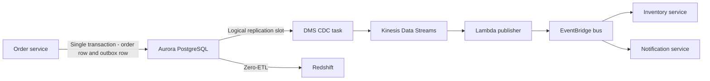

!!! danger "Replication slots can fill a disk"
    A PostgreSQL logical replication slot retains write-ahead log until its consumer confirms it. If a DMS task or Debezium connector stops, WAL accumulates. On RDS for PostgreSQL this consumes allocated storage and can exhaust it; on Aurora it grows the volume and cost. Alarm on the `OldestReplicationSlotLag` and `TransactionLogsDiskUsage` style metrics for your engine, and ==drop slots belonging to decommissioned consumers==.

#### AWS Advanced JDBC Wrapper and sibling wrappers

The AWS Advanced JDBC Wrapper is an open-source wrapper around standard JDBC drivers (PostgreSQL, MySQL, MariaDB) that adds cluster awareness through plugins. Sibling projects provide similar capabilities for Python (the AWS Advanced Python Wrapper, wrapping `psycopg` and MySQL Connector/Python), Node.js and other languages (verify the current list and maturity for your language).

| Plugin capability | Effect |
|---|---|
| Failover | Maintains a cached cluster topology; on connection loss it identifies the new writer and reconnects to its instance endpoint without waiting for DNS |
| Enhanced failure monitoring | Detects an unresponsive host proactively rather than waiting for socket timeouts |
| Read/write splitting | Switches the underlying connection to a reader when the application sets the connection read-only, and back to the writer otherwise |
| IAM authentication | Generates IAM tokens transparently |
| Secrets Manager | Fetches and refreshes credentials transparently |
| Blue/Green awareness | Newer versions can coordinate with Blue/Green switchovers (verify availability) |

!!! warning "Failover plugins expect correct error handling"
    After a successful failover the wrapper raises a specific exception to indicate that the connection was replaced and the ==current transaction was lost==. The application must catch it and retry the whole transaction. A wrapper does not make in-flight transactions survive a failover; it only makes reconnection fast.

#### Read/write splitting options

| Technique | Where the decision is made | Notes |
|---|---|---|
| Separate writer and reader endpoints configured as two data sources | Application | Simple and explicit; framework support such as routing data sources in Spring |
| RDS Proxy read/write endpoint plus a read-only endpoint | Application chooses endpoint; proxy pools | Adds pooling to the reader path |
| AWS Advanced wrapper read/write splitting plugin | Driver, driven by the read-only flag | Transparent to most application code |
| Aurora custom endpoints | Operations team groups readers | Isolates reporting readers from interactive readers |

Whichever technique is used, apply the read-your-own-writes rule: reads that must reflect a just-completed write go to the writer.

#### pgvector for generative AI retrieval

The `pgvector` extension, available on Aurora PostgreSQL and RDS for PostgreSQL, adds a `vector` data type, distance operators and approximate nearest neighbour indexes (HNSW and IVFFlat). It allows a relational database to act as the vector store for retrieval-augmented generation (RAG).

| Consideration | Guidance |
|---|---|
| Why use it | Embeddings live next to the relational data they describe; filters, joins, transactions and access control apply to vector search |
| Index choice | HNSW generally gives better recall and query speed at the cost of build time and memory; IVFFlat builds faster and uses less memory |
| Memory | Vector indexes are large; size instances so the index fits in memory for low latency |
| Integration | Amazon Bedrock Knowledge Bases can use Aurora PostgreSQL as a vector store (via the Data API); applications can call Bedrock embedding models and store results directly |
| Scale boundary | For very large vector collections or search-heavy workloads, compare with Amazon OpenSearch Service vector search |

#### CloudWatch Database Insights, Performance Insights and Enhanced Monitoring

| Tool | What it shows | Granularity | Typical question answered |
|---|---|---|---|
| CloudWatch metrics | Instance-level metrics such as CPU, connections, latency, replica lag | 1 minute (some at higher resolution) | Is the database healthy? |
| Enhanced Monitoring | Operating system metrics and process list, collected by an agent | 1 to 60 seconds | Is the host CPU, memory or I/O saturated, and by which process? |
| Performance Insights | Database load (average active sessions) by wait event, SQL, user and host | Seconds | Which queries and waits are consuming the database? |
| CloudWatch Database Insights | A consolidated database observability experience in CloudWatch with fleet-level views, per-instance dashboards, and in the Advanced mode, deeper SQL-level analysis and longer retention | Seconds to minutes | Which databases in the fleet are unhealthy, and why? |

CloudWatch metric, alarm and dashboard mechanics are covered in [7.1 Monitoring](../unit7/topic1.md#infrastructure-and-application-monitoring-with-amazon-cloudwatch); this table covers only the database-specific tools. AWS has been consolidating Performance Insights capabilities into CloudWatch Database Insights. New designs should plan on Database Insights (Standard or Advanced mode) as the primary tool and verify the current status of the standalone Performance Insights experience.

!!! tip "Connect database load to application traces"
    Database load alone tells you which SQL is expensive. A trace from AWS X-Ray or the AWS Distro for OpenTelemetry tells you which API call issued it. Instrument JDBC or `psycopg` calls with ADOT so that trace spans carry the SQL operation, then correlate the span with the Database Insights top-SQL view. This turns "the database is slow" into "the `GET /orders` endpoint issues an unindexed query".

#### Consolidated service characteristics

##### Pricing model and recommendations

| Component | Pricing dimensions (indicative, as of 2026, verify in the Pricing Calculator) | Recommendation |
|---|---|---|
| RDS Proxy | vCPU-hours or ACU-hours of the target database, minimum charge | Use where elastic clients or failover requirements justify it |
| Data API | Per request, with a free allowance in some cases (verify) | Suitable for low-to-moderate request volumes |
| Blue/Green | Green environment billed as ordinary instances while it exists | Delete old blue promptly after switchover |
| Fast clones | Clone compute plus diverged storage | Automate deletion; use Serverless v2 for clones |
| Serverless v2 | ACU-hours; zero when paused, storage always billed | Scale to zero for non-production |
| Limitless | ACU-hours of the shard group plus storage and I/O | Adopt only when single-writer limits are reached |
| DSQL | Usage-based distributed processing and storage units (verify) | Evaluate with a representative workload |
| Zero-ETL | No charge for the integration itself in many cases; source change capture and Redshift compute and storage are billed (verify) | Filter to required tables |
| DMS | Replication instance hours or DMS Serverless capacity units | Right-size; stop tasks for decommissioned consumers |
| Database Insights | Standard mode included; Advanced mode priced per vCPU or ACU (verify) | Advanced for production tier-one databases |

##### Performance characteristics

| Path | Relative latency per query |
|---|---|
| Pooled direct connection within an AZ | Lowest |
| Through RDS Proxy | Slightly higher: one extra hop |
| Through the Data API | Higher: HTTPS request, authentication and result marshalling per call |
| First query after scale-to-zero pause | Seconds while the instance resumes |
| Cross-AZ connection | Adds cross-AZ round-trip time and data transfer cost |

##### Scaling behaviour

RDS Proxy scales its own capacity automatically with the target database size. The Data API scales as a Regional service within quotas. Serverless v2 scales in fine-grained increments. Limitless scales shard group capacity and can add shards. DSQL scales without configuration. The single-writer limit of standard Aurora is unchanged by any of the access-layer services.

##### Availability

RDS Proxy is deployed across multiple AZs and is itself highly available. The Data API is a Regional service. Blue/Green switchover is designed for brief write unavailability, typically under a minute. Aurora DSQL is designed for active-active availability across AZs and, in multi-Region configurations, across Regions.

##### Security features

TLS for all client paths with certificate verification; IAM authentication at instance, cluster and proxy; Secrets Manager integration with automatic rotation; KMS encryption for secrets and storage, including automated backups, snapshots and replicas; private subnet placement; CloudTrail logging of control-plane and Data API calls; security groups for proxy and database; Database Activity Streams for audit on Aurora; engine-native audit logging exported to CloudWatch Logs.

##### Service limits

| Limit | Indicative value (as of 2026, verify in Service Quotas) |
|---|---|
| RDS proxies per account per Region | A small default quota, adjustable |
| Secrets per proxy | Limited; one secret per database user |
| Additional endpoints per proxy | Limited, adjustable |
| IAM database authentication token lifetime | 15 minutes |
| Aurora Serverless v2 minimum capacity | 0 ACU (with auto-pause) or 0.5 ACU, engine-version dependent |
| Aurora Serverless v2 maximum capacity | Up to 256 ACU on recent versions |
| Clones per source volume | Limited; verify |
| Data API response size and request duration | Capped per call; verify |
| Blue/Green switchover timeout | Configurable within a range |

---

### Important AWS Terminology

Terms such as Multi-AZ, read replica, ACU, PITR, cluster endpoint and RDS Proxy are defined in the [Chapter 1.5 glossary](../unit1/topic5.md#important-aws-terminology). The following terms are introduced in this part.

| Term | Meaning |
|---|---|
| Connection multiplexing | Serving many client sessions with fewer database connections by reusing a database connection between transactions |
| Session pinning | RDS Proxy dedicating a database connection to one client because the client created session state that cannot be shared |
| Initialization query | SQL that RDS Proxy runs on each new database connection, used to set session parameters uniformly |
| Session pinning filter | A proxy setting that tells RDS Proxy to ignore certain operations, such as variable sets, when deciding whether to pin |
| Target group (RDS Proxy) | The database instance or cluster behind a proxy and its connection pool configuration |
| IAM authentication token | A SigV4-signed string, valid for 15 minutes, used in place of a password to open a database connection |
| `rds-db:connect` | The IAM action permitting a principal to connect as a specific database user |
| RDS-managed master password | A master user credential created, stored and rotated in Secrets Manager by RDS itself |
| Alternating users rotation | A Secrets Manager rotation strategy that switches between two database users so that one is always valid |
| Data API | The HTTPS `rds-data` API for executing SQL on Aurora without a driver or persistent connection |
| Blue/Green Deployment | A managed, replicated staging copy of a database with a guarded switchover that renames endpoints |
| Switchover | The act of promoting the green environment to production in a Blue/Green Deployment |
| Expand-contract | A migration pattern that adds new schema elements first, migrates usage, and removes old elements last |
| Migration history table | The table in which Flyway (`flyway_schema_history`) or Liquibase (`DATABASECHANGELOG`) records applied migrations |
| Change data capture (CDC) | Continuous extraction of committed changes from a database log for downstream consumers |
| Logical replication slot | A PostgreSQL construct that retains and decodes WAL for a specific consumer |
| Transactional outbox | A table written in the same transaction as business data, from which events are published by CDC |
| Zero-ETL integration | A managed, continuous replication from an operational database to an analytics store |
| Database Activity Streams | An encrypted, near-real-time stream of database activity to Kinesis Data Streams, used for auditing |
| Topology-aware driver | A client driver that discovers cluster instances and fails over by instance endpoint rather than DNS |
| Scale to zero (auto-pause) | Aurora Serverless v2 behaviour in which an idle instance with minimum 0 ACU pauses compute billing |
| DB shard group | The compute and routing resources of an Aurora Limitless Database deployment |
| Shard key | The column or columns that determine on which shard a row of a sharded table is stored |
| Reference table | A small table copied to every shard in Aurora Limitless Database |
| Optimistic concurrency control (OCC) | A concurrency model in which transactions proceed without locks and conflicts are detected at commit, as in Aurora DSQL |
| Database Insights | CloudWatch's consolidated database observability capability with Standard and Advanced modes |
| ACK RDS controller | The AWS Controllers for Kubernetes component that manages RDS resources from Kubernetes custom resources |

---

### Configuration Options

#### Engine, instance and storage settings

| Configuration | Options and guidance |
|---|---|
| Engine and version | PostgreSQL, MySQL, MariaDB, Oracle, SQL Server, Db2, Aurora PostgreSQL, Aurora MySQL. Prefer Aurora when the workload benefits from its storage architecture and read scaling; prefer community engines when portability or licence cost dominates |
| Instance class | `db.t` burstable for development, `db.m` general purpose, `db.r` memory-optimised for large working sets, `db.x` for extreme memory. Graviton-based classes usually offer better price-performance |
| Deployment option | Single-AZ for non-production only; Multi-AZ instance deployment for standard high availability; Multi-AZ DB cluster for faster failover and two readable standbys; Aurora cluster for the storage-decoupled architecture |
| Storage type | `gp3` general purpose for most workloads, `io1` or `io2` Provisioned IOPS for sustained high I/O with low latency variance. Aurora manages storage automatically |
| Storage auto scaling | Enable it, with a maximum threshold. Running out of storage takes a database offline |
| Backup retention | Zero disables automated backups and point-in-time recovery entirely; production should use seven to thirty-five days |
| Backup window and maintenance window | Set explicitly to low-traffic periods rather than accepting the default |
| Parameter group | Custom groups allow tuning of `max_connections`, `work_mem`, `shared_buffers`, timeouts, and logging. Note that static parameters require a reboot |
| Option group | Engine-specific features such as Oracle Transparent Data Encryption, SQL Server Audit, or MariaDB audit plugin |
| Encryption at rest | Enable at creation with a KMS key; it cannot be enabled in place (see [8.3 Data Protection](../unit8/topic3.md#encryption-at-rest-with-aws-kms)) |
| Performance Insights | Enable it. The retention period beyond the free tier is billable but the diagnostic value is high |
| Deletion protection | Enable in production; it prevents accidental deletion through the API or console |
| Aurora Serverless v2 capacity range | Minimum and maximum Aurora Capacity Units; the minimum determines both cost floor and cold-scaling behaviour |

#### Connection access path

| Option | When to choose |
|---|---|
| Direct pooled connection to cluster endpoints | Long-running ECS or EKS services with bounded, well-sized pools |
| Direct connection with AWS Advanced wrapper | As above, plus fast failover and read/write splitting without a proxy |
| RDS Proxy (read/write endpoint) | Lambda, bursty scale-out, many services on one database, IAM at high connection rates |
| RDS Proxy read-only endpoint | Pooled access to Aurora readers |
| Data API | Low-volume Lambda, administrative tasks, Bedrock Knowledge Bases, clients outside the VPC |

#### RDS Proxy settings

| Setting | Typical production value | Reason |
|---|---|---|
| `EngineFamily` | `POSTGRESQL`, `MYSQL` or `SQLSERVER` | Must match the target |
| `RequireTLS` | `true` | Encrypt client-to-proxy traffic |
| `Auth.IAMAuth` | `REQUIRED` for IAM-only clients | Removes client passwords |
| `IdleClientTimeout` | Default (1800 seconds) or adjusted to client behaviour | Client connections are inexpensive to hold |
| `MaxConnectionsPercent` | 70 to 90 | Leave headroom for administration and migrations |
| `MaxIdleConnectionsPercent` | 30 to 50 | Balance warm capacity against resource use |
| `ConnectionBorrowTimeout` | Matched to application request timeout | Fail fast under saturation |
| `SessionPinningFilters` | `EXCLUDE_VARIABLE_SETS` only after review | Reduce pinning safely |
| `InitQuery` | `SET TIME ZONE 'UTC'` or equivalent | Standardise session state |
| Debug logging | Off, except briefly during diagnosis | Logs may contain SQL text |

#### Secrets and authentication

| Option | Setting |
|---|---|
| Master credential | `ManageMasterUserPassword: true` so RDS creates and rotates the secret |
| Application credentials | One Secrets Manager secret per service user, with rotation on a schedule |
| Rotation strategy | Alternating users for services that cache credentials; single user for services that always fetch at connect time |
| Rotation schedule | Commonly 30 to 90 days for application users; RDS-managed master secrets default to a 7-day rotation (verify) |
| IAM authentication | `EnableIAMDatabaseAuthentication: true` on the cluster, plus `rds_iam` grants per user |

#### Aurora Serverless v2 capacity

| Environment | Minimum ACU | Maximum ACU | Auto-pause |
|---|---|---|---|
| Pull-request or lab environment | 0 | 2 to 4 | 5 to 30 minutes |
| Shared development | 0 or 0.5 | 4 to 8 | Optional |
| Production, spiky | Sized to keep buffer cache warm, for example 2 to 8 | From load test | Disabled |
| Production reader for failover | Match writer minimum if promotion tier 0 or 1 | Match writer | Disabled |

#### Migration tooling

| Tool | Strengths | Integration notes |
|---|---|---|
| Flyway | Simple versioned SQL files (`V1__init.sql`), repeatable scripts, broad engine support | Runs as CLI, container image or library; history in `flyway_schema_history` |
| Liquibase | Database-agnostic changelogs (YAML, XML, SQL), preconditions, rollback definitions, contexts | History in `DATABASECHANGELOG`, lock in `DATABASECHANGELOGLOCK` |
| Framework migrators (Alembic, Django, Rails, Prisma, EF Core) | Close to application models | Ensure they run as a separate step, not at every application start |

#### Execution environment for migrations

| Environment | Mechanism |
|---|---|
| ECS | A one-off `RunTask` of a migration task definition in the pipeline, before the service update |
| EKS | A Kubernetes `Job`, a Helm `pre-upgrade` hook, or an Argo CD `PreSync` hook |
| CodeBuild | A build project attached to the VPC with network access to the database |
| CloudFormation or CDK | A custom resource backed by Lambda, suitable for small migrations only |
| Data API | For environments where network access is not possible, with care over statement size and duration |

---

### Design Considerations

#### Scalability

The access layer scales; the writer does not. RDS Proxy, the Data API and client pools manage ==how many clients== can reach the database, but the number of transactions the writer can commit per second is still bounded by one instance. Scaling strategies in order of increasing disruption are: query and index optimisation; caching ([Chapter 6.1 on ElastiCache](../unit6/topic1.md#caching-strategies-with-amazon-elasticache)); read offload to readers; vertical scaling or Serverless v2 range increase; functional decomposition into database-per-service; and finally horizontal write scaling with Aurora Limitless, Aurora DSQL or a move of the hottest access pattern to DynamoDB.

#### Availability and failover handling end to end

| Layer | Requirement |
|---|---|
| Database | Multi-AZ Aurora with at least one reader in another AZ at promotion tier 0 or 1 |
| Access path | RDS Proxy or topology-aware driver; if neither, low DNS TTL caching in the client (for example the JVM `networkaddress.cache.ttl`) |
| Pool | Connection validation, keepalive, short `maxLifetime`, short `connectionTimeout` |
| Application | Retry the whole transaction on connection loss, with exponential backoff and jitter and an overall deadline |
| Idempotency | Retries must not duplicate business effects: use idempotency keys or unique constraints |
| Verification | Regular forced failovers in non-production and periodically in production, observed through traces and metrics |

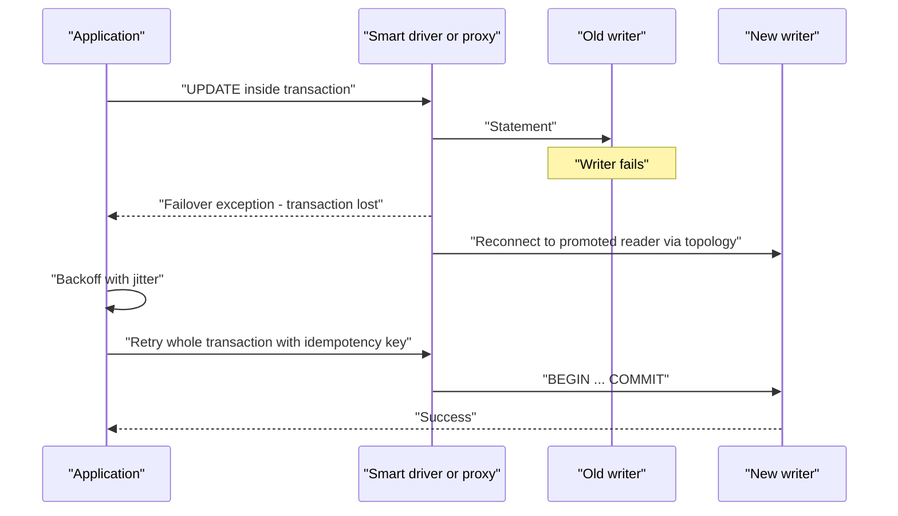

#### Reliability of schema change: expand-contract

The expand-contract pattern decomposes an incompatible change into a sequence of compatible changes, each deployable independently.

!!! example "Renaming a column without downtime"
    Requirement: rename `orders.cust_ref` to `orders.customer_id`.

    | Phase | Database change | Application change | Both versions compatible? |
    |---|---|---|---|
    | Expand | Add nullable `customer_id` column | None | Yes |
    | Dual write | None | Version N+1 writes both columns, reads old | Yes |
    | Backfill | Batch job copies `cust_ref` to `customer_id` in small batches | None | Yes |
    | Switch reads | Add constraints or index on `customer_id` (created concurrently) | Version N+2 reads new column, still writes both | Yes |
    | Stop old writes | None | Version N+3 writes only new column | Yes, once N+2 is fully rolled out |
    | Contract | Drop `cust_ref` | None | Yes, once no version reads it |

    Each row is a separate pipeline run. A failure at any phase can be rolled back by redeploying the previous application version, because the database still supports it.

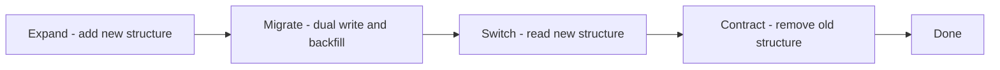

#### Lock-aware DDL

The duration of a lock matters more than the duration of a migration. Guidelines by engine:

| Operation | PostgreSQL guidance | MySQL guidance |
|---|---|---|
| Add a nullable column | Fast, metadata only | Use `ALGORITHM=INSTANT` where supported |
| Add a column with a constant default | Fast on modern PostgreSQL versions | `INSTANT` on supported versions |
| Create an index | `CREATE INDEX CONCURRENTLY`, outside a transaction | Online DDL with `ALGORITHM=INPLACE, LOCK=NONE` |
| Add a foreign key | Add as `NOT VALID`, then `VALIDATE CONSTRAINT` separately | Online on supported versions; test on a clone |
| Change a column type | Usually rewrites the table; prefer expand-contract | Often a table copy; prefer expand-contract |
| Any DDL | Set `lock_timeout` so the migration fails rather than queuing behind a long transaction and blocking everyone | Set `lock_wait_timeout` |

!!! danger "The lock queue outage"
    A migration issues `ALTER TABLE orders ADD COLUMN ...`. It needs a brief exclusive lock, but a long-running analytics query holds a shared lock on `orders`. The `ALTER` waits, and ==every subsequent query on `orders` queues behind the waiting `ALTER`==. Within seconds the connection pool is exhausted and the service is down, although the migration itself would have taken milliseconds. Setting `lock_timeout` to a few seconds converts this outage into a failed pipeline step that can be retried.

#### Migrations in the delivery pipeline

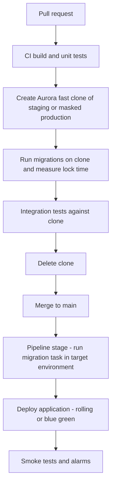

Design rules for the migration stage:

- ==Migrations run once per environment, as a dedicated step==, not at every container start. Running migrations on application start races between replicas, slows scale-out and couples deployment of compute with change of data.
- The migration identity is separate from the runtime identity: it holds DDL privileges; the runtime user holds only DML on its schema.
- Migrations are forward-only in production. Rollback is achieved by deploying a compatible application version, which expand-contract guarantees. Down-migrations are useful in development only.
- The pipeline must stop if a migration fails, and the migration tool's lock table must be checked for stale locks after an interrupted run.
- Long backfills run as separate, throttled, resumable jobs, not inside the migration transaction.

#### Latency

Keep application tasks, proxies and the writer in the same AZ where practical for chatty workloads, but never at the expense of Multi-AZ placement. Prefer set-based SQL over many small round trips; each round trip through a proxy adds latency. Use readers for read-heavy endpoints tolerant of lag.

#### Cost

Connection-heavy designs cost more in instance memory; proxies cost in proportion to database size; clones and Blue/Green environments cost while they exist; zero-ETL costs Redshift capacity. The usual cost failures are forgotten green environments, forgotten clones, oversized non-production clusters without scale to zero, and DMS replication instances running for decommissioned consumers.

#### Maintainability and operational complexity

Every added component (proxy, CDC pipeline, zero-ETL integration, smart driver) is a component that can fail and must be monitored. Add each for a demonstrated reason. A small team with three services, modest traffic and one Aurora cluster may need none of them beyond Secrets Manager and a migration tool.

---

### AWS Best Practices

#### Operational Excellence

- Define clusters, instances, parameter groups, proxies and secrets in IaC; never modify production databases through the console.
- Treat migrations as versioned code, reviewed and executed by the pipeline, rehearsed on fast clones.
- Use Blue/Green Deployments for engine major version upgrades and parameter changes.
- Maintain runbooks for failover, restore, slot cleanup and credential rotation failure, and rehearse them.

#### Security

- Deliver credentials through Secrets Manager or IAM authentication only; no passwords in images, task definitions, Helm values or Git.
- One database user per service, least-privilege grants, separate migration user.
- Enforce TLS at the proxy (`RequireTLS`) and at the engine (`rds.force_ssl` for PostgreSQL, `require_secure_transport` for MySQL).
- Enable Database Activity Streams or engine audit logging for regulated data.

#### Reliability

- Use RDS Proxy or topology-aware drivers so that failover is measured in seconds.
- Retry whole transactions with idempotency guarantees.
- Monitor replication slots and CDC lag; stale consumers are a reliability risk to the database itself.
- Place at least one reader at a high promotion tier with capacity equal to the writer.

#### Performance Efficiency

- Size pools with Little's Law; smaller pools often perform better.
- Offload reads to readers and analytics to Redshift via zero-ETL.
- Use Database Insights to find top SQL by load before scaling hardware.
- Use Graviton instance classes and Serverless v2 where load varies.

#### Cost Optimization

- Scale non-production Serverless v2 clusters to zero.
- Delete Blue/Green and clone environments automatically after use.
- Review RDS Proxy value: it is priced by database size, so a large database with few clients may not justify one.
- Use Reserved Instances or Database Savings Plans where eligible for steady production capacity (verify current coverage of Savings Plans for databases).

#### Sustainability

- Right-size and consolidate idle databases; a paused Serverless v2 instance consumes no compute.
- Replace polling-based integration with CDC, which avoids repeated scans.
- Prefer Graviton-based instance classes for better performance per watt.

---

### Security Considerations

#### IAM and least privilege for each workload

Each workload has its own IAM role, and that role is granted only what it needs.

| Workload | IAM role | Permissions needed |
|---|---|---|
| ECS service | Task execution role (to inject secrets at start) and task role (runtime calls) | Execution role: `secretsmanager:GetSecretValue` on its secret, `kms:Decrypt` on the key. Task role: `rds-db:connect` if using IAM auth |
| EKS pod | IAM role mapped through EKS Pod Identity or IRSA | `secretsmanager:GetSecretValue` for the operator or CSI driver path, or `rds-db:connect` |
| Lambda | Execution role | `rds-db:connect` on the proxy, or `rds-data:ExecuteStatement` plus `secretsmanager:GetSecretValue` for the Data API |
| RDS Proxy | Proxy role | `secretsmanager:GetSecretValue` on target secrets, `kms:Decrypt` |
| Migration job | Migration role | Access to the migration user's secret only |
| CI/CD pipeline | Pipeline role | Permission to run the migration task or job, not direct database credentials |

#### Secrets Manager rotation integrated with compute

Rotation changes the password in the database and in the secret. The integration question is ==when each workload notices==.

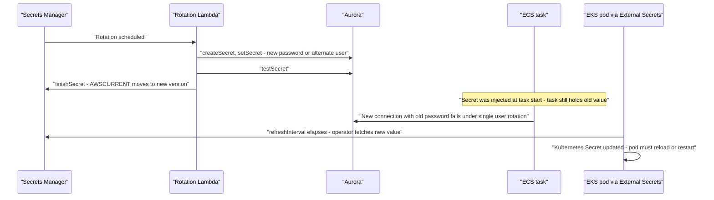

| Delivery mechanism | Behaviour on rotation | Mitigation |
|---|---|---|
| ECS task definition `secrets` (injected as environment variables) | Value is resolved ==only at task start==; running tasks keep the old value | Use alternating users rotation so the previous credential remains valid; or force a new deployment after rotation (for example via an EventBridge rule on the rotation event); or fetch the secret in code with a caching client |
| External Secrets Operator (`ExternalSecret` syncing into a Kubernetes `Secret`) | Kubernetes `Secret` updated after `refreshInterval`; environment variables in running pods do not change; mounted files update after kubelet sync | Mount as files and reload, or use a reloader controller to roll pods on change |
| Secrets Store CSI Driver with the AWS provider (ASCP) | Mounted file updated if rotation reconciliation is enabled; optional sync to Kubernetes `Secret` | Application re-reads the file on authentication failure |
| SDK with caching client (for example `aws-secretsmanager-caching`) | Cache refreshes on TTL; application can force refresh on authentication failure | Implement refresh-on-auth-failure |
| Lambda Parameters and Secrets extension | Local cache with TTL | Short TTL, refresh on failure |
| RDS Proxy | Proxy fetches the new secret itself | No client change needed |
| IAM database authentication | No secret to rotate | None needed |

!!! tip "Alternating users is the safe default for cached credentials"
    With single-user rotation, the old password stops working the moment rotation completes, so any workload still holding it fails on its next new connection. With ==alternating users==, rotation switches `AWSCURRENT` to a second database user while the first user's password remains valid until the next rotation. Workloads holding the previous value continue to work, giving time for tasks to be replaced naturally.

#### Encryption and KMS

Use customer-managed KMS keys for clusters holding regulated data, for Secrets Manager secrets, and for Database Activity Streams. Key policies should allow only the service roles and administrators that require them. Snapshots and clones inherit encryption; cross-account sharing of encrypted snapshots requires sharing the key. See [8.3 Data Protection](../unit8/topic3.md#encryption-at-rest-with-aws-kms) for KMS key types, key policies and envelope encryption.

#### Network controls

- Database security group: inbound on the engine port only from the proxy's security group, the application security groups and the migration job's security group, by security group reference.
- Proxy security group: inbound from application security groups.
- Interface VPC endpoints for Secrets Manager, KMS, STS and CloudWatch Logs so that private workloads never need a NAT gateway for credential retrieval.
- Network ACLs as coarse defence in depth only.
- Never enable `PubliclyAccessible`; for human access use Session Manager port forwarding through a bastion or the Data API.

#### Logging and compliance

| Log source | Purpose |
|---|---|
| CloudTrail | Control-plane changes and Data API calls |
| Engine logs (PostgreSQL log, MySQL error, slow and audit logs) exported to CloudWatch Logs | Query diagnostics and audit |
| `pgaudit` extension on PostgreSQL | Statement-level audit |
| Database Activity Streams | Tamper-resistant activity feed for security monitoring tools |
| RDS Proxy logs | Connection and pinning diagnostics (enable briefly) |
| AWS Config rules | Detect public, unencrypted or unbacked databases |

---

### Performance Optimization

| Technique | Mechanism | When it helps |
|---|---|---|
| Right-sized pools | Fewer, busier connections | Almost always |
| RDS Proxy | Multiplexing, warm connections | Connection churn, Lambda |
| Prepared statements (where not pinning) | Avoid repeated parsing | High-frequency identical queries |
| Batch writes | Multi-row `INSERT`, `COPY` | Bulk ingestion |
| Read offload | Readers, reader endpoints, custom endpoints | Read-heavy traffic tolerant of lag |
| Caching | ElastiCache cache-aside ([Chapter 6.1](../unit6/topic1.md#caching-strategies-with-amazon-elasticache)) | Hot, repeated reads |
| Query tuning | Database Insights top SQL, `EXPLAIN ANALYZE` | Before any hardware change |
| Indexing | Composite and partial indexes | Selective predicates |
| Parallelism in backfills | Chunked, keyed batches with limited concurrency | Large data migrations without saturating the writer |
| Connection reuse in Lambda | Initialise client outside the handler | Warm invocations |
| Serverless v2 minimum capacity | Preserve buffer cache | Spiky production traffic |
| Analytics offload | Zero-ETL to Redshift | Reporting queries harming OLTP |

!!! warning "Lambda SnapStart and database connections"
    With Lambda SnapStart, the initialisation phase runs once and a snapshot of memory is reused for many execution environments. A database connection opened during initialisation is captured in the snapshot and is ==invalid after restore==. Open connections lazily in the handler, or re-establish them in a runtime after-restore hook.

---

### Cost Optimization

| Lever | Practice |
|---|---|
| Pricing model | Understand whether the cluster is instance-hour, ACU-hour or usage based; Aurora Standard versus I/O-Optimized (see [Pricing model](#pricing-model) above) |
| Pay-as-you-go | Serverless v2 for variable load; scale to zero for idle environments |
| Reserved capacity | Reserved Instances (and, where eligible, Savings Plans) for steady production writers and readers |
| Spot | Not applicable to databases; use Spot for migration and backfill compute in ECS or EKS instead |
| Storage | Drop unused indexes and tables; archive cold data to S3 via export and query with Athena |
| Lifecycle policies | Automated deletion of clones, Blue/Green leftovers and manual snapshots after a retention period |
| Rightsizing | Use Database Insights and Compute Optimizer recommendations; consolidate small databases on one cluster with schema-per-service where coupling permits |
| Proxy economics | RDS Proxy cost scales with database size; remove it where client behaviour does not require it |
| Cost Explorer | Tag clusters by service and environment; track cost per service |
| Trusted Advisor | Identify idle or underutilised RDS instances |

!!! example "Worked example: ephemeral environments with scale to zero"
    A team runs 30 pull-request environments per month, each needing a database for about 6 active hours spread over 3 days. With always-on provisioned instances, each environment accrues roughly 72 instance-hours. With Serverless v2 at minimum 0 ACU and a 10-minute auto-pause, each environment accrues roughly 6 active hours at low ACU plus pause-transition time, and storage. The compute cost falls by roughly an order of magnitude; the exact figure depends on ACU consumption and Regional pricing, which you should compute in the Pricing Calculator.

---

### Integration with Other AWS Services

| Service | Why it integrates | Architecture example |
|---|---|---|
| Amazon ECS | Primary host for containerised services that own relational data | Fargate tasks with `secrets` from Secrets Manager, pools to RDS Proxy, migration `RunTask` in CodePipeline |
| Amazon EKS | Kubernetes-hosted services | Pod Identity role, External Secrets Operator or CSI driver, Helm pre-upgrade migration Job, ACK-managed clusters |
| AWS Lambda | Event-driven and API functions | Lambda to RDS Proxy with IAM auth, or to the Data API without VPC attachment |
| Amazon API Gateway | Front door for APIs backed by relational services | API Gateway to Lambda to RDS Proxy |
| AWS Secrets Manager | Credential storage and rotation | RDS-managed master secret; per-service secrets with alternating users rotation |
| AWS KMS | Encryption of storage, snapshots, secrets and activity streams | Customer-managed key per data classification |
| AWS CodePipeline and CodeBuild | Migration and deployment automation | Clone, migrate, test, deploy sequence |
| AWS DMS | CDC and migration | Aurora to Kinesis Data Streams for event publication |
| Amazon Kinesis Data Streams and Amazon MSK | Transport for change events and activity streams | DMS or Debezium into streams, Lambda consumers |
| Amazon EventBridge | Domain event distribution | Outbox events published to a bus with rules per consumer ([Chapter 1.7](../unit1/topic7.md#event-driven-core-concepts)) |
| Amazon Redshift | Analytics | Zero-ETL integration from Aurora |
| Amazon S3 | Snapshot export, archival, data lake | Snapshot export to Parquet, `aws_s3` extension for import and export |
| Amazon Bedrock | Generative AI retrieval | Knowledge Base using Aurora PostgreSQL with `pgvector` via the Data API |
| Amazon ElastiCache | Read offload | Cache-aside in front of Aurora readers |
| AWS Backup | Policy-driven backups and cross-account copies | Backup plan with vault lock for ransomware resilience |
| Amazon CloudWatch, X-Ray, ADOT | Observability | Database Insights plus traced SQL spans |
| AWS Controllers for Kubernetes | Kubernetes-native provisioning | `DBCluster` custom resources reconciled by the ACK RDS controller |

#### Reference architecture: a relational microservice on ECS and EKS

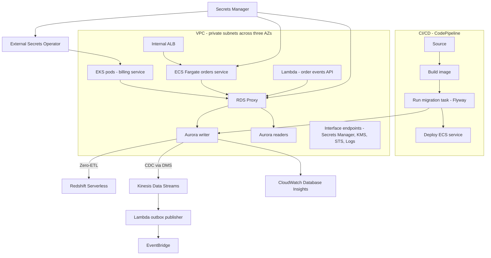

#### Reference architecture: serverless relational access

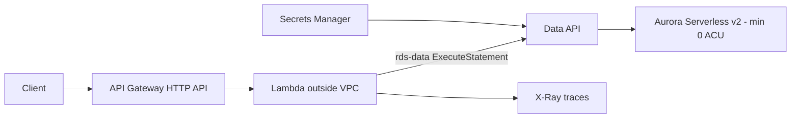

This design suits internal tools and low-volume APIs: no VPC configuration, no drivers, no proxy, and near-zero cost when idle. Its limitations are per-request overhead and resume latency after pause.

---

### Common Architecture Patterns

| Pattern | Relational integration | Notes |
|---|---|---|
| Database per service | One cluster or one schema with strict grants per service | Foundation for independent deployability |
| API Gateway pattern | Relational data exposed only through service APIs | No shared tables across services |
| Transactional outbox | Business row and outbox row in one transaction, published by CDC | Removes the dual-write problem ([Chapter 1.7](../unit1/topic7.md#event-driven-core-concepts)) |
| Event-driven projection (CQRS) | Writes to Aurora; CDC maintains read models in OpenSearch, DynamoDB or Redshift | Read model is eventually consistent |
| Saga | Each step is a local transaction in its own service database, with compensations | Step Functions orchestration ([Chapter 4.3](../unit4/topic3.md)) |
| Retry with backoff and jitter | Wraps whole transactions after failover or serialisation failures | Mandatory with Aurora DSQL's optimistic concurrency |
| Circuit breaker | Stops calling a saturated database, returns degraded responses | Protects the database during incidents |
| Bulkhead | Separate pools (or proxies) per workload class, for example interactive versus batch | Prevents batch jobs exhausting interactive capacity |
| Strangler fig migration | DMS or logical replication keeps a new service database in sync while traffic moves | Decomposing a shared database |
| Expand-contract | Compatible schema steps across multiple deployments | Zero-downtime schema change |
| Ephemeral environment | Fast clone or Serverless v2 at 0 ACU per pull request | Realistic testing at low cost |
| Fan-out of change events | CDC stream consumed by multiple services via EventBridge rules or Kinesis consumers | Decoupled downstream processing |

!!! example "Bulkhead with two proxies"
    An Aurora cluster serves an interactive checkout API and a nightly settlement batch. Both previously shared one pool, and the batch exhausted connections at 02:00, failing checkout requests from another time zone. The fix is two ==bulkheads==: a proxy (or pool) for interactive traffic with `MaxConnectionsPercent` of 60, and a separate path for the batch limited to 20 percent, with the batch reading from a reader where possible. Saturation of one no longer starves the other.

---

### Industry Use Cases

| Industry | Use case | Integration features used |
|---|---|---|
| Financial services | Core ledger service on EKS | Aurora PostgreSQL Multi-AZ, IAM auth via Pod Identity, Database Activity Streams, outbox CDC to EventBridge, zero-ETL for regulatory reporting |
| E-commerce | Order and payment services on ECS | RDS Proxy, expand-contract migrations in CodePipeline, Blue/Green for engine upgrades |
| SaaS platforms | Per-tenant databases for enterprise tenants | ACK-managed clusters per tenant, Serverless v2 scale to zero for dormant tenants, fast clones for tenant sandboxes |
| Healthcare | Clinical record services | Customer-managed KMS keys, `pgaudit`, masked clones for test environments |
| Media and publishing | Content management with semantic search | Aurora PostgreSQL with `pgvector`, Bedrock Knowledge Bases via the Data API |
| Logistics | Shipment tracking with analytics | CDC to Kinesis for real-time tracking events, zero-ETL for operational dashboards |
| Education | Learning platform with seasonal peaks | Serverless v2 with wide capacity range, RDS Proxy for Lambda-based grading functions |
| Gaming | Player economy and purchases | Aurora for transactional purchases, DynamoDB for session state, Aurora DSQL evaluated for multi-Region active-active economy services |

---

### Advantages

- ==Relational guarantees survive elastic compute.== With pooling, proxies and the Data API, thousands of ephemeral workers can use ACID transactions safely.
- ==Credential-free identity chains.== IAM authentication from task roles and Pod Identity removes long-lived secrets, and Secrets Manager rotation manages the remainder centrally.
- ==Low-risk change.== Expand-contract migrations, fast clones and Blue/Green Deployments make schema and engine change a routine pipeline activity.
- ==Faster failover.== RDS Proxy and topology-aware drivers reduce application-observed failover from DNS-bound delays to seconds.
- ==Analytics without pipelines.== Zero-ETL removes an entire class of hand-built ETL.
- ==Event-driven integration.== CDC and the outbox pattern turn committed transactions into reliable domain events.
- ==A growth path.== Limitless Database and DSQL offer horizontal write scale while keeping SQL, reducing the pressure to abandon the relational model.
- ==Economical non-production.== Scale to zero and clones make realistic per-branch databases affordable.

---

### Limitations

- ==The single writer remains.== None of the access-layer services increases write capacity of standard Aurora or RDS.
- ==Proxies add latency and cost, and can be negated by pinning.==
- ==IAM authentication has connection-rate considerations== and requires TLS and token generation logic.
- ==Rotation and injection interact badly== if credentials are injected once at start and single-user rotation is used.
- ==Blue/Green has replication constraints== on the schema changes it permits.
- ==Scale to zero introduces resume latency== and is defeated by idle connections.
- ==Newer services have narrower compatibility.== Limitless and DSQL restrict some PostgreSQL features, and DSQL requires application-level retry for optimistic concurrency conflicts.
- ==CDC adds operational surface== including replication slots, lag monitoring and schema evolution handling.
- ==Zero-ETL mirrors OLTP schemas== and does not remove the need for analytical modelling.

---

### Common Mistakes

#### Beginner Mistakes

| Mistake | Consequence | Correction |
|---|---|---|
| Using the master user for application access | Any compromise or bug has full control | One least-privilege user per service |
| Setting pool size to 50 or 100 "to be safe" | Connection exhaustion at scale-out, memory waste | Size with Little's Law |
| Opening a new connection per request | Handshake and TLS cost on every call, connection storms | Pool, or use RDS Proxy |
| Placing the Lambda client inside the handler | New connection every invocation | Initialise outside the handler |
| Storing the password in the ECS task definition `environment` block | Visible in the console and API | Use `secrets` with `valueFrom` |
| Running migrations from a developer laptop | Unrepeatable, unaudited changes | Pipeline-executed migrations |
| Making the database public to connect from home | Exposure to the internet | Session Manager port forwarding or Data API |
| Assuming the Data API is suitable for everything | High latency and limits on large results | Use for low-volume paths |

#### Production Mistakes

| Mistake | Consequence | Correction |
|---|---|---|
| Deploying RDS Proxy without checking pinning | No multiplexing benefit | Monitor `DatabaseConnectionsCurrentlySessionPinned`, use `InitQuery` |
| Running migrations at container start | Races between replicas, slow scale-out, failed deployments | Dedicated migration step |
| DDL without `lock_timeout` | Lock queue outage | Set lock and statement timeouts |
| Renaming or dropping a column in one release | Old version fails during rollout | Expand-contract |
| Single-user rotation with ECS-injected secrets | New connections fail after rotation until tasks restart | Alternating users, or redeploy on rotation, or runtime fetch |
| Leaving a replication slot for a stopped DMS task | Storage exhaustion or runaway volume growth | Alarm on slot lag and drop stale slots |
| Retrying individual statements after failover | Partial transactions, duplicated effects | Retry whole transactions idempotently |
| Forgetting old blue environments and clones | Continuing cost and data exposure | Automated cleanup |
| Testing migrations only on small databases | Unexpected long locks on production volumes | Rehearse on a fast clone |
| Scale to zero on a customer-facing database | Seconds of latency for the first user after idle | Keep minimum above zero in production |

---

### Summary

Relational databases remain the correct system of record for data that needs transactions, constraints and flexible queries, but in a cloud-native system the engine is only half of the design. The other half is the ==integration layer== that makes the engine safe to use from elastic, ephemeral, continuously deployed workloads.

Architectural lessons from this part:

- ==Ownership first.== Choose between schema-per-service and cluster-per-service on measured coupling, scale and compliance needs, and enforce ownership with grants, not conventions.
- ==Connections are a budget.== Total demand equals replicas multiplied by pool size. Size pools with Little's Law, protect the database with RDS Proxy where clients are elastic, and watch for session pinning.
- ==Identity replaces secrets where possible.== IAM authentication from task roles and Pod Identity removes stored credentials; where secrets remain, understand how rotation reaches each workload and prefer alternating users when credentials are cached.
- ==Schema change is a pipeline stage.== Expand-contract keeps two application versions compatible; `lock_timeout` prevents lock-queue outages; fast clones allow rehearsal on real volumes; Blue/Green Deployments handle engine and parameter change.
- ==Failover is an application concern.== Proxies and topology-aware drivers make reconnection fast; only the application can retry a lost transaction correctly and idempotently.
- ==Change flows out through logs, not queries.== CDC, the outbox pattern and zero-ETL keep analytics and downstream services current without loading the OLTP engine.
- ==Know the next step.== Aurora Limitless Database and Aurora DSQL provide horizontal write scale and, for DSQL, active-active multi-Region operation, at the cost of shard-aware or retry-aware design and narrower compatibility.
- ==Observe the whole path.== Database Insights explains what the database is doing; traces explain why the application asked it to.

---

## NoSQL Databases with Amazon DynamoDB

---

### Definition

In this part, ==DynamoDB integration== means using Amazon DynamoDB as the primary operational store of a service in such a way that its key design serves the service's access patterns, its change stream drives event-driven processing, its API is invoked directly by other managed services where no business logic is required, and its security, capacity and cost are governed declaratively.

DynamoDB is well suited to this role because it has ==no connections, no servers and no VPC placement==. Every request is an independently authenticated HTTPS call signed with SigV4. This removes the connection-management problems examined in the Amazon RDS and Aurora part of this section and makes DynamoDB the natural partner of Lambda, Fargate and other elastic compute.

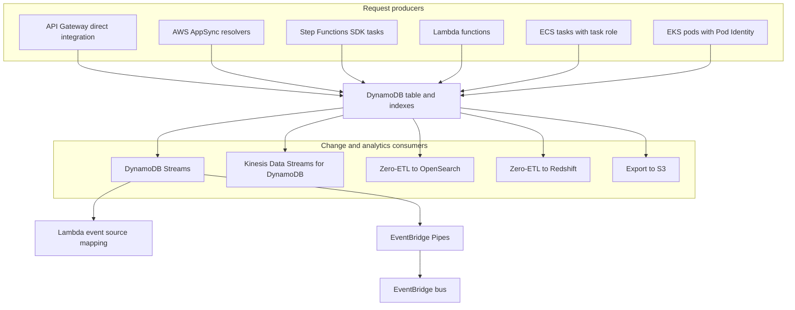

---

### Why This Service or Concept Exists

[Chapter 1.5](../unit1/topic5.md#why-this-service-or-concept-exists) explained why DynamoDB exists as a database. This section explains why ==integration patterns around it== exist.

| Problem in serverless and microservice systems | DynamoDB integration response |
|---|---|
| Functions scale to thousands of concurrent environments; connection-based databases struggle | Stateless HTTPS API with IAM authentication per request |
| Glue Lambda functions that only copy request fields into a table add latency, cost and code to maintain | Direct integrations from API Gateway, AppSync, Step Functions and EventBridge Pipes |
| Publishing events after a write risks dual-write inconsistency | Streams deliver committed changes in order per item, functioning as a built-in outbox |
| Retries in distributed systems cause duplicate side effects | Conditional writes and idempotency tables make operations safe to repeat |
| Concurrent updates overwrite each other without locks | Version attributes and condition expressions implement optimistic locking |
| Search and analytics are poor fits for key-value access | Zero-ETL to OpenSearch and Redshift, and export to S3, without custom pipelines |
| Global applications need local latency and Regional resilience | Global Tables with eventual or strong multi-Region consistency |
| Large launches can throttle a new table | Warm throughput and pre-warming |
| Unbounded on-demand cost during runaway traffic | On-demand maximum throughput limits |

!!! tip "The architect's framing"
    With a relational database, integration effort goes into ==protecting the engine== from its clients: pools, proxies, lock-aware migrations. With DynamoDB, integration effort goes into ==designing keys and events==: the table will absorb almost any request rate, provided the keys spread load and the access patterns were designed in advance.

---

### Core Concepts

#### The data model

| Concept | Definition |
|---|---|
| **Table** | A collection of items. Regional. No fixed schema beyond the primary key. |
| **Item** | A single record, analogous to a row. Maximum size **400 KB** including attribute names. |
| **Attribute** | A name-value pair, analogous to a column. Items in the same table need not have the same attributes. |
| **Primary key** | Either a **simple** key (partition key only) or a **composite** key (partition key plus sort key) |
| **Partition key (HASH)** | Determines the physical partition. Required. |
| **Sort key (RANGE)** | Orders items within a partition key. Optional. Enables range queries. |
| **Item collection** | All items sharing the same partition key value |

Supported attribute types: `S` (string), `N` (number), `B` (binary), `BOOL`, `NULL`, `L` (list), `M` (map), `SS`/`NS`/`BS` (sets). Only scalar types (`S`, `N`, `B`) may be used as key attributes.

!!! warning "The 400 KB Item Limit Shapes Your Design"
    An item cannot exceed 400 KB. This rules out storing images, documents or large blobs in DynamoDB. The correct pattern is to store the object in **S3** and keep the S3 key, size, content type and metadata in DynamoDB. It also constrains unbounded lists: an item containing a growing list of comments will eventually hit the limit and start failing writes. Model one-to-many relationships as **multiple items in an item collection**, not as a nested list inside one item.

#### Partition key design: the central skill

A good partition key has two properties:

1. **High cardinality**  many distinct values, so data spreads across many partitions.
2. **Uniform access distribution**  no single value receives disproportionate traffic.

| Candidate Partition Key | Cardinality | Distribution | Verdict |
|---|---|---|---|
| `user_id` for a per-user workload | Very high | Even, assuming no dominant user | Excellent |
| `order_id` (UUID) | Very high | Even | Excellent |
| `device_id` for IoT telemetry | High | Even | Good |
| `status` with values PENDING, SHIPPED, DELIVERED | 3 | Extremely skewed | Unusable |
| `order_date` for daily ingest | High overall | All of today's traffic hits one value | Poor for writes |
| `country` for a national app | Low, and heavily skewed | One country dominates | Poor |
| `tenant_id` in multi-tenant SaaS | Medium | Skewed if one tenant is very large | Requires care |

##### Write sharding for unavoidably hot keys

When the natural key is inherently hot  for example, all events for the current day  you distribute writes artificially by appending a shard suffix.

```
Natural key:  2026-08-10                     -> one partition, throttled
Sharded key:  2026-08-10#0 ... 2026-08-10#9  -> ten partitions, ten times the throughput
```

On write, choose the suffix by a random number or by a deterministic hash of another attribute. On read, issue ten parallel `Query` calls (a scatter-gather) and merge the results.

| Suffix Strategy | Write Behaviour | Read Behaviour |
|---|---|---|
| Random suffix | Perfectly even | Must query all shards for a complete result |
| Calculated suffix, for example `hash(order_id) mod 10` | Even | Can target the exact shard when you know `order_id` |

!!! tip "The Trade-off Is Explicit"
    Write sharding trades read simplicity for write throughput. Use a **calculated** suffix when you will frequently look up individual items, because it lets you compute the exact shard. Use a **random** suffix when reads are always full-collection scans anyway. The number of shards should reflect your required throughput divided by roughly 1,000 WCU per partition, with headroom.

##### Sort key design and composite sort keys

The sort key is the mechanism for expressing hierarchy and enabling range queries. A composite sort key encodes multiple dimensions in one string, ordered from most to least significant.

```
PK: USER#4471
SK: ORDER#2026-08-10#9001
SK: ORDER#2026-08-11#9014
SK: ADDRESS#HOME
SK: ADDRESS#WORK
```

With this design, a single `Query` on `PK = USER#4471 AND begins_with(SK, "ORDER#2026-08")` retrieves every order placed by that user in August 2026, sorted chronologically, in one request. This is the essence of DynamoDB modelling: **the key structure encodes the query**.

!!! danger "Model the Access Patterns Before the Data"
    Relational design begins with entities and normalisation, and queries come later because SQL can express anything. DynamoDB design begins with an exhaustive written list of access patterns, and the key schema is derived from that list. If you design a DynamoDB table without first enumerating every query your application will make, you will get it wrong, and correcting it after production data exists requires a data migration. **Access patterns first. Always.**

#### Single-table design

Single-table design places multiple entity types in one table, using generic key attribute names (`PK`, `SK`) and a type discriminator, so that related entities of different types share a partition and can be retrieved together in one request.

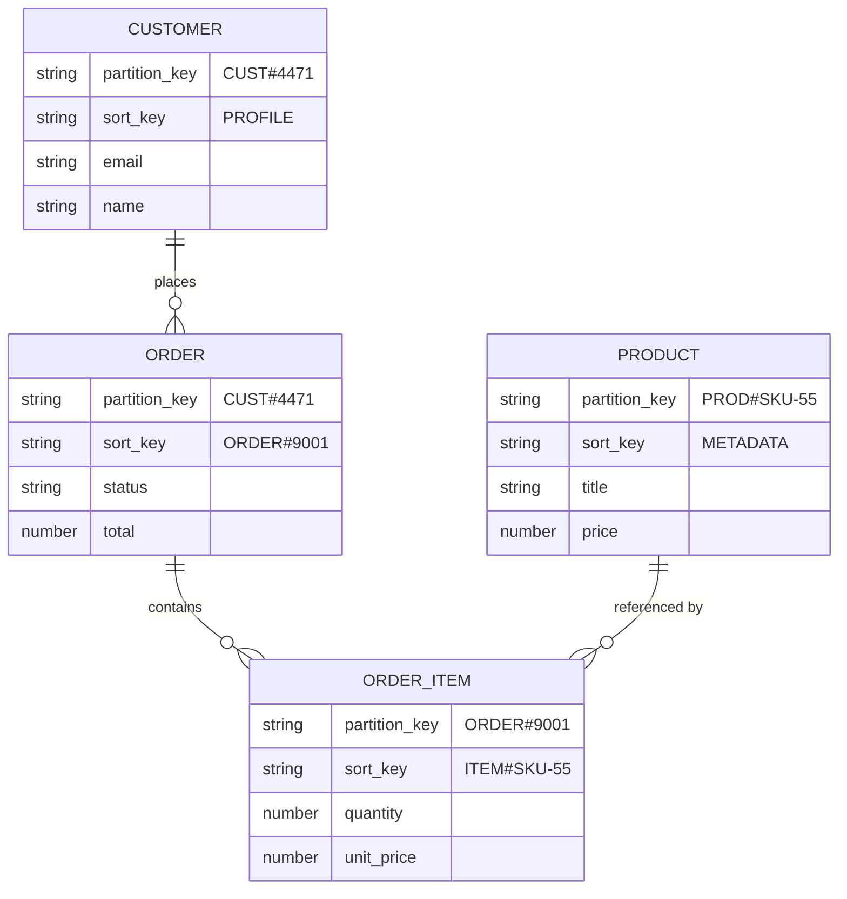

An example table layout:

| PK | SK | entity_type | Other Attributes |
|---|---|---|---|
| `CUST#4471` | `PROFILE` | Customer | `email`, `name`, `created_at` |
| `CUST#4471` | `ORDER#2026-08-10#9001` | Order | `status`, `total`, `GSI1PK=STATUS#PENDING` |
| `CUST#4471` | `ORDER#2026-08-11#9014` | Order | `status`, `total` |
| `CUST#4471` | `ADDRESS#HOME` | Address | `line1`, `city`, `postcode` |
| `ORDER#9001` | `ITEM#SKU-55` | OrderItem | `qty`, `unit_price` |
| `ORDER#9001` | `ITEM#SKU-72` | OrderItem | `qty`, `unit_price` |
| `PROD#SKU-55` | `METADATA` | Product | `title`, `price`, `stock` |

| Access Pattern | Implementation |
|---|---|
| Get a customer's profile | `GetItem PK=CUST#4471, SK=PROFILE` |
| Get a customer's profile and all orders and addresses in one call | `Query PK=CUST#4471` |
| Get a customer's August 2026 orders | `Query PK=CUST#4471 AND begins_with(SK,"ORDER#2026-08")` |
| Get all line items for an order | `Query PK=ORDER#9001 AND begins_with(SK,"ITEM#")` |
| Get all pending orders across customers | `Query` on GSI1 where `GSI1PK=STATUS#PENDING` |
| Get product details | `GetItem PK=PROD#SKU-55, SK=METADATA` |

| Aspect | Single-Table | Multi-Table |
|---|---|---|
| Requests per page render | Often one | One per entity type |
| Latency | Lower | Higher, and variable |
| Cost | Lower  fewer requests | Higher |
| Readability of data | Poor  the table looks opaque | Good |
| Onboarding difficulty | High | Low |
| Adding a new access pattern | May require a new GSI or a migration | Easier |
| Per-entity capacity and monitoring | Not separable | Separable |

!!! note "A Balanced Professional View"
    Single-table design is the canonical DynamoDB pattern and is genuinely optimal for latency and cost in high-scale systems with well-understood access patterns. It is also difficult to reason about, hard to hand over, and unforgiving of requirement changes. For a microservice owning a small number of tightly related entities with stable access patterns, single-table design is correct. For an exploratory application whose requirements are still moving, a small number of purpose-specific tables is a defensible and pragmatic choice. State the trade-off explicitly in a design review rather than asserting a dogma.

#### Secondary indexes: LSI versus GSI

| Property | Local Secondary Index (LSI) | Global Secondary Index (GSI) |
|---|---|---|
| Partition key | **Must** be the same as the base table's | **Any** attribute |
| Sort key | A different attribute | Any attribute, optional |
| When it can be created | **Only at table creation** | Any time, and deletable any time |
| Maximum per table | 5 | 20 by default (a soft quota) |
| Consistency | Supports **strongly consistent** reads | **Eventually consistent only** |
| Capacity | Shares the base table's throughput | Has its **own** provisioned throughput |
| Storage location | Same partitions as the base table | Separate partitions |
| Constraint imposed | Item collection (all items with one partition key, across table and LSIs) limited to **10 GB** | None |
| Key uniqueness required | No | No |

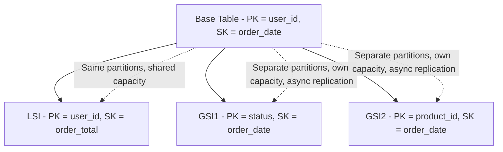

!!! danger "The Two Most Dangerous GSI Behaviours"
    **First: a throttled GSI can throttle your base table.** GSI updates are applied asynchronously, but if a GSI's write capacity is insufficient, the backlog eventually causes writes to the *base table* to be throttled, because DynamoDB will not allow the index to fall arbitrarily far behind. Always provision GSI write capacity at least as generously as the base table's for attributes that change on every write.

    **Second: a GSI with a low-cardinality partition key is a hot partition you built on purpose.** A GSI on `status` with three possible values creates three partitions receiving all traffic. If you need to query by status, use a **sparse index**  only write the GSI key attribute for items in the state you care about (for example, only set `GSI1PK` while an order is `PENDING`, and remove the attribute when it ships). The index then contains only the active working set, which is both small and cheap.

!!! tip "Sparse Indexes Are One of the Most Elegant DynamoDB Techniques"
    An item appears in a GSI **only if it has the GSI's key attributes**. Deliberately omitting those attributes gives you an index containing only the subset of items you need  a work queue of unprocessed records, for instance. The index stays small no matter how large the table grows, so scanning it is cheap and predictable. Use this instead of scanning the table with a filter.

##### Index projections

| Projection Type | Attributes Copied Into the Index | Trade-off |
|---|---|---|
| `KEYS_ONLY` | Table and index keys only | Smallest and cheapest; usually requires a second read to fetch the full item |
| `INCLUDE` | Keys plus a specified list | Balanced; the usual correct choice |
| `ALL` | Every attribute | Fastest reads, highest storage and write cost |

A read from an index that must then fetch the full item from the base table is a **fetch**, and it consumes additional capacity. Choose `INCLUDE` with exactly the attributes your query needs to avoid fetches without paying for `ALL`.

#### Read consistency options

| Option | Behaviour | Cost |
|---|---|---|
| **Eventually consistent read** | Served from any replica; may not reflect a very recent write | **0.5 RCU** per 4 KB |
| **Strongly consistent read** | Served from the leader; always reflects all prior successful writes | **1 RCU** per 4 KB |
| **Transactional read** | Part of a `TransactGetItems` serializable snapshot | **2 RCU** per 4 KB |

#### RCU and WCU calculation

These formulas are examinable and are genuinely used in capacity planning.

**Read Capacity Unit (RCU)**

- 1 RCU = one **strongly consistent** read per second of an item up to **4 KB**.
- 1 RCU = **two** eventually consistent reads per second of an item up to 4 KB.
- Item size is **rounded up** to the next 4 KB boundary.

**Write Capacity Unit (WCU)**

- 1 WCU = one standard write per second of an item up to **1 KB**.
- Item size is **rounded up** to the next 1 KB boundary.
- A transactional write costs **2 WCU** per 1 KB.

!!! example "Worked Example 1  Basic Reads"
    **Requirement:** 100 strongly consistent reads per second of 6 KB items.

    1. Round item size up: 6 KB rounds up to 8 KB, which is 2 units of 4 KB.
    2. RCUs per read: 2.
    3. Total: `100 × 2 =` **200 RCU**.

    Now the same workload with **eventually consistent** reads:

    - Eventually consistent reads cost half: `200 / 2 =` **100 RCU**.

    The lesson: simply choosing eventual consistency where the business permits it halves your read cost.

!!! example "Worked Example 2  Writes"
    **Requirement:** 250 writes per second of 3.2 KB items.

    1. Round up: 3.2 KB rounds up to 4 KB, which is 4 units of 1 KB.
    2. WCUs per write: 4.
    3. Total: `250 × 4 =` **1,000 WCU**.

    Note that 1,000 WCU is approximately the throughput ceiling of a single partition, so this workload requires a partition key that distributes across multiple partitions.

!!! example "Worked Example 3  Mixed Workload with a GSI"
    **Requirement:** An orders table.

    - Writes: 500 new orders per second, item size 2.5 KB.
    - Reads: 2,000 eventually consistent reads per second, item size 2.5 KB.
    - One GSI on `status` with `ALL` projection, receiving every write.

    **Base table writes:** 2.5 KB rounds up to 3 KB = 3 WCU per write. `500 × 3 =` **1,500 WCU**.

    **Base table reads:** 2.5 KB rounds up to 4 KB = 1 unit. Strong would be 1 RCU; eventual is 0.5 RCU. `2,000 × 0.5 =` **1,000 RCU**.

    **GSI writes:** With `ALL` projection the index item is also about 2.5 KB, rounding to 3 WCU. Every base write produces an index write, so **1,500 WCU** on the GSI.

    **Total write capacity to provision: 3,000 WCU** across the table and its index. This is the calculation people forget, and it is why an unnecessary `ALL`-projection GSI **doubles your write bill**.

!!! example "Worked Example 4  Transactions"
    **Requirement:** 50 transactions per second, each writing 3 items of 0.8 KB.

    1. Each item rounds up to 1 KB = 1 unit.
    2. Transactional writes cost 2 WCU per unit: 2 WCU per item.
    3. Per transaction: `3 × 2 = 6` WCU.
    4. Total: `50 × 6 =` **300 WCU**.

    A transaction costs twice a standard write because DynamoDB executes a two-phase commit across partitions. Use transactions where atomicity is genuinely required, not by default.

!!! example "Worked Example 5  Query Cost and the Filter Trap"
    **Scenario:** `Query PK=CUST#4471` returns an item collection of 300 items averaging 1.5 KB, and a `FilterExpression` reduces the result to 12 items.

    1. Total data read: `300 × 1.5 KB = 450 KB`.
    2. A `Query` aggregates the size of all items read and rounds the **total** up to a 4 KB boundary: `450 / 4 = 112.5`, rounding to 113 units.
    3. Eventually consistent: `113 × 0.5 =` **56.5 RCU**, billed as 57.

    You paid for 450 KB to receive 18 KB. Had the sort key encoded the filter condition, the same result would have cost around 3 RCU. **This single misunderstanding accounts for a large share of unexpected DynamoDB bills.**

#### Transactions

DynamoDB supports ACID transactions via `TransactWriteItems` and `TransactGetItems`.

| Property | Detail |
|---|---|
| Maximum items per transaction | 100 |
| Maximum total size | 4 MB |
| Scope | Multiple items, multiple tables, **same Region and same account** |
| Supported actions in a write transaction | `Put`, `Update`, `Delete`, `ConditionCheck` |
| Constraint | The same item may not appear twice in one transaction |
| Cost | Twice a non-transactional operation |
| Isolation | Serializable |

!!! tip "Condition Expressions Handle Most Cases More Cheaply"
    Before reaching for a transaction, ask whether a **conditional write** suffices. `PutItem` with `ConditionExpression: attribute_not_exists(PK)` gives you atomic create-if-absent at standard cost. `UpdateItem` with `ConditionExpression: version = :expected` gives you optimistic locking. These single-item conditional operations are atomic, cost half what a transaction costs, and cover a large majority of real requirements. Reserve transactions for genuinely multi-item invariants such as debit-and-credit.

#### The access-pattern-driven modelling workflow

The rule "access patterns first" was stated under [Sort key design](#sort-key-design-and-composite-sort-keys) above. This section turns the rule into a repeatable workflow that you can apply in a design review or an examination.

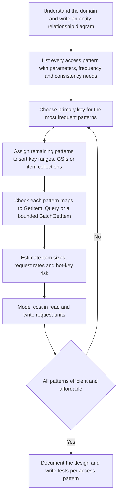

| Step | Output | Common error |
|---|---|---|
| Entity relationship diagram | Entities, relationships and cardinalities | Skipping it because "DynamoDB has no schema" |
| Access pattern table | One row per query or write, with inputs, expected result size, frequency, latency and consistency | Listing entities instead of queries |
| Primary key design | `PK` and `SK` formats for each entity type | Using natural attribute names that cannot be overloaded |
| Index design | GSIs with overloaded generic key attributes and projections | One GSI per access pattern, quickly exhausting quotas and doubling write cost |
| Validation | Each pattern expressed as a concrete API call | Patterns that silently require `Scan` or `FilterExpression` for selectivity |
| Load and cost check | Request units per pattern per month, hot partitions identified | Ignoring GSI write amplification |

#### Case study: a multi-tenant ride-booking platform

The worked case study for this part is RideLink, a ride-booking platform offered as a white-label service to several ==fleet operators== (the tenants). Each operator has its own riders and drivers in one or more cities. The service is built as microservices on Lambda and ECS, with DynamoDB as the operational store of the Trip service.

##### Entities and relationships

```mermaid
erDiagram
    OPERATOR ||--o{ DRIVER_MEMBERSHIP : "employs"
    DRIVER ||--o{ DRIVER_MEMBERSHIP : "works for"
    OPERATOR ||--o{ RIDER : "serves"
    RIDER ||--o{ TRIP : "requests"
    DRIVER ||--o{ TRIP : "fulfils"
    TRIP ||--o{ TRIP_EVENT : "has timeline"
    TRIP ||--o| PAYMENT : "settled by"
    TRIP ||--o{ RATING : "receives"
    TRIP ||--o{ TRIP_VERSION : "audited by"
```

Note the many-to-many relationship between drivers and operators: a driver may work for more than one fleet operator. This is the classic case for the ==adjacency list== pattern.

##### Access pattern table

| ID | Access pattern | Inputs | Frequency | Consistency |
|---|---|---|---|---|
| AP1 | Get rider profile | tenant, riderId | High | Eventual |
| AP2 | Get driver profile | tenant, driverId | High | Eventual |
| AP3 | Get trip with its event timeline, payment and ratings | tenant, tripId | Very high | Strong for the trip item |
| AP4 | List a rider's trips, newest first, paginated | tenant, riderId | High | Eventual |
| AP5 | List a driver's trips in a date range | tenant, driverId, from, to | Medium | Eventual |
| AP6 | List open ride requests in a city zone, oldest first (dispatch queue) | tenant, city, zone | Very high | Eventual, a few hundred milliseconds acceptable |
| AP7 | List an operator's drivers by availability status | tenant, status | Medium | Eventual |
| AP8 | List operators a driver works for | driverId | Low | Eventual |
| AP9 | List an operator's trips for a day, optionally by city and zone (billing) | tenant, date, city, zone | Low, batch | Eventual |
| AP10 | Create a trip request exactly once despite client retries | idempotency key | Very high | Strong |
| AP11 | Change trip status without lost updates | tripId, expected version | Very high | Strong |
| AP12 | Retrieve the full change history of a trip for dispute resolution | tripId | Low | Eventual |

!!! warning "Driver location is not in this table"
    Driver GPS updates arrive every few seconds for every active driver and need geospatial proximity search. That is an in-memory geospatial workload (ElastiCache or MemoryDB geospatial commands, or Amazon Location Service), not a DynamoDB workload. Modelling is also about ==deciding what not to put in the table==.

##### Key design

All partition keys carry a tenant prefix `T#<operator>` so that IAM can enforce tenant isolation (see Security Considerations). Generic attribute names (`PK`, `SK`, `GSI1PK`, `GSI1SK`, `GSI3PK`, `GSI3SK`) allow different entity types to share indexes.

| Entity | PK | SK | GSI1PK | GSI1SK | GSI3PK (sparse) | GSI3SK |
|---|---|---|---|---|---|---|
| Rider | `T#op1#RIDER#r42` | `PROFILE` | | | | |
| Driver | `T#op1#DRIVER#d7` | `PROFILE` | `T#op1#DRIVERS` | `STATUS#AVAILABLE#d7` | | |
| Driver membership (edge) | `DRIVER#d7` | `OP#op1` | | | | |
| Trip (current version) | `T#op1#TRIP#t9001` | `META` | `T#op1#RIDER#r42` | `TRIP#2026-09-26T08:14:03Z` | `T#op1#OPEN#thimphu#z3` (only while `REQUESTED`) | `2026-09-26T08:14:03Z` |
| Trip version (history) | `T#op1#TRIP#t9001` | `VER#000004` | | | | |
| Trip event | `T#op1#TRIP#t9001` | `EVENT#2026-09-26T08:15:10Z#ACCEPTED` | | | | |
| Payment | `T#op1#TRIP#t9001` | `PAYMENT` | | | | |
| Rating | `T#op1#TRIP#t9001` | `RATING#RIDER` | | | | |
| Driver-trip edge | `T#op1#TRIP#t9001` | `DRIVER#d7` | `T#op1#DRIVER#d7` | `TRIP#2026-09-26T08:14:03Z` | | |
| Daily billing entry | `T#op1#DAY#2026-09-26#3` | `LOC#thimphu#z3#TRIP#t9001` | | | | |

The table uses three indexes:

| Index | Partition key | Sort key | Purpose |
|---|---|---|---|
| `GSI1` (overloaded) | `GSI1PK` | `GSI1SK` | Rider trips (AP4), driver trips (AP5), operator drivers by status (AP7) |
| `INV` (inverted index) | `SK` | `PK` | Operators for a driver and drivers for an operator (AP8) |
| `GSI3` (sparse) | `GSI3PK` | `GSI3SK` | Dispatch queue of open requests per zone (AP6) |

##### Mapping patterns to operations

| ID | Operation |
|---|---|
| AP1 | `GetItem PK=T#op1#RIDER#r42, SK=PROFILE` |
| AP2 | `GetItem PK=T#op1#DRIVER#d7, SK=PROFILE` |
| AP3 | `Query PK=T#op1#TRIP#t9001 AND SK < "VER#"` (returns the driver edge, events, `META`, payment and ratings in sort order, and excludes the `VER#` history items, which sort last) |
| AP4 | `Query GSI1 GSI1PK=T#op1#RIDER#r42, ScanIndexForward=false, Limit=20` |
| AP5 | `Query GSI1 GSI1PK=T#op1#DRIVER#d7 AND GSI1SK BETWEEN TRIP#from AND TRIP#to` |
| AP6 | `Query GSI3 GSI3PK=T#op1#OPEN#thimphu#z3, Limit=50` |
| AP7 | `Query GSI1 GSI1PK=T#op1#DRIVERS AND begins_with(GSI1SK, STATUS#AVAILABLE#)` |
| AP8 | `Query INV SK=DRIVER#d7` returns operators for a driver; `Query INV SK=OP#op1` returns drivers of an operator |
| AP9 | `Query PK=T#op1#DAY#2026-09-26#<shard> AND begins_with(SK, LOC#thimphu#z3#)` for each shard, merged |
| AP10 | Idempotency record with `attribute_not_exists` condition, or Powertools idempotency |
| AP11 | `UpdateItem` with `ConditionExpression version = :expected` |
| AP12 | `Query PK=T#op1#TRIP#t9001 AND begins_with(SK, VER#)` |

!!! note "Where each technique appears"
    The same table demonstrates five techniques at once. ==GSI overloading==: `GSI1` holds rider trips, driver trips and driver status lists. ==Inverted index==: `INV` swaps `PK` and `SK` to traverse the driver-operator edges in both directions. ==Adjacency list==: membership and driver-trip edges are stored as items connecting two nodes. ==Hierarchical keys==: `LOC#thimphu#z3#TRIP#...` supports prefix queries at city or zone level. ==Sparse index==: `GSI3` contains only trips currently in `REQUESTED` status.

#### GSI overloading

A ==GSI is overloaded== when different entity types write different meanings into the same generic index attributes. Because an item appears in a GSI only if it has the index key attributes, each entity type contributes only the items it needs. Overloading keeps the number of GSIs small, which matters because each GSI adds write cost for every projected write and counts against a per-table quota.

!!! warning "Overloading and hot index partitions"
    `GSI1PK = T#op1#DRIVERS` places all drivers of an operator in one GSI partition. For an operator with a few thousand drivers updating status every few minutes this is fine. For a very large operator with tens of thousands of status changes per second it would be a hot key. The remedy is ==write sharding on the index key==, for example `T#op1#DRIVERS#<0-9>`, with a scatter-gather read. [Write sharding for unavoidably hot keys](#write-sharding-for-unavoidably-hot-keys) above describes the sharding arithmetic.

#### The adjacency list pattern and inverted indexes

An adjacency list stores a graph as items: node items and edge items. An edge item has the source node as `PK` and the target node as `SK`, and may carry attributes about the relationship (for example the driver's contract start date with that operator). An ==inverted index== (a GSI whose partition key is the table's `SK` and whose sort key is the table's `PK`) lets the same edges be traversed from the other end.

```mermaid
graph LR
    D7["DRIVER d7"] -->|"edge item PK DRIVER d7 SK OP op1"| OP1["OPERATOR op1"]
    D7 -->|"edge item PK DRIVER d7 SK OP op2"| OP2["OPERATOR op2"]
    D8["DRIVER d8"] -->|"edge item"| OP1
    OP1 -.->|"INV index query SK OP op1 returns d7 and d8"| D7
```

This is effective for one-hop traversals. Multi-hop graph queries (drivers who worked for operators that also employ driver d8) are better served by Amazon Neptune ([Graph Databases with Amazon Neptune](#graph-databases-with-amazon-neptune)).

#### Hierarchical composite sort keys

A hierarchical sort key encodes a path from general to specific, separated by a delimiter: `LOC#<country>#<city>#<zone>#TRIP#<id>`. A `begins_with` condition at any level returns the whole subtree in sort order:

| Query | Key condition |
|---|---|
| All trips for the day | `PK = T#op1#DAY#2026-09-26#s` (per shard) |
| Trips in one city | `... AND begins_with(SK, "LOC#bt#thimphu#")` |
| Trips in one zone | `... AND begins_with(SK, "LOC#bt#thimphu#z3#")` |

!!! tip "Delimiter discipline"
    Always terminate a prefix with the delimiter in queries. `begins_with(SK, "LOC#bt#thimphu#z1")` also matches zone `z10`, `z11` and so on. `begins_with(SK, "LOC#bt#thimphu#z1#")` does not.

#### Item versioning

Where an audit trail is required, the ==versioning pattern== keeps a "current" item and immutable history items in the same item collection:

- `SK = META` holds the current state and a numeric `version` attribute.
- Each change writes a new immutable history item `SK = VER#000005` (zero-padded so that lexicographic order equals numeric order) and updates `META`, in one `TransactWriteItems` call, conditioned on the current version.
- The `VER#` prefix is chosen deliberately so that history items sort after every other item in the collection, allowing AP3 to exclude them with a single key condition `SK < "VER#"`.

The current item is always one `GetItem` away; the history is one `Query`. The cost is a transactional write for each change ([Transactions](#transactions) above explains that transactional writes consume twice the capacity), so use versioning only where the history is a real requirement.

#### Optimistic locking

Two dispatchers try to assign trip `t9001` to different drivers at the same moment. Without concurrency control, the second `UpdateItem` silently overwrites the first. DynamoDB has no row locks to take; instead it offers ==conditional writes==, which are evaluated atomically on the item at write time.

```mermaid
sequenceDiagram
    participant A as "Dispatcher A"
    participant B as "Dispatcher B"
    participant T as "DynamoDB trip item version 3"
    A->>T: "GetItem - reads version 3"
    B->>T: "GetItem - reads version 3"
    A->>T: "UpdateItem set driver d7, version 4 if version equals 3"
    T-->>A: "Success - item now version 4"
    B->>T: "UpdateItem set driver d8, version 4 if version equals 3"
    T-->>B: "ConditionalCheckFailedException"
    B->>T: "GetItem - reads version 4, driver already assigned"
    B->>B: "Choose another trip"
```

| Approach | Mechanism | Suitability |
|---|---|---|
| Version attribute | `ConditionExpression: version = :expected`, `SET version = version + 1` | General-purpose; supported by SDK helpers such as the Java Enhanced Client `@DynamoDbVersionAttribute` and the .NET Object Persistence Model |
| State machine guard | `ConditionExpression: #s = :REQUESTED` | Status transitions; also enforces valid transitions |
| Existence guard | `attribute_not_exists(PK)` | Create-once semantics |
| Pessimistic lock item | A separate lock item with an owner and lease expiry | Only for long critical sections; the DynamoDB Lock Client implements this |

!!! tip "Return the conflicting item"
    A failed conditional write can return the item's current attributes by setting `ReturnValuesOnConditionCheckFailure` to `ALL_OLD`. This saves a follow-up `GetItem` when resolving the conflict and is charged only as a failed conditional write.

#### Idempotency

An operation is ==idempotent== if performing it more than once has the same effect as performing it once. Distributed systems retry: clients retry on timeouts, SDKs retry on throttling, Lambda retries asynchronous invocations and stream batches, EventBridge and SQS deliver at least once. Without idempotency, a retried "request ride" creates two trips and charges twice.

An ==idempotency table== records each processed request by an idempotency key, the processing status and the stored response:

```mermaid
stateDiagram-v2
    [*] --> Absent
    Absent --> InProgress: "Conditional put - key not exists or expired"
    InProgress --> Completed: "Handler succeeded - store response"
    InProgress --> Absent: "Handler failed - record deleted"
    Completed --> Completed: "Duplicate request - return stored response"
    InProgress --> InProgress: "Concurrent duplicate - rejected as already in progress"
    Completed --> Absent: "TTL expiry"
```

Powertools for AWS Lambda (Python, TypeScript, Java and .NET) implements this state machine with a DynamoDB persistence layer: it hashes a configurable part of the event (for example a header or body field) to form the key, writes an `INPROGRESS` record conditionally, runs the handler, then stores the result as `COMPLETED` with an expiry, and returns the stored result for duplicates.

| Design decision | Guidance |
|---|---|
| Idempotency key source | A client-supplied key (for example an `Idempotency-Key` header) for APIs; the event ID or a business key for events |
| Payload validation | Optionally hash the payload so that the same key with a different payload is rejected rather than silently answered |
| Expiry | Longer than the maximum retry horizon of every upstream (client retries, Lambda async retries up to hours, stream retries) |
| Table | A dedicated table or a dedicated key prefix, with TTL enabled on the expiry attribute |
| Scope | Idempotency protects the handler; downstream calls (payment provider) should also receive an idempotency key |

#### Change capture from DynamoDB

DynamoDB offers two change streams: DynamoDB Streams and Kinesis Data Streams for DynamoDB, compared below.

| Property | DynamoDB Streams | Kinesis Data Streams for DynamoDB |
|---|---|---|
| Retention | 24 hours | Configurable, from 24 hours up to 365 days |
| Ordering | Exact order of modifications per item | Records may appear out of order and occasionally duplicated; use `ApproximateCreationDateTime` and item keys to reorder and deduplicate |
| Duplicates | Each change appears exactly once in the stream | Possible duplicates |
| Consumers | Recommended at most two concurrent readers per shard; more causes throttling | Many consumers, including enhanced fan-out with dedicated throughput per consumer |
| Integration targets | Lambda event source mapping, EventBridge Pipes, Kinesis Client Library adapter | Lambda, Firehose (to S3, Redshift, OpenSearch), Managed Service for Apache Flink, KCL applications |
| Shard management | Automatic, tied to table partitions | You manage stream capacity (on-demand or provisioned stream mode) |
| Cost model | Reads by Lambda triggers are not charged as stream reads; other `GetRecords` calls are charged | Change data capture units per write plus Kinesis stream charges |
| Choose when | One or two consumers, strict per-item ordering, simplicity | Many consumers, long retention, replay, analytics pipelines through Firehose or Flink |

!!! danger "Streams are not a message queue with infinite retention"
    With DynamoDB Streams, a record not processed within 24 hours is lost. A consumer that fails for a day, for example because of a poison record without bisection or a failure destination, ==permanently loses changes==. Alarm on `IteratorAge` for every stream consumer and configure `MaximumRecordAgeInSeconds` and an on-failure destination deliberately.

---

### AWS Service Deep Dive

This section opens with DynamoDB's capacity modes and core features, then examines its integration surfaces and newer capabilities.

#### Capacity modes

| Aspect | Provisioned | On-Demand |
|---|---|---|
| You specify | RCU and WCU per second | Nothing |
| Billing | Per provisioned capacity-hour | Per request |
| Cost per request | Lower at steady, high utilisation | Higher per request |
| Cost at low or spiky use | Higher  you pay for idle | Lower |
| Auto scaling | Available, target-utilisation based | Inherent |
| Instant scale-up | No  auto scaling reacts over minutes | Yes, up to double the previous peak instantly |
| Throttling risk | Yes, if under-provisioned or during a scaling lag | Much lower, but not zero for extreme, sudden spikes |
| Best for | Predictable, sustained traffic | New applications, spiky, unpredictable, or development |

!!! tip "The Standard Practical Approach"
    Launch a new table in **on-demand** mode. You do not know the traffic pattern yet, and on-demand removes the risk of throttling during launch. After a few weeks, examine the `ConsumedReadCapacityUnits` and `ConsumedWriteCapacityUnits` metrics. If utilisation is steady and high, switch to provisioned with auto scaling and consider a **reserved capacity** commitment  the saving can be substantial. If traffic is spiky, remain on demand. You may switch modes, subject to a cooldown period between switches.

!!! info "On-demand scaling headroom"
    On-demand tables instantly accommodate up to double the previous observed peak; beyond that, DynamoDB scales further but may throttle briefly while it does. For a known spike, such as a ticket sale opening or a marketing campaign, raise the table's warm throughput in advance and set an on-demand maximum throughput to bound runaway cost, as described in [Warm throughput and pre-warming](#warm-throughput-and-pre-warming) and [On-demand maximum throughput](#on-demand-maximum-throughput) below. Do not assume on-demand is infinitely elastic at zero notice.

#### Core features at a glance

| Feature | Description |
|---|---|
| **Time To Live (TTL)** | Designate a numeric attribute holding a Unix epoch timestamp; DynamoDB deletes expired items automatically in the background at **no write cost**. Deletions typically occur within 48 hours of expiry, so TTL is not a precise scheduler. |
| **Global Tables** | Multi-Region, multi-active replication; the default mode resolves conflicts by last-writer-wins based on timestamps (see [Global Tables](#global-tables-eventual-and-strong-multi-region-consistency) for the strong-consistency mode) |
| **Point-in-Time Recovery (PITR)** | Continuous backups allowing restore to any second within the last 35 days; restores to a **new table** |
| **On-demand backup** | Full backups retained indefinitely, with no performance impact |
| **Export to S3** | Export table data to S3 in DynamoDB JSON or Ion format without consuming RCUs, for querying with Athena |
| **Import from S3** | Populate a new table directly from S3 without consuming WCUs |
| **PartiQL** | A SQL-compatible query language over DynamoDB. Convenient, but it does not change the underlying cost model  a PartiQL statement that cannot use a key still performs a scan. |
| **DAX** | Microsecond read caching |
| **Contributor Insights** | Identifies the most frequently accessed keys  the definitive tool for diagnosing hot partitions |
| **Streams and Kinesis Data Streams integration** | Change data capture for event-driven and analytics pipelines |

#### Lambda event source mapping for DynamoDB Streams

##### Purpose and architecture

An ==event source mapping (ESM)== is a Lambda-managed poller that reads a stream on your behalf, batches records and invokes your function synchronously. For DynamoDB Streams, Lambda assigns pollers per stream shard, tracks a checkpoint per shard, and advances it only when a batch succeeds (or is discarded according to your failure settings).

```mermaid
sequenceDiagram
    participant T as "DynamoDB table"
    participant S as "Stream shard"
    participant P as "Lambda ESM poller"
    participant F as "Function"
    participant D as "On-failure destination - SQS, SNS or S3"
    T->>S: "Item changes appended in order"
    P->>S: "GetRecords"
    P->>P: "Apply filter criteria, build batch"
    P->>F: "Invoke with batch"
    alt Success or partial failure reported
        F-->>P: "batchItemFailures with first failed sequence number"
        P->>P: "Checkpoint before failed record, retry from there"
    else Function error
        F-->>P: "Error"
        P->>P: "Bisect batch and retry halves"
        P->>D: "After retries or max age, send failure metadata"
        P->>P: "Advance checkpoint"
    end
```

##### Configuration options

| Setting | Range (indicative, verify) | Effect and guidance |
|---|---|---|
| `StartingPosition` | `TRIM_HORIZON` or `LATEST` | `TRIM_HORIZON` processes all retained records; use it for new consumers that must not miss changes |
| `BatchSize` | 1 to 10,000 | Larger batches reduce invocations and cost, increase per-invocation latency and blast radius of a failure |
| `MaximumBatchingWindowInSeconds` | 0 to 300 | Waits to fill a batch; trades latency for efficiency |
| `ParallelizationFactor` | 1 to 10 | Concurrent batches per shard; ordering is preserved per partition key, not per shard |
| `BisectBatchOnFunctionError` | true or false | Splits a failing batch in two and retries each half, isolating a poison record |
| `MaximumRetryAttempts` | -1 (infinite) to 10,000 | Bound it; infinite retry blocks the shard until the record expires |
| `MaximumRecordAgeInSeconds` | -1 or 60 to 604,800 | Discards records older than this; for DynamoDB Streams, retention is 24 hours anyway |
| `DestinationConfig.OnFailure` | SQS queue, SNS topic or S3 bucket | Receives metadata about discarded batches (shard, sequence numbers) so that records can be re-read or investigated; the record payload itself is not included for stream sources except via the S3 destination option (verify) |
| `FunctionResponseTypes` | `ReportBatchItemFailures` | Enables partial batch responses |
| `FilterCriteria` | Up to a small number of filter patterns | Drops non-matching records before invocation |
| `TumblingWindowInSeconds` | 0 to 900 | Aggregates state across invocations within a window, for streaming aggregations |

!!! note "Partial batch response semantics for streams"
    For stream sources, the function returns the ==sequence number of the first failed record==. Lambda checkpoints up to the record before it and retries the batch starting from the failed record. Records after the failed one are therefore retried as well, so the handler must be idempotent. Returning several item identifiers is allowed, but Lambda uses the lowest sequence number.

##### Event filtering

Filter criteria use EventBridge-style patterns ([Chapter 6.3](../unit6/topic3.md#event-routing-with-amazon-eventbridge)) applied to the stream record. For DynamoDB, attribute values appear in DynamoDB JSON form.

```json
{
  "Filters": [
    {
      "Pattern": "{\"eventName\":[\"MODIFY\"],\"dynamodb\":{\"NewImage\":{\"status\":{\"S\":[\"COMPLETED\"]}}}}"
    }
  ]
}
```

Records that do not match are discarded for that mapping and never invoke the function, which reduces invocation cost. Because DynamoDB Streams allow few concurrent readers per shard, ==do not create many filtered mappings on one stream== as a substitute for fan-out; use EventBridge Pipes to an event bus, or Kinesis Data Streams for DynamoDB, when many consumers need different subsets.

#### EventBridge Pipes

EventBridge Pipes ([Chapter 6.3](../unit6/topic3.md#event-routing-with-amazon-eventbridge) covers Pipes) connect a source to a target with optional filtering, enrichment and input transformation, without custom polling code. With a DynamoDB stream as the source, a pipe is the idiomatic way to turn table changes into ==domain events on an event bus==.

```mermaid
graph LR
    T["Trips table"] --> S["DynamoDB stream"]
    S --> P["EventBridge Pipe"]
    P --> F["Filter - MODIFY where status changed"]
    F --> E["Enrichment - optional Lambda or Step Functions Express"]
    E --> X["Input transformer - TripStatusChanged envelope"]
    X --> B["EventBridge bus"]
    B --> R1["Rule - notifications service"]
    B --> R2["Rule - billing service"]
    B --> R3["Rule - analytics archive"]
```

| Consideration | Guidance |
|---|---|
| Why a pipe instead of a Lambda publisher | No function code to write, patch or monitor for simple mapping; built-in batching, retries and dead-letter configuration |
| Event contract | Transform DynamoDB JSON into a stable, versioned domain event; never publish raw table images, which couple consumers to your key design |
| Ordering | Preserved per partition key through the pipe, but the event bus does not guarantee ordering to targets; consumers must tolerate reordering or use version numbers |
| Fan-out | One pipe per stream, fan-out through bus rules; this respects the stream's reader limit |

#### Amazon API Gateway direct integration

A REST API in API Gateway can call DynamoDB actions directly using an ==AWS service integration==, with Velocity Template Language (VTL) mapping templates that translate the HTTP request into a DynamoDB API request and the response back into JSON.

| Aspect | Detail |
|---|---|
| API type | REST APIs support arbitrary AWS service actions, including DynamoDB; HTTP APIs support only a fixed set of first-class AWS integrations, which does not include DynamoDB (verify current list) |
| Credentials | An IAM role that API Gateway assumes, granted only the specific actions and table ARN |
| Mapping | Request template builds the DynamoDB JSON; response template reshapes the item |
| Strengths | No Lambda cold starts, no function cost, fewer moving parts for simple create and read operations |
| Weaknesses | VTL is harder to test and review than code; complex validation and business logic do not belong there |

!!! tip "When to remove the Lambda"
    A function whose only job is to validate a request schema and call `PutItem` or `GetItem` can often be replaced by API Gateway request validation plus a direct integration. Keep Lambda where there is real business logic, multiple calls, or complex error handling. Direct integration is an ==optimisation for simple paths==, not a universal pattern.

#### AWS AppSync

AWS AppSync is a managed GraphQL (and real-time Pub/Sub) service. A ==DynamoDB data source== lets resolvers read and write tables directly. Resolvers are written in the `APPSYNC_JS` runtime (a restricted JavaScript) or in legacy VTL. The `@aws-appsync/utils/dynamodb` module provides helpers for `get`, `put`, `update`, `query` and conditions.

| Strength | Consideration |
|---|---|
| Clients fetch exactly the fields they need; nested fields resolve from item collections | Resolver code must respect the access patterns; a GraphQL field that maps to a `Scan` is still a `Scan` |
| Subscriptions push trip status changes to riders' apps in real time | Authorization (Cognito, IAM, OIDC, Lambda authorisers) must map to tenant and item ownership |
| Pipeline resolvers compose several DynamoDB operations | Batch and transaction resolvers exist but follow DynamoDB's limits |

#### AWS Step Functions integration

Step Functions calls DynamoDB in two ways:

| Integration | Resource ARN form | Actions |
|---|---|---|
| Optimised integration | `arn:aws:states:::dynamodb:getItem`, `putItem`, `updateItem`, `deleteItem` | Common item operations with simplified error handling |
| AWS SDK integration | `arn:aws:states:::aws-sdk:dynamodb:query`, `transactWriteItems` and others | Almost any DynamoDB API action |

This enables the ==saga orchestration== pattern ([Chapter 4.3](../unit4/topic3.md)) without Lambda glue: a state machine updates a trip's status with a condition expression, catches `DynamoDB.ConditionalCheckFailedException` to take a compensating path, and uses a `Map` state over query results for batch work. Step Functions Distributed Map can also process large S3 exports of a table in parallel.

#### Zero-ETL integration with Amazon OpenSearch Service

DynamoDB is not a search engine. Full-text search, fuzzy matching, geospatial queries over many items and ad hoc aggregations belong in OpenSearch. The ==DynamoDB zero-ETL integration with OpenSearch Service== is implemented with an Amazon OpenSearch Ingestion pipeline whose source is the table: it performs an initial load from a point-in-time export and then applies changes continuously from DynamoDB Streams.

| Requirement | Reason |
|---|---|
| Point-in-time recovery enabled | Initial snapshot uses export |
| DynamoDB Streams enabled with new images | Ongoing change capture |
| An S3 bucket for the export stage | Staging for the initial load |
| An IAM role for the pipeline | Read table, export, stream and write to the domain or OpenSearch Serverless collection |
| Index mapping and document ID design | Ensure updates overwrite the right document and deletes are applied |

This replaces a hand-written "Lambda consumer indexes into OpenSearch" stream handler with managed retries, scaling and back-pressure.

#### Zero-ETL integration with Amazon Redshift

The DynamoDB zero-ETL integration with Amazon Redshift replicates table data into Redshift for SQL analytics, joins with other data and BI tools, without building export pipelines. It requires point-in-time recovery on the table and a resource-based policy allowing the integration. Data typically lands in Redshift in a form that preserves DynamoDB's flexible attributes (for example using the `SUPER` type), and analytical models are then built with SQL. Verify current latency, supported Regions and destination types, and note that AWS has also announced zero-ETL targets for lakehouse architectures built on Amazon SageMaker; check the current integration list before designing.

#### Export to S3 and import from S3

| Capability | Behaviour | Typical use |
|---|---|---|
| Full export | Exports the table as of any point within the PITR window to S3, in DynamoDB JSON or Amazon Ion; does not consume table read capacity | Data lake snapshots, Athena queries, ML training, audit |
| Incremental export | Exports only items changed between two points in time (window between 15 minutes and 24 hours per export, verify), with old and/or new images | Keeping a data lake current with hourly or daily increments |
| Import from S3 | Creates a ==new== table from CSV, DynamoDB JSON or Ion files in S3 (optionally compressed); does not consume write capacity and is billed on uncompressed source size | Bulk loading, migrations, seeding test environments, restoring into a different account |

```mermaid
graph LR
    T["Trips table - PITR enabled"] -->|"Full export once"| S3A["S3 raw - base snapshot"]
    T -->|"Incremental export hourly"| S3B["S3 raw - increments"]
    S3A --> GLUE["Glue job or Athena merge"]
    S3B --> GLUE
    GLUE --> ICE["S3 curated - Apache Iceberg tables"]
    ICE --> ATH["Athena and QuickSight"]
    S3A -->|"Import from S3"| NEW["New table in test account"]
```

!!! warning "Import creates new tables only"
    Import from S3 cannot load data into an existing table. For backfilling an existing table, write with `BatchWriteItem` from a controlled job, or use AWS Glue or Step Functions Distributed Map with rate limiting, and account for WCU consumption.

#### Global Tables: eventual and strong multi-Region consistency

Global Tables were introduced under [Core features at a glance](#core-features-at-a-glance) with their default ==last-writer-wins== conflict resolution. Global Tables now offer two consistency modes:

| Property | Multi-Region eventual consistency (MREC, default) | Multi-Region strong consistency (MRSC) |
|---|---|---|
| Write replication | Asynchronous, typically within a second | Synchronous to at least one other Region before acknowledgement |
| Reads | Eventually consistent across Regions; strongly consistent reads are strong only within the local Region | Strongly consistent reads return the latest committed version from any replica Region |
| Conflicts | Last writer wins, the other write is silently discarded | Concurrent conflicting writes are rejected with an error and must be retried |
| Write latency | Local Region latency | Higher, includes inter-Region round trip |
| Topology | Any number of supported Regions | A fixed small topology, three Regions (three replicas, or two replicas plus a witness) within a Region set (verify current rules) |
| Feature support | Broad | Some features, such as transactions, have not been supported in this mode (verify current list) |
| Recovery point on Regional failure | Near zero but not zero: unreplicated writes may be lost | Zero for acknowledged writes |

!!! danger "Choose the mode per table, from business requirements"
    For rider profiles and trip history, MREC is appropriate: each rider writes in their home Region and last-writer-wins is acceptable. For a ==wallet balance or a seat inventory== shared across Regions, MREC can silently discard a concurrent update, which is a correctness failure. Either route those writes to a single Region, or use MRSC and design for higher write latency and conflict retries. As with Aurora DSQL in the Amazon RDS and Aurora part of this section, MRSC is recent; verify the current constraints at design time.

#### Resource-based policies

DynamoDB supports ==resource-based policies== attached to tables, indexes and streams. They are evaluated together with identity-based policies.

| Use | Example |
|---|---|
| Cross-account access without role chaining | An analytics account's role may `Query` a specific index of the production table |
| Service access | Allowing the Redshift zero-ETL integration or an OpenSearch Ingestion pipeline role |
| Guardrails | Explicit `Deny` for `DeleteTable` except from a break-glass role, or deny access not arriving through a specific VPC endpoint (`aws:SourceVpce`) |
| Stream sharing | A consumer account's Lambda reading the table's stream |

DynamoDB evaluates resource-based policies with IAM Access Analyzer-based checks and ==blocks policies that would grant public access==. Resource-based policies can be declared in CloudFormation (`ResourcePolicy` on `AWS::DynamoDB::Table`) and Terraform.

#### Warm throughput and pre-warming

Every table and GSI has a ==warm throughput== value: the number of reads and writes per second it can serve instantly, based on its current partitions. `DescribeTable` reports it. For a new on-demand table, the default warm throughput is modest (in the order of thousands of write units and roughly three times that in read units per second; verify), and it grows as the table experiences higher traffic.

| Scenario | Action |
|---|---|
| A new table will receive a large, sudden launch spike (ticket sale, marketing push, migration cut-over) | ==Pre-warm== by setting higher warm throughput values on the table and GSIs in advance; a one-time charge applies |
| A table's previous peak was far below the expected event | Pre-warm rather than relying on on-demand's ability to accommodate up to double the previous peak instantly |
| A migration writes into a new table at high rate | Pre-warm the table and every GSI, because a throttled GSI can back-pressure the base table (see [Secondary indexes](#secondary-indexes-lsi-versus-gsi)) |

Pre-warming does not change the billing mode and is available for both on-demand and provisioned tables.

#### On-demand maximum throughput

On-demand tables and GSIs can be configured with a ==maximum read and write request unit rate== (`OnDemandThroughput` with `MaxReadRequestUnits` and `MaxWriteRequestUnits`). Requests above the limit are throttled.

| Why set a maximum | Example |
|---|---|
| Cost protection | A bug causing an infinite retry loop cannot generate an unbounded bill |
| Downstream protection | Limits the rate at which stream consumers or zero-ETL pipelines receive changes |
| Tenant fairness | Separate tables for premium and standard tenants with different ceilings |

Set the maximum well above normal peaks and alarm on throttling; a limit that is too tight converts a traffic spike into an outage.

#### Network access: gateway and interface endpoints

| Endpoint type | Characteristics | Use |
|---|---|---|
| Gateway VPC endpoint | Route-table entry, no hourly charge, only from within the VPC | Default for ECS, EKS and VPC-attached Lambda |
| Interface VPC endpoint (AWS PrivateLink) | ENIs with private IPs, hourly and data processing charges, reachable from on-premises through Direct Connect or VPN and from peered networks | Hybrid access; centralised endpoint VPCs |

Both support ==endpoint policies== that restrict which tables and actions may be used through the endpoint, and table resource policies can require `aws:SourceVpce` so that data is reachable only from approved networks.

#### Testing with DynamoDB Local

DynamoDB Local is a downloadable version of DynamoDB (Java JAR or the `amazon/dynamodb-local` container image) that runs on a developer machine or CI runner and implements the DynamoDB API.

| Aspect | DynamoDB Local behaviour |
|---|---|
| API | Supports table, item, query, transaction and index operations; the SDK is pointed at it with an endpoint override such as `http://localhost:8000` |
| Capacity | Throughput settings are accepted but not enforced; throttling behaviour cannot be tested |
| IAM | Not enforced; test policies in a real account |
| Streams and TTL | Partially supported; behaviour and timing differ from the service (verify) |
| Global Tables, PITR, exports, zero-ETL | Not supported |
| Persistence | `-inMemory` for fast tests, or a file-backed `-sharedDb` |

| Testing layer | Tool |
|---|---|
| Unit tests | In-memory fakes or mocking libraries (for example `moto` for Python) |
| Integration tests in CI | DynamoDB Local in a container, often via Testcontainers |
| Contract and permission tests | A real ephemeral table in a test account created by IaC per pipeline run |
| Load and throttling tests | A real table with production-like keys and traffic |

!!! tip "Test each access pattern as a named test"
    Write one automated test per access pattern in the access pattern table (AP1 to AP12). The tests become an executable specification of the model; a later change that breaks a pattern, such as a renamed GSI key, fails the pipeline before deployment.

#### Consolidated service characteristics

##### Pricing model and recommendations

| Dimension | Notes (indicative, as of 2026, verify in the Pricing Calculator) |
|---|---|
| On-demand read and write request units | Per million request units; AWS reduced on-demand prices substantially in late 2024, which moved the break-even point with provisioned capacity |
| Provisioned capacity | Per RCU-hour and WCU-hour; reserved capacity for steady baselines |
| GSI writes | Every write that changes projected attributes consumes write units on each affected GSI |
| Storage | Per GB-month for table and indexes; Standard-Infrequent Access table class trades higher request cost for lower storage cost |
| Streams | Lambda and Pipes reads of DynamoDB Streams are not charged as stream reads (verify for Pipes); other readers pay per read request unit |
| Kinesis Data Streams for DynamoDB | Change data capture units plus Kinesis charges |
| Global Tables | Replicated write units per replica Region plus cross-Region data transfer |
| PITR, backups, exports, imports | Per GB-month (PITR), per GB (backup, export, import) |
| Warm throughput pre-warming | One-time charge based on the increase requested |
| Zero-ETL | Pipeline or destination capacity (OpenSearch Ingestion OCUs, Redshift compute and storage) plus exports |
| DAX | Per node-hour |
| Data transfer | Out of the Region |

!!! info "Storage and index cost compound"
    A GSI with `ALL` projection roughly **doubles** storage cost as well as write cost for the projected attributes. With PITR enabled, backup cost also scales with total table size including indexes. Three `ALL`-projection GSIs on a 1 TB table means roughly 4 TB of storage plus 4 TB of PITR coverage. Project only what you query.

##### Performance characteristics

Single-digit millisecond latency for `GetItem`, `PutItem` and `Query` independent of table size, with latency added by transactions, strongly consistent reads (served by the leader), cross-Region synchronous replication in MRSC, and by client-side retries under throttling.

| Metric | Behaviour |
|---|---|
| `GetItem` through DAX on a cache hit | Microseconds |
| Table size and throughput | Effectively unlimited, subject to per-partition limits and account quotas |
| Per-partition ceiling | Approximately 3,000 RCU and 1,000 WCU |
| Scaling mechanism | Automatic partition splitting; no downtime |
| Latency at scale | Flat: this is the defining property |

##### Scaling behaviour

On-demand accommodates up to double the previous peak instantly and scales further over time; warm throughput states the instantly available capacity; provisioned mode scales through Application Auto Scaling with a lag of minutes. Per-partition ceilings still apply, so key design remains decisive.

##### Availability

Synchronous three-AZ replication within a Region; Global Tables extend to multiple Regions. AWS publishes SLAs of 99.99 percent for single-Region tables and 99.999 percent for Global Tables (verify current terms).

##### Security features

IAM identity policies with fine-grained conditions, resource-based policies with public-access blocking, encryption at rest by default with AWS owned, AWS managed or customer managed KMS keys, TLS in transit, VPC endpoints with endpoint policies, CloudTrail management and optional data events, and deletion protection.

##### Service limits

| Limit | Value (indicative, verify in Service Quotas) |
|---|---|
| Item size | 400 KB |
| Partition key value length | 1 to 2048 bytes |
| Sort key value length | 1 to 1024 bytes |
| LSIs per table | 5 (not adjustable) |
| GSIs per table | 20 (adjustable) |
| Items per transaction | 100 |
| Transaction payload | 4 MB |
| `Query` or `Scan` result page | 1 MB before pagination |
| `BatchGetItem` | 100 items or 16 MB |
| `BatchWriteItem` | 25 put or delete requests or 16 MB |
| Tables per Region | 2,500 (adjustable) |
| PITR window | 35 days |
| DynamoDB Streams retention | 24 hours |
| Kinesis Data Streams for DynamoDB retention | Up to 365 days |
| Stream readers per shard | Recommended at most two concurrent consumers |
| ESM batch size | Up to 10,000 records |
| ESM parallelization factor | Up to 10 |
| Incremental export window | 15 minutes to 24 hours |
| MRSC topology | Three Regions within a Region set |
| Table-level default throughput quotas | Region dependent, adjustable |

!!! note "Pagination is not optional"
    Both `Query` and `Scan` return at most 1 MB of data per call and include a `LastEvaluatedKey` when more results remain. Application code that ignores `LastEvaluatedKey` will silently process only the first page, a defect that passes every test with small data volumes and fails in production. Always loop until `LastEvaluatedKey` is absent, or use the SDK's paginator.

---

### Important AWS Terminology

Partition key, sort key, item collection, GSI, LSI, sparse index, projection, RCU, WCU, capacity modes, TTL, Streams, DAX and Global Tables are defined in the [Chapter 1.5 glossary](../unit1/topic5.md#important-aws-terminology) and explained in Core Concepts above. New terms in this part:

| Term | Meaning |
|---|---|
| Access pattern table | A design artefact listing every read and write the application performs, with inputs, frequency and consistency needs |
| GSI overloading | Storing different entity types' keys in the same generic GSI attributes so that one index serves several access patterns |
| Inverted index | A GSI whose partition key is the base table's sort key and whose sort key is the base table's partition key |
| Adjacency list | Modelling a graph as node items and edge items within one table |
| Hierarchical sort key | A composite sort key encoding a path from general to specific, queried with `begins_with` at any level |
| Item versioning | Keeping a current item and immutable history items in the same item collection |
| Optimistic locking | Detecting concurrent modification at write time with a version attribute and a condition expression |
| `ReturnValuesOnConditionCheckFailure` | A request option that returns the current item when a conditional write fails |
| Idempotency key | A unique value identifying a logical request so that repeats can be recognised |
| Idempotency table | A table recording processed idempotency keys, their status and stored responses |
| Event source mapping (ESM) | A Lambda-managed poller that reads from a stream or queue and invokes a function with batches |
| Partial batch response | A function response listing failed records so that only those (and, for streams, subsequent records) are retried |
| Bisect on error | ESM behaviour that splits a failing batch to isolate a poison record |
| Filter criteria | Event patterns applied by the ESM or pipe to discard non-matching records before invocation |
| Kinesis Data Streams for DynamoDB | A table-level option that publishes item changes to a Kinesis data stream |
| EventBridge Pipes | A point-to-point integration from a source to a target with filtering, enrichment and transformation |
| AWS service integration (API Gateway) | An API Gateway integration type that calls an AWS API directly using a role and mapping templates |
| `APPSYNC_JS` | The JavaScript runtime for AWS AppSync resolvers |
| Optimised integration (Step Functions) | A Step Functions integration with simplified syntax for common service actions |
| Incremental export | An export of only the items changed between two points in time |
| Multi-Region strong consistency (MRSC) | A Global Tables mode in which strongly consistent reads return the latest write across Regions |
| Witness Region | A Region participating in MRSC quorum without holding a full readable replica |
| Resource-based policy | A policy attached to a table, index or stream that grants or denies access to principals |
| Warm throughput | The read and write rates a table or index can serve instantly given its current partitions |
| Pre-warming | Raising warm throughput in advance of expected traffic |
| On-demand maximum throughput | A per-table or per-index ceiling on request units per second in on-demand mode |
| DynamoDB Local | A locally runnable implementation of the DynamoDB API for development and testing |

---

### Configuration Options

#### General table settings

| Configuration | Options and guidance |
|---|---|
| Capacity mode | On-demand for unpredictable, spiky, or new workloads; provisioned with auto scaling for steady, forecastable traffic where the discount matters |
| Table class | Standard for typical access patterns; Standard-Infrequent Access for large tables read rarely, trading higher request cost for lower storage cost |
| Primary key | Simple partition key for pure key-value lookups; composite partition and sort key wherever a one-to-many relationship or range query exists |
| Secondary indexes | GSIs for alternative access patterns, created at any time, eventually consistent, separately provisioned; LSIs only at table creation, sharing the partition key, strongly consistent, subject to a 10 GB item-collection limit |
| Index projection | `KEYS_ONLY` is cheapest, `INCLUDE` is usually optimal, `ALL` avoids base-table fetches but duplicates storage and write cost |
| Point-in-time recovery | Enable for any table holding business data; it provides second-granularity restore across the retention window |
| Time to live | Specify an attribute holding a Unix epoch timestamp; expired items are removed asynchronously without consuming write capacity |
| Streams | Enable with `NEW_AND_OLD_IMAGES` when downstream event-driven processing needs before-and-after state |
| Encryption | Enabled by default with an AWS owned key; choose an AWS managed or customer managed KMS key where audit or key-control requirements exist |
| Global Tables | Add replica Regions for multi-active global access; be explicit that conflict resolution is last-writer-wins |
| DAX | Add when read latency must fall below single-digit milliseconds to microseconds and the workload is read-dominant |

#### Common table configurations by scenario

| Scenario | Configuration |
|---|---|
| Session store | Simple key on `session_id`, TTL attribute, on-demand capacity |
| Shopping cart | PK `CUST#id`, SK `CART#item_id`, on-demand, Streams for abandoned-cart processing |
| IoT telemetry | PK `device_id`, SK ISO-8601 timestamp, TTL for expiry, provisioned with auto scaling |
| Event sourcing | PK `aggregate_id`, SK monotonically increasing sequence number, conditional write on `attribute_not_exists` for optimistic concurrency |
| Multi-tenant SaaS | PK includes `tenant_id`; IAM policies use the `dynamodb:LeadingKeys` condition for tenant isolation |
| Global user profiles | Global Tables in the Regions your users occupy, PITR enabled |

#### Table-level options for an integration-heavy table

| Option | Recommended setting for the RideLink Trips table | Reason |
|---|---|---|
| Billing mode | On-demand at launch, with `OnDemandThroughput` maxima | Unknown traffic, cost guardrail |
| Warm throughput | Pre-warm before launch in a new city | Avoid throttling on day one |
| Table class | Standard | Hot operational data |
| Streams | `NEW_AND_OLD_IMAGES` | Pipes and zero-ETL need images; status-change detection needs old and new |
| Kinesis Data Streams for DynamoDB | Enable only if more than two consumers or long retention are required | Additional cost |
| PITR | Enabled | Recovery, exports and zero-ETL prerequisites |
| TTL | Enabled on `expiresAt` for idempotency and transient items | Automatic clean-up |
| Deletion protection | Enabled | Prevent accidental deletion |
| Encryption | Customer managed KMS key where regulation requires key control | Auditability and revocation |
| Resource-based policy | Deny `DeleteTable`; allow zero-ETL integration principal; require VPC endpoint for application roles | Guardrails |
| Contributor Insights | Enabled on table and GSIs during launch and periodically after | Hot key detection |

#### Event source mapping profiles

| Workload | Batch size | Window | Parallelization | Bisect | Retries | Failure destination |
|---|---|---|---|---|---|---|
| Near-real-time notification | 10 to 100 | 0 to 1 s | 2 to 5 | Yes | 3 to 5 | SQS |
| Search or projection update | 100 to 500 | 1 to 5 s | 1 to 3 | Yes | 5 to 10 | SQS or S3 |
| Aggregation with tumbling window | 500 to 1,000 | 5 to 30 s | 1 | Yes | Bounded | S3 |
| Audit archive | Large | Up to 60 s | 1 | Yes | Bounded | S3 |

#### Global Tables mode

| Data category in RideLink | Mode |
|---|---|
| Rider and driver profiles | MREC |
| Trip records and history | MREC with writes routed to the city's home Region |
| Rider wallet balance shared across Regions | Single-Region writes, or MRSC after evaluation |

#### Access paths from compute

| Compute | Identity | Network |
|---|---|---|
| Lambda | Execution role | Public endpoint, or gateway endpoint if VPC-attached |
| ECS | Task role (not the execution role) | Gateway endpoint |
| EKS | EKS Pod Identity or IRSA role per service account | Gateway endpoint |
| API Gateway | Integration role | AWS network |
| AppSync | Data source role | AWS network |
| Step Functions | State machine role | AWS network |
| On-premises | IAM Roles Anywhere or federated role | Interface endpoint over Direct Connect or VPN |

---

### Design Considerations

#### Scalability

DynamoDB's scaling ceiling is set by key distribution, not by the service. In RideLink, the risks are:

| Candidate hot key | Why | Mitigation |
|---|---|---|
| `GSI3PK = T#op1#OPEN#thimphu#z3` during peak demand in a busy zone | All open requests in that zone | Smaller zones (geohash precision), or shard suffixes with scatter-gather reads by dispatchers |
| `T#op1#DAY#2026-09-26` billing bucket | All trips of the day | Calculated shard suffix `#0` to `#9` (already in the key design) |
| `T#op1#DRIVERS` status list | All drivers of a large operator | Shard suffix; or move availability to an in-memory store |
| A viral tenant | One operator dominates | Tenant-prefixed keys still spread by entity ID; monitor with Contributor Insights |

#### Availability and resilience

- Stream consumers are part of the availability story: if a consumer stalls, downstream projections become stale and, after 24 hours, changes are lost.
- Client retries with exponential backoff and jitter are built into the AWS SDKs; configure the adaptive or standard retry mode and bound total attempts.
- For multi-Region designs, decide the write-routing strategy (home Region per tenant or per user) explicitly and document it.

#### Consistency

| Read | Consistency choice |
|---|---|
| Trip `META` read before a state transition | Strongly consistent `GetItem`, then conditional update |
| Rider trip list (GSI1) | Eventually consistent by definition (GSIs do not support strong reads) |
| Dispatch queue (GSI3) | Eventually consistent; the conditional accept (`status = REQUESTED`) guarantees correctness even if a stale item is shown |
| Cross-Region | MREC eventual; MRSC strong at higher write latency |

!!! tip "Correctness in the write, not in the read"
    The dispatch queue may show a driver a request that another driver accepted a few milliseconds ago. That is acceptable because acceptance is a ==conditional write== on the base table, which fails for the second driver. Eventually consistent reads for discovery combined with conditional writes for commitment is a recurring DynamoDB design idiom.

#### Latency

Keep request paths to one or two DynamoDB calls: fetch an item collection with one `Query` rather than several `GetItem` calls; use `BatchGetItem` for known keys; avoid Lambda hops where a direct integration suffices; use DAX only for read-heavy, microsecond-sensitive paths.

#### Cost

Cost follows item size, request count and index fan-out. Transactions double write cost; versioning adds a history write; each GSI adds writes; idempotency adds one or two writes per request. These are acceptable when they buy correctness, but every one should be deliberate. See the worked cost model below.

#### Maintainability and operational complexity

Single-table designs are compact but opaque. Mitigate with: documented access pattern tables in the repository; a data access layer that owns key construction (never build keys ad hoc throughout the code base); per-pattern tests; and tooling such as NoSQL Workbench for visualising the model. When a service's entities are unrelated and have different lifecycles, separate tables are a legitimate choice ([Single-table design](#single-table-design) discusses the balance).

#### Schema evolution without migrations

DynamoDB has no schema migrations, but access patterns and item shapes still evolve:

| Change | Technique |
|---|---|
| New optional attribute | Write it on new items; readers treat absence as a default |
| New access pattern | Add a GSI (created online with backfill); pre-warm it for large tables |
| Changed key format | Dual-write old and new formats, backfill with a throttled job or via export and re-import into a new table, switch readers, then stop writing the old format (expand-contract, as in the Amazon RDS and Aurora part of this section) |
| Item shape version | Store a `schemaVersion` attribute and upgrade items lazily on read-modify-write |

---

### AWS Best Practices

#### Operational Excellence

- Define tables, indexes, stream mappings, pipes and alarms in IaC; keep the access pattern table beside the IaC.
- Automate per-pattern tests with DynamoDB Local in CI and a real ephemeral table for permission tests.
- Monitor `IteratorAge`, ESM errors, failure destination depth, throttles per index and `SuccessfulRequestLatency`.
- Use Contributor Insights during launches and incidents.

#### Security

- One IAM role per workload, scoped to specific tables, indexes and actions; use `dynamodb:LeadingKeys` for tenant isolation.
- Resource-based policies for cross-account access and guardrails; public access is blocked.
- Gateway endpoints with endpoint policies; `aws:SourceVpce` conditions for sensitive tables.
- Customer managed KMS keys for regulated data; CloudTrail data events for sensitive tables.

#### Reliability

- Enable PITR and deletion protection on all business tables.
- Make every writer and every stream consumer idempotent.
- Bound ESM retries and configure failure destinations; alarm on their depth.
- Pre-warm before planned spikes; choose Global Tables mode per data category.

#### Performance Efficiency

- Design keys for even distribution; overload GSIs rather than multiplying them.
- Prefer `Query` over `Scan`, projections limited to needed attributes, and eventually consistent reads where safe.
- Replace glue Lambdas with direct integrations for simple paths.

#### Cost Optimization

- Model cost in request units before building; revisit monthly.
- Remove unused GSIs; prefer `KEYS_ONLY` or `INCLUDE` projections.
- Consider provisioned capacity with auto scaling and reserved capacity for steady baselines once traffic is known.
- Use TTL to delete transient data at no write cost, and the Standard-IA table class for large, rarely read tables.
- Set on-demand maximum throughput to cap runaway cost.

#### Sustainability

- Serverless capacity avoids idle provisioned resources.
- Direct integrations remove compute hops.
- TTL and exports to S3 move cold data to cheaper, lower-energy storage tiers.

---

### Security Considerations

#### IAM and least privilege per workload

A Trip service task should be able to touch only the Trips table and its indexes, and only the actions it uses.

```json
{
  "Version": "2012-10-17",
  "Statement": [
    {
      "Sid": "TripServiceItemAccess",
      "Effect": "Allow",
      "Action": ["dynamodb:GetItem", "dynamodb:Query", "dynamodb:PutItem",
                 "dynamodb:UpdateItem", "dynamodb:ConditionCheckItem"],
      "Resource": [
        "arn:aws:dynamodb:us-east-1:111122223333:table/RideLinkTrips",
        "arn:aws:dynamodb:us-east-1:111122223333:table/RideLinkTrips/index/*"
      ]
    }
  ]
}
```

#### Fine-grained access control for multi-tenancy

Because every partition key in RideLink begins with `T#<operator>#`, IAM can enforce tenant isolation. A request is allowed only if every partition key it touches matches the caller's tenant tag:

```json
{
  "Effect": "Allow",
  "Action": ["dynamodb:GetItem", "dynamodb:Query", "dynamodb:PutItem", "dynamodb:UpdateItem"],
  "Resource": [
    "arn:aws:dynamodb:us-east-1:111122223333:table/RideLinkTrips",
    "arn:aws:dynamodb:us-east-1:111122223333:table/RideLinkTrips/index/GSI1"
  ],
  "Condition": {
    "ForAllValues:StringLike": {
      "dynamodb:LeadingKeys": ["T#${aws:PrincipalTag/tenant}#*"]
    }
  }
}
```

| Condition key | Restricts |
|---|---|
| `dynamodb:LeadingKeys` | Partition key values of the table or queried index |
| `dynamodb:Attributes` | Which attributes may be read or written |
| `dynamodb:Select` | The `Select` parameter, for example to force `SPECIFIC_ATTRIBUTES` |
| `dynamodb:ReturnValues` | Which values a write may return |
| `aws:PrincipalTag/...` | Attribute-based access control using session tags from Cognito, IAM Identity Center or STS |

!!! warning "Indexes need tenant-prefixed keys too"
    `LeadingKeys` applies to the partition key of whatever is being queried. The inverted index `INV` has `SK` values such as `DRIVER#d7` without a tenant prefix, so a tenant-scoped role must not be granted access to `INV`. In RideLink, only the platform's internal operator-management service, with its own role, queries `INV`. ==Tenant isolation is a property of every key in every index the role can reach.==

#### Resource-based policy example

```json
{
  "Version": "2012-10-17",
  "Statement": [
    {
      "Sid": "DenyAccessOutsideVpcEndpoint",
      "Effect": "Deny",
      "Principal": "*",
      "Action": "dynamodb:*",
      "Resource": "arn:aws:dynamodb:us-east-1:111122223333:table/RideLinkTrips",
      "Condition": {
        "StringNotEquals": {"aws:SourceVpce": "vpce-0abc1234def567890"},
        "ArnNotLike": {"aws:PrincipalArn": [
          "arn:aws:iam::111122223333:role/BreakGlassAdmin",
          "arn:aws:iam::111122223333:role/RideLinkPipelineRole"
        ]}
      }
    },
    {
      "Sid": "AllowAnalyticsAccountReadIndex",
      "Effect": "Allow",
      "Principal": {"AWS": "arn:aws:iam::444455556666:role/AnalyticsReader"},
      "Action": ["dynamodb:Query"],
      "Resource": "arn:aws:dynamodb:us-east-1:111122223333:table/RideLinkTrips/index/GSI1"
    }
  ]
}
```

!!! danger "Test deny statements carefully"
    A broad `Deny` in a resource policy applies to every principal not excluded, including service principals used by zero-ETL, backup and console users. Validate with IAM Access Analyzer policy checks and test in a non-production account before applying to production tables.

#### Credential delivery to compute

DynamoDB has no passwords: every workload authenticates with temporary IAM credentials.

| Compute | Mechanism | Common mistake |
|---|---|---|
| Lambda | Execution role credentials injected by the runtime | One shared role for all functions |
| ECS | ==Task role== credentials from the ECS credentials endpoint | Granting DynamoDB permissions to the task execution role, which is for pulling images and fetching secrets |
| EKS | EKS Pod Identity association or IRSA for the pod's service account | Using the node instance role, which grants every pod on the node the same access |
| API Gateway, AppSync, Step Functions, Pipes | Service role assumed by the service | Wildcard table permissions |

#### Encryption

Encryption at rest is always on. Choose an AWS owned key (default, no cost, no visibility), an AWS managed key (`aws/dynamodb`, CloudTrail visibility) or a customer managed key (key policy control, revocation, cross-account use for Global Tables replicas in each Region). Stream records, backups, exports (to S3 with SSE-S3 or SSE-KMS) and Global Table replicas must each be considered. See [8.3 Data Protection](../unit8/topic3.md#encryption-at-rest-with-aws-kms) for KMS key types, key policies and envelope encryption.

#### Logging and compliance

- CloudTrail management events for control-plane changes; data events for item-level audit on sensitive tables (with cost awareness).
- AWS Config rules for PITR enabled, encryption with customer managed keys and deletion protection.
- Export to S3 for long-term retention beyond PITR's 35 days, with S3 Object Lock where immutability is required ([Chapter 1.4](../unit1/topic4.md)).

---

### Performance Optimization

| Technique | Application in RideLink |
|---|---|
| Item collections | AP3 fetches trip, events, payment and ratings with one `Query` |
| Projections | GSI1 projects only `status`, `fare`, `pickup` and `dropoff` needed for list screens |
| Eventually consistent reads | All list screens and GSI queries |
| Parallelism | Scatter-gather across billing shards with concurrent `Query` calls |
| Connection reuse | SDK clients created once per Lambda environment or container; HTTP keep-alive enabled |
| Batching | `BatchGetItem` for driver profiles shown on a dispatch screen |
| Caching | DAX or ElastiCache only for hot read paths such as city configuration |
| Direct integrations | API Gateway `GetItem` for public trip-status lookups |
| Pre-warming | Before onboarding a large operator |
| Monitoring | `SuccessfulRequestLatency` per operation, throttles per index, Contributor Insights top keys, ESM `IteratorAge` |

!!! note "SDK client reuse still matters"
    DynamoDB has no database connections, but the SDK maintains HTTPS connections to the endpoint. Creating a new client per request repeats TLS handshakes and credential resolution. Create clients once, outside the Lambda handler or at container start.

---

### Cost Optimization

#### Worked cost model for RideLink

The model counts request units per month. Multiply by current Regional prices from the AWS Pricing Calculator to obtain a monetary figure.

!!! example "Assumptions"
    - 3 million trips per month.
    - Trip `META` item about 2 KB (2 write request units per standard write).
    - Each trip: one creation, five status changes, eight timeline events of under 1 KB, one payment item and one rating item of under 1 KB, and one driver-trip edge of under 1 KB.
    - Versioning on: each status change is a transaction writing `META` (2 KB) and a `VER#` item (2 KB).
    - GSI1 projects about 0.5 KB per trip; GSI3 (sparse) is written when a trip enters `REQUESTED` and when the attribute is removed on acceptance.
    - Idempotency via Powertools on trip creation: one conditional put and one update of about 1 KB each.
    - Reads: 20 trip views (AP3, about 8 KB item collection per query, eventually consistent) and 5 list queries on GSI1 (about 4 KB each, eventually consistent) per trip.

    Write request units per trip:

    | Operation | Calculation | WRU |
    |---|---|---|
    | Creation of `META` | 1 write × 2 KB | 2 |
    | Five versioned status changes | 5 × transaction (2 items × 2 KB) × 2 for transactional | 40 |
    | Timeline events | 8 × 1 KB | 8 |
    | Payment, rating, driver edge | 3 × 1 KB | 3 |
    | GSI1 updates (creation, status changes, driver edge) | about 7 × 1 KB | 7 |
    | GSI3 insert and removal | 2 × 1 KB | 2 |
    | Idempotency record | 2 × 1 KB | 2 |
    | Total | | about 64 |

    Monthly writes: `3,000,000 × 64 ≈ 192 million WRU`.

    Read request units per trip:

    | Operation | Calculation | RRU |
    |---|---|---|
    | Trip views | 20 × (8 KB / 4 KB) × 0.5 | 20 |
    | List queries | 5 × (4 KB / 4 KB) × 0.5 | 2.5 |
    | Total | | 22.5 |

    Monthly reads: `3,000,000 × 22.5 ≈ 67.5 million RRU`.

    Observations:

    - ==Versioning accounts for 40 of 64 write units.== If the audit requirement allows, storing history as timeline events (1 KB, non-transactional) instead of full versions would cut writes by more than half.
    - Writes cost several times more per unit than reads, so this workload is write-dominated in cost even though reads outnumber writes in operations.
    - Add storage (items plus GSIs), PITR (proportional to table size), stream consumers (Lambda cost), and any Global Table replicated writes, which multiply write cost by the number of replica Regions.

#### Levers

| Lever | Effect |
|---|---|
| Pricing model | On-demand for unpredictable traffic; provisioned with auto scaling for steady load |
| Reserved capacity | Discount for committed provisioned baselines |
| Pay-as-you-go | On-demand with `OnDemandThroughput` maxima as a guardrail |
| Spot | Not applicable to DynamoDB; use Spot for batch jobs that backfill or process exports |
| Storage classes | Standard-IA table class for large tables dominated by storage cost |
| Lifecycle | TTL for transient items; export history to S3 and delete from the table |
| Rightsizing | Smaller items (short attribute names on very high-volume items, compression of large text), fewer and slimmer GSIs |
| Cost Explorer | Tag tables by service and tenant tier; analyse by usage type (read units, write units, storage) |
| Trusted Advisor and Compute Optimizer | Identify under-used provisioned capacity (verify coverage) |

---

### Integration with Other AWS Services

| Service | Why it integrates with DynamoDB | Example in RideLink |
|---|---|---|
| AWS Lambda | Connectionless access and stream processing | Trip API handlers; stream consumer for receipts |
| Amazon ECS and Amazon EKS | Containerised services with task roles or Pod Identity | Dispatch service on EKS reading GSI3 |
| Amazon API Gateway | Direct service integration for simple operations | Public `GET /trips/{id}/status` without Lambda |
| AWS AppSync | GraphQL APIs and real-time subscriptions | Rider app subscribes to trip status changes |
| AWS Step Functions | Orchestrated workflows with direct DynamoDB tasks | Trip settlement saga with compensations |
| Amazon EventBridge and Pipes | Turning changes into domain events | `TripStatusChanged` events for notifications and billing |
| Amazon Kinesis Data Streams and Firehose | High fan-out and long-retention change streams | Streaming trip changes to S3 and analytics |
| Amazon OpenSearch Service | Search and geospatial analytics | Zero-ETL for support-agent trip search |
| Amazon Redshift | SQL analytics | Zero-ETL for operator billing analytics |
| Amazon S3 and Athena | Exports, data lake, imports | Incremental exports into Iceberg tables |
| Amazon SQS | Failure destinations, buffering writes | ESM on-failure queue; write buffering for bursty imports |
| Amazon ElastiCache and DAX | Microsecond reads | City configuration cache |
| AWS KMS | Encryption keys | Customer managed key for payment items |
| AWS Backup | Centralised backups and cross-account copies | Daily backups copied to a vault in a separate account |
| AWS Controllers for Kubernetes | Kubernetes-native table provisioning | ACK `Table` resources per team namespace |
| Amazon CloudWatch, X-Ray and ADOT | Observability | Traces showing DynamoDB call latency per API route |

#### Reference architecture: RideLink Trip service

```mermaid
graph TD
    RA["Rider app"] --> APPS["AppSync GraphQL API"]
    RA --> APIGW["API Gateway REST API"]
    APIGW -->|"POST trips"| CRT["Lambda create trip - Powertools idempotency"]
    APIGW -->|"GET trip status - direct integration"| DDB["DynamoDB RideLinkTrips"]
    APPS -->|"JS resolvers"| DDB
    CRT --> DDB
    CRT --> IDEM["DynamoDB idempotency table"]
    DSP["EKS dispatch service - Pod Identity"] -->|"Query GSI3, conditional accept"| DDB
    DDB --> STR["DynamoDB stream"]
    STR --> PIPE["EventBridge Pipe - filter and transform"]
    PIPE --> BUS["EventBridge bus"]
    BUS --> NOTIF["Notification service"]
    BUS --> SETTLE["Step Functions settlement saga"]
    SETTLE -->|"updateItem with condition"| DDB
    STR --> RCPT["Lambda ESM - receipts, partial batch response"]
    RCPT --> DLQ["SQS on-failure destination"]
    DDB -->|"Zero-ETL"| OS["OpenSearch - support search"]
    DDB -->|"Zero-ETL"| RS["Redshift - operator analytics"]
    DDB -->|"Incremental export"| S3["S3 data lake"]
```

#### Reference architecture: multi-Region rider profiles

```mermaid
graph LR
    U1["Riders in Asia Pacific"] --> R53["Route 53 latency routing"]
    U2["Riders in Europe"] --> R53
    R53 --> A1["API in ap-south-1"]
    R53 --> A2["API in eu-west-1"]
    A1 --> G1["Profiles replica ap-south-1"]
    A2 --> G2["Profiles replica eu-west-1"]
    G1 <-->|"Global Tables MREC replication"| G2
```

---

### Common Architecture Patterns

| Pattern | DynamoDB realisation | Notes |
|---|---|---|
| Serverless API | API Gateway or AppSync with Lambda or direct integrations | Connectionless end to end |
| Microservices | One table (single-table design) per service; no cross-service table access | Other services consume events or APIs |
| Event-driven | Streams via Pipes to EventBridge | Streams act as a built-in outbox |
| CQRS | Writes to DynamoDB; read models in OpenSearch, Redshift or another table via streams | Read models are eventually consistent |
| Pub/Sub | Pipe to EventBridge bus or SNS topic | Many subscribers without stream reader limits |
| Saga | Step Functions with conditional `updateItem` tasks and compensations | Idempotent steps |
| API Gateway pattern | Direct integration for simple reads and writes | Remove glue functions |
| Retry | SDK adaptive retry; ESM retries with bisection | Always combined with idempotency |
| Circuit breaker | Application stops calling a throttled table and serves degraded data | Protects the table and callers |
| Bulkhead | Separate tables or on-demand maxima per tenant tier | Contains noisy neighbours |
| Fan-out | Pipe to bus with multiple rules, or Kinesis Data Streams for DynamoDB with multiple consumers | Respects stream reader limits |
| Fan-in | Many producers write events to one table keyed by aggregate; a stream consumer builds aggregates with tumbling windows | Counters and dashboards |
| Idempotent consumer | Idempotency table or conditional write keyed by event ID | Required for at-least-once delivery |
| Claim check | Large payload in S3, pointer in the item ([Chapter 1.7](../unit1/topic7.md#event-driven-core-concepts)) | Respects the 400 KB item limit |

!!! example "Fan-in with tumbling windows"
    Each completed trip writes a `TRIP_COMPLETED` event item. A Lambda ESM with a 60-second tumbling window aggregates completed trips and fares per operator per minute and writes one summary item per operator per window. Dashboards read the summaries instead of querying every trip, converting millions of reads into thousands.

---

### Industry Use Cases

| Industry | Use case | Integration features |
|---|---|---|
| Mobility and delivery | Trip, order and courier state | Conditional writes, sparse dispatch indexes, Pipes to EventBridge, Global Tables |
| Retail and e-commerce | Shopping carts, order status, inventory reservations | Idempotency, optimistic locking, Step Functions sagas, zero-ETL to Redshift |
| Financial services | Payment idempotency keys, transaction event logs | Powertools idempotency, MRSC evaluation for balances, customer managed KMS |
| Gaming | Player profiles, inventories, matchmaking tickets | Global Tables, AppSync subscriptions, TTL |
| SaaS | Multi-tenant application data | `LeadingKeys` isolation, per-tier tables, on-demand maxima |
| IoT | Device registry and latest state | Kinesis Data Streams for DynamoDB to analytics, TTL for transient state |
| Media | User watch state and bookmarks | High write rates, Streams for recommendations |
| Travel and hospitality | Bookings and holds with expiry | Conditional writes, TTL-based hold expiry with stream-triggered release |
| Healthcare | Appointment scheduling and reminders | Conditional booking slots, EventBridge Scheduler reminders, audit exports |

---

### Advantages

- ==Connectionless, serverless integration.== No pools, proxies or VPC placement; ideal for Lambda and elastic containers.
- ==Direct integrations reduce code.== API Gateway, AppSync, Step Functions and Pipes can read and write without glue functions.
- ==Built-in change capture.== Streams provide ordered per-item change events without dual writes.
- ==Concurrency without locks.== Conditional writes give atomic, lock-free optimistic concurrency and idempotent creation.
- ==Managed analytics and search paths.== Zero-ETL and exports remove custom pipelines.
- ==Global reach.== Global Tables with a choice of eventual or strong multi-Region consistency.
- ==Fine-grained, identity-based security.== Row-level tenant isolation in IAM and cross-account sharing through resource policies.
- ==Predictable operations.== Warm throughput, pre-warming and maximum throughput make capacity behaviour explicit.

---

### Limitations

- ==Query flexibility is deliberately constrained.== There are no joins, no native aggregations, no ordering except by the sort key, and every query needs the full partition key or an index; anything else is a `Scan`.
- ==The 400 KB item limit== forces large payloads into S3 with a pointer in the item.
- ==LSIs can only be created with the table==, so a late-discovered access pattern cannot use one.
- ==A poorly chosen partition key== produces hot partitions and throttling that no amount of capacity fixes.
- ==Transactions are Region- and account-scoped==, and the API is proprietary, which limits portability.
- ==Up-front modelling.== New access patterns may require new GSIs, backfills or key migrations.
- ==GSIs are eventually consistent== and add write cost for each projected change.
- ==Stream constraints.== DynamoDB Streams retain 24 hours and support few concurrent readers per shard; Kinesis Data Streams for DynamoDB removes these limits but introduces duplicates and reordering.
- ==Direct integrations trade code for configuration.== VTL and resolver code can be harder to test and review.
- ==Transactions and versioning double write cost== and have size limits.
- ==MRSC constraints.== Higher write latency, fixed Region topology and feature restrictions.
- ==Local testing gaps.== DynamoDB Local does not reproduce throttling, IAM, Global Tables or exports.
- ==Search and analytics require other services==, adding cost and eventual consistency.

---

### Common Mistakes

#### Beginner Mistakes

| Mistake | Consequence | Correction |
|---|---|---|
| Designing tables from entities instead of access patterns | Scans and filter expressions in request paths | Start from the access pattern table |
| One GSI per query | Hitting GSI quotas, multiplied write cost | Overload generic GSIs |
| Read-modify-write without a condition | Lost updates under concurrency | Version attribute with a condition expression |
| Treating retries as harmless | Duplicate trips and charges | Idempotency keys and conditional creates |
| Granting DynamoDB access to the ECS execution role | Application cannot call DynamoDB, or excess privilege | Use the task role |
| Using `begins_with` without a trailing delimiter | Wrong items returned | Terminate prefixes with the delimiter |
| Testing only against DynamoDB Local | Permission and throttling failures in production | Add real-table tests in a test account |
| Publishing raw stream images as events | Consumers coupled to the key design | Transform into domain events in a pipe |

#### Production Mistakes

| Mistake | Consequence | Correction |
|---|---|---|
| Infinite ESM retries without bisection | A poison record blocks a shard until it expires, then data loss | Bisect, bounded retries, failure destination, partial batch responses |
| Many Lambda mappings on one DynamoDB stream | Stream read throttling and rising `IteratorAge` | Pipe to EventBridge or use Kinesis Data Streams for DynamoDB |
| No alarm on `IteratorAge` | Silent staleness and loss after 24 hours | Alarm well below 24 hours |
| Launching a new table into a known large spike | Throttling on day one | Pre-warm warm throughput for table and GSIs |
| Global Tables MREC for shared counters or balances | Silently lost updates | Single-Region writes or MRSC |
| Broad deny in a resource policy | Zero-ETL, backup or pipelines break | Exclude service roles, test in non-production |
| No on-demand maximum throughput | Runaway cost from a retry storm | Set maxima and alarm on throttling |
| Idempotency expiry shorter than upstream retry horizon | Late retries processed twice | Expiry longer than maximum retry time |
| Tenant-scoped roles with access to un-prefixed indexes | Cross-tenant data exposure | Tenant prefix on every reachable index key |

---

### Summary

DynamoDB becomes the data backbone of serverless and microservice systems not merely because it scales, but because it ==integrates without connections, without servers and often without code==. The architectural work shifts from protecting a database engine to designing keys, events and guarantees.

Architectural lessons from this part:

- ==Model from access patterns with a repeatable workflow.== Entity diagram, access pattern table, key design, index design, validation, cost check. The RideLink design shows that a single table with three indexes can serve twelve patterns through overloading, inverted indexes, adjacency lists, hierarchical keys and sparse indexes.
- ==Put correctness in conditional writes.== Optimistic locking, state-machine guards and create-once conditions give lock-free concurrency; eventually consistent discovery plus conditional commitment is a recurring idiom.
- ==Assume every operation will be retried.== Idempotency tables, such as those implemented by Powertools for AWS Lambda, and idempotent stream consumers are mandatory in at-least-once systems.
- ==Treat streams as critical infrastructure.== Choose DynamoDB Streams or Kinesis Data Streams for DynamoDB deliberately, bound retries, bisect, report partial failures, filter, send failures to a destination and alarm on iterator age.
- ==Remove glue where it adds nothing.== API Gateway, AppSync, Step Functions and EventBridge Pipes can call DynamoDB directly for simple paths.
- ==Use managed paths for search and analytics.== Zero-ETL to OpenSearch and Redshift and incremental exports to S3 replace hand-built pipelines.
- ==Choose multi-Region consistency per data category.== Last-writer-wins suits user-partitioned data; shared balances need single-Region writes or strong multi-Region consistency.
- ==Govern capacity and access explicitly.== Warm throughput and pre-warming for launches, on-demand maxima for cost safety, tenant-prefixed keys with `LeadingKeys`, resource-based policies and VPC endpoints for security.

---

## Graph Databases with Amazon Neptune

### Definition

A ==graph database== is a database whose primary storage and query model is a graph: a set of vertices (also called nodes) connected by edges (also called relationships), where both vertices and edges may carry properties. Queries are expressed as ==traversals== that start at one or more vertices and walk along edges, rather than as joins between tables.

==Amazon Neptune== is AWS's fully managed graph database service. As of 2026 the Neptune family has two principal engines:

| Engine | Nature | Typical use |
|--------|--------|-------------|
| Neptune Database | Durable, transactional (OLTP) graph database cluster with a writer and up to 15 read replicas over a shared, multi-AZ storage volume. Available as provisioned instances or as Neptune Serverless. | System of record for connected data, low-latency online traversals from applications |
| Neptune Analytics | Memory-optimised graph analytics engine that loads a graph into memory for fast whole-graph algorithms and vector similarity search | Graph algorithms, investigations, GraphRAG, ad-hoc analysis over large graphs |

Around these engines sit supporting capabilities: ==Neptune ML== (graph neural networks trained with Amazon SageMaker), the ==bulk loader== (parallel ingestion from Amazon S3), ==Neptune Streams== (a change log of graph mutations), ==Neptune Global Database== (cross-Region replication), and Jupyter-based ==graph notebooks== for exploration.

Within an AWS architecture, Neptune sits in the data tier of a VPC, beside Aurora and DynamoDB. It is consumed by compute services (Lambda, ECS tasks, EKS pods) through HTTPS or WebSocket endpoints on port 8182, secured with security groups and, in production, with IAM database authentication.

```mermaid
flowchart LR
    subgraph "Client tier"
        U["Web and mobile clients"]
    end
    subgraph "Compute tier"
        APIGW["API Gateway"]
        L["Lambda functions"]
        E["ECS or EKS services"]
    end
    subgraph "Data tier - private subnets"
        N["Neptune Database cluster"]
        A["Aurora or DynamoDB"]
    end
    subgraph "Analytics tier"
        NA["Neptune Analytics graph"]
        S3["S3 data lake"]
    end
    U --> APIGW --> L --> N
    APIGW --> E --> N
    E --> A
    N -- "snapshot or export" --> NA
    S3 -- "bulk load" --> N
    S3 -- "import" --> NA
```

### Why This Service or Concept Exists

#### The problem: connected data is everywhere

Many real business questions are questions about ==relationships== rather than about individual records:

- Which accounts share a device, phone number or postal address with an account already confirmed as fraudulent, up to four hops away?
- Which products were bought by customers who bought the same products as this customer?
- Which microservices, hosts and network paths are affected if this subnet fails?
- Which suppliers of our suppliers are located in a Region affected by a flood?
- Which employees have transitive access to this S3 bucket through nested groups and assumed roles?

Each question involves walking an unknown or variable number of relationships. In a relational schema, every hop is a join. In a key-value store, every hop is another round trip from the application.

#### Why joins degrade for deep traversals

Consider a `friendship(person_a, person_b)` table in PostgreSQL with 100 million rows. Finding friends is a single indexed lookup. Finding friends-of-friends is a self-join. Finding people within five hops is five self-joins, or a recursive common table expression.

```sql
-- Relational: people reachable within 4 hops (recursive CTE)
WITH RECURSIVE reach(person_id, depth) AS (
    SELECT person_b, 1 FROM friendship WHERE person_a = 42
    UNION
    SELECT f.person_b, r.depth + 1
    FROM friendship f
    JOIN reach r ON f.person_a = r.person_id
    WHERE r.depth < 4
)
SELECT DISTINCT person_id FROM reach;
```

The difficulty is not that SQL cannot express the question; it can. The difficulty is ==cost growth==:

| Factor | Effect in a relational engine |
|--------|-------------------------------|
| Each hop is a join | The planner must choose join algorithms repeatedly; intermediate result sets are materialised |
| Index lookups are O(log n) | Each hop performs B-tree probes whose cost grows with the size of the whole table, not with the size of the neighbourhood |
| Fan-out multiplies | With average degree 100, four hops touches up to 100 million intermediate rows |
| Variable depth | Recursive queries are hard for the optimiser to estimate; plans become unstable |
| Schema rigidity | Adding a new relationship type (for example "shares device with") often means a new join table and code change |

A graph engine is designed so that the cost of a traversal is proportional to ==the part of the graph actually visited==, not to the total size of the dataset.

#### Index-free adjacency, conceptually

The textbook term ==index-free adjacency== describes a storage design in which each vertex holds direct references to its adjacent edges, so moving from a vertex to its neighbours does not require a global index lookup. Native graph databases such as Neo4j popularised this description.

!!! note "How Neptune fits the concept"
    AWS does not describe Neptune as using pointer-based index-free adjacency. Neptune stores graph data as quads or edge records in a distributed, log-structured storage volume and maintains several ==indexes over those records== (for example, subject-predicate-object orderings) so that neighbour lookups are efficient in any direction. The architectural outcome the student should remember is the same: a neighbour expansion in Neptune is a cheap, localised index range scan over the adjacency of one vertex, not a join between two large tables. Whether that is achieved with physical pointers or with carefully ordered indexes is an implementation detail; what matters to the architect is that ==traversal cost follows the neighbourhood, not the table size==.

#### Why AWS introduced Neptune

Before Neptune (general availability 2018), AWS customers who needed a graph had three unattractive choices: run a self-managed graph database on EC2 (patching, backups, replication and failover were their responsibility), emulate a graph on top of DynamoDB or Cassandra (with the application implementing traversals), or force the problem into a relational database. Neptune applied the same managed-service design as Aurora, a separated compute layer over a replicated, self-healing storage volume, to graph workloads, and supported the open standards customers already used: Apache TinkerPop Gremlin, W3C RDF with SPARQL, and later openCypher.

| Older approach | Pain | What Neptune changes |
|----------------|------|----------------------|
| Self-managed graph DB on EC2 | Operational burden, manual HA, manual backups | Managed patching, automated backups, point-in-time restore, automatic failover |
| Graph emulated in application over key-value store | Each hop is a network round trip; application code owns traversal logic | Traversal executed inside the engine in one request |
| Recursive SQL | Expensive and unpredictable for deep, variable-length paths | Traversal-oriented engine and query languages |
| Proprietary query language lock-in | Hard to migrate | Open standards: Gremlin, openCypher, SPARQL |

### Core Concepts

#### Graph terminology

| Concept | Meaning | Example |
|---------|---------|---------|
| Vertex (node) | An entity | A `Person`, an `Account`, a `Device` |
| Edge (relationship) | A named, directed connection between two vertices | `(Person)-[:OWNS]->(Account)` |
| Label | A type name for a vertex or edge | Vertex label `Account`, edge label `USED_DEVICE` |
| Property | A key-value attribute on a vertex or edge | `createdAt`, `riskScore`, `since` |
| Degree | Number of edges attached to a vertex (in-degree, out-degree) | A popular product with 2 million `PURCHASED` in-edges |
| Path | An ordered sequence of vertices and edges | `Alice -> Phone1 -> Bob -> Card7` |
| Traversal | A query that moves through the graph along edges | "Start at Alice, follow `USED_DEVICE` out, then in" |
| Hop | One edge step in a traversal | Friends-of-friends is two hops |
| Subgraph | A subset of vertices and edges | All entities within 3 hops of a flagged account |

#### Property graph versus RDF

Neptune supports two distinct graph data models. They are not two syntaxes for the same thing; they come from different communities and suit different problems.

```mermaid
flowchart TB
    subgraph "Property graph (LPG)"
        P1["Person id p1<br/>name: Alice"] -- "WORKS_AT<br/>since: 2021" --> C1["Company id c1<br/>name: Druk Tech"]
    end
    subgraph "RDF triples"
        S["ex:alice"] -- "ex:worksAt" --> O["ex:drukTech"]
        S -- "foaf:name" --> LIT["literal: Alice"]
    end
```

| Aspect | Labelled property graph (LPG) | Resource Description Framework (RDF) |
|--------|-------------------------------|--------------------------------------|
| Basic unit | Vertices and edges, each with an ID, label(s) and properties | Triples: subject, predicate, object (Neptune stores quads: plus a named graph) |
| Identity | Application-chosen or generated IDs | Global IRIs (URIs), designed for linking across datasets |
| Properties on edges | Native | Requires reification, RDF-star or named-graph techniques |
| Schema | Schema-optional; conventions in application | Ontologies (RDFS, OWL) and shared vocabularies (schema.org, FOAF, SKOS) |
| Query languages in Neptune | Gremlin, openCypher | SPARQL 1.1 |
| Strengths | Application development, operational traversals, intuitive modelling | Data integration, standards-based knowledge graphs, linked open data, semantic reasoning |
| Typical users | Fraud, recommendations, identity, IT topology | Life sciences, publishing, government, master data and knowledge graphs |

!!! tip "Architect's rule of thumb"
    Choose a ==property graph== when a development team is building an application that traverses its own data. Choose ==RDF== when the dominant problem is integrating data from many sources using shared vocabularies and globally unique identifiers, or when standards compliance (W3C) is a stated requirement. In Neptune the two models are stored and queried separately: data loaded as RDF is queried with SPARQL, and property graph data is queried with Gremlin or openCypher.

#### Directed edges and direction semantics

Every edge in a property graph has a direction (`out` from the source, `in` to the target), but traversals may follow edges in either direction. Direction should carry ==meaning== (`(Person)-[:FOLLOWS]->(Person)` is not symmetric) and should not be duplicated merely to make reverse traversal possible, because Neptune can traverse incoming edges efficiently.

#### Query languages at a glance

| Language | Style | Standard body | Model | Neptune access |
|----------|-------|---------------|-------|----------------|
| Gremlin | Imperative or functional traversal steps, chained | Apache TinkerPop | Property graph | WebSocket (`wss://...:8182/gremlin`) and HTTPS |
| openCypher | Declarative ASCII-art pattern matching | openCypher project; closely related to ISO GQL | Property graph | HTTPS (`/openCypher`) and Bolt protocol |
| SPARQL 1.1 | Declarative triple-pattern matching | W3C | RDF | HTTPS (`/sparql`) |

The same question, "names of people who work at the same company as Alice", expressed in each language:

=== "openCypher"

    ```cypher
    MATCH (a:Person {name: 'Alice'})-[:WORKS_AT]->(c:Company)<-[:WORKS_AT]-(colleague:Person)
    WHERE colleague <> a
    RETURN DISTINCT colleague.name AS name
    ORDER BY name
    ```

=== "Gremlin"

    ```groovy
    g.V().has('Person', 'name', 'Alice').as('a').
      out('WORKS_AT').
      in('WORKS_AT').
      where(neq('a')).
      dedup().
      values('name').
      order()
    ```

=== "SPARQL"

    ```sparql
    PREFIX ex: <http://example.org/>
    SELECT DISTINCT ?name WHERE {
      ?a ex:name "Alice" ;
         ex:worksAt ?company .
      ?colleague ex:worksAt ?company ;
                 ex:name ?name .
      FILTER (?colleague != ?a)
    }
    ORDER BY ?name
    ```

A variable-length traversal, "accounts reachable from account A1 through shared devices within up to three device hops":

=== "openCypher"

    ```cypher
    MATCH p = (a:Account {accountId: 'A1'})-[:USED_DEVICE*1..6]-(other:Account)
    WHERE other <> a
    RETURN DISTINCT other.accountId AS accountId, length(p) AS hops
    ORDER BY hops
    LIMIT 100
    ```

=== "Gremlin"

    ```groovy
    g.V().has('Account', 'accountId', 'A1').
      repeat(both('USED_DEVICE').simplePath()).
        emit(hasLabel('Account')).
        times(6).
      hasLabel('Account').
      has('accountId', neq('A1')).
      dedup().
      limit(100).
      values('accountId')
    ```

=== "SPARQL"

    ```sparql
    PREFIX ex: <http://example.org/>
    SELECT DISTINCT ?other WHERE {
      ?a ex:accountId "A1" .
      ?a (ex:usedDevice/^ex:usedDevice)+ ?other .
      ?other a ex:Account .
      FILTER (?other != ?a)
    }
    LIMIT 100
    ```

!!! note "Reading the SPARQL property path"
    `ex:usedDevice/^ex:usedDevice` means "follow `usedDevice` forward to a device, then backward to another account". The `+` operator repeats this one or more times. SPARQL property paths do not bound the depth; in production, bounded Gremlin or openCypher traversals, or explicit unrolled patterns, give more predictable latency.

!!! tip "Which language should a team use?"
    For new property graph applications, ==openCypher== is usually the easiest to learn for developers who know SQL, and it is also supported by Neptune Analytics. ==Gremlin== offers fine-grained control over traversal order and is well supported by TinkerPop drivers in Java, Python, JavaScript, .NET and Go. Both can be used against the same property graph data in Neptune Database. Choose ==SPARQL== when the data is RDF.

#### Transactions and consistency

Neptune Database provides ACID transactions. Each Gremlin or openCypher request is executed as a transaction; Gremlin also supports sessions and, with recent TinkerPop versions, explicit transactions spanning several requests. The writer instance commits changes to the shared storage volume; read replicas read from the same volume and typically observe writes after a short replica lag (commonly tens of milliseconds, indicative). Read replicas therefore offer ==eventual consistency relative to the writer== for reads, which the application must tolerate or route read-after-write queries to the writer.

Neptune uses a form of multi-version concurrency control so that readers do not block writers. Concurrent writers modifying the same vertices can encounter ==ConcurrentModificationException== conflicts, which the application must retry with backoff. This is a key production concern discussed in Common Mistakes.

### AWS Service Deep Dive

#### Purpose

Neptune exists to store and query highly connected data with managed durability, high availability and low-latency traversals, while supporting open graph standards so that teams are not locked into a proprietary language.

#### Architecture

##### Neptune Database cluster

A ==Neptune DB cluster== consists of:

- One ==primary (writer) instance== that handles reads and all writes.
- Zero to ==15 read replicas== that serve read queries and act as failover targets.
- A single ==cluster volume==, a distributed, SSD-backed storage layer that spans three Availability Zones and keeps six copies of the data, in a design closely related to Aurora's quorum storage.

```mermaid
flowchart TB
    subgraph "Region us-east-1 - VPC private subnets"
        subgraph "AZ a"
            W["Writer instance db.r6g.xlarge"]
            SA1["Storage copy 1"]
            SA2["Storage copy 2"]
        end
        subgraph "AZ b"
            R1["Read replica 1"]
            SB1["Storage copy 3"]
            SB2["Storage copy 4"]
        end
        subgraph "AZ c"
            R2["Read replica 2"]
            SC1["Storage copy 5"]
            SC2["Storage copy 6"]
        end
    end
    CE["Cluster endpoint - writes"] --> W
    RE["Reader endpoint - reads"] --> R1
    RE --> R2
    W -- "redo log records" --> SA1 & SA2 & SB1 & SB2 & SC1 & SC2
    R1 -. "read pages" .-> SB1
    R2 -. "read pages" .-> SC1
```

!!! info "Recap from the Amazon RDS and Aurora part"
    Aurora separates compute from a six-way replicated storage volume across three AZs, writes only log records to storage, and uses quorums for durability. Neptune uses the same separation principle: replicas do not replay a full copy of the data, they read the shared volume. This is why adding a replica is fast, why replica lag is low, and why storage is billed per cluster rather than per instance.

Consequences of the shared volume:

| Property | Consequence for architects |
|----------|----------------------------|
| Storage decoupled from instances | Scaling reads means adding replicas, not copying data |
| Six copies across three AZs | Durability survives the loss of an entire AZ plus one more copy for reads |
| Storage auto-grows | No pre-provisioning; indicatively up to 128 TiB per cluster (verify current limit) |
| Single writer | Write throughput is bounded by one instance; scale writes vertically or partition the graph by domain |
| Failover promotes a replica | Typically completes within about 30 to 120 seconds; clients must reconnect |

##### Endpoints

| Endpoint | Routes to | Use |
|----------|-----------|-----|
| Cluster endpoint | Current writer | All writes; read-after-write queries |
| Reader endpoint | DNS round-robin across read replicas | Read-only traversals; note DNS-level balancing, not per-request balancing |
| Instance endpoint | One specific instance | Diagnostics, pinning a workload to a large instance |
| Custom endpoint | A chosen group of instances | Isolating analytics readers from latency-sensitive online readers |

!!! warning "Reader endpoint balances connections, not queries"
    The reader endpoint is a DNS name that resolves to different replicas over time. Gremlin WebSocket clients hold long-lived connections, so a pool created at start-up may attach to only one replica. Production clients should create connections across replicas (for example, by resolving instance endpoints or by periodically refreshing connections) to spread load evenly.

##### Neptune Serverless

==Neptune Serverless== is a capacity option for Neptune Database in which instances scale automatically in units called ==Neptune Capacity Units (NCUs)==. Each NCU represents roughly 2 GiB of memory with associated CPU and networking (indicative). The cluster administrator sets a minimum and maximum NCU range (indicatively from 1 to 128 NCUs; verify current values). Serverless and provisioned instances can be mixed in the same cluster, for example a provisioned writer with serverless readers that absorb spikes.

| Choose Serverless when | Choose provisioned when |
|------------------------|--------------------------|
| Traffic is spiky, unpredictable or has idle periods | Load is steady and high |
| Development, test and per-tenant clusters | Cost predictability and Reserved Instances matter |
| New workloads whose size is unknown | Very large memory footprints need a specific instance class |

!!! note "Serverless does not scale to zero"
    Neptune Serverless scales down to its configured minimum NCUs, not to zero. An idle development cluster still accrues charges. For intermittent use, stop the cluster (Neptune supports stopping a cluster for up to seven days before it restarts automatically) or delete it and restore from a snapshot.

##### Neptune Analytics

==Neptune Analytics== is a separate, memory-optimised engine. A user creates a ==graph== (not a cluster); the entire graph is held in memory across the engine, sized in ==memory-optimised Neptune Capacity Units (m-NCUs)==. Data can be loaded from S3 (CSV or Parquet in supported formats, or RDF N-Triples) or imported from a Neptune Database cluster or snapshot.

| Capability | Description |
|------------|-------------|
| Query language | openCypher, extended with procedure calls for algorithms and vector search |
| Built-in algorithms | Families include path finding (breadth-first search, shortest paths), centrality (degree, PageRank, closeness), community detection (connected components, label propagation, Louvain), and similarity (Jaccard, overlap). Verify the current list in the documentation. |
| Vector similarity search | A graph can hold a vector index of a fixed dimension on vertices, enabling top-k similarity queries combined with traversals |
| Endpoints | Private (VPC) endpoints and optionally a public endpoint protected by IAM authentication |
| Durability | Snapshots; the graph is an analytical copy rather than the transactional system of record |

```cypher
// Neptune Analytics: PageRank over the purchase graph, top 10 products
CALL neptune.algo.pageRank({edgeLabels: ['PURCHASED'], numOfIterations: 20})
YIELD node, rank
WHERE 'Product' IN labels(node)
RETURN node.name AS product, rank
ORDER BY rank DESC
LIMIT 10
```

!!! note "Algorithm names"
    The `neptune.algo.*` procedure names and parameter names shown are indicative of the documented style. Always check the Neptune Analytics algorithm reference for exact signatures, because they are extended over time.

##### Neptune Database versus Neptune Analytics

| Dimension | Neptune Database | Neptune Analytics |
|-----------|------------------|-------------------|
| Workload | OLTP: many small, concurrent, low-latency traversals and writes | Analytical: whole-graph algorithms, large scans, investigative queries |
| Storage | Durable distributed cluster volume | In-memory graph with snapshots |
| Query languages | Gremlin, openCypher, SPARQL | openCypher (plus algorithms and vector search) |
| Scaling unit | Instance class or NCUs; add replicas | m-NCUs for the graph |
| High availability | Multi-AZ replicas, failover | Configurable replica count for the graph (verify options) |
| Typical latency goal | Milliseconds per request | Seconds for algorithms over millions or billions of edges |
| Role in architecture | System of record | Analytical copy, refreshed from S3 or Neptune Database |

This is the same OLTP versus OLAP separation discussed in [Chapter 1.5](../unit1/topic5.md#oltp-versus-olap) and in the Amazon Redshift part of this section for Redshift: ==do not run whole-graph analytics on the cluster that serves your online application==.

##### Neptune ML

==Neptune ML== applies ==graph neural networks (GNNs)== to data stored in Neptune Database. GNNs learn from both the attributes of a vertex and the structure of its neighbourhood, which often improves predictions for connected data compared with models that treat each row independently. Neptune ML uses the Deep Graph Library (DGL) and Amazon SageMaker for data processing, training and hosting.

Supported task types include node classification, node regression, edge classification, edge regression and ==link prediction== (predicting edges likely to exist, for example "this account is likely to be linked to that fraud ring" or "this user is likely to buy this product").

```mermaid
sequenceDiagram
    participant N as "Neptune DB cluster"
    participant X as "Export to S3"
    participant P as "SageMaker processing"
    participant T as "SageMaker training - DGL"
    participant EP as "SageMaker inference endpoint"
    participant App as "Application"
    N->>X: "Export graph data"
    X->>P: "Feature encoding and graph partitioning"
    P->>T: "Train GNN model and tune hyperparameters"
    T->>EP: "Deploy trained model"
    App->>N: "Gremlin or SPARQL query with ML predicates"
    N->>EP: "Request inference"
    EP-->>N: "Predictions"
    N-->>App: "Query results including predicted labels or links"
```

Inference is invoked through the query language (Neptune ML supports Gremlin and SPARQL inference queries; check openCypher support for the engine version in use). The practical outcome is that a query such as "recommend five products for this customer" can include predicted edges alongside stored ones.

!!! warning "Neptune ML cost and lifecycle"
    Neptune ML incurs SageMaker processing, training and endpoint costs in addition to Neptune charges. Inference endpoints run continuously unless removed. Models also go stale as the graph changes, so retraining and incremental inference must be planned as part of MLOps, not as a one-time activity.

##### GraphRAG with Amazon Bedrock

==Retrieval-augmented generation (RAG)== supplies a large language model with retrieved context. Pure vector RAG retrieves text chunks by semantic similarity; ==GraphRAG== additionally uses relationships between entities extracted from documents, so that retrieval can follow connections ("which policies reference the regulation that this clause amends") rather than only similarity.

As of 2026, Amazon Bedrock Knowledge Bases can be configured with Neptune Analytics as a graph and vector store for a GraphRAG option, in which Bedrock builds a graph of entities and document chunks and combines graph traversal with vector search during retrieval. AWS has also published an open-source GraphRAG toolkit that works with Neptune. Feature scope, supported Regions and supported data sources for these capabilities change frequently, so students should ==verify current availability in the Bedrock documentation== before designing around them.

```mermaid
flowchart LR
    D["Documents in S3"] --> KB["Bedrock Knowledge Base"]
    KB -- "chunk, embed, extract entities" --> NA["Neptune Analytics graph with vector index"]
    Q["User question"] --> AG["Application or agent"]
    AG --> KB
    KB -- "vector search plus graph expansion" --> NA
    NA -- "related chunks and entities" --> KB
    KB -- "context" --> FM["Foundation model"]
    FM --> AG
```

!!! note "Architectural lesson"
    GraphRAG does not replace a vector store; it adds ==relationship-aware retrieval==. It pays off when answers depend on multi-hop connections between entities across documents, and it adds ingestion cost and complexity when questions are answerable from a single passage.

#### Important Features

| Feature | Description | Why it matters |
|---------|-------------|----------------|
| Multi-model query support | Gremlin, openCypher over property graphs; SPARQL over RDF | Open standards, team choice |
| Up to 15 read replicas | Shared storage; fast replica creation | Read scaling and HA |
| Automatic failover | Replica promoted by priority tier | Availability without manual intervention |
| Continuous backup and PITR | Backups to S3; restore to any second in retention (1 to 35 days) | Recovery from logical errors |
| Snapshots | Manual and automated; can be shared and copied across Regions | DR and environment cloning |
| Bulk loader | Parallel load from S3 through the `/loader` endpoint | Initial ingestion of millions to billions of elements |
| Neptune Streams | Ordered change log of all mutations, exposed over REST | CDC to OpenSearch, caches, other graphs, event buses |
| Global Database | One primary Region, secondary read-only Regions (indicatively up to five) with low replication lag | DR and low-latency global reads |
| IAM database authentication | Requests signed with SigV4 | No database passwords; least privilege |
| Encryption at rest | AWS KMS; set at cluster creation | Compliance |
| TLS in transit | Enforced by default on current engine versions | Confidentiality |
| Audit logs | Published to CloudWatch Logs | Compliance and forensics |
| Query explain and profile | Gremlin `explain` and `profile`, openCypher `explain`, SPARQL explain | Performance tuning |
| Lookup cache and result cache | Optional caches on supported instance types | Latency reduction for repeated lookups and queries |
| Graph notebooks | Jupyter magics `%%oc`, `%%gremlin`, `%%sparql` with visualisation | Learning and exploration |
| I/O-Optimized storage configuration | Predictable pricing with no per-I/O charge | Cost for I/O-heavy workloads |

#### Limitations

- ==Single writer per cluster==: write throughput scales vertically only. Very high write rates require sharding by domain or tenant across clusters.
- ==Property graph and RDF data are separate==: SPARQL cannot query data loaded as a property graph, and vice versa.
- ==No arbitrary cross-cluster traversal==: a traversal runs within one cluster.
- ==Supernodes== (vertices with millions of edges) degrade traversal latency and increase write conflicts.
- ==Query timeouts==: a default query timeout (indicatively 120 seconds, adjustable in the parameter group) protects the cluster but means long analytical queries belong in Neptune Analytics.
- Language feature coverage differs from other implementations: not every Neo4j Cypher function or APOC procedure exists in Neptune openCypher, and some TinkerPop features (for example, certain lambda steps and custom ID types) are restricted.
- Neptune Database is designed for access from within a VPC; exposing it to external clients requires deliberate architecture (see Security Features).

#### Pricing Model and recommendations

Pricing dimensions (indicative, as of 2026; verify in the AWS Pricing Calculator):

| Dimension | Neptune Database provisioned | Neptune Serverless | Neptune Analytics |
|-----------|------------------------------|--------------------|-------------------|
| Compute | Instance-hours per instance (writer and every replica) | NCU-hours, per second, between min and max | m-NCU-hours for the provisioned graph size |
| Storage | GB-month of cluster volume | Same | Included with memory; snapshots billed as storage |
| I/O | Per million I/O requests (Standard) or none (I/O-Optimized, at higher compute and storage rates) | Same choice | Not a separate dimension |
| Backup | Backup storage beyond the free allowance equal to cluster size | Same | Snapshot storage |
| Data transfer | Cross-AZ and cross-Region transfer | Same | Same |
| Related | Notebook instances (SageMaker), Neptune ML (SageMaker), Global Database replicated write I/O | Same | Bedrock charges for GraphRAG |

Recommendations:

- Start new or uncertain workloads on ==Serverless== with a low minimum, observe NCU utilisation, then move steady workloads to provisioned instances with Reserved Instances.
- Use ==I/O-Optimized== when I/O charges exceed roughly a quarter of the cluster bill (the same heuristic AWS gives for Aurora; verify for Neptune).
- Do not over-provision replicas for HA alone: one replica in another AZ gives failover; add more only for read load.
- Stop or delete notebook instances and Analytics graphs when not in use; they are frequent sources of surprise bills in student accounts.

#### Performance Characteristics

| Workload | Indicative behaviour |
|----------|---------------------|
| Point lookup by ID or indexed property | Low single-digit milliseconds when the working set is cached in instance memory |
| One to three hop traversal with bounded fan-out | Milliseconds to tens of milliseconds |
| Deep or unbounded traversal over high-degree vertices | Can grow to seconds; bound depth and fan-out |
| Bulk load | Parallel; throughput depends on instance size and data format |
| Whole-graph algorithm | Not suited to Neptune Database; use Neptune Analytics |

The dominant performance factor is whether the working set fits in the ==buffer cache== (instance memory). Memory-optimised instance families (for example r6g, r6i, r7g and x2g where available) are preferred for this reason.

#### Scaling Behaviour

| Dimension | Mechanism |
|-----------|-----------|
| Read throughput | Add read replicas (up to 15); use custom endpoints for workload isolation |
| Write throughput | Larger writer instance class; batch writes; partition by domain across clusters |
| Elastic capacity | Serverless NCUs scale up in small increments within seconds, and scale down more gradually |
| Storage | Automatic volume growth |
| Global reads | Neptune Global Database secondary Regions |
| Analytics | Neptune Analytics graph sized in m-NCUs, independent of the OLTP cluster |

#### Availability

- A cluster with at least one replica in a different AZ fails over automatically if the writer or its AZ fails. Without a replica, Neptune must create a new instance, which takes considerably longer.
- Replicas are assigned ==promotion tiers== (0 to 15) that control failover order.
- The storage volume tolerates the loss of an AZ.
- ==Global Database== provides cross-Region disaster recovery; a secondary Region can be promoted to primary in a managed or detach-and-promote process, with an RPO typically measured in seconds.
- Neptune offers an SLA for Multi-AZ clusters (check the current Neptune SLA page for the percentage).

#### Security Features

| Control | Neptune capability |
|---------|--------------------|
| Network isolation | Cluster lives in DB subnets of a VPC; access controlled by security groups on port 8182 |
| Authentication | IAM database authentication with SigV4-signed requests (service name `neptune-db`) |
| Authorisation | IAM data-plane actions such as `neptune-db:ReadDataViaQuery`, `neptune-db:WriteDataViaQuery`, `neptune-db:DeleteDataViaQuery`, `neptune-db:StartLoaderJob`, `neptune-db:GetStreamRecords`, and the broader `neptune-db:connect` |
| Encryption at rest | KMS key chosen at creation; cannot be enabled later on an existing unencrypted cluster (restore from snapshot into an encrypted cluster) |
| Encryption in transit | TLS 1.2 or later |
| Auditing | Audit log export to CloudWatch Logs; CloudTrail for control-plane API calls |
| Public access | Historically VPC-only. AWS has introduced options for public endpoints on newer engine versions with IAM authentication required; verify availability, and prefer private access for production |

#### Service Limits

Indicative, as of 2026; verify in Service Quotas and the Neptune documentation.

| Limit | Indicative value |
|-------|------------------|
| Read replicas per cluster | 15 |
| Cluster volume size | Up to 128 TiB |
| Serverless capacity range | About 1 to 128 NCUs |
| Backup retention | 1 to 35 days |
| Default query timeout | 120,000 ms (parameter `neptune_query_timeout`) |
| Global Database secondary Regions | Up to 5 |
| Neptune Streams retention | 7 days by default, configurable (verify maximum) |
| Maximum WebSocket and HTTP request sizes | Several megabytes to hundreds of megabytes depending on protocol; batch large writes |
| Default port | 8182 |

### Important AWS Terminology

The following terms are new in this part. Terms such as VPC, security group, KMS, Multi-AZ and read replica are defined in [Chapter 1.5](../unit1/topic5.md#important-aws-terminology) and [Chapter 1.6](../unit1/topic6.md).

| Term | Meaning |
|------|---------|
| Vertex or node | An entity in a graph |
| Edge or relationship | A directed, labelled connection between two vertices |
| Label | Type name attached to a vertex or edge |
| Property graph (LPG) | Graph model in which vertices and edges carry key-value properties |
| RDF | W3C model representing data as subject-predicate-object triples identified by IRIs |
| Quad | An RDF triple plus a named graph identifier; Neptune's internal RDF unit |
| IRI | Internationalised Resource Identifier, a globally unique identifier used in RDF |
| Ontology | Formal definition of classes and relationships for an RDF domain (RDFS, OWL) |
| Traversal | A query that walks the graph along edges |
| Supernode | A vertex with an extremely high number of edges |
| Index-free adjacency | Design concept in which a vertex references its neighbours directly |
| Gremlin | Apache TinkerPop graph traversal language |
| openCypher | Open specification of the Cypher declarative pattern-matching language |
| SPARQL | W3C query language for RDF |
| Bolt | Binary protocol used by Cypher clients; supported by Neptune for openCypher |
| TinkerPop | Apache project defining the Gremlin language, server and drivers |
| Cluster volume | Neptune's shared, replicated storage layer |
| NCU | Neptune Capacity Unit, the scaling unit of Neptune Serverless |
| m-NCU | Memory-optimised Neptune Capacity Unit, the sizing unit of Neptune Analytics |
| Neptune Analytics graph | An in-memory graph resource for analytics and vector search |
| Neptune Streams | Change log of graph mutations exposed through a REST endpoint |
| Bulk loader | Neptune feature that loads files from S3 in parallel |
| Neptune ML | Feature that trains and serves GNN models through SageMaker |
| GNN | Graph neural network: a model that learns from graph structure and features |
| Link prediction | ML task predicting whether an edge should exist between two vertices |
| GraphRAG | Retrieval-augmented generation that uses graph relationships as well as vector similarity |
| Graph notebook | Open-source Jupyter extension with magics for Neptune queries and visualisation |
| Promotion tier | Priority used to select the replica promoted during failover |
| ConcurrentModificationException | Neptune error raised when concurrent transactions conflict; must be retried |

### Configuration Options

#### Engine and capacity choices

| Option | Choices | Guidance |
|--------|---------|----------|
| Engine | Neptune Database, Neptune Analytics | Database for OLTP system of record; Analytics for algorithms and vector search |
| Capacity type | Provisioned instance classes; Serverless (NCU range) | Serverless for variable or unknown load; provisioned for steady load |
| Instance class | Memory-optimised (r-family, x2g), burstable (t3/t4g medium for development) | Size memory to hold the working set; burstable classes are not for production |
| Engine version | Neptune 1.x releases, each pinned to a TinkerPop version | Match client driver versions to the engine's TinkerPop version |
| Storage configuration | Standard or I/O-Optimized | I/O-Optimized for read-heavy, cache-missing workloads |
| Replicas | 0 to 15, with promotion tiers | At least one replica in another AZ for production |
| Encryption | KMS key at creation | Always enable; use a customer managed key for regulated data |
| IAM DB authentication | Enabled or disabled | Enable for all non-local environments |
| Parameter groups | Cluster and instance parameter groups | Configure query timeout, streams, audit logging, result cache |
| Backup retention | 1 to 35 days | 7 or more days for production |
| Deletion protection | On or off | On for production |

#### Important parameters

| Parameter (cluster group) | Purpose |
|---------------------------|---------|
| `neptune_query_timeout` | Maximum query duration in milliseconds |
| `neptune_streams` | Set to `1` to enable Neptune Streams |
| `neptune_streams_expiry_days` | Retention of stream records (where supported) |
| `neptune_enable_audit_log` | Set to `1` to enable audit logging, then export to CloudWatch Logs |
| `neptune_lookup_cache` | Enables the lookup cache on supported instance types |
| `neptune_result_cache` | Enables query result caching (instance parameter; supported instance types) |
| `neptune_dfe_query_engine` | Controls use of the DFE (dataflow) query engine for supported queries |

!!! note "Parameter names evolve"
    The parameter names shown are those documented for recent engine versions. Always inspect `aws neptune describe-db-cluster-parameters` for the engine family in use, because defaults and availability change between versions.

#### Bulk loader configuration

The ==Neptune bulk loader== ingests files in parallel from S3. The cluster must have an IAM role attached that can read the bucket, and the VPC must provide a route to S3, normally an ==S3 gateway VPC endpoint== (see [Chapter 1.6](../unit1/topic6.md#vpc-endpoints)).

| Setting | Values | Notes |
|---------|--------|-------|
| `format` | `csv` (Gremlin CSV), `opencypher` (openCypher CSV), `ntriples`, `nquads`, `rdfxml`, `turtle` | Property graph formats cannot be queried by SPARQL and RDF formats cannot be queried by Gremlin |
| `iamRoleArn` | Role attached to the cluster | Needs `s3:GetObject` and `s3:ListBucket` |
| `parallelism` | `LOW`, `MEDIUM`, `HIGH`, `OVERSUBSCRIBE` | Higher values use more writer CPU; use `OVERSUBSCRIBE` only for dedicated loading windows |
| `failOnError` | `TRUE` or `FALSE` | `FALSE` continues past bad records and reports them |
| `updateSingleCardinalityProperties` | `TRUE` or `FALSE` | Whether reloads overwrite existing single-valued properties |
| `queueRequest` | `TRUE` or `FALSE` | Queue loads behind running jobs |
| `dependencies` | List of load IDs | Load edges only after vertices have loaded |

Gremlin CSV uses system columns such as `~id`, `~label`, `~from`, `~to` with typed property headers:

```text
vertices.csv
~id,~label,name:String,createdAt:Date,riskScore:Double
A1,Account,Alice,2025-11-02,0.12
A2,Account,Bob,2026-01-15,0.87
D9,Device,iPhone-15-Tee,2025-10-01,

edges.csv
~id,~from,~to,~label,firstSeen:Date
e1,A1,D9,USED_DEVICE,2025-11-03
e2,A2,D9,USED_DEVICE,2026-01-16
```

openCypher CSV uses `:ID`, `:LABEL`, `:START_ID`, `:END_ID`, `:TYPE` columns instead.

#### Neptune Streams configuration

When `neptune_streams` is enabled, every committed mutation is written to an ordered, durable change log exposed at `https://<cluster-endpoint>:8182/propertygraph/stream` (property graph) or `/sparql/stream` (RDF). Each record contains a commit number, an operation number, the operation type (`ADD` or `REMOVE`) and the changed element. Consumers poll the endpoint with an iterator position, similar in spirit to reading a DynamoDB stream shard.

```mermaid
sequenceDiagram
    participant App as "Writer application"
    participant N as "Neptune writer"
    participant S as "Stream log"
    participant P as "Poller Lambda"
    participant OS as "OpenSearch or EventBridge"
    App->>N: "Add vertex and edges"
    N->>S: "Commit records commitNum 1001"
    loop "Every few seconds"
        P->>S: "GET stream after checkpoint"
        S-->>P: "Change records and lastEventId"
        P->>OS: "Index or publish changes"
        P->>P: "Store checkpoint in DynamoDB"
    end
```

AWS provides a CloudFormation-based ==Neptune Streams poller== framework (Lambda functions, a DynamoDB lease and checkpoint table, and step orchestration) with ready-made handlers such as full-text replication to Amazon OpenSearch Service. Teams may also write their own consumer.

#### Global Database configuration

| Setting | Consideration |
|---------|---------------|
| Primary Region | All writes; one per global database |
| Secondary Regions | Read-only clusters (indicatively up to five) with storage-level replication |
| Engine version | Requires engine versions that support Global Database; verify |
| Failover | Managed switchover for planned events; detach-and-promote for Region outages |
| Application routing | Route 53 or application configuration must redirect writes after promotion |

### Design Considerations

#### Graph modelling principles

Graph modelling begins, as with [DynamoDB single-table design](#single-table-design), with ==access patterns==: the questions the application must answer. A graph model is not a free-form diagram of the business; it is a structure that makes the required traversals short, selective and bounded.

```mermaid
flowchart LR
    AP["List access patterns and queries"] --> ENT["Identify entities as vertex labels"]
    ENT --> REL["Identify relationships as edge labels with direction"]
    REL --> PROP["Place attributes as properties"]
    PROP --> HOT["Find high-degree vertices"]
    HOT --> REF["Refine: split supernodes, add intermediate vertices"]
    REF --> TEST["Test queries with explain and profile"]
    TEST --> AP
```

| Decision | Guidance | Example |
|----------|----------|---------|
| Vertex or property? | Make something a vertex if you traverse through it or it is shared by many entities; otherwise keep it as a property | `Device` is a vertex in fraud detection because accounts connect through it; `browserVersion` stays a property |
| Edge label granularity | Use specific, verb-like labels | `PURCHASED`, `VIEWED`, `RETURNED` rather than a generic `INTERACTED` with a `type` property |
| Edge direction | Choose the natural semantic direction; do not duplicate edges for reverse traversal | `(Person)-[:FOLLOWS]->(Person)` |
| Edge properties | Put relationship-specific data on edges | `since`, `weight`, `quantity` |
| Time | Put timestamps on edges and filter on them; consider time-bucket vertices for very long histories | `(Account)-[:TXN {at: ...}]->(Merchant)` |
| IDs | Use stable, meaningful IDs from the source system to enable idempotent upserts | `account#A1` |
| Multiple labels | openCypher in Neptune supports multiple labels on a vertex; use sparingly and consistently | `:Person:Employee` |

#### Supernodes

A ==supernode== is a vertex with an extremely large number of edges, for example a `Country` vertex connected to every customer, or a celebrity followed by tens of millions of users. Supernodes cause three problems: traversals through them explode in fan-out, writes to their adjacency conflict under concurrency, and they skew memory use.

| Mitigation | How it works |
|------------|-------------|
| Demote to a property | If no traversal needs to pass through `Country`, store `country` as a property on `Customer` |
| Filter early | Apply selective predicates on edges before expanding (`outE('TXN').has('at', gt(t))`) |
| Bucketing | Insert intermediate vertices such as `Country-2026-09` or hash buckets so each holds a bounded number of edges |
| Direction choice | Traverse from the low-degree side toward the high-degree side, not the reverse |
| Limit fan-out | Use `limit()` or `LIMIT` inside traversals, and sample neighbours where exactness is not required |
| Precompute | Maintain aggregate properties (for example follower count) instead of counting edges at query time |

!!! danger "The supernode trap in fraud graphs"
    A shared public Wi-Fi IP address or a default device fingerprint can connect thousands of unrelated accounts. If such a vertex is traversed naively, every account appears to be in the same "fraud ring", and queries time out. Production fraud graphs flag or exclude known shared infrastructure vertices and cap traversal fan-out.

#### When not to use a graph database

A graph database is powerful but is not a default. Choose it only when relationships are the product.

| Situation | Better choice | Reason |
|-----------|---------------|--------|
| Simple CRUD with one- or two-level relationships | Aurora or RDS | Joins are cheap at shallow depth; mature tooling, SQL skills |
| Key-value access at massive scale with known patterns | DynamoDB | Horizontal write scaling, single-digit millisecond lookups, lower cost |
| Aggregations over billions of rows | Redshift or Athena (the Amazon Redshift part of this section) | Columnar scans, not traversals |
| Full-text search and relevance ranking | OpenSearch Service | Inverted indexes and scoring |
| Time-series metrics | Timestream or CloudWatch | Time-partitioned storage and functions |
| Pure semantic similarity over embeddings | A vector store (OpenSearch, Aurora pgvector, S3 Vectors where available) | No relationship reasoning required |
| Extremely high write throughput to one logical graph | Partitioned design or DynamoDB adjacency list | Neptune has one writer per cluster |

#### Comparison: relational, DynamoDB adjacency list and Neptune

The ==adjacency list pattern== in DynamoDB ([described in the DynamoDB part](#the-adjacency-list-pattern-and-inverted-indexes)) stores edges as items whose partition key is the source vertex and whose sort key identifies the target, with a GSI for the reverse direction. It supports one-hop lookups very efficiently.

| Criterion | Relational (Aurora) | DynamoDB adjacency list | Neptune Database |
|-----------|---------------------|-------------------------|------------------|
| One-hop neighbour lookup | Indexed join, fast | Single Query, very fast | Fast |
| Multi-hop, variable depth | Recursive CTE, cost grows with table size | Application issues one Query per hop; latency multiplies | Single traversal in engine |
| Arbitrary pattern matching | Possible, complex SQL | Not supported | Native |
| Write scalability | Single writer (Aurora) | Horizontal, very high | Single writer |
| Schema flexibility | Migrations required | Flexible | Flexible |
| Graph algorithms | External tooling | External tooling | Neptune Analytics |
| Operational model | Managed cluster | Serverless | Managed cluster or Serverless |
| Best when | Relationships are shallow and data is tabular | Access patterns are fixed and one or two hops deep | Relationships are deep, variable or exploratory |

!!! tip "Polyglot persistence"
    In a microservice platform, it is common for the ==order service== to keep its data in Aurora or DynamoDB while a ==relationship service== maintains a Neptune graph fed by events from other services. Each service owns its store ([Chapter 4.1](../unit4/topic1.md)); the graph is a purpose-built read model, not a shared database.

#### Scalability, availability and reliability

| Concern | Design response |
|---------|-----------------|
| Read scalability | Replicas behind the reader endpoint; custom endpoints for heavy readers |
| Write scalability | Batch writes, avoid hot vertices, shard by bounded context or tenant |
| Availability | Multi-AZ replicas with promotion tiers; client reconnect logic |
| Durability | Six-way replicated storage, PITR, snapshots copied to another Region |
| Reliability | Idempotent upserts (`MERGE` in openCypher; `mergeV`/`mergeE` or `fold().coalesce()` in Gremlin); retry on `ConcurrentModificationException` |
| Latency | Keep working set in memory; bound traversals; place compute in the same AZs |
| Maintainability | Keep traversal logic in a repository layer; version the graph model; test queries in CI |
| Operational complexity | Prefer Serverless for small teams; monitor with CloudWatch alarms and audit logs |

#### Multi-tenancy

| Model | Description | Trade-off |
|-------|-------------|-----------|
| Cluster per tenant | Strongest isolation, simple deletion | Highest cost; Serverless reduces idle cost |
| Shared cluster, tenant ID property on every element | Lowest cost | Every query must filter by tenant; risk of cross-tenant traversal through shared vertices |
| Shared cluster, named graphs (RDF) | Isolation by named graph in SPARQL | Applies to RDF only |

### AWS Best Practices

#### Operational Excellence

- Define clusters, parameter groups, subnet groups and IAM roles in ==infrastructure as code== ([Chapter 5.3](../unit5/topic3.md)).
- Store graph model conventions (labels, edge directions, ID formats) in the repository and review changes like schema migrations.
- Include representative queries with `explain` checks in CI to catch regressions in traversal plans.
- Use graph notebooks for exploration but never as the production write path.

#### Security

- Enable ==IAM database authentication== and grant data-plane actions per workload role.
- Keep clusters in private subnets; restrict security groups to application security groups.
- Encrypt at rest with KMS and in transit with TLS; enable audit logs.

#### Reliability

- Run at least two instances in different AZs; set promotion tiers.
- Enable PITR with an appropriate retention; copy snapshots cross-Region for DR or use Global Database.
- Implement retries with exponential backoff and jitter for `ConcurrentModificationException`, throttling and failover errors (see [Chapter 4.3](../unit4/topic3.md)).

#### Performance Efficiency

- Size memory for the working set; monitor `BufferCacheHitRatio`.
- Bound traversal depth and fan-out; use selective start points.
- Separate analytical workloads onto Neptune Analytics or custom endpoints.

#### Cost Optimization

- Use Serverless for variable workloads and Reserved Instances for steady provisioned ones.
- Evaluate I/O-Optimized for I/O-heavy workloads.
- Delete idle notebooks, Analytics graphs and ML endpoints.

#### Sustainability

- Prefer Graviton-based instance classes where supported for better performance per watt.
- Right-size clusters and avoid idle replicas; use Serverless minimums appropriate to real demand.
- Avoid storing redundant reverse edges and unused properties that increase storage and I/O.

### Security Considerations

#### IAM and least privilege

Neptune has two IAM planes:

| Plane | Service prefix | Examples | Who uses it |
|-------|----------------|----------|-------------|
| Control plane (management) | `rds:` for many cluster APIs, and `neptune-graph:` for Neptune Analytics | Create cluster, modify parameters, snapshots | Platform engineers, CI/CD pipelines |
| Data plane (queries) | `neptune-db:` (Database) and `neptune-graph:` (Analytics) | `ReadDataViaQuery`, `WriteDataViaQuery`, `DeleteDataViaQuery`, `StartLoaderJob`, `GetStreamRecords` | Application roles for Lambda, ECS tasks, EKS pods |

A read-only recommendation service should receive only `neptune-db:ReadDataViaQuery` on the cluster resource:

```json
{
  "Version": "2012-10-17",
  "Statement": [
    {
      "Sid": "ReadOnlyGraphAccess",
      "Effect": "Allow",
      "Action": [
        "neptune-db:ReadDataViaQuery",
        "neptune-db:GetQueryStatus"
      ],
      "Resource": "arn:aws:neptune-db:us-east-1:111122223333:cluster-ABCDEFGHIJKLMNOPQRSTUVWXYZ/*"
    }
  ]
}
```

!!! note "Resource ARN uses the cluster resource ID"
    The data-plane ARN uses the cluster ==resource ID== (a value beginning with `cluster-`), not the cluster name. Obtain it from `aws neptune describe-db-clusters --query "DBClusters[].DbClusterResourceId"`.

#### SigV4 request signing

With IAM authentication enabled, every HTTP request and every WebSocket upgrade request must be signed with ==Signature Version 4== using service name `neptune-db`. Credentials come from the workload's role: the Lambda execution role, the ECS task role, or the EKS pod's role through EKS Pod Identity or IRSA (Chapter 3.3). AWS publishes signing helpers for Gremlin drivers in Java, Python, JavaScript and .NET, and the `awscurl` tool is convenient for manual testing.

```mermaid
sequenceDiagram
    participant Pod as "EKS pod or Lambda"
    participant STS as "AWS STS"
    participant N as "Neptune endpoint :8182"
    Pod->>STS: "Obtain temporary credentials for workload role"
    STS-->>Pod: "Access key, secret, session token"
    Pod->>Pod: "Sign request with SigV4, service neptune-db"
    Pod->>N: "HTTPS or WSS request with Authorization header"
    N->>N: "Validate signature and evaluate IAM policy"
    N-->>Pod: "Query result or 403 AccessDenied"
```

!!! warning "Signed WebSocket connections expire"
    A SigV4 signature is valid for a limited time and temporary credentials rotate. Long-lived Gremlin WebSocket connections must be re-established with fresh signatures before credentials expire. Drivers that sign only at connection time need periodic reconnection logic.

#### Network controls

| Control | Recommendation |
|---------|----------------|
| Subnets | DB subnet group in private subnets across at least two AZs |
| Security groups | Inbound TCP 8182 only from application security groups (Lambda, ECS service, EKS node or pod security groups) |
| Network ACLs | Default allow within VPC; use for coarse subnet-level deny rules only |
| S3 access for loader | S3 gateway endpoint in the route table of the Neptune subnets |
| Access from laptops | Use a bastion with Session Manager port forwarding or AWS Client VPN; do not open 8182 to the internet |
| Neptune Analytics | Prefer private endpoints; if a public endpoint is used, IAM authentication is mandatory |

#### Encryption, secrets and logging

- ==Encryption at rest== with KMS covers the cluster volume, backups, snapshots and replicas. It must be chosen at creation.
- With IAM authentication there are ==no database passwords== to store in Secrets Manager. Secrets Manager remains relevant for third-party credentials used by loaders or ETL jobs.
- ==Audit logs== record queries and connection events; export them to CloudWatch Logs and set retention. Avoid logging sensitive property values in application logs.
- ==CloudTrail== records control-plane API calls.
- See [8.3 Data Protection](../unit8/topic3.md#encryption-at-rest-with-aws-kms) for KMS key types, key policies and envelope encryption.

#### Compliance

Neptune is within scope of major compliance programmes (for example SOC, PCI DSS and HIPAA eligibility; verify in AWS Artifact for the Region). Graphs frequently contain personal data such as identity links, so ==data minimisation==, retention policies and the ability to delete a person's vertices and edges on request must be designed from the start.

### Performance Optimization

| Technique | How it helps | Notes |
|-----------|-------------|-------|
| Working set in memory | Avoids storage reads | Choose memory-optimised classes; watch `BufferCacheHitRatio` |
| Selective starting points | Reduces the number of initial vertices | Start from IDs or highly selective property values |
| Bounded traversals | Prevents fan-out explosion | Use `times(n)`, `*1..n`, `limit()` |
| Filter on edges before expanding | Avoids visiting irrelevant neighbours | `outE().has(...).inV()` |
| Batch writes | Fewer transactions and round trips | Group 50 to 500 mutations per request depending on size |
| Idempotent upserts | Safe retries | openCypher `MERGE`; Gremlin `mergeV`/`mergeE` on supported versions |
| Connection reuse | Avoids TLS and signing overhead | Initialise clients outside the Lambda handler; pool in ECS/EKS |
| Read replicas and custom endpoints | Parallelises reads, isolates workloads | Route reads to reader endpoint |
| Lookup and result caches | Faster repeated lookups | Supported instance types only |
| Explain and profile | Reveals expensive steps | Gremlin `.profile()`, openCypher `EXPLAIN` via the explain endpoint |
| Offload analytics | Protects OLTP latency | Neptune Analytics for algorithms |
| Caching at the application tier | Removes repeated identical queries | ElastiCache for hot recommendation results ([Chapter 6.1](../unit6/topic1.md#caching-strategies-with-amazon-elasticache)) |

Monitoring metrics to alarm on:

| CloudWatch metric | Meaning |
|-------------------|---------|
| `CPUUtilization` | Instance CPU load |
| `BufferCacheHitRatio` | Percentage of reads served from memory; aim for very high values |
| `MainRequestQueuePendingRequests` | Requests waiting for a worker thread; rising values indicate saturation |
| `GremlinRequestsPerSec`, `SparqlRequestsPerSec`, `openCypherRequestsPerSec` | Request rates per language |
| `GremlinErrors`, `openCypherErrors`, `SparqlErrors` | Error counts |
| `ClusterReplicaLag` | Replica lag behind the writer |
| `VolumeBytesUsed` | Storage consumed |
| `ServerlessDatabaseCapacity`, `NCUUtilization` | Serverless capacity and utilisation |
| `NumTxCommitted`, `NumTxRolledBack` | Transaction outcomes; rollbacks indicate conflicts |

### Cost Optimization

| Lever | Guidance |
|-------|----------|
| Pay-as-you-go | On-Demand instance-hours or NCU-hours; good for evaluation |
| Reserved Instances | For provisioned instances with steady utilisation; one- or three-year terms |
| Serverless | Pay per NCU-second within a range; set a sensible maximum as a cost guardrail |
| Storage configuration | Compare Standard (pay per I/O) with I/O-Optimized using a month of real metrics |
| Rightsizing | Use CloudWatch CPU and cache hit metrics; move oversized replicas to smaller classes |
| Stop clusters | Stop development clusters when idle (automatic restart after about seven days) |
| Analytics graphs | Create for a job and delete afterwards, keeping a snapshot |
| Notebooks and ML | Stop notebook instances and delete SageMaker endpoints when idle |
| Data transfer | Co-locate compute and Neptune in the same Region; minimise cross-AZ chatty traffic |
| Visibility | Tag clusters by team and environment; use Cost Explorer and budgets; review Trusted Advisor idle resource checks |

!!! warning "Learner Lab budgets"
    In AWS Academy Learner Lab, budgets are small and a forgotten Neptune instance or notebook can consume a significant share. Delete clusters and notebooks at the end of each session.

### Integration with Other AWS Services

| Service | Integration | Why |
|---------|-------------|-----|
| AWS Lambda | Queries through HTTPS or WebSocket from functions in the VPC | Serverless APIs over graph data |
| Amazon ECS and Amazon EKS | Long-running microservices with pooled Gremlin or Bolt connections | High-throughput graph services |
| Amazon API Gateway | Exposes graph-backed Lambda or container services | API-first design ([Chapter 1.7](../unit1/topic7.md#api-first-core-concepts)) |
| Amazon S3 | Bulk loader source, export destination, Analytics import | Ingestion and data lake integration |
| AWS Glue and Amazon EMR | Transform source data into loader CSV or RDF | ETL at scale |
| Amazon EventBridge, SQS, Kinesis | Feed domain events into the graph; publish stream changes | Event-driven graph updates |
| Amazon OpenSearch Service | Full-text search over graph properties via Streams | Search plus traversal |
| Amazon SageMaker | Neptune ML training and inference; notebooks | ML on graphs |
| Amazon Bedrock | Knowledge Bases GraphRAG with Neptune Analytics | Relationship-aware retrieval |
| AWS Step Functions | Orchestrate export, load and analytics jobs | Reliable multi-step pipelines |
| AWS DMS | Migrate relational data into Neptune with a mapping configuration | Migration from RDBMS |
| Amazon CloudWatch and AWS X-Ray or ADOT | Metrics, logs, traces | Observability |
| AWS Secrets Manager and KMS | Third-party secrets; encryption keys | Security |

#### Architecture example: fraud detection service

```mermaid
flowchart LR
    subgraph "Transaction path"
        C["Card payment API"] --> APIGW["API Gateway"]
        APIGW --> PAY["Payment service on ECS"]
        PAY --> DDB["DynamoDB transactions table"]
    end
    subgraph "Graph enrichment"
        DDB -- "DynamoDB Streams" --> ING["Ingest Lambda"]
        ING -- "MERGE account, device, IP, card" --> NEP["Neptune Database"]
    end
    subgraph "Real-time scoring"
        PAY -- "score request" --> RISK["Risk service on EKS"]
        RISK -- "3-hop ring query" --> NEP
        RISK -- "GNN link prediction" --> NEP
    end
    subgraph "Investigation"
        NEP -- "export snapshot" --> NA["Neptune Analytics"]
        NA -- "community detection" --> INV["Analyst notebooks"]
    end
    NEP -- "Neptune Streams" --> POLL["Stream poller"] --> EB["EventBridge bus"]
```

The payment service remains the owner of transactions in DynamoDB. The graph is built asynchronously from events, which protects the payment path from graph outages; the risk service queries Neptune with a strict timeout and a ==fallback rule-based score== if the graph is unavailable (Chapter 4.3 circuit breaker).

#### Architecture example: Lambda behind API Gateway

```mermaid
sequenceDiagram
    participant Client as "Client"
    participant GW as "API Gateway"
    participant L as "Lambda in VPC"
    participant N as "Neptune reader endpoint"
    Client->>GW: "GET /users/42/recommendations"
    GW->>L: "Invoke"
    L->>L: "Reuse client created at init"
    L->>N: "openCypher over HTTPS, SigV4 signed"
    N-->>L: "Top 10 products"
    L-->>GW: "200 JSON"
    GW-->>Client: "Recommendations"
```

!!! tip "Protocol choice for Lambda"
    Lambda execution environments are frozen between invocations, which can leave WebSocket connections half-open. For Lambda, ==HTTPS requests with openCypher or Gremlin over HTTP== are often simpler and more robust than long-lived WebSockets. If WebSockets are used, create the connection during initialisation, detect closed connections, and reconnect with retries. For ECS and EKS services, pooled WebSocket or Bolt connections provide the best throughput.

#### Consuming Neptune from EKS

| Concern | Recommended approach |
|---------|----------------------|
| Credentials | EKS Pod Identity or IRSA mapping a Kubernetes service account to an IAM role with `neptune-db:*Data*` permissions |
| Network | Pods in private subnets; security group for pods or node security group allowed on 8182 |
| Configuration | Cluster and reader endpoints in a ConfigMap; no passwords required |
| Provisioning | IaC (CloudFormation, CDK, Terraform); the ACK RDS controller can manage some Neptune resources in Kubernetes-native workflows (verify current support) |
| Observability | ADOT collector for traces; CloudWatch Container Insights; application-level query timing metrics |
| Resilience | Readiness probes that do not depend on Neptune availability, timeouts, circuit breakers |

### Common Architecture Patterns

| Pattern | Application to Neptune |
|---------|------------------------|
| CQRS | Neptune is the ==query-side read model== for relationship queries, built from events emitted by owning services |
| Event-driven ingestion | EventBridge or SQS delivers domain events; an idempotent consumer upserts vertices and edges |
| Change data capture | Neptune Streams publishes graph changes to OpenSearch, caches or EventBridge |
| Transactional outbox | Services publish events reliably so the graph is eventually consistent with source systems ([Chapter 1.7](../unit1/topic7.md#event-driven-core-concepts)) |
| Fan-out | One stream record triggers updates in several downstream stores |
| Retry with backoff | Required for concurrent modification conflicts |
| Circuit breaker | Protects online paths when graph queries are slow |
| Bulkhead | Separate custom endpoints or clusters for online and analytical traffic |
| API Gateway pattern | Graph accessed only through a dedicated graph service API, not directly by many services |
| Lambda architecture for graphs | Neptune Database for online updates; Neptune Analytics for periodic batch algorithms whose results are written back as properties |

```mermaid
flowchart LR
    NA["Neptune Analytics - nightly PageRank and communities"] -- "write back scores to S3" --> S3["S3"]
    S3 -- "bulk load properties" --> ND["Neptune Database"]
    ND -- "online queries use precomputed scores" --> API["Recommendation API"]
```

### Industry Use Cases

| Domain | Graph question | Why a graph |
|--------|----------------|-------------|
| Financial fraud rings | Which accounts connect through shared devices, cards, addresses or IPs to known fraud? | Variable-depth link analysis; community detection |
| Recommendations | What do similar users buy or watch? | Collaborative filtering as two- and three-hop traversals; link prediction |
| Identity graphs | Which cookies, devices, emails and loyalty IDs belong to the same person? | Entity resolution across many identifiers |
| Knowledge graphs | How are drugs, genes, diseases and publications related? | RDF integration of heterogeneous sources with ontologies |
| Network and IT topology | What is the blast radius if this router, subnet or service fails? | Dependency traversal across infrastructure layers |
| Security posture | Which principals can reach this sensitive resource through roles, groups and trust policies? | Transitive permission paths |
| Supply chain | Which tier-3 suppliers feed products affected by a regional disruption? | Multi-tier dependency traversal |
| Social and professional networks | Who can introduce me to this person? | Shortest paths |
| Master data management | Which customer records across systems are duplicates? | Similarity and connected components |
| Generative AI | Which document chunks and entities answer a multi-hop question? | GraphRAG |

!!! example "Local context example"
    A national digital identity or health-referral system could model citizens, facilities, referrals and practitioners as a graph to answer questions such as "which facilities are within two referral hops of this district hospital". Such data is highly sensitive, so the design would require strict IAM, encryption, audit logging and data minimisation.

### Advantages

- ==Traversal performance for connected queries==: cost follows the visited neighbourhood rather than table size, making multi-hop queries practical at interactive latency.
- ==Expressive query languages==: pattern-matching queries in openCypher or Gremlin are far shorter and clearer than equivalent recursive SQL.
- ==Schema flexibility==: new relationship types can be introduced without migrations of existing data.
- ==Managed operations==: patching, backups, PITR, Multi-AZ failover and storage growth are handled by AWS.
- ==Open standards==: Gremlin, openCypher and SPARQL reduce lock-in and enable use of open-source tooling.
- ==Integrated analytics and ML==: Neptune Analytics algorithms, vector search and Neptune ML extend the same graph to analytics and prediction.
- ==Security integration==: IAM authentication, KMS and VPC isolation align with the rest of an AWS architecture.

### Limitations

- ==Single writer== limits write scalability; very high ingest rates need partitioning or buffering.
- ==Specialised skill set==: graph modelling and traversal tuning are unfamiliar to many teams.
- ==Supernodes and unbounded queries== can cause unpredictable latency.
- ==Not an analytics warehouse==: aggregations over entire datasets are better served by Redshift or Athena.
- ==Cost floor==: even Serverless has a minimum capacity; small workloads may cost more than DynamoDB.
- ==Language dialect differences==: Neptune openCypher and Gremlin implementations differ in some functions and features from Neo4j or other TinkerPop providers.
- ==Model separation==: property graph and RDF data cannot be queried together.
- ==VPC-centric access== adds networking work for Lambda and developer access.

### Common Mistakes

#### Beginner Mistakes

| Mistake | Consequence | Correction |
|---------|-------------|------------|
| Using a graph because the domain "has relationships" | Higher cost and complexity for CRUD workloads | Use a graph only when multi-hop or pattern queries are central |
| Modelling every attribute as a vertex | Bloated graph, slow traversals | Keep non-traversed attributes as properties |
| Unbounded traversals (`repeat(...)` without `times`, `*` without bounds) | Timeouts, cluster saturation | Always bound depth and fan-out |
| Trying to reach Neptune from a laptop over the internet | Connection timeouts | Use a notebook in the VPC, a bastion with port forwarding, or Client VPN |
| Forgetting the S3 gateway endpoint or loader IAM role | Loader fails with access or connectivity errors | Attach the role to the cluster and add the endpoint |
| Loading RDF and querying with Gremlin | Empty results | Match data format to query language |
| Mismatched TinkerPop driver version | Serialisation errors | Use the driver version documented for the engine release |

#### Production Mistakes

| Mistake | Consequence | Correction |
|---------|-------------|------------|
| No retry on `ConcurrentModificationException` | Lost writes under concurrency | Retry with exponential backoff and jitter; reduce contention on hot vertices |
| Non-idempotent inserts from event consumers | Duplicate vertices and edges on redelivery | Use deterministic IDs and `MERGE` or `mergeV` |
| Running analytics on the writer | Online latency spikes | Use Neptune Analytics or a custom endpoint of dedicated replicas |
| Single-instance production cluster | Long recovery on failure | At least one replica in another AZ |
| Long-lived signed WebSockets without refresh | Authentication failures after credential rotation | Reconnect with fresh credentials |
| Treating the reader endpoint as a per-request load balancer | Uneven replica load | Distribute connections explicitly |
| Letting many services write directly to a shared graph | Tight coupling, unclear ownership | One graph service owns writes; others publish events |
| No deletion path for personal data | Compliance breaches | Design erasure traversals and test them |

### Summary

Graph databases exist because relationship-centric questions, those involving multiple and variable numbers of hops, become expensive and unpredictable when every hop is a relational join or an application round trip. Amazon Neptune provides a managed graph platform with two engines. ==Neptune Database== is the transactional system of record: one writer and up to 15 readers over a six-way replicated, three-AZ storage volume, available as provisioned instances or as Serverless NCUs, queried with Gremlin, openCypher or SPARQL. ==Neptune Analytics== is an in-memory engine for graph algorithms and vector search, and it underpins GraphRAG with Amazon Bedrock. Around them, the bulk loader, Neptune Streams, Global Database and Neptune ML provide ingestion, change data capture, disaster recovery and graph machine learning.

Architectural lessons:

- ==Use a graph when relationships are the product==, not merely because relationships exist.
- ==Model from access patterns==: vertices for things you traverse through, properties for things you only read, and deliberate handling of supernodes.
- ==Separate OLTP and analytics==: online traversals on Neptune Database, whole-graph algorithms on Neptune Analytics.
- ==Build the graph from events== in a microservice platform; the graph is a read model owned by one service, fed through idempotent upserts.
- ==Secure by default==: private subnets, security groups on 8182, IAM SigV4 authentication with least-privilege data-plane actions, KMS encryption and audit logs.
- ==Engineer for failure==: bounded queries with timeouts, retries for concurrent modification conflicts, reconnect logic for failover and credential rotation, and fallback behaviour when the graph is unavailable.

## Data Warehousing with Amazon Redshift

### Definition

A ==data warehouse== is a subject-oriented, integrated, time-variant, non-volatile store of data optimised for analytical queries across large volumes of historical data. Its users are analysts, dashboards, data scientists and reporting jobs rather than online transactions.

==Amazon Redshift== is a fully managed, petabyte-scale, SQL-based cloud data warehouse. It combines ==columnar storage==, ==massively parallel processing (MPP)==, compression and a cost-based optimiser to execute complex analytical SQL over billions of rows. It is offered in two deployment options:

| Option | Model | Billing basis |
|--------|-------|---------------|
| Redshift provisioned | A cluster of nodes you choose (RA3 node types with Redshift Managed Storage for current designs) | Node-hours plus managed storage |
| Redshift Serverless | A namespace (data) and a workgroup (compute) that scales automatically in Redshift Processing Units (RPUs) | RPU-hours consumed, plus managed storage |

Redshift sits in the ==analytics tier== of an AWS architecture. Data flows into it from operational databases, event streams and the S3 data lake; out of it flow dashboards (Amazon QuickSight and third-party BI tools), machine learning features, exports to S3, and APIs built with the Redshift Data API.

```mermaid
flowchart LR
    subgraph "Operational tier - owned by microservices"
        AUR["Aurora - orders service"]
        DDB["DynamoDB - cart service"]
        RDS["RDS MySQL - billing service"]
        KDS["Kinesis or MSK - clickstream events"]
    end
    subgraph "Data lake"
        S3["S3 raw and curated zones"]
        GDC["Glue Data Catalog"]
    end
    subgraph "Warehouse"
        RS["Amazon Redshift"]
    end
    subgraph "Consumption"
        QS["QuickSight dashboards"]
        API["Lambda via Data API"]
        ML["Redshift ML and SageMaker"]
    end
    AUR -- "zero-ETL" --> RS
    DDB -- "zero-ETL" --> RS
    RDS -- "zero-ETL" --> RS
    KDS -- "streaming ingestion" --> RS
    S3 -- "COPY or Spectrum" --> RS
    GDC --- RS
    RS --> QS
    RS --> API
    RS --> ML
    RS -- "UNLOAD Parquet" --> S3
```

### Why This Service or Concept Exists

#### Recap of OLTP versus OLAP

!!! info "Recap from Chapter 1.5"
    OLTP systems (Aurora, RDS, DynamoDB) serve many small, concurrent reads and writes that touch few rows, require low latency and strong transactional guarantees, and are normalised. OLAP systems serve fewer, heavier queries that scan and aggregate millions or billions of rows across a few columns, tolerate seconds of latency, and favour denormalised schemas. The two workloads have opposite physical design needs, which is why they are served by different engines.

| Characteristic | OLTP | OLAP |
|----------------|------|------|
| Typical query | `SELECT * FROM orders WHERE order_id = 981` | `SELECT region, SUM(revenue) FROM sales WHERE year = 2026 GROUP BY region` |
| Rows touched | Few | Millions to billions |
| Columns touched | Most columns of few rows | Few columns of many rows |
| Write pattern | Continuous single-row inserts and updates | Batch or micro-batch loads |
| Storage layout that wins | Row-oriented | Column-oriented |
| Schema | Normalised (3NF) | Dimensional (star, snowflake) |

#### The problems a cloud warehouse solves

1. ==Operational databases are the wrong engine for analytics.== A row store must read entire rows to aggregate one column, and a large analytical query competes for buffer cache, CPU and I/O with customer-facing transactions.
2. ==Data is fragmented across services.== In a microservice architecture, each service owns its database ([Chapter 4.1](../unit4/topic1.md)). Business questions such as "revenue by marketing channel by product category" span several services, so the data must be ==integrated== somewhere.
3. ==On-premises warehouses were expensive and rigid.== Traditional appliances required large up-front capital expenditure, capacity planning years ahead, and specialist administration.
4. ==History must be preserved.== Operational stores often keep only current state; analytics needs time-variant history.

#### Why AWS introduced Redshift

AWS launched Redshift in 2013 to bring MPP columnar warehousing to a pay-as-you-go, managed model. It has since evolved in three important directions:

| Evolution | Problem addressed |
|-----------|-------------------|
| RA3 nodes with Redshift Managed Storage | Decouple compute from storage so each scales independently; pay for storage separately |
| Redshift Serverless | Remove cluster sizing and idle cost for variable and spiky workloads |
| Lakehouse integration (Spectrum, data sharing, zero-ETL, streaming ingestion) | Reduce ETL pipelines, avoid copying data, and join warehouse data with the S3 data lake and live operational data |

#### Microservices and analytics: the golden rule

!!! danger "Analytics must not query service databases directly"
    Pointing BI tools or analytical SQL at each microservice's production database creates exactly the coupling that microservice architecture tries to eliminate. It degrades customer-facing latency, makes the service's internal schema a public contract that cannot be changed, and requires cross-service joins that the operational databases were never designed for. Instead, services ==publish their data to the analytics platform== through change data capture, zero-ETL integrations or domain events, and analysts query the warehouse.

```mermaid
flowchart TB
    subgraph "Anti-pattern"
        BI1["BI tool"] --> O1["Orders DB"]
        BI1 --> P1["Payments DB"]
        BI1 --> U1["Users DB"]
    end
    subgraph "Recommended"
        O2["Orders DB"] -- "zero-ETL or CDC" --> WH["Redshift"]
        P2["Payments DB"] -- "zero-ETL or CDC" --> WH
        EV["Domain events"] -- "streaming ingestion" --> WH
        BI2["BI tool"] --> WH
    end
```

| Mechanism | How the service publishes | Coupling |
|-----------|---------------------------|----------|
| Zero-ETL integration | AWS replicates the service's Aurora, RDS or DynamoDB changes into Redshift | Low operational impact; schema still reflects the service's tables, so treat the replicated tables as a ==raw layer== and build stable models on top |
| CDC with AWS DMS or Debezium | Log-based capture to S3 or Kinesis, then load | Similar; more control and more components |
| Domain events | Service emits business events to EventBridge, Kinesis or MSK; warehouse ingests them | Lowest coupling: events are a deliberate public contract |
| Batch exports | Service exports daily snapshots to S3 | Simple; high latency |

### Core Concepts

#### Columnar storage

In a ==row-oriented== store, all columns of a row are stored together on the same page. In a ==column-oriented== store, the values of each column are stored together in their own blocks.

```mermaid
flowchart LR
    subgraph "Row storage"
        R1["Block: 1, Thimphu, 2026-09-01, 450"]
        R2["Block: 2, Paro, 2026-09-01, 120"]
        R3["Block: 3, Thimphu, 2026-09-02, 310"]
    end
    subgraph "Column storage"
        C1["Block order_id: 1, 2, 3"]
        C2["Block city: Thimphu, Paro, Thimphu"]
        C3["Block date: 2026-09-01, 2026-09-01, 2026-09-02"]
        C4["Block amount: 450, 120, 310"]
    end
```

For `SELECT city, SUM(amount) FROM sales GROUP BY city`, a columnar engine reads only the `city` and `amount` blocks. If the table has 40 columns, it reads roughly one twentieth of the data. Columns also contain values of one type with high similarity, which compresses far better than mixed rows.

| Benefit | Reason |
|---------|--------|
| Less I/O | Only referenced columns are read |
| Better compression | Homogeneous values; encodings tailored per column |
| Vectorised execution | CPU processes batches of values of one type efficiently |
| Block skipping | Per-block metadata (zone maps) allows whole blocks to be skipped |

The trade-off is that single-row inserts, updates and point lookups are expensive: one logical row touches a block per column. Redshift is therefore loaded in ==bulk or micro-batches==, not row by row.

#### Massively parallel processing

==MPP== divides both data and work across many independent processors that each hold a portion of every table. A query is compiled into steps that each processor executes on its local data in parallel; results are combined at the end.

In Redshift, the unit of parallelism is the ==slice==: each compute node is divided into slices, each with a share of memory and disk and its own portion of every table. More slices means more parallelism, provided data is evenly distributed.

#### Blocks and zone maps

Redshift stores each column in immutable ==1 MB blocks==. For every block it records metadata including the ==minimum and maximum value== in the block. This metadata is the ==zone map==.

When a query filters `WHERE sale_date BETWEEN '2026-09-01' AND '2026-09-07'`, the engine compares the predicate with each block's min and max and skips blocks that cannot contain matching rows. Zone maps are only effective when values are clustered, which is what the ==sort key== achieves.

```mermaid
flowchart LR
    Q["Filter sale_date in first week of Sept 2026"]
    Q --> B1["Block 1 min 2026-01-01 max 2026-03-31 - skipped"]
    Q --> B2["Block 2 min 2026-04-01 max 2026-08-31 - skipped"]
    Q --> B3["Block 3 min 2026-09-01 max 2026-09-15 - read"]
    Q --> B4["Block 4 min 2026-09-16 max 2026-09-30 - skipped"]
```

#### Compression encodings

Each column can use a different ==compression encoding==. With `ENCODE AUTO` (the default for new tables), Redshift chooses and adjusts encodings automatically.

| Encoding | Best for | Idea |
|----------|----------|------|
| AZ64 | Numeric, date and timestamp columns | AWS-designed algorithm with high compression and fast decompression |
| ZSTD | Varied data including long strings | General-purpose, high compression ratio |
| LZO | General strings (older default) | Fast general-purpose |
| BYTEDICT | Low-cardinality columns (fewer than about 256 distinct values per block) | Dictionary of values, store one-byte indexes |
| RUNLENGTH | Long runs of repeated values, often sorted columns | Store value and count |
| DELTA, DELTA32K | Sequential numbers or dates | Store differences between consecutive values |
| MOSTLY8, MOSTLY16, MOSTLY32 | Large integer type holding mostly small values | Store most values in fewer bytes |
| RAW | Uncompressed | Often the first sort key column in older guidance; with AUTO, let Redshift decide |

!!! tip "Let automation decide first"
    For new designs, use `ENCODE AUTO`, `DISTSTYLE AUTO` and `SORTKEY AUTO`, observe the system's recommendations, and only override for tables where profiling shows a clear benefit. Manual tuning is a skill students must understand for examinations and troubleshooting, but automatic table optimisation is the recommended starting point.

#### Distribution styles

Because each slice holds part of every table, the way rows are assigned to slices determines whether joins can be performed locally or require moving data across the network.

| Style | Placement | Use for | Risk |
|-------|-----------|---------|------|
| AUTO | Redshift chooses and changes the style as the table grows (typically ALL for small tables, then EVEN or KEY) | Default for most tables | None significant; review recommendations |
| EVEN | Round-robin across slices | Large tables with no dominant join key; staging tables | Joins need redistribution |
| KEY | Rows with the same value of the distribution column go to the same slice | Large fact table and large dimension joined on the same column | ==Skew== if the key has few distinct values or hot values |
| ALL | Full copy on every node | Small, slowly changing dimension tables | Storage multiplied by node count; slower loads |

```mermaid
flowchart TB
    subgraph "KEY distribution on customer_id - collocated join"
        N1S1["Slice 1: sales cust 1-1000, customer 1-1000"]
        N1S2["Slice 2: sales cust 1001-2000, customer 1001-2000"]
    end
    subgraph "Mismatched keys - redistribution"
        M1["Slice 1: sales by order_id"] -- "network shuffle" --> M2["Slice 2: customer by customer_id"]
    end
```

When a join is not collocated, the query plan shows steps such as `DS_DIST_INNER`, `DS_BCAST_INNER` (broadcast the inner table to all nodes) or `DS_DIST_BOTH` (redistribute both tables). `DS_DIST_NONE` and `DS_DIST_ALL_NONE` indicate that no redistribution is required.

!!! warning "Distribution skew"
    Choosing a KEY column where one value dominates (for example `country` when 90 percent of customers are in one country) places most rows on one slice. That slice becomes the bottleneck for every query. Check skew with `SVV_TABLE_INFO.skew_rows`.

#### Sort keys

A ==sort key== defines the order in which rows are stored on disk within each slice, which makes zone maps effective.

| Type | Behaviour | Use |
|------|-----------|-----|
| AUTO | Redshift selects and adjusts sort keys based on query patterns | Default |
| Compound | Sorted by the listed columns in order, like a phone book | Filters and joins on a leading prefix of columns, especially timestamps |
| Interleaved | Equal weight to each column | Rarely recommended now; high maintenance cost with `VACUUM REINDEX` |

Good sort key candidates are columns frequently used in range filters (dates and timestamps), and join columns for merge joins.

#### Automatic table optimisation and maintenance

| Automation | Function |
|------------|----------|
| Automatic table optimisation (ATO) | Observes workload and applies distribution and sort key changes in the background for tables defined with AUTO |
| Automatic compression | Applies and adjusts encodings for `ENCODE AUTO` columns |
| Automatic vacuum delete | Reclaims space from deleted and updated rows in the background |
| Automatic vacuum sort | Sorts unsorted regions of tables when beneficial |
| Automatic analyze | Keeps optimiser statistics fresh |
| Advisor | Recommends distribution, sort, compression and other improvements |

Deletes and updates in Redshift mark rows as deleted and write new versions; ==VACUUM== reclaims space and restores sort order, and ==ANALYZE== refreshes statistics. These run automatically, but after very large loads or deletes a manual `VACUUM` and `ANALYZE` may still be appropriate.

#### Dimensional modelling: star and snowflake schemas

A ==star schema== places numeric measurements of a business process in a central ==fact table== surrounded by denormalised ==dimension tables== that describe context (who, what, where, when).

```mermaid
erDiagram
    FACT_SALES {
        bigint sale_id
        int date_key
        int customer_key
        int product_key
        int store_key
        int quantity
        decimal net_amount
    }
    DIM_DATE {
        int date_key
        date full_date
        int month
        int quarter
        int year
    }
    DIM_CUSTOMER {
        int customer_key
        varchar customer_id
        varchar segment
        varchar dzongkhag
    }
    DIM_PRODUCT {
        int product_key
        varchar sku
        varchar category
        varchar brand
    }
    DIM_STORE {
        int store_key
        varchar store_name
        varchar region
    }
    DIM_DATE ||--o{ FACT_SALES : "date_key"
    DIM_CUSTOMER ||--o{ FACT_SALES : "customer_key"
    DIM_PRODUCT ||--o{ FACT_SALES : "product_key"
    DIM_STORE ||--o{ FACT_SALES : "store_key"
```

A ==snowflake schema== normalises dimensions into sub-dimensions (for example `DIM_PRODUCT` referencing `DIM_CATEGORY`). It reduces redundancy at the cost of more joins.

| Concept | Meaning |
|---------|---------|
| Grain | What one row in the fact table represents (for example one order line) |
| Surrogate key | Warehouse-generated integer key for a dimension row, independent of source system IDs |
| Natural key | Business identifier from the source system (for example `customer_id`) |
| Slowly changing dimension (SCD) | Technique for tracking changes in dimension attributes: Type 1 overwrites; Type 2 adds a new row with validity dates |
| Conformed dimension | A dimension shared consistently across several fact tables |
| Additive measure | A measure that can be summed across all dimensions (revenue) |

| Choice | Star schema | Snowflake schema |
|--------|-------------|------------------|
| Joins per query | Fewer | More |
| Query simplicity for analysts | Higher | Lower |
| Storage | More redundancy | Less |
| Typical fit in Redshift | Preferred; small dimensions distributed ALL | Acceptable where dimensions are large or shared hierarchies |

!!! tip "Physical design for a star schema in Redshift"
    Distribute the large fact table on the key of its largest, most frequently joined dimension (KEY), distribute small dimensions with ALL, and sort the fact table on the date key. Or start with AUTO and let automatic table optimisation converge on a similar design.

#### Semi-structured data

The ==SUPER== data type stores JSON-like semi-structured values, queried with ==PartiQL== syntax for navigation and unnesting. It is used for streaming payloads and for data whose schema evolves rapidly; frequently queried attributes are later extracted into typed columns for performance.

```sql
SELECT payload.userId::varchar AS user_id,
       payload.event::varchar  AS event_type,
       COUNT(*)                AS events
FROM clickstream_mv
WHERE payload.event = 'add_to_cart'
GROUP BY 1, 2;
```

### AWS Service Deep Dive

#### Purpose

Redshift provides fast SQL analytics over structured and semi-structured data at scales from gigabytes to petabytes, integrated with the AWS data lake, operational databases, streaming services and machine learning, while AWS manages provisioning, patching, backup, replication and scaling.

#### Architecture

##### Provisioned cluster

```mermaid
flowchart TB
    CL["SQL clients: JDBC, ODBC, Query Editor v2, Data API"] --> LN
    subgraph "Redshift provisioned cluster"
        LN["Leader node: parse, optimise, compile, coordinate, aggregate"]
        subgraph "Compute node 1"
            S1["Slice 0"]
            S2["Slice 1"]
        end
        subgraph "Compute node 2"
            S3["Slice 2"]
            S4["Slice 3"]
        end
        LN --> S1 & S2 & S3 & S4
    end
    subgraph "Redshift Managed Storage"
        SSD["Local SSD cache on each RA3 node"]
        RMS["S3-backed managed storage"]
    end
    S1 & S2 & S3 & S4 --- SSD
    SSD --- RMS
```

| Component | Role |
|-----------|------|
| Leader node | Receives connections, parses SQL, creates and optimises the plan, compiles code segments, distributes them to compute nodes, aggregates final results. Leader node-only functions and catalog queries run here. |
| Compute nodes | Execute compiled code in parallel on their slices and return intermediate results |
| Slices | Portions of a compute node's memory and storage; each processes its share of the data |
| Redshift Managed Storage (RMS) | For RA3 nodes and Serverless: durable storage in S3 with high-performance local SSD caching of hot blocks; storage scales independently of compute |
| Result cache | Caches results of repeated identical queries on the leader node when underlying data has not changed |

==RA3 node types== (for example `ra3.large`, `ra3.xlplus`, `ra3.4xlarge` and `ra3.16xlarge`, indicative as of 2026) are the current generation for provisioned clusters. Older ==DC2== dense-compute nodes with local storage are legacy; AWS recommends migrating to RA3 or Serverless.

##### Redshift Serverless

```mermaid
flowchart LR
    subgraph "Namespace: sales-ns"
        DB["Databases, schemas, tables, users"]
        KMS["KMS key, IAM roles, snapshots"]
        RMS2["Managed storage"]
    end
    subgraph "Workgroup: sales-wg"
        RPU["Compute: base RPUs, max RPUs"]
        NET["VPC, subnets, security groups, endpoint"]
        LIM["Usage limits, query limits"]
    end
    RPU --- RMS2
    APP["Clients, Data API, QuickSight"] --> NET
```

| Concept | Meaning |
|---------|---------|
| Namespace | Collection of database objects and users, plus storage, encryption key and snapshots |
| Workgroup | Collection of compute resources, network configuration and limits, associated with one namespace |
| RPU | Redshift Processing Unit, the unit of Serverless compute; indicatively each RPU provides about 16 GB of memory |
| Base capacity | The RPU level at which queries start; default 128 RPUs; configurable from a small minimum (indicatively 8, with lower minimums introduced in some configurations) up to several hundred RPUs (indicatively 512 or more) in steps |
| Maximum capacity | Optional ceiling on RPUs the workgroup may scale to |
| AI-driven scaling and optimisation | Optional mode in which you set a price-performance target and Redshift adjusts capacity and optimisations; verify current availability |
| Usage limits | Daily, weekly or monthly RPU-hour limits with alert, log or disable actions |

Serverless compute is charged per RPU-second while queries run (with a minimum charge per activation, indicatively 60 seconds), and ==no compute charge accrues while the workgroup is idle==. Storage is billed separately as RMS.

##### Provisioned versus Serverless

| Criterion | Provisioned RA3 | Serverless |
|-----------|-----------------|------------|
| Capacity planning | Choose node type and count; resize | Set base and max RPUs |
| Idle cost | Paid unless paused | No compute charge when idle |
| Steady 24x7 heavy load | Usually cheaper with Reserved Nodes | Can be more expensive if always busy |
| Spiky, unpredictable, development | Wasteful | Well suited |
| Concurrency scaling | Configurable, with free daily credits | Built into automatic scaling |
| Workload management | Auto or manual WLM, queues | Automatic; query limits and usage limits per workgroup |
| Operational effort | Moderate | Low |
| Multi-AZ | Supported for RA3 (verify node types) | Managed by service; verify Multi-AZ options |

##### Query processing lifecycle

```mermaid
sequenceDiagram
    participant C as "Client"
    participant L as "Leader node"
    participant CN as "Compute nodes and slices"
    participant RMS as "Managed storage"
    C->>L: "Submit SQL"
    L->>L: "Check result cache"
    L->>L: "Parse, rewrite, optimise, create plan"
    L->>L: "Compile segments or reuse compiled code"
    L->>CN: "Distribute segments to slices"
    CN->>RMS: "Fetch blocks not in local SSD cache"
    CN->>CN: "Scan with zone maps, join, aggregate in parallel"
    CN-->>L: "Intermediate results"
    L->>L: "Final aggregation and sort"
    L-->>C: "Result set"
```

!!! note "Compilation"
    Redshift compiles query segments into machine code. The first execution of a new query shape can include compilation time; subsequent executions reuse the compiled code. AWS maintains a compilation cache beyond the cluster, which greatly reduces this effect, but students should recognise it when interpreting first-run timings in a lab.

#### Important Features

| Feature | Description | Why it matters |
|---------|-------------|----------------|
| Columnar MPP engine | Parallel execution over compressed columnar blocks | Fast analytics |
| Redshift Managed Storage | Storage in S3 with local caching; independent scaling | Pay for compute and storage separately |
| Serverless | Automatic compute scaling in RPUs | No cluster management; no idle compute cost |
| Automatic table optimisation | Automatic distribution, sort keys and encodings | Reduced tuning effort |
| Workload management | Auto WLM, queues, priorities, query monitoring rules | Mixed workload control |
| Concurrency scaling | Transient additional clusters for bursts of concurrent queries | Consistent performance at peak |
| Short query acceleration | Fast path for short queries | Dashboards stay responsive |
| Materialized views | Precomputed results with incremental and automatic refresh, automatic query rewrite | Fast repeated aggregations |
| Redshift Spectrum | Query S3 data through external tables in the Glue Data Catalog | Lakehouse without loading |
| Data sharing | Live, transactionally consistent read access across warehouses, accounts and Regions | Workload isolation without copies |
| Zero-ETL integrations | Managed replication from Aurora, RDS and DynamoDB (and other sources over time) | Near real-time analytics without pipelines |
| Streaming ingestion | Materialized views over Kinesis Data Streams and Amazon MSK | Seconds-level latency for events |
| Federated queries | Query live data in Aurora and RDS PostgreSQL and MySQL | Join operational and warehouse data |
| COPY and UNLOAD | Parallel bulk load from and export to S3 | High-throughput ingestion and lake publishing |
| Redshift ML | Train and invoke ML models using SQL, integrated with SageMaker and Bedrock | ML without moving data |
| Data API | HTTPS API for asynchronous SQL without drivers or connections | Lambda, Step Functions, serverless apps |
| Query Editor v2 | Browser-based SQL editor with notebooks and charts | Learning and ad-hoc analysis |
| Snapshots | Automatic and manual; cross-Region copy | Backup and DR |
| Row-level security, column-level security, dynamic data masking | Fine-grained access control | Governance |
| SUPER and PartiQL | Semi-structured data support | JSON events |

#### Limitations

- ==Not an OLTP database==: single-row inserts, updates and point lookups are slow relative to Aurora or DynamoDB; high rates of small DML cause fragmentation.
- ==Primary and foreign keys are informational only==: Redshift does not enforce uniqueness or referential integrity; loads must deduplicate.
- ==Concurrency is finite==: many simultaneous heavy queries queue; concurrency scaling and Serverless mitigate, at a cost.
- ==Latency floor==: even simple queries typically take tens to hundreds of milliseconds; Redshift is not a backend for per-request user-facing lookups at high rates.
- ==Design matters==: poor distribution and sort choices cause skew and redistribution, although automation reduces this.
- ==Some PostgreSQL features are absent==: Redshift is derived from an old PostgreSQL version and does not support many modern PostgreSQL features (for example, general-purpose triggers and many extension types).
- ==Zero-ETL and streaming features have source-specific constraints== (supported engine versions, table requirements such as primary keys, and data type mappings), which must be verified per integration.

#### Pricing Model and recommendations

Pricing dimensions (indicative, as of 2026; verify in the AWS Pricing Calculator):

| Dimension | Provisioned | Serverless |
|-----------|-------------|------------|
| Compute | Node-hours per node, On-Demand or Reserved Nodes | RPU-hours, billed per second while active, with a per-activation minimum |
| Storage | RMS GB-month (RA3) | RMS GB-month |
| Concurrency scaling | Per-second beyond accrued free credits (about one hour per day per cluster accrues) | Included in RPU consumption |
| Spectrum | Per TB of S3 data scanned | Included in RPU consumption |
| Snapshots | Automated snapshot storage included up to a point; manual snapshots and cross-Region copies billed | Recovery points and snapshots billed as storage |
| Data transfer | Cross-Region, cross-AZ for some features, internet egress | Same |
| Zero-ETL | Generally no separate integration charge from Redshift, but source-side costs (for example Aurora change data capture, DynamoDB exports) and warehouse compute apply; verify | Same |
| Redshift ML | SageMaker training costs; Bedrock inference costs | Same |

Recommendations:

- Begin with ==Serverless== for new or variable workloads and set ==usage limits== and a ==maximum RPU== as guardrails.
- For steady, predictable, round-the-clock workloads on provisioned clusters, purchase ==Reserved Nodes== after observing utilisation. AWS has also introduced reservation options for Serverless capacity; verify their current terms.
- ==Pause== development provisioned clusters when unused and ==resume== on schedule.
- Keep cold history in S3 in Parquet and query it through Spectrum rather than keeping it in RMS if it is rarely accessed.

#### Performance Characteristics

| Workload | Indicative behaviour |
|----------|---------------------|
| Aggregation over billions of rows on well-designed tables | Seconds |
| Dashboard queries with materialized views and result cache | Sub-second to a few seconds |
| Point lookups | Tens to hundreds of milliseconds; use DynamoDB or Aurora for online lookups |
| COPY from S3 | Scales with slices when input is split into many similarly sized, compressed files or columnar formats |
| Streaming ingestion | Data queryable within seconds of arrival, depending on refresh frequency |
| Zero-ETL replication | Typically seconds of latency from source commit to warehouse availability (indicative) |

#### Scaling Behaviour

| Dimension | Provisioned | Serverless |
|-----------|-------------|------------|
| Compute scale-up or out | Elastic resize (minutes, changes node count or type within limits) or classic resize | Automatic RPU scaling between base and max |
| Concurrency | Concurrency scaling clusters added transiently for eligible queries | Automatic |
| Storage | RMS grows automatically | RMS grows automatically |
| Workload isolation | Separate clusters with data sharing | Separate workgroups with data sharing |

#### Availability

- ==Single-AZ provisioned clusters== recover from node failures automatically by replacing nodes; data in RMS is durable in S3.
- ==Multi-AZ deployments== for RA3 provisioned clusters run compute in two AZs behind one endpoint so that an AZ failure does not cause an extended outage; verify supported node types and Serverless options.
- ==Cluster relocation== allows a provisioned RA3 cluster to move to another AZ.
- ==Snapshots== are taken automatically; cross-Region snapshot copy supports disaster recovery.
- Serverless creates ==recovery points== automatically (indicatively every 30 minutes, retained for a limited period) and supports snapshots.

#### Security Features

| Control | Capability |
|---------|-----------|
| Network | Deploy in private subnets; security groups on port 5439; optional public accessibility (avoid); Redshift-managed VPC endpoints for cross-VPC access; ==enhanced VPC routing== forces COPY and UNLOAD traffic through the VPC |
| Authentication | Database users with passwords (store in Secrets Manager), IAM-based temporary credentials (`GetClusterCredentials`, `GetCredentials` for Serverless), IAM Identity Center and identity-provider federation |
| Authorisation | SQL GRANT on databases, schemas, tables and columns; role-based access control (RBAC) with database roles |
| Row-level security | RLS policies attached to tables and roles |
| Column-level security | GRANT SELECT on specific columns |
| Dynamic data masking | Masking policies attached to columns per role |
| Encryption at rest | AWS KMS (all new Serverless namespaces and, as of recent defaults, provisioned clusters are encrypted; verify defaults) |
| Encryption in transit | SSL/TLS; parameter `require_ssl` |
| Auditing | Connection, user and user activity logs to S3 or CloudWatch Logs; CloudTrail for API calls; system tables |
| Lake governance | AWS Lake Formation permissions for Spectrum and data sharing |

#### Service Limits

Indicative, as of 2026; verify in Service Quotas and the Redshift documentation.

| Limit | Indicative value |
|-------|------------------|
| Nodes per provisioned cluster | Up to 128 for large RA3 node types (lower for smaller types) |
| Serverless base capacity | From a small minimum (about 8 RPUs) to 512 RPUs or more |
| Manual WLM queues | Up to 8 user queues; total concurrency slots up to 50 |
| Tables per cluster | Tens of thousands (for example about 200,000 for large node types) |
| Columns per table | 1,600 |
| Maximum row size | About 4 MB |
| SUPER value size | Up to about 16 MB per value |
| Data API result retention | About 24 hours |
| Data API query duration | Up to about 24 hours |
| Port | 5439 by default |

### Important AWS Terminology

Terms such as OLTP, OLAP, VPC, KMS, IAM role and Multi-AZ are defined in [Chapter 1.5](../unit1/topic5.md#important-aws-terminology) and [Chapter 1.6](../unit1/topic6.md).

| Term | Meaning |
|------|---------|
| Data warehouse | Integrated, historical store optimised for analytical queries |
| Columnar storage | Physical layout that stores each column's values together |
| MPP | Massively parallel processing across nodes and slices |
| Leader node | Node that plans queries and coordinates compute nodes |
| Compute node | Node that executes query segments on its slices |
| Slice | Parallel processing unit within a compute node |
| RA3 | Current provisioned node family using Redshift Managed Storage |
| Redshift Managed Storage (RMS) | S3-backed storage with local SSD caching |
| Namespace | Serverless container for databases, users and storage |
| Workgroup | Serverless container for compute and network settings |
| RPU | Redshift Processing Unit, Serverless compute measure |
| Zone map | Per-block min and max metadata used to skip blocks |
| Distribution style | Rule for placing rows on slices: AUTO, EVEN, KEY, ALL |
| Sort key | Column or columns determining on-disk order |
| Skew | Uneven distribution of rows or work across slices |
| Compression encoding | Per-column compression algorithm such as AZ64 or ZSTD |
| ATO | Automatic table optimisation |
| VACUUM | Command that reclaims deleted space and re-sorts rows |
| ANALYZE | Command that refreshes optimiser statistics |
| WLM | Workload management: queues, concurrency and priorities |
| Concurrency scaling | Automatic temporary capacity for bursts of concurrent queries |
| SQA | Short query acceleration |
| Query monitoring rule (QMR) | WLM rule that logs, hops or aborts queries exceeding thresholds |
| Materialized view | Stored, refreshable query result |
| Redshift Spectrum | Querying S3 data through external tables |
| External schema | Schema that references a Glue Data Catalog database, a federated database or a stream |
| Data sharing | Live read (and in supported cases write) access to data across warehouses |
| Datashare | Object that groups shared schemas and tables |
| Producer and consumer | Warehouse that shares data, and warehouse that queries it |
| Zero-ETL integration | Managed replication from a source database into Redshift |
| Streaming ingestion | Direct ingestion from Kinesis or MSK into materialized views |
| COPY | Parallel bulk load command |
| UNLOAD | Parallel export command to S3 |
| Federated query | Query of live data in Aurora or RDS from Redshift |
| Redshift ML | SQL interface to train and invoke ML models |
| Data API | HTTPS API for running SQL asynchronously |
| SUPER | Semi-structured data type |
| PartiQL | SQL-compatible language for navigating semi-structured data |
| Fact table | Table of measurements at a defined grain |
| Dimension table | Descriptive context for facts |
| Star schema | Fact table surrounded by denormalised dimensions |
| Snowflake schema | Star schema with normalised dimensions |
| Slowly changing dimension | Technique for tracking changes to dimension attributes |
| ELT | Extract, load, transform: transform inside the warehouse after loading |
| Enhanced VPC routing | Forces COPY and UNLOAD traffic through the VPC |
| Dynamic data masking (DDM) | Masking column values at query time based on role |
| RLS | Row-level security |

### Configuration Options

#### Deployment and capacity

| Option | Choices | Guidance |
|--------|---------|----------|
| Deployment | Provisioned or Serverless | Serverless for variable or new workloads; provisioned RA3 for steady high utilisation |
| Node type and count (provisioned) | RA3 sizes; number of nodes | Size compute for workload; storage scales independently in RMS |
| Base RPUs (Serverless) | Small minimum up to hundreds of RPUs | Start low for development (for example 8 to 32); raise for heavy ETL or large joins |
| Max RPUs (Serverless) | Optional ceiling | Always set in shared or student accounts |
| Usage limits | RPU-hours per day, week or month; action alert, log or turn off user queries | Prevent runaway cost |
| Multi-AZ | On or off (provisioned RA3) | On for business-critical warehouses |
| Encryption | AWS owned or customer managed KMS key | Customer managed key for regulated data |
| Enhanced VPC routing | On or off | On when COPY and UNLOAD must stay inside the VPC or use VPC endpoints |
| Public accessibility | On or off | Off; use private access and VPN, bastion or Data API |
| Snapshot schedule and retention | Frequency and days | Align with RPO; copy to second Region for DR |
| Maintenance track | Current or trailing | Trailing for conservative production environments |

#### Workload management

Redshift provides ==workload management (WLM)== to control how queries share memory and concurrency.

| Mode | Behaviour | When to use |
|------|-----------|-------------|
| Automatic WLM | Redshift decides concurrency and memory per query dynamically; queues can have ==priorities== (highest to lowest) | Recommended default for provisioned clusters |
| Manual WLM | Administrator defines up to 8 queues with fixed slots and memory percentages | Legacy or highly specialised control |
| Serverless | Managed automatically; configure query limits (for example maximum query execution time) and usage limits per workgroup | Serverless workgroups |

Key WLM features:

| Feature | Description |
|---------|-------------|
| Queues | Route queries by user group or query group label (`SET query_group TO 'etl'`) |
| Priorities | In automatic WLM, higher-priority queues receive resources first |
| Query monitoring rules (QMR) | Predicates such as execution time, rows scanned, CPU time or spill to disk, with actions log, hop (move to another queue) or abort |
| Concurrency scaling | Per-queue setting that sends eligible queued queries to transient scaling clusters |
| Short query acceleration (SQA) | Machine learning predicts short queries and runs them in a dedicated space ahead of long queries |

```mermaid
flowchart LR
    Q["Incoming queries"] --> R{"Routing by user group or query group"}
    R -- "dashboards" --> D["Queue: BI - priority high - concurrency scaling on"]
    R -- "etl" --> E["Queue: ETL - priority normal"]
    R -- "adhoc" --> A["Queue: Ad hoc - priority low - QMR abort over 30 min"]
    Q -- "predicted short" --> S["SQA fast lane"]
    D -- "queue full" --> CS["Concurrency scaling cluster"]
```

!!! note "Concurrency scaling eligibility"
    Concurrency scaling historically focused on read queries; support for many write operations such as COPY, INSERT, DELETE and UPDATE has been added for RA3. Verify which statement types are eligible for the current release. Each provisioned cluster accrues free concurrency scaling credit (about one hour per day, accumulating up to a cap), after which usage is billed per second.

#### Materialized views

A ==materialized view (MV)== stores the precomputed result of a query. Redshift supports:

| Capability | Description |
|------------|-------------|
| Incremental refresh | Applies only changes since the last refresh, for supported query shapes |
| `AUTO REFRESH YES` | Redshift refreshes the MV in the background when base tables change |
| Automatic query rewrite | Queries against base tables are transparently rewritten to use a matching MV |
| Automated materialized views | Redshift may create and maintain MVs automatically based on workload (verify current behaviour) |
| MVs on external tables and streams | MVs can be built on Spectrum tables and are the mechanism for streaming ingestion |
| Cascading MVs | MVs built on other MVs, subject to refresh constraints |

#### Redshift Spectrum and data lake queries

==Redshift Spectrum== lets Redshift query files in S3 through ==external tables== defined in the AWS Glue Data Catalog (or a Hive metastore). A fleet of Spectrum workers, separate from the cluster, performs scanning, filtering and partial aggregation, and returns results to the cluster for joins with local tables.

```mermaid
flowchart LR
    Q["SELECT joining local and external tables"] --> LN["Leader node"]
    LN --> CN["Compute nodes - local tables"]
    LN --> SP["Spectrum layer - scan, filter, aggregate"]
    SP --> S3["S3 Parquet partitions"]
    SP --> GDC["Glue Data Catalog metadata"]
    SP --> CN
    CN --> LN
```

Design guidance for Spectrum:

| Practice | Reason |
|----------|--------|
| Use columnar formats such as Parquet or ORC | Only referenced columns are scanned; lower cost and faster |
| Partition by commonly filtered columns (for example `dt`) | Partition pruning avoids scanning irrelevant prefixes |
| Aim for files of about 64 MB to 1 GB | Too many small files increase overhead |
| Compress (Snappy or ZSTD for Parquet) | Less data scanned |
| Push predicates to external tables | Filtering happens in the Spectrum layer |

Redshift can also query ==open table formats== in the lake such as Apache Iceberg (with growing read and, in some cases, write support) and Apache Hudi and Delta Lake (read support with constraints). Verify current support levels before designing around them.

#### Data sharing

==Data sharing== provides live, transactionally consistent access to data in one Redshift warehouse (the ==producer==) from other warehouses (the ==consumers==) without copying data. Consumers use their own compute.

| Scope | Description |
|-------|-------------|
| Within an account | Share between workgroups or RA3 clusters, for example ETL warehouse to BI warehouse |
| Cross-account | Share with another AWS account, authorised by the producer administrator and associated by the consumer |
| Cross-Region | Consumers in other Regions (data transfer charges apply) |
| AWS Data Exchange | Publish and license datashares to external subscribers |
| Lake Formation-managed datashares | Centralised permissions for datashares |
| Multi-warehouse writes | Supported in recent releases for designated consumers; verify limits |

```mermaid
flowchart TB
    subgraph "Producer: ETL workgroup"
        P["Curated star schema"]
    end
    subgraph "Consumers"
        C1["BI workgroup - dashboards"]
        C2["Data science workgroup"]
        C3["Partner account"]
    end
    P -- "datashare sales_share" --> C1
    P -- "datashare sales_share" --> C2
    P -- "cross-account datashare" --> C3
```

This is the warehouse equivalent of the ==bulkhead pattern== ([Chapter 4.3](../unit4/topic3.md)): heavy ETL cannot starve dashboards because each runs on separate compute over the same data.

#### Zero-ETL integrations

A ==zero-ETL integration== is a managed replication channel from a source database into a Redshift database. After an initial full load, ongoing changes are applied continuously, typically within seconds.

| Source | Status as of 2026 (verify) |
|--------|---------------------------|
| Aurora MySQL | Generally available |
| Aurora PostgreSQL | Generally available |
| RDS for MySQL | Generally available |
| RDS for PostgreSQL | Available in recent releases; verify versions and Regions |
| DynamoDB | Generally available (data arrives in SUPER or mapped columns; verify) |
| Applications (for example Salesforce, SAP) | Through AWS Glue zero-ETL integrations; verify |

```mermaid
sequenceDiagram
    participant Svc as "Orders microservice"
    participant Aur as "Aurora PostgreSQL"
    participant ZI as "Zero-ETL integration"
    participant RS as "Redshift database orders_raw"
    participant ELT as "Scheduled ELT"
    participant Star as "Star schema"
    Svc->>Aur: "INSERT order, UPDATE status"
    Aur->>ZI: "Change stream"
    ZI->>RS: "Apply changes within seconds"
    ELT->>RS: "Read raw replicated tables"
    ELT->>Star: "MERGE into fact_orders and dimensions"
```

Configuration considerations:

| Consideration | Detail |
|---------------|--------|
| Source requirements | Supported engine versions, specific parameter group settings (for example enhanced binlog for MySQL, logical replication for PostgreSQL), and primary keys on replicated tables |
| Target requirements | Case-sensitive identifiers enabled on the target; resource policy authorising the source; encryption compatibility |
| Filtering | Data filters include or exclude databases and tables |
| Schema changes | Many DDL changes propagate; some cause table resynchronisation; test before production |
| Target is read-only | Replicated tables cannot be modified; build transformed models in other schemas |
| Monitoring | Integration metrics and system views show lag and table state |

!!! tip "Raw, staging and presentation layers"
    Treat zero-ETL tables as the ==raw layer== that mirrors each service's private schema. Build ==staging== views that rename and type-cast columns, and ==presentation== models (star schema, materialized views) that analysts use. When the orders team renames a column, only the staging view changes, protecting dashboards.

#### Streaming ingestion

Streaming ingestion reads directly from ==Kinesis Data Streams== or ==Amazon MSK== into a ==materialized view==, without staging data in S3 or running Firehose.

| Step | Statement |
|------|-----------|
| Map the stream source | `CREATE EXTERNAL SCHEMA ... FROM KINESIS` or `FROM MSK` with an IAM role |
| Create the view | `CREATE MATERIALIZED VIEW ... AUTO REFRESH YES AS SELECT ... FROM schema."stream"` |
| Parse payloads | `JSON_PARSE(kinesis_data)` into SUPER, or `kafka_value` for MSK |
| Transform | Downstream MVs or scheduled SQL into typed tables |

!!! note "Firehose alternative"
    Amazon Data Firehose can also deliver streaming data to Redshift by staging in S3 and issuing COPY. Native streaming ingestion offers lower latency and fewer components; Firehose offers built-in transformation with Lambda and delivery to several destinations.

#### COPY and UNLOAD

==COPY== loads data in parallel from S3 (and from other sources such as DynamoDB, EMR or remote hosts over SSH), with each slice loading files concurrently.

| Practice | Reason |
|----------|--------|
| Split input into multiple files, ideally a multiple of the number of slices, each roughly 1 MB to 1 GB after compression | All slices work in parallel |
| Use columnar formats (Parquet, ORC) or compressed CSV and JSON | Faster transfer and parsing |
| Use a manifest file for exact file lists | Avoids loading partial or unexpected files |
| Load into a staging table, then `MERGE` into the target | Idempotent upserts and deduplication |
| Use `COPY ... JOB CREATE ... AUTO ON` for auto-copy from S3 | Continuous file ingestion as new objects arrive (verify availability) |
| Grant an IAM role with S3 read, not access keys | Security |

==UNLOAD== exports query results to S3 in parallel, typically in Parquet with partitioning, to publish curated data to the lake for Athena, EMR, SageMaker or other consumers.

#### Federated queries

==Federated queries== let Redshift query live data in Aurora PostgreSQL, RDS PostgreSQL, Aurora MySQL and RDS MySQL through an external schema, pushing down filters to the remote database.

| Suitable for | Unsuitable for |
|--------------|----------------|
| Occasional joins of warehouse history with small, current reference data | Heavy recurring analytics (this reintroduces load on the operational database) |
| Prototyping before building a zero-ETL integration | Large scans of service databases |
| Incremental ELT that pulls recent changes | Replacing a proper ingestion pipeline |

!!! warning "Federated queries and the golden rule"
    A federated query runs on the service's production database. Use it sparingly, against a read replica where possible, and prefer zero-ETL for recurring analytics.

#### Redshift ML

==Redshift ML== enables analysts to create, train and invoke models with SQL.

| Capability | Mechanism |
|------------|-----------|
| `CREATE MODEL` | Exports training data to S3, uses Amazon SageMaker (Autopilot or a specified algorithm such as XGBoost) to train, and compiles the model into a SQL function that runs inside Redshift for inference |
| Bring your own model | Register a model trained elsewhere, either for local inference or remote inference against a SageMaker endpoint |
| Large language models | Invoke Amazon Bedrock foundation models from SQL through external model definitions (for example, summarisation or sentiment of text columns); verify supported models and syntax |

#### Data API

The ==Redshift Data API== runs SQL over HTTPS with IAM authentication and no persistent database connection or driver.

| Characteristic | Detail |
|----------------|--------|
| Calls | `ExecuteStatement`, `BatchExecuteStatement`, `DescribeStatement`, `GetStatementResult`, `CancelStatement`, `ListStatements` |
| Model | Asynchronous: submit, poll or receive an EventBridge event on completion, then fetch results |
| Authentication | IAM with temporary database credentials, or a Secrets Manager secret |
| Target | Serverless workgroup name or provisioned cluster identifier |
| Parameters | Named parameters to prevent SQL injection |
| Results | Retained for about 24 hours; size limits apply; use UNLOAD for large results |
| Integrations | Lambda, Step Functions (direct SDK integration), EventBridge, AppSync, SageMaker notebooks |

The Data API is the recommended way for ==Lambda functions== to use Redshift, because it avoids connection management in short-lived execution environments and avoids placing the function in the VPC solely for database access.

### Design Considerations

#### Designing for analytics in a microservice platform

```mermaid
flowchart LR
    subgraph "Service boundary: orders"
        OS["Orders service on ECS"] --> OA["Aurora PostgreSQL"]
    end
    subgraph "Service boundary: catalogue"
        CS["Catalogue service on EKS"] --> CD["DynamoDB"]
    end
    subgraph "Service boundary: web"
        WEB["Frontend"] --> KIN["Kinesis clickstream"]
    end
    OA -- "zero-ETL" --> RAW["Redshift raw schemas"]
    CD -- "zero-ETL" --> RAW
    KIN -- "streaming ingestion MV" --> RAW
    RAW -- "ELT with stored procedures or dbt" --> STG["Staging models"]
    STG --> PRES["Presentation star schema and MVs"]
    PRES -- "datashare" --> BI["BI workgroup"]
    BI --> QS["QuickSight"]
```

| Principle | Explanation |
|-----------|-------------|
| Services own their data | Services publish data through zero-ETL, CDC or events; the warehouse never writes back to service databases |
| Layered models | Raw, staging and presentation layers isolate analysts from service schema changes |
| Data contracts | Treat published events and replicated tables as contracts with versioning and change notification |
| Idempotent ELT | Every load and transformation can be safely rerun |
| Separation of compute | ETL, BI and data science use separate workgroups or clusters through data sharing |
| Governance | Central catalogue, access policies, lineage |

#### ETL versus ELT

| Approach | Transformation location | Fit with Redshift |
|----------|------------------------|-------------------|
| ETL | Outside the warehouse (Glue Spark jobs, EMR) before loading | Heavy cleansing, unstructured data, very large lake-side processing |
| ELT | Inside the warehouse with SQL after loading | Preferred for structured data: MPP engine performs transforms; simpler pipelines; tools such as dbt |

#### Scalability, availability, reliability and durability

| Concern | Design response |
|---------|-----------------|
| Scalability | Serverless auto scaling or elastic resize; concurrency scaling; data sharing for workload isolation |
| Availability | Multi-AZ for provisioned RA3; retry logic in clients; Data API retries |
| Reliability | Idempotent loads via staging and MERGE; Step Functions retries; monitoring load errors (`SYS_LOAD_ERROR_DETAIL`) |
| Durability | RMS stored in S3; snapshots; cross-Region snapshot copy |
| Latency | Materialized views, result cache, SQA, sort keys; streaming ingestion for freshness |
| Cost | Serverless for spiky loads; Reserved Nodes for steady loads; Spectrum for cold data |
| Maintainability | AUTO table settings; version-controlled SQL models; automated tests on transformations |
| Operational complexity | Serverless and zero-ETL minimise components; each added pipeline increases it |

#### Choosing between Redshift, Athena, EMR and OpenSearch

| Criterion | Redshift | Athena | EMR | OpenSearch Service |
|-----------|----------|--------|-----|--------------------|
| Primary purpose | Data warehouse for high-performance SQL on structured and semi-structured data | Serverless interactive SQL directly on S3 | Managed big data frameworks (Spark, Hive, Presto/Trino, Flink) | Search, log analytics, observability, vector search |
| Data location | Managed storage, plus S3 via Spectrum | S3 (and federated connectors) | S3, HDFS | OpenSearch indexes |
| Performance on repeated complex joins | Highest (sort keys, distribution, MVs, caches) | Good for ad hoc; depends on file layout | Depends on cluster and code | Not designed for complex joins |
| Concurrency for dashboards | High, with concurrency scaling | Moderate; per-query overhead | Varies | High for search and aggregations on indexes |
| Pricing | RPU-hours or node-hours, plus storage | Per TB scanned (or provisioned capacity) | Instance-hours (EMR on EC2, EKS or Serverless) | Instance-hours or OCUs, plus storage |
| Operational effort | Low (Serverless) to moderate | Very low | Moderate to high | Moderate |
| Best when | Curated, frequently queried analytics; BI at scale; mixed ELT | Exploratory queries, infrequent reports, lake discovery | Custom processing, ML feature engineering, streaming jobs, very large ETL | Full-text search, log exploration, time-based operational analytics |

!!! tip "They are complementary"
    A mature AWS analytics platform commonly uses all four: EMR or Glue for heavy lake processing, Athena for ad hoc lake exploration, Redshift for curated high-concurrency analytics and BI, and OpenSearch for search and operational logs. The architect's job is to route each workload to the engine whose design fits it.

#### Schema design decisions

| Decision | Guidance |
|----------|----------|
| Grain | Choose the lowest useful grain for facts; aggregate later with MVs |
| Surrogate keys | Use `IDENTITY` columns or hash keys; do not rely on source IDs being unique across services |
| Denormalisation | Denormalise small dimensions; keep large dimensions separate |
| Data types | Use the narrowest adequate types; oversized `VARCHAR` wastes memory during query processing |
| Time | Use a date dimension and timestamp columns in UTC |
| Late-arriving data | Design MERGE logic to handle updates to past facts |
| Deletes | Soft-delete flags from source CDC; periodic hard deletes with VACUUM |

### AWS Best Practices

#### Operational Excellence

- Define namespaces, workgroups, clusters, parameter groups, IAM roles and integrations in ==infrastructure as code== ([Chapter 5.3](../unit5/topic3.md)).
- Manage SQL transformations as code (for example dbt or version-controlled stored procedures) with CI tests and pull request review ([Chapter 5.2](../unit5/topic2.md)).
- Monitor with CloudWatch metrics, system tables (`SYS_QUERY_HISTORY`, `SYS_LOAD_HISTORY`), and query profiling in the console; alarm on queue wait, disk spill, integration lag and usage limits.

#### Security

- Private subnets, no public accessibility, security groups restricted to known clients.
- IAM roles for COPY, UNLOAD, Spectrum and ML; never embed access keys.
- KMS encryption, TLS required, audit logging enabled.
- Least privilege through database roles, RLS, column grants and masking.

#### Reliability

- Multi-AZ for production provisioned clusters; snapshots copied cross-Region.
- Idempotent pipelines with retries; Step Functions for orchestration.
- Validate row counts and checksums between source and warehouse.

#### Performance Efficiency

- Start with AUTO distribution, sort keys and encodings; tune where profiling indicates.
- Use materialized views for repeated aggregations and dashboards.
- Isolate workloads with data sharing; enable SQA and concurrency scaling for BI queues.

#### Cost Optimization

- Serverless with base and max RPUs and usage limits; pause provisioned development clusters.
- Reserved Nodes for steady production clusters.
- Keep cold data in S3 Parquet and query it with Spectrum.

#### Sustainability

- Avoid idle compute through Serverless or pause and resume.
- Compress data and prune columns and partitions to reduce the data processed.
- Delete unused tables, snapshots and materialized views; avoid duplicate copies by using data sharing instead of replicating data.

### Security Considerations

#### IAM roles and least privilege

| Principal | Needs | Example permissions |
|-----------|-------|---------------------|
| Redshift namespace or cluster role | Read raw data from S3, write UNLOAD output, read Glue Catalog for Spectrum, invoke SageMaker or Bedrock for ML | `s3:GetObject` and `s3:ListBucket` on specific prefixes, `s3:PutObject` on export prefix, `glue:GetTable`, `glue:GetPartitions` |
| Lambda function using Data API | Run SQL on a specific workgroup | `redshift-data:ExecuteStatement`, `redshift-data:DescribeStatement`, `redshift-data:GetStatementResult`, `redshift-serverless:GetCredentials` on the workgroup |
| Analysts through federation | Temporary database credentials mapped to roles | IAM Identity Center integration with database roles |
| CI/CD pipeline | Deploy schema changes | Scoped database role; secrets in Secrets Manager |

```json
{
  "Version": "2012-10-17",
  "Statement": [
    {
      "Sid": "DataApiOnSalesWorkgroup",
      "Effect": "Allow",
      "Action": [
        "redshift-data:ExecuteStatement",
        "redshift-data:BatchExecuteStatement"
      ],
      "Resource": "arn:aws:redshift-serverless:us-east-1:111122223333:workgroup/1a2b3c4d-5678-90ab-cdef-111122223333"
    },
    {
      "Sid": "ReadOwnStatements",
      "Effect": "Allow",
      "Action": [
        "redshift-data:DescribeStatement",
        "redshift-data:GetStatementResult",
        "redshift-data:CancelStatement"
      ],
      "Resource": "*",
      "Condition": {
        "StringEquals": { "redshift-data:statement-owner-iam-userid": "${aws:userid}" }
      }
    },
    {
      "Sid": "TemporaryCredentials",
      "Effect": "Allow",
      "Action": "redshift-serverless:GetCredentials",
      "Resource": "arn:aws:redshift-serverless:us-east-1:111122223333:workgroup/1a2b3c4d-5678-90ab-cdef-111122223333"
    }
  ]
}
```

#### Fine-grained access control

=== "Row-level security"

    ```sql
    -- Regional managers see only their region's sales
    CREATE RLS POLICY policy_region
    WITH (region VARCHAR(32))
    USING (region = (SELECT region FROM security.user_region WHERE user_name = current_user));

    ATTACH RLS POLICY policy_region ON sales.fact_sales TO ROLE regional_manager;
    ALTER TABLE sales.fact_sales ROW LEVEL SECURITY ON;
    ```

=== "Column-level security"

    ```sql
    -- Analysts may read only non-sensitive columns
    REVOKE SELECT ON sales.dim_customer FROM ROLE analyst;
    GRANT SELECT (customer_key, segment, dzongkhag) ON sales.dim_customer TO ROLE analyst;
    ```

=== "Dynamic data masking"

    ```sql
    CREATE MASKING POLICY mask_email
    WITH (email VARCHAR(256))
    USING ('***' || SUBSTRING(email, POSITION('@' IN email)));

    ATTACH MASKING POLICY mask_email
    ON sales.dim_customer(email)
    TO ROLE support_agent;
    ```

| Control | Question it answers |
|---------|---------------------|
| RLS | Which rows may this role see? |
| Column-level security | Which columns may this role read at all? |
| Dynamic data masking | Which columns are visible but obfuscated for this role? |
| Lake Formation | Which lake tables, columns and rows may a principal access through Spectrum or datashares? |

#### Network security

| Control | Recommendation |
|---------|----------------|
| Subnets | Private subnets across at least two AZs (three for Serverless workgroups where required) |
| Security groups | Inbound 5439 only from application and BI security groups |
| Enhanced VPC routing | Enable so COPY and UNLOAD traffic uses VPC endpoints and can be controlled with endpoint policies |
| S3 gateway endpoint | Required when enhanced VPC routing is on and no NAT path exists |
| Redshift-managed VPC endpoints | Allow access from other VPCs or accounts without public exposure |
| Data API | Accessed over the public AWS API endpoint or an interface VPC endpoint for `redshift-data`, secured by IAM |

#### Encryption, secrets, logging and compliance

- ==KMS encryption at rest== for managed storage, snapshots and backups; customer managed keys for control over rotation and access.
- ==TLS in transit==, enforced with `require_ssl`.
- ==Secrets Manager== for database user passwords (including the admin password, which Redshift can manage in Secrets Manager on your behalf) and for federated query credentials.
- ==Audit logging== of connections, users and user activity to CloudWatch Logs or S3; CloudTrail for API calls, including Data API.
- Redshift is in scope of many compliance programmes (for example SOC, PCI DSS, HIPAA eligibility; verify in AWS Artifact). Personal data in the warehouse requires masking, retention and deletion processes.
- See [8.3 Data Protection](../unit8/topic3.md#encryption-at-rest-with-aws-kms) for KMS key types, key policies and envelope encryption.

### Performance Optimization

| Technique | Mechanism | Notes |
|-----------|-----------|-------|
| Sort keys on filter columns | Zone map pruning | Date or timestamp first for time-series facts |
| Distribution aligned with joins | Collocated joins avoid network shuffle | Check `EXPLAIN` for `DS_DIST_NONE` |
| Compression | Less I/O | `ENCODE AUTO` |
| Materialized views | Precompute aggregations; automatic rewrite | Use `AUTO REFRESH YES` where supported |
| Result cache | Repeated identical queries served without execution | Invalidated when data changes |
| SQA and priorities | Short dashboard queries not blocked | Auto WLM |
| Concurrency scaling | Extra capacity for peaks | Monitor cost |
| Data sharing | Separate compute for separate workloads | Bulkhead |
| COPY parallelism | Split files; columnar formats | Avoid single large files and many tiny files |
| Avoid `SELECT *` | Columnar engine reads only needed columns | Critical for wide tables |
| Narrow data types | Less memory per row during processing | Avoid `VARCHAR(65535)` defaults |
| Spectrum partitioning | Prune S3 partitions | Parquet, partitioned by date |
| Connection reuse | Pooled JDBC connections in ECS/EKS services; Data API for Lambda | Avoid connection storms |
| Caching in the application tier | ElastiCache for repeated API results | Redshift is not a per-request lookup store |

Monitoring:

| Metric or view | Use |
|----------------|-----|
| `QueryDuration`, `QueriesCompletedPerSecond` | Workload trends |
| `WLMQueueWaitTime`, `WLMQueueLength` | Queueing and concurrency pressure |
| `ComputeCapacity` and `ComputeSeconds` (Serverless) | RPU usage |
| `PercentageDiskSpaceUsed` (provisioned) | Local cache and spill pressure |
| `SYS_QUERY_HISTORY`, `SYS_QUERY_DETAIL` | Per-query analysis |
| `SVV_TABLE_INFO` | Skew, unsorted percentage, statistics staleness, encoding |
| `STL_ALERT_EVENT_LOG` or `SYS` equivalents | Optimiser alerts such as missing statistics or nested loop joins |
| Integration lag metrics | Zero-ETL freshness |

### Cost Optimization

| Lever | Guidance |
|-------|----------|
| Pay-as-you-go | Serverless RPU-hours or On-Demand nodes for new workloads |
| Reserved capacity | Reserved Nodes (one or three years) for steady provisioned clusters; evaluate Serverless reservations where offered |
| Pause and resume | Pause provisioned development clusters outside working hours with scheduled actions |
| Serverless guardrails | Low base RPUs for development, max RPUs, usage limits with alerts |
| Right-sizing | Use utilisation metrics to change node count or type, or base RPUs |
| Storage tiering | Keep hot data in RMS; move cold history to S3 Parquet queried via Spectrum; apply S3 lifecycle policies ([Chapter 6.1](../unit6/topic1.md#object-storage-with-amazon-s3)) |
| Scan reduction | Sort keys, partitions, columnar formats, MVs |
| Concurrency scaling | Use free credits; set limits on paid usage |
| Snapshots | Manage retention; delete unneeded manual snapshots |
| Visibility | Tags per team; Cost Explorer; budgets; Trusted Advisor for underutilised clusters |

!!! example "Worked cost reasoning (illustrative)"
    A reporting workload runs heavy queries for about two hours each weekday morning and is idle otherwise. A provisioned cluster would be billed around the clock unless paused. A Serverless workgroup is billed only for the RPU-seconds used during the two hours, typically making Serverless substantially cheaper for this pattern. Conversely, a warehouse that is busy twenty hours a day, every day, will usually be cheaper on provisioned RA3 with Reserved Nodes. Use the Pricing Calculator with measured RPU-hours to decide.

### Integration with Other AWS Services

| Service | Integration | Why |
|---------|-------------|-----|
| Amazon S3 | COPY, UNLOAD, Spectrum, managed storage | Data lake and staging |
| AWS Glue | Data Catalog for Spectrum; Glue ETL jobs; Glue zero-ETL for applications | Metadata and transformation |
| AWS Lake Formation | Fine-grained lake permissions; managed datashares | Governance |
| Aurora, RDS, DynamoDB | Zero-ETL integrations; federated queries | Operational data into analytics |
| Kinesis Data Streams, Amazon MSK | Streaming ingestion | Real-time analytics |
| Amazon Data Firehose | Delivery to Redshift via S3 and COPY | Managed streaming delivery with transforms |
| AWS DMS | CDC from on-premises or other databases | Migration and replication |
| AWS Lambda | Data API for SQL from functions | Serverless integration |
| AWS Step Functions | Orchestrate ELT with Data API SDK integrations | Reliable pipelines |
| Amazon EventBridge | Data API completion events; scheduled queries | Event-driven workflows |
| Amazon QuickSight | BI dashboards, SPICE caching or direct query | Visualisation |
| Amazon SageMaker and Amazon Bedrock | Redshift ML training and inference | ML with SQL |
| Amazon Managed Workflows for Apache Airflow | Orchestrate complex pipelines | Enterprise scheduling |
| AWS Secrets Manager and KMS | Credentials and encryption | Security |
| Amazon CloudWatch and CloudTrail | Metrics, logs, audit | Observability |
| Amazon SageMaker Unified Studio | Unified environment for data and AI that works with Redshift and the lakehouse; verify current naming and scope | Collaboration |

#### Architecture example: ELT pipeline with Step Functions and the Data API

```mermaid
stateDiagram-v2
    [*] --> WaitForFiles
    WaitForFiles --> CopyToStaging: "S3 event via EventBridge"
    CopyToStaging --> CheckCopy: "ExecuteStatement COPY"
    CheckCopy --> CheckCopy: "DescribeStatement until FINISHED"
    CheckCopy --> MergeIntoFacts: "FINISHED"
    CheckCopy --> NotifyFailure: "FAILED"
    MergeIntoFacts --> RefreshMVs: "CALL sp_merge_sales"
    RefreshMVs --> DataQuality: "REFRESH MATERIALIZED VIEW"
    DataQuality --> Publish: "row counts pass"
    DataQuality --> NotifyFailure: "checks fail"
    Publish --> [*]: "UNLOAD curated Parquet to S3"
    NotifyFailure --> [*]
```

#### Architecture example: Glue for lake processing, Redshift for serving

```mermaid
flowchart LR
    SRC["Raw JSON and CSV in S3"] --> GLUE["Glue Spark job - cleanse and convert to Parquet"]
    GLUE --> CUR["Curated S3 zone - partitioned Parquet"]
    CUR --> CAT["Glue Data Catalog"]
    CAT --> SPEC["Redshift Spectrum external tables"]
    CUR -- "COPY hot data" --> RS["Redshift tables"]
    SPEC --> RS
    RS --> QS["QuickSight"]
    CAT --> ATH["Athena for ad hoc exploration"]
```

#### Architecture example: serving analytics to a microservice

A microservice that must show "your spending this year by category" should not run Redshift queries on every page view. Instead, a scheduled job computes aggregates in Redshift and ==UNLOADs== them to S3 or writes them to DynamoDB, from which the service reads with single-digit millisecond latency. For internal tools with low request rates, a Lambda function behind API Gateway can use the Data API directly.

```mermaid
flowchart LR
    RS["Redshift nightly aggregates"] -- "UNLOAD or Lambda export" --> DDB["DynamoDB user_spend_summary"]
    APP["Customer-facing API on ECS"] --> DDB
    ADMIN["Internal admin tool"] --> GW["API Gateway"] --> L["Lambda with Data API"] --> RS
```

#### BI integration with QuickSight

| Mode | Description | When |
|------|-------------|------|
| Direct query | Each dashboard interaction queries Redshift | Fresh data, moderate concurrency |
| SPICE | QuickSight's in-memory engine caches imported data | High concurrency, reduced warehouse load, scheduled refresh acceptable |
| Private connectivity | QuickSight VPC connection to reach a private Redshift | Always for private warehouses |
| Identity propagation | Trusted identity propagation through IAM Identity Center so warehouse RLS applies per end user (verify configuration) | Governed self-service BI |

### Common Architecture Patterns

| Pattern | Application to Redshift |
|---------|-------------------------|
| CQRS | Redshift is an analytical read model built from events and replicated service data |
| Change data capture | Zero-ETL or DMS propagates service database changes |
| Event-driven ingestion | Domain events from EventBridge or Kinesis land in Redshift via streaming ingestion or Firehose |
| Lakehouse | S3 as the durable lake; Redshift as the high-performance serving layer with Spectrum and UNLOAD |
| Medallion or layered architecture | Raw (bronze), cleansed (silver), presentation (gold) layers |
| Hub and spoke with data sharing | A producer warehouse shares curated data with consumer warehouses per team |
| Data mesh | Domain teams own producer warehouses and publish datashares as data products under central governance |
| Bulkhead | Separate workgroups for ETL, BI and data science |
| Retry and idempotency | Staging tables and MERGE make loads rerunnable |
| Fan-out | UNLOAD curated data once; many consumers read from S3 |
| Materialized aggregation | MVs precompute hot dashboard queries |

```mermaid
flowchart TB
    subgraph "Data mesh with Redshift data sharing"
        D1["Orders domain producer workgroup"] -- "orders_product datashare" --> CAT["Central catalogue and governance"]
        D2["Marketing domain producer workgroup"] -- "campaign_product datashare" --> CAT
        CAT --> C1["Finance consumer workgroup"]
        CAT --> C2["Executive BI workgroup"]
    end
```

### Industry Use Cases

| Industry | Use case | Redshift features used |
|----------|----------|------------------------|
| Retail and e-commerce | Sales, inventory and customer analytics across channels | Star schema, zero-ETL from order databases, QuickSight |
| Financial services | Risk reporting, regulatory reporting, fraud analytics | RLS, masking, audit logs, Multi-AZ, data sharing |
| Media and gaming | Player behaviour, engagement and monetisation from event streams | Streaming ingestion from Kinesis or MSK, SUPER, MVs |
| Telecommunications | Call detail record analysis, network quality trends | Large fact tables, Spectrum for history |
| Healthcare and life sciences | Population health analytics, clinical trial reporting | Encryption, fine-grained access, compliance |
| SaaS providers | Embedded analytics for tenants | Data sharing per tenant, RLS by tenant, Data API |
| Logistics | Shipment tracking KPIs and route analytics | Zero-ETL, geospatial functions |
| Public sector and education | Enrolment, results and resource planning dashboards | Serverless for seasonal workloads, QuickSight |

!!! example "University analytics example"
    A university could replicate its student information system (on Aurora) into Redshift Serverless through zero-ETL, stream learning-platform events through Kinesis, and publish dashboards on enrolment, attendance and assessment outcomes in QuickSight. Workloads peak around examination periods, which suits Serverless billing. RLS ensures that programme leaders see only their programmes, and masking protects student identifiers for general analysts.

### Advantages

- ==Performance at scale==: columnar storage, compression, zone maps and MPP make complex aggregations over billions of rows fast.
- ==Standard SQL==: analysts and BI tools use familiar SQL and JDBC or ODBC connectivity.
- ==Elastic, decoupled architecture==: RA3 and Serverless separate compute from storage; Serverless removes idle compute cost.
- ==Deep AWS integration==: zero-ETL, streaming ingestion, Spectrum, data sharing, Glue, Lake Formation, QuickSight, SageMaker and Bedrock reduce pipeline code.
- ==Workload isolation without copies==: data sharing gives each team its own compute over the same data.
- ==Automation==: automatic table optimisation, vacuum, analyze and WLM reduce administration.
- ==Security and governance==: KMS, VPC, IAM, RBAC, RLS, column security, masking and auditing.
- ==Serverless-friendly access==: the Data API allows Lambda and Step Functions to use the warehouse without connection management.

### Limitations

- ==Unsuitable for OLTP== and high-rate point lookups.
- ==Unenforced constraints== require deduplication logic in pipelines.
- ==Cost can escalate== with unbounded Serverless scaling, concurrency scaling or unoptimised Spectrum scans.
- ==Design knowledge required== for large-scale tuning despite automation.
- ==PostgreSQL compatibility is partial==; some tools and SQL features behave differently.
- ==Feature constraints on integrations==: zero-ETL, streaming and data sharing each have source, version and object-type limitations.
- ==Latency floor== makes it inappropriate as a direct backend for high-traffic customer-facing APIs.

### Common Mistakes

#### Beginner Mistakes

| Mistake | Consequence | Correction |
|---------|-------------|------------|
| Treating Redshift like an OLTP database with single-row INSERTs in a loop | Very slow loads, fragmented tables | Use COPY, multi-row inserts, staging and MERGE |
| `SELECT *` on wide tables | Reads every column, slow and costly | Select only needed columns |
| Loading one huge file | Only one slice works | Split into many compressed files |
| Expecting primary keys to prevent duplicates | Duplicate rows | Deduplicate in staging with MERGE or `ROW_NUMBER()` |
| Leaving a Serverless workgroup with high base RPUs and no limits | Unexpected charges | Low base RPUs, max RPUs and usage limits |
| Making the warehouse publicly accessible for convenience | Exposure of data | Private access, Query Editor v2, Data API or VPN |
| Using `VARCHAR(65535)` everywhere | Excess memory use, spills | Size columns appropriately |

#### Production Mistakes

| Mistake | Consequence | Correction |
|---------|-------------|------------|
| BI tools querying microservice databases directly | Coupling and production latency impact | Zero-ETL or CDC into Redshift |
| Analysts depending directly on zero-ETL raw tables | Dashboards break when services change schema | Staging and presentation layers with data contracts |
| KEY distribution on a skewed column | One slice bottlenecks all queries | Choose high-cardinality even keys or AUTO |
| ETL and dashboards on the same compute without WLM | Dashboards stall during loads | Queues with priorities, or data sharing to separate workgroups |
| Using Redshift as a per-request backend for a public API | Latency and concurrency failures | Precompute aggregates into DynamoDB or ElastiCache |
| Heavy federated queries against production service databases | Operational database overload | Use zero-ETL; query read replicas |
| No monitoring of integration or streaming lag | Stale dashboards unnoticed | Alarms on lag metrics and freshness checks |
| COPY and UNLOAD traversing the internet | Security and compliance risk | Enhanced VPC routing with S3 gateway endpoint |

### Summary

Amazon Redshift is AWS's managed cloud data warehouse. Its performance derives from ==columnar storage==, ==compression==, ==zone maps== and ==massively parallel processing== across slices, coordinated by a leader node. Modern deployments use ==RA3 nodes with Redshift Managed Storage== or ==Redshift Serverless==, which separates namespaces (data) from workgroups (compute measured in RPUs) and charges only for compute used. Physical design, distribution styles, sort keys and encodings, determines whether joins are collocated and whether blocks can be skipped, although automatic table optimisation now handles much of this. Workload management, concurrency scaling, short query acceleration and materialized views keep mixed workloads responsive, and data sharing isolates workloads without copying data.

Architectural lessons:

- ==Separate analytics from operations==: analytical queries never run against microservice databases; data reaches the warehouse through zero-ETL, CDC, streaming ingestion or events.
- ==Layer the warehouse==: raw replicated data, staging models and presentation star schemas protect consumers from source schema changes.
- ==Design for the engine==: bulk loads, columnar-friendly queries, collocated joins, date-sorted facts and precomputed aggregates.
- ==Choose the right engine per workload==: Redshift for curated high-concurrency SQL analytics, Athena for ad hoc lake queries, EMR for custom big data processing, OpenSearch for search and logs.
- ==Integrate serverlessly==: the Data API with Lambda and Step Functions removes connection management; UNLOAD and DynamoDB serve analytical results to customer-facing APIs.
- ==Govern and control cost==: private networking, IAM roles, KMS, RLS, column security and masking; Serverless limits, Reserved Nodes, pause and resume, and S3 tiering with Spectrum.

## Section Summary

Section 6.2 showed that choosing a database is choosing a data model, a connection model and a scaling axis at the same time. Aurora and RDS keep SQL, joins and transactions but require connection management and disciplined schema migration in CI/CD. DynamoDB delivers flat latency at any scale in exchange for designing every access pattern up front. Neptune makes multi-hop relationships cheap to query, and Redshift makes organisation-wide analytics possible without touching operational stores.

The architectural lessons:

- ==Each service owns its data==; sharing a database between services recreates the monolith at the data layer.
- ==The connection model matters as much as the data model==, especially for Lambda and autoscaled containers.
- ==Data moves between stores by change data capture and events==, which is why [Section 6.3](../unit6/topic3.md) on messaging follows directly.
- ==Operational and analytical workloads are separated by design==, with the warehouse fed asynchronously.

!!! question "Practice and interview questions"
    Questions for this topic are kept separately: [Practice questions](../Questions/unit6.md#62-aws-database-services) · [Interview questions](../interviewquestions/unit6.md#62-aws-database-services).
