# Messaging and Event Streaming on AWS

| Part | Service | Messaging model | One-sentence role |
|------|---------|-----------------|-------------------|
| Message Queues with Amazon SQS | Amazon SQS | Point-to-point queue | Buffer work so a consumer processes it at its own pace |
| Pub/Sub Messaging with Amazon SNS | Amazon SNS | Topic with push subscriptions | Deliver one message to many subscribers immediately |
| Stream Processing with Amazon Kinesis | Kinesis Data Streams, Data Firehose, Managed Service for Apache Flink | Ordered, replayable log | Ingest and process high-volume ordered records with multiple independent readers |
| Event Routing with Amazon EventBridge | Amazon EventBridge | Content-routed event bus | Decide who hears about which business or operational event |

## Choosing a Messaging Primitive

The four parts are complementary rather than competing. A useful memory aid applies throughout: ==the bus routes, the topic fans out, the queue buffers, the stream orders==. The difference lies in what happens to a message after it is read: a queue deletes it, a topic and a bus push a copy to each subscriber or target and keep nothing unless an archive is configured, and a stream keeps it for every reader. The conceptual comparison is in [Streams, queues and buses compared](#streams-queues-and-buses-compared) in the Amazon Kinesis part, and the full selection matrix and decision flow for the whole section are in [Selecting among EventBridge, SNS, SQS, Kinesis and MSK](#selecting-among-eventbridge-sns-sqs-kinesis-and-msk) in the Amazon EventBridge part.

!!! tip "The composition is the design"
    Production systems combine these primitives: SNS or EventBridge fan out to SQS queues so each consumer is buffered; Kinesis carries the firehose of raw records while EventBridge carries the business conclusions drawn from them.

---

## Message Queues with Amazon SQS

### Definition

==Amazon SQS is a fully managed, serverless, distributed message queuing service that stores messages durably between a producer that sends them and a consumer that later receives, processes and deletes them.== Each message is consumed by exactly one consumer in the normal case, which is why SQS is described as a ==point-to-point== (or one-to-one) messaging channel, in contrast to the one-to-many publish/subscribe model of Amazon SNS.

SQS offers two queue types:

| Queue type | Ordering | Delivery | Throughput | Typical use |
|------------|----------|----------|------------|-------------|
| Standard | Best-effort | At-least-once (occasional duplicates) | Nearly unlimited | Background jobs, buffering, fan-out targets |
| FIFO | Strict within a message group | Exactly-once processing within a deduplication window | High but bounded (higher in high-throughput mode) | Financial ledgers, order state changes, inventory |

In the AWS architecture map SQS belongs to the ==Application Integration== category, alongside Amazon SNS, Amazon EventBridge, AWS Step Functions and Amazon MQ. It sits between compute tiers: a web tier in front of a worker tier, a Lambda function in front of an ECS service, or one microservice in front of another.

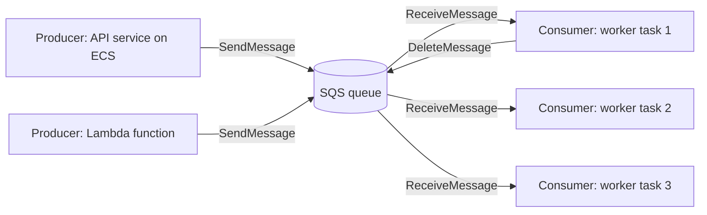

!!! note "Point-to-point does not mean one consumer process"
    Many consumer processes may read from the same queue. Point-to-point means that ==each individual message== is processed by one of them. This arrangement is called the competing consumers pattern and it is how SQS workloads scale horizontally.

### Why This Service or Concept Exists

#### The problem with synchronous coupling

Consider an image-sharing application. A user uploads a photograph; the application must create thumbnails, run content moderation, extract metadata and update a search index. If the upload API calls each of these steps synchronously, three problems appear:

1. ==Temporal coupling.== If the thumbnail service is down, the upload fails, even though the user only needed confirmation that the file was received.
2. ==Rate coupling.== A marketing campaign produces ten times the normal upload rate. Every downstream service must be scaled for the peak, or requests time out.
3. ==Latency coupling.== The user waits for the slowest step in the chain before receiving a response.

A queue removes all three couplings. The API writes a small message ("photo 8812 was uploaded, here is its S3 key") to a queue and returns immediately. Workers consume messages at the rate they can sustain. If workers fail, messages wait safely in the queue until they recover.

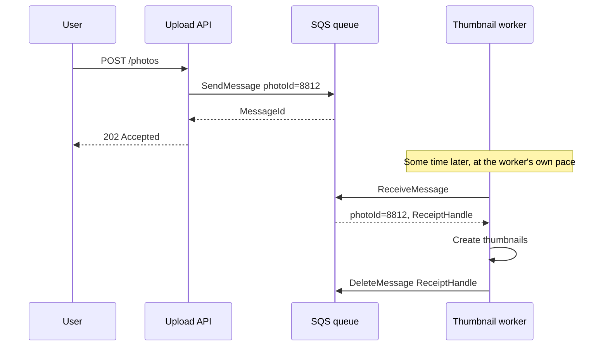

#### Why AWS built SQS

SQS was among the very first AWS services, released publicly in 2006. Amazon's retail platform had already discovered that large distributed systems cannot be built from synchronous calls alone; they need a buffer that absorbs spikes and isolates failures. Before managed queues, organisations operated message brokers such as IBM MQ, ActiveMQ or RabbitMQ on their own servers. Those brokers are powerful, but the operator must:

- provision and patch broker servers,
- design clustering and failover,
- size disks for the worst-case backlog,
- monitor broker memory and flow-control behaviour,
- plan capacity months ahead.

SQS removes all of this. There are no brokers to size, no clusters to operate and no capacity to reserve. A queue is created with one API call and scales from zero to very high throughput automatically.

#### Benefits over older methods

| Concern | Self-managed broker | Amazon SQS |
|---------|---------------------|------------|
| Provisioning | Servers, disks, clustering | None; a queue is an API resource |
| Scaling | Manual, capacity planned | Automatic, effectively unlimited for standard queues |
| Durability | Depends on replication configuration | Messages stored redundantly across multiple Availability Zones |
| Pricing | Pay for servers whether used or not | Pay per request |
| Protocols | AMQP, MQTT, STOMP, JMS | HTTPS API (AWS SDKs); JMS through a client library |
| Features | Rich routing, exchanges, transactions | Simple queue semantics; routing delegated to SNS or EventBridge |

!!! tip "When a traditional broker is still the right answer"
    If you are migrating an existing application that depends on AMQP, MQTT, JMS transactions or broker-side routing, ==Amazon MQ== (managed ActiveMQ and RabbitMQ) avoids rewriting the application. For new cloud-native designs, SQS is normally preferred because it has no broker instances to size or patch.

### Core Concepts

#### Producers, consumers and the queue

| Role | Responsibility |
|------|----------------|
| Producer | Creates a message and calls `SendMessage` or `SendMessageBatch`. Does not know or care who consumes it. |
| Queue | Stores the message durably until it is deleted or the retention period expires. |
| Consumer | Polls with `ReceiveMessage`, processes the message and calls `DeleteMessage` to acknowledge success. |

The critical design idea is that ==SQS never pushes messages to a consumer==. Consumers pull. Even when Lambda appears to be "triggered" by a queue, the Lambda service is running pollers on your behalf (see the Lambda integration section).

#### Decoupling along three dimensions

| Dimension | Without a queue | With a queue |
|-----------|-----------------|--------------|
| Time | Producer and consumer must both be running | Consumer may be offline for up to the retention period |
| Rate | Consumer must match the producer's peak | Consumer processes at its own sustainable rate |
| Location and technology | Producer must know the consumer's address and protocol | Producer only knows the queue URL |

#### How SQS stores messages internally

AWS does not publish the full internal design, but the documented behaviour tells us enough to reason as architects:

- A queue is not a single server. Messages are ==distributed across many storage hosts and replicated across multiple Availability Zones== within the Region before `SendMessage` returns success.
- A `ReceiveMessage` call with short polling queries only a ==subset of those hosts==. This is why an individual short poll can return nothing even though the queue contains messages, and why ordering in a standard queue is only best-effort.
- Because the system is distributed and designed for availability, a message can occasionally be stored or delivered more than once, for example when a host that held a copy was unavailable at the moment the message was deleted. This is the origin of ==at-least-once delivery==.

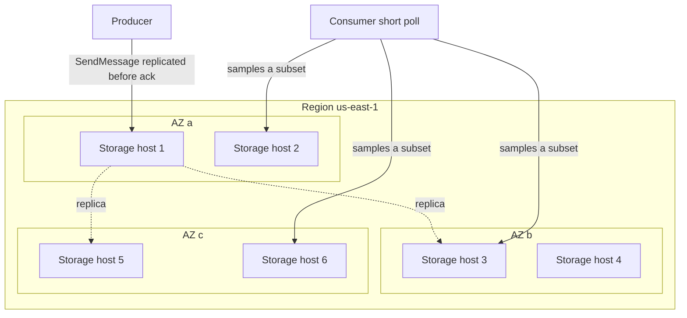

!!! warning "Design consequence"
    Because standard queues deliver at least once and without strict ordering, ==every consumer must be idempotent== and must not assume that message N arrives before message N+1. [4.3](../unit4/topic3.md#idempotency) explains idempotency techniques (idempotency keys, conditional writes, deduplication tables); apply them to every SQS consumer.

#### The message

An SQS message contains:

| Part | Description |
|------|-------------|
| Body | Text payload (XML, JSON or plain text in permitted Unicode ranges). Binary data must be Base64-encoded. |
| Message attributes | Up to 10 typed name/value pairs (`String`, `Number`, `Binary`, with optional custom type suffixes) used for metadata such as trace context or schema version. |
| System attributes | Values SQS maintains: `SentTimestamp`, `ApproximateReceiveCount`, `ApproximateFirstReceiveTimestamp`, `SenderId`, `AWSTraceHeader`, and for FIFO `MessageGroupId`, `MessageDeduplicationId`, `SequenceNumber`. |
| Message ID | Unique identifier assigned by SQS when the message is sent. |
| Receipt handle | Identifier returned with each receive. It identifies ==this particular receipt==, not the message, and is required to delete or change visibility. |

!!! danger "Receipt handle versus message ID"
    You cannot delete a message using its message ID. You must use the receipt handle from the most recent receive. If the message has been received again by another consumer (because its visibility timeout expired), the old receipt handle may no longer delete it reliably. This is one of the most common sources of "duplicate" processing.

#### The message lifecycle

The lifecycle is the single most important concept in this part. Every configuration option maps onto one of its transitions.

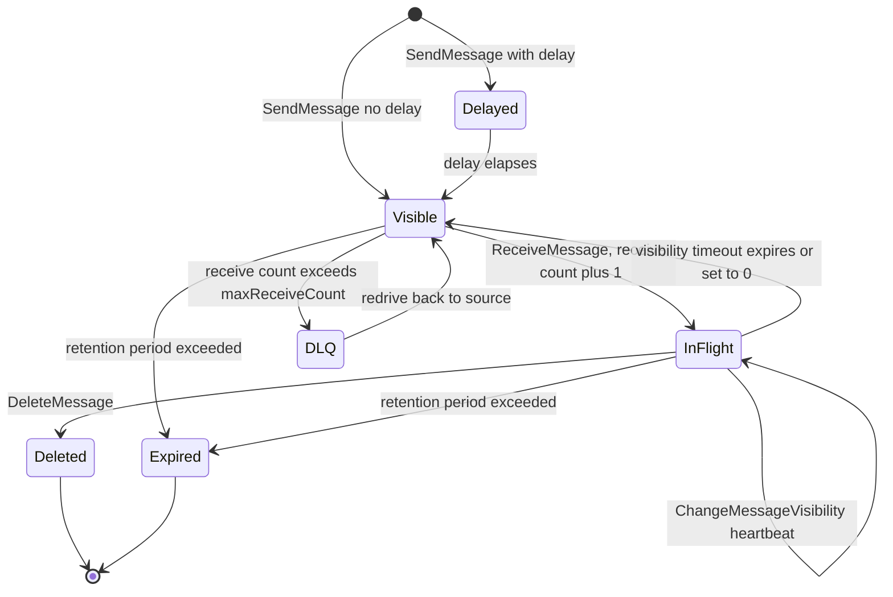

| State | Meaning | Relevant setting |
|-------|---------|------------------|
| Delayed | Stored but not yet receivable | `DelaySeconds` on queue, or message timer |
| Visible | Available to any consumer | Counted in `ApproximateNumberOfMessagesVisible` |
| In flight | Received by a consumer, hidden from others | `VisibilityTimeout`; counted in `ApproximateNumberOfMessagesNotVisible` |
| Deleted | Successfully acknowledged | `DeleteMessage` |
| Moved to DLQ | Failed too many times | Redrive policy `maxReceiveCount` |
| Expired | Deleted by SQS after retention | `MessageRetentionPeriod` |

##### Visibility timeout

When a consumer receives a message, SQS does not delete it. Instead it hides the message for the ==visibility timeout== (default 30 seconds, maximum 12 hours). If the consumer deletes the message within that window, processing is complete. If the consumer crashes, the timeout expires and the message becomes visible again for another consumer. This is how SQS achieves reliability ==without distributed transactions==: the acknowledgement is explicit and failure is detected by timeout.

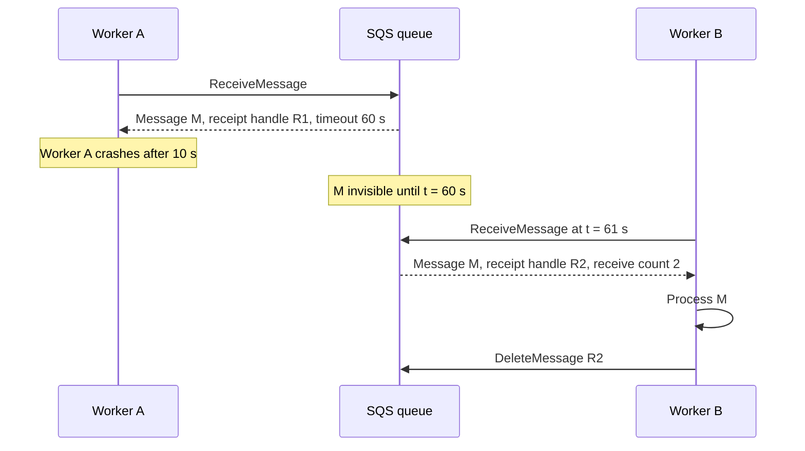

##### Heartbeating with ChangeMessageVisibility

Processing time is not always predictable. A video transcoding job may take 20 seconds or 20 minutes. Setting a 12-hour visibility timeout "to be safe" is poor design because a crashed worker would then delay the retry by 12 hours. The better approach is a ==heartbeat==: set a moderate timeout (for example 2 minutes) and, while processing continues, periodically call `ChangeMessageVisibility` to extend it.

!!! note "How the extension is measured"
    `ChangeMessageVisibility` sets a new timeout measured ==from the time of the call==, not added to the remaining time. The total time a message can remain in flight from its first receive is capped at 12 hours. Setting the value to 0 makes the message visible immediately, which is a useful way for a consumer to "give back" a message it cannot handle right now.

##### Receive count

Every receive increments `ApproximateReceiveCount`. Consumers may read it to make decisions (for example, log at warning level on the third attempt). The redrive policy uses it to move repeatedly failing messages to a dead-letter queue.

#### Short polling and long polling

| Aspect | Short polling | Long polling |
|--------|---------------|--------------|
| Setting | `WaitTimeSeconds = 0` | `WaitTimeSeconds` between 1 and 20 |
| Hosts queried | A sampled subset | All hosts (for the queue) |
| Response when empty | Immediately, empty | Waits until a message arrives or the wait time ends |
| Empty responses | Many (each billed as a request) | Few |
| Latency to first message | Low but may miss messages | Low; returns as soon as a message is available |
| Recommendation | Rarely needed | ==Default choice for almost every consumer== |

Long polling can be set per request (`WaitTimeSeconds`) or as the queue default (`ReceiveMessageWaitTimeSeconds`). It reduces cost, because each empty response is a billable request, and it reduces false empty responses caused by sampling.

!!! tip "HTTP client timeouts"
    With long polling of 20 seconds, the SDK's HTTP socket read timeout must be longer than 20 seconds. Most AWS SDKs configure this correctly, but custom HTTP clients and some proxies drop long-poll connections early, producing confusing timeout errors.

#### Delay queues and message timers

Sometimes a message should not be processed immediately: a reminder email 10 minutes after sign-up, or a back-off before retrying a failed payment.

- A ==delay queue== sets `DelaySeconds` (0 to 900 seconds, that is up to 15 minutes) for every message sent to the queue.
- A ==message timer== sets `DelaySeconds` on an individual `SendMessage` call and overrides the queue default. Message timers are ==supported on standard queues only==; FIFO queues support queue-level delay only.

!!! info "Longer delays"
    For delays beyond 15 minutes use Amazon EventBridge Scheduler one-time schedules (see the [Amazon EventBridge part](#event-routing-with-amazon-eventbridge)), AWS Step Functions wait states, or a DynamoDB table with TTL. SQS delay is intended for short deferral, not for scheduling.

#### Retention

Messages that are not deleted are removed automatically when the ==retention period== ends. Retention is configurable from 60 seconds to 14 days, with a default of 4 days. A queue is therefore a buffer, not a database: if consumers are broken for longer than the retention period, data is lost.

!!! warning "Retention and dead-letter queues"
    For standard queues, a message's expiry is based on its ==original enqueue timestamp==, and moving the message to a DLQ does not reset that timestamp. If the source queue retains messages for 4 days and a message spends 3 days failing, it has only 1 day left in a DLQ with the same retention. Always configure the DLQ with a ==longer retention== (commonly the 14-day maximum) than the source queue. For FIFO queues, AWS documents that the enqueue timestamp is reset when a message moves to the DLQ; verify current behaviour in the SQS Developer Guide.

#### Message size and the claim-check pattern

For most of SQS's history the maximum message size was 256 KiB. In August 2025 AWS ==increased the maximum message payload to 1 MiB== (1,048,576 bytes) for SQS queues, configurable through the `MaximumMessageSize` queue attribute. Existing queues may still be configured with a lower maximum, so check the attribute rather than assuming.

Even at 1 MiB, queues are not a good place for large blobs. The ==Amazon SQS Extended Client Library== (Java and Python implementations are published by AWS) implements the ==claim-check pattern==: the payload is stored in Amazon S3 and the queue message carries only a pointer. This supports payloads up to 2 GB.

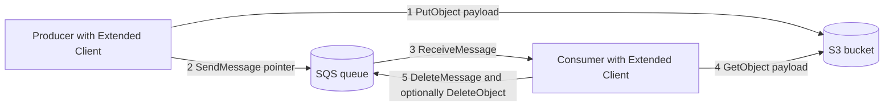

!!! tip "Billing arithmetic for large messages"
    SQS bills every ==64 KB chunk== of a payload as one request. A 1 MiB message therefore costs the same as 16 small messages on send, and again on receive. For large payloads, the claim-check approach is often cheaper as well as faster, and S3 lifecycle rules can remove old payload objects automatically.

#### Batching

Most data-plane APIs have batch forms that operate on up to 10 messages per call:

| Single API | Batch API | Notes |
|------------|-----------|-------|
| `SendMessage` | `SendMessageBatch` | Total batch payload bounded by the maximum message size |
| `DeleteMessage` | `DeleteMessageBatch` | Each entry uses its own receipt handle |
| `ChangeMessageVisibility` | `ChangeMessageVisibilityBatch` | Useful for heartbeating a batch |
| `ReceiveMessage` | (already returns up to 10 with `MaxNumberOfMessages`) | Default is 1, so always set this |

Batch calls can ==partially fail==. The response contains `Successful` and `Failed` lists and the caller must retry the failed entries. Treating an HTTP 200 as full success is a classic bug.

#### Standard queues versus FIFO queues

##### FIFO queue essentials

FIFO queue names must end in `.fifo`. FIFO queues add three concepts:

| Concept | Purpose |
|---------|---------|
| ==Message group ID== | Required on every message. Messages with the same group ID are delivered in strict order, one at a time. Different groups are processed in parallel. |
| ==Message deduplication ID== | A token. If a message with the same deduplication ID was sent successfully within the ==5-minute deduplication interval==, the new message is accepted but not delivered again. |
| Content-based deduplication | Queue option that makes SQS compute the deduplication ID as a SHA-256 hash of the message body (attributes are not included). |

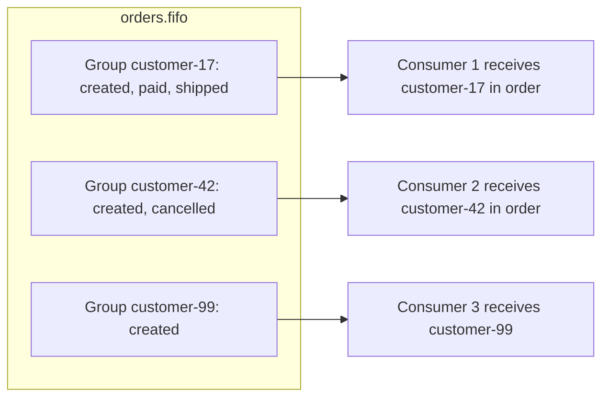

Ordering is guaranteed ==within a group== only. While a message from a group is in flight, SQS does not deliver later messages from the same group. This is how order is preserved, and it has a direct consequence: ==a slow or failing message blocks its whole group== until it is deleted, times out or is moved to the DLQ.

!!! example "Choosing the message group ID"
    For an e-commerce order stream, use the order ID or customer ID as the group ID. This preserves order where it matters (the events of one order) while allowing thousands of orders to be processed in parallel. Using a single constant group ID for all messages serialises the entire queue to one message at a time, which is a frequent performance mistake.

##### Exactly-once processing, precisely stated

FIFO queues provide ==exactly-once processing== in a narrow, well-defined sense: duplicates ==introduced by the producer== (for example a retried `SendMessage` after a network timeout) are removed within the 5-minute window, and a message is not delivered to a second consumer while it is in flight. It does ==not== guarantee that your consumer's side effects happen exactly once: if a consumer processes a message and crashes before deleting it, the message will be delivered again after the visibility timeout. Consumers of FIFO queues must still be idempotent.

For consumers, `ReceiveRequestAttemptId` allows a `ReceiveMessage` call to be retried safely after a network error: SQS returns the same messages instead of hiding them for the full visibility timeout.

##### High-throughput FIFO

A default FIFO queue supports around 300 API transactions per second per API action (around 3,000 messages per second with batches of 10). ==High-throughput mode== partitions the queue by message group ID and raises the limit substantially; AWS documents limits that vary by Region, from thousands to tens of thousands of transactions per second, multiplied by up to 10 with batching. It is enabled by setting:

| Attribute | Value |
|-----------|-------|
| `DeduplicationScope` | `messageGroup` |
| `FifoThroughputLimit` | `perMessageGroupId` |

!!! note "High throughput depends on group cardinality"
    Throughput is distributed across message groups. A high-throughput FIFO queue with only three group IDs cannot use many partitions. Choose a group ID with many distinct values.

##### Fair queues for multi-tenant standard queues

In July 2025 AWS introduced ==SQS fair queues==. In a multi-tenant system, one tenant can flood a shared standard queue ("noisy neighbour"), causing every other tenant's messages to wait behind the backlog. With fair queues, producers set a `MessageGroupId` (the tenant identifier) on messages sent to a ==standard== queue. SQS detects when one group builds a disproportionate backlog and prioritises delivery of messages from other groups so that quiet tenants keep low dwell times. Consumers do not need to change, and standard-queue throughput and semantics (no strict ordering) are retained. AWS also added CloudWatch metrics describing noisy and quiet groups; consult the SQS Developer Guide for the current metric names.

| Requirement | Standard | Standard with fair queue groups | FIFO | High-throughput FIFO |
|-------------|----------|----------------------------------|------|----------------------|
| Strict ordering per key | No | No | Yes | Yes |
| Producer-side deduplication | No | No | Yes | Yes (per group scope) |
| Tenant isolation of dwell time | No | Yes | Partly (groups) | Partly (groups) |
| Maximum throughput | Nearly unlimited | Nearly unlimited | Bounded | Much higher, Region dependent |
| Relative price per request | Lower | Lower | Higher | Higher |

#### Dead-letter queues and redrive

A ==dead-letter queue (DLQ)== is an ordinary SQS queue that receives messages the source queue could not get processed successfully. This part covers the SQS mechanics; the operating model (every DLQ has a depth alarm, an owning team and a tested redrive procedure) is covered in [4.3](../unit4/topic3.md#dead-letter-queue-with-owned-redrive). It is attached to the source queue through a ==redrive policy==:

```json
{
  "deadLetterTargetArn": "arn:aws:sqs:us-east-1:111122223333:orders-dlq",
  "maxReceiveCount": 5
}
```

When a message's receive count exceeds `maxReceiveCount`, SQS moves it to the DLQ instead of making it visible again. Rules to remember:

- The DLQ must be the ==same type== as the source (a FIFO source requires a FIFO DLQ) and in the same account and Region.
- The ==redrive allow policy== on the DLQ controls which source queues may use it: `allowAll` (default), `denyAll`, or `byQueue` with a list of up to 10 source queue ARNs.
- After fixing the bug that caused the failures, messages can be moved back with ==DLQ redrive==, available in the console and through the APIs `StartMessageMoveTask`, `ListMessageMoveTasks` and `CancelMessageMoveTask`. A move task can send messages back to their original source queues or to a different destination queue, at a configurable maximum velocity. AWS extended redrive support to FIFO queues after initially offering it for standard queues; verify current support for your queue type.

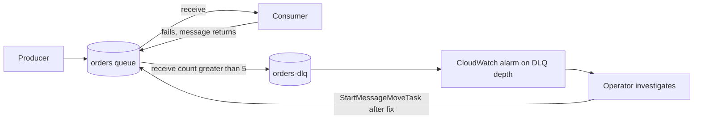

!!! warning "Choosing maxReceiveCount"
    A value of 1 moves a message to the DLQ after a single failure, including transient failures such as a throttled downstream API. That floods the DLQ with messages that would have succeeded on retry. Values between 3 and 10 are common. Lambda consumers are a special case: because of how the Lambda poller scales, AWS recommends a `maxReceiveCount` of ==at least 5== so that throttled invocations do not push healthy messages into the DLQ prematurely.

#### Poison messages

A ==poison message== is one that can never be processed successfully, for example malformed JSON or a reference to a deleted customer. Without a DLQ, a poison message in a standard queue is retried until retention expires, consuming capacity and cost each time. In a FIFO queue, a poison message ==blocks its message group==. DLQs are therefore not optional in production; they are the mechanism that isolates poison messages from healthy traffic.

!!! tip "Fail fast for permanent errors"
    Consumers should classify errors. For a transient error (timeout, throttling) let the message return to the queue for retry. For a permanent error (validation failure), there is no benefit in retrying five times: the consumer can send the message directly to a DLQ or an "errors" queue with diagnostic attributes and then delete it from the source.

### AWS Service Deep Dive

#### Purpose

SQS provides a durable, elastic buffer between software components so that they can fail, scale and be deployed independently. Its design goals are simplicity (a handful of API actions), durability (messages replicated across Availability Zones), elasticity (no capacity provisioning) and a pay-per-use cost model.

#### Architecture

From an architect's perspective, SQS has a small number of moving parts:

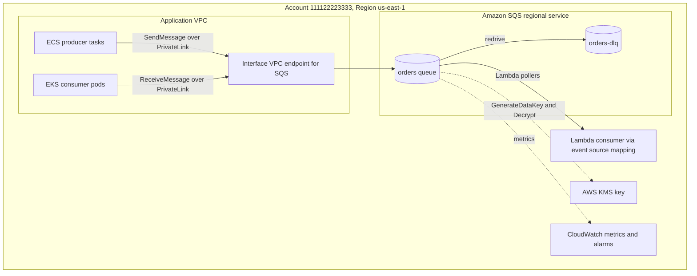

- ==Regional service.== A queue lives in one Region and is addressed by its queue URL, for example `https://sqs.us-east-1.amazonaws.com/111122223333/orders`. There is no Availability Zone selection; resilience across zones is built in.
- ==Control plane== actions (`CreateQueue`, `SetQueueAttributes`, `DeleteQueue`, `TagQueue`) are low-volume administrative calls usually made by infrastructure as code.
- ==Data plane== actions (`SendMessage`, `ReceiveMessage`, `DeleteMessage`, `ChangeMessageVisibility` and their batch variants) are high-volume calls made by application code.
- ==API protocols.== SQS originally used the AWS Query protocol (XML). In 2023 AWS added the AWS JSON protocol, which current SDK versions use by default and which reduces serialisation overhead. Application code is unaffected when it uses an SDK.

#### Important Features

| Feature | Summary |
|---------|---------|
| Standard and FIFO queues | Throughput-oriented versus order-oriented semantics |
| High-throughput FIFO | Per-message-group partitioning for FIFO |
| Fair queues | Noisy-neighbour mitigation on standard queues using message group IDs |
| Visibility timeout and heartbeats | Explicit acknowledgement with timeout-based failure detection |
| Long polling | Up to 20 seconds wait, lower cost and fewer empty responses |
| Delay queues and message timers | Up to 15 minutes deferral |
| Dead-letter queues and redrive | Isolation and recovery of failing messages |
| Server-side encryption | SSE-SQS (default for new queues) or SSE-KMS |
| Queue policies | Resource-based access control, including cross-account and service principals |
| VPC interface endpoints | Private connectivity through AWS PrivateLink |
| Tagging and ABAC | Cost allocation and attribute-based access control |
| Native event source for Lambda | Managed polling, batching and scaling |
| Extended Client Library | Payloads up to 2 GB through S3 |
| Temporary queue client | Virtual queues for request-response patterns (Java) |

#### Limitations

- ==No broadcast.== A message is consumed by one consumer. For one-to-many delivery, place SNS or EventBridge in front of multiple queues (the Amazon SNS part of this section).
- ==No replay after deletion.== Once a message is deleted it is gone. SQS is not a log; if consumers need to re-read history, use Amazon Kinesis Data Streams (the Amazon Kinesis part of this section), Amazon MSK or EventBridge archives (the [Amazon EventBridge part](#event-routing-with-amazon-eventbridge)).
- ==No content-based routing.== A consumer receives whatever is next; it cannot ask for "only messages of type X". Filtering belongs upstream in SNS subscription filter policies or EventBridge rules.
- ==No message selectors or priorities within one queue.== Priority requires separate queues.
- ==Bounded retention== of 14 days.
- ==Approximate metrics.== Queue depth metrics are eventually consistent approximations.
- ==Limited delay== of 15 minutes.

#### Pricing Model and recommendations

!!! info "Pricing figures"
    Prices and quotas below are indicative, as of 2026. Verify them in the AWS Pricing Calculator and in Service Quotas before using them in a design document.

| Dimension | How it is charged |
|-----------|-------------------|
| Requests | Per million API requests; every action counts, including empty receives |
| Payload chunks | Each 64 KB chunk of a request payload is billed as one request |
| Queue type | FIFO requests cost more per million than standard requests |
| Free tier | A monthly allowance of requests (historically 1 million) |
| Data transfer | Standard AWS data transfer charges apply for traffic leaving the Region or to the internet; traffic within the Region between SQS and EC2 or Lambda is not charged as data transfer |
| KMS | With SSE-KMS, KMS API calls are billed separately; the data key reuse period controls how many |

Recommendations:

1. Use ==long polling== to eliminate most empty receives.
2. Use ==batch APIs==: one batch of 10 messages is one request (subject to the 64 KB chunk rule).
3. Use ==SSE-SQS== unless you need key-level control; it has no KMS request charges.
4. If you use SSE-KMS, set a ==longer data key reuse period== (up to 24 hours) to reduce KMS calls.
5. Add DLQs to stop poison messages being retried (and billed) until retention expires.

#### Performance Characteristics

| Characteristic | Standard queue | FIFO queue |
|----------------|----------------|------------|
| Send latency | Typically tens of milliseconds within a Region | Similar, slightly higher |
| End-to-end latency with long polling | Low, typically sub-second when consumers are idle and waiting | Low, but blocked by in-flight messages in the same group |
| Throughput | Nearly unlimited API calls per second per action | Around 300 transactions per second per action by default, much higher in high-throughput mode |
| Ordering | Best-effort | Strict per message group |
| Duplicates | Possible | Producer duplicates removed within 5 minutes |

#### Scaling Behaviour

SQS itself scales without configuration. What the architect must scale is the ==consumer fleet==, and the decision signal is the backlog:

- A growing `ApproximateNumberOfMessagesVisible` means consumers are slower than producers.
- A growing `ApproximateAgeOfOldestMessage` means messages are waiting longer; this is the ==user-facing latency signal== and usually the best alarm metric.
- Consumers scale out on backlog and scale in when the backlog is drained. The Integration section shows how to do this for Lambda, ECS and EKS.

#### Availability

SQS is a regional, multi-AZ service. Messages are stored redundantly across Availability Zones, and the loss of an Availability Zone does not normally affect a queue. SQS does not replicate queues across Regions. Multi-Region designs must create a queue in each Region and route producers explicitly, or use SNS topics or EventBridge buses with cross-Region targets. Review the current SQS Service Level Agreement for the committed monthly uptime percentage.

#### Security Features

| Control | Purpose |
|---------|---------|
| IAM identity policies | Grant roles actions such as `sqs:SendMessage` on specific queue ARNs |
| Queue (resource) policies | Allow other accounts or service principals (SNS, S3, EventBridge) to send |
| SSE-SQS | Encryption at rest with SQS-owned keys, enabled by default for new queues |
| SSE-KMS | Encryption at rest with AWS managed or customer managed KMS keys |
| TLS | All API calls use HTTPS; `aws:SecureTransport` can be enforced in policy |
| VPC interface endpoints | Private access without internet or NAT gateway; endpoint policies restrict usage |
| CloudTrail | Control plane events are logged by default; data plane events can be logged as CloudTrail data events |

#### Service Limits

!!! info "Quotas"
    Indicative values as of 2026. Verify in Service Quotas and in the SQS Developer Guide "quotas" pages.

| Limit | Value |
|-------|-------|
| Maximum message size | 1 MiB (configurable lower); up to 2 GB with the Extended Client Library |
| Message retention | 60 seconds to 14 days, default 4 days |
| Visibility timeout | 0 seconds to 12 hours, default 30 seconds |
| Delay | 0 to 15 minutes |
| Long poll wait | Up to 20 seconds |
| Messages per batch | 10 |
| Message attributes | 10 per message |
| In-flight messages, standard queue | Approximately 120,000 per queue |
| In-flight messages, FIFO queue | Bounded per queue; AWS has raised this limit over time, so check current documentation |
| FIFO deduplication interval | 5 minutes |
| Message group ID and deduplication ID length | 128 characters |
| Queue name | Up to 80 characters; FIFO names end in `.fifo` |
| DLQ redrive allow policy `byQueue` | Up to 10 source queues |

!!! warning "The in-flight limit is a hidden scaling ceiling"
    If consumers receive messages but fail to delete them (for example, a bug swallows exceptions after receive), in-flight messages accumulate. When the in-flight quota is reached, `ReceiveMessage` returns an `OverLimit` error for standard queues, or returns no messages for FIFO queues, and the whole system stalls even though consumers look healthy.

### Important AWS Terminology

General terms such as event, command, idempotency and dead-letter queue are in the [Chapter 1.7](../unit1/topic7.md) glossary. The following terms are specific to SQS.

| Term | Meaning |
|------|---------|
| Queue URL | The address used in data plane calls, for example `https://sqs.us-east-1.amazonaws.com/111122223333/orders` |
| Queue ARN | The identifier used in IAM and resource policies, for example `arn:aws:sqs:us-east-1:111122223333:orders` |
| Receipt handle | Token returned by each receive, required for delete and visibility changes |
| Visibility timeout | Period during which a received message is hidden from other consumers |
| In-flight message | A message that has been received but not yet deleted or returned |
| Backlog | Messages visible and waiting to be processed |
| Long polling | Receive call that waits up to 20 seconds for a message to arrive |
| Delay queue | Queue with a default delivery delay for every message |
| Message timer | Per-message delivery delay (standard queues only) |
| Redrive policy | Source queue attribute naming the DLQ and `maxReceiveCount` |
| Redrive allow policy | DLQ attribute naming which source queues may use it |
| DLQ redrive | Moving messages from a DLQ back to a source or other queue |
| Message group ID | FIFO ordering key; also the tenant key for fair queues |
| Message deduplication ID | FIFO token used to discard producer duplicates within 5 minutes |
| Content-based deduplication | FIFO option that uses a SHA-256 hash of the body as the deduplication ID |
| High-throughput FIFO | FIFO mode partitioned by message group ID |
| Fair queue | Standard queue using message group IDs to reduce noisy-neighbour impact |
| Event source mapping | Lambda resource that polls a queue and invokes a function with batches |
| Partial batch response | Lambda response listing only the failed message IDs of a batch |
| Poison message | Message that fails permanently regardless of retries |

### Configuration Options

#### Queue attributes

| Attribute | Default | Range | Architect's guidance |
|-----------|---------|-------|----------------------|
| `VisibilityTimeout` | 30 s | 0 s to 12 h | Longer than the p99 processing time of one message or batch; for Lambda at least 6 times the function timeout |
| `MessageRetentionPeriod` | 4 days | 60 s to 14 days | Long enough to survive a weekend outage of consumers; DLQ longer than source |
| `DelaySeconds` | 0 | 0 to 900 s | Only when deferral is a business requirement |
| `ReceiveMessageWaitTimeSeconds` | 0 | 0 to 20 s | Set to 20 for long polling by default |
| `MaximumMessageSize` | Up to 1 MiB | 1 KiB to 1 MiB | Lower it to enforce small messages; use claim check for large payloads |
| `RedrivePolicy` | None | `deadLetterTargetArn`, `maxReceiveCount` | Always configure in production |
| `RedriveAllowPolicy` | `allowAll` | `allowAll`, `denyAll`, `byQueue` | Use `byQueue` to prevent unrelated queues writing into your DLQ |
| `SqsManagedSseEnabled` | true for new queues | true or false | Keep enabled unless using SSE-KMS |
| `KmsMasterKeyId` | None | Key ID, ARN or alias | Customer managed key for key policy control and cross-account use |
| `KmsDataKeyReusePeriodSeconds` | 300 | 60 to 86,400 | Longer period reduces KMS cost; shorter period limits blast radius |
| `Policy` | None | JSON | Resource policy for cross-account and service principal access |
| `FifoQueue` | false | true | Set at creation only; cannot be changed later |
| `ContentBasedDeduplication` | false | true or false | Enable when the body uniquely identifies the business operation |
| `DeduplicationScope` | `queue` | `queue` or `messageGroup` | `messageGroup` for high-throughput FIFO |
| `FifoThroughputLimit` | `perQueue` | `perQueue` or `perMessageGroupId` | `perMessageGroupId` for high-throughput FIFO |

!!! danger "Immutable choice"
    A standard queue cannot be converted to a FIFO queue, or the reverse. Changing type means creating a new queue, moving producers and consumers and draining the old queue. Decide early, and record the decision in an Architecture Decision Record.

#### Receive request parameters

| Parameter | Recommended value | Reason |
|-----------|-------------------|--------|
| `MaxNumberOfMessages` | 10 | Fewer requests, lower cost, higher throughput |
| `WaitTimeSeconds` | 20 | Long polling |
| `VisibilityTimeout` | Omit (use queue default) or override for special consumers | Per-receive override is possible |
| `MessageSystemAttributeNames` | `ApproximateReceiveCount`, `SentTimestamp`, `AWSTraceHeader` as needed | Diagnostics and tracing |
| `MessageAttributeNames` | `All` or an explicit list | Attributes are not returned unless requested |
| `ReceiveRequestAttemptId` | Unique per logical attempt (FIFO) | Safe retries of receive after network errors |

#### Lambda event source mapping options

| Option | Range | Guidance |
|--------|-------|----------|
| `BatchSize` | 1 to 10 for FIFO; 1 to 10,000 for standard | Larger batches reduce invocations; with more than 10 a batching window is required |
| `MaximumBatchingWindowInSeconds` | 0 to 300 | Wait to fill a batch; increases latency, reduces cost |
| `ScalingConfig.MaximumConcurrency` | 2 to 1,000 | Caps concurrent invocations for this mapping to protect downstream systems |
| `FunctionResponseTypes` | `ReportBatchItemFailures` | Enables partial batch responses; strongly recommended |
| `FilterCriteria` | Up to a small number of patterns | Discards non-matching messages before invocation; filtered messages are deleted |
| Provisioned mode | Minimum and maximum pollers | Newer option for predictable high-volume workloads; verify availability and pricing in current Lambda documentation |

!!! warning "Event filtering deletes messages"
    When an SQS event source mapping uses `FilterCriteria`, messages that do not match are ==deleted from the queue== without invoking the function. Filtering is useful for discarding noise, but it is not routing. If other consumers need those messages, route with SNS or EventBridge instead.

### Design Considerations

#### Scalability

Standard queues scale without limit in practice; FIFO queues scale with the number of message groups. The consumer tier is the real constraint. Design consumers to be ==stateless and horizontally scalable== so that adding tasks, pods or Lambda concurrency increases throughput linearly until a downstream dependency saturates.

#### Availability

A queue improves availability of the ==producer path==. The API that enqueues work remains available even when consumers or their databases are unavailable. This is sometimes called ==graceful degradation by buffering==. The trade-off is that the user receives an asynchronous acknowledgement, so the product design must accept "your request is being processed".

#### Reliability

Reliability depends on correct acknowledgement:

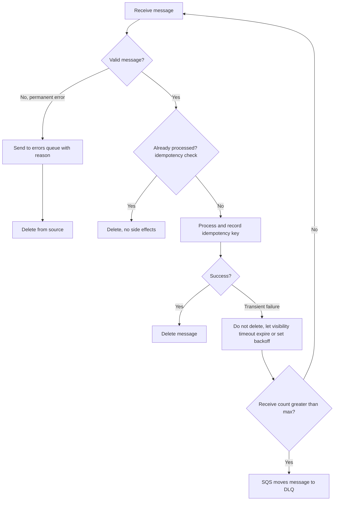

Delete only ==after== side effects are durably committed. Deleting before processing turns at-least-once delivery into at-most-once and silently loses work when a consumer crashes.

#### Durability

SQS stores messages redundantly, but durability is bounded by retention. If business data must survive indefinitely, persist it in S3 or a database first and put a reference on the queue.

#### Latency

Queues add latency by design. With idle consumers and long polling, the added latency is small, but with a backlog the latency equals the backlog depth divided by processing rate. For interactive, user-waiting operations, a synchronous call (possibly with a circuit breaker, [Chapter 4.3](../unit4/topic3.md)) may be more appropriate.

#### Cost

Cost scales with request count and payload size. The largest cost drivers in practice are short polling with idle consumers, `MaxNumberOfMessages = 1`, and retry storms of poison messages without a DLQ.

#### Performance

- FIFO ordering throughput is bounded per group, so group ID cardinality matters.
- Visibility timeouts that are too long slow recovery from failures.
- Batch sizes that are too large increase per-invocation duration and the blast radius of a batch failure.

#### Maintainability

Version message schemas (for example a `schemaVersion` attribute), use a single message envelope across services (see [Naming conventions](#naming-conventions) in the Amazon EventBridge part), and keep queue definitions in infrastructure as code alongside the consumers that own them.

#### Operational complexity

SQS itself has very low operational complexity. Complexity moves into ==observability== (tracking a request across asynchronous hops), ==DLQ operations== (someone must own and triage DLQs) and ==idempotency== in consumers.

!!! question "Architect's checklist before adding a queue"
    Does the caller need the result immediately? Can the consumer be idempotent? Who owns the DLQ and its alarm? Is ordering required, and if so, per which key? What is the maximum tolerable backlog age? What happens if consumers are down for longer than the retention period?

### AWS Best Practices

| Pillar | SQS practice |
|--------|--------------|
| Operational Excellence | Define queues, DLQs, alarms and scaling in IaC; create a runbook for DLQ triage and redrive; propagate trace context through message attributes |
| Security | SSE by default; customer managed KMS keys for sensitive data; least-privilege IAM per producer and consumer; queue policies with `aws:SourceArn` conditions; VPC endpoints for private workloads |
| Reliability | DLQ on every queue; idempotent consumers; visibility timeout sized to processing time; heartbeats for long jobs; retention long enough to survive consumer outages |
| Performance Efficiency | Long polling; batching; parallel consumers; high-throughput FIFO where ordering is required at scale; appropriate group ID cardinality |
| Cost Optimization | Long polling; batching; DLQs to stop retry waste; claim check for large payloads; Lambda batching windows for low-latency-tolerant workloads |
| Sustainability | Scale consumers to zero when idle (Lambda, KEDA, ECS minimum capacity 0); avoid busy polling; batch work to improve utilisation |

### Security Considerations

#### IAM and least privilege

Each workload gets its own IAM role with only the actions it needs on only the queues it uses:

| Workload | Required actions |
|----------|------------------|
| Producer | `sqs:SendMessage` (covers the batch form), and `sqs:GetQueueUrl` if it resolves the URL by name |
| Consumer | `sqs:ReceiveMessage`, `sqs:DeleteMessage`, `sqs:ChangeMessageVisibility`, `sqs:GetQueueAttributes` |
| Lambda event source mapping (execution role) | `sqs:ReceiveMessage`, `sqs:DeleteMessage`, `sqs:GetQueueAttributes` |
| Operator redriving a DLQ | `sqs:StartMessageMoveTask`, `sqs:ListMessageMoveTasks`, `sqs:CancelMessageMoveTask`, plus receive/delete on the DLQ and send on the destination |

On ECS, attach these permissions to the ==task role== (not the task execution role, which is for pulling images and writing logs). On EKS, use ==EKS Pod Identity== or ==IRSA== so that each service account receives its own role ([Chapter 3.1](../unit3/topic1.md#core-concepts-eks-security-and-iam-integration)). In the AWS Academy Learner Lab you are limited to the pre-created `LabRole`, which is broader than production least privilege; note this in lab reports.

#### Queue policies

A queue policy is a resource-based policy attached to the queue. It is required when:

- another AWS account sends to or receives from the queue,
- an AWS service principal sends to it (Amazon SNS, Amazon S3 event notifications, Amazon EventBridge),
- you want to enforce conditions for all callers, for example deny non-TLS access.

```json
{
  "Version": "2012-10-17",
  "Statement": [
    {
      "Sid": "AllowOrdersTopic",
      "Effect": "Allow",
      "Principal": { "Service": "sns.amazonaws.com" },
      "Action": "sqs:SendMessage",
      "Resource": "arn:aws:sqs:us-east-1:111122223333:orders",
      "Condition": {
        "ArnEquals": { "aws:SourceArn": "arn:aws:sns:us-east-1:111122223333:order-events" }
      }
    },
    {
      "Sid": "DenyInsecureTransport",
      "Effect": "Deny",
      "Principal": "*",
      "Action": "sqs:*",
      "Resource": "arn:aws:sqs:us-east-1:111122223333:orders",
      "Condition": { "Bool": { "aws:SecureTransport": "false" } }
    }
  ]
}
```

!!! danger "Confused deputy"
    A policy that allows `sns.amazonaws.com` without an `aws:SourceArn` (or `aws:SourceAccount`) condition allows ==any SNS topic in any account== to send to your queue. Always scope service principal grants.

#### Encryption

| Option | Key ownership | KMS charges | Cross-account and service principal use | When to choose |
|--------|---------------|-------------|------------------------------------------|----------------|
| SSE-SQS | SQS-owned keys | None | Works transparently | Default for most workloads |
| SSE-KMS with AWS managed key `aws/sqs` | AWS managed | Yes | ==Cannot be used by SNS, S3 or EventBridge==, because you cannot edit the key policy | Rarely a good choice |
| SSE-KMS with customer managed key | Customer | Yes | Works if the key policy grants the principal | Regulated data, key-level audit, cross-account |

With SSE-KMS, producers need `kms:GenerateDataKey` and consumers need `kms:Decrypt` on the key, in addition to SQS permissions. When SNS or S3 sends to an encrypted queue, the ==key policy== must allow that service principal to use the key. Key types, key policies and envelope encryption are explained in [8.3](../unit8/topic3.md#encryption-at-rest-with-aws-kms).

!!! note "What is encrypted"
    SSE encrypts the message body. Queue metadata, message IDs and message attributes are handled differently; AWS documents that message attributes are not encrypted with SSE in the same way as the body. Do not put secrets or personal data in attributes. Encryption in transit is provided by TLS for all API calls.

#### Network controls: VPC endpoints

Workloads in private subnets reach SQS either through a NAT gateway (internet path, NAT data processing charges) or through an ==interface VPC endpoint== (`com.amazonaws.us-east-1.sqs`) powered by AWS PrivateLink. Endpoints keep traffic on the AWS network, remove NAT cost for SQS traffic, and support ==endpoint policies== that restrict which queues can be used through the endpoint. Queue policies can in turn require `aws:SourceVpce` so that the queue is usable only from that endpoint.

Security groups on the endpoint's network interfaces must allow HTTPS (TCP 443) from the application subnets or security groups. Network ACLs must allow the return traffic.

#### Logging and compliance

- CloudTrail records control plane actions by default; enable ==data events== for SQS when you need an audit trail of sends and receives (at additional cost).
- AWS Config rules can check that queues are encrypted and have DLQs.
- SQS is in scope for many compliance programmes (for example PCI DSS, HIPAA eligibility, ISO); consult AWS Artifact for current reports.

### Performance Optimization

#### Caching and connection reuse

- Create SDK clients ==once per process== (outside the Lambda handler, once per container) so that TLS connections are reused. Creating a client per message adds tens of milliseconds and CPU per call.
- Cache the queue URL rather than calling `GetQueueUrl` on every send.
- Cache downstream lookups (for example reference data in ElastiCache, [6.1](../unit6/topic1.md#caching-strategies-with-amazon-elasticache)) so that consumers spend their time on the work, not on repeated reads.

#### Parallelism

Throughput of a consumer fleet is approximately:

```text
throughput = consumers x threads per consumer x (messages per receive / processing time per batch)
```

Increase any factor. Within a container, run several receive loops concurrently (threads, async tasks or goroutines) so that the CPU is not idle while waiting on I/O. For FIFO queues, parallelism is limited by the number of message groups with available messages.

#### Auto scaling on backlog

The correct scaling signal for a queue consumer is ==backlog per consumer==, not CPU. A worker waiting on a slow database may have low CPU while the backlog grows.

```text
backlog per task            = ApproximateNumberOfMessagesVisible / running task count
acceptable backlog per task = acceptable latency (s) / average processing time per message (s)
```

!!! example "Worked example"
    Each message takes 0.5 seconds to process and the business accepts a maximum of 60 seconds of queueing latency. The acceptable backlog per task is 60 / 0.5 = 120 messages. If the queue holds 6,000 visible messages, the target number of tasks is 6,000 / 120 = 50. A target tracking policy on the metric "backlog per task" with target value 120 will converge on 50 tasks.

#### Load balancing

No load balancer is needed. Competing consumers naturally balance load: a consumer that is busy simply does not call `ReceiveMessage`, so idle consumers receive the next messages. This is ==pull-based load balancing==.

#### Storage optimisation

- Keep messages small: send identifiers and references, not documents.
- Compress payloads when they must be inline (and Base64-encode, since the body is text).
- Use claim check for payloads above tens of kilobytes when cost matters.

#### Monitoring

| Metric | Meaning | Typical alarm |
|--------|---------|---------------|
| `ApproximateNumberOfMessagesVisible` | Backlog waiting | Scaling input; alarm if sustained high |
| `ApproximateNumberOfMessagesNotVisible` | In flight | Alarm if approaching in-flight quota |
| `ApproximateNumberOfMessagesDelayed` | Delayed messages | Informational |
| `ApproximateAgeOfOldestMessage` | Age of the oldest message in seconds | ==Primary latency and health alarm== |
| `NumberOfMessagesSent` | Messages added | Detect producer outages (drop to zero) |
| `NumberOfMessagesReceived` | Receives (including repeats) | Compare with deleted to detect retries |
| `NumberOfMessagesDeleted` | Successful acknowledgements | Throughput of successful processing |
| `NumberOfEmptyReceives` | Receives with no messages | Cost signal; should be low with long polling |
| `SentMessageSize` | Size of sent messages | Detect payload growth |
| DLQ `ApproximateNumberOfMessagesVisible` | Failed messages | ==Alarm when greater than 0== |

!!! tip "Why the age metric beats the depth metric"
    A backlog of 10,000 messages may be healthy for a fleet that processes 5,000 per second, and a backlog of 50 may be a disaster if one message has been stuck for three days. `ApproximateAgeOfOldestMessage` measures what users experience. Note that a poison message repeatedly returned to the queue can keep this metric high; SQS documents how the metric behaves with redrive, so pair it with the DLQ alarm.

SQS metrics are published to CloudWatch at one-minute granularity for active queues. For end-to-end tracing ([7.1](../unit7/topic1.md#distributed-tracing-with-aws-x-ray) explains how X-Ray works), AWS X-Ray propagates trace context through the `AWSTraceHeader` system attribute, and Lambda consumers can continue the trace. With AWS Distro for OpenTelemetry (ADOT) in ECS or EKS, propagate W3C trace context through message attributes.

### Cost Optimization

| Technique | Effect |
|-----------|--------|
| Pay-as-you-go | No idle cost for queues; you pay for requests only |
| Long polling | Removes most empty receive requests |
| Batching (send, receive, delete) | Up to 10 times fewer requests |
| Lambda batching window | Fewer invocations and fewer receives for latency-tolerant workloads |
| DLQ with sensible `maxReceiveCount` | Stops paying for endless retries |
| Claim check | Avoids paying per 64 KB chunk for large bodies |
| SSE-SQS instead of SSE-KMS | Removes KMS request charges |
| Longer KMS data key reuse period | Fewer KMS calls when SSE-KMS is required |
| Rightsizing consumers | Scale on backlog; allow scale to zero |
| Spot capacity for consumers | Queue workers tolerate interruption well, making them ideal for EC2 Spot and Fargate Spot, provided visibility timeouts and idempotency are correct |
| VPC endpoints | Remove NAT gateway data processing charges for high-volume SQS traffic |

!!! info "Reserved capacity and Savings Plans"
    SQS itself has no reserved capacity or Savings Plans. Savings apply to the ==consumers==: Compute Savings Plans cover Lambda and Fargate; EC2 Savings Plans and Reserved Instances cover EC2-based ECS and EKS nodes. Use AWS Cost Explorer with tags on queues and consumers to attribute cost per service, and AWS Trusted Advisor and Compute Optimizer for rightsizing recommendations.

!!! example "Cost comparison"
    A consumer fleet of 20 tasks short-polls an often-empty queue continuously, each making about 5 receive calls per second. That is 20 x 5 x 86,400 = 8.64 million requests per day, almost all empty. With 20-second long polling, each task makes at most 3 requests per minute when idle: 20 x 3 x 1,440 = 86,400 requests per day, a reduction of about 99 per cent.

### Integration with Other AWS Services

#### Lambda: event source mapping

When SQS is configured as an event source, the Lambda service runs ==pollers== that long-poll the queue, gather batches and invoke your function synchronously. If the function returns successfully, the poller deletes the batch; if the function throws, no messages are deleted and they return after the visibility timeout.

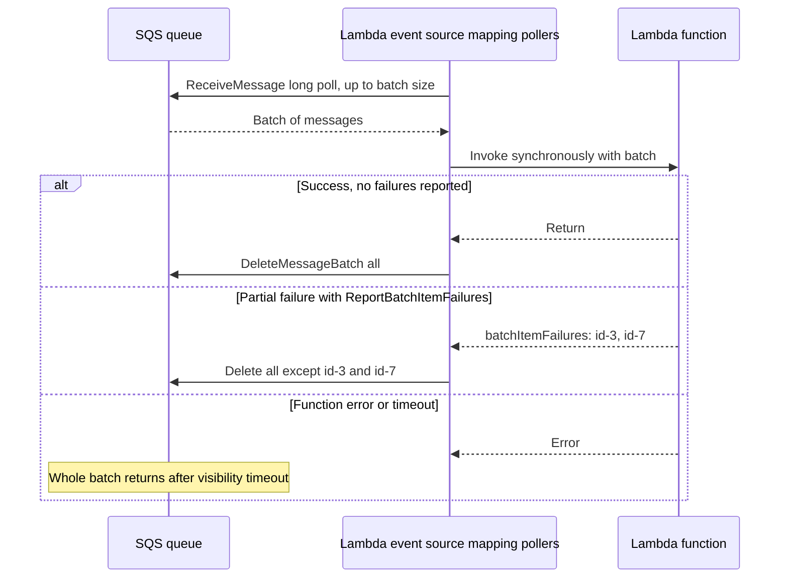

##### Scaling behaviour

| Queue type | How Lambda scales |
|------------|-------------------|
| Standard | Starts with a small number of concurrent pollers and scales up as the backlog grows; AWS documents a scaling rate of up to around 300 additional concurrent invocations per minute, up to about 1,250 concurrent invocations per mapping by default, bounded by account and function concurrency |
| FIFO | Scales up to the number of active message groups; messages within a group are processed in order, one batch at a time |

!!! note "Provisioned mode"
    AWS has introduced a provisioned mode for SQS event source mappings, in which you configure minimum and maximum pollers for faster, more predictable scaling of high-volume queues. It is charged differently from the default mode. Verify the current behaviour and pricing in the Lambda Developer Guide before relying on it.

##### Maximum concurrency versus reserved concurrency

To protect a downstream database, you might limit how many copies of the function run. There are two controls:

| Control | Where | Effect with SQS |
|---------|-------|-----------------|
| Reserved concurrency | Function | Pollers may still fetch messages they cannot deliver; invocations are ==throttled==, messages return to the queue, receive counts rise, and healthy messages may reach the DLQ |
| `MaximumConcurrency` | Event source mapping | Pollers ==do not fetch more than the function is allowed to process==; no throttling-induced retries |

Prefer ==maximum concurrency on the event source mapping== (minimum value 2). If you also set reserved concurrency, make it at least as large as the maximum concurrency.

##### Visibility timeout and the six-times rule

AWS recommends setting the queue's visibility timeout to ==at least six times the function timeout==, plus the value of `MaximumBatchingWindowInSeconds`. The reason is that when a function is throttled or retried, the poller may hold messages for longer than one function duration. If the visibility timeout is shorter than the function timeout, a message can become visible again while the first invocation is still running, and a second invocation processes it concurrently.

!!! danger "Classic bug"
    Function timeout 5 minutes, queue visibility timeout 30 seconds (the default). Every message that takes longer than 30 seconds is processed two or more times concurrently, and the receive count climbs until messages land in the DLQ despite succeeding. Lambda rejects creating a mapping where the queue visibility timeout is less than the function timeout, but it does not enforce the six-times guidance.

##### Partial batch responses

Without partial batch responses, one failed message causes the entire batch to be retried, reprocessing messages that already succeeded. Enable `ReportBatchItemFailures` and return the IDs of failed messages only:

```json
{
  "batchItemFailures": [
    { "itemIdentifier": "2e1424d4-f796-459a-8184-9c92662be6da" }
  ]
}
```

For FIFO queues, when a message fails, the function should also report ==every subsequent message in that group== in the batch as failed, to preserve ordering. Returning an empty list means full success; throwing an exception means full failure.

##### Batching window

`MaximumBatchingWindowInSeconds` (up to 300 seconds) makes the poller wait to accumulate up to `BatchSize` messages or up to the invocation payload limit (6 MB) before invoking. Batch sizes above 10 require a batching window.

#### Amazon ECS: queue workers with backlog-per-task scaling

An ECS service of worker tasks runs a receive loop. Because ECS Service Auto Scaling needs a single metric, use ==CloudWatch metric math== to compute backlog per task from `ApproximateNumberOfMessagesVisible` and the service's `RunningTaskCount` (from Container Insights), and attach a ==target tracking== policy to it. [Chapter 2.3](../unit2/topic3.md) covers ECS service auto scaling mechanics.

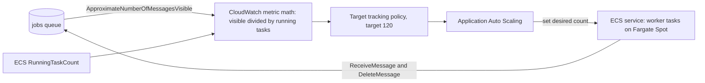

!!! tip "Graceful shutdown on ECS"
    When ECS scales in or a Fargate Spot task is interrupted, the container receives `SIGTERM` and then, after the `stopTimeout` (up to 120 seconds on Fargate), `SIGKILL`. Workers should stop receiving new messages on `SIGTERM`, finish or release in-flight messages (set visibility to 0), and exit. Messages that are not deleted are safe: they return to the queue.

#### Amazon EKS: KEDA scaling of consumer pods

On Kubernetes the Horizontal Pod Autoscaler cannot read SQS directly. ==KEDA== (Kubernetes Event-driven Autoscaling) adds an `aws-sqs-queue` scaler that reads queue depth and scales a Deployment, including ==to zero== when the queue is empty. KEDA authenticates with EKS Pod Identity or IRSA, and Karpenter ([Chapter 3.3](../unit3/topic3.md)) adds nodes when the new pods cannot be scheduled.

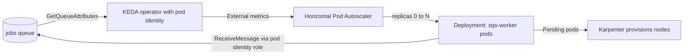

The KEDA `queueLength` parameter is the target number of messages per pod, which is the same "acceptable backlog per task" computed earlier.

#### Amazon SNS: fan-out to queues

An SNS topic can deliver each published message to multiple SQS queues, each owned by a different consuming service. This combines one-to-many distribution with per-consumer buffering, retries and DLQs. The pattern is examined in depth in the Amazon SNS part of this section.

#### Amazon EventBridge and EventBridge Pipes

EventBridge rules can target SQS queues (see the [Amazon EventBridge part](#event-routing-with-amazon-eventbridge)), which gives content-based routing followed by buffering. ==EventBridge Pipes== can use an SQS queue as a source, optionally filter and enrich messages, and deliver them to targets such as Step Functions, API destinations or Kinesis without custom polling code.

#### Amazon S3 event notifications

S3 can send object-created events directly to an SQS queue (standard queues only), a common pattern for file-processing pipelines. The queue policy must allow `s3.amazonaws.com` with `aws:SourceArn` of the bucket and `aws:SourceAccount`, and if the queue uses a customer managed KMS key, the key policy must allow S3 to use it.

#### AWS Step Functions

Step Functions can send messages to SQS with the optimised integration, including the ==wait for callback with task token== pattern: the state machine sends a message containing a task token, a worker processes it and calls `SendTaskSuccess` with the token, and the workflow resumes. This combines orchestration ([Chapter 1.7](../unit1/topic7.md)) with queue-based workers.

#### Amazon API Gateway

A REST API can integrate directly with SQS (an AWS service integration) so that an HTTP request becomes a queued message without any Lambda code in between. This ==storage-first== approach accepts traffic even when downstream services are unavailable ([4.2](../unit4/topic2.md)).

#### Summary of integrations

| Service | Direction | Why they integrate |
|---------|-----------|--------------------|
| Lambda | SQS to Lambda | Serverless consumer with managed polling and scaling |
| ECS | Both | Container producers and long-running worker services |
| EKS | Both | Pod-based consumers scaled by KEDA |
| SNS | SNS to SQS | Fan-out with buffering per subscriber |
| EventBridge | EventBridge to SQS; SQS to Pipes | Content-based routing into buffers; managed polling out |
| S3 | S3 to SQS | Object-created processing pipelines |
| Step Functions | Both | Callback workers and orchestration |
| API Gateway | API Gateway to SQS | Storage-first ingestion |
| CloudWatch | Metrics | Scaling and alarms |
| KMS | Encryption | Customer-controlled keys |
| CloudTrail | Audit | Control and data event logging |

### Common Architecture Patterns

#### Queue-based load levelling

The queue absorbs bursts so that consumers can process at a steady, sustainable rate. The downstream system (a database, a rate-limited partner API) sees smooth load.

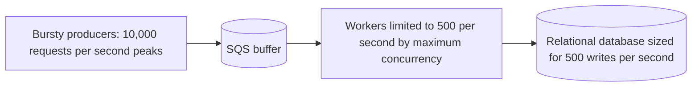

The trade-off is latency during bursts: if a burst lasts one minute at 10,000 per second and consumers drain at 500 per second, the last message waits about 19 minutes. Retention must exceed the worst-case drain time.

#### Competing consumers

Multiple identical consumers read from one queue; each message goes to one of them. This provides horizontal scalability and resilience: if one consumer fails, others continue, and the failed consumer's in-flight messages return after the visibility timeout.

#### Priority queues with multiple queues

SQS has no priority field. Model priorities with ==separate queues==:

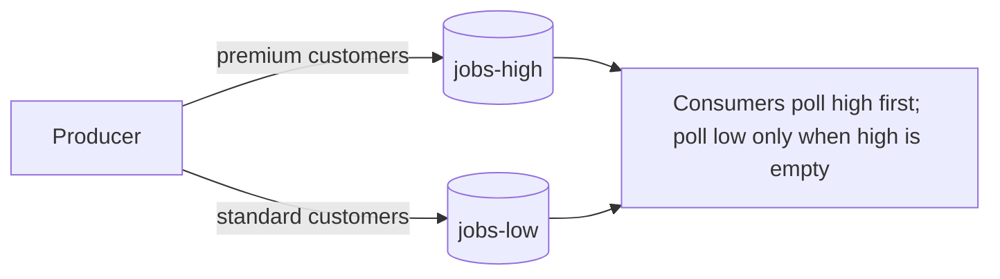

Alternatives are to run dedicated consumer fleets per queue with different sizes, which prevents starvation of the low-priority queue, or to use weighted polling (for example, three receives from high for every one from low). For multi-tenant fairness rather than strict priority, consider SQS fair queues.

#### Request-response over queues

Occasionally a caller needs a reply asynchronously. The pattern uses a request queue and a reply queue, with a correlation ID:

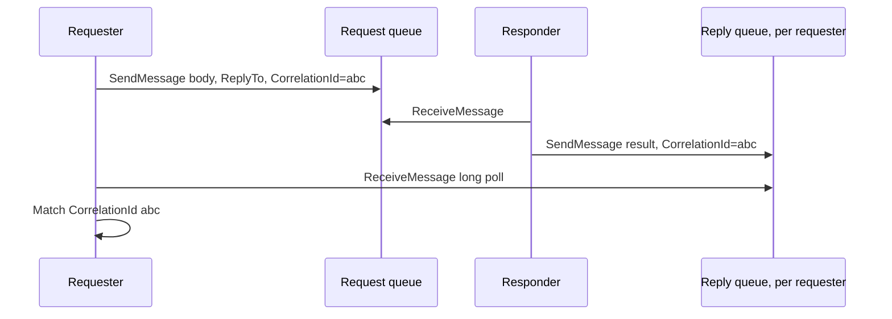

Creating a real queue per request is slow and costly. The AWS ==Temporary Queue Client== (Java) multiplexes many ==virtual queues== onto one physical queue per host to make this efficient. For most new designs, prefer a synchronous API for request-response and queues for fire-and-forget work, or use Step Functions callbacks.

#### Retry with backoff through visibility

Instead of retrying immediately inside the consumer, set the message's visibility timeout to an increasing value based on `ApproximateReceiveCount` (for example 10 seconds, 40 seconds, 160 seconds) and let it return later. This implements exponential backoff without consuming worker time. [Chapter 4.3](../unit4/topic3.md) discusses retry and backoff in general.

#### Bulkhead with separate queues

Separate queues per workload class (for example, per tenant tier or per job type) prevent one failing or slow workload from exhausting shared consumers. This is the bulkhead pattern of [Chapter 4.3](../unit4/topic3.md) applied to messaging.

#### Fan-in

Many producers (for example hundreds of IoT gateways or microservices) write to a single queue consumed by one aggregation service. SQS handles high producer concurrency without coordination.

#### Transactional outbox relay

A service writes its business change and an outbox row in the same database transaction; a relay (for example DynamoDB Streams to Lambda, or a polling process) sends the outbox rows to SQS. See [4.1](../unit4/topic1.md#transactional-outbox-and-change-data-capture) for the pattern itself.

### Industry Use Cases

| Industry | Use case | Why SQS |
|----------|----------|---------|
| E-commerce | Order processing pipeline after checkout | Absorbs flash-sale bursts; FIFO per order for state changes |
| Media | Video transcoding job queue | Long jobs with heartbeats; Spot workers |
| Financial services | Payment instruction processing | FIFO ordering per account, deduplication of retried submissions, KMS encryption |
| Healthcare | Asynchronous processing of lab result files from S3 | S3 notifications to SQS; encryption and audit |
| SaaS | Multi-tenant background jobs (exports, reports) | Fair queues to limit noisy neighbours; per-tier queues |
| Logistics | Tracking updates from partner APIs | Load levelling to protect databases |
| Gaming | Leaderboard and reward calculation after matches | Decouples game servers from backend services |
| Machine learning | Batch inference requests | Queue-driven autoscaling of GPU workers on EKS with KEDA |

!!! example "Order pipeline at a retailer"
    Checkout (ECS service behind an Application Load Balancer) writes the order to Aurora, and an outbox relay publishes an `OrderPlaced` event to SNS. SNS fans out to three SQS queues: payment, inventory and email. Each has its own consumer service, DLQ and scaling policy. A failure in the email provider affects only the email queue, whose backlog grows while payment and inventory continue normally.

### Advantages

| Advantage | Explanation |
|-----------|-------------|
| Decoupling | Producers and consumers evolve, deploy, scale and fail independently |
| Elasticity | No capacity planning for the queue itself |
| Durability | Multi-AZ redundant storage |
| Simplicity | Small API surface, easy to reason about |
| Resilience | Consumer failures do not lose messages; retries are automatic through visibility timeouts |
| Cost | Pay per request; idle queues cost nothing |
| Security | Encryption by default, IAM, resource policies, private endpoints |
| Integration | Native source or target for Lambda, SNS, EventBridge, S3, Step Functions, API Gateway |
| Operational burden | No brokers to patch, no disks, no clustering |

### Limitations

| Limitation | Trade-off or workaround |
|------------|-------------------------|
| At-least-once delivery on standard queues | Consumers must be idempotent |
| No strict order on standard queues | Use FIFO with a well-chosen group ID |
| FIFO throughput bounded and group blocking | High-throughput mode; high group cardinality; DLQ to unblock groups |
| No broadcast | Combine with SNS or EventBridge |
| No replay after delete | Use Kinesis, MSK or EventBridge archive when replay is needed |
| Retention at most 14 days | Persist critical data elsewhere |
| No priority within a queue | Multiple queues |
| Approximate metrics | Alarm on trends and age rather than exact counts |
| Delay at most 15 minutes | EventBridge Scheduler or Step Functions |
| Message size limit | Claim check with S3 |
| Asynchronous latency | Not suitable where the user must wait for the result |

### Common Mistakes

#### Beginner Mistakes

| Mistake | Consequence | Correction |
|---------|-------------|------------|
| Forgetting to delete the message after processing | Message is reprocessed after every visibility timeout, then reaches the DLQ | Always call `DeleteMessage` after successful processing |
| Deleting before processing | Work is lost if the consumer crashes | Delete only after side effects are committed |
| Using short polling | High cost, many empty receives, apparent missing messages | Set `WaitTimeSeconds = 20` |
| Leaving `MaxNumberOfMessages` at 1 | Ten times more requests | Set to 10 |
| Expecting strict order from a standard queue | Race conditions in business logic | FIFO queue or order-insensitive design |
| Using the message ID to delete | API error | Use the receipt handle |
| Treating batch calls as all-or-nothing | Silently dropped sends or deletes | Inspect the `Failed` list and retry |
| Storing large documents in messages | Size errors, high cost | Claim check with S3 |

#### Production Mistakes

| Mistake | Consequence | Correction |
|---------|-------------|------------|
| Visibility timeout shorter than processing time | Concurrent duplicate processing, inflated receive counts, false DLQ entries | Size to p99 processing time; heartbeat long jobs |
| Lambda: visibility timeout less than six times function timeout | Duplicates under throttling | Apply the six-times rule plus batching window |
| No DLQ | Poison messages retried until expiry; FIFO groups blocked | Redrive policy on every queue with an alarm on the DLQ |
| `maxReceiveCount` of 1 | Transient failures fill the DLQ | Use 3 to 10 (at least 5 for Lambda) |
| DLQ retention equal to source retention | Messages expire in the DLQ before anyone investigates | DLQ retention 14 days |
| Nobody owns the DLQ | Failures accumulate unnoticed | Alarm, runbook, and owning team per DLQ |
| Reserved concurrency used to throttle a Lambda consumer | Throttling pushes healthy messages to the DLQ | Use event source mapping maximum concurrency |
| No partial batch response | One failure retries the whole batch | Enable `ReportBatchItemFailures` |
| Single FIFO group ID for everything | Entire queue processed serially | Group by entity key |
| Scaling consumers on CPU | Backlog grows while CPU is low | Scale on backlog per task or KEDA queue length |
| Non-idempotent consumers | Double charges, duplicate emails | Idempotency keys and conditional writes ([4.3](../unit4/topic3.md#idempotency)) |
| Queue policy allowing a service principal without `aws:SourceArn` | Confused deputy exposure | Add source conditions |
| SSE-KMS with `aws/sqs` key for an SNS or S3 source | Deliveries fail silently from the producer's view | Customer managed key with a key policy for the service principal |
| No graceful shutdown in containers | Many messages wait a full visibility timeout after deployments | Handle `SIGTERM`, release in-flight messages |

### Summary

Amazon SQS is a durable, elastic, pull-based queue that decouples producers from consumers in time, rate and location. Its reliability model is simple and powerful: a received message is hidden for a visibility timeout and deleted only when the consumer explicitly acknowledges it, so crashes lead to retries rather than lost work. Repeated failures are isolated in a dead-letter queue and can be redriven after a fix.

Architectural lessons:

- ==Design for at-least-once.== Every consumer is idempotent, including FIFO consumers.
- ==The lifecycle is the design.== Visibility timeout, receive count, redrive policy and retention are each a decision with consequences, and they must be sized together (for Lambda, the six-times rule).
- ==Choose the queue type deliberately.== Standard for throughput, FIFO for per-key order with a high-cardinality group ID, fair queues for multi-tenant fairness.
- ==Scale consumers on backlog and age,== not CPU: backlog per task for ECS, KEDA for EKS, event source mapping maximum concurrency for Lambda.
- ==Keep messages small== and use claim check for large payloads; cost is per 64 KB chunk.
- ==Secure by default:== SSE, least-privilege roles per workload, scoped queue policies, customer managed keys for service integrations, and VPC endpoints.
- ==Queues point to point, topics one to many.== Combine SQS with SNS or EventBridge when one event has several consumers (the Amazon SNS part of this section).

## Pub/Sub Messaging with Amazon SNS

### Definition

==Amazon SNS is a fully managed, serverless publish/subscribe messaging service in which publishers send messages to a topic and SNS pushes a copy of each message to every subscribed endpoint.== The publisher does not know how many subscribers exist or what they do with the message. Subscribers may be other AWS services (SQS queues, Lambda functions, Amazon Data Firehose delivery streams), HTTP or HTTPS endpoints, or people (email, SMS text messages and mobile push notifications).

SNS belongs to the ==Application Integration== category. In an architecture diagram it sits at a point of ==one-to-many distribution==: after an order is placed, after a file lands in S3, after a CloudWatch alarm changes state.

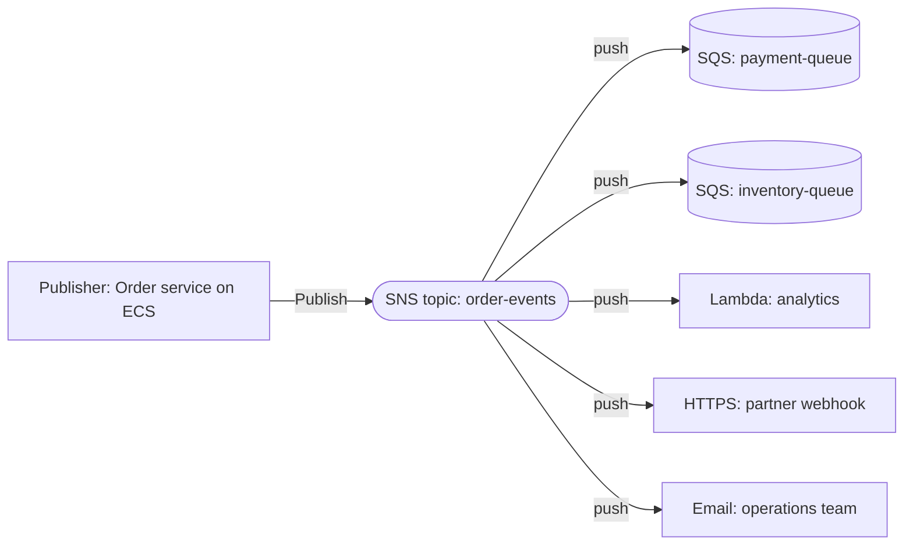

SNS offers two topic types:

| Topic type | Ordering | Deduplication | Subscriber protocols | Typical use |
|------------|----------|---------------|----------------------|-------------|
| Standard | Best-effort | None (at-least-once delivery) | All protocols | Most fan-out, notifications, alerts |
| FIFO | Strict per message group | 5-minute deduplication window | SQS queues only | Ordered fan-out of state changes, ledgers |

### Why This Service or Concept Exists

#### The broadcast problem

Imagine the order service of an online shop must inform payment, inventory, shipping, analytics and email services whenever an order is placed. Without pub/sub, there are two poor options:

1. ==The producer calls every consumer.== The order service must know every consumer's address, handle each consumer's failures and retries, and be changed and redeployed whenever a consumer is added. It is coupled to all of them.
2. ==The producer writes to one queue per consumer.== The order service must know every queue and write to each, which duplicates code and is error-prone: if the fourth write fails, three consumers have the message and two do not.

Pub/sub introduces a ==topic== as an intermediary. The producer publishes once; the topic delivers to every subscriber. Adding a new consumer is a subscription change, not a producer change. This is the ==Open/Closed Principle== of object-oriented design applied to distributed systems: the producer is closed for modification but the system is open for extension.

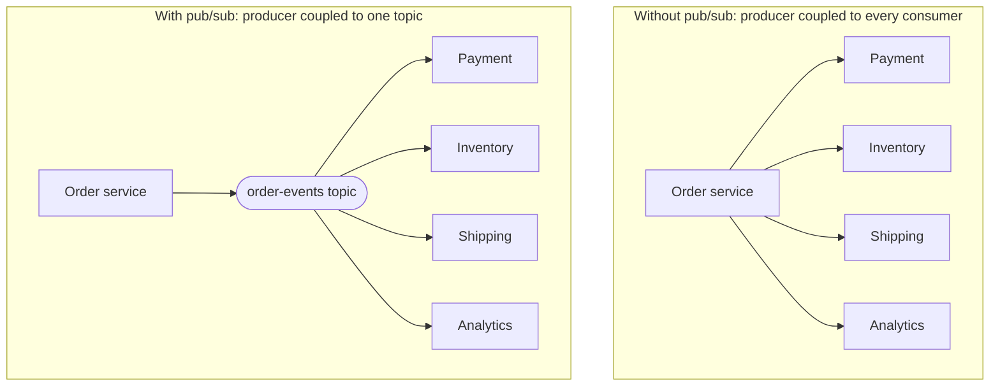

#### Why AWS built SNS

AWS released SNS in 2010, four years after SQS, because customers were building their own fan-out layers on top of queues. SNS provides a managed, highly available, push-based distribution layer with delivery retries, so that application teams do not operate brokers or write delivery loops. It also became the notification backbone for AWS itself: CloudWatch alarms, AWS Budgets, S3 event notifications, AWS CloudFormation stack events and many other services publish to SNS topics.

#### Benefits over older methods

| Concern | Hand-built broadcast | Amazon SNS |
|---------|----------------------|------------|
| Producer knowledge of consumers | Must know all addresses | Knows only the topic ARN |
| Adding a consumer | Code change and redeploy | New subscription |
| Retry and backoff | Hand-written per consumer | Managed delivery policies |
| Failure isolation | One slow consumer slows the producer | Delivery is asynchronous and per subscription |
| Scale | Limited by producer loop | Millions of subscriptions per standard topic |
| Human notifications | Separate email, SMS and push integrations | Same topic, different protocols |

### Core Concepts

#### Publish/subscribe compared with point-to-point

| Aspect | Point-to-point (SQS) | Publish/subscribe (SNS) |
|--------|----------------------|-------------------------|
| Recipients per message | One consumer | Every matching subscriber |
| Delivery model | Consumer pulls | Service pushes |
| Storage | Durable up to 14 days | No general storage; delivered or retried then dropped or sent to a DLQ (FIFO topics can archive) |
| Consumer availability | Consumer may be offline | Endpoint must accept delivery, or retries eventually give up |
| Back-pressure | Natural (consumer polls at its own rate) | Limited (HTTP throttle policy; otherwise push rate) |
| Typical pairing | Worker pools | Fan-out to queues, functions and people |

!!! note "SNS is not a store"
    A standard SNS topic does not retain messages for later readers. A subscriber added tomorrow does not receive today's messages. If a subscriber must never miss a message, even when it is down for hours, subscribe an ==SQS queue== on its behalf. This is the essential reason for the SNS-to-SQS fan-out pattern.

#### Topics

A ==topic== is a named, regional access point and communication channel, identified by an ARN such as `arn:aws:sns:us-east-1:111122223333:order-events`. FIFO topic names end in `.fifo`. Topic attributes include the display name (used for SMS and email senders), the access policy, the delivery policy, the KMS key, the data protection policy, the tracing configuration and, for FIFO topics, content-based deduplication, the throughput scope and the archive policy.

#### Subscriptions and endpoints

A ==subscription== links a topic to an ==endpoint== using a ==protocol==. Each subscription has its own ARN, attributes (filter policy, raw message delivery, redrive policy, delivery policy) and confirmation state.

| Protocol | Endpoint | Confirmation required | Typical consumer | Raw delivery option |
|----------|----------|-----------------------|------------------|---------------------|
| `sqs` | Queue ARN | No when subscriber and queue are in the same account; otherwise the queue owner confirms or subscribes | Microservice workers | Yes |
| `lambda` | Function ARN | No | Serverless processing | No (always the SNS event structure) |
| `firehose` | Firehose stream ARN | No (requires a subscription role) | Archiving to S3, analytics | Yes |
| `http` / `https` | URL | Yes, the endpoint must visit the `SubscribeURL` | Webhooks, partner systems | Yes |
| `email` | Email address | Yes, the recipient clicks a link | Human notification, plain text | Not applicable |
| `email-json` | Email address | Yes | Human-readable JSON for debugging | Not applicable |
| `sms` | Phone number | No, but account SMS sandbox and origination rules apply | Human notification | Not applicable |
| `application` | Mobile platform endpoint ARN | Registered through a platform application | Mobile push (APNs, FCM and others) | Not applicable |

!!! warning "Pending confirmation"
    HTTP, HTTPS and email subscriptions remain in ==PendingConfirmation== until confirmed, and receive nothing in that state. Unconfirmed subscriptions expire after a few days. When an HTTPS subscription "does not work", check its status first.

#### How SNS delivers a message

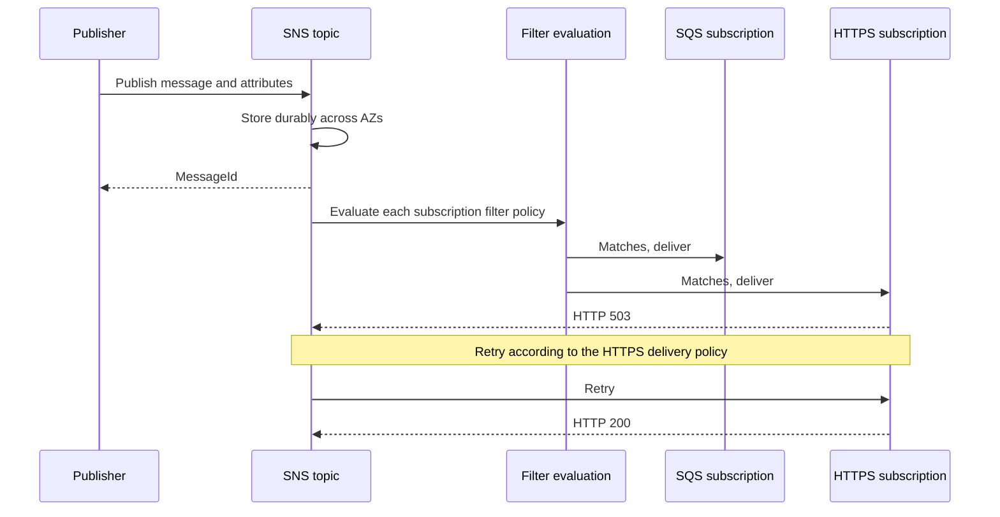

Key properties:

- `Publish` returns after SNS has ==stored the message redundantly across multiple Availability Zones==. From that point SNS takes responsibility for delivery.
- Delivery to each subscription is ==independent==. A failing HTTPS endpoint does not slow deliveries to SQS or Lambda.
- Standard topics deliver ==at least once== with best-effort ordering. Subscribers must be idempotent ([4.3](../unit4/topic3.md#idempotency)).
- If delivery fails permanently, or the retry policy is exhausted, the message is ==discarded== unless the subscription has a dead-letter queue.

#### The message

| Part | Description |
|------|-------------|
| Message body | Text payload. A single body can also be a JSON object with a different message per protocol when `MessageStructure` is `json` |
| Subject | Optional; used as the email subject and included in the JSON envelope |
| Message attributes | Up to 10 typed name/value pairs (`String`, `String.Array`, `Number`, `Binary`) used for filtering and metadata |
| Message group ID and deduplication ID | FIFO topics only |
| Message ID | Assigned by SNS |

##### Message size

For most of its history SNS had a maximum payload of 256 KiB. In September 2026 AWS announced support for payloads ==up to 1 MiB==, controlled by a `MaximumMessageSize` topic attribute on standard and FIFO topics. AWS describes restrictions on this larger size: at announcement, messages above 256 KiB were supported for SQS, Lambda and Firehose subscriptions on topics with a limited number of subscriptions (100). Because this capability is new, verify the current rules in the SNS Developer Guide before designing around it. For larger payloads, the ==Amazon SNS Extended Client Library== (Java and Python) implements the claim-check pattern with S3, supporting payloads up to 2 GB, and pairs with the SQS Extended Client Library on the consumer side.

!!! tip "Keep notifications small anyway"
    A pub/sub message is copied to every subscriber, and each copy is billed and processed. Publishing identifiers and a few key fields, rather than whole documents, keeps cost and coupling low. See [Thin events with callback](../unit4/topic1.md#thin-events-with-callback) in 4.1 for the trade-off between thin notifications and event-carried state.

##### The JSON envelope and raw message delivery

By default, SNS wraps the message in a JSON envelope when delivering to SQS, HTTP/S and Firehose:

```json
{
  "Type": "Notification",
  "MessageId": "8b3a1f0e-7e3c-5d6e-9a41-1f2c3d4e5f60",
  "TopicArn": "arn:aws:sns:us-east-1:111122223333:order-events",
  "Subject": "OrderPlaced",
  "Message": "{\"orderId\":\"o-1001\",\"total\":42.5}",
  "Timestamp": "2026-09-26T10:15:30.123Z",
  "SignatureVersion": "2",
  "Signature": "EXAMPLE...",
  "SigningCertURL": "https://sns.us-east-1.amazonaws.com/SimpleNotificationService-EXAMPLE.pem",
  "UnsubscribeURL": "https://sns.us-east-1.amazonaws.com/?Action=Unsubscribe&SubscriptionArn=EXAMPLE",
  "MessageAttributes": {
    "eventType": { "Type": "String", "Value": "OrderPlaced" }
  }
}
```

Note that `Message` is a ==string containing JSON==, so consumers must parse twice. With ==raw message delivery== enabled on the subscription, the SQS message body (or HTTP request body, or Firehose record) is exactly the published message, and SNS message attributes become SQS message attributes.

| Consideration | Envelope (default) | Raw message delivery |
|---------------|--------------------|----------------------|
| Consumer parsing | Parse envelope then parse `Message` | Parse body directly |
| Topic ARN and signature available | Yes | No |
| Attributes | Inside the envelope | Mapped to SQS message attributes (subject to the SQS limit of 10) |
| Payload size | Envelope adds overhead | Smaller |
| Best for | Consumers that need provenance or signature verification, one queue subscribed to several topics | Most SNS-to-SQS fan-out consumers |

#### Standard topics and FIFO topics

##### FIFO topics

FIFO topics extend ordered, deduplicated semantics across fan-out:

- Every published message has a ==message group ID==. Messages in the same group are delivered to each subscribed queue ==in the order published==.
- Every message has a ==deduplication ID== (explicit or derived by content-based deduplication, a SHA-256 hash of the body). Duplicates published within the ==5-minute== deduplication interval are accepted but not delivered.
- FIFO topics deliver only to ==SQS queues==. AWS originally required FIFO queues; AWS documentation now also describes delivering from FIFO topics to standard queues, in which case ordering and deduplication are not preserved in the standard queue. Verify current support for your design.
- FIFO topics support far fewer subscriptions per topic (documented at 100) than standard topics.

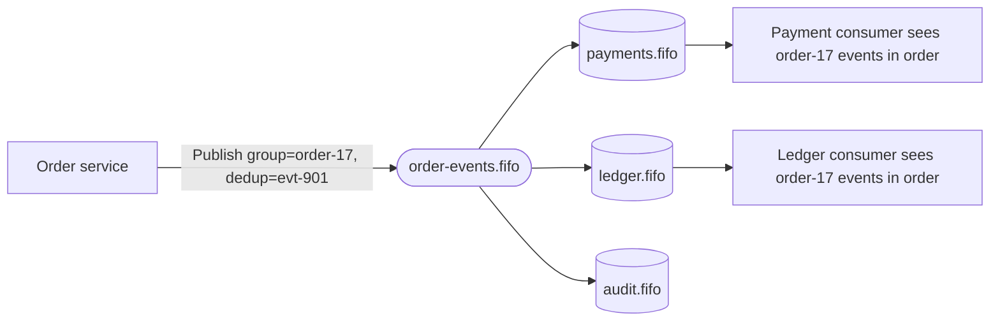

##### FIFO throughput

AWS raised FIFO topic throughput in 2023 to a default of thousands of messages per second per topic, with a lower per-message-group limit, and in January 2025 introduced ==high-throughput mode== for FIFO topics, enabled by setting `FifoThroughputScope` to `MessageGroup`. In this mode, throughput limits apply per message group rather than per topic, allowing much higher aggregate throughput provided group IDs have high cardinality and deduplication is scoped per group. Exact limits vary by Region; consult Service Quotas.

##### Message archiving and replay (FIFO topics)

FIFO topics support ==in-place message archiving and replay==, introduced in 2023:

- The topic owner sets an ==archive policy== with a retention period (documented as up to 365 days). SNS stores published messages without the owner provisioning a separate archive.
- A subscriber sets a ==replay policy== on its subscription with a starting timestamp (and optionally an ending timestamp). SNS redelivers archived messages to that subscription, applying its filter policy.

```mermaid
sequenceDiagram
    participant Owner as Topic owner
    participant T as orders.fifo topic
    participant Sub as ledger.fifo subscription
    Owner->>T: Set ArchivePolicy MessageRetentionPeriod 30 days
    Note over T: Messages archived as published
    Note over Sub: Bug found, ledger rebuilt from 3 days ago
    Sub->>T: Set ReplayPolicy StartingPoint timestamp
    T->>Sub: Redeliver archived messages in order
    T-->>Sub: Replay status completed
```

Replay makes FIFO topics useful for recovering a consumer after a bug. Standard topics do not have this feature; for replay of standard events use EventBridge archive and replay (the [Amazon EventBridge part](#event-routing-with-amazon-eventbridge)) or a stream (Kinesis). Archiving and replay incur additional charges.

!!! note "Replay and idempotency"
    Replayed messages may overlap with messages the subscriber already processed. Replay is safe only when consumers are idempotent.

#### Subscription filter policies

Without filtering, every subscriber receives every message and discards what it does not need, which wastes compute and cost. A ==filter policy== is a JSON document on a subscription that SNS evaluates before delivery; only matching messages are delivered.

##### Filter policy scope

| `FilterPolicyScope` | Evaluated against | Notes |
|---------------------|-------------------|-------|
| `MessageAttributes` (default) | Message attributes | Publisher must set attributes |
| `MessageBody` | JSON message body, including nested properties | Payload-based filtering; the message must be valid JSON; charged by data scanned |

##### Example

Deliver to the "high-value EU orders" queue only when the order is placed in the EU, the total is at least 500 and the channel is not internal:

```json
{
  "eventType": ["OrderPlaced"],
  "region": [{ "prefix": "eu-" }],
  "total": [{ "numeric": [">=", 500] }],
  "channel": [{ "anything-but": ["internal-test"] }]
}
```

With `MessageBody` scope, the same keys may be nested to match the structure of the body:

```json
{
  "detail": {
    "order": {
      "total": [{ "numeric": [">=", 500] }],
      "shipping": { "country": ["DE", "FR", "NL"] }
    }
  }
}
```

##### Matching rules

- Within a key, the array of values is an ==OR==: `"country": ["DE", "FR"]` matches either.
- Across keys, conditions are an ==AND==: every key must match.
- `$or` allows OR across different keys.
- A message missing an attribute named in the policy does ==not match== (unless the policy uses `exists: false`).

##### Operators

| Operator | Example | Matches |
|----------|---------|---------|
| Exact string | `"status": ["paid"]` | Value equals `paid` |
| Prefix | `[{"prefix": "eu-"}]` | Value begins with `eu-` |
| Suffix | `[{"suffix": ".jpg"}]` | Value ends with `.jpg` |
| Equals ignore case | `[{"equals-ignore-case": "PAID"}]` | `paid`, `Paid`, `PAID` |
| Anything but | `[{"anything-but": ["test", "dev"]}]` | Any value except those listed; also supports `anything-but` with `prefix` |
| Numeric | `[{"numeric": [">", 0, "<=", 100]}]` | Numeric range |
| Exists | `[{"exists": true}]` | Attribute or property present |
| IP address | `[{"cidr": "10.0.0.0/24"}]` | Value within a CIDR block |
| Or across keys | `{"$or": [{"a": ["1"]}, {"b": ["2"]}]}` | Either condition |

!!! info "Filter policy constraints"
    Filter policies have documented limits, for example on the number of keys, on the total number of value combinations (historically 150), on policy size, and on the number of filter policies per topic and per account. Changes to a filter policy are ==eventually consistent== and can take several minutes to take full effect. Verify current limits in the SNS Developer Guide.

!!! tip "Filtering in SNS or in EventBridge?"
    SNS filter policies are intentionally simpler than EventBridge event patterns (the [Amazon EventBridge part](#event-routing-with-amazon-eventbridge)). If routing logic becomes complex, involves many event types from many sources, or requires schema discovery and archive and replay for standard events, EventBridge is usually the better fit.

#### Delivery retry policies

SNS retries failed deliveries according to a ==delivery policy== that depends on the kind of endpoint.

| Endpoint category | Protocols | Default behaviour (as documented) | Customisable |
|-------------------|-----------|-----------------------------------|--------------|
| AWS-managed endpoints | SQS, Lambda, Firehose | Very persistent: a documented policy of more than 100,000 attempts spread over about 23 days, used mainly when the target service is unavailable or throttling | No |
| Customer-managed endpoints | HTTP, HTTPS | A modest default, with phases of immediate retries, pre-backoff, backoff and post-backoff | Yes, per topic or per subscription, within documented maximums |
| Customer-managed endpoints | Email, SMS, mobile push | Fixed AWS-defined policy (documented as tens of attempts over several hours) | No |

For HTTP/S, a delivery policy controls:

| Setting | Purpose |
|---------|---------|
| `numRetries` | Total retries |
| `numNoDelayRetries` | Immediate retries |
| `minDelayTarget`, `maxDelayTarget` | Minimum and maximum delay in seconds |
| `numMinDelayRetries`, `numMaxDelayRetries` | Retries at the minimum and maximum delay |
| `backoffFunction` | `linear`, `arithmetic`, `geometric` or `exponential` |
| `throttlePolicy.maxReceivesPerSecond` | Upper bound on delivery rate to the endpoint, a form of back-pressure |
| `requestPolicy.headerContentType` | Content type header for deliveries |

```json
{
  "healthyRetryPolicy": {
    "numRetries": 20,
    "numNoDelayRetries": 1,
    "minDelayTarget": 5,
    "maxDelayTarget": 300,
    "numMinDelayRetries": 2,
    "numMaxDelayRetries": 5,
    "backoffFunction": "exponential"
  },
  "throttlePolicy": { "maxReceivesPerSecond": 50 },
  "requestPolicy": { "headerContentType": "application/json" }
}
```

SNS treats server errors and timeouts from HTTP/S endpoints as retryable, while most client errors (4xx) are treated as permanent failures. Endpoints should therefore return 2xx for success, 5xx for transient problems and 4xx only when retrying would not help.

!!! warning "Lambda subscriptions and two retry layers"
    SNS invokes Lambda ==asynchronously==. Once the Lambda service has accepted the event, SNS considers the delivery successful. If your function then throws, retries are governed by Lambda's asynchronous invocation settings (retry attempts, maximum event age, on-failure destination or function DLQ), not by SNS. The SNS delivery policy and subscription DLQ apply only when the Lambda service itself cannot accept the invocation. Configure both layers deliberately, or place an SQS queue between SNS and Lambda.

#### Subscription dead-letter queues

A ==subscription DLQ== is an SQS queue attached to a subscription through a redrive policy. SNS moves a message there when delivery fails with a ==client-side error== (for example, the endpoint was deleted or permission was removed) or when the delivery policy is exhausted for a ==server-side error==.

```json
{ "deadLetterTargetArn": "arn:aws:sqs:us-east-1:111122223333:order-events-webhook-dlq" }
```

Rules:

- The DLQ must be in the ==same account and Region as the subscription==.
- A FIFO topic subscription requires a ==FIFO== DLQ.
- The DLQ's queue policy must allow `sns.amazonaws.com` to send messages, scoped with `aws:SourceArn` to the topic.
- DLQ messages carry attributes describing the failure, which aids diagnosis.
- Metrics `NumberOfNotificationsRedrivenToDlq` and `NumberOfNotificationsFailedToRedriveToDlq` show DLQ activity.

!!! danger "Without a subscription DLQ, failed deliveries are lost"
    Unlike SQS, an SNS standard topic has no backlog. If an HTTPS partner endpoint is down for longer than its retry policy, those notifications are gone. Every production subscription whose messages matter should have a DLQ, or should be an SQS queue.

#### The SNS-to-SQS fan-out pattern in depth

The fan-out pattern subscribes one SQS queue per consuming service to an SNS topic. It is the most important SNS pattern and deserves careful study because it combines the strengths of both services.

```mermaid
flowchart LR
    subgraph Producer["Order service, ECS"]
        OS["Publish OrderPlaced"]
    end
    OS --> T(["SNS topic: order-events"])
    T -->|"filter: all"| QP[("payment-queue")]
    T -->|"filter: eventType OrderPlaced"| QI[("inventory-queue")]
    T -->|"filter: total >= 500"| QF[("fraud-queue")]
    QP --> PAY["Payment service, ECS, scaled on backlog"]
    QI --> INV["Inventory service, EKS, KEDA"]
    QF --> FR["Fraud Lambda, max concurrency 20"]
    QP -.-> DP[("payment-dlq")]
    QI -.-> DI[("inventory-dlq")]
    QF -.-> DF[("fraud-dlq")]
```

##### What each service contributes

| Capability | Provided by SNS | Provided by SQS |
|------------|-----------------|-----------------|
| One publish, many recipients | Yes | No |
| Per-consumer filtering | Filter policies | No |
| Durable buffer while a consumer is down | No | Yes, up to 14 days |
| Consumer-paced processing and back-pressure | No | Yes, consumers pull |
| Per-consumer retry, visibility timeout and DLQ | No | Yes |
| Per-consumer scaling signal | No | Queue depth and age |
| Ordering and deduplication | FIFO topics | FIFO queues |

##### Why not subscribe services directly to SNS?

A Lambda function or HTTPS endpoint can subscribe directly. This is acceptable for low-volume, loss-tolerant or human notifications. For business-critical microservices the queue adds:

1. ==Durability during outages.== If the inventory service is being redeployed or its database is down, messages wait in its queue.
2. ==Load levelling.== A burst of 50,000 orders reaches the inventory service at the rate its consumers poll, not at the rate SNS pushes.
3. ==Independent failure handling.== Each queue has its own `maxReceiveCount` and DLQ; poison messages for one service do not affect others.
4. ==Operational visibility.== Each service's health is visible as its own queue depth and oldest-message age.
5. ==Replay of failures.== DLQ redrive (the Amazon SQS part of this section) allows reprocessing after fixes.

##### Configuration checklist for fan-out

| Item | Why |
|------|-----|
| Queue policy allowing `sns.amazonaws.com` to `sqs:SendMessage`, conditioned on `aws:SourceArn` equal to the topic ARN | Without it, deliveries fail; without the condition, any topic could send |
| Customer managed KMS key on encrypted queues with a key policy allowing `sns.amazonaws.com` to use `kms:GenerateDataKey` and `kms:Decrypt` | SNS cannot use the AWS managed `aws/sqs` key |
| Raw message delivery enabled (unless the consumer needs the envelope) | Simpler parsing, smaller messages |
| Filter policy per subscription | Each service receives only what it needs |
| Queue redrive policy and DLQ per queue | Isolates consumer processing failures |
| Idempotent consumers | At-least-once delivery at both the SNS and SQS layers |
| One queue per consuming service (not per consumer instance) | Instances of one service compete on the queue; services do not |

!!! example "Adding a new consumer without touching the producer"
    The marketing team wants to send a "thank you" email for orders above 200. They create `marketing-queue`, subscribe it to `order-events` with the filter `{"total":[{"numeric":[">",200]}]}` and deploy their consumer. The order service is not changed, redeployed or even informed. This is the practical meaning of loose coupling.

!!! warning "Fan-out doubles the at-least-once exposure"
    A message can be duplicated by SNS delivery and again by SQS delivery. Idempotency ([4.3](../unit4/topic3.md#idempotency)) is required in every consumer; use a business identifier (for example `orderId` plus `eventType`) as the idempotency key rather than the SNS or SQS message ID, which differ between copies.

#### Cross-account and cross-Region subscriptions

Pub/sub often spans organisational boundaries: a central platform account publishes events, and product teams in their own accounts consume them.

```mermaid
flowchart LR
    subgraph A["Account 111122223333: platform, us-east-1"]
        T(["order-events topic"])
    end
    subgraph B["Account 444455556666: analytics, us-east-1"]
        QB[("analytics-queue")]
    end
    subgraph C["Account 777788889999: DR copy, eu-west-1"]
        QC[("orders-replica-queue")]
    end
    T -->|"cross-account"| QB
    T -->|"cross-account and cross-Region"| QC
```

| Requirement | Where it is configured |
|-------------|------------------------|
| Consumer account may subscribe | Topic access policy allows `sns:Subscribe` for the consumer account's principal |
| SNS may deliver to the queue | Queue policy in the consumer account allows `sns.amazonaws.com` with `aws:SourceArn` of the topic |
| Subscription confirmation | If the queue owner creates the subscription, no confirmation is needed; if the topic owner creates it, the queue owner must confirm |
| Encryption across accounts | The queue's customer managed key policy allows SNS; the topic's key policy allows the publisher |

SNS can deliver to SQS queues and Lambda functions in ==other Regions==. Cross-Region delivery adds latency and inter-Region data transfer charges, and there are documented restrictions involving opt-in Regions. It is useful for disaster-recovery copies and regional consumers, but it is not multi-Region replication of the topic itself: if the topic's Region is unavailable, publishing to it fails. Multi-Region pub/sub designs publish to a topic in each Region, or use EventBridge global endpoints (the [Amazon EventBridge part](#event-routing-with-amazon-eventbridge)).

### AWS Service Deep Dive

#### Purpose

SNS provides managed, push-based, one-to-many message distribution for application-to-application (A2A) integration and application-to-person (A2P) notifications, with filtering, retries, encryption and access control, and without servers to operate.

#### Architecture

```mermaid
flowchart TB
    subgraph Pubs["Publishers"]
        ECS["ECS service with task role"]
        EKS["EKS pod with Pod Identity"]
        LMB["Lambda function"]
        CWA["CloudWatch alarm"]
        S3E["S3 event notification"]
    end
    subgraph SNS["Amazon SNS, regional, multi-AZ"]
        T(["Topic with access policy, KMS key, data protection policy"])
        FE["Per-subscription filter evaluation"]
        DE["Delivery engine with per-protocol retry policies"]
    end
    subgraph Subs["Subscribers"]
        SQ[("SQS queues")]
        LF["Lambda functions"]
        FH["Firehose to S3"]
        HT["HTTPS endpoints"]
        HU["Email, SMS, mobile push"]
    end
    ECS --> T
    EKS --> T
    LMB --> T
    CWA --> T
    S3E --> T
    T --> FE --> DE
    DE --> SQ
    DE --> LF
    DE --> FH
    DE --> HT
    DE --> HU
    DE -.->|"failed deliveries"| DLQ[("Subscription DLQs")]
    DE -.->|"delivery status logs"| CWL["CloudWatch Logs"]
```

- ==Regional and multi-AZ.== Topics are regional; published messages are stored across multiple Availability Zones before `Publish` returns.
- ==Control plane:== `CreateTopic`, `Subscribe`, `SetTopicAttributes`, `SetSubscriptionAttributes`, `PutDataProtectionPolicy`.
- ==Data plane:== `Publish` and `PublishBatch` (up to 10 messages per call).
- ==Delivery engine:== evaluates filter policies and pushes messages to each subscription independently, with protocol-specific retry behaviour.
- VPC access: publishers in private subnets use an ==interface VPC endpoint== for SNS. Deliveries to HTTPS endpoints originate from SNS on the public internet, so a private HTTPS endpoint inside a VPC cannot be targeted directly; use an SQS queue or Lambda instead.

#### Important Features

| Feature | Summary |
|---------|---------|
| Standard and FIFO topics | Throughput versus ordered, deduplicated fan-out |
| Many protocols | SQS, Lambda, Firehose, HTTP/S, email, SMS, mobile push |
| Filter policies | Attribute-based and payload-based routing per subscription |
| Raw message delivery | Deliver the original body without the JSON envelope |
| Message attributes | Typed metadata for filtering and tracing |
| Delivery policies | Configurable HTTP/S retries and throttling |
| Subscription DLQs | Capture undeliverable messages |
| FIFO archive and replay | Retain and redeliver messages for FIFO topics |
| High-throughput FIFO | Per-message-group throughput scope |
| Encryption | SSE with KMS; TLS in transit |
| Access policies | Resource-based policies for cross-account and service publishers |
| Data protection policies | Detect, mask, redact or block sensitive data in messages |
| Delivery status logging | Success and failure logs to CloudWatch Logs |
| Active tracing | AWS X-Ray trace propagation for supported subscribers |
| Message signing | Signature versions 1 (SHA1) and 2 (SHA256) for HTTP/S verification |
| Extended Client Library | Claim-check payloads via S3 |

#### Limitations

- ==No storage for standard topics:== no replay, no late subscribers, no backlog.
- ==Push model:== limited back-pressure; endpoints must absorb delivery rate (except where HTTP throttle policy applies).
- ==Filtering is simpler than EventBridge patterns== and applies per subscription.
- ==Message size== is bounded (see Service Limits); use claim check for large payloads.
- ==FIFO topics== accept only SQS subscribers and have lower subscription and throughput limits.
- ==No multi-Region topic replication.==
- ==Ordering== on standard topics is best-effort.
- ==HTTPS endpoints must be publicly reachable== and must handle confirmation and signature verification.

#### Pricing Model and recommendations

!!! info "Pricing figures"
    Prices and quotas are indicative, as of 2026. Verify with the AWS Pricing Calculator and Service Quotas.

| Dimension | How it is charged |
|-----------|-------------------|
| Publish requests | Per million requests; each 64 KB chunk of a payload counts as one request |
| Deliveries to SQS and Lambda | No SNS delivery charge (the SQS requests and Lambda invocations are charged by those services); data transfer may apply across Regions |
| Deliveries to HTTP/S | Per million notifications |
| Deliveries to email | Per 100,000 notifications |
| Deliveries to Firehose | Charged per data volume |
| Mobile push | Per million notifications |
| SMS | Per message, varying widely by destination country and origination type |
| Payload-based filtering | Charged per volume of data scanned |
| FIFO topics | Priced by publish requests and published data volume, plus subscription deliveries; archiving and replay charged by data stored and replayed |
| Data protection policies | Charged by data volume scanned |
| KMS | KMS requests for encrypted topics and queues |
| Free tier | Monthly allowances for publishes and some deliveries |

Recommendations: publish small messages, use `PublishBatch`, prefer attribute-based filtering where it suffices (it is not charged per byte scanned), avoid unnecessary SMS (the most expensive protocol), and filter at SNS rather than delivering to consumers that discard messages.

#### Performance Characteristics

| Characteristic | Standard topic | FIFO topic |
|----------------|----------------|------------|
| Publish latency | Typically tens of milliseconds | Similar |
| Delivery latency | Typically sub-second to SQS and Lambda under normal conditions | Similar, but ordered per group |
| Throughput | Very high; the default publish rate quota varies by Region (tens of thousands of messages per second in large Regions) and can be raised | Thousands of messages per second per topic by default; higher in high-throughput mode |
| Subscriptions per topic | Millions (documented at 12.5 million) | 100 |

#### Scaling Behaviour

SNS scales publishing and delivery automatically. The architect must ensure that ==every subscriber can absorb the delivery rate==. SQS and Firehose absorb bursts naturally. Lambda scales with asynchronous invocation limits and account concurrency; if concurrency is exhausted, events are queued internally by Lambda and retried. HTTPS endpoints must be sized for peaks or protected with `throttlePolicy`.

#### Availability

SNS is a regional, multi-AZ service with an AWS Service Level Agreement (check the current SLA page for the committed percentage). Publishers should retry `Publish` with exponential backoff (the SDKs do this by default) and handle throttling errors. For Region-level resilience, publish to topics in two Regions or use EventBridge global endpoints.

#### Security Features

| Control | Purpose |
|---------|---------|
| IAM identity policies | Allow roles to `sns:Publish` to specific topic ARNs |
| Topic access policies | Allow other accounts and AWS services to publish or subscribe |
| SSE with KMS | Encrypt messages at rest in SNS |
| TLS | HTTPS for API calls and for HTTPS deliveries |
| Message signatures | Let HTTP/S subscribers verify that messages come from SNS |
| Data protection policies | Audit, mask, redact or deny sensitive data |
| VPC interface endpoints | Private publishing from VPCs |
| CloudTrail | Audit of control plane actions (and `Publish` data events if enabled) |

#### Service Limits

!!! info "Quotas"
    Indicative values as of 2026. Verify in Service Quotas and the SNS Developer Guide.

| Limit | Value |
|-------|-------|
| Maximum message size | 256 KiB historically; up to 1 MiB for specific protocols and topics since September 2026 (see Core Concepts); up to 2 GB with the Extended Client Library |
| Message attributes | 10 per message |
| `PublishBatch` entries | 10 per request |
| Standard topics per account | Documented at 100,000 (adjustable) |
| FIFO topics per account | Documented at 1,000 (adjustable) |
| Subscriptions per standard topic | 12,500,000 |
| Subscriptions per FIFO topic | 100 |
| Filter policies per topic and per account | Bounded (documented at 200 per topic and 10,000 per account historically); adjustable |
| FIFO deduplication interval | 5 minutes |
| FIFO archive retention | Up to 365 days |
| Publish throughput, standard | Region dependent, adjustable |
| Publish throughput, FIFO | Per topic and per message group; higher in high-throughput mode |

### Important AWS Terminology

General terms such as event, idempotency and fan-out at the conceptual level are in the [Chapter 1.7](../unit1/topic7.md) glossary; SQS terms such as visibility timeout, receipt handle and redrive policy were introduced in the [Amazon SQS part](#message-queues-with-amazon-sqs) of this section. The following terms are specific to SNS.

| Term | Meaning |
|------|---------|
| Topic | Regional pub/sub channel identified by an ARN |
| Publisher | Principal or service that calls `Publish` on a topic |
| Subscription | Link between a topic and an endpoint using a protocol, with its own attributes |
| Endpoint | Destination of a subscription (queue ARN, function ARN, URL, email address, phone number, device endpoint) |
| Protocol | Delivery mechanism: `sqs`, `lambda`, `firehose`, `http`, `https`, `email`, `email-json`, `sms`, `application` |
| Subscription confirmation | Handshake required for HTTP/S, email and some cross-account subscriptions |
| Filter policy | JSON document on a subscription that selects which messages are delivered |
| Filter policy scope | Whether the filter applies to message attributes or to the message body |
| Raw message delivery | Delivery of the original body without the SNS JSON envelope |
| Delivery policy | Retry and throttling configuration for HTTP/S deliveries |
| Subscription DLQ | SQS queue that receives messages SNS could not deliver to a subscription |
| Message structure `json` | Publishing different message bodies per protocol in one call |
| Archive policy | FIFO topic setting that retains published messages for replay |
| Replay policy | FIFO subscription setting that requests redelivery from the archive |
| Throughput scope | FIFO setting (`Topic` or `MessageGroup`) that enables high-throughput mode |
| Data protection policy | Topic policy that audits, de-identifies or denies sensitive data |
| Delivery status logging | Logging of delivery outcomes to CloudWatch Logs |
| Platform application | SNS resource representing a mobile push service (APNs, FCM and others) |
| Platform endpoint | A specific device or app instance registered under a platform application |
| A2A and A2P | Application-to-application and application-to-person messaging |

### Configuration Options

#### Topic attributes

| Attribute | Applies to | Guidance |
|-----------|------------|----------|
| `DisplayName` | Standard | Sender name for SMS and email |
| `Policy` | Both | Access policy; scope service principals with `aws:SourceArn` or `aws:SourceAccount` |
| `KmsMasterKeyId` | Both | Customer managed key when AWS services publish, or when cross-account control is needed |
| `DeliveryPolicy` | Both | Default HTTP/S delivery policy for the topic |
| `TracingConfig` | Both | `Active` enables X-Ray tracing; `PassThrough` propagates existing trace headers |
| `SignatureVersion` | Standard | Set to `2` for SHA256 signatures |
| `DataProtectionPolicy` | Standard | Configured with `PutDataProtectionPolicy` |
| `FifoTopic` | FIFO | Set at creation; cannot be changed |
| `ContentBasedDeduplication` | FIFO | Deduplicate on SHA-256 of body |
| `FifoThroughputScope` | FIFO | `MessageGroup` for high-throughput mode |
| `ArchivePolicy` | FIFO | Retention period in days for replay |
| `MaximumMessageSize` | Both | Newer attribute controlling the maximum payload (see Core Concepts) |
| Delivery status logging attributes | Both | IAM role ARNs and success sample rate per protocol, for example `SQSSuccessFeedbackRoleArn`, `SQSFailureFeedbackRoleArn`, `SQSSuccessFeedbackSampleRate` |

#### Subscription attributes

| Attribute | Applies to | Guidance |
|-----------|------------|----------|
| `FilterPolicy` | All | Deliver only relevant messages |
| `FilterPolicyScope` | All | `MessageAttributes` or `MessageBody` |
| `RawMessageDelivery` | SQS, HTTP/S, Firehose | Usually `true` for SQS consumers |
| `RedrivePolicy` | All | Subscription DLQ ARN |
| `DeliveryPolicy` | HTTP/S | Per-subscription override of retries and throttling |
| `SubscriptionRoleArn` | Firehose | Role SNS assumes to write to the stream |
| `ReplayPolicy` | FIFO SQS | Start a replay from the archive |

#### Publish options

| Option | Purpose |
|--------|---------|
| `TopicArn`, `TargetArn` or `PhoneNumber` | Destination: a topic, a single mobile endpoint, or a single phone number |
| `Message` | Body |
| `Subject` | Email subject and envelope field |
| `MessageStructure = json` | Per-protocol bodies, keyed by protocol with a `default` entry |
| `MessageAttributes` | Filtering and metadata |
| `MessageGroupId`, `MessageDeduplicationId` | FIFO topics |

!!! example "Per-protocol message bodies"
    One publish can send a concise SMS, a detailed email and a structured JSON message to queues:

    ```json
    {
      "default": "{\"orderId\":\"o-1001\",\"status\":\"shipped\"}",
      "email": "Your order o-1001 has shipped and should arrive within three days.",
      "sms": "Order o-1001 shipped."
    }
    ```

### Design Considerations

#### Scalability

Standard topics scale to very high publish rates and millions of subscriptions. The weakest subscriber determines practical scalability; protect weak endpoints with queues or throttle policies. FIFO topics scale with message group cardinality in high-throughput mode.

#### Availability

A publisher's availability becomes dependent on SNS's regional availability, which is high. Consumer availability is decoupled: a consumer behind an SQS queue can be unavailable without affecting the publisher or other consumers.

#### Reliability

| Risk | Mitigation |
|------|------------|
| Endpoint unavailable longer than retry policy | Subscribe via SQS, or add a subscription DLQ |
| Duplicate deliveries | Idempotent consumers with business keys |
| Misconfigured queue policy or key policy | IaC templates with tested policies; alarms on `NumberOfNotificationsFailed` |
| Filter policy error drops messages silently | Monitor `NumberOfNotificationsFilteredOut` metrics and test policies in CI |
| Lambda function errors after async acceptance | Lambda on-failure destinations, or SQS between SNS and Lambda |

#### Durability

Messages are stored redundantly until delivered. Standard topics do not retain messages after delivery attempts end. Durable history requires a Firehose subscription to S3, a FIFO archive, or subscribing queues.

#### Latency

SNS adds little latency to fan-out. End-to-end latency depends on the subscriber: SQS adds queueing delay proportional to backlog, Lambda may add cold-start time, and HTTP/S depends on the endpoint.

#### Cost

Cost scales with publishes multiplied by subscriptions (each delivery to SQS is an SQS request, each delivery to Lambda an invocation). Filter policies reduce downstream cost. SMS can dominate costs and needs budgets and spend limits.

#### Performance

Publish latency is low; use `PublishBatch` and SDK client reuse for high publish rates. Payload filtering is slightly more expensive than attribute filtering.

#### Maintainability

Treat topics as ==public contracts==. Version message schemas (for example an `eventVersion` attribute), document events in a schema registry or catalogue, and give each topic a clear owner. Avoid "god topics" that carry unrelated message types for dozens of teams; prefer one topic per domain (for example `order-events`, `customer-events`).

#### Operational complexity

SNS is simple to operate, but asynchronous systems are harder to debug. Invest in delivery status logging, X-Ray or OpenTelemetry trace propagation, DLQ alarms and runbooks.

#### Choosing between SNS, EventBridge and SQS

Choose SNS when a message must reach many known subscribers immediately with simple filtering, at very high throughput and low latency, or when the endpoints are people (email, SMS, mobile push). Choose SQS when each message is a unit of work for one consumer that needs a buffer and back-pressure, and EventBridge when routing by rich content across domains, accounts, SaaS partners or AWS service events is required, or when standard events need archive and replay. SNS FIFO topics feeding SQS FIFO queues provide ordered fan-out. The integrated comparison and decision flow for all the messaging services are in [Selecting among EventBridge, SNS, SQS, Kinesis and MSK](#selecting-among-eventbridge-sns-sqs-kinesis-and-msk) in the Amazon EventBridge part.

### AWS Best Practices

| Pillar | SNS practice |
|--------|--------------|
| Operational Excellence | Topics, subscriptions, policies and alarms in IaC; delivery status logging; DLQ runbooks; schema versioning; consistent tagging of topics by owner |
| Security | SSE with customer managed keys where AWS services publish or data is sensitive; least-privilege `sns:Publish`; topic policies scoped with `aws:SourceArn`/`aws:SourceAccount`; data protection policies for PII; signature verification on HTTPS endpoints; VPC endpoints for private publishers |
| Reliability | SQS between SNS and critical consumers; subscription DLQs; idempotent consumers; publisher retries with backoff; FIFO archive for replay where ordering matters |
| Performance Efficiency | Filter policies to avoid unnecessary deliveries; `PublishBatch`; raw delivery; high-throughput FIFO with high group cardinality |
| Cost Optimization | Small payloads; attribute filters; avoid redundant subscriptions; control SMS spend; batch publishes |
| Sustainability | Filtering prevents waking consumers needlessly; event-driven push avoids polling loops; scale subscribers to zero |

### Security Considerations

#### IAM and least privilege for publishers

| Workload | Permissions |
|----------|-------------|
| ECS task publishing events | `sns:Publish` on the topic ARN in the ==task role== |
| EKS pod publishing events | `sns:Publish` via EKS Pod Identity or IRSA role |
| Lambda publishing events | `sns:Publish` in the execution role |
| Encrypted topic publisher | Also `kms:GenerateDataKey*` and `kms:Decrypt` on the topic's key |
| Subscriber management (platform team) | `sns:Subscribe`, `sns:SetSubscriptionAttributes`, `sns:Unsubscribe` |

In the AWS Academy Learner Lab, workloads use `LabRole`; in production, create one role per workload.

#### Topic access policies

A topic access policy is required for cross-account publishers or subscribers and for AWS service publishers such as CloudWatch, S3 and AWS Budgets.

```json
{
  "Version": "2012-10-17",
  "Statement": [
    {
      "Sid": "AllowS3BucketToPublish",
      "Effect": "Allow",
      "Principal": { "Service": "s3.amazonaws.com" },
      "Action": "sns:Publish",
      "Resource": "arn:aws:sns:us-east-1:111122223333:uploads-events",
      "Condition": {
        "ArnLike": { "aws:SourceArn": "arn:aws:s3:::example-uploads-bucket" },
        "StringEquals": { "aws:SourceAccount": "111122223333" }
      }
    },
    {
      "Sid": "AllowAnalyticsAccountToSubscribe",
      "Effect": "Allow",
      "Principal": { "AWS": "arn:aws:iam::444455556666:root" },
      "Action": "sns:Subscribe",
      "Resource": "arn:aws:sns:us-east-1:111122223333:uploads-events",
      "Condition": { "StringEquals": { "sns:Protocol": "sqs" } }
    },
    {
      "Sid": "DenyInsecureTransport",
      "Effect": "Deny",
      "Principal": "*",
      "Action": "sns:Publish",
      "Resource": "arn:aws:sns:us-east-1:111122223333:uploads-events",
      "Condition": { "Bool": { "aws:SecureTransport": "false" } }
    }
  ]
}
```

!!! danger "Never allow Principal star without conditions"
    A topic policy allowing `"Principal": "*"` to publish or subscribe without conditions lets anyone on the internet with AWS credentials publish messages into your system or subscribe their own endpoint and read your events.

#### Encryption and KMS key policies for service principals

SNS server-side encryption uses KMS (key types and key policies are explained in [8.3](../unit8/topic3.md#key-policies-the-primary-access-control)). The choice of key matters because of ==who needs to use it==:

| Scenario | Key requirement |
|----------|-----------------|
| Your own roles publish to an encrypted topic | AWS managed `aws/sns` works; roles need KMS permissions |
| CloudWatch alarms, S3, EventBridge or other AWS services publish to an encrypted topic | ==Customer managed key== whose key policy allows the service principal (for example `cloudwatch.amazonaws.com`) to use `kms:GenerateDataKey*` and `kms:Decrypt` |
| SNS delivers to an encrypted SQS queue | The ==queue's== customer managed key must allow `sns.amazonaws.com` to use `kms:GenerateDataKey` and `kms:Decrypt` |
| Cross-account publishers | Customer managed key with key policy granting the external principals |

```json
{
  "Sid": "AllowServicePrincipalsToUseKey",
  "Effect": "Allow",
  "Principal": {
    "Service": ["sns.amazonaws.com", "cloudwatch.amazonaws.com", "s3.amazonaws.com"]
  },
  "Action": ["kms:GenerateDataKey*", "kms:Decrypt"],
  "Resource": "*",
  "Condition": {
    "StringEquals": { "aws:SourceAccount": "111122223333" }
  }
}
```

!!! warning "Silent failure mode"
    When a CloudWatch alarm cannot publish to an encrypted topic because of the key policy, the alarm still changes state, but the notification never arrives. Nobody is paged. Test alarm notifications end to end after enabling encryption, and review the alarm's action history for failures.

#### Data protection policies

A ==data protection policy== on a standard topic uses managed (or custom) data identifiers to detect sensitive data such as names, addresses, credit card numbers or credentials in messages, and applies operations:

| Operation | Effect |
|-----------|--------|
| Audit | Report findings (to CloudWatch Logs, S3 or Firehose) without changing the message |
| De-identify | Mask (replace characters) or redact (remove) matching data before delivery |
| Deny | Block publishing (inbound) or delivery to specific principals (outbound) when sensitive data is found |

This allows, for example, delivering full data to a payment service while masking card numbers for an analytics subscriber. Data protection policies add cost per data scanned, and feature details can change; verify current supported identifiers and topic types.

#### Verifying HTTPS deliveries

HTTPS endpoints receive requests from the public internet. Endpoints must verify the message signature using the certificate at `SigningCertURL` (checking that the URL is an SNS domain), set the topic's `SignatureVersion` to `2` for SHA256, and reject messages from unexpected topic ARNs. The AWS SDKs provide message validator utilities.

#### Network controls

- Publishers in private subnets use an ==interface VPC endpoint== for SNS (`com.amazonaws.us-east-1.sns`), with a security group allowing HTTPS from the workload and an endpoint policy restricting topic ARNs. Topic policies can require `aws:SourceVpce`.
- Deliveries to SQS, Lambda and Firehose stay within AWS. HTTPS deliveries go to public endpoints over TLS.

#### Logging and compliance

- CloudTrail records topic and subscription management; `Publish` can be recorded as a data event.
- Delivery status logs show which deliveries succeeded or failed and the endpoint response.
- AWS Config rules can check topic encryption.
- SNS is in scope for many compliance programmes; consult AWS Artifact.

### Performance Optimization

| Technique | Explanation |
|-----------|-------------|
| Connection reuse | Create the SNS client once per process or Lambda execution environment; reuse TLS connections |
| `PublishBatch` | Up to 10 messages per call reduces request overhead and cost |
| Parallel publishing | Publish from multiple threads or async tasks; SNS scales with concurrent publishers |
| Filtering at SNS | Consumers process only relevant messages, lowering their load |
| Raw message delivery | Less parsing and smaller payloads in consumers |
| Buffering with SQS | Subscribers scale on backlog rather than on push rate (the Amazon SQS part of this section) |
| HTTP throttle policy | Protects slow endpoints and avoids retries caused by overload |
| High-throughput FIFO | Per-group throughput with high group cardinality |
| Small payloads and claim check | Reduces delivery time and per-chunk cost |
| Caching in consumers | Consumers that enrich messages should cache reference data ([6.1](../unit6/topic1.md#caching-strategies-with-amazon-elasticache)) |

#### Monitoring

| Metric | Meaning | Alarm guidance |
|--------|---------|----------------|
| `NumberOfMessagesPublished` | Messages published | Detect producer outages (sudden drop) |
| `NumberOfNotificationsDelivered` | Successful deliveries | Compare with expected fan-out |
| `NumberOfNotificationsFailed` | Deliveries that failed after retries (per topic, and per protocol dimensions) | ==Alarm when greater than 0== for critical topics |
| `NumberOfNotificationsFilteredOut` | Messages rejected by filter policies | Unexpected changes indicate policy or publisher errors |
| `NumberOfNotificationsFilteredOut-NoMessageAttributes`, `-InvalidAttributes`, `-InvalidMessageBody` | Filtering rejections for specific reasons | Indicates malformed publishes |
| `NumberOfNotificationsRedrivenToDlq` | Messages moved to subscription DLQs | Alarm when greater than 0 |
| `NumberOfNotificationsFailedToRedriveToDlq` | Failed moves to DLQ (often policy or key problems) | Alarm when greater than 0 |
| `PublishSize` | Size of published messages | Payload growth |
| `SMSMonthToDateSpentUSD`, `SMSSuccessRate` | SMS spend and success | Budget alarms |

Delivery status logging complements metrics by recording the outcome of each delivery (a configurable sample of successes and all failures) in CloudWatch Logs, including HTTP status codes and dwell time. For tracing, enable ==active tracing== on the topic so that X-Ray traces follow a request from an API through SNS into SQS and Lambda subscribers; with ADOT on ECS or EKS, propagate trace context through message attributes.

### Cost Optimization

| Technique | Effect |
|-----------|--------|
| Pay-as-you-go | No cost for idle topics |
| Filter policies | Avoid deliveries, SQS requests and Lambda invocations that consumers would discard |
| Attribute filtering in preference to payload filtering | Payload filtering is charged per data scanned |
| `PublishBatch` | Fewer publish requests |
| Small messages and claim check | Each 64 KB chunk is billed as a request, and copies multiply across subscribers |
| Consolidate redundant subscriptions | One queue per service, not per instance |
| SMS controls | Account and per-message spend limits, sandbox until approved, prefer push or email where acceptable |
| Right protocol | SQS and Lambda deliveries carry no SNS delivery charge; HTTP/S deliveries do |
| Consumers on Savings Plans and Spot | Savings apply to the compute behind subscriptions (the Amazon SQS part of this section) |

!!! info "No reserved capacity"
    SNS has no reserved capacity or Savings Plans. Use AWS Cost Explorer with topic tags to attribute cost per domain, AWS Budgets for SMS spend, and Trusted Advisor for general account optimisation checks.

!!! example "Cost effect of filtering"
    A topic receives 100 million messages per month and has five subscribed queues. Without filters, SNS delivers 500 million messages, which become 500 million SQS sends plus the corresponding receives and deletes. If filters mean that each queue needs only 20 per cent of messages, deliveries drop to 100 million, reducing SQS request cost and consumer compute by roughly 80 per cent.

### Integration with Other AWS Services

#### Amazon SQS

The fan-out pattern described in Core Concepts. SNS standard topics deliver to SQS standard queues (and can deliver to FIFO queues, but without ordering guarantees); FIFO topics deliver to SQS queues with ordering preserved in FIFO queues. SNS standard topics can also feed SQS fair queues by setting a message group ID, which helps multi-tenant consumers (the Amazon SQS part of this section).

#### AWS Lambda

SNS invokes Lambda asynchronously with an event containing the SNS record:

```json
{
  "Records": [
    {
      "EventSource": "aws:sns",
      "Sns": {
        "TopicArn": "arn:aws:sns:us-east-1:111122223333:order-events",
        "MessageId": "8b3a1f0e-...",
        "Message": "{\"orderId\":\"o-1001\"}",
        "MessageAttributes": { "eventType": { "Type": "String", "Value": "OrderPlaced" } }
      }
    }
  ]
}
```

Each invocation carries one message. Direct SNS-to-Lambda suits lightweight processing such as notifications or cache invalidation. For heavy or rate-limited processing, prefer SNS to SQS to Lambda, which provides batching, maximum concurrency control and partial batch responses.

| Aspect | SNS to Lambda | SNS to SQS to Lambda |
|--------|---------------|----------------------|
| Batching | One message per invocation | Up to 10,000 per batch |
| Concurrency control | Function reserved concurrency only | Event source mapping maximum concurrency |
| Retry control | Lambda async retries (up to 2) and destinations | Visibility timeout, `maxReceiveCount`, DLQ |
| Buffer during outages | Lambda internal async queue with maximum event age | SQS retention up to 14 days |
| Cost | Fewer moving parts | Extra SQS requests |

#### Amazon CloudWatch alarms

CloudWatch alarm actions publish to SNS topics, making SNS the standard paging mechanism for operations. Subscribers include on-call email, SMS, incident management tools via HTTPS, Lambda functions for auto-remediation, and chat channels through ==Amazon Q Developer in chat applications== (formerly AWS Chatbot).

```mermaid
flowchart LR
    M["Metric: ECS service CPU or SQS oldest message age"] --> A["CloudWatch alarm"]
    A -->|"ALARM state action"| T(["ops-alerts topic, CMK encrypted"])
    T --> E["Email on-call list"]
    T --> CH["Q Developer in chat: Slack channel"]
    T --> L["Lambda auto-remediation"]
    T --> H["HTTPS: incident management tool"]
```

#### Amazon S3 event notifications

S3 can publish object events to an SNS topic, which then fans out to several processors: thumbnail generation, virus scanning and metadata indexing. S3 supports only one notification configuration per event type and prefix combination, so SNS fan-out (or EventBridge) is the way to give several consumers the same S3 event.

```mermaid
flowchart LR
    U["User upload"] --> B[("S3 bucket: uploads")]
    B -->|"s3:ObjectCreated"| T(["uploads-events topic"])
    T -->|"filter: suffix .jpg"| Q1[("thumbnail-queue")]
    T --> Q2[("antivirus-queue")]
    T --> Q3[("indexing-queue")]
    Q1 --> W1["ECS thumbnail workers"]
    Q2 --> W2["Lambda antivirus"]
    Q3 --> W3["EKS indexer pods"]
```

!!! note "S3 events filtering"
    S3 event messages are JSON bodies published by S3 without SNS message attributes, so SNS filtering on S3 events requires ==payload-based filtering== (`FilterPolicyScope = MessageBody`), for example matching the object key suffix in `Records[].s3.object.key`. Verify that your filter matches the S3 event structure.

#### Microservices on ECS and EKS

Microservices publish domain events to SNS through the SDK, using the task role (ECS) or Pod Identity (EKS) and optionally a VPC endpoint. Consuming microservices each own an SQS queue subscribed to the topic, scaled on backlog (ECS target tracking or KEDA). This choreography style is surveyed in [Chapter 1.7](../unit1/topic7.md) and developed in [4.1](../unit4/topic1.md); the transactional outbox pattern ([4.1](../unit4/topic1.md#transactional-outbox-and-change-data-capture)) ensures that the database change and the publish are consistent.

```mermaid
flowchart LR
    subgraph ECS["ECS cluster"]
        OS["order-service task, task role: sns:Publish"]
    end
    subgraph EKS["EKS cluster"]
        INV["inventory pods, Pod Identity: sqs:Receive"]
        SHP["shipping pods, Pod Identity: sqs:Receive"]
    end
    OS -->|"Publish via VPC endpoint"| T(["order-events"])
    T --> QI[("inventory-queue")]
    T --> QS[("shipping-queue")]
    QI --> INV
    QS --> SHP
```

#### Amazon Data Firehose

A Firehose subscription streams every message (or filtered messages) to S3, Amazon Redshift, OpenSearch or HTTP endpoints for archiving and analytics. This provides a durable audit history for standard topics, which do not retain messages themselves.

#### Amazon EventBridge

EventBridge rules can target SNS topics (for example to reach email, SMS or HTTPS subscribers), and SNS can feed EventBridge indirectly (for example through SQS and EventBridge Pipes, or a Lambda subscriber). Many organisations use EventBridge for routing between domains and SNS for high-throughput fan-out and human notification within a domain.

#### AWS services that publish to SNS

| Service | Typical notification |
|---------|----------------------|
| CloudWatch | Alarm state changes |
| S3 | Object created or deleted |
| AWS Budgets and Cost Anomaly Detection | Spend thresholds and anomalies |
| AWS CloudFormation | Stack events |
| AWS Config | Configuration changes and compliance |
| Amazon RDS and Aurora | Event subscriptions (failovers, maintenance) |
| AWS Elastic Beanstalk, Auto Scaling | Lifecycle notifications |
| Developer tools notification rules (for example CodePipeline, CodeBuild) | Pipeline and build events (Unit V) |

#### Application-to-person messaging and AWS End User Messaging

SNS supports SMS and mobile push for A2P scenarios such as one-time passcodes, order updates and alerts. For SMS, AWS has consolidated origination identity management (sender IDs, toll-free numbers, 10DLC registration in the United States, opt-out lists) into ==AWS End User Messaging== (formerly Amazon Pinpoint SMS and voice). SNS can still send SMS, and new SMS accounts start in a sandbox that permits only verified destination numbers until production access is requested. For rich, campaign-oriented or two-way customer engagement, use AWS End User Messaging or other purpose-built services rather than raw SNS.

### Common Architecture Patterns

#### Fan-out

One event, many consumers, each with its own queue. Covered in depth in Core Concepts.

#### Pub/sub with content-based subscriptions

Each subscriber expresses interest through a filter policy. Publishers add attributes describing the message (event type, region, priority). This replaces topic-per-variant designs such as `orders-eu`, `orders-us`, which multiply topics and complicate publishers.

#### Fan-out followed by fan-in

Several parallel workers each process part of a job, and their results converge. SNS fans out a job to several specialised queues (for example resize, transcode, caption); each worker writes its result to a shared results store or a completion queue; an aggregator detects when all parts are complete, typically with a DynamoDB counter or a Step Functions workflow.

```mermaid
flowchart LR
    J["Job submitted"] --> T(["video-jobs topic"])
    T --> Q1[("transcode-queue")]
    T --> Q2[("thumbnail-queue")]
    T --> Q3[("captions-queue")]
    Q1 --> W1["Transcoder"]
    Q2 --> W2["Thumbnailer"]
    Q3 --> W3["Captioner"]
    W1 --> R[("DynamoDB job status: parts complete")]
    W2 --> R
    W3 --> R
    R -->|"Streams: all parts done"| AG["Aggregator Lambda: publish JobCompleted"]
```

#### Event-driven choreography

Services react to each other's events without a central coordinator, each publishing to its own domain topic ([Chapter 1.7](../unit1/topic7.md) surveys the trade-off with orchestration, and [4.3](../unit4/topic3.md#saga-with-compensating-transactions) covers sagas). SNS topics per domain with SQS queues per consumer are a common implementation.

#### Ordered fan-out with FIFO

State changes that must be applied in order by several consumers (ledger, payments, audit) use a FIFO topic and FIFO queues, with the entity ID as the message group ID. The FIFO archive allows a consumer to be rebuilt by replay.

#### Alerting and auto-remediation

CloudWatch alarms publish to an alerts topic; a Lambda subscriber performs remediation (for example restarting a stuck ECS service or scaling a consumer), while humans are also notified. Keep remediation idempotent, because alarm notifications can repeat.

#### Circuit breaker and retry at the edge

HTTPS subscriptions to partner systems use delivery policies with exponential backoff and throttle policies, and a subscription DLQ. For more control (circuit breaking, custom backoff), deliver to an SQS queue and have your own worker call the partner, applying the resilience patterns of [Chapter 4.3](../unit4/topic3.md).

#### Bulkhead through separate topics

Separate high-volume telemetry topics from low-volume critical business topics so that quota consumption or misconfiguration in one does not affect the other.

### Industry Use Cases

| Industry | Use case | SNS features |
|----------|----------|--------------|
| E-commerce | Order events to payment, inventory, shipping and marketing services | Standard topic, SQS fan-out, filter policies |
| Banking | Ordered account events to ledger and fraud systems; audit replay | FIFO topic, FIFO queues, archive and replay, KMS |
| Media | Upload processing pipelines triggered by S3 | S3 notifications, payload filtering, fan-out |
| Operations (all industries) | Paging and chat alerts from CloudWatch alarms | Alarms, email, chat integration, Lambda remediation |
| Mobile applications | Push notifications for news, messages and offers | Platform applications and endpoints |
| Logistics | Shipment status webhooks to partners | HTTPS subscriptions, delivery policies, DLQs |
| Healthcare | Distribution of events with PII masking for analytics consumers | Data protection policies, KMS |
| SaaS | Multi-tenant event distribution feeding fair queues | Message group IDs on standard topics, SQS fair queues |
| IoT | Device alerts distributed to operators and systems | Fan-out, SMS and email |

### Advantages

| Advantage | Explanation |
|-----------|-------------|
| Loose coupling | Publishers know only a topic; subscribers are added without publisher changes |
| Massive fan-out | Millions of subscriptions per standard topic |
| Many protocols | Systems and people served by one topic |
| Managed delivery | Retries, backoff, throttling and DLQs without custom code |
| Low latency | Push delivery, typically sub-second |
| Filtering | Consumers receive only relevant messages |
| Ordering option | FIFO topics with deduplication and replay |
| Security | KMS encryption, resource policies, data protection policies, signatures |
| Serverless economics | No idle cost; no delivery charge to SQS and Lambda |
| AWS-native notifications | Many AWS services publish to SNS directly |

### Limitations

| Limitation | Trade-off or workaround |
|------------|-------------------------|
| No retention or replay on standard topics | Subscribe SQS queues or Firehose; use EventBridge archive; FIFO archive for FIFO topics |
| Push model without natural back-pressure | Put SQS in front of consumers; HTTP throttle policies |
| At-least-once, best-effort order on standard topics | Idempotent consumers; FIFO topics for order |
| FIFO topics limited to SQS subscribers and 100 subscriptions | Standard topics for broad fan-out |
| Simple filter language | EventBridge for complex routing |
| Regional topics | Publish to multiple Regions for Region-level resilience |
| HTTPS endpoints must be public | Use SQS or Lambda for private consumers |
| Message size limits | Claim check with S3 |
| SMS cost and regulatory complexity | End User Messaging features, registration, spend limits |

### Common Mistakes

#### Beginner Mistakes

| Mistake | Consequence | Correction |
|---------|-------------|------------|
| Subscribing an SQS queue without a queue policy allowing SNS | Subscription appears active but no messages arrive | Queue policy allowing `sns.amazonaws.com` `sqs:SendMessage` with `aws:SourceArn` |
| Forgetting to confirm HTTP/S or email subscriptions | Nothing delivered | Confirm via `SubscribeURL` or email link; check status |
| Expecting a new subscriber to receive earlier messages | Missing data | Standard topics do not store; use queues, Firehose or FIFO archive |
| Parsing the SQS body as the business message when raw delivery is off | JSON errors or wrong fields | Parse the envelope and then `Message`, or enable raw delivery |
| Filtering on attributes the publisher never sets | All messages filtered out | Set attributes in publishers, or use payload-based filtering |
| Several instances of the same service each with their own subscription | Every instance processes every message | One queue per service; instances compete |
| Using SNS as a task queue | Lost messages when consumers are down | Use SQS for work distribution |

#### Production Mistakes

| Mistake | Consequence | Correction |
|---------|-------------|------------|
| Encrypted SQS queue using `aws/sqs` key as an SNS subscriber | Deliveries fail; `NumberOfNotificationsFailed` rises | Customer managed key with key policy allowing `sns.amazonaws.com` |
| Encrypted topic with `aws/sns` key used by CloudWatch alarms or S3 | Notifications silently not published | Customer managed key with key policy allowing the service principal |
| No subscription DLQ on HTTPS or Lambda subscriptions | Messages discarded after retries | Subscription DLQ with alarm |
| Topic policy allowing `Principal: *` | Unauthorised publish or subscribe | Scope principals and conditions |
| Missing `aws:SourceArn` in queue policies | Confused deputy risk | Conditions on source ARN and account |
| Non-idempotent consumers in fan-out | Duplicate side effects | Business idempotency keys |
| HTTPS endpoint returning 4xx for transient errors | SNS treats as permanent; no retry | Return 5xx for retryable conditions |
| Not verifying SNS signatures on HTTPS endpoints | Spoofed messages accepted | Validate signature, certificate URL and topic ARN |
| Relying on SNS delivery policy for Lambda function errors | Unhandled failures lost | Configure Lambda async retry and on-failure destination, or use SQS |
| No alarm on `NumberOfNotificationsFailed` | Delivery failures unnoticed for days | Alarms per critical topic and protocol |
| One "god topic" for all events | Complex filters, hard ownership, blast radius | Topic per domain with clear owners |
| Filter policy changes deployed without tests | Consumers silently stop receiving messages | Test policies in CI; monitor filtered-out metrics |
| Unbounded SMS usage | Unexpected bills, fraud (SMS pumping) | Spend limits, allowed country lists, protection features in End User Messaging |

### Summary

Amazon SNS is the managed publish/subscribe service of AWS. A publisher sends a message once to a topic, and SNS pushes a copy to every subscribed endpoint whose filter policy matches: SQS queues, Lambda functions, Firehose streams, HTTPS endpoints and people through email, SMS and mobile push. Standard topics offer very high throughput with at-least-once, best-effort-ordered delivery; FIFO topics add strict per-group ordering, deduplication and archive-based replay for SQS subscribers.

Architectural lessons:

- ==Pub/sub decouples a producer from the number and identity of its consumers.== New consumers are added by subscription, without changing the producer.
- ==SNS pushes but does not store.== Put an SQS queue behind every critical consumer: the ==SNS-to-SQS fan-out== pattern combines one-to-many distribution with per-consumer durability, back-pressure, retries and DLQs.
- ==Filter at the topic.== Attribute or payload filter policies reduce consumer load and cost, and must be tested and monitored like code.
- ==Know the two retry layers.== SNS delivery policies differ by protocol; Lambda subscribers are retried by Lambda, not SNS. Subscription DLQs capture what SNS cannot deliver.
- ==Policies are the usual failure point.== Queue policies for `sns.amazonaws.com` with `aws:SourceArn`, and customer managed KMS keys whose key policies allow SNS, CloudWatch or S3.
- ==Choose deliberately between SQS, SNS and EventBridge:== queues for work distribution, SNS for high-throughput fan-out and notifications, EventBridge for rich routing across domains, SaaS and AWS service events (see the [selection matrix](#selecting-among-eventbridge-sns-sqs-kinesis-and-msk)).
- ==Observe delivery:== alarm on `NumberOfNotificationsFailed` and DLQ metrics, enable delivery status logging and tracing.

## Stream Processing with Amazon Kinesis

---

### Definition

A ==data stream== is an append-only, ordered, durable log of records that is retained for a configured period and can be read concurrently by many independent consumers, each of which tracks its own position in the log.

==Stream processing== is the continuous computation over such a log, producing results incrementally as records arrive rather than periodically over a stored dataset.

==Amazon Kinesis== is the AWS family of managed services for streaming data:

| Service | What it is | Typical role in an architecture |
|---|---|---|
| Amazon Kinesis Data Streams (KDS) | A durable, sharded, replayable log with custom consumers | The streaming backbone; the "Kafka-like" layer |
| Amazon Data Firehose | A fully managed delivery service that buffers, transforms and loads streaming data into storage and analytics destinations | The "last mile" into S3, Redshift, OpenSearch, Iceberg, Splunk and SaaS tools |
| Amazon Managed Service for Apache Flink | Managed runtime for Apache Flink applications | Stateful, windowed, real-time computation over streams |
| Amazon Kinesis Video Streams | Ingestion, storage and playback of time-encoded media | Cameras, video analytics, WebRTC |

!!! note "Renamed services"

    Amazon Data Firehose was previously called Amazon Kinesis Data Firehose (renamed in 2024), and Amazon Managed Service for Apache Flink was previously called Amazon Kinesis Data Analytics (renamed in 2023). Older documentation, exam material and CloudFormation resource types still use the old names; for example the CloudFormation type remains `AWS::KinesisFirehose::DeliveryStream` and the Flink type is `AWS::KinesisAnalyticsV2::Application`. The legacy SQL-based Kinesis Data Analytics applications have been retired in favour of Flink; do not design new work on them.

Within an AWS architecture, Kinesis sits in the ==data plane of event flow==. EventBridge (the [Amazon EventBridge part](#event-routing-with-amazon-eventbridge)) routes discrete business and operational events by content; SQS (the [Amazon SQS part](#message-queues-with-amazon-sqs)) distributes work items to competing consumers; SNS (the Amazon SNS part of this section) fans notifications out. Kinesis carries high-volume, continuous, ordered data that several analytical and operational systems want to read, often many times.

```mermaid
flowchart LR
    subgraph "Producers"
        P1["Web and mobile clickstream"]
        P2["IoT devices"]
        P3["Microservices on ECS and EKS"]
        P4["Database CDC"]
    end
    subgraph "Streaming layer"
        KDS["Kinesis Data Streams"]
    end
    subgraph "Consumers"
        L["Lambda real-time actions"]
        F["Managed Flink analytics"]
        FH["Data Firehose delivery"]
        K["KCL apps on ECS or EKS"]
    end
    subgraph "Destinations"
        S3["S3 data lake and Iceberg"]
        RS["Redshift"]
        OS["OpenSearch"]
        DDB["DynamoDB features"]
    end
    P1 --> KDS
    P2 --> KDS
    P3 --> KDS
    P4 --> KDS
    KDS --> L
    KDS --> F
    KDS --> FH
    KDS --> K
    FH --> S3
    FH --> RS
    FH --> OS
    F --> DDB
    L --> DDB
```

---

### Why This Service or Concept Exists

#### The problem: data that never stops

Traditional data processing is ==batch== oriented. Applications write to an operational database; overnight, an ETL job extracts the day's changes, transforms them and loads them into a data warehouse; analysts query yesterday's data the next morning. This model has three structural weaknesses for modern systems:

| Weakness | Consequence |
|---|---|
| Latency measured in hours | Fraud is detected after the money has left; stock-outs are noticed after customers have left |
| Tight coupling to the source database | Every new analytical consumer adds load to the production database or requires a new extract job |
| Point-to-point integration | With N producers and M consumers, the organisation maintains up to N times M pipelines |

The industry response, popularised by LinkedIn's Apache Kafka around 2011, was to put an ==immutable log== at the centre of the data architecture. Producers append facts once; any number of consumers read the log independently; new consumers can be added later and can replay history. The log becomes the integration point, reducing N times M pipelines to N plus M.

#### Why AWS introduced Kinesis

Running Kafka yourself in 2013 meant operating ZooKeeper ensembles, broker fleets, disk capacity planning, partition rebalancing and cross-AZ replication. AWS launched Kinesis Data Streams in 2013 to provide the log abstraction as a managed service with:

- Synchronous replication across three Availability Zones on every write, with no cluster to operate.
- Capacity expressed as simple throughput units (shards) rather than broker instances and disks.
- Native IAM authentication, KMS encryption and CloudWatch metrics.
- First-class integration with Lambda, Firehose and later Flink, so that most pipelines need no servers at all.

Firehose followed in 2015 because the most common use of a stream was simply "land this data in S3 or Redshift", and teams were repeatedly writing the same buffering, batching, compression and retry code. Kinesis Data Analytics (now Managed Service for Apache Flink) followed because stateful streaming computation, with windows and exactly-once state, is hard to build correctly on raw consumers.

#### Benefits over older methods

| Older method | Streaming alternative | Benefit |
|---|---|---|
| Nightly ETL from the OLTP database | CDC events streamed continuously | Minutes or seconds of latency; no extract load on the source |
| Application writes directly to several systems (dual writes) | Application writes once to a stream; consumers fan out | Removes inconsistency between systems; producer is unaware of consumers |
| Log files shipped by cron and rsync | Agents write to Firehose | Near-real-time, compressed, partitioned delivery with retries |
| Queue per consumer with duplicated publishing | One stream, many independent readers | Replay, reprocessing and new consumers without changing producers |

!!! tip "The architect's one-line justification"

    Choose a stream when ==the same ordered data must be read by several independent consumers, possibly more than once, at high volume==. If each item is a job that exactly one worker should process and then forget, a queue is the better tool.

---

### Core Concepts

#### Streams, queues and buses compared

Students often ask why AWS needs three families of messaging services. The answer lies in what happens to a message after it is read.

```mermaid
flowchart TB
    subgraph "Queue - SQS"
        Q1["Message 1"] --> Q2["Message 2"] --> Q3["Message 3"]
        QC1["Worker A"]
        QC2["Worker B"]
        Q1 -. "received and deleted" .-> QC1
        Q2 -. "received and deleted" .-> QC2
    end
    subgraph "Stream - Kinesis"
        S1["Record seq 100"] --> S2["Record seq 101"] --> S3["Record seq 102"]
        SC1["Consumer X at 101"]
        SC2["Consumer Y at 100"]
        S2 -. "read, not deleted" .-> SC1
        S1 -. "read, not deleted" .-> SC2
    end
    subgraph "Bus - EventBridge"
        E1["Event"] --> R1["Rule match"]
        R1 --> T1["Target 1"]
        R1 --> T2["Target 2"]
    end
```

| Property | Queue (SQS) | Topic (SNS) | Bus (EventBridge) | Stream (Kinesis Data Streams) |
|---|---|---|---|---|
| Core abstraction | Work list | Broadcast channel | Content-based router | Append-only log |
| What reading does | Hides, then deletes the message | Pushes a copy to each subscriber | Pushes to matched targets | Advances the reader's own position; record remains |
| Retention | Up to 14 days, until deleted | None beyond retries | None unless archived | 24 hours to 365 days regardless of reads |
| Replay | Not possible once deleted | Only FIFO topics with archiving | From an archive, into the bus | Native: any consumer can rewind to any retained position |
| Multiple independent readers | No, consumers compete | Yes, by subscription | Yes, by rule | Yes, each tracks its own position |
| Ordering | Standard: none; FIFO: per message group | Standard: none; FIFO: per group | None guaranteed | Strict within a shard |
| Consumer control of pace | Pull, per message | Push | Push | Pull (or push with enhanced fan-out), per shard, in order |
| Typical record | A task | A notification | A business or operational event | A measurement, click, log line or change record |

The three most important stream properties are worth stating precisely:

1. ==Retention is time-based, not consumption-based.== A record stays in the stream for the retention period whether zero or twenty applications have read it.
2. ==Each consumer owns its position.== A consumer's position is a sequence number per shard, stored by the consumer (for example in a DynamoDB lease table), not by the stream. Two consumers never interfere with each other's progress.
3. ==Ordering is per shard.== Records with the same partition key go to the same shard and are read in the order they were written. There is no global order across shards.

!!! note "Log thinking"

    A useful mental model is a database's write-ahead log. The log is the source of truth; tables, indexes, caches and search indexes are ==materialised views== derived by replaying it. A stream turns that internal database idea into an organisation-wide integration pattern: the data lake, the search index and the recommendation model are all views over the same stream.

#### Records

A Kinesis ==record== is the unit of data stored in a stream. It consists of:

| Field | Set by | Purpose |
|---|---|---|
| Data blob | Producer | The payload, opaque bytes to Kinesis; base64-encoded in APIs |
| Partition key | Producer | Unicode string up to 256 characters; determines the shard |
| Explicit hash key | Producer, optional | Overrides the hashed partition key to target a precise hash value |
| Sequence number | Kinesis | Unique, increasing identifier within the shard |
| Approximate arrival timestamp | Kinesis | Time the stream accepted the record |

The maximum payload size was 1 MB for most of the service's history. AWS has since announced support for larger records (up to 10 MiB); treat any size above 1 MB as a design exception, check the current quota for your stream, and prefer the ==claim-check pattern== ([Message size and the claim-check pattern](#message-size-and-the-claim-check-pattern) in the Amazon SQS part) for large objects.

#### Shards, partition keys and the hash key space

A ==shard== is the unit of capacity and ordering in a stream. Internally, each shard is a replicated, ordered sequence of records, owning a contiguous range of a ==128-bit hash key space== from 0 to 2^128 - 1.

When a producer writes a record, Kinesis computes the ==MD5 hash of the partition key==, interprets it as a 128-bit unsigned integer, and routes the record to the shard whose hash key range contains that value.

```mermaid
flowchart LR
    PK1["partition key: device-17"] --> H["MD5 hash to 128-bit integer"]
    PK2["partition key: device-42"] --> H
    PK3["partition key: device-99"] --> H
    H --> R0["Shard 0: 0 to 2^127 - 1"]
    H --> R1["Shard 1: 2^127 to 2^128 - 1"]
```

Consequences that every architect must internalise:

- All records with the same partition key land in the same shard, so they are ==strictly ordered relative to each other==.
- Different partition keys may share a shard; their relative order is also preserved, but that is incidental.
- The distribution of load across shards is only as even as the distribution of partition keys. A key such as `country=BT` receiving 80 percent of traffic produces a hot shard regardless of how many shards exist.
- `ExplicitHashKey` lets a producer place a record at a chosen hash value, useful for deliberately spreading or co-locating keys, but it couples the producer to the shard layout.

#### Sequence numbers

Kinesis assigns every accepted record a ==sequence number== that is unique within its shard and generally increases over time. Consumers use sequence numbers as bookmarks (checkpoints). Sequence numbers are not contiguous, so a consumer must not infer "missing" records from gaps. A producer may request strict ordering of successive writes for one partition key by passing `SequenceNumberForOrdering` on `PutRecord`, though in practice ordering is usually achieved by writing a key's records serially.

#### Per-shard throughput limits

Each shard in a provisioned stream supports (indicative, as of 2026; verify in Service Quotas):

| Direction | Limit per shard |
|---|---|
| Write | 1 MB per second or 1,000 records per second, whichever is reached first |
| Read, shared throughput | 2 MB per second total across all shared consumers, and 5 `GetRecords` calls per second |
| Read, enhanced fan-out | 2 MB per second per registered consumer |
| `GetRecords` response | Up to 10 MB or 10,000 records per call |

The asymmetry (1 MB/s in, 2 MB/s out) exists so that a lagging consumer can catch up at twice the ingest rate, and so that two shared consumers can read the full ingest rate each.

!!! example "Worked sizing example"

    A telemetry fleet of 40,000 devices each sends one 600-byte reading every 5 seconds.

    - Records per second: 40,000 / 5 = 8,000 records/s. Record limit: 8,000 / 1,000 = 8 shards.
    - Bytes per second: 8,000 x 600 B = 4.8 MB/s. Byte limit: 4.8 / 1 = 5 shards.
    - The record count dominates, so at least 8 shards are required. Adding 25 to 50 percent headroom for bursts and imperfect key distribution gives 10 to 12 shards.
    - If three applications read with shared throughput, the read demand is 3 x 4.8 = 14.4 MB/s against 12 x 2 = 24 MB/s available, which is acceptable; but five `GetRecords` calls per second per shard shared across three pollers leaves little margin, so enhanced fan-out should be considered for the latency-sensitive consumer.

    Note the lesson: ==small records are limited by count, large records by bytes==. Producer-side aggregation (discussed below) converts a count-bound workload into a byte-bound one.

#### Retention

The default retention period is 24 hours. It can be increased up to 7 days (extended retention) and up to 365 days (long-term retention), at additional cost per shard-hour or per GB-month depending on the tier. Retention is the ==recovery window==: if a consumer has a bug that corrupts its output, the fix is to deploy a corrected consumer and reprocess from an earlier position, which is possible only while the data is retained.

!!! warning "Retention is not archival"

    A stream is not a data lake. Even with 365-day retention, reading historical data requires sequential scans per shard. Use Firehose to land a permanent, queryable copy in S3 ([6.1](../unit6/topic1.md#object-storage-with-amazon-s3)) and treat the stream's retention as a replay buffer measured in days, not an archive measured in years.

#### Consumers and positions

A consumer reads a shard using a ==shard iterator==, which is a short-lived pointer created by `GetShardIterator` with one of these types:

| Iterator type | Starts reading at |
|---|---|
| `TRIM_HORIZON` | The oldest record still retained |
| `LATEST` | Just after the most recent record; only new data |
| `AT_SEQUENCE_NUMBER` / `AFTER_SEQUENCE_NUMBER` | A specific checkpoint |
| `AT_TIMESTAMP` | The first record at or after a time |

A consumer's ==iterator age== is the difference between now and the arrival time of the last record it read. It is the single most important health metric of any stream consumer: a steadily increasing iterator age means the consumer is falling behind and will eventually lose data when records expire.

#### Delivery semantics

Kinesis Data Streams provides ==at-least-once== delivery to consumers. Duplicates arise from two sources:

- Producer retries: a `PutRecord` succeeds but the acknowledgement is lost; the producer retries and writes the record twice with different sequence numbers.
- Consumer retries: a consumer processes a batch, fails before checkpointing, restarts from the previous checkpoint and processes some records again.

Consumers must therefore be ==idempotent==, typically by embedding a unique event identifier in the payload and using conditional writes or upserts at the destination (see [4.3](../unit4/topic3.md#idempotency)). Exactly-once outcomes are possible within Apache Flink's managed state and with transactional sinks, discussed later.

#### Stream processing concepts

Stream processing introduces vocabulary that does not exist in request/response systems.

##### Event time and processing time

- ==Event time== is when the event actually occurred, recorded by the producer in the payload (for example, when a sensor took a reading).
- ==Ingestion time== is when Kinesis accepted the record (`ApproximateArrivalTimestamp`).
- ==Processing time== is when the consumer's code happens to run.

A phone that loses signal in a lift buffers clicks and sends them two minutes later. Aggregating by processing time attributes those clicks to the wrong minute; aggregating by event time is correct but requires the processor to cope with out-of-order and late records.

##### Windows

Because a stream is unbounded, aggregations such as "count" or "average" must be computed over finite ==windows==.

| Window type | Definition | Example |
|---|---|---|
| Tumbling | Fixed-size, non-overlapping, contiguous | Orders per minute, 10:00-10:01, 10:01-10:02 |
| Sliding (hopping) | Fixed-size, overlapping, advancing by a slide interval | Five-minute average updated every minute |
| Session | Dynamic, closed after a gap of inactivity per key | A user's browsing session ending after 30 minutes idle |
| Global with triggers | Unbounded, emitting on a custom condition | Emit every 100 events per key |

```mermaid
gantt
    title Tumbling vs sliding windows over a 6-minute period
    dateFormat HH:mm
    axisFormat %H:%M
    section Tumbling 2 min
    W1 :10:00, 2m
    W2 :10:02, 2m
    W3 :10:04, 2m
    section Sliding 2 min slide 1 min
    S1 :10:00, 2m
    S2 :10:01, 2m
    S3 :10:02, 2m
    S4 :10:03, 2m
    S5 :10:04, 2m
```

##### Watermarks and late data

A ==watermark== is the processor's assertion that "no more events with event time earlier than T are expected". When the watermark passes the end of a window, the window can be closed and its result emitted. Watermarks are usually derived as "maximum event time seen minus an allowed out-of-orderness", for example 30 seconds.

Records arriving after the watermark has passed their window are ==late data==. A processor may drop them, send them to a side output for separate handling, or update an already-emitted result (allowed lateness). The trade-off is fundamental: ==a longer watermark delay increases correctness and increases latency==.

##### Processing guarantees

| Guarantee | Meaning | Where achieved on AWS |
|---|---|---|
| At-most-once | Each record affects the result zero or one time; loss possible | Fire-and-forget producers, consumers that checkpoint before processing |
| At-least-once | Each record affects the result one or more times; duplicates possible | KDS consumers, Lambda, KCL, Firehose |
| Exactly-once (effectively-once) | Each record affects the result exactly once, despite failures | Flink internal state with checkpoints; end-to-end only with idempotent or transactional sinks |

!!! info "Exactly-once is a property of the whole pipeline"

    No transport can guarantee exactly-once side effects on an external system by itself. Flink achieves exactly-once for its own state by snapshotting state and source positions together; end-to-end exactly-once additionally requires the sink to be idempotent (upsert by key) or transactional (two-phase commit). When an interviewer asks whether Kinesis is exactly-once, the correct answer is: delivery is at-least-once; exactly-once results are an engineering outcome of idempotent processing or Flink checkpointing with appropriate sinks.

#### Lambda architecture versus kappa architecture

Two classic reference architectures describe how streaming and batch coexist.

```mermaid
flowchart LR
    subgraph "Lambda architecture"
        SRC1["Source events"] --> BATCH["Batch layer: full recompute on S3"]
        SRC1 --> SPEED["Speed layer: stream processor"]
        BATCH --> SERVE1["Serving layer merges views"]
        SPEED --> SERVE1
    end
    subgraph "Kappa architecture"
        SRC2["Source events"] --> LOG["Replayable log"]
        LOG --> PROC["Single stream processor"]
        PROC --> SERVE2["Serving layer"]
        LOG -. "replay to reprocess" .-> PROC
    end
```

| Aspect | Lambda architecture | Kappa architecture |
|---|---|---|
| Code paths | Two: batch and streaming, often in different frameworks | One: streaming only |
| Correction of errors | Batch layer recomputes periodically from raw data | Replay the log through a corrected processor |
| Complexity | High; logic must be kept consistent in two places | Lower; one codebase |
| Requirement | Durable raw storage | A log with sufficient retention, or re-ingestion from the lake |
| AWS mapping | Firehose to S3 plus Athena or Glue batch; Flink or Lambda speed layer | KDS with long retention or MSK tiered storage, Flink as sole processor |

The name "lambda architecture" predates and is unrelated to AWS Lambda. Modern AWS designs commonly use a pragmatic hybrid: Flink as the single processing codebase, Firehose landing raw data in S3 as the permanent record, and Iceberg tables allowing both streaming writes and batch queries over the same data.

---

### AWS Service Deep Dive

#### Amazon Kinesis Data Streams

##### Purpose

Kinesis Data Streams provides a managed, durable, ordered, replayable log for real-time data with sub-second end-to-end latency, supporting custom producers and multiple independent consumers.

##### Architecture

```mermaid
flowchart TB
    subgraph "Producers"
        APP["SDK PutRecords"]
        KPL["KPL on ECS or EKS"]
        AG["Kinesis Agent or Fluent Bit"]
    end
    subgraph "Kinesis Data Streams - Region"
        FE["Front end: auth, throttling, routing by hash"]
        subgraph "Stream: clicks"
            SH0["Shard 0 - replicated across 3 AZs"]
            SH1["Shard 1 - replicated across 3 AZs"]
            SH2["Shard 2 - replicated across 3 AZs"]
        end
    end
    subgraph "Consumers"
        SHARED["Shared-throughput pollers: GetRecords"]
        EFO["Enhanced fan-out: SubscribeToShard over HTTP/2"]
    end
    APP --> FE
    KPL --> FE
    AG --> FE
    FE --> SH0
    FE --> SH1
    FE --> SH2
    SH0 --> SHARED
    SH1 --> SHARED
    SH2 --> EFO
```

A write request is authenticated with SigV4, checked against the shard's throughput allowance, and acknowledged only after the record has been durably replicated across three Availability Zones. Readers either poll shards with `GetRecords` (shared throughput) or subscribe with `SubscribeToShard`, in which Kinesis pushes records over a persistent HTTP/2 connection (enhanced fan-out).

##### Capacity modes

| Aspect | Provisioned | On-demand |
|---|---|---|
| Who chooses shard count | You | Kinesis |
| Default capacity | Number of shards you set | Starts at about 4 MB/s or 4,000 records/s write |
| Scaling | Manual resharding, or your own automation | Automatic; accommodates up to roughly double the previous peak within the recent window (indicatively 30 days) |
| Maximum | Shard quota per account and Region (soft) | Per-stream write quota, indicatively around 200 MB/s by default, raisable; verify |
| Billing dimensions | Shard-hours plus PUT payload units (25 KB chunks) | Stream-hours plus GB written plus GB read |
| Best for | Predictable, steady, well-understood traffic; lowest unit cost at high utilisation | New, spiky or unknown workloads; teams without capacity management capacity |
| Switching | Allowed a limited number of times per 24 hours (indicatively twice) | Same |

!!! note "On-demand is not infinitely elastic instantaneously"

    On-demand mode scales by provisioning shards behind the scenes, so a sudden traffic increase to more than double the previous peak within minutes can still throttle. For a known event such as a product launch or an examination-results day, pre-warm by switching to provisioned mode with generous shards, or by generating the expected peak in advance, then switch back. AWS has also introduced options to pre-provision baseline capacity for on-demand streams; check current documentation.

##### Resharding

Provisioned streams are scaled by ==resharding==, which changes the mapping of hash key ranges to shards.

| Operation | What happens | When to use |
|---|---|---|
| `SplitShard` | One parent shard is closed; two child shards take over halves (or chosen split point) of its hash range | A single hot shard needs more capacity |
| `MergeShards` | Two adjacent shards are closed; one child takes over their combined range | Two cold shards waste money |
| `UpdateShardCount` (uniform scaling) | Kinesis performs the splits or merges to reach a target count with even ranges | Scaling the whole stream; limited to scaling up to double or down to half per operation and a limited number of operations per rolling 24 hours |

```mermaid
stateDiagram-v2
    [*] --> Open: shard created
    Open --> Closed: split or merge begins
    Closed --> Expired: retention period elapses
    Expired --> [*]
    note right of Closed
        No new writes accepted
        Existing records still readable
        Children receive new writes
    end note
```

Resharding preserves ordering only if consumers ==finish reading the parent shard before reading its children==. The KCL and Lambda handle this automatically by tracking shard lineage (`ParentShardId`). Custom consumers written directly against `GetRecords` must implement this rule themselves, which is a strong reason to use the KCL or Lambda.

##### Important features

| Feature | Description |
|---|---|
| Synchronous 3-AZ replication | Durability without configuration |
| Replay | Any consumer can start from any retained position |
| Enhanced fan-out | Dedicated 2 MB/s per consumer per shard, push delivery, typical propagation latency around 70 ms |
| Server-side encryption | KMS encryption at rest with AWS-managed or customer-managed keys |
| Resource-based policies | Stream and consumer policies allow cross-account producers and consumers, including cross-account Lambda consumption |
| Shard-level metrics | Enhanced monitoring per shard to identify hot shards |
| Tagging and ABAC | Tag-based access control and cost allocation |
| Integration | Native sources for Lambda, Firehose, Flink, EventBridge Pipes; targets from IoT Core, CloudWatch Logs subscriptions, DynamoDB (Kinesis Data Streams for DynamoDB), DMS, API Gateway service integration |

##### Limitations

- Ordering is only per shard; global ordering requires a single shard, capping throughput at 1 MB/s.
- No server-side filtering for shared consumers: every consumer reads every record of the shards it processes (Lambda event filtering discards after reading, but read throughput is still consumed).
- Capacity management in provisioned mode is your responsibility, and resharding operations are rate-limited.
- Per-record size limits make it unsuitable for large objects without claim-check.
- Consumer infrastructure (checkpoint storage, lease balancing) is required for custom consumers.
- No built-in dead-letter queue at the stream level; failure handling lives in consumers.

##### Pricing model and recommendations

Pricing dimensions (indicative, as of 2026; verify in the AWS Pricing Calculator):

| Mode | Dimensions |
|---|---|
| Provisioned | Per shard-hour; per million PUT payload units (each record rounded up to 25 KB units); extended and long-term retention; enhanced fan-out per consumer-shard-hour and per GB retrieved |
| On-demand | Per stream-hour; per GB written (rounded up per record to 1 KB); per GB read; retention; enhanced fan-out per GB |

Recommendations:

- For tiny records, the 25 KB PUT payload unit rounding means aggregation reduces cost dramatically: 100 records of 250 bytes sent individually cost 100 units; aggregated into one 25 KB record they cost one.
- On-demand has a fixed per-stream-hour charge, which dominates for many idle or low-volume streams; consolidating very small streams or using provisioned with one or two shards can be cheaper.
- Provisioned mode at steady high utilisation is typically cheaper per GB than on-demand.
- Enhanced fan-out and long retention are separately charged; enable them per stream only when a consumer or recovery requirement justifies them.

##### Performance characteristics

| Metric | Typical behaviour |
|---|---|
| Put latency | Tens of milliseconds, including three-AZ replication |
| End-to-end latency, shared polling | Around 200 ms or more; Lambda polls each shard about once per second |
| End-to-end latency, enhanced fan-out | Around 70 ms |
| Throughput | Linear in shard count |

##### Scaling behaviour

Throughput scales horizontally with shards. A consumer's parallelism is bounded by shard count for the KCL (one lease per shard), while Lambda can process up to ten concurrent batches per shard with a parallelisation factor. When more consumer parallelism is needed than shards provide, either reshard or use Lambda parallelisation, not additional unrelated consumers.

##### Availability

Kinesis Data Streams is a Regional service; data is replicated synchronously across three AZs, and the loss of one AZ is transparent to producers and consumers. It is not multi-Region by itself; cross-Region disaster recovery requires a replicating consumer (for example a Lambda or Flink application writing to a stream in another Region) or dual-writing producers.

##### Security features

IAM identity and resource policies, SigV4 authentication, TLS in transit, KMS encryption at rest, interface VPC endpoints with endpoint policies, CloudTrail logging of control-plane operations (and optional data events), and tag-based access control. Details appear in Security Considerations.

##### Service limits

Indicative, as of 2026; verify in Service Quotas:

| Quota | Typical value |
|---|---|
| Write per shard | 1 MB/s or 1,000 records/s |
| Read per shard, shared | 2 MB/s and 5 transactions/s |
| `PutRecords` batch | 500 records per request, with a total request size limit (historically 5 MB) |
| Enhanced fan-out consumers per stream | 20 by default (check whether increased for your account) |
| Retention | 24 hours to 8,760 hours (365 days) |
| Shards per account per Region | Soft limit, several hundred by default depending on Region |
| Partition key length | 256 characters |

---

#### Producers

##### PutRecord and PutRecords

| API | Behaviour | Use when |
|---|---|---|
| `PutRecord` | One record per call; returns shard ID and sequence number | Low volume, or strict per-key ordering with `SequenceNumberForOrdering` |
| `PutRecords` | Up to 500 records per call; ==not atomic== | All production volumes |

The critical detail of `PutRecords` is ==partial failure==. The call can return HTTP 200 while some records inside it failed. The response contains `FailedRecordCount` and a `Records` array aligned by position with the request; failed entries carry `ErrorCode` values such as `ProvisionedThroughputExceededException` or `InternalFailure`. A correct producer resends only the failed entries, with exponential backoff and jitter.

```mermaid
sequenceDiagram
    participant P as "Producer"
    participant K as "Kinesis"
    P->>K: "PutRecords 500 records"
    K-->>P: "200 OK FailedRecordCount 37"
    Note over P: "Select the 37 failed entries by index"
    P->>P: "Backoff with jitter"
    P->>K: "PutRecords 37 records"
    K-->>P: "200 OK FailedRecordCount 0"
```

!!! danger "The silent data-loss bug"

    Checking only the HTTP status or catching only exceptions around `PutRecords` silently drops every throttled record. This is one of the most common streaming defects in production code reviews. Always inspect `FailedRecordCount`, and emit a metric for records that exhaust retries.

Retrying failed records changes their order relative to successful ones. If per-key ordering matters under throttling, either write each key's records serially, or accept reordering and have consumers order by an event-time field or per-key sequence counter in the payload.

##### Kinesis Producer Library (KPL)

The KPL is a high-performance producer library (a Java wrapper around a native daemon) that provides:

| Capability | Effect |
|---|---|
| Aggregation | Packs many small user records into one Kinesis record, up to the record size limit, reducing record count and PUT payload units |
| Collection | Batches many Kinesis records into one `PutRecords` call |
| Automatic retries | Handles partial failures with rate limiting per shard |
| Metrics | Publishes producer metrics to CloudWatch |

Aggregation changes the consumer contract: consumers must ==de-aggregate==. The KCL does this automatically. Lambda does not; a Lambda consumer of KPL-aggregated data must use the Kinesis aggregation library for its language. Firehose de-aggregates KPL records when reading from a stream. Aggregation also adds buffering delay (configurable `RecordMaxBufferedTime`) and increases the blast radius of a single failed Kinesis record.

!!! tip "When to use the KPL"

    Use the KPL, or equivalent aggregation in your own producer, when records are small (well under 1 KB), volume is high, and the producer is a long-running JVM process such as a service on ECS or EKS. For short-lived Lambda producers or modest volumes, the AWS SDK with `PutRecords` batching and correct partial-failure handling is simpler and sufficient.

##### Other producers

- Kinesis Agent, Fluent Bit (via the `kinesis_streams` and `kinesis_firehose` output plugins) and the AWS for Fluent Bit image used as a FireLens sidecar on ECS or as a DaemonSet on EKS.
- AWS IoT Core rules actions that write MQTT messages to KDS or Firehose.
- CloudWatch Logs subscription filters delivering log events to KDS or Firehose.
- Kinesis Data Streams for DynamoDB, which publishes item-level changes of a table with longer retention and more consumers than DynamoDB Streams.
- AWS DMS, which can use KDS as a CDC target from relational databases.
- API Gateway direct service integration (`PutRecord`), which gives browsers and mobile apps an authenticated HTTP endpoint without a Lambda in the path ([4.2](../unit4/topic2.md)).

---

#### Consumers

##### Shared throughput versus enhanced fan-out

```mermaid
flowchart LR
    subgraph "Shared throughput - 2 MB/s per shard split among all"
        SA["Shard"] --> C1["Consumer A polls"]
        SA --> C2["Consumer B polls"]
        SA --> C3["Consumer C polls"]
    end
    subgraph "Enhanced fan-out - 2 MB/s per consumer per shard"
        SB["Shard"] ==>|"HTTP/2 push"| E1["Consumer X"]
        SB ==>|"HTTP/2 push"| E2["Consumer Y"]
        SB ==>|"HTTP/2 push"| E3["Consumer Z"]
    end
```

| Aspect | Shared throughput (classic) | Enhanced fan-out (EFO) |
|---|---|---|
| Read model | Pull with `GetRecords` | Push with `SubscribeToShard` over HTTP/2; subscriptions renewed about every 5 minutes |
| Throughput | 2 MB/s per shard shared by all consumers; 5 calls/s per shard shared | 2 MB/s per shard per consumer |
| Latency | About 200 ms typical, higher with several consumers | About 70 ms typical |
| Consumer registration | None | `RegisterStreamConsumer`, limited number per stream |
| Cost | Included in stream price | Additional per consumer-shard-hour (provisioned) and per GB |
| Choose when | One to three consumers, latency tolerant | More consumers, or latency-sensitive consumers, or consumers that must not affect each other |

!!! warning "Read throttling from too many shared consumers"

    Five `GetRecords` calls per second per shard is a hard shared budget. Five Lambda functions, each polling once per second, consume the entire budget; a sixth consumer causes `ReadProvisionedThroughputExceeded` for everyone and rising iterator age across all consumers. Enhanced fan-out isolates consumers from each other, the bulkhead principle of [Chapter 4.3](../unit4/topic3.md) applied to stream reads.

##### Kinesis Client Library (KCL)

The KCL is a library for building consumer applications that run on EC2, ECS, EKS or on premises. It solves four problems every custom consumer faces:

| Problem | KCL mechanism |
|---|---|
| Which worker reads which shard | ==Leases== stored in a DynamoDB table, one lease per shard |
| Failure of a worker | Other workers detect expired leases and take them over |
| Load balancing as workers scale | Workers steal leases to even out assignments; KCL 3.x balances using worker resource utilisation rather than only lease count |
| Remembering progress | ==Checkpoints== written to the lease item after processing |
| Resharding | Processes parent shards before children using lineage |

```mermaid
sequenceDiagram
    participant W1 as "Worker 1 on ECS task"
    participant W2 as "Worker 2 on ECS task"
    participant DDB as "DynamoDB lease table"
    participant K as "Kinesis stream"
    W1->>DDB: "Acquire lease shard-0 and shard-1"
    W2->>DDB: "Acquire lease shard-2 and shard-3"
    loop "Processing"
        W1->>K: "GetRecords shard-0"
        K-->>W1: "Records"
        W1->>W1: "processRecords"
        W1->>DDB: "Checkpoint sequence number"
    end
    Note over W2: "Task stops"
    W1->>DDB: "Lease shard-2 expired, take it"
    W1->>K: "Resume shard-2 from last checkpoint"
```

Key design points for KCL applications:

- The ==application name== identifies the lease table. Two deployments with the same name share leases, which is how you scale out; two unrelated applications must use different names, otherwise they steal each other's shards.
- Checkpoint after processing, never before, to achieve at-least-once. Checkpoint frequency is a trade-off: frequent checkpoints cost more DynamoDB writes; infrequent checkpoints cause more reprocessing after failures.
- The maximum useful number of workers equals the number of shards; extra workers sit idle.
- The consumer's task role needs Kinesis read permissions, DynamoDB permissions on the lease table (and, for KCL 3.x, its additional coordinator and worker-metrics tables), and CloudWatch `PutMetricData`.
- KCL 1.x is end-of-life; use KCL 2.x or 3.x. Non-Java languages have historically used the MultiLangDaemon, which runs a Java process that communicates with your code over standard input and output.

##### Lambda event source mapping

For most teams in this module, Lambda is the preferred Kinesis consumer. An ==event source mapping (ESM)== is a Lambda-managed poller that reads shards, batches records and synchronously invokes your function.

```mermaid
flowchart LR
    K["Kinesis stream: 4 shards"] --> ESM["Event source mapping pollers"]
    ESM --> F1["Invocation shard-0 batch"]
    ESM --> F2["Invocation shard-1 batch"]
    ESM --> F3["Invocation shard-2 batch"]
    ESM --> F4["Invocation shard-3 batch"]
    F2 -- "fails after retries" --> DEST["On-failure destination: SQS, SNS or S3"]
```

| Setting | Meaning | Guidance |
|---|---|---|
| `StartingPosition` | `TRIM_HORIZON`, `LATEST` or `AT_TIMESTAMP` | `TRIM_HORIZON` for new consumers that must not miss data |
| `BatchSize` | Maximum records per invocation, up to 10,000 | Larger batches amortise overhead; smaller batches reduce retry blast radius |
| `MaximumBatchingWindowInSeconds` | Wait up to this long (0 to 300 s) to fill a batch | Trade latency for efficiency at low volume |
| `ParallelizationFactor` | 1 to 10 concurrent batches per shard | Increase when processing, not the stream, is the bottleneck; order per partition key is still preserved |
| `BisectBatchOnFunctionError` | On error, split the batch in two and retry each half | Isolates a poison record in log2(batch) steps |
| `MaximumRetryAttempts` | -1 (infinite, until expiry) to 10,000 | Always set a finite value in production |
| `MaximumRecordAgeInSeconds` | Discard records older than this | Bounds how long a stuck shard blocks |
| `DestinationConfig.OnFailure` | SQS, SNS or S3 destination for metadata of failed batches | Mandatory in production; for S3 the record content can be included |
| `FunctionResponseTypes: ReportBatchItemFailures` | Function returns the sequence number of the first failed record | Avoids reprocessing successful records |
| `TumblingWindowInSeconds` | Up to 900 s; Lambda passes state between invocations within a window | Simple windowed aggregation without Flink |
| `FilterCriteria` | Event filtering on record data | Reduces invocations; the records are still read |

!!! danger "The blocked shard"

    With the default infinite retry, a single malformed record causes Lambda to retry the same batch until the record expires from the stream, up to 365 days. Every later record in that shard waits behind it, and iterator age for that shard climbs linearly. The standard defence is the combination: `BisectBatchOnFunctionError: true`, a finite `MaximumRetryAttempts`, a `MaximumRecordAgeInSeconds`, `ReportBatchItemFailures`, and an on-failure destination.

A Lambda handler reporting partial batch failure returns the ==first== failed sequence number. Lambda then retries from that record onward, because processing later records of the shard before the failed one would break ordering.

Tumbling windows give Lambda a lightweight stateful aggregation: the function receives a `state` object and `isFinalInvokeForWindow` flag, returns updated state, and emits the final aggregate when the window closes. State is limited in size (indicatively 1 MB) and is per shard, so aggregates across shards still need a downstream merge. For complex event-time logic, use Flink.

##### Choosing a consumer technology

| Consumer | Strengths | Weaknesses | Choose when |
|---|---|---|---|
| Lambda ESM | No servers, automatic scaling per shard, built-in retries and destinations | 15-minute limit, cold starts, per-shard ordering constraints, limited state | Event-driven actions, light transformation, enrichment, writes to DynamoDB |
| KCL on ECS or EKS | Long-running, full control, large state in memory, any library | You operate the fleet and lease tables | Heavy continuous processing, existing JVM services, very high throughput at lowest cost |
| Firehose | Zero code for delivery, buffering, conversion | Delivery only; limited transformation | Landing data in S3, Redshift, OpenSearch, Iceberg |
| Managed Flink | Event time, windows, joins, exactly-once state | Learning curve, KPU cost, application lifecycle | Real-time analytics, complex aggregations, CEP |
| EventBridge Pipes | Filter, enrich and route stream records to an EventBridge target | Limited processing logic | Bridging a stream into event-driven routing (the Amazon EventBridge part of this section) |

---

#### Amazon Data Firehose

##### Purpose

Firehose is a fully managed, serverless ==delivery== service. It accepts streaming data, buffers it, optionally transforms and converts it, compresses it and writes it reliably to a destination. There are no shards to provision; capacity scales automatically.

##### Architecture

```mermaid
flowchart LR
    subgraph "Sources"
        DP["Direct PUT: SDK, Agent, Fluent Bit"]
        KS["Kinesis Data Stream"]
        MSK["Amazon MSK topic"]
        CWL["CloudWatch Logs, IoT, WAF, EventBridge"]
    end
    subgraph "Firehose stream"
        BUF["Buffer by size or interval"]
        TX["Optional transform Lambda"]
        FMT["Optional format conversion to Parquet or ORC"]
        DYN["Optional dynamic partitioning"]
        CMP["Compression and encryption"]
    end
    subgraph "Destinations"
        S3["Amazon S3"]
        ICE["Apache Iceberg tables"]
        RS["Amazon Redshift via S3 COPY"]
        OS["OpenSearch Service or Serverless"]
        HTTP["HTTP endpoint, Splunk, Snowflake, SaaS partners"]
    end
    BK["S3 backup of failed or all records"]
    DP --> BUF
    KS --> BUF
    MSK --> BUF
    CWL --> BUF
    BUF --> TX --> FMT --> DYN --> CMP
    CMP --> S3
    CMP --> ICE
    CMP --> RS
    CMP --> OS
    CMP --> HTTP
    CMP -. "failures" .-> BK
```

##### Buffering

Firehose accumulates records and delivers when either the ==buffer size== or the ==buffer interval== is reached, whichever comes first. For S3, the buffer size is configurable from 1 to 128 MiB and the interval from 0 (zero buffering) to 900 seconds (indicative; ranges differ per destination).

| Buffering choice | Effect |
|---|---|
| Large buffer, long interval | Fewer, larger S3 objects; lower request cost; better query performance in Athena; higher latency |
| Small buffer, short interval | Fresher data; many small files, which degrade Athena and Spark performance and increase S3 request cost |

!!! tip "The small-files problem"

    Analytics engines perform best on objects of roughly 64 MB to 1 GB. A Firehose stream buffering 1 MiB every 60 seconds across many partitions produces thousands of tiny files per day. Prefer larger buffers for data-lake delivery, use Parquet, and when low latency is also required, deliver to Iceberg tables and run compaction, or split into a low-latency path (OpenSearch) and a batch-optimised path (S3).

##### Transformation with Lambda

Firehose can invoke a Lambda function on each buffered batch. The function receives records with `recordId` and base64 `data`, and must return every `recordId` with a `result` of `Ok`, `Dropped` or `ProcessingFailed` and the transformed `data`. Records marked `ProcessingFailed`, or those in batches whose invocation fails after retries, are written to an error prefix in S3.

Typical transformations: parsing raw log lines into JSON, removing personal data, enriching with lookup data, converting CloudWatch Logs subscription payloads (which arrive gzipped) into individual log events.

##### Record format conversion

Firehose can convert JSON input to ==Apache Parquet== or ==Apache ORC== using a table schema from the AWS Glue Data Catalog. Columnar formats reduce storage and scan cost for Athena, Redshift Spectrum and EMR, often by an order of magnitude compared with JSON. Conversion requires the S3 buffer size to be at least 64 MiB, since columnar files are inefficient when small.

##### Dynamic partitioning

Dynamic partitioning writes records to S3 prefixes derived from record content rather than only arrival time, for example `tenant=acme/event_type=purchase/year=2026/month=09/day=26/`. Partition keys are extracted using inline JQ expressions over JSON, or returned by the transformation Lambda. The prefix uses expressions such as `!{partitionKeyFromQuery:tenant}` and `!{timestamp:yyyy}`.

Partitioning by high-cardinality fields (for example user ID) creates enormous numbers of small objects and is a common and expensive mistake; partition by fields used in query predicates with bounded cardinality.

##### Destinations

| Destination | Notes |
|---|---|
| Amazon S3 | The default data-lake landing; supports compression (GZIP, Snappy, ZIP, Hadoop-compatible Snappy), SSE-KMS, custom prefixes, error prefixes |
| Apache Iceberg tables | Delivers into Iceberg tables in S3 (including S3 Tables) registered in the Glue Data Catalog; supports routing to multiple tables and row-level operations; verify current feature coverage |
| Amazon Redshift | Firehose writes to an intermediate S3 bucket then issues `COPY`; Redshift must be reachable; Redshift streaming ingestion directly from KDS is an alternative for lower latency |
| OpenSearch Service and OpenSearch Serverless | Near-real-time indexing for search and log analytics, including delivery into a VPC domain |
| HTTP endpoints and partners | Splunk, Snowflake, Datadog, New Relic, MongoDB and others; generic HTTP endpoint with access key |

##### Delivery semantics and failure handling

Firehose delivery is ==at-least-once==; retries after timeouts can create duplicate records at the destination. Each destination has a retry duration; records that cannot be delivered are written to the S3 backup bucket. Destinations must therefore tolerate duplicates, for example by deduplicating in downstream Iceberg `MERGE` jobs or OpenSearch document IDs.

##### Pricing

Firehose charges per GB ingested (Direct PUT records are rounded up to 5 KB increments), plus separate charges for format conversion, dynamic partitioning (per GB and per object delivered), VPC delivery, and the Lambda transformation invocations. Small records incur the rounding penalty, so aggregate small events where possible.

---

#### Amazon Managed Service for Apache Flink

##### Purpose

Managed Service for Apache Flink runs Apache Flink applications without managing clusters. Flink is an open-source distributed engine for ==stateful== computations over unbounded and bounded data, offering event-time processing, windows, joins and exactly-once state consistency.

##### Architecture

```mermaid
flowchart LR
    SRC["Source: KDS or MSK"] --> OP1["Operator: parse and assign timestamps and watermarks"]
    OP1 --> OP2["Operator: keyBy customerId"]
    OP2 --> OP3["Operator: window aggregate with state"]
    OP3 --> SINK["Sink: KDS, DynamoDB, S3, OpenSearch"]
    OP3 <--> ST["Managed state backend: RocksDB on local storage"]
    ST -. "periodic checkpoints" .-> CP["Durable checkpoint storage managed by AWS"]
```

A Flink job is a dataflow graph of operators executed with a configured ==parallelism==. Managed Service for Apache Flink runs this graph on ==Kinesis Processing Units (KPUs)==, each providing 1 vCPU and 4 GB of memory plus local storage, with an additional KPU per application for orchestration. Applications may be written in Java, Scala or Python using the DataStream API, Table API or Flink SQL, and developed interactively in Studio notebooks.

##### Stateful processing and exactly-once

Flink keeps per-key state (counters, windows, joined records, machine-learning features) locally with the operators. It periodically takes a ==checkpoint==: a consistent snapshot of all operator state together with the source positions (Kinesis sequence numbers or Kafka offsets), using the Chandy-Lamport-inspired barrier algorithm. On failure, Flink restores state and rewinds sources to the checkpointed positions, so each record affects state exactly once.

```mermaid
sequenceDiagram
    participant S as "Source operator"
    participant W as "Window operator"
    participant C as "Checkpoint storage"
    S->>W: "records"
    S->>W: "checkpoint barrier n"
    W->>C: "snapshot window state for n"
    S->>C: "snapshot shard positions for n"
    Note over S,C: "Checkpoint n complete"
    Note over W: "Failure"
    C-->>W: "restore state n"
    C-->>S: "rewind to positions n"
```

==Snapshots== (Flink savepoints) are user-triggered checkpoints retained across application updates, used to upgrade code without losing state.

##### Event time, watermarks and windows in Flink

Flink assigns timestamps from a field in each record and generates watermarks, typically using a bounded out-of-orderness strategy. Windows fire when the watermark passes their end. Late records can be handled with allowed lateness or sent to a side output.

A subtle Kinesis-specific issue: if a shard receives no data, its watermark does not advance, which can stall windows across the job. Configure ==idle source detection== (idleness) so that quiet shards do not hold back the global watermark.

##### Scaling, availability and pricing

- Parallelism is configured per application and per KPU; automatic scaling adjusts parallelism based on CPU utilisation, but scaling restarts the job from a snapshot, causing a short pause.
- The application runs in one Region across multiple AZs; recovery from infrastructure failure uses checkpoints.
- Pricing is per KPU-hour plus running application storage and durable backups. A minimal application costs at least two KPUs continuously, so Flink is not cost-effective for trivial, low-volume transformations that a Lambda could perform.

##### When to choose Flink

| Requirement | Lambda | Flink |
|---|---|---|
| Stateless transform per record | Excellent | Overkill |
| Per-shard tumbling count | Adequate with tumbling windows | Good |
| Event-time windows with late data | Poor | Designed for it |
| Joins between two streams | Impractical | Native |
| Large per-key state (GBs) | Impractical | Native with RocksDB |
| Exactly-once aggregates | Manual idempotency | Built in for state |
| Complex event processing (sequences of events) | Hard | Flink CEP library |

---

#### Amazon Kinesis Video Streams

Kinesis Video Streams ingests, durably stores, and makes available for playback and analysis time-encoded data such as video, audio, thermal imagery and radar. Producers use the Producer SDK (for example on a camera or edge gateway) to send media as ==fragments==; consumers use the Parser library, HLS or MPEG-DASH playback, or integration with Amazon Rekognition Video for analysis. A separate WebRTC capability supports low-latency two-way media for applications such as video doorbells and remote inspection. It is architecturally distinct from Data Streams: it handles large, binary, time-indexed media rather than small records, and is mentioned here for completeness rather than as a core module topic.

---

#### Kinesis Data Streams versus Amazon MSK

Amazon Managed Streaming for Apache Kafka (MSK) provides managed Apache Kafka clusters (provisioned brokers, Express brokers, or MSK Serverless) and MSK Connect for Kafka Connect connectors.

| Dimension | Kinesis Data Streams | Amazon MSK |
|---|---|---|
| API and ecosystem | AWS-proprietary API; AWS SDK, KCL, KPL | Open-source Kafka protocol; huge ecosystem of clients, Kafka Connect, Kafka Streams, Schema Registry options |
| Unit of scale | Shard (1 MB/s in) | Partition on brokers; throughput per broker type |
| Ordering | Per shard | Per partition |
| Consumer position | Stored by consumer (KCL lease table) | Offsets stored by Kafka per consumer group |
| Retention | Up to 365 days | Configurable; tiered storage enables very long, low-cost retention |
| Operations | No cluster; minimal tuning | Broker sizing, partition management, upgrades (reduced with Serverless and Express) |
| Authentication | IAM | IAM, SASL/SCRAM, mTLS |
| Networking | Public regional endpoint or VPC endpoint | Brokers in your VPC subnets; multi-VPC private connectivity options |
| AWS integrations | Deep: Lambda, Firehose, Flink, Pipes, IoT, DynamoDB, CloudWatch Logs | Good: Lambda, Firehose, Flink, Pipes, MSK Connect |
| Cost profile | Fine-grained, pay per shard or per GB | Cluster-hours plus storage; economical at large, sustained volumes |

!!! tip "Decision heuristic"

    Choose Kinesis Data Streams when the team is AWS-native, wants the least operational work and uses Lambda and Firehose heavily. Choose MSK when the organisation already uses Kafka, needs Kafka-specific tooling (Kafka Connect, Kafka Streams, exactly-once transactional producers), must remain portable across clouds or on premises, or runs very large sustained throughput where cluster pricing is favourable.

---

### Important AWS Terminology

General terms such as event, idempotency, at-least-once and DLQ are in the [Chapter 1.7](../unit1/topic7.md) glossary and are not repeated here.

| Term | Meaning |
|---|---|
| Data stream | A named Kinesis Data Streams resource composed of shards |
| Shard | Unit of capacity and ordering; owns a hash key range; 1 MB/s or 1,000 records/s in, 2 MB/s out |
| Partition key | Producer-supplied string hashed with MD5 to choose a shard |
| Hash key range | Contiguous interval of the 128-bit space owned by a shard |
| Explicit hash key | Producer-supplied hash value that bypasses partition-key hashing |
| Sequence number | Per-shard unique, increasing identifier assigned to each record |
| Shard iterator | Short-lived cursor used with `GetRecords` |
| Iterator age | Age of the last record read by a consumer; the lag metric |
| Retention period | How long records are kept, 24 hours to 365 days |
| Resharding | Splitting or merging shards to change capacity |
| Parent and child shards | Closed shard and the shards that replaced it after resharding |
| Hot shard | A shard receiving disproportionate traffic due to key skew |
| PUT payload unit | 25 KB billing unit for writes in provisioned mode |
| KPL | Kinesis Producer Library; aggregation and batching producer |
| Aggregation | Packing multiple user records into one Kinesis record |
| KCL | Kinesis Client Library; lease-based consumer framework |
| Lease | DynamoDB item assigning a shard to a KCL worker |
| Checkpoint | Persisted last-processed sequence number |
| Enhanced fan-out | Dedicated per-consumer push throughput via `SubscribeToShard` |
| Event source mapping | Lambda-managed poller that invokes a function with stream batches |
| Parallelisation factor | Number of concurrent Lambda batches per shard, 1 to 10 |
| Bisect on error | Lambda splits a failing batch to isolate bad records |
| Tumbling window | Fixed, non-overlapping time window |
| Sliding window | Fixed-length window advancing by a slide smaller than its length |
| Session window | Per-key window closed after a gap of inactivity |
| Event time | Time the event occurred, carried in the payload |
| Watermark | Assertion that no events older than a time are expected |
| Late data | Records arriving after the watermark passed their window |
| Firehose stream | A Data Firehose delivery configuration, formerly "delivery stream" |
| Buffer hints | Firehose size and interval thresholds that trigger delivery |
| Dynamic partitioning | Firehose routing of records to S3 prefixes based on content |
| KPU | Kinesis Processing Unit, 1 vCPU and 4 GB, the Flink billing unit |
| Checkpoint (Flink) | Consistent snapshot of operator state and source positions |
| Savepoint or snapshot | User-triggered, retained state snapshot for upgrades |
| CDC | Change data capture; streaming row-level database changes |
| Kappa architecture | Stream-only processing with replay for reprocessing |

---

### Configuration Options

#### Stream configuration

| Option | Values | Decision guidance |
|---|---|---|
| Capacity mode | `PROVISIONED`, `ON_DEMAND` | On-demand for unknown or spiky loads; provisioned for steady, high utilisation |
| Shard count | Integer (provisioned) | Size from max of bytes/s and records/s with headroom |
| Retention | 24 to 8,760 hours | At least the longest plausible consumer outage plus time to deploy a fix; 7 days is a common production value |
| Encryption | None, `aws/kinesis`, customer-managed KMS key | Customer-managed key where key policy control, cross-account access or audit is required |
| Enhanced shard-level metrics | Selected metrics per shard | Enable `IncomingBytes`, `IncomingRecords`, `WriteProvisionedThroughputExceeded`, `IteratorAgeMilliseconds` on critical streams to detect hot shards |
| Stream resource policy | JSON policy | Grant cross-account producers or consumers without role chaining |
| Tags | Key-value | Cost allocation, ABAC |

#### Producer configuration

| Option | Guidance |
|---|---|
| Batch size | Up to 500 records per `PutRecords`; flush on size or time |
| Retry policy | Retry only failed entries, exponential backoff with full jitter, bounded attempts, then DLQ or local spill |
| Partition key strategy | Entity ID for per-entity ordering; random or high-cardinality key when ordering is irrelevant |
| KPL `AggregationEnabled`, `RecordMaxBufferedTime`, `RateLimit` | Enable aggregation for small records; buffer time is a latency trade-off |
| SDK client | Reuse one client per process; configure connection pool size and timeouts |

#### Consumer configuration

| Option | Where | Guidance |
|---|---|---|
| Shared vs EFO | KCL, Lambda (`--starting-position` with a consumer ARN), Flink connector | EFO for more than two or three consumers or latency needs |
| Lambda batch settings | ESM | See the ESM table; always set failure controls |
| KCL `failoverTimeMillis`, checkpoint interval | KCL config | Balance takeover speed against lease churn |
| Flink parallelism and KPUs | Application configuration | Parallelism less than or equal to the number of shards for sources; scale KPUs with state and CPU needs |

#### Firehose configuration

| Option | Guidance |
|---|---|
| Source | Direct PUT, KDS, MSK |
| Buffer size and interval | Larger for data lakes; minimum 64 MiB with Parquet conversion |
| Compression | GZIP for JSON logs; Snappy is implied inside Parquet |
| Transformation | Lambda with timeout and buffer settings; keep the function fast |
| Format conversion | Glue table schema, Parquet or ORC SerDe |
| Dynamic partitioning | JQ key extraction; bounded cardinality |
| S3 prefix and error prefix | Hive-style partitions; separate error prefix with `!{firehose:error-output-type}` |
| Backup mode | Failed data only, or all data (for OpenSearch and HTTP destinations) |
| IAM role | Firehose service role with read on source, write on destination, KMS use, Glue read, Lambda invoke |

---

### Design Considerations

#### Partition key design and hot shards

Partition key choice is the most consequential streaming design decision, because it fixes both ==ordering scope== and ==load distribution==.

| Key choice | Ordering scope | Distribution | Verdict |
|---|---|---|---|
| Constant, for example `"all"` | Global | One shard only | Throughput capped at 1 MB/s; avoid unless volume is tiny and global order is essential |
| Tenant ID | Per tenant | Skewed if one tenant is large | Risky in multi-tenant SaaS with whales |
| User ID, device ID, order ID | Per entity | Even with many entities | Usually correct |
| Random UUID per record | None | Perfectly even | Correct when no ordering is required |
| Entity ID plus salt suffix | Per entity-salt pair | Spreads a hot entity | Use for known hot keys when strict per-entity order can be relaxed |

```mermaid
flowchart TB
    subgraph "Skewed key: tenant"
        T1["tenant-bigcorp 70 percent"] --> HS["Shard 2 throttled"]
        T2["tenant-a 10 percent"] --> S0["Shard 0"]
        T3["tenant-b 20 percent"] --> S1["Shard 1"]
    end
    subgraph "Composite key: tenant plus device"
        U1["bigcorp#device-1..n"] --> A0["Shard 0"]
        U1 --> A1["Shard 1"]
        U1 --> A2["Shard 2"]
    end
```

!!! warning "Adding shards does not cure key skew"

    If one partition key carries 3 MB/s, no number of shards helps: that key always maps to one shard with a 1 MB/s write limit. The fix is in the key, not the shard count. Diagnose skew with enhanced shard-level metrics: a hot shard shows `WriteProvisionedThroughputExceeded` while others are idle.

Ask the business what ordering it actually needs. "Events for the same order must be processed in order" requires `orderId` as the key, not a global order. Most apparent global ordering requirements dissolve on inspection into per-entity ordering.

#### Scalability

- Stream throughput scales with shards; consumer throughput scales with shards, Lambda parallelisation, or Flink parallelism.
- Downstream systems are often the real bottleneck. A Lambda consumer writing to an RDS database with 50 connections will not scale with 100 shards times a parallelisation factor of 10. Use RDS Proxy, batch writes, or DynamoDB ([6.2](../unit6/topic2.md#nosql-databases-with-amazon-dynamodb)).
- Plan for peak, not average: streams are frequently driven by human behaviour with daily and seasonal peaks.

#### Availability and reliability

| Concern | Design response |
|---|---|
| Producer cannot reach Kinesis | Local buffering (disk spill in agents, bounded in-memory queue), backoff, and alarms; for critical data, a fallback to Firehose or SQS |
| Consumer outage | Retention sized to outlast it; alarms on iterator age |
| Poison records | Bisect, bounded retries, on-failure destination, schema validation at the producer |
| Regional disruption | Cross-Region replication consumer or dual writes; Firehose to S3 with cross-Region replication for the durable copy |
| Duplicates | Idempotent sinks keyed by event ID |

#### Durability

Records are synchronously replicated across three AZs. Durability beyond the retention period is achieved only by delivering to S3. Treat S3 (with versioning and, where appropriate, Object Lock) as the system of record for raw events.

#### Latency

| Path | Indicative latency |
|---|---|
| Producer to KDS acknowledgement | Tens of ms |
| KDS to EFO consumer | About 70 ms |
| KDS to Lambda (polling, batching window 0) | Hundreds of ms to about 1 s |
| KDS to Firehose to S3 | Buffer interval, plus seconds |
| Flink window result | Window length plus watermark delay |

Every buffering and batching setting in the pipeline adds latency. Draw the latency budget explicitly when a requirement states "real time", and ask whether that means 100 ms, 5 seconds or 5 minutes.

#### Cost

Cost is driven by shard-hours or stream-hours, records (rounded up to payload units), EFO, retention, Firehose GB (rounded to 5 KB) and conversions, Flink KPUs, and downstream Lambda and storage. Small records and many idle streams are the usual sources of surprising bills.

#### Maintainability and schema evolution

Streams outlive the code of any single producer or consumer. Establish:

- A schema (JSON Schema, Avro or Protobuf) with a version field in each record, and compatibility rules (additive changes only, consumers ignore unknown fields).
- A schema registry: AWS Glue Schema Registry integrates with KPL/KCL, Flink and MSK clients for Avro, JSON Schema and Protobuf with compatibility checks.
- Schema checks in CI ([Chapter 5.2](../unit5/topic2.md)) so that a breaking change fails the build rather than a consumer in production.

#### Operational complexity

| Option | Operational burden |
|---|---|
| Firehose only | Lowest |
| KDS on-demand with Lambda and Firehose | Low |
| KDS provisioned with KCL on ECS | Medium: shard planning, lease tables, fleet scaling |
| Managed Flink | Medium: application versions, snapshots, parallelism |
| Self-managed Kafka on EC2 | High |

---

### AWS Best Practices

| Pillar | Practices for streaming |
|---|---|
| Operational Excellence | Define streams, ESMs, Firehose and Flink apps in IaC; alarm on iterator age, throttling and delivery freshness; runbooks for resharding and replay; structured logs with event IDs |
| Security | Least-privilege per producer and consumer role; KMS encryption; VPC endpoints; no personal data in partition keys; scrub sensitive fields in Firehose transforms |
| Reliability | Size retention for recovery; handle `PutRecords` partial failures; bisect and on-failure destinations; idempotent consumers; S3 as the durable raw copy |
| Performance Efficiency | Partition keys with high cardinality; EFO for latency-sensitive consumers; aggregation for small records; parallelisation factor for slow processing |
| Cost Optimization | Choose capacity mode per workload; aggregate small records; right-size shards with metrics; use Parquet and lifecycle policies in S3; avoid Flink for trivial transforms |
| Sustainability | Avoid idle over-provisioned shards; compress and convert to columnar formats to reduce storage and scan energy; retain only as long as needed |

---

### Security Considerations

#### IAM and least privilege

Separate roles for producers and consumers, scoped to specific stream ARNs.

| Principal | Minimum actions |
|---|---|
| Producer | `kinesis:PutRecord`, `kinesis:PutRecords`, `kinesis:DescribeStreamSummary` (KPL also `ListShards`), `kms:GenerateDataKey` on the stream key |
| Lambda consumer (execution role) | `kinesis:GetRecords`, `GetShardIterator`, `DescribeStream`, `DescribeStreamSummary`, `ListShards`, `ListStreams`; for EFO `SubscribeToShard`, `DescribeStreamConsumer`; `kms:Decrypt`; permissions to send to the on-failure destination |
| KCL consumer | Read actions above plus DynamoDB CRUD on its lease tables and `cloudwatch:PutMetricData` |
| Firehose role | Source read, destination write, `kms:Decrypt`/`GenerateDataKey`, `glue:GetTable*` for conversion, `lambda:InvokeFunction` for transforms |

Workload identities follow earlier units: ECS task roles ([Chapter 2.2](../unit2/topic2.md)), EKS Pod Identity or IRSA ([Chapter 3.1](../unit3/topic1.md#core-concepts-eks-security-and-iam-integration)), Lambda execution roles ([Chapter 1.3](../unit1/topic3.md)). In AWS Academy Learner Lab environments these are all replaced by the pre-created `LabRole`, which is broader than a production role; students should still write the least-privilege policy as a design exercise.

#### Encryption

- In transit: TLS on all endpoints.
- At rest: server-side encryption with KMS. Kinesis encrypts records before writing to storage. Using a customer-managed key adds KMS request costs roughly proportional to data key reuse and requires producers and consumers to have key permissions; missing `kms:Decrypt` is a common consumer failure.
- Firehose: SSE for the Firehose stream (Direct PUT), and SSE-KMS on destination buckets (see [8.3](../unit8/topic3.md#s3-bucket-keys) for Bucket Keys, which reduce KMS request cost).

#### Network

Interface VPC endpoints exist for Kinesis Data Streams (`com.amazonaws.us-east-1.kinesis-streams`), Firehose (`kinesis-firehose`) and Flink. ECS tasks and EKS pods in private subnets should reach Kinesis through these endpoints rather than a NAT gateway, which both avoids NAT data-processing charges and keeps traffic private. Endpoint policies can restrict which streams are reachable, and stream policies can require `aws:SourceVpce`.

Flink applications and Firehose can be configured with VPC access to reach private destinations such as an OpenSearch domain in a VPC.

#### Secrets

Kinesis uses IAM, so there are no stream passwords. Secrets arise at the edges: Firehose HTTP endpoint access keys, Splunk HEC tokens and Snowflake credentials are stored in Secrets Manager where supported; Flink applications should read database credentials from Secrets Manager at start-up rather than from application properties.

#### Data protection

- Never put personal data in partition keys; they appear in logs and metrics.
- Tokenise or remove personal data before long retention, or apply Firehose transformation to mask fields.
- Retention of personal data in streams counts for data-protection compliance; long-term retention increases exposure.

#### Logging and compliance

CloudTrail records control-plane operations (create, delete, update shard count, register consumer). Data-plane operations (`PutRecord`, `GetRecords`) can be logged as CloudTrail data events at additional cost for audit-sensitive streams. Kinesis Data Streams, Firehose and Managed Flink are in scope for common compliance programmes (for example SOC, PCI DSS, ISO and HIPAA eligibility); confirm scope in AWS Artifact.

---

### Performance Optimization

| Technique | How it helps |
|---|---|
| High-cardinality partition keys | Even load across shards |
| Aggregation (KPL or custom) | Converts record-bound shards into byte-bound; fewer PUT units |
| `PutRecords` batching | Fewer requests, higher throughput per producer |
| Connection reuse | Create one SDK client per process and reuse it; avoid clients per request in Lambda handlers (initialise outside the handler) |
| Enhanced fan-out | Removes read contention; lower latency |
| Lambda parallelisation factor | More concurrency per shard without resharding |
| Batch window and size | Larger batches reduce per-invocation overhead |
| Downstream batching | `BatchWriteItem` to DynamoDB, bulk API to OpenSearch |
| Caching in consumers | Cache reference data (for example product catalogue) in memory or ElastiCache for enrichment rather than calling a database per record |
| Flink parallelism and state tuning | Match source parallelism to shards; RocksDB for large state; tune checkpoint intervals |
| Firehose buffer tuning | Larger objects improve downstream query performance |

#### Monitoring

| Metric | Service | Meaning and alarm guidance |
|---|---|---|
| `GetRecords.IteratorAgeMilliseconds` | KDS | Lag of the slowest shared consumer; alarm when above a fraction of retention or above the latency objective |
| `IteratorAge` | Lambda | Lag of the ESM; alarm per function |
| `WriteProvisionedThroughputExceeded` | KDS | Producer throttling; sustained non-zero means insufficient shards or a hot key |
| `ReadProvisionedThroughputExceeded` | KDS | Too many shared consumers or too frequent polling |
| `PutRecords.FailedRecords` | KDS | Partial failures of batches |
| `IncomingBytes`, `IncomingRecords` | KDS | Load, per shard with enhanced metrics |
| `SubscribeToShardEvent.MillisBehindLatest` | KDS EFO | Lag of an EFO consumer |
| `DeliveryToS3.DataFreshness` | Firehose | Age of oldest record not yet delivered |
| `DeliveryToS3.Success`, `ThrottledRecords` | Firehose | Delivery health |
| `millisBehindLatest`, `lastCheckpointDuration`, `numberOfFailedCheckpoints`, `downtime` | Flink | Lag, state health and restarts |

```mermaid
flowchart LR
    A["Iterator age rising"] --> B{"Throttling on reads?"}
    B -- "Yes" --> C["Too many shared consumers: move to EFO"]
    B -- "No" --> D{"Lambda errors?"}
    D -- "Yes" --> E["Poison record or downstream failure: check destination, enable bisect"]
    D -- "No" --> F{"Duration near timeout or concurrency limited?"}
    F -- "Yes" --> G["Increase parallelisation factor, memory or fix slow downstream"]
    F -- "No" --> H{"Only one shard lagging?"}
    H -- "Yes" --> I["Hot shard: redesign partition key or split shard"]
    H -- "No" --> J["Ingest above consumer capacity: scale shards and consumers"]
```

---

### Cost Optimization

| Lever | Detail |
|---|---|
| Pay-as-you-go | On-demand mode and Firehose charge per GB; ideal for variable load |
| Provisioned right-sizing | Use `IncomingBytes` and `IncomingRecords` maximums to set shard counts; automate `UpdateShardCount` on a schedule for predictable daily cycles |
| Reserved capacity and Savings Plans | Kinesis does not use Reserved Instances; Compute Savings Plans apply to Lambda and Fargate consumers, and KCL fleets on EC2 can use Savings Plans or Spot |
| Spot | KCL workers are good Spot candidates because leases move automatically on interruption |
| Aggregation | Reduces PUT payload units, Firehose 5 KB rounding and Lambda invocations |
| Retention | Only extend when recovery objectives require it |
| EFO selectively | Only for consumers that need it |
| Storage classes and lifecycle | Firehose output to S3 Standard, then transition to Infrequent Access or Glacier classes ([6.1](../unit6/topic1.md#object-storage-with-amazon-s3)) |
| Columnar formats | Parquet reduces storage and Athena scan cost |
| Avoid NAT charges | VPC endpoints for private producers and consumers |
| Tooling | Cost Explorer grouped by usage type and tags; AWS Trusted Advisor and Compute Optimizer for consumer fleets; cost allocation tags per stream |

!!! example "Where the money goes in a clickstream pipeline"

    A typical pipeline of 5 MB/s average ingest with small 300-byte events, one Lambda consumer and Firehose to S3 is dominated not by shard-hours but by record-count dimensions: PUT payload units, Firehose 5 KB rounding and Lambda invocations. Aggregating 50 events per record at the producer can reduce those dimensions by more than an order of magnitude. Always model costs from record count as well as bytes.

---

### Integration with Other AWS Services

#### Compute integration

| Compute | Producing | Consuming |
|---|---|---|
| Lambda | SDK `PutRecords` in handler; client initialised outside handler | Event source mapping (shared or EFO) |
| ECS on Fargate or EC2 | SDK or KPL in service; FireLens with Fluent Bit to Firehose or KDS for logs | KCL service with desired count up to shard count; task role; scale on iterator age |
| EKS | SDK or KPL in pods with EKS Pod Identity; Fluent Bit DaemonSet for logs | KCL Deployment; KEDA `aws-kinesis-stream` scaler to scale replicas by shard count and lag; ACK Kinesis controller to declare streams as Kubernetes resources |
| API Gateway | Direct `PutRecord` service integration | Not applicable |
| IoT Core | Rule actions to KDS or Firehose | Not applicable |

#### Data and analytics integration

```mermaid
flowchart LR
    subgraph "Operational sources"
        AUR["Aurora or RDS"] -- "CDC via DMS" --> KDS
        DDB["DynamoDB table"] -- "Kinesis Data Streams for DynamoDB" --> KDS
        CW["CloudWatch Logs subscription"] --> FH
    end
    KDS["Kinesis Data Streams"] --> FL["Managed Flink"]
    KDS --> FH["Data Firehose"]
    KDS --> RSI["Redshift streaming ingestion"]
    FL --> DDBF["DynamoDB feature store"]
    FL --> KDS2["Derived stream: alerts"]
    FH --> S3["S3 raw zone, Parquet"]
    S3 --> GLUE["Glue Data Catalog"]
    GLUE --> ATH["Athena queries"]
    FH --> OS["OpenSearch dashboards"]
    KDS2 --> PIPE["EventBridge Pipes"] --> EB["EventBridge bus"]
```

- DynamoDB: Kinesis Data Streams for DynamoDB gives longer retention and more consumers than DynamoDB Streams (which retains 24 hours and supports a limited number of concurrent readers per shard; see [6.2](../unit6/topic2.md#nosql-databases-with-amazon-dynamodb)).
- Redshift: streaming ingestion reads KDS or MSK into a materialised view with seconds of latency, an alternative to Firehose `COPY` batches.
- S3 and Glue: Firehose writes Parquet partitioned data catalogued by Glue and queried by Athena, the standard serverless data lake.
- OpenSearch: near-real-time dashboards for logs and clickstream.
- EventBridge Pipes: bridge selected stream records, after filtering and enrichment, into the event-routing layer (the Amazon EventBridge part of this section).
- SQS and SNS: a Lambda consumer can convert selected stream records into commands on an SQS queue (the Amazon SQS part of this section) when work must be distributed to competing workers, or alerts on SNS (the Amazon SNS part of this section).
- SageMaker: Flink or Lambda computes real-time features into a feature store or invokes inference endpoints.

#### Observability integration

CloudWatch metrics and alarms as above; Lambda and KCL logs in CloudWatch Logs with event IDs for tracing; X-Ray or ADOT tracing for producers and Lambda consumers. Trace context does not flow automatically inside Kinesis records, so propagate a `traceparent` or `correlationId` field in the payload, as recommended in [Naming conventions](#naming-conventions) in the Amazon EventBridge part.

#### IaC and CI/CD integration

Streams, ESMs, Firehose streams and Flink applications are declared in CloudFormation, CDK or Terraform ([Chapter 5.3](../unit5/topic3.md)). Flink application code is built as a JAR or Python zip in CodeBuild and uploaded to S3; the pipeline updates the application with a snapshot so that state survives deployment. Schema compatibility checks run in CI before producer deployment.

---

### Common Architecture Patterns

#### Fan-out to specialised consumers

One stream, several independent consumers: a real-time Lambda for alerts, Firehose for the lake, Flink for aggregates. Each has its own position and failure domain. Use EFO when there are more than two or three.

#### Stream enrichment and derived streams

A Flink or Lambda consumer enriches raw records with reference data and writes a derived stream. Downstream teams consume the derived stream, forming a ==streaming pipeline of topics==, analogous to database views.

#### Change data capture and the outbox

```mermaid
sequenceDiagram
    participant SVC as "Order service on ECS"
    participant DB as "Aurora"
    participant DMS as "DMS CDC task"
    participant K as "Kinesis stream"
    participant C1 as "Search indexer"
    participant C2 as "Analytics Firehose"
    SVC->>DB: "Insert order and outbox row in one transaction"
    DMS->>DB: "Read binlog"
    DMS->>K: "Change records keyed by orderId"
    K->>C1: "Upsert OpenSearch document"
    K->>C2: "Deliver to S3 Parquet"
```

CDC eliminates dual writes: the database transaction is the single source of truth, and the stream is derived from its log. Combined with the transactional outbox ([4.1](../unit4/topic1.md#transactional-outbox-and-change-data-capture)), this reliably publishes domain events.

#### Event sourcing and CQRS read models

The stream is the event log; read models in DynamoDB, OpenSearch and Redshift are projections rebuilt by replay. Replay requires either long retention or re-ingestion from S3.

#### Windowed aggregation

Per-minute metrics, top-N lists and anomaly detection computed with Lambda tumbling windows (simple) or Flink (event time).

#### Stream-to-queue bridge

When stream records trigger heavy work (video transcoding, report generation), a lightweight consumer converts them to messages on SQS, and a worker pool scales on queue depth. This combines stream ordering and replay with queue-based load levelling and per-message retries.

#### Retry and dead-letter for streams

Streams cannot skip a record without breaking ordering, so failure handling uses bounded retries with on-failure destinations, then separate reprocessing from the DLQ. The circuit breaker pattern ([Chapter 4.3](../unit4/topic3.md)) protects downstream systems: when the database is failing, the consumer should stop and let iterator age grow, rather than retrying aggressively and sending everything to the DLQ.

---

### Industry Use Cases

| Industry | Use case | Kinesis role |
|---|---|---|
| E-commerce and media | Clickstream for personalisation, A/B test metrics, real-time dashboards | KDS ingestion, Flink sessionisation, Firehose to data lake |
| Financial services | Card fraud scoring, market data distribution, trade surveillance | Low-latency EFO consumers, Flink CEP |
| Telecommunications | Network telemetry, call detail records | High-throughput ingestion, windowed anomaly detection |
| Manufacturing and IoT | Sensor telemetry, predictive maintenance | IoT Core to KDS, Flink aggregation, Timestream or S3 storage |
| Gaming | Player events, leaderboards, anti-cheat | Per-player keys, Lambda updates to DynamoDB |
| Logistics | Vehicle tracking and ETA prediction | Per-vehicle keys, geospatial aggregation |
| Security operations | Centralising VPC Flow Logs, WAF logs and CloudTrail into a SIEM | Firehose to OpenSearch, Splunk or S3 security lake |
| Healthcare | Patient-monitoring device streams with alerting | Encrypted streams, strict IAM, alert fan-out |
| Higher education | Learning-platform activity streams for engagement analytics | Firehose to S3 and Athena |

---

### Advantages

- ==Replay and reprocessing==: consumers can rewind within retention, enabling bug recovery and new consumers without changes to producers.
- ==Multiple independent consumers== each with their own position and failure domain.
- ==Per-key ordering== at scale, which queues without FIFO cannot provide and FIFO queues provide with lower throughput.
- ==Managed durability== with three-AZ replication on every write.
- ==Serverless end-to-end options==: API Gateway or SDK to KDS on-demand to Lambda and Firehose requires no servers.
- ==Deep AWS integration== with Lambda, Firehose, Flink, IoT, DynamoDB, CloudWatch Logs, Redshift and Pipes.
- ==Low latency== suitable for real-time decisions.
- ==Predictable capacity model== that is easy to reason about in provisioned mode.

---

### Limitations

- No global ordering beyond a single shard; per-shard throughput caps constrain hot keys.
- No broker-side filtering or routing by content; every consumer reads everything it subscribes to. For content-based routing use EventBridge.
- Consumers carry the burden of checkpointing, idempotency and poison-record handling.
- Per-shard read call limits make many shared consumers impractical without EFO, which costs extra.
- AWS-proprietary API reduces portability compared with Kafka.
- Cost for very small records and idle streams can be surprising without aggregation and consolidation.
- Firehose adds buffering latency and is at-least-once; it is a delivery service, not a general processor.
- Flink introduces a substantial learning curve and a continuous minimum cost.
- Cross-Region replication is not built in.

---

### Common Mistakes

#### Beginner Mistakes

| Mistake | Consequence | Correction |
|---|---|---|
| Using a constant partition key | One hot shard, throttling, wasted shards | High-cardinality key aligned to ordering needs |
| Ignoring `FailedRecordCount` | Silent data loss under throttling | Retry failed entries, alarm on exhausted retries |
| Treating the stream as a queue and expecting records to disappear after reading | Confusion, reprocessing with `TRIM_HORIZON` | Understand positions and retention |
| Starting a new consumer at `LATEST` when history is required | Missed data | Use `TRIM_HORIZON` or `AT_TIMESTAMP` |
| Creating an SDK client inside the Lambda handler | Latency and connection overhead | Initialise outside the handler |
| Assuming exactly-once delivery | Duplicate side effects such as double charges | Idempotent consumers keyed on event ID |
| Choosing Kinesis for simple task distribution | Unnecessary complexity | Use SQS |
| Leaving lab streams running | Continuous shard-hour or stream-hour cost | Delete in clean-up; watch the Learner Lab budget |

#### Production Mistakes

| Mistake | Consequence | Correction |
|---|---|---|
| Infinite Lambda retries without bisect or destination | A single bad record blocks a shard for up to the retention period | Bisect, finite retries, max record age, on-failure destination |
| Too many shared consumers | Read throttling and rising iterator age for all | Enhanced fan-out |
| Retention of 24 hours for a critical stream | A weekend outage loses data | 7 days or more, plus S3 raw copy |
| No alarm on iterator age | Data expires unnoticed | Alarms on Lambda `IteratorAge` and KDS iterator age |
| Custom consumers ignoring shard lineage after resharding | Out-of-order processing | KCL or Lambda, or implement parent-first reading |
| Two KCL applications sharing one application name | Shards stolen between unrelated apps; missed records | Unique application names |
| Firehose tiny buffers with high-cardinality dynamic partitioning | Millions of small objects, slow queries, high S3 cost | Larger buffers, bounded partitions, compaction |
| Customer-managed KMS key without consumer permissions | Consumers fail with access denied after encryption is enabled | Update key policy and roles before enabling |
| No schema governance | A producer change breaks all consumers | Schema registry and compatibility checks in CI |
| Private subnets reaching Kinesis through NAT | Large NAT processing charges | Interface VPC endpoints |

---

### Summary

Streams exist because modern systems generate continuous data that many independent applications need to read, in order, and sometimes more than once. The log abstraction, with time-based retention and consumer-owned positions, is what distinguishes a stream from a queue (work that disappears when done) and from a bus (events routed by content and then gone).

Kinesis Data Streams implements the log as shards over a 128-bit hash space. The partition key determines both ordering scope and load distribution, so it is the most important design decision; adding shards never cures a hot key. Capacity is provisioned in shards or managed by on-demand mode, each with distinct cost and scaling characteristics. Producers must treat `PutRecords` as non-atomic and retry failed entries. Consumers are at-least-once and must be idempotent; the choice between shared throughput and enhanced fan-out, and between Lambda, the KCL, Firehose and Flink, follows from latency, state and operational requirements.

Firehose is the managed last mile into storage and analytics, where buffer sizing, Parquet conversion and bounded dynamic partitioning determine downstream query cost. Managed Service for Apache Flink provides event-time, windowed, stateful computation with exactly-once state through checkpointing; exactly-once end-to-end additionally requires idempotent or transactional sinks.

Architectural lessons:

- ==Choose the abstraction by what reading means==: delete (queue), route (bus), or advance a position (stream).
- ==Design keys for the ordering the business needs, and no more.==
- ==Retention is your recovery window; S3 is your archive.==
- ==Iterator age is the heartbeat of every stream consumer.== Alarm on it.
- ==Poison records block shards== unless bisect, bounded retries and on-failure destinations are configured.
- ==Small records are a cost and throughput problem==; aggregate them.
- ==Kappa-style pipelines with Flink and Firehose to S3== give one processing codebase with replay and a durable raw copy.

---

## Event Routing with Amazon EventBridge

!!! note "EventBridge fundamentals"

    An ==event bus== receives events; ==rules== on a bus contain ==event patterns== that match on envelope fields (`source`, `detail-type`, `account`, `region`, `resources`) and on the `detail` payload; each rule delivers matching events to up to five ==targets==, optionally transforming them with an input transformer. Delivery is at-least-once without ordering, with a configurable retry policy (up to 24 hours and 185 attempts) and an optional SQS dead-letter queue per target. The ==default bus== in each account and Region receives AWS service events; ==custom buses== receive your application events; ==partner buses== receive SaaS events. ==Archives== retain events for ==replay==. ==Pipes== connect a polled source to a target through filter, enrichment and transformation stages. ==Scheduler== invokes targets on cron, rate or one-time schedules. ==API destinations== deliver events to HTTP endpoints using ==connections== that hold credentials. ==Global endpoints== fail event ingestion over between two Regions. The ==Schema Registry== discovers and stores event schemas and generates code bindings for producers and consumers. Events are limited to 256 KB, `PutEvents` throughput is a Region-dependent soft quota, and routing latency is typically around half a second, higher than SNS. Pricing is per million events published to custom and partner buses; AWS service events delivered to the default bus are free. Publishing and management are controlled by IAM, cross-account publishing by resource policies on the bus, and events can be encrypted at rest with KMS.

---

### Definition

==Event routing== is the architectural discipline of deciding, declaratively and outside producer code, which consumers receive which events, across which boundaries, in which form, and with which delivery guarantees.

An ==event mesh== is the organisation-wide network of event buses, routing rules, cross-account and cross-Region links, schemas and policies through which events flow between producers and consumers owned by different teams. The term emphasises that routing is a shared platform capability, not a per-application implementation detail.

In an AWS architecture, EventBridge is the ==control plane of that mesh==: it holds the routing rules, applies content-based filtering, crosses account and Region boundaries under IAM control, and hands events to the data-plane services that are better suited to particular consumption styles, namely SQS for buffered work, SNS for high-fan-out notification, Kinesis for ordered high-volume streams, Step Functions for stateful workflows and HTTP endpoints for SaaS.

```mermaid
flowchart LR
    subgraph "Producers"
        APPS["Domain services on ECS, EKS, Lambda"]
        AWSSVC["AWS services: ECS, GuardDuty, Config, Health"]
        SAAS["SaaS partners"]
    end
    subgraph "Routing control plane - EventBridge"
        BUSES["Domain buses and central bus"]
        RULES["Rules and patterns"]
        GOV["Schemas, policies, catalogue"]
    end
    subgraph "Consumption data plane"
        SQS["SQS queues: buffered work"]
        SNS["SNS topics: mass fan-out"]
        KDS["Kinesis: ordered analytics"]
        SFN["Step Functions: workflows"]
        HTTP["API destinations: SaaS"]
    end
    APPS --> BUSES
    AWSSVC --> BUSES
    SAAS --> BUSES
    BUSES --> RULES
    GOV -.-> RULES
    RULES --> SQS
    RULES --> SNS
    RULES --> KDS
    RULES --> SFN
    RULES --> HTTP
```

---

### Why This Service or Concept Exists

#### The problem: event-driven systems that grow without design

[Chapter 1.7](../unit1/topic7.md) showed how a single team builds an event-driven application on one bus. The problems of event routing appear when an organisation has dozens of teams and accounts:

| Growth symptom | Underlying cause | Consequence |
|---|---|---|
| Every team creates its own bus and asks other teams for cross-account permissions | No routing topology | A tangled web of pairwise policies nobody can audit |
| Consumers break when a producer renames a field | No schema ownership or contract testing | Incidents caused by ordinary deployments |
| Nobody can say which systems consume `OrderPlaced` | No event catalogue | Producers are afraid to change anything; dead events are never retired |
| Security findings are emailed to a shared mailbox | AWS operational events not routed | Slow, manual, inconsistent incident response |
| AWS service events are stuck in each workload account's default bus | Service events are only emitted locally | No central view for platform, security or FinOps teams |
| Teams choose SQS, SNS, Kinesis or EventBridge by habit | No selection criteria | Wrong tools, duplicated infrastructure, cost surprises |

#### Why EventBridge is the natural routing layer

- AWS services already publish thousands of operational event types to EventBridge in every account, free of charge on the default bus, making it the only place where ==business and operational events share one routing model==.
- Rules are declarative resources that can be defined in IaC, reviewed in pull requests and deployed by CI/CD, which makes routing auditable.
- Resource-based bus policies with AWS Organizations conditions allow cross-account flow without network connectivity, VPC peering or credentials exchange.
- The Schema Registry, archive and replay, `TestEventPattern` and the rich metric set provide the governance and testing hooks that a platform needs.

#### Benefits over older approaches

| Older approach | EventBridge-based routing | Benefit |
|---|---|---|
| Producers call consumers directly or publish to consumer-specific queues | Producers publish once to a domain bus; routing is configuration | Producers are unaware of consumers; consumers are added without producer releases |
| Enterprise service bus with central transformation logic | Dumb pipes, smart endpoints; minimal transformation at routing time | Avoids a central bottleneck team and a monolithic integration layer |
| Polling scripts that detect infrastructure state changes | Native AWS service events | Near-real-time automation without polling cost or delay |
| Cron servers for timeouts and reminders | Scheduler one-time schedules | Serverless, per-entity schedules at massive scale |

---

### Core Concepts

#### Routing topologies for an event mesh

There is no single correct topology; there are trade-offs between coupling, governance, latency, blast radius and cost. The four common options are compared below.

##### Single shared bus

All producers and consumers in one account use one custom bus.

- Simple and appropriate for a single team or a small product.
- Rule quotas per bus, IAM boundaries and blast radius all become shared, so the design does not scale organisationally.

##### Per-domain buses in domain accounts

Each bounded context ([Chapter 4.1](../unit4/topic1.md)) owns a bus in its own account, for example `orders` in the Orders account. Consumers in other accounts receive events through cross-account routing.

- Aligns ownership with domain boundaries and team structure.
- Needs a mechanism for discovering and granting access, otherwise it degenerates into pairwise policies.

##### Hub-and-spoke with a central bus

Producers in spoke accounts forward events to a central bus in an integration or platform account; consumers' rules live on the central bus (or the central bus forwards to consumer account buses).

```mermaid
flowchart TB
    subgraph "Orders account"
        OB["orders bus"]
    end
    subgraph "Payments account"
        PB["payments bus"]
    end
    subgraph "Inventory account"
        IB["inventory bus"]
    end
    subgraph "Integration account"
        HUB["central event bus with archive and schema discovery"]
    end
    subgraph "Consumers"
        AN["Analytics account bus"]
        NT["Notifications account bus"]
        SHP["Shipping account bus"]
    end
    OB -- "forward rule" --> HUB
    PB -- "forward rule" --> HUB
    IB -- "forward rule" --> HUB
    HUB -- "rule per consumer" --> AN
    HUB -- "rule per consumer" --> NT
    HUB -- "rule per consumer" --> SHP
```

- A single place for archive, schema discovery, audit and governance.
- Adding a consumer requires only a rule on the hub (a platform-team or self-service change), not a change in each producer account.
- Adds one hop of latency and cost per event, and the hub account becomes a critical shared dependency whose quotas (invocations, rules per bus) must be managed.

##### Direct cross-account mesh

Producers' rules deliver straight to consumer account buses or, where supported, directly to targets such as SQS queues or Lambda functions in consumer accounts.

- Lowest latency and cost per event.
- Governance is distributed: each producer account holds rules for each consumer, recreating pairwise coupling.

##### Comparison

| Criterion | Single bus | Per-domain buses | Hub-and-spoke | Direct mesh |
|---|---|---|---|---|
| Team autonomy | Low | High | Medium to high | High |
| Central governance and audit | Easy | Hard | Easy | Hard |
| Adding a consumer | Rule on shared bus | Rule in producer account plus policy | Rule on hub | Rule in each producer account |
| Latency hops | 1 | 1 to 2 | 2 to 3 | 1 to 2 |
| Cost per event | Lowest | Low | Higher per hop | Low |
| Blast radius of misconfiguration | Whole system | Per domain | Hub affects everyone | Per link |
| Typical fit | Single product, one team | Mature domains with few consumers | Organisations with a platform team and many consumers | Latency-critical, few stable links |

!!! tip "The common production answer"

    Most organisations with a landing zone of many accounts converge on a ==hybrid==: per-domain buses owned by domain teams for their internal choreography, and a central hub for events that are published for organisation-wide consumption, security and operations. A domain explicitly promotes selected events (its public contract) to the hub, much as a microservice exposes only a public API. Internal events never leave the domain.

#### Public and private events

Borrowing from API-first design ([Chapter 1.7](../unit1/topic7.md)), classify every event:

| Class | Audience | Stability expectation | Where it flows |
|---|---|---|---|
| Private (domain-internal) | The owning team's own services | May change with the code | Domain bus only |
| Public (integration) | Other domains and teams | Versioned, backward compatible, documented in the catalogue | Promoted to the hub |
| Operational | Platform, security, SRE | Defined by AWS | Default buses, forwarded to central operations and security buses |

This classification limits coupling: other teams can only depend on events the producer has explicitly committed to supporting.

#### Cross-account routing mechanisms

| Mechanism | How it works | Notes |
|---|---|---|
| Bus-to-bus target | A rule in account A targets the ARN of a bus in account B; B's bus resource policy allows `events:PutEvents` from A (or from the organisation) | The standard mechanism; the rule needs an IAM role that EventBridge assumes to put events to the target bus |
| Direct cross-account targets | A rule delivers directly to a supported target type (for example SQS, SNS, Lambda, Kinesis) in another account, authorised by the target's resource policy | AWS added direct cross-account target delivery in 2025; verify supported target types in current documentation |
| Cross-account `PutEvents` from producer code | A producer's role in account A calls `PutEvents` on a bus ARN in account B | Allowed by the bus policy; couples producer code to the destination, so prefer rules |
| Consumer-owned rules on a producer bus | Bus policy allows consumer accounts to create rules on the producer bus with conditions restricting them to their own targets | Enables self-service subscription; requires carefully scoped `events:PutRule` and `events:PutTargets` permissions with `events:creatorAccount` conditions |

Resource policies should use organisation-level conditions rather than listing accounts:

```json
{
  "Version": "2012-10-17",
  "Statement": [
    {
      "Sid": "AllowOrgAccountsToPublish",
      "Effect": "Allow",
      "Principal": "*",
      "Action": "events:PutEvents",
      "Resource": "arn:aws:events:us-east-1:111122223333:event-bus/central",
      "Condition": {
        "StringEquals": { "aws:PrincipalOrgID": "o-exampleorgid" }
      }
    }
  ]
}
```

!!! warning "Multi-hop routing"

    Designs that pass an event through several buses (spoke to hub to consumer bus to another account) should be checked against current EventBridge behaviour for events that have already crossed an account boundary. Historically EventBridge restricted onward delivery of events received from another account to a third account, and quotas and latency accumulate at each hop. Keep chains short: ideally producer bus to hub to final consumer, and verify multi-hop behaviour in a sandbox before committing to it.

#### Cross-Region routing

Rules can target an event bus in another Region, enabling:

- Regional aggregation, for example forwarding security findings from every Region to a single analysis Region.
- Active-passive or active-active application designs in which business events are replicated to a second Region.

AWS service events are emitted in the Region where the resource lives, and events of global services (for example IAM and some CloudTrail-based events) appear in `us-east-1`. An organisation-wide security bus must therefore have forwarding rules in ==every enabled Region==, typically deployed by CloudFormation StackSets.

Global endpoints address a different concern: ==ingestion failover==. Producers publish to a global endpoint; EventBridge routes to the primary Region's bus while a Route 53 health check reports healthy and fails over to the secondary Region otherwise, with optional event replication between the two. Global endpoints protect producers from a Regional EventBridge impairment; they do not by themselves make consumers multi-Region, which requires rules and targets deployed in both Regions.

#### Event ownership

Every event type must have exactly one owner, the team whose domain the fact belongs to. Ownership implies:

- Only the owner publishes that `source` and `detail-type`. Enforce it with IAM conditions on `events:source` for `PutEvents`.
- The owner maintains the schema, versioning and documentation in the catalogue.
- The owner is paged for producer-side incidents; consumers own their rules, targets, DLQs and processing.

```json
{
  "Effect": "Allow",
  "Action": "events:PutEvents",
  "Resource": "arn:aws:events:us-east-1:111122223333:event-bus/orders",
  "Condition": {
    "StringEquals": { "events:source": "com.dso303.orders" }
  }
}
```

#### Naming conventions

Consistent naming makes patterns predictable and catalogues searchable.

| Element | Convention | Example |
|---|---|---|
| `source` | Reverse DNS of the owning domain, lower case; never starts with `aws.` (reserved) | `com.dso303.orders` |
| `detail-type` | Past-tense business fact in title case, or `Entity.Action` form, chosen once for the organisation | `Order Placed`, `Payment Captured` |
| Version | In `detail.metadata.schemaVersion` for minor versions; breaking versions as a new `detail-type` suffix | `Order Placed v2` |
| Bus names | Domain or purpose, environment by account rather than name | `orders`, `central`, `security-ops` |
| Rule names | `<consumer>-<purpose>` | `shipping-create-shipment` |
| Correlation fields | Standard metadata block in `detail` | `metadata.correlationId`, `metadata.idempotencyKey`, `metadata.traceparent` |

A standard ==metadata envelope inside `detail`== complements the EventBridge envelope:

```json
{
  "source": "com.dso303.orders",
  "detail-type": "Order Placed",
  "detail": {
    "metadata": {
      "eventId": "0b8f7c1e-6c1f-4a5b-9a33-2f0b7d4b1c11",
      "schemaVersion": "1.3",
      "correlationId": "c-8841",
      "idempotencyKey": "order-9001-placed",
      "producer": "order-service@2.14.0",
      "occurredAt": "2026-09-26T08:15:02.113Z"
    },
    "data": {
      "orderId": "9001",
      "customerId": "c-77",
      "total": { "amount": 1250, "currency": "BTN" }
    }
  }
}
```

Keeping `metadata` and `data` separate allows generic tooling (tracing, idempotency, auditing) to work across all event types without understanding business payloads.

#### Event catalogue and governance

An ==event catalogue== is the discoverable inventory of an organisation's public events: name, owner, schema versions, example payloads, consumers, SLAs, data classification and deprecation status. It can be implemented with the EventBridge Schema Registry plus documentation generated from it, or with dedicated open-source tools (for example EventCatalog or AsyncAPI documents) generated in CI.

```mermaid
flowchart LR
    DEV["Producer repository: schema file and code"] --> CI["CI pipeline"]
    CI --> VAL["Validate schema syntax and compatibility with previous version"]
    VAL -- "compatible" --> REG["Publish to EventBridge Schema Registry"]
    VAL -- "breaking" --> FAIL["Fail build or require new detail-type"]
    REG --> BIND["Generate code bindings for consumers"]
    REG --> CAT["Publish catalogue site"]
    CONS["Consumer repositories: contract tests"] --> CI2["Consumer CI"]
    CI2 --> BROKER["Contract broker or registry"]
    BROKER --> CI
```

Governance rules that work in practice:

| Rule | Enforcement |
|---|---|
| Every public event has a registered schema before first publication | CI step that calls the Schema Registry and fails on missing schema |
| Only backward-compatible changes to an existing version | Compatibility check in CI: additions of optional fields only; no removals, renames or type changes |
| Breaking changes create a new `detail-type` (or major version) published in parallel | Producer publishes v1 and v2 during a migration window; consumers move; v1 retired when catalogue shows no consumers |
| Every rule on the hub has a declared owner tag and consumer contact | Tag policies and AWS Config rules |
| Sensitive data classification per field | Schema annotations; pattern review; no personal data in public events without approval |

Schema discovery on a bus is useful for exploration in development, but in production, registries should be populated ==from source control through CI==, so that the registry reflects intended contracts rather than whatever happened to be published.

#### Versioning strategy

| Change | Compatibility | Strategy |
|---|---|---|
| Add optional field | Backward compatible | Increment minor version in metadata; consumers ignore unknown fields (tolerant reader) |
| Add enumeration value | Potentially breaking for strict consumers | Document; require consumers to handle unknown values safely |
| Rename or remove field, change type or meaning | Breaking | New major version as a new `detail-type`; dual publish; deprecation window |
| Change `source` or bus | Breaking for routing | Treat as a new event; migrate rules first |

Two consumer-side disciplines make versioning workable: the ==tolerant reader== pattern (read only fields you need, ignore others) and ==patterns that match on the fields you rely on==, so that events lacking those fields are simply not delivered rather than causing errors.

#### Contract testing

Unit tests prove that each service works in isolation; they do not prove that a producer and a consumer agree. ==Consumer-driven contract testing== records each consumer's expectations of an event (the fields and types it relies on) as a contract, and the producer's CI verifies that the events it produces satisfy every registered contract.

| Test type | What it verifies | Tooling |
|---|---|---|
| Schema validation | Produced events conform to the registered JSON Schema or OpenAPI schema | `jsonschema` libraries, Schema Registry downloads |
| Pattern tests | A rule's pattern matches intended events and rejects others | `TestEventPattern` API, local pattern matchers |
| Consumer-driven message contracts | Producer output satisfies each consumer's expectations | Pact message pacts, or custom contract files in the registry |
| Integration tests in a sandbox | Events actually route end-to-end with IAM and policies | Ephemeral sandbox bus and test targets |

---

### AWS Service Deep Dive

This deep dive covers EventBridge as an integration platform. Feature-level fundamentals are summarised in the [EventBridge fundamentals](#event-routing-with-amazon-eventbridge) note at the start of this part.

#### Purpose

Provide an organisation-wide, serverless, content-based routing layer for business events, AWS operational events and SaaS events, with governance, cross-boundary delivery and integration with every AWS compute and messaging service.

#### Architecture of an organisation-wide deployment

```mermaid
flowchart TB
    subgraph "Workload accounts, every enabled Region"
        DB1["default bus: AWS service events"]
        CB1["domain bus: business events"]
        FWD1["forwarding rules deployed by StackSets"]
        DB1 --> FWD1
        CB1 --> FWD1
    end
    subgraph "Security tooling account"
        SEC["security-ops bus"]
        SOAR["SSM Automation and Lambda responders"]
        SEC --> SOAR
    end
    subgraph "Operations account"
        OPS["ops bus"]
        INC["SQS incident queue and ticketing via API destination"]
        OPS --> INC
    end
    subgraph "Integration account"
        HUB["central business-event hub"]
        ARC["archive"]
        REGY["schema registry"]
        HUB --> ARC
    end
    FWD1 -- "GuardDuty, Security Hub, Config" --> SEC
    FWD1 -- "ECS, EKS, Health, CodePipeline" --> OPS
    FWD1 -- "public business events" --> HUB
```

#### Routing AWS operational events for automation

AWS services emit events to the default bus in the account and Region of the resource. Useful sources for platform automation include:

| Source (`source`) | Example `detail-type` | Typical automated response |
|---|---|---|
| `aws.guardduty` | `GuardDuty Finding` | Isolate an EC2 instance by swapping its security group; revoke IAM sessions; open a ticket for high severity |
| `aws.securityhub` | `Security Hub Findings - Imported` | Normalised findings from many tools; route by severity and resource type |
| `aws.config` | `Config Rules Compliance Change` | Trigger SSM Automation to remediate (for example enable S3 Block Public Access) |
| `aws.health` | `AWS Health Event` | Notify service owners of scheduled maintenance or issues affecting their resources; organisational view via a delegated administrator |
| `aws.ecs` | `ECS Task State Change`, `ECS Service Action`, `ECS Deployment State Change` | Detect crash loops, failed deployments and circuit-breaker rollbacks |
| `aws.eks` and CloudTrail-based events | `AWS API Call via CloudTrail` for EKS API actions | Audit cluster configuration changes; in-cluster Kubernetes events require a separate exporter or controller to reach EventBridge |
| `aws.codepipeline` | `CodePipeline Pipeline Execution State Change`, `...Stage Execution State Change` | Notify teams, update deployment dashboards, trigger post-deployment tests |
| `aws.codebuild` | `CodeBuild Build State Change` | Report build failures to chat |
| `aws.autoscaling` | `EC2 Instance Launch Successful`, `...Terminate Lifecycle Action` | Lifecycle hooks for draining and registration |
| `aws.states` | `Step Functions Execution Status Change` | Alert on failed or timed-out workflows |
| `aws.s3` | `Object Created` (when EventBridge notifications are enabled on the bucket) | Start processing pipelines with content-based filters on key prefix and size |
| `aws.backup` | `Backup Job State Change` | Alert on failed backups for compliance |

Any AWS API call recorded by CloudTrail can also be matched as `detail-type: AWS API Call via CloudTrail`, which enables automation for actions that have no dedicated event (for example `DeleteBucketPolicy`). Only management events recorded by a trail or by CloudTrail's default event history are available, and read-only calls are generally not delivered.

!!! warning "Producer events cannot impersonate AWS"

    `PutEvents` rejects events whose `source` begins with `aws.`. Testing automation for AWS service events therefore requires either producing a real event (for example running a failing ECS task), using `TestEventPattern` with a sample event, or duplicating rules with a test source such as `test.aws.ecs` on a sandbox bus.

##### Automated remediation with Systems Manager

EventBridge rules can target ==SSM Automation== runbooks (AWS-provided such as `AWS-DisablePublicAccessForSecurityGroup` or custom), ==SSM Run Command== documents on tagged instances, Lambda functions and Step Functions workflows.

```mermaid
sequenceDiagram
    participant CFG as "AWS Config"
    participant EB as "EventBridge security-ops bus"
    participant SFN as "Step Functions remediation workflow"
    participant SSM as "SSM Automation runbook"
    participant TKT as "Ticketing via API destination"
    CFG->>EB: "Config Rules Compliance Change NON_COMPLIANT s3-bucket-public-read-prohibited"
    EB->>SFN: "Rule match: resource type S3 bucket"
    SFN->>SFN: "Check exemption tag"
    SFN->>SSM: "Start AWS-DisableS3BucketPublicReadWrite"
    SSM-->>SFN: "Success"
    SFN->>TKT: "Create ticket with evidence"
    CFG->>EB: "Compliance Change COMPLIANT"
```

Design rules for auto-remediation:

- Start in ==notify-only mode==, then enable automatic action once false-positive rates are understood.
- Respect ==exemption tags== and change freezes; a remediation that deletes production resources is itself an incident.
- Make remediation ==idempotent== because events are at-least-once and Config may report repeatedly.
- Record every automated action with evidence for audit, and alert on remediation failures.
- For Config specifically, native Config remediation actions (which also use SSM Automation) are an alternative; EventBridge is preferred when routing, enrichment or approval steps are needed.

#### EventBridge Pipes as an integration component

Pipes are point-to-point integrations from a polled source to a single target. In integration architecture they solve four recurring problems:

| Problem | Pipe solution |
|---|---|
| Stream or queue records must be routed by content to many consumers | Pipe from SQS, Kinesis or DynamoDB Streams to an EventBridge bus |
| Records lack context needed by consumers (thin events) | Enrichment step calls Lambda, Step Functions Express, API Gateway or an API destination |
| Glue Lambda functions exist only to reshape and forward | Replace with filter plus input template, reducing code and cost |
| Consumers need only a subset of a high-volume source | Filter before enrichment and target, paying only for matched events |

```mermaid
flowchart LR
    SRC["Source: DynamoDB Stream of orders table"] --> FLT["Filter: eventName INSERT and status PLACED"]
    FLT --> ENR["Enrichment: Lambda adds customer tier"]
    ENR --> TPL["Input template: domain event shape"]
    TPL --> TGT["Target: orders event bus"]
```

Source-specific behaviour matters:

| Source | Ordering | Batching and failure behaviour | Notes |
|---|---|---|---|
| SQS standard | None | Batches; failed messages return to the queue and follow its redrive policy | Visibility timeout must exceed enrichment plus target time |
| SQS FIFO | Per message group | Group blocked until failed message resolved | Preserve group semantics end-to-end |
| Kinesis Data Streams | Per shard | Starting position, batch size, bisect, retries, on-failure destination, parallelisation similar to Lambda ESM (the Amazon Kinesis part of this section) | Enable failure controls to avoid blocked shards |
| DynamoDB Streams | Per item key | Same as Kinesis | Converts CDC into domain events; see [6.2](../unit6/topic2.md#nosql-databases-with-amazon-dynamodb) for Streams |
| Amazon MSK and self-managed Kafka | Per partition | Consumer group managed by the pipe | Bridges Kafka topics into AWS-native routing |
| Amazon MQ | Per queue | Batches | Integrates legacy brokers |

Filter first: Pipes bill per request after filtering, so filtering before enrichment avoids paying for enrichment invocations and pipe requests on unwanted records. Enrichment must be synchronous and fast; Step Functions enrichment must use Express workflows invoked synchronously.

Pipes support logging of execution details to CloudWatch Logs, Firehose or S3 with configurable levels, which is essential for diagnosing filter and transformation problems. Log levels that include payloads should be avoided for sensitive data.

#### EventBridge Scheduler for workflow timeouts

Many business processes contain deadlines: "cancel the reservation if payment is not received in 15 minutes", "escalate the ticket if not acknowledged within 4 hours", "send a reminder three days before the assignment deadline". Implementing these with polling jobs scans large tables repeatedly. Scheduler offers ==one schedule per entity==:

```mermaid
sequenceDiagram
    participant ORD as "Order service"
    participant SCH as "EventBridge Scheduler"
    participant BUS as "orders bus"
    participant PAY as "Payment service"
    ORD->>SCH: "CreateSchedule at now plus 15 min, target PutEvents Payment Timeout, name order-9001-timeout"
    ORD->>BUS: "Order Placed"
    alt "Payment arrives in time"
        PAY->>BUS: "Payment Captured"
        BUS->>ORD: "Payment Captured"
        ORD->>SCH: "DeleteSchedule order-9001-timeout"
    else "No payment"
        SCH->>BUS: "Payment Timeout for order 9001"
        BUS->>ORD: "Cancel order and release stock"
    end
```

Implementation guidance:

- Use an `at()` expression with a time zone, and `ActionAfterCompletion: DELETE` so that fired schedules clean themselves up.
- Use deterministic schedule names derived from the entity (for example `order-9001-timeout`) so the cancelling service can delete without a lookup, and treat `ResourceNotFoundException` on delete as success (the timeout may already have fired).
- Handle the race: the timeout may fire just after payment succeeds. The consumer of the timeout event must check current state and ignore it if the order is already paid, which is the idempotency principle applied to time.
- Use schedule groups per domain for tagging and bulk management, a DLQ and retry policy per schedule target, and a customer-managed KMS key when payloads are sensitive.
- For timeouts within a single workflow that already runs in Step Functions, a `Wait` state or task heartbeat timeout is simpler; Scheduler suits choreographed processes without a central orchestrator.

#### API destinations for SaaS integration

API destinations deliver events to HTTPS endpoints: ticketing systems, chat tools, CRM platforms, partner webhooks.

| Component | Integration concern |
|---|---|
| Connection | Holds authorisation (Basic, API key or OAuth client credentials); EventBridge stores the secret in Secrets Manager on your behalf; OAuth tokens are refreshed automatically |
| API destination | Endpoint URL, HTTP method and ==invocation rate limit== per second, which protects SaaS APIs with strict rate limits |
| Rule target | Input transformer to shape the SaaS payload, header and query parameters, retry policy and DLQ |
| Timeouts | Endpoints must respond within a short timeout (indicatively 5 seconds); slow APIs need an intermediate queue and worker |

Patterns:

- Outbound SaaS integration without code: a rule on `Order Placed` with an input transformer posts to a CRM.
- ==Rate shaping==: the destination's invocation rate absorbs bursts; excess events are retried within the retry policy, and a DLQ captures events that exceed it. For sustained excess, place an SQS queue and a controlled consumer in front.
- ==Private endpoints==: API destinations have historically targeted public endpoints; AWS has added support for private HTTPS endpoints through VPC Lattice resource configurations. Verify current support and prefer it over exposing internal services publicly.
- Inbound SaaS events arrive through ==partner event sources== (for example from supported SaaS vendors) onto partner buses, where the same routing and governance apply.

#### EventBridge with Step Functions: orchestration plus choreography

[Chapter 1.7](../unit1/topic7.md) contrasted orchestration and choreography. Real systems combine them: ==orchestrate within a bounded context, choreograph between contexts==.

```mermaid
flowchart LR
    subgraph "Orders domain - orchestration"
        SFN["Step Functions: order fulfilment workflow"]
    end
    subgraph "Event mesh - choreography"
        BUS["central bus"]
    end
    subgraph "Other domains"
        PAY["Payments service"]
        SHIP["Shipping service"]
        LOY["Loyalty service"]
    end
    BUS -- "Order Placed rule" --> SFN
    SFN -- "PutEvents Payment Requested with task token" --> BUS
    BUS --> PAY
    PAY -- "Payment Captured with token" --> BUS
    BUS -- "rule: SendTaskSuccess via Lambda" --> SFN
    SFN -- "PutEvents Order Fulfilled" --> BUS
    BUS --> SHIP
    BUS --> LOY
```

Integration mechanisms:

| Direction | Mechanism |
|---|---|
| Event starts a workflow | Rule target `StartExecution` (Standard) or `StartSyncExecution` semantics via Express |
| Workflow publishes an event | Optimised service integration `arn:aws:states:::events:putEvents`, optionally with `.waitForTaskToken` |
| Workflow waits for an external event | Task token passed in the event; the responder (or a small Lambda triggered by a rule) calls `SendTaskSuccess` or `SendTaskFailure` |
| Workflow state changes observed | `Step Functions Execution Status Change` events for alerting and dashboards |

The task-token pattern lets a workflow wait for days for an event from another domain without polling and without the other domain knowing about Step Functions, provided the token is carried as opaque metadata.

#### EventBridge with ECS and EKS services

Containerised microservices integrate with EventBridge in three ways.

| Integration | Mechanism | When |
|---|---|---|
| Publish | SDK `PutEvents` with the task role or pod identity, preferably through a transactional outbox ([4.1](../unit4/topic1.md#transactional-outbox-and-change-data-capture)) | Every service that emits domain events |
| Consume continuously | Rule targets an SQS queue owned by the service; the ECS service or Kubernetes Deployment polls the queue and scales on backlog | Long-running services; buffered and rate-controlled consumption |
| Run a task per event | Rule target `ECS RunTask` with overrides from the event | Batch-style jobs triggered by events (for example a file arrival) |

For EKS, ==KEDA== (Kubernetes Event-Driven Autoscaling) scales Deployments on the SQS queue length or Kinesis shard metrics, including scaling to zero, using EKS Pod Identity or IRSA for AWS credentials. The AWS Controllers for Kubernetes (ACK) EventBridge controller allows teams to declare buses and rules as Kubernetes custom resources in the same GitOps repository as their Deployments, though many organisations keep routing in Terraform or CloudFormation owned by the platform team.

```mermaid
flowchart LR
    BUS["orders bus"] -- "rule: shipping-create-shipment" --> Q["SQS shipping-orders queue with DLQ"]
    Q --> KEDA["KEDA ScaledObject aws-sqs-queue"]
    KEDA --> DEP["shipping Deployment on EKS"]
    DEP -- "PutEvents Shipment Created" --> BUS
```

!!! tip "Why not target the container directly?"

    EventBridge cannot push to a long-running container. Even when an HTTP API destination or an internal load balancer could be reached, pushing directly removes buffering, backpressure and per-message retries. The SQS-in-front pattern gives each service a bulkhead ([Chapter 4.3](../unit4/topic3.md)) and a scaling signal.

#### Observability and logging

| Metric | Level | Use |
|---|---|---|
| `MatchedEvents` | Rule | Confirms a pattern matches traffic; zero after a deployment suggests a broken pattern |
| `Invocations` | Rule | Target invocations attempted |
| `FailedInvocations` | Rule | Deliveries that failed permanently; alarm on non-zero |
| `InvocationsSentToDlq`, `InvocationsFailedToBeSentToDlq` | Rule | DLQ use and DLQ misconfiguration |
| `ThrottledRules` | Rule | Invocation quota pressure |
| `RetryInvocationAttempts` | Rule | Target instability |
| `IngestionToInvocationStartLatency` | Bus and rule | End-to-end routing latency |
| `PutEventsApproximateCallCount`, `PutEventsFailedCount` and related | Bus | Producer health (metric names vary; see current documentation) |

Logging options:

- A catch-all rule on a bus (for example `{"source": [{"prefix": ""}]}`) targeting a CloudWatch Logs log group creates an audit trail of all events. The log group requires a resource policy permitting EventBridge to write, and log groups are conventionally named under `/aws/events/`. This is invaluable in development and for low-to-medium volume buses; at high volume, sample or restrict by source to control cost.
- AWS has introduced native logging for event buses, recording ingestion, matching and delivery details to CloudWatch Logs, Firehose or S3. Where available, prefer it for diagnosing why an event did not reach a target; verify the current feature set.
- Pipes and Scheduler have their own logging and metrics.
- CloudTrail records management operations (rule changes, policy changes) and can record `PutEvents` as data events.

Tracing: EventBridge propagates AWS X-Ray trace context when the producer supplies a trace header in `PutEvents` (the SDK does this automatically when X-Ray or ADOT instrumentation is active), and the trace continues into supported targets such as Lambda, SQS and Step Functions. For consistency across services that do not participate, also carry `traceparent` and `correlationId` in `detail.metadata`, as [Naming conventions](#naming-conventions) recommends.

#### Troubleshooting routing

```mermaid
flowchart TB
    A["Consumer did not receive event"] --> B{"Did PutEvents return FailedEntryCount 0?"}
    B -- "No" --> B1["Inspect ErrorCode per entry: size, throttling, access denied, invalid source"]
    B -- "Yes" --> C{"MatchedEvents for the rule increased?"}
    C -- "No" --> C1["Pattern mismatch: test with TestEventPattern using the exact event; check bus name, case, numeric vs string, array semantics"]
    C -- "Yes" --> D{"FailedInvocations or DLQ messages?"}
    D -- "Yes" --> D1["Target permissions: queue policy, Lambda resource policy, role trust, KMS key policy"]
    D -- "No" --> E{"Cross-account or cross-Region?"}
    E -- "Yes" --> E1["Check destination bus policy, rule role, and rules on the destination bus"]
    E -- "No" --> F["Target received it: check consumer logs, filtering in consumer, idempotency discards"]
```

Frequent root causes:

| Symptom | Likely cause |
|---|---|
| `MatchedEvents` zero | Rule on the wrong bus (AWS events arrive only on the default bus); pattern field is a string but event has a number; `detail-type` spelling or case; pattern matches arrays differently than expected |
| `FailedInvocations` non-zero | Missing SQS queue policy or Lambda permission for `events.amazonaws.com`; encrypted SQS queue whose KMS key policy denies EventBridge; missing role for cross-account bus target |
| Events delivered twice | Normal at-least-once behaviour or two overlapping rules; make consumers idempotent and review overlapping patterns |
| Events arrive late | Target throttling triggering retries with backoff; check `RetryInvocationAttempts` and target concurrency |
| Cross-account events vanish | Destination bus policy missing or condition mismatch; multi-hop restriction; rule on destination bus missing |
| Scheduled timeout fired after completion | Delete-schedule failure or race; consumer must check state |

#### Important features for integration

| Feature | Integration value |
|---|---|
| Cross-account and cross-Region bus targets | Build the mesh without networking |
| Organisation conditions in bus policies | Scale permissions to hundreds of accounts |
| Customer-managed KMS keys for buses | Encryption control for sensitive events on custom buses; verify coverage for archives, Pipes and Scheduler |
| Input transformers and Pipes templates | Adapt shapes at boundaries without glue code |
| Twenty-plus target types | Direct integration with Lambda, SQS, SNS, Kinesis, Firehose, Step Functions, ECS RunTask, SSM, CodeBuild, CodePipeline, Batch, API Gateway, API destinations, CloudWatch Logs, Redshift Data API, SageMaker pipelines and more |
| Archive and replay | Recovery and test-data generation |
| Schema Registry | Contract publication and code bindings |
| `TestEventPattern` | Pattern unit tests in CI |

#### Limitations

- No ordering guarantee and at-least-once delivery, so it is unsuitable where strict sequence is required (use Kinesis or FIFO services).
- Payload limit of 256 KB per event entry (with 64 KB billing chunks).
- Maximum five targets per rule and quotas on rules per bus, requiring careful design on busy hubs.
- Not a high-throughput data pipeline: per-event pricing and invocation quotas make it expensive and constrained for millions of small telemetry records per second.
- Push-only delivery with limited backpressure; slow consumers need SQS in front.
- Governance features (catalogue, contract testing, ownership) are practices you must build; EventBridge supplies only the hooks.

#### Pricing model and recommendations

Pricing dimensions (indicative, as of 2026; verify in the AWS Pricing Calculator):

| Component | Charged by |
|---|---|
| Event bus: AWS service events to the default bus | Free for most AWS service events |
| Event bus: custom and partner events | Per million events published, each 64 KB chunk counted as one event |
| Cross-account and cross-Region delivery | Each event delivered to another bus is billed as an event; cross-Region adds data transfer |
| Pipes | Per million requests after filtering, in 64 KB chunks; enrichment and target services billed separately |
| Scheduler | Per million invocations, with a generous monthly free tier |
| API destinations | Per million invocations |
| Archive and replay | Per GB archived (processed) plus storage per GB-month; replayed events billed as events |
| Schema discovery | Per million events ingested for discovery, with a free tier |

Recommendations appear in Cost Optimization.

#### Performance characteristics

- Routing latency is typically sub-second; AWS has reported substantial latency reductions in recent years. Measure it for your own buses with `IngestionToInvocationStartLatency` rather than relying on published figures.
- Target latency dominates end-to-end latency when targets throttle and EventBridge applies exponential backoff.
- Each hop in a hub-and-spoke topology adds routing latency.

#### Scaling behaviour

EventBridge scales automatically; limits are expressed as soft quotas on `PutEvents` requests per second and target invocations per second per account and Region, which vary by Region. Hub accounts concentrate traffic from many producers and should have quota increases planned in advance. `PutEvents` accepts up to 10 entries per call, so batching reduces request rates by up to ten times.

#### Availability

EventBridge is a Regional, multi-AZ service. Cross-Region resilience requires either global endpoints for ingestion failover or deliberate replication of events to a second Region with consumers deployed there. Routing configuration (rules, policies) must be deployed to both Regions by IaC.

#### Security features

Resource-based bus policies with organisation and principal conditions, IAM condition keys (`events:source`, `events:detail-type`, `events:creatorAccount`, `events:TargetArn`), IAM roles for targets, KMS encryption, interface VPC endpoints for the EventBridge API, Secrets Manager for connection credentials, CloudTrail auditing. See Security Considerations.

#### Service limits

Indicative, as of 2026; verify in Service Quotas:

| Quota | Typical value |
|---|---|
| Event size | 256 KB |
| Entries per `PutEvents` call | 10 |
| Targets per rule | 5 |
| Rules per event bus | Around 300 by default (soft) |
| Event buses per account | Around 100 by default (soft) |
| `PutEvents` transactions per second | Region-dependent soft quota (thousands to tens of thousands) |
| Target invocations per second | Region-dependent soft quota |
| Retry policy maximum | 24 hours, 185 attempts |
| Pipes per account | Soft quota; per-pipe concurrency limits apply |
| Schedules per account | Millions (soft) |
| API destination invocation rate | Configurable per destination, with an account-level maximum |

---

### Important AWS Terminology

Core EventBridge terms (bus, rule, pattern, target, envelope, archive, replay, Pipe, Scheduler, API destination, global endpoint, Schema Registry) are defined in the [EventBridge fundamentals](#event-routing-with-amazon-eventbridge) note at the start of this part.

| Term | Meaning |
|---|---|
| Event mesh | Organisation-wide network of buses, links, rules, schemas and policies |
| Routing topology | The shape of the mesh: single bus, per-domain, hub-and-spoke or direct |
| Hub bus | Central bus in an integration account receiving promoted public events |
| Spoke | A producer or consumer account connected to the hub |
| Public event | An event committed as an inter-domain contract, versioned and catalogued |
| Private event | A domain-internal event not promoted beyond the domain bus |
| Event catalogue | Discoverable inventory of events with owners, schemas and consumers |
| Event owner | The single team entitled to publish and evolve an event type |
| Tolerant reader | Consumer that ignores unknown fields and depends only on fields it uses |
| Consumer-driven contract | A consumer's recorded expectations that the producer verifies in CI |
| Dual publishing | Emitting two versions of an event during a migration window |
| Forwarding rule | A rule whose target is another event bus |
| Direct cross-account target | Delivery from a rule to a target resource in another account without an intermediate bus |
| Auto-remediation | Automated corrective action triggered by an operational event |
| SSM Automation runbook | Systems Manager document defining multi-step remediation actions |
| Task token | Opaque Step Functions token used to resume a waiting workflow |
| KEDA | Kubernetes Event-Driven Autoscaling; scales workloads on external metrics such as queue length |
| Sandbox bus | A disposable bus used for testing routing and patterns |
| Invocation rate limit | API destination setting capping requests per second to an endpoint |
| Schedule group | Scheduler container for grouping, tagging and managing schedules |

---

### Configuration Options

#### Bus-level options

| Option | Choices | Guidance |
|---|---|---|
| Bus type | Default, custom, partner | Business events on custom buses; never publish application events to the default bus |
| Resource policy | Account, organisation or organisational-unit principals; conditions on `source` and `detail-type` | Least privilege: allow only the promoted event types from each producer account |
| Encryption | AWS-owned key or customer-managed KMS key | Customer-managed key for regulated data; update key policy for producers, rules and consumers |
| Archive | Retention in days or indefinite; archive pattern | Archive public events on the hub; archive pattern to exclude high-volume noise |
| Schema discovery | On or off | On in development and sandbox; registries populated by CI in production |
| Logging | Catch-all rule to CloudWatch Logs, or native bus logging where available | Scope by source in production |

#### Rule and target options

| Option | Guidance |
|---|---|
| Rule state | `ENABLED`, `DISABLED`; some rule types support enabling for management events only (CloudTrail) |
| Target role | Required for bus targets, ECS RunTask, SSM, Step Functions, Kinesis and some others; scope `iam:PassRole` and actions narrowly |
| Retry policy | `MaximumEventAgeInSeconds` and `MaximumRetryAttempts` tuned to target semantics: short for notifications, long for important integrations |
| DLQ | SQS queue per target, encrypted, with alarms and a redrive procedure |
| Input transformer | Keep transformations minimal; heavy reshaping belongs in the consumer or a Pipe enrichment |
| ECS RunTask parameters | Launch type or capacity provider, subnets, security groups, task count, overrides from the event, `PropagateTags` |

#### Cross-account and cross-Region options

| Option | Guidance |
|---|---|
| Bus-to-bus versus direct targets | Bus-to-bus when the consumer account wants its own routing; direct targets for simple, low-latency links |
| `aws:PrincipalOrgID` or `aws:PrincipalOrgPaths` conditions | Prefer over account lists |
| Global endpoint | Primary and secondary Regions, Route 53 health check, event replication on or off |
| StackSets for forwarding rules | Service-managed StackSets targeting organisational units and all enabled Regions |

#### Pipes, Scheduler and API destination options

| Component | Key options |
|---|---|
| Pipes | Source batch size and window, starting position, filter criteria, enrichment target and input template, target parameters, log destination and level, KMS key |
| Scheduler | Expression (`at`, `rate`, `cron`) with time zone, flexible time window, retry policy, DLQ, `ActionAfterCompletion`, schedule group, KMS key |
| API destinations | Endpoint, HTTP method, invocation rate limit, connection authorisation type, OAuth parameters, invocation HTTP parameters |

---

### Design Considerations

#### Selecting among EventBridge, SNS, SQS, Kinesis and MSK

This is the integrated decision matrix for Unit VI, combining all four parts of this section. Values are indicative as of 2026; verify quotas for your Region.

| Dimension | SQS Standard | SQS FIFO | SNS Standard | SNS FIFO | EventBridge | Kinesis Data Streams | Amazon MSK |
|---|---|---|---|---|---|---|---|
| Primary abstraction | Work queue | Ordered work queue | Pub/sub topic | Ordered pub/sub topic | Content-based event router | Sharded log | Partitioned log (Kafka) |
| Interaction style | Pull, competing consumers | Pull, competing per group | Push | Push to SQS FIFO | Push to targets | Pull or push (EFO) | Pull, consumer groups |
| Consumers per message | One | One | Many subscriptions | Many SQS FIFO subscriptions | Up to 5 targets per rule, many rules | Many independent | Many consumer groups |
| Ordering | Best effort | Per message group | None | Per message group | None | Per shard | Per partition |
| Deduplication | None | 5-minute window | None | 5-minute window | None | None | Idempotent and transactional producers |
| Retention | Up to 14 days, until deleted | Up to 14 days | None | Archive and replay available | None; archive optional | 24 hours to 365 days | Configurable; tiered storage for long retention |
| Replay | No | No | No | Yes, from archive | Yes, from archive | Yes, any position | Yes, any offset |
| Filtering | None (consumer side) | None | Attribute and payload filter policies | Filter policies | Rich patterns on envelope and payload | None broker-side (Lambda filters after read) | None broker-side |
| Transformation | No | No | No | No | Input transformer; Pipes templates | No | Via Connect or stream processing |
| Throughput | Nearly unlimited | High with high-throughput mode | Very high | Lower, per-topic limits | High, soft per-Region quotas | Linear with shards | Very high, broker-dependent |
| Typical latency | Milliseconds to poll | Milliseconds | Tens of milliseconds | Tens of milliseconds | Sub-second | About 70 ms (EFO) to around 1 s | Milliseconds |
| Max message size | 1 MiB (raised from 256 KiB in 2025; see the Amazon SQS part of this section) | 1 MiB | 256 KB | 256 KB | 256 KB | 1 MB historically; larger supported, verify | Configurable (1 MB default) |
| Cross-account | Queue policy | Queue policy | Topic policy | Topic policy | Native, organisation-aware | Stream resource policy | Multi-VPC private connectivity, IAM |
| AWS service events source | No | No | Some services publish to SNS | No | Yes, native from most services | Some services (CloudWatch Logs, DynamoDB, IoT) | No |
| Pricing basis | Per request | Per request (higher) | Per publish and delivery | Per publish and delivery (higher) | Per event per hop | Shard-hours or GB | Broker or cluster hours plus storage |
| Operational burden | None | None | None | None | None | Low | Medium |
| Choose when | Buffer work for workers, load levelling | Ordered, deduplicated work per entity | Broadcast to many endpoints including SMS, email, mobile | Ordered fan-out to several ordered queues | Route business and operational events by content across teams and accounts | High-volume ordered data for multiple readers with replay | Kafka ecosystem, portability, very large sustained streams |

The matrix can be condensed into discriminating questions, each of which eliminates options:

```mermaid
flowchart TB
    Q1{"Is it a high-volume data stream read by several applications, needing replay?"}
    Q1 -- "Yes" --> Q1a{"Kafka ecosystem or portability required?"}
    Q1a -- "Yes" --> MSK["Amazon MSK"]
    Q1a -- "No" --> KDS["Kinesis Data Streams"]
    Q1 -- "No" --> Q2{"Is each message a unit of work for one worker?"}
    Q2 -- "Yes" --> Q2a{"Strict per-entity order or deduplication?"}
    Q2a -- "Yes" --> SQSF["SQS FIFO"]
    Q2a -- "No" --> SQSS["SQS Standard"]
    Q2 -- "No" --> Q3{"Route by content, across accounts, or react to AWS service events?"}
    Q3 -- "Yes" --> EB["EventBridge, with SQS in front of each consumer"]
    Q3 -- "No" --> Q4{"Mass fan-out, mobile push, SMS or email, or lowest latency pub/sub?"}
    Q4 -- "Yes" --> SNS["SNS, with SQS subscriptions for durability"]
    Q4 -- "No" --> EB2["EventBridge as the default for business events"]
```

!!! info "The composition principle"

    These services are not competitors so much as ==layers==. The mature pattern is: EventBridge decides who receives an event; SNS broadcasts when fan-out is extreme or the endpoints are human; SQS buffers for each consumer so that it can process at its own pace; Kinesis carries ordered high-volume data and is bridged into EventBridge only for the selected records that represent business-relevant events. Choosing "one service for everything" is the most common anti-pattern in this unit.

#### End-to-end reference architecture

The following architecture for an online learning marketplace combines every service of the unit.

```mermaid
flowchart LR
    subgraph "Edge"
        WEB["Web and mobile clients"]
        APIGW["API Gateway"]
    end
    subgraph "Orders domain account"
        OSVC["Order service on ECS Fargate"]
        ODB["Aurora with outbox table"]
        OBUS["orders bus"]
        SFN["Fulfilment Step Functions"]
    end
    subgraph "Clickstream"
        KDS["Kinesis clickstream"]
        FL["Managed Flink sessionisation"]
        FH["Firehose to S3 Parquet"]
        PIPE["Pipe: filter high-intent sessions"]
    end
    subgraph "Integration account"
        HUB["central bus with archive"]
        SCH["Scheduler: payment timeouts"]
    end
    subgraph "Consumers"
        Q1["SQS shipping queue"] --> SHIP["Shipping on EKS scaled by KEDA"]
        Q2["SQS email queue"] --> MAIL["Email Lambda"]
        SNS["SNS instructor alerts"] --> MOB["Mobile push and SMS"]
        CRM["API destination: CRM SaaS"]
    end
    WEB --> APIGW --> OSVC
    WEB -- "click events" --> KDS
    OSVC --> ODB
    ODB -- "outbox relay" --> OBUS
    OBUS -- "Order Placed" --> SFN
    OBUS -- "promote public events" --> HUB
    SFN --> SCH
    SCH -- "Payment Timeout" --> OBUS
    KDS --> FL --> PIPE
    KDS --> FH
    PIPE --> HUB
    HUB --> Q1
    HUB --> Q2
    HUB --> SNS
    HUB --> CRM
```

Why each service is where it is:

| Component | Justification |
|---|---|
| Kinesis for clickstream | Very high volume, per-session ordering, several readers (Flink, Firehose), replay; EventBridge per-event pricing would be prohibitive |
| Firehose to S3 | Durable raw copy and data lake |
| Pipe from Flink output to hub | Only a small fraction of clickstream (high-intent sessions) is a business event worth routing |
| Outbox relay to orders bus | Atomic state change and event publication ([4.1](../unit4/topic1.md#transactional-outbox-and-change-data-capture)) |
| Step Functions inside the orders domain | Stateful fulfilment with visibility and compensation |
| Scheduler | Per-order payment deadlines without polling |
| Central hub | Organisation-wide public events, archive, governance |
| SQS per consumer | Buffering, backpressure, DLQs, scaling signals |
| SNS | Fan-out to human endpoints (push, SMS) |
| API destination | CRM integration with rate limiting |

#### Scalability

- Distribute rules across buses so that no single bus approaches rule quotas; a hub with hundreds of consumer rules is a signal to introduce per-consumer-account buses fed by a few broad forwarding rules.
- Batch `PutEvents` (up to 10 entries) at producers; request quota increases for hub accounts before launches.
- Put SQS in front of any consumer that cannot absorb bursts.

#### Availability and reliability

| Concern | Design response |
|---|---|
| Producer cannot reach EventBridge | Transactional outbox with retrying relay; global endpoint for Regional failover |
| Target unavailable | Retry policy plus DLQ per target; SQS buffering |
| Hub account misconfiguration | IaC with review, staged rollout, rule-level canaries, archive for replay |
| Regional impairment | Global endpoints, replicated rules and consumers in the secondary Region |
| Poison events | Consumer-side DLQ on the SQS queue with `maxReceiveCount` |

#### Latency

Count hops: producer to domain bus, domain bus to hub, hub to consumer queue, queue to consumer. Each adds latency. For interactions requiring a synchronous user response, do not use asynchronous routing at all; use an API call ([4.2](../unit4/topic2.md)).

#### Cost

See Cost Optimization; the principal drivers are events per hop, 64 KB chunking, cross-Region transfer, logging all events, and archives.

#### Maintainability

Routing that lives only in the console is unmaintainable. Rules, bus policies, Pipes and schedules belong in IaC repositories with owners, reviewed like code, and deployed by pipelines with environment promotion ([Chapter 5.2](../unit5/topic2.md)).

#### Operational complexity

Hub-and-spoke centralises complexity into a platform team, which suits organisations with such a team. Without one, per-domain buses with a small number of well-governed direct links are simpler.

#### Testing event-driven integrations

| Level | Technique | Purpose |
|---|---|---|
| Unit | Test producers build events that validate against the schema; test consumers with recorded sample events | Fast feedback on shape |
| Pattern | Call `TestEventPattern` in CI for positive and negative sample events for every rule | Catch pattern regressions before deployment |
| Contract | Consumer-driven contracts verified by producer CI; schema compatibility checks against the registry | Prevent breaking changes |
| Integration | Deploy the stack to an ephemeral environment with a sandbox bus; publish test events; assert delivery to test targets (for example an SQS queue the test polls) | Verify IAM, policies, transformers and targets |
| Replay | Replay a slice of the production archive (with sanitised data where required) into a staging bus | Realistic load and data variety for new consumers |
| Chaos and failure | Remove a target permission or throttle a target in staging; confirm alarms and DLQ behaviour | Verify failure handling |

!!! warning "Replaying into production"

    Replaying an archive into a production bus re-delivers events to every matching rule, including those that send emails, charge cards or call SaaS APIs. Replays should target a specific rule set (replays can be restricted to selected rules), a dedicated replay bus, or consumers that recognise replayed events via idempotency keys. Treat replay as a controlled change with approval.

---

### AWS Best Practices

| Pillar | Event-routing practices |
|---|---|
| Operational Excellence | Routing as code with owners; event catalogue; dashboards of `MatchedEvents`, `FailedInvocations` and DLQ depth per rule; runbooks for replay and redrive; automated responses to operational events instead of email |
| Security | Organisation-scoped bus policies restricted by `source` and `detail-type`; producer IAM restricted by `events:source`; least-privilege target roles; KMS for sensitive buses and DLQs; no secrets or unnecessary personal data in events; auto-remediation of security findings |
| Reliability | Outbox at producers; retry policy and DLQ on every target; SQS buffering per consumer; idempotent consumers; archive on public buses; global endpoints for critical ingestion |
| Performance Efficiency | Short routing chains; batch `PutEvents`; filter early (patterns and Pipe filters) rather than in consumers; right service per workload per the decision matrix |
| Cost Optimization | Avoid unnecessary hops; keep events small (64 KB chunks); do not route telemetry through EventBridge; scope logging and archives; use Pipes filters before enrichment |
| Sustainability | Event-driven automation replaces polling; filtering reduces wasted invocations; scale-to-zero consumers with KEDA and Lambda |

---

### Security Considerations

#### IAM and least privilege

| Principal | Permissions |
|---|---|
| Producer workload (task role, pod identity, Lambda role) | `events:PutEvents` on its own domain bus, conditioned on `events:source` equal to its domain |
| Rule target role | Only the action on the specific target (for example `events:PutEvents` on the destination bus, `ecs:RunTask` on a task definition family plus `iam:PassRole` for its roles, `ssm:StartAutomationExecution` on one document) |
| Platform pipeline role | `events:PutRule`, `PutTargets`, `PutPermission` scoped to managed buses; separate from runtime roles |
| Consumer self-service | Where consumers create rules on shared buses, restrict with `events:creatorAccount` and target conditions so a consumer cannot redirect other teams' rules |

Service control policies (SCPs) can protect the mesh itself, for example by denying `events:DeleteEventBus`, `events:RemovePermission` and deletion of security forwarding rules to everyone except the platform role.

#### Resource policies and organisation boundaries

Bus policies should admit principals by `aws:PrincipalOrgID` or `aws:PrincipalOrgPaths`, and restrict what each principal may publish. A hub that accepts any event from any organisation account is a spoofing risk: a compromised workload could publish `Payment Captured` events. Combine organisation conditions with `events:source` and `events:detail-type` conditions per producer account, or validate `account` in consumer patterns (the envelope `account` field is set by EventBridge and cannot be forged by the producer).

#### Encryption

- In transit: TLS for all API calls.
- At rest: EventBridge encrypts events at rest by default with AWS-owned keys; customer-managed KMS keys can be configured for custom buses (and for Pipes, Scheduler and connections, with feature-specific support), giving key-policy control and CloudTrail visibility of key use.
- DLQs and target SQS queues encrypted with KMS require key policies that allow `events.amazonaws.com` (or the rule's role) to use the key; this is the most common reason for silent DLQ failures (`InvocationsFailedToBeSentToDlq`).

#### Secrets Manager

API destination connections store credentials in Secrets Manager secrets managed by EventBridge. Rotate SaaS credentials by updating the connection. Never place tokens in event payloads or input transformers.

#### Network

EventBridge is a public regional endpoint service; producers in private subnets use an ==interface VPC endpoint== (`com.amazonaws.us-east-1.events`) to call `PutEvents` without internet access, with endpoint policies restricting which buses may be used. EventBridge delivers to targets over the AWS network; private HTTP endpoints require the private API destination capability or an intermediate queue and in-VPC consumer.

#### Data in events

- Classify event fields; avoid personal and sensitive data in public events, and use claim-check references with authorised retrieval for sensitive details.
- Remember that archives, catch-all logs and DLQs are copies of event data with their own retention and access controls.
- Security Groups and Network ACLs do not apply to EventBridge itself but do apply to consumers (ECS tasks, EKS pods, Lambda in VPC) and to VPC endpoints.

#### Logging and compliance

CloudTrail logs management changes to buses, rules, policies, connections and schedules; optional data events log `PutEvents`. Config rules can check that buses have policies restricted to the organisation and that DLQs exist on rule targets. Automated routing of security findings to a security account is itself a compliance control commonly required by frameworks.

---

### Performance Optimization

| Technique | Effect |
|---|---|
| Batch `PutEvents` with up to 10 entries | Fewer requests and lower producer latency overhead |
| Reuse SDK clients and connections | Avoids TLS handshakes per event |
| Minimise hops | Lower end-to-end latency |
| Filter at the rule or Pipe | Fewer target invocations and less consumer work |
| SQS buffering with consumer autoscaling | Smooths bursts; scaling by backlog per worker |
| Parallelism in consumers | Lambda concurrency, ECS desired count and KEDA replicas scaled on queue metrics |
| Caching enrichment data | Pipe enrichment functions cache reference data in memory or ElastiCache |
| Monitoring latency | Alarm on `IngestionToInvocationStartLatency` percentiles and `RetryInvocationAttempts` |
| Load balancing of consumers | Competing consumers on SQS distribute load automatically |

---

### Cost Optimization

#### Cost at scale

Event routing costs grow with ==events multiplied by hops==. A worked comparison helps architects reason about magnitudes rather than exact prices.

!!! example "One billion events per month"

    Consider one billion small events per month.

    - Routed once through a custom bus: one billion billable events.
    - Hub-and-spoke (producer bus, hub, consumer bus): about three billion billable event deliveries, tripling routing cost.
    - Published instead to SNS with SQS subscriptions: SNS publish charges are lower per million than EventBridge events, and SNS to SQS deliveries have historically not incurred a delivery charge, but SNS offers no cross-account governance or content routing on the envelope.
    - As a Kinesis stream with producer aggregation: cost is driven by shard-hours and GB rather than per event, typically an order of magnitude cheaper for telemetry-like volumes.

    The lesson is not "avoid EventBridge", but ==route business events through EventBridge and keep telemetry and bulk data on streams==, and promote only the events that other domains need.

#### Levers

| Lever | Detail |
|---|---|
| Pay-as-you-go | EventBridge, Pipes, Scheduler and API destinations are all per-use; no capacity to reserve |
| Reserved capacity, Savings Plans, Spot | Not applicable to EventBridge itself; apply to consumers (Compute Savings Plans for Lambda and Fargate, Spot for ECS and EKS consumer fleets scaled by KEDA) |
| Event size | Stay well under 64 KB to avoid multi-chunk billing; use claim check for large payloads |
| Hops | Promote only public events to the hub; avoid chains |
| Filtering | Precise patterns and Pipe filters before enrichment |
| Logging and archives | Scope catch-all logging by source; set archive retention and archive patterns; apply CloudWatch Logs retention |
| AWS service events | Free on the default bus, but forwarding them to other buses is billed; forward only the event types needed |
| Tooling | Cost Explorer by usage type (events, Pipes requests, schedules), cost allocation tags on buses and rules, Trusted Advisor and budgets per account |

---

### Integration with Other AWS Services

| Service | Role with EventBridge | Why they integrate |
|---|---|---|
| SQS (the Amazon SQS part of this section) | Target buffer per consumer; DLQ for targets; Pipe source | Durable buffering, backpressure, redrive |
| SNS (the Amazon SNS part of this section) | Target for mass fan-out and human notification | Reach email, SMS, mobile push at high fan-out |
| Kinesis (the Amazon Kinesis part of this section) | Target for analytics feeds; Pipe source for bridging selected records | Ordered, high-volume analytics and replay |
| Firehose | Target delivering events to S3 or OpenSearch | Event lake and search for audit and analytics |
| Lambda ([Chapter 1.3](../unit1/topic3.md)) | Target, Pipe enrichment | Custom logic |
| Step Functions | Target, publisher via `events:putEvents`, status events | Orchestration within domains |
| ECS and EKS (Units II and III) | Publishers; consumers via SQS; ECS RunTask target; KEDA | Event-driven microservices |
| API Gateway ([Chapter 4.2](../unit4/topic2.md)) | Target; direct `PutEvents` integration from REST APIs | Accept events from external clients without Lambda |
| Systems Manager | Automation and Run Command targets | Auto-remediation |
| GuardDuty, Security Hub, Config, Health | Operational event sources | Security and operations automation |
| CodePipeline and CodeBuild ([Chapter 5.1](../unit5/topic1.md)) | Sources and targets | CI/CD notifications and event-triggered pipelines |
| CloudWatch Logs | Logging target | Audit and troubleshooting |
| X-Ray and ADOT | Trace propagation | End-to-end tracing |
| Secrets Manager and KMS | Connection credentials and encryption | Security |
| Organizations and CloudFormation StackSets | Policy conditions and multi-account deployment | Scale the mesh |

#### Architecture example: organisation-wide security automation

```mermaid
flowchart LR
    subgraph "Every workload account and Region"
        GD["GuardDuty"] --> DEF["default bus"]
        CFG["AWS Config"] --> DEF
        DEF -- "StackSet forwarding rule" --> X["to security account"]
    end
    subgraph "Security tooling account"
        SBUS["security-ops bus"]
        R1["rule: severity high"] --> SFN["Step Functions containment workflow"]
        R2["rule: Config noncompliant"] --> SSM["SSM Automation remediation"]
        R3["rule: all findings"] --> FH["Firehose to security lake S3"]
        SFN --> TKT["API destination: incident platform"]
        SFN --> SNS["SNS on-call page"]
    end
    X --> SBUS
    SBUS --> R1
    SBUS --> R2
    SBUS --> R3
```

GuardDuty and Security Hub can aggregate findings to a delegated administrator account natively; routing from that administrator account's default bus is then sufficient for GuardDuty findings, and per-account forwarding is needed mainly for services without native aggregation.

---

### Common Architecture Patterns

| Pattern | Implementation with EventBridge | Notes |
|---|---|---|
| Event-driven microservices (choreography) | Domain services publish facts; consumers subscribe with rules to their SQS queues | [Chapter 1.7](../unit1/topic7.md) foundations; this part adds cross-account governance |
| Hub-and-spoke event mesh | Forwarding rules to a central bus; consumer rules on the hub | Central governance and archive |
| Orchestration within, choreography between | Step Functions inside a domain, events between domains | Balances visibility and autonomy |
| Saga with timeouts | Choreographed saga steps plus Scheduler deadlines emitting timeout events that trigger compensation | Timeouts are first-class events |
| Fan-out | One event to many rules and targets; SNS for extreme fan-out | Each consumer isolated by its own queue |
| Fan-in | Many producers and accounts forwarding to one bus; aggregation downstream | Security findings, audit trails |
| Pub/Sub with content filtering | Consumer rules match on payload fields | Replaces consumer-side filtering |
| CQRS projections | Events drive read-model updaters (DynamoDB, OpenSearch) via queues | Replay from archive to rebuild projections |
| API Gateway pattern with async back end | API Gateway `PutEvents` integration returns 202; processing continues asynchronously | Acceptance vs completion semantics |
| Retry and DLQ | Target retry policy, DLQ, SQS redrive | At two levels: EventBridge to target, and SQS to consumer |
| Circuit breaker | Consumers stop polling or disable an ESM when a dependency fails; EventBridge retries and DLQ absorb failures meanwhile | [Chapter 4.3](../unit4/topic3.md) |
| Bulkhead | SQS queue and concurrency limit per consumer | A slow consumer cannot affect others |
| Stream to event bridge | Kinesis or DynamoDB Streams to Pipe to bus | Convert data changes into routable domain events |
| Operational auto-remediation | AWS service event to SSM Automation or Step Functions | Security and compliance |

---

### Industry Use Cases

| Organisation type | Use case |
|---|---|
| Large retailer with many teams | Hub-and-spoke mesh for orders, payments, inventory and fulfilment across dozens of accounts, with a catalogue of public events |
| Financial institution | Security findings and Config compliance changes routed to automated containment with audit trails; strict bus policies and KMS |
| SaaS provider | Per-tenant events delivered to customers' webhooks via API destinations with rate limits; inbound partner events |
| Media streaming platform | CI/CD and ECS deployment events drive release dashboards and automatic rollback notifications |
| Logistics company | Shipment state changes choreographed across partners, with Scheduler timeouts for delivery SLAs |
| University | Learning-management events (assignment submitted, grade released) routed to notification, analytics and integrity-check services; reminders via Scheduler |
| Healthcare provider | Appointment and results events routed between systems with minimal payloads and claim-check retrieval to protect patient data |

---

### Advantages

- ==Declarative routing==: who receives what is configuration in IaC, reviewable and auditable, not code in producers.
- ==Organisation-aware cross-account delivery== without networking or credentials.
- ==A single model for business and AWS operational events==, enabling platform automation alongside application integration.
- ==Rich content-based filtering== that reduces consumer work and cost.
- ==Deep integration== with more than twenty AWS target types, plus Pipes, Scheduler and API destinations.
- ==Governance hooks==: Schema Registry, archive and replay, `TestEventPattern`, metrics and CloudTrail.
- ==Serverless==: no brokers, capacity or patching.

---

### Limitations

- No ordering and at-least-once delivery; consumers must be idempotent and order-independent.
- Per-event pricing per hop makes it costly for telemetry-scale volumes.
- 256 KB payload limit and five targets per rule.
- Push delivery without consumer-controlled backpressure; SQS is needed in front of many consumers.
- Governance (ownership, catalogue, contracts) requires organisational discipline and tooling beyond the service.
- Multi-hop routing, quotas in hub accounts and cross-Region design add complexity.
- Troubleshooting "missing" events can be difficult without logging and metrics configured in advance.

---

### Common Mistakes

#### Beginner Mistakes

| Mistake | Consequence | Correction |
|---|---|---|
| Creating rules for AWS service events on a custom bus | Rule never matches | AWS service events arrive on the default bus; forward from there |
| Testing with `source: aws.ecs` via `PutEvents` | Rejected | Use real events, `TestEventPattern` or a test source on a sandbox bus |
| Forgetting the SQS queue policy or Lambda permission | `FailedInvocations`; events lost after retries | Grant `events.amazonaws.com` with `aws:SourceArn` of the rule |
| Matching numbers as strings in patterns | No matches | Match the JSON type exactly or use numeric operators |
| Targeting a slow Lambda directly with bursts | Throttling, retries, DLQ | SQS in front with controlled concurrency |
| Using EventBridge for clickstream or metrics | High cost, throttling | Kinesis or Firehose |

#### Production Mistakes

| Mistake | Consequence | Correction |
|---|---|---|
| No DLQ on targets, or DLQ encrypted with a key EventBridge cannot use | Silent loss after retries | DLQ per target with correct key policy and alarms |
| Hub bus policy allowing any organisation principal to publish any source | Event spoofing | Restrict by `source` and `detail-type`; consumers check `account` |
| Pairwise cross-account policies created ad hoc | Unauditable mesh | Choose a topology; manage policies in IaC |
| Breaking schema changes deployed without contracts | Consumer outages | Registry and compatibility checks in CI; dual publishing |
| Replaying an archive to all rules in production | Duplicate emails, charges, SaaS calls | Replay to selected rules or a replay bus; idempotency |
| Catch-all logging on a high-volume bus without retention | Large CloudWatch Logs bills | Scope, sample and set retention |
| Forwarding rules for security events deployed in only one Region | Blind spots in other Regions | StackSets across all enabled Regions; SCPs to disable unused Regions |
| Auto-remediation without exemptions or idempotency | Remediation loops or outages | Notify-first rollout, exemption tags, idempotent actions |
| Scheduler timeouts without state checks | Orders cancelled after successful payment | Consumers verify current state before acting |

---

### Summary

EventBridge fundamentals are necessary but not sufficient for an organisation. At scale, event routing becomes an architectural product: a topology of buses and links, a catalogue of owned and versioned public events, policies that prevent spoofing, automation that reacts to AWS operational events, and a testing and observability discipline that makes routing safe to change.

The most common production topology is a hybrid of per-domain buses for internal choreography and a central hub for promoted public events, security and operations, deployed across accounts and Regions by IaC and StackSets. Governance rests on single ownership, naming conventions, schemas registered from CI, backward-compatible evolution with dual publishing for breaking changes, and consumer-driven contracts. Integration components extend the router: Pipes turn queues and streams into routable events with filtering and enrichment, Scheduler turns deadlines into events, API destinations reach SaaS with rate limits, Step Functions orchestrates within domains, and SQS-fronted ECS and EKS services consume with backpressure and KEDA autoscaling.

Architectural lessons:

- ==Route by content in EventBridge, buffer in SQS, broadcast in SNS, stream in Kinesis or MSK.== Compose them; do not choose one for everything.
- ==Public events are contracts.== Own them, version them, test them.
- ==Topology is a trade-off== between governance, autonomy, latency and cost per hop.
- ==Operational events deserve the same routing discipline as business events==, and automated responses must be idempotent and exemption-aware.
- ==Timeouts are events==, and every consumer of a timeout must check current state.
- ==You cannot troubleshoot what you did not instrument==: metrics, logs, alarms and pattern tests are designed in from the start.

---

## Section Summary

Section 6.3 completed the asynchronous toolkit. SQS converts availability problems into latency problems by buffering work for competing consumers; SNS delivers one message to many subscribers with filtering; Kinesis provides an ordered, replayable log for high-volume data and stream processing; and EventBridge routes business and operational events across domains, accounts and Regions.

The architectural lessons of the section, and of Unit VI as a whole:

- ==Select the primitive by consumption pattern==: one consumer, many subscribers, many readers at independent offsets, or content-routed targets.
- ==Every consumer is idempotent and every failure path ends in a dead-letter destination with an alarm==, because all four services deliver at least once.
- ==Messaging connects the storage and database services of Sections 6.1 and 6.2==: S3 events, DynamoDB Streams, database change data capture and cache invalidation all travel over these channels.
- ==Integration is where cloud-native systems succeed or fail==; the managed services are reliable individually, and the architect's responsibility is the identities, contracts, retries and observability that join them.

!!! question "Practice and interview questions"
    Questions for this topic are kept separately: [Practice questions](../Questions/unit6.md#63-messaging-and-event-streaming) · [Interview questions](../interviewquestions/unit6.md#63-messaging-and-event-streaming).
