# Monitoring AWS Cloud-Native Applications

| Part | Primary services | Question it answers | One-sentence role |
|------|------------------|---------------------|-------------------|
| Infrastructure and Application Monitoring with Amazon CloudWatch | CloudWatch metrics, CloudWatch agent, Container Insights, Lambda Insights, Application Signals, Synthetics, RUM, Internet Monitor | How is each component and each user journey behaving, numerically, over time? | Collect, store and aggregate time-series measurements from infrastructure, platforms, applications and users |
| Distributed Tracing with AWS X-Ray | AWS X-Ray, AWS Distro for OpenTelemetry, CloudWatch Transaction Search | Where did this particular request spend its time, and where did it fail? | Follow individual requests across service boundaries and reconstruct their causal path |
| Health Checks and Readiness Probes on AWS | Elastic Load Balancing, Route 53, ECS, EC2 Auto Scaling, Kubernetes probes | Should this component receive traffic, be restarted or be replaced right now? | Turn a component's own view of its health into automated routing and recovery decisions |

## Monitoring, Observability and the Three Signals

Students frequently use "monitoring" and "observability" as synonyms. Architects distinguish them. ==Monitoring== is the practice of collecting predefined measurements and comparing them with expectations: CPU is above 80 per cent, the error rate exceeds 1 per cent, the health check failed. It answers questions you knew to ask in advance. ==Observability== is a property of a system: the degree to which its internal state can be inferred from the telemetry it emits. An observable system lets an engineer answer ==new questions== during an incident ("why are only customers in one tenant, on one app version, seeing slow checkouts?") without deploying new code.

Cloud-native systems require observability because their failure modes are emergent. A monolith on one server fails in a few recognisable ways. Thirty microservices on ECS, EKS and Lambda, connected by queues and event buses ([Chapter 6.3](../unit6/topic3.md)), fail in combinations nobody predicted. Monitoring tells you ==that== something is wrong; observability lets you discover ==what== and ==why==.

The telemetry that makes a system observable is conventionally grouped into three signals, with a fourth increasingly recognised:

| Signal | What it is | Strength | Weakness | AWS home | Covered in |
|--------|-----------|----------|----------|----------|------------|
| Metrics | Numeric measurements aggregated over time, identified by name and dimensions | Cheap to store and query at scale; ideal for alarms and trends | Aggregation discards detail about individual requests | CloudWatch metrics, Amazon Managed Service for Prometheus | This section, 7.1.1 |
| Traces | The causal path of one request across services, made of timed spans | Shows exactly where latency and errors occur in a distributed call | Usually sampled; instrumentation required | AWS X-Ray, CloudWatch Transaction Search | This section, 7.1.2 |
| Logs | Timestamped records of discrete events, ideally structured JSON | Rich context about a specific event | Expensive at volume; hard to aggregate | CloudWatch Logs, Amazon OpenSearch Service | [Section 7.2](../unit7/topic2.md) |
| Health and synthetic signals | Binary or graded judgements of whether a component or journey works | Directly drive automated routing and recovery | Only as good as the check's design | ELB, Route 53, ECS, Kubernetes, CloudWatch Synthetics | This section, 7.1.3 and 7.1.1 |

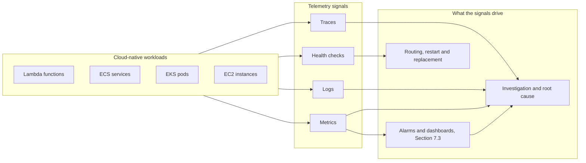

!!! tip "Correlation is the point"
    The three signals are most valuable when they can be joined. A metric alarm shows that p99 latency doubled; an exemplar trace from that minute shows the slow database call; the trace ID found in that span leads to the exact log lines ([Section 7.2](../unit7/topic2.md#correlation-ids-and-trace-context)). Design every service so that ==metrics, traces and logs share identifiers==: service name, environment, version and trace ID. The OpenTelemetry "resource attributes" described in the X-Ray part are the standard way to do this.

### Two classic methods for choosing what to measure

Before choosing tools, an architect decides ==what to measure==. Two frameworks cover almost every component:

| Method | Applies to | Measures | Example on AWS |
|--------|-----------|----------|----------------|
| RED | Request-driven services (APIs, microservices, functions) | Rate, Errors, Duration | ALB `RequestCount`, `HTTPCode_Target_5XX_Count`, `TargetResponseTime` p99 |
| USE | Resources (CPU, memory, disks, network, connection pools, queues) | Utilisation, Saturation, Errors | Container Insights CPU and memory utilisation, SQS `ApproximateAgeOfOldestMessage`, RDS `DatabaseConnections` |

Google's Site Reliability Engineering practice adds ==traffic== to form the "four golden signals" (latency, traffic, errors, saturation), which is essentially RED plus the saturation part of USE. [Chapter 1.3](../unit1/topic3.md) already recommended a RED dashboard per service; this section explains how the underlying metrics are produced, stored and queried.

### Layers of monitoring in a cloud-native stack

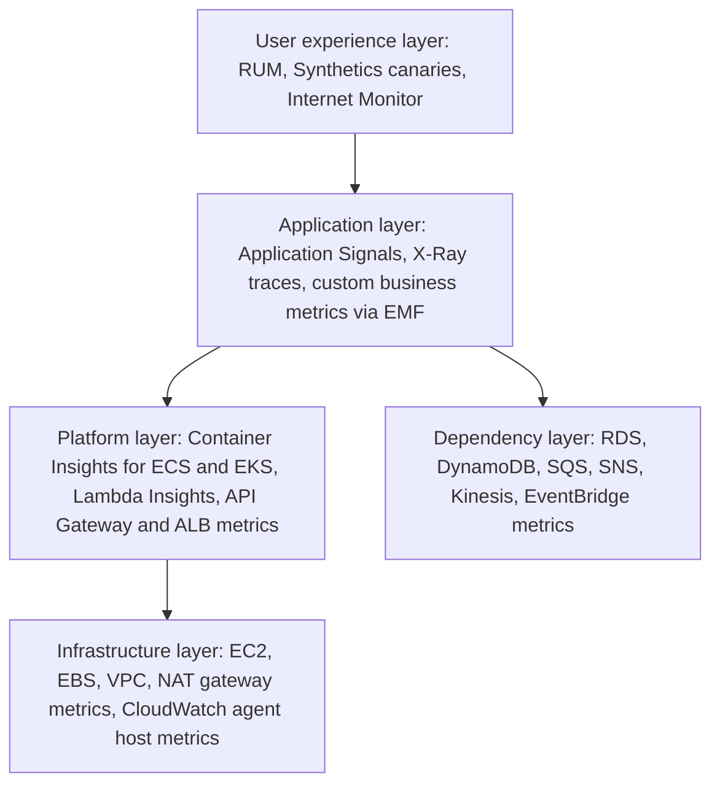

| Layer | Typical question | Primary AWS capability |
|-------|------------------|------------------------|
| User experience | Can real users in Thimphu load the checkout page quickly? | CloudWatch RUM, Synthetics, Internet Monitor |
| Application | Which operation of the orders service breaches its latency objective? | Application Signals, X-Ray, custom metrics |
| Platform | Are ECS tasks being throttled on CPU? Is a pod restarting? | Container Insights, Lambda Insights |
| Infrastructure | Is the instance out of memory or the disk full? | CloudWatch agent, EC2 and EBS metrics |
| Dependency | Is the queue backing up? Is DynamoDB throttling? | Vended service metrics |

!!! note "Monitor from the outside in"
    The most important question is always the outermost one: ==is the user being served?== An internal metric can be green while every user fails (an expired certificate, a DNS mistake, a broken CDN rule). Start with user-facing signals, then drill inwards. This ordering is why this part discusses Synthetics and RUM alongside infrastructure metrics.

---

## Infrastructure and Application Monitoring with Amazon CloudWatch

### Definition

==Amazon CloudWatch is the regional, fully managed monitoring and observability service of AWS that collects, stores, aggregates and visualises metrics, logs, traces and events from AWS resources, applications and users, and acts on them through alarms and automation.==

In this part the focus is ==CloudWatch metrics==: time-ordered sets of numeric data points, each identified by a namespace, a metric name and a set of dimensions. Almost every AWS service publishes metrics to CloudWatch automatically. Applications add their own business and technical metrics. Higher-level capabilities (Container Insights, Lambda Insights, Application Signals, Synthetics, RUM) are, underneath, ==producers of CloudWatch metrics, logs and traces== with curated dashboards on top.

In the AWS architecture map CloudWatch belongs to the ==Management and Governance== category, alongside AWS CloudTrail (API audit), AWS Config (resource configuration history), AWS Systems Manager and AWS Trusted Advisor. It is the operational backbone that every other service reports into.

| CloudWatch component | Signal | Covered in |
|----------------------|--------|-----------|
| Metrics, Metrics Insights, metric streams | Metrics | This part |
| CloudWatch agent, Container Insights, Lambda Insights | Metrics and performance logs | This part |
| Application Signals | Metrics, traces, SLOs | This part (SLO alarms in 7.3.1) |
| Synthetics, RUM, Internet Monitor | User-experience metrics | This part |
| Observability Access Manager | Cross-account sharing | This part |
| CloudWatch Logs, Logs Insights | Logs | [Section 7.2](../unit7/topic2.md) |
| X-Ray traces, Transaction Search | Traces | The X-Ray part of this section |
| Dashboards, alarms, anomaly detection | Visualisation and alerting | [Section 7.3.1](../unit7/topic3.md#creating-cloudwatch-dashboards-and-alarms) |
| Investigations | AI-assisted incident analysis | [Section 7.3.2](../unit7/topic3.md#automated-incident-response-with-aws-lambda) |

!!! note "CloudWatch is not one product"
    CloudWatch began in 2009 as a simple metrics service for EC2. It has grown into an umbrella for more than a dozen capabilities. When an exam question or colleague says "CloudWatch", ask which capability is meant. Each has its own pricing dimension, and each appears as a separate line on the bill.

### Why This Service or Concept Exists

#### The problem: you cannot log in to the cloud to look

On a traditional server an administrator could run `top`, `vmstat` or `df` and look. In a cloud-native system this model breaks down for four reasons:

1. ==Ephemerality.== ECS tasks, Kubernetes pods and Lambda execution environments live for minutes or seconds. When an engineer arrives to investigate, the component that failed no longer exists. Its telemetry must have been exported ==before== it disappeared.
2. ==Scale.== A service with 200 tasks cannot be inspected one task at a time. Measurements must be aggregated across the fleet and sliced by dimension.
3. ==Managed services have no shell.== There is no host to log in to for DynamoDB, SQS, API Gateway or Fargate. The provider must expose the internal state as metrics.
4. ==Distribution.== The user's experience is the composition of many services. No single host holds the answer to "is the checkout working?".

#### Why AWS built CloudWatch

AWS needed a way to expose the internal behaviour of its own services to customers without giving them access to the underlying infrastructure, and customers needed a monitoring system that scaled as elastically as the workloads it observed. Before CloudWatch, teams operated tools such as Nagios, Zabbix, Ganglia or Graphite on their own servers. Those tools remain capable, but the operator must:

- run and scale the monitoring servers and their time-series databases,
- make the monitoring system itself highly available (a monitoring system that fails with the application it monitors is useless during an incident),
- configure agents and firewall rules for every new host,
- manage long-term storage and downsampling,
- integrate each managed service manually.

CloudWatch removes that burden. AWS services publish metrics automatically, storage and downsampling are built in, and the service scales with the account.

#### Benefits over older methods

| Concern | Self-managed monitoring stack | Amazon CloudWatch |
|---------|-------------------------------|-------------------|
| Coverage of managed services | Custom exporters per service, often incomplete | Vended metrics from essentially every AWS service, with no setup |
| Infrastructure | Servers, databases, storage to operate | None; regional managed service |
| Availability of monitoring | Must be engineered separately | Runs independently of your workloads |
| Retention and downsampling | Configured and paid for manually | Automatic: up to 15 months with rollups |
| Integration with automation | Scripts and webhooks | Native actions: Auto Scaling, EC2 recovery, SNS, Lambda, Systems Manager |
| Access control | Separate user directory | AWS IAM, resource tags, cross-account sinks |
| Cost model | Fixed infrastructure cost | Pay per metric, API call, log GB, canary run and so on |

!!! tip "When another tool is still the right answer"
    CloudWatch is the default for AWS-native telemetry, but it is not the only choice. Organisations standardised on Prometheus and Grafana often use ==Amazon Managed Service for Prometheus== and ==Amazon Managed Grafana== for Kubernetes metrics, and many enterprises use third-party platforms (Datadog, Dynatrace, New Relic, Grafana Cloud) for multi-cloud estates. Because OpenTelemetry has become the common instrumentation standard, the application code can stay the same while the backend changes. Even then, CloudWatch remains the source of AWS vended metrics, which third-party tools read through metric streams or APIs.

### Core Concepts

#### The metric data model

Every CloudWatch metric data point is described by the same small set of attributes. Mastering this model is the key to the whole service.

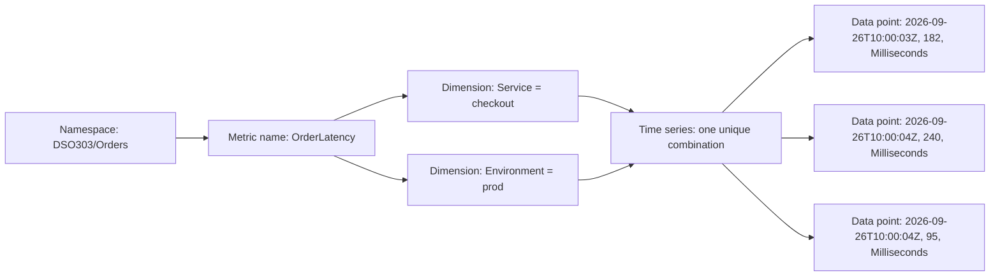

| Attribute | Meaning | Example |
|-----------|---------|---------|
| Namespace | A container that isolates metrics from one another. AWS namespaces start with `AWS/`; custom namespaces must not. | `AWS/Lambda`, `AWS/ApplicationELB`, `ECS/ContainerInsights`, `DSO303/Orders` |
| Metric name | The quantity being measured | `Invocations`, `CPUUtilization`, `OrdersPlaced` |
| Dimensions | Name/value pairs that identify ==which thing== the measurement describes. Up to 30 per metric. | `FunctionName=checkout`, `ServiceName=orders`, `ClusterName=prod` |
| Timestamp | When the observation occurred, in UTC | `2026-09-26T10:00:03Z` |
| Value | The numeric observation | `182` |
| Unit | Optional unit of measure | `Milliseconds`, `Count`, `Bytes`, `Percent` |
| Storage resolution | Standard (60 s) or high resolution (1 s) | `StorageResolution = 1` |

==A metric is uniquely identified by its namespace, name and complete set of dimensions.== This has a consequence that surprises beginners: `OrderLatency` with dimensions `{Service=checkout}` and `OrderLatency` with dimensions `{Service=checkout, Environment=prod}` are ==two different metrics==. CloudWatch does not aggregate across dimensions for you unless you publish the aggregate dimension combination as well or use a query that groups (Metrics Insights, [Section 7.3.1](../unit7/topic3.md#creating-cloudwatch-dashboards-and-alarms)).

!!! warning "Dimensions are part of the identity"
    If you publish only the combination `{Service, Environment, InstanceId}`, you cannot later ask CloudWatch's standard API for "OrderLatency for Service=checkout across all instances". You either publish additional dimension combinations (each is a separately billed metric), or query with Metrics Insights `GROUP BY`, or emit the metric through the Embedded Metric Format with several dimension sets.

#### Namespaces in practice

| Namespace | Published by | Examples of metrics |
|-----------|--------------|---------------------|
| `AWS/EC2` | EC2 hypervisor | `CPUUtilization`, `NetworkIn`, `StatusCheckFailed` |
| `AWS/ApplicationELB` | Application Load Balancer | `RequestCount`, `TargetResponseTime`, `UnHealthyHostCount` |
| `AWS/Lambda` | Lambda service | `Invocations`, `Errors`, `Duration`, `Throttles`, `ConcurrentExecutions` |
| `AWS/ECS` | ECS service | `CPUUtilization`, `MemoryUtilization` per service |
| `ECS/ContainerInsights` | Container Insights | Task and container level CPU, memory, network, storage, restart counts |
| `ContainerInsights` | Container Insights for EKS | Node, pod and container metrics |
| `AWS/ApiGateway` | API Gateway | `Count`, `Latency`, `IntegrationLatency`, `4XXError`, `5XXError` |
| `AWS/SQS` | SQS | `ApproximateAgeOfOldestMessage`, `ApproximateNumberOfMessagesVisible` |
| `LambdaInsights` | Lambda Insights extension | `memory_utilization`, `init_duration`, `cpu_total_time` |
| `ApplicationSignals` | Application Signals | `Latency`, `Fault`, `Error` per service and operation |
| `CloudWatchSynthetics` | Synthetics canaries | `SuccessPercent`, `Duration` |
| `AWS/X-Ray` | X-Ray | Sampling and trace-derived metrics |
| `CWAgent` (default) | CloudWatch agent | `mem_used_percent`, `disk_used_percent` |

#### Data points, periods and statistics

CloudWatch stores individual data points (or pre-aggregated statistic sets) and, when you query, ==aggregates them over a period== using a statistic. The period is the width of the time bucket, for example 60 seconds or 5 minutes.

| Statistic | Meaning | Use it for |
|-----------|---------|------------|
| `SampleCount` | Number of data points in the period | Request counts when each data point is one request |
| `Sum` | Total of all values | Counts: errors, orders, bytes |
| `Average` | Sum divided by sample count | Utilisation, but rarely latency |
| `Minimum`, `Maximum` | Extremes in the period | Detecting spikes, saturation |
| `pNN` (percentile) | Value below which NN per cent of samples fall | Latency and duration objectives |
| `TMxx`, `WMxx`, `TCxx`, `TSxx`, `PRxx` | Trimmed mean, winsorised mean, trimmed count, trimmed sum, percentile rank | Latency analysis that excludes outliers; "what fraction of requests were under 300 ms" |

##### Why averages lie about latency

Consider 100 requests in one minute: 95 take 50 ms and 5 take 4,000 ms because a database lock is held. The average is about 247 ms, which looks acceptable. The p99 is 4,000 ms, which reveals that one user in twenty had a terrible experience. Averages ==hide the tail==, and in a microservice system the tail compounds: if a page calls 10 services in parallel and waits for all of them, the probability that at least one call hits its individual p99 is roughly 10 per cent.

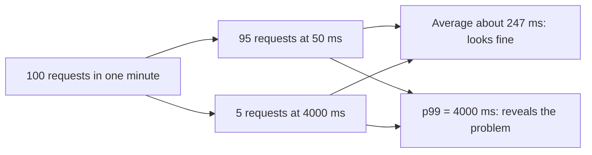

!!! tip "Percentile rank answers the objective directly"
    If the objective is "95 per cent of requests complete within 300 ms", the percentile rank statistic `PR(:300)` returns the percentage of samples at or below 300 ms. That single number can be compared directly with the objective and is the basis of latency service level indicators ([Section 7.3.1](../unit7/topic3.md#creating-cloudwatch-dashboards-and-alarms)).

##### When percentiles are available

CloudWatch can compute percentiles only when it has the underlying distribution. This holds when:

- the metric was published as ==raw values== (individual data points, or the `Values` and `Counts` arrays of `PutMetricData`), and
- the values are non-negative.

If a producer publishes only a pre-aggregated ==statistic set== (`SampleCount`, `Sum`, `Minimum`, `Maximum`), percentiles are not available, because the distribution has been discarded. Services that publish latency with percentile support include ALB, API Gateway, Lambda, EC2, Kinesis and RDS.

!!! danger "Never average percentiles"
    The average of five one-minute p99 values is not the five-minute p99. Percentiles are not additive. Always request the percentile directly at the period you care about, and never compute a fleet p99 by averaging per-instance p99 values.

#### Resolution and retention

| Storage resolution | Retrievable periods | Typical source |
|--------------------|---------------------|----------------|
| Standard (60 s) | 60 s and multiples | Most vended metrics; custom metrics by default |
| High resolution (1 s) | 1, 5, 10, 30 s and multiples of 60 s | Custom metrics with `StorageResolution = 1`; some agent metrics |

CloudWatch downsamples automatically as data ages:

| Data point period | Retained at that resolution for |
|-------------------|---------------------------------|
| Less than 60 s (high resolution) | 3 hours |
| 60 s | 15 days |
| 300 s (5 minutes) | 63 days |
| 3,600 s (1 hour) | 455 days (15 months) |

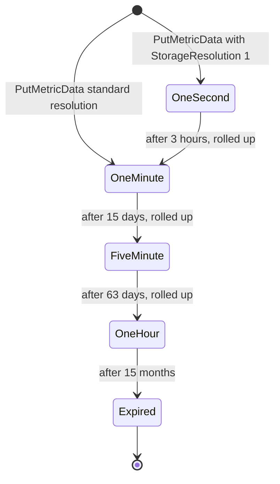

!!! note "Implications of the retention schedule"
    You cannot look at one-minute detail from three weeks ago; by then CloudWatch retains only five-minute rollups. If an audit or capacity-planning process needs raw data for longer, export it continuously with ==metric streams== to Amazon S3 (through Amazon Data Firehose) or to a third-party platform. Metrics that stop receiving data expire 15 months after their last data point, and metrics without data in the past two weeks no longer appear in the console search even though they can still be queried.

#### Vended metrics, basic monitoring and detailed monitoring

==Vended metrics== are published by AWS services at no charge for the basic set. For EC2 the distinction between basic and detailed monitoring matters:

| Mode | Period | Cost | When to use |
|------|--------|------|-------------|
| Basic monitoring | 5 minutes | Free | Development, low-criticality instances |
| Detailed monitoring | 1 minute | Charged as custom metrics | Auto Scaling groups that must react quickly, production workloads |

!!! warning "What EC2 cannot see"
    The hypervisor measures what it can see from outside the guest: CPU, network, disk operations on instance store, and status checks. It ==cannot see memory usage or file-system usage inside the guest operating system==. A classic exam and interview question asks why there is no memory metric for EC2 by default. The answer is the CloudWatch agent, described below.

#### Custom metrics and the four ways to publish them

A ==custom metric== is any metric you publish yourself. Business metrics ("orders placed", "payment declined", "basket value") are the most valuable custom metrics because they measure outcomes rather than resource consumption.

| Method | How it works | Latency added to request path | Best for |
|--------|--------------|-------------------------------|----------|
| `PutMetricData` API | Synchronous HTTPS call from code | Yes, one API call, can fail or throttle | Batch jobs, scripts, low-volume publishers |
| Embedded Metric Format (EMF) | Structured JSON log line; CloudWatch extracts metrics during log ingestion | None (asynchronous) | Lambda, containers writing to CloudWatch Logs |
| CloudWatch agent (StatsD, collectd, OTLP, Prometheus scraping) | Agent on host or sidecar aggregates and publishes | Local UDP or HTTP only | EC2, ECS on EC2, EKS nodes, existing StatsD code |
| OpenTelemetry metrics via OTLP | OpenTelemetry SDK exports to a collector or CloudWatch OTLP endpoint; queried with PromQL | Local export, batched | New polyglot services, organisations standardising on OpenTelemetry |

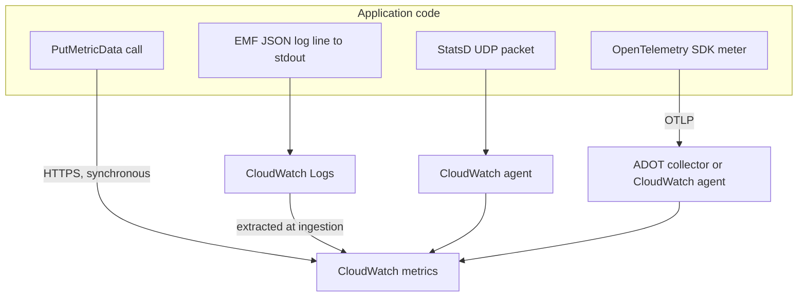

##### The Embedded Metric Format in more depth

[Chapter 1.3](../unit1/topic3.md) introduced EMF for Lambda. The format is platform-neutral: any process whose standard output reaches CloudWatch Logs (Lambda, ECS with the `awslogs` driver or FireLens, EKS with Fluent Bit, EC2 with the agent) can emit EMF. A single log line can carry several metrics and several dimension sets, and all other fields remain searchable in Logs Insights ([Section 7.2.2](../unit7/topic2.md#log-analysis-with-amazon-cloudwatch-logs-insights)).

```json
{
  "_aws": {
    "Timestamp": 1790412003000,
    "CloudWatchMetrics": [
      {
        "Namespace": "DSO303/Orders",
        "Dimensions": [["Service"], ["Service", "PaymentMethod"]],
        "Metrics": [
          {"Name": "OrderLatency", "Unit": "Milliseconds"},
          {"Name": "OrdersPlaced", "Unit": "Count"}
        ]
      }
    ]
  },
  "Service": "checkout",
  "PaymentMethod": "card",
  "OrderLatency": 182,
  "OrdersPlaced": 1,
  "orderId": "o-88121",
  "tenantId": "t-042",
  "traceId": "1-66f53a2b-4c1e5d7f9a0b1c2d3e4f5a6b"
}
```

Here two dimension sets produce ==four time series== (two metrics times two dimension sets). The high-cardinality fields `orderId`, `tenantId` and `traceId` are ==not dimensions==; they remain in the log event, where they cost nothing extra as metrics but can still be queried when investigating a specific order.

!!! tip "EMF is the cardinality escape valve"
    With EMF you can keep a low-cardinality set of dimensions for metrics and alarms, while high-cardinality context (customer ID, request ID, trace ID) stays in the log line for investigation. This is the recommended way to get both cheap metrics and rich context.

#### Cardinality

==Cardinality== is the number of distinct time series produced by a metric: the product of the number of distinct values of each dimension. Every distinct time series is a separately billed custom metric.

| Dimensions chosen | Distinct values | Time series |
|-------------------|-----------------|-------------|
| `Service` | 20 services | 20 |
| `Service`, `Operation` | 20 x 15 | 300 |
| `Service`, `Operation`, `StatusCode` | 20 x 15 x 8 | 2,400 |
| `Service`, `Operation`, `CustomerId` | 20 x 15 x 50,000 | 15,000,000 |

!!! danger "Unbounded dimensions"
    Using a user ID, request ID, order ID, IP address, full URL path with identifiers, or a timestamp as a dimension creates unbounded cardinality. The bill grows with the number of customers, and dashboards become unusable. Dimensions must have a ==small, bounded set of values== (service, operation, environment, Availability Zone, status class such as `2xx`/`4xx`/`5xx`). Put identifiers in logs or trace annotations instead.

#### Units, timestamps and late data

- Always set a ==unit==. Without one, a latency of 250 could be seconds or milliseconds, and CloudWatch cannot convert units when comparing metrics.
- Timestamps may be up to two weeks in the past and two hours in the future. Data points with delayed timestamps can arrive after an alarm has already evaluated the period, leaving the alarm in `INSUFFICIENT_DATA` or firing late (alarm evaluation is covered in [Section 7.3.1](../unit7/topic3.md#creating-cloudwatch-dashboards-and-alarms)).
- Clocks must be synchronised. EC2 instances use the Amazon Time Sync Service by default; containers inherit the host clock.

#### Metric math, Metrics Insights and metric streams (brief)

Three capabilities operate on stored metrics. They are introduced here because they influence how you publish metrics; their detailed use for dashboards and alarms is covered in [Section 7.3.1](../unit7/topic3.md#creating-cloudwatch-dashboards-and-alarms).

| Capability | What it does | Why it matters when designing metrics |
|------------|--------------|---------------------------------------|
| Metric math | Expressions over metrics, for example error rate = `100 * errors / requests` | You can publish raw counts and derive ratios, instead of publishing ratios that cannot be re-aggregated |
| Metrics Insights | SQL-like queries with `GROUP BY` across dimensions | Lets you aggregate across instances without publishing extra dimension combinations |
| Metric streams | Continuous near-real-time export of metrics through Amazon Data Firehose to S3 or a partner | Long-term raw retention and third-party analytics |

!!! tip "Publish counts, derive rates"
    Publish `Requests` and `Errors` as counts and compute the error rate with metric math. A published ratio (for example "error percentage per instance") cannot be combined correctly across instances, because a quiet instance with 1 error out of 2 requests would weigh the same as a busy instance with 10 errors out of 10,000.

#### The CloudWatch agent

The ==unified CloudWatch agent== is an open-source process (Go, derived from Telegraf) that runs on EC2 instances, on-premises servers, ECS container instances and EKS nodes. It fills the gap left by hypervisor metrics and acts as a local telemetry gateway.

| Capability | Detail |
|------------|--------|
| Guest OS metrics | Memory, swap, disk and file-system usage, processes, network statistics, per-CPU detail |
| Log collection | Tails files and ships them to CloudWatch Logs (detailed in [Section 7.2.1](../unit7/topic2.md#log-aggregation-with-amazon-cloudwatch-logs)) |
| StatsD and collectd | Receives application metrics over UDP from existing libraries |
| Prometheus scraping | Scrapes Prometheus endpoints on ECS and EKS and converts them to CloudWatch metrics |
| OpenTelemetry | Receives OTLP metrics and traces, and serves as the Application Signals and X-Ray collector |
| Aggregation | Aggregates high-frequency samples locally before publishing, controlling cost |
| Configuration | JSON file, commonly stored in Systems Manager Parameter Store and distributed with Run Command or State Manager |

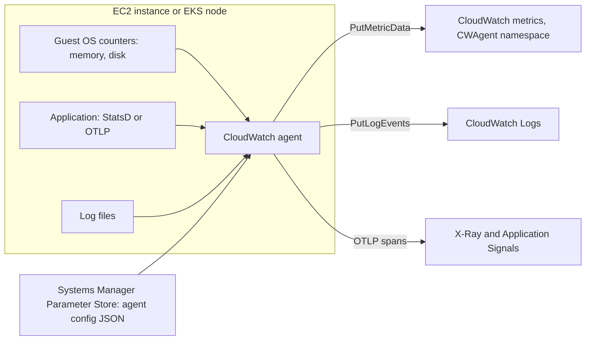

A minimal agent configuration that adds memory and disk metrics, aggregated per Auto Scaling group, looks like this:

```json
{
  "agent": { "metrics_collection_interval": 60, "run_as_user": "cwagent" },
  "metrics": {
    "namespace": "CWAgent",
    "append_dimensions": {
      "AutoScalingGroupName": "${aws:AutoScalingGroupName}",
      "InstanceId": "${aws:InstanceId}"
    },
    "aggregation_dimensions": [["AutoScalingGroupName"]],
    "metrics_collected": {
      "mem": { "measurement": ["mem_used_percent"] },
      "disk": { "measurement": ["used_percent"], "resources": ["/"] }
    }
  }
}
```

!!! note "aggregation_dimensions saves money and effort"
    `aggregation_dimensions` makes the agent also publish each metric with only the `AutoScalingGroupName` dimension. You can then alarm on fleet-wide memory without publishing and paying for, or querying across, a metric per instance ID.

#### Container Insights

==CloudWatch Container Insights== collects, aggregates and summarises metrics and performance logs from containerised applications on Amazon ECS (EC2 and Fargate), Amazon EKS and self-managed Kubernetes on EC2. It answers platform questions that raw service metrics cannot: which task is using the memory, which pod restarted, which node is saturated.

| Aspect | Amazon ECS | Amazon EKS |
|--------|-----------|-----------|
| How it is enabled | Cluster setting `containerInsights` (`enabled` or `enhanced`), or account default | Amazon CloudWatch Observability EKS add-on (installs the CloudWatch agent and Fluent Bit) |
| Collection mechanism | ECS agent and Fargate platform collect task statistics; no sidecar required | CloudWatch agent DaemonSet on each node; Fluent Bit DaemonSet for logs |
| Metric granularity | Cluster, service, task and, with enhanced observability, container | Cluster, node, namespace, service, pod and container |
| Data path | Performance log events in EMF, converted to metrics | Performance log events in EMF, converted to metrics |
| Namespace | `ECS/ContainerInsights` | `ContainerInsights` |

##### Enhanced observability

AWS introduced ==Container Insights with enhanced observability== for EKS in 2023 and for ECS at the end of 2024. Standard Container Insights aggregates mainly at cluster and service level. Enhanced observability adds ==granular metrics down to the container level==, curated drill-down dashboards (cluster to service to task to container), correlation with application telemetry, and, for EKS, control plane metrics, GPU and AWS accelerator metrics. It is priced by ==observations== (metric data points ingested) rather than per custom metric, which makes high-cardinality container metrics affordable.

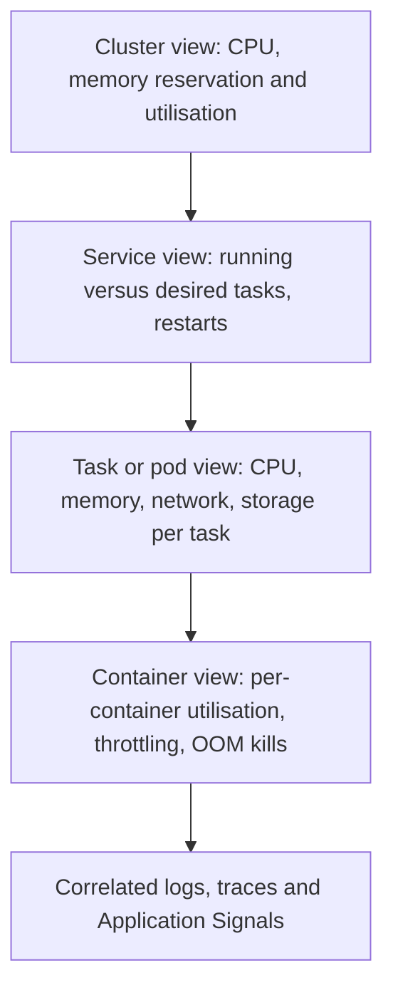

| Metric | Why an architect watches it |
|--------|-----------------------------|
| `RunningTaskCount` versus `DesiredTaskCount` (ECS) | A persistent gap means placement failures or failing health checks ([Chapter 2.2](../unit2/topic2.md)) |
| `pod_number_of_container_restarts` (EKS) | Crash loops and liveness probe failures ([Chapter 3.2](../unit3/topic2.md)) |
| `container_memory_utilization` against limit | Proximity to out-of-memory kills |
| `container_cpu_utilization` with throttling | CPU limits that are too tight slow the application without killing it |
| `node_cpu_reserved_capacity` (EKS) | Scheduling headroom for Karpenter or Cluster Autoscaler decisions ([Chapter 3.3](../unit3/topic3.md)) |
| `EphemeralStorageUtilized` (ECS on Fargate) | Tasks that fill their ephemeral storage fail in confusing ways |

!!! info "OpenTelemetry-based Container Insights for EKS"
    In April 2026 AWS launched, in public preview, ==OTel Container Insights for Amazon EKS==, which sends Container Insights metrics over OTLP with up to 150 descriptive labels and supports PromQL querying in CloudWatch. At the time of writing it is available in a limited set of Regions and free during preview. Treat it as the likely future direction and check the Container Insights documentation for its current status before using it in a design.

#### Lambda Insights (recap)

[Chapter 1.3](../unit1/topic3.md) introduced ==Lambda Insights==, a Lambda extension delivered as a layer that reports system-level metrics (memory used versus allocated, CPU time, network, initialisation duration) in EMF to the `LambdaInsights` namespace. Two points complete the picture for this part:

- It requires the function's execution role to allow writing to CloudWatch Logs (the managed policy `CloudWatchLambdaInsightsExecutionRolePolicy` grants exactly that).
- It is billed as custom metrics and log ingestion per function, so enable it on functions where right-sizing and cold-start analysis matter, not indiscriminately on hundreds of small functions. Its use for right-sizing is covered in [Section 7.3.3](../unit7/topic3.md#performance-optimization-using-aws-tools).

#### CloudWatch Application Signals

==Application Signals== is the application performance monitoring (APM) capability of CloudWatch, generally available since mid-2024. It automatically instruments applications using the ==AWS Distro for OpenTelemetry (ADOT)== and the CloudWatch agent, and produces, for every service and every operation:

| Standard signal | Meaning |
|-----------------|---------|
| Call volume | Number of requests |
| Latency | p50, p90, p99 duration |
| Faults | Server-side failures (HTTP 5xx, unhandled exceptions) |
| Errors | Client-side failures (HTTP 4xx) |
| Availability | Percentage of requests without faults |

It adds an automatically discovered ==application map== of services and dependencies, ==service level objectives (SLOs)== on those signals, correlation with X-Ray traces, Synthetics canaries, RUM sessions and CloudTrail change events.

| Platform | Support |
|----------|---------|
| Amazon EKS and Kubernetes | CloudWatch Observability add-on with automatic instrumentation annotations; service and cluster names discovered |
| Amazon ECS | ADOT SDK in the container plus the CloudWatch agent as a sidecar or daemon; service and environment names set by configuration |
| Amazon EC2 | ADOT SDK plus the CloudWatch agent |
| AWS Lambda | Enabled per function; uses an ADOT Lambda layer |
| Languages | Java, Python, Node.js and .NET (check the documentation for current additions) |

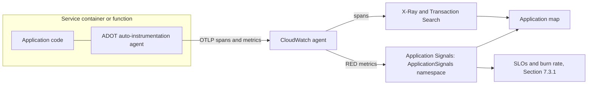

!!! tip "Why Application Signals matters in DSO303"
    Application Signals turns the RED method from a dashboard you build by hand into a default. For a microservices estate on ECS and EKS (Units II to IV) it removes the need to add latency and error metrics to every endpoint manually, and it produces them with ==consistent names and dimensions== across languages and platforms. Custom business metrics (orders placed, payments declined) still require EMF or OpenTelemetry metrics.

#### CloudWatch Synthetics

==CloudWatch Synthetics== runs ==canaries==: scripts (Node.js with Puppeteer or Playwright, or Python with Selenium) executed on a schedule by a managed Lambda-based runtime. A canary behaves like a user or an API client and records success, duration, screenshots, HAR files and logs.

| Blueprint | What it checks |
|-----------|----------------|
| Heartbeat monitor | A URL loads and returns success |
| API canary | A sequence of API requests with assertions on status and body |
| Broken link checker | Links on a page resolve |
| Visual monitoring | Screenshot compared with a baseline |
| GUI workflow | A multi-step user journey (log in, search, add to basket) |
| Canary recorder | Script generated from actions recorded in a browser extension |

Why canaries exist: internal metrics report what the system sees. When DNS is misconfigured, a certificate expires, a CDN rule blocks a path or a login dependency fails, ==no request reaches your services at all==, so internal error metrics stay at zero. A canary measures the journey from outside, continuously, even at 3 a.m. when there are no real users to notice.

!!! info "Multilocation canaries"
    In June 2026 Synthetics added ==multilocation canaries==: one primary canary definition replicated to several Regions, with run data consolidated in the primary Region and alarms that can require failures from more than one location before firing. This reduces false alarms caused by a single probe location and removes configuration drift between per-Region copies.

Canaries can run inside a VPC to test private endpoints (an internal ALB, a private API Gateway endpoint), and their results appear on the Application Signals map.

#### CloudWatch RUM

==CloudWatch Real User Monitoring (RUM)== collects telemetry from ==real users' browsers and mobile apps==: page load timings and Core Web Vitals (Largest Contentful Paint, Interaction to Next Paint, Cumulative Layout Shift), JavaScript errors, HTTP errors, and user sessions, segmented by browser, device, country and page. A small JavaScript snippet (or, since late 2025, an OpenTelemetry-based SDK for iOS and Android) sends events to a RUM app monitor. Browser clients authenticate through an Amazon Cognito identity pool with a narrowly scoped unauthenticated role, or through resource-based policies.

| Synthetics | RUM |
|-----------|-----|
| Scripted, scheduled, predictable | Real traffic, unpredictable |
| Works with zero users | Needs users |
| Detects outages quickly | Reveals real experience across devices and networks |
| Fixed, controllable cost | Cost proportional to traffic (sample sessions to control it) |

!!! note "Session replay and privacy"
    RUM added session replay in 2026. Any capability that records user interactions must be designed with privacy in mind: mask form fields and personal data, sample sessions, and state the data collection in the privacy policy. Treat RUM data as personal data under the regulations that apply to your users.

#### Internet Monitor

==Amazon CloudWatch Internet Monitor== uses AWS's global view of internet connectivity to show how internet issues (an ISP outage, congestion in a city network) affect availability and performance between your users and your application hosted on AWS (VPCs, CloudFront distributions, WorkSpaces directories, Network Load Balancers). It reports health events by ==city-network== (a city location combined with an autonomous system, typically an ISP) and suggests alternative Regions or CloudFront to improve latency. It answers the question "is it us or the internet?" during an incident. Its use in performance optimisation is discussed in [Section 7.3.3](../unit7/topic3.md#performance-optimization-using-aws-tools).

#### Cross-account observability with Observability Access Manager

Production AWS estates use many accounts (Chapter 5.x recommended separate accounts for development, staging and production, and teams often have their own). Engineers investigating an incident should not need to switch between twenty accounts. ==CloudWatch cross-account observability==, configured through the ==Observability Access Manager (OAM)== API, links ==source accounts== to a ==monitoring account== within a Region.

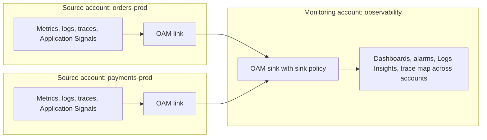

| Concept | Meaning |
|---------|---------|
| Monitoring account | The central account where engineers view telemetry |
| Sink | Resource in the monitoring account that accepts links; its sink policy lists allowed source accounts or organisation paths |
| Link | Resource in a source account that shares selected telemetry types with a sink |
| Shared telemetry types | Metrics, log groups, traces, Application Signals services and SLOs, Internet Monitor monitors (select only what is needed) |
| Scope | Per Region; a monitoring account can view up to 100,000 source accounts and a source account can share with up to 5 monitoring accounts |
| Cost | No extra charge for sharing metrics and logs; the first copy of shared traces is free |

!!! tip "OAM does not copy data"
    Cross-account observability ==does not move or duplicate telemetry==; the monitoring account queries data where it lives. For compliance-driven central retention (copying logs and metrics into one account and Region), CloudWatch also offers cross-account, cross-Region ==centralisation rules== that require AWS Organizations; log centralisation is discussed in [Section 7.2.1](../unit7/topic2.md#log-aggregation-with-amazon-cloudwatch-logs).

#### OpenTelemetry metrics in CloudWatch

OpenTelemetry (introduced fully in the X-Ray part) has become the industry standard for instrumentation. In June 2026 CloudWatch made ==native OpenTelemetry metrics== generally available: applications send metrics over OTLP, they are stored with their labels for 15 months, priced per GB ingested rather than per metric, and queried with ==PromQL== through a Prometheus-compatible API alongside AWS vended metrics. For new services instrumented with OpenTelemetry this removes the historic tension between rich labels and per-metric pricing. Classic CloudWatch custom metrics (`PutMetricData`, EMF) remain fully supported and are still the simplest option for Lambda functions and for existing code.

!!! warning "Choose one metrics path per service"
    Publishing the same measurement through EMF, `PutMetricData` and OpenTelemetry "to be safe" doubles or triples cost and produces conflicting numbers on dashboards. Decide per service, record the decision, and enforce it in code review and templates.

### AWS Service Deep Dive

#### Purpose

CloudWatch metrics provide a durable, regional, elastic time-series store and query engine for operational data, with native producers in every AWS service and native consumers in Auto Scaling, alarms, dashboards and automation. Its design goals are zero infrastructure for the customer, automatic coverage of managed services, long retention with automatic rollups, and tight integration with IAM and the rest of the AWS control plane.

#### Architecture

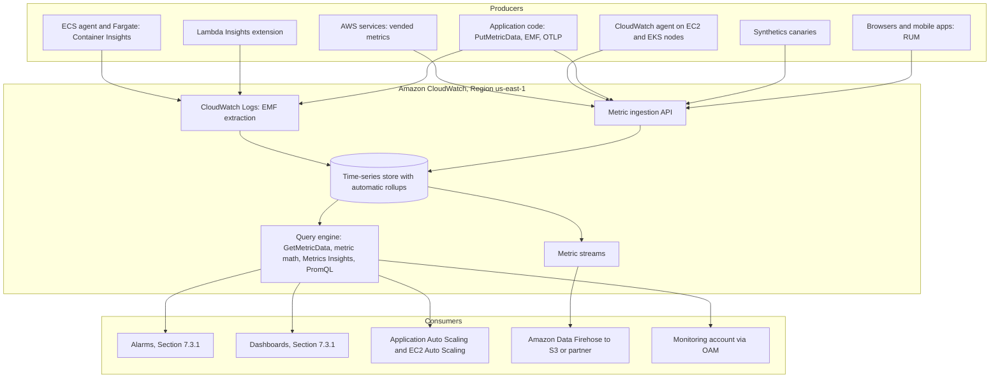

- ==Regional service.== Metrics are stored in the Region where they are published. A metric published in `us-east-1` is not visible in `ap-south-1` except through cross-Region dashboards or centralisation.
- ==Control plane and data plane.== Control plane operations (`PutMetricAlarm`, `PutDashboard`, `PutMetricStream`) are low-volume configuration calls made through IaC. Data plane operations (`PutMetricData`, `GetMetricData`) are high-volume and subject to request-rate quotas.
- ==Push model.== Producers push data points to CloudWatch. Unlike Prometheus, CloudWatch does not scrape targets directly; the CloudWatch agent performs scraping where needed and then pushes.
- ==Eventually consistent reads.== A newly published data point typically becomes queryable within about a minute for standard metrics. Alarms are designed around this delay.
- ==No servers.== There are no instances to size. Capacity appears as request quotas and, for costs, as per-metric and per-request charges.

#### Important Features

| Feature | Summary |
|---------|---------|
| Vended metrics | Automatic metrics from over 70 AWS services |
| Custom metrics | `PutMetricData`, EMF, CloudWatch agent, OpenTelemetry |
| High-resolution metrics | 1-second storage resolution for custom metrics |
| Percentiles and extended statistics | p99, trimmed mean, percentile rank |
| Metric math and Metrics Insights | Derived metrics and SQL-like aggregation |
| Anomaly detection | Machine-learned expected bands ([Section 7.3.1](../unit7/topic3.md#creating-cloudwatch-dashboards-and-alarms)) |
| Metric streams | Continuous export through Firehose |
| CloudWatch agent | Guest OS metrics, StatsD, collectd, Prometheus, OTLP |
| Container Insights and enhanced observability | Container platform metrics for ECS and EKS |
| Lambda Insights | Function system metrics |
| Application Signals | Automatic APM with SLOs and application map |
| Synthetics | Scheduled canaries, including multilocation |
| RUM | Real browser and mobile user telemetry |
| Internet Monitor | Internet-path health between users and AWS |
| Cross-account observability | OAM sinks and links |
| OpenTelemetry metrics with PromQL | OTLP ingestion, label-rich metrics, per-GB pricing |

#### Limitations

- ==Regional scope.== Global views require cross-Region dashboards, centralisation or a third-party tool.
- ==Downsampling.== One-minute detail is kept for 15 days only; raw history requires metric streams.
- ==Dimension identity.== Classic metrics do not aggregate across dimension combinations unless you publish them or use Metrics Insights.
- ==Cost of cardinality.== Classic custom metrics are billed per unique time series, which penalises high-cardinality designs.
- ==Push only.== Scraping requires the agent or a collector.
- ==Latency of data availability.== Standard metrics are not suitable for sub-second control loops.
- ==Percentiles need raw values.== Pre-aggregated statistic sets lose the distribution.
- ==No deletion API for metric data.== Data points cannot be deleted; a mistaken metric simply expires 15 months after publication stops.

#### Pricing Model and recommendations

!!! info "Pricing figures"
    Prices below are indicative us-east-1 figures as of 2026 and change over time. Always confirm on the Amazon CloudWatch pricing page and with the AWS Pricing Calculator before using them in a design document.

| Dimension | Free tier (monthly) | Indicative paid price |
|-----------|---------------------|------------------------|
| Basic monitoring vended metrics | Included, unlimited | Free |
| Custom metrics and detailed monitoring | 10 metrics | USD 0.30 per metric per month for the first 10,000, lower in higher tiers (prorated hourly) |
| API requests (`PutMetricData`, `GetMetricData` and others) | 1 million requests | About USD 0.01 per 1,000 requests; `GetMetricData` is billed per metric requested |
| Container Insights with enhanced observability | None | Per million observations (about USD 0.21 per million for enhanced observability) |
| Application Signals | Time-limited free trial for new users | Per million signals (about USD 1.50 per million in the first tier), tiered |
| Synthetics | 100 canary runs | Per canary run (historically about USD 0.0012), plus Lambda, S3 and logs used by the canary |
| RUM | One-time trial of 1 million events | About USD 1 per 100,000 events |
| Internet Monitor | None | Per monitored resource per hour plus per city-network beyond an included number |
| OpenTelemetry metrics | Check pricing page | Per GB ingested, with storage included |
| Metric streams | None | Per 1,000 metric updates, plus Firehose charges |

Recommendations:

1. ==Budget for cardinality.== Estimate the number of time series before shipping a new metric. Multiply the distinct values of every dimension.
2. Prefer ==EMF== over `PutMetricData` in request paths; you pay for log ingestion instead of synchronous API calls, and you keep rich context.
3. Use ==agent aggregation== (`aggregation_dimensions`, `metrics_collection_interval`) to avoid per-instance metrics you will never query.
4. Enable ==detailed monitoring== only where one-minute reaction time matters, such as Auto Scaling groups.
5. Enable ==Lambda Insights and enhanced Container Insights selectively==, for services where the detail informs right-sizing or troubleshooting.
6. Tune ==canary frequency== to the business need: a one-minute canary costs five times as much as a five-minute canary.
7. ==Sample RUM sessions== on high-traffic sites.
8. Review the ==CloudWatch line of Cost Explorer by usage type== monthly; observability often becomes one of the top five cost lines in a mature estate. [Section 7.3.3](../unit7/topic3.md#performance-optimization-using-aws-tools) discusses observability cost governance in detail.

#### Performance Characteristics

| Characteristic | Typical behaviour |
|----------------|-------------------|
| Ingestion latency, standard metrics | Data queryable within about one to two minutes |
| Ingestion latency, high-resolution metrics | Seconds |
| EMF extraction | Slight additional delay because metrics are extracted during log ingestion |
| Query latency | Sub-second to seconds depending on the number of metrics and time range |
| `PutMetricData` API rate | 500 transactions per second per Region by default (adjustable) |
| `GetMetricData` API rate | 500 transactions per second per Region by default (adjustable), with datapoint-per-second limits |

#### Scaling Behaviour

CloudWatch scales transparently with the number of metrics and data points. The architect scales ==producers== sensibly: batching data points into fewer `PutMetricData` calls (each call can carry many metrics and many values), using agent aggregation, and preferring EMF, which rides on log ingestion throughput. Request quotas are per account per Region, so a large fleet of containers each calling `PutMetricData` every second can throttle; the fix is batching and asynchronous publication, not retry loops.

#### Availability

CloudWatch is a regional, multi-AZ service operated independently of customer workloads. Its availability commitment is published in the CloudWatch Service Level Agreement. Because metrics are regional, a multi-Region application should publish metrics in each Region and use cross-Region dashboards and Route 53 health checks (the health check part of this section) for global failover decisions. A monitoring design should also consider how engineers will be alerted if the primary Region is impaired; for critical systems, synthetic canaries in a second Region monitoring the first are a common safeguard.

#### Security Features

| Control | Purpose |
|---------|---------|
| IAM identity policies | Grant `cloudwatch:PutMetricData`, `cloudwatch:GetMetricData` and similar actions; `PutMetricData` can be restricted to namespaces with the `cloudwatch:namespace` condition key |
| Tag-based access | Alarms, dashboards, canaries, RUM app monitors and other resources support tags and attribute-based access control |
| Encryption in transit | All APIs use TLS |
| Encryption at rest | Metric data is encrypted at rest by AWS; logs used by EMF, Container Insights and Lambda Insights can use customer managed KMS keys ([Section 7.2.1](../unit7/topic2.md#log-aggregation-with-amazon-cloudwatch-logs)) |
| VPC interface endpoints | `monitoring` (metrics), `logs`, `xray`, `synthetics` and others through AWS PrivateLink, so private workloads publish without a NAT gateway |
| CloudTrail | Records control plane calls such as `PutMetricAlarm`, `DeleteDashboards` and OAM link creation |
| OAM sink policies | Restrict which accounts or organisational units may share telemetry with a monitoring account |
| RUM authentication | Cognito identity pool with a scoped unauthenticated role, or resource-based policy |

#### Service Limits

!!! info "Quotas"
    Indicative values as of 2026. Verify in Service Quotas and in the CloudWatch "service quotas" documentation page.

| Limit | Value |
|-------|-------|
| Dimensions per metric | 30 |
| `PutMetricData` request | Up to 1,000 metrics per request and 1 MB payload; up to 150 values per metric in the `Values` array |
| `PutMetricData` timestamps | Up to 2 weeks in the past and 2 hours in the future |
| `PutMetricData` and `GetMetricData` rate | 500 transactions per second per Region each, adjustable |
| `GetMetricData` | Up to 500 metrics or expressions per request |
| Metric retention | 15 months with rollups |
| High-resolution retention | 3 hours at sub-minute periods |
| EMF | Up to 100 metrics per `CloudWatchMetrics` directive; dimension limits as for classic metrics |
| OAM | Up to 100,000 source accounts per monitoring account; up to 5 monitoring accounts per source account |

!!! warning "The API quota is a hidden scaling ceiling"
    A common production failure: every container calls `PutMetricData` once per request. At 2,000 requests per second across the fleet the account exceeds the Regional `PutMetricData` rate, calls are throttled, the SDK retries, request latency rises and metrics go missing precisely when load is highest. Use EMF or local aggregation and batch publication.

### Important AWS Terminology

Terms such as alarm, dashboard, log group and log stream are defined in Sections [7.2](../unit7/topic2.md) and [7.3](../unit7/topic3.md). The following terms are specific to CloudWatch metrics and the monitoring capabilities in this part.

| Term | Meaning |
|------|---------|
| Namespace | Container that isolates a set of metrics, for example `AWS/Lambda` |
| Metric | Time-ordered set of data points identified by namespace, name and dimensions |
| Dimension | Name/value pair that identifies what a metric describes; part of the metric's identity |
| Time series | One unique combination of namespace, metric name and dimension values |
| Data point | A single value with a timestamp and optional unit |
| Statistic set | Pre-aggregated `SampleCount`, `Sum`, `Minimum`, `Maximum` for a period |
| Period | Time bucket over which data points are aggregated when queried |
| Storage resolution | Standard (60 s) or high resolution (1 s) |
| Percentile (pNN) | Value below which NN per cent of observations fall |
| Percentile rank (PR) | Percentage of observations within a given range, for example at or below 300 ms |
| Vended metric | Metric published automatically by an AWS service |
| Custom metric | Metric published by the customer |
| Basic and detailed monitoring | Five-minute free versus one-minute paid EC2 metrics |
| Cardinality | Number of distinct time series generated by a metric's dimensions |
| Embedded Metric Format (EMF) | JSON log specification from which CloudWatch extracts metrics |
| CloudWatch agent | Process that collects OS metrics, logs, StatsD, Prometheus and OTLP telemetry |
| Container Insights | Metrics and performance logs for ECS and EKS containers |
| Enhanced observability | Container-level Container Insights priced by observations |
| Observation | A metric data point ingested by Container Insights enhanced observability |
| Lambda Insights | Lambda extension reporting system-level function metrics |
| Application Signals | CloudWatch APM producing RED metrics, application map and SLOs |
| Canary | Scheduled synthetic script run by CloudWatch Synthetics |
| App monitor | CloudWatch RUM resource that receives events from a web or mobile application |
| City-network | Internet Monitor unit: a city location plus an autonomous system (usually an ISP) |
| Monitoring account | Central account that views telemetry from source accounts |
| Sink and link | OAM resources that connect source accounts to a monitoring account |
| Metric stream | Continuous export of metrics through Amazon Data Firehose |
| Metrics Insights | SQL-like query language for CloudWatch metrics |
| PromQL | Prometheus Query Language, used for OpenTelemetry metrics in CloudWatch |

### Configuration Options

#### Publishing options for custom metrics

| Option | Setting | Guidance |
|--------|---------|----------|
| Namespace | Any string not starting with `AWS/` | One namespace per application or domain, for example `DSO303/Orders` |
| Dimensions | Up to 30 name/value pairs | Keep to low-cardinality attributes; publish only combinations you query |
| Unit | `Milliseconds`, `Count`, `Bytes`, `Percent` and others | Always set it |
| `StorageResolution` | `60` (default) or `1` | High resolution only when sub-minute alarms or autoscaling are genuinely needed |
| `Values` and `Counts` arrays | Up to 150 distinct values per metric per call | Publish distributions compactly while preserving percentiles |
| Statistic set | `SampleCount`, `Sum`, `Minimum`, `Maximum` | Cheap, but loses percentiles |

#### EC2 and Auto Scaling monitoring options

| Option | Values | Guidance |
|--------|--------|----------|
| Detailed monitoring | Enabled or disabled per instance or launch template | Enable for production Auto Scaling groups |
| Auto Scaling group metrics collection | `GroupDesiredCapacity`, `GroupInServiceInstances` and others at one-minute granularity | Enable; they are free and essential for diagnosing scaling |
| CloudWatch agent | Installed through Systems Manager Distributor or baked into the AMI | Bake into golden AMIs; configuration in Parameter Store |

#### Container Insights options

| Platform | Setting | Values |
|----------|---------|--------|
| ECS account default | `aws ecs put-account-setting --name containerInsights` | `enabled`, `enhanced`, `disabled` |
| ECS cluster | `settings` on `CreateCluster` or `UpdateClusterSettings` | `containerInsights = enabled` or `enhanced` |
| EKS | Amazon CloudWatch Observability add-on configuration | Enhanced observability on by default in current versions; Application Signals auto-instrumentation; log collection with Fluent Bit |

#### Synthetics canary options

| Option | Guidance |
|--------|----------|
| Runtime version | Use a supported current runtime; AWS deprecates old runtimes and canaries on them must be updated |
| Schedule | `rate(5 minutes)` for most journeys; `rate(1 minute)` for critical revenue paths |
| Run inside VPC | For private endpoints; requires subnets and a security group |
| Execution role | Needs S3 write for artefacts, CloudWatch metrics and logs, and VPC network interface permissions if in a VPC |
| Artefact retention | S3 lifecycle rules on the artefacts bucket; canary run data retention settings |
| Active tracing | Enables X-Ray traces from the canary into your services |
| Locations | Single Region, or multilocation with a primary Region |

#### RUM app monitor options

| Option | Guidance |
|--------|----------|
| Session sample rate | 0 to 1; for high-traffic sites start around 0.1 |
| Telemetries | `performance`, `errors`, `http`; add HTTP only if you need request details |
| X-Ray tracing | Adds trace headers to `fetch` and XHR calls so browser sessions link to backend traces |
| Allowed domains | Restrict to your own domains |
| Cookies | Enable only if cross-page session tracking is needed and permitted by your privacy policy |

### Design Considerations

#### Scalability

Monitoring must scale with the system without scaling cost linearly with traffic. Two design choices achieve this. First, ==aggregate before publishing==: counts and distributions per interval, not one data point per request through the API. Second, ==bound cardinality==: dimensions grow with the number of services and operations, never with the number of users or requests. A design whose metric count grows with customers will fail financially before it fails technically.

#### Availability

Monitoring must be ==more available than the system it monitors==. CloudWatch runs outside your workload, which helps, but your telemetry path can still fail: an agent that crashes, a NAT gateway that is saturated, a log driver that blocks. Design the telemetry path so that its failure is itself visible, for example by alarming when an expected metric goes missing (missing-data treatment, [Section 7.3.1](../unit7/topic3.md#creating-cloudwatch-dashboards-and-alarms)), and use VPC endpoints so private workloads do not depend on NAT for telemetry.

#### Reliability

Telemetry code must ==never break the application==. `PutMetricData` failures must be caught and must not fail the user's request; EMF avoids the problem entirely by writing to standard output. Heartbeat metrics ("I processed N messages this minute", published even when N is zero) make silent failures detectable: absence of data is a signal only if the producer normally publishes zeros.

#### Durability

CloudWatch retains metrics for 15 months with rollups. If regulatory or capacity-planning requirements need raw data for years, stream metrics to S3 through metric streams and query with Amazon Athena. Treat CloudWatch as the operational store, not the archive.

#### Latency

Standard metrics arrive within about one to two minutes; alarms add evaluation periods. End-to-end detection time is therefore typically two to five minutes. Where faster reaction is needed (autoscaling of a latency-critical service), use high-resolution metrics and 10-second alarms, at higher cost, or react to health checks (the health check part of this section), which operate in seconds.

#### Cost

Cost scales with the number of time series, API requests, log bytes (for EMF and Container Insights), canary runs, RUM events and Application Signals volume. The cost of observability for a mature system commonly lies between 5 and 15 per cent of its infrastructure cost; values far above that usually indicate unbounded cardinality, debug-level logs or unused high-resolution metrics. Governance of observability cost is covered in [Section 7.3.3](../unit7/topic3.md#performance-optimization-using-aws-tools).

#### Performance

Instrumentation itself consumes CPU and memory. Auto-instrumentation agents add start-up time (important for Lambda cold starts) and a small per-request overhead. The CloudWatch agent and ADOT collector require CPU and memory reservations in ECS task definitions and Kubernetes pod specifications; under-provisioned sidecars drop telemetry under load.

#### Maintainability

Standardise ==metric names, namespaces and dimensions== across services in a shared library or platform template, so that dashboards and alarms can be generated rather than hand-built. Keep monitoring resources (agent configuration, canaries, RUM app monitors, OAM links) in the same infrastructure as code repository as the service ([Chapter 5.3](../unit5/topic3.md)), so that monitoring is deployed, reviewed and versioned with the code.

#### Operational Complexity

CloudWatch's managed nature keeps the operational burden low, but complexity moves into ==design governance==: which capabilities are enabled where, who owns each canary, how cardinality is reviewed, and how many accounts link into the monitoring account. A platform team typically owns these decisions and publishes paved-road templates.

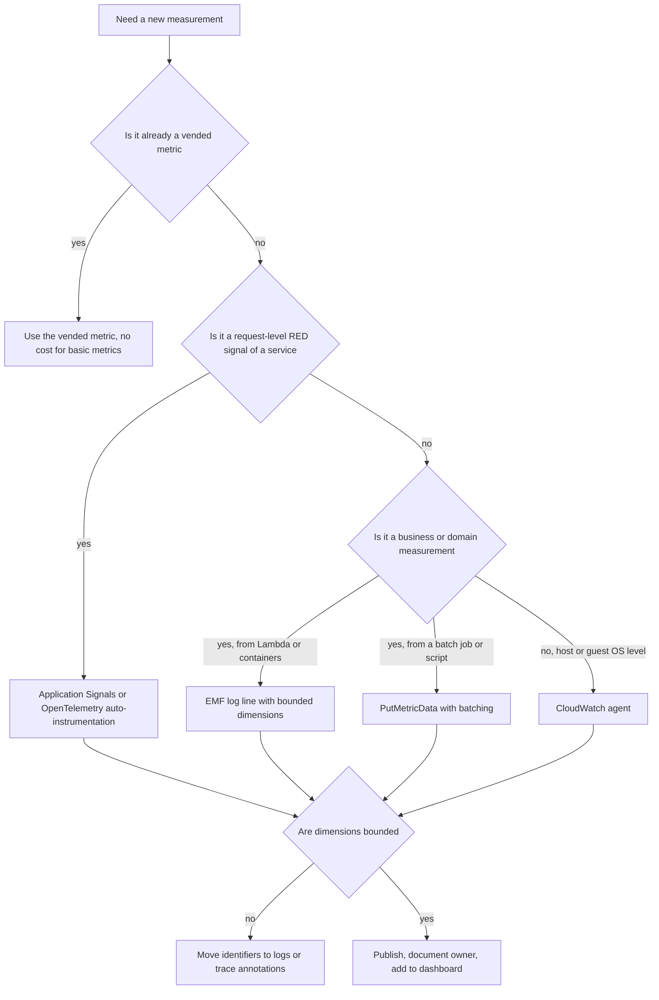

!!! question "Architect's checklist before adding a metric"
    Who will look at this metric, and what decision will it drive? Is it a count, a gauge or a distribution? What unit? Which dimensions, and what is the resulting cardinality? Does it need percentiles, and if so, is it published as raw values? What resolution is required? Which alarm or dashboard will use it, and who owns that alarm?

### AWS Best Practices

| Pillar | CloudWatch practice |
|--------|--------------------|
| Operational Excellence | Define metrics, agent configuration, canaries and RUM monitors in IaC; standardise names and dimensions in shared libraries; monitor from the outside in; review dashboards after each incident |
| Security | Least-privilege publishing roles scoped by namespace; VPC endpoints for telemetry; KMS keys on log groups carrying EMF and performance logs; scoped Cognito roles for RUM; OAM sink policies limited to the organisation |
| Reliability | Heartbeat metrics; alarms on missing data for critical producers; canaries for critical journeys; multilocation canaries for global services; independent monitoring of the primary Region |
| Performance Efficiency | Percentiles rather than averages; high-resolution metrics only where needed; EMF to avoid synchronous API calls; right-size agent and collector sidecars |
| Cost Optimization | Bound cardinality; agent aggregation; selective enhanced observability and Lambda Insights; canary frequency matched to need; RUM sampling; delete unused canaries and custom metrics sources |
| Sustainability | Collect only telemetry that drives decisions; lower collection frequency for non-critical systems; avoid duplicate pipelines that ingest the same data twice |

### Security Considerations

#### IAM and least privilege

Each producer should hold only the permissions it needs:

| Producer | Minimum permissions |
|----------|---------------------|
| Application publishing custom metrics | `cloudwatch:PutMetricData` with a `cloudwatch:namespace` condition restricting it to its own namespace |
| Lambda emitting EMF | `logs:CreateLogStream`, `logs:PutLogEvents` on its own log group (the basic execution policy) |
| CloudWatch agent on EC2 | Managed policy `CloudWatchAgentServerPolicy` on the instance profile, or a narrower custom policy |
| EKS CloudWatch Observability add-on | Pod Identity or IRSA role with `CloudWatchAgentServerPolicy` (and X-Ray write for Application Signals) |
| Dashboards readers | `cloudwatch:GetMetricData`, `cloudwatch:ListMetrics`, `cloudwatch:GetDashboard` |
| Monitoring account administrators | OAM `CreateSink`, `PutSinkPolicy` only for the platform team |

A namespace-restricted policy for an orders service:

```json
{
  "Version": "2012-10-17",
  "Statement": [
    {
      "Sid": "PublishOwnNamespaceOnly",
      "Effect": "Allow",
      "Action": "cloudwatch:PutMetricData",
      "Resource": "*",
      "Condition": {
        "StringEquals": { "cloudwatch:namespace": "DSO303/Orders" }
      }
    }
  ]
}
```

!!! note "Why the resource is a wildcard"
    `PutMetricData` does not support resource-level permissions, because metrics are not ARN-addressable resources. The `cloudwatch:namespace` condition key is the mechanism for scoping it. Without it, a compromised service could publish misleading data into another team's namespace and trigger or suppress their alarms.

#### Telemetry as sensitive data

Metrics look harmless, but dimensions and EMF log lines can leak personal or confidential data: email addresses as dimension values, full URLs containing tokens, tenant names in metric names. Treat telemetry pipelines with the same data classification as application logs. RUM data is personal data by nature. Data protection policies and masking for logs are covered in [Section 7.2.1](../unit7/topic2.md#log-aggregation-with-amazon-cloudwatch-logs).

#### Encryption

Metric data is encrypted at rest by the service. Log groups that carry EMF, Container Insights performance logs, Lambda Insights data and canary logs should use ==customer managed KMS keys== when the data is sensitive or when key control is a compliance requirement. Synthetics artefacts in S3 should use SSE-KMS or at least SSE-S3 with a bucket policy that denies non-TLS access.

#### Network controls

Workloads in private subnets should publish through ==interface VPC endpoints== for `monitoring`, `logs` and `xray`, with endpoint policies restricting use to the organisation's accounts. This removes the NAT gateway from the telemetry path (reducing both cost and a failure mode) and keeps telemetry off the internet.

#### Logging and compliance

CloudTrail records changes to monitoring configuration. Alert on deletion or modification of critical alarms, canaries and OAM links, because disabling monitoring is a common step in both accidental outages and deliberate attacks. CloudWatch is in scope for common compliance programmes (for example ISO 27001, SOC, PCI DSS and HIPAA eligibility); verify the current list in AWS Artifact.

### Performance Optimization

#### Caching and connection reuse

SDK clients for CloudWatch should be created once per process (outside the Lambda handler) and reused, so TLS connections are kept alive. The EMF approach avoids network calls altogether in the request path.

#### Auto scaling on the right metric

Metrics are the input to scaling. [Chapter 2.3](../unit2/topic3.md) and [Chapter 6.3](../unit6/topic3.md) showed target tracking on `ALBRequestCountPerTarget` and SQS backlog per task. The general principle: ==scale on the metric closest to user-perceived load== (requests per target, queue age, concurrency), not on a proxy such as CPU unless the workload is genuinely CPU-bound. High-resolution custom metrics allow faster scaling for spiky workloads.

#### Load balancing

ALB metrics (`TargetResponseTime`, `RequestCountPerTarget`, `HTTPCode_Target_5XX_Count`) broken down by target group and Availability Zone reveal imbalanced load. An Availability Zone with higher latency often indicates a noisy neighbour, a zonal dependency problem or uneven target registration.

#### Parallelism and batching of telemetry

Batch data points: one `PutMetricData` call can carry up to 1,000 metrics. The CloudWatch agent and ADOT collector batch automatically. In Lambda, Powertools flushes all metrics in one EMF line at the end of the invocation.

#### Storage optimisation

Use the `Values` and `Counts` arrays to publish distributions compactly: 1,000 latency observations with 40 distinct values become 40 value/count pairs, preserving percentiles at a fraction of the payload.

#### Monitoring the monitoring

Track `PutMetricData` throttling (SDK retry metrics and CloudTrail errors), agent health (the agent publishes its own status), canary failures caused by the canary itself (runtime deprecations, expired test credentials) and EMF parsing errors (malformed EMF lines appear as ordinary logs and silently produce no metrics).

### Cost Optimization

| Technique | Effect |
|-----------|--------|
| Remove unbounded dimensions | Often the single largest saving |
| Publish only the dimension combinations you query | Each combination is a billed metric |
| EMF instead of per-request `PutMetricData` | Removes API charges and throttling risk |
| Agent `aggregation_dimensions` and longer collection intervals | Fewer time series and data points |
| Basic monitoring for non-production EC2 | Removes detailed monitoring charges |
| Enhanced Container Insights only on production clusters | Observations cost scales with container count |
| Lambda Insights on selected functions | Avoids per-function custom metric charges across hundreds of functions |
| Canary frequency and consolidation | Fewer runs; one canary can test several steps of a journey |
| RUM session sampling | Cost proportional to sampled sessions |
| Delete stale canaries and RUM monitors | They bill whether or not anyone looks |
| Cost allocation tags and Cost Explorer usage types | Attribute observability spend to teams |
| Savings Plans and reserved capacity | Do not apply to CloudWatch; savings come from design, not commitments |

!!! tip "Find the expensive metrics"
    In Cost Explorer, filter by service CloudWatch and group by usage type: `MetricMonitorUsage` (custom metrics), `CW:Requests`, `DataProcessing-Bytes` (log ingestion including EMF), `CW:Canary-runs` and others. Then use `ListMetrics` by namespace to count time series and identify the dimension causing the explosion.

### Integration with Other AWS Services

#### AWS Lambda

Lambda publishes `Invocations`, `Errors`, `Duration`, `Throttles`, `ConcurrentExecutions` and source-specific metrics such as `IteratorAge` and `AsyncEventAge` automatically. Custom metrics use EMF, most conveniently through Powertools for AWS Lambda. Lambda Insights adds system metrics; Application Signals adds per-operation RED metrics and dependency maps.

#### Amazon ECS

ECS publishes service-level `CPUUtilization` and `MemoryUtilization` in `AWS/ECS`. Container Insights adds task and container detail. Application containers emit EMF to standard output through the `awslogs` driver or FireLens ([Section 7.2.1](../unit7/topic2.md#log-aggregation-with-amazon-cloudwatch-logs)), or send OTLP to a CloudWatch agent or ADOT sidecar, which also serves Application Signals and X-Ray.

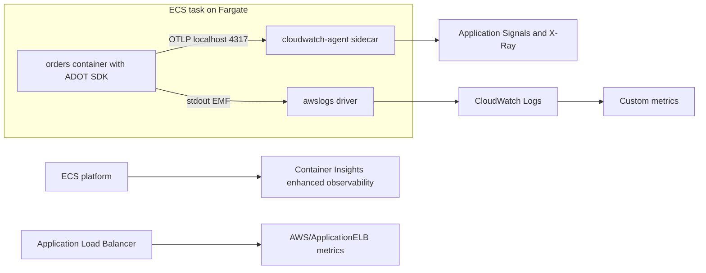

#### Amazon EKS

The ==Amazon CloudWatch Observability EKS add-on== installs the CloudWatch agent (with Container Insights and Application Signals) and Fluent Bit. Pods annotated for auto-instrumentation receive the ADOT agent automatically through a mutating webhook, without image changes. Organisations committed to Prometheus often combine it with Amazon Managed Service for Prometheus and Amazon Managed Grafana.

#### Amazon API Gateway

API Gateway publishes `Count`, `Latency`, `IntegrationLatency`, `4XXError` and `5XXError` per API and stage, and per method with detailed metrics enabled. [Chapter 1.6](../unit1/topic6.md) explained that the difference between `Latency` and `IntegrationLatency` is API Gateway's own overhead. Canaries test APIs end to end from outside.

#### Elastic Load Balancing

ALB and NLB metrics are the most reliable request-level RED signals for container services, because they are measured outside the application. They also include target health metrics, which link to the health check part of this section.

#### Amazon SQS, SNS, Kinesis and EventBridge

Asynchronous services publish backlog and delivery metrics ([Chapter 6.3](../unit6/topic3.md)). The architectural rule from that chapter applies: alarm on ==age==, not only depth.

#### Application Auto Scaling and EC2 Auto Scaling

Target tracking and step scaling policies consume CloudWatch metrics directly, including custom metrics and metric math expressions. This is the tightest integration in the platform: a metric becomes a control signal.

#### AWS Systems Manager

Parameter Store holds CloudWatch agent configuration; Run Command and State Manager install and configure agents across fleets; Automation runbooks respond to alarms ([Section 7.3.2](../unit7/topic3.md#automated-incident-response-with-aws-lambda)).

#### Amazon Data Firehose and Amazon S3

Metric streams deliver metrics through Firehose to S3 (for Athena analysis and long-term retention) or to third-party observability platforms.

#### Summary of integrations

| Service | What it contributes | What CloudWatch provides back |
|---------|---------------------|-------------------------------|
| Lambda | Platform metrics, EMF logs, Insights | Custom metrics, dashboards, alarms |
| ECS | Service metrics, Container Insights | Scaling signals, deployment alarms ([Chapter 5.2](../unit5/topic2.md)) |
| EKS | Add-on telemetry | Container Insights, Application Signals |
| API Gateway, ALB | Request metrics | RED dashboards, canary targets |
| SQS, SNS, Kinesis | Backlog and delivery metrics | Scaling and alarm inputs |
| Auto Scaling | Consumes metrics | Elastic capacity |
| Systems Manager | Agent management | Automated remediation triggers |
| Firehose and S3 | Long-term storage | Metric streams |
| AWS Organizations | Account structure | OAM and centralisation scope |

### Common Architecture Patterns

#### Outside-in monitoring

Combine a canary per critical journey, RUM for real experience, and ALB or API Gateway metrics at the edge, before any internal metric. Alerts are driven primarily by user-facing symptoms; internal metrics are used for diagnosis. This reduces alert noise and ensures that every page corresponds to user impact.

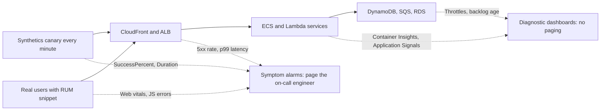

#### Business KPI metrics alongside technical metrics

Publish domain outcomes (orders per minute, payment success ratio, sign-ups) as EMF metrics. A sudden drop in orders per minute with healthy technical metrics often reveals a logic bug, a broken third-party payment page or a pricing error that no technical metric catches.

#### Sidecar collector

Each ECS task or Kubernetes pod runs a CloudWatch agent or ADOT collector sidecar (or a node-level DaemonSet on EKS) that receives OTLP from the application over localhost and handles batching, retries, credentials and export. The application stays vendor-neutral and fast.

#### Centralised observability account

In a multi-account organisation, a dedicated monitoring account receives OAM links from all workload accounts. On-call engineers work there with read-only access to telemetry and no access to workload resources, which follows least privilege and keeps investigation separate from change.

#### Heartbeat and dead man's switch

A scheduled job or consumer publishes a heartbeat metric every run. An alarm fires when the metric is missing, detecting jobs that silently stopped running (a disabled EventBridge schedule, a crashed worker). [7.3.1](topic3.md#creating-cloudwatch-dashboards-and-alarms) covers the alarm design, including missing-data treatment.

#### Metrics-driven progressive delivery

[Chapter 5.1](../unit5/topic1.md#aws-codedeploy) described canary and linear deployments with automatic rollback. The rollback alarm is a CloudWatch alarm on metrics (error rate, p99 latency, Application Signals SLO burn) scoped to the new version, usually through a `Version` dimension or a dedicated target group.

### Industry Use Cases

| Industry | Use case | CloudWatch capabilities used |
|----------|----------|------------------------------|
| E-commerce | Checkout journey monitoring during sales events | Canaries on checkout, RUM web vitals, EMF business metrics (orders per minute), Application Signals SLOs |
| Banking | Payment API latency objectives for regulators | Percentile metrics, percentile rank SLIs, cross-account observability, KMS-encrypted telemetry |
| Media streaming | Playback start time across ISPs | RUM, Internet Monitor city-network health, CloudFront metrics |
| SaaS | Per-tier (not per-tenant) service health | Bounded `Tier` dimension, tenant ID in EMF log fields, Container Insights on EKS |
| Healthcare | Availability of patient portal and integration APIs | Canaries inside VPC for private endpoints, audit of monitoring changes with CloudTrail |
| Logistics | Fleet telemetry ingestion health | Kinesis metrics, heartbeat metrics for device gateways |
| Gaming | Matchmaking latency and concurrency during launches | High-resolution metrics for autoscaling, Application Signals on EKS |
| Education (for example a university learning platform) | Examination-period capacity and login availability | Canaries on login and submission, ALB metrics, scheduled scaling validated with metrics |

!!! example "Monitoring a national e-government portal"
    A government portal built on API Gateway, Lambda and DynamoDB must remain available during tax-filing deadlines. The team runs multilocation canaries for the login and submission journeys, RUM with 10 per cent sampling to track real citizens' page load times by region and ISP, and EMF metrics for "returns submitted per minute". Application Signals provides SLOs per API operation. All workload accounts link to a monitoring account used by the operations centre. When submissions per minute drop while technical metrics stay green, investigation reveals an identity-provider change that broke a redirect, which only the business metric and canary detected.

### Advantages

| Advantage | Explanation |
|-----------|-------------|
| Zero infrastructure | No monitoring servers, databases or storage to operate |
| Native coverage | Every AWS service reports without setup |
| Unified platform | Metrics, logs, traces, synthetics and user monitoring share one console, one IAM model and cross-links |
| Automation integration | Metrics directly drive Auto Scaling, alarms, rollbacks and remediation |
| Retention with rollups | 15 months of history without capacity planning |
| Percentiles and rich statistics | Proper latency analysis out of the box |
| OpenTelemetry alignment | ADOT, OTLP ingestion and PromQL reduce lock-in at the instrumentation layer |
| Multi-account | OAM gives a single pane across accounts without copying data |
| Security | IAM, PrivateLink, KMS for log-based telemetry, CloudTrail audit |

### Limitations

| Limitation | Trade-off or workaround |
|------------|-------------------------|
| Regional | Cross-Region dashboards, centralisation, per-Region canaries |
| Per-metric pricing for classic custom metrics | EMF with bounded dimensions; OpenTelemetry metrics with per-GB pricing |
| Rollups remove old detail | Metric streams to S3 |
| Dimension combinations not aggregated automatically | Publish needed combinations or use Metrics Insights |
| Ingestion delay of about a minute | High-resolution metrics; health checks for fast routing decisions |
| Many separately priced capabilities | Cost governance and tagging ([Section 7.3.3](../unit7/topic3.md#performance-optimization-using-aws-tools)) |
| Less flexible query language than some specialist tools | PromQL for OpenTelemetry metrics, Managed Grafana, or third-party backends |
| Vendor-specific APIs for classic metrics | Instrument with OpenTelemetry to keep code portable |

### Common Mistakes

#### Beginner Mistakes

| Mistake | Consequence | Correction |
|---------|-------------|------------|
| Expecting an EC2 memory metric by default | "Memory is fine" assumed without evidence | Install the CloudWatch agent |
| Alarming on average latency | Tail latency problems invisible | Use p95 or p99, or percentile rank |
| Using user ID or request ID as a dimension | Exploding cost and unusable dashboards | Keep identifiers in logs or trace annotations |
| Omitting units | Misread values, incorrect comparisons | Always set a unit |
| Publishing a ratio instead of counts | Incorrect fleet-wide aggregation | Publish counts and use metric math |
| Looking for one-minute data from last month | Data already rolled up to five minutes | Understand retention; use metric streams for raw history |
| Querying a dimension combination that was never published | "No data" in console | Match the exact published dimension set |
| Calling `PutMetricData` inside every Lambda invocation | Latency, cost and throttling | Use EMF or Powertools metrics |

#### Production Mistakes

| Mistake | Consequence | Correction |
|---------|-------------|------------|
| Monitoring only internal metrics | Outages caused by DNS, certificates or CDN go unnoticed | Canaries and RUM (outside-in) |
| Telemetry path through a NAT gateway | Cost and a single failure mode for all telemetry | VPC endpoints for monitoring, logs and X-Ray |
| Metrics failure breaks requests | A CloudWatch throttle becomes a customer outage | Asynchronous telemetry; catch and drop on failure |
| Unbounded cardinality in a shared library | Observability bill exceeds compute bill | Cardinality review in code review; namespace quotas |
| No heartbeat for scheduled jobs | Jobs stop silently for weeks | Heartbeat metric with missing-data alarm |
| Enhanced observability and Lambda Insights enabled everywhere in development accounts | High cost with no benefit | Enable by environment and criticality |
| Canary using a real user's credentials | Security risk and broken canaries when passwords rotate | Dedicated test accounts with secrets in Secrets Manager |
| Canaries on deprecated runtimes | Canaries stop running or fail for reasons unrelated to the application | Track runtime deprecation; update through IaC |
| No cross-account view | Engineers switch accounts during incidents, slowing diagnosis | OAM monitoring account |
| Duplicate instrumentation pipelines | Double cost, conflicting numbers | One metrics path per service |

### Summary

Amazon CloudWatch is the regional, managed telemetry platform of AWS. Its metrics model is simple but exacting: a metric is identified by namespace, name and the complete set of dimensions; data points are aggregated at query time over a period with a statistic; and data is rolled up automatically from one-second or one-minute resolution to one-hour resolution over 15 months. Around that core, CloudWatch provides producers at every layer: the CloudWatch agent for guest operating systems, Container Insights for ECS and EKS, Lambda Insights for functions, Application Signals for automatic APM, and Synthetics, RUM and Internet Monitor for the user's perspective. Observability Access Manager brings the telemetry of many accounts into one monitoring account without copying it.

Architectural lessons:

- ==Monitor from the outside in.== User-facing canaries, RUM and edge metrics detect the failures that internal metrics cannot see.
- ==Percentiles, not averages.== Latency objectives are stated and measured as percentiles or percentile ranks, and percentiles require raw distributions.
- ==Cardinality is a design decision.== Dimensions are bounded; identifiers belong in logs and trace annotations.
- ==Telemetry must never harm the workload.== Prefer EMF and local collectors to synchronous API calls in the request path.
- ==Publish counts, derive rates== with metric math.
- ==Use managed producers== (Container Insights, Lambda Insights, Application Signals) where the detail drives decisions, and enable them selectively for cost.
- ==Monitoring is code.== Agent configuration, canaries, RUM monitors and OAM links are version-controlled and deployed with the service.

## Distributed Tracing with AWS X-Ray

### Definition

==Distributed tracing is the technique of recording the causal chain of operations performed on behalf of one request as it flows through a distributed system, with timing, outcome and context for each operation, so that the request can be reconstructed end to end.==

==AWS X-Ray is the managed distributed tracing service of AWS.== It receives trace data from instrumented applications and AWS services, assembles segments into traces, builds a ==trace map== (historically called the service map) of services and dependencies, and provides trace search, analytics and anomaly insights. Since 2024 X-Ray is presented inside the CloudWatch console alongside Application Signals, and with ==CloudWatch Transaction Search== all spans can be stored as structured logs in CloudWatch while a configurable fraction is indexed as X-Ray trace summaries.

In the AWS architecture map, X-Ray belongs to the ==Management and Governance== and ==Developer Tools== categories and is part of the CloudWatch observability family. It sits beside every compute service: Lambda, ECS, EKS, EC2, Elastic Beanstalk and App Runner can all emit traces, and API Gateway, SNS, SQS, EventBridge and Step Functions participate in trace propagation.

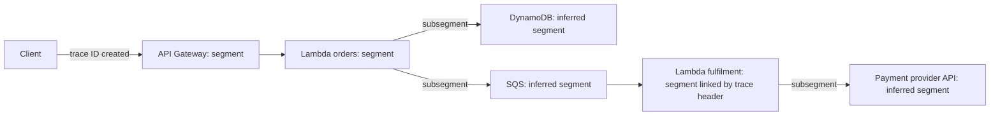

### Why This Service or Concept Exists

#### The problem: no single component holds the story

Consider a checkout request that takes 3.2 seconds in a system of API Gateway, three Lambda functions, an ECS service, DynamoDB, SQS and an external payment provider. Each component has its own metrics and logs:

- API Gateway reports `Latency` of 3.2 s for the request.
- The orders function reports `Duration` of 3.0 s.
- The ECS inventory service's ALB reports p99 `TargetResponseTime` of 900 ms for all requests, not this one.
- DynamoDB reports normal `SuccessfulRequestLatency` on average.

None of these answers the question that matters: ==where did this request spend its 3.2 seconds, and why?== Metrics are aggregated across many requests and lose the individual path. Logs contain individual events but live in separate log groups with separate clocks and no shared identifier unless one was deliberately propagated. The answer lives in the ==composition== of calls, which is exactly what a trace records.

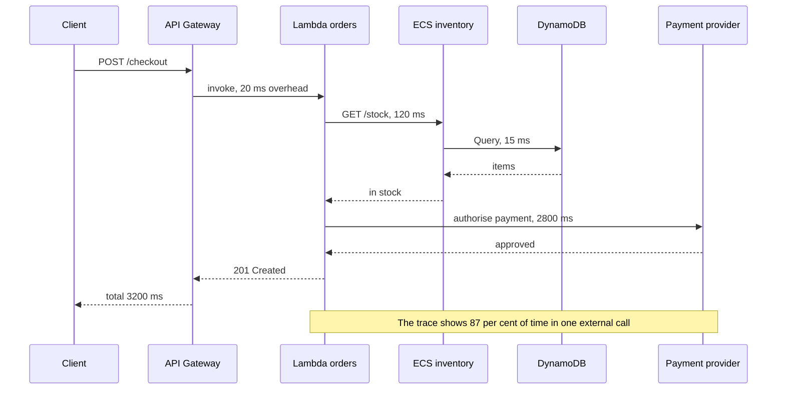

A trace answers immediately that 2.8 of the 3.2 seconds were spent waiting for the payment provider, that the inventory call was fast, and that the fix is a timeout and circuit breaker around the payment call ([Chapter 4.3](../unit4/topic3.md)), not a larger Lambda memory setting.

#### Why AWS built X-Ray

Tracing originated in Google's Dapper paper (2010), followed by open-source systems such as Zipkin and Jaeger. Operating those systems requires collectors, storage clusters (Cassandra or Elasticsearch) and user interfaces, and managed AWS services cannot be instrumented by customers at all. AWS launched X-Ray in 2016 so that:

- AWS services themselves (API Gateway, Lambda, SNS, SQS, Step Functions) could participate in traces without customer code,
- customers would not need to run trace storage clusters,
- IAM would govern who can send and read traces,
- traces could be linked to CloudWatch metrics and logs.

#### Why the industry converged on OpenTelemetry

Early tracing systems each had their own SDKs, header formats and wire protocols. Switching backends meant re-instrumenting every service. ==OpenTelemetry (OTel)==, a Cloud Native Computing Foundation project formed in 2019 by merging OpenTracing and OpenCensus, defines a vendor-neutral API, SDKs, semantic conventions and the OTLP wire protocol for traces, metrics and logs. It has become the default instrumentation standard across cloud providers and observability vendors.

AWS responded by publishing the ==AWS Distro for OpenTelemetry (ADOT)== and, in late 2025, by announcing that the ==X-Ray SDKs and X-Ray daemon entered maintenance mode on 25 February 2026== (security fixes only) and reach ==end of support on 25 February 2027==. The X-Ray ==service== is not deprecated; AWS recommends that new and existing applications send traces to X-Ray using OpenTelemetry instrumentation.

| Period | X-Ray SDKs and daemon status |
|--------|------------------------------|
| Until 25 February 2026 | General availability: features, bug and security fixes |
| 25 February 2026 to 25 February 2027 | Maintenance mode: critical security fixes only, no new features |
| From 25 February 2027 | End of support: no updates; existing releases remain downloadable |

!!! warning "What this means for DSO303 projects"
    New services in this module should be instrumented with ==OpenTelemetry (ADOT or upstream OpenTelemetry SDKs)== and export to X-Ray through the CloudWatch agent, an ADOT collector or the X-Ray OTLP endpoint. You will still meet the X-Ray SDK and daemon in existing code, older tutorials, AWS Academy materials and certification questions, so you must understand their concepts, which map directly onto OpenTelemetry concepts. Plan migrations of existing X-Ray SDK code before February 2027.

#### Benefits over older methods

| Concern | Logs and metrics only | Self-managed Jaeger or Zipkin | AWS X-Ray with OpenTelemetry |
|---------|-----------------------|-------------------------------|------------------------------|
| Per-request path | Reconstructed manually from correlated logs, if IDs were propagated | Yes | Yes |
| AWS managed services in the trace | No | Only as client-side spans | Native segments from API Gateway, Lambda, SNS, Step Functions and others |
| Storage operations | Not applicable | Cluster to run and scale | Managed |
| Dependency map | Hand-drawn | Yes | Automatic trace map, and application map with Application Signals |
| Instrumentation portability | Not applicable | Vendor SDKs historically | OpenTelemetry: change backend without re-instrumenting |
| Access control | Log permissions | Separate | IAM |

### Core Concepts

#### Traces, segments, subsegments and spans

X-Ray and OpenTelemetry use slightly different vocabulary for the same ideas. Both are used in AWS documentation, so learn both.

| X-Ray term | OpenTelemetry term | Meaning |
|------------|--------------------|---------|
| Trace | Trace | All the work done for one request, sharing one trace ID |
| Segment | Server span (entry span of a service) | The work performed by one service for the request, with host, request, response and timing |
| Subsegment | Child span (often a client span) | A finer-grained unit inside a segment: a downstream call, a database query, a block of code |
| Inferred segment | Span representing an uninstrumented remote service | A node that X-Ray creates for a downstream service (for example DynamoDB or an external API) from the caller's subsegment |
| Annotation | Span attribute configured for indexing | Indexed key-value pair usable in filter expressions |
| Metadata | Span attribute not indexed | Arbitrary non-indexed data |
| Parent ID | Parent span ID | Identifier of the caller's segment or subsegment |
| Sampling decision | Trace flags (sampled bit) | Whether this trace is recorded |

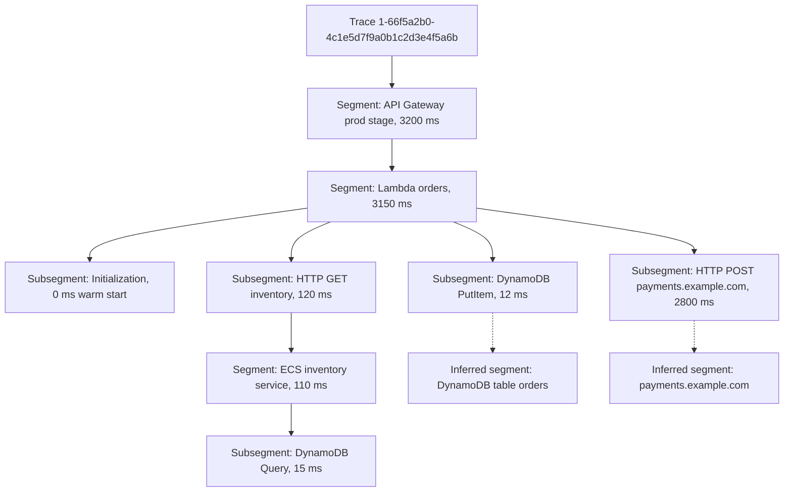

A trace viewed as a ==timeline== (waterfall) shows each segment and subsegment as a horizontal bar positioned by start time and sized by duration. Gaps between a parent's start and its children's start reveal time spent in the service's own code; overlapping bars reveal parallel calls; a single long bar reveals the bottleneck.

##### The segment document

Every segment is a JSON document of up to 64 KB sent to X-Ray. Understanding its fields makes the rest of X-Ray intuitive:

```json
{
  "name": "orders",
  "id": "70de5b6f19ff9a0a",
  "trace_id": "1-66f5a2b0-4c1e5d7f9a0b1c2d3e4f5a6b",
  "parent_id": "53995c3f42cd8ad8",
  "start_time": 1727344560.123,
  "end_time": 1727344563.273,
  "origin": "AWS::ECS::Container",
  "http": {
    "request": { "method": "POST", "url": "https://api.example.com/checkout" },
    "response": { "status": 201 }
  },
  "annotations": { "tenant_tier": "premium", "order_id": "o-88121" },
  "metadata": { "debug": { "basket_items": 3, "feature_flags": ["new-pricing"] } },
  "fault": false,
  "error": false,
  "subsegments": [
    {
      "id": "2f5a8b9c7d6e5f40",
      "name": "payments.example.com",
      "namespace": "remote",
      "start_time": 1727344560.400,
      "end_time": 1727344563.200,
      "http": { "request": { "method": "POST" }, "response": { "status": 200 } }
    }
  ]
}
```

| Field | Purpose |
|-------|---------|
| `trace_id` | Links the segment to its trace |
| `id` | Unique 16-hex-digit identifier of this segment |
| `parent_id` | The caller's segment or subsegment, establishing causality |
| `start_time`, `end_time` | Epoch seconds with fractional precision |
| `origin` | Type of resource, for example `AWS::Lambda::Function`, `AWS::ECS::Container`, `AWS::EC2::Instance` |
| `http`, `aws`, `sql` | Structured details of the request, AWS SDK call or SQL query |
| `error`, `fault`, `throttle` | Outcome flags: client error (4xx), server fault (5xx), throttled (429) |
| `annotations`, `metadata` | Business and diagnostic context |
| `namespace` on subsegments | `aws` for AWS SDK calls, `remote` for other downstream calls |

#### Trace IDs and context propagation

A trace exists only if every service passes the ==trace context== to the next one. This is called ==context propagation== and it is the single most important operational concept in tracing: one uninstrumented hop that drops the header breaks the trace into disconnected pieces.

##### The X-Ray trace header

```text
X-Amzn-Trace-Id: Root=1-66f5a2b0-4c1e5d7f9a0b1c2d3e4f5a6b;Parent=53995c3f42cd8ad8;Sampled=1
```

| Part | Meaning |
|------|---------|
| `Root` | Trace ID: version `1`, 8 hex digits of the request's epoch time in seconds, 24 random hex digits |
| `Parent` | ID of the calling segment or subsegment |
| `Sampled` | `1` recorded, `0` not recorded, `?` let the downstream service decide |
| `Lineage` | Added by Lambda and some AWS services to detect recursive loops between services |

##### The W3C Trace Context header

OpenTelemetry uses the W3C standard by default:

```text
traceparent: 00-66f5a2b04c1e5d7f9a0b1c2d3e4f5a6b-53995c3f42cd8ad8-01
tracestate: vendor1=value1
```

| Part | Meaning |
|------|---------|
| `00` | Version |
| 32 hex digits | Trace ID |
| 16 hex digits | Parent span ID |
| `01` | Trace flags; the lowest bit is "sampled" |

An X-Ray trace ID converts to a W3C trace ID by removing the `1-` prefix and the hyphen, which is why ADOT can interoperate with AWS services that still use `X-Amzn-Trace-Id`. With Transaction Search and the OTLP endpoint, X-Ray also accepts native W3C trace IDs. ADOT configures a ==composite propagator== that reads and writes both headers, so traces remain connected across services that use either format.

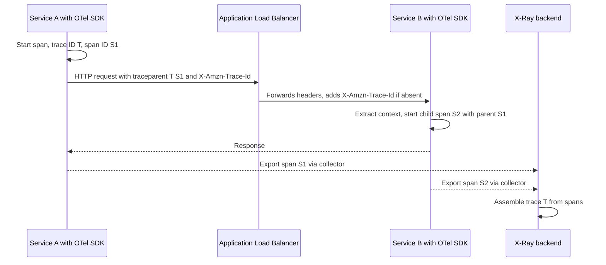

!!! note "Load balancers propagate but do not trace"
    An Application Load Balancer adds or updates the `X-Amzn-Trace-Id` header on requests it forwards, which helps correlate ALB access logs with application traces. It does ==not== send segments to X-Ray, so it does not appear as a node on the trace map. API Gateway REST APIs, by contrast, can record their own segments when tracing is enabled on the stage.

##### Propagation across asynchronous boundaries

Synchronous HTTP propagation is handled by instrumentation libraries. Asynchronous hops need special attention, because the context must travel ==inside the message==.

| Boundary | How context travels | Notes |
|----------|---------------------|-------|
| SQS | `AWSTraceHeader` message system attribute, set automatically by instrumented SDK calls | Lambda event source mappings link the consumer's trace to the producer's; custom consumers must extract the attribute (and request it with `MessageSystemAttributeNames`) |
| SNS | Active tracing on the topic; header passed to SQS, Lambda and HTTP subscribers | Enable tracing on the topic |
| EventBridge | Trace header passed from `PutEvents` to supported targets | Custom consumers can read the trace header from the delivered event |
| Step Functions | X-Ray tracing enabled on the state machine; context passed to Lambda and service integrations | Shows each state as a subsegment |
| Kinesis Data Streams | No automatic propagation | Put trace context in the record payload and extract it manually; consider span links |
| Lambda asynchronous invoke | Context carried in the invocation | Trace continues through the async queue |
| Batch consumers | One consumer span processes many messages from different traces | Use ==span links== to relate the batch span to each producer trace |

!!! tip "Span links for fan-in"
    A single consumer span that processes a batch of ten SQS messages cannot have ten parents. OpenTelemetry solves this with ==span links==: the batch span links to each message's producer span. The trace viewer can navigate from the consumer to each producer without pretending that the batch belongs to one trace. [Chapter 6.3](../unit6/topic3.md) described fan-in patterns; span links are how tracing represents them.

#### Sampling

Recording every request of a high-traffic service would be expensive and mostly redundant: the ten-thousandth successful `GET /products` trace in a minute teaches nothing new. ==Sampling== decides which requests are traced.

##### Head-based sampling

In ==head-based sampling== the decision is made at the start of the trace (the "head", usually the first instrumented service) and propagated downstream in the `Sampled` flag, so every service records the same traces. It is cheap and consistent, but the decision is made ==before anyone knows whether the request will be slow or fail==.

X-Ray implements head-based sampling with centrally managed ==sampling rules==. Each rule has:

| Field | Meaning |
|-------|---------|
| `RuleName`, `Priority` | Rules are evaluated in ascending priority; the first match applies |
| Matching criteria | `ServiceName`, `ServiceType`, `Host`, `HTTPMethod`, `URLPath`, `ResourceARN`, custom `Attributes` (wildcards allowed) |
| `ReservoirSize` | A fixed number of requests per second to record, ==per rule, shared across the fleet== |
| `FixedRate` | The percentage of additional requests beyond the reservoir to record |
| `SamplingRateBoost` | Optional adaptive-sampling settings (below) |

The ==default rule== records the ==first request each second and 5 per cent of additional requests==. Instrumented services poll the X-Ray API for rules and reservoir quotas, so a change to a rule takes effect across the fleet within seconds, without redeployment.

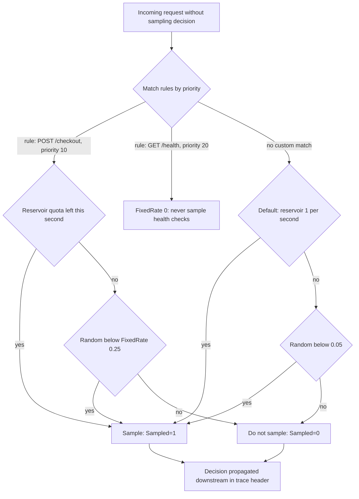

!!! note "Lambda sampling"
    For Lambda functions with active tracing, the sampling rate is fixed at ==one request per second plus 5 per cent of additional requests== and cannot be changed with sampling rules. If an upstream service (for example API Gateway, or a caller using OpenTelemetry) has already made a decision, Lambda honours the incoming `Sampled` flag. To trace a larger fraction of a Lambda workload, make the decision upstream or use OpenTelemetry instrumentation with its own sampler.

##### Adaptive sampling

In September 2025 X-Ray introduced ==adaptive sampling==, available with ADOT SDKs (initially Java and Python) running alongside the CloudWatch agent or an OpenTelemetry Collector. It addresses the weakness of fixed-rate head sampling, which records too few traces precisely when something goes wrong:

| Mechanism | Behaviour |
|-----------|-----------|
| Sampling boost | When anomalies (by default HTTP 5xx, optionally latency thresholds or other error codes) are detected, the sampling rate for the matching rule is raised temporarily up to `MaxRate`, for up to about a minute, with a `CooldownWindowMinutes` between boosts |
| Anomaly span capture | Anomalous spans are captured immediately even when their trace was not sampled, producing partial traces flagged as unsampled, subject to a per-second limit |

Adaptive sampling keeps the baseline cheap (for example 5 per cent) while capturing the evidence needed during an incident.

##### Tail-based sampling

In ==tail-based sampling== the decision is made after all spans of a trace have been collected, so rules such as "keep every trace with an error or with duration above 2 seconds, plus 1 per cent of the rest" become possible. It is implemented in the ==OpenTelemetry Collector== with the `tail_sampling` processor. Its costs are real: the collector must buffer all spans of every trace for a decision window, and all spans of one trace must reach the same collector instance (achieved with a load-balancing exporter tier keyed by trace ID). Services must also sample 100 per cent at the head so the collector sees everything.

| Strategy | Decision point | Keeps errors and slow traces reliably | Cost and complexity |
|----------|----------------|---------------------------------------|---------------------|
| Fixed head sampling (X-Ray rules) | First service | No, only by chance | Lowest |
| Adaptive sampling | First service, boosted on anomalies | Much better | Low; requires ADOT and agent or collector |
| Tail sampling in collector | After trace completes | Yes | Highest: collector fleet, memory, 100 per cent head sampling |
| Transaction Search with 100 per cent ingestion | Ingest everything as spans, index a fraction | Every span is searchable | Pay per GB of span ingestion |

#### Annotations versus metadata

| Aspect | Annotations | Metadata |
|--------|-------------|----------|
| Value types | String, number, Boolean | Any JSON (objects, lists) |
| Indexed for search | Yes | No |
| Usable in filter expressions and groups | Yes | No |
| Limit | Up to 50 per trace | Bounded only by segment size (64 KB) |
| Typical content | `order_id`, `tenant_id`, `customer_tier`, `app_version`, `payment_provider` | Request bodies (sanitised), feature flag state, debug details |

Annotations are what make traces ==findable==. When a customer reports "my order o-88121 failed at 10:04", the filter expression `annotation.order_id = "o-88121"` retrieves the exact trace. Unlike metric dimensions, high-cardinality annotations are acceptable, because traces are sampled records rather than aggregated time series.

!!! warning "Annotations are indexed data: do not put secrets or personal data in them"
    Card numbers, passwords, tokens, national identity numbers and full personal details must never appear in annotations, metadata or span attributes. Use opaque identifiers (an order ID rather than the customer's email). Trace data is visible to everyone with X-Ray read permissions and, with Transaction Search, lives in a CloudWatch log group.

#### Errors, faults and throttles

X-Ray classifies outcomes into three categories that map onto HTTP status classes:

| Flag | HTTP status | Meaning | Typical owner |
|------|-------------|---------|---------------|
| `error` | 4xx | Client error: bad request, not found, unauthorised | Caller |
| `throttle` | 429 | Too many requests | Capacity or quota |
| `fault` | 5xx | Server fault: unhandled exception, dependency failure | This service |

Exceptions are recorded in the `cause` object of a segment or subsegment, including stack frames. On the trace map, node colours summarise the proportion of each outcome, which makes the failing hop visible at a glance.

#### The trace map, groups, analytics and insights

| Capability | What it does | Why it matters |
|------------|--------------|----------------|
| Trace map | Graph of services (nodes) and calls (edges) built from traces, with latency, request rate and outcome per node and edge | The ==authoritative, up-to-date architecture diagram== of the running system |
| Filter expressions | Query language over traces, for example `service("orders") { fault = true } AND responsetime > 2` | Find specific traces |
| Groups | Named filter expressions with their own trace map and CloudWatch metrics | Monitor a subset such as "premium tenants" or "checkout path" |
| Trace analytics | Distributions of response time and outcomes, compared between time ranges | Understand whether an incident affects all requests or a subset |
| X-Ray Insights | Anomaly detection on fault rates for groups, with notifications through EventBridge | Early warning, with root-cause suggestions |
| Application map (with Application Signals) | Service-level map with SLO status and change events | Combines tracing with metrics and SLOs |

Example filter expressions:

```text
# Faulted checkout traces slower than two seconds
service("orders") { fault = true } AND responsetime > 2

# All traces for one order
annotation.order_id = "o-88121"

# Premium tenants calling the payment provider with HTTP 5xx
annotation.tenant_tier = "premium" AND edge("orders", "payments.example.com") { fault = true }

# Traces that touched a specific DynamoDB table
service(id(name: "orders-table", type: "AWS::DynamoDB::Table"))
```

#### OpenTelemetry and the AWS Distro for OpenTelemetry

OpenTelemetry separates instrumentation from the backend. Its components are:

| Component | Role |
|-----------|------|
| API | Interfaces that application and library code call to create spans, metrics and logs; safe to call even with no SDK configured |
| SDK | Implementation of the API: samplers, span processors, exporters, resource detection |
| Instrumentation libraries and auto-instrumentation agents | Pre-built instrumentation for HTTP frameworks, AWS SDKs, database drivers and messaging clients; agents (for example the Java agent or `opentelemetry-instrument` for Python) apply them without code changes |
| Propagators | Read and write trace context in headers and messages (W3C, X-Ray, B3) |
| Resource | Attributes describing the entity producing telemetry: `service.name`, `service.version`, `deployment.environment`, cloud and container identifiers |
| Semantic conventions | Standard attribute names such as `http.request.method`, `db.system`, `messaging.system`, so backends can interpret data consistently |
| OTLP | The OpenTelemetry Protocol over gRPC (port 4317) or HTTP (port 4318) |
| Collector | A separate process that receives, processes (batching, filtering, tail sampling, attribute redaction) and exports telemetry |

==ADOT== is AWS's supported, tested distribution of OpenTelemetry components. It adds AWS resource detectors (EC2, ECS, EKS, Lambda metadata), the X-Ray propagator and ID generator, the X-Ray remote sampler, AWS SDK instrumentation, Application Signals support and exporters for X-Ray, CloudWatch and Amazon Managed Service for Prometheus. ADOT is delivered as SDK distributions per language, a Lambda layer, a collector image and an EKS add-on.

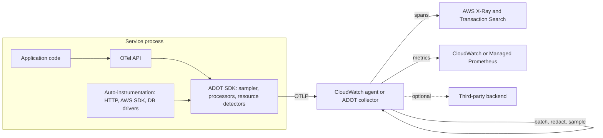

!!! tip "Resource attributes are the join key"
    Set `service.name`, `service.version` and `deployment.environment` on every service through the `OTEL_RESOURCE_ATTRIBUTES` and `OTEL_SERVICE_NAME` environment variables in the task definition, pod specification or function configuration. The same values should appear as metric dimensions and log fields, so that metrics, traces and logs can be joined during investigation.

##### The legacy X-Ray SDK and daemon

Before OpenTelemetry, applications used the ==X-Ray SDK== (Java, Node.js, Python, Go, .NET, Ruby) to create segments, and sent them over UDP port 2000 to the ==X-Ray daemon==, which batched them and called `PutTraceSegments`. On ECS the daemon ran as a sidecar; on EKS as a DaemonSet; on Lambda the service runs it for you. The concepts are identical to OpenTelemetry's, and the migration path is to replace the SDK with ADOT or upstream OpenTelemetry instrumentation and the daemon with the CloudWatch agent or an ADOT collector.

| Legacy component | OpenTelemetry replacement |
|------------------|---------------------------|
| X-Ray SDK recorder and patchers | OTel SDK with auto-instrumentation libraries |
| `xray_recorder.put_annotation` | `span.set_attribute` (with indexed attributes configured) |
| X-Ray daemon on UDP 2000 | CloudWatch agent or ADOT collector receiving OTLP on 4317 and 4318 |
| Centralised sampling rules | ADOT X-Ray remote sampler (`OTEL_TRACES_SAMPLER=xray`) using the same rules |
| X-Ray propagation header | Composite propagator with W3C and X-Ray formats |

#### CloudWatch Transaction Search

Classic X-Ray stores sampled traces for 30 days and charges per trace recorded and retrieved. ==CloudWatch Transaction Search==, generally available since late 2024, changes the storage model:

- All spans sent to X-Ray (from X-Ray SDKs, ADOT, or the OTLP endpoint) are ingested as structured log events into the ==`aws/spans`== log group in CloudWatch Logs, in OpenTelemetry semantic convention format with W3C trace IDs.
- A configurable percentage of spans, ==1 per cent by default and at no additional cost==, is indexed as X-Ray ==trace summaries== to power the classic trace search and analytics.
- The span data becomes searchable with a visual editor and with CloudWatch Logs Insights, and can use log features such as retention settings, metric filters, subscription filters and data protection masking ([Section 7.2](../unit7/topic2.md)).
- Pricing for span ingestion follows CloudWatch pricing per GB rather than X-Ray per-trace pricing.
- Traces of up to 10,000 spans can be visualised.

```mermaid
flowchart LR
    APPS["Instrumented services: ADOT, OTel SDKs, X-Ray SDK"] -->|"OTLP or PutTraceSegments"| XRAY["X-Ray ingestion"]
    XRAY -->|"100 per cent of spans"| SPANS[("CloudWatch Logs: aws/spans")]
    XRAY -->|"indexed fraction, default 1 per cent"| TS[("X-Ray trace summaries")]
    SPANS --> SEARCH["Transaction Search visual editor and Logs Insights"]
    SPANS --> AS["Application Signals metrics and maps"]
    TS --> MAP["Trace map, analytics, filter expressions"]
```

Transaction Search is enabled per account and Region by allowing X-Ray to write to CloudWatch Logs through a resource policy and then setting the trace segment destination:

```bash
aws xray update-trace-segment-destination --destination CloudWatchLogs
aws xray update-indexing-rule --name "Default" \
  --rule '{"Probabilistic": {"DesiredSamplingPercentage": 1}}'
```

!!! note "Transaction Search is also the gateway to the X-Ray OTLP endpoint"
    Applications and collectors can send spans directly to the X-Ray OTLP endpoint (`https://xray.us-east-1.amazonaws.com/v1/traces`, authenticated with SigV4) once Transaction Search is enabled. This lets upstream OpenTelemetry collectors export to AWS without a vendor-specific exporter.

!!! tip "Head sampling with Transaction Search"
    Because Transaction Search stores spans cheaply as logs, AWS recommends raising head sampling (up to 100 per cent for moderate-volume services) so that every transaction is searchable, while indexing only a small fraction as trace summaries. For very high-volume services, estimate span GB per month first; 100 per cent tracing of a 10,000 requests per second service produces a large ingestion volume.

### AWS Service Deep Dive

#### Purpose

X-Ray provides managed collection, assembly, storage and analysis of distributed traces for applications on AWS, with native participation of AWS managed services, so that engineers can locate latency and failures in individual requests and understand dependencies across a distributed system.

#### Architecture

```mermaid
flowchart TB
    subgraph Account["Account 111122223333, Region us-east-1"]
        subgraph VPC["Application VPC"]
            ECS["ECS tasks with ADOT SDK"]
            SIDE["CloudWatch agent sidecar"]
            EKS["EKS pods with auto-instrumentation"]
            DS["CloudWatch agent DaemonSet"]
            EP["Interface VPC endpoint: xray"]
        end
        APIGW["API Gateway REST API with stage tracing"]
        LAM["Lambda with active tracing or ADOT layer"]
        SQS["SQS: AWSTraceHeader"]
        SFN["Step Functions with tracing"]
        subgraph XR["AWS X-Ray and CloudWatch"]
            API["X-Ray API: PutTraceSegments, OTLP, GetSamplingRules"]
            SUM[("Trace summaries: 30 days")]
            SPN[("aws/spans log group")]
            UI["Trace map, analytics, Transaction Search, Application Signals"]
        end
    end
    ECS --> SIDE --> EP --> API
    EKS --> DS --> EP
    APIGW --> API
    LAM --> API
    SQS -.->|"propagates context"| LAM
    SFN --> API
    API --> SUM
    API --> SPN
    SUM --> UI
    SPN --> UI
```

- ==Regional service.== Traces are stored in the Region where they are sent. A request crossing Regions produces segments in each Region; cross-Region trace viewing requires each Region's console or central analysis of span logs.
- ==Data plane APIs.== `PutTraceSegments` (segment documents), `PutTelemetryRecords` (daemon health), the OTLP traces endpoint, and `GetSamplingRules` and `GetSamplingTargets` (used by instrumented services to fetch rules and reservoir quotas).
- ==Read APIs.== `GetTraceSummaries` (with filter expressions), `BatchGetTraces`, `GetServiceGraph`, `GetTraceGraph`, `GetInsightSummaries`.
- ==Assembly.== Segments arrive independently and out of order from many hosts. X-Ray assembles them by trace ID and parent ID; a trace may appear incomplete for a short time until late segments arrive.
- ==Collectors.== Applications rarely call the X-Ray API directly. A local collector (CloudWatch agent, ADOT collector, legacy daemon, or the Lambda service) batches and signs requests.

#### Important Features

| Feature | Summary |
|---------|---------|
| Segment and span ingestion | X-Ray segment documents and OTLP spans |
| AWS service integration | API Gateway, Lambda, SNS, SQS, EventBridge, Step Functions, Elastic Beanstalk, App Runner and others |
| Centralised sampling rules | Changed at runtime without redeployment |
| Adaptive sampling | Boosts sampling and captures anomaly spans during errors |
| Annotations and metadata | Indexed and non-indexed context |
| Filter expressions and groups | Targeted search and sub-maps with CloudWatch metrics |
| Trace map and trace timeline | Dependency graph and request waterfall |
| Trace analytics | Response time and outcome distributions and comparisons |
| X-Ray Insights | Anomaly detection and notifications |
| Transaction Search | 100 per cent span storage in CloudWatch Logs with indexed summaries |
| OTLP endpoint | Direct OpenTelemetry export with SigV4 |
| Cross-account observability | Traces shared through OAM (the CloudWatch part of this section) |
| Encryption | Default encryption or customer managed KMS key |

#### Limitations

- ==Sampling means incompleteness.== Without Transaction Search at high head sampling, the trace for a specific request may not exist.
- ==Instrumentation required.== Services that do not propagate context break traces; third-party SaaS dependencies appear only as client-side subsegments.
- ==Asynchronous gaps.== Kinesis and custom transports need manual propagation.
- ==Regional.== No built-in global trace view across Regions.
- ==Retention.== Classic trace data is kept for 30 days; longer analysis requires Transaction Search with an appropriate log retention, or export.
- ==Clock skew.== Segment timings come from different hosts' clocks; small skews can make a child appear to start before its parent.
- ==Lambda sampling is fixed== for active tracing.
- ==Segment size== is limited to 64 KB; very large subsegment trees must be split.
- ==SDK lifecycle.== X-Ray SDKs and daemon are in maintenance mode until February 2027, then unsupported.

#### Pricing Model and recommendations

!!! info "Pricing figures"
    Indicative us-east-1 prices as of 2026. Verify on the AWS X-Ray and Amazon CloudWatch pricing pages.

| Dimension | Free tier (monthly) | Indicative paid price |
|-----------|---------------------|------------------------|
| Traces recorded (classic X-Ray) | First 100,000 traces | About USD 5.00 per million traces recorded |
| Traces retrieved | First 1 million | About USD 0.50 per million |
| Traces scanned (filter expressions, analytics) | First 1 million | About USD 0.50 per million |
| X-Ray Insights | None | Per million traces processed |
| Transaction Search span ingestion | Check pricing page | Per GB of spans ingested into `aws/spans` (CloudWatch pricing, tiered), plus log storage |
| Transaction Search indexing | 1 per cent of spans indexed as trace summaries included | Additional indexing billed per trace summary |
| Data transfer | Standard | Within-Region traffic to X-Ray is not charged as data transfer |

Recommendations:

1. Start with the ==default sampling rule== and add specific rules: lower rates for high-volume, low-value paths (health checks, static assets, polling endpoints) and higher rates or reservoirs for critical, low-volume paths (checkout, payment).
2. Set `FixedRate` to 0 for health check paths; they otherwise dominate trace volume and cost (health checks are discussed in the next part).
3. Evaluate ==Transaction Search== for services where complete searchability is valuable; estimate span GB per month and set a log retention on `aws/spans` that matches investigation needs.
4. Use ==adaptive sampling== to keep baselines low without losing incident evidence.
5. Avoid enormous metadata payloads; span size drives Transaction Search ingestion cost.
6. Use groups and Insights only for subsets that someone monitors, since scanning is billed.

#### Performance Characteristics

| Characteristic | Typical behaviour |
|----------------|-------------------|
| Instrumentation overhead per request | Microseconds to low milliseconds for span creation; export is asynchronous and batched |
| Auto-instrumentation start-up cost | Noticeable for Java agents and Lambda cold starts (hundreds of milliseconds possible); measure it |
| Trace availability | Typically within seconds to about a minute after the request; Transaction Search may take up to about 10 minutes after first enabling |
| Collector memory | Proportional to batch sizes and, with tail sampling, to the decision window times throughput |

#### Scaling Behaviour

X-Ray scales transparently. The architect scales ==collection==: sidecar collectors scale with tasks automatically; DaemonSet collectors scale with nodes and must be sized for the busiest node; tail-sampling collector tiers must be scaled horizontally with trace-ID-aware load balancing. Sampling reservoirs are enforced fleet-wide by X-Ray, so adding instances does not increase the reservoir, only the fixed-rate portion.

#### Availability

X-Ray is a regional, managed service. Telemetry export is designed to be ==best-effort==: if X-Ray is unreachable, SDKs and collectors drop spans rather than blocking requests. Applications must never depend on tracing for correctness. For multi-Region applications, each Region records its own traces; engineers correlate them by trace ID.

#### Security Features

| Control | Purpose |
|---------|---------|
| IAM | `xray:PutTraceSegments`, `xray:PutTelemetryRecords`, `xray:GetSamplingRules`, `xray:GetSamplingTargets` for writers (managed policy `AWSXrayWriteOnlyAccess`); read actions for engineers (`AWSXrayReadOnlyAccess`) |
| Encryption at rest | Default encryption, or a customer managed KMS key configured with `PutEncryptionConfig` |
| Encryption in transit | TLS for all API calls; SigV4 for the OTLP endpoint |
| VPC interface endpoint | `com.amazonaws.us-east-1.xray` for private workloads |
| CloudTrail | Records configuration changes such as sampling rules, groups and encryption configuration |
| Transaction Search log controls | Log group KMS keys, retention and data protection policies on `aws/spans` |
| Collector processors | Attribute redaction and filtering before export |

#### Service Limits

!!! info "Quotas"
    Indicative values as of 2026. Verify in Service Quotas and the X-Ray and CloudWatch quota pages.

| Limit | Value |
|-------|-------|
| Segment document size | 64 KB |
| Annotations per trace | 50 |
| Trace data retention (classic) | 30 days |
| Trace map data retention | 30 days |
| Sampling rules per account | Bounded (check current quota, historically 25 custom rules) |
| Groups per account | Bounded (check current quota) |
| Spans per visualised trace with Transaction Search | Up to 10,000 |
| `PutTraceSegments` throughput | Account and Region quota on segments per second; adjustable |

### Important AWS Terminology

The terms metric, dimension and percentile were defined in the CloudWatch part. The following terms are specific to tracing.

| Term | Meaning |
|------|---------|
| Trace | The complete record of work done for one request, identified by a trace ID |
| Segment | Record of work done by one service for a request |
| Subsegment | Finer-grained record within a segment, often a downstream call |
| Span | OpenTelemetry's unit of work; X-Ray segments and subsegments are spans |
| Inferred segment | Trace map node representing a downstream resource that did not send its own segment |
| Trace ID | Identifier shared by all spans of a trace; X-Ray format `1-xxxxxxxx-yyyyyyyyyyyyyyyyyyyyyyyy` |
| Parent ID | Identifier of the calling span, establishing causality |
| Context propagation | Passing trace ID, parent ID and sampling decision between services |
| `X-Amzn-Trace-Id` | The X-Ray trace header |
| `traceparent` | The W3C Trace Context header used by OpenTelemetry |
| `AWSTraceHeader` | SQS system attribute carrying the trace header |
| Lineage | Header field used to detect recursive loops |
| Sampling rule | Criteria plus reservoir and fixed rate determining which requests are traced |
| Reservoir | Fixed number of traces per second recorded per rule across the fleet |
| Fixed rate | Percentage of requests beyond the reservoir that are traced |
| Adaptive sampling | Sampling boost and anomaly span capture during errors |
| Head-based sampling | Decision at the start of a trace |
| Tail-based sampling | Decision after the trace completes, in a collector |
| Annotation | Indexed key-value pair on a trace |
| Metadata | Non-indexed key-value data on a segment |
| Error, fault, throttle | 4xx, 5xx and 429 outcome classes |
| Trace map | Graph of services and dependencies derived from traces |
| Filter expression | Query language for selecting traces |
| Group | Named filter expression with its own map and metrics |
| X-Ray Insights | Anomaly detection on traced fault rates |
| Transaction Search | Storage of all spans in `aws/spans` with indexed trace summaries |
| Trace summary | Indexed summary of a trace used for search and analytics |
| OpenTelemetry (OTel) | CNCF standard for telemetry APIs, SDKs, conventions and protocol |
| ADOT | AWS Distro for OpenTelemetry |
| OTLP | OpenTelemetry Protocol, gRPC port 4317 or HTTP port 4318 |
| Collector | Process that receives, processes and exports telemetry |
| Resource attributes | Attributes identifying the telemetry source, such as `service.name` |
| Span link | Relationship between spans in different traces, used for batches and fan-in |
| X-Ray daemon | Legacy UDP collector for X-Ray SDK segments (maintenance mode) |

### Configuration Options

#### Enabling tracing per service

| Service | Setting | Notes |
|---------|---------|-------|
| Lambda | `TracingConfig.Mode = Active` or `PassThrough` | Active samples and records; PassThrough only propagates an upstream decision. Execution role needs X-Ray write permissions |
| Lambda with OpenTelemetry | ADOT Lambda layer plus `AWS_LAMBDA_EXEC_WRAPPER`, or Application Signals enablement | Richer instrumentation; adds cold-start time |
| API Gateway REST API | Stage setting `TracingEnabled = true` | HTTP APIs do not support X-Ray tracing; propagate context through the integration instead |
| SNS | Topic `TracingConfig = Active` | Propagates to subscribers |
| Step Functions | State machine `TracingConfiguration.Enabled = true` | States appear as subsegments |
| ECS | ADOT SDK in container plus CloudWatch agent or ADOT collector sidecar | Task role needs X-Ray write permissions |
| EKS | CloudWatch Observability add-on or ADOT add-on; auto-instrumentation annotations | Pod Identity or IRSA role for the collector |
| EC2 | ADOT SDK plus CloudWatch agent | Instance profile needs X-Ray write permissions |
| Synthetics canaries | `ActiveTracing = true` | Canary requests start traces into your services |
| RUM | X-Ray tracing option on the app monitor | Browser requests start traces |

#### OpenTelemetry environment variables

| Variable | Example | Purpose |
|----------|---------|---------|
| `OTEL_SERVICE_NAME` | `orders` | Service name shown on maps |
| `OTEL_RESOURCE_ATTRIBUTES` | `service.version=1.4.2,deployment.environment=prod` | Resource attributes |
| `OTEL_TRACES_SAMPLER` | `xray`, `parentbased_traceidratio`, `always_on` | Sampler; `xray` uses centralised X-Ray rules |
| `OTEL_TRACES_SAMPLER_ARG` | `0.1` or `endpoint=http://localhost:2000` | Sampler argument |
| `OTEL_PROPAGATORS` | `tracecontext,baggage,xray` | Header formats to read and write |
| `OTEL_EXPORTER_OTLP_ENDPOINT` | `http://localhost:4317` | Collector address |
| `OTEL_EXPORTER_OTLP_PROTOCOL` | `grpc` or `http/protobuf` | Transport |

#### Sampling rule options

| Option | Guidance |
|--------|----------|
| `Priority` | Lower number evaluated first; leave gaps (10, 20, 30) for future rules |
| `ReservoirSize` | Guarantees a minimum number of traces per second for rare but important paths |
| `FixedRate` | 0.01 to 0.05 for high-volume paths; 0 for health checks; higher for critical low-volume paths |
| `URLPath`, `HTTPMethod`, `ServiceName` | Match by route and service; wildcards `*` and `?` |
| `Attributes` | Match on custom span attributes, for example `tenant_tier = premium` |
| `SamplingRateBoost` | `MaxRate` and `CooldownWindowMinutes` for adaptive sampling |

#### Transaction Search options

| Option | Guidance |
|--------|----------|
| Trace segment destination | `CloudWatchLogs` to enable Transaction Search |
| Indexing percentage | Start at the free 1 per cent; raise only if trace-summary analytics need more |
| `aws/spans` retention | Match investigation and compliance needs, for example 30 to 90 days |
| Log group encryption and data protection | KMS key and masking policies for sensitive attributes |

### Design Considerations

#### Scalability

Tracing volume grows with request volume multiplied by the number of spans per request. A request that touches 12 services with 5 spans each produces 60 spans. Control volume with sampling at the head, with per-route rules, and, where needed, with collector-side filtering of low-value spans (for example health checks and readiness probes). Collector tiers must scale with the fleet: sidecars scale naturally, DaemonSets must be sized for the busiest node.

#### Availability

Tracing must fail open. If the collector or X-Ray is unavailable, the application continues and spans are dropped. Configure bounded export queues and timeouts in SDKs and collectors; an unbounded queue in a sidecar can exhaust task memory and take down the application container.

#### Reliability

A trace is only as complete as its weakest hop. Every service, including those owned by other teams, must propagate context. Make propagation a platform standard: shared libraries, a base container image with the ADOT agent, and contract tests that verify the `traceparent` header is forwarded.

#### Durability

Classic trace data is retained for 30 days. Transaction Search stores spans in a log group with configurable retention. Traces are diagnostic data, not records of business truth; do not use them as an audit trail.

#### Latency

Span creation adds microseconds; export is asynchronous. The measurable latency cost is in ==auto-instrumentation start-up==, particularly for Java agents and Lambda cold starts, and in synchronous exporters misconfigured to block. Measure p99 latency with and without instrumentation before rolling out broadly.

#### Cost

Cost is driven by sampled traces (classic) or span GB (Transaction Search), plus retrieval and scanning. The main levers are sampling rules, span attribute size and log retention. Tracing is usually cheaper than equivalent debug logging for diagnosing latency, because one trace replaces many log lines across services.

#### Performance

Tracing reveals performance problems that metrics hide: N+1 query patterns (many sequential database subsegments), serial calls that could be parallel, retries (repeated subsegments to the same dependency) and slow cold starts (the Lambda `Initialization` subsegment). [Section 7.3.3](../unit7/topic3.md#performance-optimization-using-aws-tools) uses these patterns for performance optimisation.

#### Maintainability

Prefer auto-instrumentation plus a small number of manual spans around important business operations. Standardise attribute names (following OpenTelemetry semantic conventions) and annotation keys across teams, so that filter expressions work across the whole system.

#### Operational Complexity

OpenTelemetry has many configuration options, collector pipelines and language-specific details. Reduce complexity by adopting a ==paved road==: the platform team publishes a collector configuration, base images, Lambda layers and IaC modules, and application teams set only `OTEL_SERVICE_NAME` and business attributes.

```mermaid
flowchart TD
    A["New service"] --> B{"Runtime"}
    B -->|"Lambda"| C{"Need rich OTel instrumentation or Application Signals"}
    C -->|"no"| C1["Active tracing plus Powertools tracer or minimal OTel"]
    C -->|"yes"| C2["ADOT Lambda layer or Application Signals for Lambda"]
    B -->|"ECS"| D["ADOT SDK in image plus CloudWatch agent sidecar"]
    B -->|"EKS"| E["CloudWatch Observability add-on with auto-instrumentation annotation"]
    B -->|"EC2"| F["ADOT SDK plus CloudWatch agent on instance"]
    C1 --> G{"Volume and search needs"}
    C2 --> G
    D --> G
    E --> G
    F --> G
    G -->|"moderate volume, need every transaction searchable"| H["Transaction Search with high head sampling"]
    G -->|"high volume, cost sensitive"| I["X-Ray sampling rules plus adaptive sampling"]
    G -->|"must keep all errors and slow traces"| J["Tail sampling in collector tier"]
```

!!! question "Architect's checklist before instrumenting a service"
    Is context propagated on every inbound and outbound path, including queues and events? Which sampling rule applies, and does it exclude health checks? Which business identifiers become annotations, and are any of them personal data? Where does the collector run, how much memory does it have, and what happens when its export fails? Is Transaction Search enabled for this account, and what is the `aws/spans` retention? Who owns the trace map for this domain?

### AWS Best Practices

| Pillar | Tracing practice |
|--------|------------------|
| Operational Excellence | Instrument with OpenTelemetry through a platform paved road; define sampling rules, groups and Transaction Search settings in IaC; use the trace map as living architecture documentation; link traces from alarms and runbooks |
| Security | Least-privilege write roles; no secrets or personal data in attributes; redaction processors in collectors; KMS encryption for trace data and `aws/spans`; VPC endpoints |
| Reliability | Fail-open exporters with bounded queues; propagate context across every hop including asynchronous ones; trace retries and circuit-breaker states ([Chapter 4.3](../unit4/topic3.md)) |
| Performance Efficiency | Use traces to find the critical path, N+1 queries, serial calls and cold starts; measure instrumentation overhead |
| Cost Optimization | Per-route sampling rules; exclude health checks; adaptive sampling; right-size span attributes; set log retention on `aws/spans` |
| Sustainability | Avoid collecting telemetry nobody uses; sample high-volume, low-value traffic aggressively; share collectors per node where appropriate |

### Security Considerations

#### IAM and least privilege

| Principal | Permissions |
|-----------|-------------|
| Lambda execution role | `xray:PutTraceSegments`, `xray:PutTelemetryRecords` (managed policy `AWSXRayDaemonWriteAccess`) |
| ECS task role or EKS collector role | `AWSXrayWriteOnlyAccess` (adds `GetSamplingRules`, `GetSamplingTargets`, `GetSamplingStatisticSummaries`) |
| Engineers | `AWSXrayReadOnlyAccess`, or a narrower custom policy; restrict `BatchGetTraces` if traces may contain sensitive data |
| Platform team | `xray:CreateSamplingRule`, `xray:UpdateSamplingRule`, `xray:CreateGroup`, `xray:PutEncryptionConfig`, `xray:UpdateTraceSegmentDestination` |

!!! note "Which role sends the spans"
    In ECS, the collector sidecar uses the ==task role==, not the task execution role; the execution role is only for pulling images and writing container logs. In EKS, the collector DaemonSet or sidecar needs its own Pod Identity or IRSA role; do not grant X-Ray permissions to the node role for all pods.

#### Sensitive data in traces

Auto-instrumentation records URLs, HTTP methods, status codes, database statements and AWS SDK parameters. These may include personal data (email addresses in query strings), secrets (tokens in URLs) or confidential business data (SQL statements with literal values). Controls:

- Keep identifiers out of URLs; use request bodies or headers for sensitive parameters.
- Configure instrumentation to sanitise database statements.
- Use collector processors (`attributes`, `redaction`, `transform`) to delete or hash sensitive attributes before export.
- Apply CloudWatch Logs data protection policies to `aws/spans` when Transaction Search is enabled.
- Restrict read access to traces in accounts processing regulated data.

#### Encryption

X-Ray encrypts trace data at rest by default. Use `PutEncryptionConfig` with a customer managed KMS key when key control or audit of key usage is required; the key policy must allow X-Ray to use it. Use a customer managed key on `aws/spans` for Transaction Search data.

#### Network controls

Private workloads send spans through the `xray` interface VPC endpoint (and the `logs` endpoint where relevant). Endpoint policies can restrict usage to the organisation. Collectors should listen for OTLP only on localhost or within the pod or task network, never on a public interface.

#### Logging and compliance

CloudTrail records X-Ray configuration changes. Alert on changes to encryption configuration, deletion of groups used by alarms, and changes to sampling rules that set production rates to zero, since these can blind the operations team.

### Performance Optimization

#### Using traces to find performance problems

| Trace pattern | Diagnosis | Typical fix |
|---------------|-----------|-------------|
| One subsegment dominates the timeline | Slow dependency | Timeout, cache, circuit breaker, or dependency optimisation |
| Many sequential short database subsegments | N+1 query pattern | Batch queries (`BatchGetItem`, joins) |
| Sequential calls to independent services | Unnecessary serialisation | Parallelise calls |
| Repeated subsegments to the same dependency | Retries | Tune retry policy with backoff and jitter ([Chapter 4.3](../unit4/topic3.md)); fix the root failure |
| Large `Initialization` subsegment in Lambda | Cold start cost | Reduce package size, lazy initialisation, provisioned concurrency or SnapStart |
| Gap between parent start and first child | Time in the service's own code | Profile the code path |
| Throttle flags on AWS SDK subsegments | Service quota or capacity limit | Increase capacity, add backoff, use on-demand modes |

#### Connection reuse and overhead

Initialise tracer providers and SDK clients once per process (outside the Lambda handler). Use batch span processors, not simple (synchronous) processors, in production. Keep the number of manual spans reasonable: spans around every function call add overhead and noise.

#### Monitoring the tracing pipeline

Collectors expose their own metrics (spans received, exported, dropped, queue size). Alarm on dropped spans and on queue saturation. The `AWS/X-Ray` namespace publishes sampling-related metrics, including `SamplingRate` when adaptive sampling is active.

### Cost Optimization

| Technique | Effect |
|-----------|--------|
| Set `FixedRate = 0` for health check and readiness paths | Removes a large, useless share of traces |
| Lower rates for high-volume read paths, reservoirs for rare critical paths | Spend where information value is highest |
| Adaptive sampling | Low baseline with evidence during incidents |
| Transaction Search with default 1 per cent indexing | Cheap complete span storage; pay per GB rather than per trace |
| Retention on `aws/spans` | Avoid indefinite log storage |
| Limit metadata size and avoid large payloads in attributes | Lower span GB |
| Filter low-value spans in the collector | Fewer spans exported |
| Use groups and Insights selectively | Scanning is billed |
| Remove duplicate tracing pipelines | Avoid sending the same spans to two backends unintentionally |

### Integration with Other AWS Services

#### AWS Lambda

With active tracing, the Lambda service records a segment for the invocation (including an `Initialization` subsegment on cold starts, an `Invocation` subsegment and an `Overhead` subsegment), and the function's code adds subsegments through instrumentation. The trace header arrives in the `_X_AMZN_TRACE_ID` environment variable of the invocation. Powertools Tracer (Python, TypeScript, Java, .NET) simplifies annotations and capturing method calls; note that some Powertools tracer implementations wrap the X-Ray SDK, so check the Powertools documentation for its OpenTelemetry roadmap before standardising. ADOT Lambda layers and Application Signals for Lambda provide OpenTelemetry-based instrumentation.

#### Amazon API Gateway

REST API stages with tracing enabled record an API Gateway segment and start the trace when the client does not send one, applying sampling rules. The trace header is passed to Lambda, HTTP and AWS service integrations. HTTP APIs do not support X-Ray tracing; instrument the backend and let it start the trace.

#### Elastic Load Balancing

ALB adds the `X-Amzn-Trace-Id` header (and records it in access logs) but does not send segments. The backend's instrumentation continues the trace from that header.

#### Amazon ECS

The standard pattern is the ADOT SDK in the application container and a CloudWatch agent (for Application Signals) or ADOT collector sidecar in the same task, reachable at `localhost` in `awsvpc` mode. ECS Service Connect's Envoy proxy produces its own metrics ([Chapter 2.3](../unit2/topic3.md)) but the application still needs OpenTelemetry to propagate context.

```mermaid
flowchart LR
    ALB["ALB adds X-Amzn-Trace-Id"] --> T1
    subgraph T1["ECS task: orders"]
        A1["orders with ADOT SDK"] -->|"OTLP localhost"| C1["CloudWatch agent"]
    end
    A1 -->|"HTTP with traceparent"| T2
    subgraph T2["ECS task: inventory"]
        A2["inventory with ADOT SDK"] -->|"OTLP localhost"| C2["CloudWatch agent"]
    end
    A1 -->|"SendMessage with AWSTraceHeader"| Q["SQS"]
    Q --> L["Lambda consumer with active tracing"]
    C1 --> XR["X-Ray and Transaction Search"]
    C2 --> XR
    L --> XR
```

#### Amazon EKS

The CloudWatch Observability add-on or the ADOT add-on (based on the OpenTelemetry Operator) deploys collectors and injects auto-instrumentation agents into annotated pods. Service meshes ([Chapter 4.2](../unit4/topic2.md)) can generate spans for each hop, but applications must still forward trace headers from inbound to outbound requests, or the mesh spans form disconnected fragments.

#### Amazon SQS, SNS, EventBridge and Step Functions

[Chapter 6.3](../unit6/topic3.md) introduced the `AWSTraceHeader` attribute. With instrumented producers, SQS carries the context; Lambda event source mappings continue the trace, and X-Ray links SQS-triggered Lambda traces to the producer trace. SNS with active tracing propagates to its subscribers. EventBridge passes the trace header to supported targets. Step Functions records each state. Together these allow a single trace to span an entire event-driven workflow, which [Chapter 4.1](../unit4/topic1.md) identified as essential for diagnosing sagas.

#### Amazon DynamoDB, S3 and other AWS SDK calls

These services do not send their own segments; instrumented AWS SDK clients record subsegments (with table name, operation, retries and throttles), and X-Ray draws inferred nodes on the trace map.

#### CloudWatch Application Signals, Synthetics and RUM

Application Signals derives service metrics from the same spans and links metric anomalies to exemplar traces. Synthetics canaries and RUM app monitors with tracing enabled start traces from outside, joining the user's journey to backend traces.

#### Summary of integrations

| Service | Role in a trace | How to enable |
|---------|-----------------|---------------|
| API Gateway REST | Records segment, may start trace | Stage tracing |
| ALB | Adds header only | Automatic |
| Lambda | Records segment, starts or continues trace | Active tracing, or OTel layer |
| ECS, EKS, EC2 | Application spans | ADOT SDK plus agent or collector |
| SQS | Carries context | Instrumented producer |
| SNS | Records and propagates | Topic active tracing |
| EventBridge | Propagates | Instrumented producer |
| Step Functions | Records states | State machine tracing |
| DynamoDB, S3 | Inferred nodes | Instrumented SDK client |
| Synthetics, RUM | Start traces from outside | Tracing option |

### Common Architecture Patterns

#### Trace-first debugging of a latency alarm

An alarm on p99 latency ([Section 7.3.1](../unit7/topic3.md#creating-cloudwatch-dashboards-and-alarms)) links to Application Signals, which shows the operation that degraded; exemplar traces from that period show the slow span; the trace ID leads to the relevant log lines in Logs Insights ([Section 7.2.2](../unit7/topic2.md#log-analysis-with-amazon-cloudwatch-logs-insights)). This ==metrics to traces to logs== workflow is the standard investigation path and works only if all three signals share service names and trace IDs.

```mermaid
sequenceDiagram
    participant AL as Alarm on p99 latency
    participant AS as Application Signals
    participant TR as Trace timeline
    participant LG as Logs Insights
    participant EN as Engineer
    AL->>EN: ALARM orders POST /checkout p99 above 1 s
    EN->>AS: Open service operation view
    AS-->>EN: Latency rise began 10:02, dependency payments
    EN->>TR: Open exemplar trace from 10:05
    TR-->>EN: payments subsegment 2.8 s with retries
    EN->>LG: Query logs by trace ID
    LG-->>EN: Payment provider returning 503 with retry-after
    EN->>EN: Open circuit breaker, contact provider
```

#### Correlation ID and trace ID together

A business correlation ID (for example `orderId`) is recorded as an annotation and a log field; the trace ID is recorded in every log line. The correlation ID links events across ==multiple traces== (an order's creation, payment and fulfilment may be separate requests over hours), while the trace ID links spans ==within one request==. Structured logging with both is covered in [Section 7.2](../unit7/topic2.md#correlation-ids-and-trace-context).

#### Sidecar or node collector

Per-task sidecars isolate failure and simplify credentials (ECS on Fargate has no node to host a DaemonSet). Per-node DaemonSets on EKS use fewer resources overall. A central gateway collector tier adds tail sampling, redaction and multi-backend export at the cost of another tier to operate.

#### Tracing resilience mechanisms

Record retries, timeouts, circuit-breaker state transitions and fallback decisions as span events or attributes. When a request succeeds only after two retries, the trace shows the cost of those retries. When a circuit breaker rejects a call, the span attribute `circuit_state = open` explains the fast failure. This makes the resilience patterns of [Chapter 4.3](../unit4/topic3.md) observable.

#### Tracing through the saga

For a Step Functions orchestrated saga or a choreographed saga over EventBridge ([Chapter 1.7](../unit1/topic7.md)), ensure the trace context flows through every step and compensation. The trace map then shows the complete workflow, and a filter expression on `annotation.saga_id` retrieves every step of one business transaction.

### Industry Use Cases

| Industry | Use case | Tracing capabilities used |
|----------|----------|---------------------------|
| E-commerce | Diagnosing slow checkout during flash sales | Trace timeline, annotations on `order_id`, adaptive sampling during error bursts |
| Fintech | Tracing a payment across fraud check, ledger and provider | Step Functions tracing, SQS propagation, KMS-encrypted trace data, redaction |
| SaaS | Finding which tenant tier suffers latency | Annotations on `tenant_tier`, groups per tier, Insights |
| Media | Cold-start analysis of Lambda video pipelines | `Initialization` subsegments, Transaction Search queries |
| Logistics | End-to-end shipment event processing across queues | Context propagation through SQS and EventBridge, span links for batches |
| Telecommunications | Microservices on EKS with a service mesh | ADOT add-on, mesh spans plus application propagation |
| Public sector | Citizen service portals with strict data rules | Redaction processors, restricted trace access, data protection on `aws/spans` |

!!! example "Finding a hidden N+1 query"
    A catalogue service on EKS showed rising p99 latency after a release, while CPU and database metrics looked normal. The trace timeline for a slow request showed 48 sequential DynamoDB `GetItem` subsegments, each taking 6 ms, where the previous version made one `BatchGetItem` call. A refactor had moved the lookup inside a loop. Metrics showed only that the service was slower; the trace showed exactly why.

### Advantages

| Advantage | Explanation |
|-----------|-------------|
| Per-request visibility | Shows the exact path, timing and outcome of individual requests |
| Native AWS participation | API Gateway, Lambda, SNS, SQS, EventBridge and Step Functions join traces without customer code |
| Live dependency map | Trace map reflects the real architecture |
| Managed storage | No tracing cluster to run |
| OpenTelemetry alignment | Portable instrumentation; OTLP endpoint; W3C trace IDs |
| Flexible cost control | Sampling rules, adaptive sampling, Transaction Search indexing |
| Integration with metrics and logs | Application Signals, exemplars, Logs Insights on spans |
| Security | IAM, KMS, VPC endpoints |

### Limitations

| Limitation | Trade-off or workaround |
|------------|-------------------------|
| Sampling loses individual traces | Transaction Search with high head sampling, adaptive or tail sampling |
| Broken propagation breaks traces | Platform standards, contract tests, span links |
| Instrumentation overhead and cold starts | Measure; selective instrumentation; provisioned concurrency |
| Regional scope | Correlate by trace ID across Regions; central span analysis |
| 30-day classic retention | Transaction Search log retention; export |
| Lambda active tracing sampling fixed | Decide upstream or use OpenTelemetry sampler |
| API Gateway HTTP APIs not traced | Start the trace in the backend |
| X-Ray SDK and daemon lifecycle | Migrate to ADOT or OpenTelemetry before February 2027 |
| Sensitive data risk | Redaction, sanitisation and access controls |

### Common Mistakes

#### Beginner Mistakes

| Mistake | Consequence | Correction |
|---------|-------------|------------|
| Enabling tracing on one service only | Traces show a single node with no context | Instrument every hop and propagate context |
| Expecting every request to appear | Searching for a specific request finds nothing | Understand sampling; use annotations plus higher sampling or Transaction Search |
| Using metadata for searchable identifiers | Filter expressions cannot find traces | Use annotations for fields you search on |
| Confusing error and fault | Wrong team investigates | Error is 4xx (caller), fault is 5xx (service) |
| Starting new X-Ray SDK projects | Instrumentation reaches end of support in February 2027 | Use ADOT or OpenTelemetry |
| Forgetting IAM permissions on the Lambda role or ECS task role | No traces, silent failure | Attach X-Ray write policies to the correct role |
| Creating spans only in the entry handler | Timeline shows one bar with no detail | Instrument SDK clients and key operations |

#### Production Mistakes

| Mistake | Consequence | Correction |
|---------|-------------|------------|
| Health checks sampled at the default rate | Health check traces dominate volume and cost | Sampling rule with `FixedRate = 0` for health paths |
| Unbounded exporter queue in a sidecar | Collector memory exhaustion kills the task | Bounded queues, memory limits, fail-open |
| Personal data in URLs or annotations | Privacy breach through trace data | Sanitise, redact, restrict access |
| Consumer ignores `AWSTraceHeader` | Asynchronous processing appears as separate unrelated traces | Extract context from message attributes; use span links for batches |
| Different services use incompatible propagators | Traces split at language or team boundaries | Composite propagator with W3C and X-Ray formats everywhere |
| Tail sampling without trace-ID-aware load balancing | Incomplete traces, wrong sampling decisions | Load-balancing exporter keyed by trace ID |
| Transaction Search enabled with 100 per cent sampling on a very high-volume service without estimates | Unexpected span ingestion cost | Estimate GB, set per-route sampling, set retention |
| Clock drift on self-managed hosts | Child spans appear before parents | Use Amazon Time Sync Service |
| No service name standard | Duplicate nodes (`orders`, `Orders`, `orders-svc`) on the map | Set `OTEL_SERVICE_NAME` from IaC with naming conventions |

### Summary

Distributed tracing reconstructs the causal path of individual requests across services, which metrics (aggregated) and logs (fragmented) cannot do on their own. AWS X-Ray records traces made of segments and subsegments, draws a live trace map, and lets engineers search traces by annotations. Context propagation, through `X-Amzn-Trace-Id`, W3C `traceparent` and the SQS `AWSTraceHeader` attribute, holds a trace together, and a single hop that drops it breaks the story. Sampling controls cost and completeness: fixed head sampling with centrally managed rules, adaptive sampling that boosts during anomalies, and tail sampling in collectors. OpenTelemetry, through ADOT, is now the recommended instrumentation, with the X-Ray SDKs and daemon in maintenance mode until their end of support in February 2027, and CloudWatch Transaction Search stores every span as searchable log data while indexing a fraction as trace summaries.

Architectural lessons:

- ==A trace is only as complete as its weakest hop.== Propagation is a platform standard, including across queues, topics, buses and batches.
- ==Instrument with OpenTelemetry.== Portable, supported, and the direction AWS has taken for X-Ray.
- ==Sample deliberately.== Exclude health checks, protect critical paths with reservoirs, and use adaptive or tail sampling to keep errors.
- ==Annotations make traces findable;== choose business identifiers, never secrets or personal data.
- ==Metrics tell you that, traces tell you where, logs tell you why.== Join them with shared service names and trace IDs.
- ==Tracing must fail open== and must never threaten the workload it observes.

## Health Checks and Readiness Probes on AWS

### Definition

==A health check is an automated, repeated probe of a component whose result is used by a controller (a load balancer, a DNS service, an orchestrator or a scaling group) to decide whether that component should receive traffic, be restarted or be replaced.==

A ==readiness probe== is a health check whose only consequence is ==traffic routing==: a component that is not ready stops receiving new requests but keeps running. A ==liveness probe== is a health check whose consequence is ==restart==. A ==replacement check== (for example an Auto Scaling health check) leads to termination and replacement of the whole instance or task. The distinction between these consequences is the central idea of this part.

In the AWS architecture map, health checks are not a single service. They are features of Elastic Load Balancing, Amazon Route 53, Amazon EC2 and EC2 Auto Scaling, Amazon ECS, Amazon EKS (through Kubernetes and the AWS Load Balancer Controller) and AWS Cloud Map. CloudWatch observes their results as metrics (`UnHealthyHostCount`, `HealthCheckStatus`, `StatusCheckFailed`), which connects this part to the CloudWatch part and to alarms in [Section 7.3.1](../unit7/topic3.md#creating-cloudwatch-dashboards-and-alarms).

```mermaid
flowchart TB
    subgraph Global["Global layer"]
        R53["Route 53 health checks: which Region or endpoint receives DNS answers"]
    end
    subgraph Regional["Regional layer"]
        ELB["ALB and NLB target health: which targets receive requests"]
        ASG["Auto Scaling health: which instances are replaced"]
    end
    subgraph Workload["Workload layer"]
        ECS["ECS container health check: which tasks are replaced"]
        K8S["Kubernetes startup, readiness, liveness probes"]
        EC2["EC2 status checks: is the host or guest broken"]
    end
    subgraph App["Application layer"]
        EP["Health endpoints: live, ready, deep"]
    end
    R53 --> ELB
    ELB --> ECS
    ELB --> K8S
    ELB --> EC2
    ASG --> EC2
    ECS --> EP
    K8S --> EP
    ELB --> EP
```

### Why This Service or Concept Exists

#### The problem: failure is normal, and humans are too slow

In a cloud-native system, individual components fail constantly: an instance's underlying host degrades, a container leaks memory and stops responding, a deployment ships a version that cannot connect to its database, an Availability Zone experiences network problems. At the scale of hundreds of tasks, some component is always unhealthy. If a human had to notice and remove each one, users would see errors for minutes or hours.

Health checks turn detection and recovery into ==closed control loops== that act in seconds:

```mermaid
flowchart LR
    P["Probe: controller sends a check"] --> E["Evaluate: compare with thresholds"]
    E --> D{"Healthy"}
    D -->|"yes"| K["Keep routing or keep running"]
    D -->|"no, threshold reached"| A["Act: stop routing, restart, replace or fail over"]
    A --> O["Emit metric and event for observability"]
    K --> P
    O --> P
```

This is the self-healing property that Chapter 1 described as a defining characteristic of cloud-native design, and it is the mechanism behind the ==reliability== pillar's principle of automatic recovery from failure.

#### Why each layer needs its own check

A single health check cannot protect a whole system, because failures occur at different scopes and need different remedies:

| Failure | Scope | Correct remedy | Mechanism |
|---------|-------|----------------|-----------|
| Underlying hardware of an EC2 host fails | Instance | Migrate or replace the instance | EC2 system status check, automatic recovery, Auto Scaling |
| Process deadlocked, still listening on its port | Container | Restart the container | ECS container health check, Kubernetes liveness probe |
| Task still starting, caches cold | Task or pod | Do not send traffic yet | Readiness probe, ALB health check with grace period |
| Task overloaded or its database unreachable | Task or pod | Stop sending new traffic temporarily | Readiness, ALB target health |
| Entire Availability Zone impaired | Zone | Shift traffic to other zones | ELB cross-zone behaviour, target group health thresholds, zonal shift |
| Entire Region or endpoint unreachable | Region | Route users to another Region | Route 53 health checks and failover routing |

#### Benefits over older methods

| Concern | Traditional operations | Cloud-native health checks on AWS |
|---------|------------------------|-----------------------------------|
| Detection | Monitoring alert to an operator | Controller detects within seconds |
| Recovery | Manual restart or failover runbook | Automatic removal, restart, replacement or DNS failover |
| Deployments | Maintenance windows | Rolling and blue/green deployments gated by health |
| Consistency | Varies by operator | Declared in IaC, identical in every environment |
| Evidence | Operator notes | Metrics, events and logs of every state change |

### Core Concepts

#### Three questions, three consequences

The most common health check mistake is to use one endpoint to answer several different questions. Each question has a different consequence, and a wrong answer has a different cost.

| Question | Consequence of "no" | Cost of a false "no" | Typical mechanisms |
|----------|--------------------|----------------------|--------------------|
| Is it ==ready== to serve traffic? | Stop routing new requests to it | Reduced capacity, reversible within seconds | ALB and NLB target health, Kubernetes readiness, Route 53 |
| Is it ==alive==? | Restart the process or container | Lost in-flight work, cold start, possible restart storm | ECS container health check, Kubernetes liveness |
| Is the host or instance ==viable==? | Terminate and replace | Longest recovery, capacity churn | EC2 status checks, Auto Scaling health checks, ECS task replacement |

!!! danger "The cost of a false negative grows with the severity of the consequence"
    A readiness check that fails wrongly removes a target briefly. A liveness check that fails wrongly restarts a healthy process. A replacement check that fails wrongly destroys capacity. Therefore ==the more severe the consequence, the narrower and more conservative the check must be==. This is the general principle behind the Kubernetes rule from [Chapter 3.2](../unit3/topic2.md) that liveness must not check dependencies.

#### Shallow, deep and degraded health

| Type | What it checks | Use for | Risk |
|------|----------------|---------|------|
| Shallow (liveness) | The process responds: the HTTP server returns 200 from an in-memory handler | Liveness and restart decisions | May report healthy while the service cannot do useful work |
| Readiness | The process can serve requests now: initialisation complete, not shutting down, local resources (thread pools, connection pools) available | Load balancer and Kubernetes readiness | Must not flap under transient load |
| Deep (dependency) | Downstream dependencies respond: database, cache, queue, other services | Diagnostics, synthetic monitoring, Route 53 Regional failover decisions | Cascading failure: one dependency outage makes every target "unhealthy" |
| Degraded | Service works with reduced functionality (for example recommendations unavailable but checkout works) | Reporting partial health without removing capacity | Requires explicit design of degraded modes |

```mermaid
flowchart TD
    Q["What will the caller do with a failure result"] --> R{"Restart the process"}
    R -->|"yes: liveness"| S["Shallow check only: can the process respond"]
    Q --> T{"Stop routing to this one target"}
    T -->|"yes: readiness"| U["Local readiness: initialised, not draining, pools available"]
    Q --> V{"Fail over a whole Region or endpoint"}
    V -->|"yes: Route 53"| W["Deep check of critical dependencies, aggregated and cached"]
    Q --> X{"Only inform humans"}
    X -->|"yes"| Y["Deep diagnostic endpoint and canaries"]
```

##### Why deep checks at the target level cause cascading failures

Suppose every ECS task's ALB health check verifies the shared Aurora database. The database has a 20-second failover. Every task fails its health check at the same time, the ALB marks all targets unhealthy, and, as the next section explains, ALB then fails open and sends traffic to all of them anyway, so the check achieved nothing. Worse, if ECS is replacing tasks that fail the ELB health check, it begins stopping every task in the service. When the database returns, there is no warm capacity; new tasks start, all open database connections at once, and the recovery itself overloads the database. The original 20-second fault becomes a 10-minute outage.

!!! warning "Rule of thumb for target health checks"
    A target-level health check should fail only when ==this target== cannot serve requests but ==other targets could==. A dependency shared by all targets cannot be fixed by removing some of them. Shared dependency failures are handled by timeouts, circuit breakers and fallbacks in the application ([Chapter 4.3](../unit4/topic3.md)), by alarms ([Section 7.3.1](../unit7/topic3.md#creating-cloudwatch-dashboards-and-alarms)), and, at the Regional level, by Route 53 failover.

There is one important exception: a dependency that is ==specific to the target== (a local sidecar, a per-task cache, a disk, a per-AZ endpoint) is legitimately part of that target's readiness.

#### Health check anatomy

Every health check mechanism on AWS is parameterised by the same small set of properties, even though their names and defaults differ:

| Property | Meaning | Trade-off |
|----------|---------|-----------|
| Target | Port, protocol and path, or command | Must exercise the same network path as real traffic |
| Interval | Time between probes | Shorter detects faster but costs more probes |
| Timeout | Time to wait for a response | Must exceed normal response time under load |
| Unhealthy threshold | Consecutive failures before "unhealthy" | Higher avoids flapping but slows detection |
| Healthy threshold | Consecutive successes before "healthy" | Higher avoids premature traffic but slows recovery |
| Success criteria | Status codes, response string or exit code | Must be precise, for example 200 rather than 200 to 499 |
| Grace or start period | Time after start during which failures are ignored | Must exceed the slowest realistic start-up |

Detection time is approximately `interval x unhealthy threshold` (plus timeout), and recovery time approximately `interval x healthy threshold`. With the ALB defaults for instance and IP targets (interval 30 s, unhealthy threshold 2, healthy threshold 5) a failed target is removed after about one minute and re-admitted after about two and a half minutes.

!!! tip "Tune thresholds with arithmetic, not guesses"
    If the objective is to stop routing to a failed target within 20 seconds, then `interval x unhealthy threshold` must be at most about 20 seconds, for example an interval of 10 seconds with a threshold of 2. If the service occasionally takes 3 seconds to respond under load, a 2-second timeout will create false failures. Write the calculation into the design document.

#### Elastic Load Balancing target health

[Chapter 2.2](../unit2/topic2.md) configured the path and thresholds of an ALB health check for an ECS service. This section explains the model behind it.

Each load balancer node in each enabled Availability Zone probes every registered target independently. The ALB considers a target healthy when it passes the configured checks, and routes new requests only to healthy targets.

| Setting (ALB) | Default for instance and IP targets | Range |
|---------------|-------------------------------------|-------|
| Protocol | HTTP | HTTP, HTTPS |
| Port | Traffic port | Any port |
| Path | `/` | Any path; gRPC uses `/package.service/method` |
| Interval | 30 s | 5 to 300 s |
| Timeout | 5 s | 2 to 120 s |
| Healthy threshold | 5 | 2 to 10 |
| Unhealthy threshold | 2 | 2 to 10 |
| Success codes | 200 | 200 to 499 for HTTP; 0 to 99 for gRPC |

For Lambda targets the defaults are an interval of 35 s and a timeout of 30 s, and health checks are disabled unless you enable them. NLB target groups support TCP, HTTP and HTTPS health checks with their own defaults; a TCP check only proves that the port accepts connections. Gateway Load Balancer targets (security appliances) are also health checked, and GWLB can be configured to rebalance or keep flows when a target fails.

##### Target health states

```mermaid
stateDiagram-v2
    [*] --> initial: RegisterTargets
    initial --> healthy: healthy threshold of consecutive successes
    initial --> unhealthy: unhealthy threshold of consecutive failures
    healthy --> unhealthy: unhealthy threshold of consecutive failures
    unhealthy --> healthy: healthy threshold of consecutive successes
    healthy --> draining: DeregisterTargets
    unhealthy --> draining: DeregisterTargets
    draining --> unused: deregistration delay elapsed or connections closed
    unused --> [*]
```

| State | Meaning | Common reason codes |
|-------|---------|---------------------|
| `initial` | Registration or first checks in progress | `Elb.RegistrationInProgress`, `Elb.InitialHealthChecking` |
| `healthy` | Receiving traffic | None |
| `unhealthy` | Failed checks | `Target.ResponseCodeMismatch`, `Target.Timeout`, `Target.FailedHealthChecks` |
| `draining` | Deregistering; existing connections allowed to finish | `Target.DeregistrationInProgress` |
| `unused` | Not registered, not in an enabled AZ, or stopped | `Target.NotRegistered`, `Target.NotInUse`, `Target.InvalidState` |
| `unavailable` | Health checks disabled | `Target.HealthCheckDisabled` |

The reason code is the fastest diagnostic available. `Target.Timeout` usually means a security group blocks the load balancer or the application is too slow; `Target.ResponseCodeMismatch` usually means a wrong path, a redirect (301 or 302 to HTTPS or to a login page) or an endpoint that requires authentication.

```bash
aws elbv2 describe-target-health --target-group-arn "$TG_ARN" \
  --query 'TargetHealthDescriptions[].[Target.Id,TargetHealth.State,TargetHealth.Reason,TargetHealth.Description]' \
  --output table
```

##### Fail open

If ==every== target in a target group is unhealthy, the ALB does not return errors for lack of targets; it ==fails open== and routes requests to all targets regardless of health. The reasoning is that a health check that fails everywhere is more likely to be wrong (a bad path, a shared dependency) than every target being broken at once. Fail-open is also why a deep health check that fails on a shared dependency provides no protection: when all targets fail together, they all receive traffic anyway.

##### Target group health settings

Two further settings control what happens when ==too few== targets are healthy, which matters for multi-AZ resilience:

| Setting | Purpose |
|---------|---------|
| Unhealthy state routing threshold (minimum healthy target count or percentage) | When the healthy count in a zone falls below the threshold, the load balancer routes to all targets in that zone (fail open at zone level) |
| DNS failover threshold | When healthy targets fall below the threshold, the load balancer node's IP address is marked unhealthy in DNS, so Route 53 stops returning that zone's node and clients shift to other zones |

These let an architect express "if fewer than 50 per cent of targets in a zone are healthy, move traffic away from that zone", which is more precise than per-target checks alone. ALB also offers ==automatic target weights== (anomaly mitigation) with the weighted random routing algorithm, which reduces traffic to targets that return anomalous error rates even while they pass health checks.

##### What the load balancer health check must and must not do

| Must | Must not |
|------|----------|
| Use the same port and network path as real traffic | Require authentication or a session |
| Return quickly (well under the timeout) | Redirect to HTTPS or a login page |
| Reflect this target's readiness | Fail because a shared dependency is down |
| Be allowed by the target's security group from the load balancer's security group | Perform expensive work (full database queries, external API calls) on every probe |
| Return a precise success code (200) | Accept 200 to 499, which hides 404 misconfigurations |

#### Route 53 health checks

Route 53 health checks operate at the ==DNS and global== layer. They decide which records Route 53 returns, and therefore which Region, endpoint or load balancer users reach.

| Health check type | What it monitors | Typical use |
|-------------------|------------------|-------------|
| Endpoint | An IP address or domain name over HTTP, HTTPS or TCP from health checkers around the world | Public ALB, API Gateway custom domain or on-premises endpoint |
| Calculated | The status of up to 255 child health checks, healthy if at least N children are healthy | "The Region is healthy if at least 2 of its 3 critical services are healthy" |
| CloudWatch alarm | The data stream of a CloudWatch alarm: `OK` is healthy, `ALARM` is unhealthy, insufficient data configurable | Private resources that global checkers cannot reach; business-level health such as error rate |

```mermaid
flowchart TB
    USERS["Users resolve api.example.com"] --> R53["Route 53 failover routing"]
    R53 -->|"primary record, evaluated by health check HC1"| P["ALB in ap-south-1"]
    R53 -->|"secondary record, used when HC1 unhealthy"| S["ALB in ap-southeast-1"]
    HC1["Calculated health check HC1: healthy if 2 of 3 children healthy"] --> C1["Endpoint check: /health/deep on primary ALB"]
    HC1 --> C2["CloudWatch alarm check: primary 5xx rate"]
    HC1 --> C3["CloudWatch alarm check: primary Aurora writer available"]
    C1 -.-> P
```

How Route 53 decides:

- Health checkers in several AWS Regions probe the endpoint independently at an interval of ==30 seconds (standard) or 10 seconds (fast, extra charge)==.
- Each checker applies the ==failure threshold== (1 to 10 consecutive results, default 3).
- The endpoint is considered healthy if ==more than 18 per cent== of health checkers report it healthy. The low threshold prevents a network problem near a few checker locations from triggering a global failover.
- For HTTP and HTTPS checks, the TCP connection must be established within 4 seconds and a 2xx or 3xx response returned within 2 seconds; optional string matching searches the ==first 5,120 bytes== of the body. HTTPS checks do not validate the certificate.
- Health checks can publish `HealthCheckStatus` and `HealthCheckPercentageHealthy` metrics and trigger CloudWatch alarms.

!!! note "Alias records and evaluate target health"
    For alias records that point to an ELB load balancer, API Gateway or other AWS resources, setting ==Evaluate target health== makes Route 53 use the target's own health (for an ALB, whether it has healthy targets in any zone) without a separately billed health check. Add an explicit health check when the definition of healthy is richer than "the load balancer has a healthy target".

!!! warning "Health checkers are on the internet"
    Endpoint health checks come from public Route 53 health checker IP addresses (published in the `ip-ranges.json` file under the `ROUTE53_HEALTHCHECKS` service). They ==cannot reach private IP addresses==. Security groups and network ACLs must allow the checker ranges for public endpoints; for private resources, use CloudWatch alarm-based health checks instead.

Route 53 health checks support the routing policies used for multi-Region resilience: failover (active-passive), weighted, latency, geolocation and multivalue answer routing. For organisations that require deterministic, human-controlled failover, ==Route 53 Application Recovery Controller== provides routing controls and readiness checks on top of these primitives; it is beyond the scope of this section.

#### EC2 status checks and Auto Scaling health checks

EC2 runs automated checks on every running instance every minute:

| Check | What it detects | Responsibility | Typical remedy |
|-------|-----------------|----------------|----------------|
| System status check | Problems with the underlying AWS host: loss of power or network, hardware faults | AWS | Stop and start (moves to new hardware) or automatic recovery |
| Instance status check | Problems in the guest: failed boot, exhausted memory, corrupted file system, misconfigured network | Customer | Reboot, fix configuration, replace |
| Attached EBS status check | Attached EBS volumes are unreachable or cannot complete I/O | AWS or customer depending on cause | Replace instance or volume |

Their results appear as `StatusCheckFailed_System`, `StatusCheckFailed_Instance`, `StatusCheckFailed_AttachedEBS` and `StatusCheckFailed` in CloudWatch. A CloudWatch alarm on `StatusCheckFailed_System` can trigger the EC2 ==recover== action, which moves the instance to healthy hardware while keeping its instance ID, private IP addresses and EBS volumes; many current instance types also have ==simplified automatic recovery== enabled by default. Recovery suits single, stateful instances. For stateless fleets, replacement through Auto Scaling is preferable.

EC2 Auto Scaling decides which instances to ==replace== using its own health status:

| Health check type | Instance is unhealthy when | Recommendation |
|-------------------|----------------------------|----------------|
| EC2 (always on) | Instance is not `running` or fails a status check | Default baseline |
| ELB | The load balancer reports the instance unhealthy in any attached target group | Enable for every group behind a load balancer; otherwise an instance with a dead application keeps running forever |
| VPC Lattice | VPC Lattice target group reports unhealthy | When using VPC Lattice |
| EBS | Attached EBS status check fails | Enable for EBS-dependent workloads |
| Custom | Your code calls `SetInstanceHealth` with `Unhealthy` | Application-specific health, for example from an external monitor |

The ==health check grace period== delays Auto Scaling health checks after an instance enters `InService` so that it can boot and pass load balancer checks; the console suggests 300 seconds. Too short a grace period produces a replacement loop similar to the ECS loop described in [Chapter 2.2](../unit2/topic2.md); too long delays replacement of genuinely broken instances.

```mermaid
sequenceDiagram
    participant ASG as Auto Scaling group
    participant EC2 as Instance i-abc
    participant ALB as ALB target group
    ASG->>EC2: Launch
    EC2->>ALB: Registered, state initial
    Note over ASG: Grace period 300 s, health ignored
    ALB->>EC2: Health checks pass, state healthy
    Note over EC2: Later, application deadlocks
    ALB->>EC2: 2 consecutive failures, state unhealthy
    ASG->>ALB: Health check type ELB reports unhealthy
    ASG->>EC2: Terminate, lifecycle hook allows draining
    ASG->>ASG: Launch replacement
```

#### Amazon ECS: container health checks plus load balancer health

[Chapter 2.2](../unit2/topic2.md#north-south-getting-traffic-in) introduced the two levels of ECS health and owns their configuration (container `healthCheck` parameters, `startPeriod`, `healthCheckGracePeriodSeconds`, target group path and thresholds). The combined model, viewed through the three questions above, is:

| Signal | Checked by | Effect in an ECS service |
|--------|------------|--------------------------|
| Container `healthCheck` (command inside the container) | ECS agent or Fargate | If an ==essential== container becomes `UNHEALTHY`, the task is marked unhealthy and the service scheduler stops and replaces it |
| Load balancer target health | ALB or NLB | If the task fails target health checks after `healthCheckGracePeriodSeconds`, the service stops and replaces it |
| Service Connect or Cloud Map health | ECS | Unhealthy tasks are removed from service discovery |
| Deployment circuit breaker | ECS | If new tasks repeatedly fail to become healthy, the deployment is marked failed and optionally rolled back ([Chapter 5.2](../unit5/topic2.md)) |

One cross-cutting trap applies to every command-based check: the container image must contain the probe tool (`curl`, `wget`, or a small health binary). Minimal and distroless images often do not, which silently fails every check.

!!! note "Which health check should ECS use for replacement"
    Use the container health check for ==liveness== (a narrow, local check), and the load balancer health check for ==readiness== of request-serving tasks. Because ECS replaces tasks that fail either, both must follow the "no shared dependencies" rule. For worker services without a load balancer (queue consumers, [Chapter 6.3](../unit6/topic3.md)), the container health check is the only automated signal; make it verify that the worker loop is making progress (for example "last successful poll within 60 seconds"), not merely that the process exists.

#### Amazon EKS: probes, readiness gates and ALB target health

[Chapter 3.2](../unit3/topic2.md#requests-limits-and-probes-the-four-fields-that-decide-behaviour) covered the configuration of startup, readiness and liveness probes. On EKS with the AWS Load Balancer Controller in IP target mode, there are ==two independent health systems== for a pod: the kubelet's probes and the ALB's target health checks. A gap between them causes dropped requests during rollouts: Kubernetes may consider a new pod ready (readiness probe passed) and terminate an old pod before the ALB has registered the new pod's IP and marked it healthy.

==Pod readiness gates== close that gap. When enabled for a namespace (label `elbv2.k8s.aws/pod-readiness-gate-inject: enabled`), the controller adds a readiness condition to each pod that becomes true only when the pod's IP is ==healthy in the ALB target group==. The Deployment rollout therefore waits for real load balancer health before proceeding.

```mermaid
sequenceDiagram
    participant D as Deployment controller
    participant P as New pod
    participant K as kubelet
    participant C as AWS Load Balancer Controller
    participant ALB as ALB target group
    D->>P: Create pod
    K->>P: startupProbe then readinessProbe pass
    C->>ALB: Register pod IP
    ALB->>P: Health checks
    ALB-->>C: Target healthy
    C->>P: Set readiness gate condition true
    Note over P: Pod is Ready only now
    D->>D: Continue rollout, terminate an old pod
```

The ALB health check for Ingress or Service resources is configured with annotations such as `alb.ingress.kubernetes.io/healthcheck-path`, `healthcheck-interval-seconds`, `healthy-threshold-count` and `success-codes`, and should point at the same readiness endpoint as the readiness probe.

#### AWS Lambda: no health checks, and why

A Lambda function has no long-running instance to probe. Each invocation runs in an execution environment that the service creates, reuses and destroys; unhealthy environments are replaced by the service. There is therefore no liveness or readiness concept for the customer to implement. The health of a serverless service is established instead by:

| Signal | Source |
|--------|--------|
| Error rate and throttles | `Errors`, `Throttles` metrics ([Chapter 1.3](../unit1/topic3.md)) |
| Duration percentiles against timeouts | `Duration` p99 |
| Asynchronous and stream backlog | `AsyncEventAge`, `IteratorAge`, SQS age ([Chapter 6.3](../unit6/topic3.md)) |
| End-to-end journey | Synthetics canaries (the CloudWatch part of this section) |
| Regional health for failover | CloudWatch alarm-based Route 53 health checks on the above metrics |

When Lambda is an ALB target, health checks are optional and, if enabled, invoke the function with a health check event, which costs invocations; usually they are left disabled. During shutdown of an execution environment, registered Lambda extensions receive a `Shutdown` event with a short time budget to flush telemetry, which is why telemetry extensions and Powertools flush at the end of each invocation rather than relying on shutdown.

#### Amazon API Gateway: health endpoints you build

API Gateway is a managed, multi-AZ service with no customer-visible health checks, and it does not health check its integrations. Three practices apply:

- For ==private integrations== through VPC links to an NLB or ALB, backend health is enforced by the load balancer's target health checks.
- Provide an explicit ==`GET /health` route==. A mock integration returns 200 without touching the backend (a shallow check that proves API Gateway, the custom domain and TLS work); a Lambda or HTTP integration performs a deep check of the Regional stack.
- For ==multi-Region APIs==, deploy Regional endpoints with the same custom domain in each Region and use Route 53 failover or latency routing with health checks on each Region's `/health` route, or CloudWatch alarm-based health checks on each Region's `5XXError` rate.

#### AWS Cloud Map and Service Connect

Services registered in AWS Cloud Map can use Route 53 health checks (public namespaces) or ==custom health checks== reported by the application or orchestrator. ECS updates Cloud Map and Service Connect registrations based on task health, so unhealthy tasks are removed from service discovery as well as from load balancers ([Chapter 2.3](../unit2/topic3.md)).

#### Graceful shutdown

Health checks decide when a component ==stops receiving traffic==; graceful shutdown decides whether requests ==already in flight== complete. Every deployment, scale-in event, Spot interruption and node drain terminates healthy components, so graceful shutdown affects far more requests than failures do.

The canonical sequence is the same on every platform. This section gives the cross-platform view.

```mermaid
sequenceDiagram
    participant O as Orchestrator ECS, Kubernetes or ASG
    participant LB as Load balancer
    participant A as Application
    O->>LB: Deregister target, state draining
    O->>A: SIGTERM, or preStop hook first
    A->>A: Mark not ready, readiness returns 503
    A->>A: Stop accepting new work, finish in-flight requests
    Note over LB: Deregistration delay: no new requests, existing connections allowed to finish
    A->>A: Close pools, flush telemetry, release SQS messages
    A-->>O: Exit 0 before the grace period ends
    Note over O: If still running after stopTimeout or terminationGracePeriodSeconds, SIGKILL
```

| Platform | Stop signal and grace period | Draining mechanism |
|----------|------------------------------|--------------------|
| ECS | `SIGTERM`, then `SIGKILL` after `stopTimeout` (default 30 s, up to 120 s on Fargate) | Target group deregistration delay; ECS deregisters the task before stopping it |
| EKS | `preStop` hook, then `SIGTERM`, then `SIGKILL` after `terminationGracePeriodSeconds` (default 30 s) | Endpoint removal and ALB deregistration run concurrently with termination, hence the `preStop` sleep from [Chapter 3.2](../unit3/topic2.md) |
| EC2 Auto Scaling | Lifecycle hook `autoscaling:EC2_INSTANCE_TERMINATING` pauses termination (default heartbeat 3,600 s) | Deregistration delay plus a script or SSM document that drains the instance and completes the lifecycle action |
| Spot (EC2, ECS, EKS) | Two-minute interruption notice through instance metadata and EventBridge | ECS managed draining or Spot draining, Karpenter or Node Termination Handler on EKS |
| ECS capacity providers on EC2 | Managed instance draining | Tasks moved off instances before scale-in or updates |

!!! tip "Ordering the timeouts"
    For request-serving services the durations must be ordered: ==p99 request duration < deregistration delay < application shutdown time < stopTimeout or terminationGracePeriodSeconds==. [Chapter 2.2](../unit2/topic2.md) noted that the deregistration delay default of 300 seconds is usually too long for APIs and slows every deployment; set it just above the p99 request duration. For queue workers, the grace period must cover finishing or releasing the current message ([Chapter 6.3](../unit6/topic3.md)).

### AWS Service Deep Dive

Health checking is a capability spread across several services rather than one product. This deep dive therefore treats the ==health checking system== of a typical cloud-native application as the subject, and compares the services that provide it.

#### Purpose

The purpose of health checks on AWS is to convert component-level health into automated routing, restart, replacement and failover decisions, at the right scope and speed, so that failures and planned changes are absorbed without user impact and without human intervention.

#### Architecture

```mermaid
flowchart TB
    subgraph Edge["Global"]
        R53["Route 53 failover records with health checks"]
    end
    subgraph RegionA["Region ap-south-1"]
        ALB["ALB: target health, fail open, target group health thresholds"]
        subgraph AZ1["AZ a"]
            T1["ECS task: container healthCheck"]
            N1["EKS pod: probes plus readiness gate"]
        end
        subgraph AZ2["AZ b"]
            T2["ECS task: container healthCheck"]
            I2["EC2 instance: status checks, ASG ELB health"]
        end
        CW["CloudWatch: UnHealthyHostCount, StatusCheckFailed, HealthCheckStatus"]
    end
    subgraph RegionB["Region ap-southeast-1 standby"]
        ALB2["ALB and targets"]
    end
    R53 -->|"primary"| ALB
    R53 -->|"secondary on failure"| ALB2
    ALB --> T1
    ALB --> N1
    ALB --> T2
    ALB --> I2
    ALB -.-> CW
    I2 -.-> CW
    R53 -.-> CW
```

| Mechanism | Scope | Probe origin | Decision | Typical detection time |
|-----------|-------|--------------|----------|------------------------|
| ALB and NLB target health | Target | Load balancer nodes in each AZ | Route or not | 10 s to 1 min |
| Target group health thresholds | Zone | Load balancer | Fail open in zone or DNS failover of zone | Tens of seconds |
| ECS container health check | Container | ECS agent inside the task | Replace task | `interval x retries` after `startPeriod` |
| Kubernetes probes | Container and pod | kubelet on the node | Remove from endpoints or restart container | Seconds |
| EC2 status checks | Instance and host | EC2 | Recover, reboot, replace | Minutes |
| Auto Scaling health | Instance | Auto Scaling using EC2, ELB, EBS or custom status | Replace instance | Grace period plus check time |
| Route 53 health checks | Endpoint or Region | Global health checkers, or CloudWatch alarm | Change DNS answers | 30 s to a few minutes plus DNS TTL |

#### Important Features

| Feature | Provided by |
|---------|-------------|
| HTTP, HTTPS, gRPC, TCP checks | ELB |
| Precise success codes and reason codes | ELB |
| Fail open when all targets unhealthy | ALB and NLB |
| Unhealthy state routing and DNS failover thresholds | ELB target group health |
| Automatic target weights | ALB with weighted random algorithm |
| Deregistration delay (connection draining) | ELB |
| Global endpoint checks with string matching and latency measurement | Route 53 |
| Calculated and CloudWatch alarm-based checks | Route 53 |
| System, instance and attached EBS status checks, automatic recovery | EC2 |
| EC2, ELB, EBS, VPC Lattice and custom health types, lifecycle hooks | EC2 Auto Scaling |
| Container health checks with start period, deployment circuit breaker | ECS |
| Startup, readiness and liveness probes, pod readiness gates | Kubernetes on EKS with the AWS Load Balancer Controller |

#### Limitations

- ==Health checks only test what they probe.== A 200 from `/health` does not prove that checkout works; canaries complement health checks.
- ==Fail-open== means a universally failing check provides no protection.
- ==Route 53 checkers cannot reach private endpoints== and DNS changes are subject to client caching of TTLs.
- ==EC2 status checks cannot see application failures.==
- ==Lambda and API Gateway have no customer health checks==; their health comes from metrics and canaries.
- ==Two health systems on EKS== (probes and ALB checks) can disagree without readiness gates.
- ==Probe traffic has side effects==: log noise, trace volume, load on shared dependencies if checks are deep.

#### Pricing Model and recommendations

!!! info "Pricing figures"
    Indicative us-east-1 prices as of 2026. Verify on the Route 53, Elastic Load Balancing and EC2 pricing pages.

| Mechanism | Charge |
|-----------|--------|
| ELB target health checks | No separate charge (included in load balancer pricing) |
| EC2 status checks and Auto Scaling health checks | No charge |
| ECS container health checks, Kubernetes probes | No charge beyond the compute they consume |
| Route 53 basic health checks | Up to 50 health checks for AWS endpoints in or linked to the account free; then about USD 0.50 per month per check for AWS endpoints and USD 0.75 for non-AWS endpoints |
| Route 53 optional features (HTTPS, string matching, fast interval, latency measurement) | About USD 1.00 per feature per month for AWS endpoints, USD 2.00 for non-AWS |
| Calculated and CloudWatch alarm health checks | Priced as basic health checks; the alarms themselves are billed as CloudWatch alarms |
| ALB health checks against Lambda targets | Lambda invocations for every probe |

Recommendations: use alias records with evaluate target health where sufficient; use calculated checks to combine signals rather than adding many endpoint checks; avoid fast intervals unless the recovery objective requires them; keep target health checks cheap so that they do not load dependencies.

#### Performance Characteristics

Health check traffic is small per probe but multiplies: an ALB with nodes in three zones probes every target from each node, so a 5-second interval with 100 targets produces about 60 probes per second. Route 53 checkers probe from many locations, producing more requests than the interval suggests. Health endpoints must therefore be fast, in-memory, and excluded from expensive logging and tracing.

#### Scaling Behaviour

Health checks scale with the number of targets automatically. The architectural concern is ==capacity headroom==: when a zone or a portion of targets is removed as unhealthy, the remaining targets must absorb the load. Without headroom (for example at least N+1 or zone-level static stability), removing unhealthy targets overloads the healthy ones, which then fail their checks too, a ==cascading removal==.

#### Availability

Health checks raise availability only if the remaining capacity can serve the traffic. Design for ==static stability==: provision enough capacity in each zone that losing one zone does not require scaling before the service can cope. Route 53 health checks and failover routing are the basis of multi-Region active-passive and active-active designs.

#### Security Features

| Control | Detail |
|---------|--------|
| Security groups | Target security groups allow health check traffic from the load balancer's security group only |
| Route 53 checker ranges | Allow only published `ROUTE53_HEALTHCHECKS` ranges where public checks are required |
| Endpoint design | Health endpoints reveal no versions, stack traces, dependency hostnames or credentials |
| Separate diagnostic endpoint | Detailed dependency status on an authenticated or internal-only path |
| IAM | Permissions to change health checks, target groups and Auto Scaling health settings restricted to the platform pipeline; `SetInstanceHealth` restricted to trusted monitors |
| CloudTrail | Records changes to health check configuration and manual health overrides |

#### Service Limits

!!! info "Quotas"
    Indicative values; verify in Service Quotas and each service's documentation.

| Limit | Value |
|-------|-------|
| ALB health check interval | 5 to 300 s |
| ALB thresholds | 2 to 10 consecutive results |
| ECS container health check | Interval 5 to 300 s, timeout 2 to 60 s, retries 1 to 10, start period 0 to 300 s |
| ECS `stopTimeout` on Fargate | Up to 120 s |
| Route 53 request interval | 10 or 30 s |
| Route 53 failure threshold | 1 to 10 |
| Route 53 calculated health check children | Up to 255 |
| Route 53 string match search window | First 5,120 bytes of the response body |
| Route 53 health checks per account | Default quota applies; request an increase for large estates |
| Spot interruption notice | Two minutes |

### Important AWS Terminology

Probe terminology specific to Kubernetes (startup, readiness and liveness probes, PodDisruptionBudget, `preStop`) was defined in [Chapter 3.2](../unit3/topic2.md), and ECS terms such as `healthCheckGracePeriodSeconds` in [Chapter 2.2](../unit2/topic2.md).

| Term | Meaning |
|------|---------|
| Health check | Repeated automated probe whose result drives a controller's decision |
| Readiness | Whether a component should receive new traffic now |
| Liveness | Whether a process should be restarted |
| Shallow health check | Checks only that the process responds |
| Deep health check | Also checks dependencies |
| Degraded mode | Service operating with reduced functionality while remaining available |
| Target health state | `initial`, `healthy`, `unhealthy`, `draining`, `unused`, `unavailable` |
| Reason code | ELB explanation for a target's health state, for example `Target.Timeout` |
| Fail open | ELB routes to all targets when all are unhealthy |
| Unhealthy state routing threshold | Minimum healthy targets in a zone before the load balancer routes to all targets in that zone |
| DNS failover threshold | Minimum healthy targets before a load balancer node is removed from DNS |
| Deregistration delay | Time a draining target keeps existing connections before removal |
| Health check grace period | Time after launch during which failed health checks are ignored (ECS and Auto Scaling) |
| Start period | ECS container health check window in which failures do not count |
| System status check | EC2 check of the AWS host |
| Instance status check | EC2 check of the guest operating system and network configuration |
| Attached EBS status check | EC2 check that attached volumes are reachable and can complete I/O |
| Automatic recovery | EC2 action that moves an instance to healthy hardware |
| Health check type | Auto Scaling's source of health status: EC2, ELB, EBS, VPC Lattice or custom |
| Lifecycle hook | Auto Scaling pause during launch or termination for custom actions such as draining |
| Endpoint health check | Route 53 check of an IP address or domain from global checkers |
| Calculated health check | Route 53 check derived from child health checks |
| CloudWatch alarm health check | Route 53 check whose status follows an alarm's data |
| Evaluate target health | Alias record option to use the target resource's health |
| Pod readiness gate | Kubernetes condition set by the AWS Load Balancer Controller when the pod is healthy in the ALB |
| Graceful shutdown | Stopping new work, finishing in-flight work and releasing resources before exit |
| Static stability | Ability to survive a failure without needing to make control plane changes, such as scaling, at the time of failure |

### Configuration Options

#### Recommended starting values

These are reasonable starting points for a request-serving HTTP microservice with a cold start of about 20 seconds and a p99 request duration of about 2 seconds. Adjust them from measurements.

| Mechanism | Setting | Starting value | Reason |
|-----------|---------|----------------|--------|
| ALB target group | Path | `/health/ready` | Local readiness, no shared dependencies |
| ALB target group | Interval, timeout | 10 s, 5 s | Detection in about 20 s |
| ALB target group | Unhealthy, healthy threshold | 2, 3 | Fast removal, cautious re-admission |
| ALB target group | Success codes | `200` | Precise |
| ALB target group | Deregistration delay | 30 s | Above p99 request duration, fast deployments |
| ECS service | `healthCheckGracePeriodSeconds` | 60 | Above measured cold start |
| ECS container | `healthCheck` | `/health/live`, interval 15, timeout 3, retries 3, startPeriod 60 | Liveness only |
| ECS container | `stopTimeout` | 45 s | Above deregistration delay plus shutdown work |
| Kubernetes | startup, readiness, liveness | As in [Chapter 3.2](../unit3/topic2.md), with readiness at `/health/ready` and liveness at `/health/live` | Separation of concerns |
| Kubernetes | `terminationGracePeriodSeconds` | 45 s | Covers `preStop` sleep plus draining |
| Auto Scaling group | Health check type | `ELB` | Replace instances whose application is dead |
| Auto Scaling group | Health check grace period | 120 to 300 s | Above boot plus application start |
| Route 53 | Type | Calculated check over endpoint and alarm checks | Regional health from several signals |
| Route 53 | Interval, failure threshold | 30 s, 3 | Avoid failover on transient blips |
| Route 53 | Record TTL | 60 s or less for failover records | Faster client convergence |

#### Health endpoint contract

Define a consistent contract for every service so that platform templates can wire it automatically:

| Endpoint | Checks | Success | Failure | Consumers |
|----------|--------|---------|---------|-----------|
| `/health/live` | Process can respond; event loop or thread pool not wedged | `200` | Non-2xx or timeout | ECS container health check, Kubernetes liveness |
| `/health/ready` | Initialisation complete; not draining; local pools available; target-specific dependencies | `200` | `503` | ALB, NLB HTTP checks, Kubernetes readiness |
| `/health/deep` | Critical dependencies with cached results and short timeouts | `200` with component summary, or `200` with degraded flag | `503` when critical dependencies fail | Route 53 Regional checks, canaries, dashboards; not target health |

!!! tip "Cache deep check results"
    A deep endpoint probed by many Route 53 checkers every 30 seconds would generate substantial dependency traffic if every probe queried the database. Compute dependency status in a background task every few seconds with strict timeouts, and have the endpoint return the cached result. This bounds load on dependencies and keeps the endpoint fast.

### Design Considerations

#### Scalability

Health check traffic grows with targets and probe sources. Keep checks in memory, exclude them from access logs and trace sampling where possible, and never let probes open database connections. At large scale, consider longer intervals for liveness while keeping readiness responsive.

#### Availability

Health checks improve availability only with ==spare capacity==. Size fleets so that losing a zone or a fraction of targets keeps utilisation acceptable, and use target group health thresholds so that a mostly failed zone is drained rather than left serving errors. For Regional failover, the secondary Region must have the capacity (or warm standby that scales quickly) to accept all traffic.

#### Reliability

Beware ==correlated failure modes== created by health checks: deep target checks that fail together, liveness checks that restart all replicas together, and tight thresholds that flap under load. Prefer conservative liveness, local readiness, and circuit breakers for dependencies.

#### Durability

Health checks do not protect data. Replacement and restart must be safe because state lives outside the component (Chapters [6.1](../unit6/topic1.md) and [6.2](../unit6/topic2.md)). A component whose termination loses data is not safe to health check aggressively.

#### Latency

Detection latency is a design parameter: `interval x threshold`. Route 53 adds DNS TTL and client caching to failover time; some clients cache DNS longer than the TTL. Load balancer health checks act in seconds; DNS failover acts in minutes.

#### Cost

Most health checking is free. Costs arise from Route 53 checks beyond the free allowance and optional features, from Lambda invocations for Lambda target checks, and indirectly from telemetry of probe traffic (logs and traces).

#### Performance

Health endpoints must respond quickly under load. If the application is saturated, readiness may legitimately fail to shed load, but this must be designed deliberately with hysteresis; otherwise targets flap in and out, and each removal pushes load onto the others.

#### Maintainability

Standardise endpoint paths and semantics across services in the platform's service template, and generate target groups, probes and container health checks from one definition in IaC.

#### Operational Complexity

The complexity lies in the ==interaction== of mechanisms: ALB health, ECS container health, the ECS grace period, deregistration delay, stop timeout, Auto Scaling grace period and DNS TTL all interact. Document the timeline for start-up and shutdown of each service, including every relevant duration.

```mermaid
flowchart TD
    A["Designing health for a new service"] --> B{"Request serving behind ALB or NLB"}
    B -->|"yes"| C["Readiness endpoint for target health, deregistration delay above p99"]
    B -->|"no, worker"| D["Liveness based on progress, for example last successful poll"]
    C --> E{"Runtime"}
    D --> E
    E -->|"ECS"| F["Container healthCheck for liveness, grace period above cold start, stopTimeout ordering"]
    E -->|"EKS"| G["Startup, readiness, liveness probes, readiness gates, preStop and grace period"]
    E -->|"EC2 ASG"| H["ASG health type ELB, grace period, termination lifecycle hook"]
    E -->|"Lambda"| I["No health checks: metrics, canaries, alarm-based Route 53 checks"]
    F --> J{"Multi-Region"}
    G --> J
    H --> J
    I --> J
    J -->|"yes"| K["Route 53 calculated health check over deep endpoint and alarms"]
    J -->|"no"| L["Target group health thresholds for zonal resilience"]
```

!!! question "Architect's checklist for health checks"
    For each check: what does it test, who acts on it, and what is the consequence of a false failure? Does any restart or replacement check depend on a shared dependency? Is the grace period longer than the slowest start? Are timeouts ordered for graceful shutdown? Is there enough capacity to absorb removed targets? Are health endpoints excluded from tracing and verbose logging? Can the security group path from the load balancer or checker reach the endpoint?

### AWS Best Practices

| Pillar | Health check practice |
|--------|-----------------------|
| Operational Excellence | One health endpoint contract for all services; health configuration in IaC; documented start-up and shutdown timelines; alarms on `UnHealthyHostCount` and health check status changes ([Section 7.3.1](../unit7/topic3.md#creating-cloudwatch-dashboards-and-alarms)) |
| Security | Health endpoints expose no sensitive detail; security groups allow only the load balancer or published checker ranges; diagnostic detail on internal authenticated paths |
| Reliability | Separate liveness, readiness and deep checks; no shared dependencies in restart or replacement checks; static stability across zones; Route 53 failover for Regional failure; graceful shutdown on every platform |
| Performance Efficiency | Fast in-memory checks; cached deep checks; thresholds tuned by measurement; readiness-based load shedding with hysteresis where designed |
| Cost Optimization | Alias records with evaluate target health; calculated checks instead of many endpoint checks; exclude probes from traces and verbose logs |
| Sustainability | Avoid unnecessarily short intervals; avoid replacement loops that waste compute by repeatedly launching and killing tasks |

### Security Considerations

#### Information disclosure

A health endpoint that returns stack traces, dependency hostnames, software versions or connection strings gives attackers a map of the system. Public endpoints return a status code and at most a minimal body. Detailed component status belongs on an internal path reachable only from within the VPC or through authentication.

#### Network access

Allow health check traffic narrowly: the target security group references the load balancer's security group; public endpoint checks allow only Route 53 checker ranges; Kubernetes network policies allow kubelet probes (which originate from the node) and load balancer traffic.

#### Abuse and denial of service

Public health endpoints are unauthenticated by necessity. Keep them cheap, so that an attacker cannot use them to load the database, and apply AWS WAF rate-based rules at the ALB or API Gateway if they are internet-facing.

#### Least privilege for health overrides

Actions that change health outcomes are powerful: `autoscaling:SetInstanceHealth` can terminate instances, `elasticloadbalancing:DeregisterTargets` removes capacity, and modifying Route 53 health checks can trigger Regional failover. Restrict them to deployment pipelines and trusted automation, and alert on manual use through CloudTrail.

#### Logging and compliance

ALB access logs (and ALB health check logs, where enabled) record probe outcomes; CloudWatch metrics record health state; CloudTrail records configuration changes. Health state changes during incidents form part of the post-incident timeline required by many compliance regimes.

### Performance Optimization

#### Load balancing and health together

Use the `least_outstanding_requests` or weighted random algorithm with automatic target weights, so that slow but technically healthy targets receive less traffic. Health checks remove failed targets; routing algorithms protect against degraded ones.

#### Auto Scaling interaction

New capacity helps only once it is healthy. Grace periods, healthy thresholds and instance or task warm-up times all delay useful capacity. Measure the time from scale-out decision to first healthy request and include it in scaling policy design; pre-warmed capacity or warm pools shorten it.

#### Connection reuse and keep-alive

During shutdown, connection keep-alive can keep sending requests to a draining target. Applications should close idle keep-alive connections and send `Connection: close` once draining begins, so that clients and the load balancer move to other targets promptly.

#### Monitoring health

Alarm on `UnHealthyHostCount` (or `HealthyHostCount` below a minimum) per target group and zone, on Route 53 `HealthCheckStatus`, on EC2 `StatusCheckFailed`, and on ECS service events that report tasks failing health checks. A rising count of task replacements with the reason "failed ELB health checks" is often the first sign of a bad deployment or an incorrect grace period.

### Cost Optimization

| Technique | Effect |
|-----------|--------|
| Evaluate target health on alias records instead of separate health checks | Avoids per-check charges |
| Stay within the free allowance of Route 53 checks for AWS endpoints where possible | No charge |
| Avoid fast intervals and optional features unless justified by recovery objectives | Lower Route 53 cost |
| Leave ALB health checks disabled for Lambda targets unless needed | Avoids probe invocations |
| Exclude health probes from X-Ray sampling and access log analysis | Lower tracing and log cost |
| Fix replacement loops quickly | Prevents repeated task and instance launches that waste compute |

### Integration with Other AWS Services

#### Elastic Load Balancing with ECS, EKS and EC2

The load balancer is the central integration point: ECS registers and deregisters tasks and replaces tasks that fail target health; the AWS Load Balancer Controller registers pod IPs and sets readiness gates on EKS; Auto Scaling replaces instances reported unhealthy by the ELB health type.

#### Route 53 with ELB, API Gateway and CloudWatch

Route 53 failover combines evaluate target health on ALB alias records, endpoint checks on deep health routes, and CloudWatch alarm checks for private or business-level signals. A calculated check aggregates them into one Regional health decision.

#### CloudWatch

Every mechanism publishes metrics (`HealthyHostCount`, `UnHealthyHostCount`, `HealthCheckStatus`, `StatusCheckFailed`) that feed dashboards and alarms ([Section 7.3.1](../unit7/topic3.md#creating-cloudwatch-dashboards-and-alarms)), and CloudWatch alarms feed back into Route 53 health checks and EC2 recovery actions.

#### Amazon EventBridge

ECS task state changes (including `stoppedReason` values such as failed health checks), EC2 instance status and Spot interruption warnings, Auto Scaling lifecycle events and AWS Health events are delivered to EventBridge, enabling automated responses ([Section 7.3.2](../unit7/topic3.md#automated-incident-response-with-aws-lambda)).

#### AWS CodeDeploy and ECS deployments

Blue/green deployments shift traffic only when the replacement target group is healthy, and the ECS deployment circuit breaker rolls back when new tasks fail health checks ([Chapter 5.2](../unit5/topic2.md)). Health checks are therefore a gate in the delivery pipeline as well as a runtime mechanism.

#### Amazon Application Recovery Controller and zonal shift

For zonal failures that per-target health checks do not detect (gray failures where targets pass checks but perform badly), ALB and NLB support ==zonal shift==, which moves traffic away from an Availability Zone, and ==zonal autoshift==, which AWS triggers when it detects a zonal impairment. These complement health checks rather than replace them.

#### Summary of integrations

| Service | Health role |
|---------|-------------|
| ELB | Target health, draining, fail open, zonal thresholds |
| ECS | Container health, task replacement, grace period, circuit breaker |
| EKS and AWS Load Balancer Controller | Probes, readiness gates, ALB health annotations |
| EC2 and Auto Scaling | Status checks, recovery, replacement, lifecycle hooks |
| Route 53 | Global and Regional failover |
| Lambda, API Gateway | Metrics and canaries instead of probes; `/health` routes for Route 53 |
| CloudWatch | Metrics and alarm-based health checks |
| EventBridge | Health-related events for automation |
| CodeDeploy | Health-gated traffic shifting |

### Common Architecture Patterns

#### Liveness, readiness and deep separation

Every service exposes the three-endpoint contract. Orchestrators use liveness, load balancers use readiness, Route 53 and canaries use deep. This single pattern prevents most health-related outages.

#### Multi-Region active-passive failover

A primary Region serves all traffic; Route 53 failover records point to both Regions, with the primary evaluated by a calculated health check. Data is replicated (Aurora Global Database, DynamoDB global tables, S3 replication, Chapters [6.1](../unit6/topic1.md) and [6.2](../unit6/topic2.md)). Failover triggers when the primary becomes unhealthy; the secondary must have capacity and the data layer must be promoted, which often requires a runbook ([Section 7.3.2](../unit7/topic3.md#automated-incident-response-with-aws-lambda)).

```mermaid
stateDiagram-v2
    [*] --> PrimaryServing
    PrimaryServing --> Evaluating: calculated health check unhealthy
    Evaluating --> PrimaryServing: recovers within failure threshold
    Evaluating --> SecondaryServing: unhealthy beyond threshold, DNS answers switch
    SecondaryServing --> FailbackPlanned: primary healthy again
    FailbackPlanned --> PrimaryServing: controlled failback after data resynchronisation
```

#### Active-active with latency routing and health checks

Both Regions serve traffic; Route 53 latency or weighted routing with health checks removes an unhealthy Region automatically. This requires multi-Region data design and idempotent operations.

#### Load shedding through readiness

A target that is overloaded (for example its request queue exceeds a threshold) reports not ready, with hysteresis, so the load balancer redistributes traffic. This works only when other targets have headroom and must be combined with autoscaling; otherwise it creates cascading removal.

#### Progress-based liveness for workers

Queue consumers and stream processors have no inbound traffic. Their liveness check verifies recent progress (a timestamp updated after each successful poll or batch), so that a worker stuck in a deadlock or infinite retry loop is restarted, while an idle worker with an empty queue remains healthy because polling itself counts as progress.

#### Graceful drain everywhere

Every component handles `SIGTERM` by failing readiness, finishing in-flight work, releasing messages and flushing telemetry, and every platform's timeout chain is ordered correctly. This makes deployments and scale-in invisible to users.

### Industry Use Cases

| Industry | Use case | Health mechanisms |
|----------|----------|-------------------|
| E-commerce | Zero-downtime deployments during peak season | Readiness endpoints, deregistration delay, ECS circuit breaker, CodeDeploy blue/green |
| Banking | Multi-Region payment API with regulator-mandated recovery objectives | Route 53 calculated health checks, alarm-based checks on private resources, controlled failover runbooks |
| SaaS | Multi-tenant EKS platform | Probes, readiness gates, PodDisruptionBudgets, Karpenter Spot draining |
| Media streaming | Origin servers behind CloudFront | Origin failover groups, ALB health, Auto Scaling ELB health type |
| Gaming | Session servers on EC2 | Custom health through `SetInstanceHealth`, lifecycle hooks that wait for sessions to end |
| Healthcare | Integration engines processing HL7 or FHIR messages | Progress-based liveness for workers, EC2 automatic recovery for stateful appliances |
| Public sector and education | Examination or tax-filing portals | Static stability across zones, Route 53 failover to a standby Region, canaries |

!!! example "A deep health check that caused an outage"
    An online booking company configured its ALB health check path as `/health`, which queried the Redis cache and the PostgreSQL database. During a planned Redis node replacement lasting 40 seconds, every ECS task failed its health check. ECS stopped all tasks as unhealthy, the ALB failed open to targets that were being stopped, and the service returned 502 and 503 errors. New tasks started when Redis returned, but 300 simultaneous database connection attempts exhausted the database's connection limit, extending the outage to 12 minutes. The fix was to split `/health/live` and `/health/ready` (local checks only), treat Redis as optional with a fallback to the database, add a circuit breaker, and move dependency checks to a cached `/health/deep` used only by dashboards and canaries.

### Advantages

| Advantage | Explanation |
|-----------|-------------|
| Automatic recovery | Removal, restart, replacement and failover without humans |
| Speed | Load balancer decisions within seconds |
| Zero-downtime change | Deployments and scaling gated by health and drained gracefully |
| Layered protection | Different mechanisms for target, container, instance, zone and Region scopes |
| Low cost | Most mechanisms are free |
| Declarative | Defined in IaC and consistent across environments |
| Observable | Every decision produces metrics and events |

### Limitations

| Limitation | Trade-off or workaround |
|------------|-------------------------|
| Checks test only what they probe | Canaries and business metrics |
| Gray failures pass checks | Automatic target weights, outlier detection, zonal shift, anomaly-based alarms |
| Fail-open negates universal failures | Design checks that fail only for individual targets |
| Route 53 cannot reach private endpoints | CloudWatch alarm-based checks |
| DNS caching delays failover | Low TTLs, clients that respect TTL, or Global Accelerator for faster failover |
| Two health systems on EKS | Pod readiness gates |
| No customer health checks for Lambda and API Gateway | Metrics, canaries, alarm-based checks |
| Aggressive checks cause flapping and restart storms | Conservative thresholds, hysteresis, separation of concerns |

### Common Mistakes

#### Beginner Mistakes

| Mistake | Consequence | Correction |
|---------|-------------|------------|
| Health check path `/` that redirects to HTTPS or a login page | Targets never healthy (`ResponseCodeMismatch`) | Dedicated unauthenticated `/health/ready` returning 200 |
| Security group does not allow the load balancer | `Target.Timeout`, targets never healthy | Allow the ALB security group on the health check port |
| Wrong health check port | Targets unhealthy while the application works | Use the traffic port or the correct explicit port |
| Container image lacks `curl` used by the container health check | Every task reported unhealthy | Include the tool or use a small health binary |
| No grace period or start period | Replacement loop during start-up | Grace period above cold start |
| One endpoint for liveness and readiness | Restarts when a dependency blips | Separate endpoints |
| Success codes `200-499` | 404 from a wrong path reported as healthy | Use `200` |

#### Production Mistakes

| Mistake | Consequence | Correction |
|---------|-------------|------------|
| Target health checks that test shared dependencies | Fleet-wide removal or replacement, cascading outage | Local readiness; dependencies handled by circuit breakers |
| Auto Scaling group behind an ALB with health check type EC2 only | Instances with dead applications never replaced | Health check type ELB |
| Deregistration delay left at 300 s for fast APIs | Slow deployments and scale-in | Just above p99 request duration |
| `stopTimeout` shorter than deregistration delay | Tasks killed while draining, dropped requests | Order the timeouts |
| No `SIGTERM` handling | In-flight requests dropped, SQS messages wait a full visibility timeout | Graceful shutdown handler |
| Route 53 failover without capacity or data readiness in the secondary Region | Failover moves the outage | Warm standby, tested failover, data replication checks |
| Route 53 endpoint check on a private IP | Health check always unhealthy | CloudWatch alarm-based check |
| High TTL on failover records | Clients keep using the failed Region | TTL of 60 s or less |
| Health probes traced and logged at full volume | High cost, noisy dashboards | Exclude from sampling and verbose logging |
| No alarm on unhealthy hosts | Silent capacity loss until the last target fails | Alarm on `HealthyHostCount` minimum per zone |

### Summary

Health checks are the control loops that make cloud-native systems self-healing. Each mechanism answers one of three questions (should this component receive traffic, should it be restarted, should it be replaced) at one scope: target, container, instance, zone or Region. Elastic Load Balancing routes around unhealthy targets and fails open when all fail; Route 53 moves users between endpoints and Regions using global, calculated and alarm-based checks; EC2 status checks and Auto Scaling health types recover and replace instances; ECS combines container and load balancer health; EKS uses probes, and readiness gates align them with ALB health; Lambda and API Gateway rely on metrics, canaries and purpose-built health routes. Graceful shutdown completes the picture, because planned terminations affect more requests than failures do.

Architectural lessons:

- ==Match the check to the consequence.== The more severe the action, the narrower and more conservative the check.
- ==Target-level checks must not test shared dependencies;== dependencies are handled by timeouts, circuit breakers and Regional failover.
- ==Separate live, ready and deep== endpoints, and use each only for its intended consumer.
- ==Health checks need capacity headroom;== removing targets without spare capacity causes cascading removal.
- ==Order the timeouts:== p99 request duration, deregistration delay, application drain time, stop timeout.
- ==Health checks are not monitoring of user experience;== pair them with canaries and alarms.

## Section Summary

Section 7.1 established the monitoring foundation of Unit VII. Amazon CloudWatch measures components and user journeys as time series, organised by namespaces and dimensions, aggregated into statistics and percentiles, and produced at every layer by the CloudWatch agent, Container Insights, Lambda Insights, Application Signals, Synthetics, RUM and Internet Monitor, with Observability Access Manager bringing many accounts into one view. AWS X-Ray, instrumented through OpenTelemetry and extended by CloudWatch Transaction Search, reconstructs individual requests across services, queues and functions so that latency and failures can be located precisely. Health checks at the target, container, instance, zone and Region levels turn component health into automated routing, restart, replacement and failover decisions, and graceful shutdown makes planned change invisible to users.

The architectural lessons of the section:

- ==Metrics tell you that something is wrong, traces tell you where, logs tell you why, and health checks act automatically.== A production system needs all four, joined by shared service names and trace IDs.
- ==Measure from the outside in.== Canaries, RUM and edge metrics detect the failures users feel; internal metrics and traces diagnose them.
- ==Design telemetry for cost and safety:== bounded metric cardinality, deliberate trace sampling, and instrumentation that never threatens the workload.
- ==Standardise on OpenTelemetry== for instrumentation, recognising that the X-Ray SDKs and daemon reach end of support in February 2027.
- ==Match every health check to its consequence,== keep shared dependencies out of restart and replacement decisions, and provide the spare capacity that makes removal of unhealthy components safe.
- ==Monitoring is part of the service definition,== deployed and reviewed as code with the service it observes. [Section 7.2](../unit7/topic2.md) continues with centralised logging, and [Section 7.3](../unit7/topic3.md) turns these signals into dashboards, alarms, automated incident response and performance optimisation.

!!! question "Practice and interview questions"
    Questions for this topic are kept separately: [Practice questions](../Questions/unit7.md#71-monitoring-cloud-native-applications) · [Interview questions](../interviewquestions/unit7.md#71-monitoring-cloud-native-applications).
