# Centralized Logging on AWS

| Part | Service | Role in the logging pipeline | One-sentence role |
|------|---------|------------------------------|-------------------|
| Log Aggregation with Amazon CloudWatch Logs | Amazon CloudWatch Logs | Collect, store, protect, route | Receive every log event from every workload and account into durable, governed log groups |
| Log Analysis with Amazon CloudWatch Logs Insights | CloudWatch Logs Insights (and the Log Analytics console) | Interactive query | Ask ad hoc questions of log data with a purpose-built query language, OpenSearch PPL or SQL |
| Log Storage and Analytics with Amazon OpenSearch Service | Amazon OpenSearch Service, OpenSearch Serverless, OpenSearch Ingestion | Search engine and analytics store | Index logs for full-text search, long-lived dashboards, correlation and security analytics at scale |

## Designing a Centralised Logging Architecture

Every logging architecture, whatever products it uses, is a pipeline with five stages. Thinking in stages lets an architect choose the right service for each stage rather than asking which single product "does logging".

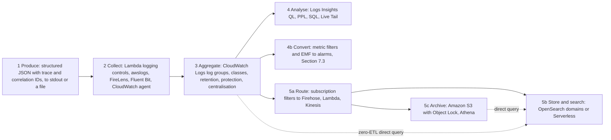

| Stage | Question the architect answers | Typical AWS choice |
|-------|-------------------------------|--------------------|
| Produce | What does a good log event contain? | Structured JSON with timestamp, level, service, version, trace ID and correlation ID |
| Collect | How does the event leave an ephemeral container, function or instance? | Lambda platform integration, ECS `awslogs` or FireLens, Fluent Bit on EKS, CloudWatch agent on EC2 |
| Aggregate | Where is the single source of truth, and who can see it? | CloudWatch Logs, centralised into a log archive account |
| Analyse | How do engineers answer "what happened" in minutes? | CloudWatch Logs Insights, Live Tail, metric filters |
| Store and search | Where do long-lived dashboards, full-text search and security analytics run? | Amazon OpenSearch Service, or Amazon S3 with Athena for cheap archives |

The decision between the three parts of this section is mostly a decision about ==query pattern, retention and cost==:

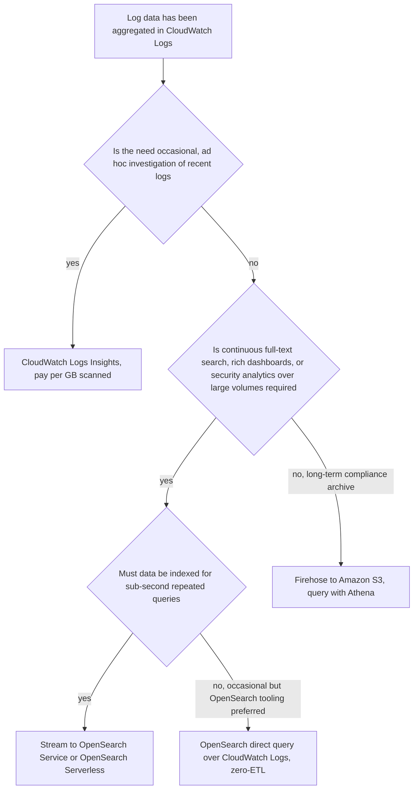

| Property | CloudWatch Logs with Logs Insights | Amazon OpenSearch Service | Amazon S3 with Athena |
|----------|-----------------------------------|---------------------------|------------------------|
| Primary strength | Zero-setup aggregation and ad hoc query | Indexed full-text search and interactive analytics | Cheapest long-term storage and SQL over archives |
| Operational effort | None | Low to moderate (domains) or low (Serverless) | Low |
| Query latency | Seconds to minutes, depends on data scanned | Milliseconds to seconds on indexed data | Seconds to minutes |
| Cost driver | GB ingested, GB-month stored, GB scanned | Instance or OCU hours plus storage | GB-month stored plus GB scanned |
| Typical retention | Days to months (can be years) | Days to weeks hot, months warm or cold | Years |

!!! tip "Aggregate once, analyse many ways"
    A mature design treats CloudWatch Logs as the ==landing zone== for all logs, because every AWS compute service integrates with it natively and it applies retention, encryption, data protection and access control in one place. Selected streams are then routed onward to OpenSearch or S3 when a use case justifies the extra cost. This avoids each team building its own collection pipeline.

---

## Log Aggregation with Amazon CloudWatch Logs

### Definition

==Amazon CloudWatch Logs is a fully managed, regional service that ingests, stores, secures and makes searchable the log data produced by applications, AWS services and operating systems, and that routes that data to metrics, alarms, queries and downstream destinations.==

A log, in the sense used throughout this section, is an ==append-only, time-ordered record of discrete events==, each describing something that happened: a request served, an exception thrown, a user signed in, a packet rejected. Logs complement the other observability signals from [Section 7.1](../unit7/topic1.md):

| Signal | Shape | Question it answers best | Example |
|--------|-------|--------------------------|---------|
| Metric | Numeric time series, aggregated | "Is something wrong, and how much?" | p99 latency is 2.3 s |
| Trace | Tree of timed spans for one request | "Where in the call path is it wrong?" | 1.9 s spent in the payment service |
| Log | Discrete, detailed event records | "Exactly what happened, and why?" | `PaymentDeclined: card expired, orderId o-1001` |

In the AWS architecture map CloudWatch Logs belongs to the ==Management and Governance== category as part of Amazon CloudWatch. It sits between every compute and managed service on one side and the analysis tools (Logs Insights, OpenSearch Service, Athena, alarms) on the other.

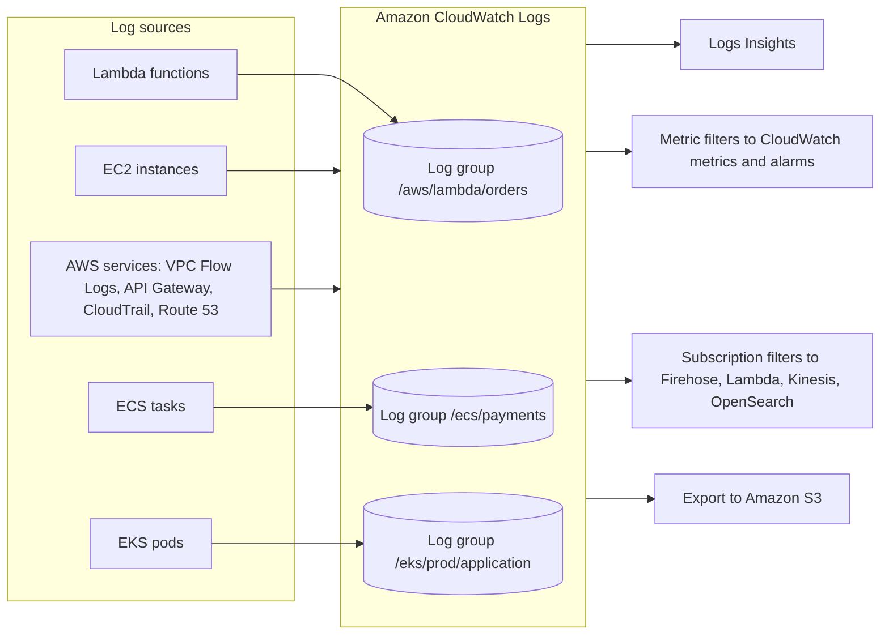

### Why This Service or Concept Exists

#### The problem: logs on disposable infrastructure

On a traditional server, logs were files in `/var/log`. An administrator logged in with SSH and used `tail`, `grep` and `less`. That model fails completely in cloud-native systems:

1. ==Compute is ephemeral.== A Fargate task, a Kubernetes pod or a Lambda execution environment can disappear at any moment, taking any local files with it. [Chapter 2.1](../unit2/topic1.md) made the point that anything written to a file inside a container is lost when the task stops.
2. ==Compute is numerous.== A service may run 40 tasks today and 400 tomorrow. Nobody can SSH into 400 containers to find one failed request.
3. ==Requests cross services.== One user request in a microservices system touches an API Gateway stage, three services and a queue. The story of that request is scattered across many log sources, and it can only be reconstructed if all of them land in one queryable place with a shared identifier.
4. ==There may be no host at all.== Lambda and Fargate give you no operating system to log in to.
5. ==Logs are evidence.== Security investigations, audits and regulations (financial services, health data, national data protection laws) require logs to be retained, tamper-resistant and access-controlled, which is impossible when they live on the servers an attacker may have compromised.

The solution is ==centralised logging==: every workload ships its events, immediately and continuously, to a durable store outside the workload itself.

#### Why AWS built CloudWatch Logs

Before managed log services, organisations built centralised logging themselves, typically with the "ELK" stack (Elasticsearch, Logstash, Kibana) or with commercial products. The operator had to:

- deploy and scale a fleet of collectors and indexers,
- size storage for peak log volume plus retention,
- handle back-pressure when the indexer fell behind,
- patch and secure the cluster,
- manage index lifecycle so that disks did not fill.

AWS launched CloudWatch Logs in 2014 so that every AWS service could deliver logs to a common, managed destination with no infrastructure to operate. Over time it gained native integrations with Lambda (every function logs there by default), ECS, EKS, API Gateway, VPC Flow Logs, CloudTrail and dozens of other services, plus analytics features (Logs Insights in 2018), data protection (2022), the Infrequent Access log class (2023), field indexes and log transformation (2024), cross-account centralisation rules and unified data management (2025) and the Log Analytics console experience (2026).

#### Benefits over older methods

| Concern | Files on servers | Self-managed ELK cluster | Amazon CloudWatch Logs |
|---------|------------------|--------------------------|------------------------|
| Survives instance or container loss | No | Yes | Yes |
| Infrastructure to operate | None, but no central view | Collectors, indexers, storage, upgrades | None |
| Native AWS service integration | No | Via custom shippers | Built in for Lambda, ECS, EKS, API Gateway, VPC, CloudTrail and many more |
| Scaling | Per server | Capacity planned | Automatic |
| Access control | OS users | Cluster-specific | IAM, resource policies, KMS |
| Retention management | Manual rotation | Index lifecycle policies | Per log group setting |
| Pricing | Disk only | Servers and storage whether used or not | Per GB ingested, stored and scanned |

!!! note "CloudWatch Logs is not the only answer"
    Many organisations still use third-party observability platforms, or run OpenSearch as their primary log store. Even then, CloudWatch Logs is usually the first hop for AWS-native sources (Lambda, VPC Flow Logs, many vended logs), with subscription filters forwarding data onward. Knowing CloudWatch Logs well is therefore necessary regardless of the final destination.

### Core Concepts

#### The data model: events, streams and groups

CloudWatch Logs organises data in a three-level hierarchy.

| Level | Definition | Example |
|-------|------------|---------|
| ==Log event== | One record: a timestamp and a UTF-8 message | `2026-09-26T10:15:02Z {"level":"ERROR","msg":"card declined"}` |
| ==Log stream== | A sequence of events from one source instance, ordered by time | One ECS task's container, one Lambda execution environment, one EC2 instance's file |
| ==Log group== | A named collection of streams that share settings | `/ecs/payments`, `/aws/lambda/orders-api` |

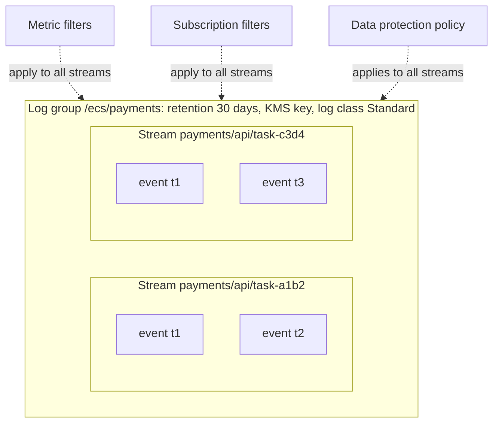

The ==log group is the unit of configuration==. Everything an architect decides is set on the log group (or at account level) and applies to every stream within it:

| Setting | Belongs to |
|---------|------------|
| Retention period | Log group |
| Log class (Standard or Infrequent Access) | Log group, fixed at creation |
| KMS key | Log group |
| Metric filters and subscription filters | Log group (subscription filters can also be account-level) |
| Data protection policy | Log group or account |
| Field index policy | Log group or account |
| Transformer | Log group or account |
| Tags, deletion protection | Log group |
| IAM access | Log group ARN (and streams within it) |

!!! tip "Design principle: one log group per service per environment"
    A log group should represent ==one logical component in one environment==, for example `/ecs/prod/payments-api`. This gives each team a clear retention policy, access boundary and cost line. Mixing many services in one log group makes access control coarse and queries expensive; creating a log group per task or per deployment makes queries across a service's history awkward and multiplies configuration.

#### Log event anatomy and ingestion rules

A log event has two mandatory parts, a ==timestamp== (milliseconds since the Unix epoch) and a ==message== (UTF-8 text). CloudWatch Logs also records an ==ingestion time==. The message may be plain text or JSON; JSON is strongly preferred (see structured logging below) because Logs Insights, metric filters and field indexes can address JSON fields directly.

Events are written with the `PutLogEvents` API, which agents, drivers and SDK integrations call on your behalf. Important rules, which explain many "missing log" puzzles:

| Rule | Indicative value (verify in the quotas page) | Consequence |
|------|------------------------------------------------|-------------|
| Maximum event size | 1 MB (raised from 256 KB in April 2025) | Larger events are truncated or rejected by the client |
| Maximum batch size | 1 MB, and up to 10,000 events per `PutLogEvents` call | Agents batch events |
| Time span within one batch | 24 hours | Old backfills must be split |
| Oldest accepted event | 14 days old, and not older than the retention period | Replaying very old files silently drops events |
| Future timestamps | Up to about 2 hours ahead | Clock skew on hosts causes rejections |
| Sequence tokens | No longer required | Older blog posts describing `InvalidSequenceTokenException` are obsolete |

#### Structured logging

A log line written as prose ("User 42 failed to pay for order 1001 because the card expired") is readable by one human and almost useless to a machine. A ==structured log event== records the same facts as named fields:

```json
{
  "timestamp": "2026-09-26T10:15:02.114Z",
  "level": "ERROR",
  "service": "payments-api",
  "version": "1.8.3",
  "environment": "prod",
  "traceId": "1-66f53a8e-4c1d2b3a9e8f7a6b5c4d3e2f",
  "correlationId": "c-7f3e9a",
  "tenantId": "t-042",
  "orderId": "o-1001",
  "event": "PaymentDeclined",
  "reason": "card_expired",
  "durationMs": 184,
  "message": "Payment declined by provider"
}
```

Structured logging turns logs from text into a ==dataset==. Every downstream feature in this section depends on it: Logs Insights discovers JSON fields automatically, metric filters can match `{ $.level = "ERROR" }`, field indexes accelerate queries on `orderId`, and OpenSearch maps each field to a typed column.

| Field category | Fields | Why |
|----------------|--------|-----|
| When | `timestamp` in ISO 8601 UTC | Ordering and correlation across services |
| Severity | `level` (DEBUG, INFO, WARN, ERROR, FATAL) | Filtering and runtime log-level control |
| Who emitted it | `service`, `version`, `environment`, `region`, task or pod ID | Attributing problems to a deployment (Unit V) |
| Request context | `traceId`, `spanId`, `correlationId`, `requestId` | Joining logs with traces ([Section 7.1](../unit7/topic1.md)) and across services |
| Business context | `tenantId`, `orderId`, `customerTier` | Answering customer-specific questions |
| Outcome | `event`, `statusCode`, `durationMs`, `errorType` | Aggregation and metrics |
| Human text | `message` | Readability |

!!! warning "Consistency matters more than completeness"
    Ten services that each name the same concept differently (`orderId`, `order_id`, `OrderID`) defeat cross-service queries, because field names are case-sensitive. Agree a ==logging schema== at organisation level, publish it with a shared logging library (Powertools for AWS Lambda, a common Java or Node logging module), and enforce it in code review. OpenTelemetry semantic conventions are a good starting vocabulary.

#### Correlation IDs and trace context

A ==correlation ID== is an identifier generated once at the edge of the system (API Gateway request ID, a client-supplied header, or a new UUID) and propagated to every service that handles the request, including across asynchronous boundaries (SQS message attributes, EventBridge event detail, [Chapter 6.3](../unit6/topic3.md)). A ==trace ID== is the equivalent identifier generated by the tracing system (X-Ray or W3C `traceparent`, [Section 7.1.2](../unit7/topic1.md#distributed-tracing-with-aws-x-ray)). Many teams log both: the trace ID links a log line to its trace, and the correlation ID survives even when a request is not sampled for tracing or crosses a system that does not propagate trace headers.

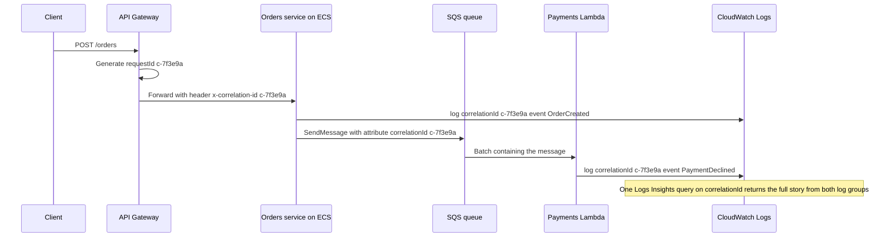

!!! tip "Propagate context through every hop"
    The most common gap is the asynchronous hop. If the orders service forgets to copy the correlation ID into the SQS message attributes, the payment logs cannot be joined to the order logs, and the investigation stalls exactly where it matters most. Build propagation into the shared messaging client, not into each handler.

#### Ingestion paths

Logs reach CloudWatch Logs through four families of path.

| Path | How it works | Examples |
|------|--------------|----------|
| Platform integration | The AWS service captures `stdout` and `stderr` or its own logs and calls `PutLogEvents` for you | Lambda runtime, ECS `awslogs` driver, App Runner, Elastic Beanstalk |
| Agent or collector | A process on the host or a sidecar reads files or streams and ships them | CloudWatch agent on EC2, Fluent Bit on EKS or ECS (FireLens), OpenTelemetry Collector |
| Vended logs | An AWS service publishes logs about your resources on your behalf | VPC Flow Logs, Route 53 Resolver query logs, API Gateway access logs, AWS WAF, CloudFront standard logs (v2), Bedrock invocation logs |
| Direct API | Your code calls `PutLogEvents`, or uses the OpenTelemetry Protocol (OTLP) logs endpoint | Custom collectors, batch jobs, EMF from libraries |

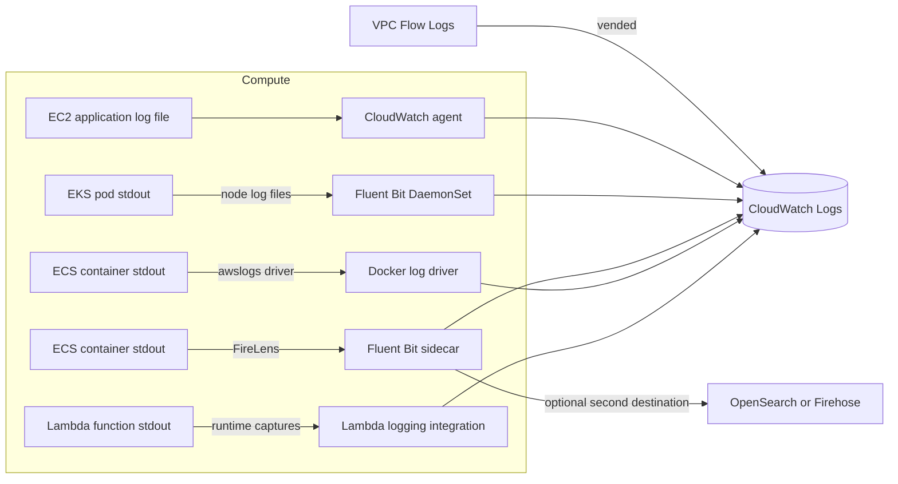

#### Log classes

CloudWatch Logs offers two log classes for general use, chosen when the log group is created.

| Aspect | Standard | Infrequent Access |
|--------|----------|-------------------|
| Intended use | Operational logs used for real-time monitoring, alarms and frequent queries | Logs kept for occasional investigation, forensics, audit and compliance |
| Ingestion price | Full price (indicative USD 0.50 per GB in us-east-1) | About half (indicative USD 0.25 per GB) |
| Storage and query price | Same as Infrequent Access | Same as Standard |
| Logs Insights | Supported | Supported (most commands) |
| Export to S3, KMS, cross-account, data protection masking | Supported | Supported |
| Metric filters, subscription filters, Live Tail | Supported | ==Not supported== |
| Embedded Metric Format, Container Insights, Lambda Insights ingestion | Supported | Not supported |
| Anomaly detection, field indexes, facets, natural-language query assist | Supported | Not supported |
| `GetLogEvents` and `FilterLogEvents` APIs | Supported | Not supported (use Logs Insights) |
| Changing class later | ==Not possible== | Not possible |

A third class, ==Delivery==, exists for AWS Lambda logs that are delivered directly to Amazon S3 or Amazon Data Firehose rather than stored in CloudWatch Logs; it is not a general-purpose class.

!!! warning "The log class is permanent"
    Because a log group's class cannot be changed after creation, choose it before the first log line arrives. A useful rule: if anything automatic depends on the log group (an alarm via a metric filter, a subscription to OpenSearch, EMF metrics, Live Tail during incidents), it must be ==Standard==. Infrequent Access suits high-volume debug, audit or access logs that are only queried when someone asks a question.

#### Retention

By default a new log group ==never expires== its data. This is the single largest source of runaway CloudWatch Logs storage cost. Retention can be set per log group to one of a fixed set of values: 1, 3, 5, 7, 14, 30, 60, 90, 120, 150, 180, 365, 400, 545, 731, 1,096, 1,827, 2,192, 2,557, 2,922, 3,288 or 3,653 days, or "never expire". Expired events are deleted automatically (deletion can lag the retention boundary by a short time).

| Log type | Typical retention in CloudWatch Logs | Longer-term copy |
|----------|--------------------------------------|------------------|
| Debug and verbose application logs | 3 to 14 days | None |
| Production application logs | 30 to 90 days | Optional S3 archive |
| Access logs (ALB, API Gateway) | 30 to 90 days | S3 for one year or more |
| Security and audit logs (CloudTrail, VPC Flow Logs) | 90 to 365 days | S3 with Object Lock for regulatory periods |
| Regulated business event logs | As required by law | S3 Glacier storage classes with lifecycle rules |

!!! danger "Never leave retention at 'never expire' by accident"
    Lambda, ECS and many AWS services create log groups automatically when they first write. Those log groups are created with no retention. Create log groups explicitly in infrastructure as code with a retention period ==before== the workload first runs, and use an AWS Config rule (`cw-loggroup-retention-period-check`) or a small automation to detect groups that slipped through.

#### Vended logs

==Vended logs== are logs that AWS services publish natively on your behalf, such as VPC Flow Logs, Route 53 Resolver query logs, AWS WAF logs, API Gateway access logs and Amazon Bedrock model invocation logs. They matter to architects for two reasons:

1. ==Volume pricing.== Vended logs delivered to CloudWatch Logs are charged on a tiered scale that falls as monthly volume grows (indicatively USD 0.50 per GB for the first 10 TB, stepping down to USD 0.05 per GB beyond 50 TB in us-east-1). Since May 2025, Lambda function logs are also priced on this tiered model.
2. ==Delivery choice.== Many vended sources can be delivered to CloudWatch Logs, directly to Amazon S3, or to Amazon Data Firehose through the CloudWatch Logs delivery APIs (`PutDeliverySource`, `PutDeliveryDestination`, `CreateDelivery`). Delivering high-volume, rarely queried logs straight to S3 is cheaper than storing them in CloudWatch Logs first.

!!! info "Networking logs are covered elsewhere"
    [Chapter 1.6](../unit1/topic6.md) explained what VPC Flow Logs record and how to use them for troubleshooting. This part treats them purely as a high-volume log source that must be aggregated, retained and routed.

#### Metric filters

A ==metric filter== watches events as they are ingested into a log group, matches a ==filter pattern==, and publishes a CloudWatch metric data point for each match. It is the bridge from logs to alarms: an application that logs `PaymentDeclined` events can be alarmed on without changing a line of code.

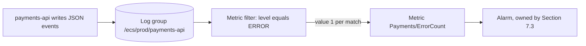

Filter pattern syntax has three forms:

| Form | Example | Matches |
|------|---------|---------|
| Terms | `ERROR` or `"card declined"` or `?ERROR ?FATAL` | Unstructured text containing the term(s); `?` means OR, `-` excludes |
| JSON | `{ $.level = "ERROR" && $.service = "payments-api" }` | JSON events whose fields satisfy the expression |
| Space-delimited | `[ip, user, username, timestamp, request, status_code = 5*, bytes]` | Positional fields in formats such as Apache access logs |

Key metric filter properties:

| Property | Meaning |
|----------|---------|
| `metricValue` | The value published per match: a literal (`1`) or a field (`$.durationMs`) |
| `defaultValue` | Value published for periods with no matches (commonly `0`), which avoids gaps that confuse alarms |
| `dimensions` | Up to three dimensions taken from JSON or space-delimited fields, for example `service` |
| `unit` | Unit of the published metric |

!!! warning "Metric filters are not retroactive and dimensions are costly"
    A metric filter only evaluates events ingested ==after== it is created; it will not produce metrics for yesterday's logs. Dimensions drawn from high-cardinality fields (user IDs, order IDs) create one custom metric per distinct value, which can generate thousands of billable metrics. Use low-cardinality dimensions such as `service` or `statusClass`. For rich application metrics, prefer the Embedded Metric Format ([Section 7.1.1](../unit7/topic1.md#infrastructure-and-application-monitoring-with-amazon-cloudwatch)), which produces metrics from logs deliberately and predictably.

#### Subscription filters

A ==subscription filter== delivers a real-time copy of matching log events from a log group to another service. It is the primary routing mechanism for building pipelines beyond CloudWatch Logs.

| Destination | Typical purpose |
|-------------|-----------------|
| Amazon Kinesis Data Streams | High-throughput fan-out to several consumers, custom processing, cross-account delivery |
| Amazon Data Firehose | Buffered delivery to S3, OpenSearch Service, Redshift or third-party HTTP endpoints, with optional transformation |
| AWS Lambda | Lightweight processing, enrichment, custom forwarding, near-real-time reaction to specific events |
| Amazon OpenSearch Service | Console option that creates a Lambda function to index events into a domain |
| A CloudWatch Logs ==destination== in another account | Cross-account centralisation, delivering to a Kinesis stream or Firehose stream owned by the central account |

Each log group supports a small number of subscription filters (indicatively five; check current quotas). In addition, an ==account-level subscription filter policy== can subscribe all (or all but excluded) log groups in an account to one destination, which is ideal for central security pipelines.

!!! note "Delivery format"
    Events delivered by subscription filters are batched, gzip-compressed and Base64-encoded, with metadata fields such as `owner`, `logGroup`, `logStream`, `subscriptionFilters` and `logEvents`. A Lambda destination must decompress the payload before reading it. Firehose can decompress automatically when configured to do so.

#### Log transformation

Since late 2024, CloudWatch Logs can ==transform log events at ingestion time== using a ==transformer== attached to a log group or account. A transformer is an ordered list of processors: parsers (JSON, key-value, CSV, Grok, and managed parsers for common AWS vended logs), mutators (add, rename, copy, delete fields, change case, type conversion), and a processor that converts supported logs to the ==Open Cybersecurity Schema Framework (OCSF)==. Transformed events are what metric filters, subscription filters, field indexes and queries see, which means you can normalise legacy text logs into JSON without redeploying the application. The December 2025 unified data management launch extended this with ==pipelines== that collect, transform and route telemetry and security data from AWS and third-party sources.

#### Sensitive data protection

Applications sometimes log data they should not: email addresses, national identity numbers, card numbers, access keys. CloudWatch Logs ==data protection policies== use managed data identifiers (and custom regular-expression identifiers) to detect sensitive data at ingestion and ==mask== it. Masked values appear as asterisks to anyone without the `logs:Unmask` permission. Policies can be set per log group or for the whole account, and can send audit findings (what was found, where) to another log group, S3 or Firehose.

!!! warning "Masking is a safety net, not a design"
    Data protection detects patterns probabilistically and is charged per GB scanned. The correct design is to ==not log sensitive data in the first place==: log identifiers, not contents; log a card's last four digits, not the number. Use data protection to catch mistakes, and treat any finding as a defect to fix in the application.

#### Live Tail

==Live Tail== streams newly ingested events from up to ten log groups in near real time, with optional filter patterns and highlighting, in the console, the AWS CLI (`aws logs start-live-tail`), IDE toolkits, or through the `StartLiveTail` API. It replaces the habit of SSH plus `tail -f` during deployments and incidents. Live Tail is billed per session minute after a monthly free allowance, so close sessions when finished.

#### Anomaly detection and pattern analysis

CloudWatch Logs can create a ==log anomaly detector== on a Standard log group. The detector learns the normal ==patterns== in the log group (log lines with the variable parts replaced by tokens) and flags anomalies such as a new error pattern or a sudden change in frequency. Anomalies can be viewed in the console and alarmed on. Pattern analysis is also available interactively in Logs Insights through the `pattern` command (7.2.2).

#### Field indexes

A ==field index policy== tells CloudWatch Logs to index selected JSON fields (for example `requestId`, `orderId`, `tenantId`) at ingestion, so that Logs Insights queries filtering on those fields skip events that cannot match. This reduces both query latency and the number of GB scanned, and therefore cost. Field indexes are covered with Logs Insights in 7.2.2 because their purpose is query acceleration; they are configured on log groups or at account level as part of aggregation design.

#### Cross-account and cross-Region centralisation

AWS recommends a ==multi-account strategy== (AWS Organizations with separate accounts per workload and environment, and a dedicated ==Log Archive account== in AWS Control Tower landing zones). Logs are produced in many accounts but must be analysed and retained centrally. There are three mechanisms, which solve different problems:

| Mechanism | What moves | Best for |
|-----------|------------|----------|
| ==CloudWatch Logs centralisation rules== (launched September 2025) | A managed copy of log events from source accounts and Regions in an organisation to a destination account and Region, with an optional backup Region | Organisation-wide log aggregation without custom pipelines |
| ==Subscription filters to a cross-account destination== | Streamed events to a Kinesis or Firehose stream in the central account | Custom pipelines, delivery to OpenSearch or S3, near-real-time processing |
| ==CloudWatch cross-account observability== (Observability Access Manager, [Section 7.1](../unit7/topic1.md)) | Nothing is copied; a monitoring account can query and view source accounts' logs, metrics and traces | Central viewing and querying while data stays in source accounts |

Centralisation rules enrich each event with `@aws.account` and `@aws.region` so that the origin of every event is preserved, merge same-named log groups in the destination, and require AWS Organizations. They process only new data that arrives after the rule is created. AWS prices the first centralised copy at no additional charge and each additional copy (including a backup Region) per GB centralised; check the pricing page. Centralisation by ==data source== (for example "all VPC Flow Logs" or "all CloudTrail") was added in 2026.

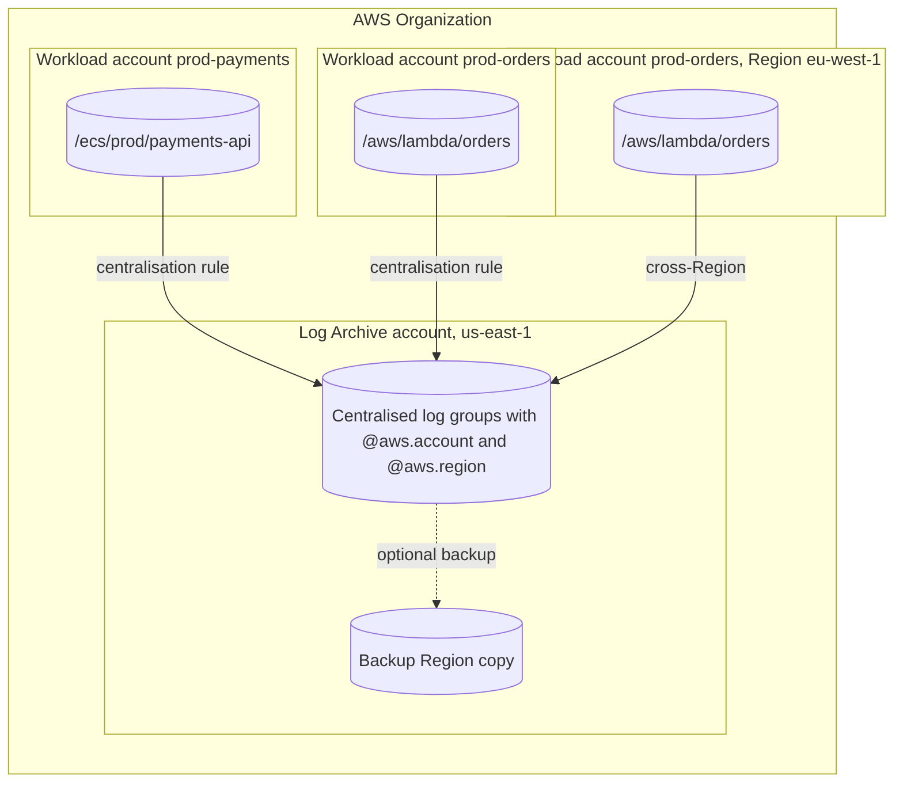

#### Export to Amazon S3

CloudWatch Logs can ==export== a time range of a log group to an S3 bucket with `CreateExportTask`. Export is a batch operation: only one export task may be active per account and Region at a time, and a task can take minutes to hours. It is suitable for occasional archival, not for continuous delivery. For continuous archival use a ==subscription filter to Amazon Data Firehose== delivering to S3 (optionally converting to Parquet and partitioning by date for Athena), or deliver vended logs directly to S3.

### AWS Service Deep Dive

#### Purpose

CloudWatch Logs provides a single, durable, access-controlled landing zone for log events from every AWS service and workload, and turns those events into operational value: searchable history, metrics, alarms, real-time streams and routed copies for specialised stores. Its design goals are zero infrastructure, native integration with AWS services, and a consumption-based price.

#### Architecture

From an architect's perspective CloudWatch Logs has an ingestion plane, a storage plane, and several processing features that act on events as they arrive or after they are stored.

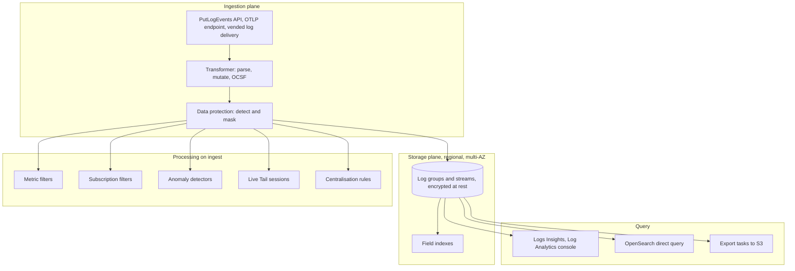

- ==Regional service.== Log groups live in one Region. There is no Availability Zone choice; data is stored redundantly within the Region.
- ==Control plane== calls (`CreateLogGroup`, `PutRetentionPolicy`, `PutMetricFilter`, `PutSubscriptionFilter`, `PutDataProtectionPolicy`, `PutIndexPolicy`, `PutTransformer`) are made by infrastructure as code.
- ==Data plane== calls (`PutLogEvents`, `StartQuery`, `GetQueryResults`, `StartLiveTail`, `FilterLogEvents`, `GetLogEvents`) are made by agents, applications and operators.
- ==Endpoint.== The regional endpoint is `logs.us-east-1.amazonaws.com`. Private workloads reach it through an interface VPC endpoint (`com.amazonaws.us-east-1.logs`).

#### Important Features

| Feature | Summary |
|---------|---------|
| Log groups, streams, events | Hierarchical, append-only storage with per-group configuration |
| Log classes | Standard and Infrequent Access, chosen at creation |
| Retention | Per log group, 1 day to 10 years or never expire |
| Deletion protection | Optional safeguard against accidental deletion of log groups |
| Metric filters | Create CloudWatch metrics from log patterns |
| Subscription filters | Real-time delivery to Kinesis, Firehose, Lambda, OpenSearch, cross-account destinations; account-level policies |
| Transformation and pipelines | Parse, normalise and enrich at ingestion, including OCSF |
| Data protection policies | Detect and mask sensitive data, with audit findings |
| Field indexes and facets | Accelerate and guide queries |
| Logs Insights and Log Analytics | Interactive query with three languages (7.2.2) |
| Live Tail | Real-time streaming view |
| Anomaly detection | Machine-learning detection of unusual log patterns |
| Centralisation rules | Organisation-wide cross-account and cross-Region copies |
| Export and S3 Tables integration | Batch export to S3; logs exposed as Apache Iceberg tables for Athena, Redshift and Spark |
| KMS encryption | Customer managed keys per log group |
| Embedded Metric Format | Metrics extracted from structured log events ([Section 7.1.1](../unit7/topic1.md#infrastructure-and-application-monitoring-with-amazon-cloudwatch)) |

#### Limitations

- ==Not a full-text search engine.== Queries scan data rather than consulting an inverted index (field indexes help only for equality filters on indexed fields). Very large, repeated, interactive searches are better served by OpenSearch (7.2.3).
- ==Log class is immutable== and Infrequent Access disables many features.
- ==Metric filters are not retroactive== and support at most three dimensions.
- ==Limited subscription filters per log group.== Complex fan-out needs Kinesis or Firehose in between, or account-level policies.
- ==Export is batch and serialised== (one active task per account and Region).
- ==Ingestion constraints:== event size, batch size and timestamp windows can drop events from misconfigured shippers.
- ==Regional by default.== Cross-Region analysis requires centralisation or cross-account observability.
- ==Cost grows linearly with verbosity.== Nothing stops an application from logging gigabytes of debug output except your design.

#### Pricing Model and recommendations

!!! info "Pricing figures"
    Prices below are indicative us-east-1 list prices as of 2026. Verify them on the Amazon CloudWatch pricing page and in the AWS Pricing Calculator before using them in a design document.

| Dimension | How it is charged | Indicative us-east-1 price |
|-----------|-------------------|----------------------------|
| Ingestion, Standard class (custom logs) | Per GB ingested | USD 0.50 per GB |
| Ingestion, Infrequent Access class | Per GB ingested | USD 0.25 per GB |
| Vended logs and Lambda logs to CloudWatch Logs | Tiered per GB by monthly volume | USD 0.50 per GB, falling in tiers to USD 0.05 per GB above 50 TB |
| Vended and Lambda logs delivered directly to S3 or Firehose | Tiered per GB | From USD 0.25 per GB, falling to USD 0.05 per GB |
| Storage (archived logs) | Per GB-month of compressed stored data | USD 0.03 per GB-month |
| Logs Insights queries | Per GB of data scanned | USD 0.005 per GB scanned |
| Data protection | Per GB scanned for sensitive data | USD 0.12 per GB |
| Live Tail | Per session minute | USD 0.01 per minute |
| Centralisation rules | First copy free; additional copies per GB | Check pricing page |
| Free tier | Monthly allowance | 5 GB of data (ingestion, archive storage and Logs Insights scanning combined) and 1,800 Live Tail minutes |
| Metric filters | No charge for the filter; the resulting custom metrics are billed as CloudWatch metrics | See CloudWatch metrics pricing |
| Subscription filters | No charge from CloudWatch Logs for delivery; the destination (Kinesis, Firehose, Lambda) is billed | Destination pricing |

!!! example "Worked estimate"
    A microservices platform of 30 services on ECS writes 20 GB of Standard-class application logs per day and keeps them for 30 days. Monthly ingestion is about 600 GB, costing roughly 600 x 0.50 = USD 300. Stored data is compressed; at a typical compression ratio the retained 30 days might occupy around 100 to 150 GB, costing a few US dollars per month. Engineers run queries scanning 2 TB per month in total, costing 2,000 x 0.005 = USD 10. ==Ingestion dominates.== If half the volume is DEBUG output that is never queried, reducing log level in production saves about USD 150 per month, far more than any storage or query optimisation.

The cost levers that follow from this model (ingest less, set retention, choose the class and destination, tag for attribution) are listed in [Cost Optimization](#cost-optimization) below.

#### Performance Characteristics

| Characteristic | Typical behaviour |
|----------------|-------------------|
| Ingestion latency | Events are usually queryable within seconds of `PutLogEvents` returning |
| Live Tail latency | Near real time, typically seconds |
| Metric filter latency | Metric data points appear within about a minute, depending on metric resolution |
| Subscription delivery | Near real time, batched; Firehose adds its own buffering interval |
| Query latency | Seconds for small scans; minutes for terabyte-scale scans (7.2.2) |
| Throughput | Very high; `PutLogEvents` quotas are per account and Region and adjustable |

#### Scaling Behaviour

CloudWatch Logs scales automatically with the volume of events; there is no capacity to provision. Scaling pressure appears elsewhere:

- ==API quotas.== `PutLogEvents` has a per-account, per-Region transactions-per-second quota (indicatively 5,000 calls per second, adjustable). Agents batch events to stay well below it. Thousands of small containers each flushing tiny batches can approach it.
- ==Shipper resources.== Fluent Bit and the CloudWatch agent consume CPU and memory proportional to log volume. Under-provisioned sidecars drop logs or apply back-pressure to the application.
- ==Downstream destinations.== A subscription to a Kinesis stream with too few shards, or to a Lambda function with limited concurrency, throttles delivery.

#### Availability

CloudWatch Logs is a regional service built across multiple Availability Zones; the failure of one zone does not normally affect ingestion or queries. It does not replicate log groups across Regions automatically. Use centralisation rules with a backup Region, or subscription pipelines to another Region, when logs must survive a regional event. Review the Amazon CloudWatch Service Level Agreement for the committed monthly uptime percentage.

!!! warning "Logging must never take down the application"
    If the logging path fails (throttling, network partition, missing permission), the application should keep serving traffic. On ECS the `awslogs` driver's ==non-blocking mode== (the default since June 2025) buffers logs in memory and drops them if the buffer fills, rather than blocking the container's `stdout` writes. Fluent Bit should be configured with bounded buffers. This is the logging equivalent of the bulkhead pattern from [Chapter 4.3](../unit4/topic3.md).

#### Security Features

| Control | Purpose |
|---------|---------|
| IAM identity policies | Grant actions such as `logs:PutLogEvents` or `logs:StartQuery` on specific log group ARNs |
| Resource policies | Allow AWS services (Route 53, EventBridge, vended log sources) to write to log groups; up to a small number per account and Region |
| Destination policies | Allow other accounts to subscribe to a cross-account destination |
| Encryption at rest | Always on with AWS owned keys; optionally a customer managed KMS key per log group |
| Encryption in transit | TLS on all API endpoints |
| Data protection policies | Masking of sensitive data; `logs:Unmask` required to see it |
| VPC interface endpoints | Private ingestion and query without internet or NAT |
| Deletion protection | Guards log groups against accidental deletion |
| CloudTrail | Records CloudWatch Logs control plane calls |
| Tag-based access control | Condition keys on resource tags for ABAC |

#### Service Limits

!!! info "Quotas"
    Indicative values as of 2026. Verify in Service Quotas and the CloudWatch Logs quotas documentation.

| Limit | Value |
|-------|-------|
| Log groups per account per Region | 1,000,000 (adjustable) |
| Log streams per log group | No limit |
| Maximum log event size | 1 MB |
| Maximum `PutLogEvents` batch | 1 MB and 10,000 events |
| `PutLogEvents` rate | 5,000 transactions per second per account per Region (adjustable) |
| Metric filters per log group | 100 |
| Subscription filters per log group | 5 |
| Account-level subscription filter policies | 1 per account per Region |
| Active export tasks | 1 per account per Region |
| Concurrent Live Tail sessions | 15 per account (adjustable), up to 10 log groups each |
| Log group name length | 512 characters |
| Retention | 1 day to 3,653 days, or never expire |
| Log anomaly detectors | 500 per Region (adjustable) |

### Important AWS Terminology

| Term | Meaning |
|------|---------|
| Log event | One timestamped UTF-8 record |
| Log stream | Time-ordered sequence of events from one source instance |
| Log group | Named collection of streams sharing retention, encryption, filters and access |
| Log class | Standard or Infrequent Access; fixed at log group creation |
| Retention policy | Period after which events are deleted automatically |
| Ingestion time | When CloudWatch Logs received an event, as distinct from the event timestamp |
| Structured logging | Emitting events as machine-readable key-value data, normally JSON |
| Correlation ID | Identifier propagated across services to join all events of one request |
| Vended logs | Logs published by AWS services on your behalf, with tiered pricing |
| Metric filter | Rule that converts matching log events into CloudWatch metric data points |
| Filter pattern | Syntax used by metric filters, subscription filters and Live Tail to match events |
| Subscription filter | Rule that streams matching events to Kinesis, Firehose, Lambda or a destination |
| Destination | A CloudWatch Logs resource in a receiving account that fronts a Kinesis or Firehose stream for cross-account subscriptions |
| Account-level subscription filter policy | One subscription applied to all selected log groups in an account |
| Transformer | Ordered processors that parse and modify events at ingestion |
| OCSF | Open Cybersecurity Schema Framework, a common schema for security events |
| Data protection policy | Configuration that detects and masks sensitive data in log events |
| Managed data identifier | AWS-maintained detector for a type of sensitive data |
| Live Tail | Real-time streaming view of newly ingested events |
| Log anomaly detector | Machine-learning model that flags unusual log patterns |
| Field index | Index on a JSON field that lets queries skip non-matching events |
| Centralisation rule | Organisation-level rule that copies logs to a destination account and Region |
| Export task | Batch copy of a time range of a log group to S3 |
| FireLens | ECS log router integration using a Fluent Bit or Fluentd sidecar |
| `awslogs` driver | Docker log driver that sends container output to CloudWatch Logs |
| CloudWatch agent | Unified agent for EC2 and on-premises hosts that ships logs and metrics |

### Configuration Options

#### Log group settings

| Setting | Options | Architect's guidance |
|---------|---------|----------------------|
| Name | Up to 512 characters, hierarchical by convention | `/ecs/<env>/<service>`, `/aws/lambda/<function>`, `/eks/<cluster>/application`; consistent prefixes enable prefix-based queries and policies |
| Log class | `STANDARD`, `INFREQUENT_ACCESS` | Standard when anything automatic depends on the group |
| Retention | 1 day to 10 years, never expire | Always set explicitly |
| KMS key | None (AWS owned) or customer managed key ARN | Customer managed key for regulated data or separation of duties |
| Deletion protection | Enabled or disabled | Enable for audit and security log groups |
| Tags | Key-value pairs | `team`, `service`, `environment`, `cost-centre` |
| Data protection policy | Identifiers, audit destination | Enable for groups that could plausibly contain personal data |
| Field index policy | List of fields | Index high-selectivity fields queried often (7.2.2) |
| Transformer | Processor list | Normalise legacy formats without code changes |

#### Lambda logging configuration (advanced logging controls)

| Setting | Values | Guidance |
|---------|--------|----------|
| `LogFormat` | `Text`, `JSON` | JSON gives structured platform and application logs natively |
| `ApplicationLogLevel` | `TRACE`, `DEBUG`, `INFO`, `WARN`, `ERROR`, `FATAL` | Filters application logs emitted through the runtime's standard logger when JSON format is used; set INFO or WARN in production |
| `SystemLogLevel` | `DEBUG`, `INFO`, `WARN` | Controls platform records such as `platform.start` and `platform.report` |
| `LogGroup` | Any log group name | Lets several functions share a log group or follow a naming convention; the default is `/aws/lambda/<function-name>` |
| Destination | CloudWatch Logs, or S3 or Firehose via the Delivery class | Direct-to-S3 for very high-volume, rarely queried function logs |

!!! note "Changing log level without redeploying code"
    With JSON format, the application log level is a function configuration setting. During an incident an operator can raise it to DEBUG for one function version, gather evidence, and lower it again, with no code change. Powertools for AWS Lambda adds richer context injection (cold start flag, function version, correlation ID extraction from API Gateway events) on top of this.

#### ECS log driver options

| Option | Driver | Meaning |
|--------|--------|---------|
| `awslogs-group` | `awslogs` | Target log group |
| `awslogs-region` | `awslogs` | Region of the log group |
| `awslogs-stream-prefix` | `awslogs` | Stream names become `prefix/container-name/task-id`, linking streams to tasks |
| `awslogs-create-group` | `awslogs` | Create the group if missing; avoid in production because the group gets no retention, and the execution role then needs `logs:CreateLogGroup` |
| `mode` | `awslogs`, others | `non-blocking` (default since 25 June 2025) or `blocking` |
| `max-buffer-size` | `awslogs` | In-memory buffer for non-blocking mode, default `10m` |
| `awslogs-multiline-pattern` or `awslogs-datetime-format` | `awslogs` | Join multi-line stack traces into one event |
| `logDriver: awsfirelens` | FireLens | Route through a Fluent Bit sidecar; options become Fluent Bit output parameters |

!!! warning "Blocking versus non-blocking is an availability decision"
    In ==blocking== mode, if logs cannot be delivered the container's writes to `stdout` block, the application thread stalls, and health checks may fail, so a CloudWatch Logs throttling event could cascade into an outage. In ==non-blocking== mode the application keeps running and some logs may be lost if the buffer overflows. Most services should prefer availability (non-blocking, the current default). A service whose logs are a legal record may choose blocking, and must then monitor for back-pressure. The `defaultLogDriverMode` ECS account setting sets the Region-wide default.

#### CloudWatch agent log collection (EC2)

The unified CloudWatch agent reads a JSON configuration, commonly stored in Systems Manager Parameter Store so that fleets share it:

| Key | Meaning |
|-----|---------|
| `logs.logs_collected.files.collect_list[].file_path` | File or glob to tail |
| `log_group_name`, `log_stream_name` | Destination; `{instance_id}` placeholders are supported |
| `retention_in_days` | Retention applied when the agent creates the group |
| `log_group_class` | `STANDARD` or `INFREQUENT_ACCESS` |
| `timestamp_format`, `multi_line_start_pattern` | Parsing of timestamps and multi-line events |
| `filters` | Include or exclude lines by regular expression before shipping, which reduces cost |
| `logs.logs_collected.windows_events` | Windows Event Log collection |

#### Subscription filter options

| Option | Meaning |
|--------|---------|
| `filterPattern` | Which events to forward; an empty pattern forwards everything |
| `destinationArn` | Kinesis stream, Firehose stream, Lambda function or cross-account destination |
| `roleArn` | Role CloudWatch Logs assumes to write to Kinesis or Firehose (not needed for Lambda, which uses a resource policy) |
| `distribution` | `ByLogStream` or `Random` for Kinesis destinations; `Random` spreads load across shards |
| Account-level policy `selectionCriteria` | Exclude specific log groups, for example the destination's own logs to avoid loops |

### Design Considerations

#### Scalability

CloudWatch Logs itself scales without intervention. Design for scalability at the edges: batch writes in shippers, size Fluent Bit sidecars and DaemonSets for peak volume, and put Kinesis or Firehose between log groups and any consumer that cannot absorb bursts. Naming conventions and account-level policies scale governance to thousands of log groups without per-group manual work.

#### Availability

The logging path must be ==less critical than the request path==. Non-blocking drivers, bounded buffers and asynchronous shippers ensure that an impaired logging service degrades observability rather than availability. For regional resilience of the logs themselves, replicate to a backup Region.

#### Reliability

Logs are only reliable if they arrive complete. Common loss points are: containers killed before buffers flush (handle `SIGTERM` and allow a flush period, [Chapter 2.2](../unit2/topic2.md)), events older than 14 days during backfill, timestamps skewed by bad host clocks, oversized events, and non-blocking buffer overflow. Monitor shipper metrics (Fluent Bit output errors and retries, agent logs) and alarm on the ==absence== of expected logs, for example a metric filter with a `defaultValue` of 0 on a heartbeat event.

#### Durability

CloudWatch Logs stores data redundantly within a Region for the retention period. For records that must outlive CloudWatch retention, copy them to S3 (with versioning and, for regulatory records, S3 Object Lock in compliance mode) through Firehose or export.

#### Latency

For operational use, seconds of ingestion latency are acceptable. Where near-real-time reaction is needed (for example, block an IP address after repeated authentication failures), use a subscription filter to Lambda or Kinesis rather than polling queries.

#### Cost

Cost is dominated by ingestion volume. The most effective levers are at the source (log level, sampling, not logging payloads), the log class, retention and delivery destination. [Section 7.3](../unit7/topic3.md) discusses the overall cost of observability; here the rule is simple: ==every log line is a small, recurring invoice==.

#### Performance

Logging has a CPU and latency cost inside the application. Synchronous logging to a remote endpoint from inside a request handler is an anti-pattern; write to `stdout` (or a local buffer) and let the platform ship asynchronously. Serialising large objects to JSON on every request can be surprisingly expensive in hot paths.

#### Maintainability

Keep the logging schema, log group definitions, retention, metric filters and subscriptions in infrastructure as code next to the service that owns them (Unit V). Use a shared logging library so that schema changes propagate by dependency upgrade rather than by editing 30 services.

#### Operational complexity

CloudWatch Logs is low-complexity to operate; complexity lives in governance: who may read which log groups, how long each class of log is kept, how logs from 50 accounts are aggregated, and who owns each subscription pipeline.

!!! question "Architect's checklist for every new service"
    What is the log group name, class and retention? Is the output structured JSON conforming to the organisation schema? Are trace and correlation IDs present on every line, including after asynchronous hops? Which events deserve metric filters and alarms? Could this service log personal data, and is a data protection policy attached? Is the log group included in organisation centralisation? What is the expected daily volume and cost?

### AWS Best Practices

| Pillar | CloudWatch Logs practice |
|--------|--------------------------|
| Operational Excellence | Structured JSON with a shared schema; correlation and trace IDs; log groups, retention, filters and alarms in IaC; runbooks that include saved Logs Insights queries; Live Tail during deployments |
| Security | Customer managed KMS keys for sensitive groups; least-privilege read access by team; data protection policies; centralise security logs to a Log Archive account that workload teams cannot modify; deletion protection; VPC endpoints |
| Reliability | Non-blocking drivers and bounded buffers so logging cannot fail the application; graceful shutdown flushes; alarms on missing logs; backup Region for critical logs |
| Performance Efficiency | Asynchronous shipping; batching; field indexes for frequent query fields; route high-volume analytics to OpenSearch when query patterns demand indexing |
| Cost Optimization | Explicit retention; appropriate log levels; Infrequent Access for passive logs; vended logs direct to S3; archive to S3 lifecycle tiers; tag for attribution |
| Sustainability | Log less but better: every stored and scanned gigabyte consumes energy; expire data you will never use; prefer metrics (EMF) over logging the same number repeatedly |

### Security Considerations

#### IAM and least privilege

Different principals need very different log permissions:

| Principal | Required actions | Notes |
|-----------|------------------|-------|
| Lambda execution role | `logs:CreateLogGroup`, `logs:CreateLogStream`, `logs:PutLogEvents` | The `AWSLambdaBasicExecutionRole` managed policy grants these; scope to the function's log group where possible |
| ECS task execution role (for `awslogs`) | `logs:CreateLogStream`, `logs:PutLogEvents` (plus `logs:CreateLogGroup` if auto-create is used) | ==Execution role==, not the task role, because the ECS agent writes the logs |
| ECS task role (for FireLens) | Permissions for the Fluent Bit outputs, such as `logs:PutLogEvents` or `firehose:PutRecordBatch` | The Fluent Bit sidecar runs with the task role |
| EKS Fluent Bit service account | `logs:PutLogEvents`, `logs:CreateLogStream`, `logs:DescribeLogStreams` | Via EKS Pod Identity or IRSA ([Chapter 3.1](../unit3/topic1.md)) |
| EC2 CloudWatch agent | `CloudWatchAgentServerPolicy` managed policy | Via the instance profile |
| Developer, read-only | `logs:StartQuery`, `logs:GetQueryResults`, `logs:FilterLogEvents`, `logs:GetLogEvents`, `logs:DescribeLogGroups` on their team's prefix | Do not grant `logs:Unmask` by default |
| Security analyst | Read on security log groups, `logs:Unmask` where justified | Audited through CloudTrail |

```json
{
  "Version": "2012-10-17",
  "Statement": [
    {
      "Sid": "QueryOwnTeamLogsOnly",
      "Effect": "Allow",
      "Action": [
        "logs:StartQuery",
        "logs:GetQueryResults",
        "logs:StopQuery",
        "logs:FilterLogEvents",
        "logs:GetLogEvents",
        "logs:DescribeLogStreams"
      ],
      "Resource": [
        "arn:aws:logs:us-east-1:111122223333:log-group:/ecs/prod/payments-*",
        "arn:aws:logs:us-east-1:111122223333:log-group:/ecs/prod/payments-*:log-stream:*"
      ]
    },
    {
      "Sid": "ListGroupsForConsole",
      "Effect": "Allow",
      "Action": ["logs:DescribeLogGroups", "logs:DescribeQueries", "logs:GetQueryResults"],
      "Resource": "*"
    }
  ]
}
```

!!! danger "Logs are a high-value target"
    Logs often contain the most sensitive operational data an organisation holds: user identifiers, IP addresses, internal hostnames, error messages that reveal code paths, and occasionally secrets that were logged by mistake. An attacker who gains read access to logs learns a great deal; an attacker who gains delete access can erase evidence. Separate the permission to ==write== logs (workloads), ==read== logs (engineers by team), ==unmask== logs (few), and ==delete or change retention== (platform administrators only, ideally through IaC pipelines).

#### Encryption with KMS

All log data is encrypted at rest. Associating a ==customer managed KMS key== with a log group adds key-level control, key usage audit in CloudTrail and separation of duties; the key policy must allow the regional CloudWatch Logs service principal, scoped with the `kms:EncryptionContext:aws:logs:arn` condition. Key policies, encryption context and the confused deputy conditions are covered in [8.3 Encryption at Rest with AWS KMS](../unit8/topic3.md#encryption-at-rest-with-aws-kms).

!!! warning "Disabling the key disables the logs"
    If the KMS key is disabled, scheduled for deletion, or its policy no longer allows CloudWatch Logs, ingestion into and queries of that log group fail. Treat log-group keys as production dependencies with change control.

#### Secrets never belong in logs

Secrets Manager and Parameter Store ([Chapter 2.2](../unit2/topic2.md)) keep credentials out of code and task definitions; a single `print(os.environ)` or a logged HTTP request with an `Authorization` header puts them straight back into a log group readable by many people. Adopt allow-list logging (log named fields, not whole objects), redact headers in HTTP client logging, and use data protection policies with the AWS secret-key identifiers as a safety net.

#### Network controls

Workloads in private subnets without a NAT gateway need an ==interface VPC endpoint for CloudWatch Logs== (`com.amazonaws.<region>.logs`). The endpoint's security group must allow HTTPS (TCP 443) from the workload security groups. An endpoint policy can restrict which log groups may be written through it. For Fargate tasks in private subnets, a missing Logs endpoint (and no NAT) is a classic cause of tasks failing to start with log driver errors.

#### Security Groups, Network ACLs and public versus private resources

CloudWatch Logs has no public or private resource setting of its own; it is reached over an AWS API endpoint. What matters is that shippers can reach the endpoint (security groups and network ACLs permitting outbound 443 and return traffic) and that the IAM and endpoint policies prevent data exfiltration to log groups in other accounts. The `aws:ResourceAccount` or `aws:ResourceOrgID` condition keys in endpoint policies help enforce this.

#### Logging, audit and compliance

- CloudTrail records CloudWatch Logs control plane calls (for example `DeleteLogGroup`, `PutRetentionPolicy`, `DeleteSubscriptionFilter`). Alarm on these for security log groups.
- AWS Config rules check retention (`cw-loggroup-retention-period-check`) and encryption (`cloudwatch-log-group-encrypted`).
- AWS Control Tower creates a Log Archive account for organisation CloudTrail and AWS Config logs; extend the same principle to application security logs.
- CloudWatch Logs is in scope for common compliance programmes (for example SOC, PCI DSS, ISO and HIPAA eligibility); confirm current scope in AWS Artifact.

### Performance Optimization

#### Asynchronous, batched shipping

The application should write to `stdout` or a local buffer and continue; the driver, agent or Fluent Bit batches events and calls `PutLogEvents` asynchronously. Direct synchronous calls to `PutLogEvents` from request-handling code add latency and couple availability to the logging service.

#### Caching and connection reuse

When code must call CloudWatch Logs APIs directly (custom shippers, query automation), create the SDK client once per process and reuse it so TLS connections persist. Cache `DescribeLogGroups` results rather than listing groups before every write.

#### Parallelism and distribution

Fluent Bit can run multiple output workers. For subscriptions to Kinesis, use `distribution: Random` so that a single noisy log stream does not create a hot shard.

#### Filtering at the source

Dropping unneeded events before they leave the host (Fluent Bit `grep` filters, CloudWatch agent `filters`, application log levels) is simultaneously a performance, cost and sustainability optimisation.

#### Storage and query optimisation

Consistent JSON field names and field indexes make queries faster. Splitting extremely high-volume, low-value streams (for example health-check access logs) into separate log groups with short retention keeps operational log groups small and quick to query.

#### Monitoring the logging pipeline

| Signal | Source | Meaning |
|--------|--------|---------|
| `IncomingBytes`, `IncomingLogEvents` | `AWS/Logs` metrics per log group | Volume trends; sudden growth indicates a verbose deployment |
| `ForwardedBytes`, `DeliveryErrors`, `DeliveryThrottling` | `AWS/Logs` subscription metrics | Health of subscription delivery |
| `ThrottleCount` and `CallCount` usage metrics | `AWS/Usage` | Approaching API quotas |
| Fluent Bit output retries and errors | Fluent Bit metrics endpoint or its own logs | Shipper back-pressure |
| Absence of heartbeat events | Metric filter with default value 0 | Silent logging failure |

!!! tip "Alarm on log volume anomalies"
    A tenfold increase in `IncomingBytes` for one log group after a deployment usually means someone shipped DEBUG logging or a retry loop. Alarming on this ([Section 7.3](../unit7/topic3.md) covers anomaly detection alarms) catches a cost incident within hours rather than at the end of the month.

### Cost Optimization

| Technique | Effect |
|-----------|--------|
| Pay-as-you-go | No fixed cost; idle log groups cost only storage |
| Production log levels | Often the largest single saving: INFO or WARN in production, and no full request or response bodies |
| Sampling | Log 1 in N successful requests in full, all errors always |
| Infrequent Access class | Roughly halves ingestion price for high-volume logs that feed no automation |
| Retention on every group | Stops unbounded storage growth |
| Vended logs direct to S3 | Cheaper delivery for high-volume network and security logs |
| Archive to S3 with lifecycle rules | S3 Standard-IA, Glacier Instant Retrieval and Deep Archive for long-term records |
| Field indexes and narrow queries | Lower Logs Insights scan cost |
| Avoid high-cardinality metric filter dimensions | Prevents custom metric sprawl |
| Firehose with Parquet conversion | Smaller archives and cheaper Athena scans |
| Centralisation without extra copies | First copy is free; each backup copy costs per GB |
| Cost Explorer and tags | Attribute log cost to teams and services |
| Trusted Advisor and Config rules | Detect log groups without retention |

!!! info "Reserved capacity and Savings Plans"
    CloudWatch Logs has no reserved capacity or Savings Plans. Savings come from ingesting less, choosing the right class and destination, and expiring data. The compute running shippers (Fargate, EC2 nodes) benefits from Savings Plans and Spot like any other workload.

!!! example "Cost comparison for VPC Flow Logs"
    An organisation produces 5 TB of VPC Flow Logs per month. Delivered to CloudWatch Logs as vended logs, the first 5 TB falls in the top tier at about USD 0.50 per GB, roughly USD 2,500 per month for ingestion before storage. Delivered directly to S3, the per-GB delivery price starts at about half that, and S3 storage is cheaper than CloudWatch Logs storage, with Athena available for investigations. If flow logs are only queried during security investigations, direct-to-S3 is the better design; if they drive real-time detections via metric filters, CloudWatch Logs Standard is justified. Always recompute with current prices.

### Integration with Other AWS Services

#### AWS Lambda

Every Lambda function writes to CloudWatch Logs by default: the runtime captures `stdout` and `stderr` and the platform adds records such as `START`, `END` and `REPORT` (with duration, billed duration, memory size, maximum memory used and init duration). Each ==execution environment== writes to its own log stream, so one stream corresponds to one warm container, not one invocation.

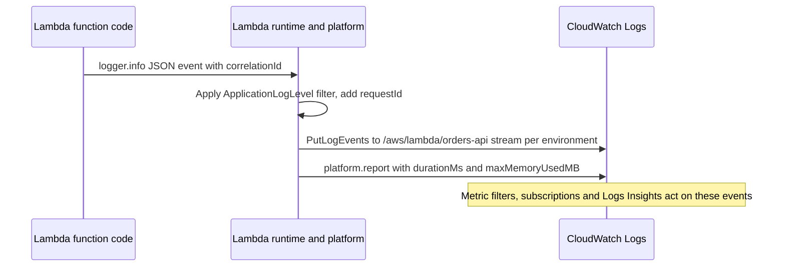

Architectural points:

- Use ==advanced logging controls== (JSON format, log levels) and Powertools for AWS Lambda for consistent structured logs.
- Create the log group in IaC with retention; otherwise Lambda creates it on first invocation with no retention.
- The `REPORT` line is itself valuable data: Logs Insights can compute memory over-provisioning from `@maxMemoryUsed` and `@memorySize` (7.2.2).
- For very high-volume functions, consider delivering logs directly to S3 or Firehose using the Delivery log class, keeping only errors in CloudWatch Logs.

#### Amazon ECS: awslogs and FireLens

[Chapter 2.2](../unit2/topic2.md) configured the `awslogs` driver. The choice between the two ECS logging approaches is architectural:

| Criterion | `awslogs` driver | FireLens with Fluent Bit |
|-----------|------------------|--------------------------|
| Setup | One `logConfiguration` block | Additional sidecar container and configuration |
| Destinations | CloudWatch Logs only | CloudWatch Logs, Firehose, Kinesis, OpenSearch, S3, third-party, several at once |
| Filtering and parsing before ingestion | Minimal (multi-line only) | Full Fluent Bit filters: grep, modify, parsers, Lua |
| Resource cost | None beyond the ECS agent or Fargate platform | Sidecar CPU and memory per task |
| Operational burden | Very low | Moderate: sidecar image versions and configuration |
| When to choose | Default for most services | Multiple destinations, cost filtering, enrichment, or OpenSearch as primary store |

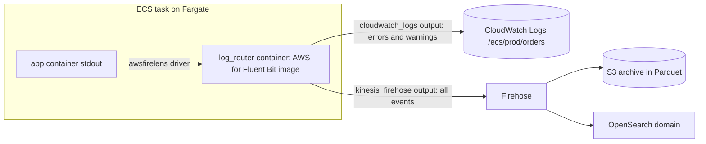

!!! tip "Keep the log router itself observable"
    Send the Fluent Bit sidecar's own logs to CloudWatch Logs with the `awslogs` driver. When the router fails, its own logs are the only place the error appears.

#### Amazon EKS: Fluent Bit and control plane logs

On EKS, containers write to `stdout`; the container runtime writes those streams to files under `/var/log/containers` on the node. A ==Fluent Bit DaemonSet== (one pod per node) tails those files, enriches events with Kubernetes metadata (namespace, pod, container, labels) and ships them. The ==Amazon CloudWatch Observability EKS add-on== installs both the CloudWatch agent (for Container Insights metrics, [Section 7.1.1](../unit7/topic1.md#infrastructure-and-application-monitoring-with-amazon-cloudwatch)) and Fluent Bit, creating log groups such as `/aws/containerinsights/<cluster>/application`, `/dataplane` and `/host`.

EKS also offers ==control plane logging==, delivered to `/aws/eks/<cluster>/cluster`: API server, audit, authenticator, controller manager and scheduler logs. The ==audit log== records who did what to the Kubernetes API and is essential for security investigations ([Chapter 3.3](../unit3/topic3.md)). Enable at least audit and authenticator logs in production.

| EKS log source | Collected by | Destination |
|----------------|-------------|-------------|
| Application containers | Fluent Bit DaemonSet | `/aws/containerinsights/<cluster>/application` or custom groups |
| Node system services (kubelet, containerd) | Fluent Bit | `/aws/containerinsights/<cluster>/dataplane` |
| Host logs | Fluent Bit | `/aws/containerinsights/<cluster>/host` |
| Control plane components | EKS managed | `/aws/eks/<cluster>/cluster` |
| Fargate pods | Built-in Fluent Bit log router configured by a `aws-logging` ConfigMap | CloudWatch Logs, Firehose, OpenSearch |

#### Amazon EC2

Install the ==CloudWatch agent== (through Systems Manager Distributor or the AMI build), store its configuration in Parameter Store, and grant `CloudWatchAgentServerPolicy` through the instance profile. Instances in an Auto Scaling group are disposable, so logs must be shipped continuously rather than collected at termination.

#### Amazon API Gateway

API Gateway produces two kinds of log. ==Execution logs== (REST APIs) record internal processing and are verbose, so enable them at ERROR level in production and at INFO only while debugging. ==Access logs== record one line per request in a format you define with `$context` variables; define them as JSON and include `$context.requestId`, `$context.extendedRequestId`, `$context.identity.sourceIp`, `$context.status`, `$context.responseLatency`, `$context.integrationLatency` and the X-Ray trace ID. The request ID becomes the correlation ID passed to backends ([Chapter 1.7](../unit1/topic7.md)).

#### Other AWS sources

| Source | Why it is aggregated |
|--------|---------------------|
| VPC Flow Logs | Network forensics and rejected-traffic detection ([Chapter 1.6](../unit1/topic6.md)) |
| AWS CloudTrail | API audit; a trail can deliver to CloudWatch Logs for metric filters on security events |
| Route 53 Resolver query logs | DNS-based threat investigation |
| AWS WAF | Blocked and allowed web requests |
| Amazon RDS and Aurora | Error, slow query, general and audit logs ([Chapter 1.5](../unit1/topic5.md)) |
| AWS CodeBuild | Build logs for CI pipelines (Unit V) |
| Amazon Bedrock | Model invocation logs for generative AI governance |
| AWS Step Functions | Execution history for Express workflows |

#### Downstream integrations

| Service | Integration | Purpose |
|---------|-------------|---------|
| Amazon CloudWatch metrics and alarms | Metric filters, EMF | Alerting ([Section 7.3](../unit7/topic3.md)) |
| Amazon Data Firehose | Subscription filter | Archive to S3, index into OpenSearch, forward to partners |
| Amazon Kinesis Data Streams | Subscription filter | Real-time fan-out ([Chapter 6.3](../unit6/topic3.md)) |
| AWS Lambda | Subscription filter | Real-time reaction and custom forwarding |
| Amazon OpenSearch Service | Subscription, Firehose, OpenSearch Ingestion, direct query | Search and analytics (7.2.3) |
| Amazon S3, Athena, S3 Tables | Export, Firehose, Iceberg tables | Archive and SQL analytics |
| Amazon EventBridge | Alarms and anomaly events | Automated response ([Section 7.3.2](../unit7/topic3.md#automated-incident-response-with-aws-lambda)) |
| AWS Security Hub, Amazon GuardDuty | Consume security logs such as CloudTrail, VPC Flow Logs, DNS logs | Threat detection |

### Common Architecture Patterns

#### Pattern 1: per-service log groups with platform defaults

The simplest correct pattern for a single account: every service writes structured JSON to its own log group defined in IaC with retention, metric filters on key error events, and Logs Insights for investigation. This is where most teams in DSO303 projects should start.

#### Pattern 2: log archive account (hub and spoke)

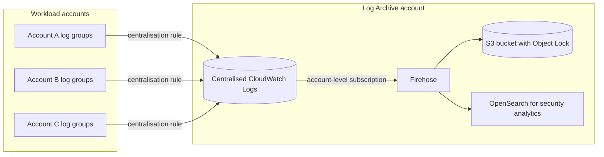

Workload teams keep their own logs for day-to-day operations; the organisation keeps an immutable, centrally governed copy that workload administrators cannot alter. This is the standard pattern for regulated industries and aligns with AWS Control Tower.

#### Pattern 3: log routing with FireLens (fan-out at the source)

Fluent Bit sends errors to CloudWatch Logs (for alarms and quick queries) and the full stream to Firehose (for cheap archive and OpenSearch). This is a ==fan-out== pattern at collection time, reducing CloudWatch ingestion cost while preserving complete data elsewhere.

#### Pattern 4: logs to metrics

Rather than alarming directly on logs, convert significant events into metrics (metric filters or EMF) and alarm on metrics. Metrics are cheaper to store, faster to evaluate and easier to graph. Logs remain the evidence you drill into after the alarm fires.

#### Pattern 5: event-driven log reaction

A subscription filter with a narrow pattern (for example repeated `AuthenticationFailed` events) invokes a Lambda function that takes an action such as adding an IP address to a WAF IP set, or publishes an event to EventBridge for the incident automation described in [Section 7.3.2](../unit7/topic3.md#automated-incident-response-with-aws-lambda). This is the ==event-driven== pattern from [Chapter 1.7](../unit1/topic7.md) applied to operational data.

#### Pattern 6: tiered storage by value

| Tier | Store | Retention | Example data |
|------|-------|-----------|--------------|
| Hot, operational | CloudWatch Logs Standard | 7 to 30 days | Application logs used for alarms and debugging |
| Warm, investigative | CloudWatch Logs Infrequent Access or OpenSearch UltraWarm | 30 to 180 days | Access logs, verbose logs |
| Cold, compliance | S3 Glacier storage classes | Years | Audit records |

#### Pattern 7: correlation across asynchronous boundaries

Apply the propagation rule from [Correlation IDs and trace context](#correlation-ids-and-trace-context) to every broker: message attributes (SQS, SNS), event detail (EventBridge) and record headers (Kinesis, Kafka), logged at every consumer. Combined with Logs Insights queries across several log groups, this reconstructs sagas and choreographed workflows ([Chapter 4.3](../unit4/topic3.md)).

### Industry Use Cases

| Industry | Use case | Why CloudWatch Logs |
|----------|----------|---------------------|
| E-commerce | Tracing failed checkouts across order, payment and inventory services | Correlation IDs across ECS and Lambda log groups; metric filters on payment failures |
| Banking and fintech | Immutable audit logging of transactions and administrative actions | KMS encryption, Log Archive account, S3 Object Lock copies, deletion protection |
| Healthcare | Access logging for systems handling patient data | Data protection masking, least-privilege read access, compliance scope |
| SaaS | Per-tenant troubleshooting and noisy-tenant detection | `tenantId` in structured logs; field indexes on tenant; per-tenant metric dimensions only when low cardinality |
| Media streaming | High-volume CDN and player logs | Vended CloudFront logs to S3 for analytics; errors to CloudWatch for alarms |
| Government and public sector | Centralised logging across agencies' accounts | Organisation centralisation, data residency within chosen Regions |
| Telecommunications | Network function logs from containerised 5G core on EKS | Fluent Bit DaemonSets, OpenSearch for search, CloudWatch for alarms |
| Education | Learning platform with seasonal peaks (examination periods) | Automatic scaling of ingestion without capacity planning |

!!! example "A university results portal"
    A college publishes examination results through an API Gateway and Lambda portal backed by DynamoDB. On results day, traffic rises a hundredfold. Structured access logs with the request ID, Lambda JSON logs with the same ID, and a metric filter on `ResultLookupFailed` let the operations team see within one minute that failures come from one malformed student-number format, fix the validation, and confirm recovery in Live Tail, all without any logging infrastructure to scale.

### Advantages

| Advantage | Explanation |
|-----------|-------------|
| Zero infrastructure | No collectors, indexers or disks to operate or scale |
| Native integration | Lambda, ECS, EKS, API Gateway, VPC, CloudTrail and many more deliver logs without custom code |
| Governance in one place | Retention, encryption, masking, access control and deletion protection per log group |
| Logs to metrics | Metric filters and EMF connect logs directly to alarms |
| Flexible routing | Subscription filters and centralisation feed S3, OpenSearch, Kinesis and partners |
| Multi-account ready | Centralisation rules and cross-account observability |
| Consumption pricing | Pay per GB with no fixed cost; Infrequent Access and tiered vended pricing for volume |
| Security | KMS, IAM, VPC endpoints, data protection, CloudTrail audit |

### Limitations

| Limitation | Trade-off or workaround |
|------------|-------------------------|
| Ingestion cost at high volume | Reduce at source; Infrequent Access; direct-to-S3 delivery |
| Not an inverted-index search engine | OpenSearch for heavy full-text and dashboard workloads |
| Immutable log class | Decide before creation; create a new group and switch writers if wrong |
| Metric filters not retroactive | Create filters early; use Logs Insights for historical analysis |
| Few subscription filters per group | Fan out through Kinesis or Firehose; account-level policies |
| Batch export limits | Firehose for continuous archival |
| Regional scope | Centralisation rules or cross-account observability |
| Retention values are fixed steps | Choose the nearest value above the requirement |
| Blocking versus non-blocking trade-off in containers | Choose per service; monitor buffer drops |

### Common Mistakes

#### Beginner Mistakes

| Mistake | Consequence | Correction |
|---------|-------------|------------|
| Logging unstructured prose | Queries require fragile `parse` expressions; metric filters are brittle | Structured JSON with a shared schema |
| Writing logs to files inside containers | Logs vanish with the task or pod | Log to `stdout` and `stderr` |
| No correlation ID | Cannot follow a request across services | Generate at the edge and propagate everywhere |
| Leaving retention at never expire | Storage cost grows forever | Set retention in IaC |
| One log group for everything | Coarse access control and expensive queries | One group per service per environment |
| Printing whole objects or requests | Secrets and personal data in logs, large volume | Log selected fields only |
| Giving the ECS task role log permissions for `awslogs` | Tasks fail to start with log driver errors | Grant log permissions to the task execution role |
| Private subnets without NAT or a Logs VPC endpoint | Fargate tasks cannot deliver logs and fail to start | Add the `logs` interface endpoint |

#### Production Mistakes

| Mistake | Consequence | Correction |
|---------|-------------|------------|
| DEBUG logging left on in production | Log bill exceeds compute bill | INFO by default, dynamic level control, alarms on volume |
| Auto-created log groups | No retention, no KMS key, inconsistent names | Pre-create in IaC; Config rule to detect drift |
| Blocking log mode without monitoring | Logging throttle causes application outage | Non-blocking by default; if blocking, monitor back-pressure |
| Infrequent Access chosen for an alarmed log group | Metric filters and subscriptions cannot be created | Standard for any group feeding automation |
| High-cardinality metric filter dimensions | Thousands of custom metrics and a large bill | Low-cardinality dimensions; EMF for deliberate metrics |
| Subscription loop | A Lambda destination logs to a group that is itself subscribed, recursively | Exclude destination log groups from account-level policies |
| No alarm on missing logs | A broken shipper hides an incident | Heartbeat metric filters with default value 0 |
| Workload administrators can delete security logs | Evidence can be erased after compromise | Central Log Archive account, deletion protection, SCPs |
| KMS key policy changed carelessly | Ingestion and queries fail | Change control on log keys |
| Large stack traces split into many events | Hard to read and query | Multi-line patterns in drivers and Fluent Bit |

### Summary

CloudWatch Logs is the aggregation layer of AWS observability. It receives events from every compute model and from AWS services themselves, stores them in log groups whose settings (class, retention, encryption, data protection, filters, indexes) encode the architect's governance decisions, and routes them onward to metrics, alarms, real-time consumers, archives and search engines.

Architectural lessons:

- ==Logs must leave the workload immediately.== Ephemeral containers and functions make local log files meaningless.
- ==Structure is the foundation.== JSON with a shared schema, trace IDs and correlation IDs is what makes every later query, metric and correlation possible.
- ==The log group is the unit of governance.== Name it, classify it, set its retention and key, and define it in IaC before code runs.
- ==Logging must never take down the application.== Prefer non-blocking delivery and bounded buffers.
- ==Convert signals, keep evidence.== Metric filters and EMF feed alarms; logs remain the detailed evidence.
- ==Centralise for security.== A Log Archive account with centralisation rules keeps evidence outside the reach of compromised workloads.
- ==Every log line is a recurring cost.== Control volume at the source, choose the right class and destination, and expire what you do not need.

## Log Analysis with Amazon CloudWatch Logs Insights

### Definition

==CloudWatch Logs Insights is a fully managed, interactive, pay-per-query log analytics capability of CloudWatch Logs that scans log events in selected log groups over a chosen time range and filters, parses, aggregates and visualises them using a pipe-based query language, OpenSearch Piped Processing Language (PPL) or OpenSearch SQL.==

Logs Insights needs no setup: any log group in CloudWatch Logs can be queried immediately, including historical data ingested before anyone thought of the question. It is the ==investigation tool== of the logging stack: engineers use it during incidents, while debugging, and for ad hoc operational and security analysis. Since June 2026 the default console experience is ==CloudWatch Log Analytics==, a unified interface that brings Logs Insights queries, Live Tail and Contributor Insights together with tabs, facets, saved queries and visualisations; the query engine and pricing are those of Logs Insights.

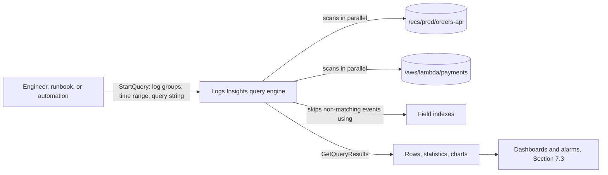

### Why This Service or Concept Exists

#### The problem: logs that cannot be questioned

Aggregating logs in one place solves only half the problem. During an incident an engineer must answer questions such as:

- "How many 5xx responses did the checkout service return in the last 30 minutes, per minute?"
- "Which customers were affected by the payment failures?"
- "What happened to order o-1001 across all services?"
- "Is this error new since the last deployment, or has it always been there?"

Before interactive log query engines, the options were poor: download log files and use `grep` (impossible at scale and slow), write custom scripts against the `FilterLogEvents` API (which returns raw events without aggregation), or ship everything to a separately operated search cluster (costly and slow to set up). The questions are often unknown in advance, so pre-computing metrics for every possible question is also impossible.

#### Why AWS built Logs Insights

AWS introduced Logs Insights in 2018 to provide ==schema-on-read analytics==: store logs cheaply as they are, and impose structure at query time. The engine distributes each query across many workers, scans the selected data in parallel, and returns aggregated results in seconds for typical operational volumes. Because the price is per gigabyte scanned, a team that queries rarely pays almost nothing, and there is no cluster to size. Subsequent additions (field indexes in 2024, OpenSearch PPL and SQL in December 2024, scheduled queries in November 2025, joins, lookups and the Log Analytics experience in 2026) moved it from a simple search tool towards a general log analytics engine.

#### Benefits over older methods

| Concern | `grep` over files | `FilterLogEvents` scripts | Self-managed search cluster | Logs Insights |
|---------|-------------------|---------------------------|-----------------------------|---------------|
| Setup | Access to hosts | Custom code | Cluster build and ingestion pipeline | None |
| Aggregation (counts, percentiles) | Manual | Manual | Yes | Yes, built in |
| Works on historical data already ingested | If files still exist | Yes | Only data indexed after setup | Yes |
| Cost when idle | None | None | Cluster runs continuously | None |
| Cross-service correlation | Very hard | Hard | Yes | Yes, across up to thousands of log groups |
| Visualisation | No | No | Yes | Yes, time series and bar charts |

!!! tip "Schema on read versus schema on write"
    Logs Insights applies structure at ==read== time: it discovers JSON fields and parses text when the query runs. OpenSearch (7.2.3) applies structure at ==write== time: it maps and indexes fields during ingestion. Schema on read is flexible and cheap to store but costs compute on every query; schema on write is expensive to ingest and store but makes repeated queries fast. This single trade-off explains most of the difference between the two tools.

### Core Concepts

#### Anatomy of a query execution

Every Logs Insights query has four inputs:

| Input | Meaning | Architect's note |
|-------|---------|------------------|
| Log group selection | Which log groups to scan: up to 50 by name, or up to 10,000 through prefixes, "all log groups", data sources or the `SOURCE` command | The biggest single influence on cost |
| Time range | Absolute or relative (last 15 minutes, last 7 days) | The second biggest influence on cost |
| Query language | Logs Insights QL, OpenSearch PPL or OpenSearch SQL | Chosen per query |
| Query string | The commands to run | Filters placed early reduce work, but not bytes scanned unless indexes apply |

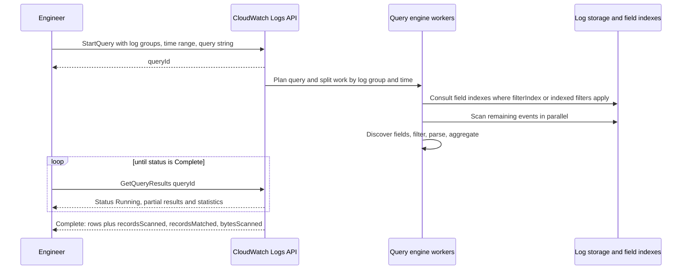

The query API is ==asynchronous==: `StartQuery` returns a query ID, and the caller polls `GetQueryResults` until the status is `Complete`, `Failed`, `Cancelled` or `Timeout`. Results include statistics (`recordsMatched`, `recordsScanned`, `bytesScanned`) which are the basis of cost control.

#### System fields and discovered fields

Logs Insights automatically provides ==system fields== for every event:

| Field | Meaning |
|-------|---------|
| `@timestamp` | Event timestamp |
| `@message` | The raw event text |
| `@logStream` | Name of the log stream |
| `@log` | Log group identifier (account ID and log group name) |
| `@ingestionTime` | When CloudWatch Logs received the event |
| `@aws.account`, `@aws.region` | Source account and Region, notably for centralised or cross-account data |

For ==JSON events==, Logs Insights discovers fields automatically, flattening nested objects with dots (`requestContext.identity.sourceIp`) and arrays with indices (`items.0.sku`). For many AWS log types (Lambda, VPC Flow Logs, Route 53, CloudTrail, API Gateway access logs in known formats) it also generates fields. Lambda `REPORT` lines, for example, yield:

| Lambda field | Meaning |
|--------------|---------|
| `@type` | Record type such as `REPORT` |
| `@requestId` | Invocation request ID |
| `@duration`, `@billedDuration` | Execution and billed duration in milliseconds |
| `@memorySize`, `@maxMemoryUsed` | Configured and peak memory in bytes |

Text logs with no structure must be parsed at query time with `parse` (below).

#### The command pipeline

A Logs Insights QL query is a sequence of commands separated by the pipe character `|`. Each command receives the output of the previous one.

```text
fields @timestamp, service, level, message, correlationId
| filter level = "ERROR" and service = "payments-api"
| sort @timestamp desc
| limit 50
```

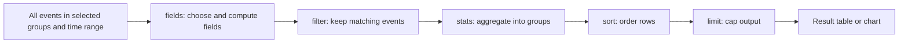

| Command | Purpose | Example |
|---------|---------|---------|
| `fields` | Select fields and create computed fields | `fields @timestamp, durationMs / 1000 as seconds` |
| `display` | Choose which fields appear in the output only | `display @timestamp, message` |
| `filter` | Keep events matching a Boolean expression | `filter statusCode >= 500` |
| `stats` | Aggregate, optionally grouped `by` fields or time bins | `stats count(*) by service` |
| `sort` | Order results `asc` or `desc` | `sort errors desc` |
| `limit` | Maximum rows returned | `limit 20` |
| `parse` | Extract fields from text with glob or regular expression | `parse @message "user=* action=*" as user, action` |
| `dedup` | Remove duplicate rows by field values | `dedup correlationId` |
| `pattern` | Cluster events into patterns | `pattern @message` |
| `diff` | Compare patterns with the previous equal-length period | Placed after `pattern @message` |
| `anomaly` | Detect unusual patterns with machine learning | Placed after `pattern @message` |
| `unnest` | Expand a JSON array into one row per element | Flatten batch records |
| `unmask` | Show masked data (requires `logs:Unmask`) | `fields unmask(@message)` |
| `filterIndex` | Restrict scanning to events known, via field indexes, to match | `filterIndex orderId = "o-1001"` |
| `SOURCE` | Select log groups by prefix, account or class (CLI and API only) | `SOURCE logGroups(namePrefix: ['/ecs/prod'])` |
| `join`, sub-queries, `lookup` | Correlate across log groups and enrich with reference tables | See below |

!!! info "A growing command set"
    AWS has added many analytical commands to Logs Insights QL since 2025, including `join`, sub-queries, `lookup`, `cidrlookup`, `sessionize`, `outlier`, `accum`, `autoregress`, `fillmissing`, `filldown`, `countFrequent`, `logcompare`, `appendcols`, `addtotals` and `estimate` (which reports the bytes a query would scan without running it). This part concentrates on the core commands that every engineer needs and on the correlation features; consult the Logs Insights QL reference for the full, current list and exact syntax.

#### Filtering

`filter` supports comparison operators (`=`, `!=`, `<`, `<=`, `>`, `>=`), Boolean `and`, `or`, `not`, set membership (`in`), regular expressions (`like /regex/` or `=~ /regex/`), and functions such as `ispresent(field)`:

```text
filter level in ["ERROR", "FATAL"]
    and not ispresent(retryAttempt)
    and @message like /Timeout|Connection reset/
```

Case-insensitive regular expressions use the `(?i)` flag: `filter @message like /(?i)timeout/`.

!!! warning "Filtering does not reduce bytes scanned by itself"
    Without field indexes, Logs Insights must read every event in the selected log groups and time range to evaluate a `filter`. A selective filter makes the query return fewer rows and aggregate faster, but ==the bill is based on bytes scanned==, which only shrinks when you narrow the log groups, narrow the time range, or use indexed fields.

#### Aggregation with stats and time bins

`stats` computes aggregates and turns logs into numbers:

| Function | Meaning |
|----------|---------|
| `count(*)`, `count(field)` | Number of events, or of events where the field is present |
| `count_distinct(field)` | Approximate number of distinct values |
| `sum`, `avg`, `min`, `max`, `stddev` | Numeric aggregates |
| `pct(field, p)` | Percentile, for example `pct(durationMs, 99)` |
| `earliest(field)`, `latest(field)` | Value from the earliest or latest event |
| `sortsFirst(field)`, `sortsLast(field)` | Value that sorts first or last |

Grouping by `bin(period)` produces a time series, which the console renders as a line or stacked area chart:

```text
filter service = "checkout"
| stats count(*) as requests,
        sum(statusCode >= 500) as errors,
        pct(durationMs, 99) as p99
  by bin(1m)
```

This single query produces the RED metrics (Rate, Errors, Duration) introduced in [Chapter 1.3](../unit1/topic3.md), computed from logs after the fact, which is exactly what you need when no metric was defined in advance.

!!! tip "When to use a query and when to use a metric"
    A query computes the answer when you ask; a metric (from EMF or a metric filter) computes it continuously. Use queries for ==investigation and unknown questions==; convert questions you ask every day into metrics, which are cheaper to evaluate repeatedly and support alarms natively.

#### Parsing unstructured text

`parse` extracts fields from `@message` or another field, either with a ==glob== pattern (asterisks as placeholders) or a ==regular expression== with named capture groups:

```text
# Glob: an nginx-style line "GET /orders/17 200 0.123"
parse @message "* * * *" as method, path, status, latency

# Regular expression with named groups
parse @message /user=(?<user>\S+)\s+ip=(?<ip>\d+\.\d+\.\d+\.\d+)/
| stats count(*) by user, ip
```

Parsing is powerful but fragile: a change in message wording breaks it. Prefer structured logs, and use `parse` for legacy systems and third-party formats (or, better, a transformer at ingestion, 7.2.1).

#### Pattern analysis: finding the unknown unknowns

Most queries look for something you already suspect. `pattern` finds what you did not know to look for: it clusters events into ==patterns== by replacing variable tokens (numbers, IDs, IP addresses) with placeholders, and reports each pattern with its count and ratio.

```text
filter level = "ERROR"
| pattern @message
```

A result such as `Timeout calling <*> after <*> ms` with 94 per cent of errors tells an engineer in seconds where to look, even across millions of events. Two related capabilities build on patterns:

| Capability | What it answers |
|-----------|-----------------|
| `diff` (and "compare to previous time range" in the console) | Which patterns are new, gone, or changed in frequency compared with the previous equal-length period? Ideal immediately after a deployment |
| `anomaly` | Which patterns are statistically unusual in this time range? |
| Log anomaly detectors (7.2.1) | Continuous background detection on a log group, with alarms |

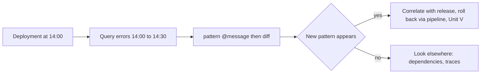

#### Correlation across log groups

Correlating by correlation ID is the everyday use of centralised logs. The simplest form selects several log groups and filters on the shared field:

```text
fields @timestamp, @log, service, event, message
| filter correlationId = "c-7f3e9a"
| sort @timestamp asc
```

The `@log` field shows which log group each row came from, so the result reads as a timeline of the request across services. Richer correlation is available through:

- ==`join`==, which combines events from two log groups on a matching field (syntax of the form `join type=inner left=a right=b where a.requestId = b.requestId`), for example joining API Gateway access logs with backend error logs;
- ==sub-queries==, where the output of an inner query scopes an outer query (for example: find principals with repeated access denied errors, then list everything else those principals did);
- ==lookup tables==, uploaded reference data (for example account ID to owning team and environment) used with the `lookup` command to enrich results; scheduled queries can refresh lookup tables automatically.

!!! note "Filter before joining"
    Joins multiply work. Filter each side as narrowly as possible before the join and choose a short time range. The same principle applies in SQL: push predicates down.

#### Field indexes and filterIndex

A ==field index== (configured with an index policy on a log group or account, 7.2.1) records which events contain which values of a JSON field. When a query filters on an indexed field with equality or `IN`, Logs Insights skips events that cannot match, reducing both scan time and ==bytes scanned==.

| Aspect | Behaviour |
|--------|-----------|
| Supported data | JSON and AWS service logs in the Standard class |
| Operators accelerated | Equality (`=`) and `IN` |
| Coverage | Only events ingested after the policy was created; indexed events remain indexed for 30 days from ingestion |
| Default indexes | Provided automatically for fields such as `@logStream`, `@aws.region`, `@aws.account`, `traceId` and, for some AWS log types, source-specific fields (for example CloudTrail `eventName`, VPC Flow Logs `action`); these do not count toward your quota |
| Case sensitivity | Field names are case-sensitive; `RequestId` and `requestId` are different |
| `filter` versus `filterIndex` | `filter` on an indexed field still scans unindexed log groups fully; `filterIndex` ==skips log groups that lack the index== and scans only matching events in indexed groups |

```text
# Find everything that happened to one order across up to 10,000 log groups
fields @timestamp, @log, event, message
| filterIndex orderId = "o-1001"
| sort @timestamp asc
```

!!! tip "What to index"
    Index fields that are ==high in selectivity and frequently used for lookup==: `requestId`, `correlationId`, `orderId`, `tenantId`, `userId`, `traceId`. Do not index low-selectivity fields such as `level` (most events are INFO) because skipping gains little. Low-cardinality fields (fewer than about 100 distinct values per day) can instead be configured as ==facets== for point-and-click exploration in the Log Analytics console.

#### Log group selection at scale

| Method | Scope | Where available |
|--------|-------|-----------------|
| Log group names | Up to 50 named groups | Console, CLI, API |
| Prefixes | Up to 5 name prefixes | Console (log group criteria), `SOURCE` |
| All log groups | Every group in the account (Standard or Infrequent Access class) | Console |
| Accounts | Source accounts in a cross-account observability monitoring account | Console, `SOURCE` with `accountIdentifier` |
| Data sources | Log types such as CloudTrail or VPC Flow Logs, independent of group names | Console, PPL, SQL |
| Overall ceiling | A selection that matches more than 10,000 log groups returns an error | All |

```text
SOURCE logGroups(namePrefix: ['/ecs/prod', '/aws/lambda/prod-'])
| filterIndex tenantId = "t-042"
| stats count(*) by @log
```

#### Query languages: Logs Insights QL, OpenSearch PPL and OpenSearch SQL

Since December 2024 Logs Insights accepts three languages. They query the same data at the same price per GB scanned.

| Aspect | Logs Insights QL | OpenSearch PPL | OpenSearch SQL |
|--------|------------------|----------------|----------------|
| Style | Pipe-based, purpose-built for logs | Pipe-based, from OpenSearch | Declarative SQL |
| Strengths | Concise, `pattern`, `diff`, `anomaly`, `filterIndex`, comparison queries, broad command set | Familiar to OpenSearch users; `eval`, `where`, `head`, joins; same syntax as in OpenSearch Dashboards | Familiar to every database student; `GROUP BY`, `HAVING`, window functions, joins, JSON functions |
| Log class support | Standard and Infrequent Access | Standard only | Standard only |
| Concurrency quota | 100 concurrent queries per account (including dashboard queries) | 15 concurrent PPL or SQL queries per account | Shared with PPL |
| Best for | Day-to-day investigation | Teams standardising on OpenSearch | Analysts and complex relational questions |

The same question in all three languages ("error count per service in the selected time range"):

=== "Logs Insights QL"

    ```text
    filter level = "ERROR"
    | stats count(*) as errors by service
    | sort errors desc
    ```

=== "OpenSearch PPL"

    ```text
    fields service, level
    | where level = 'ERROR'
    | stats count() as errors by service
    | sort - errors
    ```

=== "OpenSearch SQL"

    ```sql
    SELECT service, COUNT(*) AS errors
    FROM `logGroups(logGroupIdentifier: ['/ecs/prod/orders-api', '/ecs/prod/payments-api'])`
    WHERE level = 'ERROR'
    GROUP BY service
    ORDER BY errors DESC
    ```

!!! note "SQL and PPL specifics"
    In SQL, a single log group is referenced in backticks (``FROM `/ecs/prod/orders-api` ``) and several with the `logGroups(logGroupIdentifier: [...])` form, up to 50 groups; fields containing special characters such as `@message` must be enclosed in backticks. SQL allows one `JOIN` per `SELECT` (inner or left outer) and one level of sub-query. PPL scopes data with `source = [...]`, which in the console is replaced by the log group picker. Check the current documentation for supported functions, because both languages are evolving.

#### Natural-language query generation

The ==query generator== converts a question in plain English ("show the ten slowest checkout requests in the last hour with their correlation IDs") into a Logs Insights QL, PPL or SQL query, and can explain an existing query. It is useful for learning and for occasional users, but the generated query must be ==reviewed before trusting its result==: check the log groups, time range, field names and aggregation. It is not available for Infrequent Access log groups.

#### Saved queries, parameters and runbooks

A ==query definition== (saved query) stores a query string, a name (which can include folder-style prefixes such as `payments/errors-by-type`) and optionally a default set of log groups. Saved queries can include ==parameters== written as `{{parameterName}}` with default values, which turns a query into a reusable template:

```text
fields @timestamp, @log, event, message
| filter correlationId = "{{correlationId}}"
| sort @timestamp asc
```

Saved queries belong in incident ==runbooks== ([Section 7.3.2](../unit7/topic3.md#automated-incident-response-with-aws-lambda)): the on-call engineer opens the runbook, supplies the order ID, and runs a tested query rather than writing one under pressure. Define them in infrastructure as code (`AWS::Logs::QueryDefinition`) so that they are versioned and reviewed.

#### Scheduled queries

==Scheduled queries== (November 2025) run a query on a cron schedule (UTC) and deliver results to Amazon S3 (JSON result rows), to Amazon EventBridge (query metadata and statistics, with rows retrievable by query ID) or to a ==lookup table==. They support all three languages. They require an IAM role that CloudWatch Logs assumes to run the query, and a delivery role for the destination. Typical uses are daily security reports, weekly cost-of-logging reports per team, refreshing lookup tables, and triggering automation through EventBridge when a query result crosses a threshold.

#### Results, visualisation and limits of interactivity

| Aspect | Behaviour |
|--------|-----------|
| Rows returned | Up to 10,000 rows per query |
| Query timeout | 60 minutes |
| Result availability | Results can be retrieved for 7 days |
| Visualisation | Queries with `stats ... by bin()` render as line, area or bar charts; results can be added to dashboards ([Section 7.3.1](../unit7/topic3.md#creating-cloudwatch-dashboards-and-alarms)) |
| Export | Copy or download results; scheduled queries write to S3 |
| Oldest queryable data | Data ingested from November 2018 onwards, within retention |

### AWS Service Deep Dive

#### Purpose

Logs Insights gives engineers, analysts and automation an on-demand, serverless way to extract answers from log data already stored in CloudWatch Logs, without building or running a separate analytics system.

#### Architecture

Logs Insights is not a separate datastore; it is a distributed query engine over CloudWatch Logs storage.

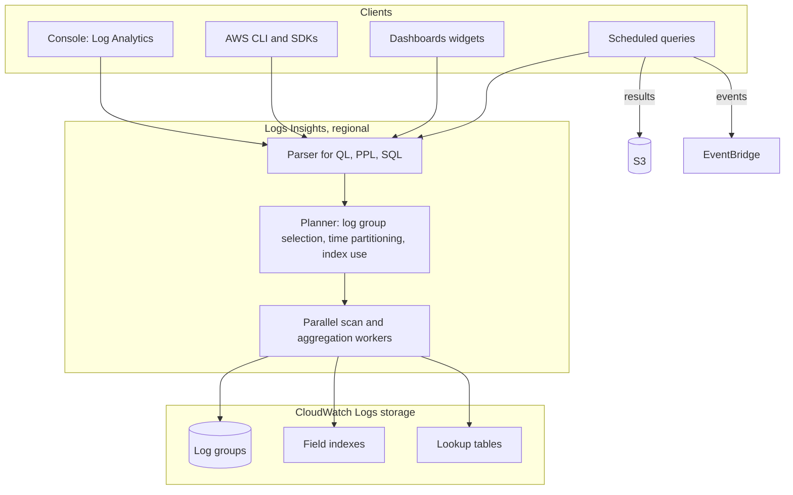

Key architectural properties:

- ==Serverless and regional.== Queries run in the Region of the log groups. Cross-account queries work from a monitoring account configured with CloudWatch cross-account observability ([Section 7.1](../unit7/topic1.md)); cross-Region analysis requires centralisation (7.2.1).
- ==Asynchronous API.== `StartQuery`, `GetQueryResults`, `StopQuery`, `DescribeQueries`; plus `PutQueryDefinition` for saved queries and the scheduled query APIs.
- ==Schema on read.== Fields are discovered or parsed per query; no schema is stored except for field indexes and facets.

#### Important Features

| Feature | Summary |
|---------|---------|
| Three query languages | Logs Insights QL, OpenSearch PPL, OpenSearch SQL |
| Automatic field discovery | JSON and many AWS log formats |
| Aggregation and time series | `stats` with percentiles and `bin()` |
| Pattern, diff and anomaly analysis | Machine-assisted discovery of unknown problems |
| Correlation | Multi-log-group queries, `join`, sub-queries, lookup tables |
| Field indexes and `filterIndex` | Lower latency and cost for selective lookups |
| Scale | Up to 10,000 log groups per query via criteria, `SOURCE` or data sources |
| Query generator | Natural-language to query, and query explanation |
| Saved queries with parameters | Reusable, shareable templates |
| Scheduled queries | Cron-driven queries to S3, EventBridge or lookup tables |
| Facets | Point-and-click filtering on low-cardinality fields |
| Cross-account | From a monitoring account |
| Data protection awareness | Masked data stays masked unless the caller has `logs:Unmask` |

#### Limitations

- ==Scan-based cost and latency.== Every query without applicable indexes reads all selected data; wide time ranges over large groups are slow and costly.
- ==Row limit== of 10,000 per query; large extracts need scheduled queries to S3, export or Athena.
- ==Concurrency quotas== (100 QL, 15 PPL or SQL per account), shared with dashboards; many dashboards refreshing automatically can starve interactive users.
- ==No persistent materialisation.== Each query recomputes from raw data; repeated heavy dashboards are better served by metrics or OpenSearch.
- ==Regional.== No single query spans Regions without centralisation.
- ==Language feature gaps.== Some commands are exclusive to one language; PPL and SQL do not support Infrequent Access log groups.
- ==Field indexes cover recent data only== (30 days from ingestion) and only after the policy exists.

#### Pricing Model and recommendations

!!! info "Pricing figures"
    Indicative us-east-1 prices as of 2026; verify on the Amazon CloudWatch pricing page.

| Dimension | How it is charged | Indicative price |
|-----------|-------------------|------------------|
| Logs Insights queries (any language, any log class) | Per GB of data scanned | USD 0.005 per GB |
| Free tier | Shared 5 GB monthly allowance across ingestion, storage and scanning | Included |
| Query generator | No separate charge for generation; the query itself is billed per GB scanned | Check pricing page |
| Scheduled queries | Billed as the queries they run, plus destination costs (S3, EventBridge) | Per GB scanned |
| Dashboard widgets | Each refresh runs the query and is billed per GB scanned | Per GB scanned |
| Field indexes | Check current pricing; the benefit is fewer GB scanned | Check pricing page |

!!! example "Worked estimate: the cost of a dashboard"
    A Logs Insights dashboard widget queries the last 24 hours of a log group that ingests 50 GB per day. Each refresh scans about 50 GB, costing 50 x 0.005 = USD 0.25. If the dashboard auto-refreshes every 5 minutes, 24 hours a day, that is 288 refreshes per day, about USD 72 per day or USD 2,160 per month, for one widget. The same number from a metric filter or EMF metric costs a few cents. ==Queries are for questions; metrics are for screens that are always on.==

The resulting recommendations (narrow scopes, field indexes, metrics instead of always-on widgets, scheduled queries) are consolidated in [Cost Optimization](#cost-optimization_1) below.

#### Performance Characteristics

| Factor | Effect on latency |
|--------|-------------------|
| Bytes scanned | Dominant factor; latency grows with data volume |
| Number of log groups | More groups, more parallelism but more planning overhead |
| Field index use | Can reduce scanned events dramatically for selective lookups |
| `parse` with complex regular expressions | Adds CPU per event |
| High-cardinality `stats ... by` | Larger aggregation state |
| `sort` over large result sets | Additional work before limit |

Typical interactive queries over a few gigabytes complete in seconds; queries over terabytes can take minutes and may approach the 60-minute timeout.

#### Scaling Behaviour

The engine scales out automatically per query. The architect's scaling concerns are the account-level concurrency quotas, the `StartQuery` and `GetQueryResults` API rate quotas for automation, and the growth of data volume, which increases both latency and cost linearly unless indexes or narrower scopes are used.

#### Availability

Logs Insights is a regional capability of CloudWatch Logs with the same multi-AZ foundation. Design runbooks so that critical investigation does not depend on a single dashboard: keep saved queries and CLI scripts available as alternatives.

#### Security Features

| Control | Purpose |
|---------|---------|
| IAM actions | `logs:StartQuery`, `logs:GetQueryResults`, `logs:StopQuery`, `logs:DescribeQueries`, `logs:PutQueryDefinition`, `logs:DeleteQueryDefinition` |
| Resource scoping | `StartQuery` is authorised against the log group ARNs queried |
| `logs:Unmask` | Required to view data masked by data protection policies |
| KMS | Queries of encrypted log groups require the key policy to permit CloudWatch Logs use |
| Cross-account observability | Monitoring account access controlled by Observability Access Manager links and policies |
| CloudTrail | Records query API calls, including the query string, for audit |

#### Service Limits

!!! info "Quotas"
    Indicative values as of 2026; verify in the CloudWatch Logs quotas documentation.

| Limit | Value |
|-------|-------|
| Log groups per query by name | 50 |
| Log groups per query via criteria, `SOURCE` or data sources | Up to 10,000 |
| Name prefixes in `SOURCE` or criteria | 5 |
| Account identifiers in `SOURCE` | 20 |
| Concurrent Logs Insights QL queries | 100 per account, including dashboard queries |
| Concurrent PPL or SQL queries | 15 per account |
| Query timeout | 60 minutes |
| Rows returned | 10,000 |
| Query result retention | 7 days |
| SQL `logGroups()` identifiers | 50 |
| `StartQuery` and `GetQueryResults` API rates | 10 transactions per second each (indicative) |

### Important AWS Terminology

| Term | Meaning |
|------|---------|
| Logs Insights QL | The purpose-built, pipe-based query language of Logs Insights |
| OpenSearch PPL | Piped Processing Language from OpenSearch, supported in Logs Insights |
| OpenSearch SQL | SQL dialect from OpenSearch, supported in Logs Insights |
| Log Analytics | Unified console experience combining Logs Insights, Live Tail and Contributor Insights |
| Schema on read | Structure applied at query time rather than at ingestion |
| System field | Field provided for every event, prefixed with `@` |
| Discovered field | Field extracted automatically from JSON or a known log format |
| `bin()` | Function that groups events into fixed time buckets |
| `pct()` | Percentile aggregation function |
| Pattern | Cluster of events sharing structure, with variable tokens replaced |
| `diff` | Comparison of patterns with the previous period |
| Field index | Index on a field that allows queries to skip events |
| `filterIndex` | Command that restricts scanning to indexed log groups and matching events |
| Facet | Low-cardinality field offered for point-and-click filtering |
| `SOURCE` | Command selecting log groups by prefix, account or class |
| Data source | Log type (for example CloudTrail) usable as a query scope |
| Query definition | A saved query, optionally parameterised |
| Scheduled query | A query run on a cron schedule with results delivered to a destination |
| Lookup table | Uploaded reference data used to enrich query results |
| Bytes scanned | The billing measure for Logs Insights |
| Monitoring account | Account that can query linked source accounts through cross-account observability |

### Configuration Options

#### Query execution options

| Option | Values | Guidance |
|--------|--------|----------|
| `logGroupIdentifiers` or `logGroupNames` | Names or ARNs (ARNs required cross-account) | Choose precisely |
| `startTime`, `endTime` | Epoch seconds | Shortest window that answers the question |
| `queryLanguage` | `CWLI`, `PPL`, `SQL` | QL by default; SQL for analysts |
| `limit` | Up to 10,000 | Keep small for interactive work |
| Log class selection | Standard or Infrequent Access | Queries target one class at a time in the console |

#### Field index policy

| Setting | Guidance |
|---------|----------|
| Scope | Log group policy for a service's specific fields; account-level policy (optionally for a prefix) for organisation-wide fields such as `correlationId` |
| Fields | High-selectivity lookup fields; respect the per-policy field quota |
| Facets | Configure low-cardinality fields (service, environment, status class) as facets |
| Timing | Create before incidents: only events ingested afterwards are indexed |

```json
{
  "Fields": ["correlationId", "orderId", "tenantId", "requestId"]
}
```

#### Saved and scheduled query settings

| Setting | Guidance |
|---------|----------|
| Name | Use folder-style names: `payments/errors-by-type`, `security/root-activity` |
| Parameters | `{{name}}` with safe defaults |
| Default log groups | Attach to avoid running against the wrong scope |
| Schedule | Cron in UTC; avoid frequencies higher than the business need |
| Time window | Match the schedule interval (hourly schedule, one-hour window) to avoid double counting |
| Destination | S3 for reports and archives, EventBridge for automation, lookup table for enrichment |
| Roles | Separate execution and delivery roles with least privilege |

### Design Considerations

#### Scalability

Query scale is bounded by bytes scanned. Architect for it: consistent log group naming so prefixes select exactly the right scope, field indexes on lookup fields, centralisation so that one query covers many accounts, and metrics for anything queried continuously.

#### Availability

During a major incident many engineers query at once while dashboards refresh. The 100-query concurrency quota can be reached. Keep incident dashboards metric-based and reserve Logs Insights capacity for investigation.

#### Reliability

Query results are only as reliable as the logs. Missing correlation IDs, inconsistent field names and events dropped at ingestion all produce silently incomplete answers. Validate important saved queries regularly against known test events.

#### Durability

Logs Insights stores query results for 7 days only. Evidence needed for post-incident reviews or audits should be exported (scheduled query to S3, or download attached to the incident record).

#### Latency

Seconds for focused queries, minutes for broad ones. For sub-second repeated exploration over large volumes, OpenSearch with indexed data is the appropriate tool (7.2.3).

#### Cost

Cost equals bytes scanned multiplied by price, multiplied by the number of times the query runs. The multiplier matters most: an automated query every minute costs 1,440 times more per day than a query run once.

#### Performance

Structured logs avoid `parse`; indexed fields avoid full scans; narrow selections avoid planning overhead.

#### Maintainability

Store saved queries, index policies and scheduled queries in IaC. Name fields consistently across services so that one query works across all of them.

#### Operational complexity

Low: there is nothing to run. The complexity is organisational: training engineers in the query languages, curating a library of trusted queries, and governing who can query and unmask what.

!!! question "Before you write a dashboard widget with Logs Insights"
    How often will it refresh, and how many bytes will each refresh scan? Could a metric filter or EMF metric provide the same number? Is the query concurrency quota shared with incident responders? Does the widget reveal data (such as user identifiers) to viewers who should not see it?

### AWS Best Practices

| Pillar | Logs Insights practice |
|--------|------------------------|
| Operational Excellence | Curated, parameterised saved queries in runbooks; queries defined in IaC; `diff` after every deployment; post-incident query evidence exported |
| Security | Least-privilege `StartQuery` scoped to log group prefixes; `logs:Unmask` granted rarely; audit query activity in CloudTrail; cross-account access through a monitoring account rather than shared credentials |
| Reliability | Consistent schemas and correlation IDs so queries are complete; alternative CLI scripts when the console is unavailable |
| Performance Efficiency | Field indexes, `filterIndex`, narrow scopes, structured logs, metrics for repeated questions |
| Cost Optimization | Minimise bytes scanned; limit dashboard auto-refresh; scheduled queries instead of repeated manual runs |
| Sustainability | Every scan consumes compute; avoid wasteful repeated wide queries; index what you look up often |

### Security Considerations

#### IAM and least privilege

Grant query rights per team on log group prefixes. Because `StartQuery` is authorised against each queried log group, a user who selects a group outside their permissions receives an access denied error rather than partial data.

```json
{
  "Version": "2012-10-17",
  "Statement": [
    {
      "Sid": "RunQueriesOnTeamLogGroups",
      "Effect": "Allow",
      "Action": ["logs:StartQuery"],
      "Resource": "arn:aws:logs:us-east-1:111122223333:log-group:/ecs/prod/orders-*"
    },
    {
      "Sid": "ReadResultsAndManageQueries",
      "Effect": "Allow",
      "Action": [
        "logs:GetQueryResults",
        "logs:StopQuery",
        "logs:DescribeQueries",
        "logs:DescribeQueryDefinitions",
        "logs:DescribeLogGroups"
      ],
      "Resource": "*"
    },
    {
      "Sid": "NeverUnmask",
      "Effect": "Deny",
      "Action": "logs:Unmask",
      "Resource": "*"
    }
  ]
}
```

#### Masked data and unmask

When a data protection policy masks a field, Logs Insights returns masked values. Only principals with `logs:Unmask` can use the `unmask()` function to see original values, and every such query is recorded in CloudTrail. Treat `logs:Unmask` like access to a production database containing personal data.

#### Encryption

Log groups encrypted with customer managed KMS keys remain queryable provided the key policy allows CloudWatch Logs to use the key. Scheduled query execution roles also need `kms:Decrypt` on such keys.

#### Query strings are logged

CloudTrail records the query string of `StartQuery`. Do not paste secrets or personal data into query strings (for example searching for a full card number); search for identifiers instead.

#### Cross-account access

Use CloudWatch cross-account observability (monitoring and source accounts linked through Observability Access Manager) or centralisation, rather than sharing IAM users across accounts. Restrict which source accounts and which telemetry types (logs, metrics, traces) are shared.

#### Compliance

Query results downloaded to laptops or pasted into tickets leave the controlled environment. Establish rules for handling query output that contains personal data, consistent with the organisation's data protection obligations.

### Performance Optimization

#### Query optimisation checklist

| Technique | Why it helps |
|-----------|--------------|
| Narrow the time range first | Bytes scanned scale with time |
| Select only relevant log groups or prefixes | Bytes scanned scale with groups |
| Use `filterIndex` on indexed fields | Skips unindexed groups and non-matching events |
| Filter early in the pipeline | Less data flows to `parse`, `stats` and `sort` |
| Use structured fields instead of `parse` | Avoids per-event regular expression cost |
| Anchor and simplify regular expressions | Cheaper matching |
| Limit `stats ... by` to low-cardinality groups | Smaller aggregation state |
| Use `limit` with `sort` | Smaller result transfer |
| Run `estimate` before broad queries | Know the scan size in advance |
| Prefer metrics for always-on views | Avoid repeated scans |

#### Caching and reuse

Logs Insights does not offer a user-controlled result cache. Reuse happens at the design level: scheduled queries write results to S3 for many readers, lookup tables precompute enrichment, and metrics precompute aggregates.

#### Parallelism

The engine parallelises across log groups and time. Automation that needs many independent answers can run several queries concurrently within the quota, polling with backoff.

#### Monitoring query usage

Review query statistics (`bytesScanned`) in automation and CloudTrail `StartQuery` events to find expensive recurring queries and dashboards. Cost Explorer shows Logs Insights scanning under CloudWatch usage types.

### Cost Optimization

| Technique | Effect |
|-----------|--------|
| Pay per query | No cost when nobody queries |
| Narrow scopes | Select the fewest log groups and the shortest time range; cost falls in direct proportion. Check `estimate` (or the console's scanned-bytes information) before wide queries |
| Field indexes and `filterIndex` | Large reductions for ID lookups across many groups |
| Metrics instead of always-on query widgets | Avoids thousands of repeated scans |
| Scheduled queries with appropriate frequency | Replace ad hoc repetition; avoid over-frequent schedules |
| Infrequent Access log class | Same query price, lower ingestion; queryable when needed |
| Archive and Athena for multi-year analysis | Cheaper for very large historical scans over compressed columnar data |
| Cost allocation | Tag log groups; review Cost Explorer for query spend |

!!! info "Reserved capacity and Savings Plans"
    There is no reserved capacity for Logs Insights. If an organisation runs heavy, continuous analytical workloads over logs, the question becomes whether indexed storage in OpenSearch (with reserved instances) is cheaper than repeated scanning, which is the subject of 7.2.3.

### Integration with Other AWS Services

| Service | Integration | Why |
|---------|-------------|-----|
| CloudWatch dashboards | Logs Insights widgets | Visualise query results ([Section 7.3.1](../unit7/topic3.md#creating-cloudwatch-dashboards-and-alarms)), with the cost caveat above |
| CloudWatch alarms | Alarms on metrics derived from logs; Logs Insights results can back alarms through supported query-based alarm features | Alert on log-derived conditions ([Section 7.3.1](../unit7/topic3.md#creating-cloudwatch-dashboards-and-alarms)) |
| Amazon EventBridge | Scheduled query results | Trigger automation such as Lambda or Step Functions ([Section 7.3.2](../unit7/topic3.md#automated-incident-response-with-aws-lambda)) |
| Amazon S3 | Scheduled query results, exports | Reports and archives |
| AWS Lambda | Automation using `StartQuery` | Enrich incident tickets with query output |
| Amazon OpenSearch Service | Shared PPL and SQL; direct query over CloudWatch Logs | Same language in both tools (7.2.3) |
| CloudWatch cross-account observability | Monitoring account queries | Organisation-wide investigation |
| AWS X-Ray and Application Signals | Trace ID in logs links to traces | Move between trace and log views ([Section 7.1](../unit7/topic1.md)) |
| Amazon Q Developer and CloudWatch investigations | Automated investigation uses log queries | [Section 7.3.2](../unit7/topic3.md#automated-incident-response-with-aws-lambda) |

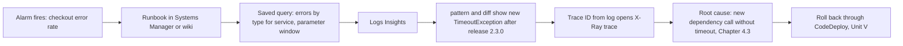

### Common Architecture Patterns

The following query patterns recur across almost every cloud-native system. They are shown in Logs Insights QL and assume the structured schema from 7.2.1.

#### Pattern 1: RED metrics from access logs

```text
filter ispresent(status)
| stats count(*) as requests,
        sum(status >= 500) as errors,
        sum(status >= 500) * 100 / count(*) as errorRatePct,
        pct(responseLatency, 50) as p50,
        pct(responseLatency, 99) as p99
  by bin(5m)
```

#### Pattern 2: top-N offenders

```text
filter level = "ERROR"
| stats count(*) as errors by service, errorType
| sort errors desc
| limit 10
```

#### Pattern 3: request timeline by correlation ID

```text
fields @timestamp, @log, service, event, message
| filterIndex correlationId = "{{correlationId}}"
| sort @timestamp asc
```

#### Pattern 4: slowest requests with context

```text
filter ispresent(durationMs)
| sort durationMs desc
| display @timestamp, service, path, durationMs, correlationId, traceId
| limit 20
```

#### Pattern 5: Lambda right-sizing and cold starts

```text
filter @type = "REPORT"
| stats max(@maxMemoryUsed / 1024 / 1024) as maxUsedMB,
        max(@memorySize / 1024 / 1024) as configuredMB,
        pct(@duration, 99) as p99DurationMs,
        count(*) as invocations
  by bin(1h)
```

A function configured with 1,024 MB whose maximum used memory is 180 MB is over-provisioned; [Section 7.3.3](../unit7/topic3.md#performance-optimization-using-aws-tools) covers right-sizing tools.

#### Pattern 6: deployment regression check

```text
filter level in ["ERROR", "FATAL"]
| pattern @message
| diff
```

Run over the 30 minutes after a deployment; new patterns are candidate regressions, and the check can be automated as a pipeline stage (Unit V).

#### Pattern 7: per-tenant impact

```text
filter event = "PaymentDeclined"
| stats count(*) as declines, count_distinct(customerId) as customers by tenantId
| sort declines desc
```

#### Pattern 8: security investigation over VPC Flow Logs

```text
filter action = "REJECT"
| stats count(*) as rejects by srcAddr, dstPort
| sort rejects desc
| limit 25
```

#### Pattern 9: failed authentication bursts

```text
filter event = "AuthenticationFailed"
| stats count(*) as failures by sourceIp, bin(5m)
| filter failures > 20
| sort failures desc
```

#### Pattern 10: queue consumer lag evidence (Chapter 6.3)

```text
filter event = "MessageProcessed"
| fields (processedAt - sentTimestamp) / 1000 as ageSeconds
| stats avg(ageSeconds) as avgAge, max(ageSeconds) as maxAge by bin(5m)
```

!!! tip "Build a query library"
    Store these patterns as parameterised saved queries per service. A library of 20 trusted queries shortens most incident investigations more than any new tool.

### Industry Use Cases

| Industry | Use case | Logs Insights technique |
|----------|----------|-------------------------|
| E-commerce | Flash-sale incident triage | RED by `bin(1m)`, top-N errors, `diff` after hotfix |
| Fintech | Tracing a disputed transaction | `filterIndex` on transaction ID across services and accounts |
| SaaS | Identifying the tenant causing load | `stats` by `tenantId`, facets on tenant tier |
| Security operations | Investigating suspicious API activity | SQL joins between CloudTrail and VPC Flow Logs by source IP; lookup table of account owners |
| Media | Player error spikes by device type | `stats` by `deviceType`, `pattern` on error messages |
| Serverless platforms | Cost and memory tuning | Lambda `REPORT` analysis |
| Public sector and education | Peak-period capacity analysis (examination results, tax deadlines) | Request rate percentiles per endpoint |

### Advantages

| Advantage | Explanation |
|-----------|-------------|
| Zero setup | Query any CloudWatch Logs data immediately, including history |
| Pay per use | USD 0.005 per GB scanned; no idle cost |
| Three languages | QL for concision, PPL for OpenSearch users, SQL for analysts |
| Unknown-unknown discovery | `pattern`, `diff` and `anomaly` |
| Scale | Thousands of log groups and cross-account queries |
| Correlation | Multi-group filters, joins, sub-queries, lookups |
| Integrated | Dashboards, scheduled queries, EventBridge, runbooks |
| Governed | IAM, masking and CloudTrail audit apply automatically |

### Limitations

| Limitation | Trade-off or workaround |
|------------|-------------------------|
| Cost and latency proportional to scan | Indexes, narrow scopes, metrics |
| 10,000-row result limit | Scheduled queries to S3, export, Athena |
| Concurrency quotas | Metric-based dashboards; reserve capacity for incidents |
| Results kept 7 days | Export evidence |
| PPL and SQL only on Standard class | Use QL for Infrequent Access groups |
| Field indexes forward-only and 30-day coverage | Create indexes early; full scans for older data |
| Regional scope | Centralise logs |
| Recomputes every time | OpenSearch or metrics for repeated heavy analytics |

### Common Mistakes

#### Beginner Mistakes

| Mistake | Consequence | Correction |
|---------|-------------|------------|
| Querying "last 30 days" for a problem that started an hour ago | Slow, expensive query | Start narrow, widen only if needed |
| Selecting all log groups by habit | Large scans and noisy results | Select the service's groups or a precise prefix |
| Case mismatch in field names | Zero results | Check discovered fields; agree a schema |
| Assuming `filter` reduces cost | Unexpected bill | Understand bytes scanned; use indexes |
| Using `parse` on JSON logs | Fragile, slow | Reference discovered JSON fields directly |
| Forgetting `bin()` for charts | No visualisation | `stats ... by bin(5m)` |
| Trusting a generated query blindly | Wrong conclusions | Review scope, fields and aggregation |

#### Production Mistakes

| Mistake | Consequence | Correction |
|---------|-------------|------------|
| Always-on dashboards built on wide Logs Insights queries | Large recurring cost; concurrency exhaustion during incidents | Metrics for always-on views |
| No field indexes on correlation fields | Slow, costly incident lookups across many groups | Account-level index policy on `correlationId`, `requestId` |
| Queries written during incidents from scratch | Delay and errors under pressure | Curated, tested, parameterised saved queries in runbooks |
| Granting broad `logs:*` to everyone | Unmasking and deletion rights spread widely | Scoped query policies; deny `logs:Unmask` by default |
| Scheduled query window not matching schedule | Double counting or gaps | Align window with interval |
| Relying on query results as the only evidence | Evidence lost after 7 days | Export to S3 or the incident record |
| Inconsistent field names across services | Cross-service queries silently miss data | Organisation logging schema and shared libraries |
| Query results used as proof of absence | "No errors found" when the query scoped the wrong groups, class or Region | Confirm scope and `recordsScanned` before concluding; test saved queries against known events |
| Pasting personal data into query strings | Personal data recorded in CloudTrail `StartQuery` events | Search by identifiers such as `orderId`, never by card numbers or passwords |

!!! danger "The silent zero"
    The most dangerous Logs Insights result is an empty table. An empty result can mean "nothing happened", but it can equally mean that the query selected the wrong log groups, the wrong log class, the wrong Region or account, the wrong time zone, or a field name with the wrong case. Before an empty result is used to close an incident or answer an auditor, check `recordsScanned` in the query statistics: if few or no records were scanned, the query did not look where you thought it looked.

### Summary

CloudWatch Logs Insights turns aggregated log data into answers. It is a serverless, schema-on-read query engine that scans selected log groups over a time range, discovers structure in JSON and AWS log formats, and filters, parses, aggregates, correlates and visualises events using Logs Insights QL, OpenSearch PPL or OpenSearch SQL. Pattern, diff and anomaly analysis help find problems nobody anticipated; field indexes and `filterIndex` make lookups by identifier fast and cheap across thousands of log groups; saved, parameterised and scheduled queries turn individual expertise into shared, repeatable operations.

Architectural lessons:

- ==Queries are for questions; metrics are for screens.== Pay per GB scanned is ideal for investigation and ruinous for always-on dashboards.
- ==Cost equals bytes scanned multiplied by how often you ask.== Narrow log groups and time ranges first; filters alone do not reduce cost.
- ==Index what you look up.== Field indexes on correlation and business identifiers, created before they are needed, make cross-service lookups cheap.
- ==Structure at write time pays at read time.== Consistent JSON field names across services are what make one query work everywhere.
- ==Look for the unknown.== `pattern` and `diff` after every deployment catch regressions that no alarm was designed for.
- ==Operationalise expertise.== Tested, parameterised saved queries in runbooks and IaC beat heroic query writing during incidents.
- ==Check the scope before trusting an empty result.== `recordsScanned` distinguishes "nothing happened" from "looked in the wrong place".

## Log Storage and Analytics with Amazon OpenSearch Service

### Definition

==Amazon OpenSearch Service is a managed service that deploys, operates and scales OpenSearch, an open-source, distributed search and analytics engine, so that data such as logs, metrics, traces and documents can be indexed at write time and then searched, aggregated and visualised interactively with low latency.==

The service offers three ways to use the engine:

| Offering | What you manage | What you pay for | Typical logging use |
|----------|-----------------|------------------|---------------------|
| Managed domains (provisioned clusters) | Instance types, node counts, storage, shard strategy, index lifecycle | Instance hours plus storage | Large, steady log analytics and security analytics platforms |
| OpenSearch Serverless (collections) | Collections, indexes, capacity limits, access policies | OpenSearch Compute Units (OCU) hours plus storage | Variable or spiky workloads, teams without cluster expertise |
| Direct query (zero-ETL) | A data source connection and optional indexed views | OCU hours while queries run, plus source-side charges | Occasional OpenSearch-style analysis of data left in CloudWatch Logs, S3 or Security Lake |

Around these sit ==Amazon OpenSearch Ingestion==, a serverless pipeline service that collects, transforms and delivers data into OpenSearch, and ==OpenSearch Dashboards== and ==OpenSearch UI==, the visual interfaces for exploration and dashboards.

In the AWS architecture map OpenSearch Service belongs to the ==Analytics== category. In a logging architecture it is the store-and-search stage: logs are aggregated in CloudWatch Logs (7.2.1), queried ad hoc with Logs Insights (7.2.2), and the streams that need continuous, interactive, full-text analysis are indexed in OpenSearch.

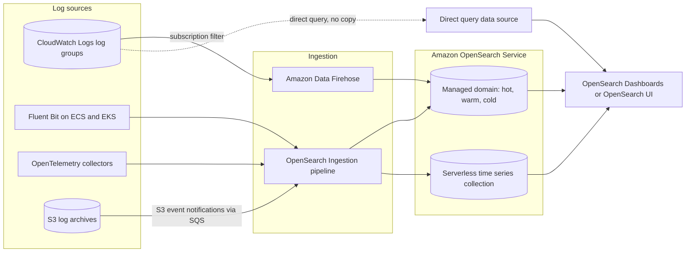

### Why This Service or Concept Exists

#### The problem: questions asked continuously over very large log volumes

Logs Insights answers occasional questions well because it pays for work only when asked. Some logging workloads, however, ask the same kinds of questions continuously over very large data:

- A security operations centre keeps dashboards of authentication failures, firewall rejections and suspicious API calls open all day, with analysts pivoting interactively across months of data.
- A support team searches free text ("customer says the invoice mentions an unknown address") across billions of events and expects relevance-ranked results in under a second.
- A platform team runs detectors and correlation rules every minute over the same streams.
- Product teams build long-lived analytics over application events with drill-down and faceted navigation.

With a scan-based engine each of these interactions re-reads the raw data. At sufficient scale and frequency, re-reading becomes slower and more expensive than paying once to build an index and then answering every question from it.

#### Why AWS built OpenSearch Service

Elasticsearch and its visualisation tool Kibana became the dominant open-source log analytics stack in the 2010s (the "ELK" stack with Logstash). Operating it well was hard: capacity planning, shard balancing, JVM heap tuning, upgrades, snapshots, node replacement and security hardening all fell on the user. AWS launched Amazon Elasticsearch Service in 2015 to manage these tasks. In 2021, after Elastic changed the licence of Elasticsearch, AWS and the community forked version 7.10.2 as ==OpenSearch== under the Apache 2.0 licence, and the service was renamed Amazon OpenSearch Service. The OpenSearch project has been governed by the OpenSearch Software Foundation under the Linux Foundation since 2024, and the managed service supports OpenSearch versions up to 3.x (3.7 at the time of writing) as well as legacy Elasticsearch versions for existing domains.

AWS then addressed the remaining operational burden in stages: OpenSearch Serverless (2023) removed cluster sizing; OpenSearch Ingestion (2023) removed self-managed Logstash or Data Prepper fleets; zero-ETL direct query (2023 to 2024) removed the need to copy data for occasional analysis; OpenSearch Optimized instances and multi-tier storage reduced storage cost; and in 2026 an engine mode optimised for log analytics added columnar storage for analytical queries.

#### Benefits over older methods

| Concern | Self-managed ELK on EC2 | Logs Insights only | Amazon OpenSearch Service |
|---------|-------------------------|--------------------|---------------------------|
| Operational effort | Very high: patches, upgrades, node failures, snapshots | None | Low (domains) to very low (Serverless) |
| Full-text relevance search | Yes | No; regular expressions and equality only | Yes |
| Repeated interactive queries over large data | Fast once indexed | Rescans each time | Fast once indexed |
| Rich dashboards and exploration | Kibana | CloudWatch dashboards and Log Analytics | OpenSearch Dashboards, OpenSearch UI |
| Detectors, correlation rules, security analytics | Plugins to install and maintain | Anomaly detection on patterns | Built-in plugins |
| Tiered storage for cost | Hand-built | Log classes | Hot, UltraWarm, cold, writable warm |
| Cost when idle | Cluster runs continuously | None | Domain runs continuously; Serverless NextGen can scale to zero for search workloads |

!!! note "OpenSearch is not a replacement for CloudWatch Logs"
    OpenSearch is a ==second copy== of selected log data, optimised for search; CloudWatch Logs remains the landing zone (see [Designing a Centralised Logging Architecture](#designing-a-centralised-logging-architecture)). The architectural question is never "CloudWatch or OpenSearch" but "which streams justify indexed storage, for how long?"

### Core Concepts

#### Documents, indices and mappings

OpenSearch stores ==documents==: JSON objects, each with a unique `_id`. A structured log event from 7.2.1 becomes one document. Documents are stored in an ==index==, a logical collection comparable to a table. Each index has a ==mapping== that declares the type of every field.

| Relational analogy | OpenSearch concept | Logging example |
|--------------------|-------------------|-----------------|
| Database | Domain or collection | `logs-prod` domain |
| Table | Index (or data stream) | `logs-orders-2026.09.26` |
| Row | Document | One log event |
| Column | Field | `service`, `status`, `durationMs` |
| Schema | Mapping | `status` is `integer`, `message` is `text` |
| Index (B-tree) | Inverted index, doc values, BKD trees | Per field, built automatically |

The field types that matter most for logs are:

| Type | Purpose | Example fields |
|------|---------|----------------|
| `keyword` | Exact values: filtering, sorting, aggregations | `service`, `level`, `correlationId`, `orderId` |
| `text` | Analysed full-text: split into terms for relevance search | `message`, `stackTrace` |
| `date` | Timestamps, range queries, date histograms | `@timestamp` |
| `integer`, `long`, `float` | Numeric ranges and statistics | `status`, `durationMs` |
| `ip` | IPv4 and IPv6 addresses, CIDR queries | `sourceIp` |
| `object`, `flat_object` | Nested JSON; `flat_object` avoids mapping explosion for arbitrary keys | `requestContext` |

!!! warning "Dynamic mapping and mapping explosion"
    If no mapping is declared, OpenSearch infers types from the first document it sees (dynamic mapping). This is convenient for experiments and dangerous in production: a field first seen as `"123"` becomes `text` with a `keyword` sub-field; a later numeric value may be rejected; and applications that log arbitrary keys (for example a map of HTTP headers or user-supplied attributes) create thousands of fields. The default limit is 1,000 fields per index; every field consumes memory in the cluster state. Declare mappings in ==index templates==, disable dynamic mapping for untrusted objects, and keep the logging schema from 7.2.1 disciplined.

#### The inverted index: why search is fast

The core data structure of OpenSearch (inherited from Apache Lucene) is the ==inverted index==. For each analysed `text` field, the engine breaks every value into terms and records, for each term, the list of documents that contain it (a ==postings list==). Answering "which events contain `timeout` and `psp-2`?" becomes an intersection of two short lists rather than a scan of every event.

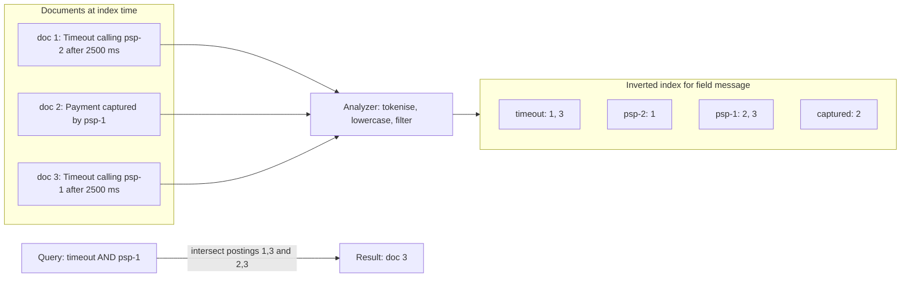

Other per-field structures complement it: ==doc values== (a column-oriented store used for sorting and aggregations on `keyword`, numeric and date fields) and ==BKD trees== for numeric, date and IP range queries. Building these structures at ingestion is the price of fast queries: indexing consumes CPU, and the index occupies storage in addition to the original `_source` document.

This is the ==schema-on-write== side of the trade-off introduced in 7.2.2:

| Aspect | Schema on read (Logs Insights) | Schema on write (OpenSearch) |
|--------|-------------------------------|------------------------------|
| Work done at ingestion | Minimal: store the event | Parse, map, build inverted index and doc values |
| Work done per query | Scan and interpret all selected data | Look up indexes; touch only matching documents |
| Storage overhead | Compressed raw events | Source plus index structures, plus replicas |
| Flexibility | Any question on any past data | Questions limited by mapping choices; re-index to change |
| Best when | Questions are occasional and unpredictable | The same large data is queried often and interactively |

#### Shards, replicas and segments

An index is split into ==primary shards==, each a self-contained Lucene index that can live on a different node. Each primary can have ==replica shards==, full copies on other nodes (and, in a multi-AZ domain, in other Availability Zones). Primaries accept writes; replicas provide redundancy and additional read capacity.

```mermaid
flowchart TB
    subgraph AZa["Availability Zone a"]
        N1["Data node 1: P0, R2"]
    end
    subgraph AZb["Availability Zone b"]
        N2["Data node 2: P1, R0"]
    end
    subgraph AZc["Availability Zone c"]
        N3["Data node 3: P2, R1"]
    end
    IDX["Index logs-orders-2026.09.26: 3 primaries, 1 replica each"] --> N1
    IDX --> N2
    IDX --> N3
```

Inside each shard, newly indexed documents are buffered in memory and written to immutable files called ==segments== at each ==refresh== (by default every second on standard instances; OpenSearch Serverless and OpenSearch Optimized instances use about 10 seconds). A document becomes searchable only after a refresh, so OpenSearch is ==near real time==, not immediately consistent. Background ==merges== combine small segments into larger ones.

Key sizing rules from AWS guidance:

| Rule | Guidance | Why |
|------|----------|-----|
| Shard size for log analytics | 30 to 50 GiB per shard | Large enough to avoid overhead of many small shards, small enough to recover and relocate quickly |
| Shard size for search workloads | 10 to 30 GiB per shard | Lower query latency per shard |
| Shards per heap | At most about 25 shards per GiB of JVM heap | Every shard consumes memory and cluster-state resources |
| Shards per node | Hard limits apply (for OpenSearch 2.17 and later, 1,000 per 16 GiB of heap up to 4,000) | Protects cluster stability |
| Primary count | Fixed at index creation (changing requires split, shrink or reindex) | Decide before the first document |
| Primary shards on OpenSearch Optimized instances | Often equal to, or a multiple of, the number of data nodes | Spreads indexing evenly |

The AWS formula for primary shards is:

```text
primary shards ≈ (source data + room to grow) × (1 + indexing overhead) / desired shard size
```

!!! example "Worked sizing for daily log indices"
    A platform ingests 300 GiB of raw logs per day and keeps 14 days hot. Assume indexing overhead of 10 per cent and a target shard size of 40 GiB. Daily index size is about 300 × 1.1 = 330 GiB, so each daily index needs about 330 / 40 ≈ 8 primaries (choose 9 to divide evenly across 3 or 9 nodes). With one replica, each day stores about 660 GiB, and 14 days about 9.2 TiB, plus roughly 25 per cent free-space headroom for merges and node failure, giving about 11.5 TiB of hot storage. Shard count is 14 × 9 × 2 = 252 shards, comfortably within limits for a cluster of six to nine large data nodes. The same arithmetic shows why a single daily index with the default of 5 primaries would be wrong: each shard would hold 66 GiB, beyond the recommended range.

!!! danger "The small-shard trap"
    The most common OpenSearch production failure in logging is ==too many small shards==: one index per service per day, each with 5 primaries and 1 replica, across 200 services for 90 days gives 180,000 shards holding a few megabytes each. The cluster manager struggles to maintain cluster state, heap fills with per-shard overhead, and the cluster becomes unstable long before storage is full. Consolidate indices (by environment or by service group rather than by service), use rollover by size rather than by calendar day for small streams, and monitor shard count per node.

#### Time-series indices, index templates, aliases and data streams

Logs are time-series data: written once, queried mostly while recent, and deleted after a retention period. OpenSearch handles them with ==time-based indices== rather than one ever-growing index, because deleting an entire old index is cheap while deleting individual documents is expensive.

| Mechanism | Purpose |
|-----------|---------|
| Index template | Applies settings (shards, replicas, refresh interval, codec) and mappings automatically to every new index whose name matches a pattern such as `logs-*` |
| Component template | Reusable building block (for example a shared ECS or OpenTelemetry field mapping) composed into index templates |
| Alias | A stable name (such as `logs-orders-write`) pointing to one or more indices, so writers and readers are decoupled from physical index names |
| Rollover | Creates a new backing index when the current one reaches a size, age or document count threshold, and moves the write alias |
| Data stream | A named, append-only abstraction (`logs-orders`) backed by hidden, automatically rolled-over indices; requires an `@timestamp` field |

```mermaid
sequenceDiagram
    participant W as Writer, Fluent Bit or Ingestion pipeline
    participant DS as Data stream logs-orders
    participant B1 as Backing index 000001
    participant B2 as Backing index 000002
    participant ISM as ISM policy
    W->>DS: Bulk index events
    DS->>B1: Append to current write index
    ISM->>B1: Check rollover condition every cycle
    Note over ISM,B1: Primary shard size exceeds 40 GiB
    ISM->>DS: Roll over
    DS->>B2: Create new write index from template
    W->>DS: Bulk index events
    DS->>B2: Append
    ISM->>B1: Later: move to warm, then delete at retention age
```

!!! tip "Prefer size-based rollover"
    Rolling over daily produces shards of wildly different sizes: a busy service creates 200 GiB indices and a quiet one creates 50 MiB indices. Rolling over on ==primary shard size== (for example 40 GiB) with a maximum age (for example 1 day) keeps shards within the recommended range for every stream.

#### Index State Management

==Index State Management (ISM)== is the OpenSearch plugin that automates the lifecycle of indices, playing the role that retention settings play in CloudWatch Logs and lifecycle rules play in S3. An ISM ==policy== is a state machine: each index attached to the policy is in one ==state== at a time, performs ==actions== on entering the state, and moves to another state when a ==transition== condition becomes true.

```mermaid
stateDiagram-v2
    [*] --> hot
    hot --> warm: index age 7 days after rollover, warm_migration to UltraWarm
    warm --> cold: index age 30 days, cold_migration
    cold --> delete: index age 365 days
    delete --> [*]
```

In the `hot` state the policy performs `rollover` (for example at 40 GiB primary shard size or one day); on entering `warm` it migrates the index to UltraWarm, where it becomes read-only; on entering `cold` it detaches the index from compute; and finally it deletes it.

| ISM action | Effect |
|------------|--------|
| `rollover` | Create a new write index when conditions are met |
| `replica_count` | Change replicas (for example reduce to 0 on warm storage that is already durable) |
| `force_merge` | Merge segments to reduce overhead on read-only indices |
| `read_only` | Block writes |
| `warm_migration` | Move the index to UltraWarm |
| `cold_migration`, `cold_delete` | Move to or delete from cold storage |
| `snapshot` | Take a snapshot to a registered repository |
| `delete` | Delete the index |
| `notification` | Send a message through a configured channel |

ISM policies apply automatically to new indices through an `ism_template` pattern.

#### Storage tiers

OpenSearch Service domains offer storage tiers that trade query speed for cost. The choice of tier is the single largest cost lever for log retention.

| Tier | Backing | Writable | Query speed | Relative cost | Requirements |
|------|---------|----------|-------------|---------------|--------------|
| Hot | EBS volumes or local NVMe on data nodes (OpenSearch Optimized instances also copy to S3) | Yes | Fastest | Highest | Any data node type |
| UltraWarm | Amazon S3 with a local cache on `ultrawarm1` nodes | No (read-only until returned to hot) | Slower for uncached data | Much lower per GiB; no replicas needed because S3 provides durability | Dedicated master nodes; not with T2 or T3 data nodes |
| Cold | Amazon S3 only, detached from compute | No; must be migrated back to UltraWarm to query | Not directly queryable | Lowest; storage only | UltraWarm enabled |
| Writable warm (multi-tier storage) | `oi2` warm nodes with local NVMe cache and S3 | Yes | Between hot and UltraWarm | Lower than hot | OpenSearch 3.3 or later; OpenSearch Optimized hot nodes; no cold tier |

!!! info "Two warm-tier architectures"
    Since December 2025 domains can choose between the established ==UltraWarm and cold== architecture (read-only warm, plus a cold tier) and the newer ==multi-tier storage== architecture with a writable warm tier on OI2 instances (late-arriving data can still be written to warm indices, but there is no cold tier). A domain uses one architecture or the other. Verify current requirements in the multi-tier storage documentation before designing, because this area is evolving quickly.

#### Instance families for logging

| Family | Examples | Characteristics | Logging fit |
|--------|----------|-----------------|-------------|
| General purpose | `m7g`, `m8g` | Balanced CPU and memory | Small and medium clusters, dedicated master nodes |
| Memory optimised | `r7g`, `r8g` | More memory per vCPU for heap and caches | Query-heavy analytics, many shards |
| Storage optimised | `i4g`, `im4gn` | Large local NVMe | High-throughput hot tiers with large data |
| OpenSearch Optimized | `or1`, `or2`, `om2`, `oi2` | Local storage plus synchronous copy to Amazon S3; segment replication; high indexing throughput per dollar | Indexing-heavy log, observability and security analytics |
| Burstable | `t3.small`, `t3.medium` | Low cost, CPU credits; no UltraWarm, cold, Auto-Tune or standby | Development and learning only |

The ==OpenSearch Optimized== families deserve attention for logging. Because every write is copied synchronously to Amazon S3, a failed node can be recovered from S3, and replicas use ==segment replication== (copying finished segments rather than re-indexing each document), which frees CPU for ingestion. The trade-offs are that encryption at rest is mandatory, the refresh interval is at least 10 seconds, replicas can lag primaries by a few seconds, and moving a domain to these instances is irreversible.

#### The engine optimised for log analytics

In July 2026 AWS introduced an ==engine mode optimised for log analytics== for new domains running OpenSearch 3.5 or later on OpenSearch Optimized instances. It combines ==columnar storage in Apache Parquet format== and a vectorised execution engine for analytical queries with the Lucene inverted index for full-text search. AWS reports substantially lower storage and faster ingestion and aggregation for log workloads at no additional charge.

| Aspect | Standard engine | Optimised engine (log analytics) |
|--------|-----------------|---------------------------------|
| Selection | Default | Chosen at domain creation (engine mode `OPTIMIZED`, observability use case); permanent |
| Storage | Lucene segments with doc values | Parquet columnar data plus Lucene inverted index for full text |
| Query languages | Query DSL, PPL, SQL | PPL and SQL natively; query DSL not supported at launch |
| Instances | Any supported | OpenSearch Optimized hot instances (OR1, OR2, OM2); OI2 for warm |
| Cold tier | Available with UltraWarm | Not supported |
| Best for | Mixed search and analytics, applications using query DSL | High-volume log analytics queried with PPL or SQL |

!!! warning "New features need verification"
    The optimised engine is recent. Because the engine mode cannot be changed after domain creation and query DSL is not supported at launch, confirm that ingestion clients, dashboards and alerting monitors work with it in a test domain before committing a production platform.

#### OpenSearch Serverless

==OpenSearch Serverless== removes clusters from the user's view. You create a ==collection== (a group of indexes serving one workload), and the service provisions compute in ==OpenSearch Compute Units (OCUs)==, each roughly 6 GiB of memory with corresponding vCPU and data transfer to S3. Compute for ==indexing== and for ==search== is separate and scales independently, and Amazon S3 is the durable store for index data.

```mermaid
flowchart LR
    W["Writers: Ingestion pipeline, Firehose, Fluent Bit"] --> IE["Indexing OCUs"]
    IE -->|"write segments"| S3[("Amazon S3 index storage")]
    S3 -->|"fetch and cache"| SE["Search OCUs with local cache"]
    SE --> R["Readers: Dashboards, OpenSearch UI, APIs"]
    CAP["Account capacity limits: maximum indexing and search OCUs"] -.-> IE
    CAP -.-> SE
```

| Collection type | Intended workload | Storage behaviour | Notes for logging |
|-----------------|-------------------|-------------------|-------------------|
| Time series | Logs, metrics, events: append-heavy, queries mostly on recent data | Recent data cached on search OCUs; older data fetched from S3 | The type for logs; supports very large collections (AWS raised the limit to 100 TB in 2025); no custom document IDs or upserts |
| Search | Full-text application search | All data kept hot | For product catalogues, documents |
| Vector search | Semantic and retrieval-augmented generation search | All data kept hot | Not a logging type |

!!! info "Classic and next-generation collections"
    In 2026 AWS made a ==next generation== of OpenSearch Serverless generally available, with a new shared storage layer, much faster scaling, per-second billing and ==scale to zero== after a period of inactivity. At general availability the next generation supports search and vector collections; ==time series collections, the type used for log analytics, remain on the classic architecture==, which has minimum OCU charges (on the order of 2 OCUs for a production collection with redundancy, or 1 OCU for a development and test collection without standby replicas). Check the current documentation, because the set of supported collection types may have grown.

Serverless governance uses three kinds of policy instead of cluster settings:

| Policy | Controls | Example |
|--------|----------|---------|
| Encryption policy | Which KMS key encrypts matching collections (must exist before the collection is created) | Customer managed key for `logs-*` collections |
| Network policy | Public access or access through Serverless VPC endpoints, separately for the API and Dashboards | API reachable only from the observability VPC endpoint |
| Data access policy | Which IAM principals or SAML identities may perform which operations on which collections and indexes | Security team can read `logs-*` indexes; pipeline role can write |

Retention in time series collections is handled with ==data lifecycle policies== (for example delete documents older than 30 days) rather than ISM.

| Aspect | Managed domain | Serverless time series collection |
|--------|----------------|-----------------------------------|
| Capacity planning | You choose instances, nodes, storage, shards | Service scales OCUs within your limits |
| Shards and refresh | You configure | Managed automatically; refresh about 10 seconds |
| Storage tiers | Hot, UltraWarm, cold, writable warm | Managed caching over S3 |
| Lifecycle | ISM policies | Data lifecycle policies |
| Fine-grained access control | Security plugin with roles, document- and field-level security | Data access policies at collection and index level |
| Plugins and APIs | Broad set, including custom packages | Subset of APIs; no custom plugins; no manual snapshots |
| Cross-cluster search and replication | Supported | Not supported |
| Cost floor | At least one running node, typically three for production | Minimum OCUs on classic collections |
| Best for | Large, steady, cost-optimised platforms; teams with OpenSearch skills | Variable workloads; teams wanting minimal operations |

#### OpenSearch Ingestion

Getting data into OpenSearch reliably is harder than it looks: bulk requests must be batched and retried, back-pressure from the cluster must not lose data, documents must be parsed and enriched, and bad documents must go somewhere other than the floor. Historically teams ran fleets of Logstash or Data Prepper servers for this. ==Amazon OpenSearch Ingestion== is a serverless, managed pipeline service based on the open-source ==Data Prepper== project.

A pipeline has a ==source==, a ==buffer==, zero or more ==processors== and one or more ==sinks==, defined in YAML:

```mermaid
flowchart LR
    SRC["Source: HTTP, OpenTelemetry, S3 via SQS, Kinesis, Kafka, DynamoDB and others"] --> BUF["Buffer: in memory or persistent across AZs"]
    BUF --> P1["Processors: parse_json, grok, date, add_entries, drop_events, aggregate"]
    P1 --> RT{"Routes"}
    RT -->|"level is ERROR"| S1[("Sink: OpenSearch domain index")]
    RT -->|"all events"| S2[("Sink: Serverless collection or S3")]
    P1 -.->|"failed documents"| DLQ[("Dead-letter queue in S3")]
```

| Feature | What it provides |
|---------|------------------|
| Serverless scaling | Capacity in Ingestion OCUs (about 15 GiB memory and 2 vCPU each) between a configured minimum and maximum |
| Persistent buffering | Disk-based buffer replicated across AZs for push sources (HTTP, OpenTelemetry), retaining data up to 72 hours during sink outages |
| Back-pressure | Push sources return HTTP 408 or 429 so clients retry rather than data being dropped silently |
| Dead-letter queues | Failed documents written to S3 for inspection and replay |
| Conditional routing and pipeline chaining | Different events to different indexes or sinks; staged processing |
| End-to-end acknowledgement | For S3 sources, objects are acknowledged only after all sinks succeed |
| Blueprints | Ready-made configurations for common sources (for example VPC Flow Logs from S3, OpenTelemetry logs and traces, Fluent Bit) |
| Security | Pipeline IAM role for sink and source access; SigV4-authenticated ingestion endpoint; optional VPC endpoint; KMS for buffers |

!!! tip "Where OpenSearch Ingestion fits among ingestion options"
    Fluent Bit (7.2.1) collects logs from containers and nodes; OpenSearch Ingestion receives, buffers, transforms and indexes them at scale. A common EKS design is Fluent Bit DaemonSets sending over HTTP to an OpenSearch Ingestion pipeline, which routes to a domain. Firehose is the simpler choice when the source is a CloudWatch Logs subscription and little transformation is needed.

#### Ways to get CloudWatch Logs data into OpenSearch

| Path | How it works | Latency | Strengths | Weaknesses |
|------|--------------|---------|-----------|------------|
| Subscription filter to Lambda | The console's "Create OpenSearch subscription filter" creates a Lambda function that bulk-indexes events | Seconds | Simple for one or two log groups | Custom code to maintain; Lambda concurrency and retry behaviour must be managed; no managed buffering |
| Subscription filter to Amazon Data Firehose to OpenSearch | Firehose decompresses CloudWatch Logs payloads, can extract messages, buffers, optionally transforms with Lambda, delivers to a domain or Serverless collection, and backs up failed or all documents to S3 | Tens of seconds (buffer interval) | Fully managed, retries, S3 backup, supports cross-account destinations | Limited transformation; index rotation options rather than data streams |
| Subscription filter to Kinesis Data Streams to OpenSearch Ingestion | Pipeline with a Kinesis source parses and routes events | Seconds | Rich processing, routing, DLQ, multiple sinks | Two services to pay for and operate |
| Direct query (zero-ETL) | OpenSearch queries CloudWatch Logs in place; optional indexed views | Query-time | No duplicate storage or pipeline | Per-query OCU cost and CloudWatch scan cost; slower than indexed data |
| CloudWatch "Analyze with OpenSearch" integration | CloudWatch creates a Serverless collection and prebuilt dashboards for vended logs (VPC Flow Logs, CloudTrail, AWS WAF) | Near real time | Very quick start from the CloudWatch console | Opinionated; limited retention (at most 30 days) |

And for sources that do not need to pass through CloudWatch Logs at all:

| Path | When to choose |
|------|----------------|
| Fluent Bit (FireLens or DaemonSet) directly to an OpenSearch domain | Simple container logging where CloudWatch features are not needed for that stream |
| Fluent Bit or OpenTelemetry Collector to OpenSearch Ingestion | Scale, buffering, enrichment and routing for high-volume container logs and traces |
| S3 archive to OpenSearch Ingestion | Backfilling historical logs or indexing logs that services deliver to S3 (ALB, CloudFront, VPC Flow Logs to S3) |
| Direct query over S3 or Security Lake | Occasional analysis of large archives without indexing |

!!! note "Double ingestion is a cost decision"
    Sending a stream to both CloudWatch Logs and OpenSearch pays for ingestion and storage twice. That is often justified (CloudWatch for alarms, metric filters and native integrations; OpenSearch for search), but it should be deliberate. FireLens fan-out (7.2.1) can send only errors to CloudWatch Logs while the full stream goes to OpenSearch, or vice versa.

#### Direct query and zero-ETL integrations

==Direct query== lets OpenSearch analyse data that stays in its original store. You create a ==data source== connection (to CloudWatch Logs, Amazon S3 through the AWS Glue Data Catalog, or Amazon Security Lake) with an IAM role, and then query it from OpenSearch UI or Dashboards with PPL or SQL.

```mermaid
sequenceDiagram
    participant A as Analyst in OpenSearch UI
    participant DQ as Direct query engine, OCUs on demand
    participant CW as CloudWatch Logs
    participant SC as Serverless collection for indexed views
    A->>DQ: PPL query on data source cw_prod, log group payments
    DQ->>CW: Query log data in place with the data source IAM role
    CW-->>DQ: Matching events
    DQ-->>A: Results in Discover or a visualisation
    A->>DQ: Create indexed view for the security dashboard
    DQ->>CW: Periodic refresh queries
    DQ->>SC: Store materialised results
    A->>SC: Dashboard reads indexed view with low latency
```

| Query type | Behaviour | Cost |
|------------|-----------|------|
| Interactive query | Runs against the source each time | Direct query OCU hours while running, plus source charges (Logs Insights scanning for CloudWatch Logs; S3 requests for S3) |
| Indexed views (materialised views, skipping and covering indexes for S3) | Periodically ingest selected or aggregated data into an OpenSearch Serverless collection for fast dashboards | Indexing and search OCUs plus storage |

Direct query is the right choice when analysts want OpenSearch tools and PPL or SQL across data that is queried ==occasionally==, when duplicate storage is undesirable, or as a way to evaluate which streams deserve full indexing. It is the wrong choice for sub-second, high-frequency dashboards over large volumes, which still need indexed data.

!!! info "One language across both tools"
    CloudWatch Logs Insights (7.2.2) and OpenSearch share OpenSearch PPL and SQL. A query written by a security analyst in OpenSearch UI can usually be run in Logs Insights and vice versa, with small differences in supported commands. This shared language is part of AWS's strategy of letting logs stay in CloudWatch while still offering OpenSearch-style analysis.

#### Querying OpenSearch

| Interface | Style | Typical use |
|-----------|-------|-------------|
| Query DSL | JSON request bodies (`match`, `term`, `range`, `bool`, `aggs`) through the REST API | Applications, alert monitors, precise control over relevance and aggregations |
| PPL | Pipe-based, like Logs Insights QL | Exploration and event analytics in Discover and observability tools |
| SQL | Standard SQL through the SQL plugin | Analysts, reporting, JDBC and ODBC tools |
| DQL and Lucene query syntax | Short expressions in the Dashboards search bar (`level:ERROR and service:payments`) | Interactive filtering in Discover and dashboards |

The same question, "ERROR events per service in the last hour", in three forms:

=== "Query DSL"

    ```json
    GET logs-*/_search
    {
      "size": 0,
      "query": {
        "bool": {
          "filter": [
            { "term":  { "level": "ERROR" } },
            { "range": { "@timestamp": { "gte": "now-1h" } } }
          ]
        }
      },
      "aggs": {
        "by_service": { "terms": { "field": "service", "size": 10 } }
      }
    }
    ```

=== "PPL"

    ```text
    source = logs-*
    | where level = 'ERROR' and `@timestamp` > DATE_SUB(NOW(), INTERVAL 1 HOUR)
    | stats count() as errors by service
    | sort - errors
    ```

=== "SQL"

    ```sql
    SELECT service, COUNT(*) AS errors
    FROM `logs-*`
    WHERE level = 'ERROR' AND `@timestamp` > NOW() - INTERVAL 1 HOUR
    GROUP BY service
    ORDER BY errors DESC
    ```

And a query that only a search engine answers well, a relevance-ranked full-text search with a filter:

```json
GET logs-support-*/_search
{
  "query": {
    "bool": {
      "must":   { "match": { "message": { "query": "invoice unknown address", "operator": "and" } } },
      "filter": { "range": { "@timestamp": { "gte": "now-30d" } } }
    }
  },
  "highlight": { "fields": { "message": {} } }
}
```

!!! tip "Use `filter` context for exact conditions"
    Clauses in a `bool` query's `filter` context do not compute relevance scores and can be cached, so exact conditions (level, service, time range) belong there. Only genuinely full-text conditions belong in `must`. This is the OpenSearch equivalent of the Logs Insights advice to narrow scope before doing expensive work.

#### OpenSearch Dashboards and OpenSearch UI

==OpenSearch Dashboards== (the open-source successor of Kibana) is provisioned with every managed domain and Serverless collection. Its main tools for logs are ==Discover== (search and inspect documents), visualisations and dashboards, ==index patterns== (which indices a view covers), the Observability tools (event analytics with PPL, log patterns, trace analytics), and plugin interfaces for alerting, anomaly detection and security analytics.

==OpenSearch UI== (introduced in late 2024) is a managed, next-generation interface that lives outside any single domain. One OpenSearch UI application can connect to several domains, Serverless collections and direct query data sources, organises work into ==workspaces== by use case (observability, security analytics, search), supports sign-in through IAM Identity Center or SAML, and is not affected by domain upgrades. For a centralised logging platform with several domains and direct query sources, OpenSearch UI provides the single pane of glass.

#### Analytics plugins relevant to logging

| Plugin or feature | Purpose in a logging platform |
|-------------------|-------------------------------|
| Alerting | Monitors (per query, per bucket, per document, composite) evaluated on a schedule, with notifications to SNS, Slack, Amazon Chime or webhooks; alarm design principles are covered in [Section 7.3](../unit7/topic3.md) |
| Anomaly detection | Random Cut Forest models on time series derived from logs (error counts, latency) |
| Security Analytics | Detectors using Sigma rules over CloudTrail, VPC Flow Logs, DNS and other log types; correlation of findings across sources |
| Observability | Trace analytics from OpenTelemetry data, event analytics with PPL, log pattern analysis, service maps |
| Query Insights | Identifies expensive queries and recommends optimisations |
| Index State Management | Lifecycle automation, described above |
| Notifications | Shared channels for alerting and ISM |

### AWS Service Deep Dive

#### Purpose

OpenSearch Service provides an indexed, horizontally scalable search and analytics store for data that must be searched and aggregated interactively and repeatedly: log analytics, observability, security analytics and application search. It removes the undifferentiated work of running the engine (provisioning, patching, failure recovery, snapshots, upgrades) while leaving the architect in control of data modelling, sizing and lifecycle.

#### Architecture

A managed domain is a cluster of EC2-based nodes that AWS provisions inside a service-owned account and exposes through an endpoint, either public or through elastic network interfaces in your VPC.

```mermaid
flowchart TB
    subgraph VPC["Your VPC, private subnets in three AZs"]
        C["Clients: Firehose, Ingestion pipeline, Fluent Bit, Lambda"]
        ENI["Domain ENIs with security group"]
    end
    subgraph Domain["OpenSearch Service domain, AWS managed"]
        subgraph Managers["Dedicated cluster manager nodes x3"]
            M1["Manager AZ a"]
            M2["Manager AZ b"]
            M3["Manager AZ c"]
        end
        subgraph Hot["Hot data nodes"]
            H1["Data AZ a"]
            H2["Data AZ b"]
            H3["Data AZ c"]
        end
        CO["Optional dedicated coordinator nodes"]
        subgraph Warm["UltraWarm or OI2 warm nodes"]
            W1["Warm node"]
            W2["Warm node"]
        end
        DB["OpenSearch Dashboards"]
    end
    S3[("Amazon S3: snapshots, UltraWarm and cold data, OR-family remote copies")]
    C --> ENI --> CO
    CO --> H1
    CO --> H2
    CO --> H3
    M1 -.->|"cluster state"| Hot
    Hot --> S3
    Warm --> S3
    ENI --> DB
```

| Component | Role |
|-----------|------|
| Data nodes | Hold shards, index documents, execute searches and aggregations |
| Dedicated cluster manager nodes (called dedicated master nodes in the console) | Maintain cluster state: indices, mappings, shard allocation. Three are recommended for production so that a quorum survives the loss of one |
| Dedicated coordinator nodes | Receive client requests, fan out searches and merge results, protecting data nodes from coordination load |
| UltraWarm or OI2 warm nodes | Serve warm-tier indices backed by S3 |
| Cold storage | S3-only storage for detached indices |
| OpenSearch Dashboards | Visual interface hosted with the domain |
| Automated snapshots | Hourly snapshots stored by the service in S3 for recovery |

Configuration changes (instance type, node count, storage, many settings) are applied with a ==blue/green deployment==: the service builds a new set of nodes, relocates shards and removes the old ones, so the domain stays available but carries extra load during the change.

A write follows this path:

```mermaid
sequenceDiagram
    participant C as Client
    participant CO as Coordinating node
    participant P as Primary shard node
    participant R as Replica shard node
    C->>CO: POST _bulk with 5 to 15 MiB of documents
    CO->>CO: Route each document to shard by hash of routing value
    CO->>P: Index documents for shard 0
    P->>P: Write to in-memory buffer and translog
    P->>R: Replicate operation or, on OR-family, later copy segments
    R-->>P: Acknowledge
    P-->>CO: Item results
    CO-->>C: Bulk response with per-item status
    Note over P,R: Refresh every 1 to 10 s makes documents searchable
```

!!! warning "Bulk responses must be inspected per item"
    A bulk request can return HTTP 200 while individual documents failed (mapping conflicts, rejected executions). Clients must read the `errors` flag and per-item statuses and retry or dead-letter failures. Managed ingestion services (Firehose, OpenSearch Ingestion) do this for you; hand-written Lambda functions often do not.

#### Important Features

| Feature | Summary |
|---------|---------|
| Managed domains | Choice of instance families, storage, AZ layout; blue/green changes; Auto-Tune for memory settings |
| OpenSearch Serverless | Collections with automatic OCU scaling; classic and next-generation architectures |
| OpenSearch Ingestion | Serverless Data Prepper pipelines with persistent buffering, routing and DLQs |
| Storage tiers | Hot, UltraWarm, cold, and writable warm with OI2 |
| OpenSearch Optimized instances | S3-backed durability, segment replication, high indexing throughput |
| Log-optimised engine | Columnar storage with full-text search for log analytics (OpenSearch 3.5 and later) |
| Direct query | Zero-ETL analysis of CloudWatch Logs, S3 and Security Lake |
| Query languages | Query DSL, PPL, SQL, DQL |
| OpenSearch Dashboards and OpenSearch UI | Exploration, dashboards, workspaces, multiple data sources |
| Plugins | Alerting, anomaly detection, security analytics, observability, ISM, k-NN and neural search |
| Security | VPC access, IAM, resource policies, fine-grained access control, SAML, IAM Identity Center, Cognito, KMS, TLS, audit logs |
| Resilience | Multi-AZ with or without standby, automated snapshots, cross-cluster replication |
| Cross-cluster search | Query several domains as one |

#### Limitations

- ==Clusters must be sized and operated== (for domains): shard strategy, heap pressure, storage headroom and upgrades remain the customer's design responsibility.
- ==Indexing costs compute and storage.== Every indexed field costs CPU at write time and storage for index structures; indexing everything by default is expensive.
- ==Mapping changes require reindexing.== A field's type cannot be changed in an existing index.
- ==Near-real-time only.== Documents are searchable after a refresh (about 1 to 10 seconds).
- ==Not a system of record.== OpenSearch is a derived copy; the source of truth for logs remains CloudWatch Logs or S3.
- ==Cost floor.== Domains run continuously, and classic Serverless time series collections have minimum OCUs, so small workloads may be cheaper in Logs Insights.
- ==Serverless constraints.== Subset of APIs, no custom plugins, no cross-cluster features, no manual snapshots, automatically managed shards.
- ==Some changes are one-way.== Public versus VPC access, the optimised engine mode, and a move to OpenSearch Optimized instances cannot be reversed.

#### Pricing Model and recommendations

!!! info "Pricing figures"
    Indicative us-east-1 on-demand prices as of 2026; verify on the Amazon OpenSearch Service pricing page. Reserved Instances for domains offer substantial discounts for one- or three-year commitments.

| Dimension | How it is charged | Indicative price |
|-----------|-------------------|------------------|
| Data node instances | Per instance hour | `r7g.large.search` about USD 0.335; `r8g.large.search` about USD 0.196; `om2.large.search` about USD 0.153; `or2.2xlarge.search` about USD 0.80 |
| EBS storage (gp3) | Per GB-month provisioned | About USD 0.122 |
| UltraWarm nodes | Per node hour | `ultrawarm1.medium.search` about USD 0.238 |
| UltraWarm and OR-family managed storage | Per GB-month stored | About USD 0.024 |
| Cold storage | Per GB-month stored, no compute | Lowest tier; check pricing page |
| Serverless compute | Per OCU hour, indexing and search separately | About USD 0.24 |
| Serverless storage | Per GB-month in S3-backed managed storage | About USD 0.02 to 0.024 |
| OpenSearch Ingestion | Per Ingestion OCU hour | About USD 0.24 |
| Direct query | Per OCU hour while queries or indexing jobs run, plus source charges | About USD 0.24 |
| Automated snapshots | Included | No charge |
| Data transfer | Standard AWS data transfer; no charge between AZs within a domain | See pricing page |

!!! example "Worked estimate: a 50 GB per day log analytics domain"
    Requirements: 50 GB of raw logs per day, 14 days searchable in hot storage, a further 76 days in UltraWarm (90 days in total), three AZs.

    - Hot storage: 50 × 1.1 overhead × 2 copies × 14 days ≈ 1,540 GiB, plus 25 per cent headroom ≈ 1,925 GiB of gp3: about 1,925 × 0.122 ≈ USD 235 per month.
    - Hot data nodes: three `r7g.xlarge.search` (about twice the `r7g.large` rate, roughly USD 0.67 per hour): 3 × 0.67 × 730 ≈ USD 1,470 per month.
    - Dedicated cluster manager nodes: three small general-purpose instances, roughly USD 300 per month.
    - UltraWarm: 76 × 55 GiB ≈ 4.2 TB, no replica needed; three `ultrawarm1.medium.search` nodes (1.5 TiB each): 3 × 0.238 × 730 ≈ USD 520, plus managed storage 4,200 × 0.024 ≈ USD 100 per month.
    - Total: approximately USD 2,600 per month on demand, less with Reserved Instances.

    Compare: if analysts ran Logs Insights queries over the same 14 days (700 GB) 20 times a day, scanning would cost 700 × 0.005 × 20 ≈ USD 70 per day, or USD 2,100 per month, with minutes of latency per query and no full-text relevance. At 5 such queries a day Logs Insights costs about USD 525 per month and is clearly cheaper; at 50 a day OpenSearch is clearly cheaper and far faster. ==The break-even depends on query frequency, which is why the decision starts with usage patterns, not with product features.==

The recommendations that follow from this model are consolidated in [Cost Optimization](#cost-optimization_2) below.

#### Performance Characteristics

| Factor | Effect |
|--------|--------|
| Indexed queries on hot data | Milliseconds to low seconds, largely independent of total data volume for selective queries |
| Aggregations over many documents | Proportional to matching documents; doc values and columnar storage make them efficient |
| Warm-tier queries | Slower on first access (data fetched from S3), faster once cached |
| Indexing throughput | Depends on instance family, shard count, bulk size (5 to 15 MiB per request is a good start; about 10 MiB on OR-family instances), refresh interval and replicas |
| Refresh interval | Shorter intervals give fresher results but consume more resources; logs rarely need less than 10 to 30 seconds |
| Heap pressure | High JVM memory pressure causes slow garbage collection and rejected requests; keep it below about 75 per cent sustained |
| Shard count | Too many small shards increase overhead; too few large shards limit parallelism and recovery speed |

#### Scaling Behaviour

| Offering | Scaling model |
|----------|---------------|
| Managed domain | Vertical (instance type) and horizontal (node count) changes through blue/green deployments; storage can be increased; ISM moves data between tiers; shard count per index is fixed at creation, so rollover is the unit of scaling for time-series data |
| Serverless | Automatic OCU scaling for indexing and search independently, within account-level maximums you set; next-generation collections scale faster and can scale to zero |
| OpenSearch Ingestion | Automatic scaling between the pipeline's minimum and maximum OCUs |
| Direct query | OCUs allocated per query on demand |

!!! tip "Scale time-series indices through rollover, not resharding"
    Because a new backing index is created at each rollover, you can change the shard count in the index template and the next index picks it up. Growth in log volume is therefore absorbed at the next rollover without reindexing, which is one more reason to use data streams or rollover aliases for logs.

#### Availability

| Deployment option | Layout | Indicative SLA |
|-------------------|--------|----------------|
| Single AZ | All nodes in one AZ | Development only |
| Multi-AZ without standby | Nodes and replicas spread across two or three AZs, all serving traffic | 99.9 per cent |
| Multi-AZ with standby | Three AZs, one AZ holding standby capacity that takes over on AZ failure without shard reallocation; requires dedicated cluster manager nodes and node counts in multiples of three | 99.99 per cent |
| Serverless | Managed across AZs; production collections use redundant replicas | Managed by AWS |

Automated hourly snapshots are retained by the service (14 days) for recovery. Manual snapshots to your own S3 bucket support migration, cross-Region recovery and longer retention. ==Cross-cluster replication== copies indices to a follower domain in another Region for disaster recovery. For logs, a practical disaster recovery strategy is often simpler: because the source of truth is CloudWatch Logs or S3, a lost domain can be rebuilt and backfilled rather than replicated continuously.

#### Security Features

| Control | Purpose |
|---------|---------|
| VPC access | Domain endpoint reachable only through ENIs in your subnets, controlled by security groups |
| Resource-based domain access policy | Which principals and IP ranges may call which domain APIs |
| IAM identity policies and SigV4 | Authenticated, signed requests from AWS services and applications |
| Fine-grained access control (FGAC) | Security plugin roles with index-, document- and field-level security and field masking, mapped to IAM roles, SAML groups or internal users |
| Authentication for Dashboards | SAML, Amazon Cognito, IAM Identity Center (OpenSearch UI), internal user database |
| Encryption | At rest with KMS; node-to-node TLS; HTTPS enforced with a minimum TLS policy |
| Audit logs | FGAC audit logging of authentication and data access to CloudWatch Logs |
| Service logs | Error, search slow and index slow logs published to CloudWatch Logs |
| Serverless policies | Encryption, network and data access policies |
| Compliance | In scope for common compliance programmes (for example SOC, PCI DSS, ISO, HIPAA eligibility); verify in AWS Artifact |

#### Service Limits

!!! info "Quotas"
    Indicative values as of 2026; verify in the OpenSearch Service quotas documentation. Many are adjustable.

| Limit | Value |
|-------|-------|
| Data nodes per domain | Up to 334 per AZ-equivalent (1,002 hot nodes with three AZs), subject to account quotas |
| Shards per node | OpenSearch 2.17 and later: 1,000 per 16 GiB of heap, maximum 4,000 |
| Recommended shard size for logs | 30 to 50 GiB |
| Fields per index (default mapping limit) | 1,000 (`index.mapping.total_fields.limit`) |
| HTTP request payload | About 10 MiB to 100 MiB depending on instance size |
| UltraWarm storage per node | 1.5 TiB (`medium`), 20 TiB (`large`) |
| T3 instances | At most 10 per domain; no UltraWarm, cold, Auto-Tune or standby |
| Serverless time series collection size | Up to 100 TB (indicative, per 2025 announcement) |
| Serverless OCU limits | Account-level maximum indexing and search OCUs, configurable |
| Ingestion pipeline capacity | Configurable minimum and maximum OCUs per pipeline (indicatively up to 96) |
| Persistent buffer retention | Up to 72 hours |
| Direct query | Up to 30 concurrent queries per data source; 60-minute maximum execution; up to 30 auto-refreshing indexed views per data source |
| CloudWatch "Analyze with OpenSearch" retention | At most 30 days |

### Important AWS Terminology

| Term | Meaning |
|------|---------|
| Domain | A managed OpenSearch cluster with its configuration, endpoint and Dashboards |
| Collection | A group of indexes in OpenSearch Serverless serving one workload |
| Document | A JSON object stored and indexed in OpenSearch |
| Index | A logical collection of documents with a mapping and settings |
| Mapping | The schema of an index: field names and types |
| Dynamic mapping | Automatic inference of field types from incoming documents |
| Inverted index | Structure mapping each term to the documents that contain it |
| Doc values | Column-oriented per-field store used for sorting and aggregations |
| Analyzer | Tokeniser and filters that turn text into searchable terms |
| Shard | A partition of an index; a self-contained Lucene index |
| Primary shard | The shard that accepts writes for its subset of documents |
| Replica shard | A copy of a primary for redundancy and read capacity |
| Segment | An immutable file within a shard, created at refresh |
| Refresh | Making recently indexed documents searchable |
| Index template | Settings and mappings applied automatically to matching new indices |
| Alias | A stable name pointing to one or more indices |
| Rollover | Creating a new write index when thresholds are reached |
| Data stream | Append-only abstraction over rolled-over hidden backing indices |
| ISM | Index State Management: policy-driven lifecycle automation |
| UltraWarm | Read-only, S3-backed warm storage tier |
| Cold storage | S3-only tier for detached indices |
| Multi-tier storage | Architecture with a writable warm tier on OI2 instances |
| OpenSearch Optimized instances | OR1, OR2, OM2 and OI2 families with S3-backed durability |
| Segment replication | Replicas copy finished segments instead of re-indexing documents |
| Dedicated cluster manager node | Node that manages cluster state (dedicated master node) |
| Coordinator node | Node that routes requests and merges results |
| OCU | OpenSearch Compute Unit: capacity unit for Serverless, Ingestion and direct query |
| OpenSearch Ingestion | Serverless Data Prepper pipeline service |
| Direct query | Querying CloudWatch Logs, S3 or Security Lake in place from OpenSearch |
| Indexed view | Materialised subset of direct-query data stored in a collection |
| Fine-grained access control | Security plugin authorisation at index, document and field level |
| Query DSL | JSON-based OpenSearch query language |
| OpenSearch UI | Managed, multi-data-source interface with workspaces |
| Multi-AZ with standby | Three-AZ deployment with standby capacity and a 99.99 per cent SLA |

### Configuration Options

#### Domain configuration

| Setting | Options | Guidance for logging |
|---------|---------|----------------------|
| Deployment type | Production (multi-AZ), development and testing | Production for anything with users |
| Engine version and mode | OpenSearch 1.x to 3.x; standard or optimised engine mode (3.5 and later) | Latest supported version for new domains; evaluate optimised mode for PPL and SQL analytics |
| Availability | Multi-AZ with standby, without standby, single AZ | With standby for critical security analytics; without standby for cost-sensitive platforms |
| Data node instance type and count | Families above; counts in multiples of the AZ count | OpenSearch Optimized or Graviton; at least three nodes for production |
| Dedicated cluster manager nodes | 3 (recommended) or 5 | Always for production; required for UltraWarm and standby |
| Dedicated coordinator nodes | Optional | Large clusters with heavy dashboards or many clients |
| Storage | EBS gp3 size, IOPS, throughput; instance store for NVMe families | Size for retention plus headroom; monitor free space |
| Warm and cold | UltraWarm plus cold, or OI2 writable warm | Match to query patterns on older data |
| Network | Public endpoint or VPC access (fixed at creation) | VPC access for production |
| Fine-grained access control | Enabled with IAM master role or internal master user | Enable at creation; map roles to IAM and SAML groups |
| Encryption | At rest (KMS), node-to-node, HTTPS with TLS policy | All enabled; required for FGAC and OR-family |
| Log publishing | Error, search slow, index slow, audit logs to CloudWatch Logs | Enable error and audit logs; slow logs with thresholds |
| Auto-Tune | Enabled or disabled | Enabled where supported |
| Off-peak window | Daily window for service software updates and Auto-Tune changes | Set to the platform's quietest period |
| Custom endpoint | Your domain name with ACM certificate | Stable name for clients and Dashboards |

#### Index settings for log indices

| Setting | Typical value | Why |
|---------|---------------|-----|
| `number_of_shards` | From the sizing formula; often equal to or a multiple of data node count | Balanced indexing and 30 to 50 GiB shards |
| `number_of_replicas` | 1 on hot (0 on UltraWarm, where S3 provides durability) | Redundancy across AZs |
| `refresh_interval` | `10s` to `30s` for logs | Less indexing overhead than the 1-second default |
| `codec` | `best_compression` or newer compression codecs where supported | Smaller storage for rarely read `_source` |
| `mapping.total_fields.limit` | Keep default or lower; raise only deliberately | Protect against mapping explosion |
| Dynamic mapping | `strict` or `false` for untrusted objects; templates for known fields | Predictable schema |
| `index: false` on display-only fields | For large payloads that are never searched | Saves CPU and storage |

#### ISM policy settings

| Setting | Guidance |
|---------|----------|
| `ism_template.index_patterns` | Attach the policy automatically to new indices (`logs-*`) |
| Rollover conditions | `min_primary_shard_size` (for example 40 GiB) with `min_index_age` (for example 1 day) |
| Warm transition | 7 to 30 days after rollover, depending on how long engineers actively search |
| Replica and merge actions | `replica_count` 0 and `force_merge` before or during warm migration |
| Delete transition | Aligned with the retention policy and legal requirements |
| Error handling | Configure retries; monitor policies in a failed state |

#### Serverless settings

| Setting | Guidance |
|---------|----------|
| Collection type | Time series for logs (fixed at creation) |
| Standby replicas | Enabled for production; disabled for development to halve the minimum cost |
| Encryption policy | Customer managed KMS key for regulated data |
| Network policy | VPC endpoint access for the API; restricted Dashboards access |
| Data access policy | Separate writer (pipeline role) and reader (analyst roles) permissions per index pattern |
| Data lifecycle policy | Retention per index pattern (for example `logs-app-*` 30 days, `logs-audit-*` 365 days) |
| Account capacity limits | Maximum indexing and search OCUs to cap spend |

#### OpenSearch Ingestion pipeline settings

| Setting | Guidance |
|---------|----------|
| Minimum and maximum OCUs | Minimum for steady load, maximum for peak; persistent buffering uses part of the capacity |
| Persistent buffer | Enable for push sources when data loss during sink outages is unacceptable |
| Pipeline role | Least privilege to source (for example Kinesis, S3, SQS) and sink (domain or collection) |
| DLQ | S3 bucket and prefix for failed documents |
| VPC | Deploy the pipeline endpoint into VPC subnets for private sources |
| Log publishing | Pipeline logs to CloudWatch Logs for troubleshooting |

### Design Considerations

#### Scalability

Design for growth through ==rollover and templates==, not ever-larger indices. Keep shard sizes in range, shard counts per node within limits, and index names grouped so that total shard count grows slowly. For multi-tenant platforms, prefer shared indices with a `tenantId` field and document-level security over one index per tenant, which multiplies shards. Serverless removes node scaling but not data modelling: mapping discipline still matters.

#### Availability

Use three AZs with dedicated cluster manager nodes and at least one replica for hot indices. Consider multi-AZ with standby for security analytics that must be available during an AZ failure. Remember that the most common cause of unavailability is not AZ failure but ==resource exhaustion==: full disks (which block writes), high JVM memory pressure and too many shards. Alarms on free storage, JVM memory pressure, cluster status and rejected requests ([Section 7.3](../unit7/topic3.md)) are part of the availability design.

#### Reliability

Treat OpenSearch as a ==derived store==. The ingestion path should buffer and retry (Firehose, OpenSearch Ingestion persistent buffer, Kinesis), dead-letter failures to S3, and keep the raw data in CloudWatch Logs or S3 so that any index can be rebuilt. Reject-and-retry is preferable to silently dropping data; monitor DLQ volume.

#### Durability

Hot data is protected by replicas across AZs and, on OpenSearch Optimized instances, by synchronous copies in S3; UltraWarm and cold data live in S3. Automated snapshots provide point-in-time recovery for 14 days. For compliance-grade retention, the archive of record should still be S3 with Object Lock (7.2.1), not the search cluster.

#### Latency

Two latencies matter: ==ingestion latency== (event produced to searchable), typically seconds for Ingestion pipelines and tens of seconds for Firehose with buffering, plus the refresh interval; and ==query latency==, milliseconds to seconds on hot data. If the requirement is "alert within 30 seconds of an event", metric filters or subscription filters (7.2.1) may be more appropriate than a search index.

#### Cost

The main drivers are instance hours, hot storage with replicas, and the amount of data indexed. Short hot retention, tiered storage, selective indexing, compression and Reserved Instances are the main levers. Compare the total with Logs Insights scanning and S3 with Athena for the same query pattern before committing.

#### Performance

Map fields deliberately (`keyword` for filters and aggregations, `text` only where full-text search is needed), use filter context, avoid leading wildcards and deep pagination, size bulk requests correctly, and keep heap pressure under control. Dashboards that aggregate over months of data should use rollups, transforms or indexed views instead of raw documents.

#### Maintainability

Define domains, templates, ISM policies, security roles and pipelines in code (CloudFormation, Terraform or CDK for AWS resources; version-controlled JSON applied by a pipeline for templates, ISM and roles). Standardise field names (for example OpenTelemetry semantic conventions or the organisation schema from 7.2.1) so that dashboards and detectors work across services. Plan version upgrades as regular operations.

#### Operational complexity

Domains demand real operational skill: shard strategy, capacity planning, upgrade testing, security role management and monitoring. Serverless and direct query reduce this significantly. An honest assessment of the team's OpenSearch expertise is part of the architecture decision.

```mermaid
flowchart TD
    A["Need OpenSearch-style search or analytics over logs"] --> B{"Queried frequently and interactively over large volumes"}
    B -->|"no, occasional"| DQ["Direct query over CloudWatch Logs or S3"]
    B -->|"yes"| C{"Team can operate clusters and workload is steady"}
    C -->|"yes"| D{"Volume large and retention long"}
    D -->|"yes"| E["Managed domain: OR-family, optimised engine, UltraWarm or OI2 warm, Reserved Instances"]
    D -->|"no"| F["Small managed domain, three nodes, Graviton"]
    C -->|"no, or workload is spiky"| G["Serverless time series collection with data lifecycle policies"]
```

!!! question "Before you create an OpenSearch domain for logs"
    Which streams will be indexed, and what questions will be asked of them, how often? How many days must be hot, how many warm, and where is the archive of record? What is the expected daily volume, and what shard count and size result? Who will operate the cluster, and how will mappings, templates, ISM and security roles be managed as code? Could direct query or Logs Insights meet the need at lower cost?

### AWS Best Practices

| Pillar | OpenSearch logging practice |
|--------|-----------------------------|
| Operational Excellence | Templates, ISM policies, security roles and pipelines in version control; blue/green changes in off-peak windows; runbooks for red and yellow cluster status; upgrade cadence; Cluster Insights and Query Insights reviews |
| Security | VPC access, FGAC with least-privilege roles mapped to IAM and SAML groups, document-level security for tenants, encryption everywhere, audit logs to CloudWatch Logs, no public domains with open access policies |
| Reliability | Three AZs, dedicated cluster manager nodes, replicas, buffered ingestion with DLQs, raw data retained elsewhere for rebuilds, alarms on storage, heap and cluster status |
| Performance Efficiency | Correct shard sizes, explicit mappings, filter context, bulk sizing, refresh intervals suited to logs, coordinator nodes for heavy query load, OR-family instances for indexing |
| Cost Optimization | Index only what is searched, short hot retention, UltraWarm, OI2 warm or cold for older data, compression, Reserved Instances, direct query for occasional analysis, right-size after observing utilisation |
| Sustainability | Avoid indexing data nobody queries, delete expired indices promptly, use Graviton and OpenSearch Optimized instances for better performance per watt, prefer S3-backed tiers for cold data |

### Security Considerations

#### Layers of access control

Access to a domain is evaluated in layers; a request must pass all of them.

```mermaid
flowchart LR
    R["Request"] --> N{"Network: VPC security group or IP-based policy"}
    N -->|"allowed"| P{"Domain resource policy and IAM identity policy"}
    P -->|"allowed"| F{"Fine-grained access control role mapping"}
    F -->|"index, document and field permissions"| D["Data returned, masked where configured"]
    N -->|"denied"| X["Rejected"]
    P -->|"denied"| X
    F -->|"denied"| X
```

| Layer | Mechanism | Design guidance |
|-------|-----------|-----------------|
| Network | VPC access with security groups; for public domains, IP conditions in the access policy | VPC access for production; reach Dashboards through a VPN, bastion, reverse proxy or OpenSearch UI |
| AWS authorisation | Domain resource policy plus IAM identity policies; requests signed with SigV4 | Grant `es:ESHttp*` actions to specific roles (Firehose delivery role, Ingestion pipeline role, application roles) |
| OpenSearch authorisation | FGAC roles with cluster, index, document-level and field-level permissions and field masking | Map IAM roles and SAML groups to OpenSearch roles; avoid internal users except for break-glass |
| Serverless | Data access, network and encryption policies | Separate write and read policies per index pattern |

!!! warning "The open access policy anti-pattern"
    A domain with a public endpoint and an access policy that allows `"Principal": {"AWS": "*"}` without FGAC is readable by anyone on the internet who finds the endpoint. Exposed log clusters have been a recurring source of data breaches across the industry. The combination "public endpoint plus open policy" is acceptable only when FGAC is enabled and enforces authentication, and even then VPC access is strongly preferred for log data.

#### Fine-grained access control for logging platforms

FGAC is particularly valuable when several teams share one logging domain:

| Requirement | FGAC feature | Example |
|-------------|--------------|---------|
| Teams see only their services' logs | Index permissions on patterns | `payments-team` role reads `logs-payments-*` |
| Tenants in a shared index see only their data | Document-level security | Query `{"term": {"tenantId": "${attr.proxy.tenant}"}}` or a fixed tenant per role |
| Hide sensitive fields | Field-level security | Exclude `request.headers.authorization` |
| Pseudonymise fields while keeping them aggregatable | Field masking (hashing) | Mask `customerEmail` so counts per customer still work |
| Separate operators from readers | Cluster permissions | Only the platform role can change templates and ISM policies |
| Audit who viewed what | Audit logging | Log authentication failures and read access for sensitive indices to CloudWatch Logs |

FGAC requires HTTPS, node-to-node encryption and encryption at rest, and once enabled it cannot be disabled.

#### Encryption and keys

Enable encryption at rest with a customer managed KMS key for regulated log data, so that key access is controlled and audited separately (7.2.1 applied the same principle to log groups). Node-to-node encryption protects replication traffic. Enforce HTTPS with a modern TLS security policy. For Serverless, the encryption policy must exist before the collection is created.

#### Protecting data on the way in

Sensitive data should be removed ==before== indexing, because an index makes it searchable and fast to exfiltrate. Apply CloudWatch Logs data protection (7.2.1) upstream, drop or mask fields in Fluent Bit or OpenSearch Ingestion processors, and never index secrets. Data masked by CloudWatch Logs data protection remains masked in subscription filter output.

#### Logging and compliance

Publish OpenSearch error logs and FGAC audit logs to CloudWatch Logs, record configuration API calls in CloudTrail, and monitor for access policy changes with AWS Config rules (for example rules that detect domains outside a VPC or without encryption). Apply retention to indices consistent with data protection obligations: logs that contain personal data must be deleted when the purpose has expired, and ISM delete actions are how that promise is kept.

### Performance Optimization

| Area | Technique | Why |
|------|-----------|-----|
| Ingestion | Bulk requests of 5 to 15 MiB (about 10 MiB on OR-family), several parallel clients | Amortises request overhead, uses all shards |
| Ingestion | `refresh_interval` of 10 to 30 seconds; temporarily `-1` with replicas 0 during large backfills | Fewer segments, less merge pressure |
| Ingestion | Buffered, retrying pipelines (Firehose, OpenSearch Ingestion) | Absorbs bursts without rejections |
| Mapping | `keyword` for exact fields, `text` only where needed, `index: false` for display-only fields | Less CPU and storage per document |
| Sharding | 30 to 50 GiB shards, balanced across nodes | Parallelism without overhead |
| Querying | Filter context for exact conditions and time ranges | Cached, unscored clauses |
| Querying | Avoid leading wildcards, expensive scripts and deep `from` pagination; use `search_after` | Prevents full-index work |
| Querying | Narrow index patterns (time-based names let queries skip old indices) | Fewer shards searched |
| Aggregation | Rollups, transforms or indexed views for long-range dashboards | Pre-aggregated data |
| Caching | Request cache for repeated aggregations on unchanging indices; node query cache for filters | Faster repeated dashboards |
| Connection reuse | Persistent HTTP connections with keep-alive in clients and Lambda functions created outside the handler | Avoids TLS handshakes per request |
| Topology | Dedicated coordinator nodes for heavy query fan-out | Protects data nodes |
| Monitoring | CloudWatch metrics: `ClusterStatus.red`, `FreeStorageSpace`, `JVMMemoryPressure`, `CPUUtilization`, `ThreadpoolWriteRejected`, `ThreadpoolSearchRejected`, `IndexingLatency`, `SearchLatency`; slow logs; Query Insights | Detect saturation before failure |

!!! tip "Read the thread pool rejections"
    `ThreadpoolWriteRejected` rising means indexing requests arrive faster than the cluster can process them: increase bulk size, reduce refresh frequency, add nodes or shards, or buffer upstream. `ThreadpoolSearchRejected` rising means dashboards and queries exceed capacity: optimise queries, add replicas or coordinator nodes. Treat these as leading indicators, as queue depth was treated in [Chapter 6.3](../unit6/topic3.md).

### Cost Optimization

| Technique | Effect |
|-----------|--------|
| Index selectively | Index only streams with a demonstrated need for repeated interactive search; many need only CloudWatch Logs or S3, and direct query covers occasional needs |
| Short hot retention | Hot storage with replicas is the most expensive per GiB |
| UltraWarm, OI2 warm and cold tiers | Much lower cost per GiB for older data; UltraWarm and cold need no replicas |
| Log-optimised engine | Columnar compression reduces storage for new log domains at no extra charge |
| OpenSearch Optimized and Graviton instances | Better price-performance for indexing |
| Reserved Instances | Large discounts for the steady baseline (one or three years), bought once sizing has stabilised |
| Right-sizing | Use CPU, JVM pressure and storage metrics after several weeks to adjust instance type and count |
| Compression and lean mappings | Smaller indices; map only the fields you query and disable indexing for large display-only fields (`"index": false`) |
| Drop noise upstream | Health checks and debug logs filtered in Fluent Bit or Ingestion processors |
| Serverless capacity limits | Cap maximum OCUs to bound spend; disable standby replicas outside production. For small or spiky workloads compare Serverless minimums and domain costs honestly; the cheapest option is sometimes not to index at all |
| Development domains | Single-AZ, small instances, deleted when not needed |
| Cost allocation | Tag domains, collections and pipelines; review Cost Explorer; Trusted Advisor checks for Reserved Instance opportunities |

!!! info "Savings Plans"
    At the time of writing, OpenSearch Service domain discounts are obtained through OpenSearch Reserved Instances rather than Compute Savings Plans. Verify current commitment options on the pricing page before purchasing.

### Integration with Other AWS Services

| Service | Integration | Why |
|---------|-------------|-----|
| Amazon CloudWatch Logs | Subscription filters (to Lambda, Firehose, Kinesis), direct query, "Analyze with OpenSearch" dashboards; OpenSearch publishes its own logs to CloudWatch Logs | CloudWatch is the landing zone; OpenSearch is the search tier |
| Amazon Data Firehose | Managed delivery to domains and Serverless collections with S3 backup | Simplest managed path from subscriptions |
| Amazon OpenSearch Ingestion | Pipelines from HTTP, OpenTelemetry, S3, Kinesis, Kafka and database sources | Scalable, buffered, transforming ingestion |
| Amazon ECS (FireLens) | Fluent Bit `opensearch` output or HTTP to an Ingestion pipeline | Container logs without passing through CloudWatch when appropriate |
| Amazon EKS | Fluent Bit DaemonSets, OpenTelemetry Collector (ADOT), EKS Pod Identity for signing | Kubernetes logs and traces with pod metadata |
| AWS Lambda | Custom enrichment or indexing functions; subscription consumers | Custom logic where managed paths are insufficient |
| Amazon S3 | Snapshots, UltraWarm and cold backing, Ingestion source, direct query over data lakes, Firehose backup | Durable storage and archives |
| Amazon Security Lake | Direct query and ingestion of OCSF-normalised security data | Security analytics |
| Amazon Kinesis Data Streams | Buffer between CloudWatch subscriptions or producers and Ingestion pipelines | Decoupling and replay ([Chapter 6.3](../unit6/topic3.md)) |
| AWS X-Ray and OpenTelemetry | Trace data through ADOT and Ingestion into trace analytics | Correlate traces and logs in one tool ([Section 7.1](../unit7/topic1.md)) |
| Amazon Cognito, IAM Identity Center, SAML IdPs | Authentication for Dashboards and OpenSearch UI | Single sign-on for analysts |
| AWS KMS | Encryption at rest | Key control and audit |
| Amazon CloudWatch metrics and alarms | Domain, collection and pipeline metrics | Operate the platform ([Section 7.3](../unit7/topic3.md)) |
| Amazon EventBridge | Service events such as software update availability and Auto-Tune notifications | Automation of platform operations |
| Amazon SNS | Alerting plugin notification channel | Route OpenSearch monitor notifications ([Section 7.3](../unit7/topic3.md)) |
| Amazon DynamoDB | Zero-ETL through OpenSearch Ingestion | Search projections ([Chapter 6.2](../unit6/topic2.md)) |

#### Architecture example: security analytics for a multi-account organisation

```mermaid
flowchart LR
    subgraph Workloads["Workload accounts"]
        CT["CloudTrail"]
        VF["VPC Flow Logs"]
        APP["Application log groups"]
    end
    subgraph LogArchive["Log Archive account, 7.2.1"]
        CWL[("Centralised CloudWatch Logs")]
        S3A[("S3 archive with Object Lock")]
    end
    subgraph Security["Security tooling account"]
        KDS["Kinesis Data Streams"]
        OSI["OpenSearch Ingestion: parse, enrich with account owner, route"]
        DOM[("OpenSearch domain: 30 days hot, 150 days UltraWarm")]
        SA["Security Analytics detectors and correlation rules"]
        UI["OpenSearch UI security workspace"]
    end
    CT --> CWL
    VF --> CWL
    APP --> CWL
    CWL -->|"cross-account subscription"| KDS
    CWL --> S3A
    KDS --> OSI --> DOM
    DOM --> SA
    DOM --> UI
    S3A -.->|"direct query for older investigations"| UI
```

The security team investigates the last six months interactively in OpenSearch, while the seven-year archive of record remains in S3 and is reached through direct query only when an investigation needs older data.

#### Architecture example: EKS platform logging with OpenSearch as the primary search tool

```mermaid
flowchart LR
    subgraph EKS["Amazon EKS cluster"]
        P1["Application pods: JSON to stdout"]
        FBD["Fluent Bit DaemonSet: Kubernetes metadata, drop health checks"]
    end
    P1 --> FBD
    FBD -->|"ERROR and WARN only"| CWL[("CloudWatch Logs Standard: metric filters, alarms")]
    FBD -->|"all events over HTTPS with SigV4"| OSI["OpenSearch Ingestion with persistent buffer"]
    OSI -->|"route by namespace"| DOM[("OpenSearch domain: data streams per namespace group")]
    OSI -->|"failed documents"| DLQ[("S3 DLQ")]
    OSI -->|"raw copy"| S3[("S3 archive")]
    DOM --> UI["OpenSearch UI observability workspace"]
```

This design uses the ==fan-out at collection time== pattern from 7.2.1 to keep CloudWatch ingestion small (only events that drive alarms) while OpenSearch holds the full searchable stream and S3 the archive.

### Common Architecture Patterns

#### Pattern 1: CloudWatch landing zone with selective indexing

All logs land in CloudWatch Logs; subscription filters send only the streams that need search (for example security and customer-support logs) to OpenSearch through Firehose or Ingestion. This is the default pattern for AWS-native platforms because it keeps governance in one place and indexing cost proportional to value.

#### Pattern 2: hot-warm-cold lifecycle

Time-series indices roll over by size, stay hot for the period of active investigation, migrate to UltraWarm or OI2 warm for occasional search, move to cold or are deleted, all driven by ISM. The same pattern with CloudWatch log classes and S3 storage classes was described in 7.2.1 as tiering by value.

#### Pattern 3: query in place first, index when justified

New log sources are analysed with direct query from OpenSearch UI (or with Logs Insights). When usage shows repeated, latency-sensitive queries, the stream is promoted to indexed storage, or an indexed view is created for the specific dashboard. This avoids building indices that nobody uses.

#### Pattern 4: buffered ingestion with dead-letter queues

Producers never write directly to the cluster; a buffer (Kinesis, Firehose, OpenSearch Ingestion persistent buffer) absorbs bursts and outages, and failed documents go to an S3 DLQ for replay. This is the queue-based load levelling and DLQ pattern of [Chapter 6.3](../unit6/topic3.md) applied to indexing.

#### Pattern 5: data streams per service group, not per service

Services are grouped into a manageable number of data streams (for example by domain area or namespace group), each with appropriately sized rollover, rather than creating one index per service per day. Queries filter by the `service` field. This controls shard count while preserving per-service access control through document-level security if needed.

#### Pattern 6: CQRS for observability

The write model is the raw event stream (CloudWatch Logs and S3); the read models are purpose-built projections: indices for search, rollups for long-range dashboards, metrics for alarms. Each is rebuildable from the write model, exactly as in the CQRS design of [Chapter 1.5](../unit1/topic5.md).

#### Pattern 7: correlated logs and traces

Applications instrumented with OpenTelemetry ([Section 7.1](../unit7/topic1.md)) send traces and logs through the ADOT collector to an OpenSearch Ingestion pipeline with trace and log sub-pipelines. Because both carry `traceId`, analysts move from a slow trace to its log events in the same tool.

#### Pattern 8: multi-tenant logging with document-level security

A SaaS provider stores all tenants' logs in shared data streams with a `tenantId` field and exposes a tenant-facing log viewer through roles whose document-level security restricts results to the tenant. This avoids per-tenant indices (shard explosion) while enforcing isolation in the engine rather than in application code.

### Industry Use Cases

| Industry | Use case | OpenSearch technique |
|----------|----------|----------------------|
| Financial services | Security operations centre over CloudTrail, VPC Flow Logs and application audit logs | Security Analytics detectors with Sigma rules, correlation, UltraWarm for 6 to 12 months of searchable history |
| E-commerce | Customer-support search across order, payment and delivery events | Full-text search on `message` with filters on `orderId` and `customerId` |
| Telecommunications | Network function logs from containerised network cores on EKS | High-throughput Fluent Bit to Ingestion pipelines, OR-family instances, anomaly detection |
| SaaS | Tenant-facing log explorer | Document-level security, shared data streams |
| Gaming | Live-event monitoring and cheat investigation | Near-real-time dashboards, per-player search, anomaly detection on event rates |
| Media streaming | Playback error analytics across devices and CDNs | Ingestion from S3 (CloudFront logs), aggregations by device and region |
| Healthcare | Access auditing for patient-record systems | FGAC with field masking, audit logs, strict retention with ISM |
| Public sector and education | Central logging for e-government or university portals during peak periods (results publication, admissions) | Dashboards of request rates and errors; direct query over archived logs for audits |

### Advantages

| Advantage | Explanation |
|-----------|-------------|
| Fast repeated queries | Indexed data answers selective queries in milliseconds regardless of total volume |
| Full-text relevance search | Analysers, scoring and highlighting, which scan-based tools lack |
| Rich exploration and dashboards | Discover, visualisations, OpenSearch UI workspaces |
| Built-in analytics plugins | Alerting, anomaly detection, security analytics, trace analytics |
| Managed operations | Provisioning, patching, snapshots, failure recovery and blue/green changes handled by AWS |
| Choice of operating models | Domains, Serverless and direct query for different workloads |
| Tiered storage | Hot, warm and cold tiers make long searchable retention affordable |
| Open source and portable | Apache 2.0 engine, open APIs, broad client and collector support |
| Shared languages with CloudWatch | PPL and SQL across Logs Insights and OpenSearch |
| Fine-grained security | Document-level and field-level security for shared platforms |

### Limitations

| Limitation | Trade-off or workaround |
|------------|-------------------------|
| Continuous cost of domains | Serverless, direct query or Logs Insights for small or occasional workloads |
| Operational expertise required for domains | Serverless; managed ingestion; infrastructure as code and runbooks |
| Second copy of data | Index only valuable streams; keep raw data as source of truth |
| Mapping changes need reindexing | Templates, rollover, versioned index names and aliases |
| Shard management pitfalls | Size-based rollover, consolidated data streams, monitoring shard counts |
| Near-real-time visibility | Acceptable for analytics; use metric or subscription filters for second-level alerting |
| Serverless feature subset | Domains when specific plugins, cross-cluster features or tuning are needed |
| One-way configuration choices | Decide network mode, engine mode and instance family deliberately; test first |
| Regional service | Cross-cluster search or replication, or centralise data into one Region |

### Common Mistakes

#### Beginner Mistakes

| Mistake | Consequence | Correction |
|---------|-------------|------------|
| Relying on dynamic mapping | Wrong field types, rejected documents, mapping explosion | Index templates with explicit mappings |
| Mapping every string as `text` | Cannot aggregate or filter exactly; wasted CPU | `keyword` for identifiers and categories; `text` for messages |
| Leaving the default 5 primaries on every index | Tiny or oversized shards | Size shards to 30 to 50 GiB for logs |
| One index per service per day | Shard explosion | Data streams per service group with size-based rollover |
| Public endpoint with an open access policy | Data exposed to the internet | VPC access and FGAC |
| Single-node domain for real users | Any node failure means downtime and possible data loss | Three nodes across three AZs with replicas |
| Using `must` for exact filters | Slower, uncached queries | `filter` context |
| Treating OpenSearch as the only copy | Data loss when a domain is deleted or corrupted | Keep raw logs in CloudWatch Logs or S3 |

#### Production Mistakes

| Mistake | Consequence | Correction |
|---------|-------------|------------|
| Disk allowed to fill | Indices become read-only, ingestion stops | Alarms on `FreeStorageSpace`, ISM deletes, 25 per cent headroom |
| JVM memory pressure ignored | Garbage collection pauses, rejected requests, node drops | Fewer shards, larger instances, alarms on `JVMMemoryPressure` |
| No dedicated cluster manager nodes | Cluster instability under load | Three dedicated managers for production |
| Hand-written indexers without per-item error handling | Silent data loss on partial bulk failures | Firehose or Ingestion with DLQs; inspect bulk responses |
| No ISM policies | Unbounded growth, rising cost, eventual outage | Lifecycle policy attached by template from day one |
| Indexing sensitive data | Searchable personal data and secrets | Mask upstream; field-level security and masking; retention limits |
| Upgrades postponed indefinitely | Running out-of-support versions, forced upgrades under pressure | Regular upgrade cadence tested in staging |
| Heavy long-range dashboards on raw documents | Search rejections during incidents | Rollups, transforms, indexed views, coordinator nodes |
| Promoting every log stream to OpenSearch "just in case" | Large bill for rarely searched data | Evidence-based selection; direct query first |
| Changing mappings in place | Mapping conflicts and failed ingestion | New index version via template, reindex, switch alias |

!!! danger "A full disk is an outage"
    When a data node's disk usage crosses the flood-stage watermark, OpenSearch places a write block on affected indices to protect the cluster. Ingestion then fails everywhere those indices live, and buffers upstream start filling. Storage exhaustion is predictable: alarm well before it ([Section 7.3](../unit7/topic3.md)), and make ISM retention, not human intervention, the mechanism that frees space.

### Summary

Amazon OpenSearch Service is the indexed search and analytics tier of a centralised logging platform. It pays the cost of structure at write time, building inverted indexes, doc values and, in the new log-optimised engine, columnar storage, so that repeated interactive queries, full-text relevance search, dashboards, detectors and security analytics run in milliseconds over very large data. It is offered as managed domains for large, steady, cost-optimised platforms, as OpenSearch Serverless for teams that prefer automatic capacity, and as direct query for occasional analysis of data that stays in CloudWatch Logs, S3 or Security Lake. OpenSearch Ingestion, Firehose and Fluent Bit deliver data into it; index templates, data streams and ISM govern its lifecycle across hot, warm and cold tiers; VPC access, IAM and fine-grained access control secure it.

Architectural lessons:

- ==Index what is searched, not what is produced.== OpenSearch holds a deliberate second copy of selected streams; CloudWatch Logs and S3 remain the source of truth.
- ==Query frequency decides the tool.== Occasional questions favour Logs Insights or direct query; frequent interactive questions over large volumes favour indexed storage.
- ==Mappings and shards are architecture.== Explicit templates, 30 to 50 GiB shards and consolidated data streams prevent the most common production failures.
- ==Lifecycle is automated, not remembered.== Rollover and ISM (or Serverless lifecycle policies) move and delete data before storage fills.
- ==Buffer every write path.== Firehose, Ingestion persistent buffers and DLQs protect against back-pressure and partial bulk failures.
- ==Secure in layers.== VPC access, least-privilege IAM, fine-grained access control and encryption; never a public domain with an open policy.
- ==Choose the operating model honestly.== Domains give control and the lowest cost at scale; Serverless and direct query trade some control for much lower operational effort.

## Section Summary

Section 7.2 built a complete centralised logging architecture as the pipeline of five stages shown in [Designing a Centralised Logging Architecture](#designing-a-centralised-logging-architecture): produce, collect, aggregate, analyse, and store and search.

| Part | Core question | Key design decisions |
|------|---------------|----------------------|
| 7.2.1 Log aggregation with CloudWatch Logs | How does every log event reach one governed store? | Structured schema and correlation IDs; one log group per service and environment defined in IaC; log class and retention; non-blocking collection; metric and subscription filters; data protection and KMS; Log Archive account |
| 7.2.2 Log analysis with Logs Insights | How do engineers answer "what happened" in minutes? | Narrow scope and time range; field indexes on lookup fields; `pattern` and `diff` after deployments; curated parameterised saved queries; metrics rather than query widgets for always-on views |
| 7.2.3 Log storage and analytics with OpenSearch Service | Where do continuous search, dashboards and security analytics run? | Index only justified streams; explicit mappings and shard sizing; data streams with ISM across hot, warm and cold; buffered ingestion with DLQs; domain, Serverless or direct query by workload; layered security |

The three parts are not alternatives but layers. CloudWatch Logs is the ==landing zone== that every AWS compute model writes to and that applies governance once. Logs Insights is the ==investigation tool== that costs nothing until a question is asked. OpenSearch is the ==indexed tier== for questions asked so often, over so much data, that paying once at write time is cheaper and faster than scanning each time. S3 is the ==archive of record==. The schema-on-read versus schema-on-write trade-off, weighed against query frequency, retention and cost, decides which layer serves each need.

Across all three parts the same architectural principles recur:

- ==Structure at the source.== A shared JSON schema with trace and correlation IDs is what makes metric filters, Logs Insights queries, field indexes and OpenSearch mappings work across services.
- ==Governance as code.== Log groups, retention, classes, index policies, saved queries, templates, ISM policies and security roles belong in version-controlled infrastructure as code (Unit V).
- ==Logging must never harm the application.== Asynchronous, buffered delivery with back-pressure handling and dead-letter queues applies from the `awslogs` driver to OpenSearch Ingestion (Chapters [4.3](../unit4/topic3.md) and [6.3](../unit6/topic3.md)).
- ==Security by design.== Least-privilege access, encryption with customer managed keys, masking of sensitive data before it spreads, and centralised, tamper-resistant evidence.
- ==Every byte has a lifecycle and a price.== Ingestion, storage, scanning and indexing each cost money; retention, tiering and selective routing keep observability affordable.

[Section 7.1](../unit7/topic1.md) provided metrics and traces; this section provided logs and the means to analyse them. [Section 7.3](../unit7/topic3.md) completes Unit VII by turning all three signals into action: dashboards and alarms, automated incident response with AWS Lambda, and performance optimisation with AWS tools.

!!! question "Practice and interview questions"
    Questions for this topic are kept separately: [Practice questions](../Questions/unit7.md#72-centralized-logging) · [Interview questions](../interviewquestions/unit7.md#72-centralized-logging).
