# Observability and Alerting

| Part | Primary services | Question it answers | One-sentence role |
|------|------------------|---------------------|-------------------|
| Creating CloudWatch Dashboards and Alarms | CloudWatch dashboards, CloudWatch alarms, Application Signals SLOs | Is the system healthy right now, and does a human need to know? | Convert raw telemetry into a shared picture and into a small number of actionable alerts |
| Automated Incident Response with AWS Lambda | Lambda, EventBridge, SNS, Systems Manager Automation, Amazon Q Developer in chat applications, CloudWatch investigations | What should happen, automatically, when something goes wrong? | Shorten detection-to-mitigation time with safe, idempotent, audited automation |
| Performance Optimization Using AWS Tools | Compute Optimizer, Trusted Advisor, Database Insights, Container Insights, Application Signals, Lambda Power Tuning, load testing | Where is time and money being wasted, and what should change? | Use measurement rather than intuition to make systems faster and cheaper |

## From Signals to Action: the Observability Control Loop

Observability is often taught as "the three pillars" of metrics, logs and traces. That framing describes the ==inputs== well, and Sections [7.1](../unit7/topic1.md) and [7.2](../unit7/topic2.md) used it. An architect, however, is judged on ==outcomes==: how quickly a problem is noticed, how quickly users stop being harmed, and whether the same problem happens again. Those outcomes are produced by a control loop, and each part of this section implements one arc of it.

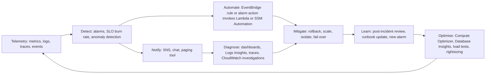

The [Section Summary](#section-summary) maps each part to its arc of the loop, its key services and the metric it improves: mean time to detect (MTTD) for dashboards and alarms, mean time to acknowledge (MTTA) for notification, ChatOps and investigations, mean time to mitigate or recover (MTTR) for automated response, and latency percentiles, cost per request and recurrence rate for performance optimisation.

!!! tip "The loop is the design"
    A system that emits excellent telemetry but has no alarms is a museum: beautiful, and useless during an outage. A system with many alarms but no runbooks or automation trains engineers to ignore pages. A system that responds well but never feeds lessons back into design will have the same incident again. Treat the loop as one architecture, owned end to end, and defined in infrastructure as code alongside the services it protects ([Chapter 5.3](../unit5/topic3.md)).

---

## Creating CloudWatch Dashboards and Alarms

### Definition

==A CloudWatch dashboard is a customisable, shareable page in the CloudWatch console that displays metrics, alarms, logs query results and other widgets, possibly from several accounts and Regions, in a single view.== A dashboard is a ==read-only visualisation==: it never changes the system and never notifies anyone. Its purpose is shared situational awareness.

==A CloudWatch alarm is a managed rule that continuously evaluates a metric, a metric math expression, a query or a combination of other alarms against a condition, maintains a state (`OK`, `ALARM` or `INSUFFICIENT_DATA`), and performs actions when that state changes.== An alarm is the point at which telemetry becomes a ==decision==: someone or something must act.

| Construct | Input | Output | Changes the system? | Typical consumer |
|-----------|-------|--------|---------------------|------------------|
| Metric | Measurements from services and applications | Time series | No | Dashboards, alarms, auto scaling |
| Dashboard | Metrics, alarms, logs queries, text | Visual page | No | Humans: engineers, managers, support staff |
| Alarm | Metric, expression, query or other alarms | State and state-change actions | Indirectly, through its actions | SNS, Lambda, Auto Scaling, EC2 actions, Systems Manager, investigations, EventBridge |
| Service level objective | A service level indicator and a goal | Attainment, error budget, burn rate | No | Alarms, dashboards, product decisions |

In the AWS architecture map, dashboards and alarms are features of ==Amazon CloudWatch==, in the Management and Governance category. They sit at the end of every telemetry pipeline described in Sections [7.1](../unit7/topic1.md) and [7.2](../unit7/topic2.md) and at the beginning of every automation pipeline described in the next part.

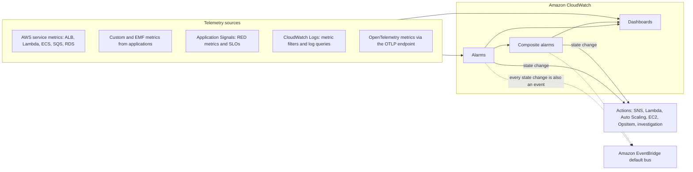

!!! note "Dashboards are for humans, alarms are for decisions"
    A useful rule for students: if a condition requires someone to ==do== something, it needs an alarm; if it only helps someone ==understand== something, it belongs on a dashboard. Engineers who try to use dashboards as alarms ("someone will notice the red line") discover that nobody watches dashboards at 03:00.

### Why This Service or Concept Exists

#### The problem: too much data, too little attention

A modest cloud-native application of twelve microservices on Amazon ECS, a dozen Lambda functions, an API Gateway, three SQS queues, an Aurora cluster and a DynamoDB table easily publishes several thousand metric time series. [Section 7.1](../unit7/topic1.md) showed how to produce them. No human can watch several thousand lines, and the scarce resource in operations is not data but ==human attention==. Dashboards and alarms exist to spend that attention wisely:

1. ==Dashboards compress== thousands of time series into a small number of views that answer specific questions ("Is checkout healthy?", "Which dependency is slow?").
2. ==Alarms filter==: they stay silent while the system is healthy and interrupt a human, or trigger automation, only when a condition matters.
3. ==Service level objectives prioritise==: they translate "healthy" into a business-agreed number, so that alarms fire when users are harmed rather than whenever a resource looks busy.

#### Why AWS provides managed dashboards and alarms

Before managed monitoring, operations teams ran tools such as Nagios, Zabbix or a self-hosted Prometheus with Alertmanager and Grafana. These tools remain valuable, but the team had to:

- run and patch the monitoring servers, and make them highly available (a monitoring system that fails with the application is useless),
- store and down-sample time series data and plan disk capacity,
- configure agents or exporters on every host to collect data,
- write their own integrations to notification and paging systems,
- keep alert rules synchronised with a fleet whose resources changed constantly.

CloudWatch alarms and dashboards are ==regional, managed and integrated with every AWS service==. Service metrics arrive without agents, alarms evaluate on AWS infrastructure independent of your workloads, and alarm actions integrate natively with SNS, Lambda, Auto Scaling, EC2, Systems Manager and EventBridge. Because alarms are API resources, they can be created by the same CloudFormation or CDK stack that creates the service, so the alarm lifecycle follows the resource lifecycle.

#### Benefits over older methods

| Concern | Self-hosted monitoring stack | CloudWatch dashboards and alarms |
|---------|------------------------------|----------------------------------|
| Infrastructure | Monitoring servers, storage, HA design | None; regional managed service |
| AWS metric collection | Exporters or polling of AWS APIs | Automatic for most AWS services |
| Dynamic fleets | Service discovery configuration | Metrics Insights and tag-based queries follow new resources automatically |
| Notification integration | Custom scripts or plugins | Native actions: SNS, Lambda, Auto Scaling, EC2, Systems Manager, investigations, EventBridge |
| Multi-account view | Federation or central Prometheus | Cross-account observability through a monitoring account ([Section 7.1](../unit7/topic1.md#infrastructure-and-application-monitoring-with-amazon-cloudwatch)) |
| Lifecycle | Alert rules managed separately from resources | Alarms defined in the same IaC stack as the resource |
| Cost model | Pay for servers continuously | Pay per dashboard, per alarm metric, per query; small free tier |

!!! tip "When another tool is still the right answer"
    Organisations that already standardise on Prometheus and Grafana often use ==Amazon Managed Service for Prometheus== with ==Amazon Managed Grafana==, particularly for EKS ([Chapter 3.3](../unit3/topic3.md)). CloudWatch itself now ingests OpenTelemetry metrics through an OTLP endpoint and supports PromQL queries and PromQL alarms, which narrows the gap. Many estates run both: CloudWatch for AWS service metrics and alarms that drive AWS actions, Prometheus and Grafana for in-cluster Kubernetes metrics. The design principle is the same regardless of tool: few, symptom-based, actionable alerts.

### Core Concepts

#### Symptoms and causes

The single most important design idea in alerting is the distinction between a ==symptom== and a ==cause==.

| Aspect | Symptom-based signal | Cause-based signal |
|--------|----------------------|--------------------|
| Definition | What users or callers experience | An internal condition that might produce a symptom |
| Examples | Error rate of `POST /orders`, p99 latency of checkout, age of oldest SQS message, failed canary | CPU above 80 per cent, one task restarted, database connections at 70 per cent, disk 60 per cent full |
| Relationship to harm | Direct: if it breaches, someone is being harmed | Indirect: may or may not lead to harm |
| Number needed | Few per service | Many per resource |
| Correct use | Paging alarms, SLOs, executive dashboards | Diagnostic dashboards, ticket-level alarms, capacity planning, auto scaling |

A page at 03:00 because CPU reached 85 per cent on a healthy, auto-scaling service is ==noise==: users were not harmed and nothing needed to be done. A page because checkout errors doubled is ==signal== even if every resource metric looks normal, for example because a downstream payment provider is failing. Chapters [1.7](../unit1/topic7.md) and [4.3](../unit4/topic3.md) made this point for microservices; this part turns it into a method.

!!! warning "Cause alarms still have a place"
    Some cause-based conditions must be alarmed because by the time the symptom appears it is too late to act: free storage on a database approaching zero, certificate expiry within 14 days, a dead-letter queue that is not empty, service quota utilisation approaching its limit. The test is whether the condition ==predicts unavoidable harm that a human must prevent==. Such alarms should normally create a ticket, not page someone at night, unless the lead time is very short.

#### Golden signals, RED and USE

The RED method (rate, errors, duration) for request-driven services, the USE method (utilisation, saturation, errors) for resources, and Google's four golden signals are defined in [Section 7.1](../unit7/topic1.md#two-classic-methods-for-choosing-what-to-measure). For dashboards and alarms, RED maps naturally onto Application Signals `Latency`, `Error` and `Fault` metrics per operation, and USE onto resource metrics such as RDS `DatabaseConnections` or EBS `VolumeQueueLength`.

A good service dashboard shows RED at the top (what users experience) and USE further down (why it might be happening). This ordering mirrors the diagnostic order: start from the symptom and move towards the cause.

#### Service level indicators, objectives, agreements and error budgets

| Term | Definition | Example | Owner |
|------|------------|---------|-------|
| Service level indicator (SLI) | A quantitative measure of one aspect of service quality, usually a ratio of good events to valid events | Proportion of `GET /products` requests completed successfully in under 300 ms | Engineering |
| Service level objective (SLO) | A target value for an SLI over a time window | 99.5 per cent of `GET /products` requests are good over a rolling 28 days | Engineering with product management |
| Service level agreement (SLA) | A contractual commitment to customers, with consequences (usually service credits) if missed | 99.9 per cent monthly availability or 10 per cent credit | Business and legal |
| Error budget | The amount of unreliability the SLO permits: 100 per cent minus the SLO, applied to the window | 0.5 per cent of requests in 28 days | Shared |
| Burn rate | How fast the error budget is being consumed relative to the rate that would exactly exhaust it at the end of the window | Burn rate 1 exhausts the budget exactly at the end of the window; burn rate 14.4 exhausts a 30-day budget in about 2 days | Alarms |

SLOs should be ==stricter than SLAs== so that internal alarms fire before contractual penalties apply, and ==looser than 100 per cent==, because 100 per cent is neither achievable nor economically sensible: every additional "nine" roughly multiplies cost while users cannot perceive the difference beyond the reliability of their own network and device.

##### Calculating an error budget

For a request-based SLO the arithmetic is simple.

| Quantity | Value |
|----------|-------|
| SLO | 99.9 per cent of requests are good |
| Window | 30 days |
| Expected requests in window | 50,000,000 |
| Error budget | 0.1 per cent of 50,000,000 = 50,000 bad requests |
| Bad requests so far (day 12) | 30,000 |
| Budget consumed | 60 per cent after 40 per cent of the window |
| Interpretation | Burning faster than sustainable; slow down risky releases |

For a time-based (period-based) SLO, the unit is time rather than requests. A 99.9 per cent monthly availability objective allows about 43 minutes of "bad minutes" in 30 days (0.001 multiplied by 43,200 minutes).

| Availability SLO | Allowed bad time per 30 days | Allowed bad time per year |
|------------------|------------------------------|---------------------------|
| 99 per cent | About 7 hours 12 minutes | About 3.65 days |
| 99.5 per cent | About 3 hours 36 minutes | About 1.8 days |
| 99.9 per cent | About 43 minutes | About 8.8 hours |
| 99.95 per cent | About 22 minutes | About 4.4 hours |
| 99.99 per cent | About 4.3 minutes | About 53 minutes |

!!! info "Error budgets are a decision tool, not only an alarm input"
    The error budget turns a reliability argument into a policy. While budget remains, the team may ship features quickly and run experiments such as the fault injection of [Chapter 4.3](../unit4/topic3.md). When the budget is exhausted, the agreed policy applies: for example, freeze non-urgent releases and prioritise reliability work until the budget recovers. This connects monitoring to the CI/CD practices of Unit V, where deployment gates can check SLO status before promoting a release.

##### Burn rate

Burn rate is defined as:

`burn rate = observed error rate over a look-back window / (1 - SLO)`

If the SLO is 99.9 per cent, the sustainable error rate is 0.1 per cent. An observed error rate of 1.44 per cent over the last hour gives a burn rate of 14.4. At that rate a 30-day budget is exhausted in 30 / 14.4, roughly 2.1 days. The practical value of burn rate is that ==one number expresses both severity and urgency==, independent of traffic volume.

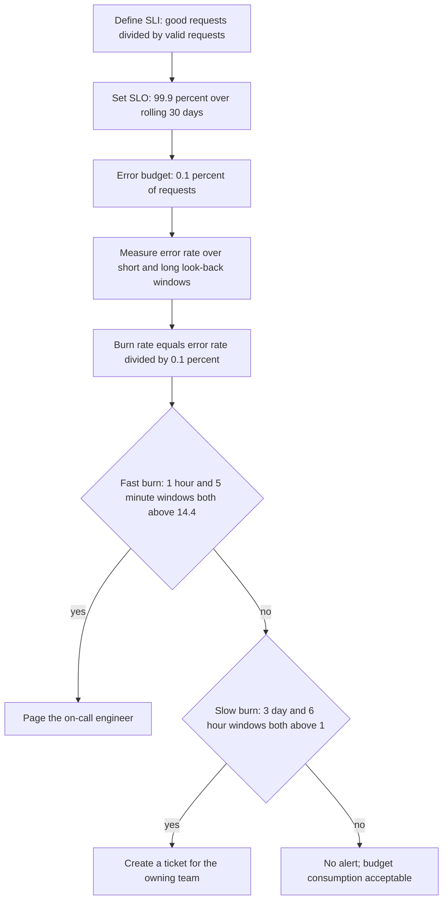

The ==multi-window, multi-burn-rate== technique shown above, popularised by the Google SRE Workbook, pairs a long window (which proves the problem is significant) with a short window (which proves it is still happening, so the alarm resets quickly after recovery). Application Signals documents the same approach and suggests window pairs such as 1 hour with 5 minutes, 6 hours with 30 minutes, and 3 days with 6 hours. The later subsection on SLO alarms shows how to implement it with composite alarms.

#### Dashboards

##### Anatomy of a dashboard

A dashboard is a JSON document (the ==dashboard body==) containing a list of widgets, each with a position (`x`, `y`), a size (`width`, `height`) on a 24-column grid, a type and properties. The console is only an editor for this JSON; the `PutDashboard` API and IaC tools write the same document.

| Widget type | Displays | Typical use |
|-------------|----------|-------------|
| Line, stacked area | Time series from metrics, math expressions or Metrics Insights queries | Latency percentiles, request rates, error rates over time |
| Number (single value) | Latest value, optionally with a sparkline | Current error rate, current backlog age, SLO attainment |
| Gauge | A value against a range | Utilisation relative to capacity |
| Bar and pie | Comparison across series at one time | Errors by operation, traffic share by Region |
| Alarm status | Current state of selected alarms | "Is anything red?" at the top of a service dashboard |
| Alarm graph | A metric with its alarm threshold drawn | Understanding why an alarm fired |
| Logs table | Results of a Logs Insights query ([Section 7.2](../unit7/topic2.md#log-analysis-with-amazon-cloudwatch-logs-insights)) | Top error messages, slowest requests |
| Text (Markdown) | Headings, explanations, runbook links | Ownership, escalation, "how to read this dashboard" |
| Explorer | Metrics selected dynamically by tag or resource property | Fleet views that follow new resources |
| Custom widget | Output of a Lambda function rendered as HTML | Data from other systems, deployment status, business KPIs |

##### A layered dashboard design

Dashboards fail when they try to show everything. A layered set of dashboards, each answering one question for one audience, works far better.

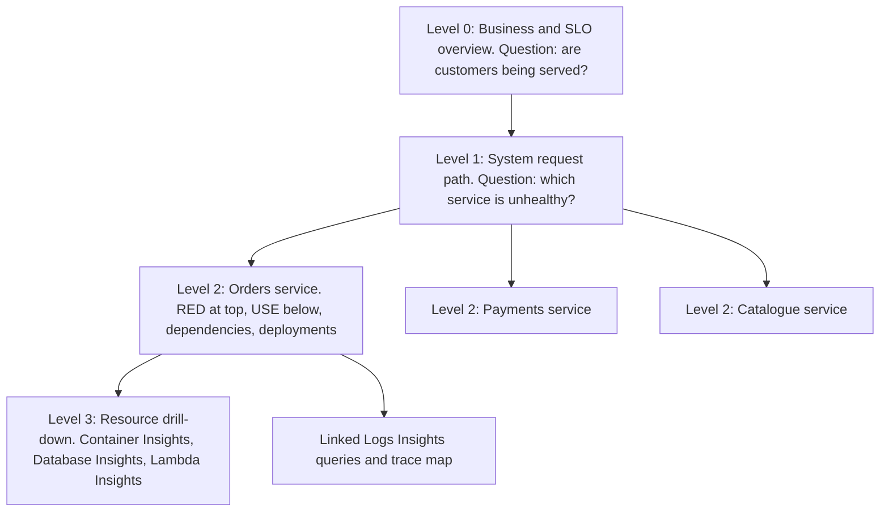

| Level | Audience | Contents | Refresh and time range |
|-------|----------|----------|------------------------|
| 0: Business and SLO overview | Leadership, support, incident commander | Orders per minute, sign-ups, SLO attainment and remaining error budget per critical journey, canary success | 1 minute refresh; last 24 hours with week-over-week comparison |
| 1: System | On-call engineer | Request path from edge to data: CloudFront, API Gateway or ALB, each service's error rate and p99 latency, queue ages, database health | 1 minute; last 3 hours |
| 2: Service | Owning team | RED per operation, dependency latency, saturation, deployments annotated, alarm status, runbook links | 1 minute; last 3 hours and last 7 days |
| 3: Resource | Engineer diagnosing a cause | Per-task, per-pod, per-function, per-query detail; mostly automatic dashboards and Insights views | On demand |

!!! tip "Put the answer at the top-left"
    Readers scan dashboards from the top-left. Place the alarm status widget and the one or two symptom metrics that answer "is this service healthy?" there. Put a text widget with the owning team, escalation path and runbook link at the top as well; during an incident, a stranger may be reading your dashboard.

##### Metric math

Metric math computes new time series from existing ones at query time, without publishing new metrics and therefore without additional custom metric charges. It is the tool that turns raw counters into the ratios that SLIs and good dashboards need.

| Goal | Expression | Notes |
|------|------------|-------|
| Error rate as a percentage | `100 * errors / requests` | Use `FILL(errors, 0)` so that periods with no errors are zero rather than missing |
| Availability | `100 * (1 - (faults / requests))` | Matches the Application Signals availability definition, where faults are server-side errors |
| Backlog per task ([Chapter 6.3](../unit6/topic3.md#message-queues-with-amazon-sqs)) | `visible / running_tasks` | The correct scaling signal for queue workers |
| Sum across many series | `SUM(METRICS())` | Aggregate after selecting several metrics |
| Rate of change | `RATE(m1)` or `DIFF(m1)` | Useful for counters that only increase |
| Anomaly band | `ANOMALY_DETECTION_BAND(m1, 2)` | Draws the expected range at two standard deviations |
| Conditional value | `IF(requests > 100, 100 * errors / requests, 0)` | Suppresses noisy ratios at very low traffic |
| Search expression | `SEARCH('{AWS/Lambda,FunctionName} MetricName="Errors"', 'Sum', 60)` | Selects matching series dynamically on dashboards |

!!! warning "Ratios at low traffic"
    One failed request out of two is a 50 per cent error rate. Ratio alarms on low-traffic services flap constantly at night. Guard ratios with a minimum-traffic condition, use longer periods at night, or alarm on an absolute count of errors combined with a ratio in a composite alarm.

##### Metrics Insights queries

==CloudWatch Metrics Insights== is a SQL-like query language over metrics. Where metric math combines metrics you name explicitly, Metrics Insights ==selects metrics by query==, so dashboards and alarms automatically include resources that did not exist when they were created.

```sql
SELECT AVG(CPUUtilization)
FROM SCHEMA("AWS/ECS", ClusterName, ServiceName)
WHERE ClusterName = 'prod'
GROUP BY ServiceName
ORDER BY AVG() DESC
LIMIT 10
```

| Clause | Purpose |
|--------|---------|
| `SELECT` function | One of `AVG`, `SUM`, `MIN`, `MAX`, `COUNT` over a metric |
| `FROM` namespace or `SCHEMA(...)` | Which metrics to consider; `SCHEMA` restricts to an exact dimension set |
| `WHERE` | Filter by dimension values, or by resource tags when tag-based telemetry is enabled (for example `tag.Environment = 'prod'`) |
| `GROUP BY` | Produce one series per dimension value |
| `ORDER BY` and `LIMIT` | "Top N" views, such as the ten busiest services |

Tag-based queries require the account setting that enables resource tags on telemetry. Once enabled, a dashboard or alarm can target "every resource tagged `Application=Orders` and `Environment=prod`", which aligns observability with the tagging strategy used for cost allocation.

!!! note "Metrics Insights and percentiles"
    Metrics Insights aggregates with `AVG`, `SUM`, `MIN`, `MAX` and `COUNT`. It does not compute percentiles across series. For p99 latency use the metric's own percentile statistic in a normal metric widget or alarm, or use Application Signals, which publishes latency percentiles per operation.

##### Dashboard variables

Dashboard variables turn one dashboard into many. A ==property variable== changes a dimension value (for example `ServiceName` or `FunctionName`) across every widget, and a ==pattern variable== substitutes a value into search expressions. Values can be a fixed list or populated from a search. A single "service dashboard template" with a `ServiceName` variable therefore replaces dozens of near-identical dashboards and removes the drift that occurs when teams copy dashboards by hand.

##### Automatic dashboards and service consoles

CloudWatch provides ==automatic dashboards== for many AWS services (for example Lambda, DynamoDB, SQS, ECS, EBS) and curated views in Container Insights, Lambda Insights, Database Insights and Application Signals ([Section 7.1](../unit7/topic1.md#infrastructure-and-application-monitoring-with-amazon-cloudwatch)). They are free to view, require no configuration and are the right starting point for Level 3 drill-down. They are not a substitute for the Level 0 to Level 2 dashboards, because they are organised by AWS service rather than by your business journey.

##### Cross-account and cross-Region dashboards

With CloudWatch cross-account observability ([Section 7.1](../unit7/topic1.md#infrastructure-and-application-monitoring-with-amazon-cloudwatch)), a ==monitoring account== can graph metrics, query logs and view traces from linked ==source accounts==, and alarms in the monitoring account can watch source-account metrics. Widgets can also specify a `region` property to show metrics from other Regions. A multi-Region active-active application ([Chapter 6.2](../unit6/topic2.md)) therefore has one system dashboard showing both Regions side by side, which is essential when deciding whether to fail over.

##### Sharing dashboards

Dashboards can be shared with people who do not have AWS console credentials: publicly (anyone with the link), with specific email addresses (authenticated through Amazon Cognito), or through single sign-on. Sharing uses an IAM role that grants read access to the underlying data, so sharing a dashboard ==shares the data behind it==. Treat public sharing as a security decision.

#### Alarms

##### Alarm states

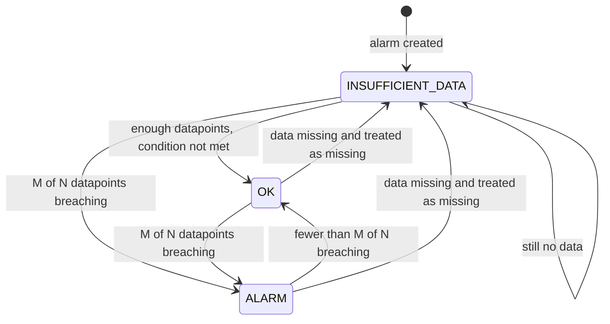

| State | Meaning | Common causes |
|-------|---------|---------------|
| `OK` | The expression is within the threshold | Normal operation |
| `ALARM` | The expression has breached the threshold for M of the last N evaluation periods | Genuine problem, or a badly chosen threshold |
| `INSUFFICIENT_DATA` | Not enough data to decide | Alarm just created; metric has no datapoints (resource idle, deleted, or misconfigured dimension); missing data treated as missing |

Alarm actions run ==only on state transitions==, not repeatedly while the condition persists (Auto Scaling actions are the exception and continue to apply). An alarm that stays in `ALARM` for six hours notifies once. If repeated reminders are required, they must be implemented by the notification system or by automation.

##### How an alarm evaluates data

Three parameters define the evaluation window:

| Parameter | API name | Meaning |
|-----------|----------|---------|
| Period | `Period` | Length in seconds of each datapoint the alarm evaluates. High-resolution alarms support 10, 20 or 30 seconds; otherwise a multiple of 60 seconds |
| Evaluation periods (N) | `EvaluationPeriods` | How many of the most recent periods to consider |
| Datapoints to alarm (M) | `DatapointsToAlarm` | How many of those N periods must breach to enter `ALARM` |

An alarm with period 60 seconds, N = 5 and M = 3 enters `ALARM` when ==any 3 of the last 5 minutes== breach. This "M out of N" configuration is the main defence against ==flapping== (rapid oscillation between states) without making the alarm slow.

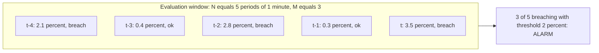

| Configuration | Time to detect a sustained problem | Sensitivity to spikes | Use for |
|---------------|------------------------------------|-----------------------|---------|
| Period 60 s, 1 of 1 | About 1 to 2 minutes | Very high: every spike alarms | Hard failures that are never transient, such as a canary failing completely |
| Period 60 s, 3 of 5 | About 3 to 5 minutes | Moderate | Most symptom alarms |
| Period 60 s, 5 of 5 | About 5 to 6 minutes | Low | Cause alarms where a brief spike is harmless |
| Period 300 s, 3 of 3 | About 15 minutes | Very low | Slow trends such as capacity; low-traffic services |
| Period 10 s, 3 of 6 (high resolution) | Under a minute | High; higher cost | Latency-critical paths with high-resolution metrics |

CloudWatch evaluates standard alarms every minute over a ==sliding window==. When the product of period and evaluation periods exceeds one day, CloudWatch supports multi-day evaluation, evaluated hourly, which is useful for slow-moving trends such as daily batch volumes. Verify the current maximums in the CloudWatch User Guide before designing very long windows.

!!! danger "Metric delay and the evaluation window"
    Some metrics arrive late. Several services publish at one-minute or five-minute granularity, and custom metrics are only as timely as the code that sends them. An alarm evaluating the most recent minute may repeatedly see a partial or missing datapoint. Choose a period at least as long as the metric's publishing interval, and never use a one-minute period on a metric that is published every five minutes (for example EC2 basic monitoring).

##### Missing-data treatment

What should an alarm do when there is no datapoint? The answer depends on what absence means, and it is one of the most frequently misconfigured settings.

| `TreatMissingData` | Behaviour | Correct when | Dangerous when |
|--------------------|-----------|--------------|----------------|
| `missing` (default) | Missing periods are not counted; if all are missing the alarm goes to `INSUFFICIENT_DATA` | You want to know when data stops, and `INSUFFICIENT_DATA` has its own action | Nobody acts on `INSUFFICIENT_DATA`, so a dead metric looks like silence |
| `notBreaching` | Missing periods count as good | Metric is only emitted when something happens, such as an `Errors` count on a Lambda function with no invocations | The absence itself is the failure, such as a heartbeat metric |
| `breaching` | Missing periods count as bad | Absence means failure: heartbeats, canary success, "orders placed" during business hours | Metric is naturally sparse, producing false alarms |
| `ignore` | Keep the current state | Very sparse metrics where you want neither transition | Real outages that stop data may never change the state |

!!! warning "Alarm on absence explicitly"
    A producer that stops publishing generates no errors, and an error alarm with `notBreaching` stays green forever. Every critical flow needs at least one alarm that detects ==silence==: for example `NumberOfMessagesSent` on a queue or `MatchedEvents` on an EventBridge rule falling below an expected floor with `breaching` missing data, or a Synthetics canary that exercises the flow end to end ([Section 7.1](../unit7/topic1.md#infrastructure-and-application-monitoring-with-amazon-cloudwatch)).

##### Percentile alarms and low sample counts

Latency alarms should normally use percentiles (p90, p95, p99) rather than averages, because averages hide the slow tail that users feel ([Section 7.1](../unit7/topic1.md#infrastructure-and-application-monitoring-with-amazon-cloudwatch)). When a period contains very few samples, a percentile is statistically meaningless: the p99 of five requests is simply the slowest request. `EvaluateLowSampleCountPercentile` controls behaviour when there are too few samples: `evaluate` computes the statistic anyway, while `ignore` keeps the alarm in its current state for that period. Pair percentile alarms with a minimum traffic condition, or use a trimmed mean (`tm99`) which is more stable.

##### Threshold selection

| Method | How | Strength | Weakness |
|--------|-----|----------|----------|
| Derived from the SLO | Threshold equals the burn rate that exhausts a chosen share of budget in a window | Directly linked to user harm and business agreement | Requires an agreed SLO |
| Static, from capacity knowledge | For example 80 per cent of `max_connections` | Simple, explainable | Must be updated when capacity changes |
| Historical percentile | Look at 30 days of data and set above normal peaks | Grounded in reality | Encodes past problems as "normal" |
| Anomaly detection | Machine-learning band around expected value | Handles daily and weekly seasonality | Can drift with gradual degradation; harder to explain |
| AWS recommended alarms | CloudWatch suggests alarms and thresholds for many AWS service metrics | Good starting point for cause alarms | Generic; not tied to your SLO |

!!! tip "Recommended alarms as a starting checklist"
    CloudWatch publishes ==recommended alarms== for many AWS services (and recommended PromQL alarms for OpenTelemetry metrics) with suggested thresholds and the reasoning behind them. Use them as a checklist when onboarding a new service, then decide for each whether it should page, create a ticket or only appear on a dashboard.

#### Alarm types

CloudWatch has grown from single-metric alarms into a family of alarm types. Choosing the right one is an architectural decision.

| Alarm type | Evaluates | Follows new resources automatically? | Typical use |
|------------|-----------|--------------------------------------|-------------|
| Metric alarm (static threshold) | One metric with a statistic | No | A specific queue, function, load balancer or table |
| Metric math alarm | An expression over up to 10 metrics with the same period | No | Error rate ratios, backlog per task |
| Anomaly detection alarm | A metric against a learned band | No | Traffic with strong daily or weekly seasonality |
| Metrics Insights alarm, single time series | A query aggregated to one series | Yes | "Maximum CPU across every production instance" |
| Metrics Insights alarm, multi time series | A query with `GROUP BY`; each series is a ==contributor== with its own state | Yes | "Any production service whose error count exceeds 10", with per-service notifications |
| Log alarm from a metric filter | A metric generated from log patterns ([Section 7.2](../unit7/topic2.md)) | No | Counting specific error messages continuously |
| Log query alarm | A Logs Insights query executed on a schedule | Per contributor when the query aggregates `by` a field | Error spikes by service directly from logs, with log context in the notification |
| PromQL alarm | A PromQL instant query over OpenTelemetry metrics ingested through the CloudWatch OTLP endpoint | Per contributor | Kubernetes and OpenTelemetry-native metrics |
| Composite alarm | A Boolean rule over other alarms | Depends on children | Reducing noise, SLO multi-window logic, dependency-aware alerting |

##### Static threshold and metric math alarms

These are the workhorses. They are simple, cheap, predictable and easy to explain in a post-incident review. Use them whenever the threshold can be justified from an SLO or from capacity knowledge.

##### Anomaly detection alarms

CloudWatch ==anomaly detection== trains a statistical model on up to two weeks of a metric's history, accounting for hourly, daily and weekly patterns and trend, and produces an expected band. The alarm fires when the metric goes above, below, or outside the band. The width of the band is set in standard deviations (for example 2 or 3).

| Suitable metrics | Unsuitable metrics |
|------------------|--------------------|
| Request count with a daily cycle | Error counts that are normally zero |
| Orders per minute during business hours | Metrics with irregular, event-driven spikes |
| Latency with predictable load-driven variation | Metrics whose "normal" is already unacceptable |
| Detecting unexpected ==drops== in traffic (a silent failure signal) | Newly created metrics with little history |

!!! tip "Anomaly detection is excellent for detecting drops"
    A sudden fall in successful checkouts at 20:00 on a Friday is anomalous even though no error metric changes. Static thresholds cannot express "lower than usual for this time of week"; anomaly detection can. Exclude known abnormal periods (for example a past outage or a sale event) from training so the model does not learn them as normal.

##### Metrics Insights alarms

A Metrics Insights alarm evaluates a query rather than a named metric. The query is re-run on every evaluation, so the alarm ==adapts as resources are created, changed or deleted==, including resources selected by tag.

- A ==single time series== query aggregates everything into one value, for example `SELECT MAX(CPUUtilization) FROM "AWS/EC2" WHERE tag.Environment = 'prod'`. One state for the whole fleet.
- A ==multi time series== query uses `GROUP BY` (and `ORDER BY`) so that each group is evaluated individually as a ==contributor==. The alarm is in `ALARM` when at least one contributor breaches, each breaching contributor emits its own contributor state-change event to EventBridge, and Lambda actions are invoked at contributor level. One alarm definition therefore replaces hundreds of per-resource alarms while still telling you ==which== resource is unhealthy.

```sql
SELECT SUM(Errors)
FROM SCHEMA("AWS/Lambda", FunctionName)
WHERE tag.Environment = 'prod'
GROUP BY FunctionName
ORDER BY SUM() DESC
```

!!! note "Per-Region quota for query alarms"
    CloudWatch limits the number of Metrics Insights alarms per Region (a documented quota of 200 at the time of writing, not adjustable). Use them for fleet-level rules and keep per-resource static alarms for the few resources that need individual tuning.

##### Log alarms

There are now two ways to alarm on logs:

1. The long-established approach: a ==metric filter== on a log group extracts a metric from matching log events ([Section 7.2](../unit7/topic2.md)), and a normal metric alarm watches that metric. It is continuous and cheap per evaluation, but the metric filter must exist before the events arrive and cannot express complex aggregations.
2. ==Log query alarms== (launched in July 2026): the alarm runs a CloudWatch Logs Insights query on a schedule, compares an aggregated result with a threshold and includes log context in the notification. A query that aggregates `by` a field produces per-value contributors, similar to multi time series alarms. Log query alarms remove the intermediate metric filter and allow richer logic, at the cost of query charges (bytes scanned) on every scheduled run.

| Consideration | Metric filter plus metric alarm | Log query alarm |
|---------------|---------------------------------|-----------------|
| Latency to detect | Near real time | Bounded by the query schedule |
| Expressiveness | Pattern match and simple value extraction | Full Logs Insights language: `parse`, `stats`, `filter`, grouping |
| Cost driver | Custom metric per filter dimension combination | Data scanned per scheduled query |
| Historical backfill | None; counts only events after creation | Query can look back over existing logs |
| Best for | High-volume, simple, long-lived signals | Complex conditions, per-field contributors, investigation-grade context |

##### PromQL alarms

CloudWatch can ingest OpenTelemetry metrics natively through an OTLP endpoint and query them with ==PromQL==. PromQL alarms evaluate instant queries on those metrics, which lets teams that instrument with OpenTelemetry (the direction AWS now recommends for tracing and metrics, [Section 7.1](../unit7/topic1.md#distributed-tracing-with-aws-x-ray)) alarm without translating queries into CloudWatch syntax. They are most relevant to EKS workloads where Prometheus conventions are already familiar ([Chapter 3.3](../unit3/topic3.md)).

##### Composite alarms

A ==composite alarm== has no metric. Its state is computed from a Boolean ==alarm rule== over the states of other alarms (metric alarms or other composite alarms):

```text
ALARM("orders-5xx-rate-high") AND ALARM("orders-p99-latency-high")
(ALARM("payments-burn-1h") AND ALARM("payments-burn-5m")) OR (ALARM("payments-burn-6h") AND ALARM("payments-burn-30m"))
ALARM("checkout-canary-failed") AND NOT ALARM("region-maintenance-window")
```

The functions `ALARM()`, `OK()` and `INSUFFICIENT_DATA()` test child states, and `AND`, `OR`, `NOT` and parentheses combine them. `TRUE` and `FALSE` constants are also allowed, which is useful to break an accidental circular dependency between two composite alarms.

Composite alarms solve three problems:

| Problem | Composite solution |
|---------|--------------------|
| Alert storms: one root cause triggers twenty alarms | Children have ==no actions==; only the composite notifies |
| Noisy individual signals | Require two independent signals to agree before paging |
| Multi-window SLO logic | Combine long and short burn-rate windows with `AND` |

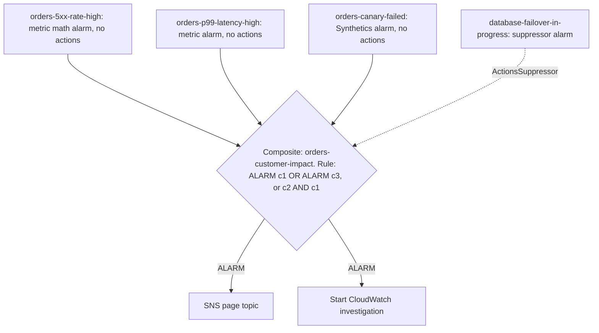

##### Composite alarm action suppression

A composite alarm can name a ==suppressor alarm==. While the suppressor is in `ALARM`, the composite alarm's actions are suppressed. Two timers refine the behaviour:

| Setting | Meaning | Example |
|---------|---------|---------|
| `ActionsSuppressor` | The alarm whose `ALARM` state suppresses actions | `database-failover-in-progress` |
| `ActionsSuppressorWaitPeriod` | How long to wait for the suppressor to enter `ALARM` after the composite does, before acting anyway | 120 seconds: gives the failover alarm time to fire first |
| `ActionsSuppressorExtensionPeriod` | How long to keep suppressing after the suppressor returns to `OK` | 300 seconds: allows the system to stabilise after failover |

This expresses ==dependency-aware alerting==: "do not page the orders team about database errors while the database team already knows the database is failing over".

##### Alarm actions

| Action | Triggered on | What it does | Notes |
|--------|--------------|--------------|-------|
| Amazon SNS | Any state | Publishes a notification to a topic (email, SMS, HTTPS, Lambda, SQS, chat via Amazon Q Developer in chat applications) | The most common action; the topic decouples alarms from recipients |
| AWS Lambda | Any state | Invokes a function ==asynchronously== with an alarm event payload | Requires a resource-based policy for `lambda.alarms.cloudwatch.amazonaws.com`; can invoke functions in other accounts; the basis of the next part |
| EC2 actions | Any state | Stop, terminate, reboot or recover an instance | Metric alarms on EC2 per-instance metrics only |
| Auto Scaling | Any state | Runs a step or simple scaling policy | Target tracking creates and manages its own alarms |
| Systems Manager OpsItem | `ALARM` only | Creates an OpsItem in OpsCenter for tracking | Good for ticket-level issues |
| Systems Manager Incident Manager | `ALARM` only | Starts an incident from a response plan | Incident Manager is closed to new customers since 7 November 2025 |
| CloudWatch investigation | `ALARM` only | Starts an AI-assisted investigation automatically | See the next part |
| Amazon EventBridge | Every state change | Every alarm state change is published to the default event bus as `CloudWatch Alarm State Change` | No configuration needed; route with rules |

!!! info "Direct Lambda action or EventBridge rule?"
    Both can invoke a Lambda function when an alarm changes state. The direct action is simplest: one alarm, one function, configured on the alarm. An EventBridge rule is better when ==many alarms== should share one responder, when routing depends on alarm name prefixes, tags or state, when the target is not Lambda (Step Functions, SSM Automation, SQS, API destinations), or when events must be forwarded to a central operations account. The next part develops both options.

##### Muting, suppressing and disabling actions

| Mechanism | Scope | Automatically ends? | Typical use |
|-----------|-------|---------------------|-------------|
| Alarm mute rule (introduced February 2026) | Up to 100 named alarms per rule; one-time `at(...)` or recurring `cron(...)` schedule with a duration from 1 minute to 15 days and an optional time zone | Yes | Planned maintenance windows, nightly batch periods, load tests |
| Composite action suppression | One composite alarm, conditional on another alarm | Yes, with extension period | Dependency-aware alerting |
| `DisableAlarmActions` API | Named alarms | No; must call `EnableAlarmActions` | Emergency silencing; dangerous if forgotten |
| Removing actions from the alarm definition | One alarm | No | Converting a paging alarm into a dashboard-only alarm |

During a mute window the alarm continues to evaluate and change state; only its ==actions== are muted. If the alarm is still in `ALARM` when the window ends, the action runs once at that point, so a real problem that outlasts the maintenance window is not lost. EventBridge alarm state-change events are still emitted while muted, so automation driven by EventBridge rules must check for maintenance windows itself.

!!! danger "The forgotten disabled alarm"
    `DisableAlarmActions` during an incident is a common emergency measure, and forgetting to re-enable actions is a common cause of the ==next== incident going unnoticed. Prefer mute rules with an explicit end time, and add a periodic compliance check (for example an AWS Config custom rule or a scheduled Lambda function) that reports alarms with actions disabled.

#### SLO alarms with Application Signals

==CloudWatch Application Signals== ([Section 7.1](../unit7/topic1.md#infrastructure-and-application-monitoring-with-amazon-cloudwatch)) automatically collects RED metrics per service and operation from OpenTelemetry-instrumented applications on EKS, ECS, EC2 and Lambda, and lets you define ==service level objectives== directly in CloudWatch.

| SLO feature | Options |
|-------------|---------|
| SLI source | Application Signals latency or availability for a service, operation or dependency; a CloudWatch Synthetics canary or RUM app monitor; or ==any CloudWatch metric or metric math expression== |
| Evaluation type | ==Period-based==: good periods divided by total periods; ==request-based==: good requests divided by total requests |
| Interval | ==Rolling== (for example the last 28 days, continuously) or ==calendar== (for example each calendar month) |
| Attainment goal | For example 99.9 per cent |
| Error budget | Computed automatically; shown as remaining budget |
| Burn rate | Computed for look-back windows you choose (multiples of the SLO period, shorter than the interval) |
| Composite SLO | Availability across 2 to 20 operations of a service |
| Exclusion windows | Up to 10 one-time or recurring windows per SLO, for example planned maintenance |
| SLO recommendations | Suggested thresholds, goals and burn-rate windows from 30 days of history |

Application Signals availability treats server faults (HTTP 5xx) as bad and client errors (4xx) as good, because a 404 or 400 is usually the caller's mistake rather than a failure of the service. Decide deliberately whether that definition fits your SLI; for example a 429 caused by your own throttling may harm users and deserve to count as bad.

A burn-rate threshold can be derived in two ways, both documented by Application Signals:

- Percentage of budget: `threshold = X% * interval length / look-back window`. Alerting when 2 per cent of a 28-day (40,320-minute) budget burns in 60 minutes gives `0.02 * 40,320 / 60 = 13.44`.
- Time to exhaustion: `threshold = interval length / hours until exhaustion`. For a 30-day window, "exhausted within two days" gives `720 / 48 = 15`.

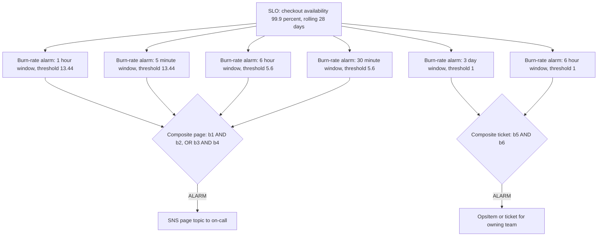

!!! tip "Why SLO alarms reduce pages"
    A static "error rate above 1 per cent for 5 minutes" alarm pages on every short blip, including blips that consume a negligible fraction of the budget, and may not page on a sustained 0.5 per cent error rate that silently exhausts the budget over a week. Burn-rate alarms page on the first case only when it is severe and catch the second as a slow-burn ticket. Teams that move to burn-rate alerting typically see fewer pages ==and== earlier detection of real degradation.

#### Alert fatigue and alarm hygiene

==Alert fatigue== is the state in which responders receive so many non-actionable alerts that they begin to ignore or mute all alerts, including critical ones. It is a well-documented cause of missed incidents in healthcare, aviation and software operations alike.

| Symptom of poor hygiene | Consequence | Remedy |
|-------------------------|-------------|--------|
| Alarms with no owner or runbook | Nobody knows what to do; pages are acknowledged and ignored | Every paging alarm has an owning team and a runbook link in its description |
| Alarms on causes that auto-heal | Pages for problems auto scaling already fixed | Convert to dashboard or ticket |
| Flapping alarms | Dozens of notifications per hour | M of N, longer periods, hysteresis via separate thresholds, composite alarms |
| One failure, twenty alarms | Responder overwhelmed at the moment clarity matters most | Composite alarms with child alarms that have no actions |
| Duplicate notifications per environment | Test environments paging production on-call | Separate SNS topics per environment and severity |
| Alarms nobody reviews | Thresholds drift away from reality | Monthly alarm review: which fired, which were actionable, which were missed |

A simple quantitative target helps: for each paging alarm that fired in the last month, ask =="Did a human need to take an action that could not wait until working hours?"== If the answer is no for more than a small fraction, demote the alarm.

##### Severity and routing

| Severity | Criteria | Notification | Response time |
|----------|----------|--------------|---------------|
| SEV1 or page | Users are harmed now or imminently; fast burn of an SLO | Paging tool through SNS, chat channel, automatic investigation | Minutes, any time |
| SEV2 or urgent ticket | Degradation that will cause harm within hours to days; slow burn | Ticket and chat channel | Same working day |
| SEV3 or ticket | Hygiene and capacity trends, predicted exhaustion weeks away | Ticket or OpsItem | Planned work |
| Informational | Useful context, no action | Dashboard only | None |

Map severities to separate SNS topics (for example `ops-page-prod`, `ops-ticket-prod`, `ops-info-prod`) so that routing changes never require editing hundreds of alarms.

### AWS Service Deep Dive

#### Purpose

CloudWatch dashboards provide a shared, customisable visual model of system health across accounts and Regions. CloudWatch alarms provide a managed, highly available evaluation engine that converts telemetry into state and state into action. Together they form the ==detection layer== of the observability control loop: dashboards support human judgement, alarms support timely decisions and automation.

#### Architecture

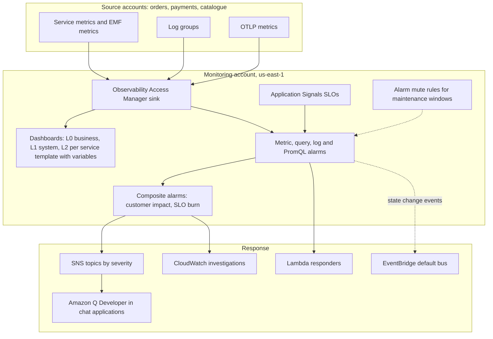

- ==Regional service.== Alarms and dashboards are regional resources, although dashboards are listed globally in the console and can display data from any Region. An alarm evaluates metrics in its own Region, or source-account metrics through cross-account observability.
- ==Evaluation is independent of workloads.== Alarm evaluation runs on AWS infrastructure. An alarm on an EC2 instance still fires if that instance, its VPC or its Availability Zone fails.
- ==Control plane and data plane.== `PutMetricAlarm`, `PutCompositeAlarm`, `PutDashboard` and `PutAlarmMuteRule` are low-volume control-plane calls usually made by IaC (and rate limited, for example a few `PutMetricAlarm` calls per second by default). `GetMetricData` is the data-plane read used by dashboards and by your own tools.
- ==Events.== Every alarm state change is emitted to EventBridge as `CloudWatch Alarm State Change` (and multi time series contributors as contributor state-change events), which is how alarms integrate with any automation.

#### Important Features

| Feature | Summary |
|---------|---------|
| Dashboards with rich widgets | Graphs, numbers, gauges, alarm status, logs tables, text, explorer and custom Lambda-backed widgets |
| Dashboard variables | One template dashboard for many services, functions or clusters |
| Cross-account, cross-Region dashboards | One pane of glass through a monitoring account |
| Dashboard sharing | Public, specific users, or SSO |
| Metric math and search expressions | Derived ratios and dynamic series without new custom metrics |
| Metrics Insights queries | SQL-like selection by dimension or tag, in dashboards and alarms |
| Static, anomaly detection and query alarms | Thresholds that are fixed, learned, or computed over dynamic sets of resources |
| Multi time series alarms | Per-contributor evaluation and events from one alarm definition |
| Log query alarms and PromQL alarms | Alarm directly on logs queries and on OpenTelemetry metrics |
| Composite alarms with action suppression | Noise reduction and dependency-aware alerting |
| Alarm mute rules | Scheduled muting for maintenance windows |
| Application Signals SLOs | Error budgets, burn rates, SLO recommendations, exclusion windows |
| Recommended alarms | Suggested alarms and thresholds per AWS service |
| Alarm actions | SNS, Lambda, EC2, Auto Scaling, OpsItems, investigations, plus EventBridge events |

#### Limitations

- ==Actions only on transitions.== There is no built-in re-notification while an alarm remains in `ALARM`.
- ==Metric resolution and delay bound detection speed.== An alarm can never be faster than the metric it watches; five-minute metrics produce five-minute detection at best.
- ==Anomaly detection needs history== and can learn slowly degrading behaviour as normal.
- ==Metrics Insights aggregations are limited== to `AVG`, `SUM`, `MIN`, `MAX` and `COUNT`, and query alarms have a per-Region quota.
- ==Composite alarms cannot evaluate metrics directly==; every condition must first be a child alarm.
- ==No native on-call scheduling or escalation.== CloudWatch notifies through SNS; rotations, escalations and acknowledgements need a paging tool (or, for existing customers only, Incident Manager).
- ==Dashboards are not an analytics tool.== Long-range business analysis belongs in a data warehouse or OpenSearch ([Section 7.2](../unit7/topic2.md)), not on a CloudWatch dashboard.

#### Pricing Model and recommendations

!!! info "Pricing figures"
    Prices below are indicative us-east-1 figures in September 2026. CloudWatch pricing is tiered and changes over time; always verify with the CloudWatch pricing page and the AWS Pricing Calculator.

| Dimension | How it is charged (indicative) |
|-----------|--------------------------------|
| Dashboards | Per custom dashboard per month (historically about 3 USD), prorated hourly; automatic dashboards are free |
| Standard-resolution alarm | About 0.10 USD per alarm metric per month |
| High-resolution alarm | About 0.30 USD per alarm metric per month |
| Anomaly detection alarm | Charged as three alarm metrics (the metric plus the upper and lower band), about 0.30 USD per month at standard resolution |
| Metric math alarm | Per metric referenced in the expression |
| Composite alarm | About 0.50 USD per month, regardless of the number of children |
| Metrics Insights query alarm | Standard alarm price plus a charge based on the number of metrics (samples) the query analyses |
| Log query alarm | Alarm price plus Logs Insights query charges for data scanned on each scheduled run |
| `GetMetricData` | Per 1,000 metrics requested beyond the free tier (about 0.01 USD per 1,000); dashboards viewed in the console do not incur this charge, but third-party tools and scripts do |
| Application Signals | Per million signals (about 1.50 USD for the first tier), with a complimentary period for new users |
| Free tier (monthly) | 3 custom dashboards with up to 50 metrics each, 10 alarm metrics, 10 custom or detailed-monitoring metrics, 1 million API requests |

Recommendations:

1. Replace hundreds of per-resource alarms with a few ==multi time series Metrics Insights alarms== where per-resource tuning is unnecessary.
2. Use ==composite alarms== for notifications and leave children without actions; the composite fee is small compared to the cost of alert fatigue.
3. Use ==one template dashboard with variables== instead of one dashboard per service.
4. Prefer ==standard resolution== unless sub-minute detection is genuinely required.
5. Delete alarms and dashboards together with the resources they watch by defining them ==in the same IaC stack==; orphaned alarms cost money and create noise (`INSUFFICIENT_DATA` forever).
6. Watch `GetMetricData` costs from external monitoring tools polling CloudWatch; consider metric streams to push data instead ([Section 7.1](../unit7/topic1.md#infrastructure-and-application-monitoring-with-amazon-cloudwatch)).

#### Performance Characteristics

| Characteristic | Behaviour |
|----------------|-----------|
| Evaluation frequency | Every minute for standard alarms; every 10 seconds for high-resolution alarms; hourly for multi-day windows |
| Detection latency | Metric publishing delay plus M periods plus evaluation interval |
| Action latency | Typically seconds after the state change; SNS and Lambda add their own delivery latency |
| Dashboard load time | Grows with the number of widgets, metrics and the time range; very large dashboards load slowly |
| Metrics Insights queries | Bounded by quotas on query rate and datapoints scanned; the most recent hours are fastest |

#### Scaling Behaviour

Alarms and dashboards scale administratively rather than technically. The scaling problems are ==human==: thousands of alarms that nobody understands, dashboards copied and diverging, and inconsistent thresholds. The tools that scale are query alarms (one rule for a whole fleet), dashboard variables (one template for many services), tag-based selection (new resources join automatically), cross-account observability (one monitoring account for an organisation) and IaC modules or CDK constructs that give every new service a standard set of alarms and a dashboard.

#### Availability

CloudWatch is a regional service designed so that alarm evaluation does not depend on the monitored resources. For multi-Region applications, create alarms ==in each Region== for that Region's resources, and consider a cross-Region "watchdog" such as a Synthetics canary running in another Region, so that a Regional problem affecting CloudWatch itself or the notification path is still detected. Review the current CloudWatch Service Level Agreement for committed availability.

!!! warning "Monitor the monitoring"
    If alarms notify through one SNS topic to one email address that nobody reads, or through a chat channel whose integration broke last month, the alarm system has failed silently. Send a scheduled test notification through every paging path (for example a weekly synthetic alarm) and alarm on SNS `NumberOfNotificationsFailed`.

#### Security Features

| Control | Purpose |
|---------|---------|
| IAM identity policies | Separate who may view dashboards (`cloudwatch:GetDashboard`, `GetMetricData`) from who may change alarms (`PutMetricAlarm`, `DeleteAlarms`, `DisableAlarmActions`) |
| Resource-level permissions and tags | Restrict alarm changes to a team's own alarms using ARNs, name prefixes or tags |
| Lambda resource-based policy | Allows `lambda.alarms.cloudwatch.amazonaws.com` to invoke a responder, with `aws:SourceAccount` and `aws:SourceArn` conditions to prevent confused deputy use |
| SNS topic policy and encryption | Allows `cloudwatch.amazonaws.com` to publish; SSE-KMS with a customer managed key requires a key policy for CloudWatch |
| Dashboard sharing role | Scoped read-only role used for shared dashboards |
| CloudTrail | Records alarm and dashboard changes, including who disabled alarm actions |
| Cross-account observability | Source accounts grant read-only sharing to a monitoring account through Observability Access Manager links |

#### Service Limits

!!! info "Quotas"
    Indicative values in September 2026. Many are adjustable; check Service Quotas and the CloudWatch quotas page before designing at scale.

| Limit | Value |
|-------|-------|
| Metrics in a metric math alarm expression | 10 |
| Metrics Insights alarms per Region | 200 (not adjustable) |
| Alarm mute rules per Region | 2,000 (not adjustable) |
| Alarms per mute rule | 100 |
| Mute rule duration | 1 minute to 15 days |
| `PutMetricAlarm` and `PutCompositeAlarm` request rate | A few requests per second (adjustable) |
| Composite alarm rule | Bounded rule length and number of referenced alarms; avoid circular dependencies |
| Widgets per dashboard and metrics per graph | Bounded; very large dashboards should be split |
| SLO composite operations | 2 to 20 |
| SLO exclusion windows | Up to 10 per SLO |
| CloudWatch investigations | Concurrency and monthly quotas per account (see the next part) |

### Important AWS Terminology

Metric, namespace, dimension, statistic, percentile, resolution and Embedded Metric Format were defined in [Section 7.1](../unit7/topic1.md#infrastructure-and-application-monitoring-with-amazon-cloudwatch); metric filter and Logs Insights in [Section 7.2](../unit7/topic2.md#log-analysis-with-amazon-cloudwatch-logs-insights). The following terms are specific to dashboards, alarms and SLOs.

| Term | Meaning |
|------|---------|
| Dashboard body | JSON document describing a dashboard's widgets and layout |
| Widget | One visual element on a dashboard |
| Dashboard variable | A value selectable at view time that changes dimensions or search patterns across widgets |
| Metric math | Expressions computing new series from existing metrics at query time |
| Search expression | Dynamic selection of metrics by namespace, dimension and name |
| Metrics Insights | SQL-like query language for selecting and aggregating metrics |
| Alarm state | `OK`, `ALARM` or `INSUFFICIENT_DATA` |
| Period | Length of each datapoint the alarm evaluates |
| Evaluation periods (N) | Number of recent periods considered |
| Datapoints to alarm (M) | Number of breaching periods out of N required for `ALARM` |
| Missing-data treatment | How absent datapoints are counted: `missing`, `notBreaching`, `breaching`, `ignore` |
| Anomaly detection band | Expected range learned from a metric's history |
| Contributor | One time series evaluated individually within a multi time series alarm |
| Composite alarm | Alarm whose state is a Boolean rule over other alarms |
| Actions suppressor | Alarm that, while in `ALARM`, suppresses a composite alarm's actions |
| Alarm mute rule | Scheduled rule that mutes the actions of named alarms for a time window |
| SLI | Measured ratio of good events to valid events |
| SLO | Target for an SLI over an interval |
| SLA | Contractual commitment with penalties |
| Error budget | Allowed unreliability: 100 per cent minus the SLO over the interval |
| Burn rate | Error rate over a window divided by the budgeted error rate |
| Alert fatigue | Desensitisation of responders caused by excessive non-actionable alerts |
| Flapping | Rapid oscillation of an alarm between states |
| MTTD, MTTA, MTTR | Mean time to detect, acknowledge, and recover or mitigate |

### Configuration Options

#### Metric alarm parameters

| Parameter | Options | Architect's guidance |
|-----------|---------|----------------------|
| `MetricName`, `Namespace`, `Dimensions` | Must match exactly | A wrong dimension silently yields `INSUFFICIENT_DATA`; test by viewing the alarm graph |
| `Statistic` or `ExtendedStatistic` | `Average`, `Sum`, `Minimum`, `Maximum`, `SampleCount`, `p99`, `tm99`, and others | `Sum` for counts, percentiles for latency, `Maximum` for age and saturation |
| `Period` | 10, 20, 30 s (high resolution) or multiples of 60 s | At least the metric's publishing interval |
| `EvaluationPeriods` and `DatapointsToAlarm` | N and M | 3 of 5 is a good default for symptoms |
| `Threshold` or `ThresholdMetricId` | Static value or anomaly band | Derive from SLO or capacity |
| `ComparisonOperator` | `GreaterThanThreshold`, `LessThanThreshold`, `LessThanLowerOrGreaterThanUpperThreshold`, and others | Use the band operators for anomaly detection |
| `TreatMissingData` | `missing`, `notBreaching`, `breaching`, `ignore` | Decide what absence means for each metric |
| `EvaluateLowSampleCountPercentile` | `evaluate`, `ignore` | `ignore` for low-traffic latency alarms |
| `AlarmActions`, `OKActions`, `InsufficientDataActions` | ARNs of SNS topics, Lambda functions, EC2 and Auto Scaling actions, SSM | Send `OK` notifications for paging alarms so responders know when impact ends |
| `ActionsEnabled` | true or false | Keep true; use mute rules for planned silence |
| `AlarmDescription` | Free text up to a bounded length | Include owner, severity, runbook URL and dashboard URL |
| `Tags` | Key-value pairs | `team`, `severity`, `service`, `environment` for routing and IAM |

#### Composite alarm parameters

| Parameter | Guidance |
|-----------|----------|
| `AlarmRule` | Keep rules readable; name child alarms consistently (`service-signal-window`) |
| `ActionsSuppressor` | Name the alarm that represents a known, already-handled condition |
| `ActionsSuppressorWaitPeriod` | Long enough for the suppressor to fire first |
| `ActionsSuppressorExtensionPeriod` | Long enough for the system to stabilise |
| Child alarm actions | Normally none, so only the composite notifies |

#### Dashboard options

| Option | Guidance |
|--------|----------|
| Default time range and time zone | Last 3 hours, UTC or the operating team's local time consistently |
| Auto refresh | 1 minute for operational dashboards; off for analysis dashboards |
| Period override | Auto, or fixed to match alarm periods so graphs and alarms agree |
| Variables | `ServiceName`, `Environment`, `FunctionName` as appropriate |
| Annotations | Horizontal annotations for thresholds; vertical annotations for deployments |
| Text widgets | Ownership, escalation, runbook, "how to read" |

### Design Considerations

#### Scalability

Design alarms and dashboards as ==products of templates==, not handcrafted artefacts. A CDK construct or Terraform module named, for example, `StandardServiceMonitoring` creates the RED alarms, the burn-rate composite, the DLQ alarm and a dashboard for any new service. Query alarms and tag-based selection extend coverage to resources created later.

#### Availability

Alarm evaluation is independent of the workload, but the ==notification path== is part of your availability design: SNS topics, subscriptions, chat integrations and paging tools. Use at least two independent channels for critical pages (for example a paging tool and a chat channel) and test them regularly.

#### Reliability

Reliable detection depends on correct missing-data treatment, alarms on absence, appropriate periods, and alarms that are tested. A useful practice is ==alarm testing in CI/CD==: after deploying monitoring changes, call `SetAlarmState` to force a test alarm into `ALARM` and confirm that the expected notification or automation runs, then return it to `OK`.

#### Durability

Metrics are retained by CloudWatch according to their resolution ([Section 7.1](../unit7/topic1.md#infrastructure-and-application-monitoring-with-amazon-cloudwatch)), but alarm ==history== is retained for a limited period (historically two weeks). Export alarm state-change events through EventBridge to a log group or S3 if you need a long-term record for post-incident reviews and reliability reporting.

#### Latency

Detection latency is the sum of metric delay, the evaluation window and action delivery. For a checkout flow with a fast-burn page, aim for detection within a few minutes. For a nightly batch job, a daily evaluation is acceptable. Match the alarm to the business consequence of delay rather than making every alarm as fast as possible.

#### Cost

Observability cost grows with alarm count, custom metrics, dashboards, query scans and high resolution. The cost of alarms is usually small compared with custom metrics and log ingestion, so do not economise on the few alarms that matter; economise by removing the many that do not. The Cost Optimization subsection below gives specific levers.

#### Performance

Large dashboards with long time ranges and many series load slowly and discourage use. Keep operational dashboards under a few dozen widgets, move deep detail to linked drill-down dashboards, and use appropriate periods (a 1-minute period over 30 days is thousands of points per line).

#### Maintainability

Store dashboards and alarms in version control, review changes like code, and generate them from service metadata. Include the runbook link and owner in every alarm description, and keep naming conventions strict: `<env>-<service>-<signal>-<window>`, for example `prod-orders-availability-burn-1h`.

#### Operational Complexity

The complexity of alerting is mostly organisational: agreeing SLOs with product owners, assigning ownership, running on-call rotations and reviewing alarms. Managed features (composite alarms, mute rules, SLOs) reduce technical complexity but cannot replace these decisions.

!!! question "Architect's checklist before adding an alarm"
    What user-visible symptom or unavoidable future harm does it detect? Who is notified, and what will they do? Is there a runbook? What severity is it, and does it need to wake someone? What happens when the metric is missing? How will you know it works? Will it duplicate an existing alarm during the same incident?

### AWS Best Practices

| Pillar | Dashboards and alarms practice |
|--------|--------------------------------|
| Operational Excellence | Define SLOs for critical journeys; derive paging alarms from burn rates; runbook link and owner on every alarm; dashboards and alarms in IaC; regular alarm reviews; test alarms in the pipeline |
| Security | Least-privilege separation of view and change permissions; alarm on security-relevant metrics such as root account usage via CloudTrail metric filters; restrict public dashboard sharing; encrypt SNS topics |
| Reliability | Symptom-based alarms; alarms on absence; composite alarms to avoid storms; alarms per Region for multi-Region designs; monitor the notification path |
| Performance Efficiency | Percentile latency alarms; anomaly detection for seasonal traffic; high resolution only where needed; dashboards that show saturation next to latency |
| Cost Optimization | Query alarms instead of per-resource alarms; template dashboards with variables; delete orphaned alarms; standard resolution by default; control `GetMetricData` polling |
| Sustainability | Fewer, better alarms and dashboards reduce computation and, more importantly, human interruption; avoid high-resolution metrics and polling that nobody uses |

### Security Considerations

#### IAM and least privilege

Separate three groups of permissions: ==viewing== (`cloudwatch:GetDashboard`, `ListDashboards`, `GetMetricData`, `DescribeAlarms`), ==managing monitoring== (`PutMetricAlarm`, `PutCompositeAlarm`, `PutDashboard`, `PutAlarmMuteRule`, `DeleteAlarms`) and ==silencing== (`DisableAlarmActions`, `SetAlarmState`). Silencing is a privileged operation, because an attacker who can disable alarms can hide their activity. Grant it narrowly and alarm on it through CloudTrail.

```json
{
  "Version": "2012-10-17",
  "Statement": [
    {
      "Sid": "ManageOwnTeamAlarms",
      "Effect": "Allow",
      "Action": ["cloudwatch:PutMetricAlarm", "cloudwatch:DeleteAlarms", "cloudwatch:TagResource"],
      "Resource": "arn:aws:cloudwatch:us-east-1:111122223333:alarm:prod-orders-*"
    },
    {
      "Sid": "DenySilencingOutsideBreakGlass",
      "Effect": "Deny",
      "Action": ["cloudwatch:DisableAlarmActions", "cloudwatch:DeleteAlarmMuteRule"],
      "Resource": "*",
      "Condition": {"StringNotLike": {"aws:PrincipalArn": "arn:aws:iam::111122223333:role/ops-break-glass"}}
    }
  ]
}
```

#### Encryption and SNS

Alarm notifications may contain resource names, metric values and descriptions. Encrypt SNS topics with SSE-KMS. When using a customer managed key, the key policy must allow the CloudWatch service principal to use the key, otherwise publishes fail silently from the alarm's point of view. The same principle was explained for SNS and SQS in [Chapter 6.3](../unit6/topic3.md#message-queues-with-amazon-sqs).

#### Private and public resources

Dashboards shared publicly expose the underlying metrics to anyone with the URL. Share with specific users or through SSO wherever possible, and never share dashboards that include logs widgets with personal data.

#### Logging and compliance

CloudTrail records every alarm and dashboard change. Build a CloudTrail-based alarm or EventBridge rule for `DisableAlarmActions`, `DeleteAlarms` and `PutAlarmMuteRule` in production accounts. Many compliance frameworks (for example CIS AWS Foundations benchmarks, implemented as AWS Security Hub controls) require specific metric filters and alarms on CloudTrail logs, such as unauthorised API calls, console sign-in without MFA and root account usage.

### Performance Optimization

Dashboards and alarms are themselves part of performance work: they reveal where time goes and they drive scaling decisions. This subsection covers the monitoring-specific aspects; the Performance Optimization part of this section covers the tools in depth.

#### Caching and dashboards

Dashboards query CloudWatch on every refresh. Very large dashboards viewed by many people on one-minute refresh generate substantial query load and, when accessed through APIs, `GetMetricData` cost. Keep the Level 0 and Level 1 dashboards small, and avoid building "wallboards" that refresh dozens of heavy widgets continuously.

#### Auto scaling and alarms

Target tracking policies for EC2 Auto Scaling, ECS services and DynamoDB create and manage their own CloudWatch alarms. Do not edit or delete those alarms by hand, and do not add paging actions to them: they fire constantly by design, because scaling is normal behaviour. Your paging alarms should watch the ==symptom== that scaling is meant to protect (latency, errors, backlog age), so that you are notified only when scaling fails to keep up.

#### Load balancing and health

ALB `UnHealthyHostCount` and `HealthyHostCount` ([Section 7.1](../unit7/topic1.md) and [Chapter 2.2](../unit2/topic2.md)) are cause signals. Alarm on `HealthyHostCount` falling below the minimum needed to serve peak traffic, not on a single unhealthy target that the load balancer and ECS already replaced.

#### Parallelism and connection reuse in custom metrics

Publishing custom metrics synchronously with `PutMetricData` inside a request path adds latency and API calls. Use the Embedded Metric Format in logs ([Section 7.1](../unit7/topic1.md#infrastructure-and-application-monitoring-with-amazon-cloudwatch)) so that metrics are extracted asynchronously, or batch `PutMetricData` calls with up to many values per request from a background thread.

#### Monitoring the right percentiles

Averages hide tail latency. Show p50, p90 and p99 on the same graph, and alarm on the percentile that corresponds to your SLO. When p99 diverges from p50 while traffic is steady, the cause is usually contention (locks, connection pool exhaustion, garbage collection) rather than general overload, which points the investigation in the right direction.

### Cost Optimization

| Lever | Practice |
|-------|----------|
| Pricing model | Understand per-dashboard, per-alarm-metric and per-query charges; composite alarms are priced per alarm, not per child |
| Pay-as-you-go | Alarms and dashboards have no upfront commitment; delete what is not used |
| Reserved capacity and Savings Plans | Not applicable to CloudWatch alarms and dashboards; savings apply to the monitored compute |
| Consolidation | One multi time series query alarm replaces many per-resource alarms; one template dashboard with variables replaces many copies |
| Resolution | Standard resolution alarms and metrics by default; high resolution only for latency-critical signals |
| Lifecycle | Alarms and dashboards in the same IaC stack as resources, so they are removed with them; periodic report of alarms in `INSUFFICIENT_DATA` for more than 30 days |
| Metric math instead of new metrics | Compute ratios at query time rather than publishing derived custom metrics |
| Rightsizing observability | Remove dashboards not viewed in 90 days; review high-cardinality custom metrics feeding dashboards |
| Cost Explorer | Filter by service CloudWatch and usage type (for example alarm, dashboard, metrics, `GMD-Metrics`) to see what drives cost |
| Trusted Advisor and Cost Optimization Hub | Review recommendations; combine with CloudWatch usage metrics in the `AWS/Usage` namespace |

!!! example "Cost comparison: per-resource alarms versus a query alarm"
    A platform runs 400 Lambda functions in production and wants an error alarm on each. With one static alarm per function, the cost is 400 alarm metrics, about 40 USD per month, plus the operational burden of creating an alarm whenever a function is added. A single multi time series Metrics Insights alarm grouped by `FunctionName` costs the alarm price plus query charges based on the number of metrics analysed, follows new functions automatically, and still reports each failing function as a separate contributor. The larger saving is operational: no function is ever deployed without an alarm. Verify current query-alarm pricing before comparing precisely.

!!! info "The cost of observability itself"
    In many organisations the CloudWatch bill is dominated not by alarms and dashboards but by ==custom metric cardinality== ([Section 7.1](../unit7/topic1.md#infrastructure-and-application-monitoring-with-amazon-cloudwatch)), ==log ingestion and storage== ([Section 7.2](../unit7/topic2.md)) and ==trace volume==. The Performance Optimization part of this section returns to the cost of observability as a whole and how to control it without losing visibility.

### Integration with Other AWS Services

#### Amazon SNS: the notification hub

SNS topics decouple alarms from recipients. An alarm publishes to `ops-page-prod`; subscriptions deliver to email, SMS, an HTTPS endpoint of a paging service, an SQS queue for auditing, a Lambda function for enrichment, and chat channels through Amazon Q Developer in chat applications. Changing who is notified never requires touching the alarm. [Chapter 6.3](../unit6/topic3.md) covered SNS in depth.

#### AWS Lambda: custom actions

A Lambda alarm action runs code on every state change: enrich the notification with recent logs and a dashboard link, open a ticket, or remediate. Because the alarm invokes the function asynchronously, Lambda's asynchronous retry and on-failure destination settings apply. The next part is devoted to this integration.

#### Amazon EventBridge: routing alarm events

Every alarm state change arrives on the default event bus. EventBridge rules can match on `detail.alarmName` prefixes, `detail.state.value` and other fields to route alarms to Step Functions workflows, SSM Automation, SQS queues or a central operations bus in another account ([Chapter 6.3](../unit6/topic3.md#event-routing-with-amazon-eventbridge)).

```json
{
  "source": ["aws.cloudwatch"],
  "detail-type": ["CloudWatch Alarm State Change"],
  "detail": {
    "alarmName": [{"prefix": "prod-"}],
    "state": {"value": ["ALARM"]}
  }
}
```

#### Amazon ECS and Amazon EKS

For ECS services, the key paging symptoms are ALB 5xx rate and p99 `TargetResponseTime` per target group, plus application-level RED metrics from Application Signals or EMF. Cause dashboards use Container Insights ([Section 7.1](../unit7/topic1.md#infrastructure-and-application-monitoring-with-amazon-cloudwatch)): running versus desired task count, CPU and memory utilisation, and restart counts. ECS deployment circuit breakers and CodeDeploy blue/green deployments can use CloudWatch alarms to trigger ==automatic rollback== (Chapters [2.3](../unit2/topic3.md) and [5.1](../unit5/topic1.md#aws-codedeploy)), which makes alarm quality a deployment-safety concern.

For EKS, Container Insights with enhanced observability provides cluster, node, pod and container metrics; PromQL alarms and Amazon Managed Service for Prometheus alerting rules cover Kubernetes-native metrics. Keep one principle: page on service symptoms, not on individual pod restarts that Kubernetes already handles.

#### AWS Lambda functions as monitored resources

Key signals are `Errors` (with `notBreaching` missing data), `Throttles`, `Duration` p99 relative to the configured timeout, `ConcurrentExecutions` relative to reserved or account concurrency, and `IteratorAge` or `OffsetLag` for stream sources. A multi time series alarm on `Errors` grouped by `FunctionName` gives fleet coverage.

#### Amazon API Gateway

Alarm on `5XXError` rate and `Latency` p99 per stage and, where detailed metrics are enabled, per resource and method. `4XXError` includes throttling (429) responses; alarm on 429 specifically if your usage plans might be throttling legitimate clients ([Chapter 1.7](../unit1/topic7.md)).

#### AWS CodeDeploy, CodePipeline and ECS deployments

Alarm-based rollback connects this part to Unit V: a CodeDeploy deployment group lists CloudWatch alarms and rolls back if any enters `ALARM` during the deployment (the mechanics are in [Chapter 5.1](../unit5/topic1.md#aws-codedeploy)). Lambda alias traffic shifting and ECS blue/green deployments depend on these alarms being ==fast and specific to the new version== (for example using the `ExecutedVersion` dimension for Lambda or the green target group for ECS).

#### Summary of integrations

| Service | Integration | Why |
|---------|-------------|-----|
| SNS | Alarm action | Decouple alarms from recipients; fan-out to many channels |
| Lambda | Alarm action; also monitored resource | Custom responses; serverless fleet monitoring |
| EventBridge | Receives all alarm state changes | Route to any target, centralise across accounts |
| Auto Scaling | Alarm action; target tracking alarms | Elasticity driven by metrics |
| EC2 | Alarm actions | Recover, reboot, stop or terminate instances |
| Systems Manager | OpsItem action; Automation via EventBridge | Tracking and runbook execution |
| CloudWatch investigations | Alarm action | Automatic AI-assisted diagnosis |
| CodeDeploy and ECS | Alarm-based rollback | Deployment safety |
| Application Signals | SLOs and burn-rate alarms | User-centric alerting |
| Synthetics and RUM | Canary and app monitor alarms and SLOs | Outside-in detection |
| Amazon Q Developer in chat applications | Alarm notifications in Slack or Microsoft Teams | ChatOps |

### Common Architecture Patterns

#### Symptom-first alerting with cause dashboards

Page on a small number of symptom alarms per service (availability burn rate, latency burn rate, backlog age, canary failure). Put cause metrics on the Level 2 and Level 3 dashboards linked from the alarm description. When the page arrives, the responder moves from symptom to cause by following links.

#### Composite alarm as an alert aggregator

Many specific child alarms, none with actions; one composite alarm per service and severity that notifies. The composite becomes the unit of ownership and the unit of paging.

#### SLO burn-rate alerting

Define SLOs per critical journey in Application Signals, create multi-window burn-rate alarms, combine them in composite alarms for page and ticket severities, and exclude planned maintenance with SLO exclusion windows and alarm mute rules.

#### Dependency-aware suppression

A shared-dependency alarm (database failover, third-party outage detected by a canary) acts as an actions suppressor for downstream services' composite alarms, so only the owning team is paged for a shared failure.

#### Monitoring account hub-and-spoke

All workload accounts link to a monitoring account through Observability Access Manager. Organisation-wide dashboards and fleet query alarms live in the monitoring account; service-specific alarms remain in workload accounts with the services, deployed by the same pipelines. This mirrors the EventBridge hub-and-spoke pattern of [Chapter 6.3](../unit6/topic3.md#event-routing-with-amazon-eventbridge).

#### Alarm-gated deployment

Deployment stages (CodeDeploy, Lambda alias shifting, ECS blue/green, Argo Rollouts on EKS) consult alarms and roll back automatically when they fire. This is the Circuit Breaker idea of [Chapter 4.3](../unit4/topic3.md) applied to releases. The traffic-shifting and rollback mechanics are covered in [Chapter 5.1](../unit5/topic1.md#aws-codedeploy); the alarm-design requirement here is that the gating alarm evaluates ==only the new version== (for example the `ExecutedVersion` dimension) with an M of N window short enough to breach within the deployment's bake time.

#### Heartbeat or dead man's switch

A scheduled job publishes a `JobSucceeded` metric of 1 on success. An alarm with `breaching` missing data and a period slightly longer than the schedule fires if the metric does not arrive. This detects jobs that silently stop running, which no error alarm can.

### Industry Use Cases

| Industry | Use | Dashboards and alarms design |
|----------|-----|------------------------------|
| E-commerce | Checkout reliability during sales events | SLOs on checkout availability and latency; anomaly detection on orders per minute to catch silent drops; mute rules only for planned maintenance; Level 0 dashboard for the war room |
| Banking and payments | Card authorisation latency | High-resolution p99 latency alarms; composite alarms requiring latency and error signals to agree; strict SLO below the regulator-visible SLA; alarm history exported for audit |
| Media streaming | Playback start failures | RUM and canary SLOs by Region; per-Region dashboards; burn-rate paging |
| SaaS platforms | Per-tenant health | Multi time series alarms grouped by tenant dimension, with contributor events routed to the account team |
| Healthcare | Patient-facing appointment systems | Business-hours anomaly detection; heartbeat alarms on integration feeds with hospital systems |
| Government and education (for example a university portal in Bhutan) | Examination results publication | Load-driven dashboards prepared in advance; alarms on ALB 5xx and latency; SNS to both email and chat because staff are not always at desks |
| Logistics | Shipment event pipelines | Alarms on SQS backlog age and absence of events per carrier integration |

### Advantages

| Advantage | Explanation |
|-----------|-------------|
| Native integration | AWS service metrics and alarm actions work without agents or plugins |
| Independent evaluation | Alarms keep working when the monitored resources fail |
| Dynamic coverage | Query and tag-based alarms follow the fleet automatically |
| Noise control | Composite alarms, suppression, mute rules and SLO alarms reduce alert fatigue |
| Automation-ready | Every state change is an event; direct Lambda actions enable self-healing |
| Organisation scale | Cross-account observability gives one monitoring account for many workloads |
| Infrastructure as code | Alarms and dashboards are API resources with full CloudFormation, CDK and Terraform support |
| Low entry cost | Free tier and low per-alarm prices make good practice affordable for small teams |

### Limitations

| Limitation | Trade-off or mitigation |
|------------|-------------------------|
| No on-call scheduling, escalation or acknowledgement | Integrate a paging tool through SNS; Incident Manager is closed to new customers |
| Actions only on state transitions | Implement reminders in the paging tool or with automation |
| Detection bounded by metric granularity and delay | Use high-resolution metrics and EMF for critical paths |
| Anomaly detection needs history and can normalise gradual degradation | Pair with static SLO-based alarms |
| Query alarm quotas and limited aggregations | Mix query alarms with static alarms; use Application Signals for percentiles |
| Dashboards are operational, not analytical | Use OpenSearch, Athena or a data warehouse for long-range analysis |
| Regional scope | Deploy alarms per Region; use cross-Region canaries as watchdogs |

### Common Mistakes

#### Beginner Mistakes

| Mistake | Consequence | Correction |
|---------|-------------|------------|
| Alarming on average latency | Tail latency problems go unnoticed | Alarm on p95 or p99 |
| Using `Average` for error counts | Misleading values | Use `Sum` for counts and compute rates with metric math |
| One-minute period on a five-minute metric | Constant `INSUFFICIENT_DATA` or flapping | Period at least equal to the publishing interval |
| Wrong dimensions | Alarm stuck in `INSUFFICIENT_DATA` | Check the alarm graph shows data after creation |
| Default missing-data treatment everywhere | Silent failures or false alarms | Decide per metric what absence means |
| Email-only notifications to one person | Alerts missed on holidays and at night | SNS to a team channel and a paging tool |
| No `OK` action | Responders do not know when impact ended | Add `OKActions` to paging alarms |
| Dashboards with 80 widgets | Nobody can read them in an incident | Layered dashboards; answer at the top-left |

#### Production Mistakes

| Mistake | Consequence | Correction |
|---------|-------------|------------|
| Paging on CPU and memory | Alert fatigue; ignored pages | Page on symptoms and burn rate; cause metrics on dashboards |
| No alarm on absence | Producer stops, everything looks green | Heartbeat alarms with `breaching`, canaries, anomaly detection on drops |
| Alarm storms during shared failures | Responders overwhelmed | Composite alarms and actions suppressors |
| `DisableAlarmActions` never reverted | Next incident undetected | Mute rules with end times; compliance check for disabled actions |
| Alarms without runbooks or owners | Slow, inconsistent response | Owner, severity, runbook and dashboard links in every description |
| Low-traffic ratio alarms | Flapping at night | Minimum-traffic guards, longer periods, trimmed means |
| Paging actions on target tracking alarms | Pages on every scale-out | Leave scaling alarms alone; page on user symptoms |
| Monitoring created by hand in the console | Drift, orphaned alarms, missing coverage for new services | Dashboards and alarms as code, per-service templates |
| Untested notification path | Chat integration broken for weeks | Scheduled test alarms; alarm on SNS delivery failures |
| SLO set at 100 per cent or copied from the SLA | Constant pages or no early warning | SLO stricter than SLA, looser than 100 per cent, agreed with product owners |

### Summary

CloudWatch dashboards and alarms are the detection layer of the observability control loop. Dashboards compress thousands of time series into a few views organised by audience and question, from a business and SLO overview down to resource drill-down. Alarms evaluate metrics, expressions, queries or other alarms over an M out of N window, maintain a state, and act on state transitions through SNS, Lambda, Auto Scaling, EC2 actions, Systems Manager, CloudWatch investigations and EventBridge. The alarm family now spans static thresholds, metric math, anomaly detection, Metrics Insights single and multi time series queries, log query alarms, PromQL alarms and composite alarms, and is complemented by mute rules and SLOs with burn-rate alarms in Application Signals.

Architectural lessons:

- ==Page on symptoms, diagnose with causes.== Paging alarms detect user harm or unavoidable future harm; everything else belongs on dashboards or in tickets.
- ==Derive alerting from SLOs.== Error budgets and multi-window burn rates give earlier detection of real problems and far fewer false pages than static thresholds.
- ==Every alarm is a design decision.== Period, M of N, statistic, missing-data treatment and low-sample handling must be chosen deliberately for each signal; defaults cause both silent failures and flapping.
- ==Alarm on absence.== Heartbeats with `breaching` missing data, canaries and anomaly detection on drops catch the failures that produce no errors.
- ==Aggregate before you notify.== Composite alarms, actions suppressors and mute rules prevent alert storms and alert fatigue.
- ==Scale with queries and templates.== Multi time series query alarms, tag-based selection, dashboard variables and IaC constructs give every service the same high standard automatically.
- ==Monitor the monitoring.== Test notification paths, report disabled or orphaned alarms, and protect silencing permissions as privileged operations.

## Automated Incident Response with AWS Lambda

### Definition

==Automated incident response is the practice of detecting operational or security events and executing predefined, tested actions in code, without waiting for a human, to notify, enrich, diagnose, contain or remediate the problem.== On AWS the typical implementation is: a detection source (a CloudWatch alarm, an AWS service event such as a GuardDuty finding or an AWS Health event) produces an event; the event is delivered by a CloudWatch alarm action, an Amazon EventBridge rule or an Amazon SNS topic; and an ==executor== such as an AWS Lambda function, an AWS Systems Manager Automation runbook or an AWS Step Functions workflow performs the response.

==A Lambda responder is a Lambda function whose purpose is to receive an operational event and carry out one well-defined response safely.== Lambda is the natural executor for small, fast, custom responses because it is event-driven, requires no servers, scales to zero between incidents, and can call any AWS API through the SDK with a scoped IAM role.

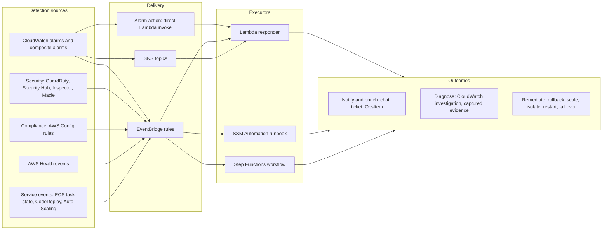

In the AWS architecture map, automated incident response spans ==Management and Governance== (CloudWatch, Systems Manager), ==Application Integration== (EventBridge, SNS, Step Functions), ==Compute== (Lambda) and ==Security, Identity and Compliance== (GuardDuty, Security Hub, Config). It corresponds directly to the "respond" function of security frameworks and to the operational excellence and reliability pillars of the Well-Architected Framework.

### Why This Service or Concept Exists

#### The problem: humans are slow, expensive and inconsistent at 03:00

Consider what happens without automation when a bad deployment raises the error rate of an order API:

| Phase | Manual timeline |
|-------|-----------------|
| Alarm fires and pages the on-call engineer | 0 minutes |
| Engineer wakes, acknowledges, finds a laptop, signs in with MFA | 5 to 15 minutes |
| Engineer opens dashboards, reads logs, correlates with the deployment | 10 to 20 minutes |
| Engineer decides to roll back and finds the procedure | 5 to 10 minutes |
| Rollback executes and the error rate recovers | 5 minutes |
| Total customer impact | 25 to 50 minutes |

An automated response that recognises "error-rate alarm on a version deployed less than 30 minutes ago" and shifts traffic back to the previous version can reduce impact to a few minutes. The human is still paged, but to confirm and investigate rather than to perform a well-understood mechanical action under stress.

Automation addresses four weaknesses of purely manual response:

1. ==Speed.== Machines react in seconds; humans in tens of minutes, especially outside working hours.
2. ==Consistency.== A runbook executed by code performs the same steps every time; a tired human skips steps or makes typing errors, a common cause of incidents becoming worse.
3. ==Scale.== A security finding affecting 300 instances, or a fleet of 600 Lambda functions, cannot be handled by hand.
4. ==Evidence.== Automation captures diagnostic data at the moment of failure (logs, metrics, process lists, configuration) before auto scaling or restarts destroy it.

#### Why AWS provides the building blocks rather than one product

Incident response differs greatly between organisations, and AWS provides composable primitives: alarms and service events as triggers, EventBridge as the router, Lambda for custom code, Systems Manager Automation for executable runbooks, Step Functions for multi-step workflows with approval, SNS and Amazon Q Developer in chat applications for communication, OpsCenter for tracking and CloudWatch investigations for AI-assisted diagnosis. This mirrors the cloud-native philosophy of the whole module: small managed components composed through events and IAM.

!!! info "Incident Manager availability"
    AWS Systems Manager Incident Manager, which provided response plans, on-call schedules and engagement, has been ==closed to new customers since 7 November 2025== and receives no new features; existing customers can continue to use it. AWS recommends Systems Manager OpsCenter for tracking operational issues and AWS Partner solutions (for example PagerDuty, ServiceNow or Jira Service Management) for paging, on-call and escalation. Designs in this part therefore treat paging as an external integration reached through SNS, EventBridge API destinations or webhooks.

#### Benefits over older methods

| Concern | Manual runbooks on a wiki | Scripts on an operations server | Event-driven automation on AWS |
|---------|---------------------------|---------------------------------|--------------------------------|
| Trigger | Human reads the alert | Cron or human | Event within seconds |
| Consistency | Varies by person | Good, if maintained | Good; versioned in IaC and tested in the pipeline |
| Availability | Depends on the on-call human | Operations server is a single point of failure | Regional managed services, no servers |
| Credentials | Human's own, often over-privileged | Long-lived keys on a server | Short-lived role credentials scoped per responder |
| Audit | Chat history, if any | Script logs, if kept | CloudTrail, CloudWatch Logs, execution history |
| Cost | Human time | Server running continuously | Pay per invocation or step |

!!! warning "Automation is also a source of incidents"
    Automation does not only shorten incidents; badly designed automation causes them. A responder that restarts every task whenever latency rises can turn a slow database into a total outage by multiplying connection storms. A remediation that "fixes" a security group can remove access that a legitimate batch job needed. The question an architect asks is therefore never "can we automate this?" but ==is this response well understood, safe to repeat, bounded in impact and reversible?== Only responses that pass that test should run without a human.

#### When to automate and when not to

| Automate fully | Automate with human approval | Keep manual, automate only the evidence |
|----------------|------------------------------|-----------------------------------------|
| Response is well understood and has been performed manually many times | Response is well understood but has significant blast radius | Cause is ambiguous or novel |
| Action is reversible (roll back, scale out, restart one task) | Action is costly or hard to reverse (fail over a database, isolate a production instance) | Several plausible actions with opposite effects |
| False positive does little harm | False positive would cause customer impact | Action requires business judgement (communicate with customers, legal) |
| Examples: roll back a canary deployment, re-drive a DLQ after a fix, enable S3 Block Public Access on a non-exempt bucket | Examples: Regional failover, revoking all sessions of an IAM role, quarantining an instance serving traffic | Examples: data corruption, suspected insider threat, multi-service cascading failure |

### Core Concepts

#### The incident lifecycle

An ==incident== is an unplanned event that degrades or threatens a service. Every incident, however it is handled, moves through the same phases. Automation targets particular transitions, and knowing which transition you are shortening is the first design decision.

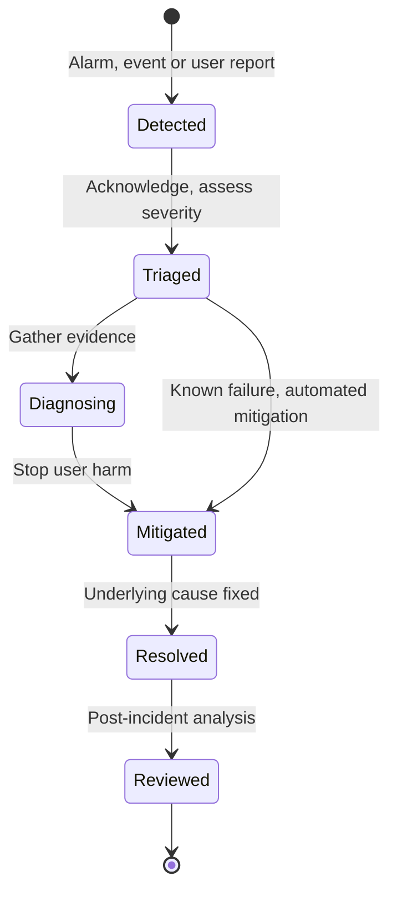

| Phase | Question | Typical manual duration | What automation contributes |
|-------|----------|-------------------------|-----------------------------|
| Detection | Is something wrong? | Seconds to hours (depends on alarms, [Part 7.3.1](#creating-cloudwatch-dashboards-and-alarms)) | Alarms, anomaly detection, service events |
| Triage | How bad is it, who owns it? | 5 to 15 minutes | Severity classification, routing, enrichment with ownership tags and runbook links |
| Diagnosis | What is the cause? | 10 to 60 minutes | Evidence capture, correlation with recent deployments and changes, CloudWatch investigations |
| Mitigation | How do we stop the harm? | 5 to 30 minutes | Rollback, scaling, isolation, failover, traffic shifting |
| Resolution | How do we fix it properly? | Hours to days | Rarely automated; code fixes go through CI/CD (Unit V) |
| Review | How do we prevent recurrence? | Days | Timeline reconstruction from audit logs and incident reports |

!!! note "Mitigation before resolution"
    A central lesson of operational practice is that ==mitigation and resolution are different goals==. Rolling back a deployment mitigates the incident within minutes even though the bug that caused it is fixed days later. Automation is most valuable in mitigation because mitigation actions are generic (roll back, shift traffic, add capacity) whereas resolutions are specific to each defect.

#### Incident metrics

| Metric | Definition | Improved by |
|--------|------------|-------------|
| MTTD (mean time to detect) | Start of impact to detection | Symptom alarms, SLO burn-rate alarms, canaries |
| MTTA (mean time to acknowledge) | Detection to a human or automation taking ownership | Correct routing, ChatOps, paging tools, automatic responders |
| MTTM (mean time to mitigate) | Detection to end of user impact | Automated rollback, scaling, failover |
| MTTR (mean time to recover or resolve) | Detection to full restoration of normal service | All of the above plus fast CI/CD for fixes |
| Incident recurrence rate | Proportion of incidents that repeat a known cause | Post-incident reviews feeding runbooks and design |
| Automation success rate | Proportion of automated actions that achieved their goal without human correction | Testing, guardrails, verification steps |

Averages hide the long tail here as they do for latency ([Section 7.1](../unit7/topic1.md#infrastructure-and-application-monitoring-with-amazon-cloudwatch)). Mature teams track the distribution of these times, and especially the worst incidents of each quarter.

#### Automation maturity levels

Automation is not all or nothing. It is useful to describe responses on a scale and to move each response up the scale only when evidence justifies it.

| Level | Name | What the automation does | Human role | Example |
|-------|------|--------------------------|------------|---------|
| 0 | Notify | Sends the raw alarm | Does everything | Email with alarm text |
| 1 | Enrich | Adds context: owner, runbook, dashboard link, recent deployments, top log errors, exemplar traces | Diagnoses and acts, faster | Lambda enrichment posting to chat |
| 2 | Diagnose | Collects evidence and proposes hypotheses | Validates and acts | Capture thread dumps and start a CloudWatch investigation |
| 3 | Recommend and wait | Prepares the remediation and asks for approval | Approves or rejects with one click | Chat button "Roll back to version 41" |
| 4 | Act and inform | Executes the remediation automatically and reports | Verifies and follows up | Automatic rollback of a canary deployment |
| 5 | Self-healing by design | The architecture absorbs the failure without a discrete response | Reviews trends | Auto scaling, ECS task replacement, multi-AZ failover, retries with backoff |

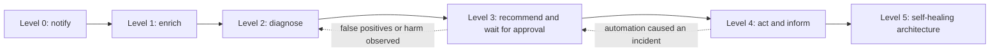

!!! tip "Level 5 is an architecture decision, not a Lambda function"
    Many responses that teams write as Lambda functions are better expressed as ==built-in resilience==: ECS services replacing failed tasks, Kubernetes restarting containers, target tracking scaling, Aurora failover, SQS redrive, circuit breakers and retries ([Chapter 4.3](../unit4/topic3.md)). Before writing a responder, ask whether a managed feature already provides the behaviour. Custom responders should cover what the platform cannot: application-specific rollbacks, business-aware throttling, security containment and evidence capture.

#### Delivery paths from detection to executor

There are three ways to connect a CloudWatch alarm to a Lambda responder, and several ways to connect other AWS events. The choice affects coupling, filtering, retries and multi-account design.

| Path | How it works | Strengths | Weaknesses | Use when |
|------|--------------|-----------|------------|----------|
| Alarm action: Lambda | The alarm's `AlarmActions` (or `OKActions`, `InsufficientDataActions`) lists the function ARN; CloudWatch invokes it asynchronously on the state transition | Simplest; no extra service; per-alarm intent is explicit | Every alarm must list the function; same account and Region; limited filtering | A specific alarm has a specific, dedicated responder |
| EventBridge rule | Every alarm state change is published as `CloudWatch Alarm State Change`; a rule matches by name prefix, state, tags in the name, and targets Lambda, SSM Automation, Step Functions and more | Decoupled; one rule covers many alarms; content filtering; retries and DLQ on the target; cross-account routing to a central bus | One more component to understand; pattern mistakes silently match nothing | Fleet-wide responders, central operations accounts, non-Lambda executors |
| SNS subscription | Alarm publishes to a topic; a Lambda function subscribes alongside human channels | Same event reaches people and code; fan-out | The message is a JSON string inside the SNS envelope; weaker filtering; the function also receives test messages | Enrichment functions that must see exactly what humans see |
| EventBridge rule on service events | GuardDuty, Security Hub, Config, Health, ECS, CodeDeploy, Auto Scaling events on the default bus | Native events for non-metric conditions | Event schemas differ by source | Security and compliance response, deployment and health automation ([Chapter 6.3](../unit6/topic3.md)) |

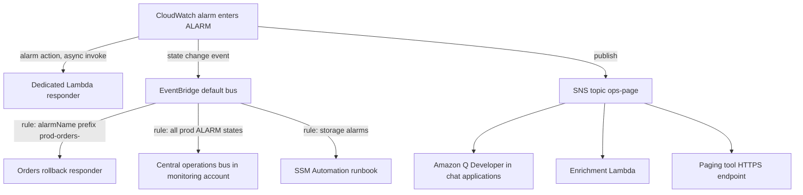

##### What the responder receives

When an alarm invokes Lambda directly, the event looks like the following (abridged). Note that the configuration block includes the alarm's metrics or expression, which a responder can use to query recent data.

```json
{
  "source": "aws.cloudwatch",
  "alarmArn": "arn:aws:cloudwatch:us-east-1:111122223333:alarm:prod-orders-5xx-rate",
  "accountId": "111122223333",
  "time": "2026-09-26T02:14:07.312+0000",
  "region": "us-east-1",
  "alarmData": {
    "alarmName": "prod-orders-5xx-rate",
    "state": {
      "value": "ALARM",
      "reason": "Threshold Crossed: 3 out of the last 5 datapoints were greater than the threshold (2.0).",
      "timestamp": "2026-09-26T02:14:07.309+0000"
    },
    "previousState": { "value": "OK", "timestamp": "2026-09-25T18:02:11.001+0000" },
    "configuration": {
      "description": "Owner: orders-team | Severity: page | Runbook: https://wiki.example/runbooks/orders-5xx",
      "metrics": [ { "id": "e1", "expression": "100*m2/m1", "returnData": true } ]
    }
  }
}
```

Through EventBridge the same information arrives under `detail`, with `source` set to `aws.cloudwatch` and `detail-type` set to `CloudWatch Alarm State Change`. Responders that must support both paths should normalise the event at the top of the handler.

!!! info "Permissions for the direct path"
    For a direct alarm action, the function's resource-based policy must allow the principal `lambda.alarms.cloudwatch.amazonaws.com` to call `lambda:InvokeFunction`, ideally with an `aws:SourceArn` condition naming the alarm (or an alarm ARN pattern) and an `aws:SourceAccount` condition. For EventBridge the principal is `events.amazonaws.com` with the rule ARN as `aws:SourceArn`. A missing resource policy is the most common reason a responder "never runs".

#### Choosing the executor: Lambda, SSM Automation or Step Functions

Three AWS services can execute a response. They overlap, and all three can be targets of an EventBridge rule, but each has a natural domain.

| Aspect | AWS Lambda | Systems Manager Automation | AWS Step Functions |
|--------|------------|----------------------------|--------------------|
| What it is | Event-driven function in Python, Node.js, Java and other runtimes | Executable runbook: a YAML or JSON document of typed steps | State machine orchestrating many steps and services |
| Maximum duration | 15 minutes per invocation | Long-running (hours), with waits and approvals | Up to one year for Standard workflows |
| Built-in library | None; you write the logic | Hundreds of AWS-provided runbooks (for example `AWS-RestartEC2Instance`, `AWS-DisablePublicAccessForSecurityGroup`, `AWS-CreateSnapshot`) | Direct integrations with more than 200 services and SDK calls |
| Human approval | Must be built (for example via chat custom actions or a task token) | Native `aws:approve` step with SNS notification | Native callback pattern with `waitForTaskToken` |
| Fleet operations | Must be built | Native rate control (`MaxConcurrency`, `MaxErrors`) over tagged targets; multi-account and multi-Region execution | Distributed Map for large fan-out |
| Instance-level commands | Indirect, through Run Command | `aws:runCommand` to execute scripts on managed instances | Through SSM integration |
| Visibility | CloudWatch Logs, X-Ray | Step-by-step execution history in the console | Visual execution graph and history |
| Best at | Small, fast, custom logic: enrichment, application-aware rollback, parsing complex events | Operational procedures on infrastructure, especially EC2 and managed instances, and standard remediations | Multi-step responses with branching, retries, compensation and approvals |

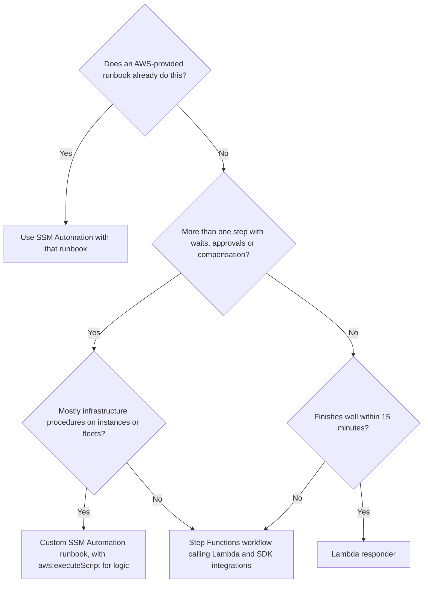

In practice the three combine. A Step Functions workflow may call a Lambda function to analyse the alarm, wait for human approval, then start an SSM Automation runbook to perform a standard procedure, and finally call a Lambda function to verify recovery and post the outcome to chat. CloudWatch investigations can also suggest SSM Automation runbooks as remediation steps, which is another reason to express standard procedures as runbooks.

!!! note "Where Lambda fits best"
    This part is titled "with AWS Lambda" because Lambda is the most flexible and most widely used executor, and because every other executor is usually glued together by small Lambda functions. The architectural skill, however, is to ==use Lambda for logic and judgement, and managed runbooks or workflows for procedure and orchestration==. A 600-line Lambda function that sleeps, polls and retries is a Step Functions workflow written badly.

#### Designing a safe Lambda responder

A responder runs with privileges, at the worst possible moment, triggered by data that may be wrong. The following properties distinguish production-grade responders from scripts.

| Property | Why it matters | How to implement it on AWS |
|----------|----------------|----------------------------|
| Idempotent | Alarm actions, EventBridge and SNS deliver at least once, and Lambda retries asynchronous invocations; the same alarm transition may arrive twice | Derive an idempotency key such as alarm name plus state timestamp; record it with a DynamoDB conditional write before acting; Powertools for AWS Lambda idempotency utility |
| Scoped | A responder must only touch resources it is meant to | IAM policy with resource ARNs or tag conditions (`aws:ResourceTag/auto-remediate = true`); allow-lists of services in configuration |
| Bounded blast radius | A bug or bad signal must not affect the whole fleet | Act on one resource per invocation; cap percentage of fleet affected; never act on more than N resources per hour |
| Rate limited | Repeated alarms must not cause repeated actions (remediation loop) | Cool-down record per resource in DynamoDB with TTL; circuit breaker that stops acting after K actions in a window and escalates to humans |
| Switchable off | Operators must be able to stop automation instantly during unusual events | Kill switch in SSM Parameter Store or AWS AppConfig read at start; emergency option: set the function's reserved concurrency to 0 |
| Dry-run capable | New responders must be observed before they act | `MODE=dry-run` logs the intended action without performing it; promote to `enforce` after review |
| Verified | An action is not a success until the symptom recovers | After acting, check the metric or health endpoint (or schedule a verification step); escalate if not recovered |
| Auditable | Every automated change must be explainable later | Structured log of event, decision, action and result; CloudTrail records the API calls under the responder's role; OpsItem or ticket with evidence |
| Reversible | Automation can be wrong | Prefer actions with a clear inverse (shift traffic, scale, stop rather than terminate); record prior state before changing it |
| Fail loudly | A responder that silently fails is worse than none, because humans assume it worked | On-failure destination or DLQ, alarms on the responder's own `Errors` and on DLQ depth, and a notification whenever it declines to act |
| Fast and simple | Responders run under stress and cold start; complexity hides bugs | Small functions, short timeouts, no heavy frameworks, dependencies pinned |

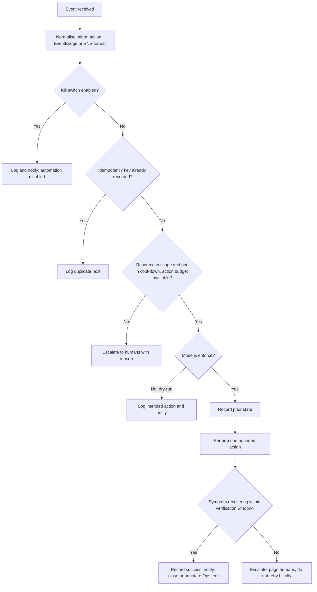

##### Idempotency in detail

Idempotency was introduced for event consumers in [Chapter 1.7](../unit1/topic7.md). For responders the subtlety is choosing the key. The alarm name alone is wrong: the same alarm legitimately fires again tomorrow. The alarm name plus the state-change timestamp (`alarmData.state.timestamp` or `detail.state.timestamp`) uniquely identifies one transition, so duplicates of that transition are ignored while a new transition is processed. For GuardDuty findings the finding ID plus its `updatedAt` time serves the same purpose; for Config compliance changes, the resource ID plus the rule name plus the notification time.

The record must be written ==before== the action with a conditional write (`attribute_not_exists`), so that two concurrent invocations cannot both proceed. If the action fails, the record is updated to `FAILED`, which lets a retry proceed deliberately rather than accidentally.

##### Guardrails against remediation loops

A ==remediation loop== occurs when the action taken by automation causes the condition that triggered it, or when automation and another control system fight each other.

| Loop | Mechanism | Prevention |
|------|-----------|------------|
| Restart loop | Latency alarm triggers task restarts; restarts reduce capacity; latency rises further; more restarts | Never restart on a capacity symptom; cool-down per service; cap restarts per hour; escalate |
| Scaling fight | Responder scales an ECS service to 20 tasks; target tracking scales it back to 8 | Change the scaling policy's minimum capacity, not the desired count; or let auto scaling own capacity entirely |
| Event loop | Responder modifies a resource; the modification emits an event that matches the rule again | Exclude the responder's own role in the EventBridge pattern (`userIdentity.arn` with `anything-but`); design distinct event types |
| Rollback ping-pong | Rollback to version N-1 triggers a pipeline that redeploys version N | Rollback also pauses or blocks the pipeline stage (for example disables the transition in CodePipeline) and records a "do not redeploy" marker |
| Security flip-flop | Responder removes a public rule; an IaC pipeline re-applies it; responder removes it again | Fix the source of truth in IaC; responder opens a ticket for the owning team; detect drift rather than fight it |

!!! danger "Automation that fights auto scaling"
    ECS service auto scaling, EC2 Auto Scaling and the Kubernetes Horizontal Pod Autoscaler continuously reconcile capacity towards their own targets. A responder that changes desired counts directly will be undone within minutes, and the two control loops can oscillate. ==Change the controller's inputs== (minimum capacity, target value, scheduled actions) rather than its outputs, and record the change so that it can be reverted when the incident ends.

#### Human in the loop

Many responses sit at maturity level 3: the automation prepares everything and a human approves. Three AWS mechanisms implement approval:

| Mechanism | How approval works | Best for |
|-----------|--------------------|----------|
| Custom action in Amazon Q Developer in chat applications | A notification in Slack or Microsoft Teams shows a button that invokes a Lambda function or CLI command using the channel's permissions | Quick decisions by the on-call engineer during a live incident |
| Step Functions callback (`.waitForTaskToken`) | The workflow pauses and sends a task token (for example in a chat message or email link backed by API Gateway); `SendTaskSuccess` or `SendTaskFailure` resumes it | Multi-step responses with timeouts and default behaviour if nobody approves |
| SSM Automation `aws:approve` | The runbook pauses and notifies approvers through SNS; named IAM principals approve or deny, with a minimum number of approvals | Infrastructure procedures requiring formal approval and audit |

Design questions for approvals:

- ==What happens if nobody responds?== Define a timeout and a safe default. For a rollback, proceeding automatically after ten minutes may be correct; for deleting resources, the default must be to do nothing.
- ==Who may approve?== Approval must be restricted to authorised principals and recorded; a chat button available to every member of a large channel is not an approval process.
- ==What information does the approver see?== Include the evidence: the alarm, the graph, the proposed action, its blast radius and how to reverse it.

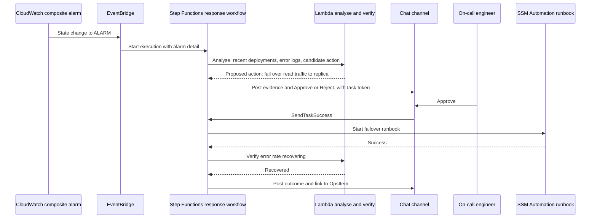

#### ChatOps with Amazon Q Developer in chat applications

==ChatOps== is the practice of conducting operations inside a shared chat channel: alerts arrive there, engineers discuss them there, and commands are run from there so that everyone sees what was done. The benefits are shared context, a natural timeline for the post-incident review and fewer context switches for responders.

AWS's ChatOps service was called ==AWS Chatbot== until February 2025, when it was renamed ==Amazon Q Developer in chat applications==. The API namespace, CloudFormation resource types (`AWS::Chatbot::SlackChannelConfiguration`, `AWS::Chatbot::MicrosoftTeamsChannelConfiguration`) and IAM service prefix (`chatbot`) kept their original names, which is why both names appear in documentation and code.

| Capability | Description |
|------------|-------------|
| Supported clients | Slack, Microsoft Teams and Amazon Chime, on desktop and mobile |
| Notifications | Subscribes a channel to SNS topics; CloudWatch alarms, EventBridge events routed to SNS, and many AWS service notifications are formatted as readable messages, with metric graphs for alarms |
| Custom notifications | Applications publish a documented JSON format to SNS to control title, description and next steps |
| AWS CLI commands | Engineers run AWS CLI-style commands in the channel (for example describing an ECS service, fetching recent log events or starting an SSM Automation runbook) |
| Custom actions | Buttons attached to notifications that run a defined CLI command or invoke a Lambda function, turning an alert into a one-click response |
| Ask Amazon Q | Natural-language questions about AWS services and, with permissions, about the account's resources |
| Permissions | A channel IAM role (shared by all channel members) or user-level roles, always intersected with channel guardrail policies that cap what may be done from that channel |

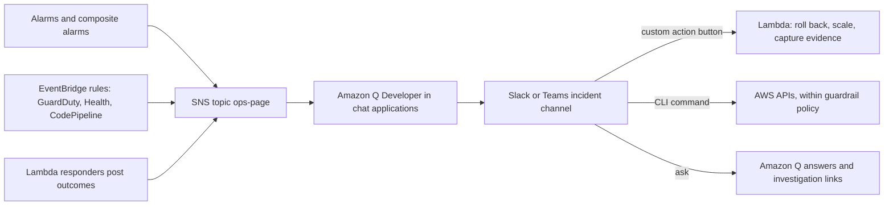

!!! warning "Guardrail policies are mandatory in spirit"
    If a channel role has broad permissions, every member of that channel, including guests and anyone whose chat account is compromised, effectively holds those permissions. Always attach ==channel guardrail policies== that restrict the channel to read-only actions plus the specific remediation actions intended (for example `lambda:InvokeFunction` on named responder functions only). Prefer user-level roles for sensitive channels so that actions are attributable to individuals, and keep production remediation channels small and private.

#### AI-assisted diagnosis: CloudWatch investigations

Diagnosis is typically the longest phase of an incident, because the responder must correlate metrics, logs, traces, deployments and configuration changes across many services. ==CloudWatch investigations== (introduced in preview as Amazon Q Developer operational investigations and generally available since June 2025) applies generative AI to this correlation work.

| Aspect | Behaviour (verify current details in the CloudWatch documentation) |
|--------|--------------------------------------------------------------------|
| Starting an investigation | From a CloudWatch alarm action, from the "Investigate" action on metric and log widgets and in many AWS consoles, or from Amazon Q chat |
| Data consulted | CloudWatch metrics, CloudWatch Logs and Logs Insights queries, X-Ray traces, Application Signals, deployment events, AWS Health events, CloudTrail change events and, optionally, EKS cluster data |
| Output | Observations, a topology of affected resources, and root-cause hypotheses in natural language that engineers accept or discard to steer the analysis |
| Remediation | Suggests relevant SSM Automation runbooks and AWS re:Post articles, and can run a selected runbook |
| Records | An investigation feed with notes, and an automatically generated incident report capturing findings, timeline and recommended actions |
| Configuration | One investigation group per account, with an IAM role that defines what the investigation may read, retention and optional encryption with a KMS key; cross-account analysis through cross-account observability |
| Quotas | Indicatively, two concurrent active investigations per group and 150 enhanced (AI-analysed) investigations per account per month |
| Cost | No additional charge for the feature itself; queries it runs on your behalf may incur normal CloudWatch charges |

To start an investigation automatically, add the investigation group ARN as an alarm action. An optional deduplication string groups related alarms into one investigation instead of opening several:

```bash
aws cloudwatch put-metric-alarm \
  --alarm-name prod-orders-latency-burn \
  --alarm-actions \
    arn:aws:sns:us-east-1:111122223333:ops-page \
    "arn:aws:aiops:us-east-1:111122223333:investigation-group/EXAMPLEGROUPID#DEDUPE_STRING=orders" \
  ...
```

!!! tip "AI proposes, engineers decide"
    Treat investigation hypotheses as ==leads, not conclusions==. They are only as good as the telemetry available: services without traces, structured logs or consistent service names (Sections [7.1](../unit7/topic1.md#distributed-tracing-with-aws-x-ray) and [7.2](../unit7/topic2.md)) give the model little to correlate. The investigation role should be read-only, and any remediation it suggests should go through the same approval and guardrail design as other automation. The quality of AI diagnosis is therefore another return on the investment in good instrumentation.

!!! info "AWS DevOps Agent"
    In March 2026 AWS made ==AWS DevOps Agent== generally available: an autonomous operations agent, billed per second of agent runtime, that investigates incidents across AWS, multi-cloud and on-premises environments using integrations such as CloudWatch, Datadog, Dynatrace, New Relic, Splunk, GitHub, GitLab, ServiceNow, PagerDuty and Slack, and that recommends preventive improvements. AWS positions CloudWatch investigations as the no-additional-cost capability inside the AWS environment and DevOps Agent as the broader, paid operations teammate. For DSO303 the architectural principles are the same for both: least-privilege read access, human validation of conclusions, and audited, guarded actions.

#### Tracking incidents and paging humans

CloudWatch and SNS notify; they do not manage on-call rotations, escalations or incident records. Architects combine them with:

| Need | AWS option | Common partner option |
|------|------------|-----------------------|
| On-call schedules, escalation, acknowledgement | None for new customers (Incident Manager is closed to new customers) | PagerDuty, Jira Service Management, ServiceNow and similar tools |
| Operational work item with related resources and runbooks | Systems Manager OpsCenter OpsItems (created directly by an alarm action or from EventBridge) | ITSM tickets |
| Incident communication | Amazon Q Developer in chat applications, SNS | Status page tools |
| Timeline and report | CloudWatch investigations incident report, OpsItem history, chat history, CloudTrail | Post-incident review tools |

Integration with partner tools normally uses an SNS HTTPS subscription or an ==EventBridge API destination== ([Chapter 6.3](../unit6/topic3.md#event-routing-with-amazon-eventbridge)), which calls the partner's events API with managed authentication, retries and rate limiting.

#### Learning from incidents

The final arc of the control loop is learning. AWS internally uses a ==Correction of Errors (COE)== process; the industry term is ==blameless post-incident review==. The review asks what happened, what the impact was, why it happened (often through repeated "why" questions), why detection and mitigation took as long as they did, and what will change. Its outputs feed back into this section:

- new or improved ==alarms== when detection was slow ([Part 7.3.1](#creating-cloudwatch-dashboards-and-alarms)),
- new or improved ==runbooks and responders== when mitigation was slow (this part),
- ==design changes== when the architecture allowed the failure ([Chapter 4.3](../unit4/topic3.md)), and
- ==performance and capacity work== when the incident was caused by saturation ([Part 7.3.3](#performance-optimization-using-aws-tools)).

A useful rule: ==every incident that was mitigated manually by a well-understood action is a candidate for automation==, and every automated action that needed human correction is a candidate for moving down one maturity level until it is improved.

#### A catalogue of common automated responses

| Trigger | Automated response | Executor | Guardrail |
|---------|--------------------|----------|-----------|
| Error or latency alarm on a new Lambda version during canary | Shift alias traffic back to previous version (CodeDeploy does this natively if the alarm is attached) | CodeDeploy or Lambda responder | Only within N minutes of deployment; block pipeline redeploy |
| 5xx alarm on ECS service after deployment | Roll back to previous task definition; ECS deployment circuit breaker and CodeDeploy alarms cover many cases natively | ECS, CodeDeploy or Lambda | Only if deployment is recent; one rollback per hour |
| DLQ depth greater than zero after a downstream fix | Redrive messages to the source queue at controlled velocity | Lambda or SQS redrive API | Only after downstream health check passes; rate limit |
| Disk usage above 85 per cent on EC2 | Expand EBS volume or clean temporary files | SSM Automation | Maximum size cap; notify owner |
| Unhealthy EC2 instance failing system status checks | EC2 recover action or replace via Auto Scaling | Alarm EC2 action | Native; no custom code needed |
| GuardDuty high-severity finding on an instance | Isolate by replacing security groups with a quarantine group, snapshot volumes, tag for forensics | Step Functions with Lambda and SSM | Exclude tagged critical instances; require approval for production |
| GuardDuty finding of compromised IAM credentials | Attach deny-all inline policy or revoke active sessions; notify security | Lambda | Approval for roles used by production workloads |
| Config: S3 bucket public | Enable Block Public Access | SSM Automation (Config remediation) | Exemption tag for public website buckets |
| AWS Health scheduled maintenance for instances | Notify owners with resource list; optionally schedule instance replacement in a maintenance window | Lambda | Owners' opt-in tags |
| Burst of throttling on DynamoDB provisioned table | Temporarily raise capacity or switch to on-demand | Lambda | Maximum capacity cap; revert later |
| Budget or cost anomaly alert | Notify; optionally stop non-production resources tagged for auto-stop | Lambda | Never act on production |
| Service quota approaching limit | Request increase through Service Quotas API, open ticket | Lambda | Only for pre-approved quotas |

### AWS Service Deep Dive

Automated incident response is not one service but a composition. This deep dive treats the ==response stack== as a whole and focuses on the properties of each component that matter for responders. Lambda fundamentals ([Chapter 1.3](../unit1/topic3.md)), EventBridge (Chapters [1.7](../unit1/topic7.md) and [6.3](../unit6/topic3.md#event-routing-with-amazon-eventbridge)) and SNS ([Chapter 6.3](../unit6/topic3.md#event-routing-with-amazon-eventbridge)) are not repeated.

#### Purpose

The response stack converts detection into safe action: it receives alarm and service events, decides whether and how to respond, performs bounded actions with scoped credentials, verifies the outcome, keeps humans informed and records everything for audit and learning.

#### Architecture

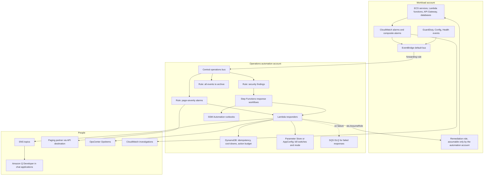

Key architectural points:

- ==Separate detection from response.== Alarms live with the workload; responders can live in a central automation account that assumes narrowly scoped roles in workload accounts. This keeps powerful automation code out of every account and gives one place to audit, test and switch off automation.
- ==EventBridge is the spine.== Routing through the bus allows new responders to be added without modifying alarms, and allows archive and replay of incident events for testing ([Chapter 6.3](../unit6/topic3.md#event-routing-with-amazon-eventbridge)).
- ==State is externalised.== Idempotency records, cool-downs and action budgets live in DynamoDB; kill switches in Parameter Store or AppConfig. Lambda functions themselves remain stateless.
- ==Every path ends with a human-visible record== in chat, OpsCenter or a ticket, even when the automation succeeds.

#### Important Features

| Component | Features that matter for incident response |
|-----------|--------------------------------------------|
| CloudWatch alarm actions | Direct Lambda invoke, SNS, EC2 actions (recover, reboot, stop, terminate), Auto Scaling policies, OpsItem creation, investigation start |
| EventBridge | Content-based filtering on alarm and service events, `anything-but` exclusions, input transformers, target retry policy (up to 24 hours and 185 attempts) and DLQ, cross-account buses, archive and replay, API destinations |
| Lambda | Asynchronous invocation with configurable retry attempts (0 to 2) and maximum event age, on-success and on-failure destinations, reserved concurrency (also usable as a kill switch), recursive loop detection for some event sources, Powertools idempotency and structured logging utilities |
| SSM Automation | AWS-provided runbooks, `aws:approve`, `aws:executeAwsApi`, `aws:executeScript`, `aws:branch`, rate control, multi-account and multi-Region execution, Change Calendar to block automation during freezes |
| Step Functions | Wait states, callback task tokens for approvals, retries with backoff, catch and compensation, SDK integrations, execution history |
| Amazon Q Developer in chat applications | Alarm notifications with graphs, CLI commands, custom action buttons, guardrail policies |
| CloudWatch investigations | AI correlation across telemetry, hypotheses, runbook suggestions, incident reports |
| OpsCenter | OpsItems with related resources, deduplication, runbook association, operational data |

#### Limitations

- ==Lambda's 15-minute limit== rules it out for long procedures; use Step Functions or SSM Automation.
- ==At-least-once delivery everywhere==: alarm actions, EventBridge, SNS and Lambda asynchronous retries can all duplicate events, so idempotency is mandatory, not optional.
- ==Alarm actions fire only on transitions.== If a responder fails and the alarm stays in `ALARM`, it will not be invoked again; escalation must come from the on-failure path, not from waiting for another alarm action.
- ==No built-in on-call management== for new customers; paging requires a partner tool.
- ==Direct alarm actions are account- and Region-local.== Central automation requires EventBridge forwarding.
- ==Automation is only as good as its signals.== A responder triggered by a noisy alarm will perform noisy actions; alarm quality from [Part 7.3.1](#creating-cloudwatch-dashboards-and-alarms) is a prerequisite.
- ==AI diagnosis has quotas and is probabilistic.== Investigations are limited in concurrency and monthly volume, and hypotheses must be validated.

#### Pricing Model and recommendations

!!! info "Pricing figures"
    Indicative us-east-1 figures in September 2026; verify with the pricing pages for each service.

| Component | Charged by | Typical incident-response cost |
|-----------|------------|--------------------------------|
| Lambda | Requests (about 0.20 USD per million) and GB-seconds of duration | Negligible: responders run rarely and briefly, usually within the free tier |
| EventBridge | Custom and partner events published (AWS service events on the default bus, including alarm state changes, are free); cross-account delivery counts as custom events; API destinations per invocation | Very low |
| SNS | Publishes, deliveries by protocol (SMS is the expensive channel) | Low, unless SMS is used heavily |
| Step Functions Standard | Per state transition (about 0.025 USD per 1,000) | Low for response workflows |
| SSM Automation | Per step beyond a free allowance, with some step types charged by duration | Low |
| DynamoDB on-demand | Per request and storage | Negligible for idempotency tables |
| Amazon Q Developer in chat applications | No additional charge for the chat integration; underlying services and some Amazon Q features may be charged | Low |
| CloudWatch investigations | No additional charge; underlying queries are billed normally | Low |
| AWS DevOps Agent | Per second of agent runtime | Budget explicitly if adopted |

Recommendations: the cost of the response stack is almost always trivial compared with the cost of downtime and of engineers' time. The significant costs are ==indirect==: Logs Insights queries run by enrichment functions on every alarm, high-volume SMS paging, and responders that run frequently because an alarm flaps. Set log retention on responder log groups, avoid scanning large log groups on every invocation (use field indexes or narrow time ranges, [Section 7.2](../unit7/topic2.md#log-analysis-with-amazon-cloudwatch-logs-insights)), and fix flapping alarms rather than paying responders to react to them.

#### Performance Characteristics

| Stage | Typical latency |
|-------|-----------------|
| Alarm state change to Lambda invocation (direct action) | Seconds |
| Alarm state change to EventBridge rule target | Usually seconds; EventBridge delivery is near real time |
| Lambda responder execution | Hundreds of milliseconds to tens of seconds, plus cold start |
| SSM Automation runbook | Seconds to many minutes, depending on steps |
| Human approval | Minutes; dominated by human response time |
| Verification window | Deliberately minutes, to allow metrics to reflect the change |

The end-to-end detection-to-mitigation time for a fully automated response is therefore typically ==alarm detection time plus one to five minutes==, compared with 25 to 50 minutes manually.

#### Scaling Behaviour

Responders face an unusual scaling profile: idle for weeks, then a burst when a large failure triggers many alarms at once. Design for the burst:

- A correlated failure can invoke a responder hundreds of times in a minute. Use ==reserved concurrency== on responders both to guarantee capacity and to cap parallel actions; use composite alarms upstream so that one shared failure produces one event rather than hundreds.
- Put an ==SQS queue== between EventBridge and a responder when actions must be serialised or rate limited.
- Account-wide Lambda concurrency is shared with workloads. A workload that exhausts concurrency during an incident can throttle the responders meant to fix it; reserved concurrency protects them.

#### Availability

All components are regional managed services with multi-AZ design. Two availability risks are specific to response automation:

1. ==Shared fate.== If responders run in the same Region as the failure, a Regional impairment may affect both. For multi-Region architectures, deploy responders in each Region and prefer data-plane actions (for example Route 53 health-check-based failover or Application Recovery Controller routing controls) over control-plane actions that may be degraded during Regional events.
2. ==Dependency on the thing being fixed.== A responder that needs the application database, the corporate identity provider or a VPC endpoint that is failing will fail exactly when needed. Keep responders' dependencies minimal and independent.

#### Security Features

| Control | Purpose in incident response |
|---------|------------------------------|
| Per-responder IAM execution roles | Least privilege; one role per responder with only its actions |
| Resource-level and tag-based conditions | Limit actions to resources tagged for automation or owned by a team |
| Cross-account remediation roles | Workload accounts trust only the automation account's specific responder roles, with `sts:ExternalId` or `aws:PrincipalOrgID` conditions |
| Lambda resource-based policies | Restrict invokers to specific alarms or rules via `aws:SourceArn` |
| Chat guardrail policies | Cap what can be done from each chat channel |
| SSM Automation approvals and Change Calendar | Formal approval and change freezes |
| CloudTrail | Records every API call made by responders and by humans through chat |
| KMS encryption | For SNS topics, SQS DLQs, Lambda environment variables, DynamoDB tables and investigation data |

#### Service Limits

!!! info "Quotas"
    Indicative values in September 2026; check Service Quotas.

| Limit | Value |
|-------|-------|
| Lambda maximum timeout | 15 minutes |
| Lambda asynchronous retry attempts | 0 to 2 (default 2) |
| Lambda maximum event age for asynchronous events | 60 seconds to 6 hours |
| Lambda default account concurrency | 1,000 per Region (adjustable; new accounts may start lower) |
| EventBridge targets per rule | 5 |
| EventBridge target retry | Up to 24 hours and 185 attempts |
| Alarm actions per state | 5 |
| SSM Automation concurrent executions | Bounded per account; excess executions queue |
| CloudWatch investigations | 1 group per account; 2 concurrent active investigations; 150 enhanced investigations per month |
| Step Functions Standard execution duration | 1 year |

### Important AWS Terminology

Alarm, composite alarm, SLO and burn rate were defined in [Part 7.3.1](#creating-cloudwatch-dashboards-and-alarms); event bus, rule, target, DLQ and API destination in Chapters [1.7](../unit1/topic7.md) and [6.3](../unit6/topic3.md#event-routing-with-amazon-eventbridge).

| Term | Meaning |
|------|---------|
| Incident | Unplanned event that degrades or threatens a service |
| Mitigation | Action that stops or reduces user impact, not necessarily fixing the cause |
| Resolution | Fix of the underlying cause |
| Runbook | Documented procedure for a known condition; an executable runbook is code |
| Responder | Function or workflow that performs an automated response |
| Remediation | Action that restores a desired state (security, compliance or operational) |
| Containment | Security response that limits an attacker's reach, such as isolating an instance |
| Automation maturity level | Degree of autonomy of a response, from notify to self-healing |
| Idempotency key | Value identifying one logical event so that duplicates are ignored |
| Kill switch | Configuration flag or control that stops automation immediately |
| Dry-run mode | Mode in which automation logs intended actions without performing them |
| Blast radius | The set of resources and users an action can affect |
| Cool-down | Period during which automation will not act again on the same resource |
| Action budget | Maximum number of automated actions permitted in a window |
| Remediation loop | Cycle in which automation's action re-triggers the condition or fights another controller |
| Human in the loop | Design in which a person approves an automated action before it executes |
| Task token | Step Functions token used to resume a paused workflow after an external decision |
| SSM Automation runbook | Systems Manager document of typed steps executed by the Automation service |
| Rate control | SSM Automation settings `MaxConcurrency` and `MaxErrors` limiting fleet-wide execution |
| Change Calendar | Systems Manager feature that blocks or allows automation during defined periods |
| OpsItem | Systems Manager OpsCenter work item for an operational issue |
| ChatOps | Operating systems through a shared chat channel with integrated alerts and commands |
| Channel guardrail policy | IAM policy capping what may be done from a chat channel |
| Custom action | Button on a chat notification that runs a defined command or Lambda function |
| Investigation group | Account-level configuration for CloudWatch investigations |
| Correction of Errors (COE) | AWS's structured post-incident review process |
| MTTM | Mean time to mitigate |

### Configuration Options

#### Lambda responder configuration

| Setting | Options | Guidance for responders |
|---------|---------|-------------------------|
| Timeout | 1 second to 15 minutes | Short (10 to 60 seconds); long work belongs in Step Functions |
| Memory | 128 MB to 10,240 MB | 256 to 512 MB is typical; more memory also gives more CPU and faster cold starts |
| Reserved concurrency | 0 to account limit | Set a small value (for example 5 to 20) to guarantee capacity and cap parallel actions; 0 acts as an emergency stop |
| Asynchronous `MaximumRetryAttempts` | 0, 1 or 2 | Often 0 or 1 for remediations, relying on idempotency and explicit escalation rather than blind retries |
| Asynchronous `MaximumEventAgeInSeconds` | 60 to 21,600 | Short (for example 300 to 900): acting on a stale alarm an hour later may be harmful |
| On-failure destination | SQS, SNS, Lambda, EventBridge bus, S3 | Always configure; alarm on it |
| Environment variables | Key-value pairs | Mode, target allow-list, parameter names; no secrets in plain text |
| Architecture | x86_64 or arm64 | arm64 (Graviton) is cheaper for most responders |
| Logging | JSON log format, log level, custom log group | JSON format for structured audit records ([Section 7.2](../unit7/topic2.md)) |
| Tracing | X-Ray or OpenTelemetry | Helpful for multi-step responders |

#### Trigger configuration

| Trigger | Key settings |
|---------|--------------|
| Alarm action | Which states invoke the responder (`AlarmActions`, `OKActions`); resource policy for `lambda.alarms.cloudwatch.amazonaws.com` |
| EventBridge rule | Event pattern (alarm name prefix, state, source, severity), `anything-but` exclusions for the responder's own changes, input transformer, target retry policy, target DLQ, target role for cross-account or SSM targets |
| SNS subscription | Filter policies on message attributes; redrive policy for failed Lambda deliveries |

#### SSM Automation execution options

| Option | Purpose |
|--------|---------|
| `AutomationAssumeRole` | Role the runbook uses to act; scope it tightly |
| Targets by tag or resource group, with `MaxConcurrency` and `MaxErrors` | Controlled fleet-wide execution, stopping when too many targets fail |
| Multi-account and multi-Region execution | Run from a central account across an organisation |
| `aws:approve` step parameters | Approvers, minimum required approvals, notification topic, message |
| Change Calendar integration | Prevent runbooks from running during freezes, or require an open window |

#### Operating modes for a responder

| Mode | Behaviour | Used when |
|------|-----------|-----------|
| `disabled` | Exits immediately and notifies that automation is off | Unusual events, major incidents under human command, maintenance |
| `dry-run` | Evaluates everything and logs the action it would take | New responders, after significant changes |
| `approve` | Prepares the action and requests human approval | High blast radius actions |
| `enforce` | Acts automatically within guardrails | Proven, reversible, low blast radius actions |

### Design Considerations

#### Scalability

Responders scale automatically with Lambda, but correlated failures produce bursts. Upstream aggregation (composite alarms, deduplication in EventBridge patterns), reserved concurrency and queue buffering keep a thousand alarms from becoming a thousand simultaneous remediations.

#### Availability

Responders must be more available than the systems they protect. Keep them free of dependencies on the application, deploy them per Region for multi-Region workloads, and prefer data-plane mechanisms for the most critical actions such as failover.

#### Reliability

Reliability of automation comes from idempotency, verification and escalation. A responder that performs an action but does not check the outcome, or that fails without telling anyone, reduces reliability by creating false confidence. Test responders with fault injection: AWS Fault Injection Service experiments ([Chapter 4.3](../unit4/topic3.md)) can deliberately trigger the alarms that responders react to, in a controlled environment.

#### Durability

Incident evidence (captured logs, snapshots, memory dumps, investigation reports, action records) must outlive the resources involved. Store it in S3 with appropriate retention and, for security incidents, object lock; send action records to CloudWatch Logs with retention matching audit requirements.

#### Latency

Automation latency is small compared with detection latency. To shorten end-to-end response, first improve alarm detection ([Part 7.3.1](#creating-cloudwatch-dashboards-and-alarms)), then remove human waiting from well-understood responses, and finally optimise responder code.

#### Cost

Direct costs are minimal. The economic case rests on reduced downtime and reduced engineering toil. Avoid costly behaviours such as enrichment functions that scan large log groups on every flapping alarm.

#### Performance

Responders should do one thing quickly. Initialise SDK clients outside the handler, avoid large dependencies, and keep cold starts short, particularly for Java responders (SnapStart can help, [Chapter 1.3](../unit1/topic3.md)).

#### Maintainability

Treat responders as production software: in version control, deployed through CI/CD (Unit V), with unit tests using recorded sample events, integration tests in non-production accounts, and documentation linked from the alarm description. A responder that nobody has run for a year should be exercised in a game day.

#### Operational Complexity

Every responder adds a control loop that people must understand during an incident. Keep the catalogue small, document each responder's trigger, action, guardrails and kill switch, and publish automated actions to the same channel humans use so that nobody is surprised by what the automation did.

### AWS Best Practices

| Pillar | Practice for automated incident response |
|--------|------------------------------------------|
| Operational Excellence | Codify runbooks as executable automation; start in dry-run; review every automated action in post-incident reviews; run game days to exercise responders; keep runbook links in alarm descriptions |
| Security | One least-privilege role per responder; cross-account roles with organisation conditions; chat guardrail policies; approvals for high blast radius actions; CloudTrail for every automated change; automate security containment for well-understood findings |
| Reliability | Idempotency, verification and escalation; automate mitigation (rollback, failover) before resolution; prefer built-in self-healing; protect responders with reserved concurrency; test with Fault Injection Service |
| Performance Efficiency | Use the right executor (Lambda for logic, SSM for procedures, Step Functions for orchestration); keep responders small and fast; aggregate events upstream |
| Cost Optimization | Automate shutdown of idle non-production resources and responses to cost anomalies; avoid expensive per-invocation queries; rely on free AWS service events |
| Sustainability | Event-driven responders consume nothing between incidents; automation that stops idle resources reduces energy use; avoid polling loops that keep functions running |

!!! tip "Start with the top three"
    For a DSO303 project, three automated responses deliver most of the value: ==automatic rollback of bad deployments== (CodeDeploy or ECS with alarms), ==enriched notifications in chat== with dashboard and runbook links, and ==automatic remediation of one or two security misconfigurations== such as public S3 buckets. Build these well before attempting anything more ambitious.

### Security Considerations

#### IAM and least privilege

Responders hold privileges that attackers would value: the ability to modify security groups, IAM policies or deployments. Design their permissions as carefully as those of administrators. Policy structure, evaluation logic, condition keys and cross-account role trust are explained in [Chapter 8.1](../unit8/topic1.md#iam-policies-and-permissions); this subsection covers only what is specific to responders.

```json
{
  "Version": "2012-10-17",
  "Statement": [
    {
      "Sid": "RollbackOnlyTaggedAliases",
      "Effect": "Allow",
      "Action": ["lambda:UpdateAlias", "lambda:GetAlias", "lambda:ListVersionsByFunction"],
      "Resource": "arn:aws:lambda:us-east-1:111122223333:function:prod-*",
      "Condition": {
        "StringEquals": { "aws:ResourceTag/auto-remediate": "true" }
      }
    },
    {
      "Sid": "IdempotencyAndCooldown",
      "Effect": "Allow",
      "Action": ["dynamodb:PutItem", "dynamodb:UpdateItem", "dynamodb:GetItem"],
      "Resource": "arn:aws:dynamodb:us-east-1:111122223333:table/responder-state"
    },
    {
      "Sid": "ReadKillSwitch",
      "Effect": "Allow",
      "Action": "ssm:GetParameter",
      "Resource": "arn:aws:ssm:us-east-1:111122223333:parameter/responders/*"
    },
    {
      "Sid": "Notify",
      "Effect": "Allow",
      "Action": "sns:Publish",
      "Resource": "arn:aws:sns:us-east-1:111122223333:ops-automation"
    }
  ]
}
```

Principles:

- ==One role per responder.== A shared "automation" role with broad permissions turns any bug in any responder into a platform-wide risk.
- ==No wildcard actions on IAM, KMS or Organizations.== Security containment responders that must modify IAM should be limited to specific actions (for example attaching a named deny policy) and protected by approvals.
- ==Protect the kill switch and mode parameters.== Whoever can change `/responders/*/mode` from `dry-run` to `enforce` controls the automation; restrict and audit it.
- ==Cross-account roles== in workload accounts should trust only specific responder role ARNs from the automation account, with `aws:PrincipalOrgID` conditions.

#### Encryption and secrets

Encrypt SNS topics, DLQs, DynamoDB tables and evidence buckets with KMS keys whose policies allow the relevant service principals. Tokens for partner paging APIs belong in Secrets Manager or in EventBridge connections (which store credentials in Secrets Manager), never in environment variables or code.

#### Protecting automation from abuse

Automation is an attack surface. An attacker who can create alarms, publish to the incident SNS topic or put events on the operations bus might trigger responders deliberately, for example to cause a rollback or to disable a security control.

| Threat | Control |
|--------|---------|
| Forged events on a custom bus | Bus resource policies limited to known accounts; responders validate `source` and `account` fields |
| Forged messages on SNS topics | Topic policies restricting publishers; responders prefer EventBridge events from `aws.cloudwatch`, which producers cannot forge (`PutEvents` rejects `aws.` sources) |
| Unauthorised alarm creation to trigger responders | Restrict `cloudwatch:PutMetricAlarm` for alarms with responder actions; responders act only for alarms matching an allow-listed name prefix or tag |
| Chat-based privilege escalation | Guardrail policies, private channels, user-level roles |
| Disabling automation before an attack | Alarm on changes to kill-switch parameters and on `PutFunctionConcurrency` for responders, via CloudTrail-based EventBridge rules |

#### Private and public resources

Responders that call only AWS APIs do not need VPC attachment. Attach them to a VPC only when they must reach private resources, and then provide VPC endpoints for the AWS APIs they call, so that the responder does not depend on NAT gateways that may be part of the failure.

#### Logging and compliance

Every automated action should produce a structured record containing the triggering event ID, the decision and its reason, the action, the prior state and the result. Combined with CloudTrail (which records the API calls under the responder's role), this satisfies audit requirements in regulated industries and provides the timeline for post-incident reviews. For security containment, preserve evidence before changing anything: snapshot volumes and capture metadata before isolating an instance.

### Cost Optimization

The response stack is inexpensive; the cost questions are mostly about what automation can save.

| Opportunity | Implementation |
|-------------|----------------|
| Stop idle non-production resources | Scheduled or event-driven Lambda stopping resources tagged `auto-stop=true` outside working hours |
| React to cost anomalies | AWS Cost Anomaly Detection and AWS Budgets notifications through SNS to a responder that notifies owners and, for sandbox accounts, stops resources |
| Avoid paging costs | Route ticket-severity alerts to chat and ticketing rather than SMS or voice |
| Reduce responder log costs | Set retention on responder log groups; log decisions, not entire payloads |
| Keep responders on arm64 | Lower price per GB-second for the same work |

### Integration with Other AWS Services

#### Amazon ECS

Native mechanisms come first: the ECS deployment circuit breaker rolls back deployments whose tasks fail to reach a steady state, ECS deployments can be configured with CloudWatch alarms that trigger rollback, and CodeDeploy blue/green deployments roll back on alarms (Chapters [2.3](../unit2/topic3.md) and [5.1](../unit5/topic1.md#aws-codedeploy)). Custom responders add application-aware actions, for example capturing a heap dump through ECS Exec before a task is replaced, or reducing traffic weight on a degraded service by adjusting ALB listener rule weights.

#### Amazon EKS

Kubernetes already restarts containers and reschedules pods. Responders for EKS typically operate at the AWS level (node groups, load balancers, IAM) or call the Kubernetes API using an EKS access entry mapped to a narrowly scoped Kubernetes role, for example to scale a deployment's HPA minimum or to cordon a node flagged by GuardDuty Runtime Monitoring. Within the cluster, progressive delivery controllers such as Argo Rollouts provide alarm- or metric-driven rollback natively.

#### AWS Lambda

Lambda is both executor and protected resource. For Lambda workloads, CodeDeploy alias traffic shifting with alarms provides automatic rollback; responders can additionally reduce reserved concurrency on a function that is overwhelming a downstream dependency (a form of load shedding), or disable an event source mapping that is repeatedly failing on poison messages until the team investigates.

#### Amazon API Gateway

Responders can protect back ends during overload by lowering stage or usage-plan throttling limits temporarily, or switch a route to a static maintenance response. These actions should be time-limited and automatically reverted.

#### Amazon SQS and dead-letter queues

DLQ alarms ([Chapter 6.3](../unit6/topic3.md#message-queues-with-amazon-sqs)) often trigger a two-step response: notify immediately, then, once the downstream cause is fixed and verified healthy, redrive messages at a controlled rate using the SQS redrive API. Automating the redrive without verifying the fix simply moves messages back into the DLQ.

#### AWS CodePipeline and CodeDeploy

A rollback responder should also ==stop the pipeline== from redeploying the failed version, for example by disabling the stage transition and posting the reason, so that the rollback is not immediately undone.

#### Amazon GuardDuty, AWS Security Hub and AWS Config

Security findings arrive as EventBridge events and are routed by severity and resource type to containment workflows. Config rules can use native remediation actions backed by SSM Automation. [Chapter 6.3](../unit6/topic3.md) showed organisation-wide routing of these events to a security account.

#### AWS Health

AWS Health events describe AWS-side issues and scheduled changes affecting your resources. A responder can map affected resources to owners through tags and notify them, or correlate an active Health event with an alarm to tell responders that the cause is probably upstream. CloudWatch investigations also consult Health events.

#### Summary of integrations

| Service | Role in response | Why |
|---------|------------------|-----|
| CloudWatch alarms | Trigger | Detect symptoms |
| EventBridge | Router | Decouple, filter, centralise |
| Lambda | Executor | Custom logic |
| SSM Automation | Executor | Standard procedures, approvals, fleets |
| Step Functions | Orchestrator | Multi-step workflows, approvals, compensation |
| SNS | Notifier | Fan-out to people and tools |
| Amazon Q Developer in chat applications | Collaboration | ChatOps, one-click actions |
| CloudWatch investigations | Diagnosis | AI-assisted correlation |
| OpsCenter | Tracking | Operational work items |
| DynamoDB and Parameter Store | State and control | Idempotency, cool-downs, kill switches |
| CodeDeploy and ECS | Native rollback | Deployment safety |
| Fault Injection Service | Testing | Exercise responders safely |

### Common Architecture Patterns

#### Enrich-then-notify

An alarm publishes to EventBridge; a Lambda function gathers context (owner and runbook from tags or the alarm description, a graph link, deployments in the last hour from CodeDeploy or ECS, the top error messages from a narrow Logs Insights query, links to exemplar traces) and publishes a rich message to SNS for chat and paging. This is maturity level 1 and the safest, highest-value first responder.

#### Deployment-aware rollback

The responder checks whether the alarming service was deployed within a recent window. If so, it rolls back (alias shift, previous task definition, CodeDeploy stop with rollback), blocks the pipeline and notifies. If not, it escalates to humans, because rolling back an old version is unlikely to help. This pattern embodies the most common cause of incidents: change.

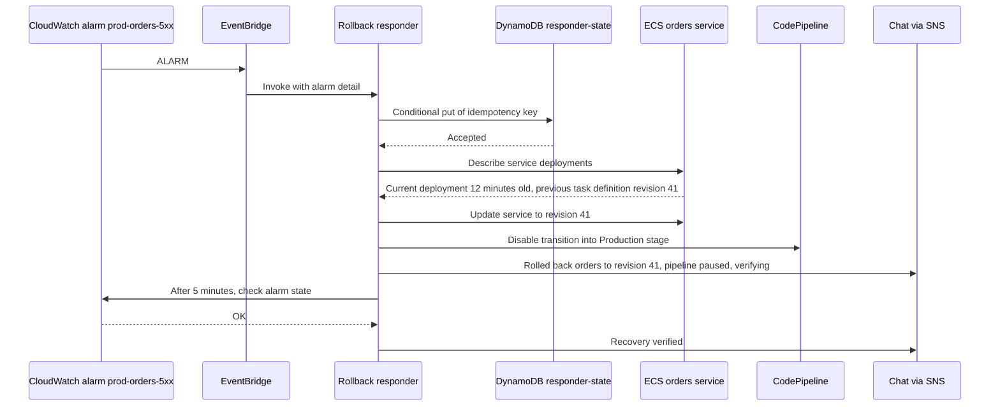

#### Security containment workflow

GuardDuty or Security Hub findings are routed by severity to a Step Functions workflow: capture evidence, isolate (quarantine security group, revoke sessions), notify security, and open a case. Approval gates protect production resources. This is the pattern from [Chapter 6.3](../unit6/topic3.md), with this part adding guardrails, evidence handling and verification.

#### Auto-remediation with exemptions

Config rules or Security Hub controls detect misconfiguration; SSM Automation remediates automatically unless the resource carries an approved exemption tag. The exemption list itself is governed and reviewed.

#### Circuit breaker for automation

The responder counts its own actions in DynamoDB. After K actions within a window, it stops acting and pages humans, on the basis that repeated automated fixes indicate a problem the automation does not understand. This applies the Circuit Breaker pattern of [Chapter 4.3](../unit4/topic3.md) to the automation itself.

#### Evidence capture before self-healing

When an unhealthy ECS task or EC2 instance is about to be replaced, a responder captures diagnostics first: thread dumps, recent logs, process lists, a volume snapshot. Auto Scaling lifecycle hooks and ECS task state change events provide the moment to do this. Without it, self-healing destroys the evidence needed to fix the root cause.

#### ChatOps approval

Automation posts a proposed action with evidence and a custom action button to the incident channel; the on-call engineer approves with one click; the action executes under guardrails; the outcome is posted back. The channel becomes the incident timeline.

#### Central response hub

All workload accounts forward alarm and security events to an operations automation account, where responders assume scoped roles into workload accounts. This mirrors the monitoring-account pattern of [Part 7.3.1](#creating-cloudwatch-dashboards-and-alarms) and the EventBridge hub-and-spoke of [Chapter 6.3](../unit6/topic3.md#event-routing-with-amazon-eventbridge).

### Industry Use Cases

| Industry | Scenario | Automated response design |
|----------|----------|---------------------------|
| E-commerce | Flash sale deployment breaks checkout | Canary deployment with alarm-based rollback; enrichment in chat; pipeline blocked until reviewed |
| Banking | Card authorisation latency spike in one AZ | Composite alarm triggers a workflow proposing zonal shift; human approval; ARC zonal shift executes; verification |
| SaaS | Noisy tenant saturates a shared queue | Responder lowers the tenant's API Gateway usage-plan throttle temporarily and notifies the account team |
| Media streaming | CDN origin errors during a live event | Route 53 or CloudFront origin failover (built in) plus enrichment; responders capture origin evidence |
| Healthcare | Integration feed from a hospital system stops | Heartbeat alarm triggers a responder that restarts the integration task once, then escalates |
| Government and education (for example a college examination portal in Bhutan) | Results publication overloads the application | Pre-scaled capacity plus a responder that enables a static "results available shortly" page through API Gateway or CloudFront if the back end saturates, with automatic revert |
| Security operations in any industry | Compromised access key detected by GuardDuty | Deny policy attached, key deactivated, security notified, CloudTrail activity for the key collected into the case |
| Platform engineering | Nightly batch writes to a full EBS volume | SSM Automation expands the volume within a size cap and opens a ticket for capacity review |

### Advantages

| Advantage | Explanation |
|-----------|-------------|
| Faster mitigation | Seconds to minutes instead of tens of minutes, especially outside working hours |
| Consistency | Same tested steps every time; fewer human errors under stress |
| Scale | Responses to fleet-wide conditions that humans could not perform by hand |
| Evidence | Diagnostics captured at the moment of failure |
| Reduced toil and burnout | Engineers are paged less for mechanical work |
| Auditability | Every action recorded in logs and CloudTrail |
| Serverless economics | Near-zero cost between incidents |
| Composability | Managed building blocks combined through events and IAM, all defined in IaC |

### Limitations

| Limitation | Trade-off or mitigation |
|------------|-------------------------|
| Only known failure modes can be automated | Humans remain essential for novel incidents; invest in diagnosis tools and enrichment |
| Automation can amplify failures | Guardrails, blast-radius limits, circuit breakers, kill switches |
| Depends on alarm quality | Fix noisy alarms first ([Part 7.3.1](#creating-cloudwatch-dashboards-and-alarms)) |
| Requires software engineering discipline | Tests, CI/CD, reviews and ownership for responders |
| At-least-once delivery | Idempotency everywhere |
| No native on-call management for new customers | Partner paging tools |
| AI diagnosis is probabilistic and quota-bound | Human validation, good telemetry |
| Security risk of privileged automation | Least privilege, approvals, abuse protections |

### Common Mistakes

#### Beginner Mistakes

| Mistake | Consequence | Correction |
|---------|-------------|------------|
| Forgetting the Lambda resource-based policy for the alarm or rule | Responder never runs | Add permission for `lambda.alarms.cloudwatch.amazonaws.com` or `events.amazonaws.com` with `SourceArn` |
| Parsing only one event format | Responder fails when triggered through a different path or by `SetAlarmState` tests | Normalise alarm action, EventBridge and SNS formats |
| Using the alarm name as idempotency key | Second incident on the same alarm is ignored | Alarm name plus state timestamp |
| Responding to `OK` and `INSUFFICIENT_DATA` as if they were `ALARM` | Actions on recovery or on missing data | Check `state.value` explicitly |
| Using the `LabRole` or an administrator role pattern in production | Excessive privilege | One least-privilege role per responder |
| No on-failure destination | Failures unnoticed | Destination plus alarm |
| Testing only with `SetAlarmState` | Real metric paths untested | Also test with real failures in non-production |

#### Production Mistakes

| Mistake | Consequence | Correction |
|---------|-------------|------------|
| Restarting on capacity symptoms | Restart storms, total outage | Scale or shed load; never restart on saturation |
| Changing desired count while auto scaling is active | Automation fights the scaler | Change scaling inputs such as minimum capacity |
| Rollback without blocking the pipeline | Bad version redeployed | Pause pipeline stage as part of rollback |
| No cool-down or action budget | Remediation loops | DynamoDB cool-downs, circuit breaker |
| No kill switch | Cannot stop automation during a major incident | Parameter or AppConfig flag; reserved concurrency 0 |
| Automation without notification | Humans surprised by changes, duplicate manual actions | Post every action to the incident channel |
| Broad chat channel permissions | Anyone in the channel can change production | Guardrail policies, private channels |
| Responders depending on the failing system | Automation fails exactly when needed | Minimal, independent dependencies |
| Destroying evidence | Root cause cannot be found | Capture diagnostics before replacement |
| Automating a response nobody has performed manually | Unknown side effects | Perform manually, document, dry-run, then automate |

### Summary

Automated incident response turns detection into action. Detection sources (CloudWatch alarms, GuardDuty, Security Hub, Config, AWS Health and service events) deliver events through alarm actions, EventBridge rules or SNS to executors: Lambda for custom logic, Systems Manager Automation for standard and fleet-wide procedures with approvals, and Step Functions for multi-step workflows with waits, approvals and compensation. Responses are placed on a maturity scale from notification and enrichment through diagnosis and approval to fully automated action, and the most mature responses are often built-in resilience rather than code. Safe responders are idempotent, scoped, bounded, rate limited, switchable off, verified, audited and reversible. ChatOps through Amazon Q Developer in chat applications brings alerts, evidence and one-click actions into a shared channel, while CloudWatch investigations (and, more broadly, AWS DevOps Agent) accelerate diagnosis with AI that humans must validate. With Incident Manager closed to new customers, paging and on-call management are integrated from partner tools, and OpsCenter tracks operational work. Post-incident reviews close the loop by turning each manual mitigation into a candidate for automation.

Architectural lessons:

- ==Automate mitigation, not resolution.== Generic actions such as rollback, traffic shifting, scaling and isolation shorten incidents; specific fixes go through CI/CD.
- ==Prefer built-in self-healing.== Circuit breakers, alarm-based deployment rollback, auto scaling and managed failover should be used before custom responders are written.
- ==Idempotency is mandatory.== Every delivery path is at least once; key on the alarm transition, not the alarm name.
- ==Bound the blast radius and stop loops.== One resource per action, cool-downs, action budgets, circuit breakers and change the controller's inputs rather than fighting it.
- ==Keep a human in the loop where impact is high.== Approvals with timeouts and safe defaults, restricted approvers and full evidence.
- ==Automation must fail loudly and be switchable off.== On-failure destinations, alarms on responders, kill switches and dry-run modes.
- ==Treat responders as privileged production software.== Least-privilege roles, CI/CD, tests with recorded events, fault injection and audit.
- ==AI assists diagnosis; telemetry quality decides its value.== Consistent service names, traces and structured logs from Sections [7.1](../unit7/topic1.md#distributed-tracing-with-aws-x-ray) and [7.2](../unit7/topic2.md) make investigations useful.

## Performance Optimization Using AWS Tools

### Definition

==Performance optimisation is the continuous, evidence-driven practice of improving how quickly and efficiently a system serves its users (latency and throughput) for a given cost, or reducing its cost for a given level of performance, by measuring where time and resources are spent and changing the design or configuration that causes the waste.==

On AWS, performance optimisation draws on three families of tools:

| Family | Purpose | Examples |
|--------|---------|----------|
| Observation tools | Show where time and resources go in the running system | Application Signals, X-Ray, Container Insights, Lambda Insights, Database Insights, CloudWatch RUM, Internet Monitor, CodeGuru Profiler |
| Recommendation tools | Analyse historical utilisation and configuration to propose changes | Compute Optimizer, Trusted Advisor, DevOps Guru, Cost Optimization Hub |
| Experimentation tools | Measure behaviour under controlled conditions before changing production | Lambda Power Tuning, Distributed Load Testing on AWS, AWS Fault Injection Service |

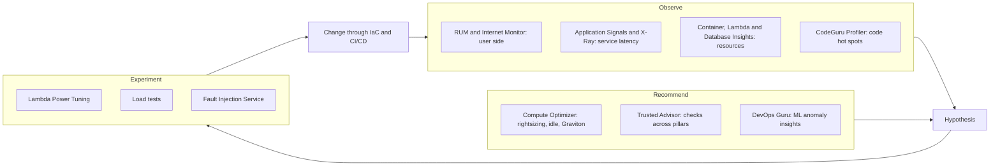

In the AWS architecture map these tools span ==Management and Governance== (CloudWatch, Compute Optimizer, Trusted Advisor), ==Machine Learning== based operations (DevOps Guru, CodeGuru), ==Developer Tools== and AWS Solutions (load testing). They serve the ==Performance Efficiency== and ==Cost Optimization== pillars of the Well-Architected Framework, and increasingly ==Sustainability==, because wasted capacity is wasted energy.

### Why This Service or Concept Exists

#### The problem: guesswork is expensive in both directions

In a data centre, capacity was bought in advance for the peak, and performance problems were solved by buying bigger servers. Waste was hidden in capital budgets. The cloud changes the economics: every idle vCPU is billed every hour, and every slow request is visible in latency percentiles. Two failures are common:

1. ==Over-provisioning.== Teams choose large instance types, generous Fargate task sizes and 3 GB Lambda functions "to be safe". Utilisation of 10 to 20 per cent is typical of unmanaged estates, which means most of the compute bill buys nothing.
2. ==Under-investigated slowness.== When a service is slow, teams add capacity without knowing the cause. If the bottleneck is a missing database index, a lock, an N+1 query pattern or a chatty network call, more capacity costs more and changes nothing.

Both failures have the same root: decisions made without evidence. The cloud makes evidence cheap: utilisation, latency, traces and query statistics are already collected ([Section 7.1](../unit7/topic1.md#distributed-tracing-with-aws-x-ray)). What is missing is the discipline and the tools to turn that evidence into decisions.

#### Why AWS provides optimisation tools

AWS benefits when customers run efficiently, because efficient customers grow on the platform instead of leaving it for cost reasons, and because idle capacity in customer accounts is capacity AWS could sell elsewhere. It therefore offers:

- ==Analysis at fleet scale== that no team could perform by hand: Compute Optimizer analyses the utilisation history of every instance, volume, function and Fargate service in an organisation and compares it with the performance characteristics of hundreds of instance types.
- ==Deep, engine-aware database diagnostics==: Database Insights understands wait events, SQL digests and execution plans for each supported engine.
- ==Curated best-practice checks==: Trusted Advisor encodes lessons from many customers into checks across cost, performance, security, fault tolerance, service limits and operational excellence.
- ==ML-based anomaly detection and AI-assisted analysis==: DevOps Guru and CloudWatch investigations correlate signals that humans would take hours to join.

#### Benefits over older methods

| Concern | Traditional approach | AWS tool-assisted approach |
|---------|----------------------|----------------------------|
| Sizing | Estimate the peak, add a margin, buy hardware | Measure utilisation over 14 to 93 days, receive per-resource recommendations with estimated savings and performance risk |
| Finding slow code paths | Add timing logs, reproduce locally | Traces, service operation metrics and continuous profiling in production |
| Database tuning | DBA runs ad hoc queries against system views | DB load decomposed by wait, SQL, host and user; execution plans captured automatically; fleet-wide view |
| Load testing | Dedicated test lab, scarce and expensive | On-demand distributed load generation from multiple Regions, paid per test |
| Best-practice review | Periodic manual audits | Continuous automated checks with organisational views |
| Cost of mistakes | Sunk capital | Change the instance type or memory setting and pay the new price from the next hour |

!!! tip "Performance and cost are the same conversation"
    In the cloud, ==performance efficiency and cost optimisation are two views of one quantity: useful work per unit of resource==. Removing a bottleneck often allows the same load to be served by fewer resources; rightsizing often reveals which resources were never the bottleneck. A useful unifying metric for DSO303 projects is ==cost per successful request== (or per order, per student record processed), tracked alongside latency percentiles.

### Core Concepts

#### Performance vocabulary

| Term | Definition | Typical AWS evidence |
|------|------------|----------------------|
| Latency | Time to complete one request, measured as a distribution (p50, p90, p99) | ALB `TargetResponseTime`, API Gateway `Latency`, Application Signals operation latency, X-Ray segment durations |
| Throughput | Work completed per unit time (requests per second, messages per second) | `RequestCount`, `Invocations`, `NumberOfMessagesDeleted` |
| Utilisation | Proportion of a resource's capacity in use | `CPUUtilization`, container CPU and memory utilisation |
| Saturation | Degree to which work is queued waiting for a resource | Queue depth and age, run queue length, DB load above vCPU count, Lambda throttles, connection pool waits |
| Errors | Requests that fail, including timeouts caused by saturation | 5xx counts, Lambda `Errors` |
| Efficiency | Useful work per unit of resource or cost | Requests per vCPU-hour, cost per request |
| Tail latency | High percentiles (p99, p99.9) experienced by a minority of requests but by most users over a session | Percentile statistics, trace outliers |
| Headroom | Spare capacity before saturation at the current load | Utilisation compared with a safe target, load test breaking point |

The ==USE method== (utilisation, saturation, errors for each resource) and the ==RED method== (rate, errors, duration for each service) from [Section 7.1](../unit7/topic1.md) organise these measurements. Performance work usually starts with RED symptoms and descends into USE causes.

#### Two laws every architect should apply

==Little's Law== states that, for a stable system, the average number of requests in the system equals the arrival rate multiplied by the average time each request spends in it: `L = λ × W`. It connects throughput, latency and concurrency:

!!! example "Little's Law applied to Lambda and to connection pools"
    An API receives 400 requests per second and each Lambda invocation lasts 250 ms. The average concurrency is `400 × 0.25 = 100` concurrent executions. If a downstream slowdown raises duration to 2 seconds, concurrency rises to 800 with no change in traffic, which may exceed the account's concurrency limit and cause throttling. The same arithmetic sizes database connection pools: 200 queries per second at 50 ms each need about 10 connections on average; if queries slow to 500 ms, 100 connections are needed, which is why slow databases exhaust connection pools and why RDS Proxy ([Chapter 6.2](../unit6/topic2.md)) helps.

==Amdahl's Law== states that the speed-up from improving one part of a task is limited by the fraction of time spent in that part. If database calls take 70 per cent of a request's latency, making application code twice as fast improves total latency by at most 15 per cent. The practical lesson is ==measure before optimising, and optimise the largest contributor first==, which is exactly what traces and DB load breakdowns reveal.

#### The optimisation loop

```mermaid
flowchart TD
    G["Define the goal: SLO, latency target, cost per request"] --> B["Baseline: current percentiles, throughput, utilisation, cost"]
    B --> F["Find the bottleneck: traces, DB load, profiles, Insights, recommendations"]
    F --> H["Form a hypothesis: change X will improve Y by Z"]
    H --> T["Test in isolation: load test or Power Tuning with production-like data"]
    T --> D{"Improvement confirmed and no regression elsewhere?"}
    D -->|"No"| F
    D -->|"Yes"| R["Roll out through IaC and CI/CD with canary and alarms"]
    R --> M["Monitor in production; update baseline"]
    M --> F
```

Rules that make the loop trustworthy:

- ==Change one thing at a time.== Otherwise improvements and regressions cancel out and nobody learns which change mattered.
- ==Compare distributions, not averages.== A change that improves p50 but worsens p99 may harm users.
- ==Use production-like conditions.== Empty caches, tiny datasets and single-user tests produce misleading results.
- ==Keep the baseline in code and dashboards.== The baseline is a dashboard ([Part 7.3.1](#creating-cloudwatch-dashboards-and-alarms)) and a load-test report, not a memory.

#### Where time goes: the latency budget

A user's experience is the sum of latencies across tiers. A ==latency budget== allocates the target (for example 800 ms for a page) across tiers, and tells engineers which tool measures each share.

| Tier | Typical contribution | Tool that measures it | Common remedies |
|------|----------------------|-----------------------|-----------------|
| Client rendering and scripts | 100 to 1,000 ms | CloudWatch RUM (Core Web Vitals, JavaScript timings) | Smaller bundles, lazy loading, image optimisation |
| Internet path and DNS | 20 to 300 ms | RUM, Internet Monitor, Synthetics from several locations | CloudFront, Regional placement, Global Accelerator |
| Edge and TLS | 10 to 100 ms | CloudFront metrics and logs | Edge caching, TLS session reuse, HTTP/2 and HTTP/3 |
| API layer | 5 to 50 ms | API Gateway `Latency` minus `IntegrationLatency`, ALB metrics | Right API type (HTTP API versus REST API), removing unnecessary authorisers or transformations |
| Service compute | 10 to 500 ms | Application Signals, X-Ray, CodeGuru Profiler, Lambda `Duration` and init duration | Algorithmic fixes, memory and CPU sizing, SnapStart, provisioned concurrency |
| Downstream calls | 5 to 1,000 ms | X-Ray subsegments, Application Signals dependency metrics | Parallel calls, caching, timeouts, asynchronous processing via SQS |
| Database | 1 to 1,000 ms | Database Insights, DynamoDB latency metrics | Indexes, query rewrites, read replicas, ElastiCache, DAX, connection pooling |

#### Choosing the tool: a map from question to evidence

| Question | Primary tool | Supporting tools | Covered in |
|----------|--------------|------------------|------------|
| Are real users experiencing slow pages, and where? | CloudWatch RUM | Internet Monitor, Synthetics | [Section 7.1](../unit7/topic1.md); this part |
| Is the slowness caused by the internet or by us? | Internet Monitor | RUM by ISP and location | [Section 7.1](../unit7/topic1.md); this part |
| Which service operation is slow, and since when? | Application Signals | X-Ray trace map, dashboards | [Section 7.1](../unit7/topic1.md); this part |
| Which dependency or span within a request is slow? | X-Ray traces and Transaction Search | Application Signals dependency view | [Section 7.1](../unit7/topic1.md) |
| Which function in the code consumes CPU? | CodeGuru Profiler | OpenTelemetry-based profilers from partners | This part |
| Why is the database slow? | CloudWatch Database Insights | Enhanced Monitoring, slow query logs | This part |
| Are containers correctly sized or throttled? | Container Insights | Compute Optimizer for ECS on Fargate | [Section 7.1](../unit7/topic1.md); this part |
| What memory setting is best for this Lambda function? | Lambda Power Tuning | Lambda Insights, Compute Optimizer | This part |
| Which resources are over-provisioned, under-provisioned or idle? | Compute Optimizer | Trusted Advisor, Cost Optimization Hub | This part |
| Are we following performance and cost best practices? | Trusted Advisor | Well-Architected Tool | This part |
| Is anything behaving anomalously that we have not noticed? | DevOps Guru, anomaly detection alarms | CloudWatch investigations | This part; [Part 7.3.1](#creating-cloudwatch-dashboards-and-alarms) |
| How does the system behave at twice today's peak? | Load testing | Fault Injection Service | This part |

#### User-side performance: CloudWatch RUM and Internet Monitor

[Section 7.1](../unit7/topic1.md) explained how CloudWatch RUM collects Core Web Vitals and errors from real browsers and mobile apps, and how Internet Monitor reports internet health by city-network. For optimisation the value lies in ==segmentation==: averages across all users hide the users who suffer.

| Analysis | How | Typical finding and remedy |
|----------|-----|----------------------------|
| Largest Contentful Paint (LCP) p75 by page | RUM page view metrics | A heavy hero image on the landing page; serve resized images from CloudFront |
| Interaction to Next Paint (INP) by browser and device | RUM performance events | Low-end Android devices struggle with a large JavaScript bundle; split code and defer non-critical scripts |
| Page load by country | RUM segmentation | Users far from the Region see slow loads; add CloudFront caching for static and cacheable API responses |
| Latency by ISP (city-network) | Internet Monitor performance and availability scores | One ISP's routing to the Region is poor; Internet Monitor suggests CloudFront or another Region would reduce latency for those users |
| Traffic share and time to first byte by location | Internet Monitor traffic insights | Decide whether a second Region or edge acceleration is justified by the number of affected users |

!!! example "Serving students across Bhutan and beyond"
    A college portal hosted in the Asia Pacific (Mumbai) Region serves students in Thimphu, Phuentsholing, rural districts and abroad. RUM shows LCP p75 of 1.8 s overall but 5.2 s for users on one mobile network in eastern districts. Internet Monitor attributes the difference to that city-network's path rather than to the application. The architecture response is not more compute but ==CloudFront in front of the portal== for static assets and cacheable pages, image compression, and a lighter mobile page, all verified by comparing RUM percentiles for that segment before and after.

#### Service latency analysis with Application Signals and X-Ray

Application Signals provides per-operation RED metrics and SLOs, and X-Ray (with OpenTelemetry) provides traces ([Section 7.1](../unit7/topic1.md#distributed-tracing-with-aws-x-ray)). A systematic latency investigation uses them in a fixed order:

1. ==Find the operation.== In Application Signals, sort operations by p99 latency or by SLO attainment; compare with the baseline period to see what changed.
2. ==Find the dependency.== The operation's dependency view shows latency and faults for each downstream call (DynamoDB, another service, an external API). If one dependency's latency rose, the problem is there.
3. ==Find the span.== Open exemplar or slow traces for the period. The trace timeline shows whether time is spent in one slow call, in many sequential calls (an N+1 pattern), in waiting for a connection, or in the service's own code.
4. ==Find the pattern.== Use trace analytics or Transaction Search to group slow traces by annotation (customer tier, request size, Availability Zone, version) to see whether slowness is universal or confined to a segment.
5. ==Correlate with resources.== Check Container Insights or Lambda Insights for the same period: CPU throttling, memory pressure, garbage collection or cold starts often explain service-level latency.

| Trace shape | Interpretation | Typical fix |
|-------------|----------------|-------------|
| One long subsegment to a database or API | Slow dependency | Investigate that dependency (Database Insights, its own traces); add caching or timeouts |
| Many short sequential subsegments to the same dependency | N+1 query or chatty API | Batch requests (DynamoDB `BatchGetItem`, SQL `IN` clauses), redesign the API |
| Gap with no subsegments at the start of a Lambda trace | Cold start initialisation | Reduce package size, lazy initialisation, SnapStart, provisioned concurrency |
| Long time before the first downstream call | CPU-bound code or waiting for a thread or connection | Profile with CodeGuru Profiler; increase pool size; right-size CPU |
| Parallel calls whose total equals the slowest call | Healthy fan-out | Optimise the slowest branch only (Amdahl's Law) |
| Retries visible as repeated subsegments | Throttling or transient errors amplifying latency | Adjust retry policy and backoff, fix the throttling ([Chapter 4.3](../unit4/topic3.md)) |

#### Code-level profiling with Amazon CodeGuru Profiler

Traces show which ==operation== is slow; profilers show which ==lines of code== consume CPU time or allocate memory. ==Amazon CodeGuru Profiler== is a managed continuous profiler for JVM languages (Java, Kotlin, Scala) and Python. A lightweight agent samples the application's call stacks in production with low overhead and sends profiles to the service, which presents ==flame graphs==, highlights the most expensive frames and produces recommendations (for example inefficient logging, repeated creation of expensive SDK clients, or costly serialisation). It can profile applications on EC2, ECS, EKS, Fargate and Lambda (through a layer or the Powertools integration for Python and Java).

| Aspect | Detail |
|--------|--------|
| Languages | JVM languages and Python |
| Output | CPU and latency flame graphs, heap summary (JVM), anomaly reports and recommendations |
| Overhead | Designed for continuous use in production through sampling |
| Pricing | Per sampling hour profiled per application, with a free tier; check the current pricing page |
| Status | Available; note that the separate CodeGuru Reviewer service was closed to new customers in November 2025 and CodeGuru Security was discontinued, so confirm Profiler's status before adopting it in a new design |

```mermaid
flowchart LR
    A["Application with CodeGuru Profiler agent"] -->|"sampled stack traces"| P["CodeGuru Profiler profiling group"]
    P --> FG["Flame graph: widest frames consume most CPU"]
    P --> REC["Recommendations: expensive patterns detected"]
    FG --> FIX["Code change through CI/CD"]
    REC --> FIX
    FIX --> CMP["Compare profiles before and after"]
```

!!! note "Reading a flame graph"
    Each bar is a function; the width of a bar is the proportion of samples in which that function (or something it called) was on the stack. The widest bars near the top of the graph are where the CPU actually spends time. Students often find that a large share of CPU goes to JSON serialisation, logging, regular expression compilation or TLS handshakes caused by creating new clients per request, rather than to business logic.

Organisations that standardise on OpenTelemetry may instead use partner continuous profilers that integrate with their tracing tools; the analytical method is the same.

#### Database performance with CloudWatch Database Insights

Databases are the most common bottleneck in cloud-native applications, because compute tiers scale horizontally while a relational primary does not ([Chapter 6.2](../unit6/topic2.md)). ==CloudWatch Database Insights== is AWS's database observability capability for Amazon Aurora (MySQL, PostgreSQL, Limitless and DSQL), Amazon RDS (MySQL, PostgreSQL, MariaDB, Oracle and SQL Server) and, through the CloudWatch agent, self-managed PostgreSQL on EC2.

!!! info "From Performance Insights to Database Insights"
    For many years database load analysis was provided by ==RDS Performance Insights== in the RDS console. AWS introduced CloudWatch Database Insights in December 2024 and announced the end of life of the Performance Insights console experience, with ==July 31, 2026== as the end-of-life date; Performance Insights users have been migrated to Database Insights. The underlying concepts (DB load, average active sessions, wait events, top SQL) and parts of the API naming carry over: for example, Advanced mode is enabled with the RDS parameters `--database-insights-mode advanced`, `--enable-performance-insights` and a `--performance-insights-retention-period` of at least 465 days. Older tutorials that refer to Performance Insights remain conceptually useful but describe a console that no longer exists in that form.

##### The central idea: DB load and average active sessions

A database session is ==active== when it is running on CPU or waiting for something (a lock, disk I/O, a network round trip, a commit). Database Insights samples sessions every second and reports ==DB load== in ==average active sessions (AAS)==. DB load is then sliced by dimensions:

| Dimension | Question it answers |
|-----------|---------------------|
| Wait event (or wait type) | What are sessions waiting for: CPU, I/O, locks, commit, network, buffer contention? |
| SQL (digest) | Which statements generate the load? |
| Host | Which application hosts or tasks send the load? |
| User and database | Which application user or schema is responsible? |
| Application (where available) | Which client application? |

The key comparison is ==DB load against the number of vCPUs==. If AAS consistently exceeds the vCPU count and most of the load is CPU, the database is CPU-saturated. If AAS exceeds vCPUs but most load is waits (I/O, locks), adding CPU will not help: the queries, indexes, storage or transaction design must change.

```mermaid
flowchart TD
    S["DB load high relative to vCPU count"] --> W{"Dominant wait category?"}
    W -->|"CPU"| C["Top SQL by CPU: missing indexes, full scans, inefficient joins; then consider larger or Graviton instance"]
    W -->|"I/O reads"| I["Working set larger than memory: add indexes, cache in ElastiCache, scale up memory, read replicas"]
    W -->|"Locks"| L["Lock analysis: long transactions, hot rows, missing indexes on foreign keys"]
    W -->|"Commit or log writes"| K["Many small transactions: batch writes, review durability settings, storage throughput"]
    W -->|"Client or network"| N["Application fetching too many rows or chatty round trips: pagination, fewer calls"]
```

##### Standard and Advanced modes

| Capability | Standard mode | Advanced mode |
|------------|---------------|---------------|
| DB load analysis by wait, SQL, host, user | Yes | Yes |
| Retention of load data | 7 days free; 1 to 24 months at additional cost | 1 to 24 months included (15 months for some features) |
| Fleet health dashboard across many instances, accounts and Regions | Basic | Full fleet-wide monitoring views |
| Per-query statistics and slow SQL analysis | No | Yes (slow SQL requires log export to CloudWatch Logs) |
| Execution plans | No | Yes for supported engines (for example Aurora PostgreSQL, RDS for Oracle and RDS for SQL Server) |
| SQL lock analysis | No | Yes for Aurora and RDS for PostgreSQL |
| OS process metrics | No | Yes, with Enhanced Monitoring |
| On-demand performance analysis of a time window | No | Yes |
| Application Signals integration (which services call this database) | No | Yes |
| Pricing basis | Free 7-day tier, paid longer retention | Per vCPU-hour for provisioned instances and per ACU-hour for Serverless |

!!! tip "Which mode for which database"
    Use ==Standard== for development and low-criticality databases. Use ==Advanced== for production databases behind customer-facing SLOs, especially where execution plan regressions or lock contention have caused incidents, and for fleets where a central team needs one view of hundreds of databases. Verify supported features per engine and Region, because they differ.

##### A database investigation workflow

1. From an Application Signals latency alarm, follow the dependency to the database and open Database Insights for the same period.
2. Compare DB load with vCPUs and identify the dominant wait category.
3. Slice by SQL to find the top statements; compare with the baseline period to find a new or regressed statement.
4. In Advanced mode, open the statement's execution plans; a plan change (for example from index scan to sequential scan after statistics changed) often explains a sudden regression.
5. Slice by host to see whether one service or one deployment is responsible.
6. Apply the remedy (index, query rewrite, caching, connection pooling with RDS Proxy, read replica, instance class change) through IaC and verify DB load and latency afterwards.

For DynamoDB, the equivalent evidence is consumed capacity versus provisioned or on-demand limits, throttled requests, `SuccessfulRequestLatency` and, for hot keys, ==CloudWatch Contributor Insights for DynamoDB==, which shows the most accessed and most throttled partition keys ([Chapter 6.2](../unit6/topic2.md)).

#### Container performance and rightsizing

Container Insights ([Section 7.1](../unit7/topic1.md#infrastructure-and-application-monitoring-with-amazon-cloudwatch)) provides the evidence; the optimisation decisions are about ==requests, limits and task sizes== (Chapters [2.2](../unit2/topic2.md) and [3.2](../unit3/topic2.md)).

| Observation in Container Insights | Interpretation | Action |
|-----------------------------------|----------------|--------|
| ECS task CPU utilisation consistently below 20 per cent, memory below 30 per cent | Task size too large | Reduce Fargate task CPU and memory; Compute Optimizer recommends Fargate task and container sizes |
| Container CPU at its limit with throttling while latency rises | CPU limit too tight | Raise CPU allocation or limit; or scale out earlier with a lower target tracking value |
| Memory utilisation climbing steadily until OOM kill and restart | Memory leak or undersized memory | Profile the heap; raise memory only after confirming it is not a leak |
| EKS node CPU reserved 90 per cent but actual use 25 per cent | Pod requests far above real usage | Lower requests to observed p95 usage plus headroom; let Karpenter consolidate nodes ([Chapter 3.3](../unit3/topic3.md)) |
| Frequent scale-out and scale-in cycles | Scaling metric or cooldowns poorly chosen | Scale on a metric closer to the bottleneck (requests per target, queue backlog per task) |
| High `EphemeralStorageUtilized` on Fargate | Temporary files or logs filling storage | Move data to S3 or EFS, rotate files, increase ephemeral storage |

!!! warning "Requests are a scheduling promise, not a measurement"
    In Kubernetes, a pod's CPU and memory ==requests== reserve node capacity whether or not the pod uses it; ==limits== cap usage. Inflated requests waste nodes; tight CPU limits cause throttling that appears as latency rather than as errors. Set requests from measured usage (for example p95 over two weeks from Container Insights) and be cautious with CPU limits on latency-sensitive services. On ECS, the task-level CPU and memory values for Fargate determine both the price and the ceiling.

For ECS on Fargate, ==Graviton (ARM64)== tasks typically offer better price performance than x86 for compatible images; multi-architecture images built in the CI pipeline ([Chapter 5.2](../unit5/topic2.md)) make the switch a configuration change. Fargate Spot can reduce cost for interruption-tolerant tasks.

#### Lambda performance and Power Tuning

In Lambda, ==memory is the only resource knob==: CPU, network bandwidth and memory scale together, with a full vCPU equivalent at about 1,769 MB and up to six vCPUs at 10,240 MB. Because price is proportional to memory multiplied by duration, more memory can be ==cheaper== if it shortens duration enough.

| Memory | Duration (CPU-bound example) | Relative cost per invocation |
|--------|------------------------------|------------------------------|
| 128 MB | 3,200 ms | 1.00 |
| 512 MB | 800 ms | 1.00 |
| 1,024 MB | 400 ms | 1.00 |
| 1,769 MB | 230 ms | 0.99 |
| 3,008 MB | 225 ms | 1.65 |

In this illustrative CPU-bound case, duration falls in proportion to memory up to about one vCPU, so cost stays flat while latency improves twelve-fold; beyond that the single-threaded code cannot use additional vCPUs, so cost rises with no benefit. I/O-bound functions behave differently: they wait on the network, so extra memory barely changes duration and the cheapest setting is often low. ==Only measurement reveals which case applies.==

==AWS Lambda Power Tuning== is an open-source tool, maintained in the AWS community and deployable from the AWS Serverless Application Repository, SAM, CDK or Terraform. It is a Step Functions state machine that invokes a target function many times at each memory setting you list, collects duration and cost, and returns the optimal setting for a chosen strategy together with a visualisation link.

| Input | Meaning |
|-------|---------|
| `lambdaARN` | Function (or alias) to test |
| `powerValues` | Memory sizes to compare, for example 128, 256, 512, 1024, 1769, 3008 |
| `num` | Invocations per memory size (for statistically useful results, at least 50 to 100) |
| `payload` | Representative input event, or several weighted payloads |
| `parallelInvocation` | Invoke concurrently to shorten the test (beware of downstream load) |
| `strategy` | `cost`, `speed` or `balanced` |

```mermaid
sequenceDiagram
    participant U as Engineer or CI pipeline
    participant SF as Power Tuning state machine
    participant F as Target Lambda function
    participant R as Result
    U->>SF: Start with ARN, power values, payload, strategy balanced
    loop For each memory size
        SF->>F: Update configuration and publish test version
        SF->>F: Invoke num times
        F-->>SF: Durations from logs
    end
    SF->>SF: Compute average duration and cost per invocation
    SF->>R: Optimal memory, cost and speed per size, visualisation URL
    SF->>F: Clean up test versions and aliases
```

Complementary tools for Lambda performance:

- ==Lambda Insights== ([Section 7.1](../unit7/topic1.md#infrastructure-and-application-monitoring-with-amazon-cloudwatch)) shows memory actually used versus allocated, CPU time, and initialisation duration per function, which is the evidence for right-sizing functions in production traffic rather than in a test.
- ==Compute Optimizer== produces memory recommendations for functions with enough invocation history.
- ==Cold start mitigations== ([Chapter 1.3](../unit1/topic3.md)): smaller deployment packages, initialising clients outside the handler, ==SnapStart== for Java, Python and .NET, and ==provisioned concurrency== for latency-critical functions with predictable traffic.
- ==Architecture choice==: arm64 (Graviton) functions are priced lower per GB-second and often run as fast or faster; Power Tuning can compare both.

#### AWS Compute Optimizer

==AWS Compute Optimizer== analyses the configuration and utilisation metrics of resources and recommends optimal configurations to reduce cost and improve performance, using machine learning trained on AWS's knowledge of workload behaviour across instance types.

| Aspect | Detail (verify current coverage in the documentation) |
|--------|--------------------------------------------------------|
| Rightsizing coverage | EC2 instances, EC2 Auto Scaling groups, EBS volumes, Lambda functions, ECS services on Fargate, RDS and Aurora databases (MySQL and PostgreSQL), and commercial software licences such as SQL Server editions |
| Idle resource detection | EC2, Auto Scaling groups, EBS, ECS on Fargate, RDS, NAT gateways and, since June 2026, DynamoDB provisioned tables, ElastiCache, MemoryDB, DocumentDB, WorkSpaces and SageMaker endpoints |
| Findings | Over-provisioned, under-provisioned, optimised, or idle, with estimated monthly savings and a ==performance risk== rating for each option |
| Look-back period | 14 days by default; 32 days, or 93 days with ==enhanced infrastructure metrics== (a paid feature) for workloads with monthly or quarterly cycles |
| Memory awareness | EC2 memory utilisation is analysed only if the CloudWatch agent publishes memory metrics; without them Compute Optimizer is conservative about downsizing |
| Preferences | CPU architecture (for example include Graviton), instance families to include or exclude, headroom and utilisation thresholds, pricing model for savings estimates |
| Organisation scale | Opt in at the AWS Organizations management account or a delegated administrator to see recommendations for all member accounts; export to S3 |
| Automation | An automation capability can apply selected optimisations (for example EBS volume type upgrades and cleanup of unattached volumes) on recurring schedules with rules |
| Integration | Cost Optimization Hub consolidates Compute Optimizer recommendations with discounts applied; Trusted Advisor surfaces some of them |
| Pricing | Standard recommendations at no additional charge; enhanced infrastructure metrics charged per resource-hour analysed |

```mermaid
flowchart LR
    CW["CloudWatch utilisation metrics: CPU, network, disk, memory from agent, Lambda duration and memory"] --> CO["Compute Optimizer ML analysis"]
    CFG["Resource configuration and pricing"] --> CO
    PREF["Preferences: Graviton, families, headroom, look-back"] --> CO
    CO --> REC["Recommendations with savings and performance risk"]
    REC --> HUB["Cost Optimization Hub"]
    REC --> EXP["Export to S3 for reporting"]
    REC --> IAC["Change instance type or memory in IaC"]
    IAC --> CW
```

!!! warning "Recommendations are hypotheses, not orders"
    Compute Optimizer sees utilisation, not intent. An instance at 5 per cent CPU may be a standby that must absorb a failover; a Lambda function may run rarely but must be fast when it does; memory recommendations are unreliable without the CloudWatch agent. Treat each recommendation as a hypothesis to verify with load tests or a canary deployment, prefer options with low performance risk, and apply changes through IaC so that they are reviewable and reversible.

#### AWS Trusted Advisor

==AWS Trusted Advisor== continuously inspects an account against a library of best-practice checks, grouped into categories aligned with the Well-Architected pillars: ==cost optimisation, performance, security, fault tolerance, service limits and operational excellence==. Performance checks include, for example, over-utilised EC2 instances, high-utilisation EBS volumes, CloudFront configuration issues and Lambda functions with high error rates or timeouts; cost checks include idle load balancers, underutilised instances and unassociated Elastic IP addresses. Some checks are powered by Compute Optimizer or AWS Config.

| Access | Checks available (verify with the Trusted Advisor documentation) |
|--------|--------------------------------------------------------------------|
| Basic Support | All service limit checks and a selection of security and fault tolerance checks; manual refresh in the console |
| Business Support+, Enterprise Support and Unified Operations | All checks, automatic refresh, the Trusted Advisor API, EventBridge integration, organisational view across accounts and Trusted Advisor Priority |

!!! info "Support plan changes affect Trusted Advisor access"
    AWS restructured its Support plans in 2025–2026. ==Business Support+== (from 29 USD per month minimum) now provides full Trusted Advisor access, and the Developer, Business and Enterprise On-Ramp plans are being discontinued on ==1 January 2027==, with customers moving to Business Support+ or Enterprise Support. Check the current AWS Support plans page before assuming which checks an account can see. AWS Academy Learner Lab accounts typically have only basic access.

Trusted Advisor is best used as a ==broad, periodic safety net== and as a governance signal across an organisation (for example, a weekly report of new high-risk items routed through EventBridge to owners). For deep, per-resource optimisation, Compute Optimizer and the Insights tools provide more detail.

#### Amazon DevOps Guru

==Amazon DevOps Guru== applies machine learning to CloudWatch metrics, logs, AWS Config and CloudTrail events and deployment events to detect anomalous behaviour, group related anomalies into ==insights== and recommend actions. ==Reactive insights== describe problems happening now (for example Lambda duration rising together with DynamoDB throttling after a deployment); ==proactive insights== warn of emerging problems (for example a table approaching capacity limits). ==DevOps Guru for RDS== adds database-specific anomaly analysis using DB load data. Coverage is defined by CloudFormation stacks, tags or the whole account, and pricing is per resource-hour analysed (with different rates for resource groups) plus API calls.

DevOps Guru overlaps with newer capabilities: anomaly detection alarms ([Part 7.3.1](#creating-cloudwatch-dashboards-and-alarms)), CloudWatch investigations and AWS DevOps Agent ([Part 7.3.2](#automated-incident-response-with-aws-lambda)), and Database Insights. In a new design, consider it where ML-based detection of ==unknown== anomalies across many serverless resources is valuable and the per-resource cost is acceptable; for known signals, explicit alarms remain cheaper and more predictable.

#### Load testing

Observation shows how the system behaves under today's traffic. ==Load testing== shows how it behaves under traffic that has not happened yet: the examination-results day, the festival sale, the new customer ten times larger than any before. It is also the only safe way to verify that an optimisation actually improves performance.

| Test type | Question | Shape of load |
|-----------|----------|---------------|
| Baseline or smoke | Does the test work, and what is normal? | Low, steady |
| Load | Does the system meet its SLO at expected peak? | Ramp to expected peak and hold |
| Stress | Where does it break, and how? | Ramp beyond peak until errors or latency exceed limits |
| Spike | Does it survive a sudden surge, and how fast does it scale? | Near-instant jump to a multiple of normal |
| Soak or endurance | Does it degrade over hours (memory leaks, connection exhaustion, log growth)? | Moderate load held for many hours |
| Scalability | How does throughput grow as resources are added? | Repeated load tests at different capacities |

==Distributed Load Testing on AWS== is an AWS Solution (deployed from a CloudFormation template into your account) that generates load from containers on ECS Fargate, optionally across several Regions, using ==JMeter, k6 or Locust== scripts or simple HTTP endpoint definitions. It schedules tests immediately, at a future time or on a cron schedule for regression testing, and reports response-time percentiles, virtual users, success rates and comparisons against a baseline. Teams also run k6, Locust, Gatling or JMeter themselves on Fargate or from CI runners.

```mermaid
flowchart LR
    CI["CI/CD pipeline stage: performance test"] --> DLT["Load generators on ECS Fargate in one or more Regions"]
    DLT -->|"HTTP load"| SYS["System under test in a staging account: API Gateway or ALB, ECS, Lambda, Aurora"]
    SYS --> OBS["CloudWatch: Application Signals, Container Insights, Database Insights, alarms"]
    DLT --> RES["Results: p50, p95, p99, errors, throughput"]
    RES --> GATE{"Within SLO and no regression versus baseline?"}
    OBS --> GATE
    GATE -->|"Yes"| PROMOTE["Promote to production"]
    GATE -->|"No"| FAIL["Fail the pipeline with the report"]
```

Principles for trustworthy load tests:

1. ==Test a production-like environment==: same instance types, task sizes, database class, data volume and configuration (cache sizes, connection pools, scaling policies) as production. Use IaC to create it ([Chapter 5.3](../unit5/topic3.md)).
2. ==Model realistic traffic==: the mix of operations, think times, payload sizes and the proportion of cache hits. A test that only calls the health check endpoint proves nothing.
3. ==Watch the system, not only the load tool==: the load tool reports client-side latency; CloudWatch shows where the time went. Use the same dashboards as production.
4. ==Warm up and ramp==: include ramp-up periods so auto scaling behaves as in reality, and discard warm-up data from results.
5. ==Beware the load generator bottleneck==: if generators run out of CPU or network, results measure the generator. Monitor generators too.
6. ==Coordinate and protect==: never load test production or third-party APIs without agreement; use test payment providers and synthetic data. AWS policy permits load testing your own resources, but some tests (for example high-rate network stress) have specific rules; check the current AWS testing policy.
7. ==Automate regression testing==: run a shorter load test in the pipeline for each release and compare with the baseline, failing the build on significant regression.

!!! tip "Combine load tests with fault injection"
    A system that meets its SLO at peak load may still fail at peak load ==plus== an Availability Zone impairment. AWS Fault Injection Service ([Chapter 4.3](../unit4/topic3.md)) can inject faults during a load test to verify that capacity headroom, auto scaling and the responders of [Part 7.3.2](#automated-incident-response-with-aws-lambda) behave as designed.

#### From evidence to remedy

Tools find the bottleneck; architecture fixes it. The following table links evidence to the remedies taught throughout DSO303.

| Evidence | Likely bottleneck | Remedy | Chapter |
|----------|-------------------|--------|---------|
| DB load high, dominated by CPU, a few top SQL statements | Inefficient queries | Indexes, query rewrite, avoid N+1 | [6.2](../unit6/topic2.md) |
| DB load high, I/O waits, repeated reads of the same data | Working set exceeds memory | ElastiCache or DAX caching, larger memory instance, read replicas | [6.1](../unit6/topic1.md#caching-strategies-with-amazon-elasticache), [6.2](../unit6/topic2.md) |
| Connection waits, `DatabaseConnections` near maximum, many Lambda functions | Connection exhaustion | RDS Proxy, connection reuse outside the handler, reserved concurrency | [1.3](../unit1/topic3.md), [6.2](../unit6/topic2.md) |
| Lambda duration dominated by initialisation | Cold starts | Smaller packages, SnapStart, provisioned concurrency | [1.3](../unit1/topic3.md) |
| Traces show sequential downstream calls | Serial fan-out | Parallel calls, batch APIs, asynchronous processing via SQS or EventBridge | [4.1](../unit4/topic1.md), [6.3](../unit6/topic3.md) |
| High latency for distant users, RUM and Internet Monitor by location | Network distance | CloudFront caching, edge functions, additional Region | [1.6](../unit1/topic6.md) |
| CPU throttling in containers | CPU limits too low | Adjust task size or limits, scale out earlier | [2.2](../unit2/topic2.md), [3.2](../unit3/topic2.md) |
| Utilisation below 20 per cent across a fleet | Over-provisioning | Rightsize with Compute Optimizer, Graviton, consolidation with Karpenter | [1.3](../unit1/topic3.md), [3.3](../unit3/topic3.md) |
| Queue age rising with consumer CPU low | Consumer concurrency or downstream limit | Increase consumer concurrency or batch size, find downstream constraint | [6.3](../unit6/topic3.md) |
| Latency spikes aligned with retries in traces | Retry amplification | Exponential backoff with jitter, retry budgets, circuit breakers | [4.3](../unit4/topic3.md) |
| API Gateway `Latency` much larger than `IntegrationLatency` | API layer overhead | Simpler authoriser, caching authoriser results, HTTP API where suitable | [4.2](../unit4/topic2.md) |
| DynamoDB throttling on a few keys | Hot partition | Key design, write sharding, caching with DAX | [6.2](../unit6/topic2.md) |

#### The cost of observability itself

Observability is not free. Sections [7.1](../unit7/topic1.md) and [7.2](../unit7/topic2.md) noted that in mature estates it commonly costs between 5 and 15 per cent of infrastructure spend, and that CloudWatch often becomes one of the top cost lines. Governing that cost is part of performance and cost optimisation, and the aim is ==maximum insight per unit of spend==, not minimum spend.

| Cost driver | Why it grows | Levers | Detail in |
|-------------|--------------|--------|-----------|
| Custom metrics and cardinality | Each unique combination of dimensions is a billed metric; user IDs or request IDs as dimensions explode counts | Keep dimensions low-cardinality; put high-cardinality context in EMF log fields; Metrics Insights queries instead of pre-computed series | [Section 7.1](../unit7/topic1.md) |
| Log ingestion | Debug logging, payload logging, verbose access logs | Log levels per environment, sampling, Infrequent Access class, vended logs direct to S3 | [Section 7.2](../unit7/topic2.md) |
| Log storage | Never-expire retention default | Explicit retention per log group, export or archive to S3 lifecycle tiers | [Section 7.2](../unit7/topic2.md) |
| Log queries | Broad Logs Insights queries over large groups, enrichment functions querying on every alarm | Field indexes, narrow time ranges, saved queries, convert frequent questions into metrics | [Section 7.2](../unit7/topic2.md) |
| Traces | Sampling everything, indexing every span | Head and adaptive sampling, Transaction Search indexing percentage, retention on `aws/spans` | [Section 7.1](../unit7/topic1.md) |
| Container Insights and Application Signals | Observation-based pricing grows with containers and requests | Enable enhanced observability where diagnosis needs it; review signal volumes | [Section 7.1](../unit7/topic1.md) |
| Alarms and dashboards | Per-resource alarms and copied dashboards | Multi time series query alarms, template dashboards with variables | [Part 7.3.1](#creating-cloudwatch-dashboards-and-alarms) |
| `GetMetricData` from external tools | Third-party tools polling CloudWatch | Metric streams, fewer polled metrics, longer polling intervals | Sections [7.1](../unit7/topic1.md) and [7.3.1](#creating-cloudwatch-dashboards-and-alarms) |
| Synthetics and RUM | Frequent canaries, 100 per cent RUM sampling | Canary frequency by criticality, RUM session sampling | [Section 7.1](../unit7/topic1.md) |
| Database Insights Advanced, Lambda Insights, DevOps Guru | Per-vCPU, per-function or per-resource charges across entire fleets | Enable for production and critical resources, not everywhere | This part |

A practical governance process:

1. ==Attribute==: tag log groups, alarms, canaries and dashboards with service and team; use Cost Explorer grouped by CloudWatch usage type and by tag to see who spends what.
2. ==Budget==: set an observability budget per team (for example a percentage of the service's infrastructure cost) with AWS Budgets alerts.
3. ==Review top items monthly==: the largest log groups by ingested bytes (the `IncomingBytes` metric per log group), the metrics namespaces with the most series, the most expensive queries and the most frequently running canaries.
4. ==Fix at the source==: change log levels and metric dimensions in code, not only retention in the console.
5. ==Protect what matters==: never reduce telemetry that drives paging alarms, SLOs or security detection to save money; cut debug noise and duplicated data instead.

!!! danger "Do not optimise observability into blindness"
    A team that deletes traces and shortens log retention to meet a budget may save a few hundred dollars and then lose days of engineering time and customer trust in the next incident. Every reduction must answer one question: ==which incident will we be unable to diagnose because of this change?== If the answer is "the next serious one", the cost is worth paying.

### AWS Service Deep Dive

The observation services of [Section 7.1](../unit7/topic1.md) have their own deep dives there. This deep dive covers the dedicated optimisation services: Compute Optimizer, Trusted Advisor, Database Insights, DevOps Guru, CodeGuru Profiler, Lambda Power Tuning and Distributed Load Testing on AWS.

#### Purpose

| Service | Purpose in one sentence |
|---------|-------------------------|
| Compute Optimizer | Recommend right-sized, idle-free and architecture-appropriate configurations from utilisation history |
| Trusted Advisor | Continuously check accounts against best practices across cost, performance, security, resilience, limits and operations |
| Database Insights | Explain database load by wait, SQL, host and user, and show plans, locks and fleet health |
| DevOps Guru | Detect anomalous operational behaviour with ML and group it into actionable insights |
| CodeGuru Profiler | Show which code consumes CPU and latency in production |
| Lambda Power Tuning | Find the optimal Lambda memory setting empirically |
| Distributed Load Testing on AWS | Generate realistic, distributed load on demand and compare results with baselines |

#### Architecture

```mermaid
flowchart TB
    subgraph Workloads["Member accounts"]
        EC2["EC2 and Auto Scaling"]
        ECS["ECS on Fargate"]
        LAM["Lambda"]
        DB["Aurora and RDS"]
        EBS["EBS"]
    end
    subgraph Telemetry["CloudWatch"]
        MET["Utilisation metrics and CloudWatch agent memory metrics"]
        DBI["Database Insights: DB load samples, plans, locks"]
        LI["Lambda Insights and Container Insights"]
    end
    subgraph Mgmt["Management or delegated administrator account"]
        CO["Compute Optimizer: organisation view"]
        TA["Trusted Advisor: organisational view"]
        COH["Cost Optimization Hub"]
        DG["DevOps Guru"]
        S3R["S3: exported recommendations"]
    end
    subgraph Test["Staging account"]
        DLT["Distributed Load Testing on AWS"]
        PT["Lambda Power Tuning state machine"]
    end
    Workloads --> Telemetry
    Telemetry --> CO
    Telemetry --> DG
    Workloads --> TA
    CO --> COH
    CO --> S3R
    TA -->|"EventBridge findings"| OWN["Owners via SNS and tickets"]
    DLT -->|"load"| Workloads
    PT -->|"invocations"| LAM
```

Key points:

- ==Recommendation services are read-only and organisation-aware.== Compute Optimizer and Trusted Advisor analyse member accounts from a management or delegated administrator account without changing anything.
- ==Database Insights is regional and per database,== with fleet views across accounts and Regions through cross-account observability.
- ==Experimentation tools run in your account,== usually a staging account, and consume resources while tests run.

#### Important Features

| Service | Features that matter most |
|---------|---------------------------|
| Compute Optimizer | Findings with savings and performance risk; Graviton recommendations; idle detection; 14, 32 or 93 day look-back; preferences; organisation-wide export; automation rules; Cost Optimization Hub integration |
| Trusted Advisor | Checks across six categories; organisational view; Priority recommendations; API and EventBridge integration; checks backed by Compute Optimizer and AWS Config |
| Database Insights | DB load by wait, SQL, host, user; fleet health dashboard; execution plans; lock analysis; slow SQL; on-demand analysis; Application Signals integration; fine-grained access to SQL text |
| DevOps Guru | Reactive and proactive insights; DevOps Guru for RDS; SNS notifications; coverage by stack or tag |
| CodeGuru Profiler | Continuous low-overhead sampling; flame graphs; recommendations; heap summaries for JVM |
| Lambda Power Tuning | Strategies for cost, speed or balanced; multiple payloads; x86 and arm64 comparison; visualisation |
| Distributed Load Testing | JMeter, k6 and Locust; multi-Region load; scheduling; percentile reports; baseline comparison |

#### Limitations

- ==Compute Optimizer needs history and memory data.== New resources, spiky workloads with short look-back and EC2 instances without the CloudWatch agent get weaker or no recommendations, and it cannot know about standby or failover requirements.
- ==Compute Optimizer coverage is not universal.== For example, EKS pod requests are outside its rightsizing scope; use Container Insights and Kubernetes-native tooling.
- ==Trusted Advisor depth depends on the support plan== and its checks are broad rather than deep.
- ==Database Insights features vary by engine, mode and Region==, and the most useful features (plans, locks, slow SQL) require Advanced mode.
- ==DevOps Guru's ML detection is probabilistic== and costs grow with the number of resources covered.
- ==CodeGuru Profiler supports only JVM languages and Python.==
- ==Load tests are only as good as their realism== and require a production-like environment, which costs money while it runs.

#### Pricing Model and recommendations

!!! info "Pricing figures"
    Indicative us-east-1 figures in September 2026; verify on each service's pricing page.

| Service | Pricing basis (indicative) |
|---------|----------------------------|
| Compute Optimizer | Standard recommendations free; enhanced infrastructure metrics about 0.0003 USD per resource-hour (roughly 0.25 USD per resource per month) |
| Trusted Advisor | Included with the support plan; full checks with Business Support+ and above |
| Database Insights Standard | 7 days of load history free; longer retention charged |
| Database Insights Advanced | About 0.0125 USD per vCPU-hour for provisioned instances (roughly 9 USD per vCPU per month) and about 0.003125 USD per ACU-hour for Aurora Serverless |
| DevOps Guru | Per resource-hour analysed, at different rates by resource group, plus API calls |
| CodeGuru Profiler | Per sampling hour per profiling group, with a free tier |
| Lambda Power Tuning | Free open-source tool; you pay for the Step Functions transitions and Lambda invocations it runs |
| Distributed Load Testing on AWS | Free solution; you pay for the Fargate tasks, storage and other resources it uses while deployed and during tests |

Recommendations:

1. Turn on Compute Optimizer for the whole organisation from day one: it is free and needs history to be useful. Install the CloudWatch agent for memory metrics on EC2.
2. Use Database Insights Advanced on production databases where database performance affects SLOs; keep Standard elsewhere.
3. Run Power Tuning in the CI pipeline for Lambda functions whose code changes performance characteristics, not once and forgotten.
4. Delete load-testing stacks when not in use, or keep only the lightweight parts deployed.
5. Enable DevOps Guru and CodeGuru Profiler selectively, for services where their insight justifies per-resource cost.

#### Performance Characteristics

| Service | Latency of insight |
|---------|--------------------|
| Compute Optimizer | Recommendations refreshed daily; initial recommendations may take up to about a day after opt-in and need sufficient metric history |
| Trusted Advisor | Checks refresh automatically on a schedule for eligible plans, or on manual refresh |
| Database Insights | Near real time (per-second sampling, displayed within minutes) |
| DevOps Guru | Minutes to hours after anomalies begin, depending on the signal |
| CodeGuru Profiler | Profiles aggregated over minutes; meaningful flame graphs after enough samples |
| Lambda Power Tuning | Minutes per run, depending on invocation count and duration |
| Load testing | Duration of the test plus analysis |

#### Scaling Behaviour

Recommendation services scale to organisations with thousands of accounts through organisational views and exports; the practical limit is human capacity to act on recommendations. Successful organisations route recommendations to owning teams by tag, set savings targets, and track the ==rate of recommendations implemented== rather than the number produced. Load testing scales by adding generator tasks and Regions, subject to Fargate quotas.

#### Availability

These are regional or global management services. They are not in the request path of applications, so their unavailability does not affect users; the risk is losing insight during an incident. Database Insights is regional per database; Compute Optimizer and Trusted Advisor have organisational views accessible from designated accounts.

#### Security Features

| Control | Purpose |
|---------|---------|
| IAM policies per service (`compute-optimizer:*`, `trustedadvisor:*`, `pi:*` and `rds:*` for database load data, `devops-guru:*`, `codeguru-profiler:*`) | Separate read access to recommendations from administrative changes |
| Fine-grained access to SQL text in Database Insights | SQL statements may contain sensitive literals; restrict who can view full SQL |
| Delegated administrator accounts | Avoid using the management account for day-to-day optimisation work |
| Encryption | Database Insights data encrypted with a KMS key; profiling and load test results stored in encrypted S3 or service storage |
| Load test isolation | Generators in a staging account with synthetic data; no production credentials |

#### Service Limits

!!! info "Quotas"
    Indicative values in September 2026; check Service Quotas and each service's documentation.

| Limit | Value |
|-------|-------|
| Compute Optimizer default look-back | 14 days (32 or 93 days configurable) |
| Compute Optimizer minimum data | Roughly 30 hours of metrics for EC2 in the look-back window before recommendations appear |
| Database Insights retention | 7 days free; up to 24 months; Advanced mode requires at least 465 days for Performance Insights retention setting |
| Lambda memory range tested by Power Tuning | 128 MB to 10,240 MB |
| Distributed Load Testing | Bounded by Fargate task quotas per Region and the solution's configured limits |

### Important AWS Terminology

Latency, percentile, throughput, utilisation, saturation and the USE and RED methods were introduced in [Section 7.1](../unit7/topic1.md#infrastructure-and-application-monitoring-with-amazon-cloudwatch); the following terms are specific to optimisation.

| Term | Meaning |
|------|---------|
| Performance efficiency | Using resources efficiently to meet requirements as demand and technology change |
| Rightsizing | Matching resource size to measured need |
| Over-provisioned | Resource larger than required by its workload |
| Under-provisioned | Resource too small, causing saturation or poor performance |
| Idle resource | Resource with negligible utilisation that can likely be stopped or deleted |
| Performance risk | Compute Optimizer's estimate of the likelihood that a recommended option will not meet the workload's needs |
| Enhanced infrastructure metrics | Paid Compute Optimizer feature extending look-back to 93 days |
| Look-back period | History analysed for recommendations |
| DB load | Number of active database sessions, reported as average active sessions |
| Average active sessions (AAS) | Mean number of sessions running on CPU or waiting at a point in time |
| Wait event | Named reason a database session is waiting (lock, I/O, commit) |
| Top SQL | Statements contributing most to DB load |
| Execution plan | The database optimiser's chosen method of executing a statement |
| Flame graph | Visualisation of sampled call stacks where width represents time |
| Continuous profiling | Low-overhead sampling of production code performance at all times |
| Power tuning | Empirical selection of Lambda memory by measuring duration and cost |
| Load test, stress test, spike test, soak test | Tests of expected load, breaking point, sudden surges and long duration |
| Latency budget | Allocation of an end-to-end latency target across tiers |
| Little's Law | Concurrency equals arrival rate multiplied by time in system |
| Amdahl's Law | Speed-up is limited by the fraction of time the improved part accounts for |
| Cost per request | Total cost divided by successful requests, a unit efficiency metric |
| Observability budget | Planned spend on telemetry, often a proportion of infrastructure cost |

### Configuration Options

#### Compute Optimizer preferences

| Preference | Options | Guidance |
|------------|---------|----------|
| Opt-in scope | Single account, or organisation from management or delegated administrator account | Organisation-wide, through a delegated administrator |
| Look-back period | 14 days, 32 days, 93 days (with enhanced infrastructure metrics) | 32 days for workloads with monthly cycles; 93 days for quarterly business cycles such as examination seasons |
| CPU architecture | Current architecture only, or include Graviton | Include Graviton when images and dependencies support ARM64 |
| Instance families | Include or exclude families | Exclude families not approved by the organisation or with licensing constraints |
| Utilisation thresholds and headroom | Presets (for example conservative or aggressive CPU headroom) | Conservative for latency-critical services, aggressive for batch |
| Savings estimation mode | On-demand prices or after discounts | After discounts, to avoid overstating savings when Savings Plans already apply |
| Memory metrics source | CloudWatch agent (`CWAgent` namespace) or supported third-party observability tools | Install the agent to enable memory-aware EC2 recommendations |

#### Database Insights settings

| Setting | Options | Guidance |
|---------|---------|----------|
| Mode | Standard or Advanced (per cluster or instance) | Advanced for production databases supporting SLOs |
| Retention | 7 days free (Standard); 1 to 24 months | Match seasonal comparison needs; Advanced requires at least 465 days setting |
| Enhanced Monitoring | Off, or 1 to 60 second granularity | On for production to see OS processes; 60 seconds unless investigating |
| Log exports | Slow query logs, PostgreSQL logs, error logs to CloudWatch Logs | Required for slow SQL analysis |
| KMS key | AWS managed or customer managed | Customer managed where policy requires control of key access |

#### Lambda Power Tuning inputs

| Input | Recommended practice |
|-------|----------------------|
| `powerValues` | Include 128 or 256, 512, 1024, 1769, 3008 and a larger value if CPU-bound multithreaded |
| `num` | 50 or more per value; more for high variance |
| `payload` | Representative production events; use weighted payloads for mixed traffic |
| `parallelInvocation` | Only if downstream systems tolerate the burst |
| `strategy` | `cost` for batch, `speed` for user-facing, `balanced` otherwise |
| Target | A test alias in a non-production account, with production-like dependencies |

#### Load test configuration

| Setting | Guidance |
|---------|----------|
| Virtual users or arrival rate | Prefer arrival-rate (open model) tests for APIs, because real users do not wait for the system before arriving |
| Ramp-up | Long enough for auto scaling to react as in production |
| Duration | At least 15 to 30 minutes at plateau for load tests; hours for soak tests |
| Regions | Match user geography when latency matters |
| Success criteria | Written in advance: SLO latency percentiles, error rate, cost per request |

### Design Considerations

#### Scalability

Optimise the bottleneck that limits scaling. Stateless compute scales horizontally; relational primaries, hot partitions, shared locks and third-party rate limits do not. Load tests at increasing scale reveal which constraint appears first. Rightsizing should preserve the ability to scale out: smaller tasks with more replicas usually scale more smoothly than a few large ones.

#### Availability

Rightsizing must not remove failure headroom. A service spread over three Availability Zones must be able to absorb the loss of one; utilisation targets of 60 to 70 per cent rather than 90 per cent leave room for that. Compute Optimizer does not know about these requirements; architects must.

#### Reliability

Performance changes are changes: deploy them through the pipeline with canaries and alarms ([Part 7.3.1](#creating-cloudwatch-dashboards-and-alarms)). A memory reduction that causes occasional out-of-memory failures reduces reliability even if the average improves. Soak tests catch leaks that short tests miss.

#### Durability

Optimisation rarely affects durability directly, but storage optimisations can: moving data to cheaper storage classes, shortening backup retention or changing replication must be reviewed against recovery objectives ([Chapter 6.1](../unit6/topic1.md)).

#### Latency

Tail latency matters most. Optimise p99 for user-facing paths, and remember that a request fanning out to ten services experiences roughly the worst of ten tail latencies. Caching, parallelism and removing round trips usually improve latency more than faster hardware.

#### Cost

Measure cost per unit of work before and after each optimisation. Combine rightsizing with commercial levers (Savings Plans, Reserved Instances, Spot) in the right order: rightsize first, then commit, otherwise the organisation commits to paying for waste.

#### Performance

Different workloads optimise for different metrics: latency for interactive APIs, throughput for batch and streaming, cost per job for analytics. State the goal before optimising.

#### Maintainability

Prefer optimisations that keep the system simple. A cache adds invalidation logic, a new data store adds operations, and hand-tuned configurations drift. Capture tuning decisions in IaC with comments explaining the evidence behind them.

#### Operational Complexity

Every tool adds dashboards and recommendations to review. Integrate them into existing processes: recommendations into the team backlog, performance tests into the pipeline, database reviews into the release checklist, instead of creating separate rituals.

### AWS Best Practices

| Pillar | Practice for performance optimisation |
|--------|---------------------------------------|
| Operational Excellence | Treat performance as a continuous process with baselines, dashboards and regular reviews; automate performance tests in CI/CD; record decisions and evidence |
| Security | Restrict access to SQL text and profiles that may contain sensitive data; run load tests with synthetic data in isolated accounts; avoid production credentials in test tools |
| Reliability | Keep failure headroom when rightsizing; roll out performance changes with canaries and alarms; soak test for leaks; combine load tests with fault injection |
| Performance Efficiency | Select resource types by measurement (Graviton, instance families, Lambda memory); use caching and asynchronous designs; review new AWS capabilities periodically; experiment often because cloud experiments are cheap |
| Cost Optimization | Rightsize before committing to Savings Plans; delete idle resources; track cost per request; govern the cost of observability |
| Sustainability | Maximise utilisation of provisioned resources; prefer Graviton and managed services; scale to zero where possible; reduce data transferred and stored, including telemetry that nobody uses |

!!! tip "Sustainability and performance align"
    The Sustainability pillar asks architects to ==maximise utilisation and minimise the resources required per unit of work==. Rightsizing, Graviton adoption, deleting idle resources and removing unnecessary telemetry are simultaneously performance, cost and sustainability improvements, which makes them easy to justify.

### Security Considerations

- ==Least privilege for optimisation data.== Recommendations reveal architecture and cost; SQL text and profiles may reveal data and code. Grant read access by team and restrict SQL text visibility in Database Insights.
- ==Delegated administration.== Use a delegated administrator account for Compute Optimizer and Trusted Advisor organisation views rather than the management account.
- ==Load test safety.== Generators must target only approved endpoints; store scripts and results in encrypted buckets; never embed real user credentials; use test tenants and payment sandboxes.
- ==Change control.== Applying recommendations changes production; route changes through IaC review and CI/CD, and log them in CloudTrail.
- ==Profiling agents.== Treat agents as dependencies: pin versions, review permissions (they need only to submit profiles), and send data over encrypted channels.
- ==Trusted Advisor security checks== complement, not replace, Security Hub and GuardDuty ([Part 7.3.2](#automated-incident-response-with-aws-lambda)).

### Cost Optimization

Performance tools are also the main instruments of cost optimisation. A structured order of operations avoids common mistakes:

| Step | Action | Tools |
|------|--------|-------|
| 1. Eliminate | Delete idle and orphaned resources: unattached volumes, idle load balancers, stopped instances with volumes, unused Elastic IPs, forgotten test stacks | Compute Optimizer idle findings, Trusted Advisor, Cost Explorer |
| 2. Rightsize | Match instance types, task sizes, Lambda memory and volume types to measured need | Compute Optimizer, Container Insights, Lambda Power Tuning, Database Insights |
| 3. Modernise | Graviton, gp3 volumes, serverless or managed services where they fit, newer instance generations | Compute Optimizer architecture recommendations |
| 4. Scale with demand | Auto scaling, scheduled scaling, scale to zero for non-production | CloudWatch alarms and target tracking |
| 5. Commit | Savings Plans and Reserved Instances for the stable baseline after rightsizing | Cost Explorer recommendations, Cost Optimization Hub |
| 6. Use Spot | Interruption-tolerant workloads such as batch, CI runners and stateless workers | EC2 Spot, Fargate Spot |
| 7. Govern | Budgets, anomaly detection, tagging, monthly reviews including observability cost | AWS Budgets, Cost Anomaly Detection, Cost Explorer |

!!! warning "Commit after rightsizing, not before"
    A Savings Plan purchased for an over-provisioned fleet locks in the waste for one or three years. Rightsize and modernise first, observe the new baseline for a few weeks, then commit to the stable portion.

### Integration with Other AWS Services

#### AWS Lambda

Lambda performance work combines Lambda Insights (memory and initialisation evidence in production), Power Tuning (controlled experiments), Compute Optimizer (fleet recommendations), X-Ray or Application Signals (downstream latency) and SnapStart or provisioned concurrency (cold starts). A typical architecture runs Power Tuning in the pipeline for changed functions and records the chosen memory in the SAM or CDK definition.

#### Amazon ECS

For ECS on Fargate, Container Insights shows task and container utilisation, Compute Optimizer recommends task and container CPU and memory, and load tests validate scaling policies. For ECS on EC2, Compute Optimizer also rightsizes the underlying instances or Auto Scaling groups, and capacity providers with managed scaling keep the cluster sized to tasks.

#### Amazon EKS

Container Insights with enhanced observability provides pod and container utilisation; Karpenter consolidates nodes when pod requests are reduced ([Chapter 3.3](../unit3/topic3.md)); Compute Optimizer can rightsize node instances and Auto Scaling groups, while pod requests are tuned from observed usage. PromQL queries in CloudWatch or Amazon Managed Service for Prometheus support Kubernetes-native analysis.

#### Amazon API Gateway and CloudFront

Compare API Gateway `Latency` with `IntegrationLatency` to separate API layer overhead from back-end time. Enable API caching or CloudFront caching for cacheable responses; RUM and Internet Monitor show whether edge caching improves user-perceived latency in the regions that matter.

#### Amazon Aurora, RDS, DynamoDB and ElastiCache

Database Insights diagnoses relational databases; Compute Optimizer rightsizes RDS and Aurora instances and identifies idle ones; Contributor Insights and CloudWatch metrics diagnose DynamoDB hot keys and throttling; ElastiCache metrics (hit ratio, evictions, CPU) show whether a cache is effective. RDS Proxy reduces connection overhead for serverless clients.

#### Amazon SQS, Kinesis and EventBridge

For asynchronous systems, optimisation targets throughput and backlog age: consumer concurrency, batch sizes, visibility timeouts and Lambda event source mapping settings ([Chapter 6.3](../unit6/topic3.md#message-queues-with-amazon-sqs)). Load tests should include message bursts to validate backlog recovery time.

#### AWS CodePipeline and CodeBuild

Performance tests and Power Tuning become pipeline stages. A stage deploys to staging, runs a load test, compares results with the stored baseline and fails on regression, turning performance into a quality gate like unit tests (Unit V).

#### Cost Explorer, Cost Optimization Hub and AWS Budgets

Cost tools translate performance findings into money: Cost Optimization Hub aggregates Compute Optimizer and other recommendations with discounts applied; Cost Explorer shows spend by service, usage type and tag, including CloudWatch usage types for observability cost; Budgets alert on overruns.

#### Summary of integrations

| Service | Integration | Why |
|---------|-------------|-----|
| CloudWatch metrics and agent | Input to Compute Optimizer and DevOps Guru | Utilisation evidence, including memory |
| Container Insights and Lambda Insights | Resource-level evidence | Rightsizing containers and functions |
| Application Signals and X-Ray | Service and dependency latency | Find the slow operation and span |
| Database Insights | Database load analysis | Find the slow SQL and wait |
| RUM and Internet Monitor | User-side performance | Measure what users experience |
| Compute Optimizer and Cost Optimization Hub | Recommendations and savings | Fleet-wide rightsizing |
| Trusted Advisor and EventBridge | Best-practice findings routed to owners | Governance at scale |
| CodePipeline | Performance test stage | Prevent regressions |
| Fault Injection Service | Faults during load tests | Validate headroom and resilience |
| AWS Budgets and Cost Explorer | Cost tracking | Observability and infrastructure cost governance |

### Common Architecture Patterns

#### Measure, change one thing, verify

The optimisation loop implemented as a team habit: every performance change references a baseline dashboard and a test result, and is rolled out with a canary. This is the performance equivalent of test-driven development.

#### Performance gate in the pipeline

A pipeline stage runs a short, repeatable load test and Power Tuning for changed functions, compares percentiles and cost per request with the previous release, and blocks promotion on regression beyond a tolerance.

```mermaid
flowchart LR
    B["Build and unit tests"] --> D["Deploy to staging with IaC"]
    D --> L["Load test: 10 minutes at expected peak"]
    D --> P["Power Tuning for changed Lambda functions"]
    L --> C{"p99 and error rate within SLO and within 10 percent of baseline?"}
    P --> C
    C -->|"Yes"| PR["Canary to production with alarms"]
    C -->|"No"| X["Fail build, attach report"]
```

#### Cache-aside with measured hit ratio

Introduce ElastiCache or DAX only when Database Insights shows repeated reads dominating load, and measure cache hit ratio and database load before and after. A cache with a 30 per cent hit ratio adds complexity for little benefit.

#### Asynchronous offloading

Move work that users do not need to wait for (sending emails, generating PDFs, resizing images) to SQS or EventBridge consumers, reducing user-facing latency and allowing consumers to be scaled and sized independently ([Chapter 6.3](../unit6/topic3.md#event-routing-with-amazon-eventbridge)).

#### Continuous rightsizing

A scheduled process exports Compute Optimizer recommendations for the organisation, filters by low performance risk and significant savings, creates tickets for owning teams by tag and tracks implementation. For non-production accounts, selected recommendations can be applied automatically through Compute Optimizer automation or IaC pull requests.

#### Edge acceleration driven by user telemetry

RUM and Internet Monitor identify regions and networks with poor performance; CloudFront caching, edge functions or an additional Region are introduced for those users and verified with the same telemetry.

#### Observability tiering

Critical services receive full telemetry (Application Signals, traces with higher sampling, Database Insights Advanced, Lambda Insights); ordinary services receive standard metrics, structured logs and sampled traces; non-production receives minimal telemetry with short retention. The tier is a tag that IaC modules read.

### Industry Use Cases

| Industry | Scenario | Tools and outcome |
|----------|----------|-------------------|
| E-commerce | Preparing for an annual sale at ten times normal traffic | Stress and spike tests with Distributed Load Testing; Database Insights reveals a lock hotspot on inventory rows; redesign with conditional updates; pre-scaling and provisioned concurrency for checkout |
| Banking | Reducing card authorisation p99 latency | Traces show serial calls to fraud and limits services; parallelise; CodeGuru Profiler finds expensive serialisation; p99 falls by 40 per cent |
| SaaS | Reducing infrastructure cost per tenant | Compute Optimizer and Graviton migration across ECS on Fargate; Karpenter consolidation on EKS; cost per tenant tracked monthly |
| Media | Global video catalogue browsing | RUM by country and Internet Monitor guide CloudFront caching of catalogue API responses; LCP improves for Asia-Pacific users |
| Education (for example a Royal University of Bhutan college portal) | Registration and results periods overload the portal | Load tests replicate registration traffic; Database Insights shows missing indexes on course tables; Lambda Power Tuning reduces cost of the results-generation function; CloudFront for static assets |
| Healthcare | Nightly claims processing overruns its window | Soak and throughput tests; Database Insights shows commit waits from row-by-row inserts; batch inserts halve runtime |
| Logistics | Tracking events pipeline falling behind | Queue age and consumer utilisation show under-provisioned consumers; batch size and concurrency tuned; Kinesis shards resized |

### Advantages

| Advantage | Explanation |
|-----------|-------------|
| Evidence-based decisions | Utilisation, traces and DB load replace intuition |
| Fleet-scale analysis | Compute Optimizer and Trusted Advisor cover whole organisations |
| Deep diagnostics without agents for many services | Database Insights and Container Insights collect data natively |
| Cheap experimentation | Load tests and Power Tuning run on demand and cost little |
| Aligned cost and performance | The same work reduces latency, cost and carbon |
| Integration with CI/CD | Performance becomes a repeatable quality gate |
| Free baseline tooling | Compute Optimizer standard recommendations and basic Trusted Advisor checks at no charge |

### Limitations

| Limitation | Trade-off or mitigation |
|------------|-------------------------|
| Recommendations ignore intent (standby capacity, failover headroom, rare but critical functions) | Human review; tags that mark resources to exclude; performance risk ratings |
| Memory-blind EC2 recommendations without the agent | Install the CloudWatch agent |
| Advanced features cost money per resource | Enable selectively by criticality |
| Tool fragmentation across many consoles | Standard workflow from alarm to Application Signals to Database Insights; links in alarm descriptions |
| Load tests require realistic environments and data | IaC-built staging, synthetic data generation, budgeted test windows |
| Some services changing or retiring (Performance Insights console, CodeGuru family changes, Support plan changes) | Check current documentation; design around durable concepts |
| Optimisation can add complexity | Prefer simple remedies; measure benefit before adding caches or new stores |

### Common Mistakes

#### Beginner Mistakes

| Mistake | Consequence | Correction |
|---------|-------------|------------|
| Optimising without a baseline | Cannot prove improvement | Record percentiles, throughput and cost first |
| Looking at average latency | Tail problems hidden | Compare p95 and p99 |
| Adding capacity to fix slowness | Higher cost, same latency when the bottleneck is elsewhere | Find the bottleneck with traces and DB load |
| Choosing Lambda memory by guess | Paying more for slower functions or overpaying for idle memory | Power Tuning and Lambda Insights |
| Load testing only the health check or one endpoint | False confidence | Realistic traffic mix |
| Changing several things at once | Unclear cause of improvement or regression | One change per experiment |
| Ignoring the database | Compute tuned while queries dominate latency | Start with Database Insights when traces point to the database |

#### Production Mistakes

| Mistake | Consequence | Correction |
|---------|-------------|------------|
| Applying every Compute Optimizer recommendation automatically | Standby capacity removed; failover fails | Review performance risk and intent; exclude by tag |
| Rightsizing to 90 per cent utilisation | No headroom for AZ failure or spikes | Target 60 to 70 per cent for critical services |
| Buying Savings Plans before rightsizing | Locked-in waste | Eliminate and rightsize first |
| Load testing production without coordination | Self-inflicted outage, third-party bans | Staging account, coordinated windows |
| Load generators saturated | Results measure the generator | Monitor generators; scale them out |
| Cutting telemetry to save cost | Next incident undiagnosable | Cut noise, not signals that drive alarms and SLOs |
| Tight CPU limits on latency-sensitive containers | Throttling appears as latency | Set limits from evidence; watch throttling metrics |
| One-off tuning never revisited | Drift as code and traffic change | Performance gates in CI/CD and periodic reviews |

### Summary

Performance optimisation on AWS is an evidence-driven loop: define the goal, baseline, find the bottleneck, form a hypothesis, test one change, roll out safely and monitor. Observation tools show where time goes: CloudWatch RUM and Internet Monitor for users, Application Signals and X-Ray for services and dependencies, CodeGuru Profiler for code, Container Insights and Lambda Insights for resources, and CloudWatch Database Insights, which replaced the Performance Insights console in July 2026, for database load, SQL, execution plans and locks. Recommendation tools such as Compute Optimizer, Trusted Advisor (whose full checks now need Business Support+ or higher) and DevOps Guru analyse fleets and propose changes. Experimentation tools such as Lambda Power Tuning, Distributed Load Testing on AWS and Fault Injection Service verify changes before production. Little's Law and Amdahl's Law guide interpretation, and a latency budget connects each tier to the tool that measures it. Cost and performance are two views of efficiency, rightsizing precedes commitment, and the cost of observability itself is governed by attribution, budgets and fixes at the source, without cutting the signals that incidents depend on.

Architectural lessons:

- ==Measure before optimising, and optimise the largest contributor first.== Amdahl's Law makes guesswork expensive.
- ==Compare distributions, not averages.== Tail latency determines user experience in distributed systems.
- ==Find the bottleneck before adding capacity.== Traces and DB load show whether more resources would help at all.
- ==Recommendations are hypotheses.== Compute Optimizer and Trusted Advisor see utilisation, not intent; keep failure headroom.
- ==Experiment cheaply and repeatably.== Power Tuning and load tests belong in the pipeline, not in a one-off project.
- ==Rightsize, then modernise, then commit.== Savings Plans purchased before rightsizing lock in waste.
- ==Efficiency is performance, cost and sustainability at once.== Track cost per request alongside latency.
- ==Govern observability cost without going blind.== Cut noise and cardinality, never the signals that drive alarms, SLOs and security.

## Section Summary

Section 7.3 turned the telemetry of Sections [7.1](../unit7/topic1.md) and [7.2](../unit7/topic2.md) into outcomes. The three parts implement the arcs of one control loop:

| Part | Arc of the loop | Core idea | Key services | Primary metric improved |
|------|-----------------|-----------|--------------|-------------------------|
| Creating CloudWatch Dashboards and Alarms | Telemetry to detection | Page on symptoms derived from SLOs; diagnose with layered dashboards; aggregate before notifying | Dashboards, metric, query, log, PromQL and composite alarms, mute rules, Application Signals SLOs | MTTD, alert precision |
| Automated Incident Response with AWS Lambda | Detection to mitigation | Automate well-understood, reversible mitigations with idempotent, bounded, auditable responders; keep humans in the loop for high-impact actions | Lambda, EventBridge, SNS, SSM Automation, Step Functions, Amazon Q Developer in chat applications, CloudWatch investigations, OpsCenter | MTTA, MTTM |
| Performance Optimization Using AWS Tools | Learning to optimisation | Measure, find the bottleneck, change one thing, verify; rightsize before committing; govern the cost of observability | Compute Optimizer, Trusted Advisor, Database Insights, Container and Lambda Insights, Application Signals, Power Tuning, load testing | Latency percentiles, cost per request, recurrence |

### Unit VII in one picture

Unit VII, "Monitoring, Logging, and Observability on AWS", can now be read as a single architecture. [Section 7.1](../unit7/topic1.md) produced metrics, traces and health signals; [Section 7.2](../unit7/topic2.md) aggregated, queried and retained logs; Section 7.3 decided, acted and improved.

```mermaid
flowchart LR
    subgraph S71["7.1 Monitoring"]
        M1["CloudWatch metrics, EMF, Container and Lambda Insights"]
        M2["Application Signals, X-Ray and OpenTelemetry traces"]
        M3["Health checks, Synthetics, RUM, Internet Monitor"]
    end
    subgraph S72["7.2 Centralised logging"]
        L1["CloudWatch Logs"]
        L2["Logs Insights"]
        L3["OpenSearch Service"]
    end
    subgraph S73["7.3 Observability and alerting"]
        D["Dashboards and SLOs"]
        A["Alarms and composite alarms"]
        R["Automated response: Lambda, SSM, Step Functions"]
        C["ChatOps and CloudWatch investigations"]
        P["Performance optimisation and cost governance"]
    end
    M1 --> D
    M2 --> D
    M3 --> A
    M1 --> A
    L1 -->|"metric filters, log alarms"| A
    A --> R
    A --> C
    L2 --> C
    M2 --> C
    R -->|"mitigation"| SYS["Cloud-native system: ECS, EKS, Lambda, API Gateway, databases"]
    C -->|"diagnosis"| P
    L3 --> P
    P -->|"design and configuration changes through IaC and CI/CD"| SYS
    SYS --> M1
    SYS --> L1
```

### How Unit VII connects to the rest of DSO303

| Earlier unit | What observability adds |
|--------------|-------------------------|
| Unit I: cloud-native foundations, serverless, event-driven and API-first design | Every architectural style needs its own signals: RED metrics for APIs, backlog age for events, cold starts for functions |
| Units II and III: containers on ECS and EKS | Container Insights, health checks and probes, deployment alarms and circuit breakers make orchestration observable and safe |
| Unit IV: microservices, service mesh and resilience | Traces reveal distributed call paths; alarms and responders implement circuit-breaker thinking at the operational level; fault injection validates resilience |
| Unit V: CI/CD and infrastructure as code | Alarms gate deployments and trigger rollbacks; dashboards, alarms, SLOs and responders are themselves code; performance tests become pipeline stages |
| Unit VI: storage, databases and messaging | Database Insights, DLQ alarms, queue age and log storage tiers apply observability to data services, and observability data itself is a storage design problem |

### Closing architectural lessons for Unit VII

- ==Observability is designed, not bolted on.== Service names, trace context, structured logs, metric dimensions and SLOs must be decided when services are designed, and deployed with them as code.
- ==Measure what users experience first.== Symptoms, SLOs and outside-in checks define health; resource metrics explain it.
- ==Every signal needs an owner and a purpose.== A metric nobody looks at, an alarm nobody acts on and a log nobody queries are costs without value.
- ==Close the loop.== Detection without response, and response without learning, leave systems exactly as fragile as before.
- ==Automate carefully and audit everything.== Automation shortens incidents only when it is idempotent, bounded, verified and reversible.
- ==Evidence beats intuition.== Performance, cost and reliability decisions should be justified by telemetry, experiments and recommendations, and recorded next to the configuration they change.
- ==Balance insight and cost.== Observability typically costs a modest share of infrastructure spend; spend it on the signals that shorten incidents and improve designs, and cut the noise.

!!! tip "Preparing for the examination and for practice"
    For examinations and AWS Associate-level certifications, be able to explain, for a given scenario, ==which signal detects the problem, which alarm configuration avoids false positives, which service routes the event, which executor responds, and which tool proves the fix==. In DSO303 projects, a small, complete loop (an SLO with burn-rate alarms, an enriched chat notification, an automated rollback and a load-tested, right-sized service) demonstrates more architectural maturity than a large collection of unconnected dashboards.

!!! question "Practice and interview questions"
    Questions for this topic are kept separately: [Practice questions](../Questions/unit7.md#73-observability-and-alerting) · [Interview questions](../interviewquestions/unit7.md#73-observability-and-alerting).
