# AWS Identity and Access Management

| Part | Primary services | Question it answers | One-sentence role |
|------|------------------|---------------------|-------------------|
| IAM Users, Groups, and Roles | IAM, AWS STS, IAM Identity Center, IAM Roles Anywhere | Who or what is making this request, and how did it prove it? | Establish identities for people and workloads, preferring short-lived role credentials over long-lived secrets |
| IAM Policies and Permissions | IAM policies, resource-based policies, permissions boundaries, IAM Access Analyzer, Policy Simulator | Is this particular request allowed? | Express least privilege precisely and understand exactly how AWS evaluates every API call |
| AWS Organizations and Service Control Policies | AWS Organizations, SCPs, RCPs, declarative policies, AWS Control Tower, CloudTrail | What must never be allowed anywhere, whatever an individual account administrator does? | Govern many accounts with preventive guardrails, central billing and centralised audit |

## The Identity Control Plane: Who Can Do What to Which Resource

Every interaction with AWS, whether a click in the console, an `aws s3 cp` command, a boto3 call inside a Lambda function or a Terraform apply in a pipeline, is ultimately an ==HTTPS request to an AWS service API==. There is no "back door" into an AWS account: EC2 instances are launched, S3 objects read and DynamoDB items written only through signed API calls. This single fact is what makes IAM so powerful. If every action passes through one control point, then controlling that control point controls the account.

Each request passes through two logically separate stages.

| Stage | Question | Mechanism | Failure result |
|-------|----------|-----------|----------------|
| Authentication | Who is the caller, and is the request genuine and unmodified? | Signature Version 4 (SigV4) signature computed with an access key and secret, plus a session token for temporary credentials; console sign-in with password and MFA or federation | `InvalidClientTokenId`, `SignatureDoesNotMatch`, `ExpiredToken` |
| Authorization | Is this authenticated principal allowed to perform this action on this resource in this context? | Evaluation of every applicable policy against the ==request context== | `AccessDenied` or `UnauthorizedOperation`, often with the policy type that denied |

The ==request context== assembled by the service is the input to authorization. It contains:

- the ==principal== (the user, role session or federated identity making the call), with its account, tags and organisation membership,
- the ==action== (for example `s3:GetObject`, `dynamodb:PutItem`, `ecs:RunTask`),
- the ==resource== identified by an Amazon Resource Name (ARN),
- ==environment data== such as source IP address, VPC endpoint, Region, time, whether MFA was used and whether TLS was used,
- ==resource data== such as the resource's tags and owning account.

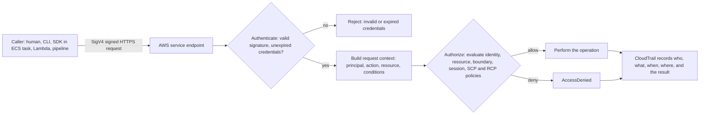

!!! note "Why this model matters to a cloud-native architect"
    In a traditional data centre, security was largely ==network-centric==: firewalls separated trusted from untrusted zones, and anything inside the perimeter was implicitly trusted. In the cloud, the management plane is reachable from the internet by design, and workloads call AWS APIs directly. ==Identity becomes the primary perimeter.== A leaked access key with administrator permissions is as dangerous as physical access to a data centre, whatever the network looks like. Network controls ([Section 8.2](topic2.md)) and encryption ([Section 8.3](topic3.md)) remain essential layers, but identity is the layer that every other control depends on.

Three design principles run through the whole section and should guide every IAM decision:

| Principle | Meaning | Where it appears |
|-----------|---------|------------------|
| Least privilege | Grant only the permissions required for the task, on only the resources required, under the narrowest conditions | Policies (8.1.2), boundaries, Access Analyzer |
| Temporary credentials | Prefer credentials that expire automatically over long-lived keys | Roles and STS (8.1.1), federation, OIDC for CI/CD |
| Defence in depth through layered policy | Multiple independent policy layers must all agree before access is granted | Evaluation logic (8.1.2), SCPs and RCPs (8.1.3) |

!!! info "IAM is global, free and eventually consistent"
    IAM is a ==global service==: users, groups, roles and policies are not tied to a Region, and a role created once can be used in every enabled Region. Its control plane is hosted in a single Region (US East, N. Virginia, for the commercial partition) while its data plane, the authentication and authorization that happens on every API call, is replicated to every Region. Changes are therefore ==eventually consistent==: a new role or policy change can take a few seconds to become effective everywhere. Automation that creates a role and uses it immediately must retry. IAM, AWS STS, IAM Identity Center and AWS Organizations are ==provided at no additional charge==; costs arise only from features such as the unused-access analyzer and custom policy checks in IAM Access Analyzer, and from the resources principals create.

---

## IAM Users, Groups, and Roles

### Definition

==AWS Identity and Access Management (IAM) is the global AWS service that lets you create and manage identities (who can sign in or call APIs) and permissions (what those identities may do) for an AWS account.== IAM works with ==AWS Security Token Service (STS)==, which issues short-lived credentials, and with ==AWS IAM Identity Center==, which provides workforce single sign-on across many accounts.

The identities in this part are:

| Identity | What it represents | Credentials | Typical use in 2026 |
|----------|--------------------|-------------|---------------------|
| Root user | The account owner, created with the account's email address | Password, optional access keys (strongly discouraged), MFA | Only for the few tasks that require it; locked away otherwise |
| IAM user | A person or application with permanent identity in one account | Console password and/or up to two access keys, MFA devices | Exceptional cases: break-glass access, third-party tools that cannot assume roles |
| IAM group | A collection of IAM users that share attached policies | None; a group cannot sign in or be a principal | Managing permissions for the remaining IAM users |
| IAM role | An identity with permissions but ==no long-term credentials==, assumed by trusted principals | Temporary credentials issued by STS on assumption | Every workload, every cross-account access, every federated human |
| Role session | One specific assumption of a role, with its own expiry and name | Access key ID, secret access key, session token | The actual principal that makes the API calls |
| Federated identity | A user authenticated by an external identity provider (IdP) | Temporary credentials after SAML or OIDC exchange | Workforce users via Identity Center, CI/CD via OIDC, mobile apps via Amazon Cognito |
| Service principal | An AWS service acting on your behalf, such as `lambda.amazonaws.com` | Managed internally by AWS | Named in trust and resource-based policies |

In the AWS architecture map IAM belongs to the ==Security, Identity, and Compliance== category, but it is better understood as a foundation layer beneath every other service: compute, storage, databases, networking and management services all consult IAM on every request.

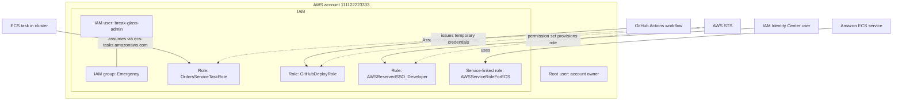

### Why This Service or Concept Exists

#### The problem: shared secrets do not scale

Before cloud identity services, organisations commonly managed access to infrastructure with shared administrator passwords, SSH keys copied between engineers, and service accounts whose passwords were embedded in configuration files. These practices fail in predictable ways:

1. ==No accountability==: when five people share one password, the logs cannot say who deleted the database.
2. ==No revocation==: when an engineer leaves, every shared secret they knew must be rotated, which is rarely done.
3. ==Secret sprawl==: long-lived credentials end up in source code, container images, CI variables and laptops, where they leak.
4. ==Coarse permissions==: a service account is typically either an administrator or useless, because fine-grained authorization was hard to express.

An AWS account amplifies these risks. A single API credential can create thousands of instances for cryptocurrency mining, copy every S3 bucket, or delete every backup, within minutes and from anywhere on the internet. Credential compromise is consistently among the most common root causes of cloud security incidents.

#### Why AWS introduced IAM, STS, roles and Identity Center

AWS introduced these capabilities in stages, each addressing a weakness of the previous stage:

| Stage | Capability | Problem solved | Remaining weakness |
|-------|------------|----------------|--------------------|
| Early AWS | Root account keys only | None beyond basic access | One all-powerful credential |
| IAM users and groups | Individual identities with policies | Accountability and least privilege per person | Long-lived passwords and keys per person per account |
| IAM roles and STS | Assumable identities with temporary credentials | No secrets to store in workloads; automatic expiry; cross-account access | Still one set of human identities per account if users are used |
| Federation (SAML, OIDC) | Trust an external IdP | One corporate identity; joiners and leavers handled centrally | Per-account federation setup |
| IAM Identity Center | Central workforce access to all accounts in an organisation | Single sign-on to many accounts with permission sets, temporary CLI credentials | Requires AWS Organizations for full value |
| Workload federation (IRSA, Pod Identity, GitHub OIDC, Roles Anywhere) | Workloads outside or on top of AWS obtain role credentials from their native identity | Eliminates access keys in Kubernetes, CI/CD and on-premises servers | Requires careful trust policy conditions |
| Centralised root access management | Remove root credentials from member accounts | Root credential risk across many accounts | Management account root still needs protection |

#### Benefits over older methods

| Concern | Shared secrets and local accounts | IAM roles, STS and Identity Center |
|---------|-----------------------------------|-------------------------------------|
| Credential lifetime | Months or years | Minutes to hours; automatic expiry |
| Secret storage in workloads | Passwords in configuration files | None; the platform delivers credentials to the workload |
| Joiner and leaver process | Manual per system | Central IdP; removal cuts access everywhere |
| Accountability | Shared accounts hide the actor | Every session carries a named identity, recorded in CloudTrail |
| Cross-account access | Duplicate users per account | One role assumption with an explicit trust relationship |
| Least privilege | Coarse service accounts | Per-role policies, boundaries and conditions |

### Core Concepts

#### Principals, identities and ARNs

A ==principal== is an entity that can make a request to AWS. IAM users, role sessions, federated users, the root user and AWS services can all be principals. An ==IAM identity== is an IAM user, group or role; groups are identities to which policies attach, but a group is ==never a principal==, because nobody can sign in "as a group".

Every IAM entity has an ARN. The formats you will meet most often are:

| Entity | ARN format | Example |
|--------|-----------|---------|
| Root user | `arn:aws:iam::ACCOUNT:root` | `arn:aws:iam::111122223333:root` |
| IAM user | `arn:aws:iam::ACCOUNT:user/PATH/NAME` | `arn:aws:iam::111122223333:user/ops/break-glass` |
| IAM group | `arn:aws:iam::ACCOUNT:group/NAME` | `arn:aws:iam::111122223333:group/Emergency` |
| IAM role | `arn:aws:iam::ACCOUNT:role/PATH/NAME` | `arn:aws:iam::111122223333:role/orders/OrdersTaskRole` |
| Role session (assumed role) | `arn:aws:sts::ACCOUNT:assumed-role/ROLE/SESSION` | `arn:aws:sts::111122223333:assumed-role/OrdersTaskRole/8f3c2a` |
| Service principal | `SERVICE.amazonaws.com` | `ecs-tasks.amazonaws.com` |
| OIDC provider | `arn:aws:iam::ACCOUNT:oidc-provider/HOST` | `arn:aws:iam::111122223333:oidc-provider/token.actions.githubusercontent.com` |

!!! warning "The root principal in a policy means the account, not the root user"
    In a trust or resource-based policy, `"Principal": {"AWS": "arn:aws:iam::111122223333:root"}` (or simply the account ID) means ==the account as a whole==: it delegates the decision to that account's own IAM policies. It does not mean only the root user can use the permission. Any principal in 111122223333 whose identity policy allows the action can then use it. Students frequently misread this as a very narrow grant; it is actually a delegation to another account's administrators.

#### The root user

The root user is created with the account and is identified by the email address used at sign-up. It has ==unrestricted access that IAM policies cannot limit== in a standalone account. A small number of tasks require root, including:

- changing the account's root email address, name or root password, and closing the account,
- changing or cancelling AWS Support plans (in some cases) and certain billing settings,
- restoring IAM administrator access if all administrators were locked out,
- unlocking an S3 bucket or SQS queue policy that denies everyone, including administrators,
- registering as a seller in the Reserved Instance Marketplace and a few other legacy tasks.

Protection measures for the root user:

| Measure | Why |
|---------|-----|
| Enable MFA, preferably a phishing-resistant FIDO2 security key or passkey; register more than one device | AWS now enforces root MFA for management and standalone accounts; multiple devices avoid lockout |
| Delete or never create root access keys | Root keys cannot be restricted by IAM policies in a standalone account |
| Use a distribution-list email address owned by the organisation | A root email tied to one employee's mailbox leaves with that employee |
| Store the password in a controlled vault with a documented break-glass procedure | Root is needed rarely but must be available in an emergency |
| Alarm on any root sign-in (CloudTrail event with `userIdentity.type = Root`) | Root use should be exceptional and investigated |
| In an organisation, enable ==centralised root access management== | Removes root passwords, keys and MFA from member accounts; privileged root actions are performed from the management account or a delegated administrator using short-lived `sts:AssumeRoot` sessions |

!!! danger "Never use the root user for daily work"
    Using the root user for routine administration means every mistake has unlimited blast radius and every phished credential is catastrophic. Create administrative access through IAM Identity Center (or, in a standalone account, a role or an administrator user protected by MFA) and log out of root. In member accounts of an organisation, SCPs can deny actions by the root user, and centralised root access management can remove the root credentials entirely (see [Part 8.1.3](#aws-organizations-and-service-control-policies)).

#### IAM users

An IAM user is a permanent identity in one account with optional long-term credentials: a console password and up to two access keys. IAM users were the primary way people accessed AWS for many years. ==AWS no longer recommends IAM users for human access==, because each user is a set of long-lived secrets in one account, managed separately from the corporate directory.

When an IAM user is still justified:

| Situation | Why a user | Mitigation |
|-----------|-----------|------------|
| Emergency break-glass access when the IdP or Identity Center is unavailable | Must work without federation | MFA, no access keys, credentials in a vault, alarms on use |
| A third-party SaaS tool or legacy application that cannot assume roles or use OIDC | No federation support | Access key with narrow policy, source IP or VPC conditions, rotation, last-used monitoring; prefer a vendor that supports cross-account roles |
| A small personal learning account without an organisation | Simplicity | Even here, IAM Identity Center can be enabled in a standalone account |
| Programmatic access from an on-premises server | No AWS-provided identity | Prefer ==IAM Roles Anywhere== with X.509 certificates instead of access keys |

#### IAM groups

A group is a collection of IAM users. Policies attached to the group apply to every member. Groups exist purely for administrative convenience: they implement ==role-based access control (RBAC)== for IAM users by job function (Developers, Auditors, Administrators).

Important properties:

- A user can belong to several groups (up to 10 by default); a group cannot contain other groups; groups do not nest.
- A group has no credentials and cannot be named as a `Principal` in a policy.
- Groups do not apply to roles or federated users. In IAM Identity Center, the equivalent concept is a ==group in the identity source== assigned to a ==permission set== on specific accounts.

#### IAM roles

A role is an identity with permissions policies but ==no long-term credentials==. Instead of signing in as a role, a trusted principal ==assumes== it and receives temporary credentials. A role has two distinct policy documents, and understanding the difference is the key to understanding roles.

| Policy | Question it answers | Attached to | Example statement |
|--------|--------------------|-------------|-------------------|
| Trust policy (a resource-based policy on the role) | ==Who may assume this role, and under which conditions?== | The role itself | Allow `ecs-tasks.amazonaws.com` to call `sts:AssumeRole` if `aws:SourceAccount` is 111122223333 |
| Permissions policies (identity-based) | ==What may the role's sessions do once assumed?== | The role, as managed or inline policies | Allow `dynamodb:PutItem` on the `orders` table |
| Permissions boundary (optional) | ==What is the maximum the role could ever do?== | The role | Allow only DynamoDB, SQS and CloudWatch actions |

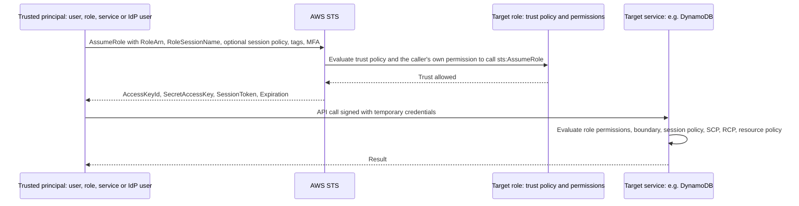

For a principal in the same account to assume a role, the trust policy must allow it; for a principal in ==another account==, both the trust policy in the role's account ==and== an identity policy in the caller's account allowing `sts:AssumeRole` on the role ARN are required. This two-sided agreement is the foundation of secure cross-account access.

#### Role sessions and temporary credentials

When STS issues credentials it returns three values and an expiry:

| Value | Purpose |
|-------|---------|
| `AccessKeyId` | Starts with `ASIA` for temporary credentials (long-term IAM user keys start with `AKIA`) |
| `SecretAccessKey` | Used to compute the SigV4 signature; never sent over the wire |
| `SessionToken` | Proves the credentials were issued by STS and carries session information; must accompany every request |
| `Expiration` | After this time the credentials are rejected with `ExpiredToken` |

Session duration rules:

| Scenario | Default duration | Maximum |
|----------|------------------|---------|
| `AssumeRole` by a user or role | 1 hour | The role's `MaxSessionDuration`, configurable from 1 to 12 hours |
| Role chaining (a role session assumes another role) | 1 hour | ==1 hour==, regardless of `MaxSessionDuration` |
| `AssumeRoleWithSAML` and `AssumeRoleWithWebIdentity` | 1 hour | The role's `MaxSessionDuration` |
| `GetSessionToken` (IAM user, often with MFA) | 12 hours | 36 hours |
| Credentials for EC2, ECS, Lambda and EKS workloads | Managed by the platform | Refreshed automatically before expiry |

!!! tip "The SDKs refresh credentials for you"
    AWS SDKs and the CLI use a ==default credential provider chain==: environment variables, shared credentials and config files (including Identity Center and `role_arn` profiles), web identity token files (IRSA), the ECS and EKS Pod Identity container credential endpoints, and finally the EC2 instance metadata service. For workloads running on AWS compute you should ==never set access keys yourself==: create the SDK client without explicit credentials and the chain will discover and refresh the role credentials. Code that reads keys from environment variables in production is usually a design smell.

Sessions carry additional attributes useful for security and audit:

| Attribute | Purpose |
|-----------|---------|
| `RoleSessionName` | Appears in the assumed-role ARN and CloudTrail; set it to a meaningful value such as the user name or pipeline run ID |
| Session tags | Key-value tags passed at assumption (`sts:TagSession`), available as `aws:PrincipalTag` for ABAC ([Part 8.1.2](#iam-policies-and-permissions)) |
| Transitive tags | Session tags that persist through role chaining |
| Source identity | An immutable identity value (`sts:SetSourceIdentity`) that persists across role chaining, so CloudTrail shows the original human behind a chain of roles |
| Session policy | An optional inline or managed policy passed at assumption that further ==restricts== the session |
| External ID | A shared value required by a trust policy condition to prevent the ==confused deputy== problem when a third party assumes a role |

#### The confused deputy problem

A ==confused deputy== is a more-privileged entity tricked into acting on behalf of a less-privileged one. In AWS it appears in two forms:

1. ==Cross-account third parties==: a SaaS vendor assumes roles in many customers' accounts. If customer B learns customer A's role ARN, B could configure the vendor to access A's account. The fix is an ==external ID== that A generates and the vendor stores per customer, checked by `sts:ExternalId` in A's trust policy.
2. ==AWS service principals==: when a service such as SNS, S3 or CloudWatch acts on your behalf, a resource or trust policy granting the service principal could be exploited by another customer's resource. The fix is to add `aws:SourceArn` and/or `aws:SourceAccount` conditions so the service may act only for your resources.

#### Service roles, instance profiles and service-linked roles

| Construct | What it is | Who creates it | Can you edit its permissions? | Example |
|-----------|-----------|----------------|-------------------------------|---------|
| Service role | A normal role whose trust policy allows an AWS service principal to assume it | You | Yes | Lambda execution role; ECS task role; CodeBuild service role |
| Instance profile | A container that passes one role to an EC2 instance; the instance metadata service then serves the role's credentials | You (the console creates one automatically with the same name as the role) | Permissions come from the role | `LabInstanceProfile` wrapping `LabRole` in the Learner Lab |
| Service-linked role | A role predefined by an AWS service, linked to that service, with permissions the service needs | The service, or you through `CreateServiceLinkedRole` | No; AWS maintains the policy | `AWSServiceRoleForECS`, `AWSServiceRoleForElasticLoadBalancing`, `AWSServiceRoleForAutoScaling` |

!!! note "Why service-linked roles exist"
    Some services need permissions in your account to operate on your behalf, for example Elastic Load Balancing registering network interfaces, or Auto Scaling launching instances. Before service-linked roles, customers had to create and maintain these roles, and mistakes broke the service. A service-linked role has a fixed trust policy (only that service can assume it), a policy maintained by AWS, and deletion protection while resources still use it. Service-linked roles are ==not affected by SCPs or RCPs==, which is why they keep working even when an organisation's guardrails are strict.

#### Choosing the identity for each compute platform

| Platform | Identity mechanism | Trust principal | Credential delivery | Chapter |
|----------|--------------------|-----------------|---------------------|---------|
| EC2 instance | Role via instance profile | `ec2.amazonaws.com` | Instance Metadata Service (IMDSv2 required as best practice) | [1.3](../unit1/topic3.md) |
| ECS task (EC2 or Fargate) | ==Task role== for application calls; ==task execution role== for the ECS agent to pull images, fetch secrets and write logs | `ecs-tasks.amazonaws.com` | Container credential endpoint (`AWS_CONTAINER_CREDENTIALS_RELATIVE_URI`) | [2.2](../unit2/topic2.md#security-considerations), [2.3](../unit2/topic3.md) |
| EKS pod, IRSA | Role per Kubernetes service account through the cluster's OIDC provider | `Federated` OIDC provider; `sts:AssumeRoleWithWebIdentity` | Projected service account token file and `AWS_ROLE_ARN` | [3.1](../unit3/topic1.md#pod-identity-why-the-node-role-is-not-enough) |
| EKS pod, Pod Identity | Role associated with a service account through an EKS Pod Identity association | `pods.eks.amazonaws.com`; `sts:AssumeRole` and `sts:TagSession` | Pod Identity Agent on each node | [3.1](../unit3/topic1.md#pod-identity-why-the-node-role-is-not-enough) |
| EKS nodes | Node IAM role through an instance profile | `ec2.amazonaws.com` | IMDS | [3.1](../unit3/topic1.md) |
| Lambda function | Execution role | `lambda.amazonaws.com` | Environment variables injected into the execution environment | [1.3](../unit1/topic3.md) |
| CodeBuild, CodePipeline | Service roles | `codebuild.amazonaws.com`, `codepipeline.amazonaws.com` | Managed by the service | [5.1](../unit5/topic1.md) |
| GitHub Actions, GitLab CI | OIDC web identity federation | `Federated` OIDC provider | Workflow requests an OIDC token and exchanges it | [5.2](../unit5/topic2.md) |
| On-premises servers | IAM Roles Anywhere with X.509 certificates from a trusted CA | `rolesanywhere.amazonaws.com` | Credential helper process | This part |

!!! warning "Task role versus task execution role"
    The ==task execution role== is used by the ECS agent before your code runs (image pull, secrets injection, log delivery); the ==task role== is used by your application code. Confusing the two is a classic examination trap. See [2.2 Amazon ECS](../unit2/topic2.md#security-considerations) for the full treatment of the ECS roles.

#### IRSA versus EKS Pod Identity

From the IAM perspective, the difference lies in the trust relationship. IRSA trusts the cluster's OIDC provider through `sts:AssumeRoleWithWebIdentity`, with a `sub` condition naming the namespace and service account, so the trust policy must list every cluster's issuer. EKS Pod Identity trusts the service principal `pods.eks.amazonaws.com` (`sts:AssumeRole` and `sts:TagSession`), so one trust policy works across clusters, and it adds session tags (cluster, namespace, service account) usable for ABAC. See [3.1 Amazon EKS Architecture](../unit3/topic1.md#pod-identity-why-the-node-role-is-not-enough) for the full comparison and when to use each.

#### Federation

==Federation== means trusting an external identity provider to authenticate users, then exchanging the IdP's assertion or token for temporary AWS credentials. There are three families.

| Federation type | Protocol | STS operation | Typical IdP | Typical use |
|-----------------|----------|---------------|-------------|-------------|
| Workforce SSO | SAML 2.0 or OIDC via IAM Identity Center | Managed by Identity Center | Microsoft Entra ID, Okta, Google Workspace, Ping, or the Identity Center directory | Employees and contractors accessing console and CLI |
| Direct SAML to IAM | SAML 2.0 | `AssumeRoleWithSAML` | Corporate IdP configured as an IAM SAML provider | Legacy per-account federation; still valid but less manageable at scale |
| Web identity and workload OIDC | OpenID Connect | `AssumeRoleWithWebIdentity` | GitHub Actions, GitLab, EKS cluster OIDC issuer, Amazon Cognito identity pools, Google | CI/CD pipelines, Kubernetes pods, mobile and web applications |

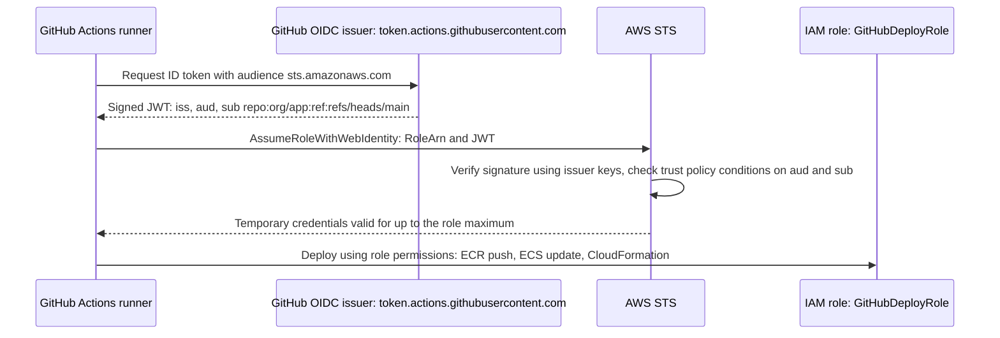

#### IAM Identity Center

==AWS IAM Identity Center== (formerly AWS Single Sign-On) is the recommended way for people to access AWS accounts. Its concepts are:

| Concept | Meaning |
|---------|---------|
| Identity source | Where users and groups live: the Identity Center directory, Active Directory, or an external IdP via SAML 2.0 with SCIM provisioning |
| Organization instance | An Identity Center instance enabled in the management account (or administered by a delegated administrator) that can grant access to all member accounts |
| Account instance | A limited instance in a single account, used for certain AWS managed applications only |
| Permission set | A template of policies (AWS managed, customer managed references, inline policy, permissions boundary) and a session duration |
| Assignment | A user or group, a permission set and a target account; Identity Center creates a role named `AWSReservedSSO_PERMISSIONSETNAME_suffix` in that account |
| AWS access portal | The web page where users see their accounts and roles, open the console or copy temporary CLI credentials |
| Trusted identity propagation | Passing the user's identity to services such as Amazon Q Business, Redshift or S3 Access Grants so access is authorised per user |

The CLI integrates directly: `aws configure sso` creates a profile, and `aws sso login` obtains a token that the CLI exchanges for short-lived role credentials. ==No access keys are stored on the developer's laptop.==

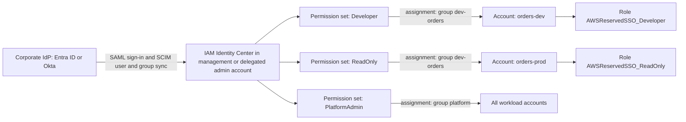

#### Multi-factor authentication

MFA requires a second factor in addition to a password or key. AWS supports:

| MFA type | Phishing resistant | Notes |
|----------|--------------------|-------|
| FIDO2 security keys and passkeys | Yes | Recommended for root and privileged users; supports synced passkeys |
| Virtual authenticator apps (TOTP) | No | Widely used; vulnerable to real-time phishing |
| Hardware TOTP tokens | No | For environments that prohibit phones |

An IAM user or root user can register up to eight MFA devices. For IAM users, MFA can be required for sensitive actions with the condition key `aws:MultiFactorAuthPresent` or `aws:MultiFactorAuthAge`. For federated users, MFA is enforced by the IdP or by Identity Center, and the resulting role session does not carry the IAM MFA flag unless the federation passes it.

#### Access keys and their hygiene

An access key (ID beginning `AKIA` plus a secret) is a ==long-lived credential== for an IAM user. It is the most frequently leaked AWS secret. Hygiene rules:

1. ==Avoid them==: use roles for workloads, Identity Center for people, OIDC for pipelines and Roles Anywhere for on-premises servers.
2. If unavoidable, scope the user's policy narrowly and add conditions such as `aws:SourceIp` or `aws:SourceVpce`.
3. Rotate using the ==two-key overlap==: create a second key, deploy it, verify the old key's `LastUsedDate` stops advancing, deactivate, then delete the old key.
4. Never commit keys to source control; enable secret scanning; AWS itself scans public GitHub repositories and quarantines leaked keys by attaching the `AWSCompromisedKeyQuarantine` managed policy, but by then damage may have occurred.
5. Monitor with the credential report and `GetAccessKeyLastUsed`, and remove keys unused for 90 days or less.

!!! danger "A leaked key is exploited in minutes"
    Automated scanners watch public repositories, package registries and container images for AWS keys. Security researchers have repeatedly observed leaked keys being used within minutes of publication. Deleting the commit is not enough, because history and forks keep the secret. The correct response is to ==deactivate the key immediately==, review CloudTrail for actions taken with it, remove anything the attacker created, and then replace the workload's use of keys with a role.

#### Credential reports and last-accessed information

| Tool | What it shows | Use |
|------|---------------|-----|
| Credential report | A CSV of every IAM user and the root user: password enabled and last used, MFA active, access keys active, rotated and last used | Periodic audit; detecting stale users and keys |
| Last accessed information (access advisor) | For a user, group, role or policy: which services, and for some services which actions, were last used and when | Removing unused permissions; basis for least privilege |
| Organizations last accessed | Service last-accessed data for an OU or account | Designing SCPs that deny unused services |
| IAM Access Analyzer unused access | Continuous findings for unused roles, keys, passwords and permissions across accounts | Automating cleanup at scale ([Part 8.1.2](#iam-policies-and-permissions)) |
| `GetAccessKeyLastUsed` API | Last time, service and Region for a specific key | Safe key rotation |

### AWS Service Deep Dive

#### Purpose

IAM, STS and IAM Identity Center together provide ==authentication and identity lifecycle== for AWS. IAM stores identities and policies; STS mints temporary credentials; Identity Center connects the workforce directory to many accounts.

#### Architecture

| Component | Scope | Role in the architecture |
|-----------|-------|--------------------------|
| IAM control plane | Global, hosted in one Region per partition | Create, update and delete users, roles, policies; changes replicate to all Regions |
| IAM data plane | Every Region | Authenticates and authorizes every API call locally, so a control plane disruption does not stop existing workloads |
| AWS STS | Global endpoint plus Regional endpoints | Issues temporary credentials; ==Regional endpoints are recommended== for lower latency and resilience; SDKs default to Regional endpoints |
| IAM Identity Center | One Region chosen at enablement (multi-Region replication is available for resilience) | Workforce sign-in, permission sets, assignments, access portal |
| Credential delivery agents | Per compute platform | IMDS, ECS credential endpoint, EKS Pod Identity Agent, Lambda runtime |

!!! tip "Design for control plane independence"
    Because the IAM data plane is Regional and highly available while the control plane is centralised, well-architected systems ==do not create or modify IAM resources in the request path or during failover==. Roles for disaster recovery Regions should already exist, created by infrastructure as code, so that recovery never depends on the IAM control plane.

#### Important Features

- Users, groups and roles with managed and inline policies; paths for organisation; tags on users and roles.
- STS operations: `AssumeRole`, `AssumeRoleWithSAML`, `AssumeRoleWithWebIdentity`, `GetSessionToken`, `GetFederationToken`, `GetCallerIdentity`, and `AssumeRoot` for centralised root access.
- Session tags, source identity, session policies and external IDs.
- Identity providers: SAML and OIDC providers in IAM; Identity Center for workforce SSO.
- IAM Roles Anywhere for workloads outside AWS.
- MFA including FIDO2 passkeys; password policy for IAM users.
- Credential reports, last-accessed data, and integration with Access Analyzer and CloudTrail.

#### Limitations

- IAM users and roles exist ==per account==; managing people as IAM users across many accounts is unmanageable, which is why Identity Center exists.
- Changes are eventually consistent; creating a role and using it immediately may fail briefly.
- Role chaining limits sessions to one hour.
- Groups cannot nest and cannot be principals.
- Trust policy size is limited, which constrains how many OIDC providers or accounts a single role can trust.
- IAM has no built-in approval workflow for temporary elevation; this requires Identity Center with a just-in-time access solution or a custom workflow.

#### Pricing Model and recommendations

IAM, STS, Identity Center and Roles Anywhere carry ==no charge==. Costs appear indirectly: CloudTrail trails beyond the first free copy of management events, IAM Access Analyzer unused access analysis and custom policy checks, and Private CA certificates if used for Roles Anywhere. Recommendation: cost is never a reason to share credentials or skip roles.

#### Performance Characteristics

Authorization is performed on every request with negligible latency visible to the caller. STS calls are fast but are ==API calls with throttling limits==; applications should reuse credentials until close to expiry rather than calling `AssumeRole` per request. The SDKs cache and refresh credentials automatically.

#### Scaling Behaviour

IAM scales with AWS itself; the constraints are ==quotas== (number of roles, policies attached, policy sizes) and STS request rates. At organisation scale, the answer to identity growth is more accounts with standardised roles deployed by StackSets or Control Tower, not more IAM users.

#### Availability

The data plane is Regional and highly available. STS Regional endpoints avoid dependency on a single Region. Identity Center depends on its home Region and on the external IdP; ==break-glass access== (for example an MFA-protected IAM user or role reachable without the IdP) protects against an IdP outage.

#### Security Features

- Temporary credentials by default for roles, federation and workloads.
- MFA, phishing-resistant FIDO2 support, password policies.
- External ID and source ARN conditions against confused deputy.
- Source identity and session names for end-to-end attribution.
- Automatic quarantine of publicly leaked keys.
- Centralised root access management in organisations.

#### Service Limits

Selected default IAM quotas (==verify current values in the Service Quotas console==, because several are adjustable and AWS revises them):

| Resource | Default quota |
|----------|---------------|
| IAM users per account | 5,000 |
| Groups per account | 300 (adjustable) |
| Groups a user can belong to | 10 |
| Roles per account | 1,000 (adjustable) |
| Access keys per user | 2 |
| MFA devices per user or root | 8 |
| Role trust policy size | 2,048 characters (adjustable up to 4,096) |
| Role maximum session duration | 12 hours |
| Role chaining session duration | 1 hour |
| Instance profiles per account | 1,000 (adjustable) |

Policy size and attachment quotas are listed under Service Limits in [Part 8.1.2](#iam-policies-and-permissions).

### Important AWS Terminology

| Term | Meaning |
|------|---------|
| Principal | An entity that can make a request: IAM user, role session, federated user, root user or AWS service |
| Identity | An IAM user, group or role to which identity-based policies can be attached |
| Root user | The account owner identity with unrestricted access |
| IAM user | A long-term identity with optional password and access keys in one account |
| IAM group | A set of IAM users sharing attached policies; not a principal |
| IAM role | An assumable identity with permissions and no long-term credentials |
| Trust policy | The resource-based policy on a role defining who may assume it |
| Role session | One assumption of a role, identified by an assumed-role ARN |
| AWS STS | The service that issues temporary security credentials |
| Session token | The third credential element proving the credentials came from STS |
| Role chaining | Using a role session to assume another role; limited to one-hour sessions |
| Instance profile | The container that delivers a role to an EC2 instance |
| Service role | A role you create that an AWS service assumes |
| Service-linked role | A predefined role owned and maintained by an AWS service |
| Federation | Trusting an external IdP and exchanging its assertion for AWS credentials |
| SAML 2.0 | XML-based federation standard used by corporate IdPs |
| OIDC | OAuth 2.0-based identity standard using signed JSON Web Tokens |
| IAM Identity Center | AWS service for workforce single sign-on across accounts |
| Permission set | Identity Center template that becomes a role in each assigned account |
| External ID | Trust policy condition value that prevents the confused deputy problem |
| Source identity | Immutable attribute identifying the original actor across a chain of roles |
| IAM Roles Anywhere | Service letting workloads outside AWS obtain role credentials with X.509 certificates |
| Credential report | Account-wide CSV of user credential status |
| Break-glass access | Emergency access path used only when normal access fails |

### Configuration Options

| Setting | Options | Guidance |
|---------|---------|----------|
| Human access method | Identity Center with external IdP, Identity Center directory, direct SAML federation, IAM users | Identity Center with the corporate IdP and SCIM for organisations; Identity Center directory for small teams; IAM users only for break-glass |
| Role maximum session duration | 1 to 12 hours | Short (1 hour) for privileged and pipeline roles; longer (8 to 12 hours) only for interactive developer roles where re-authentication harms productivity |
| Permission set session duration | 1 to 12 hours | Align with the working day for read-only roles, shorter for administrative roles |
| Trust policy principal | Service, account, specific role ARN, federated provider | Name the most specific principal possible; add `aws:SourceArn`, `aws:SourceAccount`, `sts:ExternalId`, OIDC `sub` and `aud` conditions |
| EKS workload identity | IRSA or Pod Identity | Pod Identity for new EKS workloads; IRSA where required |
| EC2 metadata | IMDSv1 and v2, or IMDSv2 only | Require IMDSv2 (session-oriented, mitigates server-side request forgery); enforce organisation-wide with a declarative policy ([Part 8.1.3](#aws-organizations-and-service-control-policies)) |
| Password policy for IAM users | Length, complexity, reuse, expiry | Long passwords with MFA; avoid forced frequent expiry which encourages weak patterns |
| STS endpoint | Global or Regional | Regional |

### Design Considerations

| Concern | Consideration |
|---------|---------------|
| Scalability | One role per workload per account scales; one IAM user per person per account does not. Use permission sets and IaC-generated roles |
| Availability | Workloads depend only on the IAM data plane; avoid runtime IAM changes; keep break-glass access independent of the IdP |
| Reliability | Credential refresh is automatic on AWS compute; long-running jobs using role chaining must handle one-hour expiry |
| Latency | Cache credentials; use Regional STS endpoints |
| Cost | Free; the real cost is the operational burden of long-lived secrets |
| Maintainability | Name roles by workload and purpose (`orders-api-task-role`), use paths, tags and IaC; avoid console-created roles |
| Operational complexity | Identity Center plus Organizations centralises complexity once, instead of repeating it per account |

!!! example "Granularity: one role per what?"
    A frequent design question is how many roles to create. A useful rule is ==one role per workload identity per environment==: the orders API task role in production is separate from the orders API task role in staging and from the payments worker role. Sharing a role between services means the least-privileged service inherits the permissions of the most-privileged one, and CloudTrail can no longer distinguish them. Creating a role per ECS task or per Lambda function costs nothing and is easily automated in CloudFormation, CDK or Terraform.

### AWS Best Practices

| Pillar | Identity best practice |
|--------|------------------------|
| Operational Excellence | Manage roles, permission sets and trust policies as code; name sessions meaningfully; document break-glass procedures and test them |
| Security | Use temporary credentials; federate humans through Identity Center; require phishing-resistant MFA; protect and minimise root; remove unused identities |
| Reliability | Create roles ahead of need; use Regional STS; design for IdP outage with break-glass |
| Performance Efficiency | Rely on SDK credential caching; avoid per-request `AssumeRole` |
| Cost Optimization | Remove unused identities, which also reduces audit effort; avoid paid tooling to manage secrets that roles make unnecessary |
| Sustainability | Fewer long-lived secrets and fewer duplicate identities mean less rotation automation and less operational churn |

### Security Considerations

- ==Least privilege begins with identity design==: separate roles per workload make least-privilege policies possible.
- ==Encryption==: credentials are only transmitted over TLS; SigV4 never sends the secret key. Secrets that are not AWS credentials, such as database passwords, belong in AWS Secrets Manager with rotation ([Section 8.3](topic3.md)).
- ==Private versus public access==: roles used by workloads in private subnets can be restricted to specific VPC endpoints with `aws:SourceVpce` or `aws:SourceVpc` in resource policies ([Section 8.2](topic2.md) explains VPC endpoints).
- ==Logging==: every STS call and every API call made with the resulting credentials is logged in CloudTrail with the role session ARN, session name and source identity. Alarm on root sign-in, console sign-in without MFA, `CreateAccessKey`, and changes to trust policies.
- ==Compliance==: frameworks such as ISO 27001, SOC 2 and PCI DSS require unique IDs per user, MFA for administrative access and timely de-provisioning; Identity Center with an IdP satisfies these far more easily than IAM users.

### Integration with Other AWS Services

| Service | Integration | Why |
|---------|-------------|-----|
| Amazon ECS | Task role and task execution role | Per-task credentials without keys ([Chapter 2.2](../unit2/topic2.md#security-considerations)) |
| Amazon EKS | IRSA and Pod Identity (access entries are covered under [Part 8.1.2](#iam-policies-and-permissions)) | Per-pod credentials ([Chapter 3.1](../unit3/topic1.md#pod-identity-why-the-node-role-is-not-enough)) |
| AWS Lambda | Execution role | Function permissions ([Chapter 1.3](../unit1/topic3.md)); the invoke-side resource-based policy is covered in [Part 8.1.2](#iam-policies-and-permissions) |
| CodeBuild, CodePipeline, GitHub Actions | Service roles and OIDC federation | Keyless deployments (Chapters [5.1](../unit5/topic1.md) and [5.2](../unit5/topic2.md)) |
| CloudFormation, CDK, Terraform | Service roles and deployment roles | Pipelines deploy with a scoped role, not a person's credentials ([Chapter 5.3](../unit5/topic3.md)) |
| Amazon Cognito | Identity pools exchange end-user tokens for role credentials | Mobile and web clients calling AWS directly |
| CloudTrail | Records all IAM and STS activity | Audit and incident response (Unit VII) |
| AWS Secrets Manager | Stores non-AWS secrets | Complements roles for database and third-party credentials ([Section 8.3](topic3.md)) |
| IAM Access Analyzer | Finds external and unused access | Continuous review ([Part 8.1.2](#iam-policies-and-permissions)) |

### Common Architecture Patterns

| Pattern | Description | When to use |
|---------|-------------|-------------|
| Hub-and-spoke cross-account roles | A central tooling or security account assumes standard roles (for example `SecurityAudit`, `Deployment`) in every workload account | Central security tooling, central CI/CD |
| Per-workload role | Each microservice, function or pod has its own role | Always, for least privilege and attribution |
| Keyless CI/CD | Pipelines authenticate with OIDC and assume environment-specific deploy roles | All modern pipelines |
| Break-glass | A tightly controlled emergency identity independent of the IdP, with alarms | Every organisation |
| Just-in-time elevation | Users request temporary assignment of a privileged permission set with approval | Production administration |
| Third-party access with external ID | Vendor assumes a role with an external ID and narrow permissions | SaaS monitoring, cost tools, security scanners |

### Industry Use Cases

- A fintech company federates 2,000 employees from Microsoft Entra ID into 150 AWS accounts through Identity Center, with permission sets per job function and no IAM users outside two break-glass accounts.
- A media company runs 300 microservices on EKS, each with its own Pod Identity role, so a compromised pod can read only its own S3 prefix and SQS queue.
- An e-commerce company removed every CI access key by moving GitHub Actions to OIDC, restricting each deploy role to a specific repository and branch.
- A SaaS monitoring vendor assumes a read-only role in each customer's account using per-customer external IDs.
- A manufacturer's factory servers upload telemetry to S3 through IAM Roles Anywhere using certificates from its existing public key infrastructure.

### Advantages

- ==No secrets in workloads==: roles remove the most common cause of cloud breaches.
- ==Automatic expiry== limits the useful lifetime of any stolen credential.
- ==Central identity lifecycle== through the corporate IdP makes joiners and leavers immediate everywhere.
- ==Precise attribution==: session names and source identity make CloudTrail forensically useful.
- ==Clean cross-account model== with two-sided consent.
- ==No cost== for the identity services themselves.

### Limitations

- The number of concepts (users, roles, sessions, trust policies, providers, permission sets) makes IAM hard to learn.
- Misconfigured trust policies, such as an OIDC trust without a `sub` condition, can expose a role to the whole internet's GitHub repositories.
- Role chaining and short sessions complicate long-running interactive tasks.
- Identity Center depends on its home Region and on the external IdP.
- Workload identity differs per platform (IMDS, ECS endpoint, Pod Identity, web identity), so teams must learn several mechanisms.

### Common Mistakes

#### Beginner mistakes

| Mistake | Consequence | Correction |
|---------|-------------|------------|
| Using the root user for daily work | Unlimited blast radius | Create administrative access through Identity Center; lock root away with MFA |
| Creating access keys and pasting them into code or `.env` files | Keys leak through Git | Use the SDK default credential chain and roles |
| Attaching policies to individual users | Unmanageable permissions | Use groups or, better, Identity Center groups and permission sets |
| Confusing ECS task role and task execution role | Tasks fail to start or application gets `AccessDenied` | Execution role for the agent, task role for the application |
| Believing `arn:aws:iam::ACCOUNT:root` in a trust policy means only root | Unintended delegation to all principals in that account | Name specific role ARNs, or add conditions such as `aws:PrincipalArn` |

#### Production mistakes

| Mistake | Consequence | Correction |
|---------|-------------|------------|
| OIDC trust policy for GitHub without a `sub` condition, or with `repo:*` | Any GitHub repository can assume the role | Condition on `aud` and an exact `sub` such as `repo:org/app:environment:prod` |
| One shared role for all microservices | Lateral movement; no attribution | One role per workload |
| No external ID for third-party roles | Confused deputy exposure | Require `sts:ExternalId` |
| Service principal trust without `aws:SourceArn` or `aws:SourceAccount` | Cross-customer confused deputy | Add both conditions |
| Creating IAM roles at runtime during failover | Recovery depends on the IAM control plane | Pre-create roles in all Regions' stacks |
| Break-glass access never tested | Unavailable when needed | Test quarterly and alarm on use |
| IMDSv1 left enabled | Server-side request forgery can steal instance role credentials | Require IMDSv2 |

### Summary

Identities answer the first half of every authorization decision: who is asking. The root user is an emergency identity to be protected and, in organisations, removed from member accounts. IAM users are long-lived identities that are now an exception. Groups are an administrative convenience for users. Roles are the centre of modern AWS identity: they have no long-term credentials, are assumed through STS by trusted principals defined in a trust policy, and deliver short-lived credentials to people, services and pipelines. Humans should sign in through IAM Identity Center federated with the corporate IdP; workloads should use the identity mechanism of their platform: instance profiles, ECS task roles, EKS Pod Identity or IRSA, Lambda execution roles, OIDC federation for CI/CD and Roles Anywhere outside AWS.

Architectural lessons:

- ==Prefer roles and temporary credentials everywhere.== A secret that expires in an hour is far less valuable to an attacker than one that lives for years.
- ==Trust policies are security boundaries.== Name specific principals and add `sub`, `aud`, `aws:SourceArn`, `aws:SourceAccount` and external ID conditions.
- ==One identity per workload.== This enables least privilege and makes CloudTrail attribution meaningful.
- ==Centralise human identity.== Identity Center with the corporate IdP gives single sign-on, MFA and instant de-provisioning across accounts.
- ==Design for failure of identity dependencies.== Pre-create roles, use Regional STS, and maintain tested break-glass access.

## IAM Policies and Permissions

### Definition

==An IAM policy is a JSON document that defines permissions by stating which actions are allowed or denied on which resources under which conditions.== Policies are attached to identities (identity-based policies), to resources (resource-based policies), or to boundaries and organisational units, or are passed at session creation. AWS evaluates all policies that apply to a request and produces a single decision: ==allow== or ==deny==.

Permissions in AWS are ==default deny==. A request is allowed only if some applicable policy explicitly allows it and no applicable policy explicitly denies it, and every limiting policy layer also permits it.

### Why This Service or Concept Exists

Traditional access control lists grant coarse rights to named users on individual objects, and role systems in applications are usually hard-coded. Cloud platforms need something more expressive:

- thousands of services and tens of thousands of distinct actions, each needing separate control,
- resources created and destroyed dynamically, often identified by patterns and tags rather than names,
- context-sensitive decisions (only from our VPC, only with MFA, only in these Regions, only over TLS),
- delegation across teams and accounts without surrendering control,
- central guardrails that apply regardless of local decisions.

The IAM policy language provides a single, declarative, machine-evaluable grammar for all of these. Because policies are JSON documents, they can be ==versioned, reviewed, tested and deployed as code==, exactly like the infrastructure they protect.

### Core Concepts

#### Policy grammar

```json
{
  "Version": "2012-10-17",
  "Statement": [
    {
      "Sid": "ReadOwnOrdersPrefix",
      "Effect": "Allow",
      "Action": ["s3:GetObject", "s3:PutObject"],
      "Resource": "arn:aws:s3:::orders-data-prod/orders-api/*",
      "Condition": {
        "Bool": { "aws:SecureTransport": "true" },
        "StringEquals": { "aws:SourceVpce": "vpce-0a1b2c3d4e5f67890" }
      }
    }
  ]
}
```

| Element | Required | Meaning | Notes |
|---------|----------|---------|-------|
| `Version` | Yes (effectively) | Policy language version | Always `2012-10-17`; the older `2008-10-17` does not support policy variables |
| `Statement` | Yes | One statement or an array | Statements are evaluated independently and combined |
| `Sid` | No | Statement identifier | Used for readability and in some services to reference statements |
| `Effect` | Yes | `Allow` or `Deny` | An explicit `Deny` always wins |
| `Principal` / `NotPrincipal` | Only in resource-based and trust policies | Who the statement applies to | Absent in identity-based policies, because the principal is the identity the policy is attached to; `NotPrincipal` is discouraged |
| `Action` / `NotAction` | One of them | API actions, `service:Operation`, wildcards allowed | `NotAction` with `Allow` grants everything except the listed actions; use with great care |
| `Resource` / `NotResource` | Yes in identity-based policies | ARNs the statement applies to | Some actions do not support resource-level permissions and require `"*"` |
| `Condition` | No | Context constraints | All condition blocks in a statement must match (logical AND); multiple values for one key are ORed |

!!! warning "NotAction and NotResource are not Deny"
    `"Effect": "Allow", "NotAction": "iam:*"` means ==allow every action in every service except IAM==, including services launched next year. It does not deny IAM; another policy could still allow it. The idiomatic use of `NotAction` is with `Deny`, for example "deny everything except the global services we need when the Region is not approved". Misusing `NotAction` with `Allow` is a classic cause of over-privilege.

#### Actions, resources and the Service Authorization Reference

Each service defines its actions, the resource types they apply to and the condition keys they support in the ==Service Authorization Reference==. For example, `s3:GetObject` applies to object ARNs (`arn:aws:s3:::bucket/key`) while `s3:ListBucket` applies to the bucket ARN (`arn:aws:s3:::bucket`). Writing `"Resource": "arn:aws:s3:::bucket/*"` for `ListBucket` is a common reason for an unexpected `AccessDenied`. Some actions, such as `ec2:DescribeInstances`, do not support resource-level restrictions and must use `"Resource": "*"`, narrowed by conditions if needed.

#### Condition operators

| Operator family | Examples | Typical use |
|-----------------|----------|-------------|
| String | `StringEquals`, `StringNotEquals`, `StringLike` (wildcards `*` and `?`), `StringEqualsIgnoreCase` | Tags, OIDC `sub`, Regions, VPC endpoint IDs |
| ARN | `ArnEquals`, `ArnLike`, `ArnNotLike` | `aws:SourceArn`, `aws:PrincipalArn` |
| Numeric | `NumericLessThan`, `NumericGreaterThanEquals` | `aws:MultiFactorAuthAge`, `s3:max-keys` |
| Date | `DateGreaterThan`, `DateLessThan` | Time-bounded access with `aws:CurrentTime` |
| Boolean | `Bool` | `aws:SecureTransport`, `aws:MultiFactorAuthPresent`, `aws:ViaAWSService` |
| IP address | `IpAddress`, `NotIpAddress` | `aws:SourceIp` for public endpoints |
| Null | `Null` | Test whether a key is present, for example require a tag on creation |
| Set qualifiers | `ForAllValues:`, `ForAnyValue:` | Multi-valued keys such as `aws:TagKeys` |
| `...IfExists` suffix | `StringEqualsIfExists` | Apply the condition only if the key is present in the request |

#### Important global condition keys

| Key | Meaning | Architectural use |
|-----|---------|-------------------|
| `aws:PrincipalOrgID` | Organisation ID of the calling principal | Allow access to a bucket or key only from principals in our organisation |
| `aws:PrincipalOrgPaths` | OU path of the calling principal | Restrict to a specific OU, such as production |
| `aws:ResourceOrgID` | Organisation ID of the resource's account | Data perimeter: our principals may only access our organisation's resources |
| `aws:PrincipalAccount`, `aws:ResourceAccount` | Account IDs | Account-level scoping |
| `aws:SourceVpce`, `aws:SourceVpc` | VPC endpoint or VPC through which the request arrived | Only allow access through private connectivity ([Section 8.2](topic2.md)) |
| `aws:SourceIp` | Public IP address of the caller | Restrict console or API use to corporate egress IPs; does not apply to requests via VPC endpoints |
| `aws:RequestedRegion` | Region the request targets | Deny unapproved Regions |
| `aws:SecureTransport` | Whether TLS was used | Deny non-TLS access to S3 |
| `aws:MultiFactorAuthPresent`, `aws:MultiFactorAuthAge` | MFA status of IAM user sessions | Require recent MFA for sensitive actions |
| `aws:PrincipalTag/KEY` | Tag on the principal or session | ABAC |
| `aws:ResourceTag/KEY` | Tag on the target resource | ABAC |
| `aws:RequestTag/KEY`, `aws:TagKeys` | Tags supplied in the request | Enforce tagging on creation |
| `aws:SourceArn`, `aws:SourceAccount` | The resource on whose behalf a service acts | Confused deputy protection |
| `aws:CalledVia`, `aws:ViaAWSService` | Whether a service made the call on the principal's behalf | Allow KMS use only through S3, for example |
| `aws:PrincipalIsAWSService` | Whether the caller is a service principal | Exempt AWS services from network conditions in perimeter policies |
| `aws:PrincipalArn` | ARN of the principal (the role ARN for role sessions) | Exempt specific administrative roles from deny statements |

#### Policy variables

Policy variables insert request context into a policy, which lets one policy serve many principals. For example, `arn:aws:s3:::home-bucket/${aws:username}/*` gives each IAM user their own prefix, and `${aws:PrincipalTag/team}` gives each role access to resources of its team.

#### Policy types

| Policy type | Attached to | Grants permissions? | Limits permissions? | Typical owner |
|-------------|-------------|---------------------|---------------------|---------------|
| AWS managed policy | Identities | Yes | No | AWS maintains; you attach |
| Customer managed policy | Identities | Yes | No | Your platform or security team |
| Inline policy | One identity, embedded | Yes | No | Rarely preferred; tightly bound one-off permissions |
| Resource-based policy | Resources: S3 buckets, SQS queues, SNS topics, KMS keys, Lambda functions, ECR repositories, Secrets Manager secrets, role trust policies | Yes, including to other accounts | No | Resource owner |
| Permissions boundary | A user or role (a managed policy used as a boundary) | ==No== | Yes: maximum permissions | Central security for delegated administration |
| Session policy | Passed when assuming a role or federating | ==No== | Yes: intersection with role permissions | Broker or application issuing the session |
| Service control policy (SCP) | Organisation root, OU or account | ==No== | Yes: maximum for principals in member accounts | Organisation administrators ([Part 8.1.3](#aws-organizations-and-service-control-policies)) |
| Resource control policy (RCP) | Organisation root, OU or account | ==No== | Yes: maximum for resources in member accounts | Organisation administrators ([Part 8.1.3](#aws-organizations-and-service-control-policies)) |
| Access control list (ACL) | S3 buckets and objects (legacy), some other services | Yes, to other accounts, without policy language | No | Legacy; disable for S3 with Object Ownership set to bucket owner enforced |
| VPC endpoint policy | An interface or gateway VPC endpoint | No, it filters | Yes, for traffic through that endpoint | Network or platform team ([Section 8.2](topic2.md)) |

!!! note "AWS managed, customer managed or inline?"
    ==AWS managed policies== are convenient and updated by AWS when services add actions, but they are broad because they must suit every customer; `ReadOnlyAccess` and `AdministratorAccess` are examples, and so are job-function policies such as `ViewOnlyAccess`. ==Customer managed policies== are reusable, versioned (up to five versions are retained), and can be exactly as narrow as your workload needs; they are the default choice for production. ==Inline policies== are embedded in one identity and deleted with it; they are useful when a permission must never be reused, but they are harder to audit at scale. A practical approach is to start from AWS managed policies in development, then replace them with customer managed policies generated from observed activity before production.

#### Identity-based versus resource-based policies

A resource-based policy contains a `Principal` element and lives on the resource. It enables two things identity-based policies cannot:

1. ==Cross-account access without assuming a role==: an S3 bucket policy can grant another account's role direct access, so the caller keeps its own identity and does not lose its own permissions.
2. ==Service-to-service invocation==: a Lambda function's resource-based policy allows API Gateway, EventBridge or S3 to invoke it ([Chapter 1.7](../unit1/topic7.md)).

| Comparison | Identity-based | Resource-based |
|------------|----------------|----------------|
| Location | On the user, group or role | On the resource |
| `Principal` element | Implicit | Required |
| Cross-account | Needs a role in the target account, or a resource policy there | Grants directly to another account's principals |
| Supported by | All services | Only some services and resource types |
| Size | Managed policy up to 6,144 characters | Service-specific, for example 20 KB for an S3 bucket policy |

#### The policy evaluation logic

When a request arrives, AWS gathers every applicable policy and applies the following logic, which every cloud engineer should be able to reproduce from memory.

1. ==Default deny==: start with an implicit deny.
2. ==Explicit deny check==: if any applicable policy (identity, resource, boundary, session, SCP, RCP) contains a matching `Deny`, the final decision is ==deny==. Nothing can override an explicit deny.
3. ==Resource control policies==: if the account is in an organisation with RCPs, the resource's applicable RCPs must allow the action; otherwise implicit deny.
4. ==Service control policies==: if the principal's account is in an organisation, every SCP from the root down to the account must allow the action; otherwise implicit deny.
5. ==Resource-based policy==: if a resource-based policy allows the principal, the request may be allowed at this point for principals in the ==same account== (with nuances for role sessions described below).
6. ==Identity-based policy==: otherwise an identity-based policy must allow the action; if none does, implicit deny.
7. ==Permissions boundary==: if the principal has a boundary, it must also allow the action.
8. ==Session policy==: if the session was created with a session policy, it must also allow the action.
9. If every applicable layer allows, the request is ==allowed==.

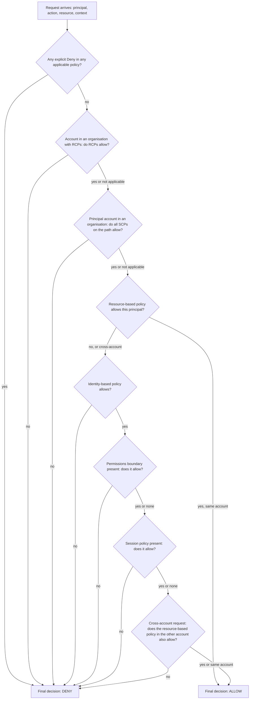

!!! info "The resource-based policy nuance within one account"
    Within a single account, a resource-based policy that names an ==IAM user== or a ==role session ARN== as principal grants access even if the identity has no matching identity-based policy, and an implicit deny in a permissions boundary or session policy does not remove it. If the resource-based policy names the ==role ARN== rather than the session, the grant is treated like an identity-based grant, so the boundary and session policy still limit it. Some resources are exceptions: an ==IAM role trust policy== and an ==AWS KMS key policy== must explicitly allow access, because identity-based policies alone cannot grant use of a key or assumption of a role unless the key policy or trust policy delegates to the account. Explicit denies, SCPs and RCPs always apply.

#### Cross-account evaluation

For a request from account A to a resource in account B, ==both accounts must agree==:

| Account | What must allow | What may deny |
|---------|-----------------|---------------|
| A (principal's account) | An identity-based policy on the principal; A's SCPs; the principal's boundary and session policy | Any explicit deny in A's policies or SCPs |
| B (resource's account) | A resource-based policy naming A's principal or account, or a trust policy on a role in B that A's principal assumes | Any explicit deny in B's resource policy; B's RCPs |

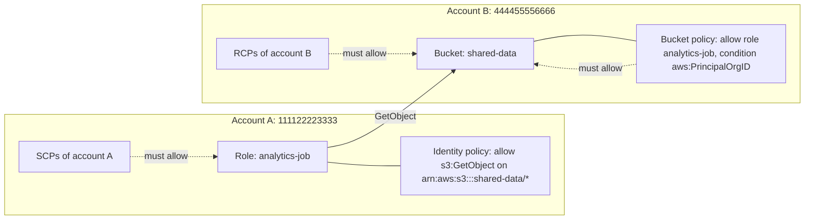

#### Permissions boundaries and delegated administration

A permissions boundary is a managed policy set as the ==maximum permissions== of a user or role. The effective permissions are the intersection of the identity-based policies and the boundary. Boundaries solve a specific organisational problem: ==letting developers create roles for their own workloads without letting them escalate privilege==.

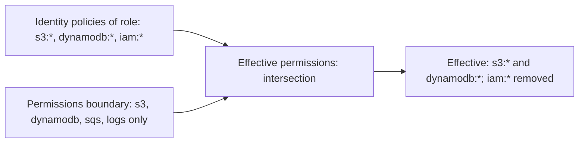

The delegation pattern works as follows:

1. The platform team creates a boundary policy, for example `WorkloadBoundary`, allowing only the services workloads may use and denying changes to the boundary itself.
2. Developers receive permission to call `iam:CreateRole` and `iam:PutRolePermissionsBoundary` ==only if== the condition `iam:PermissionsBoundary` equals the `WorkloadBoundary` ARN, and to pass roles (`iam:PassRole`) only for roles under a specific path.
3. Any role developers create is automatically capped, so even `AdministratorAccess` attached to it cannot exceed the boundary.

#### iam:PassRole

Many services let a principal attach a role to a resource: an EC2 instance profile, an ECS task definition, a Lambda function, a CloudFormation stack, a CodeBuild project. Doing so requires the permission ==`iam:PassRole`== on the role. Without this control, a developer with limited permissions could create a Lambda function with an administrator role and act through it. Restrict `iam:PassRole` to specific role ARNs or paths, and use the `iam:PassedToService` condition to limit which service can receive the role.

#### Session policies

Session policies are passed in `AssumeRole`, `AssumeRoleWithWebIdentity`, `AssumeRoleWithSAML` or `GetFederationToken`. The session's permissions are the ==intersection== of the role's permissions and the session policy. They are useful in ==token vending==: a trusted broker assumes a broad role but passes a session policy limiting the session to one tenant's S3 prefix, then hands those credentials to less-trusted code.

#### RBAC and ABAC

| Aspect | Role-based access control (RBAC) | Attribute-based access control (ABAC) |
|--------|----------------------------------|----------------------------------------|
| Basis | Permissions attached to roles per job function or workload, listing specific resources | Permissions expressed as rules comparing principal attributes (tags) with resource attributes (tags) |
| Example | `orders-dev-role` may access `orders-dev-table` | Principals tagged `project=orders` may access resources tagged `project=orders` |
| Growth | New resource or team requires policy changes | New resources are covered automatically when tagged correctly |
| Number of policies | Grows with teams times resources | Small, stable set |
| Risks | Policy sprawl, quota pressure | Tag governance becomes security-critical: whoever can change tags can change access |
| AWS support | All services | Most services support `aws:ResourceTag`; check the Service Authorization Reference |
| Best fit | Small numbers of well-defined roles, services lacking tag support | Large, fast-growing organisations; per-tenant or per-project isolation |

!!! tip "ABAC requires tag governance"
    ABAC is only as strong as control over tags. Prevent principals from changing their own session tags or resource tags that grant access: deny `iam:TagRole`, `iam:UntagRole` and resource `TagResource` or `UntagResource` actions on the governing keys except for the platform role, require the tag at creation with `aws:RequestTag`, and use ==tag policies== in AWS Organizations ([Part 8.1.3](#aws-organizations-and-service-control-policies)) to standardise keys and values. EKS Pod Identity and Identity Center can supply session tags automatically.

#### Tools for least privilege

| Tool | What it does | When to use | Cost |
|------|--------------|-------------|------|
| IAM Access Analyzer policy validation | Checks policies against grammar and more than 100 best-practice checks, returning errors, security warnings, warnings and suggestions | Every time a policy is written; in the CI pipeline | Free |
| IAM Access Analyzer policy generation | Generates a policy from the actions a role used, as recorded in CloudTrail over a chosen period | Replacing broad development policies before production | Free (requires a CloudTrail trail) |
| IAM Access Analyzer custom policy checks | `CheckNoNewAccess`, `CheckAccessNotGranted`, `CheckNoPublicAccess` using automated reasoning | Pipeline gates that fail builds if a policy grants forbidden access | Charged per check |
| IAM Access Analyzer external access analyzer | Finds resources shared outside a zone of trust (account or organisation) | Continuous monitoring of S3, KMS, IAM roles, SQS, Secrets Manager, Lambda, ECR, EFS, RDS and DynamoDB sharing, among others | Free |
| IAM Access Analyzer internal access analyzer | Finds which principals inside the organisation can reach selected critical resources | Protecting sensitive data stores from over-broad internal access | Charged |
| IAM Access Analyzer unused access analyzer | Finds unused roles, access keys, passwords, services and actions | Continuous least-privilege cleanup across accounts | Charged per IAM role and user analysed per month |
| IAM Policy Simulator | Evaluates identity policies, boundaries and resource policies for chosen actions and resources | Troubleshooting and learning; works in the console and via `SimulatePrincipalPolicy` | Free |
| Last accessed information | Last use of services and, for many services, actions | Pruning permissions and designing SCPs | Free |
| CloudTrail | Records every API call, including denied calls with error codes | Evidence of what a principal actually does | Management events: first trail copy free |

!!! note "Automated reasoning"
    IAM Access Analyzer does not merely pattern-match policies. It uses ==automated reasoning== (the Zelkova engine, based on SMT solvers) to translate policies into logical formulas and prove properties such as "no principal outside this organisation can read this bucket". This is why its findings for external and public access are mathematically sound, rather than heuristic, for the policy types it analyses.

### AWS Service Deep Dive

#### Purpose

The IAM policy engine and its tooling decide every request and help teams keep permissions minimal over time.

#### Architecture

Policies are stored centrally in IAM (identity policies, boundaries), with the resource (resource-based policies), or in AWS Organizations (SCPs, RCPs). At request time the service's authorization component retrieves the applicable policies, builds the request context, and evaluates them locally in the Region. Access Analyzer runs as a separate Regional service that reads policies and CloudTrail data and produces findings, which are also sent to Amazon EventBridge and AWS Security Hub.

#### Important Features

- A single declarative JSON language across all services.
- Managed policy versioning (up to five versions) with a default version and rollback.
- Policy variables and a rich set of global and service-specific condition keys.
- Access denied error messages that often state the policy type responsible, such as "with an explicit deny in a service control policy".
- IAM Access Analyzer, Policy Simulator and last-accessed data.

#### Limitations

- Policy size quotas force consolidation and prefix wildcards for large permission sets.
- Not every action supports resource-level permissions or every condition key.
- The evaluation logic is subtle; incorrect mental models cause both outages and over-privilege.
- Eventually consistent propagation of policy changes.
- Some legacy mechanisms (S3 ACLs) sit outside the policy language and must be disabled explicitly.

#### Pricing Model and recommendations

Policies, the evaluation engine, the Policy Simulator, policy validation, policy generation and external access analysis are ==free==. Unused access analysis and internal access analysis are billed per resource or principal analysed per month, and custom policy checks per call; enable unused access analysis at the organisation level, where it gives the most value per cost, and run custom checks only on changed policies in pipelines. Verify current rates on the pricing page.

#### Performance Characteristics

Policy evaluation adds no noticeable latency. Very large numbers of statements do not slow requests measurably but make policies harder to reason about.

#### Scaling Behaviour

Scaling limits come from quotas: policy sizes, managed policies per identity, and number of customer managed policies. ABAC and policy variables scale better than enumerating resources.

#### Availability

Evaluation happens in each Region's data plane. Policy changes depend on the IAM control plane and propagate within seconds.

#### Security Features

Explicit deny precedence, default deny, conditions, boundaries, session policies, automated reasoning-based analysis, and integration with CloudTrail and Security Hub.

#### Service Limits

| Item | Default | Note |
|------|---------|------|
| Managed policy document size | 6,144 characters | Whitespace not counted |
| Managed policy versions retained | 5 | Delete old versions before creating more |
| Managed policies attached per user, group or role | 10 | Adjustable up to 20 |
| Customer managed policies per account | 1,500 | Adjustable |
| Inline policy aggregate per role | 10,240 characters | |
| Inline policy aggregate per user | 2,048 characters | |
| Inline policy aggregate per group | 5,120 characters | |
| Session policy packed size | Limited; STS reports `PackedPolicySize` | Session tags share this budget |
| Access Analyzer analyzers | Per Region per account or organisation | Verify in Service Quotas |

### Important AWS Terminology

| Term | Meaning |
|------|---------|
| Policy | JSON document that allows or denies actions on resources under conditions |
| Statement | One rule within a policy |
| Effect | `Allow` or `Deny` |
| Action | A service operation such as `s3:GetObject` |
| Resource | The ARN or ARNs a statement applies to |
| Condition | Context constraints on a statement |
| Condition key | A named attribute of the request context, such as `aws:SourceVpce` |
| Implicit deny | The default result when nothing allows a request |
| Explicit deny | A matching `Deny` statement, which overrides any allow |
| Identity-based policy | Policy attached to a user, group or role |
| Resource-based policy | Policy attached to a resource, with a `Principal` element |
| Permissions boundary | Managed policy that caps an identity's maximum permissions |
| Session policy | Policy passed at session creation to further restrict it |
| `iam:PassRole` | Permission to hand a role to a service |
| ABAC | Access control based on matching tags of principals and resources |
| RBAC | Access control based on roles defined per function |
| Policy Simulator | Tool that evaluates policies for hypothetical requests |
| IAM Access Analyzer | Service for validating, generating and analysing access using automated reasoning |
| Zone of trust | The account or organisation relative to which external access is reported |
| Data perimeter | A set of preventive controls ensuring only trusted identities access trusted resources from expected networks |

### Configuration Options

| Decision | Options | Guidance |
|----------|---------|----------|
| Policy type for workload permissions | AWS managed, customer managed, inline | Customer managed for production; AWS managed for experimentation; inline only for tightly bound, non-reusable grants |
| Cross-account data access | Role assumption into the data account, or resource-based policy granting the external principal | Resource-based policy when the caller needs its own permissions at the same time and the service supports it; role assumption otherwise |
| Access control model | RBAC, ABAC, hybrid | Hybrid: RBAC for coarse job functions, ABAC for project and tenant isolation |
| Delegated IAM administration | Central team creates all roles, or developers create roles within boundaries | Boundaries enable team autonomy with guardrails |
| S3 access control | Bucket policies and IAM only, or ACLs | Set Object Ownership to bucket owner enforced to disable ACLs; enable Block Public Access |
| Pipeline policy checks | None, validation only, custom checks | Validation plus `CheckNoNewAccess` or `CheckAccessNotGranted` on changed policies |

### Design Considerations

| Concern | Consideration |
|---------|---------------|
| Scalability | ABAC and policy variables keep the number of policies roughly constant as resources grow |
| Availability | Deny statements with conditions such as `aws:SourceVpce` can block legitimate traffic during network changes; test before deploying and include exemptions for AWS service principals (`aws:PrincipalIsAWSService`) |
| Reliability | Overly narrow policies break deployments when services add dependencies; generate policies from observed activity and test in staging |
| Maintainability | Name statements with `Sid`, keep one purpose per policy, store policies in the same repository as the service |
| Operational complexity | Layering (identity, resource, boundary, SCP, RCP) gives defence in depth but makes debugging harder; document which layer owns which control |
| Cost | Free, apart from paid Access Analyzer features |

!!! example "Designing least privilege iteratively"
    A realistic workflow for a new microservice is: (1) in development, attach a broad but bounded policy, for example DynamoDB and SQS actions on resources tagged with the project; (2) run integration tests for a representative period; (3) use Access Analyzer policy generation to produce a policy from CloudTrail activity; (4) review and refine it, replacing wildcards with ARNs; (5) validate it and add a custom policy check to the pipeline; (6) deploy to staging and production; (7) watch unused access findings and remove permissions that remain unused. Least privilege is a ==process==, not a one-time document.

### AWS Best Practices

| Pillar | Policy best practice |
|--------|----------------------|
| Operational Excellence | Policies as code, reviewed in pull requests, validated and checked in CI; clear `Sid` names; alarms on IAM policy changes |
| Security | Default deny, least privilege, explicit denies for invariants, conditions for network and TLS, boundaries for delegation, ABAC with tag governance, remove unused access |
| Reliability | Test policy changes in lower environments; use Policy Simulator before deploying denies; avoid manual console edits |
| Performance Efficiency | Prefer ABAC and variables over enumerations that approach size quotas |
| Cost Optimization | Use free validation and generation extensively; target paid analysis where it matters |
| Sustainability | Fewer, reusable customer managed policies reduce drift and review effort |

### Security Considerations

- ==Privilege escalation paths==: permissions such as `iam:CreatePolicyVersion`, `iam:AttachRolePolicy`, `iam:PutRolePolicy`, `iam:UpdateAssumeRolePolicy`, `iam:PassRole` combined with `lambda:CreateFunction` or `ec2:RunInstances`, and `sts:AssumeRole` on privileged roles allow a principal to grant itself more access. Treat them as administrative and restrict them with boundaries and SCPs.
- ==Encryption and KMS==: access to encrypted data requires both the data service permission and `kms:Decrypt` allowed by the ==key policy==; key policies are resource-based policies with special rules covered in [Section 8.3](topic3.md).
- ==Secrets Manager==: secret resource policies can restrict access to specific roles and VPC endpoints ([Section 8.3](topic3.md)).
- ==Network conditions==: `aws:SourceVpce` and `aws:SourceVpc` create private-only access; security groups and network ACLs remain the network layer ([Section 8.2](topic2.md)).
- ==Public resources==: S3 Block Public Access at account level, Access Analyzer public findings and `CheckNoPublicAccess` checks prevent accidental exposure.
- ==Logging==: CloudTrail records denied requests with `errorCode` `AccessDenied`; a spike in denials can indicate an attacker probing permissions or a broken deployment.
- ==Compliance==: least-privilege evidence (generated policies, unused access findings, pipeline check logs) supports audits.

### Performance Optimization

Policy evaluation itself needs no tuning. Performance issues are indirect: excessive `AssumeRole` calls, repeated `AccessDenied` retries in application code, and throttling of IAM control plane APIs by automation that creates or updates policies frequently. Cache credentials, fail fast on authorization errors rather than retrying them, and batch IAM changes in IaC deployments.

### Cost Optimization

Enable Access Analyzer unused access at the organisation level once, rather than per account; restrict internal access analysis to genuinely critical resources; and run custom policy checks only when policies change. The largest cost benefit of least privilege is indirect: it limits the blast radius and cost of incidents such as a compromised credential launching expensive instances.

### Integration with Other AWS Services

| Service | Integration |
|---------|-------------|
| Amazon S3 | Bucket policies, Block Public Access, Access Points policies, conditions such as `aws:SourceVpce` and `s3:x-amz-server-side-encryption` |
| AWS Lambda | Execution role (identity) plus function resource-based policy for invokers such as API Gateway, EventBridge, S3 and SNS |
| Amazon SQS and SNS | Queue and topic policies allowing publishers across services and accounts, with `aws:SourceArn` |
| AWS KMS | Key policies, grants and `kms:ViaService` conditions ([Section 8.3](topic3.md)) |
| Amazon ECR | Repository policies for cross-account image pulls by ECS and EKS |
| Amazon API Gateway | IAM authorization with SigV4 and resource policies restricting callers and VPC endpoints ([Chapter 1.7](../unit1/topic7.md), [Chapter 4.2](../unit4/topic2.md)) |
| Amazon EKS | Access entries and access policies mapping IAM principals to Kubernetes permissions ([Chapter 3.1](../unit3/topic1.md#eks-identity-integration)) |
| AWS CloudFormation | Service roles and `iam:PassRole`; stack policies; policies defined as code |
| AWS Security Hub and EventBridge | Receive Access Analyzer findings for aggregation and automated remediation (Unit VII) |

### Common Architecture Patterns

| Pattern | Description |
|---------|-------------|
| Data perimeter | Combine identity policies, resource policies, VPC endpoint policies, SCPs and RCPs using `aws:PrincipalOrgID`, `aws:ResourceOrgID` and `aws:SourceVpce` so that only trusted identities access trusted resources from expected networks |
| Delegated administration with boundaries | Developers create workload roles, always capped by a platform boundary |
| ABAC for microservices | Each service role carries `service` and `environment` tags; resources carry the same tags; a single policy grants access where tags match |
| Token vending for multi-tenancy | A trusted broker assumes a role with a session policy or session tags scoped to one tenant and hands the credentials to less-trusted tenant code |
| Policy-as-code pipeline | Lint, validate, custom-check and simulate policies before deployment |
| Deny-by-exception | Explicit deny statements protect invariants (no non-TLS access, no deletion of backups) with narrow exemptions via `aws:PrincipalArn` |

### Industry Use Cases

- A bank implements a data perimeter so that its S3 data can be read only by principals in its organisation, through its VPC endpoints, with a bucket policy, an RCP and an endpoint policy working together.
- A SaaS provider uses ABAC with a `tenant` session tag so that one IAM role and one policy isolate thousands of tenants' DynamoDB items and S3 prefixes.
- A platform team lets 60 product teams create their own Lambda and ECS roles in their accounts, capped by a permissions boundary that forbids IAM and networking changes.
- A healthcare company gates every pull request that changes IAM with Access Analyzer `CheckAccessNotGranted` to prove no policy grants access to patient data buckets outside approved roles.

### Advantages

- ==Precise, declarative and testable== permissions across all services.
- ==Layered defence==: several independent policy owners must all agree.
- ==Context awareness== through conditions: network, time, MFA, tags, organisation.
- ==Automated reasoning== tools that prove, rather than guess, access properties.
- ==Code-friendly==: policies live in repositories and pipelines.

### Limitations

- Evaluation logic is complex and non-intuitive for beginners.
- Error messages, although improving, do not always reveal which statement denied a request.
- Size and attachment quotas constrain large permission sets.
- ABAC depends on consistent tagging and tag support per service.
- Least privilege requires ongoing effort as services evolve.

### Common Mistakes

#### Beginner mistakes

| Mistake | Consequence | Correction |
|---------|-------------|------------|
| `"Action": "*", "Resource": "*"` to "make it work" | Full administrator access | Start from specific actions; use policy generation |
| Using the object ARN for `s3:ListBucket` | `AccessDenied` on listing | Use the bucket ARN for bucket-level actions and `bucket/*` for object actions |
| Expecting an `Allow` to override a `Deny` | Confusion when access is denied | Explicit deny always wins |
| Adding `Principal` to an identity-based policy | Validation error | `Principal` belongs only in resource-based and trust policies |
| Confusing `NotAction` with deny | Massive over-privilege | Use `NotAction` mainly with `Deny` |

#### Production mistakes

| Mistake | Consequence | Correction |
|---------|-------------|------------|
| Unrestricted `iam:PassRole` | Privilege escalation through Lambda, EC2 or CloudFormation | Restrict to role ARNs or paths and `iam:PassedToService` |
| Network-condition deny without exemptions for AWS services | Breaks services that call on your behalf, such as CloudFormation or Athena | Add `aws:PrincipalIsAWSService` or `aws:ViaAWSService` exemptions |
| ABAC without controls on tagging | Anyone who can tag can gain access | Deny tag changes on governance keys; tag policies |
| Bucket policy granting `"Principal": "*"` with a condition that can be absent | Public exposure if the key is missing from requests | Use `...IfExists` deliberately, or `Null` checks; validate with Access Analyzer |
| Leaving development-era broad policies in production | Large blast radius | Generate, review and replace policies before go-live; monitor unused access |

### Summary

Policies express permissions as JSON statements of effect, action, resource and condition. AWS evaluates every applicable policy on every request starting from default deny: an explicit deny anywhere wins; SCPs and RCPs must allow; then a resource-based or identity-based policy must allow; and any permissions boundary and session policy must also allow. Cross-account requests need agreement from both sides. Identity-based and resource-based policies grant access; boundaries, session policies, SCPs, RCPs and endpoint policies only limit it. Conditions and global keys add context, enabling data perimeters and ABAC. Least privilege is maintained as a continuous process with IAM Access Analyzer, the Policy Simulator, last-accessed data and CloudTrail.

Architectural lessons:

- ==Know the evaluation logic cold.== Most IAM incidents come from an incorrect mental model of how policies combine.
- ==Separate granting from limiting.== Teams grant within their scope; central teams limit with boundaries, SCPs and RCPs.
- ==Use conditions to encode architecture.== Organisation, VPC endpoint, TLS and tag conditions make security properties explicit and testable.
- ==Automate least privilege.== Generate, validate, check and prune policies in pipelines instead of relying on manual review.
- ==Guard the escalation paths.== `iam:PassRole` and IAM write actions deserve the same care as administrator access.

## AWS Organizations and Service Control Policies

### Definition

==AWS Organizations is an account management service that lets you consolidate multiple AWS accounts into an organisation that you create and centrally manage, with consolidated billing, hierarchical grouping into organisational units, and centrally applied policies.==

==A service control policy (SCP) is an organisation policy that defines the maximum permissions available to IAM users and roles, including the root user, in the member accounts to which it applies.== ==A resource control policy (RCP) is an organisation policy that defines the maximum permissions available on resources in the member accounts to which it applies, whoever the caller is.==

AWS Organizations sits in the Management and Governance category. It is the foundation for ==AWS Control Tower==, which builds a governed landing zone on top of it, and for organisation-wide features of many other services: IAM Identity Center, CloudTrail organisation trails, AWS Config aggregators, GuardDuty, Security Hub, IAM Access Analyzer, AWS Backup, CloudFormation StackSets and RAM sharing.

### Why This Service or Concept Exists

#### The account is the strongest boundary

Within one account, isolation relies on correctly written policies, and a single mistake can expose everything. Between accounts, the default is ==no access at all==: resources, IAM, quotas and billing are separate, and any access must be granted explicitly on both sides. Separate accounts therefore provide:

| Benefit | Explanation |
|---------|-------------|
| Security isolation | A compromise or misconfiguration in development cannot reach production |
| Blast radius control | Quota exhaustion, runaway costs or a faulty deployment is contained to one account |
| Clear ownership | Each account has an owning team; costs and findings map naturally to teams |
| Simpler policies | Policies inside a single-purpose account can be broader without being dangerous |
| Compliance scoping | Regulated workloads (for example card data) live in accounts that auditors can scope precisely |
| Independent quotas | Service quotas are per account and Region, so noisy neighbours are isolated |

#### The problem Organizations solves

Many accounts without central management create new problems: separate invoices, repeated security setup, inconsistent guardrails, and no way to stop an account administrator from disabling CloudTrail or using an unapproved Region. AWS Organizations addresses these by providing:

1. ==Central account lifecycle==: create, invite, move and close accounts through APIs.
2. ==Consolidated billing==: one payer, combined usage for volume tiers, and shared Reserved Instance and Savings Plans discounts.
3. ==Hierarchy==: OUs that group accounts by function or risk, so policies attach once and inherit.
4. ==Central guardrails==: SCPs, RCPs and declarative policies that local administrators cannot override.
5. ==Organisation-wide service integration==: one switch to enable CloudTrail, Config, GuardDuty or Identity Center across all accounts.

#### Benefits over older methods

| Concern | Independent accounts | AWS Organizations |
|---------|---------------------|-------------------|
| Billing | Separate invoices and no shared discounts | Consolidated billing with shared volume discounts and commitments |
| Guardrails | Trust every account administrator | SCPs, RCPs and declarative policies enforced centrally |
| New account setup | Manual, inconsistent | Automated with Control Tower Account Factory or IaC |
| Security services | Enabled per account | Enabled organisation-wide with delegated administrators |
| Audit | Trails configured per account, can be disabled | Organisation trail that member accounts cannot modify |
| Human access | Users per account | Identity Center across the organisation |

### Core Concepts

#### Organisation structure

| Concept | Meaning |
|---------|---------|
| Organisation | The entity that consolidates accounts; has an ID such as `o-a1b2c3d4e5` |
| Management account | The account that created the organisation; pays the bills; ==cannot be restricted by SCPs or RCPs==; should host no workloads |
| Member account | Any other account in the organisation |
| Root | The top container of the hierarchy (not to be confused with the root user); policies attached here apply to all member accounts |
| Organisational unit (OU) | A container for accounts and other OUs, nesting up to five levels below the root |
| Feature set | ==All features== (required for policies and most integrations) or consolidated billing only |
| Trusted access | Permission for an AWS service to operate across the organisation, creating service-linked roles in member accounts |
| Delegated administrator | A member account registered to administer a service for the organisation, so that daily operations do not use the management account |

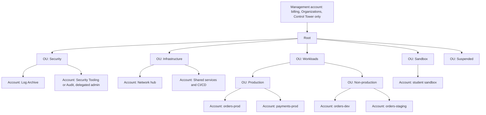

!!! tip "Structure OUs by policy, not by organisation chart"
    OUs exist to apply policies. Group accounts that need the ==same guardrails==, typically by environment and function (Security, Infrastructure, Workloads split into Production and Non-production, Sandbox, Suspended), rather than by department. Departments change frequently; the controls appropriate for production do not. Team ownership is better expressed with account tags.

#### Multi-account strategy and landing zones

A ==landing zone== is a well-architected, multi-account baseline: the OU structure, core accounts, identity, logging, security services, networking and guardrails that every new account inherits. AWS guidance on organising environments recommends at minimum:

| Core account | Purpose |
|--------------|---------|
| Management | Organizations, billing, Control Tower; no workloads, minimal access |
| Log Archive | Immutable, centralised CloudTrail, Config and other logs in S3, with restricted access |
| Security Tooling or Audit | Delegated administrator for GuardDuty, Security Hub, Access Analyzer, Config aggregator, Detective; read-only cross-account audit roles |
| Network | Transit Gateway, shared VPCs, egress and inspection ([Section 8.2](topic2.md)) |
| Shared services | CI/CD tooling, artefact repositories, directory services |
| Workload accounts | One or more per application per environment |
| Sandbox accounts | Experimentation with strict cost and Region guardrails |

#### AWS Control Tower

==AWS Control Tower== automates the creation and governance of a landing zone on top of Organizations.

| Component | Meaning |
|-----------|---------|
| Landing zone | The baseline Control Tower deploys: Security OU, Log Archive and Audit accounts, organisation trail, Identity Center configuration (optional) |
| Controls (guardrails) | Pre-packaged governance rules: ==preventive== (implemented as SCPs or RCPs), ==detective== (AWS Config rules) and ==proactive== (CloudFormation hooks that block non-compliant resources before creation) |
| Control objectives and catalogue | Controls grouped by objective and mapped to frameworks |
| Account Factory | Standardised account vending through Service Catalog, the console or APIs; Account Factory for Terraform (AFT) for GitOps vending; blueprints for customisation |
| Drift detection | Detection of changes that diverge from the baseline, such as an SCP modified outside Control Tower |
| Region deny control | Restricts use to governed Regions |

!!! note "Control Tower or build your own?"
    Control Tower is the recommended starting point for most organisations: it encodes AWS best practice and keeps pace with new services. Large organisations sometimes build equivalent landing zones with Terraform or the Landing Zone Accelerator on AWS for greater customisation or compliance frameworks. Either way the principles are the same: dedicated core accounts, OU-based guardrails, centralised logging and identity, and automated account vending.

#### Service control policies

SCPs are the preventive guardrail for ==principals==. Their properties are precise and often examined:

| Property | Detail |
|----------|--------|
| Grants permissions? | ==Never.== They define the maximum; IAM policies must still allow |
| Applies to | All IAM users and roles in member accounts, ==including the member account's root user== |
| Does not apply to | The ==management account==; ==service-linked roles==; principals outside the organisation accessing your resources (that is what RCPs are for) |
| Inheritance | Effective SCP permissions at an account are the ==intersection== of the SCPs at the root, every OU on the path and the account: an action must be allowed at every level |
| Default | `FullAWSAccess` is attached to every node when SCPs are enabled; removing it without a replacement allow denies everything |
| Policy language | Uses IAM policy grammar without `Principal`; since 2025 SCPs support the full IAM policy language, including conditions and `NotResource` in allow statements (verify current documentation) |
| Effect timing | Immediate for new requests after propagation; existing sessions are also constrained |

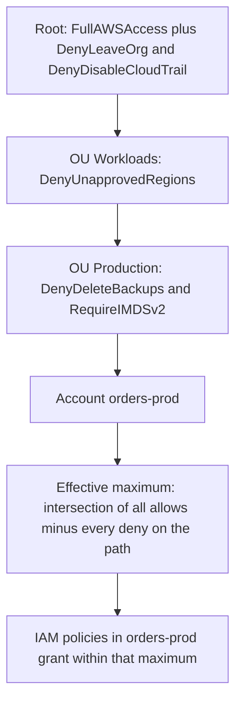

#### Deny-list versus allow-list strategies

| Strategy | How it works | Advantages | Disadvantages | When |
|----------|--------------|------------|---------------|------|
| Deny list | Keep `FullAWSAccess` everywhere; add SCPs with explicit `Deny` statements for forbidden actions | New services work automatically; simple; small policies | New risky services are allowed until someone denies them | Most organisations; default recommendation |
| Allow list | Remove `FullAWSAccess`; attach SCPs that explicitly allow only approved services at every level | Strong control; only approved services usable | Every new service needs a change at each level; allow must exist at every node on the path | Highly regulated environments, sandbox restrictions, suspended accounts |

!!! danger "Test SCPs before attaching them high in the tree"
    An SCP attached to the root applies instantly to every member account. A mistaken deny, for example on `sts:AssumeRole` or `kms:Decrypt`, can break production systems across the organisation within seconds. Test new SCPs on a test OU containing representative accounts, use IAM Access Analyzer policy validation for SCPs, review Organizations last-accessed data to understand which services are in use, and roll out gradually from Sandbox to Non-production to Production. Always exempt a break-glass or platform role with a condition on `aws:PrincipalArn`.

#### Resource control policies

RCPs, introduced at the end of 2024, are the preventive guardrail for ==resources==. Whereas SCPs ask "what may our principals do?", RCPs ask "what may ==anyone== do to our resources?". They are ideal for ==data perimeters==: ensuring that, for example, no S3 bucket in the organisation can be accessed by principals outside the organisation, whatever an individual bucket policy says.

| Property | Detail |
|----------|--------|
| Grants permissions? | Never |
| Applies to | Resources in member accounts, for supported services, regardless of whether the caller is inside or outside the organisation |
| Supported services | Initially Amazon S3, AWS STS, AWS KMS, Amazon SQS and AWS Secrets Manager; more services have been added since (check the current list) |
| Does not apply to | Resources in the management account; requests made by service-linked roles |
| Default | `RCPFullAWSAccess` attached automatically; custom RCP statements use `Deny` |

| Comparison | SCP | RCP |
|------------|-----|-----|
| Controls | Principals in member accounts | Resources in member accounts |
| Stops | Our identities doing forbidden things, including to external resources | Anyone, including external identities, doing forbidden things to our resources |
| Data perimeter role | Identity perimeter: our principals access only trusted resources (`aws:ResourceOrgID`) | Resource perimeter: our resources accessed only by trusted principals (`aws:PrincipalOrgID`) |
| Typical example | Deny unapproved Regions | Deny S3 access from outside the organisation; deny non-TLS access to all buckets |

#### Declarative policies

==Declarative policies== (introduced in December 2024) let administrators declare the desired configuration of an AWS service across the organisation, and the service enforces it at its own control plane. Unlike SCPs, which evaluate API calls, declarative policies set a ==baseline configuration== that persists even when the service adds new APIs. Supported EC2-related attributes include VPC Block Public Access, EBS snapshot and AMI block public access, allowed AMIs, serial console access and instance metadata defaults such as requiring IMDSv2. Declarative policies can present a custom error message that directs users to internal guidance.

#### Management policies

| Policy type | Purpose | Example |
|-------------|---------|---------|
| Tag policies | Standardise tag keys, value casing and allowed values; optionally enforce on specific resource types | `CostCenter` must use approved codes; `environment` in `dev`, `staging`, `prod` |
| Backup policies | Deploy AWS Backup plans across accounts | Daily backups with 35-day retention for resources tagged `backup=standard` |
| AI services opt-out policies | Control whether AWS AI services may store and use content for service improvement | Opt out organisation-wide |
| Chat applications policies | Control Amazon Q Developer in chat applications access to chat workspaces | Allow only corporate Slack workspaces |
| Declarative policies | Enforce service configuration baselines | Require IMDSv2; block public AMIs |

Management policies such as tag and backup policies use ==inheritance operators== (`@@assign`, `@@append`, `@@remove`) so that child OUs can extend or override parent settings where the parent allows it, unlike SCPs and RCPs, which simply intersect.

#### Delegated administrators and trusted access

Enabling ==trusted access== lets a service such as GuardDuty, Security Hub, AWS Config, IAM Access Analyzer, IAM Identity Center or CloudFormation StackSets operate in all member accounts, creating service-linked roles as needed. Registering a ==delegated administrator== moves the service's administration to a member account, typically the Security Tooling account, so that security engineers never need access to the management account. Organizations itself supports delegating policy management to a member account through a resource-based delegation policy.

#### Centralised auditing with CloudTrail

An ==organisation trail== created from the management account or a delegated administrator logs management events (and optionally data events) for every account and Region into a bucket in the Log Archive account. Member accounts can see the trail but ==cannot modify or delete it==. Combine it with S3 Object Lock, bucket policies restricted to the security team, KMS encryption, log file integrity validation and an SCP denying `cloudtrail:StopLogging` and `cloudtrail:DeleteTrail`. CloudTrail Lake can store and query events with SQL. [Section 7.2](../unit7/topic2.md) covered log aggregation; here the emphasis is on ==tamper resistance== and ==identity forensics==: every event records `userIdentity`, including the role session, source identity and, for Identity Center, the user.

#### Centralised root access management

For organisations using all features, ==centralised root access management== lets the management account or a delegated administrator remove root credentials (password, access keys, MFA and signing certificates) from member accounts and prevent their recovery. When a root-only task is required, such as unlocking a mis-configured bucket policy, an authorised administrator calls `sts:AssumeRoot` with a task policy to obtain a short-lived, task-scoped root session in the member account. New accounts created in the organisation can be created without root credentials at all.

### AWS Service Deep Dive

#### Purpose

AWS Organizations provides account lifecycle, billing consolidation, hierarchy and policy enforcement; Control Tower provides the opinionated landing zone on top.

#### Architecture

Organizations is a global service with its control plane in US East (N. Virginia) for the commercial partition. Policies are stored in Organizations and distributed to the authorization systems in every Region, where SCPs and RCPs are evaluated as part of every request in member accounts. Declarative policies are pushed to the configured services' control planes.

#### Important Features

- Account creation, invitation, movement between OUs, and closure through APIs.
- Consolidated billing with shared volume pricing, Reserved Instances and Savings Plans.
- SCPs, RCPs, declarative policies, tag, backup, AI opt-out and chat applications policies.
- Trusted access and delegated administration for dozens of services.
- Organisation-level IAM condition keys: `aws:PrincipalOrgID`, `aws:PrincipalOrgPaths`, `aws:ResourceOrgID`, `aws:ResourceOrgPaths`.
- Centralised root access management.
- Organizations last-accessed data and AWS Resource Access Manager sharing within the organisation.

#### Limitations

- SCPs and RCPs do not apply to the management account, so it must be kept minimal and tightly controlled.
- Policy size and attachment quotas require consolidation of statements.
- OU nesting depth is limited to five levels.
- Moving an account between organisations requires removing it first, which needs standalone payment details.
- Some services require per-Region or per-account enablement even with trusted access.

#### Pricing Model and recommendations

AWS Organizations and SCPs, RCPs and other policies are ==free==. Control Tower itself has no additional charge, but it deploys services that are billed, chiefly AWS Config recordings and rules, CloudTrail, S3 storage for logs and KMS keys. Budget for Config costs in particular, and scope detective controls deliberately. Consolidated billing reduces total cost through volume tiers and shared commitments.

#### Performance Characteristics

SCP and RCP evaluation adds no noticeable latency. Organisation API operations are control plane calls with modest rate limits; automation that vends many accounts should queue requests.

#### Scaling Behaviour

Organisations routinely contain hundreds or thousands of accounts. The default account quota for a new organisation is small (it starts at 10) and can be increased through a quota request; plan account vending capacity in advance.

#### Availability

Guardrails are enforced in every Region's data plane. Organisation management operations depend on the control plane in US East (N. Virginia); design account vending and policy changes to tolerate brief delays, and do not depend on them for recovery.

#### Security Features

Preventive guardrails that account administrators cannot bypass, organisation trails, centralised root access management, delegated administration that keeps people out of the management account, and organisation-aware condition keys for data perimeters.

#### Service Limits

| Item | Default | Note |
|------|---------|------|
| Accounts per organisation | Starts at 10 for new organisations | Adjustable; verify in Service Quotas |
| OU nesting depth | 5 levels below the root | Fixed |
| SCPs attached per root, OU or account | 5 | Fixed maximum |
| SCP size | 5,120 characters | Whitespace counts in the console editor; verify in Service Quotas |
| RCPs attached per node | 5 | |
| RCP size | 5,120 characters | |
| Tag, backup and other management policy sizes | Service-specific | Verify in documentation |

### Important AWS Terminology

| Term | Meaning |
|------|---------|
| Organisation | A set of AWS accounts centrally managed with AWS Organizations |
| Management account | The account that owns the organisation and pays; exempt from SCPs and RCPs |
| Member account | Any account in the organisation other than the management account |
| Root (Organizations) | The top node of the organisation hierarchy |
| Organisational unit | A container of accounts and OUs used to apply policies |
| All features | Feature set enabling policies and service integrations |
| Consolidated billing | Single bill and shared discounts across accounts |
| SCP | Maximum permissions for principals in member accounts |
| RCP | Maximum permissions on resources in member accounts |
| Declarative policy | Enforced service configuration baseline |
| Tag policy | Standard for tag keys and values |
| Backup policy | Organisation-wide AWS Backup plans |
| Trusted access | Service permission to operate across the organisation |
| Delegated administrator | Member account that administers a service for the organisation |
| Landing zone | Well-architected multi-account baseline |
| AWS Control Tower | Service that builds and governs a landing zone |
| Control | A preventive, detective or proactive governance rule in Control Tower |
| Account Factory | Control Tower's standardised account vending mechanism |
| Organisation trail | A CloudTrail trail logging all accounts in the organisation |
| Data perimeter | Preventive controls ensuring trusted identities, trusted resources and expected networks |

### Configuration Options

| Decision | Options | Guidance |
|----------|---------|----------|
| Feature set | All features or consolidated billing only | All features |
| Landing zone | Control Tower, Landing Zone Accelerator, custom IaC | Control Tower for most; accelerators for complex compliance |
| SCP strategy | Deny list or allow list | Deny list generally; allow list for sandboxes and suspended accounts |
| Where to attach | Root, OU or account | Mostly OUs; root for universal invariants; avoid per-account exceptions |
| Human access | Identity Center organisation instance, with delegated administrator | Delegate to a security or identity account |
| Root credentials in member accounts | Keep or remove centrally | Remove with centralised root access management |
| Audit | Organisation trail with Log Archive account | Always; add Object Lock and SCP protection |
| Account vending | Manual, Account Factory, AFT, custom pipeline | Account Factory or AFT |

### Design Considerations

| Concern | Consideration |
|---------|---------------|
| Scalability | OU-level policies scale to thousands of accounts; per-account exceptions do not |
| Availability | A faulty SCP can break every workload; stage rollouts and keep exemptions for break-glass roles |
| Reliability | Guardrails should protect recovery mechanisms: backups, logs and replication must be undeletable by workload principals |
| Latency | None for enforcement |
| Cost | Organizations is free; Control Tower's Config usage and log storage are the main costs |
| Maintainability | Keep SCPs in version control and deploy via pipeline; document every guardrail's purpose and owner |
| Operational complexity | More accounts mean more networking and cross-account access design; automate baselines with StackSets and Account Factory |

### AWS Best Practices

| Pillar | Organisation-level best practice |
|--------|----------------------------------|
| Operational Excellence | Automate account vending and baselines; policies as code; delegate service administration |
| Security | Minimal management account; organisation trail; SCP invariants; RCP data perimeter; declarative baselines; centralised root access |
| Reliability | Separate accounts per environment and workload to contain failures and quotas; protect backups with SCPs and backup policies |
| Performance Efficiency | Independent quotas per account prevent contention |
| Cost Optimization | Consolidated billing; shared Savings Plans; tag policies for cost allocation; sandbox budgets and Region restrictions |
| Sustainability | Region restrictions and sandbox clean-up reduce idle resources |

### Security Considerations

- ==IAM and least privilege==: only a small group should access the management account, ideally through Identity Center with MFA; daily security work happens in delegated administrator accounts.
- ==Encryption and KMS==: RCPs can require organisation-only access to KMS keys; key management is covered in [Section 8.3](topic3.md).
- ==Secrets Manager==: RCPs can prevent secrets being shared outside the organisation.
- ==Network==: SCPs can deny creation of internet gateways in workload accounts that should route through a central egress VPC ([Section 8.2](topic2.md)); declarative VPC Block Public Access enforces this at the service level.
- ==Logging==: organisation trail, Config aggregator and Security Hub in the security account; SCPs prevent disabling them.
- ==Compliance==: Control Tower controls map to frameworks; account-level separation narrows audit scope.

### Cost Optimization

Consolidated billing aggregates usage for tiered pricing and shares Reserved Instances and Savings Plans across accounts (sharing can be restricted per account). Tag policies make cost allocation reliable, AWS Budgets and Cost Explorer operate at organisation level, and SCPs can prevent expensive instance families or unapproved Regions in sandbox accounts. Trusted Advisor and Compute Optimizer can be enabled organisation-wide.

### Integration with Other AWS Services

| Service | Integration |
|---------|-------------|
| IAM Identity Center | Organisation instance assigns permission sets across accounts |
| AWS CloudTrail | Organisation trail and CloudTrail Lake event data stores |
| AWS Config | Organisation aggregator and conformance packs; detective controls |
| GuardDuty, Security Hub, Inspector, Macie, Detective | Delegated administrator in the security account |
| IAM Access Analyzer | Organisation zone of trust; unused access across accounts |
| AWS Backup | Backup policies and cross-account vaults |
| CloudFormation StackSets | Deploy baselines (roles, alarms, Config rules) to all accounts in an OU automatically |
| AWS RAM | Share subnets, Transit Gateways and other resources within the organisation |
| AWS Budgets and Cost Explorer | Organisation-wide cost visibility |
| CloudWatch cross-account observability | Monitoring account linked to workload accounts (Unit VII) |

### Common Architecture Patterns

| Pattern | Description |
|---------|-------------|
| Landing zone with core accounts | Management, Log Archive, Security Tooling, Network, Shared Services, workload OUs |
| Environment-per-account | Separate development, staging and production accounts per workload; pipelines deploy across them with cross-account roles (Unit V) |
| Data perimeter | SCPs for the identity perimeter, RCPs and resource policies for the resource perimeter, endpoint policies for the network perimeter |
| Guardrail tiers | Root invariants, OU-specific controls, sandbox allow list, suspended OU deny-all |
| Account vending machine | Account Factory or AFT creates accounts with baseline roles, networking and budgets from a pull request |
| Delegated security operations | Security account administers organisation security services; management account untouched |

### Industry Use Cases

- A retail group runs 400 accounts in Control Tower: each product team has development, staging and production accounts vended through AFT from a Git pull request.
- A bank uses RCPs so that no S3 bucket, KMS key or secret in any account can be accessed from outside the organisation, even if a team writes a permissive resource policy.
- A university provides student sandbox accounts in a Sandbox OU whose allow-list SCP permits only a curated set of services in one Region, with budgets that alert at low thresholds.
- A healthcare provider isolates regulated workloads in a dedicated OU with stricter SCPs and Config conformance packs, simplifying audits.

### Advantages

- ==Account-level isolation== with central governance.
- ==Guardrails that local administrators cannot override==, including for the root user of member accounts.
- ==Consolidated billing and shared discounts.==
- ==Organisation-wide enablement== of security and audit services.
- ==Automated, consistent account vending.==

### Limitations

- The management account is exempt from SCPs and RCPs and is therefore a high-value target.
- A single faulty policy can cause organisation-wide outages.
- Multi-account designs add networking, cross-account access and cost-allocation complexity.
- Control Tower is opinionated; customisation beyond its model requires additional tooling.
- Policy quotas and size limits force careful policy design.

### Common Mistakes

#### Beginner mistakes

| Mistake | Consequence | Correction |
|---------|-------------|------------|
| Believing an SCP grants permissions | Users still get `AccessDenied` | SCPs only limit; IAM policies must allow |
| Running workloads in the management account | Guardrails do not apply there | Keep the management account empty of workloads |
| Detaching `FullAWSAccess` without an allow-list replacement | Everything denied in affected accounts | Keep `FullAWSAccess` with deny-list SCPs, or design a complete allow list |
| Expecting SCPs to restrict external principals accessing your bucket | They do not | Use RCPs and resource policies |
| Structuring OUs by department | Frequent reorganisation, inconsistent controls | Structure by environment and policy needs |

#### Production mistakes

| Mistake | Consequence | Correction |
|---------|-------------|------------|
| Attaching an untested SCP at the root | Organisation-wide outage | Test OU, staged rollout, simulation and validation |
| No exemption for break-glass or platform roles | Unable to repair during incidents | `ArnNotLike aws:PrincipalArn` exemptions for tightly controlled roles |
| Region deny SCP without exempting global services | IAM, Organizations, Route 53, CloudFront and support calls fail | Use `NotAction` for global services |
| Organisation trail bucket writable by workload accounts | Logs can be tampered with | Log Archive account, Object Lock, restricted policies |
| Security staff working in the management account | Excessive privilege, wider attack surface | Delegated administrators |

### Summary

AWS Organizations turns many AWS accounts into one governed estate. The account is the strongest isolation boundary, so AWS recommends a multi-account strategy organised into OUs by environment and function, with dedicated management, log archive, security, network and shared services accounts, usually built with AWS Control Tower. SCPs cap what principals in member accounts can do and RCPs cap what can be done to resources in member accounts; neither grants permissions, both intersect down the hierarchy, and neither applies to the management account or to service-linked roles. Declarative policies enforce service configuration baselines, while tag, backup and other management policies standardise operations. Organisation trails, delegated administrators and centralised root access management complete the governance model.

Architectural lessons:

- ==Use accounts as blast-radius boundaries.== Separate environments, workloads and security functions into accounts.
- ==Govern with a few strong invariants.== Protect audit, restrict Regions, block root and access keys, and enforce a data perimeter; leave detailed permissions to IAM inside accounts.
- ==Keep the management account empty.== It is exempt from guardrails and must host nothing but governance.
- ==Treat organisation policies as high-risk code.== Validate, test on a pilot OU, roll out gradually and always keep a break-glass exemption.
- ==Automate account vending.== Every new account should arrive with identity, logging, networking and guardrails already in place.

## Section Summary

Section 8.1 established identity as the primary security perimeter of cloud-native systems on AWS. The three parts build one control plane from the individual request up to the whole organisation.

| Part | Core idea | Key services | Key decision for architects |
|------|-----------|--------------|-----------------------------|
| IAM Users, Groups, and Roles | Every request comes from a principal; prefer roles and short-lived credentials, federate humans | IAM, STS, IAM Identity Center, IAM Roles Anywhere | Which identity mechanism each person and workload uses, and what each trust policy allows |
| IAM Policies and Permissions | Default deny, explicit deny wins, all limiting layers must agree, cross-account needs both sides | IAM policies, resource-based policies, boundaries, session policies, Access Analyzer, Policy Simulator | How to express and maintain least privilege, and where to use conditions and ABAC |
| AWS Organizations and Service Control Policies | Accounts are isolation boundaries; organisation policies set invariants no account can break | AWS Organizations, SCPs, RCPs, declarative and management policies, Control Tower, CloudTrail | How to structure accounts and OUs and which guardrails to enforce centrally |

### Section 8.1 in one picture

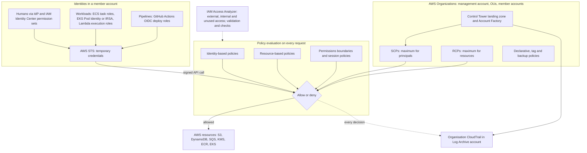

### How Section 8.1 connects to the rest of DSO303

| Unit or section | What IAM contributes |
|-----------------|----------------------|
| Unit I: serverless, event-driven and API-first design | Lambda execution roles; resource-based policies that let API Gateway, EventBridge and S3 invoke functions; IAM authorization for APIs |
| Unit II: containers on ECS (Chapters [2.2](../unit2/topic2.md) and [2.3](../unit2/topic3.md)) | Task roles for application calls and task execution roles for image pulls, secrets and logs, with confused deputy conditions |
| Unit III: EKS (Chapters [3.1](../unit3/topic1.md) to [3.3](../unit3/topic3.md)) | Node roles, IRSA and EKS Pod Identity per service account, access entries mapping IAM principals to Kubernetes RBAC |
| Unit IV: microservices and resilience | One role per service limits lateral movement; ABAC scales permissions with the number of services |
| Unit V: CI/CD and infrastructure as code (Chapters [5.1](../unit5/topic1.md) to [5.3](../unit5/topic3.md)) | Keyless OIDC federation for pipelines, cross-account deployment roles, CloudFormation service roles and `iam:PassRole`, policies validated as code |
| Unit VI: storage, databases and messaging | Bucket, queue, topic and key policies; organisation and VPC endpoint conditions for data access |
| Unit VII: observability (Chapters [7.1](../unit7/topic1.md) to [7.3](../unit7/topic3.md)) | CloudTrail as the identity audit trail; alarms on root use and policy changes; cross-account monitoring roles; least-privilege responders |
| [Section 8.2](topic2.md): network security | VPC endpoints and `aws:SourceVpce` conditions join identity and network perimeters; security groups and NACLs add network layers |
| [Section 8.3](topic3.md): data protection and encryption | KMS key policies and grants, Secrets Manager resource policies, ACM; encryption access always depends on IAM |

### Closing architectural lessons for Section 8.1

- ==Identity is the perimeter.== In the cloud every action is an API call, so the quality of identity design determines the security of everything else.
- ==No long-lived secrets.== People federate, workloads use platform roles, pipelines use OIDC, servers outside AWS use Roles Anywhere; access keys are an exception to be justified and monitored.
- ==Least privilege is continuous.== Generate, validate, check, simulate and prune permissions as part of the delivery pipeline, informed by CloudTrail and Access Analyzer.
- ==Layer independent controls.== Identity policies, resource policies, boundaries, SCPs, RCPs and network conditions each stop different failure modes; explicit denies encode invariants.
- ==Use accounts for isolation and organisations for governance.== Small, single-purpose accounts with central guardrails give both autonomy and safety.
- ==Audit everything, and make the audit tamper-resistant.== An organisation trail in a protected log archive turns every decision into evidence.

!!! tip "Preparing for the examination and for practice"
    For examinations and AWS Associate-level certifications, be able to take a scenario and state ==which principal makes the request, how it obtained credentials, which policies apply, how they are evaluated, and which organisation guardrail would prevent the failure==. Be ready to explain task role versus task execution role, trust policy versus permissions policy, SCP versus RCP versus permissions boundary, and why cross-account access needs both sides. In DSO303 projects, a design in which every service has its own role, pipelines are keyless, policies are validated in CI and CloudTrail is centralised demonstrates far more security maturity than any single advanced feature.

!!! question "Practice and interview questions"
    Questions for this topic are kept separately: [Practice questions](../Questions/unit8.md#81-aws-identity-and-access-management) · [Interview questions](../interviewquestions/unit8.md#81-aws-identity-and-access-management).