# Network Security on AWS

| Part | Primary services | Question it answers | One-sentence role |
|------|------------------|---------------------|-------------------|
| VPC Design and Security Groups | Amazon VPC, security groups, VPC endpoints and endpoint policies, AWS Network Firewall, Route 53 Resolver DNS Firewall, Gateway Load Balancer, EC2 Instance Connect Endpoint, Session Manager, VPC Lattice, VPC Block Public Access, AWS Firewall Manager | Which workloads may talk to which, over which paths, and how is that enforced consistently across hundreds of accounts? | Build a segmented, least-privilege network whose default is deny and whose exceptions are expressed as identity-based, governed rules |
| Network ACLs and VPC Flow Logs | Network ACLs, VPC Flow Logs, Amazon Athena, Amazon GuardDuty, Amazon Detective, Amazon Security Lake, Traffic Mirroring | What guardrails apply regardless of individual workload rules, and what evidence exists of the traffic that actually flowed? | Provide coarse subnet guardrails, fast incident containment and the network telemetry on which threat detection and forensics depend |
| AWS WAF and Shield for Application Protection | AWS WAF, AWS Managed Rules, Bot Control, Account Takeover Prevention, AWS Shield Standard and Advanced, Amazon CloudFront, AWS Firewall Manager | How are internet-facing applications protected from injection, bots, credential stuffing and distributed denial of service? | Filter malicious HTTP requests at the edge and absorb volumetric attacks before they reach application capacity |

## Defence in Depth for the Network: Layers from Edge to Workload

In a traditional data centre, network security was organised around a single ==perimeter==: a pair of firewalls at the internet edge, a "trusted" internal network behind it and perhaps a demilitarised zone (DMZ) for web servers. Anything inside the perimeter was implicitly trusted. That model failed repeatedly in practice, because once an attacker obtained one foothold (a phished laptop, a vulnerable web server, a leaked credential) they could move laterally across a flat internal network with almost no resistance.

Cloud-native systems make the perimeter model even weaker. A single application may consist of an API Gateway, a CloudFront distribution, dozens of ECS tasks or Kubernetes pods whose IP addresses change every deployment, Lambda functions, managed databases, and calls to AWS APIs such as S3, DynamoDB and SQS that are reached over HTTPS rather than over the VPC. There is no single wire on which to place a firewall. Security must therefore be ==layered==, with each layer assuming that the layer outside it may already have failed.

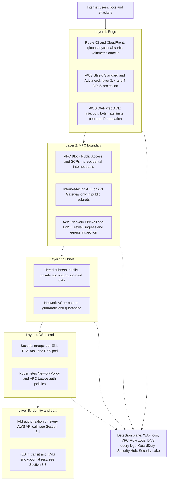

The layers are not redundant copies of one another. Each has a different ==vantage point== and therefore stops different attacks:

| Layer | Sees | Stops well | Cannot see or stop |
|-------|------|-----------|--------------------|
| Edge (CloudFront, Shield, WAF) | Full HTTP request: path, headers, body, cookies, client IP, TLS fingerprint | SQL injection, cross-site scripting payloads, bots, credential stuffing, HTTP floods, volumetric floods | Traffic that never passes through the edge, east-west traffic, logic flaws in the application |
| VPC boundary (Network Firewall, DNS Firewall, BPA) | Packets and flows entering or leaving the VPC, domain names in DNS, TLS SNI | Malware command-and-control callbacks, data exfiltration to unknown domains, unapproved internet paths | Encrypted payload content (unless TLS inspection is configured), traffic between two workloads in the same subnet |
| Subnet (NACL) | Every packet crossing the subnet boundary, statelessly | Known-bad CIDRs, whole-subnet isolation during an incident, "the data tier never talks to the internet" invariants | Anything inside the subnet, application identity, domain names |
| Workload (security groups, NetworkPolicy, Lattice) | Connections to and from one ENI, pod or service | Lateral movement between services, unauthorised callers inside the VPC | Malicious content inside an allowed connection |
| Identity and data (IAM, TLS, KMS) | Principal, action, resource, context | Use of stolen network access to reach data without credentials | Nothing at the packet level; it depends on correct policy |

!!! note "Network controls and identity controls answer different questions"
    A security group answers ==can this packet reach this port?== An IAM policy answers ==may this principal perform this action on this resource?== A mature design needs both. Network controls reduce the attack surface and slow an attacker down; identity controls decide whether a request that does arrive is legitimate. [Section 8.1](../unit8/topic1.md) describes the identity side of the data perimeter; this section describes the network side, and the two meet in VPC endpoint policies and in conditions such as `aws:SourceVpce` and `aws:SourceVpc`.

### Threat modelling the network

Before choosing services, an architect should enumerate what can go wrong. A lightweight way to do this for a network is to apply the STRIDE categories to each trust boundary: the internet edge, the boundary between public and private subnets, the boundary between application and data tiers, the boundary between the VPC and AWS service endpoints, and the boundary between accounts.

| Threat | Network manifestation | Primary controls in this section |
|--------|-----------------------|----------------------------------|
| Spoofing | Forged source addresses in reflection attacks; calls from outside the organisation pretending to be internal | Shield Standard, security group referencing rather than CIDRs, endpoint policies with `aws:PrincipalOrgID` |
| Tampering | Man-in-the-middle on unencrypted internal traffic | TLS everywhere ([Section 8.3](../unit8/topic3.md)), VPC Lattice and service mesh mTLS ([Chapter 4.2](../unit4/topic2.md)) |
| Repudiation | No evidence of which host connected where | VPC Flow Logs, DNS query logs, WAF logs, CloudTrail, protected log archive account |
| Information disclosure | Data exfiltration to the internet or to an attacker-owned S3 bucket | Egress filtering with Network Firewall and DNS Firewall, endpoint policies, no direct internet route from data subnets |
| Denial of service | SYN floods, UDP reflection, HTTP floods, expensive API calls | Shield, CloudFront, WAF rate-based rules, auto scaling ([Chapter 4.3](../unit4/topic3.md)) |
| Elevation of privilege | Lateral movement from a compromised web tier to the database or to the instance metadata service | Tiered subnets, micro-segmentation with security groups per task or pod, IMDSv2, NetworkPolicy |

!!! example "A realistic attack chain"
    An attacker finds a server-side request forgery (SSRF) flaw in a public web application. They use it to call internal addresses, discover an administration service on port 8081 that was reachable from the whole VPC because its security group allowed `10.0.0.0/16`, exploit it, install a cryptocurrency miner that downloads its payload from a public domain, and finally copy customer files to an S3 bucket in their own account. Every link in that chain could have been broken by a control in this section: a WAF rule blocking SSRF patterns, a security group that referenced only the specific caller, egress filtering denying unknown domains, DNS Firewall blocking the mining pool, an S3 endpoint policy allowing only buckets in the organisation, and GuardDuty findings on Flow Logs and DNS logs raising an alarm within minutes. Defence in depth means the attacker must succeed at ==every== step; the defender needs to succeed at only one.

### Perimeter security versus zero trust

==Zero trust== is an architectural principle stating that no request is trusted merely because of its network location. Every request must be authenticated, authorised and encrypted, and access is granted per request with the least privilege necessary. On AWS, zero trust does not mean that network controls are abandoned. It means that network controls are no longer the ==only== decision point.

| Aspect | Perimeter model | Zero trust model on AWS |
|--------|-----------------|--------------------------|
| Trust basis | Source IP address and network location | Authenticated identity (IAM, workload identity, user identity) plus device and context |
| Internal traffic | Implicitly trusted | Authenticated and authorised: SigV4 for AWS APIs, VPC Lattice auth policies, mTLS in a service mesh |
| Administrative access | VPN plus bastion host | Session Manager or EC2 Instance Connect Endpoint authorised by IAM, fully logged |
| User access to internal apps | Corporate VPN | AWS Verified Access evaluating identity and device posture per request |
| Role of network controls | The primary control | One of several layers; reduces blast radius and attack surface |
| Failure mode | One breach exposes everything inside | One breach exposes one identity's permissions, bounded by segmentation |

!!! tip "Zero trust is a direction, not a product"
    Students sometimes answer an examination question by writing "use zero trust" as if it were a service. It is a set of design choices. In an AWS answer, name the concrete mechanisms: security groups referencing security groups, no inbound administrative ports, Session Manager, VPC endpoints with policies, IAM authorisation on every AWS call, VPC Lattice or mesh mTLS for service-to-service calls and Verified Access for workforce applications.

### The shared responsibility model for the network

AWS is responsible for the security ==of== the network: the physical network, the hypervisor-level isolation that prevents one customer from seeing another customer's packets, the enforcement of security groups and NACLs in the Nitro system, and baseline DDoS protection through Shield Standard. The customer is responsible for security ==in== the network: route tables, which subnets are public, the content of every security group and NACL, which endpoints exist and what their policies allow, whether flow logs are enabled, and whether WAF is configured. Almost every real network-related breach on AWS has been a customer-side configuration failure, most often an overly permissive security group or an unintended internet path, rather than a failure of the AWS network itself.

---

## VPC Design and Security Groups

### Definition

==Secure VPC design is the practice of arranging accounts, VPCs, subnets, routes, gateways and endpoints so that every network path that exists is intended, minimal and observable, and every path that is not intended is impossible by construction.==

==A security group is a stateful, allow-only virtual firewall enforced by the AWS Nitro system on each elastic network interface (ENI), whose rules can refer to CIDR blocks, managed prefix lists or other security groups.== All of a group's rules are evaluated and any matching allow rule permits the traffic; there are no deny rules, and the return traffic of an allowed flow is permitted automatically. From a security perspective, a security group is best understood as a ==workload-level identity for network policy==: membership of `sg-orders-api` says "this ENI belongs to the orders API", and rules referencing that group express who may talk to the orders API regardless of IP addresses.

In the AWS architecture map, both sit in the Networking and Content Delivery category but are governed from the Security, Identity and Compliance category through AWS Firewall Manager, AWS Security Hub and AWS Config.

### Why This Service or Concept Exists

#### The problem: flat networks and invisible drift

A VPC created with the console wizard and a handful of broad security groups works on the first day. Over months it accumulates exceptions: a rule opening port 22 "temporarily" from `0.0.0.0/0`, a group reused by five unrelated services because it already had the right ports, a database accidentally placed in a subnet that routes to the internet gateway, a developer account peered to production for a debugging session. None of these is visible from the application, and each one widens the path an attacker can take. Industry breach reports consistently list misconfigured network exposure among the most common initial access vectors in the cloud.

Security groups exist because the cloud needed a firewall that:

1. follows the workload rather than the wire, since instances, tasks and pods move and change address constantly,
2. is evaluated in the virtualisation layer, so it cannot be disabled from inside a compromised instance,
3. is expressed as an API resource, so it can be created by infrastructure as code, reviewed in pull requests and audited continuously,
4. scales horizontally without a central appliance becoming a bottleneck.

#### Why AWS added so many network security services

Security groups alone solve east-west and ingress control for individual workloads. They do not solve several other requirements that regulators and security teams demand:

| Requirement | Why security groups are insufficient | Service AWS introduced |
|-------------|--------------------------------------|------------------------|
| Allow outbound HTTPS only to approved domains | Security groups understand IP addresses, not domain names | AWS Network Firewall (domain lists, TLS SNI), Route 53 Resolver DNS Firewall |
| Deep packet inspection and intrusion prevention | Security groups inspect only the 5-tuple | AWS Network Firewall (Suricata-compatible rules), Gateway Load Balancer with third-party appliances |
| Guarantee that no VPC in an account ever gains an internet path | Security groups are per workload and can be misconfigured | VPC Block Public Access, Service Control Policies |
| Enforce a baseline across 300 accounts | Each account manages its own groups | AWS Firewall Manager security group policies |
| Stop data leaving to an attacker-owned bucket through an allowed S3 path | Security groups cannot distinguish one S3 bucket from another | VPC endpoint policies, `aws:ResourceOrgID` and related conditions |
| Administrative access without an inbound port | SSH requires an inbound rule and a reachable host | Session Manager, EC2 Instance Connect Endpoint |
| Service-to-service authorisation across VPCs and accounts | Security groups do not authenticate callers | VPC Lattice auth policies |

### Core Concepts

#### Least privilege applied to the network

Least privilege is usually discussed for IAM ([Section 8.1](../unit8/topic1.md)). Applied to networks it means that ==every path must be justified by a specific communication requirement==. A useful exercise is to draw the application's communication matrix before writing any security group.

| From / To | ALB | Orders API | Payments API | Orders DB | S3 (via endpoint) | Internet |
|-----------|-----|-----------|--------------|-----------|-------------------|----------|
| Internet | 443 | none | none | none | none | not applicable |
| ALB | not applicable | 8080 | 8080 | none | none | none |
| Orders API | none | none | 8443 | 5432 | 443 to approved buckets | none |
| Payments API | none | none | none | none | none | 443 to `api.payment-provider.example` only |
| Orders DB | none | none | none | none | none | none |

Each non-empty cell becomes exactly one rule. Each "none" is an explicit design decision that should be tested, for example with Reachability Analyzer or Network Access Analyzer.

#### Segmentation at four levels

Segmentation divides a system into zones so that a compromise in one zone cannot spread freely to another. On AWS it exists at four levels, each with a different strength and cost.

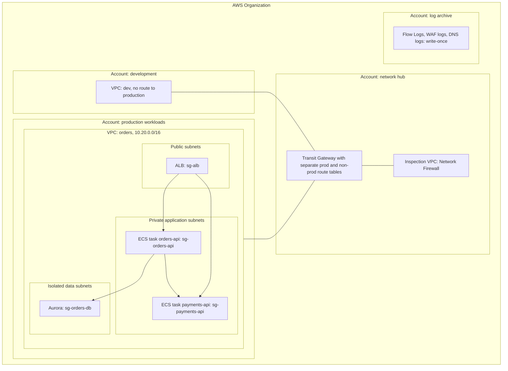

| Level | Mechanism | Strength of isolation | Typical use |
|-------|-----------|-----------------------|-------------|
| Account | Separate AWS accounts under AWS Organizations, SCPs | Strongest: separate IAM, quotas, billing and blast radius | Production versus non-production, regulated workloads, security tooling, log archive |
| VPC | Separate VPCs connected only through controlled paths (Transit Gateway route tables, Lattice, PrivateLink) | Strong: no connectivity unless explicitly built | Business domains, PCI scope reduction, tenant isolation |
| Subnet | Tiered subnets with distinct route tables and NACLs | Moderate: controls routing and coarse filtering | Public, application and data tiers |
| Workload | Security groups per service, NetworkPolicy per pod, Lattice auth policies | Fine-grained: per service identity | Micro-segmentation between microservices |

!!! note "Why account boundaries matter for network security"
    A security group can be edited by anyone with `ec2:AuthorizeSecurityGroupIngress` in that account. An account boundary, combined with an SCP that denies `ec2:CreateInternetGateway` or `ec2:AttachInternetGateway` in workload accounts, cannot be bypassed by a workload administrator at all. This is why the AWS Security Reference Architecture places network hubs, inspection, security tooling and log archives in dedicated accounts.

#### Tiered subnets as a security control

[Chapter 1.6](../unit1/topic6.md#subnets-and-availability-zones) introduced public, private and isolated subnets as a routing concept. From a security perspective they encode ==invariants==:

- Only load balancers, NAT gateways and, where unavoidable, edge appliances live in public subnets. No application instance, task or database ever has a public IP address.
- Application subnets can initiate outbound connections only through a controlled egress path (NAT gateway, Network Firewall or proxy) and only to approved destinations.
- Data subnets have ==no route to the internet in either direction==. Their only paths are to the application tier and to VPC endpoints.

These invariants can be checked mechanically: an AWS Config rule can assert that no ENI in a data subnet has a public IP, that data subnet route tables contain no `0.0.0.0/0` route, and Network Access Analyzer can prove that no path exists from the internet gateway to any database ENI.

#### Micro-segmentation for containers

In the `awsvpc` network mode ([Chapter 2.2](../unit2/topic2.md)), each ECS task receives its own ENI and therefore its own security groups. This is what makes ==per-service micro-segmentation== possible on ECS: two tasks on the same EC2 container instance, or two Fargate tasks in the same subnet, can have entirely different network policies.

For Amazon EKS the picture is more nuanced, because many pods share a node:

| Mechanism | Enforced by | Granularity | Can reference | Best for |
|-----------|-------------|-------------|---------------|----------|
| Node security group (cluster security group) | Nitro, per node ENI | All pods on the node share it | Security groups, CIDRs | Baseline node-level control |
| Security groups for pods | Nitro, per branch ENI assigned to a pod | Per pod, selected by `SecurityGroupPolicy` | Security groups, CIDRs, prefix lists | Pods that must reach AWS resources guarded by security groups, such as RDS or ElastiCache |
| Kubernetes NetworkPolicy | Amazon VPC CNI network policy agent (eBPF), Calico or Cilium | Per pod, selected by labels and namespaces | Pod labels, namespaces, CIDRs | East-west control between pods inside the cluster |
| Service mesh or VPC Lattice authorisation | Envoy sidecars or the Lattice data plane | Per request, per identity | Workload identities, IAM principals | Layer 7, identity-based authorisation ([Chapter 4.2](../unit4/topic2.md)) |

!!! tip "Choosing between security groups for pods and NetworkPolicy"
    Use ==NetworkPolicy== as the default for pod-to-pod rules inside a cluster, because policies are written in Kubernetes terms (labels and namespaces), are portable and are enforced without consuming ENIs. Use ==security groups for pods== when a pod must be recognised by an AWS resource outside the cluster, for example so that an Aurora security group can allow only `sg-payments-pods` rather than every node in the cluster. Security groups for pods require Nitro-based instance types, the VPC CNI with `ENABLE_POD_ENI=true`, and consume branch network interfaces, which limits pod density per node; verify supported instance types and limits in the EKS documentation.

A Kubernetes NetworkPolicy that implements "default deny, then allow only the orders API to reach the payments service" looks like this:

```yaml
apiVersion: networking.k8s.io/v1
kind: NetworkPolicy
metadata:
  name: default-deny-all
  namespace: payments
spec:
  podSelector: {}
  policyTypes: ["Ingress", "Egress"]
---
apiVersion: networking.k8s.io/v1
kind: NetworkPolicy
metadata:
  name: allow-orders-to-payments
  namespace: payments
spec:
  podSelector:
    matchLabels:
      app: payments-api
  policyTypes: ["Ingress"]
  ingress:
    - from:
        - namespaceSelector:
            matchLabels:
              kubernetes.io/metadata.name: orders
          podSelector:
            matchLabels:
              app: orders-api
      ports:
        - protocol: TCP
          port: 8443
```

!!! warning "Default deny egress breaks DNS"
    A default-deny egress policy without an explicit DNS allowance breaks every service name lookup in the namespace, and the resulting errors look like application timeouts. Always pair default deny with a DNS egress rule (egress to the `kube-dns` pods in `kube-system` on UDP and TCP port 53), and remember that a NetworkPolicy has no effect at all unless the cluster's network plugin enforces it; with the Amazon VPC CNI, network policy enforcement must be enabled explicitly in the add-on configuration.

#### Security group design patterns

| Pattern | Description | Why it works |
|---------|-------------|--------------|
| One security group per service role | `sg-orders-api`, `sg-payments-api`, `sg-orders-db`, never shared across unrelated services | Membership becomes a meaningful identity, and rules can be reasoned about per service |
| Reference, do not enumerate | Rules use source security groups rather than CIDRs within the VPC | The rule names an identity rather than an address, so it survives scaling, redeployment and IP changes ([Chapter 1.6](../unit1/topic6.md#security-group-referencing-the-cloud-native-idiom)) |
| Chained tiers | `sg-alb` to `sg-app` to `sg-db`, each allowing only the previous one | Enforces the tier model; a compromised ALB node cannot reach the database |
| Managed prefix lists for external ranges | Partner or corporate CIDRs kept in a customer-managed prefix list, shared with AWS RAM | One change updates every referencing group; avoids copy-paste drift |
| AWS-managed prefix lists | For example `com.amazonaws.global.cloudfront.origin-facing` in the ALB security group | Only CloudFront can reach the origin; AWS maintains the list |
| Explicit, restricted egress | Replace the default "all outbound" rule with rules to specific groups, endpoints and prefix lists | Limits the damage of a compromised workload; makes exfiltration harder |
| Separate groups for management | A group used only by Session Manager or Instance Connect Endpoint traffic | Administrative access can be removed or audited independently |
| Descriptions on every rule | Rule description states the requirement and ticket | Makes reviews and automated audits meaningful |

#### Security group anti-patterns

| Anti-pattern | Why it is dangerous | Remedy |
|--------------|---------------------|--------|
| `0.0.0.0/0` on 22, 3389, database or administrative ports | Exposes services to continuous internet scanning; brute force within minutes | Session Manager or Instance Connect Endpoint; Security Hub control and Config rule to detect |
| Allowing the whole VPC CIDR (`10.0.0.0/16`) | Any compromised workload in the VPC can reach the service; negates segmentation | Reference the caller's security group |
| "Self-referencing everything" group attached to every resource | All resources can talk to all resources on all ports | One group per role with explicit chains |
| Using the default security group | It allows all traffic between members and all outbound; resources land in it accidentally | Remove all rules from the default group; Security Hub control EC2.2 |
| Wide port ranges such as `0-65535` "to make it work" | Hides the real requirement; allows lateral movement | Identify the actual port with Flow Logs, then restrict |
| Security groups edited in the console in production | Drift from IaC, no review, no history beyond Config | All changes via IaC; Firewall Manager or Config to detect and revert manual changes |
| Hundreds of CIDR rules for SaaS vendors | Hits rule quotas; addresses change | Egress through Network Firewall domain lists or a proxy; prefix lists where vendors publish them |

#### Connection tracking and why it matters for security

Security groups are stateful because the Nitro system keeps a ==connection-tracking table== for each ENI. When an allowed flow is created, an entry keyed by the 5-tuple (protocol, source IP, source port, destination IP, destination port) is recorded, and return packets matching that entry are permitted regardless of the rules in the opposite direction. Two consequences are important for security engineers.

First, ==removing a rule does not necessarily terminate an existing tracked connection==. If an attacker has an established SSH session that was permitted by a rule allowing a specific address, deleting that rule stops new connections, but the tracked session can continue until it closes or times out. Traffic permitted by rules allowing all traffic in both directions (`0.0.0.0/0` for all protocols) may be ==untracked==: they skip the tracking table, which slightly improves performance, and they are affected immediately by rule changes. The practical lesson for incident response is that ==security group changes alone are not a reliable way to cut an active attacker off==; [Part 8.2.2](#network-acls-and-vpc-flow-logs) shows how a network ACL, which is stateless, stops traffic on the next packet.

Second, connection tracking consumes resources on the instance's network interface. Each instance type has a connection tracking allowance, and when it is exceeded new connections are dropped. The ENA driver exposes a `conntrack_allowance_exceeded` statistic that can be published to CloudWatch. High-connection workloads such as NAT instances, proxies or DNS resolvers under attack are most affected. AWS also allows configuring shorter idle timeouts for tracked connections per ENI (for example the TCP established timeout, which defaults to several days), which can reduce exhaustion during floods; verify current defaults and ranges in the EC2 documentation.

#### Egress control and data exfiltration

Ingress receives most attention because attacks arrive from outside. Yet almost every serious breach ends with ==egress==: malware calling home, credentials being sent to an attacker, data being copied out. A default "allow all outbound" security group combined with a NAT gateway gives a compromised workload unrestricted internet access.

AWS offers several egress controls, which are complementary:

| Control | Layer | Decides on | Typical rule |
|---------|-------|------------|--------------|
| Security group egress rules | 3 and 4 | Destination IP, prefix list or security group, port | "Orders API may reach `sg-orders-db` on 5432 and the S3 prefix list on 443 only" |
| Route tables | 3 | Whether any route to the internet exists | Data subnets have no default route at all |
| Route 53 Resolver DNS Firewall | DNS | Domain names queried through the VPC resolver | "Block domains in the AWS managed malware and botnet lists; allow only `*.amazonaws.com` and approved SaaS domains" |
| AWS Network Firewall | 3 to 7 | IPs, ports, protocols, TLS SNI and HTTP Host, Suricata signatures | "Allow HTTPS only to `api.payment-provider.example`; alert on known command-and-control signatures" |
| VPC endpoint policies | AWS API | Principal, action and resource of AWS API calls through the endpoint | "S3 access through this endpoint only to buckets owned by our organisation" |

!!! danger "DNS is an exfiltration channel"
    Even a subnet with no internet route can usually resolve public domain names through the VPC's Route 53 Resolver, because the Resolver itself performs recursive resolution. Malware can encode stolen data in subdomain labels of an attacker-controlled domain (DNS tunnelling). Route 53 Resolver DNS Firewall, including its advanced protections that detect tunnelling and domain generation algorithms, and GuardDuty's DNS-based findings exist precisely to close this channel. Turning off DNS resolution in a VPC is rarely practical, so filter it instead.

#### VPC endpoint policies as a data perimeter

[Chapter 1.6](../unit1/topic6.md#vpc-endpoints) presented VPC endpoints mainly as a cost and routing feature. From a security perspective, an endpoint is a ==policy enforcement point== for every AWS API call that passes through it. An endpoint policy is a resource-based IAM policy attached to the endpoint; a request succeeds only if the caller's identity policy, the endpoint policy and the target resource's policy all allow it ([Section 8.1](../unit8/topic1.md) explains policy evaluation).

The AWS data perimeter model combines three types of control:

| Perimeter | Question | Where enforced | Example condition keys |
|-----------|----------|----------------|------------------------|
| Identity perimeter | Only trusted identities can access my resources | Resource policies, SCPs, RCPs | `aws:PrincipalOrgID`, `aws:PrincipalIsAWSService` |
| Resource perimeter | My identities can access only trusted resources | Endpoint policies, SCPs | `aws:ResourceOrgID`, `aws:ResourceAccount` |
| Network perimeter | My resources are accessed only from expected networks | Resource policies, SCPs, RCPs | `aws:SourceVpc`, `aws:SourceVpce`, `aws:SourceIp`, `aws:ViaAWSService` |

The network half of this design has two directions. An ==endpoint policy== on the S3 gateway endpoint prevents a compromised workload from copying data to an attacker's bucket, because the attacker's bucket is outside `aws:ResourceOrgID`. A ==bucket policy== with `aws:SourceVpce` prevents stolen credentials from being used from the internet to read the bucket, because requests arriving from outside the endpoint are denied. An endpoint policy can allow only named buckets; in production, the condition `"StringEquals": {"aws:ResourceOrgID": "o-exampleorgid"}` generalises this to every bucket the organisation owns.

#### Administrative access without bastions

A bastion host, a hardened instance in a public subnet accepting SSH from administrators, is a classic perimeter pattern. It has well-known weaknesses: it is an internet-exposed target, SSH keys are long-lived and hard to revoke, sessions are rarely recorded, and once on the bastion an administrator (or attacker) can reach everything it can reach.

| Option | How it works | Inbound ports | Authorisation | Logging | Notes |
|--------|--------------|---------------|---------------|---------|-------|
| Bastion host | SSH to a public instance, then onward | 22 from admin CIDRs | SSH keys | Manual, host-based | Avoid for new designs |
| AWS Systems Manager Session Manager | The SSM Agent on the instance opens an outbound channel to the Systems Manager service; the user connects through the console or CLI | None | IAM policies on `ssm:StartSession`, tag-based | Full session transcripts to S3 or CloudWatch Logs, CloudTrail for session start | Needs SSM Agent and outbound HTTPS to Systems Manager endpoints (interface endpoints for private subnets); supports port forwarding to RDS |
| EC2 Instance Connect Endpoint | A managed endpoint in a private subnet tunnels SSH or RDP from an IAM-authenticated user to a private IP | Only from the endpoint's security group | IAM on `ec2-instance-connect:OpenTunnel` | CloudTrail records tunnel creation | No agent needed; no public IP; useful for appliances where SSM Agent cannot run |
| AWS Verified Access | Identity- and device-aware access to internal web applications and, increasingly, TCP resources | None on the application | Policies over identity provider and device claims | Verified Access logs | Workforce access replacing VPN; can be protected by AWS WAF |

!!! tip "Architect's default"
    For EC2 fleets, use Session Manager as the default administrative path and remove port 22 from every security group. For ECS, use ECS Exec, which is built on Session Manager. For EKS nodes, avoid node access entirely where possible; use `kubectl` with EKS access entries ([Section 8.1](../unit8/topic1.md)). Use EC2 Instance Connect Endpoint where an agent cannot be installed.

#### VPC Lattice in brief

Amazon VPC Lattice is an application networking service that connects services across VPCs and accounts without peering or Transit Gateway routes. A ==service network== groups services; VPCs are associated with the service network; clients reach services by name. Security is layered: security groups on the VPC association control which clients in a VPC may use the service network, and ==auth policies== (IAM resource policies) on the service network and on each service authorise requests by IAM principal, with requests signed using SigV4. Lattice therefore brings identity-based, zero-trust authorisation to east-west HTTP, gRPC and TCP traffic without sidecars. [Chapter 4.2](../unit4/topic2.md) compares it with service meshes; for this section, remember that Lattice is one way to ==remove network-level trust from service-to-service calls== altogether.

### AWS Service Deep Dive

The core network security services in this part are security groups (whose rule mechanics are covered under Definition and Core Concepts above), AWS Network Firewall, Route 53 Resolver DNS Firewall, Gateway Load Balancer and AWS Firewall Manager. The deep dive concentrates on the three inspection services and the governance service.

#### Purpose

| Service | Purpose |
|---------|---------|
| AWS Network Firewall | Managed, highly available, stateful network firewall and intrusion prevention service for VPC ingress, egress and east-west traffic |
| Route 53 Resolver DNS Firewall | Filters DNS queries made through the VPC's Route 53 Resolver, blocking or alerting on domains |
| Gateway Load Balancer (GWLB) | Transparently inserts fleets of third-party virtual appliances (firewalls, IDS/IPS) into traffic paths, with load balancing and health checks |
| AWS Firewall Manager | Centrally defines and enforces security group, WAF, Shield Advanced, Network Firewall, DNS Firewall and NACL policies across an AWS Organization |
| VPC Block Public Access | Account- and Region-level control that blocks internet gateway and egress-only internet gateway traffic for VPCs and subnets, with explicit exclusions |

#### Architecture

AWS Network Firewall is deployed as a ==firewall== resource with a ==firewall endpoint== in a dedicated subnet in each Availability Zone. Traffic is steered to the endpoint by route tables. A ==firewall policy== contains ==stateless rule groups==, evaluated first for simple fast decisions, and ==stateful rule groups==, which track flows and can use domain lists, five-tuple rules or Suricata-compatible intrusion prevention signatures.

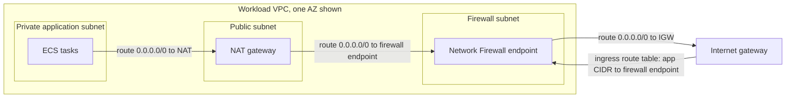

Three deployment models are common:

| Model | Description | Advantages | Disadvantages |
|-------|-------------|------------|---------------|
| Distributed | A firewall in every workload VPC | Simple routing, no cross-VPC dependency, per-team policy | Many firewall endpoints to pay for; policy consistency relies on Firewall Manager |
| Centralised inspection VPC | Transit Gateway sends egress and east-west traffic to an inspection VPC containing Network Firewall or a GWLB appliance fleet | One policy, fewer endpoints, central security team control | Transit Gateway data processing costs, more complex routing, must enable appliance mode for symmetric flows |
| Combined | Centralised egress and east-west inspection, distributed ingress inspection next to internet-facing ALBs | Balances control and latency | Most complex to operate |

!!! warning "Symmetric routing through inspection"
    Stateful firewalls must see both directions of a flow. In a centralised Transit Gateway design, enable ==appliance mode== on the inspection VPC attachment so that the Transit Gateway keeps both directions of a flow in the same Availability Zone. Without it, the return traffic can arrive at a different firewall endpoint, which has no state for the flow and drops it, producing intermittent failures that are extremely hard to diagnose. Network Firewall also supports native Transit Gateway attachment, which simplifies this model; verify the current options in the documentation.

Route 53 Resolver DNS Firewall attaches ==rule groups== to VPCs. Each rule references a ==domain list== (customer-defined or AWS managed, such as lists for malware, botnet command and control and aggregated threat intelligence) and specifies an action: `ALLOW`, `BLOCK` (responding with `NODATA`, `NXDOMAIN` or an override answer) or `ALERT`. Advanced rules can detect DNS tunnelling and domain generation algorithm patterns without a list. A VPC-level setting chooses ==fail-open== (queries are allowed if DNS Firewall is impaired, favouring availability) or ==fail-closed== (queries are blocked, favouring security).

Gateway Load Balancer operates at layer 3. It receives traffic through ==GWLB endpoints== placed in the traffic path by route tables, encapsulates packets using GENEVE on UDP port 6081, and distributes flows across a target group of appliances with flow stickiness. The appliances inspect and return traffic to the GWLB, which forwards it on. GWLB lets organisations run commercial next-generation firewalls they already license while keeping cloud-native scaling and health checking.

AWS Firewall Manager requires AWS Organizations, an administrator account and AWS Config enabled in member accounts. Administrators define ==policies== scoped by account, organisational unit, resource type and tags. Firewall Manager continuously applies the policy to in-scope resources, reports non-compliance and can auto-remediate.

#### Important Features

| Service | Features that matter for security design |
|---------|-------------------------------------------|
| Network Firewall | Stateless and stateful rule groups; strict or default rule order; domain allow and deny lists on TLS SNI and HTTP Host; Suricata-compatible IPS rules; AWS managed threat signature rule groups; TLS inspection for inbound and outbound traffic using ACM certificates; IP set and prefix list references; alert and flow logs to S3, CloudWatch Logs or Firehose; Transit Gateway integration |
| DNS Firewall | AWS managed domain lists; custom lists; `BLOCK`, `ALERT`, `ALLOW` with priority ordering; advanced protections for tunnelling and DGA; sharing via AWS RAM; Firewall Manager policies; query logging through Resolver query logs |
| Gateway Load Balancer | Transparent bump-in-the-wire insertion; GENEVE encapsulation; health checks; cross-zone option; endpoint service via PrivateLink so appliances can live in a separate security account |
| Firewall Manager | Security group policies (common baseline groups, content audit, usage audit for unused and redundant groups); WAF and Shield Advanced policies; Network Firewall and DNS Firewall policies; NACL policies; third-party firewall policies; automatic remediation; compliance dashboard |
| VPC Block Public Access | Bidirectional or ingress-only blocking of internet gateway traffic; exclusions per VPC or subnet; can be enforced across an organisation through declarative policies; Network Access Analyzer and Flow Log reject reasons show its effect |

#### Pricing Model and recommendations

| Item | Pricing basis | Recommendation |
|------|---------------|----------------|
| Security groups and NACLs | No charge | Use freely; the constraint is quotas and human comprehension |
| AWS Network Firewall | Per firewall endpoint per hour plus per GB processed; TLS inspection and advanced features add charges; a NAT gateway used with a firewall may have its standard charges offset | Centralise egress inspection where traffic volumes justify it; avoid inspecting traffic to AWS services that can use VPC endpoints |
| DNS Firewall | Per domain in lists per month plus per million queries processed | Inexpensive relative to its value; enable AWS managed lists broadly |
| Gateway Load Balancer | Per hour and per GWLB capacity unit, plus appliance instance and licence costs | Justified when a third-party firewall is a compliance or operational requirement |
| Firewall Manager | Per policy per Region per month, plus AWS Config rule evaluations | Included for WAF and Shield policies when subscribed to Shield Advanced; verify |
| EC2 Instance Connect Endpoint | No additional charge for the endpoint | Replace bastion instances and save their compute cost |

!!! warning "Prices change"
    Network Firewall endpoint-hour and data processing rates, DNS Firewall rates and Firewall Manager policy charges vary by Region and change over time. Always verify current figures on the AWS pricing pages and model them in the AWS Pricing Calculator before proposing an architecture.

#### Performance, Scaling and Availability

Security groups are enforced in the Nitro card and add no measurable latency; the practical limits are the connection tracking and packets-per-second allowances of each instance type, and the quotas on groups per ENI and rules per group. Network Firewall endpoints scale automatically to tens of gigabits per second per Availability Zone and add small latency (more with TLS inspection); strict rule ordering with a small, specific rule set performs and reasons best. DNS Firewall adds negligible latency inside the Resolver, and GWLB performance depends on the appliance fleet behind it. Firewall endpoints are ==zonal==: a highly available design places one endpoint per AZ and routes each AZ to its local endpoint. Session Manager and Instance Connect Endpoint are regional managed services whose interface endpoints should exist in every AZ. All of these services are managed through privileged IAM actions recorded in CloudTrail, with configuration history in AWS Config.

#### Service Limits

| Quota (defaults, adjustable unless noted) | Approximate default | Where to verify |
|-------------------------------------------|---------------------|-----------------|
| Security groups per network interface | 5, adjustable up to 16 | Service Quotas, Amazon VPC |
| Inbound or outbound rules per security group | 60 each; groups per ENI multiplied by rules per group is capped | Service Quotas, Amazon VPC |
| VPC security groups per Region | 2,500 | Service Quotas, Amazon VPC |
| Entries in a managed prefix list | Chosen at creation; each reference counts as that many rules | Amazon VPC documentation |
| Network Firewall firewalls, policies and rule groups per account | Tens to hundreds | Service Quotas, Network Firewall |
| Stateful rule group capacity | Fixed at creation; cannot be changed later | Network Firewall documentation |
| DNS Firewall rule groups per VPC | A small number (for example 5) | Service Quotas, Route 53 Resolver |

!!! note "Verify quotas"
    Quotas change and differ between accounts. Treat the numbers above as orders of magnitude for design discussions and check the Service Quotas console before relying on them.

### Important AWS Terminology

Terms already defined in [Chapter 1.6](../unit1/topic6.md#important-aws-terminology) (VPC, subnet, route table, security group, NACL, gateway and interface endpoint, prefix list, Transit Gateway) are not repeated.

| Term | Meaning |
|------|---------|
| Data perimeter | Set of preventive guardrails ensuring only trusted identities access trusted resources from expected networks |
| Endpoint policy | Resource-based policy on a VPC endpoint limiting which principals, actions and resources may be used through it |
| Firewall endpoint | Zonal ENI-backed endpoint of AWS Network Firewall to which route tables send traffic for inspection |
| Firewall policy | Network Firewall configuration combining stateless and stateful rule groups and default actions |
| Appliance mode | Transit Gateway attachment setting that keeps both directions of a flow in the same AZ for stateful inspection |
| GENEVE | Encapsulation protocol, UDP port 6081, used by Gateway Load Balancer to carry original packets to appliances |
| Fail-open, fail-closed | Behaviour of a security control when it is impaired: allow traffic or block traffic |
| Security groups for pods | EKS feature assigning security groups to individual pods through branch ENIs |
| NetworkPolicy | Kubernetes API object selecting pods by label and restricting their ingress and egress |
| Auth policy | IAM-style policy on a VPC Lattice service network or service authorising callers |
| EC2 Instance Connect Endpoint | Managed endpoint that tunnels SSH or RDP from IAM-authorised users to private instances |
| VPC Block Public Access | Account-level control blocking internet gateway traffic, with exclusions |
| Network Access Analyzer | VPC feature that identifies unintended network access paths against defined scopes |
| Firewall Manager policy | Organisation-wide definition of a security control applied automatically to in-scope accounts and resources |

### Configuration Options

#### Security group rule configuration

| Option | Choices | Security guidance |
|--------|---------|-------------------|
| Source or destination | CIDR, prefix list, security group | Prefer security group inside the VPC, prefix list for external ranges, CIDR only when neither applies |
| Protocol and port | TCP, UDP, ICMP, all | Single ports; avoid "all"; allow ICMP type 3 code 4 where Path MTU Discovery is needed |
| Egress | Default allow all, or explicit rules | Remove the default outbound rule on sensitive tiers and add explicit rules |
| Rule description | Free text | Record requirement and change reference; audited by reviewers |
| Tags | Key-value pairs | Tag owner, service and environment; Firewall Manager and Config scope by tag |
| VPC associations and sharing | Associate a group with additional VPCs in the same Region, share groups with participant accounts in a shared VPC | Reduces duplication in multi-VPC designs; verify current support |

#### Network Firewall configuration

| Option | Choices | Guidance |
|--------|---------|----------|
| Rule order | Default action order or strict order | Strict order gives predictable, firewall-like evaluation; recommended for new policies |
| Stateful default action | Drop established, drop strict, alert established, alert strict | With strict order and an allow-list, use a drop default with alerts |
| Stateless default action | Pass, drop or forward to stateful engine | Forward to stateful so rules can reason about flows |
| Rule group types | Five-tuple, domain list, Suricata | Domain lists for egress; Suricata for IPS signatures and complex logic |
| Managed rule groups | AWS managed threat signatures and domain lists | Enable in alert mode first, then drop |
| TLS inspection | Inbound, outbound | Only when content inspection is mandatory; plan certificate trust on clients |
| Logging | Alert, flow and TLS logs to S3, CloudWatch Logs or Firehose | Send alert logs to the SIEM and flow logs to S3 in the log archive account |

#### Governance configuration

| Control | Configuration | Effect |
|---------|---------------|--------|
| VPC Block Public Access | Mode: bidirectional or ingress-only; exclusions per VPC or subnet | Blocks internet paths even if routes and security groups would allow them |
| Service Control Policies | Deny `ec2:CreateInternetGateway`, `ec2:AttachInternetGateway`, `ec2:CreateVpcPeeringConnection`, `ec2:DeleteFlowLogs` outside the network account | Workload teams cannot create new internet or cross-account paths |
| AWS Config managed rules | For example `restricted-ssh`, `restricted-common-ports`, `vpc-default-security-group-closed`, `vpc-sg-open-only-to-authorized-ports`, `vpc-flow-logs-enabled` | Continuous detection of drift, with optional SSM remediation |
| Security Hub controls | For example EC2.2 (default security group restricts all traffic), EC2.6 (VPC flow logging enabled), EC2.19 (no unrestricted access to high-risk ports), EC2.21 (NACLs do not allow ingress from `0.0.0.0/0` to administration ports) | Scores posture against the AWS Foundational Security Best Practices standard; control identifiers should be verified in the current standard |
| Firewall Manager security group policies | Common, content audit, usage audit | Apply a baseline group, forbid dangerous rules, and clean up unused groups |

### Design Considerations

| Dimension | Consideration |
|-----------|---------------|
| Scalability | Security group references and prefix lists keep rule counts constant as fleets grow; IP-based rules grow linearly and hit quotas |
| Availability | Inspection endpoints must exist in every AZ; centralised inspection is a shared dependency and needs its own SLO and alarms; fail-open versus fail-closed is an explicit risk decision |
| Reliability | Changes to shared network controls are high-blast-radius; deploy them through pipelines with staged rollout and automated reachability tests |
| Latency | Each inspection hop adds latency; keep inspection off latency-critical east-west paths unless mandated, and use VPC endpoints so AWS API traffic avoids firewalls |
| Cost | Network Firewall endpoints and Transit Gateway data processing are significant at volume; VPC endpoints reduce both; account for them in the design |
| Performance | Watch connection tracking allowances on high-connection hosts; consider untracked rule designs only where the security trade-off is understood |
| Maintainability | One group per service, descriptive names, rule descriptions and IaC modules make hundreds of groups comprehensible |
| Operational complexity | Distributed firewalls are simpler to route but harder to govern; centralised inspection is easier to govern but harder to troubleshoot |

!!! example "Worked decision: centralised or distributed egress inspection"
    A company has 60 VPCs across 25 accounts, all needing outbound internet access to a small set of SaaS APIs, with a regulatory requirement to log and filter egress by domain. Distributed Network Firewalls would require at least 120 endpoints (two AZs each), each charged hourly. A centralised egress VPC attached to the Transit Gateway needs perhaps three endpoints, at the cost of Transit Gateway data processing on egress bytes. For low-volume API egress the centralised model is cheaper and easier to govern. The same company also serves high-volume media from one VPC; for that VPC, ingress inspection is deployed locally beside the ALB to avoid hairpinning traffic through the hub. The answer is a ==combined model==, justified by traffic volumes, not by habit.

### AWS Best Practices

The AWS Well-Architected Framework Security pillar describes infrastructure protection as ==creating network layers, controlling traffic at all layers, automating network protection and implementing inspection and protection==.

| Pillar | Network security practice |
|--------|---------------------------|
| Operational Excellence | Define all network controls in IaC ([Chapter 5.3](../unit5/topic3.md)); run reachability and policy tests in the pipeline; document the communication matrix |
| Security | Default deny; least-privilege security groups referencing groups; no inbound administrative ports; egress filtering; endpoint policies; BPA and SCPs to prevent unintended internet paths; continuous detection with Config and Security Hub |
| Reliability | Zonal inspection endpoints in every AZ; appliance mode for stateful inspection through Transit Gateway; staged rollout of shared rule changes |
| Performance Efficiency | Avoid unnecessary inspection hops; use VPC endpoints; monitor connection tracking and packets-per-second allowances |
| Cost Optimisation | Centralise inspection where volume allows; use gateway endpoints for S3 and DynamoDB; remove unused groups and idle firewall endpoints |
| Sustainability | Consolidate appliances and endpoints; avoid always-on bastion instances |

### Security Considerations

- ==IAM for network changes.== Actions such as `ec2:AuthorizeSecurityGroupIngress`, `ec2:CreateRoute`, `ec2:ModifyVpcEndpoint` and `network-firewall:UpdateFirewallPolicy` are privileged. Restrict them to pipeline roles, and use permission boundaries and SCPs ([Section 8.1](../unit8/topic1.md)) to prevent workload teams from creating internet paths.
- ==Least privilege.== Apply it to rules (ports and sources), to egress (destinations) and to endpoints (actions and resources).
- ==Encryption.== Network controls do not replace encryption. Use TLS between services even inside private subnets ([Section 8.3](../unit8/topic3.md)); VPC encryption controls can be used to audit and enforce that traffic within and between VPCs is encrypted; verify current feature availability.
- ==KMS and Secrets Manager.== Access to KMS and Secrets Manager from private subnets should go through interface endpoints with endpoint policies restricting use to the organisation's principals.
- ==Security groups and NACLs.== Security groups carry the application policy; NACLs carry coarse guardrails and emergency containment ([Part 8.2.2](#network-acls-and-vpc-flow-logs)).
- ==Private versus public resources.== Nothing but load balancers and gateways should be public. Use CloudFront VPC origins or origin-facing prefix lists so that even the ALB is reachable only through CloudFront.
- ==Instance metadata.== Require IMDSv2 on all instances and set the hop limit to 1 for instances that do not run containers, so SSRF flaws cannot easily steal role credentials ([Section 8.1](../unit8/topic1.md)).
- ==Logging.== Record every change (CloudTrail, Config), every flow (Flow Logs), every DNS query (Resolver query logs) and every firewall decision (Network Firewall logs), delivered to a protected log archive.
- ==Compliance.== PCI DSS, for example, requires segmentation of the cardholder data environment and restriction of inbound and outbound traffic to what is necessary; account and VPC segmentation plus explicit security groups provide the evidence auditors expect.

### Integration with Other AWS Services

| Service | Integration | Why |
|---------|-------------|-----|
| Amazon ECS | Security groups per task in `awsvpc` mode; ECS Exec via Session Manager | Per-service micro-segmentation and agent-based admin access |
| Amazon EKS | Cluster and node security groups, security groups for pods, VPC CNI network policy | Layered pod and node segmentation |
| Elastic Load Balancing | ALB security groups; NLB security groups (supported for newly created NLBs) | Chained tiers from load balancer to targets |
| Amazon CloudFront | Origin-facing managed prefix list; VPC origins for private ALBs | Only the edge can reach the origin |
| AWS PrivateLink | Interface endpoints and endpoint services | Private access to AWS and partner services without internet paths |
| AWS Organizations and RAM | SCPs, sharing of prefix lists, subnets, DNS Firewall rule groups and Transit Gateways | Central network ownership with distributed consumption |
| AWS Config and Security Hub | Rules and controls for security groups, endpoints and flow logs | Continuous compliance |
| Amazon GuardDuty | Findings on unusual network behaviour | Detects what preventive controls missed ([Part 8.2.2](#network-acls-and-vpc-flow-logs)) |
| AWS Systems Manager | Session Manager, Automation runbooks to remediate open security groups | Admin access and automated remediation ([Chapter 7.3](../unit7/topic3.md)) |

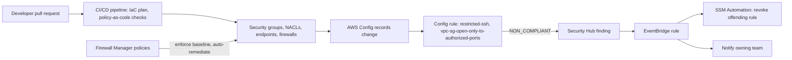

### Common Architecture Patterns

| Pattern | Description | When to use |
|---------|-------------|-------------|
| Three-tier segmentation | Public ALB, private application tier, isolated data tier with chained security groups | Almost every web workload; the baseline |
| Hub-and-spoke with inspection | Transit Gateway hub, inspection VPC with Network Firewall or GWLB appliances, spoke VPCs per workload | Many VPCs with central security requirements |
| Centralised egress | Single egress VPC with NAT and Network Firewall domain allow-lists | Regulated organisations needing egress logging and filtering |
| Centralised interface endpoints | Shared-services VPC with interface endpoints and private hosted zones | Many VPCs using the same AWS services; cost and policy consistency |
| Walled garden | VPC with no internet path, only endpoints and DNS Firewall allow-lists | Highly sensitive data processing, machine learning training on regulated data |
| Service-to-service with VPC Lattice | Services in different VPCs and accounts connected through a service network with auth policies | Microservices across account boundaries without IP connectivity |
| Bastion-less administration | Session Manager or Instance Connect Endpoint with IAM and full logging | All new designs |
| Edge-only origin | CloudFront plus WAF in front of an ALB reachable only from CloudFront | Public web applications and APIs |

### Industry Use Cases

- ==Payment processors== isolate the cardholder data environment in dedicated accounts and VPCs with explicit egress allow-lists, reducing PCI DSS audit scope to a small set of workloads.
- ==Healthcare platforms== run analytics on patient records in walled-garden VPCs with S3 access permitted only through endpoints restricted to organisation-owned buckets, satisfying data residency and exfiltration requirements.
- ==Software-as-a-service providers== use one security group per microservice and security groups for pods on EKS so that each tenant-facing service can reach only its own data stores.
- ==Financial institutions== deploy centralised inspection with third-party firewalls behind Gateway Load Balancer, reusing existing firewall expertise and licences while adopting cloud-native scaling.
- ==Universities and research institutions== replace SSH bastions for student and researcher access with Session Manager, gaining session logs and removing internet-exposed hosts.
- ==Media companies== combine CloudFront with origin-facing prefix lists so their ALBs are never reachable directly, preventing attackers from bypassing edge protection.

### Advantages

- ==Distributed enforcement.== Security groups are enforced at every ENI with no central bottleneck, so fine-grained policy scales with the fleet.
- ==Identity-based network policy.== Security group referencing and Kubernetes labels express intent rather than addresses, which remains correct under elasticity.
- ==Policy as code.== Every control is an API resource, reviewable, testable and reproducible across environments.
- ==Continuous governance.== Config, Security Hub, Firewall Manager and BPA detect and prevent drift across an organisation.
- ==Managed inspection.== Network Firewall and DNS Firewall provide IPS and domain filtering without operating appliances.
- ==Reduced attack surface.== Session Manager, Instance Connect Endpoint, VPC endpoints and CloudFront VPC origins allow designs with no inbound internet exposure except the edge.

### Limitations

- Security groups have no deny rules and no content awareness; they cannot block a single malicious address within an allowed range (use NACLs or WAF).
- Micro-segmentation increases the number of groups and rules that must be understood; without naming conventions and automation, complexity becomes its own risk.
- Egress filtering by domain is imperfect: TLS SNI can be absent or misleading, and CDNs host many unrelated domains on shared addresses.
- Centralised inspection trades governance for latency, cost and a shared failure domain.
- Some controls are regional or account-scoped, so organisation-wide consistency depends on Firewall Manager, StackSets or declarative policies.
- Security groups for pods and NetworkPolicy each have prerequisites and limits that constrain EKS cluster design.

### Common Mistakes

#### Beginner mistakes

- Assuming a private subnet cannot reach the internet, without checking for a NAT route, or assuming it cannot exfiltrate data, forgetting DNS.
- Placing application instances in public subnets with public IPs because it was the default in the wizard.
- Writing NetworkPolicy manifests on an EKS cluster where policy enforcement is not enabled, and believing the pods are protected.

#### Production mistakes

- Leaving the default "allow all outbound" rule on data tiers and application tiers that need only a few destinations.
- Deploying a centralised inspection VPC without appliance mode, producing intermittent asymmetric-routing drops.
- Creating firewall endpoints in only one AZ, making every AZ depend on it.
- Relying on security group changes to evict an attacker, not realising that tracked connections persist.
- Allowing the ALB to be reached directly from the internet while WAF is attached only to CloudFront, so attackers bypass the edge.
- Using interface endpoints with the default full-access endpoint policy, missing the chance to enforce the data perimeter.
- Making manual console changes to production security groups during incidents and never reconciling them with IaC.

### Summary

Secure VPC design turns the networking mechanics of [Chapter 1.6](../unit1/topic6.md) into a least-privilege architecture. Segmentation operates at account, VPC, subnet and workload levels; account and VPC boundaries give the strongest isolation, tiered subnets encode routing invariants, and security groups per ECS task, security groups for EKS pods and Kubernetes NetworkPolicy provide micro-segmentation. Security groups are best treated as network identities, referenced rather than enumerated, with explicit egress on sensitive tiers. Egress filtering with Network Firewall and DNS Firewall, and endpoint and bucket policies forming a data perimeter, close exfiltration paths. Session Manager and EC2 Instance Connect Endpoint remove bastion hosts. VPC Block Public Access, SCPs, Config rules, Security Hub controls and Firewall Manager keep all of this consistent across an organisation.

Architectural lessons:

- ==Draw the communication matrix first.== Every rule should correspond to a documented requirement; everything else is denied.
- ==Segment by blast radius.== Put the strongest boundaries (accounts, VPCs) around the most valuable data and the least trusted workloads.
- ==Security groups are identities.== Reference groups, one per service role, and never allow the whole VPC.
- ==Control egress deliberately.== Attackers must get data out; make that path narrow, filtered and logged, including DNS.
- ==Endpoints are enforcement points.== Endpoint and bucket policies turn private connectivity into a data perimeter.
- ==Remove inbound administration.== Session Manager and Instance Connect Endpoint are more secure and cheaper than bastions.
- ==Govern continuously.== Preventive guardrails plus continuous detection beat periodic audits.

## Network ACLs and VPC Flow Logs

### Definition

==A network ACL used as a security guardrail is a stateless, subnet-level set of numbered allow and deny rules that enforces coarse invariants and emergency containment independent of the security groups of individual workloads.==

==VPC Flow Logs is a VPC feature that captures metadata about IP traffic flowing to and from network interfaces in a VPC, a subnet or a specific ENI, and delivers aggregated flow records to Amazon CloudWatch Logs, Amazon S3 or Amazon Data Firehose.== Flow Logs record ==metadata, not payloads==: who talked to whom, on which ports and protocols, how much, when, and whether the traffic was accepted or rejected.

In the AWS architecture map, both belong to Amazon VPC. Flow Logs are also a foundational data source for the Security, Identity and Compliance services GuardDuty, Detective and Security Lake.

### Why This Service or Concept Exists

#### Why keep network ACLs when security groups exist

Security groups carry application intent and are managed by the teams that own the workloads. That is exactly why a second, independent control is valuable:

1. ==Separation of duties.== A central network or security team can own the NACLs, enforced through IAM and SCPs, while application teams own their security groups. A mistake in a team's security group cannot violate an invariant that the NACL enforces.
2. ==Explicit deny.== Security groups cannot deny. When a specific address range must be blocked across a whole subnet, for example during an attack, a NACL deny rule does it.
3. ==Immediate effect.== NACLs are stateless; they do not track connections. A new deny rule stops matching packets immediately, including packets of established connections, which is not true of removing a security group rule ([Part 8.2.1](#vpc-design-and-security-groups)).
4. ==Compliance.== Some frameworks and auditors expect a subnet-level control in addition to host-level controls, as evidence of defence in depth.

#### Why flow logs are essential security evidence

Preventive controls fail: rules are misconfigured, credentials are stolen, software has zero-day vulnerabilities. When they fail, the organisation needs answers to questions such as "which hosts did the compromised instance talk to?", "how much data left the network, and to where?", "did anyone scan us before the attack?", and "when did this traffic start?". Without flow records these questions are unanswerable, and regulators treat the absence of such logs as a failure in its own right (OWASP lists security logging and monitoring failures in its Top 10). Flow Logs exist because in a virtual network there is no physical span port or switch to tap by default; AWS provides the metadata as a managed feature that cannot be disabled from inside an instance.

### Core Concepts

#### How network ACLs evaluate traffic

A network ACL is associated with subnets (each subnet has exactly one NACL) and filters every packet that crosses the subnet boundary. Its rules are an ordered list: evaluation walks the rules in ascending rule-number order and ==stops at the first match==, whether that rule allows or denies. The implicit final rule, numbered `*`, denies everything. This first-match model is what makes deny rules meaningful: a deny at rule 90 blocks traffic that an allow at rule 100 would otherwise permit. Rules are numbered with gaps (for example 100, 200, 300) so that new rules can be inserted later without renumbering. Rule sources and destinations are CIDR blocks; unlike security group rules they cannot reference a security group. The default NACL of a VPC allows all traffic in both directions, whereas a newly created custom NACL denies everything until rules are added.

Because a NACL keeps no connection state, a rule change applies to the very next packet, including packets of established connections; this is what makes NACLs useful for containment (below). For an inbound request, the NACL is evaluated as the packet enters the subnet and before the ENI's security group; the reply passes the security group automatically but must be allowed again by the NACL's outbound rules.

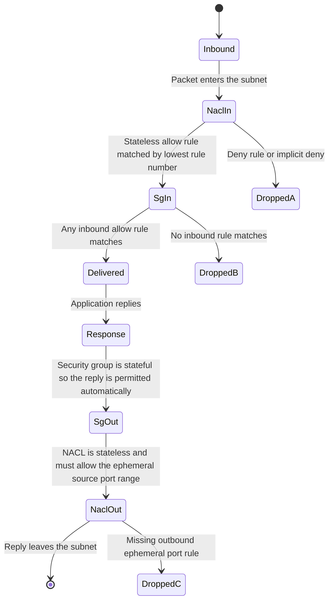

#### The ephemeral-port return path

A client connecting to a server on port 443 uses a random, short-lived, high-numbered ==ephemeral source port==. The server's reply is sourced from port 443 but ==destined== for that ephemeral port. Because NACLs are stateless, an outbound rule for port 443 does not cover the reply; the outbound rules must allow destination ports `1024-65535` (the exact range depends on the client operating system). The same applies in reverse for connections the workload initiates: responses from the remote server arrive on an ephemeral port and must be allowed inbound.

!!! danger "The classic NACL failure"
    A team adds a custom NACL allowing inbound TCP 443 and outbound TCP 443, and every HTTPS request hangs. The requests arrive, but every reply is dropped by the outbound rules because it is destined for the client's ephemeral port, not port 443. The symptom is a timeout rather than a refusal, which sends teams looking in the wrong place. This is why security groups should carry the application policy and NACLs should stay coarse.

#### Security roles of network ACLs

| Role | Example rule | Why a NACL is the right tool |
|------|--------------|------------------------------|
| Tier invariant | Data subnets deny all traffic to and from `0.0.0.0/0` except the application subnets' CIDRs | Holds even if a workload security group is misconfigured |
| Deny list | Deny inbound from a CIDR identified as attacking | Security groups cannot deny |
| Protocol guardrail | Deny inbound TCP 22 and 3389 from `0.0.0.0/0` on every subnet | Enforces the "no internet administration" policy centrally |
| Quarantine | Replace the subnet's NACL with one that denies everything except a forensics host | Stops established connections immediately |
| Environment separation | Deny traffic from non-production CIDRs to production subnets | Protects against routing mistakes in shared networks |

What NACLs should not be used for: expressing per-service application policy (security groups do this with identity and statefulness), blocking large or frequently changing sets of addresses (the rule quota is small; use WAF IP sets, Network Firewall or Shield), or filtering by domain or content.

#### Designing NACL deny lists

Because rules are evaluated from the lowest number and the first match wins, deny rules must be numbered ==below== the allow rules they override. A practical numbering convention reserves ranges:

| Rule number range | Purpose |
|-------------------|---------|
| 1 to 49 | Emergency deny rules added during incidents |
| 50 to 99 | Standing deny list of known-bad ranges |
| 100 to 899 | Allow rules for the subnet's legitimate traffic |
| 900 to 999 | Explicit catch-all deny with a description, for readability |
| `*` | Implicit final deny, always present |

!!! warning "Stateless means both directions"
    A deny rule on inbound traffic from an attacker's CIDR stops their requests. If the attacker is instead the ==destination== of outbound connections, for example a command-and-control server, the deny must be on the outbound rules. For full isolation of a CIDR, add deny rules in both directions. Remember also that the ephemeral-port rules described above must remain in place for legitimate return traffic.

#### Quarantine and incident containment

When GuardDuty reports that an instance is communicating with a known command-and-control server, the responder has two goals that conflict: stop the harm immediately, and preserve evidence for investigation. A standard containment runbook uses both security groups and NACLs:

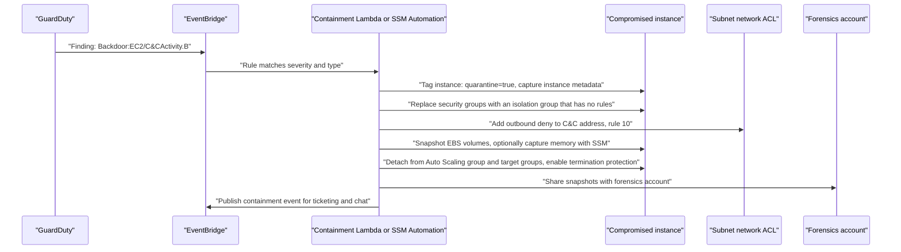

The isolation security group stops new connections; the NACL deny, being stateless, cuts off any established tracked connections to the attacker's address at once. If the entire subnet is suspected, for example an application subnet containing only the affected Auto Scaling group, the responder can associate a pre-built ==quarantine NACL== with the subnet, which denies everything except traffic to and from a forensics subnet.

!!! danger "Containment has side effects"
    A NACL applies to every ENI in the subnet, including load balancer nodes, interface endpoints, NAT gateways and other services that happen to share it. Quarantining a shared subnet can cause a wider outage than the incident. This is a strong argument for subnet designs that separate workloads by function, and for responders to prefer per-instance isolation security groups plus targeted NACL deny rules over whole-subnet quarantine, unless the subnet is dedicated to the compromised workload.

#### Flow Log scope and delivery

| Choice | Options | Security guidance |
|--------|---------|-------------------|
| Resource | VPC, subnet, ENI, Transit Gateway, Transit Gateway attachment | VPC-level in every VPC as a baseline; Transit Gateway flow logs for inter-VPC visibility |
| Traffic type | `ACCEPT`, `REJECT`, `ALL` | `ALL`: rejects reveal scanning, accepts reveal what actually happened |
| Aggregation interval | 60 seconds or 600 seconds | 60 seconds for security-sensitive VPCs, to shorten detection and improve timeline precision |
| Destination | CloudWatch Logs, S3, Data Firehose | S3 in the log archive account for retention and Athena; CloudWatch Logs for short-term alerting; Firehose for streaming to a SIEM |
| File format (S3) | Plain text or Apache Parquet, optional Hive-compatible prefixes and hourly partitions | Parquet with hourly partitions for fast, cheap Athena queries |
| Record format | Default or custom field list | Custom format with the security fields listed below |

#### Security-relevant Flow Log fields

The default format contains the version 2 fields: `version`, `account-id`, `interface-id`, `srcaddr`, `dstaddr`, `srcport`, `dstport`, `protocol`, `packets`, `bytes`, `start`, `end`, `action` (`ACCEPT` or `REJECT`) and `log-status`. These answer who talked to whom, on which ports, how much, when, and whether the traffic was allowed; repeated `REJECT` records to a database port, for example, indicate either a misconfiguration or a probe. For security, a custom format should add fields from later versions:

| Field | Version | Security use |
|-------|---------|--------------|
| `vpc-id`, `subnet-id`, `instance-id` | 3 | Attribute flows to resources without joining against inventory |
| `tcp-flags` | 3 | Distinguish connection attempts from established sessions; detect SYN scans |
| `type` | 3 | IPv4, IPv6 or EFA traffic |
| `pkt-srcaddr`, `pkt-dstaddr` | 3 | Original packet addresses through NAT gateways and load balancers, identifying the true internal host behind a NAT |
| `region`, `az-id` | 4 | Multi-Region correlation and AZ-level analysis |
| `pkt-src-aws-service`, `pkt-dst-aws-service` | 5 | Identify traffic to AWS services by name, for example `S3` or `EC2` |
| `flow-direction` | 5 | `ingress` or `egress` relative to the interface; essential for exfiltration analysis |
| ECS fields such as `ecs-cluster-name`, `ecs-service-name`, `ecs-task-id` | 7 | Attribute flows to ECS services and tasks in `awsvpc` mode |

!!! note "Understanding tcp-flags"
    The `tcp-flags` field is the bitwise OR of the TCP flags seen in the aggregation interval: FIN is 1, SYN is 2, RST is 4, PSH is 8, ACK is 16, and SYN-ACK is therefore 18. Only SYN, FIN, RST and SYN-ACK are reliably reported. A record with value 2 and no corresponding response, repeated across many destination ports, is a strong indicator of a SYN scan. Values combining SYN with FIN (3) or SYN-ACK with FIN (19) indicate short-lived connections that opened and closed within one interval.

#### What Flow Logs do not capture

Flow Logs deliberately omit some traffic, and a security analyst must know the gaps:

- Traffic to the Amazon-provided DNS server (Route 53 Resolver); use ==Resolver query logs== instead.
- Instance metadata service traffic to `169.254.169.254` and Amazon Time Sync traffic.
- DHCP traffic, and traffic to the reserved VPC router address.
- Windows license activation traffic to AWS.
- Traffic mirrored by Traffic Mirroring.
- Packet contents: payloads, HTTP paths, TLS server names; use Network Firewall logs, WAF logs or Traffic Mirroring when content matters.

#### From flow logs to threat detection

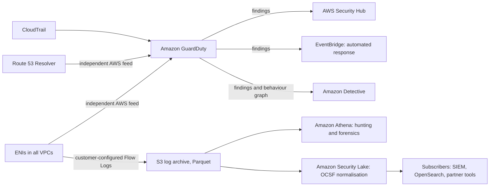

==Amazon GuardDuty== is a managed threat detection service that analyses foundational data sources: CloudTrail management events, VPC Flow Logs and Route 53 Resolver DNS query logs, plus optional protection plans (S3, EKS audit logs, Runtime Monitoring for EC2, ECS and EKS, RDS login activity, Lambda network activity, Malware Protection). Crucially, GuardDuty ==obtains flow log and DNS data through an independent, duplicated stream== directly from AWS; you do not need to enable Flow Logs for GuardDuty to work, and disabling your flow logs does not blind GuardDuty. It uses threat intelligence, machine learning and anomaly detection to produce findings, and its extended threat detection correlates multiple signals into attack sequence findings.

Examples of network-derived GuardDuty findings:

| Finding type | What it indicates |
|--------------|-------------------|
| `Recon:EC2/Portscan` | An instance is scanning ports on other hosts; it may be compromised |
| `Recon:EC2/PortProbeUnprotectedPort` | An unprotected port on your instance is being probed from the internet |
| `UnauthorizedAccess:EC2/SSHBruteForce` | SSH brute-force attempts involving your instance |
| `Backdoor:EC2/C&CActivity.B` | Communication with a known command-and-control IP |
| `Trojan:EC2/DNSDataExfiltration` | Data exfiltration through DNS queries |
| `CryptoCurrency:EC2/BitcoinTool.B` | Communication with cryptocurrency mining infrastructure |
| `Behavior:EC2/TrafficVolumeUnusual` | Unusually large outbound traffic volume to a remote host |
| `Behavior:EC2/NetworkPortUnusual` | Communication on a port the instance does not normally use |

==Amazon Detective== ingests GuardDuty findings, VPC Flow Logs, CloudTrail and EKS audit logs into a ==behaviour graph== and provides visualisations that let an investigator pivot from a finding to the instance's normal and abnormal traffic, the IP addresses involved and the related API activity. Detective answers "what else did this entity do?", which is slow and error-prone to reconstruct by hand.

==Amazon Security Lake== centralises security data from AWS sources (CloudTrail, VPC Flow Logs, Route 53 Resolver logs, Security Hub findings, EKS audit logs, WAF logs and others) and third-party sources into an S3-based data lake in a delegated administrator account, normalised to the ==Open Cybersecurity Schema Framework (OCSF)== in Parquet. Subscribers such as SIEM tools query or receive the data. Security Lake removes the need for each tool to parse each log format differently.

==Traffic Mirroring== copies actual packets from the ENI of a Nitro-based instance to a mirror target (another ENI, a Network Load Balancer or a Gateway Load Balancer endpoint), encapsulated in VXLAN on UDP port 4789, according to a ==mirror filter==. It provides full packet capture for intrusion detection systems and forensic analysis, at the cost of per-session charges and doubled traffic. Use it selectively, for specific suspect workloads or high-value segments, not as a default.

| Need | Flow Logs | Traffic Mirroring | Network Firewall logs | Resolver query logs |
|------|-----------|-------------------|-----------------------|---------------------|
| Who talked to whom, how much | Yes | Yes | Yes, for inspected traffic | No |
| Domain names | No | Yes, if unencrypted DNS or visible SNI | Yes, SNI and Host | Yes |
| Payload content | No | Yes | Partial, with TLS inspection | No |
| Always-on, low cost | Yes | No | Moderate | Yes |
| Coverage | Whole VPC | Selected ENIs | Inspected paths only | All Resolver queries |

### AWS Service Deep Dive

#### Purpose

Network ACLs provide stateless subnet guardrails and containment. VPC Flow Logs provide durable, tamper-resistant flow metadata for detection, investigation, compliance and cost analysis. GuardDuty, Detective and Security Lake turn that metadata into findings, investigations and a unified security data lake.

#### Architecture

NACLs are evaluated by the VPC's distributed data plane at the subnet boundary; there is no appliance. Flow Logs are generated by the same data plane, aggregated per interface over the chosen interval, and delivered asynchronously by the service to the destination. Delivery to S3 or CloudWatch Logs in another account is supported through destination policies, which is the basis for log archive designs.

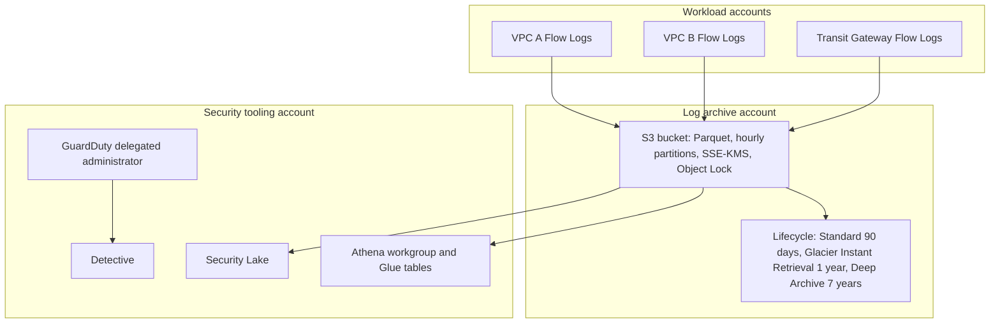

#### Important Features

| Feature | Security value |
|---------|----------------|
| Custom Flow Log formats | Add `tcp-flags`, `pkt-*addr`, `flow-direction`, `traffic-path`, ECS fields and `reject-reason` |
| Parquet with Hive-compatible, hourly partitions | Query only relevant hours with Athena; lower cost and latency |
| Cross-account delivery | Logs land in an account the workload owner cannot modify |
| Transit Gateway Flow Logs | Visibility of inter-VPC and hybrid traffic at the hub |
| NACL numbered rules with deny | Deterministic emergency blocking |
| Firewall Manager NACL policies | Organisation-wide baseline NACL rules; verify current support and behaviour |
| GuardDuty independent data streams | Detection works even if the customer does not enable Flow Logs |
| Detective behaviour graph | Months of history for investigation without manual joins |
| Security Lake OCSF | One schema across AWS and third-party sources |

#### Pricing Model and recommendations

| Item | Basis | Recommendation |
|------|-------|----------------|
| NACLs | No charge | Use for guardrails and containment |
| Flow Logs to CloudWatch Logs | Vended log ingestion per GB (tiered) plus storage | Use for short retention and alerting only |
| Flow Logs to S3 | Vended log delivery per GB (tiered), plus optional Parquet conversion per GB, plus S3 storage | Default for security retention; lower cost than CloudWatch Logs |
| Flow Logs to Firehose | Vended delivery per GB plus Firehose charges | Use when streaming to a SIEM |
| Athena | Per TB scanned | Parquet and partitions reduce scanned data dramatically |
| GuardDuty | Per GB of flow and DNS logs analysed and per million CloudTrail events, with volume tiers; protection plans charged separately | Enable in all accounts and Regions; 30-day free trial per account |
| Detective | Per GB ingested into the behaviour graph | Enable for accounts where investigation depth matters |
| Security Lake | Per GB ingested and normalised, plus S3 storage | Worth it when multiple consumers need normalised data |
| Traffic Mirroring | Per ENI mirror session hour, plus target costs | Selective use only |

!!! warning "Verify pricing"
    Vended log, GuardDuty, Detective and Security Lake prices vary by Region and volume tier and change over time. Verify on the AWS pricing pages and estimate with the AWS Pricing Calculator.

#### Performance, Scaling, Availability and Security

NACL evaluation adds no measurable latency, and Flow Log generation happens in the VPC data plane outside the instance, with no effect on throughput. Flow Logs scale automatically with interfaces and traffic; the architect scales the downstream through partitioning, lifecycle rules and the aggregation interval. Delivery is best effort: the `log-status` field reports `NODATA` or `SKIPDATA` when records could not be captured, so regulated environments should alarm on delivery gaps. Flow Log creation and deletion are CloudTrail-logged and can be prevented with SCPs; destinations can be encrypted with SSE-KMS ([Section 8.3](../unit8/topic3.md)), restricted to the log delivery service and made immutable with S3 Object Lock.

#### Service Limits

| Quota | Approximate default | Where to verify |
|-------|---------------------|-----------------|
| NACLs per VPC | 200 | Service Quotas, Amazon VPC |
| Rules per NACL per direction | 20, adjustable to 40 | Service Quotas, Amazon VPC |
| Flow logs per resource | A small number per ENI, subnet or VPC | Amazon VPC documentation |
| GuardDuty detectors | One per account per Region | GuardDuty documentation |
| GuardDuty trusted IP lists and threat lists | Small numbers per detector | Service Quotas, GuardDuty |

### Important AWS Terminology

| Term | Meaning |
|------|---------|
| Quarantine NACL | Pre-built NACL denying all traffic except to forensics resources, associated with a subnet during an incident |
| Tracked and untracked connections | Flows whose state is tracked by the security group engine, and flows permitted by fully open rules that are not tracked |
| Aggregation interval | Period over which packets of a flow are summarised into one flow log record, 60 or 600 seconds |
| Finding | GuardDuty result describing a potential security issue, with type, severity, resource and evidence |
| Suppression rule | GuardDuty filter that automatically archives expected findings |
| Behaviour graph | Detective's linked data model of entities and their interactions over time |
| OCSF | Open Cybersecurity Schema Framework, the vendor-neutral schema used by Security Lake |
| Mirror session, filter, target | Traffic Mirroring objects defining which packets from which ENI are copied to which destination |
| Log archive account | Dedicated account receiving immutable copies of security logs |

### Design Considerations

| Dimension | Consideration |
|-----------|---------------|
| Scalability | NACL rule quotas limit deny lists; use WAF IP sets or Network Firewall for large or dynamic lists |
| Availability | Containment actions must not take down shared infrastructure; separate subnets by function so NACL changes have predictable scope |
| Reliability | Monitor Flow Log delivery; alert on `SKIPDATA` and missing partitions |
| Durability | S3 with Object Lock and replication for regulatory retention |
| Latency | Detection latency equals aggregation interval plus delivery delay plus query or detector processing; choose 60 s where it matters |
| Cost | Parquet, partitioning, lifecycle to colder storage and selective custom fields control cost |
| Performance | Query with partition predicates; pre-aggregate common views with scheduled Athena queries or Security Lake |
| Maintainability | Standard custom formats across the organisation so queries work everywhere |
| Operational complexity | Tested runbooks for containment; automation for common findings; human approval for high-impact actions |

### AWS Best Practices

| Pillar | Practice |
|--------|----------|
| Operational Excellence | Codify NACLs, flow logs and GuardDuty configuration; maintain and rehearse containment runbooks (game days) |
| Security | Enable Flow Logs for all VPCs (Security Hub control EC2.6), GuardDuty everywhere, logs in a protected archive, SCPs preventing deletion |
| Reliability | Monitor log delivery; keep containment tooling independent of the affected account's resources |
| Performance Efficiency | Parquet and partitions; pre-aggregation; Detective for investigation instead of ad hoc queries |
| Cost Optimisation | S3 over CloudWatch Logs for bulk retention; lifecycle policies; enable Detective and Traffic Mirroring selectively |
| Sustainability | Store only fields you query; expire logs after the required retention period |

### Security Considerations

- ==IAM.== Restrict `ec2:CreateNetworkAclEntry`, `ec2:ReplaceNetworkAclAssociation` and `ec2:DeleteFlowLogs` to network, security and incident-response roles. Deny `ec2:DeleteFlowLogs`, `logs:DeleteLogGroup` on flow log groups, and `guardduty:DeleteDetector` or `guardduty:DisassociateFromAdministratorAccount` with SCPs.
- ==Least privilege for analysts.== Analysts need read access to the log archive through Athena workgroups and Lake Formation permissions, not write access.
- ==Encryption and KMS.== Encrypt log buckets with SSE-KMS keys whose key policies allow the delivery service to encrypt and restrict decryption to analyst roles ([Section 8.3](../unit8/topic3.md)).
- ==Integrity.== S3 Object Lock in compliance mode for regulated retention prevents deletion even by administrators.
- ==Privacy.== Flow Logs contain IP addresses, which may be personal data under laws such as the GDPR; define retention and access accordingly.
- ==Compliance.== PCI DSS, ISO 27001 and similar frameworks require network logging, log protection and log review; GuardDuty, Security Hub and documented Athena hunting queries provide evidence.

### Integration with Other AWS Services

| Service | Integration | Purpose |
|---------|-------------|---------|
| Amazon Athena and AWS Glue | Tables over Flow Log data in S3 | Threat hunting, forensics, compliance reports |
| CloudWatch Logs and Logs Insights | Flow Logs destination | Near-real-time queries and metric filters ([Section 7.2](../unit7/topic2.md)) |
| Amazon OpenSearch Service | Ingestion through Firehose | Dashboards and SIEM-like search ([Section 7.2](../unit7/topic2.md)) |
| Amazon GuardDuty | Independent flow and DNS log analysis | Managed threat detection |
| Amazon Detective | Behaviour graph | Investigation |
| AWS Security Hub | Aggregates GuardDuty, Config and control findings | Posture and prioritisation |
| Amazon Security Lake | OCSF normalisation | Centralised security data lake |
| Amazon EventBridge and Lambda or SSM Automation | Finding-driven containment | Automated incident response ([Chapter 7.3](../unit7/topic3.md)) |
| AWS Network Firewall and DNS Firewall | Complementary logs | Content and domain context for flows |

### Common Architecture Patterns

| Pattern | Description |
|---------|-------------|
| Centralised network log archive | All accounts deliver Flow Logs, Transit Gateway Flow Logs, Resolver query logs and firewall logs to one immutable S3 archive |
| Detect, contain, investigate | GuardDuty finding, EventBridge rule, automated isolation with security group and NACL, snapshot, Detective investigation |
| Hunting as code | Version-controlled Athena queries run on a schedule, with results over threshold published as Security Hub findings |
| Tiered log storage | Hot in CloudWatch Logs for days, warm in S3 Standard for months, cold in archive classes for years |
| Normalised security lake | Security Lake with OCSF feeding a SIEM and ad hoc Athena queries |
| Selective packet capture | Traffic Mirroring activated by automation only for instances under investigation |

### Industry Use Cases

- ==Banks== retain Flow Logs for multiple years with Object Lock to satisfy regulators and use Athena hunting queries to evidence continuous monitoring.
- ==E-commerce companies== automate containment of instances flagged by GuardDuty for cryptocurrency mining, one of the most common post-compromise activities.
- ==Managed security service providers== consume Security Lake data from customer organisations in OCSF, avoiding a separate parser for each AWS log type.
- ==Telecommunications providers== use Transit Gateway Flow Logs to understand and secure traffic among hundreds of VPCs and on-premises networks.
- ==Incident response teams== use Traffic Mirroring temporarily on suspect workloads to capture packets for malware analysis.
- ==Universities== use Flow Logs in teaching and research environments to detect compromised student instances used for scanning.

### Advantages

- ==Independent guardrails.== NACLs enforce invariants that application teams cannot override.
- ==Immediate containment.== Stateless deny rules stop even established connections.
- ==Agentless, tamper-resistant telemetry.== Flow Logs are produced outside the instance and can be delivered to another account.
- ==Rich context.== Custom fields attribute flows to subnets, instances, ECS tasks and AWS services, and explain paths and rejections.
- ==Managed detection.== GuardDuty analyses network and DNS telemetry without customers building detection pipelines.
- ==Scalable analytics.== Athena, Security Lake and Detective scale from one VPC to an entire organisation.

### Limitations

- NACL quotas and statelessness make them unsuitable for detailed or dynamic policy.
- Flow Logs lack payloads and domain names, and arrive minutes after the traffic.
- Large estates generate high log volumes, and costs scale linearly with traffic.
- GuardDuty findings require triage; without tuning and automation they can overwhelm teams.
- Traffic Mirroring is limited to supported instance types and adds cost and bandwidth consumption.

### Common Mistakes

#### Beginner mistakes

- Using NACLs to express application policy and breaking return traffic by forgetting ephemeral ports.
- Adding a deny rule with a higher number than the allow rule it was meant to override, so it never matches.
- Enabling Flow Logs with `REJECT` only, then being unable to reconstruct what an attacker did successfully.
- Assuming Flow Logs show DNS queries or HTTP URLs.
- Believing GuardDuty requires Flow Logs to be enabled, or that disabling Flow Logs disables GuardDuty's network analysis.

#### Production mistakes

- Storing Flow Logs in the same account as the workload, where an attacker with administrator access can delete them.
- Using plain text files without partitions, making every investigation query slow and expensive.
- Quarantining a shared subnet and taking down unrelated services, NAT gateways or endpoints.
- Enabling GuardDuty in only the "used" Regions, leaving other Regions unmonitored for attacker activity.
- Having no rehearsed containment runbook, so the first real incident is also the first test of the automation.
- Keeping logs forever without a retention policy, creating cost and privacy liabilities.

### Summary

Network ACLs are the stateless, subnet-level complement to security groups. Their security value lies in ==independent guardrails== owned by a central team, ==explicit deny== for known-bad ranges, and ==immediate containment==, because a stateless deny stops even established connections. They are the wrong tool for application policy or large dynamic block lists. VPC Flow Logs provide agentless, tamper-resistant metadata about every flow. Custom formats add the fields that make security analysis possible, Parquet and partitions make Athena hunting fast and cheap, and delivery to an immutable log archive protects the evidence. GuardDuty analyses network and DNS telemetry independently to produce findings, Detective supports investigation, Security Lake normalises data to OCSF, and Traffic Mirroring captures packets when metadata is not enough.

Architectural lessons:

- ==Separate guardrails from intent.== Security groups express what teams need; NACLs and SCPs express what must never happen.
- ==Design for containment before the incident.== Reserved rule ranges, isolation groups, dedicated subnets and rehearsed runbooks make containment fast and safe.
- ==Log everything, protect the logs.== `ALL` traffic, 60-second intervals where it matters, custom fields, and an archive the workload account cannot touch.
- ==Detection is layered too.== Managed detection (GuardDuty), structured hunting (Athena), investigation (Detective) and normalisation (Security Lake) serve different needs.
- ==Metadata first, packets when necessary.== Flow Logs cover everything cheaply; Traffic Mirroring is a targeted instrument.

## AWS WAF and Shield for Application Protection

### Definition

==AWS WAF is a managed web application firewall that inspects HTTP and HTTPS requests forwarded by integrated AWS services and allows, blocks, counts or challenges each request according to the rules in a web access control list (web ACL).== WAF operates at layer 7 and sees the request line, headers, cookies, query string, body, client IP address and TLS fingerprint.

==AWS Shield is a managed distributed denial of service (DDoS) protection service.== ==Shield Standard== is automatically applied at no extra charge to all AWS customers and protects against the most common network and transport layer attacks. ==Shield Advanced== is a paid subscription adding enhanced detection and mitigation for specific protected resources, application-layer DDoS mitigation integrated with WAF, access to the Shield Response Team, cost protection and visibility.

WAF can be associated with the following resource types (verify the current list, which grows over time):

| Resource | Scope | Notes |
|----------|-------|-------|
| Amazon CloudFront distribution | Global (web ACL created in `us-east-1` with CloudFront scope) | Preferred: blocks at the edge before traffic reaches the Region |
| Application Load Balancer | Regional | Regional workloads, or as a second layer behind CloudFront |
| Amazon API Gateway REST API stage | Regional | HTTP APIs do not support WAF directly; front them with CloudFront plus WAF |
| AWS AppSync GraphQL API | Regional | GraphQL-specific rules via body inspection |
| Amazon Cognito user pool | Regional | Protects sign-in and sign-up endpoints from abuse |
| AWS App Runner service | Regional | Managed container web services |
| AWS Verified Access instance | Regional | Protects zero trust access to internal applications |
| AWS Amplify hosted applications | Global, through CloudFront | Verify current support |

WAF does ==not== attach to Network Load Balancers, Classic Load Balancers, EC2 instances directly or API Gateway HTTP and WebSocket APIs.

### Why This Service or Concept Exists

#### The problem: attacks that look like traffic

Security groups can allow only port 443 to a load balancer, but port 443 is where every legitimate user and every attacker arrives. Once port 443 is open, network controls cannot distinguish:

- a customer searching for "blue shoes" from an attacker sending `' OR 1=1 --`,
- a customer logging in from a botnet trying a million leaked username and password pairs (credential stuffing),
- a shopper viewing products from a scraper copying the entire catalogue,
- a real traffic spike from an HTTP flood designed to exhaust application capacity.

Fixing vulnerabilities in code remains the primary defence, but organisations run large portfolios of applications, third-party components and legacy systems, and new vulnerabilities (for example the Log4j `JNDI` injection of 2021) appear faster than every application can be patched. A web application firewall provides a ==shared, centrally updated layer== that can block exploit attempts within hours of disclosure, buy time for patching, and absorb automated abuse that no single application should need to handle.

#### The problem: attacks larger than the application

A DDoS attack aims to exhaust a resource: network bandwidth, connection tables, CPU or application threads. Volumetric attacks now regularly reach terabits per second and hundreds of millions of packets per second, far beyond any single organisation's capacity. Defending against them requires ==capacity and scrubbing at the scale of a global network==, which is why DDoS protection is a service rather than a product. AWS operates that capacity across its edge locations and Regions and provides it to customers through Shield.

### Core Concepts

#### The OWASP Top 10 and what WAF can and cannot do

The OWASP Top 10 is a widely used awareness document listing the most critical web application security risks. The 2021 edition is shown below; OWASP publishes revisions periodically (a newer edition reorganises several categories), so verify the current list at owasp.org.

| OWASP category (2021) | Can WAF help? | How WAF helps | What else is required |
|-----------------------|---------------|---------------|-----------------------|
| A01 Broken Access Control | Partly | Block access to admin paths (Admin protection rule group), enforce geo or IP restrictions on sensitive paths | Correct authorisation in code and API ([Section 8.1](../unit8/topic1.md)) |
| A02 Cryptographic Failures | Minimal | None directly | TLS, KMS encryption, key management ([Section 8.3](../unit8/topic3.md)) |
| A03 Injection | Yes | SQL database rule group, Core rule set cross-site scripting rules, Known bad inputs, custom string and regex match | Parameterised queries, output encoding |
| A04 Insecure Design | No | Rate-based rules can limit abuse of flawed flows | Threat modelling and secure design |
| A05 Security Misconfiguration | Partly | Block common probes for exposed files and admin consoles | Configuration management, Config rules |
| A06 Vulnerable and Outdated Components | Partly, as virtual patching | Known bad inputs (for example Log4j), OS and platform rule groups | Patching, dependency scanning (Amazon Inspector) |
| A07 Identification and Authentication Failures | Yes, for automated attacks | Account Takeover Prevention, Account Creation Fraud Prevention, rate-based rules on login | Multi-factor authentication, strong session management |
| A08 Software and Data Integrity Failures | Minimal | None directly | Signed artefacts, CI/CD integrity ([Chapter 5.2](../unit5/topic2.md)) |
| A09 Security Logging and Monitoring Failures | Contributes | WAF logs and metrics provide evidence and detection | Centralised logging and alerting ([Unit VII](../unit7/overview.md)) |
| A10 Server-Side Request Forgery | Partly | Rules blocking internal addresses and metadata endpoints in parameters | IMDSv2, egress controls ([Part 8.2.1](#vpc-design-and-security-groups)), input validation |

!!! warning "A WAF is not a substitute for secure code"
    WAF rules are pattern-based and can be bypassed by sufficiently creative encoding, and business-logic flaws (for example changing an order identifier in a URL to view another customer's order) look like perfectly normal requests. Treat WAF as ==defence in depth and virtual patching==, never as permission to leave vulnerabilities in the application.

#### Anatomy of a web ACL

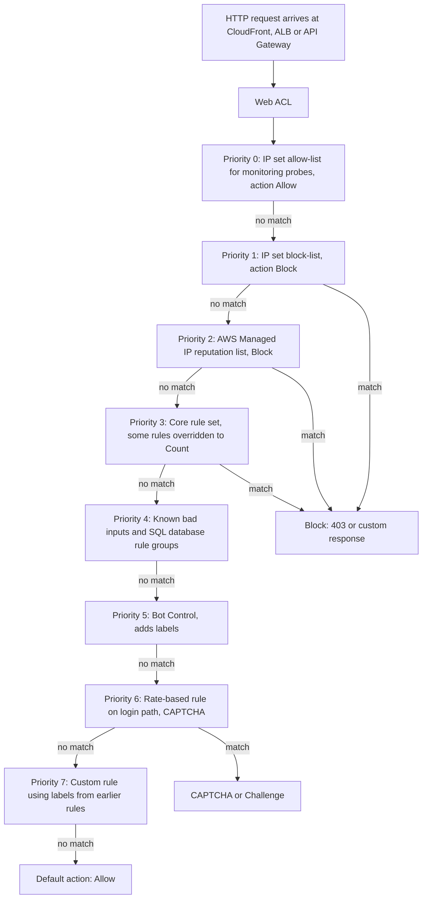

| Concept | Explanation |
|---------|-------------|
| Web ACL | The top-level resource associated with protected resources; contains rules and a default action |
| Rule | A statement plus an action; evaluated in priority order (lowest number first) |
| Statement | Match condition: string match, regex, size constraint, SQLi or XSS detection, IP set, geo match, label match, rate-based, logical `AND`, `OR`, `NOT` |
| Rule group | A reusable set of rules: AWS managed, AWS Marketplace, or customer-owned |
| Terminating actions | `Allow`, `Block`, `CAPTCHA` and `Challenge` (the last two terminate if the client has no valid token) stop evaluation |
| Non-terminating action | `Count` records a match, adds labels and continues evaluation |
| Default action | Applied when no rule terminates evaluation: `Allow` for most public sites (block-list model), `Block` for allow-list models |
| Labels | Metadata strings added by rules when they match, such as `awswaf:managed:aws:bot-control:bot:category:search_engine`; later rules can match on labels |
| Scope-down statement | A filter limiting which requests a managed rule group or rate-based rule evaluates |
| Rule action override | Changing a managed rule's action, for example to `Count`, without editing the group |
| Custom responses | Custom status code, headers and body for `Block` responses |
| Token domain | Domains for which WAF CAPTCHA and challenge tokens are accepted |

#### Web ACL capacity units

Every rule consumes ==web ACL capacity units (WCUs)== reflecting its processing cost. Simple IP set rules cost little; regex pattern sets and text transformations cost more; managed rule groups have fixed published capacities (for example the Core rule set is several hundred WCUs). A web ACL includes a base capacity (1,500 WCUs at the time of writing) in its standard price; web ACLs can exceed it up to a higher maximum at additional cost per request. Verify the current base, maximum and pricing, because these have changed.

#### Request inspection limits

WAF inspects the request body only up to a limit: by default 8 KB for ALB and AppSync, and 16 KB for CloudFront, API Gateway, Cognito, App Runner and Verified Access, with the option to raise the CloudFront-family limit in increments at extra cost. Each rule specifies ==oversize handling==: `CONTINUE` (inspect what is available), `MATCH` or `NO_MATCH`. Attackers can pad a malicious payload beyond the inspected size, so rules for sensitive endpoints should treat oversize bodies as a match or use a size constraint rule to block bodies larger than the application expects.

#### AWS Managed Rules

| Rule group | Protects against | Typical use |
|------------|------------------|-------------|
| Core rule set (`AWSManagedRulesCommonRuleSet`) | Broad OWASP-style attacks: XSS, path traversal, oversized requests, bad bots user agents, SSRF indicators | Baseline for every web ACL |
| Admin protection | Access to exposed administrative pages | Public applications with admin paths |
| Known bad inputs (`AWSManagedRulesKnownBadInputsRuleSet`) | Request patterns known to be invalid and associated with exploitation, including Log4j JNDI lookups | Baseline for every web ACL |
| SQL database (`AWSManagedRulesSQLiRuleSet`) | SQL injection | Any application with a relational back end |
| Linux, POSIX, Windows, PHP, WordPress | Platform-specific exploits such as local file inclusion or command injection | Applications on those platforms |
| Amazon IP reputation list | IPs associated with bots, reconnaissance and DDoS, from Amazon threat intelligence | Baseline |
| Anonymous IP list | VPNs, proxies, Tor, hosting providers | Applications where anonymous access indicates fraud risk; often Count plus labels |
| Bot Control | Common bots (self-identifying crawlers, scrapers, HTTP libraries) at the common level; sophisticated bots through browser interrogation, fingerprinting and behavioural analysis at the targeted level | Scraping and automation abuse; verified bots such as search engines can be allowed by label |
| Account Takeover Prevention (ATP) | Credential stuffing and brute force on the login endpoint; checks credentials against a stolen credential database and monitors login response rates | Consumer login pages |
| Account Creation Fraud Prevention (ACFP) | Fake account creation on the registration endpoint | Sign-up flows abused for promotions or spam |
| Anti-DDoS rule group | Application-layer DDoS detection and mitigation based on traffic baselines | Web ACLs that need automatic layer 7 DDoS response; verify availability |

Bot Control, ATP and ACFP are ==intelligent threat mitigation== rule groups with additional subscription and per-request charges. ATP and ACFP work best with the ==WAF client application integration== SDKs (JavaScript or mobile), which obtain tokens that prove a real client executed the challenge.

#### Rate-based rules

A rate-based rule counts requests per ==aggregation key== over an ==evaluation window== and applies its action to keys that exceed a limit, until their rate falls below the limit again.

| Setting | Options | Guidance |
|---------|---------|----------|
| Evaluation window | 1, 2, 5 or 10 minutes | Shorter windows react faster; longer windows smooth bursts |
| Limit | Minimum 10 requests per window | Derive from real traffic: measure the 99th percentile per key in Count mode, then add a margin |
| Scope-down | Any statement | Separate, stricter limits for `/login`, `/search`, `/api/checkout` |
| Action | Block, Count, CAPTCHA, Challenge, custom response with `429` | `429 Too Many Requests` with `Retry-After` is friendlier for API clients |

!!! note "Rate limiting at several layers"
    [Chapter 4.2](../unit4/topic2.md) described API Gateway throttling and usage plans, and [Chapter 4.3](../unit4/topic3.md) described load shedding. These are complementary. WAF rate-based rules stop abusive clients ==before== they consume API Gateway or application capacity and are keyed on network and request characteristics; API Gateway usage plans enforce ==per-customer contractual quotas== keyed on API keys; application-level limits enforce business rules. A robust design uses WAF for abuse, API Gateway for tenancy and the application for business logic.

#### CAPTCHA and Challenge

The `CAPTCHA` action presents a puzzle to the client; the `Challenge` action runs a silent browser interrogation. Both issue a ==token== stored in a cookie with a configurable ==immunity time==; subsequent requests with a valid token pass without another challenge. `Challenge` is invisible to humans in real browsers and suits suspicious-but-uncertain traffic; `CAPTCHA` adds friction and suits high-risk actions such as repeated failed logins. Neither works for non-browser API clients, which should receive `Block` or `429` instead.

#### Safe rollout with Count mode and labels

A new WAF rule that blocks legitimate traffic is itself an outage. The standard rollout process is:

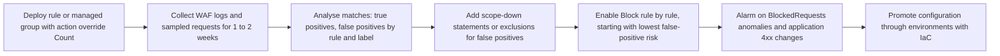

Labels make exclusions precise. For example, instead of disabling the Core rule set's `SizeRestrictions_BODY` rule entirely because a file upload endpoint legitimately sends large bodies, override that rule to `Count` and add a custom rule that blocks requests carrying its label ==unless== the path is `/api/uploads`. The rule still protects every other path.

#### AWS Shield: DDoS across layers

| Attack layer | Examples | Protection |
|--------------|----------|------------|
| Layer 3 (network) | UDP reflection and amplification (DNS, NTP, memcached, SSDP), ICMP floods, IP fragment floods | Shield Standard at all AWS edge locations and Regions; CloudFront and Route 53 anycast absorb globally |
| Layer 4 (transport) | SYN floods, ACK floods, TCP connection exhaustion | Shield Standard; SYN cookies and inline mitigation; security groups limit exposed ports |
| Layer 7 (application) | HTTP GET or POST floods, cache-busting query strings, slow request attacks, expensive search requests | AWS WAF rate-based rules and Anti-DDoS rule group; CloudFront caching; Shield Advanced automatic application-layer mitigation; auto scaling |

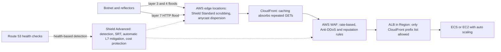

#### Shield Standard versus Shield Advanced

| Capability | Shield Standard | Shield Advanced |
|------------|-----------------|-----------------|
| Cost | Included for all customers | Monthly subscription per organisation (approximately USD 3,000 per month with a one-year commitment) plus data transfer out usage fees; verify current pricing |
| Resources | All AWS resources, strongest at CloudFront, Route 53 and Global Accelerator | Explicitly protected: CloudFront distributions, Route 53 hosted zones, Global Accelerator accelerators, ALBs, Classic Load Balancers, Elastic IP addresses (covering EC2 and NLB) |
| Layer 3 and 4 detection and mitigation | Automatic, common attacks | Enhanced, resource-specific baselines, faster detection, additional mitigations for Elastic IPs and Global Accelerator |
| Layer 7 mitigation | Customer-configured WAF | Automatic application-layer DDoS mitigation that creates and manages WAF rules in the protected resource's web ACL (in Count or Block mode) |
| Health-based detection | No | Uses Route 53 health checks associated with the resource to improve detection accuracy and speed |
| Shield Response Team (SRT) | No | 24/7 access to DDoS experts during attacks; requires Business or Enterprise support (verify tiers) |
| Proactive engagement | No | SRT contacts you when a protected resource's health check becomes unhealthy during a detected event |
| Cost protection | No | Service credits for scaling charges (for example CloudFront, ALB, EC2 and Route 53) caused by a DDoS attack on protected resources |
| WAF charges | Standard | AWS WAF for protected resources included, within limits; Firewall Manager policies for WAF and Shield included; verify details |
| Visibility | Basic | Attack diagnostics, CloudWatch metrics such as `DDoSDetected`, global threat dashboard |
| Protection groups | No | Group resources (for example all ALBs of an application) for collective detection and reporting |

!!! tip "When is Shield Advanced justified?"
    Shield Advanced is justified when downtime or DDoS-driven scaling costs would exceed its subscription cost, when regulators or customers require DDoS response capability, or when the organisation lacks in-house DDoS expertise. Typical subscribers are large e-commerce, gaming, financial services, media and public sector organisations. Because the subscription covers the whole organisation (with consolidated billing), the per-application cost falls as more resources are protected. Smaller workloads usually rely on Shield Standard, CloudFront and a well-tuned WAF.

#### Origin protection

Edge protection is only effective if attackers cannot bypass it by connecting directly to the origin. Three techniques, often combined:

| Technique | How | Strength |
|-----------|-----|----------|
| CloudFront origin-facing managed prefix list | ALB security group allows 443 only from `com.amazonaws.global.cloudfront.origin-facing` | Blocks non-CloudFront sources; but any CloudFront distribution, including an attacker's, uses the same ranges |
| Secret custom header | CloudFront adds a header such as `X-Origin-Verify` with a secret value; the ALB listener rule or WAF rule on the ALB blocks requests without it; rotate with Secrets Manager | Distinguishes your distribution from others |
| CloudFront VPC origins | CloudFront connects to an ALB, NLB or EC2 instance in private subnets; the origin has no public exposure at all | Strongest; verify supported origin types and Regions |

### AWS Service Deep Dive

#### Purpose

AWS WAF inspects and filters layer 7 requests to protect applications from exploitation, bots, fraud and application-layer floods. AWS Shield protects all AWS customers from infrastructure DDoS attacks and, with Shield Advanced, provides enhanced detection, response, expertise and financial protection for critical resources. AWS Firewall Manager deploys and enforces both across an organisation.

#### Architecture

WAF is embedded in the data path of the integrated services. For CloudFront, inspection happens at the edge location that received the request, before cache lookup, so blocked requests never reach the Region. For regional resources, inspection happens in the Region before the request is forwarded to targets. WAF evaluates rules in priority order and returns its decision to the host service, which enforces it. Rule configuration is a control plane operation; changes propagate to all enforcement points typically within about a minute.

Shield Standard is always-on and inline at every AWS edge location and Regional network boundary. Shield Advanced adds per-resource traffic baselines, detection tuned to each protected resource, and mitigation that can include traffic engineering, rate limiting and, at layer 7, WAF rules generated automatically from observed attack signatures.

#### Important Features

| Feature | Description |
|---------|-------------|
| Managed rule groups | AWS and AWS Marketplace groups updated by their owners; versioning allows pinning a version and testing new ones |
| Custom rules and rule groups | Reusable across web ACLs; JSON-defined; can be shared through Firewall Manager |
| IP sets and regex pattern sets | Referenced by rules; updated independently via API, ideal for automation |
| Labels | Rule-to-rule communication; used in logging, metrics and custom logic |
| JA3 and JA4 fingerprint matching | Identify TLS client implementations, useful against bots rotating IPs (supported on CloudFront and ALB; verify) |
| Custom request and response handling | Insert headers for the origin (for example a bot score label), return custom block pages |
| Logging | Full request logs to CloudWatch Logs, S3 or Data Firehose (names must start with `aws-waf-logs-`), with field redaction and log filtering |
| Metrics and sampled requests | CloudWatch metrics per rule and label (`AllowedRequests`, `BlockedRequests`, `CountedRequests`, `CaptchaRequests`, `ChallengeRequests`); sampled requests in the console |
| Fail-open for ALB | ALB attribute to allow requests if WAF cannot be reached, favouring availability; default is fail-closed |
| Shield Advanced automatic L7 mitigation | Shield creates, tests and removes rate-limiting and signature rules in the web ACL during attacks |
| Shield Advanced protection groups | Aggregate detection across related resources |

#### Pricing Model and recommendations

| Item | Basis (verify current prices) | Recommendation |
|------|-------------------------------|----------------|
| Web ACL | Per web ACL per month | Share one web ACL across resources of the same application where rules are the same |
| Rules | Per rule or rule group per web ACL per month | Consolidate custom rules into rule groups |
| Requests | Per million requests inspected | Unavoidable; attach at CloudFront to inspect once at the edge instead of at both edge and ALB where appropriate |
| Capacity beyond base WCUs | Additional per-request charge per WCU tier | Keep web ACLs within the base capacity when possible |
| Body inspection above default | Additional per-request charge | Increase only for resources that need it |
| Bot Control, ATP, ACFP | Monthly subscription plus per-request or per-login-attempt charges | Scope down to relevant paths (for example ATP to `/login` only) to control cost |
| CAPTCHA and Challenge | Per attempt | Use Challenge before CAPTCHA; set sensible immunity times |
| Shield Standard | Included | Always on |
| Shield Advanced | Monthly per organisation with one-year commitment, plus data transfer usage fees | Subscribe once at the organisation's payer level; protect all critical resources |
| Firewall Manager | Per policy per Region per month | Included for WAF and Shield policies with Shield Advanced |

!!! warning "Scope-down expensive managed rule groups"
    Bot Control targeted protections and ATP are charged per request evaluated. Without a scope-down statement, every request to the web ACL, including static images and health checks, is evaluated and charged. Always scope them to the paths they protect.

#### Performance, Scaling, Availability and Security

WAF adds a small inspection latency, typically a few milliseconds at most, growing with regex, text transformations and body inspection. At CloudFront, blocked requests are rejected at the edge, which reduces origin load during attacks. Rate-based rules react within their evaluation window plus a short propagation delay, so the first seconds of a flood reach the origin, which caching and auto scaling must absorb. WAF and Shield scale automatically with the integrated services; the architect's concerns are WCU capacity, rule and IP set quotas, and the origin's capacity for traffic that legitimately passes. The ALB fail-open attribute chooses behaviour if a WAF decision cannot be obtained. Web ACL changes are CloudTrail-logged and should be made through IaC; WAF logs can contain `Authorization` headers and cookies, so configure ==redacted fields==.

#### Service Limits

| Quota | Approximate default | Where to verify |
|-------|---------------------|-----------------|
| Web ACLs per account per Region | 100 | Service Quotas, AWS WAF |
| Rule groups per account per Region | 100 | Service Quotas, AWS WAF |
| IP sets per account per Region | 100 | Service Quotas, AWS WAF |
| Addresses per IP set | 10,000 | AWS WAF documentation |
| Regex pattern sets | 10 | Service Quotas, AWS WAF |
| Base web ACL capacity | 1,500 WCUs included, higher maximum at extra cost | AWS WAF documentation and pricing |
| Rate-based rules per web ACL | A small number (for example 10) | Service Quotas, AWS WAF |

### Important AWS Terminology

| Term | Meaning |
|------|---------|
| Token and immunity time | Proof that a client passed a CAPTCHA or Challenge, valid for a configured period |
| Intelligent threat mitigation | Bot Control, ATP and ACFP managed rule groups |
| Virtual patching | Blocking exploitation of a known vulnerability at the WAF before the application is patched |
| DDoS | Distributed denial of service: an attack that exhausts resources using many sources |
| Reflection and amplification | Attack using spoofed requests to third-party servers whose larger replies flood the victim |
| SRT | Shield Response Team, AWS DDoS experts available to Shield Advanced subscribers |
| Protected resource | A resource explicitly added to Shield Advanced protection |
| Protection group | Collection of protected resources treated as one for detection and reporting |
| Health-based detection | Shield Advanced use of Route 53 health checks to confirm impact and tune detection |
| Cost protection | Shield Advanced service credits for DDoS-related scaling charges |
| Origin cloaking | Techniques ensuring an origin is reachable only through the CDN |

### Configuration Options

| Area | Option | Guidance |
|------|--------|----------|
| Placement | CloudFront web ACL, regional web ACL, or both | CloudFront for internet-facing applications; regional for API Gateway, Cognito and ALB not behind CloudFront; both when an ALB must also be protected against CloudFront bypass or when regional rules need origin context |
| Default action | Allow or Block | Allow with block rules for public sites; Block with allow rules for partner-only APIs |
| Managed rule group versions | Default (auto-updating) or a pinned static version | Pin in regulated environments, test new versions in Count, then upgrade |
| Rule action overrides | Per rule in a managed group | Override to Count for rules that cause false positives, then use labels |
| Forwarded IP | Header name, fallback behaviour | Required when requests arrive through a proxy; only trust headers set by your own CDN |
| Logging | Destination, redacted fields, filters | Log all blocked and counted requests; sample or filter allowed requests to control cost |
| CAPTCHA and Challenge | Immunity time, token domains | Share tokens across subdomains of the same application |
| Shield Advanced | Protected resources, protection groups, health checks, automatic L7 mitigation (Count or Block), SRT access role, proactive engagement contacts | Associate health checks with every protected resource; start automatic mitigation in Count if unsure, then Block |
| Firewall Manager | WAF policy with first and last rule groups; Shield Advanced policy | Central security rules first, application team rules in the middle, central catch-all last |

### Design Considerations

| Dimension | Consideration |
|-----------|---------------|
| Scalability | Edge-first placement lets AWS scale inspection and mitigation globally; the origin must still scale for legitimate spikes |
| Availability | WAF misconfiguration is a common cause of self-inflicted outages; stage changes and alarm on blocked-request anomalies. Decide ALB fail-open or fail-closed consciously |
| Reliability | Pin managed rule group versions where unexpected changes are unacceptable; keep emergency allow and block IP sets for rapid response |
| Latency | Heavier rules (regex, body inspection, targeted Bot Control) add latency; scope them to relevant paths |
| Cost | Request-based pricing and intelligent threat mitigation charges scale with traffic; scope-down and caching reduce cost |
| Performance | CloudFront caching is itself a DDoS defence because cached responses do not consume origin capacity |
| Maintainability | Define web ACLs in IaC with modules; use labels rather than duplicating logic |
| Operational complexity | Tuning requires collaboration between security and application teams; Firewall Manager separates central and team-owned rules |

!!! example "Worked design: protecting a login endpoint"
    A consumer application suffers credential stuffing: attackers try millions of leaked credentials from hundreds of thousands of residential proxy IPs, each IP sending only a few requests. A per-IP rate-based rule is ineffective because no single IP exceeds any reasonable limit. The design combines: (1) ATP scoped to `POST /login`, which checks submitted credentials against a stolen credential database and tracks failed login ratios per session and IP; (2) the JavaScript integration SDK so that legitimate browsers present tokens; (3) Bot Control targeted protections with Challenge for sessions lacking tokens; (4) a rate-based rule keyed on the JA4 fingerprint and the login path; (5) application-level MFA and alerts ([Section 8.1](../unit8/topic1.md)). Logs and labels from ATP feed a dashboard showing blocked credential stuffing volume.

### AWS Best Practices

| Pillar | Practice |
|--------|----------|
| Operational Excellence | IaC for web ACLs; Count-first rollout; runbooks for DDoS events; dashboards of WAF metrics ([Chapter 7.3](../unit7/topic3.md)) |
| Security | Edge-first protection; baseline managed rule groups on every internet-facing resource; origin cloaking; Firewall Manager enforcement; redact sensitive log fields |
| Reliability | Shield Advanced health checks; CloudFront caching and auto scaling to absorb legitimate and residual attack traffic; tested emergency procedures |
| Performance Efficiency | Place WAF at CloudFront to block at the edge; scope expensive rules |
| Cost Optimisation | Shared web ACLs, scope-down statements, log filtering, Shield Advanced only where justified and then organisation-wide |
| Sustainability | Blocking malicious traffic at the edge avoids wasted origin compute |

The AWS Best Practices for DDoS Resiliency guidance adds architecture principles: ==minimise the attack surface== (few, well-defined entry points; origins not publicly reachable), ==be ready to scale== (CloudFront, auto scaling, serverless), ==know normal traffic== (baselines and alarms) and ==have a plan== (runbooks, SRT engagement, contacts).

### Security Considerations

- ==IAM.== Restrict `wafv2:UpdateWebACL`, `wafv2:UpdateIPSet`, `wafv2:DisassociateWebACL` and `shield:DeleteProtection`; an attacker or careless engineer who can disassociate a web ACL removes protection silently. Use SCPs to protect Firewall Manager-managed resources.
- ==Least privilege for automation.== Responders that update IP sets should have permission only for specific IP set ARNs.
- ==Encryption.== WAF logs in S3 should be encrypted with SSE-KMS; TLS termination at CloudFront and ALB uses ACM certificates ([Section 8.3](../unit8/topic3.md)).
- ==Secrets Manager.== Store and rotate the CloudFront-to-origin secret header value.
- ==Security groups.== ALB security groups should allow only the CloudFront origin-facing prefix list when CloudFront is used.
- ==Private versus public resources.== Prefer CloudFront VPC origins so origins have no public endpoint at all.
- ==Logging.== Enable WAF logging to the log archive; enable Shield Advanced event notifications through EventBridge and CloudWatch alarms on `DDoSDetected`.
- ==Compliance.== PCI DSS requires public-facing web applications to be protected by an automated technical solution that detects and prevents web-based attacks, or by regular vulnerability assessment; a managed WAF with logging is the usual evidence.

### Integration with Other AWS Services

| Service | Integration | Why |
|---------|-------------|-----|
| Amazon CloudFront | Web ACL at the edge, VPC origins, origin-facing prefix list | Global inspection and origin cloaking |
| Application Load Balancer | Regional web ACL, fail-open attribute | Regional workloads and second layer |
| Amazon API Gateway (REST) | Stage-level web ACL | API protection; complements usage plans and throttling ([Chapter 4.2](../unit4/topic2.md)) |
| Amazon Cognito | User pool web ACL | Protects sign-in and sign-up endpoints |
| AWS AppSync, App Runner, Verified Access | Web ACL association | Consistent layer 7 protection across services |
| Amazon Route 53 | Health checks for Shield Advanced; Shield protection for hosted zones | Detection accuracy and DNS resilience |
| AWS Firewall Manager | WAF and Shield Advanced policies | Organisation-wide enforcement and auto-remediation |
| Amazon GuardDuty | Findings about malicious IPs | Feed WAF IP sets automatically |
| Amazon EventBridge and Lambda | Automation of IP set updates, Shield event handling | Automated response ([Chapter 7.3](../unit7/topic3.md)) |
| Amazon Security Lake, OpenSearch, Athena | WAF logs as a source | Analysis and SIEM |
| AWS Security Hub | Controls such as WAF logging enabled, web ACL attached to ALB and API Gateway | Posture management |

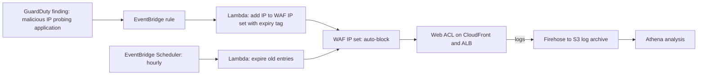

### Common Architecture Patterns

| Pattern | Description | When |
|---------|-------------|------|
| Edge protection stack | Route 53, CloudFront, WAF, Shield, cloaked origin | Every internet-facing web application |
| API protection | CloudFront or REST API with WAF managed rules, rate-based rules, API Gateway usage plans | Public APIs |
| Layered WAF | CloudFront web ACL for broad rules; regional web ACL on ALB for bypass protection and origin-specific rules | High-value applications |
| Automated IP reputation | GuardDuty or log analysis feeding IP sets via Lambda | Rapid response without manual edits |
| Central security baseline | Firewall Manager WAF policy with first and last rule groups, team rules in the middle | Multi-account organisations |
| Virtual patching | Custom rule or updated managed group blocking a new CVE's exploit pattern within hours | Zero-day response |
| Bot management | Bot Control with labels; allow verified bots, challenge unverified, block known bad | Scraping and inventory hoarding |

### Industry Use Cases

- ==Online retailers== use Bot Control and rate-based rules to stop inventory hoarding bots during product launches and sales, and ATP to reduce credential stuffing.
- ==Gaming companies== subscribe to Shield Advanced to protect game login and matchmaking endpoints from DDoS extortion attacks, with Global Accelerator in front of UDP game servers.
- ==Banks and fintechs== use WAF managed rules plus custom rules for PCI DSS evidence, and ACFP to reduce fraudulent account openings.
- ==Media and news organisations== rely on CloudFront caching, Shield and WAF to survive traffic spikes and politically motivated DDoS attacks during major events.
- ==Public sector agencies== use Firewall Manager to apply a mandated WAF baseline across hundreds of accounts.
- ==SaaS providers== apply virtual patching through WAF within hours of framework vulnerability disclosures, protecting many customer-facing applications at once.

### Advantages

- ==Protection at the edge.== Malicious requests and floods are stopped before consuming regional or origin capacity.
- ==Managed intelligence.== AWS Managed Rules, IP reputation and Bot Control incorporate threat intelligence that no single organisation could gather.
- ==Programmability.== Web ACLs, rule groups and IP sets are APIs, enabling IaC, automation and rapid response.
- ==Integrated DDoS protection.== Shield Standard is free and always on; Shield Advanced adds expertise and financial protection.
- ==Central governance.== Firewall Manager ensures every in-scope resource is protected, including newly created ones.
- ==Rich telemetry.== Full request logs and per-rule metrics support tuning, forensics and compliance.

### Limitations

- WAF cannot fix insecure design or business-logic flaws, and pattern matching can be evaded.
- False positives require ongoing tuning and collaboration between teams.
- Body inspection limits and supported resource types constrain coverage.
- Intelligent threat mitigation and Shield Advanced add significant cost that must be justified.
- Rate-based rules are not instantaneous and struggle with highly distributed, low-rate attacks without additional signals.
- Non-HTTP workloads rely on Shield and network controls only.

### Common Mistakes

#### Beginner mistakes

- Attaching a web ACL to a CloudFront distribution while leaving the ALB reachable directly from the internet.
- Enabling managed rule groups directly in Block mode in production without a Count period.
- Creating a CloudFront-scope web ACL in a Region other than `us-east-1`, then being unable to associate it.
- Expecting WAF to protect an NLB, an EC2 instance or an HTTP API directly.
- Using per-IP rate limits so low that users behind corporate or mobile NAT are blocked.
- Believing WAF replaces input validation and parameterised queries.

#### Production mistakes

- No WAF logging, so false positives and attacks cannot be analysed.
- Logging `Authorization` headers and session cookies in plain text in WAF logs.
- Unscoped Bot Control targeted or ATP rules, producing a large unexpected bill.
- Rate-based rules on the regional web ACL behind CloudFront keyed on source IP, which is the CloudFront address, so all users share one counter.
- Trusting `X-Forwarded-For` values set by the client rather than by your own CDN.
- Subscribing to Shield Advanced without associating Route 53 health checks or configuring SRT access and proactive engagement contacts, losing much of its value.
- Allowing application teams to disassociate or bypass centrally managed web ACLs.

### Summary

AWS WAF inspects HTTP requests at CloudFront, ALB, API Gateway REST APIs, AppSync, Cognito, App Runner and Verified Access, applying ordered rules from AWS Managed Rules, the marketplace and custom rule groups, with labels, scope-down statements, rate-based rules and CAPTCHA and Challenge actions. It provides virtual patching and automated-abuse protection mapped to much of the OWASP Top 10, but never replaces secure code. Rollout in Count mode with logging, then staged enforcement, avoids self-inflicted outages. AWS Shield Standard protects every customer from common layer 3 and 4 attacks for free; Shield Advanced adds tuned detection, automatic layer 7 mitigation through WAF, health-based detection, the Shield Response Team, protection groups and cost protection for an organisation-wide subscription. Edge-first design with CloudFront, cloaked origins, caching and auto scaling completes the defence, and Firewall Manager makes it consistent across accounts.

Architectural lessons:

- ==Stop attacks as far from the origin as possible.== CloudFront plus WAF plus Shield at the edge, and origins reachable only through the edge.
- ==Baseline, then specialise.== Managed rule groups on every internet-facing resource; bot, fraud and rate rules scoped to the paths that need them.
- ==Count before you block.== Logs, sampled requests and labels turn tuning into evidence-based engineering.
- ==Rate limit in layers.== WAF for abuse, API Gateway for tenancy, the application for business rules.
- ==Plan for DDoS before it happens.== Minimise attack surface, be ready to scale, know normal traffic, and have runbooks, health checks and contacts.
- ==Govern centrally.== Firewall Manager ensures protection follows new resources automatically.

## Section Summary

Section 8.2 applied the principle of defence in depth to the network, from the global edge down to individual pods. The three parts implement complementary layers:

| Part | Layer | Core idea | Key services | Primary risk reduced |
|------|-------|-----------|--------------|----------------------|
| VPC Design and Security Groups | VPC boundary and workload | Segment by blast radius; security groups as identities; deny by default; control egress; remove inbound administration; govern continuously | VPC, security groups, NetworkPolicy, security groups for pods, Network Firewall, DNS Firewall, GWLB, endpoint policies, Session Manager, Instance Connect Endpoint, VPC Lattice, BPA, Firewall Manager, Config, Security Hub | Lateral movement, unintended exposure, data exfiltration |
| Network ACLs and VPC Flow Logs | Subnet guardrails and detection plane | Independent stateless guardrails and immediate containment; flow metadata as protected evidence for detection and forensics | NACLs, Flow Logs, Athena, GuardDuty, Detective, Security Lake, Traffic Mirroring | Undetected compromise, slow containment, missing evidence |
| AWS WAF and Shield for Application Protection | Edge and application layer | Filter malicious requests and absorb floods as far from the origin as possible; roll out safely; govern centrally | AWS WAF, AWS Managed Rules, Bot Control, ATP, ACFP, Shield Standard and Advanced, CloudFront, Firewall Manager | Injection, bots, credential stuffing, DDoS |

### Network security in one picture

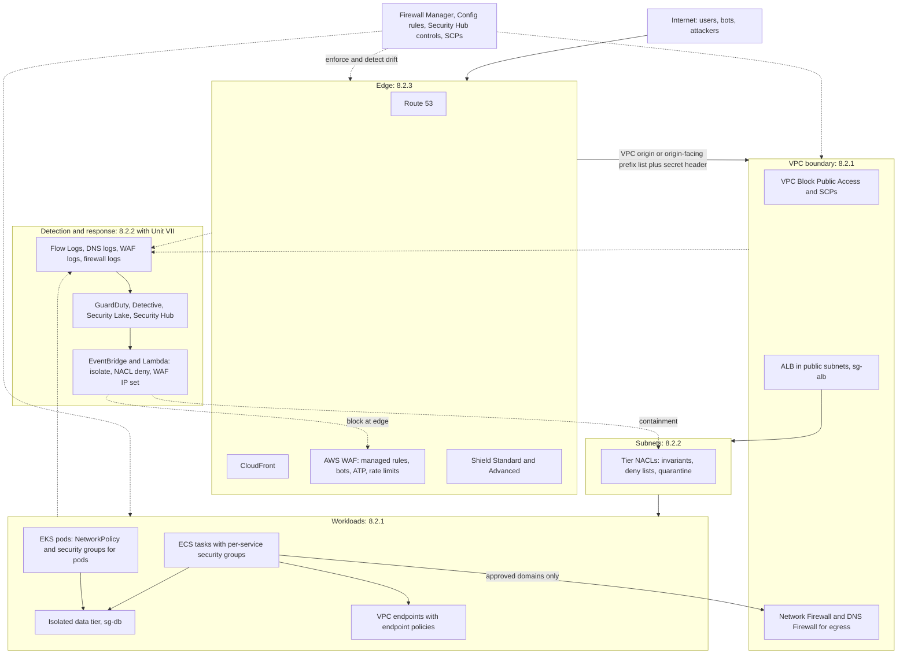

### How Section 8.2 connects to the rest of DSO303

| Unit or section | Connection to network security |
|-----------------|--------------------------------|
| [Chapter 1.6](../unit1/topic6.md), Network services | Provides the VPC, subnet, routing, endpoint, security group and NACL mechanics on which every design in this section is built |
| [Chapter 1.7](../unit1/topic7.md), Cloud-native design patterns | Lambda in VPCs uses security groups and endpoints; API Gateway REST APIs are protected by WAF; HTTP APIs need CloudFront in front for WAF |
| [Chapters 2.2](../unit2/topic2.md) and [2.3](../unit2/topic3.md), Amazon ECS | The `awsvpc` mode gives every task an ENI and its own security groups, enabling per-service micro-segmentation; ECS Exec replaces SSH; Flow Logs carry ECS fields |
| [Chapters 3.1](../unit3/topic1.md) to [3.3](../unit3/topic3.md), Amazon EKS | VPC CNI pod addressing, cluster and node security groups, security groups for pods and Kubernetes NetworkPolicy implement segmentation inside clusters |
| [Chapter 4.2](../unit4/topic2.md), API management and service mesh | API Gateway throttling complements WAF rate limits; mesh mTLS and VPC Lattice auth policies provide zero-trust east-west authorisation |
| [Chapter 4.3](../unit4/topic3.md), Resilience in microservices | Rate limiting, load shedding and auto scaling absorb traffic that passes the edge during attacks |
| [Unit V](../unit5/overview.md), CI/CD and infrastructure as code | Security groups, NACLs, firewalls and web ACLs are code, reviewed and tested in pipelines with policy-as-code |
| [Section 7.2](../unit7/topic2.md), Centralised logging | Flow Logs, WAF logs and firewall logs follow the aggregation, retention and query patterns of centralised logging |
| [Section 7.3](../unit7/topic3.md), Observability and alerting | WAF and Shield metrics feed dashboards and alarms; GuardDuty findings drive automated containment through EventBridge and Lambda |
| [Section 8.1](../unit8/topic1.md), Identity and access management | IAM controls who may change network controls; SCPs prevent internet paths; identity and resource perimeters complete the network perimeter of endpoint policies |
| [Section 8.3](../unit8/topic3.md), Data protection and encryption | TLS protects data on allowed paths; KMS protects logs and data at rest; Secrets Manager stores origin verification secrets |

### Closing architectural lessons for Section 8.2

- ==Assume every layer can fail.== Edge, VPC boundary, subnet, workload and identity controls must each hold even when the layer outside it has been bypassed.
- ==Least privilege applies to packets too.== Every path should correspond to a documented requirement; default deny is the only safe starting point.
- ==Identity beats addresses.== Security group references, pod labels, IAM auth policies and endpoint policies express intent that survives elasticity; IP lists do not.
- ==Egress is where breaches end.== Filter outbound traffic, including DNS, and use endpoint policies so that stolen data has nowhere to go.
- ==Prevent, detect and contain.== Guardrails (BPA, SCPs, Firewall Manager) prevent; Flow Logs, GuardDuty and Config detect; NACLs, isolation groups and WAF IP sets contain, ideally automatically and always audited.
- ==Stop attacks at the edge.== CloudFront, WAF and Shield in front of cloaked origins protect capacity and reduce cost during attacks.
- ==Protect the evidence.== Logs in a separate, immutable archive are what make incident response and compliance possible.
- ==Security controls can cause outages.== Stage changes, use Count mode and reachability tests, and treat network security configuration with the same engineering discipline as application code.

!!! tip "Preparing for the examination and for practice"
    For examinations and AWS Associate-level certifications, be able to decide, for a given scenario, ==which layer should stop the threat, which service implements that layer, how it is configured, how its effect is observed, and how it is governed across accounts==. Classic discriminators include: security groups (stateful, allow-only, per ENI) versus NACLs (stateless, allow and deny, per subnet); WAF (layer 7, HTTP) versus Shield (DDoS, layers 3, 4 and 7) versus Network Firewall (VPC traffic, IPS and domain filtering); GuardDuty (detection) versus Detective (investigation) versus Security Hub (posture and aggregation). In DSO303 projects, a design that shows tiered subnets, chained security groups, no inbound administrative ports, endpoint policies, Flow Logs to a protected bucket, and CloudFront with WAF in front of a cloaked origin demonstrates more security maturity than a long list of enabled services.

!!! question "Practice and interview questions"
    Questions for this topic are kept separately: [Practice questions](../Questions/unit8.md#82-network-security) · [Interview questions](../interviewquestions/unit8.md#82-network-security).
