# Data Protection and Encryption on AWS

| Part | Primary services | Question it answers | One-sentence role |
|------|------------------|---------------------|-------------------|
| Encryption at Rest with AWS KMS | AWS KMS, AWS CloudHSM, AWS Encryption SDK, S3/EBS/RDS/DynamoDB encryption integrations | If someone obtains the stored bytes, can they read them, and who controls the keys? | Make stored data unreadable without an audited, policy-controlled key operation |
| Encryption in Transit with AWS Certificate Manager | ACM, AWS Private CA, Elastic Load Balancing, CloudFront, API Gateway, VPC Lattice, service mesh | Can anyone read or alter data as it moves between clients and services? | Provide trusted identities and encrypted channels at every hop, with certificates that never expire by accident |
| Secrets Management with AWS Secrets Manager | Secrets Manager, Systems Manager Parameter Store, Lambda extension, ECS and EKS integrations, Amazon Macie | Where do passwords, API keys and tokens live, and how are they rotated? | Remove long-lived credentials from code and configuration and rotate them automatically |

## Protecting Data Across Its Lifecycle: At Rest, In Transit, In Use

Identity controls ([Section 8.1](../unit8/topic1.md)) and network controls ([Section 8.2](../unit8/topic2.md)) decide ==whether a request is allowed to reach the data==. They are essential, but they share a weakness: they protect a boundary, and boundaries are breached. A misconfigured bucket policy, a stolen access key, a backup copied to the wrong account, a disk returned for disposal, a packet capture on a compromised host, or a password committed to a public repository all bypass the boundary entirely. Data protection controls are designed on the assumption that ==the boundary has already failed==. Their job is to make the bytes useless to anyone who does not also pass a separate, audited check.

This is ==defence in depth== applied to data. An attacker who obtains an encrypted EBS snapshot also needs permission to call `kms:Decrypt` with the right key; that permission is governed by a key policy the attacker does not control, and the attempt is recorded in AWS CloudTrail.

### Data classification comes first

Encryption and key management decisions are only meaningful when the organisation knows ==what data it holds and how sensitive it is==. Data classification assigns each dataset a level that determines the minimum controls.

| Classification level | Examples | Typical minimum controls on AWS |
|----------------------|----------|---------------------------------|
| Public | Marketing site assets, published documentation | Integrity controls; TLS in transit; default SSE-S3 at rest |
| Internal | Internal wiki, non-sensitive logs, build artefacts | Encryption at rest with AWS managed or customer managed keys; TLS; IAM least privilege |
| Confidential | Customer records, order history, source code, financial reports | Customer managed KMS keys with restrictive key policies; TLS 1.2 or higher enforced; access logging; Secrets Manager for credentials |
| Restricted or regulated | Payment card data (PCI DSS), health records, national identity numbers, student records under privacy law | Dedicated customer managed keys per dataset or tenant; encryption context; possibly CloudHSM or external key store; end-to-end TLS; Macie discovery; strict separation of key administrators and key users; audit and retention requirements |

!!! note "Classification is a business decision implemented by architects"
    The architect does not decide on their own that a dataset is "restricted"; legal, compliance and data owners do. The architect's responsibility is to make the classification ==enforceable and visible==, for example with resource tags such as `DataClassification=Confidential`, AWS Config rules that check encryption settings per tag, service control policies that deny unencrypted writes, and Amazon Macie jobs that discover sensitive data where it was not expected.

### The data protection lifecycle

Data passes through several states, and each state needs its own protection mechanism.

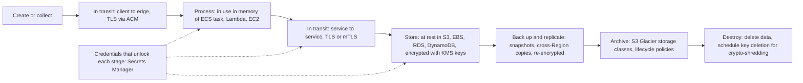

| State | Threats | Primary AWS protection | Part of this section |
|-------|---------|------------------------|----------------------|
| At rest | Stolen disks or snapshots, public buckets, copied backups, insider access to storage | Server-side encryption with KMS keys; key policies; client-side encryption | Encryption at rest with AWS KMS |
| In transit | Eavesdropping, man-in-the-middle, session hijacking, tampering | TLS with ACM certificates; mutual TLS; enforced HTTPS; VPC endpoints ([Section 8.2](../unit8/topic2.md)) | Encryption in transit with ACM |
| In use | Memory scraping by a compromised host or operator | Isolation (Nitro System), AWS Nitro Enclaves, least privilege on compute | Mentioned; beyond scope |
| Credentials for all states | Hard-coded passwords, leaked API keys, never-rotated database users | Secrets Manager, rotation, IAM roles instead of keys | Secrets management |
| Destruction | Data that cannot be proven deleted | Key deletion (crypto-shredding), S3 lifecycle expiry, backup retention policies | Encryption at rest with AWS KMS |

!!! info "Data in use and the AWS Nitro System"
    Protecting data while it is being processed is the hardest state. On AWS, the ==Nitro System== isolates instance memory from other tenants and, by design, provides no mechanism for AWS operators to access customer memory on Nitro-based instances. ==AWS Nitro Enclaves== create isolated compute environments with no persistent storage, no interactive access and no external networking, and can use cryptographic attestation with KMS so that a key is released only to a specific, measured enclave image. These are specialised tools; most DSO303 designs rely on encryption at rest and in transit plus least privilege on the compute that processes the data.

### The shared responsibility model for data protection

| Responsibility | AWS | Customer |
|----------------|-----|----------|
| Physical security of HSMs and storage media | Yes | No |
| FIPS-validated cryptographic implementations in KMS, ACM and Secrets Manager | Yes | No |
| Choosing whether data is encrypted, and with which key | No (defaults exist) | Yes |
| Writing key policies, IAM policies and grants | No | Yes |
| Classifying data and choosing key separation | No | Yes |
| Configuring TLS policies, certificates and HTTPS enforcement | No | Yes |
| Storing credentials in Secrets Manager and enabling rotation | No | Yes |
| Monitoring CloudTrail for key and secret usage | Provides the logs | Reviews and alarms on them |

!!! tip "Encryption is now the default; key control is the decision"
    Most AWS storage services now encrypt data at rest by default: S3 applies SSE-S3 to every new object, DynamoDB tables are always encrypted, and EBS encryption by default can be enabled per Region. The architect's question is therefore rarely "should this be encrypted?" and usually ==who controls the key, who can use it, how usage is audited, and what happens if the key is lost or deleted==. The rest of this section answers those questions.

---

## Encryption at Rest with AWS KMS

### Definition

==AWS Key Management Service (AWS KMS) is a managed, regional service that creates and controls cryptographic keys, performs cryptographic operations with them inside FIPS 140-3 validated hardware security modules, and integrates with most AWS services to encrypt data at rest under policies that you control and CloudTrail records.==

Two properties define KMS and distinguish it from simply "a place to store keys":

1. ==Key material for KMS keys never leaves the HSMs unencrypted.== You never download a KMS key. You send data (up to 4 KB) or a request for a data key to KMS, and KMS performs the operation inside its HSM fleet.
2. ==Every use of a key is an authorised, logged API call.== Using a key to decrypt is an IAM-authorised action (`kms:Decrypt`) evaluated against the key policy and recorded in CloudTrail. Encryption therefore converts a data access problem into an ==access-control and audit problem on the key==.

In the AWS architecture map, KMS belongs to the Security, Identity and Compliance category. It sits underneath almost every storage and database service (S3, EBS, EFS, FSx, RDS, Aurora, DynamoDB, Redshift, OpenSearch), under messaging and streaming (SQS, SNS, Kinesis, MSK), under container and serverless services (ECR, Lambda environment variables, ECS ephemeral storage on Fargate, EKS secrets envelope encryption), under observability (CloudWatch Logs, CloudTrail), and under the other two services of this section (Secrets Manager secrets and AWS Private CA keys).

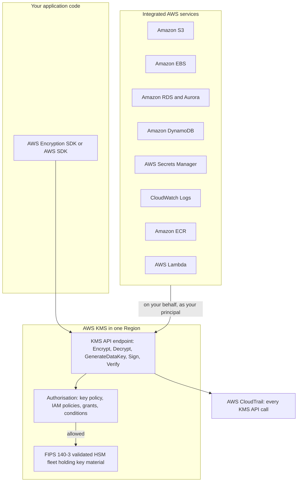

### Why This Service or Concept Exists

#### The problem: keys are harder to protect than data

Encrypting data is easy; any programming language offers AES in a few lines. The difficult problems are all about the ==keys==:

- Where is the key stored? If it sits in a configuration file next to the encrypted data, encryption adds nothing.
- Who can use it, and how is that decided and changed?
- How is its use audited, so that a breach can be scoped ("which records did the attacker decrypt?")?
- How is it rotated without re-encrypting petabytes of data?
- How is it made highly available and durable? Losing the key means losing all data encrypted under it.
- How is it destroyed, provably, when data must be erased?

Before managed key services, organisations either stored keys in software (weak) or bought on-premises hardware security modules (strong, but expensive, complex to cluster, and difficult to integrate with applications and storage systems).

#### Why AWS introduced KMS

AWS introduced KMS in 2014 to make ==strong key management the default rather than a specialist project==. KMS provides HSM-backed keys without customers operating HSMs, a policy language consistent with IAM, automatic CloudTrail logging, regional high availability and durability, and native integration so that services such as S3 and EBS can encrypt data with a customer's key by setting one parameter.

#### Benefits over older methods

| Concern | Keys in application config or code | On-premises HSM | AWS KMS |
|---------|------------------------------------|-----------------|---------|
| Key exposure | Keys readable by anyone with file or repository access | Keys never leave HSM | Keys never leave KMS HSMs in plaintext |
| Access control | Filesystem or none | HSM-specific user model | Key policies, IAM, grants, condition keys |
| Audit | Usually none | HSM logs, separately managed | CloudTrail for every call, integrated with the rest of AWS |
| Availability and durability | Your responsibility | Your cluster design | Managed, regional, highly durable |
| Rotation | Manual re-encryption | Manual | Automatic or on-demand rotation without re-encrypting data |
| Service integration | None | Custom connectors | Native in over a hundred AWS services |
| Cost | Hidden operational cost | High capital and staff cost | Approximately a dollar per key per month plus per-request charges (verify pricing) |

### Core Concepts

#### Cryptography refresher: symmetric and asymmetric

Students have met cryptography in the Computer Networks and Operating Systems modules. The distinction that matters for architecture is the following.

| Aspect | Symmetric cryptography | Asymmetric (public key) cryptography |
|--------|------------------------|--------------------------------------|
| Keys | One secret key used to encrypt and decrypt | A key pair: public key (shareable) and private key (secret) |
| Typical algorithms | AES-256 in GCM mode | RSA, elliptic curve (ECDSA, ECDH) |
| Speed | Very fast; suited to bulk data | Much slower; suited to small data, signatures and key exchange |
| Key distribution problem | Both parties must share the secret securely | Public key can be published; only the private key must be protected |
| Typical AWS uses | Encryption at rest in every storage service; KMS symmetric keys | TLS certificates (ACM), digital signatures (code signing, JWT signing), key agreement, KMS asymmetric keys |
| Integrity | AES-GCM provides authenticated encryption (confidentiality and integrity) | Signatures provide integrity and non-repudiation |

!!! note "Why both are needed"
    Real systems combine them. TLS uses asymmetric cryptography during the handshake to authenticate the server and agree on a shared secret, then uses symmetric encryption for the bulk of the session. Envelope encryption, described next, uses a key hierarchy for similar reasons: an expensive, carefully guarded key protects cheap, fast keys that encrypt the data.

A few further properties are worth recalling:

- ==Authenticated encryption== (such as AES-GCM) detects tampering: changing a single bit of ciphertext causes decryption to fail rather than to return corrupted plaintext.
- ==Additional authenticated data (AAD)== is data that is not encrypted but is cryptographically bound to the ciphertext; decryption succeeds only if exactly the same AAD is supplied. KMS exposes AAD as ==encryption context==.
- ==Hashing and HMAC== provide integrity. An HMAC uses a secret key, so only key holders can produce or verify a valid tag.

#### KMS keys and the key hierarchy

A ==KMS key== (formerly called a customer master key, CMK) is a logical resource containing metadata (key ID, ARN, state, key policy, description, tags, creation date) and a reference to one or more versions of ==key material== held in the HSMs. The KMS key is the top of a hierarchy:

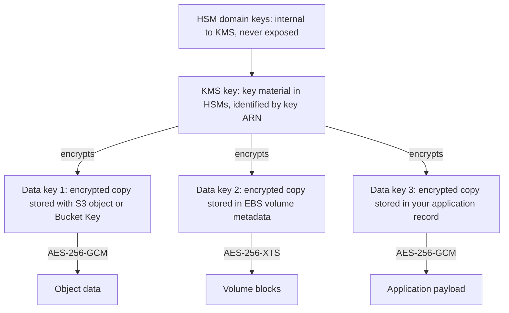

The KMS key rarely encrypts data directly. The `Encrypt` API accepts at most ==4,096 bytes== of plaintext, which is enough for a password or a data key, but not for a file. Bulk data is encrypted with ==data keys==, which is envelope encryption.

#### Envelope encryption

==Envelope encryption is the practice of encrypting data with a data key, and then encrypting the data key with another key (the KMS key), storing the encrypted data key alongside the ciphertext.== The encrypted data key is the "envelope" that travels with the data.

Why this design?

1. ==Performance==: bulk encryption happens locally with fast symmetric ciphers; only a small data key crosses the network to KMS.
2. ==Scalability==: KMS never receives gigabytes of data, so it does not become a bandwidth bottleneck.
3. ==Security==: the plaintext data key exists only in memory for as long as needed, and the long-term secret (the KMS key) never leaves the HSMs.
4. ==Rotation and re-keying==: rotating the KMS key or re-wrapping data keys does not require re-encrypting the data itself.
5. ==Auditability==: every data key decryption is a KMS call recorded in CloudTrail.

##### The GenerateDataKey flow

`GenerateDataKey` returns two forms of the same new data key in a single call:

| Field | Content | What to do with it |
|-------|---------|--------------------|
| `Plaintext` | The 256-bit data key in the clear (base64 in the CLI) | Use immediately to encrypt data in memory, then discard (zero it) |
| `CiphertextBlob` | The same data key encrypted under the KMS key, including metadata identifying the KMS key | Store with the ciphertext; it is useless without `kms:Decrypt` permission on the KMS key |
| `KeyId` | ARN of the KMS key used | Informational; the ciphertext blob already identifies the key for symmetric keys |

`GenerateDataKeyWithoutPlaintext` returns only the encrypted form, useful when one component creates keys that another component, later and elsewhere, will decrypt and use.

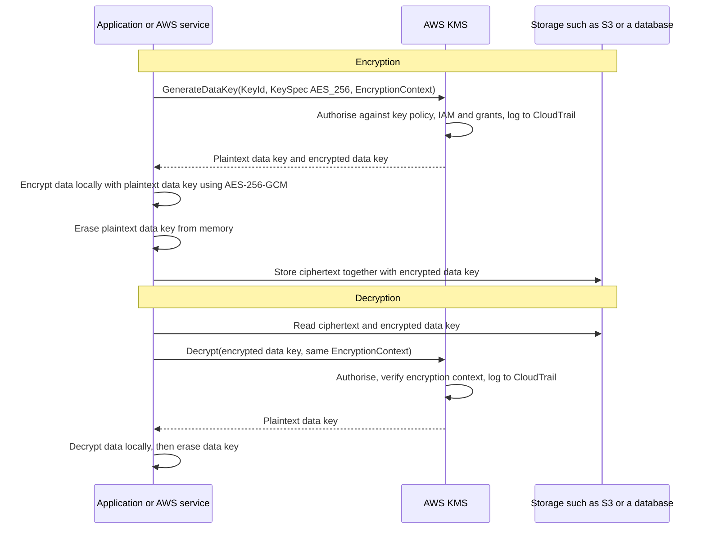

!!! warning "Never store the plaintext data key"
    The whole security of envelope encryption rests on the plaintext data key living only in memory. Writing it to a log, a temporary file, a database column or an environment variable reduces the design to "data encrypted with a key stored next to it". Code reviews should specifically check what happens to the `Plaintext` field.

##### How AWS services use envelope encryption

Every AWS service that "encrypts with KMS" is doing envelope encryption on your behalf, which is why the per-service options in earlier chapters look similar:

| Service | Data key scope | Where the encrypted data key lives | What this implies |
|---------|----------------|------------------------------------|-------------------|
| Amazon S3 (SSE-KMS without Bucket Key) | One data key per object | Object metadata | One KMS call per object write and per read |
| Amazon S3 with S3 Bucket Key | A bucket-level key derived from a KMS data key, used to create per-object keys | Object metadata references the bucket key | Far fewer KMS calls; cost and throttling reduced |
| Amazon EBS | One data key per volume; snapshots and volumes created from them inherit it | Volume metadata | KMS called when the volume is attached (via a grant), not per I/O |
| Amazon RDS and Aurora | Data key per DB instance or cluster storage | Storage metadata | Encryption set at creation; changing the key requires snapshot copy and restore |
| Amazon DynamoDB | Table key hierarchy, cached by DynamoDB | Table metadata | KMS called periodically, not per item |
| AWS Secrets Manager | Data key per secret version | With the secret version | `GetSecretValue` requires `kms:Decrypt` on the key |
| CloudWatch Logs | Data keys per log group, cached | Log group | Key must allow the CloudWatch Logs service principal |

!!! tip "Read the per-service behaviour as caching policy"
    The main differences between services are ==how often they call KMS== (per object, per volume, per time interval) and ==how long they cache data keys==. This explains cost (per-request charges), throttling behaviour, and the delay before a disabled key actually stops access: a service that caches data keys may continue to serve data for a short time after the key is disabled.

##### The AWS Encryption SDK and data key caching

When application code must encrypt data itself (client-side encryption), implementing envelope encryption correctly is error-prone. The ==AWS Encryption SDK== is a client-side library (Java, Python, JavaScript, C, .NET, CLI; with Go and Rust implementations in the newer versions) that implements envelope encryption with sound defaults:

- It calls `GenerateDataKey` through a ==keyring== (or, in older versions, a master key provider) that names one or more KMS keys.
- It encrypts data with AES-GCM and uses key commitment in current versions, so that a ciphertext can decrypt to only one plaintext.
- It produces a portable ==message format== that contains the ciphertext, the encrypted data key or keys, the algorithm suite and the encryption context.
- It can encrypt a data key under multiple KMS keys, for example in two Regions, so that either Region can decrypt.

Calling KMS for every message can be slow and costly at high rates. The SDK therefore supports ==data key caching== (in current versions, the hierarchical keyring and caching cryptographic materials manager). A cached data key is reused for a bounded number of messages, bytes or seconds.

| Caching setting | Purpose | Trade-off |
|-----------------|---------|-----------|
| Maximum age | Limits how long a data key is reused | Shorter is more secure, more KMS calls |
| Maximum messages encrypted | Limits how many messages share one data key | Limits blast radius if one data key is exposed |
| Maximum bytes encrypted | Limits the volume of data under one key | Respects cryptographic usage limits |
| Cache capacity | Number of entries held | Memory use |

!!! note "Related client-side libraries"
    The ==AWS Database Encryption SDK== (formerly the DynamoDB Encryption Client) performs attribute-level client-side encryption and signing for DynamoDB items, including searchable encryption with beacons. The ==Amazon S3 Encryption Client== performs client-side encryption of S3 objects. Choose client-side encryption when data must be encrypted ==before== it reaches the AWS service, for example so that the storage service and its administrators never see plaintext.

#### Key ownership types: AWS owned, AWS managed, customer managed

| Property | AWS owned keys | AWS managed keys | Customer managed keys |
|----------|----------------|------------------|-----------------------|
| Who creates it | AWS, in AWS accounts | AWS, in your account, when you first use a service with KMS encryption | You |
| Visible in your account | No | Yes, alias `aws/service`, for example `aws/s3`, `aws/ebs` | Yes |
| Key policy | Not visible | Visible, cannot be edited | You write and edit it |
| Usable across accounts | Not applicable | No | Yes, through key policy |
| Rotation | Managed by AWS | Automatic every year, cannot be changed | Optional automatic (90–2560 days), on demand |
| CloudTrail visibility of use | No | Yes | Yes |
| Can be disabled or deleted by you | No | No | Yes |
| Monthly key charge | None | None | Approximately 1 USD per key per month (verify pricing) |
| Request charges | None | Yes, for calls you trigger (subject to free tier) | Yes |
| Typical use | Default encryption where no control or audit is required, for example SSE-S3, DynamoDB default | Quick encryption with audit, single account | Production, regulated data, cross-account sharing, separation of duties, crypto-shredding |

!!! warning "AWS managed keys cannot be shared across accounts"
    A frequent production problem: an EBS snapshot or RDS snapshot encrypted with `aws/ebs` or `aws/rds` cannot be shared with another account, because the key policy of an AWS managed key cannot be changed to allow that account. The snapshot must first be copied and re-encrypted with a customer managed key whose key policy grants the other account access. ==Use customer managed keys for anything that may ever cross an account boundary==, including backups copied to a separate backup account.

#### Key specs and key usage

When creating a customer managed key you choose a ==key spec== (the type of key material) and a ==key usage== (what operations it may perform). Neither can be changed after creation.

| Key spec family | Examples | Key usage | Typical use |
|-----------------|----------|-----------|-------------|
| Symmetric | `SYMMETRIC_DEFAULT` (AES-256-GCM) | `ENCRYPT_DECRYPT` | Almost all encryption at rest; the only type most AWS services accept |
| RSA | `RSA_2048`, `RSA_3072`, `RSA_4096` | `ENCRYPT_DECRYPT` or `SIGN_VERIFY` | Encryption by parties outside AWS using the public key; signatures |
| Elliptic curve | `ECC_NIST_P256`, `ECC_NIST_P384`, `ECC_NIST_P521`, `ECC_SECG_P256K1` | `SIGN_VERIFY` or `KEY_AGREEMENT` | Digital signatures (JWT, code signing, documents), ECDH key agreement |
| HMAC | `HMAC_224`, `HMAC_256`, `HMAC_384`, `HMAC_512` | `GENERATE_VERIFY_MAC` | Tokens, message integrity, deterministic identifiers |
| Post-quantum signatures | ML-DSA key specs (newer; availability may vary) | `SIGN_VERIFY` | Future-proof signing; verify current Regional availability |
| China Regions | `SM2` and SM4-based symmetric | Various | Regulatory requirements in China Regions |

!!! info "Why AWS services only accept symmetric keys"
    Integrated services perform envelope encryption, which needs `GenerateDataKey`. That operation exists only for symmetric KMS keys. Asymmetric keys are for cases where ==some party outside KMS must use the public key==: a mobile client encrypting data that only your backend can decrypt, or a verifier checking a signature without calling AWS. The private key of an asymmetric KMS key never leaves KMS; `GetPublicKey` returns the public key.

#### Multi-Region keys

A ==multi-Region key== is a set of interoperable KMS keys in different Regions that share the same key ID and key material. Data encrypted with the primary key in one Region can be decrypted with a replica key in another Region ==without a cross-Region call==.

| Aspect | Single-Region key | Multi-Region key |
|--------|-------------------|------------------|
| Key ID | Unique | Same key ID (prefix `mrk-`) in every Region; ARNs differ by Region |
| Key material | Unique to the Region | Shared by primary and replicas |
| Policies, aliases, grants | Per key | Independent per Region replica |
| Rotation | Per key | Controlled on the primary, propagated to replicas |
| Use cases | Most workloads | Global DynamoDB tables with client-side encryption, disaster recovery, active-active applications, digital signatures verified in many Regions |

!!! warning "Multi-Region keys weaken Regional isolation"
    Because key material exists in several Regions, a compromise or mis-policy in one Region can affect data encrypted in another. AWS recommends single-Region keys by default and multi-Region keys only where a concrete requirement (client-side encryption of data replicated across Regions, low-latency decryption in a DR Region) justifies them. Note that server-side encryption in services such as S3 Cross-Region Replication, Aurora global databases and DynamoDB global tables re-encrypts in the destination Region with a destination key and ==does not require multi-Region keys==.

#### Imported key material (BYOK)

By default KMS generates key material. With ==imported key material== (origin `EXTERNAL`), you create a key with no material, download a wrapping public key and import token, wrap your own key material and import it. This is sometimes called bring your own key (BYOK).

Reasons to import:

- A regulation or policy requires key material to be generated in the organisation's own HSM.
- The organisation wants an independent, offline copy of key material for escrow.
- The organisation wants to set an ==expiration time== after which KMS deletes the material automatically, or to delete it immediately with `DeleteImportedKeyMaterial`.

Trade-offs: ==you become responsible for the durability of the key material==. If KMS deletes it (expiry or deletion) and you have lost your copy, data is unrecoverable. Automatic rotation is not available for imported material; rotation must be performed by importing new material with on-demand rotation where supported (a relatively recent capability; verify current support), or by creating a new key and re-encrypting.

#### Custom key stores: CloudHSM and external key store

A ==custom key store== makes KMS keys whose key material lives outside the standard KMS HSM fleet, while applications and AWS services continue to use the ordinary KMS API.

| Key store | Where key material lives | Who operates the HSMs | Why choose it | Trade-offs |
|-----------|--------------------------|-----------------------|---------------|------------|
| Standard KMS key store | Multi-tenant FIPS 140-3 validated KMS HSMs | AWS | Default for nearly all workloads | None significant |
| AWS CloudHSM key store | Your single-tenant AWS CloudHSM cluster in your VPC | You manage users and cluster size; AWS manages hardware | Requirement for single-tenant HSMs, direct control over HSM users, or keys in HSMs you exclusively control | Cost of at least two HSMs for availability; availability depends on your cluster; lower throughput; operational effort |
| External key store (XKS) | An external key manager outside AWS, reached through an XKS proxy you run | You, entirely | Regulatory or sovereignty requirement that keys stay outside the cloud provider ("hold your own key") | Every cryptographic operation depends on your external system's latency and availability; highest operational risk |

!!! danger "External key stores move availability risk to you"
    With XKS, if the external key manager or the network path to it is unavailable, every AWS service using those keys fails to decrypt: S3 reads fail, EBS volumes cannot be attached, RDS instances may not start. AWS documentation explicitly positions XKS for the minority of workloads with a regulatory need that cannot be met otherwise. For students: ==choose the standard key store unless a named requirement forbids it==.

#### Key policies: the primary access control

Every KMS key has exactly one ==key policy==, a resource-based policy ([Section 8.1](../unit8/topic1.md)) attached to the key. The key policy is special in one important respect:

!!! info "The KMS rule that surprises IAM experts"
    For most AWS resources, an identity-based IAM policy in the same account is sufficient to grant access. ==KMS keys are different: no principal, not even the account root user, can use a KMS key unless the key policy allows it, either directly or by delegating to IAM.== The key policy is therefore the primary and authoritative control. IAM policies take effect only if the key policy contains a statement that ==enables IAM policies== by allowing the account principal.

##### The default key policy

When you create a key through the API without supplying a policy, KMS attaches a default key policy with one statement:

```json
{
  "Sid": "Enable IAM User Permissions",
  "Effect": "Allow",
  "Principal": { "AWS": "arn:aws:iam::111122223333:root" },
  "Action": "kms:*",
  "Resource": "*"
}
```

This statement is commonly misunderstood. It does ==not== mean "only the root user can use the key". The principal `arn:aws:iam::111122223333:root` represents ==the account itself==; the statement delegates authority to the account, so that ==IAM policies in that account can grant access to the key==. Without this statement, IAM policies in the account have no effect on the key, and if no other statement allows administration, the key can become ==unmanageable==, recoverable only through AWS Support.

The console's default key policy adds further statements when you select key administrators and key users:

| Statement in console default policy | Principals | Actions | Purpose |
|-------------------------------------|------------|---------|---------|
| Enable IAM User Permissions | Account principal | `kms:*` | Allow IAM policies to grant access |
| Allow access for Key Administrators | Chosen roles or users | `kms:Create*`, `kms:Describe*`, `kms:Enable*`, `kms:List*`, `kms:Put*`, `kms:Update*`, `kms:Revoke*`, `kms:Disable*`, `kms:Get*`, `kms:Delete*`, `kms:TagResource`, `kms:UntagResource`, `kms:ScheduleKeyDeletion`, `kms:CancelKeyDeletion`, `kms:RotateKeyOnDemand` | Manage the key, but ==not use it for cryptography== |
| Allow use of the key | Chosen roles or users | `kms:Encrypt`, `kms:Decrypt`, `kms:ReEncrypt*`, `kms:GenerateDataKey*`, `kms:DescribeKey` | Cryptographic use |
| Allow attachment of persistent resources | Chosen roles or users | `kms:CreateGrant`, `kms:ListGrants`, `kms:RevokeGrant` with condition `kms:GrantIsForAWSResource = true` | Let integrated services such as EBS and RDS create grants on the user's behalf |

!!! tip "Separation of duties"
    The console layout embodies an important control: ==key administrators manage keys but cannot decrypt data; key users can decrypt data but cannot change policies or delete keys==. A database administrator who can decrypt the database should not also be able to change who else can decrypt it. In regulated environments, the security team administers keys, application roles use them, and neither can do the other's job alone.

##### How key policies, IAM policies and grants combine

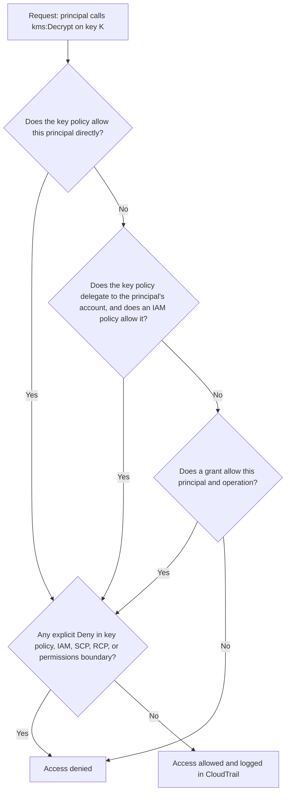

The general policy evaluation rules of [Section 8.1](../unit8/topic1.md#iam-policies-and-permissions) still apply: explicit denies win, service control policies and resource control policies bound the maximum permissions in an organisation, and cross-account access requires ==both== sides to allow it.

#### Grants

A ==grant== is a policy instrument that gives a specific ==grantee principal== permission to perform specific operations with a KMS key, optionally under constraints on encryption context. Grants are designed for ==temporary, programmatic, fine-grained delegation==, particularly by AWS services.

| Aspect | Key policy | IAM policy | Grant |
|--------|------------|------------|-------|
| Attached to | The key | The principal | The key, created by API |
| Number | Exactly one per key | Many | Many per key (quota applies) |
| Created by | Key administrators | IAM administrators | Any principal with `kms:CreateGrant` |
| Typical lifetime | Long | Long | Short to medium; retired when no longer needed |
| Typical use | Baseline access and delegation | Role permissions | AWS services acting on your behalf, for example EBS attaching an encrypted volume |
| Eventual consistency | Seconds | Seconds | Grant tokens allow immediate use before propagation |

When you launch an EC2 instance with an encrypted EBS volume, EBS creates a grant allowing it to decrypt the volume's data key for that instance. When you detach the volume, the grant is retired. This is why the default policy's `kms:GrantIsForAWSResource` statement matters: users can let AWS services create grants without being able to create arbitrary grants for other principals.

#### Encryption context

==Encryption context is a set of non-secret key-value pairs supplied to encryption operations and cryptographically bound to the ciphertext as additional authenticated data.== The same context must be supplied to decrypt.

Encryption context serves three purposes:

1. ==Integrity binding==: ciphertext from one record cannot be substituted for another, because decryption fails if the context (for example the record ID) does not match.
2. ==Authorisation==: key policies and grants can require specific context values with the `kms:EncryptionContext:<key>` condition key.
3. ==Audit==: the context appears in plaintext in CloudTrail, so logs show ==which object or tenant== was decrypted, not merely which key was used.

AWS services set their own context. For example S3 SSE-KMS uses `aws:s3:arn` with the object ARN (or the bucket ARN when a Bucket Key is used), and Secrets Manager uses `SecretARN` and `SecretVersionId`.

!!! warning "Encryption context is not secret"
    Because it is logged in CloudTrail in plaintext, never place sensitive values such as personal names, email addresses or card numbers in encryption context. Use identifiers: tenant ID, order ID, table name.

#### KMS condition keys

Condition keys let the key policy express ==how== and ==from where== a key may be used, not only ==who== may use it. The most important ones for architects:

| Condition key | What it checks | Typical design use |
|---------------|----------------|-------------------|
| `kms:ViaService` | The request was made by a specific AWS service on the principal's behalf, for example `s3.us-east-1.amazonaws.com` | Allow a role to decrypt only through S3 or RDS, never by calling KMS directly from a laptop |
| `kms:CallerAccount` | The AWS account of the caller | Allow all principals in one account to use the key through a service, combined with `kms:ViaService`; this is how AWS managed key policies are written |
| `kms:EncryptionContext:<context-key>` | A specific encryption context pair | Tenant isolation: role for tenant A can decrypt only where `tenantId = A` |
| `kms:EncryptionContextKeys` | Which context keys are present | Require that an encryption context is always supplied |
| `kms:GrantIsForAWSResource` | The grant is being created by an integrated AWS service | Safe delegation to EBS, RDS and others |
| `kms:GrantOperations` | Operations included in a grant | Restrict what grants can permit |
| `kms:KeySpec`, `kms:KeyUsage`, `kms:KeyOrigin` | Properties of the key being created | Enforce with SCPs or IAM that only approved key types are created |
| `kms:RotationPeriodInDays` | Requested rotation period | Enforce organisational rotation policy |
| `kms:ScheduleKeyDeletionPendingWindowInDays` | Requested deletion waiting period | Require the maximum 30-day window |
| `aws:SourceArn`, `aws:SourceAccount` | The resource on whose behalf a service principal acts | Prevent the confused deputy problem when a service principal such as `logs.amazonaws.com` uses the key |
| `aws:PrincipalOrgID` | The caller's organisation | Share a key with every account in the organisation safely |

#### Key rotation

==Key rotation== replaces the cryptographic material of a KMS key while keeping the same key ID and ARN. KMS retains all previous versions of the material, so ==existing ciphertext remains decryptable without any change, and new encryption uses the newest material==. Rotation of the KMS key does not re-encrypt data or data keys; it limits the amount of data protected by any single piece of key material.

| Rotation mode | Applies to | Behaviour |
|---------------|------------|-----------|
| Automatic rotation | Symmetric customer managed keys with KMS-generated material | Off by default; when enabled, rotation period is configurable from ==90 to 2,560 days== (default 365) |
| AWS managed keys | `aws/*` keys | Rotated automatically every year; cannot be changed |
| On-demand rotation | Symmetric customer managed keys, including, more recently, keys with imported material | `RotateKeyOnDemand` rotates immediately, independent of the automatic schedule; a limited number of on-demand rotations per key is allowed (verify quota) |
| Not supported | Asymmetric keys, HMAC keys, keys in custom key stores | Rotate manually: create a new key, update aliases and applications, keep the old key for decryption or verification |

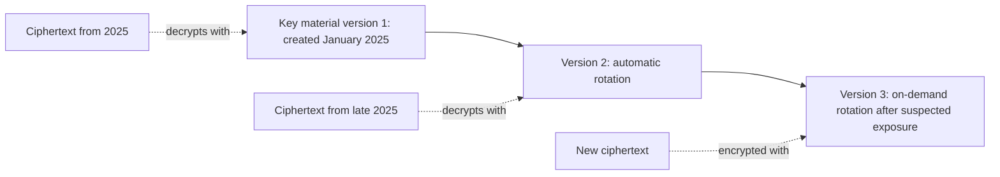

!!! note "Manual rotation with aliases"
    For key types that do not support automatic rotation, the standard technique is ==alias-based manual rotation==: applications reference an alias such as `alias/orders-signing`, and rotation means creating a new key and pointing the alias to it. Because an alias can be updated atomically with `UpdateAlias`, new operations use the new key immediately. Old keys must remain enabled for as long as data encrypted or signed with them must be readable or verifiable.

#### Key states, disabling and deletion

| State | Meaning | Cryptographic operations allowed |
|-------|---------|----------------------------------|
| `Enabled` | Normal | Yes |
| `Disabled` | Temporarily unusable; reversible with `EnableKey` | No |
| `PendingDeletion` | Scheduled for deletion; waiting period 7–30 days (default 30) | No; `CancelKeyDeletion` returns it to `Disabled` |
| `PendingImport` | Imported-material key with no material | No |
| `Unavailable` | Custom key store disconnected | No |
| `Deleted` | Key material and metadata destroyed | No, and ==data encrypted under it is permanently unrecoverable== |

!!! danger "Deleting a KMS key is irreversible data destruction"
    After the waiting period, KMS deletes the key material, and every piece of data encrypted under that key, including backups and snapshots, becomes permanently unreadable. AWS cannot recover it. This is sometimes intended (==crypto-shredding==, used to prove deletion of a tenant's data), but it is usually a mistake. Safeguards: prefer disabling to deleting; use the maximum 30-day waiting period; create a CloudWatch alarm on CloudTrail events for `ScheduleKeyDeletion` and on attempts to use a key pending deletion; restrict `kms:ScheduleKeyDeletion` with SCPs to a break-glass role.

#### Server-side and client-side encryption choices for S3

[Section 6.1](../unit6/topic1.md#encryption-and-kms) introduced the S3 encryption options. With the mechanics above, they can now be compared as key-control decisions.

| Option | Who holds the key | KMS involved | Audit of key use | Typical requirement |
|--------|-------------------|--------------|------------------|---------------------|
| SSE-S3 | S3 (AWS owned keys) | No | No per-object key audit | Baseline; default for every new object since 2023 |
| SSE-KMS | KMS key: AWS managed `aws/s3` or customer managed | Yes | CloudTrail `GenerateDataKey` and `Decrypt` events | Separate permission to read data (needs S3 and KMS access), audit, cross-account, crypto-shredding |
| DSSE-KMS | KMS key, with two independent layers of encryption applied by S3 | Yes | Yes | Compliance frameworks requiring dual-layer encryption (for example some US government standards) |
| SSE-C | You supply the key with every request; S3 does not store it | No | No | Legacy requirements to manage keys entirely outside AWS; AWS has announced that SSE-C is blocked by default on new buckets, so verify current behaviour before designing with it |
| Client-side encryption | Your application (often with KMS through the Encryption SDK or S3 Encryption Client) | Optional | Yes if KMS is used | S3 must never see plaintext; end-to-end confidentiality |

!!! tip "SSE-KMS creates a second authorisation layer"
    The most important architectural benefit of SSE-KMS over SSE-S3 is not stronger cryptography (both use AES-256). It is that ==reading an object requires two independent permissions==: `s3:GetObject` on the object and `kms:Decrypt` on the key. A bucket policy mistake that makes objects readable is not enough for an attacker if the key policy does not also allow them. SSE-S3 cannot provide this.

##### S3 Bucket Keys

Without a Bucket Key, SSE-KMS calls KMS for every object `PUT` and every `GET`. A data lake reading millions of objects per hour can generate large KMS bills and hit KMS request quotas. An ==S3 Bucket Key== is a short-lived, bucket-level key generated from a KMS data key and used by S3 to derive per-object data keys. S3 calls KMS far less often, and AWS states that Bucket Keys can reduce KMS request costs by up to 99 per cent.

Side effects to know: the CloudTrail encryption context becomes the ==bucket ARN== rather than the object ARN, so key policies or IAM conditions that match `kms:EncryptionContext:aws:s3:arn` on object ARNs must be updated; and per-object KMS audit granularity is reduced.

#### Cross-account key use

Cross-account use of a KMS key requires permissions on ==both sides==, following [Section 8.1](../unit8/topic1.md):

1. The ==key policy== in the owning account (A) allows the other account (B), usually its account principal, to use the key.
2. An ==IAM policy== in account B allows specific principals to use the key's ARN (the delegation from A goes to account B, and B decides which of its principals may exercise it).

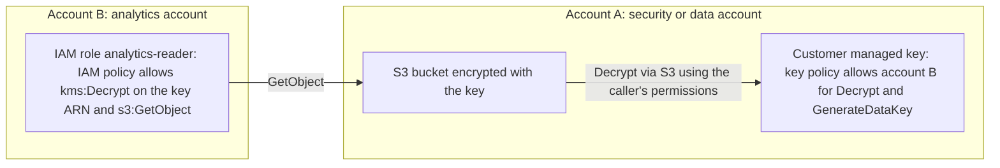

!!! note "Use the key ARN, not the alias, across accounts"
    Aliases are account- and Region-local. A principal in account B must reference the key by its ==full key ARN== in API calls and IAM policies. Aliases in account B cannot point to keys in account A.

#### Auditing KMS with CloudTrail

Every KMS API call is recorded as a CloudTrail ==management event==, including cryptographic operations such as `Decrypt` and `GenerateDataKey`. Each event records the caller identity, source IP or service, key ARN, encryption context and result. This makes KMS one of the most valuable forensic data sources in AWS.

| Question after an incident | How KMS audit answers it |
|----------------------------|--------------------------|
| Did the stolen credentials read customer data? | Search for `Decrypt` events by that principal on the data keys |
| Which objects or tenants were decrypted? | Inspect the encryption context in each event |
| Who changed the key policy? | `PutKeyPolicy` events |
| Did anyone try to delete keys? | `ScheduleKeyDeletion`, `DisableKey` events |
| Did access fail? | Events with `errorCode` such as `AccessDenied` |

!!! warning "High volume of KMS events"
    KMS events can be very numerous, particularly without Bucket Keys or with frequent client-side calls. Trails can exclude KMS events to control cost, but doing so removes the audit trail discussed above; prefer keeping them and using CloudTrail Lake, Athena queries or selective event data stores. [Chapter 7.2](../unit7/topic2.md) covers log retention and query design.

#### When AWS CloudHSM is needed

==AWS CloudHSM== provides dedicated, single-tenant FIPS 140-3 Level 3 validated HSMs in your VPC. You control the HSM users (crypto officers and crypto users) and AWS cannot access your keys. Choose CloudHSM when:

- a regulation or contract requires single-tenant HSMs under the customer's exclusive control;
- an application needs standard HSM interfaces (PKCS #11, JCE, OpenSSL dynamic engine, Microsoft CNG and KSP) rather than the KMS API, for example for Oracle TDE, Microsoft SQL Server TDE, or SSL/TLS offload on self-managed web servers;
- operations or algorithms are needed that KMS does not offer;
- KMS keys must be backed by a CloudHSM custom key store.

Otherwise, KMS is simpler, cheaper, more available and integrated with AWS services.

| Criterion | AWS KMS | AWS CloudHSM |
|-----------|---------|--------------|
| Tenancy | Multi-tenant HSM fleet | Single-tenant HSMs |
| Interface | AWS KMS API | PKCS #11, JCE, CNG, OpenSSL |
| AWS service integration | Native | Only through a KMS custom key store |
| Availability | Managed, regional | You deploy at least two HSMs across AZs |
| Pricing | Per key and per request | Per HSM per hour (significant; verify pricing) |
| Operational effort | Low | High: users, backups, cluster sizing, client software |

### AWS Service Deep Dive

#### Purpose

KMS centralises the creation, protection, authorisation, use and audit of cryptographic keys so that every AWS service and every application can encrypt data under customer control without handling raw keys.

#### Architecture

KMS is a ==regional== service. Each Region runs a fleet of hardened HSMs (validated under FIPS 140-3) behind a front-end API fleet. Front-end hosts authenticate the request with SigV4, evaluate the key policy, IAM policies and grants, and forward authorised requests to the HSMs over authenticated sessions. Key material is stored encrypted by HSM domain keys and is only ever in plaintext inside HSM memory. KMS keys are stored durably across multiple Availability Zones. KMS is designed so that ==no AWS operator can retrieve plaintext key material==, a property documented in the KMS cryptographic details whitepaper and validated by third-party audits.

#### Important Features

- Symmetric, asymmetric (RSA, ECC), HMAC and newer post-quantum signing keys.
- Key policies, IAM integration, grants and rich condition keys.
- Automatic, configurable and on-demand rotation.
- Aliases for indirection and manual rotation.
- Multi-Region keys.
- Imported key material with optional expiration.
- Custom key stores backed by CloudHSM or external key managers.
- Encryption context bound as additional authenticated data.
- Integration with over a hundred AWS services and with CloudTrail.
- VPC interface endpoints (AWS PrivateLink) and FIPS endpoints.
- `ReEncrypt` to change the key protecting a ciphertext without exposing plaintext to the caller.
- Attestation-based key release to AWS Nitro Enclaves.

#### Limitations

- Direct `Encrypt` limited to 4 KB of plaintext; bulk data needs envelope encryption.
- Keys are regional; cross-Region use needs multi-Region keys or re-encryption.
- Key spec and key usage cannot be changed after creation.
- Aliases do not work across accounts.
- Request quotas can throttle high-rate workloads.
- Automatic rotation unavailable for asymmetric and HMAC keys and for custom key stores.
- A deleted key cannot be recovered.

#### Pricing Model and recommendations

!!! note "Verify current pricing"
    Prices below are indicative and change over time and by Region. Always confirm on the AWS KMS pricing page.

| Item | Indicative price |
|------|------------------|
| Customer managed key | About 1 USD per key per month (prorated hourly) |
| Key rotation | Each of the first two rotated versions adds about 1 USD per month; further rotations are not charged additionally (verify) |
| AWS managed and AWS owned keys | No monthly key fee |
| Symmetric requests | About 0.03 USD per 10,000 requests, with a monthly free tier (around 20,000 requests) |
| Asymmetric and HMAC requests | Higher per-request price, varying by operation and key spec |
| Custom key stores | KMS pricing plus the cost of CloudHSM or your external key manager |

Recommendations: use one customer managed key per data domain or classification boundary rather than one per resource; enable S3 Bucket Keys; use services' own caching; use data key caching in client-side encryption; avoid calling `Decrypt` per request in hot paths.

#### Performance Characteristics

A KMS call is a network API call with typical latency in the low milliseconds within a Region. Envelope encryption keeps bulk encryption local, so data throughput is limited by the client or service, not by KMS. Asymmetric operations, particularly RSA signing, are slower than symmetric operations.

#### Scaling Behaviour

KMS scales transparently within ==request quotas==. Cryptographic operations share per-account, per-Region quotas (for symmetric keys, typically several thousand to tens of thousands of requests per second depending on the Region; verify in Service Quotas). Requests above the quota receive `ThrottlingException`. Calls made by AWS services on your behalf ==count against your quota==. Many quotas are adjustable.

#### Availability

KMS is a highly available regional service with a published SLA. Because many services depend on it, a KMS problem (for example an accidentally disabled key) behaves like a storage outage. Multi-Region keys and cross-Region replication patterns address Regional disaster recovery. Custom key stores inherit the availability of the underlying HSM cluster or external key manager.

#### Security Features

FIPS 140-3 validated HSMs; no plaintext key export; SigV4-authenticated TLS API; key policies with separation of duties; condition keys; grants; CloudTrail logging; PrivateLink endpoints; FIPS endpoints; compliance with PCI DSS, HIPAA-eligible, SOC and ISO programmes; resource control policies and SCPs to bound key use organisation-wide.

#### Service Limits

| Limit | Indicative value | Notes |
|-------|------------------|-------|
| Plaintext size for `Encrypt` | 4,096 bytes | Hard limit |
| KMS keys per account per Region | 100,000 | Adjustable |
| Aliases per key | 50 | |
| Grants per key | 50,000 | |
| Key policy document size | 32 KB | |
| Cryptographic request rate (symmetric) | Thousands to tens of thousands per second, Region dependent | Shared across operations; verify in Service Quotas |
| Deletion waiting period | 7–30 days | Default 30 |
| Rotation period | 90–2,560 days | Default 365 |

### Important AWS Terminology

| Term | Meaning |
|------|---------|
| KMS key | Logical key resource in KMS whose material stays in HSMs; formerly called a CMK |
| Key material | The cryptographic secret bits of a key; may have several versions after rotation |
| Data key | A symmetric key generated by KMS for encrypting bulk data outside KMS |
| Envelope encryption | Encrypting data with a data key and the data key with a KMS key |
| Encrypted data key | The `CiphertextBlob` returned by `GenerateDataKey`, stored with the data |
| Customer managed key | A KMS key you create and control |
| AWS managed key | A KMS key AWS creates in your account for a service, alias `aws/<service>` |
| AWS owned key | A key in an AWS account used by a service for default encryption; invisible to you |
| Key policy | Resource-based policy attached to a KMS key; the primary access control |
| Grant | A delegation of specific key permissions to a grantee principal |
| Encryption context | Non-secret key-value pairs bound to ciphertext as AAD and logged in CloudTrail |
| Alias | A friendly name pointing to a key within an account and Region |
| Multi-Region key | Interoperable keys in several Regions with shared material and key ID |
| Custom key store | A key store backed by CloudHSM or an external key manager |
| XKS proxy | Software you run that connects KMS to an external key manager |
| Crypto-shredding | Making data unrecoverable by destroying the key that encrypts it |
| S3 Bucket Key | Bucket-level key that reduces KMS calls for SSE-KMS |
| FIPS 140-3 | US and Canadian standard for validating cryptographic modules |

### Configuration Options

| Setting | Options | Guidance |
|---------|---------|----------|
| Key type | Symmetric, asymmetric, HMAC | Symmetric for encryption at rest and service integrations |
| Key usage | `ENCRYPT_DECRYPT`, `SIGN_VERIFY`, `GENERATE_VERIFY_MAC`, `KEY_AGREEMENT` | Chosen once; separate keys for separate purposes |
| Origin | `AWS_KMS`, `EXTERNAL`, `AWS_CLOUDHSM`, `EXTERNAL_KEY_STORE` | `AWS_KMS` unless a named requirement exists |
| Regionality | Single-Region, multi-Region | Single-Region by default |
| Rotation | Off, automatic with period, on demand | Enable automatic rotation on symmetric keys |
| Key policy | Default, console-generated, custom | Custom, least privilege, reviewed as code |
| Deletion window | 7–30 days | 30 days in production |
| Tags | Any | `DataClassification`, `Owner`, `Application`; usable in ABAC conditions |
| EBS encryption by default | Per Region, with a default key | Enable in every Region, with a customer managed key for production |
| S3 default encryption | SSE-S3, SSE-KMS, DSSE-KMS; Bucket Key on or off | SSE-KMS with Bucket Key for confidential data |

### Design Considerations

| Concern | Design question | Guidance |
|---------|-----------------|----------|
| Key granularity | One key per what? | Per application, data domain, environment and classification; per tenant only when tenant-level revocation or crypto-shredding is required. Too few keys increase blast radius; too many increase cost and policy sprawl |
| Availability | What happens if the key is disabled? | Treat keys as tier-0 dependencies; protect `DisableKey` and `ScheduleKeyDeletion`; monitor them |
| Durability | Can data outlive the key? | Only if the key remains; plan retention of keys for the retention period of data and backups |
| Latency | How many KMS calls per request? | Aim for zero per request in hot paths through caching and envelope encryption |
| Cost | Request volume | Bucket Keys, caching, fewer keys |
| Multi-account | Where do keys live? | Either in each workload account (simpler, service-local) or in a central security account (central control, cross-account complexity); many organisations keep keys with the workload and enforce standards through SCPs and IaC |
| Disaster recovery | Can the DR Region decrypt backups? | Copy backups with re-encryption under a destination-Region key; use multi-Region keys only when client-side ciphertext must decrypt in both Regions |
| Maintainability | How are key policies managed? | As code, reviewed, with policy validation (IAM Access Analyzer) |

### AWS Best Practices

| Pillar | Practice for encryption at rest |
|--------|-------------------------------|
| Operational Excellence | Define keys and key policies in IaC; tag keys; document key ownership; automate compliance checks with AWS Config rules such as encryption-enabled rules for S3, EBS and RDS |
| Security | Encrypt all data at rest; customer managed keys for sensitive data; separate administrators from users; encryption context; `kms:ViaService`; protect deletion; audit with CloudTrail; use IAM Access Analyzer to detect external access to keys |
| Reliability | Protect keys against deletion and disabling; plan cross-Region key availability for DR; monitor throttling |
| Performance Efficiency | Envelope encryption, Bucket Keys, data key caching, service-side caching |
| Cost Optimization | Consolidate keys by domain; Bucket Keys; avoid unnecessary custom key stores |
| Sustainability | Fewer KMS calls and less re-encryption reduce compute; lifecycle-delete data and retire keys that protect nothing |

### Security Considerations

- ==IAM and least privilege==: grant `kms:Decrypt` only to roles that need plaintext; grant `kms:Encrypt` or `kms:GenerateDataKey` separately to writers. A log producer may need only to encrypt.
- ==Key policy hygiene==: avoid `"Principal": "*"` without strong conditions; include the account delegation statement deliberately; validate with IAM Access Analyzer.
- ==Confused deputy protection==: when allowing service principals such as `logs.amazonaws.com` or `sns.amazonaws.com`, add `aws:SourceArn` or `aws:SourceAccount` conditions.
- ==Private access==: use a KMS interface VPC endpoint ([Section 8.2](../unit8/topic2.md)) so private workloads reach KMS without the internet, and optionally endpoint policies.
- ==Organisation guardrails==: SCPs that deny `kms:ScheduleKeyDeletion` except for a break-glass role, deny creation of unencrypted resources, and deny `kms:PutKeyPolicy` outside the security pipeline.
- ==Logging and alerting==: EventBridge rules on `DisableKey`, `ScheduleKeyDeletion` and `PutKeyPolicy` that notify the security team.
- ==Compliance==: customer managed keys with documented rotation and access reviews are commonly required evidence for PCI DSS, HIPAA and ISO 27001 audits.

### Performance Optimization

| Technique | Effect |
|-----------|--------|
| Envelope encryption | Bulk encryption local; one KMS call per data key |
| Data key caching (Encryption SDK) | Reuses data keys within bounded limits |
| S3 Bucket Keys | Large reduction in KMS calls for SSE-KMS |
| Reuse SDK clients and connections | Avoid TLS handshake cost per KMS call |
| Exponential backoff with jitter | Handle `ThrottlingException` gracefully ([Chapter 4.3](../unit4/topic3.md) retry pattern) |
| Monitor KMS usage | CloudWatch metrics for KMS API usage against quotas, and Service Quotas alarms |
| Prefer symmetric operations | Symmetric operations are faster and have higher quotas than asymmetric ones |

### Cost Optimization

- Enable ==S3 Bucket Keys== on SSE-KMS buckets unless per-object audit context is a hard requirement.
- Consolidate keys by domain instead of per resource; delete keys that protect no data (after confirming, with CloudTrail, that they are unused for a long period, and after the waiting period).
- Use AWS managed or AWS owned keys for non-sensitive data where no cross-account or custom policy is needed.
- Cache decrypted data keys and secrets in applications.
- Use ==Cost Explorer== filtered by the KMS service and by usage type (requests versus keys) to find expensive request patterns; use ==Trusted Advisor== and CloudTrail data to identify unused keys.

### Integration with Other AWS Services

| Service | How KMS is used | Architect's note |
|---------|-----------------|------------------|
| Amazon EBS | Volume data keys via grants; encryption by default per Region | Snapshots inherit the key; share only with customer managed keys |
| Amazon RDS and Aurora | Storage, snapshots, read replicas, backups | Encryption chosen at creation; to encrypt an unencrypted database, snapshot, copy encrypted, restore |
| Amazon DynamoDB | Always encrypted with AWS owned, AWS managed or customer managed key | Customer managed key enables audit and revocation |
| Amazon ECR | Repository encryption with AES-256 (AWS owned) or KMS | KMS encryption must be chosen at repository creation |
| AWS Lambda | Environment variables encrypted at rest; optional customer managed key; optional encryption helpers for client-side encryption of variable values | Prefer Secrets Manager for secrets rather than encrypted environment variables |
| Amazon ECS on Fargate | Ephemeral storage encrypted; customer managed key option for ephemeral storage and managed storage | Configure at cluster level |
| Amazon EKS | Envelope encryption of Kubernetes Secrets in etcd with a KMS key (enabled by default on newer cluster versions with AWS owned keys; customer managed key optional) | [Chapter 3.3](../unit3/topic3.md) |
| CloudWatch Logs | Log group encryption with a customer managed key | Key policy must allow `logs.<region>.amazonaws.com` with `kms:EncryptionContext:aws:logs:arn` |
| Amazon SQS, SNS, Kinesis | Server-side encryption with KMS | Producers need `kms:GenerateDataKey`; consumers need `kms:Decrypt`; event sources such as EventBridge or S3 need key policy permission |
| AWS Backup | Vault encryption with KMS; cross-account and cross-Region copy | Use a separate backup account with its own keys for ransomware resilience |
| Secrets Manager, Parameter Store, AWS Private CA | Protect secrets and CA keys | Covered in later parts |

!!! example "Architecture example: encrypted event pipeline"
    An S3 bucket encrypted with SSE-KMS sends object-created events to an SQS queue also encrypted with a customer managed key. For this to work, the queue's key policy must allow the S3 service principal to call `kms:GenerateDataKey` and `kms:Decrypt` (with `aws:SourceArn` set to the bucket). The consuming Lambda function's role needs `kms:Decrypt` on the queue key to receive messages and on the bucket key to read the object. Missing one of these statements produces silent message loss or `AccessDenied` errors, a common Unit VI integration problem (see [6.1](../unit6/topic1.md) and [6.3](../unit6/topic3.md)).

### Common Architecture Patterns

| Pattern | Description | When to use |
|---------|-------------|-------------|
| Default encryption everywhere | Every storage service encrypted with at least AWS managed keys, enforced by Config and SCPs | Baseline for every account |
| Key per data domain | One customer managed key per bounded context of the microservice architecture ([Chapter 4.1](../unit4/topic1.md)) | Aligns key access with service ownership |
| Tenant isolation with encryption context | One key, with `tenantId` in context, and ABAC conditions per tenant role | Multi-tenant SaaS with many tenants |
| Key per tenant | Separate key per tenant | Tenants require revocation or crypto-shredding of their own data |
| Central backup vault account | Backups copied to an isolated account with its own keys | Ransomware and insider resilience |
| Client-side encryption before storage | Encryption SDK encrypts fields before they reach the database | Storage and DBAs must not see plaintext |
| Sign and verify | Asymmetric KMS key signs tokens or artefacts; verifiers use the public key | Code signing, JWT issuance, document signing |

### Industry Use Cases

- ==Financial services==: customer managed keys per data domain, separation of duties between security and application teams, CloudHSM for payment HSM-style workloads, audit evidence for regulators.
- ==Healthcare==: HIPAA-eligible storage encrypted with customer managed keys; encryption context carrying record identifiers for audit.
- ==SaaS providers==: per-tenant keys or context-based isolation, with tenant offboarding implemented as crypto-shredding.
- ==Media and data lakes==: SSE-KMS with Bucket Keys on petabyte-scale S3 lakes queried by Athena and EMR.
- ==Public sector and education==: sovereignty requirements met with regional keys and, in rare cases, external key stores; student records protected under privacy law.

### Advantages

- ==Strong security without HSM operations==: FIPS-validated HSMs with no key export.
- ==Uniform access control and audit==: one model for all services, fully logged.
- ==Transparent integration==: most services need a single parameter.
- ==Non-disruptive rotation==: new material without re-encrypting data.
- ==Separation of duties and cross-account control== through key policies.

### Limitations

- ==Regional scope== complicates multi-Region designs.
- ==Request quotas== can throttle very high-rate direct usage.
- ==Operational risk of self-inflicted outages==: a disabled or deleted key stops dependent services.
- ==Policy complexity==: key policies, IAM, grants and SCPs interact in ways that confuse newcomers.
- ==Cost at scale== if Bucket Keys and caching are not used.

### Common Mistakes

| Mistake | Consequence | Correction |
|---------|-------------|------------|
| Removing the account delegation statement from a key policy | Key becomes unmanageable; IAM policies stop working | Keep it, or ensure an explicit administrator statement; validate with Access Analyzer |
| Using `aws/ebs` or `aws/rds` for data that must be shared | Snapshots cannot be shared cross-account | Use customer managed keys |
| Scheduling deletion of an "unused" key | Old backups or archives become unreadable | Check CloudTrail for usage, disable first, wait, use 30-day window |
| Granting `kms:*` to application roles | Applications can change policies or delete keys | Grant only cryptographic actions needed |
| Storing plaintext data keys | Encryption becomes ineffective | Keep plaintext data keys only in memory |
| Placing personal data in encryption context | Sensitive data exposed in CloudTrail | Use opaque identifiers |
| Forgetting service principals in key policies for SNS, SQS, CloudWatch Logs | Silent delivery failures | Add service principal statements with source conditions |
| No backoff on throttling | Cascading failures under load | Retries with exponential backoff and jitter; caching; quota increases |
| Assuming rotation re-encrypts data | False sense of compliance | Understand that rotation affects new encryptions only |

### Summary

AWS KMS turns encryption at rest from a cryptographic problem into an access-control and audit problem. Data is encrypted locally with data keys; data keys are protected by KMS keys whose material never leaves FIPS 140-3 validated HSMs; every use of a KMS key is authorised by a key policy, IAM and grants, and recorded in CloudTrail. Integrated services perform this envelope encryption transparently, differing mainly in how often they call KMS and how they cache.

Architectural lessons:

- ==Encryption is a default; key control is the design decision.== Default encryption is free; choose AWS owned, AWS managed or customer managed keys based on audit, sharing and revocation needs.
- ==The key policy is the root of trust.== Keep the account delegation statement deliberately, separate administrators from users, and constrain use with `kms:ViaService`, encryption context and caller conditions.
- ==Envelope encryption is how everything scales.== Understand data keys, caching and Bucket Keys to control latency, throttling and cost.
- ==Disabling or deleting a key is equivalent to deleting data.== Protect those actions with SCPs, alarms and waiting periods.
- ==Use customer managed keys wherever data may cross accounts or need crypto-shredding.==
- ==Reach for CloudHSM or external key stores only with a named requirement.==

## Encryption in Transit with AWS Certificate Manager

### Definition

==AWS Certificate Manager (ACM) is a managed service that provisions, stores, deploys and automatically renews public and private X.509 TLS certificates for use with integrated AWS services, so that applications can serve encrypted traffic without handling private keys.==

==AWS Private Certificate Authority (AWS Private CA) is a managed service for operating private certificate authorities whose certificates are trusted only by systems you configure, used for internal services, mutual TLS, devices and workloads.==

ACM sits at the ==edge and ingress layer== of the architecture: CloudFront distributions, Application and Network Load Balancers, API Gateway custom domains, App Runner and Amplify. AWS Private CA sits at the ==internal identity layer==: service-to-service mTLS, device identity and client certificates.

### Why This Service or Concept Exists

Encryption in transit protects confidentiality and integrity against eavesdropping and man-in-the-middle attacks, and ==authenticates the server== (and, with mTLS, the client). Before managed certificates, teams bought certificates from a CA, generated private keys on servers, installed certificates manually and tracked expiry dates in spreadsheets. Expired certificates are one of the most common causes of preventable outages, and private keys copied between servers are a frequent source of compromise.

ACM addresses both: ==private keys for ACM certificates are generated and protected by AWS and never exposed== (except for the deliberately exportable type), and ==renewal is automatic== when validation remains in place. Public certificates used with integrated services are provided at no additional charge, removing cost as an excuse for unencrypted endpoints.

### Core Concepts

#### TLS refresher

TLS (Transport Layer Security) establishes an encrypted, authenticated channel over TCP. Its handshake negotiates versions and cipher suites, authenticates the server with a certificate and derives symmetric session keys.

```mermaid
sequenceDiagram
    participant C as Client browser or service
    participant S as Server such as ALB or CloudFront
    C->>S: ClientHello: TLS versions, cipher suites, key share, SNI hostname
    S->>C: ServerHello: chosen version and cipher, key share
    S->>C: Certificate chain, CertificateVerify signature, Finished
    C->>C: Validate chain to trusted root, hostname, validity dates
    C->>S: Finished
    Note over C,S: TLS 1.3 completes in one round trip; application data is encrypted with symmetric session keys
    C->>S: Encrypted HTTP request
    S->>C: Encrypted HTTP response
```

| Aspect | TLS 1.2 | TLS 1.3 |
|--------|---------|---------|
| Handshake round trips | Two | One (zero with resumption and early data, with replay caveats) |
| Key exchange | RSA or (EC)DHE | (EC)DHE only; forward secrecy mandatory |
| Cipher suites | Many, including weak legacy suites | Small set of AEAD suites (AES-GCM, ChaCha20-Poly1305) |
| Certificate encryption in handshake | Sent in clear | Encrypted |
| Recommendation | Minimum acceptable version | Preferred |

Key terms:

- ==Certificate chain==: the server's leaf certificate, one or more intermediate CA certificates, leading to a root CA certificate that the client already trusts. The server must send the leaf and intermediates.
- ==Subject Alternative Name (SAN)==: the list of hostnames a certificate is valid for; wildcards such as `*.example.com` cover one label level.
- ==SNI (Server Name Indication)==: the client includes the requested hostname in `ClientHello`, allowing one IP address or load balancer to present different certificates for different domains. ALB, NLB and CloudFront use SNI to select among multiple certificates.
- ==Forward secrecy==: ephemeral key exchange ensures that compromise of a server's long-term private key does not reveal past sessions.
- ==Certificate validity==: industry rules (the CA/Browser Forum) are progressively shortening the maximum validity of public certificates, from 398 days to 200 days from 2026 and towards 47 days by 2029. Automation such as ACM renewal becomes mandatory rather than optional.

#### Public and private certificates

| Aspect | Public certificate (ACM) | Private certificate (AWS Private CA) |
|--------|--------------------------|--------------------------------------|
| Trusted by | All browsers and operating systems | Only clients configured to trust your private root |
| Issued by | Amazon Trust Services public CA | Your CA hierarchy in AWS Private CA |
| Domain validation | Required (DNS or email) | Not required; you control naming |
| Names allowed | Public DNS names you control | Any names, including internal names such as `orders.svc.cluster.local` |
| Cost | No charge for use with integrated services; exportable certificates are charged | Monthly charge per CA plus per-certificate charges (verify pricing) |
| Typical uses | Public websites and APIs | Internal microservices, mTLS clients, IoT devices, VPN, internal ALBs |

AWS Private CA supports root and subordinate CAs, CRLs and OCSP for revocation, certificate templates, and a lower-cost ==short-lived certificate mode== for certificates valid for up to seven days, suited to workload identities that are reissued frequently. Private CA can be shared across accounts with AWS Resource Access Manager.

#### Domain validation: DNS versus email

For a public certificate, ACM must confirm that you control the domain.

| Method | How it works | Renewal | Recommendation |
|--------|--------------|---------|----------------|
| DNS validation | ACM gives a CNAME record; you create it in the domain's DNS zone (one click for Route 53) | Automatic as long as the CNAME remains | Preferred |
| Email validation | ACM sends approval emails to domain contacts and standard addresses such as `admin@` | Requires a human to approve again | Avoid except when DNS cannot be changed |
| HTTP validation | Available for certain CloudFront-related issuance scenarios (verify current support) | Automatic while the validation file is served | Special cases |

!!! tip "Why DNS validation enables unattended renewal"
    With DNS validation, the CNAME record is a standing proof of control. At renewal time ACM checks the record again and reissues silently. Removing the CNAME, or migrating DNS to another provider without copying it, silently breaks renewal, which is why expiry monitoring remains necessary.

#### Where ACM certificates can be used

| Integrated service | Notes |
|--------------------|-------|
| Elastic Load Balancing (ALB, NLB) | Certificate in the same Region as the load balancer; multiple certificates via SNI |
| Amazon CloudFront | ==Certificate must be in us-east-1 (N. Virginia)==, regardless of origin location |
| Amazon API Gateway | Edge-optimised custom domains need us-east-1 certificates; Regional custom domains need a certificate in the API's Region |
| AWS App Runner, AWS Amplify | Managed through the service's custom domain feature |
| AWS Elastic Beanstalk, Amazon Cognito custom domains, AWS Verified Access, VPC Lattice custom domains | Through their load balancers or native integration |

!!! warning "Why you cannot normally install an ACM public certificate on EC2"
    Standard ACM public certificates are ==non-exportable==: AWS never releases their private keys. They can only be attached to integrated services, which hold the key in AWS-managed infrastructure. To serve TLS directly from EC2, containers or on-premises servers, the options are: put an integrated load balancer or CloudFront in front; use an ==exportable public certificate== (a newer ACM option, charged per certificate, whose private key you can export with a passphrase, and which you must install and re-install after each renewal yourself); use AWS Private CA certificates for internal traffic; or obtain a certificate from another CA. ACM for Nitro Enclaves is a further special case that allows EC2 web servers to use ACM certificates inside an enclave.

#### Where to terminate TLS

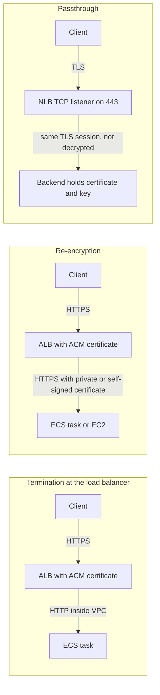

| Pattern | Where the TLS session ends | Advantages | Disadvantages | When to use |
|---------|---------------------------|------------|---------------|-------------|
| Termination | Load balancer or CloudFront | Simple, ACM automation, layer-7 routing, WAF inspection, offloads CPU | Traffic inside VPC is plaintext | Internal traffic trusted and regulations permit; many web applications |
| Re-encryption (end-to-end) | Load balancer, then a new TLS session to the target | Layer-7 features and WAF still possible; encrypted in VPC | Targets need certificates (private CA or self-signed; ALB does not validate target certificates) | Regulated workloads (PCI DSS, HIPAA) requiring encryption on every hop |
| Passthrough | Backend | Load balancer never sees plaintext; client certificates reach the backend | No layer-7 routing or WAF at the load balancer; backend manages certificates | Strict end-to-end requirements, custom protocols, backend mTLS |
| NLB TLS listener | NLB, optionally re-encrypting to targets | ACM certificates at layer 4; preserves high performance | No HTTP awareness | TCP services needing managed TLS |

!!! note "Nitro encryption of VPC traffic"
    Traffic between certain modern Nitro-based instance types in the same or peered VPCs is automatically encrypted at the network layer by the Nitro hardware. This helps, but it is not a substitute for application-level TLS when a requirement demands authenticated, end-to-end encryption, because it does not authenticate services or cover all paths.

#### Mutual TLS

In ordinary TLS only the server presents a certificate. In ==mutual TLS (mTLS)== the client also presents a certificate, and the server verifies it against a trusted CA. mTLS gives ==strong, cryptographic client identity==, used for B2B APIs, IoT devices, banking open APIs and zero-trust service-to-service communication.

| Where | How mTLS is configured | Notes |
|-------|------------------------|-------|
| API Gateway (REST and HTTP APIs) | Custom domain with a truststore (PEM bundle of CA certificates) in S3 | Default execute-api endpoint should be disabled so clients cannot bypass mTLS |
| Application Load Balancer | HTTPS listener with a ==trust store== resource; ==verify mode== (ALB validates the client certificate against the trust store, with optional CRLs) or ==passthrough mode== (ALB forwards the client certificate chain to targets in HTTP headers) | Targets can read certificate details from headers such as `X-Amzn-Mtls-Clientcert` |
| NLB with TCP passthrough | Backend performs mTLS | Full control at the backend |
| AWS IoT Core | X.509 client certificates per device | Device identity at scale |

#### Service-to-service encryption and service mesh

[Section 4.2](../unit4/topic2.md) introduced service meshes. For encryption, the architectural options in 2026 are:

| Option | Encryption and identity | Status and notes |
|--------|------------------------|------------------|
| AWS App Mesh | Envoy sidecars with TLS and mTLS using ACM Private CA or file certificates | ==Being discontinued: AWS announced end of support on 30 September 2026==; new designs should not use it, and existing users should migrate |
| Amazon VPC Lattice | Managed application networking across VPCs and accounts; HTTPS listeners with ACM certificates, IAM authentication policies (SigV4) for service-to-service authorisation, TLS passthrough option | AWS-recommended successor for many App Mesh use cases on ECS, EKS, Lambda and EC2 |
| Amazon ECS Service Connect | Service discovery and proxying for ECS; optional TLS with certificates from AWS Private CA, rotated automatically | Suitable for ECS-only estates |
| Istio or Linkerd on EKS | Automatic mTLS between pods using mesh-issued workload certificates, optionally chained to AWS Private CA (for example through cert-manager with the AWS Private CA issuer) | Most feature-rich; highest operational effort ([Chapter 3.3](../unit3/topic3.md)) |

#### TLS security policies and HSTS

A ==TLS security policy== on a load balancer or CloudFront determines the protocol versions and cipher suites accepted.

| Service | Example policy names | Guidance |
|---------|---------------------|----------|
| ALB and NLB | `ELBSecurityPolicy-TLS13-1-2-2021-06` (TLS 1.3 and 1.2, default for new listeners), `ELBSecurityPolicy-TLS13-1-3-2021-06` (TLS 1.3 only), FIPS and post-quantum hybrid variants | Use a TLS 1.2+ policy; TLS 1.3-only where all clients support it; FIPS policies for regulated workloads |
| CloudFront viewer | `TLSv1.2_2021` and newer | TLS 1.2 minimum |
| API Gateway custom domains | TLS 1.2 security policies, with newer enhanced policies | Avoid TLS 1.0 policies |

==HTTP Strict Transport Security (HSTS)== is a response header (`Strict-Transport-Security: max-age=31536000; includeSubDomains`) that instructs browsers to use only HTTPS for the domain in future, preventing downgrade attacks on the first plain HTTP request. On AWS it is added with a CloudFront ==response headers policy==, in the application, or by ALB response header modification. Combine it with HTTP-to-HTTPS redirects on ALB listeners and CloudFront viewer protocol policies.

#### Enforcing TLS for AWS API access

Clients reach AWS service APIs over HTTPS by default, but some can be configured otherwise, and policy should make the requirement explicit. The global condition key `aws:SecureTransport` is `false` when a request arrives over plain HTTP. A bucket policy that denies such requests is a standard control. S3 also supports `s3:TlsVersion` to require a minimum TLS version. SNS and SQS topic and queue policies can deny non-TLS publishing in the same way.

#### Certificate expiry monitoring

| Mechanism | What it provides |
|-----------|------------------|
| CloudWatch metric `DaysToExpiry` (namespace `AWS/CertificateManager`) | Daily metric per certificate; alarm when below, for example, 30 days |
| EventBridge event "ACM Certificate Approaching Expiration" | Emitted daily starting a configurable number of days before expiry (default 45; configurable with `PutAccountConfiguration`) |
| EventBridge events for renewal actions and failures | Detect failed managed renewals |
| AWS Health events | Notifications for certificates that need action |
| AWS Config rule `acm-certificate-expiration-check` | Compliance reporting across accounts |

!!! danger "Imported certificates never renew"
    Certificates ==imported== into ACM from another CA are not renewed by ACM. They expire on their original date unless you import a replacement. Every imported certificate needs a `DaysToExpiry` alarm and an owner.

### AWS Service Deep Dive

| Aspect | ACM | AWS Private CA |
|--------|-----|----------------|
| Purpose | Public and private certificates for integrated services with managed renewal | Private CA hierarchies and private certificate issuance |
| Architecture | Regional; certificates and keys stored per Region; integrated services retrieve keys securely | Regional CA resources whose private keys are held in FIPS-validated HSMs |
| Important features | DNS and email validation, managed renewal, SNI support in integrated services, import, exportable public certificates, EventBridge and CloudWatch integration | Root and subordinate CAs, templates, CRL and OCSP, short-lived mode, RAM sharing, Kubernetes and IoT integrations, issuance through ACM for managed private certificates |
| Limitations | Regional; non-exportable standard certificates; imported certificates do not renew; CloudFront needs us-east-1 | Cost; you design hierarchy and revocation; clients must trust your root |
| Pricing (verify) | Public certificates used with integrated services: no charge; exportable certificates: per-certificate fee, higher for wildcards | Per CA per month (general-purpose mode considerably more than short-lived mode) plus per-certificate fees in tiers |
| Performance | TLS handled by integrated services; no runtime dependency on ACM | Issuance latency seconds; OCSP and CRL availability affects clients |
| Scaling | Handled by the integrated service | Issuance rate quotas per CA |
| Availability | Certificates deployed in service infrastructure; ACM outage does not stop serving | CA outage affects issuance, not existing certificates |
| Security | Keys protected and never exposed (standard type); CloudTrail logging; IAM and SCP control of `acm:RequestCertificate` | Separation of CA administration, audit reports, CloudTrail |
| Service limits (verify) | Default quota of a few thousand ACM certificates per account per Region; up to 10 domain names per certificate by default (adjustable, to 100) | CAs per Region and issuance rates quoted per account |

### Important AWS Terminology

| Term | Meaning |
|------|---------|
| X.509 certificate | Standard format binding a public key to an identity, signed by a CA |
| Certificate chain | Leaf, intermediate and root certificates linking a server to a trusted root |
| SAN | Subject Alternative Name: hostnames covered by the certificate |
| SNI | TLS extension carrying the requested hostname |
| DNS validation | Proof of domain control using a CNAME record |
| Managed renewal | ACM's automatic reissuance of certificates |
| Imported certificate | Certificate from another CA stored in ACM; not renewed by ACM |
| Exportable public certificate | ACM public certificate whose private key can be exported, for a fee |
| Trust store | Collection of CA certificates used by ALB to verify client certificates |
| Truststore (API Gateway) | S3-hosted PEM bundle used for mTLS on custom domains |
| TLS security policy | Allowed protocol versions and cipher suites |
| HSTS | Header forcing browsers to use HTTPS |
| mTLS | TLS with certificates presented by both client and server |
| Short-lived certificate mode | Private CA mode for certificates valid up to seven days, at lower cost |

### Design Considerations

- ==Scalability==: TLS termination at ALB, NLB and CloudFront scales automatically; do not build custom TLS proxies for scale.
- ==Availability==: certificates are deployed in the integrated service, so serving does not depend on ACM availability; the risk is expiry, handled by DNS validation and monitoring.
- ==Latency==: terminate TLS as close to users as possible (CloudFront edge) with TLS 1.3 and session resumption; keep origin connections persistent.
- ==Security versus observability==: termination enables WAF and layer-7 routing; passthrough prevents both. Re-encryption is the usual compromise for regulated data.
- ==Certificate strategy==: prefer many specific certificates managed as code over one wildcard shared widely; a wildcard's compromise affects every subdomain.
- ==Operational complexity==: private PKI adds trust distribution, revocation and hierarchy design; use it when internal identity is genuinely needed.

### AWS Best Practices

| Pillar | Practice |
|--------|----------|
| Operational Excellence | Certificates in IaC with DNS validation records; expiry alarms and EventBridge rules; Config rules for listeners |
| Security | TLS 1.2 minimum, TLS 1.3 preferred; HTTPS redirects; HSTS; `aws:SecureTransport` denies; mTLS for B2B and service-to-service where identity matters; restrict who can request or import certificates |
| Reliability | DNS validation; monitor renewal events; avoid imported certificates or automate their replacement |
| Performance Efficiency | TLS at the edge, HTTP/2 and HTTP/3 on CloudFront, connection reuse to origins |
| Cost Optimization | Use free public ACM certificates on integrated services; short-lived mode for high-volume private workload certificates; share one Private CA across accounts with RAM |
| Sustainability | Offload TLS to managed services running on efficient hardware instead of self-managed proxy fleets |

### Security Considerations

- IAM: restrict `acm:ImportCertificate`, `acm:DeleteCertificate`, `acm:ExportCertificate` and all `acm-pca:*` issuance actions to specific roles; issuance from a private CA is equivalent to minting identities.
- Security groups ([Section 8.2](../unit8/topic2.md#vpc-design-and-security-groups)): allow 443 from the internet only to the load balancer or CloudFront origin-facing ranges; keep targets private.
- Private versus public resources: internal ALBs with private certificates for internal APIs; public ALBs only where needed.
- Logging: ALB access logs record TLS protocol and cipher per request (useful for finding legacy clients before tightening policies); CloudFront logs; CloudTrail for ACM and Private CA.
- Compliance: PCI DSS requires strong cryptography on public networks and commonly end-to-end encryption; FIPS endpoints and FIPS TLS policies for US government workloads.

### Performance Optimization and Cost Optimization

| Area | Technique |
|------|-----------|
| Handshake cost | TLS 1.3, session resumption, CloudFront edge termination, keep-alive to origins |
| Connection reuse | Reuse SDK and HTTP clients in Lambda and containers so TLS handshakes are not repeated per request |
| Load balancing | Offload TLS to ALB and NLB rather than application CPUs |
| Certificate cost | Free public certificates on integrated services; exportable certificates only where necessary |
| Private CA cost | One shared CA hierarchy per organisation, short-lived mode where suitable; review with Cost Explorer |

### Integration with Other AWS Services

| Service | Integration |
|---------|-------------|
| Route 53 | Automatic creation of DNS validation records |
| CloudFront | Viewer certificates from us-east-1; origin protocol policy HTTPS only; response headers policy for HSTS |
| ALB and NLB | HTTPS and TLS listeners, SNI, trust stores for mTLS, TLS policies |
| API Gateway | Custom domains, mTLS truststores |
| AWS WAF | Inspection requires termination at CloudFront, ALB or API Gateway |
| EventBridge and CloudWatch | Expiry and renewal monitoring |
| EKS | AWS Load Balancer Controller annotations referencing ACM certificate ARNs; cert-manager with Private CA issuer |
| ECS Service Connect and VPC Lattice | Private CA and ACM certificates for internal traffic |
| KMS | Protects exported private keys and Private CA keys |

### Common Architecture Patterns

| Pattern | Description |
|---------|-------------|
| Edge termination with encrypted origin | CloudFront (us-east-1 certificate) to ALB over HTTPS (Regional certificate) to ECS targets over HTTPS |
| API gateway pattern with mTLS | Partners authenticate with client certificates at API Gateway; backend Lambda receives validated identity |
| Zero-trust service network | VPC Lattice with HTTPS and IAM auth policies, or Istio mTLS on EKS, so every call is encrypted and authenticated |
| Private PKI hub | Central Private CA in a security account shared through RAM to workload accounts |
| Expiry automation | EventBridge rule on expiry events to SNS or chat and a ticketing workflow ([Section 7.3](../unit7/topic3.md#creating-cloudwatch-dashboards-and-alarms)) |

### Industry Use Cases

- ==E-commerce==: CloudFront and ALB with ACM certificates, TLS 1.2+ enforced, HSTS, PCI DSS end-to-end encryption.
- ==Open banking==: mTLS APIs with regulator-issued client certificates on API Gateway or ALB trust stores.
- ==IoT==: millions of devices with X.509 certificates issued by AWS Private CA and registered with AWS IoT Core.
- ==Internal platforms==: Kubernetes meshes with automatically rotated workload certificates chained to Private CA.

### Advantages

- ==No private key handling== for standard certificates; keys never exposed.
- ==Automatic renewal== eliminates the most common certificate outage.
- ==No charge== for public certificates on integrated services.
- ==Deep integration== with edge and ingress services, SNI and mTLS.

### Limitations

- ==Non-exportable by default==; EC2 and on-premises servers need other approaches or exportable certificates.
- ==Regional==, with the us-east-1 exception for CloudFront and edge-optimised APIs, which surprises many teams.
- ==Imported certificates do not renew.==
- ==Private PKI costs and complexity== with AWS Private CA.
- Termination at managed services means the provider's infrastructure sees plaintext, which some strict regimes disallow (then use passthrough).

### Common Mistakes

| Mistake | Consequence | Correction |
|---------|-------------|------------|
| Requesting a CloudFront certificate in the application's Region | Certificate not selectable in CloudFront | Request in us-east-1 |
| Email validation or deleted CNAME | Renewal fails, outage at expiry | DNS validation; keep records in IaC; monitor |
| HTTP listener without redirect | Users and APIs send data in clear | Redirect 80 to 443; HSTS |
| Origin protocol HTTP only on CloudFront | Unencrypted segment across the internet | Origin protocol policy HTTPS only |
| Old TLS policies left in place | Weak ciphers accepted | Adopt current TLS 1.2+/1.3 policies after checking access logs |
| mTLS on API Gateway with default endpoint enabled | Clients bypass mTLS | Disable the execute-api endpoint |
| Designing new meshes on App Mesh | Forced migration | Use VPC Lattice, Service Connect or Istio |

### Summary

Encryption in transit on AWS is built from TLS at every hop, with ACM providing managed, auto-renewing public certificates for integrated services and AWS Private CA providing internal identities. The architect decides where TLS terminates (termination, re-encryption or passthrough), where client identity is required (mTLS on API Gateway, ALB, VPC Lattice, Service Connect or Istio), which TLS policies are acceptable, and how expiry is monitored.

Architectural lessons:

- ==Encrypt every hop that a requirement names, and authenticate what matters.== Termination is convenient; re-encryption or passthrough is required for strict end-to-end regimes.
- ==Automate certificate lifecycle.== DNS validation, managed renewal and expiry alarms prevent the classic certificate outage, which shortening validity periods make more likely.
- ==Remember the Region rules.== CloudFront and edge-optimised APIs need us-east-1 certificates.
- ==Enforce, do not assume.== HTTPS redirects, HSTS, TLS policies and `aws:SecureTransport` denies turn intentions into controls.
- ==Plan beyond App Mesh.== Choose VPC Lattice, Service Connect or Istio for service-to-service encryption.

## Secrets Management with AWS Secrets Manager

### Definition

==AWS Secrets Manager is a managed service that stores, encrypts with KMS, controls access to, audits, replicates and automatically rotates secrets such as database credentials, API keys and tokens, and delivers them to applications at runtime through an API.==

It sits between ==identity== (the IAM role of the workload) and the ==protected resource== (a database or external API). The application proves its identity with its role, retrieves the secret over TLS, and uses it; no human needs to know the current value.

### Why This Service or Concept Exists

The first rule of secrets is: ==if a workload can use an IAM role, it should not have a secret at all==. Calls to S3, DynamoDB, SQS or KMS from ECS, EKS (Pod Identity or IRSA), Lambda and EC2 use temporary role credentials ([Section 8.1](../unit8/topic1.md#iam-users-groups-and-roles)). Secrets remain necessary for systems that do not understand IAM: relational database users (unless IAM database authentication is used), third-party SaaS APIs, legacy systems, signing keys for webhooks, and OAuth client secrets.

| Storage approach | Problems |
|------------------|----------|
| Hard-coded in source | Visible to everyone with repository access, persists forever in Git history, leaked by public repositories; rotation requires a redeploy |
| Plain environment variables in task definitions or function configuration | Visible to anyone who can describe the task or function; logged by debugging tools; copied into CI logs; no rotation |
| Configuration files on servers or container images | Baked into images and snapshots; spread across hosts |
| Shared spreadsheets or chat | No audit, no revocation, human exposure |
| Secrets Manager | Encrypted with KMS, IAM-controlled, CloudTrail audited, rotated automatically, retrieved at runtime |

Leaked credentials are one of the most common initial access vectors in cloud breaches. Automatic rotation limits how long a leaked secret is useful, and runtime retrieval means a secret never needs to exist in code, images or pipelines.

### Core Concepts

#### Secrets Manager compared with Parameter Store

| Feature | Secrets Manager | Parameter Store Standard | Parameter Store Advanced |
|---------|-----------------|--------------------------|--------------------------|
| Primary purpose | Secrets with lifecycle | Configuration values, some secrets | Larger or policy-driven configuration |
| Encryption | Always, with KMS | Optional `SecureString` with KMS | Optional `SecureString` with KMS |
| Maximum size | 64 KB | 4 KB | 8 KB |
| Automatic rotation | Built in: managed rotation and rotation Lambda functions | No (build it yourself) | No (parameter policies can notify on expiry) |
| Cross-account access | Resource-based policies | Limited (advanced parameters can be shared through RAM) | Sharing through RAM |
| Multi-Region replication | Built in | No | No |
| Database integrations | RDS, Aurora, Redshift, DocumentDB managed rotation; RDS-managed master passwords | No | No |
| Versioning | Staging labels | Version numbers and labels | Version numbers and labels |
| Pricing (verify) | About 0.40 USD per secret per month plus about 0.05 USD per 10,000 API calls | No charge for standard parameters and standard throughput | Charge per parameter per month and per API interaction; higher throughput charged |
| Best for | Credentials that must rotate or be shared across accounts or Regions | Feature flags, endpoints, non-rotating configuration | Larger configuration, parameter policies |

!!! tip "A pragmatic rule"
    Use ==Parameter Store for configuration== and ==Secrets Manager for credentials==. Parameter Store can reference Secrets Manager secrets (`/aws/reference/secretsmanager/<name>`), so applications that already read Parameter Store can obtain secrets through the same API while the secret itself lives in Secrets Manager.

#### Secret structure

A secret has ==metadata== (name, ARN with a random six-character suffix, description, KMS key, tags, resource policy, rotation configuration, replication configuration) and one or more ==versions==. Each version holds a `SecretString` (commonly JSON) or `SecretBinary`. For database secrets the conventional JSON structure is:

```json
{
  "engine": "postgres",
  "host": "orders.cluster-abc123.eu-west-1.rds.amazonaws.com",
  "port": 5432,
  "username": "orders_app",
  "password": "generated-by-secrets-manager",
  "dbname": "orders"
}
```

#### Versions and staging labels

A secret can have multiple versions, and ==staging labels== identify their role. Applications normally request the version labelled `AWSCURRENT` (the default when no version is specified).

| Label | Meaning |
|-------|---------|
| `AWSCURRENT` | The version applications should use now |
| `AWSPENDING` | A new version being created during rotation, not yet validated |
| `AWSPREVIOUS` | The version that was current before the last rotation; allows rollback and in-flight connections |
| Custom labels | Your own labels for application-specific versioning |

Labels move; versions do not change. Rotation is essentially a controlled ==move of the `AWSCURRENT` label== from one version to another.

#### Rotation

Rotation replaces a secret's value and updates the protected system so that both agree. Secrets Manager supports:

- ==Managed rotation==: for services that own the credential, such as RDS-managed master passwords, the service rotates without any Lambda function you maintain.
- ==Rotation by Lambda function==: Secrets Manager invokes a function you deploy (AWS provides templates for RDS and Aurora engines, Redshift, DocumentDB and others, and you write your own for third-party APIs).

Schedules can be expressed as a number of days or as `cron`/`rate` expressions, with a rotation window; the shortest interval is every four hours. `RotateSecret` can also be called on demand, for example immediately after a suspected leak.

##### The four steps of a rotation function

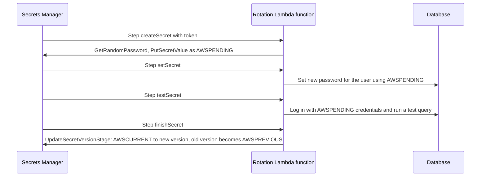

| Step | Responsibility | Must be idempotent because |
|------|----------------|---------------------------|
| `createSecret` | Generate a new value and store it as `AWSPENDING` (skip if it already exists for this token) | Secrets Manager may retry any step |
| `setSecret` | Change the credential in the target system | Retries must not fail if the password is already set |
| `testSecret` | Verify the new credential works | Prevents promoting a broken secret |
| `finishSecret` | Move `AWSCURRENT` to the new version | Completes rotation atomically |

##### Rotation strategies

| Strategy | How it works | Advantage | Disadvantage | Use when |
|----------|--------------|-----------|--------------|----------|
| Single user | One database user's password is changed in place | Simple; one user | Brief window where clients holding the old password fail new connections until they refresh | Low-concurrency workloads, clients that retry and refresh |
| Alternating users | Two users (for example `app` and `app_clone`); each rotation updates the inactive user and switches `AWSCURRENT` to it | No window where the current credentials are invalid; old credentials keep working until the next rotation | Needs a separate superuser secret to manage users; more complex | High-availability production applications |

!!! warning "Applications must tolerate rotation"
    Rotation fails in production when applications cache a credential forever. Clients should cache secrets with a bounded time-to-live, and on an authentication failure refresh the secret once and retry. Connection pools should validate connections and recreate them after credential changes.

#### RDS-managed master user passwords

RDS and Aurora can ==manage the master user password in Secrets Manager== (`ManageMasterUserPassword`). RDS generates the password, stores it in a service-linked secret (name beginning `rds!`), and rotates it automatically (default every seven days, configurable). Nobody, including the template author, needs to know the password, and no rotation function is needed. Application users should still be separate, least-privilege database users with their own secrets.

#### Encryption, resource policies, cross-account and replication

- Every secret is encrypted with a KMS key: the AWS managed key `aws/secretsmanager` by default, or a customer managed key. Retrieving a secret requires `secretsmanager:GetSecretValue` ==and== `kms:Decrypt` on the key (through `kms:ViaService` for Secrets Manager).
- ==Cross-account access requires a customer managed key==, a resource policy on the secret allowing the other account's role, a key policy allowing that role to decrypt, and an IAM policy in the other account. With `aws/secretsmanager`, cross-account retrieval fails.
- ==Resource policies== can use `BlockPublicPolicy` validation to reject policies that would grant broad access, and conditions such as `aws:PrincipalOrgID` or `aws:SourceVpce`.
- ==Replication== copies a secret to other Regions as read-only replicas, kept in sync with the primary including rotation, each encrypted with a key in its Region. Replicas support multi-Region applications and disaster recovery; a replica can be promoted to a standalone secret.
- ==Deletion== uses a recovery window of 7 to 30 days, during which `RestoreSecret` is possible.

#### Retrieval patterns and caching

| Platform | Mechanism | Notes |
|----------|-----------|-------|
| Amazon ECS | `secrets` field in the container definition with `valueFrom` set to a secret ARN, optionally a JSON key and version (`arn:...:secret:name-AbCdEf:password::`) | Injected as environment variables at task start; retrieved by the ==task execution role==; tasks must be restarted to receive rotated values |
| Amazon EKS | Secrets Store CSI Driver with the AWS Secrets and Configuration Provider (ASCP) mounts secrets as files, optionally synced to Kubernetes Secrets; or External Secrets Operator syncs to Kubernetes Secrets | Use EKS Pod Identity or IRSA for per-pod permissions; ASCP is available as an EKS add-on |
| AWS Lambda | AWS Parameters and Secrets Lambda Extension: local HTTP cache on port 2773, requested with the `X-Aws-Parameters-Secrets-Token` header; or caching client libraries | Avoids an API call per invocation; configure TTL |
| EC2 and containers generally | Secrets Manager Agent (a local caching HTTP service) or AWS caching client libraries for Java, Python, Go, .NET | Reduce latency and cost |
| CodeBuild | `env.secrets-manager` in the buildspec | Values masked in logs; CodeBuild service role needs access |
| CodePipeline and CloudFormation | Dynamic references `{{resolve:secretsmanager:name:SecretString:password}}` | Value not stored in the template; avoid outputs that echo it |

!!! note "Execution role versus task role in ECS"
    In ECS the ==task execution role== is used by the ECS agent to pull images and inject `secrets` before the container starts, so it needs `secretsmanager:GetSecretValue` (and `kms:Decrypt` for customer managed keys). The ==task role== is what application code uses at runtime. If the application fetches secrets itself with the SDK, the task role needs the permission instead. [Chapter 2.2](../unit2/topic2.md) introduced both roles.

#### Private connectivity and discovery

Workloads in private subnets reach Secrets Manager through an ==interface VPC endpoint== ([Section 8.2](../unit8/topic2.md)), and resource policies can require `aws:SourceVpce`. Rotation Lambda functions in a VPC need a route to both the database and the Secrets Manager endpoint.

==Amazon Macie== uses machine learning and pattern matching to discover sensitive data (personal data, credentials, financial data) in S3 buckets and reports findings to Security Hub and EventBridge. It complements Secrets Manager by finding secrets and personal data that were stored where they should not be, such as a credentials file in a data lake. Code scanning tools such as Amazon CodeGuru Security or third-party secret scanners (for example in CI pipelines, [Chapter 5.2](../unit5/topic2.md)) catch secrets before they are committed.

### AWS Service Deep Dive

| Aspect | Detail |
|--------|--------|
| Purpose | Store, protect, audit, replicate and rotate secrets |
| Architecture | Regional service; secret versions encrypted by envelope encryption under a KMS key; rotation orchestrated by the service invoking Lambda functions or managed rotation |
| Important features | Staging labels, managed and Lambda rotation, templates, `GetRandomPassword`, `BatchGetSecretValue`, resource policies, replication, Parameter Store references, CloudFormation dynamic references, Secrets Manager Agent, Lambda extension, EKS ASCP |
| Limitations | Per-secret monthly cost; 64 KB size; rotation needs network reach to the target; ECS environment injection is not refreshed until restart |
| Pricing (verify) | About 0.40 USD per secret per month (replicas are charged as secrets) and about 0.05 USD per 10,000 API calls; KMS request charges for customer managed keys; Lambda cost for rotation |
| Performance | API latency milliseconds; caching reduces calls to near zero per request |
| Scaling | High request quotas for `GetSecretValue` (thousands of requests per second per Region; verify in Service Quotas) |
| Availability | Regional, multi-AZ; replication for multi-Region resilience |
| Security features | KMS encryption, IAM and resource policies, CloudTrail, VPC endpoints, `BlockPublicPolicy`, tag-based ABAC, rotation |
| Service limits (verify) | Secret size 64 KB; up to about 500,000 secrets per Region; resource policy size 20 KB; versions per secret bounded (old unlabelled versions are removed) |

### Important AWS Terminology

| Term | Meaning |
|------|---------|
| Secret | Named container of versions holding a credential or sensitive value |
| Secret version | An immutable value of a secret, identified by version ID |
| Staging label | Pointer marking a version's role: `AWSCURRENT`, `AWSPENDING`, `AWSPREVIOUS` |
| Rotation | Process of generating a new secret value and updating the target system |
| Managed rotation | Rotation performed by the owning service without your Lambda function |
| Rotation function | Lambda function implementing `createSecret`, `setSecret`, `testSecret`, `finishSecret` |
| Alternating users | Rotation strategy switching between two database users |
| Replica secret | Read-only copy of a secret in another Region |
| Dynamic reference | CloudFormation syntax that resolves a secret at deploy time |
| ASCP | AWS Secrets and Configuration Provider for the Kubernetes Secrets Store CSI Driver |
| Secrets Manager Agent | Local caching service for retrieving secrets from compute environments |

### Configuration Options, Design Considerations and Best Practices

| Decision | Options | Guidance |
|----------|---------|----------|
| Encryption key | `aws/secretsmanager` or customer managed | Customer managed for cross-account, separation of duties, or regulated data |
| Rotation | Off, managed, Lambda; schedule | Enable for all database and API credentials that support it; 30 days or less for sensitive systems |
| Strategy | Single user, alternating users | Alternating users for high-availability databases |
| Granularity | One secret per credential per environment | Do not bundle unrelated credentials; permissions and rotation are per secret |
| Naming | Hierarchical names such as `prod/orders/db` | Enables IAM conditions on name prefixes and clear ownership |
| Replication | None or Regions | Match the DR strategy of the application |
| Retrieval | Injection at start, SDK with cache, extension, CSI | Prefer runtime retrieval with caching where rotation must be picked up without restarts |

| Pillar | Practice |
|--------|----------|
| Operational Excellence | Secrets and rotation in IaC without plaintext values; alarms on rotation failures via EventBridge and CloudTrail events |
| Security | Roles instead of secrets where possible; least privilege on secret ARNs or tags; customer managed keys for sensitive secrets; resource policies with `BlockPublicPolicy`; VPC endpoints; secret scanning in CI |
| Reliability | Alternating-users rotation; client refresh on authentication failure; replication for DR; tested rotation |
| Performance Efficiency | Caching clients, Lambda extension, Secrets Manager Agent |
| Cost Optimization | Parameter Store for non-secret configuration; consolidate structured values of one credential in one secret; cache to reduce API calls |
| Sustainability | Fewer API calls and restarts through caching |

### Security Considerations

- ==IAM least privilege==: grant `secretsmanager:GetSecretValue` on specific secret ARNs (using a trailing `-??????` wildcard for the random suffix) or by tag, never `*`.
- ==Separate permissions==: developers may create secrets in non-production; only pipelines may write production secrets; nobody needs to read production database passwords interactively.
- ==KMS==: key policy must allow the retrieving role through `kms:ViaService` for `secretsmanager.<region>.amazonaws.com`.
- ==Network==: interface VPC endpoints and `aws:SourceVpce` conditions; security groups allow rotation functions to reach databases.
- ==Logging==: CloudTrail records every `GetSecretValue` (not the value); alert on unusual retrieval patterns and on `DeleteSecret`, `PutResourcePolicy` and rotation failures.
- ==Compliance==: rotation evidence and access reviews support PCI DSS, SOC 2 and ISO 27001 controls.

### Integration with Other AWS Services and Common Patterns

| Integration or pattern | Description |
|------------------------|-------------|
| RDS, Aurora, Redshift, DocumentDB | Managed master passwords and rotation templates |
| ECS and Fargate | `secrets` in task definitions |
| EKS | ASCP and CSI driver or External Secrets Operator with Pod Identity |
| Lambda | Extension or caching SDK; rotation functions |
| CodeBuild and CloudFormation | Buildspec secrets and dynamic references |
| EventBridge | Rotation and secret change events trigger notifications or redeployments |
| Security Hub and Config | Controls such as "secrets should have rotation enabled" and "unused secrets should be removed" |
| Centralised secrets account | Secrets in a security account shared cross-account with resource policies and customer managed keys; trade-off against service ownership |
| Rotation-aware retry | On authentication error, refresh secret and retry once ([Chapter 4.3](../unit4/topic3.md) retry pattern) |
| IAM database authentication | Replace database passwords with short-lived IAM tokens for supported engines, removing the secret |

### Industry Use Cases

- ==Fintech==: database credentials rotated every few days with alternating users; third-party payment API keys stored per environment.
- ==SaaS platforms==: per-tenant integration tokens (for example OAuth refresh tokens) stored as secrets with tag-based access.
- ==Media and analytics==: CI pipelines retrieving deployment credentials for external services without storing them in the pipeline tool.
- ==Universities==: learning management system integrations and database credentials for student information systems managed centrally with audit.

### Advantages and Limitations

| Advantages | Limitations |
|------------|-------------|
| Removes secrets from code, images and pipelines | Per-secret monthly cost can grow with many secrets and replicas |
| Automatic rotation, including managed rotation for AWS databases | Rotation for third-party systems requires custom Lambda code |
| KMS encryption, IAM control and CloudTrail audit | Applications must be written to tolerate rotation |
| Cross-account sharing and multi-Region replication | Environment-variable injection in ECS does not refresh without restarts |
| Native integration with ECS, EKS, Lambda, CodeBuild and CloudFormation | Adds a runtime dependency unless cached appropriately |

### Common Mistakes

| Mistake | Consequence | Correction |
|---------|-------------|------------|
| Putting secret values in CloudFormation parameters or Terraform variables with defaults | Values visible in templates, state files and console | Let Secrets Manager generate values; use dynamic references; protect Terraform state |
| Granting `GetSecretValue` on `*` | Any compromised workload can read every secret | Scope to ARNs or tags |
| Enabling rotation without application refresh logic | Outage after first rotation | Cache with TTL and refresh on authentication failure; alternating users |
| Rotation function cannot reach Secrets Manager or the database | Rotation stuck in `AWSPENDING` | VPC endpoint or NAT route; security group rules |
| Using `aws/secretsmanager` for cross-account secrets | Access denied in other account | Customer managed key with key policy |
| Printing secrets in logs or CI output | Leak | Structured logging with redaction; CodeBuild masking |
| Storing secrets used by IAM-capable services | Unnecessary long-lived credentials | Use IAM roles |

### Summary

Secrets Manager removes long-lived credentials from code, images and pipelines, encrypts them with KMS, controls them with IAM and resource policies, audits every retrieval, replicates them across Regions and rotates them automatically. Staging labels make rotation an atomic label move; the four-step rotation function and the alternating-users strategy make it safe for production. Retrieval integrates with ECS task definitions, EKS through the CSI driver or External Secrets Operator, Lambda through the extension, and CI/CD tools.

Architectural lessons:

- ==Rotate by default==, and design applications to tolerate rotation with bounded caching and refresh on failure.
- ==Scope access to individual secrets== and separate who can write from who can read.
- ==Use interface endpoints for private retrieval;== secrets that cross accounts follow the KMS rule and need a customer managed key.
- ==Use Parameter Store for configuration and Secrets Manager for credentials.==

## Section Summary

Section 8.3 protected the data itself, on the assumption that identity and network boundaries can fail. The three parts cover the three places where data and the keys to it are exposed:

| Part | Data state | Core idea | Key services | Primary risk reduced |
|------|-----------|-----------|--------------|----------------------|
| Encryption at Rest with AWS KMS | Stored data, backups, snapshots | Envelope encryption under KMS keys whose use is authorised by key policies and logged in CloudTrail | KMS, CloudHSM, Encryption SDK, S3 Bucket Keys, service integrations | Readable data after storage, backup or policy compromise |
| Encryption in Transit with AWS Certificate Manager | Data on the network | TLS at every required hop, managed certificates, mTLS for identity, enforced HTTPS | ACM, AWS Private CA, ELB, CloudFront, API Gateway, VPC Lattice, Service Connect, Istio | Eavesdropping, tampering, impersonation, certificate expiry outages |
| Secrets Management with AWS Secrets Manager | Credentials that unlock systems | No secrets in code; runtime retrieval; automatic rotation; least-privilege access | Secrets Manager, Parameter Store, Lambda extension, ASCP, Macie | Leaked and never-rotated credentials |

### Data protection in one picture

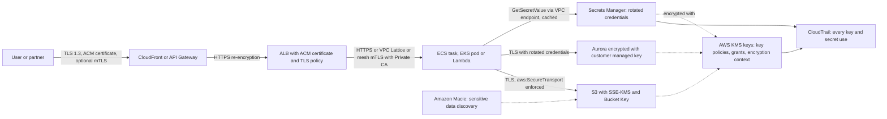

### How Section 8.3 connects to earlier units

| Earlier unit or chapter | What data protection adds |
|-------------------------|---------------------------|
| Unit I: compute, storage, database and networking foundations ([1.3](../unit1/topic3.md) to [1.6](../unit1/topic6.md)), serverless and API-first design ([1.7](../unit1/topic7.md)) | The KMS mechanics underneath every "encrypt this resource" option, and TLS on every API endpoint |
| Units II and III: ECS and EKS | Encrypted ephemeral storage and image repositories, secrets injected through task definitions and the CSI driver, envelope encryption of Kubernetes Secrets |
| Unit IV: microservices, service mesh and resilience | Service-to-service mTLS after App Mesh, key and secret boundaries aligned with service ownership, rotation-aware retries |
| Unit V: CI/CD and infrastructure as code | Keys, certificates and secrets defined as code without plaintext; secret scanning and masked build secrets |
| Unit VI: storage, databases and messaging | Encryption choices for S3, RDS, DynamoDB, SQS, SNS and Kinesis explained as key-control and request-rate decisions |
| Unit VII: observability | CloudTrail audit of key and secret use, certificate expiry alarms, alerts on key deletion and rotation failure |

### Unit VIII in one picture

Unit VIII, "Security on AWS", can now be read as three concentric controls that every request and every byte must pass. [Section 8.1](../unit8/topic1.md) decides ==who== may act; [Section 8.2](../unit8/topic2.md) decides ==which paths== exist; Section 8.3 decides ==whether the data is usable== even when the first two are bypassed. All three are observed through the same audit and detection services.

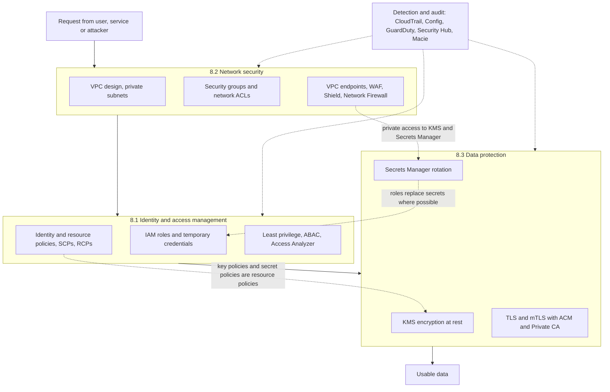

| Security question | Primary control | Section | Failure it cannot handle alone | Backed up by |
|-------------------|-----------------|---------|-------------------------------|--------------|
| Who is making this request, and may they? | IAM policies and roles | 8.1 | Stolen credentials, over-permissive policies | Network restrictions (8.2), key policies and encryption (8.3) |
| Can this request reach the resource at all? | VPC, security groups, endpoints, WAF | 8.2 | Legitimate paths abused, misconfigured public resources | IAM conditions (8.1), encryption (8.3) |
| If the bytes are obtained, can they be read? | KMS encryption and key policies | 8.3 | Authorised principals misusing access | Least privilege (8.1), audit and detection |
| Can traffic be read or altered on the way? | TLS, mTLS, HTTPS enforcement | 8.3 | Compromised endpoints | Network segmentation (8.2), identity (8.1) |
| Are credentials protected and short-lived? | Roles, Secrets Manager rotation | 8.1 and 8.3 | Credentials leaked from running workloads | Network restrictions on use (`aws:SourceVpce`), detection |

### Closing architectural lessons for Unit VIII

- ==Security is layered by design.== Identity, network and data controls each assume the others might fail; a design that relies on only one of them has a single point of security failure.
- ==Prefer identities to secrets and temporary credentials to permanent ones.== IAM roles, Pod Identity, IAM database authentication and short-lived certificates shrink the value of anything an attacker can steal.
- ==Keys, certificates and secrets are tier-0 dependencies.== A deleted key, an expired certificate or a failed rotation causes outages as severe as any infrastructure failure; protect and monitor them accordingly.
- ==Enforce with policy, verify with evidence.== SCPs, bucket policies, TLS policies and Config rules make requirements non-optional; CloudTrail, Access Analyzer, Macie and Security Hub prove that they hold.
- ==Everything as code.== IAM policies, security groups, key policies, certificates and secret definitions belong in reviewed infrastructure as code ([Chapter 5.3](../unit5/topic3.md)), so that security posture is repeatable, testable and auditable.
- ==Security enables delivery.== Well-designed guardrails let teams deploy quickly and safely; controls that require manual exceptions are bypassed.

!!! tip "Preparing for the examination and for practice"
    For examinations and AWS Associate-level certifications, be able to state for a given scenario ==which key type and key policy protect the data, how envelope encryption and Bucket Keys affect cost and throttling, where TLS terminates and where the certificate lives (including the us-east-1 rule), how client identity is proven, where the credential is stored and how it rotates, and which log proves that the control worked==. In DSO303 projects, an architecture diagram that marks every encrypted hop, every KMS key with its owner, and every secret with its rotation schedule demonstrates more security maturity than a long list of enabled services.

!!! question "Practice and interview questions"
    Questions for this topic are kept separately: [Practice questions](../Questions/unit8.md#83-data-protection-and-encryption) · [Interview questions](../interviewquestions/unit8.md#83-data-protection-and-encryption).
